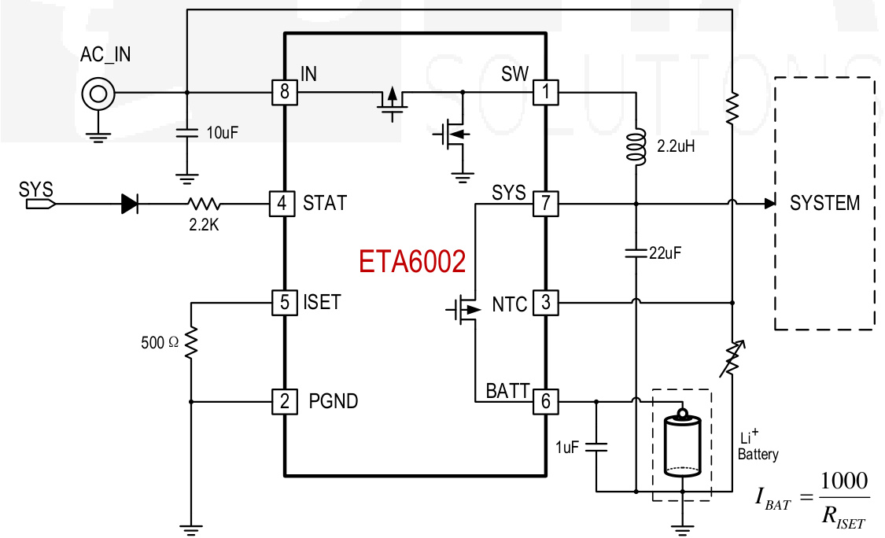
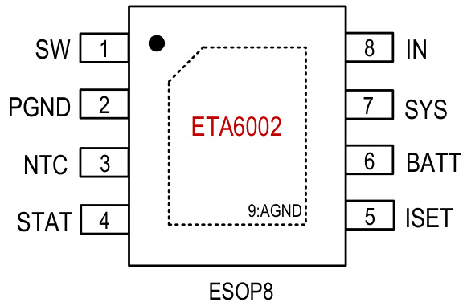
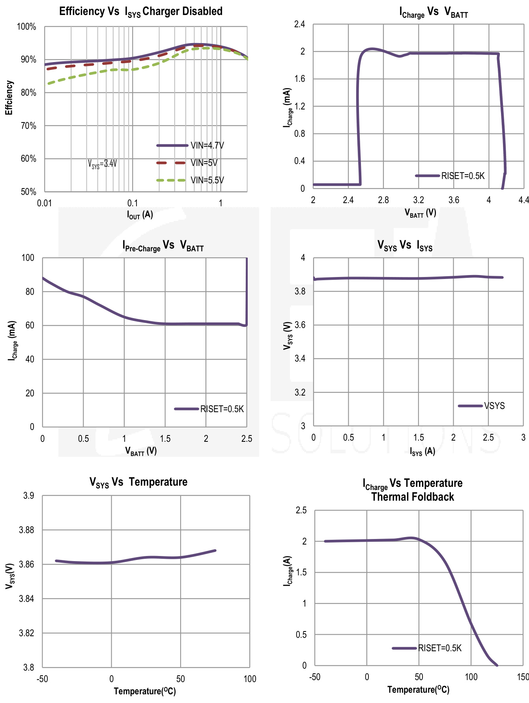
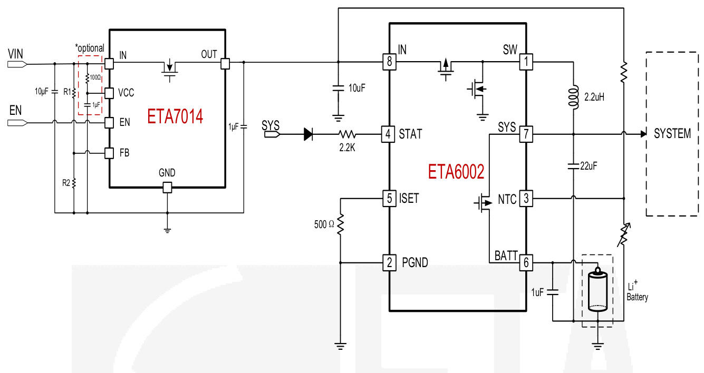
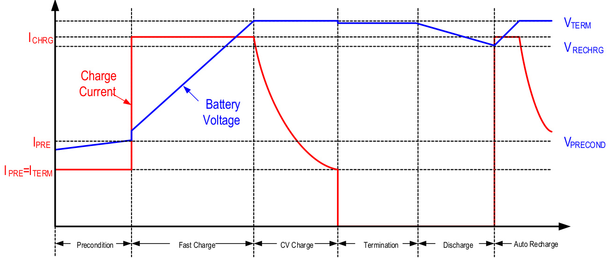
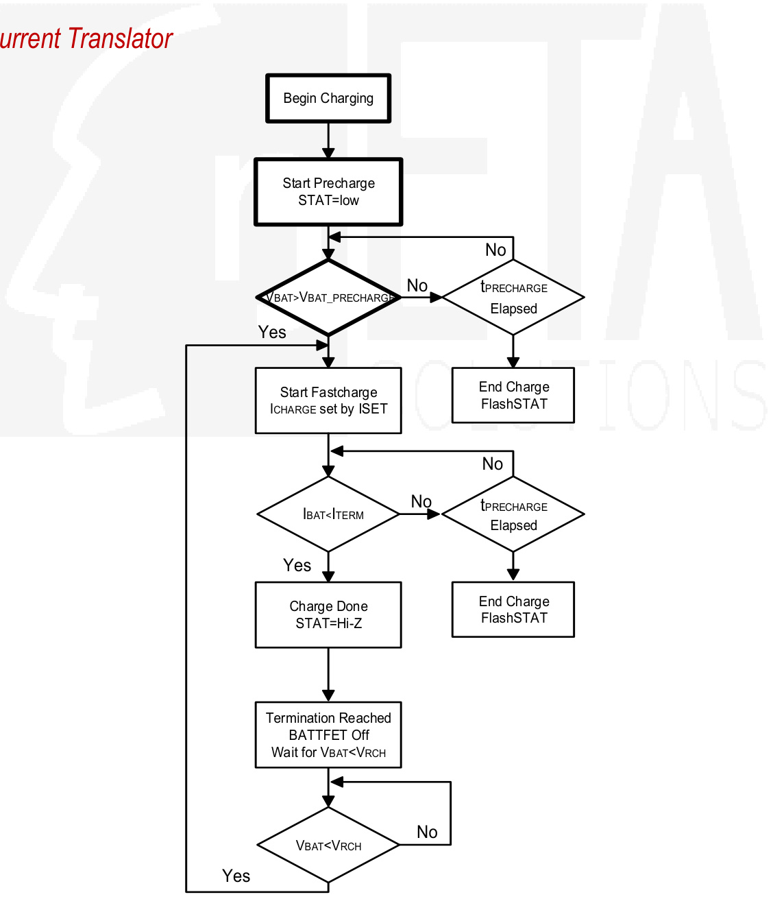
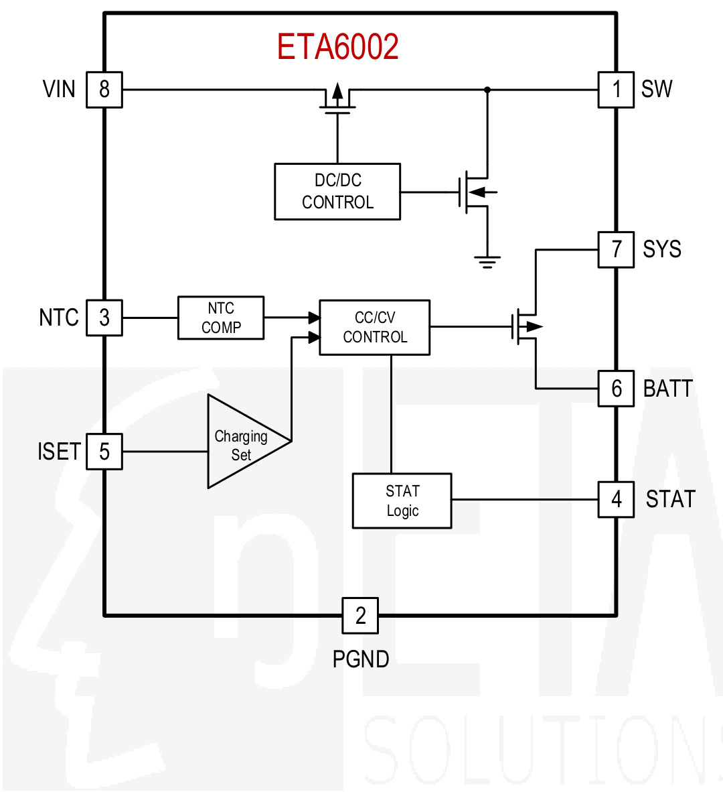
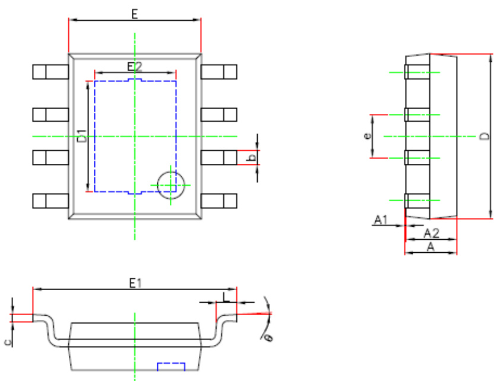
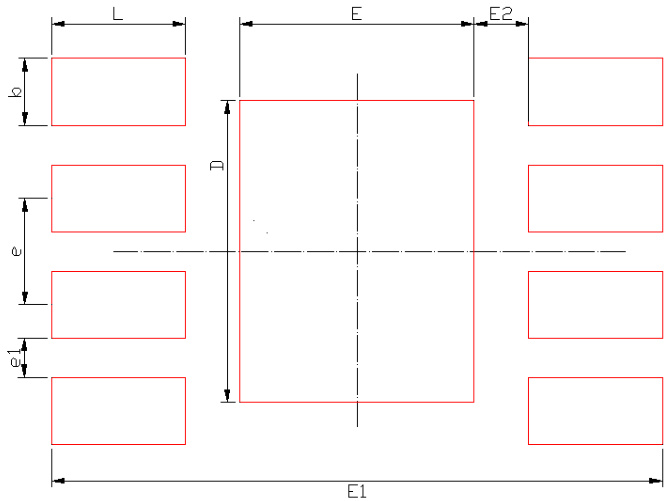
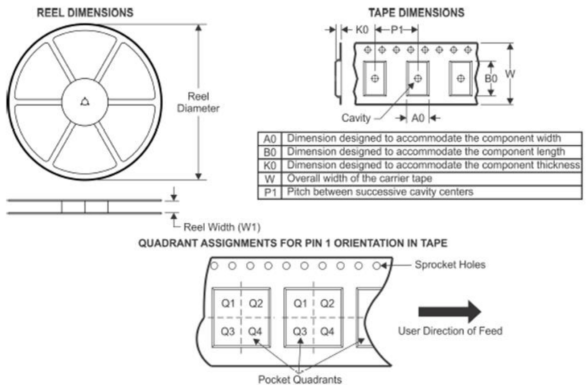

# 2.5A， 3MHz开关充电器，ESOP8动态电源路径

#描述

# FEATURES

ETA6002是一款具有动态功率路径控制和输入电流限制的开关锂离子电池充电器。

当电池连接时，根据电池电压，DC-DC开关稳压器要么预置，对电池进行快速充电，要么将系统电压$(\lor \mathfrak {s v s})$调节到预设电压。它不需要一个外部检测电阻电流传感。通过编程ISET引脚确定快速充电电流。当电池电压达到终止电压即4.2V时，充电路径断开SYS与BATT的连接。ETA6002还包括一个动态电源路径，当SYS负载电流超过DCDC稳压器内部设定的电流限制值，SYS电压低于$V _ {B a T T}$时，ETA6002开启该电源路径，通过蓄电池补充系统负载。

#典型应用

具有电源路径管理的开关充电器
高达$ 9.5 \%$ DC-DC效率
50mΩ功率路MOSFET
最大充电电流2.5A
在电池没电或没有电池的情况下立即开机
无电池检测
无外部检测电阻
可编程充电电流
通过无铅认证

#应用程序

平板电脑、MID智能手机充电宝

部分没有。包装顶部标记pc /卷轴订购信息ETA6002E8A ESOP-8 ETA6002 4000 YWWPL

#引脚配置

#绝对最大评级

(注意：超过这些限制可能会损坏设备。长时间暴露在绝对最大额定条件下可能会影响设备的可靠性。)

IN， BATT电压。- 0.3V至$6 \vee$所有其他引脚电压…VIN-0.3V至$V | \mathsf {N} + \mathsf{0}。3 \mathsf {V}$ SW， SYS， BATT对地电流…内部限制工作温度范围......- $\mathsf {- 4 0 ^ {\circ} C}$至$ 85 ^ {\circ} \mathsf {C}$存储温度范围.......- $- 5 5 ^ {\circ} \mathsf {C}$至$ 15 0 ^ {\circ} \mathsf C$热阻θJA ESOP8。50 $^ \circ \mathsf {C}$ /W

#电气特性

$(V _ {\vert \ N} = 5 V,$除非另有说明。典型值为${\mathsf {T A}} = 2 5 ^ {\circ} {\mathsf {C}}。$)

表身体< html > < > < > < tr > < td >欢悦< / td > < td > < / td > < td > < / td > < td > TYP < / td > < td > MAX < / td > < td >单位< / td > < / tr > < tr > < td >参数输入< / td > < td >条件< / td > < td > MIN < / td > < td > < / td > < td > < / td > < td > < / td > < / tr > < tr > < td colspan = " 2 " > < / td > < td > < / td > < td > < / td > < td > < / td > < td > V < / td > < / tr > < tr > < td >输入输入UVLO范围< / td > < td > < / td > < td > 4.4 < / td > < td > < / td > < td > < / td > 5.5 V < td > < / td > < / tr > < tr > < td行宽=“2”>输入操作电流< / td > < td >上升,沪元= 500 mv切换器启用,切换< / td > < td > < / td > < td colspan =“2”> 4.35 - 5 < / td >马< td > < / td > < / tr > < tr > < td >切换器启用,< / td > < td > < / td > < td colspan =“2”> 70 < / td > < td >μ一个< / td > < / tr > < tr > < td >输入垫泄漏电流< / td > < td >没有切换输入浮动< / td > < td > < / td > < td > 0 < / td > < td > 5 < / td > < td >μ一个< / td > < / tr > < tr > < td colspan =“6”>电源和系统输出< / td > < / tr > < tr > < td > VSYSMIN < / td > < td > Isys = 1,默认的< / td > < td > < / td > < td > 3.6 < / td > < td > < / td > < td > < / td > < / tr > < tr > < td > VSYSMAX < / td > < td > < / td > < td > < / td > < td > 4.5 < / td > < td > < / td > < td > V < / td > < / tr > < tr > < td >负载调整率< / td > < td > < / td > < td > < / td > < td > 40 < / td > < td > < / td > < td > V < / td > < / tr > < tr > < td >行监管< / td > < td > = 4.75到5.25 V ViN < / td > < td > < / td > < td > 0.04 < / td > < td > < / td > < td > mVIA % N < / td > < / tr > < tr > < td >切换频率< / td > < td > < / td > < td > < / td > < td > < / td > < td > < / td > < td > < / td > < / tr > < tr > < td > Max职责< / td > < td > < / td > < td > 100 < / td > < td > 3 < / td > < td > < / td > < td > MHz < / td > < / tr > < tr > < td >高端金属氧化物半导体RDSON < / td > < td > Isw = 500 ma < / td > < td > < / td > < td > 100 < / td > < td > < / td > < td > % < / td > < / tr > < tr > < td > LOWSIDE MOS RDSON < / td > < td > = 500 ma Isw < / td > < td > < / td > < td > 60 < / td > < td > < / td > < td > mΩmΩ< / td > < / tr > < tr > < td >高端电流限制< / td > < td > < / td > < td > < / td > < td > 3.5 < / td > < td > < / td > < td > < / td > < / tr > < tr > < td > SYS UVLO < / td > < td >下降,沪元= 200 mv < / td > < td > < / td > < td > 2.25 < / td > < td > < / td > < td > V < / td > < / tr > < tr > < td >热关机< / td > < td >上升,沪元= 30ºC < / td > < td > < / td > < td > 160 < / td > < td > < / td > < td > oC < / td > < / tr > < tr > < td colspan =“6”>电源路径管理< / td > < / tr > < tr > < td >棉絮,SYS RDSON < / td > < td > < / td > < td > < / td > < td > 50 < / td > < td > < / td > < td > mΩ< / td > < / tr > < tr > < td colspan =“6”>电池充电器< / td > < / tr > < tr > < td >电池简历电压< / td > < td > IBAT = 0,默认< / td > < td > 4.16 - 4.2 < / td > < td > < / td > < td > 4.24 < / td > < td > V < / td > < / tr > < tr > < td >充电器启动阈值< / td > < td >从做快速充电< / td > < td > < / td > < td > -200 < / td > < td > < / td > < td > mV < / td > < / tr > < tr > < td >电池前提电压< / td > < td > VBAT上升沪元= 180 mV < / td > < td > < / td > < td > 2.9 < / td > < td > < / td > < td > V < / td > < / tr > < tr > < td >前提电荷电流< / td > < td > < / td > < td > < / td > < td > 100 < / td > < td > < / td >马< td > < / td > < / tr > < tr > < td > < / td > < td > < / td > < td > < / td > < td > < / td > < td > < / td > < td > < / td > < / tr > < /表> < /身体> < / html >

表身体< html > < > < > < tr > < td >参数< / td > < td >条件< / td > < td >分钟TYP < / td > < td > MAX < / td > < td >单位< / td > < / tr > < tr > < td行宽=“2”>交流快速充电电流< / td > < td > = 500Ω,nUSB侦破= ViN RISET1 < / td > < td > / < / td > < td > < / td > < td > < / td > < / tr > < tr > < td > = 2000ΩRISET1 < / td > < td > 0.45 - 0.5 < / td > < td > 0.55 < / td > < td > < / td > < / tr > < tr > < td >前提计时器< / td > < td > < / td > < td > 120 < / td > < td > < / td > < td > min < / td > < / tr > < tr > < td > Fast-Charge计时器< / td > < td > < / td > < td > 960 < / td > < td > < / td > < td > min < / td > < / tr > < tr > < td colspan =“5”>热敏电阻监控< / td > < / tr > < tr > < td > NTC阈值,冷< / td > < td >充电器暂停< / td > < td > 76.5 < / td > < td > < / td > < td > % ViN < / td > < / tr > < tr > < td > NTC阈值,热< / td > < td >充电器暂停< / td > < td > 35 < / td > < td > < / td > < td > % ViN < / td > < / tr > < tr > < td > NTC阈值滞后< / td > < td > < / td > < td > 1.5 < / td > < td > < / td > < td > % ViN < / td > < / tr > < tr > < td > NTC禁用阈值< / td > < td > < / td > < td > 100 < / td > < td > < / td > < td > mV < / td > < / tr > < tr > < td > NTC漏输入< / td > < td > < / td > < td > 0 < / td > < td > < / td > < td > uA < / td > < / tr > < tr > < td colspan =“5”>统计< / td > < / tr > < tr > < td >统计输出低电压< / td > < td >马多= 10 < / td > < td > < / td > < td > 0.2 < / td > < td >√< / td > < / tr > < /表> < /身体> < / html >

#引脚描述

<html><body><table><tr><td>引脚#</td><td>NAME</td><td>DESCRIPTION</td></tr><tr><td></td><td>SW</td><td>交换稳压器的交换节点。从该引脚接1μHto 2.2μH电感到SYS</td></tr><tr><td>2</td><td>PGND</td><td>电源接地引脚。用10μF电容旁路到IN</td></tr><tr><td>3</td><td>NTC</td><td>热敏电阻输入</td></tr><tr><td>4</td><td>STAT</td><td>充电状态指示脚。一种能驱动10mA电流</td></tr><tr><td>5</td><td>ISET</td><td>快速充电电流设置引脚的漏极器件。在ISET和GND之间连接电阻设置快充电流值1000</td></tr><tr><td></td><td></td><td>1BAT R1SET</td></tr><tr><td>6 7</td><td>BATT</td><td>电池引脚。将电池连接到该引脚</td></tr><tr><td></td><td>SYS</td><td>系统引脚。它也是开关稳压器的输出引脚。连接电感和电容形成输出滤波器电压</td></tr><tr><td>8</td><td>IN</td><td>输入引脚。可连接交流适配器或USB充电器输出。每个10μF电容旁路到PGND</td></tr><tr><td>9 (EP)</td><td>AGND</td><td>模拟接地的暴露焊盘。必须连接到PCB上的PGND </td></tr></table></body></html>

#典型特征

（除非另有说明，典型值为$ t_ {A} = 2.5 0 C$。）

#典型应用电路

2A开关式动态电源路径充电器，具有OVP保护和充电功能

#功能描述

#状态指示灯

STAT引脚是充电状态指示的状态引脚。请参见表1。

表1 STAT指示灯

表身体< html > < > < > < tr > < td >电荷状态< / td > < td >统计输出< / td > < / tr > < tr > < td > < / td >收费低< td > < / td > < / tr > < tr > < td >充电完成< / td > < td >高阻抗< / td > < / tr > < tr > < td >安全计时器过期< / td > < td行宽=“3”>闪烁1 Hz < / td > < / tr > < tr > < td > NTC保护< / td > < / tr > < tr > < td >没有电池< / td > < / tr > < /表> < /身体> < / html >

#电池充电配置

# Charge

#功能框图

#包装大纲

包:ESOP8

<html><body><table><tr><td rowspan="2">Symbol</td><td colspan="2">Dimensions In Millimeters</td><td colspan="2">Dimensions In Inches</td></tr><tr><td>Min.</td><td>Max.</td><td>Min.</td><td>Max.</td></tr><tr><td>A</td><td>1.300</td><td>1.700</td><td>0.051</td><td>0.067</td></tr><tr><td></td><td>0.000</td><td>0.100</td><td>0.000</td><td>0.004</td></tr><tr><td></td><td>1.350</td><td>1.550</td><td>0.053</td><td>0.061</td></tr><tr><td></td><td>0.330</td><td>0.510</td><td>0.013</td><td>0.020</td></tr><tr><td></td><td>0.170</td><td>0.250</td><td>0.007</td><td>0.010</td></tr><tr><td></td><td>4.700</td><td>5.100</td><td>0.185</td><td>0.201</td></tr><tr><td></td><td>3.202</td><td>3.402</td><td>0.126</td><td>0.134</td></tr><tr><td></td><td>3.800</td><td>4.000</td><td>0.150</td><td>0.157</td></tr><tr><td></td><td>5.800</td><td>6.200</td><td>0.228</td><td>0.244</td></tr><tr><td></td><td>2.313</td><td>2.513</td><td>0.091</td><td>0.099</td></tr><tr><td></td><td colspan="2">0.401.270(BSC).270</td><td colspan="2">0.010.050(BSC).050</td></tr><tr><td>eL</td><td></td><td></td><td></td><td></td></tr><tr><td></td><td>0°</td><td>8°</td><td>0°</td><td>8°</td></tr></table></body></html>

  
RECOMMENDED LAND PATTERN

<html><body><table><tr><td>Dimensions</td><td>Value (in mm)</td></tr><tr><td>D</td><td>3.6</td></tr><tr><td>E</td><td>2.8</td></tr><tr><td>E1</td><td>7.3</td></tr><tr><td>E2</td><td>0.65</td></tr><tr><td>b</td><td>0.8</td></tr><tr><td>e</td><td>1.27</td></tr><tr><td>e1</td><td>0.47</td></tr><tr><td></td><td>1.6</td></tr></table></body></html>

# TAPE AND REEL INFORMATION

<html><body><table><tr><td>Device</td><td>Package Type</td><td>Pins</td><td>SPQ</td><td>Reel Diameter (mm)</td><td>Reel Width W1 (mm)</td><td>AO (mm)</td><td>B0 (mm)</td><td>KO (mm)</td><td>P1 (mm)</td><td>w (mm)</td><td>Pin1 Quadrant</td></tr><tr><td>ETA6002E8A</td><td>ESOP8</td><td>8</td><td>4000</td><td>330</td><td>12.7</td><td>6.6</td><td>5.4</td><td>2.05</td><td>8</td><td>12</td><td>Q1</td></tr></table></body></html>