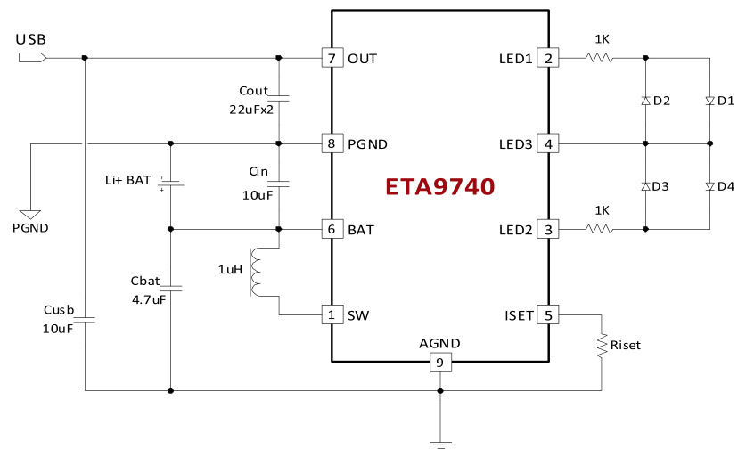
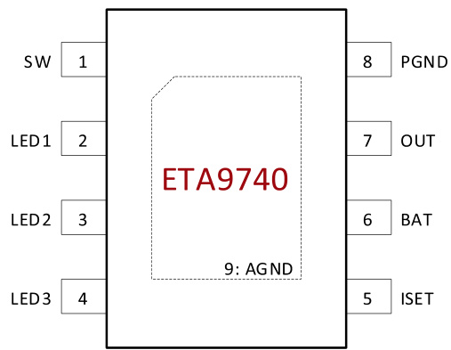
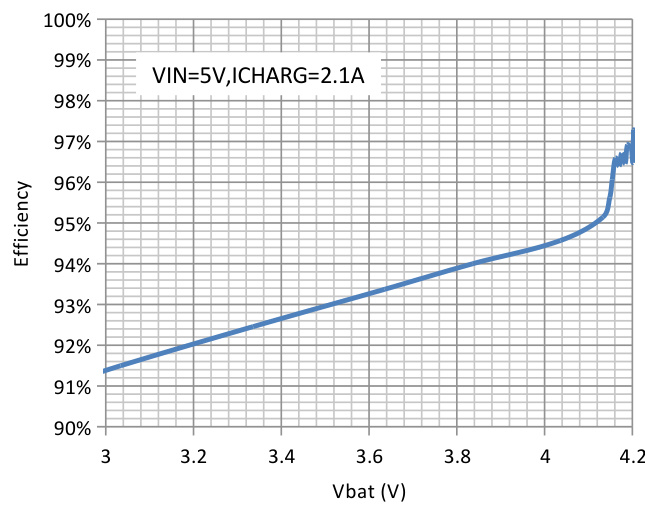
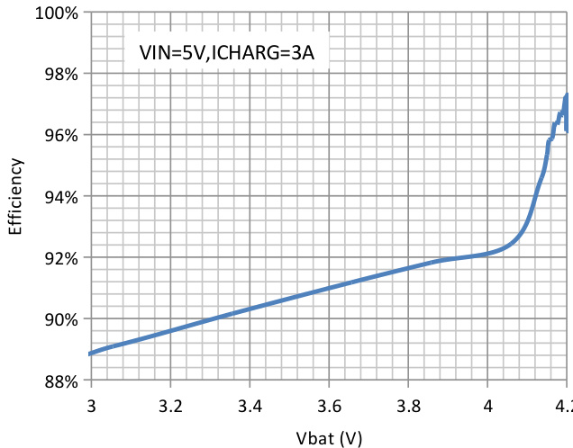
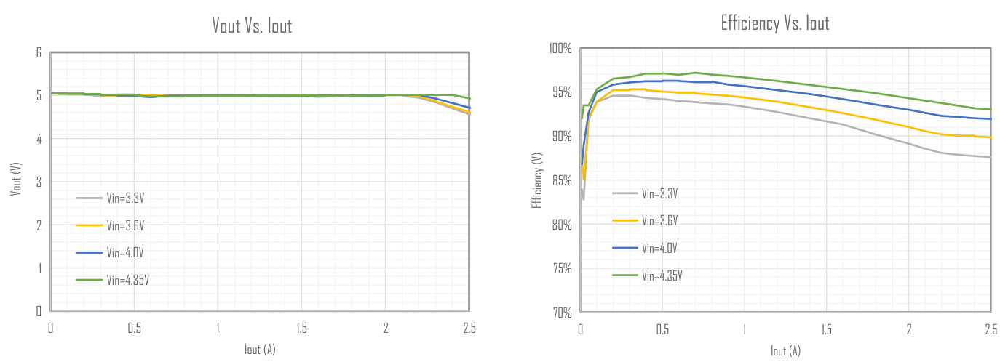
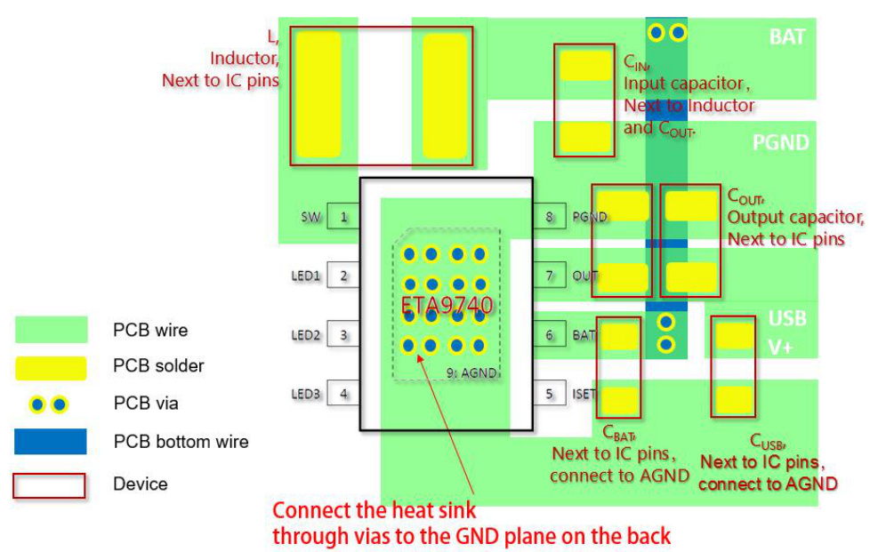
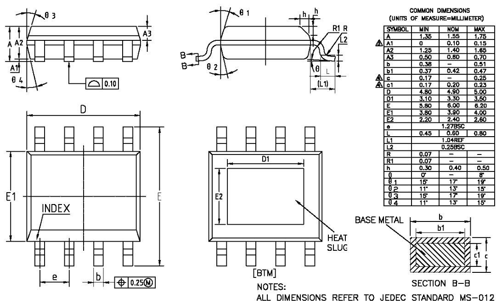

# 3A Switching Charger, 2.4A Boost and Fuel Gauge in One ESOP8 with Single Inductor

# DESCRIPTION

# FEATURES

ETA9740 is a switching Li-Ion battery charger capable of delivering up to 3A of charging current to the battery and also capable of delivering up to 5V/2.4A in boost operation, with high efficiency in both charging mode and boost mode. It also includes a fuel gauge system for power indication. For charging, it uses a proprietary control scheme that eliminates the current sense resistor for conventional constant current control, maximizing efficiency, reducing charging time and reducing costs. It can also output a 5V voltage in the reversed direction by boosting from the battery. It only needs a single inductor to provide power bidirectionally with a proprietary automatic mode detect and switch scheme. ETA9740 is an ideal all-in-one solution for battery charging and discharge applications, such as power banks, smart phones, and tablets with only one USB port that can be used for charging battery function.

ETA9740 is suitable for charging a 4.2V Li-ion battery. And ETA9740 is in ESOP8 package.

Bi-Directional Power conversion with Single Inductor $\cdot$ Automatic Mode Switching $*$ Switching Charger 5V Synchronous Boost Up to 96% Efficiency $*$ Up to 3A Max charging current and 2.4A discharging No-Battery detection No External Sense resistor $*$ 4 LEDs Fuel gauge

# APPLICATIONS

Tablet, MID Smart Phone Power Bank

# TYPICAL APPLICATION

ORDERING INFORMATION PART No. PACKAGE TOP MARK Pcs/Reel ETA9740E8A ESOP8 ETA9740 4000

# PIN CONFIGURATION

# ABSOLUTE MAXIMUM RATINGS

(Note: Exceeding these limits may damage the device. Exposure to absolute maximum rating conditions for long periods may affect device reliability.)

OUT, SW Voltage –0.3V to 6V All Other Pin Voltage –0.3V to 6V SW to ground current .Internally limited Operating Temperature Range –40°C to 85°C Storage Temperature Range –55°C to 150°C Thermal Resistance JA Jc ESOP8 10 50. °C/W Lead Temperature (Soldering, 10ssec) .260°C ESD HBM (Human Body Mode) .2KV ESD MM (Machine Mode) 200V

# ELECTRICAL CHACRACTERISTICS

$V _ { \parallel N } = 5 V .$ , unless otherwise specified. Typical values are at $\textstyle \operatorname { I A } = 2 5 { \mathfrak { a } } \mathfrak { L } .$ )   

<html><body><table><tr><td>PARAMETER</td><td>CONDITIONS</td><td>MIN</td><td>TYP</td><td>MAX</td><td>UNITS</td></tr><tr><td colspan="6">BUCK MODE</td></tr><tr><td>USB Range</td><td></td><td>4.5</td><td></td><td>5.5</td><td>V</td></tr><tr><td>USB UVLO Voltage</td><td>Rising, Hys=500mV</td><td></td><td>4.5</td><td></td><td>V</td></tr><tr><td rowspan="2">USB Operating Current as BUCK</td><td>Switcher Enable, Switching</td><td></td><td>5</td><td></td><td>mA</td></tr><tr><td>Switcher Enable, No Switching</td><td></td><td>800</td><td></td><td>μA</td></tr><tr><td colspan="6">BATTERY CHARGER</td></tr><tr><td>Battery CV Voltage</td><td>IBAT =OmA, default</td><td>4.17</td><td>4.21</td><td>4.25</td><td>V</td></tr><tr><td>Charger Restart Threshold</td><td>From DONE to Fast Charge</td><td></td><td>-160</td><td></td><td>mV</td></tr><tr><td>Battery Pre-Condition Voltage</td><td>VBAT Rising Hys=250mV</td><td></td><td>2.8</td><td></td><td>V</td></tr><tr><td>Pre-Condition Charge Current</td><td></td><td></td><td>200</td><td></td><td>mA</td></tr><tr><td rowspan="2">Fast Charge Current</td><td>Riset=56K</td><td></td><td></td><td></td><td>A</td></tr><tr><td>Riset=91K</td><td></td><td>2</td><td></td><td>A</td></tr><tr><td>Charge Termination Current</td><td></td><td></td><td>200</td><td></td><td>mA</td></tr><tr><td>Charge Termination Blanking time</td><td></td><td></td><td>1</td><td></td><td>S</td></tr><tr><td colspan="6">BOOST MODE</td></tr><tr><td>BATT Ok Threshold</td><td>Rising. HYS=0.4 V</td><td></td><td>3.2</td><td></td><td>v</td></tr><tr><td>Dutput Voltage Range</td><td>lout=0</td><td>5.05</td><td>5.1</td><td>5.15</td><td>V</td></tr><tr><td>Quiescent Current At BATT</td><td>Vbat=3.6V</td><td></td><td>80</td><td></td><td>μA</td></tr><tr><td>Switching Frequency</td><td>VIN<4.3V</td><td>550</td><td>650</td><td>750</td><td>KHz</td></tr><tr><td>Inductor Peak Current Limit</td><td></td><td></td><td>5.0</td><td></td><td>A</td></tr><tr><td>Maximum Duty Cycle</td><td></td><td></td><td>90</td><td></td><td>%</td></tr><tr><td>High side Pmos Rdson</td><td>Isw =500mA</td><td></td><td>75</td><td></td><td>mΩ</td></tr></table></body></html>

<html><body><table><tr><td>PARAMETER</td><td>CONDITIONS</td><td>MIN TYP MAX</td><td></td><td>UNITS</td></tr><tr><td>Low side Nmos Rdson</td><td>Isw =500mA</td><td></td><td></td><td>mΩ</td></tr><tr><td>Short Circuit Hiccup Current</td><td></td><td>3.</td><td></td><td>A</td></tr><tr><td rowspan="2">Short Circuit Hiccup Timer</td><td>On Time</td><td>45</td><td></td><td rowspan="2">mS</td></tr><tr><td>Off Time</td><td>2000</td><td></td></tr><tr><td>Charging Thermal Regulation threshold</td><td></td><td>85</td><td></td><td>℃</td></tr><tr><td>Thermal Shutdown</td><td>Hys=20°℃ Rising.</td><td>150</td><td></td><td></td></tr></table></body></html>

# PIN DESCRIPTION

<html><body><table><tr><td>PIN #</td><td>NAME</td><td>DESCRIPTION</td></tr><tr><td></td><td>SW</td><td>Inductor Connection. Connect an inductor Between SW and the regulator output</td></tr><tr><td></td><td>LED1</td><td>Fuel gauge LEDI, LED2 connection pin</td></tr><tr><td></td><td>LED2</td><td>Fuel gauge LED3, LED4 connection pin</td></tr><tr><td>2345</td><td>LED3</td><td>Fuel gauge LED1, LED2, LED3, LED4 connection pin</td></tr><tr><td></td><td>ISET</td><td>Buck Charging current setting pin. Connect a resistor between this pin and analog to set the current level. ground</td></tr><tr><td>F7</td><td>BAT</td><td>Battery pin. Connect a Battery to this pin, and with a bypass capacitor 1Ouf.</td></tr><tr><td></td><td>OUT</td><td>Dutput pin. Bypass with a 22uf or larger ceramic capacitr closely between this pin and GND</td></tr><tr><td></td><td>PGND</td><td>Ground Pin Power</td></tr><tr><td>9 / Exposed Pad</td><td>AGND</td><td>Analog Ground Pin</td></tr></table></body></html>

# TYPICAL CHARACTERISTICS

$( V i n = 5 V , T _ { A } = 2 5 ^ { 0 } L$ , unless otherwise specified)

# In CHARGE MODE, Efficiency Vs Vbat at 2.1A and 3A charge current

# In BOOST MODE

# APPLICATION SUPPORT

Please contact local distributor or ETA sales representatives for technical support.

# PCB GUIDELINES

Please have CIN, COUT , and L placed just next to the IC pins so that the power traces are kept to the shortest to achieve a good performance of ETA9740 and good EMI.

# PACKAGE OUTLINE

Package: ESOP-8

AA DO NOT INCLUDE MOLD FLASH OR PROTRUSIONS.