# -10V、 200mA 低噪声线性稳压电源

# 数据手册

# 产品特性

超低 RMS 噪声： $1 0 \mu \mathsf { V } _ { \mathsf { R M S } }$   
输出电流：200mA  
宽输入电压范围：-2.5V 至 -10V  
输出电压范围：-1.186V 至 $- 1 0 \mathsf { V } + \mathsf { V } \mathsf { D } 0$   
固定 -2.5V 和-5V 输出电压  
$\pm 1 \%$ 初始精度  
3uA 关断电流  
$3 0 \mu \ A$ 静态地电流  
低压差电压： $8 8 \mathsf { m V }$   
最小输出电容： $2 . 2 \mu \mathsf { F } ($ (陶瓷)  
限流和过温保护  
5 引脚 SOT-23 封装  
结温范围- $. 5 5 ^ { \circ } C$ 至 $+ 1 2 5 ^ { \circ } \mathsf C$

# 应用

低噪声放大器  
超低噪声仪表  
电池供电系统  
功放、ADC 和 DAC  
通信和基础设施  
医疗和保健

典型应用

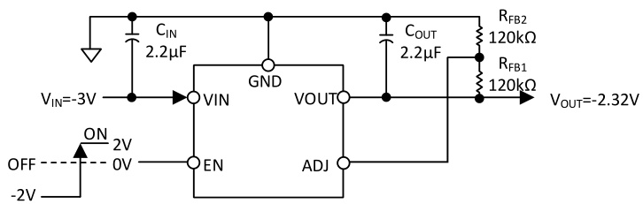  
图 1 典型应用

# 概述

GM1206 是一款微功率、 低噪声、低压差负调压器。该装置能够提供 $2 0 0 \mathsf { m A }$ 的输出电流， 压降为 $8 8 \mathsf { m V }$ 。低静态电流（ $3 0 \mu \mathsf { A }$ 工作和 $3 \mu \mathsf { A }$ 关机）使 GM1206 成为电池供电应用的最佳选择，并且静态电流在低压差工况下得到了很好的控制。

GM1206 的其他特点包括低输出噪声。 在 10Hz 至 100kH 的带宽内，输出噪声降低至 $1 0 \mu \mathsf { V } \mathsf { R M S }$ ， 因而特别适合给高性能模拟和混合信号电路供电。 GM1206 能够支持小电容工作，并且在小输出电容值的情况下与其他线性稳压电源一样稳定工作。支持小型陶瓷电容器，无需额外增加 ESR。内部保护电路包括电流限制和热限制。该设备的固定输出电压为-2.5V 和-5V，可调参考电压为-1.186V。GM1206 调节器采用 5 引脚 SOT-23 封装， 以灵活实现多种应用。

# 目录

产品特性  
应用  
典型应用  
概述.  
目录 .  
版本历史  
功能框图  
引脚配置 4绝对最大额定值  
热阻   
电气特性  
推荐规格： 输入和输出电容  
典型性能参数 8

# 版本历史

3/24—Revision PrA： 初稿  
10/24—Revision PrB： 更新电气特性和典型性能参数  
2/25—Revision PrC： 更新引脚配置  
3/25—Rev.0： 更新功能框图  
工作原理 11  
可调工作模式 11  
应用信息 12  
电容选择 . 12  
输出电容. 12  
输入旁路电容 12  
输入和输出电容特性 12  
使能引脚工作原理 . 12  
软启动 . 12  
限流和热过载保护 12  
封装描述 13

订购指南 14

# 功能框图

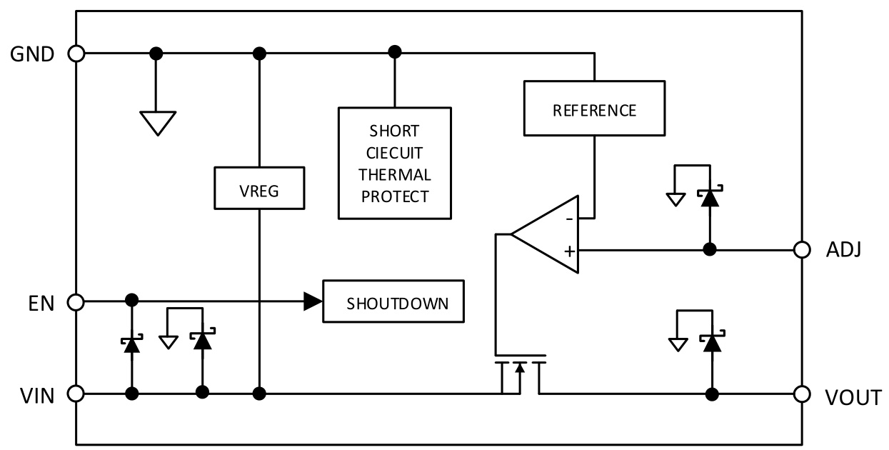

# 引脚配置

GND 1 5 VOUT TOP VIEW   
VIN 2 (Not to Scale)   
EN 3 4 ADJ/NC   
GND 1 5 VOUT TOP VIEW   
VIN 2 (Not to Scale)   
NC 3 4 ADJ/NC

表 1. 引脚功能说明  

<html><body><table><tr><td colspan="2">GM1206AUJZ-R7</td><td colspan="2">GM1206AUJZ-1-R7</td><td></td></tr><tr><td>引脚名</td><td>引脚号</td><td>引脚名</td><td>引脚号</td><td>描述</td></tr><tr><td>GND</td><td>1</td><td>GND</td><td>1</td><td>地。</td></tr><tr><td>VIN</td><td>2</td><td>VIN</td><td>2</td><td>稳压器输入电源。 使用2.2μF 或更大的电容旁路VIN 至 GND。</td></tr><tr><td>EN</td><td></td><td></td><td></td><td>将EN驱动至地电平2V以上或以下，可使能稳压器； 或者将 EN驱动至低电 平， 可关闭稳压器。 若要实现自动启动， 请将EN接VIN。</td></tr><tr><td></td><td></td><td>NC</td><td>3</td><td>不连接。</td></tr><tr><td>ADJ/NC</td><td></td><td>ADJ/NC</td><td>4</td><td>可调输出， 外部电阻分压器设置输出电压； 固定输出， 浮空该引脚。</td></tr><tr><td>VOUT</td><td>5</td><td>VOUT</td><td></td><td>调节输出电压， 使用2.2 μF 或更大的电容旁路 VOUT 至GND。</td></tr></table></body></html>

# 绝对最大额定值

表 2:  

<html><body><table><tr><td>参数</td><td>额定值</td></tr><tr><td>VIN至GND</td><td>+0.3 V to -12 V</td></tr><tr><td>VOUT 至 GND</td><td>0.3 V to VIN</td></tr><tr><td>EN 至GND</td><td>+5 V to VIN</td></tr><tr><td>EN至VIN</td><td>+12 V to -0.3 V</td></tr><tr><td>ADJ 至 GND</td><td>+0.3 V to VOUT</td></tr><tr><td>存储温度范围</td><td>-65°C to +150°℃</td></tr><tr><td>工作结温范围</td><td>-40°C to +125°℃</td></tr><tr><td>M Grade</td><td>-55C to +125°C</td></tr><tr><td>Soldering Conditions</td><td>JEDECJ-STD-020</td></tr></table></body></html>

注意，超出上述最大额定值可能会导致产品永久性损坏。产品正常工作范围不应超出技术规范章节中所示的规格。长期在超出最大额定值条件下工作会影响产品的可靠性。

# 热阻

θJA 针对最差条件， 即器件焊接在电路板上以实现表贴封装。

表 3:  

<html><body><table><tr><td>封装类型</td><td>θJA</td><td></td><td>ΨJB</td><td>Unit</td></tr><tr><td>5引脚SOT-23</td><td>170</td><td>不适用</td><td>43</td><td>C/W</td></tr></table></body></html>

# 电气特性

除非另有说明， $\mathsf { V } _ { \mathsf { I N } } = \mathsf { \Omega } ( \mathsf { V } _ { 0 \mathsf { U T } } - 0 . 5 \mathsf { V } .$ ） 或-2.5V （取较小者） $\mathsf { E N } = \mathsf { V } _ { \mathsf { I N } } ,$ I $\mathsf { \Gamma } _ { \mathsf { O U T } } = - 1 0 \mathsf { m A }$ , $\mathsf { C } _ { \mathsf { I N } } = \mathsf { C } _ { \mathsf { O U T } } = 2 . 2 \mu \mathsf { F } .$ , ${ \bar { \mathsf { T } } } _ { \mathsf { J } } = { \mathsf { - } } 5 5 ^ { \circ } { \mathsf { C } }$ 至 $+ 1 2 5 ^ { \circ } \mathsf C$ （对于最小值/最大值规格） ， ${ T _ { \mathsf { A } } } = 2 5 ^ { \circ } { \mathsf { C } }$ （对于典型规格）

表 4:  

<html><body><table><tr><td>参数</td><td>符号</td><td>测试条件/备注</td><td>最小值</td><td>典型值</td><td>最大值</td><td>单位</td></tr><tr><td>输入电压范围</td><td>VIN</td><td></td><td>-2.5</td><td></td><td>-10</td><td>V</td></tr><tr><td>工作电源电流</td><td>IGND</td><td>IouT = 0 A</td><td></td><td>-33</td><td>-53</td><td>μA</td></tr><tr><td rowspan="3"></td><td rowspan="3"></td><td>louT = −10 mA</td><td></td><td>-170</td><td>-220</td><td>μA</td></tr><tr><td>louT = -200 mA</td><td></td><td>-930</td><td>-1200</td><td>μA</td></tr><tr><td>EN = GND</td><td>-3</td><td></td><td></td><td>μA</td></tr><tr><td>关断电流</td><td>IGND-SD</td><td>EN = GND, Vin = −2.7 V to −10 V</td><td></td><td></td><td>-8</td><td>μA</td></tr><tr><td>输出电压精度</td><td>VouT</td><td>louT = −10 mA, TA = 25°C</td><td></td><td></td><td></td><td></td></tr><tr><td>固定输出电压精度</td><td></td><td>-1 mA<louT<-200 mA, Vin = (VouT − 0.5 V) to −10 V</td><td>-2</td><td></td><td>+1 +2</td><td>% %</td></tr><tr><td rowspan="2">可调输出电压精度</td><td rowspan="2">VADJ</td><td>louT = −10 mA,</td><td>-1.174</td><td>-1.186</td><td>-1.198</td><td></td></tr><tr><td>−1 mA < louT < −200 mA, Vin = (VouT − 0.5 V) to −10 V</td><td></td><td></td><td>-1.210</td><td>V</td></tr><tr><td>线性调整率</td><td>∆VouT/ΔViN</td><td>Vin = (VouT − 0.5 V) to -10 V</td><td>-1.162 -0.01</td><td></td><td>+0.01</td><td>%N</td></tr><tr><td>负载调整率1</td><td>∆VouT/∆louT</td><td>louT = -1 mA to -200mA</td><td></td><td>0.001</td><td>0.006</td><td>%/mA</td></tr><tr><td>ADJ输入偏置电流</td><td>ADJ1-BIAS</td><td>-1 mA< louT < −200 mA, ViN = (VouT 0.5V)to-10V</td><td></td><td>10</td><td></td><td>nA</td></tr><tr><td rowspan="4">压差</td><td rowspan="4">VDo</td><td>louT = -10 mA</td><td></td><td></td><td>-20</td><td></td></tr><tr><td>louT = -50 mA</td><td>-7</td><td>-22</td><td>-50</td><td>mV mV</td></tr><tr><td>louT = -200 mA</td><td></td><td>-88</td><td>-170</td><td>mV</td></tr><tr><td>VouT = -1.186 V</td><td></td><td>250</td><td></td><td></td></tr><tr><td></td><td>tSTART-UP</td><td>VouT = −5 V</td><td></td><td>800</td><td></td><td>μs us</td></tr><tr><td>限流阈值</td><td>ILIMIT</td><td></td><td>-240</td><td>-360</td><td></td><td>mA</td></tr><tr><td>热关断 热关断阈值</td><td>TSsD</td><td>T, rising</td><td></td><td></td><td></td><td></td></tr><tr><td>热关断迟滞</td><td>TSSD-HYS</td><td></td><td></td><td>165</td><td></td><td>℃</td></tr><tr><td>EN阈值</td><td></td><td></td><td></td><td>15</td><td></td><td></td></tr><tr><td></td><td>VEN-POS-RISE</td><td></td><td></td><td></td><td>1.2</td><td></td></tr><tr><td>正上升</td><td>VEN-NEG-RISE</td><td>VouTπ=关导 ()</td><td></td><td></td><td></td><td></td></tr><tr><td>正下降</td><td>VEN-POS-FALL</td><td>VouT=导通至关断 （正）</td><td>-2.0</td><td></td><td></td><td></td></tr><tr><td>负下降</td><td>VEN-NEG-FALL</td><td>VouT=导通至关断 （负）</td><td>0.3</td><td></td><td></td><td>v</td></tr><tr><td>输入电压闭锁</td><td></td><td></td><td></td><td></td><td>-0.55</td><td>V</td></tr><tr><td>启动阈值</td><td>VSTART</td><td></td><td>-2.0</td><td>-1.85</td><td></td><td></td></tr><tr><td>关断阈值</td><td>VSHUTDOWN</td><td></td><td></td><td>-1.66</td><td>-2.1</td><td>V V</td></tr><tr><td>输出噪声</td><td>OUTNOISE</td><td>10 Hz to 100 kHz, = -1.5 VouT = −2.5 V, and VouT</td><td></td><td>10</td><td></td><td>μVrms</td></tr><tr><td rowspan="4"></td><td rowspan="4"></td><td>VoUT = −5 V VouT=-5V,可调模式,CNR=开路，</td><td></td><td></td><td></td><td></td></tr><tr><td>10 Hz to 100 kHz, RNR=开路， RFB1 = 147 kΩ, RFB2 = 13 kΩ</td><td></td><td>50</td><td></td><td>μV rms</td></tr><tr><td>10 Hz to 100 kHz, VouT = -5V，可调模式,CNR=</td><td></td><td>19</td><td></td><td>μV rms</td></tr><tr><td>RNR = 13 kΩ, RFB1 = 147 kΩ, RFB2 = 13 kΩ</td><td></td><td></td><td></td><td></td></tr><tr><td>电源抑制比</td><td>PSRR</td><td>100 kHz, ViN = −6 V, VouT = −5 V 10 kHz, ViN = −6 V, Vouτ = −5 V</td><td>57 72</td><td></td><td></td><td>dB dB</td></tr></table></body></html>

基于使用 $- 1 \mathsf { m A }$ 和 $- 2 0 0 \mathsf { m A }$ 负载的端点计算， 1 mA 以下负载的典型负载调整性能。

2 压差定义为将输入电压设置为标称输出电压时的输入至输出电压差， 仅适用于低于 $- 3 \mathsf { V }$ 的输出电压。

3 启动时间定义为 EN 的上升沿到 VOUT 达到其标称值 $90 \%$ 的时间。

限流阈值定义为输出电压降至额定典型值 $90 \%$ 时的电流。 例如， −5 V 输出电压的电流限值定义为引起输出电压降至−5 V 的$90 \%$ 或 $- 4 . 5 \ : \mathsf { V }$ 的电流。

# 推荐规格： 输入和输出电容

表 5:  

<html><body><table><tr><td>参数</td><td>符号</td><td>测试条件/注释</td><td>最小值</td><td>典型值</td><td>最大值</td><td>单位</td></tr><tr><td>输入和输出电容</td><td></td><td></td><td></td><td></td><td></td><td></td></tr><tr><td>最小电容1</td><td>CMIN</td><td>TA = -55°C to +125°℃</td><td>1.5</td><td></td><td></td><td>μF</td></tr><tr><td>电容等效串联电阻(ESR)</td><td>RESR</td><td>TA = -55°C to +125°C</td><td>0.001</td><td></td><td>0.2</td><td>Q</td></tr></table></body></html>

在所有工作条件下， 输入和输出电容必须大于 $1 . 5 \mu \ F$ 。 选择器件时必须考虑应用的所有工作条件， 确保达到最小电容要求。 配合任何LDO 使用时， 建议使用X7R 型和 X5R 型电容， 不建议使用 Y5V 和 Z5U 电容。

# GM1206

# 典型性能参数

除非另有说明， $\mathsf { V } _ { \mathsf { I N } } = - 6 \mathsf { V } , \mathsf { V } _ { \mathsf { O U T } } = - 5 \mathsf { V } , \quad \mathsf { I } _ { \mathsf { O U T } } = - 1 0 \mathsf { m A } , \mathsf { C } _ { \mathsf { I N } } = \mathsf { C } _ { \mathsf { O U T } } = 2 . 2 \mathsf { \mu F } , \mathsf { T } _ { \mathsf { A } } = 2 5 ^ { \circ } \mathsf { C } _ { \circ }$

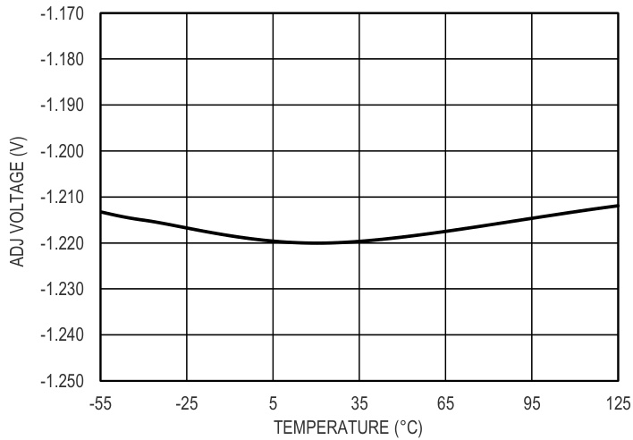  
图 4. ADJ 引脚电压与结温 (TJ)的关系

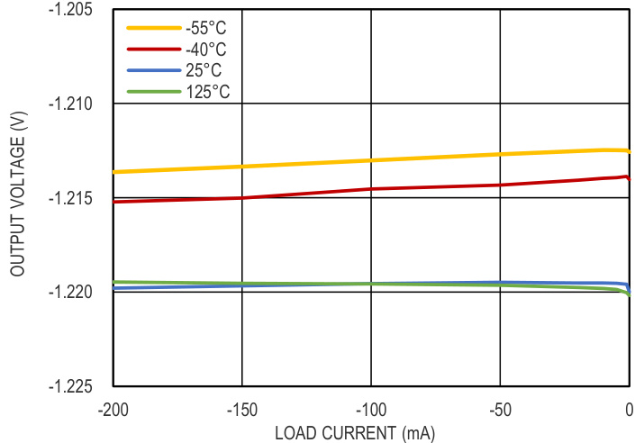  
图 5. ADJ 引脚电压与 vs. 负载电流的关系

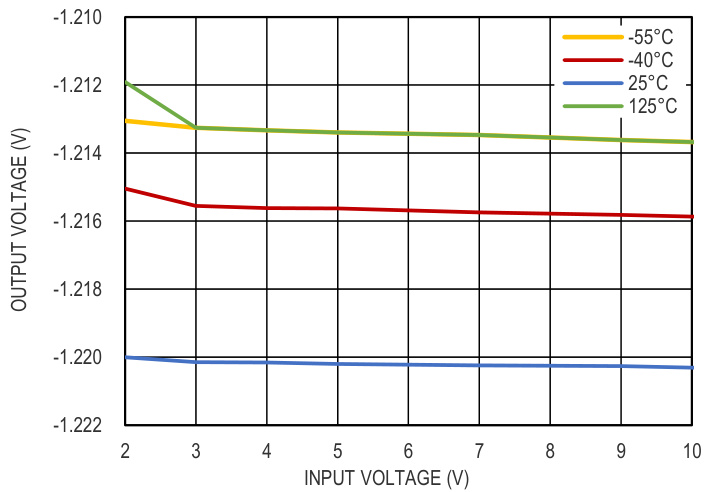  
图 6. ADJ 引脚电压与 vs. 输入电压的关系

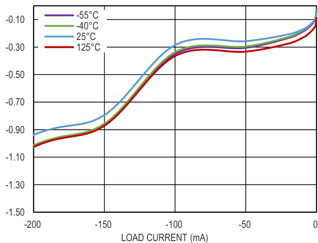  
图 7.  静态电流与负载电流的关系

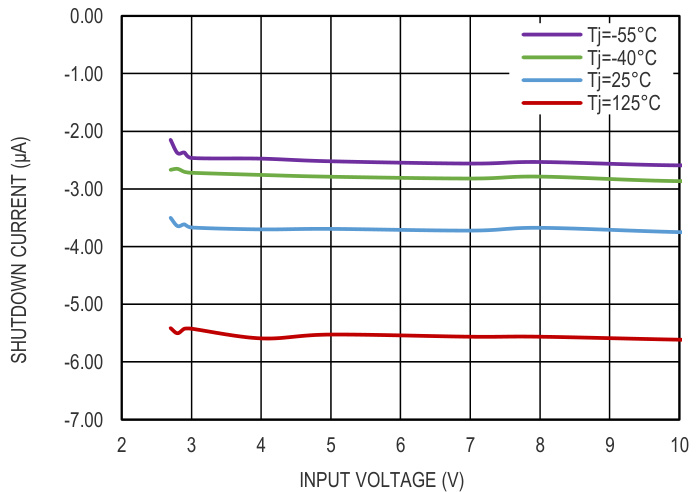  
图 8. 静态电流与输入电压的关系

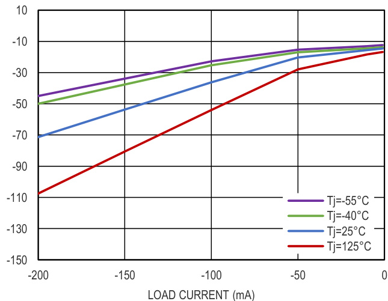  
图 9. 压差电压和负载电流的关系

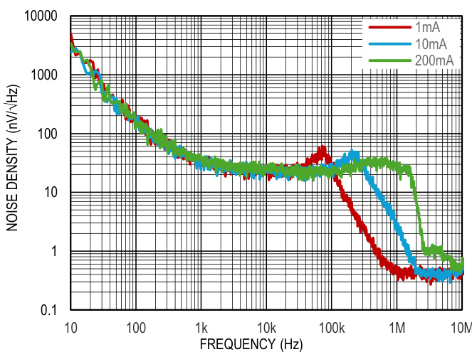  
图 10. 噪声谱密度

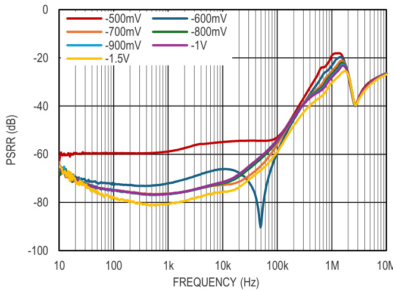  
图 11. PSRR 和压差的关系， $\mathsf { l } _ { 0 } = 2 0 0 \mathsf { m A }$

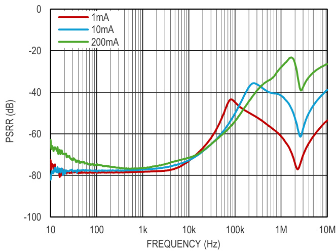  
图 12. PSRR 和负载电流的关系

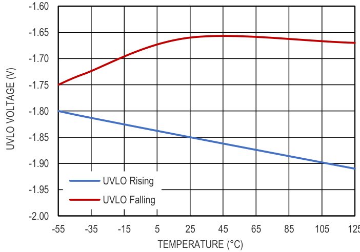  
图 13. UVLO 阈值和结温的关系

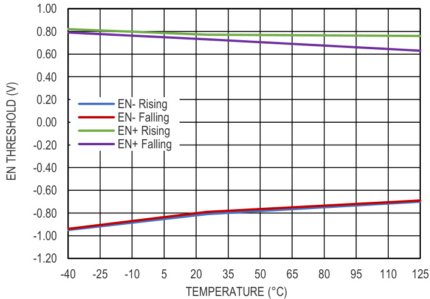  
图 14. EN 阈值和结温的关系

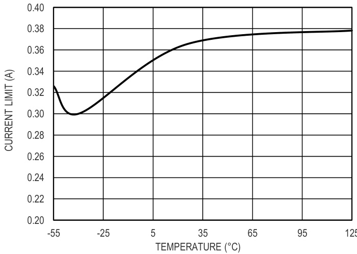  
图 15. 限流值和结温的关系

# GM1206

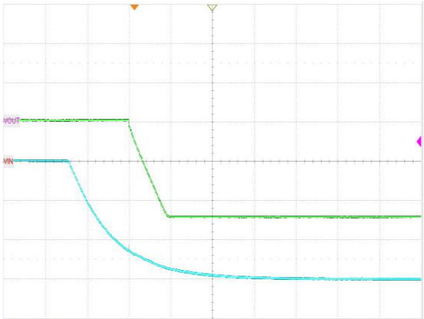  
图 16. 软启动， $V _ { 1 \ N } = - 6 \lor$ ， $\mathsf { V o u r } = - 5 \mathsf { V }$ ， $\mathsf { l } _ { 0 } = - 2 0 0 \mathsf { m A }$

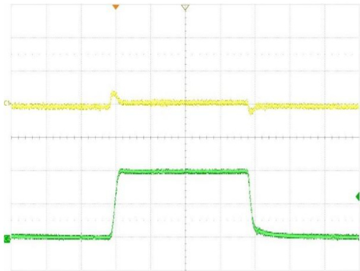  
图 17. 负载瞬态响应， $V _ { \vert \mathsf { N } } = - 6 \mathsf { V }$ ， $\mathsf { V o u r } = - 5 \mathsf { V }$ ， $\mathsf { I } _ { 0 } = - 1 0$ 至-$2 0 0 \mathsf { m A }$

# 工作原理

GM1206 是一款低静态电流 LDO 线性稳压器， 采用 $- 2 . 5 V$ 至 $- 1 0 \vee$ 电源供电，最大输出电流为 $- 2 0 0 \mathsf { m A }$ 。 满负载时静态电流典型值低至 $- 0 . 9 \mathsf { m A }$ ， 因 GM1206 非常适合电池供电 的便携式设备使用。室温时， 最大关断功耗为−3$\mu \mathsf { A }$ 。

GM1206 基于 $2 . 2 \mu \mathsf { F }$ 输出陶瓷电容优化， 可实现出色的瞬态性能。

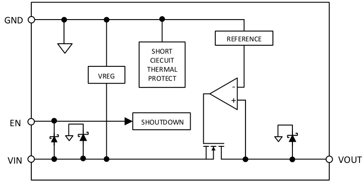  
图 18. 固定输出电压内部框图

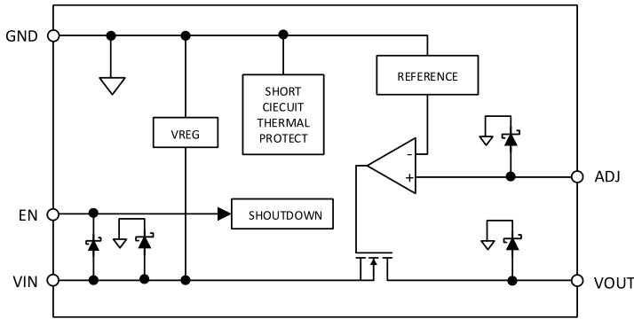  
图 19. 可选输出电压型号内部框图

GM1206 内置一个基准电压源、 一个误差放大器、一个反馈分压器和一个 NMOS 调整管。输出电流经由 NMOS 调整管提供，其受误差放大器控制。误差放大器比较基准电压与输出端的反馈电压，并放大该差值。 如果反馈电压高于基准电压，NMOS 器件的栅极将被拉向 GND，以便通过更多电流，提高输出电压。如果反馈电压低于基准电压，

NMOS 器件的栅极将被拉向−VIN， 以便通过较少电流， 降低输出电压。

ESD 保护器件在框图中显示为齐纳二极管(见图 1 和图 2)。

# 可调工作模式

GM1206 提供固定输出电压选项以及可调模式型号， 可通过外部分压器，将输出电压调节至 $- 1 . 1 8 6 \vee$ 至 $- 1 0 \vee$ 。根据下式可设置输出电压：

$$
- \mathsf { V } _ { \mathrm { O U T } } = - 1 . 1 8 6 \mathsf { V } \left( 1 + \mathsf { R } _ { \mathsf { F B 1 } } / \mathsf { R } _ { \mathsf { F B 2 } } \right)
$$

其中 $\mathsf { R } _ { \mathsf { F B 1 } }$ 和 $R _ { F B 2 }$ 是输出分压器中的电阻，如图 3 所示。$R _ { F B 2 }$ 必须低于 $1 2 0 { \sf k } \Omega$ ， 以便将 ADJ 引脚泄露电流引起的输出电压误差降至最低。ADJ 引脚泄露电流造成的误差电压等于 $\mathsf { R } _ { \mathsf { F B 1 } }$ 和 $R _ { \mathsf { F B 2 } }$ 的并联组合乘以 ADJ 引脚泄漏电流。例如，若 $\mathsf { R } _ { \mathsf { F B 1 } } = \mathsf { R } _ { \mathsf { F B 2 } } = 1 2 0 \mathsf { k } \Omega$ ，输出电压等于 $- 2 . 3 6 \ : \vee$ ， ADJ引脚典型泄漏电流 $( 1 0 \mathsf { n A } )$ 引起的误差等于 $6 0 ~ \mathsf { k } \Omega$ 乘以 10nA， 即 $6 \mathsf { m V }$ 。 本例中的输出电压误差为 $0 . 2 4 5 \%$ 。

添加一个小数值电容(100 pF 左右)使其与 $R _ { \mathsf { F B 1 } }$ 并联连接，可增 加 GM1206 的稳定性。大数值电容也可降低噪声并改进PSRR(参见 GM1206 可调型号的降噪特性部分)。

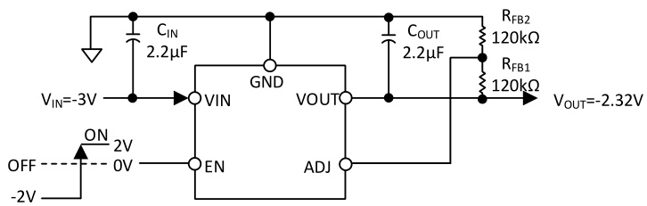  
图 20. 设置可调输出电压

# 应用信息

# 电容选择

# 输出电容

GM1206 设计采用节省空间的小型陶瓷电容工作，但只要考虑 ESR 值，便可以采用大多数常用电容。输出电容的ESR 会影响 LDO 控制回路的稳定性。为了确保 GM1206 稳定工作，推荐使用至少 $2 . 2 \mu \mathsf { F }$ 、ESR 为 $0 . 2 \ \Omega$ 或更小的电容。输出电容还会影响负载电流变化的瞬态响应。采用较大的输出电容值可以改善 GM1206 对大负载电流变化的瞬态响应。

# 输入旁路电容

在 VIN 至 GND 之间连接一个 $2 . 2 \mu \ F$ 电容可以降低电路对PCB 布局布线的敏感性，特别是遇到长输入走线或高信号源阻抗时。如果要求输出电容大于 $2 . 2 \mu \mathsf { F }$ ，可选用更高的输入电容。

# 输入和输出电容特性

只要符合最小电容和最大 ESR 要求，GM1206 可以采用任何质量优良的电容。陶瓷电容可采用各种各样的电介质制造，温度和所施加的电压不同，其特性也不相同。电容必须具有足以在必要的温度范围和直流偏置条件下确保最小电容的电介质。推荐使用额定电压为 25 V 或 50 V 的 X5R或 X7R 电介质。Y5V 和 Z5U 电介质的温度和直流偏置特性不佳， 建议不要使用。

电容的电压稳定性受电容尺寸和电压额定值影响极大。般来说，封装较大或电压额定值较高的电容具有更好的稳定性。X5R 电介质的温度变化率在 $- 4 0 ^ { \circ } \mathsf C$ 至 $+ 8 5 ^ { \circ } C$ 温度范围内为 $\pm 1 5 \%$ ，与封装或电压额定值没有函数关系。

考虑电容随温度、元件容差和电压的变化， 可以利用公式1 确定最差情况下的电容。

$$
C _ { E F F } = C _ { B I A S } \times ( 1 - T E M P C O ) \times ( 1 - T O L )
$$

其中：

$C _ { B 1 A S }$ 为工作电压下的有效电容。  
TEMPCO 为最差的电容温度系数。  
TOL 为最差的元件容差。

为了保证 GM1206 的性能，必须针对每一种应用来评估直流偏置、温度和容差对电容性能的影响。

# 使能引脚工作原理

在正常操作条件下， GM1206 利用 EN 引脚使能和禁能VOUT 引脚。当 EN 相对 GND 为 $\pm 2 { \nu }$ 时，VOUT 开启；当EN 为 0 V 时， VOUT 关闭。 若要实现自动启动， 可将 EN 接至 VIN。当设备禁用时，一个 ${ \sim } 2 2 0 \ \mathsf { k } \Omega$ 电阻连接到 VOUT 引脚，将 VOUT 引脚拉到 GND。

GM1206 具有双极性使能引脚(EN)， 当 $| \mathsf { V } \mathsf { E N } | \geqslant 2 \mathsf { V }$ 时可开启 LDO。 使能电压相对地而言可以是正的， 也可以是负的。

# 软启动

GM1206 利用内置软启动功能，在输出使能时限制浪涌电流。 启动时间和固定输出电压有关。当输出电压为−1.186V 时，从通过 EN 有效阈值到输出达到其最终值 $90 \%$ 的启动时间约为 $2 5 0 ~ \mu \ s$ 。 当输出电压为 $- 5 \mathsf { V }$ 时，启动时间约为$8 0 0 ~ \mu \ s$ 。

# 限流和热过载保护

GM1206 内置限流和热过载保护电路， 可防止功耗过大导致受损。当输出负载达到- $\cdot 3 6 0 \mathsf { m A } ($ (典型值)时，限流电路就会起作用。当输出负载超过- $\boldsymbol { \cdot } 3 6 0 \mathsf { m A }$ 时，输出电压会被降低，以保持恒定的电流限制。

热过载保护电路将结温限制在 $1 6 5 ^ { \circ } \mathsf { C } ($ (典型值)以下。 在极端条件下(即高环境温度和高功耗)，当结温开始升至 $1 6 5 ^ { \circ } \mathsf { C }$ 以上时，输出就会关闭，从而将输出电流降至 $0 \mathsf { m A }$ 。当结温降至 $1 5 0 ^ { \circ } \mathsf { C }$ 以下时，输出又会开启，输出电流恢复为标称值。

考虑 VOUT 至地发生负载短路的情况。首先 GM1206 的限流功能起作用，因此，仅有- $\boldsymbol { \cdot } 3 6 0 \mathsf { m A }$ 电流传导至短路电路。如果结的自发热量足够大，使其温度升至 $1 6 5 ^ { \circ } \mathsf { C }$ 以上，热关断功能就会激活，输出关闭，输出电流降至 0mA。当结温冷却下来，降至 $1 5 0 ^ { \circ } \mathsf { C }$ 以下时，输出开启，将$- 3 6 0 \mathsf { m } \mathsf { A }$ 电流传导至短路路径中，再次导致结温升至 $1 6 5 ^ { \circ } \mathsf { C }$ 以上。结温在 $1 5 0 ^ { \circ } \mathsf { C }$ 至 $1 6 5 ^ { \circ } \mathsf { C }$ 范围内的热振荡导致电流在-$3 6 0 ~ \mathsf { m A }$ 和 $0 \mathsf { m } \mathsf { A }$ 之间振荡；只要输出端存在短路，振荡就会持续下去。

限流和热过载保护旨在保护器件免受偶然过载条件影响，为实现可靠工作，必须在外部限制器件功耗，使得结温不会超过 $1 2 5 ^ { \circ } \mathsf { C }$ 。

# 封装描述

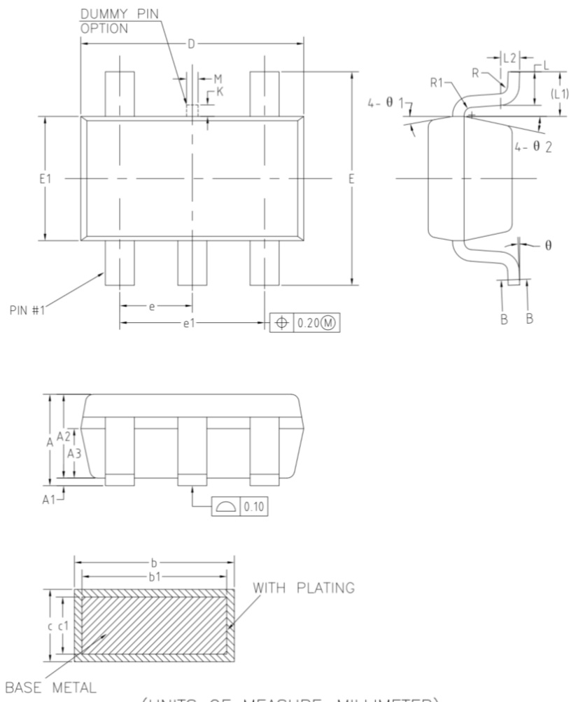  
图 21. SOT-23 封装

NOM MAX $^ -$ $\mathsf { K }$ $\underline { { \underline { { \mathbf { \Pi } } } } }$ $L 7$ $\theta$ $^ { - }$ $\theta \nobreakspace 1 \nobreakspace$ $8 ^ { \circ }$ $1 2 ^ { \circ }$ θ

# GM1206

# 订购指南

<html><body><table><tr><td>型号1</td><td>温度范围</td><td>封装描述</td><td>封装选项</td></tr><tr><td>GM1206AUJZ-R7</td><td>-40°℃至+125℃</td><td>SOT-23, 可调输出</td><td>UJ-5-1</td></tr><tr><td>GM1206AUJZ-2.5-R7</td><td>-40℃至+125℃</td><td>SOT-23,2.5V固定输出</td><td>UJ-5-1</td></tr></table></body></html>