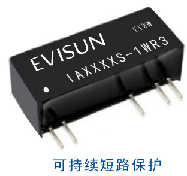
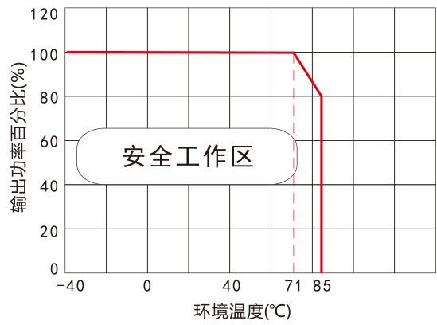
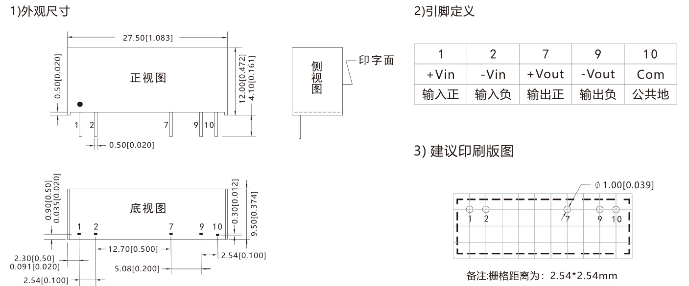
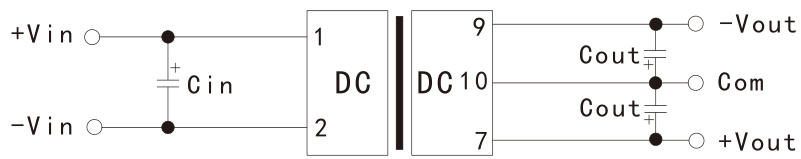
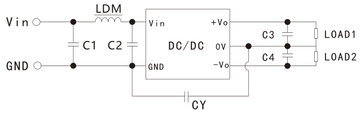

# 1W， 定电压输入， 隔离稳压双路输出

# 产品特点

可持续短路保护空载输入电流低至6mA效率高达 $7 4 \%$ 低纹波系数和低噪音隔离电压 1500VDC/min  
$\mathbf { \delta m }$ 国际标准引脚方式  
$\mathbf { \delta m }$ 工作温度范围： $- 4 0 ^ { \circ } C \sim + 8 5 ^ { \circ } C$ 可根据客户需求设计特殊规格产品

# 应用范围

IA_S-1WR3系列产品是专门应用在分布式电源系统中需要产生一路与输入电源隔离的电源的应用场合而设计。 该产品适用于： 纯数字电路， 一般低频模拟电路， 继电器驱动电路， 数据交换电路等。

# 产品命名规则

IAXXXXS-1WR3带短路保护(R3代)额定输出功率封装形式(单列直插)输出电压(标称)输入电压(标称)产品系列

产品型号表   

<html><body><table><tr><td>产品型号</td><td>输入电压(VDC) 标称值 (范围值)</td><td>输出① 电压 (VDC)</td><td>输出电流(MA) Max(满载)/Min(轻载)</td><td>最大容性 负载(uF) ②</td><td>效率 (%, Min/Typ) @满载</td></tr><tr><td>IA0505S-1WR3</td><td rowspan="4">4.75~5.25 (5V标称)</td><td>±5</td><td>±100/±10</td><td>100</td><td>68/72</td></tr><tr><td>IA0509S-1WR3</td><td>±9</td><td>±56/±6</td><td>100</td><td>68/72</td></tr><tr><td>IA0512S-1WR3</td><td>±12</td><td>±42/±5</td><td>100</td><td>68/72</td></tr><tr><td>IA0515S-1WR3</td><td>±15</td><td>±34/±4</td><td>100</td><td>68/72</td></tr><tr><td>IA1205S-1WR3</td><td rowspan="4">11.4~12.6 (12V标称)</td><td>±5</td><td>±100/±10</td><td>100</td><td>70/74</td></tr><tr><td>IA1209S- 1WR3</td><td>±9</td><td>±56/±6</td><td>100</td><td>64/68</td></tr><tr><td>IA1212S-1WR3</td><td>±12</td><td>±42/±5</td><td>100</td><td>64/68</td></tr><tr><td>IA1215S-1WR3</td><td>±15</td><td>±34/±4</td><td>100</td><td>64/68</td></tr><tr><td>IA2405S-1WR3</td><td rowspan="4">22.8~25.2 (24V标称)</td><td>±5</td><td>±100/±10</td><td>100</td><td>70/74</td></tr><tr><td>IA2409S-1WR3</td><td>±9</td><td>±56/±6</td><td>100</td><td>64/68</td></tr><tr><td>IA2412S-1WR3</td><td>±12</td><td>±42/±5</td><td>100</td><td>64/68</td></tr><tr><td>IA2415S-1WR3</td><td>± 15</td><td>±34/±4</td><td>100</td><td>66/70</td></tr><tr><td>IAxxxxS-1WR3</td><td colspan="5">可根据客户需求设计特殊规格产品，可提供0.1~1W功率的产品。</td></tr></table></body></html>

以上各型号的电源模块，空载功耗约为额定输出功率的 $1 0 \text{‰}$ 。$\textcircled{1}$ 标称输出电压是指输入电压在标称值和输出电流在满载的条件下测试得到;$\textcircled{2}$ 最大容性负载是表征模块电源输出带容性负载的最大能力,一般外接输出电容不能超过模块电源的最大容性负载值,否则会造成模块启动不良和影响模块长期工作的可靠性。

<html><body><table><tr><td colspan="6">产品输入特性</td></tr><tr><td>项目</td><td>条件</td><td>最小值</td><td>标称值</td><td>最大值</td><td rowspan="5">单位 mA</td></tr><tr><td rowspan="4">输入电流(满载/空载)</td><td>5V输入模块</td><td></td><td>290/6</td><td></td></tr><tr><td>12V输入模块</td><td></td><td>120/4</td><td></td></tr><tr><td>24V输入模块</td><td></td><td>60/2</td><td></td></tr><tr><td></td><td></td><td>15</td><td></td></tr><tr><td>反射纹波电流 输入滤波器</td><td></td><td colspan="3">电容滤波</td></tr><tr><td>热插拔</td><td></td><td colspan="3">不支持</td></tr></table></body></html>

<html><body><table><tr><td colspan="8">产品输出特性</td></tr><tr><td>项目</td><td colspan="2">条件</td><td>最小值</td><td>标称值</td><td>最大值</td><td>单位</td></tr><tr><td>输出电压精度</td><td colspan="2">100%负载</td><td></td><td></td><td>±3.0</td><td rowspan="4">%</td></tr><tr><td>线性调节率</td><td colspan="2">输入电压变化±1%</td><td></td><td></td><td>±0.25</td></tr><tr><td rowspan="2">负载调节率</td><td rowspan="2">10%到100%负载</td><td>3.3V输出模块</td><td></td><td></td><td>±3</td></tr><tr><td>其他输出模块</td><td></td><td></td><td>±2</td></tr><tr><td rowspan="2">纹波&噪声</td><td rowspan="2">20MHz带宽</td><td>其他输出模块</td><td></td><td>30</td><td>75</td><td rowspan="2">mVp-p</td></tr><tr><td>24V输出模块</td><td></td><td>50</td><td>100</td></tr><tr><td>温度飘移系数</td><td colspan="2">100%负载</td><td></td><td>±0.02</td><td></td><td>%/℃</td></tr><tr><td>输出短路保护</td><td colspan="2"></td><td>可持续,自恢复</td><td colspan="3"></td></tr><tr><td colspan="8">备注:纹波和噪声的测试采用去掉示波器探头地线的靠接测试法。</td></tr></table></body></html>

<html><body><table><tr><td colspan="7">产品通用特性</td></tr><tr><td>项目</td><td colspan="2">条件</td><td>最小值</td><td>标称值</td><td>最大值</td><td>单位</td></tr><tr><td>工作温度</td><td colspan="2">温度≥71°℃降额使用（见图1</td><td>-40</td><td></td><td>+85</td><td>C</td></tr><tr><td>存储温度</td><td colspan="2"></td><td>-55</td><td></td><td>+125</td><td rowspan="3"></td></tr><tr><td rowspan="2">工作时外壳温升</td><td colspan="2" rowspan="2">3.3V输出模块 Ta = 25C</td><td></td><td>30</td><td></td></tr><tr><td>其他输出模块</td><td>25</td><td></td></tr><tr><td rowspan="2">存储湿度</td><td colspan="2">无凝结</td><td>5</td><td></td><td colspan="2">95</td></tr><tr><td colspan="2">焊点距离外壳1.5mm10秒</td><td></td><td></td><td>300</td><td>%RH ℃</td></tr><tr><td>引脚耐焊接温度 振动</td><td colspan="2"></td><td>10-150Hz,</td><td>5G, 30 Min.</td><td>along X, Y and Z</td><td></td></tr><tr><td>隔离电压</td><td colspan="2">测试时间 分钟， 漏电流小於 1mA</td><td>1500</td><td></td><td></td><td>VDC</td></tr><tr><td>绝缘电阻</td><td colspan="2">输入-输出， 绝缘电压500VDC</td><td>1000</td><td></td><td></td><td>MΩ</td></tr><tr><td>隔离电容</td><td colspan="2">输入-输出， 100KHz/0.1V</td><td></td><td>20</td><td></td><td>pF</td></tr><tr><td>开关频率</td><td colspan="2">100%负载， 输入标称电压</td><td>50</td><td></td><td>500</td><td>KHz</td></tr><tr><td>平均无故障时间</td><td colspan="2">MIL-HDBK-217F@25°C</td><td>3500</td><td></td><td></td><td></td></tr><tr><td></td><td colspan="2"></td><td></td><td></td><td></td><td>Khours</td></tr></table></body></html>

<html><body><table><tr><td colspan="2">产品物理特性</td></tr><tr><td>外壳材料</td><td>黑色阻燃耐塑料 (UL94-V0)</td></tr><tr><td>封装尺寸</td><td>27.50*9.50*12.00mm</td></tr><tr><td>重量</td><td>5.2g(Typ.)</td></tr><tr><td>冷却方式</td><td>自然空冷</td></tr></table></body></html>

<html><body><table><tr><td colspan="3">EMC特性</td></tr><tr><td rowspan="2">EMI</td><td>传导骚扰</td><td>CISPR32/EN55032 CLASS B (推荐电路见图(3))</td></tr><tr><td>辐射骚扰</td><td>CISPR32/EN55032CLASS B (推荐电路见图(3))</td></tr><tr><td>EMS</td><td>静电放电</td><td>IEC/EN61000-4-2 Air ±8kV Contact ±8kV perf. Criteria B</td></tr></table></body></html>

# 产品特性曲线

  
温度降额曲线图

# 产品外观尺寸及引脚定义、 建议印刷版图

  
图(1)

注： 单位(Units)： mm[inch] 端子截面公差： ±0.10[0.004] 未标注之公差： $\pm 0 . 2 5$ [0.010]

# 产品外围推荐电路

# 1.典型应用

对于纹波噪音要求一般的场合， 可在输入端和输出端各并联一颗滤波电容， 外接电路如下图 （2） 所示,但应注意选用合适的滤波电容。 若电容太大， 很可能会造成启动问题。 对于每一路输出， 在确保安全可靠工作条件下， 其滤波电容的推荐值详见表(1)。

  
图(2)

表(1)  

<html><body><table><tr><td>Vin (VDC)</td><td>Cin</td><td>Vout (VDC)</td><td>Cout</td></tr><tr><td>3.3/5</td><td>4.7uF/16V</td><td>±3.3/±5</td><td>4.7uF/16V</td></tr><tr><td>9/12</td><td>2. 2uF/25V</td><td>±9/±12</td><td>1uF/25V</td></tr><tr><td>15/24</td><td>2. 2uF/50V</td><td>±15/±24</td><td>0.47uF/50V</td></tr></table></body></html>

# 2.EMC解决方案推荐电路

对于纹波噪音要求严格的场合， 外接电路请参考图(3)所示,其滤波电容及电感的推荐值详见表(2)。

EMC推荐电路参数值 表(2)   

<html><body><table><tr><td rowspan="4">EMI</td><td>C1/C2</td><td>4.7uF/50V</td></tr><tr><td>CY</td><td>1nF/4kVdc</td></tr><tr><td>C3/C4</td><td>见表(1)中Cout参数</td></tr><tr><td>LDM</td><td>6.8uH</td></tr></table></body></html>

  
图(3)

备注: 若实际使用过程中， 对EMI要求很高，建议添加CY电容。

# 产品使用注意事项

输入要求 : 确保供电电源的输出电压波动范围不要超出DC/DC模块本身的输入要求,输入电源的输出功率必须大于DC/DC模块的输出功率;  
输出负载要求 : 尽量避免空载使用,当负载的实际功耗小于模块的输出额定功率的 $1 0 \%$ 或有空载现象， 建议在输出端外接假负载,假负载(电阻)可按照模块额定功率的 $1 5 \sim 1 0 \%$ 计算,电阻值 $\scriptstyle : = { \mathsf { U o } } ^ { 2 } / ( { \mathsf { P o } } ^ { \star } 1 0 \% ) ;$   
输出端外接电容其容值不宜过大， 否则容易造成模块启动时过流或启动不良；  
除特殊说明外， 本手册所有指标都在 ${ \mathsf { T a } } = 2 5 ^ { \circ } { \mathsf { C } }$ ， 湿度 $< 7 5 \% \mathsf { R H }$ ， 标称输入电压和输出额定负载时测得;  
本手册所有指标测试方法均依据本公司企业标准;  
我司可提供产品定制， 具体情况可直接与我司技术人员联系。