# TPS

# MIE1 W0505BGL VH 5V, 1W, Regulated, 2.5kVrms Isolated DC-DC Module

PRELIMINARY SPECIFICATIONS SUBJECT TO CHANGE

# DESCRIPTION

The MIE1W0505BGLVH is an isolated, regulated, DC to DC module. It can support 3V to 5.5V input voltage application. MIE1W0505BGLVH have excellent load regulation, line regulation, supporting up to 1W output power.

MIE1W0505BGLVH integrated power MOS, transformer and feedback circuit all in one chip, achieving excellent performance and saving size.

MIE1W0505BGLVH supports regulated output, when Vout drops and is lower than target voltage, the IC starts to switch, delivering power from Vin to Vout until Vout reach to the target output value again.

MIE1W0505BGLVH integrated output voltage feedback block, which can regulate output voltage without traditional opto-coupler and TL431. This module provides small size and higher reliability operation comparing to traditional isolation power module.

MIE1W0505BGLVH features with continuous short circuit protection and over temperature protection. It’s available in a small LGA-12 (4mmx5mm) package.

# FEATURES

3V to 5.5V Input Voltage Operation Range   
Selectable 5V or 3.3V Output Voltage (VOUT) 5V to 5V: ≥200mA Available Load Current 5V to 3.3V: ≥200mA Available Load Current 3.3V to 3.3V: ≥75mA Available Load Current   
2.5kVrms Isolation Voltage   
Support Infinite Capacitive Load   
$0 . 4 \%$ Load Regulation   
$0 . 3 \%$ Line Regulation   
Continuous Short Circuit Protection   
Over-temperature Protection   
CB Certification According to IEC62368-1   
(Ongoing)   
Meet EN55032 Class B Emissions   
Operation Temperature: $\scriptscriptstyle - 4 0 ^ { \circ } \mathsf { C }$ to $1 2 5 ^ { \circ } \mathsf { C }$   
Available in LGA-12 (4mmx5mm) Package

# APPLICATIONS

Industrial Automation Systems Isolated Bias Power for Digital Isolators Isolated Power for Isolated RS485/RS422/CAN interface Isolated Sensor Power Supply Telecom and Network Device (5G RRU, Industrial CPE, Network Gateway, etc.)

# TYPICAL APPLICATION

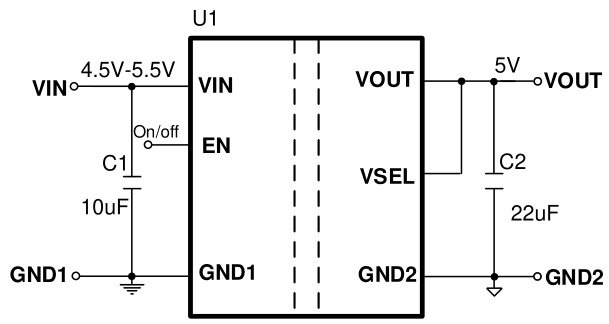

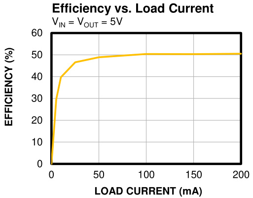

# PRELIMINARY SPECIFICATIONS SUBJECT TO CHANGE

# ORDERING INFORMATION

<html><body><table><tr><td>Part Number*</td><td>Package</td><td>Top Marking</td><td>MSL Rating</td></tr><tr><td>MIE1W0505BGLVH-3R</td><td>LGA-12 (4mmx5mm)</td><td>See below</td><td>3</td></tr></table></body></html>

For Tape & Reel, add suffix -Z (e.g. MIE1W0505BGLVH-3R-Z).

# TOP MARKING

MPSYWW 1W0505 LLLLLL BH

MPS: MPS prefix Y: Year code WW: Week code 1W0505: Part number LLLLLL: Lot number BH: Suffix of part number

# PACKAGE REFERENCE

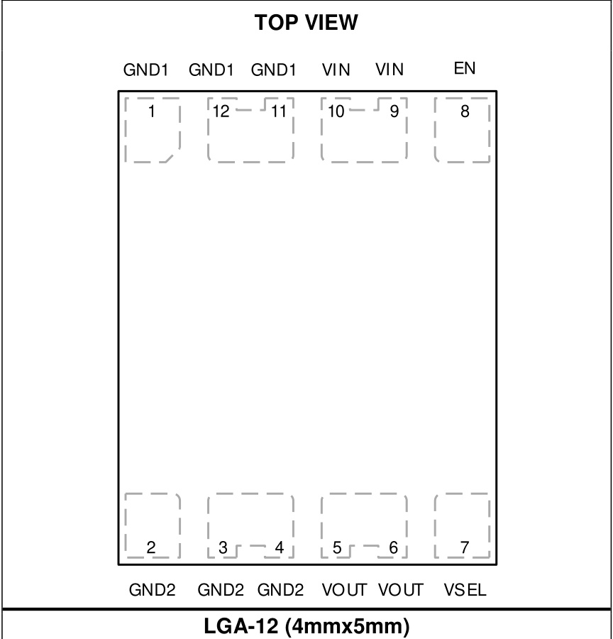

# PIN FUNCTIONS

<html><body><table><tr><td>LGA-12 (4mmx5mm) Pin #</td><td>Name</td><td>Description</td></tr><tr><td>1, 11,12</td><td>GND1</td><td>Side 1 Ground Pin.</td></tr><tr><td>2,3,4</td><td>GND2</td><td>Side 2 Ground Pin.</td></tr><tr><td>5,6</td><td>VOUT</td><td>Power Output Pin. Typically connect a 22uF plus 0.1μF between VOUT and GND2 (pin3 and pin4) to decrease VOUT ripple and noise.</td></tr><tr><td></td><td>VSEL</td><td>Output voltage set pin. Must connect to VOUT or float for 5V output and must connect to GND2 for 3.3V output. Don't bias VSEL with other power and 5V output can't switch to 3.3V output after startup.</td></tr><tr><td>8</td><td>EN</td><td>low to disable floating.</td></tr><tr><td>9,10</td><td>VIN</td><td></td></tr></table></body></html>

# ABSOLUTE MAXIMUM RATINGS (1)

VIN/EN to GND1 .. $\mathsf { - 0 } . 3 \mathsf { V }$ to $+ 6 . 5 \mathsf { V }$ VOUT/VSEL to GND2. -0.3V to $+ 6 . 5 \vee$ Continuous Power Dissipation $( T _ { \mathsf { A } } = + 2 5 ^ { \circ } \mathsf { C }$ ) (2)(4) 1.78W Junction Temperature $1 5 0 ^ { \circ } \mathsf { C }$ Lead Temperature $2 6 0 ^ { \circ } \mathsf { C }$ Storage Temperature . $\mathsf { - 6 5 ^ { \circ } C }$ to $+ 1 5 0 ^ { \circ } \mathsf C$

# ESD Ratings

Human body model (HBM) ±5000V Charged device model (CDM) ±2000V

# Recommended Operating Conditions (3)

Supply Voltage $V _ { \mathsf { I N } }$ 3V to 5.5V Output Voltage VOUT . ...5/3.3V Operating Junction Temp. $( \mathsf { T } _ { \mathsf { J } } )$ $\scriptscriptstyle - 4 0 ^ { \circ } \mathsf { C }$ to $+ 1 2 5 ^ { \circ } \mathsf { C }$

# Thermal Resistance θJA θJC

LGA-12 (4mmx5mm) EV1W0505B-LVH-00A(4) 70 .. … 22 ..°C/W JESD51-7(5) 61 ..... 19 .. °C/W

# Notes:

12) Exceeding these ratings may damage the device. The maximum allowable power dissipation is a function of the maximum junction temperature $\mathsf { T } _ { \mathsf { J } }$ (MAX), the junction-toambient thermal resistance $\mathsf { \theta } _ { \mathsf { J A } }$ , and the ambient temperature $\mathsf { T } _ { \mathsf { A } }$ . The maximum allowable continuous power dissipation at any ambient temperature is calculated by $\mathsf { P } _ { \mathsf { D } }$ $\mathsf { \Lambda } _ { \mathsf { D } } \ \left( \mathsf { M A X } \right) \ = \ \left( \mathsf { T } _ { \mathsf { J } } \right.$ $( M A X ) \cdot T _ { A } )$ (id) $/ \theta _ { \mathsf { J A } }$ . Exceeding the maximum allowable power dissipation produces an excessive die temperature, causing the regulator to go into thermal shutdown. Internal thermal shutdown circuitry protects the device from permanent damage.   
3) The device is not guaranteed to function outside of its operating conditions.   
4) Measured on EV1W0505B-LVH-00A (51mmx51mm), 1oz, 2- layer PCB.   
5) The value of $\mathsf { \theta } _ { \mathsf { J A } }$ given in this table is only valid for comparison with other packages and cannot be used for design purposes. These values were calculated in accordance with JESD51-7, and simulated on a specified JEDEC board. They do not represent the performance obtained in an actual application.

# ELECTRICAL CHARACTERISTICS

$\mathsf { V } _ { \mathsf { I N } } = 5 \mathsf { V }$ , $\mathsf { V o u r } = 5 \mathsf { V }$ , $T _ { \mathsf { J } } = - 4 0 ^ { \circ } { \mathsf { C } }$ to $\pm 1 2 5 ^ { \circ } C$ (6), typical values are tested at $T _ { \mathsf { J } } = 2 5 ^ { \circ } { \mathsf { C } }$ , unless otherwise noted.

<html><body><table><tr><td></td><td></td><td></td><td></td><td></td><td></td><td></td></tr><tr><td>Parameter</td><td>Symbol</td><td>Condition</td><td>Min</td><td>Typ</td><td>Max</td><td>Units</td></tr><tr><td>Power Supply</td><td></td><td></td><td></td><td></td><td></td><td></td></tr><tr><td>Vin holer Lockout Voltage Rising</td><td>VINUVLO-R</td><td>ViN Rising</td><td></td><td>2.6</td><td>2.8</td><td>V</td></tr><tr><td></td><td>VINHYS</td><td></td><td></td><td>220</td><td></td><td>mV</td></tr><tr><td>Shutdown Current</td><td>ISD</td><td>VEN = 0V, Measured on VIN pin</td><td></td><td>7</td><td></td><td>μA</td></tr><tr><td rowspan="2">Input Current</td><td rowspan="2">IIN</td><td>Load OA</td><td></td><td>8</td><td></td><td>mA</td></tr><tr><td>Load 0.2A</td><td></td><td>395</td><td></td><td>mA</td></tr><tr><td>EN Input High Threshold</td><td></td><td></td><td></td><td></td><td>2</td><td>V</td></tr><tr><td>EN Input Voltage Low Threshold</td><td></td><td></td><td>0.4</td><td></td><td></td><td>V</td></tr><tr><td>EN Input Current Leakage</td><td></td><td>EN connect to GND1 Tj=25°C, Vin=4.5V to 5.5V, l0=0A,</td><td></td><td>-5 5</td><td>5.075</td><td>μA</td></tr><tr><td>Output Voltage Accuracy</td><td>Vo_ _ACC</td><td>Co=22uF TJ=-40°C to +125°C, Vin=4.5V to 5.5V, l0=0A, Co=22μF</td><td>4.925 4.9</td><td>5</td><td>5.1</td><td>V V</td></tr><tr><td>Load Regulation</td><td></td><td>Load=0A to 0.2A</td><td></td><td>0.4</td><td>2.5</td><td>%</td></tr><tr><td>Line Regulation</td><td></td><td>ViN=4.5V to 5.5V, Load=0.2A</td><td></td><td>0.3</td><td>2.5</td><td>%</td></tr><tr><td>Efficiency</td><td></td><td>Load=0.2A</td><td></td><td>50.5</td><td></td><td>%</td></tr><tr><td>Ripple</td><td></td><td>TA = 25°C</td><td></td><td>60</td><td>100</td><td>mV</td></tr><tr><td rowspan="2">Isolated Voltage</td><td rowspan="2">Viso</td><td>Short all primary pin and all secondary pin as a two terminal part, Test</td><td>2.5</td><td></td><td></td><td>kVrms</td></tr><tr><td>pin as a two terminal part, Test time=1s, test, 100% test production</td><td>3</td><td></td><td></td><td>kVrms</td></tr><tr><td></td><td>C-0</td><td>frequency=1MHz</td><td></td><td>5</td><td></td><td>pF</td></tr><tr><td></td><td>R1-o</td><td>voltage=500VDC</td><td>50</td><td></td><td></td><td>GΩ</td></tr><tr><td colspan="7">Thermal Shutdown(7)</td></tr><tr><td>Thermal Shut down Temperature</td><td>TsD</td><td></td><td></td><td>150</td><td></td><td>'C</td></tr><tr><td>Thermal Shut down Hysteresis</td><td>TSD-HYS</td><td></td><td></td><td>20</td><td></td><td>C</td></tr><tr><td colspan="6"></td></tr></table></body></html>

# ELECTRICAL CHARACTERISTICS (continued)

$\mathsf { V } _ { \mathsf { I N } } = 5 \mathsf { V }$ , $\mathsf { V o u r } = 3 . 3 \mathsf { V }$ , $\mathsf { T } _ { \mathsf { J } } = \mathsf { - } \pmb { \mathrm { 4 0 } } ^ { \circ } \pmb { \mathrm { C } }$ to $\yen 123,456$ (6), typical values are tested at $T _ { \mathsf { J } } = 2 5 ^ { \circ } { \mathsf { C } }$ , unless otherwise noted.

<html><body><table><tr><td>Parameter</td><td>Symbol</td><td>Condition</td><td>Min</td><td>Typ</td><td>Max</td><td>Units</td></tr><tr><td colspan="7">Power Supply</td></tr><tr><td>Shutdown Current</td><td>ISD</td><td>Ven = 0V, Measured on VIN pin</td><td></td><td>7</td><td></td><td>μA</td></tr><tr><td>Input Current</td><td>IN</td><td>Load=0A</td><td></td><td>5</td><td></td><td>mA</td></tr><tr><td></td><td></td><td>Load=0.2A</td><td></td><td>354</td><td></td><td>mA</td></tr><tr><td>EN Input Current Leakage</td><td></td><td>EN connect to GND1 TJ=25°C, Vin=4.5V to 5.5V, l0=0A,</td><td></td><td>-5</td><td></td><td>A</td></tr><tr><td rowspan="2">Output Voltage Accuracy</td><td rowspan="2">VO_ACC</td><td>Co=22μF</td><td>3.2</td><td>3.3</td><td>3.4</td><td>V</td></tr><tr><td>TJ=-40°C to+125°C, ViN=4.5V to 5.5V, l0=0A, Co=22μF</td><td>3.18</td><td>3.3</td><td>3.42</td><td>V</td></tr><tr><td>Load Regulation</td><td></td><td>Load=0A to 0.2A</td><td></td><td>0.4</td><td>2.5</td><td>%</td></tr><tr><td>Line Regulation</td><td></td><td>ViN=4.5V to 5.5V, Load=0.2A</td><td></td><td>0.2</td><td>2</td><td>%</td></tr><tr><td>Efficiency</td><td></td><td>Load=0.2A</td><td></td><td>37</td><td></td><td>%</td></tr><tr><td>Ripple</td><td></td><td>TA = 25°C</td><td></td><td>50</td><td>90</td><td>mV</td></tr></table></body></html>

# ELECTRICAL CHARACTERISTICS (continued)

$V _ { \parallel \parallel } = 3 . 3 V$ , $\mathsf { V o u r } = 3 . 3 \mathsf { V }$ , ${ \sf T } _ { \mathsf { J } } = { \mathsf { - } } 4 0 ^ { \circ } { \mathsf { C } }$ to $\pm 1 2 5 ^ { \circ } C$ (6), typical values are tested at $T _ { \mathsf { J } } = 2 5 ^ { \circ } { \mathsf { C } }$ , unless otherwise noted.

<html><body><table><tr><td>Parameter</td><td>Symbol</td><td>Condition</td><td>Min</td><td>Typ</td><td>Max</td><td>Units</td></tr><tr><td colspan="7">Power Supply</td></tr><tr><td>Shutdown Current</td><td>ISD</td><td>VEN = 0V, Measured on VIN pin</td><td></td><td>5</td><td></td><td>uA</td></tr><tr><td>Input Current</td><td>IN</td><td>Load=0A</td><td></td><td>5</td><td></td><td>mA</td></tr><tr><td></td><td></td><td>Load=0.075A</td><td></td><td>150</td><td></td><td>mA</td></tr><tr><td>EN Input Current Leakage</td><td></td><td>EN connect to GND1 TJ=25°C, Vin=3V to 3.6V, l0=0A,</td><td></td><td>-3.3</td><td></td><td>μA</td></tr><tr><td rowspan="2">Output Voltage Accuracy</td><td rowspan="2">VO_ACC</td><td>Co=22μF</td><td>3.2</td><td>3.3</td><td>3.4</td><td>V</td></tr><tr><td>TJ=-40°C to +125°C, ViN=3V to 3.6V, l0=0A, Co=22uF</td><td>3.18</td><td>3.3</td><td>3.42</td><td>V</td></tr><tr><td>Load Regulation Line Regulation</td><td></td><td>Load=0A to 0.075A</td><td></td><td>0.3</td><td>2</td><td>%</td></tr><tr><td></td><td></td><td>ViN=3V to 3.6V, Load=0.075A</td><td></td><td>0.2</td><td>1.5</td><td>%</td></tr><tr><td>Efficiency</td><td></td><td>Load=0.075A</td><td></td><td>50</td><td></td><td>%</td></tr><tr><td>Ripple</td><td></td><td>TA = 25°C</td><td></td><td>30</td><td>60</td><td>mV</td></tr></table></body></html>

# Notes:

67) Guaranteed by over-temperature correlation. Not tested in production. Guaranteed by sample characterization, not tested in production.

TYPICAL CHARACTERISTICS $\mathsf { V } _ { \mathsf { I N } } = 5 \mathsf { V }$ , $\mathsf { V o u r } = 5 \mathsf { V }$ , $\mathsf { C } _ { ^ { \mathsf { I N } } } = 1 0 \mu \mathsf { F }$ , $\mathsf { C _ { O U T } } = 0 . 1 \mu \mathsf { F } + 2 2 \mu \mathsf { F }$ , $T _ { A } = 2 5 ^ { \circ } C$ , unless otherwise noted.

# Output Voltage Accuracy vs.

# Output Voltage Accuracy vs.

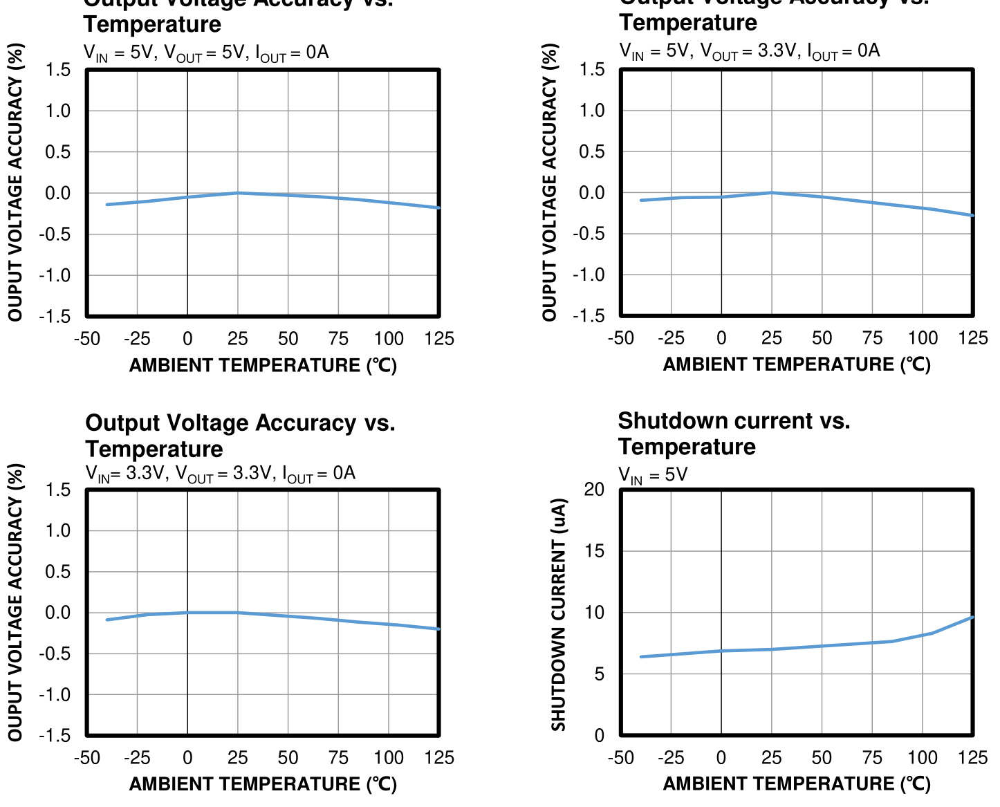

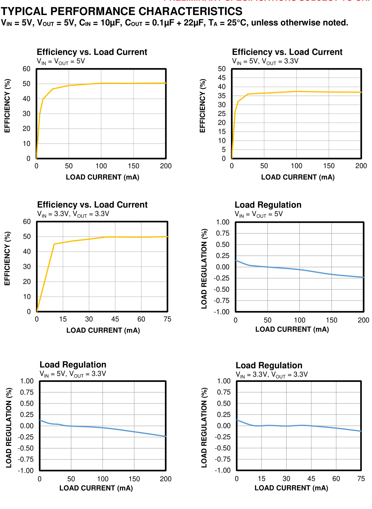

# TYPICAL PERFORMANCE CHARACTERISTICS (continued)

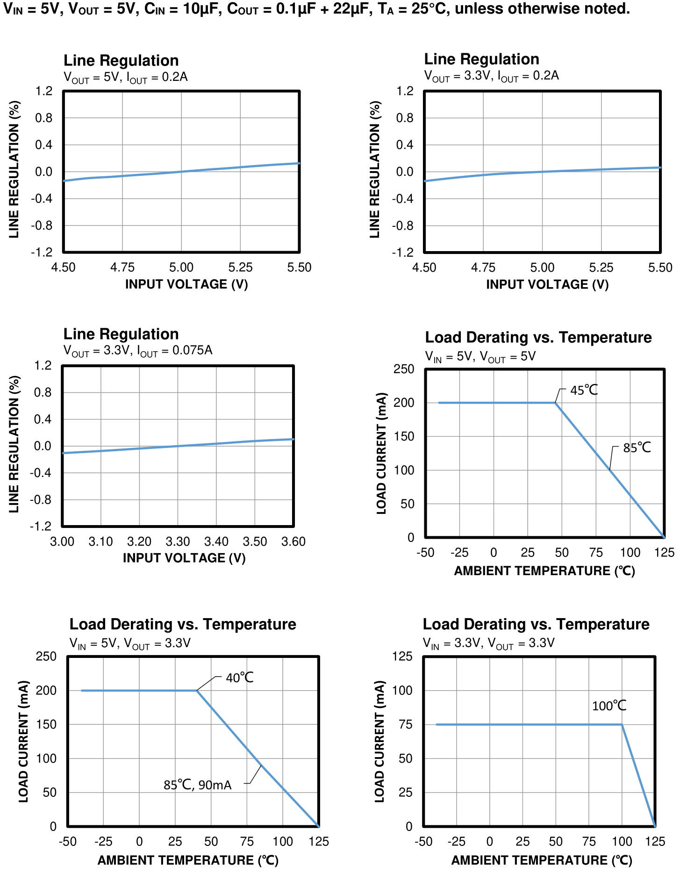

# PRELIMINARY SPECIFICATIONS SUBJECT TO CHANGE

# TYPICAL PERFORMANCE CHARACTERISTICS (continued) $\mathsf { V } _ { \mathsf { I N } } = 5 \mathsf { V }$ , $\mathsf { V o u r } = 5 \mathsf { V }$ , $\mathsf { C _ { O U T } } = 0 . 1 \mu \mathsf { F } + 2 2 \mu \mathsf { F }$ , $T _ { A } = 2 5 ^ { \circ } C$ , unless otherwise noted.

Load Transient IOUT $= 0 \mathsf { A }$ to 0.2A

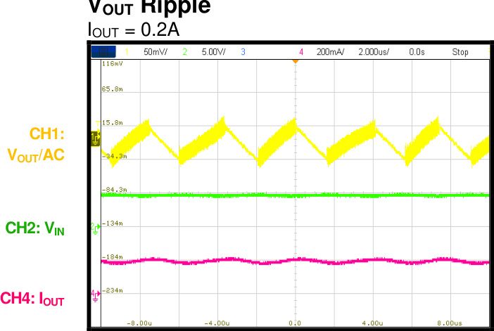  
CH4: IOUT

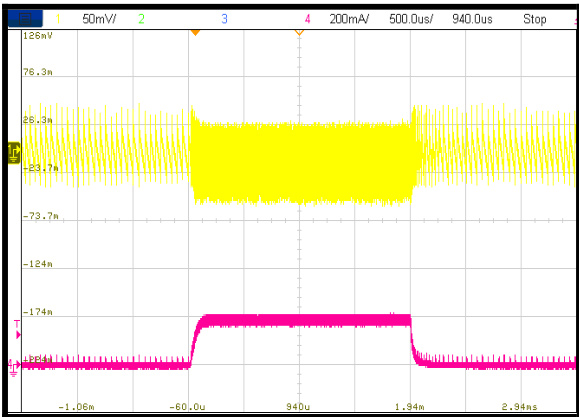

# Start-Up through VIN IOUT = 0.2A

# Shutdown through VIN IOUT = 0.2A

CH1: VOUT

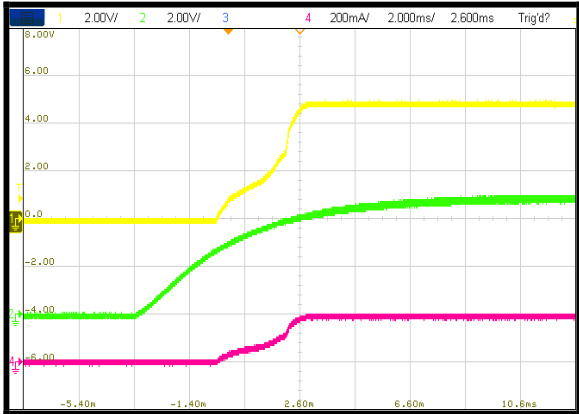

CH2: VIN CH4: IOUT

CH1: VOUT

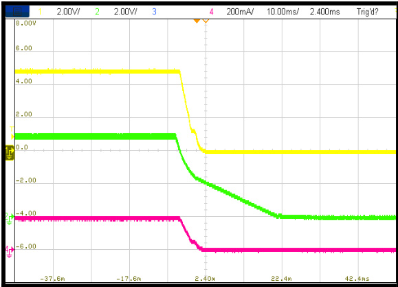

CH2: VIN CH4: IOUT

# Start-Up through EN IOUT = 0.2A

# Shutdown through EN

IOUT $= 0 . 2 \mathsf { A }$

CH1: VOUT

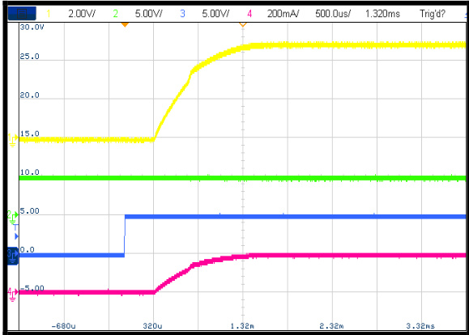

CH1: VOUT

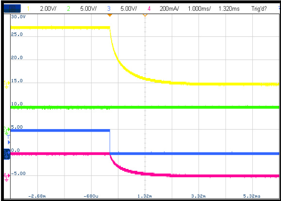

CH2: VINCH3: ENCH4: IOUT

CH2: VIN CH3: EN CH4: IOUT

# TYPICAL PERFORMANCE CHARACTERISTICS (continued) $\mathsf { V } _ { \mathsf { I N } } = 5 \mathsf { V }$ , $\mathsf { V o u r } = 3 . 3 \mathsf { V }$ , $\mathsf { C _ { O U T } } = 0 . 1 \mu \mathsf { F } + 2 2 \mu \mathsf { F }$ , $T _ { A } = 2 5 ^ { \circ } C$ , unless otherwise noted.

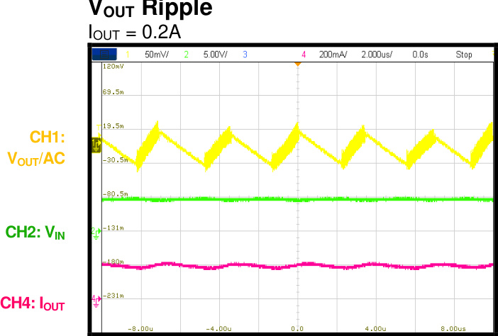

Load Transient IOUT $= 0 \mathsf { A }$ to 0.2A

CH1: VOUT/AC

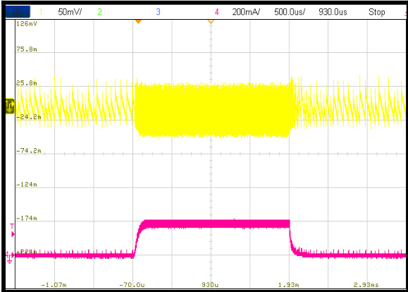

CH4: IOUT

Start-Up through VIN IOUT = 0.2A

# Shutdown through VIN

CH1: VOUT

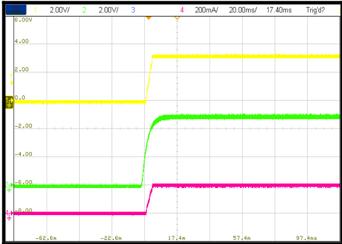

CH2: VIN CH4: IOUT

CH1: VOUT

CH2: VIN CH4: IOUT

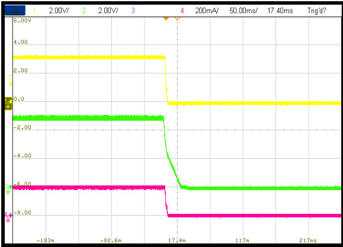

# Start-Up through EN IOUT $= 0 . 2 \mathsf { A }$

# Shutdown through EN

IOUT $= 0 . 2 \mathsf { A }$

CH1: VOUT

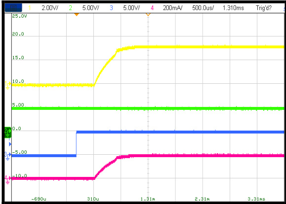

CH1: VOUT

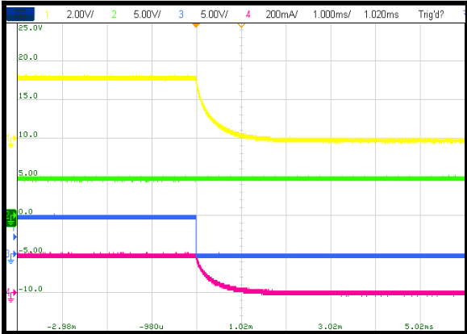

CH2: VINCH3: ENCH4: IOUT

CH2: VIN CH3: EN CH4: IOUT

# FUNCTIONAL BLOCK DIAGRAM

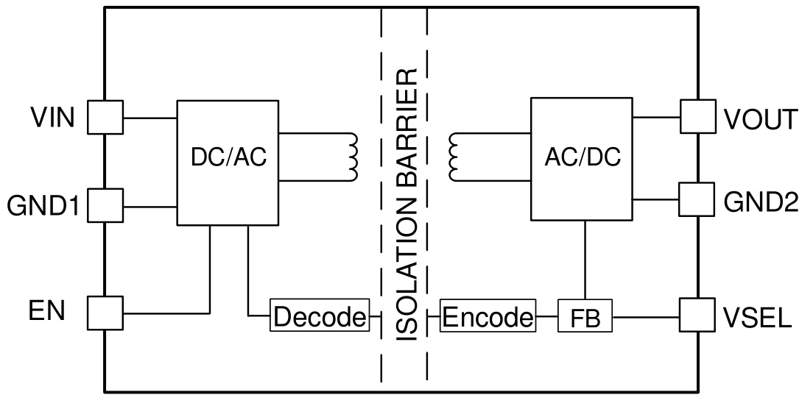  
Figure1: Functional Block Diagram

# OPERATION

The MIE1W0505BGLVH is a regulated, isolated DC to DC module. It can support 3V to 5.5V input voltage application, in the $- 4 0 ^ { \circ } \mathsf { C }$ to $1 2 5 ^ { \circ } \mathrm { C }$ operation temperature. It has excellent load regulation, line regulation performance, supporting up to 1W output power.

# Isolation Power Converting

MIE1W0505BGLVH integrated power MOS, transformer and feedback circuit all in one chip, achieving excellent performance and saving size.

When VOUT is lower than the target output voltage, IC will start switching to delivery power from $V _ { \mathsf { I N } }$ to VOUT. On the other hand, if $\mathsf { V } _ { \mathsf { O U T } }$ rise to target output voltage, switching will stop.

# Output Voltage Setting

Connect VSEL pin to VOUT or float VSEL pin, output voltage is setting to 5V. VOUT can output 200mA load with 4.5V to 5.5V input range.

Connect VSEL pin to GND2, output voltage is setting to 3.3V. VOUT can output 200mA load with 4.5V to 5.5V input range or 75mA load with 3V to 3.6V input range. VSEL logic is locked during startup. After startup, output voltage is fixed even change VSEL logic.

# Under-Voltage Lockout Protection (UVLO)

The MIE1W0505BGLVH has input under-voltage lockout protection (UVLO) to ensure reliable output power. The MIE1W0505BGLVH is powered on when the input voltage exceeds the UVLO rising threshold. The device is powered off when the input voltage drops below the UVLO falling threshold. This function prevents the device from operating at an insufficient voltage. It is a non-latch protection.

# Power Enable (EN)

EN pin enables and disables the MIE1W0505BGLVH. When applying a voltage higher than 2V and input voltage is higher than $\mathsf { V } _ { \mathsf { I N } }$ UVLO, MIE1W0505BGLVH will enables all functions and starts switching operation. Switching operation is disabled when EN voltage falls below its lower threshold and shutdown when $E N < 0 . 4 V$ . For automatic startup, connect EN pin to $V _ { \mathsf { I N } }$ directly or through resistor divider.

# Power Converter Soft Startup and SCP

To avoid overshoot and inrush current during start-up, the MIE1W0505BGLVH has built-in an internal soft start (SS) that limits output current from low to high gradually.

MIE1W0505BGLVH startup with constant current (CC) charging mode, in this mode, current limit will fold back, output will CC charge the output capacitor until output voltage rise to about 2.7V. After CC charging period, MIE1W0505BGLVH’s current limit back to normal, and with higher output current capability. Such features guarantee infinite capacitive load.

During over load or output short circuit condition, the output voltage drops due to internal current limit. Once VOUT drops below about 2.2V, MIE1W0505BGLVH enters CC charging mode. After over current or short circuit condition removed, MIE1W0505BGLVH will resume normal operation when VOUT rises to about 2.7V.

# Over Temperature Protection

MIE1W0505BGLVH integrates one temperature monitor circuit. Once junction temperature is higher than $1 5 0 ^ { \circ } \mathrm { C }$ , MIE1W0505BGLVH shuts down. After the temperature drops to lower $1 3 0 ^ { \circ } \mathsf { C }$ , the power supply resumes normal operation again.

# APPLICATION INFORMATION

# Input and Output Capacitor

For stable operation, decoupling capacitors are required between VIN and GND1 pins at the input side, and between VOUT and GND2 pins at the output side. The decoupling capacitors must be placed as closed to VIN and VOUT pins as possible. It’s recommended to add 10uF $+ ~ 0 . 1$ uF ceramic capacitor at input and add $2 2 \mathsf { u F } + 0 . 1$ uF ceramic capacitor at output side, the larger one is used to make the ripple suitable, the smaller one is used to high frequency noise filtering.

# PCB Layout Guidelines

PCB layout is very important for normal operation. Refer to figure 2 and PCB layout guide lines.

1) For safety concern, primary side and secondary side must be physically separated. And the creepage/clearance must meet the standard for a certain application. 2) Minimize the loop area between VIN, input capacitor and GND1; VOUT, output capacitor and GND2 to minimize the output noise. 3) Place enough copper and via on GND1 pins to improve IC thermal performance; it’s not recommended to place large copper on GND2 and VOUT pins, otherwise, it will make the EMI worse. The smaller of the copper on VOUT and GND2, the better EMI performance.

4) A four layer PCB is recommended for good EMI performance. Because it’s easy to build a low ESL overlap Y-CAP and EMI noise will be bypassed. Place sufficient and intensive via on GND1 and GND2 to reduce overlap Y-CAP’s ESL. Refer to Figure 2’s Mid-layer 2 and Midlayer 3.

5) An external Y-CAP option is recommended to add for EMI debug, SMD package is better than the one with lead due to lower ESL.

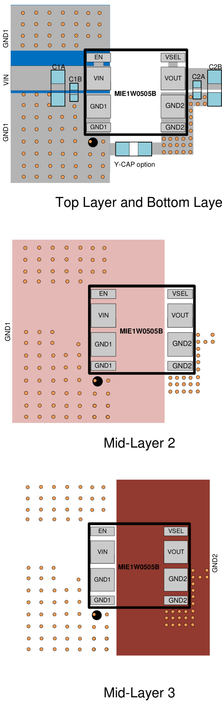  
PRELIMINARY SPECIFICATIONS SUBJECT TO CHANGE   
Figure 2: Recommended PCB Layout

# TYPICAL APPLICATION CIRCUITS

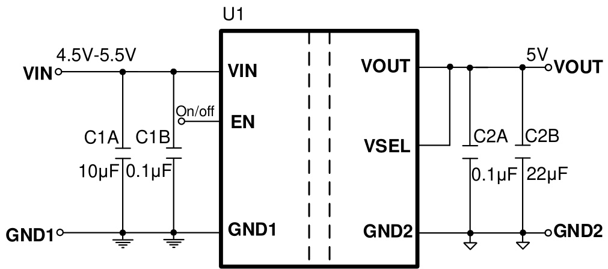  
Figure 3: 5V Output Application Circuit

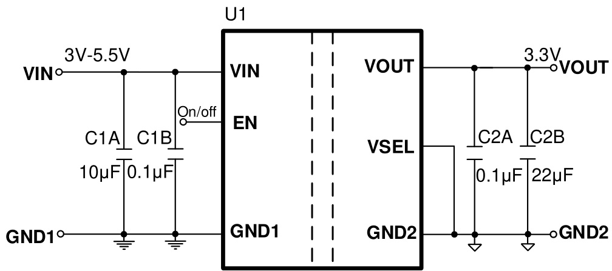  
Figure 4: 3.3V Output Application Circuit

# PACKAGE INFORMATION

# LGA-12 (4mmx5mm)

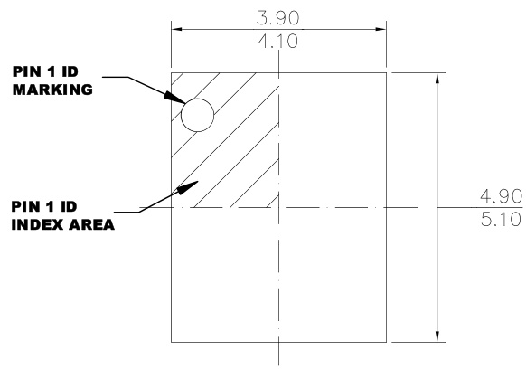

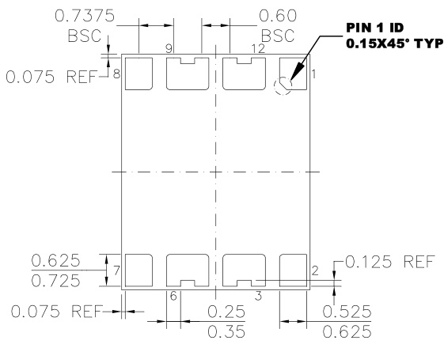

# TOP VIEW

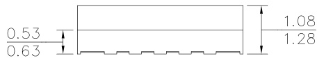

# BOTTOM VIEW

# SIDE VIEW

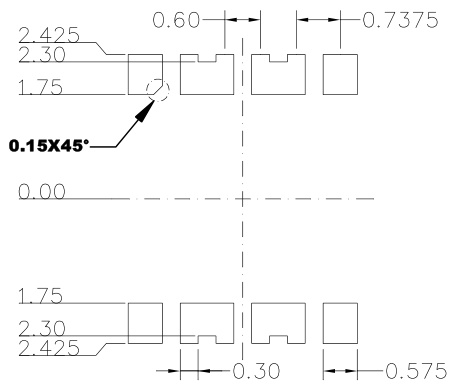

# RECOMMENDED LAND PATTERN

# NOTE:

1) ALL DIMENSIONS ARE IN MILLIMETERS.   
2) LEAD COPLANARITY SHALL BE 0.10   
MILLIMETERS MAX.   
3) JEDEC REFERENCE IS MO-303.   
4) DRAWING IS NOT TO SCALE.

# CARRIER INFORMATION

LGA-12 (4mmx5mm)

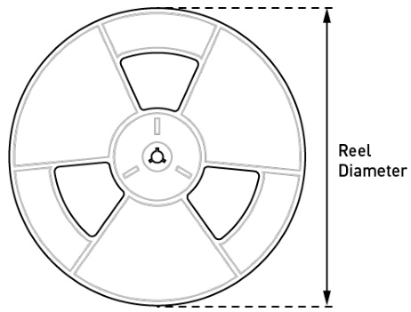

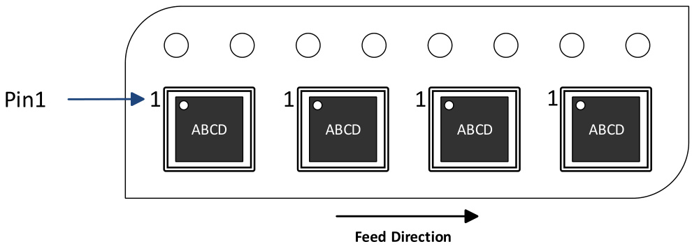

<html><body><table><tr><td>Part Number</td><td>Package Description</td><td>Quantity /Reel</td><td>Quantity /Tube</td><td>Quantity /Tray</td><td>Reel Diameter</td><td>Carrerr Width</td><td>Carerr Pitch</td></tr><tr><td>MIE1W0505BGLVH- 3R-Z</td><td>LGA-12 (4mmx5mm)</td><td>2500</td><td>N/A</td><td>N/A</td><td>13in.</td><td>12mm</td><td>8mm</td></tr></table></body></html>