# SSD2828QN4

Advance InformationMIPI Master Bridge

This document contains information on a new product. Specifications and information herein are subject to change without notice.

http://www.solomon-systech.com   

<html><body><table><tr><td>SSD2828QN4</td><td>Rev 1.3</td><td>P 1/168</td><td>Mar 2013</td><td>Copyright © 2013 Solomon Systech Limited</td></tr></table></body></html>

Appendix 1: IC Revision history of SSD2828 Specification   

<html><body><table><tr><td>Version</td><td>Change Items</td><td>Effective Date</td></tr><tr><td>1.0</td><td>Initial release of Advance Information</td><td>16-Oct-12</td></tr><tr><td>1.1</td><td>Modify the description of END and CO (Section 8.1.38)</td><td>13-Dec-12</td></tr><tr><td>1.2</td><td>Modify the timing for data latch in RGB (Section 14.4) Specify the prefix T in RGB timing (Section14.4) timing</td><td>09-Jan-13</td></tr><tr><td>1.3</td><td>Modify RGB color arrangement (Table 6-3) Update power up and power down sequence (Section 15 & Section 16)</td><td>27-Mar-13</td></tr></table></body></html>

# CONTENTS

# GENERAL DESCRIPTION .....

# 2 FEATURES. ... 10

2.1 REFERENCES. 10   
2.2 DEFINITIONS. 0

3 ORDERING INFORMATION 11

4 BLOCK DIAGRAM 1

# 5 FUNCTIONAL DESCRIPTION . 14

5.1 FUNCTIONAL BLOCKS.   
5.2 CLOCK AND RESET MODULE   
5.3 EXTERNAL INTERFACE..   
5.4 PROTOCOL CONTROL UNIT (PCU). · · ·   
5.5 PACKET PROCESSING UNIT (PPU)   
5.6 ERROR CORRECTION CODE/ CYCLIC REDUNDANCY CHECK (ECC/CRC)   
5.7 LONG AND COMMAND BUFFERS. …   
5.8 INTERRUPT SIGNAL ·   
5.9 D-PHY CONTROLLER   
5.10 ANALOG TRANSCEIVER   
5.11 INTERNAL PL

# 6 SSD2828QN4 PIN ASSIGNMENT . 18

# 7 PIN DESCRIPTION 20

# 8 COMMAND TABLE 23

8.1 REGISTER DESCRIPTION.. ·   
8.1.1 Device Identification Register.   
8.1.2 RGB Interface Control Register   
8.1.3 RGB Interface Control Register 2   
8.1.4 RGB Interface Control Register 3   
8.1.5 RGB Interface Control Register   
8.1.6 RGB Interface Control Register 5   
8.1.7 RGB Interface Control Register   
8.1.8 Configuration Register......   
8.1.9 VC Control Register.   
8.1.10 PLL Control Register ....................................   
8.1.11 PLL Configuration Register ......................... .   
8.1.12 Clock Control Register.   
8.1.13 Packet Size Control Register …   
8.1.14 Packet Size Control Register 2.   
8.1.15 Packet Size Control Register 3.   
8.1.16 Generic Packet Drop Register   
8.1.17 Operation Control Register   
8.1.18 Maximum Return Size Register   
8.1.19 Return Data Count Register........   
8.1.20 ACK Response Status Register.   
8.1.21 Line Control Register....................   
8.1.22 Interrupt Control Register   
8.1.23 Interrupt Status Register ......   
8.1.24 Error Status Register   
8.1.25 Delay Adjustment Register   
8.1.26 Delay Adjustment Register 2.   
8.1.27 Delay Adjustment Register 3. ..... ........56   
8.1.28 Delay Adjustment Register 4.   
8.1.29 Delay Adjustment Register 5.   
8.1.30 Delay Adjustment Register 6.   
8.1.31 HS TX Timer Register   
8.1.32 HS TX Timer Register 2   
8.1.33 LP RX Timer Register   
8.1.34 LP RX Timer Register 2   
  
8.1.35 TE Status Register.   
8.1.36 SPI Read Register   
8.1.37 PLL Lock Register..   
8.1.38 Test Register   
8.1.39 TE Count Register.   
8.1.40 Analog Control Register   
8.1.41 Analog Control Register 2 .   
8.1.42 Analog Control Register 3 ....................   
8.1.43 Analog Control Register 4   
8.1.44 Interrupt Output Control Register   
8.1.45 RGB Interface Control Register 7.   
8.1.46 Lane Configuration Register.................................   
8.1.47 Delay Adjustment Register 7   
  
8.1.48 Pull Control Register   
8.1.49 Pull Control Register 2   
8.1.50 Pull Control Register 3   
8.1.51 CABC Brightness Control Register   
8.1.52 CABC Brightness Control Register 2.   
8.1.53 CABC Brightness Status Register   
8.1.54 Encoder Control Register ................................   
8.1.55 Video Sync Delay Register .................. .   
8.1.56 Trimming Register   
8.1.57 GPIO1 Register. . . …   
8.1.58 GPIO2 Register.........................................   
8.1.59 DLYA01 Register   
8.1.60 DLYA23 Register   
8.1.61 DLYB01 Register   
8.1.62 DLYB23 Register ......   
8.1.63 DLYC01 Register · ·   
8.1.64 DLYC23 Register .   
8.1.65 Analog Control Register cid . · .   
8.1.66 Read Register .....................

# 0 CONFIGURATION 102

9.1 LANE MANAGEMENT. 102   
9.2 USE CASES . 03 9.2.1 RGB + SPI Interface 9.2.2 MIPI DC Characteristics . 9.2.3 High Speed Clock Transmission . 06 9.2.4 Data Lane State Flow 9.2.5 High Speed Data Transmission. 9.2.6 Bi-Directional Data Lane Turnaround 09 · 9.2.7 Escape Mode......... 9.2.8 Low Power Data Transmission. 9.2.9 Reset 9.2.10 Tearing Effect.. 9.2.11 Acknowledge .......... 9.2.12 Packet Transmission 9.2.13 HS Transmission Example ......................... 9.2.14 General Packet Structure. 9.2.15 Long Packet Format … 9.2.16 Short Packet Structure

9.2.17 Data Identifier (DI).............. 117   
9.2.18 Victual Channel Identifier (VC) . 18   
9.2.19 Data Type (DT) ............... 18   
9.3 OPERATING MODES . 22   
9.3.2 State machine operation........... 135   
9.3.3 D-PHY operation ............. ............ 36   
9.3.4 Analog Transceiver ........ 137   
9.3.5 PLL ............... 137   
9.3.6 Clock Source Example . 138   
10 EXTERNAL INTERFACE 139   
10.1 SPI INTERFACE 8 BIT 4 WIRE. 39   
10.2 SPI INTERFACE 8 BIT 3 WIRE. , 141   
10.2.1 3 or 4 wires 8bit SPI read back sequence for 0xFF register which is stored MIPI read back data ......... 143   
10.3 SPI INTERFACE 24 BIT 3 WIRE...... ............... 145   
10.3.1 3 wires 24bit SPI read back sequence for 0xFF register which is stored MIPI read back data. .............. 147   
11 MAXIMUM RATINGS ............................................................... 149   
12 RECOMMENDED OPERATING CONDITIONS 150   
13 DC CHARACTERISTICS .................................. 151   
14 AC CHARACTERISTICS 153   
14.1 8 BIT 4 WIRE SPI INTERFACE TIMING..................................... ............................................ 154   
14.2 8 BIT 3 WIRE SPI INTERFACE TIMING. ..... ................. 155   
14.3 24 BIT 3 WIRE SPI INTERFACE TIMING. ........... ................................... 56   
14.4 RGB INTERFACE TIMING 157   
14.5 RESET TIMING 158   
14.6 TX_CLK TIMING . . 158   
15 POWER UP SEQUENCE 159   
16 POWER OFF SEQUENCE 160   
17 EXAMPLE FOR SYSTEM SLEEP IN AND OUT ............ 161   
18 SERIAL LINK DATA ORDER............ 162   
19 PACKAGE INFORMATION ●●· •• ••• · · · • ●● • 165   
19.1 DIMENSION FOR SSD2828QN4 . ..........165

# TABLES

TABLE ORDERING INFORMATION .   
TABLE 6- SSD2828QN4 PINOUT DIAGRAM – 68 QFN-EP (TOP VIEW) N4 PIN ASSIGNMENT 68 QFN-EP (TOP VIEW) AB N4 RGB DATA ARRANGEMENT ABL MM IO RGB RF AC CONTRO GIS AB 8-6: RGB TER ACE CONT ROL REGISTER   
TABL 7: RGB INTER ACE CONTROL REGISTER DESCRIP   
TABLE 8-8: RGB TERFACE CONTROL REGISTER DESCRIPTIO   
TABLE 8- 9: CONFIGU RATION REGISTER DESCRIP TION   
TABLE 8- 10: VC CONTROL REGISTER DESCRIPTION ABLE 1: PLL CONTROL REGISTER DES RI ION ABL 2: PL CONFIG RATION REGIS ER ESCRIP TION ABL OCK CONTROL REGISTE DES ABL 4: ACKET SIZE CON TROL REGI ST ER CRIPTION AB ACKET SIZE CONTROL REGISTER ABL 8- 16: PACKET SIZE CON TROL REGISTER ABLE GENERIC PACKET DROP REGISTER D ESCRIP TIO ABL 8: OPERATION ONTROL REGISTER DES RIP B XIMUM RETURN SIZE REGISTER ES CRIPTION B RE TURN D ATA COUNT REGISTER ESCRIP TION RESPONSE STATUS REGISTER ESCRIP ION INE CONTROL REGISTER DESCRIP ON TERR PT ONTROL REGISTER DESC RIP TION TERRUP STATUS REGISTER DESCRIPTIO ERROR ST ATUS REGISTER DESCRIP TIO ABL 26 DEL AY ADJUST ENT REGISTER DESCRIPTION. ABL DELAY ADJUSTMENT REGISTER DESCRIPTION. AB DE AY ADJU STMENT REGIST DES E A ADJ $4 0 / 1$ ANA OG TRO GIS ER ABL -43: ANALOG CONTROL REGISTER   
TABL 8-44: ANALOG CONTROL REGISTER DESCRIP   
TABLE 8-45: INTERRUPT OUTPUT CONTROL REGISTER DESCRIPTION   
TABLE 8-46: RGB INTERFACE CONTROL REGISTER DESCRIPTION   
TABLE 8-47: LANE CONFIGU RATION REGISTER DESCRIPTION.   
TABLE 8-48: DELAY ADJUSTMENT REGISTER DESCRIPTION.   
TABLE 8-49: PULL CONTROL REGISTER DESCRIPTION   
TABLE 8-50: PULL CONTROL REGISTER DESCRIPTION   
TABLE 8-51: PULL CONTROL REGISTER DESCRIPTION TABLE 8-52: CABC BRIGHTNESS CONTROL REGISTER 1 DESCRIPTION .   
TABLE 8-53: CABC BRIGHTNESS CONTROL REGISTER 2 DESCRIPTION .   
TABLE 8-54: CABC BRIGHTNESS STATUS REGISTER DESCRIPTION   
TABLE 8-55: ENCODER CONTROL REGISTER DESCRIPTION   
TABLE 8-56: VIDEO SYNC DELAY REGISTER DESCRIPTION. ·   
TABLE 8-57: TRIMMING REGISTER DESCRIPTION .   
TABLE 8-58: GPIO1 REGISTER DESCRIPTION   
TABLE 8-59: GPIO1 REGISTER DESCRIPTION.   
TABLE 8-60: DLYA01 REGISTER DESCRIPTION   
TABLE 8-61: DLYA23 REGISTER DESCRIPTI ON   
TABLE 8-62: DLYB01 REGISTER DESCRIPTION   
TABLE 8-63: DLYB23 REGISTER DESCRIPTION   
TABLE 8-64: DLYC01 REGISTER DESCRIPTION   
TABLE 8-65: DLYC23 REGISTER DESCRIPTION   
TABLE 8-66: ACR5 REGISTER DESCRIPTION.   
TABLE 8-67: READ REGISTER DESCRIPTION.   
TABLE 9-1: SSD2828 LANE MANAGEMENT   
TABLE 9-2: OPERATION DURING VIDEO MODE BLLP PERIOD   
TABLE 9-3: DSI STATE CODE AND DC CHARACTERISTICS   
TABLE 9-4: DATA LANE MODE ENTERING/EXITING SEQUENCES   
TABLE 9-5: START-OF-TRANSMISSION SEQUENCE.   
TABLE 9-6: END-OF-TRANSMISSION SEQUENCE.   
TABLE 9-7: MIPI ESCAPE MODE ENTRY CODE ·   
TABLE 9-8: DATA TYPES FOR PROCESSOR-SOURCED PACKETS . .   
TABLE 9-9: DATA TYPES FOR PERIPHERAL-SOURCED PACKETS .   
TABLE 9-10: PLL SETTING FOR NON-BURST MODE (PLL REFERENCE USING PCLK) … TABLE 9-11: PLL SETTING FOR NON-BURST MODE (PLL REFERENCE USING TX _CLK) TABLE 9-12: PLL SETTING FOR BURST MODE............   
TABLE 9-13: MIPI ERROR REPORT   
TABLE 11-1: MAXIMUM RATINGS (VOLTAGE REFERENCED TO $\mathrm { V _ { S S } }$ ) . .. TABLE 12-1: RECOMMENDED OPERATING CONDITIONS TABLE 13-1: DC CHARACTERISTICS ·   
TABLE 13-2: HS TRANSMITTER DC CHARACTERISTICS   
TABLE 13-3: LP TRANSMITTER DC CHARACTERISTIC   
TABLE 13-4: LP RECEIVER DC CHARACTERISTICS   
TABLE 14-1: 8 BIT 4 WIRE SPI INTERFACE TIMING CHARACTERISTICS   
TABLE 14-2: 8 BIT 3 WIRE SPI INTERFACE TIMING CHARACTERISTIC   
TABLE 14-3: 24 BIT 3 WIRE SPI INTERFACE TIMING CHARACTERISTICS   
TABLE 14-4: RGB INTERFACE TIMING CHARACTERISTICS   
TABLE 14-5: RESET TIMING.   
TABLE 14-6: TX_CLK TIMING CHARACTERISTIC

# FIGURES

FIGURE DIAGRAM   
FIGURE 5-1: THE CLOCKING SCHEME OF SSD2828.   
FIGURE 8-1: TIMING FOR DELAY CALCULATION …   
FIGURE 8-2: TIMING FOR DELAY CALCULATION   
FIGURE 8-3: TWAKEUP PERIOD DELAY CALCUL ATION.   
FIGURE 8-4: TIMING FOR DELAY CALCULATION   
FIGURE 9-1: SSD2828 WITH RGB AND SPI INTERFACE   
FIGURE 9-2: MIPI LINE LEVELS   
FIGURE 9-3: SWITCHING THE CLOCK LANE BETWEEN HIGH SPEED MODE AND OW- POWER MODE   
FIGURE 9-4: HIGH-SPEED DATA TRANSMISSION IN BURSTS   
FIGURE 9-5: TURNAROUND PROCEDURE …   
FIGURE 9-6: LOW POWER DATA TRANSMISSION . …   
FIGURE 9-7: TRIGGER RESET COMMAND IN ESCAPE MODE.   
FIGURE 9-8: TEARING EFFECT COMMAND IN ESCAPE MODE...............   
FIGURE 9-9: ACKNOWLEDGE COMMAND IN ESCAPE MODE..................   
FIGURE 9-10: TWO DATA TRANSMISSION MODE (SEPARATE, SINGLE)   
FIGURE 9-11: ONE LANE DATA TRANSMISSION EXAMPLE   
FIGURE 9-12: TWO LANE HS TRANSMISSION EXAMPLE ............   
FIGURE 9-13: ENDIAN EXAMPLE (LONG PACKET) .....................   
FIGURE 9-14: LONG PACKET STRUCTURE..   
FIGURE 9-15: SHORT PACKET STRUCTURE .   
FIGURE 9 -16: DATA INDENTIFIER STRUCTURE . …   
FIGURE 9-17: 16-BIT PER PIXEL RGB COLOR FORMAT, LONG PACKET FOR MIPI INTERFACE .   
FIGURE 9-18: 18-BIT PER PIXEL– RGB COLOR FORMAT, LONG PACKET FOR MIPI INTERFACE.   
FIGURE 9-19: 18-BIT PER PIXEL IN THREE BYTES – RGB COLOR FORMAT, LONG PACKET FOR MIPI INTERFACE. FIGURE 9-20: 24-BIT PER PIXEL – RGB COLOR FORMAT, LONG PACKET FOR MIPI INTERFACE   
FIGURE 9-21: ILLUSTRATION OF RGB INTERFACE PARAMETERS FOR NON-BURST MODE WITH SYNC PULSES . ....... 22 FIGURE 9-22: ILLUSTRATION OF RGB INTERFACE PARAMETERS FOR NON-BURST MODE WITH SYNC EVENTS AND BURST MODE ..... 23 FIGURE 9 -23: NON-BURST MODE MIPI STRUCTURE ……   
FIGURE 9-24: BURST MODE MIPI STRUCTURE ·   
FIGURE 9-25: ACKNOWLEDGEMENT HANDLING AFTER NON-READ COMMAND . 30 FIGURE 9-26: ACKNOWLEDGEMENT HANDLING AFTER READ COMMAND.   
FIGURE 9-27: ILLUSTRATION OF INTERRUPT LATENCY.   
FIGURE 10-1: ILLUSTRATION OF WRITE OPERATION FOR 8 BIT 4 WIRE INTERFACE...   
FIGURE 10-2: ILLUSTRATION OF READ OPERATION FOR 8 BIT 4 WIRE INTERFACE   
FIGURE 10-3: ILLUSTRATION OF WRITE OPERATION FOR 8 BIT 3 WIRE INTERFACE..   
FIGURE 10-4: ILLUSTRATION OF READ OPERATION FOR 8 BIT 3 WIRE INTERFACE .......   
FIGURE 10-5: ILLUSTRATION OF WRITE OPERATION FOR 24 BIT 3 WIRE INTERFACE   
FIGURE 10-6: ILLUSTRATION OF READ OPERATION FOR 24 BIT 3 WIRE INTERFACE   
FIGURE 14-1: 8 BIT 4 WIRE SPI INTERFACE TIMING DIAGRAM   
FIGURE 14-2: 8 BIT 3 WIRE SPI INTERFACE TIMING DIAGRAM ........   
FIGURE 14-3: 24 BIT 3 WIRE SPI INTERFACE TIMING DIAGRAM ..   
FIGURE 14-4: RGB INTERFACE TIMING DIAGRAM   
FIGURE 14-5: TX_CLK TIMING DIAGRAM .................   
FIGURE 18-1- PACKAGE INFORMATION …   
FIGURE 18-2- MARKING INFORMATION · 66 FIGURE 18-3- TRAY INFORMATION. 67

# 1 GENERAL DESCRIPTION

The SSD2828 IC is an MIPI master bridge chip that connects an application processor with traditional parallel LCD interface and an LCD driver with MIPI slave interface. The 2828 supports up to 1Gbps per lane speed with maximum 4 lanes using both parallel RGB interface and serial SPI interface.

# 2 FEATURES

Support up to total of 4Gbps over the serial link   
• Support up to 4 data lanes   
• Number of signals is significantly reduced when compare to traditional RGB transfer   
• Support up to 1920 pixels per display row in Video mode, up to 60hz refresh rate   
• Support up to 2560 pixels per display row in Video mode, up to $3 0 \mathrm { { h z } }$ refresh rate Reduce power consumption and decrease EMI by using low amplitude signal over differential pair for serial data. Support parallel RGB interface (DPI 2.0) up to 24-bits Support serial SPI interface (DBI 2.0) up to 16-bits Support both command mode and video mode in MIPI DSI standard Support 16, 18 and 24-bit per pixel in Raw or Pixel mode for command mode transfer Support independent bi-directional data transfer (forward link in High Speed and Low Power mode and reverse link in Low Power mode) for each DSI Support Ultra low power mode in idle state for each DSI Support CABC function for Video mode On-chip PLL with variable output frequency MIPI analog and digital power supply: (MVDD) $1 . 2 \mathrm { V } + / \mathrm { - } 1 0 \%$   
• IO Power supply: (VDDIO) $1 . 8 \sim 3 . 3 \mathrm { V } + / \mathrm { - } 1 0 \%$ Support of MIPI standard DSI(v1.01.00), DCS(v1.02.00), D-PHY (v1.00.00)

# 2.1 References

MIPI Alliance Standard for Display Serial Interface, version 1.01   
MIPI Alliance Standard for Display Command Set, version 1.02   
MIPI Alliance Standard for D-PHY, version 1.00   
MIPI Alliance Standard for Display Bus Interface, version 2.0   
MIPI Alliance Standard for Display Pixel Interface, version 2.0

# 2.2 Definitions

HS High Speed   
SPI Type C interface option of MIPI Alliance Standard for Display Bus Interface v2.0 (DBI-2)   
LP Low Power   
ULPS Ultra Low Power State   
RGB MIPI Alliance Standard for Display Pixel Interface v2.0 (DPI-2)   
VC Virtual Channel

Table 3-1: Ordering Information   

<html><body><table><tr><td>Ordering Part Number</td><td>Package Form</td></tr><tr><td>SSD2828QN4</td><td>68 QFN-EP (in Tray form)</td></tr></table></body></html>

# 4 BLOCK DIAGRAM

The SSD2828 IC consists of the following modules.

Clock and reset module   
External interface   
PCU (protocol control unit)   
PPU (packet processing unit)   
ECC/CRC   
Long and command buffers   
D-PHY controller   
Analog MIPI transceiver   
Internal PLL

The usage of SSD2828 is given in the diagram below.

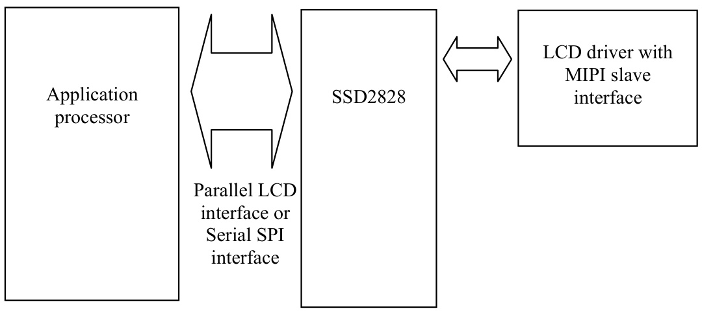  
Figure 4-1: Overview of display system using SSD2828

Below is the interface diagram for the SSD2828 driving MIPI slave panel. Three types of interface are supported which are RGB and SPI interfaces. The interfaces can be selected through ps[1:0] pins.

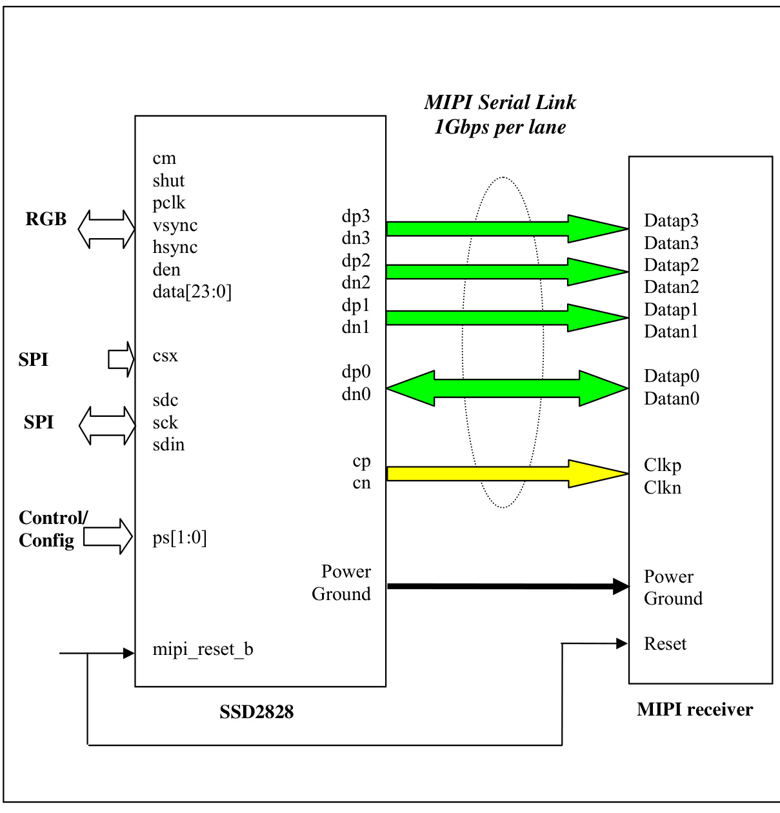  
Figure 4-2: SSD2828 Interface Diagram

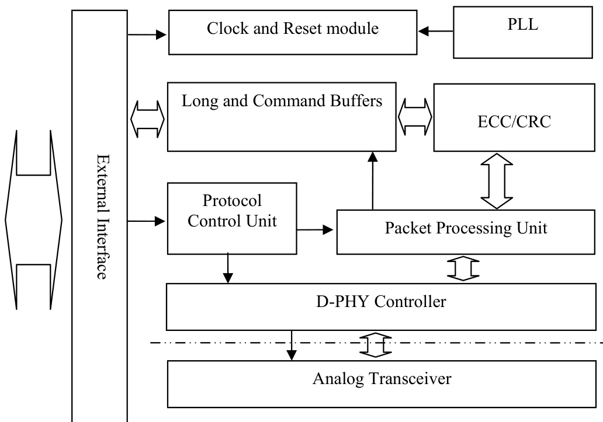  
Figure 4-3: Block Diagram

# 5 FUNCTIONAL DESCRIPTION

# 5.1 Functional Blocks

# 5.2 Clock and Reset Module

The clock and reset module controls the generation of the operation clock for the whole system. There are two reference clock sources for the PLL. One is from the tx_clk and the other is from the pclk. The application processor can choose the reference clock for the PLL by program the CSS. The PLL output clock is used to generate the clock and data on the serial link during HS mode. The PLL frequency is the same as the data rate on 1 data lane. Hence, the PLL needs to be programmed according to the HS speed. Please refer to 9.3.5 for how to program the PLL.

NOTE: The default value of the CSS is 0 which selects the tx clk. Hence, after power up, tx_clk must be present so that the registers can be programmed. If the application processor wants to switch the clock source, tx_clk must be provided first so that the CSS field can be programmed. After the CSS is programmed, the tx clk can be turned off.

After powering up, the PLL is in sleep mode. The host needs to program the PLL setting before enable the PLL. If the host needs to switch the clock source of the PLL, it needs to put the PLL into sleep mode first. Afterwards, the host needs to program the PLL with new setting and enable the PLL. In both cases, the PLL needs a certain amount of time to lock the output clock frequency after being enabled. Hence, when the PLL is in sleep mode or when the PLL is enabled but not locked, the whole system is operating using the reference clock. After the PLL gets locked, the system is operating using the PLL output clock. Please see the diagram below for detailed clocking scheme. Since the reference clock is much slower than the PLL output clock, the host needs to operate at low speed too, before the PLL gets locked. Please refer to 14 for the requirement of low speed and normal speed.

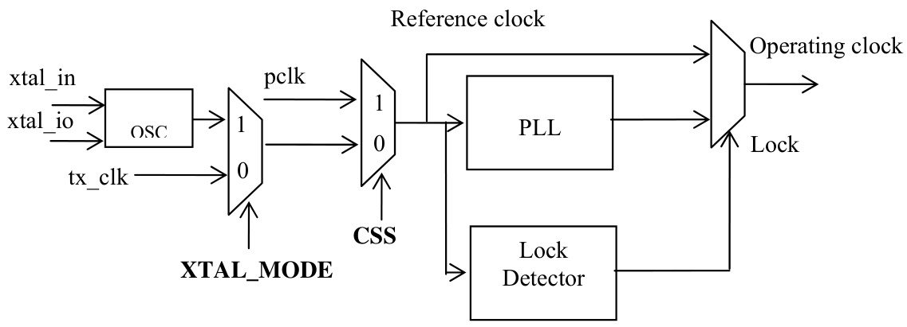  
Figure 5-1: The Clocking Scheme of SSD2828

An output lock signal is provided for indication. This signal is connected to one of the interrupt source. The host can use the interrupt signal int to decide whether to operate at low speed or normal speed. The host can also poll the status bit PLS for the lock status.

Various clocks are mentioned in this document. Below is the explanation for each of them.

Bit clock

It is the output clock from PLL. It is the clock source of all the clocks in the SSD2828.

<html><body><table><tr><td>SSD2828QN4</td><td>Rev 1.3</td><td>P 14/168</td><td>Mar 2013 Solomon Systech</td></tr></table></body></html>

Nibble clock

It is a clock whose frequency is 1/4 of the bit clock.

Byte clock

It is a clock whose frequency is 1/8 of the bit clock.

Low power clock

It is a clock generated from byte clock. The divider value is given by field LPD. Please refer to 8.1.12. The low power clock period corresponds to $2 \mathrm { ~ x ~ T _ { L P X } }$ , as defined in MIPI D-PHY specification.

# 5.3 External Interface

The external interface is in charge of the communication with the application processor. It supports 2 types of interface, which are RGB and SPI.

Parallel RGB interface for dumb display controller. The data bus width can be 16-bit, 18-bit and 24-bit. Serial SPI interface for smart display controller. The SPI interface supports modes, which are 8-Bit 3 wire, 8- Bit 4 wire and 24-bit 3 wire. The 8-Bit 3 wire mode is the type C option interface as specified in MIPI DBI 2.0. The 8-Bit 4 wire mode is the type C option 3 interface as specified in MIPI DBI 2.0.

The SPI interface is a completely separate interface from the other. Please see the pin table description for detailed scheme.

The SSD2828 supports one interface configuration.

A combination of RGB and SPI interface

This configuration is mainly used to drive dumb display panel through the MIPI link. The RGB interface inputs the display data to the dumb display. The SPI interface inputs the data which is to configure the dumb display. Alternatively, the SPI interface can also input the data which is to drive a smart display panel, if the MIPI slave can control a dumb display panel and a smart one at the same time.

# 5.4 Protocol Control Unit (PCU)

The PCU is in charge of the handling of outgoing and incoming data stream. It has a state machine to decide what packet to be sent when an event comes in and how to react to the received packet.

# 5.5 Packet Processing Unit (PPU)

The PPU is in charge of packet assembly and disassembly. During transmission, it will form the packet according to the instruction from the PCU. During reception, it will extract necessary information from the packet and pass to the PCU.

# 5.6 Error Correction Code/ Cyclic Redundancy Check (ECC/CRC)

During transmission, the ECC/CRC module will generate the ECC or CRC for the outgoing bit stream.

During reception, the ECC/CRC module will check the correctness of the ECC and CRC field of the incoming stream.

If there is 1 bit of error in the data and ECC field, this error will be corrected by the ECC module. If there are more than 1 bit of error in the data and ECC field, the ECC module will detect the error and report it. If there is at least 1 bit of error in the data and CRC field, the CRC module will detect the error and report it.

# 5.7 Long and Command Buffers

In the forward direction, the SSD2828 supports DCS short write, DCS long write, Generic short write, Generic long write packets and all video packets. The internal buffers are used as temporary storage for incoming data, so that the application processor does not need to wait for the packet to be transmitted before writing the next one. All the command packets will be stored in the command buffers, except DCS command 2C/3C. All the long packets in video mode and the long packets with DCS command 2C/3C in command mode will be stored in the long buffer. After a complete packet is written into the buffer, the SSD2828 will send out the packet.

The command buffer can contain one or multiple packets, up to the size of 1024 bytes. As long as 1 complete packet is received, the state machine will instructs the D-PHY Controller to send out the packet.

Each long buffer can contain, maximum, 2 packets.

For each buffer, there are 2 status bits associated. One is buffer empty and the other is buffer available. Buffer empty means there is no packet in the buffer. Buffer available means that there is space to hold at least one packet. The buffer status can be reflected to the application processor through interrupt signal.

# 5.8 Interrupt signal

An interrupt signal is provided to trigger the application processor for certain event in the SSD2828. The events include internal long or command buffer empty, internal long or command buffer available, data ready for read back, acknowledgement response from MIPI slave, BTA response from the MIPI slave, time out, and packet operation ready. Please see the interrupt register description and 9.3.1.6 for more details.

# 5.9 D-PHY Controller

The D-PHY controller is in charge of the communication with the analog transceiver. During transmission, it receives data from PPU and informs the analog transmitter how to transmit. During reception, it receives data from analog receiver and passes the data to the PPU for further processing. At the same time, it is also performing the handshaking process, such as, bus turn around and switching between different modes.

# 5.10 Analog Transceiver

It consists of 4 data lane controllers and clock lane controller. of the data lane controllers is capable of providing reverse transmission.

<html><body><table><tr><td>SSD2828QN4</td><td>Rev 1.3</td><td>P16/168</td><td>Mar 2013 Solomon Systech</td></tr></table></body></html>

# 5.11 Internal PLL

The internal PLL will generate the required high speed clock for the whole system operation. The input reference clock can come from either the tx_clk (_XIN, _XIO) or the pclk.

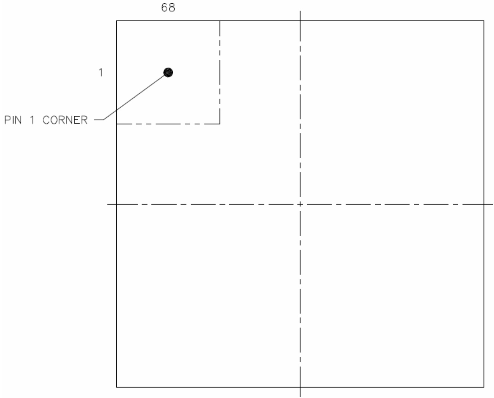  
Table 6-1: SSD2828QN4 Pinout Diagram – 68 QFN-EP (Top view)

Table 6-2: SSD2828QN4 Pin Assignment – 68 QFN-EP (Top view)   

<html><body><table><tr><td>QFN pin #</td><td>Net name</td><td>QFN pin #</td><td>Net name</td></tr><tr><td>1</td><td>DATAPO</td><td>35</td><td>DATAO</td></tr><tr><td>2</td><td>DATANO</td><td>36</td><td>DATA1</td></tr><tr><td>3</td><td>GND</td><td>37</td><td>DATA2</td></tr><tr><td>4</td><td>DATAP1</td><td>38</td><td>DATA3</td></tr><tr><td>5</td><td>DATAN1</td><td>39</td><td>DATA4</td></tr><tr><td>6</td><td>GND</td><td>40</td><td>DATA5</td></tr><tr><td>7</td><td>CLKP</td><td>4</td><td>DATA6</td></tr><tr><td>8</td><td>CLKN</td><td>42</td><td>DATA7</td></tr><tr><td>9</td><td>GND</td><td>43</td><td>DATA8</td></tr><tr><td>10</td><td>DATAP2</td><td>44</td><td>DATA9</td></tr><tr><td>11</td><td>DATAN2</td><td>45</td><td>DATA10</td></tr><tr><td>12</td><td>GND</td><td>46</td><td>DATA11</td></tr><tr><td>13</td><td>DATAP3</td><td>47</td><td>DATA12</td></tr><tr><td>14</td><td>DATAN3</td><td>48</td><td>DATA13</td></tr><tr><td>15</td><td>MVDD</td><td>49</td><td>DATA14</td></tr><tr><td>16</td><td>VDDIO</td><td>50</td><td>DATA15</td></tr><tr><td>17</td><td>PSO</td><td>51</td><td>DATA16</td></tr><tr><td>18</td><td>PS1</td><td>52</td><td>DATA17</td></tr><tr><td>19</td><td>NC</td><td></td><td>DATA18</td></tr><tr><td>20</td><td>NC</td><td>54</td><td>DATA19</td></tr><tr><td>21</td><td>NC</td><td>55</td><td>DATA20</td></tr><tr><td>22</td><td>RESET</td><td>55</td><td>DATA21</td></tr><tr><td>23</td><td>SDO</td><td>57</td><td>DATA22</td></tr><tr><td>24</td><td>SDI</td><td>58</td><td>DATA23</td></tr><tr><td>25</td><td>SCK</td><td>59</td><td>CSXO</td></tr><tr><td>26</td><td>SDC</td><td>60</td><td>MVDD</td></tr><tr><td>27</td><td>SHUT</td><td>61</td><td>SYS CLK OUT</td></tr><tr><td>28</td><td>DEN</td><td>62</td><td>TX CLK_XIO</td></tr><tr><td>29</td><td>HSYNC</td><td>63</td><td>TX CLK XIN</td></tr><tr><td>30</td><td>PCLK</td><td>64</td><td>VDDIO</td></tr><tr><td>31</td><td>MVDD</td><td>65</td><td>GND</td></tr><tr><td>32</td><td>GND</td><td>66</td><td>MVDD</td></tr><tr><td>33</td><td>VDDIO</td><td>67</td><td>GND</td></tr><tr><td>34</td><td>VSYNC</td><td>68</td><td>VDDIO</td></tr></table></body></html>

Table 6-3: SSD2828QN4 RGB data arrangement   

<html><body><table><tr><td></td><td>D23</td><td>D22</td><td>D21</td><td>D20</td><td>D19</td><td>D18</td><td>D17</td><td>D16</td><td>D15</td><td>D14 D13</td><td>D12</td><td>D11</td><td>D10</td><td></td><td>D9</td><td>D8</td><td>D7</td><td>D6</td><td>D5</td><td>D4</td><td>D3</td><td>D2</td><td></td><td>D1</td><td>D0</td></tr><tr><td>24bpP</td><td>R7</td><td></td><td></td><td>R4</td><td></td><td></td><td></td><td></td><td>G7</td><td>6</td><td></td><td></td><td></td><td></td><td></td><td>G0</td><td>B7</td><td>B6</td><td>B5</td><td>B4</td><td>B3</td><td></td><td>B2</td><td>B1</td><td>B0</td></tr><tr><td>18bpp</td><td></td><td></td><td></td><td></td><td></td><td></td><td></td><td></td><td></td><td></td><td></td><td></td><td></td><td></td><td></td><td></td><td>G1</td><td>G0</td><td>B5</td><td>B4</td><td>" B3</td><td>"</td><td>B1</td><td></td><td>B0</td></tr><tr><td>16bpp</td><td></td><td></td><td></td><td></td><td></td><td></td><td></td><td></td><td>R4</td><td></td><td></td><td></td><td>R0</td><td></td><td></td><td></td><td>G2</td><td>G</td><td>G0</td><td>B4</td><td>B3</td><td>B2</td><td></td><td>B1</td><td>B0</td></tr></table></body></html>

# 7 Pin Description

# SSD2828 Pin Function Description

Key: $\mathrm { { I } = \mathrm { { I n p u t } } }$ $\scriptstyle \mathrm { O = O u t p u t }$ $\mathrm { I } / \mathrm { O } = \mathrm { B i }$ -directional (input/output) ${ \bf P } =$ Power pin $\mathrm { G N D } =$ System VSS

Table 7-1: Power Supply Pins   

<html><body><table><tr><td>Name</td><td>Type</td><td>Connect to</td><td>Function</td><td>Description</td><td>When not in use</td></tr><tr><td>GND</td><td></td><td>GND</td><td>Ground of Power Supply</td><td>Ground for IC</td><td></td></tr><tr><td>MVDD</td><td></td><td>Power</td><td>Power for Analog/Digital Circuits and PLL Circuit</td><td>Power supply for the internal analog/digital and PLL circuit. (1.2V +/-10%)</td><td>circuit</td></tr><tr><td>VDDIO</td><td></td><td></td><td>Circuits</td><td>P1.8~3 +/ for and digital interface circuit.</td><td></td></tr></table></body></html>

Table 7-1: MIPI Pins   

<html><body><table><tr><td>Name</td><td>Type</td><td>Connect to</td><td>Function</td><td>Description</td><td>When not in use</td></tr><tr><td>CLKP0</td><td rowspan="5"></td><td rowspan="6">MIPI Rx</td><td rowspan="6">MIPI</td><td>Positive differential clock signal for DSI_0</td></tr><tr><td>CLKN0</td><td>Negative differential clock signal for DSI_0</td></tr><tr><td>DATAPO</td><td>Positive differential data signal ) for DSI_0</td></tr><tr><td>DATANO</td><td>Negative differential data signal 0 for DSI_0</td></tr><tr><td>DATAP1</td><td>Positive differential data signal for DSI_0 Open</td></tr><tr><td>DATAN1</td><td>Signals Negative differential data signal</td></tr><tr><td>DATAP2</td><td rowspan="3"></td><td>Positive differential data signal for DSI_0</td></tr><tr><td>DATAN2</td><td>Negative differential data signal 2 for DSI_0</td></tr><tr><td>DATAP3</td><td>Positive differential data signal for DSI_0</td></tr><tr><td>DATAN3</td><td></td><td>Negative differential data signal</td><td>for DSI_0 3</td></tr></table></body></html>

Table 7-2: Interface Logic Pins   

<html><body><table><tr><td>Name</td><td>Type</td><td>Connect to</td><td>Function</td><td>Description</td><td>When not in use</td></tr><tr><td>DATA[23:0]</td><td>1/O</td><td rowspan="7">AP</td><td rowspan="5">Interface</td><td>RGB data for RGB interface</td><td>Open</td></tr><tr><td>VSYNC</td><td>RGB</td><td>VSYNC for RGB interface</td><td>VDDIO or GND</td></tr><tr><td>PCLK</td><td rowspan="4"></td><td>PCLK for RGB interface</td><td>VDDIO or GND</td></tr><tr><td>DEN</td><td>DEN for RGB interface</td><td>VDDIO or GND</td></tr><tr><td>HSYNC</td><td>HSYNC for RGB interface</td><td>VDDIO or GND</td></tr><tr><td>SDC</td><td>Data or command for SPI interface (for 8 bit 4 wire)</td><td>VDDIO or GND</td></tr><tr><td>CSX0</td><td rowspan="4"></td><td rowspan="4">SPI Interface</td><td>Chip select of DSI 0 for SPI interface</td><td>VDDIO</td></tr><tr><td>SCK</td><td>Serial clock for SPI interface (for 8 bit 3 wire, 8 bit 4 wire, 24 bit 3 wire)</td><td>VDDIO or GND</td></tr><tr><td>SDI</td><td>Serial data input for SPI interface (for 8 bit 3 wire, 8 bit 4 wire, 24 bit 3 wire)</td><td>VDDIO or GND</td></tr><tr><td>0</td><td>Serial data output for SPI interface (for 8 bit 3 wire, 8 bit 4 wire, 24 bit 3 wire)</td><td>Open</td></tr></table></body></html>

Table 7-3: Miscellaneous Pins   

<html><body><table><tr><td>Name</td><td>Type</td><td>Connect to</td><td>Function</td><td>Description</td><td>When not in use</td></tr><tr><td>SHUT</td><td rowspan="3"></td><td rowspan="3">VDDIO GND</td><td rowspan="3">or</td><td>Shutdown signal of RGB interface (to put the driver into sleep mode). - 1: The panel is shut down (Sending 22h packet when SHUT from "0" ) "1" in video mode) - 0: The panel is operating (Sending 32h packet at the beginning of video mode automatically) changes</td><td>VDDIO</td></tr><tr><td>PS[1:0]</td><td>Interface selection signal PS[1:0] is for SPI interface 00: 3 wire 24 bit SPI interface 01: 3 wire 8 bit SPI interface 10: 4 wire 8 bit SPI interface</td><td>GND</td></tr><tr><td>TX_CLK_XIN</td><td>Control 11: SSL internal test mode Signal Input system clock. 8 ~ 30MHz oscillator input.</td><td></td></tr><tr><td></td><td>I/O</td><td>Exte </td><td>Input crystal range for the crystal 30Mhz Input system clock. Open.</td><td>8Mhz to</td><td></td></tr><tr><td>TX_CLK_XIO</td><td></td><td></td><td>Input crystal range for 30Mhz</td><td>the crystal oscillator input. 8Mhz to</td><td>Open</td></tr><tr><td>SYS_CLK_OUT RESET</td><td></td><td>VDDIO or GND</td><td>Active low reset signal</td><td>Output system clock for MIPI slave to the chip</td><td>Open VDDIO</td></tr></table></body></html>

Table 8-1: SSD2828 Register Summary   

<html><body><table><tr><td colspan="4"></td></tr><tr><td>Offset</td><td>Name</td><td>Mnemonic</td><td>Reset Value</td></tr><tr><td>0xB0</td><td>Device Identification Register</td><td>DIR</td><td>0x2828</td></tr><tr><td>0xB1</td><td>RGB Interface ontrol Register</td><td>VICR1</td><td>0x020A</td></tr><tr><td>0xB2</td><td>RGB Interface Control Register</td><td>VICR2</td><td>0x0214</td></tr><tr><td>0xB3</td><td>RGB Interface Control Register</td><td>VICR3</td><td>0x0428</td></tr><tr><td>0xB4</td><td>RGB Interface Control Register 4</td><td>VICR4</td><td>0x0780</td></tr><tr><td>0xB5</td><td>RGB Interface Control Register</td><td>VICR5</td><td>0x0438</td></tr><tr><td>0xB6</td><td>RGB Interface Control Register 6</td><td>VICR6</td><td>0x0024</td></tr><tr><td>0xB7</td><td>Configuration Register</td><td>CFGR</td><td>0x0301</td></tr><tr><td>0xB8</td><td>VC Control Register</td><td>VCR</td><td>0x0045</td></tr><tr><td>0xB9</td><td>PLL Control Register</td><td>PCR</td><td>0x0000</td></tr><tr><td>0xBA</td><td>PLL Confi guration Register</td><td>PLCR</td><td>0x8120</td></tr><tr><td>0xBB</td><td>Clock Control Register</td><td>CCR</td><td>0x0003</td></tr><tr><td>0xBC</td><td>Packet Size Control Register</td><td>PSCR1</td><td>0x0000</td></tr><tr><td>0xBD</td><td>Packet Size Control Register 2</td><td>PSCR2</td><td>0x0000</td></tr><tr><td>0xBE</td><td>Packet Size Control Register 3</td><td>PSCR3</td><td>0x0100</td></tr><tr><td>0xBF</td><td>Packet Drop Register</td><td>PDR</td><td>0x0000</td></tr><tr><td>0xC0</td><td>Operation Control Register</td><td>OCR</td><td>0x0000</td></tr><tr><td>0xC1</td><td>Maximum Return Size Register</td><td>MRSR</td><td>0x0001</td></tr><tr><td>0xC2</td><td>Return Data Count Register</td><td>RDCR</td><td>0x0000</td></tr><tr><td>0xC3</td><td>ACK Response Register</td><td>ARSR</td><td>0x0000</td></tr><tr><td>0xC4</td><td>Line Control Register</td><td>LCR</td><td>0x0000</td></tr><tr><td>0xC5</td><td>Interrupt Control Register</td><td>ICR</td><td>0x0080</td></tr><tr><td>0xC6</td><td>Interrupt Status Register</td><td>ISR</td><td>0xCF06</td></tr><tr><td>0xC7</td><td>Error Status Register</td><td>ESR</td><td>0x0000</td></tr><tr><td>0xC9</td><td>Delay Adjustment Register</td><td>DAR1</td><td>0x1402</td></tr><tr><td>0xCA</td><td>Delay Adjustment Register 2</td><td>DAR2</td><td>0x2803</td></tr><tr><td>0xCB</td><td>Delay Adjustment Register 3</td><td>DAR3</td><td>0x0416</td></tr><tr><td>0xCC</td><td>Delay Adjus Register 4 tment</td><td>DAR4</td><td>0x0A0A</td></tr><tr><td>0xCD</td><td>Delay Adjustment Register 5</td><td>DAR5</td><td>0x1000</td></tr><tr><td>0xCE</td><td>Delay Adju stment Register 6</td><td>DAR6</td><td>0x0405</td></tr><tr><td>0xCF</td><td>HS TX Timer Register</td><td>HTTR1</td><td>0x0000</td></tr><tr><td>0xD0</td><td>HS TX Timer Register 2</td><td>HTTR2</td><td>0x0010</td></tr><tr><td>0xD1</td><td>LP RX Timer Register</td><td>LRTR1</td><td>0x0000</td></tr><tr><td>0xD2</td><td>LP RX Timer Register 2</td><td>LRTR2</td><td>0x0010</td></tr><tr><td>0xD3</td><td>TE Status Register</td><td>TSR</td><td>0x0000</td></tr><tr><td>0xD4</td><td>SPI Read Register</td><td>LRR</td><td>0x00FA</td></tr><tr><td>0xD5</td><td>PLL Lock Register</td><td>PLLR</td><td>0x1450</td></tr><tr><td>0xD6</td><td>Test Register</td><td>TR</td><td>0x0005</td></tr><tr><td>0xD7</td><td>TE Count Register</td><td>TECR</td><td>0x0001</td></tr><tr><td>0xD8</td><td>Analog Control Register</td><td>ACR1</td><td>0x2020</td></tr><tr><td>0xD9</td><td>Analog Control Register</td><td>ACR2</td><td>0x64A0</td></tr><tr><td>0xDA</td><td>Analog Control Register</td><td>ACR3</td><td>0x99A4</td></tr><tr><td>0xDB</td><td>Analog Control Register</td><td>ACR4</td><td>0x8098</td></tr><tr><td>0xDC</td><td>Interrupt Output Control Register</td><td>IOCR</td><td>0x0000</td></tr><tr><td>0xDD</td><td>RGB Interface Control Register</td><td>VICR7</td><td>0x0000</td></tr><tr><td>0xDE</td><td>Lane Configuration Register</td><td>LCFR</td><td>0x0000</td></tr><tr><td>0xDF</td><td>Delay Adjustment Register</td><td>DAR7</td><td>0x0010</td></tr><tr><td>OxE0</td><td>Pull Control Register</td><td>PUCR1</td><td>0x5556</td></tr><tr><td>0xE1</td><td>Pull trol Register Cont</td><td>PUCR2</td><td>0x6656</td></tr><tr><td>0xE2</td><td>Pull Control Register</td><td>PUCR3</td><td>0x0159</td></tr></table></body></html>

<html><body><table><tr><td>Offset</td><td>Name</td><td>Mnemonic</td><td>Reset Value</td></tr><tr><td>0xE9</td><td>CABC Brightness Control Register</td><td>CBCR1</td><td>0x0000</td></tr><tr><td>OxEA</td><td>CABC Brightness Control Register 2</td><td>CBCR2</td><td>0x6900</td></tr><tr><td>0xEB</td><td>CABC Brightness Status Register</td><td>CBSR</td><td>0x0000</td></tr><tr><td>0xEC</td><td>Encoder Control Register</td><td>ECR</td><td>0x7800</td></tr><tr><td>0xED</td><td>Video Sync Delay Register</td><td>VSDR</td><td>0x0002</td></tr><tr><td>0xEE</td><td>Trimming Register</td><td>TMR</td><td>0x0000</td></tr><tr><td>OxEF</td><td>GPIO Register 1</td><td>GPIO1</td><td>0x0000</td></tr><tr><td>0xF0</td><td>GPIO Register 2</td><td>GPIO2</td><td>0x0000</td></tr><tr><td>OxF1</td><td>DLYA01 Register</td><td>DLYA01</td><td>0x2020</td></tr><tr><td>0xF2</td><td>DLYA23 Register</td><td>DLYA23</td><td>0x2020</td></tr><tr><td>0xF3</td><td>DLYB01 Register</td><td>DLYB01</td><td>0x2020</td></tr><tr><td>0xF4</td><td>DLYB23 Register</td><td>DLYB23</td><td>0x2020</td></tr><tr><td>0xF5</td><td>DLYC01 Register</td><td>DLYC01</td><td>0x2020</td></tr><tr><td>0xF6</td><td>DLYC23 Register</td><td>DLYC23</td><td>0x2020</td></tr><tr><td>0xF7</td><td>Analog Control Register 5</td><td>ACR5</td><td>0x0000</td></tr><tr><td>0xFF</td><td>Read Register</td><td>RR</td><td>0x0000</td></tr></table></body></html>

# 8.1 Register Description

# 8.1.1 Device Identification Register

Offset Address

DIR

# Device Identification Register

Table 8-2: Device Identification Register Description   

<html><body><table><tr><td>BIT</td><td>15</td><td>4</td><td>13</td><td>12</td><td>11</td><td>10</td><td></td><td></td></tr><tr><td>NAME</td><td colspan="8">DIR[15:8]</td></tr><tr><td>TYPE</td><td colspan="8">RO</td></tr><tr><td>RESET</td><td colspan="8">0x28</td></tr><tr><td></td><td colspan="8"></td></tr><tr><td>BIT</td><td></td><td></td><td></td><td></td><td></td><td></td><td></td><td></td></tr><tr><td>NAME</td><td colspan="8">DIR[7:0]</td></tr><tr><td>TYPE</td><td colspan="8">RO</td></tr><tr><td>RESET</td><td colspan="8">0x28</td></tr><tr><td></td><td colspan="8"></td></tr></table></body></html>

<html><body><table><tr><td>Name</td><td>Description</td><td>Setting</td></tr><tr><td>DIR Bit 15-0</td><td>Device Identification Number</td><td>0x2828</td></tr></table></body></html>

# 8.1.2 RGB Interface Control Register 1

Offset Address

VICR1

# RGB Interface Control Register 1

0xB1

Table 8-3: RGB Interface Control Register Description   

<html><body><table><tr><td>BIT</td><td>15</td><td>14</td><td>13</td><td>12</td><td>11</td><td>10</td><td></td><td></td></tr><tr><td>NAME</td><td colspan="8"></td></tr><tr><td>TYPE</td><td colspan="8">VSA RW</td></tr><tr><td>RESET</td><td colspan="8">0x02</td></tr><tr><td></td><td colspan="8"></td></tr><tr><td>BIT</td><td></td><td></td><td></td><td></td><td></td><td></td><td></td><td></td></tr><tr><td>NAME</td><td colspan="8">HSA</td></tr><tr><td>TYPE</td><td colspan="8">RW</td></tr><tr><td>RESET</td><td colspan="8">0x0A</td></tr><tr><td></td><td colspan="8"></td></tr></table></body></html>

<html><body><table><tr><td>Name</td><td>Description</td><td>Setting</td></tr><tr><td>VSA Bit 15-8</td><td>Vertical Sync Active Period These bits specify the Vsync active period. The Vsync active is from the Vsync falling edge to rising edge, in terms of Hsync pulses. It is only used in non-burst mode with Sync pulses. Please refer to 9.3 for more details. period</td><td>The minimum value is 1.</td></tr><tr><td>HSA Bit 7-0</td><td>Horizontal Sync Active Period — These bits specify the Hsync active period. The Hsync active period is from the Hsync falling edge to edge, in terms of pclk. It is only used in non-burst mode with Sync pulses. Please refer to 9.3 for more details. rising</td><td>The minimum value is 1.</td></tr></table></body></html>

# 8.1.3 RGB Interface Control Register 2

VICR2

# RGB Interface Control Register 2

Table 8-4: RGB Interface Control Register 2 Description   

<html><body><table><tr><td>BIT</td><td>15</td><td>14</td><td>13</td><td>12</td><td>11</td><td>10</td><td>9</td><td></td></tr><tr><td>NAME</td><td colspan="8">VBP</td></tr><tr><td>TYPE</td><td colspan="9">RW</td></tr><tr><td>RESET</td><td colspan="9">0x02</td></tr><tr><td></td><td colspan="9"></td></tr><tr><td>BIT</td><td></td><td></td><td></td><td></td><td></td><td></td><td></td><td></td></tr><tr><td>NAME</td><td colspan="8">HBP</td></tr><tr><td>TYPE</td><td colspan="9">RW</td></tr><tr><td>RESET</td><td colspan="9">0x14</td></tr><tr><td></td><td colspan="7"></td></tr></table></body></html>

<html><body><table><tr><td>Name</td><td>Description</td><td>Setting</td></tr><tr><td>VBP Bit 15-8</td><td>Vertical Back Porch Period These bits specify the vertical back porch period in terms of Hsync pulses. The vertical back porch period depends on the video mode If the mode is non-burst mode with Sync pulses, it is from the Vsync rising edge to the Hsync of the first line of active display. If the mode is non-burst mode with Sync events, it is from the Vsync falling edge to the Hsync of the first line of active display. If the mode is burst mode, it is the same as the non-burst mode with Sync events. Please refer to 9.3 for more details. Horizontal Back Porch Period These bits setting.</td><td></td></tr><tr><td>HBP Bit 7-0</td><td>specify the horizontal back porch period in terms of pclk. The horizontal back porch period depends on the non-burst mode If the mode is non-burst mode with Sync pulses, it is from the Hsync rising edge to the start of the valid display pixel. If the mode is non-burst mode with Sync events, it is from the Hsync falling edge to the start of the valid display pixel. If the mode is burst mode, it is the same as the -burst mode with Sync events. Please refer to 9.3for more details. setting. non-</td><td></td></tr></table></body></html>

# 8.1.4 RGB Interface Control Register 3

Offset Address

Table 8-5: RGB Interface Control Register 3 Description   

<html><body><table><tr><td colspan="9">VICR3 RGB Interface Control Register3 0xB3</td></tr><tr><td>BIT</td><td>15</td><td></td><td></td><td>12</td><td></td><td>0</td><td></td><td></td></tr><tr><td>NAME</td><td colspan="8"></td></tr><tr><td>TYPE</td><td colspan="7">VFP RW</td></tr><tr><td>RESET</td><td colspan="8">0x04</td></tr><tr><td></td><td colspan="8"></td></tr><tr><td>BIT</td><td colspan="8"></td></tr><tr><td>NAME</td><td colspan="8">HFP</td></tr><tr><td>TYPE</td><td colspan="8">RW</td></tr><tr><td>RESET</td><td colspan="8">0x28</td></tr><tr><td></td><td colspan="7"></td></tr></table></body></html>

<html><body><table><tr><td>Name</td><td>Description</td><td>Setting</td></tr><tr><td>VFP Bit 15-8</td><td>Vertical Front Porch Period These bits specify the vertical front porch period in terms of Hsync pulses. The vertical front porch period is from the first Hsync after the last line of active display to the next Vsync falling edge. Please refer to 9.3 for more details.</td><td></td></tr><tr><td>HFP Bit 7-0</td><td>Horizontal Front Porch Period These bits specify the horizontal front porch period in terms of pclk. The horizontal front porch period is from the end of the valid display to the next Hsync falling edge. Please refer to 9.3 for more details. pixel</td><td></td></tr></table></body></html>

# 8.1.5 RGB Interface Control Register 4

Offset Address

VICR4

# RGB Interface Control Register 4

0xB4

Table 8-6: RGB Interface Control Register 4 Description   

<html><body><table><tr><td>BIT</td><td>15</td><td>14</td><td>13</td><td>12</td><td>11</td><td>10</td><td></td><td></td></tr><tr><td>NAME</td><td colspan="8">HACT[15:8]</td></tr><tr><td>TYPE</td><td colspan="8">RW</td></tr><tr><td>RESET</td><td colspan="8">0x07</td></tr><tr><td></td><td colspan="8"></td></tr><tr><td>BIT</td><td></td><td></td><td></td><td></td><td></td><td></td><td></td><td></td></tr><tr><td>NAME</td><td colspan="8">HACT[7:0]</td></tr><tr><td>TYPE</td><td colspan="8">RW</td></tr><tr><td>RESET</td><td colspan="8">0x80</td></tr><tr><td></td><td colspan="8"></td></tr></table></body></html>

<html><body><table><tr><td>Name</td><td>Description</td><td>Setting</td></tr><tr><td>HACT Bit 15-0</td><td>Horizontal Active Period These bits specify the horizontal period in terms of pclk. During the horizontal active period, the den signal should always be high. active</td><td>The maximum value is 0x0A00.</td></tr></table></body></html>

# 8.1.6 RGB Interface Control Register 5

Offset Address

VICR5

# RGB Interface Control Register 5

0xB5

Table 8-7: RGB Interface Control Register 5 Description   

<html><body><table><tr><td>BIT</td><td>15</td><td>14</td><td>13</td><td>12</td><td>11</td><td>10</td><td></td><td></td></tr><tr><td>NAME</td><td colspan="8">VACT[15:8]</td></tr><tr><td>TYPE</td><td colspan="8">RW</td></tr><tr><td>RESET</td><td colspan="8">0x04</td></tr><tr><td></td><td colspan="8"></td></tr><tr><td>BIT</td><td></td><td></td><td></td><td></td><td></td><td></td><td></td><td></td></tr><tr><td>NAME</td><td colspan="8">VACT[7:0]</td></tr><tr><td>TYPE</td><td colspan="8">RW</td></tr><tr><td>RESET</td><td colspan="8">0x38</td></tr><tr><td></td><td colspan="8"></td></tr></table></body></html>

<html><body><table><tr><td>Name</td><td>Description</td><td>Setting</td></tr><tr><td>VACT Bit 15-0</td><td>Vertical Active Period These bits specify vertical active period in terms of Hsync pulses.</td><td>The minimum value is</td></tr></table></body></html>

# 8.1.7 RGB Interface Control Register 6

Offset Address

VICR6

# RGB Interface Control Register6

0xB6

Table 8-8: RGB Interface Control Register 6 Description   

<html><body><table><tr><td>BIT</td><td>15</td><td>14</td><td>13</td><td>12</td><td>11</td><td>10</td><td>9</td><td>8</td></tr><tr><td>NAME</td><td>VS_P</td><td>HS_P</td><td>PCLK_P</td><td></td><td></td><td></td><td></td><td>CBM</td></tr><tr><td>TYPE</td><td>RW</td><td>RW</td><td>RW</td><td>RO</td><td>RO</td><td>RO</td><td>RO</td><td>RW</td></tr><tr><td>RESET</td><td>0x0</td><td>0x0</td><td>0x0</td><td>0x0</td><td>0x0</td><td>0x0</td><td>0x0</td><td>0x0</td></tr><tr><td></td><td colspan="8"></td></tr><tr><td>BIT</td><td></td><td>6</td><td>5</td><td></td><td></td><td></td><td></td><td></td></tr><tr><td>NAME</td><td>NVB</td><td>NVD</td><td>BLLP</td><td>VCS</td><td colspan="2">VM</td><td colspan="2">VPF</td></tr><tr><td>TYPE</td><td>RW</td><td>RW</td><td>RW</td><td>RW</td><td colspan="2">RW</td><td colspan="2">RW</td></tr><tr><td>RESET</td><td>0x0</td><td>0x0</td><td>0x1</td><td>0x0</td><td colspan="2">0x1</td><td colspan="2">0x0</td></tr><tr><td></td><td colspan="7"></td></tr></table></body></html>

<html><body><table><tr><td>Name</td><td>Description</td><td>Setting</td></tr><tr><td>VS_P Bit 15</td><td>VS_P – This bit control the polarity of the Vsync pulse input.</td><td>0 − Vsync Pulse is active low 1 − Vsync Pulse is active high</td></tr><tr><td>HS_P Bit 14</td><td>HS_P – This bit control the polarity of the Hsync pulse output.</td><td>0 – Hsync Pulse is active low 1 – Hsync Pulse is active high</td></tr><tr><td>PCLK_P Bit 13</td><td>PCLK_P This bit control the polarity of the CM output.</td><td>Data is launch at falling edge, SSD2828 latch data at rising edge 1 – Data is launch at rising edge, SSD2828 latch data at falling 0-</td></tr><tr><td>Reserved Bit 12-9</td><td></td><td>edge</td></tr><tr><td>CBM Bit 8</td><td>Compress Burst Mode Control – If the mode is burst and this bit is 1, MPITX will send video packet in compressed burst mode (i.e. no after horizontal sync packet) blanking packet</td><td>0 – Video with blanking packet. 1- Video with no blanking packet.</td></tr><tr><td>NVB Bit 7</td><td>Non Video Data Burst Mode Control – This bit specifies how non video data will be interleaved with video data transmission in burst mode.</td><td>0−Non video data will be transmitted during any BLLP period. 1- Non video data will only be transmitted during vertical blanking period.</td></tr><tr><td>NVD Bit 6</td><td>Non Video Data Transmission Control –This specifies how non video data will be interleaved with video data transmission. Please refer to 9.2.1 for more details. The SSD2828 will send non video data (written from the SPI interface) during the vertical blanking period (non burst mode) or any BLLP period in burst mode (depends on NVB setting). The data can be sent either in high speed mode or low power mode. This bit selects which mode to use. If LP mode is selected, the data bit</td><td>0−Non video data will be transmitted using HS mode. 1-Non video data will be transmitted using LP mode.</td></tr></table></body></html>

<html><body><table><tr><td>SSD2828QN4</td><td>Rev 1.3</td><td>P31/168</td><td>Mar 2013</td></tr></table></body></html>

<html><body><table><tr><td>Name</td><td>Description</td><td>Setting</td></tr><tr><td></td><td>lane will enter LP mode for BLLP period, even if there is no non-video data to send. Please note that sending data in LP mode is much slower than HS mode. It is the responsibility of the host processor to make sure that the duration is long enough to finish the data transfer and the timing of Hsync and Vsync is not affected.</td><td></td></tr><tr><td>BLLP Bit 5</td><td>BLLP Control - This bit specifies the SSD2828 operation during BLLP period. This bit takes effect only for non burst mode and NVD being 0. When the video mode is burst mode, the SSD2828 will not send any blanking packet during BLLP. It will enter LP mode. When NVD is in non burst mode, the SSD2828 will stay in LP mode after sending the non video data (if there is any), until the BLLP period ends. When NVD is 0 in non burst mode, the SSD2828 will use this bit to decide whether to send blanking packet or enter LP mode after sending non video data (if there i any), until the BLLP ends. Please note that entering and exiting from LP mode needs more time, as the speed of LP mode is slow. It is the responsibility of the host processor to make sure that the period is long enough to finish the data transfer and the timing period</td><td>0 Blanking packet will be sent during BLLP period. 1 − LP mode will be used during BLLP period.</td></tr><tr><td>VCS Bit 4</td><td>of Hsync and Vsync is not affected. Video Clock Suspend – This bit specifies the clock lane behavior. This bit is only applicable for burst mode. When the video mode non burst mode, the clock lane will remain in HS mode all the time.</td><td>0 The clock lane remains in HS mode, when there is no data to transmit. — The clock lane enters LP mode when there is no data to transmit. — Non burst mode with sync</td></tr><tr><td>VM Bit 3-2</td><td>Video Mode These bits specify the video mode the SSD2828 will use, when RGB interface is selected. Please refer to MIPI DSI for the definition of different modes. Video Pixel Format These bits specify the</td><td>00 pulses 01 Non burst mode with sync events 10 Burst mode 11 Reserved</td></tr><tr><td>VPF Bit 1-0</td><td>pixel format for video mode.</td><td>00 01 packed 10 loosely 11 16bpp 18bpP, 18bpp, packed 24bpp</td></tr></table></body></html>

<html><body><table><tr><td>24bpp</td><td>D23</td><td>D22</td><td>D21</td><td>D20</td><td>D19 D18</td><td>D17</td><td>D16</td><td>D15</td><td>D14</td><td>D13</td><td>D12</td><td>D11</td><td>D10</td><td>D9</td><td>D8</td><td>D7</td><td>D6</td><td>D5</td><td>D4</td><td>D3</td><td>D2</td><td>D1</td><td>D0</td></tr><tr><td>18bpp</td><td>X</td><td></td><td></td><td></td><td></td><td>X</td><td>D17</td><td>D16 D15</td><td>D14</td><td>D13</td><td>D 12</td><td></td><td>D10</td><td>D9</td><td>D8</td><td>D7</td><td>D6</td><td>D5</td><td>D4</td><td>D3</td><td>D2</td><td>D1</td><td>D0</td></tr><tr><td>16bpp</td><td>X</td><td></td><td></td><td></td><td></td><td>X</td><td>X</td><td>D15</td><td>D14</td><td>D13</td><td>D12</td><td>D11</td><td>D10</td><td>D9</td><td>D8</td><td>D7</td><td>D6</td><td>D5</td><td>D4</td><td>D3 D2</td><td>D1</td><td></td><td>D0</td></tr></table></body></html>

# 8.1.8 Configuration Register

Offset Address

# Configuration Register

CFGR   

<html><body><table><tr><td>BIT</td><td>15</td><td>14</td><td>13</td><td>12</td><td>11</td><td>10</td><td>9</td><td>8</td></tr><tr><td>NAME</td><td></td><td></td><td></td><td></td><td>TXD</td><td>LPE</td><td>EOT</td><td>ECD</td></tr><tr><td>TYPE</td><td>RO</td><td>RO</td><td>RO</td><td>RO</td><td>RW</td><td>RW</td><td>RW</td><td>RW</td></tr><tr><td>RESET</td><td>0x0</td><td>0x0</td><td>0x0</td><td>0x0</td><td>0x0</td><td>0x0</td><td>0x1</td><td>0x1</td></tr><tr><td></td><td colspan="8"></td></tr><tr><td>BIT</td><td></td><td>6</td><td>5</td><td></td><td>3</td><td>2</td><td></td><td>0</td></tr><tr><td>NAME</td><td>REN</td><td>DCS</td><td>CSS</td><td>HCLK</td><td>VEN</td><td>SLP</td><td>CKE</td><td>HS</td></tr><tr><td>TYPE</td><td>RW</td><td>RW</td><td>RW</td><td>RW</td><td>RW</td><td>RW</td><td>RW</td><td>RW</td></tr><tr><td>RESET</td><td>0x0</td><td>0x0</td><td>0x0</td><td>0x0</td><td>0x0</td><td>0x0</td><td>0x0</td><td>0x1</td></tr><tr><td></td><td colspan="8"></td></tr></table></body></html>

0xB7

Table 8-9: Configuration Register Description   

<html><body><table><tr><td>Name</td><td>Description</td><td>Setting</td></tr><tr><td>Reserved Bit 15-12</td><td></td><td></td></tr><tr><td>TXD Bit 11</td><td>Transmit Disable This bit specifies whether the SSD2828 will disable the sending of MIPI Packets stored in the buffers. Software can enable TXD, fill out the buffers and then disable it to send all packets out in burst.</td><td>0- Transmit on 1- Transmit halt</td></tr><tr><td>LPE Bit 10</td><td>Long Packet Enable This bit specifies whether the SSD2828 will send out a Generic Long Write Packet or Generic Short Write Packet when the payload is no more than 2 bytes. It also specifies whether the SSD2828 will send out a DCS Long Write Packet or DCS Short Write Packet when the payload is no more than byte.</td><td>0– Short Packet 1 − Long Packet</td></tr><tr><td>EOT Bit 9</td><td>EOT Packet Enable This bit specifies whether the SSD2828 will send out the EOT packet at the end of HS transmission or not.</td><td>0 – Do not send 1–Send</td></tr><tr><td>ECD Bit 8</td><td>ECC CRC Check Disable - This bit specifies whether SSD2828 will perform ECC and CRC checking for the packets received from the MIPI slave.</td><td>0 Enable 1 Disable</td></tr><tr><td>REN Bit 7</td><td>Read Enable –This bit specifies whether the next operation is a write or read operation.</td><td>0– Write operation 1 – Read operation</td></tr><tr><td>DCS Bit 6</td><td>DCS Enable This bit specifies whether the packet to be sent is DCS packet or generic packet. This bit applies for both write and read operation.</td><td>0 Generic packet (The packet can be any one of Generic Long Write, Generic Short Write, Generic Read packet, depending on the configuration.) 1 – DCS packet (The packet can be any one of DCS Long Write, DCS Short Write, DCS Read packet, depending on the configuration.)</td></tr></table></body></html>

<html><body><table><tr><td>SSD2828QN4</td><td>Rev 1.3</td><td>P 33/168</td><td>Mar 2013</td></tr></table></body></html>

<html><body><table><tr><td>Name</td><td>Description</td><td>Setting</td></tr><tr><td>CSS Bit 5</td><td>Clock Source Select – This bit selects the clock source for the PLL. Please refer to 5.2 for the system behavior when the clock source is switched. The CSS setting should be programmed only</td><td>0 – The clock source is tx_clk 1 – The clock source is pclk</td></tr><tr><td>HCLK Bit 4</td><td>when PEN is It has no effect when PEN is 1. HS Clock Disable This bit controls the clock lane behavior during the reverse direction communication. This bit takes effect only when CKE is 0 and VEN is 0. 0.</td><td>0−HS clock is enabled 1 – HS clock is disabled</td></tr><tr><td>VEN Bit 3</td><td>Video Mode Enable This bit controls the video mode operation. Only after this bit is set to 1, video mode is enabled. This bit takes effect only when the interface setting is RGB SPI. Please refer to 0 for the video mode operation.</td><td>0 − Video mode is disabled 1 – Video mode is enabled</td></tr><tr><td>SLP Bit 2</td><td>Sleep Mode Enable This bit controls the sleep mode operation. Please refer to 9.3.2 for the sleep mode operation. When this bit is set to 1, the HS bit will be cleared to 0 automatically.</td><td>0 − Sleep mode is disabled 1- mode is enabled. Only the register interface is active. Sleep</td></tr><tr><td>CKE Bit 1</td><td>Clock Lane Enable – This bit controls the clock lane mode when data lane enters LP mode.</td><td>0 – Clock lane will enter LP mode, if it is not in reverse direction communication. Clock lane will follow the setting of HCLK, if it is reverse direction communication. 1 – Clock lane will enter HS mode for all the in</td></tr><tr><td>HS Bit 0</td><td>HS Mode -This bit controls whether the SSD2828 is using HS or LP mode to send data. This bit can be affected by the SLP bit value.</td><td>cases. 0 − LP mode 1–HS mode</td></tr></table></body></html>

# 8.1.9 VC Control Register

VCR

# VC Control Register

Table 8-10: VC Control Register Description   

<html><body><table><tr><td>BIT</td><td>15</td><td>14</td><td>13</td><td>12</td><td>11</td><td>10</td><td>9</td><td>8</td></tr><tr><td>NAME</td><td></td><td></td><td></td><td></td><td></td><td></td><td></td><td></td></tr><tr><td>TYPE</td><td>RO</td><td>RO</td><td>RO</td><td>RO</td><td>RO</td><td>RO</td><td>RO</td><td>RO</td></tr><tr><td>RESET</td><td>0x0</td><td>0x0</td><td>0x0</td><td>0x0</td><td>0x0</td><td>0x0</td><td>0x0</td><td>0x0</td></tr><tr><td></td><td colspan="8"></td></tr><tr><td>BIT</td><td></td><td>6</td><td></td><td></td><td></td><td>2</td><td></td><td></td></tr><tr><td>NAME</td><td colspan="2">VCM</td><td colspan="2">VCE</td><td colspan="2">VC2</td><td colspan="2">VC1</td></tr><tr><td>TYPE</td><td colspan="2">RW</td><td colspan="2">RW</td><td colspan="2">RW</td><td colspan="2">RW</td></tr><tr><td>RESET</td><td colspan="2">0x1</td><td colspan="2">0x0</td><td colspan="2">0x1</td><td colspan="2">0x1</td></tr><tr><td></td><td colspan="7"></td></tr></table></body></html>

<html><body><table><tr><td>Name</td><td>Description</td><td>Setting</td></tr><tr><td>Reserved Bit 15-8</td><td></td><td></td></tr><tr><td>VCM Bit 7-6</td><td>Virtual Channel ID for Maximum Return Size Packet – These bits specify the VC ID for the Maximum Return Size Packet sent by SSD2828. This register field is included as the VC ID for this packet might be different from the VC ID actual data.</td><td></td></tr><tr><td>VCE Bit 5-4</td><td>for the packets carrying the Virtual Channel ID for EOT Packet – These bits specify the VC ID for the EOT Packet sent by SSD2828. This register field is included as the VC ID for this packet might be different from the VC ID for the packets carrying the actual data.</td><td></td></tr><tr><td>VC2 Bit 3-2</td><td>Virtual Channel ID for SPI Interface These bits specify the VC ID for the packets written in through the SPI interface, when the interface setting is RGB + SPI This register field is included as the RGB 十 SPI interface can address two different LCD panels at the same time. The VC ID for the is different. two panels</td><td></td></tr><tr><td>VC1 Bit 1-0</td><td>Virtual Channel ID for RGB Interface - These bits specify the VC ID for the packets written in through the RGB interface, when the interface is RGB + SPI</td><td></td></tr></table></body></html>

# 8.1.10 PLL Control Register

PCR

# PLL Control Register

0xB9

Table 8-11: PLL Control Register Description   

<html><body><table><tr><td>BIT</td><td>15</td><td>14</td><td>13</td><td>12</td><td>11</td><td>10</td><td>9</td><td>8</td></tr><tr><td>NAME</td><td colspan="2">SYSD</td><td>SYS_DIS</td><td></td><td></td><td></td><td></td><td></td></tr><tr><td>TYPE</td><td colspan="2">RW</td><td>RW</td><td>RO</td><td>RO</td><td>RO</td><td>RO</td><td>RO</td></tr><tr><td>RESET</td><td colspan="2">0x0</td><td>0x0</td><td>0x0</td><td>0x0</td><td>0x0</td><td>0x0</td><td>0x0</td></tr><tr><td></td><td colspan="8"></td></tr><tr><td>BIT</td><td></td><td></td><td>5</td><td></td><td>3</td><td>2</td><td></td><td>0</td></tr><tr><td>NAME</td><td></td><td></td><td></td><td></td><td></td><td></td><td></td><td>PEN</td></tr><tr><td>TYPE</td><td>RO</td><td>RO</td><td>RO</td><td>RO</td><td>RO</td><td>RO</td><td>RO</td><td>RW</td></tr><tr><td>RESET</td><td>0x0</td><td>0x0</td><td>0x0</td><td>0x0</td><td>0x0</td><td>0x0</td><td>0x0</td><td>0x0</td></tr><tr><td></td><td colspan="8"></td></tr></table></body></html>

<html><body><table><tr><td>Name</td><td>Description</td><td>Setting</td></tr><tr><td>SYSD Bit 15-14</td><td>SYS_clk Divider These bits give the divider value for generating the sys_clk output from the tx_clk or crystal input.</td><td>00 Divide by 1 01 Divide by 2 10 Divide by 4 11 Divide by 8</td></tr><tr><td>SYS_DIS Bit 13</td><td>SYS_clk DISable This bit will shut off the Sys clk signal output when enabled.</td><td>0– Enable Sys_clk output 1 – Disable Sys_clk output</td></tr><tr><td>Reserved Bit 12-1</td><td></td><td></td></tr><tr><td>PEN Bit 0</td><td>PLL Enable This bit controls the PLL operation.</td><td>0 – PLL power down 1 – PLL enable</td></tr></table></body></html>

Remark: Frequency of PLL can only be changed during $\mathrm { P E N } = 0$

# 8.1.11 PLL Configuration Register

PLCR

# PLL Configuration Register

0xBA

Table 8-12: PLL Configuration Register Description   

<html><body><table><tr><td>BIT</td><td>15</td><td>14</td><td>13</td><td>12</td><td></td><td>10</td><td></td><td></td></tr><tr><td>NAME</td><td colspan="2">FR</td><td></td><td></td><td colspan="4">MS</td></tr><tr><td>TYPE</td><td colspan="2">RW</td><td>RO</td><td colspan="5">RW</td></tr><tr><td>RESET</td><td colspan="2">0x2</td><td>0x0</td><td></td><td></td><td>0x01</td><td></td><td></td></tr><tr><td></td><td colspan="9"></td></tr><tr><td>BIT</td><td></td><td></td><td>5</td><td></td><td></td><td></td><td></td><td></td></tr><tr><td>NAME</td><td colspan="8">NS</td></tr><tr><td>TYPE</td><td colspan="7">RW</td></tr><tr><td>RESET</td><td colspan="7">0x20</td></tr><tr><td></td><td colspan="7"></td></tr></table></body></html>

<html><body><table><tr><td>Name</td><td>Description</td><td>Setting</td></tr><tr><td>FR Bit 15-14</td><td>Frequency Range These bits select the range of the output clock. The FR setting should be programmed only when PEN is 0. It has no effect when PEN is 1.</td><td>00 62.5 < fouT <125 01– 126 <250 10-251 < fouT <500 11-501 < fouT <1000 < fouT</td></tr><tr><td>Reserved Bit 13 MS</td><td>Divider These bits specify the PLL pre-</td><td>0x00 : MS=1</td></tr><tr><td>Bit 12-8</td><td>PLL divider value, MS. The frequency of the phase detector, f REF iss determined by f PRE /MS The input frequency, f N and phase detector frequency, f REF should be between 5Mhz to 100Mhz. The MS setting should be programmed only f I</td><td>0x01 : MS=1 0x02 MS=2 0x1F MS=31</td></tr><tr><td>NS Bit 7-0</td><td>when PEN is 0. It has no effect when PEN 1. PLL Multiplier These bits specify the PLL output frequency multiplier value, NS. The output frequency, fouT is determined by foUT = f RE * NF</td><td>0x00 : NS=1 0x01 : NS=1 0x02 : NS=2 0xFF : NS=255</td></tr></table></body></html>

e.

<html><body><table><tr><td>SSD2828QN4</td><td>Rev 1.3</td><td>P 37/168</td><td>Mar 2013</td></tr></table></body></html>

# 8.1.12 Clock Control Register

CCR

Offset Address

# Clock Control Register

0xBB

Table 8-13: Clock Control Register Description   

<html><body><table><tr><td>BIT</td><td>15</td><td>14</td><td>13</td><td>12</td><td>11</td><td>10</td><td>9</td><td>8</td></tr><tr><td>NAME</td><td></td><td></td><td></td><td></td><td></td><td></td><td></td><td></td></tr><tr><td>TYPE</td><td>RO</td><td>RO</td><td>RO</td><td>RO</td><td>RO</td><td>RO</td><td>RO</td><td>RO</td></tr><tr><td>RESET</td><td>0x0</td><td>0x0</td><td>0x0</td><td>0x0</td><td>0x0</td><td>0x0</td><td>0x0</td><td>0x0</td></tr><tr><td></td><td colspan="8"></td></tr><tr><td>BIT</td><td></td><td>6</td><td>5</td><td></td><td></td><td></td><td></td><td></td></tr><tr><td>NAME</td><td></td><td></td><td colspan="6">LPD</td></tr><tr><td>TYPE</td><td>RO</td><td>RO</td><td colspan="6">RW</td></tr><tr><td>RESET</td><td>0x0</td><td>0x0</td><td colspan="5">0x03</td></tr><tr><td></td><td colspan="7"></td></tr></table></body></html>

<html><body><table><tr><td>Name</td><td>Description</td><td>Setting</td></tr><tr><td>Reserved Bit 15-6</td><td></td><td></td></tr><tr><td>LPD Bit 5-0</td><td>LP Clock Divider These bits give the divider value for generating the LP mode clock from the</td><td>0x0 Divide by 1 0x1− Divide by 2 0x3F Divide by 64</td></tr></table></body></html>

Remark: e.g. $\mathrm { L P D } = 0 \mathrm { x } 4$   
PLL $= 4 0 0 \mathrm { M b p s }$   
LP clock $\ l =$ 400Mbps / LPD $8 = 4 0 0 / 5 / 8 = 1 0 \mathrm { M H z }$

# 8.1.13 Packet Size Control Register 1

Offset Address

Table 8-14: Packet Size Control Register Description   

<html><body><table><tr><td colspan="9">PSCR1 acket Size Control Register 0XBC</td></tr><tr><td>BIT</td><td>15</td><td></td><td></td><td>2</td><td></td><td></td><td></td><td></td></tr><tr><td>NAME</td><td></td><td></td><td></td><td>TDC[15:8]</td><td></td><td></td><td></td><td></td></tr><tr><td>TYPE</td><td colspan="8">RW</td></tr><tr><td>RESET</td><td colspan="7">0x00</td></tr><tr><td></td><td colspan="7"></td></tr><tr><td>BIT</td><td></td><td></td><td></td><td></td><td></td><td></td><td></td><td></td></tr><tr><td>NAME</td><td colspan="7">TDC[7:0]</td></tr><tr><td>TYPE</td><td colspan="7">RW</td></tr><tr><td>RESET</td><td colspan="7">0x00</td></tr><tr><td></td><td colspan="7"></td></tr></table></body></html>

<html><body><table><tr><td>Name</td><td>Description</td><td>Setting</td></tr><tr><td rowspan="5">TDC Bit 15-0</td><td rowspan="2">Transmit Data Count These bits set the total number of data bytes to be transmitted by the SSD2828 in the next operation. The SSD2828 will use the value in this field to decide what type of packet to send out. The settings of TDC and PST(0xBE) will configure the transfer mode into partition and non-partition mode when the command is 0x2C or 0x3C. Partition mode(TDC > PST) For DCS Long Write packet with DCS</td><td>Partition mode When TDC > PST. Non-partition mode When TDC <= PST. Maximum TDC = 4096(0x1000)</td></tr><tr><td></td></tr><tr><td rowspan="2">command being 0x2C or 0x3C, there is no limit in the maximum number of bytes to be transmitted in write. The PST value can be set to maximum of 4096 bytes. The SSD2828 wil1 auto insert 0x3C command The maximum MCU speed of the link frequency. Non-Partition mode(TDC <= PST) For</td><td></td></tr><tr><td>at these boundaries. at the input is 1/12 DCS Long Write packet with DCS command being 0x2C or 0x3C, the maximum number of bytes to be transmitted in write is</td></tr></table></body></html>

# 8.1.14 Packet Size Control Register 2

Offset Address

PSCR2

# Packet Size Control Register 2

0xBD

Table 8-15: Packet Size Control Register 2 Description   

<html><body><table><tr><td>BIT</td><td>15</td><td>14</td><td>13</td><td>12</td><td></td><td>10</td><td></td><td></td></tr><tr><td>NAME</td><td colspan="8">TDC[31:24]</td></tr><tr><td>TYPE</td><td colspan="8">RW</td></tr><tr><td>RESET</td><td colspan="8">0x0</td></tr><tr><td></td><td colspan="8"></td></tr><tr><td>BIT</td><td></td><td></td><td></td><td></td><td></td><td></td><td></td><td></td></tr><tr><td>NAME</td><td colspan="8">TDC[23:16]</td></tr><tr><td>TYPE</td><td colspan="8">RW</td></tr><tr><td>RESET</td><td colspan="8">0x0</td></tr><tr><td></td><td colspan="7"></td></tr></table></body></html>

<html><body><table><tr><td>Name</td><td>Description</td><td>Setting</td></tr><tr><td>TDC[31:16] Bit 31-0</td><td>Transmit Data Count Please see the description of Packet Size Control Register 1.</td><td></td></tr></table></body></html>

# 8.1.15 Packet Size Control Register 3

Offset Address

PSCR2

# Packet Size Control Register 3

Table 8-16: Packet Size Control Register 3 Description   

<html><body><table><tr><td>BIT</td><td>15</td><td>14</td><td>13</td><td>12</td><td>11</td><td>10</td><td>9</td><td>8</td></tr><tr><td>NAME</td><td></td><td></td><td></td><td></td><td>PST[12:8]</td><td></td><td></td><td></td></tr><tr><td>TYPE</td><td>RO</td><td>RO</td><td>RO</td><td colspan="5">RW</td></tr><tr><td>RESET</td><td>0x0</td><td>0x0</td><td>0x0</td><td></td><td></td><td>0x1</td><td></td><td></td></tr><tr><td></td><td colspan="6"></td><td colspan="2"></td></tr><tr><td>BIT</td><td></td><td></td><td>b</td><td></td><td></td><td>2</td><td></td><td></td></tr><tr><td>NAME</td><td colspan="6">PST[7:0]</td><td></td><td></td></tr><tr><td>TYPE</td><td colspan="7">RW</td></tr><tr><td>RESET</td><td colspan="6">0x00</td><td></td></tr><tr><td></td><td colspan="6"></td></tr></table></body></html>

<html><body><table><tr><td>Name</td><td>Description</td><td>Setting</td></tr><tr><td>Reserved Bit 15-13</td><td></td><td></td></tr><tr><td>PST Bit 12-0</td><td>Packet Size Threshold These bits give the threshold value for partitioning the incoming long packet data into smaller packets. The partitioning only applies to the DCS Long Write packet with DCS command being 0x2C or 0x3C in Command mode(if_sel=1). The payload will be partitioned into multiple packets. The PST represents the threshold in term of bytes. The maximum MCU speed at the input is 1/10 of the link frequency. Please refer to 9.3.1.1 for more details.</td><td>The maximum value allowed is 4096 bytes. Program PST<TDC will allows auto insertion of 0x3C at the PST boundary(Partition mode). If the user tries to program a larger value than the maximum allowed value into this field, SSD2828 will cap the value to the maximum value. When the interface setting is 16- bit, the value in this field must be multiple of 2 bytes, or even number. If an odd number is written in, it will e automatically truncated to an even number. For example, 0x5 will be truncated to 0x4. When the interface setting is 24- bit, the value in this field must be in multiple of 3 bytes</td></tr></table></body></html>

# 8.1.16 Generic Packet Drop Register

Table 8-17: Generic Packet Drop Register Description   

<html><body><table><tr><td colspan="9">GPDR Generic Packet Drop Register 0xBF</td></tr><tr><td>BIT</td><td>15</td><td></td><td>3</td><td>12</td><td></td><td>10</td><td></td><td></td></tr><tr><td>NAME</td><td colspan="8">GPD[15:8]</td></tr><tr><td>TYPE</td><td colspan="6">WO</td><td></td></tr><tr><td>RESET</td><td colspan="6">0x0</td></tr><tr><td></td><td colspan="6"></td></tr><tr><td>BIT</td><td></td><td></td><td></td><td></td><td></td><td></td><td></td></tr><tr><td>NAME</td><td colspan="7">GPD[7:0]</td></tr><tr><td>TYPE</td><td colspan="7">WO</td></tr><tr><td>RESET</td><td colspan="7">0x0</td></tr><tr><td></td><td colspan="7"></td></tr></table></body></html>

<html><body><table><tr><td>Name</td><td>Description This register</td><td>Setting</td></tr><tr><td>GPD Bit 15-0</td><td>Generic Packet Drop is not a true register. It is the entry point for the internal buffer. The payload of the generic packets (Generic Short Write, Generic Long Write, and Generic Read) or the command and payload if DCS packet should be written into this register. The SSD2828 will send them out using the corresponding generic or DCS packet. DCS field of CFGR register will be used to determine the data drop into this register is for generic or DCS packet generation. The application processor can treat this register as an FIFO and continuously write data into it. When the interface is 16-bit, the width of this field is 16-bit. When the interface is 8-bit, the width of this field is 8-bit. Since the register is only the entry point of the internal buffer, the application processor is not able to read the data written into the buffer.</td><td></td></tr></table></body></html>

# 8.1.17 Operation Control Register

OCR

# Operation Control Register

0xC0

Table 8-18: Operation Control Register Description   

<html><body><table><tr><td>BIT</td><td>15</td><td>14</td><td>13</td><td>12</td><td>11</td><td>10</td><td>9</td><td>8</td></tr><tr><td>NAME</td><td></td><td></td><td></td><td></td><td></td><td></td><td></td><td>RST</td></tr><tr><td>TYPE</td><td>RO</td><td>RO</td><td>RO</td><td>RO</td><td>RO</td><td>RO</td><td>RO</td><td>RWAC</td></tr><tr><td>RESET</td><td>0x0</td><td>0x0</td><td>0x0</td><td>0x0</td><td>0x0</td><td>0x0</td><td>0x0</td><td>0x0</td></tr><tr><td></td><td colspan="8"></td></tr><tr><td>BIT</td><td></td><td>6</td><td>5</td><td></td><td>3</td><td>2</td><td></td><td>0</td></tr><tr><td>NAME</td><td></td><td></td><td></td><td></td><td></td><td></td><td></td><td>COP</td></tr><tr><td>TYPE</td><td>RO</td><td>RO</td><td>RO</td><td>RO</td><td>RO</td><td>RO</td><td>RO</td><td>RWAC</td></tr><tr><td>RESET</td><td>0x0</td><td>0x0</td><td>0x0</td><td>0x0</td><td>0x0</td><td>0x0</td><td>0x0</td><td>0x0</td></tr><tr><td></td><td colspan="8"></td></tr></table></body></html>

<html><body><table><tr><td>Name</td><td>Description</td><td>Setting</td></tr><tr><td>Reserved Bit 15-9</td><td></td><td></td></tr><tr><td>RST Bit 8</td><td>Software Reset Writing a '1' to this bit will reset the entire module except SSD2828 local register setting. This bit will be cleared after the reset is completed. Wrting a '1' to this bit will cause the MIPI link enters TX stop state immediately and any outgoing MIPI packet will be terminated</td><td>0–NOP 1 – Software Reset</td></tr><tr><td>Reserved Bit 7-1</td><td>immediately.</td><td>0- NOP</td></tr><tr><td>COP Bit 0</td><td>Cancel Operation This bit is cancel the current operation. When this bit is set to 1, the SSD2828 will still finish transmitting the current packet. (Otherwise, the serial link operation will lose sync.) Afterwards, the SSD2828 will stop any further transmission. It will clear its internal buffer such that all the data being written in and not sent out yet will be cleared. It will also bring the state machine to its initial state. Once this process is finished, the COP bit will be automatically set to At the same time, the PO bit of the status register will be set to too. At this stage, there is no data in the internal buffer. The application processor can start a new operation. This operation is not valid in video mode(VEN=1). to 0.</td><td>1 – Cancel the current operation</td></tr></table></body></html>

# 8.1.18 Maximum Return Size Register

MRSR

Offset Address

0xC1

Table 8-19: Maximum Return Size Register Description   

<html><body><table><tr><td colspan="9">MnSn Ia</td></tr><tr><td>BIT</td><td>15</td><td></td><td></td><td></td><td></td><td></td><td></td><td></td></tr><tr><td>NAME</td><td></td><td></td><td></td><td>MRS</td><td></td><td></td><td></td><td></td></tr><tr><td>TYPE</td><td colspan="8">RW</td></tr><tr><td>RESET</td><td colspan="7">0x00</td></tr><tr><td></td><td colspan="8"></td></tr><tr><td>BIT</td><td></td><td></td><td></td><td></td><td></td><td></td><td></td><td></td></tr><tr><td>NAME</td><td colspan="8">MRS</td></tr><tr><td>TYPE</td><td colspan="7">RW</td></tr><tr><td>RESET</td><td colspan="7">0x01</td></tr><tr><td></td><td colspan="7"></td></tr></table></body></html>

<html><body><table><tr><td>Name</td><td>Description</td><td>Setting</td></tr><tr><td>MRS Bit 15-0</td><td>Maximum Return Size − These bits set the maximum return size of the read response packet returned by the MIPI slave. The SSD2828 will automatically send out the Set Maximum Return Size packet using the value in this field, before every read operation. It informs the MIPI slave about the limit of the SSD2828. The application processor does not need to program the register before every read</td><td></td></tr></table></body></html>

# 8.1.19 Return Data Count Register

Offset Address

Table 8-20: Return Data Count Register Description   

<html><body><table><tr><td colspan="8">RDCR Return Data Count Register 0xC2</td></tr><tr><td>BIT</td><td></td><td></td><td></td><td></td><td></td><td></td><td></td><td></td></tr><tr><td>NAME</td><td colspan="8">RDC</td></tr><tr><td>TYPE</td><td colspan="8">RO</td></tr><tr><td>RESET</td><td colspan="8">0x00</td></tr><tr><td></td><td colspan="8"></td></tr><tr><td>BIT</td><td></td><td></td><td></td><td></td><td></td><td></td><td></td><td></td></tr><tr><td>NAME</td><td colspan="8">RDC</td></tr><tr><td>TYPE</td><td colspan="7">RO</td></tr><tr><td>RESET</td><td colspan="7">0x00</td></tr><tr><td></td><td colspan="7"></td></tr></table></body></html>

<html><body><table><tr><td>Name</td><td>Description</td><td>Setting</td></tr><tr><td>RDC Bit 15-0</td><td>Return Data Count These bits reflect the number of data bytes received from the MIPI slave read response packet. This register can only be updated by the</td><td></td></tr></table></body></html>

# 8.1.20 ACK Response Status Register

ARSR

# ACK Response Status Register

Table 8-21: ACK Response Status Register Description   

<html><body><table><tr><td>BIT</td><td>15</td><td>14</td><td>13</td><td>12</td><td>11</td><td>10</td><td></td><td></td></tr><tr><td>NAME</td><td colspan="7">AR</td></tr><tr><td>TYPE</td><td colspan="7">RO</td></tr><tr><td>RESET</td><td colspan="7">0x00</td></tr><tr><td></td><td colspan="7"></td></tr><tr><td>BIT</td><td></td><td></td><td></td><td></td><td></td><td></td><td></td><td></td></tr><tr><td>NAME</td><td colspan="7">AR</td></tr><tr><td>TYPE</td><td colspan="7">RO</td></tr><tr><td>RESET</td><td colspan="7">0x00</td></tr><tr><td></td><td colspan="7"></td></tr></table></body></html>

<html><body><table><tr><td>Name</td><td>Description</td><td>Setting</td></tr><tr><td>AR Bit 15-0</td><td>ACK Response These bits contain the ACK response from the MIPI slave. The register will be updated when ACK with Error Report packet is received. Otherwise, the value will be set to 0. The bits in this register follow the definition in MIPI DSI. This register can only be updated by the SSD2828 hardware.</td><td></td></tr></table></body></html>

# 8.1.21 Line Control Register

LCR

# Line Control Register

Table 8-22: Line Control Register Description   

<html><body><table><tr><td>BIT</td><td>15</td><td>14</td><td>13</td><td>12</td><td>11</td><td>10</td><td>9</td><td>8</td></tr><tr><td>NAME</td><td></td><td></td><td></td><td></td><td></td><td></td><td></td><td></td></tr><tr><td>TYPE</td><td>RO</td><td>RO</td><td>RO</td><td>RO</td><td>RO</td><td>RO</td><td>RO</td><td>RO</td></tr><tr><td>RESET</td><td>0x0</td><td>0x0</td><td>0x0</td><td>0x0</td><td>0x0</td><td>0x0</td><td>0x0</td><td>0x0</td></tr><tr><td></td><td colspan="8"></td></tr><tr><td>BIT</td><td></td><td>6</td><td>5</td><td></td><td>3</td><td>2</td><td></td><td>0</td></tr><tr><td>NAME</td><td></td><td></td><td>IBC</td><td>RT</td><td>RTB</td><td>FBC</td><td>FBT</td><td>FBW</td></tr><tr><td>TYPE</td><td>RO</td><td>RO</td><td>RW</td><td>RWAC</td><td>RWAC</td><td>RWAC</td><td>RW</td><td>RW</td></tr><tr><td>RESET</td><td>0x0</td><td>0x0</td><td>0x0</td><td>0x0</td><td>0x0</td><td>0x0</td><td>0x0</td><td>0x0</td></tr><tr><td></td><td colspan="8"></td></tr></table></body></html>

<html><body><table><tr><td>Name</td><td>Description</td><td>Setting</td></tr><tr><td>Reserved Bit 15-6</td><td></td><td></td></tr><tr><td>IBC Bit 5</td><td>Ignore Bus Contention This bit is to detect bus contention reported by the Analog Phy. If this bit is disabled, whenever bus contention is detected, the state machine will ignore it and continue sending new packet if available. If this bit is enabled, the state machine will halt further transmission.</td><td>0 − Detect Bus Contention from Analog Phy 一 Ignore Bus Contention detected by Analog Phy</td></tr><tr><td>RT Bit 4</td><td>Reset Trigger This bit is to send a Reset Trigger When this bit is set to 1, the SSD2828 will send a Reset Trigger Message. It is recommended to enter LP mode and send this trigger message. If this bit is programmed during vertical active data is sent on MIPI link, the reset trigger will be delayed to next vertical period so that the reset trigger message will not disturb the video on the MIPI link. Once the Reset Trigger Message is sent out, RT bit will be automatically set to 0. Message. being blanking timing</td><td>0−NOP 1 – Send a Reset Trigger Message</td></tr><tr><td>RTB Bit 3</td><td>Register Triggered BTA This bit automatically perform Bus Turnaround(BTA) when link is not used. When bus is returned back from the slave, the link will remains in Low Power state until a new request come in where HS bit determination the transfer mode.</td><td>0−NOP 1 – Automatically perform BTA when link is available. In video mode, it will be sent at the next vertical blanking period.</td></tr><tr><td>FBC Bit 2</td><td>Force Bus Contention This bit controls whether to force a bus contention on the data lane. This bit will be changed to 0, after the bus contention is not detected.</td><td>0–NOP 1 – Drive the data lane to LP11 to force a bus contention.</td></tr><tr><td>FBT</td><td>Force BTA TE This bit controls whether to</td><td>0 – No BTA after previous BTA</td></tr></table></body></html>

<html><body><table><tr><td>SSD2828QN4</td><td>Rev 1.3</td><td>P47/168</td><td>Mar 2013</td></tr></table></body></html>

<html><body><table><tr><td>Name</td><td>Description</td><td>Setting</td></tr><tr><td>Bit 1</td><td>perform automatic BTA after previous BTA so as to get the TE response from MIPI slave.</td><td>1- Perform automatic BTA after BTA previous</td></tr><tr><td>FBW Bit 0</td><td>Force BTA After Write This bit controls whether to automatically generate a BTA after a write operation. It is only valid for write operation. After performing BTA, the bus authority has</td><td>0 −Not BTA after the next write packet. 1 – Automatically perform BTA after the next write packet.</td></tr><tr><td></td><td>been to the MIPI slave. The SSD2828 is not able to send any data to the MIPI slave before the bus authority is passed back. It is the responsibility of the application processor to check the status of the bus before sending any data. passed</td><td></td></tr></table></body></html>

# 8.1.22 Interrupt Control Register

ICR

# Interrupt Control Register

0xC5

Table 8-23: Interrupt Control Register Description   

<html><body><table><tr><td>BIT</td><td>15</td><td>14</td><td>13</td><td>12</td><td>11</td><td>10</td><td>9</td><td>8</td></tr><tr><td>NAME</td><td>CBEE</td><td>CBAE</td><td></td><td></td><td></td><td></td><td>MLEE</td><td>MLAE</td></tr><tr><td>TYPE</td><td>RW</td><td>RW</td><td>RO</td><td>RO</td><td>RO</td><td>RO</td><td>RW</td><td>RW</td></tr><tr><td>RESET</td><td>0x0</td><td>0x0</td><td>0x0</td><td>0x0</td><td>0x0</td><td>0x0</td><td>0x0</td><td>0x0</td></tr><tr><td></td><td colspan="8"></td></tr><tr><td>BIT</td><td></td><td>6</td><td>5</td><td></td><td>3</td><td>2</td><td></td><td>0</td></tr><tr><td>NAME</td><td>PLSE</td><td>LPTOE</td><td>HSTOE</td><td></td><td>ARRE</td><td>BTARE</td><td>POE</td><td>RDRE</td></tr><tr><td>TYPE</td><td>RW</td><td>RW</td><td>RW</td><td>RO</td><td>RW</td><td>RW</td><td>RW</td><td>RW</td></tr><tr><td>RESET</td><td>0x1</td><td>0x0</td><td>0x0</td><td>0x0</td><td>0x0</td><td>0x0</td><td>0x0</td><td>0x0</td></tr><tr><td></td><td colspan="8"></td></tr></table></body></html>

<html><body><table><tr><td>Name</td><td>Description</td><td>Setting</td></tr><tr><td>CBEE Bit 15</td><td>Command Buffer Empty Enable This bit enables the mapping of CBE interrupt to the int pin.</td><td>0–Not enabled 1– Enabled</td></tr><tr><td>CBAE Bit 14</td><td>Command Buffer Available Enable This bit enables the mapping of CBA interrupt to the int pin.</td><td>0 – Not enabled 1 – Enabled</td></tr><tr><td>Reserved Bit 13-10</td><td></td><td></td></tr><tr><td>MLEE Bit 9</td><td>MCU Long Buffer Empty Enable This bit enables the mapping of MLE interrupt to the int pin.</td><td>0– Not enabled 1– Enabled</td></tr><tr><td>MLAE Bit 8</td><td>MCU Long Buffer Available Enable This bit enables the mapping of MLA interrupt to the int pin.</td><td>0 – Not enabled 1 – Enabled</td></tr><tr><td>PLSE Bit 7</td><td>PLL Lock Status Enable - This bit enables the mapping of the PLS interrupt to the int pin.</td><td>0–Not enabled 1- Enabled</td></tr><tr><td>LPTOE Bit 6</td><td>LP RX Time Out Enable This bit enables the mapping of the LPTO interrupt to the int pin.</td><td>0 –Not enabled 1 Enabled</td></tr><tr><td>HSTOE Bit 5</td><td>HS TX Time Out Enable – This bit enables the mapping of the HSTO interrupt to the int pin.</td><td>0 Not enabled Enabled</td></tr><tr><td>Reserved Bit 4</td><td></td><td></td></tr><tr><td>ARRE Bit 3</td><td>ACK Response Ready Enable This bit enables the mapping of ARR interrupt to the int pin.</td><td>0 –Not enabled 1– Enabled</td></tr><tr><td>BTARE Bit 2</td><td>BTA Response Enable This bit enables the mapping of the BTAR interrupt to the int pin.</td><td>0 – Not enabled 1 – Enabled</td></tr><tr><td>POE Bit 1</td><td>Packet Operation Enable This bit enables the mapping of the PO interrupt to the int pin.</td><td>0 –Not enabled 1 Enabled</td></tr><tr><td>RDRE Bit 0</td><td>Read Data Ready Enable This bit enables the mapping of the RDR interrupt to the int pin.</td><td>0–Not enabled 1– Enabled</td></tr></table></body></html>

# 8.1.23 Interrupt Status Register

ISR

# Interrupt Status Register

0xC6

Table 8-24: Interrupt Status Register Description   

<html><body><table><tr><td>BIT</td><td>15</td><td>14</td><td>13</td><td>12</td><td>11</td><td>10</td><td>9</td><td>8</td></tr><tr><td>NAME</td><td>CBE</td><td>CBA</td><td></td><td></td><td>CST</td><td>DST</td><td>MLE</td><td>MLA</td></tr><tr><td>TYPE</td><td>RO</td><td>RO</td><td>RO</td><td>RO</td><td>RO</td><td>RO</td><td>RO</td><td>RO</td></tr><tr><td>RESET</td><td>0x1</td><td>0x1</td><td>0x0</td><td>0x0</td><td>0x1</td><td>0x1</td><td>0x1</td><td>0x1</td></tr><tr><td></td><td colspan="8"></td></tr><tr><td>BIT</td><td></td><td>6</td><td>5</td><td></td><td>3</td><td>2</td><td></td><td>0</td></tr><tr><td>NAME</td><td>PLS</td><td>LPTO</td><td>HSTO</td><td>ATR</td><td>ARR</td><td>BTAR</td><td>PO</td><td>RDR</td></tr><tr><td>TYPE</td><td>RO</td><td>RW1C</td><td>RW1C</td><td>RW1C</td><td>RW1C</td><td>RW1C</td><td>RO</td><td>RO</td></tr><tr><td>RESET</td><td>0x0</td><td>0x0</td><td>0x0</td><td>0x0</td><td>0x0</td><td>0x1</td><td>0x1</td><td>0x0</td></tr><tr><td></td><td colspan="8"></td></tr></table></body></html>

<html><body><table><tr><td>Name</td><td>Description</td><td>Setting</td></tr><tr><td>CBE Bit 15</td><td>Command Buffer Empty This bit reflects the status of the internal command buffer of the SPI interface. If the command buffer is empty, this bit will be set to 1. The application processor can write up to the maximum size of the</td><td>0 – The command buffer not empty. 1 – The command buffer is empty. is</td></tr><tr><td>CBA Bit 14</td><td>command buffer. Command Buffer Available – This bit reflects the status of the internal command buffer of the SPI interface. If the command buffer is not full, this bit will be set to 1. The application processor can write at least packet to the</td><td>0– The command buffer is full. 1 – The command buffer is not full.</td></tr><tr><td>Reserved Bit 13-12</td><td>buffer. command</td><td></td></tr><tr><td>CST Bit 11</td><td>Clock Lane Status -This bit reflects the status at the MIPI Clock lane.</td><td>0 – Clock lane is not in LP-11. 1– Clock is in LP-11. lane</td></tr><tr><td>DST Bit 10</td><td>Data Lane Status This bit reflects the status at the MIPI Data lane.</td><td>0 Data lane is not in LP-11. 1- Data lane is in LP-11.</td></tr><tr><td>MLE Bit 9</td><td>Reserved</td><td>Reserved</td></tr><tr><td>MLA Bit 8</td><td>Reserved</td><td>Reserved</td></tr><tr><td>PLS Bit 7</td><td>PLL Lock Status – This bit reflects the status of the PLL. Before the PLL is locked, the whole system is running at the reference clock input of the PLL, as the PLL has no output before getting lock. Hence, the application processor must access the registers using slow</td><td>0 PLL has not been locked 1 – PLL has been locked</td></tr><tr><td>LPTO Bit 6</td><td>speed. LP RX Time Out – This bit reflects the status of the LP RX timer.</td><td>0 – The LP RX timer has expired. 1 − The LP RX timer has not expired.</td></tr><tr><td>HSTO Bit 5</td><td>HS TX Time Out – This bit reflects the status of the HS TX timer.</td><td>0 – The HS TX timer has expired. 1 – The HS TX timer has not expired.</td></tr></table></body></html>

<html><body><table><tr><td>Name</td><td>Description</td><td>Setting</td></tr><tr><td>ATR Bit 4</td><td>ACK Trigger Response − This bit reflects whether the ACK trigger message has been received or not.</td><td>0- ACK trigger message has not been received. 1 – ACK trigger message has been received.</td></tr><tr><td>ARR Bit 3</td><td>ACK Response Ready – This bit reflects whether the ACK response has been received or not. The ACK response can be an ACK trigger message or ACK with Error Report packet.</td><td>0 – Response has not been received. 1 – Response has been received.</td></tr><tr><td>BTAR Bit 2</td><td>BTA Response – This bit reflects the data lane status after SSD2828 has made a BTA.</td><td>0 – The MIPI slave has not passed the lane authority back. 1 – The MIPI slave has passed the lane authority back.</td></tr><tr><td>PO Bit 1</td><td>Packet Operation — This bit reflects whether the SSD2828 is ready to take in more data from the application processor.</td><td>0 − Not ready 1 − Ready</td></tr><tr><td>RDR Bit 0</td><td>Read Data Ready – This bit reflects whether the data from the MIPI slave is ready for read by the application processor This bit is valid only during the read operation. This bit will be automatically cleared when all the received data are read out.</td><td>0 − Not ready 1 − Ready</td></tr></table></body></html>

# 8.1.24 Error Status Register

ESR

# Error Status Register

0xC7

Table 8-25: Error Status Register Description   

<html><body><table><tr><td>BIT</td><td>15</td><td>14</td><td>13</td><td>12</td><td>11</td><td>10</td><td>9</td><td>8</td></tr><tr><td>NAME</td><td></td><td></td><td></td><td></td><td></td><td>CRCE</td><td>ECCE2</td><td>ECCE1</td></tr><tr><td>TYPE</td><td>RO</td><td>RO</td><td>RO</td><td>RO</td><td>RO</td><td>RW1C</td><td>RW1C</td><td>RW1C</td></tr><tr><td>RESET</td><td>0x0</td><td>0x0</td><td>0x0</td><td>0x0</td><td>0x0</td><td>0x0</td><td>0x0</td><td>0x0</td></tr><tr><td></td><td colspan="8"></td></tr><tr><td>BIT</td><td></td><td></td><td>5</td><td></td><td></td><td>2</td><td></td><td>0</td></tr><tr><td>NAME</td><td>SO</td><td></td><td></td><td>MLO</td><td></td><td>CONT</td><td></td><td>VMM</td></tr><tr><td>TYPE</td><td>RW1C</td><td>RO</td><td>RO</td><td>RW1C</td><td>RO</td><td>RO</td><td>RO</td><td>RW1C</td></tr><tr><td>RESET</td><td>0x0</td><td>0x0</td><td>0x0</td><td>0x0</td><td>0x0</td><td>0x0</td><td>0x0</td><td>0x0</td></tr><tr><td></td><td colspan="8"></td></tr></table></body></html>

<html><body><table><tr><td>Name</td><td>Description</td><td>Setting</td></tr><tr><td>Reserved Bit 15-11</td><td></td><td></td></tr><tr><td>CRCE Bit 10</td><td>CRC Error - This bit reflects the status of CRC checking for the packets received from the MIPI slave. The status is valid only when the ECD bit is set to 0. Once CRC error occurs, this bit will be set to 1. It will remain as until the application processor writes to clear it. a</td><td>0−No CRC error since this bit is cleared 1 – At least CRCerror since this bit is cleared</td></tr><tr><td>ECCE2 Bit 9</td><td>ECC Multi Bit Error This bit reflects the status of ECC checking for the packets received from the MPI slave. The status is valid only when the ECD bit is set to 0. Once an ECC multi-bit error occurs, this bit will be set to 1. It will remain as until the application processor</td><td>0 –No ECC multi-bit error since this bit is cleared 1 – At least ECC multi-bit error since this bit is cleared</td></tr><tr><td>ECCE1 Bit 8</td><td>writes to clear it. ECC Single Bit Error This bit reflects the status of ECC checking for the packets received from the MIPI slave. The status is valid only when the ECD bit is set to Once an ECC single-bit error occurs, this bit will be set to 1. will remain as until the application to clear it. 0.</td><td>0 – No ECC single-bit error since this bit is cleared 1 – At least ECC single-bit error since this bit is cleared</td></tr><tr><td>CBO Bit 7</td><td>processor writes Command Buffer Overflow This bit reflects the status of internal command buf fer of the SPI interface. If the command buffer has overflowed, this bit will be set to 1. It will remain as until the application processor writes to clear it.</td><td>0 – Overflow has not occurred 1 – Overflow has occurred</td></tr><tr><td>Reserved Bit 6-5</td><td></td><td></td></tr><tr><td>MLO Bit 4</td><td>Reserved</td><td>Reserved</td></tr><tr><td>Reserved Bit 3</td><td></td><td></td></tr><tr><td>CONT</td><td>Contention — This bit reflects the status of the</td><td>0−No contention</td></tr></table></body></html>

<html><body><table><tr><td>SSD2828QN4</td><td>Rev 1.3</td><td>P 52/168</td><td>Mar 2013</td></tr></table></body></html>

<html><body><table><tr><td>Name</td><td>Description</td><td>Setting</td></tr><tr><td>Bit 2</td><td>data lane contention detector.</td><td>1- Contention has occurred</td></tr><tr><td>Reserved Bit 1</td><td></td><td></td></tr><tr><td>VMM Bit 0</td><td>VC Mis Match This bit reflects whether there is a mismatch between the VC ID transmitted by the SSD2828 and the VC ID received from the MIPI slave</td><td>0−No mismatch 1 – Mismatch has occurred</td></tr></table></body></html>

# 8.1.25 Delay Adjustment Register 1

DAR1

# Delay Adjustment Register 1

Table 8-26: Delay Adjustment Register Description   

<html><body><table><tr><td>BIT</td><td>15</td><td>14</td><td>13</td><td>12</td><td></td><td>10</td><td>9</td><td></td></tr><tr><td>NAME</td><td colspan="8">HZD</td></tr><tr><td>TYPE</td><td colspan="8">RW</td></tr><tr><td>RESET</td><td colspan="8">0x14</td></tr><tr><td></td><td colspan="8"></td></tr><tr><td>BIT</td><td></td><td></td><td></td><td></td><td></td><td></td><td></td><td></td></tr><tr><td>NAME</td><td colspan="8">HPD</td></tr><tr><td>TYPE RESET</td><td colspan="8">RW</td></tr><tr><td></td><td colspan="8">0x02</td></tr><tr><td></td><td colspan="8"></td></tr></table></body></html>

<html><body><table><tr><td>Name</td><td>Description</td><td>Setting</td></tr><tr><td>HZD Bit 15-8</td><td>HS Zero Delay These bits specifies the number of nibble clock for HS zero delay period THS-ZERO.</td><td></td></tr><tr><td>HPD Bit 7-0</td><td>HS Prepare Delay These bits the number of nibble clock for HS prepare -PREPARE. specifies delay period THS-</td><td></td></tr></table></body></html>

It defined how many nibble clock is the THS-ZERO period (Figure 9-1).   
For example, if the PLL is running 600Mbps, the nibble clock frequency will be $1 5 0 \mathrm { { M h z } }$ , or $6 . 6 7 \mathrm { n s }$ The default of 20 means there are 133ns for THS-ZERO period.   
The THS-ZERO period will be $2 0 ^ { * }$ nibble_c $1 \mathrm { k } = 2 0 \AA ^ { * } 6 . 6 7 \mathrm { n s } = 1 3 3 . 4 \mathrm { n s }$ .

# HPD

It defined how many nibble clock is the THS-PREPARE period (Figure 9-1). There is an inherence delay of around 4 nibble_clk from the edge of the LP-00. Hence the actual THS-PREPARE period will be 4 nibble clk $\boldsymbol { \cdot } + \mathrm { H P D } ^ { * }$ nibble_clk periods.

For example, if the PLL is running 600bps, the nibble clock frequency will be 150Mhz, or $6 . 6 7 \mathrm { n s }$ . The THS-PREPARE period will be $4 ^ { * }$ nibble clk $+ 2 ^ { * }$ nibble $\mathrm { c l k } = 4 \mathrm { ~ } ^ { * } 6 . 6 7 \mathrm { n s } + 2 \mathrm { ~ } ^ { * } 6 . 6 7 \mathrm { n s } = 4 0 . 0 2 \mathrm { n s }$

CLK   
XOXXXXDXDXXXXXOXXX Dp/Dn —TLPXTHSPRPARE —THSZERO 上 —THSSYNC Disconnect 7 Terminator   
-VIH(min)   
-Vll (max)-   
-VERWEN(max) x X000000C f Capture +TREOT TD-TERM-EN 1TData Bit THS-SKIP- LP-11 LP-11 ! LP-01 LP-00 —TEOT —THSSETTLE —THS-TRAIL THsExIT

# 8.1.26 Delay Adjustment Register 2

DAR2

# Delay Adjustment Register 2

Table 8-27: Delay Adjustment Register 2 Description   

<html><body><table><tr><td>BIT</td><td>15</td><td>14</td><td>13</td><td>12</td><td></td><td>10</td><td></td><td></td></tr><tr><td>NAME</td><td colspan="8">CZD</td></tr><tr><td>TYPE</td><td colspan="8">RW</td></tr><tr><td>RESET</td><td colspan="8">0x28</td></tr><tr><td></td><td colspan="8"></td></tr><tr><td>BIT</td><td></td><td></td><td></td><td></td><td></td><td></td><td></td><td></td></tr><tr><td>NAME</td><td colspan="8">CPD</td></tr><tr><td>TYPE RESET</td><td colspan="8">RW</td></tr><tr><td></td><td colspan="8">0x03</td></tr><tr><td></td><td colspan="8"></td></tr></table></body></html>

<html><body><table><tr><td>Name</td><td>Description</td><td>Setting</td></tr><tr><td>CZD Bit 15-8</td><td>CLK Zero Delay These bits specifies the number of nibble clock for CLK zero period delay TCLK-ZERO·</td><td></td></tr><tr><td>CPD Bit 7-0</td><td>CLK Prepare Delay 一 These bits specifies the number of nibble clock for CLK prepare delay -PREPARE· period TCLK-</td><td></td></tr></table></body></html>

It defined how many nibble clock is the TCLK -ZERO period (Figure 9-2).   
For example, if the PLL is running 600bps, the nibble clock frequency will be $1 5 0 \mathrm { { M h z } }$ , or $6 . 6 7 \mathrm { n s }$ .   
The TCLK-ZERO period will be $4 0 ^ { * }$ nibble_c $\mathbf { k } = 4 0 \ast 6 . 6 7 \mathrm { n }$ s $\mathrm { \sim } 2 6 6 . 8 \mathrm { n s }$ .

# CPD

It defined how many nibble clock is the TCLK- PREPARE period (Figure 9-2). There is an inherence delay of around 3 nibble_clk from the edge of the LP-00. Hence the actual TCLK-PREPARE period will be 3 nibble_ $\mathrm { { c l k + C P D } ^ { * } }$ nibble_ clk periods.

For example, if the PLL is running 600bps, the nibble clock frequency will be $1 5 0 \mathrm { M h z }$ , or $6 . 6 7 \mathrm { n s }$ . The TCLK-PREPARE period will be $3 ^ { * }$ nibble_ clk $+ 3 ^ { * }$ nibble ${ \mathrm { c l k } } = 3 * 6 . 6 7 { \mathrm { n s } } + 3 * 6 . 6 7 { \mathrm { n s } } \sim = 4 0 . 0 2 { \mathrm { n s } } .$

Note nibble clk $\ O =$ PLL / 4

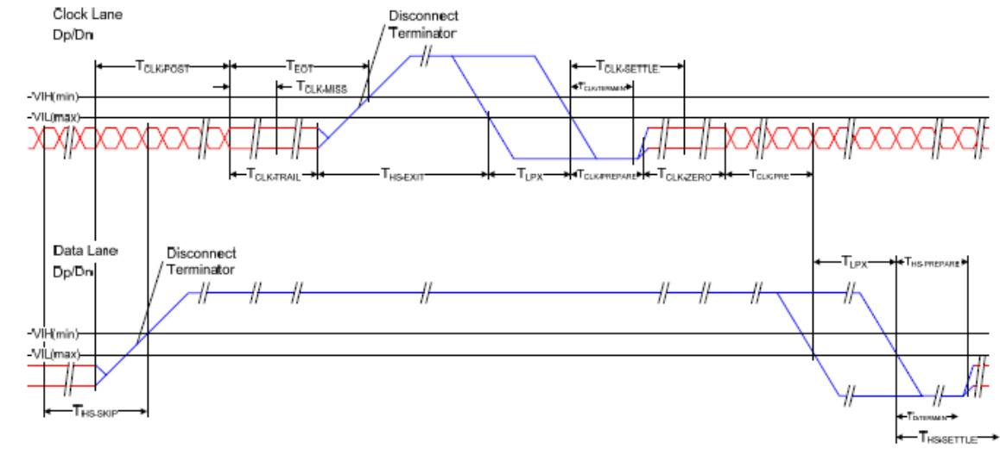  
Figure 8-2: Timing for delay calculation

<html><body><table><tr><td>SSD2828QN4</td><td>Rev 1.3</td><td>P 55/168</td><td>Mar 2013</td></tr></table></body></html>

# 8.1.27 Delay Adjustment Register 3

Offset Address

DAR3

# Delay Adjustment Register 3

Table 8-28: Delay Adjustment Register 3 Description   

<html><body><table><tr><td>BIT</td><td>15</td><td>14</td><td>13</td><td>12</td><td></td><td>10</td><td>9</td><td></td></tr><tr><td>NAME</td><td colspan="8">CPED</td></tr><tr><td>TYPE</td><td colspan="8">RW</td></tr><tr><td>RESET</td><td colspan="8">0x04</td></tr><tr><td></td><td colspan="8"></td></tr><tr><td>BIT</td><td></td><td></td><td></td><td></td><td></td><td></td><td></td><td></td></tr><tr><td>NAME</td><td colspan="8">CPTD</td></tr><tr><td>TYPE</td><td colspan="8">RW</td></tr><tr><td>RESET</td><td colspan="8">0x16</td></tr><tr><td></td><td colspan="8"></td></tr></table></body></html>

<html><body><table><tr><td>Name</td><td>Description</td><td>Setting</td></tr><tr><td>CPED Bit 15-8</td><td>CLK Pre Delay − These bits specifies the number of nibble clock for CLK pre delay period TCLK-PER·</td><td></td></tr><tr><td>CPTD Bit 7-0</td><td>CLK Post Delay — These bits specifies the number of nibble clock for CLK post delay period TCLK-POST.</td><td></td></tr></table></body></html>

CPED

It defined how many nibble clock is the TCLK-PRE period (Figure 9-2). There is an inherence delay of 0\~1 lp_clk for the TCLK-PR E period.

For example, if the PLL is running 600bps, the nibble clock frequency will be 150Mhz, or $6 . 6 7 \mathrm { n s }$ . If the lpdiv is 7, then lp_clk is $9 . 3 7 5 \mathrm { M h z }$ , or $1 0 6 . 6 7 \mathrm { n s }$ .

The TCLK-PRE period (min) will be $4 ^ { * }$ nibble clk $+ \underline { { 0 ^ { * } } }$ lp_ $\mathrm { c l k } \ = 4 \ ^ { * } \ 6 . 6 7 \mathrm { n s \sim } 2 6 . 6 8 \mathrm { n s }$ The TCLK-PRE period (max) will be $^ 4 { } ^ { * }$ nibble_clk $\mathrm { ~ \frac ~ { ~ 1 ~ } ~ { ~ 4 ~ } ~ l p ~ \frac ~ { ~ c ~ l ~ k ~ } ~ } = 4 ~ ^ { \ast } ~ 6 . 6 7 \mathrm { n s } + \mathrm { ~ 1 ~ } ^ { \ast } ~ 1 0 6 . 6 7 \mathrm { n s } \sim 1 3 3 . 3 5 \mathrm { n }$ s

# CPTD

It defined how many nibble clock is the TCLK-POST period (Figure 9-2).   
For example, if the PLL is running 600bps, the nibble clock frequency will be 150Mhz, or $6 . 6 7 \mathrm { n s }$ .   
The TCLK-POST period will be $2 2 ^ { * }$ nibble ${ \mathrm { c l k } } = 2 2 * 6 . 6 7 { \mathrm { n s } } \sim = 1 4 6 . 7 4 { \mathrm { n s } }$ .

$$
{ \mathsf { N o t e } } : { \mathsf { I p \_ c l k } } = { \mathsf { P L L } } / \left( 8 \ ^ { \star } \left( | { \mathsf { p d } } + 1 \right) \right)
$$

# 8.1.28 Delay Adjustment Register 4

DAR4

# Delay Adjustment Register 4

Table 8-29: Delay Adjustment Register $4 0 / 1$ Description   

<html><body><table><tr><td>BIT</td><td>15</td><td>14</td><td>13</td><td>12</td><td></td><td>10</td><td></td><td></td></tr><tr><td>NAME</td><td colspan="8">CTD</td></tr><tr><td>TYPE</td><td colspan="8">RW</td></tr><tr><td>RESET</td><td colspan="8">0x0A</td></tr><tr><td></td><td colspan="8"></td></tr><tr><td>BIT</td><td></td><td></td><td></td><td></td><td></td><td></td><td></td><td></td></tr><tr><td>NAME</td><td colspan="8">HTD</td></tr><tr><td>TYPE RESET</td><td colspan="8">RW</td></tr><tr><td></td><td colspan="8">0x0A</td></tr><tr><td></td><td colspan="8"></td></tr></table></body></html>

<html><body><table><tr><td>Name</td><td>Description</td><td>Setting</td></tr><tr><td>CTD Bit 15-8</td><td>CLK Trail Delay These bits specifies the number of nibble clock for CLK trail period delay TCLK-TRAIL.</td><td></td></tr><tr><td>HTD Bit 7-0</td><td>HS Trail Delay – These bits specifies the number of nibble clock for HS trail period Please note that the minimum value for the delay THS-TRAIL. THS-</td><td></td></tr></table></body></html>

CTD It defined how many nibble clock is the TCLK-TRAIL period (Figure 9-2). For example, if the PLL is running 600bps, the nibble clock frequency will be $1 5 0 \mathrm { { M h z } }$ , or $6 . 6 7 \mathrm { n s }$ . The TCLK-TRAIL period will be $1 0 ^ { * }$ nibble_clk $= 1 0 \AA ^ { * } 6 . 6 7 \mathrm { n s \mathord { \sim } } 6 6 . 7 \mathrm { n s }$

HTD   
It defined how many nibble clock is the THS-TRAIL period (Figure 9-2).   
For example, if the PLL is running 600bps, the nibble clock frequency will be 150Mhz, or $6 . 6 7 \mathrm { n s }$ .

The THS-TRAIL period will be $1 0 ^ { \star }$ nibble c $\lvert \mathsf { k } = 1 0 ^ { \star } 6 . 6 7 \mathsf { r }$ s $\mathrm { \sim } 6 6 . 7 \mathrm { n s }$ .

# 8.1.29 Delay Adjustment Register 5

DAR5

# Delay Adjustment Register 5

Table 8-30: Delay Adjustment Register 5 Description   

<html><body><table><tr><td>BIT</td><td>15</td><td>14</td><td>13</td><td>12</td><td>11</td><td>10</td><td>9</td><td></td></tr><tr><td>NAME</td><td colspan="8">WUD[15:8]</td></tr><tr><td>TYPE</td><td colspan="8">RW</td></tr><tr><td>RESET</td><td colspan="8">0x10</td></tr><tr><td></td><td colspan="8"></td></tr><tr><td>BIT</td><td></td><td></td><td></td><td></td><td></td><td></td><td></td><td></td></tr><tr><td>NAME</td><td colspan="8">WUD[7:0]</td></tr><tr><td>TYPE RESET</td><td colspan="8">RW</td></tr><tr><td></td><td colspan="8">0x00</td></tr><tr><td></td><td colspan="8"></td></tr></table></body></html>

<html><body><table><tr><td>Name</td><td>Description</td><td>Setting</td></tr><tr><td>WUD Bit 15-0</td><td>Wake Up Delay These bits the number of clock cycles for wake up delay period The delay is used to wake up the MIPI slave from ULPS state. The clock is the low power clock. specifies TwAKEUP.</td><td></td></tr></table></body></html>

It defined how many low power clock (lp_clk) is the TWAKEUP period (Figure 9-3), from LP-10 to LP-11. For example, if the PLL is running 600bps, the nibble clock frequency will be 150Mhz, or $6 . 6 7 \mathrm { n s }$ . If the lpdiv $= 7$ , lp_clk will be 9.375Mhz, or 106.6ns.

The TWAKEUP period will be $4 0 9 6 * \mathrm { l p \_ c l k } = 4 0 9 6 * 1 0 6 . 6 \mathrm { n s } \sim 4 3 6 6 3 3$ ns

$$
\mathsf { N o t e : l p \_ c l k = P L L : } \left( 8 \ ^ { * } \left( \mathsf { l p d } \mathrm { + } 1 \right) \right)
$$

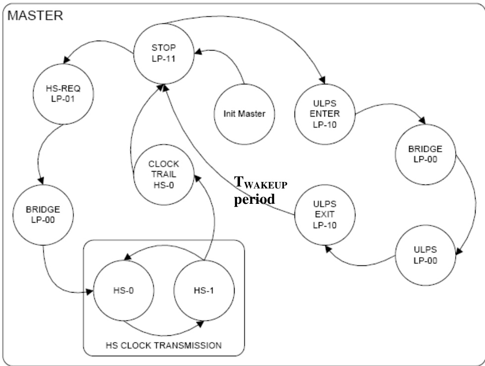  
Figure 8-3: TWAKEUP period delay calculation

# 8.1.30 Delay Adjustment Register 6

DAR6

# Delay Adjustment Register 6

Table 8-31: Delay Adjustment Register 6 Description   

<html><body><table><tr><td>BIT</td><td>15</td><td>14</td><td>13</td><td>12</td><td>11</td><td>10</td><td>9</td><td>8</td></tr><tr><td>NAME</td><td></td><td></td><td></td><td></td><td colspan="4">TGO</td></tr><tr><td>TYPE</td><td>RO</td><td>RO</td><td>RO</td><td>RO</td><td colspan="4">RW</td></tr><tr><td>RESET</td><td>0x0</td><td>0x0</td><td>0x0</td><td>0x0</td><td></td><td colspan="3">0x4</td></tr><tr><td></td><td colspan="9"></td></tr><tr><td>BIT</td><td></td><td></td><td></td><td></td><td></td><td></td><td></td><td></td></tr><tr><td>NAME</td><td></td><td></td><td></td><td></td><td colspan="4">TGET</td></tr><tr><td>TYPE</td><td>RO</td><td>RO</td><td>RO</td><td>RO</td><td colspan="4">RW</td></tr><tr><td>RESET</td><td>0x0</td><td>0x0</td><td>0x0</td><td>0x0</td><td colspan="4">0x5</td></tr><tr><td></td><td colspan="7"></td></tr></table></body></html>

<html><body><table><tr><td>Name</td><td>Description</td><td>Setting</td></tr><tr><td>Reserved Bit 15-12</td><td></td><td></td></tr><tr><td>TGO Bit 11-8</td><td>TA Go Delay These bits specifies the number for TA go delay period of TLpx TTA-GO.</td><td></td></tr><tr><td>Reserved Bit 7-4</td><td></td><td></td></tr><tr><td>TGET Bit 3-0</td><td>TA Get Delay These bits specifies the number of TLpx for TA get delay period TTA-GET.</td><td></td></tr></table></body></html>

It defined how many $\mathrm { T _ { L P X } }$ is the TTA-GO period (Figure 9-4). $\mathrm { T _ { L P X } }$ is half period of lp_clk.   
For example, if the PLL is running 600bps, the nibble clock frequency will be 150Mhz, or $6 . 6 7 \mathrm { n s }$ . If the lpdiv $= 7$ , lp_clk will be $9 . 3 7 5 \mathrm { M h z }$ , or 106.6ns.   
The $\mathrm { T _ { T A - G O } }$ will be $4 \mathrm { ~ ^ * ~ l p \_ c l k / 2 } \mathrm { ~ = } 4 \mathrm { ~ ^ * ~ } 1 0 6 . 6 / 2 \mathrm { \sim } 2 1 3 . 3 3 \mathrm { n s }$

# TGET

It defined how many $\mathrm { T _ { L P X } }$ is the TTA-GET period (Figure 9-4). $\mathrm { T _ { L P X } }$ is half period of lp_clk. For example, if the PLL is running 600bps, the nibble clock frequency will be 150Mhz, or $6 . 6 7 \mathrm { n s }$ . If the lpdiv $= 7$ , lp_clk will be 9.375Mhz, or 106.6ns.

The $\mathrm { T _ { T A - G E T } }$ will be $5 * \mathrm { l p \_ c l k } / 2 = 5 * 1 0 6 . 6 / 2 \sim = 2 6 6 . 5 \mathrm { n s }$ ;

$$
\mathrm { N o t e : l p \_ c l k = P L L \cdot / \left( 8 \ ^ { * } \left( l p d + 1 \right) \right) }
$$

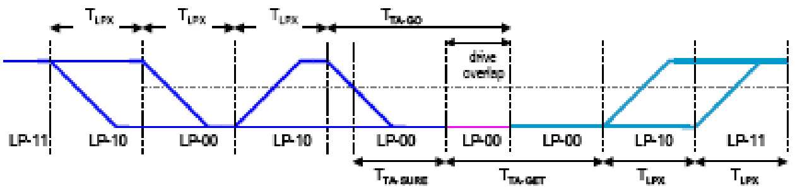  
Figure 8-4: Timing for delay calculation

# 8.1.31 HS TX Timer Register 1

HTTR1

# HS TX Timer Register 1

Table 8-32: HS TX Timer Register Description   

<html><body><table><tr><td>BIT</td><td>15</td><td>14</td><td>13</td><td>12</td><td>11</td><td>10</td><td>9</td><td></td></tr><tr><td>NAME</td><td colspan="8">HTT[15:8]</td></tr><tr><td>TYPE</td><td colspan="8">RW</td></tr><tr><td>RESET</td><td colspan="8">0x00</td></tr><tr><td></td><td colspan="8"></td></tr><tr><td>BIT</td><td></td><td></td><td></td><td></td><td></td><td></td><td></td><td></td></tr><tr><td>NAME</td><td colspan="8">HTT[7:0]</td></tr><tr><td>TYPE RESET</td><td colspan="8">RW</td></tr><tr><td></td><td colspan="8">0x00</td></tr><tr><td></td><td colspan="8"></td></tr></table></body></html>

<html><body><table><tr><td>Name</td><td>Description</td><td>Setting</td></tr><tr><td>HTT Bit 31-0</td><td>HS TX Timer These bits specify the HS TX timer timeout value. PLL reference clock is used to increment an internal timer. The timer starts when the SSD2828 enters HS transmit mode. When the SSD2828 exits from HS transmit mode, the timer will be reset. If the timer expires before the end of HS transmission, the SSD2828 will signal an error and switch</td><td></td></tr></table></body></html>

# 8.1.32 HS TX Timer Register 2

Offset Address

HTTR2

# HS TX Timer Register 2

0xD0

Table 8-33: HS RX Timer Register 2 Description   

<html><body><table><tr><td>BIT</td><td>15</td><td>14</td><td>13</td><td>12</td><td>11</td><td>10</td><td>9</td><td></td></tr><tr><td>NAME</td><td colspan="8">HTT[31:24]</td></tr><tr><td>TYPE</td><td colspan="8">RW</td></tr><tr><td>RESET</td><td colspan="8">0x00</td></tr><tr><td></td><td colspan="8"></td></tr><tr><td>BIT</td><td></td><td></td><td></td><td></td><td></td><td></td><td></td><td></td></tr><tr><td>NAME</td><td colspan="8">HTT [23:16]</td></tr><tr><td>TYPE</td><td colspan="8">RW</td></tr><tr><td>RESET</td><td colspan="8">0x10</td></tr><tr><td></td><td colspan="8"></td></tr></table></body></html>

<html><body><table><tr><td>Name</td><td>Description</td><td>Setting</td></tr><tr><td>HTT Bit 31-0</td><td>Please see the description of HS TX Timer Register</td><td></td></tr></table></body></html>

# 8.1.33 LP RX Timer Register 1

LRTR1

# LP RX Timer Register 1

0xD1

Table 8-34: LP TX Timer Register Description   

<html><body><table><tr><td>BIT</td><td>15</td><td>14</td><td>13</td><td>12</td><td>11</td><td>10</td><td>9</td><td></td></tr><tr><td>NAME</td><td colspan="8">LRT[15:8]</td></tr><tr><td>TYPE</td><td colspan="8">RW</td></tr><tr><td>RESET</td><td colspan="8">0x00</td></tr><tr><td></td><td colspan="8"></td></tr><tr><td>BIT</td><td></td><td></td><td></td><td></td><td></td><td></td><td></td><td></td></tr><tr><td>NAME</td><td colspan="8">LRT[7:0]</td></tr><tr><td>TYPE RESET</td><td colspan="8">RW</td></tr><tr><td></td><td colspan="8">0x00</td></tr><tr><td></td><td colspan="8"></td></tr></table></body></html>

<html><body><table><tr><td>Name</td><td>Description</td><td>Setting</td></tr><tr><td>LRT Bit 31-0</td><td>LP RX Timer These bits specify the LP RX timer timeout value. PLL reference clock is used to increment an internal timer. The timer starts when the SSD2828 enters LP receive mode. When the SSD2828 exits from LP receive mode, the timer will be reset. If the timer expires before exiting from LP receive</td><td></td></tr></table></body></html>

# 8.1.34 LP RX Timer Register 2

Offset Address

LRTR2

# LP RX Timer Register 2

0xD2

Table 8-35: LP TX Timer Register 2 Description   

<html><body><table><tr><td>BIT</td><td>15</td><td>14</td><td>13</td><td>12</td><td>11</td><td>10</td><td>9</td><td></td></tr><tr><td>NAME</td><td colspan="8">LRT[31:24]</td></tr><tr><td>TYPE</td><td colspan="8">RW</td></tr><tr><td>RESET</td><td colspan="8">0x00</td></tr><tr><td></td><td colspan="8"></td></tr><tr><td>BIT</td><td></td><td></td><td></td><td></td><td></td><td></td><td></td><td></td></tr><tr><td>NAME</td><td colspan="8">LRT[23:16]</td></tr><tr><td>TYPE</td><td colspan="8">RW</td></tr><tr><td>RESET</td><td colspan="8">0x10</td></tr><tr><td></td><td colspan="8"></td></tr></table></body></html>

<html><body><table><tr><td>Name</td><td>Description</td><td>Setting</td></tr><tr><td>LRT Bit 31-0</td><td>Please see the description of LP RX Timer Register</td><td></td></tr></table></body></html>

# 8.1.35 TE Status Register

TSR

# TE Status Register

0xD3

Table 8-36: TE Status Register Description   

<html><body><table><tr><td>BIT</td><td>15</td><td>14</td><td>13</td><td>12</td><td>11</td><td>10</td><td>9</td><td>8</td></tr><tr><td>NAME</td><td></td><td></td><td></td><td></td><td></td><td></td><td></td><td></td></tr><tr><td>TYPE</td><td>RO</td><td>RO</td><td>RO</td><td>RO</td><td>RO</td><td>RO</td><td>RO</td><td>RO</td></tr><tr><td>RESET</td><td>0x0</td><td>0x0</td><td>0x0</td><td>0x0</td><td>0x0</td><td>0x0</td><td>0x0</td><td>0x0</td></tr><tr><td></td><td colspan="8"></td></tr><tr><td>BIT</td><td></td><td>0</td><td>5</td><td></td><td></td><td>2</td><td></td><td>0</td></tr><tr><td>NAME</td><td></td><td></td><td></td><td></td><td></td><td></td><td></td><td>TER</td></tr><tr><td>TYPE</td><td>RO</td><td>RO</td><td>RO</td><td>RO</td><td>RO</td><td>RO</td><td>RO</td><td>RW1C</td></tr><tr><td>RESET</td><td>0x0</td><td>0x0</td><td>0x0</td><td>0x0</td><td>0x0</td><td>0x0</td><td>0x0</td><td>0x0</td></tr><tr><td></td><td colspan="8"></td></tr></table></body></html>

<html><body><table><tr><td>Name</td><td>Description</td><td>Setting</td></tr><tr><td>Reserved Bit 15-1</td><td></td><td></td></tr><tr><td>TER Bit</td><td>TE Response − This bit reflects whether a TE response has been received or not. Once a TE response is received, this bit will be set to 1. At the same time, the output te signal will go high. The host processor can write 1 to clear this bit. Once the bit is cleared, the te signal will go low.</td><td>0 –TE response has not been received. 1 – TE response has been received.</td></tr></table></body></html>

# 8.1.36 SPI Read Register

Offset Address

LRR

# SPI Read Register

0xD4

Table 8-37: SPI Read Register Description   

<html><body><table><tr><td>BIT</td><td>15</td><td>14</td><td>13</td><td>12</td><td>11</td><td>10</td><td></td><td>8</td></tr><tr><td>NAME</td><td></td><td></td><td></td><td></td><td></td><td></td><td></td><td></td></tr><tr><td>TYPE</td><td>RO</td><td>RO</td><td>RO</td><td>RO</td><td>RO</td><td>RO</td><td>RO</td><td>RO</td></tr><tr><td>RESET</td><td>0x0</td><td>0x0</td><td>0x0</td><td>0x0</td><td>0x0</td><td>0x0</td><td>0x0</td><td>0x0</td></tr><tr><td></td><td colspan="8"></td></tr><tr><td>BIT</td><td></td><td></td><td></td><td></td><td></td><td>2</td><td></td><td></td></tr><tr><td>NAME</td><td colspan="8">RRA</td></tr><tr><td>TYPE</td><td colspan="8">RW</td></tr><tr><td>RESET</td><td colspan="8">OxFA</td></tr><tr><td></td><td colspan="7"></td></tr></table></body></html>

<html><body><table><tr><td>Name</td><td>Description</td><td>Setting</td></tr><tr><td>Reserved Bit 15-8</td><td></td><td></td></tr><tr><td>RRA Bit 7-0</td><td>Register Read Address (− These bits specify the address of the register to be read through the SPI interface, when the interface is SPI 8-bit (ither 3 wire or 4 wire).</td><td></td></tr></table></body></html>

# 8.1.37 PLL Lock Register

# PLL Lock Register

PLLR   

<html><body><table><tr><td>BIT</td><td>15</td><td></td><td>13</td><td>12</td><td></td><td>10</td><td></td><td></td></tr><tr><td>NAME</td><td colspan="8">LOCK</td></tr><tr><td>TYPE</td><td colspan="8">RW</td></tr><tr><td>RESET</td><td colspan="8">0x14</td></tr><tr><td></td><td colspan="8"></td></tr><tr><td>BIT</td><td></td><td></td><td></td><td></td><td></td><td></td><td></td><td></td></tr><tr><td>NAME</td><td colspan="8">LOCK</td></tr><tr><td>TYPE RESET</td><td colspan="8">RW</td></tr><tr><td></td><td colspan="8">0x50</td></tr><tr><td></td><td colspan="7"></td></tr></table></body></html>

Table 8-38: PLL Lock Register Description   

<html><body><table><tr><td>Name</td><td>Description</td><td>Setting</td></tr><tr><td>LOCK Bit 15-0</td><td>LOCK These bits specify the PLL 1ock range in term of PLL reference frequency, f FIN The maximum PLL lock period is 500us and the default setting assumed the reference clock, f FIN is 10Mhz from tx_clk. The LOCK setting should be programmed only</td><td>0x1450 * 520us f FIN /</td></tr></table></body></html>

# 8.1.38 Test Register

TR

Table 8-39: Test Register Description   

<html><body><table><tr><td>BIT</td><td>15</td><td>14</td><td>13</td><td>12</td><td>11</td><td>10</td><td>9</td><td>8</td></tr><tr><td>NAME</td><td colspan="2">TM/FLO</td><td></td><td></td><td colspan="3">EIC</td><td>FLM</td></tr><tr><td>TYPE</td><td colspan="2">RW</td><td></td><td>RW</td><td colspan="3"></td><td>RW</td></tr><tr><td>RESET</td><td colspan="2">0x0</td><td></td><td></td><td>0x00</td><td></td><td></td><td>0x0</td></tr><tr><td></td><td colspan="7"></td></tr><tr><td>BIT</td><td></td><td></td><td></td><td></td><td></td><td></td><td></td><td>0</td></tr><tr><td>NAME</td><td colspan="6">PNB</td><td>END</td><td>CO</td></tr><tr><td>TYPE</td><td colspan="6">RW</td><td>RW</td><td>RW</td></tr><tr><td>RESET</td><td colspan="6">0x01</td><td>0x0</td><td>0x1</td></tr><tr><td></td><td colspan="7"></td></tr></table></body></html>

<html><body><table><tr><td>Name</td><td>Description</td><td>Setting</td></tr><tr><td>TM/FL0 Bit 15-14</td><td>Test Mode These bits selects whether to CRC/ECC error for the outgoing streams. are used for debugging purpose only. should be set to 00 in normal mode! Force Lane 0 一 These bits are valid when FLM is 1. During this mode, user can write Low Power value to the MIPI lane 0 data using these bits. SSD2828 will not respond to the normal</td><td>inject 00 Normal mode They 01 一 Inject CRC error 10 Inject bit ECC error 11– Inject 2 bit ECC error 2</td></tr><tr><td>EIC Bit 13-9</td><td>FLo[1] controls MIPI_DP0 and FL0[0] controls MIPI DNO. Error Injection Control – These bits controls the position of the error being injected for</td><td></td></tr><tr><td>FLM Bit 8</td><td>testing. It is only applicable when TM is 01. Force Lane Mode This bit enable user to write to FL0 bits to directly control the analog lane DP0 and DP1. The lane should be in Low Power mode(HS=0)</td><td>0 –Normal Mode 1– Force Lane Mode</td></tr><tr><td>PNB Bit 7-2</td><td>when write using FL0. Packet Number in Blanking Period These bits controls the number of packet to send</td><td></td></tr><tr><td>END Bit 1</td><td>during video mode blanking period. Endianess − Internal test only. Default as 0</td><td></td></tr><tr><td>CO Bit 0</td><td>Color Order This bit specifies the order of the color component in the pixel. command mode transmission, this bit takes effect only when the IFS bit is 1 and the transmitted packet is DCS write memory packet, 0x2C or 0x3C. During video mode transmission, this bit must be set to 1 so as to follow the MIPI DSI specification. During</td><td>1–RGB. R is in the higher portion of the pixel. 0– BGR. B is in the higher portion of the pixel.</td></tr></table></body></html>

<html><body><table><tr><td>SSD2828QN4</td><td>Rev 1.3</td><td>P 67/168</td><td>Mar 2013</td></tr></table></body></html>

Remark: 24 bits color format   

<html><body><table><tr><td>CO</td><td>D23</td><td>D22</td><td>D21</td><td>D20</td><td>D19</td><td>D18</td><td>D17</td><td>D16</td><td>D15</td><td>D14</td><td>D13</td><td>D12</td><td>D11</td><td>D10</td><td>D9</td><td>D8</td><td>D7</td><td>D6</td><td>D5</td><td>D4</td><td></td><td>D</td><td></td><td>D1</td><td>D0</td></tr><tr><td></td><td>R7</td><td>R6</td><td>R5</td><td>R4</td><td>R3</td><td>R2</td><td></td><td>R0</td><td>G</td><td></td><td></td><td></td><td></td><td></td><td>GJ</td><td>G0</td><td>B7</td><td>B6</td><td>B5</td><td></td><td>B4</td><td>B3</td><td>B2</td><td>B1</td><td>B0</td></tr><tr><td></td><td>B7</td><td>B6</td><td>B5</td><td>B4</td><td>B3</td><td>B2</td><td>B1</td><td>B0</td><td>G</td><td></td><td></td><td>T</td><td></td><td></td><td></td><td>G0</td><td>R7</td><td>R6</td><td>R5</td><td></td><td></td><td></td><td></td><td></td><td></td></tr></table></body></html>

# 8.1.39 TE Count Register

# TE Count Register

0xD7

TECR   

<html><body><table><tr><td>BIT</td><td>15</td><td>14</td><td>13</td><td>12</td><td></td><td>10</td><td>9</td><td></td></tr><tr><td>NAME</td><td colspan="8">TEC[15:8]</td></tr><tr><td>TYPE</td><td colspan="8">RW</td></tr><tr><td>RESET</td><td colspan="8">0x00</td></tr><tr><td></td><td colspan="8"></td></tr><tr><td>BIT</td><td></td><td></td><td></td><td></td><td></td><td></td><td></td><td></td></tr><tr><td>NAME</td><td colspan="8">TEC[7:0]</td></tr><tr><td>TYPE</td><td colspan="7">RW</td></tr><tr><td>RESET</td><td colspan="7">0x01</td></tr><tr><td></td><td colspan="7"></td></tr></table></body></html>

Table 8-40: TE Count Register Description   

<html><body><table><tr><td>Name</td><td>Description</td><td>Setting</td></tr><tr><td>TEC Bit 15-0</td><td>TE Count These bits determines the pulse width of the output te signal. A counter will be started after the TE signal goes to 1. When the counter reaches the value in TEC field, the te signal will be set to 0. The counter uses the PLL reference clock to do counting.</td><td>The minimum value is 1.</td></tr></table></body></html>

# 8.1.40 Analog Control Register

ACR1

# Analog Control 1 Register

Table 8-41: Analog Control 1 Register Description   

<html><body><table><tr><td>BIT</td><td>15</td><td>14</td><td>13</td><td>12</td><td>11</td><td>10</td><td></td><td></td></tr><tr><td>NAME</td><td colspan="2">D3 DELAY SEL[3:2]</td><td></td><td>D1_DELAY_SEL</td><td></td><td></td><td></td><td></td></tr><tr><td>TYPE</td><td colspan="2">RW</td><td colspan="7">RW</td></tr><tr><td>RESET</td><td colspan="8">0x0 0x20</td></tr><tr><td></td><td colspan="7"></td><td></td><td></td></tr><tr><td>BIT</td><td></td><td>6</td><td></td><td></td><td>3</td><td>2</td><td></td><td></td></tr><tr><td>NAME</td><td colspan="2">D3_DELAY SEL[1:0]</td><td colspan="6">D0_DELAY_SEL</td></tr><tr><td>TYPE</td><td colspan="2">RW</td><td colspan="6">RW</td></tr><tr><td>RESET</td><td colspan="2">0x0</td><td colspan="6">0x20</td></tr><tr><td></td><td colspan="7"></td></tr></table></body></html>

<html><body><table><tr><td>Name</td><td>Description</td><td>Setting</td></tr><tr><td>D3_DELAY_ SEL[3:2] Bit 15-14</td><td>Data lane 3 DELAY SELect[3:2] These bits control the delay for serializer output to the HS transmitter.</td><td></td></tr><tr><td>D1_DELAY_ SEL Bit 13-8</td><td>Data lane 1 DELAY SELect These bits control the delay for serializer output to the HS transmitter.</td><td></td></tr><tr><td>D3_DELAY_ SEL[1:0] Bit 7-6</td><td>Data lane 3 DELAY SELect[1:0] These bits control the delay for serializer output to the HS transmitter.</td><td></td></tr><tr><td>D0 DELAY_ SEL Bit 5-0</td><td>Data lane 0 DELAY SELect These bits control the delay for serializer output to the HS transmitter.</td><td></td></tr></table></body></html>

# 8.1.41 Analog Control Register 2

ACR2

# Analog Control Register 2

0xD9

Table 8-42: Analog Control Register 2 Description   

<html><body><table><tr><td>BIT</td><td>15</td><td>14</td><td>13</td><td>12</td><td>11</td><td>10</td><td>9</td><td>8</td></tr><tr><td>NAME</td><td colspan="2">HSTX_Z</td><td colspan="3">LPTXDS</td><td colspan="3">HSTX_DS</td></tr><tr><td>TYPE</td><td colspan="2">RW</td><td colspan="3">RW</td><td colspan="3">RW</td></tr><tr><td>RESET</td><td colspan="6">0x1</td><td colspan="2">0x4</td></tr><tr><td></td><td colspan="6"></td><td colspan="2"></td></tr><tr><td>BIT</td><td></td><td></td><td></td><td></td><td>3</td><td>2</td><td></td><td></td></tr><tr><td>NAME</td><td colspan="2">D3 DELAY_SEL[5:4]</td><td colspan="6">D2 DELAY SEL</td></tr><tr><td>TYPE</td><td colspan="2">RW</td><td colspan="6">RW</td></tr><tr><td>RESET</td><td colspan="2">0x2</td><td colspan="6">0x20</td></tr><tr><td></td><td colspan="7"></td></tr></table></body></html>

<html><body><table><tr><td>Name</td><td>Description</td><td>Setting</td></tr><tr><td>HSTX_Z Bit 15-14</td><td>High Speed Transmit control These bits control the trimming for output impedance control. Trimming</td><td></td></tr><tr><td>LPTXDS Bit 13-11</td><td>Low Power TX Drive strength Selection These bits control the drive strength for the TX in low power mode.</td><td></td></tr><tr><td>HSTX_DS Bit 10-8</td><td>High Speed TX current Driver Selection These bits control the driving current for the TX in high speed mode. /</td><td></td></tr><tr><td>D3_DELAY_ SEL[5:4] Bit 7-6</td><td>Data lane DELAY SELect[5:4] —These bits control the delay for serializer output to the HS transmitter. 3</td><td></td></tr><tr><td>D2_DELAY SEL Bit 5-0</td><td>Data lane DELAY SELect These bits control the delay for serializer output to the HS transmitter. 2</td><td></td></tr></table></body></html>

# 8.1.42 Analog Control Register 3

Offset Address

# Analog Control Register 3

ACR3

0xDA

Table 8-43: Analog Control Register 3 Description   

<html><body><table><tr><td>BIT</td><td>15</td><td>14</td><td>13</td><td>12</td><td>11</td><td>10</td><td>9</td><td>8</td></tr><tr><td>NAME</td><td>TLFT1</td><td>TLFTO</td><td colspan="3">PREEM</td><td colspan="2">PREEM_MOD</td><td>PREEM E</td></tr><tr><td>TYPE</td><td>RW</td><td>RW</td><td></td><td>RW</td><td></td><td>RW</td><td></td><td>RW</td></tr><tr><td>RESET</td><td>0x1</td><td>0x0</td><td></td><td>0x3</td><td></td><td>0x0</td><td></td><td>0x1</td></tr><tr><td></td><td colspan="6"></td><td colspan="2"></td></tr><tr><td>BIT</td><td></td><td>6</td><td>0</td><td>4</td><td></td><td>2</td><td></td><td>0</td></tr><tr><td>NAME</td><td>THFT1</td><td>THFTO</td><td></td><td>TC</td><td></td><td></td><td>ISEL</td><td></td></tr><tr><td>TYPE</td><td>RW</td><td>RW</td><td colspan="3">RW</td><td colspan="3">RW</td></tr><tr><td>RESET</td><td>0x1</td><td>0x0</td><td></td><td>0x04</td><td></td><td></td><td>0x04</td><td></td></tr><tr><td></td><td colspan="6"></td><td colspan="2"></td></tr></table></body></html>

<html><body><table><tr><td>Name</td><td>Description</td><td>Setting</td></tr><tr><td>TLFT1 Bit 15</td><td></td><td></td></tr><tr><td>TLFT0 Bit 14</td><td></td><td></td></tr><tr><td>PREEM_SE L Bit 13-11</td><td>PREEM_SEL Used for tap selection for preemphasis.</td><td></td></tr><tr><td>PREEM_M OD Bit 10-9</td><td>PREEM_MOD Preemphasis mode selection.</td><td></td></tr><tr><td>PREEM_E Bit 8</td><td>PRE-EMphasis Enable Used for HSTX.</td><td></td></tr><tr><td>THFT1 Bit 7</td><td>ThresHold 1 – This bit controls the low power receiver schmitt trigger high to low threshold selection1.</td><td></td></tr><tr><td>THFTO Bit 6</td><td>ThresHold 0 – This bit controls the low power receiver schmitt trigger high to low threshold selection 0.</td><td></td></tr><tr><td>TC Bit 5-3</td><td>Temperature Coefficient Select – These bits control the temperature coefficient of the bandbap regulator.</td><td></td></tr><tr><td>ISEL Bit 2-0</td><td>Current Output Trim These bits control current output trim of the bandgap regulator. /</td><td></td></tr></table></body></html>

# 8.1.43 Analog Control Register 4

ACR4

# Analog Control Register 4

Offset Address

0xDB

Table 8-44: Analog Control Register 4 Description   

<html><body><table><tr><td>BIT</td><td>15</td><td>14</td><td>13</td><td>12</td><td>11</td><td>10</td><td>9</td><td>8</td></tr><tr><td>NAME</td><td></td><td colspan="4">CLK_DELAY_SEL</td><td>CKF</td><td></td></tr><tr><td>TYPE</td><td colspan="5">RW</td><td>RW</td><td>RO</td></tr><tr><td>RESET</td><td colspan="5">0x20</td><td>0x0</td><td>0x0</td></tr><tr><td></td><td colspan="7"></td></tr><tr><td>BIT</td><td></td><td>6</td><td></td><td></td><td>3</td><td>2</td><td></td><td>0</td></tr><tr><td>NAME</td><td colspan="3">TCI</td><td>ENLV</td><td>CD_EN</td><td>GFFT1</td><td>GFFTO</td><td>GF_E</td></tr><tr><td>TYPE</td><td colspan="3">RW</td><td>RW</td><td>RW</td><td>RW</td><td>RW</td><td>RW</td></tr><tr><td>RESET</td><td colspan="3">0x4</td><td>0x1</td><td>0x1</td><td>0x0</td><td>0x0</td><td>0x0</td></tr><tr><td></td><td colspan="7"></td></tr></table></body></html>

<html><body><table><tr><td>Name</td><td>Description</td><td>Setting</td></tr><tr><td>CLK_DELA Y_SEL Bit 15-10</td><td>CLocK lane DELAY SELect - These bits control the delay for serializer output to the HS transmitter.</td><td></td></tr><tr><td>CKF Bit 9</td><td>ClocK Flip – This bit controls whether to flip the TX_LP_CP and TX_LP_CN to the analog block. It should be set to 0 for normal operation.</td><td></td></tr><tr><td>Reserved Bit 8</td><td></td><td></td></tr><tr><td>TCI Bit 7-5</td><td>Current Temperature Coefficient Select</td><td></td></tr><tr><td>ENLV Bit 4</td><td>BandGap Reference Enable</td><td></td></tr><tr><td>CD_EN Bit 3</td><td>Contention Detection Enable</td><td></td></tr><tr><td>GFFT1 Bit 2</td><td>Glitch Filter Selection 1</td><td></td></tr><tr><td>GFFT0 Bit 1</td><td>Glitch Filter Selection 0</td><td></td></tr><tr><td>GF_E Bit 0</td><td>Glitch filter Enable</td><td></td></tr></table></body></html>

# 8.1.44 Interrupt Output Control Register

IOCR

# Interrupt Output Control Register

Table 8-45: Interrupt Output Control Register Description   

<html><body><table><tr><td>BIT</td><td>15</td><td>14</td><td>13</td><td>12</td><td>11</td><td>10</td><td>9</td><td>8</td></tr><tr><td>NAME</td><td></td><td></td><td></td><td></td><td></td><td></td><td></td><td></td></tr><tr><td>TYPE</td><td>RO</td><td>RO</td><td>RO</td><td>RO</td><td>RO</td><td>RO</td><td>RO</td><td>RO</td></tr><tr><td>RESET</td><td>0x0</td><td>0x0</td><td>0x0</td><td>0x0</td><td>0x0</td><td>0x0</td><td>0x0</td><td>0x0</td></tr><tr><td></td><td colspan="8"></td></tr><tr><td>BIT</td><td></td><td>6</td><td>5</td><td></td><td>3</td><td>2</td><td></td><td>0</td></tr><tr><td>NAME</td><td></td><td></td><td></td><td></td><td></td><td>IOT</td><td></td><td>IAS</td></tr><tr><td>TYPE</td><td>RO</td><td>RO</td><td>RO</td><td>RO</td><td>RO</td><td>RW</td><td></td><td>RW</td></tr><tr><td>RESET</td><td>0x0</td><td>0x0</td><td>0x0</td><td>0x0</td><td>0x0</td><td>0x0</td><td></td><td>0x0</td></tr><tr><td></td><td colspan="8"></td></tr></table></body></html>

<html><body><table><tr><td>Name</td><td>Description</td><td>Setting</td></tr><tr><td>Reserved Bit 15-3</td><td></td><td></td></tr><tr><td>IOT Bit 2-1</td><td>Interrupt Output Type . These bits specify the type of output for the int. Write to this bit is only valid when all the enable bits in the Interrupt Control Registers(0xC5) are</td><td>00 CMOS output 01 − Open Drain active low output(Wired-AND). The IAS should be 0 when selected. 1x − Open Drain active high output(Wired-OR). The IAS should be when selected.</td></tr><tr><td>IAS Bit 0</td><td>0. Interrupt Active State - This bit selects the polarity of the int pin at the chip IO. Write to this bit is only valid when all the enable bits in the Interrupt Control Registers(0xC5) are 0.</td><td>11-NA 0− int pin is active 1ow, when there is no interrupt events, it is normally high. 1 – int pin is active high, when there is no interrupt events, it is normally low.</td></tr></table></body></html>

# 8.1.45 RGB Interface Control Register 7

Offset Address

VICR7

# RGB Interface Control Register7

0xDD

Table 8-46: RGB Interface Control Register 7 Description   

<html><body><table><tr><td>BIT</td><td>15</td><td>14</td><td>13</td><td>12</td><td>11</td><td>10</td><td>9</td><td>8</td></tr><tr><td>NAME</td><td></td><td></td><td></td><td></td><td></td><td></td><td></td><td></td></tr><tr><td>TYPE</td><td>RO</td><td>RO</td><td>RO</td><td>RO</td><td>RO</td><td>RO</td><td>RO</td><td>RO</td></tr><tr><td>RESET</td><td>0x0</td><td>0x0</td><td>0x0</td><td>0x0</td><td>0x0</td><td>0x0</td><td>0x0</td><td>0x0</td></tr><tr><td></td><td colspan="8"></td></tr><tr><td>BIT</td><td></td><td colspan="2"></td><td></td><td></td><td></td><td></td><td></td></tr><tr><td>NAME</td><td colspan="4">VBN</td><td colspan="4">VFN</td></tr><tr><td>TYPE</td><td colspan="4">RW</td><td colspan="4">RW</td></tr><tr><td>RESET</td><td colspan="4">0x00</td><td colspan="4">0x00</td></tr><tr><td></td><td colspan="7"></td></tr></table></body></html>

<html><body><table><tr><td>Name</td><td>Description</td><td>Setting</td></tr><tr><td>Reserved Bit 15-8</td><td></td><td></td></tr><tr><td>VBN Bit 7-4</td><td>Vertical Front Porch Non Video Data Window These fields specify the number of vertical back counting backward from the first vertical active line in which non-video data is not allowed to be sent via MIPI link. This field is only valid when VEN is 1 and the interface setting is RGB + SPI. This field should not larger than VBP. If it is larger, the internal logic will cap this field to VBP. porch</td><td></td></tr><tr><td>VFN Bit 3-0</td><td>Vertical Back Porch Non Video Data Window These fields specify the number of vertical front porch from the last vertical active line in which non-video data is not allowed to be sent via MIPI link. This field is only valid when VEN is 1 and the interface setting is RGB + SPI. This field should not larger than VFP. If it is larger, the internal logic will cap this field to VFP.</td><td></td></tr></table></body></html>

Note: Setting $\mathsf { V B N } \geq \mathsf { V B P }$ and ${ \mathsf { V F N } } \geq { \mathsf { V F P } }$ at the same time will cause non-video data not being sent out through MIPI link when the video mode is non-burst mode or burst mode with $N V B = 1$ .

# 8.1.46 Lane Configuration Register

Offset Address

LCFR

# Lane Configuration Register

0xDE

Table 8-47: Lane Configuration Register Description   

<html><body><table><tr><td>BIT</td><td>15</td><td>14</td><td>13</td><td>12</td><td>11</td><td>10</td><td>9</td><td>8</td></tr><tr><td>NAME</td><td></td><td></td><td></td><td></td><td></td><td></td><td></td><td></td></tr><tr><td>TYPE</td><td>RO</td><td>RO</td><td>RO</td><td>RO</td><td>RO</td><td>RO</td><td>RO</td><td>RO</td></tr><tr><td>RESET</td><td>0x0</td><td>0x0</td><td>0x0</td><td>0x0</td><td>0x0</td><td>0x0</td><td>0x0</td><td>0x0</td></tr><tr><td></td><td colspan="8"></td></tr><tr><td>BIT</td><td></td><td></td><td>5</td><td></td><td></td><td>2</td><td></td><td></td></tr><tr><td>NAME</td><td></td><td></td><td></td><td></td><td></td><td></td><td colspan="2">LS</td></tr><tr><td>TYPE</td><td>RO</td><td>RO</td><td>RO</td><td>RO</td><td>RO</td><td>RO</td><td colspan="2">RW</td></tr><tr><td>RESET</td><td>0x0</td><td>0x0</td><td>0x0</td><td>0x0</td><td>0x0</td><td>0×0</td><td colspan="2">0x00</td></tr><tr><td></td><td colspan="8"></td></tr></table></body></html>

<html><body><table><tr><td>Name</td><td>Description</td><td>Setting</td></tr><tr><td>Reserved Bit 15-2</td><td></td><td></td></tr><tr><td>LS0 Bit 1-0</td><td>Lane Select These bits define the number of lane to be used for SSD2828.</td><td>00–1 lane mode 01 –2 lane mode 10 – 3 lane mode 11 – 4 lane mode</td></tr></table></body></html>

# 8.1.47 Delay Adjustment Register 7

DAR7

# Delay Adjustment Register 7

Offset Address

0xDF

Table 8-48: Delay Adjustment Register 7 Description   

<html><body><table><tr><td>BIT</td><td>15</td><td>14</td><td>13</td><td>12</td><td>11</td><td>10</td><td>9</td><td>8</td></tr><tr><td>NAME</td><td></td><td></td><td></td><td></td><td></td><td></td><td></td><td></td></tr><tr><td>TYPE</td><td>RO</td><td>RO</td><td>RO</td><td>RO</td><td>RO</td><td>RO</td><td>RO</td><td>RO</td></tr><tr><td>RESET</td><td>0x0</td><td>0x0</td><td>0x0</td><td>0x0</td><td>0x0</td><td>0x0</td><td>0x0</td><td>0x0</td></tr><tr><td></td><td colspan="8"></td></tr><tr><td>BIT</td><td></td><td></td><td></td><td></td><td>3</td><td></td><td></td><td></td></tr><tr><td>NAME</td><td></td><td></td><td colspan="6">HED</td></tr><tr><td>TYPE</td><td>RO</td><td>RO</td><td colspan="6">RW</td></tr><tr><td>RESET</td><td>0x0 0x0</td><td colspan="6">0x10</td></tr><tr><td></td><td colspan="7"></td></tr></table></body></html>

<html><body><table><tr><td>Name</td><td>Description</td><td>Setting</td></tr><tr><td>Reserved Bit 15-6</td><td></td><td></td></tr><tr><td>HED Bit 5-0</td><td>HS Exit These bits specifies the number of nibble clock for HS exit delay period for data and clock lane. Delay</td><td></td></tr></table></body></html>

# 8.1.48 Pull Control Register 1

# Pull Control Register 1

PUCR1   

<html><body><table><tr><td>BIT</td><td>15</td><td>14</td><td>13</td><td>12</td><td>11</td><td>10</td><td>9</td><td>8</td></tr><tr><td>NAME</td><td>XTAL_PULL</td><td></td><td>PS4_PULL</td><td></td><td>PS3_PULL</td><td></td><td>PS2_PULL</td><td></td></tr><tr><td>TYPE</td><td colspan="2">RW</td><td colspan="2">RW</td><td colspan="2">RW</td><td colspan="2">RW</td></tr><tr><td>RESET</td><td colspan="2">0x1</td><td colspan="2">0x1</td><td colspan="2">0x1</td><td colspan="2">0x1</td></tr><tr><td></td><td colspan="6"></td><td></td><td></td></tr><tr><td>BIT</td><td></td><td>6</td><td>5</td><td></td><td>3</td><td></td><td></td><td></td></tr><tr><td>NAME</td><td colspan="2">PS1_PULL</td><td colspan="2">PSO_PULL</td><td colspan="2">IS_PULL</td><td colspan="2">MR_PULL</td></tr><tr><td>TYPE</td><td colspan="2">RW</td><td colspan="2">RW</td><td colspan="2">RW</td><td colspan="2">RW</td></tr><tr><td>RESET</td><td colspan="2">0x1</td><td colspan="2">0x1</td><td colspan="2">0x1</td><td colspan="2">0x2</td></tr><tr><td></td><td colspan="7"></td></tr></table></body></html>

Table 8-49: Pull Control Register Description   

<html><body><table><tr><td>Name</td><td>Description</td><td>Setting</td></tr><tr><td>CSX_PULL Bit 15-14</td><td>Chip Select Pull These bits select the pull state of the pin cSX.</td><td>10 – 75k pull-up 75k pull-down</td></tr><tr><td>XTAL_PUL</td><td>Xtal Mode Pull These bits select the pull state of the pin xtal mode.</td><td>10 – 75k pull-up 75k pull-down 75k Keeper</td></tr><tr><td>PS4_PULL Bit 13-12</td><td>Pin Select 3 Pull These bits select the state of the pin ps[4].</td><td>75k pull-up – 75k pull-down Keeper</td></tr><tr><td>PS3_PULL Bit 11-10</td><td>Pin Select 3 Pull These bits select the pull state of the pin ps[3].</td><td>10 – 75k pull-up 75k pull-down 75k Keeper</td></tr><tr><td>PS2_PULL Bit 9-8</td><td>state of the pin ps[2].</td><td>75k pull-down 75k Keeper 00 – No pull</td></tr><tr><td>Bit 7-6</td><td>Pin Select 1 Pull These bits select the pull state of the pin ps[1].</td><td>75k pull-down Keeper</td></tr><tr><td>Bit 5-4</td><td>state of the pin ps[0].</td><td>Keeper</td></tr><tr><td>Bit 3-2</td><td>the pin if_sel.</td><td>75k Keeper</td></tr></table></body></html>

<html><body><table><tr><td>SSD2828QN4</td><td>Rev 1.3</td><td>P 78/168</td><td>Mar 2013</td></tr></table></body></html>

<html><body><table><tr><td>Name</td><td>Description</td><td>Setting</td></tr><tr><td></td><td></td><td>11 一 75k Keeper</td></tr></table></body></html>

# 8.1.49 Pull Control Register 2

# Pull Control Register 2

0xE1

PUCR2   

<html><body><table><tr><td>BIT</td><td>15</td><td>14</td><td>13</td><td>12</td><td>11</td><td>10</td><td>9</td><td>8</td></tr><tr><td>NAME</td><td colspan="2">DEN_PULL</td><td colspan="2">HS_PULL</td><td colspan="2">PC_PULL</td><td colspan="2">VS_PULL</td></tr><tr><td>TYPE</td><td colspan="2">RW</td><td colspan="2">RW</td><td colspan="2">RW</td><td colspan="2">RW</td></tr><tr><td>RESET</td><td colspan="2">0x1</td><td colspan="2">0x2</td><td colspan="2">0x1</td><td colspan="2">0x2</td></tr><tr><td></td><td colspan="8"></td></tr><tr><td>BIT</td><td></td><td></td><td>5</td><td></td><td></td><td></td><td></td><td></td></tr><tr><td>NAME</td><td colspan="2">DH_PULL</td><td colspan="2">DM_PULL</td><td colspan="2">DL_PULL</td><td colspan="2">CSX_PULL</td></tr><tr><td>TYPE</td><td colspan="2">RW</td><td colspan="2">RW</td><td colspan="2">RW</td><td colspan="2">RW</td></tr><tr><td>RESET</td><td colspan="2">0x1</td><td colspan="2">0x1</td><td colspan="2">0x1</td><td colspan="2">0x2</td></tr><tr><td></td><td colspan="7"></td></tr></table></body></html>

Table 8-50: Pull Control Register 2 Description   

<html><body><table><tr><td>Name</td><td>Description</td><td>Setting</td></tr><tr><td>DEN_PULL Bit 15-14</td><td>Den Pull These bits select the pull state of the pin den.</td><td>75k pull-up 75k pull-down</td></tr><tr><td>HS_PULL Bit 13-12</td><td>Hsync Pull These bits select the pull state of 00 the pin hsync. 10– 01–</td><td>75k pull-up 75k pull-down</td></tr><tr><td>PC_PULL Bit 11-10</td><td>11 Pixel_clk Pull These bits select the pull state 00 of the pin pclk. 10 01–</td><td>75k pull-up 75k pull-down</td></tr><tr><td>VS_PULL Bit 9-8</td><td>Vsync Pull These bits select the pull state of 00 the pin vsync. 01</td><td>75k pull-up 75k pull-down</td></tr><tr><td>DH_PULL Bit 7-6</td><td>11 Data high byte Pull These bits select the pull 00 state of the pins data[23:16].</td><td>10 75k pull-up 01 – 75k pull-down 11 75k Keeper</td></tr><tr><td>Bit 5-4</td><td>Data medium byte Pull These bits select the pull state of the pins data[15:8].</td><td>01– 75k pull-down 11– 75k Keeper</td></tr><tr><td>Bit 3-2</td><td>Data low byte Pull These bits select the pull 00 state of the pins data[7:0]. 10</td><td>01– 75k pull-down 11– 75k Keeper</td></tr><tr><td>CSX_PULL Bit 1-0</td><td>Chip Select Pull These bits select the pull state of the pin CSX.</td><td>00 No pull 10− 75k pull-up 01 75k pull-down 11 75k Keeper /</td></tr></table></body></html>

# 8.1.50 Pull Control Register 3

# Pull Control Register 3

PUCR3   

<html><body><table><tr><td>BIT</td><td>15</td><td>14</td><td>13</td><td>12</td><td>11</td><td>10</td><td>9</td><td>8</td></tr><tr><td>NAME</td><td></td><td></td><td></td><td></td><td></td><td></td><td colspan="2">SDI_PULL</td></tr><tr><td>TYPE</td><td>RO</td><td>RO</td><td>RO</td><td>RO</td><td>RO</td><td>RO</td><td colspan="2">RW</td></tr><tr><td>RESET</td><td>0x0</td><td>0x0</td><td>0x0</td><td>0x0</td><td>0x0</td><td>0x0</td><td colspan="2">0x1</td></tr><tr><td></td><td colspan="9"></td></tr><tr><td>BIT</td><td></td><td>6</td><td>5</td><td></td><td>3</td><td>2</td><td></td><td></td></tr><tr><td>NAME</td><td colspan="2">SCK_PULL</td><td colspan="2">SDC PULL</td><td colspan="2">SHUT_PULL</td><td colspan="2">CM_PULL</td></tr><tr><td>TYPE</td><td colspan="2">RW</td><td colspan="2">RW</td><td colspan="2">RW</td><td colspan="2">RW</td></tr><tr><td>RESET</td><td colspan="2">0x1</td><td colspan="2">0x1</td><td colspan="2">0x2</td><td colspan="2">0x1</td></tr><tr><td></td><td colspan="7"></td></tr></table></body></html>

Table 8-51: Pull Control Register 3 Description   

<html><body><table><tr><td>Name</td><td>Description</td><td>Setting</td></tr><tr><td>Reserved Bit 15-10</td><td></td><td></td></tr><tr><td>SDI_PULL Bit 9-8</td><td>SDI Pull These bits select the pull state of the pin sdi.</td><td>10 − 75k pull-up 75k pull-down</td></tr><tr><td>SCK_PULL Bit 7-6</td><td>the pin sck.</td><td>10– 75k pull-up 01- 75k pull-down</td></tr><tr><td>Bit 5-4</td><td></td><td>10– 75k pull-up 01 75k pull-down</td></tr><tr><td>Bit 3-2</td><td></td><td>10 75k pull-up 01– 75k pull-down</td></tr><tr><td></td><td>pin cm.</td><td>10 − 75k pull-up 01– 75k pull-down</td></tr></table></body></html>

# 8.1.51 CABC Brightness Control Register 1

CBCR1

# CABC Brightness Control Register 1

Table 8-52: CABC Brightness Control Register Description   

<html><body><table><tr><td>BIT</td><td>15</td><td>14</td><td>13</td><td>12</td><td>11</td><td>10</td><td>9</td><td>8</td></tr><tr><td>NAME</td><td colspan="8">WDBV</td></tr><tr><td>TYPE</td><td colspan="8">RW</td></tr><tr><td>RESET</td><td colspan="8">0x00</td></tr><tr><td></td><td colspan="8"></td></tr><tr><td>BIT</td><td></td><td>6</td><td>5</td><td></td><td>3</td><td>2</td><td></td><td>0</td></tr><tr><td>NAME</td><td></td><td>GAM18</td><td>BL</td><td>DD</td><td>BCTR</td><td colspan="2">BP_MODE</td><td>CABC EN</td></tr><tr><td>TYPE</td><td>RO</td><td>RW</td><td>RW</td><td>RW</td><td>RW</td><td colspan="2">RW</td><td>RW</td></tr><tr><td>RESET</td><td>0x0</td><td>0x0</td><td>0x0</td><td>0x0</td><td>0x0</td><td colspan="2">0x0</td><td>0x0</td></tr><tr><td></td><td colspan="8"></td></tr></table></body></html>

<html><body><table><tr><td>Name</td><td>Description</td><td>Setting</td></tr><tr><td>WDBV Bit 15-8</td><td>Write Display Brightness Value These bits control the brightness setting.</td><td></td></tr><tr><td>Reserved Bit 7</td><td></td><td></td></tr><tr><td>GAM18 Bit 6</td><td>Gamma 18 — This bit controls gamma 18 select.</td><td></td></tr><tr><td>BL Bit 5</td><td>BackLight Control This bit controls the backlight on/off at BC line.</td><td>0– Off (Completely turn off backlight circuit) 1-On</td></tr><tr><td>DD Bit 4</td><td>Display Dimming This bit controls the display dimming feature.</td><td>0– Display Dimming Off 1– Display Dimming On</td></tr><tr><td>BCTR Bit 3</td><td>Brightness Control This bit controls the On/Off state of the Brightness Control block.</td><td>0–Off 1-On</td></tr><tr><td>BP_MODE Bit 2-1</td><td>BP MODE These bits control the Brightness Preservation of the CABC.</td><td>00 Disable DABC 01 Conservation Mode (Or User Interface Mode) 10 Normal Mode (Or Still Picture Mode) 11 —Aggressive Mode</td></tr><tr><td>CABC_EN Bit 0</td><td>CABC ENable — This bit enable the CABC This bit is valid only when if sel is 0. feature.</td><td>(Or Moving Image Mode) 0 − CABC is disable 1- CABC is enable</td></tr></table></body></html>

# 8.1.52 CABC Brightness Control Register 2

CBCR2

# CABC Brightbess Control Register 2

Offset Address

0xEA

Table 8-53: CABC Brightness Control Register 2 Description   

<html><body><table><tr><td>BIT</td><td>15</td><td>14</td><td>13</td><td>12</td><td>11</td><td>10</td><td></td><td>3</td></tr><tr><td>NAME</td><td colspan="4">PWM_PS</td><td colspan="4">BCB_PS</td></tr><tr><td>TYPE</td><td colspan="4">RW</td><td colspan="4">RW</td></tr><tr><td>RESE</td><td colspan="4">0x6</td><td colspan="4">0x9</td></tr><tr><td></td><td></td><td></td><td></td><td></td><td></td><td></td><td></td><td></td></tr><tr><td>BIT</td><td></td><td></td><td></td><td>CABC</td><td>_MB</td><td></td><td></td><td></td></tr><tr><td>NAME</td><td colspan="8"></td></tr><tr><td>TYPE RESE</td><td colspan="8">RW</td></tr><tr><td></td><td colspan="8">0x00</td></tr><tr><td></td><td colspan="7"></td></tr></table></body></html>

<html><body><table><tr><td>Name</td><td>Description</td><td>Setting</td></tr><tr><td>PWM_PS Bit 15-12</td><td>PWM PreScale These bits control the PWM signal frequency.</td><td>This will depend on pixel clock speed (pclk). For example, 10MHz = “0111”or “1000" 20MHz “0110"or “0101"</td></tr><tr><td>BCD_PS Bit 11-8</td><td>BCB PreScale − These bits control the number of iternation per second carried out by the BCB unit.</td><td>This will depend on pixel clock speed (pclk). For example, 5MHz =“0101” 10MHz = “0110" 25MHz = "1001" 50MHz =“1011” 75MHz = "1100"</td></tr><tr><td>CABC_MB Bit 7-0</td><td>CABC Minimum Brightness These bits control the CABC Minimum Brightness level.</td><td></td></tr></table></body></html>

# 8.1.53 CABC Brightness Status Register

CBSR

Offset Address

# CABC Brightness Status Register

0xEB

Table 8-54: CABC Brightness Status Register Description   

<html><body><table><tr><td>BIT</td><td>15</td><td>14</td><td>13</td><td>12</td><td>11</td><td>10</td><td>9</td><td>8</td></tr><tr><td>NAME</td><td></td><td colspan="3">VGA_SEL</td><td></td><td></td><td></td><td>BCL</td></tr><tr><td>TYPE</td><td colspan="4">RW</td><td>RO</td><td>RO</td><td>RO</td><td>RO</td></tr><tr><td>RESE</td><td colspan="4">0x0</td><td>0x0</td><td>0x0</td><td>0x0</td><td>0x0</td></tr><tr><td></td><td></td><td colspan="2"></td><td></td><td></td><td></td><td></td><td></td></tr><tr><td>BIT</td><td></td><td>6</td><td></td><td></td><td></td><td></td><td></td><td></td></tr><tr><td>NAME</td><td colspan="8">RDBV</td></tr><tr><td>TYPE</td><td colspan="7">RO</td></tr><tr><td>RESE</td><td colspan="7">0x00</td></tr><tr><td></td><td colspan="7"></td></tr></table></body></html>

<html><body><table><tr><td>Name</td><td>Description</td><td>Setting</td></tr><tr><td>VGA_SEL Bit 15-12</td><td>VGA SELect These bits select the type of resolution of the RGB frame. Panel resolutions need not be matched exactly. For example, "0111" will work for any panel with 384000 pixels (+/- 15%). In other words, the range is 326400 to 441600 pixels. Hence, 800x480, 480x800, 512x750 and 750x512 will be supported by VGA_SEL= "0111".</td><td>0001 400x240 (WQVGA) 0010-400x300 (SQVGA) 0011-480x320 (FVGA) 0100-540x360 (FVGA+) 0101-600x400 (FVGA++) 0110-640x480 (VGA) 0111 800x480 (WVGA) 1000 800x600 (SVGA) 1001 1024x600 (WSVGA) 1010 - 1024x768 (XGA) 1011 - 1280x768 (WXGA) 1100 1280x960 (SXGA) 1101 Reserved 1110 Reserved</td></tr><tr><td>Reserved Bit 11-9</td><td></td><td>1111 - Reserved</td></tr><tr><td>BCL Bit 8</td><td>Brightness Control Line This bit is the pulse width modulation signal output to control external backlight power source.</td><td></td></tr><tr><td>RDBV Bit 7-0</td><td>This output is used for Architecture I. Read Display Brightness Value − These bits show the brightness value of the CABC. This output is used for Architecture II.</td><td></td></tr></table></body></html>

# 8.1.54 Encoder Control Register

ECR

# Encoder Control Register

Table 8-55: Encoder Control Register Description   

<html><body><table><tr><td>BIT</td><td>15</td><td>14</td><td>13</td><td>12</td><td>11</td><td>10</td><td>9</td><td>3</td></tr><tr><td>NAME</td><td colspan="6">ENC_LW</td><td></td><td></td></tr><tr><td>TYPE</td><td colspan="7">RW</td><td></td></tr><tr><td>RESE T</td><td colspan="8">0x78</td></tr><tr><td></td><td colspan="8"></td></tr><tr><td>BIT</td><td></td><td></td><td></td><td></td><td></td><td></td><td></td><td></td></tr><tr><td>NAME</td><td colspan="4">ENC_LW</td><td></td><td></td><td>ENC_MO DE</td><td>ENC_EN</td></tr><tr><td>TYPE RESE</td><td colspan="3">RW</td><td>RO</td><td>RO</td><td></td><td>RW</td><td>RW</td></tr><tr><td></td><td colspan="4">0x0</td><td>0x0</td><td>0x0</td><td>0x0</td><td>0x0</td></tr><tr><td></td><td colspan="9"></td></tr></table></body></html>

<html><body><table><tr><td>Name</td><td>Description</td><td>Setting</td></tr><tr><td>ENC_LW Bit 15-4</td><td>LineWidth 一 These bits define line width of the Encoder input.</td><td></td></tr><tr><td>Reserved Bit 3-2</td><td></td><td></td></tr><tr><td>ENC_MODE Bit 1</td><td>ENCoder Mode This bit select the</td><td>0 − Type 1 1- Type 2</td></tr><tr><td>Bit 0</td><td>ENCoder ENable This bit enable the Smartlink Encoder feature. This bit is valid only when if sel is 0.</td><td>Encoder is disable 1 – Encoder is enable</td></tr></table></body></html>

# 8.1.55 Video Sync Delay Register

VSDR

# Video Sync Delay Register

Offset Address

0xED

Table 8-56: Video Sync Delay Register Description   

<html><body><table><tr><td>BIT</td><td>15</td><td>14</td><td>13</td><td>12</td><td>11</td><td>10</td><td>9</td><td>3</td></tr><tr><td>NAME</td><td></td><td></td><td></td><td>VSD</td><td></td><td></td><td></td><td></td></tr><tr><td>TYPE</td><td colspan="8">RW</td></tr><tr><td>RESE</td><td colspan="8">0x00</td></tr><tr><td></td><td colspan="8"></td></tr><tr><td>BIT</td><td></td><td></td><td></td><td></td><td></td><td></td><td></td><td></td></tr><tr><td>NAME</td><td colspan="8">HSD</td></tr><tr><td>TYPE</td><td colspan="8">RW</td></tr><tr><td>RESE</td><td colspan="8">0x02</td></tr><tr><td></td><td colspan="7"></td></tr></table></body></html>

<html><body><table><tr><td>Name</td><td>Description</td><td>Setting</td></tr><tr><td>VSD Bit 15:8</td><td>VSync Delay These bits control the internal pipeline delay of the Vsync input.</td><td></td></tr><tr><td>HSD Bit 7:0</td><td>HSync Delay These bits control the internal pipeline delay of the Hsync input.</td><td></td></tr></table></body></html>

# 8.1.56 Trimming Register

# Trimming Register

Offset Address

TMR   

<html><body><table><tr><td>BIT</td><td>15</td><td>14</td><td>13</td><td>12</td><td>11</td><td>10</td><td>9</td><td>8</td></tr><tr><td>NAME</td><td>TRIM_ DONE</td><td>TRIM PASS</td><td>XORC DONE</td><td>XORC SEL</td><td>XORC EN</td><td>VBIST SRT</td><td>VBIST_ EN</td><td>TRIM_EN</td></tr><tr><td>TYPE</td><td>RO</td><td>RO</td><td>RO</td><td>RW</td><td>RWAC</td><td>RW</td><td>RW</td><td>RWAC</td></tr><tr><td>RESE</td><td>0x0</td><td>0x0</td><td>0x0</td><td>0x0</td><td>0x0</td><td>0x0</td><td>0x0</td><td>0x0</td></tr><tr><td></td><td colspan="6"></td><td></td><td></td></tr><tr><td>BIT</td><td></td><td>6</td><td>5</td><td></td><td>3</td><td>2</td><td></td><td></td></tr><tr><td>NAME</td><td colspan="4">TRIM CMD[7:4]</td><td colspan="4">TRIM CMD[3:0]/XORC FILTER[3:0]</td></tr><tr><td>TYPE</td><td colspan="4">RW</td><td colspan="4">RW</td></tr><tr><td>RESE</td><td colspan="4">0x0</td><td colspan="4">0x0</td></tr><tr><td></td><td colspan="7"></td></tr></table></body></html>

0xEE

Table 8-57: Trimming Register Description

<html><body><table><tr><td>Name</td><td>Description</td><td>Setting</td></tr><tr><td>TRIM_DON E Bit 15</td><td>TRIMming DONE This bit indicates if the trimming process is done.</td><td></td></tr><tr><td>TRIM_PASS Bit 14</td><td>TRIMming PASS This bit indicates if the trimming process is successful. It is valid when bit 15 is set to 1.</td><td></td></tr><tr><td>XORC_DON</td><td>the trimming process is done. cleared when read.</td><td></td></tr><tr><td>XORC_SEL Bit 12</td><td>XOR Calibration SELect This bit select the internal byte data for calibration to be 8'hAA or 8'h55.</td><td>1 = 8'hAA</td></tr><tr><td>Bit 11</td><td>calibration is done, this bit will be auto clear and</td><td></td></tr><tr><td>Bit 10</td><td>stop at the frame The software should wait for at boundary.</td><td></td></tr><tr><td></td><td>automatically send the color, red, white repeatedly base on</td><td></td></tr><tr><td></td><td>trimming process and when the trimming is this bit will be auto clear and the status bits at bit 14 and bit 15 indicates</td><td></td></tr></table></body></html>

<html><body><table><tr><td>SSD2828QN4</td><td>Rev 1.3</td><td>P 87/168</td><td>Mar 2013</td></tr></table></body></html>

<html><body><table><tr><td>Name</td><td>Description</td><td>Setting</td></tr><tr><td>TRIM _CMD</td><td>This bit should be 0 in normal mode.</td><td></td></tr><tr><td>Bit 7:4</td><td>TRIMming CoMmanD These bits define the upper 4 bits of the command header byte to be used in auto-trimming mode, when TRIM EN=1, where SSD2828 send out a read request to the MIPI receiver.</td><td></td></tr><tr><td>TRIM_CMD /XORC_FIL TER Bit 3:0</td><td>TRIMming CoMmanD These bits define the lower 4 bits of the command header byte to be used in auto mode, when TRIM EN=1, where SSD2828 send out a read request to the MIPI receiver. When XORC EN=1, these bits define the filter to qualify the XOR calibration pulse width. -trimming</td><td></td></tr></table></body></html>

# 8.1.57 GPIO1 Register

GPIO1

# GPIO1 Register

Table 8-58: GPIO1 Register Description   

<html><body><table><tr><td>BIT</td><td>15</td><td>14</td><td>13</td><td>12</td><td>11</td><td>10</td><td></td><td>8</td></tr><tr><td>NAME</td><td>GPIO1 STAT</td><td colspan="7">GPIO1_CTR</td></tr><tr><td>TYPE</td><td>RO</td><td colspan="7">RW</td></tr><tr><td>RESE</td><td>0x0</td><td colspan="7">0x00</td></tr><tr><td></td><td colspan="7"></td></tr><tr><td>BIT</td><td>GPIO0_</td><td></td><td></td><td></td><td></td><td></td><td></td><td></td></tr><tr><td>NAME</td><td colspan="8">GPIOO_CTR STAT</td></tr><tr><td>TYPE RESE</td><td>RO</td><td colspan="7">RW</td></tr><tr><td></td><td>0x0</td><td colspan="7">0x00</td></tr><tr><td></td><td colspan="7"></td></tr></table></body></html>

<html><body><table><tr><td>Name</td><td>Description</td><td>Setting</td></tr><tr><td>GPIO1_CTR Bit 15</td><td>GPIO Status This bit provide the status of the te pin when it is configured as input.</td><td></td></tr><tr><td>GPIO1_CTR Bit 14:8</td><td>GPIO 1 Control These bits control the output behavior of the te pin.</td><td>Please see the description at bit 6-0.</td></tr><tr><td>GPIO0_CTR Bit ></td><td>GPIO 0 Status 一 This bit provide the status of the dbcl pin when it is configured as input.</td><td></td></tr><tr><td>GPIO0_CTR Bit 6:0</td><td>GPIO 0 Control — These bits control the output behavior of the dbcl pin.</td><td>Bit 0 Module or Register This bit controls the pin to be module controlled or register controlled. 0 – Module controlled 1– Register controlled Bit 1 Direction This bit controls the direction of the pin when bit 0 is 1. When bit 0 is 0, it has no effect. 0 – Pin is input 1 – Pin is output Bit 2 Output State This bit controls the output state of the pin when bit 0 is 1. When bit 0 is 0, it has no effect. 0 – Output state is 0 1 – Output state is 1 Bit 4-3 : Pull State These bits control the pull state of the pin when it is in input state. 00 No pull 10 75k pull-up 01- 75k pull-down 11– 75k Keeper /</td></tr></table></body></html>

<html><body><table><tr><td>SSD2828QN4</td><td>Rev 1.3</td><td>P 89/168</td><td>Mar 2013</td></tr></table></body></html>

<html><body><table><tr><td>Name</td><td>Description</td><td>Setting</td></tr><tr><td></td><td></td><td>Bit 5 Interrupt Enable This bit enables the GPIO0 input(bit 1 = 0) interrupt to the int pin. When bit 0 is 0, it has no effect. Bit 6 Interrupt Polarity This bit selects the polarity of the GPIO0 input(bit = 0) when bit 5 is enabled. When bit 0 is 0, it has no effect. 0− Active low</td></tr></table></body></html>

# 8.1.58 GPIO2 Register

GPIO2

# GPIO2 Register

Table 8-59: GPIO1 Register Description   

<html><body><table><tr><td>BIT</td><td>15</td><td>14</td><td>13</td><td>12</td><td>11</td><td>10</td><td>9</td><td>8</td></tr><tr><td>NAME</td><td></td><td></td><td></td><td></td><td></td><td></td><td></td><td></td></tr><tr><td>TYPE</td><td>RO</td><td>RO</td><td>RO</td><td>RO</td><td>RO</td><td>RO</td><td>RO</td><td>RO</td></tr><tr><td>RESE</td><td>0x0</td><td>0x0</td><td>0x0</td><td>0x0</td><td>0x0</td><td>0x0</td><td>0x0</td><td>0x0</td></tr><tr><td></td><td></td><td></td><td></td><td></td><td></td><td></td><td></td><td></td></tr><tr><td>BIT</td><td></td><td>6</td><td></td><td></td><td>3</td><td></td><td></td><td></td></tr><tr><td>NAME</td><td>GPIO2 STAT</td><td colspan="7">GPIO2_CTR</td></tr><tr><td>TYPE</td><td>RO</td><td colspan="6">RW</td></tr><tr><td>RESE</td><td>0x0</td><td colspan="6">0x00</td></tr><tr><td></td><td colspan="7"></td></tr></table></body></html>

<html><body><table><tr><td>Name</td><td>Description</td><td>Setting</td></tr><tr><td>Reserved Bit 15-8</td><td></td><td></td></tr><tr><td>GPIO2_CTR Bit 7</td><td>GPIO 2 Status − This bit provide the status of the sys_clk_out pin when it is configured as input.</td><td></td></tr><tr><td>GPIO2_CTR Bit 6:0</td><td>GPIO 2 Control These bits control the output behavior of the sys_clk_out pin.</td><td>Bit 0 - Module or Register This bit controls the pin to be module controlled or register controlled. 0 – Module controlled 1- Register controlled Bit 1 – Direction This bit controls the direction of the pin when bit 0 is 1. When bit 0 is 0, it has no effect. 0 – Pin is input 1 – Pin is output Bit 2 Output State This bit controls the output state of the pin when bit 0 is 1. When bit 0 is 0, it has no effect. 0 − Output state is 0 1- Output state is 1 Bit 4-3 : Pull State These bits control the pull state of the pin when it is in input state. 00 – No pull 10 – 75k pull-up 01 – 75k pull-down 11–75k Bit 5 : Interrupt Enable Keeper</td></tr></table></body></html>

<html><body><table><tr><td>SSD2828QN4</td><td>Rev 1.3</td><td>P 91/168</td><td>Mar 2013</td></tr></table></body></html>

<html><body><table><tr><td>Name</td><td>Description</td><td>Setting</td></tr><tr><td></td><td></td><td>This bit enables the GPIO0 input(bit = 0) interrupt to the int pin. When bit 0 is 0, it has no effect. Bit 6 : Interrupt Polarity This bit selects the polarity of the GPIO0 input(bit = when bit 5 is enabled. When bit 0 is 0, it has no effect. Active low 0) 0-</td></tr></table></body></html>

# 8.1.59 DLYA01 Register

DLYA01

# DLYA01 Register

0xF1

Table 8-60: DLYA01 Register Description   

<html><body><table><tr><td>BIT</td><td>15</td><td>14</td><td>13</td><td>12</td><td>11</td><td>10</td><td></td><td>8</td></tr><tr><td>NAME</td><td></td><td></td><td colspan="6">DELAY_A_1</td></tr><tr><td>TYPE</td><td>RO</td><td>RO</td><td colspan="6">RO</td></tr><tr><td>RESE</td><td>0x0</td><td>0x0</td><td colspan="6">0x20</td></tr><tr><td></td><td colspan="6"></td></tr><tr><td>BIT</td><td></td><td></td><td></td><td></td><td>3</td><td></td><td></td><td></td></tr><tr><td>NAME</td><td></td><td></td><td colspan="6">DELAY_A_0</td></tr><tr><td>TYPE</td><td>RO</td><td>RO</td><td colspan="6">RO</td></tr><tr><td>RESE</td><td>0x0</td><td>0x0</td><td colspan="6">0x20</td></tr><tr><td></td><td colspan="6"></td></tr></table></body></html>

<html><body><table><tr><td>Name</td><td>Description</td><td>Setting</td></tr><tr><td>Reserved Bit 15-14</td><td></td><td></td></tr><tr><td>DELAY_A_1 Bit 13-8</td><td>DELAY A for lane 1– These bits provide the status of the XOR calibration results when XORC SEL is set to 0.</td><td></td></tr><tr><td>Reserved Bit 7-6</td><td></td><td></td></tr><tr><td>DELAY_A_0 Bit 5-0</td><td>DELAY A for lane 0 These bits provide the status of the XOR calibration results when XORC_ _SEL is set to 0.</td><td></td></tr></table></body></html>

# 8.1.60 DLYA23 Register

# DLYA23 Register

0xF2

DLYA23   

<html><body><table><tr><td>BIT</td><td>15</td><td>14</td><td>13</td><td>12</td><td>11</td><td>10</td><td></td><td>8</td></tr><tr><td>NAME</td><td></td><td></td><td colspan="6">DELAY_A_3</td></tr><tr><td>TYPE</td><td>RO</td><td>RO</td><td colspan="6">RO</td></tr><tr><td>RESE</td><td>0x0</td><td>0x0</td><td colspan="6">0x20</td></tr><tr><td></td><td colspan="6"></td></tr><tr><td>BIT</td><td></td><td></td><td></td><td></td><td>3</td><td></td><td></td><td></td></tr><tr><td>NAME</td><td></td><td></td><td colspan="6">DELAY_A_2</td></tr><tr><td>TYPE</td><td>RO</td><td>RO</td><td colspan="6">RO</td></tr><tr><td>RESE</td><td>0x0</td><td>0x0</td><td colspan="6">0x20</td></tr><tr><td></td><td colspan="6"></td></tr></table></body></html>

Table 8-61: DLYA23 Register Description   

<html><body><table><tr><td>Name</td><td>Description</td><td>Setting</td></tr><tr><td>Reserved Bit 15-14</td><td></td><td></td></tr><tr><td>DELAY_A_3 Bit 13-8</td><td>DELAY A for lane 3 – These bits provide the status of the XOR calibration results when XORC SEL is set to 0.</td><td></td></tr><tr><td>Reserved Bit 7-6</td><td></td><td></td></tr><tr><td>DELAY_A_2 Bit 5-0</td><td>DELAY A for lane 2 These bits provide the status of the XOR calibration results when XORC_SEL is set to 0.</td><td></td></tr></table></body></html>

# 8.1.61 DLYB01 Register

DLYB01

# DLYB01 Register

0xF3

Table 8-62: DLYB01 Register Description   

<html><body><table><tr><td>BIT</td><td>15</td><td>14</td><td>13</td><td>12</td><td>11</td><td>10</td><td></td><td>8</td></tr><tr><td>NAME</td><td></td><td></td><td colspan="6">DELAY_B_1</td></tr><tr><td>TYPE</td><td>RO</td><td>RO</td><td colspan="6">RO</td></tr><tr><td>RESE</td><td>0x0</td><td>0x0</td><td colspan="6">0x20</td></tr><tr><td></td><td colspan="6"></td></tr><tr><td>BIT</td><td></td><td></td><td></td><td></td><td>3</td><td></td><td></td><td></td></tr><tr><td>NAME</td><td></td><td></td><td colspan="6">DELAY_B_0</td></tr><tr><td>TYPE</td><td>RO</td><td>RO</td><td colspan="6">RO</td></tr><tr><td>RESE</td><td>0x0</td><td>0x0</td><td colspan="6">0x20</td></tr><tr><td></td><td colspan="6"></td></tr></table></body></html>

<html><body><table><tr><td>Name</td><td>Description</td><td>Setting</td></tr><tr><td>Reserved Bit 15-14</td><td></td><td></td></tr><tr><td>DELAY_B_1 Bit 13-8</td><td>DELAY B for lane 1– These bits provide the status of the XOR calibration results when XORC SEL is set to 1.</td><td></td></tr><tr><td>Reserved Bit 7-6</td><td></td><td></td></tr><tr><td>DELAY_B_0 Bit 5-0</td><td>DELAY B for lane 0 These bits provide the status of the XOR calibration results when XORC_ _SEL is set to 1.</td><td></td></tr></table></body></html>

# 8.1.62 DLYB23 Register

# DLYB23 Register

0xF4

DLYB23   

<html><body><table><tr><td>BIT</td><td>15</td><td>14</td><td>13</td><td>12</td><td>11</td><td>10</td><td></td><td>8</td></tr><tr><td>NAME</td><td></td><td></td><td colspan="6">DELAY_B_3</td></tr><tr><td>TYPE</td><td>RO</td><td>RO</td><td colspan="6">RO</td></tr><tr><td>RESE</td><td>0x0</td><td>0x0</td><td colspan="6">0x20</td></tr><tr><td></td><td colspan="6"></td></tr><tr><td>BIT</td><td></td><td></td><td></td><td></td><td>3</td><td></td><td></td><td></td></tr><tr><td>NAME</td><td></td><td></td><td colspan="6"></td></tr><tr><td>TYPE</td><td>RO</td><td>RO</td><td colspan="6">DELAY_B_2 RO</td></tr><tr><td>RESE</td><td>0x0</td><td>0x0</td><td colspan="6">0x20</td></tr><tr><td></td><td colspan="6"></td></tr></table></body></html>

Table 8-63: DLYB23 Register Description   

<html><body><table><tr><td>Name</td><td>Description</td><td>Setting</td></tr><tr><td>Reserved Bit 15-14</td><td></td><td></td></tr><tr><td>DELAY_B_3 Bit 13-8</td><td>DELAY B for lane 3 These bits provide the status of the XOR calibration results when XORC SEL is set to 1.</td><td></td></tr><tr><td>Reserved Bit 7-6</td><td></td><td></td></tr><tr><td>DELAY_B_2 Bit 5-0</td><td>DELAY B for lane 2 These bits provide the status of the XOR calibration results when XORC_SEL is set to 1.</td><td></td></tr></table></body></html>

# 8.1.63 DLYC01 Register

DLYC01

# DLYC01 Register

0xF5

Table 8-64: DLYC01 Register Description   

<html><body><table><tr><td>BIT</td><td>15</td><td>14</td><td>13</td><td>12</td><td>11</td><td>10</td><td></td><td>8</td></tr><tr><td>NAME</td><td></td><td></td><td colspan="6">DELAY_C_1</td></tr><tr><td>TYPE</td><td>RO</td><td>RO</td><td colspan="6">RO</td></tr><tr><td>RESE</td><td>0x0</td><td>0x0</td><td colspan="6">0x20</td></tr><tr><td></td><td colspan="6"></td></tr><tr><td>BIT</td><td></td><td></td><td></td><td></td><td>3</td><td></td><td></td><td></td></tr><tr><td>NAME</td><td></td><td></td><td colspan="6"></td></tr><tr><td>TYPE</td><td>RO</td><td>RO</td><td colspan="6">DELAY_C_0 RO</td></tr><tr><td>RESE</td><td>0x0</td><td>0x0</td><td colspan="6">0x20</td></tr><tr><td></td><td colspan="6"></td></tr></table></body></html>

<html><body><table><tr><td>Name</td><td>Description</td><td>Setting</td></tr><tr><td>Reserved Bit 15-14</td><td></td><td></td></tr><tr><td>DELAY_C_1 Bit 13-8</td><td>DELAYC for lane 1 – These bits provide the status of the average XOR calibration results from DELAY_A_1 and DELAY_B_1.</td><td></td></tr><tr><td>Reserved Bit 7-6</td><td></td><td></td></tr><tr><td>DELAY_C_0 Bit 5-0</td><td>DELAY C for lane 0– These bits provide the status of the average XOR calibration results from DELAY A 0 and DELAY B 0.</td><td></td></tr></table></body></html>

# 8.1.64 DLYC23 Register

DLYC23

# DLYC23 Register

0xF6

Table 8-65: DLYC23 Register Description   

<html><body><table><tr><td>BIT</td><td>15</td><td>14</td><td>13</td><td>12</td><td>11</td><td>10</td><td></td><td>8</td></tr><tr><td>NAME</td><td></td><td></td><td colspan="6">DELAY_C_3</td></tr><tr><td>TYPE</td><td>RO</td><td>RO</td><td colspan="6">RO</td></tr><tr><td>RESE</td><td>0x0</td><td>0x0</td><td colspan="6">0x20</td></tr><tr><td></td><td colspan="6"></td></tr><tr><td>BIT</td><td></td><td></td><td></td><td></td><td>3</td><td></td><td></td><td></td></tr><tr><td>NAME</td><td></td><td></td><td colspan="6"></td></tr><tr><td>TYPE</td><td>RO</td><td>RO</td><td colspan="6">DELAY_C_2 RO</td></tr><tr><td>RESE</td><td>0x0</td><td>0x0</td><td colspan="6">0x20</td></tr><tr><td></td><td colspan="6"></td></tr></table></body></html>

<html><body><table><tr><td>Name</td><td>Description</td><td>Setting</td></tr><tr><td>Reserved Bit 15-14</td><td></td><td></td></tr><tr><td>DELAY_C_3 Bit 13-8</td><td>DELAYC for lane 3 – These bits provide the status of the average XOR calibration results from DELAY_A_3 and DELAY_B_3.</td><td></td></tr><tr><td>Reserved Bit 7-6</td><td></td><td></td></tr><tr><td>DELAY_C_2 Bit 5-0</td><td>DELAY C for lane 2 – These bits provide the status of the average XOR calibration results from DELAY A_2 and DELAY B_2.</td><td></td></tr></table></body></html>

# 8.1.65 Analog Control Register 5

Offset Address

# ACR5 Register

ACR5   

<html><body><table><tr><td>BIT</td><td>15</td><td>14</td><td>13</td><td>12</td><td>11</td><td>10</td><td>9</td><td>8</td></tr><tr><td>NAME</td><td></td><td></td><td></td><td></td><td></td><td></td><td></td><td></td></tr><tr><td>TYPE</td><td>RO</td><td>RO</td><td>RO</td><td>RO</td><td>RO</td><td>RO</td><td>RO</td><td>RO</td></tr><tr><td>RESE</td><td>0x0</td><td>0x0</td><td>0x0</td><td>0x0</td><td>0x0</td><td>0x0</td><td>0x0</td><td>0x0</td></tr><tr><td></td><td></td><td></td><td></td><td></td><td></td><td></td><td></td><td></td></tr><tr><td>BIT</td><td></td><td>6</td><td>5</td><td></td><td>3</td><td>2</td><td></td><td>0</td></tr><tr><td>NAME</td><td>DEC_XO</td><td>DEC_FB</td><td>D3_FB_E</td><td>D2_FB_E</td><td>D1_FB_E</td><td>D0_FB_E</td><td>XOR_TU</td><td>REG</td></tr><tr><td>TYPE</td><td>R_E RW</td><td>E RW</td><td>RW</td><td>RW</td><td>RW</td><td>RW</td><td>NE_EN RW</td><td>CTR RW</td></tr><tr><td>RESE</td><td>0x0</td><td>0x0</td><td>0x0</td><td>0x0</td><td>0x0</td><td>0x0</td><td>0x0</td><td>0x0</td></tr><tr><td></td><td colspan="7"></td></tr></table></body></html>

0xF7

Table 8-66: ACR5 Register Description   

<html><body><table><tr><td>Name</td><td>Description</td><td>Setting</td></tr><tr><td>Reserved Bit 15-8</td><td></td><td></td></tr><tr><td>DEC_XOR_ E Bit 7</td><td>DECoder XOR Enable − This bit enables the XOR function in the analog when Bit[0] is set. This bit is used for internal testing and should be to 0 for normal</td><td></td></tr><tr><td>DEC_FB_E Bit 6</td><td>use. DECoder FeedBack Enable This bit enables the Decoder function in the analog when Bit[0] is set. This bit is used for internal testing and should be programmed</td><td></td></tr><tr><td>D3_FB_E Bit 5</td><td>to 0 for normal use. D3 FeedBack Enable This bit enables the XOR Feedback Tuning for lane 3 when Bit[0] is set. This bit is used for internal testing and should be programmed</td><td></td></tr><tr><td>D2_FB_E Bit 4</td><td>to 0 for normal use. D2 FeedBack Enable This bit enables the XOR Feedback Tuning for lane 2 when Bit[0] is set. This bit is used for internal testing and should be programmed</td><td></td></tr><tr><td>D1_FB_E Bit 3</td><td>to 0 for normal use. D1 FeedBack Enable This bit enables the XOR Feedback Tuning for lane when Bit[0] is set. This bit is used for internal testing and should be to for normal programmed programmed use. 0</td><td></td></tr><tr><td>DO_FB_E Bit 2</td><td>D0 FeedBack Enable This bit enables the XOR Feedback Tuning for lane 0 when Bit[0] is set.</td><td></td></tr></table></body></html>

<html><body><table><tr><td>SSD2828QN4</td><td>Rev 1.3</td><td>P 99/168</td><td>Mar 2013</td></tr></table></body></html>

<html><body><table><tr><td>Name</td><td>Description</td><td>Setting</td></tr><tr><td></td><td>This bit is used for internal testing and should be to 0 for normal use. programmed</td><td></td></tr><tr><td>XOR_TUNE _EN Bit 1</td><td>XOR TUNE ENable This enables the XOR Feedback Tuning when Bit[0] is set. This bit is used for internal and should be to 0 for normal use. bit testing programmed</td><td></td></tr><tr><td>REG_CTR Bit 0</td><td>Analog REGister ConTRol This bit enable the control of the XOR feedback tuning through register Bit[7:1] or through Analog Test mode 4. This bit is used for internal and should be programmed to 0 for normal use. testing</td><td>0– Controlled by Analog Test mode 4. 1- Controlled from Bit[7:1].</td></tr></table></body></html>

# 8.1.66 Read Register

RR

Table 8-67: Read Register Description   

<html><body><table><tr><td>BIT</td><td>15</td><td>14</td><td>13</td><td>12</td><td>11</td><td>10</td><td></td><td></td></tr><tr><td>NAME</td><td colspan="8">RD[15:8]</td></tr><tr><td>TYPE</td><td colspan="9">RO</td></tr><tr><td>RESET</td><td colspan="9">0x00</td></tr><tr><td></td><td colspan="9"></td></tr><tr><td>BIT</td><td></td><td></td><td></td><td></td><td></td><td></td><td></td><td></td></tr><tr><td>NAME</td><td colspan="8">RD[7:0]</td></tr><tr><td>TYPE</td><td colspan="7">RO</td></tr><tr><td>RESET</td><td colspan="7">0x00</td></tr><tr><td></td><td colspan="7"></td></tr></table></body></html>

<html><body><table><tr><td>Name</td><td>Description</td><td>Setting</td></tr><tr><td>RD Bit 15-0</td><td>Read Data − This register is not a true register. It is the entry for the internal buffer. It is used to read the data returned by the MIPI slave. The application processor can treat this register as an FIFO and continuously read data from it. When the interface is 16-bit, the width of this field is 16-bit. When the interface is 8-bit, the width of this field is 8-bit. The read of this register is only valid when the RDY bit is 1. In other words, only when the data returned by the MIPI slave is received, the application processor can read this register to return data. point get</td><td></td></tr></table></body></html>

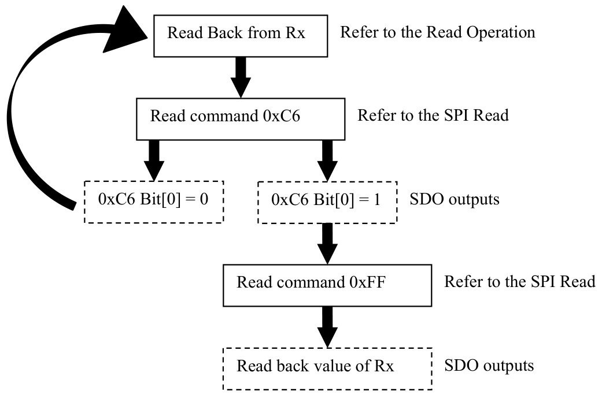

# 9 Configuration

The SSD2828 can be configured to support various operations. The signals involved are ps[1:0] pins, LS register bits. These signals define the interface type supported at the front-end as well as lane distribution at the MIPI link. The features that define the operation of SSD2828 are as below.

Number of lane for each MIPI link RGB and SPI interfaces select at the front-end Dump and smart configurations

# 9.1 Lane Management

The number of lanes used in SSD2828 is determined by the LS(0xDE[1:0]) bits. The SSD2828 DPHY lanes consist of clock lane(CL) and 4 data lanes(DL0, DL1, DL2, DL3).

The table below list down all the combination of lane usage and the active state of each of the DPHY lanes.

Table 9-1: SSD2828 Lane Management   

<html><body><table><tr><td>LS</td><td>SSD2828</td><td>CL</td><td>DL0</td><td>DL1</td><td>DL2</td><td>DL3</td><td>Max. Speed</td></tr><tr><td>00</td><td>1 lane</td><td>ON</td><td>ON</td><td>OFF</td><td>OFF</td><td>OFF</td><td>Up to 1.0Gbps</td></tr><tr><td>01</td><td>2 lanes</td><td>ON</td><td>ON</td><td>ON</td><td>OFF</td><td>OFF</td><td>Up to 2.0Gbps</td></tr><tr><td>10</td><td>3 lanes</td><td>ON</td><td>ON</td><td>ON</td><td>ON</td><td>OFF</td><td>Up to 3.0Gbps</td></tr><tr><td>11</td><td>4 lanes</td><td>ON</td><td>ON</td><td>ON</td><td>ON</td><td>ON</td><td>Up to 4.0Gbps</td></tr></table></body></html>

# 9.2 Use cases

The SSD2828 can support one interface configuration. Combination of RGB and SPI interfaces. The details of supported configuration are listed below.

# 9.2.1 RGB $\dagger$ SPI Interface

The application processor can use this configuration to drive a dumb display panel or a smart display panel or both panels. The user needs to set ps[1:0] to select the desired SPI interface. When the SPI interface is not used, the csx pin needs to be kept high.

Since the RGB and SPI interface are completely separated, the two interfaces can operate independently. The RGB interface is used to provide display data for the video mode. The SPI interface is used to program the local registers of SSD2828. If a dumb display panel is driven and the registers of the display need to be programmed, the SPI interface can also be used for register programming. If a smart display panel is driven, the SPI interface can also be used to configure the smart display and send display data, in command mode. Below are some illustrations for the use case.

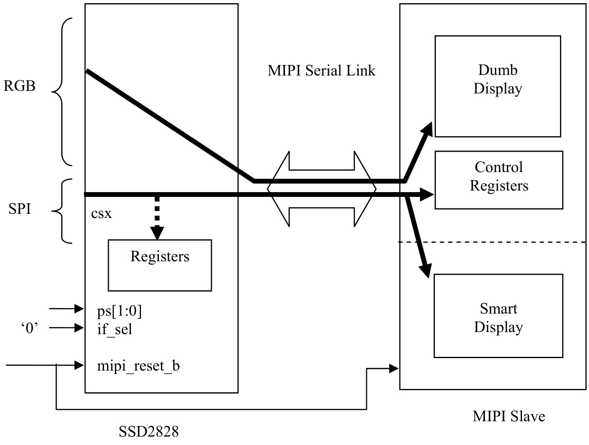  
Figure 9-1: SSD2828 with RGB and SPI Interface

The data for different destinations are separated by the VC field of the packets. The user can program the register VCR to set the VC field. When this configuration is used, the primary usage of the serial link is for sending display video data to the dumb panel. If there is a need to send non-video data through SPI interface concurrently, the SSD2828 can put them into generic write or DCS write packet and interleave them with the video packets.

<html><body><table><tr><td>SSD2828QN4</td><td>Rev 1.3</td><td>P103/168</td><td>Mar 2013 Solomon Systech</td></tr></table></body></html>

If the non-burst video mode is selected, the non-video data packet will only be sent during vertical blanking period. If burst video mode is selected, the non-video data packet can be sent during both horizontal and vertical blanking period (e.g. BLLP period).

During both horizontal and vertical blanking period, the serial link can either remain in HS mode (sending blanking packet) or enter LP mode. The non-video data can also be sent in HS or LP mode. Options have been provided for whether to use HS or LP mode for the blanking period and whether to send the non-video data in HS or LP mode. The NVD and BLLP bits in register VICR6 are provided for this purpose. Please refer to the table below for details.

Table 9-2: Operation during Video Mode BLLP Period   

<html><body><table><tr><td>NVD</td><td>BLLP</td><td>Non-burst mode</td><td>Burst mode</td></tr><tr><td>0</td><td></td><td>If there is no non-video data to send, the serial link will send blanking in HS mode during BLLP period. If there is non-video data to send, the non-video data will be sent in HS mode. Afterwards, the serial link will send blanking packet in HS mode for the remaining period of BLLP period. packet</td><td>If there is no non-video data to send, the serial link will enter LP mode during BLLP period. If there is non-video data to send, non-video data will be sent in HS mode. Afterwards, the serial link will enter LP mode for the remaining period of BLLP period.</td></tr><tr><td></td><td></td><td>If there is no non-video data to send, the serial link will enter LP mode during BLLP period. If there is non-video data to send, non-video data will be sent HS mode. Afterwards, the serial link will enter LP mode for the remaining in</td><td>Same as non-burst mode.</td></tr><tr><td></td><td></td><td>of BLLP period. The serial link will enter LP mode for BLLP mode. If there is non-video data to send, the data will be sent in LP mode at the beginning of BLLP period. period</td><td>Same as non-burst mode.</td></tr></table></body></html>

# 9.2.2 MIPI DC Characteristics

Different State Code of the DSI represents different DC voltage levels in the Data and Clock Lanes as stated in below table.

Table 9-3: DSI State Code and DC Characteristics   

<html><body><table><tr><td rowspan="2">State Code</td><td colspan="2">Line Voltage Levels</td></tr><tr><td>Dp-Line</td><td>Dn-Line</td></tr><tr><td>HS-0</td><td>HS Low</td><td>HS High</td></tr><tr><td>HS-1</td><td>HS High</td><td>HS Low</td></tr><tr><td>LP-00</td><td>LP Low</td><td>LP Low</td></tr><tr><td>LP-01</td><td>LP Low</td><td>LP High</td></tr><tr><td>LP-10</td><td>LP High</td><td>LP Low</td></tr><tr><td>LP-11</td><td>LP High</td><td>LP High</td></tr></table></body></html>

As shown in Figure 9-2, the logic level is different in different state.

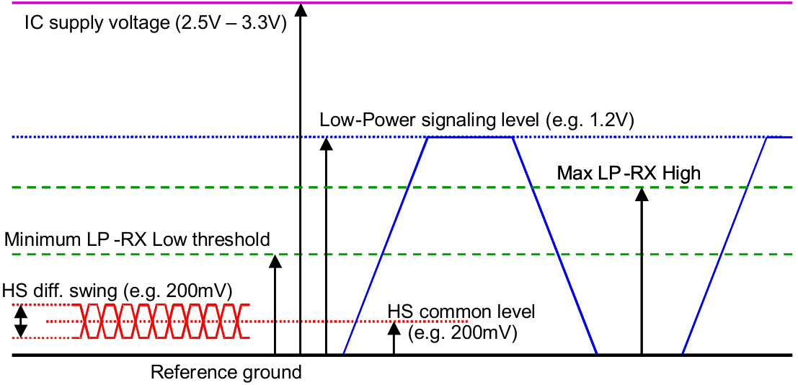  
Figure 9-2: MIPI Line Levels

# 9.2.3 High Speed Clock Transmission

In High-Speed mode the Clock Lane provides a low-swing, differential DDR (half-rate) clock signal from Master to Slave for High-Speed Data Transmission. The Clock Start and Stop procedures are shown in the following figure.

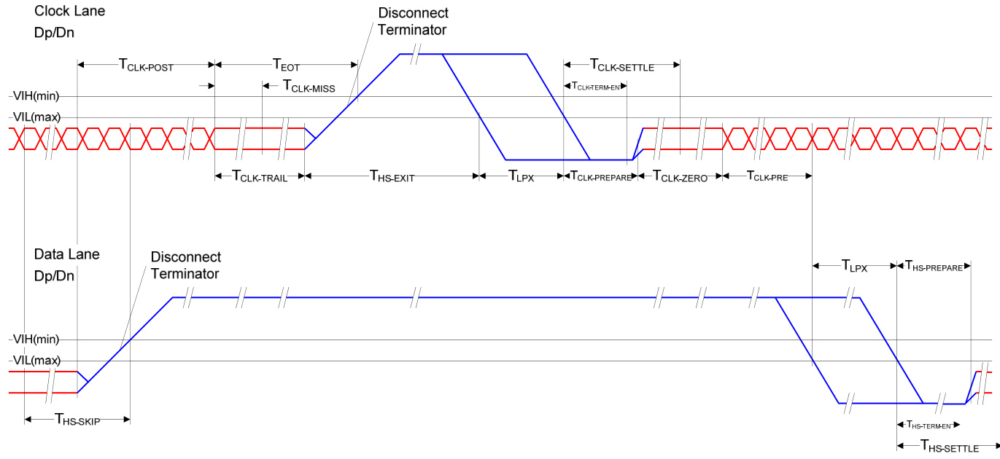  
Figure 9-3: Switching the Clock Lane between High Speed Mode and Low-Power Mode

# 9.2.4 Data Lane State Flow

There are three modes that the Data Lane can be driven into:

12. High Speed Data Transmission Bi-Directional Data Lane Turnaround 3. Escape Mode

Table 9-4: Data Lane Mode Entering/Exiting Sequences   

<html><body><table><tr><td>Mode</td><td>Entering Mode Sequences</td><td>Exiting Mode Sequences</td></tr><tr><td>High Speed Data Transmission</td><td>LP-11 =>LP-10 =>LP-00 =>LP-01 =>LP- 00</td><td>LP-00 =>LP-10 =>LP- 11</td></tr><tr><td>Bi-Directional Data Lane Turnaround</td><td>LP-11 =>LP-01 =>LP-00 =>HS-0</td><td>(HS-0 or HS-1) =>LP-11</td></tr><tr><td>Escape</td><td>LP−11 =>LP−10 =>LP−00 =>LP−10 =>LP−</td><td>High-Z</td></tr></table></body></html>

# 9.2.5 High Speed Data Transmission

High-Speed Data Transmission occurs in bursts. Transmission starts from, and ends with, a Stop state. During the intermediate time between bursts a Data Lane shall remain in the Stop state, unless a Turnaround or Escape request is presented on the Lane. During a HS Data Burst the Clock Lane shall be in High-Speed mode, providing a DDR Clock to the Slave side.

After a Transmit request, a Data Lane leaves the Stop state and prepares for High-Speed mode by means of a Start-of-Transmission (SoT) procedure.   
Table 9-5 describes the sequence of events on TX and RX side.

Table 9-5: Start-of-Transmission Sequence   

<html><body><table><tr><td>Observes Stop state</td></tr><tr><td>Observes transition from LP-11 to LP-01 on the Lines</td></tr><tr><td>Observes transition form LP-01 to LP-00 on the enables Line Termination after time Lines, TD.TERM-EN</td></tr><tr><td>Enables HS-RX and waits for Time-out in order to neglect transition effects THS-SETTLE</td></tr><tr><td>Starts 1ooking for Leader-Sequence</td></tr><tr><td>Synchronizes upon recognition of Leader Sequence "011101'</td></tr></table></body></html>

At the end of a Data Burst, a Data Lane leaves High-Speed Transmission mode and enters the Stop state by means of an End-of-Transmission (EoT) procedure. Table 9-6 shows a possible sequence of events during the EoT procedure. Note, EoT processing may be handled by the protocol or by the D-PHY.

Table 9-6: End-of-Transmission Sequence   

<html><body><table><tr><td>Receives payload data</td></tr><tr><td>Detects the Lines leaving LP-00 state and entering Stop state (LP-11) and disables Termination</td></tr><tr><td>Neglect bits of last period to hide transition effects THS-SKIP</td></tr><tr><td>Detect last transition in valid Data, determine last valid Data byte and skip trailer sequence</td></tr></table></body></html>

The following shows the sequence of the high speed data transmission including SoT data.

CLK   
XXXOX□XXXOXXXX×□XXXXXXXXOX□XXXXXX□XOXXXXXXXXX Dp/Dn TLPX THSPREPARE THS-ZERO X THS-SYNC Disconnect Terminator   
-VIH(min)   
VIL(max)-   
-VTERMEN(max) VDTH(max) XO XXOXDOOOOX Capture — THS-SKIP THS-TERM-EN 1STData Bit TEOT LP-11 LP-11 LP-01 LP-00 THS-TRAIL 子 —THSEXIT —THS-SETTLE

# 9.2.6 Bi-Directional Data Lane Turnaround

The transmission direction of a bi-directional Data Lane can be swapped by means of a Link Turnaround procedure. This procedure enables information transfer in the opposite direction of the current direction. The procedure is the same for either a change from Forward-to-Reverse direction or Reverse-to-Forward direction.

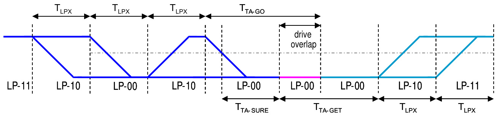  
Figure 9-5: Turnaround Procedure

# 9.2.7 Escape Mode

Escape mode is a special mode of operation for Data Lanes using Low-Power states. With this mode some additional functionality becomes available. Escape mode operation shall be supported in the Forward direction and is optional in the Reverse direction. If supported, Escape mode does not have to include all available features.

A Data Lane enters Escape mode via an Escape mode Entry procedure (LP-11, LP-10, LP-00, LP-01, LP-00). As soon as the final Bridge state (LP-00) is observed on the Lines the Lane shall enter Escape mode in Space state (LP-00). If an LP-11 is detected at any time before the final Bridge state (LP-00), the Escape mode Entry procedure shall be aborted and the receive side shall wait for, or return to, the Stop state.

For Data Lanes, once Escape mode is entered, the transmitter shall send an 8-bit entry command to indicate the requested action. Table 9-7 lists all currently available Escape mode commands and actions. All unassigned commands are reserved for future expansion.

The Stop state is be used to exit Escape mode and cannot occur during Escape mode operation because of the Spaced-One-Hot encoding. Stop state immediately returns the Lane to Control mode. If the entry command doesn’t match a supported command, that particular Escape mode action shall be ignored and the receive side waits until the transmit side returns to the Stop state.

Table 9-7: MIPI Escape Mode Entry Code   

<html><body><table><tr><td>Escape Mode Action</td><td>Command Type</td><td>Entry Command Pattern (first bit transmitted to last bit transmitted)</td></tr><tr><td>Low-Power Data Transmission</td><td>mode</td><td>11100001</td></tr><tr><td>Ultra-Low Power State</td><td>mode</td><td>00011110</td></tr><tr><td>Undefined-1</td><td>mode</td><td>10011111</td></tr><tr><td>Undefined-2</td><td>mode</td><td>11011110</td></tr><tr><td>Reset-Trigger [Remote Application]</td><td>Trigger</td><td>01100010</td></tr><tr><td>Effect Tearing</td><td>Trigger</td><td>01011101</td></tr><tr><td>Acknowledge</td><td>Trigger</td><td>00100001</td></tr><tr><td>Unknown-5</td><td>Trigger</td><td>10100000</td></tr></table></body></html>

# 9.2.8 Low Power Data Transmission

Th e Low Power Data Transmission can be started as the following sequences: Start: LP-11 Escape Mode Entry: LP-11, LP-10, LP-00, LP-01,LP-00 Low Power Data Transmission command: 11100001 „ One or more bytes (8 bit) Pause mode when data lane are stopped Exit Escape Mode: LP-00, LP-10, LP-11 Stop State : LP-11 D T MMN v Escape LPDT First Data Byte Pause: Second Data Byte Exit Mode Command 01110101 Asynchronous 11010000 Escape Entry no transition LP Clk = EXOR(Dp,Dn) WWWWW

Figure 9-6: Low Power Data Transmission

# 9.2.9 Reset Trigger

The AP can inform to the display module that it should be reseted in Reset trigger when data lanes are entering in Escape Mode.

The Remote Application Reset (RAR) is using a following sequence:

Start: LP-11   
Escape Mode Entry: LP-11, LP-10, LP-00, LP-01, LP-00   
Remote Application Reset (RAR) command in Escape Mode: 0110 0010 (First to Last bit)   
Mark-1: LP-00, LP-10, LP-11   
Stop State: LP-11

# LP-11>10>00>01>00>01>00>10>00>.

aA！   
Escape Mode Entry Entry Command Mark-1 and Stop State   
LP CLK $\mathbf { \tau } = \mathbf { \tau }$ EXOR(Dp, Dn)

# 9.2.10 Tearing Effect

The display module can inform to the AP when a tearing effect event (New V-synch) has been happen on the display module by Tearing Effect (TEE).

The Tearing Effect (TEE) is using a following sequence:

Start: LP-11   
Escape Mode Entry (EME): LP-11, LP-10, LP-00, LP-01, LP-00   
Tearing Effect: 0101 1101 (First to Last bit)   
Mark-1: LP-00, LP-10, LP-11   
Stop State: LP-11

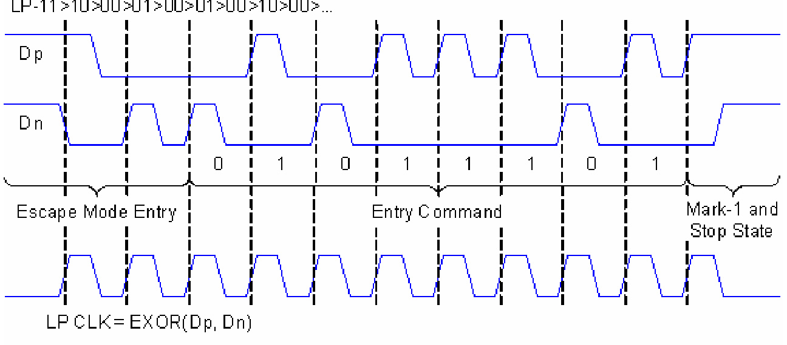  
Figure 9-8: Tearing Effect Command in Escape Mode

# 9.2.11 Acknowledge

The display module can inform to the AP when an error has not recognized on it by Acknowledge (ACK). The Acknowledge (ACK) is using a following sequence:

$\bullet$ Start: LP-11   
$\bullet$ Escape Mode Entry: LP-11, LP-10, LP-00, LP-01, LP-00   
$\bullet$ Acknowledge (ACK) command: 0010 0001 (First to Last bit)   
$\bullet$ Mark-1: LP- $0 0 { = } { > } \mathrm { L P - } 1 0 { = } { > } \mathrm { L P - } 1 1$ Stop State: LP-11

# LP-11 >10±00>01>00>01>00>10>00>..

0D Escape Mode Entry Entry C ommand Mark-1 and INNNNNNNNNNRC LP CLK= EXOR(Dp, Dn)

# 9.2.12 Packet Transmission

SSL MIPI CORE supports two data transmission defined in MIPI DSI specification.

Figure 9-10: Two Data Transmission Mode (Separate, single)

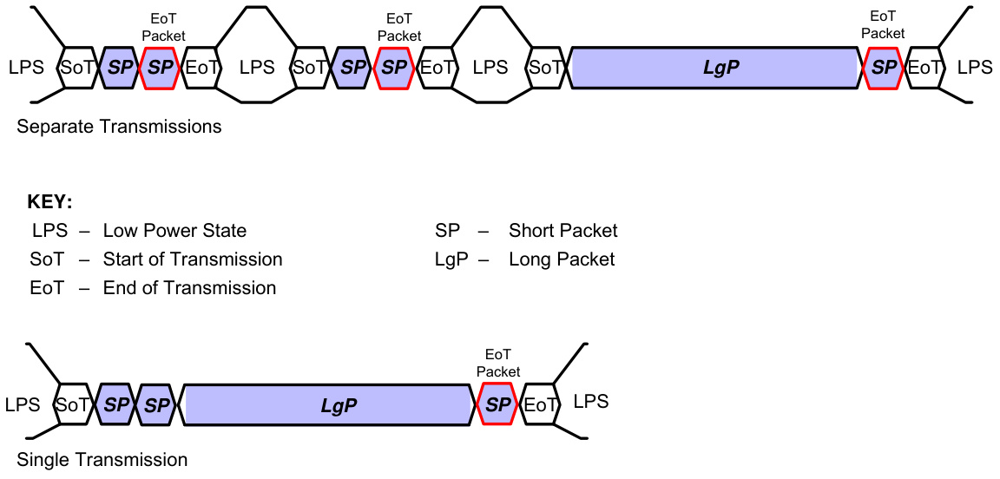

# 9.2.13 HS Transmission Example

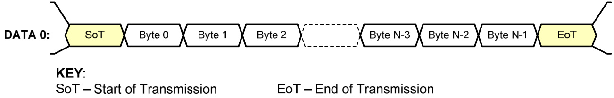  
Figure 9-11: One Lane Data Transmission Example

Number of Bytes, N, transmitted is an integer multiple of the number of lanes:

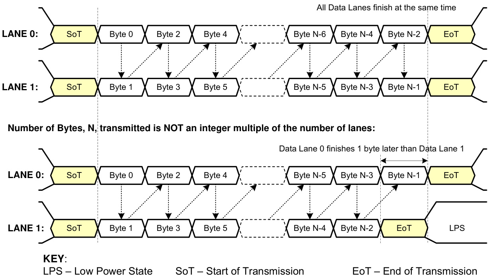  
Figure 9-12: Two Lane HS Transmission Example

# 9.2.14 General Packet Structure

Two packet structures are defined for low-level protocol communication: Long packets and Short packets. For both packet structures, the Data Identifier is always the first byte of the packet. All packet data traverses the interface as bytes. Sequentially, a transmitter shall send data LSB first, MSB last. For packets with multi-byte fields, the least significant byte shall be transmitted first unless otherwise specified.

Figure 9-13: Endian Example (Long Packet)   

<html><body><table><tr><td>DI</td><td>WC (LS Byte)</td><td>WC (MS Byte)</td><td>ECC</td><td></td><td>Data</td><td>CRC (LS Byte)</td><td>CRC (MS Byte)</td></tr><tr><td>0x29</td><td>0x01</td><td>0x00</td><td>0x06</td><td>0x01 100101001000000000000000011000001000000001</td><td>0xOE</td><td>1 1000001 111 000</td><td>0x1E</td></tr><tr><td colspan="8">L ML</td></tr><tr><td colspan="2">S SS B</td><td>ML SS BB</td><td></td><td>ML SS BB</td><td>ML SS BB</td><td></td><td>M S B</td></tr><tr><td colspan="8">BB</td></tr><tr><td colspan="8">Time</td></tr></table></body></html>

# 9.2.15 Long Packet Format

Figure 9-14 shows the structure of the Long packet. A Long packet shall consist of three elements: a 32-bit Packet Header (PH), an application-specific Data Payload with a variable number of bytes, and a 16-bit Packet Footer (PF). The Packet Header is further composed of three elements: an 8-bit Data Identifier, a 16- bit Word Count, and 8-bit ECC. The Packet Footer has one element, a 16-bit checksum. Long packets can be from 6 to 65,541 bytes in length.

DATA IDENTIFIER (DI): Contains Virtual Channel identifier and Data Type information Data Type denotes the format and content of application-specific payload data 16-bit WORD COUNT (WC): The Word Count conveys how many words (bytes) are in packet payload The receiver uses WC to determine the packet end (after Payload $^ +$ Checksum) 8-bit Error Correction Code (ECC) for the Packet Header: 8-bit ECC for the Packet Header, protects up to 8 bytes in header Enables one-bit errors in Packet Header to be corrected and two-bit errors to be detec APPLICATION SPECIFIC PAYLOAD CHECKSUM (CS) LPS SoT C EoT LPS 32-bit 16-bit PACKET PACKET HEADER FOOTER (PH) (PF) PACKET DATA (Payload): Length = WC Data Word size (8-bits) No value restrictions on data words in Payload

# 9.2.16 Short Packet Structure

Figure 9-15 shows the structure of the Short packet. A Short packet shall contain an 8-bit Data ID followed by two command or data bytes and an 8-bit ECC; a Packet Footer shall not be present. Short packets shall be four bytes in length. The Error Correction Code (ECC) byte allows single-bit errors to be corrected and 2-bit errors to be detected in the Short packet.

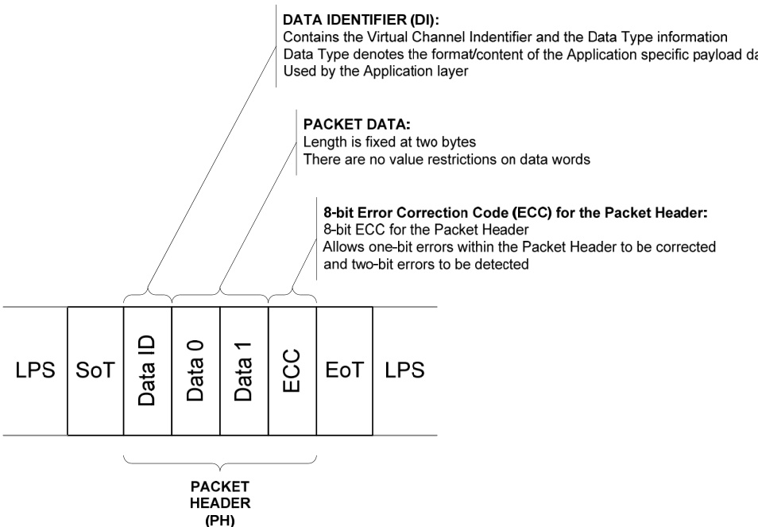  
Figure 9-15: Short Packet Structure

All packet data traverses the interface as bytes. Sequentially, a transmitter shall send data LSB first, MSB last. For packets with multi-byte fields, the least significant byte shall be transmitted first unless otherwise specified.

Figure 9-13 shows a complete Long packet data transmission. Note, the figure shows the byte values in standard positional notation, i.e. MSB on the left and LSB on the right, while the bits are shown in chronological order with the LSB on the left, the MSB on the right and time increasing left to right.

# 9.2.17 Data Identifier (DI)

The Data Identifier defines the Virtual Channel for the data and the Data Type for the application specific payload data.

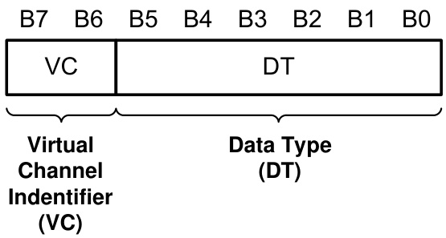  
Figure 9-16: Data Indentifier Structure

# 9.2.18 Victual Channel Identifier (VC)

The VC is the address of the channel between the AP and the display modules. During the data transactions, both AP and display module will use the same VC for communication. In SSD2085, the VC for the command mode is $0 \mathrm { x } 0 2 \mathrm { H }$ and the VC for the video mode is $0 \mathrm { x } 0 1 \mathrm { H }$ .

# 9.2.19 Data Type (DT)

There are two groups of Data Type:

Processor to Display Module, Display Module to Processor

Table 9-8: Data Types for Processor-sourced Packets   

<html><body><table><tr><td>Data Type, hex</td><td>Data binary Type,</td><td>Description</td><td>Packet Size</td></tr><tr><td>01h</td><td>000001</td><td>Sync Event, V Sync Start</td><td>Short</td></tr><tr><td>11h</td><td>01 0001</td><td>Sync Event, V Sync End</td><td>Short</td></tr><tr><td>21h</td><td>10 0001</td><td>Sync Event, H Sync Start</td><td>Short</td></tr><tr><td>31h</td><td>11 0001</td><td>Sync Event, Sync End</td><td>Short</td></tr><tr><td>08h</td><td>001000</td><td>End of Transmission (EoT) packet</td><td>Short</td></tr><tr><td>02h</td><td>00 0010</td><td>Color Mode (CM) Off Command</td><td>Short</td></tr><tr><td>12h</td><td>010010</td><td>Color Mode (CM) On Command</td><td>Short</td></tr><tr><td>22h</td><td>100010</td><td>Shut Down Peripheral Command</td><td>Short</td></tr><tr><td>32h</td><td>110010</td><td>Turn On Peripheral Command</td><td>Short</td></tr><tr><td>03h</td><td>000011</td><td>Generic Short WRITE, no parameters</td><td>Short</td></tr><tr><td>13h</td><td>01 0011</td><td>Generic Short WRITE, parameter</td><td>Short</td></tr><tr><td>23h</td><td>10 0011</td><td>Generic Short WRITE, 2 parameters</td><td>Short</td></tr><tr><td>04h</td><td>000100</td><td>Generic READ, no parameters</td><td>Short</td></tr><tr><td>14h</td><td>010100</td><td>Generic READ, parameter</td><td>Short</td></tr><tr><td>24h</td><td>100100</td><td>Generic READ, 2 parameters</td><td>Short</td></tr><tr><td>05h</td><td>000101</td><td>DCS WRITE, no parameters</td><td>Short</td></tr><tr><td>15h</td><td>010101</td><td>DCS WRITE, parameter</td><td>Short</td></tr><tr><td>06h</td><td>000110</td><td>DCS READ, no parameters</td><td>Short</td></tr><tr><td>37h</td><td>110111</td><td>Set Maximum Return Packet Size</td><td>Short</td></tr><tr><td>09h</td><td>00 1001</td><td>Null Packet, no data</td><td>Long</td></tr></table></body></html>

Table 9-9: Data Types for Peripheral-sourced Packets   

<html><body><table><tr><td>Data Type, hex</td><td>Data Type, binary</td><td>Description</td><td>Packet Size</td></tr><tr><td>19h</td><td>01 1001</td><td>Blanking Packet, no data</td><td>Long</td></tr><tr><td>29h</td><td>101001</td><td>Generic Long Write</td><td>Long</td></tr><tr><td>39h</td><td>111001</td><td>DCS Long Write/write_LUT Command Packet</td><td>Long</td></tr><tr><td>0Eh</td><td>001110</td><td>Packed Pixel Stream, 16-bit RGB, 5-6-5 Format</td><td>Long</td></tr><tr><td>1Eh</td><td>011110</td><td>Packed Pixel Stream, 18-bit RGB, 6-6-6 Format</td><td>Long</td></tr><tr><td>2Eh</td><td>101110</td><td>Loosely Packed Pixel Stream, 18-bit RGB, 6-6-6 Format</td><td>Long</td></tr><tr><td>3Eh</td><td>111110</td><td>Packed Pixel Stream, 24-bit RGB, 8-8-8 Format</td><td>Long</td></tr><tr><td>xOh and xFh, unspecified</td><td>xx 0000 xx1111</td><td>DO NOT USE All unspecified codes are reserved</td><td></td></tr></table></body></html>

<html><body><table><tr><td>Data Type, hex</td><td>Data Type, binary</td><td>Description</td><td>Packet Size</td></tr><tr><td>00h–01h</td><td>00000x</td><td>Reserved</td><td>Short</td></tr><tr><td>02h</td><td>00 0010</td><td>Acknowledge and Error Report</td><td>Short</td></tr><tr><td>03h – 07h</td><td>00 0011 000111</td><td>Reserved</td><td></td></tr><tr><td>08h</td><td>00 1000</td><td>End of Transmission (EoT) packet</td><td>Short</td></tr><tr><td>09h 10h 一</td><td>00 1001 01 0000</td><td>Reserved</td><td></td></tr><tr><td>11h</td><td>01 0001</td><td>Generic Short READ Response, byte returned</td><td>Short</td></tr><tr><td>12h</td><td>01 0010</td><td>Generic Short READ Response, 2 bytes returned</td><td>Short</td></tr><tr><td>13h – 19h</td><td>01 0011 01 1001</td><td>Reserved</td><td></td></tr><tr><td>1Ah</td><td>011010</td><td>Generic Long READ Response</td><td>Long</td></tr><tr><td>1Bh</td><td>011011</td><td>Reserved</td><td></td></tr><tr><td>1Ch</td><td>011100</td><td>DCS Long READ Response</td><td>Long</td></tr><tr><td>1Dh 20h</td><td>011101 10 0000</td><td>Reserved</td><td></td></tr><tr><td>21h</td><td>10 0001</td><td>DCS Short READ Response, byte returned</td><td>Short</td></tr><tr><td>22h</td><td>10 0010</td><td>DCS Short READ Response, 2 bytes returned</td><td>Short</td></tr><tr><td>23h–3Fh</td><td>10 0011 111111</td><td>Reserved</td><td></td></tr></table></body></html>

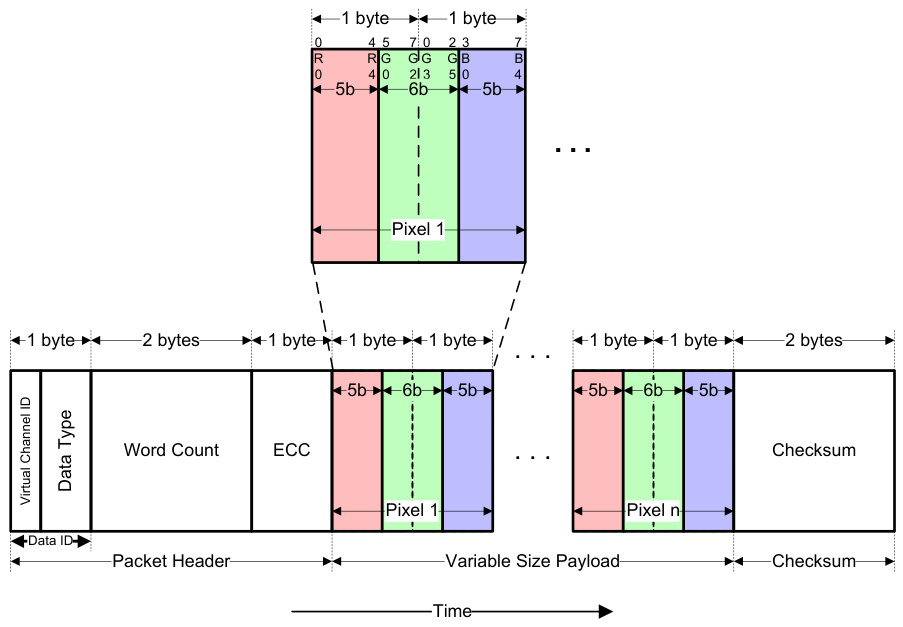  
Figure 9-17: 16-bit per pixel RGB Color Format, Long packet for MIPI Interface

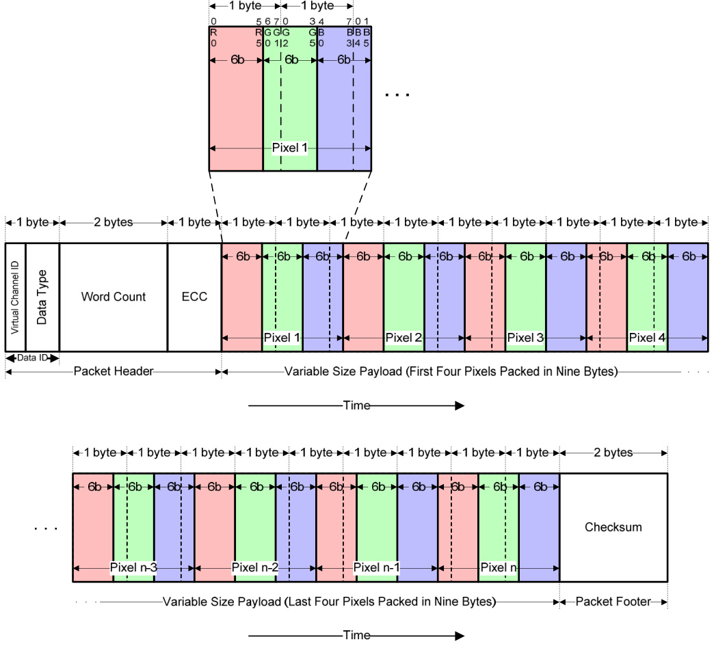  
Figure 9-18: 18-bit per Pixel– RGB Color Format, Long packet for MIPI Interface

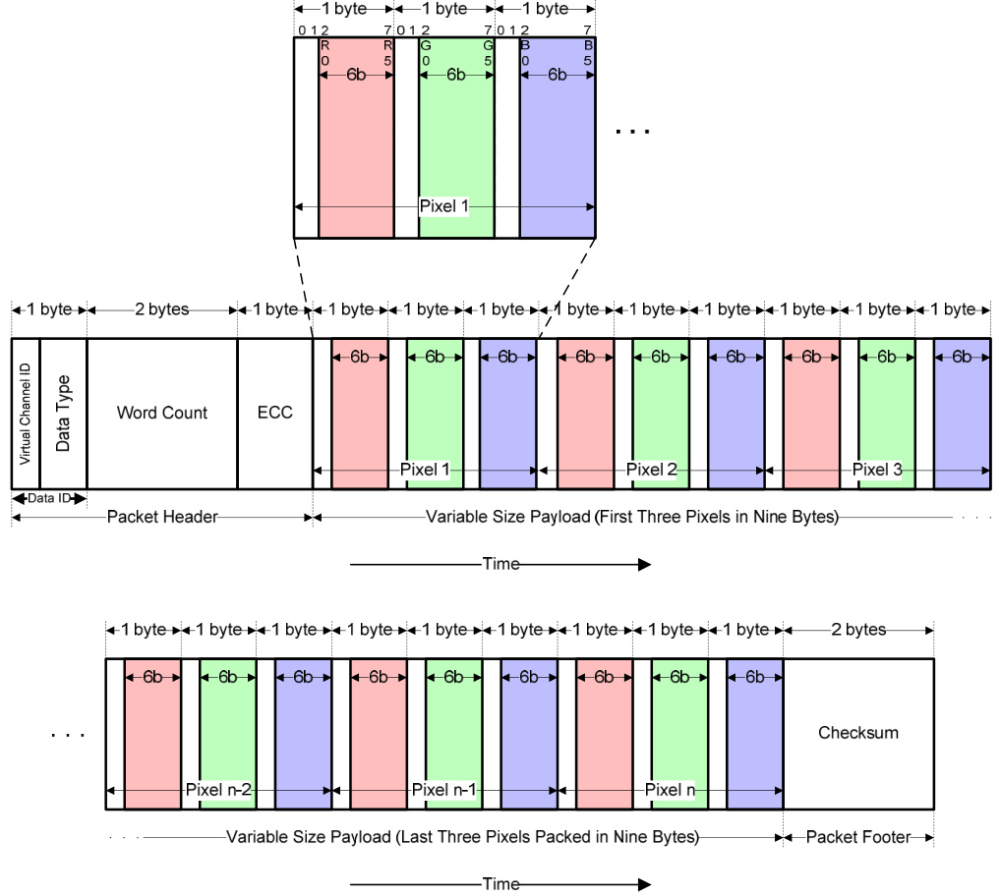  
Figure 9-19: 18-bit per Pixel in Three Bytes – RGB Color Format, Long packet for MIPI Interface

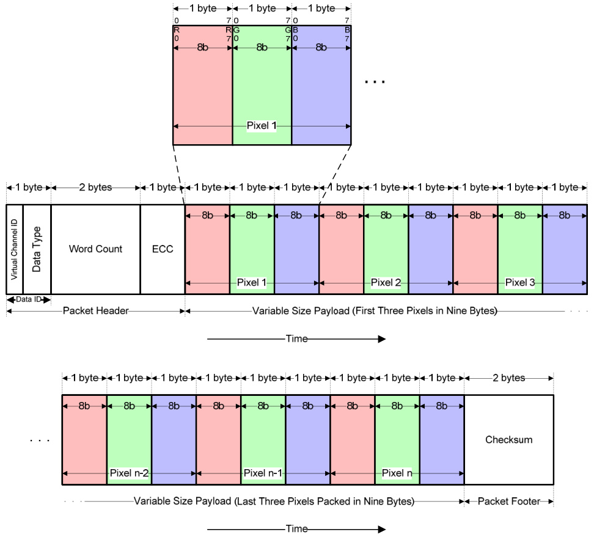  
Figure 9-20: 24-bit per Pixel – RGB Color Format, Long packet for MIPI Interface

# 9.3 Operating Modes

The video data come from the RGB interface and the configuration is done through the SPI interface. To support different bpp settings, the following data pins are used. For all cases, R should be at the upper bits and B should be at the lower bits.

data[15:0] for 16 bpp.   
data[17:0] for 18 bpp, packed.   
data[17:0] for 18 bpp, loosely packed.   
data[23:0] for 24 bpp.

The user, first, needs to program the registers VICR1 to VICR6 with correct values. The user also needs to program the END and CO bits to 0 and 1 respectively. After programming those register fields, the user can turn on the RGB interface and enable the VEN bit to start transmission. All three video mode sequence defined in the MIPI DSI specification are supported.

In Non-Burst Mode, the CSS (register 0xB7 bit 5) can be set to 0 or 1. When it is set to 1 to select the pclk as PLL reference clock, the PLL multiplication factor should be equal to the bpp value. When it is set to 0 to select the tx_clk as PLL reference clock, the PLL multiplication factor should be set such that the serial link data rte is faster than the incoming data rate. Please refer to the table below for the PLL settings. Registers VICR1 to VICR6 (0xB1 to $0 \times \mathsf { B } 6 ^ { \prime }$ ) needs to be programmed. (VICR1 is not used for non-burst mode with Sync Events). (VICR1 is not used for non-burst mode with Sync Events.) Below is the diagram to illustrate the definition of all the fields.

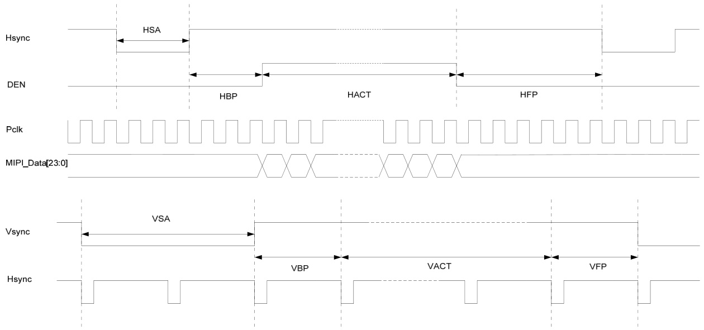  
Figure 9-21: Illustration of RGB Interface Parameters for Non-burst Mode with Sync Pulses

Table 9-10: PLL Setting for Non-burst Mode (PLL reference using pclk)   

<html><body><table><tr><td>BPP (bit per pixel)</td><td colspan="2">PLL Multiplication Factor</td><td colspan="2">PLL Output Clock Frequency</td></tr><tr><td></td><td>1 data lane</td><td>2 data lane</td><td>1 data lane</td><td>2 data lane</td></tr><tr><td rowspan="4">16 18, packed 18, loosely packed</td><td>16</td><td>8</td><td>16 x pclk</td><td>8 x pclk</td></tr><tr><td>18</td><td>9</td><td>18 x pclk</td><td>9 x pclk</td></tr><tr><td>24</td><td>12</td><td>24 x pclk</td><td>12 x pclk</td></tr><tr><td>24</td><td>12</td><td>24x pclk</td><td>12 x pclk</td></tr><tr><td rowspan="4">16 18, packed</td><td>3 data lane</td><td>4 data lane</td><td>3 data lane</td><td>4 data lane</td></tr><tr><td>5.33</td><td>4</td><td>5.33 x pclk</td><td>4 x pclk</td></tr><tr><td>6</td><td>4.5</td><td>6 x pclk</td><td>4.5 x pclk</td></tr><tr><td>8 8</td><td>66</td><td>8 x pclk 8 x pclk</td><td>6 x pc1k 6 x pc1k</td></tr></table></body></html>

Table 9-11: PLL Setting for Non-burst Mode (PLL reference using tx_clk)   

<html><body><table><tr><td>BPP (bit per pixel)</td><td colspan="2">PLL Multiplication Factor</td><td colspan="2">PLL Output Clock Frequency</td></tr><tr><td>1</td><td>data lane</td><td>2 data lane</td><td>1 data lane</td><td>2 data lane</td></tr><tr><td rowspan="4">16 18, packed 18, loosely packed</td><td>NA</td><td>NA</td><td>>= 16 x pclk</td><td>>= 8 pclk X</td></tr><tr><td>NA</td><td>NA</td><td>>= 18 x pclk</td><td>>= 9 x pclk</td></tr><tr><td>NA</td><td>NA</td><td>>= 24 x pclk</td><td>>= 12 x pclk</td></tr><tr><td>NA</td><td>NA</td><td>>= 24 x pclk</td><td>>= pclk 12x</td></tr><tr><td>16</td><td>3 data lane</td><td>4 data lane</td><td>3 data lane</td><td>4 data lane</td></tr><tr><td rowspan="4">18, packed 18, loosely packed 24</td><td>NA</td><td>NA</td><td>>= 5.33 x pclk</td><td>>= 4 x pclk</td></tr><tr><td>NA</td><td>NA</td><td>>= 6 x pclk</td><td>>= 4.5 X pclk</td></tr><tr><td>NA</td><td>NA</td><td>>= x pclk 8</td><td>>= 6 pclk X</td></tr><tr><td>NA</td><td>NA</td><td>>= 8 x pclk</td><td>>= 6 x pclk</td></tr></table></body></html>

In Burst Mode, the CSS (register $0 \times \mathsf { B 7 }$ bit 5) needs to be set to 0 to select the tx_clk as PLL reference clock. The PLL multiplication factor should be set such that the serial link data rate is faster than the incoming data rate. Please refer to the table below for the PLL settings. Registers VICR2 to VICR6 $\mathtt { \Omega } 0 \mathtt { x } \mathtt { B } 1$ to $0 \times \mathsf { B } 6 ^ { \cdot }$ needs to be programmed. VICR1 is not used for this mode. The definition of all the fields is the same as non-burst mode with Sync Events.

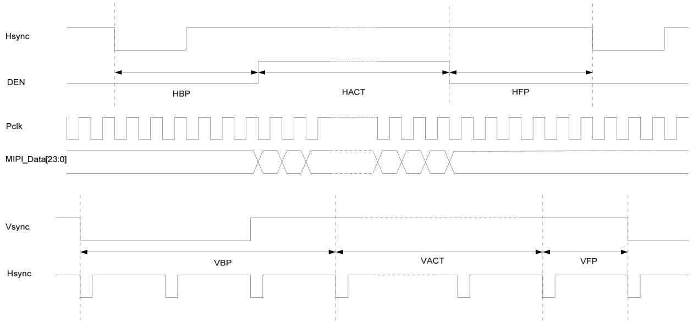  
Figure 9-22: Illustration of RGB Interface Parameters for Non-burst Mode with Sync Events and Burst Mode

Table 9-12: PLL Setting for Burst Mode   

<html><body><table><tr><td>BPP (bit per pixel)</td><td colspan="2">PLL Multiplication Factor</td><td colspan="2">PLL Output Clock Frequency</td></tr><tr><td></td><td>1 data lane</td><td>2 data lane</td><td>1 data lane</td><td>2 data lane</td></tr><tr><td rowspan="3">16 18, packed 18, loosely packed</td><td>NA</td><td>NA</td><td>>= 16 x pclk</td><td>>= 8 x pclk</td></tr><tr><td>NA</td><td>NA</td><td>>= 18 x pclk</td><td>>= 9 x pclk</td></tr><tr><td>NA</td><td>NA</td><td>>= 24 x pclk</td><td>>= 12 x pclk</td></tr><tr><td>24</td><td>NA data lane 3</td><td>NA 4 data lane</td><td>>= 24 x pclk 3 data lane</td><td>>= 12 x pclk 4 data lane</td></tr><tr><td>16 18, packed</td><td>NA</td><td>NA</td><td>>= 5.33 x pclk</td><td>>= 4 x pclk</td></tr><tr><td rowspan="4">18, loosely packed 24</td><td>NA</td><td>NA</td><td>>=</td><td></td></tr><tr><td>NA</td><td>NA</td><td>6 x pclk >= 8 x pclk</td><td>>= 4.5 x pclk</td></tr><tr><td>NA</td><td>NA</td><td></td><td>>= 6 x pclk</td></tr><tr><td></td><td></td><td>>= 8 x pclk</td><td>>= 6 x pclk</td></tr></table></body></html>

\*: This value should be set such that the serial link data rate is faster than incoming data rate

The SSD2828 will also monitor the status of CM and SHUT signal. When there is a change of these signals, it will send out appropriate packets. On the rising edge of CM, the CM on packet will be sent. On the falling edge of CM, the CM off packet will be sent. On the rising edge of SHUT, the Shut Down Peripheral packet will be sent. On the falling edge of SHUT, the Turn On Peripheral packet will be sent. With these packets, the MIPI slave will be able to reconstruct the RGB interface signals.

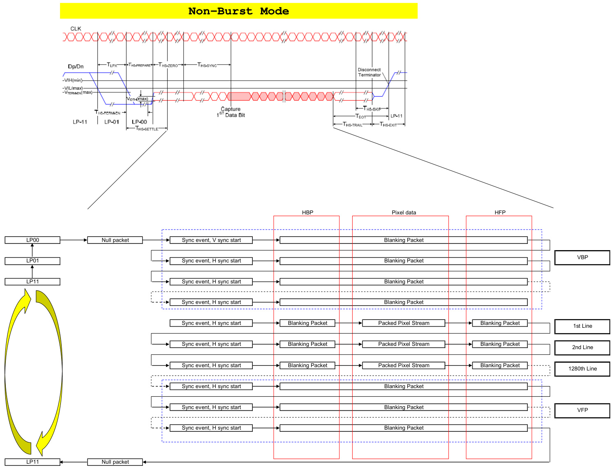  
Figure 9-23: Non-Burst mode MIPI structure

<html><body><table><tr><td>SSD2828QN4</td><td>Rev 1.3</td><td>P 124/168</td><td>Mar 2013</td></tr></table></body></html>

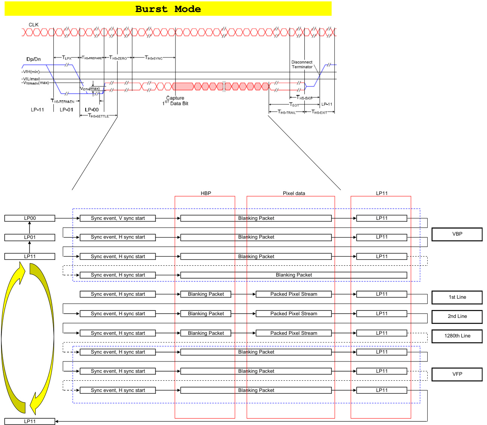  
Figure 9-24: Burst mode MIPI structure

# 9.3.1.1 Write Operation

To perform write operation, the user needs to set the REN bit to 0. The SSD2828 can issue four kinds of packets for write operation, which are Generic Short Write Packet, Generic Long Write Packet, DCS Short Write Packet and DCS Long Write Packet. The bit DCS controls whether Generic Write Packet or DCS Write Packet will be sent out. The VC1 or VC2 field determines the VC ID of the outgoing packets. (Please see the 8.1.9 for the difference between VC1 and VC2.)

The SSD2828 needs to know the payload size of the outgoing packets. Hence, the user needs to program the corresponding control registers. PSCR1 and PSCR2 form the TDC field that indicates the total number of payload bytes.

To send a DCS Write Packet, the user needs to write the DCS command/header and the payload to the register PDR and DCS bit set to 1. If the TDC field is no more than 2, the SSD2828 will send out DCS Short Write Packet with the correct type. Otherwise, DCS Long Write Packet will be sent out.

To send a Generic Write Packet, the user needs to write the payload to the register PDR and DCS bit set to 0. If the TDC field is no more than 2, the SSD2828 will send out Generic Short Write Packet with the correct type. Otherwise, Generic Long Write Packet will be sent out.

For DCS Write Packet, the partition is only enabled if the DCS command is $0 \mathrm { x } 2 \mathrm { C }$ or $0 \mathrm { x } 3 \mathrm { C }$ . Otherwise, SSD2828 will not perform automatic partition. (This is because the DCS command $0 \mathrm { x } 2 \mathrm { C }$ and $0 \mathrm { x } 3 \mathrm { C }$ are to write display data into the LCD panel display memory.) The payload will be partitioned into a few packets where the payload of each packet is PST bytes. The first byte is the DCS command and the following PST bytes are the payload. Only the last packet might contain less payload, as the total payload might not be integer multiple of PST. If the incoming DCS command is $0 \mathrm { x } 2 \mathrm { C }$ , the DCS command for the first packet is $0 \mathrm { x } 2 \mathrm { C }$ and the DCS command for all other packets is 0x3C. If the incoming DCS command is $0 \mathrm { x } 3 \mathrm { C }$ , the DCS command of all the packets is 0x3C.

For example, in the raw data mode $\mathbf { I F C } { = } 0 \$ ), if the TDC field is 200 and PST field is 80, 3 packets will be sent. The first two have 80 bytes of payload. The last packet has 40 bytes of payload.

After performing a write operation, the user can optionally make a BTA to let the MIPI slave report its status. This is done by setting FBW bit to 1. The SSD2828 will automatically make a BTA after each write operation. Please refer to 0 for how to handle the acknowledgement received.

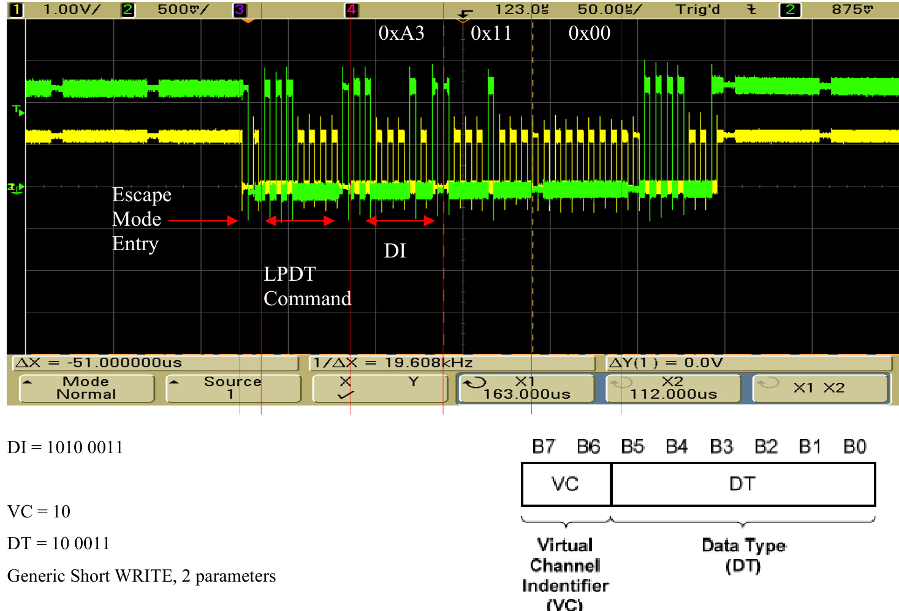

# 9.3.1.2 Read Operation

To perform read operation, the user needs to set the REN bit to 1. The SSD2828 can issue two kinds of packets for read operation, which are Generic Read Packet, and DCS Read Packet. The bit DCS controls whether Generic Read Packet or DCS Read Packet will be sent out. The VC1 or VC2 field determines the VC ID of the outgoing packets. (Please see the 8.1.9 for the difference between VC1 and VC2.)

Before the read packet is sent out, the SSD2828 will always send out the Set Maximum Return Size Packet. This is to limit the Read Response Packet sent by the MIPI slave such that there is no over flow. Two factors determine the maximum size. One is the limit of the SSD2828 and the other is the limit of the application processor. The user should choose the smaller one among these two limits to use as the maximum return size.

The parameter in the Set Maximum Return Size Packet is taken from register MRSR. The user could program the MRSR before every read so that the correct value is sent through Set Maximum Return Size Packet. If the value in the MRSR is already the desired value, the user can choose not to program it. The SSD2828 will always automatically send out Set Maximum Return Size Packet using the value in MRSR.

To send a DCS Read Packet, the user just needs to write the DCS command (as there is no parameter for DCS read) to PDR register and DCS bit set to 1.

To send a Generic Read Packet, the user needs to write the payload to the register PDR and DCS bit set to 0.

Similar to the write operation, the TDC field is used to determine the payload size of the outgoing packet. For DCS Read Packet, the payload is just the DCS command. There is no parameter associated. For Generic Read Packet, the SSD2828 will send out the correct packet type according to the TDC value.

After sending out the read packet, the SSD2828 will automatically perform a BTA to wait for the Read Response Packet from the MIPI slave. The return data will be stored in register RR. No matter what read packet is sent out, there is only one packet returning data. Therefore, no matter whether the read is DCS read or Generic read, no matter what command is used in DCS read, the return data is always stored in register RR. The user can read the data out when the RDR bit is set to 1. After seeing RDR bit been set to 1, the user should first read register RDCR which contains the number of bytes returned by the MIPI slave. By using this information, the user will know how many data should be read out from register RR. After all the return data are read out, the RDR bit will be set to 0 by the SSD2828.

After the RDR bit been set to 1, the user can choose not to read the data out from register RR. The user can continue performing another operation. Once the user does so, the RDR bit will be set to 0 by the SSD2828.

There might be Acknowledge and Error Report Packet sent by the MIPI slave at the same time. The operation of acknowledgement handling is described in 0.

Under certain circumstance, the MIPI slave might only send back Acknowledge and Error Report Packet without any data. Thus, the RDR bit will not be set. Therefore, it is recommended that the user check the bit BTAR first. The BTAR is to indicate whether the MIPI slave has passed the bus authority back to the SSD2828 or not. Only when the BTAR is 1, there might be return data. If there is no return data, the user should follow 0 to handle the acknowledgement.

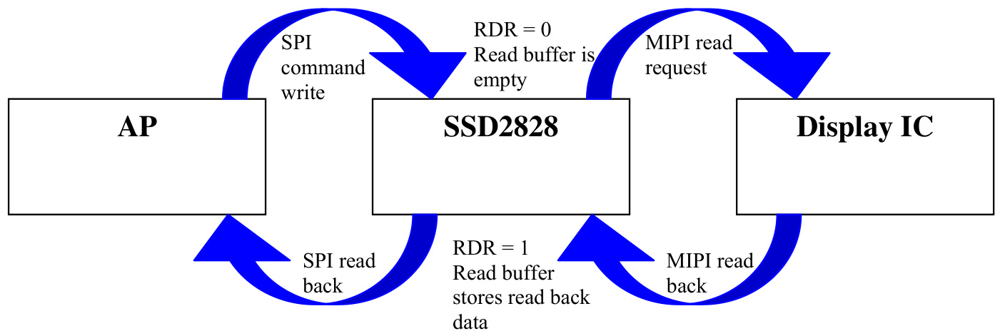

# MIPI read back

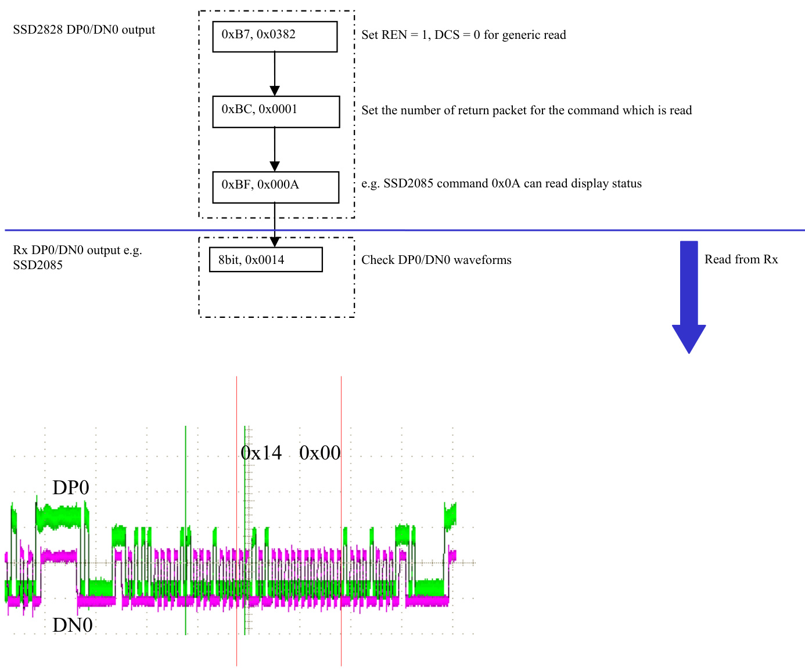

# 9.3.1.3 Acknowledgement Operation

The SSD2828 can perform a BTA to give the bus authority to the MIPI slave and let it report its status. The BTA can be enabled by setting FBW bit to 1 and performing a write operation, or just performing a read operation. After the MIPI slave passes the bus authority back, the SDD2828 will set bit BTAR to 1.

If there is no error on the slave side, the MIPI slave will return ACK trigger message, if the packet before BTA is a write packet. The MIPI slave will return Read Response Packet, if the packet before BTA is a read packet. In this case, after receiving the response from the MIPI slave, SSD2828 will set bit ARR and ATR bits to 1. ARR indicates that response has been received from MIPI slave. ATR indicates that the MIPI slave has reported no error with ACK trigger message. Consequently, the register ARSR will be cleared to 0.

If there is error on the slave side, the MIPI slave will return Acknowledge and Error Report packet, if the packet before BTA is a write packet. The MIPI slave will return Read Response Packet (depending on the error type) and Acknowledge and Error Report Packet, if the packet before BTA is a read packet. In this case, after receiving the response from the MIPI slave, SSD2828 will set bit ARR bit to and ATR bits to 0. ARR indicates that response has been received from MIPI slave. ATR indicates that the MIPI slave has sent Acknowledge and Error Report Packet instead of ACK trigger message. Therefore, the MIPI slave has reported error. The error reported by the MIPI slave will be stored in register ARSR. The user can read this register to see what error the MIPI slave has encountered.

For the detailed description of each error bit, please refer to MIPI DSI specification. Below are the flow charts of handling the MIPI slave acknowledgement. They are just for reference.

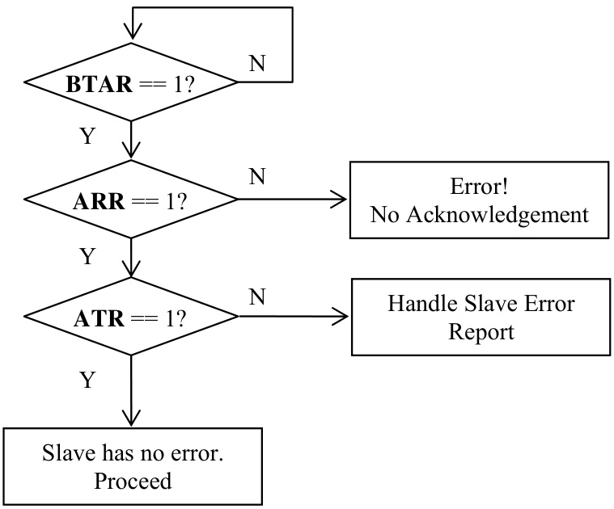  
Figure 9-25: Acknowledgement Handling after Non-Read Command

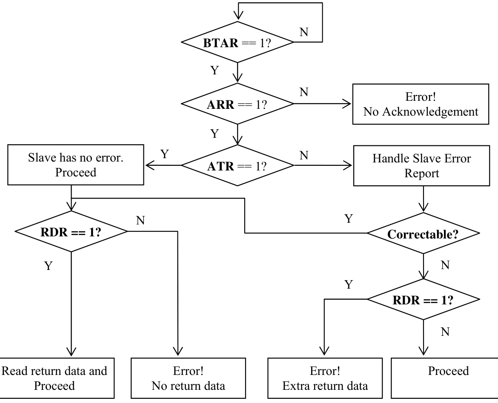  
Figure 9-26: Acknowledgement Handling after Read Command

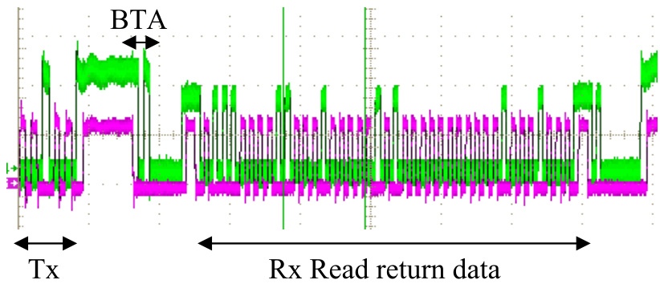  
Remark: LP clock of Rx must be within $10 \%$ of Tx LP clock

Table 9-13: MIPI error report   

<html><body><table><tr><td>Bit</td><td>Description</td></tr><tr><td>0</td><td>SoT Error</td></tr><tr><td></td><td>SoT Sync Error</td></tr><tr><td>2</td><td>EoT Sync Error</td></tr><tr><td>3</td><td>Escape Mode Entry Command Error</td></tr><tr><td></td><td>Low-Power Transmit Sync Error</td></tr><tr><td></td><td>Peripheral Timeout Error</td></tr><tr><td></td><td>False Control Error</td></tr><tr><td></td><td>Contention Detected</td></tr><tr><td></td><td>ECC Error, single-bit (detected and corrected)</td></tr><tr><td></td><td>ECC Error, multi-bit (detected, not corrected)</td></tr><tr><td>10</td><td>Checksum Error (Long packet only)</td></tr><tr><td></td><td>DSI Data Type Not Recognized</td></tr><tr><td>12</td><td>DSI VC ID Invalid</td></tr><tr><td>13</td><td>Invalid Transmission Length</td></tr><tr><td>14</td><td>Reserved</td></tr><tr><td>15</td><td>DSI Protocol Violation</td></tr></table></body></html>

# 9.3.1.4 Tearing Effect (TE) Operation

The TE operation is to perform a BTA following the previous BTA without transmitting anything in between. The bus is handed to the MIPI slave for providing TE information. After getting the TE event from display driver, the MIPI slave will pass the bus authority back to the SSD2828 by using BTA trigger message.

The TE operation can be enabled by setting bit FBT and FBW to 1 before writing the last command to the MIPI slave. Afterwards, the application processor can instruct the SSD2828 to send out the last command in a write packet. Since FBW is 1, the SSD2828 will automatically perform a BTA after the write operation. The MIPI slave will response and pass the bus authority back. Since FBT is 1, the SSD2828 will perform another BTA without sending any data. This makes the MIPI slave enter TE mode.

The MIPI slave will send a TE trigger message back when it gets the TE event. After getting the trigger message, the SSD2828 will set the TE pin to 1 to indicate that TE event has been received. DATA[16] is used as the TE pin. At the same time, bit TER will be set to 1. The application processor can write to this bit to clear it. As the TE trigger message only determines when the TE pin will be set to 1, a counter is used to determine when to set the TE pin to 0. The TE pin will be set to 0, once the counter reaches the value in TEC. The counter uses the reference clock to do counting.

If the MIPI slave does not send back the TE trigger message but just perform a BTA to pass the bus back, the SSD2828 will automatically perform another BTA to pass the bus to the MIPI slave again. It will continue do so until the MIPI slave respond with the TE trigger message, or the FBT bit is set to 0, or the LP RX timer expires.

If the MIPI slave does not send back the TE trigger message and still holds the bus, the user can set the bit FBC to 1 to force a bus contention. After bus contention is resolved, the slave will pass the bus back to SSD2828.

# 9.3.1.5 Contention Detection and Timer Operation

Two timers have been defined in SSD2828 to resolve the potential contention issue on the bus. The two timers are the HS TX timer and LP RX timer. Please see the register description for the detailed usage.

Whenever the SSD2828 sees a contention being detected, it will reset the state machine and enter the default mode, which is LP TX idle mode. The data line will be kept at LP11.

# 9.3.1.6 Interrupt Operation

An interrupt signal int $\smash { 0 / \mathrm { i n t } _ { - } 1 }$ has been provided to interrupt the application processor so that it does not need to poll the status all the time. This will save the processing time of the application processor. int_ $\mathrm { 0 / i n t \_ 1 }$ is an active low signal, in other words, when the event has happened, will go low.

There are many sources that can be mapped to the interrupt signal. The user can select different source to perform different task. If more than source is selected, the int_0/int_1 signal will go low when the event for of the sources has happened. In this case, the user needs to read the register ISR to determine what event has happened. The different sources can be enabled/disabled through register ICR. Below is the list of available interrupt sources and their usage.

# RDR

To indicate that return data from MIPI slave is available for read.

# BTAR

To indicate whether the SSD2828 has the bus authority or not. It can be used after SSD2828 makes a BTA. If the MIPI slave has returned the bus authority back to SSD2828, the interrupt will be set to indicate so. Please note that, on power up, the bus authority is already on the SSD2828. Hence, the SSD2828 will show that it has the bus authority.

# ARR

To indicate whether the SSD2828 has received the acknowledge response from the MIPI slave. The acknowledge response can either report error or not error. This is to be determined by the ATR bit.

The above three interrupts are provided to the user to handle reading data from the MIPI slave or getting acknowledgement response from the MIPI slave.

<html><body><table><tr><td>SSD2828QN4</td><td>Rev 1.3</td><td>P 133/168</td><td>Mar 2013</td></tr></table></body></html>

# PLS

To indicate whether the PLL has been locked or not. If the PLL is not locked, the programming speed at the external interface must be slow. After changing the PLL setting or changing the reference clock source, the user also needs to use this interrupt to determine the PLL status.

On power up, only PLS interrupt is enabled. This is to let the user determine the programming speed before configuring the SSD2828.

# LPTO

To indicate that there is LP RX time out.

# HSTO

To indicate that there is HS TX time out.

The above two interrupts are provided to the user for error handling.

# PO

To indicate whether the SSD2828 is ready to accept any data from the user. The SSD2828 has several internal buffers to hold the data written by the user. When the user writes after than the serial link speed, those buffers will be full. If the user still writes data to SSD2828, those data will be lost. The length of the payload of the next packet that the user is going to write is determined by TDC, PST, and DCS fields. The SSD2828 will use these fields to decide whether the user can write the next packet or not. Hence, after programming the above mentioned fields, the user needs to check the interrupt status before writing.

# SE, SA, SLE, SLA, MLE, MLA

All these interrupts are provided to indicate the status of the internal data buffers. They are used if the user is familiar with the buffer management of the SSD2828. Otherwise, it is recommended to use the PO interrupt.

One important thing to note is the interrupt latency. The output interrupt signal does not change immediately after an operation. This is due to the internal processing of the SSD2828. For example, after changing the interrupt source from one to another, the output int_ $\underline { { 0 / } } \mathrm { i n t \underline { { { 1 } } } }$ level will remain at the old level for a short period after the programming is done. Another example is that after programming the TDC field, the interrupt will take a short period to reflect the correct PO status on int $\underline { { 0 / \mathrm { i n t } } } \underline { { 1 } }$ . There is always a delay between the actual event and the interrupt.

In order to guarantee that the user can get the correct interrupt, it is recommended that the user performs a read of any SSD2828 local register before taking in the interrupt signal or polling the interrupt status bits. The read operation will cover the interrupt latency period. Alternatively, the user can wait for certain amount of time to make sure the interrupt reflects the true status. Below is a diagram for illustration.

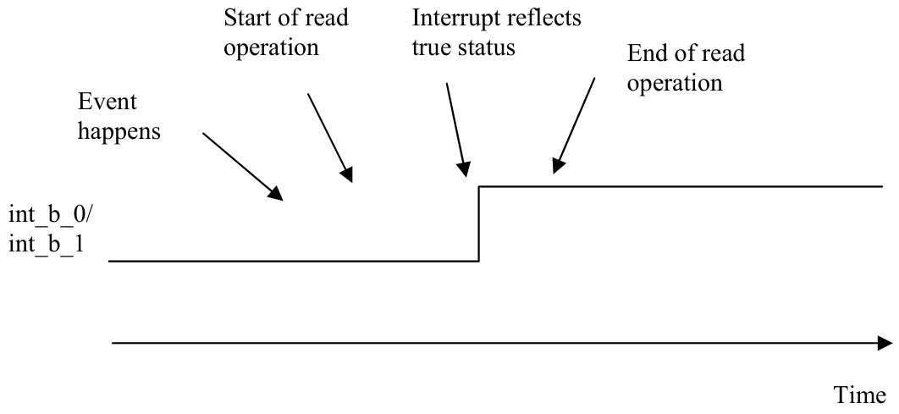  
Figure 9-27: Illustration of Interrupt Latency

# 9.3.1.7 Internal Buffer Status

There are totally data buffer inside the SSD2828QN4, which is SPI command interface buffer (CB).

For CB buffers, all packets will be stored into them. They can store multiple packets and each packet size can be set to 1023 bytes. Below is a list of possible packets

Generic Short Write Packet Generic Read Packet DCS Short Write Packet DCS Read Packet Generic Long Write Packet DCS Long Write Packet

In case of automatic partitioning, the packet length is determined by the PST field. It is not recommended to make the PST field so small.

The user can write the data through SPI interface. All packets will be written into the CB buffers. Hence, the user needs to check the corresponding interrupts. The usage of the interrupts is listed below.

# CBE

To indicate that the Command buffer is empty.

# CBA

To indicate that the Command buffer can hold at least more packet. The user can write such packet into CB buffer.

The interrupts mentioned here can be used as flow control between the application processor and the SSD2828. However, it requires the user to know the buffer operation well. The PO interrupt is a combination of the eight. It makes decision according to the parameters provided by the user for the next packet to be written. Hence, the user does not need to know which buffer is going to be used and how the buffer status is.

# 9.3.2 State machine operation

The state machine controls the sending and receiving of the data packet over the serial link. It is triggered by an event from the application processor or the received data. Once a complete packet is written into the SSD2828 buffer, it will send it out through the serial link. The user can write 1 to bit COP at any time to cancel all the current operations. Please see 8.1.17 for the description.

When the SSD2828 is in high speed mode, the serial link is mainly used to send display data. If there is no data to send, it will send null packet to maintain the serial link timing. If the application processor does not have display data to send in a long period, it can turn the serial link into low power mode by setting the register bit HS to 0.

When the SSD2828 is in low power mode, the serial link is mainly used to send command and configuration data. If there is no data to sent, the SSD2828 will be idle in LP TX stop mode.

The user can also enter sleep mode by writing 1 to SLP bit. Once the SLP bit is set to 1, the SSD2828 will automatically enter LP mode. If the HS bit is 1, the SSD2828 will clear the HS bit to 0 and switch from HS to LP mode. Afterwards, the SSD2828 will issue ULPS trigger message to the MIPI slave to enter Ultra Low Power State. During this state, the clock to SSD2828 can be switched off such that the SSD2828 only consumes leakage current. This will save the overall system power consumption. When exiting from the ULPS, the user can write 0 to SLP bit. However, the user should be aware that the time to exit from ULPS is relatively long (pleaser refer to MIPI DPHY specification). Hence, the user cannot perform any data transmission before the system exits from ULPS.

During reception, the state machine will disassemble the incoming data packet and put the received register content into the internal buffer for reading out. Once all the data are put into the buffers, it will set the register bit RDY to 1 to indicate that the SSD2828 is ready for read. The total number of received bytes will also be stored in RDCR.

After the reception is completed, the SSD2828 will perform a bus turn around to enter the transmission mode.   
It will always come back to the LP TX stop mode before it enters any other mode.

# 9.3.3 D-PHY operation

D-PHY controls the operation of the analog transceiver. It controls whether the serial link is in high speed or low power mode and whether it’s in transmit or receive mode.

In transmit mode, the D-PHY will perform the handshaking procedure when switching between LP mode and HS mode according to the control from PCU. During HS mode, D-PHY will provide parallel data and clock to the analog transmitter for transmitting in differential signals serially. During LP mode, D-PHY will directly drive the Datap and Datan line output. It will provide serial data to the analog transmitter.

In receive mode, D-PHY will detect the handshaking sequence in LP mode and inform the PCU. Once entering escape mode, it will collect the serial data from analog receiver and put them in byte form for the PCU to process.

Various timing parameter has been defined in MIPI DPHY specification. The timing parameters are a mixture of absolute time and cycle counts. Hence, for different operation speed, there is different timing requirement. Registers DAR1 to DAR6 are provided for this purpose. The user can adjust the value in these registers to have different DPHY timing parameters. This gives maximum flexibility for different operation speed.

# 9.3.4 Analog Transceiver

# 9.3.5 PLL

The PLL output frequency is calculated by the equations below,

$$
\begin{array} { l } { \displaystyle f _ { P R E } = \frac { f _ { I N } } { M S } } \\ { \displaystyle f _ { O U T } = f _ { P R E } \ast N S } \end{array}
$$

where the $f _ { I N }$ is the input reference clock frequency and $f _ { O U T }$ is the output clock frequency of the PLL.

The clock frequencies need to satisfy the constraint below.

$$
\begin{array} { r l } & { 5 M H z > f _ { I N } \ge 1 0 0 M H z } \\ & { 5 M H z > f _ { R E F } \ge 1 0 0 M H z } \\ & { 6 2 . 5 M H z > f _ { O U T } \ge 1 0 0 0 M H z } \end{array}
$$

The value of FR, MS, and NS are controlled in the register PLCR.

All the values of FR, MS and NS can only be modified when the PLL is turned off. Hence, the sequence for modification is to turn off PLL, modify register value, and turn on PLL.

# 9.3.6 Clock Source Example

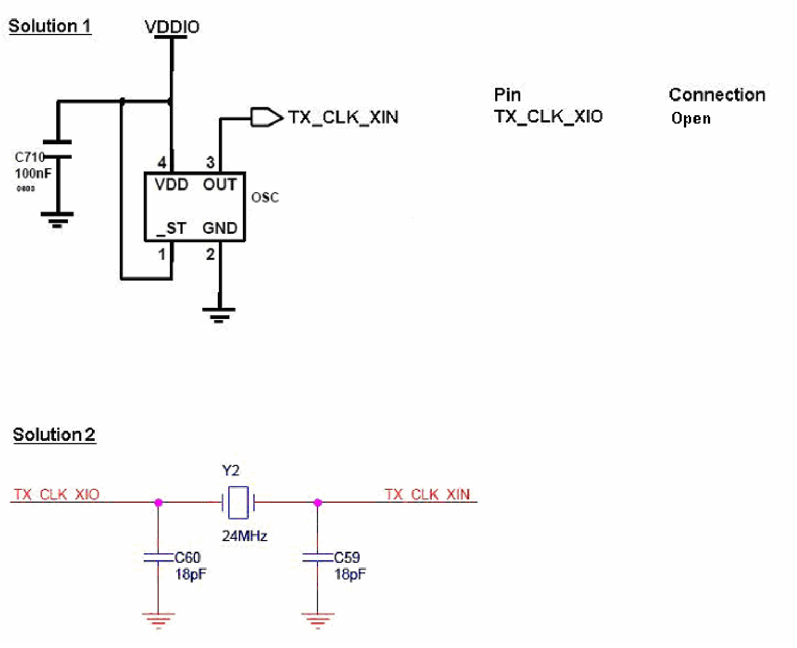

# 10 External Interface

The SSD2828 supports three types of SPI interface,

8-Bit 3 wire (type C option 1, DBI 2.0)   
8-Bit 4 wire (type C option 3, DBI 2.0)   
24-bit 3 wire

and RGB interfaces.

The selection is controlled by ps[1:0] pins.

RGB interface supports 4 bpp settings. Below are the data pins used for each interface. For all cases, R should be at the upper bits and B should be at the lower bits.

data[15:0] for 16 bpp.   
data[17:0] for 18 bpp, packed.   
data[17:0] for 18 bpp, loosely packed.   
data[24:0] for 24 bpp. SPI interface supports 8-Bit data bus. The least significant byte should be written first.   
Below is the operation and timing diagram for each of the interfaces.

# 10.1 SPI Interface 8 bit 4 Wire

This interface consists of sdcx, sck, sdin, sdout and csx. It only supports 8-Bit data. Each cycle contains 8- Bit data. The first cycle should be a command write cycle to specify the register address for access. The subsequent cycles are read or write cycles for read or write operations.

The csx should be driven from 1 to 0 to start an operation and from 0 to to end an operation. During operation, the application processor can write or read multiple bytes.

sdcx indicates whether the operation is for data or command. When sdcx is 1, the operation is for data. When sdcx is 0, the operation is for command. sdcx is sampled at every ${ 8 } ^ { \mathrm { t h } }$ rising edge of sck during 1 operation.

During write operation, sdin will be sampled by SSD2828 at the rising edge of sck. The first rising edge of sck after the falling edge of csx samples the bit of the 8-Bit data. The second rising edge of sck samples the bit 6 of the 8-Bit data, and so on. The value of sdcx is sampled at the 8th rising edge of sck, together with bit 0 of the 8-Bit data. Please see the diagram below for illustration. Optionally, the csx can be driven to in between cycles.

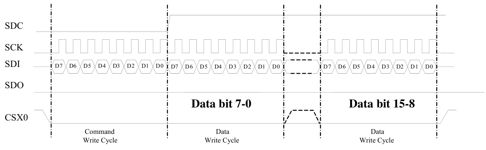  
Figure 10-1: Illustration of Write Operation for 8 bit 4 Wire Interface

# Remark: Send LSB 8bit of data before MSB 8bit

During read operation, since there is no rwx signal to indicate whether the operation is read or write. After csx is driven low, the first cycle is always a command write cycle, which specifies the register to access. The second cycle is still a command write cycle. If the command in this cycle matches the command in register LRR, the SPI interface will enter read mode. The subsequent cycles will be read cycles. If the command does not match, the SPI interface will remain in write mode.

After entering the read mode, the return data is provided on sdout, on the falling edge of sck. The application processor should use the rising edge of sck to sample the data. sdcx should be driven to 1 during the read cycles. Please see the diagram below for illustration. Optionally, the csx can be driven to 1 in between cycles.

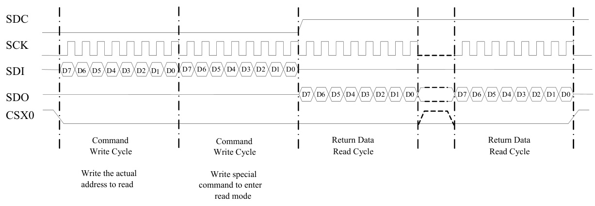  
Figure 10-2: Illustration of Read Operation for 8 bit 4 Wire Interface

# 10.2 SPI Interface 8 bit 3 Wire

This interface consists of sck, sdin, sdout and csx. It only supports 8-Bit data. Each cycle contains 8-Bit data. The first cycle should be a write cycle to specify the register address for access. The subsequent cycles are read or write cycles for read or write operations.

The csx should be driven from to 0 to start an operation and from 0 to to end an operation. During operation, the application processor can write or read multiple bytes.

Instead of sdcx, an sdcx bit is used to indicate whether the operation is for data or command. Each byte is associated with an sdcx bit. When sdcx is 1, the operation is for display data. When sdcx is 0, the operation is for command. The sdcx bit is sent priori to each byte. In other words, the sdcx bit is the first bit of every 9 bits during operation.

During write operation, sdin will be sampled by SSD2828 at the rising edge of sck. The first rising edge of sck after the falling edge of csx samples the sdcx bit. The second rising edge samples bit (cid:) of the 8-Bit data. The third rising edge of sck samples the bit 6 of the 8-Bit data, and so on. Please see the diagram below for illustration. Optionally, the csx can be driven to in between cycles.

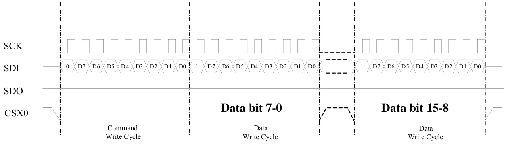  
Figure 10-3: Illustration of Write Operation for 8 bit 3 Wire Interface

Remark: Send LSB 8bit of data before MSB 8bit

During read operation, since there is no rwx signal to indicate whether the operation is read or write. After csx is driven low, the first cycle is always a command write cycle, which specifies the register to access. The second cycle is still a command write cycle. If the command in this cycle matches the command in register LRR, the SPI interface will enter read mode. The subsequent cycles will be read cycles. If the command does not match, the SPI interface will remain in write mode.

After entering the read mode, the return data is provided on sdout, on the falling edge of sck. The application processor should use the rising edge of sck to sample the data. Please note that there is no sdcx bit to read out from SSD2828. Hence, each read cycle consists of 8-Bits instead of 9 bits. This is the difference between read and write cycles. Please see the diagram below for illustration. Optionally, the csx can be driven to in between cycles.

SCK   
SDI   
SDO D7 D6 D5 D4 D3 D2 D1 D D  D  D  D  D3 D2 D1 D0   
CSX0 Command : Command Return Data Return Data Write Cycle Write Cycle Read Cycle Read Cycle Write the actual Write special address to read command to enter read mode

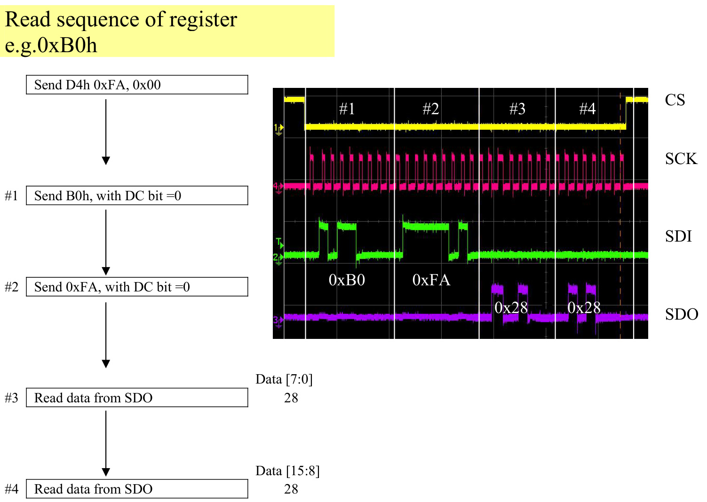  
Figure 10-4: Illustration of Read Operation for 8 bit 3 Wire Interface

# 10.2.1 3 or 4 wires 8bit SPI read back sequence for 0xFF register which is stored MIPI read back data

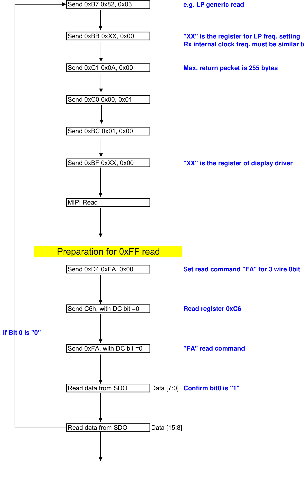

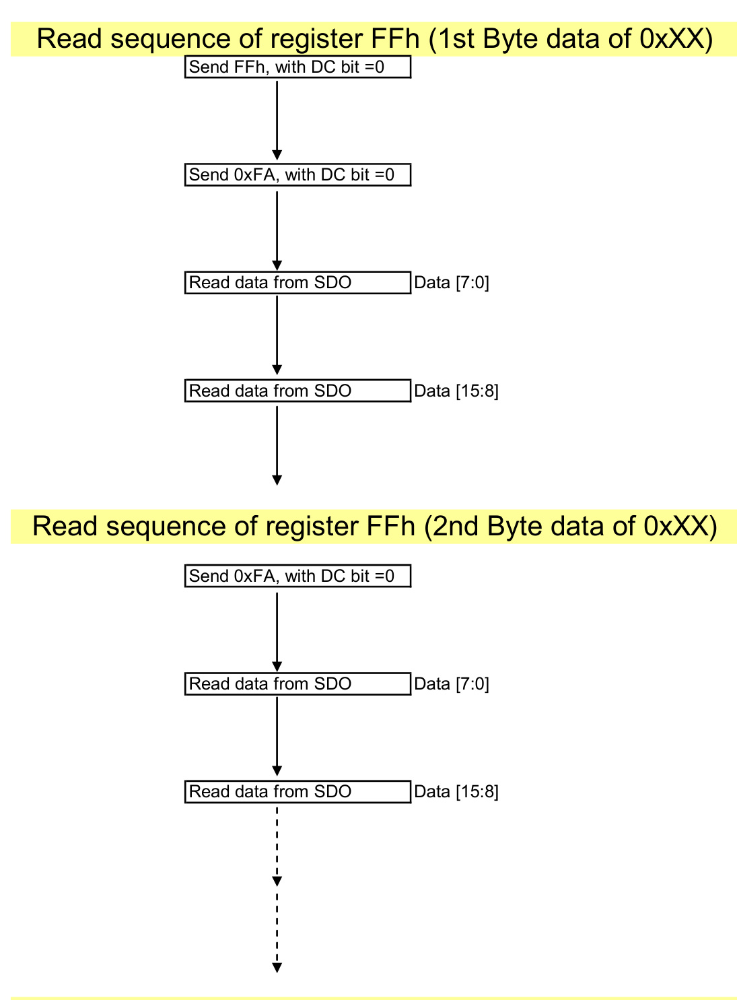

# Read sequence of register FFh (xxth Byte data of 0xXX)

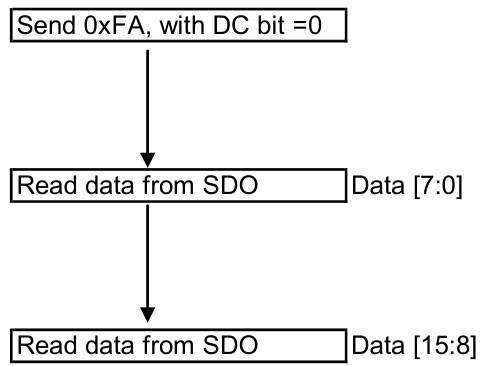

# 10.3 SPI Interface 24 bit 3 Wire

This interface consists of sck, sdin, sdout and csx. It only supports 16-bit data. Each cycle contains 16-bit data. The first cycle should be a write cycle to specify the register address for access. The subsequent cycles are read or write cycles for read or write operations.

The csx should be driven from 1 to 0 to start cycle and from 0 to to end a cycle. During operation, the application processor can have multiple write or read cycles. However, the csx must go from 0 to at the end of each cycle.

Each cycle contains 24-bit data. Among the 24-bit data, the first 8-Bit are for control purpose and the next 16-bit are the actual data. The first 6 bits are the ID bit for SSD2828, which must be 01 100. If this field does not match, the cycle will not be taken in. The 7th bit is the sdcx bit which is the same as the 8-Bit 3 wire interface. The 8th bit is the RW bit which indicates whether the current cycle is a read or write cycle. When RW is 1, the cycle is a read cycle. When RW is 0, the cycle is a write cycle.

During write operation, sdin will be sampled by SSD2828 at the rising edge of sck. Please see the diagram below for illustration. It is an example for writing data 0x1264 to register address 0x28.

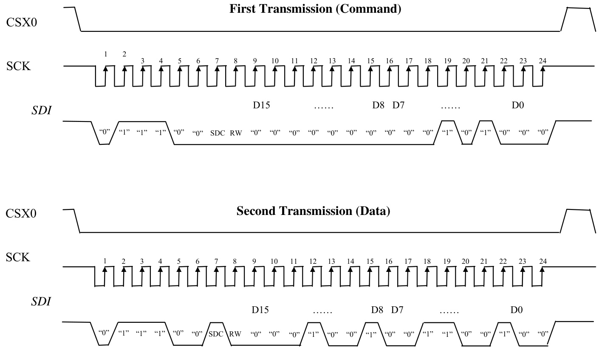  
Figure 10-5: Illustration of Write Operation for 24 bit 3 wire Interface

Remark: Send MSB 8bit of data before LSB 8bit

During read operation, the first 8-Bit are still written by the application processor to specify whether the following 16-bit are for command or data. Afterwards, the SSD2828 will provide the return data on sdout, on the falling edge of sck. The application processor should use the rising edge of sck to sample. Please see the diagram below for illustration.

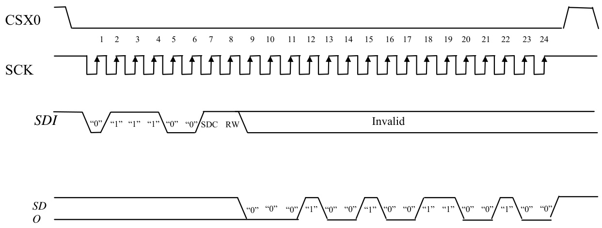  
Figure 10-6: Illustration of Read Operation for 24 bit 3 Wire Interface

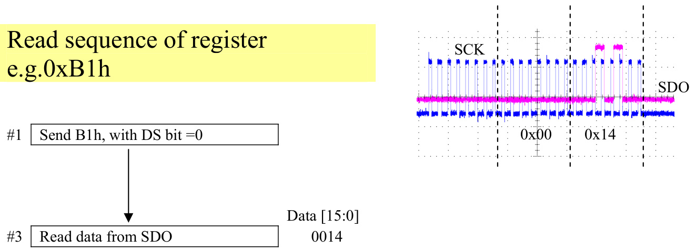

10.3.1 3 wires 24bit SPI read back sequence for 0xFF register which is stored MIPI read back data

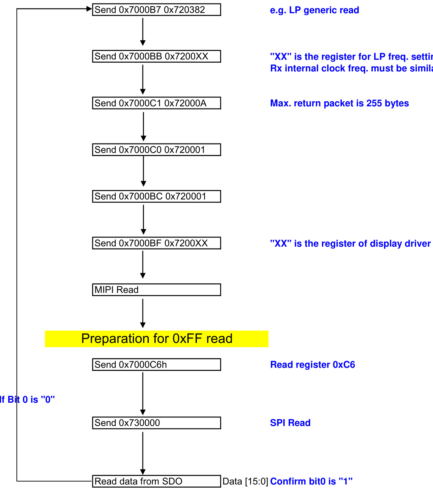

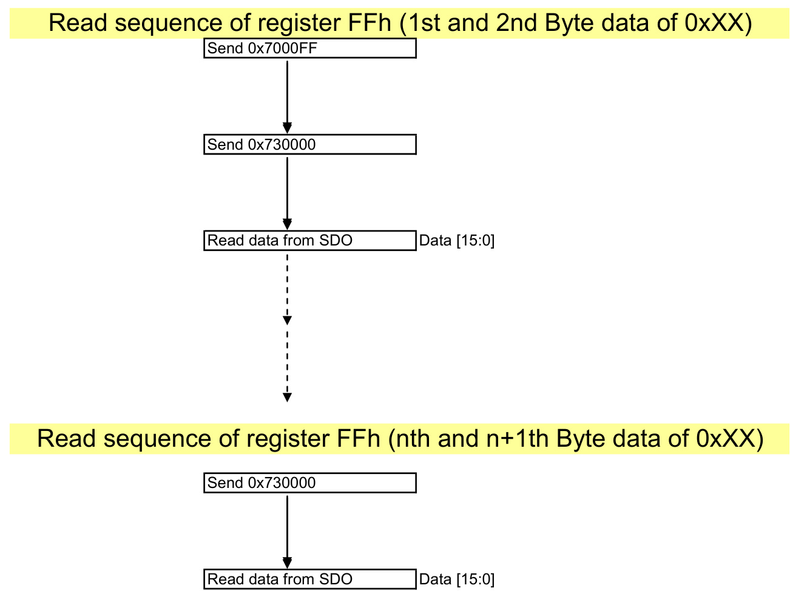

Table 11-1: Maximum Ratings (Voltage Referenced to $\mathbf { V _ { S S } }$ )   

<html><body><table><tr><td>Symbol</td><td>Parameter</td><td>Value</td><td>Unit</td></tr><tr><td>MVDD</td><td>Core Power Supply</td><td>-0.3 to 1.44</td><td>V</td></tr><tr><td>VDDIO</td><td>I/O Power Supply</td><td>-0.3 to 4.0</td><td>V</td></tr><tr><td>TsoL</td><td>Solder Temperature Time</td><td>225 for 40 sec max at solder ball</td><td>℃</td></tr><tr><td>TsTG</td><td>Storage Temperature</td><td>-40 to 100</td><td>°C</td></tr></table></body></html>

Maximum ratings are those values beyond which damages to the device may occur. Functional operation should be restricted to the limits specified in the electrical characteristics tables and Pin Description section

This device contains circuitry to protect the inputs against damage due to high static voltages or electric fields; however, it is advised that normal precautions be taken to avoid application of any voltage higher than maximum rated voltages to this high impedance circuit. Unused outputs must be left open. This device may be light sensitive. Caution should be taken to avoid exposure of this device to any light source during normal operation. This device is not radiation protected.

# 12 RECOMMENDED OPERATING CONDITIONS

Table 12-1: Recommended Operating Conditions   

<html><body><table><tr><td>Symbol</td><td>Parameter</td><td>Min</td><td>Typ</td><td>Max</td><td>Unit</td></tr><tr><td>MVDD</td><td>Digital Core Power Supply</td><td>1.08</td><td>1.2</td><td>1.32</td><td>V</td></tr><tr><td rowspan="2">VDDIO</td><td rowspan="2">IO AND Digital Power Supply</td><td>2.97</td><td>3.3</td><td>3.63</td><td>V</td></tr><tr><td>1.62</td><td>1.8</td><td>1.98</td><td>V</td></tr><tr><td>TA</td><td>Operating Temperature</td><td>-30</td><td>25</td><td>85</td><td>°℃</td></tr></table></body></html>

# 13 DC Characteristics

Conditions: Voltage referenced to GND $\mathrm { M V D D } = 1 . 2 \mathrm { V }$ $\mathrm { \Delta V D D I O } = 1 . 8 \mathrm { V }$ Frame frequency $= 6 0 \mathrm { { H z } }$ Number of lane $= 4$ Display pattern $= 1 0 8 0 \times 1 9 2 0 ,$ 8 colors vertical bar $\mathrm { T _ { A } } = 2 5 ^ { \circ } \mathrm { C }$

Table 13-1: DC Characteristics   

<html><body><table><tr><td>Symbol</td><td>Parameter</td><td>Test Condition</td><td>Min</td><td>Typ</td><td>Max</td><td>Unit</td></tr><tr><td>HS IMVDD_</td><td rowspan="3">High Speed Mode</td><td rowspan="3">1Gbps</td><td></td><td>46.8</td><td>76.2</td><td>mA</td></tr><tr><td>(1.8 IvpD101</td><td></td><td>0.36</td><td>0.75</td><td>mA</td></tr><tr><td>(3.3V) IVDDIO_HS</td><td></td><td>0.79</td><td>1.64</td><td>mA</td></tr><tr><td>IMVDD_LP</td><td rowspan="3">Low Po er Mode</td><td rowspan="3">10Mbps</td><td></td><td>16.00</td><td>39.90</td><td>mA</td></tr><tr><td>(1.8V) IvDDIO_LP</td><td></td><td>0.17</td><td>0.43</td><td>mA</td></tr><tr><td>(3.3V) IvDDIO_LP</td><td></td><td>0.37</td><td>0.94</td><td>mA</td></tr><tr><td>_ULPS IMVDD</td><td rowspan="3">Ulte  </td><td rowspan="3">PI I f onge in</td><td></td><td>292.4</td><td>435</td><td>A</td></tr><tr><td>(1.8V) IVDDIO_ULPS</td><td></td><td>75.6</td><td>150</td><td>A</td></tr><tr><td>ULPS (3.3V) IvDDI0</td><td></td><td>165.2</td><td>327.8</td><td>μA</td></tr><tr><td>(CMOS) VOH</td><td>Voltage</td><td>IoH = -2 ∼ -16 mA</td><td>VDDIO x 0.8</td><td></td><td></td><td></td></tr><tr><td>VOL (CMOS)</td><td>Voltage</td><td>IoL= 2 ~ 16 mA</td><td></td><td></td><td>x 0.15 VDD10</td><td></td></tr><tr><td>VIH (CMOS)</td><td>Input High (CMOS) Voltage</td><td></td><td>x0.7 VDDIO</td><td></td><td></td><td></td></tr><tr><td>(CMOS) VIL</td><td>Input Low (CMOS) Voltage</td><td></td><td></td><td></td><td>x0.2 VDDIO</td><td></td></tr><tr><td>I0z</td><td>Tri-ktage utputt</td><td></td><td></td><td>+/-1</td><td></td><td>A</td></tr><tr><td>IN</td><td>Input Leagee</td><td>VIN = VDDio or GND</td><td></td><td>+/-1</td><td></td><td>A</td></tr><tr><td>CIN</td><td>Input Capacitance</td><td></td><td></td><td>2.2</td><td></td><td>pF</td></tr></table></body></html>

Table 13-2: HS Transmitter DC Characteristics   

<html><body><table><tr><td>Symbol</td><td>Parameter</td><td>Min</td><td>Typ</td><td>Max</td><td>Unit</td></tr><tr><td>VcMTx</td><td>HS Transmit Static Common-mode Voltage</td><td>150</td><td></td><td>250</td><td>mV</td></tr><tr><td>IVoD|</td><td>HS Transmit Differential Voltage</td><td>140</td><td></td><td>270</td><td>mV</td></tr><tr><td>|∆VoD|</td><td>HS Differential Mismatch</td><td></td><td></td><td>10</td><td>mV</td></tr><tr><td>VOHHS</td><td>HS Output High Voltage</td><td></td><td></td><td>360</td><td>mV</td></tr></table></body></html>

Table 13-3: LP Transmitter DC Characteristics   

<html><body><table><tr><td>Symbol</td><td>Parameter</td><td>Min</td><td>Typ</td><td>Max</td><td>Unit</td></tr><tr><td>VOH</td><td>LP Thevenin Output High Level</td><td>1.1</td><td>1.2</td><td>1.3</td><td>V</td></tr><tr><td>VoL</td><td>LP Thevenin Output Low Level</td><td>-50</td><td></td><td>50</td><td>mV</td></tr><tr><td>ZoLP</td><td>LP Transmitter Output Impedance</td><td>110</td><td></td><td></td><td>Ohm</td></tr></table></body></html>

Table 13-4: LP Receiver DC Characteristics   

<html><body><table><tr><td>Symbol</td><td>Parameter</td><td>Min</td><td>Typ</td><td>Max</td><td>Unit</td></tr><tr><td>VIH</td><td>LP Logic Input Voltage</td><td>880</td><td></td><td></td><td>mV</td></tr><tr><td>Vn</td><td>LP Logic 0 Input Voltage</td><td></td><td></td><td>550</td><td>mV</td></tr></table></body></html>

# 14 AC Characteristics

# NOTE:

After PLL gets locked, T is the period of the PLL output clock unless specified. Before PLL gets locked, T is the period of PLL input reference clock. The reference clock can be either the tx_clk or the pclk, depending on the CSS bit.

1 / T = PLL / 2,   
e.g. When PLL is Off <0xB9 0x0000>,   
TX CLK = 10MHz,   
PLL = TX CLK x 2 = 20Mbps   
1 / T = 10MHz

2. W is the width of the display, e.g. the number of pixels for the horizontal line.

3. The AC characteristics specifie the maximum speed of the incoming signals at the input interface. However, the data throughput on the serial link is another factor affecting the speed. If the user takes in the INT signal, there will be automatic flow control. If the user does not take the INT signal, the user needs to ensure that the output throughput is larger than the incoming data rate.

# 14.1 8 Bit 4 Wire SPI Interface Timing

Table 14-1: 8 Bit 4 Wire SPI Interface Timing Characteristics   

<html><body><table><tr><td>Symbol</td><td>Parameter</td><td>Min</td><td>Typ</td><td>Max</td><td>Unit</td></tr><tr><td>tcycle</td><td>Clock Cycle Time</td><td>8T</td><td></td><td></td><td>ns</td></tr><tr><td>fcLK</td><td></td><td></td><td></td><td>1/8T</td><td>M</td></tr><tr><td>tAS</td><td> e</td><td></td><td></td><td></td><td></td></tr><tr><td>tAH</td><td>Register select Hold Time</td><td></td><td></td><td></td><td>ns</td></tr><tr><td>tcss</td><td>Chip Select Setup Time</td><td></td><td></td><td></td><td>ns</td></tr><tr><td>tcSH</td><td>Chip Select Hold Time</td><td></td><td></td><td></td><td>ns</td></tr><tr><td>tDsW</td><td>Write Data Setup Time</td><td></td><td></td><td></td><td>ns</td></tr><tr><td>tDHW</td><td>Write Data Hold Time</td><td>404040</td><td></td><td></td><td>ns</td></tr><tr><td>tACC</td><td>Read Data Access Time</td><td></td><td></td><td>4.4+6T</td><td>ns</td></tr><tr><td>tDHR</td><td>Read Data Hold Time</td><td>1.2+4T</td><td></td><td>4.4+6T</td><td>ns</td></tr><tr><td>tCLKL</td><td>Clock Low Time</td><td>4T</td><td></td><td></td><td>ns</td></tr><tr><td>tCLKH</td><td>Clock High Time</td><td>4T</td><td></td><td></td><td>ns</td></tr><tr><td>tCsWD</td><td>Chip Select Write Delay Time</td><td>8T</td><td></td><td></td><td>ns</td></tr><tr><td>tCSRD</td><td>Chip Select Read Delay Time</td><td>16T</td><td></td><td></td><td>ns</td></tr><tr><td></td><td>Rise time</td><td></td><td></td><td>2</td><td>ns</td></tr><tr><td>F</td><td>Fall time</td><td></td><td></td><td>2</td><td>ns</td></tr></table></body></html>

Note: All timings are based on $20 \%$ to $80 \%$ of supply voltage

# Write

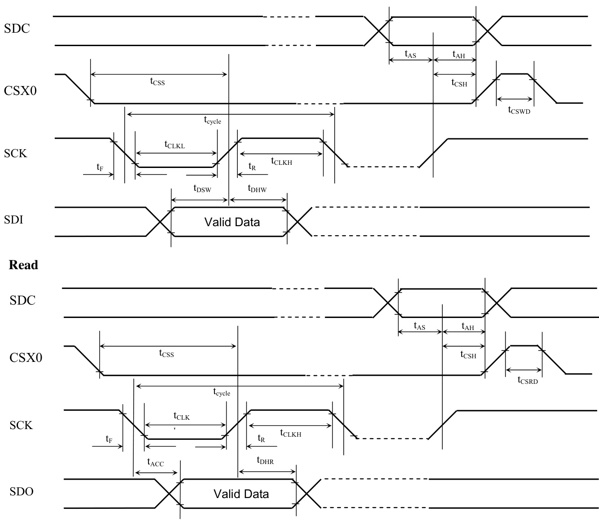  
Figure 14-1: 8 Bit 4 Wire SPI Interface Timing Diagram

<html><body><table><tr><td>SSD2828QN4</td><td>Rev 1.3</td><td>P 154/168</td><td>Mar 2013</td></tr></table></body></html>

# 14.2 8 Bit 3 Wire SPI Interface Timing

Table 14-2: 8 Bit 3 Wire SPI Interface Timing Characteristics   

<html><body><table><tr><td>Symbol</td><td>Parameter</td><td>Min</td><td>Typ</td><td>Max</td><td>Unit</td></tr><tr><td>tcycle</td><td>Clock Cycle Time</td><td>8T</td><td></td><td></td><td>ns</td></tr><tr><td>fCLK</td><td>Time</td><td></td><td></td><td>1/8T</td><td></td></tr><tr><td>tcss</td><td>Seipl let  e ime</td><td></td><td></td><td></td><td>M</td></tr><tr><td>tcSH</td><td>Chip Select Hold Time</td><td></td><td></td><td></td><td>ns</td></tr><tr><td>tDsw</td><td>Write Data Setup Time</td><td></td><td></td><td></td><td>ns</td></tr><tr><td>toHW</td><td>Write Data Hold Time</td><td>-4040</td><td></td><td></td><td>ns</td></tr><tr><td>tACC</td><td>Read Data Access Time</td><td></td><td></td><td>4.4+6T</td><td>ns</td></tr><tr><td>tDHR</td><td>Read Data Hold Time</td><td>1.2+4T</td><td></td><td>4.4+6T</td><td>ns</td></tr><tr><td>tCLKL</td><td>Clock Low Time</td><td>4T</td><td></td><td></td><td>ns</td></tr><tr><td>tCLKH</td><td>Clock High Time</td><td>4T</td><td></td><td></td><td>ns</td></tr><tr><td>tcsWD</td><td>Chip Select Write Delay Time</td><td>8T</td><td></td><td></td><td>ns</td></tr><tr><td>tCSRD</td><td>Chip Select Read Delay Time</td><td>16T</td><td></td><td></td><td>ns</td></tr><tr><td>tr</td><td>Rise time</td><td></td><td></td><td>2</td><td>ns</td></tr><tr><td>tF</td><td>Fall time</td><td></td><td></td><td>2</td><td>ns</td></tr></table></body></html>

Note: All timings are based on $20 \%$ to $80 \%$ of supply voltage

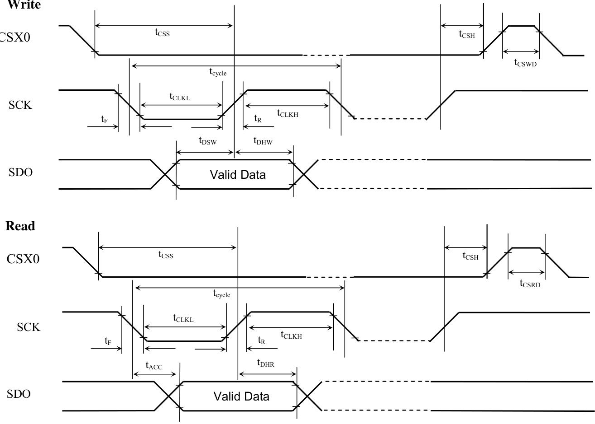  
Figure 14-2: 8 Bit 3 Wire SPI Interface Timing Diagram

# 14.3 24 Bit 3 Wire SPI Interface Timing

Table 14-3: 24 Bit 3 Wire SPI Interface Timing Characteristics   

<html><body><table><tr><td>Symbol</td><td>Parameters</td><td>Min</td><td>Typ</td><td>Max</td><td>Units</td></tr><tr><td>tcycle</td><td>Clock Cycle Time</td><td>8T</td><td></td><td></td><td>ns</td></tr><tr><td>fcLK</td><td></td><td></td><td></td><td>1/8T</td><td></td></tr><tr><td>tcss</td><td></td><td></td><td></td><td></td><td>M</td></tr><tr><td>tCSH</td><td>Chip Select Hold Time</td><td></td><td></td><td></td><td>ns</td></tr><tr><td>tDsW</td><td>Write Data Setup Time</td><td></td><td></td><td></td><td>ns</td></tr><tr><td>toHW</td><td>Write Data Hold Time</td><td>4040</td><td></td><td></td><td>ns</td></tr><tr><td>tACC</td><td>Read Data Access Time</td><td></td><td></td><td>4.4+6T</td><td>ns</td></tr><tr><td>tDHR</td><td>Read Data Hold Time</td><td>1.2+4T</td><td></td><td>4.4+6T</td><td>ns</td></tr><tr><td>tCLKL</td><td>Clock Low Time</td><td>4T</td><td></td><td></td><td>ns</td></tr><tr><td>tCLKH</td><td>Clock High Time</td><td>4T</td><td></td><td></td><td>ns</td></tr><tr><td>tCsWD</td><td>Chip Select Write Delay Time</td><td>8T</td><td></td><td></td><td>ns</td></tr><tr><td>tCSRD</td><td>Chip Select Read Delay Time</td><td>16T</td><td></td><td></td><td>ns</td></tr><tr><td>R</td><td>Rise time</td><td></td><td></td><td>2</td><td>ns</td></tr><tr><td>tF</td><td>Fall time</td><td></td><td></td><td>2</td><td>ns</td></tr></table></body></html>

Note: All timings are based on $20 \%$ to $80 \%$ of supply voltage

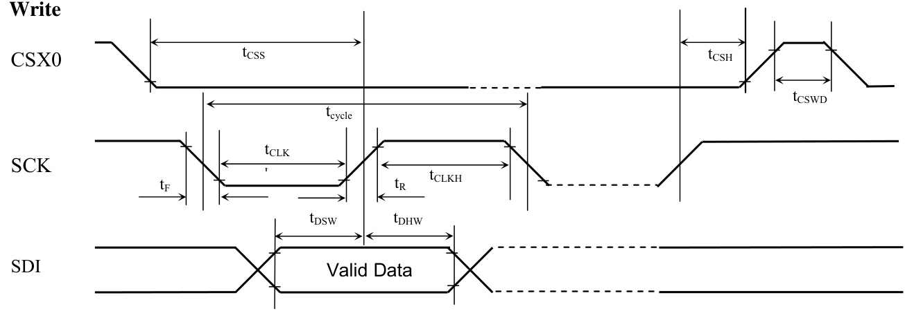

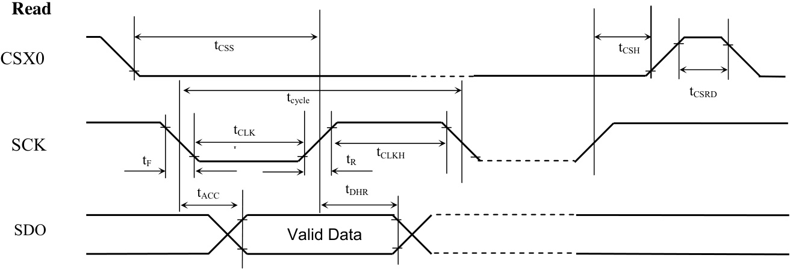  
Figure 14-3: 24 Bit 3 Wire SPI Interface Timing Diagram

# 14.4 RGB Interface Timing

Table 14-4: RGB Interface Timing Characteristics   

<html><body><table><tr><td>Symbol</td><td>Parameters</td><td>Min</td><td>Typ</td><td>Max</td><td>Units</td></tr><tr><td>tpclk</td><td>Period pclk</td><td>16/18/24T</td><td>16/18/24T</td><td></td><td>ns</td></tr><tr><td>tysys</td><td>Vertical Sync Setup Time</td><td>5</td><td></td><td></td><td>ns</td></tr><tr><td>tysyh</td><td>Vertical Sync Hold Time</td><td>(5d:</td><td></td><td></td><td>ns</td></tr><tr><td>thsys</td><td>Horizontal Sync Setup Time</td><td>5</td><td></td><td></td><td>ns</td></tr><tr><td>thsyh</td><td>Horizontal Sync Hold Time</td><td>5</td><td></td><td></td><td>ns</td></tr><tr><td>thy</td><td>Phase difference of Sync Signal Falling Edge</td><td>0</td><td></td><td>W</td><td>tpck</td></tr><tr><td>tcKL</td><td>Low Period pclk</td><td>8/9/12T</td><td>8/9/12T</td><td></td><td>ns</td></tr><tr><td>tcKH</td><td>High Period pclk</td><td>8/9/12T</td><td>8/9/12T</td><td></td><td>ns</td></tr><tr><td>tds</td><td>Data Setup Time</td><td>3.3</td><td></td><td></td><td>ns</td></tr><tr><td>tdh</td><td>Data hold Time</td><td>3.3</td><td></td><td></td><td>ns</td></tr></table></body></html>

# Note:

1. T represents the total bit rate Tmax $= 1$ / (PLL $\mathbf { x }$ number of lane) $\mathrm { T m a x } = 1 ⁄ 4 \mathrm { G } = 2 5 0 \mathrm { p s }$

2. All timings are based on $20 \%$ to $80 \%$ of supply voltage

3. W is the number of pixel in a horizontal line

4. The pclk period depends on the bit per pixel (bpp) setting and whether the video mode is burst or non-burst mode. In burst mode, the values in the Min column should be followed. In non-burst mode, the values in the Typ column should be followed.

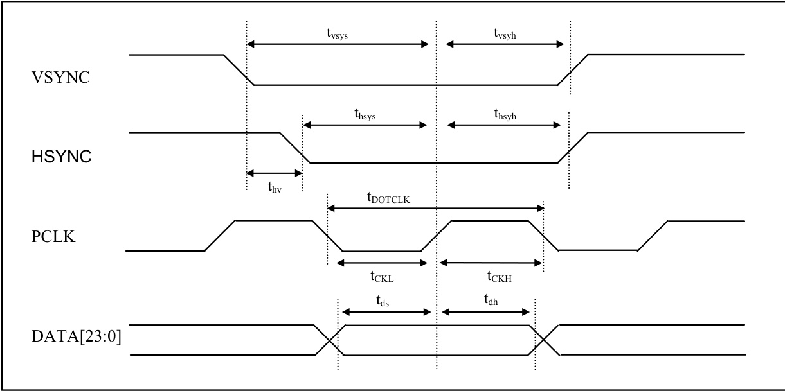  
Figure 14-4: RGB Interface Timing Diagram

# 14.5 RESET Timing

Table 14-5: RESET Timing   

<html><body><table><tr><td>Symbol</td><td>Parameters</td><td>Min</td><td>Typ</td><td>Max</td><td>Units</td></tr><tr><td>TRESET</td><td>RESET “Low" Pulse Width</td><td>10</td><td></td><td></td><td>ms</td></tr></table></body></html>

# 14.6 TX_CLK Timing

Table 14-6: TX_CLK Timing Characteristics   

<html><body><table><tr><td>Symbol</td><td>Parameters</td><td>Min</td><td>Typ</td><td>Max</td><td>Units</td></tr><tr><td>fTxCLK</td><td>TX_CLK Frequency</td><td>8</td><td></td><td>30</td><td>MHz</td></tr><tr><td>tr</td><td>Rise Time</td><td></td><td></td><td>10</td><td>ns</td></tr><tr><td>tF</td><td>Fall Time</td><td></td><td></td><td>10</td><td>ns</td></tr></table></body></html>

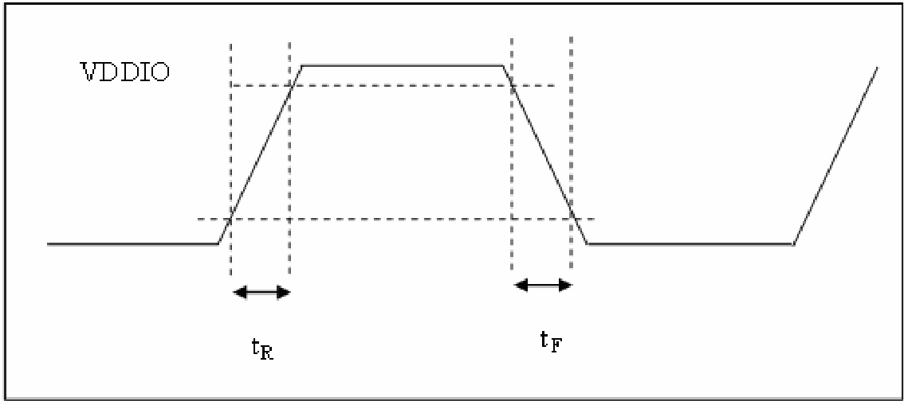  
Figure 14-5: TX_CLK Timing Diagram

# 15 Power up sequence

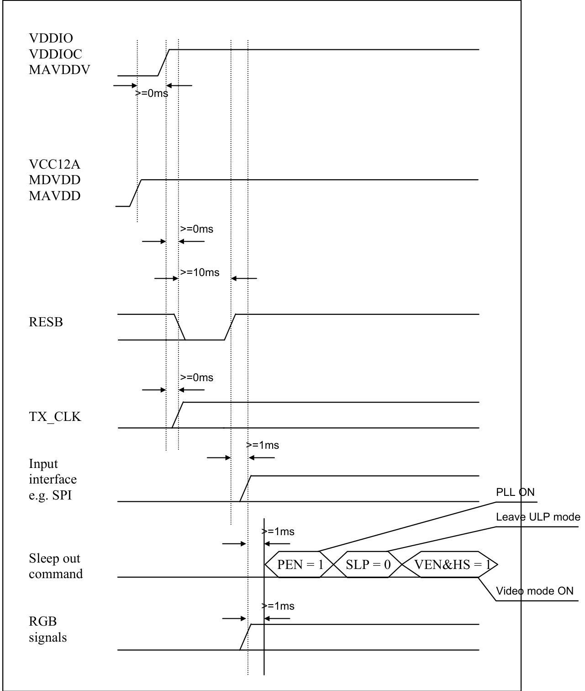

# 16 Power off sequence

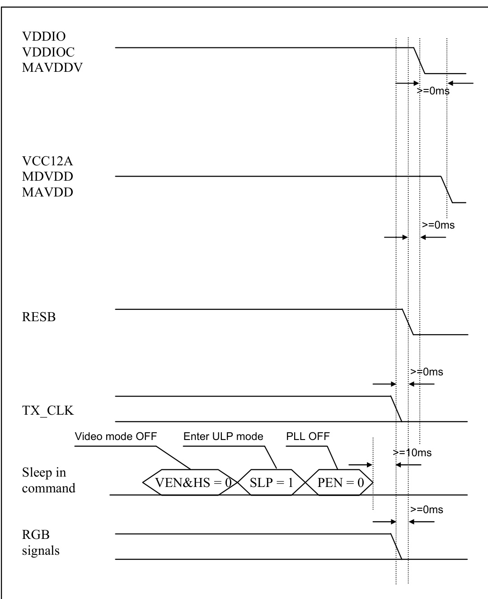

# 17 Example for system sleep in and out

Note: Following example is only for reference, application must be related to the particular information of AP and driver IC , e.g.Wait time and TX_CLK (_XIN, _XIO) csontrol of AP

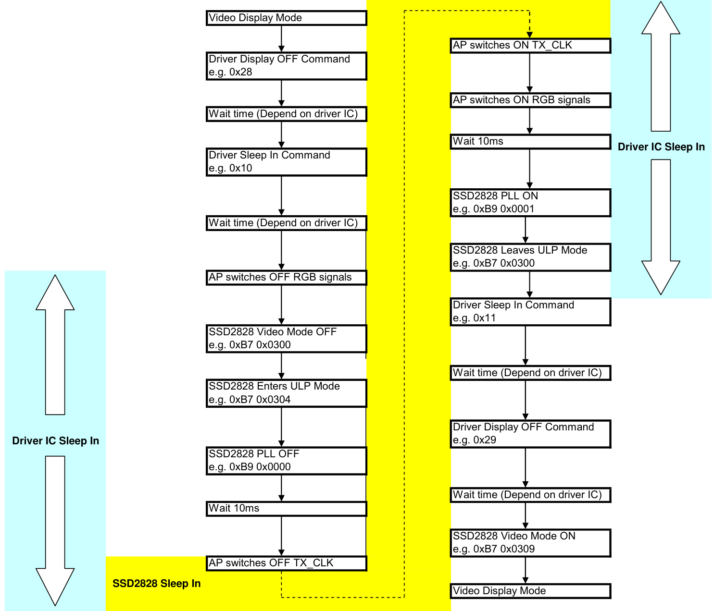

# 18 Serial Link Data Order

There are many possible ways of doing parallel to serial conversion. SSD2828 provides flexibility by programming two register bits END and CO. During video mode, they must be programmed to 0 and respectively.

Below is the order to receive the display data over the serial link, when the END bit is and CO bit is 0.

For 16 bit per pixel data, below is the byte order. Each byte of data is sent in the order of LSB first and MSB last.

Time   

<html><body><table><tr><td rowspan="2">MSB</td><td colspan="5">Byte</td><td rowspan="2">LSB</td><td rowspan="2">MSB</td><td rowspan="2"></td><td rowspan="2">Byte2</td><td rowspan="2"></td><td rowspan="2"></td><td rowspan="2">LSB</td><td rowspan="2"></td><td rowspan="2">MSB</td><td rowspan="2"></td><td rowspan="2">Byte3</td><td rowspan="2"></td><td rowspan="2">LSB</td><td rowspan="2">MSB</td><td colspan="2" rowspan="2"></td><td rowspan="2">Byte4</td><td rowspan="2"></td><td rowspan="2"></td><td rowspan="2"></td><td rowspan="2">LSB</td><td rowspan="2"></td></tr><tr><td>R3</td><td></td><td></td><td></td><td></td><td></td><td></td><td></td></tr><tr><td>R4</td><td>R2</td><td>R1</td><td>R0</td><td>G5</td><td></td><td>G4</td><td>G3 G2</td><td>G1</td><td>G0</td><td>B4</td><td>B3</td><td>B2</td><td>B1</td><td>B0</td><td>R4|R3</td><td>R2</td><td>R1</td><td>R0</td><td>G5</td><td>G4G3</td><td>G2id:)</td><td>G1</td><td>G0</td><td>B4 B3</td><td>B2</td><td>B1</td><td></td><td>B0</td></tr></table></body></html>

For 18 bit per pixel data, below is the byte order. Each byte of data is sent in the order of LSB first and MSB last.

Time   

<html><body><table><tr><td>MSB</td><td colspan="6">Byte</td><td rowspan="2">LSB</td><td rowspan="2">MSB Byte2</td><td colspan="8"></td><td colspan="6">MSB</td><td colspan="10">LSB MSB</td><td rowspan="2">LSB</td></tr><tr><td></td><td>R3</td><td>R2</td><td></td><td></td><td></td><td></td><td></td><td></td><td></td><td></td><td></td><td></td><td>LSB</td><td></td><td></td><td></td><td>Byte3</td><td></td><td></td><td></td><td></td><td></td><td></td><td></td><td>Byte4</td><td></td><td></td><td></td></tr><tr><td>R5</td><td>R4</td><td></td><td></td><td>R1</td><td>R0</td><td></td><td>G5</td><td>G4</td><td>G3</td><td>G2 G1</td><td>G0</td><td>B5</td><td>B4</td><td>B3</td><td></td><td>B2</td><td>B1</td><td>B0 R5</td><td></td><td>R4R3</td><td>R2</td><td>R1</td><td>R0</td><td>G5</td><td>G4</td><td>G3</td><td>G2d</td><td>G1</td><td>G0</td><td>B5</td><td>B4</td></tr></table></body></html>

For 24 bit per pixel data, below is the byte order. Each byte of data is sent in the order of LSB first and MSB last.

Time   

<html><body><table><tr><td>MSB</td><td colspan="6">Byte</td><td colspan="2">LSB</td><td colspan="8">MSB Byte2</td><td colspan="6">MSB</td><td colspan="6">LSB MSB</td><td colspan="7"></td><td rowspan="2">LSB</td></tr><tr><td>R7</td><td>R6</td><td>R5</td><td>R4</td><td>R3</td><td>R2</td><td>R1</td><td></td><td>R0</td><td>G7</td><td>G6 G5</td><td>G4</td><td>G3</td><td></td><td>G2</td><td>G1</td><td>G0</td><td>B7</td><td>B6</td><td>B5</td><td>B4</td><td>B3</td><td>B2</td><td>B1</td><td>B0</td><td>R7</td><td>R6</td><td></td><td>R5</td><td>R4</td><td>R3</td><td>R2</td><td>R1</td><td>R0</td></tr></table></body></html>

Below is the order to send the display data over the serial link, when the END bit is 0 and $\mathbf { C O }$ bit is 0.

For 16 bit per pixel data, below is the byte order. Each byte of data is sent in the order of LSB first and MSB last.

Time   

<html><body><table><tr><td>MSB</td><td colspan="6">Byte</td><td colspan="2">LSB</td><td colspan="2">MSB Byte2</td><td colspan="6">LSB</td><td colspan="6">MSB</td><td colspan="2">LSB MSB</td><td colspan="6">Byte4</td></tr><tr><td>G2</td><td>G1</td><td>G0</td><td>B4</td><td>B3</td><td>B2</td><td>B1</td><td>B0</td><td>R4</td><td>R3</td><td>R2</td><td>R1</td><td>R0</td><td>G5</td><td>G4</td><td>G3</td><td>G2</td><td>G1</td><td>G0</td><td>B4</td><td>B3</td><td>B2 B1</td><td>B0</td><td>R4</td><td>R3</td><td>R2d R1</td><td>R0</td><td></td><td>G5</td><td>G4G3</td></tr></table></body></html>

For 18 bit per pixel data, below is the byte order. Each byte of data is sent in the order of LSB first and MSB last.

<html><body><table><tr><td rowspan="2">MSB</td><td colspan="5">Byte 1</td><td rowspan="2">LSB</td><td rowspan="2">MSB</td><td rowspan="2">Byte2</td><td rowspan="2"></td><td rowspan="2"></td><td rowspan="2"></td><td rowspan="2"></td><td rowspan="2">LSB</td><td rowspan="2">MSB</td><td rowspan="2"></td><td rowspan="2"></td><td rowspan="2">Byte3</td><td rowspan="2"></td><td rowspan="2">LSB</td><td colspan="2" rowspan="2">MSB</td><td rowspan="2"></td><td rowspan="2">Byte4</td><td rowspan="2"></td><td rowspan="2"></td><td rowspan="2">LSB</td><td rowspan="2"></td><td rowspan="2"></td></tr><tr><td></td><td></td><td></td><td></td><td></td><td></td></tr><tr><td rowspan="2"></td><td>G0 B5</td><td>B4</td><td>B3</td><td>B2</td><td>B1</td><td></td><td>B0 R3</td><td>R2</td><td>R1</td><td>R0</td><td>G5</td><td>G4</td><td>G3</td><td>G2</td><td>B5</td><td>B4</td><td>B3</td><td>B2</td><td>B1</td><td>B0 R5</td><td>R4</td><td>R1</td><td></td><td>R0G5G4</td><td></td><td>G3G2</td><td>G1</td><td></td><td>G0</td></tr><tr><td>G1</td><td></td><td></td><td></td><td></td><td></td><td></td><td></td><td></td><td></td><td></td><td></td><td></td><td></td><td></td><td></td><td></td><td></td><td></td><td></td><td></td><td></td><td></td><td></td><td></td><td></td><td></td><td></td><td></td></tr></table></body></html>

Time

<html><body><table><tr><td>SSD2828QN4</td><td>Rev 1.3</td><td>P 162/168</td><td>Mar 2013</td><td>Solomon Systec</td></tr></table></body></html>

For 24 bit per pixel data, below is the byte order. Each byte of data is sent in the order of LSB first and MSB last.

Time   

<html><body><table><tr><td rowspan="2">MSB</td><td colspan="5">Byte</td><td rowspan="2">LSB</td><td rowspan="2">MSB Byte2</td><td rowspan="2"></td><td colspan="7"></td><td rowspan="2"></td><td rowspan="2"></td><td rowspan="2">Byte3</td><td rowspan="2"></td><td rowspan="2">LSB</td><td rowspan="2">MSB</td><td rowspan="2"></td><td rowspan="2">Byte4</td><td rowspan="2"></td><td rowspan="2"></td><td rowspan="2">LSB</td><td rowspan="2"></td></tr><tr><td rowspan="2"></td><td rowspan="2"></td><td rowspan="2"></td><td rowspan="2">B2</td><td rowspan="2"></td><td rowspan="2"></td><td rowspan="2"></td><td rowspan="2"></td><td rowspan="2"></td><td rowspan="2"></td><td rowspan="2">LSB</td><td rowspan="2"></td><td rowspan="2">MSB</td><td rowspan="2"></td><td rowspan="2"></td><td rowspan="2"></td><td rowspan="2"></td><td rowspan="2"></td><td rowspan="2"></td><td rowspan="2"></td></tr><tr><td>B0</td><td>G6</td><td>G3</td><td>G1</td><td>R7</td><td>R5</td><td>R4</td><td></td><td></td></tr><tr><td>B7 B6</td><td>B5</td><td>B4</td><td>B3</td><td></td><td>B1</td><td></td><td>G7</td><td></td><td>G5</td><td>G4</td><td></td><td>G2</td><td></td><td>G0</td><td></td><td>R6</td><td></td><td>R3</td><td>R2</td><td>R1</td><td>R0</td><td>R7</td><td>R6d R5</td><td>R4</td><td>R3</td><td>R2</td><td>R1</td><td></td><td>R0</td></tr></table></body></html>

Below is the order to send the display data over the serial link, when the END bit is 1 and CO bit is 1.

For 16 bit per pixel data, below is the byte order. Each byte of data is sent in the order of LSB first and MSB last.

Time   

<html><body><table><tr><td rowspan="2">MSB</td><td colspan="5">Byte</td><td rowspan="2">LSB</td><td rowspan="2">MSB</td><td rowspan="2"></td><td rowspan="2">Byte2</td><td rowspan="2"></td><td rowspan="2"></td><td rowspan="2">LSB</td><td rowspan="2">MSB</td><td rowspan="2"></td><td rowspan="2"></td><td rowspan="2">Byte3</td><td rowspan="2"></td><td rowspan="2">LSB</td><td colspan="2"></td><td rowspan="2">MSB</td><td rowspan="2">Byte4</td><td rowspan="2"></td><td rowspan="2"></td><td rowspan="2"></td><td rowspan="2">LSB</td><td rowspan="2"></td></tr><tr><td></td><td></td><td></td><td></td><td></td><td></td></tr><tr><td rowspan="2"></td><td>B3 B2</td><td>B1</td><td>B0</td><td>G5</td><td>G4</td><td>G3</td><td>G2</td><td>G1</td><td>G0</td><td>R4</td><td>R3</td><td>R2</td><td>R1</td><td>R0</td><td>B4 B3</td><td>B2</td><td>B1</td><td>B0|</td><td>G5d</td><td>G4</td><td>G2</td><td>G1</td><td>G0</td><td>R3</td><td></td><td>R1</td><td></td><td></td></tr><tr><td>B4</td><td></td><td></td><td></td><td></td><td></td><td></td><td></td><td></td><td></td><td></td><td></td><td></td><td></td><td></td><td></td><td></td><td></td><td></td><td></td><td>G3</td><td></td><td></td><td>R4</td><td></td><td>R2</td><td></td><td>R0</td></tr></table></body></html>

For 18 bit per pixel data, below is the byte order. Each byte of data is sent in the order of LSB first and MSB last.

Time   

<html><body><table><tr><td>MSB</td><td colspan="6">Byte</td><td colspan="2">LSB</td><td colspan="8">MSB Byte2</td><td colspan="6">MSB</td><td colspan="6">LSB MSB</td><td colspan="7"></td><td rowspan="2">LSB</td></tr><tr><td>B5</td><td>B4</td><td>B3</td><td>B2</td><td>B1</td><td>B0</td><td>G5</td><td></td><td>G4G3</td><td>G2</td><td>G1</td><td>G0</td><td>R5</td><td>R4</td><td>R3</td><td></td><td>R2</td><td>R1</td><td>R0id</td><td>B5</td><td>B4</td><td>B3</td><td>B2</td><td>B1</td><td>B0</td><td>G5</td><td>G4</td><td>G3</td><td>G2</td><td>G1</td><td></td><td>G0</td><td>R5</td><td>R4</td></tr></table></body></html>

For 24 bit per pixel data, below is the byte order. Each byte of data is sent in the order of LSB first and MSB last.

Time   

<html><body><table><tr><td>MSB</td><td colspan="6">Byte</td><td colspan="2">LSB</td><td colspan="7">MSB Byte2</td><td colspan="7">LSB MSB</td><td colspan="6">LSB MSB</td><td></td><td></td><td></td><td></td><td>LSB</td><td></td><td></td><td></td><td></td><td></td><td></td><td></td><td></td><td></td><td></td><td></td><td></td><td></td><td></td><td></td><td></td><td></td><td></td><td></td><td></td><td></td><td></td><td></td><td></td><td></td><td></td><td></td><td></td><td></td><td></td><td></td><td></td><td></td><td></td><td></td><td></td><td></td><td></td><td></td><td></td><td></td><td></td><td></td><td>R1</td><td></td><td></td><td></td><td></td><td></td><td></td><td></td><td></td><td></td><td></td><td></td><td></td><td></td><td></td><td></td><td></td><td></td><td></td><td></td><td></td><td></td><td></td><td></td><td></td><td></td><td></td><td></td><td></td><td></td><td></td><td></td><td></td><td></td><td></td><td></td><td></td><td></td><td></td><td></td><td></td><td></td><td></td><td></td><td></td><td></td><td></td><td></td><td></td><td></td><td></td><td></td><td></td><td></td><td></td><td></td><td></td><td></td><td>R0</td><td></td><td></td><td></td><td></td><td></td><td></td><td></td><td></td><td></td><td></td><td></td><td></td><td></td><td></td><td></td><td></td><td></td><td></td><td></td><td></td><td></td><td></td><td></td><td></td><td></td><td></td><td></td><td></td><td></td><td></td><td></td><td></td><td></td><td></td><td></td><td></td><td></td><td></td><td></td><td></td><td></td><td></td><td></td><td></td><td></td><td></td><td></td><td></td><td></td><td></td><td></td><td></td><td></td><td></td><td></td><td></td><td></td><td></td><td></td><td></td><td></td><td></td><td></td><td></td><td></td><td></td><td></td><td></td><td></td><td></td><td></td><td></td><td></td><td></td><td></td><td></td><td></td><td></td><td></td><td></td><td></td><td></td><td></td><td></td><td></td><td></td><td></td><td></td><td></td><td></td><td></td><td></td><td></td><td></td><td></td><td></td><td></td><td></td><td></td><td></td><td></td><td></td><td></td><td></td><td></td><td></td><td></td><td></td><td></td><td></td><td></td><td></td><td></td><td></td><td></td><td></td><td></td><td></td><td></td><td></td><td></td><td></td><td></td><td></td><td></td><td></td><td></td><td></td><td></td><td></td><td></td><td></td><td></td><td></td><td></td><td></td><td></td><td></td><td></td><td></td><td></td><td></td><td></td><td></td><td></td><td></td><td></td><td></td><td></td><td></td><td></td><td></td><td></td><td></td><td></td><td></td><td></td><td></td><td></td><td></td><td></td><td></td><td></td><td></td><td></td><td></td><td></td><td></td><td></td><td></td><td></td><td></td><td></td><td></td><td></td><td></td><td></td><td></td><td></td><td></td><td></td><td></td><td></td><td></td><td></td><td></td><td></td><td></td><td></td><td></td><td></td><td></td><td></td><td></td><td></td><td></td><td></td><td></td><td></td><td></td><td></td><td></td><td></td><td></td><td></td><td></td><td></td><td></td><td></td><td></td><td></td><td></td><td></td><td></td><td></td><td></td><td></td><td></td><td></td><td></td><td></td><td></td><td></td><td></td><td></td><td></td><td></td><td></td><td></td><td></td><td></td><td></td><td></td><td></td><td></td><td></td><td></td><td></td><td></td><td></td><td></td><td></td><td></td><td></td><td></td><td></td><td></td><td></td><td></td><td></td><td></td><td></td><td></td><td></td><td></td><td></td><td></td><td></td><td></td><td></td><td></td><td></td><td></td><td></td><td></td><td></td><td></td><td></td><td></td><td></td><td></td><td></td><td></td><td></td><td></td><td></td><td></td><td></td><td></td><td></td><td></td><td></td><td></td><td></td><td></td><td></td><td></td><td></td><td></td><td></td><td></td><td></td><td></td><td></td><td></td><td></td><td></td><td></td><td></td><td></td><td></td><td></td><td></td><td></td><td></td><td></td><td></td><td></td><td></td><td></td><td></td><td></td><td></td><td></td><td></td><td></td><td></td><td></td><td></td><td></td><td></td><td></td><td></td><td></td><td></td><td></td><td></td><td></td><td></td><td></td><td></td><td></td><td></td><td></td><td></td><td></td><td></td><td></td><td></td><td></td><td></td><td></td><td></td><td></td><td></td><td></td><td></td><td></td><td></td><td></td><td></td><td></td><td></td><td></td><td></td><td></td><td></td><td></td><td></td><td></td><td></td><td></td><td></td><td></td><td></td><td></td><td></td><td></td><td></td><td></td><td></td></table></body></html>

Below is the order to send the display data over the serial link, when the END bit is 0 and $\mathbf { C O }$ bit is 1.

For 16 bit per pixel data, below is the byte order. Each byte of data is sent in the order of LSB first and MSB last.

Time   

<html><body><table><tr><td>MSB</td><td colspan="6">Byte</td><td colspan="2">LSB</td><td colspan="2">MSB Byte2</td><td colspan="2"></td><td colspan="2">LSB</td><td colspan="2">MSB</td><td colspan="2">Byte3</td><td colspan="2"></td><td colspan="2">LSB</td><td colspan="2">MSB Byte4</td><td colspan="4"></td><td colspan="2">LSB</td></tr><tr><td>G2</td><td></td><td>G0</td><td>R4</td><td></td><td>R2</td><td>R1</td><td>R0</td><td>B4</td><td>B3</td><td>B2</td><td>B1</td><td>B0</td><td>G5</td><td></td><td>G3</td><td></td><td></td><td></td><td></td><td></td><td></td><td></td><td></td><td></td><td></td><td></td><td></td><td></td><td></td></tr><tr><td></td><td>G1</td><td></td><td></td><td>R3</td><td></td><td></td><td></td><td></td><td></td><td></td><td></td><td></td><td></td><td>G4</td><td></td><td>G2 G1</td><td>G0</td><td>R4</td><td>R3</td><td>R2</td><td>R1</td><td>R0</td><td>B4 B3</td><td>B2</td><td>B1</td><td>B0</td><td>G5</td><td>G4G3</td><td></td></tr></table></body></html>

For 18 bit per pixel data, below is the byte order. Each byte of data is sent in the order of LSB first and MSB last.

<html><body><table><tr><td>MSB Byte</td><td>LSB</td><td>MSB</td><td>Byte2</td><td>LSB</td><td>MSB</td><td>Byte3</td><td>LSB</td><td>MSB Byte4</td><td>LSB</td></tr></table></body></html>

<html><body><table><tr><td>SSD2828QN4</td><td>Rev 1.3</td><td>P 163/168</td><td>Mar 2013</td></tr></table></body></html>

For 24 bit per pixel data, below is the byte order. Each byte of data is sent in the order of LSB first and MSB last.

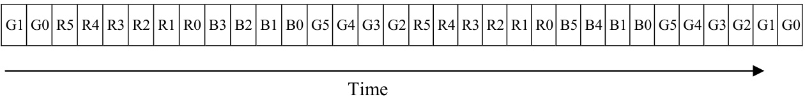  
Time

<html><body><table><tr><td>MSB</td><td colspan="6">Byte</td><td colspan="2">LSB</td><td colspan="8">MSB Byte2</td><td colspan="6">MSB</td><td colspan="2">LSB</td><td colspan="2">MSB</td><td colspan="6">Byte4</td></tr><tr><td>R7</td><td>R6</td><td>R5</td><td>R4</td><td>R3</td><td>R2</td><td>R1</td><td></td><td>R0</td><td>G7</td><td>G6</td><td>G5 G4</td><td>G3</td><td></td><td>G2</td><td>G1</td><td>G0</td><td>B7</td><td>B6</td><td>B5</td><td>B4</td><td>B3</td><td>B2 B1</td><td>B0d</td><td>R7</td><td>R6id</td><td>R5</td><td>R4</td><td>R3</td><td>R2</td><td>R1</td><td>R0</td></tr></table></body></html>

# 19.1 Dimension for SSD2828QN4

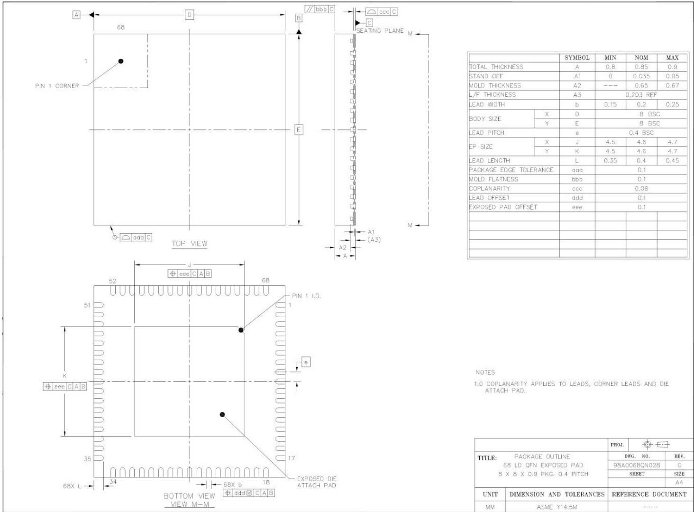  
Figure 19-1- Package Information

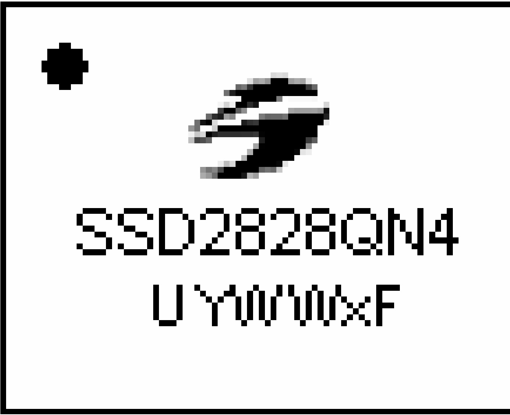  
Figure 19-2- Marking Information

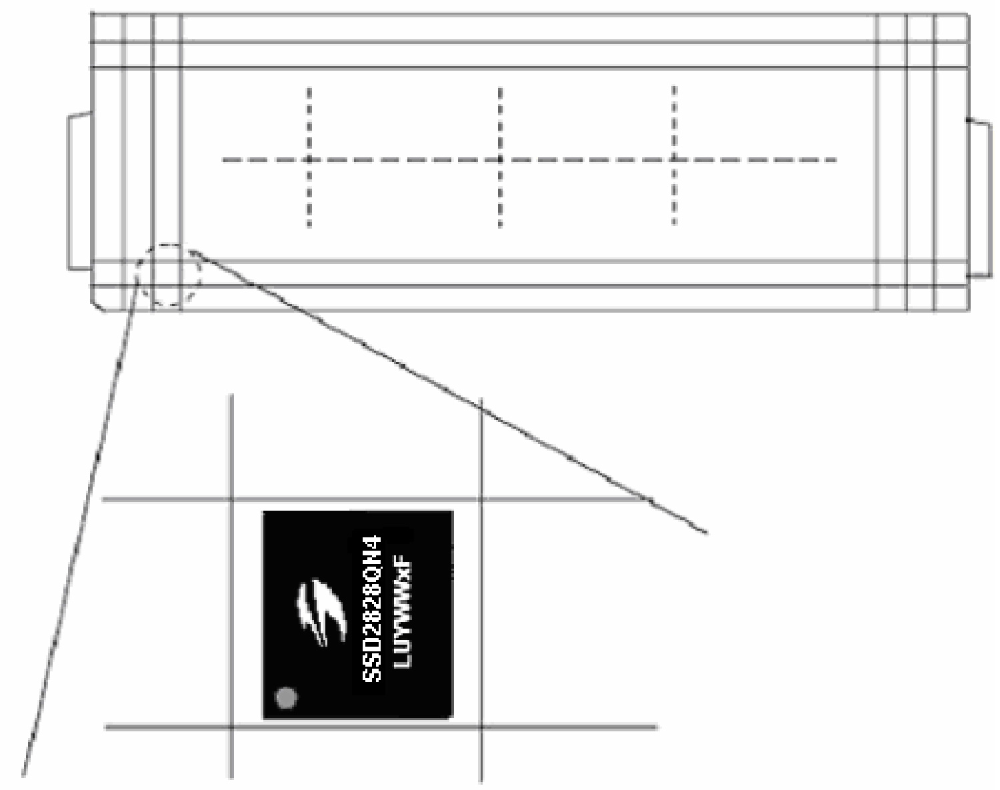  
Figure 19-3- Tray Information

Solomon Systech reserves the right to make changes without notice to any products herein. Solomon Systech makes no warranty, representation or guarantee regarding the suitability of its products for any particular purpose, nor does Solomon Systech assume any liability arising out of the application or use of any product or circuit, and specifically disclaims any, and all, liability, including without limitation consequential or incidental damages. “Typical” parameters can and do vary in different applications. All operating parameters, including “Typical” must be validated for each customer application by the customer’s technical experts. Solomon Systech does not convey any license under its patent rights nor the rights of others. Solomon Systech products are not designed, intended, or authorized for use as components in systems intended for surgical implant into the body, or other applications intended to support or sustain life, or for any other application in which the failure of the Solomon Systech product could create a situation where personal injury or death may occur. Should Buyer purchase or use Solomon Systech products for any such unintended or unauthorized application, Buyer shall indemnify and hold Solomon Systech and its offices, employees, subsidiaries, affiliates, and distributors harmless against all claims, costs, damages, and expenses, and reasonable attorney fees arising out of, directly or indirectly, any claim of personal injury or death associated with such unintended or unauthorized use, even if such claim alleges that Solomon Systech was negligent regarding the design or manufacture of the part.

The product(s) listed in this datasheet comply with Directive 2002/95/EC of the European Parliament and of the council of 27 January 2004 on the restriction of the use of certain hazardous substances in electrical and electronic equipment and People’s Republic of China Electronic Industry Standard SJ/T 11363-2006 “Requirements for concentration limits for certain hazardous substances in electronic information products (电子信息产品 中有毒有害物质的限量要求)”. Hazardous Substances test report is available upon request.

<html><body><table><tr><td>SSD2828QN4</td><td>Rev 1.3</td><td>P 168/168</td><td>Mar 2013 Solomon Systech</td></tr></table></body></html>