# 车规 AEC-Q100 Grade1 MCU 设计公司

# STC8G 系列单片机原理及应用

# 目录

单片机基础概述 .  
1.1 数制与编码1.1.1 数制转换 .1.1.2 原码、 反码及补码1.1.3 常用编码 .  
1.2 几种常用的逻辑运算及其图形符号  
1.3 STC8G 单片机性能概述.  
1.4 STC8G 单片机产品线 ....STC8G 系列各子系列选型简介、 特性、 价格、 管脚图  
2.1 STC8G1K08-36I-SOP8/DFN8 系列 .....2.1.1 特性及价格（有 16 位硬件乘除法器 MDU16， 准16 位单片机）2.1.2 STC8G1K08-36I-SOP8/DFN8 管脚图， ISP 下载/编程线路图2.1.3 管脚说明 ....2.1.4 USB-Link1D 对 STC8G 系列进行自动串口烧录、 仿真 $^ +$ 串口通讯2.1.5 使用【一箭双雕之 USB 转双串口】进行串口烧录、仿真 $^ +$ 串口通讯2.1.6 USB 转双串口芯片全自动停电/上电烧录，串口仿真 $^ +$ 串口通讯， 5V (2.1.7 USB 转双串口芯片全自动烧录，串口仿真 $\cdot +$ 串口通讯， 3.3V 原理图 .2.1.8 USB 转双串口芯片进行自动烧录/仿真 $^ +$ 串口通讯，5V/3.3V 跳线选择2.1.9 通用 USB 转串口芯片全自动停电/上电烧录，串口仿真，5V 原理图 .......2.1.10 通用 USB 转串口芯片全自动停电/上电烧录，串口仿真，3.3V 原理图2.1.11 USB 转串口芯片全自动停电/上电烧录/仿真/通信， 5V/3.3V 跳线选择2.1.12 USB 转串口芯片进行烧录/串口仿真，手动停电/上电，5V/3.3V 原理图. 222.1.13 USB 转串口芯片进行烧录，串口仿真，手动停电/上电， 3.3V 原理图 . 232.1.14 USB-Link1D 支持 脱机下载 说明 ...... 242.1.15 USB-Link1D 支持 脱机下载， 如何免烧录环节 ....2.1.16 USB-Writer1A 编程器/烧录器·支持·插在·锁紧座上·烧录 . 72.1.17 USB-Writer1A 支持 自动烧录机，通信协议和接口 28  
2.2 STC8G1K08A-36I-SOP8/DFN8/DIP8 系列 ..... (2.2.1 特性及价格（有 16 位硬件乘除法器 MDU16， 准16 位单片机） 302.2.2 STC8G1K08A-36I-SOP8/DFN8/DIP8 管脚图， ISP 下载/编程线路图 .. 332.2.3 管脚说明 ... 42.2.4 USB-Link1D 对 STC8G 系列进行自动串口烧录、 仿真 $. +$ 串口通讯 362.2.5 使用【一箭双雕之 USB 转双串口】进行串口烧录、仿真 $^ +$ 串口通讯 372.2.6 USB 转双串口芯片全自动停电/上电烧录，串口仿真 $^ +$ 串口通讯， 5V 382.2.7 USB 转双串口芯片全自动烧录，串口仿真 $^ +$ 串口通讯， 3.3V 原理图 . 392.2.8 USB 转双串口芯片进行自动烧录/仿真 $^ +$ 串口通讯，5V/3.3V 跳线选择 ....... 402.2.9 通用 USB 转串口芯片全自动停电/上电烧录，串口仿真，5V 原理图 ......2.2.10 通用 USB 转串口芯片全自动停电/上电烧录， 串口仿真， 3.3V 原理图2.2.11 USB 转串口芯片全自动停电/上电烧录/仿真/通信， 5V/3.3V 跳线选择 . 43.2.2.12 USB 转串口芯片进行烧录/串口仿真， 手动停电/上电， 5V/3.3V 原理图 .

2.2.13 USB 转串口芯片进行烧录， 串口仿真， 手动停电/上电， 3.3V 原理图 ......................... 45  
2.2.14 USB-Link1D 支持 脱机下载 说明 ...... 46  
2.2.15 USB-Link1D 支持 脱机下载， 如何免烧录环节 ..... 47  
2.2.16 USB-Writer1A 编程器/烧录器· 支持· 插在· 锁紧座上· 烧录 .................................. ............. 49  
2.2.17 USB-Writer1A 支持 自动烧录机， 通信协议和接口 50  
2.3 STC8G1K08-38I-TSSOP20/QFN20/SOP16 系列 . 52  
2.3.1 特性及价格 . .... 52  
2.3.2 STC8G1K08-38I-TSSOP20 管脚图， ISP 下载/编程线路图 55  
2.3.3 STC8G1K08-38I-QFN20 管脚图， ISP 下载/编程线路图  
2.3.4 STC8G1K08-38I-SOP16 管脚图， ISP 下载/编程线路图 59  
2.3.5 管脚说明 ..... 6  
2.3.6 USB-Link1D 对 STC8G 系列进行自动串口烧录、 仿真 $^ +$ 串口通讯 64  
2.3.7 使用【一箭双雕之 USB 转双串口】进行串口烧录、 仿真 $^ +$ 串口通讯 65  
2.3.8 USB 转双串口芯片全自动停电/上电烧录， 串口仿真 $^ +$ 串口通讯， 5V … 66  
2.3.9 USB 转双串口芯片全自动烧录， 串口仿真 $^ { + }$ 串口通讯， 3.3V 原理图 . ...... 67  
2.3.10 USB 转双串口芯片进行自动烧录/仿真 $^ +$ 串口通讯， 5V/3.3V 跳线选择 68  
2.3.11 通用 USB 转串口芯片全自动停电/上电烧录， 串口仿真， 5V 原理图 . …… 69  
2.3.12 通用 USB 转串口芯片全自动停电/上电烧录， 串口仿真， 3.3V 原理图 . 70  
2.3.13 USB 转串口芯片全自动停电/上电烧录/仿真/通信， 5V/3.3V 跳线选择   
2.3.14 USB 转串口芯片进行烧录/串口仿真，手动停电/上电， 5V/3.3V 原理图 .  
2.3.15 USB 转串口芯片进行烧录， 串口仿真， 手动停电/上电， 3.3V 原理图 . 7  
2.3.16 USB-Link1D 支持 脱机下载 说明 .....  
2.3.17 USB-Link1D 支持 脱机下载，如何免烧录环节 ......  
2.3.18 USB-Writer1A 编程器/烧录器·支持·插在·锁紧座上·烧录 .  
2.3.19 USB-Writer1A 支持 自动烧录机， 通信协议和接口 78  
2.4 STC8G2K64S4-36I-LQFP48/32、 QFN48/32 系列 （45 路增强型 PWM） ............ 80  
2.4.1 特性及价格（有 16 位硬件乘除法器 MDU16， 准16 位单片机） 80  
2.4.2 STC8G2K64S4-36I-LQFP48/QFN48 管脚图， ISP 下载/编程线路图 83  
2.4.3 STC8G2K64S4-36I-LQFP32/QFN32 管脚图， ISP 下载/编程线路图 85  
2.4.4 STC8G2K64S4-36I-PDIP40 管脚图， ISP 下载/编程线路图 . .......... 87  
2.4.5 管脚说明 . . 89  
2.4.6 USB-Link1D 对 STC8G 系列进行自动串口烧录、 仿真 $. +$ 串口通讯 95  
2.4.7 使用【一箭双雕之 USB 转双串口】 进行串口烧录、 仿真 $^ +$ 串口通讯 96  
2.4.8 USB 转双串口芯片全自动停电/上电烧录， 串口仿真 $^ +$ 串口通讯， 5V 97  
2.4.9 USB 转双串口芯片全自动烧录， 串口仿真 $^ +$ 串口通讯， 3.3V 原理图. 98  
2.4.10 USB 转双串口芯片进行自动烧录/仿真 $^ +$ 串口通讯， 5V/3.3V 跳线选择 99  
2.4.11 通用 USB 转串口芯片全自动停电/上电烧录， 串口仿真， 5V 原理图 100  
2.4.12 通用 USB 转串口芯片全自动停电/上电烧录， 串口仿真， 3.3V 原理图 10  
2.4.13 USB 转串口芯片全自动停电/上电烧录/仿真/通信， 5V/3.3V 跳线选择 102  
2.4.14 USB 转串口芯片进行烧录/串口仿真， 手动停电/上电， 5V/3.3V 原理图 . 0  
2.4.15 USB 转串口芯片进行烧录， 串口仿真， 手动停电/上电， 3.3V 原理图 ............ 104  
2.4.16 USB-Link1D 支持 脱机下载 说明 .... 105  
2.4.17 USB-Link1D 支持 脱机下载， 如何免烧录环节 ..... 106  
2.4.18 USB-Writer1A 编程器/烧录器·支持·插在·锁紧座上·烧录 . 108  
2.4.19 USB-Writer1A 支持 自动烧录机， 通信协议和接口 . ..109  
2.5 STC8G2K64S2-36I-LQFP48/QFN48 系列 （8 路增强型 PWM） 111  
2.5.1 特性及价格 （有 16 位硬件乘除法器 MDU16， 准16 位单片机） 11  
2.5.2 STC8G2K64S2-36I-LQFP48/QFN48 管脚图， ISP 下载/编程线路图 114  
2.5.3 STC8G2K64S2-36I-PDIP40 管脚图， ISP 下载/编程线路图 … 116  
2.5.4 管脚说明 . ......... … 118  
2.5.5 USB-Link1D 对 STC8G 系列进行自动串口烧录、 仿真 $^ +$ 串口通讯 .124  
2.5.6 使用【一箭双雕之 USB 转双串口】 进行串口烧录、 仿真 $^ +$ 串口通讯 125  
2.5.7 USB 转双串口芯片全自动停电/上电烧录， 串口仿真 $. +$ 串口通讯， 5V 126  
2.5.8 USB 转双串口芯片全自动烧录， 串口仿真 $^ +$ 串口通讯， 3.3V 原理图 .  
2.5.9 USB 转双串口芯片进行自动烧录/仿真 $^ +$ 串口通讯， 5V/3.3V 跳线选择 128  
2.5.10 通用 USB 转串口芯片全自动停电/上电烧录， 串口仿真， 5V 原理图 .129  
2.5.11 通用 USB 转串口芯片全自动停电/上电烧录， 串口仿真，3.3V 原理图 . 130  
2.5.12 USB 转串口芯片全自动停电/上电烧录/仿真/通信， 5V/3.3V 跳线选择 ....... .131  
2.5.13 USB 转串口芯片进行烧录/串口仿真， 手动停电/上电， 5V/3.3V 原理图 132  
2.5.14 USB 转串口芯片进行烧录， 串口仿真，手动停电/上电， 3.3V 原理图 . ........................133  
2.5.15 USB-Link1D 支持 脱机下载 说明 .... .134  
2.5.16 USB-Link1D 支持 脱机下载， 如何免烧录环节 .. ..... 135  
2.5.17 USB-Writer1A 编程器/烧录器·支持·插在·锁紧座上·烧录 . 137  
2.5.18 USB-Writer1A 支持 自动烧录机， 通信协议和接口 138  
2.6 STC15H-LQFP44/32、 SOP28 系列（传统 STC15 系列提升性能特殊型号） ...............140  
2.6.1 特性及价格 （有 16 位硬件乘除法器 MDU16， 准16 位单片机） …… 140  
2.6.2 STC15H-LQFP44 管脚图，ISP 下载/编程线路图 . .141  
2.6.3 STC15H-PDIP40 管脚图， ISP 下载/编程线路图 143  
2.6.4 STC15H-LQFP32/QFN32 管脚图， ISP 下载/编程线路图 . ...............................................145  
2.6.5 STC15H-SOP28 管脚图， ISP 下载/编程线路图 . 147  
2.6.6 USB-Link1D 对 STC15H 系列进行自动串口烧录、 仿真 $. +$ 串口通讯 …… .148  
2.6.7 使用【一箭双雕之 USB 转双串口】 进行串口烧录、 仿真 $^ +$ 串口通讯 149  
2.7 USB-Link1D 工具使用注意事项 ...... 150  
2.7.1 工具接口说明 ...... 150  
2.7.2 附送的各种强大的人性化配线图片及使用说明 151  
2.7.3 USB-Link1D 实际应用 156  
2.7.4 USB-Link1D 插上电脑并正常识别到后的显示 .. 163  
2.7.5 如电脑端新版本 ISP 软件提示 USB-Link1D 工具固件需升级 . 164  
2.7.6 制作 USB-Link1D 主控芯片..... 165  
2.8 ISP 下载相关硬件选项的说明 168  
2.9 通用 USB 转双串口芯片： USB-2UART, TSSOP20/SOP16 169  
2.9.1 通用 USB 转双串口芯片 USB-2UART-45I-TSSOP20， 自动停电上电 … .169  
2.9.2 通用 USB 转双串口芯片 USB-2UART-45I-TSSOP20， 手动停电上电 . 170  
2.9.3 通用 USB 转双串 口芯片 USB-2UART-45I- SOP16， 自动停电上电  
2.9.4 通用 USB 转双串口芯片 USB-2UART-45I-SOP16， 手动停电上电 . .172  
功能脚切换 ... ....173  
3.1 功能脚切换相关寄存器 . 173  
3.1.1 外设端口切换控制寄存器 （P_SW1）， 串口 1、 CCP、 SPI 切换

3.1.2 外设端口切换控制寄存器 2 （P_SW2）， 串口 2/3/4、 I2C、 比较器输出切换 ..............1753.1.3 时钟选择寄存器 （MCLKOCR） 3.2 范例程序3.2.1 串口 1 切换 · . . ..................................1773.2.2 串口 2 切换 .3.2.3 串口 3 切换 ...........................................1803.2.4 串口 4 切换 … .1813.2.5 SPI 切换 .................3.2.6 PCA/CCP/PWM 切换 ..............................1843.2.7 I2C 切换. ... 1863.2.8 比较器输出切换 … .1883.2.9 主时钟输出切换 1 89

封装尺寸图 .... . 192  
4.1 SOP8 封装尺寸图 92  
4.2 DFN8 封装尺寸图 （ $3 m m ^ { * } 3 m m ,$ ） 193  
4.3 SOP16 封装尺寸图 .......................... 94  
4.4 TSSOP20 封装尺寸图 . 95  
4.5 QFN20 封装尺寸图 （ $3 m m ^ { * } 3 m m )$ ） 96  
4.6 LQFP32 封装尺寸图 （ $\cdot 9 m m ^ { * 9 } m m )$ ）  
4.7 QFN32 封装尺寸图（ $4 m m ^ { \ast } 4 m m )$ ） 98  
4.8 LQFP48 封装尺寸图 （ ${ . 9 m m ^ { * 9 m m } }$ ） 99  
4.9 QFN48 封装尺寸图 （ $6 { m m ^ { * } 6 { m m } } \cdot$ ） 200  
4.10 LQFP64S 封装尺寸图 （ $1 2 m m ^ { * } 1 2 m m \cdot$ ） 201  
4.11 QFN64 封装尺寸图 （ $8 { m m ^ { * } 8 { m m } }$ ） 202  
4.12 STC8G 系列单片机命名规则. 203  
编译、仿真开发环境的建立与 ISP 下载 .. .204  
5.1 安装 Keil .. 204  
5.1.1 安装 C51 编译环境 204  
5.1.2 如何同时安装 Keil 的 C51、C251 和 MDK . 207  
5.2 添加型号和头文件到 Keil . 208  
5.3 STC 单片机程序中头文件的使用方法 . 210  
5.4 新建项目与项目设置 212  
5.4.1 设置项目路径和项目名称 212  
5.4.2 选择目标单片机型号 （STC8H8K64U）  
5.4.3 添加源代码文件到项目 214  
5.4.4 设置项目 1（设置“Memory Model”） 15  
5.4.5 设置项目 3 （“Code Rom Size”选择 Large） 217  
5.4.6 设置项目 5 （HEX 文件格式设置） 218  
5.5 如何在 Keil C51 中对变量、表格数据、 函数指定绝对地址 .219  
5.5.1 Keil C51 中， 变量如何指定绝对地址 . 219  
5.5.2 Keil C51 中， 表格数据如何指定绝对地址 220  
5.5.3 Keil C51 中， 函数如何指定绝对地址. 222  
5.6 Keil 软件中获取帮助的简单方法 224  
5.7 在 Keil 中建立多文件项目的方法 227  
5.9 扩展 Keil 对中断号数量的支持， 中断号大于 31 编译出错的处理 . ...............................232  
5.9.1 如何下载 Keil 中断号拓展工具，及安装 . .232  
5.9.2 如不使用扩展中断号工具， 则需借用保留中断号进行中转 ..... 235  
5.10 用户程序复位到系统区进行 USB 模式 ISP 下载的方法（不停电） .244  
5.11 ISP 下载流程及典型应用线路图 247  
5.11.1 ISP 下载流程图 （串口下载模式） 247  
5.11.2 ISP 下载流程图 （硬件/软件模拟 ${ U S B } +$ 串口模式） .248  
5.11.3 使用 USB-Link1D 工具下载，支持在线和脱机下载 .. 249  
5.11.4 软件模拟 USB 直接 ISP 下载，建议尝试， 不支持仿真 （5V 系统） … 252  
5.11.5 软件模拟 USB 直接 ISP 下载， 建议尝试， 不支持仿真（3.3V 系统） 254  
5.11.6 使用一箭双雕之 USB 转串口工具下载 . 256  
5.11.7 使用 USB 转双串口/TTL 下载（有外部晶振） 258  
5.11.8 使用 USB 转双串口/TTL 下载（无外部晶振） 259  
5.11.9 使用 USB 转双串口/TTL 下载（自动停电/上电） 261  
5.11.10 使用 USB 转双串口/RS485 下载（5.0V） 262  
5.11.11 使用 USB 转双串口/RS485 下载（3.3V） 262  
5.11.12 使用 USB 转双串口/RS232 下载（5.0V） 264  
5.11.13 使用 USB 转双串口/RS232 下载（3.3V） 264  
5.11.14 使用 U8-Mini 工具下载，支持 ISP 在线和脱机下载， 也可支持仿真 ...........................2 65  
5.11.15 使用 U8W 工具下载，支持 ISP 在线和脱机下载，也可支持仿真 .267  
5.11.16 使用 RS-232 转换器下载（无独立 VREF 脚），也可支持仿真 ..... .270  
5.11.17 使用 RS-232 转换器下载（有独立 VREF 脚、一般精度 ADC）， 也可支持仿真 .........271  
5.11.18 使用 RS-232 转换器下载（有独立 VREF 脚、 高精度 ADC）， 也可支持仿真 .............272  
5.11.19 使用 PL2303-GL 下载， 也可支持仿真 ........ .273  
5.11.20 单片机电源控制参考电路 . … 274  
5.12 用 STC 一箭双雕之 USB 转双串口仿真 STC8 系列 MCU . 275  
5.13 AIapp-ISP 下载软件高级应用 . 283  
5.13.1 发布项目程序 ..... 283  
5.13.2 程序加密后传输（防烧录时串口分析出程序） 287  
5.13.3 发布项目程序 $^ +$ 程序加密后传输结合使用 . 291  
5.13.4 用户自定义下载（实现不停电下载） …… .293  
5.13.5 如何简单的控制下载次数，通过 ID 号来限制实际可以下载的 MCU 数量 ........ .297  
时钟、复位、 省电模式与系统电源管理， 芯片上电工作过程 ........... .304  
6.1 系统时钟控制 ....... 304  
6.2 芯片上电工作过程： 305  
6.3 相关寄存器 ....... 306  
6.3.1 系统时钟选择寄存器 （CLKSEL） 307  
6.3.2 时钟分频寄存器 （CLKDIV） 307  
6.3.3 内部高速高精度 IRC 控制寄存器 （HIRCCR） 307  
6.3.4 外部振荡器控制寄存器 （XOSCCR） 308  
6.3.5 内部 32KHz 低速 IRC 控制寄存器 （IRC32KCR） 308  
6.3.6 主时钟输出控制寄存器 （MCLKOCR） ........309  
6.3.7 内部高速 IRC 时钟恢复振荡到稳定需要等待的时钟数控制寄存器 （IRCDB） ..........310

6.4 STC8G 系列内部 IRC 频率调整 . 3116.4.1 IRC 频段选择寄存器 （IRCBAND）6.4.2 内部 IRC 频率调整寄存器 （IRTRIM）6.4.3 内部 IRC 频率微调寄存器 （LIRTRIM）6.4.4 时钟分频寄存器（CLKDIV）6.4.5 分频出 3MHz 用户工作频率， 并用户动态改变频率追频示例 .  
6.5 系统复位 ...6.5.1 看门狗复位 （WDT_CONTR） 6.5.2 软件复位 （IAP_CONTR）6.5.3 低压复位 （RSTCFG）6.5.4 低电平上电复位参考电路 （一般不需要）6.5.5 低电平按键手动复位参考电路 6.5.6 传统 8051 高电平上电复位参考电路  
6.6 外部晶振及外部时钟电路6.6.1 外部晶振输入电路 .....6.6.2 外部时钟输入电路 （P1.6 为高阻输入模式， 可当输入口使用）  
6.7 时钟停振/省电模式与系统电源管理 . 3236.7.1 电源控制寄存器 （PCON） 3236.7.2 内部高速 IRC 时钟恢复振荡到稳定需要等待的时钟数控制寄存器 （IRCDB） ..........324  
6.8 掉电唤醒定时器 . 256.8.1 掉电唤醒定时器计数寄存器 （WKTCL， WKTCH）  
6.9 范例程序 .6.9.1 选择系统时钟源6.9.2 主时钟分频输出6.9.3 看门狗定时器应用 …6.9.4 软复位实现自定义下载 . 6.9.5 低压检测 .6.9.6 省电模式 .6.9.7 使用 INT0/INT1/INT2/INT3/INT4 管脚中6.9.8 使用 T0/T1/T2/T3/T4 管脚中断唤醒 MCU 省电模式6.9.9 使用 RxD/RxD2/RxD3/RxD4 管脚中断唤醒 MCU 省电模式.6.9.10 使用 I2C 的 SDA 脚唤醒 MCU 省电模式6.9.11 使用掉电唤醒定时器唤醒省电模式 .6.9.12 LVD 中断唤醒省电模式， 建议配合使用掉电唤醒定时器.6.9.13 使用 CCP0/CCP1/CCP2 管脚中断唤醒 MCU 省电模式 3566.9.14 比较器中断唤醒省电模式， 建议配合使用掉电唤醒定时器6.9.15 使用 LVD 功能检测工作电压 （电池电压） … 62存储器. ......367  
7.1 程序存储器 .367

7.2 数据存储器 368  
7.2.1 内部 RAM. .......................368  
7.2.2 程序状态寄存器 （PSW） .............369  
7.2.3 内部扩展 RAM， XRAM， XDATA .370  
7.2.4 辅助寄存器 （AUXR）

7.2.5 外部扩展 RAM， XRAM， XDATA . … ..3717.2.6 总线速度控制寄存器 （BUS_SPEED） 717.2.7 8051 中可位寻址的数据存储器7.2.8 扩展 SFR 使能寄存器 EAXFR 的使用说明 .7.3 存储器中的特殊参数， 在 ISP 下载时可烧录进程序 FLASH. 3757.3.1 读取内部 1.19V 参考信号源-BGV 值 (从 Flash 程序存储器 （ROM） 中读取) 3777.3.2 读取内部 1.19V 参考信号源-BGV 值 (从 RAM 中读取) 807.3.3 读取全球唯 ID 号 (从 Flash 程序存储器 （ROM） 中读取) .7.3.4 读取全球唯 $\risingdotseq$ ID 号 (从 RAM 中读取) . 386…7.3.5 读取 32K 掉电唤醒定时器的频率 (从 Flash 程序存储器 （ROM） 中读取) . 897.3.6 读取 32K 掉电唤醒定时器的频率 (从 RAM 中读取) .. 927.3.7 用户自定义内部 IRC 频率 (从 Flash 程序存储器 （ROM） 中读取)7.3.8 用户自定义内部 IRC 频率 (从 RAM 中读取) ..特殊功能寄存器 . .....4048.1 STC8G1K08 系列8.2 STC8G1K08-8Pin 系列 58.3 STC8G1K08A 系列 8.4 STC8G2K64S4 系列 078.5 STC8G2K64S2 系列 0… … 8.6 STC15H2K64S4 系 … …8.7 特殊功能寄存器列表 .I/O 口 ........4309.1 I/O 口相关寄存器 .9.1.1 端口数据寄存器 （ $( P x )$ ）9.1.2 端口模式配置寄存器 （PxM0， PxM1）9.1.3 端口上拉电阻控制寄存器 （PxPU） 9.1.4 端口施密特触发控制寄存器 （PxNCS） … 4349.1.5 端口电平转换速度控制寄存器 （ $\ P x { S R }$ ） 349.1.6 端口驱动电流控制寄存器 （PxDR） 9.1.7 端口数字信号输入使能控制寄存器 （PxIE）9.2 配置 I/O 369.3 I/O 的结构图 . 4379.3.1 准双向口 （弱上拉）9.3.2 推挽输出 .9.3.3 高阻输9.3.4 开漏模式 389.3.5 新增 4.1K 上拉电阻 399.3.6 如何设置 I/O 口对外输出速度.9.3.7 如何设置 I/O 口电流驱动能9.3.8 如何降低 I/O 口对外辐射.9.4 AIapp-ISP I/O 口配置 工 4419.4.1 普通配置 模式 419.4.2 高级配置9.5 范例程序 .

9.5.1 端口模式设置 . .4439.5.2 双向口读写操作  
9.6 种典型 极管控制电路  
9.7 典型发光 极管控制电路  
9.8 混合电压供电系统 3V/5V 器件 I/O 口互连 48  
9.9 如何让 I/O 口上电复位时为低电  
9.10 利用 74HC595 驱动 8 个数码管(串行扩展,3 根线)的线路图  
9.11 I/O 口直接驱动 LED 数码管应用线路图 …  
9.12 用 STC 系列 MCU 的 I/O 口直接驱动段码 LCD指令系统 . ..472  
10.1 寻址方式 . .47210.1.1 立即寻址 10.1.2 直接寻址 10.1.3 间接寻址10.1.4 寄存器寻址10.1.5 相对寻址 …10.1.6 变址寻址 .10.1.7 位寻址 .  
10.2 指令表 . .......................  
10.3 指令详解（中文） 76  
10.4 指令详解（英文）  
10.5 多级流水线内核的中断响应中断系统 ..546  
11.1 STC8G 系列中断源.  
11.2 STC8G 中断结构图.   
11.3 STC8G 系列中断列表 .  
11.4 中断相关寄存器 .11.4.1 中断使能寄存器 （中断允许位）11.4.2 中断请求寄存器 （中断标志位）11.4.3 中断优先级寄存器  
11.5 范例程序 6911.5.1 INT0 中断 上升沿和下降沿）， 可同时支持上升沿和 下降沿 .11.5.2 INT0 中断 （ 下降沿）11.5.3 INT1 中断 （上升沿和下降沿）， 可同时支持上升沿和下降沿 .11.5.4 INT1 中断 （ 下降沿）11.5.5 INT2 中断 （ 下降沿）， 只支持下降沿中断 ..11.5.6 INT3 中断 下降沿）， 只支持下降沿中断 . 11.5.7 INT4 中断 （下降沿）， 只支持下降沿中断 .............11.5.8 定时器 0 中断 11.5.9 定时器 1 中断 .… … …11.5.10 定时器 2 中断11.5.11 定时器 3 中断11.5.12 定时器 4 中断11.5.13 UART1 中断

11.5.14 UART2 中断 .594  
11.5.15 UART3 中断 597  
11.5.16 UART4 中断 599  
11.5.17 ADC 中断 602  
11.5.18 LVD 中断 . 604  
11.5.19 PCA 中断 606  
11.5.20 SPI 中断 . 609  
11.5.21 比较器中断 . 611  
11.5.22 PWM 中断 .613  
11.5.23 I2C 中断 . .615

定时器/计数器 ........619  
12.1 定时器的相关寄存器 . 620  
12.2 定时器 0/112.2.1 定时器 0/1 控制寄存器 （TCON） … 62112.2.2 定时器 0/1 模式寄存器 （TMOD） 12.2.3 定时器 0 模式 0（16 位自动重装载模式）12.2.4 定时器 0 模式 1 （16 位不可重装载模式） 62412.2.5 定时器 0 模式 2（8 位自动重装载模式）12.2.6 定时器 0 模式 3（不可屏蔽中断 16 位自动重装载， 实时操作系统节拍器） 62612.2.7 定时器 1 模式 0（16 位自动重装载模式） 62712.2.8 定时器 1 模式 1 （16 位不可重装载模式） 12.2.9 定时器 模式 2 （8 位自动重装载模式） …12.2.10 定时器 0 计数寄存器（TL0， TH0） 63012.2.11 定时器 1 计数寄存器 （TL1， TH1） 12.2.12 辅助寄存器 1 （AUXR） … 12.2.13 中断与时钟输出控制寄存器 （INTCLKO）12.2.14 定时器 0 定时计算公式 .12.2.15 定时器 定时计算公式 ......  
12.3 定时器 2（24 位定时器， 8 位预分频 $+ 1 6$ 位定时）12.3.1 辅助寄存器 1（AUXR）12.3.2 中断与时钟输出控制寄存器 （INTCLKO） ...................................................... 3312.3.3 定时器 2 计数寄存器（T2L， T2H） …… 12.3.4 定时器 2 的8 位预分频寄存器 （TM2PS） .......................................................12.3.5 定时器 2 工作模式 . 63412.3.6 定时器 2 计算公式  
12.4 定时器 3/4 （24 位定时器， 8 位预分频 $+ 1 6$ 位定时） 12.4.1 定时器 4/3 控制寄存器 （T4T3M） 3512.4.2 定时器 3 计数寄存器 （T3L， T3H） 3612.4.3 定时器 4 计数寄存器 （T4L， T4H） 63612.4.4 定时器 3 的8 位预分频寄存器 （TM3PS）12.4.5 定时器 4 的8 位预分频寄存器 （TM4PS） 12.4.6 定时器 3 工作模式 .12.4.7 定时器 4 工作模式 .. 63812.4.8 定时器 3 计算公式 . 639

# 12.4.9 定时器 4 计算公式 . .639

.5 AIapp-ISP | 定时器计算器工具 .640  
.6 范例程序 ... .641  
12.6.1 定时器 0（模式 0－16 位自动重载）， 用作定时 ... 641  
12.6.2 定时器 0（模式 1－16 位不自动重载），用作定时 642  
12.6.3 定时器 0（模式 2－8 位自动重载），用作定时 .644  
12.6.4 定时器 0（模式 3－16 位自动重载不可屏蔽中断）， 用作定时 646  
12.6.5 定时器 0（外部计数－扩展 T0 为外部下降沿中断） 648  
12.6.6 定时器 0（测量脉宽－INT0 高电平宽度） 650  
12.6.7 定时器 0（模式 0），时钟分频输出 .652  
12.6.8 定时器 1（模式 0－16 位自动重载），用作定时 654  
12.6.9 定时器 1（模式 1－16 位不自动重载），用作定时 656  
12.6.10 定时器 1（模式 2－8 位自动重载），用作定时 .657  
12.6.11 定时器 1（外部计数－扩展 T1 为外部下降沿中断） 659  
12.6.12 定时器 1（测量脉宽－INT1 高电平宽度） 661  
12.6.13 定时器 1（模式 0），时钟分频输出 663  
12.6.14 定时器 1（模式 0）做串口 1 波特率发生器 665  
12.6.15 定时器 1（模式 2）做串口 1 波特率发生器 669  
12.6.16 定时器 2（16 位自动重载），用作定时 673  
12.6.17 定时器 2（外部计数－扩展 T2 为外部下降沿中断） .675  
12.6.18 定时器 2，时钟分频输出 . .677  
12.6.19 定时器 2 做串口 1 波特率发生器 . … .679  
12.6.20 定时器 2 做串口 2 波特率发生器 . 682  
12.6.21 定时器 2 做串口 3 波特率发生器 686  
12.6.22 定时器 2 做串口 4 波特率发生器 690  
12.6.23 定时器 3（16 位自动重载），用作定时 694  
12.6.24 定时器 3（外部计数－扩展 T3 为外部下降沿中断） .697  
12.6.25 定时器 3，时钟分频输出 . 699  
12.6.26 定时器 3 做串口 3 波特率发生器 .................................... .701  
12.6.27 定时器 4（16 位自动重载），用作定时 ....705  
12.6.28 定时器 4（外部计数－扩展 T4 为外部下降沿中断） .708  
12.6.29 定时器 4，时钟分频输出 . .710  
12.6.30 定时器 4 做串口 4 波特率发生器 ...712

# 串口通信 . .717

13.1 串口功能脚切换 .718  
13.2 串口相关寄存器 .719  
13.3 串口 1 .... .720  
13.3.1 串口 1 控制寄存器 （SCON） .720  
13.3.2 串口 1 数据寄存器 （SBUF） 721  
13.3.3 电源管理寄存器 （PCON） .721  
13.3.4 辅助寄存器 1 （AUXR） .721  
13.3.5 串口 1 模式0， 模式 0 波特率计算公式 . ..............722  
13.3.6 串口 1 模式1， 模式 1 波特率计算公式 .. .724  
13.3.7 串口 1 模式2， 模式 2 波特率计算公式 .726

13.3.8 串口 模式3， 模式 3 波特率计算公式 ......... .......................72713.3.9 自动地址识别， 从机地址控制寄存器 （SADDR， SADEN） …… …… .728  
13.4 串口 2 72913.4.1 串口 2 控制寄存器 （S2CON） … … 72913.4.2 串口 2 数据寄存器（S2BUF） …… 72913.4.3 串口 2 模式0， 模式 0 波特率计算公式 . 73013.4.4 串口 2 模式1， 模式 1 波特率计算公式 . 31  
13.5 串口 3 3213.5.1 串口 3 控制寄存器 （S3CON） 73213.5.2 串口 3 数据寄存器 （S3BUF） 73213.5.3 串口 3 模式0， 模式 0 波特率计算公式13.5.4 串口 3 模式1， 模式 1 波特率计算公式 ........ 734  
13.6 串口 4 .. 513.6.1 串口 4 控制寄存器 （S4CON） 3513.6.2 串口 4 数据寄存器 （S4BUF） 73513.6.3 串口 4 模式0， 模式 0 波特率计算公式 . …13.6.4 串口 4 模式1， 模式 1 波特率计算公式 . · …  
13.7 串口注意事项 ......... 738  
13.8 AIapp-ISP 串口波特率计算器工具 739  
13.9 AIapp-ISP 串口助手/USB-CDC   
13.10 范例程序 . ·· 13.10.1 串口 使用定时器 做波特率发生器 . 74413.10.2 串口 使用定时器 1 （模式 0） 做波特率发生器 . ............................................ 74713.10.3 串口 使用定时器 （模式 2） 做波特率发生器 .13.10.4 串口 2 使用定时器 2 做波特率发生器 … 75513.10.5 串口 3 使用定时器 2 做波特率发生器 75913.10.6 串口 3 使用定时器 3 做波特率发生器 76313.10.7 串口 4 使用定时器 2 做波特率发生器 . 76713.10.8 串口 4 使用定时器 4 做波特率发生器13.10.9 串口多机通讯 . 77613.10.10 串口转 LIN 总线 .............................. 77比较器， 掉电检测， 内部 1.19V 参考信号源 （BGV） . 786  
14.1 比较器内部结构图 … 6  
14.2 比较器功能脚切换 . 787  
14.3 比较器相关的寄存器 78814.3.1 比较器控制寄存器 （CMPCR1） 78814.3.2 比较器控制寄存器 （CMPCR2）  
14.4 范例程序 . 79014.4.1 比较器的使用（中断方式） 79014.4.2 比较器的使用（查询方式） 79214.4.3 比较器的多路复用应用 （比较器 $+ A D C$ 输入通道） 79514.4.4 比较器作外部掉电检测 （掉电过程中应及时保存用户数据到 EEPROM 中） ............79714.4.5 比较器检测工作电压 （电池电压） ............... 798IAP/EEPROM/DATA-FLASH . ......... .802

15.1 EEPROM 操作时间. .802  
15.2 EEPROM 相关的寄存器 802  
15.2.1 EEPROM 数据寄存器 （IAP_DATA） 803  
15.2.2 EEPROM 地址寄存器 （IAP_ADDR） 803  
15.2.3 EEPROM 命令寄存器 （IAP_CMD） .803  
15.2.4 EEPROM 触发寄存器 （IAP_TRIG） .803  
15.2.5 EEPROM 控制寄存器 （IAP_CONTR） 804  
15.2.6 EEPROM 等待时间控制寄存器 （IAP_TPS） 804  
15.3 EEPROM 大小及地址. .805  
15.4 范例程序 ... ....................809  
15.4.1 EEPROM 基本操作 .. .809  
15.4.2 使用 MOVC 读取 EEPROM .812  
15.4.3 使用串口送出 EEPROM 数据 .816  
15.4.4 串口 1 读写 EEPROM-带 MOVC 读 .............................820  
15.4.5 口令擦除写入-多扇区备份-串口 1 操作 ........ .827  
ADC 模数转换， 内部 1.19V 参考信号源 （BGV） ...836  
16.1 ADC 相关的寄存器 . .836  
16.1.1 ADC 控制寄存器 （ADC_CONTR）， PWM 触发 ADC 控制 .837  
16.1.2 ADC 配置寄存器（ADCCFG） ....839  
16.1.3 ADC 转换结果寄存器 （ADC_RES， ADC_RESL） ........................................................840  
16.1.4 ADC 时序控制寄存器 .. ····· .841  
16.2 ADC 相关计算公式 ... .842  
16.2.1 ADC 速度计算公式 .... .842  
16.2.2 ADC 转换结果计算公式 ... .................842  
16.2.3 反推 ADC 输入电压计算公式 .... .843  
16.2.4 反推工作电压计算公式 .... .843  
16.3 10 位 ADC 静态特性 ... .844  
16.4 12 位 ADC 静态特性 ........................................ .........................844  
16.5 ADC 应用参考线路图 . .845  
16.5.1 无独立 VREF 脚参考线路图 .845  
16.5.2 有独立 VREF 脚、一般精度 ADC 参考线路图. .846  
16.5.3 有独立 VREF 脚、高精度 ADC 参考线路图 . .847  
16.6 AIapp-ISP | ADC 转换速度计算器工具 . .................... ....................848  
16.7 范例程序 . .848  
16.7.1 ADC 基本操作（查询方式） ..........................848  
16.7.2 ADC 基本操作（中断方式） ........851  
16.7.3 格式化 ADC 转换结果 ....... ......853  
16.7.4 利用 ADC15 通道在内部固定接的 1.19V 辅助固定信号源， 反推其他通道的输入电压或  
VCC， 只需计算一次 ... .............................................................................................855  
16.7.5 ADC 做电容感应触摸按键 .. .860  
16.7.6 ADC 作按键扫描应用线路图 .866  
16.7.7 检测负电压参考线路图 .   
16.7.8 常用加法电路在 ADC 中的应用 .868  
PCA/CCP/PWM 应用 869  
17.1 PCA 功能脚切换 ..870  
17.2 PCA 相关的寄存器 .870  
17.2.1 PCA 控制寄存器 （CCON） … .871  
17.2.2 PCA 模式寄存器 （CMOD） 87  
17.2.3 PCA 计数器寄存器 （CL， CH） 87  
17.2.4 PCA 模块模式控制寄存器 （CCAPMn） .872  
17.2.5 PCA 模块模式捕获值/比较值寄存器 （CCAPnL， CCAPnH） … .872  
17.2.6 PCA 模块 PWM 模式控制寄存器 （PCA_PWMn） … .873  
17.3 PCA 工作模式 874  
17.3.1 捕获模式 ... .874  
17.3.2 软件定时器模式 . .875  
17.3.3 高速脉冲输出模式 ....... .875  
17.3.4 PWM 脉宽调制模式及频率计算公式 .............. .876  
17.4 利用 CCP/PCA/PWM 模块实现 8\~16 位 DAC 的参考线路图 ................. .880  
17.5 范例程序 ......... .881  
17.5.1 PCA 输出 PWM （6/7/8/10 位） ......... 881  
17.5.2 PCA 捕获测量脉冲宽度 … … 884  
17.5.3 PCA 实现 16 位软件定时 … … .887  
17.5.4 PCA 实现 16 位软件定时 （ECI 外部时钟模式） … 891  
17.5.5 PCA 输出高速脉冲 .894  
17.5.6 PCA 扩展外部中断 897  
18 精度可达 15 位的增强型 PWM （最多可输出 45 路各自独立的 PWM） .900  
18.1 PWM 相关的寄存器 … .901  
18.1.1 增强型 PWM 全局配置寄存器 （PWMSET） ....................................... 910  
18.1.2 增强型 PWM 配置寄存器 （PWMCFGn） 911  
18.1.3 PWM 中断标志寄存器 （PWMnIF） 912  
18.1.4 PWM 异常检测控制寄存器 （PWMnFDCR） .912  
18.1.5 PWM 计数器寄存器 （PWMnCH， PWMnCL） .913  
18.1.6 PWM 时钟选择寄存器 （PWMnCKS）， 输出频率计算公式 914  
18.1.7 PWM 触发 ADC 计数器寄存器（PWMnTADC） .915  
18.1.8 PWM 电平输出设置计数值寄存器（PWMnT1， PWMnT2） .915  
18.1.9 PWM 通道控制寄存器 （PWMnCR） .920  
18.1.10 PWM 通道电平保持控制寄存器 （PWMnHLD） … .922  
18.2 范例程序 ............. 924  
18.2.1 输出任意周期和任意占空比的波形 …… .924  
18.2.2 两路 PWM 实现互补对称带死区控制的波形 ........ .926  
18.2.3 PWM 实现渐变灯 （呼吸灯） .930  
18.2.4 使用 PWM 触发 ADC 转换 .... .934  
18.2.5 产生 3 路相位差 120 度的互补带死区的 PWM 波形 . .938  
18.2.6 输出占空比为 $100 \%$ （固定输出高）和 $0 \%$ （固定输出低）的 PWM 波形的方法（ 以 PWM00  
为例） 941  
18.2.7 增强型 PWM-频率可调-脉冲计 ........................................................942  
18.2.8 增强型 PWM 时钟输出应用 （系统时钟 2 分频输出） ...................................................945  
同步串行外设接口  
19.1 SPI 功能脚切换 .948  
19.2 SPI 相关的寄存器 .... .948  
19.2.1 SPI 状态寄存器 （SPSTAT） .948  
19.2.2 SPI 控制寄存器 （SPCTL）， SPI 速度控制 .949  
19.2.3 SPI 数据寄存器 （SPDAT） .949  
19.3 SPI 通信方式 ............................................. .950  
19.3.1 单主单从 . .950  
19.3.2 互为主从 ........................951  
19.3.3 单主多从 . .952  
19.4 配置 SPI . ....................953  
19.5 数据模式 .................... ..............955  
19.6 范例程序 . .956  
19.6.1 SPI 单主单从系统主机程序（中断方式） .956  
19.6.2 SPI 单主单从系统从机程序（中断方式） .958  
19.6.3 SPI 单主单从系统主机程序（查询方式） .960  
19.6.4 SPI 单主单从系统从机程序（查询方式） ..........962  
19.6.5 SPI 互为主从系统程序（中断方式） .964  
19.6.6 SPI 互为主从系统程序 （查询方式） .967

# I2C 总线 .971

20.1 $I ^ { 2 } C$ 功能脚切换 . .972  
20.2 $I ^ { 2 } C$ 相关的寄存器 ................ .972  
20.3 $I ^ { 2 } C$ 主机模式 ... .973  
20.3.1 I2C 配置寄存器 （I2CCFG）， 总线速度控制 .973  
20.3.2 I2C 主机控制寄存器 （I2CMSCR） .974  
20.3.3 I2C 主机辅助控制寄存器 （I2CMSAUX） .976  
20.3.4 I2C 主机状态寄存器 （I2CMSST） ...........976  
20.4 I2C 从机模式 .. .977  
20.4.1 I2C 从机控制寄存器 （I2CSLCR） · ····. .977  
20.4.2 I2C 从机状态寄存器 （I2CSLST） .977  
20.4.3 I2C 从机地址寄存器 （I2CSLADR） .979  
20.4.4 I2C 数据寄存器 （I2CTXD， I2CRXD） .980  
20.5 范例程序 ..... .981  
20.5.1 $I ^ { 2 } C$ 主机模式访问 AT24C256 （中断方式） .981  
20.5.2 $I ^ { 2 } C$ 主机模式访问 AT24C256 （查询方式） .987  
20.5.3 $I ^ { 2 } C$ 主机模式访问 PCF8563 .992  
20.5.4 $I ^ { 2 } C$ 从机模式（中断方式） ···. .998  
20.5.5 $I ^ { 2 } C$ 从机模式（查询方式） … 1003  
20.5.6 测试 $I ^ { 2 } C$ 从机模式代码的主机代码 . 1007  
增强型双数据指针. . .......1014  
21.1 相关的特殊功能寄存器 ..............1014  
21.1.1 第 1 组16 位数据指针寄存器 （DPTR0） 1014  
21.1.2 第 2 组16 位数据指针寄存器 （DPTR1） 1014  
21.1.3 数据指针控制寄存器 （DPS） 1015  
21.1.4 数据指针控制寄存器 （TA） 1016

21.2 范例 01721.2.1 示例 01721.2.2 示例代码  
22 MDU16 硬件 16 位乘除法器 102022.1 相关的特殊功能寄存器 . 02022.1.1 操作数 1 数据寄存器（ ${ \bf \Delta } \cdot { \bf M } { \bf D } 0 { \sim } { \bf M } { \bf D } 3$ ） 2122.1.2 操作数 2 数据寄存器（ $M D 4 { \sim } M D 5 )$ ） 0222.1.3 MDU 模式控制寄存器 （ARCON）， 运算所需时钟数 . 02222.1.4 MDU 操作控制寄存器 （OPCON） 2222.2 关于 MDU16 的网友应用杂谈 （提供思路， 仅供参考） 2322.3 范例程序 25  
附录 A 应用注意事项. . 1027A.1 STC8G1K08A 系列 …A.2 STC8G2K64S4/S2 系列 . …A.3 STC8G1K08 系列 ... 028A.4 STC15H2K64S4 系列 ..... 28  
附录 B STC8G 系列单片机取代 STC15 系列的注意事项   
附录 C STC8G 系列单片机取代 STC8A8K64S4A12/8F 系列的注意事项 .............. 3  
附录 D STC15H 系列单片机取代 STC15F/L/W 系列的注意事项 .  
附录 E 电气特性 ......E.1 绝对最大额定值 … ·E.2 直流特性（3.3V） ................................ 035E.3 直流特性（5.0V） 037E.4 I/O 驱动能力 （驱动电流对应的 $I / O$ 上的电压） … 038E.5 内部 IRC 温漂特性 （参考温度 $2 5 ^ { \circ } C$ ） 38…E.6 低压复位门槛电压 （测试温度 $2 5 ^ { \circ } C$ ）   
附录 F 关于回流焊前是否要烘烤 ...........  
附录 G 如何使用万用表检测芯片 I/O 口好坏 .  
附录 H 大批量生产， 如何省去专门的烧录人员， 如何无烧录环节  
附录 如何使用 AIapp-ISP 下载软件制作和编辑 EEPROM 文件 .  
附录 J 编译器 （汇编器） /仿真器/头文件使用指南  
附录 K AIapp-ISP 下载软件高级应用 ..... 51K.1 发布项目程序 .K.2 程序加密后传输 （防烧录时串口分析出程序） 55K.3 发布项目程序 $^ +$ 程序加密后传输结合使用 . 59K.4 用户自定义下载（实现不停电下载） … 060  
附录 L 如何测试 I/O 口  
附录 M 如何让传统的 8051 单片机学习板可仿真 65  
附录 N STC-USB 驱动程序安装说明 . 067  
附录 O USB 下载步骤演示  
附录 P RS485 自动控制或 I/O 口控制线路图 05  
附录 Q STC 工具使用说明Q.1 概述 . 06Q.2 系统可编程 （ISP） 流程说明 06Q.3 USB 型联机/脱机下载工具 U8W/U8W-Mini … 1107Q.3.1 安装 U8W/U8W-Mini 驱动程序 109Q.3.2 U8W 的功能介绍Q.3.3 U8W 的在线联机下载使用说明Q.3.4 U8W 的脱机下载使用说明 …Q.3.5 U8W-Mini 的功能介绍Q.3.6 U8W-Mini 的在线联机下载使用说明 . Q.3.7 U8W-Mini 的脱机下载使用说明 . 26Q.3.8 制作/更新 U8W/U8W-MiniQ.3.9 U8W/U8W-Mini 设置直通模式（可用于仿真）Q.3.10 U8W/U8W-Mini 的参考电路 34Q.4 STC 通用 USB 转串口工具 Q.4.1 STC 通用 USB 转串口工具外观图 … 36Q.4.2 STC 通用 USB 转串口工具布局图Q.4.3 STC 通用 USB 转串口工具驱动安装 . 38Q.4.4 使用 STC 通用 USB 转串口工具下载程序到 MCU . 39Q.4.5 使用 STC 通用 USB 转串口工具仿真用户代码 .Q.5 应用线路图 . 48Q.5.1 U8W 工具应用参考线路图 . 48Q.5.2 STC 通用 USB 转串口 工具应用参考线路图 9  
附录 R STC 仿真使用说明书 1150R.1 概述 . 50R.2 安装 Keil 软件 .......................................................................... 51R.3 安装仿真驱动 .R.4 串口直接仿真 ..................................................................................... 55R.4.1 制作串口仿真芯片 .R.4.2 在 Keil 软件中使用串口进行仿真 58R.5 USB 直接仿真（目前只有 STC8H8K64U-B 版本芯片支持） 59R.5.1 制作 USB 仿真芯片 59R.5.2 在 Keil 软件中进行 USB 仿真设置 … 162R.5.3 在 Keil 软件中使用 USB 进行仿真 63  
附录 S U8W 下载工具中 RS485 部分线路图 . 65  
附录 T 运行用户程序时收到用户命令后自动启动 ISP 下载(不停电)  
附录 U 使用 STC 的 IAP 系列单片机开发自己的 ISP 程序 ...........................................  
附录 V 用户程序复位到系统区进行 ISP 下载的方法 （不停电）  
附录 W 使用第三方 MCU 对 STC8G 系列单片机进行 ISP 下载范例程序 185  
附录 X 使用第三方应用程序调用 STC 发布项目程序对单片机进行 ISP 下载 . 93  
附录 Y 关于 Keil 软件中 0xFD 问题的说明  
附录 Z 在 Keil 中建立多文件项目的方法 . 97  
附录 AA 关于中断号大于 31 在 Keil 中编译出错的处理.  
附录 BB 触摸按键的 PCB 设计指导 .........  
附录 CC QFN/DFN 封装元器件焊接方法  
附录 DD 可以自己去生产的【USB 转双串口】 资料  
附录 EE 单片机是否可以提供裸芯 .... 215

附录 FF STC8 系列命名花絮 . 1216  
附录 GG .1217

# 1 单片机基础概述

# 无微机原理的用户请从本章开始学习

这一章主要讲述的内容有： $\textcircled{1}$ 在数字设备中进行算术运算的基本知识——数制和编码； $\textcircled{2}$ 数字电路中一些常用逻辑运算及其图形符号。它们是学习单片机这门课程的基础。对于没有微机原理基础的用户和同学，请从这章开始学习。

# 1.1 数制与编码

数制是人们利用符号进行计数的科学方法。

数制有很多种， 常用的数制有： 二进制， 十进制和十六进制。

进位计数制是把数划分为不同的位数， 逐位累加， 加到一定数量之后，再从零开始， 同时向高位进位。进位计数制有三个要素：数码符号、进位规律和计数基数。下表是各常用数制的总体介绍。

常用的数制 | 表示符号 | 数码符号 | 进制规律 | 计数基数
二进制 | B | 0、1 | 逢二进一 | 2
十进制 |  | 0、1、2、3、4、5、6、7、8、9 | 逢十进- | 10
十六进制 | H | 0、1、2、3、4、5、6、7、8、9、 A、B、C、D、E、F | 逢十六进一 | 16

我们日常生活中计数一般采用十进制。计算机中采用的是二进制，因为二进制具有运算简单，易实现且可靠，为逻辑设计提供了有利的途径、节省设备等优点。为区别于其它进制数，二进制数的书写通常在数的右下方注上基数 2，或加后面加 B 表示。二进制数中每一位仅有 0 和 1 两个可能的数码，所以计数基数为 2。二进制数的加法和乘法运算如下：

$0 ~ + ~ 0 ~ = ~ 0$ $0 ~ + ~ 1 ~ = ~ 1 ~ + ~ 0 ~ = ~ 1$ $1 ~ + ~ 1 ~ = ~ 1 0$ $0 ~ \times ~ 0 ~ = ~ 0$ $0 ~ \times ~ 1 ~ = ~ 1 ~ \times ~ 0 ~ { = } 0$ ${ ~ 1 ~ } \times { ~ 1 ~ } = { ~ 1 ~ }$

由于二进制数在使用中位数太长,不容易记忆， 为了便于描述， 又常用十六进制作为二进制的缩写。十六进制通常在表示时用尾部标志 H 或下标 16 以示区别。

# 1.1.1 数制转换

现在我们来介绍这些常用数制之间的转换。

二进制 十进制转换

方法：将二进制数按权(如下式)展开， 然后将各项的数值按十进制数相加， 就得到相应的等值十进制数。

例如： $N = ( 1 1 0 1 . 1 0 1 ) B$ ， 那么N 所对应的十进制数时多少呢？ 按权展开 $N { = } 1 { \times } 2 ^ { 3 } { + } 1 { \times } 2 ^ { 2 } { + } 0 { \times } 2 ^ { 1 } { + } 1 { \times } 2 ^ { 0 } { + } 1 { \times } 2 ^ { - 1 } { + } 0 { \times } 2 ^ { - 2 } { + } 1 { \times } 2 ^ { - 3 } { = } 8 { + } 4 { + } 0$ +1+0.5+0+0.125 $\mathbf { \sigma } = \mathbf { \sigma }$ (13.625)D

# ： 十进制 二进制转换

方法： 分两部分进行即整数部分和小数部分。

$\textcircled{1}$ 整数部分转换(基数除法)：

$\bigstar$ 把我们要转换的数除以二进制的基数(二进制的基数为 2)， 把余数作为二进制的最低位；  
$\star$ 把上一次得的商在除以二进制基数(即 2)，把余数作为二进制的次低位；  
$\star$ 继续上一步,直到最后的商为零,这时的余数就是二进制的最高位.

$\textcircled{2}$ 小数部分转换(基数乘法)：

$\bigstar$ 把要转换数的小数部分乘以二进制的基数(二进制的基数为 2)，把得到的整数部分作为二进制小数部分的最高位；

$\bigstar$ 把上一步得的小数部分再乘以二进制的基数(即 2)， 把整数部分作为二进制小数部分的次高位；  
$\bigstar$ 继续上一步，直到小数部分变成零为止。 或者达到预定的要求也可以。

例如： 将(213.8125)10化为二进制数可按如下进行：先化整数部分：

2 213 余数 $\dot { \left[ = 1 = k _ { 0 \right. } }$   
2 106 余数 $: = 0 = k _ { 1 }$   
2 53 余数 $\mathbf { \dot { Q } } = 1 = k _ { 2 }$   
2 26 余数 $: = 0 = k _ { 3 }$   
2 13 余数 ${ [ = 1 = } k _ { 4 }$   
2 2 2 余数 $: = 0 = k _ { 5 }$ 余数 $: = 1 = k _ { 6 }$ 余数 $: = 1 = k _ { 7 }$

于是整数部分 $( 2 1 3 ) _ { 1 0 } { = } ( 1 1 0 1 0 1 0 1 ) _ { 2 }$

再化小数部分：

0.8125  
× 21.6250 整数部分 $= 1 = k _ { - 1 }$ 0.6250  
× 21.2500 整数部分 $\ = 1 = k _ { - 2 }$ 0.2500  
× 20.5000 整数部分 ${ \bf \bar { \Lambda } } = 0 = k _ { { \scriptscriptstyle - 3 } }$ 0.5000  
× 21.0000 整数部分 $= 1 = k _ { - 4 }$

于是小数部分(0 $0 . 8 1 2 5 ) _ { 1 0 } { = } ( 0 . 1 1 0 1 ) _ { 2 }$ 综上所述， 十进制数 213.8125=(11010101.1101) $_ 2 { } = { }$ (11010101.1101)B

三：二进制 — 十六进制转换

方法：二进制和十六进制之间满足 24 的关系，因此把要转换的二进制从低位到高位每 4 位一组，高位不足时在有效位前面添“0”， 然后把每组二进制数转换成十六进制即可。

例如， 将(010111011110.10110010)B 转换为十六进制数：

(0101 1101 1110 1011 0010)B = ( 5 ↓ ↓D D E E ↓B 2 )H 于是， (010111011110.10110010)B $\cdot =$ (5DE.B2)H

四： 十六进制 二进制转换

方法：十六进制转换为二进制时，把上面二进制转换十六进制的过程逆过来， 即转换时只需将十六进制的每一位用等值的 4 位二进制代替就行了。

例如： 将(C1B.C6)H 转换为二进制数：

(  C 1 B . C 6  )H ↓ ↓ ↓ ↓ ↓ $\mathbf { \Sigma } = \mathbf { \Sigma }$ (1100 0001 1011 1100 0110)B 于是， (C1B.C6)H=(110000011011.11000110)B

五： 十六进制 — 十进制转换

方法：将十六进制数按权(如下式)展开， 然后将各项的数值按十进制数相加， 就得到相应的等值十进制数。

例如： $N { = } ( 2 A . 7 F ) H$ ， 那么N 所对应的十进制数时多少呢？按权展开 $N { = } 2 { \times } 1 6 ^ { 1 } { + } 1 0 { \times } 1 6 ^ { 0 } { + } 7 { \times } 1 6 ^ { 1 } { + } 1 5 { \times } 1 6 ^ { 2 } { = } 3 2 { + } 1 0 { + } 0 . 4 3 7 5 { + } 0 . 0 5 8 5 9 3 7 5 = ( 4 2 { . } 4 9 6 0 9 3 7 5 ) D$   
于是， $( 2 A . 7 F ) H = ( 4 2 . 4 9 6 0 9 3 7 5 ) D$

六：十进制 — 十六进制转换

方法：将十进制数转换为十六进制数时， 可以先将十进制数转换为二进制数， 然后再将得到的二进制数转换为等值的十六进制数。

# 1.1.2 原码、 反码及补码

在生活中,数有正负之分,在计算机中是怎样表示数的正负符号呢？

在生活中表示数的时候一般都是把正数前面加一个 $" + "$ ， 负数前面加一个“-”， 但是计算机是不认识这些的， 通常在二进制数前面增加一位符号位。符号位为 ${ ^ { 6 \prime } } 0 ^ { \prime \prime }$ 表示“ $+ ^ { \prime \prime }$ ，符号位为“1”表示“-”。这种形式的二进制数称为原码。如果原码为正数，则原码的反码和补码都与原码相同。如果原码为负数，则将原码(除符号位外)按位取反， 所得的新二进制数称为原码的反码， 反码加 1 为其补码。

原码、 反码、 补码这三种形式的总结如下表所示：

真值 |  | 原码 | 反码 | 补码
 |  |  |  | 

正数 | +N | ON | ON | ON
负数 | N | 1N | (2−1) +N | 2 +N

例 1：求 $^ { + 1 8 }$ 和-18 八位原码、 反码、 补码形式。

真值 原码 反码 补码$+ 1 8$ 00010010 00010010 00010010-18 10010010 11101101 11101110

# 1.1.3 常用编码

指定某一组二进制数去代表某一指定的信息， 就称为编码。

# 十进制编码

用二进制码表示的十进制数，称为十进制编码。 它具有二进制的形式， 还具有十进制的特点它可作为人们与数字系统的联系的一种间表示。十进制编码有很多种，最常用的一种是 BCD 码，又称 8421 码。

下面我们用表列出几种常见的十进制编码:

编码种类 | 8421码 （BCD码） | 余3码 | 2421码 | 5211码 | 7321码
十进制数
 | 0000 | 0011 | 0000 | 0000 | 0000
 | 0001 | 0100 | 0001 | 0001 | 0001
 | 0010 | 0101 | 0010 | 0100 | 0010
 | 0011 | 0110 | 0011 | 0101 | 0011
 | 0100 | 0111 | 0100 | 0111 | 0101
 | 0101 | 1000 | 1011 | 1000 | 0110
01234567 | 0110 | 1001 | 1100 | 1001 | 0111
 | 0111 | 1010 | 1101 | 1100 | 1000
8 | 1000 | 1011 | 1110 | 1101 | 1001
9 | 1001 | 1100 | 1111 | 1111 | 1010
权 | 8421 |  | 2421 | 5211 | 7321

十进制编码分为有权和无权编码。有权编码码是指每一位十进制数符均用一组四位二进制码来表示，而且二进制码的每一位都有固定权值。无权编码码是指二进制码中每一位都没有固 定的权值。上表中8421 码(即 BCD 码)、 2421 码、5211 码、 7321 码都是有权编码， 而余 3 码是无权编码。

# 奇偶校验码

在数据的存取、运算和传送过程中，难免会发生错误，把“1”错成“0”或把“0”错成“1”。奇偶校验码是一种能检验这种错误的代码。它分为两部分；信息位和奇偶校验位。有奇数个“1”称为奇校验，有偶数个“1”则称为偶校验。

# 1.2 几种常用的逻辑运算及其图形符号

逻辑代数中常用的运算有： 与(AND)、 或(OR)、 非(NOT)、 与非(NAND)、 或非(NOR)、 与或非(AND-NOR)、异或(EXCLUSIVE OR)、 同或(EXCLUSIVE NOR)等。 其中与(AND)、 或(OR)、 非(NOT)运算时三种最基本的运算。

# 与运算及与门

与运算： 决定事件结果的全部条件同时具备时， 事件才发生。

逻辑变量 A 和 B 进行与运算时可写成： $\mathbf { Y = A \cdot B }$

真值表
 | B | 
0 | 0 | 
0 |  | 0
 |  | 
 |  | 

与门： 实行与逻辑运算的单元电路。与门图形符号：

# 或运算及或门

或运算：决定事件结果的各条件中只要有任何一个满足， 事件就会发生。逻辑变量 A 和 B 进行或运算时可写成： $\ Y = A + B$

真值表
 | B | 
 | 0 | 
 |  | 
 |  | 
 |  | 

或门：实行或逻辑运算的单元电路。或门图形符号：

# 三： 非运算及非门

非运算：条件具备时，事件不会发生；条件不具备时，事件才会发生。逻辑变量 A 进行非运算时可写成： $Y = A$

真值表
 | 
 | 
 | 

非门： 实行非逻辑运算的单元电路。

非门图形符号：

四： 与非运算及与非图形符号

与非运算：先进行与运算，然后将结果求反， 最后得到的即为与非运算结果。逻辑变量 A 和 B 进行与非运算时可写成： $Y = ( \mathbf { A \cdot B } ) ^ { \prime }$ (cid:)

真值表
 | B | 
 | 0 | 
 |  | 
 |  | 
 |  | 

与非图形符号：

五： 或非运算及或非图形符号

或非运算：先进行或运算，然后将结果求反， 最后得到的即为或非运算结果。逻辑变量 A 和 B 进行或非运算时可写成： $Y = ( A + B ) ^ { \prime }$

真值表

A | B | 
0 | 0 | 
0 |  | 0
 |  | 
 |  | 

或非图形符号：

六： 与或非运算及与或非图形符号

与或非运算：在与或非逻辑运算中有 4 个逻辑变量 A、B、C、D。假设 A 和 B 为一组，C 和 D 为一 组，A、B 之间以及 C、D 之间都是与的关系，只要 A、B 或 C、D 任何一组同时为 1， 输出 Y 就是 0。只有当每一组输入都不全是 1 时，输出 Y 才是 1。

逻辑变量 A 和 B 进行或非运算时可写成： $Y { = } ( A \cdot B { + } C \cdot D ) ^ { \prime }$

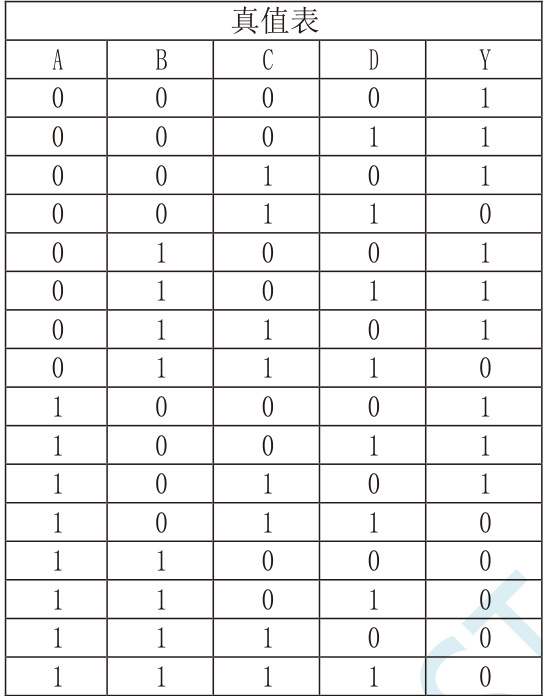

与或非图形符号：

F七： 异或运算及异或图形符号

异或运算： 当 A、B 不同时， 输出 Y 为 1； 而当 A、B 相同时， 输出 Y 为 0。 逻辑变量A 和 B 进行异或运算时可写成： $Y = A \oplus B = ( A \cdot B ^ { \prime } ) + ( A ^ { \prime } \cdot B )$

真值表
 | B | 
 | 0 | 
 |  | 
 |  | 
 |  | 

异或图形符号：

八： 同或运算及同或图形符号

同或运算： 当 A、B 不同时， 输出 Y 为 0； 而当 A、 B 相同时， 输出 Y 为 1。 逻辑变量 A 和 B 进行同

或运算时可写成： $Y = A \odot B = ( A \cdot B ) + ( A ^ { \prime } \cdot B ^ { \prime } )$

真值表
 | B | 
 | 0 | 
0 |  | 0
 |  | 
 |  | 

同或图形符号：

# 1.3 STC8G 单片机性能概述

STC8G 系列单片机是不需要外部晶振和外部复位的单片机， 是以超强抗干扰/超低价/高速/低功耗为目标的8051 单片机，在相同的工作频率下，STC8G 系列单片机比传统的8051 约快12 倍（速度快 $1 1 . 2 { \sim } 1 3 . 2$ 倍），依次按顺序执行完全部的 111 条指令，STC8G 系列单片机仅需 147 个时钟， 而传统 8051 则需要1944 个时钟。STC8G 系列单片机是 STC 生产的单时钟/机器周期(1T)的单片机，是宽电压/高速/高可靠/低功耗/强抗静电/较强抗干扰的新一代 8051 单片机， 超级加密。指令代码完全兼容传统 8051。

MCU 内部集成高精度 R/C 时钟 $( \pm 0 . 3 \%$ ， 常温下 $+ 2 5 ^ { \circ } C \cdot$ )， $- 1 . 3 8 \% \sim + 1 . 4 2 \%$ 温飘 $( - 4 0 ^ { \circ } C \sim + 8 5 ^ { \circ } C )$ $- 0 . 8 8 \% \sim + 1 . 0 5 \%$ 温飘 $( - 2 0 ^ { \circ } C \sim + 6 5 ^ { \circ } C$ )。 ISP 编程时 $4 M H z { \sim } 3 5 M H z$ 宽范围可设置（注意：温度范围为- $\cdot$ $\cdot$ 时，最高频率须控制在 $3 5 M H z$ 以下），可彻底省掉外部昂贵的晶振和外部复位电路(内部已集成高可靠复位电路， ISP 编程时 4 级复位门槛电压可选)。

MCU 内部有 3 个可选时钟源： 内部高精度 IRC 时钟 （ISP 下载时可进行调节）、内部 32KHz 的低速 IRC、外部 $4 M { \sim } 3 3 M$ 晶振或外部时钟信号。用户代码中可自由选择时钟源，时钟源选定后可再经过 8-bit的分频器分频后再将时钟信号提供给 CPU 和各个外设 （如定时器、串口、SPI 等）

MCU 提供两种低功耗模式： IDLE 模式和 STOP 模式。 IDLE 模式下， MCU 停止给 CPU 提供时钟，CPU 无时钟， CPU 停止执行指令，但所有的外设仍处于工作状态， 此时功耗约为 $1 . 0 m A$ （6MHz 工作频率）。STOP 模式即为主时钟停振模式， 即传统的掉电模式/停电模式/停机模式， 此时 CPU 和全部外设都停止工作， 功耗可降低到 $0 . 6 u A @ V c c = 5 . 0 V$ ， 0.4uA@Vcc=3.3V。

掉电模式可以使用 INT0(P3.2)、INT1(P3.3)、INT2(P3.6)、INT3(P3.7)、INT4(P3.0)、 T0(P3.4)、T1(P3.5)、T2(P1.2) 、 T3(P0.4) 、 T4(P0.6) 、 RXD(P3.0/P3.6/P1.6/P4.3) 、 RXD2(P1.0/P4.6) 、 RXD3(P0.0/P5.0)RXD4(P0.2/P5.2)、CCP0(P1.1/P3.5/P2.5)、CCP1(P1.0/P3.6/P2.6)、CCP2(P3.7/P2.7)、I2C_SDA(P1.4/P2.4/P3.3)以及比较器中断、 低压检测中断、 掉电唤醒定时器唤醒。

MCU 提供了丰富的数字外设（串口、定时器、 PCA、 PWM 以及 $I ^ { 2 } C$ 、 SPI） 接口与模拟外设 （超高速 ADC、 比较器），可满足广大用户的设计需求。

STC8G 系列单片机内部集成了增强型的双数据指针。 通过程序控制,可实现数据指针自动递增或递减功能以及两组数据指针的自动切换功能。

# 1.4 STC8G 单片机产品线

产品线 | 1/0 | UART | 定时器 | ADC | 增強型 PWM | PCA | CMP | SPI | I2C | MDU16
STC8G1K08 系列 | 18 | 2 | 3 | 15cH*10B |  |  |  |  |  | 
STC8G1K08-8Pin 系列 |  |  | 2 |  |  |  |  |  |  | 
STC8G1K08A 系列 | 6 | 1 | 2 | 6cH*10B |  |  |  |  |  | 
STC8G2K64S4 系列 | 45 | 4 | 5 | 15cH*10B |  |  |  |  |  | 
STC8G2K64S2 系列 | 45 | 2 | 5 | 15cH*10B |  |  |  |  |  | 
STC15H2K64S4 系列 |  | 42 4 | 5 | 15CH*10B |  |  |  |  |  | 

# 2 STC8G 系列各子系列选型简介、 特性、 价格、 管脚图

# 2.1 STC8G1K08-36I-SOP8/DFN8 系列

2.1.1 特性及价格（有 16 位硬件乘除法器 MDU16， 准 16 位单片机）

选型价格 （不需要外部晶振、 不需要外部复位）  

单片机型号 | 工作电压（V） | Flash程序存储器 10万次 字节 | idata’内部传统8051 RAM 字节 256 | xdata’内部大容量扩展SRAM字节 IK 2 | 强大的双DPTR可增可减 | EEPROM10万次 字节 | VO口最多数量 | 串口并可掉电唤醒 | MDU16硬件16位乘除法器 | SPI |  | 定时器\计数器（T0-T1外部管脚也可掉电唤醒） | 掉电唤醒专用定时器 | 比较器（可当1路AD’ 可作外部掉电检测) | 内部低压检测中断并可掉电唤醒 | 看门狗 复位定时器 | 内部高可靠复位（可选复位门槛电压） | 内部高精准时钟（36MHz以下可调） 追频 | 可对外输出时钟及复位 | 程序加密后传输 （防拦截） | 可设置下次更新程序需口令 支持RS485下载 | 支持软件USB直接下载 | 本身就可在线仿真 | 价格及封装 SOP8 DFN8<3mm*3mm>
STC8G1K08 | 1.9-5.5d | 1.9-5.5 8K | 256 | 1K | 2 | 4K IAP |  |  | 有 有 | 有 有 | 有 有 | 2 2 | 有 有 |  | 有 有 | 有 | 4级 4级 | 有 | 是 | 有 是 是 | 是 是 | 是 | 是 ￥0 | 59￥0. 65 69￥0. | 现货
STC8G1K17 |  | 17K |  |  |  |  |  |  |  |  |  |  |  |  | 有 |  | 有 | 是 | 有 |  |  |  | ￥0. | 75 | 

注： 以上的单价为 10K 及以上订货量的价格， 量小则每片需增加0.1 元人民币。

# 内核

超高速 8051 内核 （1T）， 比传统 8051 约快12 倍以上  
指令代码完全兼容传统 8051  
11 个中断源，4 级中断优先级  
支持在线仿真

# 工作电压

$1 . 9 V { \sim } 5 . 5 V$ 内建 LDO

# 工作温度

${ \bf - 4 0 ^ { \circ } C } \sim 8 5 ^ { \circ } C$ （超温度范围应用请参考电器特性章节说明）

# Flash 存储器

最大 17K 字节 FLASH 程序存储器 （ROM），用于存储用户代码支持用户配置EEPROM 大小， 512 字节单页擦除，擦写次数可达10 万次以上支持在系统编程方式 （ISP） 更新用户应用程序，无需专用编程器支持单芯片仿真， 无需专用仿真器，理论断点个数无限制

SRAM

128 字节内部直接访问 RAM （DATA）  
128 字节内部间接访问 RAM （IDATA）  
1024 字节内部扩展 RAM （内部 XDATA）

# 时钟控制

内部高精度、 高稳定的高速 IRC （4MHz～38MHz， ISP 编程时可进行上下调整， 还可以用户软件分频到

较低的频率工作， 如 $1 0 0 K H z$ ）  
 误差 $\pm 0 . 3 \%$ （常温下 $2 5 ^ \circ C$ ）  
 - $. 0 . 8 8 \% \sim + 1 . 0 5 \%$ 温漂 （温度范围， ${ \displaystyle - 2 0 ^ { \circ } C { \sim } 6 5 ^ { \circ } C }$ ）  
 - $1 . 3 8 \% \sim + 1 . 4 2 \%$ 温漂 （全温度范围， ${ \bf - 4 0 ^ { \circ } C } \sim { \bf 8 5 ^ { \circ } C }$ ）  
内部 $3 2 K H z$ 低速 IRC （为了低功耗， 省去了温度补偿和电压补偿电路， 误差较大）

（芯片上电工作过程： 上电复位/复位脚复位/看门狗复位/低压检测复位时， 芯片默认从 ISP 系统程序开始执行代码，此时固定使用内部 24MHz 的高速 IRC 时钟，当需要下载用户程序且下载完成后复位到用户程序区或者不需要下载直接复位到用户程序区时，默认会使用上次用户下载时所调节的高速 IRC 时钟，如果用户程序需要使用外部高速晶振、外部 32.768KHz 晶振或者内部 $3 0 K H z$ 低速 IRC， 则需要用户软件先启动相应的时钟，然后通过设置 CLKSEL 寄存器进行切换）

# 复位

# 硬件复位

上电复位。 （在芯片未使能低压复位功能时有效）复位脚复位。出厂时P5.4 默认为I/O 口，ISP 下载时可将P5.4 管脚设置为复位脚（注意： 当设置 P5.4管脚为复位脚时，复位电平为低电平）看门狗溢出复位$\phi$ 低压检测复位， 提供4 级低压检测电压： 2.0V、 2.4V、 2.7V、 3.0V。

软件复位软件方式写复位触发寄存器

# 中断

提供11 个中断源： INT0（支持上升沿和下降沿中断）、INT1 （支持上升沿和下降沿中断） 、 INT2 （只支持下降沿中断） 、 INT3（只支持下降沿中断） 、 INT4 （只支持下降沿中断） 、 定时器0、 定时器1、串口1、LVD 低压检测、 SPI、 I2C

提供4 级中断优先级

时钟停振模式下可以唤醒的中断： INT0(P3.2)、 INT1(P3.3)、 INT2(P3.6)、 INT3(P3.7)、 INT4(P3.0)、 T0(P3.4)、T1(P3.5)、 RXD(P3.0/P3.2/P5.4)、 I2C_SDA(P3.3/P5.5)以及低压检测中断、 掉电唤醒定时器唤醒。

# 数字外设

2 个16 位定时器： 定时器0、 定时器1、其中定时器0 的模式3 具有 NMI （不可屏蔽中断） 功能， 定时器  
0 和定时器1 的模式0 为16 位自动重载模式  
1 个高速串口：串口1，波特率时钟源最快可为FOSC/4  
SPI：支持主机模式和从机模式以及主机/从机自动切换  
I2C：支持主机模式和从机模式  
MDU16： 硬件 16 位乘除法器 （支持 32 位除以 16 位、 16 位除以 16 位、 16 位乘 16 位、 数据移位以及数  
据规格化等运算）

# GPIO

最多可达 6 个 GPIO： P3.0\~P3.3、 P5.4\~P5.5  
所有的GPIO 均支持如下4 种模式： 准双向口模式、 强推挽输出模式、 开漏模式、 高阻输入模式  
除 P3.0 和 P3.1 外，其余所有 I/O 口上电后的状态均为高阻输入状态，用户在使用 I/O 口时必须先设置 I/O  
口模式， 另外每个 I/O 均可独立使能内部 4K 上拉电阻

# 封装

SOP8， DFN8 （ $3 m m ^ { * } 3 m m$ ）

# 2.1.2 STC8G1K08-36I-SOP8/DFN8 管脚图， ISP 下载/编程线路图

STC8G1K08-36I-SOP8/DFN8 最小系统 示意图MCLKO/nRST/SCL_2/MOSI/RxD_3/T1CLKO/T0/INT2/P5.4 8 P3.3/TxD_2/INT1/MISO/SDA  
MCU-VCC Vcc 2 STC8G1K08 7 P3.2/RxD_2/INT0/SCLK/SCL10u 0.1u SDA_2/SS/TxD_3/T0CLKO/T1/INT3/P5.5 3 SOP8/DFN8 6 P3.1/TxD以上 Gnd 4 5 P3.0/RxD/INT4正看芯片丝印最下面一行最后一个字母为芯片版本号在Vcc和Gnd之间就近加上电源去耦电容【大电容10uF以上+小电容0.1uF】UART1 SPI I2CRxD TxD SS MOSI MISO SCLK SCL SDAP3.0 P3.1 P5.5 P5.4 P3.3 P3.2 P3.2 P3.3P3.2 P3.3 P5.4 P5.5P5.4 P5.5注意：如不需要进行【软件模拟USB下载】，芯片上电/复位时P3. $0 / P 3 . 1 / P 3 . 2$ 不可同时为低电平否则会进入【等待进入软件模拟USB下载模式】 , 可在 ISP烧录时指定取消 下次下载时使能USB-ISP模式 这个功能  
使用USB转串口芯片进行ISP下载/烧录/仿真， 目标系统 手动停电/上电Ai8H2K12UUSB接口 USB+5V USB+5V 1 P5.4/nRST P3.3/P1.1/TxD2 8 △ 连接目标单片机的P3.0+5V 2 Vcc P3.2/P1.0/RxD2 7 连接目标单片机的P3.12R10u 3 UCap D+/TxD/P3.1 6 D+ USB转串口芯片，以上Gnd D+ 22R 4 Gnd/AGnd D-/RxD/P3.0 5 D- 出厂自带USB转串口程序， USB-HID烧录，免驱动安装USB-TypeA RMB0.95 P5.4管脚高电平供电建议用USB-TypeC也可以用STC8H2K12U-SOP8取代Ai8H2K12U-SOP8【ISP下载/编程/烧录，操作步骤】1、点击电脑端 ISP 软件的【下载/编程】按钮2、给目标系统上电，或者重新给目标系统上电如果在点击【下载/编程】按钮前，目标系统已上电， 则需要停电再重新上电电脑端软件提示：下载编程进行中，数秒后提示成功

# 关于 I/O 的注意事项：

1、 P3.0 和P3.1 口上电后的状态为弱上拉/准双向口模式  
2、 除P3.0 和P3.1 外，其余所有 IO 口上电后的状态均为高阻输入状态，用户在使用 IO口前必须先设置IO 口模式  
3、 芯片上电时如果不需要使用 USB 进行 ISP 下载， ${ P 3 . 0 / P 3 . 1 / P 3 . 2 }$ 这 3 个 I/O 口不能同时为低电平，否则会进入 USB 下载模式而无法运行用户代码芯片上电时，若 P3.0 和 P3.1 同时为低电平，P3.2 口会短时间由高阻输入状态切换到双向口模式，用以读取P3.2 口外部状态来判断是否需要进入 USB 下载模式  
5、 当使用P5.4 当作复位脚时，这个端口内部的 4K 上拉电阻会一直打开；但P5.4 做普通I/O 口时，基于这个I/O 口与复位脚共享管脚的特殊考量，端口内部的4K 上拉电阻依然会打开大约6.5 毫秒时间，再自动关闭（当用户的电路设计需要使用 P5.4 口驱动外部电路时，请务必考虑上电瞬间会有 6.5 毫秒时间的高电平的问题）

# 2.1.3 管脚说明

编号 | 名称 | 类型 | 
SOP8 | 
 |  | P5.4 | I/O | 标准IO口
NRST | 1 | 复位引脚 （低电平复位）
MCLKO | 0 | 主时钟分频输出
INT2 | I | 外部中断2
TO | I | 定时器0外部时钟输入
T1CLKO | 0 | 定时器1时钟分频输出
RxD_3 | I | 串口1的接收脚
MOSI | 1O | SPI主机输出从机输入
SCL_2 | IO | I2C的时钟线
 |  | Vcc | Vcc | 电源腳
P5.5 | IO | 标准I/O口
INT3 |  | 外部中断3
T1 | I | 定时器1外部时钟输入
TOCLKO | 0 | 定时器0时钟分频输出
TxD_3 | 0 (− | 串口1的发送脚
SS | 1 IO | SPI的从机选择脚 （主机为输出）
 |  | SDA_2 | Gnd | I2C的数据线
Gnd |  | 地线
 |  | P3.0 | I/O | 标准IO口
RxD | 1 | 串口1的接收脚
 |  | INT4 |  | 外部中断4
P3.1 | I/O | 标准IO口
 |  | TxD | 0 | 串口１的发送脚
P3.2 | IO | 标准I/O口
 |  | INTO | 1 | 外部中断0
SCLK | IO | SPI的时钟脚
SCL | IO | I2C的时钟线
RxD_2 | I | 串口1的接收脚
P3.3 | IO | 标准IO口
INT1 | 1 | 外部中断
 | MISO | IO | SPI 主机输入从机输出
SDA | IO | I2C的数据线
 | TxD_2 | 0 | 串口１的发送腳

# 2.1.4 USB-Link1D 对 STC8G 系列进行自动串口烧录、仿真 $\cdot +$ 串口通讯

# 使用 【USB Link1D】 对 STC8G1K08系列 进行全自动停电/上电串口烧录、 仿真 $^ +$ 串口通讯

【USB Link1D】 工具： 支持 全自动 停电 / 上电， 在线下载 脱机下载， 仿真

USB LinkiD 连接目标单片机P3.1连接目标单片机P3.0  
技术网址： MCU-VCC  
WWW.STCAI.com 11 连接目标单片机第n组串口发送脚TxDn  
分销商电话： □ 连接目标单片机第n组串口接收脚RxDn  
TEL:0513-550129280 CDCZC18

【应用场景一： 从本工具给目标系统 自动 停电/上电， 供电】点击 电脑端 ISP 软件的【下载/编程】 按钮，工具会 自动 给目标系统停电0.5秒/再自动供电，数秒后提示下载编程成功， 工具默认会再 自动 给目标系统停电0.5秒/再自动供电给目标系统工作。

# 【应用场景二： 不从本工具给目标系统供电】

1、 点击 电脑端 ISP 软件的 【下载/编程】 按钮

2、 给目标系统上电，或者重新上电(如果在点击 【下载/编程】 按钮前已上电， 则需要停电重新上电)，电脑端软件下载编程进行中，数秒后下载成功，目标MCU会自动复位到用户程序区自动跑用户程序。部分不常用设置， 需要停电上电一次才生效， 如改变 EEPROM大小， P5.4/nRST变成复位脚

# STC8G1K08-36I-SOP8/DFN8 最小系统 示意图

MCLKO/nRST/SCL _2/MOSI/RxD _3/T1CLKO/T0/INT2/P5.4 8 P3.3/TxD_2/INT1/MISO/SDAMCU-VCC Vcc 2 STC8G1K08 7 P3.2/RxD_2/INT0/SCLK/SCL10u 0.1u SDA_2/SS/TxD_3/T0CLKO/T1/INT3/P5.5 3 SOP8/DFN8 6 P3.1/TxD以上 Gnd 4 5 P3.0/RxD/INT4正看芯片丝印最下面一行最后一个字母为芯片版本号

在Vcc和Gnd之间就近加上电源去耦电容 【大电容10uF以上 $. +$ 小电容0.1uF】注意：如不需要进行 【软件模拟USB下载】 ， 芯片上电/复位时P3.0/P3.1/P3.2 不可同时为低电平否则会进入【等待进入软件模拟USB下载模式】 可在 ISP烧录时指定取消 下次下载时使能USB-ISP模式 这个功能

# 2.1.5 使用【一箭双雕之 USB 转双串口】进行串口烧录、 仿真 $\cdot +$ 串口通讯

# 使用 【一箭双雕之USB转双串口】 对 STC8G1K08系列 进行串口烧录、 仿真 $^ +$ 串口通讯

【一箭双雕之USB转双串口】 支持 全自动 停电 / 上电， 在线下载， 仿真

【应用场景一： 从本工具给目标系统 自动 停电/上电， 供电】点击 电脑端 ISP 软件的【下载/编程】按钮，工具会 自动 给目标系统停电0.5秒/再自动供电，数秒后提示下载编程成功， 工具默认会再 自动 给目标系统停电0.5秒/再自动供电给目标系统工作。

# 【应用场景二： 不从本工具给目标系统供电】

1、 点击 电脑端 ISP 软件的 【下载/编程】 按钮

2、 给目标系统上电，或者重新上电(如果在点击 【下载/编程】 按钮前已上电， 则需要停电重新上电)，电脑端软件提示下载编程进行中，数秒后下载成功，目标MCU会自动复位到用户程序区跑用户程序。部分不常用设置， 需要停电上电一次才生效， 如改变 EEPROM大小， P5.4/nRST变成复位脚

# STC8G1K08-36I-SOP8/DFN8 最小系统 示意图

MCLKO/nRST/SCL_2/MOSI/RxD_3/T1CLKO/T0/INT2/P5.4 8 P3.3/TxD_2/INT1/MISO/SDA  
MCU-VCC Vcc 2 STC8G1K08 7 P3.2/RxD_2/INT0/SCLK/SCL10u 0.1u SDA_2/SS/TxD_3/T0CLKO/T1/INT3/P5.5 3 SOP8/DFN8 65 P3.1/TxD以上 Gnd 广 4 P3.0/RxD/INT4正看芯片丝印最下面一行最后一个字母为芯片版本号在Vcc和Gnd之间就近加上电源去耦电容【大电容10uF以上 $^ +$ 小电容0.1uF】  
注意：如不需要进行 【软件模拟USB下载】，芯片上电/复位时P3.0/P3.1/P3.2 不可同时为低电平否则会进入 【等待进入软件模拟USB下载模式】 ， 可在 ISP烧录时指定取消 下次下载时使能USB-ISP模式 这个功能

# 2.1.6 USB 转双串口芯片全自动停电/上电烧录， 串口仿真 $\cdot +$ 串口通讯， 5V

# 使用 USB转双串口 芯片 进行 全自动 停电/上电， 烧录/仿真 $^ +$ 串口通讯， 5V

USB转第二组串口  
第二组串口用于和目标系统的  
其他串口通讯

此处的二极管和电阻的作用是防止USB器件给目标芯片供电。由于目标芯片断电过程中，USB器件是不能断电的，USB器件的发送脚一般都是强推挽输出，通过I/O供电芯片就能工作，所以当使用USB转串口TTL对单片机下载程序时此处的隔离二极管不能省

芯片上电时P3.5输出低电平，MCU-VCC处于供电状态。当检测到需要进行ISP下载时，会自动控制MCU-VCC停电0.5S再上电进行ISP下载。下载完成后

Ai8H2K08U-SOP16 会持续供电Ai8H2K12U-SOP16 USB转第一组串口 第一组用于下载或者通讯USB+5V 1N5819 连接目标单片机的第n组串口的TxDn 高阻输入 推挽/开漏 3546 PUV15cC.c314a/pnTRxDST2 RxD/P3.63542 16 推挽/开漏 300R 可做电源 1N5819 (可系从U统S-电BTx取源D电) S-RxD 连接目标单片机的P3.0/RxD 连接目标单片机Q1的P3.1/TxD121 MCU-VCC+5V D+ D+ 0.1u 以10上u 0.1u 8 也可以用STC8H2K1028U-SOP16取代 Gnd D-/P3.0 D- 关电/供电 手动按键 以 10u 20K 0.47u SAQ1IO23可340选1，： RMB0.0475 10 4一70般R不焊Gnd 20KUSB转双串口芯片，USB-TypeA 出厂自带USB转串口程序， P3.5管脚低电平供电建议用USB-TypeC USB-HID烧录， 免驱动安装 P5.4管脚高电平供电

【应用场景一：从本工具给目标系统 自动 停电/上电，供电】点击 电脑端 ISP 软件的【下载/编程】按钮，工具会 自动 给目标系统停电0.5秒/再自动供电，数秒后提示下载编程成功，工具默认会再 自动 给目标系统停电0.5秒/再自动供电给目标系统工作。

# 【应用场景二： 不从本工具给目标系统供电】

1、点击 电脑端 ISP 软件的 【下载/编程】按钮

2、给目标系统上电，或者重新上电(如果在点击【下载/编程】按钮前已上电，则需要停电重新上电)，电脑端软件提示下载编程进行中，数秒后下载成功，目标MCU会自动复位到用户程序区自动跑用户程序。部分不常用设置，需要停电上电一次才生效，如改变 EEPROM大小，P5.4/nRST变成复位脚

# STC8G1K08-36I-SOP8/DFN8 最小系统 示意图

MCLKO/nRST/SCL_2/MOSI/RxD_3/T1CLKO/T0/INT2/P5.4 8 P3.3/TxD_2/INT1/MISO/SDAMCU-VCC Vcc STC8G1K08 7 P3.2/RxD_2/INT0/SCLK/SCL10u 0.1u SDA_2/SS/TxD_3/T0CLKO/T1/INT3/P5.5 3 SOP8/DFN8 65 P3.1/TxD以上 Gnd P3.0/RxD/INT4正看芯片丝印最下面 行最后一个字母为芯片版本号在Vcc和Gnd之间就近加上电源去耦电容【大电容10uF以上+小电容0.1uF】注意：如不需要进行 【软件模拟USB下载】 芯片上电/复位时P3.0/P3.1/P3.2 不可同时为低电平否则会进入【等待进入软件模拟USB下载模式】 可在 ISP烧录时指定取消 下次下载时使能USB-ISP模式 这个功能

# 2.1.7 USB 转双串口芯片全自动烧录， 串口仿真 $\cdot +$ 串口通讯， 3.3V 原理图

# 使用 USB转双串口 芯片 进行 全自动 停电/上电， 烧录/仿真 $+$ 串口通讯， 3.3V

此处的二极管和电阻的作用是防止USB器件给目标芯片供电。由于 芯片上电时 P5.4-nRST 输出高电平，目标芯片断电过程中， USB器件是不能断电的，USB器件的发送脚 MCU-VCC处于供电状态。USB转第二组串口 一般都是强推挽输出，通过I/O供电芯片就能工作，所以当使用 当检测到需要进行ISP下载时，会自动第二组串口用于和目标系统的 USB转串口TTL对单片机下载程序时此处的隔离二极管不能省 控制MCU-VCC停电0.5S再上电进行ISP其他串口通讯 注：烧录我们的最新USB转双串口软件，可以省此处的隔离二极管 下载。下载完成后会持续供电Ai8H2K08U-SOP16Ai8H2K12U-SOP16 USB转第一组串口 第一组用于下载或者通讯连接目标单片机的第n组的RTxDn 高推阻挽/输开入漏 16 推高挽阻/输开入漏 1N5819 S-RxD \$ 连接目标单片机的P3.01/RTxD1N5819 P1.103/TRxD2 RxD/P3.56 145 P3.5管脚低电平供电 系统电源输入V连接目标单片机的3.1/1xJ15554 UCap D+/P3.213 1210 P5.4管脚高电平供电 也或系可充电统电脑宝U源S输B+入5 Vi供n电USB+5V PowerCtrl 67 PV5cR.c4ef+ 62131： 输出 3.3V ，输入 51.85V - 3.6VUSB接口 MCU-VCCGnd D-D- 2 0.1u 10u 0.1u GND也可以用STC8H2K08U-SOP16取代 NCGDn+d 以上 也可以用STC8H2K12U-SOP16取代 0C.1u 10K 按下按键停电 0C.21uUSB转双串口芯片， 松开按键上电USB-TypeA 出厂自带USB转串口程序，建议用USB-TypeC USB-HID烧录， 免驱动安装 PowerCtrl 电源按键 该按键可不焊

【应用场景一： 从本工具给目标系统 自动 停电/上电，供电】点击 电脑端 ISP 软件的【下载/编程】按钮，工具会 自动 给目标系统停电0.5秒/再自动供电，数秒后提示下载编程成功，工具默认会再 自动 给目标系统停电0.5秒/再自动供电给目标系统工作。

【应用场景二： 不从本工具给目标系统供电】

1、点击 电脑端 ISP 软件的 【下载/编程】按钮

2、给目标系统上电，或者重新上电(如果在点击【下载/编程】按钮前已上电，则需要停电重新上电)，电脑端软件提示下载编程进行中，数秒后下载成功，目标MCU会自动复位到用户程序区自动跑用户程序。部分不常用设置， 需要停电上电一次才生效， 如改变 EEPROM大小，P5.4/nRST变成复位脚

# STC8G1K08-36I-SOP8/DFN8 最小系统 示意图

MCLKO/nRST/SCL _2/MOSI/RxD_3/T1CLKO/T0/INT2/P5.4 8 P3.3/TxD_2/INT1/MISO/SDAMCU-VCC Vcc 2 STC8G1K08 7 P3.2/RxD_2/INT0/SCLK/SCL10u 0.1u SDA_2/SS/TxD_3/T0CLKO/T1/INT3/P5.5 3 SOP8/DFN8 6 P3.1/TxD以上 Gnd 4 5 P3.0/RxD/INT4正看芯片丝印最下面 一行最后一个字母为芯片版本号在Vcc和Gnd之间就近加上电源去耦电容【大电容10uF以上+小电容0.1uF】  
如不需要进行 【软件模拟USB下载】，芯片上电/复位时P3.0/P3.1/P3.2 不可同时为低电平  
否则 会进入【等待进入软件模拟USB下载模式】 ， 可在 ISP烧录时指定取消 下次下载时使能USB-ISP模式 这个功能

注意：

# 2.1.8 USB 转双串口芯片进行自动烧录/仿真 $\cdot +$ 串口通讯， 5V/3.3V 跳线选择

# 使用 USB转双串口 芯片 进行 全自动 烧录/仿真 $+$ 串口通讯， 5V/3.3V跳线选择

此处的二极管和电阻的作用是防止USB器件给目标芯片供电。由于目标芯片断电过程中，USB器件是不能断电的，USB器件的发送脚一般都是强推挽输出，通过I/O供电芯片就能工作，所以当使用

芯片上电时P3.5输出低电平，MCU-VCC处于供电状态。当检测到需要进行ISP下载时，

USB接口 USB转第二组串口第二组串口用于和目标系统 USB转串口TTL对单片机下载程序时此处的隔离二极管不能省 会自动控制MCU-VCC停电0.5S再+5V 22R 的其他串口通讯 注： 烧录我们的最新USB转双串口软件， 可以省此处的隔离二极管 上电进行ISP下载。下载完成后D- D- 会持续供电D+ Ai8H2K08U-SOP16 USB转第一组串口 第一组用于下载或者通讯22R Ai8H2K12U-SOP16Gnd 连接目标单片机的第n组串口的TRxDn ? 高推阻挽/输开入漏 P1.01/TRxD2 RTxD/P3.67 156 推高挽阻/输开入漏 1N5819 S-RTxD 连接目标单片机的P3.01/RTxD用跳线插选座择工作电压5V或3.3Vcc 1N5819 PU15C.34a/pnRST P3.34 12 Vcc PQ-1MOS MCU-VCC300R2.54mm 7 Vcc VRef+ D+/P3.1 10 D+ 可做电源 供应模块Gnd D-/P3.0 9 D- 关电/供电 10u 0.47 1041以0u上 1117M3-33 0.1u 10u 0.1u 也可以用STC8H2K1028U-SOP16取代 手动按键 以上 20 QSA1IO23可340选1：，RMB0.047520KUSB转双串口芯片，出厂自带USB转串口程序， P3.5管脚低电平供电USB-HID烧录， 免驱动安装 P5.4管脚高电平供电【应用场景 - 从木工 具给目标系统 自动 停电 / 上电 供电】

点击 电脑端 ISP 软件的【下载/编程】按钮， 工具会 自动 给目标系统停电0.5秒/再自动供电，数秒后提示下载编程成功， 工具默认会再 自动 给目标系统停电0.5秒/再自动供电给目标系统工作。

# 【应用场景二： 不从本工具给目标系统供电】

1、点击 电脑端 ISP 软件的 【下载/编程】按钮

2、给目标系统上电，或者重新上电(如果在点击【下载/编程】按钮前已上电，则需要停电重新上电)，电脑端软件提示下载编程进行中，数秒后下载成功，目标MCU会自动复位到用户程序区自动跑用户程序。部分不常用设置，需要停电上电一次才生效， 如改变 EEPROM大小，P5.4/nRST变成复位脚

# STC8G1K08-36I-SOP8/DFN8 最小系统 示意图

MCLKO/nRST/SCL 2/MOSI/RxD_3/T1CLKO/T0/INT2/P5.4 8 P3.3/TxD_2/INT1/MISO/SDAMCU-VCC Vcc 2 STC8G1K08 7 P3.2/RxD_2/INT0/SCLK/SCL10u 0.1u SDA_2/SS/TxD_3/T0CLKO/T1/INT3/P5.5 3 SOP8/DFN8 6 P3.1/TxD以上 Gnd 5 P3.0/RxD/INT4正看芯片丝印最下面一行最后一个字母为芯片版本号在Vcc和Gnd之间就近加上电源去耦电容【大电容10uF以上+小电容0.1uF】  
如不需要进行 【软件模拟USB下载】 ，芯片上电/复位时 $\cdot \mathsf { P 3 } . 0 / \mathsf { P 3 } . 1 / \mathsf { P 3 } . 2$ 不可同时为低电平  
否则会进入 【等待进入软件模拟USB下载模式】 ， 可在 ISP烧录时指定取消 下次下载时使能USB-ISP模式 这个功能

注意：

# 2.1.9 通用 USB 转串口芯片全自动停电/上电烧录， 串口仿真， 5V 原理图

使用 USB转串口 芯片 进行 全自动 停电/上电， 烧录/仿真/串口通讯， 5V系统电源输入 Vin P-MOS:Ai8H2K12U 也可电脑USB+5V供电 SI2301/RMB0.045或充电宝USB+5V供电 AO3401/RMB0.075USB+5V USB+5V Q1USB接口 ? Power-On P5.4/nRST P3.3/P1.1/TxD2 连接目标单片机的P3.0 P-MOS连接目标单片机的P3.1 MCU-VCC+5V Vc P3.2/P1.0/RxD2D- UCap D+/TxD/P3.1 D+ USB转串口芯片， R1 R3D+ 4 Gnd/AGnd D-/RxD/P3.0 5 出厂自带USB转串口程序， 10K 20K R4Gnd 2R USB-HID烧录， 免驱动安装 20KUSB-TypeA RMB0.95 SOP8 P5.4管脚高电平供电 Power-On SS8050建议用USB-TypeC 也可以用STC8H2K12U-SOP8取代Ai8H2K12U

【应用场景一：从本工具给目标系统 自动 停电/上电，供电】点击 电脑端 ISP 软件的【下载/编程】按钮，工具会 自动 给目标系统停电0.5秒/再自动供电，数秒后提示下载编程成功，工具默认会再 自动 给目标系统停电0.5秒/再自动供电给目标系统工作。

【应用场景二： 不从本工具给目标系统供电】

1、点击 电脑端 ISP 软件的 【下载/编程】按钮

2、给目标系统上电，或者重新上电(如果在点击【下载/编程】按钮前已上电，则需要停电重新上电)，电脑端软件提示下载编程进行中，数秒后下载成功，目标MCU会自动复位到用户程序区自动跑用户程序。部分不常用设置， 需要停电上电一次才生效， 如改变 EEPROM大小，P5.4/nRST变成复位脚

# STC8G1K08-36I-SOP8/DFN8 最小系统 示意图

MCLKO/nRST/SCL 2/MOSI/RxD_3/T1CLKO/T0/INT2/P5.4 8 P3.3/TxD_2/INT1/MISO/SDAMCU-VCC Vcc STC8G1K08 7 P3.2/RxD_2/INT0/SCLK/SCL10u 0.1u SDA _2/SS/TxD_3/T0CLKO/T1/INT3/P5.5 SOP8/DFN8 65 P3.1/TxD以上 Gnd P3.0/RxD/INT4正看芯片丝印最下面一行最后一个字母为芯片版本号

在Vcc和Gnd之间就近加上电源去耦电容 【大电容10uF以上+小电容0.1uF】

注意：

如不需要进行 【软件模拟USB下载】 芯片上电/复位时P3.0/P3.1/P3.2 不可同时为低电平否则会进入 【等待进入软件模拟USB下载模式】 可在 ISP烧录时指定取消 下次下载时使能USB-ISP模式 这个功能

# 2.1.10 通用 USB 转串口芯片全自动停电/上电烧录， 串口仿真， 3.3V 原理图

使用 USB转串口 芯片 进行 全自动 停电/上电， 烧录/仿真/串口通讯， 3.3VUSB接口 USB+5V Ai8H2K12U 也或可充系统电脑宝电U源S输B+入5 V i供n电 62311： 输出 3.3V， 输入 51.85V - 3.6VUSB+5V+5V Power-On 1 P5.4/nRST P3.3/P1.1/TxD2 8 本 连接目标单片机的P3.10 VIN VOUT MCU-VCCVcc P3.2/P1.0/RxD2 7D+ D+ 10u UCap D+/TxD/P3.1 6 D+ USB转串口芯片， GNDGnd 22R 4 Gnd/AGnd D-/RxD/P3.0 5 D- U出S厂B-自H带IDU烧SB录转，串免口驱程动序安，装 C1 10K CE NC 0.1u C2USB-TypeA RMB0.95 SOP8 P5.4管脚高电平供电 0.1u P全ow自er动-O控n 制高输电出源，开低/关断建议用USB-TypeC 也可以用STC8H2K12U-SOP8取代Ai8H2K12U 电源开关， 可不焊

点击 电脑端 ISP 软件的【下载/编程】按钮， 工具会 自动 给目标系统停电0.5秒/再自动供电，数秒后提示下载编程成功， 工具默认会再 自动 给目标系统停电0.5秒/再自动供电给目标系统工作。

【应用场景二： 不从本工具给目标系统供电】

1、点击 电脑端 ISP 软件的 【下载/编程】按钮

2、给目标系统上电，或者重新上电(如果在点击【下载/编程】按钮前已上电，则需要停电重新上电)，电脑端软件提示下载编程进行中，数秒后下载成功，目标MCU会自动复位到用户程序区自动跑用户程序。部分不常用设置， 需要停电上电一次才生效， 如改变 EEPROM大小，P5.4/nRST变成复位脚

# STC8G1K08-36I-SOP8/DFN8 最小系统 示意图

MCLKO/nRST/SCL _2/MOSI/RxD_3/T1CLKO/T0/INT2/P5.4 8 P3.3/TxD_2/INT1/MISO/SDAMCU-VCC Vcc 2 STC8G1K08 7 P3.2/RxD_2/INT0/SCLK/SCL10u 0.1u SDA_2/SS/TxD_3/T0CLKO/T1/INT3/P5.5 3 SOP8/DFN8 6 P3.1/TxD以上 Gnd 4 5 P3.0/RxD/INT4正看芯片丝印最下面 行最后一个字母为芯片版本号

在Vcc和Gnd之间就近加上电源去耦电容【大电容10uF以上+小电容0.1uF】

注意：

如不需要进行 【软件模拟USB下载】 芯片上电/复位时P3.0/P3.1/P3.2 不可同时为低电平否则会进入 【等待进入软件模拟USB下载模式】 可在 ISP烧录时指定取消 下次下载时使能USB-ISP模式 这个功能

2.1.11 USB 转串口芯片全自动停电/上电烧录/仿真/通信， 5V/3.3V 跳线选择【应用场景一：从本工具给目标系统 自动 停电/上电，供电】点击 电脑端 ISP 软件的【下载/编程】按钮，工具会 自动 给目标系统停电0.5秒/再自动供电，数秒后提示下载编程成功，工具默认会再 自动 给目标系统停电0.5秒/再自动供电给目标系统工作。

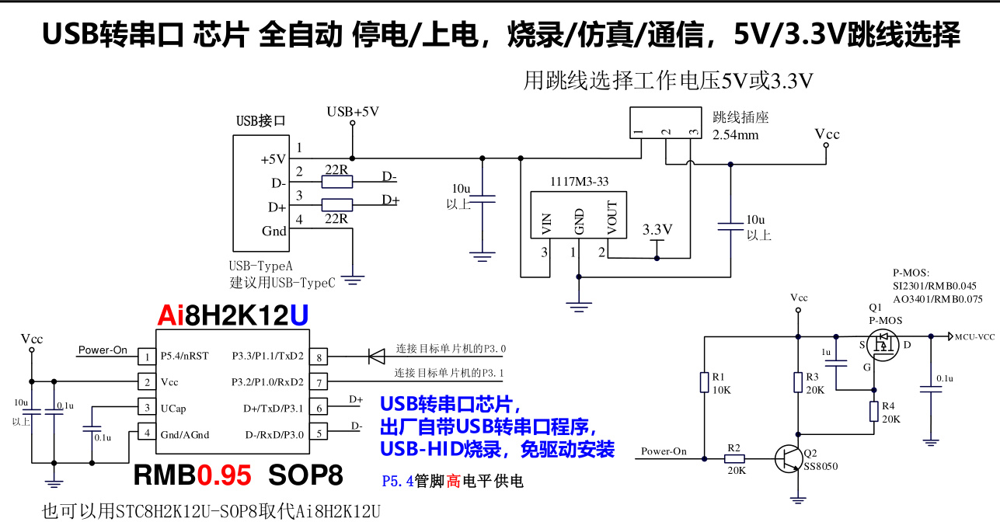

# 【应用场景二： 不从本工具给目标系统供电】

1、点击 电脑端 ISP 软件的 【下载/编程】按钮

2、给目标系统上电，或者重新上电(如果在点击【下载/编程】按钮前已上电，则需要停电重新上电)，电脑端软件提示下载编程进行中，数秒后下载成功，目标MCU会自动复位到用户程序区自动跑用户程序。部分不常用设置， 需要停电上电一次才生效， 如改变 EEPROM大小，P5.4/nRST变成复位脚

# STC8G1K08-36I-SOP8/DFN8 最小系统 示意图

MCLKO/nRST/SCL 2/MOSI/RxD_3/T1CLKO/T0/INT2/P5.4 8 P3.3/TxD_ 2/INT1/MISO/SDAMCU-VCC Vcc 2 STC8G1K08 7 P3.2/RxD_2/INT0/SCLK/SCL10u 0.1u SDA_2/SS/TxD_3/T0CLKO/T1/INT3/P5.5 3 SOP8/DFN8 6 P3.1/TxD以上 Gnd 4 5 P3.0/RxD/INT4正看芯片丝印最下面 行最后一个字母为芯片版本号

#

在Vcc和Gnd之间就近加 上电源去耦电容 【大电容10uF以上 $^ +$ 小电容0.1uF】

# 注意：

如不需要进行 【软件模拟USB下载】 芯片上电/复位时P3.0/P3.1/P3.2 不可同时为低电平否则会进入 【等待进入软件模拟USB下载模式】 可在 ISP烧录时指定取消 下次下载时使能USB-ISP模式 这个功能

2.1.12 USB 转串口芯片进行烧录/串口仿真， 手动停电/上电， 5V/3.3V 原理图

使用 USB转串口 芯片， 进行 ISP烧录/仿真/通信， 目标系统自己手动停电/上电Ai8H2K12UUSB接口 USB+5V USB+5V 1234 1 P5.4/nRST P3.3/P1.1/TxD2 8 连接目标单片机的P3.0连接目标单片机的P3.1+5V Vcc P3.2/P1.0/RxD2 7D- 22R D 10u 0.1u UCap D+/TxD/P3.1 6 D+ USB转串口芯片，D+ D 以上 0.1u 5 D- 出厂自带USB转串口程序，Gnd/AGnd D-/RxD/P3.0Gnd USB-HID烧录， 免驱动安装USB-TypeA RMB0.95 P5.4管脚高电平供电建议用USB-TypeC 也可以用STC8H2K12U-SOP8取代Ai8H2K12U-SOP8  
【ISP下载/编程/烧录，操作步骤】  
1、点击电脑端 ISP 软件的【下载/编程】按钮给目标系统上电，或者重新给目标系统上电如果在点击【下载/编程】按钮前，目标系统已上电， 则需要停电再重新上电电脑端软件提示：下载编程进行中，数秒后提示成功STC8G1K08-36I-SOP8/DFN8 最小系统 示意图MCLKO/nRST/SCL _2/MOSI/RxD_3/T1CLKO/T0/INT2/P5.4 8 P3.3/TxD_2/INT1/MISO/SDAMCU-VCC Vcc 2 STC8G1K08 7 P3.2/RxD_2/INT0/SCLK/SCL10u 0.1u SDA_2/SS/TxD_3/T0CLKO/T1/INT3/P5.5 3 SOP8/DFN8 56 P3.1/TxD以上 Gnd 4 P3.0/RxD/INT4正看芯片丝印最下面一行最后一个字母为芯片版本号在Vcc和Gnd之间就近加上电源去耦电容【大电容10uF以上+小电容0.1uF】注意：如不需要进行 【软件模拟USB下载】，芯片上电/复位时P3.0/P3.1/P3.2 不可同时为低电平否则会进入 【等待进入软件模拟USB下载模式】 可在 ISP烧录时指定取消 下次下载时使能USB-ISP模式 这个功能

2.1.13 USB 转串口芯片进行烧录， 串口仿真， 手动停电/上电， 3.3V 原理图

使用 USB转串口 芯片， 进行 ISP烧录/仿真/通信， 目标系统自己 手动 停电/上电USB+5V USB+5V Ai8H2K12UUSB接口 。 ?1 P5.4/nRST P3.3/P1.1/TxD2 8 连接目标单片机的P3.0+5V D- 2 D 2 3 UCap Vcc P3.2/P1.0/RxD2 D+/TxD/P3.1 7 6 D+ USB转串口芯片， 连接目标单片机的P3.1GDn+d 22R D+ 4 Gnd/AGnd D-/RxD/P3.0 5 D- 出厂自带USB转串口程序，USB-HID烧录， 免驱动安装U建SB议-T用yUpSeBA-TypeC 也可以用STC8H2K12U-SORP8M取B代A0i.89H25K12U- P5.4管脚高电平供电SOP8  
【ISP下载/编程/烧录，操作步骤】  
1、点击电脑端 ISP 软件的【下载/编程】按钮  
2、给目标系统上电，或者重新给目标系统上电如果在点击【下载/编程】按钮前，目标系统已上电， 则需要停电再重新上电电脑端软件提示：下载编程进行中，数秒后提示成功STC8G1K08-36I-SOP8/DFN8 最小系统 示意图MCLKO/nRST/SCL _2/MOSI/RxD_3/T1CLKO/T0/INT2/P5.4 P3.3/TxD_2/INT1/MISO/SDAMCU-VCC Vcc STC8G1K08 P3.2/RxD_2/INT0/SCLK/SCL10u 0.1u SDA_2/SS/TxD_3/T0CLKO/T1/INT3/P5.5 SOP8/DFN8 6 P3.1/TxD以上 Gnd P3.0/RxD/INT4也可系统电脑电U源S输B+入5 V i供n电 正看芯片丝印最下面一行最后一个字母为芯片版本号或充电宝USB+5V供电 6211： 输出 3.3V， 输入 5.5V - 3.6V 在Vcc和Gnd之间就近加上电源去耦电容【大电容10uF以上+小电容0.1uF】6231： 输出 3.3V， 输入 18V - 3.6VVIN VOUT MCU-VCCGND 注意：NC P如3.不0/需P3要.1进/P行3.【2 软不件可模同拟时U为SB低下电载平】 芯片上电/复位时0K 按下按键停电0.1u否则会进入【等待进入软件模拟USB下载模式】松开按键上电 可在 ISP烧录时， 指定取消 下次下载时使能USB-ISP模式 这个功能电源按键

# 2.1.14 USB-Link1D 支持 脱机下载 说明

脱机下载是指脱离电脑主机进行下载的一种方法，一般是使用下载控制芯片 （又称脱机下载母片）进行控制。 USB-Link1D 工具除了支持在线 ISP 下载，还支持脱机下载。 USB-Link1D 工具使用外部的22.1184MHz 晶振， 可保证对目标芯片进行在线或脱机下载时，校准频率的精度。用户可将代码下载到USB-Link1D 工具中，就可实现脱机下载。 USB-Link1D 主控芯片如内部存储空间不够时， 会将部分被下载的用户程序用加密的方式加密放部分到片外串行 Flash。

先将 USB-Link1D 工具使用 USB 线连接到电脑， 然后按照下面的步骤进行脱机下载：

1、选择目标芯片的型号  
2、打开需要下载的文件  
3、设置硬件选项  
4、进入“USB-Link1D 脱机”页面， 点击“将用户程序下载到编程器以供脱机下载“按钮，即可将用户代码下载到 USB-Linik1D 工具中。 下载完成后便使用 USB-Link1D 工具对目标芯片进行脱机下载了

# 2.1.15 USB-Link1D 支持 脱机下载， 如何免烧录环节

大批量生产， 如何省去专门的烧录人员， 如何无烧录环节  
大批量生产，你在将由 STC 的 MCU 作为主控芯片的控制板组装到设备里面之前，在你将 STC MCU 贴片到你的控制板完成之后，你必须测试你的控制板的好坏。不要说 $100 \%$ ，直通无问题， 那是抬杠，不是搞生产，只要生产，就会虚焊，短路，部分原件贴错，部分原件采购错。  
所以在贴片回来后， 组装到外壳里面之前， 你必须要测试， 你的含有 STC MCU 控制板的好坏， 好的去组装，坏的去维修抢救。

# 控制板的测试/不是烧录！

# 控制板的测试环节必须有， 但烧录环节可以省！

大批量生产， 必须要有方便控制板测试的测试架/下面接上我们的脱机烧录工具：

USB-Link1D / U8W-Mini / U8W， 还要接上其他控制部分！1、 通过 USER-VCC、 P3.0、 P3.1、 GND 连接，要工人每次都开电源2、 通过 S-VCC、 P3.0、 P3.1、 GND 连接， 不要你开电源， STC 的脱机工具给你自动供电

外面帮你做一个测试架的成本 500 元以下， 就是有机玻璃，夹具，顶针。1 个测试你控制板是否正常的工人管理 2 - 3 个 测试架

# 操作流程：

1、将你的 MCU 控制板 卡到测试架1 上

2、 将你的 MCU 控制板 卡到测试架2 上， 测试架 1 上的程序已烧录完成/感觉不到烧录时间  
3、 测试 测试架 1 上的 MCU 主控板功能是否正常，正常放到正常区，不正常，放到不正常区  
4、 给测试架1 卡上新的未测试的无程序的控制板  
5、测试 测试架 2 上的未测试控制板/程序不知何时早就不知不觉的烧好了，换新的未测试未烧录的控制  
板  
6、 循环步骤3 到步骤5======不需要安排烧录人员

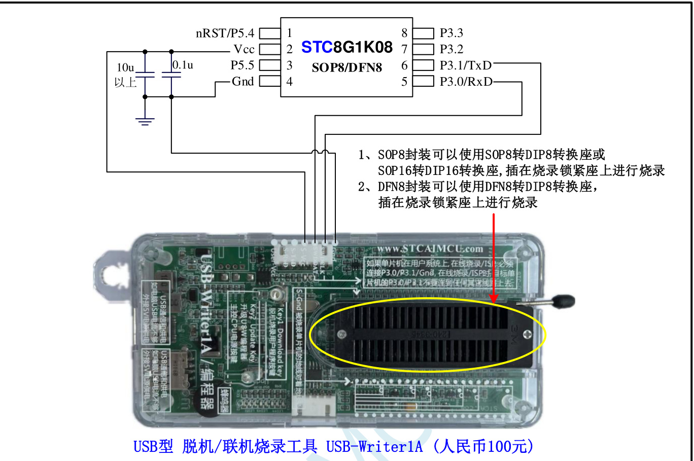

  
2.1.17 USB-Writer1A 支持 自动烧录机， 通信协议和接口

# 自动烧录接口 （分选机自动控制接口） 协议：

Start： 开始信号输入脚。 从外部输入低电平信号触发开始脱机烧录， 低电平必须维持 25 毫秒以上

EOT： 烧录完成信号输出脚。 脱机烧录完成后， 工具输出 $2 0 m s { \sim } 2 5 0 m s$ 的低电平 EOT 信号。 电平宽度如下图所示的地方进行设置

X 消际LrNm缓冲区 打开EEPRUM又件复制接收数据硬件选项 USB-Lirk1D/U8W/U8W-Mini脱机 程序加发送缓中区将用户程序下载到编程器以供脱机下载 文本模式清除编程器中的用户脱机代码及数据 EX模式设置USB-Link1D/U8W/U8W-Mini主控芯片 清空发送区设置脱机下载时的最高波特率 115200文件 送回车脱机编程数量 10000 握手超时时间 0S-VCC输出电压 3.3V 上电延时时间 0 COM1 波特率在线下载完成后持续给目标芯片供电 打开串口 编程完自动脱机下载完成后持续给目标芯片供电 自动发送结脱机下载时关闭自动检测有无芯片功能即使下载失败自动增量也自动递增使用第二种LED显示模式 EOT信号提供电流500mA √ BIF保持时间 40 ms脱机下载灵敏度设置 5 E TE 宽度设置30 ms40 ms电源 50 ms60 ms70 ms下载/编程 80 ms100 ms检测选项 帮助 110 ms120 ms  
每次下载前都重新装载目标文件 130 ms140 TS当目标文件变化时自动装载并 150 nS 远程现场升级APP发布160 nS170 nS180 nS190 ms200 ms210 ms220 ms

OK： 良品信号输出脚。 下载成功后工具从 OK 脚输出低电平信号， 信号与 EOT 信号同步。

Err： 不良品信号输出脚。 若下载失败， 工具从 ERR 脚输出输出低电平信号， 信号与 EOT 完成信号同步。

OK和Err只会输出其中一个信号

# 2.2 STC8G1K08A-36I-SOP8/DFN8/DIP8 系列

2.2.1 特性及价格（有 16 位硬件乘除法器 MDU16， 准 16 位单片机）

选型价格 （不需要外部晶振、 不需要外部复位， 10 位 ADC， 6 通道）

单片机型号 | 工作电压（V | Flash程序存储器10万次字节 | idata’内部传统8051RAM字节 | xdata’内部大容量扩展SRAM字节 | 强大的双DPTR可增可减 | EEPROM10万次字节 | 1O口最多数量 串口并可掉电唤醒 | MDU16硬件16位乘除法器 | SPI | 1²C | 定时器\计数器（T0-T1外部管脚也可掉电唤醒） 支持上升沿中断下降沿中断以及边沿中断 | PCA/CCP/PWM（可当外部中断并可掉电唤醒） | 掉电唤醒专用定时器 | 6路高速ADC（3路PCA可当3路D/A使用） 比较器（可当1路AD’可作外部掉电检测) | 內部低压检测中断并可掉电喚醒 | 看门狗复位定时器 | 内部高可靠复位（可选复位门槛电压） | 内部高精准时钟（36MHz以下可调）追频 | 可对外输出时钟及复位 | 程序加密后传输（防拦截) | 可设置下次更新程序需口令 支持RS485下载 | 支持软件USB直接下载 | 本身就可在线仿真 是 | SOP8 | 价格及封装DFN8<3mm*3mm> | DIP8（不建议使用） 主力产品供货信息
STCSG1K1A1951 56 |  |  |  | KK |  |  | 6 | 有有 | 有有 | 有有 |  |  | 有有 |  |  | 有有 | 有有 级级 | 有有 | 是是 | 有有 | 是是 | 是是 | 是 |  |  |  | 现货
 |  |  |  | 2 |  |  |  |  |  |  |  |  |  |  |  |  | 4级 |  |  |  |  |  |  |  |  |  | 

注： 以上的单价为10K 及以上订货量的价格， 量小则每片需增加 $0 . 1$ 元人民币。

# 内核

超高速 8051 内核 （1T）， 比传统 8051 约快 12 倍以上  
指令代码完全兼容传统 8051  
13 个中断源，4 级中断优先级  
支持在线仿真

# 工作电压

$1 . 9 V { \sim } 5 . 5 V$ 内建 LDO

# 工作温度

# - ${ \cdot 4 0 ^ { \circ } C { \sim } 8 5 ^ { \circ } C }$ （超温度范围应用请参考电器特性章节说明）

# Flash 存储器

最大 17K 字节 FLASH 程序存储器 （ROM），用于存储用户代码支持用户配置EEPROM 大小， 512 字节单页擦除，擦写次数可达10 万次以上支持在系统编程方式 （ISP） 更新用户应用程序，无需专用编程器支持单芯片仿真， 无需专用仿真器，理论断点个数无限制

# SRAM

128 字节内部直接访问 RAM （DATA）  
128 字节内部间接访问 RAM （IDATA）  
1024 字节内部扩展 RAM （内部 XDATA）

# 时钟控制

内部高精度、 高稳定的高速 IRC （ $4 M H z { \sim } 3 8 M H z$ ， ISP 编程时可进行上下调整， 还可以用户软件分频到  
较低的频率工作，如 $1 0 0 K H z$ ）  
 误差 $\pm 0 . 3 \%$ （常温下 $2 5 ^ \circ C$ ）  
 - $. 0 . 8 8 \% \sim + 1 . 0 5 \%$ 温漂 （温度范围， ${ \displaystyle - 2 0 ^ { \circ } C { \sim } 6 5 ^ { \circ } C }$ ）

- $1 . 3 8 \% \sim + 1 . 4 2 \%$ 温漂 （全温度范围， ${ \bf - 4 0 ^ { \circ } C } \sim { \bf 8 5 ^ { \circ } C }$ ）

内部 $3 2 K H z$ 低速 IRC （为了低功耗， 省去了温度补偿和电压补偿电路， 误差较大）

（芯片上电工作过程： 上电复位/复位脚复位/看门狗复位/低压检测复位时， 芯片默认从 ISP 系统程序开始执行代码，此时固定使用内部 24MHz 的高速 IRC 时钟，当需要下载用户程序且下载完成后复位到用户程序区或者不需要下载直接复位到用户程序区时，默认会使用上次用户下载时所调节的高速 IRC 时钟，如果用户程序需要使用外部高速晶振、外部 $3 2 . 7 6 8 K H z$ 晶振或者内部 $3 0 K H z$ 低速 IRC， 则需要用户软件先启动相应的时钟，然后通过设置 CLKSEL 寄存器进行切换）

# 复位

# 硬件复位

上电复位。 （在芯片未使能低压复位功能时有效）复位脚复位。出厂时P5.4 默认为I/O 口，ISP 下载时可将P5.4 管脚设置为复位脚（注意： 当设置 P5.4管脚为复位脚时，复位电平为低电平）看门狗溢出复位 低压检测复位， 提供4 级低压检测电压： 2.0V、 2.4V、 2.7V、 3.0V。

软件复位软件方式写复位触发寄存器

# 中断

提供13 个中断源： INT0 （支持上升沿和下降沿中断）、 INT1（支持上升沿和下降沿中断） 、 INT2 （只支持下降沿中断） INT3 （只支持下降沿中断） INT4 （只支持下降沿中断）、 定时器0、 定时器1、串口1、ADC 模数转换、 LVD 低压检测、 SPI、 I2C、 PCA/CCP/PWM

提供4 级中断优先级

时钟停振模式下可以唤醒的中断： INT0(P3.2)、INT1(P3.3)、 INT2(P3.6)、 INT3(P3.7)、INT4(P3.0)、T0(P3.4)、T1(P3.5)、RXD(P3.0/P3.2/P1.6/P5.4) 、CCP0(P3.2/P3.1)、CCP1(P3.3)、 CCP2(P5.4/P5.5)、 I2C_SDA(P3.3/P5.5)以及低压检测中断、 掉电唤醒定时器唤醒。

# 数字外设

2 个16 位定时器： 定时器0、定时器1、其中定时器0 的模式3 具有 NMI （不可屏蔽中断） 功能， 定时器  
0 和定时器1 的模式0 为16 位自动重载模式  
1 个高速串口： 串口1， 波特率时钟源最快可为FOSC/4  
3 组 16 位 CCP/PCA/PWM 模块： CCP0、CCP1、CCP2， 可用于捕获、高速脉冲输出， 及 6/7/8/10 位的 PWM  
输出  
SPI： 支持主机模式和从机模式以及主机/从机自动切换  
I2C： 支持主机模式和从机模式

MDU16： 硬件 16 位乘除法器 （支持 32 位除以 16 位、 16 位除以 16 位、 16 位乘 16 位、 数据移位以及数据规格化等运算）

# 模拟外设

超高速 ADC， 支持 10 位精度 6 通道 （通道 $0 \sim$ 通道 5） 的模数转换， 速度最快能达到 500K （每秒进行  
50 万次 ADC 转换）  
ADC 的通道 15 用于测试内部 1.19V 参考信号源 （芯片在出厂时， 内部参考信号源已调整为1.19V）  
DAC： 3 路 PCA/CCP/PWM 可当 3 路 DAC 使用

# GPIO

最多可达 6 个 GPIO： P3.0\~P3.3、 P5.4\~P5.5所有的GPIO 均支持如下4 种模式： 准双向口模式、 强推挽输出模式、 开漏模式、 高阻输入模式除 P3.0 和 P3.1 外，其余所有 I/O 口上电后的状态均为高阻输入状态，用户在使用 I/O 口时必须先设置 I/O

# 口模式， 另外每个 I/O 均可独立使能内部 4K 上拉电阻

# 封装

SOP8， DFN8 （ $3 m m ^ { * } 3 m m$ ） , DIP8

# 2.2.2 STC8G1K08A-36I-SOP8/DFN8/DIP8 管脚图， ISP 下载/编程线路图

# STC8G1K08A-36I-SOP8/DFN8/DIP8 最小系统 示意图

CCP2_2/CCP2/MCLKO/nRST/SCL_2/MOSI/RxD_3/T1CLKO/T0/INT2/ADC4/P5.4 8 P3.3/ADC3/TxD_2/INT1/MISO/SDA/CCP1/CCP1_2/CCP1_3 MCU-VCC Vcc/AVcc 2 STC8G1K08A 7 P3.2/ADC2/RxD_2/INT0/SCLK/SCL/CCP0/CCP0_3 10u 0.1u ECI_2/ECI/CCP2_ 3/SDA _2/SS/TxD_3/T0CLKO/T1/INT3/ADC5/P5.5 3 SOP8/DFN8/DIP8 6 P3.1/ADC1/TxD/CCP0_2/ECI_3 以上 Gnd/AGnd 4 5 P3.0/ADC0/RxD/INT4

# 正看芯片丝印最下面 一行最后一个字母为芯片版本号

RxD | TxD
P3.0 | P3.1
P3.2 | P3.3
P5.4 | P5.5
 | 

在Vcc和Gnd之间就近加上电源去耦电容【大电容10uF以上+小电容0.1uF】  

SS | MOSI | MISO | SCLK
P5.5 | P5.4 | P3.3 | P3.2
 |  |  | 
 |  |  | 
 |  |  | 

I2C PCA
SCL | SDA | ECI | CCP0 | CCP1 | CCP2
P3.2 | P3.3 | P5.5 | P3.2 | P3.3 | P5.4
P5.4 | P5.5 | P5.5 | P3.1 | P3.3 | P3.4
 |  | P3.1 | P3.2 | P3.3 | P3.4
 |  |  |  |  | 

ADCO | ADC | ADC2 | ADC3 | ADC4 | ADC5 | ADC6 | ADC7
P3.0 | P3.1 | P3.2 | P3.3 | P5.4 | P5.5 |  | 
ADC8 | ADC9 | ADC10 | ADC11 | ADC12 | ADC13 | ADC14 | ADC15
 |  |  |  |  |  |  | 1.19V

注意： 如不需要进行 【软件模拟USB下载】， 芯片上电/复位时P3.0/P3.1/P3.2 不可同时为低电平否则会进入 【等待进入软件模拟USB下载模式】 ， 可在 ISP烧录时指定取消 下次下载时使能USB-ISP模式 这个功能

# 使用USB转串口芯片进行ISP下载/烧录/仿真， 目标系统 手动停电/上电Ai8H2K12U

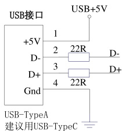

USB+5VP5.4/nRST P3.3/P1.1/TxD2 连接目标单片机的P3.0连接目标单片机的P3.1Vcc P3.2/P1.0/RxD2  
10u UCap D+/TxD/P3.1 D+ USB转串口芯片，  
以上4 Gnd/AGnd D-/RxD/P3.0 5 出厂自带USB转串口程序，USB-HID烧录， 免驱动安装RMB0.95 P5.4管脚高电平供电

也可以用STC8H2K12U-SOP8取代Ai8H2K12U- SOP8

# 【ISP下载/编程/烧录， 操作步骤】

1、点击电脑端 ISP 软件的【下载/编程】按钮  
2、给目标系统上电，或者重新给目标系统上电如果在点击【下载/编程】按钮前，目标系统已上电， 则需要停电再重新上电电脑端软件提示：下载编程进行中，数秒后提示成功

# 关于 I/O 的注意事项：

1、 P3.0 和P3.1 口上电后的状态为弱上拉/准双向口模式  
2、 除P3.0 和P3.1 外，其余所有 IO 口上电后的状态均为高阻输入状态，用户在使用 IO口前必须先设置IO 口模式  
3、 芯片上电时如果不需要使用 USB 进行 ISP 下载，P3.0/P3.1/P3.2 这 3 个 I/O 口不能同时为低电平，否则会进入 USB 下载模式而无法运行用户代码芯片上电时，若 P3.0 和 P3.1 同时为低电平，P3.2 口会短时间由高阻输入状态切换到双向口模式，用以读取P3.2 口外部状态来判断是否需要进入 USB 下载模式当使用P5.4 当作复位脚时，这个端口内部的 4K 上拉电阻会一直打开；但P5.4 做普通I/O 口时，基于这个I/O 口与复位脚共享管脚的特殊考量，端口内部的4K 上拉电阻依然会打开大约6.5 毫秒时间，再自动关闭（当用户的电路设计需要使用 P5.4 口驱动外部电路时，请务必考虑上电瞬间会有 6.5 毫秒时间的高电平的问题）

# 2.2.3 管脚说明

编号 | 名称 | 类型 | 说明
SOP8 DFN8 DIP8 | 
 |  | P5.4 | 1/O | 标准IO □
NRST | I | 复位引脚 （低电平复位）
MCLKO | 0 | 主时钟分频输出
INT2 |  | 外部中断2
TO | I I | 定时器 外部时钟输入
T1CLKO | 0 | 定时器 时钟分频输出
 | RxD_3 I | 串口 的接收脚
MOSI | 1/O | SPI主机输出从机输入
SCL_2 | IO | I2C的时钟线
ADC4 | I | ADC 模拟输入通道4
CCP2 | 1O | PCA 的捕获输入、 脉冲输出和 PWM 输出
 | CCP2_2 | IO PCA的捕获输入、 | 脉冲输出和 PWM 输出
 |  | Vcc Vcc | 电源腳
AVcc Vcc 1/O | ADC 电源腳 标准IO口
 |  | P5.5 | 
INT3 I | 外部中断3
T1 I | 定时器1外部时钟输入
TOCLKO 0 | 定时器0时钟分频输出
TxD_3 0 | 串口 的发送脚
SS I | SPI 的从机选择脚 （主机为输出）
SDA_2 1/O | I2C的数据线
ADC5 I | ADC模拟输入通道5
 | ECI I | PCA的外部脉冲输入
ECI_2 I CCP2_3 | PCA的外部脉冲输入
 |  | 1/O | PCA的捕获输入、 脉冲输出和 PWM 输出
Gnd | Gnd 地线 Gnd ADC 地线 | 
 |  | AGnd P3.0 1/O | 标准 I/O口
 | 
 |  | RxD | 串口 的接收脚
INT4 | 外部中断4
ADCO I | ADC 模拟输入通道0
P3.1 I/O | 标准IO口
 |  | TxD 0 | 串口 的发送腳
- ADC1 | ADC模拟输入通道1
ECI_3 I | 
 | PCA 的外部脈冲输入
CCP0_2 I/O | PCA 的捕获输入、 脉冲输出和 PWM 输出

编号 | 名称 | 类型 | 说明
SOP8 DFN8 DIP8 | 
 |  |  | 1/O | 标准I/O口
P3.2 INTO | I | 外部中断0
SCLK | I/O | SPI的时钟脚
SCL | 1/O | I2C 的时钟线
RxD_2 | 1 | 串口1的接收脚
ADC2 | I | ADC模拟输入通道2
CCP0 | 1/O | PCA 的捕获输入、 脉冲输出和PWM输出
CCP0_3 | 1/O | PCA的捕获输入、 脉冲输出和PWM 输出
 | 1/O | 标准I/O口
 |  | P3.3 | I | 
INT1 MISO | I/O | 外部中断1 SPI主机输入从机输出
SDA | 1/O | I2C的数据线
TxD_2 | 0 | 串口1的发送脚
ADC3 | 1 | ADC模拟输入通道3
CCP1 | I/O | PCA 的捕获输入、 脉冲输出和 PWM 输出
CCP1_2 | I/O | PCA 的捕获输入、 脉冲输出和PWM 输出
CCP1_3 | 1/O | PCA 的捕获输入、 脉冲输出和 PWM 输出

# 2.2.4 USB-Link1D 对 STC8G 系列进行自动串口烧录、 仿真 $\cdot +$ 串口通讯

# 使用 【USB Link1D】 对 STC8G1K08A系列 进行全自动停电/上电串口烧录、 仿真 $^ +$ 串口通讯

【USB Link1D】 工具： 支持 全自动 停电 / 上电， 在线下载 / 脱机下载， 仿真-USB LinkiD Ca 一拨到此处升级 具固件 Gnd 连接目标单片机P3.1NuWu连接目标单片机P3.0技术网TCA1.cOm 仅从本 连MC接U目-V标C单C 片机第n组串口发送脚TxDn分销商电话： C D国 STCAE 连接目标单片机第n组串口接收脚RxDnTEL:0513-5502928 区1STCCDC 口连接用厂 0Rx情TEL:+86-513-55012928

【应用场景一： 从本工具给目标系统 自动 停电/上电， 供电】点击 电脑端 ISP 软件的 【下载/编程】 按钮，工具会 自动 给目标系统停电0.5秒/再自动供电，数秒后提示下载编程成功， 工具默认会再 自动 给目标系统停电0.5秒/再自动供电给目标系统工作。

# 【应用场景二： 不从本工具给目标系统供电】

1、 点击 电脑端 ISP 软件的 【下载/编程】 按钮

2、 给目标系统上电，或者重新上电(如果在点击 【下载/编程】 按钮前已上电， 则需要停电重新上电)，电脑端软件下载编程进行中，数秒后下载成功， 目标MCU会自动复位到用户程序区自动跑用户程序。部分不常用设置， 需要停电上电一次才生效， 如改变 EEPROM大小， P5.4/nRST变成复位脚

# STC8G1K08A-36I-SOP8/DFN8/DIP8 最小系统 示意图

CCP2_2/CCP2/MCLKO/nRST/SCL _2/MOSI/RxD_3/T1CLKO/T0/INT2/ADC4/P5.4 8 P3.3/ADC3/TxD_2/INT1/MISO/SDA/CCP1/CCP1_2/CCP1_3MCU-VCC Vcc/AVcc 2STC8G1K08A P3.2/ADC2/RxD_2/INT0/SCLK/SCL/CCP0/CCP0_310u ECI_2/ECI/CCP2_3/SDA_2/SS/TxD _3/T0CLKO/T1/INT3/ADC5/P5.5 3 SOP8/DFN8/DIP8 6 P3.1/ADC1/TxD/CCP0_2/ECI_3以上 0.1u Gnd/AGnd 4 5 P3.0/ADC0/RxD/INT4正看芯片丝印最下面一行最后一个字母为芯片版本号在Vcc和Gnd之间就近加上电源去耦电容【大电容10uF以上 $. +$ 小电容0.1uF】注意： 【软件模拟USB下载】，芯片上电/复位时P3.0/P3.1/P3.2 不可同时为低电平否则会进入【等待进入软件模拟USB下载模式】， 可在 ISP烧录时指定取消 下次下载时使能USB-ISP模式 这个功能

# 2.2.5 使用【一箭双雕之 USB 转双串口】进行串口烧录、 仿真 $\cdot +$ 串口通讯

# 使用 【一箭双雕之USB转双串口】 对 STC8G1K08A系列 进行串口烧录、 仿真 $\cdot +$ 串口通讯

【一箭双雕之USB转双串口】 支持 全自动 停电 / 上电， 在线下载， 仿真

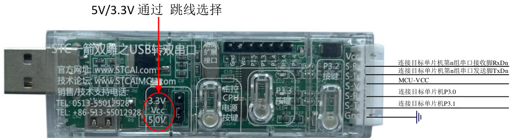

【应用场景一： 从本工具给目标系统 自动 停电/上电， 供电】点击 电脑端 ISP 软件的【下载/编程】按钮，工具会 自动 给目标系统停电0.5秒/再自动供电，数秒后提示下载编程成功， 工具默认会再 自动 给目标系统停电0.5秒/再自动供电给目标系统工作。

# 【应用场景二： 不从本工具给目标系统供电】

1、 点击 电脑端 ISP 软件的 【下载/编程】 按钮

2、 给目标系统上电，或者重新上电(如果在点击【下载/编程】 按钮前已上电， 则需要停电重新上电)，电脑端软件提示下载编程进行中，数秒后下载成功，目标MCU会自动复位到用户程序区跑用户程序。部分不常用设置， 需要停电上电一次才生效， 如改变 EEPROM大小， P5.4/nRST变成复位脚

# STC8G1K08A-36I-SOP8/DFN8/DIP8 最小系统 示意图

CCP2_2/CCP2/MCLKO/nRST/SCL _2/MOSI/RxD_3/T1CLKO/T0/INT2/ADC4/P5.4 8 P3.3/ADC3/TxD_2/INT1/MISO/SDA/CCP1/CCP1_2/CCP1_3MCU-VCC Vcc/AVcc 2STC8G1K08A 7 P3.2/ADC2/RxD_2/INT0/SCLK/SCL/CCP0/CCP0_310u ECI_2/ECI/CCP2_ 3/SDA_2/SS/TxD_3/T0CLKO/T1/INT3/ADC5/P5.5 广 3 SOP8/DFN8/DIP8 6 P3.1/ADC1/TxD/CCP0_2/ECI_3以上 0.1u Gnd/AGnd 4 P3.0/ADC0/RxD/INT4正看芯片丝印最下面一行最后一个字母为芯片版本号在Vcc和Gnd之间就近加上电源去耦电容【大电容10uF以上 $^ +$ 小电容0.1uF】注意： 如不需要进行【软件模拟USB下载】，芯片上电/复位时P3.0/P3.1/P3.2 不可同时为低电平否则会进入【等待进入软件模拟USB下载模式】 ， 可在 ISP烧录时指定取消 下次下载时使能USB-ISP模式 这个功能

# 2.2.6 USB 转双串口芯片全自动停电/上电烧录， 串口仿真 $\cdot +$ 串口通讯， 5V

# 使用 USB转双串口 芯片 进行 全自动 停电/上电， 烧录/仿真 $^ +$ 串口通讯， 5V

此处的二极管和电阻的作用是防止USB器件给目标芯片供电。 由于 芯片上电时P3.5输出低电平，目标芯片断电过程中， USB器件是不能断电的，USB器件的发送脚 MCU-VCC处于供电状态。USB转第二组串口 一般都是强推挽输出，通过I/O供电芯片就能工作，所以当使用 当检测到需要进行ISP下载时，第二组串口用于和目标系统的 USB转串口TTL对单片机下载程序时此处的隔离二极管不能省 会自动控制MCU-VCC停电0.5S再其他串口通讯 注： 烧录我们的最新USB转双串口软件，可以省此处的隔离二极管 上电进行ISP下载。下载完成后会持续供电Ai8H2K08U-SOP16Ai8H2K12U-SOP16 USB转第一组串口 第一组用于下载或者通讯连接目标单片机的第n组串口的RTxDn 高推阻挽/输开入漏 16 推高挽阻/输开入漏 1N5819 S-RxD S-TxD 连接目标单片机的P3.01/RTxD? 2 P1.01/TRxD2 RTxD/P3.67 15+5DV- 22R D- J54 10u 0.1u 768 也PVG5可cnR.cd4e以/fn+用RS TC8HD2DK+-/0P83U.3201-SO1910P16D-+取30代0R 关供可电应做/模电供块源电 (可系从U统S电B取源电) 以10上u 0.47u PQ-1MOS Q1可选D： 104 470RD+ 2 0.1u 20K RMB0.0475U建SB议-T用yUpSeBA-TypeC U出S厂B-自转HI带双DU串烧S口B录转芯，片串免口，驱程动序安，装 P53.45管脚高低电平供电

【应用场景一： 从本工具给目标系统 自动 停电/上电，供电】点击 电脑端 ISP 软件的【下载/编程】按钮，工具会 自动 给目标系统停电0.5秒/再自动供电，数秒后提示下载编程成功，工具默认会再 自动 给目标系统停电0.5秒/再自动供电给目标系统工作。

# 【应用场景二： 不从本工具给目标系统供电】

1、点击 电脑端 ISP 软件的 【下载/编程】按钮

2、给目标系统上电，或者重新上电(如果在点击【下载/编程】按钮前已上电， 则需要停电重新上电)，电脑端软件提示下载编程进行中，数秒后下载成功，目标MCU会自动复位到用户程序区自动跑用户程序。部分不常用设置， 需要停电上电一次才生效， 如改变 EEPROM大小，P5.4/nRST变成复位脚

# STC8G1K08A-36I-SOP8/DFN8/DIP8 最小系统 示意图

CCP2_2/CCP2/MCLKO/nRST/SCL_2/MOSI/RxD_3/T1CLKO/T0/INT2/ADC4/P5.4 P3.3/ADC3/TxD_2/INT1/MISO/SDA/CCP1/CCP1_2/CCP1_3MCU-VCC ← Vcc/AVcc STC8G1K08A P3.2/ADC2/RxD_2/INT0/SCLK/SCL/CCP0/CCP0_310u ECI_2/ECI/CCP2_ 3/SDA_2/SS/TxD_3/T0CLKO/T1/INT3/ADC5/P5.5 SOP8/DFN8/DIP8 6 P3.1/ADC1/TxD/CCP0_2/ECI_3以上 0.1u Gnd/AGnd P3.0/ADC0/RxD/INT4正看芯片丝印最下面 一行最后一个字母为芯片版本号在Vcc和Gnd之间就近加上电源去耦电容【大电容10uF以上+小电容0.1uF】注意： 如不需要进行【软件模拟USB下载】 ， 芯片上电/复位时P3.0/P3.1/P3.2 不可同时为低电平否则会进入【等待进入软件模拟USB下载模式】 ， 可在 ISP烧录时指定取消 下次下载时使能USB-ISP模式 这个功能

# 2.2.7 USB 转双串口芯片全自动烧录， 串口仿真 $\cdot +$ 串口通讯， 3.3V 原理图

# 使用 USB转双串口 芯片 进行 全自动 停电/上电， 烧录/仿真 $+$ 串口通讯， 3.3V

# USB转第二组串口

第二组串口用于和目标系统的其他串口通讯

此处的二极管和电阻的作用是防止USB器件给目标芯片供电。由于目标芯片断电过程中，USB器件是不能断电的，USB器件的发送脚一般都是强推挽输出，通过I/O供电芯片就能工作，所以当使用USB转串口TTL对单片机下载程序时此处的隔离二极管不能省

芯片上电时 P5.4-nRST 输出高电平，MCU-VCC处于供电状态。当检测到需要进行ISP下载时，会自动控制MCU-VCC停电0.5S再上电进行ISP下载。下载完成后会持续供电

Ai8H2K08U-SOP16Ai8H2K12U-SOP16 USB转第一组串口 第一组用于下载或者通讯连接目标单片机的第n组的RxDn 1N5819 推挽/开漏 34 PVU15cC.c134a/pTxD2 RxD/P3.42653 121 P35.高54阻管输脚入低高电平供电 也或系可充电统S-电脑宝TxU源DS输B+入5V i供n连电接目标62单11片：机输的P出3 .3.13/VTx，D输入 5.5V - 3.6V MCU-VCC+5V 8 Gnd D-/P3.0 9 D- VIN VOUT 111D- 22 D 0.1u 0.1u GND以10上u 也可以用STC8H2K08U-SOP16取代 NCD+ D+ CE C2也可以用STC8H2K12U-SOP16取代 C1 按下按键停电 0.1uGnd 0.1uUSB转双串口芯片， 松开按键上电USB-TypeA 出厂自带USB转串口程序，建议用USB-TypeC USB-HID烧录， 免驱动安装 PowerCtrl 电源按键 该按键可不焊

【应用场景一： 从本工具给目标系统 自动 停电/上电，供电】点击 电脑端 ISP 软件的【下载/编程】按钮，工具会 自动 给目标系统停电0.5秒/再自动供电，数秒后提示下载编程成功，工具默认会再 自动 给目标系统停电0.5秒/再自动供电给目标系统工作。

# 【应用场景二： 不从本工具给目标系统供电】

1、点击 电脑端 ISP 软件的 【下载/编程】 按钮

2、给目标系统上电，或者重新上电(如果在点击【下载/编程】按钮前已上电，则需要停电重新上电)，电脑端软件提示下载编程进行中，数秒后下载成功，目标MCU会自动复位到用户程序区自动跑用户程序。部分不常用设置，需要停电上电一次才生效，如改变 EEPROM大小，P5.4/nRST变成复位脚

# STC8G1K08A-36I-SOP8/DFN8/DIP8 最小系统 示意图

CCP2_2/CCP2/MCLKO/nRST/SCL _2/MOSI/RxD_3/T1CLKO/T0/INT2/ADC4/P5.4 P3.3/ADC3/TxD_2/INT1/MISO/SDA/CCP1/CCP1_2/CCP1_3MCU-VCC Vcc/AVcc 2 STC8G1K08A 7 P3.2/ADC2/RxD_2/INT0/SCLK/SCL/CCP0/CCP0_310u ECI_2/ECI/CCP2_3/SDA_2/SS/TxD_3/T0CLKO/T1/INT3/ADC5/P5.5 3 SOP8/DFN8/DIP8 6 P3.1/ADC1/TxD/CCP0_2/ECI_3以上 Gnd/AGnd P3.0/ADC0/RxD/INT40.1u正看芯片丝印最下面 一行最后一个字母为芯片版本号在Vcc和Gnd之间就近加上电源去耦电容【大电容10uF以上+小电容0.1uF】注意： 如不需要进行【软件模拟USB下载】， 芯片上电/复位时P3.0/P3.1/P3.2 不可同时为低电平否则会进入【等待进入软件模拟USB下载模式】 可在 ISP烧录时指定取消 下次下载时使能USB-ISP模式 这个功能

# 2.2.8 USB 转双串口芯片进行自动烧录/仿真 $\cdot +$ 串口通讯， 5V/3.3V 跳线选择

# 使用 USB转双串口 芯片 进行 全自动 烧录/仿真 $+$ 串口通讯， 5V/3.3V跳线选择

此处的二极管和电阻的作用是防止USB器件给目标芯片供电。由于目标芯片断电过程中，USB器件是不能断电的，USB器件的发送脚一般都是强推挽输出，通过I/O供电芯片就能工作，所以当使用USB转串口TTL对单片机下载程序时此处的隔离二极管不能省

芯片上电时P3.5输出低电平，MCU-VCC处于供电状态。当检测到需要进行ISP下载时，会自动控制MCU-VCC停电0.5S再上电进行ISP下载。下载完成后

D+ 4 22R D Ai8H2K08U-SOP16 Ai8H2K12U-SOP16 USB转第一组串口 第一组用于下载或者通讯 会持续供电  
USB-TGypnedA 连接目标单片机的第n组串口的TRxDn 高推阻挽/输开入漏 21 P1.01/TRxD2 RTxD/P3.76 15 推高挽阻/输开入漏 1N5819 S-RTxD 连接目标单片机的P3.01/RTxD  
建议用USB-TypeC 1N5819 P1.3 P3.5 Q1用跳线选择工作电压5V或3.3V UCap P3.4 Vcc P-MOS MCU-VCC  
USB+5V 2跳.54线m插m座 Vcc 7 PV5cR.c4e/fn+RST P3.2 10 D+ 供可应做模电块源8 Gnd D-/P3.0 9 D- 关电/供电 10u 0.47u 104  
1以0u上 1117M3-33 0.1u 以10上u 0.1u 也可以用STC8H2K0182U-SOP16取代 手动按键 以 SAIO233401， RMB0.047520K3.3VUSB转双串口芯片， 出厂自带USB转串口程序， P3.5管脚低电平供电USB-HID烧录， 免驱动安装 P5.4管脚高电平供电

点击 电脑端 ISP 软件的【下载/编程】 按钮， 工具会 自动 给目标系统停电0.5秒/再自动供电，数秒后提示下载编程成功， 工具默认会再 自动 给目标系统停电0.5秒/再自动供电给目标系统工作。

# 【应用场景二： 不从本工具给目标系统供电】

1、点击 电脑端 ISP 软件的 【下载/编程】按钮

2、给目标系统上电，或者重新上电(如果在点击【下载/编程】按钮前已上电，则需要停电重新上电)，电脑端软件提示下载编程进行中，数秒后下载成功，目标MCU会自动复位到用户程序区自动跑用户程序。部分不常用设置， 需要停电上电一次才生效，如改变 EEPROM大小，P5.4/nRST变成复位脚

# STC8G1K08A-36I-SOP8/DFN8/DIP8 最小系统 示意图

CCP2_2/CCP2/MCLKO/nRST/SCL_2/MOSI/RxD_3/T1CLKO/T0/INT2/ADC4/P5.4 8 P3.3/ADC3/TxD_2/INT1/MISO/SDA/CCP1/CCP1_2/CCP1_3MCU-VCC Vcc/AVcc STC8G1K08A 7 P3.2/ADC2/RxD_2/INT0/SCLK/SCL/CCP0/CCP0_310u ECI_2/ECI/CCP2_3/SDA 2/SS/TxD_3/T0CLKO/T1/INT3/ADC5/P5.5 SOP8/DFN8/DIP8 6 P3.1/ADC1/TxD/CCP0_2/ECI_3以上 Gnd/AGnd P3.0/ADC0/RxD/INT40.1u正看芯片丝印最下面一行最后一个字母为芯片版本号在Vcc和Gnd之间就近加上电源去耦电容【大电容10uF以上+小电容0.1uF】注意： 如不需要进行【软件模拟USB下载】 ， 芯片上电/复位时P3.0/P3.1/P3.2 不可同时为低电平否则会进入【等待进入软件模拟USB下载模式】 可在 ISP烧录时指定取消 下次下载时使能USB-ISP模式 这个功能

# 2.2.9 通用 USB 转串口芯片全自动停电/上电烧录， 串口仿真， 5V 原理图

使用 USB转串口 芯片 进行 全自动 停电/上电， 烧录/仿真/串口通讯， 5VAi8H2K12U 也可系统电脑电U源S输B+入5 V i供n电 PSI-2M3O01S/:RMB0.045USB接口 USB+5V USB+5V Power-On P5.4/nRST P3.3/P1.1/TxD2 4 连接目标单片机的P3.0 或充电宝USB+5V供电 Q1 AO3401/RMB0.075连接目标单片机的P3.1 MCU-VCC+5V P3.2/P1.0/RxD2D+ USB转串口芯片，D UCap D+/TxD/P3.1 6 R1出厂自带USB转串口程序， 10K 20GDn+d 4 Gnd/AGnd D-/RxD/P3.0 5 USB-HID烧录， 免驱动安装U建SB议-T用ypUeSAB-TypeC RMB0.95  SOP8 P5.4管脚高电平供电 Power-On 2a SQS28050

【应用场景一：从本工具给目标系统 自动 停电/上电，供电】点击 电脑端 ISP 软件的【下载/编程】按钮，工具会 自动 给目标系统停电0.5秒/再自动供电，数秒后提示下载编程成功，工具默认会再 自动 给目标系统停电0.5秒/再自动供电给目标系统工作。

【应用场景二： 不从本工具给目标系统供电】

1、点击 电脑端 ISP 软件的 【下载/编程】按钮

2、给目标系统上电，或者重新上电(如果在点击【下载/编程】按钮前已上电，则需要停电重新上电)，电脑端软件提示下载编程进行中，数秒后下载成功，目标MCU会自动复位到用户程序区自动跑用户程序。部分不常用设置，需要停电上电一次才生效，如改变 EEPROM大小，P5.4/nRST变成复位脚

# STC8G1K08A-36I-SOP8/DFN8/DIP8 最小系统 示意图

CCP2_2/CCP2/MCLKO/nRST/SCL_2/MOSI/RxD_3/T1CLKO/T0/INT2/ADC4/P5.4 P3.3/ADC3/TxD_2/INT1/MISO/SDA/CCP1/CCP1_2/CCMCU-VCC ← Vcc/AVcc 2 STC8G1K08A P3.2/ADC2/RxD_2/INT0/SCLK/SCL/CCP0/CCP0_310u ECI_2/ECI/CCP2_3/SDA_2/SS/TxD_3/T0CLKO/T1/INT3/ADC5/P5.5 3 SOP8/DFN8/DIP8 6 P3.1/ADC1/TxD/CCP0_2/ECI_3以上 0.1u Gnd/AGnd 4 P3.0/ADC0/RxD/INT4正看芯片丝印最下面一行最后一个字母为芯片版本号在Vcc和Gnd之间就近加上电源去耦电容【大电容10uF以上+小电容0.1uF】注意： 如不需要进行【软件模拟USB下载】， 芯片上电/复位时P3.0/P3.1/P3.2 不可同时为低电平否则会进入【等待进入软件模拟USB下载模式】， 可在 ISP烧录时指定取消 下次下载时使能USB-ISP模式 这个功能

# 2.2.10 通用 USB 转串口芯片全自动停电/上电烧录， 串口仿真， 3.3V 原理图

使用 USB转串口 芯片 进行 全自动 停电/上电， 烧录/仿真/串口通讯， 3.3V  
USB接口 USB+5V Ai8H2K12U 也可系统电脑电U源S输B+入5 V i供n电 或充电宝USB+5V供电 6211： 输出 3.3V， 输入 5.5V - 3.6VUSB+5V 6231： 输出 3.3V， 输入 18V - 3.6V+5V Power-On P5.4/nRST P3.3/P1.1/TxD2 连接目标单片机的P3.10 MCU-VCCVINVOUTD Vc P3.2/P1.0/RxD2GDn+d D UCap D+-/RTxD/P3.10 6 D+ U出S厂B-自转HI带串DU口烧S芯B录转片，串免口驱程动序安，装 3 CE4 Gnd/AGnd 5 0C.1u 10K 0.1u C2Power-On 高输出，  
USB-TypeA RMB0.95 SOP8 P5.4管脚高电平供电 全自动控制电源开/关  
建议用USB-TypeC也可以用STC8H2K12U-SOP8取代Ai8H2K12U 电源开关， 可不焊

【应用场景一：从本工具给目标系统 自动 停电/上电，供电】点击 电脑端 ISP 软件的【下载/编程】按钮，工具会 自动 给目标系统停电0.5秒/再自动供电，数秒后提示下载编程成功，工具默认会再 自动 给目标系统停电0.5秒/再自动供电给目标系统工作。

【应用场景二： 不从本工具给目标系统供电】

1、点击 电脑端 ISP 软件的 【下载/编程】按钮

2、给目标系统上电，或者重新上电(如果在点击【下载/编程】按钮前已上电，则需要停电重新上电)，电脑端软件提示下载编程进行中，数秒后下载成功，目标MCU会自动复位到用户程序区自动跑用户程序。部分不常用设置， 需要停电上电一次才生效，如改变 EEPROM大小，P5.4/nRST变成复位脚

# STC8G1K08A-36I-SOP8/DFN8/DIP8 最小系统 示意图

CCP2_2/CCP2/MCLKO/nRST/SCL_2/MOSI/RxD_3/T1CLKO/T0/INT2/ADC4/P5.4 P3.3/ADC3/TxD_2/INT1/MISO/SDA/CCP1/CCP1_2/CCP1_3MCU-VCC T Vcc/AVcc STC8G1K08A P3.2/ADC2/RxD_2/INT0/SCLK/SCL/CCP0/CCP0_310u ECI_2/ECI/CCP2_3/SDA _2/SS/TxD_3/T0CLKO/T1/INT3/ADC5/P5.5 √ SOP8/DFN8/DIP8 6 P3.1/ADC1/TxD/CCP0_2/ECI_3以上 0.1u Gnd/AGnd P3.0/ADC0/RxD/INT4正看芯片丝印最下面一行最后一个字母为芯片版本号在Vcc和Gnd之间就近加上电源去耦电容【大电容10uF以上+小电容0.1uF】注意： 如不需要进行【软件模拟USB下载】，芯片上电/复位时P3.0/P3.1/P3.2 不可同时为低电平否则会进入【等待进入软件模拟USB下载模式】， 可在 ISP烧录时指定取消 下次下载时使能USB-ISP模式 这个功能

# 2.2.11 USB 转串口芯片全自动停电/上电烧录/仿真/通信， 5V/3.3V 跳线选择

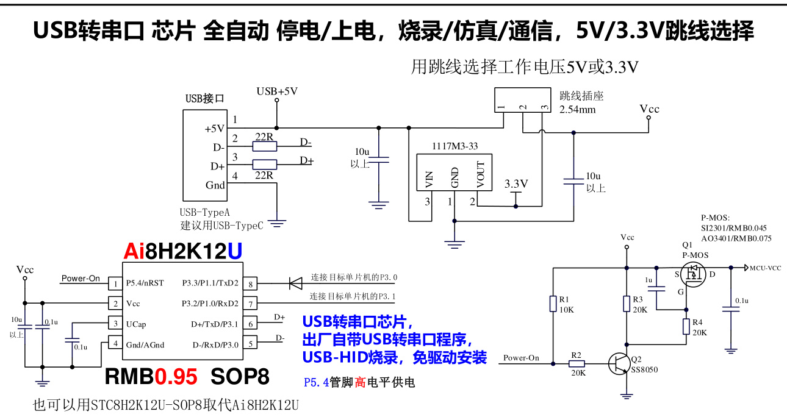

【应用场景一： 从本工具给目标系统 自动 停电/上电，供电】点击 电脑端 ISP 软件的【下载/编程】按钮，工具会 自动 给目标系统停电0.5秒/再自动供电，数秒后提示下载编程成功，工具默认会再 自动 给目标系统停电0.5秒/再自动供电给目标系统工作。

# 【应用场景二： 不从本工具给目标系统供电】

1、 点击 电脑端 ISP 软件的 【下载/编程】按钮

2、给目标系统上电，或者重新上电(如果在点击【下载/编程】按钮前已上电，则需要停电重新上电)，电脑端软件提示下载编程进行中，数秒后下载成功，目标MCU会自动复位到用户程序区自动跑用户程序。部分不常用设置， 需要停电上电一次才生效， 如改变 EEPROM大小，P5.4/nRST变成复位脚

STC8G1K08A-36I-SOP8/DFN8/DIP8 最小系统 示意图CCP2_2/CCP2/MCLKO/nRST/SCL_2/MOSI/RxD_3/T1CLKO/T0/INT2/ADC4/P5.4 P3.3/ADC3/TxD_2/INT1/MISO/SDA/CCP1/CCP1_2/CCP1_3  
MCU-VCC ← Vcc/AVcc 2 STC8G1K08A P3.2/ADC2/RxD_2/INT0/SCLK/SCL/CCP0/CCP0_310u ECI_2/ECI/CCP2_3/SDA_2/SS/TxD_3/T0CLKO/T1/INT3/ADC5/P5.5 3 SOP8/DFN8/DIP8 6 P3.1/ADC1/TxD/CCP0_2/ECI_3以上 0.1u Gnd/AGnd P3.0/ADC0/RxD/INT4正看芯片丝印最下面一行最后一个字母为芯片版本号在Vcc和Gnd之间就近加上电源去耦电容【大电容10uF以上+小电容0.1uF】  
注意： 【软件模拟USB下载】 ，芯片上电/复位时P3.0/P3.1/P3.2 不可同时为低电平否则会进入【等待进入软件模拟USB下载模式】 ， 可在 ISP烧录时指定取消 下次下载时使能USB-ISP模式 这个功能

2.2.12 USB 转串口芯片进行烧录/串口仿真， 手动停电/上电， 5V/3.3V 原理图

使用 USB转串口 芯片， 进行 ISP烧录/仿真/通信， 目标系统自己手动停电/上电Ai8H2K12UUSB接口 USB+5V USB+5V 1 P5.4/nRST P3.3/P1.1/TxD2 8 连接目标单片机的P3.0连接目标单片机的P3.1+5V Vcc P3.2/P1.0/RxD2 7D+ USB转串口芯片，D- 10u 0.1 UCap D+/TxD/P3.1 6GDn+d 22R D 以上 Gnd/AGnd D-/RxD/P3.0 5 D- 出厂自带USB转串口程序， USB-HID烧录， 免驱动安装USB-TypeA RMB0.95 P5.4管脚高电平供电建议用USB-TypeC 也可以用STC8H2K12U-SOP8取代Ai8H2K12U-SOP8  
【ISP下载/编程/烧录，操作步骤】  
1、点击电脑端 ISP 软件的【下载/编程】按钮  
2、给目标系统上电，或者重新给目标系统上电如果在点击【下载/编程】按钮前，目标系统已上电， 则需要停电再重新上电电脑端软件提示：下载编程进行中，数秒后提示成功STC8G1K08A-36I-SOP8/DFN8/DIP8 最小系统 示意图CCP2_2/CCP2/MCLKO/nRST/SCL_2/MOSI/RxD_3/T1CLKO/T0/INT2/ADC4/P5.4 P3.3/ADC3/TxD_2/INT1/MISO/SDA/CCP1/CCP1_2/CCP1_3MCU-VCC T Vcc/AVcc 2 STC8G1K08A 7 P3.2/ADC2/RxD_2/INT0/SCLK/SCL/CCP0/CCP0_310u ECI_2/ECI/CCP2_3/SDA_2/SS/TxD_3/T0CLKO/T1/INT3/ADC5/P5.5 3 SOP8/DFN8/DIP8 6 P3.1/ADC1/TxD/CCP0_2/ECI_3以上 0.1 Gnd/AGnd P3.0/ADC0/RxD/INT4正看芯片丝印最下面一行最后一个字母为芯片版本号在Vcc和Gnd之间就近加上电源去耦电容【大电容10uF以上+小电容0.1uF】注意： 如不需要进行【软件模拟USB下载】，芯片上电/复位时P3.0/P3.1/P3.2 不可同时为低电平否则会进入【等待进入软件模拟USB下载模式】 可在 ISP烧录时指定取消 下次下载时使能USB-ISP模式 这个功能

2.2.13 USB 转串口芯片进行烧录， 串口仿真， 手动停电/上电， 3.3V 原理图

使用 USB转串口 芯片， 进行 ISP烧录/仿真/通信， 目标系统自己 手动 停电/上电Ai8H2K12UUSB+5V USB+5VUSB接口1 P5.4/nRST P3.3/P1.1/TxD2 8 △ 连接目标单片机的P3.0+5V Vcc P3.2/P1.0/RxD2 7 7 连接目标单片机的P3.DD- 10u UCap D+/TxD/P3.1 6 D+ USB转串口芯片，D+ 22 D+ 4 Gnd/AGnd D-/RxD/P3.0 5 D- 出厂自带USB转串口程序，Gnd USB-HID烧录， 免驱动安装USB-TypeA RMB0.95 P5.4管脚高电平供电建议用USB-TypeC也可以用STC8H2K12U-SOP8取代Ai8H2K12U-SOP8  
【ISP下载/编程/烧录，操作步骤】  
1、点击电脑端 ISP 软件的【下载/编程】按钮  
2、给目标系统上电，或者重新给目标系统上电如果在点击【下载/编程】按钮前，目标系统已上电， 则需要停电再重新上电电脑端软件提示：下载编程进行中，数秒后提示成功STC8G1K08A-36I-SOP8/DFN8/DIP8 最小系统 示意图CCP2_2/CCP2/MCLKO/nRST/SCL_2/MOSI/RxD_3/T1CLKO/T0/INT2/ADC4/P5.4 P3.3/ADC3/TxD_2/INT1/MISO/SDA/CCP1/CCP1_2/CCP1_3MCU-VCC ← Vcc/AVcc 2 STC8G1K08A 7 P3.2/ADC2/RxD_2/INT0/SCLK/SCL/CCP0/CCP0_310u ECI_2/ECI/CCP2_3/SDA_2/SS/TxD_3/T0CLKO/T1/INT3/ADC5/P5.5 SOP8/DFN8/DIP8 6 P3.1/ADC1/TxD/CCP0_2/ECI_3以上 0.1u Gnd/AGnd P3.0/ADC0/RxD/INT4正看芯片丝印最下面一行最后一个字母为芯片版本号系统电源输入 Vin  
也可电脑USB+5V供电 在Vcc和Gnd之间就近加上电源去耦电容【大电容10uF以上+小电容0.1uF】  
或充电宝USB+5V供电 6211： 输出 3.3V， 输入 5.5V - 3.6V6231： 输出 3.3V， 输入  18V - 3.6VVIN VOUT MCU-VCCGND 注意：如不需要进行【软件模拟USB下载】，芯片上电/复位时CE NC P3.0/P3.1/P3.2 不可同时为低电平C1按下按键停电 0.1u 否则会进入【等待进入软件模拟USB下载模式】.1u 松开按键上电 可在 ISP烧录时指定取消 下次下载时使能USB-ISP模式 这个功能电源按键

# 2.2.14 USB-Link1D 支持 脱机下载 说明

脱机下载是指脱离电脑主机进行下载的一种方法，一般是使用下载控制芯片 （又称脱机下载母片）进行控制。 USB-Link1D 工具除了支持在线 ISP 下载，还支持脱机下载。 USB-Link1D 工具使用外部的22.1184MHz 晶振， 可保证对目标芯片进行在线或脱机下载时，校准频率的精度。用户可将代码下载到USB-Link1D 工具中，就可实现脱机下载。 USB-Link1D 主控芯片如内部存储空间不够时， 会将部分被下载的用户程序用加密的方式加密放部分到片外串行 Flash。

先将 USB-Link1D 工具使用 USB 线连接到电脑， 然后按照下面的步骤进行脱机下载：

1、选择目标芯片的型号  
2、打开需要下载的文件  
3、设置硬件选项  
4、进入“USB-Link1D 脱机”页面， 点击“将用户程序下载到编程器以供脱机下载“按钮，即可将用户代码下载到 USB-Linik1D 工具中。 下载完成后便使用 USB-Link1D 工具对目标芯片进行脱机下载了

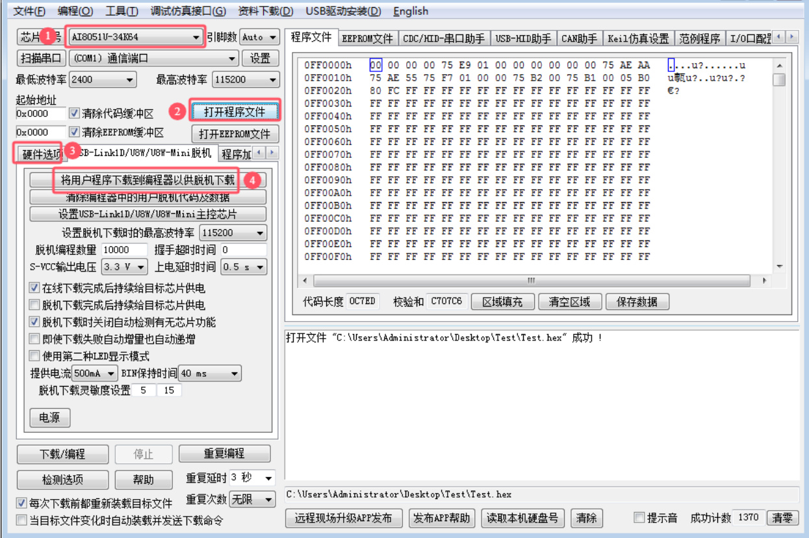

# 2.2.15 USB-Link1D 支持 脱机下载， 如何免烧录环节

大批量生产， 如何省去专门的烧录人员， 如何无烧录环节  
大批量生产，你在将由 STC 的 MCU 作为主控芯片的控制板组装到设备里面之前，在你将 STC MCU 贴片到你的控制板完成之后，你必须测试你的控制板的好坏。不要说 $100 \%$ ，直通无问题， 那是抬杠，不是搞生产，只要生产，就会虚焊，短路，部分原件贴错，部分原件采购错。  
所以在贴片回来后， 组装到外壳里面之前， 你必须要测试， 你的含有 STC MCU 控制板的好坏， 好的去组装，坏的去维修抢救。

# 控制板的测试/不是烧录！

# 控制板的测试环节必须有， 但烧录环节可以省！

大批量生产， 必须要有方便控制板测试的测试架/下面接上我们的脱机烧录工具：

USB-Link1D / U8W-Mini / U8W， 还要接上其他控制部分！1、 通过 USER-VCC、 P3.0、 P3.1、 GND 连接， 要工人每次都开电源2、 通过 S-VCC、 P3.0、 P3.1、 GND 连接， 不要你开电源， STC 的脱机工具给你自动供电

外面帮你做一个测试架的成本 500 元以下， 就是有机玻璃，夹具，顶针。1 个测试你控制板是否正常的工人管理 2 - 3 个 测试架

# 操作流程：

1、将你的 MCU 控制板 卡到测试架1 上

2、 将你的 MCU 控制板 卡到测试架2 上， 测试架 1 上的程序已烧录完成/感觉不到烧录时间  
3、 测试 测试架 1 上的 MCU 主控板功能是否正常，正常放到正常区，不正常，放到不正常区  
4、 给测试架1 卡上新的未测试的无程序的控制板  
5、测试 测试架 2 上的未测试控制板/程序不知何时早就不知不觉的烧好了， 换新的未测试未烧录的控制  
板  
6、 循环步骤3 到步骤5======不需要安排烧录人员

# 2.2.16 USB-Writer1A 编程器/烧录器·支持·插在·锁紧座上·烧录

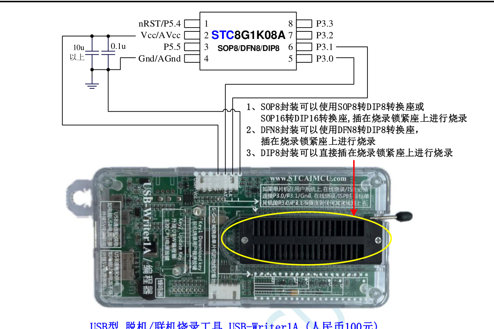

  
2.2.17 USB-Writer1A 支持 自动烧录机， 通信协议和接口

# 自动烧录接口 （分选机自动控制接口） 协议：

Start： 开始信号输入脚。 从外部输入低电平信号触发开始脱机烧录， 低电平必须维持 25 毫秒以上

EOT： 烧录完成信号输出脚。 脱机烧录完成后， 工具输出 $2 0 m s { \sim } 2 5 0 m s$ 的低电平 EOT 信号。 电平宽度如下图所示的地方进行设置

X 消际LrNm缓冲区 打开EEPRUM又件复制接收数据硬件选项 USB-Lirk1D/U8W/U8W-Mini脱机 程序加发送缓中区将用户程序下载到编程器以供脱机下载 文本模式清除编程器中的用户脱机代码及数据 EX模式设置USB-Link1D/U8W/U8W-Mini主控芯片 清空发送区设置脱机下载时的最高波特率 115200文件 送回车脱机编程数量 10000 握手超时时间 0S-VCC输出电压 3.3V 上电延时时间 0 COM1 波特率在线下载完成后持续给目标芯片供电 打开串口 编程完自动脱机下载完成后持续给目标芯片供电 自动发送结脱机下载时关闭自动检测有无芯片功能即使下载失败自动增量也自动递增使用第二种LED显示模式 EOT信号提供电流500mA √ BIF保持时间 40 ms脱机下载灵敏度设置 5 E TE 宽度设置30 ms40 ms电源 50 ms60 ms70 ms下载/编程 80 ms100 ms检测选项 帮助 110 ms120 ms  
每次下载前都重新装载目标文件 130 ms140 TS当目标文件变化时自动装载并 150 nS 远程现场升级APP发布160 nS170 nS180 nS190 ms200 ms210 ms220 ms

OK： 良品信号输出脚。 下载成功后工具从 OK 脚输出低电平信号， 信号与 EOT 信号同步。

Err： 不良品信号输出脚。 若下载失败， 工具从 ERR 脚输出输出低电平信号， 信号与 EOT 完成信号同步。

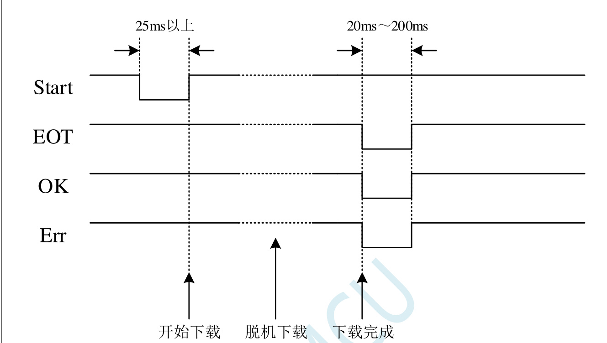

OK和Err只会输出其中一个信号

# 2.3 STC8G1K08-38I-TSSOP20/QFN20/SOP16 系列

# 2.3.1 特性及价格

选型价格 （不需要外部晶振、 不需要外部复位， 10 位 ADC， 15 通道）

单片机型号 | 工作电压（V） | Flash程序存储器10万次字节 idata’内部传统8051 RAM字节 | xdata’內部大容量扩展SRAM 字节 | 强大的双DPTR可增可减 | EEPROM10万次字节 | 1O口最多数量 | 串口并可掉电唤醒 | SPI I²C | 定时器\计数器（TO-T2外部管脚也可掉电唤醒） | 支持上升沿中断下降沿中断以及边沿中断 | PCA/CCP/PWM（可当外部中断并可掉电唤醒） | 掉电唤醒专用定时器 15路高速ADC（3路PCA可当3路D/A使用） | 比较器（可当1路AD’可作外部掉电检测 10 | 内部低压检测中断并可掉电喚醒 | 看门狗复位定时器 | 内部高可靠复位（可选复位门槛电压） | 内部高精准时钟（36MHz以下可调）追频 可对外輸出时钟及复位 | 程序加密后传输（防拦截） | 可设置下次更新程序需口令 支持RS485下载 | 支持软件USB直接下载 | 本身就可在线仿真 | TSSOP20 | QFN20 (3mm*3mm) | 价格及封装DIP20 | SOP16 | DIP16 | 主力产品供货信息 | 
STC8G1K08 | .9-5.58K |  | 256 | 1K 2 1K | 4K IAP | 8 8 |  | 有 | 有 |  |  | 有 有 |  | 有 | 有 有 有 有 | 4级 4级 | 有 | 是 是 | 有 自 | 是 是 是 | 是 | 是 | ￥1.65￥1. ￥1. 75￥1. |  | 65￥1. 75￥2.05￥1.75￥1.95 |  | 95￥1.65￥1.85 | 现货
STC8G1K17 | 1.9-5.517K256 |  |  |  |  |  |  |  |  |  |  |  |  |  |  |  |  |  |  |  |  |  |  |  |  |  | 

# 内核

超高速 8051 内核 （1T）， 比传统 8051 约快 12 倍以上  
指令代码完全兼容传统 8051  
16 个中断源，4 级中断优先级  
支持在线仿真

# 工作电压

$1 . 9 V { \sim } 5 . 5 V$ 内建 LDO

# 工作温度

${ \bf - 4 0 ^ { \circ } C } \sim { 8 5 ^ { \circ } C }$ （超温度范围应用请参考电器特性章节说明）

# Flash 存储器

最大 17K 字节 FLASH 程序存储器 （ROM），用于存储用户代码支持用户配置EEPROM 大小， 512 字节单页擦除，擦写次数可达10 万次以上支持在系统编程方式 （ISP） 更新用户应用程序，无需专用编程器支持单芯片仿真， 无需专用仿真器，理论断点个数无限制

# SRAM

128 字节内部直接访问 RAM （DATA）  
128 字节内部间接访问 RAM （IDATA）  
1024 字节内部扩展 RAM （内部 XDATA）

# 时钟控制

内部高精度、 高稳定的高速 IRC （ $4 M H z { \sim } 3 6 M H z$ ， ISP 编程时可进行上下调整， 还可以用户软件分频到  
较低的频率工作，如 $1 0 0 K H z$ ）  
 误差 $\pm 0 . 3 \%$ （常温下 $2 5 ^ \circ C$ ）  
 - $0 . 8 8 \% \sim + 1 . 0 5 \%$ 温漂 （温度范围， ${ \displaystyle - 2 0 ^ { \circ } C { \sim } 6 5 ^ { \circ } C }$ ）  
 - $1 . 3 8 \% \sim + 1 . 4 2 \%$ 温漂 （全温度范围， ${ \bf - 4 0 ^ { \circ } C } \sim { \bf 8 5 ^ { \circ } C }$ ）  
内部 $3 2 K H z$ 低速IRC（为了低功耗，省去了温度补偿和电压补偿电路， 误差较大）  
外部晶振 （ $4 M H z { \sim } 3 6 M H z$ ） 和外部时钟

（芯片上电工作过程： 上电复位/复位脚复位/看门狗复位/低压检测复位时， 芯片默认从 ISP 系统程序开始执行代码，此时固定使用内部 24MHz 的高速 IRC 时钟，当需要下载用户程序且下载完成后复位到用户程序区或者不需要下载直接复位到用户程序区时，默认会使用上次用户下载时所调节的高速 IRC 时钟，如果用户程序需要使用外部高速晶振、外部 32.768KHz 晶振或者内部 $3 0 K H z$ 低速 IRC， 则需要用户软件先启动相应的时钟，然后通过设置 CLKSEL 寄存器进行切换）

# 复位

# 硬件复位

上电复位。 （在芯片未使能低压复位功能时有效）  
复位脚复位。出厂时P5.4 默认为I/O 口，ISP 下载时可将P5.4 管脚设置为复位脚（注意： 当设置 P5.4管脚为复位脚时，复位电平为低电平）  
看门狗溢出复位  
低压检测复位， 提供4 级低压检测电压： 2.0V、 2.4V、 2.7V、 3.0V。

软件复位软件方式写复位触发寄存器

# 中断

提供16 个中断源： INT0（支持上升沿和下降沿中断） 、 INT1 （支持上升沿和下降沿中断） 、 INT2 （只支持下降沿中断） 、 INT3 （只支持下降沿中断） 、 INT4（只支持下降沿中断）、定时器0、 定时器1、定时器2、串口1、 串口2、 ADC 模数转换、 LVD 低压检测、 SPI、 I2C、 比较器、 PCA/CCP/PWM

提供4 级中断优先级

时钟停振模式下可以唤醒的中断： INT0(P3.2)、 INT1(P3.3)、 INT2(P3.6)、 INT3(P3.7)、 INT4(P3.0)、 T0(P3.4)、T1(P3.5)、T2(P1.2)、 RXD(P3.0/P3.6/P1.6)、 RXD2(P1.0)、 CCP0(P1.1/P3.5)、 CCP1(P1.0/P3.6)、 CCP2(P3.7)、I2C_SDA(P1.4/P3.3)以及比较器中断、 低压检测中断、 掉电唤醒定时器唤醒。

# 数字外设

3 个16 位定时器： 定时器0、 定时器1、 定时器2， 其中定时器0 的模式 3 具有NMI （不可屏蔽中断）功  
能，定时器0 和定时器1 的模式0 为16 位自动重载模式  
2 个高速串口：串口1、串口2， 波特率时钟源最快可为FOSC/4  
3 组 16 位 CCP/PCA/PWM 模块：CCP0、CCP1、CCP2， 可用于捕获、高速脉冲输出， 及 6/7/8/10 位的 PWM  
输出  
SPI： 支持主机模式和从机模式以及主机/从机自动切换  
I2C： 支持主机模式和从机模式

# 模拟外设

超高速ADC， 支持 10 位精度 15 通道 （通道 $0 \sim$ 通道14） 的模数转换， 速度最快能达到 500K （每秒进行50 万次 ADC 转换）

ADC 的通道15 用于测试内部1.19V 参考信号源 （芯片在出厂时， 内部参考信号源已调整为1.19V）  
比较器， 一组比较器 （比较器的正端可选择 $C M P +$ 端口和所有的ADC 输入端口， 所以比较器可当作多路  
比较器进行分时复用）  
DAC： 3 路 PCA/CCP/PWM 可当 3 路 DAC 使用

GPIO

最多可达 18 个 GPIO： P1.0\~P1.7、 P3.0\~P3.7、 P5.4\~P5.5所有的 GPIO 均支持如下4 种模式： 准双向口模式、 强推挽输出模式、 开漏模式、 高阻输入模式除 P3.0 和 P3.1 外，其余所有 I/O 口上电后的状态均为高阻输入状态，用户在使用 I/O 口时必须先设置 I/O口模式， 另外每个 I/O 均可独立使能内部 4K 上拉电阻

# 封装

TSSOP20、 QFN20 （ $3 m m ^ { * } 3 m m$ ） SOP20、 DIP20、 SOP16、 DIP16

# 2.3.2 STC8G1K08-38I-TSSOP20 管脚图， ISP 下载/编程线路图

# STC8G1K08-38I-TSSOP20 最小系统 示意图

UART1  

RxD | TxD
P3.0 | P3.1
P3.6 | P3.7
P1.6 | P1.7
 | 

UART2   

RxD2 | TxD2
P1.0 | P1.1
 | 

PCA/CCP/PWM   

ECI | CCP0 | CCP1 | CCP2
P1.2 | P1.1 | P1.0 | P3.7
P3.4 | P3.5 | P3.6 | P3.7
 |  |  | 
 |  |  | 

SPI   

SS | MOSI | MISO | SCLK
P1.2 | P1.3 | P1.4 | P1.5
 |  |  | 
 |  |  | 
P3.5 | P3.4 | P3.3 | P3.2

I2C   

SCL | SDA
P1.5 | P1.4
 | 
 | 
P3.2 | P3.3

ADC   

ADCO | ADC1 | ADC2 | ADC3 | ADC4 | ADC5 | ADC6 | ADC7
P1.0 | P1.1 | P1.2 | P1.3 | P1.4 | P1.5 | P1.6 | P1.7
ADC8 | ADC9 | ADC10 | ADC11 | ADC12 | ADC13 | ADC14 | ADC15
P3.0 | P3.1 | P3.2 | P3.3 | P3.4 | P3.5 | P3.6 | 1.19V

CMP   

CMP+ | CMP- | CMPO
P3.7 | 1.19V | P3.4
ADCIN | P3.6 | 

T2/ECI/SS/ADC2/P1.2 20 P1.1/ADC1/TxD2/CCP0 CCP是英文单词的缩写 TI2CLSDKOA/MIOSOI/ADC34/P1.34 3 189 P31.70/IANDTC3/0/TRxxD_2/CCP21_2/CCP2/CMP+ Coampptaure（比捕较获） I2CSCL/SCLK/ADC5/P1. 4 17 P3.6/ADC14/INT2/RxD 2/CCP1 _2/CMP- PWM （脉宽调制）   
XTALO/MCLKO_2/RxD_3/ADC6/P1.6 16 P3.5/ADC13/T1/T0CLKO/CCP0_2/SS_4 XTALI/TxD_3/ADC7/P1.7 6 15 P3.4/ADC12/T0/T1CLKO/ECI _2/CMPO/MOSI_4   
MCU-VCC MCLKO/nRST/P5.4 7 14 P3.3/ADC11/INT1/MISO _4/I2CSDA_4 Vcc/AVcc/ADC_VRef+ 8 13 P3.2/ADC10/INT0/SCLK_4/I2CSCL_4   
10u P5.5 − 9 112 P3.1/ADC9/TxD Gnd/AGnd 10 P3.0/ADC8/RxD/INT4

注意：

在Vcc和Gnd之间就近加上电源去耦电容 【大电容10uF以上 $^ +$ 小电容0.1uF】

1、 ADC的外部参考电源管脚ADC_VRef+， 必须接外部参考电源 【电压： 2.4V \~ MCU-VCC】,浮空会有漏电流2、 如不需要进行【软件模拟USB下载】 ，芯片上电/复位时P3.0/P3.1/P3.2 不可同时为低电平否则会进入【等待进入软件模拟USB下载模式】 可在 ISP烧录时指定取消 下次下载时使能USB-ISP模式 这个功能

# 使用USB转串口芯片进行ISP下载/烧录/仿真， 目标系统 手动停电/上电Ai8H2K12U

USB+5V USB+5VUSB接口 1 P5.4/nRST P3.3/P1.1/TxD2 4 连接目标单片机的P3.0连接目标单片机的P3.1+5V 2 Vcc P3.2/P1.0/RxD2D- 3 USB转串口芯片，10u 0.1u UCap D+/TxD/P3.1D+ 22R D+ 以上 0.1u 4 Gnd/AGnd D-/RxD/P3.0 出厂自带USB转串口程序，Gnd USB-HID烧录， 免驱动安装USB-TypeA RMB0.95 P5.4管脚高电平供电建议用USB-TypeC

也可以用STC8H2K12U- SOP8取代Ai8H2K12U-SOP8

# 【ISP下载/编程/烧录， 操作步骤】

1、点击电脑端 ISP 软件的 【下载/编程】按钮

2、给目标系统上电，或者重新给目标系统上电如果在点击【下载/编程】按钮前，目标系统已上电， 则需要停电再重新上电电脑端软件提示：下载编程进行中， 数秒后提示成功

# 关于 I/O 的注意事项：

1、 P3.0 和P3.1 口上电后的状态为弱上拉/准双向口模式  
2、 除P3.0 和P3.1 外，其余所有 IO 口上电后的状态均为高阻输入状态，用户在使用 IO口前必须先设置IO 口模式  
3、 芯片上电时如果不需要使用 USB 进行 ISP 下载，P3.0/P3.1/P3.2 这 3 个 I/O 口不能同时为低电平，否则会进入 USB 下载模式而无法运行用户代码

、 芯片上电时，若 P3.0 和 P3.1 同时为低电平，P3.2 口会短时间由高阻输入状态切换到双向口模式，用以读取P3.2 口外部状态来判断是否需要进入 USB 下载模式5、 当使用P5.4 当作复位脚时，这个端口内部的 4K 上拉电阻会一直打开；但P5.4 做普通I/O 口时，基于这个I/O 口与复位脚共享管脚的特殊考量，端口内部的4K 上拉电阻依然会打开大约6.5 毫秒时间，再自动关闭（当用户的电路设计需要使用 P5.4 口驱动外部电路时，请务必考虑上电瞬间会有 6.5 毫秒时间的高电平的问题）

# 2.3.3 STC8G1K08-38I-QFN20 管脚图， ISP 下载/编程线路图

# STC8G1K08-38I-QFN20 最小系统 示意图

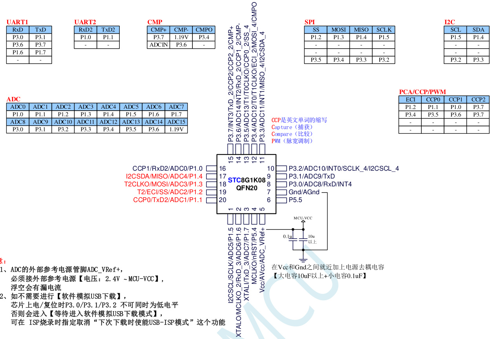

注意：

# 使用 USB转串口 芯片 进行 全自动 停电/上电， 烧录/仿真/串口通讯， 3.3V

USB+5V Ai8H2K12U 也或可充系统电脑宝电U源S输B+入5 Vi供n电  
USB接口 USB+5V 62131： 输出 3.3V， 输入 51.58V - 3.6V+5V o Power-On 2 Vcc P3.23/P1.01/RTxD2 87 连接目标单片机的P3.10 VIN MCU-VCC2R VOUTGNDD+ D 0u 0.1u 3 UCap D+/TxD/P3.1 6 D+ USB转串口芯片，Gnd 4 22R 4 Gnd/AGnd D-/RxD/P3.0 5 D- U出S厂B-自H带IDU烧SB录转，串免口驱程动序安，装 0C.1u 10K CE 输出，低所 0C.21uPower-On  
USB-TypeA 建议用USB-TypeC RMB0.95 SOP8 P5.4管脚高电平供电 0 Y 全自动控制电源开/关也可以用STC8H2K12U-SOP8取代Ai8H2K12U 电源开关， 可不焊

【应用场景一：从本工具给目标系统 自动 停电/上电，供电】点击 电脑端 ISP 软件的【下载/编程】按钮，工具会 自动 给目标系统停电0.5秒/再自动供电，数秒后提示下载编程成功，工具默认会再 自动 给目标系统停电0.5秒/再自动供电给目标系统工作。

# 【应用场景二： 不从本工具给目标系统供电】

1、点击 电脑端 ISP 软件的【下载/编程】 按钮

2、给目标系统上电，或者重新上电(如果在点击【下载/编程】按钮前已上电， 则需要停电重新上电)，电脑端软件提示下载编程进行中，数秒后下载成功，目标MCU会自动复位到用户程序区自动跑用户程序。部分不常用设置，需要停电上电一次才生效，如改变 EEPROM大小，P5.4/nRST变成复位脚

# 关于 I/O 的注意事项：

1、 P3.0 和P3.1 口上电后的状态为弱上拉/准双向口模式  
2、 除P3.0 和P3.1 外，其余所有 IO 口上电后的状态均为高阻输入状态，用户在使用 IO口前必须先设置IO 口模式  
3、 芯片上电时如果不需要使用 USB 进行 ISP 下载， $P 3 . 0 / P 3 . 1 / P 3 . 2$ 这 3 个 I/O 口不能同时为低电平，否则会进入 USB 下载模式而无法运行用户代码  
4、 芯片上电时，若 P3.0 和 P3.1 同时为低电平，P3.2 口会短时间由高阻输入状态切换

到双向口模式，用以读取P3.2 口外部状态来判断是否需要进入 USB 下载模式当使用P5.4 当作复位脚时，这个端口内部的 4K 上拉电阻会一直打开；但P5.4 做普通I/O 口时，基于这个I/O 口与复位脚共享管脚的特殊考量，端口内部的4K 上拉电阻依然会打开大约6.5 毫秒时间，再自动关闭（当用户的电路设计需要使用P5.4 口驱动外部电路时，请务必考虑上电瞬间会有 6.5 毫秒时间的高电平的问题）

# 2.3.4 STC8G1K08-38I-SOP16 管脚图， ISP 下载/编程线路图

# STC8G1K08-38I-SOP16 最小系统 示意图

UART1 | UART2
RxD | TxD | RxD2 | TxD2
P3.0 | P3.1 | P1.0 | P1.1
P3.6 | P3.7 |  | 
P1.6 | P1.7 |  | 
 |  |  | 

SP   

SS | MOSI | MISO | SCLK
 |  |  | 
 |  |  | 
 |  |  | 
P3.5 | P3.4 | P3.3 | P3.2

SCL | SDA
 | 
 | 
 | 
P3.2 | P3.3

PCA/CCP/PWM
ECI | CCPO | CCP1 | CCP2
 | P1.1 | P1.0 | P3.7
P3.4 | P3.5 | P3.6 | P3.7
 |  |  | 
 |  |  | 

ADC   

 |  |  |  |  |  |  | 
 |  |  |  |  |  |  | 
 |  |  |  |  |  |  | C15
 |  |  |  |  |  |  | 9

CMIP
CMP+ | CMP- | CMPO
P3.7 | 1.19V | P3.4
ADCIN | P3.6 | 

RxD2/CCP1/ADC0/P1.0 16 P3.7/INT3/TxD_2/CCP2/CCP2_2CMP+ CCP是英文单词的缩写 TxD2/CCP0/ADC1/P1.1 2 15 P3.6/ADC14/INT2/RxD_2/CCP1_2/CMP- Capture （捕获） XTALO/MCLKO_2/RxD_3/ADC6/P1.6 3 4 P3.5/ADC13/T1/T0CLKO/CCP0_2/SS_4 CPoWmMp（ar脉e宽（比调较制） XTALI/TxD_3/ADC7/P1.7 4 STC8G1K08 13 P3.4/ADC12/T0/T1CLKO/ECI 2/CMPO/MOSI_4 MCU-VCC MCLKO/nRST/P5.4 5 SOP16 12 P3.3/ADC11/INT1/MISO_4/I2CSDA_4 Vcc/AVcc/ADC_VRef+ 678 11 P3.2/ADC10/INT0/SCLK_4/I2CSCL_4 以 10u 0.1u P5.5 10 P3.1/ADC9/TxD Gnd/AGnd 9 P3.0/ADC8/RxD/INT4

在Vcc和Gnd之间就近加上电源去耦电容 【大电容10uF以上+小电容0.1uF】

# 注意：

1、 ADC的外部参考电源管脚ADC_VRef+， 必须接外部参考电源【电压： 2.4V \~ MCU-VCC】,浮空会有漏电流2、 如不需要进行【软件模拟USB下载】 ，芯片上电/复位时P3.0/P3.1/P3.2 不可同时为低电平否则会进入【等待进入软件模拟USB下载模式】， 可在 ISP烧录时指定取消 下次下载时使能USB-ISP模式 这个功能

# 使用 USB转双串口 芯片 进行 全自动 烧录/仿真 $^ +$ 串口通讯， 5V/3.3V跳线选择

此处的二极管和电阻的作用是防止USB器件给目标芯片供电。由于目标芯片断电过程中，USB器件是不能断电的，USB器件的发送脚一般都是强推挽输出，通过I/O供电芯片就能工作，所以当使用USB转串口TTL对单片机下载程序时此处的隔离二极管不能省

芯片上电时P3.5输出低电平，MCU-VCC处于供电状态。当检测到需要进行ISP下载时，会自动控制MCU-VCC停电0.5S再上电进行ISP下载。下载完成后

USB+5VUSB接口 USB转第二组串口第二组串口用于和目标系统+5V 的其他串口通讯2 D-D-D+ 3 D+4 22RGnd 连接目标单片机的第n组串口的TRxDn建议用USB-TypeC

Ai8H2K08U-SOP16 第一组用于会下载持或续者供通电讯Ai8H2K12U-SOP16 USB转第一组串口高推阻挽/输开入漏 21 P1.0/RxD2 RTxD/P3.67 15 高推阻挽/输开入漏 1N5819 S-RTxD 连接目标单片机的P3.01/RTxD1N5819 P1.3 P3.5 Q1用跳线选择工作电压5V或3.3V UCap P3.4 Vcc P-MOS MCU-VCCP5.4/nRST P3.3  
USB+5V 跳线插座 2.54mm Vcc 7 VcRcef+ D+/P3.21 10 D+ 300R 可供做应电模源块 11Gnd D-/P3.0 9 D- 关电/供电 10u 0.47u 104  
以上 10u 1117M3-33 0.1u 以 10u 0.1u 也可以用STC8H2K08U-SOP16取代 也可以用STC8H2K12U-SOP16取代 手动按键 以上 QS1I2可30选1：， AO3401， RMB0.045 RMB0.07520K3.3VUSB转双串口芯片，出厂自带USB转串口程序， P3.5管脚低电平供电USB-HID烧录， 免驱动安装 P5.4管脚高电平供电

点击 电脑端 ISP 软件的【下载/编程】按钮，工具会 自动 给目标系统停电0.5秒/再自动供电，数秒后提示下载编程成功， 工具默认会再 自动 给目标系统停电0.5秒/再自动供电给目标系统工作。

# 【应用场景二： 不从本工具给目标系统供电】

1、点击 电脑端 ISP 软件的 【下载/编程】按钮

2、给目标系统上电，或者重新上电(如果在点击【下载/编程】按钮前已上电，则需要停电重新上电)，电脑端软件提示下载编程进行中，数秒后下载成功，目标MCU会自动复位到用户程序区自动跑用户程序。部分不常用设置， 需要停电上电一次才生效， 如改变 EEPROM大小，P5.4/nRST变成复位脚

# 关于 I/O 的注意事项：

1、 P3.0 和P3.1 口上电后的状态为弱上拉/准双向口模式  
2、 除P3.0 和P3.1 外，其余所有 IO 口上电后的状态均为高阻输入状态，用户在使用 IO口前必须先设置IO 口模式  
3、 芯片上电时如果不需要使用 USB 进行 ISP 下载，P3.0/P3.1/P3.2 这 3 个 I/O 口不能同时为低电平，否则会进入 USB 下载模式而无法运行用户代码

、 芯片上电时，若 P3.0 和 P3.1 同时为低电平，P3.2 口会短时间由高阻输入状态切换到双向口模式，用以读取P3.2 口外部状态来判断是否需要进入 USB 下载模式5、 当使用P5.4 当作复位脚时，这个端口内部的 4K 上拉电阻会一直打开；但P5.4 做普通I/O 口时，基于这个I/O 口与复位脚共享管脚的特殊考量，端口内部的4K 上拉电阻依然会打开大约6.5 毫秒时间，再自动关闭（当用户的电路设计需要使用 P5.4 口驱动外部电路时，请务必考虑上电瞬间会有 6.5 毫秒时间的高电平的问题）

# 2.3.5 管脚说明

编号 | 名称 | 类型 | 说明
TSSOP20 | QFN20 | SOP16 DIP16 | 
DIP20 |  |  |  | P1.2 | IO | 标准 I/O □
ADC2 | I | ADC 模拟输入通道2
SS | 1/O | SPI 从机选择
T2 |  | 定时器2外部时钟输入
ECI | I | PCA 的外部脉冲输入
 | 18 |  |  | P1.3 | 1O | 标准I/O口
ADC3 | I | ADC 模拟输入通道3
T2CLKO | 0 | 定时器 2 时钟分频输出
MOSI | I/O | SPI 主机输出从机输入
 |  |  |  | P1.4 | 1/O | 标准I/O口
ADC4 | I | ADC 模拟输入通道 4
MISO | I/O | SPI主机输入从机输出
SDA | 1O | I2C 接口的数据线
 |  |  |  | P1.5 | I/O | 标准I/O口
ADC5 | I | ADC 模拟输入通道5
SCLK | I/O | SPI 的时钟脚
SCL | I/O | I2C的时钟线
 |  |  |  | P1.6 | 1/O | 标准I/O □
ADC6 | 1 | ADC 模拟输入通道6
RxD_3 | I | 串口 的接收脚
MCLKO_2 | 0 | 主时钟分频输出
XTALO | 0 | 外部晶振腳
 |  |  |  | P1.7 | 1O | 标准 I/O口
ADC7 | I | ADC 模拟输入通道
TxD_3 | 0 | 串口 的发送腳
XTALI | - I | 外部晶振腳
 |  |  |  |  | I/O | 标准I/O口
P5.4 NRST | I | 复位引脚 （低电平复位）
MCLKO | 0 | 主时钟分频输出
 |  |  |  | Vcc | Vcc | 电源腳
AVcc | Vcc | ADC 电源
ADC_VRef+ |  | ADC 外部参考电压源输入腳， 要 求不高时可直接接 MCU的 VCC
P5.5 | IO | 标准I/O口
 |  |  |  | Gnd | Gnd | 地线
10 |  |  |  | AGnd | Gnd | ADC 地线

编号 | 名称 | 类型 | 说明
TSSOP20 DIP20 | QFN20 | SOP16 DIP16 |  |  |  | 
 |  |  |  | P3.0 | I/O | 标准I/O口
RxD | 1 串口 | 的接收脚
ADC8 | I | ADC 模拟输入通道8
INT4 | I | 外部中断4
2 |  |  |  | P3.1 | 1/O 标准 I/O | 口
TxD | 0 串口 | 的发送脚
ADC9 | - I | ADC 模拟输入通道 9
13 | 10 |  |  | P3.2 | 1/O | 标准 I/O口
INT0 |  | 外部中断0
ADC10 | I | ADC 模拟输入通道10
SCL_4 | I/O | I2C的时钟线
SCLK_4 | I/O | SPI的时钟脚
4 |  |  |  | P3.3 | IO | 标准I/O口
INT1 | I | 外部中断
ADC11 | I | ADC 模拟输入通道 11
SDA_4 | 1/O | I2C的数据线
MISO_4 | IO | SPI 主机输入从机输出
15 | 2 | 13 |  | P3.4 TO | 1O | 标准I/O口 定时器0外部时钟输入
T1CLKO | − | 定时器1时钟分频输出
ADC12 | 0 | 
 |  | ADC 模拟输入通道 12
ECI_2 | I | PCA的外部脉冲输入
CMPO | 0 | 比较器输出
MOSI_4 | IO | SPI主机输出从机输入
16 | 13 | 14 |  | P3.5 | IO | 标准I/O口
T1 | I | 定时器1外部时钟输入
TOCLKO | 0 | 定时器0 时钟分频输出
ADC13 | I | ADC 模拟输入通道13
CCP0_2 | I/O | PCA的捕获输入、 脉冲输出和 PWM 输出
 |  | 
SS_4 | I | SPI 的从机选择腳 （主机为输出）
17 |  |  |  | P3.6 | 1/O | 标准I/O口
INT2 | I | 外部中断2
RxD_2 | I | 串口 的接收脚
ADC14 | I | ADC 模拟输入通道 14
 |  | 
CCP1_2 | I/O | PCA的捕获输入、 脉冲输出和PWM 输出
CMP- |  | 比较器负极输入

编号 | 名称 | 类型 |  | 说明
TSSOP20 DIP20 | QFN20 | SOP16 DIP16 |  |  |  | 
18 | 15 | 16 |  | P3.7 | IO | 标准I/O口
INT3 | I | 外部中断3
TxD_2 | 0 | 串口1的发送脚
CCP2 | I/O | PCA的捕获输入、 脉冲输出和 PWM 输出
CCP2_2 | I/O | PCA的捕获输入、 脉冲输出和 PWM 输出
CMP+ | I | 比较器正极输入
19 | 16 |  |  | P1.0 | I/O | 标准I/O口
RxD2 | I | 串口2的接收腳
ADCO | I | ADC 模拟输入通道0
CCP1 | IO | PCA的捕获输入、 脉冲输出和 PWM 输出
20 | 20 |  |  | P1.1 | IO | 标准IO口
TxD2 | 0 | 串口2的发送脚
ADC1 | T | ADC 模拟输入通道
CCP0 | IO | PCA的捕获输入、 脉冲输出和 PWM 输出

# 2.3.6 USB-Link1D 对 STC8G 系列进行自动串口烧录、 仿真 $\cdot +$ 串口通讯

# 使用 【USB Link1D】 对 STC8G1K08系列 进行全自动停电/上电串口烧录、 仿真 $^ +$ 串口通讯

【USB Link1D】 工具： 支持 全自动 停电 / 上电， 在线下载 / 脱机下载， 仿真

-USB LinkiD 1 连接目标单片机P3.1 连接目标单片机P3.0   
技术网址 MCU-VCC   
WWW.STCAI.cOm 1 连接目标单片机第n组串口发送脚TxDn   
分电52 门 连接目标单片机第n组串口接收脚RxDn   
TEL-86-513-55012928

【应用场景一： 从本工具给目标系统 自动 停电/上电， 供电】点击 电脑端 ISP 软件的【下载/编程】 按钮，工具会 自动 给目标系统停电0.5秒/再自动供电，数秒后提示下载编程成功， 工具默认会再 自动 给目标系统停电0.5秒/再自动供电给目标系统工作。

# 【应用场景二： 不从本工具给目标系统供电】

1、 点击 电脑端 ISP 软件的 【下载/编程】 按钮

2、 给目标系统上电，或者重新上电(如果在点击 【下载/编程】 按钮前已上电， 则需要停电重新上电)，电脑端软件下载编程进行中，数秒后下载成功， 目标MCU会自动复位到用户程序区自动跑用户程序。部分不常用设置， 需要停电上电一次才生效， 如改变 EEPROM大小， P5.4/nRST变成复位脚

# STC8G1K08-38I-TSSOP20 最小系统 示意图

T2/ECI/SS/ADC2/P1.2 20191817 P1.1/ADC1/TxD2/CCP0 CCP是英文单词的缩写  
XTALO/MCLKO_2/RxD_3/ADC6/P1.6 TI2CLSDKOA/MIOSOI/ADC43/P1.43 34 5 TSSOP20 STC8G1K08 16 P13.07/IANDTC3/0/TRxxD_2/CCP21_2/CCP2/CMP+ P3.5/ADC13/T1/T0CLKO/CCP0_2/SS_4 CPCaWoMpmtp（uar脉e（宽调捕比制获较）  
MCU-VCC XTALI/TxD_3/ADC7/P1.7 6 15 P3.4/ADC12/T0/T1CLKO/ECI _2/CMPO/MOSI_4MCLKO/nRST/P5.4 7 14 P3.3/ADC11/INT1/MISO 4/I2CSDA_4Vcc/AVcc/ADC_VRef+ 8 13 P3.2/ADC10/INT0/SCLK_4/I2CSCL_4  
10u 0.1u P5.5 9 121 P3.1/ADC9/TxDGnd/AGnd 10 P3.0/ADC8/RxD/INT4

注意：

」 在Vcc和Gnd之间就近加上电源去耦电容 【大电容10uF以上 $. + .$ 小电容0.1uF】

1、 ADC的外部参考电源管脚ADC_VRef+， 必须接外部参考电源 【电压： 2.4V \~ MCU-VCC】,浮空会有漏电流2、 如不需要进行【软件模拟USB下载】，芯片上电/复位时P3.0/P3.1/P3.2 不可同时为低电平否则会进入【等待进入软件模拟USB下载模式】 ， 可在 ISP烧录时指定取消 下次下载时使能USB-ISP模式 这个功能

# 2.3.7 使用【一箭双雕之 USB 转双串口】进行串口烧录、 仿真 $\cdot +$ 串口通讯

# 使用 【一箭双雕之USB转双串口】 对 STC8G1K08系列 进行串口烧录、 仿真 $^ +$ 串口通讯

【一箭双雕之USB转双串口】 支持 全自动 停电 / 上电， 在线下载， 仿真

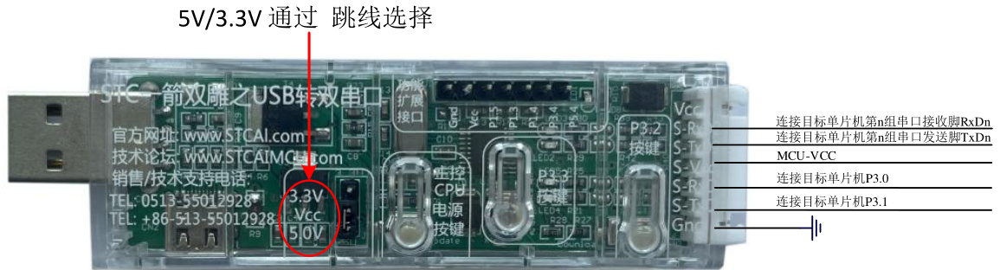

【应用场景一： 从本工具给目标系统 自动 停电/上电， 供电】点击 电脑端 ISP 软件的【下载/编程】按钮，工具会 自动 给目标系统停电0.5秒/再自动供电，数秒后提示下载编程成功， 工具默认会再 自动 给目标系统停电0.5秒/再自动供电给目标系统工作。

# 【应用场景二： 不从本工具给目标系统供电】

1、 点击 电脑端 ISP 软件的 【下载/编程】 按钮

2、 给目标系统上电，或者重新上电(如果在点击 【下载/编程】 按钮前已上电， 则需要停电重新上电)，电脑端软件提示下载编程进行中，数秒后下载成功，目标MCU会自动复位到用户程序区跑用户程序。部分不常用设置， 需要停电上电一次才生效， 如改变 EEPROM大小， P5.4/nRST变成复位脚

# STC8G1K08-38I-TSSOP20 最小系统 示意图

T2/ECI/SS/ADC2/P1 .2 21098 P1.1/ADC1/TxD2/CCP0 CCP是英文单词的缩写I2CSDCLA/SMCILSOK/ADC45/P1.45 3 17 P3.76/IANDTC3/1T4/xIDN_T2//CRCxPD2_2//CCP12_/2C/MC PM+P- CPCaWoMpmtp（uar脉e（宽调捕比制获较）XTALO/MCLKO_2/RxD _3/ADC6/P1.6 5 16 P3.5/ADC13/T1/T0CLKO/CCP0_2/SS_4MCU-VCC XTALI/MTCxLDK_3O//AnRDSCT7/P51.47 67 154 P3.43/ADC121/ITN0/T1/CMILSKO_/4E/IC2I_C2S/DCAM_P4O/MOSI_4Vcc/AVcc/ADC_VRef+ 8 132 P3.2/ADC10/INT0/SCLK_4/I2CSCL_410u 0.1u P5.5 9 P3.1/ADC9/TxD以上 Gnd/AGnd 10 11 P3.0/ADC8/RxD/INT4在Vcc和Gnd之间就近加上电源去耦电容 【大电容10uF以上 $. +$ 小电容0.1uF】  
注意：  
1、 C的外部参考电源管脚ADC_VRef+， 必须接外部参考电源 【电压： 2.4V \~ MCU-VCC】,浮空会有漏电流  
2、 如不需要进行【软件模拟USB下载】，芯片上电/复位时P3.0/P3.1/P3.2 不可同时为低电平否则会进入【等待进入软件模拟USB下载模式】 ， 可在 ISP烧录时指定取消 下次下载时使能USB-ISP模式 这个功能

#

# 2.3.8 USB 转双串口芯片全自动停电/上电烧录， 串口仿真 $\cdot +$ 串口通讯， 5V

#

使用 USB转双串口 芯片 进行 全自动 停电/上电， 烧录/仿真+串口通讯， 5V此处的二极管和电阻的作用是防止USB器件给目标芯片供电。由于 芯片上电时P3.5输出低电平，USB器件是不能断电的，USB器件的发送脚 MCU-VCC处于供电状态。USB转第二组串口 一般都是强推挽输出，通过I/O供电芯片就能工作，所以当使用 当检测到需要进行ISP下载时，第二组串口用于和目标系统的 USB转串口TTL对单片机下载程序时此处的隔离二极管不能省 会自动控制MCU-VCC停电0.5S再其他串口通讯 注： 烧录我们的最新USB转双串口软件， 可以省此处的隔离二极管 上电进行ISP下载。 下载完成后会持续供电Ai8H2K08U-SOP16Ai8H2K12U-SOP16 USB转第一组串口 第一组用于下载或者通讯连接目标单片机的第n组串口的RTxDn 高推阻挽/输开入漏 23 P1.01/TRxD2 RxD/P3.65 156 推高挽阻/输开入漏 1N5819 S-TRxD 连接目标单片机的P3.1/TxD1UNS5B8+159V (可系从U统S电B取源电)USB+5V 768 也PVG5可cnR.cd4e以/fn+用RSTC8HD2DK+-/0P83U.3102-SO1910P16D-+取30代0 10u G Q1可选D： 470R+5DV- 10u 关可供电做应/电模供源块电D- 0.1u 0.1u 0.47u RMB0.04520KAO3401，RMB0.075Gnd 20KU建SB议-T用ypUeSAB-TypeC U出S厂B-自转HI带双DU串烧S口B录转芯，片串免口，驱程动序安，装 P35.54管脚低高电平供电

【应用场景一：从本工具给目标系统 自动 停电/上电，供电】点击 电脑端 ISP 软件的【下载/编程】按钮，工具会 自动 给目标系统停电0.5秒/再自动供电，数秒后提示下载编程成功，工具默认会再 自动 给目标系统停电0.5秒/再自动供电给目标系统工作。

# 【应用场景二： 不从本工具给目标系统供电】

1、点击 电脑端 ISP 软件的 【下载/编程】按钮

2、给目标系统上电，或者重新上电(如果在点击【下载/编程】按钮前已上电， 则需要停电重新上电)，电脑端软件提示下载编程进行中，数秒后下载成功，目标MCU会自动复位到用户程序区自动跑用户程序。部分不常用设置， 需要停电上电一次才生效，如改变 EEPROM大小，P5.4/nRST变成复位脚

# STC8G1K08-38I-TSSOP20 最小系统 示意图

T2/ECI/SS/ADC2/P1. 2 20 P1.1/ADC1/TxD2/CCP0 CCP是英文单词的缩写T2CLKO/MOSI/ADC3/P1.3 STC8G1K08 198 P1 .0/ADC0/RxD2/CCP1 Capture （捕获）I2CSDA/MISO/ADC4/P1.4 TSSOP20 P3.7/INT3/TxD_2/CCP2_2/CCP2/CMP+ Compare（比较）I2CSCL/SCLK/ADC5/P1. 5 4 17 P3.6/ADC14/INT2/RxD_2/CCP1 _2/CMP- PWM （脉宽调制）XTALO/MCLKO_2/RxD_3/ADC6/P1.6 5 16 P3.5/ADC13/T1/T0CLKO/CCP0_2/SS_4MCU-VCC XTALI/MTCxLDK_3O//AnDRSCT7/P15.74 67 154 P3.43/ADC121/ITN0/T1/CMLISKO_/4E/IC2I_C2S/DCAM_P4O/MOSI_4Vcc/AVcc/ADC_VRef+ 8 13 P3.2/ADC10/INT0/SCLK_4/I2CSCL_410u 0.1u P5.5 9 12 P3.1/ADC9/TxD以上 Gnd/AGnd 10 11 P3.0/ADC8/RxD/INT4在Vcc和Gnd之间就近加上电源去耦电容【大电容10uF以上+小电容0.1uF】注意：1、 ADC的外部参考电源管脚ADC_VRef+， 必须接外部参考电源【电压： 2.4V \~ MCU-VCC】,浮空会有漏电流2、 如不需要进行【软件模拟USB下载】 ， 芯片上电/复位时P3.0/P3.1/P3.2 不可同时为低电平否则会进入【等待进入软件模拟USB下载模式】 可在 ISP烧录时指定取消 下次下载时使能USB-ISP模式 这个功能

#

# 2.3.9 USB 转双串口芯片全自动烧录， 串口仿真 $\cdot +$ 串口通讯， 3.3V 原理图

USB转双串口 芯片 进行 全自动 停电/上电， 烧录/仿真 $^ +$ 串口通讯， 3.3V此处的二极管和电阻的作用是防止USB器件给目标芯片供电。 由于 芯片上电时 P5.4-nRST 输出高电平，USB转第二组串口 目标芯片断电过程中， USB器件是不能断电的， USB器件的发送脚 MCU-VCC处于供电状态。第二组串口用于 一般都是强推挽输出， 通过I/O供电芯片就能工作，所以当使用 当检测到需要进行ISP下载时，会自动和目标系统的 USB转串口TTL对单片机下载程序时此处的隔离二极管不能省 控制MCU-VCC停电0.5S再上电进行ISP其他串口通讯 注： 烧录我们的最新USB转双串口软件， 可以省此处的隔离二极管 下载。下载完成后会持续供电Ai8H2K08U-SOP16Ai8H2K12U-SOP16 USB转第一组串口 第一组用于下载或者通讯连接目标单片机的第n组的RTxDn 1N5819 高推阻挽/输开入漏 23 P1.31/TxD2 RTxD/P3.67 P3.5 154 推高挽阻/输开入漏 S-TRxD 连接目标单片机的P3.01/RTxD  
USB接口 USB+5V USB+5V PowerCtrl 5 UCap VcRcef+ P3.32 121 P5.4管脚高电平供电 也或可充电脑宝USB+5V供电 62131： 输出 3.3V， 输入 51.85V - 3.6VMCU-VCC+5V Gnd D-/P3.0 9 D- VOUT 12D+ 43 22R D- D 0.1u 10u 0.1u 也可以用STC8H2K0182U-SOP16取代 按CE下按键停电 GND 0C.21u22R 0C.1u 10KUSB转双串口芯片， 松开按键上电  
USB-TypeA 出厂自带USB转串口程序，  
建议用USB-TypeC USB-HID烧录， 免驱动安装 PowerCtrl 电源按键 该按键可不焊【应用场景一： 从本工具给目标系统 自动 停电/上电，供电】点击 电脑端 ISP 软件的【下载/编程】按钮，工具会 自动 给目标系统停电0.5秒/再自动供电，数秒后提示下载编程成功，工具默认会再 自动 给目标系统停电0.5秒/再自动供电给目标系统工作。【应用场景二：不从本工具给目标系统供电】1、点击 电脑端 ISP 软件的【下载/编程】按钮、给目标系统上电，或者重新上电(如果在点击【下载/编程】按钮前已上电，则需要停电重新上电)，电脑端软件提示下载编程进行中，数秒后下载成功，目标MCU会自动复位到用户程序区自动跑用户程序。部分不常用设置， 需要停电上电一次才生效， 如改变 EEPROM大小，P5.4/nRST变成复位脚STC8G1K08-38I-TSSOP20 最小系统 示意图T2CLTK2/OE/CMI/OSSI/ADC32/P1.32 2 STC8G1K08 198 P1.01/ADC01/TRxD2/CCP01 CCaPpt是ur英e（文捕单获词）的缩写I2CSDA/MISO/ADC4/P1.4 3 TSSOP20 17 P3.7/INT3/TxD_2/CCP2_2/CCP2/CMP+ CPoWmMp（ar脉e（宽调比制较）I2CSCL/SCLK/ADC5/P1.5 4 P3.6/ADC14/INT2/RxD_2/CCP1_2/CMP-XTALO/MCLKO_2/RxD_3/ADC6/P1.6 5 16 P3.5/ADC13/T1/T0CLKO/CCP0_2/SS_4MCU-VCC XTALI/TxD_3/ADC7/P1.7 6 15141312 P3.4/ADC12/T0/T1CLKO/ECI_2/CMPO/MOSI_4Vcc/MACVLccK/OA/DnRC_STV/RPe5f.+4 78 P3.32/ADC110/INT10/SMCISLKO_4/I2CSDCLA_410u 0.1u P5.5 − 9 P3.1/ADC9/TxD以上 Gnd/AGnd 10 11 P3.0/ADC8/RxD/INT4在Vcc和Gnd之间就近加上电源去耦电容【大电容10uF以上+小电容0.1uF】注意：1、 ADC的外部参考电源管脚ADC_VRef+， 必须接外部参考电源【电压：2.4V \~ MCU-VCC】,浮空会有漏电流2、 如不需要进行【软件模拟USB下载】 ， 芯片上电/复位时P3.0/P3.1/P3.2 不可同时为低电平否则会进入【等待进入软件模拟USB下载模式】 可在 ISP烧录时指定取消 下次下载时使能USB-ISP模式 这个功能

# 2.3.10 USB 转双串口芯片进行自动烧录/仿真 $\cdot +$ 串口通讯， 5V/3.3V 跳线选择

# 使用 USB转双串口 芯片 进行 全自动 烧录/仿真 $^ +$ 串口通讯， 5V/3.3V跳线选择

此处的二极管和电阻的作用是防止USB器件给目标芯片供电。 由于 芯片上电时P3.5输出低电平，目标芯片断电过程中，USB器件是不能断电的，USB器件的发送脚 MCU-VCC处于供电状态。  
USB接口 USB+5V U第SB二转组第串二口组用串于口 U一SB般转都串是口强TT推L挽对输单出片机，下通载过I程/O序供时电此芯处片的就隔能离工二作极，管所不以能当省使用 会当自检动测控到制需M要CU进-V行CCIS停P电下0载.5时S再，+5DV- 2 和其目他标串系口统通的讯 注：烧录我们的最新USB转双串口软件，可以省此处的隔离二极管 会上持电续进供行I电SP下载。 上电进行ISP下载。下载完成后D-D+ 3 22R D+ Ai8H2K12U-SOP16 Ai8H2K08U-SOP16 USB转第一组串口 第一组用于下载或者通讯  
USB-TGypnedA 连接目标单片机的第n组串口的RTxDn V 高推阻挽/输开入漏 12 P1.01/TRxD2 RTxD/P3.76 15 推高挽阻/输开入漏 1N5819 S-TRxD 连接目标单片机的P3.10/TRxD  
建议用USB-TypeC 1N5819 3 P1.3 P3.5 Q1用跳线选择工作电压5V或3.3V 5 PU5C.4a/pnRST P3.43 12 Vcc P-MOS MCU-VCCUSB+5V 跳线插座 Vcc 6 Vcc P3.2 1 300R 可做电源 金2.54mm VRef+ D+/P3.1 10 D+ 供应模块8 Gnd D-/P3.0 D- 关电/供电 47u 104  
以上 10u 1117M3-33 0.1u 以上 10u - 0.1u 也可以用STC8H2K08U-SOP16取代 也可以用STC8H2K12U-SOP16取代 手动按键 以 20K QS1I2可30选1：， AO3401， RMB0.045 RMB0.0753.3VUSB转双串口芯片，出厂自带USB转串口程序， P3.5管脚低电平供电USB-HID烧录， 免驱动安装 P5.4管脚高电平供电应用场 小 T +

点击 电脑端 ISP 软件的【下载/编程】按钮， 工具会 自动 给目标系统停电0.5秒/再自动供电，数秒后提示下载编程成功， 工具默认会再 自动 给目标系统停电0.5秒/再自动供电给目标系统工作。

# 【应用场景二： 不从本工具给目标系统供电】

1、点击 电脑端 ISP 软件的 【下载/编程】按钮

2、给目标系统上电，或者重新上电(如果在点击【下载/编程】按钮前已上电， 则需要停电重新上电)，电脑端软件提示下载编程进行中，数秒后下载成功，目标MCU会自动复位到用户程序区自动跑用户程序。部分不常用设置，需要停电上电一次才生效，如改变 EEPROM大小，P5.4/nRST变成复位脚

# STC8G1K08-38I-TSSOP20 最小系统 示意图

I2CSDCLA/SMCILSKO/ADC45/P1.45 T2CLTK2/OE/CMI/OSSI/ADC23/P1.23 34 TSSOP20 STC8G1K08 1876 2109 P3.6/ADC14/INT2/RxD_2/CCP1_2/CMP- P1.10/ADC10/TRxD2/CCP01 CCapPt是ur英e（文捕单获词）的缩写 CPoWmMp（ar脉e（宽比调制较）  
MCU-VCC XTALI/TxD_3/ADC7/P1.7 6 15 P3.4/ADC12/T0/T1CLKO/ECI_2/CMPO/MOSI_4MCLKO/nRST/P5.4 7 14 P3.3/ADC11/INT1/MISO_4/I2CSDA_4Vcc/AVcc/ADC_VRef+ 8 13 P3.2/ADC10/INT0/SCLK_4/I2CSCL_4  
10u 0.1u P5.5 9 12 P3.1/ADC9/TxD  
以上 Gnd/AGnd 10 11 P3.0/ADC8/RxD/INT4在Vcc和Gnd之间就近加上电源去耦电容【大电容10uF以上+小电容0.1uF】  
1、 ADC的外部参考电源管脚ADC_VRef+， 必须接外部参考电源【电压： 2.4V \~ MCU-VCC】 ,浮空会有漏电流  
2、 如不需要进行【软件模拟USB下载】，芯片上电/复位时P3.0/P3.1/P3.2 不可同时为低电平  
否则会进入【等待进入软件模拟USB下载模式】， 可在 ISP烧录时指定取消 下次下载时使能USB-ISP模式 这个功能

# 注意：

# 2.3.11 通用 USB 转串口芯片全自动停电/上电烧录， 串口仿真， 5V 原理图

使用 USB转串口 芯片 进行 全自动 停电/上电， 烧录/仿真/串口通讯， 5VAi8H2K12U 也可系统电脑电U源S输B+入5 V i供n电 SPI-2M30O1S/:RMB0.045USB接口 USB+5V USB+5V Power-On P5.4/nRST P3.3/P1.1/TxD2 8 4 连接目标单片机的P3.0 或充电宝USB+5V供电 Q1 AO3401/RMB0.075连接目标单片机的P3.1 MCU-VCC+5V Vcc P3.2/P1.0/RxD2 7D UCap D+/TxD/P3.1 6 D USB转串口芯片， R1 R3 0.1u出厂自带USB转串口程序， 10K 20KD+ 4 Gnd/AGnd D-/RxD/P3.0 5 D-Gnd USB-HID烧录， 免驱动安装USB-TypeA RMB0.95 SOP8 P5.4管脚高电平供电 Power-On SQS28050建议用USB-TypeC 也可以用STC8H2K12U-SOP8取代Ai8H2K12U

【应用场景一：从本工具给目标系统 自动 停电/上电，供电】点击 电脑端 ISP 软件的【下载/编程】按钮，工具会 自动 给目标系统停电0.5秒/再自动供电，数秒后提示下载编程成功，工具默认会再 自动 给目标系统停电0.5秒/再自动供电给目标系统工作。

【应用场景二： 不从本工具给目标系统供电】

1、点击 电脑端 ISP 软件的 【下载/编程】按钮

2、给目标系统上电，或者重新上电(如果在点击【下载/编程】按钮前已上电，则需要停电重新上电)，电脑端软件提示下载编程进行中，数秒后下载成功，目标MCU会自动复位到用户程序区自动跑用户程序。部分不常用设置， 需要停电上电一次才生效， 如改变 EEPROM大小，P5.4/nRST变成复位脚

# STC8G1K08-38I-TSSOP20 最小系统 示意图

T2/ECI/SS/ADC2/P1.2 20 .1/ADC1/TxD2/CCP0 CCP是英文单词的缩写T2CLKO/MOSI/ADC3/P1.3 2 STC8G1K08 19 P1.0/ADC0/RxD2/CCP1 Capture（捕获）I2CSDA/MISO/ADC4/P1. 4 3 TSSOP20 187 P3. 7/INT3/TxD _2/CCP2 2/CCP2/CMP+ Compare （比较）PWM （脉宽调制）I2CSCL/SCLK/ADC5/P1 .5 4 P3.6/ADC14/INT2/RxD_2/CCP1 _2/CMP-XTALO/MCLKO_2/RxD_3/ADC6/P1.6 5 16 P3.5/ADC13/T1/T0CLKO/CCP0_2/SS_4MCU-VCC XTALI/MTCxLDK_3O//AnDRSCT7/P15.74 67 1514131211 P3.43/ADC121/ITN0/T1/CMLISKO_/4E/IC2I_C2S/DCAM_P4O/MOSI_4Vcc/AVcc/ADC_VRef+ − 8 P3.2/ADC10/INT0/SCLK_4/I2CSCL_410u 0.1u P5.5 9 P3.1/ADC9/TxD以上 Gnd/AGnd 10 P3.0/ADC8/RxD/INT4在Vcc和Gnd之间就近加上电源去耦电容【大电容10uF以上+小电容0.1uF】注意：1、 ADC的外部参考电源管脚ADC_VRef+， 必须接外部参考电源【电压： 2.4V \~ MCU-VCC】,浮空会有漏电流2、 如不需要进行【软件模拟USB下载】 ，芯片上电/复位时P3.0/P3.1/P3.2 不可同时为低电平否则会进入【等待进入软件模拟USB下载模式】 可在 ISP烧录时指定取消 下次下载时使能USB-ISP模式 这个功能

#

# 2.3.12 通用 USB 转串口芯片全自动停电/上电烧录， 串口仿真， 3.3V 原理图

使用 USB转串口 芯片 进行 全自动 停电/上电， 烧录/仿真/串口通讯， 3.3V  
USB接口 USB+5V USB+5V Ai8H2K12U 也或可充系统电脑宝电U源S输B+入5 V i供n电 62311： 输出 3.3V， 输入 51.85V - 3.6V+5V Power-On P5.4/nRST P3.3/P1.1/TxD2 连接目标单片机的P3.10 VIN VOUT MCU-VCCD Vc P3.2/P1.0/RxD2D+ D+ UCap D+/TxD/P3.1 D+ USB转串口芯片， GND NCU出S厂B-自HI带DU烧SB录转，串免口驱程动序安，装 CEGnd C24 Gnd/AGnd D-/RxD/P3.0 5 C1 10K 0.1u0.1u Power-On 高输出，低关断  
U建SB议-T用yUpSeBA-TypeC RMB0.95 SOP8 P5.4管脚高电平供电 全自动控制电源开/关也可以用STC8H2K12U- SOP8取代Ai8H2K12U 电源开关， 可不焊

【应用场景一：从本工具给目标系统 自动 停电/上电，供电】点击 电脑端 ISP 软件的【下载/编程】按钮，工具会 自动 给目标系统停电0.5秒/再自动供电，数秒后提示下载编程成功，工具默认会再 自动 给目标系统停电0.5秒/再自动供电给目标系统工作。

【应用场景二： 不从本工具给目标系统供电】

1、点击 电脑端 ISP 软件的 【下载/编程】按钮

2、给目标系统上电，或者重新上电(如果在点击【下载/编程】按钮前已上电， 则需要停电重新上电)，电脑端软件提示下载编程进行中，数秒后下载成功，目标MCU会自动复位到用户程序区自动跑用户程序。部分不常用设置， 需要停电上电一次才生效，如改变 EEPROM大小，P5.4/nRST变成复位脚

# STC8G1K08-38I-TSSOP20 最小系统 示意图

T2/ECI/SS/ADC2/P1.2 20191817 P1.1/ADC1/TxD2/CCP0 CCP是英文单词的缩写T2CLKO/MOSI/ADC3/P1.3 STC8G1K08 P1.0/ADC0/RxD2/CCP1 Capture （捕获）I2CSDA/MISO/ADC4/P1 .4 3 TSSOP20 P3 .7/INT3/TxD_2/CCP2_2/CCP2/CMP+ Compare（比较）I2CSCL/SCLK/ADC5/P1.5 4 P3.6/ADC14/INT2/RxD_2/CCP1_2/CMP- PWM （脉宽调制）XTALO/MCLKO_2/RxD_3/ADC6/P1.6 16 P3.5/ADC13/T1/T0CLKO/CCP0_2/SS_4MCU-VCC XTALI/MTCxLDK_3O//AnDRSCT7/P15.74 6 154 P3.43/ADC121/ITN0/T1/CMLISKO_/4E/IC2I_C2S/DCAM_P4O/MOSI_4Vcc/AVcc/ADC_VRef+ 8 1321 P3.2/ADC10/INT0/SCLK_4/I2CSCL_410u 0.1u P5.5 (cid:) 9 P3.1/ADC9/TxD以上 Gnd/AGnd 10 P3.0/ADC8/RxD/INT4在Vcc和Gnd之间就近加上电源去耦电容【大电容10uF以上+小电容0.1uF】注意：1、 ADC的外部参考电源管脚ADC_VRef+， 必须接外部参考电源【电压： 2.4V \~ MCU-VCC】,浮空会有漏电流2、 如不需要进行【软件模拟USB下载】，芯片上电/复位时P3.0/P3.1/P3.2 不可同时为低电平否则会进入【等待进入软件模拟USB下载模式】 ， 可在 ISP烧录时指定取消 下次下载时使能USB-ISP模式 这个功能

#

# 2.3.13 USB 转串口芯片全自动停电/上电烧录/仿真/通信， 5V/3.3V 跳线选择

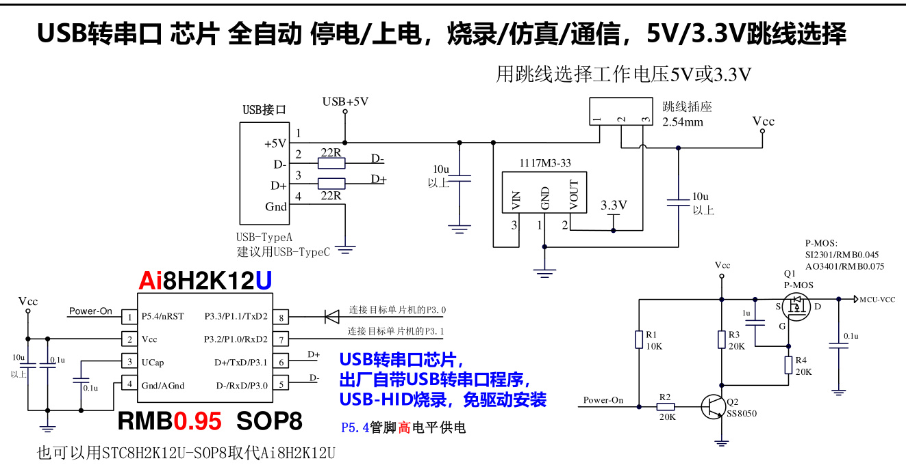

【应用场景一： 从本工具给目标系统 自动 停电/上电，供电】点击 电脑端 ISP 软件的【下载/编程】按钮，工具会 自动 给目标系统停电0.5秒/再自动供电，数秒后提示下载编程成功，工具默认会再 自动 给目标系统停电0.5秒/再自动供电给目标系统工作。

# 【应用场景二： 不从本工具给目标系统供电】

1、点击 电脑端 ISP 软件的 【下载/编程】按钮

2、给目标系统上电，或者重新上电(如果在点击【下载/编程】按钮前已上电， 则需要停电重新上电)，电脑端软件提示下载编程进行中，数秒后下载成功，目标MCU会自动复位到用户程序区自动跑用户程序。部分不常用设置， 需要停电上电一次才生效， 如改变 EEPROM大小，P5.4/nRST变成复位脚

STC8G1K08-38I-TSSOP20 最小系统 示意图T2/ECI/SS/ADC2/P1 .2 121908 P1.1/ADC1/TxD2/CCP0 CCP是英文单词的缩写T2CLKO/MOSI/ADC3/P1 3 2 STC8G1K08 P1.0/ADC0/RxD2/CCP1 Capture （捕获）I2CSDCLA/SMCILSKO/ADC54/P1.54 3 4 TSSOP20 17 P3.67/IANDTC3/1T4/xIDN_T2//CRCxPD2_2//CCP12_/2C/CMPM+P- CPoWmMp（ar脉e（宽比调制较）XTALO/MCLKO_2/RxD_3/ADC6/P1 .6 5 16 P3.5/ADC13/T1/T0CLKO/CCP0_2/SS_4MCU-VCC Vcc/MACVLccK/OA/DnCR_STV/RPe5f.+4 78 15141312 P3.32/ADC110/INT10/SMCISLKO_4/I2CSDCLA_410u 0.1u P5.5 9 P3.1/ADC9/TxD以上 Gnd/AGnd 10 11 P3.0/ADC8/RxD/INT4在Vcc和Gnd之间就近加上电源去耦电容【大电容10uF以上+小电容0.1uF】注意：1、 ADC的外部参考电源管脚ADC_VRef+， 必须接外部参考电源【电压： 2.4V \~ MCU-VCC】,浮空会有漏电流2、 如不需要进行【软件模拟USB下载】，芯片上电/复位时P3.0/P3.1/P3.2 不可同时为低电平否则会进入【等待进入软件模拟USB下载模式】 ， 可在 ISP烧录时指定取消 下次下载时使能USB-ISP模式 这个功能

2.3.14 USB 转串口芯片进行烧录/串口仿真， 手动停电/上电， 5V/3.3V 原理图

# 使用 USB转串口 芯片， 进行 ISP烧录/仿真/通信， 目标系统自己手动停电/上电

Ai8H2K12UUSB+5V USB+5VUSB接口 C , 连接目标单片机的P3.01 P5.4/nRST P3.3/P1.1/TxD2 8 4+5V 2 Vcc P3.2/P1.0/RxD2 7 连接目标单片机的P3.12 22R USB转串口芯片，D- D+ D 以上 10u 0.1u UCap D+/TxD/P3.1 6 D+ 出厂自带USB转串口程序，Gnd D+ 22R 4 Gnd/AGnd D-/RxD/P3.0 5 D- USB-HID烧录， 免驱动安装USB-TypeA RMB0.95 P5.4管脚高电平供电建议用USB-TypeC 也可以用STC8H2K12U- SOP8取代Ai8H2K12U- SOP8

【ISP下载/编程/烧录， 操作步骤】

1、 点击电脑端 ISP 软件的 【下载/编程】 按钮

2、给目标系统上电，或者重新给目标系统上电如果在点击【下载/编程】按钮前，目标系统已上电， 则需要停电再重新上电电脑端软件提示：下载编程进行中，数秒后提示成功

# STC8G1K08-38I-TSSOP20 最小系统 示意图

T2/ECI/SS/ADC2/P1.2 20 P1.1/ADC1/TxD2/CCP0 CCP是英文单词的缩写T2CLKO/MOSI/ADC3/P1.3 STC8G1K08 189 P1.0/ADC0/RxD2/CCP1 Capture （捕获）I2CSDA/MISO/ADC4/P1 I2CSCL/SCLK/ADC5/P1 .5 .4 3 TSSOP20 17 P3.6/ADC14/INT2/RxD_2/CCP1_2/CMP- P3.7/INT3/TxD_2/CCP2_2/CCP2/CMP+ Compare PWM （脉宽调制） （比较）XTALO/MCLKO_2/RxD_3/ADC6/P1.6 16 P3.5/ADC13/T1/T0CLKO/CCP0_2/SS_4MCU-VCC XTALI/TxD_3/ADC7/P1.7 6 15 P3.4/ADC 12/T0/T1CLKO/ECI 2/CMPO/MOSI_4MCLKO/nRST/P5.4 14 P3.3/ADC 11/INT1/MISO_4/I2CSDA_4Vcc/AVcc/ADC_VRef+ 8 1231 P3.2/ADC10/INT0/SCLK_4/I2CSCL_410u 0.1u P5.5 − 9 P3.1/ADC9/TxD以上 Gnd/AGnd 10 P3.0/ADC8/RxD/INT4在Vcc和Gnd之间就近加上电源去耦电容【大电容10uF以上+小电容0.1uF】注意：1、 ADC的外部参考电源管脚ADC_VRef+， 必须接外部参考电源【电压： 2.4V \~ MCU-VCC】,浮空会有漏电流2、 如不需要进行【软件模拟USB下载】 芯片上电/复位时P3.0/P3.1/P3.2 不可同时为低电平否则会进入【等待进入软件模拟USB下载模式】 可在 ISP烧录时指定取消 下次下载时使能USB-ISP模式 这个功能

2.3.15 USB 转串口芯片进行烧录， 串口仿真， 手动停电/上电， 3.3V 原理图

使用 USB转串口 芯片， 进行 ISP烧录/仿真/通信， 目标系统自己 手动 停电/上电USB+5V USB+5V Ai8H2K12UUSB接口1 P5.4/nRST P3.3/P1.1/TxD2 8 连接目标单片机的P3.0+5V 2R Vcc P3.2/P1.0/RxD2 7 连接目标单片机的P3.1D-D+ D 22R D+ Gnd/AGnd UCap D+/TxD/P3.1 D-/RxD/P3.0 5 D- 6 D+ USB转串口芯片， 出厂自带USB转串口程序，Gnd USB-HID烧录， 免驱动安装USB-TypeA RMB0.95 P5.4管脚高电平供电建议用USB-TypeC 也可以用STC8H2K12U-SOP8取代Ai8H2K12U-SOP8【ISP下载/编程/烧录， 操作步骤】1、点击电脑端 ISP 软件的【下载/编程】按钮2、给目标系统上电，或者重新给目标系统上电如果在点击【下载/编程】按钮前，目标系统已上电， 则需要停电再重新上电电脑端软件提示：下载编程进行中，数秒后提示成功  
系统电源输入 Vin  
也或可充电脑宝USB+5V供电 6211： 输出 3.3V，输入 5.5V - 3.6V STC8G1K08-38I-TSSOP20 最小系统 示意图6231： 输出 3.3V， 输入  18V - 3.6VVIN VOUT MCU-VCCCCP是英文单词的缩写GND Capture （捕获）按下按键停电 CE NC 0.1u T2CLKO/MOSI/ADC3/P1 T2/ECI/SS/ADC2/P1 2 3 STC8G1K08 20191817161514 P1.0/ADC0/RxD2/CCP1 P1.1/ADC1/TxD2/CCP0 PCWoMmp（ar脉e宽（调比制较）松开按键上电 I2CSDA/MISO/ADC4/P1 4 TSSOP20 P3.7/INT3/TxD_ 2/CCP2 2/CCP2/CMP+I2CSCL/SCLK/ADC5/P1 14/INT2/RxD_2/CCP1_2/CMP-电源按键 XTALO/MCLKO_2/RxD_3/ADC6/P1 P3.5/ADC13/T1/T0CLKO/CCP0_2/SS_4MCU-VCC XTALI/TxD_3/ADC7/P1.7 MCLKO/nRST/P5. P3.4/ADC12/T0/T1CLKO/ECI_2/CMPO/MOSI_4 P3.3/ADC11/INT1/MISO_ 4/I2CSDA_4Vcc/AVcc/ADC_VRef+ 123 P3.2/ADC10/INT0/SCLK_4/I2CSCL_410u 0.1u P5.5 P3.1/ADC9/TxD以上 Gnd/AGnd 10 11 P3.0/ADC8/RxD/INT4在Vcc和Gnd之间就近加上电源去耦电容【大电容10uF以上+小电容0.1uF】注意：1、 ADC的外部参考电源管脚ADC_VRef+， 必须接外部参考电源 【电压：2.4V \~ MCU-VCC】,浮空会有漏电流2、 如不需要进行【软件模拟USB下载】， 芯片上电/复位时P3.0/P3.1/P3.2 不可同时为低电平否则会进入【等待进入软件模拟USB下载模式】， 可在 ISP烧录时指定取消 下次下载时使能USB-ISP模式 这个功能

# 2.3.16 USB-Link1D 支持 脱机下载 说明

脱机下载是指脱离电脑主机进行下载的一种方法，一般是使用下载控制芯片 （又称脱机下载母片）进行控制。 USB-Link1D 工具除了支持在线 ISP 下载，还支持脱机下载。 USB-Link1D 工具使用外部的22.1184MHz 晶振， 可保证对目标芯片进行在线或脱机下载时，校准频率的精度。用户可将代码下载到USB-Link1D 工具中，就可实现脱机下载。 USB-Link1D 主控芯片如内部存储空间不够时， 会将部分被下载的用户程序用加密的方式加密放部分到片外串行 Flash。

先将 USB-Link1D 工具使用 USB 线连接到电脑， 然后按照下面的步骤进行脱机下载：

1、选择目标芯片的型号  
2、打开需要下载的文件  
3、设置硬件选项  
4、进入“USB-Link1D 脱机”页面， 点击“将用户程序下载到编程器以供脱机下载“按钮，即可将用户代码下载到 USB-Linik1D 工具中。 下载完成后便使用 USB-Link1D 工具对目标芯片进行脱机下载了

# 2.3.17 USB-Link1D 支持 脱机下载， 如何免烧录环节

大批量生产， 如何省去专门的烧录人员， 如何无烧录环节  
大批量生产，你在将由 STC 的 MCU 作为主控芯片的控制板组装到设备里面之前，在你将 STC MCU 贴片到你的控制板完成之后，你必须测试你的控制板的好坏。不要说 $100 \%$ ，直通无问题， 那是抬杠，不是搞生产，只要生产，就会虚焊，短路，部分原件贴错，部分原件采购错。  
所以在贴片回来后， 组装到外壳里面之前， 你必须要测试， 你的含有 STC MCU 控制板的好坏， 好的去组装，坏的去维修抢救。

# 控制板的测试/不是烧录！

# 控制板的测试环节必须有， 但烧录环节可以省！

大批量生产， 必须要有方便控制板测试的测试架/下面接上我们的脱机烧录工具：

USB-Link1D / U8W-Mini / U8W， 还要接上其他控制部分！1、 通过 USER-VCC、 P3.0、 P3.1、 GND 连接，要工人每次都开电源2、 通过 S-VCC、 P3.0、 P3.1、 GND 连接， 不要你开电源， STC 的脱机工具给你自动供电

外面帮你做一个测试架的成本 500 元以下， 就是有机玻璃，夹具，顶针。1 个测试你控制板是否正常的工人管理 2 - 3 个 测试架

# 操作流程：

1、将你的 MCU 控制板 卡到测试架1 上

2、 将你的 MCU 控制板 卡到测试架2 上， 测试架 1 上的程序已烧录完成/感觉不到烧录时间  
3、 测试 测试架 1 上的 MCU 主控板功能是否正常，正常放到正常区，不正常，放到不正常区  
4、 给测试架1 卡上新的未测试的无程序的控制板  
5、测试 测试架 2 上的未测试控制板/程序不知何时早就不知不觉的烧好了，换新的未测试未烧录的控制  
板  
6、 循环步骤3 到步骤5======不需要安排烧录人员

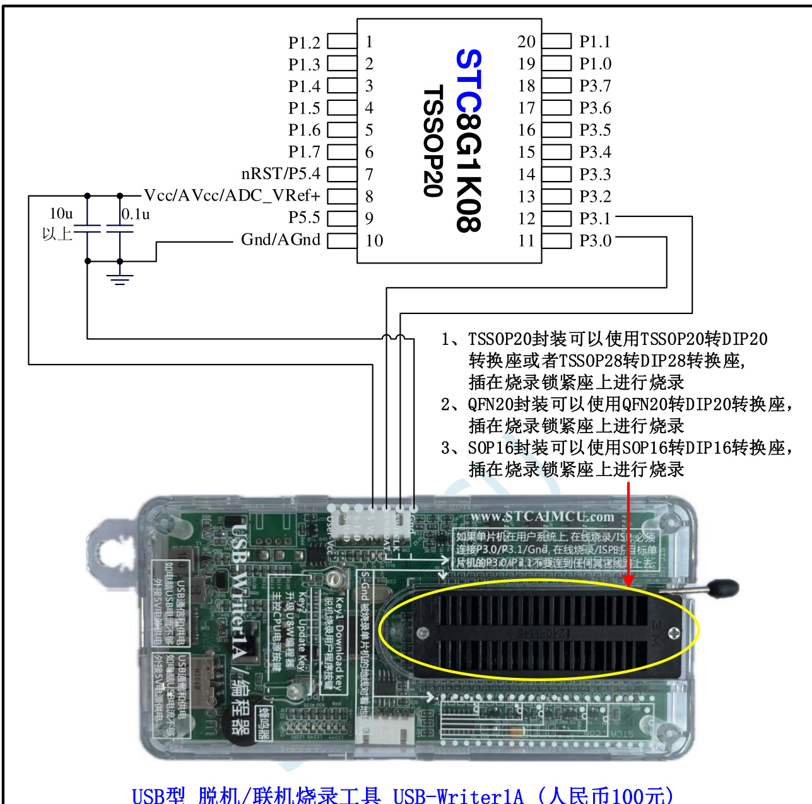

  
2.3.19 USB-Writer1A 支持 自动烧录机， 通信协议和接口

# 自动烧录接口 （分选机自动控制接口） 协议：

Start： 开始信号输入脚。 从外部输入低电平信号触发开始脱机烧录， 低电平必须维持 25 毫秒以上

EOT： 烧录完成信号输出脚。 脱机烧录完成后， 工具输出 $2 0 m s { \sim } 2 5 0 m s$ 的低电平 EOT 信号。 电平宽度如下图所示的地方进行设置

X 消际LrNm缓冲区 打开EEPRUM又件复制接收数据硬件选项 USB-Lirk1D/U8W/U8W-Mini脱机 程序加发送缓中区将用户程序下载到编程器以供脱机下载 文本模式清除编程器中的用户脱机代码及数据 EX模式设置USB-Link1D/U8W/U8W-Mini主控芯片 清空发送区设置脱机下载时的最高波特率 115200文件 送回车脱机编程数量 10000 握手超时时间 0S-VCC输出电压 3.3V 上电延时时间 0 COM1 波特率在线下载完成后持续给目标芯片供电 打开串口 编程完自动脱机下载完成后持续给目标芯片供电 自动发送结脱机下载时关闭自动检测有无芯片功能即使下载失败自动增量也自动递增使用第二种LED显示模式 EOT信号提供电流500mA √ BIF保持时间 40 ms脱机下载灵敏度设置 5 E TE 宽度设置30 ms40 ms电源 50 ms60 ms70 ms下载/编程 80 ms100 ms检测选项 帮助 110 ms120 ms  
每次下载前都重新装载目标文件 130 ms140 TS当目标文件变化时自动装载并 150 nS 远程现场升级APP发布160 nS170 nS180 nS190 ms200 ms210 ms220 ms

OK： 良品信号输出脚。 下载成功后工具从 OK 脚输出低电平信号， 信号与 EOT 信号同步。

Err： 不良品信号输出脚。 若下载失败， 工具从 ERR 脚输出输出低电平信号， 信号与 EOT 完成信号同步。

OK和Err只会输出其中一个信号

# 2.4 STC8G2K64S4-36I-LQFP48/32、 QFN48/32 系列 （45 路增强型 PWM）

# 2.4.1 特性及价格（有 16 位硬件乘除法器 MDU16， 准 16 位单片机）

选型价格 （不需要外部晶振、 不需要外部复位， 10 位 ADC， 15 通道）  

单片机型号 STC8G2K64S4 | 工作电压（V) | Flash 程序存储器10万次广 字节 | idata’内部传统8051 RAM 字节 | xdata’内部大容量扩展SRAM 字节 | 强大的双DPTR可增可减 | EEPROM 10万次 VO口最多数量 字节 | 串口并可掉电唤醒 | MDU16硬件16位乘除法器 | SPI |  | 定时器\计数器（T0-T4外部管脚也可掉电唤醒） | 15位增强型PWM满足舞台灯光要求 | 支持上升沿中断下降沿中断以及边沿中断 PCACCP/PWM（可当外部中断并可掉电唤醒） | 掉电唤醒专用定时器 | 15路高速ADC（全部PWM均可当D/A使用） | 比较器（可当1路AD’可作外部掉电检测） | 內部低压检测中断并可掉电唤醒 | 看门狗 复位定时器 | 内部高可靠复位（可选复位门槛电压） 内部高精准时钟（36MHz以下可调）追频 | 可对外输出时钟及复位 | 程序加密后传输（防拦截） | 可设置下次更新程序需口令 | 支持RS485下载 | 支持软件USB直接下载 | 本身就可在线仿真 | LQFP48 | 价格及封装QFN48<6mm*6mm> | LQFP32 | 主力产品供货信息 | QFN32<4mm*4mm>
STC8G2K32S41.9-5.532K256 |  |  |  | 2K |  | 32K |  | 4 | 有 | 有 | 有 |  | 45 | 3 | 有 | 10位 | 有 | 有 | 有 | 级 | 有 | 是 | 有有 | 是 | 是是 | 是是 | 是 | ￥4 |  | ￥3. 8￥3. ￥3.8￥3. | 
 |  |  |  |  |  | KK 44 | 4 |  | 有有 |  | 有 |  | 44 |  | 有 | 00 位 | 有 |  |  | 有 | 是是 | 有 | 是是 | 是 | 是 |  |  |  |  |  | 现货
STCGK61s 50K |  |  |  |  |  |  |  |  |  |  |  |  |  |  |  |  |  | 有 | 有 4级 |  | 有 是 | 有 | 是 | 是 | 是 | 是 | ￥4 | ￥4 |  | ￥3.8￥3. | 
 |  | .9-5.564K | 256 | 2K |  | IAP | 45 |  | 有 有 |  | 有 |  | 45 |  | 有 | 10位 | 有 | 有 |  |  |  |  |  |  |  |  |  |  |  |  | 

注： 以上的单价为 10K 及以上订货量的价格， 量小则每片需增加0.1 元人民币。

如需要选择 48 管脚的芯片， 建议选 LQFP48 封装， QFN48 需要提前订货

# 内核

超高速 8051 内核 （1T）， 比传统 8051 约快 12 倍以上  
指令代码完全兼容传统 8051  
29 个中断源，4 级中断优先级  
支持在线仿真

# 工作电压

$1 . 9 V { \sim } 5 . 5 V$ 内建 LDO

# 工作温度

${ \bf - 4 0 ^ { \circ } C } \sim { 8 5 ^ { \circ } C }$ （超温度范围应用请参考电器特性章节说明）

# Flash 存储器

最大 64K 字节 FLASH 程序存储器 （ROM），用于存储用户代码支持用户配置EEPROM 大小， 512 字节单页擦除，擦写次数可达10 万次以上支持在系统编程方式 （ISP） 更新用户应用程序，无需专用编程器支持单芯片仿真， 无需专用仿真器，理论断点个数无限制

SRAM

128 字节内部直接访问 RAM （DATA）  
128 字节内部间接访问 RAM （IDATA）  
2048 字节内部扩展 RAM （内部 XDATA）

# 时钟控制

内部高精度、 高稳定的高速 IRC （ $4 M H z { \sim } 3 8 M H z$ ， ISP 编程时可进行上下调整， 还可以用户软件分频到  
较低的频率工作， 如 $1 0 0 K H z$ ）  
 误差 $\pm 0 . 3 \%$ （常温下 $2 5 ^ \circ C$ ）  
 - $. 0 . 8 8 \% \sim + 1 . 0 5 \%$ 温漂 （温度范围， ${ \displaystyle - 2 0 ^ { \circ } C { \sim } 6 5 ^ { \circ } C }$ ）  
 - $1 . 3 8 \% \sim + 1 . 4 2 \%$ 温漂 （全温度范围， ${ \bf - 4 0 ^ { \circ } C } \sim { \bf 8 5 ^ { \circ } C }$ ）  
内部 $3 2 K H z$ 低速 IRC（为了低功耗， 省去了温度补偿和电压补偿电路， 误差较大）  
外部晶振 （ $4 M H z { \sim } 3 8 M H z$ ） 和外部时钟

（芯片上电工作过程： 上电复位/复位脚复位/看门狗复位/低压检测复位时， 芯片默认从 ISP 系统程序开始执行代码，此时固定使用内部 24MHz 的高速 IRC 时钟，当需要下载用户程序且下载完成后复位到用户程序区或者不需要下载直接复位到用户程序区时，默认会使用上次用户下载时所调节的高速 IRC 时钟，如果用户程序需要使用外部高速晶振、外部 $3 2 . 7 6 8 K H z$ 晶振或者内部 $3 0 K H z$ 低速 IRC， 则需要用户软件先启动相应的时钟，然后通过设置 CLKSEL 寄存器进行切换）

# 复位

# 硬件复位

上电复位。 （在芯片未使能低压复位功能时有效）  
复位脚复位。出厂时P5.4 默认为I/O 口，ISP 下载时可将P5.4 管脚设置为复位脚（注意： 当设置 P5.4管脚为复位脚时，复位电平为低电平）  
看门狗溢出复位  
低压检测复位， 提供4 级低压检测电压： 2.0V、 2.4V、 2.7V、 3.0V。

软件复位软件方式写复位触发寄存器

# 中断

提供29 个中断源： INT0（支持上升沿和下降沿中断） 、 INT1 （支持上升沿和下降沿中断）、 INT2 （只支持下降沿中断） 、 INT3 （只支持下降沿中断） 、 INT4 （只支持下降沿中断）、 定时器0、 定时器1、定时器2、定时器3、定时器4、串口1、串口2、串口3、串口4、 ADC 模数转换、LVD 低压检测、 SPI、 I2C、比较器、PCA/CCP/PWM、 增强型PWM0、增强型PWM1、增强型PWM2、增强型PWM3、增强型 PWM4、增强型 PWM5、 增强型PWM0 异常检测、 增强型PWM2 异常检测、 增强型PWM4 异常检测。

提供4 级中断优先级

时钟停振模式下可以唤醒的中断： INT0(P3.2)、 INT1(P3.3)、 INT2(P3.6)、 INT3(P3.7)、INT4(P3.0)、T0(P3.4)、T1(P3.5)、 T2(P1.2)、 T3(P0.4)、 T4(P0.6)、 RXD(P3.0/P3.6/P1.6/P4.3)、 RXD2(P1.0/P4.6)、 RXD3(P0.0/P5.0)、RXD4(P0.2/P5.2)、CCP0(P1.1/P3.5/P2.5)、CCP1(P1.0/P3.6/P2.6)、 CCP2(P3.7/P2.7)、I2C_SDA(P1.4/P2.4/P3.3)以及比较器中断、 低压检测中断、 掉电唤醒定时器唤醒。

# 数字外设

5 个16 位定时器： 定时器0、 定时器1、定时器2、定时器3、 定时器4，其中定时器0 的模式3 具有 NMI  
（不可屏蔽中断） 功能， 定时器0 和定时器1 的模式 0 为16 位自动重载模式  
4 个高速串口： 串口1、串口2、 串口3、串口4， 波特率时钟源最快可为FOSC/4  
3 组 16 位 CCP/PCA/PWM 模块： CCP0、CCP1、CCP2， 可用于捕获、高速脉冲输出，及6/7/8/10 位的PWM  
输出  
45 组 15 位增强型 PWM， 可实现带死区的控制信号， 并支持外部异常检测功能 （另外还有 3 组传统的  
PCA/CCP/PWM 可作 PWM）  
SPI： 支持主机模式和从机模式以及主机/从机自动切换  
I2C： 支持主机模式和从机模式

MDU16： 硬件 16 位乘除法器 （支持 32 位除以 16 位、 16 位除以 16 位、 16 位乘 16 位、 数据移位以及数据规格化等运算）

# 模拟外设

超高速ADC， 支持 10 位精度 15 通道 （通道 $0 \sim$ 通道14） 的模数转换， 速度最快能达到 500K （每秒进行50 万次 ADC 转换）

ADC 的通道 15 用于测试内部1.19V 参考信号源 （芯片在出厂时， 内部参考信号源已调整为1.19V）比较器，一组比较器 （比较器的正端可选择CMP $+ .$ 端口和所有的ADC 输入端口， 所以比较器可当作多路比较器进行分时复用）DAC： 3 路 PCA/CCP/PWM 可当 3 路 DAC 使用， 45 路增强型 PWM 可当 45 路 DAC 使用

# GPIO

最多可达 45 个 GPIO： P0.0\~P0.7、 P1.0\~P1.7、 P2.0\~P2.7、 P3.0\~P3.7、 P4.0\~P4.7、 P5.0\~P5.4所有的GPIO 均支持如下4 种模式： 准双向口模式、 强推挽输出模式、 开漏模式、 高阻输入模式除 P3.0 和 P3.1 外，其余所有 I/O 口上电后的状态均为高阻输入状态，用户在使用 I/O 口时必须先设置 I/O口模式， 另外每个 I/O 均可独立使能内部 4K 上拉电阻

# 封装

LQFP48、 QFN48、 LQFP32

# 2.4.2 STC8G2K64S4-36I-LQFP48/QFN48 管脚图， ISP 下载/编程线路图

#

STC8G2K64S4-36I-LQFP48/QFN48 最小系统 示意图  
ADC 28         P3.7/PWM37/INT3/TxD_2/CMP+/CCP2_2/CCP2 26         P3.5/PWM35/T1/T0CLKO/SS_4/CCP0_2/PWMFLT SPI I2C  
ADC0 ADC1 ADC2 ADC3 ADC4 ADC5 ADC6 ADC7 SS MOSI MISO SCLK SCL SDAP1.0 P P1. P1.4 P1.5 P1.6 P1.7 P P1.4 P1.5 P1.5 P1.4  
ADC8 ADC 10 ADC12 ADC13 ADC14 ADC15 27         P3.6/PWM36/INT2/RxD_2/CMP-/CCP1_2 2.4 P2.5 P2.5 P2.4  
P0.0 P0. P0.2 P0.3 P0.4 P0.5 P0.6 1.19V P5.4 P4.0 P4.1 P4.3P3.4 P3.3 P3.2 P3.2 P3.3  
UART1 UART2 29         P4.1/PWM41/MISO_3/CMPO_2 PCA/CCP/PWM  
RxD xD RxD2 TxD2 36         P2.3/PWM23/A11/MOSI_2 ECI CCP0 CCP1 CCP2P3.0 P3.1 P1.0 P1.1 35         P2.2/PWM22/A10/SS_2 P1.2 P1.1 P1.0 P3.7P3.6 P3.7 P4.6 P4.7 25         P5.1/PWM51/TxD3_2 P3.4 P3.5 P3.6 P3.7  
P1.6 P1.7 P2.4 P2.5 P2.6 P2.7  
P4.3 P4.4 30         P4.2/PWM42/WR  
UART3 UART4 CMP  
RxD3 TxD3 RxD4 TxD4 CMP+ CMP- CMPO  
P0.0 P0.1 P0.2 P0.3 2 4 2 6 5 P3.7 1.19V P3.4  
P5.0 P5.1 P5.2 P5.3 NNRNAAAARRR 2 ADCIN P3.6 P4.1□□□□□□_□□□□□MISO _2/I2CSDA 2/ECI _3/A12/PWM24/P2.4 37 24 2321 P5.0/PWM50/RxD3_2  
SCLK_ 2/I2CSCL _2/CCP0_3/A13/PWM25/P2.5 38 P3.4/PWM34/T0/T1CLKO/ECI _2/MOSI 4/CMPO  
CCP是英文单词的缩写 CCP1 3/A14/PWM26/P2.6 39 P3.3/PWM33/INT1/MISO 4/I2CSDA 4Capture（捕获） CCP2_3/A15/PWM27/P2.7 40 STC8G2K64S4 P3.2/PWM32/INT0/SCLK_4/I2CSCL_4Compare（比较） ALE/PWM45/P4.5 41 20 P3.1/PWM31/TxD MCU-VCCPWM （脉宽调制） RxD3/AD0/ADC8/PWM00/P0.0 RxD2_ 2/PWM46/P4.6 443 42 LQFP48 1978 P3.0/PWM30/RxD/INT4 P4 .0/PWM40/MOSI_3 0.1u 1 10uRTxxD4/3A/ADD2/1A/ADDC190/PWM012/P0.12 45 QFN48 1645 AGDndC/_AVGRnedf+TxD4/AD3/ADC11/PWM03/P0.3 46 Vcc/AVccT3/AD4/ADC12/PWM04/P0.4 47 P5.4/PWM54/nRST/MCLKO/SS_3RxD4_ 2/PWM52/P5.2 48 13 P1.7/PWM17/ADC7/TxD_3/XTALI2 3 4 5 6 8 9 2在Vcc和Gnd之间就近加上电源去耦电容正看芯片丝印左下方小圆点处为第一脚正看芯片丝印最下面一行最后一个字母 【大电容10uF以上+小电容0.1uF】为芯片版本号   
注意1：、 ADC的外部参考电源管脚ADC_VRef+，必须接外部参考电源【电压： 2.4V \~ MCU-VCC】浮空会有漏电流2、 如不需要进行【软件模拟USB下载】芯片上电/复位时P3.0/P3.1/P3.2 不可同时为低电平否则会进入【等待进入软件模拟USB下载模式】可在 ISP烧录时指定取消 下次下载时使能USB-ISP模式

# 使用USB转串口芯片进行ISP下载/烧录/仿真， 目标系统 手动停电/上电Ai8H2K12U

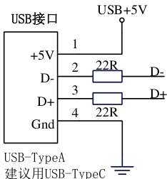

USB+5V连接目标单片机的P3.0P5.4/nRST P3.3/P1.1/TxD2连接目标单 片机的P3.1Vcc P3.2/P1.0/RxD2  
10u 0.1u UCap D+/TxD/P3.1 USB转串口芯片，  
以上Gnd/AGnd D-/RxD/P3.0 出厂自带USB转串口程序，USB-HID烧录， 免驱动安装RMB0.95 P5.4管脚高电平供电

也可以用STC8H2K 2U- SOP8取代Ai8H2K12U-SOP8

# 【ISP下载/编程/烧录， 操作步骤】

1、点击电脑端 ISP 软件的 【下载/编程】按钮

2、给目标系统上电，或者重新给目标系统上电如果在点击【下载/编程】按钮前，目标系统已上电， 则需要停电再重新上电电脑端软件提示：下载编程进行中，数秒后提示成功

# 关于 I/O 的注意事项：

1、 P3.0 和P3.1 口上电后的状态为弱上拉/准双向口模式  
2、 除P3.0 和P3.1 外，其余所有 IO 口上电后的状态均为高阻输入状态，用户在使用 IO口前必须先设置IO 口模式  
3、 芯片上电时如果不需要使用 USB 进行 ISP 下载， $P 3 . 0 / P 3 . 1 / P 3 . 2$ 这 3 个 I/O 口不能同时为低电平，否则会进入 USB 下载模式而无法运行用户代码芯片上电时，若 P3.0 和 P3.1 同时为低电平，P3.2 口会短时间由高阻输入状态切换到双向口模式，用以读取P3.2 口外部状态来判断是否需要进入 USB 下载模式当使用P5.4 当作复位脚时，这个端口内部的4K 上拉电阻会一直打开；但P5.4 做普通I/O 口时，基于这个I/O 口与复位脚共享管脚的特殊考量，端口内部的4K 上拉电阻依然会打开大约6.5 毫秒时间，再自动关闭（当用户的电路设计需要使用 P5.4 口驱动外部电路时，请务必考虑上电瞬间会有 6.5 毫秒时间的高电平的问题）

# 2.4.3 STC8G2K64S4-36I-LQFP32/QFN32 管脚图， ISP 下载/编程线路图

# STC8G2K64S4-36I-LQFP32/QFN32 最小系统 示意图

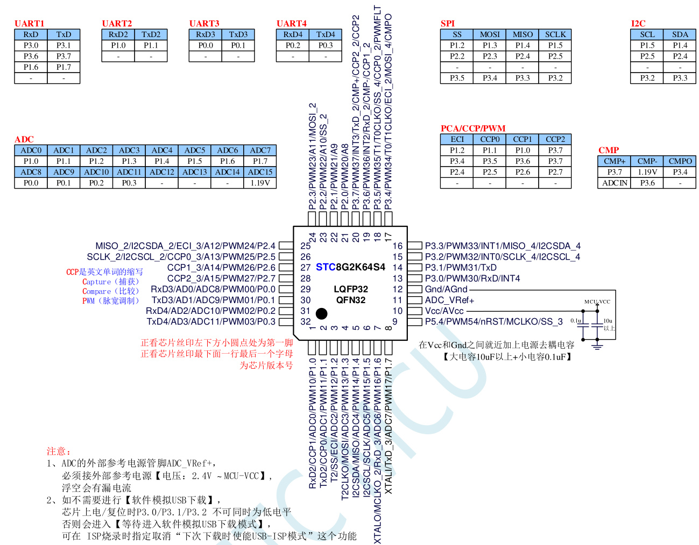

# 使用 USB转串口 芯片 进行 全自动 停电/上电， 烧录/仿真/串口通讯， 3.3V

USB接口 USB+5V USB+5V Ai8H2K12U 也可系统电脑电U源S输B+入5 V i供n电 或充电宝USB+5V供电 62131： 输出 3.3V， 输入 51.58V - 3.6V+5V D- 2 22R Power-On 1 P5.4/nRST Vcc P3.2/P1.0/RxD2 P3.3/P1.1/TxD2 8 7 连接目标单片机的P3.10 VIN VOUT MCU-VCC2D+ 3 D+ 10u 0.1u UCap D+/TxD/P3.1 6 D+ USB转串口芯片， GND4 22R 以上 U出S厂B-自H带IDU烧SB录转，串免口驱程动序安，装 CE NCGnd 4 Gnd/AGnd D-/RxD/P3.0 5 D- C1 10K 0C.21u  
U建SB议-T用yUpSeBA-TypeC RMB0.95 SOP8 P5.4管脚高电平供电 0.1u 」 P全ow自er动-O控n 制高输电出源，开低/关断也可以用STC8H2K12U-SOP8取代Ai8H2K12U 电源开关， 可不焊

【应用场景一：从本工具给目标系统 自动 停电/上电，供电】点击 电脑端 ISP 软件的【下载/编程】按钮，工具会 自动 给目标系统停电0.5秒/再自动供电，数秒后提示下载编程成功，工具默认会再 自动 给目标系统停电0.5秒/再自动供电给目标系统工作。

# 【应用场景二： 不从本工具给目标系统供电】

1、点击 电脑端 ISP 软件的 【下载/编程】 按钮

2、给目标系统上电，或者重新上电(如果在点击【下载/编程】按钮前已上电，则需要停电重新上电)，电脑端软件提示下载编程进行中，数秒后下载成功，目标MCU会自动复位到用户程序区自动跑用户程序。部分不常用设置，需要停电上电一次才生效，如改变 EEPROM大小，P5.4/nRST变成复位脚

# 关于 I/O 的注意事项：

1、 P3.0 和P3.1 口上电后的状态为弱上拉/准双向口模式  
2、 除P3.0 和P3.1 外，其余所有 IO 口上电后的状态均为高阻输入状态，用户在使用 IO

口前必须先设置IO 口模式

3、 芯片上电时如果不需要使用 USB 进行 ISP 下载， $P 3 . 0 / P 3 . 1 / P 3 . 2$ 这 3 个 I/O 口不能同时为低电平，否则会进入 USB 下载模式而无法运行用户代码芯片上电时，若 P3.0 和 P3.1 同时为低电平，P3.2 口会短时间由高阻输入状态切换到双向口模式，用以读取P3.2 口外部状态来判断是否需要进入 USB 下载模式当使用P5.4 当作复位脚时，这个端口内部的 4K 上拉电阻会一直打开；但P5.4 做普通I/O 口时，基于这个I/O 口与复位脚共享管脚的特殊考量，端口内部的4K 上拉电阻依然会打开大约6.5 毫秒时间，再自动关闭（当用户的电路设计需要使用 P5.4 口驱动外部电路时，请务必考虑上电瞬间会有 6.5 毫秒时间的高电平的问题）

# 2.4.4 STC8G2K64S4-36I-PDIP40 管脚图， ISP 下载/编程线路图

# STC8G2K64S4-36I-PDIP40 最小系统 示意图

UART1  

RxD | TxD
P3.0 | P3.1
P3.6 | P3.7
P1.6 | P1.7
 | 

UART2   

RxD2 | TxD2
P1.0 | P1.1
 | 

UART3   

RxD3 | TxD3
P0.0 | P0.1
 | 

UART4   

RxD4 | TxD4
P0.2 | P0.3
 | 

SPI   

SS | MOSI | MISO | SCLK
P1.2 | P1.3 | P1.4 | P1.5
P2.2 | P2.3 | P2.4 | P2.5
 |  |  | 
P3.5 | P3.4 | P3.3 | P3.2

I2C

SCL | SDA
P1.5 | P1.4
P2.5 | P2.4
 | 
P3.2 | P3.3

ADC   

ADCO | ADC1 | ADC2 | ADC3 | ADC4 | ADC5 | ADC6 | ADC7
P1.0 | P1.1 | P1.2 | P1.3 | P1.4 | P1.5 | P1.6 | P1.7
ADC8 | ADC9 | ADC10 | ADC11 | ADC12 | ADC13 | ADC14 | ADC15
P0.0 | P0.1 | P0.2 | P0.3 | P0.4 | P0.5 | P0.6 | 1.19V

PCA/CCP/PWM   

ECI | CCP0 | CCP1 | CCP2
P1.2 | P1.1 | P1.0 | P3.7
P3.4 | P3.5 | P3.6 | P3.7
P2.4 | P2.5 | P2.6 | P2.7
 |  |  | 

CMIP
CMP+ | CMP- | CMPO
P3.7 | 1.19V | P3.4
ADCIN | P3.6 | P4.1

RxD3/AD0/ADC8/PWM00/P0.0 1 40 P4.5/PWM45/ALE CCapPt是ur英e文（捕单获词的）缩写 TxD3/AD1/ADC9/PWM01/P0.1 23 39 P2.7/PWM27/A15/CCP2_3 Compare（比较） RxD4/AD2/ADC10/PWM02/P0.2 38 P2.6/PWM26/A14/CCP1_3 PWM （脉宽调制） TxD4/AD3/ADC11/PWM03/P0.3 4 37 5/PWM25/A13/CCP0_3/I2CSCL 2/SCLK_2 T3/AD4/ADC12/PWM04/P0.4 65 P2.4/PWM24/A12/ECI _3/I2CSDA _2/MISO_2 T3CLKO/AD5/ADC13/PWM05/P0.5 P2.3/PWM23/A11/MOSI_2 PWMFLT2/T4/AD6/ADC14/PWM06/P0. C P2.2/PWM22/A10/SS 2 PWMFLT3/T4CLKO/AD7/PWM07/ 0 8 P2 .1/PWM21/A9 RTxD2/CCP01/ADC10/PWM110/P T2/SS/ECI/ADC2/PWM12/ 109 11 PDIP40 312 30 P42.40/PWM4240/AR8D/TxD_4 4.2/PWM42/WR T2CLKO/MOSI/ADC3/PWM13/ 12 P4 .1/PWM41/MISO_3/CMPO_2 I2CSDA/MISO/ADC4/PWM14/P 13 P3.7/PWM37/INT3/TxD_ 2/CMP+/CCP2_2/CCP2 I2CSCL/SCLK/ADC5/PWM15/P1.5 14 P3.6/PWM36/INT2/RxD _2/CMP-/CCP1 2 XTALO/MCLKO 2/RxD_3/ADC6/PWM16/P1. 6 15 P3.5/PWM35/T1/T0CLKO/SS 4/CCP0 _2/PWMFLT XTALI/TxD_3/ADC7/PWM17/P1. 16 P3.4/PWM34/T0/T1CLKO/ECI_2/MOSI _4/CMPO SS_3/MCLKO/nRST/PWM54/P5.4 17 24 P3.3/PWM33/INT1/MISO _4/I2CSDA 4 MCU-VCC Vcc/AVcc 18 23 P3.2/PWM32/INT0/SCLK_4/I2CSCL_ 10u 0.1u ADC_VRef+ 19 22 P3.1/PWM31/TxD 以上 Gnd/AGnd 20 21 P3.0/PWM30/RxD/INT4

# 注意：

【大电容10uF以上+小电容0.1uF】

1、 ADC的外部参考电源管脚ADC VRef+， 必须接外部参考电源【电压： 2.4V \~ MCU-VCC】 ,浮空会有漏电流2、 如不需要进行【软件模拟USB下载】，芯片上电/复位时P3.0/P3.1/P3.2 不可同时为低电平否则会进入【等待进入软件模拟USB下载模式】 可在 ISP烧录时指定取消 下次下载时使能USB-ISP模式 这个功能

# 使用 USB转双串口 芯片 进行 全自动 烧录/仿真 $+$ 串口通讯， 5V/3.3V跳线选择

此处的二极管和电阻的作用是防止USB器件给目标芯片供电。由于目标芯片断电过程中，USB器件是不能断电的，USB器件的发送脚一般都是强推挽输出，通过I/O供电芯片就能工作，所以当使用USB转串口TTL对单片机下载程序时此处的隔离二极管不能省

芯片上电时P3.5输出低电平，MCU-VCC处于供电状态。当检测到需要进行ISP下载时，会自动控制MCU-VCC停电0.5S再上电进行ISP下载。下载完成后

USB+5VUSB接口 USB转第二组串口第二组串口用于和目标系统+5V 的其他串口通讯2DD-D+ 22 D+USB-TGypnedA 连接目标单片机的第n组串口的RTxDn建议用USB-TypeC

Ai8H2K1028U-SOP16 USB转第一组串口 第一组用于会下载持或续者供通电讯? 高推阻挽/输开入漏 1 P1.01/TRxD2 RTxD/P3.76 16 1 推高挽阻/输开入漏 1N5819 S-RTxD 连接目标单片机的P3.01/RTxD2跳.5线4m插m座 Vcc 1N5819 PUV5cC.c4a/pnRST P3.432 13121110 300R Vcc PQ-1MOS MCU-VCC  
USB+5V 67 D+ 可供做应电模源块 DGnd D-/P3.0 9 D- 关电/供电 0u 0.47u 104  
1以0u上 1117M3-33 0.1u 以10上u 0.1u 也可以用STC8H2K0182U-SOP16取代 手动按键 20K QSA1IO23可340选1：，RMB0.0475USB转双串口芯片，出厂自带USB转串口程序， P3.5管脚低电平供电USB-HID烧录， 免驱动安装 P5.4管脚高电平供电

【应用场景一： 从本工具给目标系统 自动 停电/上电，供电】点击 电脑端 ISP 软件的【下载/编程】按钮，工具会 自动 给目标系统停电0.5秒/再自动供电，数秒后提示下载编程成功，工具默认会再 自动 给目标系统停电0.5秒/再自动供电给目标系统工作。

# 【应用场景二： 不从本工具给目标系统供电】

1、 点击 电脑端 ISP 软件的 【下载/编程】按钮

2、给目标系统上电，或者重新上电(如果在点击【下载/编程】按钮前已上电，则需要停电重新上电)，电脑端软件提示下载编程进行中，数秒后下载成功，目标MCU会自动复位到用户程序区自动跑用户程序。部分不常用设置，需要停电上电一次才生效，如改变 EEPROM大小，P5.4/nRST变成复位脚

# 关于 I/O 的注意事项：

1、 P3.0 和P3.1 口上电后的状态为弱上拉/准双向口模式  
2、 除P3.0 和P3.1 外，其余所有 IO 口上电后的状态均为高阻输入状态，用户在使用 IO口前必须先设置IO 口模式  
3、 芯片上电时如果不需要使用 USB 进行 ISP 下载， $P 3 . 0 / P 3 . 1 / P 3 . 2$ 这 3 个 I/O 口不能同时为低电平，否则会进入 USB 下载模式而无法运行用户代码芯片上电时，若 P3.0 和 P3.1 同时为低电平，P3.2 口会短时间由高阻输入状态切换到双向口模式，用以读取P3.2 口外部状态来判断是否需要进入 USB 下载模式当使用P5.4 当作复位脚时，这个端口内部的 4K 上拉电阻会一直打开；但P5.4 做普通I/O 口时，基于这个I/O 口与复位脚共享管脚的特殊考量，端口内部的4K 上拉电阻依然会打开大约6.5 毫秒时间，再自动关闭（当用户的电路设计需要使用 P5.4 口驱动外部电路时，请务必考虑上电瞬间会有 6.5 毫秒时间的高电平的问题）

# 2.4.5 管脚说明

编号 | 名称 | 类型 | 说明
LQFP48
 | P5.3 | 1/O | 标准1O口
PWM53 | 0 | 增强 PWM 输出脚
TxD4_2 | 0 | 串口4的发送脚
P0.5 | 1/O | 标准IO口
 | PWM05 | 0 | 增强PWM 输出脚
AD5 | I/O | 地址/数据总线
ADC13 | I | ADC 模拟输入通道 13
T3CLKO | 0 | 定时器 3 时钟分频输出
P0.6 | 1/O | 标准10口
 | PWM06 | 0 | 增强PWM 输出脚
AD6 | 1/O | 地址/数据总线
ADC14 |  | ADC 模拟输入通道 14
T4 | 11 | 定时器 4 外部时钟输入
PWMFLT2 | I | 增强 PWM 的外部异常检测腳
 | P0.7 | I/O | 标准IO口
PWM07 | 0 | 增强 PWM 输出脚
AD7 | I/O | 地址/数据总线
T4CLKO |  | 定时器 4 时钟分频输出
PWMFLT3 | 01 | 增强 PWM 的外部异常检测腳
 | P1.0 | 10 | 标准IO口
PWM10 | 0 | 增强PWM 输出脚
ADCO | I | ADC模拟输入通道0
CCP1 | 1/O | PCA的捕获输入、 脉冲输出和PWM 输出
RxD2 | I | 串口2的接收脚
 | P1.1 | I/O | 标准IO口
PWM11 | 0 | 增强 PWM 输出脚
ADC1 | I | ADC 模拟输入通道
CCPO | I/O | PCA的捕获输入、 脉冲输出和 PWM输出
TxD2 | 0 | 串口２ 的发送脚
 | P4.7 | I/O | 标准10口
PWM47 | 0 | 增强 PWM 输出脚
TxD2_2 | 0 | 串口2的发送脚
 | P1.2 | I/O | 标准IO口
PWM12 | 0 | 增强PWM 输出脚
ADC2 | I | ADC模拟输入通道2
ECI | I | PCA 的外部脈冲输入
SS | 1 | SPI的从机选择脚 （主机为输出）
T2 |  | 定时器2 外部时钟输入

编号 | 名称 | 类型 | 说明
LQFP48
 | P1.3 | IO | 标准10口
PWM13 |  | 增强 PWM 输出脚
ADC3 | I | ADC模拟输入通道3
MOSI | I/O | SPI 主机输出从机输入
T2CLKO | 0 | 定时器2时钟分频输出
10 | P1.4 | I/O | 标准IO口
PWM14 | O- | 增强 PWM 输出脚
ADC4 | I | ADC 模拟输入通道4
MISO | I/O | SPI 主机输入从机输出
SDA | IO | I2C 接口的数据线
 | P1.5 | I/O | 标准I0口
PWM15 |  | 增强 PWM 输出脚
ADC5 | I | ADC模拟输入通道！ S
SCLK | I/O | SPI的时钟脚
SCL | I/O | I2C 的时钟线
12 | P1.6 | I/O | 标准IO口
PWM16 | 0 | 增強 PWM输出脚
ADC6 | I | ADC模拟输入通道6
RxD_3 | - I | 串口1 的接收腳
MCLKO_2 | 0 | 主时钟分频输出
XTALO | 0 | 外部晶振的输出腳
 | P1.7 | 1/O | 标准IO口
PWM17 |  | 增强 PWM 输出腳
ADC7 | I | ADC模拟输入通道7
TxD_3 | 0 | 串口 的发送脚
XTALI | − I | 外部晶振/外部时钟的输入脚
 | P5.4 | 1/O | 标准IO口
PWM54 | 0 | 增强 PWM 输出脚
NRST | I | 复位引腳 （低电平复位）
MCLKO | 0 | 主时钟分频输出
SS_3 | I | SPI的从机选择脚 （主机为输出）
 | Vcc | Vcc | 电源脚
AVcc | Vcc | ADC电源脚
16 | ADC_VRef+ |  | ADC 外部参考电压源输入腳， 要求不高时可直接接 MCU 的 VCC
 | Gnd | Gnd | 地线
AGnd | Gnd | ADC地线

编号 | 名称 | 类型 | 说明
LQFP48 | 
18 |  | P4.0 | I/O | 标准IO口
 | PWM40 | 0 | 增强 PWM 输出脚
 | MOSI_3 | I/O | SPI主机输出从机输入
19 |  | P3.0 | I/O | 标准IO口
 | PWM30 | 0 | 增强 PWM 输出脚
 | RxD | I 「 | 串口1的接收腳
 | INT4 | I | 外部中断4
20 |  | P3.1 | 1O | 标准IO口
 | PWM31 | 0 | 增强 PWM输出脚
 | TxD | 0 | 串口 1的发送脚
21 |  | P3.2 | I/O | 标准IO口
 | PWM32 | 0 | 增强 PWM 输出脚
 | INTO | I | 外部中断0
 | SCLK_4 | I/O | SPI 的时钟脚
 | SCL_4 | I/O | I2C的时钟线
22 |  | P3.3 | I/O | 标准IO口
 | PWM33 | 0 − | 增强 PWM 输出脚
 | INT1 | I | 外部中断1
 | MISO_4 | IO | SPI主机输入从机输出
 | SDA_4 | I/O | I2C 接口的数据线
23 |  | P3.4 | I/O | 标准IO口
 | PWM34 | 0 - | 增强 PWM 输出脚
 | TO | I | 定时器 0 外部时钟输入
 | T1CLKO | 0 - | 定时器 1时钟分频输出
 | ECI_2 | I | PCA 的外部脈冲输入
 | MOSI_4 | IO | SPI主机输出从机输入
 | CMPO | 0 | 比较器输出
24 |  | P5.0 | I/O | 标准10口
 | PWM50 | 0 | 增强 PWM 输出脚
 | RxD3_2 | I | 串口3的接收脚
25 |  | P5.1 | I/O | 标准IO口
 | PWM52 | 0 | 增强 PWM 输出脚
 | TxD3_2 | 0 | 串口３的发送脚

编号 | 名称 | 类型 | 说明
LQFP48 | 
26 |  | P3.5 | IO | 标准IO口
PWM35 | 0 | 增强 PWM 输出脚
T1 |  | 定时器 外部时钟输入
TOCLKO | 0 | 定时器0时钟分频输出
SS_4 | I | SPI 的从机选择脚 （主机为输出）
CCP0_2 | IO | PCA的捕获输入、 脉冲输出和 PWM 输出
PWMFLT | I | 增强 PWM 的外部异常检测腳
P3.6 | IO | 标准IO口
2 |  | PWM36 | 0 | 增強 PWM 输出腳
INT2 | I | 外部中断2
RxD_2 | I | 串口 的接收腳
CMP- | I | 比较器负极输入
CCP1_2 | IO | PCA 的捕获输入、 脉冲输出和PWM输出
P3.7 | I/O | 标准I0口
28 |  | PWM37 | 0 | 增强 PWM 输出脚
INT3 | 1 | 外部中断3
TxD_2 |  | 串口 的发送脚
CMP+ | I | 比较器正极输入
CCP2 | I/O | PCA的捕获输入、 脉冲输出和 PWM输出
CCP2_2 | IO | PCA 的捕获输入、 脉冲输出和 PWM输出
P4.1 | IO | 标准IO口
29 |  | PWM41 | 0 | 增强 PWM 输出脚
MISO_3 | I/O | SPI主机输入从机输出
 |  | 
CMPO_2 | 0 | 比较器输出
P4.2 | IO | 标准10口
30 |  | PWM42 | 0 | 增强 PWM 输出脚
WR | 0 | 外部总线的写信号线
P4.3 | IO | 标准IO口
31 |  | PWM43 | 0 | 增强 PWM 输出脚
RxD_4 | I | 串口 的接收腳
SCLK_3 | IO SPI | 的时钟脚
P4.4 | IO | 标准I0口
32 |  | PWM44 | 0 | 增强 PWM 输出脚
RD | 0 | 外部总线的读信号线
TxD_4 | 0 | 串口 的发送脚
P2.0 | IO | 标准IO口
33 |  | PWM20 | 0 | 增强 PWM 输出脚
 |  | 地址总线 | 
 | A8 | 0 | 

编号 | 名称 | 类型 |  | 说明
LQFP48 | 
34 |  | P2.1 | IO | 标准IO口
PWM21 | 0 | 增强 PWM 输出脚
35 |  | A9 | 0 | 地址总线
P2.2 | I/O | 标准IO口
PWM22 | 0 | 增强 PWM 输出脚
A10 | 0 | 地址总线
36 |  | SS_2 | I | SPI的从机选择腳 （主机为输出）
P2.3 | I/O | 标准IO口
PWM23 | 0 | 增强 PWM 输出脚
A11 | 0 | 地址总线
MOSI_2 | 1/O | SPI主机输出从机输入
CCP0_2 | IO | PCA的捕获输入、 脉冲输出和 PWM 输出
37 |  | P2.4 | I/O | 标准IO口
PWM24 | 0 - | 增强PWM 输出脚
A12 | 0 | 地址总线
ECI_3 |  | PCA 的外部脈冲输入
SDA_2 | I/O | I2C 接口的数据线
MISO_2 | 1/O | SPI 主机输入从机输出
38 |  | P2.5 | IO | 标准IO口
PWM25 | 0 | 增强 PWM 输出脚
A13 | 0 | 地址总线
CCP0_3 | 1O | PCA 的捕获输入、 脉冲输出和 PWM 输出
SCL_2 | 1/O | I2C的时钟线
SCLK_2 | 1/O | SPI的时钟脚
39 |  | P2.6 | I/O | 标准IO口
PWM26 | 0 | 增强PWM 输出脚
A14 | - 0 | 地址总线
CCP1_3 | I/O | PCA 的捕获输入、 脉冲输出和 PWM 输出
P2.7 | I/O | 标准1O口
40 |  | PWM27 | 0 | 增强 PWM 输出脚
A15 |  | 地址总线
CCP2_3 | 0 IO | PCA的捕获输入、 脉冲输出和PWM输出
P4.5 | I/O | 标准IO口
41 |  | PWM45 | 0 | 增强 PWM 输出脚
 | - | 
ALE | 0 | 地址锁存信号

编号 |  | 类型 | 说明
LQFP48 | 名称
42 |  | P4.6 I/O | 标准IO口 | 
 | PWM46 | 0 | 增强 PWM 输出脚
 | RxD2_2 | I | 串口2的接收脚
43 |  | P0.0 | I/O | 标准IO口
 | PWM0O | 0 | 增强 PWM 输出脚
ADC8 |  | - I | ADC模拟输入通道8
 | AD0 | I/O | 地址/数据总线
 | RxD3 | I | 串口３的接收腳
44 |  | P0.1 | 1O | 标准IO口
 | PWM01 | 0 | 增强 PWM 输出脚
 | ADC9 | − I | ADC模拟输入通道9
 | AD1 | IO | 地址/数据总线
TxD3 |  | 0 | 串口3的发送脚
45 |  | P0.2 | I/O | 标准IO口
 | PWM02 | 0 | 增强 PWM 输出脚
ADC10 |  | - I | ADC模拟输入通道 10
AD2 |  | IO | 地址/数据总线
RxD4 |  | I | 串口4的接收腳
46 |  | P0.3 | 1O | 标准IO口
 | PWM03 | 0 | 增强 PWM 输出脚
ADC11 |  | I | ADC 模拟输入通道 11
AD3 |  | 1O | 地址/数据总线
TxD4 |  | 0 | 串口4的发送脚
47 |  |  | 标准IO口 | 
PWM04 | P0.4 | I/O 0 | 增强 PWM 输出脚
ADC12 |  | I | ADC模拟输入通道 12
AD4 |  | IO | 地址/数据总线
T3 |  | I | 定时器 3 外部时钟输入
48 |  | P5.2 | I/O | 标准IO口
 | PWM52 | 0 | 增强 PWM 输出脚
 | RxD4_2 | I | 串口4的接收脚

# 2.4.6 USB-Link1D 对 STC8G 系列进行自动串口烧录、 仿真 $\cdot +$ 串口通讯

# 使用 【USB Link1D】 对 STC8G2K64S4系列 进行全自动停电/上电串口烧录、 仿真 $^ +$ 串口通讯

【USB Link1D】 工具： 支持 全自动 停电 / 上电， 在线下载 脱机下载， 仿真

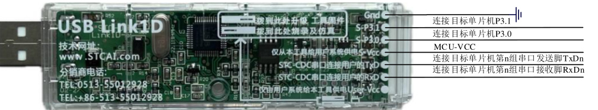

【应用场景一： 从本工具给目标系统 自动 停电/上电， 供电】点击 电脑端 ISP 软件的【下载/编程】按钮，工具会 自动 给目标系统停电0.5秒/再自动供电，数秒后提示下载编程成功， 工具默认会再 自动 给目标系统停电0.5秒/再自动供电给目标系统工作。

# 【应用场景二： 不从本工具给目标系统供电】

1、 点击 电脑端 ISP 软件的 【下载/编程】 按钮

2、 给目标系统上电，或者重新上电(如果在点击 【下载/编程】 按钮前已上电， 则需要停电重新上电)，电脑端软件下载编程进行中，数秒后下载成功， 目标MCU会自动复位到用户程序区自动跑用户程序。部分不常用设置，需要停电上电一次才生效， 如改变 EEPROM大小， P5.4/nRST变成复位脚

#

STC8G2K64S4-36I-LQFP48/QFN48 最小系统 示意图bishmNNRAA A 4 B 8 B. 50OO48543323332222228 2MISO_2/I2CSDA_ 2/ECI _3/A12/PWM24/P2.4 37 P5.0/PWM50/RxD3_2  
SCLK_2/I2CSCL _2/CCP0 3/A13/PWM25/P2.5 38 P3.4/PWM34/T0/T1CLKO/ECI 2/MOSI 4/CMPO  
CCP是英文单词的缩写 CCP1 3/A14/PWM26/P2.6 39 P3.3/PWM33/INT1/MISO 4/I2CSDA_4Capture （捕获） CCP2 3/A15/PWM27/P2.7 40 STC8G2K64S4 P3.2/PWM32/INT0/SCLK_4/I2CSCL_4Compare （比较） ALE/PWM45/P4.5 41 P3 .1/PWM31/TxD MCU-VCCPWM （脉宽调制R）xD3/ADR0/xAD2C_28/PWM4060/P40.60 423 LQFP48 P43.0/PWM430/RMxODS/I_N3T4 0.1u 1以0u上RTxxD4/3A/ADD2/1A/ADDC190/PWM012/P0.12 445 QFN48 AGnDdC/_AVGRnedf+TxD4/AD3/ADC1 1/PWM03/P0.3 46 Vcc/AVccT3/AD4/ADC12/PWM04/P0.4 47 P5.4/PWM54/nRST/MCLKO/SS_3RxD4_2/PWM52/P5.2 48 2 6 8 9 0 1 2 13 P1.7/PWM17/ADC7/TxD_3/XTALI正看芯片丝印左下方小圆点处为第一脚 在Vcc和Gnd之间就近加上电源去耦电容正看芯片丝印最下面 行最后一个字母 【大电容10uF以上 $. + \cdot$ 小电容0.1uF】为芯片版本号 h ? 一   
注意： XTALO/MCLKO_2/RxD_3/ADC6/PWM16/P1.6         121、 A必DC须的接外部参考电源管【脚电AD压C_：VR2.e4f+V，\~ MCU-VCC】浮空会有漏电流2、 如不需要进行【软件模拟USB下载】芯片上电/复位时P3.0/P3.1/P3.2 不可同时为低电平否则会进入【等待进入软件模拟USB下载模式】可在 ISP烧录时指定取消 下次下载时使能USB- ISP模式 这个功能

# 2.4.7 使用【一箭双雕之 USB 转双串口】进行串口烧录、 仿真 $^ +$ 串口通讯

# 使用 【一箭双雕之USB转双串口】 对 STC8G2K64S4系列 进行串口烧录、 仿真 $\cdot +$ 串口通讯

【一箭双雕之USB转双串口】 支持 全自动 停电 / 上电， 在线下载， 仿真

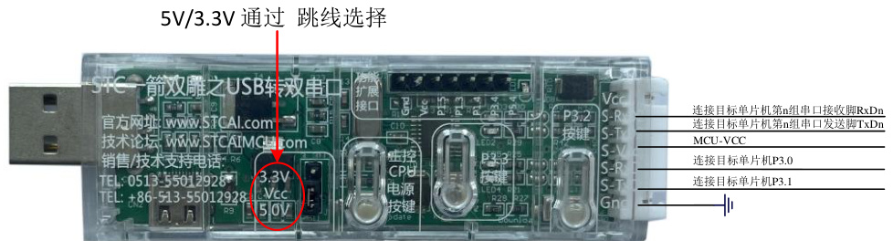

【应用场景一： 从本工具给目标系统 自动 停电/上电， 供电】点击 电脑端 ISP 软件的【下载/编程】 按钮，工具会 自动 给目标系统停电0.5秒/再自动供电，数秒后提示下载编程成功， 工具默认会再 自动 给目标系统停电0.5秒/再自动供电给目标系统工作。

# 【应用场景二： 不从本工具给目标系统供电】

1、 点击 电脑端 ISP 软件的 【下载/编程】 按钮

2、 给目标系统上电，或者重新上电(如果在点击 【下载/编程】 按钮前已上电， 则需要停电重新上电)，电脑端软件提示下载编程进行中，数秒后下载成功， 目标MCU会自动复位到用户程序区跑用户程序。部分不常用设置， 需要停电上电一次才生效， 如改变 EEPROM大小， P5.4/nRST变成复位脚

# STC8G2K64S4-36I-LQFP48/QFN48 最小系统 示意图

36         P2.3/PWM23/A11/MOSI_235         P2.2/PWM22/A10/SS_2 2 M 29         P4.1/PWM41/MISO_3/CMPO_228         P3.7/PWM37/INT3/TxD_2/CMP+/CCP2_2/CCP227         P3.6/PWM36/INT2/RxD_2/CMP-/CCP1_226         P3.5/PWM35/T1/T0CLKO/SS_4/CCP0_2/PWMFLT 25         P5.1/PWM51/TxD3_25( 224 4 ABBB985543223330222827625MISO_2/I2CSDA_2/ECI 3/A12/PWM24/P2.4 37 P5.0/PWM50/RxD3_2SCLK_2/I2CSCL _2/CCP0_3/A13/PWM25/P2.5 38 P3 4/PWM34/T0/T1CLKO/ECI 2/MOSI 4/CMPOCCP是英文单词的缩写 CCP1 _3/A14/PWM26/P2.6 39 P3.3/PWM33/INT 1/MISO _4/I2CSDA 4Capture （捕获） CCP2_3/A15/PWM27/P2.7 40 STC8G2K64S4 P3.2/PWM32/INT0/SCLK 4/I2CSCL _4Compare （比较） ALE/PWM45/P4.5 41 P3.1/PWM31/TxD MCU-VCCPWM （脉宽调制R）xD3/ADR0/xAD2C_28/PWM4060/P40.60 4243 LQFP48 P34.0/PWM340/RMxODS/IN_3T4 0.1u 1以0u上TxD3/AD1/ADC9/PWM01/P0. Gnd/AGndRxD4/AD2/ADC10/PWM02/P0. 456 QFN48 ADC_VRef+TxD4/AD3/ADC11/PWM03/P0.3 Vcc/AVccT3/AD4/ADC12/PWM04/P0. 47 P5.4/PWM54/nRST/MCLKO/SS_3RxD4_2/PWM52/P5.2 48 2 3 4 5 6 8 9 0 二 2 13 P1.7/PWM17/ADC7/TxD_3/XTALI在Vcc和Gnd之间就近加上电源去耦电容正看芯片丝印左下方小圆点处为第 脚注意： 正看芯片丝印最下面一行为最芯后片一版个本字号母 电平 【大电容10uF以上+小电容0.1uF】1、 ADC的外部参考电源管脚ADC_VRef+，必须接外部参考电源【电压： 2.4V \~ MCU-VCC】浮空会有漏电流2、 如不需要进行【软件模拟USB下载】芯片上电/复位时P3.0/P3.1/P3.2 不可同时为低否则会进入【等待进入软件模拟USB下载模式】可在 ISP烧录时指定取消 下次下载时使能USB-ISP模式

# 2.4.8 USB 转双串口芯片全自动停电/上电烧录， 串口仿真 $\cdot +$ 串口通讯， 5V

# 使用 USB转双串口 芯片 进行 全自动 停电/上电， 烧录/仿真 $+$ 串口通讯， 5V

此处的二极管和电阻的作用是防止USB器件给目标芯片供电。 由于 芯片上电时P3.5输出低电平，目标芯片断电过程中， USB器件是不能断电的，USB器件的发送脚 MCU-VCC处于供电状态。USB转第二组串口 一般都是强推挽输出，通过I/O供电芯片就能工作，所以当使用 当检测到需要进行ISP下载时，第二组串口用于和目标系统的 USB转串口TTL对单片机下载程序时此处的隔离二极管不能省 会自动控制MCU-VCC停电0.5S再其他串口通讯 注： 烧录我们的最新USB转双串口软件，可以省此处的隔离二极管 上电进行ISP下载。下载完成后会持续供电Ai8H2K08U-SOP16Ai8H2K12U-SOP16 USB转第一组串口 第一组用于下载或者通讯连接目标U单S片B+机5的V第n组串口的RxDn 1N5819 高推阻挽/输开入漏 12 3456 PUV15cC.c134a/pnTRxDST2 RTxD/P3.765432 154312 30高0R阻输入可做电源 (可系从U统S-电BTx取源D电) 连接目标单片机Q1的P3.1/TxD MCU-VCCD+- 234 D- 0.1u 0.1u 也G可nd以用STC8H2K08U-SOP16取代 关手电动/按供键电 以10上u - G RMB0.045 L 4一70般R不焊D+ 以10上u 20K SAIO233401，RMB0.075U建SB议-T用ypUeSAB-TypeC U出S厂B-自转HI带双DU串烧S口B录转芯，片串免口，驱程动序安，装 P35.54管脚低高电平供电

【应用场景一： 从本工具给目标系统 自动 停电/上电，供电】点击 电脑端 ISP 软件的【下载/编程】按钮，工具会 自动 给目标系统停电0.5秒/再自动供电，数秒后提示下载编程成功，工具默认会再 自动 给目标系统停电0.5秒/再自动供电给目标系统工作。

# 【应用场景二： 不从本工具给目标系统供电】

1、点击 电脑端 ISP 软件的 【下载/编程】按钮

2、给目标系统上电，或者重新上电(如果在点击【下载/编程】按钮前已上电，则需要停电重新上电)，电脑端软件提示下载编程进行中，数秒后下载成功，目标MCU会自动复位到用户程序区自动跑用户程序。部分不常用设置，需要停电上电一次才生效，如改变 EEPROM大小，P5.4/nRST变成复位脚

# STC8G2K64S4-36I-LQFP48/QFN48 最小系统 示意图

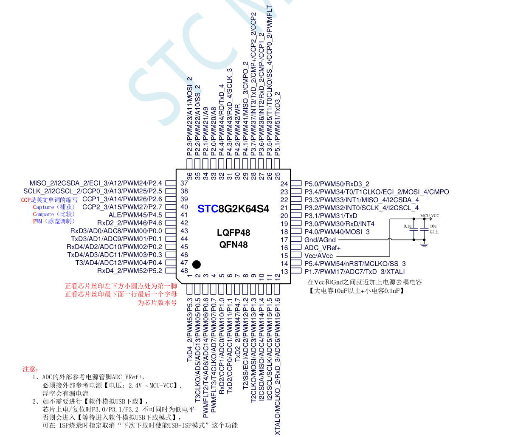

# 2.4.9 USB 转双串口芯片全自动烧录， 串口仿真 $\cdot +$ 串口通讯， 3.3V 原理图

# 使用 USB转双串口 芯片 进行 全自动 停电/上电， 烧录/仿真 $^ +$ 串口通讯， 3.3V

此处的二极管和电阻的作用是防止USB器件给目标芯片供电。 由于 芯片上电时 P5.4-nRST 输出高电平，USB转第二组串口 目标芯片断电过程中，USB器件是不能断电的，USB器件的发送脚 MCU-VCC处于供电状态。第二组串口用于 一般都是强推挽输出，通过I/O供电芯片就能工作，所以当使用 当检测到需要进行ISP下载时，会自动和目标系统的 USB转串口TTL对单片机下载程序时此处的隔离二极管不能省 控制MCU-VCC停电0.5S再上电进行ISP其他串口通讯 注：烧录我们的最新USB转双串口软件， 可以省此处的隔离二极管 下载。下载完成后会持续供电Ai8H2K08U-SOP16Ai8H2K12U-SOP16 USB转第一组串口 第一组用于下载或者通讯连接目标单片机的第n组的RTxDn ? 高推阻挽/输开入漏 2 P1.10/TRxD2 RTxD/P3.76 16 15 推高挽阻/输开入漏 1N5819 S-TRxD 连接目标单片机的P3.10/TRxDUSB接口 USB+5V 1N5819 PowerCtrl 67 PUV5cRC.c4eafp+ D+/P3.3214 13201 P5D.+4管脚高电平供电 或也系充可电统电宝脑U源S输B+入5 Vi供n电 62131： 输出 3.3V， 输入  185V - 3.6V MCU-VCCD- 0.1u 10u 0.1u 也可以用STC8H2K08U-SOP16取代 GND NCD+ 4 以上 也可以用STC8H2K12U-SOP16取代 C1 10K 按下按键停电 CE 0C.21uGnd USB转双串口芯片， 0.1u 松开按键上电U建SB议-T用yUpSeBA-TypeC U出S厂B-自HI带DU烧SB录转，串免口驱程动序安，装 PowerCtrl 二 电源按键 该按键可不焊

【应用场景一：从本工具给目标系统 自动 停电/上电， 供电】点击 电脑端 ISP 软件的【下载/编程】按钮，工具会 自动 给目标系统停电0.5秒/再自动供电，数秒后提示下载编程成功， 工具默认会再 自动 给目标系统停电0.5秒/再自动供电给目标系统工作。  
【应用场景二：不从本工具给目标系统供电】  
1、点击 电脑端 ISP 软件的【下载/编程】按钮  
2、给目标系统上电，或者重新上电(如果在点击【下载/编程】按钮前已上电，则需要停电重新上电)，电脑端软件提示下载编程进行中，数秒后下载成功，目标MCU会自动复位到用户程序区自动跑用户程序。部分不常用设置， 需要停电上电一次才生效，如改变 EEPROM大小，P5.4/nRST变成复位脚STC8G2K64S4-36I-LQFP48/QFN48 最小系统 示意图\$ M3MISO_2/I2CSDA_2/ECI_3/A12/PWM24/P2.4 P5.0/PWM50/RxD3_2SCLK_2/I2CSCL_2/CCP0_3/A13/PWM25/P2.5 38 P3.4/PWM34/T0/T1CLKO/ECI_2/MOSI_4/CMPOCCP是英文单词的缩写 CCP1 39 2 P3.3/PWM33/INT1/MISO _4/I2CSDA_4Capture（捕获） CCP2 40 STC8G2K64S4 2 M32/INT0/SCLK_4/I2CSCL_4Compare（比较） 20 /PWM31/TxDPWM（脉宽调制） 42 19 M30/RxD/INT4RxD3/AD0/AD 443 LQFP48 18 P4.0/PWM40/MOSI_3RTxxD4/3A/ADD2/1A/ADDCC190/ M02/P0. 456 QFN48 16 AGnDdC/_AVGRnedf+TxD4/AD3/ADC1 WM03/P0.3 15 Vcc/AVccT3/AD4/ADC12/PWM04/P0.4 47 P5.4/PWM54/nRST/MCLKO/SS_3RxD4_2/PWM52/P5.2 13 P1.7/PWM17/ADC7/TxD_3/XTALI正看芯片丝印左下方小圆点处为第 在Vcc和Gnd之间就近加上电源去耦电容正看芯片丝印最下面 行最后一个字母 【大电容10uF以上+小电容0.1uF】为芯片版本号注意：1、 ADC的外部参考电源管脚ADC_VRef+，必须接外部参考电源【电压：2.4V \~ MCU-VCC】2、 如芯浮不片空需上会要电有/进漏复行电位【流时软P3件.0模/P拟3U.S1B/P下3.载2】不，可同时为低电平 否则会进入【等待进入软件模拟USB下载模式】可在 ISP烧录时指定取消 下次下载时使能USB -ISP模式 这个功能

# 2.4.10 USB 转双串口芯片进行自动烧录/仿真 $\cdot +$ 串口通讯， 5V/3.3V 跳线选择

#

使用 USB转双串口 芯片 进行 全自动 烧录/仿真 $^ +$ 串口通讯， 5V/3.3V跳线选择此处的二极管和电阻的作用是防止USB器件给目标芯片供电。 由于 芯片上电时P3.5输出低电平，目标芯片断电过程中， 目标芯片断电过程中，USB器件是不能断电的，USB器件的发送脚 USB器件是不能断电的， USB器件的发送脚 MCU-VCC处于供电状态。  
USB接口 USB+5V USB转第二组串口 一般都是强推挽输出，通过I/O供电芯片就能工作，所以当使用 当检测到需要进行ISP下载时，+5V 第和其二目他组标串串系口口统通用的讯于 U注SB：转烧串录口我TT们L对的单最片新U机SB下转载双程串序口时软此件处，的可隔以离省二此极处管的不隔能离省二极管 上会电自进动行控I制SMPC下U-载VC。C下停载电0完.5成S后再22RD- D- 会持续供电D+ 4 22R D+ Ai8H2K08U-SOP16 Ai8H2K12U-SOP16 USB转第一组串口 第一组用于下载或者通讯  
USB-TGypnedA 连接目标单片机的第n组串口的TRxDn 高推阻挽/输开入漏 12 P1.01/TRxD2 RTxD/P3.76 165 推高挽阻/输开入漏 1N5819 S-RTxD 连接目标单片机的P3.01/RTxD1N5819 34567 PUV5cC.c4a/pnRST P3.432 13210 Vcc PQ-1MOS MCU-VCC

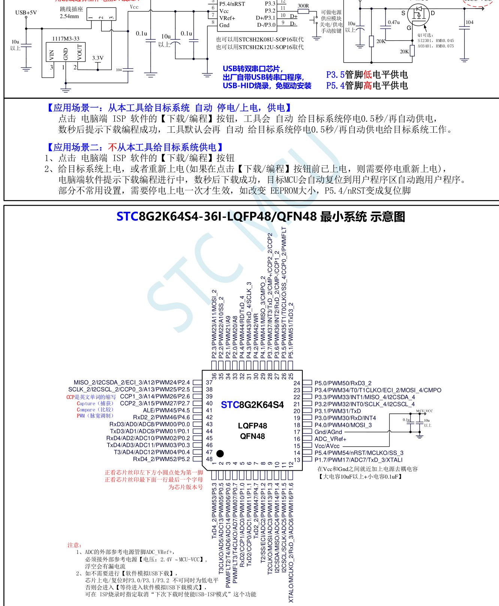

# 2.4.11 通用 USB 转串口芯片全自动停电/上电烧录， 串口仿真， 5V 原理图

使用 USB转串口 芯片 进行 全自动 停电/上电， 烧录/仿真/串口通讯， 5VAi8H2K12U 也可系统电脑电U源S输B+入5 Vi供n电 SPI-2M30O1S/:RMB0.045USB+5V USB+5V 或充电宝USB+5V供电 PQ-1MOASO3401/RMB0.075USB接口 Power-On P5.4/nRST P3.3/P1.1/TxD2 8 4 连接目标单片机的P3.0+5V Vc P3.2/P1.0/RxD2 连接目标单片机的P3. MCU-VCCD USB转串口芯片，UCap D+/TxD/P3.1 6 R1出厂自带USB转串口程序， 10KD( 4 Gnd/AGnd D-/RxD/P3.0 522R USB-HID烧录， 免驱动安装20KGndUSB-TypeA RMB0.95 SOP8 P5.4管脚高电平供电 Power-On SS8050建议用USB-TypeC 也可以用STC8H2K12U-SOP8取代Ai8H2K12U

点击 电脑端 ISP 软件的【下载/编程】按钮，工具会 自动 给目标系统停电0.5秒/再自动供电，数秒后提示下载编程成功， 工具默认会再 自动 给目标系统停电0.5秒/再自动供电给目标系统工作。

【应用场景二： 不从本工具给目标系统供电】

1、点击 电脑端 ISP 软件的 【下载/编程】按钮

2、给目标系统上电，或者重新上电(如果在点击【下载/编程】按钮前已上电，则需要停电重新上电)，电脑端软件提示下载编程进行中，数秒后下载成功，目标MCU会自动复位到用户程序区自动跑用户程序。部分不常用设置， 需要停电上电一次才生效，如改变 EEPROM大小，P5.4/nRST变成复位脚

# STC8G2K64S4-36I-LQFP48/QFN48 最小系统 示意图

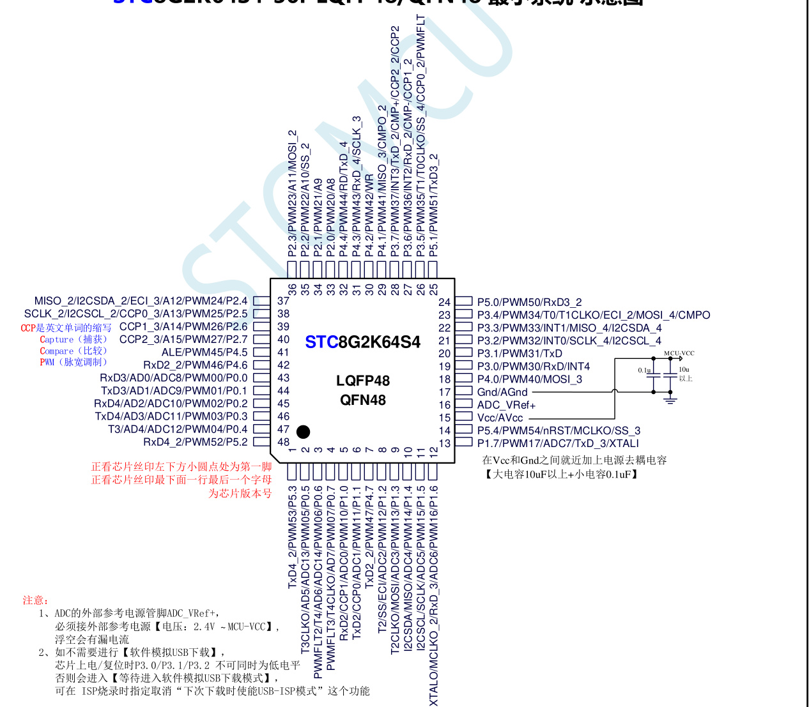

# 2.4.12 通用 USB 转串口芯片全自动停电/上电烧录， 串口仿真， 3.3V 原理图

使用 USB转串口 芯片 进行 全自动 停电/上电， 烧录/仿真/串口通讯， 3.3V  
USB接口 USB+5V USB+5V Ai8H2K12U 也或可充系统电脑宝电U源S输B+入5 V i供n电 62131： 输出 3.3V， 输入 51.85V - 3.6V+5V 。 Power-On 1 P5.4/nRST P3.3/P1.1/TxD2 8 本 连接目标单片机的P3.10 VIN MCU-VCCVOUTD- Vc P3.2/P1.0/RxD2GNDD+ 3 UCap D+/TxD/P3.1 6 D+ USB转串口芯片，Gnd 4 Gnd/AGnd D-/RxD/P3.0 5 D- U出S厂B-自HI带DU烧SB录转，串免口驱程动序安，装 C1 0K 0C.21u  
U建SB议-T用yUpSeBA-TypeC RMB0.95 SOP8 P5.4管脚高电平供电 0.1u P全ow自er动-O控n 制高输电出源，开低/关断也可以用STC8H2K12U-SOP8取代Ai8H2K12U 电源开关， 可不焊

【应用场景一：从本工具给目标系统 自动 停电/上电，供电】点击 电脑端 ISP 软件的【下载/编程】按钮，工具会 自动 给目标系统停电0.5秒/再自动供电，数秒后提示下载编程成功，工具默认会再 自动 给目标系统停电0.5秒/再自动供电给目标系统工作。

【应用场景二： 不从本工具给目标系统供电】

1、点击 电脑端 ISP 软件的【下载/编程】按钮

2、给目标系统上电，或者重新上电(如果在点击【下载/编程】按钮前已上电，则需要停电重新上电)，电脑端软件提示下载编程进行中，数秒后下载成功，目标MCU会自动复位到用户程序区自动跑用户程序。部分不常用设置，需要停电上电一次才生效，如改变 EEPROM大小，P5.4/nRST变成复位脚

# STC8G2K64S4-36I-LQFP48/QFN48 最小系统 示意图

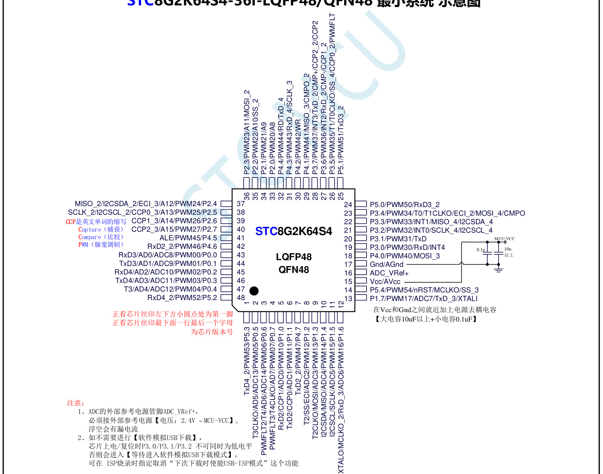

# 2.4.13 USB 转串口芯片全自动停电/上电烧录/仿真/通信， 5V/3.3V 跳线选择

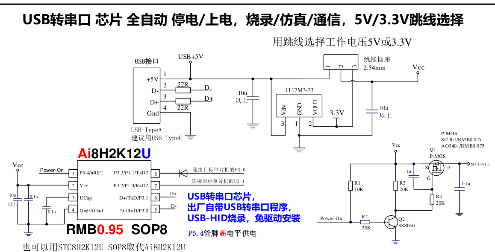

【应用场景一： 从本工具给目标系统 自动 停电/上电，供电】点击 电脑端 ISP 软件的【下载/编程】按钮，工具会 自动 给目标系统停电0.5秒/再自动供电，数秒后提示下载编程成功，工具默认会再 自动 给目标系统停电0.5秒/再自动供电给目标系统工作。

【应用场景二： 不从本工具给目标系统供电】

1、点击 电脑端 ISP 软件的 【下载/编程】按钮

2、给目标系统上电，或者重新上电(如果在点击【下载/编程】按钮前已上电， 则需要停电重新上电)，电脑端软件提示下载编程进行中，数秒后下载成功，目标MCU会自动复位到用户程序区自动跑用户程序。部分不常用设置， 需要停电上电一次才生效，如改变 EEPROM大小，P5.4/nRST变成复位脚

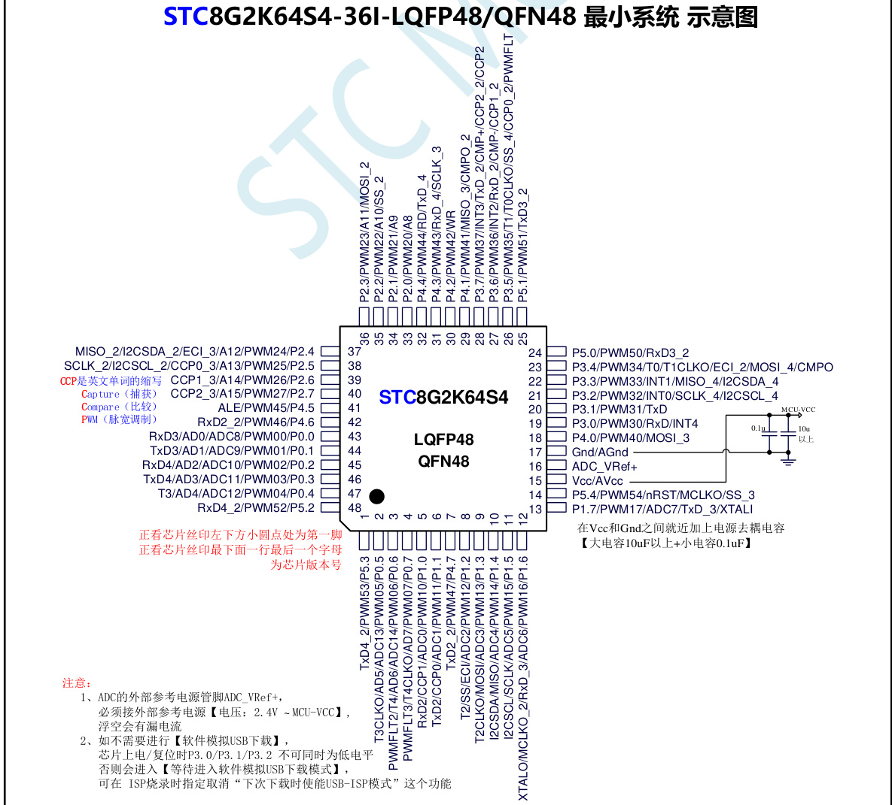

2.4.14 USB 转串口芯片进行烧录/串口仿真， 手动停电/上电， 5V/3.3V 原理图使用 USB转串口 芯片， 进行 ISP烧录/仿真/通信， 目标系统自己手动停电/上电Ai8H2K12UUSB接口 USB+5V USB+5V 1 P5.4/nRST P3.3/P1.1/TxD2 8 4 连接目标单片机的P3.07 连接目标单片机的P3.1

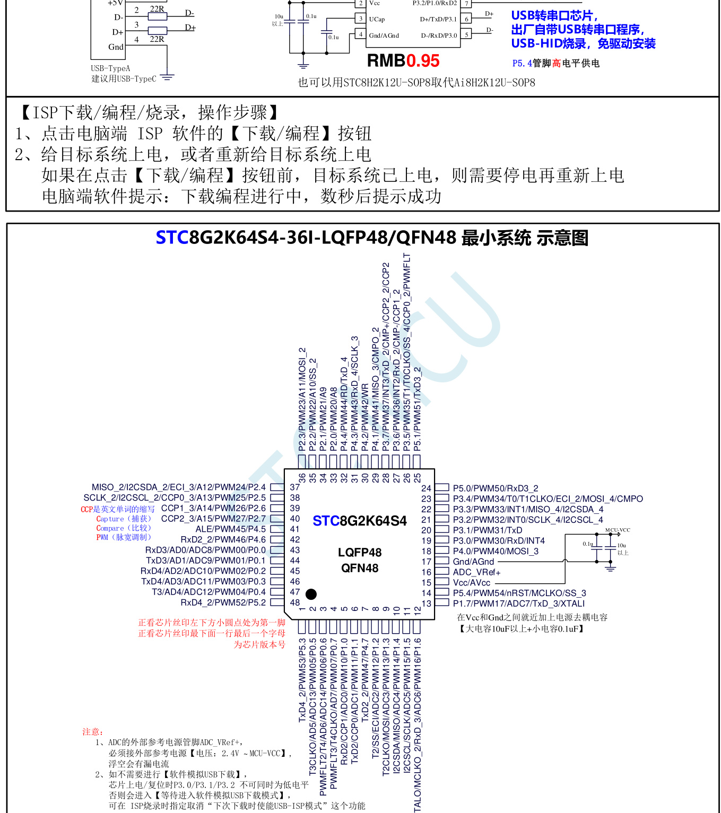

2.4.15 USB 转串口芯片进行烧录， 串口仿真， 手动停电/上电， 3.3V 原理图

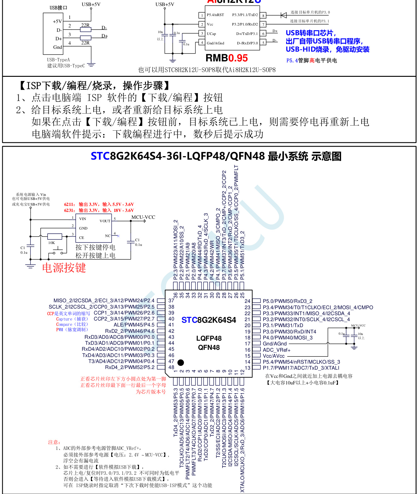  
使用 USB转串口 芯片， 进行 ISP烧录/仿真/通信， 目标系统自己 手动 停电/上电

# 2.4.16 USB-Link1D 支持 脱机下载 说明

脱机下载是指脱离电脑主机进行下载的一种方法，一般是使用下载控制芯片 （又称脱机下载母片）进行控制。 USB-Link1D 工具除了支持在线 ISP 下载，还支持脱机下载。 USB-Link1D 工具使用外部的22.1184MHz 晶振， 可保证对目标芯片进行在线或脱机下载时，校准频率的精度。用户可将代码下载到USB-Link1D 工具中，就可实现脱机下载。 USB-Link1D 主控芯片如内部存储空间不够时， 会将部分被下载的用户程序用加密的方式加密放部分到片外串行 Flash。

先将 USB-Link1D 工具使用 USB 线连接到电脑， 然后按照下面的步骤进行脱机下载：

1、选择目标芯片的型号  
2、打开需要下载的文件  
3、设置硬件选项  
4、进入“USB-Link1D 脱机”页面， 点击“将用户程序下载到编程器以供脱机下载“按钮，即可将用户代码下载到 USB-Linik1D 工具中。 下载完成后便使用 USB-Link1D 工具对目标芯片进行脱机下载了

# 2.4.17 USB-Link1D 支持 脱机下载， 如何免烧录环节

大批量生产， 如何省去专门的烧录人员， 如何无烧录环节  
大批量生产，你在将由 STC 的 MCU 作为主控芯片的控制板组装到设备里面之前，在你将 STC MCU 贴片到你的控制板完成之后，你必须测试你的控制板的好坏。不要说 $100 \%$ ，直通无问题， 那是抬杠，不是搞生产，只要生产，就会虚焊，短路，部分原件贴错，部分原件采购错。  
所以在贴片回来后， 组装到外壳里面之前， 你必须要测试， 你的含有 STC MCU 控制板的好坏， 好的去组装，坏的去维修抢救。

# 控制板的测试/不是烧录！

# 控制板的测试环节必须有， 但烧录环节可以省！

大批量生产， 必须要有方便控制板测试的测试架/下面接上我们的脱机烧录工具：

USB-Link1D / U8W-Mini / U8W， 还要接上其他控制部分！1、 通过 USER-VCC、 P3.0、 P3.1、 GND 连接，要工人每次都开电源2、 通过 S-VCC、 P3.0、 P3.1、 GND 连接， 不要你开电源， STC 的脱机工具给你自动供电

外面帮你做一个测试架的成本 500 元以下， 就是有机玻璃，夹具，顶针。1 个测试你控制板是否正常的工人管理 2 - 3 个 测试架

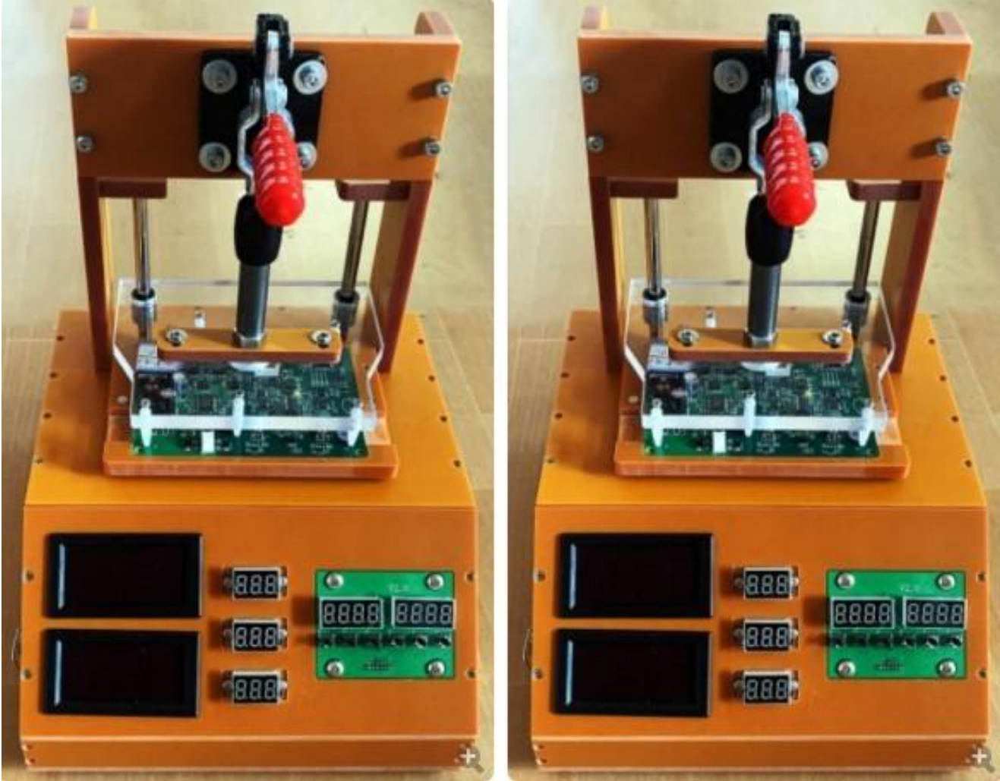

# 操作流程：

1、将你的 MCU 控制板 卡到测试架1 上

2、 将你的 MCU 控制板 卡到测试架2 上， 测试架 1 上的程序已烧录完成/感觉不到烧录时间  
3、 测试 测试架 1 上的 MCU 主控板功能是否正常，正常放到正常区，不正常，放到不正常区  
4、 给测试架1 卡上新的未测试的无程序的控制板  
5、测试 测试架 2 上的未测试控制板/程序不知何时早就不知不觉的烧好了，换新的未测试未烧录的控制  
板  
6、 循环步骤3 到步骤5======不需要安排烧录人员

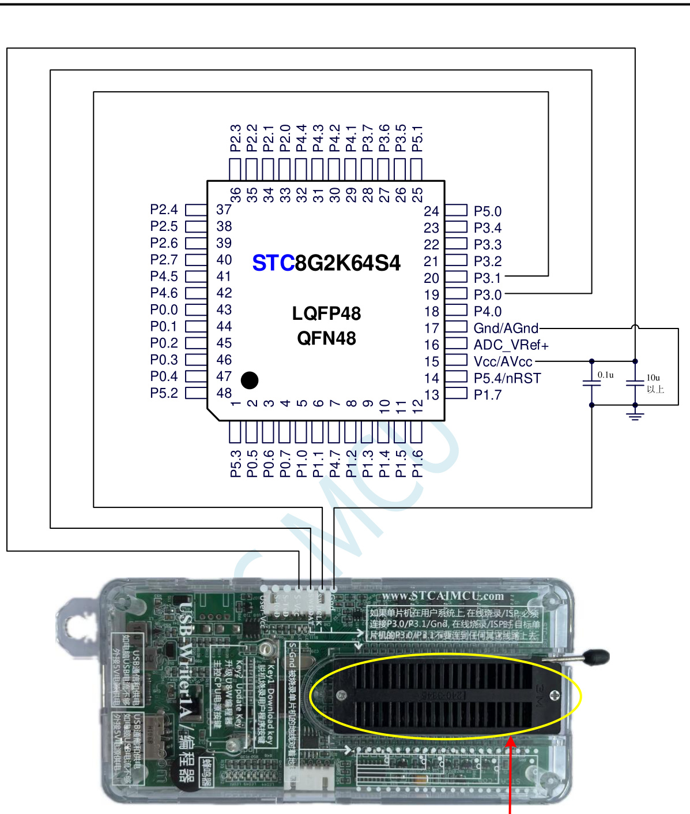

# USB型 脱机/联机烧录工具 USB-Writer1A (人民币100元)

1、LQFP48/32封装：对应使用LQFP48/32转DIP48/32转换座,插在烧录锁紧座上进行烧录  
2、 QFN48封装：使用QFN48转DIP48转换座,插在烧录锁紧座上进行烧录  
3、 PDIP040封装可以直接插在烧录锁紧座上进行烧录

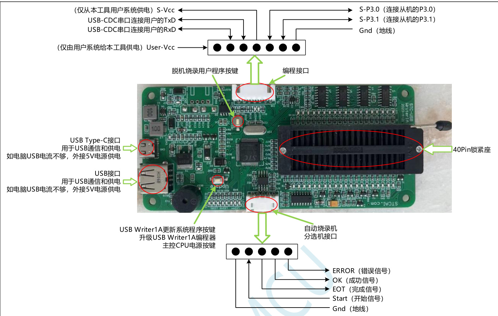  
2.4.19 USB-Writer1A 支持 自动烧录机， 通信协议和接口

# 自动烧录接口 （分选机自动控制接口） 协议：

Start： 开始信号输入脚。 从外部输入低电平信号触发开始脱机烧录， 低电平必须维持 25 毫秒以上

EOT： 烧录完成信号输出脚。 脱机烧录完成后， 工具输出 $2 0 m s { \sim } 2 5 0 m s$ 的低电平 EOT 信号。 电平宽度如下图所示的地方进行设置

X 消际LrNm缓冲区 打开EEPRUM又件复制接收数据硬件选项 USB-Lirk1D/U8W/U8W-Mini脱机 程序加发送缓中区将用户程序下载到编程器以供脱机下载 文本模式清除编程器中的用户脱机代码及数据 EX模式设置USB-Link1D/U8W/U8W-Mini主控芯片 清空发送区设置脱机下载时的最高波特率 115200文件 送回车脱机编程数量 10000 握手超时时间 0S-VCC输出电压 3.3V 上电延时时间 0 COM1 波特率在线下载完成后持续给目标芯片供电 打开串口 编程完自动脱机下载完成后持续给目标芯片供电 自动发送结脱机下载时关闭自动检测有无芯片功能即使下载失败自动增量也自动递增使用第二种LED显示模式 EOT信号提供电流500mA √ BIF保持时间 40 ms脱机下载灵敏度设置 5 E TE 宽度设置30 ms40 ms电源 50 ms60 ms70 ms下载/编程 80 ms100 ms检测选项 帮助 110 ms120 ms  
每次下载前都重新装载目标文件 130 ms140 TS当目标文件变化时自动装载并 150 nS 远程现场升级APP发布160 nS170 nS180 nS190 ms200 ms210 ms220 ms

OK： 良品信号输出脚。 下载成功后工具从 OK 脚输出低电平信号， 信号与 EOT 信号同步。

Err： 不良品信号输出脚。 若下载失败， 工具从 ERR 脚输出输出低电平信号， 信号与 EOT 完成信号同步。

OK和Err只会输出其中一个信号

# 2.5 STC8G2K64S2-36I-LQFP48/QFN48 系列 （8 路增强型 PWM）

# 注意： STC8G2K64S2 系列只有 P2 口才有增强型 PWM， 其他口没有

2.5.1 特性及价格（有 16 位硬件乘除法器 MDU16， 准 16 位单片机）

选型价格 （不需要外部晶振、 不需要外部复位， 10 位 ADC， 15 通道）  

单片机型号 | 工作电压（V） | Flash 程序存储器10万次字节 | idata’内部传统8051 RAM字节 | xdata’内部大容量扩展SRAM 字节 | 强大的双DPTR可增可减 | EEPROM 10万次字节 | 1O口最多数量 | 串口并可掉电唤醒 | MDU16硬件16位乘除法器 SPI | 1²C | 定时器计数器 （TO-T4外部管脚也可掉电唤醒） | 16位高级 PWM定时器互补对称死区 | 支持上升沿中断` 位增强型PWM满足舞台灯光要求 | PCA/CCP/PWM（可当外部中断并 下降沿中断以及边沿中断 可掉电唤醒） | 掉电喚醒专用定时器 | 15路高速ADC （PWM可当D/A使用） | 比较器（可当1路AD’ 可作外部掉电检测 | 內部低压检测中断并可掉电唤醒 | 看门狗复位定时器 | 內部高可靠复位 內部高精准时钟 （可选复位门槛电压） （36MHz以下可调）追频 | 可对外输出时钟及复位 | 程序加密后传输（防拦截) | 可设置下次更新程序需口令 | 支持RS485下载 | 支持软件USB直接下载 | 本身就可在线仿真 | LQFP48 | 价格及封装 QFN48 | LQFP32
STC8G2K32S21.9-5.532K |  | 256 | 2K |  | 32K | 45 | 2 | 有 | 有 | 有 | 5 |  |  | 3 | 有 | 10位 | 有 | 有 | 有 | 4级 | 有 | 是 | 有 | 是 | 是 | 是 是 | ￥3 | 3 3 | 
STC8G2K48S21.9-5.548K |  |  | 256 | 2K |  | 16K | 45 | 2 | 有 | 有 有 |  |  |  | 3 | 有 | 10位 |  | 有 | 有 | 4 级 | 有 | 是 | 有 | 是 | 是 | 是 | 是 |  | ￥3 | 现货
 |  | STC8G2K64S21.9-5.564K 256 |  | 2K 2 |  | IAP | 45 2 | 有 | 有 | 有 | 5 |  |  |  | 有 | 10位 | 有 | 有 | 有 | 4级 | 有 |  | 有 | 是 | 是 | 是 | 是 | ￥3 | ￥3 | 

注： 以上的单价为10K 及以上订货量的价格， 量小则每片需增加0.1 元人民币。

# 内核

超高速 8051 内核 （1T）， 比传统 8051 约快 12 倍以上  
指令代码完全兼容传统 8051  
27 个中断源，4 级中断优先级  
支持在线仿真

# 工作电压

$1 . 9 V { \sim } 5 . 5 V$ 内建 LDO

# 工作温度

${ \bf - 4 0 ^ { \circ } C } \sim 8 5 ^ { \circ } C$ （超温度范围应用请参考电器特性章节说明）

# Flash 存储器

最大 64K 字节 FLASH 程序存储器 （ROM），用于存储用户代码支持用户配置EEPROM 大小， 512 字节单页擦除，擦写次数可达10 万次以上支持在系统编程方式 （ISP） 更新用户应用程序，无需专用编程器支持单芯片仿真， 无需专用仿真器，理论断点个数无限制

SRAM

128 字节内部直接访问 RAM （DATA）  
128 字节内部间接访问 RAM （IDATA）  
2048 字节内部扩展 RAM （内部 XDATA）

# 时钟控制

内部高精度、 高稳定的高速 IRC （ $4 M H z { \sim } 3 8 M H z$ ， ISP 编程时可进行上下调整， 还可以用户软件分频到  
较低的频率工作， 如 $1 0 0 K H z$ ）  
 误差 $\pm 0 . 3 \%$ （常温下 $2 5 ^ \circ C$ ）  
 - $1 . 3 8 \% \sim + 1 . 4 2 \%$ 温漂 （全温度范围， $- 4 0 ^ { \circ } C \sim 8 5 ^ { \circ } C$ ）  
 - $0 . 8 8 \% \sim + 1 . 0 5 \%$ 温漂 （温度范围， ${ \bf - } 2 0 ^ { \circ } C \sim 6 5 ^ { \circ } C$ ）  
内部 $3 2 K H z$ 低速 IRC （为了低功耗， 省去了温度补偿和电压补偿电路， 误差较大）  
外部晶振 （ $4 M H z { \sim } 3 8 M H z$ ） 和外部时钟

（芯片上电工作过程： 上电复位/复位脚复位/看门狗复位/低压检测复位时， 芯片默认从 ISP 系统程序开始执行代码，此时固定使用内部 24MHz 的高速 IRC 时钟，当需要下载用户程序且下载完成后复位到用户程序区或者不需要下载直接复位到用户程序区时，默认会使用上次用户下载时所调节的高速 IRC 时钟，如果用户程序需要使用外部高速晶振、外部 $3 2 . 7 6 8 K H z$ 晶振或者内部 $3 0 K H z$ 低速 IRC， 则需要用户软件先启动相应的时钟，然后通过设置 CLKSEL 寄存器进行切换）

# 复位

# 硬件复位

上电复位。 （在芯片未使能低压复位功能时有效）  
复位脚复位。出厂时P5.4 默认为I/O 口，ISP 下载时可将P5.4 管脚设置为复位脚（注意： 当设置 P5.4管脚为复位脚时，复位电平为低电平）  
看门狗溢出复位  
低压检测复位， 提供4 级低压检测电压： 2.0V、 2.4V、 2.7V、 3.0V。

软件复位软件方式写复位触发寄存器

# 中断

提供27 个中断源： INT0（支持上升沿和下降沿中断） 、 INT1 （支持上升沿和下降沿中断）、 INT2 （只支持下降沿中断）、INT3 （只支持下降沿中断） 、 INT4（只支持下降沿中断）、定时器0、 定时器1、定时器2、定时器3、定时器4、串口1、串口2、ADC 模数转换、LVD 低压检测、SPI、I2C、比较器、PCA/CCP/PWM、增强型 PWM0、 增强型 PWM1、增强型 PWM2、 增强型 PWM3、 增强型 PWM4、 增强型 PWM5、 增强型PWM0 异常检测、 增强型PWM2 异常检测、 增强型PWM4 异常检测。

# 提供4 级中断优先级

时钟停振模式下可以唤醒的中断： INT0(P3.2)、 INT1(P3.3)、 INT2(P3.6)、 INT3(P3.7)、INT4(P3.0)、T0(P3.4)、T1(P3.5)、T2(P1.2)、T3(P0.4)、T4(P0.6)、RXD(P3.0/P3.6/P1.6/P4.3)、RXD2(P1.0/P4.6)、CCP0(P1.1/P3.5/P2.5)、CCP1(P1.0/P3.6/P2.6)、 CCP2(P3.7/P2.7)、 I2C_SDA(P1.4/P2.4/P3.3)以及比较器中断、 低压检测中断、掉电唤醒定时器唤醒。

# 数字外设

5 个16 位定时器： 定时器0、定时器1、定时器2、 定时器3、定时器4，其中定时器0 的模式3 具有 NMI  
（不可屏蔽中断） 功能， 定时器0 和定时器1 的模式 0 为16 位自动重载模式  
2 个高速串口： 串口1、 串口2， 波特率时钟源最快可为FOSC/4  
3 组 16 位 CCP/PCA/PWM 模块： CCP0、CCP1、CCP2， 可用于捕获、高速脉冲输出， 及 6/7/8/10 位的 PWM  
输出  
8 组 15 位增强型 PWM， 可实现带死区的控制信号，并支持外部异常检测功能 （另外还有 3 组传统的  
PCA/CCP/PWM 可作 PWM）  
SPI： 支持主机模式和从机模式以及主机/从机自动切换  
I2C： 支持主机模式和从机模式

MDU16： 硬件 16 位乘除法器 （支持 32 位除以 16 位、 16 位除以 16 位、 16 位乘 16 位、 数据移位以及数据规格化等运算）

# 模拟外设

超高速ADC， 支持 10 位精度 15 通道 （通道 $0 \sim$ 通道14） 的模数转换， 速度最快能达到 500K （每秒进行50 万次 ADC 转换）

ADC 的通道 15 用于测试内部1.19V 参考信号源 （芯片在出厂时， 内部参考信号源已调整为1.19V）比较器，一组比较器 （比较器的正端可选择CMP $+ i$ 端口和所有的ADC 输入端口， 所以比较器可当作多路比较器进行分时复用）DAC： 3 路 PCA/CCP/PWM 可当 3 路 DAC 使用， 45 路增强型 PWM 可当 45 路 DAC 使用

# GPIO

最多可达 45 个 GPIO： P0.0\~P0.7、 P1.0\~P1.7、 P2.0\~P2.7、 P3.0\~P3.7、 P4.0\~P4.7、 P5.0\~P5.4所有的GPIO 均支持如下4 种模式： 准双向口模式、 强推挽输出模式、 开漏模式、 高阻输入模式除 P3.0 和 P3.1 外，其余所有 I/O 口上电后的状态均为高阻输入状态，用户在使用 I/O 口时必须先设置 I/O口模式， 另外每个 I/O 均可独立使能内部 4K 上拉电阻

# 封装

LQFP48、 QFN48

2.5.2 STC8G2K64S2-36I-LQFP48/QFN48 管脚图， ISP 下载/编程线路图

# STC8G2K64S2-36I-LQFP48/QFN48 最小系统 示意图

SCL | SDA
P1.5 | P1.4
P2.5 | P2.4
 | 
P3.2 | P3.3

ADC SPI I2C  
ADC0 ADC1 ADC2 ADC3 ADC4 ADC5 ADC6 ADC7 26         P3.5/T1/T0CLKO/SS_4/CCP0_2/PWMFLT SS MOSI MISO SCLKP1.0 P1.1 P1.2 P1.3 P1.4 P1.5 P1.6 P1.7 P1.2 P1.3 P1.4 P1.5  
ADC8 ADC9 ADC10 ADC11 ADC12 ADC13 ADC14 ADC15 P2.2 P2.3 P2.4 P2.5P0.0 P0.1 P0.2 P0.3 P0.4 P0.5 P0.6 1.19V 28         P3.7/INT3/TxD_2/CMP+/CCP2_2/CCP227         P3.6/INT2/RxD_2/CMP-/CCP1_2 P53.45 P43.04 P43.13 P43.32  
URAxRDT1 TxD URAxRD2T2 TxD2 36         P2.3/PWM23/A11/MOSI_235         P2.2/PWM22/A10/SS_2 31         P4.3/RxD_4/SCLK_3 29         P4.1/MISO_3/CMPO_2 PCA/CCP/PWMP3.0 P3.1 P1.0 P1.1 ECI CCP0 CCP1 CCP2P31.6 P31.7 P4.6 P4.7 P13.24 P13.15 P13.06 P3.7P4.3 P4.4 P2.4 P2.5 P2.6 P2.7CMP CMP+ CMP- CMPO 3 2 2 4 3 \$\i\$P3.7 1.19V P3.4 2 2 2 2 A A4 AR3BADCIN P3.6 P4.1 □OSCLK_2/I2CSCL MISO_2/I2CSDA_2/ECI _2/CCP0_3/A13/PWM25/P2.5 _3/A12/PWM24/P2.4 38 24 2312 P5.0 P3.4/T0/T1CLKO/ECI 2/MOSI_4/CMPOCCP1_3/A14/PWM26/P2.6 39 P3.3/INT1/MISO _4/I2CSDA_4CCP2_3/A15/PWM27/P2.7 40 STC8G2K64S2 P3.2/INT0/SCLK_4/I2CSCL_4ALE/P4.5 41 20 P3.1/TxDCCP是英文单词的缩写 RxD2_2/P4.6 42 19 P3.0/RxD/INT4CPaoWMpmtp（uar脉e（宽调捕比制获较） AAD2/01A/ADC1890/P0.012 434 LQFNP48 1876 PG4n.d0//AMGOnSdI_3 MCU-VCCAD3/ADC11/P0.3 46 15 Vcc/AVccT3/AD4/ADC12/P0.4 47 14 P5.4/nRST/MCLKO/SS_3 0.1u 10uP5.2 48 13 P1.7/ADC7/TxD_3/XTALI 以上2 3 4 567 89 2 d 2正看芯片丝印左下方小圆点处为第一脚正看芯片丝印最下面一行最为后芯一片个版字本母号 \$\$ I2CSCL/SCLK/ADC5/P1.5         11XTALO/MCLKO_2/RxD_3/ADC6/P1.6         12 在Vcc【和大Gn电d之容1间0u就F近以加上+上小电源容去0.耦1u电F】容注意： 1、ADC的外部参考电源管脚ADC_VRef+，必须接外部参考电源 【电压： 2.4V \~ MCU-VCC】浮空会有漏电流2、如不需要进行【软件模拟USB下载】，芯片上电/复位时P3.0/P3.1/P3.2 不可同时为低电平否则会进入【等待进入软件模拟USB下载模式】可在 ISP烧录时指定取消 下次下载时使能USB-ISP模式 这个功能

# 使用USB转串口芯片进行ISP下载/烧录/仿真， 目标系统 手动停电/上电Ai8H2K12U

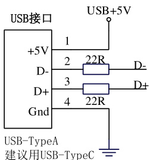  
也可以用STC8H2K12U -SOP8取代Ai8H2K12U-SOP8

USB+5V连接目标单片机的P3.01 P5.4/nRST P3.3/P1.1/TxD22 Vcc P3.2/P1.0/RxD2 连接目标单 片机的P3.  
10u 0.1u 3 UCap D+/TxD/P3.1 USB转串口芯片，  
以上4 Gnd/AGnd D-/RxD/P3.0 出厂自带USB转串口程序，USB-HID烧录， 免驱动安装RMB0.95 P5.4管脚高电平供电

# 【ISP下载/编程/烧录， 操作步骤】

1、 点击电脑端 ISP 软件的 【下载/编程】按钮

2、给目标系统上电，或者重新给目标系统上电如果在点击【下载/编程】按钮前，目标系统已上电， 则需要停电再重新上电电脑端软件提示：下载编程进行中，数秒后提示成功

# 关于 I/O 的注意事项：

# P3.0 和 P3.1 口上电后的状态为弱上拉/准双向口模式

除P3.0 和P3.1 外，其余所有 IO 口上电后的状态均为高阻输入状态，用户在使用 IO口前必须先设置IO 口模式3、 芯片上电时如果不需要使用 USB 进行 ISP 下载， $P 3 . 0 / P 3 . 1 / P 3 . 2$ 这 3 个 I/O 口不能同时为低电平，否则会进入 USB 下载模式而无法运行用户代码芯片上电时，若 P3.0 和 P3.1 同时为低电平，P3.2 口会短时间由高阻输入状态切换到双向口模式，用以读取P3.2 口外部状态来判断是否需要进入 USB 下载模式当使用P5.4 当作复位脚时，这个端口内部的 4K 上拉电阻会一直打开；但P5.4 做普通I/O 口时，基于这个I/O 口与复位脚共享管脚的特殊考量，端口内部的4K 上拉电阻依然会打开大约6.5 毫秒时间，再自动关闭（当用户的电路设计需要使用 P5.4 口驱动外部电路时，请务必考虑上电瞬间会有 6.5 毫秒时间的高电平的问题）

# 2.5.3 STC8G2K64S2-36I-PDIP40 管脚图， ISP 下载/编程线路图

# STC8G2K64S2-36I-PDIP40 最小系统 示意图

UART1  

RxD | TxD
P3.0 | P3.1
P3.6 | P3.7
P1.6 | P1.7
 | 

1、 ADC的外部参考电源管脚ADC _VRef+， 必须接外部参考电源 【电压：2.4V \~ MCU-VCC】,浮空会有漏电流2、 如不需要进行【软件模拟USB下载】， 芯片上电/复位时P3.0/P3.1/P3.2 不可同时为低电平否则会进入【等待进入软件模拟USB下载模式】 可在 ISP烧录时指定取消 下次下载时使能USB-ISP模式 这个功能

UART2   

RxD2 | TxD2
P1.0 | P1.1
 | 

CMP   

CMP+ | CMP- | CMPO
P3.7 | 1.19V | P3.4
ADCIN | P3.6 | P4.1

I2   

SCL | SDA
P1.5 | P1.4
P2.5 | P2.4
 | 
P3.2 | P3.3

SPI   

SS | MOSI | MISO | SCLK
P1.2 | P1.3 | P1.4 | P1.5
P2.2 | P2.3 | P2.4 | P2.5
 |  |  | 
P3.5 | P3.4 | P3.3 | P3.2

ADC   

ADCO | ADC1 | ADC2 | ADC3 | ADC4 | ADC5 | Adc6 | ADC7
P1.0 | P1.1 | P1.2 | P1.3 | P1.4 | P1.5 | P1.6 | P1.7
ADC8 | ADC9 | ADC10 | ADC11 | ADC12 | ADC13 | ADC14 | ADC15
P0.0 | P0.1 | P0.2 | P0.3 | P0.4 | P0.5 | P0.6 | 1.19V

PCA/CCP/PWM   

ECI | CCPO | CCPI | CCP2
P1.2 | P1.1 | P1.0 | P3.7
P3.4 | P3.5 | P3.6 | P3.7
P2.4 | P2.5 | P2.6 | P2.7
 |  |  | 

CCP是英文单词的缩写AD0/ADC8/P0.0 12 40 P4.5/ALE Capture （捕获）AD1/ADC9/P0.1 39 P2.7/PWM27/A15/CCP2_3 CPoWMmp（ar脉e（宽调比制较）AD2/ADC10/P0.2 38 P2.6/PWM26/A14/CCP1 _3AD3/ADC11/P0.3 4 37 P2.5/PWM25/A13/CCP0_3/I2CSCL _2/SCLK_2T3/AD4/ADC12/P0.4 5 P2.4/PWM24/A12/ECI_ 3/I2CSDA 2/MISO 2T3CLKO/AD5/ADC13/P0.5 6 STC8G2K64S2 P2.3/PWM23/A11/MOSI_2PWMFLT2/T4/AD6/ADC14/P0.6 7 P2. 2/PWM22/A10/SS_2PWMFLT3/T4CLKO/AD7/P0.7 8 1/PWM21/A9RxD2/CCP1/ADC0/P1.0 9 PDIP40 P2.0/PWM20/A8TxD2/CCP0/ADC1/P1.1 10 P4.4/RD/TxD_4T2CLKO/MOSI/ADC3/P1.3 T2/SS/ECI/ADC2/P1. 2 11 12 298 P4.2/WR P4.1/MISO _3/CMPO_2I2CSDA/MISO/ADC4/P1.4 13 P3.7/INT3/TxD_2/CMP+/CCP2_2/CCP2I2CSCL/SCLK/ADC5/P1.5 14 27 P3.6/INT2/RxD_2/CMP-/CCP1_2XTALO/MCLKO 2/RxD _3/ADC6/P1.6 15 26 P3.5/T1/T0CLKO/SS_4/CCP0 _2/PWMFLTXTALI/TxD_3/ADC7/P1.7 16 25 P3.4/T0/T1CLKO/ECI_2/MOSI 4/CMPOSS 3/MCLKO/nRST/P5.4 17 24 P3.3/INT1/MISO 4/I2CSDA _4MCU-VCC Vcc/AVcc 18 232 P3.2/INT0/SCLK_4/I2CSCL0.1u ADC_ VRef+ 19 P3.1/TxDGnd/AGnd 20 21 P3.0/RxD/INT4在Vcc和Gnd之间就近加上电源去耦电容【大电容10uF以上+小电容0.1uF】

注意：

# 使用 USB转双串口 芯片 进行 全自动 停电/上电， 烧录/仿真 $^ +$ 串口通讯， 5V

# USB转第二组串口

第二组串口用于和目标系统的其他串口通讯

此处的二极管和电阻的作用是防止USB器件给目标芯片供电。由于目标芯片断电过程中，USB器件是不能断电的，USB器件的发送脚一般都是强推挽输出，通过I/O供电芯片就能工作，所以当使用USB转串口TTL对单片机下载程序时此处的隔离二极管不能省

芯片上电时P3.5输出低电平，MCU-VCC处于供电状态。当检测到需要进行ISP下载时，会自动控制MCU-VCC停电0.5S再上电进行ISP下载。下载完成后

Ai8H2K08U-SOP16 会持续供电Ai8H2K12U-SOP16 USB转第一组串口 第一组用于下载或者通讯连接目标单片机的第n组串口的RTxDn ? 高推阻挽/输开入漏 P1.01/TRxD2 RTxD/P3.67 推高挽阻/输开入漏 1N5819 S-TRxD 连接目标单片机的P3.01/RTxD1N5819 3 P1.3 P3.5 系统电源 Q1+5DV+- USB+5V 10u 0.1u 5 PU5C.4a/pnRST 78 也VG可nRde以f+用STC8HD2DK+-/0P83U.01-SO190P16D-+取代 P3.43 12 关供电应/模供块电 (可从USB取电) 以10上u 0.47u P-MOS RMB0.045 MCU-VCC − 470RD+ 0.1u 20K QSA1IO23可340选1：，20KU建SB议-T用yUpSeBA-TypeC U出S厂B-自转HI带双DU串烧S口B录转芯，片串免口，驱程动序安，装 P35.54管脚低高电平供电

【应用场景一：从本工具给目标系统 自动 停电/上电，供电】点击 电脑端 ISP 软件的【下载/编程】按钮，工具会 自动 给目标系统停电0.5秒/再自动供电，数秒后提示下载编程成功，工具默认会再 自动 给目标系统停电0.5秒/再自动供电给目标系统工作。

# 【应用场景二： 不从本工具给目标系统供电】

1、点击 电脑端 ISP 软件的 【下载/编程】按钮

2、给目标系统上电，或者重新上电(如果在点击【下载/编程】按钮前已上电，则需要停电重新上电)，电脑端软件提示下载编程进行中，数秒后下载成功，目标MCU会自动复位到用户程序区自动跑用户程序。部分不常用设置， 需要停电上电一次才生效，如改变 EEPROM大小，P5.4/nRST变成复位脚

# 关于 I/O 的注意事项：

1、 P3.0 和P3.1 口上电后的状态为弱上拉/准双向口模式  
2、 除P3.0 和P3.1 外，其余所有 IO 口上电后的状态均为高阻输入状态，用户在使用 IO口前必须先设置IO 口模式  
3、 芯片上电时如果不需要使用 USB 进行 ISP 下载， $P 3 . 0 / P 3 . 1 / P 3 . 2$ 这 3 个 I/O 口不能同时为低电平，否则会进入 USB 下载模式而无法运行用户代码芯片上电时，若 P3.0 和 P3.1 同时为低电平，P3.2 口会短时间由高阻输入状态切换到双向口模式，用以读取P3.2 口外部状态来判断是否需要进入 USB 下载模式当使用P5.4 当作复位脚时，这个端口内部的 4K 上拉电阻会一直打开；但P5.4 做普通I/O 口时，基于这个I/O 口与复位脚共享管脚的特殊考量，端口内部的4K 上拉电阻依然会打开大约6.5 毫秒时间，再自动关闭（当用户的电路设计需要使用 P5.4 口驱动外部电路时，请务必考虑上电瞬间会有 6.5 毫秒时间的高电平的问题）

# 2.5.4 管脚说明

编号 | 名称 | 类型 | 说明
LQFP48
P5.3
 | PWM53 | I/O | 标准IO口 增強PWM 输出腳
P0.5 |  | 
 | I/O | 标准IO口
PWM05 AD5 | θ | 增強 PWM输出腳
 | I/O | 地址/数据总线 ADC模拟输入通道 13
 | ADC13 | I | 定时器 3 时钟分频输出
T3CLKO P0.6 | 0 | 
 | 1/O | 标准10口
PWM06 AD6 | θ 1/O | 增強PWM 输出腳 地址/数据总线
ADC14 |  | ADC 模拟输入通道14
T4 |  | 定时器4外部时钟输入
 | PWMFLT2 | I | 增强 PWM 的外部异常检测腳
P0.7 | 1/O | 标准IO口
PWM07 | θ | 增強PWM 输出腳
AD7 | 1/O | 地址/数据总线
T4CLKO | 0 | 定时器 4 时钟分频输出
PWMFLT3 | - I | 增强 PWM 的外部异常检测腳
 | P1.0 | 1/O | 标准IO口
PWM10 | - | 增強 PWM输出腳
ADCO |  | ADC模拟输入通道0
CCP1 | 1/O | PCA的捕获输入、 脉冲输出和 PWM 输出
RxD2 |  | 串口2的接收脚
 |  | P1.1 1O | 标准IO口
 | PWM11 θ | 增強 PWM 输出腳
ADC1 | I | ADC 模拟输入通道1
CCPO | 1/O | PCA的捕获输入、 脉冲输出和 PWM输出
TxD2 | 0 | 串口 2 的发送脚
 | P4.7 | 1/O | 标准IO口
 | PWM47 | 增強PWM 输出腳
 | TxD2_2 0 | 串口2的发送脚
 | P1.2 | I/O | 标准IO口
PWM12 | θ | 增強 PWM 输出腳
ADC2 | I | ADC模拟输入通道2
ECI | I | PCA 的外部脈冲输入
SS | 1 | SPI 的从机选择脚 （主机为输出）
T2 |  | 定时器 2外部时钟输入

编号 | 名称 | 类型 | 说明
LQFP48 | P1.3
 |  | I/O | 标准IO口 | 
 | PWM13 |  | 增強PWM输出腳
ADC3 | 1 | ADC 模拟输入通道3 | 
 | MOSI | 1/O | SPI主机输出从机输入
 | T2CLKO | 0 | 定时器 2 时钟分频输出
10 |  | P1.4 | 1/O | 标准IO口
 | PWM14 | θ | 增強PWM 输出腳
ADC4 |  | I ADC模拟输入通道4 | 
 | MISO | 1/O | SPI主机输入从机输出
 | SDA | 1/O | I2C 接口的数据线
 |  | P1.5 | 1/O | 标准1O口
 | PWM15 | 0 | 增強PWM 输出腳
ADC5 | 1 | ADC模拟输入通道 | 
 | SCLK | 1/O | SPI的时钟脚
SCL |  | 1/O I2C 的时钟线 | 
12 |  | P1.6 | 1/O 标准IO口 | 
 | PWM16 | θ | 增強 PWM 输出腳
 | ADC6 | I | ADC模拟输入通道6
RxD_3 |  | I | 串口１的接收腳
MCLKO_2 |  | 0 | 主时钟分频输出
XTALO |  | 0 | 外部晶振的输出腳
 | P1.7 | 1O | 标准IO口
13 |  | PWM17 |  | 增強 PWM 输出腳
ADC7 |  | I | ADC 模拟输入通道7
TxD_3 | 0 | 串口1的发送脚 | 
XTALI |  | I | 外部晶振/外部时钟的输入脚
P5.4 |  | IO | 标准IO口
 |  | PWM54 | θ | 增強 PWM 输出腳
 | NRST | I | 复位引脚（低电平复位）
MCLKO |  | 主时钟分频输出 | 
 |  | 0 | 
 | SS_3 |  | SPI 的从机选择脚 （主机为输出）
15 |  | Vcc | Vcc | 电源脚
 | AVcc | Vcc | ADC电源腳
16 |  | ADC_Vref+ |  | ADC 外部参考电压源输入腳， 要求不高时可直接接 MCU的VCC
17 |  | Gnd | Gnd | 地线
 | AGnd | Gnd | ADC地线

编号 | 名称 | 类型 | 说明
LQFP48 | 
18 | P4.0 | I/O | 标准IO口
PWM40 |  | 增強PWM输出腳
MOSI_3 | IO | SPI主机输出从机输入
19 | P3.0 | I/O | 标准IO口
PWM30 |  | 增強 PWM 输出腳
RxD | - I | 串口１的接收腳
INT4 | - I | 外部中断4
20 | P3.1 | IO | 标准1O口
PWM31 | θ | 增强PWM输出脚
TxD | 0 | 串口1的发送脚
21 | P3.2 | I/O | 标准IO口
PWM32 |  | 增強 PWM 输出腳
INTO | I | 外部中断0
SCLK_4 | I/O | SPI的时钟脚
SCL_4 | IO | I2C的时钟线
22 | P3.3 | IO | 标准IO口
PWM33 |  | 增強PWM输出腳
INT1 | I | 外部中断1
MISO_4 | IO | SPI主机输入从机输出
SDA_4 | IO | I2C接口的数据线
23 | P3.4 | IO | 标准IO口
PWM34 | θ | 增強 PWM 输出腳
TO | I | 定时器0外部时钟输入
T1CLKO | 0 | 定时器1时钟分频输出
ECI_2 | I | PCA的外部脈冲输入
MOSI_4 | I/O | SPI主机输出从机输入
CMPO | 0 | 比较器输出
24 | P5.0 | I/O | 标准10口
PWM50 | θ | 增強PWM输出腳
RxD3_2 | I | 串口3的接收脚
25 | P5.1 | I/O | 标准IO口
PWM52 | θ | 增強PWM输出腳

编号 | 名称 | 类型 | 说明
LQFP48 | 
26 |  | P3.5 | IO | 标准IO口
PWM35 |  | 增強 PWM 输出腳
T1 |  | 定时器 外部时钟输入
TOCLKO | 0 | 定时器0时钟分频输出
SS_4 | I | SPI 的从机选择脚 （主机为输出）
CCP0_2 | IO | PCA的捕获输入、 脉冲输出和 PWM 输出
PWMFLT | I | 增强 PWM 的外部异常检测腳
P3.6 | IO | 标准IO口
2 |  | PWM36 | θ | 增強PWM输出腳
INT2 | I | 外部中断 2
RxD_2 | I | 串口 的接收腳
CMP- | I | 比较器负极输入
CCP1_2 | IO | PCA 的捕获输入、 脉冲输出和PWM输出
P3.7 | I/O | 标准IO口
28 |  | PWM37 | θ | 增強 PWM 输出腳
INT3 | 1 | 外部中断3
TxD_2 |  | 串口 的发送脚
CMP+ | I | 比较器正极输入
CCP2 | I/O | PCA的捕获输入、 脉冲输出和 PWM输出
CCP2_2 | I/O | PCA 的捕获输入、 脉冲输出和 PWM输出
P4.1 | I/O | 
29 |  |  | θ | 标准IO口 增強PWM 输出腳
PWM41 MISO_3 | I/O | SPI主机输入从机输出
 |  | 
CMPO_2 | 0 | 比较器输出
P4.2 | IO | 标准10口
30 |  | PWM42 | θ | 增強 PWM 输出腳
WR | 0 | 外部总线的写信号线
P4.3 | IO | 标准IO口
31 |  | PWM43 |  | 增強PWM 输出腳
RxD_4 | I | 串口 的接收腳
SCLK_3 | I/O SPI | 的时钟脚
P4.4 | IO | 标准I0口
32 |  | PWM44 | θ | 增強 PWM 输出腳
RD | 0 | 外部总线的读信号线
TxD_4 | 0 | 串口 的发送脚
P2.0 | IO | 标准IO口
33 |  | PWM20 | 0 | 增强 PWM 输出脚
 |  | 地址总线 | 
 | A8 | 0 | 

编号 | 名称 | 类型 |  | 说明
LQFP48 | 
34 |  | P2.1 | IO | 标准IO口
PWM21 | 0 | 增强 PWM 输出脚
35 |  | A9 | 0 | 地址总线
P2.2 | I/O | 标准IO口
PWM22 | 0 | 增强 PWM 输出脚
A10 | 0 | 地址总线
36 |  | SS_2 | I | SPI的从机选择腳 （主机为输出）
P2.3 | I/O | 标准IO口
PWM23 | 0 | 增强 PWM 输出脚
A11 | 0 | 地址总线
MOSI_2 | 1/O | SPI主机输出从机输入
CCP0_2 | IO | PCA的捕获输入、 脉冲输出和 PWM 输出
37 |  | P2.4 | I/O | 标准IO口
PWM24 | 0 - | 增强PWM 输出脚
A12 | 0 | 地址总线
ECI_3 |  | PCA 的外部脈冲输入
SDA_2 | I/O | I2C 接口的数据线
MISO_2 | 1/O | SPI 主机输入从机输出
38 |  | P2.5 | IO | 标准IO口
PWM25 | 0 | 增强 PWM 输出脚
A13 | 0 | 地址总线
CCP0_3 | 1O | PCA 的捕获输入、 脉冲输出和 PWM 输出
SCL_2 | 1/O | I2C的时钟线
SCLK_2 | 1/O | SPI的时钟脚
39 |  | P2.6 | I/O | 标准IO口
PWM26 | 0 | 增强PWM 输出脚
A14 | - 0 | 地址总线
CCP1_3 | I/O | PCA 的捕获输入、 脉冲输出和 PWM 输出
P2.7 | I/O | 标准1O口
40 |  | PWM27 | 0 | 增强 PWM 输出脚
A15 |  | 地址总线
CCP2_3 | 0 IO | PCA的捕获输入、 脉冲输出和PWM输出
P4.5 | I/O | 标准IO口
41 |  | PWM45 | θ | 增強PWM 输出腳
 |  | 
ALE | 0 | 地址锁存信号

编号 | 名称 | 类型 |  | 说明
LQFP48 | 
42 |  | P4.6 | I/O | 标准IO口
PWM46 | θ | 增強 PWM 输出腳
RxD2_2 | I | 串口2的接收脚
43 |  | PO.0 | I/O | 标准IO口
PWMOO |  | 增強PWM 输出腳
ADC8 |  | ADC模拟输入通道8
AD0 | I/O | 地址/数据总线
44 |  | P0.1 | I/O | 标准IO口
PWM01 |  | 增強 PWM输出腳
ADC9 | I | ADC模拟输入通道9
AD1 | I/O | 地址/数据总线
45 |  | P0.2 | IO | 标准IO口
PWM02 | θ | 增強 PWM 输出腳
ADC10 | I | ADC模拟输入通道10
AD2 | IO | 地址/数据总线
46 |  | P0.3 | I/O | 标准I0口
PWM03 |  | 增強PWM 输出腳
ADC11 | I | ADC 模拟输入通道11
AD3 | I/O | 地址/数据总线
47 |  | P0.4 | I/O | 标准IO口
PWM04 | θ | 增強PWM 输出腳
ADC12 | I | ADC模拟输入通道12
AD4 | IO | 地址/数据总线
T3 | I | 定时器 3 外部时钟输入
48 |  | P5.2 | I/O | 标准IO口
 | PWM52 |  | 增強PWM输出腳

# 2.5.5 USB-Link1D 对 STC8G 系列进行自动串口烧录、 仿真 $\cdot +$ 串口通讯

# 使用 【USB Link1D】 对 STC8G2K64S2系列 进行全自动停电/上电串口烧录、 仿真 $\cdot +$ 串口通讯

# 【USB Link1D】 工具： 支持 全自动 停电 / 上电， 在线下载 脱机下载， 仿真

USBLinkiD 连接目标单片机P3.1 连接目标单片机P3.0 技术网TCAtcom 连MC接U目-V标C单C 片机第n组串口发送脚TxDn 分销商电话： 司 □ 连接目标单片机第n组串口接收脚RxDn TBE:0513-550x202928 C18 CDO

【应用场景一： 从本工具给目标系统 自动 停电/上电， 供电】点击 电脑端 ISP 软件的【下载/编程】按钮，工具会 自动 给目标系统停电0.5秒/再自动供电，数秒后提示下载编程成功， 工具默认会再 自动 给目标系统停电0.5秒/再自动供电给目标系统工作。

# 【应用场景二： 不从本工具给目标系统供电】

1、 点击 电脑端 ISP 软件的 【下载/编程】 按钮

2、 给目标系统上电， 或者重新上电(如果在点击 【下载/编程】 按钮前已上电， 则需要停电重新上电)，电脑端软件下载编程进行中，数秒后下载成功， 目标MCU会自动复位到用户程序区自动跑用户程序。部分不常用设置， 需要停电上电一次才生效， 如改变 EEPROM大小， P5.4/nRST变成复位脚

# STC8G2K64S2-36I-LQFP48/QFN48 最小系统 示意图

1 0 31         P4.3/RxD_4/SCLK_3 28         P3.7/INT3/TxD_2/CMP+/CCP2_2/CCP227         P3.6/INT2/RxD_2/CMP-/CCP1_226         P3.5/T1/T0CLKO/SS_4/CCP0_2/PWMFLT 22 224 4 A B B B3 5MISO_2/I2CSDA_2/ECI_3/A12/PWM24/P2.4 (d 15431230228265 24 P5.0SCLK_2/I2CSCL_2/CCP0_3/A13/PWM25/P2.5 38 2321 P3.4/T0/T1CLKO/ECI _2/MOSI _4/CMPOCCP1_3/A14/PWM26/P2.6 39 P3.3/INT1/MISO_4/I2CSDA_4CCP2_3/A15/PWM27/P2.7 410 STC8G2K64S2 P3.2/INT0/SCLK_4/I2CSCL_4ALE/P4.5 2 P3.1/TxDCCP是英文单词的缩写 RxD2_2/P4.6 42 19 P3.0/RxD/INT4Capture （捕获） AD0/ADC8/P0.0 43 LQFP48 178 P4.0/MOSI 3PCWoMmp（ar脉e（宽调比制较） AAD2/1A/ADC190/P0.12 445 QFN48 165 AGDndC/_AVGrnefd+ MCU-VCCAD3/ADC11/P0.3 46 Vcc/AVccT3/AD4/ADC12/P0.4 47 14 P5.4/nRST/MCLKO/SS_3 0.1 10uP5.2 48 13 P1.7/ADC7/TxD_3/XTALI2 3 4 5 6 7 8 9 0 12正看芯片丝印左下方小圆点处为第一脚正看芯片丝印最下面一行为最芯后片一版个本字号母 在Vcc【和大Gn电d之容1间0u就F近以加上 $. +$ 小电源容去0.耦1u电F】容注意：1、 C的外部参考电源管脚ADC_VRef+，须接外部参考电源【电压： 2.4V \~ MCU-VCC】浮空会有漏电流不需要进行【软件模拟USB下载】片上电/复位时P3.0/P3.1/P3.2 不可同时为低电平否则会进入【等待进入软件模拟USB下载模式】，可在 ISP烧录时指定取消 下次下载时使能USB-ISP模式 这个功

# 2.5.6 使用【一箭双雕之 USB 转双串口】进行串口烧录、 仿真 $\cdot +$ 串口通讯

# 使用 【一箭双雕之USB转双串口】 对 STC8G2K64S2系列 进行串口烧录、 仿真 $^ +$ 串口通讯

# 【一箭双雕之USB转双串口】 支持 全自动 停电 / 上电， 在线下载， 仿真

【应用场景一： 从本工具给目标系统 自动 停电/上电， 供电】点击 电脑端 ISP 软件的【下载/编程】按钮，工具会 自动 给目标系统停电0.5秒/再自动供电，数秒后提示下载编程成功， 工具默认会再 自动 给目标系统停电0.5秒/再自动供电给目标系统工作。

# 【应用场景二： 不从本工具给目标系统供电】

1、 点击 电脑端 ISP 软件的 【下载/编程】 按钮

2、 给目标系统上电，或者重新上电(如果在点击 【下载/编程】 按钮前已上电， 则需要停电重新上电)，电脑端软件提示下载编程进行中，数秒后下载成功， 目标MCU会自动复位到用户程序区跑用户程序。部分不常用设置， 需要停电上电一次才生效， 如改变 EEPROM大小， P5.4/nRST变成复位脚

# STC8G2K64S2-36I-LQFP48/QFN48 最小系统 示意图

32         P4.4/RD/TxD_4 31         P4.3/RxD_4/SCLK_3 29         P4.1/MISO_3/CMPO_2 28         P3.7/INT3/TxD_2/CMP+/CCP2_2/CCP227         P3.6/INT2/RxD_2/CMP-/CCP1_226         P3.5/T1/T0CLKO/SS_4/CCP0_2/PWMFLTS 12 222 44 B P B3 5□□□□MISO_2/I2CSDA_ 2/ECI 3/A12/PWM24/P2.4 37 24 P5.0SCLK_2/I2CSCL_2/CCP0 3/A13/PWM25/P2.5 38 23 P3.4/T0/T1CLKO/ECI_2/MOSI 4/CMPOCCP1_3/A14/PWM26/P2.6 39 P3.3/INT1/MISO_ 4/I2CSDA_4CCP2_3/A15/PWM27/P2.7 STC8G2K64S2 P3.2/INT0/SCLK_4/I2CSCL_4ALE/P4.5 41 P3.1/TxDCCP是英文单词的缩写 RxD2_2/P4.6 42 P3.0/RxD/INT4Capture （捕获） AD0/ADC8/P0.0 43 LQFP48 P4.0/MOSI_ 3Compare （比较） AD1/ADC9/P0.1 44 Gnd/AGndPWM（脉宽调制） AD2/ADC10/P0.2 45 QFN48 ADC Vref+ MCU-VCCAD3/ADC11/P0.3 46 15 Vcc/AVccT3/AD4/ADC12/P0.4 47 14 P5.4/nRST/MCLKO/SS_3 0.1u 10uP5.2 48 13 P1.7/ADC7/TxD_3/XTALI 以上2 3 4 5 8 9 0 1112正看芯片丝印左下方小圆点处为第一脚正看芯片丝印最下面一行最后一个字母 4 5 6 在Vcc和Gnd之间就近加上电源去耦电容为芯片版本号 P P 【大电容10uF以上+小电容0.1uF】注意： I2CSCL/SCLK/ADC5/P1.5         11 XTALO/MCLKO_2/RxD_3/ADC6/P1.6         121、 ADC的外部参考电源管脚ADC_VRef+，须接外部参考电源【电压：2.4V \~ MCU-VCC】浮空会有漏电流不需要进行【软件模拟USB下载】片上电/复位时P3.0/P3.1/P3.2 不可同时为低电平则会进入【等待进入软件模拟USB下载模式】可在 ISP烧录时指定取消 下次下载时使能USB-ISP模式 这个功能

# 2.5.7 USB 转双串口芯片全自动停电/上电烧录， 串口仿真 $\cdot +$ 串口通讯， 5V

# 使用 USB转双串口 芯片 进行 全自动 停电/上电， 烧录/仿真 $^ +$ 串口通讯， 5V

此处的二极管和电阻的作用是防止USB器件给目标芯片供电。 由于 芯片上电时P3.5输出低电平，目标芯片断电过程中，USB器件是不能断电的，USB器件的发送脚 MCU-VCC处于供电状态。USB转第二组串口 通过I/O供电芯片就能工作，所以当使用 当检测到需要进行ISP下载时，第二组串口用于和目标系统的 USB转串口TTL对单片机下载程序时此处的隔离二极管不能省 会自动控制MCU-VCC停电0.5S再其他串口通讯 注： 烧录我们的最新USB转双串口软件， 可以省此处的隔离二极管 上电进行ISP下载。下载完成后会持续供电Ai8H2K08U-SOP16USB转第一组串口 第一组用于下载或者通讯Ai8H2K12U-SOP16连接目标单片机的第n组串口的RTxDn V 高推阻挽/输开入漏 2 P1.10/TRxD2 RTxD/P3.76 165 推高挽阻/输开入漏 1N5819 S-TRxD 连接目标单片机的P3.10/TRxDUSB接口 USB+5V USB+5V 4576 PUV5cC.c4a/pnRST P3.342 1210 300R d: 可供做应电模源块 (可系从U统S电B取源电) PQ-1MOS MCU-VCC+5DV- 22R 8 Gnd D-/P3.0 9 D- 关手电动/按供键电 以10上u 0.47u 104 4一70般R不焊D- 0.1u 10u 0.1u Q1可选：D+ D+ 以上 也可以用STC8H2K0182U-SOP16取代 20K SAIO233401， RMB0.0475Gnd 4 22R 20KU建SB议-T用ypUeSAB-TypeC U出S厂B-自转HI带双DU串烧S口B录转芯，片串免口，驱程动序安，装 P35.54管脚低高电平供电

【应用场景一：从本工具给目标系统 自动 停电/上电，供电】点击 电脑端 ISP 软件的【下载/编程】按钮，工具会 自动 给目标系统停电0.5秒/再自动供电，数秒后提示下载编程成功，工具默认会再 自动 给目标系统停电0.5秒/再自动供电给目标系统工作。

# 【应用场景二： 不从本工具给目标系统供电】

1、 点击 电脑端 ISP 软件的 【下载/编程】按钮

2、给目标系统上电，或者重新上电(如果在点击【下载/编程】按钮前已上电， 则需要停电重新上电)，电脑端软件提示下载编程进行中，数秒后下载成功，目标MCU会自动复位到用户程序区自动跑用户程序。部分不常用设置，需要停电上电一次才生效，如改变 EEPROM大小， P5.4/nRST变成复位脚

# STC8G2K64S2-36I-LQFP48/QFN48 最小系统 示意图

shm -2 2RPAAA 4 P 8 P 5MISO_2/I2CSDA_2/ECI _3/A12/PWM24/P2.4 37 24 P5.0SCLK_2/I2CSCL_2/CCP0_3/A13/PWM25/P2.5 38 P3.4/T0/T1CLKO/ECI_2/MOSI _4/CMPOCCP1_3/A14/PWM26/P2.6 39 P3.3/INT1/MISO_4/I2CSDA_4CCP2_3/A15/PWM27/P2.7 40 STC8G2K64S2 P3.2/INT0/SCLK_4/I2CSCL_4ALE/P4.5 41 P3.1/TxDCCP是英文单词的缩写 RxD2_2/P4.6 423 P3.0/RxD/INT4Capture （捕获） AD0/ADC8/P0.0 LQFP48 P4.0/MOSI_3Compare （比较） AD1/ADC9/P0.1 44 Gnd/AGndPWM（脉宽调制） AD2/ADC10/P0.2 45 QFN48 1546 ADC_Vref+ MCU-VCCAD3/ADC11/P0.3 46 Vcc/AVccT3/AD4/ADC12/P0.4 47 P5.4/nRST/MCLKO/SS_3 0.1P5.2 48 13 P1.7/ADC7/TxD_3/XTALI2 3 4 5 6 8 9 0 1 2正看芯片丝印左下方小圆点处为第一脚正看芯片丝印最下面一行最为后芯一片个版字本母号 sh 2 3 5fr 在Vcc【和大Gn电d之容1间0u就F近以加上+上小电源容去0.耦1u电F】容88 3 8注意： XTALO/MCLKO_2/RxD_3/ADC6/P1.6         121、 DC的外部参考电源管脚ADC_VRef+，必须接外部参考电源【电压：2.4V \~ MCU-VCC】浮空会有漏电流如不需要进行【软件模拟USB下载】芯片上电/复位时P3.0/P3.1/P3.2 不可同时为低电平否则会进入【等待进入软件模拟USB下载模式】可在 ISP烧录时指定取消 下次下载时使能USB-ISP模式 这个功能

# 2.5.8 USB 转双串口芯片全自动烧录， 串口仿真 $\cdot +$ 串口通讯， 3.3V 原理图

# 使用 USB转双串口 芯片 进行 全自动 停电/上电， 烧录/仿真 $+$ 串口通讯， 3.3V

此处的二极管和电阻的作用是防止USB器件给目标芯片供电。 由于 芯片上电时 P5.4-nRST 输出高电平，USB转第二组串口 目标芯片断电过程中，USB器件是不能断电的，USB器件的发送脚 MCU-VCC处于供电状态。第二组串口用于 一般都是强推挽输出，通过I/O供电芯片就能工作，所以当使用 当检测到需要进行ISP下载时，会自动和目标系统的 USB转串口TTL对单片机下载程序时此处的隔离二极管不能省 控制MCU-VCC停电0.5S再上电进行ISP其他串口通讯 注： 烧录我们的最新USB转双串口软件， 可以省此处的隔离二极管 下载。下载完成后会持续供电Ai8H2K08U-SOP16Ai8H2K12U-SOP16 USB转第一组串口 第一组用于下载或者通讯连接目标单片机的第n组的TxDn 高阻输入 推挽/开漏 1N5819 S-RxD 连接目标单片机的P3.0/RxD连接目标单片机的第n组的RxDn ? 推挽/开漏 2 P1.01/TRxD2 RTxD/P3.67 15 高阻输入 S-TxD 连接目标单片机的P3.1/TxDJUS 5y PowerCtrl 54 PVU5cRC.c4eafp+ D+/P3.4213 12130 P5D.+4管脚高电平供电 也或系可充电统电脑宝U源S输B+入5 Vi供n电USB+5V 62131： 输出 3.3V， 输入  185V - 3.6VUSB +接5口V MCU-VCC=2D- 0.1u 10u 0.1u GND也可以用STC8H2K08U-SOP16取代 NCGDn+d 22R 以上 也可以用STC8H2K12U-SOP16取代 0C.1u 10K 按下按键停电 0C.21uUSB转双串口芯片， 松开按键上电USB-TypeA 出厂自带USB转串口程序，建议用USB-TypeC USB-HID烧录， 免驱动安装 PowerCtrl 电源按键 该按键可不焊

【应用场景一：从本工具给目标系统 自动 停电/上电，供电】点击 电脑端 ISP 软件的【下载/编程】按钮，工具会 自动 给目标系统停电0.5秒/再自动供电，数秒后提示下载编程成功，工具默认会再 自动 给目标系统停电0.5秒/再自动供电给目标系统工作。

# 【应用场景二： 不从本工具给目标系统供电】

1、 点击 电脑端 ISP 软件的 【下载/编程】按钮

2、给目标系统上电，或者重新上电(如果在点击【下载/编程】按钮前已上电，则需要停电重新上电)，电脑端软件提示下载编程进行中，数秒后下载成功，目标MCU会自动复位到用户程序区自动跑用户程序。部分不常用设置， 需要停电上电一次才生效， 如改变 EEPROM大小，P5.4/nRST变成复位脚

# STC8G2K64S2-36I-LQFP48/QFN48 最小系统 示意图

000MISO_2/I2CSDA_2/ECI_3/A12/PWM24/P2.4 3 15332332282785 24 P5.0SCLK_2/I2CSCL_2/CCP0_3/A13/PWM25/P2.5 38 223 P3.4/T0/T1CLKO/ECI_2/MOSI_4/CMPOCCP1 _3/A14/PWM26/P2.6 39 P3.3/INT1/MISO_4/I2CSDA_4CCP2_3/A15/PWM27/P2.7 ALE/P4.5 40 421 STC8G2K64S2 21 20 P3.2/INT0/SCLK_4/I2CSCL_4 P3.1/TxDCCP是英文单词的缩写 RxD2_2/P4.6 19 P3.0/RxD/INT4Capture（捕获） AD0/ADC8/P0.0 43 LQFP48 18 P4.0/MOSI_3Compare（比较） PWM（脉宽调制） AD2/ADC10/P0.2 AD1/ADC9/P0.1 44 45 QFN48 176 Gnd/AGnd ADC_Vref+ MCU-VCCAD3/ADC11/P0.3 46 154 Vcc/AVccT3/AD4/ADC12/P0.4 47 P5.4/nRST/MCLKO/SS_3 0.1u 10uP5.2 48 13 P1.7/ADC7/TxD_3/XTALI 以上2 3 4 5 6 7 8 9 0 1 2正看芯片丝印左下方小圆点处为第一脚正看芯片丝印最下面一行最为后芯一片个版字本母号 sh 0 在Vcc【和大Gn电d之容1间0u就F近以加上+上小电电源容去0.耦1u电F容】4P P2 注意： 力 XTALO/MCLKO_2/RxD_3/ADC6/P1.6         121、 C须的接外部参考电源管【脚电AD压C_：V2Re.4f+V，\~ MCU-VCC】 浮空会有漏电流不需要进行【软件模拟USB下载】 ，芯片上电/复位时P3.0/P3.1/P3.2 不可同时为低电平则会进入【等待进入软件模拟USB下载模式】可在 ISP烧录时指定取消 下次下载时使能USB-ISP模式 这个功能

# 2.5.9 USB 转双串口芯片进行自动烧录/仿真 $\cdot +$ 串口通讯， 5V/3.3V 跳线选择

# 使用 USB转双串口 芯片 进行 全自动 烧录/仿真 $^ +$ 串口通讯， 5V/3.3V跳线选择

此处的二极管和电阻的作用是防止USB器件给目标芯片供电。 由于 芯片上电时P3.5输出低电平，目标芯片断电过程中，USB器件是不能断电的， USB器件的发送脚 MCU-VCC处于供电状态。  
USB接口 USB+5V USB转第二组串口 一般都是强推挽输出，通过I/O供电芯片就能工作，所以当使用 当检测到需要进行ISP下载时，+5V 22R 和其目他标串系口统通的讯 注：烧录我们的最新USB转双串口软件，可以省此处的隔离二极管 会上自持电动续进控供行I制电SMPC下U-载VC。C停下电载0完.5成S后再D-D+ 3 D+ Ai8H2K0182U-SOP16 USB转第一组串口 第一组用于下载或者通讯4 22R  
USB-TGypnedA 连接目标单片机的第n组串口的TRxDn ? 高推阻挽/输开入漏 2 P1.1/TxD2 P1.0/RxD2 RTxD/P3.67 16 高推阻挽/输开入漏 1N5819 S-RTxD 连接目标单片机的P3.01/RTxD用跳线插选座择工作电压5V或3V.c3cV 1N5819 45 PU5C.4a/pnRST P3.43 12 300R Vcc PQ-1MOS MCU-VCC可做电源2.54mm 7 VRef+ D+/P3.1 10 D+ 1 供应模块8 Gnd D-/P3.0 9 D- 关电/供电 10u 0.47u 104  
1以0u上 1117M3-33 0.1u 以10上u 0.1u 也可以用STC8H2K0182U-SOP16取代 手动按键 以上 SAQ1IO23可340选1，：RMB0.047520KUSB转双串口芯片，出厂自带USB转串口程序， P3.5管脚低电平供电USB-HID烧录， 免驱动安装 P5.4管脚高电平供电【应用场景一： 从本工具给目标系统 自动 停电/上电， 供电】

点击 电脑端 ISP 软件的【下载/编程】按钮， 工具会 自动 给目标系统停电0.5秒/再自动供电，数秒后提示下载编程成功， 工具默认会再 自动 给目标系统停电0.5秒/再自动供电给目标系统工作。

# 【应用场景二： 不从本工具给目标系统供电】

1、点击 电脑端 ISP 软件的【下载/编程】按钮

2、给目标系统上电，或者重新上电(如果在点击【下载/编程】按钮前已上电， 则需要停电重新上电)，电脑端软件提示下载编程进行中，数秒后下载成功，目标MCU会自动复位到用户程序区自动跑用户程序。部分不常用设置， 需要停电上电一次才生效，如改变 EEPROM大小，P5.4/nRST变成复位脚

# STC8G2K64S2-36I-LQFP48/QFN48 最小系统 示意图

36         P2.3/PWM23/A11/MOSI_2 ( 2MISO_2/I2CSDA_2/ECI _3/A12/PWM24/P2.4 37 24 P5.0SCLK_2/I2CSCL _2/CCP0_3/A13/PWM25/P2.5 38 P3.4/T0/T1CLKO/ECI_2/MOSI_4/CMPOCCP1_3/A14/PWM26/P2.6 39 P3.3/INT1/MISO_4/I2CSDA_4CCP2_3/A15/PWM27/P2.7 ALE/P4.5 40 41 STC8G2K64S2 P3.2/INT0/SCLK_4/I2CSCL_4 P3.1/TxDCCP是英文单词的缩写 RxD2_2/P4.6 42 P3.0/RxD/INT4Capture （捕获） AD0/ADC8/P0.0 43 LQFP48 P4.0/MOSI_3Compare PWM （脉宽调制） （比较） AD1/ADC9/P0.1 44 QFN48 Gnd/AGndAD2/ADC10/P0.2 45 ADC_Vref+ MCU-VCAD3/ADC11/P0.3 46 Vcc/AVccT3/AD4/ADC12/P0.4 47 P5.4/nRST/MCLKO/SS_3 0.1uP5.2 48 13 P1.7/ADC7/TxD_3/XTALI2 2 正看芯片丝印左下方小圆点处为第一脚正看芯片丝印最下面一行最后一个字母 为芯片版本号 8 % 2 P 在Vcc和Gnd之间就近加上电源去耦电容 【大电容10uF以上+小电容0.1uF】注意：1、 C的外部参考电源管脚ADC_VRef+， 广 S须空接会外有部漏参电考流电源 【电压：2.4V \~ MCU-VCC】 D S 2 不需要进行【软件模拟USB下载】，片上电/复位时P3.0/P3.1/P3.2 不可同时为低电平则会进入【等待进入软件模拟USB下载模式】可在 ISP烧录时指定取消 下次下载时使能USB-ISP模式 这个功能

# 2.5.10 通用 USB 转串口芯片全自动停电/上电烧录， 串口仿真， 5V 原理图

使用 USB转串口 芯片 进行 全自动 停电/上电， 烧录/仿真/串口通讯， 5VAi8H2K12U 也可系统电脑电U源S输B+入5 V i供n电 PSI-2M30O1S/:RMB0.045USB接口 USB+5V USB+5V Power-On 1 P5.4/nRST P3.3/P1.1/TxD2 4 连接目标单片机的P3.0 或充电宝USB+5V供电 PQ-1MOASO3401/RMB0.075连接目标单片机的P3.1 MCU-VCC+5V Vc P3.2/P1.0/RxD2UCap D+/TxD/P3.1 6 D+ USB转串口芯片， R1 R3出厂自带USB转串口程序， 10K 20KD 4 Gnd/AGnd D-/RxD/P3.0 5Gnd 22R USB-HID烧录， 免驱动安装 20K R4USB-TypeA RMB0.95 SOP8 P5.4管脚高电平供电 Power-On Q2SS8050建议用USB-TypeC 也可以用STC8H2K12U-SOP8取代Ai8H2K12U

【应用场景一：从本工具给目标系统 自动 停电/上电，供电】点击 电脑端 ISP 软件的【下载/编程】按钮，工具会 自动 给目标系统停电0.5秒/再自动供电，数秒后提示下载编程成功，工具默认会再 自动 给目标系统停电0.5秒/再自动供电给目标系统工作。

【应用场景二： 不从本工具给目标系统供电】

1、 点击 电脑端 ISP 软件的 【下载/编程】 按钮

2、给目标系统上电，或者重新上电(如果在点击【下载/编程】按钮前已上电，则需要停电重新上电)，电脑端软件提示下载编程进行中，数秒后下载成功，目标MCU会自动复位到用户程序区自动跑用户程序。部分不常用设置，需要停电上电一次才生效，如改变 EEPROM大小，P5.4/nRST变成复位脚

# STC8G2K64S2-36I-LQFP48/QFN48 最小系统 示意图

31         P4.3/RxD_4/SCLK_3 29         P4.1/MISO_3/CMPO_228         P3.7/INT3/TxD_2/CMP+/CCP2_2/CCP227         P3.6/INT2/RxD_2/CMP-/CCP1_226         P3.5/T1/T0CLKO/SS_4/CCP0_2/PWMFLT √:NRNNAAAARRRR0O□OCMISO_2/I2CSDA_2/ECI_3/A12/PWM24/P2.4 37 P5.0SCLK_2/I2CSCL _2/CCP0_3/A13/PWM25/P2.5 38 P3.4/T0/T1CLKO/ECI_2/MOSI _4/CMPOCCP1 _3/A14/PWM26/P2.6 39 P3.3/INT1/MISO_4/I2CSDA_4CCP2_3/A15/PWM27/P2.7 40 STC8G2K64S2 P3.2/INT0/SCLK_4/I2CSCL_4ALE/P4.5 41 P3.1/TxDCCP是英文单词的缩写 RxD2_2/P4.6 42 P3.0/RxD/INT4Caopmtpuare（捕比获较） AD01/ADC89/P0.01 434 LQFP48 PG4n.d0//AMGOnSdI_3PWM（脉宽调制） AD2/ADC10/P0.2 45 QFN48 ADC Vref+ MCU-VCCAD3/ADC11/P0.3 46 Vcc/AVccT3/AD4/ADC12/P0.4 47 P5.4/nRST/MCLKO/SS_3 0.1P5.2 48 13 P1.7/ADC7/TxD_3/XTALI23 4 5 C ∞ 9 0 112正看芯片丝印左下方小圆点处为第一脚注意： 为芯片版本号 T2CLKO/MOSI/ADC3/P1.3           9I2CSDA/MISO/ADC4/P1.4         10I2CSCL/SCLK/ADC5/P1.5         11XTALO/MCLKO_2/RxD_3/ADC6/P1.6         12 在Vcc【和大Gn电d之容1间0u就F近以加上+上小电电源容去0.耦1u电F容】1、必须接外部参考电源 【电压： 2.4V \~ MCU-VCC】浮空会有漏电流不需要进行【软件模拟USB下载】片上电/复位时P3.0/P3.1/P3.2 不可同时为低电平则会进入【等待进入软件模拟USB下载模式】在 ISP烧录时指定取消 下次下载时使能USB-ISP模式 这个功能

# 2.5.11 通用 USB 转串口芯片全自动停电/上电烧录， 串口仿真， 3.3V 原理图

使用 USB转串口 芯片 进行 全自动 停电/上电， 烧录/仿真/串口通讯， 3.3V系统电源输入 Vin  
USB接口 USB+5V USB+5V Ai8H2K12U 也或可充电脑宝USB+5V供电 62131： 输出 3.3V， 输入 51.85V - 3.6V+5V Power-On 1 P5.4/nRST P3.3/P1.1/TxD2 8 本 连接目标单片机的P3.0 MCU-VCC2 22R VIN VOUTD- D- P3.2/P1.0/RxD23 USB转串口芯片， GNDD+ D+D+ UCap D+/TxD/P3.1 64 22R U出S厂B-自HI带DU烧SB录转，串免口驱程动序安，装 CE NCGnd 4 Gnd/AGnd D-/RxD/P3.0 5 D- C1 10K 0C.21u  
建议用USB-TypeC USB-TypeA RMB0.95 SOP8 P5.4管脚高电平供电 0.1u P全ow自er动-O控n 制高输电出源，开低/关断也可以用STC8H2K12U- SOP8取代Ai8H2K12U 电源开关， 可不焊

【应用场景一：从本工具给目标系统 自动 停电/上电，供电】点击 电脑端 ISP 软件的【下载/编程】按钮，工具会 自动 给目标系统停电0.5秒/再自动供电，数秒后提示下载编程成功，工具默认会再 自动 给目标系统停电0.5秒/再自动供电给目标系统工作。

【应用场景二： 不从本工具给目标系统供电】

1、点击 电脑端 ISP 软件的 【下载/编程】按钮

2、给目标系统上电，或者重新上电(如果在点击【下载/编程】按钮前已上电，则需要停电重新上电)，电脑端软件提示下载编程进行中，数秒后下载成功，目标MCU会自动复位到用户程序区自动跑用户程序。部分不常用设置， 需要停电上电一次才生效，如改变 EEPROM大小，P5.4/nRST变成复位脚

# STC8G2K64S2-36I-LQFP48/QFN48 最小系统 示意图

36         P2.3/PWM23/A11/MOSI_235         P2.2/PWM22/A10/SS_234         P2.1/PWM21/A9 2 2 2 2 A 4 AABBB 58855343823332282265MISO_2/I2CSDA_2/ECI_3/A12/PWM24/P2.4 37 P5.0SCLK_2/I2CSCL _2/CCP0_3/A13/PWM25/P2.5 38 P3.4/T0/T1CLKO/ECI 2/MOSI 4/CMPOCCP1_3/A14/PWM26/P2.6 39 P3.3/INT1/MISO_4/I2CSDA_4CCP2_3/A15/PWM27/P2.7 40 STC8G2K64S2 P3.2/INT0/SCLK_4/I2CSCL_4ALE/P4.5 41 P3.1/TxDCCP是英文单词的缩写 RxD2_2/P4.6 42 P3.0/RxD/INT4Compare（比较） Capture （捕获） AD0/ADC8/P0.0 AD1/ADC9/P0.1 44 43 LQFP48 Gnd/AGnd P4.0/MOSI_3PWM （脉宽调制） AD2/ADC10/P0.2 45 QFN48 16 ADC_ Vref+ MCU-VCCAD3/ADC11/P0.3 476 154 Vcc/AVccT3/AD4/ADC12/P0.4 P5.4/nRST/MCLKO/SS_3 0.1uP5.2 48 13 P1.7/ADC7/TxD_3/XTALI2 3 4 5 6 8 9 0 二d 2正看芯片丝印左下方小圆点处为第一脚注意： 正看芯片丝印最下面一行最为后芯一片个版字本母号 T3CLKO/AD5/ADC13/P0.5           2 I2CSDA/MISO/ADC4/P1.4         10I2CSCL/SCLK/ADC5/P1.5         11 F XTALO/MCLKO_2/RxD_3/ADC6/P1.6         12 在Vcc【和大Gn电d之容1间0u就F近以加上+上小电源容去0.耦1u电F容】1、 C的外部参考电源管脚ADC_VRef+，浮空会有漏电流 须接外部参考电源 【电压： 2.4V \~ MCU-VCC】 02、 不需要进行【软件模拟USB下载】芯片上电/复位时P3.0/P3.1/P3.2 不可同时为低电平则会进入【等待进入软件模拟USB下载模式】可在 ISP烧录时指定取消 下次下载时使能USB-ISP模式 这个功能

# 2.5.12 USB 转串口芯片全自动停电/上电烧录/仿真/通信， 5V/3.3V 跳线选择

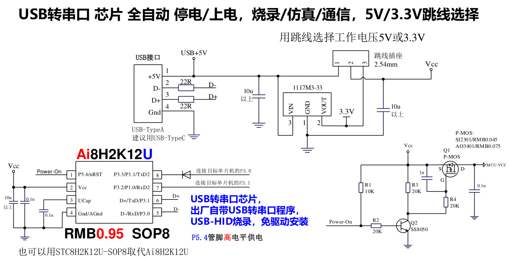

【应用场景一：从本工具给目标系统 自动 停电/上电，供电】点击 电脑端 ISP 软件的【下载/编程】按钮，工具会 自动 给目标系统停电0.5秒/再自动供电，数秒后提示下载编程成功，工具默认会再 自动 给目标系统停电0.5秒/再自动供电给目标系统工作。

【应用场景二： 不从本工具给 目标系统供电】

1、点击 电脑端 ISP 软件的 【下载/编程】按钮

2、给目标系统上电，或者重新上电(如果在点击【下载/编程】按钮前已上电，则需要停电重新上电)，电脑端软件提示下载编程进行中，数秒后下载成功，目标MCU会自动复位到用户程序区自动跑用户程序。部分不常用设置， 需要停电上电一次才生效， 如改变 EEPROM大小，P5.4/nRST变成复位脚

# STC8G2K64S2-36I-LQFP48/QFN48 最小系统 示意图

36         P2.3/PWM23/A11/MOSI_235         P2.2/PWM22/A10/SS_2 31         P4.3/RxD_4/SCLK_3 M 29         P4.1/MISO_3/CMPO_228         P3.7/INT3/TxD_2/CMP+/CCP2_2/CCP227         P3.6/INT2/RxD_2/CMP-/CCP1_226         P3.5/T1/T0CLKO/SS_4/CCP0_2/PWMFLT2 P2 5P1543323302282625MISO_2/I2CSDA_2/ECI_3/A12/PWM24/P2.4 3P5.0SCLK_2/I2CSCL _2/CCP0_3/A13/PWM25/P2.5 38 P3.4/T0/T1CLKO/ECI_2/MOSI 4/CMPOCCP1 _3/A14/PWM26/P2.6 39 P3.3/INT1/MISO 4/I2CSDA_ 4CCP2_3/A15/PWM27/P2.7 ALE/P4.5 41 40 STC8G2K64S2 P3.2/INT0/SCLK_4/I2CSCL_4 P3.1/TxDCCP是英文单词的缩写 RxD2_2/P4.6 42 P3.0/RxD/INT4Capture （捕获） AD0/ADC8/P0.0 43 LQFP48 P4.0/MOSI_3PCWoMmp（ar脉e（宽调比制较） AAD2/1A/ADC190/P0.12 445 AGDndC/_AVGrnefd+QFN48 16 MCU-VCCAD3/ADC11/P0.3 476 145 Vcc/AVccT3/AD4/ADC12/P0.4 P5.4/nRST/MCLKO/SS_3 0.1u 10P5.2 48 P1.7/ADC7/TxD_3/XTALI 以上2 3 4 56 7 8 9 0 1正看芯片丝印左下方小圆点处为第一脚正看芯片丝印最下面一行最后一个字母 T3CLKO/AD5/ADC13/P0.5           2PWMFLT2/T4/AD6/ADC14/P0.6           3 5 6 在Vcc和Gnd之间就近加上电源去耦电容为芯片版本号 nn RxD2/CCP1/ADC0/P1.0           5TxD2/CCP0/ADC1/P1.1           6 L 【大电容10uF以上+小电容0.1uF】PWMFLT3/T4CLKO/AD7/P0.7           4 2L A注意： 门1、 C须的接外部参考电源管【脚电AD压C_：V2Re.f4V+，\~ MCU-VCC】 浮空会有漏电流 2、如不需要进行【软件模拟USB下载】芯片上电/复位时P3.0/P3.1/P3.2 不可同时为低电平则会进入【等待进入软件模拟USB下载模式】可在 ISP烧录时指定取消 下次下载时使能USB-ISP模式 这个功能

2.5.13 USB 转串口芯片进行烧录/串口仿真， 手动停电/上电， 5V/3.3V 原理图

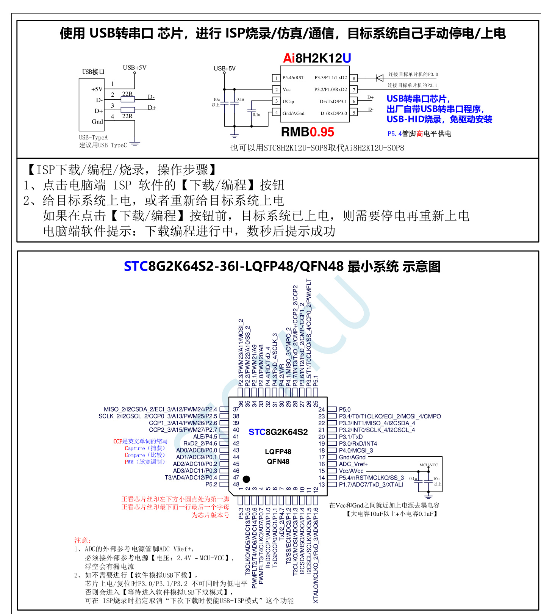

2.5.14 USB 转串口芯片进行烧录， 串口仿真， 手动停电/上电， 3.3V 原理图

使用 USB转串口 芯片， 进行 ISP烧录/仿真/通信， 目标系统自己 手动 停电/上电

Ai8H2K12UUSB+5V USB+5VUSB接口1 P5.4/nRST P3.3/P1.1/TxD2 4 连接目标单片机的P3.0+5V 2 Vcc P3.2/P1.0/RxD2 连接目标单片机的P3.1D- 3 UCap D+/TxD/P3.1 6 D+ USB转串口芯片，D+ Gnd/AGnd D- 出厂自带USB转串口程序，4 D-/RxD/P3.0 5Gnd USB-HID烧录， 免驱动安装USB-TypeA RMB0.95 P5.4管脚高电平供电建议用USB-TypeC 也可以用STC8H2K12U-SOP8取代Ai8H2K12U-SOP8【ISP下载/编程/烧录，操作步骤】  
1、点击电脑端 ISP 软件的【下载/编程】按钮  
2、给目标系统上电，或者重新给目标系统上电如果在点击【下载/编程】按钮前，目标系统已上电， 则需要停电再重新上电电脑端软件提示：下载编程进行中，数秒后提示成功STC8G2K64S2-36I-LQFP48/QFN48 最小系统 示意图E  
系统电源输入 VinM  
也可电脑USB+5V供电  
或充电宝USB+5V供电 6211： 输出 3.3V， 输入 5.5V - 3.6V6231： 输出 3.3V， 输入 18V - 3.6VVI VOU MCU-VCCGNDC1按下按键停电 0.1u松开按键上电电源按键 2 P 765 B3B33 334382332282262.MISO_2/I2CSDA_2/ECI_3/A12/PWM24/P2.4 P5.0SCLK_2/I2CSCL_2/CCP0_3/A13/PWM25/P2.5 38 23 P3.4/T0/T1CLKO/ECI_2/MOSI_4/CMPOCCP1 _3/A14/PWM26/ 22 P3.3/INT1/MISO_4/I2CSDA_4CCP WM27/P 40 STC8G2K64S2 21 P3.2/INT0/SCLK_4/I2CSCL_4ALE/P4. 20 P3.1/TxDCCP是英文单词的缩写 RxD2 42 19 P3.0/RxD/INT4Capture（捕获） AD0/ADC8/P0.0 43 LQFP48 8 P4.0/MOSI_3CPoWMmp（ar脉e（宽调比制较） AAD2/1A/ADC190/P0.21 44 QFN48 67 AGDndC/_AVGrnefd+ MCU-VCCAD3/ADC11/P0.3 4 5 Vcc/AVccT3/AD4/ADC12/P0.4 4 P5.4/nRST/MCLKO/SS_3 0.1u 10uP5.2 P1.7/ADC7/TxD_3/XTALI56789101正看芯片丝印左下方小圆点处为第正看芯片丝印最下面一行最为后芯一片个版字本母号 2 5 在Vcc【和大Gn电d之容1间0u就F近以加上+上小电源容去0.耦1u电F】容0 注意：1、ADC的外部参考电源管脚ADC_VRef+，必须接外部参考电源【电压：2.4V \~ MCU-VCC】浮空会有漏电流2、 如不需要进行【软件模拟USB下载】 否芯则片会上进电/入复【位等时待P3进.0入/P软3.件1/模P3拟.U2 B不下可载同模时式为】低，电平 可在 ISP烧录时指定取消 下次下载时使能USB- ISP模式 这个功能

# 2.5.15 USB-Link1D 支持 脱机下载 说明

脱机下载是指脱离电脑主机进行下载的一种方法，一般是使用下载控制芯片 （又称脱机下载母片）进行控制。 USB-Link1D 工具除了支持在线 ISP 下载，还支持脱机下载。 USB-Link1D 工具使用外部的22.1184MHz 晶振， 可保证对目标芯片进行在线或脱机下载时，校准频率的精度。用户可将代码下载到USB-Link1D 工具中，就可实现脱机下载。 USB-Link1D 主控芯片如内部存储空间不够时， 会将部分被下载的用户程序用加密的方式加密放部分到片外串行 Flash。

先将 USB-Link1D 工具使用 USB 线连接到电脑， 然后按照下面的步骤进行脱机下载：

1、选择目标芯片的型号  
2、打开需要下载的文件  
3、设置硬件选项  
4、进入“USB-Link1D 脱机”页面， 点击“将用户程序下载到编程器以供脱机下载“按钮，即可将用户代码下载到 USB-Linik1D 工具中。 下载完成后便使用 USB-Link1D 工具对目标芯片进行脱机下载了

# 2.5.16 USB-Link1D 支持 脱机下载， 如何免烧录环节

大批量生产， 如何省去专门的烧录人员， 如何无烧录环节  
大批量生产，你在将由 STC 的 MCU 作为主控芯片的控制板组装到设备里面之前，在你将 STC MCU 贴片到你的控制板完成之后，你必须测试你的控制板的好坏。不要说 $100 \%$ ，直通无问题， 那是抬杠，不是搞生产，只要生产，就会虚焊，短路，部分原件贴错，部分原件采购错。  
所以在贴片回来后， 组装到外壳里面之前， 你必须要测试， 你的含有 STC MCU 控制板的好坏， 好的去组装，坏的去维修抢救。

# 控制板的测试/不是烧录！

# 控制板的测试环节必须有， 但烧录环节可以省！

大批量生产， 必须要有方便控制板测试的测试架/下面接上我们的脱机烧录工具：

USB-Link1D / U8W-Mini / U8W， 还要接上其他控制部分！1、 通过 USER-VCC、 P3.0、 P3.1、 GND 连接，要工人每次都开电源2、 通过 S-VCC、 P3.0、 P3.1、 GND 连接， 不要你开电源， STC 的脱机工具给你自动供电

外面帮你做一个测试架的成本 500 元以下， 就是有机玻璃，夹具，顶针。1 个测试你控制板是否正常的工人管理 2 - 3 个 测试架

# 操作流程：

1、将你的 MCU 控制板 卡到测试架1 上

2、 将你的 MCU 控制板 卡到测试架2 上， 测试架 1 上的程序已烧录完成/感觉不到烧录时间  
3、 测试 测试架 1 上的 MCU 主控板功能是否正常，正常放到正常区，不正常，放到不正常区  
4、 给测试架1 卡上新的未测试的无程序的控制板  
5、测试 测试架 2 上的未测试控制板/程序不知何时早就不知不觉的烧好了，换新的未测试未烧录的控制  
板  
6、 循环步骤3 到步骤5======不需要安排烧录人员

# 2.5.17 USB-Writer1A 编程器/烧录器·支持·插在·锁紧座上·烧录

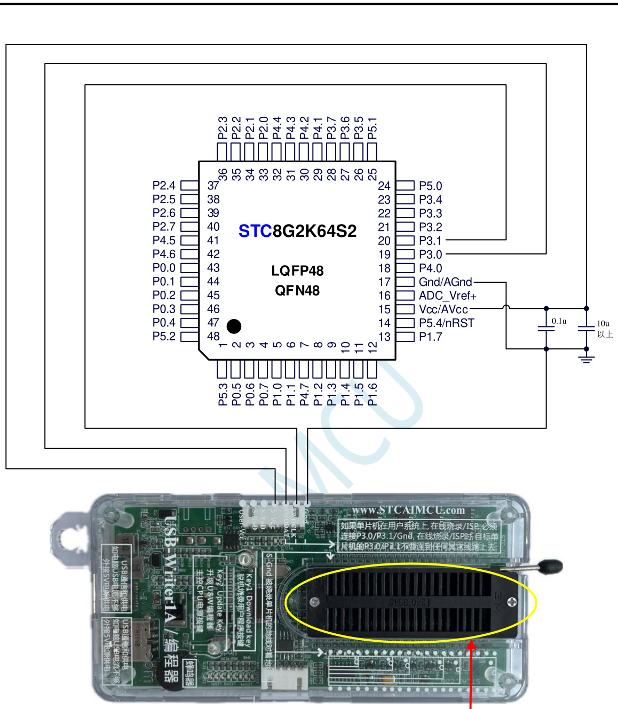

# USB型 脱机/联机烧录工具 USB-Writer1A (人民币100元)

1、 LQFP48/32封装：对应使用LQFP48/32转DIP48/32转换座,插在烧录锁紧座上进行烧录  
2、 QFN48封装：使用QFN48转DIP48转换座,插在烧录锁紧座上进行烧录  
3、 PDIP040封装可以直接插在烧录锁紧座上进行烧录

  
2.5.18 USB-Writer1A 支持 自动烧录机， 通信协议和接口

# 自动烧录接口 （分选机自动控制接口） 协议：

Start： 开始信号输入脚。 从外部输入低电平信号触发开始脱机烧录， 低电平必须维持 25 毫秒以上

EOT： 烧录完成信号输出脚。 脱机烧录完成后， 工具输出 $2 0 m s { \sim } 2 5 0 m s$ 的低电平 EOT 信号。 电平宽度如下图所示的地方进行设置

X 消际LrNm缓冲区 打开EEPRUM又件复制接收数据硬件选项 USB-Lirk1D/U8W/U8W-Mini脱机 程序加发送缓中区将用户程序下载到编程器以供脱机下载 文本模式清除编程器中的用户脱机代码及数据 EX模式设置USB-Link1D/U8W/U8W-Mini主控芯片 清空发送区设置脱机下载时的最高波特率 115200文件 送回车脱机编程数量 10000 握手超时时间 0S-VCC输出电压 3.3V 上电延时时间 0 COM1 波特率在线下载完成后持续给目标芯片供电 打开串口 编程完自动脱机下载完成后持续给目标芯片供电 自动发送结脱机下载时关闭自动检测有无芯片功能即使下载失败自动增量也自动递增使用第二种LED显示模式 EOT信号提供电流500mA √ BIF保持时间 40 ms脱机下载灵敏度设置 5 E TE 宽度设置30 ms40 ms电源 50 ms60 ms70 ms下载/编程 80 ms100 ms检测选项 帮助 110 ms120 ms  
每次下载前都重新装载目标文件 130 ms140 TS当目标文件变化时自动装载并 150 nS 远程现场升级APP发布160 nS170 nS180 nS190 ms200 ms210 ms220 ms

OK： 良品信号输出脚。 下载成功后工具从 OK 脚输出低电平信号， 信号与 EOT 信号同步。

Err： 不良品信号输出脚。 若下载失败， 工具从 ERR 脚输出输出低电平信号， 信号与 EOT 完成信号同步。

OK和Err只会输出其中一个信号

# 2.6 STC15H-LQFP44/32、 SOP28 系列 （传统 STC15 系列提升性能特殊型号）

2.6.1 特性及价格（有 16 位硬件乘除法器 MDU16， 准 16 位单片机）

单片机型号 | 工作电压（V | Flash 程序存储器 idata’内部传统8051 RAM宁 10万次字节 字节 | xdata”内部大容量扩展SRAM字节 | 强大的双DPTR可增可减 EEPROM10万次 字节 | 1O口最多数量 4 | 串口并可掉电唤醒 | MDU16硬件16位乘除法器 | SPI | 2C 定时器\计数器（T0-T4外部管脚也可掉电唤醒） | 16位高级PWM定时器 互补对称死区 | 15位增强型PWM满足舞台灯光要求 |  | 掉电唤醒专用定时器 | 15路高速ADC（全部PWM均可当D/A使用） | 比较器（可当1路A/D’ 可作外部掉电检测) | 内部低压检测中断并可掉电唤醒 看门狗复位定时器 | 内部高可靠复位（可选复位门槛电压） | 内部高精准时钟（36MHz以下可调）追频 可对外输出时钟及复位 | 程序加密后传输（防拦截） 可设置下次更新程序需口令 | 支持RS485下载 文持软件USB直接下载 | 本身就可在线仿真 | LQFP48 LQFP44 | 价格及封装 PDIP40 | LQFP32 | SOP28<暂无> | 主力产品供货信息
STC521 36 |  |  |  | 22 | 424 |  | 有有 | 有有 | 有 |  | 44 | 3 | 有有 |  | 有有 | 有有 有 | 级级 | 有一有 是是 | 有有 是是 | 是是 | 是是 是是 |  |  |  |  |  | 现货
 |  |  |  |  |  |  |  |  |  |  |  |  |  |  |  |  |  |  |  |  |  |  |  |  |  |  | 

注意： 由于传统 STC15F2K 系列的芯片的性能需要提升， 外加目前晶圆供货紧张， 所以使用 STC8G2K64S4 系列的晶圆生产上面的特殊型号， 如需购买以上特殊型号， 请提前订货

# 2.6.2 STC15H-LQFP44 管脚图， ISP 下载/编程线路图

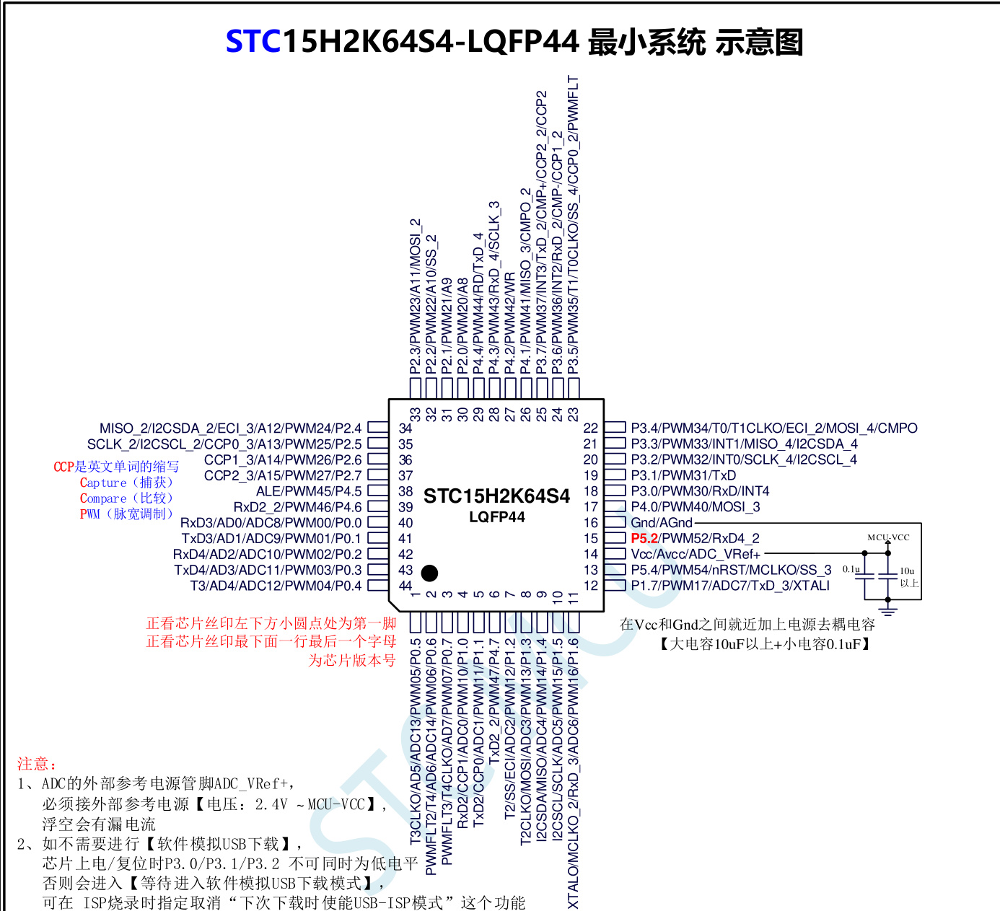

# 使用USB转串口芯片进行ISP下载/烧录/仿真， 目标系统 手动停电/上电Ai8H2K12U

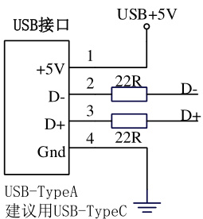

USB+5V连接目标单片机的P3.01 P5.4/nRST P3.3/P1.1/TxD2 82 Vcc P3.2/P1.0/RxD2 7 连接目标单片机的P3.  
10u 0.1u 3 UCap D+/TxD/P3.1 6 D+ USB转串口芯片，  
以上4 Gnd/AGnd D-/RxD/P3.0 出厂自带USB转串口程序，USB-HID烧录， 免驱动安装RMB0.95 P5.4管脚高电平供电

也可以用STC8H2K12U-SOP8取代Ai8H2K12U-SOP8

# 【ISP下载/编程/烧录， 操作步骤】

1、点击电脑端 ISP 软件的 【下载/编程】按钮

2、给目标系统上电，或者重新给目标系统上电如果在点击【下载/编程】按钮前，目标系统已上电， 则需要停电再重新上电电脑端软件提示：下载编程进行中，数秒后提示成功

# 关于 I/O 的注意事项：

1、 P3.0 和P3.1 口上电后的状态为弱上拉/准双向口模式  
2、 除P3.0 和P3.1 外，其余所有 IO 口上电后的状态均为高阻输入状态，用户在使用 IO口前必须先设置IO 口模式  
3、 芯片上电时如果不需要使用 USB 进行 ISP 下载， $P 3 . 0 / P 3 . 1 / P 3 . 2$ 这 3 个 I/O 口不能同时为低电平，否则会进入 USB 下载模式而无法运行用户代码芯片上电时，若 P3.0 和 P3.1 同时为低电平，P3.2 口会短时间由高阻输入状态切换到双向口模式，用以读取P3.2 口外部状态来判断是否需要进入 USB 下载模式当使用P5.4 当作复位脚时，这个端口内部的 4K 上拉电阻会一直打开；但P5.4 做普通I/O 口时，基于这个I/O 口与复位脚共享管脚的特殊考量，端口内部的4K 上拉电阻依然会打开大约6.5 毫秒时间，再自动关闭（当用户的电路设计需要使用 P5.4 口驱动外部电路时，请务必考虑上电瞬间会有 6.5 毫秒时间的高电平的问题）

# 2.6.3 STC15H-PDIP40 管脚图， ISP 下载/编程线路图

STC15H2K64S4-PDIP40 最小系统 示意图CCP是英文单词的缩写RxD3/AD0/ADC8/PWM00/P0.0 430987 P4.5/PWM45/ALE Capture （捕获）TxD3/AD1/ADC9/PWM01/P0. 23 P2.7/PWM27/A15/CCP2_ Compare （比较）RxD4/AD2/ADC10/PWM02/P0.2 P2.6/PWM26/A14/CCP1_3 PWM （脉宽调制）TxD4/AD3/ADC11/PWM03/P0.3 4 P2 5/PWM25/A13/CCP0_3/I2CSCL 2/SCLK_2T3/AD4/ADC12/PWM04/P0.4 5 36 4/PWM24/A12/ECI_3/I2CSDA 2/MISO_2T3CLKO/AD5/ADC13/PWM05/P0.5 6 35 /PWM23/A11/MOSI_2PWMFLT2/T4/AD6/ADC14/PWM06/P0.6 7 34 P2 /PWM22/A10/SS_2PWMFLT3/T4CLKO/AD7/PWM07/P0. 8 33 PWM21/A9RTxD2/CCP10/ADC01/PWM101/P1.01 T2/SS/ECI/ADC2/PWM12/P1.2 190 11 Hr N 321 30 P2 P4.2/PWM42/WR 04/PWM2404/AR8D/TxD_4T2CLKO/MOSI/ADC3/PWM13/P1 3 12 29 1/PWM41/MISO _3/CMPO_2I2CSDA/MISO/ADC4/PWM14/P1.4 13 2876 7/PWM37/INT3/TxD 2/CMP+/CCP2_2/CCP2I2CSCL/SCLK/ADC5/PWM15/P1.5 14 6/PWM36/INT2/RxD_2/CMP-/CCP1 2XTALO/MCLKO 2/RxD 3/ADC6/PWM16/P1 6 15 5/PWM35/T1/T0CLKO/SS 4/CCP0 _2/PWMFLTXTALI/TxD 3/ADC7/PWM17/P1.7 16 WM34/T0/T1CLKO/ECI_2/MOSI 4/CMPOMCU-VCCSS_3/MCLKOV/cncR/ASvTc/cP/WADMC5_4/VPre5f.+4 178 2312 P3 32/PWM332/INT10/SMICSLOK_4/I2CSDCAL_410u 0.1u RxD4_2/PWM52/P5.2 19 P3.1/PWM31/TxD以上 Gnd/AGnd 20 P3.0/PWM30/RxD/INT4在Vcc和Gnd之间就近加上电源去耦电容【大电容10uF以上+小电容0.1uF】

# 使用 USB转双串口 芯片 进行 全自动 烧录/仿真 $+$ 串口通讯， 5V/3.3V跳线选择

USB+5VUSB接口 USB转第二组串口第二组串口用于和目标系统+5V 的其他串口通讯2 D-D-3 D+D+ 4 22RGnd连接目标单片机的第n组串口的TxDnUSB-TypeA 连接目标单片机的第n组串口的RxDn建议用USB-TypeC

此处的二极管和电阻的作用是防止USB器件给目标芯片供电。由于目标芯片断电过程中，USB器件是不能断电的，USB器件的发送脚一般都是强推挽输出，通过I/O供电芯片就能工作，所以当使用USB转串口TTL对单片机下载程序时此处的隔离二极管不能省

芯片上电时P3.5输出低电平，MCU-VCC处于供电状态。当检测到需要进行ISP下载时，会自动控制MCU-VCC停电0.5S再上电进行ISP下载。下载完成后

会持续供电Ai8H2K0182U-SOP16 USB转第一组串口 第一组用于下载或者通讯? 高阻输入 推挽/开漏 2 P1.01/TRxD2 RTxD/P3.76 16 15 推挽/开漏 高阻输入 1N5819 S-RxD S-TxD 连接目标单片机的P3.1/TxD 连接目标单片机的P3.0/RxD3用跳线选择工作电压5V或3.3V 1N5819 45 PU5C.4a/pnRST P3.4 132 Vcc PQ-1MOS MCU-VCC跳线插座 Vcc 6 11 300R 二  
USB+5V 2.54mm 7 VcRcef+ D+/P3.12 10 D+ 供可应做模电块源8 Gnd D-/P3.0 9 D- 关电/供电 0.47u 104  
1以0u上 1117M3-33 0.1u 以10上u 0.1u 也可以用STC8H2K0182U-SOP16取代 手动按键 20K QAS1OI32可430选1：，RMB0.0745.3USB转双串口芯片， 出厂自带USB转串口程序， P3.5管脚低电平供电USB-HID烧录， 免驱动安装 P5.4管脚高电平供电

【应用场景一： 从本工具给目标系统 自动 停电/上电，供电】点击 电脑端 ISP 软件的【下载/编程】按钮，工具会 自动 给目标系统停电0.5秒/再自动供电，数秒后提示下载编程成功，工具默认会再 自动 给目标系统停电0.5秒/再自动供电给目标系统工作。

# 【应用场景二： 不从本工具给目标系统供电】

1、点击 电脑端 ISP 软件的 【下载/编程】按钮

2、给目标系统上电，或者重新上电(如果在点击【下载/编程】按钮前已上电，则需要停电重新上电)，电脑端软件提示下载编程进行中，数秒后下载成功，目标MCU会自动复位到用户程序区自动跑用户程序。部分不常用设置，需要停电上电一次才生效， 如改变 EEPROM大小，P5.4/nRST变成复位脚

# 关于 I/O 的注意事项：

1、 P3.0 和P3.1 口上电后的状态为弱上拉/准双向口模式  
2、 除P3.0 和P3.1 外，其余所有 IO 口上电后的状态均为高阻输入状态，用户在使用 IO口前必须先设置IO 口模式  
3、 芯片上电时如果不需要使用 USB 进行 ISP 下载， $P 3 . 0 / P 3 . 1 / P 3 . 2$ 这 3 个 I/O 口不能同时为低电平，否则会进入 USB 下载模式而无法运行用户代码  
4、 芯片上电时，若 P3.0 和 P3.1 同时为低电平，P3.2 口会短时间由高阻输入状态切换

到双向口模式，用以读取P3.2 口外部状态来判断是否需要进入 USB 下载模式当使用P5.4 当作复位脚时，这个端口内部的 4K 上拉电阻会一直打开；但P5.4 做普通I/O 口时，基于这个I/O 口与复位脚共享管脚的特殊考量，端口内部的4K 上拉电阻依然会打开大约6.5 毫秒时间，再自动关闭（当用户的电路设计需要使用 P5.4 口驱动外部电路时，请务必考虑上电瞬间会有 6.5 毫秒时间的高电平的问题）

# 2.6.4

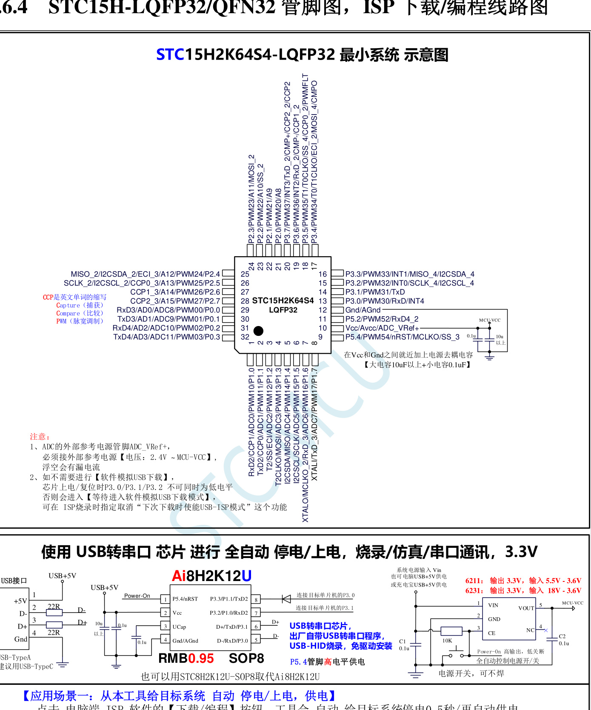

点击 电脑端 ISP 软件的【下载/编程】按钮，工具会 自动 给目标系统停电0.5秒/再自动供电，数秒后提示下载编程成功，工具默认会再 自动 给目标系统停电0.5秒/再自动供电给目标系统工作。

【应用场景二： 不从本工具给目标系统供电】

1、 点击 电脑端 ISP 软件的 【下载/编程】按钮

2、给目标系统上电，或者重新上电(如果在点击【下载/编程】按钮前已上电， 则需要停电重新上电)，电脑端软件提示下载编程进行中，数秒后下载成功，目标MCU会自动复位到用户程序区自动跑用户程序。部分不常用设置， 需要停电上电一次才生效， 如改变 EEPROM大小，P5.4/nRST变成复位脚

# 关于 I/O 的注意事项：

# 1、 P3.0 和 P3.1 口上电后的状态为弱上拉/准双向口模式

除P3.0 和P3.1 外，其余所有 IO 口上电后的状态均为高阻输入状态，用户在使用 IO口前必须先设置IO 口模式3、 芯片上电时如果不需要使用 USB 进行 ISP 下载， $P 3 . 0 / P 3 . 1 / P 3 . 2$ 这 3 个 I/O 口不能同时为低电平，否则会进入 USB 下载模式而无法运行用户代码芯片上电时，若 P3.0 和 P3.1 同时为低电平，P3.2 口会短时间由高阻输入状态切换到双向口模式，用以读取P3.2 口外部状态来判断是否需要进入 USB 下载模式当使用P5.4 当作复位脚时，这个端口内部的 4K 上拉电阻会一直打开；但P5.4 做普通I/O 口时，基于这个I/O 口与复位脚共享管脚的特殊考量，端口内部的4K 上拉电阻依然会打开大约6.5 毫秒时间，再自动关闭（当用户的电路设计需要使用 P5.4 口驱动外部电路时，请务必考虑上电瞬间会有 6.5 毫秒时间的高电平的问题）

# 2.6.5 STC15H-SOP28 管脚图， ISP 下载/编程线路图

STC15H2K64S4-SOP28 最小系统 示意图CCP是英文单词的缩写 CCP1 _3/A14/PWM26/P2.6 32 28 P2.5/PWM25/A13/CCP0_3/I2CSCL 2/SCLK_2Capture（捕获） CCP2_3/A15/PWM27/P2.7 27 P2.4/PWM24/A12/ECI_3/I2CSDA_2/MISO_2Compare（比较） RxD2/CCP1/ADC0/PWM10/P1.0 26 P2.3/PWM23/A11/MOSI_2PWM（脉宽调制） TxD2/CCP0/ADC1/PWM11/P1 54 25 .2/PWM22/A10/SS_2T2/SS/ECI/ADC2/PWM12/P1 24 /PWM21/A9TI2CSLKDOA/MIOSSOI/ADC34/PWM134/P1 67 232 .07/PWM2307/IAN8T3/TxD _2/CMP+/CCP2_2/CCP2I2CSCL/SCLK/ADC5/PWM15/P1 89 21 P3 .6/PWM36/INT2/RxD_2/CMP-/CCP1_2XTALO/MCLKO _2/RxD_3/ADC6/PWM16/P1. 6 20 P3.5/PWM35/T1/T0CLKO/SS 4/CCP0_2/PWMFLTXTALI/TxD _3/ADC7/PWM17/P1. 10 19 P3 .4/PWM34/T0/T1CLKO/ECI_2/MOSI_4/CMPOSS_3/MCLKO/nRST/PWM54/P5. 11 18 P3.3/PWM33/INT1/MISO 4/I2CSDA _4MCU-VCC Vcc/Avcc/ADC_ Vref+ 12 17 P3.2/PWM32/INT0/SCLK_4/I2CSCL _40u 0.1u RxD4_2/PWM52/P5.2 13 16 P3.1/PWM31/TxD以上 Gnd/AGnd 14 15 P3.0/PWM30/RxD/INT4在Vcc和Gnd之间就近加上电源去耦电容【大电容10uF以上+小电容0.1uF】

注意：

1、 ADC的外部参考电源管脚ADC_VRef+， 必须接外部参考电源【电压： 2.4V \~ MCU-VCC】,浮空会有漏电流2、 如不需要进行【软件模拟USB下载】 ，芯片上电/复位时P3.0/P3.1/P3.2 不可同时为低电平否则会进入【等待进入软件模拟USB下载模式】 可在 ISP烧录时指定取消 下次下载时使能USB-ISP模式 这个功能

# 使用 USB转双串口 芯片 进行 全自动 停电/上电， 烧录/仿真 $^ +$ 串口通讯， 5V

# USB转第二组串口

第二组串口用于和目标系统的其他串口通讯

此处的二极管和电阻的作用是防止USB器件给目标芯片供电。由于目标芯片断电过程中，USB器件是不能断电的，USB器件的发送脚一般都是强推挽输出，通过I/O供电芯片就能工作，所以当使用USB转串口TTL对单片机下载程序时此处的隔离二极管不能省

芯片上电时P3.5输出低电平，MCU-VCC处于供电状态。当检测到需要进行ISP下载时，会自动控制MCU-VCC停电0.5S再上电进行ISP下载。下载完成后

Ai8H2K08U-SOP16 会持续供电Ai8H2K12U-SOP16 USB转第 一组串口 第一组用于下载或者通讯连接目标单片机的第n组串口的RTxDn Y 高推阻挽/输开入漏 2 P1.01/TRxD2 RTxD/P3.76 15 推高挽阻/输开入漏 1N5819 S-TRxD 连接目标单片机的P3.01/RTxD1N5819 P1.3 P3.5 系统电源 Q156 PVU5cC.c4a/pnRST P3.23 12 (可从USB取电) P-MOS MCU-VCCUSB接口 USB+5V USB+5V 300R D+- 2 D- 0.1u 以10上u 0.1u 7 8 也G可nd以用STC8H2DK-/0P83U.0-SO9P16D-取代 可做电源 关供手电应动/模按供块键电 以10上u 0.47u QS1I2可30选1：，RMB0.045 广 4一70般R不焊2020KU建SB议-T用yUpSeBA-TypeC U出S厂B-自转HI带双DU串烧S口B录转芯，片串免口，驱程动序安，装 P53.45管脚高低电平供电

【应用场景一： 从本工具给目标系统 自动 停电/上电，供电】点击 电脑端 ISP 软件的【下载/编程】按钮，工具会 自动 给目标系统停电0.5秒/再自动供电，数秒后提示下载编程成功，工具默认会再 自动 给目标系统停电0.5秒/再自动供电给目标系统工作。

# 【应用场景二： 不从本工具给目标系统供电】

1、点击 电脑端 ISP 软件的 【下载/编程】按钮

2、给目标系统上电，或者重新上电(如果在点击【下载/编程】按钮前已上电，则需要停电重新上电)，电脑端软件提示下载编程进行中，数秒后下载成功，目标MCU会自动复位到用户程序区自动跑用户程序。部分不常用设置， 需要停电上电一次才生效， 如改变 EEPROM大小，P5.4/nRST变成复位脚

# 关于 I/O 的注意事项：

1、 P3.0 和P3.1 口上电后的状态为弱上拉/准双向口模式  
2、 除P3.0 和P3.1 外，其余所有 IO 口上电后的状态均为高阻输入状态，用户在使用 IO口前必须先设置IO 口模式  
3、 芯片上电时如果不需要使用 USB 进行 ISP 下载，P3.0/P3.1/P3.2 这 3 个 I/O 口不能同时为低电平，否则会进入 USB 下载模式而无法运行用户代码芯片上电时，若 P3.0 和 P3.1 同时为低电平，P3.2 口会短时间由高阻输入状态切换到双向口模式，用以读取P3.2 口外部状态来判断是否需要进入 USB 下载模式当使用P5.4 当作复位脚时，这个端口内部的 4K 上拉电阻会一直打开；但P5.4 做普通I/O 口时，基于这个I/O 口与复位脚共享管脚的特殊考量，端口内部的4K 上拉电阻依然会打开大约6.5 毫秒时间，再自动关闭（当用户的电路设计需要使用 P5.4 口驱动外部电路时，请务必考虑上电瞬间会有 6.5 毫秒时间的高电平的问题）

# 2.6.6 USB-Link1D 对 STC15H 系列进行自动串口烧录、仿真 $\cdot +$ 串口通讯

使用 【USB Link1D】 对 STC15H2K64S4系列 进行全自动停电/上电串口烧录、 仿真 $^ +$ 串口通讯【USB Link1D】 工具： 支持 全自动 停电 / 上电， 在线下载 脱机下载， 仿真-USB LinkiD 到此安 固 连接目标单片机P3.1连接目标单片机P3.0技术网址 MCU-VCCWWW.STCAI.COm 能 1i1 连接目标单片机第n组串口发送脚TxDn分销商电话：可C D 回 D 连接目标单片机第n组串口接收脚RxDnTEL:0513-5502928 日TE+86-513-55012928

【应用场景一： 从本工具给目标系统 自动 停电/上电， 供电】点击 电脑端 ISP 软件的【下载/编程】按钮，工具会 自动 给目标系统停电0.5秒/再自动供电，数秒后提示下载编程成功， 工具默认会再 自动 给目标系统停电0.5秒/再自动供电给目标系统工作。

# 【应用场景二： 不从本工具给目标系统供电】

1、 点击 电脑端 ISP 软件的 【下载/编程】 按钮

2、 给目标系统上电，或者重新上电(如果在点击 【下载/编程】 按钮前已上电， 则需要停电重新上电)，电脑端软件下载编程进行中，数秒后下载成功， 目标MCU会自动复位到用户程序区自动跑用户程序。部分不常用设置，需要停电上电一次才生效， 如改变 EEPROM大小， P5.4/nRST变成复位脚

# STC15H2K64S4-LQFP44 最小系统 示意图

33         P2.3/PWM23/A11/MOSI_232         P2.2/PWM22/A10/SS_2 9 25         P3.7/PWM37/INT3/TxD_2/CMP+/CCP2_2/CCP224         P3.6/PWM36/INT2/RxD_2/CMP-/CCP1_223         P3.5/PWM35/T1/T0CLKO/SS_4/CCP0_2/PWMFLT3 2 4 P P3 2 一 7 5P2P S 2 4 √ S S2322333222285433MISO_2/I2CSDA_2/ECI_3/A12/PWM24/P2.4 P3.4/PWM34/T0/T1CLKO/ECI _2/MOSI 4/CMPOSCLK_2/I2CSCL_2/CCP0_ 3/A13/PWM25/ P2.5 P3.3/PWM33/INT1/MISO 4/I2CSDA_4CCP是英文单词的缩写 CCP12_3/A145/PWM267/P2.67 P3. 21/PWM321/ITNxTD0/SCLK_4/I2CSCL_ 4CPCoWaMmppt（aur脉e（宽调比捕制较获） RxDA2L_E2/PWM456/P4.56 40 389 STC1L5QHFP24K464S4 P43.0/PWM430/RMxODS/I_N3T4TxD3/AD1/ADC9/PWM01 /P0. 412 P5.2/PWM52/RxD4_2 MCU-VCCRxD4/AD2/ADC10/PWM02/P0.2 Vcc/Avcc/ADC VRef+TxD4/AD3/ADC11/PWM03/P0.3 43 P5.4/PWM54/nRST/MCLKO/SS_3 0.1u 10T3/AD4/ADC12/PWM04/P0.4 44 P1.7/PWM17/ADC7/TxD_3/XTALI3 5正看芯片丝印左下方小圆点处为第一脚 在Vcc和Gnd之间就近加上电源去耦电容正看芯片丝印最下面一行最后一个字母 【大电容10uF以上+小电容0.1uF】为芯片版本号广 o注意：1、 ADC的外部参考电源管脚ADC 必须接外部参考电源【电压：2.4V _VRef+， \~ MCU-VCC】 /浮如空不会需有要漏进电行流【软件模拟USB下载】， 芯片上电/复位时P3.0/P3.1/P3.2 不可同时为低电平 22 否则会进入【等待进入软件模拟USB下载模式】可在 ISP烧录时指定取消 下次下载时使能USB-ISP模式 这个功能

# 2.6.7 使用【一箭双雕之 USB 转双串口】进行串口烧录、 仿真 $^ +$ 串口通讯

使用 【一箭双雕之USB转双串口】 对 STC15H2K64S4系列 进行串口烧录、 仿真 $^ +$ 串口通讯

# 【一箭双雕之USB转双串口】 支持 全自动 停电 / 上电， 在线下载， 仿真

【应用场景一： 从本工具给目标系统 自动 停电/上电， 供电】点击 电脑端 ISP 软件的【下载/编程】按钮，工具会 自动 给目标系统停电0.5秒/再自动供电，数秒后提示下载编程成功， 工具默认会再 自动 给目标系统停电0.5秒/再自动供电给目标系统工作。

# 【应用场景二： 不从本工具给目标系统供电】

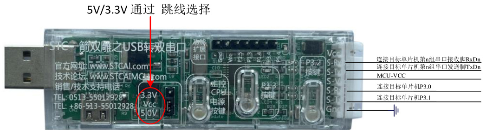  
STC15H2K64S4-LQFP44 最小系统 示意图

1、 点击 电脑端 ISP 软件的 【下载/编程】 按钮

2、 给目标系统上电，或者重新上电(如果在点击 【下载/编程】 按钮前已上电， 则需要停电重新上电)，电脑端软件提示下载编程进行中，数秒后下载成功， 目标MCU会自动复位到用户程序区跑用户程序。部分不常用设置，需要停电上电一次才生效， 如改变 EEPROM大小， P5.4/nRST变成复位脚

25         P3.7/PWM37/INT3/TxD_2/CMP+/CCP2_2/CCP223         P3.5/PWM35/T1/T0CLKO/SS_4/CCP0_2/PWMFLT83 6MISO_2/I2CSDA_2/ECI_3/A12/PWM24/P2.4 65789012 STC1L5QHFP24K464S4 2110875496 P3.4/PWM34/T0/T1CLKO/ECI_2/MOSI _4/CMPOSCLK_2/I2CSCL 2/CCP0_3/A13/PWM25/P2.5 3 P3.3/PWM33/INT1/MISO 4/I2CSDA_4CCP是英文单词的缩写 CCP1 _3/A14/PWM26/P2.6 P3.2/PWM32/INT0/SCLK_4/I2CSCL_4Caopmtpuare PWM（脉宽调制） （捕比获较） RxD3/ADR0/xAD2C_28/PWM4060/P40.60 CCP2_3/AL1E5/PWM2475/P24.75 3 4 P3.01/PWM301/TRxD/INT4 PG4n.d0//APGWnMd40/MOSI_3TxD3/AD1/ADC9/PWM01/P0.1 43 P5.2/PWM52/RxD4_2 MCU-VCCRxD4/AD2/ADC10/PWM02/P0.2 Vcc/Avcc/ADC_VRef+TxD4/AD3/ADC11/PWM03/P0.3 P5.4/PWM54/nRST/MCLKO/SS_3 0.1u 10uT3/AD4/ADC12/PWM04/P0.4 44 P1.7/PWM17/ADC7/TxD_3/XTALI正看芯片丝印左下方小圆点处为第一脚 在Vcc和Gnd之间就近加上电源去耦电容正看芯片丝印最下面 一行最后一个字母 【大电容10uF以上+小电容0.1uF】为芯片版本号O注意： 1、 ADC的外部参考电源管脚ADC_ VRef+，浮必空须会接有外漏部电参流考电源【电压： 如芯不片需上要电/进复行位【时软P3件.0模/P拟3U.1SB/P下3.载2】不，可同时为低电平 2.4V \~ MCU-VCC】 1 2 否则会进入【等待进入软件模拟USB下载模式】可在 ISP烧录时指定取消 下次下载时使能USB-ISP模式 这个功能

# 2.7 USB-Link1D 工具使用注意事项

# 2.7.1 工具接口说明

USB-Link1D 工具是 USB Link1 的升级版、 功能在 USB Link1 的基础上增加了两个 STC-CDC 串口， 可作为通用 USB 转串口使用。

工具 STC-USB Link1 的使用注意事项请参考附录章节

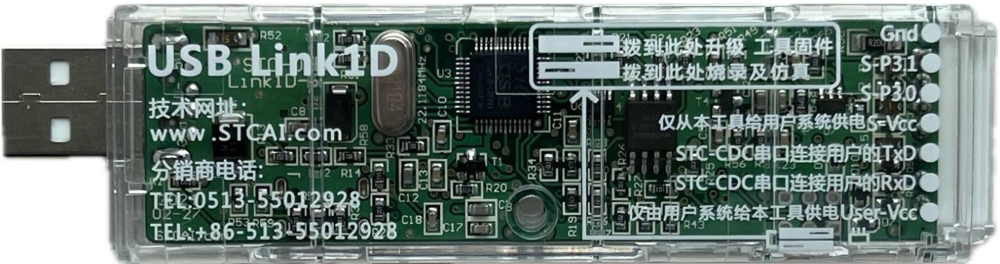  
工具正面图

User-Vcc， 外部给工具供电S-RxD， 第2组STC-CDC串口发送脚，接用户单片机串口的接收脚0169 517 OOC0 UserVcc S接-T用xD户，单第片2机组S串T口C-的CD发C送串脚口接收脚，  
1.外任5 S-Vcc， 本工具给外部系统供电  
3.USB通 Key S-Vcc S-P3.0，Link1硬件仿真数据线、  
1.Us通信 电 国 第1组STC-CDC串口发送脚Link1进行ISP下载的串口接收脚、第1组STC-CDC串口接收脚工具反面图 Gnd， 地线USB-Link1D 各种豪华配线的应用场景介绍连接目标用户系统的GndUSB转双串口/TTL，连接线 连接目标用户系统的P3.1或串口发送脚  
USB LinkiD 不从本工具供电 连不接从目本标工用具户给系目统标的系P统3.供0或电串，口目接标收系脚统自己供电STC连接目标用户系统的第n组串口的TxDn连接目标用户系统的第n组申口的RxDn这种连接方式为本工具和目标系统各自独立供电， ISP下载需要手动给目标系统停电再上电。当目标系统的耗电大于300mA时， 在线下载、 脱机下载、 在线仿真， 可选这种接线方式。USB转双串口/TTL， 连接线 连接目标用户系统的Gnd  
USB LinkiD 从本工具供电 连接目标用户系统的P3.10或串口发接送收脚WWe.STCALE 从本工具给目标用户系统供电， $3 0 0 { m A }$ 以内1连接目标用户系统的第n组串口的TxDn连接目标用户系统的第n组串口的RxDn这种连接方式为本工具给目标系统自动 停电/上电 供电， ISP下载不需要手动停电/上电。当目标系统电流不超过 $3 0 0 m A$ 时， 在线下载、 脱机下载、 在线仿真， 可选择这种线方式。  
USB LinkiD 量 USB转串口从/用TT户L系，统脱机给烧本录工连具供接电线 连接目标用户系统的GP3nd.1  
技术c 连接目标用户系统的P3.0目标用户系统给工具供电这种连接方式为常用的脱机下载连接方式，从用户的目标系统给本脱机工具供电。如果用户系统电流大于300mA， 建议使用这种连接方式。用户系统上电之后自动脱机下载程序， 下载成功之后， 给用户系统停电， 换下一个待烧录用户程序的新的用户系统， 再上电，脱机下载程序， 重复如上过程即为常见的【批量生产脱机烧录】特别注意： 用户系统给本工具供电的电压不能超过5.3V连接目标用户系统的Gnd  
USB 连接目标用户系统的P3. 1或串口发送脚  
术 连接目标用户系统的P3.0或串口接收脚Td USB转串口/TTL， 专门定制的TypeC接口线 从本工具给目标用户系统供电，300mmA以内但此处为TTL串口， 不是USB连接目标用户系统的Gnd  
USB LinkiD 连接目标用户系统的P3.1或串口发送脚  
技术同STCALE 连接目标用户系统的P3.0或串口接收脚USB转串口/TTL， 专门定制的TypeA接口线 从本工具给目标用户系统供电， $3 0 0 { m m A }$ 以内但此处为TTL串口，不是USB

管脚编号 | 接口名称 | 接口功能
1 | User-Vcc | 仅由用户系统给本工具供电
2 | S-RxD | 第2组STC-CDC串口的发送脚， 连接用户单片机串口的接收脚
3 | S-TxD | 第2组STC-CDC串口的接收脚， 连接用户单片机串口的发送脚
4 | S-Vcc | 仅从本工具给用户系统供电
 | S-P3.0 | 使用 Link1D 进行ISP下载时的串口发送脚，连接目标单片机的 P3.0
使用Link1D 进行SWD 硬件仿真时的数据脚，连接目标单片机的 SWDDAT
第1组 STC-CDC 串口的发送脚， 连接用户单片机串口的接收脚
 | S-P3.1 | 使用Link1D进行 ISP 下载时的串口接收脚，连接目标单片机的 P3.1
使用Link1D进行SWD 硬件仿真时的时钟脚， 连接目标单片机的 SWDCLK
第1组STC-CDC 串口的接收脚， 连接用户单片机串口的发送脚
 | Gnd | 地线

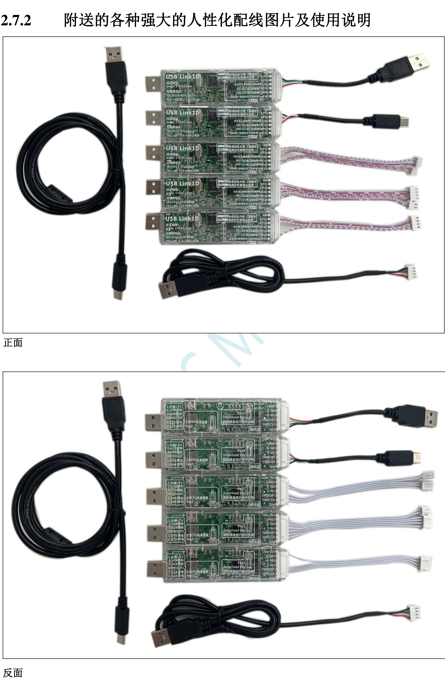

# USB直接下载连接示意图使用 USB-TypeA 到 USB-TypeC 线

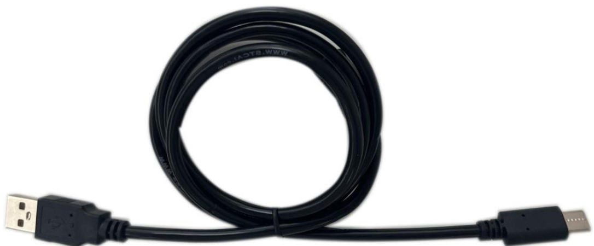

这种一端为 USB-TypeA ，另一端为 USB-TypeC 的标准线， STCAI. com 也会提供这种连接线，方便预留了 USB-TypeC 接口的用户系统， 进行硬件USB直接下载。

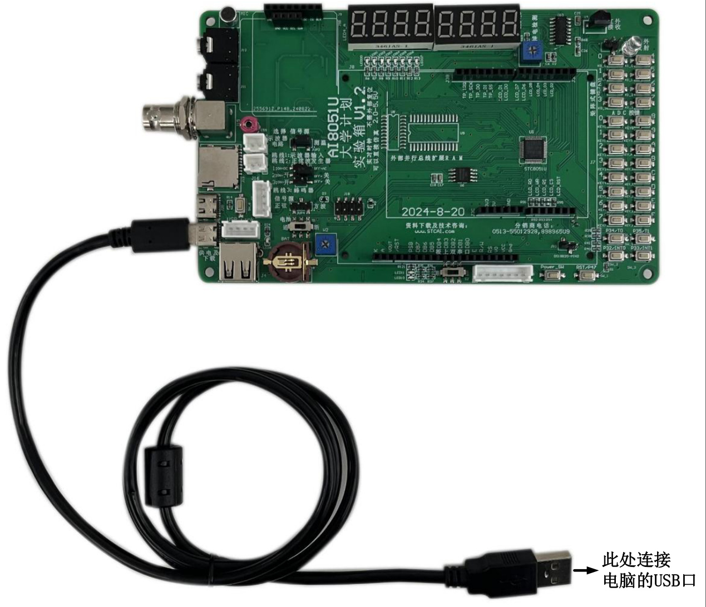

# USB 直接下载连接示意图使用 USB-TypeA 到 USB-TypeA 线

这种两端同为 USB-TypeA 接口的标准线， $\setminus$ 方便预留了 USB-TypeA 接口的用户系统，进行硬件USB直接下载

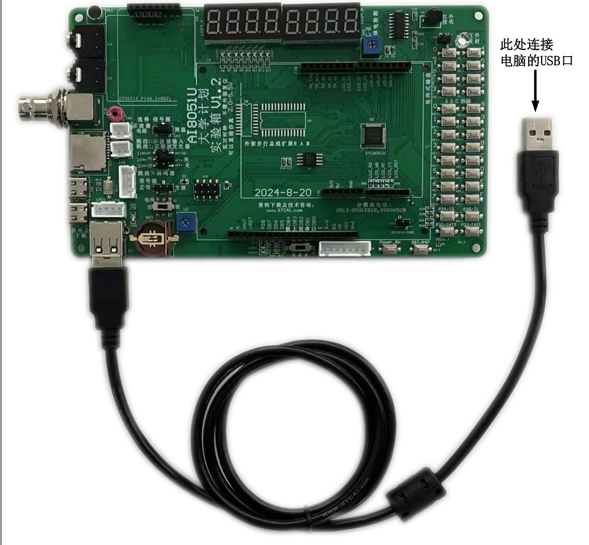

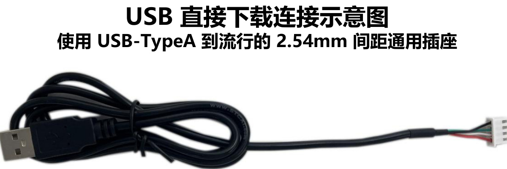

STCAI. com提供这种连接线， 方便对只预留了 $2 . 5 4 { m m }$ 间距的通用插座目标系统芯片进行硬件USB直接下载

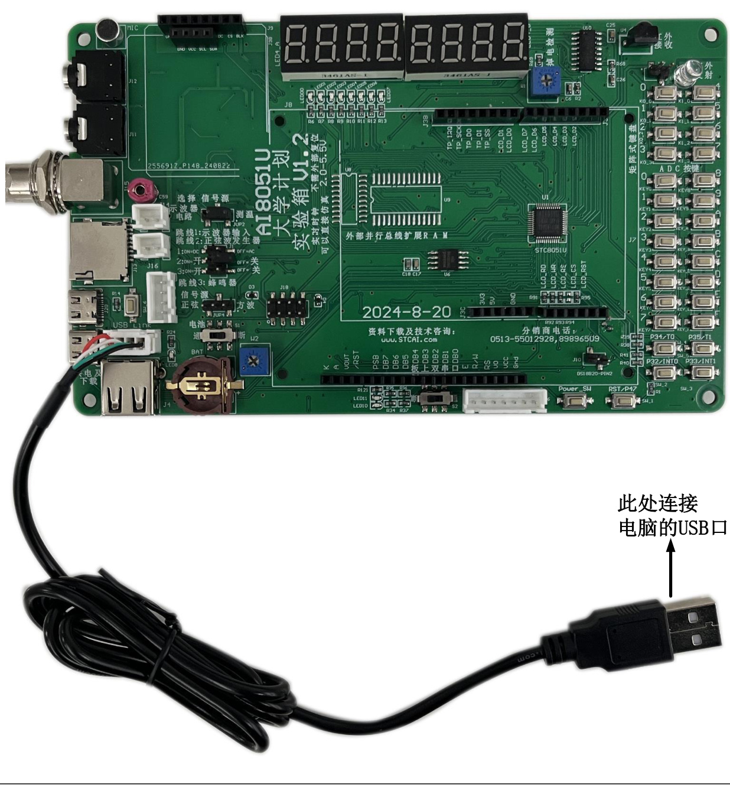

# 2.7.3 USB-Link1D 实际应用

1、 使用 USB-Link1D 工具对 STC8G 系列单片机进行 SWD 硬件仿真按照如下图所示的方式将工具的 S-Vcc、 S-P3.0、 S-P3.1、 GND 分别与目标单片机的 M-Vcc、 P3.0（SWDDAT）、 P3.1 （SWDCLK）、 GND 相连接， 然后参考前面章节中硬件仿真的步骤和设置即可进行 SWD 硬件仿真

# 使用 USB-Link1D 的 USB转串口/TTL，用单排2.54mm间距插头连接目标芯片系统,串口下载连接示意图-正面

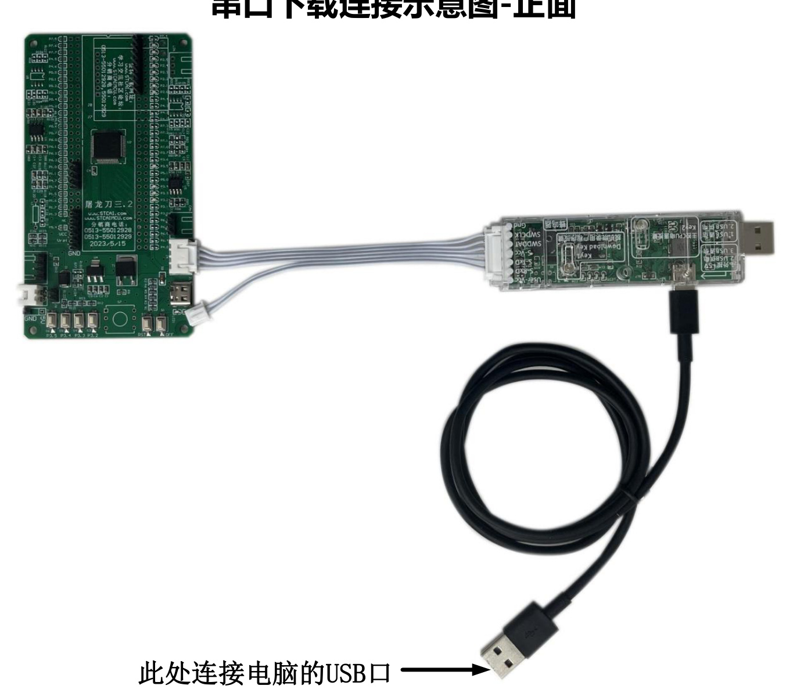

# 使用 USB-Link1D 的 USB转串口/TTL，用单排2.54mm间距插头连接目标芯片系统,串口下载连接示意图-反面

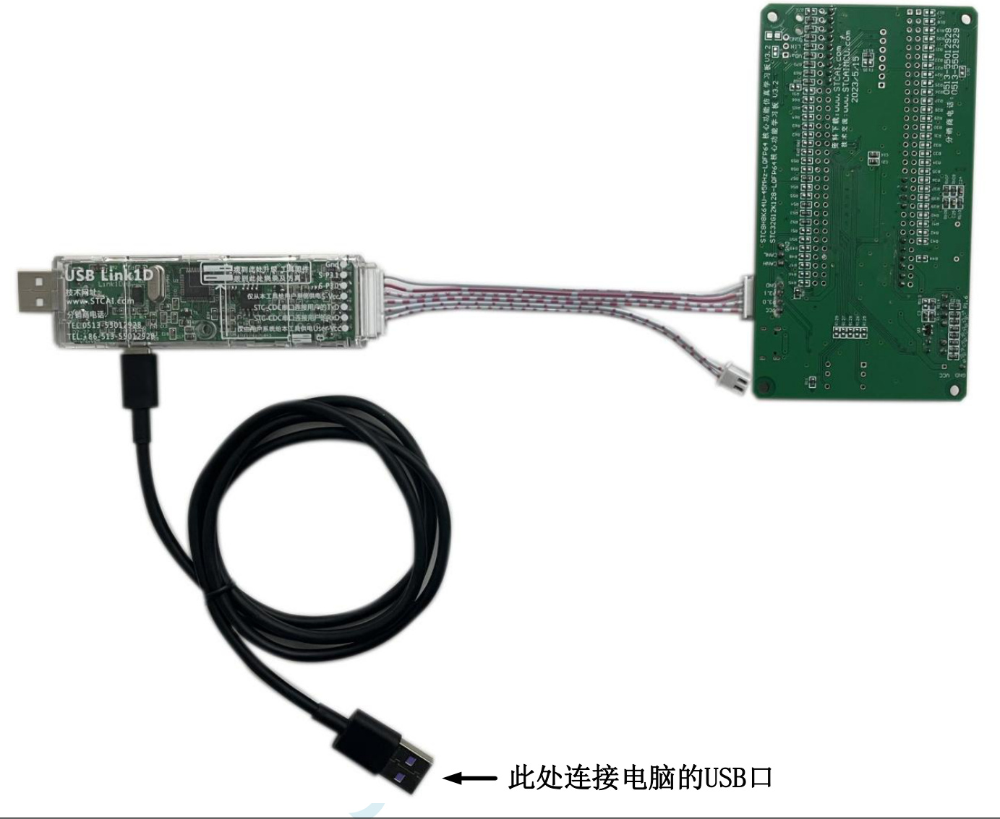

# 使用USB-Link1D的USB转串口对目标系统进行串口下载

注意： 此处连接目标系统的 USB-TypeC接口 是 USB转串口/TTL,对目标系统芯片 串口/TTL 下载连接示意图

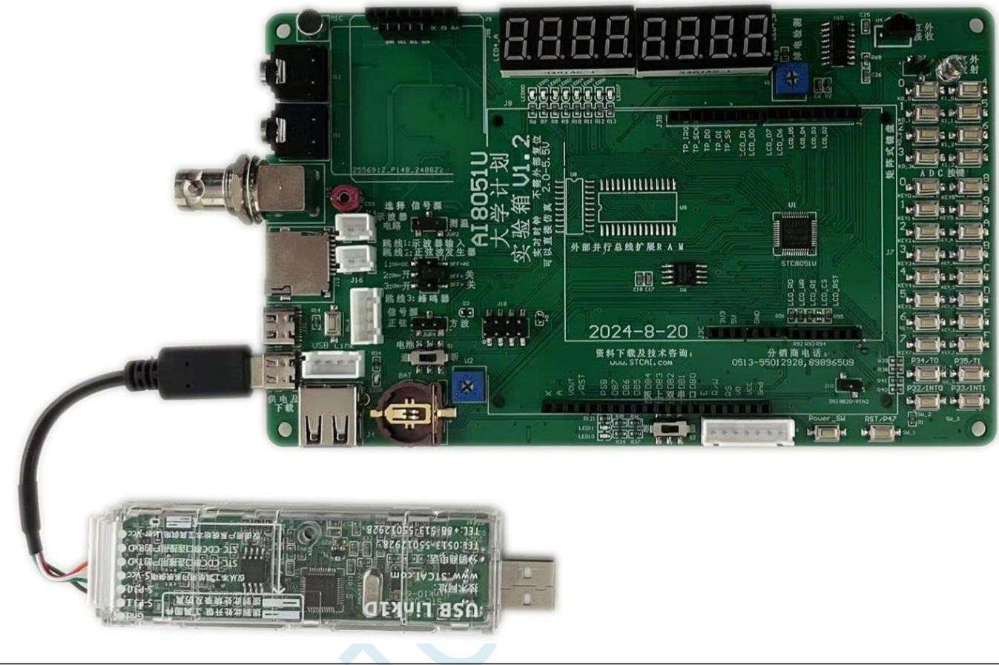

# 使用USB-Link1D的USB转串口对目标系统进行串口下载

注意： 此处连接目标系统的 USB-TypeA接口 是 USB转串口/TTL,对目标系统芯片 串口/TTL 下载连接示意图

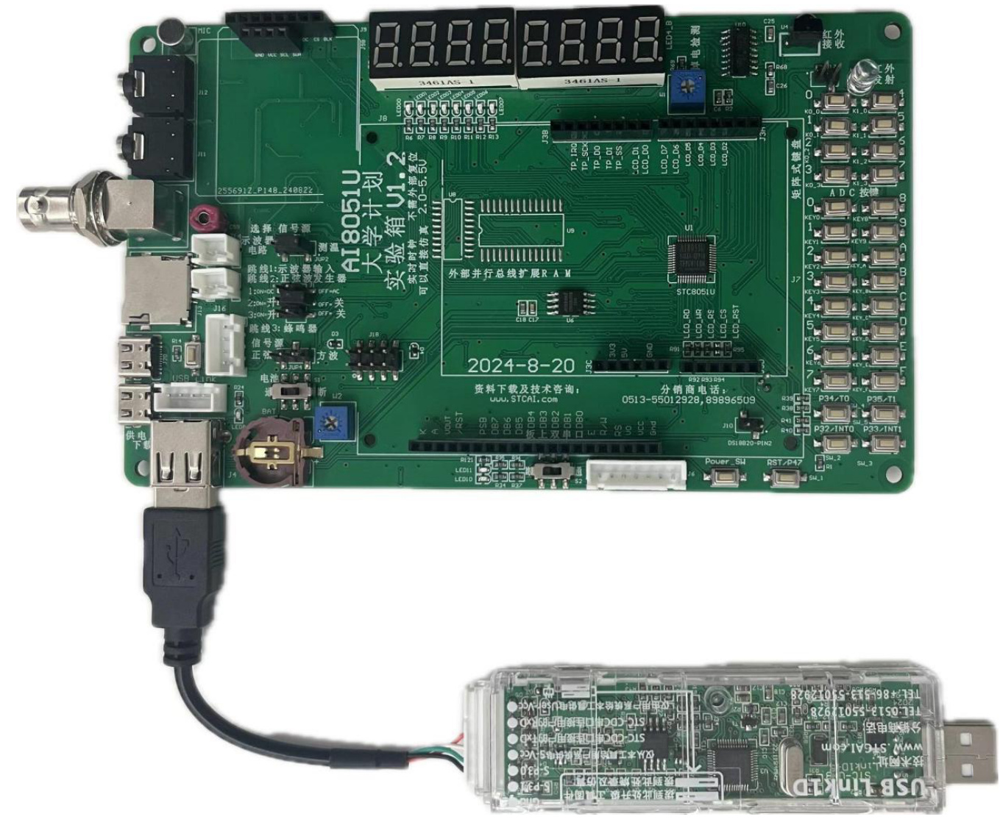

# 使用USB-Link1D的USB转串口对目标系统进行串口下载

注意： 此处连接目标系统的 普通四芯单排插座接口 是 USB转串口/TTL,对目标系统芯片 串口/TTL 下载连接示意图

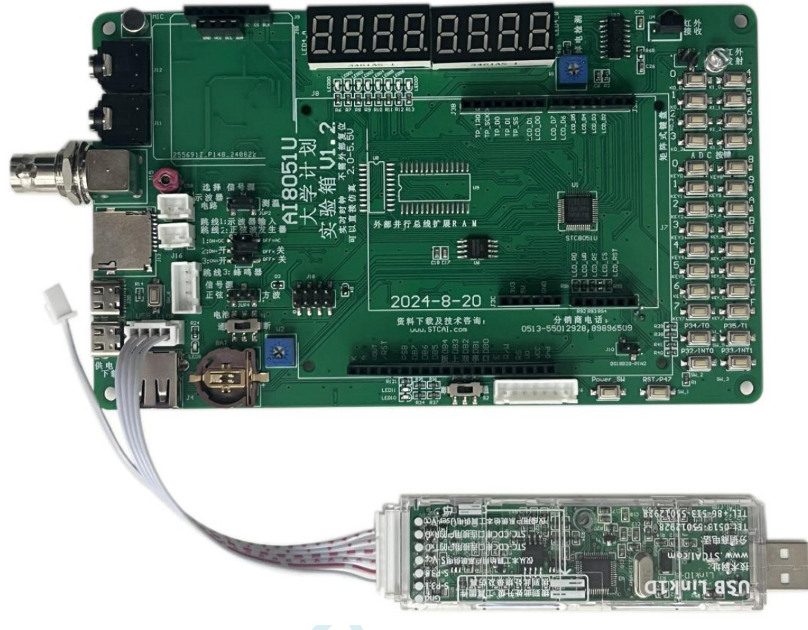

2、 使用 USB-Link1D 工具对 STC15 和STC8 系列进行串口仿真工具的 S-Vcc、S-P3.0、S-P3.1、GND 分别与目标单片机的 M-Vcc、 P3.0 （RxD）、 P3.1 （TxD）、 GND相连接，然后 Keil 仿真设置中选择 STC-CDC1 所对应的串口号，然后参考 STC15/STC8 系列数据手册中的直接串口仿真章节中仿真的步骤和设置， 即可进行串口仿真

3、 使用 USB-Link1D 工具对 STC 全系列单片机进行 ISP 在线下载工具的 S-Vcc、 S-P3.0、 S-P3.1、 GND 分别与目标单片机的 M-Vcc、P3.0 （RxD）、P3.1 （TxD）、 GND相连接， 在 AIapp-ISP 下载软件中的串口号选择“USB Link1 (LNK1)”， 打开程序文件以及设置相关硬件选项， 然后点击 “下载/编程” 按钮即可进行 ISP 在线下载

文件(F) 编程/下载(O) 工具(T) 界面(L) 调试接口(G) 资料下载(D) 供货信息(①) 产品广告(S) 升级(U) Chinese English  
芯片型号 STC32G12K128-Beta √ 引脚数 Auto 程序文件 EEPROM文件 串口助手 D助手 Keil仿真设置 STC硬件数学库 选  
扫描串 STC-USB Link1 （LNK1） 0FE0400h 国 FF FF FF FF FF FF FF FF FF FF FF FF FF FF FF  
最低波特率 2400 最高波特率 115200 0FE0410h FF FF FF FF FF FF FF FF FF FF FF FF FF FF FF FF0FE0420h FF FF FF FF FF FF FF FF FF FF FF FF FF FF FF FF  
起始地址 0FE0430h FF FF FF FF FF FF FF FF FF FF FF FF FF FF FF FF  
0x0000 清除代码缓冲区 打开程序文件 0FE0440h FF FF FE FE FF FF FF FF FF FF FF FF FF FF FF FF  
0x0000 清除EEPROM缓中区 打开EEPROM文件 0FE0450h FF FF FF FF FF FF FF FF FF FF FF FF FF EF FF0FE0460h FF FF FE FF FF FF FF FF FF FF FF FF FF FF FF  
硬件选项 U8W/Link1脱机 程序加密后传输 ID号 0FE0470h 可 FE FF FF FE FF FF E FF E F FF FE FE FE E0FE0480h FE FE FF FTE FE FE FF FF E F FF FE FE FE T本次下载需要修改硬件选项 0FE0490h 广 FE FE FE E FF E FF FV 本次下载需要调节IRC频率 0FE04A0h FE E FE F0FE04B0h E T输入用户程序运行时的IRC频率 11.0592 √ MHz 0FE04C0h E -振荡器放大增益（12M以上建议选择） 0FE04D0h设置用户EEPROM大小 1 0FE04E0h 2 E0FE04F0h FF√ 上电复位使用较长延时√ 复位脚用作I/0口√ 允许低压复位（禁止低压中断） 代码长度 OFE6C 校验和 FD2530 区域填充 清空区域 保存数据低压检测电压 2.00V上电复位时由硬件自动启动看门狗 打开文件 "C: \Users\Administrator\Desktop\Demo-251\Test. hex 成功看门狗定时器分频系数 256下载/编程 停止 复编程检测MCV选项 帮助 重复延时  
每次下载前都重新装载目标文件 重复次数无限 C:\Users\Administrator\Desktop\Demo-251\Test. hex  
当目标文件变化时自动装载并发送下载命令 发布项目程序 发布项目帮助 读取本机硬盘号 提示音 成功计数 5135 清零

4、 使用 USB-Link1D 工具对 STC 全系列单片机进行 ISP 脱机下载在 AIapp-ISP 下载软件中的串口号选择“STC-USB Link1 (LNK1)”，打开程序文件以及设置相关硬件选项， 后点击 “U8W/Link1 脱机” 页面中的“将用户程序下载到编程器以供脱机下载”按钮，将用户代码和相关设置下载到 STC-USB Link1 工具上的存储器中。

文件(F) 编程/下裁(O) 工具(T) 界面(L) 调试接口(G) 资料下裁(D) 供货信息(①) 产品广告(S) 升级(U) Chinese English  
芯片型号 STC32G12K128-Beta 引脚数 Auto 程序文件 EEPROM文件 串口助手 HD助手 Keil仿真设置 STC硬件数学库 话  
扫描串口 STC-USB Link1 (LNK1)0FE0400h 国 FF FF FE E FF FF EF FE  
最低波特率2400 最高波特率 115200 0FE0410h E FF FF 中 FF FF FF 「0FE0420h E FF E T  
起始地址 0FE0430h TF FE FF E FE F  
0x0000 M清除代码缓冲区 打开程序文件 0FE0440h - E FF ' 上 FE  
0x0000 清除EEPROM缓冲区 打开EEPROM文件 0FE0450h FF FF 1 上 FF FF 0FE0460h  
硬件选项 18W/Iink1脱机 程序加密后传输 ID号 0FE0470h0FE0480h将用户程序下载到编程器以供脱机下载 0FE0490h清除编程器中的用户脱机代码及数据 0FE04A0h设置uBr将用户的代码以及选项设 8设置脱机下载 主意：下载前，必须选择 脱机编程数量 10000 握手超时时间 0FE04E0h0FE04F0h FF FFS-VCC输出电压 5.0 V 上电延时时间 0.5s在线下 载完成后持续给目标芯片供电脱机 载完成后持续给目标芯片供电 代码长度 OFE6C 校验和 FD2530 区域填充 清空区域 保存数据脱机 载时关闭自动检测有无芯片功能即使下载失败自动增量也自动递增 打开文件 "C: \Users\Admini strator\Desktop\Demo-251\Test. hex° 成功使用第二种LED显示模式税机烧录工具u8"/UB"-Mini及通用USB转串口使用说明下载/编程 重复编程检测MCU选项 帮助 重复延时  
每次下载前都重新装载目标文件 重复次数无限 C: \Users\Admini stratorDesktop\Demo-251\Test.hex  
当目标文件变化时自动装载并发送下载命令 发布项目程序 发布项目帮助 读取本机硬盘号 提示音 成功计数 5135 清零

将工具的 S-Vcc、 S-P3.0、 S-P3.1、 GND 分别与目标单片机的 M-Vcc、 P3.0 （RxD）、 P3.1 （TxD）、GND 相连接， 然后按下工具上的“Key1” 按键即可对目标芯片进行脱机下载（即不需要 PC 端的控制， 独立进行 ISP 下载）

5、 USB-Link1D 工具当作通用 USB 专串口工具使用

USB-Link1D 工具提供了两个 STC-CDC 串口， 可作为通用 USB 专串口工具使用， 由于第一个串口CDC1 与硬件仿真、ISP 下载共用 S-P3.0 和 S-P3.1 端口， 而第二个串口 CDC2 是独立串口， 所以建议 S-P3.0 和 S-P3.1 作为仿真和 ISP 下载使用， 当需要使用通用 USB 专串口工具时， 使用 S-TxD 和S-RxD 所对应的 CDC2。 （注： 在没有使用冲突的情况下， CDC1 和 CDC2 均可各自独立的当作通用USB 专串口工具使用）

# 2.7.4 USB-Link1D 插上电脑并正常识别到后的显示

USB-Link1D 工具在出厂时， 主控芯片内已烧录了 USB-Link1D 的控制程序。 正常情况下， 工具连接到电脑后， 在 AIapp-ISP 下载软件中会立即识别出 “USB Link1 (LNK1)”， 如下图所示

文件(F) 編程/下载(O) 工具(T) 界面(L) 实时供货信息(①) 主力产品广告(S) 资料下载(D) Simplified Chinese English  
芯片型号 STC32G12K128- -Beta 引脚数 Auto √ 程序文件 EEPROM文件 串口助手 HID助手 Keil仿真设置 STC硬件数学库 选  
扫描串 STC-USB Link1 (LNK1) 接收缓中区 多字符串发送  
最低波特率2400 最高波特率 115200 $\odot$ 文本模式 发送 HEX0 √  
起始地址 $\textcircled { \bullet }$ HX模式 2 33 √ 三  
0x0000 清除代码缓冲区 打开程序文件 清空接收区 3 34 √  
Dx0000 清除EEPROM缓冲区 打开EEPROM文件 保存接收数据 35 √36 √  
硬件选项 U8W/Link1脱机 程序加密乓传输 n号 出中区打开EEPROM数据文件(Ctrl+E)37H 53H 45H 47H 53H OOH OOH OOH 31H本次下载需要修改硬件选项 32H 2EH 33H本次下载需要调节IRC频率 $\bullet$ HEX模式 关闭提示输入用户程序运行时的IRC频率 11.0592 MHz 清空发送区 全部数据√ 振荡器放大增益（12M以上建议选择） 保存发送数据 自动循环发送设置用户EEPROM大小 1 周期(ms) 间隔 mS上电复位使用较长延时 串口 COM1 波特率115200 ▼ 校验位无校验 停止位1位√ 复位脚用作I/0口编程完成后自动打开串口 发送 0允许低压复位（禁止低压中断） 打开串口 自动发送结束符 接收 D低压检测电压 2.00 V上电复位时由硬件自动启动看门狗看门狗定时器分频系数 256下载/编程 重复编程检测MCU选项 帮助 重复延时  
每次下载前都重新装载目标文件 重复次数 无限  
当目标文件变化时自动装载并发送下载命令 发布项目程序 发布项目帮助 读取本机硬盘号 □提示音 成功计数 4672 清零

正确识别后， 即可使用 USB-Link1D 进行在线 ISP 下载或者脱机 ISP 下载。在驱动安装成功后， 还会自动识别出两个 STC-CDC 串口， 如下图所示：

文件(F) 編程/下载(O) 工具(T) 界面(L) 调试接口(G) 资料下裁(D) 供货信息(①) 产品广告(S) 升级(U) Chinese English  
芯片型号 STC32G12K128-Beta √ 引脚数 Auto √ 程序文件 EEPROM文件 串口助手 HID助手 Keil仿真设置 STC硬件数学库 选  
扫描串口 STC-USB Link1 (CDC1） (C0M3） 接收缓冲区 多字符串发送  
最低波特 通信端口 (COM1) 文本模式 发送 HEX  
起始地址 STE-VSB Link1 (CHE2) (COM4) $\textcircled{9}$ EX模式 2  
0x0000 Com5 清空接收区 3  
Dx0000 CONG 保存接收数据COM8 5  
硬件选项 COM9 发送缓冲区√ 本次下COM11 COM10 $\bigcirc$ 文本模式$\textcircled{9}$ HEX模式 关闭提示√ 本次下COM13输入用户程学运行时的IRC频率 11.0592 MHz 清空发送区 清空全部数据V 振荡器放大增益（12M以上建议选择） 保存发送数据设置用户EEPROM大小 1 K 周期(ms） 间隔√ 上电复位使用较长延时 串口 COM1 波特率 115200 校验位 无校验 停止位 1位√ 复位脚用作I/0口 编程完成后自动打开串口 发送 1√ 允许低压复位（禁止低压中断） 打开串口 自动发送结束符回车换行符（\r\n) 接收低压检测电压 2.00 v上电复位时由硬件自动启动看门狗看门狗定时器分频系数 256下载/编程 重复编程检测MCU选项 帮助 重复延时 划  
√每次下载前都重新装载目标文件 重复次数无限  
当目标文件变化时自动装载并发送下载命令 发布项目程序 发布项目帮助 读取本机硬盘号 提示音 成功计数 5135 清零

可以当作通用 USB 转串口工具使用。

# 2.7.5 如电脑端新版本 ISP 软件提示 USB-Link1D 工具固件需升级

当使用工具进行 ISP 下载时， 软件弹出如下画面， 表示工具的固件需要升级

編程/下裁(O) 界面(L) 实时供货信息(①)芯片型号 引脚数 程序文件 EEPROM文件 串口助手 HID助手 Keil仿真设置 STC硬件数学库 选（LNK1） 接收缓中区 多字符串发送最低波特率2400 最高波特率 $\odot$ 文本模式 发送 1 0 HEX √起始地址 $\textcircled{9}$ HEX模式 2 33 √ Dx0000 清除代码缓冲区 清空接收区 3 34 MDx0000 清除EEPROM缓中区 保存接收数据 35 √36 √硬件选项 U8W/Link1脱机 程序加密后传输 D号 发送缓冲区0OH 31H本次下载需要修改硬件选项 STC-ISP关闭提示本次下载需要调节IRC频率输入用户程序运行时的IRC频率 清空全部数据振荡器放大增益（12M以上建议送 下裁板的固件代码不是最新版本， 是否需要自动更新？设置用户EEPROM大小 期（ms） 间隔 nS上电复位使用较长延时 无校验 停止位1位复位脚用作I/0口发送 0允许低压复位（禁止低压中断） 是(M 香(N) 接收 0低压检测电压上电复位时由硬件自动启动看门狗 正在 单片机看门狗定时器分频系数 256 STC-USB Link1v1.00512K Flash停止 重复编程帮助 重复延时每次下载前都重新装载目标文件 重复次数 无限□当目标文件变化时自动装载并发送下载命令 发布项目帮助 读取本机硬盘号 □提示音 成功计数 4673

点击“是”按钮， 工具便会自动开始升级。

# 2.7.6 制作 USB-Link1D 主控芯片

USB-Link1D 工具在出厂时，我公司的操作人员已经将主控芯片制作完成，所以客户拿到工具后不需要自己手动再次制作 USB-Link1D 工具的主控芯片。只有在客户将工具的主控芯片更换为一颗全新的芯片才需要进行下面的步骤。

1、将 USB-Link1D 工具插入电脑的 USB 口， 如果 AIapp-ISP 下载软件的端口列表中没有显示出 “USB-HID-UART1 (Link1)”的设备 （如下图）， 则说明工具的主控芯片为空片， 需要继续接下来的步骤

文件旧 编程(O) 工具(①) STC调试接口(G) 资料下载（D  
芯片型号 STC8H2K32V 引脚数 Auto  
扫描串 STC-USB-HD-UART1 (Link1) 设置  
最低波特率2400 最高波特率 115200  
起始地址  
0x0000 清除代码缓冲区 打开程序文件  
Dx0000 清除EEPROM缓中区 打开EEPROM文件硬件选项 USB-Link1D/u8W/U8W-Mini脱机 程序加将用户程序下载到编程器以供脱机下载清除编程器中的用户脱机代码及数据设置STC-USB Lirk1D/U8W/U8W-Mini主控芯片设置脱机下载时拍的最高波特率 115200脱机编程数量 10000 握手超时时间 0S-VCC输出电压 3.3 V 上电延时时间 0.5在线下载完成后持续给目标芯片供电脱机下载完成后持续给目标芯片供电

2、 先使用 USB 线将工具和电脑相连， 按住工具的 “Key1”按键不要松开， 再轻按一下“Key2” 按键后松开 Key2 按键 （此时需要保持 Key1 按键一直处于按下状态）， 等待 AIapp-ISP 下载软件的端口列表中显示出“USB Writer (HID1)” 的设备 （如下图）时， 再松开 Key1 按键 （注： 工具上的 Key1 为主控芯片的 P3.2 口， Key2 为工具主控芯片的电源键）

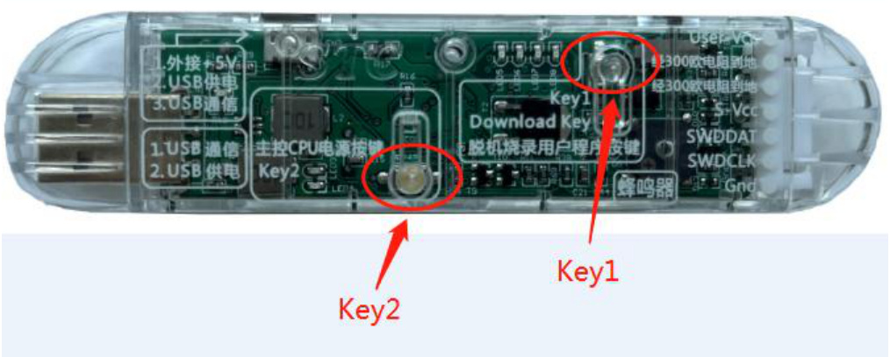

文件旧 編程(回) 工具① STC调试接口(G) 资料下裁（  
芯片型号 STC8H2K32V 引脚数 Auto  
扫描串口 STC-USB Writer (HID1） 设置  
最低波特率 2400 最高波特率 115200  
起始地址  
0x0000 清除代码缓冲区 打开程序文件  
Dx0000 √ 清除EEPROM缓中区 打开EEPROM文件  
硬件选项 USB-Link1D/U8W/U8W-Mini脱机 程序加将用户程序下载到编程器以供脱机下载清除编程器中的用户脱机代码及数据设置STC-USB Lirk1D/U8W/U8W-Mini主控芯片设置脱机下载时的最高波特率 115200脱机编程数量 10000 握手超时时间 0S-VCC输出电压 5.0V 上电延时时间 0.5□在线下载完成后持续给目标芯片供电脱机下载完成后持续给目标芯片供电

# 3 、 点 击 AIapp-ISP 下 载 软 件 中 “ USB-Link1D/U8W/U8W-Mini 脱 机 ” 页 面 的 “ 设 置USB-Link1D/U8W/U8W-Mini 主控芯片” 按钮

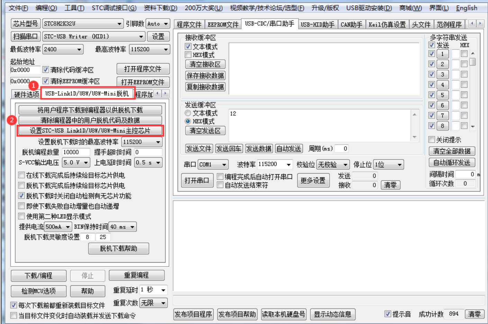

4、 弹出的 Link1D 工具设置窗口中可以根据实际需要进行设置， 若无特殊需要可保持默认选项

STC-USB Link1D工具设置数据管脚模式设置工具接收脚S-TxD模式 高阻输入工具接收脚S-TxD2模式 高阻输入待机时工具发送脚S-RxD模式 开漏输出待机时工具发送脚S-RxD2模式 开漏输出通讯时工具发送脚S-RxD模式 推挽输出通讯时工具发送脚S-RxD2模式 推挽输出确定

5、接下来软件会自动开始制作 USB-Link1D 工具的主控芯片。制作完成后， 建议将工具的 USB 线重新插拔一次（特别是对一颗全新的芯片第一次制作主控芯片时必须重新插拔一次）。当主控芯片制作完成并再次重新插入电脑的 USB 口时， AIapp-ISP 下载软件的端口列表中显示出“STC-USB-HID-UART1 (Link1)” 的设备 （如下图）， 则说明工具的主控芯片制作成功。

文件旧 编程(O) 工具(①) STC调试接口(G) 资料下载（D  
芯片型号 STC8H2K32U 引脚数 Auto  
扫描串 STC-USB-HID-UART1 (Lirk1) 设置  
最低波特率 2400 最高波特率 115200  
起始地址  
0x0000 清除代码缓冲区 打开程序文件  
0x0000 清除EEPROM缓冲区 打开EEPROM文件硬件选项 USB-Link1D/U8W/U8W-Mini脱机 程序加将用户程序下载到编程器以供脱机下载清除编程器中的用户脱机代码及数据设置STC-USB Lirk1D/U8W/U8W-Mini主控芯片设置脱机下载时的最高波特率 115200脱机编程数量 10000 握手超时时间 0S-VCC输出电压 3.3V 上电延时时间 0.5s在线下载完成后持续给目标芯片供电脱机下载完成后持续给目标芯片供电

# 2.8 ISP 下载相关硬件选项的说明

硬件选项 |  | 选项何时生效
 | 选择使用内部IRC时钟（不选为外部阳时钟） | 需要重新上电才生效
 | 输入用户程序运行时的IRC频率11.0592 MHz | 动态调整，立即生效
 | √振荡器放大增益（12M以上建议选择） | 需要重新上电才生效
√ 使用快速下载模式 |  | 只与本次下载有关
 | 设置用户EEPROM大小 0.5 K | 需要重新上电才生效
 | 下次冷启动加时，P3.2/P3.3为0/0才可下载程序 | 下次下载时有效
 | 上电复位使用较长延时 | 需要重新上电才生效
 | 复位脚用作I/0口 | 需要重新上电才生效
√ | 允许低压复位（禁止低压中断） | 需要重新上电才生效
低压检测电压 | 2.20 V | 需要重新上电才生效
 | 低压时禁止EEPROM操作 | 需要重新上电才生效
 | 上电复位时由硬件自动启动看门狗 看门狗定时器分频系数 256 空闲状态时停止看门狗计数 | 需要重新上电才生效
√ | 下次下载用户程序时擦除用户EEPROM区 | 下次下载时有效
在程序区的结束处添加重要测式参数 |  | 每次下载时一并写入

需要重新上电才生效： 选项修改后， 目标芯片需要断电一次 （停电） ， 重新再上电， 新的设置才生效

动态调整， 立即生效： 本次 ISP 下载有效

只与本次下载有关： 此选项只与本次ISP 下载有关， 不影响下一次下载下次下载时有效：选项修改后，下次下载时才生效，修改对本次ISP 下载无效每次下载时一并写入： 选择此选项后，在本次下载时将附加的数据一并写入，与下次下载无关

# 2.9 通用 USB 转双串口芯片： USB-2UART, TSSOP20/SOP162.9.1 通用 USB 转双串口芯片 USB-2UART-45I-TSSOP20， 自动停电上电


# 2.9.2 通用 USB 转双串口芯片 USB-2UART-45I-TSSOP20， 手动停电上电


# 2.9.3 通用 USB 转双串口芯片 USB-2UART-45I- SOP16， 自动停 电上电


# 2.9.4 通用 USB 转双串口芯片 USB-2UART-45I-SOP16，手动停电上电


# 3 功能脚切换

STC8G 系列单片机的特殊外设串口、SPI、PCA、 $I ^ { 2 } C$ 以及总线控制脚可以在多个 I/O 直接进行切换，以实现一个外设当作多个设备进行分时复用。

# 3.1 功能脚切换相关寄存器

符号 | 描述 | 地址 | 位地址与符号 | 复位值
B7 | B6 | B5 | B4 | B3 | B2 | B1 | B0
P_SW1 | 外设端口切换寄存器 | A2H | S1_S[1:0] |  |  | CCP_S[1:0] |  | SPI_S[1:0] |  |  | nn00,000x
P_SW2 | 外设端口切换寄存器2 | BAH | EAXFR |  |  | I2C_S[1:0] | CMPO_S | S4_S | S3_S | S2_S | 0x00,0000

符号 | 描述 | 地址 | 位地址与符号 | 复位值
B7 | B6 | B5 | B4 | B3 | B2 | B] | B0
MCLKOCR | 主时钟输出控制寄存器 | FE05H | MCLKO_S |  |  |  | MCLKODIV[6:0] |  |  |  | 0000,0000

# 3.1.1 外设端口切换控制寄存器 1 （P_SW1）， 串口 1、 CCP、 SPI切换

符号 | 地址 | B7 | B6 | B5 | B4 | B3 | B2 | B1 | B0
P_SW1 | A2H | S1_S[1:0] |  | CCP_S[1:0] |  | SPI_S[1:0] |  |  | 

S1_S[1:0]： 串口 1 功能脚选择位

S1_S[1:0] | RxD | TxD
00 | P3.0 | P3.1
01 | P3.6 | P3.7
10 | P1.6 | P1.7
11 | P4.3 | P4.4

S1_S[1:0]： 串口 1 功能脚选择位 （STC8G1K08-8Pin 系列、 STC8G1K08A 系列）

S1_S[1:0] | RxD | TxD
00 | P3.0 | P3.1
01 | P3.2 | P3.3
10 | P5.4 | P5.5
11 |  | 

CCP_S[1:0]： PCA 功能脚选择位  

CCP_S[1:0] | ECI | CCPO | CCP1 | CCP2
00 | P1.2 | P1.1 | P1.0 | P3.7
01 | P3.4 | P3.5 | P3.6 | P3.7
10 | P2.4 | P2.5 | P2.6 | P2.7
11 |  |  |  | 

CCP_S[1:0]： PCA 功能脚选择位 （STC8G1K08A 系列）

SPI_S[1:0]： SPI 功能脚选择位  

CCP_S[1:0] | ECI | CCPO | CCP1 | CCP2
00 | P5.5 | P3.2 | P3.3 | P5.4
01 | P5.5 | P3.1 | P3.3 | P5.4
10 | P3.1 | P3.2 | P3.3 | P5.5
11 |  |  |  | 

SPI_S[1:0] | SS | MOSI | MISO | SCLK
00 | P1.2 | P1.3 | P1.4 | P1.5
01 | P2.2 | P2.3 | P2.4 | P2.5
10 | P5.4 | P4.0 | P4.1 | P4.3
11 | P3.5 | P3.4 | P3.3 | P3.2

SPI_S[1:0]： SPI 功能脚选择位 （STC8G1K08-8Pin 系列、 STC8G1K08A 系列）

SPI_S[1:0] | SS | MOSI | MISO | SCLK
00 | P5.5 | P5.4 | P3.3 | P3.2
01 |  |  |  | 
10 |  |  |  | 
11 |  |  |  | 

# 3.1.2 外设端口切换控制寄存器 2 （P_SW2）， 串口 2/3/4、 I2C、比较器输出切换

符号 | 地址 | B7 | B6 | B5 | B4 | B3 | B2 | B1 | BO
P_SW2 | BAH | EAXFR |  | I2C_S[1:0] |  | CMPO_S | S4_S | S3_S | S2_S

EAXFR： 扩展 RAM 区特殊功能寄存器 （XFR） 访问控制寄存器

0： 禁止访问 XFR  
1： 使能访问 XFR。

当需要访问 XFR 时， 必须先将 EAXFR 置 1， 才能对 XFR 进行正常的读写

I2C_S[1:0]： $I ^ { 2 } C$ 功能脚选择位

I2C_S[1:0] | SCL | SDA
00 | P1.5 | P1.4
01 | P2.5 | P2.4
10 | P7.7 | P7.6
11 | P3.2 | P3.3

I2C_S[1:0]： $I ^ { 2 } C$ 功能脚选择位 （STC8G1K08-8Pin 系列、 STC8G1K08A 系列）

CMPO_S： 比较器输出脚选择位  

I2C_S[1:0] | SCL | SDA
00 | P3.2 | P3.3
01 | P5.4 | P5.5
10 |  | 
11 |  | 

CMPO_S | CMPO
0 | P3.4
 | P4.1

S4_S： 串口4 功能脚选择位

S4_S | RxD4 | TxD4
0 | P0.2 | P0.3
 | P5.2 | P5.3

S3_S： 串口3 功能脚选择位

S3_S | RxD3 | TxD3
0 | P0.0 | P0.1
 | P5.0 | P5.1

S2_S： 串口2 功能脚选择位

S2_S | RxD2 | TxD2
0 | P1.0 | P1.1
 | P4.6 | P4.7

# 3.1.3 时钟选择寄存器 （MCLKOCR）

符号 | 地址 | B7 | B6 | B5 | B4 | B3 | B2 | B1 | BO
MCLKOCR | FE05H | MCLKO_S | MCLKODIV[6:0]

MCLKO_S： 主时钟输出脚选择位

MCLKO_S | MCLKO
0 | P5.4
 | P1.6

# 3.2 范例程序

# 3.2.1 串口 1 切换

# C 语言代码

//测试工作频率为11.0592MHz

# #include "reg51.h"

sfr P_SW1 0xa2;   
sfr sfr sfr sfr sfr sfr sfr sfr sfr sfr sfr sfr P0M1 0x93; P0M0 0x94; P1M1 0x91; P1M0 0x92; P2M1 0x95; P2M0 0x96; P3M1 0xb1; P3M0 0xb2; P4M1 0xb3; P4M0 0xb4; P5M1 0xc9; P5M0 0xca;   
void main()   
{ $P 0 M 0 = 0 x 0 0$ ; P0M1 = 0x00; P1M0 = 0x00; $P I M I = \theta x \theta \theta$ ; $P 2 M \theta = \theta x \theta \theta$ ; $P 2 M I = { \theta } { x } { \theta } { 0 }$ ; $P 3 M \theta = \theta x \theta \theta$ ; $P 3 M I = 0 x \theta \theta$ ; $P 4 M O = 0 { x } 0 0$ ; $P 4 M I = 0 x \theta \theta$ ; $P 5 M \theta = \theta x \theta \theta$ ; $P 5 M I = \theta x \theta \theta$ ; $P _ { - } S W I = \theta x \theta \theta$ ;   
// P_SW1 = 0x40;   
// P_SW1 = 0x80;   
// P_SW1 = 0xc0; while (1);

//RXD/P3.0, TXD/P3.1   
//RXD_2/P3.6, TXD_2/P3.7   
//RXD_3/P1.6, TXD_3/P1.7   
//RXD_4/P4.3, TXD_4/P4.4

# 汇编代码

；测试工作频率为11.0592MHz
P_SW1 | DATA | 0A2H
P0M1 | DATA | 093H
P0M0 | DATA | 094H
P1M1 | DATA | 091H

深圳国芯人工智能有限公司 分销商电话: 0513-55012928 / 55012929 89896509 技术交流及选型论坛:www.STCAIMCU.com - 177

STC8G 系列技术手册 | 官方网站： www.STCAI.com | 车规MCU设计公司 | 研发顾问： 13922829
P1M0 | DATA | 092H |  | 
P2M1 | DATA | 095H |  | 
P2M0 | DATA | 096H |  | 
P3M1 | DATA | 0B1H |  | 
P3M0 | DATA | 0B2H |  | 
P4M1 | DATA | 0B3H |  | 
P4M0 | DATA | 0B4H |  | 
P5M1 | DATA | 0C9H |  | 
P5M0 | DATA | OCAH |  | 
 | ORG | 0000H |  | 
 | LJMP | MAIN |  | 
 | ORG |  |  | 
MAIN: |  | 0100H |  | 
 | MOV |  |  | 
 | MOV | SP, #5FH |  | 
 |  | POM0, #00H |  | 
 | MOV MOV | P0M1, #00H |  | 
 | MOV | P1M0, #00H |  | 
 | MOV | P1M1, #00H |  | 
 |  | P2M0, #00H |  | 
 | MOV | P2M1, #00H |  | 
 | MOV | P3M0, #00H |  | 
 | MOV | P3M1, #00H |  | 
 | MOV | P4M0, #00H |  | 
 | MOV | P4M1, #00H |  | 
 | MOV MOV | P5M0, #00H P5M1, #00H |  | 
 |  |  |  | 
 | MOV MOV | P_SW1,#00H P_SW1,#40H | CNC | TXD/P3.1 ;RXD_2/P3.6, TXD_2/P3.7
 | MOV | P_SW1,#80H |  | ;RXD_3/P1.6, TXD_3/P1.7
 | MOV | P_SW1,#0C0H |  | ;RXD_4/P4.3, TXD_4/P4.4
 |  |  |  | 
 | SJMP |  |  | 
 | END |  |  | 

# 3.2.2 串口 2 切换

# C 语言代码

//测试工作频率为11.0592MHz
#include '"reg51.h"' | 0xba;
sfr P_SW2 | 
P0M1 | 0x93;
POM0 | 0x94;
P1M1 | 0x91;
P1M0 | 0x92;
P2M1 | 0x95;
P2M0 | 0x96;
P3M1 | 0xb1;
P3M0 sfr P4M1 | 0xb2; 0xb3;

STC8G | 系列技术手册 | 官方网站:www.STCAI.com | 车规MCU设计公司 | 研发顾问： | 13922829991 | 选型顾问：13922805190
sfr | P4M0 |  | 0xb4; |  |  | 
sfr | P5M1 |  | 0xc9; |  |  | 
sfr | P5M0 |  | 0xca; |  |  | 
 |  |  |  |  |  | 
void main() |  |  |  |  |  | 
 | P0M0 = 0x00; |  |  |  |  | 
 | P0M1 = 0x00; |  |  |  |  | 
 | P1M0 = 0x00; |  |  |  |  | 
 | P1M1 = 0x00; |  |  |  |  | 
 | P2M0 = 0x00; |  |  |  |  | 
 | P2M1 = 0x00; |  |  |  |  | 
 | P3M0 = 0x00; |  |  |  |  | 
 | P3M1 = 0x00; |  |  |  |  | 
 |  |  |  |  |  | 
 | P4M0 = 0x00; |  |  |  |  | 
 | P4M1 = 0x00; |  |  |  |  | 
 | P5M0 = 0x00; |  |  |  |  | 
 | P5M1 = 0x00; |  |  |  |  | 
 | P_SW2 = 0x00; |  |  |  | //RXD2/P1.0, TXD2/P1.1 | 
 | P_SW2 = 0x01; |  |  |  | //RXD2_2/P4.6, TXD2_2/P4.7 | 
 |  |  |  |  |  | 
 |  |  |  |  |  | 
 |  |  |  |  |  | 
 |  |  |  |  |  | 
 |  |  |  |  |  | 
 |  |  |  |  |  | 
 |  |  |  |  |  | 
 |  |  |  |  |  | 
 |  |  |  |  |  | 
 |  |  |  |  |  | 
 |  |  |  |  |  | 
 |  |  |  |  |  | 
 | while (1); |  |  |  |  | 
 |  |  |  |  |  | 
 |  |  |  |  |  | 
 |  |  |  |  |  | 
 |  |  |  |  |  | 
 |  |  |  |  |  | 
 |  |  |  |  |  | 
 |  |  |  |  |  | 
 |  |  |  |  |  | 
 |  |  |  |  |  | 
 |  |  |  |  |  | 
 |  |  |  |  |  | 
 |  |  |  |  |  | 
 |  |  |  |  |  | 
 |  |  |  |  |  | 
 |  |  |  |  |  | 
 |  |  |  |  |  | 
 |  |  |  |  |  | 
 |  |  |  |  |  | 
 |  |  |  |  |  | 
 |  |  |  |  |  | 
 |  |  |  |  |  | 

# 汇编代码

;测试工作频率为11.0592MHz

 | 
P_SW2 | DATA | OBAH | 
P0M1 | DATA | 093H
 | P0M0 DATA
094H | P1M1 | DATA
091H | P1M0 | DATA | 092H
STC | P2M1 | DATA | 095H
 | P2M0 | DATA | 096H
 | P3M1 | DATA | 0B1H
 | P3M0 | DATA | 0B2H
 | P4M1 | DATA | 0B3H
 | P4M0 | DATA | 0B4H
 | P5M1 | DATA | 0C9H
 | P5M0 | DATA | 0CAH
 |  | ORG | 0000H
 |  | LJMP | MAIN
 |  | ORG | 0100H
 | MAIN: |  | 
 |  | MOV | 
 |  | MOV | SP, #5FH
 |  |  | P0M0, #00H
 |  | MOV | P0M1, #00H
 |  | MOV | P1M0, #00H
 |  | MOV | P1M1, #00H
 |  | MOV | P2M0, #00H
 |  | MOV | P2M1, #00H P3M0, #00H
 |  | MOV MOV | P3M1, #00H
 |  | MOV | P4M0, #00H

STC8G 系列技术手册 | 官方网站： www.STCAI.com | 车规MCU设计公司 | 研发顾问： 13922829991 | 选型顾问： 13922805190
 |  |  |  | 
 | MOV P4M1, #00H |  |  | 
MOV | P5M0, #00H |  |  | 
MOV | P5M1, #00H |  |  | 
MOV | P_SW2,#00H |  | ; RXD2/P1.0, TXD2/P1.1 | 
MOV | P_SW2,#01H |  | ;RXD2_2/P4.0, TXD2_2/P4.2 | 
SJMP |  |  |  | 
END |  |  |  | 

# 3.2.3 串口 3 切换

# C 语言代码

//测试工作频率为11.0592MHz#include "reg51.h"

sfr P_SW2 0xba;   
sfr sfr sfr sfr sfr sfr sfr sfr sfr sfr sfr sfr P0M1 0x93; P0M0 = 0x94; ; P1M1 0x91; P1M0 0x92; P2M1 0x95; P2M0 0x96; P3M1 0xb1; P3M0 0xb2; P4M1 0xb3; P4M0 0xb4; P5M1 0xc9; P5M0 0xca;   
void main()   
7 $P 0 M \theta = 0 x \theta \theta$ ; $P 0 M I = 0 x 0 0$ ; $P I M O = \theta x \theta \theta$ ; $P I M I = \theta x \theta \theta$ ; $P 2 M \theta = \theta x \theta \theta$ ; $P 2 M I = { \theta } { x } { \theta } { 0 }$ ; $P 3 M O = 0 { x } 0 0$ ; $P 3 M I = \theta x \theta \theta$ ; $P 4 M O = 0 { x } 0 0$ ; $P 4 M I = 0 x 0 0$ ; $P 5 M \theta = \theta x \theta \theta$ ; $P 5 M I = \theta x \theta \theta$ ; P_SW2 = 0x00; P_SW2 = 0x02; while (1);

# 汇编代码

;测试工作频率为11.0592MHz

P_SW2 | DATA | OBAH
P0M1 | DATA | 093H
P0M0 | DATA | 094H
P1M1 | DATA | 091H
P1M0 | DATA | 092H
P2M1 | DATA | 095H
P2M0 | DATA | 096H
P3M1 | DATA | 0B1H
P3M0 | DATA | 0B2H
P4M1 | DATA | 0B3H
P4M0 | DATA | 0B4H
P5M1 | DATA | 0C9H
P5M0 | DATA | OCAH
 | ORG | 0000H
 | LJMP | MAIN
 | ORG | 0100H
MAIN: |  | C MCU
 | MOV | SP, #5FH
 | MOV | P0M0, #00H
 | MOV | P0M1, #00H
 | MOV | P1M0, #00H
 | MOV | P1M1, #00H
 | MOV | P2M0, #00H
 | MOV | P2M1, #00H
 | MOV | P3M0, #00H
 | MOV | P3M1, #00H
 | MOV | P4M0, #00H
 | MOV | P4M1, #00H
 | MOV | P5M0, #00H
 | MOV | P5M1, #00H
 | MOV | P_SW2,#00H | ;RXD3/P0.0, TXD3/P0.1
 | MOV | P_SW2,#02H | ; RXD3_2/P5.0, TXD3_2/P5.
 | SJMP |  | 
 | END |  | 

# 3.2.4 串口 4 切换

# C 语言代码

//测试工作频率为11.0592MHz
#include | ''reg51.h"' | 
sfr | P_SW2 | 
 | P0M1 |  | 0x93;
 | P0M0 |  | 0x94;
 | P1M1 |  | 0x91;
sfr | P1M0 |  | 0x92;

深圳国芯人工智能有限公司 分销商电话: 0513-55012928 / 55012929 / 89896509 技术交流及选型论坛:www.STCAIMCU.com - 181

sfr sfr sfr sfr sfr sfr sfr sfr P2M1 0x95;   
P2M0 0x96;   
P3M1 0xb1;   
P3M0 0xb2;   
P4M1 0xb3;   
P4M0 0xb4;   
P5M1 $\theta x c ^ { 9 } ;$ ;   
P5M0 0xca;   
void main()   
$\Omega _ { i }$ $P 0 M 0 = 0 x 0 0$ ; $P 0 M I = 0 x 0 0$ ; $P I M O = \theta x \theta O$ ; $P I M I = \theta x \theta \theta$ ; $P 2 M \theta = \theta x \theta \theta$ ; $P 2 M I = { \theta } { x } { \theta } { 0 }$ ; $P 3 M O = 0 { x } 0 0$ ; $P 3 M I = \theta x \theta \theta$ ; $P 4 M O = 0 { { x } } \theta 0$ ; $P 4 M I = 0 x \theta \theta$ ; $P 5 M \theta = \theta x \theta \theta$ ; $P 5 M I = \theta x \theta \theta$ ; P_SW2 = 0x00; P_SW2 = 0x04; while (1);

# 汇编代码

测 | OBAH
P_SW2 | DATA
 |  | 
P0M1 | DATA | 093H
P0M0 | DATA | 094H
P1M1 | DATA | 091H
P1M0 | DATA | 092H
P2M1 | DATA | 095H
P2M0 | DATA | 096H
P3M1 | DATA | 0B1H
P3M0 | DATA | 0B2H
P4M1 | DATA | 0B3H
P4M0 | DATA | 0B4H
P5M1 | DATA | 0C9H
P5M0 | DATA | 0CAH
 | ORG | 0000H
 | LJMP | MAIN
 |  | 
 | ORG | 0100H
MAIN: |  | 
 | MOV | SP, #5FH
 | MOV | P0M0, #00H
 | MOV | POM1, #00H
 | MOV | P1M0, #00H
 | MOV | P1M1, #00H
STC8G 系列技术手册 | 官方网站:www.STCAI.com | 车规MCU设计公司 | 研发顾问： 13922829991 | 选型顾问： 13922805190
 | MOV | P2M0, #00H |  | 
 | MOV P2M1, #00H |  |  | 
MOV | P3M0, #00H |  |  | 
MOV | P3M1, #00H |  |  | 
 | MOV P4M0, #00H |  |  | 
 | MOV | P4M1, #00H |  | 
 | MOV | P5M0, #00H |  | 
MOV | P5M1, #00H |  |  | 
 | MOV | P_SW2,#00H | ; RXD4/P0.2, TXD4/P0.3 | 
 | MOV | P_SW2,#04H | ; RXD4_2/P5.2, TXD4_2/P5.3 | 
 | SJMP |  |  | 
 |  |  |  | 

# 3.2.5 SPI 切换

# C 语言代码

//测试工作频率为11.0592MHz#include "reg51.h"

sfr P_SW1 0xa2;   
sfr sfr sfr sfr sfr sfr sfr sfr sfr sfr sfr sfr P0M1 $\theta x \ 9 3 _ { i }$ ; P0M0 0x94; P1M1 0x91; P1M0 $\theta x \vartheta 2 ;$ P2M1 0x95; P2M0 0x96; P3M1 0xb1; P3M0 0xb2; P4M1 0xb3; P4M0 0xb4; P5M1 0xc9; P5M0 0xca;   
void main() $P 0 M 0 = 0 x 0 0$ ; P0M1 = 0x00; P1M0 = 0x00; P1M1 = 0x00; $P 2 M \theta = \theta x \theta \theta$ ; $P 2 M I = \theta x \theta \theta$ ; $P 3 M O = 0 { x } 0 0$ ; $P 3 M I = \theta x \theta \theta$ ; $P 4 M O = 0 { x } 0 0$ ; $P 4 M I = 0 x \theta \theta$ ; P5M0 = 0x00; P5M1 = 0x00; P_SW1 = 0x00;   
// P_SW1 = 0x04;   
// $P _ { - } S W I = \theta x \theta \delta ;$

# 汇编代码

;测试
P_SW1 | DATA | 0A2H | 
P0M1 | DATA | 093H | 
P0M0 | DATA | 094H | 
P1M1 | DATA | 091H | 
P1M0 | DATA | 092H | 
P2M1 | DATA | 095H | 
P2M0 | DATA | 096H | 
P3M1 | DATA | 0B1H | 
P3M0 | DATA | 0B2H | 
P4M1 | DATA | 0B3H | 
P4M0 | DATA | 0B4H | 
P5M1 | DATA | 0C9H | 
P5M0 | DATA | OCAH | 
 | ORG | 0000H | 
 | LJMP | MAIN | 
 | ORG | 0100H | 'CMCU
MAIN: |  |  | 
 | MOV | SP, #5FH | 
 | MOV | POM0, #00H | 
 | MOV | P0M1, #00H | 
 | MOV | P1M0, #00H | 
 | MOV | P1M1, #00H | 
 | MOV | P2M0, #00H | 
 | MOV | P2M1, #00H | 
 | MOV | P3M0, #00H | 
 | MOV | P3M1, #00H | 
 | MOV | P4M0, #00H | 
 | MOV | P4M1, #00H | 
 | MOV | P5M0, #00H | 
 | MOV | P5M1, #00H | 
 | MOV | P_SW1,#00H | ;SS/P1.2, MOSI/P1.3, MISO/P1.4, SCLK/P1.5
 | MOV | P_SW1,#04H | ; SS_2/P2.2, MOSI_2/P2.3, MISO_2/P2.4, SCLK_2/P2.5
 | MOV | P_SW1,#08H | ; SS_3/P5.4, MOSI_3/P4.0, MISO_3/P4.1, SCLK_3/P4.3
 | MOV | P_SW1,#0CH | ; SS_4/P3.5, MOSI_4/P3.4, MISO_4/P3.3, SCLK_4/P3.2
 | SJMP |  | 
 | END |  | 

# 3.2.6 PCA/CCP/PWM 切换

# C 语言代码

//测试工作频率为11.0592MHz

# #include "reg51.h"

sfr P_SW1 0xa2;   
sfr sfr sfr sfr sfr sfr sfr sfr sfr sfr sfr sfr P0M1 $\theta x \vartheta 3 ,$ ; P0M0 0x94; P1M1 0x91; P1M0 0x92; P2M1 0x95; P2M0 0x96; P3M1 0xb1; P3M0 0xb2; P4M1 0xb3; P4M0 0xb4; P5M1 0xc9; P5M0 0xca;   
void main()   
{ $P 0 M 0 = 0 x 0 0$ ; $P 0 M I = 0 x 0 0$ ; P1M0 = 0x00; P1M1 = 0x00; P2M0 = 0x00; P2M1 = 0x00; $P 3 M \theta = \theta x \theta \theta$ ; $P 3 M I = \theta x \theta \theta$ ; $P 4 M O = 0 { { x } } \theta 0$ ; $P 4 M I = 0 x 0 0$ ; $P 5 M \theta = \theta x \theta \theta$ ; P5M1 = 0x00; P_SW1 = 0x00;   
// P_SW1 = 0x10;   
// $P _ { - } S W I = 0 x 2 0 ,$ ; while (1);

# 汇编代码

;测试工作频率为11.0592MHz

P_SW1 | DATA | 0A2H
 |  | 
P0M1 P0M0 | DATA DATA | 093H 094H
P1M1 | DATA | 091H
P1M0 | DATA | 092H
P2M1 | DATA | 095H
P2M0 | DATA | 096H
P3M1 | DATA | 0B1H
P3M0 | DATA | 0B2H
P4M1 | DATA | 0B3H
P4M0 | DATA | 0B4H
P5M1 | DATA | 0C9H
P5M0 | DATA | 0CAH

STC8G 系列技术手册 | 官方网站:www.STCAI.com | 车规MCU设计公司 | 研发顾问： | 13922829991 | 选型顾问：13922805190
 |  |  |  |  |  | 
 | ORG | 0000H |  |  |  | 
 | LJMP | MAIN |  |  |  | 
 | ORG | 0100H |  |  |  | 
MAIN: |  |  |  |  |  | 
 | MOV | SP, #5FH |  |  |  | 
 | MOV | POM0, #00H |  |  |  | 
 | MOV | P0M1, #00H |  |  |  | 
 | MOV | P1M0, #00H |  |  |  | 
 | MOV | P1M1, #00H |  |  |  | 
 | MOV | P2M0, #00H |  |  |  | 
 | MOV | P2M1, #00H |  |  |  | 
 | MOV | P3M0, #00H |  |  |  | 
 | MOV | P3M1, #00H |  |  |  | 
 | MOV | P4M0, #00H |  |  |  | 
 | MOV | P4M1, #00H |  |  |  | 
 | MOV | P5M0, #00H |  |  |  | 
 | MOV | P5M1, #00H |  |  |  | 
 |  |  |  |  |  | 
 | MOV | P_SW1,#00H |  |  | ;ECI/P1.2, CCP0/P1.1, CCP1/P1.0, CCP2/P3.7 | 
 | MOV | P_SW1,#10H |  | ;ECI_2/P3.4, | CCP0_2/P3.5, CCP1_2/P3.6, CCP2_2/P3.7 | 
 | MOV | P_SW1,#20H |  |  | ;ECI_3/P2.4, CCP0_3/P2.5, CCP1_3/P2.6, CCP2_3/P2.7 | 
 |  |  |  |  |  | 
 | SJMP |  |  |  |  | 
 |  |  |  |  |  | 
 |  |  |  |  |  | 

# 3.2.7 I2C 切换

# C 语言代码

//测试工作频率为11.0592MHz

sfr P_SW2 0xba;  
sfr sfr sfr sfr sfr sfr sfr sfr sfr sfr sfr sfr P0M1 $\theta x \ 9 3 _ { ; }$ ;P0M0 0x94;P1M1 0x91;P1M0 0x92;P2M1 0x95;P2M0 0x96;P3M1 0xb1;P3M0 0xb2;P4M1 0xb3;P4M0 0xb4;P5M1 0xc9;P5M0 0xca;

void main()

 | P2M1 = 0x00; P3M0 = 0x00; P3M1 = 0x00; P4M0 = 0x00; P4M1 = 0x00; P5M0 = 0x00; P5M1 = 0x00; | 
 | P_SW2 = 0x00; | //SCL/P1.5, SDA/P1.4
 | P_SW2 = 0x10; | /SCL_2/P2.5, SDA_2/P2.4
=== | P_SW2 = 0x20; P_SW2 = 0x30; | //SCL_3/P7.7, SDA_3/P7.6 //SCL_4/P3.2, SDA_4/P3.3
 |  | 

# 汇编代码

;测试工作频率为11.0592MHz

P_SW2 | DATA | OBAH
P0M1 | DATA | 093H STC MCU
P0M0 | DATA | 094H
P1M1 | DATA | 091H
P1M0 | DATA | 092H
P2M1 | DATA | 095H
P2M0 | DATA | 096H
P3M1 | DATA | 0B1H
P3M0 | DATA | 0B2H
P4M1 | DATA | 0B3H
P4M0 | DATA | 0B4H
P5M1 P5M0 | DATA | 0C9H 0CAH
 | DATA | 
 | ORG LJMP | 0000H MAIN
 |  | 
MAIN: | ORG | 0100H
 | MOV | SP, #5FH
 | MOV | POM0, #00H
 |  | P0M1, #00H
 | MOV | P1M0, #00H
 | MOV | P1M1, #00H
 | MOV | P2M0, #00H
 | MOV | P2M1, #00H
 | MOV | P3M0, #00H
MOV | MOV | P3M1, #00H
MOV |  | P4M0, #00H
MOV |  | P4M1, #00H
MOV | P5M0, #00H | 
 | MOV | P5M1, #00H
 |  | ; SCL/P1.5,
 | MOV MOV | P_SW2,#00H P_SW2,#10H | SDA/P1.4 ; SCL_2/P2.5, SDA_2/P2
 | MOV | P_SW2,#20H | ;SCL_3/P7.7, SDA_3/P7
 | MOV | P_SW2,#30H | ;SCL_4/P3.2, SDA_4/P3
 |  |  | 

STC8G系列技术手册 | 官方网站：www.STCAI.com | 车规MCU设计公司 | 研发顾问： 13922829991 | 选型顾问：13922805190
SJMP |  |  |  | 
 |  |  |  | 
END |  |  |  | 

# 3.2.8 比较器输出切换

# C 语言代码

//测试工作频率为11.0592MHz

# #include "reg51.h"

sfr P_SW2 0xba;   
sfr P0M10 P1M1 = = = = 0x934; 0x91;   
sfr P1M0 0x92; P2M1 = 0x95;   
sfr P2M0 = 0x96; P3M1 = 0xb1;   
sfr sfr sfr sfr sfr P3M0 = 0xb2; P4M1 = 0xb3; P4M0 = 0xb4; P5M1 = 0xc9; P5M0   
void main() $P 0 M 0 = 0 x 0 0$ ; P0M1 = 0x00; $P I M O = \theta x \theta O$ ; P1M1 = 0x00; P2M0 = 0x00; $P 2 M I = { \theta } { x } { \theta } { 0 }$ ; $P 3 M \theta = \theta x \theta \theta$ ; $P 3 M I = \theta x \theta \theta$ ; $P 4 M O = 0 { x } 0 0$ ; $P 4 M I = 0 x \theta \theta$ ; $P 5 M \theta = \theta x \theta \theta$ ; $P 5 M I = 0 x \theta \theta$ ; P_SW2 = 0x00; //CMPO/P3.4 $P _ { - } S W 2 = \theta x \theta \delta ;$ //CMPO_2/P4.1 while (1);

# 汇编代码

;测试工作频率为11.0592MHz

P_SW2 | DATA | OBAH
P0M1 | DATA | 093H
P0M0 | DATA | 094H
P1M1 | DATA | 091H

深圳国芯人工智能有限公司 分销商电话: 0513-55012928 55012929 89896509 技术交流及选型论坛:www.STCAIMCU.com - 188

STC8G 系列技术手册 | 官方网站：www.STCAI.com |  | 车规MCU设计公司 | 研发顾问
P1M0 | DATA | 092H |  | 
P2M1 | DATA | 095H |  | 
P2M0 | DATA | 096H |  | 
P3M1 | DATA | 0B1H |  | 
P3M0 | DATA | 0B2H |  | 
P4M1 | DATA | 0B3H |  | 
P4M0 | DATA | 0B4H |  | 
P5M1 | DATA | 0C9H |  | 
P5M0 | DATA | OCAH |  | 
 | ORG | 0000H |  | 
 | LJMP | MAIN |  | 
 | ORG | 0100H |  | 
MAIN: |  |  |  | 
 | MOV | SP, #5FH |  | 
 | MOV | P0M0, #00H |  | 
 | MOV | P0M1, #00H |  | 
 | MOV | P1M0, #00H |  | 
 | MOV | P1M1, #00H |  | 
 | MOV | P2M0, #00H |  | 
 | MOV | P2M1, #00H |  | 
 | MOV | P3M0, #00H |  | 
 | MOV | P3M1, #00H |  | 
 | MOV | P4M0, #00H |  | 
 | MOV | P4M1, #00H |  | 
 | MOV | P5M0, #00H |  | 
 | MOV | P5M1, #00H |  | 
 | MOV | P_SW2,#00H |  | ; CMPO/P3.4
 | MOV | P_SW2,#08H | ; CMPO | 2/P4.1
 | SJMP |  | MCU | 
 |  |  |  | 
 | END |  |  | 

# 3.2.9 主时钟输出切换

# C 语言代码

//测试工作频率为11.0592MHz   
#include "reg51.h"   
#define CLKOCR (\*(unsigned char volatile xdata \*)0xfe00)   
sfr P_SW2 0xba;   
sfr sfr sfr sfr sfr sfr sfr sfr sfr P0M1 0x93; P0M0 0x94; P1M1 0x91; P1M0 0x92; P2M1 0x95; P2M0 0x96; P3M1 0xb1; P3M0 0xb2; P4M1 0xb3;

STC8G | 系列技术手册 | 官方网站:www.STCAI.com | 车规MCU设计公司 | 研发顾问： 13922829991 | 选型顾问：13922805190
sfr | P4M0 | 0xb4; |  |  | 
sfr | P5M1 | 0xc9; |  |  | 
sfr | P5M0 | 0xca; |  |  | 
void main() |  |  |  | 
 |  |  |  |  | 
POM0 | = 0x00; |  |  |  | 
P0M1 | = 0x00; |  |  |  | 
 | PIM0 = 0x00; |  |  |  | 
 | P1M1 = 0x00; |  |  |  | 
 | P2M0 = 0x00; |  |  |  | 
 | P2M1 = 0x00; |  |  |  | 
 | P3M0 = 0x00; |  |  |  | 
 | P3M1 = 0x00; |  |  |  | 
 | P4M0 = 0x00; |  |  |  | 
 | P4M1 = 0x00; |  |  |  | 
 | P5M0 = 0x00; |  |  |  | 
 | P5M1 = 0x00; |  |  |  | 
 |  |  |  |  | 
 | P_SW2 = 0x80; CLKOCR = 0x04; |  |  | /HIRC/4 output via MCLKO/P5.4 | 
 | CLKOCR = 0x84; |  |  | /HIRC/4 output via MCLKO_2/P1.6 | 
 | P_SW2 = 0x00; |  |  |  | 
 |  |  |  |  | 
 | while (1); |  |  |  | 

# 汇编代码

；测试工作频率为11.0592MHz
P_SW2 | DATA | OBAH
CLKOCR | EQU | 0FE05H
P0M1 | DATA | 093H
P0M0 | DATA | 094H
P1M1 | DATA | 091H
P1M0 | DATA | 092H
P2M1 | DATA | 095H
P2M0 | DATA | 096H
P3M1 | DATA | 0B1H
P3M0 | DATA | 0B2H
P4M1 | DATA | 0B3H
P4M0 | DATA | 0B4H
P5M1 | DATA | 0C9H
P5M0 | DATA | 0CAH
 | ORG | 0000H
 | LJMP | MAIN
 |  | 
 | ORG | 0100H
MAIN: |  | 
 | MOV | SP, #5FH
 | MOV | P0M0, #00H
 | MOV | P0M1, #00H
 | MOV | P1M0, #00H
 | MOV | P1M1, #00H
 | MOV | P2M0, #00H

STC8G 系列技术手册 | 官方网站：www.STCAI.com | 车规MCU设计公司 |  | 研发顾问： 13922829991 | 选型顾问：13922
 | MOV P2M1, | #00H |  |  | 
 | MOV | P3M0, #00H |  |  | 
 | MOV | P3M1, #00H |  |  | 
 | MOV | P4M0, #00H |  |  | 
 | MOV | P4M1, #00H |  |  | 
 | MOV | P5M0, #00H |  |  | 
 | MOV | P5M1, #00H |  |  | 
 |  |  |  |  | 
 | MOV MOV | P_SW2,#80H |  |  | 
 | MOV | A,#04H |  | ;HIRC/4 output via MCLKO/P5.4 | 
 | MOV | A,#84H |  | ; HIRC/4 output via MCLK0_2/P1.6 | 
 | MOVX | DPTR,#CLKOCR |  |  | 
 | MOV | @DPTR,A P_SW2,#00H |  |  | 
 |  |  |  |  | 
 | SJMP |  |  |  | 

# 4 封装尺寸图

# 4.1 SOP8 封装尺寸图


# 4.2 DFN8 封装尺寸图 （3mm\*3mm）


STC 现有 DFN8 封装芯片的背面金属片 （衬底）， 在芯片内部并未接地， 在用户的 PCB 板上可以接地，也可以不接地， 不会对芯片性能造成影响

# 4.3 SOP16 封装尺寸图


# 4.4 TSSOP20 封装尺寸图


# 4.5 QFN20 封装尺寸图 （3mm\*3mm）


STC 现有 QFN20 封装芯片的背面金属片（衬底）， 在芯片内部并未接地， 在用户的 PCB 板上可以接地，也可以不接地， 不会对芯片性能造成影响

# 4.6 LQFP32 封装尺寸图 （9mm\*9mm）


# 4.7 QFN32 封装尺寸图 （4mm\*4mm）


STC 现有 QFN32 封装芯片的背面金属片 （衬底）， 在芯片内部并未接地， 在用户的 PCB 板上可以接地，也可以不接地， 不会对芯片性能造成影响

# 4.8 LQFP48 封装尺寸图 （9mm\*9mm）


# 4.9 QFN48 封装尺寸图 （6mm\*6mm）


STC 现有 QFN48 封装芯片的背面金属片（衬底）， 在芯片内部并未接地， 在用户的 PCB 板上可以接地，也可以不接地， 不会对芯片性能造成影响

  
4.10 LQFP64S 封装尺寸图 （12mm\*12mm）

# 4.11 QFN64 封装尺寸图 （8mm\*8mm）


STC 现有 QFN64 封装芯片的背面金属片 （衬底）， 在芯片内部并未接地， 在用户的 PCB 板上可以接地，也可以不接地， 不会对芯片性能造成影响

# 4.12 STC8G 系列单片机命名规则


# 5 编译、 仿真开发环境的建立与 ISP 下载5.1 安装 Keil

# 5.1.1 安装 C51 编译环境

首先登录 Keil 官网， 下载最新版的 C51 安装包， 下载链接如下：Keil Product Downloads  
信息随便填写，点确定后进入下载页面进行下载。  
双击下载的安装包开始安装, 点击“Next”:

# Setup Keil C51 Version 9.60a

# Welcome to K.eil μ Vision

Release 5/2019

armKEIL

This SETUP program installs:

# Keil C51 Version 9.60a

This SETUP program may be used to update a previous product installation.   
However, you should make B backup copy before proceeding.

It is recornrmended that you exit a Windows programs before continuing with SETUP.

Follow the instructions to complete the product installation.

< Back | Next >>

Cancel

勾选 “I agree to all the terms of the preceding License Agreement” ,然后点击 “Next”

# Setup Keil C51 Version 9.60a

# License Agreement

Please read the following license agreement carefuly

# arm KEIL

To continue with SETUP. you must accept the terms of the License Agreement. To accept the agreement, click the check box below.

END USER LICENCE AGREEMENT FOR ARM KEIL SOFTWARE DEVELOPMENT TOOLS

THIS END USER LICENCE AGREEMENT (LICENCE) IS A LEGAL AGREEMENT BETWEEN YOU (EITHER A SINGLE INDVDUAL. OR SINGLE LEGAL ENTITY) AND ARM LIMITED (ARM) FOR THE USE OF THE SOFTWARE ACCOMPANYING THIS LICENCE ARM IS ONLY WILLING TO LICENSE THE SOFTWARE TO YOU ON CONDITION THAT YOU ACCEPT ALL OF THE TERMS IN THIS LICENCE BY agree to all the terms of the preceding License Agreement

Back | Next >>

Cancel

选择安装目录， 然后点击 “Next”

# Setup Keil C51 Version 9.60a

# Folder Selection

Select the folder where SETUP will install fles.

arm KEIL

SETUP will install μVision in the follwing folder.

To install to this folder, press Next'. To install to a diferent folder, press 'Browse' and select another folder.

- Update Installation: Create backup tool folder

B ackup old files to C:\Keil.B ackup.001

< Back | Next >>

Cancel

填写个人信息， 然后点击 “Next”

# Setup Keil C51 Version 9.60a

# Customer Information

Please enter your information.

Please enter your name, the name of the company for whom you work. and your E-rmail address.

Back | Next >>

Cancel

安装完成， 点击 “Finish”结束。

# Setup Keil C51 Version 9.60a

K.eil L Vision Setup completed Keil C51 Version 9.60a

# arm KEIL

μVision Setup has performed all requested operations successfully.

Show Release Notes.

√ Add example projects to the recently used project ist.

<< Back | Finish

# 5.1.2 如何同时安装 Keil 的 C51、 C251 和 MDK

旧版本的 Keil 软件的安装目录默认是 C:\Keil， C51、 C251 和 MDK 分别会被安装在 C:\Keil 目录下的 C51、 C251 和 ARM 目录中， 如下图所示。


新版本的 Keil 软件的安装目录默认是 C:\Keil_v5， C51、 C251 和 MDK 分别会被安装在 C:\Keil_v5目录下的 C51、 C251 和 ARM 目录中， 如下图所示。


无论是新版本还是旧版本， C51、C251 和 MDK 是安装在不同的目录，并不会有冲突。 软件的和谐也是 3 个软件分别进行的，之前已经安装完成并设置好的软件，并不会因为后续有安装新的软件而改变。所以安装时只需要按照默认方式安装即可， Keil 软件会自动处理好。

# 5.2 添加型号和头文件到 Keil

使用 Keil 之前需要先安装 STC 的仿真驱动。 STC 的仿真驱动的安装步骤如下：  
首先开 STC 的 ISP 下载软件， 然后在软件右边功能区的“Keil 仿真设置”页面中点击“添加型号和头  
文件到 Keil 中 添加 STC 仿真器驱动到 Keil 中”按钮：  
文件(F) 编程/下裁(O) 工具(T) 界面(L) 实时供货信息(I) 主力产品广告(S) 资料下载(D) Simplifed Chinese English 去升级芯片型号 STC8A8K64D4 引脚数Auto 程序文件 EEPROM文件串口助手ID助手 Keil仿真设置 STC硬件数学库选扫描串口 STC-USB Link1 (LHK1)添加型号和头文件到Keil中 仿真器使用说明最低波特率2400 最高波特率 115200 添加ST仿器驱动到kei1中SrCoSTC15系列仿真芯片设置起始地址Dx0000 清除代码缓冲区 打开程序文件 单片机型号STC8A8K64D4 © 使用串口进行仿真0x0000 清除EEPROM缓冲区 打开EEPROM文件硬件选项 U8w/Link1脱机 程序加密后传输 ID号将所选目标单片机设置为仿真芯片√本次下载需要修改硬件选项√ 本次下载需要调节IRC频率 电脑 Pin2 RS232 P3仿真目标CPU输入用户程序运行时的IRC频率11.0592 ▼ MHz RXD Pin3 P3.0 TXD振荡器放大增益（12M以上建议选择） TXD RXDPin5设置用户EEPROM大小 0.5 K GHD GHD上电复位使用较长延时√ 复位脚用作I/0口 单家要 驱动，可通过点击此页面中的“添加MCU型号到Kei中“按允许低压复位 (禁止低压中断)低压检测电压 2.00 V 上面按钮所指型号的芯片上电复位时由硬件自动启动看门狗 芯片型号 STC8A8K64D4看门狗定时器分频系数 256关于此芯片的重要说明02 到2022-3-21期间生产的此型号程序间为63K EEPROM 固定 为1 PROM大渣下载/编程 重复编程 它厚高的此型号的程间和BPBR参数都是修改检测MCV选项 帮助 重复延时1秒每次下载前都重新装载目标文件 重复次数无限□当目标文件变化时自动装载并发送下载命令 发布项目程序 发布项目帮助 读取本机硬盘号 提示音 成功计数 4810 清零  
按下后会出现如下画面：  
浏览文件夹  
请选择Keil的安装目录(例如: C:\Keil)  
(目录下必须有C51目录和UVx目录存在)音乐日 视频■图片. Windows (C:)IntelKeil v5C51UV4PerfLogsProgram FlesProgram Files (x86)用户Windows确定 取消

将目录定位到 Keil 软件的安装目录， 然后确定。 安装成功后会弹出如下的提示框：


即表示驱动正确安装了

头文件默认复制到 Keil 安装目录下的 “C251\INC\STC” 目录中在 C 代码中使用 “#include <STC32G.H>” 或者 “#include "STC32G.H"” 进行包含均可正确使用

# 5.3 STC 单片机程序中头文件的使用方法

# c 语言中 include 用法

#include 命令是预处理命令的一种，预处理命令可以将别的源代码内容插入到所指定的位置。有两种方式可以指定插入头文件：

#include <文件名.h>#include "文件名.h"

使用尖括号 $< >$ 和双引号" "的区别在于头文件的搜索路径不同：  
使用尖括号 $< >$ ，编译器会到系统路径下查找头文件；  
使用双引号" "，编译器首先在当前目录下查找头文件， 如果没有找到， 再到系统路径下查找。

# 路径设置方式 1：

通过 keil 设置界面， 添加包含文件的路径：


添加后， 调用时直接使用 #include "文件名.h" 就可以将需要的文件包含进来， 编译器会自动到以上路径下面寻找所包含的文件。

这种情况下， 使用双引号" "包含头文件，编译器首先在当前目录下查找头文件，如果没有找到，编译器会到 keil 设置路径查找，还没有的话再到系统路径下查找。（注：系统路径是编译器安装位置存放头文件的目录）

# 路径设置方式 2：

在包含文件名前添加绝对路径， 例如：

#include "E:\xxxx\xxxx\文件名.h" #include "E:/xxxx/xxxx/文件名.h"

# 路径设置方式 3：

在包含文件名前添加相对路径， 例如：

#include .\comm\文件名.h" #include ../comm/文件名.h"

其中 ".."是指上一级目录，以上路径是指包含文件在当前目录的上一级目录的 comm 目录下面。汇编语言中 include 用法与 c 语言类似， 将"#"换成"\$"， 用小括号()包含文件：

\$include (../../comm/STC8H.INC)

以上指令表示要包含的文件 STC8H.INC， 在当前目录的上一级目录的上一级目录的 comm 目录下面。

# 5.4 新建项目与项目设置

# 5.4.1 设置项目路径和项目名称

打开 Keil 软件， 并点击 “Project” 菜单中的 “New uVision Project ' 项...


将目录定位在准备好的项目文件夹中， 并输入项目名称 （例如： Demo）


# 5.4.2 选择目标单片机型号 （STC8H8K64U）

在弹出的 “Select a CPU Data Base File” 窗口中选择 “STC MCU Database”


在 “Select Device for Target ... 窗口中选择正确的目标单片机型号 （例如： STC8H8K64U）


# 5.4.3 添加源代码文件到项目

如下图所示， 在 “Source Group 1” 所在的图标点击鼠标右键， 并选择右键菜单中的 “Add Files to GroupSource Group 1'...


# 选择已编辑完成的代码文件加入到项目中


# 5.4.4 设置项目 1 （设置 “Memory Model”）

如下图所示， 在“Target1” 所在的图标点击鼠标右键， 并选择“Options for Target Target 1'...”


弹出的 “Options for Target Target 1'” 窗口中选择“Target” 选项页， 在 “Memory Model” 的下拉选项中可选择 “Small” 模式或者 “Large” 模式。

在 Keil 软件中的 “Memory Model” 有如下3 个选择


各种模式对比如下表：

Memory Model | 默认变量类型 （数据存储器） | 存储器大小 | 地址范围
Small 模式 | data | 128字节 | D:00 ~ D:7F
Compact 模式 | pdata | 256字节 | X:0000 X:00FF
Large 模式 | xdata | 64K字节 （理论值） | X:0000 ~ X:FFFF

为了达到比较高的效率，一般建议选择“Small” 模式， 当编译器出现“error C249: 'DATA': SEGMENTTOO LARGE”错误时，则需要手动将部分比较大的数组通过 “xdata” 强制分配到 XDATA 区域（例如： char xdata buffer[256];）

# 5.4.5 设置项目 3 （“Code Rom Size” 选择 Large）

在 “Code Rom Size” 的下拉选项中选择 “Large: ...”模式8051 的代码大小模式， 在 Keil 环境下有如下图所示的3 种模式：


各种模式对比如下表：

Code Rom Size | 跳转/调用指令 | 代码大小限制
单个函数/模块/文件 的代码大小 | 总代码大小
Small 模式 | AJMP/ACALL | 2K | 2K
Compact模式 | 内部模块代码使用 AJMP/ACALL 外部模块代码使用 LJMP/LCALL | 2K | 64K
Large 模式 | LCALL/LJMP | 64K | 64K

# 5.4.6 设置项目 5 （HEX 文件格式设置）

“Options for Target Target 1'” 窗口中选择 “Output” 选项页， 勾选其中的 “Create HEX File” 选项。


完成上面的设置后， 鼠标单击如下图所示的编译按钮， 如果代码没有错误， 即可生成 HEX 文件

# 5.5 如何在 Keil C51 中对变量、 表格数据、 函数指定绝对地址5.5.1 Keil C51 中， 变量如何指定绝对地址

语法如下：数据类型 [存储类型] 变量名称 _at_ 绝对地址;

在 data 区域指定绝对地址变量的范例：int data var data_abs _at_ 0x50;在 xdata 区域指定绝对地址变量的范例：int xdata var_xdata_abs _at_ 0x30;在 data 区域指定绝对地址变量的范例：char xdata arr_xdata_abs[256] _at_ 0x1000;

# 编译完成后地址分配如下图：

国 Demo.c Demo.M51 #include "stc8h.h" #include "stdio.h" TYPE BASE LENGTH RELOCATION SEGMENT NAME 03 04 #define FosC mo R 05 #define BAUD (65536 FOSC/4/115200) REG 0000H 0008H ABSOLUTE "REG BANK O" DATA 0008H 0005H UNIT _DATA_GROUP 000DH 0013H  GAP \* int data var data abs at 0x50; BIT 0020H. 0001H. UNIT BIT_GROUP J 002111 00251 GAP 09 int xdata var xdata abs at 0x30; DATA 0050H 0002H ABSOLUTE 10 TDATA 0052r 0001n UNIT ?STACK 11 char xdata arr xdata aba [256] at 0x1000: MEMO R " 0 XDATA 0000H 000FH INPAGE PDATA_GROUP 13 void main () OOOEH 0021H GAP \*\*\* 14 XDATA 0030H 0002H ABSOLUTE 15 SW2 0x80; tt量 GAP r业 XDATA 1000H 0100H ABSOLUTE 16 17 POMO $\mathbf { \Sigma } = \mathbf { \Sigma }$ 0x00; P0M1 $\mathbf { \sigma } = \mathbf { \sigma }$ 0x00; OD E MOR P1M0 $\mathbf { \Sigma } = \mathbf { \Sigma }$ 0x00; P1M1 0x00; CODE 0000H 0003H ABSOLUTE 19 P2M0 0x00; P2M1 0x00; COBE 0392H 0359H UNIT ?PRZPRINTEZPRINTF 20 P3M0 $\mathbf { \tau } = \mathbf { \tau }$ 0x00; P3M1 $\mathbf { \tau } = \mathbf { \tau }$ 0x00; CODE 03F5H 003FH UNIT ?PR?MAIN?DEMO 21 P4M0 0x00; P4M1 0x00; CODE 0434H 0027H UNIT 2PR?PUTCHAR?PUTCHAF P5M0 0x00; P5M1 = 0x00; CODE 045BH 0013H UNIT ?CO?DEMO P6MO = 0x00; P6M1 = 0x00; CODE 046EH 000CH UNIT ?C_C51STARTUP P71O 0x00; P7M1 = 0x00; SCON = 0x52; AP OF MODULE: Demo (DEMO) AUXR = 0x40; HMOD = 0x00; BIT_GROUP DATA_GROUP TL1 = BAUD; LLED SEGMENT START LENGTH START LENGTH 30 TH1 = BAUD > KED LINKER/LOCATER V6.22

# 5.5.2 Keil C51 中， 表格数据如何指定绝对地址

C51 中无法直接在程序中指定表格数据的绝对地址， 需要通过如下方法实现首先在程序中定义表格数据，编译成功后， 获取表格的链接符号 （如下图为 “?CO?DEMO”）


接下来在项目设置项中打开“BL51 Locate” 设置页面在 code 一栏中按照：链接名称 (链接地址) 的格式，输入绝对地址如下图，将表格数据指定到代码区的 $0 { x 1 0 0 0 }$ 的绝对地址


设置完成后， 再次编译， 表格数据即可被链接到指定的绝对地址， 如下图：


# 5.5.3 Keil C51 中， 函数如何指定绝对地址

C51 中无法直接在程序中指定函数的绝对地址， 需要通过如下方法实现首先在程序编写完成函数代码， 编译成功后， 获取函数的链接符号 （如下图为 “?PR?TEST?DEMO”）


接下来在项目设置项中打开“BL51 Locate” 设置页面在 code 一栏中按照： 链接名称 (链接地址) 的格式，输入绝对地址如下图，将函数指定到代码区的 $0 x 2 0 0 0$ 的绝对地址


设置完成后， 再次编译， 函数即可被链接到指定的绝对地址， 如下图：


# 5.6 Keil 软件中获取帮助的简单方法

Keil 软件提供了很完整的帮助文件，对于一般的软件使用和编程问题， 直接使用 Keil 软件的帮助基本都可以得到解决。如下图：


C251 Development Tools □ 还 M 个 配   
隐藏 查找 上一步 打印 选项()   
目录(） 索引Q) 搜索() 收藏夹() Interrupt Functions   
键入关键字进行查找（）： Thy 251 and its derivatives provide a number of hardware interrupts that 1 y be used for counting, timing, detecting external events, and sending nd receiving data using the serial interface. The standard interrupts found on an 80C251sB are listed in the following table:   
- A251 Assembler Operator   
#define   
#elif Interuept Description Address   
#else   
#endif 光标处并键字 EXTERNAL INT 0 FF:0003h   
#error TIMER/COUNTER 0 FF:000Bh   
#if 的相关帮组信息 EXTERNAL INT FF:0013h   
#ifdeff 3 TIMER/COUNTER 1 FF:001Bh   
#include 4 SERIAL PORT FF:0023h   
#line 5 TIMER/COUNTER 2 FF:002Bh   
#message 6 PROG. COUNTER ARRAY (PCA) FF:0033h   
#pragma   
#undef   
#warming As 251 vendors create new parts, more interrupts are added. The C251   
( ) A251 Assembler Operator Compiler supports interrupt functions for 32 interrupts 32 interrupts (0-31). Use the \*A251 Assembler Operator interrupt vector address in the follwing table to determine the interrupt   
/A251 Assembler Operator number. A251 Assembler Operator   
<A251 Assembler Operator Interrupt Interrupt - A251 Assembler Operator Number Address Number Address A251ASsembler operator 0 FF:0003h 16 FF:0083h   
> A251 Assembler Operator \$2a}\$ FF:000Bh 17 FF:008Bh FF:0013h 18 FF:0093h 显示①） 3 FF:001Bh 19 FF:009Bh FF:0023h 20 FF:00A3h

若需要了解项目设置中的相关设置的， 可按下图所示的方法获取帮助

▼ Options for Target 'Target 1'   
Device Target Output Listing User C251 A251 1251 Locate 1251 Debug Utilities Use Simulator Settings ? Use: STC Monitor-25 Driver Settings Limit Speed to Real-Time 1 打开需要了解的相关页面 区 Load Application at Startup M Run to main0 √ Load Application at Startup ∇ Run to main0 Initialization File: Initialization File: Restore Debug Session Settings Restore Debug Session Settings 区 Breakpoints 区 Toolbox √ Breakpoints 区 Toolbox $\sqrt { v }$ Watch Windows & Pefomance Analyzer M Watch Windows 区 Memory Display 区 Memory Display CPUDLL: Parameter: Diver DLL: Parameter: S251.DLL S251.DLL 点击 "Help" 按钮 Dialog DLL: Parameter: Dialog DLL: Parameter: DCORE51.DLL p251 TCORE51.DLL p251 OK Cancel Defaults Help   
3 C251 Development Tools □ 还 T 隐藏 查找 打印 选项(@)   
目录(） 索引） 搜索(s) 收藏夹() Debug   
键入关键字进行查找(）： The dialog Debug defines options that are applied when a debugging session is started. The screen is split into options for the Simulator and for the target driver. A251 Assembler Operator Use Simulator   
#define Selects the μVision Simulator for debugging applications.   
#elif   
#else Settings (button)   
#endif Configures device specific Simulator options such as start-up   
#eror features and BUs characteristics (available for some devices).   
#ifdef 当前选项页面的 Limit Speed to Real-Time   
#iffndef 相关帮组信息 Synchronizes the CPU simulation to the PC clock, which is a   
#include real-world clock. It limits the speed of the CPU simulation to   
#line real-time considering the CPU frequency set in the fi eld   
#message Options for Target Target Xtal(MHz). This setting is   
#pragma useful only for targets that simulate faster than real-time.   
#undef   
#warming Use: Debuq Driver   
A251Assembler Operator OA251 Assembler Operator Selects a driver for debugging the target hardware, Several AGDI + A251 Assembler Operator < A251 Assembler Operator Settings (button) += A251 Assembler Operator Configures target driver options, for example the + A251 Assembler Operator communication channel, memory cache, or tracing options. == A251 Assembler Operator A251 Assembler Operator Common Options 显示） The dialog consists of two almost identical configuration sections:

另外， 也可在帮助窗口中直接输入想了解的内如。 比如需要了解如何在程序中设置特殊的编译指示， 可按下图所示， 在搜索框输入“#pragma” 即可

3 C251 Development' Tools □ 还 旺 5 隐藏 查找 打印 选项(g) f 目录（C） 索引) 搜索(s) 收藏夹() #pragma   
键入关键字进行查找（）： The #pragma directive specifies compiler directives that may change #pragma during program compilation. #pragma directive <[>directive #pragma #undef #warning Basically, you place pragmas in your program source code where you want ) A251 Assembler Operator the directive(s) to take effect. Refer to the C251 Compiler Directives for \*A251 Assembler Operator a complete list of directives you may specify using #pragma. /A251 Assembler Operator A251 Assembler Operator A251 Assembler Operator Z Note -= A25 Assembler Operator Not all directives may be specified using #pragma. + = A251 A251 Assembler Operator Assembler Operator and Some directives may some may be specified multiple times without the source code. be specified only once (at the top of the file) A251 Assembler Operator =A251 Assembler Operator Some directives may be specified on the command line and 8051Devices overridden with #pragma. CASE COND Copyright o Keil, An ARM Company. All rights reserved. DATE DEBUG DEFINE EJECT ELSE ELSEIF ENDIF ERRORPRINT 显示）

如果需要更详细的帮助详细， 可登录 Keil 官网进行查询

# 5.7 在 Keil 中建立多文件项目的方法

在 Keil 中，一般比较小的项目都只有一个源文件， 但对于一些稍微复杂的项目往往需要多个源文件建立多文件项目的方法如下：

1、 首先打开 Keil， 在菜单 “Project” 中选择 “New uVision Project ...


即可完成一个空项目的建立

2、 在空项目的项目树中， 鼠标右键单击 “Source Group 1”， 并选择右键菜单中的 “Add Existing Files toGroup Source Group 1"


# 3、在弹出的文件对话框中， 多次添加源文件


# 如下图所示即可完成多文件项目的建立


# 5.8 Keil 小技巧----在多文件项目的源文件中声明并使用外部变量和外部函数

在 Keil 环境下开发比较大的项目时， 往往需要在项目中加入多个源文件。而不同源文件内，可能会有一些变量和函数是开放为其它源文件使用的。但默认情况下，在源文件内部定义的变量和函数只在本源文件可见(可使用)， 如果需要跨源文件使用则需要遵循一定的规则进行定义和声明。

# 对于需要跨源文件访问变量：

1、变量必须定义为全局变量所谓全局变量就是在函数外部定义，在函数内部定义的变量为局部变量由于局部变量的作用域仅在定义的函数内部，且生命周期在函数返回时就结束了所以要使变量能跨源文件访问， 变量必须定义为全局变量

2、变量必须定义为非静态变量

使用 static 关键字定义的变量为静态变量，静态变量作用域仅为本源文件，外部源文件不可访问。所以要使变量能跨源文件访问， 变量必须定义为非静态变量， 即定义时不要使用 static 关键字

13  
14 /定义全局变量  
15 ++ ++  
16 非靜态的全局变量可以使用ertern声明后跨源文件使用  
17 不同的源文件不可以定义相同名称的非静态全局变量  
18 + + + + + + + + + + + + + + ± \*  \*\*\*\*\* \*\*\* \*\*\*\*\*\*\*\*\* \*\*\*\*\*\*\*  
19 int g_ivar1;  
20

3、 不同的源文件中不可定义名称相同的全局变量如果在不同源文件中定义名称相同的全局变量，编译器会如下错误提示

4、在需要使用外部变量的源文件内使用 extern 声明变量

Ub  
07 //使用extern声明全局变量，使变量可跨文件访问  
08 erteru int g_iVarl:  
09

如果需要在多个源文件中使用同一个外部变量， 可将上面的外部声明语句放在.h 文件中，在需要使用这个变量的源文件中 include 一下这个头文件即可同样的， 若需要跨源文件调用外部函数：

1、函数必须定义为非静态函数

使用 static 关键字定义的函数为静态函数，静态函数作用域仅为本源文件， 外部源文件不可访问。  
所以要使函数能跨源文件访问， 必须定义为非静态函数， 即定义函数时不要使用 static 关键字。

/定艾非静态画勤+」非静态函数可以使用extern声明后跨源文件使用不同的源文件不可以定义相同名称的非靜态函數++\*\*\*+ \*     \*funcl (int var)check () :return (var \* factor) :4243

2、 不同的源文件中不可定义名称相同的非静态函数如果在不同源文件中定义名称相同的非静态函数时，编译器会如下错误提示linking - -  " ERROR L104: MULTIPLE PUBLIC DEFINITIONS

3、在需要调用外部函数的源文件内直接声明一下即可对于外部函数声明，是否使用 extern 关键字，编译时都可通过

U3  
04 /声明外部函数，使函数可跨文件调用  
05 func1 (int var) :  
nC

也可以 extern int func1(int var);如果需要在多个源文件中使用同一个外部函数， 可将上面的外部声明语句放在.h 文件中， 在需要调用这个函数的源文件中 include 一下这个头文件即可

# 5.9 扩展 Keil 对中断号数量的支持，中断号大于 31 编译出错的处理

注： Keil C51/C251 编译器只支持 31 以内的中断号 （0\~31）， 超过 31 编译会报错。 有热心网友提供了一个简单的 Keil 中断号拓展工具， 可将中断号拓展到 254。 工具界面如下：

但对于目前现有的 Keil 版本， 只能使用本章节的方法进行临时解决。

# 5.9.1 如何下载 Keil 中断号拓展工具， 及安装

软件下载地址： https://www.STCAI.com/gjrj下载完成后， 直接解压缩， 运行该绿色免安装工具。


点击“打开”按钮， 定位到 Keil 的安装目录后，点击“确定” 即可。  
根据实际的 Keil 安装目录选择地址， 如部分用户安装的目录是， C:\Keil_v5  
由于 Keil 的版本在不断更新， 而早期版本过多， 有无法收集齐， 这里列举一下已测试通过的 C51.EXE版本和 C251.EXE 版本

已测试通过的 C51.EXE 版本：

V6.12.0.1   
V8.8.0.1   
V9.0.0.1   
V9.1.0.1   
V9.53.0.0   
V9.54.0.0   
V9.57.0.0   
V9.59.0.0   
V9.60.0.0

已测试通过的 C251.EXE 版本：V5.57.0.0V5.60.0.0

# 查看 C51.EXE 版本的方法：

在keil 中打开一个基于STC8 系列或者STC15 系列单片机的项目，在Keil 软件菜单项“Help”中打开“AboutuVision..

About μVision V μVision V4.10 Copyright (C) 2010 KEIL, An ARM(R) Company Toolchain: PK51 Prof. Developers Kit Version: 9.60.0.0 Toolchain Path: CKeiICE1BINI C Compiler: C51.Exe V9.60.0.0 Assembler: H51.Exe V8.2.7.0 LinkerLocator: BL51.Exe V6.22.2.0 Librarian: LIB51.Exe V4.30.1.0 Hex Converter: OH51.Exe V2.7.0.0 CPUDLL: S8051.DLL V3.122.0.0 Dialog DLL: DP51.DLL V2.67.0.0 Target DLL: BINISTCMON51.DLL V0, 1,0, 16 Dialog DLL: TP51.DLL V2.60.0.0

# 查看 C251.EXE 版本的方法：

在 keil 中打开一个基于 STC32G 系列单片机的项目，在 Keil 软件菜单项“Help” 中打开“About uVision..


# 5.9.2 如不使用扩展中断号工具， 则需借用保留中断号进行中转

在 Keil 的 C251 编译环境下， 中断号只支持 0\~31， 即中断向量必须小于 $0 1 0 0 H .$ 。


The interrupt function attribute specifies that the associated function is an interrupt service routine. For example:

unsigned int interruptcnt;

下表是 STC 目前所有系列的中断列表：

中断号 | 中断向量 | 中断类型
0 | 0003 H | INTO
1 | 000B H | 定时器0
2 | 0013H | INT1
3 | 001B H | 定时器1
4 | 0023 H | 串口1
5 | 002B H | ADC
6 | 0033 H | LVD
8 | 0043 H | 串口2
9 | 004B H | SPI
10 | 0053 H | INT2
11 | 005B H | INT3
12 | 0063 H | 定时器2
13 | 006B H | 
14 | 0073 H | 系统内部中断
15 | 007B H | 系统内部中断

中断号 | 中断向量 | 中断类型
16 | 0083H | INT4
 | 008BH | 串口3
 | 0093H | 串口4
18 | 009B H | 
19 | 00A3H | 定时器3
20 21 | 00AB H | 定时器 4 比较器
24 | 00C3 H | 
25 | 00CB H | I2C USB
26 | 00D3H | PWMA
27 | 0ODB H | PWMB
28 | 00E3 H | CAN1
29 | 0OEB H | CAN2
30 | 00F3H | LIN
36 | 0123 H | RTC
37 | 012B H | PO口中断
38 | 0133 H | P1口中断
39 | 013B H | P2口中断
40 | 0143H | P3口中断
4 | 014B H | P4口中断
42 | 0153 H | P5口中断
43 | 015B H | P6口中断
44 | 0163 H | P7口中断
45 | 016BH | P8口中断
46 | 0173 H | P9口中断
47 | 017BH | M2M DMA 中断
48 | 0183H | ADC DMA 中断
49 | 018BH | SPI DMA 中断
50 | 0193H | UR1T DMA 中断
51 | 019BH | UR1R DMA 中断
52 | 01A3H | UR2T DMA 中断
53 | 01ABH | UR2R DMA 中断
54 | 01B3H | UR3T DMA 中断
55 | 01BBH | UR3R DMA 中断
56 | 01C3H | UR4T DMA 中断
57 | 01CBH | UR4R DMA 中断
58 | 01D3H | LCM DMA 中断
59 | 01DBH | LCM 中断
60 | 01E3H | 12CT DMA 中断
61 | 01EBH | I2CR DMA 中断
62 | 01F3H | I2S中断
63 | 01FBH | I2ST DMA 中断
64 | 0203H | I2SR DMA 中断

不难发现， RTC 中断开始， 后面所有的中断服务程序， 在 keil 中均会编译出错， 如下图所示：


处理这种错误有如下三种方法： （均需要借助于汇编代码， 优先推荐使用方法 1）

# 方法 1： 借用 13 号中断向量

0\~31 号中断中， 第 13 号是保留中断号， 我们可以借用此中断号操作步骤如下：

1、将我们报错的中断号改为 “13”， 如下图：


2、新建一个汇编语言文件， 比如 “isr.asm”， 加入到项目， 并在地址 “0103H” 的地方添加一条“LJMP  
006BH”， 如下图：

3、编译即可通过。

此时经过 Keil 的 C51 编译器编译后， 在 006BH 处有一条“LJMP PWM5_ISR”， 在 0103H 处有一条“LJMP 006BH”， 如下图：


当发生 PWM5 中断时， 硬件会自动跳转到 0103H 地址执行“LJMP 006BH”， 然后在 006BH 处再执行 “LJMP PWM5_ISR” 即可跳转到真正的中断服务程序， 如下图：


中断服务程序执行完成后， 再通过 RETI 指令返回。 整个中断响应过程只是多执行了一条 LJMP 语句而已。

# 方法 2： 与方法 类似， 借用用户程序中未使用的 0\~31 的中断号

比如在用户的代码中， 没有使用 INT0 中断， 则可将上面的代码作类似与方法 的修改：


执行效果与方法 1 相同， 此方法适用于需要重映射多个中断号大于 31 的情况。

# 方法 3：将中断服务程序定义成子程序，然后在汇编代码中的中断入口地址中使用 LCALL 指令执行服务程序

操作步骤如下：

1、首先将中断服务程序去掉 “interrupt” 属性， 定义成普通子程序


# 2、 然后在汇编文件的 0103H 地址输入如下图所示的代码


# 3、编译通过后， 即可发现在 0103H 地址的地方即为中断服务程序


此方法不需要重映射中断入口， 不过这种方法有一个问题，在汇编文件中具体需要将哪些寄存器压入堆栈，需要用户查看 C 程序的反汇编代码来确定。一般包括 PSW、ACC、B、DPL、 DPH 以及 R0\~R7。除PSW 必须压栈外， 其他哪些寄存器在用户子程序中有使用， 就必须将哪些寄存器压栈。

# 5.10 用户程序复位到系统区进行 USB 模式 ISP 下载的方法（不停电）

当项目处于开发阶段时， 需要反复的下载用户代码到目标芯片中进行代码验证， 使用 USB 模式对STC 的单片机进行正常的 ISP 下载，需要先将 P3.2 口短路到 GND， 然后对目标芯片进行重新上电， 从而会使得项目在开发阶段烧录步骤比较繁琐。为此STC 单片机增加了一个特殊功能寄存器IAP_CONTR，当用户向此寄存器写入 0x60， 即可实现软件复位到系统区， 进而实现不停电就可进行 ISP 下载。

注： 当用户程序软复位到系统区时， 若 P3.0/D-和 $P 3 . 1 / D +$ 已经和电脑的 USB 口相连， 则系统代码会自动进入 USB 下载模式等待 ISP 下载， 此时不需要 P3.2 连接到地

下面介绍如下两种方法：

# 1、 使用 P3. 2 口的按键 （非 USB 项目）

这里使用 P3.2 口的按键触发软复位和“P3.2 口短路到 GND， 然后对目标芯片进行重新上电”的方法不一样。用户程序的主循环中， 判断 P3.2 口电平状态， 当检测到 P3.2 口电平为 0 时，触发软件复位到系统区即可进行 USB ISP 下载。P3.2 口的按键在释放状态时，用户程序从 P3.2 口读取的电平为 1，当需要复位到 ISP 进行 USB 下载时， 只需手动按一下 P3.2 即可。

程序中判断 P3.2 电平的范例程序如下：


# 2、 使用 AIapp-ISP 下载软件发送的用户下载命令 （USB 项目）

STC-ISP (V6.89E) 务电话/销售电话： 0513-55012928) 官网:www.STCMCUDATA.com (选型咨询QQ:800003751) -ST.. □  
又任町 骊住/下飘(U) 具① 界面(L) 实时供货信息(①) 主力产品广告(S) 资料下载(D) Simplifed Chinese English  
芯片型号 STC32G12K128-Beta 引脚数Auto 程序文件 EEPROM文件 串口助手 HID助手 Keil仿真设置 STC硬件数学库 选  
扫描串口 通信端口 (C0M1 接收缓冲区 多字符串发送  
最低波特率 2400 最高波特率 115200 $\textcircled { \scriptsize { 1 } }$ 文本模式 发送 HEX10 √$\textcircled{9}$ X模式  
起始地址 2 33 √  
0x0000 清除代码缓冲区 打开程序文件 清空接收区 3 34 M  
0x0000 清除EEPROM缓中区 打开EEPROM文件 保存接收数据 4 35 M5 36 M下载口令 收到用户命令后复位到ISP监控程序区 发送缓冲区 6$\textcircled { \scriptsize { \scriptsize { \cdot } } }$ 串口模式 。 USBQHID)模式 $\textcircled { \scriptsize { 1 } }$ 文本模式波特率 VID 34BF $\textcircled{9}$ EX模式 关闭提示清空发送区 全部数据校验位无校验 PID FF01保存发送数据停止位1 周期(ms) 0 间隔自定义命 @STCISP# 串口COM1 波特率115200 ▼ 校验位无校验 停止位1位Hex 编程完成后自动打开串口 发送 0打开串口 自动发送结束符回车换行符(\r\n) 接收每次下载前都先发送自定义命令当目标文件变化时自动装载并发送下载命令发送用户自定义命令并开始下载下载/编程 重复编程检测MCV选项 帮助 重复延时  
每次下载前都重新装载目标文件 重复次数 无限  
当目标文件变化时自动装载并发送下载命令 发布项目程序 发布项目帮助 读取本机硬盘号 √提示音 成功计数 4753 清零

1、 下载最新版本的 AIapp-ISP 下载软件

2、选择正确的单片机型号  
3、打开“收到用户命令后复位到 ISP 监控程序区” 选项页  
4、选择“USB(HID)模式”，并设置 USB 设备的 VID 和 PID， STC 提供的范例中的 VID 为“34BF”，PID 为“FF01”  
5、选择 HEX 模式或者文本模式  
6、 设置自定义下载命令，需要和代码中的自定义命令相一致  
7、 选择上这两项， 当目标代码重新编译后， AIapp-ISP 下载软件便会自动发送复位命令，并自动开始 USB 模式的 ISP 下载

注意： 若需要使用此模式， 则必须将 STC 提供的 “stc_usb_hid.lib” 代码库添加到项目中， 并按照下图所示的方式设置自定义下载命令。


详细代码请参考官网上的 “STC32G 实验箱演示程序” 包中的 “76-通过 USB HID 协议打印数据信息-可用于调试”

# 5.11 ISP 下载流程及典型应用线路图

# 5.11.1 ISP 下载流程图 （串口下载模式）


注意：因 [P3.0, P3.1] 作下载/仿真用(下载/仿真接口仅可用 [P3.0, P3.1] )， 故建议用户将串口 1 放在P3.6/P3.7 或 P1.6/P1.7 ，若用户不想切换，坚持使用 $P 3 . 0 / P 3 . 1$ 工作或作为串口 1 进行通信，则务必在下载程序时， 在软件上勾选“下次冷启动时， $P 3 . 2 / P 3 . 3$ 为 0/0 时才可以下载程序”。

【注 1】： STC15， STC8 系列及以后新出的芯片的烧录保护引脚为 $P 3 . 2 / P 3 . 3$ ， 之前早期芯片的烧录保护引脚为 $\cdot$ 。

# 5.11.2 ISP 下载流程图 （硬件/软件模拟 ${ \bf U S B + }$ 串口模式）


注意：因 [P3.0, P3.1] 作下载/仿真用(下载/仿真接口仅可用 [P3.0, P3.1] )， 故建议用户将串口 1 放在P3.6/P3.7 或 P1.6/P1.7 ，若用户不想切换，坚持使用 $P 3 . 0 / P 3 . 1$ 工作或作为串口 1 进行通信，则务必在下载程序时， 在软件上勾选“下次冷启动时， $P 3 . 2 / P 3 . 3$ 为 0/0 时才可以下载程序”。

【注 1】： STC15， STC8 系列及以后新出的芯片的烧录保护引脚为 $\cdot$ ， 之前早期芯片的烧录保护引脚为 P1.0/P1.1。

# 5.11.3 使用 USB-Link1D 工具下载， 支持在线和脱机下载


# ISP 下载步骤：

按照如图所示的连接方式将 USB-Link1D 和目标芯片连接

2、 点击 AIapp-ISP 下载软件中的“下载/编程”按钮

3、 开始 ISP 下载

注意： 若是使用 USB-Link1D 给目标系统供电， 目标系统的总电流不能大于 $2 0 0 { m A }$ ， 否则会导致下载失败。

注意： 目前有发现使用 USB 线供电进行 ISP 下载时， 由于 USB 线太细， 在 USB 线上的压降过大， 导致 ISP 下载时供电不足， 所以请在使用 USB 线供电进行 ISP 下载时， 务必使用 USB 加强线。


如果用户板上的串口接收脚 P3.0 口上有强上拉或者强下拉 （比如处于接收状态的 RS485）， 此时使用USB-Link1D 可能会无法下载，用户可将 USB-Link1D 工具上的 $3 0 m A$ 的保险丝R6 用0 欧姆电阻替换（实际测量 $3 0 m A$ 的保险丝的静态电阻值为 $1 0 { \sim } 1 5$ 欧姆）


上面 RMB35 是配上面全部的线， 是亏本补助大家的

# USB-Link1D 工具接口说明

USB-Link1D 工具是 STC-USB Link1 的升级版、 功能在 STC-USB Link1 的基础上增加了两个 STC-CDC串口， 可作为通用 USB 转串口使用。

工具 STC-USB Link1 的使用注意事项请参考附录章节

  
工具正面图

User-Vcc， 外部给工具供电S-RxD， 第2组STC-CDC串口发送脚，接用户单片机串口的接收脚外接于5V 0OS0 USSERX S接-T用xD户，单第片2机组S串T口C-的CD发C送串脚口接收脚，  
1.外供 网 5-TxD S-Vcc， 本工具给外部系统供电  
S0 电海 二 S SL第-inP1k3组.11S进，T行LCi-InSCkPD1下C硬串载件口的仿发串真送口时脚发钟送线脚、、第1组STC-CDC串口接收脚工具反面图 Gnd， 地线

管脚编号 | 接口名称 | 接口功能
1 | User-Vcc | 仅由用户系统给本工具供电
2 | S-RxD | 第2组STC-CDC串口的发送脚， 连接用户单片机串口的接收脚
3 | S-TxD | 第2组STC-CDC串口的接收脚， 连接用户单片机串口的发送脚
4 | S-Vcc | 仅从本工具给用户系统供电
 | S-P3.0 | 使用 Link1D进行ISP下载时的串口发送脚， 连接目标单片机的P3.0
使用 Link1D 进行SWD 硬件仿真时的数据脚，连接目标单片机的 SWDDAT
第1组 STC-CDC 串口的发送脚， 连接用户单片机串口的接收脚
 | S-P3.1 | 使用 Link1D进行 ISP 下载时的串口接收脚，连接目标单片机的P3.1
使用Link1D进行 SWD 硬件仿真时的时钟脚， 连接目标单片机的 SWDCLK
第1组 STC-CDC 串口的接收脚， 连接用户单片机串口的发送脚
 | Gnd | 地线

# 5.11.4 软件模拟 USB 直接 ISP 下载， 建议尝试， 不支持仿真 （5V 系统）

Vin如需要直接连接USB进行下载， 请务必在PCB上预 ↑ Vcc留此线路。 按住此按钮然后连接USB， 可进行ISP下 P3.0 2 P3.0载，若连接USB时没有按住此按钮， 则不会进入 P3. 3 P3.1ISP， 而是直接运行用户代码GndUSB+5V VBUS系统电源 Vcc D- 2 D-/DM SIP4(可从USB取电) 2 3 P1.2 P1.34 P1.1 P13.07 2109 18 10K D+ 3 D+/DP GND USB+5V 3 GVBNUDSVin P1.5 P1.6 P3.6 P3.5 16 USB-TypeA 5.1K CC1 SBU16 5P1.7 P3.4 300R D-2  
Power On 14P5.4 P3. D+1Vcc 13VCC P3.2 33R D-1P5.5 P3.1 D+21022u 104 GND P3.0 5.1K SBU21033R CC2STC8G1K08 1N4729-3.6V USB+5V 11 VBUS稳压保护二极管 12 GNDRMB0.03元  
22u独石电容 （封装0603） 参考价<RMB $\yen 0.030$ USB-TypeC10u独石电容 （封装0603） 参考价<RMB $\yen 0.018$   
0.1u独石电容 （封装0603） 参考价<RMB $\yen 0.005$ 编程接口说明：1、 USB-TypeA和USB-TypeC任选其中一个22uF电容可以用47uF/100uF代替，不加就是不懂， 2个电容放的越近越好 （强烈建议选择当下流行的USB-TypeC接口）那个电源开关旁边可以放个短接的0欧电阻，批量生产时可以焊0欧短接电阻， 2、 在PCB上建议留出SIP4接口，方便使用不焊电源开关。开发阶段有这个电源开关方便开发 STC USB-Link1工具进行仿真和脱机编程

现在 STC 的不带硬件 USB 的 STC8G/STC8H 的 MCU， 基本都支持用软件模拟 USB 下载用户程序，因为走的是 USB-SCAN 通信协议， 不管任何版本操作系统， 都要安装驱动。 在 AIapp-ISP 下载软件如下图所示的地方安装驱动。

文件旧 编程/下载() 工具① 界面(山) STC调试接口(G) 资料下载(D) 选型价格(P) 大学计划(U) 升级(U) USB驱动程序(D) English  
芯片型号 STC8H8K64V 引脚数 Auto ▼ 程序文件 EEPROM文件 USB-CDC/串口助手 USB-HID助 安装驱动前请先阅读我/USB驱动安装杂记(M)  
扫描串口 通信端口 (C0M1） 设置 接收缓冲区 关闭USB驱动程序WINDOWS强制数字签名(S)  
最低波特率2400 最高波特率 115200 □文本模式 恢复USB驱动程序WINDOWS强制数字签名(R)  
起始地址 ME模式 安装STC-CDC/USB转串口驱动(C)  
0x0000 清除代码缓中区 打开程序文件 清空接收区 安装软件模拟USB下载驱动(M)  
0x0000 清除EEPROM缓冲区 打开EEPROM文件 保存接收数据  
硬件选项 U8W/Link1脱机 程序加密后传输 ID号 复制接收数据 卸载STC-CDC/USB转串口驱动(C)卸裁软件模拟USB下裁驱动(M)√本次下载需要修改硬件选项 发送缓中区本次下载需要调节IRC频率 $\textcircled { \scriptsize { 1 } }$ 文本模式 下载软件模拟USB下裁驱动(手动安装)(M)$\circledcirc$ HEX模式 下载STC-CDC/USB转串口驱动(手动安装)(C)输入用户程序运行时的IRC频率 11.0592 ▼ MHz清空发送区振荡器放大增益（12M以上建议选择） 自动循环设置用户EEPROM大小 0.5 K 发送数据 周期(ms） 间隔 0上电复位使用较长延时串口 COM1 波特率115200 ▼ 校验位无校验 （ 停止位1位√ 复位脚用作I/0口 □编程完成后自动打开串口 1s 流控制 发送 0允许低压复位（禁止低压中断） 打开串口 自动发送结束符 回车符（r） 接收 0 清零低压检测电压 2.00上电复位时由硬件自动启动看门狗 XBF 持DMA RTC、 TFT彩 屏控制等功能看门狗定时器分频系数 256 有仅B版 小心 文持： A版不支持到2022为63E EEPROM EEPROM下载/编程 开！ 口EEPROM参5I EEPRD检测MCV选项 帮助每次下载前都重新装载目标文件  
当目标文件变化时自动装载并发送下载命令 布项目帮助 读取本机硬盘号 提示音 成功计数 428 清零

# ISP 下载步骤：

1、 D-/P3.0, $D { + } / P 3 . 1$ 与 PC-USB 端口连接好  
2、 将 P3.2 与 GND 短接, 实验箱板子上的 P3.2/INT0 按键按下  
3、给目标芯片重新上电。若目标芯片已经停电，直接上电即可；若目标芯片处于通电状态， 则需给目标芯片停电再上电（冷启动）。等待 AIapp-ISP 下载软件中自动识别出 “STC USB Writer (HID1)” 识别出来后,就与P3.2 状态无关了。

4、点击下载软件中的“下载/编程”按钮 （注意： USB 下载与串口下载的操作顺序不同， 千万千万不要先点下载按钮，一定到等到电脑端识别出 “STC USB Writer (HID1)” 设备后，才能点下载按钮开始下载）

# 5.11.5 软件模拟 USB 直接 ISP 下载， 建议尝试， 不支持仿真 （3.3V 系统）


现在 STC 的不带硬件 USB 的 STC8G/STC8H 的 MCU， 基本都支持用软件模拟 USB 下载用户程序，因为走的是 USB-SCAN 通信协议， 不管任何版本操作系统， 都要安装驱动。 在 AIapp-ISP 下载软件如下图所示的地方安装驱动。

文件(旧 編程/下裁(Q) 工具T 界面() STC调试接口(G) 资料下裁(D) 选型价格(P) 大学计划(U) 升级(凹) USB驱动程序(D) English  
芯片型号 STC8H8K64U 引脚数Auto ▼ 程序文件 EEPROM文件 USB-CDC/串口助手 USB-HID助 安装驱动前请先阅读我/USB驱动安装杂记(M)扫描串口 通信端口 (COM1) 设置 接收缓冲区 关闭USB驱动程序WINDOWS强制数字签名(S)  
最低波特率2400 最高波特率 115200 □文本模式 恢复USB驱动程序WINDOWS强制数字签名(R)模式  
起始地址 安装STC-CDC/USB转串口驱动(C)  
0x0000 清除代码缓冲区 打开程序文件 清空接收区 安装软件模拟USB下裁驱动(M)  
0x0000 清除EEPROM缓冲区 打开EEPROM文件 保存接收数据硬件选项 U8W/Link1脱机 程序加密后传输 ID号 复制接收数据 卸载STC-CDC/USB转串口驱动(C)卸裁软件模拟USB下裁驱动(M)本次下载需要修改硬件选项 发送缓冲区$\textcircled { \scriptsize { 1 } }$ 文本模式 下载软件模拟USB下载驱动(手动安装)(M) 本次下载需要调节IRC频率输入用户程序运行时的IRC频率 11.0592 ∇MHz $\bullet$ HEX模式 下载STC-CDC/USB转串口驱动(手动安装)(C)振荡器放大增益（12M以上建议选择） 清空发送区 自动循环发设置用户EEPROM大小 0.5 K 周期（ms） 间隔 0√ 上电复位使用较长延时串口COM1 波特率115200 校验位无校验 停止位1位√ 复位脚用作I/0口□编程完成后自动打开串口 1s 流控制 发送 0允许低压复位（禁止低压中断） 打开串口□自动发送结束符 回车符（r） 接收 D 清零低压检测电压 2.00上电复位时由硬件自动启动看门狗 仅B版及后续版本 支持DMA 、RTC、 彩屏控制等功能看门狗定时器分频系数 256 USB直接仿真也只有仅时 支持 A版不支持到2022-3-21期 此型63K EEPROI EEPROI下载/编程 重复编程 EEPR我用 码和EEPRON 以将EEPRO检测MCV选项 帮助 重复延时重复次数 81SE ISP马区云力  
√每次下载前都重新装载目标文件  
当目标文件变化时自动装载并发送下载命令 发布项目程序 发布项目帮助 读取本机硬盘号 提示音 成功计数 428 清零

# ISP 下载步骤：

1、 D-/P3.0, $D { + } / P 3 . 1$ 与 PC-USB 端口连接好  
2、 将 P3.2 与 GND 短接, 实验箱板子上的 ${ P } 3 . 2 / { I N T } 0$ 按键按下

3、给目标芯片重新上电。若目标芯片已经停电， 直接上电即可； 若目标芯片处于通电状态， 则需给目标芯片停电再上电（冷启动）。等待 AIapp-ISP 下载软件中自动识别出 “STC USB Writer (HID1)” 识别出来后,就与P3.2 状态无关了。

4、点击下载软件中的“下载/编程”按钮 （注意： USB 下载与串口下载的操作顺序不同， 千万千万不要先点下载按钮，一定到等到电脑端识别出 “STC USB Writer (HID1)” 设备后，才能点下载按钮开始下载）

# 5.11.6 使用一箭双雕之 USB 转串口工具下载


# ISP 下载步骤：

1、 按照如图所示的连接方式将 USB 转串口工具和目标芯片连接  
2、 点击 AIapp-ISP 下载软件中的“下载/编程”按钮  
3、 开始 ISP 下载

注意： 目前有发现使用 USB 线供电进行 ISP 下载时， 由于 USB 线太细， 在 USB 线上的压降过大， 导致 ISP 下载时供电不足， 所以请在使用 USB 线供电进行 ISP 下载时， 务必使用 USB 加强线。


# 5.11.7 使用 USB 转双串 口/TTL 下载 （有外部晶振）


# ISP 下载步骤：

、 给目标芯片停电， 注意不能给 “STC USB-2UART” 芯片停电

2、 由于“STC USB-2UART”芯片的发送脚是强推挽输出，必须在目标芯片的 P3.0 口和“STCUSB-2UART” 的发送脚之间串接一个二极管，否则目标芯片无法完全断电，达不到给目标芯片停电的目标。

3、 点击 AIapp-ISP 下载软件中的“下载/编程”按钮

4、 给目标芯片上电

5、 开始 ISP 下载

注意： 目前有发现使用 USB 线供电进行 ISP 下载时， 由于 USB 线太细， 在 USB 线上的压降过大，导致ISP 下载时供电不足， 所以请在使用 USB 线供电进行 ISP 下载时， 务必使用 USB 加强线。

# 5.11.8 使用 USB 转双串口/TTL 下载 （无外部晶振）

此处的二极管和电阻的作用是防止USB器件给目标芯片供电。 由于目标芯片断电过程中， USB器件是不能断电的， USB器件的发送脚一般都是强推挽输出， 电流能达到20mA以 这两个端口为第二组串口上， 而STC32G系列的单片机功耗又极低， 通 第一组用于下载或者通讯STC通用USB转双串口芯片, 过串I口/OTT供L对电S芯TC片单就片能机工下作载，程所序以时当，使此用处US的B转隔 第二组串口用于串口通讯出厂自带USB程序， 免驱动安装 离二极管不能省P1.6/P1.7口上可焊接外部晶振P1.5 RTxD2/P1.01 2109 高推阻挽输入出 1N5819 S-RTxD2P1.6 TxD/P3.7 18 推挽输出 1N5819 S-RxD(可系从U统S电B取源电) 12345678 P1.234 P1.10 20191817161514 6 PU1C.73ap RxD/P3.654 16 高阻输入 USB +5V S-TxD 连接目标单片机的P3.1/TxD 连接目标单片机的P3.0/RxDP3.7 P5.4 P3.3 14Vin P1.56 P3.6 Vcc P3.2 1322uPower On M f\$ VCC PV5rc.ec4f+ P3.5P3.4P3.3P3.2P3.1P3.0 1432 0.1u 10u 0.1u GSnTdC USB-2DU-/APR3.T0 22R 34 DG-+ND10STC8H1K08 0R/22R/33R/100R

给目标芯片停电， 注意不能给 “STC USB-2UART” 芯片停电

2、 由于“STC USB-2UART”芯片的发送脚是强推挽输出，必须在目标芯片的 P3.0 口和“STCUSB-2UART” 的发送脚之间串接一个二极管，否则目标芯片无法完全断电，达不到给目标芯片停电的目标。

3、 点击 AIapp-ISP 下载软件中的“下载/编程” 按钮

4、 给目标芯片上电

5、 开始 ISP 下载

注意： 目前有发现使用 USB 线供电进行 ISP 下载时， 由于 USB 线太细， 在 USB 线上的压降过大， 导致ISP 下载时供电不足， 所以请在使用 USB 线供电进行 ISP 下载时， 务必使用 USB 加强线。

注意：如果使用无外部晶振的 USB 转双串口/TTL 下载时，强烈建议 ISP 下载选项“选择 IRC 调节模式”选择“不调节，使用内部预置的频率”选项，这样可以避免调节频率时将无外部晶振的 USB 转双串口/TTL工具本身的频率误差代入目标芯片。 如下图：


此处的二极管和电阻的作用是防止USB器件给目标芯片供电。 由于目标芯片断电过程中， USB器件是不能断电的， USB器件的发送脚一般都是强推挽输出， 电流能达到20mA以 这两个端口为第二组串口上， 而STC32G系列的单片机功耗又极低， 通 第一组用于下载或者通讯过I/O供电芯片就能工作， 所以当使用USB转 第二组串口用于串口通讯 芯片上电时P3.5输出低电平，串口TTL对STC单片机下载程序时， 此处的隔 MCU_VCC处于供电状态。离二极管不能省 当检测到需要进行ISP下载时，会自动控制MCU_VCC停电0.5s再P1.6/P1.7口上 上电进行ISP下载。 下载完成后可焊接外部晶振 会持续供电P1.4 RxD2/P1.0 20 高阻输入 S-TxD2P1.5 TxD2/P1.1 19 推挽输出 1N5819 S-RxD2P1.6 TxD/P3.7 18 推挽输出 1N5819 S-RxD 连接目标单片机的P3.0/RxDP1.73 RxD/P3.65 16 高阻输入 S-TxD 系统电源 连接目标单片机的P3.1/TxDP5.4 Vrcecf+ UCap D+/P3.21 P3.4 P3.3 14 13 15 12 USB +5V (可从USB取电) 2SB1204 MCU_VCC0.1u 10u 0.1u +5V11 2Gnd D-/P3.0 D-STC USB-2UART 4 DG+ND 470RTSSOP20STC通用USB转双串口芯片, USB接口出厂 自带USB程序， 免驱动安装如果目标系统功耗不大2SB1204可使用SS8550替代此处的二极管和电阻的作用是防止USB器件给目标芯片供电。 由于目标芯片断电过程中， USB器件是不能断电的， USB器件的发送脚一般都是强推挽输出， 电流能达到20mA以  
这两个端口为第 组串口 上过串I，口/OT而T供SLT对电C3S芯2TGC片系单就列片能的机工单下作片载，机程所功序以耗时当，又使此极用处低US，的B通转隔 M芯当CU片检_V上测CC电到处时需于P要3供.进5电输行状I出S态P低。下电载平时，  
第 一组用于下载或者通讯 会自动控制MCU_VCC停电0.5s再  
第二组串口用于串口通讯 上电进行ISP下载。 下载完成后会持续供电RMB0.99含税S-TRxD2 推挽输出 高阻输入 2 P1.10/TRxD2 RTxD/P3.67 165 推高挽阻输出入 1N5819 S-RTxD 连接目标单片机的P3.01/RTxDP1.3 P3.5 14 系统电源N5819UCap P3.4 13 USB +5V (可从USB取电)P5.4 P3.3 12110.1u 10u 0.1u Vrcecf+ D+/P3.21 10 +5V 2SB1204 MCU_VCCGnd D-/P3.0 22R D-DG+ND 22u 04 470RSTC USB-2UART 4SOP16STC通用USB转双串口芯片, USB接口出厂 自带USB程序，免驱动安装如果目标系统功耗不大2SB1204可使用SS8550替代

  
5.11.10 使用 USB 转双串 口/RS485 下载 （5.0V）  
5.11.11 使用 USB 转双串 口/RS485 下载 （3.3V）

芯片上电时P3.5输出低电平，如果目标系统 MCU_VCC处于供电状态。此处的二极管和电阻的作用是防止USB器件 功耗不大 当检测到需要进行ISP下载时， 会自给目标芯片供电。 由于目标芯片断电过程 这两个端口为第二组串口 2SB1204可使用 动控制MCU_VCC停电0.5s再上电进行中， USB器件是不能断电的， USB器件的发送 第一组用于下载或者通讯 SS8550替代 ISP下载。 下载完成后会持续供电脚一般都是强推挽输出， 电流能达到20mA以 第二组串口用于串口通讯 Vcc上， 而STC32G系列的单片机功耗又极低， 通过串I口/OTT供L电对S芯TC片单就片能机工下作载，程所序以时当，使此用处US的B隔转 2SB1204 S-VCC 进行长距离通讯时只离二极管不能省 2u 需要接A、 B两条线8550 470 若需要ISP下载且需P1.6/P1.7口上 要工具自动对目标单可焊接外部晶振 RMB0. 99含税 片机进行停电再上电时需要连接四条线P1.4 RxD2/P1.0 20 高阻输入 S-TxD2TTxxD2/P13.17 19 推挽输出 1NS5-8R1x9D2 cP1.56 P1.7 RxD/P3.6 高阻输入 RO VCC 8 S-VCC Vcc2P1.3 P3.5 /RE BUCap P3.4 USB +5V DE5P5.4 P3.3 DI GND Gnd3.3V Vcc P3.2 13 12 MAX485/0.1u 22u 0.1u 10 Vref+ D+/P3.1 +5V .3K MAX3485Gnd D-/P3.0 D-STC USB-2UART 4 GND D+ SVCCTSSOP20STC通用USB转双串口芯片, USB接口 MAX485的工作电压是 4.5V \~ 5.5V;出 自带USB程序， 免驱动安装 8550 MAX3485的工作电压是 $3 , 0 V \sim 5 , 5 V$ ;1117M3-33用户系统电源 SVCC SVCCPV5C.C4 P3.32 MAX485/MAX3485104 22 Power On 22u 0.1u P5.5 P3.1 SVCCGND P3. RO VCC Vcc/RE B如果用户系统由主控板 STC8G1K08A DE A的S-VCC供电， 则用户 D GND Gnd系统电源不用供电USB转双串口芯片可选用如下型号:STC8H2K08U- 45I-TSSOP20/SOP16, RMB0.99（含税） 出厂自带USB转双串口程序STC8H2K12U 2CDC+HID-TSSOP20/SOP16, RMB1.1（含税） 出厂自带USB转双串口+HID程序STC8H8K64U-45I-TSSOP20/SOP16, RMB1.4（含税） 出厂自带USB转双串口+HID程序STC USB-2UART-TSSOP20/SOP16, RMB1.4（含税） 出厂 自带USB转双串口+HID程序以上最新版本出 都自带USB转双串口程序， 支持自动停电上电烧录， 可省隔离二极管

  
AIapp-ISP 下载软件中 RS485 相关设置界面如下图：

设置项详细说明如下

“接收控制设置”： 设置控制 RS485 接收脚的 I/O 口以及控制有效电平  
“发送控制设置”： 设置控制 RS485 发送脚的 I/O 口以及控制有效电平  
“下次下载时使能目标芯片的 RS485 控制功能”： 设置目标单片机下次 ISP 下载时使能 RS485 控制（特别注意： 如果用户产品需要使能 RS485 功能， 则每次下载时都需要勾选此选项）  
“本次使用 RS485 进行控制下载”： 本次 AIapp-ISP 下载软件使用 RS485 模式对目标单片机进行下载。

7.3.x 固件版本的单片机，需要固件版本等于或大于 7.3.12 才能很好的支持 RS485  
$7 . 4 . x$ 固件版本的单片机都可很好的支持 RS485

  
5.11.12 使用 USB 转双串 口/RS232 下载 （5.0V）

  
5.11.13 使用 USB 转双串 口/RS232 下载 （3.3V）

# 5.11.14 使用 U8-Mini 工具下载， 支持 ISP 在线和脱机下载， 也可支持仿真


# ISP 下载步骤：

按照如图所示的连接方式将 U8-Mini 和目标芯片连接

2、 点击 AIapp-ISP 下载软件中的“下载/编程”按钮

3、 开始 ISP 下载

注意： 若是使用 U8-Mini 给目标系统供电，目标系统的总电流不能大于 $2 0 0 m A$ ， 否则会导致下载失败。

注意： 目前有发现使用 USB 线供电进行 ISP 下载时， 由于 USB 线太细， 在 USB 线上的压降过大， 导致 ISP 下载时供电不足， 所以请在使用 USB 线供电进行 ISP 下载时， 务必使用 USB 加强线。

若要使用 U8-Mini 进行仿真， 首先必须将 U8-Mini 设置为直通模式。 U8W/U8W-Mini 实现 USB 转串口直通模式的方法如下：

首先 U8W/U8W-Mini 固件必须升级到 v1.37 及以上版本

2、 U8W/U8W-Mini 上电后为正常下载模式， 此时按住工具上的 Key1 （下载） 按键不要松开， 再按一下Key2（电源）按键，然后放开 Key2（电源）按键 后, 再松开 Key1（下载）按键， U8W/U8W-Mini 会进入 USB 转串口直通模式。 （按下 Key1  按下 Key2  松开 Key2  松开 Key1）

3、 进入直通模式的 U8W/U8W-Mini 工具只是简单的 USB 转串口不具备脱机下载功能， 若需要恢复U8W/U8W-Mini 的原有功能， 只需要再次单独按一下 Key2 （电源）按键 即可


# 5.11.15 使用 U8W 工具下载， 支持 ISP 在线和脱机下载， 也可支持仿真


# ISP 下载步骤 （连线方式）：

按照如图所示的连接方式将 U8W 和目标芯片连接

2、 点击 AIapp-ISP 下载软件中的“下载/编程” 按钮

3、 开始 ISP 下载

注意： 若是使用 U8W 给目标系统供电， 目标系统的总电流不能大于 $2 0 0 { m A }$ ， 否则会导致下载失败。

# ISP 下载步骤 （在板方式）：

1、 将芯片按照 1 脚靠近锁紧扳手、管脚向下靠齐的方向放置好目标芯片  
2、 点击 AIapp-ISP 下载软件中的“下载/编程”按钮  
3、 开始 ISP 下载

注意： 目前有发现使用 USB 线供电进行 ISP 下载时， 由于 USB 线太细， 在 USB 线上的压降过大， 导致 ISP 下载时供电不足， 所以请在使用 USB 线供电进行 ISP 下载时， 务必使用 USB 加强线。


若要使用 U8W 进行仿真， 首先必须将 U8W 设置为直通模式。 U8W/U8W-Mini 实现 USB 转串口直通模式的方法如下：

1、 首先 U8W/U8W-Mini 固件必须升级到 v1.37 及以上版本

2、 U8W/U8W-Mini 上电后为正常下载模式， 此时按住工具上的 Key1 （下载） 按键不要松开， 再按一下Key2（电源）按键，然后放开 Key2（电源）按键 后, 再松开 Key1（下载）按键， U8W/U8W-Mini 会进入 USB 转串口直通模式。 （按下 Key1  按下 Key2  松开 Key2  松开 Key1）

3、 进入直通模式的 U8W/U8W-Mini 工具只是简单的 USB 转串口不具备脱机下载功能， 若需要恢复U8W/U8W-Mini 的原有功能， 只需要再次单独按一下 Key2 （电源） 按键 即可

  
5.11.16 使用 RS-232 转换器下载 （无独立 VREF 脚）， 也可支持仿真

# ISP 下载步骤：

1、 给目标芯片停电  
2、 点击 AIapp-ISP 下载软件中的“下载/编程”按钮  
3、 给目标芯片上电  
4、 开始 ISP 下载

  
5.11.17 使用 RS-232 转换器下载 （有独立 VREF 脚、 一般精度 ADC）， 也可支持仿真

22uF电容可以用47uF/100uF代替，不加就是不懂，2个电容放的越近越好那个电源开关旁边可以放个短接的0欧电阻，批量生产时可以焊0欧短接电阻，不焊电源开关。开发阶段有这个电源开关方便开发

# ISP 下载步骤：

1、 给目标芯片停电  
2、 点击 AIapp-ISP 下载软件中的“下载/编程”按钮  
3、 给目标芯片上电  
4、 开始 ISP 下载

  
5.11.18 使用 RS-232 转换器下载 （有独立 VREF 脚、 高精度 ADC）， 也可支持仿真

# ISP 下载步骤：

1、 给目标芯片停电  
2、 点击 AIapp-ISP 下载软件中的“下载/编程”按钮  
3、 给目标芯片上电  
4、 开始 ISP 下载

# 5.11.19 使用 PL2303-GL 下载， 也可支持仿真


# ISP 下载步骤：

1、 给目标芯片停电， 注意不能给 USB 转串口芯片停电 （如： CH340、 PL2303-GL 等）注意： PL2303-SA 的部分波特率误差非常大， 建议使用 PL2303-GL

2、 由于 USB 转串口芯片的发送脚一般都是强推挽输出， 必须在目标芯片的 P3.0 口和 USB 转串口芯片的发送脚之间串接一个二极管， 否则目标芯片无法完全断电， 达不到给目标芯片停电的目标。

3、 点击 AIapp-ISP 下载软件中的“下载/编程”按钮  
4、 给目标芯片上电  
5、 开始 ISP 下载

注意： 目前有发现使用 USB 线供电进行 ISP 下载时， 由于 USB 线太细， 在 USB 线上的压降过大， 导致 ISP 下载时供电不足， 所以请在使用 USB 线供电进行 ISP 下载时， 务必使用 USB 加强线。

# 5.11.20 单片机电源控制参考电路


# 5.12 用 STC 一箭双雕之 USB 转双串口仿真 STC8 系列 MCU

先简单介绍下一箭双雕之 USB 转双串口工具

1、一箭双雕之 USB 转双串口工具外观图：


2、一箭双雕之 USB 转双串口工具几种常用连接线：


3、一箭双雕用 SIP7-USB-TypeC 对 STC8 系列 MCU 进行仿真/烧录， 硬件连接图如下：


4、一箭双雕用 SIP7-USB-TypeA 对 STC8 系列 MCU 进行仿真/烧录， 硬件连接图如下：


5、一箭双雕用 SIP7-SIP4/2.54mm 普通插座对 STC8 系列 MCU 进行仿真/烧录， 硬件连接图如下：


6、一箭双雕 ,USB 扩展的 USB-CDC 串口 1 仿真； 扩展的 USB-CDC 串口 2 与其他串口进行通信， 硬件连接图如下:


7、将一箭双雕设置成普通的下载工具， 可以参考这个官网论坛的这个帖子：https://www.stcaimcu.com/forum.php?mod=viewthread&tid=240&highlight=%E4%B8%80%E7%AE%AD%E5%8F%8C%E9%9B%95

拿到 USB 转双串口工具后可对其烧录不同的固件来实现不同的功能， 例如做串口工具、做烧录工具、 做 OLED 示波器等等。固件烧录流程如下:

1) 使用 USB-TypeC 数据线或者通过 USB-TypeA 接口连接核心板到电脑;2) 按住 P3.2 口按键不放;3) 按一下电源开关按键 (按下-松开) 然后可松开 P3.2 口按键;正常情况下在STC-ISP 软件上就可以识别出"STC USB Writer (HID1)"设备:

芯片型号 STC8H8K64V 引脚数 Auto扫描串口 STC USB Writer (HID1) 设置最低波特率 2400 最高波特率 115200

5选择M@型号 FAL编程/下载(O) 界Z心  
芯片型号 STC8H8K64U 引数选择双的下载模式仿真设头文  
扫描串口 STC USB Writer （HHD1 对打开程序文件 OF6B 02 0F 6B 22 22 02 OF 60E5 1  
最低波排 2400 最高波特率 115200 4.选择程序路径 086421 60 03020F6B12 0F 7E 8F 2C 8E 2B 8D 2A 8C 29 85 2C 25 第 Dn GE 2 TE  
起始地址 清除代码缓冲区 打开程序文件 25 85 29 30 A0 390 A5 2E 4 2a\$  
0x0000 清除EEPROM缓冲区 打开EEPROM文件 00050h 70 6F E5 0D 70 E5 OB 70 67E5 OA 70 63 E5 OF  
硬件选项 U8"/Link1脱机 程序加密后传输 D号 打开程序代码文件 本次下载需要修改硬件选项 查找范围(）： obj   
最近使用的项目 ste usb serhex (021/23 午年0340设电用应便用能选择24MHZ的运行时钟5.选择程序复位脚用作I/0口 桌麵允许低压宣位程 6.点击打开上电复位时由硬件自动启动看门狗 文档看门狗定时器分频系数 256下载/编程 重复编程 此电脑检测MCU选项 帮助 重复延时3秒 文件名(）： stc usb 2ser 打开(0)  
每次下载前都重新装载目标文件 重复次数无限 E WPS网盘 文件类型(T）： Intel Hex/Binary (\*.hex: \*.bin) 取消  
□当目标文件变化时自动装载并发送下载命令 □以只读方式打开(R)  
文件旧 编程/下载(O) 工具① 界面(L) STC调试接口(G) 资料下载(D) 大学计划(U) 去论坛(旧 升级(U) USB驱动程序(D) EnglishSTCRHRKGAU 已数 程序文下载转成模拟的下载扫描串口 STC-USB CDC1 (COM5) 设置couoh 四 DF 54 020F 6B 02 OF 6B 22 22 020F60 E5 11  
最低波特率2400 最高波特率 115200 00010h 64 04 70 06 E5 08 64 21 60 03 02 OF 6B 12 DF 7F00020h 22 FF FF 02 OD 16 8F 2C 8E 2B 8D 2A 8C 29 85 2c  
起始地址 00030h 2D 85 2B 2E 85 2A 2F 85 29 30 AF 30 AE 2F AD 2E  
0x0000 清除代码缓冲区 打开程序文件 00040h AC 2D 22 02 oC AO E5 11 64 04 70 75 E5 08 64 02  
0x0000 清除EEPROM缓冲区 打开EEPROM文件 00050h 70 6F E5 OD 70 6B ES OB 70 67 E5 OA 70 63 E5 OF00060h 45 OE 60 02 80 5B E5 OC 54 DF F5 25 E5 OC 24 FC  
硬件选项 UBW/Link1脱机 程序加密后传输 ID号 00070h 60 28 L 60 25 24 83 24 FC 50 02 80 44 AF 25 A800080h 7 01 08 80 02 C3 33 D8 EC F4 52 18 AD 25 7F本次下载需要修改硬件选项 00090h OE 2 OF OE 7D 40 7F 11 80 1B AF 25 A8 07 74 01  
本次下载需要调节IRC频率 000A0h 08 80 02 C3 33 D8 FC F4 52 19 AD 25 7F OE 12 OF输入用户程序运行时的IRC频率24.000 MHz 000EOh 0\ 2 0 7FF 14 12r\$ Fr \$2a\$ F 7F 0E2 125 5F\$ E5 111  
振荡器放大增益（12m以上建议选择） 000D0h 64 04 60 03 02 02 SD 20 00 42 C.5 44 65 48 60 3c设置用户EEPROM大小 0.5 K 000E0h 53 AF 7F D2 00 7D 04 7F OE 12 OF OE E4 F5 32 E5上电复位使用较长延时 000F0h 44 65 48 60 10 AF 44 05 44 74 00 2F F5 82 E4 34复位脚用作I/0口  
允许低压复位（禁止低压中断） 代码长度00F89 校验和05ABC7 区域填充 清空区域 保存数据低压检测电压 2.00V上电时由研件自动启动看门狗 芯产寸间：2026年1月2 2.设置成功件号：STCO4下载/编程 重复编程 操作成功 ! (2023-01-16 10:02:14)检测rCU选项 帮助 重复延时3秒  
每次下载前都重新装载目标文件 重复次数无限 E：\新品资料\USB-2个串口\A1-USBCDC转双串. ..\stc_usb_2ser.hex  
□当目标文件变化时自动装载并发送下载命令 发布项目程序 发布项目帮助 读取本机硬盘号 □提示音 成功计数233 清零

软件设置如下：

8、先去官网下载最新的 AIapp-ISP 软件，截止至目前最新版本是 AIapp-ISP （6.91J），特别是仿真这块，AIapp-ISP （6.91J） 的 stcmon51 仿真驱动程序版本已更新至 v1.18，经内部反复测试已经非常稳定。

（下载地址： 工具软件-深圳国芯人工智能有限公司 https://www.stcai.com/gjrj）

9、更新 KEIL 中的 STC 的资源： 添加 STC 仿真器的固件和芯片型号到 KEIL 中。（此步骤建议在每次 ISP 下载软件更新时都重新添加一次， 保证仿真驱动都是最新的版本）

编程/下裁(O) STC调试接口(G) 资料下裁(D) KE比仿真设置  
芯型号 STC-IS Bc1 (COM5) 引脚数 A 程序文件路文件佛口力理和真设至！  
最低波特率2400 < 最高波特率 115200 添加STC仿真器驱动到Keil中  
起始地址 浏览文件夹 X 芯片设置  
0x0000 清除代码缓冲区 打 B口进行仿真 P3.0/P3.1  
0x0000 清除EEPROM缓冲区 打开 请选择Keil的安装目录(例如: C.\Keil) SB口进行仿真(目录下必须有C51目录和UVx目录存在)  
硬件选项 V8W/Lirk1脱机 程序加密后传输Drivers 为仿真芯片  
本次下载需要修改硬件选项  
本次下载需要调节IRC频率 et286bi0636727106535选择已的软件安装目录  
输入用户程序运行时的IRC频率24.000  
振荡器放大增益（12以上建议选择） https_www.jd.com_0设置用户EEPROM大小 0.5 K Intelcd 上电复位使用较长延时 keil  
∑ 复位脚用作I/0口 Keil_v5  
回 允许低压复位（禁止低压中断） C251 添加MCV型号到Keil中“按钮进行安装低压检测电压 2.00V ASM上电复位时由硬件自动启动看门狗 BIN看门狗定时器分频系数 256 Examples Moni tor51仿真器使用指南）空闲状态时停止看门狗计数 HLP再使用  
∑ 下次下载用户程序时擦除用户EEPROM区 INC□下次冷启动时，P3.2/P3.3为0/0才可下载  
选择Flash空白区域的填充值 FF 取消观率调节民差： 0.100%下载/编程 重复编程 操作成功 (2023-01-16 10:12:08)检测MCV选项 帮助 重复延时 3 秒重复次数无限 E：\新品资料\USB-2个串口\A1-USBCDC转双串口开源例程 - 做串口烧录器\obj\stc_usb_2ser.hex  
每次下载前都重新装载目标文件  
□当目标文件变化时自动装载并发送下载命令 发布项目程序 发布项目帮助 读取本机硬盘号 □提示音 成功计数 234 清零编程/下载() 界面(L) STC调试接口(G) 资料下载(D) 去论坛(旧 USB驱动程序(D)  
芯片型号 STC8H8K64U 引脚数 Auto 程序文件 EEPROM文件 USB-CDC/串口助手 USB-HID助手 Keil仿真设置 头文件 范例程序  
扫描串口 STC-USB CDC1 （COM5） 设置添加型号和头文件到Keil中 仿真器使用说明  
最低波特率2400 最高波特率 115200 添加STC仿真器驱动到Keil中STC8/STC15系列仿真芯片设置  
起始地址  
0x0000 清除代码缓冲区 打开程序文件 单片机型号STC8H8K64U $\circledcirc$ 使用串口进行仿真 P3.0/P3.1  
0x0000 清除EEPROM缓冲区 打开EEPROM文件 使用USB口进行仿真使用SWD口进行仿真  
硬件选项 U8W/Link1脱机 程序加密后传输 D号将所选目标单片机设置为仿真芯片本次下载需要修改硬件选项本次下载需要调节IRC频率 电脑 Pin2 RS232 仿真目标CPU输入用户程序运行时的IRC频率24.000 cMHz STC-ISP振荡器放大增益（12以上建议选择）设置用户EEPROM大小 0.5 K上电复位使用较长延时 STCMCU型号添加成功！∑ 复位脚用作I/0口允许低压复位（禁止低压中断） 岳此页面中的”添加MCV型号到Keil中“按钮进行安装低压检测电压 2.00V 确定√ 上电复位时由硬件自动启动看门狗关设置（参考STCMonitor51仿真器使用指南）看门狗定时器分频系数 256 后空闲状态时停止看门狗计数 0/P3.1□， 6/P3 但不占用串口1， 7或者P1.6/P1 7再使用∑ 下次下载用户程序时擦除用户EEPROM区下次冷启动加时，P3.2/P3.3为0/0才可下载程序片机 机型号 STC8H8K64U固件 7.4.6U选择Plash空白区域的填充值 FF用户设定频率 24.000MHz的频率 24.024MHz （主时钟分频系数 ${ \bf \Pi } = { \bf \Pi } 1 ^ { ' }$ )误差 0.100%下载/编程 重复编程操作成功 !(2023-01-16 10:12:08)检测MCU选项 帮助 重复延时 3 利E：\新品资料\USB-2个串口\A1-USBCDC转双串口开源例程 一 做串口烧录器\obj\stc_usb_2ser.hex  
每次下载前都重新装载目标文件 重复次数无限  
□当目标文件变化时自动装载并发送下载命令 发布项目程序 发布项目帮助 读取本机硬盘号 □提示音 成功计数 234 清零

10、 现在开始进行 KEIL 仿真的步骤， 先将 STC8H8K64U 设置为仿真芯片， STC8H8K64U 目前仅支持串口和 USB 直接仿真。（这里选择了 ${ \mathsf { P } } 3 . 0 / 3 . 1$ 作为仿真端口，所以程序里不能出现任何占用 3.0 和 3.1 引脚的功能， 仿真注意事项贴中也会说明， 先用点亮一个 LED 的程序进行测试， 比较容易观察结果！）此时连接 STC8 的芯片， 然后进行如下的设置将开天斧设置成仿真的主控芯片。

文件旧 編程/下裁(O) 工具① 界面(L) STC调试接口(G) 资料下载(D) 大学计划(U) 去论坛旧 升级(U) USB驱动程序(D) English  
芯片型号 STC8H8K64V 引脚数 Auto 程序文件 EEPROM文件 USB-CDC/品选择仿真M4旗的的型 范列程序  
最低波特率 扫描串口 STC-USB 2400 CDC1 （COM5） 最高波特率 115200 设置 添加型务券文到ke中 仿凭择连接的端口  
起始地址 0x0000 清除代码缓冲区 打开程序文件 单片机型号STC8H8K6 ●使用串口进行仿真 P3  
0x0000 清除EEPROM缓中区 打开EEPROM文件 使用USB口进行仿真硬件选项 U8W/Lirk1脱机 程序加密后传输 D号将所选目标单片机设置为仿真芯片本次下载需要修改硬件选项电脑 RS232 仿真目标本次下载需要调节IRC频率 Pin2 P3.1 3.设置仿真芯片输入用户程序运行时的IRC频率24.00 MHz RXD TXDPin3 P3.0振荡器放大增益（12以上建议选择） TXD RXDPin5设置用户EEPROM大小 0.5 K GHD GHD√ 上电复位使用较长延时√ 复位脚用作I/0口 单CPV方可通过点击此页面中的“添加MCV型号到keil中”按钮进行安装允许低压复位（禁止低压中断） 型号的您片低压检测电压 2.00上电复位时由硬件自动启动看门狗看门狗定时器分频系数 256 户设定 瓶率 24.000MHz 4.设置成功24.024MHz （主时钟分频系数0.100%下载/编程 重复编程操作成功 (2023-01-16 10:12:08)检测MCV选项 帮助 重复延时  
每次下载前都重新装载目标文件 重复次数 无阳 \新品资料\USB-2个串口\A1-USB CDC转双串口开源例程 - 做串口烧录器\obj\stc_usb_2ser.hex  
□当目标文件变化时自动装载并发送下载命令 发布项目程序 发布项目帮助 读取本机硬盘号 □提示音 成功计数 234 清零

11、开天斧设置为仿真芯片 （如何在 keil 中创建工程不在此贴详述）， 打开 KEIL 中建好的工程项目，直接去 KEIL 中设置仿真的路径。


# 12、 这样就可以编译并且调试了。


13、 出现下面这个界面， 说明已经成功的进入了仿真模式， 然后就可以用变量监测， 断点等等的功能。


# 5.13 AIapp-ISP 下载软件高级应用

# 5.13.1 发布项目程序

发布项目程序功能主要是将用户的程序代码与相关的选项设置打包成为一个可以直接对目标芯片进行下载编程的超级简单的用户自己界面的可执行文件。

关于界面，用户可以自己进行定制（用户可以自行修改发布项目程序的标题、按钮名称以及帮助信息）， 同时用户还可以指定目标电脑的硬盘号和目标芯片的 ID 号，指定目标电脑的硬盘号后，便可以控制发布应用程序只能在指定的电脑上运行（防止烧录人员将程序轻易从电脑盗走,如通过网络发走,如通过U 盘烤走,防不胜防,当然盗走你的电脑那就没办法那,所以STC 的脱机下载工具比电脑烧录安全,能限制可烧录芯片数量,让前台文员小姐烧,让老板娘烧都可以），拷贝到其它电脑，应用程序不能运行。同样的，当指定了目标芯片的 ID 号后，那么用户代码只能下载到具有相应 ID 号的目标芯片中（对于一台设备要卖几千万的产品特别有用---坦克,可以发给客户自己升级,不需冒着生命危险跑到战火纷飞的伊拉克升级软件啦），对于 ID 号不一致的其它芯片，不能进行下载编程。

发布项目程序详细的操作步骤如下：

1、 首先选择目标芯片的型号  
2、 打开程序代码文件  
3、 设置好相应的硬件选项

文件(旧) 编程/下裁() 工具① 界面(L) 调试接口(G) 资料下载(D) 供货信息① 产品广告(S) 升级(U) USB驱动程序(D) English  
芯片型号 STC8H8K64U 引脚数 Auto 程序文件 EEPROM文件 USB-CDC/串口助手 USB-HID助手 Keil仿真设置 STC硬  
扫描串口 通信端口 (COM1) 设置00000h 2 05 9F E5 1B 24 OF F8 E6 05 1B 22 78 OC 30 07  
最低波特率2400 最高波特率 115200 00010h 02 78 OF E4 75 FO 01 12 04 LE 02 04 56 20 00 EB00020h 7F 2E D2 00 80 18 上 54 OF 24 90 D4 34 40 D4 FF  
起始地址 00030h 30 04 OB EF 24 BF B4 11 00 50 03 24 61 FF E5 1C  
0x0000 清除代码缓冲区 打开程序文件 00040h 60 02 15 1C 05 1F E5 1F 70 02 05 1E 30 07 0D 78  
0x0000 清除EEPROM缓冲区 打开EEPROM文件 00050h OC £4 75 FO 01 L 1 E EF 02 04 9C 02 05 2B 7400060h 03 2 C 03 E4 07 F5 1B 8B OC 81 0D 89 OE  
硬件选项 8W/Link1脱机 程序加密后传输 ID号 00070h ' LE ' 60 J 20 00 3E00080h 11 \* J0 02 03 「 05 C2本次下载需要修改硬件选项 00090h 08 00 0C 0D 30 07 05 TE 00 12 00本次下载需要调节IRC频率 000A0h E L 3 E D5 C2 04 12 00 0C√输入用户程序运行时的IRC频率 11.0592 MHz 000O DO 84 0 J D a\$ 74 1% 32 D 056振荡器放大增益（12M以上建议选择） 000D0h CE 50 14 C2 E5 02 02设置用户EEPROM大小 0.5 K 000E0h 12 01 0 CO 02 02 80 D5 80000F0h 01 B5上电复位使用较长延时复位脚用作I/0口√ 允许低压复位 (禁止低压中断） 代码长度 005AB 校验和 025722 区域填充 清空区域 保存数据低压检测电压 2.00 V上电复位时由硬件自动启动看门狗 USB直接仿真也只有仅B版及后续版本芯片支持， A版不支持看门狗定时器分频系数 2562022 24到2022-3-21期间生产的此型号间为63K EEPROM固 EFR OM大青它时圆产的此型号的程 正确的下载/编程 重复编程 打文 Teshe成功检测MCU选项 帮助 重复延时3 秒  
每次下载前都重新装载目标文件 重复次数无限 D:\testing\20210425 RHD029A_STC8A8K64D4-A\EEPROM\Test. hex当目标文件变化时自动装载并发送下载命令 发布项目程序 发布项目帮助 读取本机硬盘号 提示音 成功计数 1079 清零

4、 试烧一下芯片， 并记下目标芯片的 ID 号， 如下图所示， 该芯片的 ID 号即为 “F784C000001364”（如不需要对目标芯片的 ID 号进行校验， 可跳过此步）

文件(F) 编程/下裁(0) 工具(T) 界面(L) 调试接口(G) 资料下裁(D) 供货信息() 产品广告(S) 升级(U) USB驱动程序(D) English  
芯片型号 STC8H8K64U √ 引脚数 Auto √ 程序文件 EEPROM文件 USB-CDC/串口助手 USB-HID助手 Keil仿真设置 STC硬   
扫描串口 通信端口 (COM1) 设置00000h 国 05 9F E5 1B 24 DF F8 E6 05 1B 22 78 0C 30 07  
最低波特率2400 最高波特率 115200 00010h 2 78 DF E4 75 FO 01 12 04 AE 02 04 56 20 00 EB00020h 7F 2E D2 0 80 18 EF 54 OF 24 90 D4 34 40 D4 FF 三  
起始地址 00030h 30 04 OB EF 24 BF B4 1A 00 50 03 24 61 FF E5 1C  
0x0000 回清除代码缓冲区 打开程序文件 00040h 60 02 15 1C 05 1F E5 1F 70 02 05 1E 30 07 OD 78  
Dx0000 清除EEPROM缓中区 打开EEPROM文件 00050h 0C E4 75 FO 01 12 04 AE EF 02 04 9C 02 05 2B 7400060h 03 D2 07 80 03 E4 C2 07 F5 1B 8B 0C 8A 0D 89 OE硬件选项 U8W/Link1脱机程序加密后传输 ID号 00070h E4 F5 1C F5 1E F5 1F E5 1C 60 07 1E 20 」 00 3E00080h 80 5 75 1D FF C2 01 - 00 C2 02 . 03 05 -本次下载需要修改硬件选项 00090h 06 08 12 00 OC FF 0D 30 05 00本次下载需要调节IRC频率 000A0h E AE 1E 22 B4 25 5E D5 C2 04 00 0C000B0h 二 B4 01 00 5r F T 05输入用户程序运行时的IRC频率 11.0592 √ MHz 000coh 08 3 01 D:振荡器放大增益（12M以上建议选择） 000DOh 80 0设置用户EEPROM大小 0.5 K 000EOh 4F D2 」 80 80000FOh BA D2 05 P B5√ 上电复位使用较长延时√ 复位脚用作I/0口√ 允许低压复位（禁止低压中断） 代码长度 005AB 校验和 025722 区域填充 清空区域 保存数据低压检测电压 2.00上电复位时由硬件自动启动看门狗 看门狗定时器分频系数 256 芯片出严 序列号 J 测时间 F784C000001364 2022年9月15片机进 STC8H8K64U7.4.6U下载/编程 重复编程帘峯 11.059MHz11.071MHz (主时钟分频系数 $\mathbf { \mu } = \mathbf { \sigma } _ { 1 } )$ (检测MCU选项 帮助 重复延时3 秒  
√每次下载前都重新装载目标文件 重复次数无限 D: \testing\20210425 _RH0029A_STC8A8K64D4-A\EEPR0M\Test. hex当目标文件变化时自动装载并发送下载命令 发布项目程序 发布项目帮助 读取本机硬盘号 √提示音 成功计数 1081 清零

# 5、 设置自动增量 （如不需要自动增量， 可跳过此步）

文件(F) 编程/下载(O) 工具(T) 界面(L) 调试接口(G) 资料下载(D) 供货信息() 产品广告(S) 升级(U) USB驱动程序(D) English  
芯片型号 STC8H8K64U ▼ 引脚数 Auto √ 程序文件 EEPROM文件 USB-CDC/串口助手 USB-HID助手 Keil仿真设置 STC硬  
扫描串口 通信端口 (COM1) 设置00000h D2 05 9F E5 1B 24 DF F8 E6 05 1B 22 78 oC 30 07  
最低波特率2400 最高波特率 115200 00010h 02 78 OF E4 75 FO 01 12 04 AE 02 04 56 20 00 EB00020h 7F 2E D2 0 80 18 EF 54 OF 24 90 D4 34 40 D4 FF =  
起始地址 00030h 30 04 OB EF 24 BF B4 1A 00 50 03 24 61 FF E5 1C  
Dx0000 清除代码缓冲区 打开程序文件 00040h 60 02 15 1C 05 1F E5 1F 70 02 05 1E 30 07 OD 78  
0x0000 清除EEPROM缓中区 打开EEPROM文件 00050h 0C E4 75 FO 01 L' 04 LE EF 02 04 9C 02 05 2B 7400060h 03 D2 07 80 03 E4 C2 07 F5 1E 8B OC 81 0D 89 OE  
RS485控 自动增量 户接口 00070h E4 F5 10 F5 1E F5 E5 1 60 " 1- 00 3E00080h 80 F5 75 1D FF ' 01 00 13 05 C2设置在用户代码区 00090h 06 C2 08 12 00 OC 0D 05 00 12 00存储地址 增量长度 字节 000A0h 4F AF 1E E 1E 2' B4 25 1 15 - 04 12 00 004000BOh FF 24 D0 B4 OA 00 50 14 7 2 1 30 D5 05当前值 递增值1 000coh 08 B6 FF 11 06 .4 F6 15 D 03存储格式 十六进制格式 000DOh 80 D9 2 00 EF 50 ' 「 2十进制格式 000EOh 4F D2 01 B0 D 0 : C 80 1 D5 ASCII码格式 000FOh BA D2 05 0\` BS设置在EEPROM数据区存储地址0x01 £f 增量长度4 字节 代码长度 005AB 校验和 025722 区域填充 清空区域 保存数据当前值 递增值1存储格式 $\textcircled{9}$ 芯片产时寸间：2082年9月15日十进制格式ASCII码格式 件号 STC8H8K64U7.4.6U下载/编程 重复编程 周帘额率 11.059MHz11. .071MHz （主时钟分频系数 $\mathbf { \Psi } = \mathbf { \Psi } _ { 1 } \mathbf { \dot { \Psi } } .$ )检测MCU选项 帮助 重复延时3秒  
√每次下载前都重新装载目标文件 重复次数无限 D:\testing\20210425_RH0029A_STC8A8K64D4-A\EEPROM\Test.hex当目标文件变化时自动装载并发送下载命令 发布项目程序 发布项目帮助 读取本机硬盘号 提示音 成功计数 1081 清零

6、 设置 RS485 控制信息 （如不需要 RS485 控制， 可跳过此步）

文件(F) 编程/下裁(O) 工具(T) 界面(L) 调试接口(G) 资料下载(D) 供货信息(①) 产品广告(S) 升级(U) USB驱动程序(D) English  
芯片型号 STC8H8K64V √ 引脚数 Auto 程序文件 EEPROM文件 USB-CDC/串口助手 USB-HID助手 Keil仿真设置 STC硬  
扫描串口 通信端口 (COM1) 设置00000h 卫2 05 9F E5 1B 24 OF F8 E6 05 1B 22 78 0C 30 07  
最低波特率 2400 最高波特率 115200 00010h 02 78 OF E4 75 FO 01 12 04 LE 02 04 56 20 00 EB00020h 7E 2E D2 00 80 18 EF 54 OF 24 90 D4 34 40 D4 FF  
起始地址 00030h 30 04 OB EF 24 BF B4 1A 00 50 03 24 61 FF E5 1C  
0x0000 清除代码缓冲区 打开程序文件 00040h 60 02 15 1C 05 1F E5 1F 70 02 05 1E 30 07 OD 78  
Dx0000 清除EEPROM缓中区 打开EEPROM文件 00050h OC E4 75 FO 01 12 04 AE EF 02 04 9C 02 05 2B 7400060h 03 D2 07 80 03 E4 C2 07 F5 1B 8B OC 8A OD 89 OE  
RS485控制 自动增量 用户接口 00070h E4 F5 1C F5 1E E E5 1 60 07 20 12 00 3E00080h 80 F5 7 10 FE - 3 = 02 - 03 - 05 C2接收控制设置 00090h 06 - 08 12 00 0C FF 7 1 30 07 05 7F 00 12 00接收控制引脚 P3.2 000A0h JE AF 1F E 1E 22 B4 25 5F C2 D5 ' 04 1 00 00接收控制电平 低电平有效 000B0h F D0 B1 \$\$ 00 50 2 F6 Fo D5 1 32 D5 0B6发送控制设置 000D0h 80 D9 50 0 2 1 02 02发送控制引脚 P3.2 000E0h 4F 02 01 0 0 8 CI 02 02 D2 05 80000FOh BI 01 BS发送控制电平 高电平有效□下次下载时使能目标芯片的RS485控制功能本次使用RS485进行控制下载 代码长度 005AB 校验和 025722 区域填充 清空区域 保存数据内部客排测试时间：2022年9月15日芯片出 序列号：F784C000001364帮助盤号 STC8H8K64V7.4.6U下载/编程 重复编程 周频率 11.059MHz 11.071MHz (主时钟分频系数 $\mathbf { \mu } = \mathbf { \sigma } _ { 1 } )$ I检测MCU选项 帮助 重复延时 3秒  
每次下载前都重新装载目标文件 重复次数无限 D:\testing\20210425_RH0029A_STC8A8K64D4-A\EEPROM\Test.hex  
当目标文件变化时自动装载并发送下载命令 发布项目程序 发布项目帮助 读取本机硬盘号 提示音 成功计数 1081 清零

7、点击界面上的“读取本机硬盘号”按钮， 并记下目标电脑的硬盘号 （如不需要对目标电脑的硬盘号进行校验， 可跳过此步）

编程 工具(T) 界面(L) 调试接口(G) 资料下裁(D) 供货信息() USB驱动程序(D)  
芯片型号 STC8H8K64U √ 引脚数 Auto 程序文件 EEPROM文件 USB-CDC/串口助手 USB-HID助手 Keil仿真设置 STC硬  
扫描串口 通信端口 (COM1) 设置00000h 2 05 9F E5 1B 24 OF F8 E6 05 1B 22 78 OC 30 07  
最低波特率2400 最高波特率 115200 00010h 02 78 OF E4 75 FO 01 12 04 E 02 04 56 20 00 EB00020h 7F 2E D2 0 80 18 EF 54 OF 24 90 D4 34 40 D4 FF 三  
起始地址 00030h 30 04 OB EF 24 BF B4 1A 00 50 03 24 61 FF E5 1C  
Dx0000 清除代码缓冲区 打开程序文件 00040h 60 02 15 1C 05 1F E5 1F 70 02 05 1E 30 07 OD 78  
Dx0000 清除EEPROM STC-ISP 02 8A 05 OD 2B 89 DE 74  
RS485控制 自动增量 20 12 00 3E03 C2 05 C2接收控制设置 本机硬盘号为： 7F 00 12 00接收控制引脚 P3 04 12 00 OCBTLA838500Z91P0EGN _LHF0B2C_INTEL_SSDSC2KW010T8接收控制电平 低 IC 30 D5 0570 2 3发送控制设置 12发送控制引脚 P3 硬盘号已成功复制到剪贴板 3C 02 D5 801 BS发送控制电平下次下载时使能目标择 确定 空区域 保存数据芯片产排试时间：282年9月15日 ▲帮助号 STC8H8K64U7.4.6U下载/编程 停止 重复编程 宇率 11.059MHz11.071MHz (主时钟分频系数 $\mathbf { \Psi } = \mathbf { \Psi } _ { 1 } \dot { \mathbf { \Psi } } _ { 2 }$ 检测MCV选项 帮助 重复延时 3 利  
每次下载前都重新装载目标文件 重复次数无限 D:\testing\20210425 RHD029A_STC8A8K64D4-A\EE M\Test. hex当目标文件变化时自动装载并发送下载命令 发布项目程序 发布项目帮助 读取本机硬盘号 提示音 成功计数 1081 清零

8、点击“发布项目程序” 按钮， 进入发布应用程序的设置界面。

9、根据各自的需要， 修改发布软件的标题、 下载按钮的名称、重复下载按钮的名称、自动增量的名称以及帮助信息10、若需要校验目标电脑的硬盘号,则需要勾选上“校验硬盘号”， 并在后面的文本框内输入前面所记

# 下的目标电脑的硬盘号

11、若需要校验目标芯片的 ID 号，则需要勾选上“校验芯片 ID 号”，并在后面的文本框内输入前面所记下的目标芯片的 ID 号

編程/下裁(O) 程序(D)项目发布设置  
芯片型号 STC8H8K64U  
扫描串口 通信端口 (C0M1 发布软件的标 项 软件升级工具下载按钮的名你开始升级 0 OC 30 07  
最低波特率 2400 56 20 00 EB重复按钮的名你重复升级 34 40 D4 FE  
起始地址 脱机升级 - FE E5 1C  
0x0000 清除代码缓冲 30 07 0D 78清除EEPROM线 目标芯片名 称MCU001| 02 05 2B 74  
0x0000帮助信 注意事项： BA OD 89 OE硬件选项 U8W/Link1脱机 20 12 00 3E保件 有串口或 有USB转串口线 03 C2 05 C2本次下载需要修改硬件 + 情况 下不 需设置7F 00 12 00本次下载需要调节IRC步 为2400或者4800 04 12 00 0C1C 30 D5 05输入用户程序运行时的IR0 370 02 D2 03振荡器放大增益（12M以 □校金硬盘号 设置图标 D2 04 02 02设置用户EEPROM大小 BC 02 D5 80□校芯片ID号 07 74 01 B5√ 上电复位使用较长延时复位脚用作I/0口厂 允许压位禁止低 下我程时不异目标芯片信息 空区域 保存数据上电复位时由硬件自动 □运行项目程序时自动使用此串口开始更新用户程序 C0M1看门狗定时器分频系数 回为发布项目程序增加启动密码□简 单烧录上限次数已满提醒不载/编程 发布 取消检测MCU选项  
每次下载前都重新装载目标文件 重复次数无限 D:\testing\20210425 RH0029A_STC8A8K64D4-A\EEPR0M\Test. hex  
当目标文件变化时自动装载并发送下载命令 发布项目程序 发布项目帮助 读取本机硬盘号 提示音 成功计数 1081 清零

12、 最后点击发布按钮， 将项目发布程序保存，即可得到相应的可执行文件。 发布的项目程序打界面如下图

软件升级工具 1开始升级 停止 重复升级串口通信端口 (COM1)下次下载用户程序时，没有相关的端口控制485卡在能我的置势能下载古零内 部泰考电压：1187mV （参考范围 1100\~1300mV)内部委排测试时间： 2022年9月15日  
号 MCT001T.4.6U章清：1189 【主时钟分频系数 $\mathbf { \Psi } = \mathbf { \Psi } _ { 1 }$ )三  
操作成功 (2022-09-16 16:40:02)清零

# 5.13.2 程序加密后传输 （防烧录时串口分析出程序）

目前，所有的普通串口下载烧录编程都是采用明码通信的（电脑和目标芯片通信时，或脱机下载板和目标芯片通信时），问题： 如果烧录人员通过分析下载烧录编程时串口通信的数据，高手是可以在烧录时在串口上引 2 根线出来，通过分析串口通信的数据分析出实际的用户程序代码的。当然用 STC 的脱机下载板烧程序总比用电脑烧程序强（防止烧录人员将程序轻易从电脑盗走，如通过网络发走，如通过 U盘烤走，防不胜防，当然盗走你的电脑那就没办法那，所以 STC 的脱机下载工具比电脑烧录安全，让前台文员小姐烧，让老板娘烧都可以）。即使是 STC 全球首创的脱机下载工具，对于要防止天才的不法分子在脱机下载工具烧录的过程中通过分析串口通信的数据分析出实际的用户程序代码，也是没有办法达到要求的，这就需要用到最新的 STC 单片机所提供的程序加密后传输功能。

程序加密后传输下载是用户先将程序代码通过自己的一套专用密钥进行加密，然后将加密后的代码再通过串口下载，此时下载传输的是加密文件，通过串口分析出来的是加密后的乱码，如不通过派人潜入你公司盗窃你电脑里面的加密密钥，就无任何价值，便可起到防止在烧录程序时被烧录人员通过监测串口分析出代码的目的。

程序加密后传输功能的使用需要如下的几个步骤：

1、生成并保存新的密钥

如下图，进入到“程序加密后传输” 页面， 点击“生成新密钥”按钮， 即可在缓冲区显示新生成的 256 字节的密钥。然后点击“保存密钥”按钮， 即可将生成的新密钥保存为以“.K”为扩展名的密钥文件（注意：这个密钥文件一定要保存好，以后发布的代码文件都需要使用这个密钥加密，而且这个密钥的生成是非重复的，即任何时候都不可能生成两个完全相同的密钥， 所以一旦密钥文件丢失将无法重新获得）。例如我们将密钥保存为“New.k”。

文件(F) 编程 下载(O) 具T 界面(山) 调试接口(G) 资料下载(D) 供货信息(①) 产品广告(S) 升级(U) USB驱动程序(D) English  
芯片型号 STC8H8K64U 引脚数 Auto 程序文件 EEPROM文件 USB-CDC/串口助手 USB-HID助手 Keil仿真设置 STC碾  
扫描串口 通信端口 (COM1) 设置00000h 2 05 9F E5 1B 24 OF F8 E6 05 1B 22 78 OC 30 07  
最低波特率 2400 最高波特率 115200 00010n 02 70 OF E.4 75 F 1 12 04 IE 02 04 56 20 00 EB00020h 7E 2E D2 00 80 18 CE 54 DE 24 90 D4 34 40 D4 FF  
起始地址 00030h 30 04 OB F 24 BF B4 11 00 50 03 2 51 FR 1C  
Dx0000 清除代码缓冲区 打开程序文件 00040h 60 02 15 1C 05 F E5 02 05 1E 30 07 OD 78  
Dx0000 清除EEPROM缓冲区 打开EEPROM文件 00050h OC 1 75 EO 01 E 0 02 05 2B 7400060h 03 80 3 B OD DE  
硬件选项 U8W/Link1脱机 程序加密后传输 D号 00070h 00 3E00080h 80 - 15 .C1 R7 D6 CF RO HR 0 00090h 06 08 00 3 00R B9 42 BE 80 E 000AOh F 1 1 -000B0h - 1 1 D5 05000con 08 B6 20 D2 03000DOh 000EOh 05 80000F0h 3 8592F代码长度 005AB 校验和 025722 区域填充 清空区域 保存数据生成新密钥 打开密钥 保存密钥 加密代码内部安排测试时间： 2022年9月15日下载用户代码前先更新用户密钥本次下载的代码为加密代码 盖号 STC8H8K64V7.4.6U下载/编程 停止 复编程 操作成功 （2022-09-16 16:50:26)检测MCU选项 帮助 重复延时  
√每次下载前都重新装载目标文件 重复次数 无限 D:\testing\20210425_RH0029A_STC8A8K64D4-A\EEPR0M\Test. hex  
当目标文件变化时自动装载并发送下载命令 发布项目程序 发布项目帮助 读取本机硬盘号 提示音 成功计数 1081 清零

2、 对代码文件加密

加密文件前，需要先打开我们自己的密钥。若缓冲区中存放的已经是我们的密钥， 则不要再打开。如下图，在“程序加密后传输”页面中点击“打开密钥”按钮， 打开我们之前保存的密钥文件，例如“New.k”，然后返回到“程序加密后传输”页面中点击“加密代码”按钮，如下图所示，首先会弹出“打开源文件 （未加密）” 的对话框， 此时选择的是原始的未加密的代码文件

文件(F) 编程/下裁(0) 工具(T) 界面(L) 调试接口(G) 资料下载(D) 供货信息() 产品广告(S) 升级(U) USB驱动程序(D) English  
芯片型号 STC8H8K64V 引脚数 Auto 程序文件 EEPROM文件 USB-CDC/串口助手 USB-HID助手 Keil仿真设置 STC硬  
扫描串口 L (COM1) 设页00000h 2 05 9F E5 1B 24 OF F8 E6 05 1B 22 78 OC 30 07  
最低波特率2400 最高波特率 115200 00010h 02 78 OF E4 75 FO 01 12 04 E 02 04 56 20 00 EB00020h F 2E D2 00 80 18 EE 54 OF 24 90 1 40 D4 FF  
起始地址 00030h 30 04 OB BF B4 11 00 50 03 1C  
0x0000 清除代码缓冲区 打开程序文件 00040h 0 02 15 1c 05 1F 70 02 05 30 0T 0D 78  
0x0000 清除EEPROM缓中区 打开EEPROM文件 00050h IC 11 D 02 05 2E√00060h 1 :C 8B 2 0D OE硬件选项 U8W/Link1脱机 程序加密后传输 ID号 00070h 3F00080h85 R7 D6 CF BO 9F 0 00090h J TE RC BE 02 17 80 86 7 DB 000AOhB 000BOhDF A 30 B4000coh000DOn000E0h000F0h 85B5 42 00 92 DE6B B2 04 E代码长度 005AB 校验和 025722 区域填充 清空区域 保存数据成新 密钥 打开密钥 保存密钥 加密代码下载用户代码前先更新用户密钥 号 ST48HBKB4U本次下载的代码为加密代码操作成功 ！(2022-09-1616:50:26)下载/编程 重复编程 车 Dtestin\20210425 H29A STCSAB4D4-A\EPRBOM\Hew.k成功检测MCU选项 帮助 复延时  
每次下载前都重新装载目标文件 重复次数 无限 D:\testing\20210425_RH0029A_STC8A8K64D4-A\EEPROM\Test.hex当目标文件变化时自动装载并发送下载命令 发布项目程序 发布项目帮助 读取本机硬盘号 提示音 成功计数 1081 清零点击打开按钮后，马上有会弹出一个类似的对话框，但此时是对加密后的文件进行保存的对话框。  
如下图所示， 点击保存按钮即可保存加密后的文件。


3、将用户密钥更新到目标芯片中

更新密钥前， 需要先打开我们自己的密钥。若缓冲区中存放的已经是我们的密钥， 则不要再打开。如下图，在“自定义加密下载”页面中点击“打开密钥”按钮，打开我们之前保存的密钥文件，例如“New.k”。密钥打开后，如下图所示，勾选上“下载用户代码前先更新用户密钥”选项和“本次下载的代码为加密代码”的选项，然后打开我们之前加密过后的文件，打开后点击界面左下角的“下载/编程”按钮， 按正常方式对目标芯片下载完成即可更新用户密钥。

文件(F) 编程/下裁(O) 工具(T) 界面(L) 调试接口(G) 资料1 下载(D) 供货信息() 产品广告(S) 升级(U) USB驱动程序(D) English  
芯片型号 STC8H8K64U 引脚数 Auto 程序文件 EEPROM文件 USB-CDC/串口助手 USB-HID助手 Keil仿真设置 STC硬  
扫描串口 通信端口 (COM1)00000h 1 C5 04 1E 73 23 01 C8 D4 7D FA B5 9D E3 B7  
最低波特率 2400 最高波特率 115200 00010h BE BD 82 29 09 AD BD 14 E8 6B BE 93 F6 58 FD 3500020h ID 59 32 18 49 FC 34 c9 89 C1 HD 55 16 BB B6 83  
起始地址 00030h FL 70 48 07 DF B1 31 BD 44 41 D0 70 OD FC DE CA  
0x0000 清除代码缓中区 打开程序文件 00040h EB D1 CB 3E 6E 83 96 62 CE 23 2A D7 13 31 7C 1D  
0x0000 清除EEPRD 缓冲区 打开EEPROM文件 00050h 36 1B 16 01 64 11 B6 CF 22 B D9 C4 2D 33 8A 9700060h 4 29 14 4E AB 1B 74 29 A3 DA 38 E9 EE 6D BA C4便件选项 U8W/Link1脱机 程序加密后传输 00070h EO BA 57 31 CE 5D 37 6E 78 01 B2 14 CF 5B FC00080h E 11 37 E3 8A - B6 41 8B BD 6C DA DA 62 69 0400090h 87 24 DB 77 98 LE 38 3C 4B C9 9C 49 88 08 9C 81上 42 BE 000A0h 79 cc 53 F5 70 8A 52 EB 04 1C 60 67 26 E4 8c4 R9 TE 000B0h 75 3C DD F3 69 84 CO 18 BE 47 B5 2A EO 97 OC AE000coh LF 93 15 8F 10 C4 2 E1 F3 OB 9C 5D 13 D3 DC 28000D0h D5 14 6D D3 D7 DO OB 8F 41 6E 3A 49 11 ED 74 A0000EOh 6B 10 22 1C EC 9E DE 06 BE EB FE 98 F7 c8 E1 9A36 7E FO 卫 000F0h 92 C1 34 69 D6 ED E6 16 02 71 EB BE E 06 3C D8BC B5 42 1 9213 6B R2 2 8 (i 5 FE8 03 F F代码长度005AB 校验和 02D166 区域填充 清空区域 保存数据生成新密钥 打开密钥 保存密钥 加密代码下载用户代码前先更新用户密钥 11.059MHz√ 本次下载的代码为加密代码 11.071MHz 0. 109% (主时钟分频系数 $\mathbf { \Psi } = \mathbf { \Psi } _ { 1 }$ (d下载/编程 停止 操作成功 (2022-09-1616:58:45)测MCU选项 帮助下裁編程 (Ctrl+R/F6)  
√每次下载前都重新装载目标文件 重复次数 (若使用串口或USB串口下载，请先点击下载按钮后，再给目标芯片上电当目标文件变化时自动装载并发送下载命令 若使用U8W/Link1进行联机下裁,则直接击下裁按钮 2 清零若使用USB直接下载，请先给目标芯片上电，等系统识别USB设备完成后，再点击下载按钮)

# 4、 加密更新用户代码

密钥更新成功后， 目标芯片便具有接收加密代码并还原的功能。 此时若需要再次升级/更新代码，则只需要参考第二步的方法，将目标代码进行加密， 然后如下图

文件(F) 编程/下裁(O) 工具(T) 界面(L) 调试接口(G) 资料下载(D) 供货信息() 产品广告(S) 升级(U) USB驱动程序(D) English  
芯片型号 STC8H8K64U 引脚数 Auto 程序文件 EEPROM文件 USB-CDC/串口助手 USB-HID助手 Keil仿真设置 STC硬  
扫描串口 通信端口 (COM1) 设置00000h C5 04 LE 73 23 01 Ce D4 7D B5 E 9D E3 B7  
最低波特率2400 最高波特率 115200 00010h BD 82 29 09 AD BD E8 6B BE 3 F6 58 FD 3500020h D 59 LE C - AD 55 6 BB B6 83  
起始地址 00030h 0T DE BD DO JD FC DE CA  
0x0000 清除代码缓中区 打开程序文件 00040h 上 3E 6E 6 E 21 J 3 3 7C 1D  
0x0000 清除EEPROM缓中区 00050h AB D9 2D 33 : 中打开EEPROM文件00060h 0 EE 6D BA '4  
硬件选项 U8W/Link1脱机 程序加密后传输 D 00070h 5E00080h00090h 11A 2 BE 000AOh 50000BOh000Coh000D0h000E0h000F0hSR代码长度 005AB 校验和 02D166 区域填充 清空区域 保存数据生成新密钥 打开密钥 存 密代码USB直接仿真也只有仅B版及后续版本芯片支持， A版不支持下载用户代码前先更新用户密√本次下载的代码为加密代码 2022 序空间为63K下载/编程 重复编程 打成检测MCU选项 帮助 复延时  
√每次下载前都重新装载目标文件 重复次数 无限 D:\testing\20210425 _RH0029A_STC8A8K64D4-A\EEPR0M\Test-mi. bin当目标文件变化时自动装载并发送下载命令 发布项目程序 发布项目帮助 读取本机硬盘号 提示音 成功计数 1082 清零

对于一片新的 STC 单片机，可将步骤 3 和步骤4 合并完成，即将密钥更新到目标单片机的同时也可将加密后的代码一并下载到单片机中，若已经执行过步骤 3（即已经将密钥更新到目标芯片中了）， 则后续的代码更新就只需要按照步骤 4，只需要在“程序加密后传输”页面中选择“本次下载的代码为加密代码”的选项（“下载用户代码前先更新用户密钥”选项不需要选了），然后打开我们之前加过密后的文件，打开后点击界面左下角的“下载/编程”按钮，按正常方式对目标芯片下载即可完成用用户自己专用的加密文件更新用户代码的目的（防止在烧录程序时被烧录人员通过监测串口分析出代码的目的）。

# 5.13.3 发布项目程序 $+$ 程序加密后传输结合使用

发布项目程序与程序加密后传输两项新的特殊功能可以结合在一起使用。首先程序加密后传输可以确保用户代码在烧录编程时串口通信传输过程当中的保密性，而发布项目程序可实现让最终使用者远程升级功能（方案公司的人员不需要亲自到场）。所以两项功能结合起来使用，非常适用于方案公司/生产商在软件需要更新时，让最终使用者自己对终端产品进行软件更新的目的，又确保现场烧录人员无法通过串口分析出有用程序， 强烈建议方案公司使用。

  
发布项目程序可参考 5.16.1 章节步骤， 示意图如下：

  
程序加密后传输可参考 5.16.2 章节步骤， 示意图如下：

# 5.13.4 用户自定义下载 （实现不停电下载）

将用户的目标程序下载到STC单片机是通过执行单片机内部的ISP系统代码和上位机进行串口或者USB 通讯来实现的。但 STC 单片机内部的 ISP 系统代码只有在每次重新停电再上电时才会被执行，这就要求用户每次需要对目标单片机更新程序时就必须重新上电，而 USB 模式的 ISP，处理需要重新对目标芯片上电外，还需要在上电时将 P3.2 口下拉到 GND。对于处于开发阶段的项目，需要频繁的修改代码、更新代码， 每次下载都需要重新上电会导致操作非常麻烦。

STC 单片机在硬件设计时，增加了一个软复位寄存器 （IAP_CONTR）， 让用户可以通过设置此寄存器来决定 CPU 复位后重新执行用户代码还是复位到 ISP 区执行 ISP 系统代码。 当向 IAP_CONTR 寄存器写入 $0 x 2 0$ 时， CPU 复位后重新执行用户代码； 当向 IAP_CONTR 寄存器写入 $0 x 6 0$ 时， CPU 复位后复位到 ISP 区执行 ISP 系统代码。

要实现不停电进行 ISP 下载， 用户可以在程序中设计一段代码，例如检测一个特殊的按键、或者监控串口等待一个特殊的串口命令，当检测到满足下载条件时，就通过软件触发软复位寄存器复位到 ISP区执行 ISP 系统代码，从而实现不停电 ISP 下载。当触发条件是外部按键时，则在用户代码中实时监控按键状态即可。若要实现 AIapp-ISP 软件和用户触发软复位完全同步， 则需要使用 AIapp-ISP 软件中所提供的“收到用户命令后复位到 ISP 监控程序区”这个功能。

文件(F） 编程/下裁(O) 工具(T) 界面(L) 调试接口(G) 资料下载(D) 供货信息() 产品广告(S) 升级(U) USB驱动程序(D) English芯片型号 STC8H8K64U 引脚数 Auto 程序文件 EEPROM文件 USB-CDC/串口助手 USB-HID助手 Keil仿真设置 STC硬扫描串口 通信端口 (COM1） 设置00000h 回 C5 04 1E 73 23 01 C8 D4 7D FA B5 8F 9D E3 B7  
最低波特率 2400 最高波特率 115200 00010h BE BD 82 29 09 D BD 14 E8 6B BE 93 F6 58 FD 3500020h AD 59 32 18 49 FC 34 C9 89 C1 AD 55 16 BB B6 83  
起始地址 00030h FL 70 48 07 DF B1 31 BD 44 4A D0 70 OD FC DE CA  
0x0000 清除代码缓冲区 打开程序文件 00040h EE D1 CB 3E 6E 83 96 62 CE 23 21 D7 13 31 7C 10  
0x0000 清除EEPROM缓中区 打开FFPROM文件 00050h 36 1B 16 01 64 11 B6 CF 22 AB D9 C4 2D 33 8A 9700060h 34 29 14 4E AB 1B 74 29 13 DA 38 E9 EE 6D BA C4下载口令 收到用户命令后复位到ISP监控程序区 00070h F1 EO BA 57 31 CE 6D 37 6E 78 01 B2 14 CF 5B FC00080h ET 11 37 E3 8r 1D B6 41 8B BD 6C DA OA 62 69 04$\textcircled{9}$ USB-CDC/串口模式 USB（ID）模式 00090h 87 24 DB 98 LE 38 3C 4B C9 9C 49 88 08 9C 81波特率 9600 VID 34BF 000A0h 79 CC 53 H 81 1 52 FB 04 LC 60 67 26 E4 :C000BOh 33 OD 6 J S' 1 B% 3 EO c Fa\$校验位无校验 PID FF01BE OBRTS DTR 000DOh DS 4 6D D3 - J 6E 32 A9 CD A0000E0h 6B - E 1 BE EF 9 E1 91自定义命令 000F0h 92 6 02 CR BE F 06 3C D800100h 53 03 3E 5B 1D 62√ 使用默认的内部自定义命令"@STCISP#”下次使用STC-HID接口进行ISP下载每次下载前都先发送自定义命令 代码长度 005AB 校验和 02D166 区域填充 清空区域 保存数据当目标文件变化时自动装载并发送下载命令要说明支持DMA、RTC、TFT彩屏控制等功能有仅所 2 后续版本芯片支持， A版不支持发送用户自定义命令并开始下载 2022 产的此型它爵圆星 国为63K 产的此型号的程 EEPROM 为1 间和EEPROM参 EEPROM大小无 潜 定确的下载/编程 重复编程 打并文律 D:\testing\20210425_RH0029A_STC8A8K64D4-A\EEPROM\Test-mi. bin" 空间为63.5K EEFROM人为O.5K 大可修改 成检测MCV选项 帮助 重复延时 3  
每次下载前都重新装载目标文件 重复次数 无限 D:\testing\20210425 RH0029A_STC8A8K64D4-A\EEPROM\Test-mi.bin当目标文件变化时自动装载并发送下载命令 发布项目程序 发布项目帮助 读取本机硬盘号 提示音 成功计数 1082 清零

实现不停电 ISP 下载的步骤如下：

1、 编写用户代码， 并在用户代码中添加串口命令监控程序（参考代码如下， 测试单片机型号为 STC8H8K64U）#include "stc8h.h"#define FOSC 11059200UL#define BAUD (65536 - FOSC/4/115200)char code \*STCISPCMD $\mathbf { \tau } = \mathbf { \tau }$ "@STCISP#"; //自定义下载命令char index;void uart_isr() interrupt 4char dat;if (TI)$T I = 0 \colon$ if (RI)$R I = 0 \mathbf { ; }$ ;dat $\mathbf { \Sigma } = \mathbf { \Sigma }$ SBUF; //接收串口数据if (dat $= =$ STCISPCMD[index]) //判断接收的数据和当前的命令字符是否匹配index $^ { + + }$ ; //若匹配则索引 $+ 1$ if (STCISPCMD[index] $~  ~ \omega ~ = = { \backslash 0 } ^ { \prime }$ ) //判断命令是否配完成$I A P \_ C O N T R = 0 x 6 0 :$ //若匹配完成则软复位到 ISP了elseindex $= 0$ ; //若不匹配,则需要从头开始if (dat $= =$ STCISPCMD[index])index $^ { + + }$ ;void main()$P 0 M 0 = 0 x 0 0$ ; $P 0 M 1 = 0 x 0 0$ ;$P 1 M 0 = 0 x 0 0$ ; $P 1 M 1 = 0 x 0 0$ ;$P 2 M 0 = 0 x 0 0$ ; $P 2 M 1 = 0 x 0 0$ ;

$P 3 M 0 = 0 x 0 0 ; P 3 M 1 = 0 x 0 0 ;$   
$S C O N = 0 x 5 0 ;$ ; //串口初始化 $A U X R = 0 x 4 0$ ;   
$T M O D = 0 x 0 0$ ;   
$T H 1 = B A U D > > 8 \colon$ ;   
$T L 1 = B A U D$ ;   
$T R 1 = 1$ ;   
$E S = 1$ ;   
$E A = 1$ ;   
index $= 0$ ; //初始化命令 while (1);

2、按下图所示的步骤进行设置自定义下载命令 （范例使用 STC 默认命令 “@STCISP#”）

文件F 編程/下裁(O) 工具(T) 界面(L) 调试接口(G) 资料下载(D) 供货信息() 产品广告(S) 升级(U) USB驱动程序(D) English  
芯片型号 STC8H8K64V 引脚数 Auto 程序文件 EEPROM文件 USB-CDC/串口助手 USB-HID助手 Keil仿真设置 STC硬  
扫描串口 通信端口 (COM1) 设置00000h 2 26 40 53 54 43 49 53 50 23 02 09 0 03  
最低波特率 2400 最高波特率 115200 00010h 品 FF FF FF FF FF FF FF FF FF FF FF FF FF FF FF00020h FF FF FF 02 00 B2 78 7F E4 F6 D8 FD 75 81 OA 02  
起始地址 00030h 00 6D 02 01 2B E4 93 A3 F8 E4 93 13 40 03 F6 80  
Dx0000 清除代码缓冲区 打开程序文件 00040h 01 F2 08 DF F4 80 29 E4 93 A3 F8 54 07 24 OC CB  
0x0000 清除EEPROM缓中区 打开EEPROM文件 00050h C3 33 C4 54 OF 44 20 C: 83 40 04 F4 56 80 01 4600060h F6 DF E4 80 OB 01 02 04 08 10 20 40 80 90 00 oc不载口令 收到用户命令后复位到ISP监控程序区 00070h E4 7E 01 93 60 BC A3 FF 54 3F 30 E5 09 54 1F FE00080h 74 93 A3 60 01 OE CF 54 Co 25 EO 60 18 40 B8 E4。 USB-CDC/串口模 VSB（ID)模式 00090h 93 A3 FA E4 93 13 F8 E4 93 A3 C8 C5 82 C8 CA C5波特率 115200 VID 34BF 000A0h 83 CI FO A3 CE C5 2 c8 CA C5 83 CA DF E9 DE E7000BOh 80 BE CO EO Co - 82 CO DO 75 DO 00 CO 04 CO校验位无校验 PID FF01000C0h 05 CO 07 30 99 12 00 30 98 51 98 AF 99 E5√RTS DTR 000D0h 08 FD 33 95 EO 7.5 DA 20 F5 82 EF 09 3C F5 83000EOh C4 3 B5 07 18 08 ED 33 F EO EC E5 OP自定义命令 @STCISP 000FOh 2D F5 ' 」 3 3 fð C 60 8000100h LB 75 08 00 C 95 EO A 2D F5 82使用默认的内部自定义命令“@STCISP#”下次使用STC-HID接口进行ISP下载每次下载前都先发送自定义命令 代码长度 00154 校验和 00B919 区域填充 清空区域 保存数据当目标文件变化时自动装载并发送下载命令刑号 STC8H8K64U7.4.6U11.059MHz发送用户自定义命令并开始下载 11.050MHz （主时钟分频系数 = 1)室吧 -0.087%下载/编程 重复编程操作成功 (2022-09-1617:55:46)检测MCU选项 帮助 重复延时 3 利  
每次下载前都重新装载目标文件 重复次数无限 D:\testinglother自定义下载\Test.hex当目标文件变化时自动装载并发送下载命令 发布项目程序 发布项目帮助 读取本机硬盘号 提示音 成功计数 1086 清零

3、第一次下载时需要对目标单片机重新上电，之后的每次更新只需要点击下载软件中的“下载/编程”按钮，下载软件自动将下载命令发送给目标单片机，目标单片机接收到命令后自动复位到系统ISP 区，即可实现不停电更新用户代码。

4、AIapp-ISP 还可实现项目开发阶段，完全自动下载功能，即当下载软件侦测到目标代码被更新了，就会自动发送下载命令。要实现这个功能只需要勾选下图中的两个选项中的任意一个即可

文件(F) 编程/下裁(O) 工具(T) 界面(L) 调试接口(G) 资料下载(D) 供货信息(①) 产品广告(S) 升级(U) USB驱动程序(D) English  
芯片型号 STC8H8K64U 7 引脚数Auto √ 程序文件 EEPROM文件 USB-CDC/串口助手 USB-HID助手 Keil仿真设置 STC硬  
扫描串口 通信端口 (COM1) 设置 00000h 2 00 26 40 53 54 43 49 53 50 23 00 02 09 0 03  
最低波特率2400 最高波特率 115200 00010h 品 FF FF FF FF FF FF FF FF FF FF FF FF FF FF FF00020h FF FF FF 02 00 B2 78 7F E4 F6 D8 FD 75 81 OA 02  
起始地址 00030h 00 6D 02 01 2E E4 93 A3 F8 E4 93 A3 40 03 F6 80  
0x0000 清除代码缓冲区 打开程序文件 00040h 01 F2 08 DF F4 80 29 E4 93 A3 F8 54 07 24 oC c8  
0x0000 清除EEPROM缓中区 打开EEPROM文件 00050h 33 C4 54 OF 44 20 C8 83 40 04 F4 56 80 01 4600060h F6 DF E4 80 OB 01 02 04 08 10 20 40 80 90 00 oc下载口令 收到用户命令后复位到ISP监控程序区 00070h E4 7E 01 93 60 BC A3 FF 54 3F 30 E5 09 54 1F FE00080h E4 93 A3 60 01 OE CF 54 CO 25 EO 60 A8 40 B8 E40 USB-CDC/串口模式 USB(ID)模式 00090h 93 A3 FI E4 93 13 F8 E4 93 A3 CB C5 82 CB CI C5波特率115200 VID 34BF 000AOh 83 CA F0 A3 CE C5 82 C8 CI C5 83 CA DF E9 DE ET校验位无校验 PID FF01 000Con 000B0h 05 80 BE CO 07 CO EO 30 CO 99 83 02 CO C2 82 99 CO 30 DO 98 75 51 DO C2 00 98 AF CO 04 99 CO E5RTS √DTR 000DOh 08 FD 33 95 EC EC E5 OA 2D F5 82 E5 09 3C F5 83000EOh E4 93 B5 07 10 05 08 E5 08 FD 33 95 EO FC E5 OA自定义命令 @STCISP# 000F0h 2D F5 82 E5 09 3C F5 83 E4 93 70 20 75 C7 60 8000100h 1B 75 08 0 E5 08 FD 33 95 EO FC £5 OA 2D F5 82使用默认的内部自定义命令“@STCISP#"下次使用STC-HID接口进行ISP下载每次下载前都先发送自定义命令 代码长度 00154 校验和 00B919 区域填充 清空区域 保存数据当目标文件变化时自动装载并发送下载命令单片机型号 STC8H8KB4V固件版 7.4.6U11.059MHz发送用户自定义命令并开始下载 11.050MHz （主时钟分频系数 $\mathbf { \Psi } = \mathbf { \Psi } _ { 1 }$ )d率调 节误 -0.087%下载/编程 重复编程操作成功 (2022-09-16 17:55:46）检测MCV选项 帮助 重复延时 も  
每次下载前都重新装载目标文件 重复次数无限 D:\testing\other\自定义下载\Test.hex  
当目标文件变化时自动装载并发送下载命令 发布项目程序 发布项目帮助 读取本机硬盘号 提示音 成功计数 1086 清零

# 5.13.5 如何简单的控制下载次数，通过 ID 号来限制实际可以下载的 MCU 数量

# 下载日志 $+$ 发布项目高级应用

# 第一步、 打开下载日志记录功能

1 编程(O) 工具(T) 界面(L) STC调试接口(G) 资料下载(D) 200万大奖(U) 视频教学/技术论坛/选型(F) 升级(U) USB驱动程序(D) English  
芯片型 检测MCU选项(C) Ctrl+K/F8 EEPROM文件 USB-CDC/串口助手 USB-HID助手 CAN助手 Keil仿真设置 头文件 范例程序r，下裁/编程(P) Ctrl+P/F5  
扫描串 重复編程(R) Ctrl+R/F6 爱中区  
最低波 本模式  
起始地 裁脱机代码到U8W(L) 接收区  
0x0000 清除U8W中的脱机代码(R) 接收数据接收数据硬件达 载脱机 代码到Link1(L)青除Link1中的脱机代码(R) 爱冲区本模式制作U8W主控芯片(U) 模式输入 制作Link1主控芯片(U) 发送区振 制作仿真芯片(T)发送回车 发送数据 自动发送 周期（ms）设 制作USB-2UART控制芯片(2)√ 上 更新USB-2UART控制芯片(R) C0M1 波特率115200 校验位无校验 停止位1位在线下裁日志记录设置(G). □ 编程完成后自动打开串口 更多设置 发按送低压检测电压 2.00上电复位时由硬件自动启动看门狗 200万大奖看门狗定时器分频系数 256√ 空闲状态时停止看门狗计数 200万大奖， 2025年/2027年全国大学生电子设计竞赛，采用STC32位 8051下次下载用户程序时擦除用户EEPROM区 STC8H8K64U, STC32G12K128, USB型真 USB型/两组CAN的32位8051作为主控芯片，获得最高奖的队伍， 1T8051作为主控芯片，获得最高奖，奖励20万 奖励100万下次冷启动时，P3.2/P3.3为0/0才可下载程序 1. 采用STC32系列获得一等奖的队伍，STC奖励参赛队伍2万， 采用STC8H8K64U，1万采用STC32系列获得二等奖的队伍，STC奖励参赛队伍5千 采用STC8H8K64U，2500元选择Flash空白区域的填充值 省赛年【STC强我中华教育资金】 2024年/2026年及以后的省赛年，各省市如基于【强我中华】的本土化战略思维与STC达成长期战略合作，STC愿意资助各省市组委会RMB10万元的 【STC强我中华教育资金】！国赛年【STC强我中华教育资金】，2025年/2027年及2029年以后的国赛年，全国组下载/编程 重复编程 委会如基于【强我中华】的本土化战略思维，与STC达成长期战略合作，STC愿意每个国赛年， 资助全国大学生电子设计竞赛200万元的 【STC强我中华教育资金】检测MCU选项 帮助 重复延时 利  
每次下载前都重新装载目标文件 重复次数 王线ISP 载日志记录设置当目标文件变化时自动装载并发送下载命令 发布项目程序 发布项目帮助 读取本机硬盘号 显示动态信息 提示音 成功计数 2461 清零

1、打开“编程”菜单

2、点击“在线下载日志记录设置”， 打开下面窗口


1、 勾选 “使能在线 ISP 下载日志记录功能”

2、点击“浏览” 按钮选择日志文件存放目录

3、点击“确定”进行确认

设置完成后， 接下来所有的 ISP 在线下载的下载信息都会自动记录到文件中， 日志文件的文件名为当天的日期，扩展名为 log

# 第二步、 从下载日志文件中导出 ID 号列表到列表文件

（注： $V e r 6 . 9 2 D$ 版本及之后的 ISP 软件可自动从列表中导入 ID 号， 如需自动导入可跳过此步）

1、从日志文件存放目录中打开目标日期的日志文件 （例如打开 2023 年8 月 22 日的日志， 则打开日志文件存放目录中的 “ $^ { \cdot } 2 0 2 3 0 8 2 2 . l o g ^ { \prime \prime } )$ ）。 日志记录格式如下图：

20230822.log -记事本
文件(F) 编辑(E) 格式(O) 查看(V) 帮助(H)
[2023-08-22 11:29:59] : Begin
*MCUTYPE* STC32G12K128-Beta
*ISPMODE* *ISPRESULT* 5

[2023-08-22 11:30:00] End
[2023-08-22 11:30:04] : Begin
*MCUTYPE* STC32G12K128-Beta
*MCUID* F7E1C000001E9F *ISPMODE*
*ISPRESULT* 0
[2023-08-22 11:30:10] End
[2023-08-22 11:30:54] : Begin
*MCUTYPE* STC8H8K64U *ISPMODE* : 1
*ISPRESULT* 5
[2023-08-22 11:30:55] End
[2023-08-22 11:30:58] Begin
*MCUTYPE* STC8H8K64U
*MCUID* F784C000001E81 *ISPMODE*
*ISPRESULT* 0

2、 从日志文件中复制 ID 号到一个列表文件中， 如下图


编程(O) 工具(T) 界面(L) STC调试接口(G) 资料下载(D) 视频教学/技术论坛/选型(F) USB驱动程序(D)  
芯片型号 STC8H8K64U 项目发布设置 X il仿真设置 头文件 范例程序r，  
扫描串口 通信端口 (COM1) 发布软件的标题 软件升级工具 H □.u?.  
最低波特率2400 最高波特率 下载按钮的名称 开始升级 机器编码 B0 u事瓦u?..u?u?.?F ?  
起始地址 重复按钮的名称 重复升级 机器编码2  
0x0000 清除代码缓冲区 自动增量颜色 FF  
□x0000 清除EEPROM缓冲区 目标芯片名称MCU001 HID-ISP接口显示名称 STC-USB Writer123 FE  
硬件选项 Link1/U8w脱机 程序加密后 帮助信息 注意事项： FFFF本次下载需要修改硬件选项 载 确保电脑有串口或者有USB转串口线 FEIRC调节模式 总是动态调节IRC频率 设置图标 2、 害锁 低波特 配时， 需设， FF句 2400可 64800 FF输入用户程序运行时的IRC频率 1.05 3、 二 角的编程按钮， FF需要振荡器放大增益（12M以上建议选择） 再给机 FF□校验硬盘号 FE设置用户EEPROM大小 0.5 K校验芯片ID号 导入号√ 上电复位使用较长延时 从列表文件中导入3√ 复位脚用作I/0口 从下裁日志文件中导入√ 允许低压复位（禁止低压中断）√下载程序时不显示目标芯片信息低压检测电压 2.00 V□使能脱机更新功能上电复位时由硬件自动启动看门狗 □运行项目程序时自动使用此串口开始更新用户程序 COM1看门狗定时器分频系数 256□更新完成用户程序后自动关闭项目程序√ 空闲状态时停止看门狗计数 □为发布项目程序增加启动密码√ 下次下载用户程序时擦除用户EEPROI □简单烧录上限次数已满提醒下次冷启动时，P3.2/P3.3为0/0才可 □ 记录下载信息到日志文件选择Flash空白区域的填充值 FF □发布项目程序采用静默方式运行 (无弹窗）□发布项目程序使能USB驱动安装功能显示 “疑难帮助” 按钮下载/编程 停止发布 取消检测MCV选项 帮助  
每次下载前都重新装载目标文件 次数无限当目标文件变化时自动装载并发送下载命令 发布项目程序 发布项目帮助 读取本机硬盘号 显示动态信息 提示音 成功计数 2461 清零

1、 点击 AIapp-ISP 下载界面中的 “发布项目程序”按钮

2、 勾选 “校验芯片 ID 号”

3、点击“导入 ID 号”

4、选择“从列表文件中导入”

5、打开上一步导出的列表文件


6、列表导入成功后， 在下面的 ID 号文本框内会显示刚刚导入的全部 ID 号


7、最后点击 “发布” 按钮即可发布项目。

编程(O) 工具(T) 资料下载(D) 视频教学/技术论坛/选型(F) USB驱动程序(D)  
芯片型号 STC8H8K64U 项目发布设置 il仿真设置 头文件 范例程序 ,  
扫描串口 通信端口 (COM1) 发布软件的标题软件升级工具 AA □.....  
最低波特率2400 最高波特率 下载按钮的名称 开始升级 机器编码 B0 u專瓦u?..u?u?.?FF E?  
起始地址 重复按钮的名称 重复升级 机器编码2 FF  
0x0000 清除代码缓中区 自动增量颜色 FF  
0x0000 清除EEPROM缓冲区 目标芯片名称MCU001 HID-ISP接口显示名称STC-USB Writer123 FF  
硬件选项 Link1/u8w脱机 程序加密后 帮助信息 注意事项： FFFF本次下载需要修改硬选C率 设置图标 2 的 保有 有需 FE若出现句 高和最 为2400或 者4800 FF输入用户程序运行时的IRC频率 11.05 3 需要先点击 面 上角的编程按钮， E FF振荡器放大增益（12M以上建议选择） 再给机 上电 FF设置用户EEPROM大小 0.5 K □校验硬盘号 FE FF校验芯片ID号 导入√ 上电复位使用较长延时 从列表文件中导入√ 复位脚用作I/0口 从下载日志文件中导入允许低压复位（禁止低压中断） √下载程序时不显示目标芯片信息低压检测电压 2.00□使能脱机更新功能上电复位时由硬件自动启动看门狗□运行项目程序时自动使用此串口开始更新用户程序 C0M1看门狗定时器分频系数 256 □更新完成用户程序后自动关闭项目程序空闲状态时停止看门狗计数 □为发布项目程序增加启动密码√ 下次下载用户程序时擦除用户EEPRON □简单烧录上限次数已满提醒下次冷启动时，P3.2/P3.3为0/0才可 □记录下载信息到日志文件选择Flash空白区域的填充值 FF □发布项目程序采用静默方式运行 (无弹窗）□发布项目程序使能VSB驱动安装功能显示 “疑难帮助” 按钮下载/编程 停止发布 取消检测MCV选项 帮助  
每次下载前都重新装载目标文件 次委 无限当目标文件变化时自动装载并发送下载命令 发布项目程序 发布项目帮助 读取本机硬盘号 显示动态信息 提示音 成功计数 2461 清零

1、 点击 AIapp-ISP 下载界面中的 “发布项目程序”按钮

2、 勾选 “校验芯片 ID 号”

3、点击“导入 ID 号”

4、选择“从下载日志文件中导入”


5、打开日志保存目录  
6、设置需要导入日志的起始时间和结束时间  
7、选择需要导入的 ID 号的序号  
8、列表导入成功后，在下面的 ID 号文本框内会显示刚刚导入的全部 ID 号

# 项目发布设置

发布软件的标题 软件升级工具下载按钮的名称 开始升级 机器编码 显示重复按钮的名称 重复升级 机器编码2 显示脱机按钮的名称脱机升级 自动增量颜色目标芯片名称 MC1001 HII-ISP接口显示名称 STC-USB Writer123帮助信息 注意事项：设置图标 2 的電有或有出锁串 的速 本程字不时，3 量薪花梅的膏和羹凭索部煌亞的編租。再给机器上电校验硬盘号  
校验芯片号 FTETC0C0001E9F FT84C000001E81 导入ID号F784C000001E81 F784C000001E81F784C000001E81  
下载程序时不显示目标芯片信息  
□使能脱机更新功能运行项目程序时自动使用此串口开始更新用户程序 C0M1更新完成用户程序后自动关闭项目程序  
□为发布项目程序增加启动密码  
□简单烧录上限次数已满提醒  
记录下载信息到日志文件  
发布项目程序采用静默方式运行 （无弹窗）  
□发布项目程序使能US码区动安装功能  
显示 “疑难帮助” 按钮发布 取消

9、 最后点击 “发布” 按钮即可发布项目。

# 6 时钟、 复位、 省电模式与系统电源管理， 芯片上电工作过程

# 6.1 系统时钟控制

系统时钟控制器为单片机的 CPU 和所有外设系统提供时钟源， 系统时钟有 3 个时钟源可供选择：内部高精度 IRC、内部 $3 2 K H z$ 的 IRC（误差较大）和外部晶振。用户可通过程序分别使能和关闭各个时钟源，以及内部提供时钟分频以达到降低功耗的目的。

单片机进入掉电模式后， 时钟控制器将会关闭所有的时钟源


# 6.2 芯片上电工作过程：

上电复位/复位脚复位/看门狗复位/低压检测复位时， 芯片默认从 ISP 系统程序开始执行代码， 此时固定使用内部 24MHz 的高速 IRC 时钟， 当需要下载用户程序且下载完成后复位到用户程序区或者不需要下载直接复位到用户程序区时，默认会使用上次用户下载时所调节的高速 IRC 时钟，如果用户程序需要使用外部高速晶振、外部 $3 2 . 7 6 8 K H z$ 晶振或者内部 $3 2 K H z$ 低速 IRC， 则需要用户软件先启动相应的时钟，然后通过设置 CLKSEL 寄存器进行切换。

启动流程如下：


# 6.3 相关寄存器

符号 | 描述 | 地址 | 位地址与符号 | 复位值
B7 | B6 | B5 | B4 | B3 | B2 |  | B0
CLKSEL | 时钟选择寄存器 | FEOOH |  |  |  |  |  |  |  | MCKSEL[1:0] | xxxX,xx00
CLKDIV | 时钟分频寄存器 | FE01H |  |  |  |  |  |  |  |  | nnnn,nnnn
HIRCCR | 内部高速振荡器控制寄存器 | FE02H | ENHIRC |  |  |  |  |  |  | HIRCST | 1xxx,xxx0
XOSCCR | 外部晶振控制寄存器 | FE03H | ENXOSC | XITYPE |  |  |  |  |  | XOSCST | 00xx,xxx0
IRC32KCR | 内部 32K 振荡器控制寄存器 | FE04H | ENIRC32K |  |  |  |  |  |  | IRC32KST | 0xxx,xxx0
MCLKOCR | 主时钟输出控制寄存器 | FE05H | MCLKO_S |  |  | MCLKODIV[6:0] |  |  |  |  | 0000,0000

# 6.3.1 系统时钟选择寄存器 （CLKSEL）

符号 | 地址 | B7 | B6 | B5 | B4 | B3 | B2 | B1 | B0
CLKSEL | FEOOH |  | MCKSEL[1:0] | 

MCKSEL[1:0]： 主时钟源选择

MCKSEL[1:0] | 主时钟源
00 | 内部高精度 IRC
01 | 外部晶体振荡器或外部输入时钟信号
10 | 外部晶体振荡器或外部输入时钟信号
11 | 内部 32KHz低速 IRC

# 6.3.2 时钟分频寄存器 （CLKDIV）

符号 | 地址 | B7 | B6 | B5 | B4 | B3 | B2 | B1 | B0
CLKDIV | FE01H |  |  | 

CLKDIV： 主时钟分频系数。 系统时钟 SYSCLK 是对主时钟 MCLK 进行分频后的时钟信号。

CLKDIV | 系统时钟频率
0 | MCLK/1
1 | MCLK/1
2 | MCLK/2
3 | MCLK/3
 | 
 | MCLK/x
 | 
255 | MCLK/255

注意：用户程序复位后， 系统会自动根据上次 ISP 下载时所设定工作频率所需的分频系数来设置此寄存器的初始值

# 6.3.3 内部高速高精度 IRC 控制寄存器 （HIRCCR）

符号 | 地址 | B7 | B6 | B5 | B4 | B3 | B2 | B1 | B0
HIRCCR | FE02H | ENHIRC |  |  |  |  |  |  | HIRCST

ENHIRC： 内部高速高精度 IRC 使能位0： 关闭内部高精度 IRC1： 使能内部高精度 IRC

HIRCST： 内部高精度 IRC 频率稳定标志位。 （只读位）

当内部的 IRC 从停振状态开始使能后， 必须经过一段时间， 振荡器的频率才会稳定， 当振荡器频率稳定后，时钟控制器会自动将 HIRCST 标志位置 1。所以当用户程序需要将时钟切换到使用内部 IRC时，首先必须设置 ENHIRC $\left\lfloor = 1 \right\rfloor$ 使能振荡器，然后一直查询振荡器稳定标志位 HIRCST， 直到标志位变为 1 时，才可进行时钟源切换。

# 6.3.4 外部振荡器控制寄存器 （XOSCCR）

符号 | 地址 | B7 | B6 | B5 | B4 | B3 | B2 | B1 | BO
XOSCCR | FE03H | ENXOSC | XITYPE |  |  |  |  |  | XOSCST

ENXOSC： 外部晶体振荡器使能位

0： 关闭外部晶体振荡器  
1：使能外部晶体振荡器

XITYPE： 外部时钟源类型

0： 外部时钟源是外部时钟信号（或有源晶振）。信号源只需连接单片机的 XTALI（P1.7） （此时 P1.6口固定为高阻输入模式， 可用于读取外部数字信号或当作 ADC 输入， 但一般不建议使用， 因为旁边的 P1.7 口有高频振荡信号会对 P1.6 的信号有影响）

1： 外部时钟源是晶体振荡器。信号源连接单片机的 XTALI （P1.7） 和 XTALO （P1.6）

XOSCST： 外部晶体振荡器频率稳定标志位。 （只读位）

当外部晶体振荡器从停振状态开始使能后， 必须经过一段时间， 振荡器的频率才会稳定， 当振荡器频率稳定后，时钟控制器会自动将 XOSCST 标志位置 1。所以当用户程序需要将时钟切换到使用外部晶体振荡器时，首先必须设置ENXOSC $\left. = 1 \right.$ 使能振荡器，然后一直查询振荡器稳定标志位XOSCST，直到标志位变为 1 时，才可进行时钟源切换。

# 6.3.5 内部 32KHz 低速 IRC 控制寄存器 （IRC32KCR）

符号 | 地址 | B7 | B6 | B5 | B4 | B3 | B2 | B1 | BO
IRC32KCR | FE04H | ENIRC32K |  |  |  |  |  |  | IRC32KST

ENIRC32K： 内部 32K 低速 IRC 使能位

0： 关闭内部 32K 低速 IRC  
1： 使能内部 32K 低速 IRC

IRC32KST： 内部 32K 低速 IRC 频率稳定标志位。（只读位）

当内部 32K 低速 IRC 从停振状态开始使能后， 必须经过一段时间，振荡器的频率才会稳定，当振荡器频率稳定后，时钟控制器会自动将 IRC32KST 标志位置 1。所以当用户程序需要将时钟切换到使用内部 32K 低速 IRC 时，首先必须设置 $E N I R C 3 2 K = 1$ 使能振荡器，然后一直查询振荡器稳定标志位 IRC32KST， 直到标志位变为 1 时， 才可进行时钟源切换。

# 6.3.6 主时钟输出控制寄存器 （MCLKOCR）

符号 | 地址 | B7 | B6 | B5 | B4 | B3 | B2 | B1 | B0
MCLKOCR | FE05H | MCLKO_S | MCLKODIV[6:0]

MCLKODIV[6:0]： 主时钟输出分频系数

（注意： 主时钟分频输出的时钟源是经过 CLKDIV 分频后的系统时钟）  

MCLKODIV[6:0] | 系统时钟分频输出频率
0000000 | 不输出时钟
0000001 | SYSCIk/1
0000010 | SYSCIk /2
0000011 | SYSCIk /3
 | 
1111110 | SYSCIk /126
1111111 | SYSCIk /127

MCLKO_S： 系统时钟输出管脚选择0： 系统时钟分频输出到 P5.4 口1：系统时钟分频输出到 P1.6 口

# 6.3.7 内部高速 IRC 时钟恢复振荡到稳定需要等待的时钟数控制寄存器 （IRCDB）

符号 | 地址 | B7 | B6 | B5 B4 | B3 | B2 | B1 | B0
IRCDB | FE06H | 

IRCDB[7:0]： 内部高速 IRC 时钟从主时钟停振/省电模式（掉电模式）恢复振荡到稳定需要等待的时钟数控制寄存器。 上电复位后初始值为 $\cdot$ 。

IRCDB | 系统时钟数
0 | 255个时钟
1 | 0个时钟
2 | 个时钟
3 | 2个时钟
 | 
128 | 127 个时钟 （上电初始值)
 | 
255 | 254个时钟

# 【寄存器说明】：

1、芯片使用内部高速 IRC 时钟作为系统时钟时，当芯片从主时钟停振/省电模式（掉电模式）被唤醒后，系统会等待 IRCDB 寄存器设置的等待时钟数，再将时钟提供给 CPU和系统并开始继续运行用户程序。建议在主时钟停振语句的下一句后面增加 7\~9 个NOP。  
2、需要设置等待多少个时钟再给 CPU 供应时钟，让 CPU 开始跑程序，根据用户实际使用的工作频率来确定。（目前测试部分芯片运行在 33MHz 附近时， 需要将 IRCDB 设置为0x10 时最稳定）  
3、 如果用户的工作频率较高时，强烈建议：用户程序在进入主时钟停振/省电模式前将内部高速 IRC 频率调整到 24MHz，再进入主时钟停振/省电模式。等芯片唤醒后再将内部高速 IRC 调整到用户需要的工作频率。内部高速 IRC 时钟，出厂时有多种校准值，用户程序可以任意选择预置的校准时钟频率。

# 6.4 STC8G 系列内部 IRC 频率调整

STC8G 系列单片机内部均集成有一颗高精度内部IRC 振荡器。在用户使用ISP 下载软件进行下载时，ISP 下载软件会根据用户所选择/设置的频率自动进行调整，一般频率值可调整到 $\pm 0 . 3 \%$ 以下，调整后的频率在全温度范围内 （ $- 4 0 ^ { \circ } C \sim 8 5 ^ { \circ } C$ ） 的温漂可达- $1 . 3 5 \% \sim 1 . 3 0 \%$ 。

STC8G 系列内部 IRC 有两个频段，频段的中心频率分别为 $2 0 { M H z }$ 和 $3 3 { M H z }$ ， 20M 频段的调节范围约为 $1 4 . 7 M H z { \sim } 2 6 M H z$ ，33M 频段的调节范围约为 $2 4 . 5 M H z { \sim } 4 2 . 2 M H z$ （注意： 不同的芯片以及不同的生成批次可能会有约 $5 \%$ 左右的制造误差）。 经实际测试， 部分芯片的最高工作频率只能为 $3 9 { M H z }$ ， 所以为了安全起见， 建议用户在 ISP 下载时设置 IRC 频率不要高于 $\cdot$ 。

注意： 对于一般用户，内部 IRC 频率的调整可以不用关心， 因为频率调整工作在进行 ISP 下载时已经自动完成了。所以若用户不需要自行调整频率，那么下面相关的 4 个寄存器也不能随意修改， 否则可能会导致工作频率变化。

若用户需要在自己的代码中动态选择芯片预置的频率， 请参考预置频率列表以及“用户自定义内部IRC 频率”的范例程序

内部 IRC 频率调整主要使用下面的 4 个寄存器进行调整

相关寄存器  

符号 | 描述 | 地址 | 位地址与符号 | 复位值
B7 | B6 | B5 | B4 | B3 | B2 | B1 | B0
IRCBAND | IRC频段选择 | 9DH |  |  |  |  |  |  |  | SEL | xxxX,xxxn
LIRTRIM | IRC频率微调寄存器 | 9EH |  |  |  |  |  |  |  | LIRTRIM[1:0] | xxxx,xxnn
IRTRIM | IRC频率调整寄存器 | 9FH |  |  | IRTRIM[7:0] |  |  |  |  |  | nnnn,nnnn
CLKDIV | 时钟分频寄存器 | FE01H |  |  | CLKDIV[7:0] |  |  |  |  |  | nnnn,nnnn

# 6.4.1 IRC 频段选择寄存器 （IRCBAND）

符号 | 地址 | B7 | B6 | B5 | B4 | B3 | B2 | B1 | B0
IRCBAND | 9DH |  |  |  |  |  |  |  | SEL

SEL： 频段选择0： 选择 20MHz 频段1： 选择 33MHz 频段

# 6.4.2 内部 IRC 频率调整寄存器 （IRTRIM）

符号 | 地址 | B7 | B6 | B5 | B4 | B3 | B2 | B1 | BO
IRTRIM | 9FH | IRTRIM[7:0] |  | 

IRTRIM[7:0]： 内部高精度 IRC 频率调整寄存器

IRTRIM 可对 IRC 频率进行 256 个等级的调整， 每个等级所调整的频率值在整体上呈线性分布，局部会有波动。 宏观上， 每一级所调整的频率约为 $0 . 2 4 \%$ ，即 IRTRIM 为（ $\mathbf { \bar { n } { + } } 1$ ） 时的频率比 IRTRIM为（n） 时的频率约快 $0 . 2 4 \%$ 。 但由于 IRC 频率调整并非每一级都是 $0 . 2 4 \%$ （每一级所调整频率的最大值约为 $0 . 5 5 \%$ ， 最小值约为 $0 . 0 2 \%$ ， 整体平均值约为 $0 . 2 4 \%$ ）， 所以会造成局部波动。

# 6.4.3 内部 IRC 频率微调寄存器 （LIRTRIM）

符号 | 地址 | B7 | B6 | B5 | B4 | B3 | B2 | B1 | B0
LIRTRIM | 9EH |  |  |  |  |  |  | IRTRIM[1:0]

LIRTRIM[1:0]： 内部高精度 IRC 频率微调寄存器

LIRTRIM 可对 IRC 频率进行 3 个等级的调整， 3 个等级所调整的频率范围如下表所示：

LIRTRIM[1:0] | 调整的频率范围
00 | 不微调
01 | 调整约 0.10%
10 | 调整约 0.04%
11 | 调整约 0.10%

# 6.4.4 时钟分频寄存器 （CLKDIV）

符号 | 地址 | B7 | B6 | B5 | B4 | B3 | B2 | B1 | B0
CLKDIV | FE01H |  |  | 

CLKDIV： 主时钟分频系数。 系统时钟 SYSCLK 是对主时钟 MCLK 进行分频后的时钟信号。

CLKDIV | 系统时钟频率
0 | MCLK/1
1 | MCLK/1
2 | MCLK/2
3 | MCLK/3
 | 
 | MCLK/x
 | 
255 | MCLK/255

STC8G 系列内部的两个频段的可调范围分别为 $1 4 . 7 M H z { \sim } 2 6 M H z$ 和 $2 4 . 5 M H z { \sim } 4 2 . 2 M H z$ 。 虽然$3 3 { M H z }$ 频段的上限可调到 $\mathbf { \Psi } 4 0 M H z$ 以上，但芯片内部的 Flash 程序存储器无法运行到 40MHz 以上的速度，所以用户在 ISP 下载时设置内部 IRC 频率不能高于 40MHz， 一般建议用户设置为 35MHz 以下。若用户需要较低的工作频率时， 可使用 CLKDIV 寄存器对调节后的频率进行分频， 例如用户需要 $1 1 . 0 5 9 2 M H z$ 的频率， 使用内部 IRC 直接调整是无法得到这个频率的， 但可将内部 IRC 调整到22.1184MHz， 在使用 CLKDIV 进行 2 分频即可得到 11.0592MHz。

# 6.4.5 分频出 3MHz 用户工作频率， 并用户动态改变频率追频示例

为得到 3MHz 的频率， 可使用 $2 4 { M H z } \div 8$ 的方法。

首先在进行 ISP 下载时选择内部 IRC 工作频率为 $2 4 M H z$ ， 如下图所示，

AEAHU  
0x0000 清除代码缓冲区 打开程序文件  
0x0000 清除EEPROM缓中区 打开EEPROM文件硬件选项 脱机下载/U8/V7 程序加密后传输 ID\输入用户程序运行时的IRC频率 24.000 MHz√ 振荡器放大增益（12M以上建议选择）下次冷启动加时，P3.2/P3.3为0/0才可下载程序√ 上电复位使用较长延时V 复位脚用作I/0口允许低压复位（禁止低压中断）低压检测电压 2.20V上电复位时由硬件自动启动看门狗看门狗定时器分频系数 256空闲状态时停止看门狗计数√ 下次下载用户程序时擦除用户EEPROM区P2.0脚上电复位后为低电平（不选为高电平）下载/编程 重复编程检测MC1选项 注音/表助 重复延时1秒

然后在代码中选择时钟源为内部 IRC， 并使用 CLKDIV 寄存器进行 8 分频。

# C 语言代码

//测试工作频率为24MHz#include "reg51.h"#include "intrins.h"

#define CLKSEL (\*(unsigned char volatile xdata \*)0xfe00) #define CLKDIV (\*(unsigned char volatile xdata \*)0xfe01) #define HIRCCR (\*(unsigned char volatile xdata \*)0xfe02) #define XOSCCR (\*(unsigned char volatile xdata \*)0xfe03) #define IRC32KCR (\*(unsigned char volatile xdata \*)0xfe04)

sfr P_SW2 0xba;IRTRIM 0x9f;  
sfr sfr sfr sfr sfr sfr sfr sfr sfr sfr sfr sfr P0M1 0x93;P0M0 0x94;P1M1 0x91;P1M0 0x92;P2M1 0x95;P2M0 0x96;P3M1 0xb1;P3M0 0xb2;P4M1 0xb3;P4M0 0xb4;P5M1 0xc9;P5M0 0xca;

void main() P0M0 = 0x00; $P 0 M I = 0 x 0 0 ;$ P1M0 = 0x00;

P1M1 = 0x00; P2M0 = 0x00;
P2M1 = 0x00;

P3M0 = 0x00; P3M1 = 0x00;
P4M0 = 0x00;
P4M1 = 0x00;
P5M0 = 0x00;
P5M1 = 0x00;

P_SW2 = 0x80;
CLKSEL = 0x00; 选择内部IRC( 默认） 11时钟8分频
CLKDIV = 0x08; P_SW2 = 0x00;

IRTRIM++; /IIRC 频率向上3%进行微调 （注意判断边界） IRTRIM--;
IIRC频率向下3%进行微调 （注意判断边界）
while (1);

# 汇编代码

；测试工作频率为24MHz STC MCU
P_SW2 | DATA | OBAH
IRTRIM | DATA | 09FH
CLKSEL | EQU | 0FE00H
CLKDIV | EQU | 0FE01H
HIRCCR | EQU | 0FE02H
XOSCCR | EQU | 0FE03H
IRC32KCR | EQU | 0FE04H
 | DATA | 
P0M1 P0M0 | DATA | 093H 094H
P1M1 | DATA | 091H
P1M0 | DATA | 092H
P2M1 | DATA | 095H
P2M0 | DATA | 096H
P3M1 | DATA | 0B1H
P3M0 | DATA | 0B2H
P4M1 | DATA | 0B3H
P4M0 | DATA | 0B4H
P5M1 | DATA | 0C9H
P5M0 | DATA | 0CAH
 | ORG | 0000H
 | LJMP | MAIN
 |  | 
MAIN: | ORG | 0100H
 | MOV | SP, #5FH
 | MOV | 
 |  | P0M0, #00H
 | MOV | P0M1, #00H
 | MOV | P1M0, #00H
 | MOV | P1M1, #00H
 | MOV MOV | P2M0, #00H P2M1, #00H
 |  | 

STC8G系列技术手册 | 官方网站： www.STCAI.com | 车规MCU设计公司 | 研发顾问： 13922829991 | 选型顾问：13922805
MOV | P3M0, #00H |  |  | 
MOV | P3M1, #00H |  |  | 
MOV | P4M0, #00H |  |  | 
MOV |  |  |  | 
MOV | P4M1, #00H |  |  | 
MOV | P5M0, #00H P5M1, #00H |  |  | 
 |  |  |  | 
MOV | P_SW2,#80H |  |  | 
MOV | A,#00H |  | ;选择内部IRC | 
MOV | DPTR,#CLKSEL |  |  | 
MOVX | @DPTR,A |  |  | 
MOV | A,#08H |  | ;时钟8分频 | 
MOV | DPTR,#CLKDIV |  |  | 
MOVX MOV | @DPTR,A |  |  | 
 | P_SW2,#00H |  |  | 
INC | IRTRIM |  | ;IRC频率向上3%进行微调 | （注意判断边界）
DEC | IRTRIM |  | ;IRC频率向下3%进行微调 | （注意判断边界）
JMP |  |  |  | 
 |  |  |  | 
 |  |  |  | 
 |  |  |  | 
 |  |  |  | 
 |  |  |  | 
END |  |  |  | 

# 6.5 系统复位

STC8G 系列单片机的复位分为硬件复位和软件复位两种。

硬件复位时，所有的寄存器的值会复位到初始值， 系统会重新读取所有的硬件选项。 同时根据硬件选项所设置的上电等待时间进行上电等待。 硬件复位主要包括：

$\bullet$ 上电复位， POR， 1.7V 附近  
$\bullet$ 低压复位， LVD-RESET （2.0V， 2.4V， 2.7V， 3.0V 附近）  
$\bullet$ 复位脚复位 （低电平复位）  
$\bullet$ 看门狗复位

软件复位时，除与时钟相关的寄存器保持不变外， 其余的所有寄存器的值会复位到初始值， 软件复位不会重新读取所有的硬件选项。 软件复位主要包括：

# $\bullet$ 写 IAP CONTR 的 SWRST 所触发的复位

相关寄存器  

符号 | 描述 | 地址 | 位地址与符号 | 复位值
B7 | B6 | B5 | B4 | B3 | B2 | B1 | B0
WDT_CONTR | 看门狗控制寄存器 | C1H | WDT_FLAG |  | EN_WDT | CLR_WDT | IDL_WDT |  | WDT_PS[2:0] |  | 0x00,0000
IAP_CONTR | IAP控制寄存器 | C7H | IAPEN | SWBS | SWRST | CMD_FAIL |  |  |  |  | 0000,xxxx
RSTCFG | 复位配置寄存器 | FFH |  | ENLVR |  | P54RST |  |  |  | LVDS[1:0] | x0x0,xx00

# 6.5.1 看门狗复位 （WDT_CONTR）

在工业控制/汽车电子/航空航天等需要高可靠性的系统中,为了防止“系统在异常情况下， 受到干扰，MCU/CPU 程序跑飞，导致系统长时间异常工作”,通常是引进看门狗,如果 MCU/CPU 不在规定的时间内按要求访问看门狗,就认为 MCU/CPU 处于异常状态,看门狗就会强制 MCU/CPU 复位， 使系统重新从头开始执行用户程序。

STC8 系列的看门狗复位是热启动复位中的硬件复位之一。STC8 系列单片机引进此功能,使单片机系统可靠性设计变得更加方便、简洁。STC8 系列看门狗复位状态结束后， 系统固定从 ISP 监控程序区启动，与看门狗复位前 IAP_CONTR 寄存器的 SWBS 无关 （注意： 此处与 STC15 系列 MCU 不同）

WDT_CONTR （看门狗控制寄存器）  

符号 | 地址 | B7 | B6 | B5 | B4 | B3 | B2 | B1 | BO
WDT_CONTR | C1H | WDT_FLAG |  | EN_WDT | CLR_WDT | IDL_WDT |  | WDT_PS[2:0] | 

WDT_FLAG： 看门狗溢出标志

看门狗发生溢出时， 硬件自动将此位置 1， 需要软件清零。

EN_WDT： 看门狗使能位

0： 对单片机无影响  
1： 启动看门狗定时器。

注意：看门狗定时器可使用软件方式启动，也可硬件自动启动，一旦看门狗定时器启动后， 软件将无法关闭，必须对单片机进行重新上电才可关闭。软件启动看门狗只需要对 EN_WDT 位写 1即可。若需要硬件启动看门狗，则需要在 ISP 下载时进行如下图所示的设置：

DAUUUU 阿 开EErNUmX硬件选项 U8W脱机/联机程序加密后传输 ID号上电复位使用较长延时复位脚用作I/0口允许低压复位（禁止低压中断）低压检测由压 [2 nny上电复位时由硬件自动启动看门狗看门狗定时器分频系数 256空闲状态时停止看门狗计数下次下载用户程序时擦除用户EEPROM区串口1数据线[RxD，TxD]切换到[P3.6，P3.7]在程序区的结束处添加重要测试参数选择Flash空白区域的填充值 FF下载/编程 重复编程检测MCU选项 注意/帮助 重复延时1秒  
每次下载前都重新装载目标文件 重复次数无限当目标文件变化时自动装载并发送下载命令

CLR_WDT： 看门狗定时器清零

0： 对单片机无影响  
1：清零看门狗定时器， 硬件自动将此位复位

IDL_WDT： IDLE 模式时的看门狗控制位0： IDLE 模式时看门狗停止计数1： IDLE 模式时看门狗继续计数

WDT_PS[2:0]： 看门狗定时器时钟分频系数

WDT_PS[2:0] | 分频系数 | 12M 主频时的溢出时间 | 20M 主频时的溢出时间
000 | 2 | 65.5毫秒 | 39.3毫秒
001 | 4 | 131 毫秒 | 78.6毫秒
010 | 8 | 262 毫秒 | 157 毫秒
011 | 16 | 524毫秒 | 315 毫秒
100 | 32 | 1.05秒 | 629 毫秒
101 | 64 | 2.10秒 | 1.26秒
110 | 128 | ≈ 4.20秒 | 2 2.52秒
111 | 256 | ≈ 8.39秒 | ≈ 5.03秒

看门狗溢出时间计算公式如下：

12×3276 8×2(WDT_PS+1) 看门狗溢出时间 $\circleddash$ SYSclk

# 6.5.2 软件复位 （IAP CONTR）

IAP CONTR （IAP 控制寄存器）

对 IAP 控制寄存器写 60H， 可达到对单片机冷启动的效果

符号 | 地址 | B7 | B6 | B5 | B4 | B3 | B2 | B1 | B0
IAP_ CONTR | C7H | IAPEN | SWBS | SWRST | CMD_ FAIL |  | 

SWBS： 软件复位启动选择0： 软件复位后从用户程序区开始执行代码。用户数据区的数据保持不变。

1：软件复位后从系统 ISP 区开始执行代码。 用户数据区的数据会被初始化。SWRST： 软件复位触发位0：对单片机无影响1： 触发软件复位

# 6.5.3 低压复位 （RSTCFG）

RSTCFG （复位配置寄存器）

符号 | 地址 | B7 | B6 | B5 | B4 | B3 | B2 | B1 | B0
RSTCFG | FFH |  | ENLVR |  | P54RST |  |  |  | LVDS[1:0]

ENLVR： 低压复位控制位0： 禁止低压复位。当系统检测到低压事件时， 会产生低压中断1： 使能低压复位。 当系统检测到低压事件时， 自动复位

P54RST： RST 管脚功能选择0： RST 管脚用作普通 I/O 口 （P5.4）1： RST 管脚用作复位脚 （低电平复位）

LVDS[1:0]： 低压检测门槛电压设置

LVDS[1:0] | 低压检测门槛电压
00 | 2.0V
01 | 2.4V
10 | 2.7V
11 | 3.0V

# 6.5.4 低电平上电复位参考电路 （一般不需要）


# 6.5.5 低电平按键手动复位参考电路


# 6.5.6 传统 8051 高电平上电复位参考电路


上图为传统 8051 的高电平复位电路， STC8G 的复位为低电平复位， 与传统复位电路不同

# 6.6 外部晶振及外部时钟电路

# 6.6.1 外部晶振输入电路


注意：

1、 C1,C2两个电容一定不能省，若没有这两个电容， 晶振有可能不起振  
2、 RTC时钟必须使用外部32768晶振，外挂电容要 ${ \bf < = } 2 0 \bf p F$ ， 例如20p/15p/10p  
3、若外部连接高速晶振（例如：24MHz），外挂电容 $4 7 p F$ 为宜  
4、外部晶振会增加额外的系统功耗，32768晶振增加1.5uA的功耗，  
高速晶振（例如： 24MHz） 会增加 $\mathbf { \Omega } ^ { 2 m A }$ 以上的功耗

6.6.2 外部时钟输入电路 （P1.6 为高阻输入模式， 可当输入口使用）


注： 当使用内部时钟时， P1.6/P1.7 都可以当普通 I/O 使用。 当 P1.7 口外接有源时钟或外接其他时钟源时， P1.6 口为高阻输入模式， 可当输入口使用， 此时 P1.6 的端口模式不可改变。有 RTC 功能的 MCU， 外部 32768 时钟可从 P1.7 口输入。

# 6.7 时钟停振/省电模式与系统电源管理

符号 | 描述 | 地址 | 位地址与符号 | 复位值
B7 | B6 | B5 | B4 | B3 | B2 | B1 | B0
PCON | 电源控制寄存器 | 87H | SMOD | SMOD0 | LVDF | POF | GF1 | GF0 | PD | IDL | 0011,0000

# 6.7.1 电源控制寄存器 （PCON）

符号 | 地址 | B7 | B6 | B5 | B4 | B3 | B2 | B1 | B0
PCON | 87H | SMOD | SMOD0 | LVDF | POF | GF1 | GFO | PD | IDL

LVDF： 低压检测标志位。 当系统检测到低压事件时， 硬件自动将此位置 1，并向 CPU 提出中断请求。此位需要用户软件清零。  
POF： 上电复位标志位。 MCU 每次重新上电后， 硬件自动将此位置 1， 可软件将此位清零。

PD： 时钟停振模式/掉电模式/停电模式控制位

0： 无影响  
1：单片机进入时钟停振模式/掉电模式/停电模式， CPU 以及全部外设均停止工作。唤醒后硬件自动清零。（注：时钟停振模式下，CPU 和全部的外设均停止工作， 但 SRAM 和 XRAM 中的数据是一直维持不变的）

IDL： IDLE （空闲） 模式控制位0： 无影响1： 单片机进入 IDLE 模式， 只有 CPU 停止工作，其他外设依然在运行。 唤醒后硬件自动清零

注：虽然 LVD 和比较器均可唤醒时钟停振模式化， 但时钟停振省电模式下，不建议启动 LVD 和比较器，否则硬件系统还会自动启动内部 1.19V 的高精准参考源，这个高精准参考源有有相应的抗温漂和调校线路，大约会额外增加 $3 0 0 u A$ 的耗电，而 MCU 进入时钟停振模式后，3.3V 工作电压时只耗约 $0 . 4 u A$ 的电流，所以进入时钟停振模式时不建议开 LVD 和比较器。如果确实需要用，建议开启掉电唤醒定时器，掉电唤醒定时器只会增加约 1.4uA 的耗电，这个耗电一般系统是可以接受的。让掉电唤醒定时器每 5 秒唤醒一次 MCU， 唤醒后可用 LVD、比较器、 ADC 检测外部电池电压，检测工作约耗时 1mS 后再进入时钟停振/省电模式， 这样增加的平均电流小于 1uA， 则整体功耗大约为 $2 . 8 u A$ （ $0 . 4 u A + 1 . 4 u A + 1 u A )$ 。

掉电模式可以使用 INT0(P3.2)、INT1(P3.3)、INT2(P3.6)、INT3(P3.7)、INT4(P3.0)、 T0(P3.4)、T1(P3.5)、T2(P1.2) T3(P0.4) 、 T4(P0.6) 、 RXD(P3.0/P3.6/P1.6/P4.3) $\_$ 、 $\cdot$ RXD4(P0.2/P5.2)、CCP0(P1.1/P3.5/P2.5)、CCP1(P1.0/P3.6/P2.6)、CCP2(P3.7/P2.7)、I2C_SDA(P1.4/P2.4/P3.3)以及比较器中断、 低压检测中断、 掉电唤醒定时器唤醒。

# 6.7.2 内部高速 IRC 时钟恢复振荡到稳定需要等待的时钟数控制寄存器 （IRCDB）

符号 | 地址 | B7 | B6 | B5 B4 | B3 | B2 | B1 | B0
IRCDB | FE06H | 

IRCDB[7:0]： 内部高速 IRC 时钟从主时钟停振/省电模式（掉电模式）恢复振荡到稳定需要等待的时钟数控制寄存器。 上电复位后初始值为 $\cdot$ 。

IRCDB | 系统时钟数
0 | 255个时钟
1 | 0个时钟
2 | 个时钟
3 | 2个时钟
 | 
128 | 127 个时钟 （上电初始值)
 | 
255 | 254个时钟

# 【寄存器说明】：

1、芯片使用内部高速 IRC 时钟作为系统时钟时，当芯片从主时钟停振/省电模式（掉电模式）被唤醒后，系统会等待 IRCDB 寄存器设置的等待时钟数，再将时钟提供给 CPU和系统并开始继续运行用户程序。建议在主时钟停振语句的下一句后面增加 7\~9 个NOP。  
2、需要设置等待多少个时钟再给 CPU 供应时钟，让 CPU 开始跑程序，根据用户实际使用的工作频率来确定。（目前测试部分芯片运行在 33MHz 附近时， 需要将 IRCDB 设置为0x10 时最稳定）  
3、 如果用户的工作频率较高时，强烈建议：用户程序在进入主时钟停振/省电模式前将内部高速 IRC 频率调整到 24MHz，再进入主时钟停振/省电模式。等芯片唤醒后再将内部高速 IRC 调整到用户需要的工作频率。内部高速 IRC 时钟，出厂时有多种校准值，用户程序可以任意选择预置的校准时钟频率。

# 6.8 掉电唤醒定时器

内部掉电唤醒定时器是一个 15 位的计数器（由{WKTCH[6:0],WKTCL[7:0]}组成 15 位）。 用于唤醒处于掉电模式的 MCU。

# 6.8.1 掉电唤醒定时器计数寄存器 （WKTCL， WKTCH）

符号 | 地址 | B7 | B6 | B5 | B4 | B3 | B2 B1 | B0
WKTCL | AAH | 
WKTCH | ABH | WKTEN | 

WKTEN： 掉电唤醒定时器的使能控制位

0：停用掉电唤醒定时器  
1：启用掉电唤醒定时器

如果 STC8 系列单片机内置掉电唤醒专用定时器被允许 （通过软件将 WKTCH 寄存器中的 WKTEN位置 1），当MCU 进入掉电模式/停机模式后，掉电唤醒专用定时器开始计数，当计数值与用户所设置的值相等时，掉电唤醒专用定时器将 MCU 唤醒。MCU 唤醒后，程序从上次设置单片机进入掉电模式语句的下一条语句开始往下执行。掉电唤醒之后， 可以通过读 WKTCH 和 WKTCL 中的内容获取单片机在掉电模式中的睡眠时间。

这里请注意：用户在寄存器{WKTCH[6:0],WKTCL[7:0]}中写入的值必须比实际计数值少 1。如用户需计数 10 次，则将 9 写入寄存器{WKTCH[6:0],WKTCL[7:0]}中。同样，如果用户需计数 32767 次，则应对{WKTCH[6:0],WKTCL[7:0]}写入 7FFEH（即 32766）。（计数值 0 和计数值 32767 为内部保留值，用户不能使用）。内部掉电唤醒定时器有自己的内部时钟，掉电唤醒定时器计数一次的时间就是由该时钟决定的。内部掉电唤醒定时器的时钟频率约为 $3 2 K H z$ ，误差较大。用户可以通过读 RAM 区 F8H 和F9H 的内容 （F8H 存放频率的高字节，F9H 存放低字节）来获取内部掉电唤醒专用定时器出厂时所记录的时钟频率。

掉电唤醒专用定时器计数时间的计算公式如下所示： （ $F _ { w t }$ 为我们从 RAM 区 F8H 和 F9H 获取到的内部掉电唤醒专用定时器的时钟频率）

$1 0 ^ { 6 } \times 1 6 \times$ 计数次数掉电唤醒定时器定时时间 $\ b =$ (微秒)Fwt

假设 $F _ { w t } { = } 3 2 K H z$ ， 则有：  

{WKTCH[6:0],WKTCL[7:0]} | 掉电唤醒专用定时器计数时间
0（内部保留） | 
1 | 106÷32K×16×(1+1)≈ 1 毫秒
9 | 106÷32K×16×(1+9)≈5 毫秒
99 | 106÷32K×16×(1+99) ≈50 毫秒
999 | 106÷32K×16×(1+999) ≈ 0.5 秒
4095 | 106÷32K×16×(1+4095) 2 秒
32766 | 106÷32K×16×(1+32766)≈16秒
32767 （内部保留） | 

# 6.9 范例程序

# 6.9.1 选择系统时钟源

# C 语言代码

//测试工作频率为11.0592MHz  
#include "reg51.h"  
#include "intrins.h"

#define CLKSEL (\*(unsigned char volatile xdata \*)0xfe00) #define CLKDIV (\*(unsigned char volatile xdata \*)0xfe01) #define HIRCCR (\*(unsigned char volatile xdata \*)0xfe02) #define XOSCCR (\*(unsigned char volatile xdata \*)0xfe03) #define IRC32KCR (\*(unsigned char volatile xdata \*)0xfe04)

sfr P_SW2 0xba;  
sfr sfr sfr sfr sfr sfr sfr sfr sfr sfr sfr sfr P0M1 $\theta x \vartheta 3 _ { i }$ ;P0M0 = 0x94; ;P1M1 0x91;P1M0 0x92;P2M1 0x95;P2M0 0x96;P3M1 0xb1;P3M0 0xb2;P4M1 0xb3;P4M0 0xb4;P5M1 0xc9;P5M0 0xca;

void main()$P 0 M 0 = 0 x 0 0$ ;$P 0 M I = 0 x 0 0$ ;$P I M O = \theta x \theta \theta$ ;$P I M I = \theta x \theta \theta$ ;$P 2 M \theta = \theta x \theta \theta$ ;$P 2 M I = { \theta } { x } { \theta } { 0 }$ ;$P 3 M O = 0 { x } 0 0$ ;$P 3 M I = \theta x \theta \theta$ ;$\mathbf { \nabla } P 4 M O = 0 . 5 0 0$ ;$P 4 M I = 0 x 0 0$ ;$P 5 M \theta = \theta x \theta \theta$ ;$P 5 M I = \theta x \theta \theta$ ;$P _ { - } S W 2 = \theta x \delta \theta$ ;$C L K S E L = \theta x \theta \theta _ { ; }$ $P _ { - } S W 2 = \theta x \theta \theta$ ;

//选择内部IRC ( 默认 )

$P _ { - } S W 2 = \theta x \& \theta ;$ XOSCCR = 0xc0; while (!(XOSCCR & 1)); $C L K D I V = { \boldsymbol { 0 } } { x \boldsymbol { 0 } } { 0 } ;$ $C L K S E L = { \it 0 . 1 4 1 } ;$

//启动外部晶振 //等待时钟稳定 //时钟不分频 //选择外部晶振

P_SW2 = 0x00;
*/

P_SW2 = 0x80;
IRC32KCR = 0x80; 启动内部32KIRC
while (!(IRC32KCR & 1)); 11等待时钟稳定 1时钟不分频
CLKDIV = 0x00; CLKSEL = 0x03; ∥选择内部32K
P_SW2 = 0x00;

while (1);

# 汇编代码

;测试工作频率为11.0592MHz

P_SW2 | DATA | OBAH | 
CLKSEL | EQU | 0FE00H | 
CLKDIV | EQU | 0FE01H | 
HIRCCR | EQU | 0FE02H | 
XOSCCR | EQU | 0FE03H | STC MCU
IRC32KCR | EQU | 0FE04H | 
P0M1 | DATA | 093H | 
POM0 | DATA | 094H | 
P1M1 | DATA | 091H | 
P1M0 | DATA | 092H | 
P2M1 | DATA | 095H | 
P2M0 | DATA | 096H | 
P3M1 | DATA | 0B1H | 
P3M0 | DATA | 0B2H | 
P4M1 | DATA | 0B3H | 
P4M0 | DATA | 0B4H | 
P5M1 | DATA | 0C9H | 
P5M0 | DATA | OCAH | 
 | ORG | 0000H | 
 | LJMP | MAIN | 
 | ORG | 0100H | 
MAIN: |  |  | 
 | MOV | SP, #5FH | 
 | MOV | POM0, #00H | 
 | MOV | P0M1, #00H | 
 | MOV | P1M0, #00H | 
 | MOV | P1M1, #00H | 
 | MOV | P2M0, #00H | 
 | MOV | P2M1, #00H | 
 | MOV | P3M0, #00H | 
 | MOV | P3M1, #00H | 
 | MOV | P4M0, #00H | 
 | MOV | P4M1, #00H | 
 | MOV | P5M0, #00H | 
 | MOV | P5M1, #00H | 
 | MOV | P_SW2,#80H | 

 | MOV | A,#00H | ;选择内部IRC( 默认）
 | MOV | DPTR,#CLKSEL | 
 | MOVX | @DPTR,A | 
 | MOV | P_SW2,#00H | 
 | MOV | P_SW2,#80H | 
 | MOV | A,#0C0H | ;启动外部晶振
 | MOV | DPTR,#XOSCCR | 
 | MOVX | @DPTR,A | 
 | MOVX | A, @DPTR | 
 | JNB | ACC.0,$-1 | ；等待时钟稳定
 | CLR | A | ；时钟不分频
 | MOV | DPTR,#CLKDIV | 
 | MOVX | @DPTR,A | 
 | MOV | A,#01H | ;选择外部晶振
 | MOV | DPTR,#CLKSEL | 
 | MOVX | @DPTR,A | 
 | MOV | P_SW2,#00H | 
 | MOV |  | 
 | MOV | P_SW2,#80H A,#80H | ；启动内部32KIRC
 | MOV | DPTR,#IRC32KCR | 
 | MOVX | @DPTR,A | 
 | MOVX | A, @DPTR | 
 |  | ACC.0,$-1 | ;等待时钟稳定
 | JNB CLR |  | ;时钟不分频
 | MOV | A DPTR,#CLKDIV | 
 | MOVX | @DPTR,A | 
 | MOV | A,#03H | ；选择内部32K
 | MOV | DPTR,#CLKSEL | 
 | MOVX | @DPTR,A | 
 | MOV | P_SW2,#00H | 
 | JMP |  | 
 |  |  | 
 | END |  | 

# 6.9.2 主时钟分频输出

# C 语言代码

//测试工作频率为11.0592MHz   
#include "reg51.h"   
#include "intrins.h"   
#define MCLKOCR (\*(unsigned char volatile xdata \*)0xfe05)   
sfr P_SW2 0xba;   
sfr sfr sfr sfr sfr sfr P0M1 0x93; P0M0 $\theta x 9 4 ;$ P1M1 0x91; P1M0 0x92; P2M1 $\theta x \vartheta 5 ,$ ; P2M0 0x96;

STC8G 系列技术手册 | 官方网站：www.STCAI.com |  | 车规MCU设计公司 | 研发顾问： 13922829991
 |  |  |  |  | 
sfr | P3M1 |  | 0xb1; |  | 
 | P3M0 |  | 0xb2; |  | 
 | P4M1 |  | 0xb3; |  | 
 | P4M0 |  | 0xb4; |  | 
 | P5M1 |  | 0xc9; |  | 
 | P5M0 |  | 0xca; |  | 
void main()

P0M0 = 0x00;
P0M1 = 0x00;
P1M0 = 0x00;
PIM1 = 0x00; P2M0 =
0x00;
P2M1 = 0x00; P3M0 = 0x00; | 
P3M1 = 0x00; | 
P4M0 = | 0x00;
P4M1 | = 0x00;
P5M0 = 0x00; | 
P5M1 = | 0x00;
 | 
 | P_SW2 = 0x80; MCLKOCR = 0x01;
 | MCLKOCR = 0x02;
 | MCLKOCR = 0x04;
 | 
 | MCLKOCR = 0x84;
 | P_SW2 = 0x00;

# 汇编代码

测词
P_SW2 | DATA | OBAH
MCLKOCR | EQU | 0FE05H
P0M1 | DATA | 093H
P0M0 | DATA | 094H
P1M1 | DATA | 091H
P1M0 | DATA | 092H
P2M1 | DATA | 095H
P2M0 | DATA | 096H
P3M1 | DATA | 0B1H
P3M0 | DATA | 0B2H
P4M1 | DATA | 0B3H
P4M0 | DATA | 0B4H
P5M1 | DATA | 0C9H
P5M0 | DATA | OCAH
 | ORG | 0000H
 | LJMP | MAIN
 | ORG | 0100H
MAIN: |  | 
 | MOV | 
 |  | SP, #5FH

STC8G系列技术手册 | 官方网站:www.STCAI.com | 车规MCU设计公司 | 研发顾问： 13922829991
MOV |  |  | 
MOV | P0M0, #00H |  | 
 | P0M1, #00H |  | 
MOV | P1M0, #00H |  | 
MOV | P1M1, #00H |  | 
MOV | P2M0, #00H |  | 
MOV | P2M1, #00H |  | 
MOV | P3M0, #00H |  | 
MOV | P3M1, #00H |  | 
MOV | P4M0, #00H |  | 
MOV | P4M1, #00H |  | 
MOV | P5M0, #00H |  | 
MOV | P5M1, #00H |  | 
MOV | P_SW2,#80H |  | 
MOV | A,#01H |  | ；主时钟输出到P5.4口
MOV | A,#02H |  | ；主时钟2分频输出到P5.4口
MOV | A,#04H |  | ；主时钟4分频输出到P5.4口
MOV |  |  | 
MOV | A,#84H |  | ；主时钟4分频输出到P1.6口
MOVX | DPTR,#MCLKOCR |  | 
MOV | @DPTR,A |  | 
 | P_SW2,#00H |  | 
JMP |  |  | 
 |  |  | 
 |  |  | 
 |  |  | 
 |  |  | 
END |  |  | 

# 6.9.3 看门狗定时器应用

# C 语言代码

//测试工作频率为11.0592MHz  
#include "reg51.h"  
#include "intrins.h"  
sfr WDT_CONTR 0xc1;  
sbit P32 $P 3 \land 2$ ;  
sfr sfr sfr sfr sfr sfr sfr sfr sfr sfr sfr sfr P0M1 $\theta x \ 9 3$ ;P0M0 0x94;P1M1 0x91;P1M0 $\theta x \vartheta 2 ;$ ;P2M1 0x95;P2M0 0x96;P3M1 0xb1;P3M0 0xb2;P4M1 0xb3;P4M0 0xb4;P5M1 0xc9;P5M0 0xca;

void main() $P 0 M 0 = 0 x 0 0$ ; $P 0 M I = 0 x 0 0 ,$ ; $P I M \theta = \theta x \theta \theta ,$ ;

STC8G系列技术手册 | 官方网站： www.STCAI.com | 车规MCU 设计公司 | 研发顾问： 13922829991
PIM1 = 0x00; |  |  | 
P2M0 = 0x00; |  |  | 
P2M1 |  |  | 
= 0x00; |  |  | 
P3M0 = 0x00; P3M1 = 0x00; |  |  | 
P4M0 = 0x00; |  |  | 
 |  |  | 
P4M1 = 0x00; |  |  | 
P5M0 = 0x00; P5M1 = 0x00; |  |  | 
 |  |  | 
 | WDT_CONTR = 0x23; |  | 使能看门狗，溢出时间约为0.5s
 | WDT_CONTR = 0x24; |  | 使能看门狗，溢出时间约为1s
P32 = 0; | WDT_CONTR = 0x27; |  | 1使能看门狗，溢出时间约为8s
 |  | 1测试端口 | 
while (1) |  |  | 
 |  |  | 
 | WDT_CONTR = 0x33; |  | 1清看门狗，否则系统复位
 | WDT_CONTR = 0x34; | /清看门狗， | 否则系统复位
 | WDT_CONTR 0x37; = | /清看门狗， | 否则系统复位
 |  |  | 
 | Display0); | ∥显示模块 | 
 | Scankey); |  | //按键扫描模块
 | MotorDriver(); |  | 1电机驱动模块
 |  |  | 
 |  |  | 
 |  |  | 
 |  |  | 
 |  |  | 

# 汇编代码

；测试 为11.0592MHz
WDT_CONTR | DATA | 0C1H
P0M1 | DATA | 093H
P0M0 | DATA | 094H
P1M1 | DATA | 091H
P1M0 | DATA | 092H
P2M1 | DATA | 095H
P2M0 | DATA | 096H
P3M1 | DATA | 0B1H
P3M0 | DATA | 0B2H
P4M1 | DATA | 0B3H
P4M0 | DATA | 0B4H
P5M1 | DATA | 0C9H
P5M0 | DATA | 0CAH
 | ORG | 0000H
 | LJMP | MAIN
 |  | 
MAIN: | ORG | 0100H
 |  | 
 | MOV | SP, #5FH
 | MOV | POM0, #00H
 | MOV | P0M1, #00H
 | MOV | P1M0, #00H
 | MOV | P1M1, #00H
 | MOV MOV | P2M0, #00H
 | MOV | P2M1, #00H P3M0, #00H
 |  | 

STC8G系列技术手册 | 官方网站：www.STCAI.com |  | 车规MCU设计公司 | 研发顾问： 13922829991
 |  |  |  | 
 | MOV | P3M1, #00H |  | 
 | MOV | P4M0, #00H |  | 
 | MOV | P4M1, #00H |  | 
 | MOV | P5M0, #00H |  | 
 | MOV | P5M1, #00H |  | 
 | MOV |  |  | ；使能看门狗，溢出时间约为0.5s
 |  | WDT CONTR,#23H |  | ；使能看门狗，溢出时间约为1s
 | MOV | WDT_CONTR,#24H |  | 
 | MOV | WDT_CONTR,#27H |  | ；使能看门狗溢出时间约为8s
 | CLR | P3.2 | ；测试端口 | 
LOOP: |  |  |  | 
 | MOV | WDT_CONTR,#33H | ;清看门狗，否则系统复位 | 
 | MOV | WDT_CONTR,#34H | ;清看门狗，否则系统复位 | 
 | MOV | WDT_CONTR,#37H | ;清看门狗，否则系统复位 | 
 |  |  |  | 
 | LCALL | DISPLAY | ；显示模块 | 
 | LCALL | SCANKEY | ;按键扫描模块 | 
 | LCALL | MOTORDRIVER | ；电机驱动模块 | 
 | JMP |  |  | 
 |  | LOOP |  | 
 |  |  |  | 

END

# 6.9.4 软复位实现自定义下载

# C 语言代码

//测试工作频率为11.0592MHz  
#include "reg51.h"  
#include "intrins.h"  
sfr IAP _CONTR 0xc7;  
sbit P32 $P 3 \land 2 ,$ ;  
sbit P33 $P 3 \land 3 ,$ ;  
sfr sfr sfr sfr sfr sfr sfr sfr sfr sfr sfr sfr P0M1 0x93;P0M0 0x94;P1M1 0x91;P1M0 0x92;P2M1 0x95;P2M0 0x96;P3M1 0xb1;P3M0 0xb2;P4M1 0xb3;P4M0 0xb4;P5M1 0xc9;P5M0 0xca;

void main() $P 0 M 0 = 0 x 0 0$ ; $P 0 M I = 0 x 0 0$ ; P1M0 = 0x00; $P I M I = 0 x 0 0$ ; $P 2 M \theta = \theta x \theta \theta ,$ ; $P 2 M I = 0 x \theta \theta ;$ ;

P3M0 = 0x00; | 
P3M1 = 0x00; | 
P4M0 = 0x00; | 
P4M1 = 0x00; | 
P5M0 = 0x00; | 
P5M1 = 0x00; | 
P32 = 1; | 测试端口
P33 = 1; | 1测试端口
while (1) | 
 | 
if (!P32 && !P33) | 
 | 
IAP_CONTR |= 0x60; | 1/检查到P3.2和P3.3 同时为0时复位到ISP

# 汇编代码

;测试工作频率为11.0592MHz

IAP_CONTR | DATA | 0C7H | STC MCU
 |  |  | 
P0M1 | DATA | 093H 094H | 
P0M0 | DATA | 091H | 
P1M1 | DATA DATA | 092H | 
P1M0 P2M1 | DATA | 095H | 
 |  | 096H | 
P2M0 | DATA | 0B1H | 
P3M1 | DATA | 0B2H | 
P3M0 | DATA |  | 
P4M1 | DATA | 0B3H | 
P4M0 | DATA | 0B4H 0C9H | 
P5M1 P5M0 | DATA DATA | 0CAH | 
 | ORG | 0000H | 
 | LJMP | MAIN | 
 |  |  | 
MAIN: | ORG | 0100H | 
 | MOV | SP, #5FH | 
 |  |  | 
 | MOV | POM0, #00H | 
 | MOV | P0M1, #00H | 
 | MOV | P1M0, #00H | 
 | MOV | P1M1, #00H | 
 | MOV | P2M0, #00H | 
 | MOV | P2M1, #00H | 
 | MOV | P3M0, #00H | 
 | MOV | P3M1, #00H | 
 | MOV | P4M0, #00H | 
 | MOV | P4M1, #00H P5M0, #00H | 
 | MOV MOV | P5M1, #00H | 
 |  |  | 
 | SETB | P3.2 | 
 | SETB | P3.3 | 
 |  |  | 

JB | P3.2,LOOP
 | JB P3.3,LOOP |  | 
MOV | IAP_CONTR,#60H | ;检查到P3.2 和P3.3 | 同时为0 时复位到ISP
JMP |  |  | 
END |  |  | 

# 6.9.5 低压检测

# C 语言代码

//测试工作频率为11.0592MHz

#include "reg51.h"   
#include "intrins.h"   
sfr RSTCFG 0xff;   
#define ENLVR 0x40 //RSTCFG.6   
#define LVD2V0 0x00 //LVD@2.0V   
#define LVD2V4 0x01 //LVD@2.4V   
#define LVD2V7 0x02 //LVD@2.7V   
#define LVD3V0 0x03 //LVD@3.0V   
sbit ELVD IE^6;   
#define LVDF 0x20 //PCON.5   
sbit P32 P3^2;   
sfr sfr sfr sfr sfr sfr P0M10 P1M1 0x941; P1M0 P2M1 0x95; P2M0 0x96;   
sfr P3M1 0xb1; P3M0 0xb2;   
sfr sfr sfr sfr P4M1 0xb3; P4M0 0xb4; P5M1 0xc9; P5M0 $\mathbf { \sigma } = \mathbf { \sigma }$ 0xca;   
void Lvd_Isr() interrupt 6   
$\Omega _ { \left\{ \begin{array} { l } { { \Omega } } \end{array} \right. }$ PCON &= \~LVDF; //清中断标志 $P 3 2 = { \sim } P 3 2 ,$ ; //测试端口   
void main() $P 0 M 0 = 0 x 0 0$ ; P0M1 = 0x00; $P I M O = 0 x 0 0$ ; $P I M I = 0 x 0 0$ ; P2M0 = 0x00; $P 2 M I = 0 x \theta \theta ,$ ; $P 3 M O = 0 x O O _ { 3 }$ ; $P 3 M I = 0 x \theta \theta ;$ ;

P4M0 = 0x00; P4M1 = 0x00; | 
 | 
P5M0 = 0x00; P5M1 = 0x00; | 
 | 
PCON &= ~LVDF; RSTCFG = ENLVR |LVD3V0; | 1测试端口
RSTCFG = LVD3V0; | ∥使能3.0V时低压复位，不产生LVD 中断 1使能3.0V时低压中断
ELVD = 1; | //使能LVD 中断
EA = 1; | 
 | 
while (1); | 
 | 
 | 

# 汇编代码

;测试工作频率为11.0592MHz

RSTCFG | DATA | 0FFH | 
ENLVR | EQU | 40H | ;RSTCFG6
LVD2V0 | EQU | 00H | ;LVD@2.0V
LVD2V4 | EQU | 01H | ;LVD@2.4V
LVD2V7 | EQU | 02H | ;LVD@2.7V
LVD3V0 | EQU | 03H | ;LVD@3.0V
ELVD | BIT | IE.6 | 
LVDF | EQU | 20H | ;PCON.5 STC M
P0M1 |  |  | 
P0M0 | DATA | 093H 094H | 
P1M1 | DATA DATA | 091H | 
P1M0 | DATA | 092H | 
P2M1 | DATA | 095H | 
P2M0 | DATA | 096H | 
P3M1 | DATA | 0B1H | 
P3M0 | DATA | 0B2H | 
P4M1 | DATA | 0B3H | 
P4M0 | DATA | 0B4H | 
P5M1 | DATA | 0C9H | 
P5M0 | DATA | OCAH | 
 | ORG | 0000H | 
 | LJMP | MAIN | 
 | ORG | 0033H | 
 | LJMP | LVDISR | 
 | ORG | 0100H | 
LVDISR: |  |  | 
 | ANL | PCON,#NOT LVDF | ;清中断标志
 | CPL | P3.2 | ;测试端口
 | RETI |  | 
MAIN: |  |  | 
 | MOV | SP, #5FH | 
 | MOV | P0M0, #00H | 
 | MOV | P0M1, #00H | 
 | MOV | P1M0, #00H | 
 | MOV | P1M1, #00H | 
 | MOV | P2M0, #00H | 
 | MOV | P2M1, #00H | 

STC8G系列技术手册 | 官方网站:www.STCAI.com | 车规MCU设计公司 | 研发顾问： | 13922829991 | 选型顾问
 |  | #00H |  |  | 
 | MOV P3M0, MOV | P3M1, #00H |  |  | 
 | MOV P4M0, | #00H |  |  | 
 | MOV | P4M1, #00H |  |  | 
 | MOV | P5M0, #00H |  |  | 
 | MOV | P5M1, #00H |  |  | 
 |  |  |  |  | 
 | ANL | PCON,#NOT LVDF |  | ;上电后需要先清LVDF标志 | 
 | MOV | RSTCFG,#ENLVR |LVD3V0 |  | ；使能3.0V时低压复位，不产生LVD中断 | 
 | MOV | RSTCFG#LVD3V0 |  | ；使能3.0V时低压中断 | 
 | SETB | ELVD | ；使能LVD | 中断 | 
 | SETB | EA |  |  | 
 | JMP S |  |  |  | 

END

# 6.9.6 省电模式

# C 语言代码

//测试工作频率为11.0592MHz   
#include "reg51.h"   
#include "intrins.h"   
#define IDL 0x01 //PCON.0   
#define PD 0x02 //PCON.1   
sbit P34 P3^45;   
sbit P35   
sfr P0M10 = = = = 0x934;   
sfr P1M1 0x91;   
sfr P12M01 P2M0 = = 0x925; 0x96;   
sfr P3M1 0xb1;   
sfr P3M0 0xb2;   
sfr P4M1 0xb3;   
sfr P4M0 0xb4;   
sfr P5M1 $\mathbf { \sigma } = \mathbf { \sigma }$ 0xc9; P5M0 $\mathbf { \sigma } = \mathbf { \sigma }$ 0xca;   
void INT0_Isr() interrupt 0 $P 3 4 = { \sim } P 3 4 ;$ ; //测试端口   
void main()   
$\Omega _ { i }$ $P 0 M 0 = 0 x 0 0$ ; $P 0 M I = 0 x 0 0$ ; P1M0 = 0x00; $P I M I = 0 x 0 0$ ; $P 2 M \theta = \theta x \theta \theta ,$ ; $P 2 M I = 0 x \theta \theta _ { ; }$ ;

STC8G系列技术手册 | 官方网站:www.STCAI.com | 车规MCU设计公司 | 研发顾问： 13922829991 | 选型顾问：13922805190
P3M0 0x00; |  |  |  | 
P3M1 = 0x00; |  |  |  | 
 |  |  |  | 
P4M0 = 0x00; |  |  |  | 
P4M1 = 0x00; |  |  |  | 
P5M0 = 0x00; P5M1 = 0x00; |  |  |  | 
 |  |  |  | 
EX0 = 1; |  | /使能INT0 | 中断，用于唤醒MCU | 
EA = 1; |  |  |  | 
_nop_); |  |  |  | 
_nop_); |  |  |  | 
 |  |  |  | 
_nop_(0); |  |  |  | 
_nop_(); |  |  |  | 
PCON = IDL; |  |  | IIMCU进入IDLE模式 | 
PCON = PD; |  |  | IIMCU进入掉电模式 | 
_nop_); |  |  |  | 
_nop_); |  |  |  | 
_nop_(0); |  |  |  | 
_nop_); |  |  |  | 
P35 = 0; |  |  |  | 
 |  |  |  | 
 |  |  |  | 
while (1); |  |  |  | 
 |  |  |  | 
 |  |  |  | 
 |  |  |  | 
 |  |  |  | 
 |  |  |  | 
 |  |  |  | 
 |  |  |  | 
 |  |  |  | 

# 汇编代码

；测试工作频率为11.0592MHz | 
IDL | EQU | 01H | ;PCON.0
PD | EQU | 02H | ; PCON.1 STCM
P0M1 | DATA | 093H | 
P0M0 | DATA | 094H | 
P1M1 | DATA | 091H | 
P1M0 | DATA | 092H | 
P2M1 | DATA | 095H | 
P2M0 | DATA | 096H | 
P3M1 | DATA | 0B1H | 
P3M0 | DATA | 0B2H | 
P4M1 | DATA | 0B3H | 
P4M0 | DATA | 0B4H | 
P5M1 | DATA | 0C9H | 
P5M0 | DATA | 0CAH | 
 | ORG | 0000H | 
 | LJMP | MAIN | 
 | ORG | 0003H | 
 | LJMP | INTOISR | 
 | ORG |  | 
INTOISR: |  | 0100H | 
 | CPL | P3.4 | ；测试端口
 | RETI |  | 
MAIN: |  |  | 
 | MOV | SP, #5FH | 
 | MOV | P0M0, #00H | 
 | MOV | P0M1, #00H | 
 | MOV | P1M0, #00H | 
 | MOV | P1M1, #00H | 

STC8G系列技术手册 | 官方网站：www.STCAI.com | 车规MCU设计公司 | 研发顾问： 13922829991
MOV | P2M0, #00H |  | 
MOV | P2M1, #00H |  | 
MOV | P3M0, #00H |  | 
MOV |  |  | 
MOV | P3M1, #00H |  | 
MOV | P4M0, #00H |  | 
MOV | P4M1, #00H |  | 
MOV | P5M0, #00H |  | 
 | P5M1, #00H |  | 
SETB | EX0 |  | ；使能INT0 中断，用于唤醒MCU
SETB | EA |  | 
NOP |  |  | 
NOP |  |  | 
NOP |  |  | 
NOP |  |  | 
MOV |  |  | 
MOV | PCON,#IDL |  | ;MCU 进入 IDLE 模式
 | PCON,#PD | ;MCU | 进入掉电模式
NOP |  |  | 
NOP |  |  | 
NOP |  |  | 
NOP |  |  | 
CLR | P3.5 |  | ；测试端口
JMP | $ |  | 
 |  |  | 
END |  |  | 
 |  |  | 
 |  | 

# 6.9.7 使用 INT0/INT1/INT2/INT3/INT4 管脚中断唤醒省电模式

# C 语言代码

//测试工作频率为11.0592MHz | 
#include "'reg51.h'"' #include '"intrins.h"'
 |  | 
sfr | INTCLKO | 0x8f;
#define #define | EX2 EX3 | 0x10 0x20
#define | EX4 | 0x40
sbit | P10 | 
sbit | P11 | P1^0; P1^1;
 |  | 
 | P0M1 P0M0 | 0x93; 0x94;
 | P1M1 | = 0x91;
 | P1M0 | 0x92;
 | P2M1 | 0x95;
 | P2M0 | 0x96;
 | P3M1 | 0xb1;
 | P3M0 | 0xb2;
 | P4M1 | 0xb3;
 | P4M0 | 0xb4;
 | P5M1 | 0xc9;
 | P5M0 | 0xca;

//测试端口//测试端口//测试端口//测试端口

void INT0_Isr() interrupt$P I \theta = \operatorname { \prime P I } \theta ;$ ;  
void INT1_Isr() interrupt 2  
$\Omega _ { \left\{ \begin{array} { l } { { \Omega } } \end{array} \right. }$ $P I \theta = \operatorname { \prime P I } \theta ,$ ;  
void INT2_Isr() interrupt 10P10 = !P10;  
void INT3_Isr() interrupt 11P10 = !P10;  
void INT4_Isr() interrupt 16  
$\Omega _ { \left\{ \begin{array} { l } { { \Omega } } \end{array} \right. }$ $P I \theta = \operatorname { \prime P I } \theta ,$ ;  
void main()  
$\Omega _ { i }$ $P 0 M 0 = 0 x 0 0$ ;$P 0 M I = 0 x 0 0$ ;$P I M O = \theta x \theta \theta$ ;$P I M I = \theta x \theta \theta$ ;$P 2 M \theta = \theta x \theta \theta$ ;$P 2 M I = \theta x \theta \theta$ ;$P 3 M \theta = \theta x \theta \theta$ 0x00;$P 3 M I = \theta x \theta \theta$ ;$P 4 M O = 0 { { x } } \theta 0$ ;$P 4 M I = 0 x \theta \theta$ ;$P 5 M \theta = \theta x \theta \theta$ 0x00;$P 5 M I = 0 x \theta \theta$ ;$I T \theta = \theta _ { , }$ ;$I T 0 = I ;$ $E X \theta = I$ ;$I T I = \theta $ ;$I T I = I ;$ $E X I = I$ ;$I N T C L K O = E X 2$ ;$I N T C L K O \mid = E X 3$ ;$I N T C L K O \mid = E X 4$ ;$E A = I$ ;$P C O N = 0 x 0 2 ,$ ;_nop_();_nop_();_nop_();

//使能INT0 上升沿和下降沿中断 //使能INT0 下降沿中断 //使能INT0 中断

//使能INT1 上升沿和下降沿中断 //使能INT1 下降沿中断 //使能INT1 中断

//使能INT2 下降沿中断 //使能INT3 下降沿中断 //使能INT4 下降沿中断

//MCU进入掉电模式  
//掉电模式被唤醒后,MCU 首先会执行此语句  
//然后再进入中断服务程序  
_nop_();  
while (1)  
$\Omega _ { \left\{ \begin{array} { l } { { \Omega } } \end{array} \right. }$ $P I I = { \sim } P I I ,$ ;

# 汇编代码

汇编代鸭
11.0592MHz ；测试工作频率
INTCLKO | DATA | 8FH | 
EX2 | EQU | 10H | 
EX3 | EQU | 20H | 
EX4 | EQU | 40H | 
P0M1 | DATA | 093H | 
P0M0 | DATA | 094H | 
P1M1 | DATA | 091H | 
P1M0 | DATA | 092H | 
P2M1 | DATA | 095H | 
P2M0 | DATA | 096H | 
P3M1 | DATA | 0B1H | 
P3M0 | DATA | 0B2H | 
P4M1 | DATA | 0B3H | 
P4M0 | DATA | 0B4H | 
P5M1 | DATA | 0C9H | 
P5M0 | DATA | OCAH | TC MCU
 | ORG | 0000H | 
 | LJMP | MAIN | 
 |  |  | 
 | ORG | 0003H | 
 | LJMP | INTOISR | 
 | ORG | 0013H | 
 | LJMP | INT1ISR | 
 | ORG | 0053H | 
 | LJMP | INT2ISR | 
 | ORG | 005BH | 
 | LJMP | INT3ISR | 
 | ORG | 0083H | 
 | LJMP | INT4ISR | 
INTOISR: | ORG | 0100H | 
 |  |  | ;测试端口
 | CPL | P1.0 | 
 | RETI |  | 
INT1ISR: |  |  | ;测试端口
 | CPL | P1.0 | 
INT2ISR: | RETI |  | 
 |  |  | ；测试端口
 | CPL | P1.0 | 
INT3ISR: | RETI |  | 
 |  |  | ;测试端口
 | CPL | P1.0 | 
 | RETI |  | 
INT4ISR: |  |  | 
 | CPL | P1.0 | ;测试端口

RETI |  |  | 
MAIN: |  |  | 
 | MOV | SP, #5FH | 
 | MOV | P0M0, #00H | 
 | MOV | POM1, #00H | 
 | MOV | P1M0, #00H | 
 | MOV | P1M1, #00H | 
 | MOV | P2M0, #00H | 
 | MOV | P2M1, #00H | 
 | MOV | P3M0, #00H | 
 | MOV | P3M1, #00H | 
 | MOV | P4M0, #00H | 
 | MOV | P4M1, #00H | 
 | MOV | P5M0, #00H | 
 | MOV | P5M1, #00H | 
 | CLR | IT0 | ；使能INT0 上升沿和下降沿中断
 | SETB | IT0 | ；使能INTO 下降沿中断
 | SETB | EX0 | ；使能INTO中断
 | CLR | IT1 | ；使能INT1 上升沿和下降沿中断
 | SETB | IT1 | ；使能INTI 下降沿中断
 | SETB | EX1 | ；使能INT1中断
 | MOV | INTCLKO,#EX2 | 使能INT2下降沿中断
 | ORL | INTCLKO,#EX3 | ；使能INT3下降沿中断
 | ORL | INTCLKO,#EX4 | ;使能INT4 下降沿中断
 | SETB | EA | 
 | MOV | PCON,#02H | ;MCU进入掉电模式
 | NOP | STC M | ；掉电模式被唤醒后，MCU 首先会执行此语句
 | NOP |  | ；然后再进入中断服务程序
 | NOP |  | 
 | NOP |  | 
LOOP: |  |  | 
 | CPL | P1.1 | 
 | JMP | LOOP | 
 | END |  | 

# 6.9.8 使用 T0/T1/T2/T3/T4 管脚中断唤醒 MCU 省电模式

# C 语言代码

//测试工作频率为11.0592MHz |  | 
#include #include | "reg51.h"' ''intrins.h"' | 
 |  | 
 | T2L |  | 0xd7;
 | T2H |  | 0xd6;
 | T3L |  | 0xd5;
sfr | T3H |  | 0xd4;

sfr sfr T4T3M T4LH = = = = 0xd32; 0xd1; sfr AUXR 0x8e; sfr IE2 0xaf; #define ET2 0x04 #define ET3 0x20 #define ET4 0x40 sfr AUXINTIF 0xef; #define T2IF 0x01 #define T3IF 0x02 #define T4IF 0x04 sbit P110 = P1^01; sfr P0M1 = = = = = = = = = = = = 0x93; sfr P0M0 0x94; P1M1 0x91; sfr P1M0 0x92; sfr P2M1 0x95; sfr P2M0 0x96; f P3M1 0xb1; sfr P3M0 0xb2; sfr P4M1 0xb3; P4M0 0xb4; P5M1 0xc9; sfr P5M0 0xca; void TM0 Isr() interrupt   
P10 = !P10;   
void TM1_Isr() interrupt 3   
P10 = !P10;   
void TM2_ Isr() interrupt 12   
$\Omega _ { i }$   
P10 = !P10;   
void TM3 Isr() interrupt 19   
P10 = !P10;   
void TM4_Isr() interrupt 20   
$\Omega _ { \left\{ \begin{array} { l } { { \Omega } } \end{array} \right. }$   
$P I \theta = \operatorname { \prime P I } \theta ;$ ;   
void main()   
$P 0 M 0 = 0 x 0 0$ ;   
$P 0 M I = 0 x 0 0 ,$ ;   
$P I M \theta = \theta x \theta \theta ,$ ;

//测试端口//测试端口//测试端口//测试端口//测试端口


# 汇编代码

;测试工作频率为11.0592MHz

T2L | DATA | 0D7H
T2H | DATA | 0D6H
T3L | DATA | 0D5H
T3H | DATA | 0D4H

T4L T4H T4T3M AUXR | DATA DATA DATA DATA | 0D3H 0D2H 0D1H 8EH
IE2 | DATA | OAFH
ET2 | EQU | 04H
ET3 | EQU | 20H
ET4 | EQU | 40H
AUXINTIF |  | 0EFH
T2IF | DATA EQU | 01H
T3IF | EQU | 02H
T4IF | EQU | 04H
P0M1 |  | 093H
P0M0 | DATA DATA | 094H
P1M1 | DATA | 091H
P1M0 | DATA | 092H
P2M1 | DATA | 095H
P2M0 | DATA | 096H
P3M1 | DATA | 0B1H
P3M0 | DATA | 0B2H
P4M1 | DATA | 0B3H
P4M0 | DATA | 0B4H
P5M1 | DATA | 0C9H
 |  | 
P5M0 | DATA | 0CAH

TM2ISR:

CPL P1.0 ;测试端口RETI

CPL P1.0 ;测试端口RETI

MAIN:

MOV | SP, #5FH | 
MOV | POM0, #00H | 
MOV | P0M1, #00H | 
MOV | P1M0, #00H | 
MOV | PIM1, #00H | 
 | P2M0, #00H | 
MOV | P2M1, #00H | 
MOV | P3M0, #00H | 
MOV | P3M1, #00H | 
MOV | P4M0, #00H | 
MOV | #00H | 
MOV | P4M1, P5M0, #00H | 
MOV MOV | P5M1, #00H | 
 |  | 
MOV | TMOD,#00H | 
MOV | TL0,#66H | ;65536-11.0592M/12/1000
MOV SETB | TH0,#0FCH TR0 | ;启动定时器
SETB | ET0 | ;使能定时器中断
 | TL1,#66H | ;65536-11.0592M/12/1000
MOV MOV | TH1,#0FCH | 
SETB | TR1 | ;启动定时器
SETB | ET1 | ；使能定时器中断
MOV | T2L,#66H | ;65536-11.0592M/12/1000
MOV | T2H,#0FCH | 
MOV MOV | AUXR,#10H IE2,#ET2 | ;启动定时器 ；使能定时器中断
 |  | 
MOV | T3L,#66H | ;65536-11.0592M/12/1000
MOV MOV | T3H,#0FCH T4T3M,#08H | ;启动定时器
ORL | IE2,#ET3 | ；使能定时器中断
 |  | ;65536-11.0592M/12/1000
MOV | T4L,#66H T4H,#0FCH | 
MOV ORL | T4T3M,#80H | ;启动定时器
ORL | IE2,#ET4 | ；使能定时器中断
SETB | EA | 
 | PCON,#02H | ;MCU进入掉电模式
MOV NOP |  | ;T0/T1/T2/T3/T4的外部管脚唤醒后， ；不进入中断服务程序， 只是继续执行程序，
 |  | ；与INT0/INT1/INT2/INT3/INT4的掉电唤醒不一样 如3个以上
NOP NOP |  | ;建议多加几个NOP指令，
NOP |  | 
 |  | 
CPL JMP | P1.1 LOOP | 
 |  | 
END |  | 

# 6.9.9 使用 RxD/RxD2/RxD3/RxD4 管脚中断唤醒 MCU 省电模式

# C 语言代码

//测试工作频率为11.0592MHz   
#include "reg51.h"   
#include "intrins.h"   
sfr IE2 0xaf;   
#define ES2 0x01   
#define ES3 0x08   
#define ES4 0x10   
sfr P_SW12 = 0xab2a;   
sbit P11 P1^1;   
sfr P0M1 = = = = = = = = = = = = $\theta x \vartheta 3 _ { i }$ ; P0M0 0x94;   
sfr P1M1 0x91; P1M0 0x92;   
sfr P2M1 0x95;   
sfr P2M0 0x96;   
sfr P3M1 0xb1;   
sfr P3M0 0xb2;   
sfr P4M1 0xb3;   
sfr P4M0 0xb4; P5M1 0xc9;   
sfr P5M0 0xca;   
void UART1_Isr() interrupt 4   
{}   
void UART2_Isr() interrupt 8   
{}   
void UART3_Isr() interrupt 17   
{}   
void UART4_Isr() interrupt 18   
{}   
void main()   
$\Omega$ $P 0 M 0 = 0 x 0 0$ ; $P 0 M I = 0 x 0 0$ ; P1M0 = 0x00; $P I M I = 0 x 0 0$ ; $P 2 M \theta = \theta x \theta \theta ,$ ; P2M1 = 0x00; $P 3 M \theta = \theta x \theta \theta$ ; $P 3 M I = 0 x \theta \theta$ ;

P4M1 = 0x00; | P4M0 = 0x00; | 
 | P5M0 = 0x00; | 
 | P5M1 = 0x00; | 
 | P_SW1 = 0x00; | //RXD/P3.0 下降沿唤醒
// // | P_SW1 = 0x40; P_SW1 = 0x80; | //RXD_2/P3.6 下降沿唤醒 //RXD_3/P1.6 下降沿唤醒
// | P_SW1 = 0xc0; | //RXD_4/P4.3 下降沿唤醒
 |  | 
 | P_SW2 = 0x00; P_SW2 = 0x01; | //RXD2/P1.0 下降沿唤醒 //RXD2_2/P4.6 下降沿唤醒
 |  | 
 | P_SW2 = 0x00; P_SW2 = 0x02; | //RXD3/P0.0 下降沿唤醒 //RXD3_2/P5.0 下降沿唤醒
 |  | 
 | P_SW2 = 0x00; P_SW2 = 0x04; | //RXD4/P0.2 下降沿唤醒 //RXD4_2/P5.2 下降沿唤醒
 |  | 
 | ES = 1; | /使能串口中断
 | IE2 = ES2; | 1使能串口中断
 | IE2 |= ES3; | 1使能串口中断
 | IE2| = ES4; | 1使能串口中断
 | EA = 1; | 
 | PCON = 0x02; | IIMCU进入掉电模式
 | _nop_); | 1掉电唤醒后不会进入中断服务程序，
 | _nop_(); | 
 | _nop_); | 
 | _nop_); | TC
 | while (1) | 
 |  | 
 | P11 = ~P11; | 
 |  | 

# 汇编代码

；测试工作频率为 11.0592MHz
IE2 | DATA | 0AFH
ES2 | EQU | 01H
ES3 | EQU | 08H
ES4 | EQU | 10H
 |  | 
P_SW1 P_SW2 | DATA DATA | 0A2H OBAH
 |  | 
P0M1 | DATA | 093H
P0M0 | DATA | 094H
P1M1 | DATA | 091H
P1M0 | DATA | 092H
P2M1 | DATA | 095H
P2M0 | DATA | 096H
P3M1 | DATA | 0B1H
P3M0 | DATA | 0B2H
P4M1 | DATA | 0B3H
P4M0 | DATA | 0B4H

P5M1 | DATA | 0C9H
P5M0 | DATA | 0CAH

ORG 0000H LJMP MAIN ORG 0023H LJMP UART1ISR ORG 0043H LJMP UART2ISR ORG 008BH LJMP UART3ISR ORG 0093H

 | LJMP | UART4ISR | 
 | ORG | 0100H | 
UARTIISR: | RETI |  | 
UART2ISR: |  |  | 
 | RETI |  | 
UART3ISR: | RETI |  | 
UART4ISR: |  |  | 
 | RETI |  | 'C MCU
 |  |  | 
MAIN: |  |  | 
 |  |  | 
 | MOV | SP, #5FH | 
 | MOV | POM0, #00H | 
 | MOV | P0M1, #00H | 
 |  |  | 
 | MOV | P1M0, #00H | 
 | MOV | P1M1, #00H | 
 | MOV | P2M0, #00H P2M1, #00H | 
 | MOV |  | 
 | MOV | P3M0, #00H | 
 | MOV | P3M1, #00H | 
 | MOV | P4M0, #00H | 
 | MOV | P4M1, #00H | 
 | MOV | P5M0, #00H | 
 | MOV | P5M1, #00H | 
 |  |  | 
 | MOV | P_SW1,#00H | ;RXD/P3.0
 | MOV | P_SW1,#40H | ;RXD_2/P3.6
 | MOV | P_SW1,#80H | ;RXD_3/P1.6
 | MOV | P_SW1,#0C0H | ;RXD_4/P4.3 下降沿唤醒
 | MOV | P_SW2,#00H | ;RXD2/P1.0 下降沿唤醒
 | MOV | P_SW2,#01H | ;RXD2_2/P4.6 下降沿唤醒
 |  | P_SW2,#00H | ;RXD3/P0.0 下降沿唤醒
 | MOV MOV | P_SW2,#02H | ;RXD3_2/P5.0 下降沿唤醒
 |  |  | ;RXD4/P0.2 下降沿唤醒
 | MOV MOV | P_SW2,#00H P_SW2,#04H | ;RXD4_2/P5.2 下降沿唤醒
 |  |  | 
 | SETB | ES | ;使能串口中断
 | MOV | IE2,#ES2 | ;使能串口中断
 | ORL | IE2,#ES3 | ;使能串口中断
 |  |  | 
 | ORL | IE2,#ES4 | ；使能串口中断
 | SETB | EA | 

STC8G 系列技术手册 | 官方网站:www.STCAI.com | 车规MCU设计公司 | 研发顾问： 13922829991 | 选型顾问：13922805190
 | NOP |  | ;RxD/RxD2/RxD3/RxD4及相应的可切换的几组管脚下降 ；沿唤醒后，不进入中断服务程序，只是继续执行程序， ；与INT0/INT1/INT2/INT3/INT4的掉电唤醒不一样 | 

# 6.9.10 使用 I2C 的 SDA 脚唤醒 MCU 省电模式


# C 语言代码

#include #include '"'intrins.h" sfr | '"reg51.h" | 
P_SW2 | 0xba;
 | 
#define I2CCFG | (*(unsigned char volatile xdata *)0xfe80)
#define I2CSLCR #define | (*(unsigned char volatile xdata )0xfe83) (*(unsigned char yolatile xdata *)0xfe84)
I2CSLST | 
sbit P11 | P1^1;
P0M1 | 0x93;
P0M0 | 0x94;
P1M1 | 0x91;
P1M0 | 0x92;
P2M1 | 0x95;
P2M0 | 0x96;
P3M1 | 0xb1;
P3M0 | 0xb2;
P4M1 | 0xb3;
P4M0 | 0xb4;
P5M1 | 0xc9;
sfr P5M0 | 0xca;

void i2c_isr() interrupt 24

 |  | 
 | P_SW2 |= 0x80; | 
I2CSLST &= ~0x40; |  | 
 |  | 
 |  | 
void main() |  | 
 | P0M0 = 0x00; | 
 | P0M1 = 0x00; | 
 | PIM0 = 0x00; | 
 | P1M1 = 0x00; | 
 | P2M0 = 0x00; | 
 | P2M1 = 0x00; | 
 | P3M0 = 0x00; | 
 | P3M1 = 0x00; | 
 | P4M0 = 0x00; | 
 | P4M1 = 0x00; | 
 | P5M0 0x00; = | 
 | P5M1 = 0x00; | 
 |  | //SDA/P1.4 下降沿唤醒
// | P_SW2 = 0x00; P_SW2 = 0x10; | //SDA_2/P2.4 下降沿唤醒
// | P_SW2 = 0x30; | //SDA_4/P3.3 下降沿唤醒
 |  | 
 | P_SW2 |= 0x80; | 使能I2C模块的从机模式
 | I2CCFG = 0x80; 12CSLCR = 0x40; | 1I使能起始信号中断
 | EA = 1; | 
 | PCON = 0x02; | IIMCU进入掉电模式
 | _nop_); | 
 | _nop_(); | 
 | _nop_(); | 
 | _nop_); | 
while (1) |  | STC M
 |  | 
 | P11 = ~P11; | 
 |  | 
 |  | 

# 汇编代码

;测试工作频率为11.0592MHz

P_SW2 | DATA | OBAH
I2CCFG | XDATA | 0FE80H
I2CSLCR | XDATA | 0FE83H
I2CSLST | XDATA | 0FE84H
P0M1 | DATA | 093H
P0M0 | DATA | 094H
P1M1 | DATA | 091H
P1M0 | DATA | 092H
P2M1 | DATA | 095H
P2M0 | DATA | 096H
P3M1 | DATA | 0B1H
P3M0 | DATA | 0B2H
P4M1 | DATA | 0B3H

I2CISR: | ORG | 0100H
 | PUSH | 
 | PUSH | ACC DPH
 | PUSH | DPL
 | ORL | P_SW2,#80H
 | MOV | DPTR,#I2CSLST
 | MOVX | A, @DPTR
 | ANL | A,#NOT 40H
 | MOVX | @DPTR,A
POP | DPL | 
POP | DPH | 
POP | ACC | 
RETI |  | C MCU
MAIN: |  | 
 | MOV | SP, #5FH
MOV |  | POMO, #00H
MOV |  | #00H
MOV | P0M1, | 
MOV | P1M0, #00H | 
 | P1M1, #00H | #00H
MOV | P2M0, | 
MOV | P2M1, #00H | 
MOV | P3M0, #00H | 
MOV | P3M1, #00H | 
MOV | P4M0, #00H | 
MOV | P4M1, #00H | 
MOV | P5M0, #00H | 
MOV | P5M1, #00H | 
 | MOV | P_SW2,#00H | ; SDA/P1.4 下降沿唤醒
 | MOV | P_SW2,#10H | ; SDA_2/P2.4 下降沿唤醒 ;SDA_4/P3.3下降沿唤醒
 | MOV | P_SW2,#30H | 
 | ORL | P_SW2,#80H | 
 | MOV | DPTR,#I2CCFG | 
 | MOV | A,#80H | 
 | MOVX | @DPTR,A | ；使能I2C 模块的从机模式
 | MOV | DPTR,# I2CSLCR | 
 | MOV | A,#40H | ；使能起始信号中断
 | SETB | EA | 
 | MOV | PCON,#02H | ;MCU进入掉电模式
 | NOP |  | ;掉电唤醒后不会进入中断服务程序，
 | NOP |  | 
LOOP: | NOP |  | 
 | NOP |  | 
 | CPL | P1.1 | 
 | JMP | LOOP | 
 |  |  | 

# 6.9.11 使用掉电唤醒定时器唤醒省电模式

# C 语言代码

//测试工作频率为11.0592MHz  
#include "reg51.h"  
#include "intrins.h"  
sfr WKTCL 0xaa;WKTCH 0xab;  
sfr sfr sfr sfr sfr sfr sfr sfr sfr sfr sfr sfr P0M1 0x93;P0M0 0x94;P1M1 0x91;P1M0 0x92;P2M1 0x95;P2M0 0x96;P3M1 0xb1;P3M0 0xb2;P4M1 0xb3;P4M0 0xb4;P5M1 0xc9;P5M0 0xca;  
sbit P11 P1^1;

d main() $P 0 M 0 = 0 x 0 0$ ; $P 0 M I = 0 x 0 0$ ; P1M0 = 0x00; $P I M I = \theta x \theta \theta$ ; $P 2 M \theta = \theta x \theta \theta$ ; $P 2 M I = \theta x \theta \theta$ ; $P 3 M O = 0 x \theta O$ ; $P 3 M I = \theta x \theta \theta$ ; $P 4 M O = 0 { x } 0 0$ ; $P 4 M I = 0 x \theta \theta$ ; $P 5 M \theta = \theta x \theta \theta$ ; $P 5 M I = 0 x \theta \theta$ ; $W K T C L = 0 x f f ;$ $W K T C H = 0 x \delta 7 ;$ ; while (1) $\Omega _ { i }$ ${ \_ { n o p } } _ { 0 } { ; }$ ${ \_ { n o p \_ } } ( \ j ;$ $P C O N = 0 x 0 2 ,$ _nop_(); _nop_(); _nop_(); _nop_();

//设定掉电唤醒时钟约为1 秒钟

$P I I = { \sim } P I I ;$

汇编代码 | 
；测试工作频率为11.0592MHz | 
WKTCL | DATA | OAAH | 
WKTCH | DATA | OABH | 
P0M1 | DATA | 093H | 
P0M0 | DATA | 094H | 
P1M1 | DATA | 091H | 
P1M0 | DATA | 092H | 
P2M1 | DATA | 095H | 
P2M0 | DATA | 096H | 
P3M1 | DATA | 0B1H | 
P3M0 | DATA | 0B2H | 
P4M1 | DATA | 0B3H | 
P4M0 | DATA | 0B4H | 
P5M1 | DATA | 0C9H | 
P5M0 | DATA | OCAH | C MCU
 | ORG | 0000H | 
 | LJMP | MAIN | 
 | ORG | 0100H | 
MAIN: |  |  | 
 | MOV |  | 
 |  | SP, #5FH | 
 | MOV | POM0, #00H | 
 | MOV | P0M1, #00H | 
 | MOV | PIM0, #00H | 
 | MOV | PIM1, #00H | 
 | MOV | P2M0, #00H | 
 | MOV | P2M1, #00H | 
 | MOV | P3M0, #00H | 
 | MOV | P3M1, #00H | 
 | MOV | P4M0, #00H | 
 | MOV | P4M1, #00H | 
 | MOV | P5M0, #00H | 
 | MOV | P5M1, #00H | 
MOV |  | WKTCL,#0FFH | 设定掉电唤醒时钟约为1 秒钟
 | MOV | WKTCH,#87H | 
LOOP: |  |  | 
 | NOP |  | 
 | NOP |  | 
 | MOV | PCON,#02H | ;MCU进入掉电模式
 |  |  | 
 | NOP |  | 
 | NOP |  | 
 | NOP |  | 
 | NOP |  | 
 | CPL | P1.1 | 
 | JMP | LOOP | 
 | END |  | 

# 6.9.12 LVD 中断唤醒省电模式， 建议配合使用掉电唤醒定时器

时钟停振省电模式下，不建议启动 LVD 和比较器，否则硬件系统还会自动启动内部 1.19V 的高精准参考源，这个高精准参考源有有相应的抗温漂和调校线路，大约会额外增加 $3 0 0 u A$ 的耗电，而 MCU 进入时钟停振模式后，3.3V 工作电压时只耗约 $0 . 4 u A$ 的电流，所以进入时钟停振模式时不建议开 LVD 和比较器。如果确实需要用，建议开启掉电唤醒定时器，掉电唤醒定时器只会增加约 $1 . 4 u A$ 的耗电，这个耗电一般系统是可以接受的。让掉电唤醒定时器每 5 秒唤醒一次 MCU，唤醒后可用 LVD、比较器、 ADC检测外部电池电压，检测工作约耗时 1mS 后再进入时钟停振/省电模式，这样增加的平均电流小于 1uA，则整体功耗大约为 $2 . 8 u A$ （ $0 . 4 u A + 1 . 4 u A + 1 u A )$ ）。

# C 语言代码

//测试工作频率为11.0592MHz #include "reg51.h" #include "intrins.h" sfr RSTCFG 0xff; #define ENLVR 0x40 //RSTCFG.6   
#define LVD2V0 0x00 //LVD@2.0V #define LVD2V4 0x01 //LVD@2.4V   
#define LVD2V7 0x02 //LVD@2.7V   
#define LVD3V0 0x03 //LVD@3.0V sbit ELVD IE^6;   
#define LVDF 0x20 //PCON.5 sbit P110 = 0x934; P1^10;   
sfr sfr sfr sfr sfr sfr sfr sfr sfr sfr sfr sfr P0M10 P1M1 = = = = = = = = = = = = P1M0 0x92; P2M1 0x95; P2M0 0x96; P3M1 0xb1; P3M0 0xb2; P4M1 0xb3; P4M0 0xb4; P5M1 0xc9; P5M0 0xca;   
void LVD Isr() interrupt 6 PCON &= \~LVDF; //清中断标志 $P I \theta = \operatorname { \prime P I \theta } ;$ ; //测试端口   
void main() $P 0 M 0 = 0 x 0 0$ ; P0M1 = 0x00; $P I M O = 0 x \theta O$ ; $P I M I = 0 x 0 0$ ; P2M0 = 0x00; $P 2 M I = 0 x \theta \theta _ { ; }$ ; $P 3 M \theta = \theta x \theta \theta ,$ ;

P3M1 0x00; P4M0 = 0x00; =( | 
P4M1 = 0x00; P5M0 = 0x00; P5M1 = 0x00; | 
PCON &= ~LVDF; | /上电需要清中断标志
RSTCFG = LVD3V0; | I设置LVD 电压为3.0V
ELVD = 1; EA = 1; | //使能LVD 中断
 | IIMCU进入掉电模式
PCON = 0x02; _nop_(); | ∥掉电唤醒后立即进入中断服务程序
_nop_); | 
_nop_(); | 
_nop_); | 
 | 
while (1) | 
P11 = ~P11; | 
 | 
 | 
 | 
 | 
 | 
 | 
 | 
 | 
 | 
 | 
 | 
 | 
 | 
 | 
 | 
 | 

# 汇编代码

；测试工作频率为11.0592MHz | 
RSTCFG | DATA | 0FFH
ENLVR | EQU | 40H | ;RSTCFG.6
LVD2V0 | EQU | 00H | ;LVD@2.0V
LVD2V4 | EQU | 01H | ;LVD@2.4V
LVD2V7 | EQU | 02H | ;LVD@2.7V
LVD3V0 | EQU | 03H | ;LVD@3.0V
 |  | STC | 
ELVD | BIT | IE.6 | 
LVDF | EQU | 20H | ;PCON.5
P0M1 | DATA | 093H | 
P0M0 | DATA | 094H | 
P1M1 | DATA | 091H | 
P1M0 | DATA | 092H | 
P2M1 | DATA | 095H | 
P2M0 | DATA | 096H | 
P3M1 | DATA | 0B1H | 
P3M0 | DATA | 0B2H | 
P4M1 | DATA | 0B3H | 
P4M0 | DATA | 0B4H | 
P5M1 | DATA | 0C9H | 
P5M0 | DATA | 0CAH | 
 | ORG | 0000H | 
 | LJMP | MAIN | 
 | ORG | 0033H | 
 | LJMP | LVDISR | 
 |  |  | 
LVDISR: | ORG | 0100H | 
 | ANL | PCON,#NOT LVDF | ;清中断标志
 |  |  | ；测试端口
 | CPL | P1.0 | 

RETI |  | 
MAIN: | 
MOV | SP, #5FH
MOV | P0M0, #00H
MOV | 
MOV | P0M1, #00H P1M0, #00H
MOV | P1M1, #00H
MOV | P2M0, #00H
MOV | P2M1, #00H
MOV | P3M0, #00H
MOV | P3M1, #00H
MOV | P4M0, #00H
MOV | P4M1, #00H
MOV | P5M0, #00H
MOV | P5M1, #00H
ANL | 
MOV | PCON,#NOT LVDF ；上电需要清中断标志
SETB ELVD | RSTCFG,# LVD3V0 ；设置LVD ;使能LVD
SETB | 
EA | 
MOV | PCON,#02H ;MCU进入掉电模式
NOP | ;掉电唤醒后立即进入中断服务程序
NOP | 
NOP | 
NOP | 
LOOP: | 
CPL P1.1 | 
JMP | LOOP
 | 
END | 

# 6.9.13 使用 CCP0/CCP1/CCP2 管脚中断唤醒 MCU 省电模式

# C 语言代码

//测试工作频率为11.0592MHz   
#include "reg51.h"   
#include "intrins.h"   
sfr CCON 0xd8;   
sbit CF CCON^7;   
sbit CR CCON^6;   
sbit CCF2 CCON^2;   
sbit CCF1 CCON^1;   
sbit CCF0 CCON^0;   
sfr sfr sfr sfr sfr sfr sfr sfr CMOD 0xd9; CL 0xe9; CH 0xf9; CCAPM0 0xda; CCAP0L 0xea; CCAP0H 0xfa; PCA_PWM0 0xf2; CCAPM1 0xdb; sfr sfr sfr sfr sfr sfr sfr CCAP1L 0xeb;   
CCAP1H = 0xfb;   
PCA_PWM1 0xf3;   
CCAPM2 0xdc;   
CCAP2L = 0xec;   
CCAP2H = 0xfc;   
PCA_PWM2 0xf4;   
sfr P_SW1 0xa2;   
sbit P110 = $P I \land \theta _ { : }$ $P I { \sim } I ,$ sfr sfr sfr sfr sfr sfr P1M1 P0M10 = = = = 0x934; 0x91;   
P1M0 0x92;   
P2M1 0x95;   
P2M0 = = = = = = = 0x96;   
sfr P3M1 0xb1;   
sfr sfr sfr sfr sfr P3M0 0xb2;   
P4M1 0xb3;   
P4M0 0xb4;   
P5M1 0xc9;   
P5M0 0xca;   
void PCA_Isr() interrupt 7 CCON $\mathbf { \mathcal { k } } { = } { \sim } \theta x \delta f ;$ $P I \theta = \operatorname { \prime P I \theta }$ ;   
void main() $\Omega _ { i \phi }$ $P 0 M 0 = 0 x 0 0$ ;   
$P 0 M I = 0 x 0 0$ ;   
$P I M \theta = \theta x \theta \theta$ ;   
$P I M I = \theta x \theta \theta$ ;   
$P 2 M \theta = \theta x \theta \theta$ ;   
$P 2 M I = \theta x \theta \theta$ ;   
$P 3 M O = 0 { x } 0 0$ ;   
$P 3 M I = \theta x \theta \theta$ ;   
$P 4 M O = 0 { x } 0 0$ ;   
$P 4 M I = 0 x \theta \theta$ ;   
$P 5 M \theta = \theta x \theta \theta$ ;   
$P 5 M I = \theta x \theta \theta$ ;   
$c c o N = 0 x 0 0$ ;   
$C M O D = { \theta } x { \theta } 8$ ;   
$C C A P M O = \theta x 3 I$ ;   
$C C A P M I = \theta x 3 I$ ;   
$C C A P M 2 = \theta x 3 I$ ;   
$C R = I$ ;   
$E A = I ,$ $P C O N = 0 x 0 2$ ;   
${ \_ { n o p { \_ } } ( \ j ; \ j ) }$ ;   
_nop_();

//PCA 时钟为系统时钟//使能CCP0 口边沿唤醒功能//使能CCP1 口边沿唤醒功能//使能CCP2 口边沿唤醒功能//启动PCA 计时器//MCU进入掉电模式//掉电唤醒后立即进入中断服务程序

_nop_();   
_nop_();   
while (1) P11 = \~P11;

# 汇编代码

;测试工作频率为11.0592MHz

CCON | DATA | 0D8H | 
CF | BIT | CCON.7 | 
CR | BIT | CCON.6 | 
CCF2 | BIT | CCON.2 | 
CCF1 | BIT | CCON.1 | 
CCF0 | BIT | CCON.0 | 
CMOD | DATA | 0D9H | 
CL | DATA | 0E9H | 
CH | DATA | 0F9H | STC MCU
CCAPM0 | DATA | ODAH | 
CCAPOL | DATA | OEAH | 
CCAPOH | DATA | OFAH | 
PCA_PWM0 | DATA | 0F2H | 
CCAPM1 | DATA | ODBH | 
CCAP1L |  | OEBH | 
CCAP1H | DATA |  | 
 | DATA | OFBH | 
PCA_PWM1 | DATA | 0F3H | 
CCAPM2 | DATA | ODCH | 
CCAP2L CCAP2H | DATA DATA | 0ECH 0FCH | 
PCA_PWM2 | DATA | 0F4H | 
P_SW1 | DATA | 0A2H | 
P0M1 | DATA | 093H | 
POM0 | DATA | 094H | 
P1M1 | DATA | 091H | 
P1M0 | DATA | 092H | 
P2M1 | DATA | 095H | 
P2M0 | DATA | 096H | 
P3M1 | DATA | 0B1H | 
P3M0 | DATA | 0B2H | 
P4M1 | DATA | 0B3H | 
P4M0 | DATA | 0B4H | 
P5M1 | DATA | 0C9H | 
P5M0 | DATA | OCAH | 
 | ORG | 0000H | 
 | LJMP | MAIN | 
 | ORG | 003BH | 
 | LJMP | PCAISR | 
 | ORG | 0100H | 
PCAISR: |  |  | 
 | ANL | CCON,#NOT 8FH | ;清中断标志
 | CPL | P1.0 | ;测试端口

 | RETI | 
MAIN: |  | 
 | MOV | SP, #5FH
 | MOV | POM0, #00H
 | MOV | P0M1, #00H
 | MOV | P1M0, #00H
 | MOV | P1M1, #00H
 | MOV | P2M0, #00H
 | MOV | P2M1, #00H
 | MOV | P3M0, #00H
 | MOV | P3M1, #00H
 | MOV | P4M0, #00H
 | MOV | P4M1, #00H
 | MOV | P5M0, #00H
 | MOV | P5M1, #00H
 | MOV | CCON,#00H
 | MOV | CMOD,#08H ;PCA 时钟为系统时钟
MOV | CCAPM0,#31H | ；使能CCPO 口边沿唤醒功能
 | MOV CCAPM1,#31H | ；使能CCP1 口边沿唤醒功能
MOV | CCAPM2,#31H | ；使能CCP2口边沿唤醒功能
 | SETB CR | ；启动PCA计时器
SETB | EA | 
 |  | 
NOP | MOV PCON,#02H | ;MCU进入掉电模式 ;掉电唤醒后立即进入中断服务程序
NOP |  | 
NOP |  | 
NOP |  | 
 |  | 
LOOP: |  | TC
 | CPL | P1.1
JMP | LOOP | 
END |  | 

# 6.9.14 比较器中断唤醒省电模式， 建议配合使用掉电唤醒定时器

时钟停振省电模式下，不建议启动 LVD 和比较器，否则硬件系统还会自动启动内部 1.19V 的高精准参考源，这个高精准参考源有有相应的抗温漂和调校线路，大约会额外增加 $3 0 0 u A$ 的耗电，而 MCU 进入时钟停振模式后，3.3V 工作电压时只耗约 $0 . 4 u A$ 的电流，所以进入时钟停振模式时不建议开 LVD 和比较器。如果确实需要用，建议开启掉电唤醒定时器，掉电唤醒定时器只会增加约 $1 . 4 u A$ 的耗电，这个耗电一般系统是可以接受的。让掉电唤醒定时器每 5 秒唤醒一次 MCU，唤醒后可用 LVD、比较器、 ADC检测外部电池电压，检测工作约耗时 1mS 后再进入时钟停振/省电模式，这样增加的平均电流小于 1uA，则整体功耗大约为 $2 . 8 u A$ （ $0 . 4 u A + 1 . 4 u A + 1 u A$ ）。

# C 语言代码

//测试工作频率为11.0592MHz  
#include "reg51.h"  
#include "intrins.h"  
sfr CMPCR1 0xe6;


# 汇编代码

;测试工作频率为11.0592MHz

P0M0 | DATA | 094H | 
P1M1 | DATA | 091H | 
P1M0 | DATA | 092H | 
P2M1 | DATA | 095H | 
P2M0 | DATA | 096H | 
P3M1 | DATA | 0B1H | 
P3M0 | DATA | 0B2H | 
P4M1 | DATA | 0B3H | 
P4M0 | DATA | 0B4H | 
P5M1 | DATA | 0C9H | 
P5M0 | DATA | 0CAH | 
 |  |  | 
 | ORG | 0000H | 
 | LJMP ORG | MAIN | 
 | LJMP | 00ABH CMPISR | 
 |  |  | 
CMPISR: | ORG | 0100H | 
 |  | CMPCR1,#NOT 40H | ;清中断标志
 | ANL | P1.0 | ;测试端口
 | CPL RETI |  | 
 |  |  | 
MAIN: |  |  | 
 | MOV | SP, #5FH | 
 | MOV | POM0, #00H | 
 | MOV | P0M1, #00H | 
 | MOV | P1M0, #00H | 
 | MOV | P1M1, #00H | 
 | MOV | P2M0, #00H | 
 | MOV | P2M1, #00H | 
 | MOV | P3M0, #00H | 
 | MOV | P3M1, #00H | 
 | MOV | P4M0, #00H | 
 | MOV | P4M1, #00H | 
 | MOV MOV | P5M0, #00H P5M1, #00H | 
 |  |  | 
 | MOV MOV | CMPCR2,#00H CMPCR1,#80H | ;使能比较器模块
 | ORL | CMPCR1,#30H | ;使能比较器边沿中断
 | ANL | CMPCR1,#NOT 08H | ;P3.6为CMP+输入脚
 | ORL | CMPCR1,#04H | ;P3.7为CMP-输入脚
 | ORL | CMPCR1,#02H | ;使能比较器输出
 | SETB | EA | 
 |  |  | 
 | MOV | PCON,#02H | ;MCU进入掉电模式 ；掉电唤醒后立即进入中断服务程
 | NOP |  | 
 | NOP NOP |  | 
 |  |  | 
 | NOP |  | 

STC8G系列技术手册 | 官方网站：www.STCAI.com | 车规MCU设计公司 | 研发顾问： 13922829991 | 选型顾问：13922805190
LOOP: |  |  |  | 
CPL | P1.1 |  |  | 
JMP | LOOP |  |  | 
END |  |  |  | 

# 6.9.15 使用 LVD 功能检测工作电压 （电池电压）

若需要使用 LVD 功能检测电池电压， 则在 ISP 下载时需要将低压复位功能去掉， 如下图 “允许低压复  
位（禁止低压中断）” 的硬件选项的勾选项需要去掉  
（建议使用 ADC 的第 15 通道检测电池电压， 见 ADC 章节）

下次冷启时，P3.2/P3. 3为0/0才可 卜载程序上电复位使用较长延时复位脚用作I/0□允许低压复位（禁止低压中断）低压检测电压 2.20 V上电复位时由硬件自动启动看门狗看门狗定时器分频系数 256

# C 语言代码

/测 作频率为11.0592MHz #include "reg51.h"' #include '"intrins.h'" | 11059200UL
#define FOSC #define TIMS | (65536 - FOSC/4/100) | 
sfr | RSTCFG | 0xff; | 
#define | LVD2V0 | 0x00 | /ILVD@2.0V
#define | LVD2V4 | 0x01 0x02 | /ILVD@2.4V
#define | LVD2V7 LVD3V0 | 0x03 | /ILVD@2.7V /ILVD@3.0V
#define |  | 0x20 | /IPCON.5
#define | LVDF |  | 
 | P0M1 P0M0 | 0x93; 0x94; | 
 | P1M1 | 0x91; | 
 | P1M0 | 0x92; | 
 | P2M1 | 0x95; | 
 | P2M0 | 0x96; | 
 | P3M1 | 0xb1; | 
 | P3M0 | 0xb2; | 
 | P4M1 | 0xb3; | 
 | P4M0 | 0xb4; | 
 | P5M1 | 0xc9; | 
 | P5M0 | 0xca; | 
void delay) |  | 
 |  | 
int i; |  | 

for (i=0; i<100; i++) _nop_(); _nop_(); _nop_(); _nop_();   
void main()   
$\{$ unsigned char power; $P 0 M \theta = \theta x \theta \theta$ ; $P 0 M I = 0 x \theta \theta$ ; $P I M O = \theta x \theta \theta$ ; $P I M I = \theta x \theta \theta$ ; $P 2 M \theta = \theta x \theta \theta$ ; $P 2 M I = { \theta } { x } { \theta } { 0 }$ ; $P 3 M O = 0 { x } 0 0$ ; $P 3 M I = \theta x \theta \theta$ ; $P 4 M O = 0 { x } 0 0$ ; $P 4 M I = 0 x \theta \theta$ ; $P 5 M \theta = \theta x \theta \theta _ { { } }$ ; P5M1 = 0x00; PCON &= \~LVDF; RSTCFG = LVD3V0; while (1) power = 0x0f; RSTCFG $\mathbf { \sigma } = \mathbf { \sigma }$ LVD3V0; delay(); PCON $\mathcal { E } = - L V D F ;$ delay(); if (PCON & LVDF) $\Omega _ { \left\{ \begin{array} { l } { { \Omega } } \end{array} \right. }$ power $> > = I$ ; ;   
RSTCFG $\mathbf { \sigma } = \mathbf { \sigma }$ LVD2V7;   
delay();   
PCON &= \~LVDF;   
delay();   
if (PCON & LVDF) power $> > = I$ ; RSTCFG $\mathbf { \sigma } = \mathbf { \sigma }$ LVD delay(); PCON $\mathcal { E } = \mathbf { \tilde { \Pi } } \mathbf { \tilde { \Pi } }$ delay(); if (PCON & LVD power $> > = I$ RSTCFG $\mathbf { \tau } = \mathbf { \tau }$ delay(); PCON &= delay(); if (PCON & LVDF) power $> > = I$ ;   
RSTCFG $\mathbf { \sigma } = \mathbf { \sigma }$ LVD3V0;   
$P 2 =$ \~power; //P2.3\~P2.0 显示电池电量

# 汇编代码

则
RSTCFG | DATA | 0FFH | 
LVD2V0 | EQU | 00H | ;LVD@2.0V
LVD2V4 | EQU | 01H | ;LVD@2.4V
LVD2V7 | EQU | 02H | ;LVD@2.7V
LVD3V0 | EQU | 03H | ;LVD@3.0V
LVDF | EQU | 20H | ;PCON.5 STC MCU
 |  |  | 
P0M1 | DATA | 093H | 
P0M0 | DATA | 094H | 
P1M1 | DATA | 091H | 
P1M0 | DATA | 092H | 
P2M1 | DATA | 095H | 
P2M0 | DATA | 096H | 
P3M1 | DATA | 0B1H | 
P3M0 | DATA | 0B2H | 
P4M1 | DATA | 0B3H | 
P4M0 | DATA | 0B4H | 
P5M1 P5M0 | DATA | 0C9H OCAH | 
 | DATA |  | 
 | ORG | 0000H | 
 | JMP | MAIN | 
 | ORG | 0100H | 
MAIN: |  |  | 
 | MOV | SP, #5FH | 
 | MOV | POM0, #00H | 
 | MOV | P0M1, #00H | 
 | MOV | P1M0, #00H | 
 | MOV | P1M1, #00H | 
 | MOV | P2M0, #00H | 
 | MOV | P2M1, #00H | 
 | MOV | P3M0, #00H | 
 | MOV | P3M1, #00H | 
 | MOV | P4M0, #00H | 
 | MOV | P4M1, #00H | 
 | MOV | P5M0, #00H | 
 | MOV | P5M1, #00H | 
 |  |  | 
 | ANL MOV | PCON,#NOT LVDF RSTCFG,#LVD3V0 | 

LOOP:

MOV B,#0FH   
MOV RSTCFG,#LVD3V0   
CALL DELAY   
ANL PCON,#NOT LVDF   
CALL DELAY   
MOV A,PCON   
ANL A,#LVDF   
JZ SKIP   
MOV A,B   
CLR C   
RRC A   
MOV B,A   
MOV RSTCFG,#LVD2V7   
CALL DELAY   
ANL PCON,#NOT LVDF   
CALL DELAY   
MOV A,PCON   
ANL A,#LVDF   
JZ SKIP   
MOV A,B   
CLR CA   
RRC   
MOV B,A   
MOV RSTCFG,#LVD2V4   
CALL DELAY   
ANL PCON,#NOT LVDF   
CALL DELAY   
MOV A,PCON   
ANL A,#LVDF   
JZ SKIP   
MOV A,B   
CLR CA   
RRC   
MOV B,A   
MOV RSTCFG,#LVD2V0   
CALL DELAY   
ANL PCON,#NOT LVDF   
CALL DELAY   
MOV A,PCON   
ANL A,#LVDF   
JZ SKIP   
MOV A,B   
CLR CA   
RRC   
MOV B,A

SKIP:

MOV A,B CPL A MOV P2,A JMP LOOP

DELAY: MOV R0,#100

STC8G系列技术手册 | 官方网站:www.STCAI.com | 车规MCU设计公司 | 研发顾问： 13922829991 | 选型顾问：13922805190
NEXT: |  |  |  | 
 |  |  |  | 
NOP |  |  |  | 
NOP |  |  |  | 
NOP |  |  |  | 
DJNZ | R0,NEXT |  |  | 
RET |  |  |  | 
END |  |  |  | 

# 7 存储器

STC8G 系列单片机的程序存储器和数据存储器是各自独立编址的。 由于没有提供访问外部程序存储器的总线，单片机的所有程序存储器都是片上 Flash 存储器， 不能访问外部程序存储器。

STC8G 系列单片机内部集成了大容量的数据存储器。 STC8G 系列单片机内部的数据存储器在物理和逻辑上都分为两个地址空间:内部 RAM(256 字节)和内部扩展 RAM。其中内部 RAM 的高 128 字节的数据存储器与特殊功能寄存器(SFRs)地址重叠， 实际使用时通过不同的寻址方式加以区分。

# 7.1 程序存储器

程序存储器用于存放用户程序、 数据以及表格等信息。

STC8G1K08 系列、 STC8G1K08 -8Pin 系列、 STC8G1K08A 系列单片内部集成了 12K 字节的 Flash 程序存储器（ROM）

STC8G2K64S4 系列、 STC8G2K64S2 系列、 STC15H2K64S4 系列单片内部集成了 64K 字节的 Flash 程序存储器（ROM）

单片机复位后，程序计数器(PC)的内容为 0000H， 从 0000H 单元开始执行程序。另外中断服务程序的入口地址(又称中断向量)也位于程序存储器单元。在程序存储器中，每个中断都有一个固定的入口地址，当中断发生并得到响应后，单片机就会自动跳转到相应的中断入口地址去执行程序。外部中断 0（INT0） 的中断服务程序的入口地址是0003H，定时器/计数器 0（TIMER0）中断服务程序的入口地址是 000BH， 外部中断1（INT1）的中断服务程序的入口地址是 0013H， 定时器/计数器 1（TIMER1）的中断服务程序的入口地址是 001BH 等。更多的中断服务程序的入口地址(中断向量)请参考中断介绍章节。

由于相邻中断入口地址的间隔区间仅仅有 8 个字节，一般情况下无法保存完整的中断服务程序， 因此在中断响应的地址区域存放一条无条件转移指令，指向真正存放中断服务程序的空间去执行。

STC8G 系列单片机中都包含有 Flash 数据存储器 （EEPROM） 。 以字节为单位进行读/写数据， 以 512 字节为页单位进行擦除， 可在线反复编程擦写 10 万次以上， 提高了使用的灵活性和方便性。

# 7.2 数据存储器

STC8G 系列单片机内部集成的 RAM 可用于存放程序执行的中间结果和过程数据。

单片机系列 | 内部直接访问RAM (DATA) | 内部间接访问RAM (IDATA) | 内部扩展 RAM (XDATA)
STC8G1K08 系列 | 128字节 | 128字节 | 1024字节
STC8G2K64S4 系列 | 128字节 | 128字节 | 2048字节
STC8G2K64S2 系列 | 128字节 | 128字节 | 2048字节
STC8G1K08-8Pin 系列 | 128字节 | 128字节 | 1024字节
STC8G1K08A系列 | 128字节 | 128字节 | 1024字节
STC15H2K64S4 系列 | 128字节 | 128字节 | 2048字节

# 7.2.1 内部 RAM

内部 RAM 共 256 字节， 可分为 2 个部分：低 128 字节 RAM 和高 128 字节 RAM。 低 128 字节的数据存储器与传统 8051 兼容，既可直接寻址也可间接寻址。高 128 字节 RAM（在 8052 中扩展了高 128 字节 RAM）与特殊功能寄存器区共用相同的逻辑地址， 都使用 80H\~FFH， 但在物理上是分别独立的， 使用时通过不同的寻址方式加以区分。高 128 字节 RAM 只能间接寻址， 特殊功能寄存器区只可直接寻址。

内部 RAM 的结构如下图所示：

低 128 字节 RAM 也称通用 RAM 区。 通用 RAM 区又可分为工作寄存器组区， 可位寻址区，用户 RAM区和堆栈区。 工作寄存器组区地址从 ${ 0 0 } H { \sim } 1 F H$ 共 32 字节单元，分为 4 组，每一组称为一个寄存器组， 每组包含8 个8 位的工作寄存器，编号均为 ${ \bf R } 0 \sim { \bf R } 7$ ，但属于不同的物理空间。通过使用工作寄存器组， 可以提高运算速度。 R0\~R7 是常用的寄存器，提供 4 组是因为 1 组往往不够用。程序状态字 PSW 寄存器中的 RS1 和RS0 组合决定当前使用的工作寄存器组，见下面PSW 寄存器的介绍。

# 7.2.2 程序状态寄存器 （PSW）

符号 | 地址 | B7 | B6 | B5 | B4 | B3 | B2 | B1 | BO
PSW | DOH | CY | AC | FO | RS1 | RS0 | OV | F1 | P

CY： 进/借位标志位。  
AC： 辅助进/借位标志位。  
F0： 用户标志位 0。

RS1， RS0： 工作寄存器选择位

RS1 | RSO | 工作寄存器组 (R0~R7)
0 |  | 第0组 （00H~07H）
0 |  | 第1组 （08H~0FH）
 |  | 第2组 (10H~17H)
 |  | 第3组 （18H～1FH)

OV： 溢出标志位。F1： 用户标志位 1。P： 奇偶校验标志位。

可位寻址区的地址从 $2 0 H \sim 2 F H$ 共16 个字节单元。20H\~2FH 单元既可像普通RAM 单元一样按字节存取，也可以对单元中的任何一位单独存取，共 128 位，所对应的逻辑位地址范围是 00H\~7FH。 位地址范围是00H\~7FH， 内部 RAM 低 128 字节的地址也是 00H\~7FH， 从外表看，二者地址是一样的，实际上二者具有本质的区别； 位地址指向的是一个位， 而字节地址指向的是一个字节单元，在程序中使用不同的指令区分。

内部 RAM 中的 30H\~FFH 单元是用户 RAM 和堆栈区。 一个 8 位的堆栈指针(SP)， 用于指向堆栈区。 单片机复位后， 堆栈指针 SP 为 07H， 指向了工作寄存器组0 中的 R7， 因此， 用户初始化程序都应对 SP 设置初值， 一般设置在 80H 以后的单元为宜。

堆栈指针是一个 8 位专用寄存器。 它指示出堆栈顶部在内部 RAM 块中的位置。 系统复位后， SP 初始化位 07H， 使得堆栈事实上由 08H 单元开始， 考虑 08H\~1FH 单元分别属于工作寄存器组 1\~3， 若在程序设计中用到这些区， 则最好把 SP 值改变为 80H 或更大的值为宜。 STC8 系列单片机的堆栈是向上生长的， 即将数据压入堆栈后， SP 内容增大。

# 7.2.3 内部扩展 RAM， XRAM， XDATA

STC8G 系列单片机片内除了集成256 字节的内部 RAM 外， 还集成了内部的扩展 RAM。 访问内部扩展RAM 的方法和传统8051 单片机访问外部扩展 RAM 的方法相同，但是不影响 P0 口(数据总线和高八位地址总线)、P2 口(低八位地址总线)、 以及 RD、 WR 和 ALE 等端口上的信号。

在汇编语言中， 内部扩展 RAM 通过 MOVX 指令访问，

MOVX A,@DPTR MOVX @DPTR,A MOVX A,@Ri MOVX @Ri,A

在 C 语言中， 可使用 xdata 声明存储类型即可。 如：unsigned char xdata i;

注： pdata 即为 xdata 的低256 字节， 用 MOVX $@$ Ri,A 和 MOVX A, $@$ Ri 进行访问。 但读写 pdata 类型的变量比xdata 类型要慢， 所有建议用户代码中均统一使用 xdata 在扩展 RAM 中声明变量。

单片机内部扩展 RAM 是否可以访问， 受辅助寄存器 AUXR 中的 EXTRAM 位控制。

# 7.2.4 辅助寄存器 （AUXR）

符号 | 地址 | B7 | B6 | B5 | B4 | B3 | B2 | B1 | BO
AUXR | 8EH | T0x12 | T1x12 | UART_M0x6 | T2R | T2_C/T | T2x12 | EXTRAM | S1ST2

EXTRAM： 扩展 RAM 访问控制0： 访问内部扩展 RAM。1：内部扩展RAM 被禁用。

# 7.2.5 外部扩展 RAM， XRAM， XDATA

STC8G 系列封装管脚数为 40 及其以上的单片机具有扩展 64KB 外部数据存储器的能力。访问外部数据存储器期间， WR/RD/ALE 信号要有效。STC8G 系列单片机新增了一个控制外部 64K 字节数据总线速度的特殊功能寄存器 BUS_SPEED， 说明如下：

# 7.2.6 总线速度控制寄存器 （BUS SPEED）

符号 | 地址 | B7 | B6 | B5 | B4 | B3 | B2 | B1 | B0
BUS SPEED | A1H | RW | _S[1:0] |  |  |  |  | SPEED[2:0] | 

RW_S[1:0]： RD/WR 控制线选择位00： P4.4 为 RD， P4.2 为 WRx1： 保留

SPEED[2:0]： 总线读写速度控制 （读写数据时控制信号和数据信号的准备时间和保持时间）

指令 | 时钟数
访问内部扩展 RAM | 访问外部扩展RAM
MOVX A, @Ri | 3 | 3+5* (SPEED+1)
MOVX @Ri,A | 3 − | 3+5* (SPEED+1)
MOVX A, @DPTR | 2 | 2+5* (SPEED+1)
MOVX @DPTR,A | 2 | 2+5* (SPEED+1)

读写外部扩展 RAM 时序如下图所示：


# 7.2.7 8051 中可位寻址的数据存储器

8051 单片机内部可位寻址的数据存储器包括两部分： 第一部分的地址范围为 00H\~7FH， 第二部分的地址范围是 80H\~FFH。 00H\~7FH 的位寻址区域是数据区 20H\~2FH 这 16 个字节的映射； 而 80H\~FFh 的位寻址区域则是所有的特殊功能寄存器中地址能被8 整除的16 个特殊功能寄存器（包括80H、 88H、 90H、98H、 A0H、A8H、 B0H、 B8H、 C0H、 C8H、 D0H、 D8H、 E0H、 E8H、 F0H、 F8H） 的映射。

数据存储器地址 | 位寻址地址
B7 FFH | B6 FEH | B5 FDH | B4 FCH | B3 FBH | B2 FAH | B1 F9H | B0 F8H
F8H (P7) | F8H.7 F07H. 7 | F8H.6 FH 6 | F8H.5 F5H 5 | F8H.4 FH. 4 | F8H.3 F0H. 3 | F8H.2 F FH2 | F8H. FHH | F8H.0 F OH
FOH (B) E8H (P6) | EFH | EEH | EDH | ECH | EBH | EAH | E9H | E8H O
EOH （ACC) | E8H.7 E7H | E8H.6 E6H | E8H.5 E5H | E8H.4 E4H | E8H.3 E3H | E8H.2 E2H | E8H. E1H | E8H. 0 EOH
D8H (CCON) | E0H.7 DFH D8H.7 | EOH. 6 DEH D8H.6 | EOH.5 DDH | EOH.4 DCH | EOH.3 DBH | EOH. 2 DAH | EOH. D9H | EOH. D8H
DOH (PSW) | D7H DOH.7 | D6H DOH.6 | D8H.5 D5H DOH.5 | D8H.4 D4H | D8H.3 D3H | D8H.2 D2H | D8H. D1H | D8H. 0 DOH
C8H (P5) | CFH C8H.7 | CEH C8H.6 | CDH | DOH.4 CCH | DOH. 3 CBH | DOH. 2 CAH | DOH. C9H | DOH C8H
COH (P4) | CH7 | CH6 | C8H.5 C5H 5 | C8H.4 COH. 4 | C8H.3 CH3 | C8H.2 C222 | C8H. CCH.. | C8H. CH
B8H (IP) | BFH B8H.7 | BEH B8H.6 | BDH B8H.5 | BCH B8H.4 | BBH B8H.3 | BAH B8H. | 39H | B8H
BOH (P3) | B7H B0H.7 | B6H B0H.6 | B5H B0H.5 | B4H | B3H | B2H B0H.2 | B8H. B1H | B8H. BOH
A8H （IE) | A8H7 | AH.6 | A8H 55 | B0H.4 AH. 4 | B0H.3 AH 3 | A8H. 2 | BOH. AH | BOH. A8H 0 0
AOH (P2） | A7H AOH.7 | A6H AOH.6 | A5H AOH.5 | A4H AOH.4 | A3H A0H.3 | A2H AOH.2 | A1H AOH. | AOH AOH.
98H (SCON) | 9FH 98H.7 | 9EH 98H.6 | 9DH 98H.5 | 9CH 98H.4 | 9BH 98H.3 | 9AH 98H. 2 | 99H 98H. | 98H 98H.0
90H (P1) | 97H 90H.7 | 96H 90H.6 | 95H 90H.5 | 94H 90H.4 | 93H 90H.3 | 92H 90H. 2 | 91H 90H. | 90H 90H. 0
88H (TCON) | 8FH 88H.7 | 8EH 88H.6 | 8DH 88H.5 | 8CH 88H.4 | 8BH 88H.3 | 8AH 88H.2 | 89H 88H. | 88H 88H. 0
80H (P0) | 87H 80H.7 | 86H 80H.6 | 85H 80H.5 | 84H 80H.4 | 83H 80H.3 | 82H 80H.2 | 81H 80H. | 80H 80H.0
2FH | 7FH 2FH.7 | 7EH 2FH.6 | 7DH 2FH.5 | 7CH 2FH.4 | 7BH 2FH.3 | 7AH 2FH.2 | 79H 2FH. | 78H 2FH.0
2EH | 2EH. 77 | 2EH16 | 2755 | 2H 4 | 2E3133 | 22 22 |  | 20H
2DH | 6FH 2DH.7 | 6EH 2DH.6 | 6DH 2DH.5 | 6CH 2DH.4 | 6BH 2DH.3 | 6AH 2DH.2 | 69H 2DH. | 68H 2DH.
2CH | 67H 2CH.7 | 66H 2CH.6 | 65H 2CH. | 64H 2CH.4 | 63H 2CH.3 | 62H 2CH.2 | 61H 2CH. | 60H 2CH. 0
2BH | 5FH 2BH.7 | 5EH 2BH.6 | 5DH 2BH.5 | 5CH 2BH.4 | 5BH 2BH. 3 | 5AH 2BH.2 | 59H 2BH. | 58H 2BH.0
2AH | 57H 2AH.7 | 56H 2AH.6 | 55H 2AH.5 | 54H 2AH.4 | 53H 2AH.3 | 52H 2AH.2 | 51H 2AH.1 | 50H 2AH.0
29H | 4FH 29H.7 | 4EH 29H.6 | 4DH 29H.5 | 4CH 29H.4 | 4BH 29H.3 | 4AH 29H.2 | 49H 29H. | 48H 29H.0

深圳国芯人工智能有限公司 分销商电话: 0513-55012928 55012929 / 89896509 技术交流及选型论坛:www.STCAIMCU.com - 372 -
数据存储器地址 | 位寻址地址
B7 | B6 | B5 | B4 | B3 | B2 | B1 | B0
28H | 47H 28H.7 | 46H 28H.6 | 45H 28H.5 | 44H 28H.4 | 43H 28H.3 | 42H 28H. 2 | 41H 28H. | 40H 28H.0
27H | 3FH 27H.7 | 3EH 27H.6 | 3DH 27H.5 | 3CH 27H.4 | 3BH 27H.3 | 3AH 27H.2 | 39H 27H.1 | 38H 27H.0
26H | 37H 26H.7 | 36H 26H.6 | 35H 26H.5 | 34H 26H.4 | 33H 26H.3 | 32H 26H.2 | 31H 26H.1 | 30H 26H. 0
25H | 2FH 25H.7 | 2EH 25H.6 | 2DH 25H.5 | 2CH 25H.4 | 2BH 25H.3 | 2AH 25H.2 | 29H 25H.1 | 28H 25H.0
24H | 27H 24H.7 | 26H 24H.6 | 25H 24H.5 | 24H 24H.4 | 23H 24H.3 | 22H 24H. | 21H 24H. 1 | 20H 24H.0
23H | 1FH 23H.7 | 1EH 23H.6 | 1DH 23H.5 | 1CH 23H.4 | 1BH 23H.3 | 1AH 23H.2 | 19H 23H.1 | 18H 23H.0
22H | 227.7 | 22H16 | 225 5 | 22H. 4 | 223 3 | 222 | 22H. 1 | 22000
21H | OFH 21H.7 | OEH 21H.6 | ODH 21H.5 | 0CH 21H.4 | OBH 21H.3 | OAH 21H.2 | 09H 21H.1 | 08H 21H.0
20H | 07H 20H.7 | 06H 20H.6 | 05H 20H.5 | 04H 20H.4 | 03H 20H.3 | 02H 20H.2 | 01H 20H. | 00H 20H.0

# 7.2.8 扩展 SFR 使能寄存器 EAXFR 的使用说明

STC8G/8H 的扩展 SFR 地址范围为 $0 F A 0 0 H { \sim 0 F F F F H }$ ，如需访问XFR 区域的扩展 SFR，需要先将 EAXFR（P_SW2.7） 置 1，并使用 MOVX A, $@$ DPTR 和 MOVX $@$ DPTR,A 这两条指令进行读写操作。 XFR 的地址范围与外部扩展 RAM 地址的 $0 F A 0 0 H { \sim 0 F F F F H }$ 区域是重叠的。

1、若用户不使用外部扩展 RAM 或者外部扩展 RAM 的最大地址不超过0FA00H（例如只外扩 32K RAM），这种情况下不会有不同区域的访问地址冲突，可以在上电系统初始化时将 EAXFR寄存器设置为 1 （例如： $P _ { - S W } 2 \models 0 x 8 \boldsymbol 0 ;$ ）， 后续一直保持为 1 不用再修改， 即可正常访问XFR 区域。

2、 若用户有外扩 64K 的扩展 RAM， 则在访问 XFR 和外部扩展 RAM 时需要注意：

访问XFR 时需要将 EAXFR 寄存器位设置为1；访问地址范围在 0FA00H\~0FFFFH 的外部扩展 RAM 时需要将 EAXFR 设置为0；访问地址范围在 0000H\~0F9FFH 的外部扩展 RAM 时， 与 EAXFR 设置的值无关

符号 | 地址 | B7 | B6 | B5 | B4 | B3 | B2 | B1 | BO
P_SW2 | BAH | EAXFR |  | I2C_S[1:0] | CMPO_S | S4_S | S3_S | S2_S

EAXFR： 扩展 RAM 区特殊功能寄存器 （XFR） 访问控制寄存器

0： 禁止访问XFR  
1： 使能访问XFR。当需要访问 XFR 时， 必须先将 EAXFR 置 1， 才能对 XFR 进行正常的读写。

# 7.3 存储器中的特殊参数， 在 ISP 下载时可烧录进程序 FLASH

STC8G 系列单片机内部的数据存储器和程序存储器中保存有与芯片相关的一些特殊参数， 包括： 全球唯ID 号、32K 掉电唤醒定时器的频率、内部1.19V 参考信号源值以及 IRC 参数。

这些参数在 Flash 程序存储器 （ROM） 中的存放地址分别如下：

参数名称 | 保存地址 | 参数说明
STC8G1K04-8Pin STC8G1K04A | STC8G1K08-8Pin STC8G1K08A | STC8G1K12-8Pin STC8G1K12A | STC8G1K17-8Pin STC8G1K17A
全球唯一ID号 | STC8G1K04 OFF9H~0FFFH | STC8G1K08 1FF9H~1FFFH | STC8G1K12 2FF9H~2FFFH | STC8G1K17 43F9H~43FFH | 7字节
内部1.19V参考信号源BGV | 0FF7H~0FF8H | 1FF7H~1FF8H | 2FF7H~2FF8H | 43F7H~43F8H | 毫伏 （高字节在前）
32K掉电唤醒定时器的频率 | 0FF5H~0FF6H | 1FF5H~1FF6H | 2FF5H~2FF6H | 43F5H~43F6H | Hz （高字节在前）
22.1184MHz的IRC 参数 | OFF4H | 1FF4H | 2FF4H | 43F4H | 
24MHz 的IRC参数 | 0FF3H | 1FF3H | 2FF3H | 43F3H | 
20MHz的IRC参数 | 0FF2H | 1FF2H | 2FF2H | 43F2H | 固件版本为7.3.12U 以及后续版本有效
27MHz的IRC参数 | 0FF1H | 1FF1H | 2FF1H | 43F1H
30MHz的IRC参数 | OFFOH | 1FF0H | 2FF0H | 43F0H
33.1776MHz的IRC参数 | OFEFH | 1FEFH | 2FEFH | 43EFH
35MHz 的IRC参数 | OFEEH | 1FEEH | 2FEEH | 43EEH
36.864MHz 的IRC 参数 | OFEDH | 1FEDH | 2FEDH | 43EDH
保留 | OFECH | 1FECH | 2FECH | 43ECH
保留 | OFEBH | 1FEBH | 2FEBH | 43EBH
20M频段的 VRTRIM 参数 | OFEAH | 1FEAH | 2FEAH | 43EAH
35M频段的 VRTRIM 参数 | OFE9H | 1FE9H | 2FE9H | 43E9H | 

参数名称 | 保存地址 | 参数说明
STC8G2K16S2 STC8G2K16S4 | STC8G2K32S2 STC8G2K32S4 | STC8G2K48S2 STC8G2K48S4 | STC8G2K60S2 STC8G2K60S4 | STC8G2K64S2 STC8G2K64S4
STC15H2K16S4 | STC15H2K32S4 | STC15H2K48S4 | STC15H2K60S4 | STC15H2K64S4 | 
全球唯一ID号 | 3FF9H~3FFFH | 7FF9H~7FFFH | OBFF9H~0BFFFH | OEFF9H~OEFFFH | OFDF9H~0FDFFH | 7字节
内部1.19V参考信号源BGV | 3FF7H~3FF8H | 7FF7H~7FF8H | 0BFF7H~0BFF8H | OEFF7H~0EFF8H | 0FDF7H~0FDF8H | 毫伏 （高字节在前）
32K掉电唤醒定时器的频率 | 3FF5H~3FF6H | 7FF5H~7FF6H | 0BFF5H~0BFF6H | OEFF5H~0EFF6H | 0FDF5H~0FDF6H | Hz （高字节在前）
22.1184MHz的IRC参数 | 3FF4H | 7FF4H | OBFF4H | OEFF4H | OFDF4H | 
24MHz的 IRC参数 | 3FF3H | 7FF3H | OBFF3H | OEFF3H | OFDF3H | 
20MHz的IRC参数 | 3FF2H | 7FF2H | BFF2H | EFF2H | FDF2H | 固件版本为7.3.12U 以及后续版本有效
27MHz的IRC参数 | 3FF1H | 7FF1H | BFF1H | EFF1H | FDF1H
30MHz的IRC参数 | 3FF0H | 7FF0H | BFFOH | EFFOH | FDFOH
33.1776MHz的IRC参数 | 3FEFH | 7FEFH | BFEFH | EFEFH | FDEFH
35MHz的IRC参数 | 3FEEH | 7FEEH | BFEEH | EFEEH | FDEEH
36.864MHz 的IRC 参数 | 3FEDH | 7FEDH | BFEDH | EFEDH | FDEDH | 
保留 | 3FECH | 7FECH | BFECH | EFECH | FDECH
保留 | 3FEBH | 7FEBH | BFEBH | EFEBH | FDEBH
20M 频段的VRTRIM参数 | 3FEAH | 7FEAH | BFEAH | EFEAH | FDEAH
35M频段的 VRTRIM参数 | 3FE9H | 7FE9H | BFE9H | EFE9H | FDE9H

这些参数在数据存储器 （RAM） 中的存放地址分别如下：  

参数名称 | 保存地址 | 参数说明
内部1.19V参考信号源-BGV | idata: OEFH~OFOH | 毫伏 （高字节在前）
全球唯 ID号 | idata: 0F1H~0F7H | 7字节
32K掉电唤醒定时器的频率 | idata: 0F8H~0F9H | Hz （高字节在前）
22.1184MHz的IRC参数 | idata: OFAH | 
24MHz的IRC参数 | idata: OFBH | 

# 特别说明

1、由于 RAM 中的参数可能被修改， 所以一般不建议用户使用， 特别是用户使用 ID 号进行加密时， 强烈建议用于读取 FLASH 程序存储器 （ROM） 中的ID 数据。

2、 由于 STC8G1K12、 STC8G1K12-8Pin、 STC8G1K12A、 STC8G1K12T、 STC8G1K17、 STC8G1K17-8Pin、STC8G1K17A、 STC8G1K17T、 STC8G2K64S4、 STC8G2K64S2、 STC15H2K64S4 这几个型号的 EEPROM的大小用户是可以自己设置的，有可能将保存重要参数的 FLASH 程序存储器 （ROM） 空间设置为 EEPROM而人为的将重要参数擦除或修改， 所以使用这个型号进行 ID 号进行加密时可能需要考虑这个问题。

3、默认情况下， Flash 程序存储器 （ROM） 中只有全球唯一ID 号的数据， 而内部 1.19V 参考信号源值、32K 掉电唤醒定时器的频率以及IRC 参数都是没有的， 需要在 ISP 下载时选择如下图所示的选项才可用。

单片机型号 STC8G1K08 √ 引脚数 Auto EEPROM文件 大赛/实验室/教材/招聘 串口助手 Keil仿真设置 选型/价格/样串口号 COM6 扫描工作电压\* 程序空间 SRAM大小 V IO数量 2  
最低波特率 2400 最高波特率 115200  
起始地址 查找\* 串口ADC PCA/PWM CCP/DAC □SPI EPROM 皆精疆电  
0x0000 0x0000 清除EEPROM缓中区 清除代码缓冲区 打开EEPROM文件 打开程序文件 回精思 回程加 后传输 □用产程厚\$零 支持USB下载  
硬件选项 脱机下载/U8/V7 程序加密后传输 ID 型号 工作电压(V) 程序空间 SRAM EEPROM I/0 定时器STC8A8K16S4A12 5.5-2.0 16K 8192 48K 59允许低压复位（禁止低压中断） STC8A8K32S4A12 5.5-2.0 32K 8192 32K 59低压检测电压 2.20 V STC8A8K60S4A12 5.5-2.0 60K 8192 4K 59上电复位时由硬件自动启动看门狗 STC8A8K64S4A12 5.5-2.0 64K 8192 IAP 59看门狗定时器分频系数 256 STC8A4K16S2A12 5.5-2.0 16K 4096 48K 59 5STC8A4K32S2A12 5.5-2.0 32K 4096 32K 59 5空闲状态时停止看门狗计数 STC8A4K60S2A12 5.5-2.0 60K 4096 4K 59√ 下次下载用户程序时擦除用户EEPROM区 STC8A4K64S2A12 5.5-2.0 64K 4096 IAP 59 5串口1数据线[RxD.TxD1M[P3.0，P3.1]切换到[P STC8F2K16S4 5.5-2.0 16K 2048 48K 42CTPOTOVOOCA C_nn OOV ondo  
在程序区的结束处添加重要测试参数选择在程序区的结束地址添加内部BandGap电压值32K掉电唤醒定时器频率,11.0592M和24M内部IRC设定参数以及软复位指令(在程序意外跑飞时可以帮助自动复位)选择：在ID号前增加15字节的额外参数(包含重要测试参数,详情请参考重要说明)下载/编程 停止 里易编柱检测MCU选项 注意/帮助 重复延时1 秒  
每次下载前都重新装载目标文件 重复次数无限  
□当目标文件变化时自动装载并发送下载命令 发布项目程序 发布项目帮助 读取本机硬盘号 √提示音 成功计数 6349 清零

# 7.3.1 读取内部 1.19V 参考信号源-BGV 值 (从 Flash 程序存储器（ROM） 中读取)

# C 语言代码

//测试工作频率为11.0592MHz   
#include "reg51.h"   
#include "intrins.h"   
#define FOSC 11059200UL   
#define BRT (65536 FOSC / 115200   
sfr AUXR 0x8e;   
sfr sfr sfr sfr sfr sfr sfr sfr sfr sfr sfr sfr P0M1 0x93; P0M0 $\theta x 9 4 ;$ P1M1 0x91; P1M0 0x92; P2M1 0x95; P2M0 0x96; P3M1 0xb1; P3M0 0xb2; P4M1 0xb3; P4M0 0xb4; P5M1 0xc9; P5M0 0xca;   
bit busy;   
int ${ \ ^ { * } B G V } ;$   
void UartIsr() interrupt 4   
$\Omega _ { i }$ if (TI) ${ \boldsymbol { T } } { \boldsymbol { I } } = { \boldsymbol { \theta } } _ { ; }$ ; $\begin{array} { r } { b u s y = 0 , } \end{array}$ ; } $i f ( R I )$ $\Omega _ { i }$ $\mathbf { \nabla } R I = 0$ ;   
void UartInit()   
$\Omega _ { \left\{ \begin{array} { r l } \end{array} \right. }$ $S C O N = \theta x 5 \theta$ ; $T M O D = 0 x 0 0 \$ ; $T L I = B R T _ { ; }$ ; $T H I = B R T > > \delta$ ; TR1 = 1; $A U X R = 0 x 4 0$ ; $\begin{array} { r } { b u s y = \theta _ { ; } } \end{array}$ ;   
void UartSend(char dat) while (busy); $\boldsymbol { b u s y } = \boldsymbol { I }$ ; $S B U F = d a t$ ;   
void main() $P 0 M 0 = 0 x 0 0$ ; $P 0 M I = 0 x 0 0$ ; $P I M O = 0 x \theta O$ ; $P I M I = 0 x 0 0$ ; $P 2 M \theta = \theta x \theta \theta$ ; $P 2 M I = 0 x \theta \theta ,$ ;

P3M0 = 0x00; | 
P3M1 = 0x00; | 
P4M0 = 0x00; | 
P4M1 = 0x00; | 
P5M0 = 0x00; P5M1 = 0x00; | 
 | //STC8G1K08
BGV = (int code *)0x1ff7; UartInit); | 
ES = 1; | 
EA = 1; | 
UartSend(*BGV >> 8); | I/读取内部1.19V参考信号源的高字节
UartSend(*BGV); | ∥/读取内部1.19V参考信号源的低字节
while (1); | 

# 汇编代码

;测试工作频率为11.0592MHz

AUXR | DATA | 8EH
BGV | EQU | 01FF7H ;STC8G1K08
BUSY | BIT | 20H.0 STC MCI
P0M1 | DATA | 093H
P0M0 | DATA | 094H
P1M1 | DATA | 091H
P1M0 | DATA | 092H
P2M1 | DATA | 095H
P2M0 | DATA | 096H
P3M1 | DATA | 0B1H
P3M0 | DATA | 0B2H
P4M1 | DATA | 0B3H
P4M0 | DATA | 0B4H
P5M1 | DATA | 0C9H
P5M0 | DATA | 0CAH
 | ORG | 0000H
 | LJMP | MAIN
 | ORG | 0023H
 | LJMP | UART_ISR
 | ORG | 0100H
UART_ISR: |  | 
 |  | 
 | JNB | TI,CHKRI
 | CLR | TI
CHKRI: | CLR | BUSY
 |  | 
 | JNB | RI,UARTISR_EXIT
UARTISR EXIT: | CLR | RI
 | RETI | 
 |  | 
UART_INIT: |  | 
 | MOV MOV | SCON,#50H TMOD,#00H
 |  | 

MOV TL1,#0E8HMOV TH1,#0FFHSETB TR1  
MOV AUXR,#40HCLR BUSY  
RET

;65536-11059200/115200/4=0FFE8H

UART_SEND:

JB BUSY,\$ SETB BUSY MOV SBUF,A RET

MAIN:


LOOP:

JMP

# 7.3.2 读取内部 1.19V 参考信号源-BGV 值 (从 RAM 中读取)

# C 语言代码

//测试工作频率为11.0592MHz  
#include "reg51.h"  
#include "intrins.h"  
#define FOSC 11059200UL  
#define BRT (65536 FOSC / 115200 / 4)  
sfr AUXR 0x8e;  
sfr sfr sfr sfr sfr sfr sfr sfr sfr sfr sfr sfr P0M1 $\theta x \ 9 3 _ { ; }$ ;P0M0 0x94;P1M1 0x91;P1M0 $\theta x \vartheta 2 ;$ ;P2M1 0x95;P2M0 0x96;P3M1 0xb1;P3M0 0xb2;P4M1 0xb3;P4M0 0xb4;P5M1 0xc9;P5M0 0xca;  
bit busy;  
int \*BGV;  
void UartIsr() interrupt 4$i f ( T I )$ $T I = \mathscr { O } ;$ ;$\begin{array} { r } { b u s y = 0 ; } \end{array}$ ;$i f ( R I )$ $\mathbf { \nabla } R I = 0$ ;  
void UartInit()  
$\Omega _ { \left\{ \begin{array} { r l } \end{array} \right. }$ $S C O N = \theta x \xi \theta$ ;$T M O D = 0 x \theta O \$ ;$T L I = B R T$ ;$T H I = B R T > > \delta$ ;$T R I = I$ ;$A U X R = 0 x 4 0$ ;$\begin{array} { r } { b u s y = \theta _ { ; } } \end{array}$ ;  
void UartSend(char dat)  
$\{$ while (busy);$\boldsymbol { b u s y } = \boldsymbol { I }$ ;$S B U F = d a t$ ;  
void main()  
$\{$ $P 0 M \theta = \theta x \theta \theta$ ;P0M1 = 0x00;$P I M O = 0 x \theta O$ ;P1M1 = 0x00;$P 2 M \theta = \theta x \theta \theta ,$ ;$P 2 M I = 0 x \theta \theta ,$ ;$P 3 M \theta = \theta x \theta \theta$ ;

STC8G 系列技术手册 | 官方网站：www.STCAI.com | 车规MCU设计公司 | 研发顾问： 13922829991 | 选型顾问：13922805190
P3M1 = 0x00; |  |  |  | 
P5M0 = 0x00; |  |  |  | 
P5M1 = 0x00; |  |  |  | 
BGV = (int idata *)0xef; |  |  |  | 
UartInit); |  |  |  | 
ES = 1; |  |  |  | 
EA = 1; |  |  |  | 
UartSend(*BGV >> 8); |  |  | I/读取内部1.19V参考信号源的高字节 | 
UartSend(*BGV); |  |  | ∥/读取内部1.19V参考信号源的低字节 | 
while (1); |  |  |  | 

# 汇编代码

;测试工作频率为11.0592MHz

 |  | 
AUXR | DATA | 8EH | 
BGV | DATA | 0EFH | 
BUSY | BIT | 20H.0 | STC MCU
P0M1 | DATA | 093H | 
P0M0 | DATA | 094H | 
P1M1 | DATA | 091H | 
P1M0 | DATA | 092H | 
P2M1 | DATA | 095H | 
P2M0 | DATA | 096H | 
P3M1 | DATA | 0B1H | 
P3M0 | DATA | 0B2H | 
P4M1 | DATA | 0B3H | 
P4M0 | DATA | 0B4H | 
P5M1 | DATA | 0C9H | 
P5M0 | DATA | 0CAH | 
 | ORG | 0000H | 
 | LJMP | MAIN | 
 | ORG | 0023H | 
 | LJMP | UART_ISR | 
 | ORG | 0100H | 
UART_ISR: |  |  | 
 | JNB | TI,CHKRI | 
 | CLR | TI | 
 | CLR | BUSY | 
CHKRI: |  |  | 
 |  |  | EXIT
 | JNB | RI,UARTISR RI | 
UARTISR | CLR |  | 
 | EXIT: RETI |  | 
 |  |  | 
UART_INIT: | MOV | SCON,#50H | 
 | MOV | TMOD,#00H | 
 | MOV | TL1,#0E8H | ;65536-11059200/115200/4=0F
 | MOV |  | 
 |  | TH1,#0FFH | 

SETB TR1  
MOV AUXR,#40H  
CLR BUSY  
RET

UART_SEND: JB BUSY,\$ SETB BUSY MOV SBUF,A RET


# 7.3.3 读取全球唯一 ID 号 (从 Flash 程序存储器 （ROM） 中读取)

# C 语言代码

//测试工作频率为11.0592MHz   
#include "reg51.h"   
#include "intrins.h"   
#define FOSC 11059200UL   
#define BRT (65536 - FOSC / 115200 / 4) sfr AUXR 0x8e; sfr sfr sfr sfr sfr sfr sfr sfr sfr sfr sfr sfr P0M1 0x93;   
P0M0 $\vartheta x 9 4 ;$ P1M1 $\theta x \mathcal { I } I _ { ; }$ ;   
P1M0 $\theta x \vartheta 2 ,$ ;   
P2M1 0x95;   
P2M0 0x96;   
P3M1 0xb1;   
P3M0 0xb2;   
P4M1 0xb3;   
P4M0 0xb4;   
P5M1 0xc9;   
P5M0 0xca;   
bit busy;   
char ${ } ^ { * } { I D } _ { ~ , ~ }$ ;   
void UartIsr() interrupt 4 if (TI) $T I = \mathscr { O } _ { ; }$ ; $\begin{array} { r } { b u s y = 0 ; } \end{array}$ ; } $i f ( R I )$ RI = 0;   
void UartInit()   
{ $S C O N = \theta x \xi \theta$ ; $T M O D = 0 x \theta O \$ ; $T L I = B R T$ ; $T H I = B R T > > \delta$ ; $T R I = I$ ; $A U X R = 0 x 4 0$ ; $\begin{array} { r } { b u s y = \theta _ { ; } } \end{array}$ ;   
void UartSend(char dat) while (busy); $\boldsymbol { b u s y } = \boldsymbol { I }$ ; $S B U F = d a t$ ;   
void main() char i; $P 0 M 0 = 0 x 0 0$ ;   
$P 0 M I = 0 x 0 0$ ;   
P1M0 = 0x00;   
$P I M I = 0 x 0 0$ ;   
$P 2 M \theta = 0 x 0 0$ ;   
$P 2 M I = 0 x \theta \theta ,$ ;   
$P 3 M \theta = \theta x \theta \theta$ ;   
$P 3 M I = 0 x \theta \theta$ ;

P4M0 = 0x00;
P4M1 = 0x00;
P5M0 = 0x00;
P5M1 = 0x00;
ID = (char code *)0x1ff9; //STC8G1K08
UartInit();
ES = 1;
EA = 1;

for (i=0; i<7; i++)

UartSend(ID[i]);
while (1);

# 汇编代码

;测试工作频率为11.0592MHz

AUXR | DATA | 8EH | 
ID | EQU | 01FF9H | ; STC8G1K08 STC MCT
BUSY | BIT | 20H.0 | 
P0M1 | DATA | 093H | 
P0M0 | DATA | 094H | 
P1M1 | DATA | 091H | 
P1M0 | DATA | 092H | 
P2M1 | DATA | 095H | 
P2M0 | DATA | 096H | 
P3M1 | DATA | 0B1H | 
P3M0 | DATA | 0B2H | 
P4M1 | DATA | 0B3H | 
P4M0 | DATA | 0B4H | 
P5M1 | DATA | 0C9H | 
P5M0 | DATA | OCAH | 
 | ORG | 0000H | 
 | LJMP | MAIN | 
 | ORG | 0023H | 
 | LJMP | UART_ISR | 
 | ORG | 0100H | 
UART_ISR: |  |  | 
 |  |  | 
 | JNB | TI,CHKRI | 
 | CLR | TI | 
 | CLR | BUSY | 
CHKRI: |  |  | 
 | JNB | RI,UARTISR_EXIT | 
 | CLR | RI | 
UARTISR_ | EXIT: |  | 
 | RETI |  | 
 |  |  | 
UART_INIT: |  |  | 
 | MOV | SCON,#50H | 
 |  |  | 

MOV TMOD,#00HMOV TL1,#0E8HMOV TH1,#0FFHSETB TR1  
MOV AUXR,#40HCLR BUSY  
RET

;65536-11059200/115200/4=0FFE8H

UART_SEND:

JB BUSY,\$ SETB BUSY MOV SBUF,A RET

 | 
MAIN: | 
MOV | SP, #5FH
MOV | P0M0, #00H
MOV MOV | P0M1, #00H
 | P1M0, #00H
MOV | P1M1, #00H
MOV | P2M0, #00H
MOV | P2M1, #00H
MOV | P3M0, #00H
MOV | P3M1, #00H
MOV | P4M0, #00H
MOV | P4M1, #00H
MOV | P5M0, #00H
MOV | P5M1, #00H
LCALL | 
 | UART_INIT
SETB | ES
SETB | EA
 | MCL
MOV | DPTR,#ID
MOV | R1,#7
NEXT: CLR | A
MOVC | A, @A+DPTR
LCALL | UART_SEND
INC | DPTR
DJNZ | R1,NEXT
 | 
LOOP: JMP | 
 | LOOP

# 7.3.4 读取全球唯 $$ ID 号 (从 RAM 中读取)

# C 语言代码

//测试工作频率为11.0592MHz   
#include "reg51.h"   
#include "intrins.h"   
#define FOSC 11059200UL   
#define BRT (65536 FOSC / 115200   
sfr AUXR 0x8e;   
sfr sfr sfr sfr sfr sfr sfr sfr sfr sfr sfr sfr P0M1 0x93; P0M0 $\theta x 9 4 ;$ P1M1 0x91; P1M0 0x92; P2M1 0x95; P2M0 0x96; P3M1 0xb1; P3M0 0xb2; P4M1 0xb3; P4M0 0xb4; P5M1 $\theta x c ^ { g } _ { ; }$ ; P5M0 0xca;   
bit busy;   
char ${ } ^ { * } { I D } _ { ~ , ~ }$ ;   
void UartIsr() interrupt 4   
$\Omega _ { i }$ if (TI) $T I = \mathscr { O } ;$ ; $\begin{array} { r } { b u s y = 0 , } \end{array}$ ; } $i f ( R I )$ $\Omega _ { i }$ $\mathbf { \nabla } R I = 0$ ;   
void UartInit()   
$\Omega _ { i \phi }$ $S C O N = \theta x \xi \theta$ ; $T M O D = 0 x 0 0 \$ ; $T L I = B R T _ { ; }$ ; $T H I = B R T > > \delta$ ; TR1 = 1; $A U X R = 0 x 4 0$ ; $\begin{array} { r } { b u s y = \theta _ { ; } } \end{array}$ ;   
void UartSend(char dat) while (busy); $\boldsymbol { b u s y } = \boldsymbol { I }$ ; $S B U F = d a t$ ;   
void main() char i; $P 0 M 0 = 0 x 0 0$ ;   
$P 0 M I = 0 x 0 0$ ;   
$P I M \theta = \theta x \theta \theta$ ;   
$P I M I = 0 x 0 0 ;$ ; $P 2 M \theta = \theta x \theta \theta ,$ ;   
$P 2 M I = 0 x \theta \theta ,$ ;   
$P 3 M \theta = \theta x \theta \theta$ ;   
P3M1 = 0x00;   
P4M0 = 0x00;   
P4M1 = 0x00;   
P5M0 = 0x00;   
$P 5 M I = 0 x \theta \theta$ ;   
ID = (char idata \*)0xf1;   
UartInit();   
$E S = I$ ;   
$E A = I$ ;   
for (i=0; i<7; i++) { UartSend(ID[i]);   
while (1);

# 汇编代码

AUXR | DATA | 8EH
ID | DATA | 0F1H
BUSY | BIT | 20H.0 STC MC
P0M1 | DATA | 093H
P0M0 | DATA | 094H
P1M1 | DATA | 091H
P1M0 | DATA | 092H
P2M1 | DATA | 095H
P2M0 | DATA | 096H
P3M1 | DATA | 0B1H
P3M0 | DATA | 0B2H
P4M1 | DATA | 0B3H
P4M0 | DATA | 0B4H
P5M1 | DATA | 0C9H
P5M0 | DATA | OCAH
 | ORG | 0000H
 | LJMP | MAIN
 | ORG | 0023H
 | LJMP | UART_ISR
 |  | 
 | ORG | 0100H
UART_ISR: |  | 
 | JNB | TI,CHKRI
 | CLR | TI
 | CLR | BUSY
CHKRI: |  | 
 | JNB | RI,UARTISR_EXIT
 | CLR | RI
UARTISR EXIT: |  | 

JB BUSY,\$ SETB BUSY MOV SBUF,A RET

MOV R0,#ID MOV R1,#7 NEXT: MOV A,@R0 LCALL UART_SEND INC R0 DJNZ R1,NEXT

# 7.3.5 读取 32K 掉电唤醒定时器的频率 (从 Flash 程序存储器（ROM） 中读取)

# C 语言代码

//测试工作频率为11.0592MHz#include "reg51.h"#include "intrins.h"

#define FOSC 11059200UL   
#define BRT (65536 - FOSC / 115200 / 4)   
sfr AUXR 0x8e;   
sfr sfr sfr sfr sfr sfr sfr sfr sfr sfr sfr sfr P0M1 0x93; P0M0 0x94; P1M1 0x91; P1M0 0x92; P2M1 0x95; P2M0 0x96; P3M1 0xb1; P3M0 0xb2; P4M1 0xb3; P4M0 0xb4; P5M1 0xc9; P5M0 0xca;   
bit busy;   
int \*F32K;   
void UartIsr() interrupt 4 $i f ( T I )$ $T I = \mathscr { O } _ { ; }$ ; $\begin{array} { r } { b u s y = 0 ; } \end{array}$ ; } $i f ( R I )$ { $\mathbf { \nabla } R I = 0 ;$ ;   
void UartInit()   
$\{$ $S C O N = \theta x 5 \theta$ ; $T M O D = 0 x 0 0$ ; $T L I = B R T _ { { i } }$ ; $T H I = B R T > > \delta ,$ ; $T R I = I$ ; $A U X R = 0 x 4 0$ ; $\begin{array} { r } { b u s y = \theta _ { ; } } \end{array}$ ;   
void UartSend(char dat)   
$\{$ while (busy); $b u s y = I$ ; $S B U F = d a t ,$ ;   
void main()

P0M0 = 0x00; P0M1 = 0x00; | 
P1M0 = 0x00; PIM1 = 0x00; | 
P2M0 = 0x00; | 
P2M1 : 0x00; | 
P3M0 = 0x00; | 
P3M1 = 0x00; | 
P4M0 = :0x00; | 
P4M1 = 0x00; | 
P5M0 0x00; ` | 
P5M1 = 0x00; | 
F 32K = (int code *)0x1ff5; | //STC8G1K08
UartInit); | 
ES = 1; | 
EA = 1; | 
 | I∥/读取32K频率的高字节
UartSend(*F32K >> 8); UartSend(*F32K); | ∥/读取32K频率的低字节
 | 
while (1); | 
 | 
 | 
 | 
 | 
 | 
 | 
 | 
 | 
 | 
 | 
 | 
 | 
 | 
 | 

# 汇编代码

；测试工作频率为11.0592MHz
AUXR | DATA | 8EH
F32K | EQU | 01FF5H STC8G1K08
BUSY | BIT | 20H.0 STCM
P0M1 | DATA | 093H
P0M0 | DATA | 094H
P1M1 |  | 
P1M0 | DATA | 091H
P2M1 | DATA | 092H
P2M0 | DATA | 095H
P3M1 | DATA | 096H
P3M0 | DATA | 0B1H 0B2H
P4M1 | DATA | 
P4M0 | DATA | 0B3H
P5M1 | DATA DATA | 0B4H 0C9H
P5M0 | DATA | OCAH
 |  | 
 | ORG | 0000H
 | LJMP | MAIN
 | ORG LJMP | 0023H UART_ISR
 |  | 
 | ORG | 0100H
UART_ISR: |  | 
 | JNB | TI,CHKRI
 | CLR | TI
 | CLR | BUSY
CHKRI: |  | 
 |  | 
 | JNB | RI,UARTISR_EXIT

CLR UARTISR EXIT: RETI

UART_INIT:

MAIN:

JB BUSY,\$ SETB BUSY MOV SBUF,A RET

MOV SP, #5FH MOV P0M0, #00H MOV P0M1, #00H MOV P1M0, #00H MOV P1M1, #00H MOV P2M0, #00H MOV P2M1, #00H MOV P3M0, #00H MOV P3M1, #00H MOV P4M0, #00H MOV P4M1, #00H MOV P5M0, #00H MOV P5M1, #00H

LCALL UART_INIT SETB ES SETB EA

LOOP:

JMP

# 7.3.6 读取 32K 掉电唤醒定时器的频率 (从 RAM 中读取)

# C 语言代码

//测试工作频率为11.0592MHz   
#include "reg51.h"   
#include "intrins.h"   
#define FOSC 11059200UL   
#define BRT (65536 FOSC / 115200 / 4)   
sfr AUXR 0x8e;   
sfr sfr sfr sfr sfr sfr sfr sfr sfr sfr sfr sfr P0M1 0x93; P0M0 0x94; P1M1 0x91; P1M0 0x92; P2M1 0x95; P2M0 0x96; P3M1 0xb1; P3M0 0xb2; P4M1 0xb3; P4M0 0xb4; P5M1 0xc9; P5M0 0xca;   
bit busy;   
int \*F32K;   
void UartIsr() interrupt 4 if (TI) TI = 0; $\begin{array} { r } { b u s y = 0 ; } \end{array}$ ; } $i f ( R I )$ $\Omega _ { i }$ $\mathbf { \nabla } R I = 0$ ;   
void UartInit()   
$\Omega _ { i \phi }$ $S C O N = \theta x \xi \theta$ ; $T M O D = 0 x 0 0$ ; $T L I = B R T$ ; $T H I = B R T > > \delta _ { ; }$ ; $T R I = I$ ; $A U X R = 0 x 4 0$ ; $\begin{array} { r } { b u s y = \theta _ { ; } } \end{array}$ ;   
void UartSend(char dat) while (busy); $b u s y = I$ ; $S B U F = d a t$ ;

void main()

$P 0 M 0 = 0 x 0 0$ ;   
$P 0 M I = 0 x 0 0$ ;   
$P I M O = 0 x \theta O$ ;   
$P I M I = 0 x 0 0$ ;   
P2M0 = 0x00;   
P2M1 = 0x00;   
$P 3 M \theta = \theta x \theta \theta$ ;   
$P 3 M I = \theta x \theta \theta$ ;   
$P 4 M O = 0 { x } 0 0$ ;   
$P 4 M I = 0 x \theta \theta$ ;   
$P 5 M \theta = \theta x \theta \theta$ ;   
$P 5 M I = \theta x \theta \theta$ ;   
$F 3 2 K = ( i n t i d a t a \ddot { \ast } ) 0 x f 8 ,$ ;   
UartInit();   
$E S = I$ ;   
$E A = I$ ;   
UartSend(\*F32K >> 8);   
UartSend(\*F32K);   
while (1);

# 汇编代码

；测试工作频率为11.0592MHz | STC
AUXR | DATA |  | 8EH 0F8H | 
F32K | DATA |  | 
BUSY | BIT | 20H.0 | 
P0M1 | DATA | 093H | 
P0M0 | DATA | 094H | 
P1M1 | DATA | 091H | 
P1M0 | DATA | 092H | 
P2M1 | DATA | 095H | 
P2M0 | DATA | 096H | 
P3M1 | DATA |  | 0B1H
P3M0 | DATA | 0B2H | 
P4M1 | DATA | 0B3H | 
P4M0 | DATA | 0B4H | 
P5M1 | DATA | 0C9H | 
P5M0 | DATA | 0CAH | 
 | ORG |  | 0000H
 | LJMP | MAIN | 
 | ORG | 0023H | 
 | LJMP | UART_ISR | 
 | ORG | 0100H | 
 |  |  | 
UART_ISR: |  |  | 
 | JNB CLR | TI,CHKRI | 
 |  | TI | 
CHKRI. | CLR | BUSY | 

CHKRI:

 | 
STC8G系列技术手册 | 官方网站:www.STCAI.com | 车规MCU设计公司 | 研发顾问： 13922829991
JNB | RI,UARTISR_EXIT |  | 
CLR | RI |  | 
UARTISR_EXIT: |  |  | 
RETI |  |  | 
UART_INIT: |  |  | 
MOV | SCON,#50H |  | 
MOV | TMOD,#00H |  | 
MOV | TL1,#0E8H |  | ;65536-11059200/115200/4=0FFE8H
MOV | TH1,#0FFH |  | 
SETB | TR1 |  | 
MOV | AUXR,#40H BUSY |  | 
CLR RET |  |  | 
 |  |  | 
UART_SEND: |  |  | 
JB | BUSY,$ |  | 
SETB | BUSY |  | 
MOV RET | SBUF,A |  | 
 |  |  | 
MAIN: |  |  | C MCU
MOV | SP, #5FH |  | 
MOV | P0M0, #00H |  | 
MOV | POM1, #00H |  | 
MOV | P1M0, #00H |  | 
MOV | P1M1, #00H |  | 
MOV | P2M0, #00H |  | 
MOV | P2M1, #00H |  | 
MOV | P3M0, #00H |  | 
MOV | P3M1, #00H |  | 
MOV | P4M0, #00H |  | 
MOV | P4M1, #00H |  | 
MOV | P5M0, #00H |  | 
MOV | P5M1, #00H |  | 
LCALL | UART_INIT |  | 
SETB | ES |  | 
SETB | EA |  | 
 |  |  | 
MOV | R0,#F32K |  | 
MOV | A, @R0 |  | ;读取32K频率的高字节
LCALL | UART_SEND |  | 
INC | R0 |  | 
MOV | A,@R0 |  | ；读取32K 频率的低字节

# 7.3.7 用户自定义内部 IRC 频率 (从 Flash 程序存储器 （ROM） 中读取)

# C 语言代码

//测试工作频率为11.0592MHz  
#include "reg51.h"  
#include "intrins.h"

#define CLKSEL (\*(unsigned char volatile xdata \*)0xfe00) #define CLKDIV (\*(unsigned char volatile xdata \*)0xfe01)

//下表为STC8G1K08 的参数列表

#define ID_ROMADDR ((unsigned char code \*)0x1ff9)   
#define VREF_ROMADDR (\*(unsigned int code \*)0x1ff7)   
#define F32K_ROMADDR (\*(unsigned int code \*)0x1ff5)   
#define T22M_ROMADDR (\*(unsigned char code \*)0x1ff4) //22.1184MHz   
#define T24M_ROMADDR (\*(unsigned char code \*)0x1ff3) //24MHz   
#define T20M_ROMADDR (\*(unsigned char code \*)0x1ff2) //20MHz   
#define T27M_ROMADDR (\*(unsigned char code \*)0x1ff1) //27MHz   
#define T30M_ROMADDR (\*(unsigned char code \*)0x1ff0) //30MHz   
#define T33M_ROMADDR (\*(unsigned char code \*)0x1fef) //33.1776MHz   
#define T35M_ROMADDR (\*(unsigned char code \*)0x1fee) //35MHz   
#define T36M_ROMADDR (\*(unsigned char code \*)0x1fed) //36.864MHz   
#define VRT20M ROMADDR (\*(unsigned char code \*)0x1fea) //VRTRIM_ 20M   
#define VRT35M_ROMADDR (\*(unsigned char code \*)0x1fe9) //VRTRIM_35M   
sfr sfr sfr sfr P_SW2 0xba; IRCBAND 0x9d; IRTRIM 0x9f; VRTRIM 0xa6;   
sfr sfr sfr sfr sfr sfr sfr sfr sfr sfr sfr sfr P1M1 0x91; P1M0 $\theta x \vartheta 2 ,$ ; P0M1 $\theta x \vartheta 3 _ { i }$ ; P0M0 0x94; P2M1 0x95; P2M0 0x96; P3M1 0xb1; P3M0 0xb2; P4M1 0xb3; P4M0 0xb4; P5M1 0xc9; P5M0 0xca;

void main() $P 0 M 0 = 0 x 0 0$ ; P0M1 = 0x00; P1M0 = 0x00; P1M1 = 0x00; P2M0 = 0x00; $P 2 M I = 0 x \theta \theta ,$ ; $P 3 M \theta = \theta x \theta \theta ,$ ; $P 3 M I = 0 x \theta \theta ,$ ;

$\begin{array} { r } { P 4 M O = 0 x O O } \end{array}$ ;   
P4M1 = 0x00;   
$P 5 M \theta = 0 x \theta \theta ,$ ;   
$P 5 M I = 0 x 0 \theta ;$ ; // //选择20MHz   
// $P _ { - } S W 2 = \theta x \& \theta ;$   
// $C L K D I V = 0 . 5 0 4 ;$ ;   
// IRTRIM = T20M_ROMADDR; // $V R T R I M = V R T 2 0 M \_ R O M A D D R$ ; // $I R C B A N D = \theta x \theta 0 ;$ ;   
// $C L K D I V = { \boldsymbol { 0 } } x { \boldsymbol { 0 } } { \boldsymbol { 0 } } ,$ ; // //选择22.1184MHz   
// $P _ { - } S W 2 = \theta x \& \theta ,$ ;   
// $C L K D I V = 0 . 5 0 4 ;$   
// $I R T R I M = T 2 2 M \_ R O M A D D R$ ; // VRTRIM = VRT20M _ROMADDR; // $I R C B A N D = 0 x \theta \theta$ ;   
// $C L K D I V = { \boldsymbol { 0 } } x { \boldsymbol { 0 } } { \boldsymbol { 0 } } ;$ ; // //选择27MHz   
// $P _ { - } S W 2 = \theta x \delta \theta ;$   
$C L K D I V = { \cal { 0 } } { x \ o { 0 } { 4 } } ;$   
// $I R T R I M = T 2 7 M \_ R O M A D D R$ ; // VRTRIM = VRT35M_ROMADDR; // $I R C B A N D = 0 x \theta I _ { 3 }$ ;   
// $C L K D I V = { { \theta } } x { \theta } { \theta } ;$ ; // //选择30MHz   
// $P _ { - } S W 2 = \theta x \& \theta ;$   
// $C L K D I V = 0 . 5 0 4 ;$   
// IRTRIM = T30M_ROMADDR; // $V R T R I M = V R T 3 5 M \_ R O M A D D R$ ; // $I R C B A N D = \theta x \theta I ,$ ;   
// $C L K D I V = { { \theta } x } { \theta } { 0 } ,$ ; // //选择33.1776MHz // $P _ { - } S W 2 = \theta x \& \theta ,$ ;   
// $C L K D I V = 0 . 5 0 4 ;$ ;   
// $I R T R I M = T 3 3 M \_ R O M A D D$ ;   
// VRTRIM = VRT35M_ROMADDR;   
// $I R C B A N D = 0 x \theta I _ { 3 }$ ;   
// $C L K D I V = { \cal { O } } x { \cal { O } } { \cal { O } } ;$ ; // //选择35MHz   
// $P _ { - } S W 2 = \theta x \& \theta ,$ ;   
// $C L K D I V = { \theta } { x } { \theta } { 4 } ;$   
// IRTRIM = T35M_ROMADDR; // $V R T R I M = V R T 3 5 M \_ R O M A D D R$ ; // $I R C B A N D = \theta x \theta I ,$ ;

# 汇编代码

;测试工作频率为11.0592MHz

P_SW2 DATA 0BAH CLKSEL EQU 0FE00H CLKDIV EQU 0FE01H

IRCBAND DATA 09DH IRTRIM DATA 09FH VRTRIM DATA 0A6H

P1M1 DATA 091H P1M0 DATA 092H P0M1 DATA 093H P0M0 DATA 094H P2M1 DATA 095H P2M0 DATA 096H P3M1 DATA 0B1H P3M0 DATA 0B2H P4M1 DATA 0B3H P4M0 DATA 0B4H P5M1 DATA 0C9H P5M0 DATA 0CAH

ORG 0000H LJMP MAIN

MOV SP, #5FH MOV P0M0, #00H MOV P0M1, #00H MOV P1M0, #00H MOV P1M1, #00H MOV P2M0, #00H MOV P2M1, #00H MOV P3M0, #00H MOV P3M1, #00H

MOV P4M0, #00H MOV P4M1, #00H MOV P5M0, #00H MOV P5M1, #00H

;选择20MHz   
MOV P_SW2,#80H   
MOV A,#4   
MOV DPTR,#CLKDIV   
MOV DPTR,#T20M ROMADDR   
CLR A   
MOVC A,@A+DPTR   
MOV IRTRIM,A   
MOV DPTR,#VRT20M ROMADDR   
CLR A   
MOVC A,@A+DPTR   
MOV VRTRIM,A   
MOV IRCBAND,#00H   
MOV A,#0   
MOV DPTR,#CLKDIV   
MOV P_SW2,#00H   
;选择22.1184MHz   
MOV P_SW2,#80H   
MOV A,#4   
MOV DPTR,#CLKDIV   
MOV DPTR,#T22M ROMADDR   
CLR A   
MOVC A,@A+DPTR   
MOV IRTRIM,A   
MOV DPTR,#VRT20M_ROMADDR   
CLR A   
MOVC A,@A+DPTR   
MOV VRTRIM,A   
MOV IRCBAND,#00H   
MOV A,#0   
MOV DPTR,#CLKDIV   
MOV P_SW2,#00H   
;选择24MHz   
MOV P_SW2,#80H   
MOV A,#4   
MOV DPTR,#CLKDIV   
MOV DPTR,#T24M_ ROMADDR   
CLR A   
MOVC A,@A+DPTR   
MOV IRTRIM,A   
MOV DPTR,#VRT20M_ROMADDR   
CLR A   
MOVC A,@A+DPTR   
MOV VRTRIM,A   
MOV IRCBAND,#00H   
MOV A,#0   
MOV DPTR,#CLKDIV   
MOV P_SW2,#00H

 | ;选择27MHz
 |  | P_SW2,#80H
 | MOV | 
 | MOV | A,#4

 | MOV MOV | DPTR,#CLKDV DPTR,#T27M_ROMADDR
 | CLR | 
 |  | A
 | MOVC | A, @A+DPTR
 | MOV | IRTRIM,A
 |  | DPTR,#VRT35M_ROMADDR
 | MOV | 
 | CLR | 
 | MOVC | A, @A+DPTR
 | MOV | VRTRIM,A
 | MOV | IRCBAND,#01H
 | MOV | A,#0
 | MOV MOV | DPTR,#CLKDIV P_SW2,#00H
 |  | 
 | ;选择30MHz | 
 | MOV | P_SW2,#80H
 | MOV | A,#4
 |  | 
 | MOV | DPTR,#CLKDIV
 | MOV | DPTR,#T30M_ROMADDR
 | CLR | 
 | MOVC | A, @A+DPTR
 | MOV | IRTRIM,A
 | MOV | DPTR,#VRT35M_ROMADDR
 | CLR | A
 | MOVC | A, @A+DPTR
 | MOV | VRTRIM,A
 | MOV | IRCBAND,#01H
 | MOV | A,#0
 | MOV | DPTR,#CLKDIV
 | MOV | P_SW2,#00H
 | ;选择33.1776MHz | 
 |  | P_SW2,#80H
 | MOV | 
 | MOV | A,#4
 | MOV | DPTR,#CLKDIV
 | MOV | DPTR,#T33M_ ROMADDR
 | CLR | A
 | MOVC | A, @A+DPTR
 | MOV | IRTRIM,A
 | MOV | DPTR,#VRT35M_ROMADDR
 | CLR | A
 | MOVC | A, @A+DPTR
 | MOV | VRTRIM,A
 | MOV | IRCBAND,#01H
 | MOV | A,#0
 | MOV | DPTR,#CLKDIV
 | MOV | P_SW2,#00H
 | ;选择35MHz | 
 | MOV | P_SW2,#80H
 | MOV | A,#4
 | MOV | DPTR,#CLKDIV
 | MOV | DPTR,#T35M_ROMADDR
 | CLR | A
 |  | 
 | MOVC | A, @A+DPTR
 | MOV | IRTRIM,A
 | MOV | DPTR,#VRT35M_ROMADDR
 | CLR | 
 | MOVC | A A, @A+DPTR

STC8G 系列技术手册 |  | 官方网站:www.STCAI.com | 车规MCU设计公司 | 研发顾问： 13922829991 | 选型顾问：13922805190
 | MOV | VRTRIM,A |  |  | 
9 | MOV | IRCBAND,#01H |  |  | 
 | MOV | A,#0 |  |  | 
 | MOV | DPTR,#CLKDIV |  |  | 
 | MOV | P_SW2,#00H |  |  | 
 | ;选择36.864MHz |  |  |  | 
 | MOV | P_SW2,#80H |  |  | 
 | MOV | A,#4 |  |  | 
 | MOV | DPTR,#CLKDIV |  |  | 
 | MOV | DPTR,#T36M ROMADDR |  |  | 
 | CLR | A |  |  | 
 | MOVC | A, @A+DPTR |  |  | 
 | MOV | IRTRIM,A |  |  | 
 | MOV | DPTR,#VRT35M |  |  | 
 | CLR | A | ROMADDR |  | 
 | MOVC | A, @A+DPTR |  |  | 
 | MOV | VRTRIM,A |  |  | 
 | MOV | IRCBAND,#01H |  |  | 
 | MOV | A,#0 |  |  | 
 | MOV | DPTR,#CLKDIV |  |  | 
 | MOV | P_SW2,#00H |  |  | 
 |  |  |  |  | 
 | JMP |  |  |  | 

# 7.3.8 用户自定义内部 IRC 频率 (从 RAM 中读取)

# C 语言代码

//测试工作频率为11.0592MHz
#include '"'reg51.h'"'
#include '"intrins.h"'
#define CLKDIV (*(unsigned char volatile xdata *)0xfe01)
sfr P_SW2 0xba;
sfr IRTRIM 0x9f;
P1M1 0x91;
P1M0 0x92;
P0M1 0x93;
P0M0 0x94;
P2M1 0x95;
P2M0 0x96;
P3M1 0xb1;
P3M0 0xb2;
P4M1 0xb3;
P4M0 0xb4;
P5M1 0xc9;
P5M0 0xca;

char *IRC22M; char *IRC24M:

void main() | 
P0M0 = 0x00; | 
P0M1 = 0x00; | 
P1M0 = 0x00; | 
P1M1 = 0x00; | 
P2M0 = 0x00; | 
P2M1 = 0x00; | 
P3M0 = 0x00; | 
P3M1 = 0x00; | 
P4M0 = 0x00; | 
P4M1 = 0x00; | 
P5M0 = 0x00; | 
P5M1 = 0x00; | 
IRC22M = (char idata | *)0xfa;
IRC24M = (char idata | *) 0xfb;
IRTRIM = | *IRC22M; ∥/装载22.1184MHz的IRC参数
 | IRTRIM = *IRC24M; ∥/装载24MHz的IRC参数
P_SW2 = | 
CLKDIV = 0; | 0x80; 1/主时钟不预分频
P_SW2 0x00; ` | 
 | 
while (1); | 
 | 
 | 
 | 
 | 
 | 
 | 
 | 
 | 
 | 
 | 
 | 
 | 
 | 
 | 
 | 
 | 
 | 
 | 
 | 
 | 
 | 
 | 
 | 
 | 
 | 
 | 
 | 
 | 

# 汇编代码

；测试工作频率为11.0592MHz
P_SW2 | DATA | OBAH
CLKDIV | EQU | 0FE01H
IRTRIM | DATA | 09FH
IRC22M | DATA | 0FAH
IRC24M | DATA | 0FBH
P1M1 | DATA | 091H
P1M0 | DATA | 092H
P0M1 | DATA | 093H
P0M0 | DATA | 094H
P2M1 | DATA | 095H
P2M0 | DATA | 096H
P3M1 | DATA | 0B1H
P3M0 | DATA | 0B2H
P4M1 | DATA | 0B3H
P4M0 | DATA | 0B4H
P5M1 | DATA | 0C9H
P5M0 | DATA | OCAH
 | ORG | 0000H
 | LJMP | MAIN
 | ORG | 0100H
MAIN: |  | 
 |  | SP, #5FH
 | MOV | 

STC8G 系列技术手册 | 官方网站:www.STCAI.com | 车规MCU设计公司 | 研发顾问： 13922829991
MOV | POM0, #00H |  | 
MOV | P0M1, #00H |  | 
MOV | P1M0, #00H |  | 
MOV |  |  | 
MOV | P1M1, #00H |  | 
 | P2M0, #00H |  | 
MOV | P2M1, #00H |  | 
MOV | P3M0, #00H |  | 
MOV | P3M1, #00H |  | 
MOV | P4M0, #00H |  | 
MOV | P4M1, #00H |  | 
MOV | P5M0, #00H |  | 
MOV | P5M1, #00H |  | 
 |  |  | 
 | MOV R0,#IRC22M |  | ;装载22.1184MHz 的IRC参数
MOV | IRTRIM, @R0 |  | 
MOV | R0,#IRC24M |  | ;装载24MHz的IRC 参数
MOV | IRTRIM, @R0 |  | 
 |  |  | 
MOV | P_SW2,#80H |  | 
MOV | A,#0 |  | ；主时钟不预分频
MOV | DPTR,#CLKDIV |  | 
MOVX | @DPTR,A |  | 
MOV | P_SW2,#00H |  | 
 |  |  | 
JMP |  |  | 
 |  |  | 
END |  |  | 

# 8 特殊功能寄存器

# 8.1 STC8G1K08 系列

 | 0/8 | 1/9 | 2/A | 3/B | 4/C | 5/D | 6/E | 7/F
F8H |  | CH | CCAPOH | CCAP1H | CCAP2H |  |  | RSTCFG
FOH | B |  | PCA_PWMO | PCA_PWM1 | PCA_PWM2 | IAP_TPS |  | 
E8H |  | CL | CCAPOL | CCAP1L | CCAP2L |  |  | AUXINTIF
EOH | ACC |  |  | DPS | DPL1 | DPH1 | CMPCR1 | CMPCR2
D8H | CCON | CMOD | CCAPMO | CCAPM1 | CCAPM2 |  | ADCCFG | 
DOH | PSW |  |  |  |  |  | T2H | T2L
C8H | P5 | P5M1 | P5M0 |  |  | SPSTAT | SPCTL | SPDAT
COH |  | WDT_CONTR | IAP_DATA | IAP_ADDRH | IAP_ADDRL | IAP_CMD | IAP_TRIG | IAP_CONTR
B8H | IP | SADEN | P_SW2 |  | ADC_CONTR | ADC RES | ADC_ RESL | 
BOH | P3 | P3M1 | P3M0 |  |  | IP2 | IP2H | IPH
A8H | IE | SADDR | WKTCL | WKTCH |  |  | TA | IE2
AOH |  |  | P_SW1 |  |  |  |  | 
98H | SCON | SBUF | S2CON | S2BUF |  | IRCBAND | LIRTRIM | IRTRIM
90H | P1 | P1M1 | P1M0 |  |  |  |  | 
88H | TCON | TMOD | TL0 | TL1 | THO | TH1 | AUXR | INTCLKO
80H |  | SP | DPL | DPH |  |  |  | PCON

注意： 寄存器地址能够被 8 整除的才可进行位寻址， 不能被 8 整除的则不可位寻址

 | 0/8 | 1/9 | 2/A | 3/B | 4/C | 5/D | 6/E | 7/F
FEA8H | ADCTIM |  |  |  |  |  |  | 
FEAOH |  |  | TM2PS |  |  |  |  | 
FE88H | I2CMSAUX |  |  |  |  |  |  | 
FE80H | I2CCFG | I2CMSCR | I2CMSST | 12CSLCR | I2CSLST | 12CSLADR | I2CTxD | I2CRxD
FE30H |  | P1IE |  | P3IE |  |  |  | 
FE28H |  | P1DR |  | P3DR |  | P5DR |  | 
FE20H |  | P1SR |  | P3SR |  | P5SR |  | 
FE18H |  | P1NCS |  | P3NCS |  | P5NCS |  | 
FE10H |  | P1PU |  | P3PU |  | P5PU |  | 
FEOOH | CLKSEL | CLKDIV | HIRCCR | XOSCCR | IRC32KCR | MCLKOCR | IRCDB | 

# 8.2 STC8G1K08-8Pin 系列

 | 0/8 | 1/9 | 2/A | 3/B | 4/C | 5/D | 6/E | 7/F
F8H |  |  |  |  |  |  |  | RSTCFG
FOH | B |  |  |  |  | IAP_TPS |  | 
E8H |  |  |  |  |  |  |  | AUXINTIF
EOH | ACC |  |  | DPS | DPL1 | DPH1 |  | 
D8H |  |  |  |  |  |  |  | 
DOH | PSW |  |  |  |  |  |  | 
C8H | P5 | P5M1 | P5M0 |  |  | SPSTAT | SPCTL | SPDAT
COH |  | WDT_CONTR | IAP_DATA | IAP_ADDRH | IAP_ADDRL | IAP_CMD | IAP_TRIG | IAP_CONTR
B8H | IP | SADEN | P_SW2 |  |  |  |  | 
BOH | P3 | P3M1 | P3M0 |  |  | IP2 | IP2H | IPH
A8H | IE | SADDR | WKTCL | WKTCH |  |  | TA | IE2
AOH |  |  | P_SW1 |  |  |  |  | 
98H | SCON | SBUF |  |  |  | IRCBAND | LIRTRIM | IRTRIM
90H |  |  |  |  |  |  |  | 
88H | TCON | TMOD | TL0 | TL1 | THO | TH1 | AUXR | INTCLKO
80H |  | SP | DPL | DPH |  |  |  | PCON

注意： 寄存器地址能够被 8 整除的才可进行位寻址， 不能被 8 整除的则不可位寻址

 | 0/8 | 1/9 | 2/A | 3/B | 4/C | 5/D | 6/E | 7/F
FCFOH | MD3 | MD2 | MD1 | MD0 | MD5 | MD4 | ARCON | OPCON
FE88H | I2CMSAUX |  |  |  |  |  |  | 
FE80H | I2CCFG | I2CMSCR | I2CMSST | I2CSLCR | I2CSLST | I2CSLADR | I2CTxD | I2CRxD
FE28H |  |  |  | P3DR |  | P5DR |  | 
FE20H |  |  |  | P3SR |  | P5SR |  | 
FE18H |  |  |  | P3NCS |  | P5NCS |  | 
FE10H |  |  |  | P3PU |  | P5PU |  | 
FEOOH | CLKSEL | CLKDIV | HIRCCR |  | IRC32KCR | MCLKOCR | IRCDB | 

# 8.3 STC8G1K08A 系列

 | 0/8 | 1/9 | 2/A | 3/B | 4/C | 5/D | 6/E | 7/F
F8H |  | CH | CCAPOH | CCAP1H | CCAP2H |  |  | RSTCFG
FOH | B |  | PCA_PWM0 | PCA_PWM1 | PCA_PWM2 | IAP_TPS |  | 
E8H |  | CL | CCAP0L | CCAP1L | CCAP2L |  |  | AUXINTIF
EOH | ACC |  |  | DPS | DPL1 | DPH1 |  | 
D8H | CCON | CMOD | CCAPM0 | CCAPM1 | CCAPM2 |  | ADCCFG | 
DOH | PSW |  |  |  |  |  |  | 
C8H | P5 | P5M1 | P5M0 |  |  | SPSTAT | SPCTL | SPDAT
COH |  | WDT_CONTR | IAP_DATA | IAP_ADDRH | IAP_ADDRL | IAP_CMD | IAP_TRIG | IAP_CONTR
B8H | IP | SADEN | P_SW2 |  | ADC_CONTR | ADC_RES | ADC_RESL | 
BOH | P3 | P3M1 | P3M0 |  |  | IP2 | IP2H | IPH
A8H | IE | SADDR | WKTCL | WKTCH |  |  | TA | IE2
AOH |  |  | P_SW1 |  |  |  |  | 
98H | SCON | SBUF |  |  |  | IRCBAND | LIRTRIM | IRTRIM
90H |  |  |  |  |  |  |  | 
88H | TCON | TMOD | TL0 | TL1 | THO | TH1 | AUXR | INTCLKO
80H |  | SP | DPL | DPH |  |  |  | PCON

注意： 寄存器地址能够被 8 整除的才可进行位寻址， 不能被 8 整除的则不可位寻址

 | 0/8 | 1/9 | 2/A | 3/B | 4/C | 5/D | 6/E | 7/F
FCFOH | MD3 | MD2 | MD1 | MD0 | MD5 | MD4 | ARCON | OPCON
FEA8H | ADCTIM |  |  |  |  |  |  | 
FE88H | I2CMSAUX |  |  |  |  |  |  | 
FE80H | I2CCFG | I2CMSCR | I2CMSST | I2CSLCR | I2CSLST | I2CSLADR | I2CTxD | I2CRxD
FE30H |  |  |  | P3IE |  | P5IE |  | 
FE28H |  |  |  | P3DR |  | P5DR |  | 
FE20H |  |  |  | P3SR |  | P5SR |  | 
FE18H |  |  |  | P3NCS |  | P5NCS |  | 
FE10H |  |  |  | P3PU |  | P5PU |  | 
FEOOH | CLKSEL | CLKDIV | HIRCCR |  | IRC32KCR | MCLKOCR | IRCDB | 

# 8.4 STC8G2K64S4 系列

 | 0/8 | 1/9 | 2/A | 3/B | 4/C | 5/D | 6/E | 7/F
F8H |  | CH | CCAPOH | CCAP1H | CCAP2H |  | PWMCFG45 | RSTCFG
FOH | B | PWMSET | PCA_PWMO | PCA_PWM1 | PCA_PWM2 | IAP_TPS | PWMCFG01 | PWMCFG23
E8H |  | CL | CCAP0L | CCAP1L | CCAP2L |  | IP3H | AUXINTIF
EOH | ACC |  |  | DPS | DPL1 | DPH1 | CMPCR1 | CMPCR2
D8H | CCON | CMOD | CCAPMO | CCAPM1 | CCAPM2 |  | ADCCFG | IP3
DOH | PSW | T4T3M | TH4 | TL4 | TH3 | TL3 | T2H | T2L
C8H | P5 | P5M1 | P5M0 |  |  | SPSTAT | SPCTL | SPDAT
COH | P4 | WDT_CONTR | IAP_DATA | IAP_ ADDRH | IAP_ADDRL | IAP_CMD | IAP_TRIG | IAP_ CONTR
B8H | IP | SADEN | P_SW2 |  | ADC_CONTR | ADC_RES | ADC_RESL | 
BOH | P3 | P3M1 | P3M0 | P4M1 | P4M0 | IP2 | IP2H | IPH
A8H | IE | SADDR | WKTCL | WKTCH | S3CON | S3BUF | TA | IE2
AOH | P2 | BUS_SPEED | P_SW1 |  |  |  |  | 
98H | SCON | SBUF | S2CON | S2BUF |  | IRCBAND | LIRTRIM | IRTRIM
90H | P1 | P1M1 | P1M0 | POM1 | POMO | P2M1 | P2M0 | 
88H | TCON | TMOD | TL0 | TL1 | THO | TH1 | AUXR | INTCLKO
80H | PO | SP | DPL | DPH | S4CON | S4BUF |  | PCON

注意： 寄存器地址能够被 8 整除的才可进行位寻址， 不能被 8 整除的则不可位寻址

0/8 1/9 2/A 3/B 4/C 5/D
FCFOH | MD3 | MD2 | MD1 | MD0 | MD5 | MD4 | ARCON | 7/F OPCON
FFE8H | PWM27T1H | PWM27T1L | PWM27T2H | PWM27T2L | PWM27CR | PWM27HLD |  | 
FFEOH | PWM26T1H | PWM26T1L | PWM26T2H | PWM26T2L | PWM26CR | PWM26HLD |  | 
FFD8H | PWM25T1H | PWM25T1L | PWM25T2H | PWM25T2L | PWM25CR | PWM25HLD |  | 
FFDOH | PWM24T1H | PWM24T1L | PWM24T2H | PWM24T2L | PWM24CR | PWM24HLD |  | 
FFC8H | PWM23T1H | PWM23T1L | PWM23T2H | PWM23T2L | PWM31CR | PWM23HLD |  | 
FFCOH | PWM22T1H | PWM22T1L | PWM22T2H | PWM22T2L | PWM22CR | PWM22HLD |  | 
FFB8H | PWM21T1H | PWM21T1L | PWM21T2H | PWM21T2L | PWM21CR | PWM21HLD |  | 
FFB0H | PWM20T1H | PWM20T1L | PWM20T2H | PWM20T2L | PWM20CR | PWM20HLD |  | 
FFAOH | PWM2CH | PWM2CL | PWM2CKS | PWM2TADCH | PWM2TADCL | PWM2IF | PWM2FDCR | 
FF98H | PWM17T1H | PWM17T1L | PWM17T2H | PWM17T2L | PWM17CR | PWM17HLD |  | 
FF90H | PWM16T1H | PWM16T1L | PWM16T2H | PWM16T2L | PWM16CR | PWM16HLD |  | 
FF88H | PWM15T1H | PWM15T1L | PWM15T2H | PWM15T2L | PWM15CR | PWM15HLD |  | 
FF80H | PWM14T1H | PWM14T1L | PWM14T2H | PWM14T2L | PWM14CR | PWM14HLD |  | 
FF78H | PWM13T1H | PWM13T1L | PWM13T2H | PWM13T2L | PWM31CR | PWM13HLD |  | 
FF70H | PWM12T1H | PWM12T1L | PWM12T2H | PWM12T2L | PWM12CR | PWM12HLD |  | 
FF68H | PWM11T1H | PWM11T1L | PWM11T2H | PWM11T2L | PWM11CR | PWM11HLD |  | 
FF60H | PWM10T1H | PWM10T1L | PWM10T2H | PWM10T2L | PWM10CR | PWM10HLD |  | 
FF50H | PWM1CH | PWM1CL | PWM1CKS |  |  | PWM1IF | PWM1FDCR | 
FF48H | PWM07T1H | PWM07T1L | PWM07T2H | PWM07T2L | PWM07CR | PWM07HLD |  | 

STC8G系列技术手册 |  | 官方网站：www.STCAI.com |  | 年规MCU 设计公司 | 研发顾问： | 13922829991 | 选型顾问： 13922805190
 | 0/8 | 1/9 | 2/A | 3/B | 4/C | 5/D | 6/E | 7/F
FF40H | PWM06T1H | PWM06T1L | PWM06T2H | PWM06T2L | PWM06CR | PWM06HLD |  | 
FF38H | PWM05T1H | PWM05T1L | PWM05T2H | PWM05T2L | PWM05CR | PWM05HLD |  | 
FF30H | PWM04T1H | PWM04T1L | PWM04T2H | PWM04T2L | PWM04CR | PWM04HLD |  | 
FF28H | PWM03T1H | PWM03T1L | PWM03T2H | PWM03T2L | PWM31CR | PWM03HLD |  | 
FF20H | PWM02T1H | PWM02T1L | PWM02T2H | PWM02T2L | PWM02CR | PWM02HLD |  | 
FF18H | PWM01T1H | PWM01T1L | PWM01T2H | PWM01T2L | PWM01CR | PWM01HLD |  | 
FF10H | PWM00T1H | PWM00T1L | PWM00T2H | PWM00T2L | PWMOOCR | PWMO0HLD |  | 
FF00H | PWMOCH | PWM0CL | PWMOCKS | PWMOTADCH | PWMOTADCL | PWM0IF | PWMOFDCR | 
FEA8H | ADCTIM |  |  |  |  |  |  | 
FEAOH |  |  | TM2PS | TM3PS | TM4PS |  |  | 
FE88H | I2CMSAUX |  |  |  |  |  |  | 
FE80H | I2CCFG | I2CMSCR | I2CMSST | I2CSLCR | I2CSLST | I2CSLADR | I2CTxD | I2CRxD
FE30H | POIE | P1IE |  |  |  |  |  | 
FE28H | PODR | P1DR | P2DR | P3DR | P4DR | P5DR |  | 
FE20H | POSR | P1SR | P2SR | P3SR | P4SR | P5SR |  | 
FE18H | PONCS | P1NCS | P2NCS | P3NCS | P4NCS | P5NCS |  | 
FE10H | POPU | P1PU | P2PU | P3PU | P4PU | P5PU |  | 
FEOOH | CLKSEL | CLKDIV | HIRCCR | XOSCCR | IRC32KCR | MCLKOCR | IRCDB | 
FCE8H | PWM57T1H | PWM57T1L | PWM57T2H | PWM57T2L | PWM57CR | PWM57HLD |  | 
FCEOH | PWM56T1H | PWM56T1L | PWM56T2H | PWM56T2L | PWM56CR | PWM56HLD |  | 
FCD8H | PWM55T1H | PWM55T1L | PWM55T2H | PWM55T2L | PWM55CR | PWM55HLD |  | 
FCD0H | PWM54T1H | PWM54T1L | PWM54T2H | PWM54T2L | PWM54CR | PWM54HLD |  | 
FCC8H| | PWM53T1H | PWM53T1L | PWM53T2H | PWM53T2L | PWM31CR | PWM53HLD |  | 
FCCOH | PWM52T1H | PWM52T1L | PWM52T2H | PWM52T2L | PWM52CR | PWM52HLD |  | 
FCB8H | PWM51T1H | PWM51T1L | PWM51T2H | PWM51T2L | PWM51CR | PWM51HLD |  | 
FCB0H | PWM50T1H | PWM50T1L | PWM50T2H | PWM50T2L | PWM50CR | PWM50HLD |  | 
FCA0H | PWM5CH | PWM5CL | PWM5CKS |  |  | PWM5IF | PWM5FDCR | 
FC98H | PWM47T1H | PWM47T1L | PWM47T2H | PWM47T2L | PWM47CR | PWM47HLD |  | 
FC90H | PWM46T1H | PWM46T1L | PWM46T2H | PWM46T2L | PWM46CR | PWM46HLD |  | 
FC88H | PWM45T1H | PWM45T1L | PWM45T2H | PWM45T2L | PWM45CR | PWM45HLD |  | 
FC80H | PWM44T1H | WM44T1L | PWM44T2H | PWM44T2L | PWM44CR | PWM44HLD |  | 
FC78H | PWM43T1H | PWM43T1L | PWM43T2H | PWM43T2L | PWM31CR | PWM43HLD |  | 
FC70H | PWM42T1H | PWM42T1L | PWM42T2H | PWM42T2L | PWM42CR | PWM42HLD |  | 
FC68H | PWM41T1H | PWM41T1L | PWM41T2H | PWM41T2L | PWM41CR | PWM41HLD |  | 
FC60H | PWM40T1H | PWM40T1L | PWM40T2H | PWM40T2L | PWM40CR | PWM40HLD |  | 
FC50H | PWM4CH | PWM4CL | PWM4CKS | PWM4TADCH | PWM4TADCL | PWM4IF | PWM4FDCR | 
FC48H | PWM37T1H | PWM37T1L | PWM37T2H | PWM37T2L | PWM37CR | PWM37HLD |  | 
FC40H | PWM36T1H | PWM36T1L | PWM36T2H | PWM36T2L | PWM36CR | PWM36HLD |  | 
FC38H | PWM35T1H | PWM35T1L | PWM35T2H | PWM35T2L | PWM35CR | PWM35HLD |  | 
FC30H | PWM34T1H | PWM34T1L |  | PWM34T2L | PWM34CR | PWM34HLD |  | 
FC28H | PWM33T1H | PWM33T1L | PWM33T2H | PWM33T2L | PWM31CR | PWM33HLD |  | 
FC20H | PWM32T1H | PWM32T1L | PWM32T2H | PWM32T2L | PWM32CR | PWM32HLD |  | 
FC18H | PWM31T1H | PWM31T1L | PWM31T2H | PWM31T2I | PWM31CR | PWM31HLD |  | 

0/8 |  | 1/9 | 2/A | 3/B | 4/C | 5/D | 6/E | 7/F
FC10H | PWM30T1H | PWM30T1L | PWM30T2H | PWM30T2L | PWM30CR | PWM30HLD |  | 
FC00H | PWM3CH | PWM3CL | PWM3CKS |  |  | PWM3IF | PWM3FDCR | 

# 8.5 STC8G2K64S2 系列

 | 0/8 | 1/9 | 2/A | 3/B | 4/C | 5/D | 6/E | 7/F
F8H |  | CH | CCAPOH | CCAP1H | CCAP2H |  | PWMCFG45 | RSTCFG
FOH | B | PWMSET | PCA_PWM0 | PCA_PWM1 | PCA_PWM2 | IAP_TPS | PWMCFG01 | PWMCFG23
E8H |  | CL | CCAPOL | CCAPIL | CCAP2L |  | IP3H | AUXINTIF
EOH | ACC |  |  | DPS | DPL1 | DPH1 | CMPCR1 | CMPCR2
D8H | CCON | CMOD | CCAPM0 | CCAPM1 | CCAPM2 |  | ADCCFG | IP3
DOH | PSW | T4T3M | TH4 | TL4 | TH3 | TL3 | T2H | T2L
C8H | P5 | P5M1 | P5M0 |  |  | SPSTAT | SPCTL | SPDAT
COH | P4 | WDT_CONTR | IAP_DATA | IAP_ADDRH | IAP_ADDRL | IAP_CMD | IAP_TRIG | IAP_CONTR
B8H | IP | SADEN | P_SW2 |  | ADC_CONTR | ADC RES | ADC RESL | 
BOH | P3 | P3M1 | P3M0 | P4M1 | P4M0 | IP2 | IP2H | IPH
A8H | IE | SADDR | WKTCL | WKTCH |  |  | TA | IE2
AOH | P2 | BUS SPEED | P_SW1 |  |  |  |  | 
98H | SCON | SBUF | S2CON | S2BUF |  | IRCBAND | LIRTRIM | IRTRIM
90H | P1 | P1M1 | P1M0 | POM1 | POMO | P2M1 | P2M0 | 
88H | TCON | TMOD | TL0 | TL1 | THO | TH1 | AUXR | INTCLKO
80H | P0 | SP | DPL | DPH |  |  |  | PCON
 | 

注意： 寄存器地址能够被 8 整除的才可进行位寻址， 不能被 8 整除的则不可位寻址

0/8 1/9 2/A 3/B 4/C 5/D
FCFOH | MD3 | MD2 | MD1 | MD0 | MD5 | MD4 | ARCON | 7/F OPCON
FFE8H | PWM27T1H | PWM27T1L | PWM27T2H | PWM27T2L | PWM27CR | PWM27HLD |  | 
FFEOH | PWM26T1H | PWM26T1L | PWM26T2H | PWM26T2L | PWM26CR | PWM26HLD |  | 
FFD8H | PWM25T1H | PWM25T1L | PWM25T2H | PWM25T2L | PWM25CR | PWM25HLD |  | 
FFDOH | PWM24T1H | PWM24T1L | PWM24T2H | PWM24T2L | PWM24CR | PWM24HLD |  | 
FFC8H | PWM23T1H | PWM23T1L | PWM23T2H | PWM23T2L | PWM31CR | PWM23HLD |  | 
FFCOH | PWM22T1H | PWM22T1L | PWM22T2H | PWM22T2L | PWM22CR | PWM22HLD |  | 
FFB8H | PWM21T1H | PWM21T1L | PWM21T2H | PWM21T2L | PWM21CR | PWM21HLD |  | 
FFB0H | PWM20T1H | PWM20T1L | PWM20T2H | PWM20T2L | PWM20CR | PWM20HLD |  | 
FFAOH | PWM2CH | PWM2CL | PWM2CKS | PWM2TADCH | PWM2TADCL | PWM2IF | PWM2FDCR | 
FF98H | PWM17T1H | PWM17T1L | PWM17T2H | PWM17T2L | PWM17CR | PWM17HLD |  | 
FF90H | PWM16T1H | PWM16T1L | PWM16T2H | PWM16T2L | PWM16CR | PWM16HLD |  | 
FF88H | PWM15T1H | PWM15T1L | PWM15T2H | PWM15T2L | PWM15CR | PWM15HLD |  | 
FF80H | PWM14T1H | PWM14T1L | PWM14T2H | PWM14T2L | PWM14CR | PWM14ILD |  | 
FF78H | PWM13T1H | PWM13T1L | PWM13T2H | PWM13T2L | PWM31CR | PWM13HLD |  | 
FF70H | PWM12T1H | PWM12T1L | PWM12T2H | PWM12T2L | PWM12CR | PWM12HLD |  | 
FF68H | PWM11T1H | PWM11T1L | PWM11T2H | PWM11T2L | PWM11CR | PWM11HLD |  | 
FF60H | PWM10T1H | PWM10T1L | PWM10T2H | PWM10T2L | PWM10CR | PWM10HLD |  | 
FF50H | PWM1CI | PWM1CL | PWM1CKS |  |  | PWM1IF | PWM1FDCR | 
FF48H | PWM07T1H | PWM07T1L | PWM07T2H | PWM07T2L | PWM07CR | PWM07HLD |  | 

STC8G 手册 列技术 | 官方网站： www.STCAI.com | MCU 设计公司 车规 | 研发顾问： 13922829991 | 选型顾问： 13922805190
 | 0/8 | 1/9 | 2/A | 3/B | 4/C | 5/D |  | 6/E 7/F
FF40H | PWM06T1H | PWM06T1L | PWM06T2H | PWM06T2L | PWM06CR | PWM06HLD |  | 
FF38H | PWM05T1H | PWM05T1L | PWM05T2H | PWM05T2I | PWM05CR | PWM05HLD |  | 
FF30H | PWM04T1H | PWM04T1L | PWM04T2H | PWM04T2L | PWM04CR | PWM04HLD |  | 
FF28H | PWM03T1H | WM03T1I | PWM03T2I | WM03T2L | WM31CI | PWM03HLD |  | 
FF20H | NM02T11 | WM02T1I | PWM02T2I | 2WM02T2I | WM02CI | PWM02HLD |  | 
FF18H | PWM01T1H | PWM01T1L | PWM01T2H | PWM01T2L | PWM01CR | PWM01HLD |  | 
FF10H | PWM00T1H | PWM00T1L | PWM00T2H | PWM00T2L | PWM00CR | PWMOOHLD |  | 
FFO0H | PWMOCH | PWMOCL | PWMOCKS | PWMOTADCH | PWMOTADCL | PWMOIF | PWMOFDCR | 
FEA8H | ADCTIM |  |  |  |  |  |  | 
FEAOH |  |  | TM2PS | TM3PS | TM4PS |  |  | 
FE88H | I2CMSAUX |  |  |  |  |  |  | 
FE80H | I2CCFG | I2CMSCR | I2CMSST | I2CSLCR | I2CSLST | I2CSLADR | I2CTxD | I2CRxD
FE30H | POIE | P1IE |  |  |  |  |  | 
FE28H | PODR | P1DR | P2DR | P3DR | P4DR | P5DR |  | 
FE20H | POSR | P1SR | P2SR | P3SR | P4SR | P5SR |  | 
FE18H | PONCS | P1NCS | P2NCS | P3NCS | P4NCS | P5NCS |  | 
FE10H | POPU | P1PU | P2PU | P3PU | P4PU | P5PU |  | 
FEO0H | CLKSEL | CLKDIV | HIRCCR | XOSCCR | IRC32KCR | MCLKOCR | IRCDB | 
FCE8H | PWM57T1H | PWM57T1L | PWM57T2H | PWM57T2L | PWM57CR | PWM57HLD |  | 
FCEOH | 2WM56T1H | PWM56T1I | PWM56T2H | PWM56T2I | PWM56CR | PWM56HLD |  | 
FCD8H | PWM55T1H | PWM55T1L | PWM55T2H | PWM55T2I | PWM55CR | PWM55HLD |  | 
FCD0H | PWM54T1H | WM54T1L | PWM54T2H | WM54T2L | WM54CR | PWM54HLD |  | 
FCC 3H |  | WM53T |  | M53T2 |  | WM53HLD |  | 
FCCOH | PWM52T1H | PWM52T1L |  | PWM52T2I | PWM52CR | PWM52HLD |  | 
FCB8H | PWM51T1H | PWM51T1L | PWM51T2H | PWM51T2L | PWM51CR | PWM51HLD |  | 
FCB0H | PWM50T1H | PWM50T1L | PWM50T2H | PWM50T2L | PWM50CR | PWM50HLD |  | 
FCA0H| | PWM5CH | PWM5CL | PWM5CKS |  |  | PWM5IF | PWM5FDCR | 
FC98H | PWM47T1H | PWM47T1L | PWM47T2H | PWM47T2L | PWM47CR | PWM47HLD |  | 
FC90H | PWM46T1H | PWM46T1L | PWM46T2H | PWM46T2L | PWM46CR | PWM46HLD |  | 
FC88H | PWM45T1H | PWM45T1L | PWM45T2H | PWM45T2L | PWM45CR | PWM45HLD |  | 
FC80H | PWM44T1H | PWM44T1L | PWM44T2H | PWM44T2L | PWM44CR | PWM44HLD |  | 
FC78H | PWM43T1H | PWM43T1L | PWM43T2H |  | PWM31CR | PWM43HLD |  | 
FC70H | PWM42T1H | PWM42T1L | PWM42T2H | PWM42T2L | PWM42CR | PWM42HLD |  | 
FC68H | V M41T1H | WM41T1I | PWM41T2H | PWM41T2I | PWM41CR | PWM41HLD |  | 
FC60H | PWM40T1H | PWM40T1I | PWM40T2H | PWM40T2I | PWM40CR | PWM40HLD |  | 
FC50H | PWM4CH | PWM4CL | PWM4CKS | PWM4TADCH | PWM4TADCL | PWM4IF | PWM4FDCR | 
FC48H | PWM37T1H | PWM37T1L |  | PWM37T2L | PWM37CR | PWM37HLD |  | 
FC40H | M36TTHI | PWM36T1I | PWM36T2H | PWM36T2I | PWM36CR | PWM36HLD |  | 
FC38H | PWM35T1H | PWM35T1I | PWM35T2H | PWM35T2L | PWM35CR | PWM35HLD |  | 
FC30H | PWM34T1H | WM34T1L | PWM34T2H | WM34T2L | WM34CI | PWM34HLD |  | 
FC28H |  |  |  |  |  |  |  | 
FC20H | PWM32T1H | PWM32T1L | PWM32T2H | PWM32T2L PWM31T2L | PWM32CR PWM31CR | PWM32HLD PWM31HLD |  | 

0/8 |  | 1/9 | 2/A | 3/B | 4/C | 5/D | 6/E | 7/F
FC10H | PWM30T1H | PWM30T1L | PWM30T2H | PWM30T2L | PWM30CR | PWM30HLD |  | 
FC0OH | PWM3CH | PWM3CL | PWM3CKS |  |  | PWM3IF | PWM3FDCR | 

# 8.6 STC15H2K64S4 系列

 | 0/8 | 1/9 | 2/A | 3/B | 4/C | 5/D | 6/E | 7/F
F8H |  | CH | CCAPOH | CCAP1H | CCAP2H |  | PWMCFG45 | RSTCFG
FOH | B | PWMSET | PCA_PWMO | PCA_PWM1 | PCA_PWM2 | IAP_TPS | PWMCFG01 | PWMCFG23
E8H |  | CL | CCAP0L | CCAP1L | CCAP2L |  | IP3H | AUXINTIF
EOH | ACC |  |  | DPS | DPL1 | DPH1 | CMPCR1 | CMPCR2
D8H | CCON | CMOD | CCAPMO | CCAPM1 | CCAPM2 |  | ADCCFG | IP3
DOH | PSW | T4T3M | TH4 | TL4 | TH3 | TL3 | T2H | T2L
C8H | P5 | P5M1 | P5M0 |  |  | SPSTAT | SPCTL | SPDAT
COH | P4 | WDT_CONTR | IAP_DATA | IAP_ ADDRH | IAP_ADDRL | IAP_CMD | IAP_TRIG | IAP_ CONTR
B8H | IP | SADEN | P_SW2 |  | ADC_CONTR | ADC_RES | ADC_RESL | 
BOH | P3 | P3M1 | P3M0 | P4M1 | P4M0 | IP2 | IP2H | IPH
A8H | IE | SADDR | WKTCL | WKTCH | S3CON | S3BUF | TA | IE2
AOH | P2 | BUS_SPEED | P_SW1 |  |  |  |  | 
98H | SCON | SBUF | S2CON | S2BUF |  | IRCBAND | LIRTRIM | IRTRIM
90H | P1 | P1M1 | P1M0 | POM1 | POMO | P2M1 | P2M0 | 
88H | TCON | TMOD | TL0 | TL1 | THO | TH1 | AUXR | INTCLKO
80H | PO | SP | DPL | DPH | S4CON | S4BUF |  | PCON
 | 
可位寻址 不可位寻址 不能被：整除的则不可位寻址

注意： 寄存器地址能够被 8 整除的才可进行位寻址， 不能被 8 整除的则不可位寻址

0/8 1/9 2/A 3/B 4/C 5/D
FCFOH | MD3 | MD2 | MD1 | MD0 | MD5 | MD4 | ARCON | 7/F OPCON
FFE8H | PWM27T1H | PWM27T1L | PWM27T2H | PWM27T2L | PWM27CR | PWM27HLD |  | 
FFEOH | PWM26T1H | PWM26T1L | PWM26T2H | PWM26T2L | PWM26CR | PWM26HLD |  | 
FFD8H | PWM25T1H | PWM25T1L | PWM25T2H | PWM25T2L | PWM25CR | PWM25HLD |  | 
FFDOH | PWM24T1H | PWM24T1L | PWM24T2H | PWM24T2L | PWM24CR | PWM24HLD |  | 
FFC8H | PWM23T1H | PWM23T1L | PWM23T2H | PWM23T2L | PWM31CR | PWM23HLD |  | 
FFCOH | PWM22T1H | PWM22T1L | PWM22T2H | PWM22T2L | PWM22CR | PWM22HLD |  | 
FFB8H | PWM21T1H | PWM21T1L | PWM21T2H | PWM21T2L | PWM21CR | PWM21HLD |  | 
FFB0H | PWM20T1H | PWM20T1L | PWM20T2H | PWM20T2L | PWM20CR | PWM20HLD |  | 
FFAOH | PWM2CH | PWM2CL | PWM2CKS | PWM2TADCH | PWM2TADCL | PWM2IF | PWM2FDCR | 
FF98H | PWM17T1H | PWM17T1L | PWM17T2H | PWM17T2L | PWM17CR | PWM17HLD |  | 
FF90H | PWM16T1H | PWM16T1L | PWM16T2H | PWM16T2L | PWM16CR | PWM16HLD |  | 
FF88H | PWM15T1H | PWM15T1L | PWM15T2H | PWM15T2L | PWM15CR | PWM15HLD |  | 
FF80H | PWM14T1H | PWM14T1L | PWM14T2H | PWM14T2L | PWM14CR | PWM14HLD |  | 
FF78H | PWM13T1H | PWM13T1L | PWM13T2H | PWM13T2L | PWM31CR | PWM13HLD |  | 
FF70H | PWM12T1H | PWM12T1L | PWM12T2H | PWM12T2L | PWM12CR | PWM12HLD |  | 
FF68H | PWM11T1H | PWM11T1L | PWM11T2H | PWM11T2L | PWM11CR | PWM11HLD |  | 
FF60H | PWM10T1H | PWM10T1L | PWM10T2H | PWM10T2L | PWM10CR | PWM10HLD |  | 
FF50H | PWM1CH | PWM1CL | PWM1CKS |  |  | PWM1IF | PWM1FDCR | 
FF48H | PWM07T1H | PWM07T1L | PWM07T2H | PWM07T2L | PWM07CR | PWM07HLD |  | 

STC8G | 系列技术手册 | 官方网站：www.STCAI.com |  | 车规MCU设计公司 |  | 研发顾问： 13922829991 | 选型顾问：13922805190
 | 0/8 | 1/9 | 2/A | 3/B | 4/C | 5/D | 6/E | 7/F
FF40H | PWM06T1H | PWM06T1L | PWM06T2H | PWM06T2L | PWM06CR | PWM06HLD |  | 
FF38H | PWM05T1H | PWM05T1L | PWM05T2H | PWM05T2L | PWM05CR | PWM05HLD |  | 
FF30H | PWM04T1H | PWM04T1L | PWM04T2H | PWM04T2L | PWM04CR | PWM04HLD |  | 
FF28H | PWM03T1H | PWM03T1L | PWM03T2H | PWM03T2I | PWM31CR | PWM03HLD |  | 
FF20H | PWM02T1H | PWM02T1L | PWM02T2H | PWM02T2L | PWM02CR | PWM02HLD |  | 
FF18H | PWM01T1H | PWM01T1L | PWM01T2H | PWM01T2L | PWM01CR | PWM01HLD |  | 
FF10H | PWMO0T1H | PWM00T1L | PWM00T2H | PWM00T2I | PWMOOCR | PWM00HLD |  | 
FFO0H | PWM0CH | PWMOCL | PWMOCKS | PWMOTADCH | PWMOTADCL | PWMOIF | PWMOFDCR | 
FEA8H | ADCTIM |  |  |  |  |  |  | 
FEAOHi |  |  | TM2PS | TM3PS | TM4PS |  |  | 
FE88H | I2CMSAUX |  |  |  |  |  |  | 
FE80H | I2CCFG | I2CMSCR | 12CMSST | I2CSLCR | I2CSLST | 12CSLADR | I2CTxD | I2CRxD
FE30H | POIE | P1IE |  |  |  |  |  | 
FE28H | PODR | P1DR | P2DR | P3DR | P4DR | P5DR |  | 
FE20H | POSR | P1SR | P2SR | P3SR | P4SR | P5SR |  | 
FE18H | PONCS | P1NCS | P2NCS | P3NCS | P4NCS | P5NCS |  | 
FE10H | POPU | P1PU | P2PU | P3PU | P4PU | P5PU |  | 
FEOOH | CLKSEL | CLKDIV | HIRCCR | XOSCCR | IRC32KCR | MCLKOCR | IRCDB | 
FCE8H | PWM57T1H | PWM57T1L | PWM57T2H | PWM57T2L | PWM57CR | PWM57HLD |  | 
FCE0H| | PWM56T1H | PWM56T1L | PWM56T2H | PWM56T2L | PWM56CR | PWM56HLD |  | 
FCD8H | PWM55T1H | PWM55T1L | PWM55T2H | PWM55T2L | PWM55CR | PWM55HLD |  | 
FCDOH | PWM54T1H | PWM54T1L | PWM54T2H | PWM54T2L | PWM54CR | PWM54HLD |  | 
FCC8H| | PWM53T1H | PWM53T1L | PWM53T2H | PWM53T2L | PWM31CR | PWM53HLD |  | 
FCCOH | PWM52T1H | PWM52T1L | PWM52T2H | PWM52T2L | PWM52CR | PWM52HLD |  | 
FCB8H | PWM51T1H | PWM51T1L | PWM51T2H | PWM51T2L | PWM51CR | PWM51HLD |  | 
FCB0H | PWM50T1H | PWM50T1L | PWM50T2H | PWM50T2L | PWM50CR | PWM50HLD |  | 
FCA0H | PWM5CH | PWM5CL | PWM5CKS |  |  | PWM5IF | PWM5FDCR | 
FC98H | PWM47T1H | PWM47T1L | PWM47T2H | PWM47T2L | PWM47CR | PWM47HLD |  | 
FC90H | PWM46T1H | PWM46T1L | PWM46T2H | PWM46T2L | PWM46CR | PWM46HLD |  | 
FC88H | PWM45T1H | PWM45T1L | PWM45T2H | PWM45T2L | PWM45CR | PWM45HLD |  | 
FC80H | PWM44T1H | PWM44T1L | PWM44T2H | PWM44T2L | PWM44CR | PWM44HLD |  | 
FC78H | PWM43T1H | PWM43T1L | PWM43T2H | PWM43T2L | PWM31CR | PWM43HLD |  | 
FC70H | PWM42T1H | PWM42T1L | PWM42T2H | PWM42T2L | PWM42CR | PWM42HLD |  | 
FC68H | PWM41T1H | PWM41T1L | PWM41T2H | PWM41T2L | PWM41CR | PWM41HLD |  | 
FC60H | PWM40T1H | PWM40T1L | PWM40T2H | PWM40T2L | PWM40CR | PWM40HLD |  | 
FC50H | PWM4CH | PWM4CL | PWM4CKS | PWM4TADCH | PWM4TADCL | PWM4IF | PWM4FDCR | 
FC48H | PWM37T1H | PWM37T1L | PWM37T2H | PWM37T2L | PWM37CR | PWM37HLD |  | 
FC40H | PWM36T1H | PWM36T1L | PWM36T2H | PWM36T2L | PWM36CR | PWM36HLD |  | 
FC38H | PWM35T1H | PWM35T1L | PWM35T2H | PWM35T2L | PWM35CR | PWM35HLD |  | 
FC30H | PWM34T1H | PWM34T1L |  | PWM34T2L | PWM34CR | PWM34HLD |  | 
FC28H | PWM33T1H | PWM33T1L | PWM33T2H | PWM33T2I | PWM31CR | PWM33HLD |  | 
FC20H | PWM32T1H | PWM32T1L | PWM32T2H | PWM32T2L | PWM32CR | PWM32HLD |  | 
FC18H | PWM31T1H | PWM31T1I | PWM31T2H | PWM31T2I | PWM31CR | PWM31HLD |  | 

0/8 |  | 1/9 | 2/A | 3/B | 4/C | 5/D | 6/E | 7/F
FC10H | PWM30T1H | PWM30T1L | PWM30T2H | PWM30T2L | PWM30CR | PWM30HLD |  | 
FC00H | PWM3CH | PWM3CL | PWM3CKS |  |  | PWM3IF | PWM3FDCR | 

# 8.7 特殊功能寄存器列表

注意：寄存器地址能够被 8 整除的才可进行位寻址， 不能被 8 整除的则不可位寻址。

STC8G 系列能进行位寻址的寄存器： P0 （80H）、 TCON （88H）、 P1 （90H）、 SCON （98H）、 P2 （A0H）、IE （A8H）、 P3 （B0H）、 IP （B8H）、 P4 （C0H）、 P5 （C8H）、 PSW （D0H）、 CCON （D8H）、 ACC（E0H）、

P6 E8H) B （FOH）、 P7 （F8H）
符号 | 描述 |  | 位地址与符号 | 复位值
地址 B7 |  | B6 B5 | B4 | B3 | B2 | B1 | B0
 | PO端口 | 80H |  | P05 | P04 |  | P02 |  | POC | 1111,1111
SF | 堆栈指针 | 81H |  |  |  |  |  |  |  | 0000,0111
DPL | 数据指针 （低字节） | 82H |  |  |  |  |  |  |  | 0000,0000
DPH | 数据指针 （高字节） | 83H |  |  |  |  |  |  |  | 0000,0000
S4CON | 串口4控制寄存器 | 84H | S4SM0 | S4ST4 | S4SM2 S4REN | S4TB8 | S4RB8 | S4 | S4RI | 0000,0000
S4BUF | 串口4数据寄存器 | 85H |  |  |  |  |  |  |  | 0000,0000
PCON | 电源控制寄存器 | 87H | SMOD | SMOD0 | LVDF | POF GF1 | GF0 |  | IDL | 0011,0000
TCON | 定时器控制寄存器 | 88H | TF] | TR1 |  | TR0 E | IT1 |  | ITO | 0000,0000
TMOD | 定时器模式寄存器 | 89H | GATE | C/T | MO | GATE | C/T |  | MO | 0000,0000
TL0 | 定时器0低8位寄存器 | 8AH |  |  |  |  |  |  |  | 0000,0000
TL1 | 定时器1低8位寄存器 | 8BH |  |  |  |  |  |  |  | 0000,0000
THO | 定时器0高8位寄存器 | 8CH |  |  |  |  |  |  |  | 0000,0000
TH1 | 定时器1高8位寄存器 | 8DH |  |  |  |  |  |  |  | 0000,0000
AUXR | 辅助寄存器1 | 8EH | T0x12 | T1x12 | UART_M0x6 | T2R T2_C/T | T2x12 | EXTRAM | S1ST2 | 0000,0001
INTCLKO | 中断与时钟输出控制 | 8FH |  | EX4 | EX3 | EX2 | T2CLKO | T1CLKO | TOCLKO | x000,x000
 | 端口 | 90H | P17 | P16 | P15 | P14 P13 | P12 |  | P10 | 1111,1111
P1M1 | P1 口配置寄存器1 | 91H | P17M1 | P16M1 | P15M1 | P14M1 P13M1 | P12M1 | P11M1 | P10M1 | 1111,1111
P1M0 | P1 口配置寄存器0 | 92H | P17M0 | P16M0 | P15M0 | P14M0 P13M0 | P12M0 | P11M0 | P10M0 | 0000,0000
P0M1 | P0口配置寄存器1 | 93H | P07M1 | P06M1 | P05M1 | P04M1 P03M1 | P02M1 | P01M1 | P00M1 | 1111,1111
POM0 | P0口配置寄存器0 | 94H | P07M0 | P06M0 | P05M0 | P04M0 P03M0 | P02M0 | P01M0 | P00M0 | 0000,0000
P2M1 | 22口配置寄存器1 |  | P27M1 | P26M | 25M | P24M P23M1 | P22M1 | P21M | P20M1 | 1111,1111
P2M0 | P2口配置寄存器0 | 96H | P27M0 | P26M0 | P25M0 | P24M0 P23M0 | P22M0 | P21M0 | P20M0 | 0000,0000
SCON | 串口 控制寄存器 | 98H | SMO/FE |  |  | REN |  |  |  | 0000,0000
SBUF | 串口1数据寄存器 | 99H |  |  |  |  |  |  |  | 0000,0000
S2CON | 串口2控制寄存器 | 9AH | S2SM0 |  | S2SM2 | S2REN S2TB8 | S2RB8 |  | S2RI | 0x00,0000
S2BUF | 串口2数据寄存器 | 9BH |  |  |  |  |  |  |  | 0000,0000
IRCBAND | IRC 频段选择检测 | 9DH |  |  |  |  |  |  |  | xxxx,xxxn
LIRTRIM | IRC频率微调寄存器 | 9EH |  |  |  |  |  |  | LIRTRIM[1:0] | xxxx,xxnn
IRTRIM | IRC 频率调整寄存器 | 9FH |  |  |  | IRTRIM[7:0] |  |  |  | nnnn,nnnn
P2 | P2端口 | AOH | P27 | P26 | P25 | P24 2 | 22 |  |  | 1111,1111
BUS SPEED | 总线速度控制寄存器 | A1H | RW_S[1:0] |  |  |  |  | SPEED[2:0] |  | 00xx,x000
P_SW1 | 外设端口 切换寄存器 | A2H | S1_S[1:0] |  | CCP_S[1:0] |  | SPI_S[1:0] |  |  | nn00,000x
IE | 中断允许寄存器 | A8H |  | ELVD | EADC | ETT | EX1 |  | EXO | 0000,0000
SADDR | 串口1从机地址寄存器 | A9H |  |  |  |  |  |  |  | 0000,0000
WKTCL | 掉电唤醒定时器低字节 | AAH | WKTEN | 

符号 |  |  | 复位值
 |  |  | 位地址与符号 |  |  |  | 
 | 描述 | B7 |  | B6 | B4 | B3 | B2 | B1 | B0 | 
S3CON | 串口 控制寄存器 | ACH S3SM0 | S3ST4 | S3SM2 | S3REN | S3TB8 | S3RB8 | S3TI | S3RI | 0000,0000
S3BUF | 串口3数据寄存器 | ADH |  |  |  |  |  |  |  | 0000,0000
TA | DPTR时序控制寄存器 | AEF |  |  |  |  |  |  |  | 0000,0000
IE2 | 中断允许寄存 器 | AFH ETKSUI | ET4 | ET3 | ES4 | ES3 | ET2 | ESPI | ES2 | 0000,0000
 | P3端口 | BOH P37 | P36 | P35 | P34 | P33 | P32 | 31 |  | 1111,1111
P3M1 | 口配置寄存器 | P37M1 | P36M1 | P35M1 | P34M1 | P33M1 | P32M1 | P31M | P30M1 | 1111,1100
P3M0 P4M1 | 口配置寄存器0 口配置 | P37M0 | P36M0 | P35M0 P45M1 | P34M0 | P33M0 | P32M0 | P31M0 | P30M0 | 0000,0000
P4M0 |  | P47M1 | P46M1 P46M0 | P45M0 | P44M1 | P43M1 P43M0 | P42M1 | P41M | P40M1 | 1111,1111
 |  | P47MC |  |  | P44M0 | PWMOFD | P42M0 PWMC | P41MC | P40M0 | 0000,0000
IP2H |  | PWM2FI | 12C | MPH |  |  |  |  | S2 | 0000,0000
 |  | PWM2FDH |  |  | PX4F | PWMOFDF |  | PSPIH | PS2H | 0000,0000
 |  | PCAF | PLVDI | PADCH | PSH |  |  |  |  | 000,0000
SADEN |  |  | PLVD | PAD |  |  |  |  |  | 0000,0000
P_SW2 |  |  |  |  |  | CMPO_S |  |  |  | 0000,0000
ADC ADC | □切换寄存器 | BAH EAXFR | POWER ADC_ | START ADC_FLAG | I2C_S[1:0] ADC_EPWMT |  | ADC |  |  | 0x00,0000
 |  |  |  |  |  |  |  | CHS[3:0] |  | 0000,0000
ADC_RES | ADC转换结果高位寄存器 | BDH |  |  |  |  |  |  |  | 0000,0000
ADC_RESL | ADC转换结果低位寄存器 | BEH |  |  |  |  |  |  |  | 0000,0000
P4 | P4端口 | COH P47 |  | P46 P45 | P44 | P43 | 42 | P41 | 40 | 1111,1111
WDT_CONTR | 看门狗控制寄存器 | C1H WDT_FLAG |  | EN_WDT | CLR_WDT | IDL_WDT |  | WDT_PS[2:0] |  | 0xn0,nnnn
IAP_DATA | IAP数据寄存器 |  |  |  |  |  |  |  |  | 1111,1111
IAP ADDRH AP | 高地址寄存器 | C3F |  |  |  |  |  |  |  | 0000,0000
IAP_ ADDRL | AP 低地址寄存器 |  |  |  |  |  |  |  |  | 0000,0000
IAP_CMD | AP 命令寄存器 | C5H |  |  |  |  |  |  | CMD[1:0] | xxxx,xx00
IAP_TRIG | IAP触发寄存器 | C6H |  |  |  |  |  |  |  | 0000,0000
IAP_CONTR | IAP控制寄存器 | IAPEN | SWBS | SWRST | CMD_FAIL |  |  |  |  | 0000,xxxx
P5 | P5端口 | C8H |  | 55 | P54 | P53 | P52 | 51 |  | xx11,1111
P5M1 | 5 口配置寄存器1 | C9H |  | P55M1 | P54M1 | P53M1 | P52M1 | P51M1 | P50M1 | xx11,1111
P5M0 | 口配置寄存器0 |  |  | P55M0 | P54M0 | P53MC | P52M0 | P51MC | P50M0 | xx00,0000
SPSTAT | SPI状态寄存器 | DH SPIF | WCOI |  |  |  |  |  |  | 00xx,xxxx
SPCTL | SPI控制寄存器 | SSIG | SPEN | DORD | MSTR | CPOL | CPHA |  | SPR[1:0] | 0000,0100
SPDAT | SPI 数据寄存器 |  |  |  |  |  |  |  |  | 0000,0000
PSW | 程序状态字寄存器 |  |  |  | RS1 | RS0 |  |  |  | 0000,0000
T4T3M | 定时器4/3控制寄存器 | D1H T4R | T4_C/T | T4x12 | T4CLKO | T3R | T3_C/T | T3x12 | T3CLKO | 0000,0000
T4H | 定时器4高字节 | 2H |  |  |  |  |  |  |  | 0000,0000 0000,0000

符号 | 描述 | 地址 | 位地址与符号 | 复位值
B7 | B6 | B5 | B4 | B3 | B2 | B1 | B0
CCAPM0 | PCA模块0模式控制寄存器 | DAH |  | ECOMO | CCAPP0 | CCAPNO | MATO | TOG0 | PWM0 | ECCF0 | x000,0000
CCAPM1 | PCA模块1 模式控制寄存器 | DBH |  | ECOM1 | CCAPP1 | CCAPN1 | MAT1 | TOG1 | PWM1 | ECCF1 | x000,0000
CCAPM2 | PCA模块2模式控制寄存器 DCH |  |  | ECOM2 | CCAPP2 | CCAPN2 | MAT2 | TOG2 | PWM2 | ECCF2 | x000,0000
ADCCFG | ADC配置寄存器 | DEH |  |  | RESFMT |  | SPEED[3:0] |  | xx0x,0000
IP3 | 中断优先级控制寄存器！ | DFH | PPWM4FD | PPWM5 | PPWM4 | PPWM3 | PPWM2 | PPWM1 | PS4 | PS3 | 0000,0000
ACC | 累加器 | EOH |  |  |  |  |  |  |  |  | 0000,0000
DPS | DPTR指针选择器 | E3H | ID1 | ID0 | TSL | AU1 | AUO |  |  | SEL | 0000,0xx0
DPL1 | 第二组数据指针 （低字节） | E4H |  |  |  |  |  |  |  |  | 0000,0000
DPH1 | 第二组数据指针 （高字节） | E5H |  | 0000,0000
CMPCR1 | 比较器控制寄存器 | E6H | CMPEN | CMPIF | PIE | NIE | PIS | NIS | CMPOE | CMPRES | 0000,0000
CMPCR2 | 比较器控制寄存器2 | E7H | INVCMPO | DISFLT |  |  | LCDTY[5:0] |  |  |  | 0000,0000
CL | PCA计数器低字节 | E9H |  | 0000,0000
CCAPOL | 模块0低字节 PCA | EAH |  | 0000,0000
CCAP1L | PCA模块1低字节 | EBH |  | 0000,0000
CCAP2L | PCA模块2低字节 | ECH |  |  |  |  |  |  |  | 0000,0000
IP3H | 高中断优先级控制寄存器3 | EEH | PPWM4FDH PPWM5H | PPWM4H | PPWM3H | PPWM2H |  | PPWM1H PS4H | PS3H | 0000,0000
AUXINTIF | 扩展外部中断标志寄存器 | EFH | INT4IF | INT3IF | INT2IF |  |  |  | T2IF | x000,xxx0
B | B寄存器 | FOH |  |  |  |  |  |  |  | 0000,0000
PWMSET | 增强型PWM全局配置 | F1H | ENGLBSET PWMRST | ENPWM5 | ENPWM4 | ENPWM3 | ENPWM2 | ENPWM1 | ENPWM0 | 0000,0000
PCA_PWM0 | PCA0的PWM模式寄存器 | F2H | EBS0[1:0] |  | XCCAP0H[1:0] |  | XCCAP0L[1:0] | EPCOH | EPCOL | 0000,0000
PCA_PWM1 | PCA1的PWM模式寄存器 | F3H | EBS1[1:0] XCCAP1H[1:0] | XCCAP1L[1:0] | EPC1L | 0000,0000
PCA_PWM2 | PCA2的PWM模式寄存器 | F4H | EBS2[1:0] XCCAP2H[1:0] | XCCAP2L[1:0] | EPC2L | 0000,0000
IAP_TPS | IAP 等待时间控制寄存器 | F5H |  |  |  |  | IAPTPS[5:0] |  |  | xx00,0000
PWMCFG01 | 增强型PWM配置寄存器 | F6H | PWM1CBIF | EPWM1CBI FLTPS0 | PWM1CEN | PWM0CBIF | EPWMOCBI | ENPWMOTA | PWMOCEN | 0000,0000
PWMCFG23 | 增强型PWM配置寄存器 | F7H | PWM3CBIF | EPWM3CBI FLTPS1 | PWM3CEN | PWM2CBIF | EPWM2CBI | ENPWM2TA | PWM2CEN | 0000,0000
CH | PCA计数器高字节 | F9H |  | 0000,0000
CCAPOH | PCA模块0高字节 | FAH |  | 0000,0000
CCAP1H | 模块1高字节 PCA | FBH |  | 0000,0000
CCAP2H | PCA模块2高字节 | FCH |  | 0000,0000
PWMCFG45 | 增强型PWM配置寄存器 | FEH | PWM5CBIF EPWM5CBI | FLTPS2 | PWM5CEN | PWM4CBIF | EPWM4CBI | ENPWM4TA | PWM4CEN | 0000,0000
RSTCFG | 复位配置寄存器 | FFH |  | ENLVR |  | P54RST |  |  | LVDS[1:0] | xnxn,xxnn

下列特殊功能寄存器为扩展 SFR， 逻辑地址位于 XDATA 区域， 访问前需要将 P_SW2 （BAH） 寄存器的最高位 （EAXFR） 置 1， 然后使用 MOVX A, $@$ DPTR 和 MOVX $@$ DPTR,A 指令进行访问

符号 | 描述 | 地址 | 位地址与符号 | 复位值
B7 | B6 | B5 | B4 | B3 | B2 |  | B0
CLKSEL | 时钟选择寄存器 | FEO0H |  |  |  |  |  |  | MCKSEL[1:0] |  | xxxX,xx00
CLKDIV | 时钟分频寄存器 | FE01H |  |  |  |  |  |  |  |  | nnnn,nnnn
HIRCCR | 内部高速振荡器控制寄存器 | FE02H | ENHIRC |  |  |  |  |  |  | HIRCST | 1xxx,xxx0
XOSCCR | 外部晶振控制寄存器 | FE03H | ENXOSC | XITYPE |  |  |  |  |  | XOSCST | 00xx,xxx0
IRC32KCR | 内部 32K振荡器控制寄存器 | FE04H | ENIRC32K |  |  |  |  |  |  | IRC32KST | 0xxx,xxx0

 |  |  |  |  | 位地址与符号 |  |  |  |  | 
符号 | 描述 | 地址 |  | 复位值
 |  |  |  |  |  | 
MCLKOCR IRCDB | 时钟输 出控制寄存器 部高 去抖控制 | FE05H MCLKO_S |  |  | IRCDB | MCLKODIV[6:0] PAR[7:0] |  |  |  |  | 0000,0000 1000,0000
POPU |  |  | P07PU | P06PU | P05PU | P04PU | P03PU | P02PU | P01PU | OOP | 000
P1PU |  |  | 7PI | 16PU | 15P |  |  |  |  |  | 
P2PU |  |  |  |  |  |  |  |  |  |  | 
P3PU |  |  |  | P36PU |  |  |  |  |  |  | 
4P |  |  |  | P46PU | 45PU |  |  | 42P | 41PU |  | 
 |  |  |  |  |  |  |  |  |  |  | 
 |  |  |  | P06NCS | P05NCS | 04NCS | P03N |  |  |  | 
 |  |  | /NC | P16NCS | P15NCS | 14NCS |  |  |  |  | 
 |  |  |  | 26NCS |  |  |  |  |  |  | 
 |  |  |  | P36NCS | P35NCS |  |  |  |  |  | 
 |  |  | 47NC | P46NCS | P45NCS | 44NC |  |  |  |  | 
 |  |  |  |  | 55NCS |  |  |  |  |  | 
 |  |  |  | P06SR | P05SR |  |  |  |  |  | 
 |  |  |  | P16SR | 15SR |  |  |  |  |  | 
 |  |  |  |  |  |  |  |  |  |  | 
 |  |  |  | 36SR | 35SR |  |  |  |  |  | 
 |  |  |  | P46SF | 45SR |  |  |  |  |  | 
 |  |  |  |  |  |  |  |  |  |  | 
 |  |  |  | P06DE | 05D] |  |  |  |  |  | 
 |  |  |  | P16DR | 15DR | 14DI |  |  |  |  | 
 |  |  |  |  |  |  |  |  |  |  | 
 |  |  |  | 36DE | 35Dl |  |  |  |  |  | 
 |  |  |  | 46DI | 45DF |  |  |  |  |  | 
 |  |  |  |  |  |  |  |  |  |  | 
 |  |  |  |  |  |  |  |  |  |  | 
 |  |  |  |  |  |  |  |  |  | P10IE | 
 |  |  |  |  |  |  | P33IE | P32IE | P31IE | P30IE | 11,1111
I2CCFG |  |  |  |  |  |  | MSSPEED[6:1] |  |  |  | 0000,0000
I2CMSCR |  |  |  |  |  |  |  | MSCMD[3:0] |  |  | xxx,0000
I2CMSST |  |  |  |  |  |  |  |  | MSACKI | MSACKO | 0xx, xx00
I2CSLCR |  |  |  |  |  |  | STO |  |  |  | 000,0xx0

 |  |  | 
符号 | 描述 | 地址 | 位地址与符号
 |  |  | 复位值
PWMOCH | PWMO计数器高字节 | FFOOH FF01H | x000,0000
PWM0CL PWM0CKS | PWMO计数器低字节 PWMO时钟选择 | FF02H | 0000,0000
PWMOTADCH | PWMO触发ADC计数高字节 | FF03H | SELT2 PWM_PS[3:0] xxx0,0000 x000,0000
PWMOTADCL | PWMO触发 ADC 计数低字节 | FF04H | 0000,0000 C5IF C4IF
PWMOIF | PWM0 断标志寄存器 | FF05H C7IF | C3IF C2IF C1IF COIF 0000,0000
PWMOFDCR | PWM0异常检测控制寄存器 | FF06H INVCMP | FLTFLIO FDCMP FDIO FDIF 0000,0000 EFDI
PWM00T1H | PWM00T1 计数值高字节 | FF10H | x000,0000 0000,0000
PWM00T1L | PWM00T1计数值低字节 | FF11H | x000,0000
PWM00T2H | PWM00T2计数值高字节 | FF12H FF13H | 0000,0000
PWM00T2L | PWM00T2计数值低字节 | FF14H ENO | ENI ENT2I ENT1I 00xx,x000
PWM00CR | PWMO0控制寄存器 | FF15H | HLDH HLDL XxX,xx00
PWM00HLD | PWM00 电平保持控制寄存器 | FF18H | x000,0000
PWM01T1H | PWM01T1 计数值高字节 | FF19H | 0000,0000
PWM01T1L | PWM01T1计数值低字节 |  | 
PWM01T2H | PWM01T2计数值高字节 FF1AH |  | x000,0000
PWM01T2L | PWM01T2计数值低字节 FF1BH | ENO INI | 0000,0000
PWM01CR | PWM01 控制寄存器 FF1CH | FF1DH | ENI ENT2I ENT1I 00xx,x000 HLDH HLDL xxxX,xx00
PWM01HLD | PWM01 电平保持控制寄存器 | FF20H | x000,0000
PWM02T1H PWM02T1L | PWM02T1 计数值高字节 PWM02T1 计数值低字节 | FF21H | 0000,0000
PWM02T2H | PWM02T2计数值高字节 | FF22H | x000,0000
PWM02T2L | PWM02T2计数值低字节 | FF23H | 0000,0000
PWM02CR | WM02控制寄存器 | FF24H ENO | INI ENI ENT2I ENT1I
PWM02HLD | PWM02电平保持控制寄存器 | FF25H | HLDH HLDL xxxx,xx00
PWM03T1H | PWM03T1 计数值高字节 | FF28H FF29H | x000,0000 000,0000
PWM03T1L | WM03T1 计数值低字节 | FF2AH | x000,0000
PWM03T2H | PWM03T2计数值高字节 | FF2BH | 0000,0000
PWM03T2L | PWM03T2计数值低字节 | FF2CH ENO | INI ENI ENT2I
PWM03CR | WM03控制寄存器 | FF2DH | ENT1I HLDH HLDL
PWM03HLD | PWM03电平保持控制寄存器 | FF30H | x000,0000
PWM04T1H PWM04T1L | PWM04T1 计数值高字节 WM04T1 计数值低字节 | FF31H | 0000,0000 x000,0000
PWM04T2H | PWM04T2计数值高字节 | FF32H | 
PWM04T2L | PWM04T2计数值低字节 | FF33H | 
PWM04CR | PWM04控制寄存器 | FF34H | ENO ENI
 |  | FF35H | HLDH
PWM04HLD | PWM04 电平保持控制寄存器 | FF38H | 
PWM05T1H | PWM05T1 计数值高字节 PWM05T1 | FF39H | 0000,0000
PWM05T1I PWM05T2H | 计数值低字节 PWM05T2 计数值高字 | FF3AH | x000,0000 0000,0000
PWM05T2L | PWM05T2 数值低字节 | FF3BH | 00xx
PWM05CR | 控制寄存器 PWM05 | ENO FF3CH | INI ENI ENT2I ENT1I

STC8G 官方网站： www.STCAI.com 年规MCU 设计 研发顾问： 13922829991 型顾问： 13922805190
 |  |  |  |  | 位地址与符号 |  |  |  | 
符号 | 描述 |  |  |  |  |  |  |  | 复位值
PWM05HLD | PWM05电平保持控制寄存器 | FF3DH |  |  |  |  | HLDH | HLDL | xXxX,xx00
PWM06T1H | PWM06T1 十数值高字节 | FF40H |  |  |  |  |  |  | x000,0000
PWM06T1L | WM06T1 计数值低字节 | FF41H |  |  |  |  |  |  | 0000,0000
PWM06T2H | PWM06T2计数值高字节 | FF42H |  |  |  |  |  |  | x000,0000
PWM06T2L | PWM06T2 计数值低字节 | FF43H |  |  |  | ENI |  |  | 0000,0000
PWM06CR PWM06HLD | PWM06控制寄存器 PWM06 电平保持控制寄存器 | FF44H ENO FF45H | INI |  |  |  | ENT2I HLDH | ENT1I | 00xx,x000 (xxx,xx00
PWM07T1H | PWM07T1 计数值高字节 | FF48H |  |  |  |  |  | HLDL | x000,0000
PWM07T1L | PWM07T1 计数值低字节 | FF49H |  |  |  |  |  |  | 0000,0000
PWM07T2H | PWM07T2计数值高字节 | FF4AH |  |  |  |  |  |  | x000,000
PWM07T2L | PWM07T2 计数值低字节 | FF4BH |  |  |  |  |  |  | 0000,0000
PWM07CR | PWM07控制寄存器 | FF4CH ENO | INI |  |  | ENI | ENT2I | ENT1I | 00xx,x000
PWM07HLD | VM07 电平保持控制寄存器 | FF4DH |  |  |  |  | HLDH | HLDL | K,Xx00
PWM1CH | PWM1 计数器高字节 | FF50H |  |  |  |  |  |  | x000,0000
PWM1CL | PWM1计数器低字节 | FF51H |  |  |  |  |  |  | 0000,0000
PWM1CKS | WM1时钟选择 | FF52H |  |  | SELT2 | PWM | PS[3:0] |  | xxx0,0000
PWM1IF | PWM1 中断标志寄存器 | FF55H C7IF | C6IF | C5IF | C4IF | C3IF C2IF | C1IF | COIF | 0000,0000
PWM1FDCR | PWM1 异常检测控制寄存器 | FF56H INVCMP | INVIO | ENFD | FLTFLIO | FDCMP | FDIO | FDIF | 0000,0000
PWM10T1H | PWM10T1 计数值高字节 | FF60H |  |  |  |  |  |  | 000,0000
PWM10T1L | PWM10T1 计数值低字节 | FF61H |  |  |  |  |  |  | 0000,0000
PWM10T2H | PWM10T2计数值高字节 | FF62H |  |  |  |  |  |  | x000,0000
PWM10T2L | PWM10T2计数值低字节 | FF63H |  |  |  |  |  |  | 0000,0000
PWM10CR | PWM10控制寄存器 | FF64H ENO | NI |  |  | ENI | ENT2I | ENT1I | 00xx,x000
PWM10HLD | PWM10电平保持控制寄存器 | FF65H |  |  |  |  | HLDH | HLDL | xxxX,xx00
PWM11T1H PWM11T1L | PWM11T1计数值高字节 WM11T1 计数值低字节 | FF68H FF69H |  |  |  |  |  |  | x000,0000 0000,0000
PWM11T2H | PWM11T2计数值高字节 | FF6AH |  |  |  |  |  |  | x000,0000
PWM11T2I | PWM11T2计数值低字节 | FF6BH |  |  |  |  |  |  | 0000,0000
PWM11CR | PWM11控制寄存器 | FF6CH ENO |  |  |  | ENI | ENT2I | ENT1I | 00xx,x000
PWM11HLD | PWM11 电平保持控制寄存器 | FF6DH |  |  |  |  | HLDH | HLDL | xxXX,xx00
PWM12T1H | PWM12T1 计数值高字节 | FF70H |  |  |  |  |  |  | 000,0000
PWM12T1L | PWM12T1 计数值低字节 | FF71H |  |  |  |  |  |  | 0000,0000
PWM12T2H | WM12T2 计数值高气 | FF72H |  |  |  |  |  |  | x000,0000
PWM12T2L | PWM12T2计数值低字节 | FF73H |  |  |  |  |  |  | 0000,0000
PWM12CR | PWM12控制寄存器 | FF74H ENO | INI |  |  | ENI | ENT2I | ENT1I | 00xx,x000
PWM12HLD | WM12电平保持控制寄存器 | FF75H |  |  |  |  | HLDH | HLDL | X,xx00
PWM13T1H | PWM13T1 计数值高字节 | FF78H |  |  |  |  |  |  | x000,0000
PWM13T1L | PWM13T1 计数值低字节 | FF79H |  |  |  |  |  |  | 0000,0000
PWM13T2H | PWM13T2 计数值高字节 | FF7AH |  |  |  |  |  |  | x000,0000
PWM13T2L | PWM13T2 数值低字 | FF7BH |  |  |  |  |  |  | 0000,0000
PWM13CR | PWM13 控制寄存器 | FF7CH ENO | INI |  |  |  | ENI ENT2I |  | ENT1I 00xx,x000

STC8G 系列技术手册 | 官方网站： | www.STCAI.com | 车规 MCU设计公司 | 研发顾问： 13922829991 | 选型顾问： 13922805190
 | 描述 |  |  |  | 位地址与符号 |  |  |  |  | 
符号 |  | 地址 |  |  |  |  |  |  |  | 复位值
PWM14T1H PWM14T1 | 计数值高字节 | FF80H |  |  |  |  |  |  |  | x000,0000
PWM14T1L PWM14T1 | 计数值低字节 | FF81H |  |  |  |  |  |  |  | 0000,0000
PWM14T2H | PWM14T2 计数值高字节 | FF82H |  |  |  |  |  |  |  | 000,0000
PWM14T2L | PWM14T2计数值低字节 | FF83H |  |  |  |  |  |  |  | 0000,0000
PWM14CR | WM14控制寄存器 | FF84H | ENO |  |  |  | ENI | ENT2I | ENT1I | 00xx,x000
PWM14HLD | PWM14电平保持控制寄存器 | FF85H |  |  |  |  |  | HLDH | HLDL | xXxX,xx00
PWM15T1H | PWM15T1 计数值高字节 | FF88H |  |  |  |  |  |  |  | 000,0000
PWM15T1L | PWM15T1计数值低字节 | FF89H |  |  |  |  |  |  |  | 0000,0000
PWM15T2H | WM15T2计数值高字节 | FF8AH |  |  |  |  |  |  |  | 000,0000
PWM15T2L | PWM15T2计数值低字节 | FF8BH |  |  |  |  | ENI |  |  | 0000,0000
PWM15CR PWM15HLD | PWM15控制寄存器 | FF8CH FF8DH | ENO | INI |  |  |  | ENT2I HLDH | ENT1I | 00xx,x000
PWM16T1H PWM16T1计数值高字节 | PWM15电平保持控制寄存器 | FF90H |  |  |  |  |  |  | HLDL | xxx,xx00
PWM16T1L WM16T1 计数值低字节 |  | FF91H |  |  |  |  |  |  |  | 000,0000
PWM16T2H PWM16T2计数值高字节 |  | FF92H |  |  |  |  |  |  |  | 0000,0000
PWM16T2L PWM16T2计数值低字节 |  | FF93H |  |  |  |  |  |  |  | 000,0000 0000,0000
PWM16CR 控制寄存器 PWM16 |  | FF94H | ENO | INI |  |  | ENI | ENT2I | ENT1I | 00xx,x000
PWM16HLD | WM16电平保持控制寄存器 | FF95H |  |  |  |  |  | HLDH | HLDL | X,xx00
PWM17T1H PWM17T1 | -数值高字节 | FF98H |  |  |  |  |  |  |  | x000,000
PWM17T1L PWM17T1 | 计数值低字节 | FF99H |  |  |  |  |  |  |  | 0000,0000
PWM17T2H | PWM17T2计数值高字节 | FF9AH |  |  |  |  |  |  |  | 000,0000
PWM17T2L | PWM17T2计数值低字节 | FF9BH |  |  |  |  |  |  |  | 0000,0000
PWM17CR PWM17 | 控制寄存器 | FF9CH | ENO | INI |  |  | ENI | ENT2I | ENT1I | 00xx,x000
PWM17HLD | PWM17电平保持控制寄存器 | FF9DH |  |  |  |  |  | HLDH | HLDL | KXxX,xx00
PWM2CH | PWM2计数器高字节 | FFAOH |  |  |  |  |  |  |  | x000,0000
PWM2CL | PWM2计数器低字节 | FFA1H |  |  |  |  |  |  |  | 0000,0000
PWM2CKS | PWM2时钟选择 | FFA2H |  |  | SELT2 |  |  | PWM_PS[3:0] |  | xxx0,0000
PWM2TADCH PWM2触发 | ADC计数高字节 | FFA3H |  |  |  |  |  |  |  | x000,0000
PWM2TADCI | PWM2 触发 ADC计数低字节 | FFA4F |  |  |  |  |  |  |  | 0000,0000
PWM2IF | PWM2 中断标志寄存器 | FFA5H | C7IF | C6IF | C4IF | C3IF | C2IF | C1IF | COIF | 0000,0000
PWM2FDCR | WM2 异常检测控制寄存器 | FFA6H | NVCMI | INVIO | ENFD FLTFLIO | EFDI | FDCMP | FDIO | FDIF | 0000,0000
PWM20T1H | PWM20T1 升数值高字节 | FFB0H |  |  |  |  |  |  |  | x000,0000
PWM20T1L | PWM20T1 计数值低字节 | FFB1H |  |  |  |  |  |  |  | 0000,0000
PWM20T2H | PWM20T2 计数值高字节 | FFB2H |  |  |  |  |  |  |  | 000,0000
PWM20T2L | PWM20T2计数值低字节 | FFB3H |  |  |  |  |  |  |  | 0000,0000
PWM20CR | PWM20控制寄存器 | FFB4H | ENO |  |  |  | ENI | ENT2I HLDH | ENT1I | 00xx,x000

 |  | 规MCT 设计公司 | 开发顾同：
 |  |  |  | 
符号 | 描述 | 地址 |  |  | 位地址与符号 |  |  |  | 复位值
PWM21HLD | PWM21 电平保持控制寄存器 | FFBDH |  |  |  |  | HLDH | HLDL | xXxX,xx00
PWM22T1H | PWM22T1 数值高字 | FFC0H |  |  |  |  |  |  | x000,0000
PWM22T1L | PWM22T1计数值低字节 | FFC1H |  |  |  |  |  |  | 0000,0000
PWM22T2H | WM22T2 计数值高字节 | FFC2H |  |  |  |  |  |  | x000,0000
PWM22T2L | PWM22T2 计数值低字节 | FFC3H | ENO | INI |  | ENI | ENT2I | ENT1I
PWM22CR | PWM22 控制寄存器 | FFC4H |  | 
PWM22HLD | PWM22电平保持控制寄存器 | FFC5H |  |  |  |  | HLDH | HLDL | xxxx,xx00 x000,0000
PWM23T1H | PWM23T1 计数值高字节 | FFC8H FFC9H |  |  |  |  |  |  | 0000,0000
PWM23T1L | PWM23T1计数值低字节 | FFCAH |  |  |  |  |  |  | x000,0000
PWM23T2H PWM23T2L | PWM23T2计数值高字节 PWM23T2计数值低字节 | FFCBH |  |  |  |  |  |  | 0000,0000
PWM23CR | PWM23 控制寄存器 | FFCCH | ENO | INI |  | ENI | ENT2I | ENT1I | 00xx,x000
PWM23HLD | PWM23 电平保持控制寄存器 | FFCDH |  |  |  |  | HLDH | HLDL | XxX,xx00
PWM24T1H | PWM24T1 计数值高字节 | FFD0H |  |  |  | x000,0000
PWM24T1L | PWM24T1计数值低字节 | FFD1H | 
PWM24T2H | PWM24T2计数值高字节 | FFD2H |  |  |  | x000,0000
PWM24T2L | WM24T2 计数值低字节 | FFD3H |  | ENI | ENT2I |  | 0000,0000 00xx,x000
PWM24CR | PWM24控制寄存器 | FFD4H FFD5H | ENO INI | HLDH | ENT1I | HLDL XxX,xx00
PWM24HLD PWM25T1H | PWM24电平保持控制寄存器 PWM25T1 计数值高字节 | FFD8H |  |  |  | x000,0000
PWM25T1L | PWM25T1 计数值低字节 | FFD9H |  |  |  | 0000,0000
PWM25T2H | PWM25T2计数值高字节 | FFDAH |  |  |  | x000,0000
PWM25T2L | WM25T2 数值低字节 | FFDBH |  |  |  |  |  |  | 0000,0000
PWM25CR | PWM25控制寄存器 | FFDCH ENO |  | INI |  | ENI | ENT2I | ENT1I | 00xx,x000
PWM25HLD | PWM25 电平保持控制寄存器 | FFDDH |  |  |  |  | HLDH | HLDL | XxX,xx00
PWM26T1H | PWM26T1 计数值高字节 | FFEOH |  |  |  |  |  |  | x000,0000
PWM26T1L | PWM26T1计数值低字节 | FFE1H |  |  |  |  |  |  | 0000,000
PWM26T2H | PWM26T2计数值高字节 | FFE2H |  |  |  |  |  |  | x000,0000
PWM26T2L | PWM26T2计数值低字节 | FFE3H |  |  |  |  |  |  | 0000,0000
PWM26CR | PWM26控制寄存器 | FFE4H | ENO | INI |  | ENI | ENT2I | ENT1I | 00xx,x000
PWM26HLD | PWM26电平保持控制寄存器 | FFE5H |  |  |  |  | HLDH | HLDL | xxxX,xx00
PWM27T1H | PWM27T1 计数值高字节 | FFE8H |  |  |  |  |  |  | x000,0000
PWM27T1L | WM27T1 计数值低字节 | FFE9H |  |  |  |  |  |  | 0000,0000
PWM27T2H | PWM27T2计数值高字节 | FFEAH |  |  |  |  |  |  | x000,0000
PWM27T2L | PWM27T2 数值低字节 | FFEBH |  |  |  |  |  |  | 0000,0000 00xx,x000
PWM27CR | WM27控制寄存 | FFECH FFEDH | ENO | INI |  |  | ENI ENT2I HLDH | ENT1I HLDL | xxxX,xx00
PWM27HLD PWM3CH | PWM27电平保持控制寄存器 PWM3计数器高字节 | FC00H |  |  |  |  |  |  | x000,0000
PWM3CI | WM3 计数器低字节 | FC01H |  |  |  |  |  |  | 0000,0000
PWM3CKS | PWM3时钟选择 | FC02H |  |  | SELT2 |  | PWM_PS[3:0] |  | xxx0,0000
PWM3IF | PWM3 中断标志寄存器 | FC05H | INVCMF | C6IF INVIO | C5IF C4IF ENFD | C3IF | C2IF C1IF FDIO | COIF FDIF | 0000,0000 0000,0000

STC8G系列技术手册 | 官方网站：www.STCAI.com | 车规MCU设计公司 | 研发顾问： 13922829991 | 选型顾问：13922805190
符号 |  | 地址 | 
描述 |  | 
计数值高字节 FC10H |  |  |  |  |  |  |  | 复位值
PWM30T1H | PWM30T1 |  |  |  |  |  |  |  |  |  | x000,0000
PWM30T1L | PWM30T1 计数值低字节 | FC11H |  |  |  |  |  |  |  |  | 0000,0000
PWM30T2H | WM30T2 数值高字节 | FC12H |  |  |  |  |  |  |  |  | x000,0000
PWM30T2L | PWM30T2计数值低字节 | FC13H |  |  |  |  |  |  |  |  | 0000,0000
PWM30CR | PWM30控制寄存 | C14H | ENC |  |  |  |  | ENI | ENT2I | ENT1I | 00xx,x000
PWM30HLD | PWM30电平保持控制寄存器 | FC15H FC18H |  |  |  |  |  |  | HLDH | HLDL | xXxX,xx00
PWM31T1H PWM31T1L | WM31T1 计数值高字节 | FC19H |  |  |  | 000,0000 0000,0000
PWM31T2H | PWM31T1 计数值低字节 PWM31T2计数值高字节 | FC1AH |  |  | 000,0000
PWM31T2L | PWM31T2计数值低字节 | FC1BH |  |  | 0000,0000
PWM31CR | PWM31 控制寄存器 | C1CF ENO |  | ENI | ENT2I ENT1I 00xx,x000
PWM31HLD | PWM31 电平保持控制寄存器 | FC1DH |  |  |  |  |  |  | HLDH |  | HLDL xXxX,xx00
PWM32T1H | PWM32T1 计数值高字节 | FC20H |  |  | x000,0000
PWM32T1L | PWM32T1 计数值低字节 | FC21H |  |  | 0000,0000
PWM32T2H | WM32T2 计数值高字节 | FC22H |  |  | 000,0000
PWM32T2L | PWM32T2计数值低字节 | FC23H |  |  | 0000,0000
PWM32CR | PWM32控制寄存器 | FC24H ENO |  | ENT2I | ENT1I 00xx,x000
PWM32HLD | PWM32电平保持控制寄存器 | FC25H |  | HLDH | XxX,xx00 HLDL
PWM33T1H | WM33T1 计数值高字节 | FC28H FC29H |  |  | x000,0000
PWM33T1L | PWM33T1计数值低字节 PWM33T2 数值高字节 | FC2AH |  |  | 0000,0000
PWM33T2H PWM33T2L | PWM33T2 数值低字节 | FC2BH |  |  | x000,0000
PWM33CR | WM33控制寄存器 | FC2CH ENO | INI | ENT2I | 0000,0000 ENT1I 00xx,x000
PWM33HLD | PWM33 电 保持控制寄存器 | FC2DH |  | HLDH | HLDL xXxX,xx00
PWM34T1H | PWM34T1 数值高字节 | FC30H |  |  | 000,0000
PWM34T1L | PWM34T1 计数值低字节 | FC31H |  |  | 0000,0000
PWM34T2H | PWM34T2 计数值高字节 | FC32H |  |  | x000,0000
PWM34T2L | PWM34T2计数值低字节 | FC33H |  |  | 0000,0000
PWM34CR | PWM34控制寄存器 | FC34H ENO |  | ENT2I | 00xx,x000 ENT1I
 | PWM34电平保持控制寄存器 | FC35H |  |  | HLDH HLDL
PWM34HLD | WM35T1计数值高字节 | FC38H |  |  | x000,0000 xXXX,xx00
PWM35T1H PWM35T1L | PWM35T1 计数值低字节 | FC39H |  |  | 0000,0000
 | PWM35T2 数值高字节 | C3AH |  |  | 000,0000
PWM35T2H PWM35T2L | PWM35T2 计数值低字节 | FC3BH |  |  | 0000,0000
PWM35CR | PWM35 控制寄存器 | C3CH | ENO | ENT2I | ENT1I 00xx,x000
PWM35HLD | PWM35 控制寄存 | C3DF |  | HLDH | HLDL (XX,xx00
PWM36T1H | PWM36T1 数值高字节 | C40H |  |  | 000,0000
PWM36T1L | PWM36T1 计数值低字节 | FC41H |  |  | 0000,0000
PWM36T2H | PWM36T2计数值高字节 | FC42H |  |  | x000,0000

 | 方网站：www.STCAI.com |  | 设计公1 | 问： 13922829991
符号 | 描述 | 地址 |  |  |  | 复位值
 |  | 位地址与符号 |  | 
PWM37T1H | WM37T1 计数值高字 | FC48H |  |  |  |  |  |  |  | x000,0000
PWM37T1L | PWM37T1 -数值低字节 | FC49H |  |  |  |  |  |  |  | 0000,0000
PWM37T2H | PWM37T2计数值高字节 | FC4AH |  |  |  |  |  |  |  | x000,0000
PWM37T2L | WM37T2 计数值低字节 | FC4BH |  |  |  |  |  |  |  | 1000,0000
PWM37CR | PWM37控制寄存器 | FC4CH | ENO | INI |  |  | ENI | ENT2I | ENT1I | 00xx,x000
PWM37HLD | PWM37电平保持控制寄存器 | FC4DH |  |  |  |  |  | HLDH | HLDL | (xxx,xx00
PWM4CH | PWM4计数器高字节 | FC50H |  |  |  |  |  |  |  | 000,0000
PWM4CL | PWM4计数器低字节 | FC51H |  |  |  |  |  |  |  | 0000,0000
PWM4CKS | PWM4时钟选择 | FC52H |  |  | SELT2 |  |  | PWM_PS[3:0] |  | xxx0,0000
PWM4TADCH | PWM4触发ADC计数高字节 |  |  |  |  |  |  |  |  | x000,0000
PWM4TADCL | PWM4 触发ADC 计数低字节 | FC54H | C7IF |  |  |  | C2IF |  |  | 0000,0000
PWM4IF | PWM4 中断标志寄存器 | FC55H | INVCMP | C6IF INVIO | C5IF C4IF | C3IF FLTFLIO EFDI | FDCMP | C1IF | COIF | 0000,0000
PWM4FDCR | PWM4 异常检测控制寄存器 | FC60H |  |  | ENFD |  |  | FDIO | FDIF | 0000,0000 x000,0000
PWM40T1H | PWM40T1 计数值高字节 PWM40T1 计数值低字节 | FC61H |  |  |  |  |  |  |  | 0000,0000
PWM40T1L PWM40T2H | PWM40T2计数值高字节 | FC62H |  |  |  |  |  |  |  | x000,0000
PWM40T2L | PWM40T2 计数值低字节 | FC63H |  |  |  |  |  |  |  | 0000,0000
PWM40CR | PWM40控制寄存器 | FC64H | ENO | INI |  |  | ENI | ENT2I | ENT1I | 00xx,x000
PWM40HLD | PWM40电平保持控制寄存器 | FC65H |  |  |  |  |  | HLDH | HLDL | (xxx,xx00
PWM41T1H | PWM41T1 计数值高字节 | FC68H |  |  |  |  |  |  |  | x000,0000
PWM41T1L | PWM41T1计数值低字节 | FC69H |  |  |  |  |  |  |  | 0000,0000
PWM41T2H | PWM41T2计数值高字节 | FC6AH |  |  |  |  |  |  |  | x000,0000
PWM41T2L | PWM41T2计数值低字节 | FC6BH |  |  |  |  |  |  |  | 0000,0000
PWM41CR | PWM41 控制寄存器 | FC6CH | ENO | INI |  |  | ENI | ENT2I | ENT1I | 00xx,x000
PWM41HLD | PWM41 电平保持控制寄存器 | FC6DH |  |  |  |  |  | HLDH | HLDL | xXXx,xx00
PWM42T1H | PWM42T1 计数值高字节 | FC70H |  |  |  |  |  |  |  | x000,0000
PWM42T1L | PWM42T1 数值低字节 | FC71H |  |  |  |  |  |  |  | 0000,0000
PWM42T2H | PWM42T2计数值高字节 PWM42T2 数值低字节 | FC72H FC73H |  |  |  |  |  |  |  | x000,0000 0000,0000
PWM42T2L PWM42CR | WM42控制寄存器 | FC74H | ENO | INI |  |  | ENI | ENT2I | ENT1I | 00xx,x000
PWM42HLD | PWM42电平保持控制寄存器 | FC75H |  |  |  |  |  | HLDH | HLDL | (XxX,xx00
PWM43T1H | PWM43T1 计数值高字节 | FC78H |  |  |  |  |  |  |  | x000,0000
PWM43T1L | WM43T1 计数值低字节 | FC79H |  |  |  |  |  |  |  | 0000,0000
PWM43T2H | PWM43T2计数值高字节 | FC7AH |  |  |  |  |  |  |  | x000,0000
PWM43T2L | PWM43T2 计数值低字节 | FC7BH |  |  |  |  |  |  |  | 0000,0000
PWM43CR | PWM43控制寄存器 | FC7CH | ENO FC7DH | INI |  |  | ENI | ENT2I | ENT1I | 00xx,x000

 | 
 | 
符号 描述 | 位地址与符号 |  |  |  | 复位值
 |  | 地址 |  |  |  |  | B3 |  |  |  |  |  | 
PWM44HLD PWM44 | 电平保持控制寄存器 | FC85H |  |  |  |  |  |  |  | HLDH | HLDL |  | xxxX,xx00
PWM45T1H | PWM45T1 计数值高字节 | FC88H |  |  |  |  |  |  |  |  |  |  | x000,0000
PWM45T1L | PWM45T1 计数值低字节 | FC89H |  |  |  |  |  |  |  |  |  |  | 0000,0000
PWM45T2H PWM45T2L | PWM45T2计数值高字节 | FC8AH |  |  |  |  |  |  |  |  |  |  | x000,0000
PWM45CR PWM45控制寄存器 | PWM45T2 计数值低字节 | FC8BH FC8CH |  |  |  |  |  |  |  |  |  |  | 0000,0000
PWM45HLD PWM45电平保持控制寄存器 |  | FC8DH | ENO | INI |  |  |  |  | ENI | ENT2I |  | ENT1I | 00xx,x000
PWM46T1H PWM46T1 计数值高字 |  | FC90H |  |  |  |  |  |  |  | HLDH |  | HLDL | XxX,xx00
PWM46T1L PWM46T1计数值低字节 |  | FC91H |  |  |  |  |  |  |  |  |  |  | x000,0000
PWM46T2H PWM46T2计数值高字节 |  | FC92H |  |  |  |  |  |  |  |  |  |  | 0000,0000
PWM46T2L WM46T2 计数值低字节 |  | FC93H |  |  |  |  |  |  |  |  |  |  | x000,0000
PWM46CR PWM46控制寄存器 |  | FC94H | ENO | INI |  |  |  |  | ENI |  |  |  | 0000,0000
PWM46HLD PWM46电平保持控制寄存器 |  | FC95H |  |  |  |  |  |  |  | ENT2I HLDH |  | ENT1I | 00xx,x000
PWM47T1H PWM47T1 | 计数值高字节 | FC98H |  |  |  |  |  |  |  |  |  | HLDL | x000,0000 xXx,xx00
PWM47T1L PWM47T1 | 计数值低字节 | FC99H |  |  |  |  |  |  |  |  |  |  | 0000,0000
PWM47T2H | PWM47T2计数值高字节 | FC9AH |  |  |  |  |  |  |  |  |  |  | x000,0000
PWM47T2L | PWM47T2计数值低字节 | FC9BH |  |  |  |  |  |  |  |  |  |  | 0000,0000
PWM47CR | PWM47控制寄存器 | FC9CH | ENO | INI |  |  |  |  | ENI | ENT2I |  | ENT1I | 00xx,x000
PWM47HLD PWM5CH | PWM47电平保持控制寄存器 | FC9DH FCAOH |  |  |  |  |  |  |  | HLDH |  | HLDL | (xxx,xx00
PWM5CL PWM5计数器低字节 | PWM5计数器高字节 | FCA1H |  |  |  |  |  |  |  |  |  |  | x000,0000
PWM5CKS PWM5时钟选择 |  | FCA2H |  |  |  |  | SELT2 |  |  | PWM_PS[3:0] |  |  | 0000,0000 xxx0,0000
PWM5IF | PWM5中断标志寄存器 | FCA5H | C7IF | C6IF |  | C5IF | C4IF | C3IF | C2IF | C1IF |  | COIF | 0000,0000
PWM5FDCR | PWM5异常检测控制寄存器 | FCA6H | INVCMP | INVIO |  | ENFD | FLTFLIO |  | FDCMP | FDIO |  | FDIF | 0000,0000
PWM50T1H PWM50T1 | 计数值高字节 | FCBOH |  |  |  |  |  |  |  |  |  |  | x000,0000
PWM50T1L PWM50T1 | 计数值低字节 | FCB1H |  |  |  |  |  |  |  |  |  |  | 0000,0000
PWM50T2H | PWM50T2计数值高字节 | FCB2H |  |  |  |  |  |  |  |  |  |  | x000,0000
PWM50T2L PWM50T2 | 计数值低字节 | FCB3H |  |  |  |  |  |  |  |  |  |  | 1000,0000
PWM50CR | PWM50控制寄存器 | FCB4H | ENO |  |  |  |  |  | ENI | ENT2I |  | ENT1I | 00xx,x000
PWM50HLD | PWM50电平保持控制寄存器 | FCB5H |  |  |  |  |  |  |  | HLDH |  | HLDL | XxX,xx00 x000,0000

STC8G 系列技术手册 官方网站:www.STCAI.com | 车规MCU设计公司 | 研发顾问： 13922829991 | 选型顾问： 13922805190
符号 | 描述 | 地址 |  |  |  | 位地址与符号 |  |  |  |  | 
 |  |  |  |  |  |  |  |  |  |  | 复位值
PWM53T1H | PWM53T1 计数值高字节 | FCC8H |  |  |  |  |  |  |  |  | x000,0000
PWM53T1L | PWM53T1 数值低字节 | FCC9H |  |  |  |  |  |  |  |  | 0000,0000
PWM53T2H | PWM53T2计数值高字节 | FCCAH |  |  |  |  |  |  |  |  | x000,0000
PWM53T2I | WM53T2 计数值低字节 | FCCBH |  |  |  |  |  |  |  |  | 0000,0000
PWM53CR | PWM53控制寄存器 | FCCCH | ENO | INI |  |  |  | ENI | ENT2I | ENT1I | 00xx,x000
PWM53HLD | PWM53 电平保持控制寄存器 | FCCDH FCD0H |  |  |  |  |  |  | HLDH | HLDL | xxxx,xx00
PWM54T1H PWM54T1I | PWM54T1计数值高字节 WM54T1 计数值低字节 | FCD1H |  |  |  |  |  |  |  |  | 000,0000 0000,0000
PWM54T2H | PWM54T2计数值高字节 | FCD2H |  |  |  | x000,0000
PWM54T2L | PWM54T2 数值低字节 | FCD3H |  |  | 0000,0000
PWM54CR | PWM54控制寄存器 | FCD4H | ENO | INI |  |  |  |  | ENI ENT2I |  |  | ENT1I
PWM54HLD | PWM54电平保持控制寄存器 | FCD5H |  |  |  |  |  |  | HLDH |  | HLDL | 00xx,x000
PWM55T1H | PWM55T1计数值高字节 | FCD8H |  |  |  |  |  |  |  |  |  | xx00 x000,0000
PWM55T1L | PWM55T1 数值低字节 | FCD9H |  |  |  |  |  |  |  |  |  | 0000,0000
PWM55T2H | PWM55T2计数值高字节 |  |  |  | 000,0000 | 
PWM55T2L | PWM55T2计数值低字节 | FCDAH |  |  | 0000,0000 | 
PWM55CR | PWM55控制寄存器 | FCDBH |  | ENT2I |  | 
PWM55HLD | PWM55 电平保持控制寄存器 | FCDCH FCDDH | ENO | INI |  |  |  |  | ENI |  | ENT1I | 00xx,x000
PWM56T1H | PWM56T1计数值高字节 | FCEOH |  |  |  |  |  |  |  | HLDH | HLDL | xXxX,xx00
PWM56T1L | WM56T1 计数值低字节 | FCE1H |  |  |  |  |  |  |  |  |  | x000,0000
PWM56T2H | PWM56T2计数值高字节 |  |  |  |  | 0000,0000
 | PWM56T2 计数值低字节 | FCE2H |  |  |  | x000,0000
PWM56T2L PWM56CR | PWM56控制寄存器 | FCE3H FCE4H ENO | ENI | ENT2I ENT1I | 00xx,x000 | 0000,0000
PWM56HLD | PWM56电平保持控制寄存器 | FCE5H | INI |  |  |  |  | HLDH | HLDL | (XXX,xx00
PWM57T1H | PWM57T1计数值高字节 | FCE8H |  |  | x000,0000 | 
PWM57T1I | PWM57T1计数值低字节 | FCE9H |  |  |  | 0000,0000
PWM57T2H | PWM57T2计数值高字节 | FCEAH |  |  |  | x000,0000
PWM57T2L | PWM57T2计数值低字节 | FCEBH |  |  |  | 0000,0000
PWM57CR | PWM57控制寄存器 | FCECH ENO |  | INI |  |  |  |  | ENI | ENT2I | ENT1I | 00xx,x000
PWM57HLD | 电平保持控制寄存器 PWM57 | FCEDH |  | HLDH | HLDL | KXxX,xx00
MD3 | MDU 数据寄存器 | FCFOH MD3[7:0] |  |  |  | 0000,0000
MD2 | MDU数据寄存器 | FCF1H MD2[7:0] MD1[7:0] |  |  |  | 0000,0000
MD1 | MDU 数据寄存器 | FCF2H MD0[7:0] |  |  | 0000,0000 | 
MD0 | MDU数据寄存器 | FCF3H | MD5[7:0] |  |  | 0000,0000
MD5 | MDU数据寄存器 | FCF4H |  |  | 0000,0000 | 

符号 |  |  |  |  |  | 位地址与符号 |  |  |  |  | 
 | 描述 | 地址 |  |  |  |  |  |  |  |  | 复位值
LEDCKS | LED时钟分频寄存器 | FB04H |  |  |  |  |  |  |  |  | 0000,0001
COMO_DA_L | 共阳模式显示数据 | FB10H |  |  |  |  |  |  |  |  | 0000,0000
COM1_DA_ | 共阳模式显示数据 | FB11H |  |  |  |  |  |  |  |  | 0000,0000
COM2_DA | 共阳模式显示数据 | FB12H |  |  |  |  |  |  |  |  | 0000,0000
COM3_DA | 共阳模式显示数据 | FB13H |  |  |  |  |  |  |  |  | 0000,0000
COM4_DA_ | 共阳模式显示数据 | FB14H |  |  |  |  |  |  |  |  | 0000,0000
COM5_DA_1 | 共阳模式显示数据 | FB15H |  |  |  |  |  |  |  | 0000,0000 | 
COM6_DA | 共阳模式显示数据 | FB16H |  |  |  |  |  |  |  |  | 0000,0000
COM7_DA_ | 共阳模式显示数据 | FB17H |  |  |  |  |  |  |  | 0000,0000 | 
COMO_DA H | 共阳模式显示数据 | FB18H |  |  |  |  |  |  |  | 0000,0000 | 
COM1_DA H | 共阳模式显示数据 | FB19H |  |  |  |  |  |  |  | 0000,0000 | 
COM2_DA H | 共阳模式显示数据 | FB1AH |  |  |  |  |  |  |  | 0000,0000 | 
COM3_DA H | 共阳模式显示数据 | FB1BH FB1CH |  |  |  |  |  |  |  | 0000,0000 | 
COM4_DA H | 共阳模式显示数据 共阳模式显示数据 | FB1DH |  |  |  |  |  |  |  | 0000,0000 | 
COM5_DA H | 共阳模式显示数据 | FB1EH |  |  |  |  |  |  |  | 0000,0000 | 
COM6_DA H COM7_DA_H | 共阳模式显示数据 | FB1FH |  |  |  |  |  |  |  | 0000,0000 0000,0000 | 
COMO_DC_ | 共阴模式显示数据 | FB20H |  |  |  |  |  |  |  | 0000,0000 | 
COM1 DC_L | 共阴模式显示数据 | FB21H |  |  |  |  |  |  |  | 0000,0000 | 
COM2_DC_ | 共阴模式显示数据 | FB22H |  |  |  |  |  |  |  | 0000,0000 | 
COM3_DC_ | 共阴模式显示数据 | FB23H |  |  |  |  |  |  |  | 0000,0000 | 
COM4_DC_I | 共阴模式显示数据 | FB24H |  |  |  |  |  |  |  | 0000,0000 | 
COM5_DC | 共阴模式显示数据 | FB25H |  |  |  |  |  |  |  | 0000,0000 | 
COM6_DC_1 | 共阴模式显示数据 | FB26H |  |  |  |  |  |  |  | 0000,0000 | 
COM7_DC_L | 共阴模式显示数据 | FB27H |  |  |  |  |  |  |  | 0000,0000 | 
COMO_DC_ H | 共阴模式显示数据 | FB28H |  |  |  |  |  |  |  | 0000,0000 | 
COM1_DC_H | 共阴模式显示数据 | FB29H |  |  |  |  |  |  |  | 0000,0000 | 
COM2_DC_H | 共阴模式显示数据 | FB2AH |  |  |  |  |  |  |  | 0000,0000 | 
COM3_DC_ H | 共阴模式显示数据 | FB2BH |  |  |  |  |  |  |  | 0000,0000 | 
COM4_DC_H | 共阴模式显示数据 | FB2CH |  |  |  |  |  |  |  | 0000,0000 | 
COM5_DC H | 共阴模式显示数据 | FB2DH FB2EH |  |  |  |  |  |  |  | 0000,0000 | 
COM6_DC_H | 共阴模式显示数据 | FB2FH |  |  |  |  |  |  |  |  | 0000,0000 0000,0000
COM7_DC_ H | 共阴模式显示数据 触摸按键使能寄存器1 | FB40H | TKEN7 TKEN6 | TKEN5 | TKEN4 | TKEN3 | TKEN2 | TKEN1 | TKENO | 0000,0000 | 
TSCHEN1 TSCHEN2 | 触摸按键使能寄存器2 | FB41H | TKEN15 | TKEN14 TKEN13 | TKEN12 | TKEN11 | TKEN10 | TKEN9 | TKEN8 |  | 0000,0000

符号 | 描述 | 地址 |  | 复位值
B7 | 36 | B5 | 位地址与符号 B4 | B3 |  |  | BO
TSDATH | 触摸按键数据高字节 | FB49H |  |  |  |  |  |  |  |  | 0000,0000
TSDATL | 触摸按键数据低字节 | FB4AH |  |  |  |  |  |  |  | 0000,0000 | 
TSTHOOH | 触摸按键0门槛值高字节 | FB50H |  |  |  |  |  |  |  |  | 
TSTHOOL | 触摸按键0门槛值低字节 | FB51H |  |  |  |  |  |  |  |  | 0000,0000
TSTH01H | 触摸按键 门槛值高字节 | FB52H |  |  |  |  |  |  |  |  | 0000,0000
TSTH01L | 触摸按键 门槛值低字节 | FB53H |  |  |  |  |  |  |  |  | 0000,0000
TSTH02H | 触摸按键2门槛值高字节 | FB54H |  |  |  |  |  |  |  |  | 0000,0000
TSTH02L | 触摸按键2门槛值低字节 | FB55H |  |  |  |  |  |  |  |  | 0000,0000
TSTH03H | 触摸按键3门槛值高字节 | FB56H |  |  |  |  |  |  |  |  | 0000,0000
TSTH03L | 触摸按键3门槛值低字节 | FB57H |  |  |  |  |  |  |  |  | 0000,0000
TSTH04H | 触摸按键4门槛值高字节 | FB58H |  |  |  |  |  |  |  |  | 0000,0000
 | 触摸按键4门槛值低字节 | FB59H |  |  |  |  |  |  |  |  | 0000,0000
TSTH04L | 触摸按键5 门槛值高字节 |  |  |  |  |  |  |  |  |  | 0000,0000
TSTH05H TSTH05L | 触摸按键 门槛值低字节 | FB5AH FB5BH |  |  |  |  |  |  |  |  | 0000,0000
TSTH06H | 触摸按键6门槛值高字节 | FB5CH |  |  |  |  |  |  |  |  | 0000,0000
TSTH06L | 触摸按键6门槛值低字节 | FB5DH |  |  |  |  |  |  |  |  | 0000,0000
TSTH07H | 触摸按键 门槛值高字节 | FB5EH |  |  |  |  |  |  |  |  | 0000,0000
TSTH07L | 触摸按键7门槛值低字节 | FB5FH |  |  |  |  |  |  |  |  | 0000,0000
TSTH08H | 触摸按键8门槛值高字节 | FB60H |  |  |  |  |  |  |  |  | 0000,0000
TSTH08L | 触摸按键8 门槛值低字节 | FB61H |  |  |  |  |  |  |  |  | 0000,0000
TSTH09H | 触摸按键9门槛值高字节 | FB62H |  |  |  |  |  |  |  |  | 0000,0000
TSTH09L | 触摸按键9门槛值低字节 | FB63H |  |  |  |  |  |  |  |  | 0000,0000
TSTH10H | 触摸按键10门槛值高字节 | FB64H |  |  |  |  |  |  |  |  | 0000,0000 0000,0000
TSTH10L | 触摸按键 10门槛值低字节 | FB65H |  |  |  |  |  |  |  |  | 0000,0000
TSTH11H | 触摸按键 11门槛值高字节 | FB66H |  |  |  |  |  |  |  |  | 0000,0000
TSTH11L | 触摸按键11门槛值低字节 | FB67H |  |  |  |  |  |  |  |  | 0000,0000
TSTH12H | 触摸按键12门槛值高字节 | FB68H |  |  |  |  |  |  |  |  | 0000,0000
TSTH12L | 触摸按键12门槛值低字节 | FB69H |  |  |  |  |  |  |  |  | 0000,0000
TSTH13H | 触摸按键 13门槛值高字节 | FB6AH |  |  |  |  |  |  |  |  | 0000,0000
TSTH13L | 触摸按键13门槛值低字节 | FB6BH |  |  |  |  |  |  |  |  | 0000,0000
TSTH14H | 触摸按键14门槛值高字节 | FB6CH |  |  |  |  |  |  |  |  | 0000,0000
TSTH14L | 触摸按键14门槛值低字节 | FB6DH |  |  |  |  |  |  |  |  | 0000,0000
TSTH15H | 触摸按键15门槛值高字节 | FB6EH |  |  |  |  |  |  |  |  | 0000,0000 0000,0000

注： 特殊功能寄存器初始值意义  
0： 初始值为 0；1： 初始值为 1；n： 初始值与 ISP 下载时的硬件选项有关；x： 不存在这个位， 初始值不确定

# 9 I/O 口

产品线 | 最多I/O 口数量
STC8G1K08 系列 | 18
STC8G1K08-8Pin 系列 | 6
STC8G1K08A 系列 | 6
STC8G2K64S4 系列 | 45
STC8G2K64S2 系列 | 45
STC15H2K64S4 系列 | 42

所有的 I/O 口均有 4 种工作模式： 准双向口/弱上拉 （标准 8051 输出口模式）、 推挽输出/强上拉、高阻输入（电流既不能流入也不能流出）、开漏模式。 可使用软件对 I/O 口的工作模式进行容易配置。

# 关于 I/O 的注意事项：

1、 P3.0 和P3.1 口上电后的状态为弱上拉双向口模式除P3.0 和P3.1 外，其余所有 IO 口上电后的状态均为高阻输入状态，用户在使用 IO 口前必须先设置 IO 口模式  
3、 芯片上电时如果不需要使用 USB 进行 ISP 下载，P3.0/P3.1/P3.2 这 3 个 I/O 口不能同时为低电平，否则会进入 USB 下载模式而无法运行用户代码芯片上电时，若 P3.0 和P3.1 同时为低电平，P3.2 口会短时间由高阻输入状态切换到双向口模式，用以读取 P3.2 口外部状态来判断是否需要进入 USB 下载模式  
5、 当使用P5.4 当作复位脚时，这个端口内部的 4K 上拉电阻会一直打开；但P5.4 做普通I/O 口时，基于这个 I/O 口与复位脚共享管脚的特殊考量，端口内部的 4K 上拉电阻依然会打开大约 6.5 毫秒时间，再自动关闭（当用户的电路设计需要使用 P5.4 口驱动外部电路时，请务必考虑上电瞬间会有 6.5 毫秒时间的高电平的问题）

# 9.1 I/O 口相关寄存器

符号 | 描述 | 地址 | 位地址与符号 | 复位值
B7 | B6 | B5 | B4 | B3 | B2 | B1 | B0
P0 | PO端口 | 80H | P07 | P06 | P05 | P04 | P03 | P02 | P01 | P00 | 1111,1111
P1 | P1端口 | 90H | P17 | P16 | P15 | P14 | P13 | P12 | P11 | P10 | 1111,1111
P2 | P2端口 | AOH | P27 | P26 | P25 | P24 | P23 | P22 | P21 | P20 | 1111,1111
P3 | P3端口 | BOH | P37 | P36 | P35 | P34 | P33 | P32 | P31 | P30 | 1111,1111
P4 | P4端口 | COH | P47 | P46 | P45 | P44 | P43 | P42 | P41 | P40 | 1111,1111
P5 | P5端口 | C8H |  |  | P55 | P54 | P53 | P52 | P51 | P50 | xx11,1111
P0M1 | P0口配置寄存器1 | 93H | P07M1 | P06M1 | P05M1 | P04M1 | P03M1 | P02M1 | P01M1 | P00M1 | 1111,1111
POM0 | PO口配置寄存器0 | 94H | P07M0 | P06M0 | P05M0 | P04M0 | P03M0 | P02M0 | P01M0 | P00M0 | 0000,0000
P1M1 | P1 口配置寄存器1 | 91H | P17M1 | P16M1 | P15M1 | P14M1 | P13M1 | P12M1 | P11M1 | P10M1 | 1111,1111
P1M0 | P1 口配置寄存器0 | 92H | P17M0 | P16M0 | P15M0 | P14M0 | P13M0 | P12M0 | P11M0 | P10M0 | 0000,0000
P2M1 | P2 口配置寄存器1 | 95H | P27M1 | P26M1 | P25M1 | P24M1 | P23M1 | P22M1 | P21M1 | P20M1 | 1111,1111
P2M0 | P2口配置寄存器0 | 96H | P27M0 | P26M0 | P25M0 | P24M0 | P23M0 | P22M0 | P21M0 | P20M0 | 0000,0000
P3M1 | P3 口配置寄存器1 | B1H | P37M1 | P36M1 | P35M1 | P34M1 | P33M1 | P32M1 | P31M1 | P30M1 | n111,1100
P3M0 | P3口配置寄存器0 | B2H | P37M0 | P36M0 | P35M0 | P34M0 | P33M0 | P32M0 | P31M0 | P30M0 | n000,0000
P4M1 | P4 口配置寄存器1 | B3H | P47M1 | P46M1 | P45M1 | P44M1 | P43M1 | P42M1 | P41M1 | P40M1 | 1111,1111
P4M0 | P4口配置寄存器0 | B4H | P47M0 | P46M0 | P45M0 | P44M0 | P43M0 | P42M0 | P41M0 | P40M0 | 0000,0000
P5M1 | P5 口配置寄存器1 | C9H |  |  | P55M1 | P54M1 | P53M1 | P52M1 | P51M1 | P50M1 | xx11,1111
P5M0 | P5 口配置寄存器0 | CAH |  |  | P55M0 | P54M0 | P53M0 | P52M0 | P51M0 | P50M0 | xx00,0000

符号 | 描述 | 地址 | 位地址与符号 | 复位值
B7 | B6 | B5 | B4 | B3 | B2 | B1 | B0
POPU | P0口上拉电阻控制寄存器 | FE10H | P07PU | P06PU | P05PU | P04PU | P03PU | P02PU | P01PU | POOPU | 0000,0000
P1PU | P1口上拉电阻控制寄存器 | FE11H | P17PU | P16PU | P15PU | P14PU | P13PU | P12PU | P11PU | P10PU | 0000,0000
P2PU | P2口上拉电阻控制寄存器 | FE12H | P27PU | P26PU | P25PU | P24PU | P23PU | P22PU | P21PU | P20PU | 0000,0000
P3PU | P3口上拉电阻控制寄存器 | FE13H | P37PU | P36PU | P35PU | P34PU | P33PU | P32PU | P31PU | P30PU | 0000,0000
P4PU | P4口上拉电阻控制寄存器 | FE14H | P47PU | P46PU | P45PU | P44PU | P43PU | P42PU | P41PU | P40PU | 0000,0000
P5PU | P5口上拉电阻控制寄存器 | FE15H |  |  | P55PU | P54PU | P53PU | P52PU | P51PU | P50PU | xx00,0000
PONCS | PO口施密特触发控制寄存器 | FE18H | P07NCS | P06NCS | P05NCS | P04NCS | P03NCS | P02NCS | P01NCS | POONCS | 0000,0000
P1NCS | P1口施密特触发控制寄存器 | FE19H | P17NCS | P16NCS | P15NCS | P14NCS | P13NCS | P12NCS | P11NCS | P10NCS | 0000,0000
P2NCS | P2口施密特触发控制寄存器 | FE1AH | P27NCS | P26NCS | P25NCS | P24NCS | P23NCS | P22NCS | P21NCS | P20NCS | 0000,0000
P3NCS | P3口施密特触发控制寄存器 | FE1BH | P37NCS | P36NCS | P35NCS | P34NCS | P33NCS | P32NCS | P31NCS | P30NCS | 0000,0000
P4NCS | P4口施密特触发控制寄存器 | FE1CH | P47NCS | P46NCS | P45NCS | P44NCS | P43NCS | P42NCS | P41NCS | P40NCS | 0000,0000
P5NCS | P5口施密特触发控制寄存器 | FE1DH |  |  | P55NCS | P54NCS | P53NCS | P52NCS | P51NCS | P50NCS | xx00,0000
POSR | P0口电平转换速率寄存器 | FE20H | P07SR | P06SR | P05SR | P04SR | P03SR | P02SR | P01SR | POOSR | 1111,1111
P1SR | P1口电平转换速率寄存器 | FE21H | P17SR | P16SR | P15SR | P14SR | P13SR | P12SR | P11SR | P10SR | 1111,1111
P2SR | P2口电平转换速率寄存器 | FE22H | P27SR | P26SR | P25SR | P24SR | P23SR | P22SR | P21SR | P20SR | 1111,1111
P3SR | P3口电平转换速率寄存器 | FE23H | P37SR | P36SR | P35SR | P34SR | P33SR | P32SR | P31SR | P30SR | 1111,1111
P4SR | P4口电平转换速率寄存器 | FE24H | P47SR | P46SR | P45SR | P44SR | P43SR | P42SR | P41SR | P40SR | 1111,1111
P5SR | P5口电平转换速率寄存器 | FE25H |  |  | P55SR | P54SR | P53SR | P52SR | P51SR | P50SR | xx11,1111
PODR | P0口驱动电流控制寄存器 | FE28H | P07DR | P06DR | P05DR | P04DR | P03DR | P02DR | P01DR | POODR | 1111,1111
P1DR | P1口驱动电流控制寄存器 | FE29H | P17DR | P16DR | P15DR | P14DR | P13DR | P12DR | P11DR | P10DR | 1111,1111
P2DR | P2口驱动电流控制寄存器 | FE2AH | P27DR | P26DR | P25DR | P24DR | P23DR | P22DR | P21DR | P20DR | 1111,1111
P3DR | P3口驱动电流控制寄存器 | FE2BH | P37DR | P36DR | P35DR | P34DR | P33DR | P32DR | P31DR | P30DR | 1111,1111
P4DR | P4口驱动电流控制寄存器 | FE2CH | P47DR | P46DR | P45DR | P44DR | P43DR | P42DR | P41DR | P40DR | 1111,1111
P5DR | P5口驱动电流控制寄存器 | FE2DH |  |  | P55DR | P54DR | P53DR | P52DR | P51DR | P50DR | xx11,1111
POIE | PO口输入使能控制寄存器 | FE30H | P07IE | P06IE | P05IE | P04IE | P03IE | P02IE | P01IE | POOIE | 1111,1111
P1IE | P1口输入使能控制寄存器 | FE31H | P17IE | P16IE | P15IE | P14IE | P13IE | P12IE | P11IE | P10IE | 1111,1111
P3IE | P3口输入使能控制寄存器 | FE33H | P37IE | P36IE | P35IE | P34IE | P33IE | P32IE | P31IE |  | 1111,1111
 |  |  |  |  |  |  |  |  |  | P30IE | 

# 9.1.1 端口数据寄存器 $( P x )$

读写端口状态

符号 | 地址 | B7 | B6 | B5 | B4 | B3 | B2 | B1 | B0
P0 | 80H | P0.7 | P0.6 | P0.5 | P0.4 | P0.3 | P0.2 | P0.1 | P0.0
P1 | 90H | P1.7 | P1.6 | P1.5 | P1.4 | P1.3 | P1.2 | P1.1 | P1.0
P2 | AOH | P2.7 | P2.6 | P2.5 | P2.4 | P2.3 | P2.2 | P2.1 | P2.0
P3 | BOH | P3.7 | P3.6 | P3.5 | P3.4 | P3.3 | P3.2 | P3.1 | P3.0
P4 | COH | P4.7 | P4.6 | P4.5 | P4.4 | P4.3 | P4.2 | P4.1 | P4.0
P5 | C8H |  |  | P5.5 | P5.4 | P5.3 | P5.2 | P5.1 | P5.0

写 0：输出低电平到端口缓冲区写 1：输出高电平到端口缓冲区读：直接读端口管脚上的电平

# 9.1.2 端口模式配置寄存器 （PxM0， PxM1）

配置端口的模式  

符号 | 地址 | B7 | B6 | B5 | B4 | B3 | B2 | B1 | B0
POMO | 94H | P07M0 | P06M0 | P05M0 | P04M0 | P03M0 | P02M0 | P01M0 | P0OMO
P0M1 | 93H | P07M1 | P06M1 | P05M1 | P04M1 | P03M1 | P02M1 | P01M1 | P00M1
P1M0 | 92H | P17M0 | P16M0 | P15M0 | P14M0 | P13M0 | P12M0 | P11M0 | P10M0
P1M1 | 91H | P17M1 | P16M1 | P15M1 | P14M1 | P13M1 | P12M1 | P11M1 | P10M1
P2M0 | 96H | P27M0 | P26M0 | P25M0 | P24M0 | P23M0 | P22M0 | P21M0 | P20M0
P2M1 | 95H | P27M1 | P26M1 | P25M1 | P24M1 | P23M1 | P22M1 | P21M1 | P20M1
P3M0 | B2H | P37M0 | P36M0 | P35M0 | P34M0 | P33M0 | P32M0 | P31M0 | P30M0
P3M1 | B1H | P37M1 | P36M1 | P35M1 | P34M1 | P33M1 | P32M1 | P31M1 | P30M1
P4M0 | B4H | P47M0 | P46M0 | P45M0 | P44M0 | P43M0 | P42M0 | P41M0 | P40M0
P4M1 | B3H | P47M1 | P46M1 | P45M1 | P44M1 | P43M1 | P42M1 | P41M1 | P40M1
P5M0 | CAH |  |  | P55M0 | P54M0 | P53M0 | P52M0 | P51M0 | P50M0
P5M1 | C9H |  |  | P55M1 | P54M1 | P53M1 | P52M1 | P51M1 | P50M1

PnM1.x | PnMO.x | Pn.X 口工作模式
0 | 0 | 准双向口
0 | 1 | 推挽输出
1 | 0 | 高阻输入
 |  | 开漏模式

注意： 当有I/O口被选择为ADC输入通道时， 必须设置PxM0/PxM1寄存器将I/O口模式设置为输入模式。另外如果MCU进入掉电模式/时钟停振模式后， 仍需要使能ADC通道， 则需要设置PxIE寄存器关闭数字输入，才能保证不会有额外的耗电

# 9.1.3 端口上拉电阻控制寄存器 （PxPU）

符号 | 地址 | B7 | B6 | B5 | B4 | B3 | B2 | B1 | BO
POPU | FE10H | P07PU | P06PU | P05PU | P04PU | P03PU | P02PU | P01PU | POOPU
P1PU | FE11H | P17PU | P16PU | P15PU | P14PU | P13PU | P12PU | P11PU | P10PU
P2PU | FE12H | P27PU | P26PU | P25PU | P24PU | P23PU | P22PU | P21PU | P20PU
P3PU | FE13H | P37PU | P36PU | P35PU | P34PU | P33PU | P32PU | P31PU | P30PU
P4PU | FE14H | P47PU | P46PU | P45PU | P44PU | P43PU | P42PU | P41PU | P40PU
P5PU | FE15H |  |  | P55PU | P54PU | P53PU | P52PU | P51PU | P50PU

端口内部4.1K上拉电阻控制位 （注： P3.0和P3.1口上的上拉电阻可能会略小一些）

0：禁止端口内部的 4.1K 上拉电阻  
1：使能端口内部的 4.1K 上拉电阻

# 9.1.4 端口施密特触发控制寄存器 （PxNCS）

符号 | 地址 | B7 | B6 | B5 | B4 | B3 | B2 | B1 | B0
PONCS | FE18H | P07NCS | P06NCS | P05NCS | P04NCS | P03NCS | P02NCS | P01NCS | P00NCS
P1NCS | FE19H | P17NCS | P16NCS | P15NCS | P14NCS | P13NCS | P12NCS | P11NCS | P10NCS
P2NCS | FE1AH | P27NCS | P26NCS | P25NCS | P24NCS | P23NCS | P22NCS | P21NCS | P20NCS
P3NCS | FE1BH | P37NCS | P36NCS | P35NCS | P34NCS | P33NCS | P32NCS | P31NCS | P30NCS
P4NCS | FE1CH | P47NCS | P46NCS | P45NCS | P44NCS | P43NCS | P42NCS | P41NCS | P40NCS
P5NCS | FE1DH |  |  | P55NCS | P54NCS | P53NCS | P52NCS | P51NCS | P50NCS

端口施密特触发控制位

# 9.1.5 端口电平转换速度控制寄存器 （PxSR）

符号 | 地址 | B7 | B6 | B5 | B4 | B3 | B2 | B1 | B0
POSR | FE20H | P07SR | P06SR | P05SR | P04SR | P03SR | P02SR | P01SR | POOSR
P1SR | FE21H | P17SR | P16SR | P15SR | P14SR | P13SR | P12SR | P11SR | P10SR
P2SR | FE22H | P27SR | P26SR | P25SR | P24SR | P23SR | P22SR | P21SR | P20SR
P3SR | FE23H | P37SR | P36SR | P35SR | P34SR | P33SR | P32SR | P31SR | P30SR
P4SR | FE24H | P47SR | P46SR | P45SR | P44SR | P43SR | P42SR | P41SR | P40SR
P5SR | FE25H |  |  | P55SR | P54SR | P53SR | P52SR | P51SR | P50SR

0： 使能端口的施密特触发功能。（上电复位后默认使能施密特触发）禁止端口的施密特触发功能。  
控制端口电平转换的速度

0： 电平转换速度快， 相应的上下冲会比较大  
1：电平转换速度慢，相应的上下冲比较小

# 9.1.6 端口驱动电流控制寄存器 （PxDR）

符号 | 地址 | B7 | B6 | B5 | B4 | B3 | B2 | B1 | B0
PODR | FE28H | P07DR | P06DR | P05DR | P04DR | P03DR | P02DR | P01DR | POODR
P1DR | FE29H | P17DR | P16DR | P15DR | P14DR | P13DR | P12DR | P11DR | P10DR
P2DR | FE2AH | P27DR | P26DR | P25DR | P24DR | P23DR | P22DR | P21DR | P20DR
P3DR | FE2BH | P37DR | P36DR | P35DR | P34DR | P33DR | P32DR | P31DR | P30DR
P4DR | FE2CH | P47DR | P46DR | P45DR | P44DR | P43DR | P42DR | P41DR | P40DR
P5DR | FE2DH |  |  | P55DR | P54DR | P53DR | P52DR | P51DR | P50DR

控制端口的驱动能力

0： 增强驱动能力  
1：一般驱动能力

# 9.1.7 端口数字信号输入使能控制寄存器 （PxIE）

符号 | 地址 | B7 | B6 | B5 | B4 | B3 | B2 | B1 | B0
POIE | FE30H | P07IE | P06IE | P05IE | P04IE | P03IE | P02IE | P01IE | POOIE
P1IE | FE31H | P17IE | P16IE | P15IE | P14IE | P13IE | P12IE | P11IE | P10IE
P3IE | FE33H | P37IE | P36IE | P35IE | P34IE | P33IE | P32IE | P31IE | P30IE
P5IE | FE35H |  |  | P55IE | P54IE | P53IE | P52IE | P51IE | P50IE

数字信号输入使能控制

0：禁止数字信号输入。若 I/O 被当作比较器输入口、ADC 输入口或者触摸按键输入口等模拟口时，进入时钟停振模式前，必须设置为 0，否则会有额外的耗电。1：使能数字信号输入。若 I/O 被当作数字口时，必须设置为 1，否 MCU 无法读取外部端口的电平。

# 9.2 配置 I/O 口

每个 I/O 的配置都需要使用两个寄存器进行设置。

以 P0 口为例， 配置 P0 口需要使用 P0M0 和 P0M1 两个寄存器进行配置， 如下图所示：

即 P0M0 的第 0 位和 P0M1 的第0 位组合起来配置 P0.0 口的模式即 P0M0 的第 1 位和 P0M1 的第1 位组合起来配置 P0.1 口的模式其他所有 I/O 的配置都与此类似。

$P n M 0$ 与 $P n M 1$ 的组合方式如下表所示  

PnM1 | PnMO | I/O口工作模式
0 |  | 准双向口 （传统8051端口模式，弱上拉） 灌电流可达20mA， 拉电流为270～150μA （存在制造误差）
0 | 1 | 推挽输出（强上拉输出， 可达20mA， 要加限流电阻）
 | 0 | 高阻输入 （电流既不能流入也不能流出）
 |  | 开漏模式（Open-Drain），内部上拉电阻断开 开漏模式既可读外部状态也可对外输出（高电平或低电 平)。如要正确读外部状态或需要对外输出高电平，需外加 上拉电阻，否则读不到外部状态，也对外输不出高电平。 ===【开漏工作模式】，对外设置输出为1，等同 于【高阻输入】 ===【开漏工作模式】，【打开内部上拉电阻|或 外部加上拉电阻】， 简单等同于 【准双向口】

注： $n = \mathbf { \delta } _ { 0 , 1 , 2 , 3 , 4 , 5 , 6 , 7 }$

# 注意：

虽然每个I/O口在弱上拉（准双向口）/强推挽输出/开漏模式时都能承受20mA的灌电流（还是要加限流电阻，如1K、 $5 6 0 \Omega$ 、 472Ω等），在强推挽输出时能输出20mA的拉电流（也要加限流电阻），但整个芯片的工作电流推荐不要超过70mA，即从Vcc流入的电流建议不要超过70mA， 从Gnd流出电流建议不要超过70mA，整体流入/流出电流建议都不要超过70mA。（STC8G1K08A系列和STC8G1K08-8Pin系列，整个芯片的工作电流推荐不要超过35mA，即从Vcc流入的电流建议不要超过 $\cdot$ ， 从Gnd流出电流建议不要超过 $\cdot$ ，整体流入/流出电流建议都不要超过35mA）

# 9.3 I/O 的结构图

# 9.3.1 准双向口 （弱上拉）

准双向口 （弱上拉）输出类型可用作输出和输入功能而不需重新配置端口输出状态。这是因为当端口输出为 1 时驱动能力很弱，允许外部装置将其拉低。当引脚输出为低时， 它的驱动能力很强， 可吸收相当大的电流。 准双向口有 3 个上拉晶体管适应不同的需要。

在 3 个上拉晶体管中，有 1 个上拉晶体管称为“弱上拉”，当端口寄存器为 1 且引脚本身也为 1 时打开。此上拉提供基本驱动电流使准双向口输出为 1。如果一个引脚输出为 1 而由外部装置下拉到低时，弱上拉关闭而“极弱上拉”维持开状态，为了把这个引脚强拉为低，外部装置必须有足够的灌电流能力使引脚上的电压降到门槛电压以下。对于 5V 单片机，“弱上拉”晶体管的电流约 $2 5 0 u A$ ； 对于 3.3V 单片机，“弱上拉”晶体管的电流约 $1 5 0 u A$ 。

第 2 个上拉晶体管，称为“极弱上拉”，当端口锁存为 1 时打开。 当引脚悬空时， 这个极弱的上拉源产生很弱的上拉电流将引脚上拉为高电平。对于 5V 单片机，“极弱上拉” 晶体管的电流约 $1 8 u A$ ； 对于3.3V 单片机，“极弱上拉”晶体管的电流约 5uA。

第 3 个上拉晶体管称为“强上拉”。当端口锁存器由 0 到1 跳变时，这个上拉用来加快准双向口由逻辑 0 到逻辑1 转换。 当发生这种情况时，强上拉打开约 2 个时钟以使引脚能够迅速地上拉到高电平。

准双向口 （弱上拉）带有一个施密特触发输入以及一个干扰抑制电路。 准双向口 （弱上拉）读外部状态前,要先锁存为 ‘1’,才可读到外部正确的状态.

准双向口 （弱上拉） 输出如下图所示：


# 9.3.2 推挽输出

强推挽输出配置的下拉结构与开漏模式以及准双向口的下拉结构相同， 但当锁存器为 1 时提供持续的强上拉。 推挽模式一般用于需要更大驱动电流的情况。

强推挽引脚配置如下图所示：


# 9.3.3 高阻输入

电流既不能流入也不能流出输入口带有一个施密特触发输入以及一个干扰抑制电路

高阻输入引脚配置如下图所示：

# 9.3.4 开漏模式

$= = =$ 【开漏工作模式】， 对外设置输出为 1， 等同于 【高阻输入】

$\mathbf { \sigma } = = \mathbf { \sigma } = I$ 【开漏工作模式】， 【打开内部上拉电阻 | 或外部加上拉电阻】， 简单等同于 【准双向口】

开漏模式既可读外部状态也可对外输出 （高电平或低电平）。如要正确读外部状态或需要对外输出高电平，需外加上拉电阻。

当端口锁存器为 0 时，开漏模式关闭所有上拉晶体管。 当作为一个逻辑输出高电平时， 这种配置方式必须有外部上拉，一般通过电阻外接到 Vcc。如果外部有上拉电阻，开漏的 I/O 口还可读外部状态，即此时被配置为开漏模式的 I/O 口还可作为输入 I/O 口。这种方式的下拉与准双向口相同。

开漏端口带有一个施密特触发输入以及一个干扰抑制电路。

输出端口配置如下图所示：


# 9.3.5 新增 4.1K 上拉电阻

STC8 系列所有的 I/O 口内部均可使能一个大约 4.1K 的上拉电阻 （由于制造误差， 上拉电阻的范围可能为 $3 K { \sim } 5 K$ ）


端口上拉电阻控制寄存器  

符号 | 地址 | B7 | B6 | B5 | B4 | B3 | B2 | B1 | BO
POPU | FE10H | P07PU | P06PU | P05PU | P04PU | P03PU | P02PU | P01PU | POOPU
P1PU | FE11H | P17PU | P16PU | P15PU | P14PU | P13PU | P12PU | P11PU | P10PU
P2PU | FE12H | P27PU | P26PU | P25PU | P24PU | P23PU | P22PU | P21PU | P20PU
P3PU | FE13H | P37PU | P36PU | P35PU | P34PU | P33PU | P32PU | P31PU | P30PU
P4PU | FE14H | P47PU | P46PU | P45PU | P44PU | P43PU | P42PU | P41PU | P40PU
P5PU | FE15H |  |  | P55PU | P54PU | P53PU | P52PU | P51PU | P50PU

端口内部4.1K上拉电阻控制位 （注： P3.0和P3.1口上的上拉电阻可能会略小一些）

0： 禁止端口内部的 4.1K 上拉电阻  
1：使能端口内部的 4.1K 上拉电阻

# 9.3.6 如何设置 I/O 口对外输出速度

当用户需要 I/O 口对外输出较快的频率时，可通过加大 I/O 口驱动电流以及增加 I/O 口电平转换速度以达到提高 I/O 口对外输出速度

设置 $P x S R$ 寄存器， 可用于控制 I/O 口电平转换速度， 设置为0 时相应的 I/O 口为快速翻转， 设置为1 时为慢速翻转。

设置 PxDR 寄存器， 可用于控制 I/O 口驱动电流大小， 设置为 1 时 I/O 输出为一般驱动电流， 设置为 0 时为强驱动电流

# 9.3.7 如何设置 I/O 口电流驱动能力

若需要改变 I/O 口的电流驱动能力， 可通过设置 PxDR 寄存器来实现

设置 PxDR 寄存器， 可用于控制 I/O 口驱动电流大小， 设置为 1 时 I/O 输出为一般驱动电流， 设置为 0 时为强驱动电流

# 9.3.8 如何降低 I/O 口对外辐射

由于设置 $P x S R$ 寄存器， 可用于控制 I/O 口电平转换速度， 设置 PxDR 寄存器， 可用于控制 I/O 口驱动电流大小

当需要降低 I/O 口对外的辐射时， 需要将 $P x S R$ 寄存器设置为 1 以降低 I/O 口电平转换速度， 同时需要将 $\mathsf { P x D R }$ 寄存器设为 1 以降低 I/O 驱动电流， 最终达到降低 I/O 口对外辐射

# 9.4 AIapp-ISP I/O 口配置工具

# 9.4.1 普通配置模式


普通模式可以配置所有 I/O 的 4 种模式：

准双向口模式推挽输出模式高阻输入模式开漏模式

$\textcircled{1}$ ： 在下载软件中选择 “I/O 口配置工具”功能页，进入 I/O 口配置界面  
$\textcircled{2}$ ： 选择需要配置的 I/O 口组， 支持 P0\~P7  
$\textcircled{3}$ ： 整组 I/O 进行设置 （将整组 P0/P1/…/P7 设置为） 准双向口模式、 推挽输出模式等  
$\textcircled{4}$ ： 选择使能配置每组 I/O 中的端口  
$\textcircled{5}$ ： 复制当前组 I/O 的配置代码  
$\textcircled{6}$ ： 复制 P0\~P7 口的全部配置代码

# 9.4.2 高级配置模式


高级模式可以配置 I/O：

使能/关闭上拉电阻  
使能/关闭下拉电阻  
使能/关闭施密特触发功能  
选择 I/O 转换速度  
选择 I/O 口驱动电流  
使能/关闭 I/O 的数组输入功能  
$\textcircled{1}$ ： 在下载软件中选择“I/O 口配置工具”功能页， 进入 I/O 口配置界面  
$\textcircled{2}$ 点击界面中的“高级配置”按钮进入 I/O 口高级配置界面  
$\textcircled{3}$ 选择需要配置的 I/O 口组，支持 P0\~P7  
$\textcircled{4}$ 选择需要的配置模式  
$\textcircled{5}$ 选择使能配置每组 I/O 中的端口  
$\textcircled{6}$ ： 复制当前组 I/O 的配置代码  
$\textcircled{7}$ ： 复制 P0\~P7 口的全部配置代码

# 9.5 范例程序

# 9.5.1 端口模式设置

# C 语言代码

//测试工作频率为11.0592MHz  
#include "reg51.h"  
#include "intrins.h"sfr sfr sfr sfr sfr sfr sfr sfr sfr sfr sfr sfr sfr sfr sfr sfr P0M0 0x94;  
P0M1 0x93;  
P1M0 0x92;  
P1M1 0x91;  
P2M0 0x96;  
P2M1 0x95;  
P3M0 0xb2;  
P3M1 0xb1;  
P4M0 0xb4;  
P4M1 0xb3;  
P5M0 0xca;  
P5M1 0xc9;  
P6M0 0xcc;  
P6M1 0xcb;  
P7M1 P7M0 0xe1;  
void main()$P 0 M 0 = 0 x 0 0$ ; 为双向口模式$P 0 M I = 0 x 0 0$ ;  
P1M0 = 0xff; //设置P1.0\~P1.7 为推挽输出模式P1M1 = 0x00;  
$P 2 M \theta = \theta x \theta \theta$ ; //设置P2.0\~P2.7 为高阻输入模式P2M1 = 0xff;  
P3M0 = 0xff; //设置P3.0\~P3.7 为开漏模式P3M1 = 0xff;  
while (1);

# 汇编代码

;测试工作频率为11.0592MHz

P0M0 | DATA | 094H
P0M1 | DATA | 093H
P1M0 | DATA | 092H
P1M1 | DATA | 091H
P2M0 | DATA | 096H
P2M1 | DATA | 095H
P3M0 | DATA | 0B2H
P3M1 | DATA | 0B1H
P4M0 | DATA | 0B4H
P4M1 | DATA | 0B3H
P5M0 | DATA | OCAH

STC8G系列技术手册 | 官方网站:www.STCAI.com | 车规MCU设计公司 | 研发顾问： | 13922829991
 | DATA | 0C9H |  | 
P5M1 P6M0 | DATA | 0CCH |  | 
P6M1 | DATA | 0CBH |  | 
P7M0 | DATA | 0E2H |  | 
P7M1 | DATA | 0E1H |  | 
 |  |  |  | 
 | ORG | 0000H |  | 
 | LJMP | MAIN |  | 
 | ORG | 0100H |  | 
MAIN: |  |  |  | 
 | MOV | SP, #5FH |  | 
 | MOV |  |  | 
 | MOV | P0M0,#00H |  | ；设置P0.0~P0.7为双向口模式
 | MOV | P0M1,#00H |  | 
 |  | P1M0,#0FFH | ；设置P1.0~P1.7 | 为推挽输出模式
 | MOV | P1M1,#00H |  | 
 | MOV | P2M0,#00H | ;设置P2.0~P2.7 | 为高阻输入模式
 | MOV | P2M1,#0FFH |  | 
 | MOV | P3M0,#0FFH |  | ；设置P3.0~P3.7为开漏模式
 | MOV | P3M1,#0FFH |  | 
 |  |  |  | 
 | JMP |  |  | 
 |  |  |  | 
 |  |  |  | 
 |  |  |  | 

# 9.5.2 双向口读写操作

# C 语言代码

//测试工作频率为11.0592MHz  
#include "reg51.h"  
#include "intrins.h"sfr sfr sfr sfr sfr sfr sfr sfr sfr sfr sfr sfr P0M1 0x93;  
P0M0 0x94;  
P1M1 0x91;  
P1M0 0x92;  
P2M1 0x95;  
P2M0 0x96;  
P3M1 0xb1;  
P3M0 0xb2;  
P4M1 0xb3;  
P4M0 0xb4;  
P5M1 0xc9;  
P5M0 0xca;  
sbit P00 $P \theta \mathbf { \hat { \tau } } \theta _ { \mathbf { \hat { \tau } } }$ ;

void main() $P 0 M 0 = 0 x 0 0$ ; P0M1 = 0x00; $P I M \theta = \theta x \theta \theta$ ; $P I M I = 0 x 0 0 ;$ ; P2M0 = 0x00;

 | 
P2M1 = 0x00; | 
P3M0 = 0x00; | 
P3M1 = 0x00; | 
P4M0 = 0x00; | 
P4M1 = 0x00; | 
P5M0 = 0x00; | 
P5M1 = 0x00; | 
P0M0 0x00; = | 1/设置P0.0~P0.7为双向口模式
P0M1 = 0x00; | 
P00 = 1; | //P0.0 口输出高电平
P00 = 0; | //P0.0 口输出低电平
 | /读取端口前先使能内部弱上拉电阻
P00 = 1; _nop_(); | ∥/等待两个时钟
 | //
_nop_); | /读取端口状态
CY = P00; | 
while (1); | 

# 汇编代码

STC MC
P0M1 | DATA | 093H | 
P0M0 | DATA | 094H | 
P1M1 | DATA | 091H | 
P1M0 | DATA | 092H | 
P2M1 | DATA | 095H | 
P2M0 | DATA | 096H | 
P3M1 | DATA | 0B1H | 
P3M0 | DATA | 0B2H | 
P4M1 | DATA | 0B3H | 
P4M0 | DATA | 0B4H | 
P5M1 | DATA | 0C9H | 
P5M0 | DATA | 0CAH | 
 | ORG | 0000H | 
 | LJMP | MAIN | 
 | ORG |  | 
MAIN: |  | 0100H | 
 | MOV |  | 
 | MOV | SP, #5FH | 
 | MOV | POM0, #00H | 
 | MOV | P0M1, #00H | 
 |  | P1M0, #00H | 
 | MOV | P1M1, #00H | 
 | MOV | P2M0, #00H | 
 | MOV | P2M1, #00H | 
 | MOV MOV | P3M0, #00H | 
 | MOV | P3M1, #00H | 
 | MOV | P4M0, #00H P4M1, #00H | 
 | MOV | P5M0, #00H | 
 | MOV | P5M1, #00H | 
 | MOV | POM0,#00H | ；设置P0.0~P0.7为双向口模式

STC8G系列技术手册 | 官方网站:www.STCAI.com | 车规MCU设计公司 | 研发顾问： 13922829991 | 选型顾问：13922805190
MOV | P0M1,#00H |  |  | 
SETB | P0.0 | ;P0.0 | 口输出高电平 | 
CLR | P0.0 | ;P0.0 | 口输出低电平 | 
SETB | P0.0 |  | ；读取端口前先使能内部弱上拉电阻 | 
NOP |  |  | ;等待两个时钟 | 
NOP |  |  |  | 
MOV | C,P0.0 |  | ;读取端口状态 | 
JMP |  |  |  | 
END |  |  |  | 

# 9.6 一种典型三极管控制电路


如果上拉控制， 建议加上拉电阻 $R 1 ( 3 . 3 K \sim 1 0 K )$ ， 如果不加上拉电阻 $8 1 ( 3 . 3 K \sim 1 0 K )$ ， 建议 R2 的值在 15K以上， 或用强推挽输出。

# 9.7 典型发光二极管控制电路

普通I/O Dvcc 弱上拉/准双向口， 灌电流驱动发光极管限流电阻尽量于1K，最不要于470Ω普通I/O 推挽/强上拉口， 拉电流驱动发光极管

# 9.8 混合电压供电系统 3V/5V 器件 I/O 口互连

# 宽电压单片机工作在 5V 时：

如需要直接连接 3.3V 器件时， 为防止 3.3V 器件承受不了 5V， 可将相应的单片机 $I / 0$ 口先串一个 $3 3 0 \Omega$ 的限流电阻到 3.3V 器件 $I / 0$ 口，程序初始化时将单片机的 I/O 口设置成开漏工作模式，断开内部上拉电阻，相应的 3.3V 器件 $I / 0$ 口外部加 10K 上拉电阻到3.3V 器件的Vcc， 这样高电平是 3.3V， 低电平是0V， 输入输出一切正常。 宽电压单片机 2.2V 以上肯定是高电平。


# 宽电压 MCU 如工作在 3.3V 时， 如需要连接到 5V 器件：

1、 如果对方5V 器件可以工作在开漏模式：


2、如是连接到 5V 器件的高阻输入， 则可以直接相连， 或串个 300 欧电阻相连。 工作在3.3V 的宽电压单片机的 $I / 0$ 可以工作在强推挽输出模式， 或者工作在准双向口/弱上拉模式。

3、如果对方是 5V 输出， 我方可工作在高阻输入模式， 打开内部上拉电阻， 外部串接一个锗二极管隔离，隔离高压 5V。外部电压高于单片机工作电压时锗二极管截止， $I / 0$ 口因内部上拉到高电平，所以读 $I / 0$ 口状态是高电平；外部电压为低时隔离的锗二极管导通，I/O 口被钳位在0.3V，小于0.8V 时单片机读 $I / 0$ 口状态是低电平。锗二极管可以使用 1N5817/1N5819， 不要使用硅二极管。2.2V 以上是高电平，0.8V 以下是低电平。

工作在3.3V的宽电压MCU 0.3V 0V普通I/O工作在高阻输入 5V器件的I/O打开内部上拉电阻 3.3V 5V 工作在输出或外部加上拉电阻

4、宽电压单片机工作在3.3V 时， 如需要控制5V 器件， 还可以用下图同相控制电路：


5、 工作在3.3V 的器件和工作在5V 的器件打交道， 还可以用如下 【三极管 $^ +$ 二极管】 双向电路：

从3.3V到5V传输逻辑  

A端 | B端
高阻输入 | 5V
输出“1” | 5V
输出“0” | 0.1V


从5V到3.3V传输逻辑  

B端 | A端
高阻输入 | 3.3V
输出“1” | 3.3V
输出 “0" | 0.3V

2.2V以上是高电平，0.8V以下是低电平速度主要取决于上拉电阻和I/O口的分布电容

6、工作在3.3V 的器件和工作在5V 的器件打交道， 还可以用如下 MOS 管双向电路：


从3.3V到5V传输逻辑  

A端 | B端
高阻输入 | 5V
输出“1” | 5V
输出 “0" | 0V

从5V到3.3V传输逻辑

A端 2.2V以上是高电平， 0.8V以下是低电平 B端速度主要取决于上拉电阻和I/O口的分布电容SI2302/RMB0. 05; AO3400/RMB0. 074

B端 | A端
高阻输入 | 3.3V
输出 “1” | 3.3V
输出 “0" | 0V

# 9.9 如何让 I/O 口上电复位时为低电平

传统8051 单片机上电复位时普通 $I / 0$ 口为弱上拉(准双向口)高电平输出， 而很多实际应用要求上电时某些 $I / 0$ 口为低电平输出， 否则所控制的系统(如马达)就会误动作，新一代 STC8G 系列和 STC8H 系列单片机由于所有的 $I / 0$ 复位后是高阻输入（除 $P 3 . 0 / P 3 . 1$ 是传统的弱上拉），加一个下拉电阻就可保证上电时为低电平，后续要改为高电平， 只需要将 $I / 0$ 的模式改为强推挽输出， 对外输出高电平即可。

如下：在STC 的单片机 $I / 0$ 口上加一个下拉电阻(10K 左右)， 这样上电复位时， 除了下载口 P3.0 和 P3.1为弱上拉(准双向口)外，其他 $I / 0$ 口均为高阻输入模式， 而外部有下拉电阻， 所以该 $I / 0$ 口上电复位时外部为低电平。如果要将此 $I / 0$ 口驱动为高电平，可将此 $I / 0$ 口设置为强推挽输出， 而强推挽输出时， I/O 口驱动电流可达 $2 0 { m A }$ ， 故肯定可以将该口驱动为高电平输出。


# 9.10 利用 74HC595 驱动 8 个数码管(串行扩展,3 根线)的线路图


  
9.11 I/O 口直接驱动 LED 数码管应用线路图

# 9.12 用 STC 系列 MCU 的 I/O 口直接驱动段码 LCD

当产品需要段码 LCD 显示时， 如果使用不带 LCD 驱动器的 MCU， 则需要外接 LCD 驱动 IC，这会增加成本。 事实上， 很多小项目， 比如大量的小家电， 需要显示的段码不多，常见的是 4 个 8 带小数点或时钟的冒号“：”， 这样如果使用 IO 口直接扫描显示， 则会降低成本， 工作更可靠。

但是， 本方案不合适驱动太多的段 （ 占用 IO 太多）， 也不合适非常低功耗的场合 （驱动会有几百uA 电流）。

段码 LCD 驱动简单原理： 如图 1 所示。

LCD 是一种特殊的液态晶体，在电场的作用下晶体的排列方向会发生扭转， 因而改变其透光性， 从而可以看到显示内容。LCD 有一个扭转电压阀值，当 LCD 两端电压高于此阀值时， 显示内容，低于此阀值时，不显示。通常 LCD 有 3 个参数：工作电压、DUTY（对应 COM 数）和 BIAS （即偏压，对应阀值）， 比如 3.0V、1/4 DUTY、 1/3 BIAS， 表示 LCD 显示电压为 3.0V，4 个 COM， 阀值大约是 1.5V，当加在某段 LCD 两端电压为 3.0V 时显示， 而加 1.0V 时不显示。 但是 LCD 对于驱动电压的反应不是很敏感的， 比如加 2V 时，可能会微弱显示，这就是通常说的“鬼影”。 所以要保证驱动显示时， 要大于阀值电压比较多， 而不显示时， 要用比阀值小比较多的电压。

注意： LCD 要用交流驱动， 其两端不能加直流电压， 否则时间稍长就会损坏， 所以要保证加在 LCD两端的驱动电压的平均电压为 0。 LCD 使用时分割扫描法， 任何时候一个 COM 扫描有效，另外的 COM处于无效状态。

驱动 1/4Duty 1/2BIAS 3V 的方案电路见图 1，LCD 扫描原理见图 3，MCU 为 3.0V 或 3.3V 工作，并且每个 COM 都串一个 20K 电阻接到一个电容 C1，RC 滤波后得到一个中点电压 1/2VDD。 在轮到某个COM 扫描时 ，连接的 IO 设置成推挽输出，其余 COM 设置成高阻，如果与本 COM 连接的 SEG 不显示，则 SEG 输出与 COM 同相，如果显示， 则反相。扫描完后，这个 COM 的 IO 就设置成高阻。每个 COM通过 20K 电阻连接到电容 C1 上的 1/2VDD 电压，而 SEG 根据是否显示输出高低电平，这样加在 LCD段上的电压， 显示时是 $+ \cdot$ -VDD， 不显示时是 $+$ -1/2VDD， 保证了 LCD 两端平均直流电压为 0。

驱动 1/4Duty 1/3BIAS 3V 的方案电路见图 4，LCD 扫描原理见图 5，MCU 为 5V 工作， SEG 接的 IO通过电阻分压输出 1.5V、3.5V， COM 接的 IO 通过电阻分压输出 $0 . 5 V$ 、2.5V（高阻时）、 $4 . 5 V$ ， 分压电阻公共点接到一个电容 C1，RC 滤波后得到一个中点电压 1/2VDD。 在轮到某个 COM 扫描时， 设置成推挽输出，如果与本 COM 连接的 SEG 不显示， 则 SEG 输出与 COM 同相， 如果显示， 则反相。扫描完后，这个 COM 的 IO 就设置成高阻，这样这个 COM 就通过 47K 电阻连接到 2.5V 电压， 而 SEG 根据是否显示输出高低电平，这样加在 LCD 上的电压， 显示时是 $+ { - } 3 . 0 V$ ， 不显示时是 $+ { - } 1 . 0 V$ ， 完全满足 LCD 的扫描要求。

当需要睡眠省电时， 把所有 COM 和 SEG 驱动 IO 全部输出低电平， LCD 驱动部分不会增加额外电流。

  
图 1： 驱动 1/4Duty 1/2BIAS 3V LCD 的电路

  
图 2： 段码名称图

  
图 3： 1/4Duty 1/2BIAS 扫描原理图

  
图 4： 驱动 1/4Duty 1/3BIAS 3V LCD 的电路

COM不聖动时为高阻 4.5V COMD 2.5V 0.5V 4.5V COMB 2.5V 0.5V - 4.5V COMH 2.5V 0.5V 3.5V 2.5V SEGn 1.5V COMH COM4 不星示 不显示 不星示 不显示显示不显示 宗 显示时SEG理动信号瓦相印可 COM-SEG ov 1 -3V

为了使用方便， 显示内容放在一个显存中， 其中的各个位与 LCD 的段一一对应， 见图 6。

LCD真值表：
MCU PIN | P17 | P16 | P15 | P14 | P13 | P12 | P11 | P10 | P27 | P26 | P25 P24 | P23 | P22 | P21 | P20
LCD PIN | 1 | 2 | 3 | 4 | 5 | 6 | 7 | 8 | 9 | 10 11 | 12 | 13 | 14 | 15 | 16
LCD PIN | name SEG11 | SEG10 | SEG9 | SEG8 | SEG7 | SEG6 | SEG5 | SEG4 | SEG3 SEG2 | SEG1 | SEGθ | C0M3 | C0M2 | C0M1 | COMO
 |  |  |  | 222222a | 2EBF |  |  | 4D | 4ER5 |  | 6D | C0M3 |  |  | 
 |  |  |  |  |  |  |  |  |  |  |  |  | C0H2 |  | 
 |  |  |  |  |  |  |  |  |  |  |  |  |  | C0M1 | 
 |  |  | 2E22F |  |  | 3A |  | 4A |  | 5E6所 |  |  |  |  | COMO
显存影射表： |  |  |  |  |  |  |  |  |  |  |  |  |  |  | 
 | B7 |  | Bó |  |  | B4 | B3 | B2 |  |  | Bθ |  |  |  | 
buff[0] : | -- |  |  |  |  |  |  |  |  |  |  |  |  |  | 
buff[1]: |  |  |  |  | 22 |  |  |  |  |  |  |  |  |  | 
buff[2] : |  |  | 1B |  | 2B |  |  | 3B |  |  |  |  |  |  | 
buff[3] : |  |  | 1A |  | 2A |  |  | 3A |  |  |  |  |  |  | 
buff{4] : |  |  | 5D |  | 6D |  |  |  |  |  |  |  |  |  | 
buff{5] : |  |  | 5C | 522E2F5ES |  |  |  |  |  |  |  |  |  |  | 
buff[6]: |  |  | 5B |  |  |  | 2E8F-——- | - |  |  |  |  |  |  | 
buff[7] : |  |  | 5A |  |  |  |  |  |  |  |  |  |  |  | 

  
图 7： 驱动效果照片

本 LCD 扫描程序仅需要两个函数：

1、 LCD 段码扫描函数 void LCD_scan(void)  
程序隔一定的时间调用这个函数，就会将 LCD 显示缓冲的内容显示到 LCD 上， 全部扫描一次需要 8 个调用周期，调用间隔一般是 $1 { \sim } 2 m s$ ， 假如使用 1ms， 则扫描周期就是 8ms， 刷新率就是 $1 2 5 H Z$ 。  
2、 LCD 段码显示缓冲装载函数  void LCD_load(u8 n,u8 dat)  
本函数用来将显示的数字或字符放在 LCD 显示缓冲中， 比如 LCD_load(1,6)， 就是要在第一个数字位置显示数字 6，支持显示 0\~9，A\~F，其它字符用户可以自己添加。  
另外，用宏来显示、熄灭或闪烁冒号或小数点。

# 汇编代码

;用STC8 系列测试I/O 直接驱动段码LCD(6 个8 字LCD, 1/4 Dutys, 1/3 bias)。  
;上电后显示一个时间(时分秒).

P0M1 | DATA | 0x93
P0M0 | DATA | 0x94
P1M1 | DATA | 0x91
P1M0 | DATA | 0x92
P2M1 | DATA | 0x95
P2M0 | DATA | 0x96
P3M1 | DATA | 0xB1
P3M0 | DATA | 0xB2
P4M1 | DATA | 0xB3
P4M0 | DATA | 0xB4

P5M1 DATA 0xC9 P5M0 DATA 0xC P6M1 DATA 0xCB P6M0 DATA 0xCC P7M1 DATA 0xE1 P7M0 DATA 0xE2 AUXR DATA 0x8E INTCLKO DATA 0x8F IE2 DATA 0xAF P4 DATA 0xC0 T2H DATA 0xD6 T2L DATA 0xD7 \*\*\*\*

DIS_BLACK EQU 010H DIS_ EQU 011H DIS_A EQU 00AH DIS_B EQU 00BH DIS_C EQU 00CH DIS_D EQU 00DH DIS_E EQU 00EH DIS_F EQU 00FH

B_2ms BIT 20H.0B_Second BIT 20H.1cnt_500ms DATA 30Hsecond DATA 31Hminute DATA 32Hhour DATA 33Hscan _index DATA 34H米 \*\*\*\*

ORG 0000H LJMP F_Main ORG 000BH LJMP F_Timer0_Interrupt

F _Main:

ORG 0100H

CLR   
MOV P3M1, A ;设置为准双向口   
MOV P3M0, A   
MOV P5M1, A ;设置为准双向口   
MOV P5M0, A   
MOV P1M1, #0 ; segment 设置为推挽输出   
MOV P1M0, #0ffh   
ANL P2M1, #NOT 0f0h ; segment 设置为推挽输出   
ORL P2M0, #0f0h   
ORL P2M1, #00fH ;全部COM 输出高阻, COM 为中点电压   
ANL P2M0, #0f0H   
MOV SP, #0D0H   
MOV PSW, #0   
USING ;选择第0 组R0\~R7

\*\*\*\* \*\*\*\*\*

MOV MOV | R2, #8 R0, | 
#LCD buff
L_ClearLcdRam: | MOV @R0, | #0
 | INC | R0
 | DJNZ | R2, L_ClearLcdRam
 |  | 
 | LCALL SETB | F_Timer0_ init EA
ORL |  | LCD_buff, #020H ；显示时分间隔：
 | ORL | LCD_buff, #002H ；显示分秒间隔：
 |  | 
 | MOV hour, | #12
MOV | minute, #00 | 
 | MOV | second, #00
LCALL | F_LoadRTC | ；显示时间

光当 \*\*\*\*  
\*\*\*\*

JNB B_2ms, L_Main Loop ;2ms 节拍到CLR B_2ms

MOV cnt_500ms, #0;

XRL LCD _buff, #020H ;闪烁时分间隔: XRL LCD_buff, #002H ;闪烁分秒间隔:

CPL B_Second JNB B_Second, L_Main Loop

INC second   
MOV A, second   
CJNE A, #60, L_Main_Load   
MOV second, #0 ; 1 分钟到 INC minute   
MOV A, minute   
CJNE A, #60, L_Main_Load   
MOV minute, #0;   
INC hour   
MOV A, hour   
CJNE A, #24, L_Main_Load   
MOV hour, #0 ;24 小时到

L_Main Load:

LCALL F_LoadRTC ;显示时间LJMP L_Main Loop

# F_Timer0 init:

CLR TR0 停止计数ANL TMOD, #0f0HSETB ET0 ; 允许中断ORL TMOD, #0 工作模式, 0: 16 位自动重装

ANL INTCLKO, #NOT 0x01 不输出时钟  
ORL AUXR, #0x80 ; 1T mode  
MOV TH0, #HIGH (-22118) ; 2ms  
MOV TL0, #LOW (-22118)  
SETB TR0 开始运行  
RET

米\* \*\*\*

F_Timer0 Interrupt: ;Timer0 1ms 中断函数

PUSH PSW ;PSW 入栈   
PUSH ACC ;ACC 入栈   
PUSH AR0   
PUSH AR7   
PUSH DPH   
PUSH DPL

LCALL F_LCD_scan SETB B_2ms

POP DPL  
POP DPH  
POP AR7  
POP AR0  
POP ACC ;ACC 出栈  
POP PSW ;PSW 出栈  
RETI

\*\*\*\*\*\*\*\*\* 显示时间 \*\*\*\*\*\*\*\*\*\*\*

MOV MOV | R6, #1 ;LCD_load(1,hour/10); A, hour
MOV B, #10 AB | 
DIV MOV | R7, A
LCALL | F_LCD load ;R6为第几个数字， 为1~6， R7为要显示的数字
 | 
MOV MOV | R6, #2 ;LCD_load(2, hour%10); A, hour
MOV B, #10 | 
DIV | AB
MOV | R7, B
LCALL | F_LCD_load ;R6为第几个数字， 为1~6， R7为要显示的数字
 | R6, #3 ;LCD load(3, minute/10);
MOV MOV | A, minute
MOV | B, #10
DIV AB | 
MOV R7,A | 
LCALL | F_LCD_load ;R6为第几个数字， 为1~6， R7为要显示的数字
 | 
MOV R6, #4 MOV | ;LCD load(4,minute%10); A, minute
MOV B, #10 | 
DIV AB | 
MOV R7, B | 
LCALL | F_LCD_load ;R6为第几个数字， 为1~6， R7为要显示的数字
 | 
MOV R6, #5 | ; LCD_load(5,second/10);
second | 
 | 
 | 
 | 
 | 
 | 
 | 
 | 
MOV A, | 

MOV B, #10  
DIV AB  
MOV R7, A  
LCALL F_LCD_load ${ \bf { \sigma } } _ { ; R 6 }$ 为第几个数字， 为1\~6， R7 为要显示的数字MOV R6, #6 ;LCD_load(6,second%10);  
MOV A, second  
MOV B, #10  
DIV AB  
MOV R7, B  
LCALL F_LCD_load ${ } _ { i } R 6$ 为第几个数字， 为1\~6， R7 为要显示的数字

RET

\*\*\*\*\* \*\*\* T_COM: DB 008H, 004H, 002H, 001H

F_LCD scan:

MOV A, scan _index ;j = scan index >> 1;   
CLR C   
RRC A   
MOV R7, A ;R7 = j   
ADD A, #LCD_buff   
MOV R0, A ;R0 = LCD_buff[j]   
ORL P2M1, #00fH ;全部COM 输出高阻, COM 为中点电压 ANL P2M0, #0f0H   
MOV A, scan index   
JNB ACC.0, L_LCD_Scan2 ;if(scan_index & 1) //反相扫描 MOV A, @R0 ;P1 = \~LCD _buff[j];   
CPL A   
MOV P1, A   
MOV A, R0 ;P2 = \~(LCD buff[j|4] & 0xf0);   
ADD A, #4   
MOV R0, A   
MOV A, @R0   
ANL A, #0f0H   
CPL A   
MOV P2, A   
SJMP L_LCD_Scan3

# L_LCD _Scan2:

;正相扫描 MOV $\begin{array} { r l } & { A , @ R \theta } \\ & { P I , A } \\ & { A , R \theta } \\ & { A , \# } \\ & { R \theta , A } \\ & { A , @ R \theta } \\ & { A , \# \theta \theta } \\ & { P 2 . A } \end{array}$ ;P1 = LCD buff[j]; MOV MOV ;P2 = (LCD buff[j|4] & 0xf0); ADD MOV MOV ANL H MOV

# L_LCD _Scan3:

MOV DPTR, #T_COM ;某个COM 设置为推挽输出   
MOV A, R7   
MOVC A, @A+DPTR   
ORL P2M0, A   
CPL A   
ANL P2M1, A   
INC scan _index $; i f ( + + s c a n \_ i n d e x = 8 ) s c a n \_ i n d e x = 0 ;$   
MOV A, scan index   
CJNE A, #8, L_QuitLcdScan   
MOV scan _index, #0

# L_QuitLcdScan: RET

;\*\*\*\*\*\* \*\*\*\*\*\*\*\*\*\* 标准字库 \*\*\*\*\*\*\*\*\*\*\*\*\*\*\*\* \*\*\*\*   
T_Display: 1    2    3    4    5    6    7    8    9 A B C D E    F   
DB 03FH,006H,05BH,04FH,066H,06DH,07DH,007H,07FH,06FH,077H,07CH,039H,05EH,079H,071H black   
DB 000H,040H

;\*\*\*\*\*\*\*\*\*\*\*\*\*\*\*\*\*\* 对第1\~6 数字装载显示函数 算法简单 \*\*\*\*\*\*\*\*\*\*\*\*\*\*\*\*\*

LCD load: ; ${ \bf \nabla } \cdot R 6$ 为第几个数字， 为1\~6， R7 为要显示的数字 MOV DPTR, #T_Display $; i =$ t_display[dat]; MOV A, R7 MOVC A, @A+DPTR MOV B, A ;要显示的数字

MOV A, R6   
CJNE A, #1, L_NotLoadChar1   
MOV R0, #LCD buff   
MOV A, @R0   
MOV C, B.3   
MOV ACC.6, C   
MOV @R0, A   
MOV $\begin{array} { r l } & { R 0 } \\ & { A , @ R 0 } \\ & { C , B . 2 } \\ & { A C C . 6 , C } \\ & { C , B . 4 } \\ & { A C C . 7 , C } \\ & { @ R 0 , A } \end{array}$   
MOV ;C   
MOV   
MOV ;E   
MOV   
MOV

# INC

MOV $\begin{array} { r l } & { R \theta } \\ & { A , @ R \theta } \\ & { C , B . I } \\ & { A C C . 6 , C } \\ & { C , B . 6 } \\ & { A C C . 7 , C } \\ & { @ R \theta , A } \end{array}$   
MOV ;B   
MOV   
MOV ;G   
MOV   
MOV   
INC $\begin{array} { r l } & { R \theta } \\ & { A , @ R \theta } \\ & { C , B . \theta } \\ & { A C C . 6 , C } \\ & { C , B . 5 } \\ & { A C C . 7 . C } \\ & { @ R \theta , A } \end{array}$   
MOV   
MOV ;A   
MOV   
MOV ;F   
MOV   
MOV   
RET

# L_NotLoadChar1:

CJNE A, #2, L_NotLoadChar2 MOV R0,#LCD_buff

MOV A, @R0   
MOV C, B.3 ;D   
MOV ACC.4, C   
MOV @R0, A   
INC $\begin{array} { r l } & { R \theta } \\ & { A , @ R \theta } \\ & { C , B . 2 } \\ & { A C C . 4 , C } \\ & { C , B . 4 } \\ & { A C C . 5 , C } \\ & { @ R \theta , A } \end{array}$   
MOV   
MOV ;C   
MOV   
MOV ;E   
MOV   
MOV

# INC

MOV $\begin{array} { r l } & { R \theta } \\ & { A , @ R \theta } \\ & { C , B . I } \\ & { A C C . 4 , C } \\ & { C , B . 6 } \\ & { A C C . 5 , C } \\ & { @ R \theta , A } \end{array}$   
MOV ;B   
MOV   
MOV ;G   
MOV   
MOV

# INC

MOV $\begin{array} { l } { R 0 } \\ { A , @ R \ o { \theta } } \\ { C , B . O } \\ { A C . C . 4 , C } \\ { C . B . 5 } \\ { A C . C . 5 . C } \\ { @ R \ o { \theta } , A } \end{array}$   
MOV ;A   
MOV   
MOV   
MOV   
MOV   
RET

# L_NotLoadChar2:

CJNE A, #3, L_NotLoadChar3   
MOV R0,#LCD_buff   
MOV A, @R0   
MOV C, B.3 ${ } _ { i } D$   
MOV ACC.2, C   
MOV @R0, A

#

MOV $\begin{array} { r l } & { R \theta } \\ & { A , @ R \theta } \\ & { C , B . 2 } \\ & { A C { C . 2 } , C } \\ & { C , B . 4 } \\ & { A C { C . 3 } , C } \\ & { @ R \theta , A } \end{array}$   
MOV ;C   
MOV   
MOV ;E   
MOV   
MOV

# INC

MOV $\begin{array} { r l } & { R \theta } \\ & { A , @ R \theta } \\ & { C , B . I } \\ & { A C { C . 2 } , C } \\ & { C , B . 6 } \\ & { A C { C . 3 } , C } \\ & { @ R \theta , A } \end{array}$   
MOV ;B   
MOV   
MOV ;G   
MOV   
MOV   
INC R0   
MOV A, @R0   
MOV C, B.0 ;A   
MOV ACC.2, C   
MOV C, B.5 ;F

MOV ACC.3, C MOV @R0, A RET

# L_NotLoadChar3:

CJNE A, #4, L_NotLoadChar4   
MOV R0,#LCD_buff   
MOV A, @R0   
MOV C, B.3 ${ } _ { j } D$   
MOV ACC.0, C   
MOV @R0, A   
MOV $\begin{array} { r l } & { R 0 } \\ & { A , @ R 0 } \\ & { C , B . 2 } \\ & { A C C . 0 , C } \\ & { C . B . 4 } \\ & { A C C . I , C } \\ & { @ R 0 , A } \end{array}$   
MOV ;C   
MOV   
MOV ;E   
MOV   
MOV   
INC $\begin{array} { r l } & { R \theta } \\ & { A , @ R \theta } \\ & { C , B . I } \\ & { A C C . \theta , C } \\ & { C , B . \theta } \\ & { A C C . I , C } \\ & { @ R \theta , A } \end{array}$   
MOV   
MOV ${ } _ { j } B$   
MOV   
MOV   
MOV   
MOV

# INC R0

MOV A, @R0   
MOV C, B.0   
MOV ACC.0, C   
MOV C, B.5 ;F   
MOV ACC.1, C   
MOV @R0, A   
RET

# L_NotLoadChar4:

CJNE A, #5, L_NotLoadChar5   
MOV R0,#LCD_buff+4   
MOV A, @R0   
MOV C, B.3 ${ } _ { j } D$   
MOV ACC.6, C   
MOV @R0, A

#

INC $\begin{array} { r l } & { R \theta } \\ & { A , @ R \theta } \\ & { C , B . 2 } \\ & { A C { C . 6 } , C } \\ & { C , B . 4 } \\ & { A C { C . 7 } , C } \\ & { @ R \theta , A } \end{array}$   
MOV   
MOV ;C   
MOV   
MOV ;E   
MOV   
MOV   
MOV A, @R0   
MOV C, B.1 ;B   
MOV ACC.6, C   
MOV C, B.6 ;G   
MOV ACC.7, C

MOV @R0, A

INC R0   
MOV A, @R0   
MOV C, B.0 ;A   
MOV ACC.6, C   
MOV C, B.5 ;F   
MOV ACC.7, C   
MOV @R0, A   
RET

# L_NotLoadChar5:

CJNE $\begin{array} { r l } & { A , \# 6 , L _ { - } } \\ & { R \theta , \# L C I } \\ & { A , \ @ R \theta } \\ & { C , B . 3 } \\ & { A C C . 4 , C } \\ & { \ @ R \theta , A } \end{array}$ NotLoadChar6   
MOV _buff+4   
MOV   
MOV ${ } _ { j } D$ MOV C   
MOV   
MOV $\begin{array} { r l } & { R \theta } \\ & { A , @ R \theta } \\ & { C , B . 2 } \\ & { A C C . 4 , C } \\ & { C , B . 4 } \\ & { A C C . 5 , C } \\ & { @ R \theta , A } \end{array}$   
MOV ;C   
MOV   
MOV ;E   
MOV   
MOV   
INC $\begin{array} { r l } & { R 0 } \\ & { A , @ R \theta } \\ & { C , B . I } \\ & { A C C . 4 , C } \\ & { C , B . 6 } \\ & { A C C . 5 , C } \\ & { @ R \theta , A } \end{array}$   
MOV   
MOV ;B   
MOV   
MOV ;G   
MOV   
MOV   
MOV $\begin{array} { r l } & { R 0 } \\ & { A , @ R \theta } \\ & { C , B . O } \\ & { A C C . 4 , C } \\ & { C . B . 5 } \\ & { A C C . 5 , C } \\ & { @ R \theta , A } \end{array}$   
MOV   
MOV   
MOV ;F   
MOV   
MOV   
RET

# L_NotLoadChar6:

RET

E

# C 语言代码

/\*\*\*\*\*\*\*\*\*\*\*\*\*\*\*\*\*功能说明\*\*\*\*\*\*\*\*\*\*\*\*\*\*\*\*\*\*  
用STC15 系列测试I/O 直接驱动段码LCD(6 个8 字LCD, 1/4 Dutys, 1/3 bias)。上电后显示一个时间(时分秒).  
P3.2 对地接一个开关,用来进入睡眠或唤醒.

\*\*\*\*\*\*/

#include "reg51.h" #include "intrins.h"

typedef unsigned char u8;   
typedef unsigned int u16;   
typedef unsigned long u32; sfr $\begin{array} { r } { A U X R = 0 x \& e } \end{array}$ ;   
sfr $P I M I = \theta x \theta I$ ;   
sfr $P I M O = \theta x \theta 2$ ;   
sfr $P 2 M I = 0 x \vartheta 5$ ;   
sfr $P 2 M \theta = \theta x 9 6$ ;

/\*\*\*\*\*\*\*\*\*\*\*\*\*\*\*\*\*\*\*\*本地常量声明\*\*\*\* \*\*\*\*\*\*\*\*\*\*\*\*\*\*/ #define MAIN_Fosc 11059200L //定义主时钟

#define DIS_BLACK 0x10 #define DIS_ 0x11 #define DIS_A 0x0A #define DIS_B 0x0B #define DIS_C 0x0C #define DIS_D 0x0D #define DIS_E 0x0E #define DIS_F 0x0F

#define LCD_SET_DP2 LCD_buff[0] |= 0x08   
#define LCD_CLR_DP2 LCD_buff[0] &= \~0x08   
#define LCD_FLASH_DP2 LCD_buff[0] ^= 0x08   
#define LCD_SET_DP4 LCD_buff[4] |= 0x80   
#define LCD_CLR_DP4 LCD_buff[4] &= \~0x80   
#define LCD_FLASH_DP4 LCD_buff[4] ^= 0x80   
#define LCD_SET_2M LCD_buff[0] |= 0x20   
#define LCD_CLR_2M LCD_buff[0] &= \~0x20   
#define LCD_FLASH_2M LCD_buff[0] $\land =$ 0x20   
#define LCD_SET_4M LCD buff[0] |= 0x02   
#define LCD_CLR_4M LCD_buff[0] &= \~0x02   
#define LCD_FLASH_4M LCD _buff[0] ^= 0x02   
#define LCD_SET_DP5 LCD buff[4] |= 0x20   
#define LCD_CLR_DP5 LCD_buff[4] &= \~0x20   
#define LCD_FLASH_DP5 LCD_buff[4] ^= 0x20

#define P1n_standard(bitn) P1M1 &= \~(bitn), P1M0 &= \~(bitn) #define P1n_push_pull(bitn) P1M1 &= \~(bitn), P1M0 |= (bitn) #define P1n_pure_input(bitn) $P I M I \mid = ( b i t n ) , P I M \theta \mathrel { \mathbb { K } } = \mathrel { \sim } ( b i t n )$ #define P1n_open _drain(bitn) $P I M I \mid = ( b i t n ) , P I M \theta \mid = ( b i t n )$

#define P2n_standard(bitn) P2M1 & $\ c =$ \~(bitn), P2M0 &= \~(bitn) #define P2n_push_pull(bitn) P2M1 &= \~(bitn), P2M0 |= (bitn) #define P2n_pure_input(bitn) P2M1 |= (bitn), P2M0 &= \~(bitn) #define P2n_open_drain(bitn) P2M1 |= (bitn), P2M0 |= (bitn)

本地变量

u8 cnt_500ms;   
u8 second,minute,hour;   
bit B_Second;   
bit B_2ms;   
u8 LCD_buff[8];   
u8 scan_index; /\*\*\*\*\* \*\*\*\*\*\*\*\*\*\*\*本地函数声明\*\*\*\*\*\* \*\*\*\*\*\*\*\*\*\*\*\*\*/ void LCD load(u8 n,u8 dat);   
void LCD_scan(void);   
void LoadRTC(void);   
void delay _ms(u8 ms);

/\*\*\*\*\*\*\*\*\*\*\*\*\*\*\*\*\*\*\*\*主函数\*\*\*\*\*\*\*\*\*\*\*\*\*\*\*\*\*\*\*\*\*\*\*\*\*\*/void main(void)

u 8 i;

$A U X R = 0 x \delta 0$ ;  
$T M O D = 0 x 0 0 \$ ;  
$T L 0 = ( 6 5 5 3 6 - ( M A I N \_ F o s c / 5 0 0 ) )$ ;  
$T H 0 = ( 6 5 5 3 6 - ( M A I N \_ F o s c \ / 5 0 0 ) ) > > \delta ;$   
$T R O = I$ ;  
$E T 0 = I$ ;  
$E A = I$ ;//初始化LCD 显存  
for(i=0; i<8; i++) LCD_buff[i] = 0;  
P2n_push_pull(0xf0);  
P1n_push_pull(0xff); //segment 设置为推挽输出  
LCD_SET_2M; //显示时分间隔:  
LCD_SET_4M; //显示分秒间隔:  
LoadRTC(); //显示时间  
while (1)PCON |= 0x01; //进入空闲 由 $T i m e r \theta 2 m s$ 唤醒退出_nop_();_nop_();_nop_();if(B_2ms) //2ms 节拍到B_2ms = 0;if(++cnt_500ms >= 250) //500ms 到cnt_500ms = 0;// LCD_FLASH_2M; //闪烁时分间隔:// LCD_FLASH_4M; //闪烁分秒间隔:B_Second $\mathbf { \tau } = \mathbf { \tau }$ \~B_Second;if(B_Second)if(++second >= 60) //1 分钟到second $\begin{array} { r } { { \bf \Omega } = \theta _ { - } } \end{array}$ ;if(++minute >= 60) //1 小时到minute $\begin{array} { r } { { \bf \Omega } = \theta _ { - } } \end{array}$ ;if(++hour $> = 2 4$ ) hour $\begin{array} { r } { \mathbf { \sigma } = \theta } \end{array}$ ; //24 小时到LoadRTC(); //显示时间

#

if(!P32) //键按下， 准备睡眠LCD_CLR_2M; //显示时分间隔:LCD_CLR_4M; //显示分秒间隔:LCD_load(1,DIS_BLACK);LCD_load(2,DIS_BLACK);LCD _load(3,0);LCD _load(4,0x0F);LCD _load(5,0x0F);LCD_load(6,DIS_BLACK);while(!P32) delay_ms(10); //等待释放按键delay_ms(50);while(!P32) delay_ms(10); //再次等待释放按键$\begin{array} { r l } & { T R 0 = 0 ; } \\ & { I E 0 = 0 ; } \\ & { E X 0 = I ; } \\ & { I T 0 = I ; } \end{array}$ //关闭定时器//外中断0 标志位//INT0 Enable//INT0 下降沿中断P1n_push_pull(0xff); //com 和seg 全部输出P2n_push_pull(0xff);$P l = \theta$ ;$P 2 = \theta$ ;PCON |= 0x02;_nop_();_nop_();_nop_();LCD_SET_2M; //显示时分间隔:LCD_SET_4M; //显示分秒间隔:LoadRTC(); //显示时间$T R O = I$ ; //打开定时器while(!P32) delay_ms(10); //等待释放按键delay_ms(50);while(!P32) delay_ms(10); //再次等待释放按键  
/\*\*\*\*\*\*\*\*\*\*\*\*\*\*\*\*\*\*\*\*延时函数\*\*\*\*\*\*\*\*\*\*\*\*\*\*\*\*\*\*\*\*\*\*\*\*\*\*/  
void delay_ms(u8 ms)unsigned int i;do{i = MAIN_Fosc / 13000;while(--i); //14T per loop}while(--ms);  
/\*\*\*\*\*\*\*\*\*\*\*\*\*\*\*\*\*\*\*\*\* Timer0 中断函数\*\*\*\*\*\*\*\*\*\*\*\*\*\*\*\*\*\*\*\*\*\*\*\*/  
void timer0_int (void) interrupt 1LCD_scan();

$$
B _ { - } 2 m s = 1 ;
$$

/\*\*\*\*\*\*\*\*\*\*\*\*\*\*\*\*\*\*\*\*\* INT0 中断函数 \*\*\*\*\*\*\*\*\*\*\*\*\*\*\*\*\*\*\*\*\*\*\*\*\*/   
void INT0_int (void) interrupt 0 $E X O = 0 ;$ $\begin{array} { r l } { I E O } & { { } = \theta ; } \end{array}$   
/\*\*\*\*\*\*\*\*\*\*\*\*\*\*\*\*\*\* $L C D$ 段码扫描函数 \*\*\*\*\*\*\*\*\*\*\*\*\*\*\*\*\*\*\*\*\*\*\*\*\*\*\*/   
void LCD_scan(void) //5us @22.1184MHZ u8 code T_COM[4]={0x08,0x04,0x02,0x01}; u8 j; $j =$ scan_index >> 1; P2n_pure_input(0x0f); //全部COM输出高阻, COM为中点电压 if(scan_index & 1) //反相扫描 P1 = \~LCD_buff[j]; P2 = \~(LCD_buff[j|4] & 0xf0); else //正相扫描 P1 = LCD_buff[j]; P2 = LCD_buff[j|4] & 0xf0; P2n_push _pull(T_COM[j]); //某个COM 设置为推挽输出 if(++scan_index $> = 8$ ) scan_index $\begin{array} { r } { { \bf \Omega } = \theta _ { - } } \end{array}$ ;   
/\*\*\*\*\*\*\*\*\*\*\*\*\*\*\*\*\*\* 对第1\~6 数字装载显示函数 \*\*\*\*\*\*\*\*\*\*\*\*\*\*\*\*\*\*\*\*\*\*\*\*\*\*\*/   
void LCD_load(u8 n, u8 dat) //n 为第几个数字， dat 为要显示的数字 u8 code t_display[]={ //标准字库 // 0 2 9 A B    C    D E 0x3F,0x06,0x5B,0x4F,0x66,0x6D,0x7D,0x07,0x7F,0x6F,0x77,0x7C,0x39,0x5E,0x79,0x71, //black 0x00,0x40 }; u8 code T_LCD_mask[4] $\mathbf { \sigma } = \mathbf { \sigma }$ {\~0xc0,\~0x30,\~0x0c,\~0x03}; u8 code T_LCD_mask4[4] $\mathbf { \sigma } = \mathbf { \sigma }$ {\~0x40,\~0x10,\~0x04,\~0x01}; u8 i,k; u8 \*p; $i f ( \left( n = = 0 \right) \parallel \left( n > 6 \right) ) r e t u r n ,$ ; $i =$ t_display[dat]; $i f ( n < = 4 )$ //1\~4 n--; p = LCD_buff; else n = n - 5; p = &LCD_buff[4]; $k = 0 ;$ ; if(i & 0x08) k |= 0x40; //D ${ \ddot { \boldsymbol { \mathbf { \mathit { p } } } } } = ( { \ddot { \boldsymbol { \mathbf { \mathit { p } } } } } $ & T_LCD_mask4[n]) | (k>>2\*n); $p { + } { + } ;$ $k = \ O ,$ ; if(i & 0x04) k |= 0x40; //C if(i & 0x10) k |= 0x80; //E ${ \ddot { \boldsymbol { \mathbf { \mathit { p } } } } } = ( { \ddot { \boldsymbol { \mathbf { \mathit { p } } } } } $ & T_LCD_mask[n]) | (k>>2\*n); $p { + } { + } ;$ $k = 0 ;$ ; if(i & 0x02) k |= 0x40; //B if(i & 0x40) k |= 0x80; //G \*p = (\*p & T_LCD_mask[n]) | (k>>2\*n); $p { + } { + } ;$ $k = 0 ;$ ; if(i & 0x01) k |= 0x40; //A if(i & 0x20) k |= 0x80; //F ${ \ast } _ { p } =$ (\*p & T_LCD_mask[n]) | $( k > > 2 ^ { * } n )$ ;   
/\*\*\*\*\*\*\*\*\*\*\*\*\*\*\*\*\*\*\*\*显示时间 \*\*\*\*\*\*\*\*\*\*\*\*\*\*\*\*\*\*\*\*\*\*\*\*\*\*/   
void LoadRTC(void) LCD_load(1,hour/10); LCD_load(2,hour%10); LCD_load(3,minute/10); LCD_load(4,minute%10); LCD_load(5,second/10); LCD_load(6,second%10);

# 10 指令系统

# 10.1 寻址方式

寻址方式是每一种计算机的指令集中不可缺少的部分。寻址方式规定了数据的来源和目的地。 对不同的程序指令，来源和目的地的规定也会不同。在STC 单片机中的寻址方式可概括为：

$\bullet$ 立即寻址$\bullet$ 直接寻址$\bullet$ 间接寻址$\bullet$ 寄存器寻址$\bullet$ 相对寻址$\bullet$ 变址寻址$\bullet$ 位寻址

# 10.1.1 立即寻址

立即寻址也称立即数， 它是在指令操作数中直接给出参加运算的操作数， 其指令格式如下：

如： MOV A, #70H这条指令的功能是将立即数 70H 传送到累加器A 中。

# 10.1.2 直接寻址

在直接寻址方式中， 指令操作数域给出的是参加运算操作数地址。直接寻址方式只能用来表示特殊功能寄存器、内部数据寄存器和位地址空间。 其中特殊功能寄存器和位地址空间只能用直接寻址方式访问。

如： ANL 70H, #48H

表示70H 单元中的数与立即数48H 相 “与”， 结果存放在70H 单元中。 其中 70H 为直接地址， 表示内部数据存储器RAM 中的一个单元。

# 10.1.3 间接寻址

间接寻址采用 R0 或R1 前添加 “@” 符号来表示。 例如， 假设 R1 中的数据是40H， 内部数据存储器40H单元所包含的数据为55H， 那么如下指令：

MOV A, ${ \mathcal { Q } } R 1$ 把数据 55H 传送到累加器。

# 10.1.4 寄存器寻址

寄存器寻址是对选定的工作寄存器 R7\~R0、 累加器A、通用寄存器B、地址寄存器和进位C 中的数进行操作。其中寄存器 R7\~R0 由指令码的低3 位表示， ACC、B、 DPTR 及进位位C 隐含在指令码中。 因此， 寄存器寻址也包含一种隐含寻址方式。

寄存器工作区的选择由程序状态字寄存器 PSW 中的RS1、 RS0 来决定。指令操作数指定的寄存器均指当前工作区中的寄存器。

如： INC R0 ; $( R 0 ) { + } 1  R 0$

# 10.1.5 相对寻址

相对寻址是将程序计数器PC 中的当前值与指令第二字节给出的数相加， 其结果作为转移指令的转移地址。转移地址也称为转移目的地址，PC 中的当前值称为基地址，指令第二字节给出的数称为偏移量。由于目的地址是相对于 PC 中的基地址而言，所以这种寻址方式称为相对寻址。 偏移量为带符号的数， 所能表示的范围为 $+ 1 2 7 \sim - 1 2 8$ 。这种寻址方式主要用于转移指令。

如： JC 80H ; $C = 1$ 跳转

表示若进位位C 为 0， 则程序计数器PC 中的内容不改变， 即不转移。若进位位C 为 1， 则以 PC 中的当前值为基地址， 加上偏移量 80H 后所得到的结果作为该转移指令的目的地址。

# 10.1.6 变址寻址

在变址寻址方式中， 指令操作数指定一个存放变址基值的变址寄存器。变址寻址时， 偏移量与变址基值相加， 其结果作为操作数的地址。 变址寄存器有程序计数器PC 和地址寄存器 DPTR。

如： MOVC A, @A+DPTR

表示累加器A 为偏移量寄存器， 其内容与地址寄存器DPTR 中的内容相加， 其结果作为操作数的地址， 取出该单元中的数送入累加器 A。

# 10.1.7 位寻址

位寻址是指对一些内部数据存储器RAM 和特殊功能寄存器进行位操作时的寻址。在进行位操作时， 借助于进位位C 作为位操作累加器，指令操作数直接给出该位的地址，然后根据操作码的性质对该位进行位操作。位地址与字节直接寻址中的字节地址形式完全一样，主要由操作码加以区分， 使用时应注意。

如： MOV C, 20H ;片内位单元位操作型指令

# 10.2 指令表

助记符 | 指令说明 | 字节 | 时钟
ADD A,Rn | 寄存器内容加到累加器 |  | 
ADD A,direct | 直接地址单元的数据加到累加器 | 2 | 
ADD A, @Ri | 间接地址单元的数据加到累加器 |  | 
ADD A,#data | 立即数加到累加器 | 2 | 
ADDC A,Rn | 寄存器带进位加到累加器 |  | 
ADDC A,direct | 直接地址单元的数据带进位加到累加器 |  | 
ADDC A, @Ri | 间接地址单元的数据带进位加到累加器 |  | 
ADDC A,#data | 立即数带进位加到累加器 |  | 
SUBB A,Rn | 累加器带借位减寄存器内容 |  | 
SUBB A,direct | 累加器带借位减直接地址单元的内容 |  | 
SUBB A, @Ri | 累加器带借位减间接地址单元的内容 |  | 
SUBB A,#data | 累加器带借位减立即数 | 2 | 
INC | 累加器加1 |  | 
INC Rn | 寄存器加1 |  | 
INC direct | 直接地址单元加1 | 2 | 
INC @Ri | 间接地址单元加1 |  | 
DEC A | 累加器减1 |  | 
DEC Rn | 寄存器减1 |  | 
DEC direct | 直接地址单元减1 |  | 
DEC @Ri | 间接地址单元减1 |  | 
INC DPTR | 地址寄存器DPTR加1 |  | 

助记符 |  | 指令说明 | 字节 | 时钟
MUL AB | A乘以B, | B存放高字节，A存放低字节 |  | 2
DIV AB |  | A除以B,B存放余数，A存放商 |  | 6
DA | A | 累加器十进制调整 |  | 3
ANL | A,Rn | 累加器与寄存器相与 | 11112 | 
ANL | A,direct | 累加器与直接地址单元相与 |  | 
ANL | A, @Ri | 累加器与间接地址单元相与 | 1 | 
ANL | A,#data | 累加器与立即数相与 |  | 
ANL | direct,A | 直接地址单元与累加器相与 |  | 
ANL | direct,#data | 直接地址单元与立即数相与 | 223 | 
ORL | A,Rn | 累加器与寄存器相或 | 1 | 
ORL | A,direct | 累加器与直接地址单元相或 | 2 | 
ORL | A, @Ri | 累加器与间接地址单元相或 |  | 
ORL | A,#data | 累加器与立即数相或 | 12 | 
ORL | direct,A | 直接地址单元与累加器相或 | 2 | 
ORL | direct,#data | 直接地址单元与立即数相或 | 3 | 
XRL | A,Rn | 累加器与寄存器相异或 | 1 | 
XRL | A,direct | 累加器与直接地址单元相异或 | 2 | 
XRL | A, @Ri | 累加器与间接地址单元相异或 | 1 | 
XRL | A,#data | 累加器与立即数相異或 | 2 | 
XRL | direct,A | 直接地址单元与累加器相异或 | 2 | 
XRL | direct,#data | 直接地址单元与立即数相异或 | 3 | 
CLR | A | 累加器清0 |  | 
CPL | A | 累加器取反 |  | 
RL | A | 累加器循环左移 |  | 
RLC | A | 累加器带进位循环左移 |  | 
RR | A | 累加器循环右移 |  | 
RRC | A | 累加器带进位循环右移 |  | 
SWAP | A | 累加器高低半字节交换 |  | 
CLR C |  | 清零进位位 | 1 | 
CLR | bit | 清0直接地址位 | 2 | 
SETB C |  | 置1进位位 |  | 
SETB | bit | 置1直接地址位 | 2 | 
CPL C |  | 进位位求反 | 1 | 
CPL | bit | 直接地址位求反 | 2 | 
ANL | C,bit | 进位位和直接地址位相与 | 2 | 
ANL | C,/bit | 进位位和直接地址位的反码相与 | 2 | 

STC8G系列技术手册 官方网站：www.STCAI.com 车规MCU设计公司 研发顾问：13922829991 选型顾问：13922805190
助记符
 |  | 指令说明 进位位和直接地址位相或 | 字节 | 时钟 | 
ORL C,bit |  |  |  |  | 
ORL C,/bit |  | 进位位和直接地址位的反码相或 |  |  | 
MOV C,bit |  | 直接地址位送入进位位 |  |  | 
MOV bit,C |  | 进位位送入直接地址位 |  | 22221 | 
MOV A,Rn |  | 寄存器内容送入累加器 |  |  | 
MOV | A,direct | 直接地址单元中的数据送入累加器 |  | 2 | 
MOV MOV | A, @Ri | 间接地址中的数据送入累加器 |  | 1 | 
MOV Rn,A | A,#data | 立即数送入累加器 |  | 2 | 
MOV |  | 累加器内容送入寄存器 |  | 1 | 
MOV | Rn,direct | 直接地址单元中的数据送入寄存器 |  | 22 | 
MOV | Rn,#data | 立即数送入寄存器 累加器内容送入直接地址单元 |  |  | 
MOV | direct,A direct,Rn | 寄存器内容送入直接地址单元 |  | 2 | 
MOV | direct,direct | 直接地址单元中的数据送入另一个直接地址单元 |  | 2 | 
MOV | direct, @ Ri | 间接地址中的数据送入直接地址单元 |  | 3 | 
MOV |  | 立即数送入直接地址单元 |  | 23 | 
MOV | direct,#data |  |  |  | 
MOV | @Ri,A @Ri,direct | 累加器内容送间接地址单元 |  | 1 | 
MOV | @Ri,#data | 直接地址单元数据送入间接地址单元 |  | 2 | 
MOV |  | 立即数送入间接地址单元 |  | 2 | 
MOVC | DPTR,#data16 | 16位立即数送入数据指针 |  | 3 (− | 
MOVC | A,@A+DPTR | 以DPTR为基地址变址寻址单元中的数据送入累加器 |  | 1 | 
 | A,@A+PC | 以PC为基地址变址寻址单元中的数据送入累加器 |  | 1 | 3
MOVX | A, @Ri | 扩展地址(8位地址)的内容送入累加器A中 |  | 1 | 3[1]
MOVX | A, @DPTR | 扩展RAM(16位地址)的内容送入累加器A中 |  | 1 | 2[1]
MOVX | @Ri,A | 将累加器A的内容送入扩展RAM(8位地址)中 |  | 1 | 3[1]
MOVX | @DPTR,A | 将累加器A的内容送入扩展RAM（16位地址）中 |  | 1 | 2[1]
PUSH | direct | 直接地址单元中的数据压入堆栈 |  | 2 | 
POP | direct | 栈底数据弹出送入直接地址单元 |  | 2 | 
XCH | A,Rn | 寄存器与累加器交换 |  | 12 | 
XCH | A,direct | 直接地址单元与累加器交换 |  |  | 
XCH | A, @Ri | 间接地址与累加器交换 |  | 1 | 
XCHD | A,@Ri | 间接地址的低半字节与累加器交换 |  | 1 − | 
ACALL | addr11 | 短调用子程序 |  | 2 | 
LCALL addr16 |  | 长调用子程序 |  | 3 | 3
RET |  | 子程序返回 |  |  | 3
RETI |  | 中断返回 |  |  | 

助记符 | 指令说明 | 字节 | 时钟
AJMP addr11 | 短跳转 | 2 | 3
LJMP addr16 | 长跳转 | 3 | 3
SJMP rel | 相对跳转 | 2 | 3
JMP @ A+DPTR | 相对于DPTR的间接跳转 |  | 
JZ rel | 累加器为零跳转 | 2 | 1/3[2]
JNZ rel | 累加器非零跳转 | 2 | 1/3[2]
JC rel | 进位位为1跳转 | 2 | 1/3[2]
JNC rel | 进位位为0跳转 | 2 | 1/3[2]
JB bit,rel | 直接地址位为1则跳转 | 3 | 1/3[2]
JNB bit,rel | 直接地址位为0则跳转 | 3 | 1/3[2]
JBC bit,rel | 直接地址位为1则跳转，该位清0 | 3 | 1/3[2]
CJNE A,direct,rel | 累加器与直接地址单元不相等跳转 | 3 | 2/3[3]
CJNE A,#data,rel | 累加器与立即数不相等跳转 | 3 | 1/3[2]
CJNE Rn,#data,rel | 寄存器与立即数不相等跳转 | 3 | 2/3[3]
CJNE @Ri,#data,rel | 间接地址单元与立即数不相等跳转 | 3 | 2/3[3]
DJNZ Rn,rel | 寄存器减1后非零跳转 | 2 | 2/3[3]
DJNZ direct,rel | 直接地址单元减1后非零跳转 | 3 | 2/3[3]
NOP | 空操作 |  | 

[1]:访问外部扩展 RAM 时， 指令的执行周期与寄存器 BUS SPEED 中的 SPEED[2:0]位有关

[2]:对于条件跳转语句的执行时间会依据条件是否满足而不同。当条件不满足时，不会发生跳转而继续执行下一条指令，此时条件跳转语句的执行时间为 1 个时钟；当条件满足时，则会发生跳转，此时条件跳转语句的执行时间为 3 个时钟。

[3]:对于条件跳转语句的执行时间会依据条件是否满足而不同。当条件不满足时，不会发生跳转而继续执行下一条指令，此时条件跳转语句的执行时间为 2 个时钟；当条件满足时， 则会发生跳转，此时条件跳转语句的执行时间为 3 个时钟。

# 10.3 指令详解 （中文）

ACALL addr11功能： 绝对调用

说明： ACALL 指令实现无条件调用位于addr11 参数所表示地址的子例程。 在执行该指令时, 首先将PC 的值增加2， 即使得PC 指向ACALL 的下一条指令， 然后把16 位 PC 的低 8 位和高8 位依次压入栈，同时把栈指针两次加1。 然后，把当前PC 值的高5 位、ACALL 指令第1 字节的7\~5位和第2 字节组合起来， 得到一个16 位目的地址， 该地址即为即将调用的子例程的入口地址。要求该子例程的起始地址必须与紧随ACALL 之后的指令处于同1 个2KB 的程序存储页中。ACALL 指令在执行时不会改变各个标志位。

举例： SP 的初始值为 07H， 标号SUBRTN 位于程序存储器的0345H 地址处， 如果执行位于地址0123H处的指令：

# ACALL SUBRTN

那么 SP 变为 09H，内部 RAM 地址 08H 和 09H 单元的内容分别为25H 和 01H，PC 值变为 $0 3 4 5 H$ 。

指令长度(字节)： 2执行周期： 3二进制编码：

A10 | A9 | A8 |  |  |  |  |  |  | A7 | A6 | A5 | A4 |  | A3 | A2 | A1 | A0

注意： $a l 0 \ a 9 \ a 8$ 是 11 位目标地址 addr11 的 A10\~A8 位， a7 a6 a5 a4 a3 a2 a1 a0 是 addr11 的 A7\~A0 位。操作： ACALL$( P C ) \gets ( P C ) + 2$ $( S P ) {  } ( S P ) + 1$ $( ( S P ) ) {  } ( P C _ { 7 - 0 } )$ $( S P ) {  } ( S P ) + 1$ $( ( S P ) ) {  } ( P C _ { 1 5 - 8 } )$ $( P C _ { 1 0 - 0 ) } $ 页码地址

# ADD A, <src-byte>

功能： 加法

说明： ADD 指令可用于完成把 src-byte 所表示的源操作数和累加器 $A$ 的当前值相加。 并将结果置于累加器A 中。根据运算结果， 若第7 位有进位则置进位标志为1，否则清零；若第3 位有进位则置辅助进位标志为1，否则清零。如果是无符号整数相加则进位置位，显示当前运算结果发生溢出。如果第6 位有进位生成而第7 位没有，或第7 位有进位生成而第6 位没有，则置OV 为1，否则OV 被清零。在进行有符号整数的相加运算的时候，OV 置位表示两个正整数之和为一负数，或是两个负整数之和为一正数。本类指令的源操作数可接受4 种寻址方式： 寄存器寻址、 直接寻址、 寄存器间接寻址和立即寻址。

举例： 假设累加器A 中的数据为 0C3H(11000011B)， R0 的值为 0AAH(10101010B)。 执行如下指令：ADD A, R0累加器 $A$ 中的结果为 6DH(01101101B)， 辅助进位标志AC 被清零， 进位标志C 和溢出标志OV被置1。

ADD A, Rn指令长度(字节)：

进制编码： | 0 | 0 | 1 | 0 | 1 | I | r | 

操作： ADD$( A ) {  } ( A ) + ( R n )$

ADD A, direct指令长度(字节)： 2操作： ADD(A)← (A) + (direct)

0 | 0 | 1 | 0 | 0 | 1 | 0 | 1 |  | direct address

指令长度(字节)：

0 | 0 | 1 | 0 | 0 |  | 1 | 1

操作： ADD$( A ) {  } ( A ) + ( ( R i ) )$ ADD A, #data指令长度(字节)：执行周期：二进制编码： 0 0 0 0 0 0 immediate data操作： ADD$( A )  ( A ) +$ #data

# ADDC A, <src-byte>

功能： 带进位的加法

说明： 执行ADDC 指令时，把src-byte 所代表的源操作数连同进位标志一起加到累加器 $A$ 上，并将结果置于累加器 $A$ 中。根据运算结果，若在第7 位有进位生成，则将进位标志置1，否则清零；若在第3 位有进位生成，则置辅助进位标志为1，否则清零。如果是无符号数整数相加，进位的置位显示当前运算结果发生溢出。如果第6 位有进位生成而第7 位没有，或第7 位有进位生成而第6 位没有，则将OV 置1，否则将OV 清零。在进行有符号整数相加运算的时候， OV 置位， 表示两个正整数之和为一负数，或是两个负整数之和为一正数。

本类指令的源操作数允许4 种寻址方式： 寄存器寻址、直接寻址、 寄存器间接寻址和立即寻址。举例： 假设累加器 $A$ 中的数据为 0C3H(11000011B)， R0 的值为 0AAH(10101010B)， 进位标志为1，执行如下指令：ADDC A,R0累加器 $A$ 中的结果为 6EH(01101110B)， 辅助进位标志 AC 被清零， 进位标志C 和溢出标志OV被置1。

二进制编码： | 0 | 0 |  | 1 | 1 | r | r | 

操作： ADDC$( A ) {  } ( A ) + ( C ) + ( R n )$

ADDC A, direct指令长度(字节)：

0 | 0 | 1 | 1 | 0 | 1 | 0 |  |  | direct address

操作： ADDC$( A ) {  } ( A ) + ( C ) + ( d i r e c t )$

ADDC A, $@$ Ri指令长度(字节)：

二进制编码： | 0 | 0 | 1 | 1 | 0 | 1 | 1 | 1

操作： ADDC$( A ) {  } ( A ) + ( C ) + ( ( R i ) )$

ADDC A, #data指令长度(字节)： 2

执行周期：

制编码： | 0 | 0 | 1 | 1 | 0 | 1 | 0 | 0 |  | immediate data

操作： ADDC$( A ) {  } ( A ) + ( C ) +$ #data

# AJMP addr11

功能： 绝对跳转

说明： AJMP 指令用于将程序转到相应的目的地址去执行， 该地址在程序执行过程之中产生， 由 PC 值（两次递增之后） 的高5 位、操作码的7\~5 位和指令的第2 字节连接形成。 要求跳转的目的地址和AJMP 指令的后一条指令的第1 字节位于同一2KB 的程序存储页内。

举例： 假设标号 JMPADR 位于程序存储器的 $0 1 2 3 H$ ， 指令：AJMP JMPADR位于 0345H， 执行完该指令后PC 值变为 0123H。

指令长度(字节)：

执行周期： 3

二进制编码：

A10 | A9 | A8 |  |  |  |  |  |  | A7 | A6 | A5 | A4 |  | A3 | A2 | A1 | A0

注意： 目的地址的 $_ { A 1 0 - A 8 = a 1 0 - a 8 }$ ， A7－A0＝a7\~a0。

操作： AJMP$( P C ) {  } ( P C ) { + } 2$ (PC10-0) $$ page address

# ANL <dest-byte> <src-byte>

功能： 对字节变量进行逻辑与运算

说明： ANL 指令将由<dest-byte>和<src-byte>所指定的两个字节变量逐位进行逻辑与运算， 并将运算结果存放在<dest-byte>所指定的目的操作数中。该指令的执行不会影响标志位。两个操作数组合起来允许6 种寻址模式。当目的操作数为累加器时，源操作数允许寄存器寻址、直接寻址、寄存器间接寻址和立即寻址。当目的操作数是直接地址时， 源操作数可以是累加器或立即数。注意：当该指令用于修改输出端口时，读入的原始数据来自于输出数据的锁存器而非输入引脚。  
举例： 如果累加器的内容为 0C3H(11000011B)， 寄存器 0 的内容为 55H(01010101B)， 那么指令:ANL A,R0执行结果是累加器的内容变为 41H(01000001H)。当目的操作数是可直接寻址的数据时，ANL 指令可用来把任何RAM 单元或者硬件寄存器中的某些位清零。屏蔽字节将决定哪些位将被清零。屏蔽字节可能是常数， 也可能是累加器在计算过程中产生。如下指令:ANL Pl, #01110011B将端口1 的位7、位3 和位 2 清零。

ANL A, Rn指令长度 (字节)：执行周期：二进制编码： 0 0操作： ANL(A)← (A) ∧ (Rn)

ANL A, direct

执行周期： 二进制编码： 操作： | 
0101 |  |  |  |  |  |  |  |  |  |  | direct address | 
ANL A, @Ri 指令长度（字节）： | ANL (A)← (A) (direct) | 
执行周期： 二进制编码： 操作： ANL A, #data 指令长度(字节)： | 

ANL
(A)← (A) |  | ((Ri)) |  |  |  |  |  |  |  | 
 | 
 |  |  |  |  |  |  |  |  |  |  | immediate data
ANL (A)← (A) #data
指令长度(字节) 执行周期： 二进制编码： 操作： ANL direct, #data 指令长度(字节)： 执行周期： |  |  |  |  |  |  |  |  |  |  |  | direct address
ANL (direct)← |  | (direct) |  |  | (A) |  |  |  |  |  | 
二进制编码： |  |  |  |  |  |  |  |  |  |  | 
 |  |  |  |  |  |  |  |  |  |  | direct address
ANL |  |  |  |  |  |  |  |  |  |  | 

(direct) $$ (direct) ∧ #data

# ANL C, <src-bit>

功能： 对位变量进行逻辑与运算

说明： 如果src-bit 表示的布尔变量为逻辑0， 清零进位标志位； 否则， 保持进位标志的当前状态不变。在汇编语言程序中， 操作数前面的“/”符号表示在计算时需要先对被寻址位取反，然后才作为源操作数， 但源操作数本身不会改变。 该指令在执行时不会影响其他各个标志位。源操作数只能采取直接寻址方式。

举例： 下面的指令序列当且仅当 $P l . 0 { = } 1 .$ 、 $\operatorname { A C C } . 7 = 1$ 和 $O V { = } 0$ 时， 将进位标志C 置1:MOV C, P1.0 ; LOAD CARRY WITH INPUT PIN STATEANL C, ACC.7 ; AND CARRY WITH ACCUM. BIT.7ANL C, /OV ;AND WITH INVERSE OF OVERFLOW FLAG

ANL C, bit指令长度(字节)： 2执行周期：

二进制编码：

1 | 0 | 0 | 0 | 0 | 0 | 1 | 0 |  | bit address

操作： ANL(C) ←(C) ∧ (bit)

ANL C, /bit指令长度(字节)： 2

执行周期：

二进制编码：

1 | 0 | 1 |  | 0 | 0 | 0 | 0 |  | bit address

操作： ANL (C)← (C) ∧( )

功能： 若两个操作数不相等则转移

说明： CJNE 首先比较两个操作数的大小，如果二者不等则程序转移。目标地址由位于 CJNE 指令最后1 个字节的有符号偏移量和PC 的当前值（紧邻CJNE 的下一条指令的地址）相加而成。如果目标操作数作为一个无符号整数，其值小于源操作数对应的无符号整数，那么将进位标志置1，否则将进位标志清零。但操作数本身不会受到影响。<dest-byte>和<src-byte>组合起来，允许 4 种寻址模式。累加器 $A$ 可以与任何可直接寻址的数据或立即数进行比较， 任何间接寻址的RAM 单元或当前工作寄存器都可以和立即常数进行比较。

举例： 设累加器 $A$ 中值为 34H， $R 7$ 包含的数据为56H。 如下指令序列:CJNE R7,#60H, NOT_EQ; $R 7 = 6 0 H$ NOT_EQ: JC REQ_LOW ; $I F R 7 < 6 0 H$ .; $R 7 > 6 0 H .$

的第1 条指令将进位标志置1，程序跳转到标号NOT_EQ 处。接下去，通过测试进位标志，可以确定R7 是大于60H 还是小于 $6 0 H$ 。

假设端口1 的数据也是 $3 4 H$ ， 那么如下指令：  
WAIT: CJNE A,P1,WAIT  
清除进位标志并继续往下执行，因为此时累加器的值也为 $3 4 H$ ， 即和 P1 口的数据相等。（如果 $P 1$ 端口的数据是其他的值，那么程序在此不停地循环，直到 $P 1$ 端口的数据变成34H  
为止。

CJNE A, direct, rel指令长度(字节)： 3执行周期： 2 或 3二进制编码：

1 | 0 |  |  | 0 | 1 | 0 | 1 |  | direct address |  | rel. address

操作： $( P C ) \longleftarrow ( P C ) + 3$ IF (A) $< >$ (direct) THEN $( P C ) \longleftarrow ( P C )$ +relative offset IF (A) < (direct) THEN $( C ) \gets 1$

ELSE

$$
\mathbf { \tau } ( C ) \gets 0
$$

CJNE A, #data, rel指令长度(字节)： 3执行周期： 1 或 3二进制编码：

1 | 0 |  | 1 | 0 | 1 | 0 | 0 |  | immediate data |  | rel. address

操作： $( P C ) \longleftarrow ( P C ) + 3$ IF (A) < > (data) THEN ( ${ ^ { P C )  ( P C ) } }$ +relative offset $I F \left( A \right) < \left( d a t a \right)$ THEN $( C ) \gets 1$ ELSE $\mathbf { \tau } ( C ) \gets 0$

CJNE Rn, #data, rel指令长度(字节)： 3执行周期： 2 或 3二进制编码：

 | ） |  |  |  |  |  |  |  |  | immediate data | rel. | address

操作： $( P C ) \longleftarrow ( P C ) + 3$ IF (Rn) < > (data) THEN $( P C ) \gets ( P C )$ +relative offset $I F \left( R n \right) < \left( d a t a \right)$ THEN (C) ← ELSE $\mathbf { \tau } ( C ) \gets 0$

CJNE $@$ Ri, #data, rel指令长度(字节)： 3执行周期： 2 或 3二进制编码：

 | 1 | 0 |  |  | 0 |  |  |  |  | immediate data |  | rel. address

操作： $( P C ) \longleftarrow ( P C ) + 3$ IF (Ri) $< > ( d a t a )$ THEN $( P C ) \longleftarrow ( P C )$ +relative offset IF (Ri) < (data) THEN $( C ) \gets 1$ ELSE $\mathbf { \tau } ( C ) \gets 0$

# CLR A

功能： 清除累加器

说明： 该指令用于将累加器 $A$ 的所有位清零， 不影响标志位。举例： 假设累加器 $A$ 的内容为 5CH(01011100B)， 那么指令：CLR A执行后， 累加器的值变为 00H(00000000B)。指令长度(字节)：执行周期：二进制编码： 0 0 0 0操作： CLR$( A ) {  } 0$

# CLR bit

CLR 可用于进位标志C 或者所有可直接

功能： 清零指定的位说明： 将bit 所代表的位清零， 没有标志位会受到影响。寻址的位。举例： 假设端口1 的数据为 5DH(01011101B)， 那么指令：CLR P1.2执行后， Pl 端口被设置为 59H(01011001B)。CLR C  
指令长度(字节)：执行周期：二进制编码： 0 0操作： CLR$( C ) { \gets } 0$ CLR bit  
指令长度(字节)： 2执行周期：二进制编码： 0 0 0 0 0 bit address操作： CLR(bit)←0

# CPL A

功能： 累加器 $A$ 求反说明： 将累加器 $A$ 的每一位都取反， 即原来为1 的位变为0， 原来为0 的位变为1。该指令不影响标志位。举例： 设累加器 $A$ 的内容为 5CH(01011100B)， 那么指令：CPL A执行后， 累加器的内容变成0A3H （10100011B）。指令长度(字节)：执行周期：二进制编码：操作： CPL$( A ) {  } ( ^ { \bar { A } } )$

功能： 将bit 所表示的位求反

说明： 将bit 变量所代表的位取反， 即原来位为1 的变为0， 原来为0 的变为1。没有标志位会受到影响。 CPL 可用于进位标志C 或者所有可直接寻址的位。注意： 如果该指令被用来修改输出端口的状态， 那么bit 所代表的数据是端口锁存器中的数据， 而不是从引脚上输入的当前状态。

举例： 设P1 端口的数据为 5BH(01011011B)， 那么指令：CPL P1.1CPL P1.2执行完后， Pl 端口被设置为 5DH(01011101B)。

进制编码： | 1 | 0 | 1 | 1 | 0 | 0 | 1 | 1

$$
a = - \sqrt { 5 }
$$

CPL bit

指令长度(字节)： 2操作： CPL

1 | 0 | 1 | 1 | 0 | 0 | 1 | 0 |  | bit address

功能： 在加法运算之后， 对累加器 $A$ 进行十进制调整说明： DA 指令对累加器 $A$ 中存放的由此前的加法运算产生的8 位数据进行调整（ADD 或ADDC指令可以用来实现两个压缩BCD 码的加法），生成两个4 位的数字。如果累加器的低 4 位（位 3\~位 0）大于 9 (xxxx1010\~xxxx 1111），或者加法运算后， 辅助进位标志AC 为1，那么DA 指令将把6 加到累加器上，以在低4 位生成正确的BCD 数字。若加6 后，低 4 位向上有进位，且高4 位都为1，进位则会一直向前传递，以致最后进位标志被置1；但在其他情况下进位标志并不会被清零，进位标志会保持原来的值。如果进位标志为 1，或者高 4 位的值超过 9 (1010xxxx\~1111xxxx)， 那么DA 指令将把 6 加到高4 位，在高4 位生成正确的BCD 数字，但不清除标志位。若高4 位有进位输出，则置进位标志为1，否则，不改变进位标志。进位标志的状态指明了原来的两个 BCD 数据之和是否大于99，因而DA 指令使得CPU 可以精确地进行十进制的加法运算。注意，OV 标志不会受影响。DA 指令的以上操作在一个指令周期内完成。实际上，根据累加器 $A$ 和机器状态字PSW 中的不同内容，DA 把00H、 06H、 60H、66H 加到累加器A 上，从而实现十进制转换。注意： 如果前面没有进行加法运算，不能直接用DA 指令把累加器 $A$ 中的十六进制数据转换为BCD 数，此外， 如果先前执行的是减法运算，DA 指令也不会有所预期的效果。

举例： 如果累加器中的内容为56H （01010110B）， 表示十进制数56 的 BCD 码， 寄存器3 的内容为 67H （01100111B）， 表示十进制数67 的 BCD 码。 进位标志为1， 则指令：ADDC A,R3DA   A先执行标准的补码二进制加法， 累加器A 的值变为0BEH， 进位标志和辅助进位标志被清零。接着，DA 执行十进制调整，将累加器A 的内容变为24H （00100100B） ，表示十进制数24 的 BCD 码， 也就是56、67 及进位标志之和的后两位数字。DA 指令会把进位标志置位1，这表示在进行十进制加法时，发生了溢出。56、67 以及1 的和为124。把BCD 格式的变量加上0lH 或99H，可以实现加1 或者减1。假设累加器的初始值为30H(表示十进制数30)，指令序列：ADD A, #99HDA  A将把进位C 置为1，累加器 $A$ 的数据变为 $2 9 H$ ， 因为 $3 0 + 9 9 = 1 2 9$ 。 加法和的低位数据可以看作减法运算的结果，即 $3 0 - 1 = 2 9$ 。字节)：执行周期： 3编码： 1操作： DA-contents of Accumulator are BCD $~ F ~ [ [ ( A _ { 3 - 0 } ) > 9 ] ~ V ~ [ ( A C ) = 1 ] ]$ = ]]$T H E N ( A _ { 3 - 0 } ) \longleftarrow ( A _ { 3 - 0 } ) + 6$ AND$I F \left[ \left[ ( A _ { 7 - 4 } ) > 9 \right] V \left[ \left( C \right) = 1 \right] \right]$ THEN (A7-4)←(A7-4) + 6

功能： 把 BYTE 所代表的操作数减1

说明： BYTE 所代表的变量被减去l。如果原来的值为 $0 0 H$ ， 那么减去1 后， 变成 0FFH。 没有标志位会受到影响。该指令支持4 种操作数寻址方式：累加器寻址、寄存器寻址、直接寻址和寄存器间接寻址。注意：当DEC 指令用于修改输出端口的状态时，BYTE 所代表的数据是从端口输出数据锁存器中获取的， 而不是从引脚上读取的输入状态。

举例： 假设寄存器0 的内容为7FH （01111111B）， 内部 RAM 的 7EH 和7FH 单元的内容分别为00H 和 $4 0 H$ 。 则指令：DEC ${ \ @ R 0 }$ DEC R0DEC ${ \ @ R 0 }$ 执行后， 寄存器0 的内容变成7EH， 内部 RAM 的 7EH 和7FH 单元的内容分别变为0FFH和 3FH。

DEC A指令长度(字节)：执行周期：二进制编码： 0

操作： DEC$( A ) {  } ( A ) - 1$ DEC Rn  
指令长度(字节)：执行周期：二进制编码： 0 0操作： DEC$( R n ) {  } ( R n ) \cdot 1$ DEC direct  
指令长度(字节)执行周期：二进制编码： 0 Direct address操作： DEC(direct) $$ (direct) - 1DEC @Ri  
指令长度 (字节)：执行周期：二进制编码： 0 0操作： DEC((Ri))←((Ri)) - 1

功能： 除法

说明： DIV 指令把累加器 $A$ 中的 8 位无符号整数除以寄存器 $B$ 中的8 位无符号整数，并将商置于累加器 $A$ 中，余数置于寄存器 $B$ 中。进位标志C 和溢出标志OV 被清零。例外：如果寄存器 $B$ 的初始值为00H（即除数为0），那么执行DIV 指令后，累加器 A 和寄存器 $B$ 中的值是不确定的，且溢出标志 OV 将被置位。但在任何情况下，进位标志 C 都会被清零。

举例： 假设累加器的值为251 (0FBH 或 11111011B)， 寄存器 $B$ 的值为 18 (12H 或 00010010B)。则指令：DIV AB执行后，累加器的值变成13 (0DH或00001101B)，寄存器 $B$ 的值变成 17 (11H 或 00010001B)，正好符合 $2 5 1 = 1 3 \times 1 8 + 1 7$ 。 进位和溢出标志都被清零。

指令长度(字节)：执行周期：二进制编码： 0 0 0 0 T 0 0操作： DIV$( A ) _ { ^ { 1 5 - 8 } } ( B ) _ { ^ { 7 - 0 } } \gets ( A ) / ( B )$

# DJNZ <byte>, <rel-addr>

功能： 减1，若非0 则跳转说明： DJNZ 指令首先将第1 个操作数所代表的变量减1，如果结果不为0， 则转移到第2 个操作数所指定的地址处去执行。如果第1 个操作数的值为 $0 0 H$ ， 则减 1 后变为 0FFH。 该指令

不影响标志位。跳转目标地址的计算：首先将PC 值加2（即指向下一条指令的首字节），然后将第2 操作数表示的有符号的相对偏移量加到PC 上去即可。  
byte 所代表的操作数可采用寄存器寻址或直接寻址。  
注意：如果该指令被用来修改输出引脚上的状态， 那么byte 所代表的数据是从端口输出数据锁存器中获取的， 而不是直接读取引脚。

举例： 假设内部 RAM 的 40H、 50H 和 60H 单元分别存放着 01H、 70H 和 15H， 则指令：DJNZ 40H, LABEL_1DJNZ 50H, LABEL_2DJNZ 60H, LABEL_3

执行之后，程序将跳转到标号LABEL2 处执行， 且相应的 3 个 RAM 单元的内容变成 $0 0 H$ 、6FH 和15H。之所以第1 个跳转没被执行，是因为减1 后其结果为0， 不满足跳转条件。使用DJNZ 指令可以方便地在程序中实现指定次数的循环，此外用一条指令就可以在程序中实现中等长度的时间延迟 （2\~512 个机器周期）。指令序列：

MOV R2,#8TOOOLE: CPL P1.7DJNZ R2, TOOGLE

将使得P1.7 的电平翻转8 次， 从而在P1.7 产生4 个脉冲，每个脉冲将持续3 个机器周期，其中2 个为 DJNZ 指令的执行时间， 1 个为CPL 指令的执行时间。

DJNZ Rn, rel指令长度(字节)： 2执行周期： 2 或 3二进制编码：

1 | I | 0 | 1 |  |  |  |  |  | rel. address

操作： DJNZ $( P C ) \longleftarrow ( P C ) + 2$ $( R n ) \gets ( R n ) - 1$ IF $\mathbf { \Omega } ( R n ) > 0$ or (Rn) < 0 THEN $( P C ) \longleftarrow ( P C ) +$ rel

DJNZ direct, rel指令长度(字节)： 3执行周期： 2 或 3二进制编码：

 | 1 | 0 | 1 | 0 | 1 | 0 | 1 |  | direct | address | rel. address

操作： DJNZ $( P C ) \longleftarrow ( P C ) + 2$ (direct) ←(direct) – 1 IF (direct) $> 0$ or (direct) $< 0$ THEN $( P C ) \gets ( P C ) + 1$ rel

# INC <byte>

功能： 加 1

说明： INC 指令将<byte>所代表的数据加1。如果原来的值为FFH， 则加 后变为 $0 0 H$ ， 该指令不影响标志位。支持3 种寻址模式：寄存器寻址、直接寻址、 寄存器间接寻址。注意：如果该指令被用来修改输出引脚上的状态，那么byte 所代表的数据是从端口输出数

据锁存器中获取的， 而不是直接读的引脚。

例： 假设寄存器 0 的内容为 7EH(01111110B)，内部 RAM 的 7E 单元和 7F 单元分别存放着 0FFH和 $4 0 H$ ， 则指令序列：INC ${ \ @ R 0 }$ INC R0INC ${ \ @ R 0 }$ 执行完毕后，寄存器0 的内容变为7FH， 而内部 RAM 的 7EH 和7FH 单元的内容分别变成00H 和 $4 1 H$ 。

INC A  
指令长度(字节)：执行周期：二进制编码：操作： INC$( A )  ( A ) { + } 1$ INC Rn  
指令长度(字节)：执行周期：二进制编码：操作： INC$( R n ) \gets ( R n ) { + } 1$ INC direct  
指令长度(字节)：执行周期：二进制编码： direct address操作： INC(direct) $$ (direct)+1INC @Ri  
指令长度(字节)：执行周期：二进制编码：操作： INC$( ( R i ) ) {  } ( ( R i ) ) + 1$

# INC DPTR

功能： 数据指针加1  
说明： 该指令实现将 DPTR 加 1 功能。 需要注意的是，这是16 位的递增指令， 低位字节DPL 从FFH 增加 1 之后变为 $0 0 H$ ， 同时进位到高位字节DPH。 该操作不影响标志位。该指令是唯一1 条16 位寄存器递增指令。  
举例： 假设寄存器 DPH 和 DPL 的内容分别为 12H 和 0FEH， 则指令序列：IINC DPTRINC DPTRINC DPTR执行完毕后， DPH 和 DPL 变成 13H 和 $0 1 H$ 。

指令长度(字节)：

执行周期：二进制编码： 0 0 0操作： INC$( D P T R ) \gets ( D P T R ) + 1$

JB bit, rel

功能： 若位数据为1 则跳转

说明： 如果bit 代表的位数据为1， 则跳转到rel 所指定的地址处去执行；否则，继续执行下一条指令。跳转的目标地址按照如下方式计算：先增加PC 的值，使其指向下一条指令的首字节地址，然后把rel 所代表的有符号的相对偏移量（指令的第3 个字节）加到PC 上去，新的PC 值即为目标地址。该指令只是测试相应的位数据， 但不会改变其数值，而且该操作不会影响标志位。

举例： 假设端口 的输入数据为 11001010B， 累加器的值为56H （01010110B）。 则指令：JB P1.2, LABEL1JB ACC.2, LABEL2将导致程序转到标号LABEL2 处去执行。

指令长度(字节)： 3执行周期： 1 或 3二进制编码：

0 | 0 | 1 | 0 | 0 | 0 | 0 | 0 |  | bit address |  | rel. address

操作： JB $( P C ) \gets ( P C ) + 3$ $I F \left( b i t \right) = 1$ THEN (PC) ← (PC)+ rel

# JBC bit, rel

功能： 若位数据为1 则跳转并将其清零

说明： 如果bit 代表的位数据为1，则将其清零并跳转到rel 所指定的地址处去执行。如果bit 代表的位数据为0，则继续执行下一条指令。跳转的目标地址按照如下方式计算：先增加 PC的值，使其指向下一条指令的首字节地址，然后把rel 所代表的有符号的相对偏移量（指令的第3 个字节）加到PC 上去，新的PC 值即为目标地址，而且该操作不会影响标志位。注意：如果该指令被用来修改输出引脚上的状态， 那么byte 所代表的数据是从端口输出数据锁存器中获取的， 而不是直接读取引脚。

举例： 假设累加器的内容为 56H(01010110B)， 则指令序列：JBC ACC.3, LABEL1JBC ACC.2, LABEL2将导致程序转到标号LABEL2 处去执行， 且累加器的内容变为52H （01010010B）

指令长度(字节)：

执行周期： 1 或 3二进制编码：

0 | 0 | 0 | 1 | 0 | 0 | 0 | 0 |  | bit address |  | rel. address

操作： JB $( P C ) \gets ( P C ) + 3$ $I F \left( b i t \right) = 1$

$$
( b i t ) \gets 0
$$

JC rel

功能： 若进位标志为1， 则跳转

说明： 如果进位标志为1，则程序跳转到rel 所代表的地址处去执行；否则，继续执行下面的指令。跳转的目标地址按照如下方式计算：先增加PC 的值，使其指向紧接JC 指令的下一条指令的首地址，然后把rel 所代表的有符号的相对偏移量（指令的第2 个字节）加到PC 上去，新的PC 值即为目标地址。 该操作不会影响标志位。

举例： 假设进位标志此时为0， 则指令序列：JC LABEL1CPL CJC LABEL2执行完毕后， 进位标志变成1， 并导致程序跳转到标号LABEL2 处去执行。

指令长度(字节)： 2执行周期： 1 或 3二进制编码：

0 | 1 | 0 | 0 | 0 | 0 | 0 | 0 |  | rel. address

操作：

JC   
$( P C ) \gets ( P C ) + 2$   
$I F \left( C \right) = 1$ THEN (PC) ← (PC)+ rel

功能： 间接跳转

说明： 把累加器 $A$ 中的8 位无符号数据和16 位的数据指针的值相加， 其和作为下一条将要执行的指令的地址， 传送给程序计数器PC。执行16 位的加法时， 低字节DPL 的进位会传到高字节 DPH。 累加器A 和数据指针DPTR 的内容都不会发生变化。 不影响任何标志位。

举例： 假设累加器 $A$ 中的值是偶数（从0 到6）。下面的指令序列将使得程序跳转到位于跳转表JMP_TBL 的4 条AJMP 指令中的某一条去执行：MOV DPTR, #JMP_TBLJMP @A+DPTRJMP-TBL: AJMP LABEL0AJMP LABEL1AJMP LABEL2AJMP LABEL3

如果开始执行上述指令序列时， 累加器 $A$ 中的值为 $0 4 H$ ， 那么程序最终会跳转到标号LABEL2 处去执行。  
注意：AJMP 是一个2 字节指令， 因而在跳转表中， 各个跳转指令的入口地址依次相差2个字节。

指令长度(字节)：执行周期：

二进制编码： 操作： (PC) ← (A) + (DPTR) | 0 | — |  |  | 0 | 0 | 1 | 
JMP

JNB bit, rel

功能： 如果 bit 所代表的位不为1 则跳转

说明： 如果bit 所表示的位为0， 则转移到rel 所代表的地址去执行； 否则， 继续执行下一条指令。跳转的目标地址如此计算：先增加PC 的值，使其指向下一条指令的首字节地址，然后把rel 所代表的有符号的相对偏移量（指令的第3 个字节）加到PC 上去，新的PC 值即为目标地址。该指令只是测试相应的位数据，但不会改变其数值， 而且该操作不会影响标志位。

举例： 假设端口 的输入数据为 11001010B， 累加器的值为56H （01010110B）。 则指令序列：JNB P1.3, LABEL1JNB ACC.3, LABEL2执行后将导致程序转到标号LABEL2 处去执行。

指令长度(字节)： 3执行周期： 1 或 3二进制编码：

0 | 0 |  | 1 | 0 | 0 | 0 |  | 0 | bit address |  | rel. address

操作：

JNB   
$( P C ) \longleftarrow ( P C ) + 3$   
IF (bit) = 0 $T H E N \left( P C \right) \gets \left( P C \right) + r e l$

功能： 若进位标志非1 则跳转

说明： 如果进位标志为0， 则程序跳转到rel 所代表的地址处去执行；否则，继续执行下面的指令。跳转的目标地址按照如下方式计算：先增加PC 的值加2， 使其指向紧接JNC 指令的下一条指令的地址，然后把rel 所代表的有符号的相对偏移量（指令的第2 个字节）加到PC 上去，新的PC 值即为目标地址。 该操作不会影响标志位。

举例： 假设进位标志此时为1， 则指令序列：JNC LABEL1CPL CJNC LABEL2执行完毕后， 进位标志变成0， 并导致程序跳转到标号LABEL2 处去执行。

指令长度(字节)：

执行周期： 1 或 3二进制编码：

0 |  | 0 | 1 | 0 | 0 | 0 | 0 |  | rel. address

操作：

JNC   
$( P C ) \longleftarrow ( P C ) + 2$   
$I F \left( C \right) = 0$ $T H E N \left( P C \right) \gets \left( P C \right) + r e l$

# JNZ rel

功能： 如果累加器的内容非0 则跳转

说明： 如果累加器A 的任何一位为1，那么程序跳转到rel 所代表的地址处去执行， 如果各个位都为0，继续执行下一条指令。跳转的目标地址按照如下方式计算：先把 PC 的值增加2，然后把rel 所代表的有符号的相对偏移量（指令的第2 个字节） 加到PC 上去， 新的 PC 值即为目标地址。 操作过程中累加器的值不会发生变化， 不会影响标志位。

举例： 设累加器的初始值为 $0 0 H$ ， 则指令序列：JNZ LABEL1INC AJNZ LAEEL2执行完毕后， 累加器的内容变成 $0 1 H$ ， 且程序将跳转到标号 LABEL2 处去执行。

指令长度(字节)： 2执行周期： 1 或 3

0 | 1 | 1 | 1 | 0 | 0 | 0 | 0 |  | rel. address

操作：

JNZ   
$( P C ) \longleftarrow ( P C ) + 2$   
$I F \left( A \right) \neq 0$ $T H E N \left( P C \right) \gets \left( P C \right) + r e l$

# JZ rel

功能： 若累加器的内容为0 则跳转

说明： 如果累加器A 的任何一位为0，那么程序跳转到rel 所代表的地址处去执行， 如果各个位都为0，继续执行下一条指令。跳转的目标地址按照如下方式计算：先把PC 的值增加2，然后把rel 所代表的有符号的相对偏移量（指令的第2 个字节） 加到PC 上去， 新的 PC 值即为目标地址。操作过程中累加器的值不会发生变化， 不会影响标志位。

举例： 设累加器的初始值为01H， 则指令序列：JZ LABEL1DEC AJZ LAEEL2执行完毕后， 累加器的内容变成 $0 0 H$ ， 且程序将跳转到标号LABEL2 处去执行。

指令长度(字节)： 2执行周期： 1 或 3二进制编码：

0 |  | 1 | 0 | 0 | 0 | 0 | 0 |  | rel. address

操

作： JZ$( P C ) \longleftarrow ( P C ) + 2$ $I F \left( A \right) = 0$ $T H E N \left( P C \right) \gets \left( P C \right) + r e l$

# LCALL addr16

功能： 长调用

说明： LCALL 用于调用 addr16 所指地址处的子例程。 首先将PC 的值增加3， 使得PC 指向紧随LCALL 的下一条指令的地址， 然后把16 位 PC 的低 8 位和高8 位依次压入栈（低位字节在先），同时把栈指针加2。然后再把LCALL 指令的第2 字节和第3 字节的数据分别装入PC 的高位字节 DPH 和低位字节 DPL， 程序从新的PC 所对应的地址处开始执行。因而子例程可以位于 64KB 程序存储空间的任何地址处。该操作不影响标志位。

举例： 栈指针的初始值为 $0 7 H$ ， 标号SUBRTN 被分配的程序存储器地址为 $1 2 3 4 H$ 。 则执行如下位于地址0123H 的指令后：LCALL SUBRTN栈指针变成 $0 9 H$ ， 内部 RAM 的 08H 和 09H 单元的内容分别为26H 和 $0 1 H$ ， 且PC 的当前值为 $1 2 3 4 H$ 。

执行周期：

二进制编码：

0 | 0 | 0 |  | 0 | 0 | 1 | 0 |  | addr15-addr8 |  | addr7-addr0

操作： LCALL(PC) ←(PC) + 3(SP) ←(SP) + 1$( ( S P ) ) \longleftarrow ( P C _ { 7 - 0 } )$ (SP) ←(SP) + 1$( ( S P ) ) \longleftarrow ( P C _ { 1 5 - 8 } )$ (PC) $$ addr15-0

# LJMP addr16

功能： 长跳转

说明： LJMP 使得CPU 无条件跳转到addr16 所指的地址处执行程序。把该指令的第2 字节和第3字节分别装入程序计数器PC 的高位字节DPH 和低位字节 DPL。程序从新PC 值对应的地址处开始执行。该16 位目标地址可位于 64KB 程序存储空间的任何地址处。该操作不影响标志位。

举例： 假设标号 JMPADR 被分配的程序存储器地址为 $1 2 3 4 H$ 。 则位于地址 1234H 的指令：LJMP JMPADR执行完毕后，PC 的当前值变为 $1 2 3 4 H$ 。

指令长度(字节)： 3执行周期： 3操作： LJMP(PC) $$ addr15-0

0 | 0 | 0 | 0 | 0 | 0 |  | 1 | 0 | addr15-addr8 |  | addr7-addr0

# MOV <dest-byte> <src-byte>

功能： 传送字节变量

说明： 将第2 操作数代表字节变量的内容复制到第1 操作数所代表的存储单元中去。该指令不会改变源操作数，也不会影响其他寄存器和标志位。MOV 指令是迄今为止使用最灵活的指令，源操作数和目的操作数组合起来，寻址方式可达 15 种。

举例： 假设内部RAM 的 30H 单元的内容为 $4 0 H$ ， 而 40H 单元的内容为 $1 0 H$ 。 端口 1 的数据为11001010B （0CAH） 则指令序列：MOV R0, #30H ; $R 0 { < } = 3 0 H$ MOV A, ${ \ @ R 0 }$ ; $A < = 4 0 H$

MOV R1, A ; $; R 1 < = 4 0 H$   
MOV B, @Rl ; $\mathbf { \delta B } < = 1 0 H$   
MOV @Rl, Pl ; RAM (40H) < = 0CAH  
MOV P2, P1 ; P2 #0CAH  
执行完毕后， 寄存器 0 的内容为 $3 0 H$ ， 累加器和寄存器1 的内容都为 $4 0 H$ ， 寄存器B 的内容为 $1 0 H$ ， RAM 中 40H 单元和 P2 口的内容均为 0CAH。

MOV A,Rn指令长度(字节)执行周期：二进制编码： 1 1 0 1 r r r操作： MOV(A) $1 \longleftarrow ( R n )$ \*MOV A,direct指令长度(字节)：执行周期：二进制编码： direct address操作： MOV(A) $$ (direct)注意： MOV A, ACC 是无效指令。MOV A,@Ri指令长度(字节)执行周期：二进制编码： 1 1 1 0 0 1 1 i操作： MOV(A) $$ ((Ri))MOV A,#data指令长度(字节)执行周期：二进制编码： 0 0 1 0 0 immediate data操作： MOV(A) $$ #dataMOV Rn, A指令长度(字节)：执行周期：二进制编码： 1 1 1 1操作： MOV${ ( R n ) \gets ( A ) }$ MOV Rn,direct指令长度(字节)执行周期：二进制编码： direct address操作： MOV(Rn) $$ (direct)MOV Rn,#data指令长度(字节)：

执行周期： 二进制编码： 操作： | MOV |  |  | (Rn)←#data |  |  |  |  |  | immediate data |  | 

MOV direct, A |  |  |  |  |  |  |  |  |  | 
指令长度(字节) 执行周期： 二进制编码： | MOV |  |  |  |  |  |  | direct address
操作： MOV direct, Rn | (direct)← (A) |  |  |  |  |  |  | 
指令长度(字节) 执行周期： |  |  |  |  |  |  |  | direct address
二进制编码： |  | 0 |  |  |  |  |  | 
MOV direct, | 操作： MOV direct | (direct)← (Rn) |  |  |  |  |  | 
指令长度(字节) 执行周期： |  |  |  |  |  |  |  | dir.addr. (sc) dir.addr. (dest)
二进制编码： 操作： | MOV |  | (direct)← (direct) |  |  |  |  | 
MOV direct, 指令长度(字节) 执行周期： 二进制编码： 操作： | @Ri |  |  |  |  |  |  | 
 |  | 0 (direct)←(Ri)) |  |  | 0001 |  |  | direct address
 | MOV |  |  |  |  |  |  | 
MOV direct, #data 指令长度(字节) |  |  |  |  |  |  |  | 
执行周期： 二进制编码： | MOV |  |  |  |  |  |  | direct address
操作： MOV @Ri, A 指令长度(字节）： | (direct)←#data |  |  |  |  |  |  | 
 |  |  | 1 1 |  |  |  |  | 
执行周期： 二进制编码： |  |  |  |  |  | 
 |  |  |  |  |  |  |  | 
操作： | MOV |  |  |  |  |  |  | 
MOV | (Ri))−(A) |  |  |  |  |  |  | 
@ Ri, direct |  |  |  |  |  |  |  | 
 |  |  |  |  |  |  |  | 
 |  | MOV |  |  |  |  |  | 
操作： |  |  |  |  |  |  |  | 
 |  |  |  |  |  |  |  | 
 |  |  |  |  |  |  |  | 
 |  |  |  |  |  |  |  | 
 |  |  |  |  |  |  |  | 
 |  |  |  |  |  |  |  | 
 |  |  |  |  |  |  |  | 
 |  |  |  |  |  |  |  | 
指令长度(字节）： |  |  |  |  |  |  |  | 
 |  |  |  |  |  |  |  | 
 |  |  |  |  |  |  |  | 
 |  |  |  |  |  |  |  | 
 |  |  |  |  |  |  |  | 
执行周期： |  |  |  |  |  |  |  | direct address
 |  |  |  |  |  |  |  | 
 |  |  |  |  |  |  |  | 
 |  |  |  |  |  |  |  | 
二进制编码： |  |  |  |  |  |  |  | 

((Ri)) $$ (direct) MOV @Ri, #data 指令长度(字节)： 执行周期： 二进制编码： 0 immediate data 操作： MOV ((Ri)) $$ #data

# MOV <dest-bit> <src-bit>

功能： 传送位变量  
说明： 将<src-bit>代表的布尔变量复制到<dest-bit>所指定的数据单元中去，两个操作数必须有一个是进位标志，而另外一个是可直接寻址的位。本指令不影响其他寄存器和标志位。  
举例： 假设进位标志C 的初值为1，端口P3 中的数据是11000101B，端口1 的数据被设置为35H(00110101B)。 则指令序列：MOV P1.3, CMOV C, P3.3MOV P1.2, C执行后， 进位标志被清零， 端口1 的数据变为39H （00111001B）MOV C, bit  
指令长度(字节)：执行周期：二进制编码： 0 0 0 bit address操作： MOV$( C ) \gets$ (bit)MOV bit, C  
指令长度(字节)： 2执行周期：二进制编码： 0 0 1 0 0 bit address操作： MOV(bit) $$ (C)

# MOV DPTR, #data 16

功能： 将16 位的常数存放到数据指针

说明： 该指令将16 位常数传递给数据指针 DPTR。 16 位的常数包含在指令的第2 字节和第3 字节中。其中DPH 中存放的是#data16 的高字节， 而 DPL 中存放的是#data16 的低字节。不影响标志位。该指令是唯一一条能一次性移动16 位数据的指令。

举例： 指令：MOV DPTR, #1234H将立即数1234H 装入数据指针寄存器中。 DPH 的值为 12H， DPL 的值为 34H。

指令长度(字节)： 3执行周期： 1二进制编码：

1 | 0 | 0 | 1 | 0 | 0 | 0 | 0 |  | immediate | data15-8 | immediate data7-0

操作： MOV$( D P T R ) \longleftarrow \# d a t a \thinspace 1 5 \mathrm { - 0 }$ DPH DPL $$ #data15-8 #data7-0

MOVC A , $\textcircled { a } A +$ <base-reg>

功能： 把程序存储器中的代码字节数据 （常数数据） 转送至累加器 $A$ 说明： MOVC 指令将程序存储器中的代码字节或常数字节传送到累加器 A。被传送的数据字节的地址是由累加器中的无符号8 位数据和16 位基址寄存器（DPTR 或 PC） 的数值相加产生的。如果以PC 为基址寄存器，则在累加器内容加到PC 之前，PC 需要先增加到指向紧邻MOVC 之后的语句的地址； 如果是以DPTR 为基址寄存器，则没有此问题。在执行16 位的加法时， 低8 位产生的进位会传递给高8 位。 本指令不影响标志位。

举例： 假设累加器 $A$ 的值处于0\~4 之间， 如下子例程将累加器A 中的值转换为用DB 伪指令（定义字节）定义的4 个值之一：REL-PC: INC AMOVC A, $\ @ A { + } P C$ RETDB 66HDB 77HDB 88HDB 99H

如果在调用该子例程之前累加器的值为01H，执行完该子例程后， 累加器的值变为 $7 7 H$ 。MOVC 指令之前的INC A 指令是为了在查表时越过RET 而设置的。如果MOVC 和表格之间被多个代码字节所隔开，那么为了正确地读取表格，必须将相应的字节数预先加到累加器A 上。

MOVC A, $\mathbf { \rho } _ { \Theta A + D P T R }$ 指令长度(字节)：执行周期：二进制编码： 0 0 0 0操作： MOVC$\mathbf { \tau } ( A ) \gets ( ( A ) { + } ( D P T R ) )$ MOVC A, $\mathbf { \rho } _ { \Theta A + P C }$ 指令长度 (字节)：执行周期：二进制编码： 0 0 0 0 0操作： MOVC$( P C )  ( P C ) ^ { + 1 }$ $( A ) \gets ( ( A ) { + } ( P C ) )$

MOVX <dest-byte> <src-byte>功能： 外部传送

说明： MOVX 指令用于在累加器和外部数据存储器之间传递数据。因此在传送指令 MOV 后附加了X。 MOVX 又分为两种类型， 它们之间的区别在于访问外部数据 RAM 的间接地址是8位的还是16 位的。

对于第1 种类型， 当前工作寄存器组的R0 和R1 提供8 位地址到复用端口P0。对于外部I/O 扩展译码或者较小的RAM 阵列，8 位的地址已经够用。若要访问较大的RAM 阵列，可在端口引脚上输出高位的地址信号。 此时可在MOVX 指令之前添加输出指令， 对这些端口引脚施加控制。

对于第2 种类型，通过数据指针DPTR 产生16 位的地址。当P2 端口的输出缓冲器发送DPH 的内容时，P2 的特殊功能寄存器保持原来的数据。在访问规模较大的数据阵列时，这种方式更为有效和快捷，因为不需要额外指令来配置输出端口。在某些情况下，可以混合使用两种类型的MOVX 指令。在访问大容量的RAM 空间时，既可以用数据指针DP 在 P2 端口上输出地址的高位字节，也可以先用某条指令，把地址的高位字节从P2 端口上输出，再使用通过R0 或Rl 间址寻址的MOVX 指令。

举例： 假设有一个分时复用地址/数据线的外部RAM 存储器，容量为 256B(如：Intel 的 8155 RAM/ I/O / TIMER)，该存储器被连接到 8051 的端口P0 上， 端口P3 被用于提供外部RAM 所需的控制信号。端口Pl 和P2 用作通用输入/输出端口。 R0 和 Rl 中的数据分别为 12H 和34H， 外部 RAM 的 34H 单元存储的数据为56H， 则下面的指令序列：

MOVX A, ${ \mathcal { Q } } R 1$   
MOVX ${ \ @ R 0 }$ , A  
将数据56H 复制到累加器A 以及外部RAM 的 12H 单元中。MOVX A,@Ri  
指令长度(字节)：执行周期： 3 或二进制编码：操作： MOVX$( A )  ( ( R i ) )$   
MOVX A, $@$ DPTR  
指令长度(字节)：执行周期： 1 或 2二进制编码： (cid:) 0 0 0 0 0操作： MOVX$( A ) \longleftarrow ( ( D P T R ) )$ MOVX @Ri, A  
指令长度(字节)：执行周期： 3 或 1二进制编码：操作： MOVX((Ri)) $$ (A)  
MOVX $@$ DPTR, A  
指令长度(字节)：执行周期： 2 或 1二进制编码：操作： MOVX(DPTR) $$ (A)

# MUL AB

功能： 乘法

说明： 该指令可用于实现累加器和寄存器B 中的无符号8 位整数的乘法。 所产生的16 位乘积的低8 位存放在累加器中，而高8 位存放在寄存器B 中。若乘积大于255(0FFH)， 则置位溢出标志； 否则清零标志位。在执行该指令时， 进位标志总是被清零。

举例： 假设累加器 A 的初始值为 80(50H)， 寄存器 B 的初始值为 160 (0A0H)， 则指令：MUL AB求得乘积 12800 (3200H)， 所以寄存器B 的值变成 32H (00110010B)， 累加器被清零， 溢出标志被置位， 进位标志被清零。

指令长度(字节)：执行周期：二进制编码： 0 0 0 1 0 0操作： $( A ) _ { 7 - 0 }  ( A ) \times ( B )$ (B)15-8

功能： 空操作说明： 执行本指令后， 将继续执行随后的指令。除了PC 外，其他寄存器和标志位都不会有变化。举例： 假设期望在端口P2 的第7 号引脚上输出一个长时间的低电平脉冲，该脉冲持续5 个机器周期 （精确）。若是仅使用 SETB 和CLR 指令序列，生成的脉冲只能持续1 个机器周期。因而需要设法增加4 个额外的机器周期。 可以按照如下方式来实现所要求的功能 （假设中断没有被启用）：CLR P2.7NOPNO PNONOPSETB P2.7指令长度(字节)：执行周期：二进制编码： 0 0 0 0 0 0操作： NOP$( P C ) \longleftarrow ( P C ) { + } 1$

# ORL <dest-byte> <src-byte>

功能： 两个字节变量的逻辑或运算

说明： ORL 指令将由<dest-byte>和<src_byte>所指定的两个字节变量进行逐位逻辑或运算，结果存放在<dest-byte>所代表的数据单元中。该操作不影响标志位。两个操作数组合起来，支持6 种寻址方式。当目的操作数是累加器 $A$ 时，源操作数可以采用寄存器寻址、直接寻址、寄存器间接寻址或者立即寻址。当目的操作数采用直接寻址方式时，源操作数可以是累加器或立即数。注意：如果该指令被用来修改输出引脚上的状态，那么<dest-byte>所代表的数据是从端口输出数据锁存器中获取的数据， 而不是从引脚上读取的数据。

举例： 假设累加器 A 中数据为 0C3H (11000011B)，寄存器 R0 中的数据为 55H(01010101) 则指令：ORL A, R0

执行后，累加器的内容变成0D7H(11010111B)。当目的操作数是直接寻址数据字节时，ORL指令可用来把任何RAM 单元或者硬件寄存器中的各个位设置为1。究竟哪些位会被置1由屏蔽字节决定，屏蔽字节既可以是包含在指令中的常数，也可以是累加器 $A$ 在运行过程中实时计算出的数值。执行指令：

ORL P1, #00110010B之后，把1 口的第5、4、1 位置1。


# ORL C, <src-bit>

功能： 位变量的逻辑或运算

说明： 如果<src-bit>所表示的位变量为1，则置位进位标志；否则，保持进位标志的当前状态不变。在汇编语言中，位于源操作数之前的“/”表示将源操作数取反后使用， 但源操作数本身不发生变化。 在执行本指令时， 不影响其他标志位。

举例： 当执行如下指令序列时， 当且仅当 $P l . 0 { = } 1$ 或 $\operatorname { A C C } . 7 = 1$ 或 $O V { = } 0$ 时， 置位进位标志C：MOV C, P1.0 ;LOAD CARRY WITH INPUT PIN P10ORL C, ACC.7 ;OR CARRY WITH THE ACC.BIT 7ORL C, /OV ;OR CARRY WITH THE INVERSE OF OV

二进制编码： | 0 | I | 1 | 1 | 0 | 0 | 1 | 0 |  | bit address

操作： ORL( $C )  ( C ) \backslash$ (bit)ORL C, /bit指令长度 (字节)：执行周期：二进制编码： 0 0 0 0 0 bit address

操作： ORL

功能： 出栈说明： 读取栈指针所指定的内部RAM 单元的内容， 栈指针减1。 然后，将读到的内容传送到由direct 所指示的存储单元 （直接寻址方式） 中去。 该操作不影响标志位。

举例： 设栈指针的初值为32H， 内部 RAM 的 30H\~32H 单元的数据分别为 $2 0 H$ 、 23H 和 01H。 则执行指令：POP DPHPOP DPL之后， 栈指针的值变成 $3 0 H$ ， 数据指针变为0123H。 此时指令：POP SP将把栈指针变为 $2 0 H$ 。注意： 在这种特殊情况下， 在写入出栈数据 （20H） 之前， 栈指针先减小到2FH， 然后再随着 20H 的写入， 变成 $2 0 H$ 。

1 | 1 | 0 | 1 | 0 | 0 | 0 | 0 |  | direct address

操作： POP (direct) $ ( ( S P ) )$ $( S P ) \gets ( S P ) - 1$

# PUSH direct

功能： 压栈

说明： 栈指针首先加1，然后将direct 所表示的变量内容复制到由栈指针指定的内部RAM 存储单元中去。 该操作不影响标志位。

举例： 设在进入中断服务程序时栈指针的值为 09H， 数据指针 DPTR 的值为 $0 1 2 3 H$ 。 则执行如下指令序列：PUSH DPLPUSH DPH之后， 栈指针变为0BH， 并把数据 23H 和 01H 分别存入内部 RAM 的 0AH 和 0BH 存储单元之中。

指令长度(字节)： 2操作： PUSH$( S P ) \gets ( S P ) + 1$ ((SP)) $$ (direct)

1 | 1 | 0 | 0 | 0 | 0 | 0 | 0 |  | direct address

RET

功能： 从子例程返回

说明： 执行RET 指令时， 首先将PC 值的高位字节和低位字节从栈中弹出， 栈指针减2。 然后，程序从形成的PC 值所对应的地址处开始执行，一般情况下，该指令和 ACALL 或LCALL配合使用。改指令的执行不影响标志位。

举例： 设栈指针的初值为0BH，内部RAM 的0AH 和 0BH 存储单元中的数据分别为23H 和 $0 1 H$ 。则指令：RET执行后， 栈指针变为 $0 9 H _ { \circ }$ 程序将从0123H 地址处继续执行。

指令长度 (字节)：执行周期：二进制编码： 0 0 0 0 0

操作： RET $( P C _ { 1 5 - 8 } ) \longleftarrow ( ( S P ) )$ (S $\mathsf { P } ) \gets ( \mathsf { S P } ) - 1$ $( P C _ { 7 - 0 } ) \longleftarrow ( ( S P ) )$ (S $P )  ( S P ) - 1$

RETI

功能： 中断返回

说明： 执行该指令时，首先从栈中弹出PC 值的高位和低位字节，然后恢复中断启用，准备接受同优先级的其他中断，栈指针减2。其他寄存器不受影响。但程序状态字PSW 不会自动恢复到中断前的状态。程序将继续从新产生的PC 值所对应的地址处开始执行，一般情况下是此次中断入口的下一条指令。在执行RETI 指令时，如果有一个优先级较低的或同优先级的其他中断在等待处理， 那么在处理这些等待中的中断之前需要执行 1 条指令。

举例： 设栈指针的初值为 0BH， 结束在地址 0123H 处的指令执行结束期间产生中断， 内部 RAM的 0AH 和 0BH 单元的内容分别为23H 和 $0 1 H$ 。 则指令：

 |  | RETI
执行完毕后， | 栈指针变成09H， 中断返回后程序继续从0123H地址开始执行。
指令长度（字节）： 执行周期： | 
二进制编码： 操作： | 

(PC15-8) ←—(SP)) |  |  |  |  |  | (SP) ←(SP) -1

(SP) ←(SP) -1 | 
(PC7-0) ←(SP)) | 

RL A

功能： 将累加器 $A$ 中的数据位循环左移说明： 将累加器中的8 位数据均左移1 位，其中位7 移动到位0。 该指令的执行不影响标志位。

举例： 设累加器的内容为 0C5H （11000101B）， 则指令：

RL A执行后， 累加器的内容变成 8BH （10001011B）， 且标志位不受影响。

进制编码： | 0 | 0 | 1 | 0 | 0 | 0 | 1 | 1

操作： RL (An+1) ← (An) n = 0-6 $( A 0 )  ( A 7 )$

# RLC A

功能： 带进位循环左移说明： 累加器的8 位数据和进位标志一起循环左移1 位。其中位7 移入进位标志， 进位标志的初始状态值移到位0。 该指令不影响其他标志位。举例： 假设累加器 $A$ 的值为 $0 C 5 H ( 1 1 0 0 0 1 0 1 B )$ ， 则指令：RLC A执行后， 将把累加器 $A$ 的数据变为 8BH(10001011B)， 进位标志被置位。指令长度(字节)：执行周期：二进制编码： 0 0 1 1 0 0 1 1操作： RLC$( A n + 1 ) \longleftarrow ( A n ) \qquad n = 0 . 6$ $( A 0 ) \gets ( C )$ $( C ) \gets ( A 7 )$

# RR A

功能： 将累加器的数据位循环右移说明： 将累加器的8 个数据位均右移1 位， 位 0 将被移到位7， 即循环右移， 该指令不影响标志

位。 举例： RRA | 设累加器的内容为 0C5H （11000101B）, 则指令：
指令长度(字节)： 执行周期： 二进制编码： 操作： | 执行后累加器的内容变成 0E2H （11100010B), 标志位不受影响。

 | 
 | 0 | 0 | 0 |  | 0 | 0 | 
RR (An) ←(An+1) n = 0 - 6

# RRC A

功能： 带进位循环右移说明： 累加器的8 位数据和进位标志一起循环右移1 位。其中位0 移入进位标志， 进位标志的初始状态值移到位7。 该指令不影响其他标志位。举例： 假设累加器的值为 0C5H(11000101B)， 进位标志为0， 则指令：RRC A执行后， 将把累加器的数据变为 62H(01100010B)， 进位标志被置位。指令长度(字节)：执行周期：二进制编码： 0 0 0 0 1 1操作： RRC(An+1) ←(An) n = 0 - 6(CA)7)←( (AC0)

# SETB <bit>

功能： 置位说明： SETB 指令可将相应的位置1，其操作对象可以是进位标志或其他可直接寻址的位。 该指令不影响其他标志位。举例： 设进位标志被清零，端口1 的输出状态为34H(00110100B)， 则指令：SETB CSETB P1.0执行后， 进位标志变为1， 端口 1 的输出状态变成 35H(00110101B)。SETB C  
指令长度(字节)：执行周期：二进制编码： 1 1操作： SETB$( C ) \gets 1$ SETB bit  
指令长度(字节)： 2执行周期：

二进制编码： |  |  | 0 | 1 | 0 |  | 0 |  | 0 |  | bit address

操作： SETB |  |  |  |  |  |  |  |  |  |  | 

# SJMP rel

功能： 短跳转

说明： 程序无条件跳转到rel 所示的地址去执行。 目标地址按如下方法计算： 首先PC 值加2，然后将指令第2 字节（即rel） 所表示的有符号偏移量加到PC 上，得到的新PC 值即短跳转的目标地址。 所以， 跳转的范围是当前指令 （即 SJMP） 地址的前128 字节和后127 字节。

举例： 设标号RELADR 对应的指令地址位于程序存储器的 0123H 地址， 则指令：SJMP RELADR汇编后位于 $0 1 0 0 H$ 。 当执行完该指令后， PC 值变成 $0 1 2 3 H$ 。注意： 在上例中， 紧接SJMP 的下一条指令的地址是0102H， 因此， 跳转的偏移量为$0 1 2 3 H - 0 1 0 2 H { = } 2 1 H .$ 。 另外， 如果 SJMP 的偏移量是 0FEH， 那么构成只有1 条指令的无限循环。

指令长度(字节)：

执行周期：

二进制编码：

 |  |  |  |  |  |  |  |  | rel. address

操作： SJMP$( P C )  ( P C ) + 2$ $( P C ) \gets ( P C ) { + } r e l$

SUBB A, <src-byte>功能： 带借位的减法

说明： SUBB 指令从累加器中减去<src-byte>所代表的字节变量的数值及进位标志，减法运算的结果置于累加器中。如果执行减法时第7 位需要借位，SUBB 将会置位进位标志（表示借位）；否则，清零进位标志。（如果在执行SUBB 指令前，进位标志C 已经被置位，这意味着在前面进行多精度的减法运算时，产生了借位。因而在执行本条指令时，必须把进位连同源操作数一起从累加器中减去。）如果在进行减法运算的时候，第 3 位处向上有借位，那么辅助进位标志AC 会被置位；如果第6 位有借位；而第7 位没有，或是第7 位有借位，而第6 位没有， 则溢出标志OV 被置位。当进行有符号整数减法运算时，若OV 置位， 则表示在正数减负数的过程中产生了负数；或者，在负数减正数的过程中产生了正数。源操作数支持的寻址方式： 寄存器寻址、直接寻址、寄存器间接寻址和立即数寻址。

举例： 设累加器中的数据为 0C9H(11001001B)。 寄存器 R2 的值为 54H(01010100B)， 进位标志C被置位。 则如下指令：SUBB A, R2执行后，累加器的数据变为 74H(01110100B)， 进位标志C 和辅助进位标志AC 被清零，溢出标志C 被置位。注意： 0C9H 减去 54H 应该是 75H， 但在上面的计算中， 由于在SUBB 指令执行前，进位标志C 已经被置位， 因而最终结果还需要减去进位标志， 得到 74H。 因此， 如果在进行单精度或者多精度减法运算前， 进位标志C 的状态未知， 那么应改采用 CLR C 指令把进位标志C 清零。


功能： 交换累加器的高低半字节说明： SWAP 指令把累加器的低4 位（位3\~位0） 和高4 位 （位7\~位4） 数据进行交换。 实际上SWAP 指令也可视为4 位的循环指令。该指令不影响标志位。举例： 设累加器的内容为0C5H （11000101B）， 则指令：SWAP A执行后， 累加器的内容变成5CH （01011100B）。指令长度(字节)：执行周期：二进制编码： 1 1 0 0 0 1 0 0操作： SWAPT(A3-0) (A7-4)

# XCH A, <byte>

功能： 交换累加器和字节变量的内容说明： XCH 指令将<byte>所指定的字节变量的内容装载到累加器，同时将累加器的旧内容写入<byte>所指定的字节变量。指令中的源操作数和目的操作数允许的寻址方式： 寄存器

寻址、 直接寻址和寄存器间接寻址。

举例： 设 R0 的内容为地址 $2 0 H$ ， 累加器的值为 3FH (00111111B)。 内部 RAM 的 20H 单元的内容为 75H (01110101B)。 则指令：XCH A, ${ \ @ R 0 }$ 执行后， 内部 RAM 的 20H 单元的数据变为 3FH (00111111B)， 累加器的内容变为75H(01110101B)。


功能： 交换累加器和 $@$ Ri 对应单元中的数据的低4 位说明： XCHD 指令将累加器内容的低半字节 （位 0\~3， 一般是十六进制数或BCD 码） 和间接寻址的内部 RAM 单元的数据进行交换， 各自的高半字 （位 7\~4） 节不受影响。 另外， 该指令不影响标志位。

举例： 设R0 保存了地址20H， 累加器的内容为 36H (00110110B)。 内部 RAM 的 20H 单元存储的数据为 75H (011110101B)。 则指令：XCHD A, ${ \ @ R 0 }$ 执行后， 内部 RAM 20H 单元的内容变成 76H (01110110B)， 累加器的内容变为35H(00110101B)。

进制编码： |  | 1 | 0 | 1 | 0 | 1 | 1 | 1

操作： XCHD 1 (A3-0) (Ri3-0)

# XRL <dest-byte>, <src-byte>

功能： 字节变量的逻辑异或

说明： XRL 指令将<dest-byte>和<src-byte>所代表的字节变量逐位进行逻辑异或运算，结果保存在<dest-byte>所代表的字节变量里。该指令不影响标志位。两个操作数组合起来共支持6 种寻址方式：当目的操作数为累加器时，源操作数可以采用寄存器寻址、直接寻址、寄存器间接寻址和立即数寻址；当目的操作数是可直接寻址的数据时，源操作数可以是累加器或者立即数。注意：如果该指令被用来修改输出引脚上的状态，那么dest-byte 所代表的数据就是从端口输出数据锁存器中获取的数据，而不是从引脚上读取的数据。

举例： 如果累加器和寄存器 0 的内容分别为 0C3H (11000011B)和 0AAH(10101010B)， 则指令：XRL A, R0执行后，累加器的内容变成 69H (01101001B)。当目的操作数是可直接寻址字节数据时， 该指令可把任何 RAM 单元或者寄存器中的各个位取反。 具体哪些位会被取反， 在运行过程当中确定。 指令：XRL P1, #00110001B执行后， P1 口的位 5、 4、 0 被取反。

XRL A, Rn指令长度(字节)：

执行周期：

二进制编码： | 0 | 1 |  | 0 | 1 | r | r | T

操作： XRL

XRL A, direct指令长度 (字节)： 2执行周期：二进制编码： 0 0 0 0 direct address

操作： XRL (A) ←(A) (direct)

XRL A, @Ri指令长度(字节)：

执行周期：

二进制编码： | 0 | 1 | 1 | 0 | 0 | 1 | 1 | i

操作： XRL

XRL A, #data指令长度(字节)：执行周期：二进制编码： 0 immediate data操作： XRL

V (A) ←(A) #data 操作： XRL

0 | 1 |  | 0 | 0 | 0 | 1 | 0 |  | direct address

4 (direct) $$ (direct) (A)

XRL direct, #data

 | 0 |  | 1 | 0 | 0 | 0 | 1 |  |  | direct address |  | immediate data

操作： XRL (direct) $$ (direct) d #data

# 10.4 指令详解 （英文）

# ACALL addr11

Function: Absolute Call

Description： ACALL unconditionally calls subroutine located at the indicated address. The instruction increments the PC twice to obtain the address of the following instruction, then pushes the 16-bit result onto the stack (low-order byte first) and increments the Stack Pointer twice. The destination address is obtained by successively concatenating the five high-order bits of the incremented PC opcode bits 7-5, and the second byte of the instruction. The subroutine called must therefore start within the same 2K block of the program memory as the first byte of the instruction following ACALL. No flags are affected. Example: Initially SP equals 07H. The label “SUBRTN” is at program memory location 0345H. After executing the instruction, ACALL SUBRTN at location 0123H, SP will contain 09H, internal RAM locations 08H and 09H will contain 25H and 01H, respectively, and the PC will contain 0345H.

Bytes: 2

Cycles: 3

oding: | A10 | A9 | A8 |  |  |  |  |  |  |  | A7 | A6 | A5 | A4 | A3 | A2 | A1 | AO

Operation: ACALL (PC)←(PC)+ 2 (SP)←(SP) + 1 ((SP)) ←(PC7-0) (SP)←(SP) + 1 $( ( S P ) ) {  } ( P C _ { 1 5 - 8 } )$

(PC10-0) $$ page address

# ADD A, <src-byte>

Function: Add

Description: ADD adds the byte variable indicated to the Accumulator, leaving the result in the Accumulator. The carry and auxiliary-carry flags are set, respectively, if there is a carry-out from bit 7 or bit 3, and cleared otherwise. When adding unsigned integers, the carry flag indicates an overflow occurred. OV is set if there is a carry-out of bit 6 but not out of bit 7, or a carry-out of bit but not bit 6; otherwise OV is cleared. When adding signed integers, OV indicates a negative number produced as the sum of two positive operands, or a positive sum from two negative operands. Four source operand addressing modes are allowed: register, direct register-indirect, or immediate. Example: The Accumulator holds 0C3H(1 1000011B) and register 0 holds 0AAH (10101010B). The instruction, ADD A, R0 will leave 6DH (01101101B) in the Accumulator with the AC flag cleared and both the carry flag and OV set to 1.

ADD A, Rn Bytes: Cycles: |  | 
Encoding: |  |  |  |  |  |  |  |  |  |  |  | 
Operation: | ADD (A)← (A) + (Rn) |  | 
ADD A, direct |  | 
Bytes: |  |  |  | 
Cycles: |  |  | direct address
Encoding: Operation: | ADD | 
ADD A, @Ri | (A)← (A) + (direct) | 
Bytes: |  | 
Cycles: |  | 
Encoding: |  | 
Operation: | ADD (A)←— (A) + (Ri) | 
ADD A, #data Bytes: |  | 
Cycles: |  | 
Encoding: Operation: ADD |  | 

# ADDC A, <src-byte>

Function: Add with Carry Description: ADDC simultaneously adds the byte variable indicated, the Carry flag and the Accumulator, leaving

the result in the Accumulator. The carry and auxiliary-carry flags are set, respectively, if there is a carry-out from bit 7 or bit 3, and cleared otherwise. When adding unsigned integers, the carry flag indicates an overflow occurred. OV is set if there is a carry-out of bit but not out of bit 7, or a carry-out of bit 7 but not out of bit 6; otherwise OV is cleared. When adding signed integers, OV indicates a negative number produced as the sum of two positive operands or positive sum from two negative operands. Four source operand addressing modes are allowed: register, direct, register-indirect, or immediate. xample: The Accumulator holds 0C3H(11000011B) and register 0 holds 0AAH (10101010B) with the Carry. The instruction, ADDC A,R0 will leave 6EH (01101110B) in the Accumulator with the AC flag cleared and both the carry flag and OV set to 1.

ADDC A, Rn

Cycles: Bytes: | 
Encoding: | ADDC |  |  |  |  |  |  | 
Operation: ADDC A, direct | (A)← (A) + (C) + (Rn) | 
Bytes: Cycles: Encoding: | 0 |  |  |  |  |  |  | 
Operation: | 0 ADDC | 0 |  |  |  |  |  | direct address
ADDC A, @Ri | (A)← (A) + (C) + (direct) | 
Bytes: Cycles: | 
Encoding: Operation: | ADDC |  |  | 0 |  |  |  | 
ADDC A, #data | (A)←— (A) + (C) + ((Ri)) |  |  |  |  |  |  | 
Bytes: Cycles: |  |  | 
Encoding: | 0 ADDC |  |  |  | 0 |  | 0 0 |  | immediate data
Operation: | (A)←— (A) + (C) + #data

# AJMP addr11

Function: Absolute Jump

Description: AJMP transfers program execution to the indicated address, which is formed at run-time by concatenating the high-order five bits of the PC (after incrementing the PC twice), opcode bits 7-5, and the second byte of the instruction. The destination must therefore be within the same 2K block of program memory as the first byte of the instruction following AJMP. Example: The label “JMPADR” is at program memory location 0123H. The instruction,

# AJMP JMPADR

is at location 0345H and will load the PC with 0123H.

Bytes: 2

Cycles: 3

Encoding: | A10 | A9 | A8 |  |  |  |  |  |  | A7 | A6 | A5 | A4 | A3 | A2 | A1 | AO

Operation: AJMP (PC)←(PC)+ 2 (PC10-0) $$ page address

# ANL <dest-byte> <src-byte>

Function: Logical-AND for byte variables

Description: ANL performs the bitwise logical-AND operation between the variables indicated and stores the results in the destination variable. No flags are affected. The two operands allow six addressing mode combinations. When the destination is the Accumulator, the source can use register, direct, register-indirect, or immediate addressing; when the destination is a direct address, the source can be the Accumulator or immediate data. Note: When this instruction is used to modify an output port, the value used as the original port data will be read from the output data latch not the input pins. Example: If the Accumulator holds 0C3H(11000011B) and register 0 holds 55H (01010101B) then the instruction, ANL A,R0 will leave 41H (01000001B) in the Accumulator. When the destination is a directly addressed byte, this instruction will clear combinations of bits in any RAM location or hardware register. The mask byte determining the pattern of bits to be cleared would either be a constant contained in the instruction or a value computed in the Accumulator at run-time. The instruction, ANL Pl, #01110011B will clear bits 7, 3, and 2 of output por t 1.

ANL A, Rn

Bytes:

Cycles:

Encoding: | 0 | 1 | 0 | 1 | 1 |  | T | T

Operation: ANL

ANL A, direct

Bytes: 2

Encoding: | 0 | 1 | 0 | 1 | 0 | 1 | 0 | 1 |  | direct address

Operation: ANL (A)← (A) ∧ (direct)   
ANL A, @Ri Bytes: Cycles: Encoding: 0 0 0

Operation: | ANL (A)← (A) (Ri))
ANL A, #data Bytes: 2 | 
Cycles: |  |  |  | 0 |  | 0 | 0 |  | immediate data
Encoding: Operation: | ANL |  | #data |  |  |  |  |  | 
ANL direct, A | (A)← (A)
Bytes: | 2
Cycles: Encoding: |  |  |  | 0 | 0 |  | 0 |  | direct address
Operation: | ANL
NL direct, #data | (direct)←—(direct) (A)
Bytes: | 0 0 direct address
Cycles: | 0
Encoding: | 

Operation: ANL (direct) $$ (direct) ∧ #data

# ANL C, <src-bit>

Function: Logical-AND for bit variables

Description: If the Boolean value of the source bit is a logical 0 then clear the carry flag; otherwise leave the carry flag in its current state. A slash $( ^ { 6 4 } / ^ { 3 } )$ preceding the operand in the assembly language indicates that the logical complement of the addressed bit is used as the source value, but the source bit itself is not affected. No other flags are affected. Only direct addressing is allowed for the source operand.

Example: Set the carry flag if, and only if, $P l . 0 = 1$ , ACC. $7 = 1$ , and $O V = 0$ : MOV C, P1.0 ; LOAD CARRY WITH INPUT PIN STATE ANL C, ACC.7 ; AND CARRY WITH ACCUM. BIT.7 ANL C, /OV ;AND WITH INVERSE OF OVERFLOW FLAG

ANL C, bit

Bytes: 2

Cycles:

 | 0 | 0 | 0 | 0 | 0 | 1 | 0 |  | bit address

Operation: ANL ( $\Sigma )  ( C )$ ∧ (bit)

ANL C, /bit

Bytes: 2

Cycles:

Encoding: |  | 0 | 1 | 1 | 0 | 0 | 0 | 0 |  | bit address

Operation: ANL (C)← (C) ∧ ( )

CJNE <dest-byte>, <src-byte>, rel

Functi on: Compare and Jump if Not Equal

Description: CJNE compares the magnitudes of the first two operands, and branches if their values are not equal. The branch destination is computed by adding the signed relative-displacement in the last instruction byte to the PC, after incrementing the PC to the start of the next instruction. The carry flag is set if the unsigned integer value of <dest-byte> is less than the unsigned integer value of <src-byte>; otherwise, the carry is cleared. Neither operand is affected. The first two operands allow four addressing mode combinations: the Accumulator may be compared with any directly addressed byte or immediate data, and any indirect RAM location or working register can be compared with an immediate constant.

Example: The Accumulator contains 34H. Register contains 56H. The first instruction in the sequence, CJNE R7,#60H, NOT_EQ ; $; R 7 = 6 0 H .$ NOT_EQ: JC REQ_LOW ; $. ~ I F R 7 < 6 0 H .$ . ; $R 7 > 6 0 H .$ sets the carry flag and branches to the instruction at label NOT-EQ. By testing the carry flag, this instruction determines whether R7 is greater or less than 60H.

If the data being presented to Port 1 is also 34H, then the instruction,

WAIT: CJNE A,P1,WAIT

clears the carry flag and continues with the next instruction in sequence, since the Accumulator does equal the data read from P1. (If some other value was being input on Pl, the program will loop at this point until the P1 data changes to 34H.)

CJNE A, direct, rel

Bytes: 3

Cycles: 2 or 3

Encoding:

1 | 0 | 1 | 1 | 0 | 1 | 0 | 1 |  | direct address |  | rel. address

Operation: $( P C ) \longleftarrow ( P C ) + 3$ IF (A) $< >$ (direct) THEN (PC) ←(PC) +relative offset IF (A) < (direct) THEN $( C ) \gets 1$ ELSE $\mathbf { \tau } ( C ) \gets 0$

CJNE A, #data, rel

Bytes: 3

Cycles: 1 or 3

g: |  |  |  |  |  |  |  |  |  | immediate data |  | rel. address

Operation: $( P C ) \longleftarrow ( P C ) + 3$

$$
( C ) \gets 1
$$

$$
\mathbf { \tau } ( C ) \gets 0
$$

CJNE Rn, #data, rel

Bytes: 3

Cycles: 2 or 3

Encoding:

1 | 0 | 1 |  | 1 |  |  |  |  | immediate data |  | rel. address

Operation: $( P C ) \longleftarrow ( P C ) + 3$ IF (Rn) < > (data) THEN $( P C ) \longleftarrow ( P C )$ +relative offset $\operatorname { I F } \left( R n \right) < \left( d a t a \right)$ THEN $( C ) \gets 1$ ELSE $( C ) \gets 0$

CJNE $@$ Ri, #data, rel

Bytes: 3

Cycles: 2 or 3

Encoding:

1 | 0 |  | 1 | 0 | 1 |  |  | 1 |  | immediate data | rel. address

Operation: $( P C ) \longleftarrow ( P C ) + 3$ IF (Ri) < > (data) THEN $( P C ) \gets ( P C ) + r e l a t i \nu e \ o f f s e t$ IF (Ri) < (data) THEN $( C ) \gets 1$ ELSE $\mathbf { \tau } ( C ) \gets 0$

# CLR A

Function: Clear Accumulator Description: The Accumulator is cleared (all bits set on zero). No flags are affected. Example: The Accumulator contains 5CH (01011100B). The instruction, CLR A will leave the Accumulator set to 00H (00000000B). Bytes: Cycles: Encoding: 0 0 0

Operation: CLR $( A ) {  } 0$

# CLR bit

Function: | Clear bit
escr iption: | The indicated bit is cleared (reset to zero). No other flags are affected CLR carry fl ag or any directly addressable bit.
Example: | Port has previously been written with 5DH (01011101B). The instruction,
CLR C | CLR P1.2 will leave the port set to 59H (01011001B).
Bytes: | 
Cycles: | 
Encoding: |  |  | 0 | 0 | 0 | 0 |  |  | 
Operation: | CLR (C)←0 |  |  |  |  |  | 
CLR bit Bytes: 2 | 
Cycles: |  |  |  | 0 | 0 |  | 0 | bit address
Encoding: Operation: | CLR | 0 | 0 |  |  |  | 
(bit)←0 | 

# CPL A

Function: Complement Accumulator Description: Each bit of the Accumulator is logically complemented (one’s complement). Bits which previously contained a one are changed to a zero and vice-versa. No flags are affected. Example: The Accumulator contains 5CH(01011100B). The instruction, CPL A will leave the Accumulator set to 0A3H (10100011B). Bytes: Cycles: Encoding: Operation: CPL $( A ) \gets ( ^ { \tilde { \sharp } } )$

CPL bit

Function: Complement bit

Description: The bit variable specified is complemented. A bit which had been a one is changed to zero and vice-versa. No other flags are affected. CLR can operate on the carry or any directly addressable bit.

Note: When this instruction is used to modify an output pin, the value used as the original data will be read from the output data latch, not the input pin.

Example: Port has previously been written with 5BH(01011011B). The instruction, CPL P1.1 CPL P1.2 will leave the port set to 5DH(01011101B).

CPL C

Bytes:

Encoding: |  | 0 | 1 | 1 | 0 | 0 | 1 | 1

Operation: CPL

$$
( C )  ( \hat { C } )
$$

CPL bit

Bytes: 2

Cycles:

1 | 0 | 1 | 1 | 0 | 0 | 1 | 0 |  | bit address

Operation: CPL

Function: Decimal- adjust Accumulator for Addition

Description: DA A adjusts the eight-bit value in the Accumulator resulting from the earlier addition of two variables (each in packed-BCD format), producing two four-bit digits. Any ADD or ADDC instruction may have been used to perform the addition.

If Accumulator bits 3-0 are greater than nine (xxxx1010-xxxx1111), or if the AC flag is one, six is added to the Accumulator producing the proper BCD digit in the low-order nibble. This internal addition would set the carry flag if a carry-out of the low-order four-bit field propagated through all high-order bits, but it would not clear the carry flag otherwise.

If the carry flag is now set or if the four high-order bits now exceed nine(1010xxxx- 1111xxxx), these high-order bits are incremented by six, producing the proper BCD digit in the high-order nibble. Again, this would set the carry flag if there was a carry-out of the high-order bits, but wouldn’t clear the carry. The carry flag thus indicates if the sum of the original two BCD variables is greater than 100, allowing multiple precision decimal addition. OV is not affected.

All of this occurs during the one instruction cycle. Essentially, this instruction performs the decimal conversion by adding 00H, 06H, 60H, or 66H to the Accumulator, depending on initial Accumulator and PSW conditions.

Note: DA A cannot simply convert a hexadecimal number in the Accumulator to BCD notation, nor does DA A apply to decimal subtraction.

Example: The Accumulator holds the value 56H(01010110B) representing the packed BCD digits of the decimal number 56. Register 3 contains the value 67H (01100111B) representing the packed BCD digits of the decimal number 67. The carry flag is set. The instruction sequence.

ADDC A,R3

DA A

will first perform a standard twos-complement binary addition, resulting in the value 0BEH (10111110) in the Accumulator. The carry and auxiliary carry flags will be cleared.

The Decimal Adjust instruction will then alter the Accumulator to the value 24H (00100100B), indicating the packed BCD digits of the decimal number 24, the low-order two digits of the decimal sum of 56,67, and the carry-in. The carry flag will be set by the Decimal Adjust instruction, indicating that a decimal overflow occurred. The true sum 56, 67, and 1 is 124.

BCD variables can be incremented or decremented by adding 01H or 99H. If the Accumulator initially holds 30H (representing the digits of 30 decimal), then the instruction sequence,

ADD A, #99H

DA A   
will leave the carry set and $2 9 H$ in the Accumulator, since $3 0 + 9 9 = 1 2 9$ . The low-order byte of the sum can be interpreted to mean $3 0 - 1 = 2 9$ .

Bytes:

Cycles: 3

Encoding:

1 | 1 | 0 | 1 | 0 | 1 | 0 | 0

Operation: DA -contents of Accumulator are BCD IF [[(A3-0) > 9] V [(AC) = 1]] THEN(A3-0) ←(A3-0) + 6 AND $I F \left[ \left[ \left( A _ { 7 - 4 } \right) > 9 \right] V \left[ \left( C \right) = 1 \right] \right]$ THEN (A7-4)←(A7-4) + 6

# DEC byte

Function: Decrement

Description: The variable indicated is decremented by 1. An original value of 00H will underflow to 0FFH. No flags are affected. Four operand addressing modes are allowed: accumulator, register, direct, or register-indirect. Note: When this instruction is used to modify an output port, the value used as the original port data will be read from the output data latch, not the input pins. Example: Register 0 contains 7FH (01111111B). Internal RAM locations 7EH and 7FH contain 00H and 40H, respectively. The instruction sequence, DEC ${ \ @ R 0 }$ DEC R0 DEC ${ \ @ R 0 }$ will leave register 0 set to 7EH and internal RAM locations 7EH and 7FH set to 0FFH and 3FH.

DEC A Bytes: | 
Cycles: Encoding: |  |  |  |  |  |  |  | 0
Operation: | DEC (A)← (A) −1 |  |  |  |  |  |  | 
DEC Rn Bytes: |  |  |  |  |  |  |  | 
Cycles: |  |  |  |  |  |  |  | 
Encoding: Operation: | DEC |  |  |  |  |  |  | 
DEC direct | (Rn)←(Rn) - 1 |  |  |  |  |  |  | 
Bytes: Cycles: Encoding: |  |  |  |  |  |  |  | 
Operation: | DEC |  |  |  |  | ) |  | Direct address
DEC @Ri | (direct)← | (direct) - 1 |  |  |  |  |  | 
Bytes: Cycles: |  |  |  |  |  |  |  | 
 |  |  |  |  |  |  |  | 
Encoding : | DEC |  |  |  |  |  |  | 
Operation: |  |  |  |  |  |  |  | 
 | (Ri))←—((Ri)) - 1 |  |  |  |  |  |  | 

Function: Divide

Description: DIV AB divides the unsigned eight-bit integer in the Accumulator by the unsigned eight-bit integer in register B. The Accumulator receives the integer part of the quotient; register B receives the integer remainder. The carry and OV flags will be cleared. Exception: if B had originally contained 00H, the values returned in the Accumulator and B-register will be undefined and the overflow flag will be set. The carry flag is cleared in any case. Example: The Accumulator contains 251(OFBH or 11111011B) and B contains 18(12H or 00010010B). The instruction, DIV AB will leave 13 in the Accumulator (0DH or 00001101B) and the value 17 (11H or 00010001B) in B, since $2 5 1 = ( 1 3 { \times } 1 8 ) + 1 7$ . Carry and OV will both be cleared.

Bytes:

Cycles: 6

Encoding: | 1 | 0 | 0 | 0 | 0 | 1 | 0 | 0

Operation: DIV $( A ) _ { ^ { 1 5 - 8 } } ( B ) _ { ^ { 7 - 0 } } \gets ( A ) / ( B )$

# DJNZ <byte>, <rel-addr>

Function: Decrement and Jump if Not Zero

escription: DJNZ decrements the location indicated by 1, and branches to the address indicated by the second operand if the resulting value is not zero. An original value of 00H will underflow to 0FFH. No flags are affected. The branch destination would be computed by adding the signed relative-displacement value in the last instruction byte to the PC, after incrementing the PC to the first byte of the following instruction. The location decremented may be a register or directly addressed byte. Note: When this instruction is used to modify an output port, the value used as the original port data will be read from the output data latch, not the input pins. Example: Internal RAM locations 40H, 50H, and 60H contain the values 01H, 70H, and 15H, respectively. The instruction sequence, DJNZ 40H, LABEL_1 DJNZ 50H, LABEL_2 DJNZ 60H, LABEL_3 will cause jump to the instruction at label LABEL_2 with the values 00H, 6FH, and 15H in the three RAM locations. The first jump was not taken because the result was zero. This instruction provides a simple way of executing a program loop a given number of times, or for adding a moderate time delay (from 2 to 512 machine cycles) with a single instruction. The instruction sequence, MOV R2,#8 TOOOLE: CPL P1.7 DJNZ R2, TOOGLE will toggle P1.7 eight times, causing four output pulses to appear at bit 7 of output Port 1. Each pulse will last three machine cycles; two for DJNZ and one to alter the pin.

# DJNZ Rn, rel

Bytes: 2

Cycles: 2 or 3

Encoding:

1 | 1 | 0 | 1 | 1 |  |  |  |  | rel. address

Operation: DJNZ $( P C ) \longleftarrow ( P C ) + 2$ $( R n ) \gets ( R n ) - 1$ $I F \left( R n \right) > 0 o r \left( R n \right) < 0$ THEN $( P C ) \longleftarrow ( P C ) +$ rel

# DJNZ direct, rel

Bytes: 3

Cycles: 2 or 3

Encoding:

 | 1 | 0 | 1 | 0 | 1 | 0 |  |  | direct address |  | rel. address

Operation: DJNZ $( P C ) \longleftarrow ( P C ) + 2$ (direct) $$ (direct) – 1 IF (direct) $> 0$ or (direct) $\mathbf { \Omega } < 0$

# INC <byte>

Function: Increment Description: INC increments the indicated variable by 1. An original value of 0FFH will overflow to 00H.No flags are affected. Three addressing modes are allowed: register, direct, or register-indirect. Note: When this instruction is used to modify an output port, the value used as the original port data will be read from the output data latch, not the input pins. Example: Register 0 contains 7EH (01111110B). Internal RAM locations 7EH and 7FH contain 0FFH and 40H, respectively. The instruction sequence, INC ${ \ @ R 0 }$ INC R0 INC @R0 will leave register 0 set to 7FH and internal RAM locations 7EH and 7FH holding (respectively) 00H and 41H.

INC A Bytes: | 
Cycles: |  |  | 
Encoding: | INC | 0 | 0 | - |  |  |  | 
Operation: | (A) ←(A)+1 |  |  |  |  |  |  | 
INC Rn
Bytes: Cycles: |  |  |  |  |  |  |  |  | 
Encoding: |  | 0 | 0 | 0 | 1 |  |  | 
Operation: | INC (Rn) ←(Rn)+1 |  |  |  |  |  |  | 
INC direct Bytes: |  |  |  |  |  |  |  | 
Cycles: |  |  |  |  |  |  |  | 
Operation: Encoding: | INC | 0 | 0 | 0 |  |  |  |  | direct address
INC @Ri | (direct) ←(direct)+1 |  |  |  |  |  |  |  | 
Bytes: |  |  |  |  |  |  |  |  | 
Cycles: |  |  |  |  |  |  |  |  | 
Encoding: |  | 0 | 0 |  |  |  |  | 
Operation: | INC |  |  |  |  |  |  | 
 |  | (Ri))←(Ri) + 1 |  |  |  |  |  | 

# INC DPTR

Function: Increment Data Pointer

Description: Increment the 16-bit data pointer by 1. A 16-bit increment (modulo 216) is performed; an overflow of the low-order byte of the data pointer (DPL) from 0FFH to 00H will increment the high-order-byte (DPH). No flags are affected. This is the only 16-bit register which can be incremented. Example: Register DPH and DPL contains 12H and 0FEH, respectively. The instruction sequence, IINC DPTR INC DPTR INC DPTR will change DPH and DPL to 13H and 01H. Bytes: Cycles: Encoding: Operation: INC $( D P T R ) \gets ( D P T R ) + 1$

# JB bit, rel

Function: Jump if Bit set Description: If the indicated bit is a one, jump to the address indicated; otherwise proceed with the next instruction. The branch destination is computed by adding the signed relative-displacement in the third instruction byte to the PC, after incrementing the PC to the first byte of the next instruction. The bit tested is not modified. No flags are affected Example: The data present at input port 1 is 11001010B. The Accumulator holds 56 (01010110B). The instruction sequence, JB P1.2, LABEL1 JB ACC.2, LABEL2 will cause program execution to branch to the instruction at label LABEL2. Bytes: 3 Cycles: or 3 Encoding: bit address rel. address Operation: JB $( P C ) \gets ( P C ) + 3$ $I F \left( b i t \right) = 1$ THEN $( P C ) \gets ( P C ) + r e l$

# JBC bit, rel

Function: Jump if Bit is set and Clear bit

Descr iption: If the indicated bit is one, branch to the address indicated; otherwise proceed with the next instruction. The bit will not be cleared if it is already a zero. The branch destination is computed by adding the signed relative-displacement in the third instruction byte to the PC, after incrementing the PC to the first byte of the next instruction. No flags are affected. Note: When this instruction is used to test an output pin, the value used as the original data will be read from the output data latch, not the input pin.

Example: The Accumulator holds 56H (01010110B). The instruction sequence, JBC ACC.3, LABEL1 JBC ACC.2, LABEL2 will cause program execution to continue at the instruction identified by the label LABEL2, with the Accumulator modified to 52H (01010010B).

Bytes: 3   
Cycles: 1 or 3

0 | 0 | 0 | 1 | 0 | 0 | 0 | 0 |  | bit address |  | rel. address

Operation: JB

$$
( P C ) \gets ( P C ) + 3
$$

$$
I F \left( b i t \right) = 1
$$

$$
( b i t ) \gets 0
$$

$$
( P C ) \gets ( P C ) { + } 1
$$

# JC rel

Function: Jump if Carry is set

Description: If the carry flag is set, branch to the address indicated; otherwise proceed with the next instruction. The branch destination is computed by adding the signed relative-displacement in the second instruction byte to the PC, after incrementing the PC twice. No flags are affected.

Example: The carry flag is cleared. The instruction sequence,

JC LABEL1   
CPL C   
JC LABEL2   
will set the carry and cause program execution to continue at the instruction identified by the label LABEL2.

Bytes: 2 Cycles: 1 or 3

Encoding:

0 | 1 | 0 | 0 | 0 | 0 | 0 | 0 |  | rel. address

Operation: JC $( P C ) \gets ( P C ) + 2$ $I F \left( C \right) = 1$ THEN $( P C ) \gets ( P C ) + r e l$

# JMP @A+DPTR

Function: Jump indirect

Descr iption: Add the eight-bit unsigned contents of the Accumulator with the sixteen-bit data pointer, and load the resulting sum to the program counter. This will be the address for subsequent instruction

# 2

fetches. Sixteen-bit addition is performed (modulo ): a carry-out from the low-order eight bits propagates through the higher-order bits. Neither the Accumulator nor the Data Pointer is altered. No flags are affected.

Example: An even number from 0 to 6 is in the Accumulator. The following sequence of instructions will branch to one of four AJMP instructions in a jump table starting at JMP_TBL:

MOV DPTR, #JMP TBL JMP @A+DPTR JMP-TBL: AJMP LABEL0 AJMP LABEL1 AJMP LABEL2 AJMP LABEL3

If the Accumulator equals 04H when starting this sequence, execution will jump to label LABEL2. Remember that AJMP is a two-byte instruction, so the jump instructions start at every other address.

Bytes:

Cycles: 4

0 | 1 | 1 |  | 0 |  |  | 
 |  |  | 1 |  | 0 | 1 | 

Operation: JMP (PC) ← (A) + (DPTR)

# JNB bit, rel

Function: Jump if Bit is not set

Description: If the indicated bit is a zero, branch to the indicated address; otherwise proceed with the next instruction. The branch destination is computed by adding the signed relative-displacement in the third instruction byte to the PC, after incrementing the PC to the first byte of the next instruction. The bit tested is not modified. No flags are affected.

Example: The data present at input port 1 is 11001010B. The Accumulator holds 56H (01010110B). The instruction sequence, JNB P1.3, LABEL1 JNB ACC.3, LABEL2 will cause program execution to continue at the instruction at label LABEL2.

Bytes: 3   
Cycles: 1 or 3

0 | 0 | 1 |  | 0 | 0 | 0 | 0 |  | bit address |  | rel. address

Operation: JNB $( P C ) \longleftarrow ( P C ) + 3$ $I F \left( b i t \right) = 0$ $T H E N \left( P C \right) \gets \left( P C \right) + r e l$

# JNC rel

Function: Jump if Carry not set

Descr iption: If the carry flag is a zero, branch to the address indicated; otherwise proceed with the next instruction. The branch destination is computed by adding the signed relative-displacement in the second instruction byte to the PC, after incrementing the PC twice to point to the next instruction. The carry flag is not modified.

Example: The carry flag is set. The instruction sequence, JNC LABEL1 CPL C JNC LABEL2 will clear the carry and cause program execution to continue at the instruction identified by the label LABEL2.

Bytes: 2

Cycles: 1 or 3

0 | 1 | 0 | 1 | 0 | 0 | 0 | 0 |  | rel. address

Operation: JNC $( P C ) \longleftarrow ( P C ) + 2$ $I F \left( C \right) = 0$ $T H E N \left( P C \right) \gets \left( P C \right) + r e l$

Function: Jump if Accumulator Not Zero

Description: If any bit of the Accumulator is a one, branch to the indicated address; otherwise proceed with the next instruction. The branch destination is computed by adding the signed relative-displacement in the second instruction byte to the PC, after incrementing the PC twice. The Accumulator is not modified. No flags are affected.

Example: The Accumulator originally holds 00H. The instruction sequence, JNZ LABEL1 INC A JNZ LAEEL2 will set the Accumulator to 01H and continue at label LABEL2.

Bytes: 2   
Cycles: 1 or 3

0 | 1 | 1 | 1 | 0 | 0 | 0 | 0 |  | rel. address

eration: JNZ $( P C ) \longleftarrow ( P C ) + 2$ $I F \left( A \right) \neq 0$ $T H E N \left( P C \right) \gets \left( P C \right) + r e l$

# JZ rel

Function: Jump if Accumulator Zero Description: If all bits of the Accumulator are zero, branch to the address indicated; otherwise proceed with

the next instruction. The branch destination is computed by adding the signed relative-displacement in the second instruction byte to the PC, after incrementing the PC twice. The Accumulator is not modified. No flags are affected. Example: The Accumulator originally contains 01H. The instruction sequence, JZ LABEL1 DEC A JZ LAEEL2 will change the Accumulator to 00H and cause program execution to continue at the instruction identified by the label LABEL2.

Bytes: 2 Cycles: 1 or 3

Encoding: | 0 | 1 |  | 0 | 0 | 0 | 0 | 0 |  | rel. address

Operation: JZ $( P C ) \longleftarrow ( P C ) + 2$ $I F \left( A \right) = 0$ $T H E N \left( P C \right) \gets \left( P C \right) + r e l$

# LCALL addr16

Function: Long call

Description: LCALL calls a subroutine located at the indicated address. The instruction adds three to the program counter to generate the address of the next instruction and then pushes the 16-bit result onto the stack (low byte first), incrementing the Stack Pointer by two. The high-order and low-order bytes of the PC are then loaded, respectively, with the second and third bytes of the LCALL instruction. Program execution continues with the instruction at this address. The subroutine may therefore begin anywhere in the full 64K-byte program memory address space. No flags are affected. Example: Initially the Stack Pointer equals 07H. The label “SUBRTN” is assigned to program memory location 1234H. After executing the instruction, LCALL SUBRTN at location 0123H, the Stack Pointer will contain 09H, internal RAM locations 08H and 09H will contain 26H and 01H, and the PC will contain 1234H.

Bytes: 3

Cycles: 3

0 | 0 | 0 | 1 | 0 | 0 | 1 | 0 |  | addr15-addr8 |  | addr7-addr0

Operation: LCALL(PC) ←(PC) + 3(SP) ←(SP) + 1((SP)) ←(PC7-0)(SP) ←(SP) + 1$( ( S P ) ) \longleftarrow ( P C _ { 1 5 - 8 } )$ (PC) $$ addr15-0

# LJMP addr16

Function: Long Jump

Description: LJMP causes an unconditional branch to the indicated address, by loading the high-order and low-order bytes of the PC (respectively) with the second and third instruction bytes. The destination may therefore be anywhere in the full 64K program memory address space. No flags are affected.

Example: The label “JMPADR” is assigned to the instruction at program memory location 1234H. The instruction, LJMP JMPADR at location 0123H will load the program counter with 1234H.

Bytes: 3

Cycles: 3

0 | 0 | 0 | 0 | 0 | 0 | 1 | 0 |  | addr15-addr8 |  | addr7-addr0

Operation: LJMP $( P C )$ addr15-0

# MOV <dest-byte> <src-byte>

Function: Move byte variable

Description: The byte variable indicated by the second operand is copied into the location specified by the first operand. The source byte is not affected. No other register or flag is affected. This is by far the most flexible operation. Fifteen combinations of source and destination addressing modes are allowed. Example: Internal RAM location 30H holds 40H. The value of RAM location 40H is 10H. The data present at input port is 11001010B (0CAH). MOV R0, #30H $R 0 { < } = 3 0 H$ MOV A, @R0 ; $A < = 4 0 H$ MOV R1, A ; R1 < = 40H MOV B, @Rl ; B < = 10H MOV @Rl, Pl ; RAM (40H) < = 0CAH MOV P2, P1 ; P2 #0CAH leaves the value 30H in register $0 { , } 4 0 H$ in both the Accumulator and register 1,10H in register B, and 0CAH(11001010B) both in RAM location 40H and output on port 2.

# MOV A,Rn

Bytes: Cycles: Encoding: 0 Operation: MOV (A) ←(Rn) \*MOV A,direct Bytes: 2 Cycles: Encoding: 0 0 T 0 direct address Operation: MOV (A) $$ (direct) \*MOV A, ACC is not a valid instruction.

Cycles: | 
Encoding: |  |  |  |  | 11 0 0 1 1 i |  |  | 
Operation: | MOV |  | (A) ←(Ri)) |  |  |  |  | 
MOV A,#data |  |  |  |  |  |  |  | 
Bytes: |  |  |  |  |  |  |  | 
Cycles: |  |  |  |  |  |  |  | 
Encoding: Operation: |  | MOV |  |  |  |  |  | immediate data
 | (A)←#data |  |  |  |  |  |  | 
MOV Rn, A |  |  |  |  |  |  |  | 
Bytes: |  |  |  |  |  |  |  | 
Cycles: |  |  |  |  |  |  |  | 
Encoding: |  |  |  |  | 111 |  | r r | 
Operation: | MOV |  |  |  |  |  |  | 
MOV | (Rn) ←(A) |  |  |  |  |  |  | 
Rn,direct Bytes: |  |  |  |  |  |  |  | 
Cycles: |  |  |  |  |  |  |  | direct address
Encoding: |  |  |  |  |  |  |  | 
Operation: | MOV |  |  |  |  |  |  | 
 | (Rn)← | (direct) |  |  |  |  |  | 
MOV Rn,#data |  |  |  |  |  |  |  | 
Bytes: |  |  |  |  |  |  |  | 
Cycles: |  |  |  |  |  |  |  | immediate data
Operation: Encoding: |  |  |  |  |  |  |  | 
 | MOV | (Rn)←#data |  |  |  |  |  | 
MOV direct, A |  |  |  |  |  |  |  | 
Bytes: |  |  |  |  |  |  |  | 
Cycles: |  |  |  |  |  |  |  | 
Encoding: |  |  |  |  |  |  |  | direct address
Operation: | MOV |  |  |  |  |  |  | 
 | (direct)← (A) |  |  |  |  |  |  | 
MOV direct, Rn |  |  |  |  |  |  |  | 
Bytes: |  |  |  |  |  |  |  | 
Cycles: |  |  |  |  |  |  |  | 
Encoding: |  |  |  |  |  |  |  | direct address
Operation: | MOV |  |  |  |  |  |  | 
 | (direct)← |  | (Rn) |  |  |  |  | 
OV direct, direct |  |  |  |  |  |  |  | 
Bytes: |  |  |  |  |  |  |  | 
Cycles: |  |  |  |  |  |  |  | 

Encoding: Operation: | MOV |  |  |  |  |  |  |  |  |  | dir.addr. (src) |  | dir.addr. (dest)
MOV direct, @Ri | (direct)← (direct) |  |  |  |  | 
Bytes: |  |  |  |  |  |  |  |  |  |  |  | 
Cycles: Encoding: | MOV |  |  |  |  |  |  |  |  |  | direct address | 
Operation: MOV direct, #data | (direct)← −(Ri)) |  |  | 
Bytes: |  |  |  |  |  |  |  |  |  |  | 
Cycles: |  |  | 
Encoding: Operation: | MOV |  |  |  |  |  |  |  |  |  |  | direct address | immediate data
 | -#data |  |  |  |  |  |  |  |  |  |  | 
MOV @Ri, A | (direct) |  | 
Bytes: Cycles: |  |  |  |  | 
Encoding: Operation: | MOV |  |  |  |  |  |  |  |  | direct address
((Ri))←(A) | 2 | 
MOV @ Ri, direct Bytes:
Cycles:
Encoding:
Operation:
MOV
((Ri))←
MOV @Ri, #data Bytes:
Cycles:
Encoding:
Operation: MOV | ((Ri))←#data

# MOV <dest-bit> <src-bit>

Function: Move bit data Description: The Boolean variable indicated by the second operand is copied into the location specified by the first operand. One of the operands must be the carry flag; the other may be any directly addressable bit. No other register or flag is affected. Example: The carry flag is originally set. The data present at input Port 3 is 11000101B. The data previously written to output Port is 35H (00110101B). MOV P1.3, C MOV C, P3.3 MOV P1.2, C

will leave the carry cleared and change Port to 39H (00111001B).

MOV C, bit

Bytes: 2 Cycles: | 
Encoding: | MOV | 0 |  | 0 | 0 |  | 0 |  | 0 |  | bit address
Operation: | (C)← (bit)
MOV bit, C Bytes: 2 | 
Cycles: Encoding: |  | 0 | 0 |  | 0 | 0 |  | 0 |  | bit address
Operation: | MOV (bit)← |  |  |  |  |  |  |  |  | 

# MOV DPTR #data 16

Funct ion: Load Data Pointer with a 16-bit constant

Description: The Data Pointer is loaded with the 16-bit constant indicated. The 16-bit constant is loaded into the second and third bytes of the instruction. The second byte (DPH) is the high-order byte, while the third byte (DPL) holds the low -order byte. No flags are affected. This is the only instruction which moves 16 bits of data at once. Example: The instruction, MOV DPTR, #1234H will load the value $1 2 3 4 H$ into the Data Pointer: DPH will hold 12H and DPL will hold 34H. Bytes: 3 Cycles: Encoding: immediate data15-8 immediate data7-0 Operation: MOV (DPTR) $$ #data15-0 DPH DPL $$ #data15-8 #data7-0

MOVC A , $\textcircled { a } A +$ <base-reg>

Function: Move Code byte

Description: The MOVC instructions load the Accumulator with code byte, or constant from program memory. The address of the byte fetched is the sum of the original unsigned eight-bit. Accumulator contents and the contents of a sixteen-bit base register, which may be either the Data Pointer or the PC. In the latter case, the PC is incremented to the address of the following instruction before being added with the Accumulator; otherwise the base register is not altered. Sixteen-bit addition is performed so a carry-out from the low-order eight bits may propagate through higher-order bits. No flags are affected.

Example: A value between 0 and 3 is in the Accumulator. The following instructions will translate the value in the Accumulator to one of four values defined by the DB (define byte) directive. REL-PC: INC A MOVC A, @A+PC

RET DB 66H DB 77H DB 88H DB 99H

If the subroutine is called with the Accumulator equal to 01H, it will return with 77H in the Accumulator. The INC A before the MOVC instruction is needed to “get around” the RET instruction above the table. If several bytes of code separated the MOVC from the table, the corresponding number would be added to the Accumulator instead.

# MOVC A,@A+DPTR

Bytes: Cycles: | 1
Encoding: | 0 |  | 0 |  | 0 | 0 |  |  | 1
Operation: | MOVC (A) ←—((A)+(DPTR))
MOVC A,@A+PC | 
Bytes: Cycles: | Y
Encoding: |  | 0 | 0 |  | 0 | 0 | 0 |  | 
Operation: | MOVC |  |  |  |  |  |  |  | 
(PC) ←(PC)+1

MOVX <dest-byte> <src-byte>

Function: Move External

Descr iption:

The MOVX instructions transfer data between the Accumulator and a byte of external data memory, hence the “X” appended to MOV. There are two types of instructions, differing in whether they provide an eight-bit or sixteen-bit indirect address to the external data RAM. In the first type, the contents of R0 or R1 in the current register bank provide an eight-bit address multiplexed with data on P0. Eight bits are sufficient for external I/O expansion decoding or for a relatively small RAM array. For somewhat larger arrays, any output port pins can be used to output higher-order address bits. These pins would be controlled by an output instruction preceding the MOVX.

In the second type of MOVX instruction, the Data Pointer generates a sixteen-bit address. P2 outputs the high-order eight address bits (the contents of DPH) while P0 multiplexes the low-order eight bits (DPL) with data. The P2 Special Function Register retains its previous contents while the P2 output buffers are emitting the contents of DPH. This form is faster and more efficient when accessing very large data arrays (up to 64K bytes), since no additional instructions are needed to set up the output ports.

It is possible in some situations to mix the two MOVX types. A large RAM array with its high-order address lines driven by P2 can be addressed via the Data Pointer, or with code to output high-order address bits to P2 followed by a MOVX instruction using R0 or R1.

Example: An external 256 byte RAM using multiplexed address/data lines (e.g., an Intel 8155 RAM/ I/O/Timer) is connected to the 8051 Port 0. Port 3 provides control lines for the external RAM.

Ports and 2 are used for normal I/O. Registers 0 and contain 12H and 34H. Location 34H of the external RAM holds the value 56H. The instruction sequence, MOVX A, @R1   
MOVX @R0, A   
copies the value 56H into both the Accumulator and external RAM location 12H.

# MOVX A,@Ri


Functi on: Multiply

Description: MUL AB multiplies the unsigned eight-bit integers in the Accumulator and register B. The low-order byte of the sixteen-bit product is left in the Accumulator, and the high-order byte in B. If the product is greater than 255 (0FFH) the overflow flag is set; otherwise it is cleared. The carry flag is always cleared. Example: Originally the Accumulator holds the value 80 (50H). Register B holds the value 160 (0A0H). The instruction, MUL AB will give the product 12,800 (3200H), so B is changed to 32H (00110010B) and the Accumulator is cleared. The overflow flag is set, carry is cleared.

Bytes:

Cycles: 2

Encoding:

1 | 0 | 1 | 0 | 0 | 1 | 0 | 0

Operation: $( A ) _ { 7 . 0 } \gets ( A ) ^ { \times } ( B )$ (B)15-8

Function: No Operation Description: Execution continues at the following instruction. Other than the PC, no registers or flags are affected. Example: It is desired to produce a low-going output pulse on bit 7 of Port 2 lasting exactly 5 cycles. A simple SETB/CLR sequence would generate a one-cycle pulse, so four additional cycles must be inserted. This may be done (assuming no interrupts are enabled) with the instruction sequence. CLR P2.7 NOP NOP NOP NOP SETB P2.7 Bytes: Cycles: Encoding: Operation: NOP $( P C ) \longleftarrow ( P C ) { + } 1$

# ORL <dest-byte> <src-byte>

Function: Logical-OR for byte variables

Description: ORL performs the bitwise logical-OR operation between the indicated variables, storing the results in the destination byte. No flags are affected. The two operands allow six addressing mode combinations. When the destination is the Accumulator, the source can use register, direct, register-indirect, or immediate addressing; when the destination is a direct address, the source can be the Accumulator or immediate data. Note: When this instruction is used to modify an output port, the value used as the original port data will be read from the output data latch, not the input pins. Example: If the Accumulator holds 0C3H (11000011B) and R0 holds 55H (01010101B) then the instruction, ORL A, R0 will leave the Accumulator holding the value 0D7H (11010111B). When the destination is a directly addressed byte, the instruction can set combinations of bits in any RAM location or hardware register. The pattern of bits to be set is determined by a mask byte, which may be either a constant data value in the instruction or a variable computed in the Accumulator at run-time. The instruction, ORL P1, #00110010B will set bits 5,4, and 1of output Port 1.

ORL A, Rn Bytes:

Encoding: | 0 | 1 | 0 | 0 | 1 | T | r | I

Operation: ORL (A) ←(A)∨(Rn)

ORL A, direct

Bytes: 2

0 | 1 | 0 | 0 | 0 | 1 | 0 |  |  | direct address

Operation: ORL (A) $ ( A ) \lor$ (direct)

ORL A, ${ \ @ R } i$

Bytes:

Encoding: | 0 | 1 | 0 | 0 | 0 | 1 | 1 | 1

Operation: ORL (A) ←(A)∨((Ri))

ORL A, #data

0 | 1 | 0 | 0 | 0 | 1 | 0 | 0 |  | immediate data

Operation: ORL (A) $$ (A)∨#data

Bytes: 2

0 | 1 | 0 | 0 | 0 | 0 | 1 | 0 |  | direct address

Operation: ORL (direct) $$ (direct)∨(A)

Bytes: 3

 | 0 | 1 | 0 | 0 | 0 | 0 | I |  |  | direct address |  | immediate data

Operation: ORL (direct) $$ (direct) #data

# ORL C, <src-bit>

Function: Logical-OR for bit variables

Description: Set the carry flag if the Boolean value is a logical 1; leave the carry in its current state otherwise. A slash $( ^ { 6 6 } / ^ { 5 7 } )$ preceding the operand in the assembly language indicates that the logical complement of the addressed bit is used as the source value, but the source bit itself is not affected. No other flags are affected. Example: Set the carry flag if and only if $P l . 0 = 1$ , ACC. $7 = 1$ , or $O V = 0$ : MOV C, P1.0 ;LOAD CARRY WITH INPUT PIN P10 ORL C, ACC.7 ;OR CARRY WITH THE ACC.BIT 7

# ORL C, /OV ;OR CARRY WITH THE INVERSE OF OV

ORL C, bit 2
Bytes: Cycles: | or
Encoding: |  |  |  |  | 0 | 0 1 | 0 |  | bit address
Operation: ORL C, /bit | ORL (C) ←(C)√ (bit)
Bytes: 2 | 
Cycles: |  |  | 0 | 0 | 0 | 0 | 0 |  | bit address
Encoding: |  | 0 |  |  |  |  |  |  | 
 | 

Operation: ORL

$$
( C ) \gets ( C ) \vee ( ^ { \overline { { \mathtt { b r t } } } } )
$$

# POP direct

Function: Pop from stack escription: The contents of the internal RAM location addressed by the Stack Pointer is read, and the Stack Pointer is decremented by one. The value read is then transferred to the directly addressed byte indicated. No flags are affected. Example: The Stack Pointer originally contains the value 32H, and internal RAM locations 30H through 32H contain the values 20H, 23H, and 01H, respectively. The instruction sequence, POP DPH POP DPL will leave the Stack Pointer equal to the value 30H and the Data Pointer set to 0123H. At this point the instruction, POP SP will leave the Stack Pointer set to 20H. Note that in this special case the Stack Pointer was decremented to 2FH before being loaded with the value popped (20H).

Bytes: 2

Cycles:

1 | 1 | 0 | 1 | 0 | 0 | 0 | 0 |  | direct address

Operation: POP (direct) ${  } ( ( S P ) )$ $( S P ) \gets ( S P ) - 1$

# PUSH direct

Function: Push onto stack Description: The Stack Pointer is incremented by one. The contents of the indicated variable is then copied into the internal RAM location addressed by the Stack Pointer. Otherwise no flags are affected. Example: On entering an interrupt routine the Stack Pointer contains 09H. The Data Pointer holds the value 0123H. The instruction sequence, PUSH DPL

# PUSH DPH

will leave the Stack Pointer set to 0BH and store 23H and 01H in internal RAM locations 0AH and 0BH, respectively.

Bytes: 2 Cycl es:

1 | 1 | 0 | 0 | 0 | 0 | 0 | 0 |  | direct address

Operation: PUSH $( S P ) \gets ( S P ) + 1$ $( ( S P ) ) \gets ( d i r e c t )$

RET

Function: Return from subroutine Description: RET pops the high-and low-order bytes of the PC successively from the stack, decrementing the Stack Pointer by two. Program execution continues at the resulting address, generally the instruction immediately following an ACALL or LCALL. No flags are affected. Example: The Stack Pointer originally contains the value 0BH. Internal RAM locations 0AH and 0BH contain the values 23H and 01H, respectively. The instruction, RET will leave the Stack Pointer equal to the value 09H. Program execution will continue at location 0123H. Bytes: Cycles: 3 Encodi ng: 0 0 0 Operation: RET (PC15-8) ←((SP)) (SP) $) \longleftarrow ( S P ) - 1$ $( P C _ { 7 - 0 } ) \longleftarrow ( ( S P ) )$ (SP) ←(SP) -1

RETI

Function: Return from interrupt

Description: RETI pops the high- and low-order bytes of the PC successively from the stack, and restores the interrupt logic to accept additional interrupts at the same priority level as the one just processed. The Stack Pointer is left decremented by two. No other registers are affected; the PSW is not automatically restored to its pre-interrupt status. Program execution continues at the resulting address, which is generally the instruction immediately after the point at which the interrupt request was detected. If a lower- or same-level interrupt had been pending when the RETI instruction is executed, that one instruction will be executed before the pending interrupt is processed.

Example: The Stack Pointer originally contains the value 0BH. An interrupt was detected during the instruction ending at location 0122H. Internal RAM locations 0AH and 0BH contain the values 23H and 01H, respectively. The instruction, RETI

will leave the Stack Pointer equal to 09H and return program execution to location 0123H.

Bytes: 1 | 
Cycles: Encoding: | 3 0 0
Operation: | 0 0 RETI

RL A

Function: | Rotate ccumulator Left
Description: | The eight bits in the Accumulator are rotated one bit to the left. Bit 7 is rotated into the bi position affected.
Example: | No fl ags are The Accumulator holds
the value 0C5H (11000101B). The instruction, RLA
leaves the Accumulator holding the value 8BH (10001011B) Bytes: | with the carry unaffected.
Cycles: | 
Encoding: | 0 |  | 0 |  | 0 | 0 | 
Operation: RL | 
 | 

# RLC A

Function: | Rotate Accumulator Left through the Carry flag
Description: | The eight bits in the Accumulator and the carry flag are together rotated one bit to the left. moves into the carry flag; the original state of the carry fl ag moves into the bit 0 position.
Example: | No other are affected. is zero. The instruction, flags
The Accumulator holds the value 0C5H (11000101B), and the carry
RLC A | 
Bytes: | leaves the Accumulator holding the value 8BH (10001011B) with the carry set.
Cycles: | 
Encoding: |  |  |  |  |  |  |  |  |  | 
Operation: | RLC (An+1) ←(An) n = 0-6 (A0) ←—(C)

# RR A

Function: Rotate Accumulator Right

Description: The eight bits in the Accumulator are rotated one bit to the right. Bit 0 is rotated into the bit 7 position. No flags are affected. Example: The Accumulator holds the value 0C5H (11000101B). The instruction, RR A leaves the Accumulator holding the value 0E2H (11100010B) with the carry unaffected.

Bytes:

0 | 0 | 0 | 0 | 0 | 0 | 1 | 1

Operation: RR (An) ←(An+1) n = 0 - 6 (A7) ←(A0)

# RRC A

Function: Rotate Accumulator Right through the Carry flag Description: The eight bits in the Accumulator and the carry flag are together rotated one bit to the right. Bit 0 moves into the carry flag; the original value of the carry flag moves into the bit 7 position. No other flags are affected. Example: The Accumulator holds the value 0C5H (11000101B), and the carry is zero. The instruction, RRC A leaves the Accumulator holding the value 62H (01100010B) with the carry set. Bytes: Cycles: Encoding: 0 0 0 0 0 Operation: RRC (An+1) ←(An) n = 0 - 6 (A7) ←(C) (C) ←(A0)

# SETB <bit>

Function: Set bit Description: SETB sets the indicated bit to one. SETB can operate on the carry flag or any directly addressable bit. No other flags are affected. Example: The carry flag is cleared. Output Port has been written with the value 34H (00110100B). The instructions, SETB C SETB P1.0 will leave the carry flag set to and change the data output on Port to 35H (00110101B).

SETB C

Bytes:

1 | 1 | 0 | 1 | 0 | 0 | 1 | 1

Operation: SETB $( C ) \gets 1$

# SETB bit

Bytes: Cycles: | 
Encoding: |  |  | 0 |  | 0 | 0 |  | 0 |  | bit address
Operation: | SETB |  |  |  |  |  |  |  |  | 

# SJMP rel

Function: Short Jump

Description: Program control branches unconditionally to the address indicated. The branch destination is computed by adding the signed displacement in the second instruction byte to the PC, after incrementing the PC twice. Therefore, the range of destinations allowed is from 128bytes preceding this instruction to 127 bytes following Example: The label “RELADR” is assigned to an instruction at program memory location 0123H. The instruction, SJMP RELADR will assemble into location 0100H. After the instruction is executed, the PC will contain the value 0123H. (Note: Under the above conditions the instruction following SJMP will be at 102H.Therefore, the displacement byte of the instruction will be the relative offset $( 0 1 2 3 H - 0 1 0 2 H ) = 2 1 H$ . Put another way, an SJMP with a displacement of 0FEH would be an one-instruction infinite loop).

Bytes: 2

Cycles: 3

Encoding:

1 | 0 | 0 | 0 | 0 | 0 | 0 | 0 |  | rel. address

Operation: SJMP $( P C )  ( P C ) { + } 2$ $( P C ) \gets ( P C ) { + } r e l$

# SUBB A, <src-byte>

Function: Subtract with borrow

Description: SUBB subtracts the indicated variable and the carry flag together from the Accumulator, leaving the result in the Accumulator. SUBB sets the carry (borrow)flag if a borrow is needed for bit 7, and clears C otherwise.(If C was set before executing a SUBB instruction, this indicates that a borrow was needed for the previous step in a multiple precision subtraction, so the carry is subtracted from the Accumulator along with the source operand).AC is set if a borrow is needed for bit 3, and cleared otherwise. OV is set if a borrow is needed into bit 6, but not into bit 7, or into bit 7, but not bit 6. When subtracting signed integers OV indicates a negative number produced when a negative value is subtracted from a positive value, or a positive result when a positive number is subtracted from negative number. The source operand allows four addressing modes: register, direct, register-indirect, or immediate. Example: The Accumulator holds 0C9H (11001001B), register 2 holds 54H (01010100B), and the carry

flag is set. The instruction,

SUBB A, R2

will leave the value 74H (01110100B) in the accumulator, with the carry flag and AC cleared but OV set.   
Notice that 0C9H minus 54H is 75H. The difference between this and the above result is due to the carry (borrow) flag being set before the operation. If the state of the carry is not known before starting single or multiple-precision subtraction, it should be explicitly cleared by a CLR C instruction.

Bytes: Cycles: |  |  |  |  |  | 
Encoding: Operation: | SUBB |  |  |  |  |  |  | 
SUBB A, direct Bytes: 2 | (A) ← (A) − (C) − (Rn) |  | 
Cycles: Encoding: |  |  | direct address
Operation: | SUBB |  |  |  |  |  |  | 0 |  |  | 
SUBB A, @Ri | (A) ← (A) − (C) (direct)
Bytes: Cycles: | 
Encoding: Operation: SUBB | 
SUBB A, #data / | (A) ← (A) - (C) - (Ri) |  |  |  |  |  |  | 
Bytes: Cycles:
Encoding: Operation:
0 #data
SUBB (A) ← (A) - (C)

Function: Swap nibbles within the Accumulator

Description: SWAP A interchanges the low- and high-order nibbles (four-bit fields) of the Accumulator (bits 3-0 and bits 7-4). The operation can also be thought of as four-bit rotate instruction. No flags are affected. Example: The Accumulator holds the value 0C5H (11000101B). The instruction, SWAP A leaves the Accumulator holding the value 5CH (01011100B). Bytes: 1 Cycles: Encoding: 1 1 0 0 0 1 0 0

Operation: SWAP

XCH A, <byte>

Function: Exchange Accumulator with byte variable

Description: XCH loads the Accumulator with the contents of the indicated variable, at the same time writing the original Accumulator contents to the indicated variable. The source/destination operand can use register, direct, or register-indirect addressing. Example: R0 contains the address 20H. The Accumulator holds the value 3FH (00111111B). Internal RAM location 20H holds the value 75H (01110101B). The instruction, XCH A, ${ \ @ R 0 }$ will leave RAM location 20H holding the values 3FH (00111111B) and 75H (01110101B) in the accumulator.

XCH A, Rn

Bytes:

Cycles:

Encoding: | 1 | 1 | 0 | 0 | 1 |  | r | 

Operation: XCH

( (A) (Rn)

XCH A, direct

Bytes: 2

Cycles:

ncoding: | 1 | ci:) | 0 | 0 | 0 | 1 | 0 | 1 |  | direct address

(A) T (direct)

XCH A, @Ri

Bytes:

Cycles:

Encoding: | 1 | 1 | 0 | 0 | 0 |  |  | 1

Operation: XCH (A ) ((Ri))

# XCHD A, @Ri

Funct ion: Exchange Digit

Description: XCHD exchanges the low-order nibble of the Accumulator (bits 3-0), generally representing a hexadecimal or BCD digit, with that of the internal RAM location indirectly addressed by the specified register. The high-order nibbles (bits 7-4) of each register are not affected. No flags are affected. Example: R0 contains the address 20H. The Accumulator holds the value 36H (001 10110B). Internal RAM

location 20H holds the value 75H (01110101B). The instruction,   
XCHD A, @R0   
will leave RAM location 20H holding the value 76H (01110110B) and 35H (00110101B) in the accumulator.

Bytes:

Encoding: |  | 1 | 0 | 1 | 0 | 1 | 1 | 1

Operation: XCHD

XRL <dest-byte>, <src-byte>

Function: Logical Exclusive-OR for byte variables

Description: XRL performs the bitwise logical Exclusive-OR operation between the indicated variables, storing the results in the destination. No flags are affected. The two operands allow six addressing mode combinations. When the destination is the Accumulator, the source can use register, direct, register-indirect, or immediate addressing; when the destination is a direct address, the source can be the Accumulator or immediate data. (Note: When this instruction is used to modify an output port, the value used as the original port data will be read from the output data latch, not the input pins.)

Example: If the Accumulator holds 0C3H (11000011B) and register 0 holds 0AAH (10101010B) then the instruction,

XRL A, R0

will leave the Accumulator holding the value 69H (01101001B).

When the destination is a directly addressed byte, this instruction can complement combination of bits in any RAM location or hardware register. The pattern of bits to be complemented is then determined by a mask byte, either a constant contained in the instruction or a variable computed in the Accumulator at run-time. The instruction,   
XRL P1, #00110001B   
will complement bits 5,4 and 0 of output Port 1.

XRL A, Rn

Bytes:

Cycles:

Encoding: | 0 | 1 | 1 | 0 | 1 | r |  | 1

Operation: XRL

XRL A, direct

Bytes: 2

Cycles:

Encoding: | 0 | 1 | 1 | 0 | 0 | 1 | 0 | 1 |  | direct address

Operation: XRL

XRL A, @Ri

Bytes:

Cycles: 1

Encoding: | 0 | 1 | 1 | 0 | 0 | 1 | 1 | 1

Operation: XRL

XRL A, #data

Bytes: 2

Cycles: 1

Encoding: | 0 | 1 | 1 | 0 | 0 | 1 | 0 | 0 |  | immediate data

Operation: XRL

V (A) ←(A) #data

# XRL direct, A

Bytes: 2

Cycles:

0 | 1 | 1 | 0 | 0 | 0 | 1 | 0 |  | direct address

Operation: XRL

V (direct) $$ (direct) (A)

# XRL direct, #data

Bytes: 3

ding |  |  |  |  | 0 | 0 |  |  |  | direct address |  | immediate data

Operation: XRL

(direct) $$ (direct) T #data

# 10.5 多级流水线内核的中断响应

STC 的增强型 8051 （例如： STC8G/STC8H 系列）和 32 位 8051 （例如： STC32G 系列）的 MCU 内核为多级流水线设计，在中断响应方面的设计和传统的 8051 （例如： STC89C52系列） 略有差异。

对于传统的 8051 （例如： STC89C52 系列）：

如果当前正在执行的指令是中断返回指令 RETI 或者是访问中断使能寄存器、中断请求寄存器或者中断优先级寄存器的特殊指令时，CPU 等当前的这条特殊的指令执行完，再执行一条指令才能响应中断请求；

如果当前正在执行的指令不是上面所指的特殊指令， 则等当前指令执行完成后就立即响应中断请求；


对于 STC 的增强型 8051 单片机 （例如： STC8G/STC8H 系列）， 由于是多级流水线设计， 响应中断上会比传统的 8051 （例如： STC89C52 系列） 再多执行一条语句：

如果当前正在执行的指令是中断返回指令 RETI 或者是访问中断使能寄存器、中断请求寄存器或者中断优先级寄存器的特殊指令时，CPU 等当前的这条特殊的指令执行完，同时解码下一条指令，直到下一条指令不是特殊指令， 则等下一条指令执行完成才能响应中断请求；

如果当前正在执行的指令不是上面所指的特殊指令， 则等当前指令执行完成后， 同时会解码下一条指令，如果下一条也不是特殊指令，则会等下一条指令执行完成后再立即响应中断请求；


# 11 中断系统

# （C 语言程序中使用中断号大于 31 的中断时， 在 Keil 中编译会报错， 解决办法请参考附录）

中断系统是为使 CPU 具有对外界紧急事件的实时处理能力而设置的。

当中央处理机 CPU 正在处理某件事的时候外界发生了紧急事件请求，要求 CPU 暂停当前的工作，转而去处理这个紧急事件，处理完以后，再回到原来被中断的地方，继续原来的工作，这样的过程称为中断。实现这种功能的部件称为中断系统，请示 CPU 中断的请求源称为中断源。微型机的中断系统一般允许多个中断源，当几个中断源同时向 CPU 请求中断，要求为它服务的时候，这就存在 CPU 优先响应哪一个中断源请求的问题。通常根据中断源的轻重缓急排队，优先处理最紧急事件的中断请求源， 即规定每一个中断源有一个优先级别。 CPU 总是先响应优先级别最高的中断请求。

当 CPU 正在处理一个中断源请求的时候（执行相应的中断服务程序），发生了另外一个优先级比它还高的中断源请求。如果CPU 能够暂停对原来中断源的服务程序，转而去处理优先级更高的中断请求源，处理完以后，再回到原低级中断服务程序，这样的过程称为中断嵌套。这样的中断系统称为多级中断系统，没有中断嵌套功能的中断系统称为单级中断系统。

用户可以用关总中断允许位 （EA/IE.7） 或相应中断的允许位屏蔽相应的中断请求，也可以用打开相应的中断允许位来使 CPU 响应相应的中断申请，每一个中断源可以用软件独立地控制为开中断或关中断状态，部分中断的优先级别均可用软件设置。高优先级的中断请求可以打断低优先级的中断，反之， 低优先级的中断请求不可以打断高优先级的中断。当两个相同优先级的中断同时产生时，将由查询次序来决定系统先响应哪个中断。

# 11.1 STC8G 系列中断源

下表中 $\surd$ 表示对应的系列有相应的中断源  

中断源 | STC8G1K08 系列 | STC8G1K08 8PIN系列 | STC8G1K08A 系列 | STC8G2K64S4 系列 | STC15H2K64S4 系列 | STC8G2K64S2 系列
外部中断0中断 (INTO) 支持下降沿和边沿中断 |  |  |  |  |  | 
定时器0中断 (Timer0) |  |  |  |  |  | 
外部中断1中断 (INT1) 支持下降沿和边沿中断 |  |  |  |  |  | 
定时器1中断 (Timerl ) |  |  |  |  |  | 
串口1中断 (UART1) |  |  |  |  |  | 
模数转换中断 (ADC) |  |  |  |  |  | 
低压检测中断 (LVD) |  |  |  |  |  | 
捕获中断 (CCP/PCA/PWM) 支持下降沿、 上升沿和边沿中断 |  |  |  |  |  | 
串口2中断 (UART2) |  |  |  |  |  | 
串行外设接口中断 (SPI) |  |  |  |  |  | 
外部中断2中断 (INT2) 支持下降沿中断 |  |  |  |  |  | 
外部中断3中断 (INT3) 支持下降沿中断 |  |  |  |  |  | 

中断源 | STC8G1K08 系列 | STC8G1K08 8PIN系列 | STC8G1K08A 系列 | STC8G2K64S4 系列 | STC15H2K64S4 系列 | STC8G2K64S2 系列
定时器2中断 (Timer2) |  |  |  |  |  | 
外部中断4中断 (INT4) |  |  |  |  |  | 
串口3中断 (UART3) |  |  |  |  |  | 
串口4中断 (UART4) |  |  |  |  |  | 
定时器3中断 (Timer3) |  |  |  |  |  | 
定时器4中断 (Timer4) |  |  |  |  |  | 
比较器中断 (CMP) |  |  |  |  |  | 
增强型 PWM0 中断 |  |  |  |  |  | 
PWMO 异常检测中断 (PWMOFD) |  |  |  |  |  | 
I2C总线中断 |  |  |  |  |  | 
触摸按键中断 |  |  |  |  |  | 
增强型PWM1 中断 |  |  |  |  |  | 
增强型 PWM2 中断 |  |  |  |  |  | 
增强型PWM3 中断 |  |  |  |  |  | 
增强型 PWM4 中断 |  |  |  |  |  | 
增强型 PWM5 中断 |  |  |  |  |  | 
PWM2 异常检测中断 (PWM2FD) |  |  |  |  |  | 
PWM4异常检测中断 (PWM4FD) |  |  |  |  |  | 

# 11.2 STC8G 中断结构图


11.3 STC8G 系列中断列表  

中断源 | 中断向量 | 次序 | 优先级设置 | 优先级 | 中断请求位 | 中断允许位
INTO | 0003H | 0 | PXOPXOH | 0/1/2/3 | IEO | EX0
Timer0 | 00OBH |  | PTO,PTOH | 0/1/2/3 | TFO | ETO
INT1 | 0013H | 2 | PX1,PX1H | 0/1/2/3 | IE1 | EX1
Timerl | 001BH | 3 | PT1,PT1H | 0/1/2/3 | TF1 | ET1
UART1 | 0023H | 4 | PS,PSH | 0/1/2/3 | RI IITI | ES
ADC | 002BH | 5 | PADC,PADCH | 0/1/2/3 | ADC_FLAG | EADC
LVD | 0033H | 6 | PLVD,PLVDH | 0/1/2/3 | LVDF | ELVD
PCA | 003BH |  | PPCA,PPCAH | 0/1/2/3 | CF | ECF
CCF0 | ECCFO ECCF1
CCF1 CCF2 | ECCF2
UART2 | 0043H | 8 |  |  | CCF3 | ECCF3
SPI | 004BH | 9 | PS2,PS2H | 0/1/2/3 | S2RI S2TI | ES2
INT2 | 0053H | 10 | PSPI,PSPIH | 0/1/2/3 | SPIF | ESPI
INT3 | 005BH | 11 |  | 0 | INT2IF | EX2
Timer2 | 0063H | 12 |  |  | INT3IF | EX3
INT4 | 0083H | 16 |  | 0 | T2IF | ET2
 |  | 17 | PX4,PX4H | 0/1/2/3 | INT4IF | EX4
UART3 | 008BH |  | PS3,PS3H | 0/1/2/3 | S3RI| S3TI | ES3
UART4 | 0093H | 18 | PS4,PS4H | 0/1/2/3 | S4RI| S4TI | ES4
Timer3 | 009BH | 19 |  | 0 | T3IF | ET3
Timer4 CMP | 00A3H 00ABH | 20 21 | PCMP,PCMPH | 0 | T4IF | ET4
 |  |  |  | 0/1/2/3 | CMPIF | PIE|NIE

中断源 | 中断向量 | 次序 | 优先级设置 | 优先级 | 中断请求位 | 中断允许位
PWM0 | 00B3H | 22 | PPWMO,PPWMOH | 0/1/2/3 | CBIF | ECBI
CnIF | ECnI && ECnT1SI
ECnI && ECnT2SI
PWMOFD | 00BBH | 23 | PPWMOFD,PPWMOFDH | 0/1/2/3 | FDIF |  | EFDI
I2C | 00C3H | 24 | PI2C,PI2CH | 0/1/2/3 | MSIF | EMSI
STAIF | ESTAI
RXIF | ERXI
TXIF | ETXI
STOIF | ESTOI
PWM1 | 00E3H | 28 | PPWM1,PPWM1H | 0/1/2/3 | CBIF | ECBI
CnIF | ECnI && ECnT1SI
ECnI && ECnT2SI
PWM2 | OOEBH | 29 | PPWM2,PPWM2H | 0/1/2/3 | CBIF | ECBI
ECnI && ECnT1SI
ECnI && ECnT2SI
PWM3 | 00F3H | 30 | PPWM3,PPWM3H | 0/1/2/3 | CBIF | ECBI
PWM4 | OOFBH | 31 | PPWM4,PPWM4H | 0/1/2/3 | CnIF | ECnI && ECnT1SI
ECnI && ECnT2SI ECBI
ECnI &&
PWM5 | 0103H | 32 |  | PPWM5,PPWM5H | CnIF | ECnT1SI
ECnI && ECnT2SI ECBI

 |  |  |  | 0/1/2/3 | CnIF | ECnI && ECnT1SI
 | ECnI && ECnT2SI
PWM2FD | 010BH | 33 | PPWM2FD,PPWM2FDH | 0/1/2/3 | FDIF | EFDI
PWM4FD | 0113H | 34 | PPWM4FD,PPWM4FDH | 0/1/2/3 | FDIF | EFDI
TKSU | 011BH | 35 | PTKSU,PTKSUH | 0/1/2/3 | TKIF | ETKSUI

# 在 C 语言中声明中断服务程序

void INT0 Routine(void) interrupt 0;   
void TM0_Rountine(void) interrupt 1;   
void INT1_Routine(void) interrupt 2;   
void TM1_Rountine(void) interrupt 3;   
void UART1_ Routine(void) interrupt 4;   
void ADC_Routine(void) interrupt 5;   
void LVD_Routine(void) interrupt 6;   
void PCA_Routine(void) interrupt 7;   
void UART2_Routine(void) interrupt 8;   
void SPI_Routine(void) interrupt 9;   
void INT2_Routine(void) interrupt 10;   
void INT3_Routine(void) interrupt 11;   
void TM2_Routine(void) interrupt 12;   
void INT4_Routine(void) interrupt 16;   
void UART3_Routine(void) interrupt 17;   
void UART4_Routine(void) interrupt 18;   
void TM3_Routine(void) interrupt 19;   
void TM4_Routine(void) interrupt 20;   
void CMP_Routine(void) interrupt 21;   
void PWM0_Routine(void) interrupt 22;   
void PWM0FD_Routine(void) interrupt 23;   
void I2C_Routine(void) interrupt 24;   
void PWM1 _Routine(void) interrupt 28;   
void PWM2_Routine(void) interrupt 29;   
void PWM3_Routine(void) interrupt 30;   
void PWM4_Routine(void) interrupt 31; //void PWM5 Routine(void) interrupt 32;   
//void PWM2FD Routine(void) interrupt 33;   
//void PWM4FD Routine(void) interrupt 34;   
//void TKSU Routine(void) interrupt 35;

中断号超过31的C语言中断服务程序不能直接用interrupt声明， 请参考附录的处理方法， 汇编语言不受影响

11.4 中断相关寄存器  

符号 | 描述 | 地址 | 位地址与符号 | 复位值
B7 | B6 | B5 | B4 | B3 | B2 | B1 | B0
IE | 中断允许寄存器 | A8H | EA | ELVD | EADC | ES | ET1 | EX1 | ETO | EX0 | 0000,0000
IE2 | 中断允许寄存器2 | AFH | ETKSUI | ET4 | ET3 | ES4 | ES3 | ET2 | ESPI | ES2 | 0000,0000
INTCLKO | 中断与时钟输出控制寄存器 | 8FH |  | EX4 | EX3 | EX2 |  | T2CLKO | T1CLKO | TOCLKO | x000,x000
IP | 中断优先级控制寄存器 | B8H | PPCA | PLVD | PADC | PS | PT1 | PX1 | PTO | PX0 | 0000,0000
IPH | 高中断优先级控制寄存器 | B7H | PPCAH | PLVDH | PADCH | PSH | PT1H | PX1H | PTOH | PXOH | 0000,0000
IP2 | 中断优先级控制寄存器 | B5H | PPWM2FD | PI2C | PCMP | PX4 | PPWMOFD | PPWMO | PSPI | PS2 | 0000,0000
IP2H | 高中断优先级控制寄存器2 | B6H | PTKSU PPWM2FDH PTKSUH | PI2CH | PCMPH | PX4H | PPWMOFDH | PPWMOH | PSPIH | PS2H | 0000,0000
IP3 | 中断优先级控制寄存器3 | DFH | PPWM4FD | PPWM5 | PPWM4 | PPWM3 | PPWM2 | PPWM1 | PS4 | PS3 | 0000,0000
IP3H | 高中断优先级控制寄存器3 | EEH | PPWM4FDH | PPWM5H | PPWM4H | PPWM3H | PPWM2H | PPWM1H | PS4H | PS3H | 0000,0000
TCON | 定时器控制寄存器 | 88H | TF1 | TR1 | TFO | TR0 | IE1 | IT1 | IE0 | ITO | 0000,0000
AUXINTIF | 扩展外部中断标志寄存器 | EFH |  | INT4IF | INT3IF | INT2IF |  | T4IF | T3IF | T2IF | x000,x000
SCON | 串口 控制寄存器 | 98H | SMO/FE | SM1 | SM2 | REN | TB8 | RB8 | TI | RI | 0000,0000
S2CON | 串口2控制寄存器 | 9AH | S2SM0 |  | S2SM2 | S2REN | S2TB8 | S2RB8 | S2TI | S2RI | 0100,0000
S3CON | 串口3控制寄存器 | ACH | S3SM0 | S3ST3 | S3SM2 | S3REN | S3TB8 | S3RB8 | S3TI | S3RI | 0000,0000
S4CON | 串口4 控制寄存器 | 84H | S4SM0 | S4ST4 | S4SM2 | S4REN | S4TB8 | S4RB8 | S4TI | S4RI | 0000,0000
PCON | 电源控制寄存器 | 87H | SMOD | SMOD0 | LVDF | POF | GF1 | GF0 | PD | IDL | 
ADC CONTR | ADC控制寄存器 | BCH | ADC_ POWER | ADC START | ADC_FLAG | ADC_ EPWMT | ADC_CHS[3:0] | 0011,0000 000x,0000
SPSTAT | SPI状态寄存器 | CDH | SPIF | WCOL |  |  |  |  |  |  | 00xx,xxxX
CCON | PCA控制寄存器 | D8H | CF | CR |  |  | CCF3 | CCF2 | CCF1 | CCF0 | 00xx,x000
CMOD | PCA模式寄存器 | D9H | CIDL |  |  |  |  | CPS[2:0] |  | ECF | 0xxx,0000
CCAPMO | PCA模块0模式控制寄存器 | DAH |  | ECOMO | CCAPP0 | CCAPNO | MATO | TOGO | PWM0 | ECCF0 | x000,0000
CCAPM1 | PCA模块 模式控制寄存器 | DBH |  | ECOM1 | CCAPP1 | CCAPN1 | MAT1 | TOG1 | PWM1 | ECCF1 | x000,0000
CCAPM2 | PCA模块2模式控制寄存器 | DCH |  | ECOM2 | CCAPP2 | CCAPN2 | MAT2 | TOG2 | PWM2 | ECCF2 | x000,0000
CMPCR1 | 比较器控制寄存器 | E6H | CMPEN | CMPIF | PIE | NIE | PIS | NIS | CMPOE |  | CMPRES 0000,000
PWMCFG01 | 增强型 PWM 配置寄存器 | F6H | PWM1CBIF | EPWM1CBI | FLTPS0 | PWM1CEN | PWMOCBIF |  | EPWMOCBI ENPWMOTA PWMOCEN |  | 0000,0000
PWMCFG23 | 增强型PWM 配置寄存器 | F7H | PWM3CBIF | EPWM3CBI | FLTPS1 | PWM3CEN | PWM2CBIF |  | EPWM2CBIENPWM2TA |  | PWM2CEN 0000,0000
PWMCFG45 | 增强型PWM配置寄存器 | FEH |  |  |  |  |  |  |  | EPWM4CBI ENPWM4TA PWM4CEN 0000,0000 | 
 |  |  | PWM5CBIF | EPWM5CBI | FLTPS2 | PWM5CEN | PWM4CBIF |  |  |  | 

符号 | 描述 | 地址 | 位地址与符号 | 复位值
B7 | B6 | B5 | B4 | B3 | B2 | B] | B0
I2CMSCR | IC主机控制寄存器 | FE81H | EMSI |  |  |  |  | MSCMD[3:0] |  |  | 0xxx,0000
I2CMSST | IC主机状态寄存器 | FE82H | MSBUSY | MSIF |  |  |  |  | MSACKI | MSACKO | 00xx,xx00
I2CSLCR | I2C从机控制寄存器 | FE83H |  | ESTAI | ERXI | ETXI | ESTOI |  |  | SLRST | x000,0xx0
I2CSLST | I2C从机状态寄存器 | FE84H | SLBUSY | STAIF | RXIF | TXIF | STOIF | TXING | SLACKI | SLACKO | 0000,0000
PWM0IF | PWMO中断标志寄存器 | FF05H | C7IF | C6IF | C5IF | C4IF | C3IF | C2IF | C1IF | COIF | 0000,0000
PWMOFDCR | PWMO异常检测控制寄存器 | FF06H | INVCMP | INVIO | ENFD | FLTFLIO | EFDI | FDCMP | FDIO | FDIF | 0000,0000
PWMO0CR | PWM00控制寄存器 | FF14H | ENO | INI |  |  |  | ENI | ENT2I | ENT1I | 00xx,x000
PWM01CR | PWM01控制寄存器 | FF1CH | ENO | INI |  |  |  | ENI | ENT2I | ENT1I | 00xx,x000

设计公
 | 问： | 
符号 | 描述 | 地址 |  |  |  | 位地址与符号 |  |  |  | 复位值
 |  |  |  | B6 | 35 | B4 |  |  |  | 
PWM02CR | PWM02 控制寄存器 | FF24H | ENO | INI |  |  |  | ENT2I | ENT1 | 0xx,x000
PWM03CR | PWM03 控制寄存器 | FF2CH | ENO | INI |  |  | ENI | ENT2I | ENT1I | 00xx,x000
PWM04CR | PWM04 控制寄存器 | FF34H | ENO | INI |  |  | ENI | ENT2I | ENT1I | 00xx,x000
PWM05CR | PWM05 控制寄存器 | FF3CH | ENO |  |  |  |  |  |  | 0xx,x000
PWM06CR | 空制寄存器 PWM06 | FF44H | ENO | INI |  |  |  | ENT21 | ENT1 | 0xx,x000
PWM07CR | PWM07控制寄存器 | FF4CH | ENO |  |  |  |  | ENT2I | ENT1I | 0xx,x000
PWM1IF | 中断标志寄存器 PWM1 | FF55H | C7IF | C6IF | C5IF C4IF | C3IF |  |  |  | 000,0000
PWM1FDCR | PWM1 异常检测控制寄存器 | FF56H | INVCMP | INVIO | ENFD FLTFLIO |  | FDCMP | FDIC |  | 000,0000
PWM10CR | PWM10控制寄存器 | FF64H | ENO | NI |  |  | ENI | ENT21 | ENT11 | 0xx,x000
PWM11CR | PWM11 控制寄存器 | FF6CH | ENO |  |  |  |  |  |  | )xx,x000
PWM12CR | PWM12控制寄存器 | FF74H | ENO | INI |  |  |  |  |  | x000
PWM13CR | PWM13 控制寄存器 | FF7CH | ENO | NI |  |  |  | NT2 |  | 0xx,x000
PWM14CR | WM14 控制寄存器 | FF84H | ENC | NI |  |  |  |  |  | xx,x000
PWM15CR | PWM15 控制寄存器 | FF8CH | ENO | INI |  |  |  |  |  | 0xx,x000
PWM16CR | PWM16控制寄存器 | FF94H | ENO | NI |  |  |  |  |  | 0xx,x000
PWM17CR | 控制奇存 PWM17 | FF9CF | ENC | N |  |  |  |  |  | 000
PWM2IF | PWM2中断标志寄存器 | FFA5H | C7IF | C6IF | C5IF C4IF | C3IF |  |  |  | 000,0000
PWM2FDCR | PWM2 异常检测控制寄存器 | FFA6H | INVCMP | INVIO | ENFD FLTFLIO | EFDI | FDCMP | FDIC |  | 000,0000
PWM20CR | WM20 控制寄存器 | FFB4H | ENC |  |  |  |  |  |  | 00C
PWM21CR | PWM21 控制寄存器 | FFBCH | ENO | INI |  |  |  | ENT2 |  | x000
PWM22CR | PWM22控制寄存器 PWM23控制寄存器 | FFC4H | ENO ENO | INI |  |  |  | N' |  | 00xx,x000
PWM23CR |  | FFCCH | ENO | INI |  |  |  |  |  | x,x000
PWM24CR | PWM24控制寄存器 | FFD4H |  | INI |  |  |  |  |  | 0xx,x000
PWM25CR | PWM25 控制寄存器 | FFDCH | ENO | INI |  |  |  |  |  | 00xx,x000
PWM26CR | PWM26控制寄存器 | FFE4H | ENO | INI |  |  |  | NT |  | 0xx,x000
PWM27CR | PWM27控制寄存器 | FFECH | ENO |  |  |  |  | ENT2] | ENT1 | ,x000
PWM3IF | WM3 新标志寄存器 | FC05H | C7IF | C6IF | C5IF C4IF | C3IF |  |  |  | 000,0000
PWM3FDCR | PWM3 异常检测控制寄存器 | FC06H | INVCMP | INVIO | ENFD FLTFLIO |  | FDCMI |  |  | 00, 000
PWM30CR | PWM30控制寄存器 | FC14H | ENO | INI |  |  |  | ENT21 |  | 0xx,x000
PWM31CR | WM31 空制寄存器 | FC1CH | ENO | NI |  |  |  |  |  | 000
PWM32CR | PWM32 控制寄存器 | FC24H | ENO | INI |  |  |  | NT2 |  | OxX ,x000
PWM33CR | PWM33控制寄存器 | FC2CH | ENO | INI |  |  |  |  | ENT1I | 00xx,x000
PWM34CR | WM34 控制寄存器 | FC34H | ENO | NI |  |  |  |  |  | 000 x000
PWM35CR | PWM35 控制寄存器 | FC3CH | ENO | NI |  |  |  | NT2 |  | 0xx,x000

符号 | 描述 | 地址 | 位地址与符号 | 复位值
B7 | B6 | B5 | B4 | B3 | B2 | B1 | B0
PWM44CR | PWM44控制寄存器 | FC84H | ENO | INI |  |  |  | ENI | ENT2I | ENT1I | 00xx,x000
PWM45CR | PWM45控制寄存器 | FC8CH | ENO | INI |  |  |  | ENI | ENT2I | ENT1I | 00xx,x000
PWM46CR | PWM46控制寄存器 | FC94H | ENO | INI |  |  |  | ENI | ENT2I | ENT1I | 00xx,x000
PWM47CR | PWM47控制寄存器 | FC9CH | ENO | INI |  |  |  | ENI | ENT2I | ENT1I | 00xx,x000
PWM5IF | PWM5中断标志寄存器 | FCA5H | C7IF | C6IF | C5IF | C4IF | C3IF | C2IF | C1IF | COIF | 0000,0000
PWM5FDCR | PWM5异常检测控制寄存器 | FCA6H | INVCMP | INVIO | ENFD | FLTFLIO |  | FDCMP | FDIO | FDIF | 0000,0000
PWM50CR | PWM50控制寄存器 | FCB4H | ENO | INI |  |  |  | ENI | ENT2I | ENT1I | 00xx,x000
PWM51CR | PWM51控制寄存器 | FCBCH | ENO | INI |  |  |  | ENI | ENT2I | ENT1I | 00xx,x000
PWM52CR | PWM52控制寄存器 | FCC4H | ENO | INI |  |  |  | ENI | ENT2I | ENT1I | 00xx,x000
PWM53CR | PWM53控制寄存器 | FCCCH | ENO | INI |  |  |  | ENI | ENT2I | ENT1I | 00xx,x000
PWM54CR | PWM54控制寄存器 | FCD4H | ENO | INI |  |  |  | ENI | ENT2I | ENT1I | 00xx,x000
PWM55CR | PWM55控制寄存器 | FCDCH | ENO | INI |  |  |  | ENI | ENT2I | ENT1I | 00xx,x000
PWM56CR | PWM56控制寄存器 | FCE4H | ENO | INI |  |  |  | ENI | ENT2I | ENT1I | 00xx,x000
PWM57CR | PWM57控制寄存器 | FCECH | ENO | INI |  |  |  | ENI | ENT2I | ENT1I | 00xx,x000
TSSTA2 | 触摸按键状态寄存器2 | FB47H | TSIF | TSDOV |  |  |  | TSDNCHN[3:0] | 00xx,0000

# 11.4.1 中断使能寄存器 （中断允许位）

IE （中断使能寄存器）

符号 | 地址 | B7 | B6 | B5 | B4 | B3 | B2 | B1 | B0
IE | A8H | EA | ELVD | EADC | ES | ET1 | EX1 | ETO | EX0

EA： 总中断允许控制位。EA 的作用是使中断允许形成多级控制。 即各中断源首先受 EA 控制;其次还受各中断源自己的中断允许控制位控制。

0： CPU 屏蔽所有的中断申请  
1： CPU 开放中断

ELVD： 低压检测中断允许位。0： 禁止低压检测中断1： 允许低压检测中断

EADC： A/D 转换中断允许位。0： 禁止 A/D 转换中断1： 允许 A/D 转换中断

ES： 串行口 1 中断允许位。0：禁止串行口 1 中断1：允许串行口 1 中断

ET1： 定时/计数器 T1 的溢出中断允许位。0： 禁止 T1 中断1：允许 T1 中断

EX1： 外部中断 1 中断允许位。0： 禁止 INT1 中断1： 允许 INT1 中断

ET0： 定时/计数器 T0 的溢出中断允许位。0： 禁止 T0 中断1：允许 T0 中断

EX0： 外部中断 0 中断允许位。0： 禁止 INT0 中断1： 允许 INT0 中断

# IE2 （中断使能寄存器 2）

符号 | 地址 | B7 | B6 | B5 | B4 | B3 | B2 | B1 | B0
IE2 | AFH | ETKSUI | ET4 | ET3 | ES4 | ES3 | ET2 | ESPI | ES2

ET4： 定时/计数器 T4 的溢出中断允许位。

0：禁止 T4 中断  
1：允许 T4 中断

ET3： 定时/计数器 T3 的溢出中断允许位。0： 禁止 T3 中断1：允许 T3 中断

ES4： 串行口 4 中断允许位。0：禁止串行口 4 中断1：允许串行口 4 中断

ES3： 串行口 3 中断允许位。0：禁止串行口 3 中断1：允许串行口 3 中断

ET2： 定时/计数器 T2 的溢出中断允许位。0： 禁止 T2 中断1：允许 T2 中断

ESPI： SPI 中断允许位。0： 禁止 SPI 中断1： 允许 SPI 中断

ES2： 串行口 2 中断允许位。0：禁止串行口 2 中断1：允许串行口 2 中断

ETKSUI： 触摸按键中断允许位。 0： 禁止触摸按键中断 1：允许触摸按键中断

# INTCLKO （外部中断与时钟输出控制寄存器）

符号 | 地址 | B7 | B6 | B5 | B4 | B3 | B2 | B1 | B0
INTCLKO | 8FH |  | EX4 | EX3 | EX2 |  | T2CLKO | T1CLKO | TOCLKO

EX4： 外部中断 4 中断允许位。

0： 禁止 INT4 中断  
1： 允许 INT4 中断

EX3： 外部中断 3 中断允许位。0： 禁止 INT3 中断1： 允许 INT3 中断

EX2： 外部中断 2 中断允许位。0： 禁止 INT2 中断1： 允许 INT2 中断

# PCA/CCP/PWM 中断控制寄存器

符号 | 地址 | B7 | B6 | B5 | B4 | B3 | B2 | B1 | BO
CMOD | D9H | CIDL |  |  |  |  | CPS[2:0] |  | ECF
CCAPM0 | DAH |  | ECOMO | CCAPP0 | CCAPNO | MATO | TOGO | PWMO | ECCF0
CCAPM1 | DBH |  | ECOM1 | CCAPP1 | CCAPN1 | MAT1 | TOG1 | PWM1 | ECCF1
CCAPM2 | DCH |  | ECOM2 | CCAPP2 | CCAPN2 | MAT2 | TOG2 | PWM2 | ECCF2

ECF： PCA 计数器中断允许位。

0：禁止 PCA 计数器中断  
1：允许 PCA 计数器中断

ECCF0： PCA 模块 0 中断允许位。0： 禁止 PCA 模块 0 中断1： 允许 PCA 模块 0 中断

ECCF1： PCA 模块 1 中断允许位。0： 禁止 PCA 模块 1 中断1： 允许 PCA 模块 1 中断

ECCF2： PCA 模块 2 中断允许位。0： 禁止 PCA 模块 2 中断1： 允许 PCA 模块 2 中断

# CMPCR1 （比较器控制寄存器 1）

符号 | 地址 | B7 | B6 | B5 | B4 | B3 | B2 | B1 | BO
CMPCR1 | E6H | CMPEN | CMPIF | PIE | NIE | PIS | NIS | CMPOE | CMPRES

PIE： 比较器上升沿中断允许位。 0： 禁止比较器上升沿中断 1：允许比较器上升沿中断

NIE： 比较器下降沿中断允许位。 0：禁止比较器下降沿中断 1：允许比较器下降沿中断

I2C 控制寄存器  

符号 | 地址 | B7 | B6 | B5 | B4 | B3 | B2 | B1 | B0
I2CMSCR | FE81H | EMSI |  |  |  | MSCMD[3:0]
I2CSLCR | FE83H |  | ESTAI | ERXI | ETXI | ESTOI |  |  | SLRST

EMSI： $I ^ { 2 } C$ 主机模式中断允许位。0： 禁止 $I ^ { 2 } C$ 主机模式中断1： 允许 $I ^ { 2 } C$ 主机模式中断

ESTAI： $I ^ { 2 } C$ 从机接收START事件中断允许位。0： 禁止 $I ^ { 2 } C$ 从机接收 START 事件中断1： 允许 $I ^ { 2 } C$ 从机接收 START 事件中断

ERXI： I2C从机接收数据完成事件中断允许位。0：禁止 $I ^ { 2 } C$ 从机接收数据完成事件中断1：允许 $I ^ { 2 } C$ 从机接收数据完成事件中断

ETXI： $I ^ { 2 } C$ 从机发送数据完成事件中断允许位。0：禁止 $I ^ { 2 } C$ 从机发送数据完成事件中断1：允许 $I ^ { 2 } C$ 从机发送数据完成事件中断

ESTOI： $I ^ { 2 } C _ { \mathbf { \Lambda } }$ 从机接收STOP事件中断允许位。 0： 禁止 $I ^ { 2 } C$ 从机接收 STOP 事件中断 1：允许 $I ^ { 2 } C$ 从机接收 STOP 事件中断

# 增强型 PWM 配置寄存器

符号 | 地址 | B7 | B6 | B5 | B4 | B3 | B2 | B1 | B0
PWMCFG01 | F6H | PWM1CBIF | EPWM1CBI | FLTPS0 | PWM1CEN | PWM0CBIF | EPWMOCBI | ENPWMOTA | PWMOCEN
PWMCFG23 | F7H | PWM3CBIF | EPWM3CBI | FLTPS1 | PWM3CEN | PWM2CBIF | EPWM2CBI | ENPWM2TA | PWM2CEN
PWMCFG45 | FEH | PWM5CBIF | EPWM5CBI | FLTPS2 | PWM5CEN | PWM4CBIF | EPWM4CBI | ENPWM4TA | PWM4CEN

EPWM0CBI： 增强PWM0计数器中断允许位。

0： 禁止 PWM0 计数器中断  
1： 允许 PWM0 计数器中断

EPWM1CBI： 增强PWM1计数器中断允许位。

0： 禁止 PWM1 计数器中断  
1： 允许 PWM1 计数器中断

EPWM2CBI： 增强PWM2计数器中断允许位。

0： 禁止 PWM2 计数器中断  
1： 允许 PWM2 计数器中断

EPWM3CBI： 增强PWM3计数器中断允许位。

0： 禁止 PWM3 计数器中断  
1： 允许 PWM3 计数器中断

EPWM4CBI： 增强PWM4计数器中断允许位。

0： 禁止 PWM4 计数器中断  
1： 允许 PWM4 计数器中断

EPWM5CBI： 增强PWM5计数器中断允许位。

0： 禁止 PWM5 计数器中断  
1： 允许 PWM5 计数器中断  
0： 禁止 PWM 中断  
1： 允许 PWM 中断

增强型 PWM 异常检测控制寄存器  

符号 | 地址 | B7 | B6 | B5 | B4 | B3 | B2 | B1 | B0
PWMOFDCR | FF06H | INVCMP | INVIO | ENFD | FLTFLIO | EFDI | FDCMP | FDIO | FDIF
PWM1FDCR | FF56H | INVCMP | INVIO | ENFD | FLTFLIO |  | FDCMP | FDIO | FDIF
PWM2FDCR | FFA6H | INVCMP | INVIO | ENFD | FLTFLIO | EFDI | FDCMP | FDIO | FDIF
PWM3FDCR | FC06H | INVCMP | INVIO | ENFD | FLTFLIO |  | FDCMP | FDIO | FDIF
PWM4FDCR | FC56H | INVCMP | INVIO | ENFD | FLTFLIO | EFDI | FDCMP | FDIO | FDIF
PWM5FDCR | FCA6H | INVCMP | INVIO | ENFD | FLTFLIO |  | FDCMP | FDIO | FDIF

EFDI： PWM外部异常事件中断允许位。0： 禁止 PWM 外部异常事件中断1： 允许 PWM 外部异常事件中断

增强型 PWM 控制寄存器  

符号 | 地址 | B7 | B6 | B5 | B4 | B3 | B2 | B1 | BO
PWM00CR | FF14H | ENO | INI |  |  |  | ENI | ENT2I | ENT1I
PWM01CR | FF1CH | ENO | INI |  |  |  | ENI | ENT2I | ENT1I
PWM02CR | FF24H | ENO | INI |  |  |  | ENI | ENT2I | ENT1I
PWM03CR | FF2CH | ENO | INI |  |  |  | ENI | ENT2I | ENT1I
PWM04CR | FF34H | ENO | INI |  |  |  | ENI | ENT2I | ENT1I
PWM05CR | FF3CH | ENO | INI |  |  |  | ENI | ENT2I | ENT1I
PWM06CR | FF44H | ENO | INI |  |  |  | ENI | ENT2I | ENT1I
PWM07CR | FF4CH | ENO | INI |  |  |  | ENI | ENT2I | ENT1I
PWM10CR | FF64H | ENO | INI |  |  |  | ENI | ENT2I | ENT1I
PWM11CR | FF6CH | ENO | INI |  |  |  | ENI | ENT2I | ENT1I
PWM12CR | FF74H | ENO | INI |  |  |  | ENI | ENT2I | ENT1I
PWM13CR | FF7CH | ENO | INI |  |  |  | ENI | ENT2I | ENT1I
PWM14CR | FF84H | ENO | INI |  |  |  | ENI | ENT2I | ENT1I
PWM15CR | FF8CH | ENO | INI |  |  |  | ENI | ENT2I | ENT1I
PWM16CR | FF94H | ENO | INI |  |  |  | ENI | ENT2I | ENT1I
PWM17CR | FF9CH | ENO | INI |  |  |  | ENI | ENT2I | ENT1I
PWM20CR | FFB4H | ENO | INI |  |  |  | ENI | ENT2I | ENT1I
PWM21CR | FFBCH | ENO | INI |  |  |  | ENI | ENT2I | ENT1I
PWM22CR | FFC4H | ENO | INI |  |  |  | ENI | ENT2I | ENT1I
PWM23CR | FFCCH | ENO | INI |  |  |  | ENI | ENT2I | ENT1I
PWM24CR | FFD4H | ENO | INI |  |  |  | ENI | ENT2I | ENT1I
PWM25CR | FFDCH | ENO | INI |  |  |  | ENI | ENT2I | ENT1I
PWM26CR | FFE4H | ENO | INI |  |  |  | ENI | ENT2I | ENT1I
PWM27CR | FFECH | ENO | INI |  |  |  | ENI | ENT2I | ENT1I
PWM30CR | FC14H | ENO | INI |  |  |  | ENI | ENT2I | ENT1I
PWM31CR | FC1CH | ENO | INI |  |  |  | ENI | ENT2I | ENT1I
PWM32CR | FC24H | ENO | INI |  |  |  | ENI | ENT2I | ENT1I
PWM33CR | FC2CH | ENO | INI |  |  |  | ENI | ENT2I | ENT1I
PWM34CR | FC34H | ENO | INI |  |  |  | ENI | ENT2I | ENT1I

符号 | 地址 | B7 | B6 | B5 | B4 | B3 | B2 | B1 | BO
PWM35CR | FC3CH | ENO | INI |  |  |  | ENI | ENT2I | ENT1I
PWM36CR | FC44H | ENO | INI |  |  |  | ENI | ENT2I | ENT1I
PWM37CR | FC4CH | ENO | INI |  |  |  | ENI | ENT2I | ENT1I
PWM40CR | FC64H | ENO | INI |  |  |  | ENI | ENT2I | ENT1I
PWM41CR | FC6CH | ENO | INI |  |  |  | ENI | ENT2I | ENT1I
PWM42CR | FC74H | ENO | INI |  |  |  | ENI | ENT2I | ENT1I
PWM43CR | FC7CH | ENO | INI |  |  |  | ENI | ENT2I | ENT1I
PWM44CR | FC84H | ENO | INI |  |  |  | ENI | ENT2I | ENT1I
PWM45CR | FC8CH | ENO | INI |  |  |  | ENI | ENT2I | ENT1I
PWM46CR | FC94H | ENO | INI |  |  |  | ENI | ENT2I | ENT1I
PWM47CR | FC9CH | ENO | INI |  |  |  | ENI | ENT2I | ENT1I
PWM50CR | FCB4H | ENO | INI |  |  |  | ENI | ENT2I | ENT1I
PWM51CR | FCBCH | ENO | INI |  |  |  | ENI | ENT2I | ENT1I
PWM52CR | FCC4H | ENO | INI |  |  |  | ENI | ENT2I | ENT1I
PWM53CR | FCCCH | ENO | INI |  |  |  | ENI | ENT2I | ENT1I
PWM54CR | FCD4H | ENO | INI |  |  |  | ENI | ENT2I | ENT1I
PWM55CR | FCDCH | ENO | INI |  |  |  | ENI | ENT2I | ENT1I
PWM56CR | FCE4H | ENO | INI |  |  |  | ENI | ENT2I | ENT1I
PWM57CR | FCECH | ENO | INI |  |  |  | ENI | ENT2I | ENT1I

ECI： PWM通道中断允许位。

ET2SI： PWM通道第2个触发点中断允许位。

0： 禁止 PWM 的第2 个触发点中断  
1： 允许 PWM 的第2 个触发点中断

ET1SI： PWM通道第1个触发点中断允许位。0： 禁止 PWM 的第1 个触发点中断1： 允许 PWM 的第1 个触发点中断

# 11.4.2 中断请求寄存器 （中断标志位）

定时器控制寄存器  

符号 | 地址 | B7 | B6 | B5 | B4 | B3 | B2 | B1 | B0
TCON | 88H | TF1 | TR1 | TFO | TRO | IE1 | IT1 | IEO | ITO

TF1： 定时器1溢出中断标志。中断服务程序中，硬件自动清零。  
TF0： 定时器0溢出中断标志。中断服务程序中，硬件自动清零。  
IE1： 外部中断1中断请求标志。中断服务程序中，硬件自动清零。  
IE0： 外部中断0中断请求标志。中断服务程序中，硬件自动清零。INT4IF： 外部中断4中断请求标志。 中断服务程序中硬件自动清零。  
INT3IF： 外部中断3中断请求标志。中断服务程序中硬件自动清零。  
INT2IF： 外部中断2中断请求标志。中断服务程序中硬件自动清零。  
T4IF： 定时器4溢出中断标志。中断服务程序中硬件自动清零（注意：此位为只写寄存器，不可读）。  
T3IF： 定时器3溢出中断标志。中断服务程序中硬件自动清零（注意：此位为只写寄存器，不可读）。  
T2IF： 定时器2溢出中断标志。中断服务程序中硬件自动清零（注意：此位为只写寄存器，不可读）。

中断标志辅助寄存器  

符号 | 地址 | B7 | B6 | B5 | B4 | B3 | B2 | B1 | B0
AUXINTIF | EFH |  | INT4IF | INT3IF | INT2IF |  | T4IF | T3IF | T2IF

# 注意：

早期采用 $0 . 3 5 u m$ 工艺的 1T 8051， STC15 系列增加了 16 位重装载定时器，全球 8051 首次大手笔，由于制造成本高， STC 可 16 位重装载的定时器 2/3/4 没有设计用户可以访问的中断请求标志位寄存器，只有内部隐藏的标志位，提供给用户软件清内部隐藏标志位的方法是：用户软件禁止定时器 2/3/4 中断时，硬件自动清定时器 2/3/4 内部隐藏中断请求标志位。

为了产品的一致性：

采用 $0 . 1 8 u m$ 工艺的 STC8A/ STC8F 及后续 STC8G/STC8H/ STC8C/ STC12H 系列虽然增加了定时器2/3/4 的用户可以访问的中断请求标志位寄存器，但禁止定时器 2/3/4 中断时，硬件自动清定时器 2/3/4内部隐藏中断请求标志位的功能依然保留了。所以在定时器 2/3/4 没有停止计数时不要随意禁止定时器2/3/4 中断，否则实际起作用的隐藏的中断请求标志位会被清除掉，会有可能，计数器又溢出后，又产生了隐藏的中断请求标志位被置 1 后，去请求中断并在等待时， 却被用户误清除的事。

这与传统的 INTEL8048， 8051 不一样， 但 INTEL 已停产， 所以 STC 的新设计并没有考虑兼容传统INTEL 的规格。

这是中国 STC 对 8051 的再发展。

串口控制寄存器  

符号 | 地址 | B7 | B6 | B5 | B4 | B3 | B2 | B1 | BO
SCON | 98H | SMO/FE | SM1 | SM2 | REN | TB8 | RB8 | TI | RI
S2CON | 9AH | S2SM0 |  | S2SM2 | S2REN | S2TB8 | S2RB8 | S2TI | S2RI
S3CON | ACH | S3SM0 | S3ST3 | S3SM2 | S3REN | S3TB8 | S3RB8 | S3TI | S3RI
S4CON | 84H | S4SM0 | S4ST4 | S4SM2 | S4REN | S4TB8 | S4RB8 | S4TI | S4RI

TI： 串口1发送完成中断请求标志。需要软件清零。  
RI： 串口1接收完成中断请求标志。需要软件清零。  
S2TI： 串口2发送完成中断请求标志。需要软件清零。  
S2RI： 串口2接收完成中断请求标志。需要软件清零。  
S3TI： 串口3发送完成中断请求标志。需要软件清零。  
S3RI： 串口3接收完成中断请求标志。需要软件清零。  
S4TI： 串口4发送完成中断请求标志。需要软件清零。  
S4RI： 串口4接收完成中断请求标志。需要软件清零。

电源管理寄存器  

符号 | 地址 | B7 | B6 | B5 | B4 | B3 | B2 | B1 | BO
PCON | 87H | SMOD | SMOD0 | LVDF | POF | GF1 | GF0 | PD | IDL

LVDF： 低压检测中断请求标志。 需要软件清零。

ADC 控制寄存器  

符号 | 地 址 | B7 | B6 | B5 | B4 | B3 | B2 | B1 | B0
ADC_CONTR | BCH | ADC_POWER | ADC_START | ADC_FLAG | ADC_ EPWMT |  | ADC_CHS[3:0] |  | 

ADC_FLAG： ADC转换完成中断请求标志。 需要软件清零。

SPI 状态寄存器  

符号 | 地址 | B7 | B6 | B5 | B4 | B3 | B2 | B1 | BO
SPSTAT | CDH | SPIF | WCOL |  |  |  |  |  | 

SPIF： SPI数据传输完成中断请求标志。 需要软件清零。

PCA 控制寄存器  

符号 | 地址 | B7 | B6 | B5 | B4 | B3 | B2 | B1 | B0
CCON | D8H | CF | CR |  |  | CCF3 | CCF2 | CCF1 | CCF0

CF： PCA计数器中断请求标志。 需要软件清零。

CCF3： PCA模块3中断请求标志。需要软件清零。  
CCF2： PCA模块2中断请求标志。需要软件清零。  
CCF1： PCA模块1中断请求标志。需要软件清零。  
CCF0： PCA模块0中断请求标志。需要软件清零。
比较器控制寄存器 1  

符号 | 地址 | B7 | B6 | B5 | B4 | B3 | B2 | B1 | BO
CMPCR1 | E6H | CMPEN | CMPIF | PIE | NIE | PIS | NIS | CMPOE | CMPRES

CMPIF： 比较器中断请求标志。 需要软件清零。

I2C 状态寄存器  

符号 | 地址 | B7 | B6 | B5 | B4 | B3 | B2 | B1 | BO
I2CMSST | FE82H | MSBUSY | MSIF |  |  |  |  | MSACKI | MSACKO
I2CSLST | FE84H | SLBUSY | STAIF | RXIF | TXIF | STOIF | TXING | SLACKI | SLACKO

MSIF： I2C主机模式中断请求标志。需要软件清零。  
ESTAI： I2C从机接收START事件中断请求标志。需要软件清零。  
ERXI： I2C从机接收数据完成事件中断请求标志。需要软件清零。  
ETXI： I2C从机发送数据完成事件中断请求标志。需要软件清零。  
ESTOI： I2C从机接收STOP事件中断请求标志。需要软件清零。PWM0CBIF： 增强型PWM0计数器中断请求标志。需要软件清零。  
PWM1CBIF： 增强型PWM1计数器中断请求标志。需要软件清零。  
PWM2CBIF： 增强型PWM2计数器中断请求标志。需要软件清零。  
PWM3CBIF： 增强型PWM3计数器中断请求标志。需要软件清零。  
PWM4CBIF： 增强型PWM4计数器中断请求标志。需要软件清零。  
PWM5CBIF： 增强型PWM5计数器中断请求标志。需要软件清零。C7IF： 增强型PWM通道7中断请求标志。需要软件清零。  
C6IF： 增强型PWM通道6中断请求标志。需要软件清零。  
C5IF： 增强型PWM通道5中断请求标志。需要软件清零。  
C4IF： 增强型PWM通道4中断请求标志。需要软件清零。  
C3IF： 增强型PWM通道3中断请求标志。需要软件清零。  
C2IF： 增强型PWM通道2中断请求标志。需要软件清零。  
C1IF： 增强型PWM通道1中断请求标志。需要软件清零。  
C0IF： 增强型PWM通道0中断请求标志。需要软件清零。

增强型 PWM 配置寄存器  

符号 | 地址 | B7 | B6 | B5 | B4 | B3 | B2 | B1 | B0
PWMCFG01 | F6H | PWM1CBIF | EPWM1CBI | FLTPSO | PWM1CEN | PWMOCBIF | EPWMOCBI | ENPWMOTA | PWMOCEN
PWMCFG23 | F7H | PWM3CBIF | EPWM3CBI | FLTPS1 | PWM3CEN | PWM2CBIF | EPWM2CBI | ENPWM2TA | PWM2CEN
PWMCFG45 | FEH | PWM5CBIF | EPWM5CBI | FLTPS2 | PWM5CEN | PWM4CBIF | EPWM4CBI | ENPWM4TA | PWM4CEN

增强型 PWM 中断标志寄存器  

符号 | 地址 | B7 | B6 | B5 | B4 | B3 | B2 | B1 | B0
PWMOIF | FF05H | C7IF | C6IF | C5IF | C4IF | C3IF | C2IF | C1IF | COIF
PWM1IF | FF55H | C7IF | C6IF | C5IF | C4IF | C3IF | C2IF | C1IF | COIF
PWM2IF | FFA5H | C7IF | C6IF | C5IF | C4IF | C3IF | C2IF | C1IF | COIF
PWM3IF | FC05H | C7IF | C6IF | C5IF | C4IF | C3IF | C2IF | C1IF | COIF
PWM4IF | FC55H | C7IF | C6IF | C5IF | C4IF | C3IF | C2IF | C1IF | COIF
PWM5IF | FCA5H | C7IF | C6IF | C5IF | C4IF | C3IF | C2IF | C1IF | C0IF

增强型 PWM 异常检测控制寄存器  

符号 | 地址 | B7 | B6 | B5 | B4 | B3 | B2 | B1 | BO
PWMOFDCR | FF06H | INVCMP | INVIO | ENFD | FLTFLIO | EFDI | FDCMP | FDIO | FDIF
PWM1FDCR | FF56H | INVCMP | INVIO | ENFD | FLTFLIO |  | FDCMP | FDIO | FDIF
PWM2FDCR | FFA6H | INVCMP | INVIO | ENFD | FLTFLIO | EFDI | FDCMP | FDIO | FDIF
PWM3FDCR | FC06H | INVCMP | INVIO | ENFD | FLTFLIO |  | FDCMP | FDIO | FDIF
PWM4FDCR | FC56H | INVCMP | INVIO | ENFD | FLTFLIO | EFDI | FDCMP | FDIO | FDIF
PWM5FDCR | FCA6H | INVCMP | INVIO | ENFD | FLTFLIO |  | FDCMP | FDIO | FDIF

FDIF： 增强型PWM异常检测中断请求标志。 需要软件清零。

触摸按键状态寄存器 2  

符号 | 地址 | B7 | B6 | B5 | B4 | B3 | B2 | B1 | B0
TSSTA2 | FB47H | TSIF | TSDOV |  |  | TSDNCHN[3:0] | 

TSIF： 触摸按键中断标志。 需软件写1清零。

# 11.4.3 中断优先级寄存器

除 INT2、 INT3、 定时器2、 定时器3 和定时器 4 外，其他中断均有 4 级中断优先级可设置

中断优先级控制寄存器  

符号 | 地址 | B7 | B6 | B5 | B4 | B3 | B2 | B1 | BO
IP | B8H | PPCA | PLVD | PADC | PS | PT1 | PX1 | PT0 | PXO
IPH | B7H | PPCAH | PLVDH | PADCH | PSH | PT1H | PX1H | PTOH | PXOH
IP2 | B5H | PPWM2FD PTKSU | PI2C | PCMP | PX4 | PPWMOFD | PPWMO | PSPI | PS2
IP2H | B6H | PPWM2FDH PTKSUH | PI2CH | PCMPH | PX4H | PPWMOFDH | PPWMOH | PSPIH | PS2H
IP3 | DFH | PPWM4FD | PPWM5 | PPWM4 | PPWM3 | PPWM2 | PPWM1 | PS4 | PS3
IP3H | EEH | PPWM4FDH | PPWM5H | PPWM4H | PPWM3H | PPWM2H | PPWM1H | PS4H | PS3H

PX0H,PX0： 外部中断0中断优先级控制位

00： INT0 中断优先级为 0 级 （最低级）  
01： INT0 中断优先级为 1 级（较低级）  
10： INT0 中断优先级为 2 级（较高级）  
11： INT0 中断优先级为 3 级（最高级）

# PT0H,PT0： 定时器0中断优先级控制位

00： 定时器0 中断优先级为 0 级（最低级）  
01： 定时器0 中断优先级为 1 级（较低级）  
10： 定时器0 中断优先级为 2 级（较高级）  
11： 定时器0 中断优先级为 3 级（最高级）  
PX1H,PX1： 外部中断1中断优先级控制位  
00： INT1 中断优先级为 0 级（最低级）  
01： INT1 中断优先级为 1 级（较低级）  
10： INT1 中断优先级为 2 级（较高级）  
11： INT1 中断优先级为 3 级（最高级）

# PT1H,PT1： 定时器1中断优先级控制位

00： 定时器1 中断优先级为 0 级（最低级）  
01： 定时器1 中断优先级为 1 级（较低级）  
10： 定时器1 中断优先级为 2 级（较高级）  
11： 定时器1 中断优先级为 3 级（最高级）  
PSH,PS： 串口1中断优先级控制位  
00： 串口1 中断优先级为 0 级（最低级）  
01： 串口1 中断优先级为 1 级（较低级）  
10： 串口1 中断优先级为 2 级（较高级）  
11： 串口1 中断优先级为 3 级（最高级）

# PADCH,PADC： ADC中断优先级控制位

00： ADC 中断优先级为 0 级（最低级）  
01： ADC 中断优先级为 1 级（较低级）  
10： ADC 中断优先级为 2 级（较高级）  
11： ADC 中断优先级为 3 级（最高级）  
PLVDH,PLVD： 低压检测中断优先级控制位  
00： LVD 中断优先级为 0 级（最低级）  
01： LVD 中断优先级为 1 级（较低级）  
10： LVD 中断优先级为 2 级（较高级）  
11： LVD 中断优先级为 3 级（最高级）

PPCAH,PPCA： CCP/PCA/PWM中断优先级控制位

00： CCP/PCA/PWM 中断优先级为 0 级（最低级）  
01： CCP/PCA/PWM 中断优先级为 1 级（较低级）  
10： CCP/PCA/PWM 中断优先级为 2 级（较高级）  
11： CCP/PCA/PWM 中断优先级为 3 级（最高级）

# PS2H,PS2： 串口2中断优先级控制位

00： 串口2 中断优先级为 0 级（最低级）  
01： 串口2 中断优先级为 1 级（较低级）  
10： 串口2 中断优先级为 2 级（较高级）  
11： 串口2 中断优先级为 3 级（最高级）

# PS3H,PS3： 串口3中断优先级控制位

00： 串口3 中断优先级为 0 级（最低级）  
01： 串口3 中断优先级为 1 级（较低级）  
10：串口3 中断优先级为 2 级（较高级）  
11：串口3 中断优先级为 3 级（最高级）

PS4H,PS4： 串口4中断优先级控制位

00： 串口4 中断优先级为 0 级（最低级）  
01： 串口4 中断优先级为 1 级（较低级）  
10： 串口4 中断优先级为 2 级（较高级）  
11： 串口4 中断优先级为 3 级（最高级）

# PSPIH,PSPI： SPI中断优先级控制位

00： SPI 中断优先级为 0 级（最低级）  
01： SPI 中断优先级为 1 级（较低级）  
10： SPI 中断优先级为 2 级（较高级）  
11： SPI 中断优先级为 3 级（最高级）

PX4H,PX4： 外部中断4中断优先级控制位

00： INT4 中断优先级为 0 级 （最低级）

01： INT4 中断优先级为 1 级 （较低级）

10： INT4 中断优先级为 2 级 （较高级）

PCMPH,PCMP： 比较器中断优先级控制位

00： CMP 中断优先级为 0 级（最低级）  
01： CMP 中断优先级为 1 级（较低级）  
10： CMP 中断优先级为 2 级（较高级）  
11： CMP 中断优先级为 3 级（最高级）

PI2CH,PI2C： I2C中断优先级控制位00： I2C 中断优先级为 0 级（最低级）01： I2C 中断优先级为 1 级（较低级）

10： I2C 中断优先级为 2 级 （较高级）

11： I2C 中断优先级为 3 级 （最高级）

# PPWM0H,PPWM0： 增强型PWM0中断优先级控制位

00： 增强型 PWM0 中断优先级为 0 级 （最低级）  
01： 增强型 PWM0 中断优先级为 1 级（较低级）  
10： 增强型 PWM0 中断优先级为 2 级（较高级）  
11： 增强型 PWM0 中断优先级为 3 级（最高级）

# PPWM1H,PPWM1： 增强型PWM1中断优先级控制位

00： 增强型 PWM1 中断优先级为 0 级（最低级）  
01： 增强型 PWM1 中断优先级为 1 级（较低级）  
10： 增强型 PWM1 中断优先级为 2 级（较高级）  
11： 增强型 PWM1 中断优先级为 3 级（最高级）

# PPWM2H,PPWM2： 增强型PWM2中断优先级控制位

00： 增强型 PWM2 中断优先级为 0 级（最低级）  
01： 增强型 PWM2 中断优先级为 1 级（较低级）  
10： 增强型 PWM2 中断优先级为 2 级（较高级）  
11： 增强型 PWM2 中断优先级为 3 级 （最高级）

# PPWM3H,PPWM3： 增强型PWM3中断优先级控制位

00： 增强型 PWM3 中断优先级为 0 级（最低级）  
01： 增强型 PWM3 中断优先级为 1 级（较低级）  
10： 增强型 PWM3 中断优先级为 2 级（较高级）  
11： 增强型 PWM3 中断优先级为 3 级（最高级）

# PPWM4H,PPWM4： 增强型PWM4中断优先级控制位

00： 增强型 PWM4 中断优先级为 0 级（最低级）  
01： 增强型 PWM4 中断优先级为 1 级（较低级）  
10： 增强型 PWM4 中断优先级为 2 级（较高级）  
11： 增强型 PWM4 中断优先级为 3 级（最高级）

# PPWM5H,PPWM5： 增强型PWM5中断优先级控制位

00： 增强型 PWM5 中断优先级为 0 级 （最低级）  
01： 增强型 PWM5 中断优先级为 1 级（较低级）  
10： 增强型 PWM5 中断优先级为 2 级（较高级）  
11： 增强型 PWM5 中断优先级为 3 级（最高级）

PPWM0FDH,PPWM0FD： 增强型PWM0异常检测中断优先级控制位00： PWM0FD 中断优先级为 0 级（最低级）01： PWM0FD 中断优先级为 1 级（较低级）10： PWM0FD 中断优先级为 2 级（较高级）11： PWM0FD 中断优先级为 3 级（最高级）  
PPWM2FDH,PPWM2FD： 增强型PWM2异常检测中断优先级控制位00： PWM2FD 中断优先级为 0 级（最低级）01： PWM2FD 中断优先级为 1 级（较低级）10： PWM2FD 中断优先级为 2 级（较高级）11： PWM2FD 中断优先级为 3 级（最高级）

PPWM4FDH,PPWM4FD： 增强型PWM4异常检测中断优先级控制位00： PWM4FD 中断优先级为 0 级（最低级）

01： PWM4FD 中断优先级为 1 级 （较低级）  
10： PWM4FD 中断优先级为 2 级 （较高级）  
11： PWM4FD 中断优先级为 3 级（最高级）

PTKSUH,PTKSU： 触摸按键中断优先级控制位

00： 触摸按键中断优先级为 0 级（最低级）  
01： 触摸按键中断优先级为 1 级（较低级）  
10： 触摸按键中断优先级为 2 级（较高级）  
11： 触摸按键中断优先级为 3 级（最高级）

# 11.5 范例程序

# 11.5.1 INT0 中断 （上升沿和下降沿）， 可同时支持上升沿和下降沿

# C 语言代码

//测试工作频率为11.0592MHz   
#include "reg51.h"   
#include "intrins.h"   
sfr sfr sfr sfr sfr sfr P0M1 0x93; P0M0 = = = 0x94; P1M1 0x91; P1M0 0x92; P2M1 = 0x95; P2M0 = = = = = = = 0x96;   
sfr sfr sfr P3M1 0xb1; P3M0 0xb2; P4M1 0xb3;   
sfr P4M0 0xb4; P5M1 0xc9; P5M0 0xca;   
sbit P10 = $P I \land \theta ,$   
sbit P11 $P I { \sim } I ,$ ;   
void INT0 _Isr() interrupt 0 判断上升沿和下降沿   
$\Omega _ { \left\{ \begin{array} { l } { { \Omega } } \end{array} \right. }$ if (P32) { $P I \theta = \operatorname { \prime P } I \theta ,$ ; //测试端口 了 else $P I I = \langle P I I ;$ ; //测试端口   
void main()   
$\{$ $P 0 M 0 = 0 x 0 0$ ; $P 0 M I = 0 x \theta \theta$ ; $P I M O = \theta x \theta \theta$ ; $P I M I = \theta x \theta \theta$ ; $P 2 M \theta = \theta x \theta \theta$ ; $P 2 M I = { \theta } { x } { \theta } { 0 }$ ; $P 3 M O = 0 { x } \theta \theta$ ; $P 3 M I = \theta x \theta \theta$ ; $P 4 M O = 0 { x } 0 0$ ; $P 4 M I = 0 x \theta \theta$ ; $P 5 M \theta = \theta x \theta \theta$ ; $P 5 M I = 0 x \theta \theta$ ; $I T \theta = \theta ,$ ; $E X O = I ;$ $E A = I ,$

while (1);

汇编代码   
;测试工作频率为11.0592MHz   
P0M1 DATA 093H   
P0M0 DATA 094H   
P1M1 DATA 091H   
P1M0 DATA 092H   
P2M1 DATA 095H   
P2M0 DATA 096H   
P3M1 DATA 0B1H   
P3M0 DATA 0B2H   
P4M1 DATA 0B3H   
P4M0 DATA 0B4H   
P5M1 DATA 0C9H   
P5M0 DATA 0CAH ORG 0000H LJMP MAIN ORG 0P131.02010 HRISING ;判测断试上端升口沿和下降沿 LJMP ORG   
INT0ISR: JB CPL RETI   
RISING: CPL RETI   
MAIN: MOV SP, #5FH MOV P0M0, #00H MOV P0M1, #00H MOV P1M0, #00H MOV P1M1, #00H MOV P2M0, #00H MOV P2M1, #00H MOV P3M0, #00H MOV P3M1, #00H MOV P4M0, #00H MOV P4M1, #00H MOV P5M0, #00H MOV P5M1, #00H CLR IT0 ;使能INT0 上升沿和下 SETB EX0 ;使能INT0 中断 SETB \$EA JMP END

# 11.5.2 INT0 中断 （下降沿）

# C 语言代码

//测试工作频率为11.0592MHz   
#include "reg51.h"   
#include "intrins.h" sfr sfr sfr sfr sfr P0M10 = = = = = = = = = = = = 0x934;   
P1M1 0x91;   
P1M0 0x92;   
P2M1 0x95;   
sfr P2M0 0x96;   
sfr P3M1 0xb1;   
P3M0 0xb2;   
sf P4M1 0xb3;   
sfr P4M0 0xb4;   
P5M1 0xc9;   
P5M0 0xca;   
sbit P10 $P I \land \theta ,$ void INT0_Isr() interrupt 0 $P I \theta = \operatorname { \prime P } I \theta ;$ ;   
void main() $P 0 M 0 = 0 x 0 0$ ;   
$P 0 M I = 0 x 0 0$ ;   
$P I M O = 0 x 0 0$ ;   
$P I M I = 0 x 0 0$ ;   
$P 2 M \theta = \theta x \theta \theta$ ;   
P2M1 = 0x00;   
$P 3 M \theta = \theta x \theta \theta$ ;   
$P 3 M I = \theta x \theta \theta$ ;   
$P 4 M O = 0 { x } \theta 0$ ;   
$P 4 M I = 0 x \theta \theta$ ;   
$P 5 M \theta = \theta x \theta \theta$ ;   
$P 5 M I = 0 x \theta \theta$ ;   
IT0 = 1; //使能INT0 下降沿中断 EX0 = 1; //使能INT0 中断 EA = 1;   
while (1);

# 汇编代码

;测试工作频率为11.0592MHz

P0M1 | DATA | 093H
P0M0 | DATA | 094H
P1M1 | DATA | 091H

深圳国芯人工智能有限公司 分销商电话: 0513-55012928 / 55012929 89896509 技术交流及选型论坛:www.STCAIMCU.com - 571

STC8G系列技术手册 |  | 官方网站：www.STCAI.com | 车规MCU 设计公司 | 研发顾问： 139
P1M0 | DATA | 092H |  | 
P2M1 | DATA | 095H |  | 
P2M0 | DATA | 096H |  | 
P3M1 | DATA | 0B1H |  | 
P3M0 | DATA | 0B2H |  | 
P4M1 | DATA | 0B3H |  | 
P4M0 | DATA | 0B4H |  | 
P5M1 | DATA | 0C9H |  | 
P5M0 | DATA | 0CAH |  | 
 | ORG | 0000H |  | 
 | LJMP | MAIN |  | 
 | ORG | 0003H |  | 
 | LJMP | INTOISR |  | 
 |  |  |  | 
INTOISR: | ORG | 0100H |  | 
 | CPL | P1.0 | ；测试端口 | 
 | RETI |  |  | 
MAIN: |  |  |  | 
 |  |  |  | 
 | MOV | SP, #5FH |  | 
 | MOV | POM0, #00H |  | 
 | MOV | P0M1, #00H |  | 
 | MOV | P1M0, #00H |  | 
 | MOV | P1M1, #00H |  | 
 | MOV | P2M0, #00H |  | 
 | MOV MOV | P2M1, #00H |  | 
 | MOV | P3M0, #00H P3M1, #00H |  | 
 | MOV | P4M0, #00H |  | 
 | MOV | P4M1, #00H |  | 
 | MOV | P5M0, #00H |  | 
 | MOV | P5M1, #00H | C MCU | 
 |  |  |  | ;使能INTO 下降沿中断
 | SETB | IT0 |  | ；使能INTO 中断
 | SETB | EX0 |  | 
 | SETB | EA |  | 
 | JMP | $ |  | 
 |  |  |  | 

# 11.5.3 INT1 中断 （上升沿和下降沿）， 可同时支持上升沿和下降沿

# C 语言代码

//测试工作频率为11.0592MHz  
#include "reg51.h"  
#include "intrins.h"

sfr | P0M1 |  | 0x93;
 | P0M0 |  | 0x94;
 | P1M1 |  | 0x91;
 | P1M0 |  | 0x92;
" sfr | P2M1 |  | 0x95;


# 汇编代码

;测试工作频率为11.0592MHz

P0M1 | DATA | 093H
P0M0 | DATA | 094H
P1M1 | DATA | 091H
P1M0 | DATA | 092H
P2M1 | DATA | 095H
P2M0 | DATA | 096H
P3M1 | DATA | 0B1H
P3M0 | DATA | 0B2H
P4M1 | DATA | 0B3H
P4M0 | DATA | 0B4H

 |  |  |  | 
P5M1 | DATA | 0C9H |  | 
P5M0 | DATA | OCAH |  | 
 |  |  |  | 
 | ORG | 0000H |  | 
 | LJMP | MAIN |  | 
 | ORG LJMP | 0013H INTIISR |  | 
 |  |  |  | 
 | ORG | 0100H |  | 
INT1ISR: | JB |  |  | ;判断上升沿和下降沿
 | CPL | INT1,RISING | ;测试端口 | 
 | RETI | P1.0 |  | 
RISING: |  |  |  | 
 | CPL | P1.1 | ；测试端口 | 
 | RETI |  |  | 
MAIN: |  |  |  | 
 |  |  |  | 
 | MOV | SP, #5FH P0M0, #00H |  | 
 | MOV MOV | P0M1, #00H |  | 
 | MOV | P1M0, #00H |  | 
 | MOV | P1M1, #00H |  | 
 | MOV | P2M0, #00H |  | 
 | MOV | P2M1, #00H |  | 
 | MOV | P3M0, #00H |  | 
 | MOV | P3M1, #00H |  | 
 | MOV | P4M0, #00H |  | 
 | MOV | P4M1, #00H |  | 
 | MOV | P5M0, #00H |  | 
 | MOV | P5M1, #00H |  | 
 | CLR | IT1 |  | ；使能INT1上升沿和下降治
 | SETB | EX1 STC MCU |  | ；使能INT1 中断
 | SETB | EA |  | 
 | JMP |  |  | 
 |  |  |  | 
 | END |  |  | 

# 11.5.4 INT1 中断 （下降沿）

# C 语言代码

//测试工作频率为11.0592MHz   
#include "reg51.h"   
#include "intrins.h"   
sfr sfr sfr sfr sfr sfr sfr P0M1 0x93; P0M0 0x94; P1M1 0x91; P1M0 $\theta x \vartheta 2 ;$ ; P2M1 $\theta x \vartheta 5 _ { i }$ ; P2M0 0x96;   
P3M1 0xb1;   
sfr P3M0 0xb2;   
sfr P4M1 0xb3;   
sfr P4M0 0xb4;   
sfr P5M1 $\theta x c ^ { 9 } ;$ ;   
sfr P5M0 0xca;   
sbit P10 $P I \land \theta _ { : }$ ;   
void INT1_Isr() interrupt 2 $P I \theta = \operatorname { \prime P I \theta }$ ; //测试端口   
void main()   
$\Omega$ $P 0 M 0 = 0 x 0 0$ ; $P 0 M I = 0 x 0 0$ ; $P I M O = \theta x \theta O$ ; $P I M I = \theta x \theta \theta$ ; $P 2 M \theta = \theta x \theta \theta$ ; $P 2 M I = { \theta } { x } { \theta } { 0 }$ ; $P 3 M O = 0 { x } 0 0$ ; $P 3 M I = \theta x \theta \theta$ ; $P 4 M O = 0 { x } 0 0$ ; $P 4 M I = 0 x 0 0$ ; $P 5 M \theta = \theta x \theta \theta$ ; $P 5 M I = \theta x \theta \theta$ ; IT1 = 1; //使能INT1 下降沿中断 EX1 = 1; //使能INT1 中断 EA = 1; while (1);

# 汇编代码

;测试工作频率为11.0592MHz

P0M1 | DATA | 093H
P0M0 | DATA | 094H
P1M1 | DATA | 091H
P1M0 | DATA | 092H
P2M1 | DATA | 095H
P2M0 | DATA | 096H
P3M1 | DATA | 0B1H
P3M0 | DATA | 0B2H
P4M1 | DATA | 0B3H
P4M0 | DATA | 0B4H
P5M1 P5M0 | DATA | 0C9H
 | DATA | OCAH
 | ORG | 0000H
 | LJMP | MAIN
 | ORG | 0013H
 | LJMP | INT1ISR
 | ORG | 0100H
INT1ISR: |  | 
 | CPL | P1.0 ;测试端口

MOV SP, #5FH MOV P0M0, #00H MOV P0M1, #00H MOV P1M0, #00H MOV P1M1, #00H MOV P2M0, #00H MOV P2M1, #00H MOV P3M0, #00H MOV P3M1, #00H MOV P4M0, #00H MOV P4M1, #00H MOV P5M0, #00H MOV P5M1, #00H

SETB IT1 ;使能INT1 下降沿中断   
SETB EX1 ;使能INT1 中断   
SETB EA   
JMP \$

# 11.5.5 INT2 中断 （下降沿）， 只支持下降沿中断

# C 语言代码

//测试工作频率为11.0592MHz |  |  | 
#include | "reg51.h"' '"intrins.h" |  | 
#include |  |  | 
 | P0M1 | 0x93; | 
 |  |  | 
 | POMO | 0×91; | 
 | P1M0 | 0x92; | 
 | P2M1 | 0x95; | 
 | P2M0 | 0x96; | 
sfr | P3M1 | 0xb1; | 
sfr | P3M0 | 0xb2; | 
sfr | P4M1 | 0xb3; | 
 | P4M0 | 0xb4; | 
sfr | P5M1 P5M0 | 0xc9; 0xca; | 
 |  |  | 
sfr | INTCLKO | 0x8f; | 
#define | EX2 | 0x10 | 
#define | EX3 | 0x20 | 
#define | EX4 | 0x40 | 
sbit | P10 | P1^0; | 
 | void INT2_Isr() interrupt 10 |  | 
 |  |  | 
 | P10 = !P10; |  | 1测试端口
 |  |  | 
 |  |  | 
 |  |  | 

void main()   
$\Omega _ { i }$ $P 0 M 0 = 0 x 0 0$ ; $P 0 M I = 0 x 0 0$ ; $P I M O = 0 x \theta O$ ; P1M1 = 0x00; $P 2 M \theta = \theta x \theta \theta$ ; $P 2 M I = { \theta } { x } { \theta } { 0 }$ ; $P 3 M O = 0 { x } 0 0$ ; $P 3 M I = \theta x \theta \theta$ ; $P 4 M O = 0 { x } \theta 0$ ; $P 4 M I = 0 x 0 0$ ; $P 5 M \theta = \theta x \theta \theta$ ; $P 5 M I = 0 x \theta \theta$ ; $I N T C L K O = E X 2$ $E A = I$ ; while (1);

# 汇编代码

11.0592MHz | STC MC
INTCLKO | DATA | 8FH |  | 
EX2 | EQU | 10H |  | 
EX3 | EQU | 20H |  | 
EX4 | EQU | 40H |  | 
P0M1 | DATA | 093H |  | 
P0M0 | DATA | 094H |  | 
P1M1 | DATA | 091H |  | 
P1M0 | DATA | 092H |  | 
P2M1 | DATA | 095H |  | 
P2M0 | DATA | 096H |  | 
P3M1 | DATA | 0B1H |  | 
P3M0 | DATA | 0B2H |  | 
P4M1 | DATA | 0B3H |  | 
P4M0 | DATA | 0B4H |  | 
P5M1 P5M0 | DATA DATA | 0C9H |  | 
 |  | OCAH |  | 
 | ORG | 0000H |  | 
 | LJMP ORG | MAIN |  | 
 | LJMP | 0053H INT2ISR |  | 
 |  |  |  | 
 | ORG | 0100H |  | 
INT2ISR: |  |  |  | 
 | CPL | P1.0 | ；测试端口 | 
 | RETI |  |  | 
MAIN: |  |  |  | 
 | MOV | SP, #5FH |  | 
 | MOV | P0M0, #00H |  | 
 | MOV | P0M1, #00H |  | 
 | MOV | P1M0, #00H |  | 

STC8G系列技术手册 | 官方网站：www.STCAI.com | 车规MCU设计公司 | 研发顾问： 13922829991 | 选型顾问： 13922805190
MOV | P1M1, #00H |  |  | 
MOV | P2M0, #00H |  |  | 
MOV | P2M1, #00H |  |  | 
MOV | P3M0, #00H |  |  | 
MOV |  |  |  | 
MOV | P3M1, #00H |  |  | 
 | P4M0, #00H |  |  | 
MOV | P4M1, #00H |  |  | 
MOV MOV | P5M0, #00H P5M1, #00H |  |  | 
 |  |  |  | 
MOV | INTCLKO,#EX2 | ；使能INT2 | 中断 | 
SETB | EA |  |  | 
JMP | $ |  |  | 
 |  |  |  | 

# 11.5.6 INT3 中断 （下降沿）， 只支持下降沿中断

# C 语言代码

//测试工作频率为11.0592MHz |  |  | STC MCL
#include "reg51.h"
#include | ''intrins.h" |  | 
 | P0M1 |  | 0x93;
 | P0M0 |  | 0x94;
 |  |  | 
 | PIMO |  | 0×92;
 | P2M1 |  | 0x95;
 | P2M0 |  | 0x96;
 | P3M1 |  | 0xb1;
 | P3M0 |  | 0xb2;
 | P4M1 |  | 0xb3;
 | P4M0 |  | 0xb4;
 | P5M1 |  | 0xc9;
 | P5M0 | 0xca; | 
sfr | INTCLKO | 0x8f; | 
#define | EX2 | 0x10 | 
#define | EX3 |  | 
#define | EX4 | 0x20 0x40 | 
sbit | P10 | P1^0; | 

 | void INT3_Isr() interrupt 11 |  | 
P10 = !P10; |  |  | 1测试端口
 |  |  | 

void main() |  |  | 
P0M0 = 0x00; |  |  | 
 |  |  | 
 | P0M1 = 0x00; |  | 
 | P1M0 = 0x00; |  | 
P2M0 = 0x00; | P1M1 = 0x00; |  | 
 |  |  | 

P2M1 = 0x00;
P3M0 = 0x00;
P3M1 = 0x00;
P4M0 = 0x00;
P4M1 = 0x00;
P5M0 = 0x00;
P5M1 = 0x00;
INTCLKO = EX3; /使能INT3 中断
EA = 1;

while (1);

# 汇编代码

;测试工作频率为11.0592MHz

 | 
INTCLKO | DATA | 8FH
EX2 | EQU | 10H
EX3 | EQU | 20H
EX4 | EQU | 40H STC MCU
P0M1 | DATA | 093H
P0M0 | DATA | 094H
P1M1 | DATA | 091H
P1M0 | DATA | 092H
P2M1 | DATA | 095H
P2M0 | DATA | 096H
P3M1 | DATA | 0B1H
P3M0 | DATA | 0B2H
P4M1 | DATA | 0B3H
P4M0 | DATA | 0B4H
P5M1 | DATA | 0C9H
P5M0 | DATA | 0CAH
 | ORG | 0000H
 | LJMP | MAIN
 | ORG | 005BH
 | LJMP | INT3ISR
 |  | 
 | ORG | 0100H
INT3ISR: |  | 
 | CPL | P1.0 ；测试端口
 | RETI | 
MAIN: |  | 
 | MOV | SP, #5FH
 | MOV | P0M0, #00H
 | MOV | P0M1, #00H
 | MOV | P1M0, #00H
 | MOV | P1M1, #00H
 | MOV | P2M0, #00H
 | MOV | P2M1, #00H
 | MOV | P3M0, #00H
 | MOV | P3M1, #00H
 | MOV | P4M0, #00H
 | MOV | P4M1, #00H
MOV |  | P5M0, #00H

STC8G 系列技术手册 | 官方网站:www.STCAI.com | 车规MCU设计公司 | 研发顾问： | 13922829991 | 选型顾问： 13922805190
MOV | P5M1, #00H |  |  |  | 
MOV | INTCLKO,#EX3 |  | ；使能INT3 中断 |  | 
SETB | EA |  |  |  | 
JMP | $ |  |  |  | 
END |  |  |  |  | 

# 11.5.7 INT4 中断 （下降沿）， 只支持下降沿中断

# C 语言代码

//测试工作频率为11.0592MHz   
#include "reg51.h"   
#include "intrins.h" sfr sfr sfr sfr sfr P1M1 P0M10 = = = = = = = = = 0x934; 0x91;   
P1M0 0x92;   
P2M1 0x95;   
sfr sfr sfr sfr sfr sfr sfr P2M0 0x96;   
P3M1 0xb1;   
P3M0 0xcb934; P4M10 P5M1 = = =   
P5M0 0xca;   
sfr INTCLKO 0x8f;   
#define EX2 0x10   
#define EX3 0x20   
#define EX4 0x40   
sbit P10 P1^0;   
void INT4_Isr() interrupt 16   
$\Omega _ { \left\{ \begin{array} { l } { { \Omega } } \end{array} \right. }$   
$P I \theta = \operatorname { \prime P I } \theta ;$ ; //测试端口   
void main()   
$\Omega _ { i }$   
$P 0 M 0 = 0 x 0 0$ ;   
$P 0 M I = 0 x 0 0$ ;   
$P I M O = \theta x \theta \theta$ ;   
$P I M I = \theta x \theta \theta$ ;   
$P 2 M \theta = \theta x \theta \theta$ ;   
$P 2 M I = { \theta x } { \theta } { \theta }$ ;   
$P 3 M O = 0 x O O$ ;   
$P 3 M I = \theta x \theta \theta$ ;   
$\mathbf { \nabla } P 4 M \mathbf { \nabla } \theta = 0 { x } \theta \mathbf { \nabla } \theta ,$ ;   
P4M1 = 0x00;   
$P 5 M \theta = \theta x \theta \theta$ ;   
$P 5 M I = 0 x \theta \theta$ ;

STC8G系列技术手册 | 官方网站：www.STCAI.com | 车规MCU设计公司 | 研发顾问： 13922829991 | 选型顾问： 13922805190
INTCLKO = EX4; |  | /使能INT4 | 中断 | 
EA = 1; |  |  |  | 
 |  |  |  | 
while (1); |  |  |  | 
 |  |  |  | 
 |  |  |  | 
 |  |  |  | 
 |  |  |  | 
 |  |  |  | 
 |  |  |  | 
 |  |  |  | 
 |  |  |  | 
 |  |  |  | 
 |  |  |  | 
 |  |  |  | 
 |  |  |  | 
 |  |  |  | 
 |  |  |  | 
 |  |  |  | 
 |  |  |  | 
 |  |  |  | 
 |  |  |  | 
 |  |  |  | 
 |  |  |  | 
 |  |  |  | 
 |  |  |  | 
 |  |  |  | 
 |  |  |  | 
 |  |  |  | 
 |  |  |  | 
 |  |  |  | 
 |  |  |  | 
 |  |  |  | 
 |  |  |  | 
 |  |  |  | 
 |  |  |  | 
 |  |  |  | 
 |  |  |  | 
 |  |  |  | 
 |  |  |  | 
 |  |  |  | 
 |  |  |  | 
 |  |  |  | 
 |  |  |  | 

# 汇编代码

；测试工作频率为11.0592MHz
INTCLKO | DATA | 8FH
EX2 | EQU | 10H
EX3 | EQU | 20H
EX4 | EQU | 40H
P0M1 | DATA | 093H
P0M0 | DATA | 094H
P1M1 | DATA | 091H
P1M0 | DATA | 092H
P2M1 | DATA | 095H
P2M0 | DATA | 096H
P3M1 | DATA | 0B1H
P3M0 | DATA | 0B2H
P4M1 | DATA | 0B3H
P4M0 | DATA | 0B4H
P5M1 | DATA | 0C9H
P5M0 | DATA | OCAH
 |  | 0000H
 | ORG LJMP | MAIN
 | ORG | 0083H
 | LJMP | INT4ISR
 |  | 
INT4ISR: | ORG | 
 | CPL | 
 | RETI | P1.0
 |  | 'STC MCU
MAIN: |  | 
 | MOV | SP, #5FH
 | MOV | POM0, #00H
 | MOV | POM1, #00H
 | MOV | P1M0, #00H
 | MOV | P1M1, #00H
 | MOV | P2M0, #00H
 | MOV | P2M1, #00H
 | MOV | P3M0, #00H
 | MOV | P3M1, #00H
 | MOV | P4M0, #00H
 | MOV | P4M1, #00H
 | MOV | P5M0, #00H
 | MOV | P5M1, #00H
 | MOV | INTCLKO,#EX4
 | SETB JMP | 
 |  | 
 |  | 

# 11.5.8 定时器 0 中断

# C 语言代码

//测试工作频率为11.0592MHz   
#include "reg51.h"   
#include "intrins.h" sfr sfr sfr sfr sfr sfr P0M10 P1M1 = = = = = = = = = = = = 0x934; 0x91;   
P1M0 0x92;   
P2M1 0x95;   
P2M0 0x96;   
sfr P3M1 0xb1;   
sfr sfr sfr sfr sfr P3M0 0xb2;   
P4M1 0xb3;   
P4M0 0xb4;   
P5M1 0xc9;   
P5M0 0xca;   
sbit P10 P1^0;   
void TM0_ $P I \theta = \operatorname { \prime P } I \theta ;$ Isr() interrupt 1 ; //测试端口 void main() $\{$ $P 0 M 0 = 0 x 0 0$ ;   
$P 0 M I = 0 x 0 0$ ;   
$P I M O = \theta x \theta O$ ;   
$P I M I = \theta x \theta \theta$ ;   
$P 2 M \theta = \theta x \theta \theta$ ;   
$P 2 M I = \theta x \theta \theta$ ;   
$P 3 M O = 0 x \theta O$ ;   
$P 3 M I = \theta x \theta \theta$ ;   
$P 4 M O = 0 { x } 0 0$ ;   
$P 4 M I = 0 x \theta \theta$ ;   
$P 5 M \theta = \theta x \theta \theta$ ;   
$P 5 M I = \theta x \theta \theta$ ;   
$T M O D = 0 x 0 0$ ;   
$T L \theta = \theta x \theta \theta$ ; //65536-11.0592M/12/10 TH0 = 0xfc;   
TR0 = 1; //启动定时器 ET0 = 1; //使能定时器中断 EA = 1;   
while (1);

# 汇编代码

深圳国芯人工智能有限公司 分销商电话: 0513-55012928 / 55012929 89896509 技术交流及选型论坛:www.STCAIMCU.com - 582

；测试工作频率为11.0592MHz
P0M1 | DATA | 093H
P0M0 | DATA | 094H
P1M1 | DATA | 091H
P1M0 | DATA | 092H
P2M1 | DATA | 095H
P2M0 | DATA | 096H
P3M1 | DATA | 0B1H
P3M0 | DATA | 0B2H
P4M1 | DATA | 0B3H
P4M0 | DATA | 0B4H
P5M1 | DATA | 0C9H
P5M0 | DATA | OCAH
 | ORG | 0000H
 | LJMP | MAIN
 | ORG | 000BH
 | LJMP | TMOISR
 | ORG | 0100H
TMOISR: |  | 
 | CPL RETI | 
 |  | 
MAIN: | MOV | 
 | SP, #5FH | 
 | MOV POM0, | 
 | MOV P0M1, #00H | 
 | MOV P1M0, P1M1, | #00H
 | MOV | #00H C MCU
 | MOV | #00H P2M1, #00H
 | MOV | #00H
 | MOV | 
 | MOV | P3M1, #00H
 | MOV | P4M0, #00H
 | MOV | #00H
 | MOV MOV | P5M0, #00H P5M1, #00H
 |  | 
 | MOV | TMOD,#00H TL0,#66H
 | MOV | 
 | MOV | THO,#0FCH
 | SETB SETB | 
 |  | 
SETB | EA | 
JMP |  | 
END |  | 

# 11.5.9 定时器 1 中断

# C 语言代码

//测试工作频率为11.0592MHz#include "reg51.h"#include "intrins.h"

sfr sfr sfr sfr sfr P0M10 P1M1 = = = = = = = 0x934; 0x91; P1M0 0x92; P2M1 0x95;   
sfr P2M0 0x96; P3M1 0xb1;   
sfr sfr sfr sfr sfr P3M0 0xb2; P4M1 = = = = 0xb3; P4M0 0xb4; P5M1 $\theta x c ^ { 9 } ;$ ; P5M0 0xca;   
sbit P10 $P I \land \theta _ { ; }$ ;   
void TM1 Isr() interrupt 3   
$P I \theta = \operatorname { \prime P I \theta } ;$ ; //测试端口   
void main()   
$\Omega _ { i }$   
$P 0 M 0 = 0 x 0 0$ ;   
$P 0 M I = 0 x 0 0$ ;   
$P I M \theta = \theta x \theta \theta$ ;   
$P I M I = \theta x \theta \theta$ ;   
$P 2 M \theta = \theta x \theta \theta$ ;   
$P 2 M I = \theta x \theta \theta$ ;   
$P 3 M O = 0 x \theta O$ ;   
$P 3 M I = \theta x \theta \theta$ ;   
$P 4 M O = 0 { x } \theta 0$ ;   
$P 4 M I = 0 x \theta \theta$ ;   
$P 5 M \theta = \theta x \theta \theta$ ;   
$P 5 M I = \theta x \theta \theta$ ;   
$T M O D = 0 x 0 0 \$ ;   
$T L I = 0 x 6 6$ ; //65536-11.0592M/12/   
TH1 = 0xfc;   
TR1 = 1; //启动定时器   
ET1 = 1; //使能定时器中断   
EA = 1;   
while (1);

# 汇编代码

；测试工作频率为11.0592MHz
P0M1 DATA 093H
P0M0 DATA 094H
PIM1 DATA 091H
P1M0 DATA 092H
P2M1 DATA 095H
P2M0 DATA 096H

 | 
STC8G系列技术手册 |  | 官方网站： www.STCAI.com | 车规MCU设计公司 | 研发顾问： 139228
P3M1 | DATA | 0B1H |  | 
P3M0 | DATA | 0B2H |  | 
P4M1 | DATA | 0B3H |  | 
P4M0 | DATA | 0B4H |  | 
P5M1 | DATA | 0C9H |  | 
P5M0 | DATA | OCAH |  | 
 | ORG | 0000H |  | 
 | LJMP | MAIN |  | 
 | ORG | 001BH |  | 
 | LJMP | TMIISR |  | 
 | ORG |  |  | 
TMIISR: |  | 0100H |  | 
 | CPL | P1.0 | ；测试端口 | 
 | RETI |  |  | 
MAIN: |  |  |  | 
 | MOV |  |  | 
 | MOV | SP, #5FH POM0, #00H |  | 
 | MOV | P0M1, #00H |  | 
 | MOV | P1M0, #00H |  | 
 | MOV | P1M1, #00H |  | 
 | MOV | P2M0, #00H |  | 
 | MOV | P2M1, #00H |  | 
 | MOV | P3M0, #00H |  | 
 | MOV | P3M1, #00H |  | 
 | MOV | P4M0, #00H |  | 
 | MOV | P4M1, #00H |  | 
 | MOV | P5M0, #00H |  | 
 | MOV | P5M1, #00H |  | 
 | MOV | TMOD,#00H | CMCU | 
 | MOV | TL1,#66H |  | ;65536-11.0592M/12/1000
 | MOV | TH1,#0FCH |  | ;启动定时器
 | SETB | TR1 |  | ;使能定时器中断
 | SETB | ET1 |  | 
 | SETB | EA |  | 
 | JMP |  |  | 
 | END |  |  | 

# 11.5.10 定时器 2 中断

# C 语言代码

//测试工作频率为11.0592MHz |  | 
#include | "reg51.h'"' | 
#include | '"'intrins.h"' | 
 | T2L |  | 0xd7;
 | T2H |  | 0xd6;
 | AUXR |  | 0x8e;
sfr | IE2 |  | 0xaf;

#define ET2 0x04   
sfr AUXINTIF 0xef;   
#define T2IF 0x01   
sfr sfr sfr sfr sfr sfr P1M1 P0M10 = = = = = = = = = = = = 0x934; 0x91; P1M0 0x92; P2M1 0x95; P2M0 0x96;   
sfr P3M1 0xb1;   
sfr P3M0 0xb2;   
sfr P4M1 0xb3; P4M0 0xb4;   
sfr P5M1 $\theta x c ^ { 9 } ;$ ; P5M0 0xca;   
sbit P10 $P I \land \theta _ { ; }$ ;   
void TM2_ Isr() interrupt 12 $P I \theta = \operatorname { \prime P I \theta } ;$ ; //测试端口   
void main()   
$\Omega _ { i }$ $P 0 M 0 = 0 x 0 0$ ; $P 0 M I = 0 x 0 0$ ; $P I M O = \theta x \theta O$ ; $P I M I = \theta x \theta \theta$ ; $P 2 M \theta = \theta x \theta \theta$ ; $P 2 M I = \theta x \theta \theta$ ; $P 3 M O = \theta x \theta O$ ; $P 3 M I = \theta x \theta \theta$ ; $P 4 M O = 0 { x } \theta 0$ ; $P 4 M I = 0 x \theta \theta$ ; $P 5 M \theta = \theta x \theta \theta$ ; $P 5 M I = \theta x \theta \theta$ ; $T 2 L = 0 x 6 6 .$ ; //65536-11.0592M/12 T2H = 0xfc; AUXR = 0x10; //启动定时器 IE2 = ET2; //使能定时器中断 EA = 1; while (1);

# 汇编代码

；测试工作频率为11.0592MHz
T2L | DATA 0D7H
T2H | DATA 0D6H
AUXR | DATA 8EH
IE2 | DATA 0AFH
ET2 | EQU 04H
AUXINTIF | DATA 0EFH
T2IF EQU | 01H

 |  | www.STCAI.com | 车规MCC 发计 | 研发顾同：
 |  |  |  | 
P0M1 | DATA | 093H |  | 
P0M0 | DATA | 094H |  | 
P1M1 | DATA | 091H |  | 
P1M0 | DATA | 092H |  | 
P2M1 | DATA | 095H |  | 
P2M0 | DATA | 096H |  | 
P3M1 | DATA | 0B1H |  | 
P3M0 | DATA | 0B2H |  | 
P4M1 | DATA | 0B3H |  | 
P4M0 | DATA | 0B4H |  | 
P5M1 | DATA | 0C9H |  | 
P5M0 | DATA | 0CAH |  | 
 | ORG | 0000H |  | 
 | LJMP | MAIN |  | 
 | ORG | 0063H |  | 
 | LJMP | TM2ISR |  | 
 | ORG | 0100H |  | 
TM2ISR: |  |  |  | 
 | CPL | P1.0 |  | ;测试端口
 | RETI |  | C MCU | 
MAIN: |  |  |  | 
 | MOV | SP, #5FH |  | 
 | MOV | P0M0, #00H |  | 
 | MOV | P0M1, #00H |  | 
 | MOV | P1M0, #00H |  | 
 | MOV | P1M1, #00H |  | 
 | MOV | P2M0, #00H |  | 
 | MOV | P2M1, #00H |  | 
 | MOV | P3M0, #00H |  | 
 | MOV | P3M1, #00H |  | 
 | MOV | P4M0, #00H |  | 
 | MOV | P4M1, #00H |  | 
 | MOV | P5M0, #00H |  | 
 | MOV | P5M1, #00H |  | 
 | MOV | T2L,#66H |  | ;65536-11.0592M/12/1000
 | MOV | T2H,#0FCH |  | 
 | MOV | AUXR,#10H |  | ;启动定时器
 | MOV | IE2,#ET2 |  | ;使能定时器中断
 | SETB | EA |  | 
 | JMP |  |  | 
 | END |  |  | 

# 11.5.11 定时器 3 中断

# C 语言代码

//测试工作频率为11.0592MHz#include "reg51.h"

深圳国芯人工智能有限公司 分销商电话: 0513-55012928 / 55012929 89896509 技术交流及选型论坛:www.STCAIMCU.com - 587

# #include "intrins.h"

sfr T3LH T4T3M = 0xd54; 0xd1;   
sfr IE2 0xaf;   
#define ET3 0x20   
sfr AUXINTIF 0xef;   
#define T3IF 0x02   
sfr P1M10 P0M1 = = = = = = = 0x912; 0x93;   
sfr P0M0 0x94;   
sfr P2M1 0x95;   
sfr P2M0 0x96;   
sfr P3M1 0xb1;   
sfr P3M0 = = = = = 0xb2;   
sfr P4M1 0xb3;   
sfr P4M0 0xb4; P5M1 0xc9;   
sfr P5M0 0xca;   
sbit P10 $P I \land \theta ,$   
void TM3_Isr() interrupt 19 $P I \theta = \operatorname { \prime P I } \theta ;$ //测试端口   
void main()   
$\{$ $P 0 M 0 = 0 x 0 0$ ; $P 0 M I = 0 x 0 0$ ; $P I M O = \theta x \theta \theta$ ; $P I M I = \theta x \theta \theta$ ; $P 2 M \theta = \theta x \theta \theta$ ; $P 2 M I = \theta x \theta \theta$ ; $P 3 M O = 0 { x } \theta \theta$ ; $P 3 M I = \theta x \theta \theta$ ; $P 4 M O = 0 { x } 0 0$ ; $P 4 M I = 0 x \theta \theta$ ; $P 5 M \theta = \theta x \theta \theta$ ; $P 5 M I = \theta x \theta \theta$ ; $T 3 L = 0 x 6 6 ,$ ; //65536-11.0592M/12/1000 T3H = 0xfc; T4T3M = 0x08; //启动定时器 IE2 = ET3; //使能定时器中断 EA = 1; while (1);

# 汇编代码

;测试工作频率为11.0592MHz

T3L DATA 0D5H

 |  |  | 
T3H | DATA | 0D4H | 
T4T3M | DATA | 0D1H | 
 | DATA | 0AFH | 
IE2 | EQU | 20H | 
ET3 AUXINTIF | DATA | OEFH | 
T3IF | EQU | 02H | 
 |  |  | 
P1M1 | DATA | 091H | 
P1M0 | DATA | 092H | 
P0M1 | DATA | 093H | 
POM0 | DATA | 094H | 
P2M1 | DATA | 095H | 
P2M0 | DATA | 096H | 
P3M1 | DATA | 0B1H | 
P3M0 | DATA | 0B2H | 
P4M1 | DATA | 0B3H | 
P4M0 | DATA | 0B4H 0C9H | 
P5M1 P5M0 | DATA DATA | OCAH | 
 |  |  | 
 | ORG | 0000H | 
 | LJMP ORG | MAIN 009BH | 
 | LJMP | TM3ISR | 
 | ORG | 0100H | C MCU
TM3ISR: |  |  | 
 | CPL RETI | P1.0 | 
MAIN: |  |  | 
 |  |  | 
 | MOV | SP, #5FH | 
 | MOV | POM0, #00H | 
 | MOV | POM1, #00H | 
 | MOV | P1M0, #00H | 
 | MOV | P1M1, #00H | 
 | MOV | P2M0, #00H | 
 | MOV | P2M1, #00H | 
 | MOV | P3M0, #00H | 
 | MOV | P3M1, #00H | 
 | MOV | P4M0, #00H | 
 | MOV | P4M1, #00H | 
 | MOV | P5M0, #00H | 
 | MOV | P5M1, #00H | 
 | MOV | T3L,#66H |  | ;65536-11.0592M/12/1000
 | MOV | T3H,#0FCH |  | 
 | MOV | T4T3M,#08H |  | ;启动定时器
 | MOV | IE2,#ET3 |  | ;使能定时器中断
 | SETB | EA |  | 
 | JMP |  |  | 
 | END |  |  | 

# 11.5.12 定时器 4 中断

# C 语言代码

//测试工作频率为11.0592MHz   
#include "reg51.h"   
#include "intrins.h"   
sfr sfr sfr sfr sfr T3LH T4L = 0xd54; 0xd3; T4H 0xd2; T4T3M 0xd1;   
sfr IE2 0xaf;   
#define ET3 0x20   
#define ET4 0x40   
sfr AUXINTIF 0xef;   
#define T3IF 0x02   
#define T4IF 0x04   
sfr sfr sfr sfr sfr sfr sfr P1M10 P0M1 = = = = = 0x912; 0x93; P0M0 0x94; P2M1 0x95; P3M1 P2M0 0x96; xb123;   
sfr P3M0   
sfr P4M1   
sfr P4M0 0xb4;   
sfr P5M1 0xc9; P5M0 0xca;   
sbit P10 P1^0;   
void TM4_Isr() interrupt 20 $P I 0 = \operatorname { \prime P I } 0 ;$   
void main()   
$\Omega _ { i }$ $P 0 M 0 = 0 x 0 0$ ; $P 0 M I = 0 x 0 0$ ; $P I M O = \theta x \theta \theta$ ; $P I M I = \theta x \theta \theta$ ; $P 2 M \theta = \theta x \theta \theta$ ; $P 2 M I = \theta x \theta \theta$ ; $P 3 M O = 0 x \theta O$ ; $P 3 M I = \theta x \theta \theta$ ; $P 4 M O = 0 { x } \theta 0$ ; P4M1 = 0x00; P5M0 = 0x00; $P 5 M I = 0 x \theta \theta ,$ ; T4L 0x66; T4H = 0xfc;

STC8G系列技术手册 | 官方网站：www.STCAI.com | 车规MCU设计公司 | 研发顾问： 13922829991 | 选型顾问：13922805190
T4T3M = 0x80; | 1启动定时器
IE2 = ET4; | 使能定时器中断 | 
EA = 1; |  | 
 |  | 
while (1); |  | 
 |  | 

# 汇编代码

;测试工作频率为11.0592MHz

T3L DATA 0D5H   
T3H DATA 0D4H   
T4L DATA 0D3H   
T4H DATA 0D2H   
T4T3M DATA 0D1H   
IE2 DATA 0AFH   
ET3 EQU 20H   
ET4 EQU 40H   
AUXINTIF DATA 0EFH   
T3IF EQU 02H   
T4IF EQU 04H   
P1M1 DATA 091H   
P1M0 DATA 092H   
P0M1 DATA 093H   
P0M0 DATA 094H   
P2M1 P2M0 DATA DATA 095H 9B612H   
P3M1 DATA   
P3M0 DATA   
P4M1 DATA 0B3H   
P4M0 DATA 0B4H   
P5M1 DATA 0C9H   
P5M0 DATA 0CAH ORG 0000H LJMP MAIN ORG 00A3H LJMP TM4ISR ORG 0100H   
TM4ISR: CPL P1.0 ;测试端口 RETI

MAIN:

MOV SP, #5FH MOV P0M0, #00H MOV P0M1, #00H MOV P1M0, #00H MOV P1M1, #00H MOV P2M0, #00H MOV P2M1, #00H MOV P3M0, #00H MOV P3M1, #00H MOV P4M0, #00H MOV P4M1, #00H MOV P5M0, #00H

STC8G系列技术手册 | 官方网站： www.STCAI.com | 车规MCU设计公司 | 研发顾问： 13922829991 | 选型顾问： 13922805190
MOV | P5M1, #00H |  |  | 
MOV | T4L,#66H |  | ;65536-11.0592M/12/1000 | 
MOV | T4H,#0FCH |  |  | 
MOV | T4T3M,#80H |  | ;启动定时器 | 
MOV | IE2,#ET4 |  | ；使能定时器中断 | 
SETB | EA |  |  | 
JMP |  |  |  | 
END |  |  |  | 

# 11.5.13 UART1 中断

# C 语言代码

//测试工作频率为11.0592MHz

#include "reg51.h"   
#include "intrins.h"   
sfr T2L 0xd7; T2H = 0xd6;   
sfr AUXR 0x8e;   
sfr sfr P0M10 P1M1 = = = 0x9341;   
sfr sfr sfr sfr P1M0 = P2M1 = 0x95; P2M0 = 0x96; P3M1 = 0xb1;   
sfr P3M0 = 0xb2; P4M1 = 0xb3;   
sfr P4M0 = 0xb4;   
sfr P5M1 = 0xc9;   
sfr P5M0 0xca;   
sbit P110 = $P I \land \theta ;$ $P I { \sim } I ,$   
void UART1_Isr() interrupt 4 if (TI) $T I = \mathscr { O } ;$ ; //清中断标志 $P I \theta = \operatorname { \prime P } I \theta ;$ ; //测试端口 } $i f ( R I )$ RI = 0; //清中断标志 P11 = !P11; //测试端口

void main()

P0M0 = 0x00; | 
P0M1 = 0x00; | 
P1M0 = 0x00; | 
P1M1 = 0x00; | 
P2M0 = 0x00; | 
P2M1 = 0x00; | 
P3M0 = 0x00; | 
P3M1 = 0x00; | 
P4M0 = 0x00; P4M1 = 0x00; | 
P5M0 = 0x00; | 
P5M1 = 0x00; | 
 | 
SCON = 0x50; | 
T2L = 0xe8; T2H = 0xff; | //65536-11059200/115200/4=0FFE8H
AUXR = 0x15; | ∥启动定时器
ES = 1; | /使能串口中断
EA = 1; | 
SBUF = 0x5a; | 11发送测试数据
 | 
while (1); | 

# 汇编代码

；测试工作频率为11.0592MHz
T2L | DATA | 0D7H STCI
T2H | DATA | 0D6H
AUXR | DATA | 8EH
 |  | 
P0M1 | DATA | 093H 094H
P0M0 | DATA | 
P1M1 | DATA | 091H
P1M0 | DATA | 092H
P2M1 | DATA | 095H
P2M0 | DATA | 096H 0B1H
P3M1 | DATA | 0B2H
P3M0 P4M1 | DATA | 0B3H
P4M0 | DATA DATA | 0B4H
P5M1 | DATA | 0C9H
P5M0 | DATA | OCAH
 |  | 
 | ORG | 0000H
 | LJMP | MAIN
 | ORG | 0023H
 | LJMP | UART1ISR
 | ORG | 0100H
UARTIISR: |  | 
 | JNB | TI,CHECKRI
 | CLR | TI ;清中断标志
 | CPL | P1.0 ；测试端口
CHECKRI: |  | 
 | JNB | RI,ISREXIT
 | CLR | RI ；清中断标志

STC8G 系列技术手册 | 官方网站:www.STCAI.com | 车规MCU设计公司 | 研发顾问： | 13922829991 | 选型
 | CPL | P1.1 | ；测试端口 |  | 
ISREXIT: | RETI |  |  |  | 
MAIN: |  |  |  |  | 
 | MOV | SP, #5FH |  |  | 
 | MOV | P0M0, #00H |  |  | 
 | MOV | P0M1, #00H |  |  | 
 | MOV | P1M0, #00H |  |  | 
 | MOV | P1M1, #00H |  |  | 
 | MOV | #00H |  |  | 
 |  | P2M0, |  |  | 
 | MOV | P2M1, #00H |  |  | 
 | MOV | P3M0, #00H |  |  | 
 | MOV | P3M1, #00H |  |  | 
 | MOV | P4M0, #00H |  |  | 
 | MOV | P4M1, #00H |  |  | 
 | MOV | P5M0, #00H |  |  | 
 | MOV | P5M1, #00H |  |  | 
 | MOV | SCON,#50H |  |  | 
 | MOV | T2L,#0E8H |  | ;65536-11059200/115200/4=0FFE8H | 
 | MOV | T2H,#0FFH |  |  | 
 | MOV | AUXR,#15H | ;启动定时器 |  | 
 | SETB | ES | ；使能串口中断 |  | 
 | SETB | EA |  |  | 
 | MOV | SBUF,#5AH |  | 发送测试数据 | 
 |  |  |  |  | 
 |  |  |  |  | 
 | JMP |  |  |  | 
 |  |  |  |  | 
 |  |  |  |  | 
 |  |  |  |  | 
 |  |  |  |  | 
 |  |  |  |  | 
 |  |  |  |  | 
 |  |  |  |  | 
 |  |  |  |  | 
 |  |  |  |  | 
 |  |  |  |  | 
 |  |  |  |  | 
 | END |  |  |  | 
 |  |  |  |  | 
 |  |  |  |  | 
 |  |  |  |  | 
 |  |  |  |  | 
 |  |  |  |  | 
 |  |  |  |  | 
 |  |  |  |  | 
 |  |  |  |  | 
 |  |  |  |  | 
 |  |  |  |  | 

# 11.5.14 UART2 中断

# C 语言代码

//测试工作频率为11.0592MHz  
#include "reg51.h"  
#include "intrins.h"  
sfr sfr sfr sfr sfr sfr T2L 0xd7;T2H 0xd6;AUXR 0x8e;S2CON 0x9a;S2BUF 0x9b;IE2 0xaf;  
#define ES2 0x01  
sfr sfr sfr sfr sfr sfr sfr sfr P0M1 0x93;P0M0 0x94;P1M1 0x91;P1M0 $\theta x \vartheta 2 ,$ ;P2M1 0x95;P2M0 0x96;P3M1 0xb1;P3M0 0xb2;  
sfr P4M1 0xb3;  
sfr P4M0 = 0xb4;P5M1 $\theta x c ^ { 9 } ;$ ;  
sfr P5M0 0xca;  
sbit P12 $P I \land 2 ,$ ;  
sbit P13 $P I \land 3$ ;  
void UART2_ Isr() interrupt 8if (S2CON & 0x02)S2CON &= \~0x02; //清中断标志$P I 2 = \langle P I 2 ,$ ; //测试端口if (S2CON & 0x01)S2CON &= \~0x01; //清中断标志$P I 3 = ! P I 3 ,$ ; //测试端口  
void main()$P 0 M 0 = 0 x 0 0$ ;$P 0 M I = 0 x \theta \theta$ ;$P I M O = \theta x \theta \theta$ ;$P I M I = \theta x \theta \theta$ ;$P 2 M \theta = \theta x \theta \theta$ ;$P 2 M I = \theta x \theta \theta$ ;$P 3 M \theta = \theta x \theta \theta$ ;$P 3 M I = \theta x \theta \theta$ ;$P 4 M O = 0 { x } 0 0$ ;$P 4 M I = 0 x \theta \theta$ ;$P 5 M \theta = \theta x \theta \theta$ ;$P 5 M I = \theta x \theta \theta$ ;$S 2 C O N = \theta x I O$ ;$T 2 L = 0 x e \delta$ ; //65536-11059200/115T2H = 0xff;AUXR = 0x14; //启动定时器IE2 = ES2; //使能串口中断EA = 1;S2BUF = 0x5a; //发送测试数据while (1);

# 汇编代码

；测试工作频率为11.0592MHz
T2L DATA 0D7H
T2H DATA 0D6H
AUXR DATA 8EH
S2CON DATA 9AH
S2BUF DATA 9BH
IE2 DATA 0AFH
ES2 EQU 01H

P0M1 DATA 093H P0M0 DATA 094H P1M1 DATA 091H P1M0 DATA 092H P2M1 DATA 095H P2M0 DATA 096H P3M1 DATA 0B1H P3M0 DATA 0B2H P4M1 DATA 0B3H P4M0 DATA 0B4H P5M1 DATA 0C9H P5M0 DATA 0CAH

UART2ISR:

ORG 0000H LJMP MAIN ORG 0043H LJMP UART2ISR

ORG 0100

PUSH ACC  
PUSH PSW  
MOV A,S2CON  
JNB ACC.1,CHECKRI  
ANL S2CON,#NOT 02H ;清中断标志  
CPL P1.2 ;测试端口

CHECKRI:

MOV A,S2CON  
JNB ACC.0,ISREXIT  
ANL S2CON,#NOT 01H ;清中断标志  
CPL P1.3 ;测试端口

ISREXIT:

MAIN:

MOV SP, #5FH MOV P0M0, #00H MOV P0M1, #00H MOV P1M0, #00H MOV P1M1, #00H MOV P2M0, #00H MOV P2M1, #00H MOV P3M0, #00H MOV P3M1, #00H MOV P4M0, #00H MOV P4M1, #00H MOV P5M0, #00H MOV P5M1, #00H

MOV S2CON,#10H  
MOV T2L,#0E8H ;65536-11059200/115200/4=0FFE8  
MOV T2H,#0FFH  
MOV AUXR,#14H ;启动定时器  
MOV IE2,#ES2 ;使能串口中断  
SETB EA  
MOV S2BUF,#5AH ;发送测试数据

# 11.5.15 UART3 中断

# C 语言代码

//测试工作频率为11.0592MHz   
#include "reg51.h"   
#include "intrins.h"   
sfr sfr sfr sfr sfr AUXR T2LH = = = = = 0xd76; 0x8e; S3CON 0xac; S3BUF 0xad;   
f IE2 0xaf;   
#define ES3 0x08   
sfr sfr sfr sfr sfr sfr sfr sfr sfr sfr sfr sfr P0M10 P1M1 P1M0 = = = = = = = = = = = = 0x934; 0x91; 0x 925; P2M1 0x P2M0 0x96; P3M1 0xb1; P3M0 0xb2; P4M1 0xb3; P4M0 0xb4; P5M1 0xc9; P5M0 0xca;   
sbit P12 = $P I \land 2 ;$   
sbit P13 (−i $P I \land 3$ ;   
void UART3_Isr() interrupt 17   
if (S3CON & 0x02) S3CON &= \~0x02; //清中断标志 $P I 2 = ! P I 2 ,$ ; //测试端口   
if (S3CON & 0x01) S3CON &= \~0x01; //清中断标志 $P I 3 = \langle P I 3 ;$ ; //测试端口   
void main()   
$\begin{array} { r } { P 0 M 0 = 0 x 0 0 ; } \\ { P 0 M I = 0 x 0 0 ; } \end{array}$

 | 
P1M0 = 0x00; | 
P1M1 = 0x00; | 
P2M0 = 0x00; | 
P2M1 = 0x00; | 
P3M0 = 0x00; | 
P3M1 = 0x00; | 
P4M0 = 0x00; | 
P4M1 = 0x00; | 
P5M0 = 0x00; P5M1 = 0x00; | 
 | 
S3CON = 0x10; T2L = 0xe8; | //65536-11059200/115200/4=0FFE8H
T2H = 0xff; | 
AUXR = 0x14; | 1启动定时器
IE2 = ES3; | /使能串口中断
EA = 1; | 
S3BUF = 0x5a; | 11发送测试数据
while (1); | 

# 汇编代码

STC MC
T2L | DATA | 0D7H
T2H | DATA | 0D6H
AUXR | DATA | 8EH
S3CON | DATA | 0ACH
S3BUF | DATA | 0ADH
IE2 | DATA | 0AFH
ES3 | EQU | 08H
 |  | 
P0M1 P0M0 | DATA DATA | 093H
P1M1 |  | 094H
P1M0 | DATA DATA | 091H
P2M1 | DATA | 092H 095H
P2M0 | DATA | 096H
P3M1 | DATA | 0B1H
P3M0 | DATA | 0B2H
P4M1 | DATA | 0B3H
P4M0 | DATA | 0B4H
P5M1 | DATA | 0C9H
P5M0 | DATA | 0CAH
 |  | 
 | ORG | 0000H
 | LJMP | MAIN
 | ORG | 008BH
 | LJMP | UART3ISR
 | ORG | 0100H
UART3ISR: |  | 
 | PUSH | ACC
 | PUSH | PSW
 | MOV | A,S3CON
 | JNB | ACC.1,CHECKRI
 | ANL | S3CON,#NOT 02H ;清中断标志

 | 
STC8G系列技术手册 |  | 官方网站:www.STCAI.com | 车规MCU设计公司 | 研发顾问： 13922829991
 | CPL | P1.2 | ；测试端口 | 
CHECKRI: |  |  |  | 
 | MOV | A,S3CON |  | 
 | JNB ANL | ACC.0,ISREXIT |  | 
 |  | S3CON,#NOT 01H | ;清中断标志 | 
ISREXIT: | CPL | P1.3 | ；测试端口 | 
 |  |  |  | 
 | POP | PSW |  | 
 | POP RETI | ACC |  | 
 |  |  |  | 
MAIN: |  |  |  | 
 | MOV | SP, #5FH |  | 
 | MOV | POM0, #00H |  | 
 | MOV | P0M1, #00H |  | 
 | MOV | P1M0, #00H |  | 
 | MOV | P1M1, #00H |  | 
 | MOV | P2M0, #00H |  | 
 | MOV | P2M1, #00H |  | 
 | MOV | P3M0, #00H |  | 
 | MOV | P3M1, #00H |  | 
 | MOV | P4M0, #00H |  | 
 | MOV | P4M1, #00H |  | 
 | MOV | P5M0, #00H |  | 
 | MOV | P5M1, #00H |  | 
 | MOV | S3CON,#10H |  | 
 | MOV | T2L,#0E8H |  | ;65536-11059200/115200/4=0FFE8H
 | MOV | T2H,#0FFH |  | 
 | MOV | AUXR,#14H | ；启动定时器 | 
 | MOV | IE2,#ES3 | 使能串口中断 | 
 | SETB | EA |  | 
 | MOV | S3BUF,#5AH | ；发送测试数据 | 
JMP |  |  |  | 
 |  |  |  | 
 |  |  |  | 
 | END |  |  | 

# 11.5.16 UART4 中断

# C 语言代码

//测试工作频率为11.0592MHz   
#include "reg51.h"   
#include "intrins.h"   
sfr sfr sfr sfr sfr sfr T2L 0xd7; T2H 0xd6; AUXR 0x8e; S4CON 0x84; S4BUF 0x85; IE2 0xaf;   
#define ES4 0x10   
sfr P0M1 0x93;

  
;测试工作频率为11.0592MHz

# 汇编代码

T2L DATA 0D7H T2H DATA 0D6H AUXR DATA 8EH S4CON DATA 84H S4BUF DATA 85H IE2 DATA 0AFH ES4 EQU 10H

P0M1 DATA 093H P0M0 DATA 094H P1M1 DATA 091H P1M0 DATA 092H P2M1 DATA 095H P2M0 DATA 096H P3M1 DATA 0B1H P3M0 DATA 0B2H P4M1 DATA 0B3H P4M0 DATA 0B4H P5M1 DATA 0C9H P5M0 DATA 0CAH

UART4ISR:

ORG 0000H LJMP MAIN ORG 0093H LJMP UART4ISR

ORG 0100H

PUSH ACC  
PUSH PSW  
MOV A,S4CON  
JNB ACC.1,CHECKRI  
ANL S4CON,#NOT 02H ;清中断标志  
CPL P1.2 ;测试端口

CHECKRI:MOV A,S4CONJNB ACC.0,ISREXITANL S4CON,#NOT 01H ;清中断标志CPL P1.3 ;测试端口

ISREXIT: POP PSW POP ACC RETI

MAIN:

MOV SP, #5FH MOV P0M0, #00H MOV P0M1, #00H MOV P1M0, #00H MOV P1M1, #00H MOV P2M0, #00H MOV P2M1, #00H MOV P3M0, #00H MOV P3M1, #00H MOV P4M0, #00H MOV P4M1, #00H MOV P5M0, #00H MOV P5M1, #00H

STC8G系列技术手册 | 官方网站:www.STCAI.com | 车规MCU设计公司 | 研发顾问： 13922829991 | 选型顾问： 13922805190
MOV | S4CON,#10H |  |  | 
MOV | T2L,#0E8H |  | ;65536-11059200/115200/4=0FFE8H | 
MOV | T2H,#0FFH |  |  | 
MOV | AUXR,#14H |  | ;启动定时器 | 
MOV | IE2,#ES4 |  | ;使能串口中断 | 
SETB | EA |  |  | 
MOV | S4BUF,#5AH |  | ；发送测试数据 | 
 |  |  |  | 
JMP |  |  |  | 

# 11.5.17 ADC 中断

# C 语言代码

//测试工作频率为11.0592MHz

#include "reg51.h"   
#include "intrins.h"   
sfr ADC_CONTR 0xbc;   
sfr ADC_RES 0xbd; ADC_RESL 0xbe; ADCCFG I0Ex9^35;   
sbit EADC   
sfr sfr sfr sfr P1M1 P0M10 = = = = = = 0x91; P1M0 0x92;   
sfr sfr sfr P2M1 0x95;   
sfr sfr sfr sfr sfr P23M01 P3M0 = = = = = = 0x9b61; 0xb2; P4M1 0xb3; P4M0 $\_ { 0 x b 4 , }$ ; P5M1 0xc9; P5M0 0xca;   
void ADC_Isr() interrupt 5 ADC_CONTR ${ \mathcal { k } } = \sim 0 x 2 0$ ; //清中断标志 $P 0 = A D C \_ R E S ,$ ; //测试端口 $P 2 = A D C \_ R E S L ;$ //测试端口   
void main()   
$\Omega _ { i }$ $P 0 M \theta = 0 x \theta \theta$ ; $P 0 M I = 0 x 0 0$ ; $P I M O = 0 x \theta O$ ; P1M1 = 0x00; $P 2 M \theta = \theta x \theta \theta$ ; $P 2 M I = 0 x \theta \theta _ { ; }$ ; $P 3 M \theta = \theta x \theta \theta ,$ ;

P3M1 = 0x00; P4M0 = 0x00;
P4M1 = 0x00; P5M0 = 0x00;
P5M1 = 0x00;

ADCCFG = 0x00;
ADC_CONTR = 0xc0; ∥使能并启动ADC模块 EADC = 1; ∥使能ADC中断
EA = 1;

while (1);

# 汇编代码

;测试工作频率为11.0592MHz

ADC_ CONTR ADC_RES | DATA DATA | OBCH OBDH
ADC_RESL | DATA | 
 |  | OBEH
ADCCFG EADC | DATA BIT | ODEH IE.5
 |  | 
P0M1 | DATA | 093H
P0M0 | DATA | 094H
P1M1 | DATA | 091H
P1M0 | DATA | 092H
P2M1 | DATA | 095H
P2M0 | DATA | 096H
P3M1 | DATA | 0B1H
P3M0 | DATA | 0B2H
P4M1 | DATA | 0B3H
P4M0 | DATA | 0B4H 0C9H
P5M1 P5M0 | DATA | OCAH STC MCU
 | DATA | 
 | ORG | 0000H
 | LJMP ORG | MAIN 002BH
 | LJMP | ADCISR
 |  | 
ADCISR: | ORG | 0100H
 | ANL | ADC_CONTR,#NOT 20H
MOV | P0,ADC_RES | ;清中断标志 ；测试端口
 | MOV | ;测试端口
 | P2,ADC_RESL | 
 |  | 
MAIN: | MOV SP, #5FH | 
 | MOV POM0, | #00H
 |  | P0M1, #00H
 | MOV | P1M0,
 | MOV | #00H
 | MOV | P1M1, #00H
 | MOV | P2M0, #00H
 | MOV | P2M1, #00H
 | MOV | #00H
 | MOV | P3M0, P3M1, #00H

STC8G 系列技术手册 | 官方网站： www.STCAI.com | 车规MCU设计公司 | 研发顾问： | 13922829991 | 选型顾问：13922805190
MOV | P4M0, #00H |  |  |  | 
MOV | P4M1, #00H |  |  |  | 
MOV | P5M0, #00H |  |  |  | 
MOV | P5M1, #00H |  |  |  | 
MOV |  | ADCCFG,#00H |  |  | 
MOV |  | ADC_CONTR,#0C0H | ；使能并启动ADC模块 |  | 
SETB | EADC |  | ；使能ADC 中断 |  | 
SETB | EA |  |  |  | 
JMP |  |  |  |  | 
 |  |  |  |  | 

# 11.5.18 LVD 中断

# C 语言代码

//测试工作频率为11.0592MHz   
#include "reg51.h"   
#include "intrins.h"   
sfr RSTCFG 0xff;   
#define ENLVR 0x40 //RSTCFG.6   
#define LVD2V2 0x00 //LVD@2.2V   
#define LVD2V4 0x01 //LVD@2.4V   
#define LVD2V7 0x02 //LVD@2.7V   
#define LVD3V0 0x 02^306; //LP VD@3.0V   
sbit ELVD IE   
#define LVDF 0x CON.5   
sfr P0M10 = 0x934;   
sfr P1M1 = 0x91; P1M0 0x92;   
sfr P2M1 = 0x95;   
sfr P2M0 0x96;   
sfr P3M1 0xb1;   
sfr P3M0 0xb2; P4M1 0xb3;   
sfr P4M0 0xb4;   
sfr P5M1 = 0xc9;   
sfr P5M0 = 0xca;   
sbit P10 −√ $P I \land \theta _ { ; }$ ;   
void LVD_Isr() interrupt 6 PCON &= \~LVDF; //清中断标志 $P I \theta = \operatorname { \prime P I \theta } ;$ ; //测试端口   
void main() $P 0 M 0 = 0 x 0 0 ;$ P0M1 = 0x00;

P1M0 = 0x00; | 
P1M1 = 0x00; | 
P2M0 = 0x00; | 
P2M1 = 0x00; | 
P3M0 = 0x00; | 
P3M1 = 0x00; | 
P4M0 = 0x00; | 
P4M1 = 0x00; P5M0 = 0x00; | 
P5M1 = 0x00; | 
 | 
PCON &= ~LVDF; | /上电需要清中断标志 //设置LVD电压为3.0V
RSTCFG = LVD3V0; ELVD = 1; //使能LVD 中断 | 
EA = 1; | 
 | 
while (1); | 

# 汇编代码

;测试工作频率为11.0592MHz

 | 
RSTCFG | DATA | 0FFH | 
ENLVR | EQU | 40H | ;RSTCFG.6
LVD2V2 | EQU | 00H | ;LVD@2.2V
LVD2V4 | EQU | 01H | ;LVD@2.4V
LVD2V7 | EQU | 02H | ;LVD@2.7V
LVD3V0 | EQU | 03H | ;LVD@3.0V
ELVD | BIT | IE.6 | 
LVDF | EQU | 20H | ;PCON.5 STC
P0M1 | DATA |  | 
P0M0 | DATA | 093H | 
P1M1 | DATA | 094H | 
P1M0 | DATA | 091H | 
P2M1 | DATA | 092H | 
P2M0 | DATA | 095H | 
P3M1 | DATA | 096H | 
P3M0 | DATA | 0B1H | 
P4M1 | DATA | 0B2H | 
P4M0 | DATA | 0B3H | 
P5M1 | DATA | 0B4H | 
P5M0 | DATA | 0C9H OCAH | 
 | ORG |  | 
 | LJMP | 0000H | 
 | ORG | MAIN | 
 | LJMP | 0033H LVDISR | 
 |  |  | 
LVDISR: | ORG | 0100H | 
 |  |  | 
 | ANL | PCON,#NOT LVDF | ;清中断标志
 | CPL | P1.0 | ；测试端口
 | RETI |  | 
MAIN: |  | 
 | MOV | SP, #5FH | 
 | MOV | P0M0, #00H | 
 | 

MOV P0M1, #00H
MOV P1M0, #00H
MOV PIM1, #00H
MOV P2M0, #00H
MOV P2M1, #00H
MOV P3M0, #00H
MOV P3M1, #00H
MOV P4M0, #00H
MOV P4M1, #00H
MOV P5M0, #00H
MOV P5M1, #00H

ANL PCON,#NOT LVDF ；上电需要清中断标志
MOV RSTCFG,# LVD3V0 ；设置LVD 电压为3.0V
SETB ELVD ；使能LVD 中断
SETB EA
JMP $

END

# 11.5.19 PCA 中断

# C 语言代码

//测试工作频率为11.0592MHz   
#include "reg51.h"   
#include "intrins.h"   
sfr CCON 0xd8;   
sbit CF CCON^7;   
sbit CR CCON^6;   
sbit CCF2 CCON^2;   
sbit CCF1 CCON^1;   
sbit CCF0 CCON^0;   
sfr sfr sfr sfr sfr sfr sfr sfr sfr sfr sfr sfr sfr sfr sfr CMOD 0xd9; CL 0xe9; CH 0xf9; CCAPM0 0xda; CCAP0L 0xea; CCAP0H 0xfa; PCA_PWM0 0xf2; CCAPM1 0xdb; CCAP1L 0xeb; CCAP1H 0xfb; PCA_PWM1 0xf3; CCAPM2 0xdc; CCAP2L 0xec; CCAP2H 0xfc; PCA_PWM2 0xf4;   
sfr sfr sfr sfr sfr P0M1 $\theta x \ 9 3$ ; P0M0 $\vartheta x 9 4 ;$ ; P1M1 $\theta x \mathcal { I } I _ { ; }$ ; P1M0 $\theta x \vartheta 2 ,$ ; P2M1 $\theta x \vartheta 5 _ { i }$ ; sfr sfr P23M01 P3M0 = = = = = = = 0x9b61; 0xb2;   
P4M1 0xb3;   
sfr P4M0 0xb4;   
P5M1 0xc9;   
P5M0 0xca;   
sbit P10 P1^0;   
void PCA Isr() interrupt (id:)   
$i f ( C F )$   
$C F = \theta ;$ ; //清中断标志 $P I \theta = \operatorname { \prime P I \theta }$ ; //测试端口 void main()   
$\{$   
$P 0 M \theta = \theta x \theta \theta$ ;   
$P 0 M I = 0 x \theta \theta$ ;   
$P I M O = \theta x \theta \theta$ ;   
$P I M I = \theta x \theta \theta$ ;   
$P 2 M \theta = \theta x \theta \theta$ ;   
$P 2 M I = { \theta x } { \theta } { \theta }$ ;   
$P 3 M O = 0 { x } \theta \theta$ ;   
$P 3 M I = 0 x \theta \theta$ ;   
$P 4 M O = 0 { x } 0 0$ ;   
$P 4 M I = 0 x \theta \theta$ ;   
$P 5 M \theta = \theta x \theta \theta$ ;   
$P 5 M I = 0 x \theta \theta$ ;   
$C C O N = 0 x 0 0$ ;   
CMOD = 0x09; //PCA   
CR = 1; //启动PCA 计时器 EA = 1;   
while (1);

时钟为系统时钟,使能PCA 计时中断

# 汇编代码

;测试工作频率为11.0592MHz

CCON | DATA | 0D8H
CF | BIT | CCON.7
CR | BIT | CCON.6
CCF2 | BIT | CCON.2
CCF1 | BIT | CCON.1
CCF0 | BIT | CCON.0
CMOD | DATA | 0D9H
CL | DATA | 0E9H
CH | DATA | 0F9H
CCAPM0 | DATA | ODAH
CCAP0L | DATA | OEAH
CCAP0H | DATA | OFAH
PCA_PWM0 | DATA | 0F2H

STC8G系列技术手册 |  | 官方网站：www.STCAI.com | 车规MCU设计公司 | 研发顾
CCAPM1 | DATA | ODBH |  | 
CCAPIL | DATA | OEBH |  | 
CCAP1H | DATA | 0FBH |  | 
PCA PWM1 | DATA | 0F3H |  | 
CCAPM2 | DATA | ODCH |  | 
CCAP2L | DATA | OECH |  | 
CCAP2H | DATA | 0FCH |  | 
PCA_PWM2 | DATA | 0F4H |  | 
P0M1 | DATA | 093H |  | 
P0M0 | DATA | 094H |  | 
P1M1 | DATA | 091H |  | 
P1M0 | DATA | 092H |  | 
P2M1 | DATA | 095H |  | 
P2M0 | DATA | 096H |  | 
P3M1 | DATA | 0B1H |  | 
P3M0 | DATA | 0B2H |  | 
P4M1 | DATA | 0B3H |  | 
P4M0 | DATA | 0B4H |  | 
P5M1 | DATA | 0C9H |  | 
P5M0 | DATA | OCAH |  | 
 |  |  |  | 
 | ORG | 0000H |  | 
 | LJMP ORG | MAIN 003BH |  | 
 | LJMP | PCAISR | STC MCU | 
PCAISR: | ORG | 0100H |  | 
 | JNB | CF,ISREXIT |  | 
 | CLR | CF |  | ;清中断标志
ISREXIT: | CPL | P1.0 | ;测试端口 | 
 | RETI |  |  | 
MAIN: |  |  |  | 
 |  |  |  | 
 | MOV | SP, #5FH |  | 
 | MOV | P0M0, #00H |  | 
 | MOV |  |  | 
 |  | P0M1, #00H |  | 
 | MOV | P1M0, #00H |  | 
 | MOV | PIM1, #00H |  | 
 | MOV | P2M0, #00H |  | 
 | MOV | P2M1, #00H |  | 
 | MOV | P3M0, #00H |  | 
 | MOV MOV | P3M1, #00H |  | 
 | MOV | P4M0, #00H P4M1, #00H |  | 
 | MOV | P5M0, #00H |  | 
 | MOV | P5M1, #00H |  | 
 |  |  |  | 
 | MOV | CCON,#00H |  | 
 | MOV | CMOD,#09H | ;PCA | 时钟为系乡 ；启动PCA计时
 | SETB | CR |  | 
 | SETB | EA |  | 
 | JMP |  |  | 
 |  |  |  | 
 | END |  |  | 

# 11.5.20 SPI 中断

# C 语言代码

//测试工作频率为11.0592MHz  
#include "reg51.h"  
#include "intrins.h"  
sfr SPSTAT = 0xcd;  
sfr SPCTL = 0xce;  
sfr SPDAT 0xcf;  
sfr IE2 0xaf;  
#define ESPI 0x02  
sfr sfr sfr sfr sfr P0M1 0x93;P0M0 = = = 0x94;P1M1 0x91;P1M0 0x92;P2M1 = 0x95;  
sfr sfr sfr sfr sfr P2M0 0x96;P3M1 = 0xb1;P3M0 = 0xb2;P4M1 = = = 0xb3;P4M0 0xb4;  
sfr P5M1 0Px1c^a0;;P5M0  
sbit P10  
void SPI_ Isr() interrupt 9  
$\Omega _ { i }$ $S P S T A T = \theta x c \theta _ { ; }$ ; //清中断标志$P I \theta = \operatorname { \prime P I \theta } ;$ ; //测试端口  
void main()$P 0 M 0 = 0 x 0 0$ ;$P 0 M I = 0 x \theta O$ ;$P I M \theta = \theta x \theta \theta$ ;$P I M I = \theta x \theta \theta$ ;$P 2 M \theta = \theta x \theta \theta$ ;$P 2 M I = { \theta } { x } { \theta } { 0 }$ ;$P 3 M O = 0 { x } 0 0$ ;$P 3 M I = \theta x \theta \theta$ ;$P 4 M O = 0 { x } \theta 0$ ;$P 4 M I = 0 x \theta \theta$ ;$P 5 M \theta = \theta x \theta \theta$ ;$P 5 M I = 0 x \theta \theta$ ;$S P C T L = \theta x \bar { 5 } \theta$ ; //使能 $S P I$ 主机模式$S P S T A T = \theta x c \theta$ ; //清中断标志$I E 2 = E S P I _ { ; }$ ; //使能SPI 中断$E A = { \cal { I } } ;$ ;$S P D A T = \theta x \bar { 5 } a ,$ ; //发送测试数据

汇编代码
；测试工作频率为11.0592MHz
SPSTAT | DATA | 0CDH
SPCTL | DATA | 0CEH
SPDAT | DATA | 0CFH
IE2 | DATA | 0AFH
ESPI | EQU | 02H
P0M1 | DATA | 093H
P0M0 | DATA | 094H
P1M1 | DATA | 091H
P1M0 | DATA | 092H
P2M1 | DATA | 095H
P2M0 | DATA | 096H
P3M1 | DATA | 0B1H
P3M0 | DATA | 0B2H
P4M1 | DATA | 0B3H
P4M0 | DATA | 0B4H
P5M1 | DATA | 0C9H
P5M0 | DATA | OCAH
 |  | 0000H
 | ORG LJMP | MAIN
 | ORG | 004BH
 | LJMP | SPIISR CMCU
 | ORG | 0100H
SPIISR: | MOV | SPSTAT,#0C0H
 | CPL | P1.0
 | RETI | 
 |  | 
MAIN: |  | 
 | MOV | SP, #5FH
 | MOV | POM0, #00H
 | MOV | P0M1, #00H
 | MOV | P1M0, #00H
 | MOV | P1M1, #00H
 | MOV | P2M0, #00H
 | MOV | P2M1, #00H
 | MOV | P3M0, #00H
 | MOV | P3M1, #00H
 | MOV | P4M0, #00H
 | MOV | P4M1, #00H
 | MOV | P5M0, #00H
 | MOV | P5M1, #00H
 | MOV | SPCTL,#50H
 | MOV | SPSTAT,#0C0H
 | MOV | IE2,#ESPI
 | SETB EA | 
 | MOV | SPDAT,#5AH
 | JMP | 

# 11.5.21 比较器中断

# C 语言代码

//测试工作频率为11.0592MHz   
#include "reg51.h"   
#include "intrins.h"   
sfr CMPCR1 = 0xe6;   
sfr CMPCR2 0xe7;   
sfr P0M10 P1M1 = = = = = = = = = = = = 0x934; 0x91;   
sfr P1M0 0x92;   
sfr P2M1 0x95;   
sfr P2M0 0x96;   
sfr P3M1 0xb1;   
sfr P3M0 0xb2;   
sfr P4M1 0xb3;   
sfr sfr P4M0 P5M1 0xc9a; P5M0   
sbit P10   
void CMP Isr() interrupt 21 CMPCR1 ${ \mathscr { k } } = \sim 0 . { \mathscr { k } } { \mathscr { l } } { \mathscr { l } }$ ; //清中断标志 $P I \theta = \operatorname { \prime P I \theta } .$ ; //测试端口   
void main()   
$\Omega _ { i \Delta }$ $P 0 M 0 = 0 x 0 0$ ; $P 0 M I = 0 x 0 0$ ; $P I M \theta = \theta x \theta \theta$ ; $P I M I = \theta x \theta \theta$ ; $P 2 M \theta = \theta x \theta \theta$ ; $P 2 M I = { \theta } { x } { \theta } { 0 }$ ; $P 3 M O = 0 { x } 0 0$ ; $P 3 M I = \theta x \theta \theta$ ; $P 4 M O = 0 { x } 0 0$ ; $P 4 M I = 0 x \theta \theta$ ; $P 5 M \theta = \theta x \theta \theta$ ; $P 5 M I = \theta x \theta \theta$ ; $C M P C R 2 = 0 x 0 0$ ; CMPCR1 = 0x80; //使能比较器模块 $C M P C R I \mid = 0 x 3 \pmb \theta _ { ~ ; ~ }$ ; //使能比较器边沿中断 CMPCR1 $\mathcal { k } = \mathbf { \nabla } \tilde { \mathbf { \Gamma } } \mathbf { \mathcal { d } } x \theta \mathcal { B }$ ; //P3.6 为CMP+输入脚 CMPCR1 |= 0x04; //P3.7 为CMP-输入脚

CMPCR1 |= 0x02; EA = 1; | 1使能比较器输出
 | 
while (1); | 

# 汇编代码

；测试工作频率为11.0592MHz | 
CMPCR1 | DATA | 0E6H | 
CMPCR2 | DATA | 0E7H | 
P0M1 | DATA | 093H | 
P0M0 | DATA | 094H | 
P1M1 | DATA | 091H | 
P1M0 | DATA | 092H | 
P2M1 | DATA | 095H | 
P2M0 | DATA | 096H | 
P3M1 | DATA | 0B1H | 
P3M0 | DATA | 0B2H | 
P4M1 | DATA | 0B3H | 
P4M0 | DATA | 0B4H | 
P5M1 | DATA | 0C9H | 
P5M0 | DATA | OCAH | 
 |  |  | MCU
 | ORG | 0000H MAIN | 
 | LJMP ORG | 00ABH | 
 | LJMP | CMPISR | 
 |  |  | 
CMPISR: | ORG | 0100H | 
 | ANL | CMPCR1,#NOT | ;清中断标志
 | CPL | P1.0 | ;测试端口
 | RETI |  | 
MAIN: |  |  | 
 | MOV | SP, #5FH | 
 | MOV | POM0, #00H | 
 | MOV | POM1, #00H | 
 | MOV | P1M0, #00H | 
 | MOV | PIM1, #00H | 
 | MOV | P2M0, #00H | 
 | MOV | P2M1, #00H | 
 | MOV | P3M0, #00H | 
 | MOV | P3M1, #00H | 
 | MOV | P4M0, #00H | 
 | MOV | P4M1, #00H | 
 | MOV | P5M0, #00H | 
 | MOV | P5M1, #00H | 
 | MOV | CMPCR2,#00H | 
 | MOV | CMPCR1,#80H | ；使能比较器模块
 | ORL | CMPCR1,#30H | ；使能比较器边沿中
 |  | CMPCR1,#NOT 08H | ;P3.6为CMP+输入
 | ANL |  | ;P3.7为CMP-输入
 | ORL | CMPCR1,#04H | ;使能比较器输出
 | ORL | CMPCR1,#02H | 
 | SETB | EA | 

# 11.5.22 PWM 中断

# C 语言代码

//测试工作频率为11.0592MHz   
#include "reg51.h"   
#include "intrins.h"   
sfr P_SW2 0xba;   
sfr PWMSCEFTG01 − 0xF16;   
#define PWM0CH (\*(unsigned char volatile xdata \*)0xFF00)   
#define PWM0CL (\*(unsigned char volatile xdata \*)0xFF01)   
#define PWM0CKS (\*(unsigned char volatile xdata \*)0xFF02)   
sfr sfr sfr sfr P0M10 P1M1 P1M0 = = = = = = = $\theta x \vartheta 3 _ { i }$ 0x9256; ;   
sfr P2M1   
sfr P2M0 P3M1   
sfr P3M0 0xb2;   
sfr P4M1 = = = 0xb3; P4M0 0xb4;   
sfr P5M1 0xc9; P5M0 0xca;   
sbit P10 = $P I \land \theta _ { : }$ ;   
sbit P11 $P I { \sim } I $ ;   
void PWM0_Isr() interrupt 22 if (PWMCFG01 & 0x08) PWMCFG01 $\mathcal { k } = - \theta x \theta \ 8$ ; //清中断标志 $P I \theta = \operatorname { \prime P I \theta }$ ; //测试端口   
void main()   
$\{$ $P 0 M 0 = 0 x 0 0$ ; $P 0 M I = 0 x 0 0$ ; P1M0 = 0x00; $P I M I = 0 x 0 0$ ; $P 2 M \theta = \theta x \theta \theta ,$ ; P2M1 = 0x00;

P3M0 = 0x00;
P3M1 = 0x00;
P4M0 0x00;
P4M1 = 0x00;
P5M0 = 0x00;
P5M1 = 0x00;
PWMSET = 0x01; /使能PWM0 模块 （必须先使能模块后面的设置才有效）
P_SW2 = 0x80;
PWM0CKS = 0x0f; /PWM0 时钟为系统时钟16
PWM0CH = 0x01; /设置PWM0 周期为256 个PWMO时钟
PWM0CL = 0x00;
P_SW2 = 0x00;
PWMCFG01 = 0x05; /启动PWM0 模块并使能PWM0 计数器中断
EA = 1;
while (1);

# 汇编代码

；测试工作频率为11.0592MHz | STC MCU
P_SW2 | DATA | 0BAH
PWMSET | DATA | 0F1H | 
PWMCFG01 | DATA | 0F6H | 
PWMOCH | EQU | 0FF00H | 
PWM0CL | EQU | 0FF01H | 
PWMOCKS | EQU | 0FF02H | 
 |  |  | 
P0M1 P0M0 | DATA DATA | 093H 094H | 
 | DATA | 091H | 
P1M1 | DATA | 092H | 
P1M0 P2M1 | DATA | 095H | 
P2M0 | DATA | 096H | 
P3M1 | DATA | 0B1H | 
P3M0 | DATA | 0B2H | 
P4M1 | DATA | 0B3H | 
P4M0 | DATA | 0B4H | 
P5M1 | DATA | 0C9H | 
P5M0 | DATA | 0CAH | 
 | ORG |  | 
 | LJMP | 0000H MAIN | 
 | ORG | 00B3H | 
 | LJMP | PWMOISR | 
 |  |  | 
PWMOISR: | ORG | 0100H | 
 |  |  | 
 | PUSH | ACC | 
 | PUSH | PSW | 
 | MOV | A,PWMCFG01 | 
 | JNB | ACC.3,ISREXIT | ；清中断标志
 | ANL | PWMCFG01,#NOT 08H | 

STC8G系列技术手册 |  | 官方网站:www.STCAI.com | 车规MCU设计公司 | 研发顾问： 13922829991 | 选型顾问：13922805190
 | CPL | P1.0 | ;测试端口 |  | 
ISREXIT: |  |  |  |  | 
 | POP POP | PSW |  |  | 
 | RETI | ACC |  |  | 
 |  |  |  |  | 
MAIN: |  |  |  |  | 
 | MOV | SP, #5FH |  |  | 
 | MOV | POM0, #00H |  |  | 
 | MOV | POM1, #00H |  |  | 
 | MOV | P1M0, #00H |  |  | 
 | MOV | P1M1, #00H |  |  | 
 | MOV | P2M0, #00H |  |  | 
 | MOV | P2M1, #00H |  |  | 
 | MOV | P3M0, #00H |  |  | 
 | MOV | P3M1, #00H |  |  | 
 | MOV | P4M0, #00H |  |  | 
 | MOV | P4M1, #00H |  |  | 
 | MOV MOV | P5M0, #00H |  |  | 
 |  | P5M1, #00H |  |  | 
 | MOV | PWMSET,#01H |  | ;使能PWM0模块 | （必须先使能模块后面的设置才有效）
 | MOV | P_SW2,#80H |  |  | 
 | MOV | A,#0FH |  |  | 
 | MOV | DPTR,#PWMOCKS |  |  | 
 | MOVX | @DPTR,A |  | ;PWM0时钟为系统时钟/16 | 
 | MOV | A,#01H |  |  | 
 | MOV | DPTR,#PWM0CH |  | ：设置PWM0 周期为256 个PWMO时钟 | 
 | MOVX | @DPTR,A |  |  | 
 | MOV | A,#00H |  |  | 
 | MOV | DPTR,#PWMOCL |  |  | 
 | MOVX | @DPTR,A |  |  | 
 | MOV | P_SW2,#00H |  |  | 
 | MOV | PWMCFG01,#05H |  | ；启动PWMO模块并使能PWMO | 计数器中断
 | SETB | EA |  |  | 
 | JMP |  |  |  | 
 |  |  |  |  | 
 | END |  |  |  | 

# 11.5.23 I2C 中断

# C 语言代码

//测试工作频率为11.0592MHz

#include '"reg51.h'"' #include '"intrins.h"

sfr P_SW2 0xba;

#define I2CCFG (*(unsigned char volatile xdata *)0xfe80)
#define I2CMSCR (*(unsigned char volatile xdata *)0xfe81)

#define I2CSLCR (\*(unsigned char volatile xdata \*)0xfe83) #define I2CSLST (\*(unsigned char volatile xdata \*)0xfe84) #define I2CSLADR (\*(unsigned char volatile xdata \*)0xfe85) #define I2CTXD (\*(unsigned char volatile xdata \*)0xfe86) #define I2CRXD (\*(unsigned char volatile xdata \*)0xfe87)


# 汇编代码

测试 MH
P_SW2 | DATA | OBAH
I2CCFG | XDATA | 0FE80H
12CMSCR | XDATA | 0FE81H
12CMSST | XDATA | 0FE82H
I2CSLCR | XDATA | 0FE83H
I2CSLST | XDATA | 0FE84H
12CSLADR | XDATA | 0FE85H
I2CTXD | XDATA | 0FE86H
I2CRXD | XDATA | 0FE87H
P0M1 | DATA | 093H
P0M0 | DATA | 094H
PIM1 | DATA | 091H
P1M0 | DATA | 092H
P2M1 | DATA | 095H
P2M0 | DATA | 096H
P3M1 | DATA | 0B1H
P3M0 | DATA | 0B2H
P4M1 | DATA | 0B3H
P4M0 | DATA | 0B4H
P5M1 | DATA | 0C9H
P5M0 | DATA | 0CAH STC MCU
 | ORG | 0000H
 | LJMP | MAIN
 | ORG | 00C3H
 | LJMP | I2CISR
 |  | 
I2CISR: | ORG | 0100H
 |  | 
 | PUSH | ACC
 | PUSH | DPL
 | PUSH | DPH
 | PUSH | P_SW2
 | MOV | P_SW2,#80H DPTR,#I2CMSST
 | MOV | 
 | MOVX | A, @DPTR
 | ANL | A,#NOT 40H @DPTR,A
 | MOVX | P1.0
 | CPL | 
 | POP | P_SW2 DPH
 | POP | 
 | POP | DPL
 | POP | ACC
 | RETI | 

MOV SP, #5FH MOV P0M0, #00H MOV P0M1, #00H MOV P1M0, #00H MOV P1M1, #00H MOV P2M0, #00H

STC8G 系列技术手册 | 官方网站：www.STCAI.com | 车规MCU设计公司 | 研发顾问： 1
MOV | P2M1, #00H |  | 
MOV | P3M0, #00H |  | 
MOV | P3M1, #00H |  | 
MOV | P4M0, #00H |  | 
MOV | P4M1, #00H |  | 
MOV | P5M0, #00H |  | 
MOV | P5M1, #00H |  | 
 |  |  | 
MOV | P_SW2,#80H |  | 
MOV | A,#0C0H |  | ；使能I2C主机模式
MOV | DPTR,#I2CCFG |  | 
MOVX | @DPTR,A |  | 
MOV | A,#80H |  | ；使能I2C 中断
MOV | DPTR,#I2CMSCR |  | 
MOVX | @DPTR,A |  | 
MOV | P_SW2,#00H |  | 
SETB | EA |  | 
MOV |  |  | 
MOV | P_SW2,#80H |  | ；发送起始命令
MOV | A,#081H |  | 
MOVX | DPTR,#I2CMSCR |  | 
MOV | @DPTR,A |  | 
 | P_SW2,#00H |  | 
JMP |  |  | 
 |  |  | 
 |  |  | 
 |  |  | 
 |  |  | 
END |  |  | 
 |  |  | 
 |  |  | 

# 12 定时器/计数器

产品线 | 定时器数量
STC8G1K08 系列 | 3
STC8G1K08-8Pin 系列 | 
STC8G1K08A 系列 | 225
STC8G2K64S4 系列 | 
STC8G2K64S2 系列 | 5
STC15H2K64S4 系列 | 5

STC8G 系列单片机内部设置了 5 个 16 位定时器/计数器。5 个 16 位定时器 T0、T1、T2、T3 和 T4都具有计数方式和定时方式两种工作方式。对定时器/计数器T0 和 T1，用它们在特殊功能寄存器 TMOD中相对应的控制位 C/T 来选择 T0 或 T1 为定时器还是计数器。对定时器/计数器 T2，用特殊功能寄存器AUXR 中的控制位 T2_C/T 来选择 T2 为定时器还是计数器。对定时器/计数器 T3，用特殊功能寄存器T4T3M 中的控制位 T3_C/T 来选择 T3 为定时器还是计数器。对定时器/计数器 T4，用特殊功能寄存器T4T3M 中的控制位 T4_C/T 来选择 T4 为定时器还是计数器。定时器/计数器的核心部件是一个加法计数器，其本质是对脉冲进行计数。只是计数脉冲来源不同：如果计数脉冲来自系统时钟，则为定时方式，此时定时器/计数器每 12 个时钟或者每 1 个时钟得到一个计数脉冲，计数值加 1；如果计数脉冲来自单片机外部引脚， 则为计数方式，每来一个脉冲加 1。

当定时器/计数器 T0、T1 及 T2 工作在定时模式时， 特殊功能寄存器 AUXR 中的 T0x12、 T1x12 和T2x12 分别决定是系统时钟/12 还是系统时钟/1（不分频） 后让 T0、T1 和 T2 进行计数。 当定时器/计数器 T3 和 T4 工作在定时模式时，特殊功能寄存器 T4T3M 中的 T3x12 和 T4x12 分别决定是系统时钟/12还是系统时钟/1 （不分频）后让 T3 和T4 进行计数。 当定时器/计数器工作在计数模式时， 对外部脉冲计数不分频。

定时器/计数器 0 有4 种工作模式：模式 0（16 位自动重装载模式），模式 1（16 位不可重装载模式），模式 2（8 位自动重装模式），模式 3（不可屏蔽中断的 16 位自动重装载模式）。定时器/计数器1 除模式 3 外，其他工作模式与定时器/计数器 0 相同。T1 在模式3 时无效，停止计数。定时器 T2 的工作模式固定为 16 位自动重装载模式。T2 可以当定时器使用，也可以当串口的波特率发生器和可编程时钟输出。定时器 3、定时器 4 与定时器 T2 一样，它们的工作模式固定为 16 位自动重装载模式。 T3/T4 可以当定时器使用， 也可以当串口的波特率发生器和可编程时钟输出。

12.1 定时器的相关寄存器  

符号 | 描述 | 地址 | 位地址与符号 | 复位值
B7 | B6 | B5 | B4 | B3 | B2 | B1 | B0
TCON | 定时器控制寄存器 | 88H | TF1 | TR1 | TF0 | TR0 | IE1 | IT1 | IEO | ITO | 0000,0000
TMOD | 定时器模式寄存器 | 89H | GATE | C/T | M1 | M0 | GATE | C/T | M1 | M0 | 0000,0000
TL0 | 定时器0低8位寄存器 | 8AH |  | 0000,0000
TL1 | 定时器1低8位寄存器 | 8BH |  | 0000,0000
THO | 定时器0高8位寄存器 | 8CH |  | 0000,0000
TH1 | 定时器1高8位寄存器 | 8DH |  | 0000,0000
AUXR | 辅助寄存器1 | 8EH | T0x12 | T1x12 | UART_M0x6 | T2R | T2_C/T | T2x12 | EXTRAM | S1ST2 | 0000,0001
INTCLKO | 中断与时钟输出控制寄存器 | 8FH |  | EX4 | EX3 | EX2 |  | T2CLKO | T1CLKO | TOCLKO | x000,x000
WKTCL | 掉电唤醒定时器低字节 | AAH |  | 1111,1111
WKTCH | 掉电唤醒定时器高字节 | ABH | WKTEN | 0111,1111
T4T3M | 定时器4/3控制寄存器 | D1H | T4R T4_C/T | T4x12 |  | T4CLKO | T3R | T3_C/T | T3x12 | T3CLKO | 0000,0000
T4H | 定时器4高字节 | D2H |  | 0000,0000
T4L | 定时器4低字节 | D3H |  | 0000,0000
T3H | 定时器3高字节 | D4H |  | 0000,0000
T3L | 定时器3低字节 | D5H |  | 0000,0000
T2H | 定时器2高字节 | D6H |  | 0000,0000
T2L | 定时器2低字节 | D7H |  | 0000,0000

符号 | 描述 | 地址 | 位地址与符号 | 复位值
B7 | B6 | B5 | B4 | B3 | B2 | B1 | B0
TM2PS | 定时器2时钟预分频寄存器 | FEA2H |  |  |  |  |  |  |  |  | 0000,0000
TM3PS | 定时器3 时钟预分频寄存器 | FEA3H |  |  |  |  |  |  |  |  | 0000,0000
TM4PS | 定时器4 时钟预分频寄存器 | FEA4H |  |  |  |  |  |  |  |  | 0000,0000

# 12.2 定时器 0/1

# 12.2.1 定时器 0/1 控制寄存器 （TCON）

符号 | 地址 | B7 | B6 | B5 | B4 | B3 | B2 | B1 | BO
TCON | 88H | TF1 | TR1 | TFO | TRO | IE1 | IT1 | IEO | ITO

TF1：T1溢出中断标志。T1被允许计数以后， 从初值开始加1计数。当产生溢出时由硬件将TF1位置“1”，并向CPU请求中断， 一直保持到CPU响应中断时， 才由硬件清“0” （也可由查询软件清“0”）。

TR1： 定时器T1的运行控制位。 该位由软件置位和清零。 当GATE （TMOD.7） $= 0$ ， $T R 1 = 1$ 时就允许T1开始计数， $T R 1 = 0$ 时禁止T1计数。 当GATE （TMOD.7） $^ { = 1 }$ ， $T R 1 = 1$ 且INT1输入高电平时，才允许T1计数。

TF0： T0溢出中断标志。 T0被允许计数以后， 从初值开始加1计数， 当产生溢出时， 由硬件置“1”TF0，向CPU请求中断， 一直保持CPU响应该中断时， 才由硬件清0 （也可由查询软件清0）

TR0： 定时器T0的运行控制位。 该位由软件置位和清零。 当GATE （TMOD.3） $= 0$ ， $T R 0 { = } 1$ 时就允许T0开始计数， $T R 0 = 0$ 时禁止T0计数。 当GATE （TMOD.3） $^ { = 1 }$ ， $T R 0 { = } 1$ 且INT0输入高电平时，才允许T0计数， $T R 0 = 0$ 时禁止T0计数。

IE1： 外部中断1请求源 （INT1/P3.3） 标志。 $I E 1 = 1$ ， 外部中断向CPU请求中断， 当CPU响应该中断时由硬件清 “0” IE1。

IT1： 外部中断源1触发控制位。 ${ I T 1 = 0 }$ ， 上升沿或下降沿均可触发外部中断1。 $I T 1 { = } 1$ ， 外部中断1程控为下降沿触发方式。

IE0： 外部中断0请求源 （INT0/P3.2） 标志。 $I E 0 { = } 1$ 外部中断0向CPU请求中断， 当CPU响应外部中断时，由硬件清 “0” IE0 （边沿触发方式）

IT0： 外部中断源0触发控制位。 ${ I T } 0 = 0$ ， 上升沿或下降沿均可触发外部中断0。 $I T 0 = 1$ ， 外部中断0程控为 下降沿触发方式。

# 12.2.2 定时器 0/1 模式寄存器 （TMOD）

符号 | 地址 | B7 | B6 | B5 | B4 | B3 | B2 | B1 | B0
TMOD | 89H | T1_GATE | T1_C/T | T1_M1 | T1_M0 | TO_GATE | T0_C/T | T0_M1 | TO_M0

T1_GATE： 控制定时器1， 置1时只有在INT1脚为高及TR1控制位置1时才可打开定时器/计数器1。  
T0_GATE： 控制定时器0， 置1时只有在INT0脚为高及TR0控制位置1时才可打开定时器/计数器0。  
T1_C/T： 控制定时器1用作定时器或计数器，清0则用作定时器（对内部系统时钟进行计数），置1用作计数器 （对引脚T1/P3.5外部脉冲进行计数）  
T0_C/T： 控制定时器0用作定时器或计数器，清0则用作定时器 （对内部系统时钟进行计数），置1用作计数器 （对引脚T0/P3.4外部脉冲进行计数）

T1_M1/T1_M0： 定时器定时器/计数器1模式选择

T0_M1/T0_M0： 定时器定时器/计数器0模式选择  

T1_M1 | T1_M0 | 定时器/计数器1工作模式
 |  | 16位自动重载模式 当[TH1,TL1]中的16位计数值溢出时，系统会自动将内部16位 重载寄存器中的重载值装入[TH1,TL1]中。
 |  | 16位不自动重载模式 当[TH1,TL1]中的16位计数值溢出时，定时器1将从0开始计数
 |  | 8位自动重载模式 当TL1中的8位计数值溢出时，系统会自动将TH1中的重载值 装入TL1中。
 |  | T1停止工作

T0_M1 | TO_MO | 定时器/计数器0工作模式
 |  | 16位自动重载模式 当[TH0,TL0]中的16位计数值溢出时， 系统会自动将内部16位 重载寄存器中的重载值装入[THO,TLO]中。
 |  | 16位不自动重载模式 当[TH0,TL0]中的16位计数值溢出时， 定时器0将从0开始计数
 |  | 8位自动重载模式 当TL0中的8位计数值溢出时，系统会自动将THO中的重载值 装入TL0中。
 |  | 不可屏蔽中断的16位自动重载模式 与模式0相同， 不可屏蔽中断，中断优先级最高， 高于其他所 有中断的优先级，并且不可关闭， 可用作操作系统的系统节拍 定时器，或者系统监控定时器。

# 12.2.3 定时器 0 模式 0 （16 位自动重装载模式）

此模式下定时器/计数器0 作为可自动重装载的16 位计数器， 如下图所示：

  
定时器/计数器 0 的模式0： 16 位自动重装载模式

当 GATE $_ { = 0 }$ （TMOD.3） 时， 如 $T R 0 { = } 1$ ， 则定时器计数。 $G A T E { = 1 }$ 时，允许由外部输入 INT0 控制定时器0，这样可实现脉宽测量。 TR0 为 TCON 寄存器内的控制位， TCON 寄存器各位的具体功能描述见上节 TCON 寄存器的介绍。

当 $C / T = 0$ 时， 多路开关连接到系统时钟的分频输出， T0 对内部系统时钟计数， T0 工作在定时方式。 当$C / T = 1$ 时， 多路开关连接到外部脉冲输入 ${ P } 3 . 4 / { T } 0 { \Omega }$ ， 即 T0 工作在计数方式。

STC 单片机的定时器0 有两种计数速率：一种是12T 模式，每12 个时钟加1， 与传统8051 单片机相同；另外一种是 1T 模式，每个时钟加 1， 速度是传统 8051 单片机的 12 倍。T0 的速率由特殊功能寄存器 AUXR中的 T0x12 决定， 如果 ${ T 0 x 1 2 = 0 }$ ， T0 则工作在 12T 模式； 如果 $T 0 x 1 2 { = } 1$ ， T0 则工作在 1T 模式

定时器 0 有两个隐藏的寄存器 RL_TH0 和 RL_TL0。 RL_TH0 与 TH0 共有同一个地址， RL_TL0 与 TL0共有同一个地址。当 TR0=0 即定时器/计数器 0 被禁止工作时，对 TL0 写入的内容会同时写入 RL_TL0， 对TH0 写入的内容也会同时写入 $R L \_ T H 0 .$ 。当 ${ T R 0 = 1 }$ 即定时器/计数器 0 被允许工作时，对 TL0 写入内容，实际上不是写入当前寄存器 TL0 中，而是写入隐藏的寄存器 RL_TL0 中，对 TH0 写入内容，实际上也不是写入当前寄存器 TH0 中， 而是写入隐藏的寄存器 $R L \_ T H 0$ ， 这样可以巧妙地实现 16 位重装载定时器。 当读 TH0和 TL0 的内容时， 所读的内容就是 TH0 和 TL0 的内容， 而不是 RL_TH0 和 RL_TL0 的内容。

当定时器0 工作在模式 0 （TMOD[1:0]/[M1,M0]=00B） 时， [TH0,TL0]的溢出不仅置位 TF0， 而且会自动将[RL_TH0,RL_TL0]的内容重新装入[TH0,TL0]。

当 T0CLKO/INTCLKO.0=1 时， P3.5/T1 管脚配置为定时器 0 的时钟输出 T0CLKO。 输出时钟频率为 T0溢出率/2。

如果 $C / T = 0$ ， 定时器/计数器 T0 对内部系统时钟计数，则：

T0 工作在 1T 模式 （AUXR.7/T0x12=1） 时的输出时钟频率 $\mathbf { \Sigma } = \mathbf { \Sigma }$ (SYSclk)/(65536-[RL_TH0, RL_TL0])/2  
T0 工作在 12T 模式 （AUXR.7/T0x12=0） 时的输出时钟频率 $\mathbf { \Sigma } = \mathbf { \Sigma }$ (SYSclk)/12/(65536-[RL_TH0, RL_TL0])/2

如果 $C / T = 1$ ， 定时器/计数器 T0 是对外部脉冲输入 $( P 3 . 4 / T 0 )$ 计数， 则：

输出时钟频率 $\mathbf { \Sigma } = \mathbf { \Sigma }$ (T0_Pin_CLK) / (65536-[RL_TH0, RL_TL0])/2

# 12.2.4 定时器 0 模式 1 （16 位不可重装载模式）

此模式下定时器/计数器0 工作在16 位不可重装载模式， 如下图所示

  
定时器/计数器 0 的模式1： 16 位不可重装载模式

此模式下， 定时器/计数器 0 配置为 16 位不可重装载模式， 由 TL0 的 8 位和 TH0 的 8 位所构成。 TL0 的8 位溢出向 TH0 进位， TH0 计数溢出置位 TCON 中的溢出标志位 TF0。

当 GATE $_ { , = 0 }$ (TMOD.3)时， 如 $T R 0 { = } 1$ ， 则定时器计数。 $\bf G A T E { = } 1$ 时， 允许由外部输入 INT0 控制定时器 0，这样可实现脉宽测量。 TR0 为 TCON 寄存器内的控制位， TCON 寄存器各位的具体功能描述见上节 TCON 寄存器的介绍。

当 $C / T = 0$ 时， 多路开关连接到系统时钟的分频输出， T0 对内部系统时钟计数， T0 工作在定时方式。 当$C / T = 1$ 时， 多路开关连接到外部脉冲输入 ${ P } 3 . 4 / { T } 0 { \Omega }$ ， 即 T0 工作在计数方式。

STC 单片机的定时器0 有两种计数速率：一种是12T 模式， 每12 个时钟加1，与传统8051 单片机相同；另外一种是 1T 模式，每个时钟加 1，速度是传统 8051 单片机的 12 倍。T0 的速率由特殊功能寄存器 AUXR中的 T0x12 决定， 如果 $T 0 x 1 2 { = } 0$ ， T0 则工作在 12T 模式； 如果 $T 0 x 1 2 { = } 1$ ， T0 则工作在 1T 模式

# 12.2.5 定时器 0 模式 2 （8 位自动重装载模式）

此模式下定时器/计数器0 作为可自动重装载的8 位计数器， 如下图所示：

  
定时器/计数器 0 的模式2： 8 位自动重装载模式

TL0 的溢出不仅置位TF0， 而且将 TH0 的内容重新装入 TL0， TH0 内容由软件预置， 重装时TH0 内容不变。

当 T0CLKO/INTCLKO.0=1 时， P3.5/T1 管脚配置为定时器 0 的时钟输出 T0CLKO。 输出时钟频率为 T0溢出率/2。

如果 $C / T = 0$ ， 定时器/计数器 T0 对内部系统时钟计数， 则：

T0 工作在 1T 模式 （AUXR.7/T0x12=1） 时的输出时钟频率 $\circleddash$ (SYSclk)/(256-TH0)/2

T0 工作在 12T 模式 （AUXR.7/T0x12=0） 时的输出时钟频率 $\mathbf { \Sigma } = \mathbf { \Sigma }$ (SYSclk)/12/(256-TH0)/2

如果 $C / T = 1$ ， 定时器/计数器 T0 是对外部脉冲输入 $( P 3 . 4 / T 0 )$ 计数， 则：

输出时钟频率 $\mathbf { \Sigma } = \mathbf { \Sigma }$ (T0 _Pin CLK) (256-TH0)/2

# 12.2.6 定时器 0 模式 3（不可屏蔽中断 16 位自动重装载，实时操作系统节拍器）

对定时器/计数器 0， 其工作模式模式 3 与工作模式 0 是一样的（下图定时器模式 3 的原理图， 与工作模式0 是一样的）。唯一不同的是： 当定时器/计数器0 工作在模式3 时，只需允许 ET0/IE.1(定时器/计数器0 中断允许位)， 不需要允许 EA/IE.7(总中断使能位)就能打开定时器/计数器 0 的中断， 此模式下的定时器/计数器0 中断与总中断使能位 EA 无关，一旦工作在模式3 下的定时器/计数器0 中断被打开 $( E T 0 = 1 )$ )，那么该中断是不可屏蔽的，该中断的优先级是最高的， 即该中断不能被任何中断所打断，而且该中断打开后既不受 EA/IE.7控制也不再受 ET0 控制， 当 $E A = 0$ 或 $E T 0 = 0$ 时都不能屏蔽此中断。 故将此模式称为不可屏蔽中断的 16 位自动重装载模式。

  
定时器/计数器 0 的模式3： 不可屏蔽中断的 16 位自动重装载模式

注意： 当定时器/计数器 0 工作在模式 3(不可屏蔽中断的 16 位自动重装载模式)时， 不需要允许 EA/IE.7(总中断使能位),只需允许 ET0/IE.1(定时器/计数器 0 中断允许位)就能打开定时器/计数器 0 的中断，此模式下的定时器/计数器 0 中断与总中断使能位 EA 无关。一旦此模式下的定时器/计数器 0 中断被打开后，该定时器/计数器 0 中断优先级就是最高的，它不能被其它任何中断所打断(不管是比定时器/计数器0 中断优先级低的中断还是比其优先级高的中断，都不能打断此时的定时器/计数器 0 中断)， 而且该中断打开后既不受 EA/IE.7 控制也不再受 ET0 控制了，清零 EA或ET0 都不能关闭此中断。

# 12.2.7 定时器 1 模式 0 （16 位自动重装载模式）

此模式下定时器/计数器1 作为可自动重装载的 16 位计数器， 如下图所示：

  
定时器/计数器 1 的模式0： 16 位自动重装载模式

当 GATE $_ { = 0 }$ （TMOD.7） 时， 如 $T R 1 = 1$ ， 则定时器计数。 $\bf G A T E { = } 1$ 时，允许由外部输入 INT1 控制定时器1，这样可实现脉宽测量。TR1 为 TCON 寄存器内的控制位， TCON 寄存器各位的具体功能描述见上节 TCON 寄存器的介绍。

当 $C / T = 0$ 时， 多路开关连接到系统时钟的分频输出， T1 对内部系统时钟计数，T1 工作在定时方式。当$C / T = 1$ 时， 多路开关连接到外部脉冲输入 ${ P } 3 . 5 / { T } 1 { \Omega }$ ， 即 T1 工作在计数方式。

STC 单片机的定时器1 有两种计数速率：一种是12T 模式，每12 个时钟加1， 与传统8051 单片机相同；另外一种是 1T 模式，每个时钟加 1， 速度是传统 8051 单片机的 12 倍。T1 的速率由特殊功能寄存器 AUXR中的 T1x12 决定， 如果 $T 1 x 1 2 = 0$ ， T1 则工作在 12T 模式； 如果 $T 1 x 1 2 { = } 1$ ，T1 则工作在1T 模式

定时器 1 有两个隐藏的寄存器 RL_TH1 和 RL_TL1。RL_TH1 与 TH1 共有同一个地址， RL_TL1 与 TL1共有同一个地址。当 $T R 1 = 0$ 即定时器/计数器 1 被禁止工作时，对 TL1 写入的内容会同时写入 RL_TL1，对TH1 写入的内容也会同时写入 $R L \mathrm { _ { - T H 1 } }$ 。当 $T R 1 = 1$ 即定时器/计数器 1 被允许工作时，对 TL1 写入内容，实际上不是写入当前寄存器 TL1 中，而是写入隐藏的寄存器 RL_TL1 中，对 TH1 写入内容，实际上也不是写入当前寄存器 TH1 中， 而是写入隐藏的寄存器 $R L T H 1$ ， 这样可以巧妙地实现 16 位重装载定时器。 当读 TH1和 TL1 的内容时， 所读的内容就是 TH1 和 TL1 的内容， 而不是 RL_TH1 和 RL_TL1 的内容。

当定时器1 工作在模式 （TMOD[5:4]/[M1,M0]=00B） 时， [TH1,TL1]的溢出不仅置位 TF1， 而且会自动将[RL_TH1,RL_TL1]的内容重新装入[TH1,TL1]。

当 T1CLKO/INTCLKO.1=1 时， ${ P } 3 . 4 / { T } 0 { \Omega }$ 管脚配置为定时器 的时钟输出 T1CLKO。 输出时钟频率为 T1溢出率/2。

如果 $C / T = 0$ ， 定时器/计数器 T1 对内部系统时钟计数，则：

T1 工作在 1T 模式 （AUXR.6/T1x1 $2 = 1$ ） 时的输出时钟频率 $\mathbf { \Sigma } = \mathbf { \Sigma }$ (SYSclk)/(65536-[RL_TH1, RL_TL1])/2  
T1 工作在 12T 模式 （AUXR.6/T1x12=0） 时的输出时钟频率 $\mathbf { \Sigma } = \mathbf { \Sigma }$ (SYSclk)/12/(65536-[RL_TH1, RL_TL1])/2

如果 $C / T = 1$ ， 定时器/计数器 T1 是对外部脉冲输入(P3.5/T1)计数， 则：

输出时钟频率 $\mathbf { \Sigma } = \mathbf { \Sigma }$ (T1_Pin_CLK) / (65536-[RL_TH1, RL_TL1])/2

# 12.2.8 定时器 1 模式 1 （16 位不可重装载模式）

此模式下定时器/计数器1 工作在16 位不可重装载模式， 如下图所示

  
定时器/计数器 1 的模式1： 16 位不可重装载模式

此模式下， 定时器/计数器 配置为 16 位不可重装载模式， 由 TL1 的 8 位和 TH1 的 8 位所构成。 TL1 的8 位溢出向 TH1 进位， TH1 计数溢出置位 TCON 中的溢出标志位 TF1。

当 GATE $_ { , = 0 }$ (TMOD.7)时， 如 $T R 1 = 1$ ， 则定时器计数。 $\bf G A T E { = } 1$ 时， 允许由外部输入 INT1 控制定时器 1，这样可实现脉宽测量。 TR1 为 TCON 寄存器内的控制位， TCON 寄存器各位的具体功能描述见上节 TCON 寄存器的介绍。

当 $C / T = 0$ 时， 多路开关连接到系统时钟的分频输出，T1 对内部系统时钟计数，T1 工作在定时方式。 当$C / T = 1$ 时， 多路开关连接到外部脉冲输入 P3.5/T1， 即 T1 工作在计数方式。

STC 单片机的定时器1 有两种计数速率：一种是12T 模式，每12 个时钟加1，与传统8051 单片机相同；另外一种是 1T 模式，每个时钟加 1，速度是传统 8051 单片机的 12 倍。T1 的速率由特殊功能寄存器 AUXR中的 T1x12 决定， 如果 $T 1 x 1 2 = 0$ ，T1 则工作在12T 模式； 如果 $T 1 x 1 2 { = } 1$ ，T1 则工作在 1T 模式

# 12.2.9 定时器 1 模式 2 （8 位自动重装载模式）

此模式下定时器/计数器1 作为可自动重装载的8 位计数器， 如下图所示：

  
定时器/计数器 1 的模式2： 8 位自动重装载模式

TL1 的溢出不仅置位TF1， 而且将 TH1 的内容重新装入 TL1， TH1 内容由软件预置， 重装时 TH1 内容不变。

当 T1CLKO/INTCLKO.1=1 时， P3.4/T0 管脚配置为定时器 的时钟输出 T1CLKO。 输出时钟频率为 T1溢出率/2。

如果 $C / T = 0$ ， 定时器/计数器 T1 对内部系统时钟计数，则：

T1 工作在 1T 模式 （AUXR.6/T1x12=1） 时的输出时钟频率 $\mathbf { \Sigma } = \mathbf { \Sigma }$ (SYSclk)/(256-TH1)/2  
T1 工作在 12T 模式 （AUXR.6/T1x12=0） 时的输出时钟频率 $\mathbf { \Sigma } = \mathbf { \Sigma }$ (SYSclk)/12/(256-TH1)/2

如果 $C / T = 1$ ， 定时器/计数器 T1 是对外部脉冲输入(P3.5/T1)计数， 则：

输出时钟频率 $\mathbf { \Sigma } = \mathbf { \Sigma }$ (T1_Pin CLK) (256-TH1)/2

# 12.2.10 定时器 0 计数寄存器 （TL0， TH0）

符号 | 地址 | B7 | B6 | B5 | B4 | B3 | B2 B1 | B0
TL0 | 8AH | 
THO | 8CH

当定时器/计数器0工作在16位模式 （模式0、 模式1、 模式3）时， TL0和TH0组合成为一个16位寄存器，TL0为低字节， TH0为高字节。 若为8位模式 （模式2） 时， TL0和TH0为两个独立的8位寄存器。

# 12.2.11 定时器 1 计数寄存器 （TL1， TH1）

符号 | 地址 | B7 | B6 | B5 | B4 | B3 | B2 | B1 | B0
TL1 | 8BH |  |  | 
TH1 | 8DH | 

当定时器/计数器1工作在16位模式（模式0、 模式1） 时， TL1和TH1组合成为一个16位寄存器， TL1为低字节， TH1为高字节。 若为8位模式 （模式2） 时，TL1和TH1为两个独立的8位寄存器。

# 12.2.12 辅助寄存器 1 （AUXR）

符号 | 地址 | B7 | B6 | B5 | B4 | B3 | B2 | B1 | BO
AUXR | 8EH | T0x12 | T1x12 | UART_M0x6 | T2R | T2_C/T | T2x12 | EXTRAM | S1ST2

T0x12： 定时器0速度控制位0： 12T 模式， 即 CPU 时钟 12 分频 （FOSC/12）1： 1T 模式， 即 CPU 时钟不分频分频 （FOSC/1）  
T1x12： 定时器1速度控制位0： 12T 模式， 即 CPU 时钟 12 分频 （FOSC/12）1： 1T 模式， 即 CPU 时钟不分频分频 （FOSC/1）

# 12.2.13 中断与时钟输出控制寄存器 （INTCLKO）

符号 | 地址 | B7 | B6 | B5 | B4 | B3 | B2 | B1 | BO
INTCLKO | 8FH |  | EX4 | EX3 | EX2 |  | T2CLKO | T1CLKO | TOCLKO

T0CLKO： 定时器0时钟输出控制

0： 关闭时钟输出  
1： 使能 P3.5 口的是定时器 0 时钟输出功能当定时器 0 计数发生溢出时， P3.5 口的电平自动发生翻转。

T1CLKO： 定时器1时钟输出控制

0： 关闭时钟输出  
1： 使能 P3.4 口的是定时器 1 时钟输出功能当定时器 1 计数发生溢出时， P3.4 口的电平自动发生翻转。

# 12.2.14 定时器 0 定时计算公式

定时器模式 | 定时器速度 | 周期计算公式
模式0/3 (16位自动重载） | 1T | 65536 – [TH0, TL0] 定时器周期 SYSclk | (自动重载)
12T | 65536 [THO, TL0] 定时器周期 SYSclk | ×12 (自动重载)
模式1 （16位不自动重载） | 1T | 65536 [THO, TLO] 定时器周期 SYSclk | (需软件装载)
12T | 65536 [THO, TL0] 定时器周期 SYSclk | ×12 (需软件装载)
模式2 （8位自动重载） | 1T | 256 -THO 定时器周期 SYSclk | (自动重载)
12T | 256 THO 定时器周期 SYSclk | ×12 (自动重载)

# 12.2.15 定时器 1 定时计算公式

定时器模式 | 定时器速度 | 周期计算公式
模式0 (16位自动重载） | 1T | 65536 – [TH1, TL1] 定时器周期 SYSclk | (自动重载)
12T | 65536 [TH1, TL1] 定时器周期 SYSclk | ×12 (自动重载)
模式1 （16位不自动重载） | 1T | 65536 [TH1, TL1] 定时器周期 SYSclk | (需软件装载)
12T | 65536 [TH1, TL1] 定时器周期 SYSclk | ×12 (需软件装载)
模式2 （8位自动重载） | 1T | 256 -TH1 定时器周期 SYSclk | (自动重载)
12T | 256 -TH1 定时器周期 SYSclk | ×12 (自动重载)

# 12.3 定时器 2 （24 位定时器， 8 位预分频 $+ 1 6$ 位定时）

# 12.3.1 辅助寄存器 1 （AUXR）

符号 | 地址 | B7 | B6 | B5 | B4 | B3 | B2 | B1 | BO
AUXR | 8EH | T0x12 | T1x12 | UART_M0x6 | T2R | T2_C/T | T2x12 | EXTRAM | S1ST2

T2R： 定时器2的运行控制位0： 定时器2 停止计数1： 定时器2 开始计数

T2_C/T： 控制定时器2用作定时器或计数器， 清0则用作定时器 （对内部系统时钟进行计数），置1用作计数器 （对引脚T2/P1.2外部脉冲进行计数）

T2x12： 定时器2速度控制位0： 12T 模式， 即 CPU 时钟 12 分频 （FOSC/12）1： 1T 模式， 即 CPU 时钟不分频分频 （FOSC/1）

# 12.3.2 中断与时钟输出控制寄存器 （INTCLKO）

符号 | 地址 | B7 | B6 | B5 | B4 | B3 | B2 | B1 | B0
INTCLKO | 8FH |  | EX4 | EX3 | EX2 |  | T2CLKO | T1CLKO | TOCLKO

T2CLKO： 定时器2时钟输出控制

0： 关闭时钟输出  
1： 使能 P1.3 口的是定时器 2 时钟输出功能当定时器 2 计数发生溢出时， P1.3 口的电平自动发生翻转。

# 12.3.3 定时器 2 计数寄存器 （T2L， T2H）

符号 | 地址 | B7 | B6 | B5 | B4 | B3 | B2 | B1 B0
T2L | D7H |  |  | 
T2H | D6H | 

定时器/计数器2的工作模式固定为16位重载模式， T2L和T2H组合成为一个16位寄存器， T2L为低字节，T2H为高字节。 当[T2H,T2L]中的16位计数值溢出时，系统会自动将内部16位重载寄存器中的重载值装入[T2H,T2L]中。

# 12.3.4 定时器 2 的 8 位预分频寄存器 （TM2PS）

符号 | 地址 | B7 | B6 | B5 | B4 | B3 | B2 | B1 | BO
TM2PS | FEA2H |  |  | 

定时器2的时钟 $\mathbf { \Sigma } =$ 系统时钟SYSclk $\div$ ( $T M 2 P S + 1$ )

# 12.3.5 定时器 2 工作模式

定时器/计数器2 的原理框图如下：

  
定时器/计数器 2 的工作模式： 16 位自动重装载模式

T2R/AUXR.4 为 AUXR 寄存器内的控制位， AUXR 寄存器各位的具体功能描述见上节AUXR 寄存器的介绍。

当 ${ T } 2 \_ { C / T = 0 }$ 时，多路开关连接到系统时钟输出，T2 对内部系统时钟计数，T2 工作在定时方式。当 $T 2 \_ C / T = 1$ 时，多路开关连接到外部脉冲输 T2，即T2 工作在计数方式。

STC 单片机的定时器2 有两种计数速率：一种是12T 模式，每12 个时钟加1，与传统8051 单片机相同；另外一种是 1T 模式，每个时钟加 1，速度是传统 8051 单片机的 12 倍。T2 的速率由特殊功能寄存器 AUXR中的 T2x12 决定， 如果 ${ T } 2 { x } 1 2 { = } 0$ ， T2 则工作在 12T 模式； 如果 $T 2 x 1 2 = 1$ ， T2 则工作在 1T 模式

定时器 2 有两个隐藏的寄存器 RL_T2H 和 RL_T2L。 RL_T2H 与 T2H 共有同一个地址， RL_T2L 与 T2L共有同一个地址。当 $T 2 R = 0$ 即定时器/计数器 2 被禁止工作时，对 T2L 写入的内容会同时写入 RL_T2L， 对T2H 写入的内容也会同时写入 RL_T2H。当 $T 2 R { = } 1$ 即定时器/计数器 2 被允许工作时，对 T2L 写入内容， 实际上不是写入当前寄存器 T2L 中，而是写入隐藏的寄存器 RL_T2L 中，对 T2H 写入内容，实际上也不是写入当前寄存器 T2H 中，而是写入隐藏的寄存器 RL_T2H， 这样可以巧妙地实现 16 位重装载定时器。 当读 T2H和 T2L 的内容时， 所读的内容就是 T2H 和 T2L 的内容， 而不是 RL_T2H 和 RL_T2L 的内容。

[T2H,T2L]的溢出不仅置位中断请求标志位 （T2IF）， 使 CPU 转去执行定时器2 的中断程序， 而且会自动将[RL_T2H,RL_T2L]的内容重新装入[T2H,T2L]。

# 12.3.6 定时器 2 计算公式

定时器速度 | 周期计算公式
1T | 定时器周期 二 | 65536 [T2H, T2L] SYSclk/(TM2PS+1) | （自动重载）
12T | 定时器周期 | 65536 [T2H, T2L] | ×12 (自动重载)
SYSclk/(TM2PS+1)

# 12.4 定时器 3/4 （24 位定时器， 8 位预分频 $+ 1 6$ 位定时）

# 12.4.1 定时器 4/3 控制寄存器 （T4T3M）

符号 | 地址 | B7 | B6 | B5 | B4 | B3 | B2 | B1 | BO
T4T3M | D1H | T4R | T4_C/T | T4x12 | T4CLKO | T3R | T3_C/T | T3x12 | T3CLKO

T4R： 定时器4的运行控制位0： 定时器4 停止计数1： 定时器4 开始计数

T4_C/T： 控制定时器4用作定时器或计数器， 清0则用作定时器 （对内部系统时钟进行计数），置1用作计数器 （对引脚T4/P0.6外部脉冲进行计数）

T4x12： 定时器4速度控制位0： 12T 模式， 即 CPU 时钟 12 分频 （FOSC/12）1： 1T 模式， 即 CPU 时钟不分频分频 （FOSC/1）

T4CLKO： 定时器4时钟输出控制0： 关闭时钟输出1： 使能 P0.7 口的是定时器 4 时钟输出功能当定时器 4 计数发生溢出时，P0.7 口的电平自动发生翻转。

T3R： 定时器3的运行控制位0： 定时器3 停止计数1： 定时器3 开始计数

T3_C/T： 控制定时器3用作定时器或计数器， 清0则用作定时器 （对内部系统时钟进行计数），置1用作计数器 （对引脚T3/P0.4外部脉冲进行计数）

T3x12： 定时器3速度控制位0： 12T 模式， 即 CPU 时钟 12 分频 （FOSC/12）1：1T 模式， 即 CPU 时钟不分频分频 （FOSC/1）

T3CLKO： 定时器3时钟输出控制0： 关闭时钟输出1： 使能 P0.5 口的是定时器 3 时钟输出功能当定时器 3 计数发生溢出时， P0.5 口的电平自动发生翻转。

# 12.4.2 定时器 3 计数寄存器 （T3L， T3H）

符号 | 地址 | B7 | B6 | B5 | B4 | B3 | B2 | B1 B0
T3L | D5H | 
T3H | D4H

定时器/计数器3的工作模式固定为16位重载模式， T3L和T3H组合成为一个16位寄存器， T3L为低字节，T3H为高字节。当[T3H,T3L]中的16位计数值溢出时， 系统会自动将内部16位重载寄存器中的重载值装入[T3H,T3L]中。

# 12.4.3 定时器 4 计数寄存器 （T4L， T4H）

符号 | 地址 | B7 | B6 | B5 | B4 | B3 | B2 | B1 | B0
T4L | D3H |  |  | 
T4H | D2H | 

定时器/计数器 4 的工作模式固定为 16 位重载模式， T4L 和 T4H 组合成为一个 16 位寄存器，T4L 为低字节，T4H 为高字节。 当[T4H,T4L]中的 16 位计数值溢出时，系统会自动将内部 16 位重载寄存器中的重载值装入[T4H,T4L]中。

# 12.4.4 定时器 3 的 8 位预分频寄存器 （TM3PS）

符号 | 地址 | B7 | B6 | B5 | B4 | B3 | B2 | B1 | BO
TM3PS | FEA3H |  |  | 

定时器3的时钟 $\mathbf { \Sigma } =$ 系统时钟SYSclk ÷ ( TM3PS + 1 )

# 12.4.5 定时器 4 的 8 位预分频寄存器 （TM4PS）

符号 | 地址 | B7 | B6 | B5 | B4 | B3 | B2 | B1 | BO
TM4PS | FEA4H |  |  | 

定时器4的时钟 $\mathbf { \Sigma } =$ 系统时钟SYSclk ÷ ( $T M 4 P S + 1$ )

# 12.4.6 定时器 3 工作模式

定时器/计数器3 的原理框图如下：

  
定时器/计数器 3 的工作模式： 16 位自动重装载模式

T3R/T4T3M.3 为 T4T3M 寄存器内的控制位，T4T3M 寄存器各位的具体功能描述见上节T4T3M 寄存器的介绍。

当 ${ T } 3 \_ { C / T = 0 }$ 时，多路开关连接到系统时钟输出，T3 对内部系统时钟计数，T3 工作在定时方式。当 $T 3 \_ C / T = 1$ 时，多路开关连接到外部脉冲输 T3，即T3 工作在计数方式。

STC 单片机的定时器3 有两种计数速率：一种是12T 模式，每12 个时钟加1，与传统8051 单片机相同；另外一种是 1T 模式，每个时钟加 1，速度是传统 8051 单片机的 12 倍。T3 的速率由特殊功能寄存器 T4T3M中的 T3x12 决定， 如果 ${ T } 3 { x } 1 2 { = } 0$ ， T3 则工作在 12T 模式； 如果 ${ T } 3 { x } 1 2 { = } 1$ ， T3 则工作在 1T 模式

定时器 3 有两个隐藏的寄存器 RL_T3H 和 RL_T3L。RL_T3H 与 T3H 共有同一个地址， RL_T3L 与 T3L共有同一个地址。当 $T 3 R = 0$ 即定时器/计数器 3 被禁止工作时，对 T3L 写入的内容会同时写入 RL_T3L， 对T3H 写入的内容也会同时写入 RL_T3H。当 $T 3 R = 1$ 即定时器/计数器 3 被允许工作时，对 T3L 写入内容，实际上不是写入当前寄存器 T3L 中，而是写入隐藏的寄存器 RL_T3L 中，对 T3H 写入内容，实际上也不是写入当前寄存器 T3H 中， 而是写入隐藏的寄存器 RL_T3H， 这样可以巧妙地实现 16 位重装载定时器。 当读 T3H和 T3L 的内容时， 所读的内容就是 T3H 和 T3L 的内容， 而不是 RL_T3H 和 RL_T3L 的内容。

[T3H,T3L]的溢出不仅置位中断请求标志位 （T3IF）， 使 CPU 转去执行定时器3 的中断程序， 而且会自动将[RL_T3H,RL_T3L]的内容重新装入[T3H,T3L]。

# 12.4.7 定时器 4 工作模式

定时器/计数器4 的原理框图如下：

  
定时器/计数器 4 的工作模式： 16 位自动重装载模式

T4R/T4T3M.7 为 T4T3M 寄存器内的控制位，T4T3M 寄存器各位的具体功能描述见上节T4T3M 寄存器的介绍。

当 $T 4 \_ C / T = 0$ 时，多路开关连接到系统时钟输出，T4 对内部系统时钟计数，T4 工作在定时方式。当 $T 4 \_ C / T = 1$ 时，多路开关连接到外部脉冲输 T4，即T4 工作在计数方式。

STC 单片机的定时器4 有两种计数速率：一种是12T 模式，每12 个时钟加1，与传统8051 单片机相同；另外一种是 1T 模式，每个时钟加 1，速度是传统 8051 单片机的 12 倍。T4 的速率由特殊功能寄存器 T4T3M中的 T4x12 决定， 如果 $T 4 x 1 2 = 0$ ， T4 则工作在 12T 模式； 如果 $T 4 x 1 2 = 1$ ， T4 则工作在 1T 模式

定时器 4 有两个隐藏的寄存器 RL_T4H 和 RL_T4L。RL_T4H 与 T4H 共有同一个地址， RL_T4L 与 T4L共有同一个地址。当 $T 4 R = 0$ 即定时器/计数器 4 被禁止工作时，对 T4L 写入的内容会同时写入 RL_T4L，对T4H 写入的内容也会同时写入 RL_T4H。当 $T 4 R = 1$ 即定时器/计数器 4 被允许工作时，对 T4L 写入内容，实际上不是写入当前寄存器 T4L 中，而是写入隐藏的寄存器 RL_T4L 中，对 T4H 写入内容，实际上也不是写入当前寄存器 T4H 中， 而是写入隐藏的寄存器 RL_T4H， 这样可以巧妙地实现 16 位重装载定时器。 当读 T4H和 T4L 的内容时， 所读的内容就是 T4H 和 T4L 的内容， 而不是 RL_T4H 和 RL_T4L 的内容。

[T4H,T4L]的溢出不仅置位中断请求标志位 （T4IF）， 使 CPU 转去执行定时器4 的中断程序， 而且会自动将[RL_T4H,RL_T4L]的内容重新装入[T4H,T4L]。

# 12.4.8 定时器 3 计算公式

定时器速度 | 周期计算公式
1T | 定时器周期 二 | 65536 [T3H, T3L] SYSclk/(TM3PS+1) | （自动重载）
 | 定时器周期 二 | 65536 [T3H, T3L] | ×12 (自动重载)
12T | SYSclk/(TM3PS+1)

# 12.4.9 定时器 4 计算公式

定时器速度 | 周期计算公式
1T | 65536 定时器周期 | [T4H, T4L] (自动重载) SYSclk/(TM4PS+1)
12T | 65536 定时器周期 = | [T4H, T4L] ×12 (自动重载) SYSclk/(TM4PS+1)

# 12.5 AIapp-ISP 定时器计算器工具

文件(F 编程(O) 工具(T) 调试仿真接口(G) 资料下载(D) USB驱动安装(D) English芯片型号 STC8G1KD8-8PIN 引脚数Auto CAN助手 串口波特率计算器 ADC转换速度计算器 功能脚切换 软件延时计算器 定时器计算器 指令表扫描串口 设置定时器时钟源 系统时钟SYSclk 选择定时器 定时器0 （通用）  
最低波特率 2400 最高波特率 115200时钟频率 11.0592  MHz 定时器模式 通用  
$\mathtt { p } _ { \mathtt { x } 0 0 0 0 }$ 止 清除代码缓冲区 打开程序文件 定时长度 100 微秒 定时器时钢 ）  
0x0000 清除EEPROM缓中区 打开EEPROM文件 误差 0.01% Ai8051U \$)硬件选项 Link1D/Writer1A/V8W脱机 程序加密后 ↓ void TimerO_Init(void) //100微秒@11. （Ai32/STC(Ai8/STC8本次下载需要修改硬件选项 AUXR |=0x80: //定时器时钟1T （STC15系 （Ai8051UIRC调节模式 总是动态调节IRC频率 TMOD 8=OxFO: //设置定时器模 (Ai32/STC$\mathtt { T L D } = \mathtt { O x A E }$ //设置定时初始 (Ai8/STC8输入用户程序运行时的IRC频率 11.0592 √MHz $\mathtt { T H D } = \mathtt { O x F B }$ //设置定时初始 ()TF = 0: /清除TFO标√ 上电复位使用较长延时1复位脚用作I/0口允许低压复位（禁止低压中断）低压检测电压 2.00 V生成C代码 生成ASM代码 复制代码 使能定时器中断上电复位时由硬件自动启动看门狗看门狗定时器分频系数 256空闲状态时停止看门狗计数下次下载用户程序时擦除用户EEPROM区下次下载时使能USB-ISP模式下次冷启动加时，P3.2/P3.3为0/0才可下载程序在程序区的结束处添加重要测试参数下载/编程 重复编程检测选项 帮助 重复延时  
√ 每次下载前都重新装载目标文件 重复次数 无限  
□当目标文件变化时自动装载并发送下载命令 远程现场升级APP发布 发布APP帮助 读取本机硬盘号 青除 动态信息 提示音 成功计数  
$\textcircled{1}$ ： 在下载软件中选择“定时器计算器”功能页，进定时器代码生成界面  
$\textcircled{2}$ 设置系统工作频率（单位：MHz）  
$\textcircled{3}$ 设置定时时间长度（单位：毫秒/微秒）  
$\textcircled{4}$ 选择目标定时器，并设置定时器工作模式  
$\textcircled{5}$ 选择是否需要使能定时器中断  
$\textcircled{6}$ ： 手动生成 C 代码或者 ASM 代码，复制范例

# 12.6 范例程序

# 12.6.1 定时器 0 （模式 0－16 位自动重载）， 用作定时

# C 语言代码

//测试工作频率为11.0592MHz   
#include "reg51.h"   
#include "intrins.h" sfr sfr sfr sfr sfr sfr P0M10 P1M1 = = = = = = 0x934; 0x91;   
P1M0 0x92;   
P2M1 0x95;   
P2M0 0x96;   
sfr P3M1 = 0xb1;   
sfr P3M0 0xb2;   
sfr P4M1 = 0xb3;   
sfr P4M0 = 0xb4;   
P5M1 0xc9;   
sfr P5M0 0xca;   
sbit P10 P1^0;   
void TM0_ Isr() interrupt 1 //测试端口 $P I \theta = \operatorname { \prime P I } \theta ;$ ;   
void main()   
$\Omega _ { i }$   
$P 0 M 0 = 0 x 0 0$ ;   
$P 0 M I = 0 x 0 0$ ;   
$P I M O = \theta x \theta O$ ;   
$P I M I = \theta x \theta \theta$ ;   
$P 2 M \theta = \theta x \theta \theta$ ;   
$P 2 M I = { \theta } { x } { \theta } { 0 }$ ;   
$P 3 M \theta = \theta x \theta \theta$ ;   
$P 3 M I = \theta x \theta \theta$ ;   
$P 4 M O = 0 { { x } } \theta 0$ ;   
$P 4 M I = 0 x \theta \theta$ ;   
$P 5 M \theta = \theta x \theta \theta$ ;   
$P 5 M I = \theta x \theta \theta$ ;   
$T M O D = 0 x 0 0$ ; //模式0   
$T L 0 = 0 x 6 6$ ; //65536-11.0592M/12/1000 $T H 0 = \theta x f c$ ;   
TR0 = 1; //启动定时器   
ET0 = 1; //使能定时器中断 EA = 1;   
while (1);

# 汇编代码

；测试 11.0592MHz
P0M1 | DATA | 093H
P0M0 | DATA | 094H
P1M1 | DATA | 091H
PIM0 | DATA | 092H
P2M1 | DATA | 095H
P2M0 | DATA | 096H
P3M1 | DATA | 0B1H
P3M0 | DATA | 0B2H
P4M1 | DATA | 0B3H
P4M0 | DATA | 0B4H
P5M1 | DATA | 0C9H
P5M0 | DATA | OCAH
 | ORG | 0000H
 | LJMP | MAIN
 | ORG | 000BH
 | LJMP | TMOISR
 | ORG | 0100H
TMOISR: |  | 
 | CPL | 
 | RETI | C MCU
MAIN: |  | 
 | MOV | SP, #5FH
 | MOV | POM0, #00H
 | MOV | POM1, #00H
 | MOV | P1M0, #00H
 | MOV | P1M1, #00H
 | MOV | P2M0, #00H
 | MOV | P2M1, #00H
 | MOV | P3M0, #00H
 | MOV | P3M1, #00H
 | MOV | P4M0, #00H
 | MOV | P4M1, #00H
 | MOV | P5M0, #00H
 | MOV | P5M1, #00H
 |  |  | ;模式0
 | MOV | TMOD,#00H | ;65536-11.0592M/12/1000
 | MOV MOV | TL0,#66H | 
 |  | TH0,#0FCH | ；启动定时器
 | SETB | TR0 | 
 | SETB | ET0 | ；使能定时器中断
 | SETB | EA | 
 | JMP |  | 
 |  |  | 

# 12.6.2 定时器 0 （模式 1－16 位不自动重载）， 用作定时

# C 语言代码

//测试工作频率为11.0592MHz   
#include "reg51.h"   
#include "intrins.h" sfr sfr P1M1 P0M10 = = = = = = = = = = = = 0x934; 0x91;   
P1M0 0x92;   
sfr P2M1 0x95;   
sfr P2M0 0x96;   
sfr P3M1 0xb1;   
sfr P3M0 0xb2;   
sfr P4M1 0xb3;   
sfr P4M0 0xb4;   
sfr P5M1 0xc9;   
sfr P5M0 0xca;   
sbit P10 $P I \land \theta ,$ ;   
void TM0_Isr() interrupt   
$T L 0 = 0 x 6 6 ,$ ; //重设定时参数 $T H O = 0 x f c ;$   
$P I \theta = \operatorname { \prime P I \theta } ;$ //测试端口   
void main()   
$P 0 M \theta = \theta x \theta \theta$ ;   
$P 0 M I = 0 x \theta \theta$ ;   
$P I M \theta = \theta x \theta \theta$ ;   
$P I M I = \theta x \theta \theta$ ;   
$P 2 M \theta = \theta x \theta \theta$ ;   
$P 2 M I = \theta x \theta \theta$ ;   
$P 3 M \theta = \theta x \theta \theta$ ;   
$P 3 M I = \theta x \theta \theta$ ;   
$P 4 M O = 0 { { x } } \theta 0$ ;   
$P 4 M I = 0 x \theta \theta$ ;   
$P 5 M \theta = \theta x \theta \theta$ ;   
$P 5 M I = \theta x \theta \theta$ ;   
$T M O D = 0 x 0 I$ ; //模式1   
$T L 0 = 0 x 6 6$ ; //65536-11.0592M/12/ $T H 0 = \theta x f c$ ;   
TR0 = 1; //启动定时器 ET0 = 1; //使能定时器中断 EA = 1;   
while (1);

# 汇编代码

;测试工作频率为11.0592MHz

P0M1 | DATA | 093H
P0M0 | DATA | 094H

深圳国芯人工智能有限公司 分销商电话: 0513-55012928 / 55012929 / 89896509 技术交流及选型论坛:www.STCAIMCU.com - 643

STC8G 系列技术手册 |  | 官方网站：www.STCAI.com | 车规MCU设计公司 | 研发顾问： 13922
P1M1 | DATA | 091H |  | 
P1M0 | DATA | 092H |  | 
P2M1 | DATA | 095H |  | 
P2M0 | DATA | 096H |  | 
P3M1 | DATA | 0B1H |  | 
P3M0 | DATA | 0B2H |  | 
P4M1 | DATA | 0B3H |  | 
P4M0 | DATA | 0B4H |  | 
P5M1 | DATA | 0C9H |  | 
P5M0 | DATA | 0CAH |  | 
 |  |  |  | 
 | ORG LJMP | 0000H MAIN |  | 
 | ORG | 000BH |  | 
 | LJMP | TMOISR |  | 
 |  |  |  | 
TMOISR: | ORG | 0100H |  | 
 | MOV |  |  | ；重设定时参数
 | MOV | TL0,#66H |  | 
 | CPL | TH0,#0FCH | ;测试端口 | 
 | RETI | P1.0 |  | 
 |  |  | C MCU | 
MAIN: |  |  |  | 
 | MOV | SP, #5FH |  | 
 | MOV | POM0, #00H |  | 
 | MOV | P0M1, #00H |  | 
 | MOV | P1M0, #00H |  | 
 | MOV | PIM1, #00H |  | 
 | MOV | P2M0, #00H |  | 
 | MOV | P2M1, #00H |  | 
 | MOV | P3M0, #00H |  | 
 | MOV | P3M1, #00H |  | 
 | MOV | P4M0, #00H |  | 
 | MOV | P4M1, #00H |  | 
 | MOV | P5M0, #00H |  | 
 | MOV | P5M1, #00H |  | 
 | MOV | TMOD,#01H |  | ;模式1
 | MOV | TL0,#66H |  | ;65536-11.0592M/12/1000
 | MOV | TH0,#0FCH |  | 
 | SETB | TR0 |  | ;启动定时器
 | SETB | ET0 |  | ;使能定时器中断
 | SETB | EA |  | 
 | JMP |  |  | 
 |  |  |  | 
 | END |  |  | 

# 12.6.3 定时器 0 （模式 2－8 位自动重载）， 用作定时

# C 语言代码

深圳国芯人工智能有限公司 分销商电话: 0513-55012928 / 55012929 / 89896509 技术交流及选型论坛:www.STCAIMCU.com - 644

# #include "intrins.h"

sfr sfr sfr sfr P0M1 $\theta x \ 9 3$ ;   
P0M0 = = = $\vartheta x 9 4 ;$   
P1M1 0x91;   
P1M0 $\theta x \vartheta 2 ,$ ;   
sfr P2M1 (ci:) 0x95;   
sfr P2M0 0x96;   
sfr P3M1 0xb1;   
P3M0 0xb2;   
sfr P4M1 = 0xb3;   
P4M0 = 0xb4;   
sfr P5M1 = 0xc9;   
P5M0 0xca;   
sbit P10 $P I \land \theta _ { : }$ ;   
void TM0_Isr() interrupt   
$\Omega _ { i }$   
$P I \theta = \operatorname { \prime P } I \theta ;$ ; //测试端口   
void main()   
$P 0 M 0 = 0 x 0 0$ ;   
$P 0 M I = 0 x \theta \theta$ ;   
$P I M O = \theta x \theta \theta$ ;   
$P I M I = \theta x \theta \theta$ ;   
$P 2 M \theta = \theta x \theta \theta$ ;   
$P 2 M I = \theta x \theta \theta$ ;   
$P 3 M \theta = \theta x \theta \theta$ ;   
$P 3 M I = \theta x \theta \theta$ ;   
$P 4 M O = 0 { x } 0 0$ ;   
$P 4 M I = 0 x \theta \theta$ ;   
$P 5 M \theta = \theta x \theta \theta$ ;   
$P 5 M I = 0 x \theta \theta$ ;   
$T M O D = 0 x 0 2$ ; //模式2   
TL0 = 0xf4; //256-11.0592M/12/76K TH0 = 0xf4;   
TR0 = 1; //启动定时器   
ET0 = 1; //使能定时器中断 EA = 1;   
while (1);

# 汇编代码

;测试工作频率为11.0592MHz

P0M1 | DATA | 093H
P0M0 | DATA | 094H
P1M1 | DATA | 091H
P1M0 | DATA | 092H
P2M1 | DATA | 095H
P2M0 | DATA | 096H
P3M1 | DATA | 0B1H
P3M0 | DATA | 0B2H

STC8G 系列技术手册 | 官方网站： | www.STCAI.com | 车规MCU设计公司 研发顾问：
P4M1 | DATA | 0B3H | 
P4M0 | DATA | 0B4H | 
P5M1 | DATA | 0C9H | 
P5M0 | DATA | OCAH | 
 |  |  | 
 | ORG | 0000H | 
 | LJMP MAIN |  | 
LJMP | ORG 000BH TMOISR |  | 
 |  |  | 
TMOISR: | ORG | 0100H | 
 | CPL | P1.0 | ;测试端口
 | RETI |  | 
MAIN: |  |  | 
MOV |  |  | 
MOV | SP, #5FH |  | 
MOV | POM0, #00H |  | 
MOV | P0M1, #00H |  | 
MOV | P1M0, #00H |  | 
MOV | P1M1, #00H |  | 
MOV | P2M0, #00H |  | 
MOV | P2M1, #00H |  | 
MOV | P3M0, #00H |  | 
MOV | P3M1, #00H |  | 
 | P4M0, #00H |  | 
MOV | P4M1, #00H |  | 
MOV MOV | P5M0, #00H |  | 
 | P5M1, #00H |  | TC MCU
MOV | MOV | TMOD,#02H TL0,#0F4H | ;模式2 ;256-11.0592M/12/76K
MOV |  | TH0,#0F4H | 
SETB |  |  | ;启动定时器
SETB | TR0 |  | ；使能定时器中断
SETB | ET0 |  | 
 | EA |  | 
JMP |  |  | 
 |  |  | 
END |  |  | 

# 12.6.4 定时器 0（模式 3－16 位自动重载不可屏蔽中断），用作定时

# C 语言代码

//测试工作频率为11.0592MHz   
#include "reg51.h"   
#include "intrins.h"   
sfr sfr sfr sfr sfr sfr P0M1 0x93; P0M0 0x94; P1M1 0x91; P1M0 0x92; P2M1 $\theta x \vartheta 5 ,$ ; P2M0 0x96;   
sfr P3M1 0xb1;   
sfr sfr sfr sfr sfr P34M01 = $\mathbf { \delta } _ { \mathbf { \alpha } \mathbf { \alpha } \mathbf { \alpha } \mathbf { \beta } _ { : } } \mathbf { \delta } _ { \mathbf { \alpha } \mathbf { \alpha } \mathbf { \alpha } \mathbf { \beta } _ { : } } \mathbf { \delta } _ { \mathbf { \alpha } \mathbf { \alpha } \mathbf { \beta } _ { : } \mathbf { \beta } _ { : } } \mathbf { \delta } _ { \mathbf { \alpha } \mathbf { \beta } \mathbf { \alpha } \mathbf { \beta } _ { : } \mathbf { \beta } _ { : } } \mathbf { \delta } _ { \mathbf { \alpha } \mathbf { \beta } \mathbf { \alpha } \mathbf { \beta } _ { : } \mathbf { \beta } _ { : } }$ ; P4M0 = 0xb4; P5M1 0xc9; P5M0 0xca;   
sbit P10 P1^0;   
void $T M { \pmb 0 } \_ I s r ( )$ interrupt 1   
$\Omega _ { \left\{ \begin{array} { l } { { \Omega } } \end{array} \right. }$ $P I \theta = \operatorname { \prime P } I \theta ;$ ; //测试端口   
void main()   
$\Omega _ { i }$ $P 0 M 0 = 0 x 0 0$ ; $P 0 M I = 0 x \theta \theta$ ; $P I M O = \theta x \theta \theta$ ; $P I M I = \theta x \theta \theta$ ; $P 2 M \theta = \theta x \theta \theta$ ; $P 2 M I = { \theta x } { \theta } { \theta }$ ; $P 3 M \theta = \theta x \theta \theta$ ; $P 3 M I = \theta x \theta \theta$ ; $P 4 M O = 0 { x } 0 0$ ; $P 4 M I = 0 x \theta \theta$ ; $P 5 M \theta = \theta x \theta \theta$ ; $P 5 M I = \theta x \theta \theta$ ; $T M O D = 0 x 0 3$ ; //6模启55式动363定-11时.0器592M/12/1000 $T L \theta = \theta x \theta \theta$ ; $T H 0 = \theta x f c$ ; TR0 = 1; ET0 = 1; EA = 1; //不受EA 控制 while (1);

# 汇编代码

;测试工作频率为11.0592MHz

P0M1 | DATA | 093H
P0M0 | DATA | 094H
P1M1 | DATA | 091H
P1M0 | DATA | 092H
P2M1 | DATA | 095H
P2M0 | DATA | 096H
P3M1 | DATA | 0B1H
P3M0 | DATA | 0B2H
P4M1 | DATA | 0B3H
P4M0 | DATA | 0B4H
P5M1 | DATA | 0C9H
P5M0 | DATA | OCAH

ORG | 0000H
LJMP | MAIN
ORG | 000BH

STC8G 系列技术手册 |  | 官方网站:www.STCAI.com | 车规MCU设计公司 | 研发顾问： 1392282
 | LJMP | TMOISR |  | 
 | ORG | 0100H |  | 
TMOISR: |  |  |  | 
 | CPL | P1.0 | ;测试端口 | 
 | RETI |  |  | 
MAIN: |  |  |  | 
 | MOV | SP, #5FH |  | 
 | MOV | P0M0, #00H |  | 
 | MOV | P0M1, #00H |  | 
 | MOV | P1M0, #00H |  | 
 | MOV | PIM1, #00H |  | 
 | MOV | P2M0, #00H |  | 
 | MOV | P2M1, #00H |  | 
 | MOV | P3M0, #00H |  | 
 | MOV | P3M1, #00H |  | 
 | MOV | P4M0, #00H |  | 
 | MOV | P4M1, #00H |  | 
 | MOV | P5M0, #00H |  | 
 | MOV | P5M1, #00H |  | 
 | MOV | TMOD,#03H | ;模式3 | 
 | MOV | TL0,#66H |  | ;65536-11.0592M/12/1000
 | MOV | TH0,#0FCH |  | 
 | SETB | TR0 |  | 启动定时器
 | SETB | ET0 |  | ;使能定时器中断
 | SETB | EA | ；不受EA | 控制
 | JMP |  |  | 
 |  |  |  | 
END |  |  |  | 

# 12.6.5 定时器 0 （外部计数－扩展 T0 为外部下降沿中断）

# C 语言代码

1/测试工作频率为11.0592MHz
#include '"reg51.h"'
#include "intrins.h'"'
 |  |  | 
 | P0M1 |  | 0x93;
 | P0M0 |  | 0x94;
 | P1M1 |  | 0x91;
 | P1M0 P2M1 |  | 0x92;
 | P2M0 | - | 0x95;
 | P3M1 |  | 0xb1; 0x96;
 | P3M0 |  | 0xb2;
 | P4M1 |  | 0xb3;
 | P4M0 | = | 0xb4;
 | P5M1 | = | 0xc9;
 | P5M0 |  | 0xca;
sbit | P10 |  | 

void TM0_Isr() interrupt 1
P10 = !P10; | 测试端口
 | 
void main() | 
P0M0 = 0x00; | 
P0M1 = 0x00; | 
PIM0 = 0x00; | 
P1M1 = 0x00; | 
P2M0 = 0x00; | 
P2M1 = 0x00; | 
P3M0 = 0x00; | 
P3M1 = 0x00; | 
P4M0 = 0x00; | 
P4M1 = 0x00; | 
P5M0 = 0x00; P5M1 = 0x00; | 
 | 
TMOD = 0x04; | 11外部计数模式
TL0 = 0xff; | 
TH0 = 0xff; | 11启动定时器
TR0 = 1; | 1I使能定时器中断
ET0 = 1; | 
EA = 1; | 
 | 
while (1); | 

# 汇编代码

；测试工作频率为11.0592MHz
P0M1 | DATA | 093H
P0M0 | DATA | 094H
P1M1 | DATA | 091H
P1M0 | DATA | 092H
P2M1 | DATA | 095H
P2M0 | DATA | 096H
P3M1 | DATA | 0B1H
P3M0 | DATA | 0B2H
P4M1 | DATA | 0B3H
P4M0 | DATA | 0B4H
P5M1 | DATA | 0C9H
P5M0 | DATA | OCAH
 | ORG | 0000H
 | LJMP | MAIN
 | ORG | 000BH
 | LJMP | TMOISR
 |  | 
TMOISR: | ORG | 0100H
 |  | 
RETI | CPL P1.0 | ；测试端口

MAIN:

STC8G 系列技术手册 | 官方网站:www.STCAI.com | 车规MCU设计公司 | 研发顾问： | 13922829991 | 选型顾问：13922805190
MOV | SP, #5FH |  |  |  | 
 | MOV | POM0, #00H |  |  | 
MOV |  | P0M1, #00H |  |  | 
 | MOV | P1M0, #00H |  |  | 
 | MOV | PIM1, #00H |  |  | 
 | MOV | P2M0, #00H |  |  | 
 | MOV | P2M1, #00H |  |  | 
 | MOV | P3M0, #00H |  |  | 
 | MOV | P3M1, #00H |  |  | 
 | MOV | P4M0, #00H |  |  | 
 | MOV | P4M1, #00H |  |  | 
 | MOV | P5M0, #00H |  |  | 
 | MOV | P5M1, #00H |  |  | 
 | MOV | TMOD,#04H | ;外部计数模式 |  | 
 | MOV | TL0,#0FFH |  |  | 
 | MOV | TH0,#0FFH |  |  | 
 | SETB | TR0 | ;启动定时器 |  | 
 | SETB | ET0 | ；使能定时器中断 |  | 
 | SETB | EA |  |  | 
 |  |  |  |  | 
 | JMP |  |  |  | 
 |  |  |  |  | 
 |  |  |  |  | 
 |  |  |  |  | 
 |  |  |  |  | 
 |  |  |  |  | 
 |  |  |  |  | 
 |  |  |  |  | 
 |  |  |  |  | 
 |  |  |  |  | 
 |  |  |  |  | 
 |  |  |  |  | 
 |  |  |  |  | 
 |  |  |  |  | 
END |  |  |  |  | 
 |  |  |  |  | 
 |  |  |  |  | 
 |  |  |  |  | 
 |  |  |  |  | 
 |  |  |  |  | 
 |  |  |  |  | 
 |  |  |  |  | 
 |  |  |  |  | 
 |  |  |  |  | 
 |  |  |  |  | 
 |  |  |  |  | 
 |  |  |  |  | 
 |  |  |  |  | 
 |  |  |  |  | 
 |  |  |  |  | 
 |  |  |  |  | 
 |  |  |  |  | 
 |  |  |  |  | 
 |  |  |  |  | 
 |  |  |  |  | 
 |  |  |  |  | 
 |  |  |  |  | 
 |  |  |  |  | 
 |  |  |  |  | 
 |  |  |  |  | 
 |  |  |  |  | 

# 12.6.6 定时器 0 （测量脉宽－INT0 高电平宽度）

# C 语言代码

//测试工作频率为11.0592MHz |  | 
#include '"reg51.h'"' | 
#include '"'intrins.h" | - | 
sfr | AUXR | 0x8e;
 | P0M1 | 0x93;
 | P0M0 | 0x94;
 | P1M1 | 0x91;
 | P1M0 | 0x92;
 | P2M1 | 0x95;
 | P2M0 | 0x96;
 | P3M1 | 0xb1;
 | P3M0 | 0xb2;
 | P4M1 | 0xb3;
 | P4M0 | 0xb4;
咖咖 | P5M1 | 0xc9;
P5M0 | 0xca; | 
void INT0_Isr() interrupt 0
 | //TL0 为测量值低字节
P0 = TL0; | ITHO为测量值高字节
P1 = TH0; | 
 | 
void main() | 

POM0 = 0x00;
P0M1 = 0x00; P1M0 = 0x00;

P1M1 = 0x00;
P2M0 = 0x00;
P2M1 = 0x00; P3M0 = 0x00;
P3M1 0x00; =
P4M0 = 0x00;
P4M1 = 0x00;
P5M0 = 0x00;
P5M1 = 0x00;
AUXR = 0x80; II1T模式
TMOD = 0x08; //使能GATE,INT0为1 时使能计时
TL0 = 0x00;
TH0 = 0x00;
while (P32); 1/等待INTO为低
TR0 = 1; Ⅱ启动定时器
IT0 = 1; /使能INTO 下降沿中断
EX0 = 1;
EA = 1;
while (1);

# 汇编代码

；测试工作频率为11.0592MHz
AUXR | DATA | 8EH
P0M1 | DATA | 093H
P0M0 | DATA | 094H
P1M1 | DATA | 091H
P1M0 | DATA | 092H
P2M1 | DATA | 095H
P2M0 | DATA | 096H
P3M1 | DATA | 0B1H
P3M0 | DATA | 0B2H
P4M1 | DATA | 0B3H
P4M0 | DATA | 0B4H
P5M1 | DATA | 0C9H
P5M0 | DATA | 0CAH
 |  | 
 | ORG | 0000H
 | LJMP | MAIN
 | ORG | 0003H
 | LJMP | INTOISR
 | ORG | 0100H
INTOISR: |  | 
 | MOV P0,TL0 | ;TL0 为测量值低字节
MOV | P1,TH0 | ;TH0 为测量值高字节
RETI |  | 
MAIN: |  | 
MOV | SP, #5FH | 
MOV | P0M0, | #00H

TC8G 系列技术手册 | 官方网站： www.S1 TCAI.com | 车规MCU 设计公司 | 研发顾问： | 13922829991
MOV | P0M1, #00H |  |  | 
MOV | P1M0, #00H |  |  | 
MOV |  |  |  | 
 | P1M1, #00H |  |  | 
MOV | P2M0, #00H |  |  | 
MOV | P2M1, #00H |  |  | 
MOV | P3M0, #00H |  |  | 
MOV | P3M1, #00H |  |  | 
MOV | P4M0, #00H |  |  | 
MOV | P4M1, #00H |  |  | 
MOV | P5M0, #00H |  |  | 
MOV | P5M1, #00H |  |  | 
 |  |  |  | 
MOV | AUXR,#80H |  | ;1T模式 | 
MOV | TMOD,#08H |  | ；使能GATE,INTO 为1 | 时使能计时
MOV | TL0,#00H |  |  | 
MOV | TH0,#00H |  |  | 
JB | P3.2,$ |  | ；等待INTO为低 | 
SETB | TR0 |  | ;启动定时器 | 
SETB | IT0 |  | ；使能INTO 下降沿中断 | 
SETB | EX0 |  |  | 
SETB | EA |  |  | 
 |  |  |  | 
JMP |  |  |  | 
 |  |  |  | 
 |  |  |  | 
 |  |  |  | 
END |  |  |  | 

# 12.6.7 定时器 0 （模式 0）， 时钟分频输出

# C 语言代码

//测试工作频率为11.0592MHz  
#include "reg51.h"  
#include "intrins.h"  
sfr INTCLKO 0x8f;  
sfr sfr sfr sfr sfr sfr sfr sfr sfr sfr sfr sfr P0M1 $\theta x \ 9 3 _ { ; }$ ;P0M0 0x94;P1M1 0x91;P1M0 0x92;P2M1 0x95;P2M0 0x96;P3M1 0xb1;P3M0 0xb2;P4M1 0xb3;P4M0 0xb4;P5M1 0xc9;P5M0 0xca;

void main() $P 0 M 0 = 0 x 0 0$ ; $P 0 M I = 0 x 0 0$ ; $P I M \theta = \theta x \theta \theta ,$ ; $P I M I = 0 x 0 0 ;$ ;

P2M0 = 0x00; | 
P2M1 = 0x00; | 
P3M0 = 0x00; | 
P3M1 = 0x00; | 
P4M0 = 0x00; | 
P4M1 = 0x00; | 
P5M0 = 0x00; P5M1 = 0x00; | 
 | 
TMOD = 0x00; | ∥模式0 //65536-11.0592M/12/1000
TL0 = 0x66; TH0 = 0xfc; | 
TR0 = 1; | 1启动定时器
INTCLKO = 0x01; | 1使能时钟输出
 | 
 | 
 | 
while (1); | 
 | 
 | 
 | 
 | 
 | 
 | 
 | 
 | 
 | 
 | 

# 汇编代码

;测试工作频率为11.0592MHz

INTCLKO | DATA | 8FH
P0M1 | DATA | 093H
P0M0 | DATA | 094H
P1M1 | DATA | 091H
P1M0 | DATA | 092H
P2M1 | DATA | 095H
P2M0 | DATA | 096H
P3M1 | DATA | 0B1H
P3M0 | DATA | 0B2H
P4M1 | DATA | 0B3H
P4M0 | DATA | 0B4H
P5M1 | DATA | 0C9H
P5M0 | DATA | 0CAH
 | ORG | 0000H STC MCU
 | LJMP | MAIN
 | ORG | 0100H
MAIN: |  | 
 | MOV | SP, #5FH
 | MOV P0M0, | #00H
 | MOV | P0M1, #00H
 | MOV | P1M0, #00H
 | MOV | P1M1, #00H
 | MOV | P2M0, #00H
MOV | P2M1, #00H | 
MOV | P3M0, | #00H
MOV | P3M1, #00H | 
MOV | P4M0, | #00H
MOV | P4M1, #00H | 
MOV | P5M0, #00H | 
MOV | P5M1, #00H | 
MOV |  | TMOD,#00H ;模式0
 | MOV | TL0,#66H | ;65536-11.0592M/12/1000
 | MOV | TH0,#0FCH | 
 | SETB | TR0 | ;启动定时器

STC8G系列技术手册 | 官方网站:www.STCAI.com | 车规MCU设计公司 | 研发顾问： 13922829991 | 选型顾问： 13922805190
MOV | INTCLKO,#01H | ；使能时钟输出
JMP |  |  |  | 
END |  |  |  | 

# 12.6.8 定时器 1 （模式 0－16 位自动重载）， 用作定时

# C 语言代码

//测试工作频率为11.0592MHz   
#include "reg51.h"   
#include "intrins.h" sfr sfr sfr sfr sfr P0M10 = = = = = = = = = = = = 0x934;   
P1M1 0x91;   
P1M0 0x92;   
P2M1 0x95;   
sfr P2M0 0x96;   
P3M1 0xb1;   
sfr P3M0 0xb2;   
P4M1 0xb3;   
sfr P4M0 P5M1 0xc9a; P5M0   
sbit P10   
void TM1 Isr() interrupt 3   
{   
$P I \theta = \operatorname { \prime P I \theta } ;$ ; //测试端口   
void main()   
$\Omega _ { i \Delta }$   
$P 0 M 0 = 0 x 0 0$ ;   
$P 0 M I = 0 x \theta \theta$ ;   
$P I M O = \theta x \theta \theta$ ;   
$P I M I = \theta x \theta \theta$ ;   
$P 2 M \theta = \theta x \theta \theta$ ;   
$P 2 M I = { \theta x } { \theta } { \theta }$ ;   
$P 3 M \theta = \theta x \theta \theta$ ;   
$P 3 M I = \theta x \theta \theta$ ;   
$P 4 M O = 0 { x } 0 0$ ;   
$P 4 M I = 0 x \theta \theta$ ;   
$P 5 M \theta = \theta x \theta \theta$ ;   
$P 5 M I = \theta x \theta \theta$ ;   
$T M O D = 0 x \theta O \$ ; //模式0   
TL1 = 0x66; //65536-11.0592M/12/1000 TH1 = 0xfc;   
$T R I = I _ { ; }$ ; //启动定时器   
$E T I = I ,$ ; //使能定时器中断 EA = 1;

while (1);

汇编代码
；测试工作频率为11.0592MHz
P0M1 | DATA | 093H |  | 
P0M0 | DATA | 094H |  | 
P1M1 | DATA | 091H |  | 
P1M0 | DATA | 092H |  | 
P2M1 | DATA | 095H |  | 
P2M0 | DATA | 096H |  | 
P3M1 | DATA |  | 0B1H | 
P3M0 | DATA |  | 0B2H | 
P4M1 | DATA |  | 0B3H | 
P4M0 | DATA |  | 0B4H | 
P5M1 | DATA |  | 0C9H | 
P5M0 | DATA | 0CAH |  | 
 |  | 0000H |  | 
 | ORG LJMP | MAIN |  | 
 | ORG | 001BH |  | 
 | LJMP |  | TMIISR | TCMCU
 | ORG | 0100H |  | 
TMIISR: |  |  |  | 
 | CPL |  | P1.0 | 
 | RETI |  |  | 
 |  |  |  | 
MAIN: |  |  |  | 
 | MOV | SP, #5FH | #00H | 
 | MOV | POM0, |  | 
 | MOV | POM1, #00H | #00H | 
 | MOV MOV | P1M0, | PIM1, #00H | 
 | MOV | P2M0, | #00H | 
 | MOV | P2M1, | #00H | 
 | MOV | P3M0, | #00H | 
 | MOV | P3M1, | #00H | 
 | MOV | P4M0, | #00H | 
 |  |  | P4M1, #00H | 
 | MOV MOV |  | P5M0, #00H | 
 | MOV | P5M1, | #00H | 
 |  |  |  | ;模式0
 | MOV | TMOD,#00H TL1,#66H |  | ;65536-11.0592M/12/1000
 | MOV | TH1,#0FCH |  | 
 | MOV |  |  | ;启动定时器
 | SETB | TR1 |  | ；使能定时器中断
 | SETB | ET1 |  | 
 | SETB | EA |  | 
 | JMP |  |  | 
 | END |  |  | 

# 12.6.9 定时器 1 （模式 1－16 位不自动重载）， 用作定时

# C 语言代码

//测试工作频率为11.0592MHz   
#include "reg51.h"   
#include "intrins.h"   
sfr P0M10 = = = 0x934;   
sfr P1M1 0x91; P1M0 = = = = = = 0x92;   
sf P2M1 0x95;   
sfr P2M0 0x96;   
sfr P3M1 0xb1;   
sfr P3M0 0xb2;   
f P4M10 = = = 0xb34;   
sfr   
sfr P5M1 0xc9;   
sfr P5M0 0xca;   
sbit P10 $P I \land \theta ,$   
void TM1 $T L I = 0 x 6 6 ,$ Isr() interrupt 3 ; ////重测设试定端时口 参数 $T H I = \theta x f c ,$ $P I \theta = \operatorname { \prime P I \theta } ;$ ;   
void main()   
$\Omega _ { i }$ $P 0 M 0 = 0 x 0 0$ ; $P 0 M I = 0 x \theta \theta$ ; $P I M O = \theta x \theta O$ ; $P I M I = \theta x \theta \theta$ ; $P 2 M \theta = \theta x \theta \theta$ ; $P 2 M I = { \theta } { x } { \theta } { 0 }$ ; $P 3 M \theta = \theta x \theta \theta$ ; $P 3 M I = \theta x \theta \theta$ ; $P 4 M O = 0 { x } 0 0$ ; $P 4 M I = 0 x \theta \theta$ ; $P 5 M \theta = \theta x \theta \theta$ ; $P 5 M I = \theta x \theta \theta$ ; $T M O D = 0 x I O$ ; //模式1 $T L I = 0 x 6 6$ ; //65536-11.0592M/12/1000 TH1 = 0xfc; TR1 = 1; //启动定时器 ET1 = 1; //使能定时器中断 EA = 1; while (1);

# 汇编代码

；测试工作频率为11.0592MHz | 
P0M1 | DATA | 093H | 
P0M0 | DATA | 094H | 
P1M1 | DATA | 091H | 
P1M0 | DATA | 092H | 
P2M1 | DATA | 095H | 
P2M0 | DATA | 096H | 
P3M1 | DATA | 0B1H | 
P3M0 | DATA | 0B2H | 
P4M1 | DATA | 0B3H | 
P4M0 | DATA | 0B4H | 
P5M1 | DATA | 0C9H | 
P5M0 | DATA | OCAH | 
 | ORG | 0000H | 
 | LJMP | MAIN | 
 | ORG | 001BH | 
 | LJMP | TM1ISR | 
 | ORG | 0100H | 
TM1ISR: | MOV |  | ;重设定时参数
 | MOV | TL1,#66H TH1,#0FCH | C MC
 | CPL | P1.0 | ;测试端口
 | RETI |  | 
MAIN: |  |  | 
 | MOV | SP, #5FH | 
 | MOV | P0M0, #00H | 
 | MOV | P0M1, #00H | 
 | MOV | P1M0, #00H | 
 | MOV | P1M1, #00H | 
 | MOV | P2M0, #00H | 
 | MOV | P2M1, #00H | 
 | MOV | P3M0, #00H | 
 | MOV | P3M1, #00H | 
 | MOV | P4M0, #00H | 
 | MOV | P4M1, #00H | 
 | MOV | P5M0, #00H | 
 | MOV | P5M1, #00H | 
 |  |  | ;模式1
 | MOV MOV | TMOD,#10H TL1,#66H | ;65536-11.0592M/12/1000
 | MOV | TH1,#0FCH | 
 |  |  | ;启动定时器
 | SETB | TR1 | ；使能定时器中断
 | SETB | ET1 EA | 
 | SETB |  | 
 | JMP |  | 
 | END |  | 

# 12.6.10 定时器 1 （模式 2－8 位自动重载）， 用作定时

# C 语言代码

//测试工作频率为11.0592MHz   
#include "reg51.h"   
#include "intrins.h" sfr sfr sfr sfr sfr sfr sfr P0M10 P1M1 = = = = = = = = = = = = 0x934; 0x91;   
P1M0 0x92;   
P2M1 0x95;   
P2M0 0x96;   
P3M1 0xb1;   
sfr sfr sfr sfr sfr P3M0 0xb2;   
P4M1 0xb3;   
P4M0 0xb4;   
P5M1 0xc9;   
P5M0 0xca;   
sbit P10 $P I \land \theta ,$ ;   
void TM1_ Isr() interrupt 3   
$P I \theta = \operatorname { \prime P I } \theta ;$ ; //测试端口   
void main()   
$\Omega _ { \left\{ \begin{array} { l } { { \Omega } } \end{array} \right. }$   
$P 0 M 0 = 0 x 0 0$ ;   
$P 0 M I = 0 x 0 0$ ;   
$P I M \theta = \theta x \theta \theta$ ;   
$P I M I = \theta x \theta \theta$ ;   
$P 2 M \theta = \theta x \theta \theta$ ;   
$P 2 M I = { \theta } { x } { \theta } { 0 }$ ;   
$P 3 M O = 0 { x } \theta 0$ ;   
$P 3 M I = \theta x \theta \theta$ ;   
$P 4 M O = 0 { x } 0 0$ ;   
$P 4 M I = 0 x \theta \theta$ ;   
$P 5 M \theta = \theta x \theta \theta$ ;   
$P 5 M I = \theta x \theta \theta$ ;   
$T M O D = 0 x 2 0$ ; //模式2   
TL1 = 0xf4; //256-11.0592M/12/76K TH1 = 0xf4;   
TR1 = 1; //启动定时器   
ET1 = 1; //使能定时器中断 EA = 1;   
while (1);

# 汇编代码

;测试工作频率为11.0592MHz

P0M1 | DATA | 093H
P0M0 | DATA | 094H
P1M1 | DATA | 091H
P1M0 | DATA | 092H

STC8G系列技术手册 |  | 官方网站：www.STCAI.com | 车规MCU设计公司 | 研发顾问：
 |  |  |  | 
P2M1 P2M0 | DATA DATA | 095H 096H |  | 
P3M1 | DATA |  |  | 
 |  | 0B1H |  | 
P3M0 | DATA | 0B2H |  | 
P4M1 | DATA | 0B3H |  | 
P4M0 | DATA | 0B4H |  | 
P5M1 P5M0 | DATA DATA | 0C9H OCAH |  | 
 |  |  |  | 
 | ORG | 0000H |  | 
 | LJMP | MAIN |  | 
 | ORG LJMP | 001BH |  | 
 |  | TMIISR |  | 
TM1ISR: | ORG | 0100H |  | 
 | CPL | P1.0 | ;测试端口 | 
 | RETI |  |  | 
 |  |  |  | 
MAIN: |  |  |  | 
 | MOV | SP, #5FH |  | 
 | MOV | POM0, #00H |  | 
 | MOV | P0M1, #00H |  | 
 | MOV | P1M0, #00H |  | 
 | MOV | P1M1, #00H |  | 
 | MOV | P2M0, #00H |  | 
 | MOV | P2M1, #00H |  | 
 | MOV | P3M0, #00H |  | 
 | MOV | P3M1, #00H |  | 
 | MOV | P4M0, #00H |  | 
 | MOV | P4M1, #00H |  | 
 | MOV | P5M0, #00H |  | 
 | MOV | P5M1, #00H |  | 
 | MOV | TMOD,#20H | C MCU | ;模式2 ;256-11.0592M/12/76K
 | MOV MOV | TL1,#0F4H |  | 
 | SETB | TH1,#0F4H |  | ;启动定时器
 |  | TR1 |  | ；使能定时器中断
 | SETB SETB | ET1 EA |  | 
 |  |  |  | 
 | JMP |  |  | 
 |  |  |  | 
 | END |  |  | 

# 12.6.11 定时器 1 （外部计数－扩展 T1 为外部下降沿中断）

# C 语言代码

//测试工作频率为11.0592MHz | 
#include "reg51.h'"' | 
#include "intrins.h"' | 
sfr P0M1 |  | 0x93;
sfr | P0M0 | 0x94;

深圳国芯人工智能有限公司 分销商电话: 0513-55012928 55012929 89896509 技术交流及选型论坛:www.STCAIMCU.com 659

sfr sfr sfr sfr sfr P1M10 = = = = = = = 0x912;   
P2M1 $\theta x \vartheta 5 ,$ ;   
P2M0 0x96;   
P3M1 0xb1;   
sfr P3M0 0xb2;   
sfr P4M10 P5M1 = = = 0xb34; 0xc9;   
P5M0 0xca;   
sbit P10 $P I \land \theta ,$   
void TM1_Isr() interrupt 3   
$\Omega _ { \left\{ \begin{array} { l } { { \Omega } } \end{array} \right. }$   
$P I \theta = \operatorname { \prime P I } \theta ,$ ; //测试端口 void main()   
$P 0 M 0 = 0 x 0 0$ ;   
$P 0 M I = 0 x 0 0$ ;   
P1M0 = 0x00;   
$P I M I = 0 x 0 0$ ;   
$P 2 M \theta = \theta x \theta \theta$ ;   
P2M1 = 0x00;   
$P 3 M O = 0 x \theta O$ ;   
$P 3 M I = \theta x \theta \theta$ ;   
$\mathbf { \nabla } P 4 M O = 0 . 5 0 0$ ;   
$P 4 M I = 0 x \theta \theta$ ;   
$P 5 M \theta = \theta x \theta \theta$ ;   
$P 5 M I = \theta x \theta \theta$ ;   
$T M O D = 0 x 4 0 \$ ; //外部计数模式 TL1 = 0xff;   
TH1 = 0xff;   
TR1 = 1; //启动定时器 ET1 = 1; //使能定时器中断 EA = 1;   
while (1);

# 汇编代码

;测试工作频率为11.0592MHz

P0M1 | DATA | 093H
P0M0 | DATA | 094H
P1M1 | DATA | 091H
P1M0 | DATA | 092H
P2M1 | DATA | 095H
P2M0 | DATA | 096H
P3M1 | DATA | 0B1H
P3M0 | DATA | 0B2H
P4M1 | DATA | 0B3H
P4M0 | DATA | 0B4H
P5M1 | DATA | 0C9H
P5M0 | DATA | OCAH

 | ORG | 0000H | 
 | LJMP | MAIN | 
 | ORG | 001BH | 
 | LJMP | TMIISR | 
 | ORG | 0100H | 
TM1ISR: |  |  | 
 | CPL | P1.0 | ;测试端口
 | RETI |  | 
MAIN: |  |  | 
 | MOV | SP, #5FH | 
 | MOV | POM0, #00H | 
 | MOV | P0M1, #00H | 
 | MOV | P1M0, #00H | 
 | MOV | P1M1, #00H | 
 | MOV | P2M0, #00H | 
 | MOV | P2M1, #00H | 
 | MOV | P3M0, #00H | 
 | MOV | P3M1, #00H | 
 | MOV | P4M0, #00H | 
 | MOV | P4M1, #00H | 
 | MOV | P5M0, #00H | 
 | MOV | P5M1, #00H | 
 | MOV | TMOD,#40H | ;外部计数模式
 | MOV | TL1,#0FFH | 
 | MOV | TH1,#0FFH | 
 | SETB | TR1 | 启动定时器
 | SETB | ET1 | ；使能定时器中断
 | SETB | EA | 
JMP |  | STCI | 
 |  |  | 
 | END |  | 

# 12.6.12 定时器 1 （测量脉宽－INT1 高电平宽度）

# C 语言代码

//测试工作频率为11.0592MHz  
#include "reg51.h"  
#include "intrins.h"sfr sfr sfr sfr sfr sfr sfr sfr sfr P0M1 0x93;  
P0M0 0x94;  
P1M1 0x91;  
P1M0 0x92;  
P2M1 0x95;  
P2M0 0x96;  
P3M1 0xb1;  
P3M0 0xb2;  
P4M1 0xb3;  
sfr P4M0 0xb4;


# 汇编代码

;测试工作频率为11.0592MHz

AUXR | DATA | 8EH
P0M1 | DATA | 093H
P0M0 | DATA | 094H
P1M1 | DATA | 091H
P1M0 | DATA | 092H
P2M1 | DATA | 095H
P2M0 | DATA | 096H
P3M1 | DATA | 0B1H
P3M0 | DATA | 0B2H
P4M1 | DATA | 0B3H
P4M0 | DATA | 0B4H
P5M1 | DATA | 0C9H
P5M0 | DATA | 0CAH

ORG | 0000H
LJMP | MAIN

STC8G系列技术手册 | 官方网站：www.STCAI.com | 车规MCU设计公司 | 研发顾问： 13922829991
ORG | 0013H |  | 
LJMP | INTIISR |  | 
 |  |  | 
ORG INTIISR: | 0100H |  | 
MOV |  |  | 为测量值低字节
MOV | P0,TL1 | ;TL1 | 为测量值高字节
RETI | P1,TH1 | ;TH1 | 
 |  |  | 
MAIN: |  |  | 
MOV | SP, #5FH |  | 
MOV | POM0, #00H |  | 
MOV MOV | P0M1, #00H |  | 
 | P1M0, #00H |  | 
MOV MOV | P1M1, #00H |  | 
MOV | P2M0, #00H |  | 
 | P2M1, #00H |  | 
MOV | P3M0, #00H |  | 
MOV MOV | P3M1, #00H |  | 
 | P4M0, #00H |  | 
MOV | P4M1, #00H |  | 
MOV MOV | P5M0, #00H |  | 
 | P5M1, #00H |  | 
MOV | AUXR,#40H |  | ;1T模式
MOV | TMOD,#80H |  | 使能GATE,INT1 为1时使能计时
MOV | TL1,#00H |  | 
MOV | TH1,#00H |  | ;等待INT1为低
JB | INT1,$ | - | ;启动定时器
SETB | TR1 |  | ；使能INT1 下降沿中断
SETB | IT1 |  | 
SETB | EX1 |  | 
SETB | EA |  | 
JMP | S |  | 
 |  | STC M | 
 |  |  | 
END |  |  | 

# 12.6.13 定时器 1 （模式 0）， 时钟分频输出

# C 语言代码

//测试工作频率为11.0592MHz  
#include "reg51.h"  
#include "intrins.h"  
sfr INTCLKO 0x8f;  
sfr sfr sfr sfr sfr sfr sfr P0M1 0x93;P0M0 0x94;P1M1 0x91;P1M0 $\theta x \vartheta 2 ;$ ;P2M1 $\theta x 9 5 ;$ P2M0 $\theta x \vartheta \ 6 ,$ ;P3M1 0xb1;

 |  |  |  | 
 | P3M0 |  |  | 
sfr |  |  | 0xb2; | 
 | P4M1 |  | 0xb3; | 
 | P4M0 |  | 0xb4; | 
 | P5M1 |  | 0xc9; | 
 | P5M0 |  | 0xca; | 
void main() |  |  | 
 |  |  |  | 
 | 0x00; |  |  | 
 | P0M0 = |  |  | 
 | P0M1 = 0x00; |  |  | 
 | P1M0 = 0x00; |  |  | 
 | P1M1 = 0x00; |  |  | 
 | P2M0 = 0x00; |  |  | 
 | P2M1 = 0x00; |  |  | 
 | P3M0 = 0x00; |  |  | 
 | P3M1 = 0x00; |  |  | 
 | P4M0 = 0x00; |  |  | 
 | P4M1 = 0x00; |  |  | 
P5M1 | P5M0 = 0x00; |  |  | 
 | = 0x00; |  |  | 
 | TMOD = 0x00; |  |  | ∥模式0
 | TL1 = 0x66; |  |  | //65536-11.0592M/12/1000
TH1 | = 0xfc; |  |  | 
 | TR1 = 1; |  |  | 启动定时器
 | INTCLKO = 0x02; |  |  | 1I使能时钟输出
while (1); |  |  |  | 

# 汇编代码

测 1.0592MHz
INTCLKO | DATA 8FH | 
P0M1 | DATA | 093H
P0M0 | DATA | 094H
P1M1 | DATA | 
 |  | 091H
P1M0 | DATA | 092H
P2M1 | DATA | 095H
P2M0 P3M1 | DATA | 096H
P3M0 | DATA | 0B1H
P4M1 | DATA | 0B2H
P4M0 | DATA | 0B3H
P5M1 | DATA | 0B4H
P5M0 | DATA DATA | 0C9H 0CAH
 |  | 
 | ORG LJMP | 0000H MAIN
 |  | 
MAIN: | ORG | 0100H
 |  | 
 | MOV | SP, #5FH
 | MOV | P0M0, #00H
 | MOV | P0M1, #00H
 | MOV | P1M0, #00H
 | MOV | PIM1, #00H
 | MOV | P2M0, #00H

STC8G 系列技术手册 | 官方网站:www.STCAI.com | 车规MCU设计公司 | 研发顾问： 139228299
MOV | P2M1, #00H |  | 
MOV | P3M0, #00H |  | 
MOV | P3M1, #00H |  | 
MOV | P4M0, #00H |  | 
MOV | P4M1, #00H |  | 
MOV | P5M0, #00H |  | 
MOV | P5M1, #00H |  | 
 |  |  | 
MOV | TMOD,#00H | ;模式0 | 
MOV | TL1,#66H |  | ;65536-11.0592M/12/1000
MOV | TH1,#0FCH |  | 
SETB MOV | TR1 | ；启动定时器 | 
 | INTCLKO,#02H | ；使能时钟输出 | 
JMP |  |  | 
 |  |  | 

# 12.6.14 定时器 1 （模式 0） 做串口 1 波特率发生器

# C 语言代码

//测试工作频率为11.0592MHz   
#include "reg51.h"   
#include "intrins.h"   
#define FOSC 11059200UL   
#define BRT (65536 FOSC / 115200 / 4)   
sfr AUXR 0x8e;   
sfr sfr sfr sfr sfr sfr sfr sfr sfr sfr sfr P0M10 P1M1 = = = = = = 0x934; 0x91; P1M0 0x92; P2M1 0x95; P2M0 0x96; P3M10 = 0xb12; P4M1 = = = = 0xb3; P4M0 0xb4; P5M1 0xc9;   
sfr P5M0 0xca;   
bit busy;   
char wptr;   
char rptr;   
char buffer[16];   
void UartIsr() interrupt 4 if (TI) TI = 0; busy = 0;

;

if (RI) $\Omega _ { \left\{ \begin{array} { l } { { \Omega } } \end{array} \right. }$ $\mathbf { \nabla } R I = 0$ ; $b u f f e r l w p t r { + + } J = S B U F ,$ wptr ${ \mathscr { E } } = { \mathscr { O } } { x } { \theta } f$ ;   
void UartInit()   
$\Omega _ { i }$ $S C O N = \theta x 5 \theta$ ; $T M O D = 0 x 0 0 \$ ; $T L I = B R T$ ; $T H I = B R T > > \delta ,$ ; TR1 $T R I = I$ ; $A U X R = 0 x 4 0$ ; $w p t r = 0 . { \dot { } } 0 p \$ ; $r p t r = 0 x \theta \theta _ { { ~ , ~ } }$ ; $\begin{array} { r } { b u s y = \theta } \end{array}$ ;   
void UartSend(char dat) while (busy); $b u s y = I$ ; $S B U F = d a t$ ;   
void UartSendStr(char ${ } ^ { \ast } p$ ) while $( { } ^ { \ast } p )$ $\Omega _ { i }$ UartSend(\*p++);   
void main()   
$\Omega _ { i \phi }$ $P 0 M 0 = 0 x 0 0$ ; $P 0 M I = 0 x 0 0$ ; $P I M O = \theta x \theta \theta$ ; $P I M I = \theta x \theta \theta$ ; $P 2 M \theta = \theta x \theta \theta$ ; $P 2 M I = \theta x \theta \theta$ ; $P 3 M \theta = \theta x \theta \theta$ ; $P 3 M I = \theta x \theta \theta$ ; $P 4 M O = 0 { x } \theta 0$ ; $P 4 M I = 0 x \theta \theta$ ; $P 5 M \theta = \theta x \theta \theta$ ; P5M1 = 0x00; UartInit(); $E S = I$ ; EA = 1; UartSendStr(“Uart Test while (1)

if (rptr != wptr) UartSend(buffer[rptr++]); rptr ${ \mathscr { E } } = { \mathscr { O } } { x } { \theta } f$ ;

# 汇编代码

;测试工作频率为11.0592MHz

次
AUXR | DATA | 8EH | 
BUSY | BIT | 20H.0 | 
WPTR | DATA | 21H | 
RPTR | DATA | 22H | 
BUFFER | DATA | 23H | ; 16 bytes
P0M1 | DATA | 093H | 
POM0 | DATA | 094H | 
P1M1 | DATA | 091H | 
P1M0 | DATA | 092H | 
P2M1 | DATA | 095H | 
P2M0 | DATA | 096H | TC MCU
P3M1 | DATA | 0B1H | 
P3M0 | DATA | 0B2H | 
P4M1 | DATA | 0B3H | 
P4M0 | DATA | 0B4H | 
P5M1 | DATA | 0C9H | 
P5M0 | DATA | 0CAH | 
 | ORG | 0000H | 
 | LJMP | MAIN | 
 | ORG | 0023H | 
 | LJMP | UART_ISR | 
 |  |  | 
 | ORG | 0100H | 
UART_ISR: |  |  | 
 | PUSH | ACC | 
 | PUSH | PSW | 
 | MOV | PSW,#08H | 
 |  |  | 
 | JNB CLR | TI,CHKRI TI | 
 | CLR | BUSY | 
CHKRI: |  |  | 
 | JNB | RI,UARTISR_EXIT | 
 | CLR | RI | 
 | MOV | A, WPTR | 
 |  |  | 
 | ANL | A,#0FH | 
 | ADD | A,#BUFFER | 
 | MOV | R0,A | 
 | MOV | @R0,SBUF | 
 | INC | WPTR | 
UARTISR_EXIT: |  |  | 
 | POP | PSW | 
 | POP | ACC | 

RETI

UART_INIT:

MOV SCON,#50H MOV TMOD,#00H MOV TL1,#0E8H MOV TH1,#0FFH SETB TR1 MOV AUXR,#40H CLR BUSY MOV WPTR,#00H MOV RPTR,#00H RET

;65536-11059200/115200/4=0FFE8H

UART_SEND:

JB BUSY,\$ SETB BUSY MOV SBUF,A RET

UART_SENDSTR:

CLR MOVC A,@A+DPTR JZ SENDEND LCALL UART_SEND INC DPTR JMP UART_SENDSTR

SENDEND: RET

MAIN:

MOV SP, #5FH MOV P0M0, #00H MOV P0M1, #00H MOV P1M0, #00H MOV P1M1, #00H MOV P2M0, #00H MOV P2M1, #00H MOV P3M0, #00H MOV P3M1, #00H MOV P4M0, #00H MOV P4M1, #00H MOV P5M0, #00H MOV P5M1, #00H

LCALL UART_INIT SETB ES SETB EA

LOOP:

MOV DPTR,#STRING LCALL UART_SENDSTR

MOV A,RPTR XRL A,WPTR ANL A,#0FH JZ LOOP MOV A,RPTR ANL A,#0FH

STC8G 系列技术手册 | 官方网站： | www.STCAI.com | 车规MCU设计公司 | 研发顾问： 13922829991 | 选型顾问： 13922805190
 | ADD | A,#BUFFER |  |  | 
 | MOV | R0,A |  |  | 
 | MOV | A, @R0 |  |  | 
 | LCALL | UART_SEND |  |  | 
 | INC | RPTR |  |  | 
 | JMP | LOOP |  |  | 
STRING: | DB |  |  |  | 
 |  | 'Uart Test | !',0DH,0AH,00H |  | 

# 12.6.15 定时器 1 （模式 2） 做串口 1 波特率发生器

# C 语言代码

//测试工作频率为11.0592MHz   
#include "reg51.h"   
#include "intrins.h"   
#define FOSC 11059200UL   
#define BRT (256 - FOSC / 115200 / 32)   
sfr AUXR 0x8e;   
sfr sfr sfr sfr sfr sfr sfr sfr sfr sfr sfr sfr P0M1 0x93; P0M0 0x94; P1M1 0x91; P1M0 0x92; P2M1 0x95; P2M0 0x96; P3M1 0xb1; P3M0 0xb2; P4M1 0xb3; P4M0 0xb4; P5M1 0xc9;   
sfr P5M0 0xca;   
bit busy;   
char wptr;   
char rptr;   
char buffer[16];   
void UartIsr() interrupt 4 if (TI) $T I = \mathscr { O } _ { ; }$ ; $\begin{array} { r } { b u s y = 0 ; } \end{array}$ } $i f ( R I )$ { $\mathbf { \nabla } R I = 0$ ; $b u f f e r [ w p t r + + ] = S B U F ;$ ; wptr ${ \mathscr { k } } = \mathscr { 0 } x \theta f$ ;

#

void UartInit()   
$\Omega _ { \left\{ \begin{array} { l } { { \Omega } } \end{array} \right. }$ $S C O N = \theta x 5 \theta$ ; $T M O D = 0 x 2 0$ ; $T L I = B R T ,$ ; $T H I = B R T ,$ ; $T R I = I$ ; $A U X R = 0 x 4 0$ ; $w p t r = 0 . { \dot { } } 0 p \$ ; $r p t r = 0 x \theta \theta _ { { ~ , ~ } }$ ; $\begin{array} { r } { b u s y = \theta } \end{array}$ ;   
void UartSend(char dat)   
$\Omega$ while (busy); $\boldsymbol { b u s y } = \boldsymbol { I }$ ; $S B U F = d a t$ ;   
void UartSendStr(char \*p) while ${ \bf \Xi } ( { \bf \ " { p } } )$ $\Omega _ { i }$ UartSend(\*p++);   
void main()   
$\{$ $P 0 M 0 = 0 x 0 0$ ; $P 0 M I = 0 x 0 0$ ; $P I M O = \theta x \theta \theta$ ; $P I M I = \theta x \theta \theta$ ; $P 2 M \theta = \theta x \theta \theta$ ; $P 2 M I = \theta x \theta \theta$ ; $P 3 M O = 0 { x } \theta \theta$ ; $P 3 M I = \theta x \theta \theta$ ; $P 4 M O = 0 { x } 0 0$ ; P4M1 = 0x00; $P 5 M \theta = \theta x \theta \theta _ { { } }$ ; $P 5 M I = 0 x \theta \theta$ ; UartInit(); $E S = I$ ; $E A = { \cal { I } } ;$ ; UartSendStr(“Uart Test !\r\ while (1) if (rptr != wptr) UartSend(buffer[rptr++]); rptr &= 0x0f;

汇编代码
；测试工作频率为11.0592MHz
AUXR | DATA | 
BUSY | BIT | 20H.0
WPTR | DATA | 21H
RPTR | DATA | 22H 23H
BUFFER | DATA | 
P0M1 | DATA | 093H
P0M0 | DATA | 094H
PIM1 | DATA | 091H
P1M0 | DATA | 092H
P2M1 | DATA | 095H
P2M0 | DATA | 096H
P3M1 | DATA | 0B1H
P3M0 | DATA | 0B2H
P4M1 | DATA | 0B3H
P4M0 | DATA | 0B4H
P5M1 | DATA | 0C9H
P5M0 | DATA | OCAH
 | ORG | STC MCU
 | LJMP | 
 | ORG | 0023H
 | LJMP | UART_ISR
 | ORG | 0100H
 |  | 
UART_ISR: | PUSH | ACC
 | PUSH | PSW
 | MOV | PSW,#08H
 |  | 
 | JNB | TI,CHKRI
 | CLR | TI
 | CLR | BUSY
CHKRI: |  | RI,UARTISR_
 | JNB | EXIT RI
 | CLR MOV | A, WPTR
 | ANL | A,#0FH
 | ADD | A,#BUFFER
 | MOV | R0,A
 |  | @R0,SBUF
 | MOV | 
UARTISR | INC | WPTR
EXIT: POP |  | 
POP |  | 
 | RETI | 
UART_INIT: |  | 
MOV | SCON,#50H | 
MOV | TMOD,#20H | ;256-11059200/115
 |  | 
 |  | 
 | MOV | TL1,#0FDH
 | MOV | TH1,#0FDH

SETB TR1  
MOV AUXR,#40HCLR BUSY  
MOV WPTR,#00HMOV RPTR,#00HRET

UART_SEND:

JB BUSY,\$ SETB BUSY MOV SBUF,A RET

UART_SENDSTR:

CLR MOVC A,@A+DPTR JZ SENDEND LCALL UART_SEND INC DPTR JMP UART_SENDSTR

SENDEND: RET

# MAIN:

MOV SP, #5FH MOV P0M0, #00H MOV P0M1, #00H MOV P1M0, #00H MOV P1M1, #00H MOV P2M0, #00H MOV P2M1, #00H MOV P3M0, #00H MOV P3M1, #00H MOV P4M0, #00H MOV P4M1, #00H MOV P5M0, #00H MOV P5M1, #00H

LOOP:

LCALL UART_INIT SETB ES SETB EA

MOV DPTR,#STRING LCALL UART_SENDSTR

MOV A,RPTR XRL A,WPTR ANL A,#0FH JZ LOOP MOV A,RPTR ANL A,#0FH ADD A,#BUFFER MOV R0,A MOV A,@R0 LCALL UART_SEND INC RPTR JMP LOOP

# 12.6.16 定时器 2 （16 位自动重载）， 用作定时

# C 语言代码

//测试工作频率为11.0592MHz   
#include "reg51.h"   
#include "intrins.h"   
sfr sfr T2LH AUXR = = = = 0xd76; 0x8e;   
sfr IE2 0xaf;   
#define ET2 0x04   
sfr AUXINTIF 0xef;   
#define T2IF 0x01   
sfr P0M10 P1M1 = = = = = = = = = = = = 0x934; 0x91; P1M0 0x92; 956;   
sfr P2M1 0x   
sfr P2M0 0x   
sfr P3M1 0xb1;   
sfr P3M0 0xb2;   
sfr P4M1 0xb3;   
sfr P4M0 0xb4;   
sfr P5M1 0xc9; P5M0 0xca;   
sbit P10 P1^0;   
void $T M 2 \_ I s r ( )$ interrupt 12   
$\Omega _ { \left\{ \begin{array} { l } { { \Omega } } \end{array} \right. }$ $P I \theta = \operatorname { \prime P I } \theta ,$ ; //测试端口   
void main()   
$\Omega _ { i }$ $P 0 M 0 = 0 x 0 0$ ; $P 0 M I = 0 x 0 0$ ; $P I M O = \theta x \theta \theta$ ; $P I M I = \theta x \theta \theta$ ; $P 2 M \theta = \theta x \theta \theta$ ; $P 2 M I = { \theta x } { \theta } { \theta }$ ; $P 3 M O = 0 x O O$ ; $P 3 M I = \theta x \theta \theta$ ; $\mathbf { \nabla } P 4 M \mathbf { \nabla } \theta = \mathbf { \nabla } \theta x \mathbf { \nabla } \theta \mathbf { \nabla } \theta ,$ ; P4M1 = 0x00; $P 5 M \theta = \theta x \theta \theta ,$ ; $P 5 M I = 0 x \theta \theta$ ;

STC8G系列技术手册 | 官方网站：www.STCAI.com | 车规MCU设计公司 | 研发顾问： 13922829991 | 选型顾问： 13922805190
T2L = 0x66; |  |  | //65536-11.0592M/12/1000 | 
T2H = 0xfc; |  |  |  | 
AUXR = 0x10; |  | Ⅱ启动定时器 |  | 
IE2 = ET2; |  | 1使能定时器中断 |  | 
EA = 1; |  |  |  | 
 |  |  |  | 
while (1); |  |  |  | 
 |  |  |  | 

# 汇编代码

;测试工作频率为11.0592MHz

T2L | DATA | 0D7H
T2H | DATA | 0D6H
AUXR | DATA | 8EH
IE2 | DATA | OAFH
ET2 | EQU | 04H
AUXINTIF | DATA | 0EFH
T2IF | EQU | 01H
P0M1 | DATA | 093H
P0M0 | DATA | 094H
P1M1 | DATA | 091H
P1M0 | DATA | 092H
P2M1 | DATA | 095H MC
P2M0 | DATA | 096H
P3M1 | DATA | 0B1H
P3M0 | DATA | 0B2H
P4M1 | DATA | 0B3H
P4M0 | DATA | 0B4H
P5M1 | DATA | 0C9H
P5M0 | DATA | 0CAH
 | ORG | 
 |  | 0000H
 | LJMP | MAIN
 | ORG | 0063H
 | LJMP | TM2ISR
 |  | 
TM2ISR: | ORG | 0100H
 | CPL P1.0 | ；测试端口
 |  | 
 | RETI | 

MAIN:

MOV SP, #5FH MOV P0M0, #00H MOV P0M1, #00H MOV P1M0, #00H MOV P1M1, #00H MOV P2M0, #00H MOV P2M1, #00H MOV P3M0, #00H MOV P3M1, #00H MOV P4M0, #00H MOV P4M1, #00H MOV P5M0, #00H MOV P5M1, #00H

STC8G系列技术手册 | 官方网站：www.STCAI.com | 车规MCU设计公司 | 研发顾问： 13922829991 | 选型顾问： 13922805190
MOV | T2L,#66H |  | ;65536-11.0592M/12/1000 | 
MOV | T2H,#0FCH |  |  | 
MOV | AUXR,#10H | ；启动定时器 |  | 
MOV | IE2,#ET2 | ；使能定时器中断 |  | 
SETB | EA |  |  | 
JMP |  |  |  | 
 |  |  |  | 

# 12.6.17 定时器 2 （外部计数－扩展 T2 为外部下降沿中断）

# C 语言代码

//测试工作频率为11.0592MHz   
#include "reg51.h"   
#include "intrins.h"   
sfr T2L 0xd7; T2H = - 0xd6; AUXR = 0x8e;   
sfr IE2 0xaf;   
#define ET2 0x04   
sfr #define AUXINTIF T2IF 0xef; x0913;   
sfr sfr sfr sfr P0M1 P0M0 = = = = = = 0x94; P1M1 0x91; P1M0 0x92;   
sfr P2M1 0x95; P2M0 0x96;   
sfr P3M1 0xb1;   
sfr P3M0 = 0xb2; P4M1 0xb3;   
sfr P45M01 P5M0 = 0xcb94; 0xca;   
sbit P10 P1^0;   
void TM2_Isr() interrupt 12 $P I \theta = \operatorname { \prime P I \theta } ;$ ; //测试端口   
void main()   
$\Omega _ { i }$ $P 0 M 0 = 0 x 0 0$ ; $P 0 M I = 0 x 0 0$ ; $P I M O = 0 x \theta O$ ; P1M1 = 0x00; $P 2 M \theta = \theta x \theta \theta$ ; $P 2 M I = 0 x \theta \theta ,$ ; $P 3 M \theta = \theta x \theta \theta ,$ ;

P3M1 = 0x00;
P4M0 = 0x00;
P4M1 = 0x00;
P5M0 = 0x00;
P5M1 = 0x00;
T2L = 0xff ;
T2H = 0xff; AUXR = 0x18; ∥设置外部计数模式并启动定时器
IE2 = ET2;
1使能定时器中断 EA = 1;

while (1);

# 汇编代码

;测试工作频率为11.0592MHz

T2L | DATA | 0D7H | 
T2H | DATA | 0D6H | 
AUXR | DATA | 8EH | 
IE2 | DATA | OAFH | 
ET2 | EQU | 04H | 
AUXINTIF | DATA | OEFH | STC MCU
T2IF | EQU | 01H | 
P0M1 | DATA | 093H | 
P0M0 | DATA | 094H | 
P1M1 | DATA | 091H | 
P1M0 | DATA | 092H | 
P2M1 | DATA | 095H | 
P2M0 | DATA | 096H | 
P3M1 | DATA | 0B1H | 
P3M0 | DATA | 0B2H | 
P4M1 | DATA | 0B3H | 
P4M0 | DATA | 0B4H | 
P5M1 | DATA | 0C9H | 
P5M0 | DATA | OCAH | 
 | ORG | 0000H | 
 | LJMP | MAIN | 
 | ORG | 0063H | 
 | LJMP | TM2ISR | 
 | ORG | 0100H | 
TM2ISR: |  |  | 
 | CPL | P1.0 | ；测试端口
 | RETI |  | 
MAIN: |  |  | 
 | MOV | SP, #5FH | 
 | MOV | POM0, #00H | 
 | MOV | P0M1, #00H | 
 | MOV | P1M0, #00H | 
 | MOV | P1M1, #00H | 
 | MOV | P2M0, #00H | 
 | MOV | P2M1, #00H | 
 | MOV | P3M0, #00H | 

STC8G 系列技术手册 | 官方网站:www.STCAI.com | 车规MCU设计公司 | 研发顾问： 13922829991 | 选型顾问：13922805190
MOV | P3M1, #00H |  |  | 
MOV | P4M0, #00H |  |  | 
MOV | P4M1, #00H |  |  | 
MOV | P5M0, #00H |  |  | 
MOV | P5M1, #00H |  |  | 
MOV | T2L,#0FFH |  |  | 
MOV | T2H,#0FFH |  |  | 
MOV | AUXR,#18H |  | ；设置外部计数模式并启动定时器 | 
MOV | IE2,#ET2 |  | ；使能定时器中断 | 
SETB | EA |  |  | 
JMP |  |  |  | 
 |  |  |  | 

# 12.6.18 定时器 2， 时钟分频输出

# C 语言代码

//测试工作频率为11.0592MHz  
#include "reg51.h"  
#include "intrins.h"  
sfr sfr sfr sfr T2L 0xd7;T2H 0xd6;AUXR 0x8e;INTCLKO 0x8f;  
sfr sfr sfr sfr sfr sfr sfr sfr sfr sfr sfr sfr P0M1 0x93;P0M0 0x94;P1M1 0x91;P1M0 0x92;P2M1 0x95;P2M0 0x96;P3M1 0xb1;P3M0 0xb2;P4M1 0xb3;P4M0 0xb4;P5M1 0xc9;  
sfr P5M0 0xca;  
void main()  
{$P 0 M 0 = 0 x 0 0$ ;P0M1 = 0x00;$P I M O = \theta x \theta \theta$ ;$P I M I = \theta x \theta \theta$ ;$P 2 M \theta = \theta x \theta \theta$ ;$P 2 M I = 0 x 0 0$ ;$P 3 M O = 0 x \theta O$ ;P3M1 = 0x00;$\mathbf { \nabla } P 4 M O = 0 . 5 0 0$ ;$P 4 M I = 0 x 0 0$ ;$P 5 M \theta = \theta x \theta \theta _ { { } }$ ;

STC8G 系列技术手册 | 官方网站：www.STCAI.com | 车规MCU设计公司 | 研发顾问： 13922829991 | 选型顾问：13922805190
P5M1 = 0x00; |  |  |  | 
T2L = 0x66; |  |  | //65536-11.0592M/12/1000 | 
T2H = 0xfc; |  |  |  | 
AUXR = 0x10; |  | ∥1启动定时器 |  | 
INTCLKO = 0x04; |  | 使能时钟输出 |  | 
 |  |  |  | 
while (1); |  |  |  | 

# 汇编代码

；测试 11.0592MHz
T2L | DATA | 0D7H | 
T2H | DATA | 0D6H | 
AUXR | DATA | 8EH | 
INTCLKO | DATA | 8FH | 
P0M1 | DATA | 093H | 
P0M0 | DATA | 094H | 
P1M1 | DATA | 091H | 
P1M0 | DATA | 092H | 
P2M1 | DATA | 095H | STC MCU
P2M0 | DATA | 096H | 
P3M1 | DATA | 0B1H | 
P3M0 | DATA | 0B2H | 
P4M1 | DATA | 0B3H | 
 |  |  | 
P4M0 | DATA | 0B4H | 
P5M1 P5M0 | DATA DATA | 0C9H OCAH | 
 |  |  | 
 | ORG LJMP | 0000H MAIN | 
 |  |  | 
MAIN: | ORG | 0100H | 
 | MOV | SP, #5FH | 
 | MOV | POM0, #00H | 
 | MOV | P0M1, #00H | 
 | MOV | P1M0, #00H | 
 | MOV | P1M1, #00H | 
 | MOV | P2M0, #00H | 
 | MOV | P2M1, #00H | 
 | MOV | P3M0, #00H | 
 | MOV | P3M1, #00H | 
 | MOV | P4M0, #00H | 
 | MOV | P4M1, #00H | 
 | MOV | P5M0, #00H | 
 | MOV | P5M1, #00H | 
 | MOV | T2L,#66H | ;65536-11.0592M/12/1000
 | MOV | T2H,#0FCH | 
 | MOV | AUXR,#10H | ;启动定时器
 | MOV | INTCLKO,#04H | ;使能时钟输出
 |  |  | 
 | JMP |  | 
 | END |  | 

# 12.6.19 定时器 2 做串口 1 波特率发生器

# C 语言代码

//测试工作频率为11.0592MHz   
#include "reg51.h"   
#include "intrins.h"   
#define FOSC 11059200UL   
#define BRT (65536 - FOSC / 115200 / 4)   
sfr TA2UHX R T2L = 0xd7; 0x8de6;   
sfr sfr sfr sfr sfr sfr sfr P0M10 P1M1 = 0x934; 0x91; P1M0 = 0x92; P2M1 0x95; P2M0 = 0x96; P3M1 = 0xb1;   
sfr P3M0 = 0xb2;   
sfr sfr sfr sfr P4M1 = = = = 0xb3; P4M0 0xb4; P5M1 0xc9; P5M0 0xca;   
bit busy;   
char wptr;   
char rptr;   
char buffer[16];   
void UartIsr() interrupt 4 if (TI) $\Omega _ { \left\{ \begin{array} { l } { { \Omega } } \end{array} \right. }$ $T I = \theta ;$ ; $\begin{array} { r } { b u s y = 0 ; } \end{array}$ ; $i f ( R I )$ $\mathbf { \nabla } R I = 0 ;$ ; $b u f f e r l w p t r { + + } J = S B U F ,$ ; wptr ${ \mathcal { E } } = { \theta } { x } { \theta } f$ ;   
void UartInit()   
$\Omega _ { i }$ $S C O N = \theta x \xi \theta .$ ; $T 2 L = B R T ;$ $T 2 H = B R T > > \delta ;$ AUXR = 0x15; $w p t r = 0 x 0 0 \$ ; $r p t r = 0 x 0 0$ ; $\begin{array} { r } { b u s y = \theta _ { ; } } \end{array}$ ;   
void UartSend(char dat)   
$\{$ while (busy); $\boldsymbol { b u s y } = \boldsymbol { I }$ ; $S B U F = d a t$ ;   
void UartSendStr(char \*p)   
$\Omega _ { i }$ while $( { } ^ { \ast } p )$ UartSend(\*p++);   
void main()   
$\{$ $P 0 M 0 = 0 x 0 0$ ; $P 0 M I = 0 x 0 0$ ; $P I M \theta = \theta x \theta \theta$ ; $P I M I = \theta x \theta \theta$ ; $P 2 M \theta = \theta x \theta \theta$ 0x00; $P 2 M I = { \theta } { x } { \theta } { 0 }$ $P 3 M O = 0 x \theta O$ ; $P 3 M I = \theta x \theta \theta$ ; $P 4 M O = 0 { { x } } \theta 0$ ; $P 4 M I = 0 x \theta \theta$ ; $P 5 M \theta = \theta x \theta \theta$ ; $P 5 M I = 0 x \theta \theta$ ; UartInit(); $E S = I$ ; $E A = { \cal { I } } _ { ; }$ ; UartSendStr(“Uart Test !\r\n”); while (1) if (rptr != wptr) UartSend(buffer[rptr++]); rptr $\begin{array} { r } { \mathcal { k } { = } \mathcal { \theta } x \theta f ; } \end{array}$

# 汇编代码

；测试工作频率为11.0592MHz
AUXR | DATA | 8EH
T2H | DATA | 0D6H
T2L | DATA | 0D7H
BUSY | BIT | 20H.0

P2M0 | DATA | 096H
P3M1 | DATA | 0B1H
P3M0 | DATA | 0B2H
P4M1 | DATA | 0B3H
P4M0 | DATA | 0B4H
P5M1 | DATA | 0C9H
P5M0 | DATA | 0CAH
 | ORG | 0000H
 | LJMP | MAIN
 | ORG | 0023H
 | LJMP | UART_ISR
 | ORG | 0100H
UART_ISR: |  | 
 | PUSH | ACC
 | PUSH | PSW
 | MOV | PSW,#08H
 |  | MCU
 | JNB CLR | TI,CHKRI TI
 | CLR | BUSY
CHKRI: |  | 
 | JNB | RI,UARTISR_EXIT
 | CLR | RI
 | MOV | A, WPTR
 | ANL | A,#0FH
 | ADD | A,#BUFFER
 | MOV | R0,A
 | MOV | @R0,SBUF
 | INC | WPTR
UARTISR_EXIT: |  | 
 | POP | PSW
 | POP | ACC
 | RETI | 
 |  | 
UART_INIT: | MOV | SCON,#50H
 |  | T2L,#0E8H
 | MOV | T2H,#0FFH
 | MOV MOV | 
 |  | AUXR,#15H
 | CLR | BUSY
 | MOV | WPTR,#00H
 | MOV RET | RPTR,#00H
 |  | 
UART_SEND: |  | 
 | JB | BUSY,$
 | SETB | BUSY

MOV SBUF,A RET

UART_ SENDSTR:

CLR MOVC A,@A+DPTR JZ SENDEND LCALL UART_SEND INC DPTR JMP UART_SENDSTR

SENDEND: RET

# MAIN:

MOV SP, #5FH MOV P0M0, #00H MOV P0M1, #00H MOV P1M0, #00H MOV P1M1, #00H MOV P2M0, #00H MOV P2M1, #00H MOV P3M0, #00H MOV P3M1, #00H MOV P4M0, #00H MOV P4M1, #00H MOV P5M0, #00H MOV P5M1, #00H

LCALL UART_INIT SETB ES SETB EA

LOOP:

MOV DPTR,#STRING LCALL UART_SENDSTR

MOV A,RPTR XRL A,WPTR ANL A,#0FH JZ LOOP MOV A,RPTR ANL A,#0FH ADD A,#BUFFER MOV R0,A MOV A,@R0 LCALL UART_SEND INC RPTR JMP LOOP

STRING: DB 'Uart Test !',0DH,0AH,00H

# 12.6.20 定时器 2 做串口 2 波特率发生器

# C 语言代码

//测试工作频率为11.0592MHz   
#include "reg51.h"   
#include "intrins.h"   
#define FOSC 11059200UL   
#define BRT (65536 - FOSC / 115200 / 4)   
sfr sfr sfr sfr sfr sfr AUXR 0x8e; T2H 0xd6; T2L 0xd7; S2CON 0x9a; S2BUF 0x9b; IE2 0xaf;   
sfr sfr sfr sfr sfr sfr sfr sfr sfr sfr sfr sfr P0M1 0x93; P0M0 0x94; P1M1 0x91; P1M0 0x92; P2M1 0x95; P2M0 0x96; P3M1 0xb1; P3M0 0xb2; P4M1 0xb3; P4M0 0xb4; P5M1 0xc9; P5M0 0xca;   
bit busy;   
char wptr;   
char rptr;   
char buffer[16];   
void Uart2Isr() interrupt 8   
$\Omega _ { \left\{ \begin{array} { l } { { \Omega } } \end{array} \right. }$ if (S2CON & 0x02) S2CON ${ \mathscr { k } } = - \theta x \theta 2$ ; busy $\mathbf { \sigma } = \mathbf { \sigma } \cdot \mathbf { \sigma }$ ; if (S2CON & 0x01) S2CON ${ \mathscr { E } } = - { \theta } { x } { \theta } { I }$ ; $b u f f e r [ w p t r + + ] = S 2 B U F$ ; wptr ${ \mathcal { k } } = 0 x \theta f ,$ ;   
void Uart2Init()   
$\Omega _ { \left\{ \begin{array} { r l } \end{array} \right. }$ $S 2 C O N = \theta x I O$ ; $T 2 L = B R T ,$ ; $T 2 H = B R T > > 8 ;$ ; $A U X R = 0 x I 4 _ { \cdot }$ ; $w p t r = 0 x 0 0 \$ ; $r p t r = 0 x 0 0$ ; $\begin{array} { r } { b u s y = 0 } \end{array}$ ;   
void Uart2Send(char dat)   
$\Omega _ { i }$ while (busy); $b u s y = I$ ; $S 2 B U F = d a t$ ;   
void Uart2SendStr(char \*p) while $( { } ^ { \ast } p )$ Uart2Send(\*p++);   
void main()   
$\{$ $P 0 M 0 = 0 x 0 0$ ; $P 0 M I = 0 x 0 0$ ; $P I M O = \theta x \theta \theta$ ; $P I M I = \theta x \theta \theta$ ; $P 2 M \theta = \theta x \theta \theta$ ; $P 2 M I = { \theta x } { \theta } { \theta }$ ; $P 3 M O = 0 { x } \theta \theta$ ; $P 3 M I = 0 x \theta \theta$ ; $P 4 M O = 0 { x } 0 0$ ; P4M1 = 0x00; P5M0 = 0x00; $P 5 M I = 0 x \theta O$ Uart2Init(); $I E 2 = 0 x \theta I$ ; EA = 1; Uart2SendStr(“Uart Test !\r\n”); while (1) if (rptr != wptr) Uart2Send(buffer[rptr++]); rptr &= 0x0f;

# 汇编代码

；测试工作频率为11.0592MHz
 |  | 8EH
AUXR T2H | DATA | 0D6H
T2L | DATA | 0D7H
 | DATA | 
S2CON | DATA | 9AH
S2BUF IE2 | DATA | 9BH
 | DATA | OAFH
BUSY | BIT | 20H.0
WPTR | DATA | 21H

 |  |  | 
STC8G系列技术手册 |  | 官方网站：www.STCAI.com | 车规MCU 设计公司 | 研发顾
RPTR | DATA | 22H |  | 
BUFFER | DATA | 23H | ;16 bytes | 
P0M1 | DATA | 093H |  | 
POMO | DATA | 094H |  | 
P1M1 | DATA | 091H |  | 
P1M0 | DATA | 092H |  | 
P2M1 | DATA | 095H |  | 
P2M0 | DATA | 096H |  | 
P3M1 | DATA | 0B1H |  | 
P3M0 | DATA | 0B2H |  | 
P4M1 | DATA | 0B3H |  | 
P4M0 | DATA | 0B4H |  | 
P5M1 | DATA | 0C9H |  | 
P5M0 | DATA | OCAH |  | 
 | ORG | 0000H |  | 
 | LJMP | MAIN |  | 
 | ORG | 0043H |  | 
 | LJMP | UART2_ISR |  | 
 | ORG | 0100H |  | 
UART2_ISR: |  |  | MCU | 
 |  |  |  | 
 | PUSH | ACC |  | 
 | PUSH | PSW |  | 
 | MOV | PSW,#08H |  | 
 | MOV | A,S2CON |  | 
 | JNB | ACC.1,CHKRI |  | 
 | ANL | S2CON,#NOT 02H |  | 
 | CLR | BUSY |  | 
CHKRI: |  |  |  | 
 | JNB |  | EXIT | 
 | ANL | ACC.0,UART2ISR |  | 
 |  | S2CON,#NOT 01H |  | 
 | MOV | A, WPTR |  | 
 | ANL | A,#0FH |  | 
 | ADD | A,#BUFFER |  | 
 | MOV | R0,A |  | 
 | MOV INC | @R0,S2BUF |  | 
UART2ISR_EXIT: |  | WPTR |  | 
 |  |  |  | 
 | POP | PSW |  | 
 | POP RETI | ACC |  | 
 |  |  |  | 
UART2_INIT: | MOV | S2CON,#10H |  | 

MOV T2L,#0E8H ;65536-11059200/115200/4=0FFE8H   
MOV T2H,#0FFH   
MOV AUXR,#14H   
CLR BUSY   
MOV WPTR,#00H   
MOV RPTR,#00H   
RET

UART2_SEND:

JB | BUSY,$
SETB | BUSY

MOV RET

UART2_SENDSTR: CLR MOVC A,@A+DPTR JZ SEND2END LCALL UART2_SEND INC DPTR JMP UART2_SENDSTR   
SEND2END: RET

# MAIN:

MOV SP, #5FH MOV P0M0, #00H MOV P0M1, #00H MOV P1M0, #00H MOV P1M1, #00H MOV P2M0, #00H MOV P2M1, #00H MOV P3M0, #00H MOV P3M1, #00H MOV P4M0, #00H MOV P4M1, #00H MOV P5M0, #00H MOV P5M1, #00H

LCALL UART2_INIT MOV IE2,#01H SETB EA

MOV DPTR,#STRING LCALL UART2 _SENDSTR

LOOP:

STRING: DB 'Uart Test !',0DH,0AH,00H

# 12.6.21 定时器 2 做串口 3 波特率发生器

# C 语言代码

//测试工作频率为11.0592MHz   
#include "reg51.h"   
#include "intrins.h"   
#define FOSC 11059200UL   
#define BRT (65536 - FOSC / 115200 / 4)   
sfr sfr sfr sfr sfr sfr AUXR 0x8e; T2H 0xd6; T2L 0xd7; S3CON 0xac; S3BUF 0xad; IE2 0xaf;   
sfr sfr sfr sfr sfr sfr sfr sfr sfr sfr sfr sfr P0M1 $\theta x \ 9 3 _ { ; }$ ; P0M0 0x94; P1M1 0x91; P1M0 0x92; P2M1 0x95; P2M0 0x96; P3M1 0xb1; P3M0 0xb2; P4M1 0xb3; P4M0 0xb4; P5M1 0xc9; P5M0 0xca;   
bit busy;   
char wptr;   
char rptr;   
char buffer[16];   
void Uart3Isr() interrupt 17   
$\Omega _ { \left\{ \begin{array} { l } { { \Omega } } \end{array} \right. }$ if (S3CON & 0x02) S3CON ${ \mathscr { k } } = - \theta x \theta 2$ ; busy $\mathbf { \sigma } = \mathbf { \sigma } \cdot \mathbf { \sigma }$ ; if (S3CON & 0x01) S3CON ${ \mathscr { E } } = - { \theta } { x } { \theta } { I }$ ; $b u f f e r l w p t r + + { \cal J } = S 3 B U F ;$ ; wptr ${ \mathcal { k } } = 0 x \theta f ,$ ;   
void Uart3Init()   
$\Omega _ { i \Delta }$ $S 3 C O N = \theta x I O$ ; $T 2 L = B R T ,$ ; $T 2 H = B R T > > 8 ;$ ; $A U X R = 0 x I 4 _ { \cdot }$ ; $w p t r = 0 x 0 0 \$ ; $r p t r = 0 x 0 0$ ; $\begin{array} { r } { b u s y = 0 } \end{array}$ ;   
void Uart3Send(char dat)   
$\Omega _ { i }$ while (busy); $b u s y = I$ ; $S 3 B U F = d a t$ ;   
void Uart3SendStr(char \*p) while ${ \bf \Xi } ( { \bf \ " } p )$ Uart3Send(\*p++);   
void main()   
$\{$ $P 0 M 0 = 0 x 0 0$ ; $P 0 M I = 0 x 0 0$ ; $P I M O = \theta x \theta \theta$ ; $P I M I = \theta x \theta \theta$ ; $P 2 M \theta = \theta x \theta \theta$ ; $P 2 M I = { \theta x } { \theta } { \theta }$ ; $P 3 M O = 0 { x } \theta \theta$ ; $P 3 M I = 0 x \theta \theta$ ; $P 4 M O = 0 { x } 0 0$ ; P4M1 = 0x00; P5M0 = 0x00; $P 5 M I = 0 x \theta \theta$ ; Uart3Init(); $I E 2 = 0 x \theta \delta _ { ; }$ ; $E A = { \cal { I } } ,$ Uart3SendStr(“Uart Test !\r\n”); while (1) if (rptr != wptr) Uart3Send(buffer[rptr++]); rptr &= 0x0f;

# 汇编代码

；测试工作频率为11.0592MHz
AUXR | DATA | 8EH
T2H | DATA | 0D6H
T2L | DATA | 0D7H
S3CON | DATA | OACH
S3BUF | DATA | OADH
IE2 | DATA | 0AFH
 |  | 
BUSY | BIT | 20H.0
WPTR | DATA | 21H

 |  |  | 
STC8G系列技术手册 |  | 官方网站：www.STCAI.com | 车规MCU设计公司 | 研发顾
RPTR BUFFER | DATA DATA | 22H 23H |  | ; 16 bytes
 |  |  |  | 
P0M1 | DATA | 093H |  | 
POM0 | DATA | 094H |  | 
PIM1 | DATA | 091H |  | 
PIM0 | DATA | 092H |  | 
P2M1 | DATA | 095H |  | 
P2M0 | DATA | 096H |  | 
P3M1 | DATA | 0B1H |  | 
P3M0 | DATA DATA | 0B2H |  | 
P4M1 |  | 0B3H 0B4H |  | 
P4M0 P5M1 | DATA DATA | 0C9H |  | 
P5M0 | DATA | OCAH |  | 
 |  |  |  | 
 | ORG | 0000H |  | 
 | LJMP ORG | MAIN 008BH |  | 
 | LJMP | UART3_ISR |  | 
 | ORG |  |  | 
 |  | 0100H | MCU | 
UART3_ISR: |  |  |  | 
 | PUSH | ACC |  | 
 | PUSH | PSW |  | 
 | MOV | PSW,#08H |  | 
 | MOV | A,S3CON |  | 
 | JNB | ACC.1,CHKRI |  | 
 | ANL | S3CON,#NOT 02H |  | 
 | CLR | BUSY |  | 
CHKRI: |  |  |  | 
 | JNB |  | EXIT | 
 | ANL | ACC.0,UART3ISR |  | 
 |  | S3CON,#NOT 01H |  | 
 | MOV | A, WPTR |  | 
 | ANL ADD | A,#0FH A,#BUFFER |  | 
 | MOV | R0,A |  | 
 | MOV | @R0,S3BUF |  | 
 | INC | WPTR |  | 
UART3ISR_EXIT: |  |  |  | 
 |  |  |  | 
 | POP POP | PSW ACC |  | 
 | RETI |  |  | 
 |  |  |  | 
UART3_INIT: | MOV | S3CON,#10H |  | 

MOV T2L,#0E8H ;65536-11059200/115200/4=0FFE8H   
MOV T2H,#0FFH   
MOV AUXR,#14H   
CLR BUSY   
MOV WPTR,#00H   
MOV RPTR,#00H   
RET

UART3_SEND:

JB | BUSY,$
SETB | BUSY

MOV S3BUF,A RET

UART3_SENDSTR: CLR MOVC A,@A+DPTR JZ SEND3END LCALL UART3_SEND INC DPTR JMP UART3_SENDSTR   
SEND3END: RET

# MAIN:

MOV SP, #5FH MOV P0M0, #00H MOV P0M1, #00H MOV P1M0, #00H MOV P1M1, #00H MOV P2M0, #00H MOV P2M1, #00H MOV P3M0, #00H MOV P3M1, #00H MOV P4M0, #00H MOV P4M1, #00H MOV P5M0, #00H MOV P5M1, #00H

LCALL UART3_INIT MOV IE2,#08H SETB EA

MOV DPTR,#STRING LCALL UART3_SENDSTR

LOOP:

STRING: DB 'Uart Test !',0DH,0AH,00H

# 12.6.22 定时器 2 做串口 4 波特率发生器

# C 语言代码

//测试工作频率为11.0592MHz   
#include "reg51.h"   
#include "intrins.h"   
#define FOSC 11059200UL   
#define BRT (65536 - FOSC / 115200 / 4)   
sfr sfr sfr sfr sfr sfr AUXR 0x8e; T2H 0xd6; T2L 0xd7; S4CON 0x84; S4BUF 0x85; IE2 0xaf;   
sfr sfr sfr sfr sfr sfr sfr sfr sfr sfr sfr sfr P0M1 0x93; P0M0 0x94; P1M1 0x91; P1M0 0x92; P2M1 0x95; P2M0 0x96; P3M1 0xb1; P3M0 0xb2; P4M1 0xb3; P4M0 0xb4; P5M1 0xc9; P5M0 0xca;   
bit busy;   
char wptr;   
char rptr;   
char buffer[16];   
void Uart4Isr() interrupt 18   
$\Omega _ { \left\{ \begin{array} { l } { { \Omega } } \end{array} \right. }$ if (S4CON & 0x02) S4CON ${ \mathscr { k } } = - \theta x \theta 2$ ; busy $\mathbf { \sigma } = \mathbf { \sigma } \cdot \mathbf { \sigma }$ ; if (S4CON & 0x01) S4CON ${ \mathscr { k } } = - { \theta } { x } { \theta } { I }$ ; $b u f f e r [ w p t r + + ] = S 4 B U F$ ; wptr ${ \mathcal { k } } = 0 x \theta f ,$ ;   
void Uart4Init()   
$\{$ $S 4 C O N = \theta x I O$ ; $T 2 L = B R T ,$ ; $T 2 H = B R T > > 8 ;$ ; $A U X R = 0 x I 4 _ { \cdot }$ ; $w p t r = 0 x 0 0 \$ ; $r p t r = 0 x \theta \theta ,$ ; $\begin{array} { r } { b u s y = 0 } \end{array}$ ;   
void Uart4Send(char dat)   
$\Omega _ { i }$ while (busy); $\boldsymbol { b } \boldsymbol { u } \boldsymbol { s } \boldsymbol { y } = \boldsymbol { I }$ ; $S 4 B U F = d a t$ ;   
void Uart4SendStr(char \*p) while $( { } ^ { \ast } p )$ $\Omega _ { \left\{ \begin{array} { l } { { \Omega } } \end{array} \right. }$ Uart4Send(\*p++);   
void main()   
$\{$ $P 0 M 0 = 0 x 0 0$ ; $P 0 M I = 0 x 0 0$ ; $P I M O = \theta x \theta \theta$ ; $P I M I = \theta x \theta \theta$ ; $P 2 M \theta = \theta x \theta \theta$ ; $P 2 M I = { \theta x } { \theta } { \theta }$ ; $P 3 M O = 0 x \theta O$ ; $P 3 M I = 0 x \theta \theta$ ; $P 4 M O = 0 { { x } } \theta 0$ ; P4M 1 = 0x00; P5M0 = 0x00; $P 5 M I = 0 x \theta O$ ; Uart4Init(); $I E 2 = 0 x I O _ { \it \cdot }$ ; $E A = { \cal { I } } ,$ Uart4SendStr(“Uart Test !\r\n”); while (1) if (rptr != wptr) Uart4Send(buffer[rptr++]); rptr &= 0x0f;

# 汇编代码

；测试工作频率为11.0592MHz
 |  | 
AUXR T2H | DATA | 8EH
 | DATA | 0D6H
T2L | DATA | 0D7H
S4CON | DATA | 84H
S4BUF IE2 | DATA | 85H
 | DATA | 0AFH
BUSY | BIT | 20H.0
WPTR | DATA | 21H

 |  |  | 
STC8G系列技术手册 |  | 官方网站： www.STCAL.com | 车规MCU 设计公司 | 研发顾
RPTR BUFFER | DATA DATA | 22H 23H |  | ; 16 bytes
 |  |  |  | 
P0M1 | DATA | 093H |  | 
P0M0 | DATA | 094H |  | 
P1M1 | DATA | 091H |  | 
P1M0 | DATA | 092H |  | 
P2M1 | DATA | 095H |  | 
P2M0 | DATA | 096H |  | 
P3M1 | DATA | 0B1H |  | 
P3M0 | DATA | 0B2H |  | 
P4M1 | DATA | 0B3H |  | 
P4M0 P5M1 | DATA | 0B4H |  | 
P5M0 | DATA DATA | 0C9H 0CAH |  | 
 |  |  |  | 
 | ORG | 0000H |  | 
 | LJMP ORG | MAIN |  | 
 | LJMP | 0093H UART4_ISR |  | 
 |  |  |  | 
 | ORG | 0100H |  | MCU
UART4_ISR: |  |  |  | 
 | PUSH | ACC |  | 
 | PUSH | PSW |  | 
 | MOV | PSW,#08H |  | 
 | MOV |  |  | 
 | JNB | A,S4CON ACC.1,CHKRI |  | 
 | ANL | S4CON,#NOT 02H |  | 
 | CLR |  |  | 
CHKRI: |  | BUSY |  | 
 | JNB |  | EXIT | 
 | ANL | ACC.0,UART4ISR |  | 
 | MOV | S4CON,#NOT 01H |  | 
 |  | A, WPTR |  | 
 | ANL ADD | A,#0FH A,#BUFFER |  | 
 | MOV | R0,A |  | 
 | MOV | @R0,S4BUF |  | 
 | INC | WPTR |  | 
UART4ISR_EXIT: |  |  |  | 
 | POP |  |  | 
 |  | PSW |  | 
 | POP RETI | ACC |  | 
 |  |  |  | 
UART4_INIT: | MOV | S4C0N.#10H |  | 

MOV T2L,#0E8H ;65536-11059200/115200/4=0FFE8H   
MOV T2H,#0FFH   
MOV AUXR,#14H   
CLR BUSY   
MOV WPTR,#00H   
MOV RPTR,#00H   
RET

UART4_SEND:

JB | BUSY,$
SETB | BUSY

MOV S4BUF,A RET

UART4_SENDSTR: CLR MOVC A,@A+DPTR JZ SEND4END LCALL UART4_SEND INC DPTR JMP UART4_SENDSTR   
SEND4END: RET

# MAIN:

MOV SP, #5FH MOV P0M0, #00H MOV P0M1, #00H MOV P1M0, #00H MOV P1M1, #00H MOV P2M0, #00H MOV P2M1, #00H MOV P3M0, #00H MOV P3M1, #00H MOV P4M0, #00H MOV P4M1, #00H MOV P5M0, #00H MOV P5M1, #00H

LCALL UART4_INITMOV IE2,#10HSETB EA

MOV DPTR,#STRING LCALL UART4_SENDSTR

LOOP:

STRING: DB 'Uart Test !',0DH,0AH,00H

# 12.6.23 定时器 3 （16 位自动重载）， 用作定时

# C 语言代码

//测试工作频率为11.0592MHz   
#include "reg51.h"   
#include "intrins.h" sfr sfr sfr sfr sfr sfr sfr sfr T4TL3M T4H = = = = = = = = = 0xd13; 0xd2;   
T3L 0xd5;   
T3H 0xd4;   
T2L 0xd7;   
T2H 0xd6;   
AUXR 0x8e;   
sfr IE2 0xaf;   
#define ET2 0x04   
#define ET3 0x20   
#define ET4 0x40   
sfr AUXINTIF 0xef;   
#define T2IF 0x01   
#define T3IF 0x02   
#define T4IF 0x04   
sfr sfr sfr sfr sfr sfr sfr sfr sfr sfr sfr sfr P1M10 P0M1 = = = = = = = = = = = = 0x912; 0x93;   
P0M0 0x94;   
P2M0 P2M1 0x95; 0x 9b61; P3M1 0x   
P3M0 0xb2;   
P4M1 0xb3;   
P4M0 0xb4;   
P5M1 0xc9;   
P5M0 0xca;   
sbit P10 $P I \land \theta ;$   
void TM3_Isr() interrupt 19   
$\Omega _ { \left\{ \begin{array} { l } { { \Omega } } \end{array} \right. }$   
$P I \theta = \operatorname { \prime P I } \theta ;$ ;   
void main()   
$\Omega _ { i }$   
$P 0 M 0 = 0 x 0 0$ ;   
$P 0 M I = 0 x 0 0$ ;   
$P I M O = \theta x \theta O$ ;   
$P I M I = \theta x \theta \theta$ ;   
$P 2 M \theta = \theta x \theta \theta$ ;   
$P 2 M I = \theta x \theta \theta$ ;   
$P 3 M O = 0 { x } 0 0$ ;   
$P 3 M I = \theta x \theta \theta$ ;   
P4M0 = 0x00;   
P4M1 = 0x00;   
P5M0 = 0x00;   
$P 5 M I = 0 x \theta \theta ,$ ;   
T3L = 0x66;

T3H = 0xfc;
T4T3M = 0x08; | 1启动定时器
IE2 = ET3; | 1使能定时器中断
EA = 1; | 
 | 
 | 
while (1); | 

# 汇编代码

;测试工作频率为11.0592MHz

T4T3M | DATA | 0D1H | 
T4L | DATA | 0D3H | 
T4H | DATA | 0D2H | 
T3L | DATA | 0D5H | 
T3H | DATA | 0D4H | 
T2L | DATA | 0D7H | 
T2H | DATA | 0D6H | 
AUXR | DATA | 8EH | 
IE2 | DATA | 0AFH | 
ET2 | EQU | 04H | 
ET3 | EQU | 20H | 
ET4 |  | 40H | STC MCU
 | EQU | 0EFH | 
AUXINTIF | DATA |  | 
T2IF T3IF | EQU EQU | 01H 02H | 
T4IF | EQU | 04H | 
 |  | 091H | 
P1M1 | DATA | 092H | 
P1M0 | DATA | 093H | 
P0M1 | DATA | 094H | 
P0M0 | DATA | 095H | 
P2M1 | DATA | 096H | 
P2M0 | DATA | 0B1H | 
P3M1 | DATA |  | 
P3M0 | DATA | 0B2H | 
P4M1 | DATA | 0B3H | 
P4M0 P5M1 | DATA | 0B4H 0C9H | 
P5M0 | DATA DATA | 0CAH | 
 |  |  | 
 | ORG | 0000H | 
 | LJMP ORG | MAIN 009BH | 
 | LJMP | TM3ISR | 
 | ORG | 0100H | 
TM3ISR: |  |  | 
 | CPL | P1.0 | ；测试端口
 | RETI |  | 
 |  |  | 
MAIN: |  |  | 

MOV P0M0, #00H MOV P0M1, #00H MOV P1M0, #00H MOV P1M1, #00H MOV P2M0, #00H

STC8G 系列技术手册 | 官方网站：www.STCAI.com | 车规MCU设计公司 | 研发顾问： 13922829991
MOV | P2M1, #00H |  | 
MOV | P3M0, #00H |  | 
MOV | P3M1, #00H |  | 
MOV | P4M0, #00H |  | 
MOV | P4M1, #00H |  | 
MOV | P5M0, #00H |  | 
MOV | P5M1, #00H |  | 
 |  |  | 
MOV MOV | T3L,#66H |  | ;65536-11.0592M/12/1000
MOV | T3H,#0FCH |  | 
MOV | T4T3M,#08H | ;启动定时器 | 
SETB | IE2,#ET3 EA | ；使能定时器中断 | 
 |  |  | 
JMP |  |  | 

# 12.6.24 定时器 3 （外部计数－扩展 T3 为外部下降沿中断）

# C 语言代码


sbit P10 P1^0;   
void TM3_Isr() interrupt 19 $P I 0 = \operatorname { \prime P I O } ;$ //测试端口   
void main() $P 0 M 0 = 0 x 0 0$ ; $P 0 M I = 0 x \theta \theta$ ; $P I M O = \theta x \theta \theta$ ; $P I M I = \theta x \theta \theta$ ; $P 2 M \theta = \theta x \theta \theta$ ; $P 2 M I = \theta x \theta \theta$ ; $P 3 M O = 0 { x } \theta \theta$ ; $P 3 M I = 0 x \theta \theta$ ; $P 4 M O = 0 { x } 0 0$ ; $P 4 M I = 0 x \theta \theta$ ; $P 5 M \theta = \theta x \theta \theta$ ; $P 5 M I = \theta x \theta \theta$ ; $T 3 L = 0 x 6 6 ;$ ; //65536-11.0592M/12/1000 T3H = 0xfc; T4T3M = 0x0c; //设置外部计数模式并启动定时器 IE2 = ET3; //使能定时器中断 EA = 1; while (1);

# 汇编代码

；测试工作频率为11.0592MHz
T4T3M | DATA | 0D1H | 
T4L | DATA | 0D3H | 
T4H | DATA | 0D2H | 
T3L | DATA | 0D5H | 
T3H | DATA | 0D4H | 
T2L | DATA | 0D7H | 
T2H | DATA | 0D6H | 
AUXR | DATA | 8EH | 
IE2 | DATA | OAFH | 
ET2 | EQU | 04H | 
ET3 | EQU | 20H | 
ET4 | EQU | 40H | 
AUXINTIF | DATA | 0EFH | 
T2IF | EQU | 01H | 
T3IF T4IF | EQU | 02H | 
 | EQU | 04H | 
P1M1 | DATA | 091H | 
P1M0 | DATA | 092H | 
P0M1 | DATA | 093H | 
P0M0 | DATA | 094H | 
P2M1 | DATA | 095H | 
P2M0 | DATA | 096H | 
P3M1 | DATA | 0B1H | 

STC8G系列技术手册 |  | 官方网站：www.STCAI.com | 车规MCU设计公司 | 研发顾问： 13922829991
 |  |  |  | 
P3M0 | DATA | 0B2H |  | 
P4M1 | DATA | 0B3H |  | 
P4M0 | DATA | 0B4H |  | 
P5M1 P5M0 | DATA | 0C9H |  | 
 | DATA | OCAH |  | 
 | ORG | 0000H |  | 
 | LJMP | MAIN |  | 
 | ORG LJMP | 009BH |  | 
 |  | TM3ISR |  | 
 | ORG | 0100H |  | 
TM3ISR: |  |  |  | 
 | CPL | P1.0 | ；测试端口 | 
 | RETI |  |  | 
MAIN: |  |  |  | 
 | MOV |  |  | 
 | MOV | SP, #5FH P0M0, #00H |  | 
 | MOV | P0M1, #00H |  | 
 | MOV | P1M0, #00H |  | 
 | MOV | P1M1, #00H |  | 
 | MOV | P2M0, #00H |  | 
 | MOV | P2M1, #00H |  | 
 | MOV | P3M0, #00H |  | 
 | MOV | P3M1, #00H |  | 
 | MOV | P4M0, #00H |  | 
 | MOV | P4M1, #00H |  | 
 | MOV | P5M0, #00H |  | 
 | MOV | P5M1, #00H |  | 
 | MOV | T3L,#66H | CMCU | ;65536-11.0592M/12/1000
 | MOV | T3H,#0FCH |  | 
 | MOV | T4T3M,#0CH |  | ；设置外部计数模式并启动定时器
 | MOV | IE2,#ET3 |  | ；使能定时器中断
 | SETB | EA |  | 
 | JMP |  |  | 
 | END |  |  | 

# 12.6.25 定时器 3， 时钟分频输出

# C 语言代码

//测试工作频率为11.0592MHz   
#include "reg51.h"   
#include "intrins.h"   
sfr sfr sfr sfr sfr T4T3M 0xd1; T4L 0xd3; T4H 0xd2; T3L 0xd5; T3H 0xd4;   
sfr T2L 0xd7;   
sfr T2H 0xd6;   
sfr sfr sfr sfr sfr sfr sfr sfr sfr sfr sfr sfr P1M1 $\theta x \vartheta I _ { 3 }$ ; P1M0 $\theta x \vartheta 2 ,$ ; P0M1 0x93; P0M0 0x94; P2M1 0x95; P2M0 0x96; P3M1 0xb1; P3M0 0xb2; P4M1 0xb3; P4M0 0xb4; P5M1 0xc9; P5M0 0xca;   
void main()   
{ $P 0 M 0 = 0 x 0 0$ ; $P 0 M I = 0 x 0 0$ ; P1M0 = 0x00; $P I M I = \theta x \theta \theta$ ; $P 2 M \theta = \theta x \theta \theta$ ; $P 2 M I = { \theta x } { \theta } { \theta }$ ; $P 3 M \theta = \theta x \theta \theta$ ; $P 3 M I = \theta x \theta \theta$ ; $P 4 M O = 0 { x } \theta 0$ ; $P 4 M I = 0 x \theta \theta$ ; $P 5 M \theta = \theta x \theta \theta$ ; P5M1 = 0x00; T3L = 0x66; T3H = 0xfc; T4T3M = 0x09; while (1);

# 汇编代码

;测试工作频率为11.0592MHz

T4T3M | DATA | 0D1H
T4L | DATA | 0D3H
T4H | DATA | 0D2H
T3L | DATA | 0D5H
T3H | DATA | 0D4H
T2L | DATA | 0D7H
T2H | DATA | 0D6H
P1M1 | DATA | 091H
P1M0 | DATA | 092H
P0M1 | DATA | 093H
P0M0 | DATA | 094H
P2M1 | DATA | 095H
P2M0 | DATA | 096H
P3M1 | DATA | 0B1H
P3M0 | DATA | 0B2H
P4M1 | DATA | 0B3H
P4M0 | DATA | 0B4H

STC8G 系列技术手册 | 官方网站： www.STCAI.com | 车规MCU设计公司 | 研发顾问： 13922829991
P5M1 | DATA | 0C9H | 
P5M0 | DATA | 0CAH | 
 | ORG | 0000H | 
 | LJMP | MAIN | 
 | ORG |  | 
MAIN: |  | 0100H | 
 | MOV |  | 
 | MOV | SP, #5FH | 
 | MOV | P0M0, #00H | 
 | MOV | P0M1, #00H #00H | 
 | MOV | P1M0, #00H | 
 | MOV | PIM1, P2M0, | 
 | MOV | #00H | 
 | MOV | P2M1, #00H | 
 | MOV | P3M0, #00H | 
 |  | P3M1, #00H | 
 | MOV | P4M0, #00H | 
 | MOV | P4M1, #00H | 
MOV | MOV | P5M0, #00H P5M1, #00H | 
 |  |  | 
 | MOV | T3L,#66H | ;65536-11.0592M/12/1000
 | MOV | T3H,#0FCH | ；使能时钟输出并启动定时器
 | MOV | T4T3M,#09H | 
 | JMP |  | 
END |  |  | 

# 12.6.26 定时器 3 做串口 3 波特率发生器

# C 语言代码

//测试工作频率为11.0592MHz |  | 
#include "reg51.h"
#include | '"intrins.h"' | 
#define | FOSC | 11059200UL
#define | BRT | (65536 - FOSC / 115200 / 4)
 | T4T3M | 0xd1;
 | T4L | 0xd3;
 | T4H | == 0xd2;
 | T3L | 0xd5;
 | T3H | 0xd4;
 | T2L | 0xd7;
 | T2H | 0xd6;
 | S3CON | 0xac;
 | S3BUF | 0xad;
 | IE2 | 0xaf;
sfr | P0M1 | 0x93;
sfr | P0M0 | 0x94;
sfr | P1M1 | 0x91;

sfr sfr sfr sfr sfr sfr sfr sfr sfr P1M0 - 0x92;   
P2M1 $\theta x \vartheta 5 ;$ P2M0 $\theta x \vartheta \ 6 ,$ ;   
P3M1 0xb1;   
P3M0 0xb2;   
P4M1 0xb3;   
P4M0 0xb4;   
P5M1 = 0xc9;   
P5M0 0xca;   
bit busy;   
char wptr;   
char rptr;   
char buffer[16];   
void Uart3Isr() interrupt 17 if (S3CON & 0x02) S3CON &= \~0x02; busy $\mathbf { \eta } = \theta _ { ; }$ ; if (S3CON & 0x01) S3CON ${ \mathcal { E } } = { \sim } 0 x 0 I$ ; buffer[wptr $+ + J = S 3 B U F$ ; wptr ${ \mathcal { E } } = { \boldsymbol { \theta } } x { \boldsymbol { \theta } } f ,$ ;   
void Uart3Init()   
$\Omega _ { \left\{ \begin{array} { l } { { \Omega } } \end{array} \right. }$ $S 3 C O N = \theta x 5 \theta ;$ ; $T 3 L = B R T ,$ ; $T 3 H = B R T > > 8 ,$ ; $T 4 T 3 M = 0 x 0 a _ { ; }$ ; $w p t r = 0 x 0 0$ ; $r p t r = 0 x \theta \theta$ ; $\begin{array} { r } { b u s y = \theta _ { ; } } \end{array}$ ;   
void Uart3Send(char dat)   
$\Omega _ { i }$ while (busy); $\boldsymbol { b u s y } = \boldsymbol { I }$ ; $S 3 B U F = d a t$ ;   
void Uart3SendStr(char \*p)   
$\Omega _ { i }$ while $( { } ^ { \ast } p )$ $\Omega _ { i }$ Uart3Send(\*p++);   
void main()   
$\Omega _ { \left\{ \begin{array} { l } { { \Omega } } \end{array} \right. }$ $\begin{array} { r } { P \theta M \theta = \theta x \theta \theta ; } \end{array}$

$P 0 M I = 0 x 0 0 ,$ ;   
$P I M O = 0 x 0 0$ ;   
$P I M I = 0 x 0 0$ ;   
$P 2 M \theta = 0 x 0 0$ ;   
$P 2 M I = 0 x \theta \theta ,$ ;   
P3M0 = 0x00;   
P3M1 = 0x00;   
$P 4 M O = 0 { x } 0 0$ ;   
$P 4 M I = 0 x \theta \theta$ ;   
$P 5 M \theta = \theta x \theta \theta$ ;   
$P 5 M I = 0 x \theta O$ ;   
Uart3Init();   
$I E 2 = 0 x \theta \delta _ { ; }$ ;   
$E A = I ;$   
Uart3SendStr(“Uart Test !\r\n”);   
while (1)   
$\Omega _ { i }$   
if (rptr != wptr)   
{   
Uart3Send(buffer[rptr++]); rptr &= 0x0f;

# 汇编代码

11.0592MHz
T4T3M | DATA | 0D1H
T4L | DATA | 0D3H
T4H | DATA | 0D2H
T3L | DATA | 0D5H
T3H | DATA | 0D4H
T2L | DATA | 0D7H
T2H | DATA | 0D6H
S3CON | DATA | OACH
S3BUF | DATA | 0ADH
IE2 | DATA | 0AFH
BUSY | BIT | 20H.0
WPTR | DATA | 21H
RPTR | DATA | 22H
BUFFER | DATA | 23H ;16 bytes
P0M1 | DATA | 
P0M0 | DATA | 093H 094H
P1M1 | DATA | 091H
P1M0 | DATA | 092H
P2M1 | DATA | 095H
P2M0 | DATA | 096H
P3M1 | DATA | 0B1H
P3M0 | DATA | 0B2H
P4M1 | DATA | 0B3H
P4M0 | DATA | 0B4H
P5M1 | DATA | 0C9H
P5M0 | DATA | OCAH
 |  | 

ORG 0000H LJMP MAIN ORG 008BH LJMP UART3_ISR

UART3_ISR:

ORG 0100H

PUSH ACC PUSH PSW MOV PSW,#08H

CHKRI:

MOV A,S3CONJNB ACC.1,CHKRIANL S3CON,#NOT 02HCLR BUSY

JNB ACC.0,UART3ISR EXIT ANL S3CON,#NOT 01H MOV A,WPTR ANL A,#0FH ADD A,#BUFFER MOV R0,A MOV @R0,S3BUF INC WPTR UART3ISR EXIT: POP PSW POP ACC RETI

UART3_INIT:

MOV S3CON,#50H   
MOV T3L,#0E8H ;65536-11059200/115200/4=0FFE8H   
MOV T3H,#0FFH   
MOV T4T3M,#0AH   
CLR BUSY   
MOV WPTR,#00H   
MOV RPTR,#00H   
RET

UART3_SEND:

JB BUSY,\$ SETB BUSY MOV S3BUF,A RET

UART3_SENDSTR:

CLR A MOVC A,@A+DPTR JZ SEND3END LCALL UART3_SEND INC DPTR JMP UART3_SENDSTR

SEND3END: RET

MAIN: MOV SP, #5FH

MOV P0M0, #00H MOV P0M1, #00H MOV P1M0, #00H MOV P1M1, #00H MOV P2M0, #00H MOV P2M1, #00H MOV P3M0, #00H MOV P3M1, #00H MOV P4M0, #00H MOV P4M1, #00H MOV P5M0, #00H MOV P5M1, #00H

LCALL UART3_INIT MOV IE2,#08H SETB EA

MOV DPTR,#STRING LCALL UART3_SENDSTR

LOOP:

MOV A,RPTR   
XRL A,WPTR   
ANL A,#0FH   
JZ LOOP   
MOV A,RPTR   
ANL A,#0FH   
ADD A,#BUFFER   
MOV R0,A   
MOV A,@R0   
LCALL RUPATRRT 3_SEND   
INC   
JMP

STRING: DB

# 12.6.27 定时器 4 （16 位自动重载）， 用作定时

# C 语言代码

//测试工作频率为11.0592MHz   
#include "reg51.h"   
#include "intrins.h" sfr sfr sfr sfr sfr sfr sfr sfr T4T3M 0xd1;   
T4L 0xd3;   
T4H 0xd2;   
T3L 0xd5;   
T3H 0xd4;   
T2L 0xd7;   
T2H 0xd6;   
AUXR 0x8e;   
sfr IE2 0xaf;   
#define ET2 0x04   
#define ET3 0x20   
#define ET4 0x40   
sfr AUXINTIF 0xef;   
#define T2IF 0x01   
#define T3IF 0x02   
#define T4IF 0x04   
sfr P1M10 = = = = = = = = = = 0x912; P0M1 0x93;   
sf P0M0 0x94;   
sfr P2M1 0x95;   
sfr P2M0 0x96;   
sfr P3M1 0xb1;   
sfr P3M0 0xb2;   
sfr P4M1 0xb3;   
sfr P54M01 0xcb94; P5M0 $\mathbf { \sigma } = \mathbf { \sigma }$ 0xca;   
sbit P10 $P I \land \theta _ { : }$ ;   
void TM4_Isr() interrupt 20 $P I \theta = \operatorname { \prime P I } \theta ,$ ; //测试端口   
void main()   
$\Omega _ { i }$ $P 0 M 0 = 0 x 0 0$ ; $P 0 M I = 0 x 0 0$ ; $P I M O = \theta x \theta \theta$ ; $P I M I = \theta x \theta \theta$ ; $P 2 M \theta = \theta x \theta \theta$ ; $P 2 M I = { \theta } { x } { \theta } { 0 }$ ; $P 3 M O = 0 x \theta O$ ; $P 3 M I = \theta x \theta \theta$ ; $P 4 M O = 0 { x } 0 0$ ; $P 4 M I = 0 x \theta \theta$ ; $P 5 M \theta = \theta x \theta \theta$ ; $P 5 M I = \theta x \theta \theta$ ; $T 4 L = 0 x 6 6 ,$ ; //65536-11.0592M/12/1000 T4H = 0xfc; $T 4 T 3 M = 0 x \delta 0 ,$ ; //启动定时器 IE2 = ET4; //使能定时器中断 EA = 1; while (1);

# 汇编代码

;测试工作频率为11.0592MHz

T4T3M | DATA
T4L DATA | 0D3H
T4H | DATA 0D2H

 |  |  | 
T3L | DATA | 0D5H | 
T3H | DATA | 0D4H | 
T2L | DATA | 0D7H | 
T2H | DATA | 0D6H | 
AUXR | DATA | 8EH | 
IE2 | DATA | OAFH | 
ET2 | EQU | 04H | 
ET3 | EQU | 20H | 
ET4 | EQU | 40H | 
AUXINTIF | DATA | OEFH | 
T2IF | EQU | 01H | 
T3IF T4IF | EQU | 02H | 
 | EQU | 04H | 
P1M1 | DATA | 091H | 
P1M0 | DATA | 092H | 
P0M1 | DATA | 093H | 
P0M0 | DATA | 094H | 
P2M1 | DATA | 095H | 
P2M0 |  | 096H | 
P3M1 | DATA | 0B1H | 
P3M0 | DATA | 0B2H | 
P4M1 | DATA | 0B3H | 
P4M0 | DATA | 0B4H | 
P5M1 | DATA DATA | 0C9H | 
P5M0 | DATA | 0CAH | STC MCU
 |  |  | 
 | ORG | 0000H | 
 | LJMP | MAIN | 
 | ORG | 00A3H TM4ISR | 
 | LJMP |  | 
TM4ISR: | ORG | 0100H | ;测试端口
 | CPL | P1.0 | 
MAIN: | RETI |  | 
 |  |  | 
 | MOV |  | 
 | MOV | SP, #5FH | 
 | MOV | POM0, #00H | 
 |  | P0M1, #00H | 
 |  |  | 
 | MOV | P1M0, #00H | 
 | MOV | P1M1, #00H | 
 | MOV | P2M0, #00H | 
 |  | P2M1, #00H | 
 | MOV | P3M0, #00H | 
 | MOV MOV | P3M1, #00H | 
 | MOV | P4M0, #00H | 
 | MOV | P4M1, #00H | 
 | MOV | P5M0, #00H | 
 | MOV | P5M1, #00H | 
 |  |  | ;65536-11.0592M/12/10
 | MOV MOV | T4L,#66H T4H,#0FCH | 
 | MOV | T4T3M,#80H | ;启动定时器 ;使能定时器中断
 | MOV | IE2,#ET4 | 
 | SETB | EA | 
 | JMP |  | 

# 12.6.28 定时器 4 （外部计数－扩展 T4 为外部下降沿中断）

# C 语言代码

//测试工作频率为11.0592MHz   
#include "reg51.h"   
#include "intrins.h" sfr sfr sfr sfr sfr sfr sfr T4TL3M T4H = = = = = = = = = 0xd13; 0xd2;   
T3L 0xd5;   
T3H 0xd4;   
T2L 0xd7;   
T2H 0xd6;   
sfr AUXR 0x8e;   
sfr IE2 0xaf;   
#define ET2 0x04   
#define ET3 0x20   
#define ET4 0x40   
#define sfr AUXINTIF T2IF 0x0124 #define T3IF   
#define T4IF   
sfr sfr sfr sfr sfr sfr sfr P1M1 0x91;   
P1M0 = = = = = = = = = = = = 0x92;   
P0M1 0x93;   
P0M0 0x94;   
P2M1 0x95;   
P2M0 0x96;   
P3M1 0xb1;   
sfr sfr sfr sfr sfr P3M0 0xb2;   
P4M1 0xb3;   
P4M0 0xb4;   
P5M1 0xc9;   
P5M0 0xca;   
sbit P10 $P I \land \theta _ { : }$ ;   
void TM4_Isr() interrupt 20   
$P I \theta = \operatorname { \prime P I \theta } ;$ ; //测试端口   
void main()   
$P 0 M 0 = 0 x 0 0$ ;   
P0M1 = 0x00;   
$P I M \theta = \theta x \theta \theta$ ;   
$P I M I = \theta x \theta \theta ;$ ;   
P2M0 = 0x00;

P2M1 = 0x00; | 
P3M0 = 0x00; P3M1 = 0x00; | 
P4M0 = 0x00; | 
P4M1 = 0x00; | 
 | 
P5M0 = 0x00; P5M1 = 0x00; | 
 | 
T4L = 0x66; T4H = 0xfc; | //65536-11.0592M/12/1000
T4T3M = 0xc0; | 11设置外部计数模式并启动定时器
IE2 = ET4; | 1使能定时器中断
 | 
EA = 1; | 
while (1); | 

# 汇编代码

;测试工作频率为11.0592MHz

T4T3M T4L | DATA DATA | 0D1H 0D3H
T4H | DATA | 0D2H STC MCU
T3L | DATA | 0D5H
T3H | DATA | 0D4H
T2L | DATA | 0D7H
T2H | DATA | 0D6H
AUXR | DATA | 8EH
IE2 | DATA | 0AFH
ET2 | EQU | 04H
ET3 | EQU | 20H
ET4 | EQU | 40H
AUXINTIF | DATA | OEFH
T2IF | EQU | 01H
T3IF | EQU | 02H
T4IF | EQU | 04H
P1M1 | DATA | 091H
P1M0 | DATA | 092H
P0M1 | DATA | 093H
P0M0 | DATA | 094H
P2M1 | DATA | 095H
P2M0 | DATA | 096H
P3M1 | DATA | 0B1H
P3M0 | DATA | 0B2H
P4M1 | DATA | 0B3H
P4M0 | DATA | 0B4H
P5M1 | DATA | 0C9H
P5M0 | DATA | OCAH
 | ORG | 0000H
 | LJMP | MAIN
 | ORG | 00A3H
 | LJMP | TM4ISR
 |  | 
 | ORG | 0100H
TM4ISR: |  | 
 | CPL | P1.0 ；测试端口

RETI |  | 
MAIN: |  | 
MOV | SP, #5FH | 
MOV | P0M0, #00H | 
MOV | P0M1, #00H | 
MOV | P1M0, #00H | 
MOV | P1M1, #00H | 
MOV | P2M0, #00H | 
MOV | P2M1, #00H | 
MOV | P3M0, #00H | 
MOV | P3M1, #00H | 
MOV | P4M0, #00H | 
MOV | P4M1, #00H | 
MOV | P5M0, #00H | 
MOV | P5M1, #00H | 
MOV | T4L,#66H | ;65536-11.0592M/12/1000
MOV | T4H,#0FCH | 
MOV | T4T3M,#0C0H | ；设置外部计数模式并启动定时器
MOV | IE2,#ET4 | ；使能定时器中断
SETB | EA | 
JMP |  | 
END |  | 

# 12.6.29 定时器 4， 时钟分频输出

# C 语言代码

//测试工作频率为11.0592MHz  
#include "reg51.h"  
#include "intrins.h"  
sfr sfr sfr sfr sfr sfr sfr T4T3M 0xd1;T4L 0xd3;T4H 0xd2;T3L 0xd5;T3H 0xd4;T2L 0xd7;T2H 0xd6;  
sfr sfr sfr sfr sfr sfr sfr sfr sfr sfr sfr sfr P1M1 0x91;P1M0 0x92;P0M1 0x93;P0M0 0x94;P2M1 0x95;P2M0 0x96;P3M1 0xb1;P3M0 0xb2;P4M1 0xb3;P4M0 0xb4;P5M1 0xc9;P5M0 0xca;

void main() | 
P0M0 = 0x00; | 
P0M1 = 0x00; | 
P1M0 = 0x00; | 
P1M1 = :0x00; | 
P2M0 = 0x00; | 
P2M1 = 0x00; | 
P3M0 = 0x00; | 
P3M1 = 0x00; | 
P4M0 = 0x00; | 
P4M1 = 0x00; | 
P5M0 = 0x00; | 
P3M1 0x00; = | 
T4L = 0x66; | //65536-11.0592M/12/1000
T4H = 0xfc; | 使能时钟输出并启动定时器
T4T3M = 0x90; | 
while (1); | 

# 汇编代码

测

T4T3M T4L | DATA DATA | 0D1H STC M
 |  | 0D3H
T4H | DATA | 0D2H
T3L | DATA | 0D5H
T3H | DATA | 0D4H
T2L T2H | DATA DATA | 0D7H 0D6H
 |  | 
P1M1 | DATA | 091H
P1M0 | DATA | 092H
P0M1 | DATA | 093H
P0M0 | DATA | 094H
P2M1 | DATA | 095H
P2M0 | DATA | 096H
P3M1 | DATA | 0B1H
P3M0 | DATA | 0B2H
P4M1 | DATA | 0B3H
P4M0 | DATA | 0B4H
P5M1 P5M0 | DATA | 0C9H
 | DATA | OCAH
 | ORG | 0000H
 | LJMP | MAIN
 |  | 
MAIN: | ORG | 0100H
 |  | 
 | MOV | SP, #5FH
 | MOV | POM0, #00H
 | MOV | P0M1, #00H
 | MOV | P1M0, #00H
 | MOV | P1M1, #00H P2M0, #00H
 | MOV | 

STC8G 系列技术手册 | 官方网站:www.STCAI.com | 车规MCU设计公司 | 研发顾问： | 13922829991 | 选型顾问：
MOV | P2M1, #00H |  |  |  | 
MOV |  | P3M0, #00H |  |  | 
MOV |  | P3M1, #00H |  |  | 
 | MOV | P4M0, #00H |  |  | 
 | MOV | P4M1, #00H |  |  | 
 | MOV | P5M0, #00H |  |  | 
 | MOV | P5M1, #00H |  |  | 
 | MOV |  |  | ;65536-11.0592M/12/1000 | 
 | MOV | T4L,#66H T4H,#0FCH |  |  | 
 | MOV | T4T3M,#90H |  | ；使能时钟输出并启动定时器 | 
 | JMP |  |  |  | 
 |  |  |  |  | 

# 12.6.30 定时器 4 做串口 4 波特率发生器

# C 语言代码


bit busy;   
char wptr;   
char rptr;   
char buffer[16];

void Uart4Isr() interrupt 18   
$\Omega _ { i }$ if (S4CON & 0x02) S4CON &= \~0x02; busy = 0; if (S4CON & 0x01) S4CON &= \~0x01; $b u f f e r [ w p t r + + ] = S 4 B U F ;$ wptr ${ \mathcal { E } } = { \theta } { x } { \theta } f$ ;   
void Uart4Init()   
$\{$ $S 4 C O N = \theta x 5 \theta _ { { i } }$ ; $T 4 L = B R T ,$ ; $T 4 H = B R T > > \delta _ { { f } }$ ; $T 4 T 3 M = 0 x a 0$ ; $w p t r = 0 . { \dot { } } 0 p \$ ; $r p t r = 0 x \theta \theta$ ; $\begin{array} { r } { b u s y = \theta } \end{array}$ ;   
void Uart4Send(char dat)   
$\{$ while (busy); $\boldsymbol { b } \boldsymbol { u } \boldsymbol { s } \boldsymbol { y } = \boldsymbol { I }$ ; $S 4 B U F = d a t$ ;   
void Uart4SendStr(char \*p) while (\*p) Uart4Send(\*p++);   
void main()   
$\{$ $P 0 M \theta = 0 x \theta \theta$ ; $P 0 M I = 0 x \theta \theta$ ; $P I M \theta = \theta x \theta \theta$ ; $P I M I = \theta x \theta \theta$ ; $P 2 M \theta = \theta x \theta \theta$ ; $P 2 M I = { \theta } { x } { \theta } { 0 }$ ; $P 3 M O = 0 { x } 0 0$ ; $P 3 M I = \theta x \theta \theta$ ; $P 4 M O = 0 { x } 0 0$ ; $P 4 M I = 0 x 0 0$ ; $P 5 M \theta = \theta x \theta \theta ,$ ; $P 5 M I = 0 x \theta O$ ; Uart4Init(); $I E 2 = 0 x I O$ ;   
$E A = I ;$   
Uart4SendStr(“Uart Test !\r\n”);   
while (1) if (rptr != wptr) { Uart4Send(buffer[rptr++]); rptr &= 0x0f;

# 汇编代码

测试 11.0592MHz
T4T3M | DATA | 0D1H | 
T4L | DATA | 0D3H | 
T4H | DATA | 0D2H | 
T3L | DATA | 0D5H | 
T3H | DATA | 0D4H | 
T2L | DATA | 0D7H | 
T2H | DATA | 0D6H | 
S4CON | DATA | 84H | 
S4BUF | DATA | 85H | 
IE2 | DATA | 0AFH | STC MCU
BUSY | BIT | 20H.0 | 
WPTR | DATA | 21H | 
RPTR | DATA | 22H | 
BUFFER | DATA | 23H | ;16 bytes
 | DATA |  | 
P0M1 P0M0 | DATA | 093H 094H | 
P1M1 | DATA | 091H | 
P1M0 | DATA | 092H | 
P2M1 | DATA | 095H | 
P2M0 | DATA | 096H | 
P3M1 | DATA | 0B1H | 
P3M0 | DATA | 0B2H | 
P4M1 | DATA |  | 
P4M0 | DATA | 0B3H | 
P5M1 | DATA | 0B4H | 
P5M0 | DATA | 0C9H OCAH | 
 |  |  | 
 | ORG LJMP | 0000H MAIN | 
 | ORG | 0093H | 
 | LJMP | UART4_ISR | 
 | ORG | 0100H | 
UART4_ISR: |  |  | 
 |  |  | 
 | PUSH | ACC | 
 | PUSH | PSW | 
 | MOV | PSW,#08H | 
 | MOV |  | 
 |  | A,S4CON | 

JNB ACC.1,CHKRI ANL S4CON,#NOT 02H CLR BUSY

CHKRI:

JNB ACC.0,UART4ISR_EXIT ANL S4CON,#NOT 01H MOV A,WPTR ANL A,#0FH ADD A,#BUFFER MOV R0,A MOV @R0,S4BUF INC WPTR UART4ISR EXIT: POP PSW POP ACC RETI

UART4_INIT:

MOV S4CON,#50H MOV T4L,#0E8H MOV T4H,#0FFH MOV T4T3M,#0A0H CLR BUSY MOV WPTR,#00H MOV RPTR,#00H RET

UART4_SEND:

JB BUSY,\$ SETB BUSY MOV S4BUF,A RET

# UART4_SENDSTR:

SEND4END:

CLR A MOVC A,@A+DPTR JZ SEND4END LCALL UART4_SEND INC DPTR JMP UART4_SENDSTR

RET

# MAIN:

MOV SP, #5FH MOV P0M0, #00H MOV P0M1, #00H MOV P1M0, #00H MOV P1M1, #00H MOV P2M0, #00H MOV P2M1, #00H MOV P3M0, #00H MOV P3M1, #00H MOV P4M0, #00H MOV P4M1, #00H MOV P5M0, #00H MOV P5M1, #00H

LCALL UART4_INIT

STC8G系列技术手册 | 官方网站:www.STCAI.com | 车规MCU设计公司 | 研发顾问： | 13922829991 | 选型顾问：13922805190
 | MOV | IE2,#10H |  |  | 
 | SETB | EA |  |  | 
 |  |  |  |  | 
 | MOV LCALL | DPTR,#STRING |  |  | 
 |  | UART4_SENDSTR |  |  | 
LOOP: |  |  |  |  | 
 | MOV | A,RPTR |  |  | 
 | XRL | A, WPTR |  |  | 
 | ANL | A,#0FH |  |  | 
 | JZ | LOOP |  |  | 
 | MOV | A,RPTR |  |  | 
 | ANL | A,#0FH |  |  | 
 | ADD | A,#BUFFER |  |  | 
 | MOV | R0,A |  |  | 
 | MOV | A, @R0 |  |  | 
 | LCALL | UART4_SEND |  |  | 
 | INC | RPTR |  |  | 
 | JMP | LOOP |  |  | 
STRING: |  |  |  |  | 
 | DB | 'Uart Test !',0DH,0AH,00H |  |  | 

# 13 串口通信

产品线 | 串口数量
STC8G1K08 系列 | 2
STC8G1K08-8Pin 系列 | 1
STC8G1K08A 系列 | 1
STC8G2K64S4 系列 | 4
STC8G2K64S2 系列 | 2
STC15H2K64S4 系列 | 4

STC8G 系列单片机具有 4 个全双工异步串行通信接口。每个串行口由 2 个数据缓冲器、一个移位寄存器、一个串行控制寄存器和一个波特率发生器等组成。每个串行口的数据缓冲器由 2 个互相独立的接收、发送缓冲器构成， 可以同时发送和接收数据。

STC8G 系列单片机的串口 1 有4 种工作方式，其中两种方式的波特率是可变的，另两种是固定的，以供不同应用场合选用。串口 2/串口 3/串口4 都只有两种工作方式，这两种方式的波特率都是可变的。用户可用软件设置不同的波特率和选择不同的工作方式。主机可通过查询或中断方式对接收/发送进行程序处理， 使用十分灵活。

串口 1、串口 2、串口 3、串口 4 的通讯口均可以通过功能管脚的切换功能切换到多组端口， 从而可以将一个通讯口分时复用为多个通讯口。

# 13.1 串口功能脚切换

符号 | 地址 | B7 | B6 | B5 | B4 | B3 | B2 | B1 | BO
P_SW1 | A2H | S1_S[1:0] | CCP_S[1:0] | SPI_S[1:0] | 0 | 
P_SW2 | BAH | EAXFR |  | I2C_S[1:0] |  | CMPO_S | S4_S | S3_S | S2_S

S1_S[1:0]： 串口 1 功能脚选择位

S1_S[1:0] | RxD | TxD
00 | P3.0 | P3.1
01 | P3.6 | P3.7
10 | P1.6 | P1.7
11 | P4.3 | P4.4

S1_S[1:0]： 串口 1 功能脚选择位 （STC8G1K08-8Pin 系列、 STC8G1K08A 系列）

S4_S： 串口4 功能脚选择位  

S1_S[1:0] | RxD | TxD
00 | P3.0 | P3.1
01 | P3.2 | P3.3
10 | P5.4 | P5.5
11 |  | 

S3_S： 串口3 功能脚选择位  

S4_S | RxD4 | TxD4
0 | P0.2 | P0.3
 | P5.2 | P5.3

S2_S： 串口2 功能脚选择位  

S3_S | RxD3 | TxD3
0 | P0.0 | P0.1
 | P5.0 | P5.1

S2_S | RxD2 | TxD2
0 | P1.0 | P1.1
 | P4.6 | P4.7

# 13.2 串口相关寄存器

符号 | 描述 | 地址 | 位地址与符号 | 复位值
B7 | B6 | B5 | B4 | B3 | B2 | B1 | B0
SCON | 串口1控制寄存器 | 98H | SMO/FE | SM1 | SM2 | REN | TB8 | RB8 | TI | RI | 0000,0000
SBUF | 串口1数据寄存器 | 99H |  |  |  |  |  |  |  |  | 0000,0000
S2CON | 串口2控制寄存器 | 9AH | S2SM0 |  | S2SM2 | S2REN | S2TB8 | S2RB8 | S2TI | S2RI | 0100,0000
S2BUF | 串口2数据寄存器 | 9BH |  |  |  |  |  |  |  |  | 0000,0000
S3CON | 串口3控制寄存器 | ACH | S3SM0 | S3ST3 | S3SM2 | S3REN | S3TB8 | S3RB8 | S3TI | S3RI | 0000,0000
S3BUF | 串口3数据寄存器 | ADH |  |  |  |  |  |  |  |  | 0000,0000
S4CON | 串口4控制寄存器 | 84H | S4SM0 | S4ST4 | S4SM2 | S4REN | S4TB8 | S4RB8 | S4TI | S4RI | 0000,0000
S4BUF | 串口4数据寄存器 | 85H |  |  |  |  |  |  |  |  | 0000,0000
PCON | 电源控制寄存器 | 87H | SMOD | SMOD0 | LVDF | POF | GF1 | GF0 | PD | IDL | 0011,0000
AUXR | 辅助寄存器 | 8EH | T0x12 | T1x12 | UART_M0x6 | T2R | T2_C/T | T2x12 | EXTRAM | S1ST2 | 0000,0001
SADDR | 串口1从机地址寄存器 | A9H |  |  | 0000,0000
SADEN | 串口1 从机地址屏蔽寄存器 | B9H |  |  | 0000,0000

# 13.3 串口 1

# 13.3.1 串口 1 控制寄存器 （SCON）

符号 | 地址 | B7 | B6 | B5 | B4 | B3 | B2 | B1 | BO
SCON | 98H | SMO/FE | SM1 | SM2 | REN | TB8 | RB8 | TI | RI

SM0/FE： 当PCON寄存器中的SMOD0位为1时， 该位为帧错误检测标志位。 当UART在接收过程中检测到一个无效停止位时，通过UART接收器将该位置1，必须由软件清零。当PCON寄存器中的SMOD0位为0时， 该位和SM1一起指定串口1的通信工作模式， 如下表所示：

SMO | SM1 | 串口1工作模式 | 功能说明
 |  | 模式0 | 同步移位串行方式
 |  | 模式1 | 可变波特率8位数据方式
 |  | 模式2 | 固定波特率9位数据方式
 |  | 模式3 | 可变波特率9位数据方式

SM2： 允许模式 2 或模式3 多机通信控制位。当串口 1 使用模式 2 或模式3 时，如果 SM2 位为1 且 REN位为 1，则接收机处于地址帧筛选状态。此时可以利用接收到的第 9 位（即 RB8）来筛选地址帧，若 $R B 8 = 1$ ，说明该帧是地址帧，地址信息可以进入 SBUF，并使 RI 为 1，进而在中断服务程序中再进行地址号比较；若 $R B 8 = 0$ ， 说明该帧不是地址帧，应丢掉且保持 $R I = 0$ 。 在模式 2 或模式 3中，如果 SM2 位为 0 且 REN 位为 1，接收收机处于地址帧筛选被禁止状态，不论收到的 RB8 为0 或 1，均可使接收到的信息进入 SBUF，并使 $R I { = } 1$ ，此时 RB8 通常为校验位。 模式 1 和模式 0为非多机通信方式， 在这两种方式时， SM2 应设置为 0。

REN： 允许/禁止串口接收控制位0：禁止串口接收数据1：允许串口接收数据

TB8： 当串口 1 使用模式 2 或模式 3 时， TB8 为要发送的第 9 位数据， 按需要由软件置位或清 0。 在模式 0 和模式1 中， 该位不用。

RB8： 当串口 1 使用模式 2 或模式3 时， RB8 为接收到的第 9 位数据，一般用作校验位或者地址帧/数据帧标志位。 在模式 0 和模式 1 中， 该位不用。

TI：串口 1 发送中断请求标志位。 在模式 0 中， 当串口发送数据第 8 位结束时， 由硬件自动将 TI 置 1，向主机请求中断，响应中断后 TI 必须用软件清零。在其他模式中， 则在停止位开始发送时由硬件自动将 TI 置1，向 CPU 发请求中断， 响应中断后 TI 必须用软件清零。

RI： 串口 1 接收中断请求标志位。 在模式 0 中， 当串口接收第 8 位数据结束时， 由硬件自动将 RI 置 1，向主机请求中断，响应中断后 RI 必须用软件清零。在其他模式中，串行接收到停止位的中间时刻由硬件自动将 RI 置 1， 向 CPU 发中断申请， 响应中断后 RI 必须由软件清零。

# 13.3.2 串口 1 数据寄存器 （SBUF）

符号 | 地址 | B7 | B6 | B5 | B4 | B3 | B2 | B1 | BO
SBUF | 99H |  |  | 

SBUF： 串口 1 数据接收/发送缓冲区。 SBUF 实际是 2 个缓冲器， 读缓冲器和写缓冲器，两个操作分别对应两个不同的寄存器，1 个是只写寄存器（写缓冲器），1 个是只读寄存器（读缓冲器）。对 SBUF进行读操作， 实际是读取串口接收缓冲区，对 SBUF 进行写操作则是触发串口开始发送数据。

# 13.3.3 电源管理寄存器 （PCON）

符号 | 地址 | B7 | B6 | B5 | B4 | B3 | B2 | B1 | B0
PCON | 87H | SMOD | SMOD0 | LVDF | POF | GF1 | GFO | PD | IDL

SMOD： 串口 1 波特率控制位0： 串口1 的各个模式的波特率都不加倍1：串口 1 模式 1（定时器 1 的模式2 作为波特率发生器时有效）、模式 2、模式 3（定时器 1 的模式2 作为波特率发生器时有效）的波特率加倍  
SMOD0： 帧错误检测控制位0： 无帧错检测功能1： 使能帧错误检测功能。 此时 SCON 的 SM0/FE 为 FE 功能， 即为帧错误检测标志位。

# 13.3.4 辅助寄存器 1 （AUXR）

符号 | 地址 | B7 | B6 | B5 | B4 | B3 | B2 | B1 | B0
AUXR | 8EH | T0x12 | T1x12 | UART_M0x6 | T2R | T2_C/T | T2x12 | EXTRAM | S1ST2

UART_M0x6： 串口 1 模式 0 的通讯速度控制

0： 串口1 模式 0 的波特率不加倍， 固定为 Fosc/121：串口1 模式 0 的波特率 6 倍速， 即固定为 $F o s c / 1 2 ^ { * } 6 ~ = ~ F o s c / 2$ S1ST2： 串口 1 波特率发生器选择位0： 选择定时器 1 作为波特率发生器1：选择定时器 2 作为波特率发生器

# 13.3.5 串口 1 模式 0，模式 0 波特率计算公式

当串口 1 选择工作模式为模式 0 时，串行通信接口工作在同步移位寄存器模式， 当串行口模式 0 的通信速度设置位 UART_M0x6 为 0 时，其波特率固定为系统时钟时钟的 12 分频 （SYSclk/12）；当设置UART_M0x6 为 1 时，其波特率固定为系统时钟频率的 2 分频（SYSclk/2）。 RxD 为串行通讯的数据口，TxD 为同步移位脉冲输出脚， 发送、接收的是 8 位数据， 低位在先。

模式 0 的发送过程： 当主机执行将数据写入发送缓冲器 SBUF 指令时启动发送， 串行口即将 8 位数据以 SYSclk/12 或 SYSclk/2（由 UART_M0x6 确定是 12 分频还是 2 分频）的波特率从 RxD 管脚输出(从低位到高位)， 发送完中断标志 TI 置 1，TxD 管脚输出同步移位脉冲信号。当写信号有效后，相隔一个时钟，发送控制端 SEND 有效(高电平)， 允许 RxD 发送数据，同时允许 TxD 输出同步移位脉冲。一帧(8位)数据发送完毕时，各控制端均恢复原状态， 只有 TI 保持高电平，呈中断申请状态。 在再次发送数据前，必须用软件将 TI 清0。

模式 0 的接收过程： 首先将接收中断请求标志 RI 清零并置位允许接收控制位 REN 时启动模式 0 接收过程。启动接收过程后， RxD 为串行数据输入端，TxD 为同步脉冲输出端。串行接收的波特率为SYSclk/12 或 SYSclk/2 （由 UART_M0x6 确定是 12 分频还是 2 分频）。当接收完成一帧数据（8 位）后，控制信号复位， 中断标志 RI 被置 1， 呈中断申请状态。 当再次接收时， 必须通过软件将 RI 清0

  
发送数据 （串口1模式0）


工作于模式 0 时， 必须清 0 多机通信控制位 SM2， 使之不影响 TB8 位和 RB8 位。 由于波特率固定为 SYSclk/12 或 SYSclk/2， 无需定时器提供， 直接由单片机的时钟作为同步移位脉冲。

串口 1 模式0 的波特率计算公式如下表所示 （SYSclk 为系统工作频率）：

UART_M0x6 | 波特率计算公式
 | SYSclk 波特率 = 12
 | SYSclk 波特率 2

# 13.3.6 串口 1 模式 1，模式 1 波特率计算公式

当软件设置 SCON 的 SM0、 SM1 为“01”时， 串行口 1 则以模式 1 进行工作。此模式为 8 位 UART格式，一帧信息为 10 位：1 位起始位， 8 位数据位 （低位在先）和 1 位停止位。波特率可变， 即可根据需要进行设置波特率。 TxD 为数据发送口， RxD 为数据接收口， 串行口全双工接受/发送。

模式 1 的发送过程：串行通信模式发送时， 数据由串行发送端 TxD 输出。当主机执行一条写 SBUF的指令就启动串行通信的发送，写“SBUF”信号还把“1”装入发送移位寄存器的第 9 位，并通知 TX控制单元开始发送。移位寄存器将数据不断右移送 $T x D$ 端口发送，在数据的左边不断移入“0”作补充。当数据的最高位移到移位寄存器的输出位置，紧跟其后的是第 9 位“1”，在它的左边各位全为“0”，这个状态条件，使 TX 控制单元作最后一次移位输出，然后使允许发送信号“SEND”失效，完成一帧信息的发送，并置位中断请求位 TI，即 $T I { = } 1$ ， 向主机请求中断处理。

模式 1 的接收过程： 当软件置位接收允许标志位 REN， 即 $\mathsf { R E N } { = } 1$ 时，接收器便对 RxD 端口的信号进行检测， 当检测到 RxD 端口发送从 $^ { 6 6 } 1 ^ { 3 7 }  ^ { 6 6 } 0 ^ { 3 7 }$ 的下降沿跳变时就启动接收器准备接收数据，并立即复位波特率发生器的接收计数器，将 1FFH 装入移位寄存器。接收的数据从接收移位寄存器的右边移入，已装入的 1FFH 向左边移出，当起始位"0"移到移位寄存器的最左边时， 使 RX 控制器作最后一次移位，完成一帧的接收。若同时满足以下两个条件：

· $R I = 0$ ；  
$S M 2 = 0$ 或接收到的停止位为 1。

则接收到的数据有效， 实现装载入 SBUF， 停止位进入 RB8，RI 标志位被置 1， 向主机请求中断，若上述两条件不能同时满足，则接收到的数据作废并丢失，无论条件满足与否，接收器重又检测 RxD 端口上的"1" $\mathbf { \omega } \to " 0 ^ { \bullet }$ "的跳变，继续下一帧的接收。接收有效，在响应中断后，RI 标志位必须由软件清 0。通常情况下，串行通信工作于模式 1 时， SM2 设置为"0"。


接收数据 （串口1模式1）

串口 1 的波特率是可变的， 其波特率可由定时器 1 或者定时器 2 产生。 当定时器采用 1T 模式时（12倍速）， 相应的波特率的速度也会相应提高 12 倍。

串口 1 模式1 的波特率计算公式如下表所示： （SYSclk 为系统工作频率）  

选择定 时器 | 定时器 速度 | 重装值计算公式 | 波特率
定时器2 | 1T | SYSclk 定时器2重载值 65536 4×波特率 | SYSclk 波特率 = 4× （65536 定时器重装数）
12T | SYSclk 定时器2重载值 65536 12×4×波特率 | SYSclk 波特率 三 12×4× （65536 定时器重装数）
定时器1 模式0 | 1T | SYSclk 定时器1重载值 = 65536 4×波特率 | 波特率 二 4× (65536 | SYSclk 定时器重装数）
12T | SYSclk 定时器1重载值 = 65536 12×4×波特率 | 波特率 12×4× | SYSclk (65536 定时器重装数）
定时器1 模式2 | 1T | 定时器1重载值 = 256 32×波特率 2SMOD | ×SYScIk 波特率 | 2SMOD×SYSclk 32× （256 定时器重装数）
12T | ×SYSclk 定时器1重载值 = 256 12×32×波特率 2SMOD | 波特率 = 12× 32× | 2sMOD×SYSclk （256 定时器重装数）

下面为常用频率与常用波特率所对应定时器的重载值  

频率 (MHz) | 波特率 | 定时器2 | 定时器１模式0 | 定时器 | 1模式2
1T模式 | 12T模式 | 1T模式 | 12T模式 | SMOD=1 | SMOD=0
1T模式 | 12T模式 | 1T模式 | 12T模式
11.0592 | 115200 | FFE8H | FFFEH | FFE8H | FFFEH | FAH |  | FDH | 
57600 | FFDOH | FFFCH | FFDOH | FFFCH | F4H | FFH | FAH | 
38400 | FFB8H | FFFAH | FFB8H | FFFAH | EEH |  | F7H | 
19200 | FF70H | FFF4H | FF70H | FFF4H | DCH | FDH | EEH | 
9600 | FEEOH | FFE8H | FEEOH | FFE8H | B8H | FAH | DCH | FDH
18.432 | 115200 | FFD8H |  | FFD8H |  | F6H |  | FBH | 
57600 | FFBOH |  | FFBOH |  | ECH |  | F6H | 
38400 | FF88H | FFF6H | FF88H | FFF6H | E2H |  | F1H | 
19200 | FF10H | FFECH | FF10H | FFECH | C4H | FBH | E2H | 
9600 | FE20H | FFD8H | FE20H | FFD8H | 88H | F6H | C4H | FBH
22.1184 | 115200 | FFDOH | FFFCH | FFDOH | FFFCH | F4H | FFH | FAH | 
57600 | FFAOH | FFF8H | FFAOH | FFF8H | E8H | FEH | F4H | FFH
38400 | FF70H | FFF4H | FF70H | FFF4H | DCH | FDH | EEH | 
19200 | FEEOH | FFE8H | FEEOH | FFE8H | B8H | FAH | DCH | FDH
9600 | FDC0H | FFDOH | FDCOH | FFDOH | 70H | F4H | B8H | FAH

# 13.3.7 串口 1 模式 2， 模式 2 波特率计算公式

当SM0、SM1 两位为10 时，串行口1 工作在模式2。串行口1 工作模式2 为9 位数据异步通信UART模式，其一帧的信息由 11 位组成：1 位起始位，8 位数据位（低位在先），1 位可编程位（第 9 位数据）和 1 位停止位。发送时可编程位（第 9 位数据）由 SCON 中的 TB8 提供，可软件设置为 1 或0，或者可将 PSW 中的奇/偶校验位 P 值装入 TB8 （TB8 既可作为多机通信中的地址数据标志位，又可作为数据的奇偶校验位）。接收时第 9 位数据装入 SCON 的 RB8。 TxD 为发送端口， RxD 为接收端口， 以全双工模式进行接收/发送。

模式 2 的波特率固定为系统时钟的 64 分频或32 分频 （取决于 PCON 中 SMOD 的值）

串口 1 模式2 的波特率计算公式如下表所示 （SYSclk 为系统工作频率）：

SMOD | 波特率计算公式
 | SYSclk 波特率 = 64
 | SYSclk 波特率 = 32

模式 2 和模式 1 相比， 除波特率发生源略有不同， 发送时由 TB8 提供给移位寄存器第 9 数据位不同外，其余功能结构均基本相同， 其接收/发送操作过程及时序也基本相同。

当接收器接收完一帧信息后必须同时满足下列条件：

$R I = 0$ ${ S M } 2 = 0$ 或者 $S M 2 { = } 1$ 且接收到的第 9 数据位 $R B 8 { = } 1$ 。

当上述两条件同时满足时，才将接收到的移位寄存器的数据装入 SBUF 和 RB8 中，RI 标志位被置 1，并向主机请求中断处理。如果上述条件有一个不满足， 则刚接收到移位寄存器中的数据无效而丢失，也不置位 RI。无论上述条件满足与否，接收器又重新开始检测 RxD 输入端口的跳变信息，接收下一帧的输入信息。在模式 2 中，接收到的停止位与 SBUF、 RB8 和 RI 无关。

通过软件对 SCON 中的 SM2、 TB8 的设置以及通信 Ð 议的约定， 为多机通信提供了方便。


# 13.3.8 串口 1 模式 3， 模式 3 波特率计算公式

当 SM0、 SM1 两位为 11 时，串行口 1 工作在模式 3。串行通信模式 3 为 9 位数据异步通信 UART模式，其一帧的信息由 11 位组成：1 位起始位，8 位数据位 （低位在先），1 位可编程位（第 9 位数据）和 1 位停止位。发送时可编程位（第 9 位数据）由 SCON 中的 TB8 提供， 可软件设置为 1 或0，或者可将 PSW 中的奇/偶校验位 P 值装入 TB8 （TB8 既可作为多机通信中的地址数据标志位，又可作为数据的奇偶校验位）。 接收时第 9 位数据装入 SCON 的 RB8。 TxD 为发送端口， RxD 为接收端口， 以全双工模式进行接收/发送。

模式 3 和模式 1 相比， 除发送时由 TB8 提供给移位寄存器第 9 数据位不同外， 其余功能结构均基本相同，其接收 ‘发送操作过程及时序也基本相同。

当接收器接收完一帧信息后必须同时满足下列条件：

$R I = 0$

$S M 2 = 0$ 或者 $S M 2 { = } 1$ 且接收到的第 9 数据位 $R B 8 { = } 1$ 。

当上述两条件同时满足时，才将接收到的移位寄存器的数据装入 SBUF 和 RB8 中，RI 标志位被置 1，并向主机请求中断处理。如果上述条件有一个不满足， 则刚接收到移位寄存器中的数据无效而丢失，也不置位 RI。无论上述条件满足与否，接收器又重新开始检测 RxD 输入端口的跳变信息，接收下一帧的输入信息。在模式 3 中， 接收到的停止位与 SBUF、 RB8 和 RI 无关。

通过软件对 SCON 中的 SM2、 TB8 的设置以及通信协议的约定， 为多机通信提供了方便。

  
接收数据 （串口1模式3）

串口 1 模式3 的波特率计算公式与模式 1 是完全相同的。 请参考模式 1 的波特率计算公式。

# 13.3.9 自动地址识别， 从机地址控制寄存器 （SADDR， SADEN）

符号 | 地址 | B7 | B6 | B5 | B4 | B3 | B2 | B1 | B0
SADDR | A9H |  |  | 
SADEN | B9H | 

SADDR： 从机地址寄存器SADEN： 从机地址屏蔽位寄存器

自动地址识别功能典型应用在多机通讯领域，其主要原理是从机系统通过硬件比较功能来识别来自于主机串口数据流中的地址信息，通过寄存器 SADDR 和 SADEN 设置的本机的从机地址，硬件自动对从机地址进行过滤，当来自于主机的从机地址信息与本机所设置的从机地址相匹配时，硬件产生串口中断；否则硬件自动丢弃串口数据，而不产生中断。当众多处于空闲模式的从机链接在一起时，只有从机地址相匹配的从机才会从空闲模式唤醒， 从而可以大大降低从机 MCU 的功耗， 即使从机处于正常工作状态也可避免不停地进入串口中断而降低系统执行效率。

要使用串口的自动地址识别功能， 首先需要将参与通讯的 MCU 的串口通讯模式设置为模式 2 或者模式 3（通常都选择波特率可变的模式 3，因为模式 2 的波特率是固定的，不便于调节），并开启从机的SCON 的 SM2 位。对于串口模式 2 或者模式 3 的 9 位数据位中，第 9 位数据（存放在 RB8 中）为地址/数据的标志位，当第 9 位数据为 1 时，表示前面的 8 位数据（存放在 SBUF 中）为地址信息。当 SM2被设置为 1 时，从机 MCU 会自动过滤掉非地址数据（第 9 位为 0 的数据），而对 SBUF 中的地址数据（第9 位为 1 的数据）自动与 SADDR 和 SADEN 所设置的本机地址进行比较， 若地址相匹配， 则会将 RI 置“1”，并产生中断， 否则不予处理本次接收的串口数据。

从机地址的设置是通过 SADDR 和 SADEN 两个寄存器进行设置的。SADDR 为从机地址寄存器，里面存放本机的从机地址。 SADEN 为从机地址屏蔽位寄存器，用于设置地址信息中的忽略位，设置方法如下：

例如  
SADDR $\ b =$ 11001010  
SADEN $\ b =$ 10000001  
则匹配地址为 1xxxxxx0  
即， 只要主机送出的地址数据中的 bit0 为0 且 bit7 为1 就可以和本机地址相匹配

再例如

SADDR $\ b =$ 11001010   
SADEN $\ b =$ 00001111   
则匹配地址为 xxxx1010

即，只要主机送出的地址数据中的低 4 位为1010 就可以和本机地址相匹配， 而高 4 为被忽略， 可以为任意值。

主机可以使用广播地址 （FFH） 同时选中所有的从机来进行通讯。

# 13.4 串口 2

# 13.4.1 串口 2 控制寄存器 （S2CON）

符号 | 地址 | B7 | B6 | B5 | B4 | B3 | B2 | B1 | BO
S2CON | 9AH | S2SM0 |  | S2SM2 | S2REN | S2TB8 | S2RB8 | S2TI | S2RI

S2SM0： 指定串口2的通信工作模式， 如下表所示：

S2SM0 | 串口2工作模式 | 功能说明
0 | 模式0 | 可变波特率8位数据方式
1 | 模式1 | 可变波特率9位数据方式

2： 允许串口 2 在模式 1 时允许多机通信控制位。 在模式 1 时， 如果 S2SM2 位为 1 且 S2REN 位为1， 则接收机处于地址帧筛选状态。此时可以利用接收到的第 9 位（即 S2RB8） 来筛选地址帧：若 $S 2 R B 8 { = } 1$ ， 说明该帧是地址帧，地址信息可以进入 S2BUF， 并使 S2RI 为 1， 进而在中断服务程序中再进行地址号比较；若 $S 2 R B 8 = 0$ ，说明该帧不是地址帧， 应丢掉且保持 $S 2 R I = 0$ 。 在模式 1中，如果S2SM2 位为0 且S2REN 位为1，接收收机处于地址帧筛选被禁止状态。不论收到的S2RB8为 0 或 1，均可使接收到的信息进入 S2BUF，并使 $S 2 R I { = } 1$ ， 此时 S2RB8 通常为校验位。 模式 0为非多机通信方式， 在这种方式时， 要设置 S2SM2 应为0。

S2REN： 允许/禁止串口接收控制位

0： 禁止串口接收数据  
1：允许串口接收数据

S2TB8： 当串口 2 使用模式 1 时， S2TB8 为要发送的第 9 位数据，一般用作校验位或者地址帧/数据帧标志位， 按需要由软件置位或清 0。 在模式 0 中，该位不用。

S2RB8： 当串口 2 使用模式 1 时，S2RB8 为接收到的第 9 位数据，一般用作校验位或者地址帧/数据帧标志位。 在模式 0 中， 该位不用。

S2TI： 串口 2 发送中断请求标志位。在停止位开始发送时由硬件自动将 S2TI 置 1， 向 CPU 发请求中断，响应中断后 S2TI 必须用软件清零。

S2RI： 串口 2 接收中断请求标志位。串行接收到停止位的中间时刻由硬件自动将 S2RI 置 1， 向 CPU 发中断申请， 响应中断后 S2RI 必须由软件清零。

# 13.4.2 串口 2 数据寄存器 （S2BUF）

符号 | 地址 | B7 | B6 | B5 | B4 | B3 | B2 | B1 | BO
S2BUF | 9BH |  |  | 

S2BUF： 串口 1 数据接收/发送缓冲区。 S2BUF 实际是 2 个缓冲器， 读缓冲器和写缓冲器， 两个操作分别对应两个不同的寄存器，1 个是只写寄存器（写缓冲器），1 个是只读寄存器（读缓冲器）。对S2BUF 进行读操作， 实际是读取串口接收缓冲区， 对 S2BUF 进行写操作则是触发串口开始发送数据。

# 13.4.3 串口 2 模式 0，模式 0 波特率计算公式

串行口 2 的模式 0 为8 位数据位可变波特率 UART 工作模式。此模式一帧信息为 10 位：1 位起始位，8 位数据位（低位在先）和 1 位停止位。波特率可变，可根据需要进行设置波特率。TxD2 为数据发送口，RxD2 为数据接收口， 串行口全双工接受/发送。


接收数据 （串口2模式0）

串口 2 的波特率是可变的， 其波特率由定时器 2 产生。 当定时器采用 1T 模式时 （12 倍速）， 相应的波特率的速度也会相应提高 12 倍。

串口 2 模式0 的波特率计算公式如下表所示： （SYSclk 为系统工作频率）

选择定时 器 | 定时器速 度 | 重装值计算公式 | 波特率
定时器2 | 1T | SYSclk 定时器2重载值 65536 4×波特率 | SYSclk 波特率 = 4× （65536-定时器重装数）
12T | SYSclk 定时器2重载值 65536 12×4×波特率 | SYSclk 波特率 = 12×4× （65536 定时器重装数）

# 13.4.4 串口 2 模式 1，模式 1 波特率计算公式

串行口 2 的模式 1 为9 位数据位可变波特率 UART 工作模式。此模式一帧信息为 11 位：1 位起始位，9 位数据位（低位在先）和 1 位停止位。波特率可变，可根据需要进行设置波特率。TxD2 为数据发送口，RxD2 为数据接收口， 串行口全双工接受/发送。


串口 2 模式1 的波特率计算公式与模式 0 是完全相同的。 请参考模式 0 的波特率计算公式。

# 13.5 串口 3

# 13.5.1 串口 3 控制寄存器 （S3CON）

符号 | 地址 | B7 | B6 | B5 | B4 | B3 | B2 | B1 | BO
S3CON | ACH | S3SM0 | S3ST3 | S3SM2 | S3REN | S3TB8 | S3RB8 | S3TI | S3RI

S3SM0： 指定串口3的通信工作模式， 如下表所示：

S3SM0 | 串口3工作模式 | 功能说明
0 | 模式0 | 可变波特率8位数据方式
1 | 模式1 | 可变波特率9位数据方式

S3ST3： 选择串口 3 的波特率发生器0： 选择定时器 2 为串口3 的波特率发生器1：选择定时器 3 为串口3 的波特率发生器

3SM2： 允许串口 3 在模式 1 时允许多机通信控制位。在模式 1 时， 如果 S3SM2 位为 1 且 S3REN 位为1， 则接收机处于地址帧筛选状态。此时可以利用接收到的第 9 位（即 S3RB8） 来筛选地址帧：若 $S 3 R B 8 { = } 1$ ， 说明该帧是地址帧，地址信息可以进入 S3BUF， 并使 S3RI 为 1， 进而在中断服务程序中再进行地址号比较；若 $S 3 R B 8 { = } 0$ ，说明该帧不是地址帧，应丢掉且保持 $S 3 R I { = } 0$ 。 在模式 1中，如果S3SM2 位为0 且S3REN 位为1，接收收机处于地址帧筛选被禁止状态。不论收到的S3RB8为 0 或 1，均可使接收到的信息进入 S3BUF，并使 $S 3 R I { = } 1$ ， 此时 S3RB8 通常为校验位。 模式 0为非多机通信方式， 在这种方式时， 要设置 S3SM2 应为0。

S3REN： 允许/禁止串口接收控制位

0： 禁止串口接收数据  
1：允许串口接收数据

S3TB8： 当串口 3 使用模式 1 时， S3TB8 为要发送的第 9 位数据， 一般用作校验位或者地址帧/数据帧标志位， 按需要由软件置位或清 0。在模式 0 中， 该位不用。

S3RB8： 当串口 3 使用模式 1 时， S3RB8 为接收到的第 9 位数据， 一般用作校验位或者地址帧/数据帧标志位。 在模式 0 中， 该位不用。

S3TI： 串口 3 发送中断请求标志位。 在停止位开始发送时由硬件自动将 S3TI 置 1，向CPU 发请求中断，响应中断后 S3TI 必须用软件清零。

S3RI： 串口 3 接收中断请求标志位。 串行接收到停止位的中间时刻由硬件自动将 S3RI 置 1， 向 CPU 发中断申请， 响应中断后 S3RI 必须由软件清零。

# 13.5.2 串口 3 数据寄存器 （S3BUF）

符号 | 地址 | B7 | B6 | B5 | B4 | B3 | B2 | B1 | BO
S3BUF | ADH |  |  | 

S3BUF： 串口 1 数据接收/发送缓冲区。 S3BUF 实际是 2 个缓冲器， 读缓冲器和写缓冲器， 两个操作分别对应两个不同的寄存器，1 个是只写寄存器（写缓冲器），1 个是只读寄存器（读缓冲器）。对S3BUF 进行读操作， 实际是读取串口接收缓冲区， 对 S3BUF 进行写操作则是触发串口开始发送数据。

# 13.5.3 串口 3 模式 0，模式 0 波特率计算公式

串行口 3 的模式 0 为8 位数据位可变波特率 UART 工作模式。此模式一帧信息为 10 位：1 位起始位，8 位数据位（低位在先）和 1 位停止位。波特率可变，可根据需要进行设置波特率。TxD3 为数据发送口，RxD3 为数据接收口， 串行口全双工接受/发送。


接收数据 （串口3模式0）

串口 3 的波特率是可变的， 其波特率可由定时器 2 或定时器 3 产生。 当定时器采用 1T 模式时 （12倍速）， 相应的波特率的速度也会相应提高 12 倍。

串口 3 模式0 的波特率计算公式如下表所示： （SYSclk 为系统工作频率）

选择定时 器 | 定时器速 度 | 重装值计算公式 | 波特率
定时器2 | 1T | SYSclk 定时器2重载值 = 65536 4×波特率 | SYSclk 波特率 = 4× （65536 定时器重装数）
12T | SYScIk 定时器2重载值 65536 12×4×波特率 | SYScIk 波特率 12×4× （65536 定时器重装数）
定时器3 | 1T | SYSclk 定时器3重载值 65536 4×波特率 | SYSclk 波特率 = 4× (65536 定时器重装数）
12T | SYScIk 定时器3重载值 65536 12×4×波特率 | SYSclk 波特率 = 12×4× （65536 定时器重装数）

# 13.5.4 串口 3 模式 1，模式 1 波特率计算公式

串行口 3 的模式 1 为9 位数据位可变波特率 UART 工作模式。此模式一帧信息为 11 位：1 位起始位，9 位数据位（低位在先）和 1 位停止位。波特率可变，可根据需要进行设置波特率。TxD3 为数据发送口，RxD3 为数据接收口， 串行口全双工接受/发送。


串口 3 模式1 的波特率计算公式与模式 0 是完全相同的。 请参考模式 0 的波特率计算公式。

# 13.6 串口 4

# 13.6.1 串口 4 控制寄存器 （S4CON）

符号 | 地址 | B7 | B6 | B5 | B4 | B3 | B2 | B1 | BO
S4CON | 84H | S4SM0 | S4ST4 | S4SM2 | S4REN | S4TB8 | S4RB8 | S4TI | S4RI

S4SM0： 指定串口4的通信工作模式， 如下表所示：

S4SM0 | 串口4工作模式 | 功能说明
0 | 模式0 | 可变波特率8位数据方式
1 | 模式1 | 可变波特率9位数据方式

S4ST4： 选择串口 4 的波特率发生器0： 选择定时器 2 为串口4 的波特率发生器1：选择定时器 4 为串口4 的波特率发生器

4SM2： 允许串口 4 在模式 1 时允许多机通信控制位。在模式 1 时， 如果 S4SM2 位为 1 且 S4REN 位为1， 则接收机处于地址帧筛选状态。此时可以利用接收到的第 9 位（即 S4RB8） 来筛选地址帧：若 $S 4 R B 8 = 1$ ， 说明该帧是地址帧，地址信息可以进入 S4BUF， 并使 S4RI 为 1， 进而在中断服务程序中再进行地址号比较；若 $S 4 R B 8 = 0$ ，说明该帧不是地址帧，应丢掉且保持 $S 4 R I = 0$ 。 在模式 1中，如果S4SM2 位为0 且S4REN 位为1，接收收机处于地址帧筛选被禁止状态。不论收到的S4RB8为 0 或 1，均可使接收到的信息进入 S4BUF，并使 $S 4 R I { = 1 }$ ，此时 S4RB8 通常为校验位。 模式 0为非多机通信方式，在这种方式时， 要设置 S4SM2 应为0。

S4REN： 允许/禁止串口接收控制位

0：禁止串口接收数据  
1：允许串口接收数据

S4TB8： 当串口 4 使用模式 1 时， S4TB8 为要发送的第 9 位数据， 一般用作校验位或者地址帧/数据帧标志位， 按需要由软件置位或清 0。在模式 0 中， 该位不用。

S4RB8： 当串口 4 使用模式 1 时， S4RB8 为接收到的第 9 位数据， 一般用作校验位或者地址帧/数据帧标志位。 在模式 0 中， 该位不用。

S4TI： 串口 4 发送中断请求标志位。 在停止位开始发送时由硬件自动将 S4TI 置 1， 向CPU 发请求中断，响应中断后 S4TI 必须用软件清零。

S4RI： 串口 4 接收中断请求标志位。 串行接收到停止位的中间时刻由硬件自动将 S4RI 置 1， 向 CPU 发中断申请， 响应中断后 S4RI 必须由软件清零。

# 13.6.2 串口 4 数据寄存器 （S4BUF）

符号 | 地址 | B7 | B6 | B5 | B4 | B3 | B2 | B1 | BO
S4BUF | 85H |  |  | 

S4BUF： 串口 1 数据接收/发送缓冲区。 S4BUF 实际是 2 个缓冲器， 读缓冲器和写缓冲器， 两个操作分别对应两个不同的寄存器，1 个是只写寄存器（写缓冲器），1 个是只读寄存器（读缓冲器）。对S4BUF 进行读操作， 实际是读取串口接收缓冲区， 对 S4BUF 进行写操作则是触发串口开始发送数据。

# 13.6.3 串口 4 模式 0，模式 0 波特率计算公式

串行口 4 的模式 0 为8 位数据位可变波特率 UART 工作模式。此模式一帧信息为 10 位：1 位起始位，8 位数据位（低位在先）和 1 位停止位。波特率可变，可根据需要进行设置波特率。TxD4 为数据发送口，RxD4 为数据接收口， 串行口全双工接受/发送。


接收数据 （串口4模式0）

串口 4 的波特率是可变的， 其波特率可由定时器 2 或定时器 4 产生。 当定时器采用 1T 模式时 （12倍速）， 相应的波特率的速度也会相应提高 12 倍。

串口 4 模式0 的波特率计算公式如下表所示： （SYSclk 为系统工作频率）

选择定时 器 | 定时器速 度 | 重装值计算公式 | 波特率
定时器2 | 1T | SYSclk 定时器2重载值 = 65536 4×波特率 | SYSclk 波特率 = 4× （65536 定时器重装数）
12T | SYScIk 定时器2重载值 65536 12×4×波特率 | SYScIk 波特率 12×4× （65536 定时器重装数）
定时器4 | 1T | SYSclk 定时器4重载值 65536 4×波特率 | SYSclk 波特率 = 4× (65536 定时器重装数）
12T | SYScIk 定时器4重载值 65536 12×4×波特率 | SYSclk 波特率 = 12×4× （65536 定时器重装数）

# 13.6.4 串口 4 模式 1，模式 1 波特率计算公式

串行口 4 的模式 1 为9 位数据位可变波特率 UART 工作模式。此模式一帧信息为 11 位：1 位起始位，9 位数据位（低位在先）和 1 位停止位。波特率可变，可根据需要进行设置波特率。TxD4 为数据发送口，RxD4 为数据接收口， 串行口全双工接受/发送。


串口 4 模式1 的波特率计算公式与模式 0 是完全相同的。 请参考模式 0 的波特率计算公式。

# 13.7 串口注意事项

关于串口中断请求有如下问题需要注意： （串口 1、串口 2、串口 3、串口 4 均类似， 下面以串口 1为例进行说明）

8 位数据模式时， 发送完成约 1/3 个停止位后产生 TI 中断请求， 如下图所示：


# 发送数据 （8位数据）

8 位数据模式时， 接收完成一半个停止位后产生 RI 中断请求， 如下图所示：

  
接收数据 （8位数据）

9 位数据模式时， 发送完成约 1/3 个停止位后产生 TI 中断请求：


# 发送数据 （9位数据）

9 位数据模式时， 一半个停止位后产生 RI 中断请求， 如下图所示：


  
13.8 AIapp-ISP 串口波特率计算器工具

$\textcircled{1}$ ： 在下载软件中选择“串口波特率计算器”功能页，进入串口代码生成界面  
$\textcircled{2}$ ： 设置系统工作频率（单位： MHz）  
$\textcircled{3}$ ：设置串口波特率  
$\textcircled{4}$ ：选择目标串口，并设置串口模式、波特率发生器等参数  
$\textcircled{5}$ ： 手动生成 C 代码或者 ASM 代码，复制范例

# 13.9 AIapp-ISP 串口助手/USB-CDC

串口助手主界面

文件(F 编程(O) 工具(T) 调试仿真接口(G) 资料下载(D) USB驱动安装(D) English  
芯片型号 STC8G1K08-8PIN 引脚数 Auto 程序文件 EEPROM文件 CDC/HID-串口助手 USB-HID助手 CAF皮特率计算器 Keil仿真设置 范例程序扫描串口 设置 接收缓中区 字符串发送  
最低波特率2400 最高波特率115200 √文本模式 发送 HEXHE模式  
起始地址 清空接收区 √ 2  
0x0000 清除代码缓冲区 打开程序文件保存接收数据 3  
0x0000 清除EEPROM缓中区 打开EEPROM文件复制接收数据硬件选项 Lirk1D/Writer1A/U8W脱机 程序加密后 1 1 接收到文件4 5发送缓冲区 6本次下载需要修改硬件选项文本模式IRC调节模式 总是动态调节IRC频率 模式 8输入用户程序运行时的IRC频率 11.0592 √NHz 清空发送区□关闭提示V 上电复位使用较长延时 发送文件 发送回车 发送数据 自动发送 周期 $( { \mathtt { m } } \leq )$ 收发匹配测试 清空全部数据复位脚用作I/0口允许低压复位（禁止低压中断） 串口 波特率115200 校验位 无校验 停止位1位 自动循环发送上电复位时由硬件自动启动看门狗 低压检测电压 2.00 V 打开串口 10 □自动发送结束符 编程完自动打开 更多设置 发送 接收 清零 间隔时间 循环次数 0 m看门狗定时器分频系数 256空闲状态时停止看门狗计数 温馨提示:下次下载用户程序时擦除用户EEPROM区下次下载时使能USB-ISP模式下次冷启动时 P3.2/P3 3为0/0才可下载程序 ISP下载软件的最新版本为AIapp-ISP(6.94Z)在程序区的结束处添加重要测试参数2024/11/29下载/编程 重复编程检测选项 帮助 重复延时  
每次下载前都重新装载目标文件 重复次数 无限  
当目标文件变化时自动装载并发送下载命令 远程现场升级APP发布 发布APP帮助 读取本机硬盘号 清除 动态信息 √ 提示音 成功计数  
$\textcircled{1}$ ： 在下载软件中选择“USB-CDC/串口助手”功能页，进入串口助手界面  
$\textcircled{2}$ ： 选择接收数据的显示格式  
$\textcircled{3}$ ： 保存/复制接收的数据  
$\textcircled{4}$ ： 设置接收数据自动存储到文件  
$\textcircled{5}$ ： 选择发送数据的格式  
⑥： “多字符串”控制界面  
$\textcircled{7}$ ： 数据/文件发送按钮  
$\textcircled{8}$ ： 设置重复下载的周期  
$\textcircled{9}$ ： 选择串口号，设置串口参数  
$\textcircled{10}$ ： 设置 ISP 下载完成后是否自动打开串口  
$\textcircled{1 1 }$ ： 设置发送完成数据后，是否自动发送结束符

# 多字符串设置界面

编程(O) 调试仿真接口(G) USB驱动安装(D)  
芯片型号 STC8C2K64S4 引脚数Auto $\searrow$ 程序文件 EEPROM文件 CDC/ID-串口助手 USB-HID助手 CAN助手 Keil仿真设置 范例程序 1/0口配 1 ↓扫描串口 设置 接收缓冲区 字符串发送  
最低波特率2400 最高波特率 115200 文本模式 发送   
起始地址 清空接收区  
0x0000 清除代码缓冲区 打开程序文件保存接收数据  
Dx0000 清除EEPROM缓冲区 打开EEPROM文件 自出控收数据 □硬件选项 USB-Link1D/U8W/U8W-Mini脱机 程序加 CDC/串口多字符串相关设置本次下载需要修改硬件选项 字符串循环发送顺序 正序发送IRC调节模式 总是动态调节IRC频率 字符串发送 时间输入用户程序运行时的IRC频率 11.0592 MHz 字符串循环等待时间0振荡器放大增益（12M以上建议选择） 指定循环发送字符串的起始编号 收发匹配测试 关闭提示据0.5K$\bigcirc$ 从并 停止位键菜单 自动循环发送$\bigcirc$ 允许低压复位（禁止低压中断） 口 清零 循环次数低压检测电压 2.00 V 箭头指示当前正在发送的字符串上电复位时由硬件自动启动看门狗 导入字符串 导出字符串 确定 取消看门狗定时器分频系数 256空闲状态时停止看门狗计数下次下载用户程序时擦除用户EEPROM区下次下载时使能USB-ISP模式下载/编程 重复编程检测选项 帮助 重复延时3秒  
√ 每次下载前都重新装载目标文件 重复次数 无限  
当目标文件变化时自动装载并发送下载命令 远程现场升级APP发布 发布APP帮助 读取本机硬盘号 清除 提示音 成功计数 清零

$\textcircled{1}$ ： 鼠标右键点击 “自动循环发送” 按钮， 点击右键菜单“设置…”进入多字符串设置界面

$\textcircled{2}$ 设置多字符串循环发送顺序  
$\textcircled{3}$ 设置多字符串循环发送间隔时间  
$\textcircled{4}$ 设置多字符串循环发送的起始编号  
$\textcircled{5}$ 设置是否需要用箭头指示当前正在发送的字符串  
$\textcircled{6}$ ： 多字符串导出到文件或从文件导入编程(O) 调试仿真接口(G)芯片型号 STC8C2K64S4 引脚数 Auto $\searrow$ 程序文件 EEPROM文件 CDC/HID-串口助手 USB-HID助手 CAN助手 Keil仿真设置 范例程序 工/0口配置工具 扫描串口 设置 接收缓冲区 宁签中出送最低波特率2400 最高波特率 115200 文本模式起始地址 模式区 设置接收缓冲区大小 10K  
0x0000 √清除代码缓冲区 打开程序文件 保存接收数据 HEX接收窗口每行字节数160x0000 清除EEPROM缓中区 打开EEPROM文件 复制接收数据 接收数据的编码方式 ANSI硬件项下硬件选项脱机 程序加券送数 设置显示颜色发送IRC调节模式 总是动态调节IRC频率 HEX模式 显示分包数据的收发时间输入用户程序运行时的IRC频率.0592 √MHz 清空发送区 分包超时时间 20 nS振荡器放大增益（12以上建议选择） 设置前导字符串格式 [\$time\$]接收← [\$time\$]发送→发送文件 发送回车 发送数据 自动发送 C设置用户EEPROM大小 0.5K 接收窗口的数据换行时自动对齐上电复位使用较长延时 串口 波特率115200 校验 接收窗口的数据自动换行（禁用水平滚动条）10接收窗口自动垂直滚动到底部显示最新接收的数据竟位国 位(禁止低压中断) 打开串口 □编程完自动打开 更多设置 拉□发送的数据包结尾增加校验数据低压检测电压 2.00 V $\surd$ 上电复位时由硬件自动启动看门狗看门狗定时器分频系数 256空闲状态时停止看门狗计数 响应接收时间（查询周期） 10 mS下次下载用户程序时擦除用户EEPROM区 12实时发送接收窗口输入的键值（终端模式）显示多字符串界面下载/编程 重复编程检测选项 帮助 重复延时 13 流控制 多字符串 确定 取消每次下载前都重新装载目标文件 重复次数 无限  
当目标文件变化时自动装载并发送下载命令 远程现场升级APP发布 发布APP帮助 读取本机硬盘号 清除 提示音 成功计数 清零  
$\textcircled{1}$ ： 点击“更多设置”按钮，进入串口助手更多设置界面  
$\textcircled{2}$ ： 设置接收缓存大小（缓存越大，软件反应越慢）  
$\textcircled{3}$ ： 设置 HEX 接收数据每行显示的数据个数  
$\textcircled{4}$ ： 设置接收数据的汉字编码格式支持如下汉字编码格式：ANSI： GB2312 汉字编码UTF8： UNICODE 互联网常用编码UTF16-LE： 小端 UTF16 编码UTF16 ${ \dot { \rho } = }$ BE： 大端 UTF16 编码  
$\textcircled{5}$ ： 设置是否显示发送的数据  
$\textcircled{6}$ ： 设置数据是否自动分包显示  
$\textcircled{7}$ ： 设置界面的显示颜色  
$\textcircled{8}$ 设置接收窗口数据显示的前导字符  
$\textcircled{9}$ 设置接收数据的换行显示模式  
$\textcircled{10}$ ： 设置接收窗口是否自动换行  
$\textcircled{1}$ ： 设置发送数据是否自动追加校验数据  
支持如下校验格式：ADD8： 字节校验和ADD8N：字节校验和补码ADD16-LE： 小端双字节校验和ADD16-BE： 大端双字节校验和XOR8： 字节异或CRC16-MODBUS： MODBUS 协议的 CRC16CRC16-USB： USB 协议的 CRC16CRC16-XMODEM： XMODEM 协议的 CRC16CRC32： 32 位 CRC 校验  
$\textcircled{12}$ ： 设置是否使能终端模式（终端模式： 将光标定位到接收窗口，按下键盘按键实时发送相应的键码）  
$\textcircled{13}$ ： 进入流控制设置界面  
$\textcircled{14}$ ： 进入多字符串界面设置界面

# 13.10 范例程序

# 13.10.1 串口 1 使用定时器 2 做波特率发生器

# C 语言代码

//测试工作频率为11.0592MHz   
#include "reg51.h"   
#include "intrins.h"   
#define FOSC 11059200UL   
#define BRT (65536 - FOSC / 115200 / 4)   
sfr TA2UHX R T2L = 0xd7; 0x8de6;   
sfr sfr sfr sfr sfr sfr sfr P0M10 P1M1 = = = = 0x934; 0x91; P1M0 0x92; P2M1 0x95; P2M0 0x96; P3M1 = 0xb1;   
sfr P3M0 = 0xb2;   
sfr P4M1 = = = = 0xb3; P4M0 0xb4;   
sfr P5M1 0xc9;   
sfr P5M0 0xca;   
bit busy;   
char wptr;   
char rptr;   
char buffer[16];   
void UartIsr() interrupt 4 if (TI) $\Omega _ { \left\{ \begin{array} { l } { { \Omega } } \end{array} \right. }$ $T I = \theta ,$ ; $\begin{array} { r } { b u s y = 0 ; } \end{array}$ ; $i f ( R I )$ $\mathbf { \nabla } R I = 0 ;$ ; $b u f f e r l w p t r { + + } J = S B U F ,$ ; wptr ${ \mathcal { E } } = { \boldsymbol { 0 } } x { \boldsymbol { 0 } } f$ ;   
void UartInit()   
$\Omega _ { i }$ $S C O N = \theta x \xi \theta .$ ; $T 2 L = B R T ;$ $T 2 H = B R T > > \delta ;$ AUXR = 0x15; $w p t r = 0 x 0 0 \$ ; $r p t r = 0 x 0 0 \$ ; $\begin{array} { r } { b u s y = 0 , } \end{array}$ ;   
void UartSend(char dat)   
$\{$ while (busy); $\boldsymbol { b u s y } = \boldsymbol { I }$ ; $S B U F = d a t$ ;   
void UartSendStr(char \*p)   
$\Omega _ { i }$ while $( { \ " p } )$ UartSend(\*p++);   
void main()   
$\{$ $P 0 M 0 = 0 x 0 0$ ; $P 0 M I = 0 x 0 0$ ; $P I M \theta = \theta x \theta \theta$ ; $P I M I = \theta x \theta \theta$ ; $P 2 M \theta = \theta x \theta \theta$ 0x00; $P 2 M I = { \theta } { x } { \theta } { 0 }$ ; $P 3 M O = 0 { x } \theta \theta$ ; $P 3 M I = \theta x \theta \theta$ ; $P 4 M O = 0 { { x } } \theta 0$ ; $P 4 M I = 0 x \theta \theta$ ; $P 5 M \theta = \theta x \theta \theta$ ; $P 5 M I = 0 x \theta \theta$ ; UartInit(); $E S = I$ ; $E A = { \cal { I } } _ { ; }$ ; UartSendStr(“Uart Test !\r\n”); while (1) if (rptr != wptr) UartSend(buffer[rptr++]); rptr $\begin{array} { r } { \mathcal { k } { = } \mathcal { \theta } x \theta f ; } \end{array}$

# 汇编代码

；测试工作频率为11.0592MHz
AUXR | DATA | 8EH
T2H | DATA | 0D6H
T2L | DATA | 0D7H
BUSY | BIT | 20H.0

P2M0 | DATA | 096H | 
P3M1 | DATA | 0B1H | 
P3M0 | DATA | 0B2H | 
P4M1 | DATA | 0B3H | 
P4M0 | DATA | 0B4H | 
P5M1 | DATA | 0C9H | 
P5M0 | DATA | OCAH | 
 | ORG | 0000H | 
 | LJMP | MAIN | 
 | ORG | 0023H | 
 | LJMP | UART_ISR | 
 | ORG | 0100H | MCU
 |  |  | 
UART_ISR: | PUSH | ACC | 
 | PUSH | PSW | 
 | MOV | PSW,#08H | 
 |  |  | 
 | JNB | TI,CHKRI | 
 | CLR | TI | 
CHKRI: | CLR | BUSY | 
 |  | RI,UARTISR_EXIT | 
 | JNB | RI | 
 | CLR | A, WPTR | 
 | MOV | A,#0FH | 
 | ANL ADD | A,#BUFFER | 
 | MOV | R0,A | 
 |  | @R0,SBUF | 
 | MOV |  | 
UARTISR | INC | WPTR | 
 | EXIT: |  | 
 | POP | PSW | 
 | POP | ACC | 
 | RETI |  | 
UART_INIT: |  |  | 
 | MOV | SCON,#50H | ;65536-11059200/115200/4=0FFE8H
 | MOV | T2L,#0E8H | 
 | MOV | T2H,#0FFH | 
 | MOV | AUXR,#15H | 
 | CLR | BUSY | 
 | MOV | WPTR,#00H | 
 | MOV | RPTR,#00H | 
 | RET |  | 
UART_SEND: |  |  | 
 | JB | BUSY,$ | 
 | SETB | BUSY | 

MOV SBUF,A RET

UART_SENDSTR: CLR MOVC A,@A+DPTR JZ SENDEND LCALL UART_SEND INC DPTR JMP UART_SENDSTR   
SENDEND: RET

# MAIN:

MOV SP, #5FH MOV P0M0, #00H MOV P0M1, #00H MOV P1M0, #00H MOV P1M1, #00H MOV P2M0, #00H MOV P2M1, #00H MOV P3M0, #00H MOV P3M1, #00H MOV P4M0, #00H MOV P4M1, #00H MOV P5M0, #00H MOV P5M1, #00H

LCALL UART_INIT SETB ES SETB EA

LOOP:

MOV DPTR,#STRING LCALL UART_SENDSTR

MOV A,RPTR XRL A,WPTR ANL A,#0FH JZ LOOP MOV A,RPTR ANL A,#0FH ADD A,#BUFFER MOV R0,A MOV A,@R0 LCALL UART_SEND INC RPTR JMP LOOP

STRING: DB 'Uart Test !',0DH,0AH,00H

# 13.10.2 串口 1 使用定时器 1 （模式 0） 做波特率发生器

# C 语言代码

//测试工作频率为11.0592MHz   
#include "reg51.h"   
#include "intrins.h"   
#define FOSC 11059200UL   
#define BRT (65536 FOSC / 115200 / 4)   
sfr AUXR 0x8e;   
sfr sfr sfr sfr sfr sfr sfr sfr sfr sfr sfr sfr P0M1 0x93; P0M0 0x94; P1M1 0x91; P1M0 0x92; P2M1 0x95; P2M0 0x96; P3M1 0xb1; P3M0 0xb2; P4M1 0xb3; P4M0 0xb4; P5M1 0xc9; P5M0 0xca;   
bit busy;   
char wptr;   
char rptr;   
char buffer[16];   
void UartIsr() interrupt 4 $i f ( T I )$ $\Omega _ { i }$ $T I = \theta ,$ ; $\begin{array} { r } { b u s y = 0 , } \end{array}$ ; $\boldsymbol { \jmath }$ $i f ( R I )$ $\Omega _ { \left\{ \begin{array} { l } { { \Omega } } \end{array} \right. }$ $\mathbf { \nabla } R I = 0 ;$ ; $b u f f e r l w p t r + + J = S B U F ;$ ; wptr ${ \mathcal { E } } = { \theta } { x } { \theta } f ,$ ;   
void UartInit()   
$\Omega _ { \left\{ \begin{array} { l } { { \Omega } } \end{array} \right. }$ $S C O N = \theta x \xi \theta$ ; $T M O D = 0 x \theta O ($ ; $T L I = B R T$ ; $T H I = B R T > > \delta ,$ ; TR1 = 1; $A U X R = 0 x 4 0$ ; $w p t r = 0 . { \dot { } } 0 0 \$ ; $r p t r = 0 x 0 0 \AA$ ; $\begin{array} { r } { b u s y = 0 } \end{array}$ ;   
void UartSend(char dat) while (busy); busy $^ { } = I$ ; $S B U F = d a t$ ;   
void UartSendStr(char ${ } ^ { \ast } p$ )   
$\Omega _ { i }$ while $( { } ^ { * } p )$ UartSend(\*p++);   
void main()   
$\{$ $P 0 M \theta = \theta x \theta \theta$ ; $P 0 M I = 0 x \theta \theta$ ; $P I M O = \theta x \theta \theta$ ; $P I M I = \theta x \theta \theta$ ; $P 2 M \theta = \theta x \theta \theta$ ; $P 2 M I = { \theta x } { \theta } { \theta }$ ; $P 3 M U = U x U U$ ; $P 3 M I = \theta x \theta \theta$ ; $P 4 M O = 0 { x } 0 0$ ; $P 4 M I = 0 x \theta \theta$ ; $P 5 M \theta = \theta x \theta \theta$ ; $P 5 M I = 0 x \theta \theta$ ; UartInit(); r\n”); $E S = I$ ; $E A = { \cal { I } } ;$ ; UartSendStr(“Uart Test !\ while (1) if (rptr != wptr) UartSend(buffer[rptr $+ + J )$ ; rptr $\begin{array} { r } { \mathcal { k } \ b { = } \mathcal { 0 } x \theta f ; } \end{array}$

# 汇编代码

频率为11.0592MHz
AUXR | DATA | 8EH |  | 
BUSY | BIT | 20H.0 |  | 
WPTR | DATA | 21H |  | 
RPTR | DATA | 22H 23H |  | 
BUFFER | DATA |  | ; 16 bytes | 
P0M1 | DATA | 093H |  | 
P0M0 | DATA | 094H |  | 
P1M1 | DATA | 091H |  | 
P1M0 | DATA | 092H |  | 
P2M1 | DATA | 095H |  | 

P2M0 DATA 096H P3M1 DATA 0B1H P3M0 DATA 0B2H P4M1 DATA 0B3H P4M0 DATA 0B4H P5M1 DATA 0C9H P5M0 DATA 0CAH

UART_ISR:

ORG 0000H LJMP MAIN ORG 0023H LJMP UART_ISR

ORG 0100H

PUSH ACC PUSH PSW MOV PSW,#08H

JNB TI,CHKRI CLR TI CLR BUSY

CHKRI: JNB RI,UARTISR_EXIT CLR RI MOV A,WPTR ANL A,#0FH ADD A,#BUFFER MOV R0,A MOV @R0,SBUF INC WPTR   
UARTISR EXIT: POP PSW POP ACC RETI

UART_INIT:

MOV SCON,#50H MOV TMOD,#00H MOV TL1,#0E8H MOV TH1,#0FFH SETB TR1 MOV AUXR,#40H CLR BUSY MOV WPTR,#00H MOV RPTR,#00H RET

UART_SEND:

JB BUSY,\$ SETB BUSY MOV SBUF,A RET

UART_SENDSTR:

CLR MOVC A,@A+DPTR JZ SENDEND

LCALL UART SEND INC DPTR JMP UART_SENDSTR SENDEND: RET

MAIN:

MOV SP, #5FH MOV P0M0, #00H MOV P0M1, #00H MOV P1M0, #00H MOV P1M1, #00H MOV P2M0, #00H MOV P2M1, #00H MOV P3M0, #00H MOV P3M1, #00H MOV P4M0, #00H MOV P4M1, #00H MOV P5M0, #00H MOV P5M1, #00H

LCALL UART_INIT SETB ES SETB EA

MOV DPTR,#STRING LCALL UART SENDSTR

LOOP:

MOV A,RPTR XRL A,WPTR ANL A,#0FH JZ LOOP MOV A,RPTR ANL A,#0FH ADD A,#BUFFER MOV R0,A MOV A,@R0 LCALL UART_SEND INC RPTR JMP LOOP

STRING: DB 'Uart Test !',0DH,0AH,00H

# 13.10.3 串口 1 使用定时器 1 （模式 2） 做波特率发生器

# C 语言代码

//测试工作频率为11.0592MHz   
#include "reg51.h"   
#include "intrins.h"   
#define FOSC 11059200UL   
#define BRT (256 - FOSC / 115200   
sfr AUXR 0x8e;   
sfr sfr sfr sfr sfr sfr sfr sfr sfr sfr sfr sfr P0M1 0x93; P0M0 0x94; P1M1 0x91; P1M0 0x92; P2M1 0x95; P2M0 0x96; P3M1 0xb1; P3M0 0xb2; P4M1 0xb3; P4M0 0xb4; P5M1 0xc9; P5M0 0xca;   
bit busy;   
char wptr;   
char rptr;   
char buffer[16];   
void UartIsr() interrupt 4 $i f ( T I )$ $\Omega _ { \left\{ \begin{array} { l } { { \Omega } } \end{array} \right. }$ $T I = \theta ;$ ; $\begin{array} { r } { b u s y = 0 ; } \end{array}$ ; $\boldsymbol { \jmath }$ $i f ( R I )$ $\Delta _ { l }$ $\mathbf { \nabla } R I = 0 ;$ ; $b u f f e r [ w p t r + + ] = S B U F ;$ ; wptr ${ \mathcal { E } } = 0 x \theta f$ ;   
void UartInit()   
$\{$ $S C O N = \theta x 5 \theta$ ; $T M O D = 0 x 2 0 \$ ; $T L I = B R T ,$ ; $T H I = B R T ,$ ; $T R I = I$ ; $A U X R = 0 x 4 0$ ; $w p t r = 0 . { \dot { } } 0 p \$ ; $r p t r = 0 x \theta \theta _ { { } }$ ; $\begin{array} { r } { b u s y = \theta } \end{array}$ ;   
void UartSend(char dat)   
$\Omega _ { i \phi }$ while (busy); $\boldsymbol { b u s y } = \boldsymbol { I }$ ; $S B U F = d a t$ ;   
void UartSendStr(char ${ } ^ { \ast } p$ )   
$\Omega _ { \left\{ \begin{array} { l } { { \Omega } } \end{array} \right. }$$\textcircled{12}$ ： 设置是否使能终端模式（终端模式： 将光标定位到接收窗口，按下键盘按键实时发送相应的键码）  
$\textcircled{13}$ ： 进入流控制设置界面  
$\textcircled{14}$ ： 进入多字符串界面设置界面

# 13.10 范例程序

# 13.10.1 串口 1 使用定时器 2 做波特率发生器

# C 语言代码

//测试工作频率为11.0592MHz   
#include "reg51.h"   
#include "intrins.h"   
#define FOSC 11059200UL   
#define BRT (65536 - FOSC / 115200 / 4)   
sfr TA2UHX R T2L = 0xd7; 0x8de6;   
sfr sfr sfr sfr sfr sfr sfr P0M10 P1M1 = = = = 0x934; 0x91; P1M0 0x92; P2M1 0x95; P2M0 0x96; P3M1 = 0xb1;   
sfr P3M0 = 0xb2;   
sfr P4M1 = = = = 0xb3; P4M0 0xb4;   
sfr P5M1 0xc9;   
sfr P5M0 0xca;   
bit busy;   
char wptr;   
char rptr;   
char buffer[16];   
void UartIsr() interrupt 4 if (TI) $\Omega _ { \left\{ \begin{array} { l } { { \Omega } } \end{array} \right. }$ $T I = \theta ;$ ; $\begin{array} { r } { b u s y = 0 ; } \end{array}$ ; $i f ( R I )$ $\mathbf { \nabla } R I = 0 ;$ ; $b u f f e r l w p t r { + + } J = S B U F ,$ ; wptr ${ \mathcal { E } } = { \theta } { x } { \theta } f$ ;   
void UartInit()   
$\Omega _ { i }$ $S C O N = \theta x \xi \theta .$ ; $T 2 L = B R T ;$ $T 2 H = B R T > > \delta ;$ AUXR = 0x15; $w p t r = 0 x 0 0 \$ ; $r p t r = 0 x 0 0$ ; $\begin{array} { r } { b u s y = \theta _ { ; } } \end{array}$ ;   
void UartSend(char dat)   
$\{$ while (busy); $\boldsymbol { b u s y } = \boldsymbol { I }$ ; $S B U F = d a t$ ;   
void UartSendStr(char \*p)   
$\Omega _ { i }$ while $( { } ^ { \ast } p )$ UartSend(\*p++);   
void main()   
$\{$ $P 0 M 0 = 0 x 0 0$ ; $P 0 M I = 0 x 0 0$ ; $P I M \theta = \theta x \theta \theta$ ; $P I M I = \theta x \theta \theta$ ; $P 2 M \theta = \theta x \theta \theta$ 0x00; $P 2 M I = { \theta } { x } { \theta } { 0 }$ ; $P 3 M O = 0 { x } \theta \theta$ ; $P 3 M I = \theta x \theta \theta$ ; $P 4 M O = 0 { x } 0 0$ ; $P 4 M I = 0 x \theta \theta$ ; $P 5 M \theta = \theta x \theta \theta$ ; $P 5 M I = 0 x \theta \theta$ ; UartInit(); $E S = I$ ; $E A = { \cal { I } } _ { ; }$ ; UartSendStr(“Uart Test !\r\n”); while (1) if (rptr != wptr) UartSend(buffer[rptr++]); rptr $\begin{array} { r } { \mathcal { k } { = } \mathcal { \theta } x \theta f ; } \end{array}$

# 汇编代码

；测试工作频率为11.0592MHz
AUXR | DATA | 8EH
T2H | DATA | 0D6H
T2L | DATA | 0D7H
BUSY | BIT | 20H.0

P2M0 | DATA | 096H | 
P3M1 | DATA | 0B1H | 
P3M0 | DATA | 0B2H | 
P4M1 | DATA | 0B3H | 
P4M0 | DATA | 0B4H | 
P5M1 | DATA | 0C9H | 
P5M0 | DATA | OCAH | 
 | ORG | 0000H | 
 | LJMP | MAIN | 
 | ORG | 0023H | 
 | LJMP | UART_ISR | 
 | ORG | 0100H | MCU
 |  |  | 
UART_ISR: | PUSH | ACC | 
 | PUSH | PSW | 
 | MOV | PSW,#08H | 
 |  |  | 
 | JNB | TI,CHKRI | 
 | CLR | TI | 
CHKRI: | CLR | BUSY | 
 |  | RI,UARTISR_EXIT | 
 | JNB | RI | 
 | CLR | A, WPTR | 
 | MOV | A,#0FH | 
 | ANL ADD | A,#BUFFER | 
 | MOV | R0,A | 
 |  | @R0,SBUF | 
 | MOV |  | 
UARTISR | INC | WPTR | 
 | EXIT: |  | 
 | POP | PSW | 
 | POP | ACC | 
 | RETI |  | 
UART_INIT: |  |  | 
 | MOV | SCON,#50H | ;65536-11059200/115200/4=0FFE8H
 | MOV | T2L,#0E8H | 
 | MOV | T2H,#0FFH | 
 | MOV | AUXR,#15H | 
 | CLR | BUSY | 
 | MOV | WPTR,#00H | 
 | MOV | RPTR,#00H | 
 | RET |  | 
UART_SEND: |  |  | 
 | JB | BUSY,$ | 
 | SETB | BUSY | 

MOV SBUF,A RET

UART_SENDSTR: CLR MOVC A,@A+DPTR JZ SENDEND LCALL UART_SEND INC DPTR JMP UART_SENDSTR   
SENDEND: RET

# MAIN:

MOV SP, #5FH MOV P0M0, #00H MOV P0M1, #00H MOV P1M0, #00H MOV P1M1, #00H MOV P2M0, #00H MOV P2M1, #00H MOV P3M0, #00H MOV P3M1, #00H MOV P4M0, #00H MOV P4M1, #00H MOV P5M0, #00H MOV P5M1, #00H

LCALL UART_INIT SETB ES SETB EA

LOOP:

MOV DPTR,#STRING LCALL UART_SENDSTR

MOV A,RPTR XRL A,WPTR ANL A,#0FH JZ LOOP MOV A,RPTR ANL A,#0FH ADD A,#BUFFER MOV R0,A MOV A,@R0 LCALL UART_SEND INC RPTR JMP LOOP

STRING: DB 'Uart Test !',0DH,0AH,00H

# 13.10.2 串口 1 使用定时器 1 （模式 0） 做波特率发生器

# C 语言代码

//测试工作频率为11.0592MHz   
#include "reg51.h"   
#include "intrins.h"   
#define FOSC 11059200UL   
#define BRT (65536 FOSC / 115200 / 4)   
sfr AUXR 0x8e;   
sfr sfr sfr sfr sfr sfr sfr sfr sfr sfr sfr sfr P0M1 0x93; P0M0 0x94; P1M1 0x91; P1M0 0x92; P2M1 0x95; P2M0 0x96; P3M1 0xb1; P3M0 0xb2; P4M1 0xb3; P4M0 0xb4; P5M1 0xc9; P5M0 0xca;   
bit busy;   
char wptr;   
char rptr;   
char buffer[16];   
void UartIsr() interrupt 4 $i f ( T I )$ $\Omega _ { i }$ $T I = \theta ,$ ; $\begin{array} { r } { b u s y = 0 , } \end{array}$ ; $\boldsymbol { \jmath }$ $i f ( R I )$ $\Omega _ { \left\{ \begin{array} { l } { { \Omega } } \end{array} \right. }$ $\mathbf { \nabla } R I = 0 ;$ ; $b u f f e r l w p t r + + J = S B U F ;$ ; wptr ${ \mathcal { E } } = { \boldsymbol { \theta } } x { \boldsymbol { \theta } } f ,$ ;   
void UartInit()   
$\Omega _ { \left\{ \begin{array} { l } { { \Omega } } \end{array} \right. }$ $S C O N = \theta x 5 \theta$ ; $T M O D = 0 x 0 0 _ { \cdot }$ ; $T L I = B R T$ ; $T H I = B R T > > \delta ,$ ; TR1 = 1; $A U X R = 0 x 4 0$ ; $w p t r = 0 x 0 0$ ; $r p t r = 0 x 0 0 \AA$ ; $\begin{array} { r } { b u s y = 0 } \end{array}$ ;   
void UartSend(char dat) while (busy); busy $^ { } = I$ ; $S B U F = d a t$ ;   
void UartSendStr(char ${ } ^ { \ast } p$ )   
$\Omega _ { i }$ while $( { } ^ { * } p )$ UartSend(\*p++);   
void main()   
$\{$ $P 0 M \theta = 0 x \theta \theta$ ; $P 0 M I = 0 x \theta \theta$ ; $P I M O = \theta x \theta \theta$ ; $P I M I = \theta x \theta \theta$ ; $P 2 M \theta = \theta x \theta \theta$ ; $P 2 M I = { \theta x } { \theta } { \theta }$ ; $P 3 M U = U x U U$ ; $P 3 M I = \theta x \theta \theta$ ; $P 4 M O = 0 { x } 0 0$ ; $P 4 M I = 0 x \theta \theta$ ; $P 5 M \theta = \theta x \theta \theta$ ; $P 5 M I = 0 x \theta \theta$ ; UartInit(); r\n”); $E S = I$ ; $E A = { \cal { I } } ;$ ; UartSendStr(“Uart Test !\ while (1) if (rptr != wptr) UartSend(buffer[rptr $+ + J )$ ; rptr $\begin{array} { r } { \mathcal { k } \ b { = } \mathcal { 0 } x \theta f ; } \end{array}$

# 汇编代码

频率为11.0592MHz
AUXR | DATA | 8EH |  | 
BUSY | BIT | 20H.0 |  | 
WPTR | DATA | 21H |  | 
RPTR | DATA | 22H 23H |  | 
BUFFER | DATA |  | ; 16 bytes | 
P0M1 | DATA | 093H |  | 
P0M0 | DATA | 094H |  | 
P1M1 | DATA | 091H |  | 
P1M0 | DATA | 092H |  | 
P2M1 | DATA | 095H |  | 

P2M0 DATA 096H P3M1 DATA 0B1H P3M0 DATA 0B2H P4M1 DATA 0B3H P4M0 DATA 0B4H P5M1 DATA 0C9H P5M0 DATA 0CAH

UART_ISR:

ORG 0000H LJMP MAIN ORG 0023H LJMP UART_ISR

ORG 0100H

PUSH ACC PUSH PSW MOV PSW,#08H

JNB TI,CHKRI CLR TI CLR BUSY

CHKRI: JNB RI,UARTISR_EXIT CLR RI MOV A,WPTR ANL A,#0FH ADD A,#BUFFER MOV R0,A MOV @R0,SBUF INC WPTR   
UARTISR EXIT: POP PSW POP ACC RETI

UART_INIT:

MOV SCON,#50H MOV TMOD,#00H MOV TL1,#0E8H MOV TH1,#0FFH SETB TR1 MOV AUXR,#40H CLR BUSY MOV WPTR,#00H MOV RPTR,#00H RET

UART_SEND:

JB BUSY,\$ SETB BUSY MOV SBUF,A RET

UART_SENDSTR:

CLR MOVC A,@A+DPTR JZ SENDEND

LCALL UART SEND INC DPTR JMP UART_SENDSTR SENDEND: RET

MAIN:

MOV SP, #5FH MOV P0M0, #00H MOV P0M1, #00H MOV P1M0, #00H MOV P1M1, #00H MOV P2M0, #00H MOV P2M1, #00H MOV P3M0, #00H MOV P3M1, #00H MOV P4M0, #00H MOV P4M1, #00H MOV P5M0, #00H MOV P5M1, #00H

LCALL UART_INIT SETB ES SETB EA

MOV DPTR,#STRING LCALL UART SENDSTR

LOOP:

MOV A,RPTR XRL A,WPTR ANL A,#0FH JZ LOOP MOV A,RPTR ANL A,#0FH ADD A,#BUFFER MOV R0,A MOV A,@R0 LCALL UART_SEND INC RPTR JMP LOOP

STRING: DB 'Uart Test !',0DH,0AH,00H

# 13.10.3 串口 1 使用定时器 1 （模式 2） 做波特率发生器

# C 语言代码

//测试工作频率为11.0592MHz   
#include "reg51.h"   
#include "intrins.h"   
#define FOSC 11059200UL   
#define BRT (256 - FOSC / 115200   
sfr AUXR 0x8e;   
sfr sfr sfr sfr sfr sfr sfr sfr sfr sfr sfr sfr P0M1 0x93; P0M0 0x94; P1M1 0x91; P1M0 0x92; P2M1 0x95; P2M0 0x96; P3M1 0xb1; P3M0 0xb2; P4M1 0xb3; P4M0 0xb4; P5M1 0xc9; P5M0 0xca;   
bit busy;   
char wptr;   
char rptr;   
char buffer[16];   
void UartIsr() interrupt 4 $i f ( T I )$ $\Omega _ { \left\{ \begin{array} { l } { { \Omega } } \end{array} \right. }$ $T I = \theta ;$ ; $\begin{array} { r } { b u s y = 0 ; } \end{array}$ ; $\boldsymbol { \jmath }$ $i f ( R I )$ $\Delta _ { l }$ $\mathbf { \nabla } R I = 0 ;$ ; $b u f f e r [ w p t r + + ] = S B U F ;$ ; wptr ${ \mathcal { E } } = 0 x \theta f$ ;   
void UartInit()   
$\Omega _ { i }$ $S C O N = \theta x \xi \theta$ ; $T M O D = 0 x 2 0 \$ ; $T L I = B R T ,$ ; $T H I = B R T ,$ ; $T R I = I$ ; $A U X R = 0 x 4 0$ ; $w p t r = 0 . { \dot { } } 0 p \$ ; $r p t r = 0 x \theta \theta _ { { } }$ ; $\begin{array} { r } { b u s y = \theta } \end{array}$ ;   
void UartSend(char dat)   
$\Omega _ { \left\{ \begin{array} { r l } \end{array} \right. }$ while (busy); $\boldsymbol { b u s y } = \boldsymbol { I }$ ; $S B U F = d a t$ ;   
void UartSendStr(char ${ } ^ { \ast } p$ )   
$\Omega _ { \left\{ \begin{array} { l } { { \Omega } } \end{array} \right. }$ while (\*p) UartSend(\*p++);   
void main()   
$\Omega _ { i }$ $P 0 M 0 = 0 x 0 0$ ; $P 0 M I = 0 x 0 0$ ; $P I M O = \theta x \theta \theta$ ; $P I M I = \theta x \theta \theta$ ; $P 2 M \theta = \theta x \theta \theta$ ; $P 2 M I = \theta x \theta \theta$ ; $P 3 M O = 0 x \theta O$ ; $P 3 M I = \theta x \theta \theta$ ; $P 4 M O = 0 { x } 0 0$ ; $P 4 M I = 0 x \theta \theta$ ; $P 5 M \theta = \theta x \theta \theta$ ; $P 5 M I = \theta x \theta \theta$ ; UartInit(); $E S = I$ ; $E A = I _ { { ; } }$ ; UartSendStr(“Uart Test !\r\n”); while (1) if (rptr != wptr) UartSend(buffer[rptr++]); rptr ${ \mathcal { E } } = { \boldsymbol { \theta } } x { \boldsymbol { \theta } } f ;$ ;

# 汇编代码

;测试工作频率为11.0592MHz

AUXR | DATA | 8EH
BUSY | BIT | 20H.0
WPTR | DATA | 21H
RPTR | DATA | 22H 23H
BUFFER | DATA | ; 16 bytes
P0M1 | DATA | 093H
P0M0 | DATA | 094H
P1M1 | DATA | 091H
P1M0 | DATA | 092H
P2M1 | DATA | 095H
P2M0 | DATA | 096H
P3M1 | DATA | 0B1H
P3M0 | DATA | 0B2H
P4M1 | DATA DATA | 0B3H 0B4H
P4M0 P5M1 | DATA | 0C9H
P5M0 | DATA | 0CAH
 |  | 

ORG 0000H LJMP MAIN ORG 0023H LJMP UART_ISR

UART_ISR:

ORG 0100H

PUSH ACC PUSH PSW MOV PSW,#08H

CHKRI:

JNB TI,CHKRI CLR TI CLR BUSY

JNB RI,UARTISR EXIT CLR RI MOV A,WPTR ANL A,#0FH ADD A,#BUFFER MOV R0,A MOV @R0,SBUF INC WPTR UARTISR_EXIT: POP PSW POP ACC RETI

UART_INIT:

;256-11059200/115200/32=0FDH

MOV SCON,#50H MOV TMOD,#20H MOV TL1,#0FDH MOV TH1,#0FDH SETB TR1 MOV AUXR,#40H CLR BUSY MOV WPTR,#00H MOV RPTR,#00H RET

UART_SEND:

JB BUSY,\$ SETB BUSY MOV SBUF,A RET

UART_ SENDSTR:

CLR MOVC A,@A+DPTR JZ SENDEND LCALL UART_SEND INC DPTR JMP UART_SENDSTR

SENDEND: RET

# MAIN:

MOV SP, #5FH MOV P0M0, #00H MOV P0M1, #00H MOV P1M0, #00H MOV P1M1, #00H MOV P2M0, #00H MOV P2M1, #00H MOV P3M0, #00H MOV P3M1, #00H MOV P4M0, #00H MOV P4M1, #00H MOV P5M0, #00H MOV P5M1, #00H

LCALL UART_INIT SETB ES SETB EA

MOV DPTR,#STRING LCALL UART_SENDSTR

LOOP:

MOV A,RPTR XRL A,WPTR ANL A,#0FH JZ LOOP MOV A,RPTR ANL A,#0FH ADD A,#BUFFER MOV R0,A MOV A,@R0 LCALL UART_SEND INC RPTR JMP LOOP

STRING:

# 13.10.4 串口 2 使用定时器 2 做波特率发生器

# C 语言代码

1/测试工作频率为11.0592MHz
#include "reg51.h"'
#include '"intrins.h"'
FOSC |  | 11059200UL
#define #define | BRT | (65536 - F0SC / 115200 / 4)
 |  | 
sfr | AUXR | 0x8e;
 | T2H | 0xd6;
 | T2L | 0xd7;
 | S2CON | 0x9a;
sfr | S2BUF | 0x9b;

sfr IE2 0xaf;   
sfr sfr sfr sfr sfr sfr sfr sfr sfr sfr sfr sfr P0M1 $\theta x \ 9 3 _ { ; }$ ; P0M0 $\vartheta x 9 4 ;$ ; P1M1 0x91; P1M0 $\theta x \vartheta 2 ,$ ; P2M1 0x95; P2M0 0x96; P3M1 0xb1; P3M0 0xb2; P4M1 0xb3; P4M0 0xb4; P5M1 0xc9; P5M0 0xca;   
bit busy;   
char wptr;   
char rptr;   
char buffer[16];   
void Uart2Isr() interrupt 8   
$\Omega _ { i }$ if (S2CON & 0x02) S2CON &= \~0x02; $\begin{array} { r } { b u s y = 0 , } \end{array}$ ; if (S2CON & 0x01) $\Omega _ { i }$ S2CON &= \~0x01; buffer[wptr+ ${ \bf \boldsymbol { \sigma } } \cdot + { \bf \boldsymbol { \mathit { J } } } = S 2 B { U } { \bf F } $ ; wptr ${ \dot { \alpha } } = \sigma x \theta f ;$ (   
void Uart2Init()   
$\{$ $S 2 C O N = \theta x I O$ ; $T 2 L = B R T$ ; $T 2 H = B R T > > \delta ,$ ; $A U X R = 0 x I 4$ ; $w p t r = 0 . { \dot { } } 0 p \$ ; $r p t r = 0 x \theta \theta$ ; $\begin{array} { r } { b u s y = \theta } \end{array}$ ;   
void Uart2Send(char dat)   
$\{$ while (busy); $\boldsymbol { b u s y } = \boldsymbol { I }$ ; $S 2 B U F = d a t$ ;   
void Uart2SendStr(char $\ast _ { p }$ )   
$\Omega _ { i }$ while $( { } ^ { \ast } p )$ Uart2Send(\*p++);

#

void main()   
$\Omega _ { \left\{ \begin{array} { l } { { \Omega } } \end{array} \right. }$ $P 0 M 0 = 0 x 0 0$ ; $P 0 M I = 0 x 0 0$ ; $P I M O = 0 x \theta O$ ; $P I M I = \theta x \theta \theta$ ; $P 2 M \theta = \theta x \theta \theta$ ; $P 2 M I = \theta x \theta \theta$ ; $P 3 M O = 0 { x } 0 0$ ; $P 3 M I = \theta x \theta \theta$ ; $P 4 M O = 0 { x } 0 0$ ; $P 4 M I = 0 x \theta \theta$ ; P5M0 = 0x00; $P 5 M I = 0 x \theta \theta$ ; Uart2Init(); $I E 2 = 0 x \theta I$ ; $E A = { \cal { I } } ,$ Uart2SendStr(“Uart Test !\r\n”); while (1) if (rptr != wptr) Uart2Send(buffer[rptr++]); rptr &= 0x0f;

# 汇编代码

AUXR | DATA | 8EH
T2H | DATA | 0D6H
T2L | DATA | 0D7H
S2CON | DATA | 9AH
S2BUF | DATA | 9BH
IE2 | DATA | OAFH
BUSY | BIT | 20H.0
WPTR | DATA | 21H
RPTR | DATA | 22H
BUFFER | DATA | 23H ;16 bytes
P0M1 | DATA | 093H
P0M0 | DATA | 094H
PIM1 | DATA | 091H
P1M0 | DATA | 092H
P2M1 | DATA | 095H
P2M0 | DATA | 096H
P3M1 | DATA | 0B1H
P3M0 | DATA | 0B2H
P4M1 P4M0 | DATA DATA | 0B3H
P5M1 | DATA | 0B4H 0C9H
 |  | 

ORG 0000H LJMP MAIN ORG 0043H LJMP UART2_ISR

ORG 0100H

UART2_ISR: PUSH ACC PUSH PSW MOV PSW,#08H

CHKRI:

MOV A,S2CONJNB ACC.1,CHKRIANL S2CON,#NOT 02HCLR BUSY

JNB ACC.0,UART2ISR_EXITANL S2CON,#NOT 01HMOV A,WPTRANL A,#0FHADD A,#BUFFERMOV R0,AMOV @R0,S2BUFINC WPTRUART2ISR EXIT:POP PSWPOP ACCRETI

UART2_INIT:

MOV S2CON,#10H MOV T2L,#0E8H MOV T2H,#0FFH MOV AUXR,#14H CLR BUSY MOV WPTR,#00H MOV RPTR,#00H RET

UART2_SEND:

JB BUSY,\$ SETB BUSY MOV S2BUF,A RET

UART2 _SENDSTR:

CLR MOVC A,@A+DPTR JZ SEND2END LCALL UART2 SEND INC DPTR JMP UART2 SENDSTR SEND2END: RET

MAIN:

MOV SP, #5FH MOV P0M0, #00H MOV P0M1, #00H MOV P1M0, #00H MOV P1M1, #00H MOV P2M0, #00H MOV P2M1, #00H MOV P3M0, #00H MOV P3M1, #00H MOV P4M0, #00H MOV P4M1, #00H MOV P5M0, #00H MOV P5M1, #00H

LCALL UART2_INIT MOV IE2,#01H SETB EA

MOV DPTR,#STRING LCALL UART2_SENDSTR

LOOP:

MOV A,RPTR XRL A,WPTR ANL A,#0FH JZ LOOP MOV A,RPTR ANL A,#0FH ADD A,#BUFFER MOV R0,A MOV A,@R0 LCALL UART2 SEND INC RPTR JMP LOOP

STRING:

# 13.10.5 串口 3 使用定时器 2 做波特率发生器

# C 语言代码

1/测试工作频率为11.0592MHz
#include "reg51.h"'
#include '"intrins.h"'
FOSC |  | 11059200UL
#define #define | BRT | (65536 - F0SC / 115200 / 4)
 |  | 
sfr | AUXR | 0x8e;
 | T2H | 0xd6;
 | T2L | 0xd7;
 | S3CON | 0xac;
sfr | S3BUF | 0xad;

sfr IE2 0xaf;   
sfr sfr sfr sfr sfr sfr sfr sfr sfr sfr sfr sfr P0M1 $\theta x \ 9 3 _ { ; }$ ; P0M0 $\vartheta x 9 4 ;$ ; P1M1 0x91; P1M0 $\theta x \vartheta 2 ,$ ; P2M1 0x95; P2M0 0x96; P3M1 0xb1; P3M0 0xb2; P4M1 0xb3; P4M0 0xb4; P5M1 0xc9; P5M0 0xca;   
bit busy;   
char wptr;   
char rptr;   
char buffer[16];   
void Uart3Isr() interrupt 17   
$\Omega _ { i }$ if (S3CON & 0x02) S3CON &= \~0x02; $\begin{array} { r } { b u s y = 0 , } \end{array}$ ; if (S3CON & 0x01) $\Delta _ { l }$ S3CON &= \~0x01; $b u f f e r l w p t r + + J = S 3 B U F ;$ wptr ${ \dot { \alpha } } = \sigma x \theta f ;$ (   
void Uart3Init()   
$\Omega _ { i }$ $S 3 C O N = \theta x I O$ ; $T 2 L = B R T$ ; $T 2 H = B R T > > \delta$ ; $A U X R = 0 x I 4$ ; $w p t r = 0 . { \dot { } } 0 p \$ ; $r p t r = 0 x \theta \theta$ ; $\begin{array} { r } { b u s y = \theta } \end{array}$ ;   
void Uart3Send(char dat)   
$\{$ while (busy); $\boldsymbol { b u s y } = \boldsymbol { I }$ ; $S 3 B U F = d a t$ ;   
void Uart3SendStr(char $\ast _ { p }$ )   
$\Omega _ { \left\{ \begin{array} { l } { { \Omega } } \end{array} \right. }$ while $( { } ^ { \ast } p )$ Uart3Send(\*p++);

#

void main()   
$\Omega _ { \left\{ \begin{array} { l } { { \Omega } } \end{array} \right. }$ $P 0 M 0 = 0 x 0 0$ ; $P 0 M I = 0 x 0 0$ ; $P I M O = 0 x \theta O$ ; $P I M I = \theta x \theta \theta$ ; $P 2 M \theta = \theta x \theta \theta$ ; $P 2 M I = \theta x \theta \theta$ ; $P 3 M O = 0 { x } 0 0$ ; $P 3 M I = \theta x \theta \theta$ ; $P 4 M O = 0 { { x } } \theta 0$ ; $P 4 M I = 0 x 0 0$ ; P5M0 = 0x00; $P 5 M I = 0 x \theta O$ ; Uart3Init(); $I E 2 = 0 x \theta \delta _ { ; }$ ; $E A = { \cal { I } } ,$ Uart3SendStr(“Uart Test !\r\n”); while (1) if (rptr != wptr) Uart3Send(buffer[rptr++]); rptr &= 0x0f;

# 汇编代码

AUXR | DATA | 8EH
T2H | DATA | 0D6H
T2L | DATA | 0D7H
S3CON | DATA | 0ACH
S3BUF | DATA | OADH
IE2 | DATA | OAFH
BUSY | BIT | 20H.0
WPTR | DATA | 21H
RPTR BUFFER | DATA | 22H
 | DATA | 23H ;16 bytes
P0M1 | DATA | 093H
P0M0 | DATA | 094H
P1M1 | DATA | 091H
P1M0 | DATA | 092H
P2M1 | DATA | 095H
P2M0 | DATA | 096H
P3M1 | DATA | 0B1H
P3M0 P4M1 | DATA DATA | 0B2H
P4M0 | DATA | 0B3H 0B4H
P5M1 | DATA | 0C9H
 |  | 

ORG 0000H LJMP MAIN ORG 008BH LJMP UART3_ISR

ORG 0100H

UART3_ISR: PUSH ACC PUSH PSW MOV PSW,#08H

CHKRI:

MOV A,S3CONJNB ACC.1,CHKRIANL S3CON,#NOT 02HCLR BUSY

JNB ACC.0,UART3ISR_EXIT ANL S3CON,#NOT 01H MOV A,WPTR ANL A,#0FH ADD A,#BUFFER MOV R0,A MOV @R0,S3BUF INC WPTR UART3ISR EXIT: POP PSW POP ACC RETI

UART3_INIT:

MOV S3CON,#10H MOV T2L,#0E8H MOV T2H,#0FFH MOV AUXR,#14H CLR BUSY MOV WPTR,#00H MOV RPTR,#00H RET

UART3_SEND:

JB BUSY,\$ SETB BUSY MOV S3BUF,A RET

UART3 _SENDSTR:

CLR MOVC A,@A+DPTR JZ SEND3END LCALL UART3 _SEND INC DPTR JMP UART3 SENDSTR SEND3END: RET

# MAIN:

MOV SP, #5FH MOV P0M0, #00H MOV P0M1, #00H MOV P1M0, #00H MOV P1M1, #00H MOV P2M0, #00H MOV P2M1, #00H MOV P3M0, #00H MOV P3M1, #00H MOV P4M0, #00H MOV P4M1, #00H MOV P5M0, #00H MOV P5M1, #00H

LCALL UART3_INIT MOV IE2,#08H SETB EA

MOV DPTR,#STRING LCALL UART3_SENDSTR

LOOP:

MOV A,RPTR XRL A,WPTR ANL A,#0FH JZ LOOP MOV A,RPTR ANL A,#0FH ADD A,#BUFFER MOV R0,A MOV A,@R0 LCALL UART3_SEND INC RPTR JMP LOOP

STRING:

# 13.10.6 串口 3 使用定时器 3 做波特率发生器

# C 语言代码

//测试工作频率为11.0592MHz   
#include "reg51.h"   
#include "intrins.h"   
#define FOSC 11059200UL   
#define BRT (65536 - FOSC / 115200 / 4)   
sfr sfr sfr sfr sfr T4T3M 0xd1; T4L 0xd3; T4H 0xd2; T3L $\mathbf { \sigma } = \mathbf { \sigma }$ 0xd5; T3H 0xd4;   
sfr sfr sfr sfr sfr T2L 0xd7; T2H 0xd6; S3CON 0xac; S3BUF 0xad; IE2 0xaf;   
sfr sfr sfr sfr sfr sfr sfr sfr sfr sfr sfr sfr P0M1 $\theta x \vartheta 3 _ { i }$ ; P0M0 0x94; P1M1 0x91; P1M0 0x92; P2M1 0x95; P2M0 0x96; P3M1 0xb1; P3M0 0xb2; P4M1 0xb3; P4M0 0xb4; P5M1 0xc9; P5M0 0xca;   
bit busy;   
char wptr;   
char rptr;   
char buffer[16];   
void Uart3Isr() interrupt 17 if (S3CON & 0x02) S3CON ${ \mathscr { k } } = - \theta x \theta 2$ ; $\begin{array} { r } { b u s y = 0 , } \end{array}$ ; if (S3CON & 0x01) $\Omega _ { \left\{ \begin{array} { l } { { \Omega } } \end{array} \right. }$ S3CON ${ \mathcal { E } } = { \sim } 0 x 0 I$ ; buffer[wptr++] = S3BUF; wptr ${ \mathcal { k } } = 0 x \theta f ,$ ;   
void Uart3Init()   
$\Omega _ { i }$ $S 3 C O N = \theta x 5 \theta$ ; $T 3 L = B R T ,$ ; $T 3 H = B R T > > 8$ ; $T 4 T 3 M = 0 x 0 a$ ; $w p t r = 0 . { \dot { } } 0 0 \$ ; $r p t r = 0 x \theta \theta _ { { } }$ ; $\begin{array} { r } { b u s y = \theta } \end{array}$ ;   
void Uart3Send(char dat)   
$\{$ while (busy); $\boldsymbol { b u s y } = \boldsymbol { I }$ ; $S 3 B U F = d a t$ ;   
void Uart3SendStr(char $\ast _ { p }$ )   
$\Omega _ { \left\{ \begin{array} { l } { { \Omega } } \end{array} \right. }$ while (\*p) Uart3Send(\*p++);   
void main()   
$\Omega _ { i }$ $P 0 M 0 = 0 x 0 0$ ; $P 0 M I = 0 x 0 0$ ; $P I M O = \theta x \theta \theta$ ; $P I M I = \theta x \theta \theta$ ; $P 2 M \theta = \theta x \theta \theta$ ; $P 2 M I = { \theta x } { \theta } { \theta }$ ; $P 3 M O = 0 { x } \theta \theta$ ; $P 3 M I = \theta x \theta \theta$ ; $P 4 M O = 0 { x } \theta 0$ ; $P 4 M I = 0 x \theta \theta$ ; $P 5 M \theta = \theta x \theta \theta$ ; $P 5 M I = \theta x \theta \theta$ ; Uart3Init(); $I E 2 = 0 x \theta \delta$ ; $E A = I ,$ Uart3SendStr(“Uart Test !\r\n”); while (1) $\Omega _ { i }$ if (rptr != wptr) Uart3Send(buffer[rptr++]); rptr ${ \mathcal { E } } = { \theta } { x } { \theta } f ;$ ;

# 汇编代码

;测试工作频率为11.0592MHz

 | DATA 0D1H | 
T4T3M | DATA | 0D3H
T4L | DATA | 0D2H
T4H T3L | DATA | 0D5H
T3H | DATA | 0D4H
T2L | DATA | 0D7H
T2H | DATA | 0D6H
S3CON | DATA | 0ACH
S3BUF | DATA | OADH
IE2 | DATA | 0AFH
 |  | 
BUSY WPTR | BIT DATA | 20H.0 21H
RPTR | DATA | 22H
BUFFER | DATA | 23H ;16 bytes
 |  | 
P0M1 P0M0 | DATA DATA | 093H 094H
P1M1 |  | 
 | DATA | 091H

P1M0 DATA 092H P2M1 DATA 095H P2M0 DATA 096H P3M1 DATA 0B1H P3M0 DATA 0B2H P4M1 DATA 0B3H P4M0 DATA 0B4H P5M1 DATA 0C9H P5M0 DATA 0CAH

UART3_ISR:

ORG 0000H LJMP MAIN ORG 008BH LJMP UART3_ISR

ORG 0100H

PUSH ACC PUSH PSW MOV PSW,#08H

CHKRI:

MOV A,S3CONJNB ACC.1,CHKRIANL S3CON,#NOT 02HCLR BUSY

JNB ACC.0,UART3ISR EXIT ANL S3CON,#NOT 01H MOV A,WPTR ANL A,#0FH ADD A,#BUFFER MOV R0,A MOV @R0,S3BUF INC WPTR UART3ISR EXIT: POP PSW POP ACC RETI

UART3_INIT:

MOV S3CON,#50H   
MOV T3L,#0E8H ;65536-11059200/115200/4=0FFE8H   
MOV T3H,#0FFH   
MOV T4T3M,#0AH   
CLR BUSY   
MOV WPTR,#00H   
MOV RPTR,#00H   
RET

UART3_SEND:

JB BUSY,\$ SETB BUSY MOV S3BUF,A RET

UART3_SENDSTR: CLR A MOVC A,@A+DPTR

JZ SEND3END LCALL UART3_SEND INC DPTR JMP UART3 SENDSTR

SEND3END: | RET | UAAIJ_SENDST1
MAIN: |  | 
 | MOV | SP, #5FH
 | MOV | P0M0, #00H
 | MOV | P0M1, #00H
 | MOV | #00H
 | MOV | PIM0, P1M1, #00H
 | MOV | P2M0, #00H
 | MOV | P2M1, #00H
 | MOV | P3M0, #00H
 | MOV | P3M1, #00H
 | MOV | P4M0, #00H
MOV |  | P4M1, #00H
MOV |  | P5M0, #00H
MOV |  | P5M1, #00H
 |  | 
 | LCALL | UART3_INIT TC MCU
 | MOV SETB | IE2,#08H EA
 |  | 
 | MOV | DPTR,#STRING
 | LCALL | UART3_SENDSTR
LOOP: |  | 
 |  | 
 | MOV | A,RPTR
 | XRL | A, WPTR
 | ANL | A,#0FH
JZ |  | LOOP
 | MOV | A,RPTR
 | ANL | A,#0FH
 |  | A,#BUFFER
 | ADD | R0,A
 | MOV | A, @R0
 | MOV | UART3_SEND
 | LCALL | 
 | INC | RPTR LOOP
 | JMP | 
STRING: | DB | 'Uart Test !',0DH,0AH,00H

# 13.10.7 串口 4 使用定时器 2 做波特率发生器

# C 语言代码

//测试工作频率为11.0592MHz   
#include "reg51.h"   
#include "intrins.h"   
#define FOSC 11059200UL   
#define BRT (65536 FOSC / 115200 / 4)   
sfr sfr sfr sfr sfr sfr AUXR 0x8e; T2H 0xd6; T2L 0xd7; S4CON 0x84; S4BUF 0x85; IE2 0xaf;   
sfr sfr sfr sfr sfr sfr sfr sfr sfr sfr sfr sfr P0M1 0x93; P0M0 0x94; P1M1 0x91; P1M0 0x92; P2M1 0x95; P2M0 0x96; P3M1 0xb1; P3M0 0xb2; P4M1 0xb3; P4M0 0xb4; P5M1 0xc9; P5M0 0xca;   
bit busy;   
char wptr;   
char rptr;   
char buffer[16];   
void Uart4Isr() interrupt 18   
$\Omega _ { \left\{ \begin{array} { l } { { \Omega } } \end{array} \right. }$ if (S4CON & 0x02) S4CON ${ \mathscr { k } } = - { \theta } { x } { \theta } { 2 } ,$ ; $\begin{array} { r } { b u s y = 0 , } \end{array}$ ; if (S4CON & 0x01) $\Omega _ { i }$ S4CON $\mathcal { k } = \mathbf { \nabla } \tilde { \mathbf { \omega } } \mathbf { \mathcal { { O } } } \mathbf { \mathcal { { I } } }$ ; buffer[wptr+ $+ J = S 4 B U F$ ; wptr $\begin{array} { r } { \mathcal { k } = \mathcal { 0 } x \theta f ; } \end{array}$   
void Uart4Init()   
$\Omega _ { i \phi }$ $S 4 C O N = 0 x I O$ ; $T 2 L = B R T _ { { i } }$ ; $T 2 H = B R T > > \delta ;$ ; $A U X R = 0 x I 4$ ; $w p t r = 0 . { \dot { } } 0 p \$ ; $r p t r = 0 . { \dot { x } } \theta \theta$ ; $\begin{array} { r } { b u s y = \theta } \end{array}$ ;   
void Uart4Send(char dat)   
$\Omega _ { i }$ while (busy); busy $^ { } = I$ ; $S 4 B U F = d a t$ ;   
void Uart4SendStr(char \*p)   
$\Omega _ { \left\{ \begin{array} { l } { { \Omega } } \end{array} \right. }$ while $( { } ^ { * } p )$ Uart4Send(\*p++);   
void main()   
$\Omega _ { i }$ $P 0 M 0 = 0 x 0 0$ ; $P 0 M I = 0 x 0 0$ ; $P I M O = \theta x \theta \theta$ ; $P I M I = \theta x \theta \theta$ ; $P 2 M \theta = \theta x \theta \theta$ ; $P 2 M I = { \theta x } { \theta } { \theta }$ ; $P 3 M O = 0 { x } 0 0$ ; $P 3 M I = \theta x \theta \theta$ ; $P 4 M O = 0 { x } 0 0$ ; $P 4 M I = 0 x 0 0$ ; P5M0 = 0x00; $P 5 M I = 0 x \theta \theta$ ; Uart4Init(); $I E 2 = 0 x I O$ ; $E A = { \cal { I } }$ Uart4SendStr(“Uart Test !\r\n”) ; ; while (1) if (rptr != wptr) Uart4Send(buffer[rptr++]); rptr &= 0x0f;

# 汇编代码

;测试工作频率为11.0592MHz

8EH
AUXR | DATA DATA | 0D6H
T2H T2L | DATA | 0D7H
S4CON | DATA | 84H
S4BUF | DATA | 85H
IE2 | DATA | 0AFH
 |  | 
BUSY | BIT | 20H.0
WPTR RPTR | DATA DATA | 21H 22H
BUFFER | DATA | 23H ;16 bytes
 |  | 
P0M1 | DATA DATA | 093H
P0M0 | DATA | 094H
P1M1 |  | 091H

P1M0 DATA 092H P2M1 DATA 095H P2M0 DATA 096H P3M1 DATA 0B1H P3M0 DATA 0B2H P4M1 DATA 0B3H P4M0 DATA 0B4H P5M1 DATA 0C9H P5M0 DATA 0CAH

UART4_ISR:

ORG 0000H LJMP MAIN ORG 0093H LJMP UART4_ISR

ORG 0100H

PUSH ACC PUSH PSW MOV PSW,#08H

CHKRI:

MOV A,S4CON JNB ACC.1,CHKRI ANL S4CON,#NOT 02H CLR BUSY

JNB ACC.0,UART4ISR EXIT ANL S4CON,#NOT 01H MOV A,WPTR ANL A,#0FH ADD A,#BUFFER MOV R0,A MOV @R0,S4BUF INC WPTR UART4ISR EXIT: POP PSW POP ACC RETI

UART4_INIT:

MOV S4CON,#10H   
MOV T2L,#0E8H ;65536-11059200/115200/4=0FFE8H   
MOV T2H,#0FFH   
MOV AUXR,#14H   
CLR BUSY   
MOV WPTR,#00H   
MOV RPTR,#00H   
RET

UART4_SEND:

JB BUSY,\$ SETB BUSY MOV S4BUF,A RET

UART4_SENDSTR: CLR A MOVC A,@A+DPTR

JZ SEND4END LCALL UART4_SEND INC DPTR UART4_SENDSTR

SEND4END: | JMI | UARI4_SENDSTR
 | RET | 
MAIN: |  | 
 | MOV | SP, #5FH
 | MOV | P0M0, #00H
 | MOV | P0M1, #00H
 | MOV | P1M0, #00H
 | MOV | P1M1, #00H
 | MOV | P2M0, #00H
 | MOV | P2M1, #00H
 | MOV | P3M0, #00H
 | MOV | P3M1, #00H
 | MOV | P4M0, #00H
 | MOV | P4M1, #00H
 | MOV | P5M0, #00H
 | MOV | P5M1, #00H
 | LCALL | UART4_INIT
 | MOV | IE2,#10H
 | SETB | EA
 | MOV | DPTR,#STRING TC MCU
 | LCALL | UART4_SENDSTR
LOOP: |  | 
 |  | 
 | MOV | A,RPTR
 | XRL | A, WPTR
 | ANL | A,#0FH
 | JZ | LOOP
 | MOV | A,RPTR
 | ANL | A,#0FH
 | ADD | A,#BUFFER
 | MOV | R0,A
 | MOV | A, @R0
 | LCALL | UART4_SEND
 | INC | RPTR
 | JMP | LOOP
STRING: |  | 'Uart Test !',0DH,0AH,00H
 | DB END | 

# 13.10.8 串口 4 使用定时器 4 做波特率发生器

# C 语言代码

//测试工作频率为11.0592MHz  
#include "reg51.h"  
#include "intrins.h"

#define FOSC 11059200UL #define BRT (65536 FOSC / 115200 / 4)

sfr sfr sfr sfr sfr sfr sfr sfr sfr sfr T4T3M 0xd1;   
T4L 0xd3;   
T4H 0xd2;   
T3L 0xd5;   
T3H 0xd4;   
T2L 0xd7;   
T2H 0xd6;   
S4CON 0x84;   
S4BUF 0x85;   
IE2 0xaf;   
sfr sfr sfr sfr sfr sfr sfr sfr sfr sfr sfr sfr P0M1 0x93;   
P0M0 0x94;   
P1M1 0x91;   
P1M0 0x92;   
P2M1 0x95;   
P2M0 0x96;   
P3M1 0xb1;   
P3M0 0xb2;   
P4M1 0xb3;   
P4M0 0xb4;   
P5M1 0xc9;   
P5M0 0xca; bit busy;   
char wptr;   
char rptr;   
char buffer[16];   
void Uart4Isr() interrupt 18 if (S4CON & 0x02) S4CON &= \~0x02; busy = 0; if (S4CON & 0x01) S4CON $\mathcal { k } = \mathbf { \nabla } \tilde { \mathbf { \omega } } \mathbf { \times } \theta   I$ ; $b u f f e r [ w p t r + + ] = S 4 B U F _ { ; }$ ; wptr $\begin{array} { r } { \mathcal { k } = \mathcal { 0 } x \theta f , } \end{array}$   
void Uart4Init()   
$\{$ $S 4 C O N = \theta x 5 \theta$ ; $T 4 L = B R T ,$ ; $T 4 H = B R T > > \delta$ ; $T 4 T 3 M = 0 x a 0$ ; $w p t r = 0 x 0 0$ ; $r p t r = 0 x \theta \theta ,$ ; $\begin{array} { r } { b u s y = 0 } \end{array}$ ;   
void Uart4Send(char dat)

while (busy); busy $^ { } = I$ ; $S 4 B U F = d a t$ ;   
void Uart4SendStr(char \*p) while $( { } ^ { \ast } p )$ Uart4Send(\*p++);   
void main()   
$\Omega _ { i }$ $P 0 M 0 = 0 x 0 0$ ; $P 0 M I = 0 x \theta \theta$ ; $P I M O = \theta x \theta O$ ; $P I M I = \theta x \theta \theta$ ; $P 2 M \theta = \theta x \theta \theta$ ; $P 2 M I = { \theta x } { \theta } { \theta }$ ; $P 3 M \theta = \theta x \theta \theta$ ; $P 3 M I = \theta x \theta \theta$ ; $P 4 M O = 0 { { x } } \theta 0$ ; P4M1 = 0x00; P5M0 = 0x00; $P 5 M I = 0 x \theta \theta ,$ ; Uart4Init(); $I E 2 = 0 x I O$ ; $E A = I _ { ; }$ ; Uart4SendStr(“Uart Test !\r\n”); while (1) if (rptr != wptr) Uart4Send(buffer[rptr++]); rptr ${ \mathscr { k } } = \mathscr { 0 } x \theta f$ ;

# 汇编代码

;测试工作频率为11.0592MHz

T4T3M | DATA | 0D1H
T4L | DATA | 0D3H
T4H | DATA | 0D2H
T3L | DATA | 0D5H
T3H | DATA | 0D4H
T2L | DATA | 0D7H
T2H | DATA | 0D6H
S4CON | DATA | 84H
S4BUF | DATA | 85H
IE2 | DATA | 0AFH

BUSY BIT 20H.0 WPTR DATA 21H RPTR DATA 22H BUFFER DATA 23H

P0M1 DATA 093H P0M0 DATA 094H P1M1 DATA 091H P1M0 DATA 092H P2M1 DATA 095H P2M0 DATA 096H P3M1 DATA 0B1H P3M0 DATA 0B2H P4M1 DATA 0B3H P4M0 DATA 0B4H P5M1 DATA 0C9H P5M0 DATA 0CAH

ORG 0000H LJMP MAIN ORG 0093H LJMP UART4_ISR

ORG 0100H

UART4_ISR:

PUSH ACC PUSH PSW MOV PSW,#08H

MOV A,S4CON JNB ACC.1,CHKRI ANL S4CON,#NOT 02H CLR BUSY

CHKRI:

JNB ACC.0,UART4ISR _EXIT ANL S4CON,#NOT 01H MOV A,WPTR ANL A,#0FH ADD A,#BUFFER MOV R0,A MOV @R0,S4BUF INC WPTR UART4ISR_EXIT: POP PSW POP ACC RETI

UART4_INIT:

MOV S4CON,#50H MOV T4L,#0E8H MOV T4H,#0FFH MOV T4T3M,#0A0H CLR BUSY MOV WPTR,#00H MOV RPTR,#00H RET

UART4_SEND:

JB BUSY,\$ SETB BUSY MOV S4BUF,A RET

UART4_SENDSTR:

CLR A MOVC A,@A+DPTR JZ SEND4END LCALL UART4_SEND INC DPTR JMP UART4_SENDSTR SEND4END: RET

# MAIN:

MOV SP, #5FH MOV P0M0, #00H MOV P0M1, #00H MOV P1M0, #00H MOV P1M1, #00H MOV P2M0, #00H MOV P2M1, #00H MOV P3M0, #00H MOV P3M1, #00H MOV P4M0, #00H MOV P4M1, #00H MOV P5M0, #00H MOV P5M1, #00H

LCALL UART4_INITMOV IE2,#10HSETB EA

MOV DPTR,#STRING LCALL UART4_SENDSTR

LOOP:

MOV A,RPTR XRL A,WPTR ANL A,#0FH JZ LOOP MOV A,RPTR ANL A,#0FH ADD A,#BUFFER MOV R0,A MOV A,@R0 LCALL UART4_SEND INC RPTR JMP LOOP

STRING: DB 'Uart Test !',0DH,0AH,00H

# 13.10.9 串口多机通讯

现参考 STC15 系列数据手册， 后续补充

# 13.10.10 串口转 LIN 总线

# C 语言代码

//测试工作频率为22.1184MHz/\*\*\*\*\*\*\*\*\*\*\*\*\* 功能说明

本例程基于STC8H8K64U 为主控芯片的实验箱8 进行编写测试， STC8G、 STC8H 系列芯片可通用参考.  
通过UART 接口连接LIN 收发器实现LIN 总线信号收发测试例程.

UART1 通过串口工具连接电脑.

UART2 外接LIN 收发器(TJA1020/1), 连接LIN 总线.  
将电脑串口发送的数据转发到LIN 总线; 从 $L I N$ 总线接收到的数据转发到电脑串口.  
默认传输速率：9600 波特率，发送LIN 数据前切换波特率，发送13 个显性间隔信号.  
下载时, 选择时钟 22.1184MHz (用户可自行修改频率).

\*\*\*\*\*\*\*/

#include "reg51.h" #include "intrins.h"

#define MAIN_Fosc 22118400L   
typedef unsigned char u8;   
typedef unsigned int u16;   
typedef unsigned long u32;   
sfr sfr sfr sfr sfr SA2UCXORN S2BUF = = = = = = 0x9DB67; 0x89EA; TH2 TL2   
sfr sfr sfr sfr IE2 0xAF; INTCLKO 0x8F; P_SW1 = 0xA2; P_SW2 0xBA;   
sfr sfr sfr sfr sfr sfr P4 P5 = = = = 0xC08; P6 0xE8; P7 0xF8; P1M1 0x91; P1M0 0x92;   
sfr P0M1 0x93;   
sfr P0M0 0x94; P2M1 0x95; P2M0 0x96;   
sfr P3M1 0xB1;   
sfr P3M0 0xB2; P4M1 0xB3;   
sfr P45M01 = 0xBC49;   
sfr P5M0 0xCA;   
sfr P6M1 0xCB; P6M0 0xCC; P7M1 0xE1;   
sfr P7M0 0xE2;   
sbit P00 $P \theta \sim \theta ;$   
sbit P01 $P 0 \land I _ { : }$ ;

sbit P023 = = = = = = = = = = = = = = = = = = = = = = = = = = = = = = = = = = = = = = = = = = = = = = $P 0 \wedge _ { 3 } ;$ sbit P04 $P \theta \land 4 ;$ sbit P05 $P \theta \land 5 ,$ sbit P06 $P \theta \sim \ 6 ;$ sbit P07 $P \theta \mathord { \sim } 7 ;$ sbit P10 P1^0; sbit P11 P1^1; sbit P12 P1^2; sbit P13 P1^3; sbit P14 P1^4; sbit P15 P1^5; sbit P16 P1^6; sbit P17 P1^7; sbit P20 P2^0; sbit P21 P2^1; sbit P22 P2^2; sbit P23 P2^3; sbit P24 P2^4; sbit P25 P2^5; sbit P26 P2^6; sbit P27 P2^7; sbit P30 P3^0; sbit P31 P3^1; sbit P32 P3^2; sbit P33 P3^3; sbit P34 P3^4; sbit sbit P35 P36 P3^5; P34^670; sbit P37 sbit P40 sbit P41 sbit P42 $P 4 \land 2 ;$ sbit P43 P4^3; sbit P44 P4^4; sbit P45 P4^5; sbit P46 P4^6; sbit P47 P4^7; sbit P50 P5^0; sbit P51 P5^1; sbit P52 P5^2; sbit P53 P5^3; sbit P54 P5^4; sbit P55 P5^5; sbit P56 P5^6; sbit P57 P5^7; sbit SLP_N P2^4; //0: Sleep

#define Baudrate1 (65536UL (MAIN_Fosc / 4) / 9600UL)   
#define Baudrate2 (65536UL (MAIN_Fosc / 4) / 9600UL)   
#define Baudrate Break (65536UL (MAIN_Fosc / 4) / 6647UL) //发送显性间隔信号波特率   
#define UART1 BUF _LENGTH 32   
#define UART2_BUF_LENGTH 32

#define LIN_ID

# 0x31

u8 TX1_Cnt;   
u8 RX1_Cnt;   
u8 TX2_Cnt;   
u8 RX2_Cnt;   
bit B_TX1_Busy;   
bit B_TX2 Busy;   
u8 RX1 TimeOut;   
u8 RX2_TimeOut;

//发送计数 //接收计数 //发送计数 //接收计数 //发送忙标志 //发送忙标志

u8 xdata RX1_ Buffer[UART1 BUF_LENGTH]; //接收缓冲 u8 xdata RX2_ Buffer[UART2_ BUF_LENGTH]; //接收缓冲

void UART1_config(u8 brt);   
void UART2_config(u8 brt);   
void PrintString1(u8 \*puts);   
void delay_ms(u8 ms);   
void UART1_TxByte(u8 dat);   
void UART2_TxByte(u8 dat);   
void Lin Send(u8 \*puts);   
void SetTimer2Baudraye(u16 dat); // 函数: void main(void) // 描述: 主函数。   
// 参数: none.   
// 返回: none.   
// 版本: VER1.0   
// 备注:   
//===   
void main(void)   
{   
u8 i; $P 0 M I = \theta$ ; $P 0 M O = 0$ ;   
$P I M I = \theta$ ; $P I M O = \theta$ ;   
P2M1 = 0; P2M0 = 0;   
$P 3 M I = \theta$ ; $P 3 M \theta = \theta$ ;   
$P 4 M I = \theta$ ; $P 4 M O = 0$ ;   
$P 5 M I = \theta$ ; $P 5 M \theta = \theta$ ;   
P6M1 = 0; $P 6 M \theta = \theta$ ;   
$P 7 M I = \theta$ ; $P 7 M \theta = \theta$ ;

//设置为准双向口 //设置为准双向口 //设置为准双向口 //设置为准双向口 //设置为准双向口 //设置为准双向口 //设置为准双向口 //设置为准双向口

UART1_config(1);   
UART2_config(2);   
$E A = I$ ;   
$S L P _ { - } N = \ I _ { ; }$ ;

//允许全局中断

PrintString1("STC8H8K64U UART1 Test Programme!\r\n"); //UART1 发送一个字符串

while (1) delay _ms(1); if(RX1 TimeOut > 0) if(--RX1 TimeOut == 0) { if(RX1_Cnt > 0)

//超时,则串口接收结束

Lin_Send(RX1_Buffer); //将UART1 收到的数据发送到LIN 总线}RX1_Cnt = 0;if(RX2_TimeOut > 0)if(--RX2_TimeOut == 0) //超时,则串口接收结束if(RX2_Cnt > 0)for (i=0; I < RX2_Cnt; i++) //遇到停止符0 结束UART1_TxByte(RX2_Buffer[i]); //从LIN 总线收到的数据发送到UART1$R X 2 \_ C n t = \theta ;$ ;//=======// 函数: void delay_ms(unsigned char ms)// 描述: 延时函数。// 参数: ms,要延时的ms 数, 这里只支持1\~255ms. 自动适应主时钟.// 返回: none.// 版本: VER1.0// 备注://===== === ==void delay ms(u8 ms)u16 i;do{i = MAIN_Fosc 10000;while(--i); //10T per loop}while(--ms);//========= ===// 函数: u8 Lin_CheckPID(u8 id)// 描述: $I D$ 码加上校验符， 转成PID 码。// 参数: $\boldsymbol { I D }$ 码.// 返回: $P I D$ 码.// 版本: VER1.0// 备注:

//===   
u8 Lin_CheckPID(u8 id) u8 returnpid ; u8 P0 ; $u \delta P I$ ; P0 = (((id)^(id>>1)^(id>>2)^(id>>4))&0x01)<<6; P1 = ((\~((id>>1)^(id>>3)^(id>>4)^(id>>5)))&0x01)<<7; returnpid $\mathbf { \tau } = \mathbf { \tau }$ id|P0|P1 ;

return returnpid ;

// 函数: u8 LINCalcChecksum(u8 \*dat)  
// 描述: 计算校验码。参数: 数据场传输的数据.  
// 返回: 校验码.  
// 版本: VER1.0  
// 备注:  
//===  
static u8 LINCalcChecksum(u8 \*dat)  
$\Omega _ { \left\{ \begin{array} { l } { { \Omega } } \end{array} \right. }$ u16 sum $\mathbf { \mu } = \theta$ ;$u \boldsymbol { \vartheta } \boldsymbol { i } ,$ ;for(I = 0; i < 8; i++){sum $+ { = }$ dat[i];if(sum & 0xFF00)$\Omega _ { i }$ sum = (sum & 0x00FF) + 1;}sum $\wedge = 0 x 0 0 F F$ ;return $( u 8 ) s u m$ ;  
// 函数: void Lin_SendBreak(void)  
// 描述: 发送显性间隔信号。  
// 参数: none.  
// 返回: none.  
// 版本: VER1.0  
// 备注:  
//===  
void Lin_SendBreak(void)SetTimer2Baudraye(Baudrate_Break);UART2_TxByte(0);SetTimer2Baudraye(Baudrate2);  
// 函数: void Lin_Send(u8 \*puts)  
// 描述: 发送LIN 总线报文。  
// 参数: 待发送的数据场内容.  
// 返回: none.  
// 版本: VER1.0  
// 备注:  
//===  
void Lin_Send(u8 \*puts)u8 i;Lin_SendBreak(); //BreakUART2_TxByte(0x55); //SYNCUART2_TxByte(Lin_CheckPID(LIN_ID)); //LIN ID

for(i=0;i<8;i++)UART2_TxByte(puts[i]);}UART2_TxByte(LINCalcChecksum(puts));//===// 函数: void UART1_TxByte(u8 dat)// 描述: 发送一个字节.// 参数: 无.// 返回: 无.//==void UART1 TxByte(u8 dat)$S B U F = d a t ,$ ;$B _ { - } T X I \\_ B u s y = I _ { ; }$ ;while(B_TX1_Busy);//===// 函数: void UART2_TxByte(u8 dat)// 描述: 发送一个字节.// 参数: 无.// 返回: 无.//==void UART2_TxByte(u8 dat)S2BUF = dat;$B _ { - } T X 2 \_ B u s y = I ,$ ;while(B_TX2_Busy);//==// 函数: void PrintString1(u8 \*puts)// 描述: 串口1 发送字符串函数。(cid:) 参数: puts: 字符串指针.// 返回: none.// 版本: VER1.0// 备注://=void PrintString1(u8 \*puts)for (; \*puts != 0; puts++) //遇到停止符0 结束$\Omega _ { i }$ $S B U F = { \ddot { \ ' } } p u t s ,$ ;$B _ { - } T X I \\\_ B u s y = I ;$ ;while(B_TX1_Busy);//===========// 函数: void PrintString2(u8 \*puts)

// 描述: 串口2 发送字符串函数。   
// 参数: puts: 字符串指针. // 返回: none.   
// 版本: VER1.0   
// 备注:   
//=   
//void PrintString2(u8 \*puts)   
//{   
// // // for (; \*puts != 0; puts++) { S2BUF = \*puts;   
// // // B_TX2 Busy = 1; while(B _TX2 Busy); }   
//}

//遇到停止符0 结束

// 函数: SetTimer2Baudraye(u16 dat)  
// 描述: 设置Timer2 做波特率发生器。  
// 参数: dat: Timer2 的重装值.  
// 返回: none.  
// 版本: VER1.0  
// 备注:  
//===  
void SetTimer2Baudraye(u16 dat)AUXR ${ \mathcal { E } } = \sim ( I < < 4 )$ ; //Timer stopAUXR ${ \mathcal { E } } = \sim ( I < < 3 )$ ; //Timer2 set As Timer$A U X R \mid = ( I < < 2 )$ ; //Timer2 set as 1T mode$\begin{array} { r l } { T H 2 } & { { } = d a t / 2 5 6 , } \end{array}$ ;$T L 2 = d a t \ \% 2 5 6 ,$ ;$I E 2 ~ \& = \sim ( I < < 2 )$ ; //禁止中断AUXR |= (1<<4); //Timer run enable  
//====  
// 函数: void UART1_config(u8 brt)  
// 描述: UART1 初始化函数。  
// 参数: brt: 选择波特率, 2: 使用Timer2 做波特率, 其它值: 使用Timer1 做波特率.  
// 返回: none.  
// 版本: VER1.0  
// 备注:  
//===  
void UART1_config(u8 brt)/\*\*\*\*\*\*\*\*\*\*\* 波特率使用定时器2 \*\*\*\*\*\*\*\*\*\*\*\*\*\*\*\*\*/$i f ( b r t = = 2 )$ ,$A U X R \mid = 0 x \theta I$ ; //S1 BRT Use Timer2;SetTimer2Baudraye(Baudrate1);/\*\*\*\*\*\*\*\*\*\*\* 波特率使用定时器1 \*\*\*\*\*\*\*\*\*\*\*\*\*\*\*\*\*/else$T R I = \theta ,$ ;AUXR ${ \mathcal { E } } = { \sim } 0 x 0 I$ ; //S1 BRT Use Timer1;AUXR |= (1<<6); //Timer1 set as 1T modeTMOD $\begin{array} { r } { d ( k = - ( I < < \delta ) , } \end{array}$ ; //Timer1 set As TimerTMOD ${ \mathcal { k } } = \sim 0 x 3 0$ ; //Timer1 16bitAutoReload;$T H I = ( u \delta )$ (Baudrate1 / 256);TL1 = (u8)(Baudrate1 % 256);$E T I = \theta _ { ; }$ ; //禁止中断INTCLKO $\mathcal { k } = \mathbf { \nabla } \tilde { \mathbf { \Gamma } } ^ { \prime } \mathbf { \vec { \alpha } } \mathbf { \vec { \alpha } } \mathbf { \vec { \beta } } ^ { 2 }$ ; //不输出时钟$T R I = I$ ;

/\*\*\*\*\*\*\* \*\*\*\*\*\*\*\*/

$$
S C O N = ( S C O N \& \ O x 3 f ) \mid 0 x 4 0 ;
$$

// PS = 1; $\begin{array} { r l } { E S } & { { } = I ; } \end{array}$ $\begin{array} { r } { R E N = I , } \end{array}$ ; P_SW1 &= 0x3f;

//UART1 模式: 0x00: 同步移位输出,  
// 0x40: 8 位数据,可变波特率,  
// 0x80: 9 位数据,固定波特率,  
// 0xc0: 9 位数据,可变波特率  
//高优先级中断  
//允许中断  
//允许接收  
//UART1switch to: 0x00: P3.0 P3.1,  
// 0x40: P3.6 P3.7,  
// 0x80: P1.6 P1.7,  
// 0xC0: P4.3 P4.4

// $P _ { - } S W I \vert = \theta x \& \theta ;$

$B _ { - } T X I \\_ B u s y = 0$ ;  
TX1_Cnt = 0;  
$R X I \_ C n t = \theta ;$ ;  
// 函数: void UART2_config(u8 brt)  
// 描述: UART2 初始化函数。  
// 参数: brt: 选择波特率, 2: 使用Timer2 做波特率, 其它值: 无效.  
// 返回: none.  
// 版本: VER1.0  
// 备注:  
//======  
void UART2_config(u8 brt)if(brt == 2) SetTimer2Baudraye(Ba udrate2);S2CON $\mathcal { k } = \sim ( I { < } { < } 7 ) ;$ ( //8 位数据, 位起始位, 位停止位, 无校验$I E 2 \left| = I _ { ; } \right.$ ; //允许中断$S 2 C O N \models ( I < < 4 ) ;$ ; //允许接收P_SW2 &= \~0x01;P_SW2 |= 1; //UART2 switch to: 0: P1.0/P1.1, 1: P4.6/P4.7$B _ { - } T X 2 \_ B u s y = 0 ;$ ;TX2_Cnt = 0;RX2_Cnt = 0;// 函数: void UART1_int (void) interrupt UART1_VECTOR// 描述: UART1 中断函数。  
// 参数: nine.  
// 返回: none.  
// 版本: VER1.0  
// 备注:  
//===  
void UART1_int (void) interrupt 4  
if(RI)

$\mathbf { \nabla } R I = 0 ;$ ; if(RX1_Cnt $> =$ UART1 _BUF _LENGTH) $R X I \_ C n t = \theta _ { 2 }$ ; RX1_Buffer[RX1_Cnt] = SBUF; $R X I \_ C n t + ,$ ; RX1_TimeOut ${ \bf \varepsilon } = 5 { \bf \varepsilon }$ ; if(TI) $T I = \mathscr { O } _ { ; }$ ; B_TX1 Busy = 0;

// 函数: void UART2_int (void) interrupt UART2_VECTOR   
// 描述: UART2 中断函数。   
// 参数: nine.   
// 返回: none.   
// 版本: VER1.0   
// 备注:   
//====   
void UART2_int (void) interrupt 8 if((S2CON & 1) != 0) S2CON &= \~1; //Clear Rx flag if(RX2_Cnt >= UART2_BUF_LENGTH) RX2_Cnt = 0; RX2_Buffer[RX2_Cnt] = S2BUF; RX2_Cnt++; RX2_TimeOut ${ \bf \varepsilon } = 5 { \bf \varepsilon }$ ; if((S2CON & 2) != 0) S2CON &= \~2; //Clear Tx flag B_TX2_Busy = 0;

# 14 比较器， 掉电检测， 内部 1.19V 参考信号源（BGV）

产品线 | 比较器
STC8G1K08 系列 | 
STC8G1K08-8Pin 系列 | 
STC8G1K08A 系列 | 
STC8G2K64S4 系列 | 
STC8G2K64S2 系列 | 
STC15H2K64S4 系列 | 

STC8G 系列单片机内部集成了一个比较器。 比较器的正极可以是 P3.7 端口或者 ADC 的模拟输入通道，而负极可以 P3.6 端口或者是内部 BandGap 经过 OP 后的 REFV 电压 （内部固定比较电压）。 通过多路选择器和分时复用可实现多个比较器的应用

比较器内部有可程序控制的两级滤波： 模拟滤波和数字滤波。模拟滤波可以过滤掉比较输入信号中的毛刺信号，数字滤波可以等待输入信号更加稳定后再进行比较。比较结果可直接通过读取内部寄存器位获得，也可将比较器结果正向或反向输出到外部端口。将比较结果输出到外部端口可用作外部事件的触发信号和反馈信号， 可扩大比较的应用范围。

# 14.1 比较器内部结构图


ADC_POWER和ADC通道选择位ADC_CHS

# 14.2 比较器功能脚切换

符号 | 地址 | B7 | B6 | B5 | B4 | B3 | B2 | B1 | BO
P_SW2 | BAH | EAXFR |  | I2C_S[1:0] | CMPO_S | S4_S | S3_S | S2_S

CMPO_S： 比较器输出脚选择位

CMPO_S | CMPO
0 | P3.4
 | P4.1

# 14.3 比较器相关的寄存器

符号 | 描述 | 地址 | 位地址与符号 | 复位值
B7 | B6 | B5 | B4 | B3 | B2 | B1 | B0
CMPCR1 | 比较器控制寄存器 | E6H | CMPEN | CMPIF | PIE | NIE | PIS | NIS | CMPOE |  | CMPRES 0000,0000
CMPCR2 | 比较器控制寄存器2 | E7H | INVCMPO | DISFLT |  |  | LCDTY[5:0] |  |  |  | 0000,0000

# 14.3.1 比较器控制寄存器 1 （CMPCR1）

符号 | 地址 | B7 | B6 | B5 | B4 | B3 | B2 | B1 | BO
CMPCR1 | E6H | CMPEN | CMPIF | PIE | NIE | PIS | NIS | CMPOE | CMPRES

CMPEN： 比较器模块使能位0： 关闭比较功能1： 使能比较功能

CMPIF： 比较器中断标志位。当 PIE 或 NIE 被使能后，若产生相应的中断信号， 硬件自动将 CMPIF 置 1，并向 CPU 提出中断请求。 此标志位必须用户软件清零。

（注意： 没有使能比较器中断时， 硬件不会设置此中断标志， 即使用查询方式访问比较器时， 不能查询此中断标志）

PIE： 比较器上升沿中断使能位。0： 禁止比较器上升沿中断。1： 使能比较器上升沿中断。使能比较器的比较结果由 0 变成 1 时产生中断请求。  
NIE： 比较器下降沿中断使能位。0： 禁止比较器下降沿中断。1： 使能比较器下降沿中断。 使能比较器的比较结果由 1 变成 0 时产生中断请求。

PIS： 比较器的正极选择位0： 选择外部端口 P3.7 为比较器正极输入源。1： 通过 ADC_CONTR 中的 ADC_CHS 位选择 ADC 的模拟输入端作为比较器正极输入源。

（注意 1： 当比较器正极选择 ADC 输入通道时， 请务必要打开 ADC_CONTR 寄存器中的 ADC 电源控制位 ADC_POWER 和 ADC 通道选择位 ADC_CHS）  
（注意 2：当需要使用比较器中断唤醒掉电模式/时钟停振模式时， 比较器正极必须选择 P3.7， 不能使用 ADC 输入通道）  
NIS： 比较器的负极选择位0： 选择内部BandGap 经过 OP 后的电压 REFV 作为比较器负极输入源 （芯片在出厂时， 内部参考电压调整为 1.19V）。1： 选择外部端口 P3.6 为比较器负极输入源。  
CMPOE： 比较器结果输出控制位0： 禁止比较器结果输出1： 使能比较器结果输出。 比较器结果输出到 P3.4 或者 P4.1 （由 P_SW2 中的 CMPO_S 进行设定）  
CMPRES： 比较器的比较结果。此位为只读。0： 表示 ${ C M P } +$ 的电平低于 CMP-的电平1： 表示 ${ C M P } +$ 的电平高于 CMP-的电平CMPRES 是经过数字滤波后的输出信号， 而不是比较器的直接输出结果。

# 14.3.2 比较器控制寄存器 2 （CMPCR2）

符号 | 地址 | B7 | B6 | B5 | B4 | B3 | B2 | B1 | B0
CMPCR2 | E7H | INVCMPO | DISFLT | LCDTY[5:0] | 

INVCMPO： 比较器结果输出控制

0： 比较器结果正向输出。 若 CMPRES 为 0， 则 $P 3 . 4 / P 4 . 1$ 输出低电平， 反之输出高电平。  
1： 比较器结果反向输出。 若 CMPRES 为 0， 则 $P 3 . 4 / P 4 . 1$ 输出高电平， 反之输出低电平。

DISFLT： 模拟滤波功能控制0： 使能 0.1us 模拟滤波功能1： 关闭 0.1us 模拟滤波功能， 可略微提高比较器的比较速度。

LCDTY[5:0]： 数字滤波功能控制

数字滤波功能即为数字信号去抖动功能。 当比较结果发生上升沿或者下降沿变化时， 比较器侦测变化后的信号必须维持 LCDTY 所设置的 CPU 时钟数不发生变化，才认为数据变化是有效的；否则将视同信号无变化。

注意：当使能数字滤波功能后，芯片内部实际的等待时钟需额外增加两个状态机切换时间， 即若LCDTY 设置为 0 时，为关闭数字滤波功能；若 LCDTY 设置为非 0 值 n（ $n = 1 \sim 6 3$ ）时，则实际的数字滤波时间为 （ $n { + } 2$ ） 个系统时钟


# 14.4 范例程序

# 14.4.1 比较器的使用 （中断方式）

# C 语言代码

//测试工作频率为11.0592MHz   
#include "reg51.h"   
#include "intrins.h"   
sfr CMPCR1 = 0xe6;   
sfr CMPCR2 0xe7;   
sfr sfr sfr sfr sfr sfr P0M10 P1M1 = = = = = = 0x934; 0x91; P1M0 0x92; P2M1 0x95; P2M0 0x96;   
sfr P3M1 = 0xb1; P3M0 = 0xb2;   
sfr P4M1 0xb3; P4M0 = = = 0xb4;   
sfr P5M1 0xc9; P5M0 0xca;   
sbit P10 = P1^01;   
sbit P11   
void CMP _Isr() interrupt 21 CMPCR1 ${ \mathscr { k } } = \sim 0 . { \mathscr { k } } 4 { \theta }$ ; //清中断标志 if (CMPCR1 & 0x01) $P I \theta = \operatorname { \prime P } I \theta ;$ ; //上升沿中断测试端口 else { $P I I = ! P I I ,$ ; //下降沿中断测试端口   
void main()   
$\{$ $P 0 M \theta = \theta x \theta \theta$ ; $P 0 M I = 0 x \theta \theta$ ; $P I M O = \theta x \theta O$ ; $P I M I = \theta x \theta \theta$ ; $P 2 M \theta = \theta x \theta \theta$ ; $P 2 M I = { \theta } { x } { \theta } { 0 }$ ; $P 3 M O = 0 { x } 0 0$ ; P3M1 = 0x00; P4M0 = 0x00; $P 4 M I = 0 x 0 0$ ; $P 5 M \theta = \theta x \theta \theta ,$ ; $P 5 M I = 0 x \theta \theta$ ;

 | CMPCR2 = 0x00; | 
 | CMPCR2 &= ~0x80; | 川比较器正向输出
/ | CMPCR2 |= 0x80; | 比较器反向输出
 | CMPCR2 &= ~0x40; | I使能0.1us滤波
// | CMPCR2 |= 0x40; | I/禁止0.1us滤波 比较器结果直接输出
/ | CMPCR2 &= ∼0x3f; | 11比较器结果经过16个去抖时钟后输出
 | CMPCR2 |= 0x10; CMPCR1 | 
 | = 0x00; CMPCR1 |= 0x30; | 1使能比较器边沿中断
// | CMPCR1 &= | ∥禁止比较器上升沿中断
/ | ~0x20; | ∥使能比较器上升沿中断
// | CMPCR1 |= 0x20; | 禁止比较器下降沿中断
 | CMPCR1 &= ∼0x10; | 1使能比较器下降沿中断
// | CMPCR1 = 0x10; | 1/IP3.7为CMP+输入脚
 | CMPCR1 &= ~0x08; | IIADC输入脚为CMP+输入脚
// // | CMPCR1 = 0x08; | ∥内部1.19V参考信号源为CMP-输入脚
 | CMPCR1 &= ~0x04; CMPCR1 | 1/IP3.6为CMP-输入脚
/ | |= 0x04; CMPCR1 &= ∼0x02; | 川禁止比较器输出
 | CMPCR1 |= 0x02; | 使能比较器输出
 | CMPCR1 |= 0x80; | 使能比较器模块
 |  | 
 | EA = 1; | 
 | while (1); | 

# 汇编代码

；测试工作频率为11.0592MHz
CMPCR1 | DATA | 0E6H 0E7H
CMPCR2 | DATA | 
P0M1 | DATA | 093H
P0M0 | DATA | 094H
P1M1 | DATA | 091H
P1M0 | DATA | 092H
P2M1 | DATA | 095H
P2M0 | DATA | 096H
P3M1 | DATA | 0B1H
P3M0 | DATA | 0B2H
P4M1 | DATA | 0B3H
P4M0 | DATA | 0B4H
P5M1 | DATA | 0C9H
P5M0 | DATA | 0CAH
 | ORG | 0000H
 | LJMP | MAIN
 | ORG | 00ABH
 | LJMP | CMPISR
 | ORG | 0100H
CMPISR: |  | 
 | PUSH | ACC
 | ANL | CMPCR1,#NOT 40H ；清中断标志
 | MOV | 
 | JB | A,CMPCR1 ACC.0,RSING

FALLING:

STC8G系列技术手册 | 官方网站：www.STCAI.com | 车规MCU设计公司 | 研发顾问： 13922829991 | 选型
 | CPL | P1.0 | 下降沿中断测试端口 | 
 | POP | ACC |  | 
 | RETI |  |  | 
RSING: |  |  |  | 
 | CPL | P1.1 | ；上升沿中断测试端口 | 
 | POP | ACC |  | 
 | RETI |  |  | 
MAIN: |  |  |  | 
 | MOV | SP, #5FH |  | 
 | MOV | POM0, #00H |  | 
 | MOV | P0M1, #00H |  | 
 | MOV | P1M0, #00H |  | 
 | MOV | P1M1, #00H |  | 
 | MOV | P2M0, #00H |  | 
 | MOV | P2M1, #00H |  | 
 | MOV | P3M0, #00H |  | 
 | MOV | P3M1, #00H |  | 
 | MOV | P4M0, #00H |  | 
 | MOV | P4M1, #00H |  | 
 | MOV | P5M0, #00H |  | 
 | MOV | P5M1, #00H |  | 
 | MOV | CMPCR2,#00H |  | 
 | ANL | CMPCR2,#NOT 80H | ;比较器正向输出 | 
 | ORL | CMPCR2,#80H | ;比较器反向输出 | 
 | ANL | CMPCR2,#NOT 40H | ;使能 0.1us 滤波 | 
 | ORL | CMPCR2,#40H | ;禁止0.1us滤波 | 
 | ANL | CMPCR2,#NOT 3FH | ；比较器结果直接输出 | 
 | ORL | CMPCR2,#10H |  | ;比较器结果经过16个去抖时钟后输出
 | MOV | CMPCR1,#00H |  | 
 | ORL | CMPCR1,#30H | ;使能比较器边沿中断 | 
 | ANL | CMPCR1,#NOT20H | ;禁止比较器上升沿中断 | 
 | ORL | CMPCR1,#20H | ;使能比较器上升沿中断 | 
 | ANL | CMPCR1,#NOT 10H | ；禁止比较器下降沿中断 | 
 | ORL | CMPCR1,#10H | ;使能比较器下降沿中断 | 
 | ANL | CMPCR1,#NOT 08H | P3.7为CMP+输入脚 | 
 | ORL | CMPCR1,#08H | ;ADC输入脚为CMP+输入脚 | 
 | ANL | CMPCR1,#NOT 04H |  | ;内部1.19V参考信号源为CMP-输入脚
 | ORL | CMPCR1,#04H | ;P3.6为CMP-输入脚 | 
 | ANL | CMPCR1,#NOT 02H | ;禁止比较器输出 | 
 | ORL | CMPCR1,#02H | ；使能比较器输出 | 
 | ORL | CMPCR1,#80H | ;使能比较器模块 | 
 | SETB | EA |  | 
 | JMP |  |  | 
END |  |  |  | 

# 14.4.2 比较器的使用 （查询方式）

# C 语言代码

深圳国芯人工智能有限公司 分销商电话: 0513-55012928 / 55012929 / 89896509 技术交流及选型论坛:www.STCAIMCU.com - 792

# #include "intrins.h"

sfr CMPCR1 0xe6; CMPCR2 0xe7;   
sfr sfr sfr sfr sfr sfr sfr sfr sfr sfr sfr sfr P0M1 $\theta x \ 9 3 _ { ; }$ ; P0M0 = 0x94; ; P1M1 0x91; P1M0 0x92; P2M1 0x95; P2M0 0x96; P3M1 0xb1; P3M0 0xb2; P4M1 0xb3; P4M0 0xb4; P5M1 0xc9; P5M0 0xca;   
sbit P10 $P I \land \theta ,$ ;   
sbit P11 $P I { \sim } I ,$ ;   
void main() $P 0 M 0 = 0 x 0 0$ ; $P 0 M I = 0 x 0 0$ ; P1M0 = 0x00; $P I M I = \theta x \theta \theta$ ; $P 2 M \theta = \theta x \theta \theta$ ; $P 2 M I = { \theta } { x } { \theta } { 0 }$ ; $P 3 M O = 0 { x } 0 0$ ; $P 3 M I = \theta x \theta \theta$ ; $P 4 M O = 0 { x } 0 0$ ; $P 4 M I = 0 x \theta \theta$ ; $P 5 M \theta = \theta x \theta \theta$ ; $P 5 M I = \theta x \theta \theta$ ; $C M P C R 2 = 0 x 0 0$ ; CMPCR2 &= \~0x80;   
// $C M P C R 2 \mid = 0 x 8 0 ;$ CMPCR2 &= \~0x40;   
// $C M P C R 2 \mid = 0 x 4 0 ;$ CMPCR2 &= \~0x3f; $C M P C R 2 \mid = 0 x I 0$ ; $C M P C R I = 0 x 0 0$ ; $C M P C R I \mid = 0 x 3 0$ ;   
// // // // $C M P C R I \ \& = \sim 0 x 2 0 ;$ ; $C M P C R I \mid = \theta x 2 \theta ;$ CMPCR1 &= \~0x10; $C M P C R I \mid = \theta x I 0 ;$ CMPCR1 &= \~0x08;   
// $C M P C R I \mid = 0 x 0 8 ,$ CMPCR1 &= \~0x04; CMPCR1 |= 0x04; CMPCR1 &= \~0x02; CMPCR1 |= 0x02; CMPCR1 |= 0x80; while (1)   
//比较器正向输出   
//比较器反向输出   
//使能0.1us 滤波   
//禁止 $0 . I u s$ 滤波   
//比较器结果直接输出   
//比较器结果经过 $1 6$ 个去抖时钟后输出   
//使能比较器边沿中断   
//禁止比较器上升沿中断   
//使能比较器上升沿中断   
//禁止比较器下降沿中断   
//使能比较器下降沿中断   
//P3.7 为 $C M P +$ 输入脚   
//ADC 输入脚为 $C M P +$ 输入脚   
//内部1.19V 参考信号源为CMP-输入脚   
//P3.6 为CMP-输入脚   
//禁止比较器输出   
//使能比较器输出   
//使能比较器模块

# 汇编代码

;测试工作频率为11.0592MHz

CMPCR1 DATA 0E6H

CMPCR2 | DATA | 0E7H | 
P0M1 | DATA | 093H | 
P0M0 | DATA | 094H | 
P1M1 | DATA | 091H | 
P1M0 | DATA | 092H | 
P2M1 | DATA | 095H | 
P2M0 | DATA | 096H | 
P3M1 | DATA | 0B1H | 
P3M0 | DATA | 0B2H | 
P4M1 | DATA | 0B3H | 
 |  |  | 
P4M0 P5M1 | DATA | 0B4H 0C9H | 
P5M0 | DATA DATA | 0CAH | 
 | ORG |  | 'C MCU
 | LJMP | 0000H MAIN | 
 |  |  | 
MAIN: | ORG | 0100H | 
 | MOV | SP, #5FH | 
 | MOV | P0M0, #00H | 
 | MOV | P0M1, #00H | 
 | MOV | P1M0, #00H | 
 | MOV | P1M1, #00H | 
 | MOV | P2M0, #00H | 
 | MOV | P2M1, #00H | 
 | MOV | P3M0, #00H | 
 | MOV | P3M1, #00H | 
 | MOV | P4M0, #00H | 
 |  |  | 
 | MOV | P4M1, #00H | 
 | MOV MOV | P5M0, #00H P5M1, #00H | 
 |  |  | 
 | MOV ANL | CMPCR2,#00H CMPCR2,#NOT 80H | ；比较器正向输出
 | ORL | CMPCR2,#80H | ;比较器反向输出
 | ANL | CMPCR2,#NOT 40H | ；使能0.1us滤波
 | ORL | CMPCR2,#40H | ;禁止0.1us滤波
 | ANL | CMPCR2,#NOT 3FH | ;比较器结果直接输出
 | ORL | CMPCR2,#10H | ；比较器结果经过16个去抖时钟后输出
 | MOV | CMPCR1,#00H | 
 | ORL | CMPCR1,#30H | ;使能比较器边沿中断
 |  |  | 
 | ANL | CMPCRI,#NOT 20H | ;能比较器上升沿中断
 |  |  | ;禁止比较器下降沿中断
 | ANL | CMPCR1,#NOT 10H | 
 | ORL | CMPCR1,#10H | ;使能比较器下降沿中断
 | ANL | CMPCR1,#NOT 08H | ;P3.7为CMP+输入脚
 | ARL | CMPCRI,#NOT 04H | ;内入脚为信MP入

STC8G系列技术手册 | 官方网站:www.STCAI.com |  | 车规MCU设计公司 | 研发顾问： 13922829991 | 选型顾问：13922805190
 | ORL | CMPCR1,#04H |  | ;P3.6为CMP-输入脚 | 
 | ANL | CMPCR1,#NOT 02H |  | ;禁止比较器输出 | 
 | ORL | CMPCR1,#02H |  | ；使能比较器输出 | 
 | ORL | CMPCR1,#80H |  | ;使能比较器模块 | 
 |  |  |  |  | 
LOOP: |  |  |  |  | 
 | MOV | A,CMPCR1 |  |  | 
 | MOV | C,ACC.0 |  |  | 
 | MOV | P1.0,C |  | ;读取比较器比较结果 | 
 | JMP | LOOP |  |  | 
 | END |  |  |  | 

# 14.4.3 比较器的多路复用应用 （比较器+ADC 输入通道）

由于比较器的正极可以选择 ADC 的模拟输入通道， 因此可以通过多路选择器和分时复用可实现多个比较器的应用。

注意： 当比较器正极选择 ADC 输入通道时， 请务必要打开 ADC_CONTR 寄存器中的 ADC 电源控制位ADC_POWER 和 ADC 通道选择位 ADC_CHS

# C 语言代码

//测试工作频率为11.0592MHz  
#include "reg51.h"  
#include "intrins.h"  
sfr CMPCR1 0xe6;CMPCR2 0xe7;  
sfr ADC_CONTR 0xbc;  
sfr sfr sfr sfr sfr sfr sfr sfr sfr sfr sfr sfr P1M1 0x91;P1M0 0x92;P0M1 $\theta x \vartheta 3 _ { i }$ ;P0M0 0x94;P2M1 0x95;P2M0 0x96;P3M1 0xb1;P3M0 0xb2;P4M1 0xb3;P4M0 0xb4;P5M1 0xc9;P5M0 0xca;  
sbit P10 $P I \land \theta _ { : }$ ;  
sbit P11 $P I ^ { \wedge } I _ { ; }$ ;

void main() P0M0 = 0x00; $P 0 M I = 0 x 0 0$ ; $P I M \theta = \theta x \theta \theta$ ; P1M1 = 0x00; $P 2 M \theta = \theta x \theta \theta$ ; $P 2 M I = 0 x \theta \theta ,$ ;

P3M0 = 0x00; | 
P3M1 = 0x00; | 
P4M0 = 0x00; | 
P4M1 = 0x00; | 
P5M0 = 0x00; | 
P5M1 = 0x00; | 
PIM0 &= 0xfe; | 1设置P1.0为输入口
P1M1 |= 0x01; | 模块并选择P1.0为ADC输入脚
ADC_CONTR = 0x80; | /使能ADC
CMPCR2 = 0x00; | 
CMPCR1 = 0x00; | 
CMPCR1 |= 0x08; CMPCR1 = | IIADC输入脚为CMP+输入脚
0x04; CMPCR1 |= 0x02; | 1/IP3.6为CMP-输入脚
CMPCR1 |= 0x80; | 川使能比较器输出 川使能比较器模块
 | 
while (1); | 

# 汇编代码

测 1.0592MHz
CMPCR1 | DATA | 0E6H
CMPCR2 | DATA | 0E7H
ADC_CONTR | DATA | OBCH
P1M1 | DATA | 091H STC MC
P1M0 | DATA | 092H
P0M1 | DATA | 093H
P0M0 | DATA | 094H
P2M1 | DATA | 095H
P2M0 | DATA | 096H
P3M1 | DATA | 0B1H
P3M0 | DATA | 0B2H
P4M1 | DATA | 0B3H
P4M0 P5M1 | DATA | 0B4H
P5M0 | DATA DATA | 0C9H 0CAH
 |  | 
 | ORG LJMP | 0000H MAIN
 |  | 
MAIN: | ORG | 0100H
 |  | 
 | MOV | SP, #5FH
 | MOV | P0M0, #00H
 | MOV | P0M1, #00H
 | MOV | P1M0, #00H
 | MOV | P1M1, #00H
 | MOV | P2M0, #00H
 | MOV | P2M1, #00H
 | MOV | P3M0, #00H
 | MOV | P3M1, #00H
 | MOV | P4M0, #00H
 | MOV | P4M1, #00H

STC8G系列技术手册 | 官方网站:www.STCAI.com | 车规MCU设计公司 | 研发顾问： | 13922829991 | 选型顾问：13922
 |  |  |  |  | 
 | MOV MOV | P5M0, #00H P5M1, #00H |  |  | 
 |  |  |  |  | 
 | ANL | P1M0,#0FEH |  | ；设置P1.0为输入口 | 
 | ORL MOV | P1M1,#01H ADC_CONTR,#80H |  | ；使能ADC模块并选择P1.0为ADC输入脚 | 
 |  |  |  |  | 
 | MOV | CMPCR2,#00H |  |  | 
 | MOV | CMPCR1,#00H |  |  | 
 | ORL | CMPCR1,#08H | ;ADC | 输入脚为CMP+输入脚 | 
 | ORL | CMPCR1,#04H |  | ;P3.6为CMP-输入脚 | 
 | ORL | CMPCR1,#02H |  | ；使能比较器输出 | 
 | ORL | CMPCR1,#80H |  | ；使能比较器模块 | 
LOOP: |  |  |  |  | 
 |  |  |  |  | 
 | JMP | LOOP |  |  | 
 |  |  |  |  | 

# 14.4.4 比较器作外部掉电检测（掉电过程中应及时保存用户数据到EEPROM 中）


上图中电阻 R1 和 R2 对稳压块 7805 的前端电压进行分压， 分压后的电压作为比较器 ${ C M P } +$ 的外部输入与内部 1.19V 参考信号源进行比较。

一般当交流电在 220V 时，稳压块 7805 前端的直流电压为 11V， 但当交流电压降到 160V 时， 稳压块 7805 前端的直流电压为 $8 . 5 V$ 。 当稳压块 7805 前端的直流电压低于或等于 8.5V 时，该前端输入的直流电压被电阻 R1 和 R2 分压到比较器正极输入端 ${ C M P } +$ ， ${ C M P } +$ 端输入电压低于内部 1.19V 参考信号源，此时可产生比较器中断，这样在掉电检测时就有充足的时间将数据保存到 EEPROM 中。当稳压块 7805前端的直流电压高于 8.5V 时，该前端输入的直流电压被电阻 R1 和R2 分压到比较器正极输入端 ${ C M P } +$ ，CMP $^ +$ 端输入电压高于内部 1.19V 参考信号源， 此时 CPU 可继续正常工作。

内部 1.19V 参考信号源即为内部 BandGap 经过 OP 后的电压 REFV （芯片在出厂时， 内部参考电压调整为 1.19V） 。具体的数值要通过读取内部 1.19V 参考信号源在内部 RAM 区或者 Flash 程序存储器（ROM）区所占用的地址的值获得。对于 STC8 系列， 内部 1.19V 参考信号源值在 RAM 和 Flash 程序存储器 （ROM） 中的存储地址请参考“存储器中的特殊参数”章节

# 14.4.5 比较器检测工作电压 （电池电压）


上图中， 利用电阻分压的原理可以近似的测量出 MCU 的工作电压 （选通的通道， MCU 的 I/O 口输出低电平， 端口电压值接近 Gnd， 未选通的通道， MCU 的 I/O 口输出开漏模式的高， 不影响其他通道）。

比较器的负端选择内部 1.19V 参考信号源， 正端选择通过电阻分压后输入到 ${ C M P } +$ 管脚的电压值。

初始化时 $P l . 5 { \sim } P l . 0$ 口均设置为开漏模式，并输出高。 首先 P1.0 口输出低电平， 此时若 Vcc 电压低于 2.5V 则比较器的比较值为 0， 反之若 Vcc 电压高于 2.5V 则比较器的比较值为 1；

若确定 Vcc 高于 2.5V， 则将 P1.0 口输出高， P1.1 口输出低电平， 此时若 Vcc 电压低于 $3 . 0 V$ 则比较器的比较值为 0， 反之若 Vcc 电压高于 3.0V 则比较器的比较值为 1；

若确定 Vcc 高于 3.0V， 则将 P1.1 口输出高， P1.2 口输出低电平， 此时若 Vcc 电压低于 3.5V 则比较器的比较值为 0， 反之若 Vcc 电压高于 3.5V 则比较器的比较值为 1；

若确定 Vcc 高于 3.5V， 则将 P1.2 口输出高， P1.3 口输出低电平， 此时若 Vcc 电压低于 4.0V 则比较器的比较值为 0， 反之若 Vcc 电压高于 4.0V 则比较器的比较值为 1；

若确定 Vcc 高于 $4 . 0 V$ ， 则将 P1.3 口输出高， P1.4 口输出低电平， 此时若 Vcc 电压低于 4.5V 则比较器的比较值为 0， 反之若 Vcc 电压高于 4.5V 则比较器的比较值为 1；

若确定 Vcc 高于 4.5V， 则将 P1.4 口输出高， P1.5 口输出低电平， 此时若 Vcc 电压低于 5.0V 则比较器的比较值为 0， 反之若 Vcc 电压高于 5.0V 则比较器的比较值为 1。

# C 语言代码

//测试工作频率为11.0592MHz   
#include "reg51.h"   
#include "intrins.h"   
sfr CMPCR1 0xe6; sfr CMPCR2 0xe7;   
sfr sfr sfr sfr sfr P0M1 = 0x93; P0M0 = = = = = = $\vartheta x 9 4 ;$ P1M1 0x91; P1M0 0x92; P2M1 $\theta x 9 5 ;$   
sfr sfr sfr P2M0 0x96; P3M1 0xb1; P3M0 0xb2;   
sfr sfr sfr sfr   
void delay ()   
void main()


STC8G 系列技术手册 | 官方网站：www.STCAI.com | 车规MCU设计公司 | 研发顾问： 13922829991 | 选型顾问：13922805190
v = 0x03; P1 = 0xfb; delay0); |  | //电压>3.0V 1/P1.2输出0 |  | 
 | if (!(CMPCR1 & 0x01)) goto Show Vol; |  |  | 
 | v = 0x07; | /电压>3.5V |  | 
delay0); | P1 = 0xf7; | /IP1.3输出0 |  | 
 |  |  |  | 
 | if (!(CMPCR1 & 0x01) goto Show Vol; v = 0x0f; |  |  | 
 | P1 = 0xef; | /电压>4.0V 1/P1.4输出0 |  | 
delay0; |  |  |  | 
 |  |  |  | 
v = 0x1f; | if (!(CMPCR1 & 0x01)) goto Show Vol; |  |  | 
P1 = 0xdf; |  | /电压>4.5V |  | 
delay0; |  | 1/P1.5输出0 |  | 
 |  |  |  | 
ν = 0x3f; | if (!(CMPCR1 & 0x01)) goto Show Vol; |  |  | 
 |  | //电压>5.0V |  | 
Show Vol: |  |  |  | 
P1 = 0xff; |  |  |  | 
P0 = ~v; |  |  |  | 
 |  |  |  | 
 |  |  |  | 
 |  |  |  | 
 |  |  |  | 
 |  |  |  | 
 |  |  |  | 

# 汇编代码

测： VHz
CMPCR1 | DATA | 0E6H
CMPCR2 | DATA | 0E7H STC MC
P0M1 | DATA | 093H
P0M0 | DATA | 094H
P1M1 | DATA | 091H
P1M0 | DATA | 092H
P2M1 | DATA | 095H
P2M0 | DATA | 096H
P3M1 | DATA | 0B1H
P3M0 | DATA | 0B2H
P4M1 | DATA | 0B3H
P4M0 | DATA | 0B4H
P5M1 | DATA | 0C9H
P5M0 | DATA | OCAH
 | ORG | 0000H
 | LJMP | MAIN
 | ORG | 0100H
MAIN: |  | 
 | MOV | SP, #5FH
 | MOV | P0M0, #00H
 | MOV | P0M1, #00H
 | MOV | P1M0, #00H
 | MOV | PIM1, #00H
 | MOV | P2M0, #00H
 | MOV | P2M1, #00H
 | MOV | P3M0, #00H
 | MOV | P3M1, #00H
 | MOV | P4M0, #00H
 | MOV | P4M1, #00H

STC8G系列技术手册 | 官方网站:www.STCAI.com | 车规 MCU 设计公司 | 研发顾问： | 13922829991 选型
 | MOV | P5M0, #00H |  |  | 
 | MOV | P5M1, #00H |  |  | 
 |  |  |  |  | 
MOV | P1M0,#00111111B |  | ;P1.5~P1.0初始化为开漏模式 | 
MOV | P1M1,#00111111B |  |  | 
MOV | P1,#0FFH |  |  | 
MOV | CMPCR2,#10H |  | ；比较器结果经过16个去抖时钟后输出 | 
MOV | CMPCR1,#00H |  |  | 
 | CMPCR1,#NOT 08H |  | ;P3.7为CMP+输入脚 | 
ANL ANL | CMPCR1,#NOT 04H |  |  | 
ANL | CMPCR1,#NOT 02H |  | ;内部1.19V参考信号源为CMP-输入脚 | 
ORL |  |  | ;禁止比较器输出 | 
LOOP: |  | CMPCR1,#80H | ；使能比较器模块 | 
 |  |  | ;电压<2.5V | 
MOV | R0,#00000000B |  |  | 
MOV CALL | P1,#11111110B |  | ;P1.0输出0 | 
MOV | DELAY |  |  | 
 |  | A,CMPCR1 |  | 
 | JNB MOV | ACC.0,SKIP |  | 
 |  | R0,#00000001B | ;电压>2.5V | 
MOV | P1,#11111101B |  | ;P1.1输出0 | 
CALL MOV | DELAY |  |  | 
 |  | A,CMPCR1 |  | 
 | JNB | ACC.0,SKIP |  | 
 | MOV | R0,#00000011B | ;电压>3.0V | 
MOV |  | P1,#11111011B | ;P1.2输出0 | 
CALL | DELAY |  |  | 
 | MOV | A,CMPCR1 |  | 
 | JNB | ACC.0,SKIP |  | 
 | MOV | R0,#00000111B | ;电压>3.5V | 
 | MOV | P1,#11110111B | ;P1.3输出0 | 
 | CALL | DELAY |  | 
 | MOV | A,CMPCR1 |  | 
 | JNB | ACC.0,SKIP |  | 
 | MOV | R0,#00001111B | ;电压>4.0V | 
 | MOV | P1,#11101111B | ;P1.4输出0 | 
 | CALL | DELAY |  | 
 | MOV | A,CMPCR1 |  | 
 | JNB | ACC.0,SKIP |  | 
 | MOV | R0,#00011111B | ；电压>4.5V | 
 | MOV | P1,#11011111B | ;P1.5输出0 | 
 | CALL | DELAY |  | 
 | MOV | A,CMPCR1 |  | 
 | JNB | ACC.0,SKIP |  | 
SKIP: | MOV | R0,#00111111B | ;电压>5.0V | 
 |  |  |  | 
 | MOV | P1,#11111111B |  | 
 | MOV | A,R0 |  | 
 | CPL | A |  | 
 | MOV | P0,A | ;P0.5~P0.0口显示电压 | 
 | JMP | LOOP |  | 
 |  |  |  | 
DELAY: |  |  |  | 
 | MOV | R0,#20 |  | 
 | DJNZ | R0,$ |  | 
 | RET |  |  | 
 | END |  |  | 

# 15 IAP/EEPROM/DATA-FLASH

STC8G 系列单片机内部集成了大容量的 EEPROM。 利用 ISP/IAP 技术可将内部 Data Flash 当EEPROM， 擦写次数在 10 万次以上。 EEPROM 可分为若干个扇区， 每个扇区包含 512 字节。

注意： EEPROM 的写操作只能将字节中的 1 写为 0， 当需要将字节中的 0 写为 1， 则必须执行扇区擦除操作。EEPROM 的读/写操作是以1 字节为单位进行，而 EEPROM 擦除操作是以 1 扇区（512 字节）为单位进行，在执行擦除操作时，如果目标扇区中有需要保留的数据，则必须预先将这些数据读取到 RAM中暂存，待擦除完成后再将保存的数据和需要更新的数据一起再写回 EEPROM/DATA-FLASH。

所以在使用时， 建议同一次修改的数据放在同一个扇区， 不是同一次修改的数据放在不同的扇区，不一定要用满。数据存储器的擦除操作是按扇区进行的 （每扇区 512 字节）

EEPROM 可用于保存一些需要在应用过程中修改并且掉电不丢失的参数数据。在用户程序中， 可以对 EEPROM 进行字节读/字节编程/扇区擦除操作。在工作电压偏低时， 建议不要进行 EEPROM 操作，以免发送数据丢失的情况。

# 15.1 EEPROM 操作时间

读取 1 字节：4 个系统时钟 （使用 MOVC 指令读取更方便快捷）

编程 1 字节： 约 $3 0 \sim 4 0 u s$ （实际的编程时间为 6\~7.5us， 但还需要加上状态转换时间和各种控制信号的 SETUP 和 HOLD 时间）

擦除 1 扇区 （512 字节）： 约 $4 { \sim } 6 m s$

EEPROM 操作所需时间是硬件自动控制的，用户只需要正确设置 IAP_TPS 寄存器即可。

IAP_TPS $\cdot$ 系统工作频率/1000000 （小数部分四舍五入进行取整）

例如： 系统工作频率为 12MHz， 则 IAP_TPS 设置为 12  
又例如： 系统工作频率为 $2 2 . 1 1 8 4 M H z$ ， 则 IAP_TPS 设置为 22  
再例如： 系统工作频率为 5.5296MHz， 则 IAP_TPS 设置为 6

# 15.2 EEPROM 相关的寄存器

符号 | 描述 | 地址 | 位地址与符号 | 复位值
B7 | B6 | B5 | B4 | B3 | B2 | B1 | B0 | 
IAP_DATA | IAP数据寄存器 | C2H |  |  |  | 1111,1111
IAP_ ADDRH | IAP 高地址寄存器 | C3H |  |  | 0000,0000
IAP_ADDRL | 低地址寄存器 IAP | C4H |  |  | 0000,0000
IAP_CMD | IAP命令寄存器 | C5H |  |  |  |  |  |  |  | CMD[1:0] |  | xxxX,xx00
IAP_TRIG | IAP触发寄存器 | C6H |  |  | 0000,0000
IAP_CONTR | IAP控制寄存器 | C7H | IAPEN | SWBS | SWRST | CMD_FAIL |  |  |  |  |  | 0000,xxxx
IAP_TPS | IAP等待时间控制寄存器 | F5H |  |  |  | IAPTPS[5:0]

# 15.2.1 EEPROM 数据寄存器 （IAP_DATA）

符号 | 地址 | B7 | B6 | B5 | B4 | B3 | B2 | B1 | BO
IAP_DATA | C2H |  |  | 

在进行 EEPROM 的读操作时， 命令执行完成后读出的 EEPROM 数据保存在 IAP_DATA 寄存器中。在进行 EEPROM 的写操作时， 在执行写命令前，必须将待写入的数据存放在 IAP_DATA 寄存器中，再发送写命令。 擦除 EEPROM 命令与 IAP_DATA 寄存器无关。

# 15.2.2 EEPROM 地址寄存器 （IAP_ADDR）

符号 | 地址 | B7 | B6 | B5 | B4 | B3 | B2 | B1 | BO
IAP_ADDRH | C3H |  |  | 
IAP_ADDRL | C4H | 

EEPROM 进行读、写、擦除操作的目标地址寄存器。 IAP_ADDRH 保存地址的高字节， IAP_ADDRL保存地址的低字节

# 15.2.3 EEPROM 命令寄存器 （IAP CMD）

符号 | 地址 | B7 | B6 | B5 | B4 | B3 | B2 | B1 | B0
IAP_CMD | C5H |  |  |  |  |  |  | CMD[1:0]

CMD[1:0]： 发送EEPROM操作命令

00： 空操作  
01： 读 EEPROM 命令。 读取目标地址所在的 1 字节。

10：写 EEPROM 命令。写目标地址所在的 1 字节。注意： 写操作只能将目标字节中的 1 写为0，而不能将 0 写为 1。一般当目标字节不为 FFH 时， 必须先擦除。

11： 擦除 EEPROM。 擦除目标地址所在的 1 页（1 扇区/512 字节）。 注意： 擦除操作会一次擦除个扇区 （512 字节）， 整个扇区的内容全部变成 FFH。

# 15.2.4 EEPROM 触发寄存器 （IAP _TRIG）

符号 | 地址 | B7 | B6 | B5 | B4 | B3 | B2 | B1 | BO
IAP_ TRIG | C6H |  |  | 

设置完成 EEPROM 读、写、擦除的命令寄存器、地址寄存器、 数据寄存器以及控制寄存器后，需要向触发寄存器 IAP_TRIG 依次写入 5AH、A5H（顺序不能交换）两个触发命令来触发相应的读、写、擦除操作。操作完成后， EEPROM 地址寄存器 IAP_ADDRH、IAP_ADDRL 和 EEPROM 命令寄存器IAP_CMD 的内容不变。如果接下来要对下一个地址的数据进行操作，需手动更新地址寄存器IAP_ADDRH 和寄存器 IAP_ADDRL 的值。

注意： 每次 EEPROM 操作时， 都要对 IAP_TRIG 先写入 5AH， 再写入 A5H， 相应的命令才会生效。写完触发命令后，CPU 会处于 IDLE 等待状态， 直到相应的 IAP 操作执行完成后 CPU 才会从 IDLE 状态返回正常状态继续执行 CPU 指令。

# 15.2.5 EEPROM 控制寄存器 （IAP CONTR）

符号 | 地址 | B7 | B6 | B5 | B4 | B3 | B2 | B1 | BO
IAP_CONTR | C7H | IAPEN | SWBS | SWRST | CMD_FAIL |  |  |  | 

IAPEN： EEPROM操作使能控制位

0： 禁止 EEPROM 操作1： 使能 EEPROM 操作  
SWBS： 软件复位选择控制位， （需要与SWRST配合使用）0： 软件复位后从用户代码开始执行程序1：软件复位后从系统 ISP 监控代码区开始执行程序  
SWRST： 软件复位控制位0： 无动作1： 产生软件复位  
CMD_FAIL： EEPROM操作失败状态位， 需要软件清零0： EEPROM 操作正确1： EEPROM 操作失败

# 15.2.6 EEPROM 等待时间控制寄存器 （IAP TPS）

符号 | 地址 | B7 | B6 | B5 | B4 | B3 | B2 | B1 | BO
IAP_TPS | F5H |  |  | IAPTPS[5:0]

需要根据工作频率进行设置  
若工作频率为 $1 2 { M H z }$ ， 则需要将IAP_TPS设置为12； 若工作频率为 $2 4 M H z$ ， 则需要将IAP_TPS设置为24，其他频率以此类推。

# 15.3 EEPROM 大小及地址

STC8G 系列单片机内部均有用于保存用户数据的 EEPROM。 内部的 EEPROM 有 3 操作方式：读、写和擦除， 其中擦除操作是以扇区为单位进行操作，每扇区为 512 字节， 即每执行一次擦除命令就会擦除一个扇区，而读数据和写数据都是以字节为单位进行操作的， 即每执行一次读或者写命令时只能读出或者写入一个字节。

STC8G 系列单片机内部的 EEPROM 的访问方式有两种： IAP 方式和 MOVC 方式。 IAP 方式可对EEPROM 执行读、写、擦除操作，但 MOVC 只能对 EEPROM 进行读操作， 而不能进行写和擦除操作。无论是使用 IAP 方式还是使用 MOVC 方式访问 EEPROM， 首先都需要设置正确的目标地址。 IAP 方式时，目标地址与 EEPROM 实际的物理地址是一致的，均是从地址 0000H 开始访问，但若要使用 MOVC指令进行读取 EEPROM 数据时， 目标地址必须是在 EEPROM 实际的物理地址的基础上还有加上程序大小的偏移。 下面以 STC8G1K08 这个型号为例， 对目标地址进行详细说明：


STC8G1K08 的程序空间为 8K 字节 （0000h\~1FFFh）， EEPROM 空间为 4K （0000h\~0FFFh）。 当需要对 EEPROM 物理地址 0234h 的单元进行读、 写、擦除时， 若使用 IAP 方式进行访问时， 设置的目标地址为 $0 2 3 4 h$ ， 即 IAP_ADDRH 设置 02h， IAP_ADDRL 设置 34h， 然后设置相应的触发命令即可对 0234h单元进行正确操作了。但若是使用 MOVC 方式读取 EEPROM 的 0234h 单元， 则必须在 0234h 的基础上还有加上 Flash 程序存储器 （ROM） 空间的大小 2000h， 即必须将 DPTR 设置为 2234h， 然后才能使用MOVC 指令进行读取。

注意： 由于擦除是以 512 字节为单位进行操作的， 所以执行擦除操作时所设置的目标地址的低 9 位是无意义的。例如：执行擦除命令时， 设置地址 0234H/0200H/0300H/03FFH， 最终执行擦除的动作都是相同的， 都是擦除 0200H\~03FFH 这 512 字节。

不同型号内部 EEPROM 的大小及访问地址会存在差异， 针对各个型号 EEPROM 的详细大小和地址请参考下表

型号 | 大小 | 扇区 | IAP方式读/写/擦除 | MOVC读取
起始地址 | 结束地址 | 起始地址 | 结束地址
STC8G1K04 | 8K | 16 | 0000h | 1FFFh | 1000h | 2FFFh
STC8G1K08 | 4K | 8 | 0000h | OFFFh | 2000h | 2FFFh
STC8G1K12 | 用户自定义[1]
STC8G1K17 | 用户自定义[1]
STC8G1K08-8Pin | 4K | 8 | 0000h | OFFFh | 2000h | 2FFFh
STC8G1K12-8Pin | 用户自定义[1]
STC8G1K17-8Pin |  | 用户自定义[]
STC8G1K08A | 4K | 8 | 0000h | OFFFh | 2000h | 2FFFh
STC8G1K12A | 用户自定义[1]
STC8G1K17A | 用户自定义[1]
STC8G2K32S4 | 32K | 64 | 0000h | 7FFFh | 8000h | FFFFh
STC8G2K48S4 | 16K | 32 | 0000h | 3FFFh | C000h | FFFFh
STC8G2K60S4 | 4K | 8 | 0000h | OFFFh | FO00h | FFFFh
STC8G2K64S4 | 用户自定义[1]
STC8G2K32S2 | 32K | 64 | 0000h | 7FFFh | 8000h | FFFFh
STC8G2K48S2 | 16K | 32 | 0000h | 3FFFh | C000h | FFFFh
STC8G2K60S2 | 4K | 8 | 0000h | OFFFh | FO00h | FFFFh
STC8G2K64S2 | 用户自定义[1]
STC15H2K32S4 | 32K | 64 | 0000h | 7FFFh | 8000h | FFFFh
STC15H2K48S4 | 16K | 32 | 0000h | 3FFFh | C000h | FFFFh
STC15H2K60S4 | 4K | 8 | 0000h | OFFFh | FO0Oh | FFFFh
STC15H2K64S4 | 用户自定义[]

[1]：这个为特殊型号， 这个型号的 EEPROM 大小是可用在 ISP 下载时用户自己设置的。 如下图所示：

芯片型号 STC8G1K17-20/16PIH 引脚数 Auto 程序文件 EEPROM文件 串口助手 HID助手 Keil仿真设置 选型/价格/样品串口 USB-SERIAL CH340 (C0M4) 扫描 接收缓中区 多字符串发送  
最低波特率 2400 最高波特率 115200 $\circledcirc$ 文本模式 发送 HEX1 01 √$\textcircled { \scriptsize { \odot } }$ EX模式  
起始地址 2 02 √  
0x0000 清除代码缓冲区 打开程序文件 清空接收区 03  
0x0000 清除EEPROM缓中区 打开EEPROM文件 保存接收数据 0405  
硬件选项 U8W脱机/联机 程序加密后传输 ID号t 发送缓中区 06$\mathbb { O }$ 文本模式 0输入用户程序运行时的IRC频率 11. 0592 ▼ MHz√ 振荡器放大 $\textcircled{8}$ X模式 关闭提示设置用户EEPROM大小 清空发送区 部数据启动加时，P3.2/P3. 3为15 数担 自动循环发送上电复位使用较长延时 14.5 K 发送回车 周期(ms) 10 间隔V 复位脚用作I/0口 13.5 K 串口 COM4 波特率 115200 校验位无校验 停止位 1位√ 允许低压复位（禁止低压中12 5K 编程完成后自动打开串口 发送低压检测电压 2.00 11 5 下 打开串口 将UB/U设置为标准USB转串口 接收上电复位时由硬件自动启动10 5 k看门狗定时器分频系数 109.5 K空闲状态时停止看门狗计数9 K5下载/编程 R5 K检测MCV选项K C:\Users\STCMCU\Desktop\docdsw\sw. hex  
每次下载前都重新装载 K当目标文件变化时自动装载并 5 k 发布项目程序 发布项目帮助 读取本机硬盘号 □提示音 成功计数 289 清零K

用户可用根据自己的需要在整个 FLASH 空间中规划出任意不超过 FLASH 大小的 EEPROM 空间，但需要注意： EEPROM 总是从后向前进行规划的。

例如： STC8G1K17 这个型号的 FLASH 为 17K， 此时若用户想分出其中的 4K 作为 EEPROM 使用，则 EEPROM 的物理地址则为 17K 的最后 4K，物理地址为 3400h\~43FFh， 当然，用户若使用 IAP 的方式进行访问，目标地址仍然从 0000h 开始， 到 0FFFh 结束， 当使用 MOVC 读取则需要从 3400h 开始， 到43FFh 结束。注意： STC8G1K17 这个型号的程序空间为 17K， 即整个 17K 的范围均可运行程序， 即使在 ISP 下载时将 17K 最后的 4K 设置为 EEPROM 使用， 但这分配的 4K 空间仍然可以运行程序。 其它可自定义 EEPROM 大小的型号与此类似。

# 15.4 范例程序

# 15.4.1 EEPROM 基本操作

# C 语言代码

//测试工作频率为11.0592MHz#include "reg51.h"#include "intrins.h"

sfr sfr sfr sfr sfr sfr sfr sfr sfr sfr sfr sfr P1M1 P0M10 = = = = = = = = = = = = 0x934; 0x91;   
P1M0 0x92;   
P2M1 0x95;   
P2M0 0x96;   
P3M1 0xb1;   
P3M0 0xb2;   
P4M1 0xb3;   
P4M0 0xb4;   
P5M1 0xc9;   
P5M0 0xca;   
sfr sfr sfr sfr sfr sfr sfr IAP_DATA = 0xC2;   
IAP_ADDRH = 0xC3;   
IAP_ADDRL = = = = = 0xC4;   
IAP_CMD 0xC5;   
IAP_TRIG 0xC6;   
IAP_CONTR 0xC7;   
IAP_TPS 0xF5;   
void IapIdle() $I A P \_ C O N T R = \theta \$ ;   
$I A P _ { - } C M D = \theta$ ;   
$I A P _ { - } T R I G = \theta _ { . }$ ;   
$I A P \_ A D D R H = 0 x \delta \theta _ { { f } }$ ;   
$I A P \_ A D D R L = \theta _ { { f } }$ ;   
char IapRead(int addr) { char dat;   
$I A P \_ C O N T R = 0 x \delta \theta ;$ $I A P _ { - } T P S = I 2$ ;   
$I A P \_ C M D = I$ ;   
$I A P \_ A D D R L = a d d r ,$ ;   
$I A P \_ A D D R H = a d d r > > \delta _ { ; }$ ;   
$I A P _ { - } T R I G = \theta x \bar { s } a ,$ ;   
$I A P _ { - } T R I G = 0 x a 5 ,$ ;   
_nop_();   
$d a t = L A P \_ D A T A ;$ ;   
IapIdle();   
return dat;   
//关闭IAP 功能   
//清除命令寄存器   
//清除触发寄存器   
//将地址设置到非IAP 区域

//使能IAP//设置等待参数 $\begin{array} { r l } { { I 2 } M H z } \end{array}$ //设置IAP 读命令//设置IAP 低地址//设置 $I A P$ 高地址//写触发命令(0x5a)//写触发命令(0xa5)

//读IAP 数据//关闭IAP 功能

void IapProgram(int addr, char dat)  
$\Omega _ { i }$ $I A P \_ C O N T R = 0 x \& \theta ;$ //使能IAP$I A P _ { - } T P S = I 2$ ; //设置等待参数12MHz$I A P \_ C M D = 2$ ; //设置IAP 写命令$I A P \_ A D D R L = a d d r ,$ ; //设置IAP 低地址$I A P \_ A D D R H = a d d r > > \delta$ ; //设置IAP 高地址$I A P \_ D A T A = d a t _ { ; }$ ; //写IAP 数据$I A P _ { - } T R I G = \theta x \bar { s } a ,$ ; //写触发命令(0x5a)$I A P _ { - } T R I G = \theta x a 5 \$ ; //写触发命令(0xa5)$\_ n o p _ { \ / { - } } ( \ / )$ ;IapIdle(); //关闭IAP 功能  
void IapErase(int addr)  
$\Omega$ $I A P \_ C O N T R = 0 x \delta \theta _ { ; }$ ; //使能IAP$I A P _ { - } T P S = I 2$ ; //设置等待参数 $\begin{array} { r l } { { I 2 } M H z } \end{array}$ $I A P _ { - } C M D = 3$ ; //设置IAP 擦除命令$I A P \_ A D D R L = a d d r$ ; //设置IAP 低地址$I A P \_ A D D R H = a d d r > > \delta _ { \therefore }$ ; //设置 $_ { I A P }$ 高地址$I A P _ { - } T R I G = \theta x \bar { s } a ;$ //写触发命令(0x5a)$I A P _ { - } T R I G = 0 x a 5$ ; //写触发命令(0xa5)${ \_ } n o p _ { - } ( \ r ) ,$ ;IapIdle(); //关闭IAP 功能  
void main()$P 0 M 0 = 0 x 0 0$ ;$P 0 M I = 0 x 0 0$ ;$P I M O = \theta x \theta \theta$ ;$P I M I = \theta x \theta \theta$ ;$P 2 M \theta = \theta x \theta \theta$ ;$P 2 M I = { \theta } { x } { \theta } { 0 }$ ;$P 3 M O = 0 { x } 0 0$ ;$P 3 M I = \theta x \theta \theta$ ;$P 4 M O = 0 { x } \theta 0$ ;$P 4 M I = 0 x \theta \theta$ ;$P 5 M \theta = \theta x \theta \theta$ ;$P 5 M I = \theta x \theta \theta$ ;IapErase(0x0400);$P \theta =$ IapRead(0x0400); //P0=0xffIapProgram(0x0400, 0x12);$\mathbf { \mathit { P } } \mathbf { \mathit { I } } =$ IapRead(0x0400); //P1=0x12while (1);

# 汇编代码

；测试工作频率为11.0592MHz
IAP_DATA DATA
0C2H IAP_ADDRH DATA 0C3H
IAP_ADDRL DATA 0C4H

IAP_CMD DATA 0C5HIAP_TRIG DATA 0C6HIAP_CONTR DATA 0C7HIAP_TPS DATA 0F5H

P0M1 DATA 093H P0M0 DATA 094H P1M1 DATA 091H P1M0 DATA 092H P2M1 DATA 095H P2M0 DATA 096H P3M1 DATA 0B1H P3M0 DATA 0B2H P4M1 DATA 0B3H P4M0 DATA 0B4H P5M1 DATA 0C9H P5M0 DATA 0CAH

ORG 0000H LJMP MAIN

IAP_IDLE:

MOV IAP CONTR,#0 ;关闭IAP 功能  
MOV IAP_CMD,#0 ;清除命令寄存器  
MOV IAP_TRIG,#0 ;清除触发寄存器  
MOV IAP_ADDRH,#80H ;将地址设置到非IAP 区域  
MOV IAP_ADDRL,#0  
RET

IAP_READ:

MOV IAP_CONTR,#80H ;使能IAP  
MOV IAP_TPS,#12 ;设置等待参数 $\begin{array} { r l } { { I 2 } M H z } \end{array}$   
MOV IAP_CMD,#1 ;设置IAP 读命令  
MOV IAP_ADDRL,DPL ;设置IAP 低地址  
MOV IAP_ADDRH,DPH ;设置IAP 高地址  
MOV IAP_TRIG,#5AH ;写触发命令(0x5a)  
MOV IAP_TRIG,#0A5H ;写触发命令(0xa5)  
NOP  
MOV A,IAP_DATA ;读取IAP 数据  
LCALL IAP_IDLE ;关闭IAP 功能  
RET

# IAP_PROGRAM:

IAP_ERASE: MOV IAP_CONTR,#80H ;使能IAP

MOV IAP _TPS,#12 ;设置等待参数 $\begin{array} { r } { { 1 2 } M H z } \end{array}$   
MOV IAP CMD,#3 ;设置IAP擦除命令  
MOV IAP_ADDRL,DPL ;设置IAP 低地址  
MOV IAP_ADDRH,DPH ;设置IAP 高地址  
MOV IAP_TRIG,#5AH ;写触发命令(0x5a)  
MOV IAP_TRIG,#0A5H ;写触发命令(0xa5)  
NOP  
LCALL IAP_IDLE ;关闭IAP 功能  
RET

MAIN:

MOV | SP, #5FH
MOV | P0M0, #00H
MOV | POM1, #00H
MOV | P1M0, #00H
MOV | P1M1, #00H
MOV | P2M0, #00H
MOV | P2M1, #00H
MOV | P3M0, #00H
MOV | P3M1, #00H
MOV | P4M0, #00H
MOV | P4M1, #00H
MOV | P5M0, #00H
MOV | P5M1, #00H
MOV | DPTR,#0400H
LCALL | IAP_ERASE
MOV | DPTR,#0400H
LCALL | IAP_READ
MOV | 
MOV | P0,A ; P0=0FFH
MOV | DPTR,#0400H A,#12H
LCALL | IAP PROGRAM
MOV | DPTR,#0400H
LCALL | IAP_READ
MOV | P1,A ; P1=12H
SJMP | 
 | 
END | 

# 15.4.2 使用 MOVC 读取 EEPROM

# C 语言代码

//测试工作频率为11.0592MHz  
#include "reg51.h"  
#include "intrins.h"  
sfr sfr sfr sfr sfr sfr P0M1 0x93;P0M0 0x94;P1M1 0x91;P1M0 0x92;P2M1 $\theta x \vartheta 5 ,$ ;P2M0 0x96;  
sfr P3M1 0xb1;

//STC8G1K08

sfr sfr sfr sfr sfr P34M01 P4M0 = = = = = 0xb23; 0xb4; P5M1 $\theta \displaystyle \boldsymbol { x } c ^ { 9 } ,$ ; P5M0 0xca; sfr sfr sfr sfr sfr sfr sfr IAP_ADDATDARH IAP_ADDRL = = = 0xC23; 0xC4; IAP_CMD 0xC5; IAP_TRIG = = = 0xC6; IAP_CONTR 0xC7; IAP_TPS 0xF5; #define IAP_OFFSET 0x2000 void IapIdle()   
$\Omega _ { i \Delta }$   
$I A P \_ C O N T R = \theta \$ ;   
$I A P \_ C M D = \theta _ { \astrosun }$ ;   
$I A P _ { - } T R I G = \theta$ ;   
$I A P \_ A D D R H = 0 x \ 8 \theta ,$ ;   
$I A P \_ A D D R L = \theta _ { \ O }$ ;   
}   
char IapRead(int addr)   
{   
addr $+ { } =$ IAP_OFFSET;   
return \*(char code \*)(addr);   
void IapProgram(int addr, char dat)   
$\Omega _ { i }$   
$I A P \_ C O N T R = 0 x \delta \theta ,$ ;   
$I A P _ { - } T P S = I 2$ ;   
$I A P \_ C M D = 2$ ;   
$I A P \_ A D D R L = a d d r ,$ ;   
$I A P \_ A D D R H = a d d r > > \delta _ { \therefore }$ ;   
$I A P \_ D A T A = d a t$ ;   
$I A P _ { - } T R I G = \theta x \bar { s } a ,$ ;   
$L A P _ { - } T R I G = \theta x a 5 \$ ;   
$\_ n o p _ { \_ } ( \ / ) _ { ; }$ ;   
IapIdle();   
//关闭IAP 功能   
//清除命令寄存器   
//清除触发寄存器   
//将地址设置到非IAP 区域

//使用MOVC 读取EEPROM 需要加上相应的偏移//使用MOVC 读取数据

//使能IAP  
//设置等待参数 $\begin{array} { r l } { { I 2 } M H z } \end{array}$   
//设置IAP 写命令  
//设置IAP 低地址  
//设置IAP 高地址  
//写 $I A P$ 数据  
//写触发命令(0x5a)  
//写触发命令(0xa5)

//关闭IAP 功能

void IapErase(int addr)  
$\Omega _ { i }$ $I A P \_ C O N T R = 0 x \delta \theta _ { j }$ ;$I A P _ { - } T P S = I 2$ ;$I A P \_ C M D = 3$ ;$I A P \_ A D D R L = a d d r ,$ ;$I A P \_ A D D R H = a d d r > > \delta$ ;$I A P _ { - } T R I G = \theta x \bar { s } a ,$ ;$I A P _ { - } T R I G = 0 x a 5 ,$ ;_nop_();IapIdle();  
//使能IAP  
//设置等待参数12MHz  
//设置IAP擦除命令  
//设置IAP 低地址  
//设置IAP 高地址  
//写触发命令(0x5a)  
//写触发命令(0xa5)  
//  
//关闭IAP 功能

void main()

P0M0 = 0x00; | 
P0M1 = 0x00; P1M0 = 0x00; | 
P1M1 = 0x00; | 
P2M0 = 0x00; | 
P2M1 = 0x00; P3M0 = 0x00; | 
P3M1 = 0x00; | 
P4M0 = 0x00; | 
P4M1 = 0x00; | 
P5M0 = 0x00; | 
P5M1 = 0x00; | 
 | 
IapErase(0x0400); | 1/P0=0xff
P0 = IapRead(0x0400); IapProgram(0x0400, 0x12); | 
P1 = IapRead(0x0400); | //P1=0x12
 | 
while (1); | 

# 汇编代码

；测试工作频率为11.0592MHz
IAP_DATA | DATA | 0C2H
IAP_ADDRH | DATA | 0C3H
IAP_ADDRL | DATA | 0C4H
IAP_CMD | DATA | 0C5H
IAP_TRIG | DATA | 0C6H
IAP_CONTR | DATA | 0C7H
IAP_TPS | DATA | 0F5H
IAP_OFFSET | EQU | 2000H STC MC
P0M1 | DATA | 093H
P0M0 | DATA | 094H
P1M1 | DATA | 091H
P1M0 | DATA | 092H
P2M1 | DATA | 095H
P2M0 | DATA | 096H
P3M1 | DATA | 0B1H
P3M0 | DATA | 0B2H
P4M1 | DATA | 0B3H
P4M0 | DATA | 0B4H
P5M1 | DATA | 0C9H
P5M0 | DATA | 0CAH
 | ORG | 0000H
 | LJMP | MAIN
 |  | 
 | ORG | 0100H
IAP_IDLE: |  | 
 | MOV IAP_ | CONTR,#0 ；关闭IAP 功能
MOV | IAP_CMD,#0 | ;清除命令寄存器
 | MOV IAP_TRIG,#0 | ;清除触发寄存器
MOV | IAP_ADDRH,#80H | ;将地址设置到非IAP区域

STC8G系列技术手册 | 官方网站：www.STCAI.com | 车规MCU设计公司 | 研发顾问： 13922829991 | 选型顾问：13922805190
MOV RET | IAP_ADDRL,#0 |  |  | 

IAP_READ:

MOV A,#LOW IAP_OFFSET ;使用MOVC 读取EEPROM 需要加上相应的偏移  
ADD A,DPL  
MOV DPL,A  
MOV A,#HIGH IAP_OFFSET  
ADDC A,DPH  
MOV DPH,A  
CLR A  
MOVC A,@A+DPTR ;使用MOVC 读取数据  
RET

# IAP_PROGRAM:

MOV IAP CONTR,#80H ;使能IAP  
MOV IAP_TPS,#12 ;设置等待参数 $\begin{array} { r } { { 1 2 } M H z } \end{array}$   
MOV IAP_CMD,#2 ;设置IAP 写命令  
MOV IAP_ADDRL,DPL ;设置IAP 低地址  
MOV IAP_ADDRH,DPH ;设置IAP 高地址  
MOV IAP_DATA,A ;写IAP 数据  
MOV IAP _TRIG,#5AH ;写触发命令(0x5a)  
MOV IAP_TRIG,#0A5H ;写触发命令(0xa5)  
NOP  
LCALL IAP_IDLE ;关闭IAP 功能  
RET

IAP_ERASE:

MOV IAP_CONTR,#80H ;使能IAP  
MOV IAP_TPS,#12 设置等待参数 $\begin{array} { r } { { 1 2 } M H z } \end{array}$   
MOV IAP_CMD,#3 ;设置IAP擦除命令  
MOV IAP_ADDRL,DPL ;设置IAP 低地址  
MOV IAP_ADDRH,DPH ;设置IAP 高地址  
MOV IAP_TRIG,#5AH ;写触发命令(0x5a)  
MOV IAP_TRIG,#0A5H ;写触发命令(0xa5)  
NOP  
LCALL IAP_IDLE ;关闭IAP 功能  
RET

MAIN:

MOV SP, #5FH   
MOV P0M0, #00H   
MOV P0M1, #00H   
MOV P1M0, #00H   
MOV P1M1, #00H   
MOV P2M0, #00H   
MOV P2M1, #00H   
MOV P3M0, #00H   
MOV P3M1, #00H   
MOV P4M0, #00H   
MOV P4M1, #00H   
MOV P5M0, #00H   
MOV P5M1, #00H   
MOV DPTR,#0400H   
LCALL IAP ERASE   
MOV DPTR,#0400H   
LCALL IAP_READ   
MOV P0,A ;P0=0FFH

STC8G系列技术手册 | 官方网站： www.STCAI.com | 车规MCU 设计公司 | 研发顾问： 13922829991 | 选型顾问： 13922805190
MOV | DPTR,#0400H A,#12H |  |  | 
MOV LCALL | IAP_PROGRAM |  |  | 
MOV | DPTR,#0400H |  |  | 
LCALL | IAP_READ |  |  | 
MOV | Pl,A | ;P1=12H |  | 
 |  |  |  | 
SJMP |  |  |  | 
 |  |  |  | 

# 15.4.3 使用串口送出 EEPROM 数据

# C 语言代码

//测试工作频率为11.0592MHz   
#include "reg51.h"   
#include "intrins.h"   
#define FOSC 11059200UL   
#define BRT (65536 - FOSC / 115200 / 4)   
sfr sfr sfr sfr sfr P0M10 P1M1 = = = = = = = = = = = = 0x934; 0x91; P1M0 $\theta x \vartheta 2 ,$ ; P2M1 0x95;   
sfr P3M1 P2M0 xb12; P3M0   
sfr P4M1 P4M0 0xb4;   
sfr P5M1 0xc9; P5M0 0xca;   
sfr AUXR = 0x8e; T2H = 0xd6; T2L 0xd7;   
sfr sfr sfr sfr sfr sfr sfr IAP_DATA = 0xC2; IAP_ADDRH = 0xC3; $I A P \_ A D D R L$ 0xC4; IAP_CMD = = = = 0xC5; IAP_TRIG 0xC6; IAP_CONTR 0xC7; IAP_TPS $\mathbf { \delta } \mathbf { \delta } \mathbf { \delta } \mathbf { \delta } \mathbf { \delta } \mathbf { \delta } \mathbf { \delta } \mathbf { \delta } \mathbf { \delta } \mathbf { \delta } \mathbf { \delta } \mathbf { \delta } \mathbf { \delta } \mathbf { \delta } \mathbf { \delta } \mathbf { \delta } \mathbf { \delta } \mathbf { \delta } \mathbf { \delta } \mathbf { \delta } \mathbf { \delta } \mathbf { \delta } \mathbf { \delta } \mathbf { \delta } 0 .$ ;   
void UartInit()   
$\{$ $S C O N = \theta x 5 a ,$ ; $T 2 L = B R T ,$ ; $T 2 H = B R T > > 8 ;$ ; $A U X R = 0 x I 5$ ;   
void UartSend(char dat)   
//关闭IAP 功能   
//清除命令寄存器   
//清除触发寄存器   
//将地址设置到非IAP 区域

//使能IAP//设置等待参数 $\begin{array} { r } { { 1 2 } M H z } \end{array}$ //设置IAP 读命令//设置IAP 低地址//设置IAP 高地址//写触发命令(0x5a)//写触发命令(0xa5)

while (!TI); $T I = \theta$ ; $S B U F = d a t$ ;   
void IapIdle()   
$\{$ $I A P \_ C O N T R = \theta$ ; $L A P _ { - } C M D = \theta$ ; $I A P _ { - } T R I G = \theta$ ; $I A P \_ A D D R H = \theta x \delta \theta _ { i }$ ; $I A P \_ A D D R L = 0$ ;   
char IapRead(int addr) char dat; $I A P \_ C O N T R = 0 x \& \theta _ { ~ }$ $I A P _ { - } T P S = I 2$ ; $I A P \_ C M D = I$ ; $I A P \_ A D D R L = a d d r ,$ ; $I A P \_ A D D R H = a d d r > > \delta$ ; $I A P _ { - } T R I G = 0 x \bar { s } a ,$ ; $I A P _ { - } T R I G = 0 x a 5 ,$ ; $\_ n o p _ { - } ( \ r )$ ; $d a t = L A P \_ D A T A ,$ ; IapIdle(); return dat;   
void IapProgram(int addr, char dat) $I A P \_ C O N T R = 0 x \& \theta ;$ $I A P _ { - } T P S = I 2$ ; $I A P \_ C M D = 2$ ; $I A P \_ A D D R L = a d d r$ ; $I A P \_ A D D R H = a d d r > > \delta$ ; $I A P \_ D A T A = d a t$ ; $I A P _ { - } T R I G = \theta x \bar { s } a ,$ ; $I A P _ { - } T R I G = 0 x a 5$ ; $\_ n o p _ { \ / - } ( \ / ) _ { }$ ; IapIdle();   
void IapErase(int addr)   
$\Omega _ { i }$ $I A P \_ C O N T R = 0 x \delta \theta _ { \cdot }$ ; $I A P _ { - } T P S = I 2$ ; $I A P \_ C M D = 3$ ; $I A P \_ A D D R L = a d d r$ ; $I A P \_ A D D R H = a d d r > > \delta _ { \therefore }$ ; $I A P _ { - } T R I G = 0 x 5 a ;$ $I A P _ { - } T R I G = 0 x a 5 ,$ ; $\_ { n o p \_ ( ) }$ ; IapIdle();

//读IAP 数据//关闭IAP 功能

//使能IAP  
//设置等待参数 $\begin{array} { r l } { { I 2 } M H z } \end{array}$   
//设置IAP 写命令  
//设置IAP 低地址  
//设置IAP 高地址  
//写 $_ { L A P }$ 数据  
//写触发命令(0x5a)  
//写触发命令(0xa5)

//关闭IAP 功能

//使能IAP   
//设置等待参数 $\begin{array} { r l } { { 1 2 } M H z } \end{array}$   
//设置IAP擦除命令   
//设置IAP 低地址   
//设置IAP 高地址   
//写触发命令(0x5a)   
//写触发命令(0xa5)   
//   
//关闭IAP 功能   
void main()   
$\Omega _ { i }$ $P 0 M 0 = 0 x 0 0$ ; $P 0 M I = 0 x 0 0$ ; $P I M O = 0 x \theta O$ ; P1M1 = 0x00; $P 2 M \theta = \theta x \theta \theta$ ; $P 2 M I = { \theta } { x } { \theta } { 0 }$ ; $P 3 M O = 0 { x } 0 0$ ; $P 3 M I = \theta x \theta \theta$ ; $P 4 M O = 0 { x } 0 0$ ; $P 4 M I = 0 x \theta \theta$ ; $P 5 M \theta = \theta x \theta \theta$ ; $P 5 M I = \theta x \theta \theta$ ; UartInit(); IapErase(0x0400); UartSend(IapRead(0x0400)); IapProgram(0x0400, 0x12); UartSend(IapRead(0x0400)); while (1);

# 汇编代码

11.0592MHz
AUXR | DATA | 8EH
T2H | DATA | 0D6H
T2L | DATA | 0D7H STCI
 |  | 
IAP_DATA | DATA | 0C2H
IAP_ADDRH | DATA | 0C3H 0C4H
IAP_ADDRL | DATA | 
IAP_CMD | DATA | 0C5H 0C6H
IAP_TRIG IAP_CONTR | DATA DATA | 0C7H
IAP_TPS | DATA | 0F5H
 |  | 
P0M1 | DATA | 093H
P0M0 P1M1 | DATA DATA | 094H
P1M0 | DATA | 091H
P2M1 | DATA | 092H
P2M0 | DATA | 095H
P3M1 | DATA | 096H
 |  | 0B1H
P3M0 | DATA | 0B2H
P4M1 | DATA | 0B3H
P4M0 P5M1 | DATA | 0B4H
P5M0 | DATA DATA | 0C9H 0CAH
 |  | 
 | ORG | 0000H
 | LJMP | MAIN
 | ORG | 0100H

UART_INIT:

MOV SCON,#5AH MOV T2L,#0E8H MOV T2H,#0FFH MOV AUXR,#15H RET

;65536-11059200/115200/4=0FFE8H

UART_SEND:

JNB TI,\$ CLR TI MOV SBUF,A RET

IAP_IDLE:

MOV IAP _CONTR,#0 ;关闭IAP 功能  
MOV IAP_CMD,#0 ;清除命令寄存器  
MOV IAP_TRIG,#0 ;清除触发寄存器  
MOV IAP_ADDRH,#80H ;将地址设置到非IAP 区域  
MOV IAP_ADDRL,#0  
RET

IAP_READ:

MOV IAP CONTR,#80H ;使能IAP   
MOV IAP TPS,#12 ;设置等待参数 12MHz   
MOV IAP _CMD,#1 ;设置IAP 读命令   
MOV IAP_ADDRL,DPL 设置IAP低地址   
MOV IAP_ADDRH,DPH 设置IAP高地址   
MOV IAP_TRIG,#5AH 写触发命令(0x5a)   
MOV IAP_TRIG,#0A5H ;写触发命令(0xa5)   
NOP   
MOV A,IAP_DATA ;读取IAP 数据   
LCALL IAP_IDLE ;关闭IAP 功能   
RET

IAP_PROGRAM:

MOV IAP CONTR,#80H ;使能IAP MOV IAP_TPS,#12 ;设置等待参数 $\begin{array} { r l } { { I 2 } M H z } \end{array}$ MOV IAP_CMD,#2 ;设置IAP 写命令 MOV IAP_ADDRL,DPL ;设置IAP 低地址 MOV IAP_ADDRH,DPH ;设置IAP 高地址 MOV IAP_DATA,A ;写IAP 数据 MOV IAP_TRIG,#5AH ;写触发命令(0x5a) MOV IAP_TRIG,#0A5H ;写触发命令(0xa5) NOP

LCALL IAP_IDLE ;关闭IAP 功能

IAP_ERASE:

MOV IAP _CONTR,#80H ;使能IAP  
MOV IAP _TPS,#12 ;设置等待参数 $\begin{array} { r l } { { I 2 } M H z } \end{array}$   
MOV IAP_CMD,#3 ;设置IAP 擦除命令  
MOV IAP_ADDRL,DPL ;设置IAP 低地址  
MOV IAP_ADDRH,DPH ;设置 $I A P$ 高地址  
MOV IAP_TRIG,#5AH ;写触发命令(0x5a)  
MOV IAP_TRIG,#0A5H ;写触发命令(0xa5)  
NOP  
LCALL IAP_IDLE ;关闭IAP 功能  
RET

# MAIN:

MOV SP, #5FH MOV P0M0, #00H MOV P0M1, #00H MOV P1M0, #00H MOV P1M1, #00H MOV P2M0, #00H MOV P2M1, #00H MOV P3M0, #00H MOV P3M1, #00H MOV P4M0, #00H MOV P4M1, #00H MOV P5M0, #00H MOV P5M1, #00H

LCALL UART_INIT MOV DPTR,#0400H LCALL IAP _ERASE MOV DPTR,#0400H LCALL IAP_READ LCALL UART_SEND MOV DPTR,#0400H MOV A,#12H LCALL IAP_PROGRAM MOV DPTR,#0400H LCALL IAP_READ LCALL UART_SEND

SJMP

# 15.4.4 串口 1 读写 EEPROM-带 MOVC 读

C 语言代码 （main.c）

//测试工作频率为 $I I . 0 5 9 2 M H z$

本程序经过测试完全正常, 不提供电话技术支持, 如不能理解, 请自行补充相关基础. \*/

/\*\*\*\*\*\*\*\*\*\*\*\*\* 本程序功能说明 \*\*\*\*\*\*\*\*\*\*\*\*\*\*STC8G 系列EEPROM 通用测试程序.  
请先别修改程序, 直接下载测试. $\pi$ 载时选择主频11.0592MHZ.  
PC 串口设置: 波特率 $\begin{array} { r } { I I 5 2 0 0 , 8 , n , I . } \end{array}$ .  
对EEPROM 做扇区擦除、写入64字节、 读出64 字节的操作。

命令例子:

E 0 对EEPROM 进行扇区擦除操作， $E$ 表示擦除, 数字 $\theta$ 为0扇区( $^ +$ 进制, 0\~126, 看具体IC).  
W 0 对EEPROM进行写入操作，W表示写入, 数字0为 $\theta$ 扇区(十进制, 0\~126, 看具体IC). 从扇区的开始地址连续写64 字节.  
R 0 对EEPROM进行IAP 读出操作， $R$ 表示读出, 数字 $\theta$ 为 $\mathbf { \delta } _ { \theta }$ 扇区( $^ +$ 进制, 0\~126, 看具体IC). 从扇区的开始地址连续读64字节.  
M 0 对EEPROM进行MOVC读出操作(操作地址为扇区 ${ \ " } 5 1 2 +$ 偏移地址)， 数字 $\mathbf { \sigma } _ { 0 }$ 为0扇区(十进制, 0\~126, 看具体IC).从扇区的开始地址连续读64字节.

注意：为了通用， 程序不识别扇区是否有效， 用户自己根据具体的型号来决定。

#include "config.H" #include "EEPROM.h"

#define Baudrate1 115200L  
#define UART1_BUF_LENGTH 10  
#define EEADDR_OFFSET (8 \* 1024) //定义EEPROM 用MOVC 访问时加的偏移量,//等于FLASH ROM的大小.对于IAP 或IR//则偏移量必须为0  
#define TimeOutSet1  
/\*\*\*\*\*\*\*\*\*\*\*\*\* 本地常量声明 \*\*\*\*\*\*\*\*\*\*\*\*\*\*/  
u8 code T_Strings[]={"去年今日此门中， 人面桃花相映红。 人面不知何处去， 桃花依旧笑春风。"};  
/\*\*\*\*\*\*\*\*\*\*\*\*\* 本地变量声明 \*\*\*\*\*\*\*\*\*\*\*\*\*\*/  
u8 xdatatmp[70];  
u8 xdataRX1_Buffer[UART1_BUF_LENGTH];  
u8 RX1_Cnt;  
u8 RX1_TimeOut;  
bit B_TX1_Busy;  
/\*\*\*\*\*\*\*\*\*\*\*\*\* 本地函数声明 \*\*\*\*\*\*\*\*\*\*\*\*\*\*/  
void UART1_config(void);  
void TX1_write2buff(u8 dat); //写入发送缓冲  
void PrintString1(u8 \*puts); //发送一个字符串  
/\*\*\*\*\*\*\*\*\*\*\*\*\* 外部函数和变量声明 \*\*\*\*\*\*\*\*\*\*\*\*\*\*\*\*\*/  
/\*\*\*\*\*\*\*\*\*\*\*\*\*\*\*\*\*\*\*\*\*\*\*\*\*\*\*\*\*\*\*\*\*\*\*\*\*\*\*\*\*\*\*\*\*\*/  
u8 CheckData(u8 dat)  
$\Omega _ { i }$ $i f ( d a t > = { ^ { \prime } } \operatorname { \rho }$ ) && (dat ${ \bf { \sigma } } \leq = { \bf { \sigma } } ^ { \prime } { \bf { \sigma } } ^ { \prime } .$ )) return (dat- $\mathbf { \prime } \mathbf { \sigma } _ { \mathbf { \prime } }$ ');$i f ( d a t > = ^ { \prime } A ^ { \prime } { } $ ) && (dat $< = { ^ { \prime } F ^ { \prime } } )$ ) return (dat- $' A ^ { \prime } { + } I { \pm }$ );$i f ( d a t > = ^ { \prime } a ^ { \prime } ,$ ) && (dat $< = f ^ { \prime } )$ ) return (dat- $' a ^ { \prime } { + } I 0 ,$ );return $\mathbf { \xi } _  \mathbf { \xi } _ { \mathbf { \xi } } \mathbf { \xi } _  \mathbf { \xi } _ { \mathbf { \xi } } \mathbf { \xi } _  \mathbf { \xi } _ { \mathbf { \xi } } \mathbf { \xi } _ { \mathbf { \xi } _ { \mathbf { \xi } } \mathbf { \xi } _ { \mathbf { \xi } _ { \mathbf { \xi } } \mathbf { \xi } _ { \mathbf { \xi } } \mathbf { \xi } _ { \mathbf { \xi } } \mathbf { \xi } _ { \mathbf { \xi } } \mathbf { \xi } _ { \mathbf { \xi } } \mathbf { \xi } _ { \mathbf { \xi } } \mathbf { \xi } _ { \mathbf { \xi } \mathbf { \xi } _ { \mathbf { \xi \xi } \mathbf { \xi } _ { \mathbf { \xi \xi } \mathbf { \xi } _ { \mathbf \xi \xi } \mathbf { \xi \xi } _ { \mathbf \xi \xi } \mathbf { \xi \xi } _ { \mathbf \xi \xi \mathbf { \xi \xi } } } } } } }$   
u16 GetAddress(void)u16 address;u8 i;address $\mathbf { \sigma } = \mathbf { \sigma }$ ;if(RX1_Cnt < 3) return 65535; //error$i f ( R X I \_ C n t \textless = 5 )$ //5 个字节以内是扇区操作， 十进制,//支持命令: $\begin{array} { r l } & { E \ 0 , E \ : I 2 , E \ I 2 { 0 } } \\ & { W \ 0 , W \ I 2 , W \ I 2 { 0 } } \\ & { R \ 0 , R \ I 2 , R \ I 2 { 0 } } \end{array}$ // for(i=2; i<RX1_Cnt; i++)if(CheckData(RX1_Buffer[i]) > 9)return 65535; //erroraddress $\mathbf { \tau } = \mathbf { \tau }$ address 10 + CheckData(RX1_Buffer[i]);}if(address < 124) //限制在0\~123 扇区

address $\therefore S = 9$ ; return (address); else i ${ \mathsf { f } } ( R X I \_ C n t = = \vartheta$ ) //8 个字节直接地址操作， 十六进制, //支持命令: E 0x1234, W 0x12b3, R 0x0A00 $i f ( R X I \_ B u f f e r I 2 ) = = " 0 \prime ,$ ) && ((RX1 Buffer[3] $\mathbf { \Psi } = \mathbf { \Psi } ^ { \prime } x ^ { \prime }$ ) || (RX1_Buffer[3] == 'X'))) for(i=4; i<8; i++) if(CheckData(RX1_ Buffer[i]) > 0x0F) return 65535; //error address $\mathbf { \tau } = \mathbf { \tau }$ (address << 4) $^ +$ CheckData(RX1_ Buffer[i]); if(address < 63488) return (address); //限制在0\~123 扇区 return 65535; //error

// 函数: void delay _ms(u8 ms)  
// 描述: 延时函数。  
// 参数: ms,要延时的ms 数, 这里只支持1\~255ms. 自动适应主时钟.  
// 返回: none.  
// 版本: VER1.0  
// 备注:  
//==  
void delay_ms(u8 ms)u16 i;doi = MAIN Fosc / 10000;while(--i)}while(--ms);  
//使用MOVC 读EEPROM  
void EEPROM_MOVC_read_n(u16 EE_address, u8 \*DataAddress, u16 number)u8 code \*pc;pc = EE_ address + EEADDR OFFSET;do\*DataAddress = \*pc; //读出的数据DataAddress++;pc++;}while(--number);  
/\*\*\*\*\*\*\*\*\*\*\*\*\*\*\*\*\*\*\*\*\* 主函数 \*\*\*\*\*\*\*\*\*\*\*\*\*\*\*\*\*\*\*\*\*\*\*\*\*/  
void main(void)

i;16 addr;ART1_config(); // 选择波特率, 2: 使用Timer2 做波特率,//其它值: 使用Timer1 做波特率.$E A = { \cal { I } } ;$ ; //允许总中断rintString1("STC8 系列MCU 用串口1 测试EEPROM 程序!\r\n"); //UART1 发送一个字符串hile(1)delay_ms(1);if(RX1_TimeOut $> \theta$ ) //超时计数$\Omega _ { i }$ if(--RX1_TimeOut == 0)if(RX1_Buffer[1] == ' ')addr $\mathbf { \tau } = \mathbf { \tau }$ GetAddress();if(addr < 63488) //限制在0\~123 扇区if(RX1_Buffer[0] == 'E') //PC请求擦除一个扇区EEPROM_SectorErase(addr);PrintString1("扇区擦除完成!\r\n");else if(RX1 _Buffer[0] $= = ^ { \prime } W$ ) //PC请求写入EEPROM 64字节数据EEPROM write_n(addr,T_Strings,64);PrintString1("写入操作完成!\r\n");else if(RX1_Buffer[0] $= = { ' R }$ ) //PC 请求返回64 字节EEPROM 数据PrintString1("IAP 读出的数据如 $\tau$ ： $\nu \nu ^ { \prime \prime } )$ ;EEPROM_read_n(addr,tmp,64);for(i=0; i<64; $i { + } { + } ,$ )TX1_write2buff(tmp[i]); //将数据返回给串口TX1_write2buff(0x0d);TX1_write2buff(0x0a);else if(RX1 Buffer[0] $\mathbf { \omega } = \mathbf { \langle { { M ^ { \prime } } } \rangle }$ ) //PC 请求返回64 字节EEPROM 数据PrintString1("MOVC 读出的数据如 $\pi : \mathsf { v u } n ^ { \prime \prime } )$ ;EEPROM_MOVC_read_n(addr,tmp,64);for(i=0; i<64; $i { + } { + } ,$ )TX1_write2buff(tmp[i]); //将数据返回给串口TX1_write2buff(0x0d);TX1 _write2buff(0x0a);else PrintString1("命令错误!\r\n");else PrintString1("命令错误!\r\n");RX1_Cnt = 0;

/\*\*\*\*\*\*\*\*\*\*\*\*\*\*\* \*\*\*\*\*\*\*\*\*\*\*\*\*\*/  
/\*\*\*\*\*\*\*\*\*\*\*\*\*\*\* 发送一个字节 \*\*\*\*\*\*\*\*\*\*\*\*\*\*\*\*\*\*\*\*\*\*\*\*\*\*\*\*\*\*\*/  
void TX1_write2buff(u8 dat) //写入发送缓冲  
$\Omega _ { \left\{ \begin{array} { l } { { \Omega } } \end{array} \right. }$ $B \_ T X I \_ B u s y = I ;$ //标志发送忙$S B U F = d a t$ ; //发送一个字节while(B_TX1 Busy); //等待发送完毕// 函数: void PrintString1(u8 \*puts)  
// 描述: 串口1 发送字符串函数。  
// 参数: puts: 字符串指针.  
// 返回: none.  
// 版本: VER1.0  
// 备注:  
//==  
void PrintString1(u8 \*puts) //发送一个字符串for (; \*puts != 0; puts++) //遇到停止符0 结束TX1_write2buff(\*puts);  
/=  
// 函数: void UART1_config(void)  
// 描述: UART1 初始化函数。  
// 参数: none.  
// 返回: none.  
// 版本: VER1.0  
// 备注:  
//===  
void UART1_config(void)$T R I = \theta ;$ ;AUXR ${ \mathscr { k } } = - \theta x \theta I$ ; //S1 BRT Use Timer1;$\begin{array} { r l } { A U X R \vert = } & { { } ( I < < \delta ) , } \end{array}$ ; //Timer1 set as 1T modeTMOD ${ \mathcal { E } } = \sim ( I < < 6 ) ,$ ; //Timer1 set As TimerTMOD &= \~0x30; //Timer1 16bitAutoReload;TH1 = (u8)((65536L-(MAIN _Fosc / 4) / Baudrate1) >> 8);TL1 = (u8)(65536L-(MAIN_Fosc / 4) / Baudrate1);$E T I = \theta _ { \ast }$ ; // 禁止 Timer1 中断INTCLKO ${ \mathcal { k } } = \sim \theta x \theta 2$ ; // Timer1 不输出高速时钟$\begin{array} { r l } { T R I } & { { } = I _ { ; } } \end{array}$ ; // 运行Timer1S1_USE_P30P31(); P3n_standard(0x03); //切换到 P3.0 P3.1//S1_USE_P36P37(); P3n_standard(0xc0); //切换到 P3.6 P3.7//S1_USE_P16P17(); P1n_standard(0xc0); //切换到 P1.6 P1.7SCON = (SCON & 0x3f) | 0x40; //UART1 模式, 0x00: 同步移位输出,// 0x40: 8 位数据, 可变波特率,// 0x80: 9 位数据,固定波特率,// 0xc0: 9 位数据,可变波特率  
// $\begin{array} { r l } { P S } & { { } = I , } \end{array}$ ; //高优先级中断$\begin{array} { r l } { E S } & { { } = I , } \end{array}$ ; //允许中断

# //允许接收

$R E N = I ;$ $B \_ T X I \_ B u s y = 0 ;$ $R X I \_ C n t = \theta ;$ ;

//===

// 函数: void UART1_int (void) interrupt UART1 VECTOR  
// 描述: UART1 中断函数。  
// 参数: nine.  
// 返回: none.  
// 版本: VER1.0  
// 备注:  
//===  
void UART1_int (void) interrupt 4if(RI)$\mathbf { \nabla } R I = 0$ ;$i f ( R X I \_ C n t > = U A R T I \_ B U F \_ L E N G T H )$ $R X I \_ C n t = \theta ;$ ; //防溢出RX1_Buffer[RX1_Cnt++] = SBUF;RX1_TimeOut $\mathbf { \sigma } = \mathbf { \sigma }$ TimeOutSet1;if(TI)$T I = \mathscr { O } ;$ ;B_TX1_Busy = 0;

# C 语言代码 （EEPROM.c）

//测试工作频率为11.0592MHz  
// 本程序是STC 系列的内置EEPROM 读写程序。#include "config.h"  
#include "eeprom.h"  
// 函数: void IAP_ Disable(void)  
// 描述: 禁止访问ISP/IAP.  
// 参数: non.  
// 返回: non.  
//=  
void DisableEEPROM(void)$I A P \_ C O N T R = \theta _ { { } }$ ; //禁止ISP/IAP 操作IAP_TPS = 0;IAP_CMD $\begin{array} { r } { { \bf \Omega } = \theta _ { - } } \end{array}$ ; //去除ISP/IAP 命令IAP_TRIG = 0; //防止ISP/IAP 命令误触发$I A P \_ A D D R H = \theta x f f ;$ //清0地址高字节$I A P \_ A D D R L = 0 x f f ;$ //清0地址低字节， 指向非EEPROM 区， 防止误操作  
//===  
// 函数: void EEPROM_read_n(u16 EE_address,u8 \*DataAddress,u16 number)  
// 描述: 从指定EEPROM首地址读出 $n$ 个字节放指定的缓冲.  
// 参数: EE_address: 读出EEPROM的首地址.  
// DataAddress: 读出数据放缓冲的首地址.  
// number: 读出的字节长度.  
// 返回: non.  
//================  
void EEPROM_read_n(u16 EE_address,u8 \*DataAddress,u16 number)$E A = \theta ;$ //禁止中断$I A P \_ C O N T R = I A P \_ E N ;$ //允许ISP/IAP 操作${ I A P \_ T P S } = ( u 8 ) ( M A I N \_ F o s c / I 0 0 0 0 0 L ) ;$ //工作频率设置$I A P \_ R E A D ( )$ ; //送字节读命令， 命令不需改变时， 不需重新送命令do$\Omega _ { i \phi }$ $I A P \_ A D D R H = E E _ { - }$ _address / 256; //送地址高字节 （地址需要改变时才需重新送地址）$I A P \_ A D D R L = E E _ { - }$ address $\%$ 256; //送地址低字节IAP_TRIG(); //先送5AH， 再送A5H 到ISP/IAP 触发寄存器，//每次都需要如此//送完A5H 后 ，ISP/IAP命令立即被触发启动//CPU等待IAP完成后， 才会继续执行程序。_nop_();_nop_();_nop_();\*DataAddress = IAP_DATA; //读出的数据送往EE_address++;DataAddress++;}while(--number);DisableEEPROM();$E A = { \cal { I } }$ ; //重新允许中断  
/\*\*\*\*\*\*\*\*\*\*\*\*\*\*\*\*\*\*\*\* 扇区擦除函数 \*\*\*\*\*\*\*\*\*\*\*\*\*\*\*\*\*/  
//===  
// 函数: void EEPROM _SectorErase(u16 EE_address)  
/ 描述: 把指定地址的EEPROM扇区擦除.  
// 参数: EE_address: 要擦除的扇区EEPROM的地址.  
// 返回: non.  
//===== ====  
void EEPROM_SectorErase(u16 EE_address)$E A = \theta ,$ //禁止中断//只有扇区擦除， 没有字节擦除，512字节/扇区。//扇区中任意一个字节地址都是扇区地址。$I A P \_ A D D R H = E E _ { - }$ address / 256; //送扇区地址高字节（地址需要改变时才需重新送地址）$I A P \_ A D D R L = E E _ { - }$ _address $\%$ 256; //送扇区地址低字节$I A P \_ C O N T R = I A P \_ E N ,$ //允许ISP/IAP 操作IAP_TPS = (u8)(MAIN_Fosc / 1000000L); //工作频率设置$I A P \_ E R A S E ( )$ ; //送扇区擦除命令， 命令不需改变时， 不需重新送命令IAP_TRIG();_nop_();_nop_();_nop_();DisableEEPROM();$E A = { \cal { I } } _ { ; }$ ; //重新允许中断  
//=========== =============================================== ======  
// 函数: void EEPROM_write_n(u16 EE_address,u8 \*DataAddress,u16 number)

// 描述： 把缓冲的n 个字节写入指定首地址的EEPROM. // 参数: EE_address: 写入EEPROM的首地址 // DataAddress: 写入源数据的缓冲的首地址 // number: 写入的字节长度. // 返回:non.
//=== void EEPROM_write_n(ul6 EE_address,u8 *DataAddress,ul6 number)
EA = 0; | 禁止中断
IAP_CONTR = IAP_EN; | //允许ISP/IAP 操作
IAP_TPS = (u8)(MAIN_ Fosc / 1000000L); | I1工作频率设置
IAP_WRITEO; do | 11送字节写命令 命令不需改变时 不需重新送命令
IAP_ADDRH = EE_address / 256; IAP_ADDRL = EE_address % 256; IAP_DATA = *DataAddress; | 11送地址高字节 地址需要改变时才需重新送地址） /送地址低字节
IAP_TRIG); _nop_); | 1送数据到IAP_DATA ，只有数据改变时才需重新送
_nop_); _nop_(); | 
EE_address++; DataAddress++; | 
}while(--number); | 
 | 
DisableEEPROM); | 
 | 11重新允许中断
 | 
EA = 1; | 

# 15.4.5 口令擦除写入-多扇区备份-串口 1 操作

C 语言代码 （main.c）

//测试工作频率为11.0592MHz

本程序经过测试完全正常, 不提供电话技术支持, 如不能理解, 请自行补充相关基础. \*/

/\*\*\*\*\*\*\*\*\*\*\*\*\* 本程序功能说明 \*\*\*\*\*\*\*\*\*\*\*\*\*\*  
STC8G 系列 STC8H 系列STC8C 系列EEPROM 通用测试程序, 演示多扇区备份、 有扇区错误则用正确扇区数据写入、全部扇区错误(比如第一次运行程序)则写入默认值.

每次写都写入3 个扇区, 即冗余备份.

每个扇区写一条记录, 写入完成后读出保存的数据和校验值跟源数据和校验值比较, 并从串口1(P3.0 P3.1)返回结果(正确或错误提示).  
每条记录自校验, 64字节数据, 2字节校验值, 校验值 ${ } = 6 4 { \AA }$ 字节数据累加和 ^ 0x5555. ^0x5555是为了保证写入的66个数据不全部为0.  
如果有扇区错误, 则将正确扇区的数据写入错误扇区, 如果3个扇区都错误, 则均写入默认值.  
擦除、写入、读出操作前均需要设置口令, 如果口令不对则退出操作, 并且每次退出操作都会清除口令.

下载时选择主频11.0592MHZ.

PC 串口设置: 波特率 $1 1 5 2 0 0 , 8 , n , l$ .  
对EEPROM 做扇区擦除、 写入64字节、 读出64 字节的操作。

命令例子:使用串口助手发单个字符, 大小写均可.

发 $E$ 或e: 对EEPROM 进行扇区擦除操作， $E$ 表示擦除, 会擦除扇区 $\cdot _ { \mathbf { \nabla } } \cdot _ { \mathbf { \nabla } } \cdot _ { 2 }$ .

发W 或w: 对EEPROM 进行写入操作，W 表示写入, 会写入扇区 $\cdot \cdot _ { \cal I } \cdot _ { \cal 2 } ,$ , 每个扇区连续写64 字节, 扇区 $\mathbf { \delta } _ { \theta }$ 写入0x0000\~0x003f, 扇区1 写入0x0200\~0x023f, 扇区0 写入0x0400\~0x043f.

发 $R$ 或 $\mid r \mid$ :  对EEPROM 进行读出操作，R 表示读出, 会读出扇区 $\cdot \cdot _ { \cal I } \cdot _ { \cal 2 } ,$ , 每个扇区连续读64 字节, 扇区 $\mathbf { \delta } _ { \theta }$ 读出  
0x0000\~0x003f, 扇区1 读出0x0200\~0x023f, 扇区0 读出0x0400\~0x043f.  
注意：为了通用， 程序不识别扇区是否有效， 用户自己根据具体的型号来决定。  
\*\*\*\*\*\*\*\*\*\*\*\*\*\*\*\*\*\*\*\*\*\*\*\*\*\*\*\*\*\*\*\*\*\*\*\*\*\*\*\*\*\*/  
#include "config.H"  
#include "EEPROM.h"  
#define Baudrate1 115200L  
/\*\*\*\*\*\*\*\*\*\*\*\*\* 本地常量声明 \*\*\*\*\*\*\*\*\*\*\*\*\*\*/  
u8 code T_StringD[]={"去年今日此门中，人面桃花相映红。 人面不知何处去， 桃花依旧笑春风。"};  
u8 code T_StringW[]={"横看成岭侧成峰， 远近高低各不同。不识庐山真面目， 只缘身在此山中。 "};  
/\*\*\*\*\*\*\*\*\*\*\*\*\* 本地变量声明 \*\*\*\*\*\*\*\*\*\*\*\*\*\*/  
u8 xdatatmp[70]; //通用数据  
u8 xdataSaveTmp[70]; //要写入的数组  
bit B_TX1_Busy;  
u8 cmd; //串口单字符命令  
/\*\*\*\*\*\*\*\*\*\*\*\*\* 本地函数声明 \*\*\*\*\*\*\*\*\*\*\*\*\*\*/  
void UART1_config(void);  
void TX 1_write2buff(u8 dat); //写入发送缓冲  
void PrintString1(u8 \*puts); //发送一个字符串  
/\*\*\*\*\*\*\*\*\*\*\*\*\* 外部函数和变量声明 \*\*\*\*\*\*\*\*\*\*\*\*\*\*\*\*\*/  
/\*\*\*\*\*\*\*\*\*\*\*\*\* 读取EEPROM记录, 并且校验, 返回校验结果, $\bullet$ 为正确, 1为错误 \*\*\*\*\*\*\*\*\*\*\*\*\*\*\*\*\*/  
u8 ReadRecord(u16 addr)u8 i;u16 ChckSum; //计算的累加和u16 $j ;$ //读取的累加和$f o r ( i { = } 0 ; i { < } 6 6 ; i { + } + ) t m p [ i { \cal J } = 0 ;$ //清除缓冲PassWord $\mathbf { \sigma } = \mathbf { \sigma }$ D_PASSWORD; //给定口令EEPROM_read_n(addr,tmp,66); //读出扇区0for(ChckSum=0, i=0; i<64; i++)ChckSum $+ { = }$ tmp[i]; //计算累加和j = ((u16)tmp[64]<<8) (u16)tmp[65]; //读取记录的累加和$j \wedge = \theta x 5 5 5 5 5$ ; //隔位取反, 避免全0if(ChckSum $\therefore = j ,$ return 1; //累加和错误, 返回1return $\mathbf { \delta } _ { \theta _ { \theta } }$ ; //累加和正确, 返回0  
/\*\*\*\*\*\*\*\*\*\*\*\*\* 写入EEPROM 记录, 并且校验, 返回校验结果, 0 为正确, 1 为错误 \*\*\*\*\*\*\*\*\*\*\*\*\*\*\*\*\*/

u8 SaveRecord(u16 addr) $\Omega _ { i }$

u8 i;u16 ChckSum; //计算的累加和for(ChckSum $= \theta ,$ , i=0; i<64; $i { + } { + } ,$ dChckSum $+ { } =$ SaveTmp[i]; //计算累加和ChckSum $\land = 0 . 5 5 5 5$ ; //隔位取反, 避免全0$S a \nu e T m p [ 6 4 J = ( { \pmb u } { \pmb \delta } ) ( C h c k S u m > > \delta )$ ;SaveTmp[65] $\mathbf { \tau } =$ (u8)ChckSum;PassWord $\mathbf { \tau } = \mathbf { \tau }$ D_PASSWORD; //给定口令EEPROM_SectorErase(addr); //擦除一个扇区PassWord $\mathbf { \tau } = \mathbf { \tau }$ D_PASSWORD; //给定口令EEPROM_write_n(addr, SaveTmp, 66); //写入扇区$f o r ( i { = } 0 ; i { < } 6 6 ; i { + } + )$ tmp[i] = 0; //清除缓冲PassWord $\mathbf { \tau } = \mathbf { \tau }$ D_PASSWORD; //给定口令EEPROM_read_n(addr,tmp,66); //读出扇区0for $( i { = } 0 ,$ ; i<66; i++) //数据比较if(SaveTmp[i] != tmp[i])return 1; //数据有错误, 返回1return 0; //累加和正确, 返回0  
/\*\*\*\*\*\*\*\*\*\*\*\*\*\*\*\*\*\*\*\*\* 主函数 \*\*\*\*\*\*\*\*\*\*\*\*\*\*\*\*\*\*\*\*\*\*\*\*\*/  
void main(void)  
$\Omega _ { \left\{ \begin{array} { l } { { \Omega } } \end{array} \right. }$ u8 i;u8 status; //状态UART1_config(); // 选择波特率, 2: 使用Timer2做波特率,//其它值: 使用Timer1 做波特率.$E A = { \cal { I } } ;$ ; //允许总中断PrintString1("STC8G-8H-8C 系列MCU用串口1测试EEPROM 程序!\r\n"); //UART1发送一个字符串//上电读取3个扇区并校验, 如果有扇区错误则将正确的//扇区写入错误扇区, 如果3 个扇区都错误, 则写入默认值status $\begin{array} { r } { { \bf \Omega } = \theta _ { - } } \end{array}$ ;$i f ( R e a d R e c o r d ( 0 x 0 0 0 0 ) = = 0 )$ //读扇区0status |= 0x01; //正确则标记status.0=1for(i=0; i<64; i++)SaveTmp[i] $\mathbf { \tau } = \mathbf { \tau }$ tmp[i]; //保存在写缓冲if(ReadRecord(0x0200) == 0) //读扇区1status |= 0x02; //正确则标记status.1=1for(i=0; i<64; i++)SaveTmp[i] $\mathbf { \tau } = \mathbf { \tau }$ tmp[i]; //保存在写缓冲if(ReadRecord(0x0400) == 0) //读扇区2status |= 0x04; //正确则标记status.2=1for(i=0; i<64; i++)SaveTmp[i] $\mathbf { \tau } = \mathbf { \tau }$ tmp[i]; //保存在写缓冲  
if(status == 0) //所有扇区都错误, 则写入默for(i=0; i<64; $i { + } { + } )$ )SaveTmp[i] $\mathbf { \tau } = \mathbf { \tau }$ T_StringD[i]; //读取默认值  
else PrintString1("上电读取3 个扇区数据均正确! $\langle { \sf v } { \sf n } ^ { \prime \prime } \rangle$ ; //UART1发送一个字符  
if((status & 0x01) == 0) //扇区0错误, 则写入默认值if(SaveRecord(0x0000) == 0)PrintString1("写入扇区0 正确!\r\n"); //写入记录0扇区正确elsePrintString1("写入扇区 $\mathbf { \delta } _ { \theta }$ 错误! $\therefore \min ^ { \prime \prime } )$ ; //写入记录 $\theta$ 扇区错误  
if((status & 0x02) == 0) //扇区1 错误, 则写入默认值  
$\Omega _ { i }$ $i f ( S a \nu e R e c o r d ( \theta x \theta 2 \theta 0 ) = = 0 )$ PrintString1("写入扇区1 正确!\r\n"); //写入记录1扇区正确elsePrintString1("写入扇区1 错误! $\operatorname { \prime } { \mathsf { \boldsymbol { v } } } { \mathsf { \boldsymbol { u } } } ^ { \prime \prime } )$ ; //写入记录1扇区错误  
if((status & $\theta x \theta 4 ) = = 0 ,$ ) //扇区2错误, 则写入默认值if(SaveRecord(0x0400) == 0)PrintString1("写入扇区2 正确!\r\n"); //写入记录2扇区正确elsePrintString1("写入扇区2 错误! $\operatorname { \prime v i n ^ { \prime \prime } } )$ ; //写入记录2扇区错误  
while(1)  
$\{$ if(cmd $\therefore = \mathscr { o }$ ) //有串口命令$\Omega _ { \left\{ \begin{array} { l } { { \Omega } } \end{array} \right. }$ i $f ( c m d > = ' a ^ { \prime } $ ) && (cmd $< = { ' } z ^ { \prime }$ ))cmd $\mathbf { \omega } _ { - } = \mathbf { \rho } _ { 0 x 2 0 }$ ; //小写转大写$i f ( c m d = = ^ { \prime } E ^ { \prime } ,$ ) //PC 请求擦除一个扇区$\Omega _ { i }$ PassWord $\mathbf { \tau } = \mathbf { \tau }$ D_PASSWORD; //给定口令EEPROM_SectorErase(0x0000); //擦除一个扇区PassWord $\mathbf { \tau } = \mathbf { \tau }$ D_PASSWORD; //给定口令EEPROM_SectorErase(0x0200); //擦除一个扇区PassWord $\mathbf { \sigma } = \mathbf { \sigma }$ D_PASSWORD; //给定口令EEPROM_SectorErase(0x0400); //擦除一个扇区PrintString1(" 扇区擦除完成!\r\n");else if(cmd $\mathit { \Pi } ^ { \prime } = = \mathit { \Pi } ^ { \prime } W ^ { \prime }$ ) //PC请求写入EE$\{$ for(i=0; i<64; $i { + } { + } ,$ )SaveTmp[i] $\mathbf { \sigma } = \mathbf { \sigma }$ T_StringW[i]; //写入数值if(SaveRecord(0x0000) == 0)PrintString1("写入扇区0 正确!\r\n"); //写入记录0扇区elsePrintString1("写入扇区 $\theta$ 错误!\r\n"); //写入记录0扇区$i f ( S a \nu e R e c o r d ( 0 x 0 2 0 0 ) = = 0 )$ PrintString1("写入扇区1 正确!\r\n"); //写入记录1扇区

elsePrintString1("写入扇区1 错误! $\operatorname { \prime } v \ln ^ { \prime \prime } )$ ; //写入记录1 扇区错误if(SaveRecord(0x0400) == 0)PrintString1("写入扇区2 正确! $\tilde { \langle v ( n ^ { \prime \prime } ) \rangle }$ ; //写入记录2扇区正确elsePrintString1("写入扇区2 错误! $\operatorname { \prime } v \ln ^ { \prime \prime } )$ ; //写入记录2扇区错误else i $\begin{array} { r } { { \bf \mathcal { C } } ( c m d = = 1 R ^ { \prime } } \end{array}$ ) //PC 请求返回64字节EEPROM 数据$i f ( R e a d R e c o r d ( 0 x 0 0 0 0 ) = = 0 )$ //读出扇区0 的数据PrintString1(" 读出扇区 $\mathbf { \delta } _ { \theta }$ 的数据如 $\tau$ ： $\mathsf { v } \backslash n ^ { \prime \prime } )$ ;for(i=0; i<64; $i { + } { + } ,$ )TX1_write2buff(tmp[i]); //将数据返回给串口TX1_write2buff(0x0d); //回车换行TX1_write2buff(0x0a);}else PrintString1(" 读出扇区0的数据错误! $\operatorname { \prime } { \mathsf { \boldsymbol { r } } } { \mathsf { \boldsymbol { u } } } ^ { \prime \prime }$ );$i f ( R e a d R e c o r d ( 0 x 0 2 0 0 ) = = 0 )$ //读出扇区1 的数据$\Omega _ { i }$ PrintString1("读出扇区1 的数据如下： \r\n");for(i=0; i<64; $i { + } { + } ,$ )TX1_write2buff(tmp[i]); //将数据返回给串口TX1_write2buff(0x0d); //回车换行TX1_write2buff(0x0a);}else PrintString1("读出扇区1 的数据错误!\r\n");if(ReadRecord(0x0400) == 0) //读出扇区2的数据PrintString1("读出扇区2 的数据如下： $\mathsf { v } \mathsf { u } ^ { \prime \prime } )$ ;for(i=0; i<64; $i { + } { + }$ )TX1_write2buff(tmp[i]); //将数据返回给串口TX1_write2buff(0x0d); //回车换行TX1_write2buff(0x0a);else PrintString1("读出扇区2 的数据错误! $\operatorname { \prime } { \mathsf { \boldsymbol { v } } } { \mathsf { \boldsymbol { n } } } ^ { \prime \prime }$ );}else PrintString1("命令错误!\r\n");$c m d = 0$ ;

/\*\*\*\*\* 米米米  
/\*\*\*\*\*\*\*\*\*\*\*\*\*\*\* 发送一个字节 \*\*\*\*\*\*\*\*\*\*\*\*\* \*\*\*\*\*\*\*\*\*\*\*\*/  
void TX1_write2buff(u8 dat) //写入发送缓冲B_TX1_Busy = 1; //标志发送忙$S B U F = d a t$ ; //发送一个字节while(B_TX1_Busy); //等待发送完毕

// 函数: void PrintString1(u8 \*puts)// 描述: 串口1 发送字符串函数。// 参数: puts: 字符串指针.

// 返回: none.

// 版本: VER1.0

// 备注:  
//======  
void PrintString1(u8 \*puts) //发送一个字符串for (; \*puts != 0; puts++) //遇到停止符0结束TX1_write2buff(\*puts);  
//====  
// 函数: void UART1_config(void)  
// 描述: UART1初始化函数。参数: none.返回: none.版本: VER1.0  
// 备注:  
//  
void UART1_config(void)  
$\Omega _ { i }$ $T R I = \theta ;$ ;AUXR &= \~0x01; //S1 BRT Use Timer1;$\begin{array} { r l } { A U X R \vert = } & { { } ( I < < 6 ) ; } \end{array}$ //Timer1 set as 1T modeTMOD $V _ { C } = { \sim } ( I { < } { < } 6 ) ,$ ; //Timer1 set As TimerTMOD &= \~0x30; //Timer1 16bitAutoReload;$T H I = ( u \delta )$ ((65536L-(MAIN_ Fosc / 4) / Baudrate1) >> 8);TL1 = (u8)(65536L-(MAIN_ Fosc / 4) / Baudrate1);$E T I = \theta _ { - }$ ; // 禁止Timer1 中断INTCLKO &= \~0x02; // Timer1不输出高速时钟$\begin{array} { r l } { T R I } & { { } = I ; } \end{array}$ ; // 运行Timer1S1_USE_P30P31(); P3n_standard(0x03); //切换到 P3.0 P3.1//S1_USE_P36P37(); P3n_standard(0xc0); //切换到 P3.6 P3.7//S1_USE_P16P17(); P1n _standard(0xc0); //切换到 P1.6 P1.7SCON = (SCON & 0x3f) | 0x40; //UART1 模式, 0x00: 同步移位输出,// 0x40: 8 位数据,可变波特率,// 0x80: 9 位数据,固定波特率,// 0xc0: 9 位数据,可变波特率$\begin{array} { r l } { P S } & { { } = I _ { ; } } \end{array}$ ; //高优先级中断$\begin{array} { r l } { E S } & { { } = I ; } \end{array}$ //允许中断$R E N = I ,$ ; //允许接收B_TX1_Busy $\begin{array} { r } { { \bf \Omega } = \theta _ { \parallel } } \end{array}$ ;  
// 函数: void UART1_int (void) interrupt UART1_VECTOR  
// 描述: UART1中断函数。  
// 参数: nine.  
// 返回: none.  
// 版本: VER1.0  
// 备注:  
//========= =======================================================  
void UART1_int (void) interrupt 4if(RI)RI = 0;cmd = SBUF;  
if(TI)  
$\Omega _ { \left\{ \begin{array} { l } { { \Omega } } \end{array} \right. }$ $T I = \mathscr { O } ;$ ;B_TX1_Busy = 0;

# C 语言代码 （EEPROM.c）

//测试工作频率为11.0592MHz

// 本程序是STC 系列的内置EEPROM 读写程序。

#include "config.h" #include "EEPROM.h"

u32 PassWord;

# //擦除 写入时需要的口令

//===

// 函数: void IAP_Disable(void)  
// 描述: 禁止访问ISP/IAP.  
// 参数: non.  
// 返回: non.  
//=  
void DisableEEPROM(void)$I A P \_ C O N T R = \theta _ { \ast }$ ; //禁止ISP/IAP 操作IAP_TPS = 0; //IAP_CMD $\begin{array} { r } { { \bf \Omega } = \theta _ { - } } \end{array}$ ; 去除ISP/IAP 命令IAP_TRIG $\mathbf { \sigma } = 0 ;$ ; //防止ISP/IAP 命令误触发$I A P \_ A D D R H = \theta x f f ;$ //清0 地址高字节$I A P \_ A D D R L = 0 x f f ;$ //清0 地址低字节， 指向非EEPROM 区， 防止误操作

//===

// 函数: void EEPROM_read_n(u16 EE_address,u8 \*DataAddress,u16 number)  
// 描述: 从指定EEPROM 首地址读出 $n$ 个字节放指定的缓冲.  
/ 参数: EE_address: 读出EEPROM 的首地址.  
// DataAddress: 读出数据放缓冲的首地址.  
// number: 读出的字节长度.  
// 返回: non.  
//=== ============  
void EEPROM_read_n(u16 EE_address,u8 \*DataAddress,u16 number)if(PassWord $= =$ D_PASSWORD) //口令正确才会操作EEPROM$E A = \theta ,$ //禁止中断$I A P \_ C O N T R = I A P \_ E N ;$ //允许ISP/IAP 操作IAP_TPS = (u8)(MAIN_Fosc 1000000L); //工作频率设置$I A P \_ R E A D ( )$ ; //送字节读命令， 命令不需改变时， 不需重新送命令do$I A P _ { - } A D D R H = E E _ { - }$ _address / 256; //送地址高字节 （地址需要改变时才需重新送地址）$I A P \_ A D D R L = E E$ address $\%$ 256; //送地址低字节

$\begin{array} { l } { i f ( P a s s W o r d = = D \_ P A S S W O R D ) } \\ { \mathit { i } } \\ { \phantom { i f } \qquad I A P \_ T R I G = 0 x 5 A ; } \end{array}$ //口令口令正确才触发操作//先送5AH，再送A5H到ISP/IAP 触发寄存器，//每次都需要如此IAP_TRIG = 0xA5; //送完A5H 后，ISP/IAP 命令立即被触发启动//CPU 等待IAP完成后， 才会继续执行程序。_nop_();_nop_();_nop_();\*DataAddress $\mathbf { \tau } = \mathbf { \tau }$ IAP_DATA; //读出的数据送往EE_address++;DataAddress++;}while(--number);DisableEEPROM();$E A = I$ ; //重新允许中断PassWord $\mathbf { \sigma } = \sigma$ ; //清除口令

/\*\*\*\*\*\*\*\*\*\*\*\*\*\*\*\*\*\*\*\* 扇区擦除函数 \*\*\*\*\*\*\*\*\*\*\*\*\*\*\*\*\*/  
//===  
// 函数: void EEPROM SectorErase(u16 EE_address)  
// 描述: 把指定地址的EEPROM 扇区擦除.  
// 参数: EE_address: 要擦除的扇区EEPROM的地址.  
// 返回: non.  
//===  
void EEPROM_SectorErase(u16 EE_address)  
$\Omega _ { \left\{ \begin{array} { l } { { \Omega } } \end{array} \right. }$ if(PassWord $= =$ D_PASSWORD) //口令正确才会操作EEPROM$E A = \theta ;$ //禁止中断//只有扇区擦除， 没有字节擦除， 512 字节/扇区。//扇区中任意一个字节地址都是扇区地址。$I A P \_ A D D R H = E E _ { - }$ address / 256; //送扇区地址高字节（地址需要改变时才需重新送地址）$I A P _ { - } A D D R L = E E _ { - }$ address $\%$ 256; //送扇区地址低字节$I A P \_ C O N T R = I A P \_ E N ,$ ; //允许ISP/IAP 操作$I A P \_ T P S = ( u 8 ) ( M A I N \_ F o s c / I 0 0 0 0 0 0 L$ ); //工作频率设置$I A P \_ E R A S E ( )$ ; //送扇区擦除命令，命令不需改变时， 不需重新送命令if(PassWord $= =$ D_PASSWORD) //口令口令正确才触发操作$I A P _ { - } T R I G = \theta x 5 A ;$ //先送5AH，再送A5H到ISP/IAP触发寄存器，//每次都需要如此$I A P _ { - } T R I G = \theta x A \bar { s } ;$ //送完A5H 后，ISP/IAP 命令立即被触发启动//CPU 等待IAP完成后， 才会继续执行程序。_nop_();_nop_();_nop_();DisableEEPROM();$E A = I ,$ ; //重新允许中断PassWord $\mathbf { \sigma } = \mathbf { \sigma } \mathbf { \sigma }$ ; //清除口令// 函数: void EEPROM write_n(u16 EE_address,u8 \*DataAddress,u16 number)// 描述: 把缓冲的 $n$ 个字节写入指定首地址的EEPROM.  
// 参数: EE_address: 写入EEPROM 的首地址.  
// DataAddress: 写入源数据的缓冲的首地址.  
// number: 写入的字节长度.  
// 返回: non.  
//===  
void EEPROM_write_n(u16 EE_address,u8 \*DataAddress,u16 number)if(PassWord $= =$ D_PASSWORD) //口令正确才会操作EEPROM$\Omega _ { \left\{ \begin{array} { l } { { \Omega } } \end{array} \right. }$ $E A = \theta ;$ //禁止中断$I A P \_ C O N T R = I A P \_ E N ;$ //允许ISP/IAP 操作${ I A P \_ T P S } = ( u 8 ) ( M A I N \_ F o s c / I 0 0 0 0 0 L ) ;$ //工作频率设置$I A P _ { - } W R I T E ( )$ ; //送字节写命令， 命令不需改变时， 不需重新送命令do$\Omega _ { i }$ $I A P _ { - } A D D R H = E E .$ _address / 256; //送地址高字节 （地址需要改变时才需重新送地址）$I A P _ { - } A D D R L = E E _ { - }$ address $\%$ 256; //送地址低字节IAP_DATA $\mathbf { \tau } = \mathbf { \tau }$ \*DataAddress; //送数据到IAP_DATA， 只有数据改变时才需重新送if(Pass $V o r d = = \dot { I }$ D_PASSWORD) //口令正确才触发操作$\Omega _ { i \phi }$ $I A P _ { - } T R I G = 0 x 5 A ;$ //先送5AH，再送A5H 到ISP/IAP 触发寄存器，//每次都需要如此$I A P _ { - } T R I G = \theta x A \bar { s } ;$ ; //送完A5H 后，ISP/IAP 命令立即被触发启动//CPU 等待IAP完成后， 才会继续执行程序。_nop_();_nop_();_nop_();EE_address++;DataAddress++;}while(--number);DisableEEPROM();$E A = I$ ; //重新允许中断$\boldsymbol { \jmath }$ PassWord = 0; //清除口令

# 16 ADC 模数转换，内部 1.19V 参考信号源（BGV）

产品线 | ADC 分辨率 | ADC 通道数
STC8G1K08 系列 | 10位 | 15
STC8G1K08-8Pin 系列 |  | 
STC8G1K08A 系列 | 10位 | 6
STC8G2K64S4 系列 | 10位 | 15
STC8G2K64S2 系列 | 10位 | 15
STC15H2K64S4 系列 | 10位 | 15

STC8G 系列单片机内部集成了一个 10 位高速 A/D 转换器。ADC 的时钟频率为系统频率 2 分频再经过用户设置的分频系数进行再次分频 （ADC 的工作时钟频率范围为 SYSclk/2/1 到 SYSclk/2/16）。

STC8G 系列的 ADC 最快速度： 12 位 ADC 为 800K （每秒进行 80 万次 ADC 转换） ， 10 位 ADC为 500K （每秒进行 50 万次 ADC 转换）

ADC 转换结果的数据格式有两种： 左对齐和右对齐。 可方便用户程序进行读取和引用。

注意： ADC 的第 15 通道只能用于检测内部 1.19V 参考信号源， 参考电压值出厂时校准为 1.19V，由于制造误差以及测量误差，导致实际的内部参考电压相比 1.19V，大约有 $\pm 1 \%$ 的误差。如果用户需要知道每一颗芯片的准确内部参考电压值，可外接精准参考电压，然后利用 ADC 的第 15 通道进行测量标定。

如果芯片有 ADC 的外部参考电源管脚 ADC_VRef+， 则一定不能浮空， 必须接外部参考电源或者 直接连到 VCC

# 16.1 ADC 相关的寄存器

符号 | 描述 | 地址 | 位地址与符号 | 复位值
B7 | B6 | B5 | B4 | B3 | B2 | B1 | B0
ADC_CONTR | ADC控制寄存器 | BCH | ADC_POWER | ADC_START | ADC_FLAG | ADC_EPWMT |  | ADC_ | CHS[3:0] |  | 000x,0000
ADC_RES | ADC转换结果高位寄存器 | BDH |  |  |  |  |  |  |  |  | 0000,0000
ADC_RESL | ADC转换结果低位寄存器 | BEH |  |  |  |  |  |  |  |  | 0000,0000
ADCCFG | ADC配置寄存器 | DEH |  |  | RESFMT |  |  |  | SPEED[3:0] |  | xx0x,0000

符号 | 描述 | 地址 | 位地址与符号 | 复位值
B7 | B6 | B5 | B4 | B3 | B2 |  | B0
ADCTIM | ADC时序控制寄存器 | FEA8H | CSSETUP | CSHOLD[1:0] |  |  |  | SMPDUTY[4:0] |  |  | 0010,1010

# 16.1.1 ADC 控制寄存器 （ADC_CONTR）， PWM 触发 ADC 控制

符号 | 地址 | B7 | B6 | B5 | B4 | B3 | B2 | B1 | BO
ADC_CONTR | BCH | ADC_POWER | ADC_START | ADC_FLAG | ADC_EPWMT |  |  | ADC_CHS[3:0] | 

ADC_POWER： ADC 电源控制位

0： 关闭 ADC 电源  
1： 打开 ADC 电源。  
建议进入空闲模式和掉电模式前将 ADC 电源关闭， 以降低功耗

特别注意：

1、给 MCU 的 内部 ADC 模块电源打开后， 需等待约 1ms, 等 MCU 内部的 ADC 电源稳定后再让 ADC 工作；  
2、适当加长对外部信号的采样时间， 就是对 ADC 内部采样保持电容的充电或放电时间,时间够，内部才能和外部电势相等。  
ADC_START： ADC 转换启动控制位。 写入 1 后开始 ADC 转换， 转换完成后硬件自动将此位清零。0： 无影响。即使 ADC 已经开始转换工作，写 0 也不会停止 A/D 转换。1：开始 ADC 转换，转换完成后硬件自动将此位清零。  
ADC_FLAG： ADC 转换结束标志位。当 ADC 完成一次转换后， 硬件会自动将此位置 1，并向CPU 提出中断请求。 此标志位必须软件清零。

ADC_EPWMT： 使能 PWM 实时触发 ADC 功能。 详情请参考 15 位增强型 PWM 章节

ADC_CHS[3:0]： ADC 模拟通道选择位

（注意： 被选择为 ADC 输入通道的 I/O 口， 必须设置 $P x M 0 / P x M 1$ 寄存器将 I/O 口模式设置为高阻输入模式。另外如果 MCU 进入掉电模式/时钟停振模式后，仍需要使能 ADC 通道， 则需要设置PxIE 寄存器关闭数字输入通道， 以防止外部模拟输入信号忽高忽低而产生额外的功耗）

（注意： 下面表格中红色字体的通道代表不同系列可能在不同端口上， 红色只是表示凸显）

（STC8G1K08 系列）  

ADC_CHS[3:0] | ADC 通道
0000 | P1.0/ADCO
0001 | P1.1/ADC1
0010 | P1.2/ADC2
0011 | P1.3/ADC3
0100 | P1.4/ADC4
0101 | P1.5/ADC5
0110 | P1.6/ADC6
0111 | P1.7/ADC7
1000 | P3.0/ADC8
1001 | P3.1/ADC9
1010 | P3.2/ADC10
1011 | P3.3/ADC11
1100 | P3.4/ADC12
1101 | P3.5/ADC13
1110 | P3.6/ADC14
1111 | 测试内部 1.19V

（STC8G2K64S4/STC8G2K64S2/STC15H2K64S4 系列）  

ADC_CHS[3:0] | ADC 通道
0000 | P1.0/ADC0
0001 | P1.1/ADC1
0010 | P1.2/ADC2
0011 | P1.3/ADC3
0100 | P1.4/ADC4
0101 | P1.5/ADC5
0110 | P1.6/ADC6
0111 | P1.7/ADC7
1000 | P0.0/ADC8
1001 | P0.1/ADC9
1010 | P0.2/ADC10
1011 | P0.3/ADC11
1100 | P0.4/ADC12
1101 | P0.5/ADC13
1110 | P0.6/ADC14
1111 | 测试内部 1.19V

（STC8G1K08A 系列）  

ADC_ CHS[3:0] | ADC 通道
0000 | P3.0/ADC0
0001 | P3.1/ADC1
0010 | P3.2/ADC2
0011 | P3.3/ADC3
0100 | P5.4/ADC4
0101 | P5.5/ADC5
0110 | 无此通道
0111 | 无此通道
1000 | 无此通道
1001 | 无此通道
1010 | 无此通道
1011 | 无此通道
1100 | 无此通道
1101 | 无此通道
1110 | 无此通道
1111 | 测试内部1.19V

# 16.1.2 ADC 配置寄存器 （ADCCFG）

符号 | 地址 | B7 | B6 | B5 | B4 | B3 B2 | B1 | B0
ADCCFG | DEH |  |  | RESFMT |  | SPEED[3:0]

RESFMT： ADC 转换结果格式控制位0： 转换结果左对齐。 ADC_RES 保存结果的高 8 位， ADC_RESL 保存结果的低 2 位。 格式如下：

  
RESFMT=0

1： 转换结果右对齐。 ADC_RES 保存结果的高 2 位， ADC_RESL 保存结果的低 8 位。 格式如下：


RESFMT=1

SPEED[3:0]： 设置 ADC 工作时钟频率  $' F _ { A D C } { = } S Y S c l k / 2 / ( S P E E D { + } 1 ) \}$

SPEED[3:0] | 给 ADC 的工作时钟频率
0000 | SYSclk/2/1
0001 | SYSclk/2/2
0010 | SYSclk/2/3
 | 
1101 | SYSclk/2/14
1110 | SYSclk/2/15
1111 | SYSclk/2/16

# 16.1.3 ADC 转换结果寄存器 （ADC_RES， ADC_RESL）

符号 | 地址 | B7 | B6 | B5 | B4 | B3 | B2 | B1 | B0
ADC_RES | BDH |  |  | 
ADC_ RESL | BEH |  |  | 

当 A/D 转换完成后， 10 位的转换结果会自动保存到 ADC_RES 和 ADC_RESL 中。 保存结果的数据格式请参考 ADC_CFG 寄存器中的 RESFMT 设置。

# 16.1.4 ADC 时序控制寄存器

符号 | 地址 | B7 | B6 | B5 | B4 | B3 | B2 | B1 | B0
ADCTIM | FEA8H | CSSETUP | CSHOLD[1:0] | SMPDUTY[4:0]

CSSETUP： ADC 通道选择时间控制 Tsetup

CSSETUP | 占用 ADC 工作时钟数
0 | 1 （默认值）
 | 2

CSHOLD[1:0]： ADC 通道选择保持时间控制 $\Delta T _ { h o l d }$

CSHOLD[1:0] | 占用 ADC 工作时钟数
00 | 1
01 | 2 （默认值）
10 | 3
11 | 4

SMPDUTY[4:0]： ADC 模拟信号采样时间控制 $T _ { d u t y }$ （注意： SMPDUTY 一定不能设置小于 01010B）

SMPDUTY[4:0] | 占用 ADC 工作时钟数
00000 | 1
00001 | 2
 | 
01010 | 11 （默认值）
 | 
11110 | 31
11111 | 32

ADC 数模转换时间： Tconvert  
10 位 ADC 的转换时间固定为 10 个 ADC 工作时钟  
12 位 ADC 的转换时间固定为 12 个 ADC 工作时钟  
一个完整的 ADC 转换时间为： $T _ { s e t u p + T _ { d u t y } + T _ { h o l d } + T _ { c o n v e r t } }$ 如下图所示


# 16.2 ADC 相关计算公式

# 16.2.1 ADC 速度计算公式

ADC 的转换速度由 ADCCFG 寄存器中的 SPEED 和 ADCTIM 寄存器共同控制。 转换速度的计算公式如下所示：

10位ADC转换速度 | MCU工作频率SYScIk
2×(SPEED[3:0] + 1)×[(CSSETUP + 1) + (CSHOLD + 1) + (SMPDUTY + 1) + 10]
12位ADC转换速度 | MCU工作频率SYScIk
2×(SPEED[3:0] + 1)×[(CSSETUP + 1) + (CSHOLD + 1) + (SMPDUTY + 1) + 12]

# 注意：

10 位 ADC 的速度不能高于 500KHz  
12 位 ADC 的速度不能高于 $8 0 0 K H z$   
SMPDUTY 的值不能小于 10， 建议设置为 15  
CSSETUP 可使用上电默认值 0  
CHOLD 可使用上电默认值 1 （ADCTIM 建议设置为 3FH）

# 16.2.2 ADC 转换结果计算公式


# 16.2.3 反推 ADC 输入电压计算公式

ADC被转换通道的输入电压Vin = MCU工作电压VccX | 10位ADC转换结果 1024 | （无独立ADC_Vref+管脚）
 | 
ADC被转换通道的输入电压Vin=ADC外部参考源的电压× | 10位ADC转换结果 | （有独立ADC_Vref+管脚）
1024
 | 
ADC被转换通道的输入电压Vin= MCU工作电压VccX | 12位ADC转换结果 | （无独立ADC_Vref+管脚）
4096
 | 
ADC被转换通道的输入电压Vin = ADC外部参考源的电压 X | 12位ADC转换结果 | （有独立ADC_Vref+管脚）
4096

# 16.2.4 反推工作电压计算公式

当需要使用 ADC 输入电压和 ADC 转换结果反推工作电压时，若目标芯片无独立的 ADC_Vref+管脚， 则可直接测量并使用下面公式， 若目标芯片有独立 ADC_Vref+管脚时， 则必须将 ADC_Vref+管脚连接到Vcc 管脚。


# 16.3 10 位 ADC 静态特性

符号 | 描述 | 最小值 | 典型值 | 最大值 | 单位
RES | 分辨率 |  | 10 |  | Bits
Eτ | 整体误差 |  | 1.3 |  | LSB
Eo | 偏移误差 |  | 0.3 |  | LSB
EG | 增益误差 |  | 0 | 311 | LSB
ED | 微分非线性误差 |  | 0.7 | 1.5 | LSB
E1 | 积分非线性误差 |  | 1 | 2 | LSB
RAIN | 通道等效电阻 |  | 8 |  | ohm
RESD | 采样保持电容前串接的抗 静电电阻 |  | 700 |  | ohm
CADC | 内部采样保持电容 |  | 16.5 |  | pF

# 16.4 12 位 ADC 静态特性

符号 | 描述 | 最小值 | 典型值 | 最大值 | 单位
RES | 分辨率 |  | 12 |  | Bits
 |  |  |  |  | 
EB | 体误差 |  |  |  | LSB
EG | 增益误差 |  | 0 | 111 | LSB
ED | 微分非线性误差 |  | 0.7 | 1.5 | LSB
EI | 积分非线性误差 |  | 1 | 2 | LSB
RAIN | 通道等效电阻 |  | 8 |  | ohm
RESD | 採样保持电容前串接的抗 静电电阻 |  | 700 |  | ohm
CADC | 内部采样保持电容 |  | 16.5 |  | pF

# 16.5 ADC 应用参考线路图

# 16.5.1 无独立 VREF 脚参考线路图


  
16.5.2 有独立 VREF 脚、一般精度 ADC 参考线路图

  
16.5.3 有独立 VREF 脚、 高精度 ADC 参考线路图

  
16.6 AIapp-ISP ADC 转换速度计算器工具

$\textcircled{1}$ ：在下载软件中选择“ADC 转换速度计算器”功能页，进入 ADC 代码生成界面  
$\textcircled{2}$ ：选择“根据速度计算配置寄存器功能”还是“根据寄存器配置反推转换速度”  
$\textcircled{3}$ ：设置系统工作频率  
$\textcircled{4}$ ：设置 ADC 转换速度  
$\textcircled{5}$ ： 手动生成 C 代码或者 ASM 代码， 复制范例

# 16.7 范例程序

# 16.7.1 ADC 基本操作 （查询方式）

# C 语言代码

//测试工作频率为11.0592MHz   
#include "reg51.h"   
#include "intrins.h"   
sfr sfr sfr sfr ADC CONTR 0xbc; ADC_RES 0xbd; ADC RESL 0xbe; ADCCFG 0xde;   
sfr P_SW2 0xba;   
#define ADCTIM (\*(unsigned char volatile xdata \*)0xfea8)   
sfr sfr sfr sfr sfr sfr sfr sfr sfr sfr sfr sfr P0M1 $\theta x \ 9 3$ ; P0M0 0x94; P1M1 0x91; P1M0 0x92; P2M1 0x95; P2M0 0x96; P3M1 0xb1; P3M0 0xb2; P4M1 0xb3; P4M0 0xb4; P5M1 0xc9; P5M0 0xca;

d main()$P 0 M 0 = 0 x 0 0$ ;$P 0 M I = 0 x 0 0$ ;P1M0 = 0x00;$P I M I = \theta x \theta \theta$ ;$P 2 M \theta = \theta x \theta \theta$ ;$P 2 M I = { \theta x } { \theta } { \theta }$ ;$P 3 M \theta = \theta x \theta \theta$ ;$P 3 M I = \theta x \theta \theta$ ;$P 4 M O = 0 { x } \theta 0$ ;$P 4 M I = 0 x \theta \theta$ ;$P 5 M \theta = \theta x \theta \theta$ ;$P 5 M I = \theta x \theta \theta$ ; //设置P1.0 为ADC 口$P I M O = \theta x \theta \theta$ ;$P I M I = \theta x \theta I$ ;$P _ { - } S W 2 | = \theta x \& \theta$ ;$A D C T I M = 0 x 3 f ;$ //设置ADC 内部时序$P _ { - } S W _ { } 2 \ k { = } 0 x 7 f ;$ $A D C C F G = 0 x 0 f ;$ //设置ADC 时钟为系统时钟/2/16$A D C \_ C O N T R = 0 x 8 \theta$ ; //使能ADC 模块while (1)$\{$ ADC_CONTR |= 0x40; //启动AD 转换_nop_();_nop_();while (!(ADC_CONTR & 0x20)); //查询ADC 完成标志ADC_CONTR ${ \mathcal { k } } = \sim 0 x 2 0$ ; //清完成标志P2 = ADC_RES; //读取ADC 结果

# 汇编代码

；测试工作频率为11.0592MHz
ADC_CONTR | DATA | OBCH
ADC_RES | DATA | OBDH
ADC_RESL | DATA | OBEH
ADCCFG | DATA | ODEH
 |  | 
P_SW2 | DATA | OBAH

 | 研发顾问： 13922829991
STC8G系列技术手册 |  | 官方网站：www.STCAI.com | 车规 MCU设计公司
ADCTIM | XDATA | 0FEA8H |  | 
P0M1 | DATA | 093H |  | 
POM0 | DATA | 094H |  | 
P1M1 | DATA | 091H |  | 
P1M0 | DATA | 092H |  | 
P2M1 | DATA | 095H |  | 
P2M0 | DATA | 096H |  | 
P3M1 | DATA | 0B1H |  | 
P3M0 | DATA | 0B2H |  | 
P4M1 | DATA | 0B3H |  | 
P4M0 | DATA | 0B4H |  | 
P5M1 | DATA | 0C9H |  | 
P5M0 | DATA | OCAH |  | 
 | ORG | 0000H |  | 
 | LJMP | MAIN |  | 
MAIN: | ORG | 0100H |  | 
 |  |  |  | 
 | MOV | SP, #5FH |  | 
 | MOV | POM0, #00H |  | 
 | MOV | P0M1, #00H |  | 
 | MOV MOV | P1M0, #00H |  | 
 | MOV | PIM1, #00H P2M0, #00H |  | 
 | MOV | P2M1, #00H |  | 
 | MOV | P3M0, #00H |  | 
 | MOV | P3M1, #00H |  | 
 | MOV |  |  | 
 | MOV | P4M0, #00H |  | 
 | MOV | P4M1, #00H |  | 
 | MOV | P5M0, #00H P5M1, #00H |  | 
 |  |  |  | 
LOOP: | MOV |  | 'C MCU | ；设置P1.0为ADC口
MOV | P1M0,#00H |  | 
MOV | P1M1,#01H P_SW2,#80H |  | 
MOV | DPTR,#ADCTIM | ;设置ADC | 内部时序
MOV | A,#3FH |  | 
MOVX | @DPTR,A |  | 
MOV | P_SW2,#00H |  | 
MOV | ADCCFG,#0FH |  | ；设置ADC时钟为系统时钟2/16
MOV | ADC_CONTR,#80H | ；使能ADC模块 | 
ORL | ADC_CONTR,#40H |  | ;启动AD转换
NOP |  |  | 
NOP |  |  | 
MOV | A,ADC_CONTR |  | ；查询ADC 完成标志
JNB | ACC.5,$-2 |  | 
ANL | ADC_CONTR,#NOT 20H |  | ;清完成标志
MOV | P2,ADC_RES |  | ;读取ADC结果
 |  |  | 
SJMP | LOOP |  | 
 |  |  | 
END |  |  | 

# 16.7.2 ADC 基本操作 （中断方式）

# C 语言代码

//测试工作频率为11.0592MHz   
#include "reg51.h"   
#include "intrins.h"   
sfr ADC_CONTR $\mathbf { \sigma } = \mathbf { \sigma }$ 0xbc; ADC_RES = 0xbd; ADC_RESL 0xbe; ADCCFG 0xde;   
sfr P_SW2 0xba;   
#define ADCTIM (\*(unsigned char volatile xdata \*)0xfea8)   
sbit EADC IE^5;   
sfr P0M10 = = = = = = = = = = = = $\theta x \ 9 3 _ { ; }$ $\vartheta x 9 4 ;$ ;   
sfr P1M1 0x91;   
sfr P1M0 0x92;   
sfr P2M1 0x95;   
sfr P2M0 0x96;   
sfr P3M1 0xb1;   
sfr sfr P4M1 P3M0 0xcb934; 0xb2;   
sfr P4M0 P5M1   
sfr P5M0 0xca;   
void ADC Isr() interrupt 5 ADC_CONTR ${ \mathcal { k } } = \sim 0 x 2 0$ ; //清中断标志 $P 2 = A D C \_ R E S ,$ ; //读取ADC 结果 $A D C \_ C O N T R \mid = 0 x 4 \theta ,$ ; //继续AD 转换   
void main()   
$\Omega _ { i }$ $P 0 M \theta = \theta x \theta \theta$ ; $P 0 M I = 0 x \theta \theta$ ; $P I M O = \theta x \theta \theta$ ; $P I M I = \theta x \theta \theta$ ; $P 2 M \theta = \theta x \theta \theta$ ; $P 2 M I = { \theta x } { \theta } { \theta }$ ; $P 3 M O = 0 x \theta O$ ; $P 3 M I = \theta x \theta \theta$ ; $P 4 M O = 0 { x } 0 0$ ; $P 4 M I = 0 x \theta \theta$ ; P5M0 = 0x00; P5M1 = 0x00; P1M0 0x00; P1M1 = 0x01; P_SW2 |= 0x80; ADCTIM = 0x3f; //设置ADC 内部时序

P_SW2 &= 0x7f; | 
ADCCFG = 0x0f; | I/设置ADC时钟为系统时钟/2/16
ADC_CONTR = 0x80; | ∥/使能ADC模块
EADC = 1; | ∥/使能ADC中断
EA = 1; | 
ADC_CONTR |= 0x40; | ∥启动AD 转换
 | 
while (1); | 
 | 
 | 

# 汇编代码

；测试工作频率为11.0592MHz
ADC_CONTR | DATA | 0BCH | 
ADC_RES | DATA | 0BDH | 
ADC_RESL | DATA | OBEH | 
ADCCFG | DATA | ODEH | 
P_SW2 | DATA | OBAH | 
ADCTIM | XDATA | 0FEA8H | 
EADC | BIT | IE.5 | STC MCU
P0M1 | DATA | 093H | 
P0M0 | DATA | 094H | 
P1M1 | DATA | 091H | 
P1M0 | DATA | 092H | 
P2M1 | DATA | 095H | 
P2M0 | DATA | 096H | 
P3M1 | DATA | 0B1H | 
P3M0 | DATA | 0B2H | 
P4M1 | DATA | 0B3H | 
P4M0 | DATA | 0B4H | 
P5M1 | DATA | 0C9H | 
P5M0 | DATA | OCAH | 
 |  | 0000H | 
 | ORG LJMP | MAIN | 
 | ORG | 002BH | 
 | LJMP | ADCISR | 
 |  | 0100H | 
ADCISR: | ORG |  | 
 | ANL | ADC_CONTR,#NOT 20H | ;清完成标志
 | MOV | P2,ADC_RES | ;读取ADC结果
 | ORL | ADC_CONTR,#40H | ;继续AD转换
 | RETI |  | 
MAIN: |  |  | 

MOV SP, #5FH MOV P0M0, #00H MOV P0M1, #00H MOV P1M0, #00H MOV P1M1, #00H MOV P2M0, #00H MOV P2M1, #00H MOV P3M0, #00H MOV P3M1, #00H

 |  |  | 
MOV | P4M0, #00H |  | 
MOV | P4M1, #00H |  | 
MOV MOV | P5M0, #00H |  | 
 | P5M1, #00H |  | 
 | MOV | P1M0,#00H | ；设置P1.0为ADC 口
 | MOV | P1M1,#01H | 
 | MOV | P_SW2,#80H | 
 | MOV | DPTR,#ADCTIM | ；设置ADC 内部时序
 | MOV | A,#3FH | 
 | MOVX | @DPTR,A | 
 | MOV | P_SW2,#00H | 
 | MOV | ADCCFG,#0FH | ；设置ADC时钟为系统时钟/2/16
 | MOV | ADC_CONTR,#80H | ;使能ADC模块
 | SETB | EADC | ；使能ADC中断
 | SETB | EA | 
 | ORL | ADC_CONTR,#40H | ；启动AD 转换
 |  |  | 
 | SJMP |  | 
END |  |  | 

# 16.7.3 格式化 ADC 转换结果

# C 语言代码

//测试工作频率为11.0592MHz   
#include "reg51.h"   
#include "intrins.h"   
sfr sfr sfr sfr ADC CONTR $\mathbf { \sigma } = \mathbf { \sigma }$ 0xbc; ADC_RES 0xbd; ADC_RESL 0xbe; ADCCFG 0xde;   
sfr P_SW2 0xba;   
#define ADCTIM (\*(unsigned char volatile xdata \*)0xfea8)   
sfr sfr sfr sfr sfr sfr sfr sfr sfr sfr sfr sfr P0M1 $\theta x \vartheta 3 _ { i }$ ; P0M0 $\vartheta x ^ { 9 4 } ,$ ; P1M1 0x91; P1M0 0x92; P2M1 0x95; P2M0 0x96; P3M1 0xb1; P3M0 0xb2; P4M1 0xb3; P4M0 0xb4; P5M1 0xc9; P5M0 0xca;

void main() $P 0 M 0 = 0 x 0 0 .$ ; P0M1 = 0x00; P1M0 = 0x00;

$P I M I = 0 x 0 0 ,$ ;   
$P 2 M \theta = \theta x \theta \theta$ ;   
$P 2 M I = 0 x \theta \theta ,$ ;   
P3M0 = 0x00;   
P3M1 = 0x00;   
P4M0 = 0x00;   
P4M1 = 0x00;   
$P 5 M \theta = \theta x \theta \theta$ ;   
$P 5 M I = \theta x \theta \theta .$ ;

P1M0 = 0x00; | ∥/设置P1.0为ADC口
P1M1 = 0x01; | 
P_SW2 |= 0x80; ADCTIM = 0x3f; | ∥/设置ADC内部时序
P_SW2 &= 0x7f; | 
ADCCFG = 0x0f; | /设置ADC 时钟为系统时钟12/16
ADC_CONTR = 0x80; | ∥/使能ADC模块
ADC_CONTR |= 0x40; | II启动AD转换
_nop_(); _nop_(); | 
while (!(ADC_CONTR & 0x20)); | ∥/查询ADC完成标志
ADC_CONTR &= ~0x20; | 清完成标志
 | 
ADCCFG = 0x00; ACC = ADC_RES; | 1/设置结果左对齐 IIA 存储ADC 的10 位结果的高8位
B = ADC_RESL; | IIB[7:6]存储ADC的10位结果的低2 位B[5:0]为0
 | 
ADCCFG = 0x20; | 1/设置结果右对齐
ACC =ADC_RES; | IIA[1:0]存储ADC的10位结果的高2 位,A[7:2]为0
B = ADC_RESL; | 存储ADC的10位结果的低8位 //B
 | 
 | 
 | 
 | 
 | 
while (1); | 

# 汇编代码

；测试工作频率为11.0592MHz
ADC_ CONTR | DATA | 0BCH
ADC_RES | DATA | OBDH
ADC_RESL | DATA | OBEH
ADCCFG | DATA | ODEH
P_SW2 | DATA | OBAH
ADCTIM | XDATA | 0FEA8H
P0M1 | DATA | 093H
P0M0 | DATA | 094H
P1M1 | DATA | 091H
P1M0 | DATA | 092H
P2M1 | DATA | 095H
P2M0 | DATA | 096H
P3M1 | DATA | 0B1H
P3M0 | DATA | 0B2H
P4M1 | DATA | 0B3H
P4M0 | DATA | 0B4H
P5M1 | DATA | 0C9H
P5M0 | DATA | OCAH

STC8G系列技术手册 官方网站： | WWW. v.STCAI.com | 车规MCU设计公司 | 研发顾问： 13922829991 | 选型顾问：13922805
ORG | 
 | LJMP | 0000H MAIN |  |  | 
 |  |  |  |  | 
MAIN: | ORG | 0100H |  |  | 
 | MOV | SP, #5FH |  |  | 
 | MOV | POM0, #00H |  |  | 
 | MOV | P0M1, #00H |  |  | 
 | MOV | P1M0, #00H |  |  | 
 | MOV | P1M1, #00H |  |  | 
 | MOV | P2M0, #00H |  |  | 
 | MOV |  |  |  | 
 | MOV | P2M1, #00H |  |  | 
 | MOV | P3M0, #00H |  |  | 
 | MOV | P3M1, #00H |  |  | 
 | MOV | P4M0, #00H |  |  | 
 | MOV | P4M1, #00H P5M0, #00H |  |  | 
 | MOV | P5M1, #00H |  |  | 
 | MOV |  |  |  | 
 | MOV | P1M0,#00H |  | ;设置P1.0为ADC 口 | 
 | MOV | P1M1,#01H |  |  | 
 | MOV | P_SW2,#80H |  | ；设置ADC内部时序 | 
 | MOV | DPTR,#ADCTIM |  |  | 
 | MOVX | A,#3FH |  |  | 
 | MOV | @DPTR,A |  |  | 
 | MOV | P_SW2,#00H ADCCFG,#0FH |  | ;设置ADC时钟为系统时钟12/16 | 
 | MOV | ADC_CONTR,#80H |  | ;使能ADC模块 | 
 |  |  |  |  | 
 | ORL NOP | ADC_CONTR,#40H |  | ;启动AD转换 | 
 | NOP |  |  |  | 
 | MOV | A,ADC_CONTR |  | ;查询ADC完成标志 | 
 | JNB | ACC.5,$-2 |  |  | 
 | ANL | ADC_CONTR,#NOT 20H | ;清完成标志 |  | 
 | MOV | ADCCFG#00H |  | ；设置结果左对齐 | 
 | MOV | A,ADC_RES |  | ;A存储ADC的10位结果的高8位 ;B[7:6]存储ADC的10位结果的低2位B[5:0]为0 | 
 | MOV | B,ADC_RESL |  |  | 
 | MOV | ADCCFG,#20H |  | ;设置结果右对齐 | 
 | MOV | A,ADC_RES |  | ;A[3:0]存储ADC的10 位结果的低8位 | 位结果的高2 位A[7:2]为0
 | MOV | B,ADC_RESL |  | ;B存储ADC的10 | 
 | SJMP |  |  |  | 
 | END |  |  |  | 

# 16.7.4 利用 ADC15 通道在内部固定接的 1.19V 辅助固定信号源，反推其他通道的输入电压或 VCC， 只需计算一次

注意： 这里的 1.19V 是 ADC15 通道的固定输入信号源， 1.19V

STC8G 系列ADC 的第 15 通道用于测量内部参考信号源，由于内部参考信号源很稳定，约为 1.19V，且不会随芯片的工作电压的改变而变化， 所以可以通过测量内部 1.19V 参考信号源， 然后通过 ADC 的

值便可反推出外部电压或外部电池电压。

下图为参考线路图:


注意：

1、最后必须将系统地和ADC模拟地用短而粗的走线相连接

2、假定2次采样转换期间【ADC_VREF+ = ADC_VCC = MCU_VCC】，电压不变使用内部1.19V或外部2.5V辅助信号源，对外部采样转换一次就知道转换后的值使用内部1.19V辅助信号源：当前已获取了内部参考信号源电压为BGV(单位:mV)，从CHIPID中读取，或STC-ISP烧录时指定将重要参数烧录入程序Flash内部参考信号源的ADC15测量值为resbg，对ADC15/1.19V采样转换一次就知道转换后的值，外部通道输入电压的ADCx测量值为resx,对ADCx的外部输入信号采样转换一次就知道转换后的值，转换公式如下：

【公式1】外部通道输入电压Vx = BGV / resbg \* resx； （Vx单位： mV）使用外部2.5V辅助信号源：分别对输入信号和2.5V进行两次ADC转换，外部通道输入电压的ADCx测量值为resx,外部2.5V参考信号源的ADC测量值为res25，然后计算一次就可以知道转换后的值，转换公式如下：【公式2】外部通道输入电压Vx = 2500mV / res25 \* resx； （Vx单位： mV）3、 详细的使用方法请参考第22.6.4章节的参考代码

利用 ADC15 通道在内部固定接的 1.19V 辅助固定信号源！反推其他 ADCx 通道的外部输入电压， ADC0 $\tilde { \bf \Phi }$ ADC14反推 VCC， 【ADC_VREF+/ADC_AVCC/MCU_VCC】采样转换二次， 只需要计算一次  
$\mathbf { \sigma } = = 1$ ， 假定 ADC 采样转换足够快

# $V = = 2$ ， 假定 2 次 ADC 转换期间， 【ADC_VREF $+$ /ADC_VCC/MCU_VCC】 不变， 变的误差也可以接受

$= = = 3$ ， 应用场景， 【ADC_VREF+/ADC_AVCC/MCU_VCC】 这 3 条重要的电源线直接接在一起

Ai8051U 系列单片机内部集成了一个 10 位/12 位高速A/D 转换器。 ADC 的时钟频率为系统频率 2 分频再经过用户设置的分频系数进行再次分频 （ADC 的工作时钟频率范围为SYSclk/2/1 到 SYSclk/2/16）

STC8G 系列的 ADC 最快速度：10 位 ADC 为 500K （每秒进行 50 万次 ADC 转换）ADC 转换结果的数据格式有两种： 左对齐和右对齐。 可方便用户程序进行读取和引用。

注意：ADC 的第 15 通道是专门测量内部 1.19V 参考信号源的通道，参考信号源值出厂时校准为 1.19V，由于制造误差以及测量误差，导致实际的内部参考信号源相比 1.19V，大约有±1%的误差。如果用户需要知道每一颗芯片的准确内部参考信号源值，可外接精准参考信号源，然后利用 ADC 的第 15 通道进行测量标定。ADC_VRef+脚外接参考电源时，可利用 ADC 的第 15 通道可以反推 ADC_VRef+脚外接参考电源的电压； 如将ADC_VREF $+$ 短接到 MCU-VCC， 就可以反推 MCU-VCC 的电压。

如果芯片有 ADC 的外部参考电源管脚 ADC_VRef+， 则一定不能浮空， 必须接外部参考电源或者直接连到 VCC

使用 ADC 的第 15 通道固定接的 1.19V 辅助信号源， 反推外部通道输入电压，假设：当前已获取了内部参考信号源电压为 BGV， 从 CHIP 中读取，或 AIapp-ISP 烧录时指定将重要参数烧录入程序 Flash，  
内部参考信号源 ADC15 测量值为resbg，对 ADC15/1.19V 采样转换一次就知道转换后的值；外部通道输入电压 ADCx 测量值为 resx，对ADCx 的外部输入信号采样转换一次就知道转换后的值  
则外部通道输入电压 $V x { = }$ BGV / resbg \* resx；  
采样转换二次，只需要计算一次

# 注意，是假定 2 次采样转换期间 【ADC_VREF+ $\cdot$ ADC_VCC = MCU_VCC】 不变 ===所以对外部采样转换一次， 也要对内部 ADC15 接的信号源立即采样转换一次

下面的范例使用的是内部 1.19V 作为辅助信号源， 如果需要使用外部 2.5V 作为辅助信号源， 计算方法可参考上图中的 【公式 2】， 程序代码请自行修改

C 语言代码  
//测试工作频率为11.0592MHz  
#include "reg51.h"  
#include "intrins.h"  
#define FOSC 11059200UL  
#define BRT (65536 FOSC / 115200 / 4)  
sfr AUXR 0x8e;  
sfr sfr sfr sfr ADC_CONTR $\mathbf { \sigma } = \mathbf { \sigma }$ 0xbc;ADC_RES 0xbd;ADC_RESL 0xbe;ADCCFG 0xde;  
sfr P_SW2 0xba;  
#define ADCTIM (\*(unsigned char volatile xdata \*)0xfea8)  
sfr sfr sfr sfr sfr sfr P0M1 = $\theta x \ 9 3$ ;P0M0 = 0x94;P1M1 0x91;P1M0 = $\theta x \vartheta 2 ,$ ;P2M1 0x95;P2M0 0x96;  
sfr P3M1 0xb1;  
sfr P3M0 0xb2;  
sfr P4M1 0xb3;  
sfr P4M0 0xb4;P5M1 0xc9;P5M0 0xca;  
in \*BGV; //内部1.19V 参考信号源值存放在idata 中//idata 的EFH 地址存放高字节//idata 的 $F O H$ 地址存放低字节//电压单位为毫伏(mV)  
bit busy;  
void UartIsr() interrupt 4  
$\Omega _ { \left\{ \begin{array} { l } { { \Omega } } \end{array} \right. }$ $i f ( T I )$ $T I = \mathscr { O } ;$ ;$\begin{array} { r } { b u s y = 0 ; } \end{array}$ ;}$i f ( R I )$ {$\mathbf { \nabla } R I = 0$ ;  
void UartInit()  
$\Omega _ { i \phi }$ $S C O N = \theta x 5 \theta$ ;$T M O D = 0 x 0 0$ ;$T L I = B R T$ ;$T H I = B R T > > \delta$ ;$T R I = I$ ;$A U X R = 0 x 4 0$ ;$\begin{array} { r } { b u s y = \theta _ { ; } } \end{array}$ ;  
void UartSend(char dat)while (busy);$b u s y = I$ ;$S B U F = d a t ,$   
void ADCInit()  
$\Omega _ { \left\{ \begin{array} { l } { { \Omega } } \end{array} \right. }$ $P _ { - } S W 2 \left| = \theta x \delta \theta \right.$ ;$A D C T I M = 0 x 3 f ;$ //设置ADC 内部时序$P _ { - } S W 2 \ { \& } = \theta x 7 f ;$ $A D C C F G = 0 x 2 f ;$ //设置ADC 时钟为系统时$A D C \_ C O N T R = 0 x \delta f ;$ //使能ADC 模块,并选择第  
int ADCRead()  
$\Omega _ { \left\{ \begin{array} { l } { { \Omega } } \end{array} \right. }$ int res;ADC_CONTR |= 0x40; //启动AD 转换_nop_();_nop_();while (!(ADC_CONTR & 0x20)); //查询ADC 完成标志ADC_CONTR ${ \mathcal { k } } = \sim 0 x 2 0$ ; //清完成标志$r e s = ( A D C \_ R E S < < \delta _ { , }$ ) | ADC_RESL; //读取ADC 结果return res;  
void main()int res;int vcc;int i;$P 0 M 0 = 0 x 0 0$ ;$P 0 M I = 0 x 0 0$ ;$P I M O = \theta x \theta \theta$ ;$P I M I = \theta x \theta \theta$ ;$P 2 M \theta = \theta x \theta \theta$ ;$P 2 M I = \theta x \theta \theta$ ;$P 3 M O = 0 x \theta O$ ;$P 3 M I = 0 x \theta \theta$ ;$P 4 M O = 0 { x } 0 0$ ;$P 4 M I = 0 x \theta \theta$ ;$P 5 M \theta = \theta x \theta \theta$ ;$P 5 M I = \theta x \theta \theta$ ;BGV = (int idata \*)0xef;ADCInit(); //ADC 初始化UartInit(); //串口初始化ES = 1;EA = 1;ADCRead();ADCRead(); //前两个数据建议丢弃res = 0;for (i=0; i<8; i++)res += ADCRead(); //读取8次数据

STC8G 系列技术手册 | 官方网站:www.STCAI.com | 车规MCU设计公司 | 研发顾问： 13922829991 | 选型顾问： 13922805190
 |  |  |  | 
res >>= 3; |  |  | 1取平均值 |  | 
 |  |  |  |  | 
 | vcc = (int)(1024L * *BGV / res); νcc = (int)(4096L | * *BGV / res); |  | II(10位ADC算法)计算VREF I(12位ADC算法)计算VREF | 管脚电压即电池电压
 |  |  |  | //注意，此电压的单位为毫伏(mV) | 管脚电压即电池电压
 | UartSend(vcc >> 8); |  |  | /输出电压值到串口 | 
 | UartSend(vcc); |  |  |  | 
 |  |  |  |  | 
 |  |  |  |  | 
 | while (1); |  |  |  | 
 |  |  |  |  | 
 |  |  |  |  | 
 |  |  |  |  | 

上面的方法是使用 ADC 的第 15 通道反推外部电池电压的。 在 ADC 测量范围内， ADC 的外部测量电压与 ADC 的测量值是成正比例的， 所以也可以使用 ADC 的第 15 通道反推外部通道输入电压，假设当前已获取了内部参考信号源电压为 BGV，内部参考信号源的 ADC 测量值为 $r e s _ { b g }$ ， 外部通道输入电压的 ADC 测量值为 $r e s _ { x }$ ， 则外部通道输入电压 $V _ { x = B G V } / r e s _ { b g } ^ { * } r e s _ { x }$ ；

# 16.7.5 ADC 做电容感应触摸按键

按键是电路最常用的零件之一，是人机界面重要的输入方式，我们最熟悉的是机械式按键， 但是机械按键有一个缺点（特别是便宜的按键），触点有寿命，很容易出现接触不良而失效。而非接触的按键则没有机械触点，寿命长， 使用方便。

非接触的按键有多种方案，而电容感应按键则是低成本的方案，多年前一般是使用专门的 IC 来实现，随着 MCU 功能的加强， 以及广大用户的实践经验， 直接使用 MCU 来做电容感应按键的技术已经成熟，其中最典型最可靠的是使用 ADC 做的方案。

本文档详述使用 STC 带ADC 的系列 MCU 做的方案， 可以使用任何带 ADC 功能的 MCU 来实现。下面前 3 个图是用得最多的方式，原理都一样，本文使用第 2 个图。

  
图1

  
图2

  
Key_n

  
图4 加了感应弹簧


# 电容感应按键取样电路

一般实际应用时， 都使用图 4 所示的感应弹簧来加大手指按下的面积。 感应弹簧等效一块对地的金属板，对地有一个电容 CP， 而手指按下后，则再并联一个对地的电容 CF，如下图所示。

下面为电路图的说明， CP 为金属板和分布电容，CF 为手指电容， 并联在一起与 C1 对输入的 300KHZ 方波进行分压， 经过 D1 整流， R2、 C2 滤波后送 ADC， 当手指压上去后， 送去ADC 的电压降低， 程序就可以检测出按键动作。


# C 语言代码

//测试工作频率为24MHz

#include "reg51.h"   
#include "intrins.h"   
#define MAIN_Fosc 24000000UL //定义主时钟   
#define Timer0_Reload (65536UL -(MAIN_Fosc 600000)) //Timer 0 重装值， 对应300KHZ   
typedef $\begin{array} { l } { u n s i g n e d c h a r } \\ { \ . u n s i g n e d i n t } \\ { \ . u n s i g n e d l o n g } \end{array}$ u8;   
typedef u16;   
typedef sfr P0M10 P1M1 u32; = = = = = = 0x934;   
sfr P1M0 0x92;   
sfr P2M1 0x95;   
sfr P2M0 0x96; P3M1 0xb1;   
sfr sfr P34M01 P4M0 = = = = = 0xb23; 0xb4; P5M1 0xc9; P5M0 0xca;   
sfr sfr sfr sfr sfr ADC_CONTR 0xBC; //带AD 系列 ADC_RES 0xBD; //带AD 系列 ADC_RESL 0xBE; //带AD 系列 AUXR $\theta x \delta E ,$ ; AUXR2 $\theta x \vartheta F$ ;   
#define CHANNEL 8 $/ / A D C$ 通道数   
#define ADC_FLAG $( I { < } { < } 5 )$ //软件清0   
#define ADC_START $( I { < } { \ < } 6 )$ //自动清0   
sbit P_LED7 = $P 2 { \land } 7 ,$   
sbit P_LED6 $P 2 \land 6 ,$   
sbit P_LED5 = $P 2 { \land } 5 ,$   
sbit P_LED4 $P 2 \land 4 ;$   
sbit P_LED3 $P 2 \land 3$ ;   
u16 idata adc[CHANNEL];   
u16 idata adc_prev[CHANNEL];   
u16 idata TouchZero[CHANNEL];   
u8 idata TouchZeroCnt[CHANNEL];   
u8 cnt _250ms;   
void delay ms(u8 ms);   
void ADC_init(void);   
u16 Get_ADC10bitResult(u8 channel);   
void AutoZero(void);   
u8 check_adc(u8 index);   
void ShowLED(void);   
void main(void)   
$\{$ u8 i; $P _ { - } S W Z = \theta x \delta \theta$ ; $P 0 M O = 0 { x } 0 0$ ; $P 0 M I = 0 x \theta \theta$ ; $P I M O = \theta x \theta O$ ; $P I M I = \theta x \theta \theta$ ; $P 2 M \theta = \theta x \theta \theta$ ; $P 2 M I = { \theta } { x } { \theta } { 0 }$ ; $P 3 M O = 0 x \theta O$ ; $P 3 M I = 0 x \theta \theta$ ; P4M0 = 0x00; P4M1 = 0x00; P5M0 = 0x00; P5M1 = 0x00; delay_ms(50); $E T \theta = \theta$ ; TR0 = 0; AUXR |= 0x80; $A U X R 2 \mid = 0 x \theta I$ ; $T M O D = \theta _ { ; }$ ; TH0 (u8)(Timer0_Reload >> 8); TL0 (u8)Timer0_Reload; $T R O = I _ { { i } }$ ; ADC_init(); delay_ms(50); for (i=0; i< CHANNEL; i++) $\Omega _ { i }$ adc _prev[i] $\mathbf { \varepsilon } = \mathbf { \varepsilon }                           = \mathbf { \varepsilon }                                                                                       \varepsilon  = \mathbf { \varepsilon }             \varepsilon     \partial \mathbf { \ x }               \varepsilon          \varepsilon   \partial \mathbf { \varepsilon } \partial \mathbf { \varepsilon }       \varepsilon   \partial \mathbf { \varepsilon }       \varepsilon \partial \varepsilon     \varepsilon   \partial \varepsilon     \varepsilon     \mathrm \partial \varepsilon \varepsilon   \varepsilon \partial \varepsilon     \mathrm \varepsilon \partial \varepsilon \varepsilon     \mathrm \varepsilon   \mathrm \varepsilon \partial \varepsilon \varepsilon   \mathbf \varepsilon \varepsilon   \mathrm \varepsilon \varepsilon   \mathrm \varepsilon \varepsilon   \mathbf \varepsilon \varepsilon \varepsilon   \varepsilon \mathbf \varepsilon \varepsilon \varepsilon \mathbf \varepsilon \varepsilon \varepsilon \varepsilon \mathbf \varepsilon \varepsilon \varepsilon \varepsilon \mathbf \varepsilon \varepsilon \varepsilon \varepsilon \varepsilon \mathbf \varepsilon \varepsilon \varepsilon \varepsilon \varepsilon \varepsilon \mathbf \varepsilon \varepsilon \varepsilon \varepsilon \varepsilon \varepsilon \mathbf \varepsilon \varepsilon \varepsilon \varepsilon \varepsilon \varepsilon \varepsilon \varepsilon \varepsilon \varepsilon \varepsilon \varepsilon \varepsilon \varepsilon \varepsilon \varepsilon \varepsilon \varepsilon \varepsilon \varepsilon \varepsilon \varepsilon \varepsilon \varepsilon \varepsilon \varepsilon \varepsilon \varepsilon \varepsilon \varepsilon \varepsilon \varepsilon \varepsilon \varepsilon \varepsilon \varepsilon \varepsilon \varepsilon \varepsilon \varepsilon \varepsilon \varepsilon \varepsilon \varepsilon \varepsilon \varepsilon \varepsilon \varepsilon \varepsilon \varepsilon \varepsilon \varepsilon \varepsilon \varepsilon \varepsilon \varepsilon \varepsilon \varepsilon \varepsilon \varepsilon \varepsilon \varepsilon \varepsilon \varepsilon \varepsilon \varepsilon \varepsilon \varepsilon \varepsilon \varepsilon \varepsilon \varepsilon \varepsilon \varepsilon \varepsilon \varepsilon \varepsilon \varepsilon \varepsilon \varepsilon \varepsilon \varepsilon \varepsilon \varepsilon \varepsilon \varepsilon \varepsilon \varepsilon \varepsilon \varepsilon \varepsilon \varepsilon \varepsilon \varepsilon \varepsilon \varepsilon \varepsilon \varepsilon \varepsilon \varepsilon \varepsilon \varepsilon \varepsilon \varepsilon \varepsilon \varepsilon \varepsilon \varepsilon \varepsilon \varepsilon \varepsilon \varepsilon \varepsilon \varepsilon \varepsilon \varepsilon \varepsilon \varepsilon \varepsilon \varepsilon \varepsilon \varepsilon \varepsilon \varepsilon \varepsilon \varepsilon \varepsilon \varepsilon \varepsilon \varepsilon \varepsilon \varepsilon \varepsilon \varepsilon \varepsilon \varepsilon \varepsilon \varepsilon \varepsilon \varepsilon \varepsilon \varepsilon \varepsilon \varepsilon \varepsilon \varepsilon \varepsilon \varepsilon \varepsilon \varepsilon \varepsilon \varepsilon \varepsilon \varepsilon \varepsilon \varepsilon \varepsilon \varepsilon \varepsilon \varepsilon \varepsilon \varepsilon$ ; TouchZero[i] $\mathbf { \varepsilon } = 1 \theta 2 3$ ; TouchZeroCnt[i] $\mathbf { \mu } = \theta$ ; $c n t \_ 2 5 0 m s = 0 \$ ; while $( I )$ delay_ms(50); ShowLED(); $i f ( + + c n t \_ { 2 } 5 0 m s \ - s )$

sbit | P_LED2 |  | P2^2;
sbit | P_LED1 |  | P2^1;
sbit | P_LED0 |  | P2^0;

//当前ADC 值//上一个ADC 值//0 点ADC 值//0 点自动跟踪计数//初始化Timer0 输出一个300KHZ 时钟

//Timer0 set as 1T mode  
//允许输出时钟  
//Timer0 set as Timer, 16 bits Auto Reload.  
//ADC 初始化  
//延时50ms  
//初始化0 点和上一个值和0 点自动跟踪计数

//每隔50ms 处理一次按键

$c n t \_ 2 5 0 m s = 0 ,$ ;AutoZero(); //每隔250ms 处理 一次0 点自动跟踪  
void delay_ms(u8 ms)unsigned int i;doi = MAIN_Fosc / 10000;while(--i) ;} while(--ms);  
void ADC_init(void)  
$\{$ $P I M U = U x U U$ ; //8 路ADC$P I M I = \theta x f f ;$ $A D C T I M = 0 x 3 f ;$ $A D C C F G = 0 x 0 f ;$ $A D C \_ C O N T R = 0 x \& \theta _ { \ Y }$ ; //允许ADC  
$\boldsymbol { \mathscr { J } }$   
u16 Get_ADC10bitResult(u8 channel)  
$\{$ $A D C \_ R E S = \theta ;$ ;$A D C \_ R E S L = 0$ ;ADC_CONTR = 0x80 | ADC_START | channel; //触发ADC_nop_();_nop_();_nop_();_nop_();while((ADC_CONTR & ADC_FLAG) $= = 0$ ) ; //等待ADC 转换结束$A D C \_ C O N T R = 0 x \delta \theta _ { \ O }$ ; //清除标志return(((u16)ADC_RES << 2) | ((u16)ADC_RESL & 3)); //返回ADC 结果  
void AutoZero(void) //250ms 调用一次//这是使用相邻2 个采样的差的绝对值之和来检测。$u \mathbf { \delta } \mathbf { \delta } _ { u } .$ ;u16 j,k;for(i=0; i< CHANNEL; i++) //处理8个通道$\Omega _ { \left\{ \begin{array} { l } { { \Omega } } \end{array} \right. }$ $\begin{array} { r } { \boldsymbol { j } = \boldsymbol { a } d \boldsymbol { c } / i \boldsymbol { J } ; } \end{array}$ k = j - adc_prev[i]; //减前 一个读数F0 = 0; //按下if(k & 0x8000) $F O = I$ , $k = 0 \cdot k$ ; //释放 求出两次采样的差值if(k $> = 2 0$ ) //变化比较大TouchZeroCnt[i] $\begin{array} { r } { { \bf \Omega } = \theta _ { - } } \end{array}$ ; //如果变化比较大， 则清 $\boldsymbol { \theta }$ 计数器if(F0) TouchZero[i] ${ } = j ; { }$ //如果是释放， 并且变化比较大， 则直接替代else //变化比较小， 则蠕动， 自动0 点跟踪if(++TouchZeroCnt[i] >= 20) //连续检测到小变化20 $\dot { \mathcal { W } } \mathcal { 4 } = 5$ TouchZeroCnt[i] $\begin{array} { r } { { \bf \Omega } = \theta _ { - } } \end{array}$ ;TouchZero[i] $\mathbf { \tau } = \mathbf { \tau }$ adc_prev[i]; //变化缓慢的值作为 $\boldsymbol { \theta }$ 点adc_prev[i] = j; //保存这 一次的采样值  
u8 check_adc(u8 index) //获取触摸信息函数 $5 0 m s$ //判断键按下或释放,有回差u16 delta;adc[index] $\iota = I O 2 3$ - Get_ADC10bitResult(index); //获取ADC 值, 转成按下键,if(adc[index] $\prec$ TouchZero[index]) return 0; //比0 点还小的值， 则认为是delta $\mathbf { \tau } = \mathbf { \tau }$ adc[index] - TouchZero[index];if(delta $> = 4 0$ ) return $^ { 1 }$ ; //键按下if(delta $< = 2 0$ ) return 0; //键释放return 2; //保持原状态  
void ShowLED(void)  
$\Omega _ { i }$ $u \ 8 i ,$ ;$i = c h e c k \_ a d c ( \theta ) ;$ ; 1010; //指示灯灭亮灭亮$\begin{array} { r } { i f ( i = = 0 ) \ : P \_ L E D 0 = I ; } \end{array}$ $i f ( i = = I ) \ : P \_ { L E D } 0 = 0 ,$ $i = c h e c k \_ a d c ( I ) ,$ ;$i f ( i = = 0 ) \ : P \_ L E D I = I ;$ $i f ( i = = I ) \ : P \_ { L E D I } = 0 ,$ $i = c h e c k \_ a d c ( 2 ) ,$ if(i == 0) P_LED2 = 1;$\begin{array} { r } { i f ( i = = I ) \ : P \_ L E D 2 = 0 , } \end{array}$ ; /指示灯亮$i = c h e c k \_ a d c ( 3 )$ ;$i f ( i = = 0 ) P _ { - } L E D 3 = I ,$ //指示灯灭$i f ( i = = I ) ~ P \_ { L E D 3 } = 0 ,$ ; //指示灯亮$i = c h e c k \_ a d c ( \mathscr {4 } )$ ;$i f ( i = = 0 ) \ : P \_ L E D 4 = I _ { : }$ ; //指示灯灭$i f ( i = = I ) \ : P \_ { L E D 4 } = 0 ,$ ; //指示灯亮$i = c h e c k \_ a d c ( 5 )$ ;$i f ( i = = 0 ) \ : P \_ L E D 5 = I$ ; //指示灯灭$i f ( i = = I ) \ : P \_ { L E D 5 } = 0 ,$ ; //指示灯亮$i = c h e c k \_ a d c ( \theta )$ ;$i f ( i = = 0 ) \ : P \_ L E D 6 = I _ { \| }$ //指示灯灭if(i == 1) $P _ { - } L E D 6 = \theta$ ; //指示灯亮$i = c h e c k \_ a d c ( 7 ) ,$ ;$i f ( i = = 0 ) \ P \_ L E D 7 = I$ ; //指示灯灭if(i == 1) P_LED7 = 0; //指示灯亮

# 16.7.6 ADC 作按键扫描应用线路图

读 ADC 键的方法： 每隔 10ms 左右读一次ADC 值，并且保存最后3 次的读数， 其变化比较小时再判断键。判断键有效时， 允许一定的偏差， 比如 $\pm 1 6$ 个字的偏差。

16个ADC按键 VDDADCSW16ADC4 KEY MK R17 F O 10230 \$R18 SW15 302RxD3/AD0/P0.0 40 P4.5/ALE/CCP5 \$\ 0 960RxD3/AD1/P0.1 39 P2.7A15/CCP2- 33 SW14 \$B00\$TxD4/AD3/P0. 37 P2.5/A13/CCP0_3 D 2 896T CKAD5 3 P24 AAO3 S2RxD2/CCP13AD/P0. TxD2/CCP0/ADC1/P1.1 10 332 31 P2.1/A9/RSUKUT Low P4.4/RD/CCP4 B SW12 R22 W2006 768  
CMP+/ECVSS/ADC2/P1.3 112 39 P4.2/MRSCCB3 基准电压测量 SW11 \$300CMP-/MISO/ADC4/P1.4 13 28 − P3.7/INT3/TxD_2/CCP2/CCP2_2 VDD 704  
XTAL2/RXD /ADC6/P1.5 2 P3.6/INT2/x /CCP1_ 2 R16 SW10 300  
XTAL1/TxD_3/ADC7/P1.7 SS_3/MCLKO/RST/P54 17 1P3.4/T0/T1CLKO/ECI_2 P3.ZINI ADC2 REF2.5V 510Ω 104 O 9 sWQR25 0 640P5.5 19 P3.1/TxD/T2 u8 二 1 300Ω 576Gnd 20 P3.0/RxD/INT4/T2CLKO TL431B Sw8 R26300ΩC L 512SW7 R27300ΩO Q 4486SW6 R28300ΩO L 384Sw5 R29300Ω0 L 3204SW4 R30300Ω\$\frc\$ 1 256SW3 R313002O O 1922Sw2 R323005O Q 128SW1 R33300ΩO 9 64R34300Ω

# 16.7.7 检测负电压参考线路图


# 16.7.8 常用加法电路在 ADC 中的应用


参照分压电路得到公式 1  
公式 1： $V o = V i n + i _ { 2 } * R 2$   
公式 2： $\bf { i } _ { 2 } = \left( \bf { V c c - V i n } \right) / \left( R 1 + R 2 \right)$ 条件： 流向 Vo 的电流 ${ \approx } 0$ 

将 ${ \bf R } 1 = { \bf R } 2$ 代入公式 2 得公式 3  
公式 3： $i _ { 2 } = \left( V c c - V i n \right) /$ 2R2

将公式 3 代入公式 1 得公式 4公式 4： $V o = \left( V c c + V i n \right) / 2$ 根据公式 4， 可以将以上电路看成加法电路。

在单片机的模数转换测量中， 要求被测电压大于 0 并且小于 VCC。 如果被测电压小于 0V， 可以利用加法电路将被测电压提升到 0V 以上。 此时对被测电压的变化范围有一定的要求：

把上述条件代入公式 4 可得到下面 2 式$\left( V c c + V i n \right) / 2 > 0$ 即 Vin $>$ -Vcc$\left( V c c + V i n \right) / 2 < V c c$ 即 Vin $\prec$ Vcc上面 2 式可以合起来： - $\_$

# 17 PCA/CCP/PWM 应用

产品线 | PCA
STC8G1K08 系列 | 
STC8G1K08-8Pin 系列 | 
STC8G1K08A 系列 | 
STC8G2K64S4 系列 | 
STC8G2K64S2 系列 | 
STC15H2K64S4 系列 | 

STC8G 系列单片机内部集成了 3 组可编程计数器阵列 （PCA/CCP/PWM） 模块， 可用于软件定时器、外部脉冲捕获、高速脉冲输出和 PWM 脉宽调制输出。

PCA 内部含有一个特殊的 16 位计数器， 3 组 PCA 模块均与之相连接。 PCA 计数器的结构图如下：


# 17.1 PCA 功能脚切换

符号 | 地址 | B7 | B6 | B5 | B4 | B3 | B2 | B1 | B0
P_SW1 | A2H | S1_S[1:0] | CCP_S[1:0] | SPI_S[1:0] | 0 | 

CCP_S[1:0]： PCA 功能脚选择位  

CCP_S[1:0] | ECI | CCPO | CCP1 | CCP2
00 | P1.2 | P1.1 | P1.0 | P3.7
01 | P3.4 | P3.5 | P3.6 | P3.7
10 | P2.4 | P2.5 | P2.6 | P2.7
11 |  |  |  | 

CCP_S[1:0]： PCA 功能脚选择位 （STC8G1K08A 系列）  

CCP _S[1:0] | ECI | CCPO | CCP1 | CCP2
00 | P5.5 | P3.2 | P3.3 | P5.4
01 | P5.5 | P3.1 | P3.3 | P5.4
10 | P3.1 | P3.2 | P3.3 | P5.5
11 |  |  |  | 

# 17.2 PCA 相关的寄存器

符号 | 描述 | 地址 | 位地址与符号 | 复位值
B7 | B6 | B5 | B4 | B3 | B2 | B1 | B0
CCON | PCA控制寄存器 | D8H | CF | CR |  |  | CCF3 | CCF2 | CCF1 | CCFO | 00xx,x000
CMOD | PCA模式寄存器 | D9H | CIDL |  |  |  |  | CPS[2:0] |  | ECF | 0xxx,0000
CCAPMO | PCA模块0模式控制寄存器 | DAH |  | ECOM0 | CCAPP0 | CCAPNO | MATO | TOG0 | PWM0 | ECCF0 | x000,0000
CCAPM1 | PCA模块1模式控制寄存器 | DBH |  | ECOM1 | CCAPP1 | CCAPN1 | MAT1 | TOG1 | PWM1 | ECCF1 | x000,0000
CCAPM2 | PCA模块2模式控制寄存器 | DCH |  | ECOM2 | CCAPP2 | CCAPN2 | MAT2 | TOG2 | PWM2 | ECCF2 | x000,0000
CL | PCA计数器低字节 | E9H |  | 0000,0000
CCAPOL | PCA模块0低字节 | EAH |  | 0000,0000
CCAP1L | PCA模块1低字节 | EBH |  | 0000,0000
CCAP2L | PCA模块2低字节 | ECH |  | 0000,0000
PWMO PCA | PCAO的PWM模式寄存器 | F2H | EBS0[1:0] XCCAP0H[1:0] XCCAP0L[1:0] | EPCOL 0000,0000
PCA_PWM1 | PCA1的PWM模式寄存器 | F3H | EBS1[1:0] | XCCAP1H[1:0] | XCCAP1L[1:0] | EPC1H | EPC1L | 0000,0000
PCA_PWM2 | PCA2的PWM模式寄存器 | F4H | EBS2[1:0] |  | XCCAP2H[1:0] |  | XCCAP2L[1:0] | EPC2H | EPC2L | 0000,0000
CH | PCA计数器高字节 | F9H |  | 0000,0000
CCAPOH | PCA模块0高字节 | FAH |  | 0000,0000
CCAP1H | PCA模块1高字节 | FBH |  | 0000,0000
CCAP2H | PCA模块2高字节 | FCH |  | 0000,0000

# 17.2.1 PCA 控制寄存器 （CCON）

符号 | 地址 | B7 | B6 | B5 | B4 | B3 | B2 | B1 | B0
CCON | D8H | CF | CR |  |  | CCF3 | CCF2 | CCF1 | CCF0

CF： PCA 计数器溢出中断标志。当 PCA 的 16 位计数器计数发生溢出时， 硬件自动将此位置 1，并向CPU 提出中断请求。 此标志位需要软件清零。

CR： PCA 计数器允许控制位。0： 停止 PCA 计数1： 启动 PCA 计数

CCFn （ $( 1 = 0 , 1 , 2 )$ ）： PCA 模块中断标志。 当 PCA 模块发生匹配或者捕获时， 硬件自动将此位置 1，并向CPU 提出中断请求。此标志位需要软件清零。

# 17.2.2 PCA 模式寄存器 （CMOD）

符号 | 地址 | B7 | B6 | B5 | B4 | B3 | B2 | B1 | B0
CMOD | D9H | CIDL |  |  |  |  | CPS[2:0] |  | ECF

CIDL： 空闲模式下是否停止 PCA 计数。0： 空闲模式下 PCA 继续计数1： 空闲模式下 PCA 停止计数

CPS[2:0]： PCA 计数脉冲源选择位

CPS[2:0] | PCA 的输入时钟源 | 注意事项
000 | 系统时钟/12 | 
001 | 系统时钟/2 | 
010 | 定时器0的溢出脉冲 | 
011 | ECI脚的外部输入时钟 | 外部时钟频率不能高于系统频率的 1/2
100 | 系统时钟 | 
101 | 系统时钟/4 | 
110 | 系统时钟/6 | 
111 | 系统时钟/8 | 

ECF： PCA 计数器溢出中断允许位。

0： 禁止 PCA 计数器溢出中断  
1： 使能 PCA 计数器溢出中断

# 17.2.3 PCA 计数器寄存器 （CL， CH）

符号 | 地址 | B7 | B6 | B5 | B4 | B3 | B2 | B1 | B0
CL | E9H |  |  | 
CH | F9H |  |  | 

由 CL 和 CH 两个字节组合成一个 16 位计数器， CL 为低 8 位计数器， CH 为高 8 位计数器。 每个 PCA时钟 16 位计数器自动加 1。

# 17.2.4 PCA 模块模式控制寄存器 （CCAPMn）

符号 | 地址 | B7 | B6 | B5 | B4 | B3 | B2 | B1 | BO
CCAPM0 | DAH |  | ECOM0 | CCAPP0 | CCAPNO | MATO | TOGO | PWMO | ECCFO
CCAPM1 | DBH |  | ECOM1 | CCAPP1 | CCAPN1 | MAT1 | TOG1 | PWM1 | ECCF1
CCAPM2 | DCH |  | ECOM2 | CCAPP2 | CCAPN2 | MAT2 | TOG2 | PWM2 | ECCF2

ECOMn： 允许 PCA 模块 n 的比较功能CCAPPn： 允许 PCA 模块 $\mathfrak { n }$ 进行上升沿捕获CCAPNn： 允许 PCA 模块 $\mathfrak { n }$ 进行下降沿捕获MATn： 允许 PCA 模块 $\mathfrak { n }$ 的匹配功能TOGn： 允许 PCA 模块 $\mathfrak { n }$ 的高速脉冲输出功能PWMn： 允许 PCA 模块 $\mathfrak { n }$ 的脉宽调制输出功能ECCFn： 允许 PCA 模块 $\mathfrak { n }$ 的匹配/捕获中断

# 17.2.5 PCA 模块模式捕获值/比较值寄存器 （CCAPnL， CCAPnH）

符号 | 地址 | B7 | B6 | B5 | B4 | B3 | B2 | B1 | B0
CCAPOL | EAH |  |  |  |  |  |  |  | 
CCAP1L | EBH | 
CCAP2L | ECH | 
CCAPOH | FAH | 
CCAP1H | FBH | 
CCAP2H | FCH | 

当 PCA 模块捕获功能使能时， CCAPnL 和 CCAPnH 用于保存发生捕获时的 PCA 的计数值（CL 和 CH）；当 PCA 模块比较功能使能时， PCA 控制器会将当前 CL 和 CH 中的计数值与保存在 CCAPnL 和CCAPnH 中的值进行比较， 并给出比较结果； 当 PCA 模块匹配功能使能时，PCA 控制器会将当前CL 和 CH 中的计数值与保存在 CCAPnL 和 CCAPnH 中的值进行比较， 看是否匹配（相等），并给出匹配结果。

# 17.2.6 PCA 模块 PWM 模式控制寄存器 （PCA_PWMn）

符号 | 地址 | B7 | B6 | B5 | B4 | B3 | B2 | B1 | BO
PCA_PWMO | F2H | EBS0[1:0] | XCCAP0H[1:0] | XCCAP0L[1:0] | EPCOH | EPCOL
PCA_PWM1 | F3H | EBS1[1:0] | XCCAP1H[1:0] | XCCAP1L[1:0] | EPC1H | EPC1L
PCA_PWM2 | F4H | EBS2[1:0] | XCCAP2H[1:0] | XCCAP2L[1:0] | EPC2H | EPC2L

EBSn[1:0]： PCA 模块 n 的 PWM 位数控制

EBSn[1:0] | PWM 位数 | 重载值 | 比较值
00 | 8位 PWM | {EPCnH, CCAPnH[7:0]} | {EPCnL, CCAPnL[7:0]}
01 | 位 PWM | {EPCnH, CCAPnH[6:0]} | {EPCnL, CCAPnL[6:0]}
10 | 6位 PWM | {EPCnH, CCAPnH[5:0]} | {EPCnL, CCAPnL[5:0]}
11 | 10 位 PWM | {EPCnH, XCCAPnH[1:0], CCAPnH[7:0]} | {EPCnL, XCCAPnL[1:0], CCAPnL[7:0]}

XCCAPnH[1:0]： 10 位 PWM 的第9 位和第 10 位的重载值XCCAPnL[1:0]： 10 位 PWM 的第 9 位和第 10 位的比较值

EPCnH： PWM 模式下， 重载值的最高位 （8 位 PWM 的第 9 位，7 位 PWM 的第 8 位， 6 位 PWM 的第 7位， 10 位 PWM 的第 11 位）

EPCnL： PWM 模式下， 比较值的最高位 （8 位 PWM 的第 9 位，7 位 PWM 的第 8 位， 6 位 PWM 的第 7位， 10 位 PWM 的第 11 位）

注意： 在更新 10 位 PWM 的重载值时， 必须先写高两位 XCCAPnH[1:0]， 再写低 8 位 CCAPnH[7:0]。

# 17.3 PCA 工作模式

STC8 系列单片机共有 4 组 PCA 模块， 每组模块都可独立设置工作模式。 模式设置如下所示：

CCAPMn | 模块功能
 | ECOMn | CAPPn | CAPNn | MATn | TOGn | PWMn | ECCFn
 | 0 | 0 | 0 | 0 | 0 | 0 | 0 | 无操作
 |  |  |  |  | 0 |  |  | 6/7/8/10位 PWM 模式， 无中断
 |  |  |  |  |  |  |  | 6/7/8/10位 PWM模式， 产生上升沿中断
 |  |  |  |  |  |  |  | 6/7/8/10位 PWM模式， 产生下降沿中断
 |  |  |  |  |  |  |  | 6/7/8/10 位PWM模式， 产生边沿中断
 |  |  |  |  |  |  |  | 16位上升沿捕获
 |  |  |  |  |  |  |  | 16 位下降沿捕获
 |  |  |  |  |  |  |  | 16位边沿捕获
 |  |  |  |  |  |  |  | 16位软件定时器
 |  |  |  |  |  |  |  | 16 位高速脉冲输出

# 17.3.1 捕获模式

要使一个 PCA 模块工作在捕获模式， 寄存器 CCAPMn 中的 CAPNn 和 CAPPn 至少有一位必须置 1（也可两位都置 1）。PCA 模块工作于捕获模式时，对模块的外部 CCP0/CCP1/CCP2 管脚的输入跳变进行采样。当采样到有效跳变时，PCA 控制器立即将 PCA 计数器 CH 和 CL 中的计数值装载到模块的捕获寄存器中 CCAPnL 和 CCAPnH， 同时将 CCON 寄存器中相应的 CCFn 置 1。若 CCAPMn 中的 ECCFn 位被设置为 1，将产生中断。由于所有 PCA 模块的中断入口地址是共享的， 所以在中断服务程序中需要判断是哪一个模块产生了中断， 并注意中断标志位需要软件清零。

PCA 模块工作于捕获模式的结构图如下图所示：


# 17.3.2 软件定时器模式

通过置位 CCAPMn 寄存器的 ECOM 和 MAT 位， 可使 PCA 模块用作软件定时器。 PCA 计数器值CL 和 CH 与模块捕获寄存器的值 CCAPnL 和 CCAPnH 相比较， 当两者相等时， CCON 中的 CCFn 会被置 1， 若 CCAPMn 中的 ECCFn 被设置为 1 时将产生中断。 CCFn 标志位需要软件清零。

PCA 模块工作于软件定时器模式的结构图如下图所示：


# 17.3.3 高速脉冲输出模式

当 PCA 计数器的计数值与模块捕获寄存器的值相匹配时,PCA 模块的 CCPn 输出将发生翻转转。要激活高速脉冲输出模式， CCAPMn 寄存器的 TOGn、 MATn 和 ECOMn 位必须都置 1。

PCA 模块工作于高速脉冲输出模式的结构图如下图所示：


# 17.3.4 PWM 脉宽调制模式及频率计算公式

# 17.3.4.1 8 位 PWM 模式

脉宽调制是使用程序来控制波形的占空比、 周期、 相位波形的一种技术， 在三相电机驱动、 D/A 转换等场合有广泛的应用。 STC8 系列单片机的 PCA 模块可以通过设定各自的 PCA_PWMn 寄存器使其工作于 8 位 PWM 或 7 位 PWM 或 6 位 PWM 或 10 位 PWM 模式。要使能 PCA 模块的 PWM 功能， 模块寄存器 CCAPMn 的 PWMn 和 ECOMn 位必须置 1。

PCA_PWMn寄存器中的EBSn[1:0]设置为00 时，PCA模块n 工作于8位PWM模式，此时将{0,CL[7:0]}与捕获寄存器{EPCnL,CCAPnL[7:0]}进行比较。当 PCA 模块工作于 8 位 PWM 模式时，由于所有模块共用一个PCA计数器，所有它们的输出频率相同。各个模块的输出占空比使用寄存器{EPCnL,CCAPnL[7:0]}进行设置。当{0,CL[7:0]}的值小于{EPCnL,CCAPnL[7:0]}时，输出为低电平；当{0,CL[7:0]}的值等于或大于{EPCnL,CCAPnL[7:0]}时，输出为高电平。当 CL[7:0]的值由 FF 变为 00 溢出时，{EPCnH,CCAPnH[7:0]}的内容重新装载到{EPCnL,CCAPnL[7:0]}中。 这样就可实现无干扰地更新 PWM。


PCA 模块工作于 8 位 PWM 模式的结构图如下图所示：


# 17.3.4.2 7 位 PWM 模式

PCA_PWMn寄存器中的EBSn[1:0]设置为01 时，PCA模块n 工作于7位PWM模式，此时将{0,CL[6:0]}与捕获寄存器{EPCnL,CCAPnL[6:0]}进行比较。当 PCA 模块工作于 7 位 PWM 模式时，由于所有模块共用一个PCA计数器，所有它们的输出频率相同。各个模块的输出占空比使用寄存器{EPCnL,CCAPnL[6:0]}进行设置。当{0,CL[6:0]}的值小于{EPCnL,CCAPnL[6:0]}时，输出为低电平；当{0,CL[6:0]}的值等于或大于{EPCnL,CCAPnL[6:0]}时，输出为高电平。当 CL[6:0]的值由 7F 变为 00 溢出时，{EPCnH,CCAPnH[6:0]}的内容重新装载到{EPCnL,CCAPnL[6:0]}中。这样就可实现无干扰地更新 PWM。


PCA 模块工作于 7 位 PWM 模式的结构图如下图所示：


# 17.3.4.3 6 位 PWM 模式

PCA_PWMn寄存器中的EBSn[1:0]设置为10 时，PCA模块n 工作于6位PWM模式，此时将{0,CL[5:0]}与捕获寄存器{EPCnL,CCAPnL[5:0]}进行比较。当 PCA 模块工作于 6 位 PWM 模式时，由于所有模块共用一个PCA计数器，所有它们的输出频率相同。各个模块的输出占空比使用寄存器{EPCnL,CCAPnL[5:0]}进行设置。当 $\{ 0 , { C L } [ 5 ; 0 ] \}$ 的值小于{EPCnL,CCAPnL[5:0]}时，输出为低电平；当{0,CL[5:0]}的值等于或大于{EPCnL,CCAPnL[5:0]}时，输出为高电平。当 CL[5:0]的值由 3F 变为 00 溢出时，{EPCnH,CCAPnH[5:0]}的内容重新装载到{EPCnL,CCAPnL[5:0]}中。这样就可实现无干扰地更新 PWM。


PCA 模块工作于 6 位 PWM 模式的结构图如下图所示：


# 17.3.4.4 10 位 PWM 模式

PCA_PWMn 寄存器中的 EBSn[1:0]设置为 11 时，PCA 模块 n 工作于 10 位 PWM 模式， 此时将{CH[1:0],CL[7:0]}与捕获寄存器{EPCnL,XCCAPnL[1:0],CCAPnL[7:0]}进行比较。当 PCA 模块工作于 10位 PWM 模式时，由于所有模块共用一个 PCA 计数器，所有它们的输出频率相同。各个模块的输出占空比 使 用 寄 存 器 {EPCnL,XCCAPnL[1:0],CCAPnL[7:0]} 进 行 设 置 。 当 $\{ C H [ 1 { : } 0 ] , C L [ 7 { : } 0 ] \}$ 的 值 小 于{EPCnL,XCCAPnL[1:0],CCAPnL[7:0]} 时 ， 输 出 为 低 电 平 ； 当 $\{ C H [ 1 { : } 0 ] , C L [ 7 { : } 0 ] \}$ 的值等于或大于{EPCnL,XCCAPnL[1:0],CCAPnL[7:0]}时，输出为高电平。当 $\{ C H [ 1 { : } 0 ] , C L [ 7 { : } 0 ] \}$ 的值由 3FF 变为 00 溢出时，{EPCnH,XCCAPnH[1:0],CCAPnH[7:0]}的内容重新装载到{EPCnL,XCCAPnL[1:0],CCAPnL[7:0]}中。这样就可实现无干扰地更新 PWM。


PCA 模块工作于 10 位 PWM 模式的结构图如下图所示：


# 17.3.4.5 如何控制 PWM 固定输出高电平/低电平

当 PCA_PWMn ${ \& } { = } 0 x C 0$ ， $C C A P n H = 0 x 0 0$ 时， PWM 固定输出高电平当 PCA_PWMn $ = 0 x 3 F$ ， $C C A P n H = 0 x F F$ 时， PWM 固定输出低电平

# 17.4 利用 CCP/PCA/PWM 模块实现 $8 \sim 1 6$ 位 DAC 的参考线路图

RxD3/AD0/P0.0 40 P4.5/ALE/CCP5 TxD3/AD1/P0 39 P2 .7/A15/CCP2 3 RxD4/AD2/P0. P2.6/A14/CCP1_3 TxD4/AD3/P0.3 37 P2.5/A13/CCP0_3 T4CLKO/AD4/P0.4 36 P2.4/A12/ECI_ 3/SS_2 T4/AD5/P0.5 34 P2.3/A11/MOSI_2 T3CLKO/AD6/P0.6 P2.2/A10/MISO_2 T3/AD7/P0. 33 P2.1/A9/SCLK_2 RxD2/CCP1/ADC0/P1.0 32 P2.0/A8/RSTOUT_LOW TxD2/CCP0/ADC1/P1.1 10 31 P4.4/RD/CCP4 CMP+/ECISSADC/P1.3 12 39 P4.1/WSC3 CMP-/MISO/ADC4/P1 1.4 13 28 P3.7/INT3/TxD_2/CCP2/CCP2_2 SCLK/ADC5/P1.5 14 27 P3.6/INT2/RxD_2/CCP1_2 10K 10K D/A XTAL2/RxD_3/ADC6/P1.6 15 25\$ P3.5/T1/T0CLKO/CCP0_2 区 XTAL1/TxD_3/ADC7/P1.7 16 P3.4/T0/T1CLKO/ECI_2 SS_3/MCLKO/RST/P5.4 17 24 √ P3.3/INT1 104 Vcc 18 2 P3.2/INT0 P5.5 19 P3.1/TxD/T2 GndC 20 P3.0/RxD/NT4/T2CLKO VDD 基准电压测量 R1 ADC5 R 5 REF2.5V510 \$\0ac\$ 104 TL431B 1 基准参考电压源TL431B

如应用简单， 可无需基准参考电压源， 直接与Vcc比较即可。

# 提示：

(1) PWM频率越高， 输出波形越平滑。

利用CCP/PCA模块的高速脈冲输出功能实现9\~16位PWM来实现9\~16位DAC，或用本身的硬件8位PWM来实现8位DAC，单片机本身也有10位ADC。

（2）如果工作电压为5V，需输出1V电压，则设置高电平为1/5，低电平为4/5， 则PWM输出电压就为1V。（3）如果要输出高精准电压，建议用A/D检测输出的电压值，然后根据A/D检测的电压值逐步调整到所需要的电压。

# 基准参考电压源TL431B

(阴极)CATHODE1 3□ADODE (阳极) (参考)REF2 SOT23-3封装， RMB ￥0.15\~0.3

# 基准参考电压源TL431B的符号


如应用简单， 可无需基准参考电压源， 直接与Vcc比较即可。

# 17.5 范例程序

# 17.5.1 PCA 输出 PWM （6/7/8/10 位）

# C 语言代码

//测试工作频率为11.0592MHz   
#include "reg51.h"   
#include "intrins.h"   
sfr CCON 0xd8;   
sbit CF = CCON^7;   
sbit CR CCON^6;   
sbit CCF2 = CCON^2;   
sbit CCF1 CCON^1;   
sbit CCF0 CCON^0;   
sfr CMOD = 0xd9; CL 0xe9;   
sfr sfr sfr sfr sfr sfr sfr sfr sfr sfr sfr sfr sfr CH 0xf9; CCAPM0 0xda; CCAP0L 0xea; CCAP0H 0xfa; PCA_PWM0 0xf2; CCAPM1 0xdb; CCAP1L 0xeb; CCAP1H 0xfb; PCA_PWM1 0xf3; CCAPM2 0xdc; CCAP2L 0xec; CCAP2H 0xfc; PCA_PWM2 0xf4;   
sfr sfr sfr sfr sfr sfr sfr sfr sfr sfr sfr sfr P0M1 0x93; P0M0 0x94; P1M1 = 0x91; P1M0 0x92; P2M1 = 0x95; P2M0 0x96; P3M1 0xb1; P3M0 0xb2; P4M1 0xb3; P4M0 = 0xb4; P5M1 0xc9; P5M0 0xca;   
void main()   
$\Omega _ { i }$ $P 0 M 0 = 0 x 0 0$ ; $P 0 M I = 0 x 0 0$ ; $P I M O = \theta x \theta \theta$ ; $P I M I = 0 x 0 0$ ; $P 2 M \theta = \theta x \theta \theta ,$ ; $P 2 M I = 0 x \theta O$ ; $P 3 M O = 0 x \theta O$ ; $P 3 M I = 0 x \theta \theta ,$ ; $\begin{array} { r } { P 4 M O = 0 x O O } \end{array}$ ;

//PCA 时钟为系统时钟//PCA 模块0为PWM 工作模式//PCA 模块 $\boldsymbol { \theta }$ 输出 $\boldsymbol { 6 }$ 位PWM//PWM 占空比为50%[(40H-20H)/40H]

$P 4 M I = 0 x 0 0 ,$ ;$P 5 M \theta = 0 x \theta \theta ,$ ;$P 5 M I = 0 x \theta \theta ;$ ;$C C O N = 0 x 0 0$ ;$C M O D = 0 x 0 8$ ;$C L = \theta x \theta \theta$ ;$C H = 0 x \theta \theta ;$ ;  
//－ 6 位PWM$C C A P M O = 0 . 1 2$ ;$P C A \_ P W M \theta = \theta x \delta \theta ,$ ;$C C A P 0 L = \theta x 2 \theta$ ;$C C A P 0 H = 0 x 2 0$ ;  
//－ 7 位PWM$C C A P M I = 0 x 4 2$ ;$P C A \_ P W M I = 0 x 4 0$ ;$c c { \cal A } P I L = 0 x 2 0$ ;$C C A P I H = \theta x 2 \theta$ ;  
//－ 8 位PWM  
// $C C A P M 2 = 0 x 4 2$ ;  
// $P C A \_ P W M 2 = 0 x 0 0 ,$   
// $C C A P 2 L = 0 x 2 0$ ;  
// $C C A P 2 H = \theta x 2 \theta ,$ ;  
//－ 10 位PWM$C C A P M 2 = 0 x 4 2$ ;$P C A \_ P W M 2 = \theta x c \theta \$ ;$C C A P 2 L = \theta x 2 \theta$ ;$C C A P 2 H = \theta x 2 0$ ;CR = 1;while (1);

//PCA 模块1为PWM 工作模式//PCA 模块1 输出7 位PWM//PWM 占空比为75%[(80H-20H)/80H]//PCA 模块2为PWM 工作模式//PCA 模块2 输出8 位PWM//PWM 占空比为87.5%[(100H-20H)/100H]

//PCA 模块2 为PWM 工作模式  
//PCA 模块2输出10 位PWM  
//PWM 占空比为96.875%[(400H-20H)/400H]

//启动PCA 计时器

# 汇编代码

;测试工作频率为11.0592MHz

CCON | DATA | 0D8H
CF | BIT | CCON.7
CR | BIT | CCON.6
CCF2 | BIT | CCON.2
CCF1 | BIT | CCON.1
CCF0 | BIT | CCON.0
CMOD | DATA | 0D9H
CL | DATA | 0E9H
CH | DATA | 0F9H
CCAPM0 | DATA | ODAH
CCAP0L | DATA | OEAH
CCAP0H | DATA | 0FAH
PCA_PWM0 | DATA | 0F2H
CCAPM1 | DATA | ODBH
CCAPIL | DATA | OEBH
CCAP1H | DATA | OFBH
PCA_PWM1 | DATA | 0F3H
CCAPM2 | DATA | 0DCH
CCAP2L | DATA | OECH
CCAP2H | DATA | 0FCH
PCA_PWM2 | DATA | 0F4H

P0M1 | DATA | 093H | 
P0M0 | DATA | 094H | 
P1M1 | DATA | 091H | 
P1M0 | DATA | 092H | 
P2M1 | DATA | 095H | 
P2M0 |  | 096H | 
 | DATA |  | 
P3M1 | DATA | 0B1H | 
P3M0 | DATA | 0B2H | 
P4M1 | DATA | 0B3H | 
P4M0 P5M1 | DATA | 0B4H 0C9H | 
P5M0 | DATA DATA | OCAH | 
 | ORG | 0000H | 
 | LJMP | MAIN | 
 |  |  | 
MAIN: | ORG | 0100H | 
 | MOV | SP, #5FH | 
 | MOV | P0M0, #00H | 
 | MOV | P0M1, #00H | 
 | MOV |  | 
 | MOV | PIM0, #00H P1M1, #00H | 
 | MOV | P2M0, #00H | 
 | MOV | P2M1, #00H | 
 | MOV | P3M0, #00H | 
 | MOV | P3M1, #00H | 
 | MOV | P4M0, #00H | 
 | MOV | P4M1, #00H | 
 | MOV | P5M0, #00H | 
 | MOV | P5M1, #00H | 
 |  |  | 'C MCU
 | MOV MOV | CCON,#00H CMOD,#08H | ;PCA
 | MOV | CL,#00H | 
 | MOV | CH,#0H | 
6位PWM | 一 |  | 
 |  | CCAPM0,#42H | ;PCA模块0为PWM工作模式
 | MOV |  | ;PCA模块0输出6位PWM
 | MOV | PCA_PWM0,#80H | ; PWM 占空比为50%[(40H-20H)/40H]
 | MOV | CCAP0L,#20H | 
 | MOV | CCAP0H,#20H | 
-7 位PWM |  |  | ;PCA模块1为PWM工作模式
 | MOV | CCAPM1,#42H | ;PCA模块1输出7位PWM
 | MOV | PCA_PWM1,#40H | 
 | MOV | CCAP1L,#20H | ;PWM 占空比为75%[(80H-20H)/80H]
 | MOV | CCAP1H,#20H | 
-8位PWM |  |  | 
 | MOV | CCAPM2,#42H | ;PCA模块2为PWM工作模式
 | MOV | PCA_PWM2,#00H | ;PCA 模块2输出8位PWM
 | MOV | CCAP2L,#20H | ; PWM 占空比为87.5%[（100H-20H)/100F
 | MOV | CCAP2H,#20H | 
-10位PWM |  |  | 
 | MOV | CCAPM2,#42H | ;PCA模块2为PWM工作模式
 | MOV | PCA_PWM2,#0C0H | ;PCA 模块2输出10位PWM
 | MOV | CCAP2L,#20H | ;PWM占空比为96.875%[(400H-20H)/40
 | MOV | CCAP2H,#20H | 
 | SETB | CR | ；启动PCA 计时器
 |  |  | 

# 17.5.2 PCA 捕获测量脉冲宽度

# C 语言代码

//测试工作频率为11.0592MHz   
#include "reg51.h"   
#include "intrins.h"   
sfr CCON 0xd8;   
sbit CF CCON^7;   
sbit CR CCON^6;   
sbit CCF2 CCON^2;   
sbit CCF1 CCON^1;   
sbit CCF0 CCON^0;   
sfr CMOD 0xd9;   
sfr sfr sfr sfr sfr sfr sfr sfr sfr sfr sfr sfr sfr sfr CL 0xe9; CH 0xf9; CCAPM0 0xda; CCAP0L 0xea; CCAP0H 0xfa; PCA_PWM0 0xf2; CCAPM1 0xdb; CCAP1L 0xeb; CCAP1H 0xfb; PCA_PWM1 0xf3; CCAPM2 0xdc; CCAP2L 0xec; CCAP2H 0xfc; PCA_PWM2 0xf4;   
sfr sfr sfr sfr sfr sfr sfr sfr sfr sfr sfr sfr P0M1 $\theta x \vartheta 3 _ { i }$ ; P0M0 0x94; P1M1 0x91; P1M0 $\theta x \vartheta \hat { \mathbb { Z } } _ { ; }$ ; P2M1 0x95; P2M0 0x96; P3M1 0xb1; P3M0 0xb2; P4M1 0xb3; P4M0 0xb4; P5M1 0xc9; P5M0 0xca; unsigned char cnt;   
unsigned long count0;   
unsigned long count1;   
unsigned long length;

//存储PCA 计时溢出次数//记录上一次的捕获值//记录本次的捕获值//存储信号的时间长度

void PCA_Isr() interrupt 7 if (CF) {

$C F = \theta ;$ $c n t + + ;$ //PCA 计时溢出次数+1 if (CCF0) $C C F 0 = 0 ,$ ; count0 = count1; //备份上一次的捕获值 ((unsigned char $\ast ) \mathbf { \mathbf { \& } } o u n t I ) [ 3 ] = C C A P 0 L ;$ ((unsigned char ${ } ^ { \ast } ) \mathbf { \mathcal { E } } c o u n t I ) [ 2 ] = C C A P 0 H ,$ ; ((unsigned char $\begin{array} { r } { \ddot { { } ^ { \ast } } ) \mathbf { \mathcal { E } } c o u n t I ) [ I ] = c n t , } \end{array}$ ; ((unsigned char \*)&count1)[0] = 0; length $\mathbf { \tau } = \mathbf { \tau }$ count1 - count0; //length 保存的即为捕获的脉冲   
void main()   
$\{$ $P 0 M 0 = 0 x 0 0$ ; $P 0 M I = 0 x \theta \theta$ ; $P I M O = \theta x \theta O$ ; $P I M I = \theta x \theta \theta$ ; $P 2 M \theta = \theta x \theta \theta$ ; $P 2 M I = \theta x \theta \theta$ ; $P 3 M \theta = \theta x \theta \theta$ ; $P 3 M I = \theta x \theta \theta$ ; $P 4 M O = 0 { x } \theta 0$ ; $P 4 M I = 0 x \theta \theta$ ; $P 5 M \theta = \theta x \theta \theta$ ; $P 5 M I = \theta x \theta \theta$ ; //用户变量初始化 $c n t = \theta _ { ; }$ ; ${ c o u n t } 0 = 0$ ; ${ c o u n t l } = { 0 }$ ; $l e n g t h = \theta$ ; $c c o N = 0 x 0 0$ ; $C M O D = \theta x \theta ^ { g }$ ; //PCA 时钟为系统时钟,使能PCA $\mathbf { \nabla } C L = \mathbf { \nabla } \theta x \mathbf { \nabla } \theta \mathbf { \nabla } \theta$ ; $C H = 0 x \theta \theta$ ; $C C A P M O = \theta x I I$ ; //PCA 模块 $\boldsymbol { \theta }$ 为 $\boldsymbol { { \mathit { 1 6 } } }$ 位捕获模式   
// $C C A P M O = 0 x 2 I$ ; //PCA 模块 $\boldsymbol { \theta }$ 为16 位捕获模式   
// $C C A P M O = \theta x 3 I$ ; //PCA 模块 $\boldsymbol { \theta }$ 为 $1 6$ 位捕获模式 $c c { \bf \Psi } { \bf \Psi } { \bf \Psi } = 0 x 0 0$ ; $C C A P 0 H = 0 x 0 0$ ; CR = 1; //启动PCA 计时器 EA = 1; while (1);

计时中断 （下降沿捕获） （上升沿捕获） （边沿捕获）

# 汇编代码

;测试工作频率为11.0592MHz

CCON | DATA | 0D8H
CF | BIT | CCON.7
CR | BIT | CCON.6
CCF2 | BIT | CCON.2
CCF1 | BIT | CCON.1
CCF0 | BIT | CCON.0

CCAPM0 | DATA | ODAH | 
CCAP0L | DATA | OEAH | 
CCAP0H | DATA | OFAH | 
PCA_PWMO | DATA | 0F2H | 
CCAPM1 | DATA | ODBH | 
CCAPIL | DATA | OEBH | 
CCAP1H | DATA | 0FBH | 
PCA_PWM1 | DATA | 0F3H | 
CCAPM2 | DATA | ODCH | 
CCAP2L | DATA | OECH | 
CCAP2H | DATA | 0FCH | 
PCA_PWM2 | DATA | 0F4H | 
CNT | DATA | 20H | 
COUNT0 | DATA | 21H | ;3 bytes
COUNT1 | DATA | 24H | ;3 bytes ;3 bytes, (COUNT1-COU1
LENGTH | DATA | 27H | 
P0M1 | DATA | 093H | 
P0M0 | DATA | 094H | TC MCU
P1M1 | DATA | 091H | 
P1M0 | DATA | 092H | 
P2M1 | DATA | 095H | 
P2M0 | DATA | 096H | 
P3M1 | DATA | 0B1H | 
P3M0 | DATA | 0B2H | 
P4M1 | DATA | 0B3H | 
P4M0 | DATA | 0B4H | 
P5M1 | DATA | 0C9H 0CAH | 
P5M0 | DATA |  | 
 | ORG | 0000H | 
 | LJMP | MAIN | 
 | ORG | 003BH PCAISR | 
 | LJMP |  | 
PCAISR: | ORG | 0100H | 
 |  |  | 
 | PUSH | ACC PSW | 
 | PUSH |  | 
 | JNB | CF,CHECKCCF0 | ;清中断标志
 | CLR | CF | ; PCA 计时溢出次数+1
CHECKCCF0: | INC | CNT | 
 |  |  | 
 | JNB | CCFO,ISREXIT | 
 | CLR | CCF0 COUNT0,COUNT1 | ;备份上 次的捕获值
 | MOV |  | 
 | MOV | COUNT0+1,COUNT1+1 | 
 | MOV | COUNT0+2,COUNT1+2 | 
 | MOV | COUNT1,CNT | ；保存本次的捕获值
 | MOV | COUNT1+1,CCAP0H | 
 | MOV | COUNT1+2,CCAP0L | 
 | CLR | C | ；计算两次的捕获差值
 | MOV | A,COUNT1+2 | 
 | SUBB | A,COUNT0+2 | 
 | MOV | LENGTH+2,A | 

ISREXIT:

# MAIN:

SUBB | A,COUNT0+1 | 
MOV | LENGTH+1,A | 
MOV | A,COUNT1 | 
SUBB | A,COUNT0 | 
MOV | LENGTH,A | ;LENGTH 保存的即为捕获的脉冲宽度
POP POP | PSW | 
RETI |  | 
 |  | 
MOV | SP, #5FH | 
MOV MOV | POM0, #00H | 
MOV | P0M1, #00H P1M0, #00H | 
MOV |  | 
 | P1M1, #00H | 
MOV | P2M0, #00H | 
MOV | P2M1,#00H | 
MOV | P3M0, #00H | 
MOV | P3M1, #00H | 
MOV | P4M0, #00H | 
MOV | P4M1, #00H | 
MOV MOV | P5M0, #00H P5M1, #00H | 
 |  | 
CLR MOV | A CNT,A | 
MOV | COUNT0,A | 
MOV | COUNT0+1,A | 
MOV | COUNT0+2,A | 
MOV | COUNT1,A | 
MOV | COUNT1+1,A | 
MOV | COUNT1+2,A | 
MOV | LENGTH,A | 
MOV | LENGTH+1,A | 
MOV | LENGTH+2,A | 
MOV | CCON,#00H | 
MOV | CMOD,#09H | ;PCA时钟为系统时钟，使能PCA 计时中断
MOV | CL,#00H | 
MOV | CH,#0H | 
MOV | CCAPM0,#11H | ;PCA模块0为16位捕获模式（下降沿捕获）
MOV | CCAPM0,#21H | ;PCA模块0为16位捕获模式（上升沿捕获）
MOV | CCAPM0,#31H | ;PCA模块0为16位捕获模式 （边沿捕获）
MOV | CCAP0L,#00H | 
MOV | CCAP0H,#00H | 
SETB | CR | ;启动PCA计时器
SETB | EA | 
JMP |  | 
 |  | 
END |  | 

# 17.5.3 PCA 实现 16 位软件定时

#

C 语言代码   
//测试工作频率为11.0592MHz   
#include "reg51.h"   
#include "intrins.h"   
#define T50HZ (11059200L / 12 / 2 / 50)   
sfr CCON 0xd8;   
sbit CF = = = = = CCON^7;   
sbit CR CCON^6;   
sbit CCF2 CCON^2;   
sbit CCF1 CCON^1;   
sbit CCF0 CCON^0;   
sfr CMOD 0xd9;   
sfr CL 0xe9; CH 0xf9; CCAPM0 0xda;   
sfr CCAP0L 0xea;   
sfr CCAP0H 0xfa;   
sfr PCA PWM0 0xf2; CCAPM1 0xdb; CCAP1L 0xeb;   
sfr sfr sfr sfr sfr CCAP1H 0xfb; PCA PWM1 0xf3; CCAPM2 0xdc; CCAP2L = 0xec; CCAP2H 0xfc ;   
sfr PCA_ PWM2 0xf4   
sfr sfr sfr sfr sfr sfr sfr P0M1 $\theta x \ 9 3 _ { i }$ ; P0M0 = $\theta x 9 4 ;$ P1M1 = 0x91; P1M0 0x92; P2M1 l 0x95; P2M0 0x96; P3M1 = 0xb1;   
sfr P3M0 0xb2;   
sfr P4M10 P5M1 = = = = 0xb34; 0xc9; P5M0 0xca;   
sbit P10 P1^0;   
unsigned int value;   
void PCA Isr() interrupt 7 $C C F 0 = 0 ;$ ; $C C A P 0 L = \nu a l u e ,$ ; $C C A P 0 H = \nu a l u e > > \delta ;$ ; value $+ = T 5 0 H Z$ ; $P I \theta = \operatorname { \prime P I } \theta ;$ ; //测试端口   
void main()

 |  |  |  |  |  |  |  | 
P0M0 = 0x00; |  |  |  |  |  |  |  | 
P0M1 = 0x00; |  |  |  |  |  |  |  | 
P1M0 = 0x00; |  |  |  |  |  |  |  | 
P1M1 = 0x00; |  |  |  |  |  |  |  | 
P2M0 = 0x00; |  |  |  |  |  |  |  | 
P2M1 |  |  |  |  |  |  |  | 
= 0x00; |  |  |  |  |  |  |  | 
P3M0 = 0x00; |  |  |  |  |  |  |  | 
P3M1 = 0x00; |  |  |  |  |  |  |  | 
P4M0 = 0x00; |  |  |  |  |  |  |  | 
P4M1 = 0x00; |  |  |  |  |  |  |  | 
P5M0 = 0x00; |  |  |  |  |  |  |  | 
P5M1 = 0x00; |  |  |  |  |  |  |  | 
CCON = 0x00; |  |  |  |  |  |  |  | 
CMOD = 0x00; |  |  |  |  |  |  |  | 
CL = 0x00; |  |  |  | I/PCA | 时钟为系统时钟/12 |  |  | 
 |  |  |  |  |  |  |  | 
CH = 0x00; |  |  |  |  |  |  |  | 
CCAPM0 = 0x49; |  |  |  | /PCA 模块0为16 |  | 位定时器模式 |  | 
value = T50HZ; |  |  |  |  |  |  |  | 
CCAP0L = value; |  |  |  |  |  |  |  | 
CCAP0H = value >> 8; |  |  |  |  |  |  |  | 
value += T50HZ; |  |  |  |  |  |  |  | 
CR = 1; |  |  |  | ∥启动PCA | 计时器 |  |  | 
 |  |  |  |  |  |  |  | 
 |  |  |  |  |  |  |  | 
 |  |  |  |  |  |  |  | 
 |  |  |  |  |  |  |  | 
 |  |  |  |  |  |  |  | 
 |  |  |  |  |  |  |  | 
EA = 1; |  |  |  |  |  |  |  | 
 |  |  |  |  |  |  |  | 
 |  |  |  |  |  |  |  | 
 |  |  |  |  |  |  |  | 
 |  |  |  |  |  |  |  | 
while (1); |  |  |  |  |  |  |  | 
 |  |  |  |  |  |  |  | 
 |  |  |  |  |  |  |  | 
 |  |  |  |  |  |  |  | 
 |  |  |  |  |  |  |  | 
 |  |  |  |  |  |  |  | 
 |  |  |  |  |  |  |  | 
 |  |  |  |  |  |  |  | 
 |  |  |  |  |  |  |  | 

# 汇编代码

；测试工作频率为11.0592MHz
CCON | DATA | 0D8H
CF | BIT | CCON.7
CR | BIT | CCON.6
CCF2 | BIT | CCON.2
CCF1 | BIT | CCON.1
CCF0 | BIT | CCON.0
CMOD | DATA | 0D9H
CL | DATA | 0E9H
CH | DATA | 0F9H
CCAPM0 | DATA | ODAH
CCAP0L | DATA | OEAH
CCAP0H | DATA | 0FAH
PCA_PWM0 | DATA | 0F2H
CCAPMI | DATA | ODBH
CCAPIL | DATA | 0EBH
CCAP1H | DATA | 0FBH
PCA_PWM1 | DATA | 0F3H
CCAPM2 | DATA | ODCH
CCAP2L | DATA | 0ECH
CCAP2H | DATA | 0FCH
PCA_PWM2 | DATA | 0F4H
T50HZ | EQU | 2400H ;11059200/12/2/50
P0M1 | DATA | 093H
P0M0 | DATA | 094H
P1M1 |  | 091H
 | DATA | 

P1M0 DATA 092H P2M1 DATA 095H P2M0 DATA 096H P3M1 DATA 0B1H P3M0 DATA 0B2H P4M1 DATA 0B3H P4M0 DATA 0B4H P5M1 DATA 0C9H P5M0 DATA 0CAH

MAIN:

ORG 0000H  
LJMP MAIN  
ORG 003BH  
LJMP PCAISR  
ORG 0100H  
PUSH ACC  
PUSH PSW  
CLR CCF0  
MOV A,CCAP0L  
ADD A,#LOW T50HZ  
MOV CCAP0L,A  
MOV A,CCAP0H  
ADDC A,#HIGH T50HZ  
MOV CCAP0H,A  
CPL P1.0 ;测试端口,闪烁频率为50Hz  
POP PSW  
POP ACC  
RETI  
MOV SP, #5FH  
MOV P0M0, #00H  
MOV P0M1, #00H  
MOV P1M0, #00H  
MOV P1M1, #00H  
MOV P2M0, #00H  
MOV P2M1, #00H  
MOV P3M0, #00H  
MOV P3M1, #00H  
MOV P4M0, #00H  
MOV P4M1, #00H  
MOV P5M0, #00H  
MOV P5M1, #00H  
MOV CCON,#00H  
MOV CMOD,#00H ${ } _ { i , P C A }$ 时钟为系统时钟/12  
MOV CL,#00H  
MOV CH,#0H  
MOV CCAPM0,#49H $; P C A$ 模块 $\boldsymbol { \theta }$ 为16 位定时器模式  
MOV CCAP0L,#LOW T50HZ  
MOV CCAP0H,#HIGH T50HZ  
SETB CR ;启动PCA 计时器  
SETB EA  
JMP

END

# 17.5.4 PCA 实现 16 位软件定时 （ECI 外部时钟模式）

# 注意： 外部时钟频率不能高于系统频率的 1/2

C 语言代码

//测试工作频率为11.0592MHz   
#include "reg51.h"   
#include "intrins.h"   
#define T50HZ (11059200L / 12 / 2 / 50)   
sbit sfbrit CFCON CR = = = = = = = 0CxCdO8;N^7; CCON^6;   
sbit CCF2 CCON^2;   
sbit CCF1 CCON^1;   
sbit CCF0 CCON^0;   
sfr CMOD 0xd9;   
sfr CL 0xe9;   
sfr CH 0xf9;   
sfr sfr sfr sfr sfr sfr sfr CCAPM0 0xda; CCAP0L 0xea; CCAP0H 0xfa; PCA_ PWM0 0xf2; CCAP1L CCAPM1 = 0xfedb; CCAP1H   
sfr sfr sfr sfr sfr PCA_ PWM1 CCAPM2 = = = = 0xdc; CCAP2L 0xec; CCAP2H 0xfc; PCA_PWM2 0xf4;   
sfr sfr sfr sfr sfr sfr sfr sf P0M10 P1M1 = = = = = $\theta x \ 9 3 _ { ; }$ 0x91; ; P1M0 $\theta x \vartheta \hat { \mathbb { Z } } _ { ; }$ ; P2M1 0x95; P2M0 0x96; P3M1 0xb1; P3M0 0xb2;   
sfr P4M1 0xb3;   
sfr P4M0 = 0xb4; P5M1 0xc9; P5M0 0xca;   
sbit P10 P1^0;   
unsigned int value;   
void PCA Isr() interrupt 7 $C C F \theta = \theta ,$ ; CCAP0L = value; CCAP0H $\mathbf { \tau } = \mathbf { \tau }$ value >> 8; value += T50HZ; $P I 0 = ! P I 0 ;$ //测试端口   
void main()   
$\{$ $P 0 M \theta = \theta x \theta \theta$ ; $P 0 M I = 0 x \theta \theta$ ; $P I M O = \theta x \theta \theta$ ; $P I M I = \theta x \theta \theta$ ; $P 2 M \theta = \theta x \theta \theta$ ; $P 2 M I = { \theta x } { \theta } { \theta }$ ; $P 3 M O = 0 x \theta O$ ; $P 3 M I = \theta x \theta \theta$ ; $P 4 M O = 0 { x } 0 0$ ; $P 4 M I = 0 x \theta \theta$ ; $P 5 M \theta = \theta x \theta \theta$ ; $P 5 M I = \theta x \theta \theta$ ; $C C O N = { \bf \nabla } { \bf \nabla } 0 { \bf x } 0 0$ ; $C M O D = 0 x 0 6$ ; //PCA 时钟为从 $E C I$ 端口输入的外部时钟 $\mathbf { \nabla } C L = \mathbf { \nabla } \theta x \mathbf { \nabla } \theta \mathbf { \nabla } \theta$ ; $C H = 0 x \theta \theta$ ; $c c { \bf { } } A P M { \bf { 0 } } = 0 x 4 9$ ; //PCA 模块0 为16 位定时器模式 $\nu a l u e = T 5 0 H Z$ ; $C C A P 0 L = \nu a l u e .$ ; $C C A P 0 H = \nu a l u e > > \delta ,$ ; value $+ = T 5 0 H Z$ ; CR = 1; //启动PCA 计时器 EA = 1; while (1);

# 汇编代码

;测试工作频率为11.0592MHz

CCON | DATA | 0D8H
CF | BIT | CCON.7
CR | BIT | CCON.6
CCF2 | BIT | CCON.2
CCF1 | BIT | CCON.1
CCF0 | BIT | CCON.0
CMOD | DATA | 0D9H
CL | DATA | 0E9H
CH | DATA | 0F9H
CCAPMO | DATA | ODAH
CCAP0L | DATA | OEAH
CCAP0H | DATA | OFAH
PCA_PWM0 | DATA | 0F2H
CCAPM1 | DATA | ODBH
CCAPIL | DATA | OEBH
CCAP1H | DATA | 0FBH
PCA_PWM1 | DATA | 0F3H
CCAPM2 | DATA | 0DCH
CCAP2L | DATA | OECH
CCAP2H | DATA | 0FCH

STC8G系列技术手册 | 官方网站:www.STCAI.com |  | 车规MCU设计公司 研发顾问
PCA_PWM2 | DATA | 0F4H | 
T50HZ | EQU | 2400H | ;11059200/12/2/50
P0M1 | DATA | 093H | 
P0M0 | DATA | 094H | 
P1M1 | DATA | 091H | 
P1M0 | DATA | 092H | 
P2M1 | DATA | 095H | 
P2M0 | DATA | 096H | 
P3M1 | DATA | 0B1H | 
P3M0 | DATA | 0B2H | 
P4M1 | DATA | 0B3H | 
P4M0 | DATA | 0B4H | 
P5M1 | DATA | 0C9H | 
P5M0 | DATA | 0CAH | 
 | ORG |  | 
 | LJMP | 0000H MAIN | 
 | ORG | 003BH | 
 | LJMP | PCAISR | 
 |  |  | 
PCAISR: | ORG | 0100H | IC MCU
 |  |  | 
 | PUSH | ACC PSW | 
 | PUSH |  | 
 | CLR | CCF0 | 
 | MOV | A,CCAP0L | 
 | ADD | A,#LOW T50HZ | 
 | MOV | CCAP0L,A A,CCAP0H | 
 | MOV | A,#HIGH | 
 | ADDC | T50HZ | 
 | MOV | CCAP0H,A | ;测试端口，闪烁频
 | CPL |  | 
 | POP |  | 
 | POP |  | 
 | RETI |  | 

;测试端口,闪烁频率为50Hz

MAIN:

MOV | SP, #5FH
MOV | P0M0, #00H
MOV | P0M1, #00H
MOV | P1M0, #00H
MOV | PIM1, #00H
MOV | P2M0, #00H
MOV | P2M1, #00H
MOV | P3M0, #00H
MOV | P3M1, #00H
MOV | P4M0, #00H
MOV | P4M1, #00H
MOV | P5M0, #00H
MOV | P5M1, #00H
MOV | CCON,#00H
MOV | CMOD,#06H ;PCA 时钟为从 ECI 端口输入的外部时钟
MOV | CL,#00H
MOV | CH,#0H
MOV | CCAPM0,#49H ;PCA 模块0 为16 位定时器模式
MOV | CCAP0L,#LOW T50HZ

STC8G 系列技术手册 | 官方网站:www.STCAI.com | 车规MCU设计公司 | 研发顾问： 13922829991 | 选型顾问：13922805190
MOV | CCAP0H,#HIGH T50HZ
SETB | CR | ;启动PCA计时器
SETB | EA | 
JMP |  | 
 |  | 
END |  |  |  |  | 

# 17.5.5 PCA 输出高速脉冲

# C 语言代码

//测试工作频率为11.0592MHz   
#include "reg51.h"   
#include "intrins.h"   
#define T38K4HZ (11059200L / 2 / 38400)   
sfbrit sbit CFCON CR = = = = = = = = = = = = = 0CxCdO8;N^7; CCON^6;   
sbit CCF2 CCON^2;   
sbit CCF1 CCON^1;   
sbit CCF0 0xfed9;   
sfr sfr sfr sfr sfr sfr sfr sfr sfr sfr sfr sfr sfr sfr sfr CMOD CL CH CCAPM0 CCAP0L 0xea; CCAP0H 0xfa; PCA_PWM0 0xf2; CCAPM1 = 0xdb; CCAP1L 0xeb; CCAP1H 0xfb; PCA_PWM1 0xf3; CCAPM2 0xdc; CCAP2L = = = 0xec; CCAP2H 0xfc; PCA_PWM2 0xf4;   
sfr sfr sfr sfr sfr sfr sfr sfr sfr sfr sfr sfr P0M10 P1M1 = = = = = 0x934; 0x91; P1M0 0x92; P2M1 0x95; P2M0 = 0x96; P3M1 = 0xb1; P3M0 0xb2; P4M1 0xb3; P4M0 = = = 0xb4; P5M1 0xc9; P5M0 0xca;

unsigned int value;

void PCA_Isr() interrupt 7 $C C F 0 = 0 ;$ ; $C C A P 0 L =$ value; $C C A P 0 H = \nu a l u e > > \delta ;$ ; value $+ = T 3 8 K 4 H Z$ ;   
void main()   
$\{$ $P 0 M 0 = 0 x 0 0$ ; $P 0 M I = 0 x 0 0$ ; $P I M O = \theta x \theta O$ ; $P I M I = \theta x \theta \theta$ ; $P 2 M \theta = \theta x \theta \theta$ ; $P 2 M I = \theta x \theta \theta$ ; $P 3 M O = 0 x \theta O$ ; $P 3 M I = 0 x \theta \theta$ ; $P 4 M O = 0 { x } 0 0$ ; $P 4 M I = 0 x \theta \theta$ ; $P 5 M \theta = \theta x \theta \theta$ ; $P 5 M I = \theta x \theta \theta$ ; $c c o N = 0 x 0 0$ $C M O D = { \theta } x { \theta } 8$ ; //PCA时钟为系统时钟 $\mathbf { \nabla } C L = \mathbf { \nabla } \theta x \mathbf { \nabla } \theta \mathbf { \nabla } \theta$ ; $C H = 0 x \theta \theta$ ; $C C A P M \mathbf { \theta } = \theta x 4 d$ ; //PCA 模块 $\boldsymbol { \theta }$ 为 $1 6$ 位定时器模式并使能脉冲输出 $\nu a l u e = T 3 8 K 4 H Z ,$ ; $C C A P 0 L = \nu a l u e$ ; $C C A P 0 H = \nu a l u e > > \delta ;$ //启动P value += T38K4HZ; CR = 1; 计时器 EA = 1; while (1);

# 汇编代码

;测试工作频率为11.0592MHz

CCON | DATA 0D8H
CF | BIT CCON.7
CR | BIT CCON.6
CCF2 | BIT CCON.2
CCF1 | BIT CCON.1
CCF0 | BIT CCON.0
CMOD | DATA 0D9H
CL | DATA 0E9H
CH | DATA 0F9H
CCAPMO | DATA ODAH
CCAP0L | DATA OEAH
CCAP0H | DATA 0FAH
PCA_PWM0 | DATA 0F2H
CCAPM1 | DATA ODBH
CCAPIL | DATA OEBH
CCAP1H | DATA OFBH
PCA_PWM1 | DATA 0F3H

CCAPM2 DATA 0DCH CCAP2L DATA 0ECH CCAP2H DATA 0FCH PCA_PWM2 DATA 0F4H

T38K4HZ EQU 90H

P0M1 DATA 093H P0M0 DATA 094H P1M1 DATA 091H P1M0 DATA 092H P2M1 DATA 095H P2M0 DATA 096H P3M1 DATA 0B1H P3M0 DATA 0B2H P4M1 DATA 0B3H P4M0 DATA 0B4H P5M1 DATA 0C9H P5M0 DATA 0CAH

ORG 0000H LJMP MAIN ORG 003BH LJMP PCAISR

PCAISR:

ORG

PUSH ACC   
PUSH PSW   
CLR CCF0   
MOV A,CCAP0L   
ADD A,#LOW T38K4HZ   
MOV CCAP0L,A   
MOV A,CCAP0H   
ADDC A,#HIGH T38K4HZ   
MOV CCAP0H,A   
POP PSW   
POP ACC   
RETI

# MAIN:

MOV SP, #5FH MOV P0M0, #00H MOV P0M1, #00H MOV P1M0, #00H MOV P1M1, #00H MOV P2M0, #00H MOV P2M1, #00H MOV P3M0, #00H MOV P3M1, #00H MOV P4M0, #00H MOV P4M1, #00H MOV P5M0, #00H MOV P5M1, #00H

MOV CCON,#00H  
MOV CMOD,#08H ;PCA 时钟为系统时钟  
MOV CL,#00H  
MOV CH,#0H

STC8G 系列技术手册 | 官方网站：www.STCAI.com | 车规MCU设计公司 | 研发顾问： 13922829991 | 选型顾问： 13922805190
MOV | CCAPM0,#4DH | ;PCA模块0为16 位定时器模式并使能脉冲输出
MOV | CCAP0L,#LOW T38K4HZ | 
MOV | CCAP0H,#HIGH T38K4HZ | 
SETB | CR | ;启动PCA 计时器
SETB | EA | 
JMP |  | 
 |  | 
END |  |  |  | 

# 17.5.6 PCA 扩展外部中断

# C 语言代码

//测试工作频率为11.0592MHz   
#include "reg51.h"   
#include "intrins.h"   
sfbrit sbit CFCON CR = = = = = = CCON^6; 0CxCdO8;N^7;   
sbit CCF2 CCON^2;   
sbit CCF1 CCON^1;   
sbit sfr CCF0 CMOD = = = = 0xfed9;   
sfr CL   
sfr CH   
sfr CCAPM0   
sfr CCAP0L = 0xea;   
sfr CCAP0H 0xfa;   
sfr sfr PCA_PWM0 CCAPM1 = 0xf2; 0xdb; CCAP1L 0xeb;   
sfr sfr sfr sfr sfr sfr CCAP1H = 0xfb; PCA_PWM1 = 0xf3; CCAPM2 = 0xdc; CCAP2L = 0xec; CCAP2H = 0xfc; PCA_PWM2 0xf4;   
sfr sfr sfr sfr sfr sfr sfr sfr sfr sfr sfr sfr P0M1 0x93; P0M0 = = = = = = 0x94; P1M1 0x91; P1M0 0x92; P2M1 0x95; P2M0 0x96; P3M1 0xb1; P3M0 = 0xb2; P4M1 = 0xb3; P4M0 = 0xb4; P5M1 0xc9; P5M0 0xca;   
sbit P10 P1^0;

void PCA_Isr() interrupt 7

CCF0 = 0;
P10 = !P10;

void main()
P0M0 = 0x00;
P0M1 = 0x00;
P1M0 = 0x00;
P1M1 = 0x00;
P2M0 = 0x00;
P2M1 = 0x00;
P3M0 = 0x00;
P3M1 = 0x00;
P4M0 = 0x00;
P4M1 = 0x00;
P5M0 = 0x00;
P5M1 0x00;
CCON = 0x00;
CMOD = 0x08; //PCA 时钟为系统时钟
CL = 0x00;
CH = 0x00;
CCAPM0 = 0x11; 1扩展外部端口CCPO为下降沿中断口
CCAPM0 = 0x21; 11扩展外部端口CCP0 为上升沿中断口
CCAPM0 = 0x31; 1/扩展外部端口CCP0 为边沿中断口
CCAP0L = 0;
CCAP0H = 0;
CR = 1; Ⅱ启动PCA 计时器
EA = 1;
while (1);

# 汇编代码

;测试工作频率为11.0592MHz

CCON | DATA | 0D8H
CF | BIT | CCON.7
CR | BIT | CCON.6
CCF2 | BIT | CCON.2
CCF1 | BIT | CCON.1
CCF0 | BIT | CCON.0
CMOD | DATA | 0D9H
CL | DATA | 0E9H
CH | DATA | 0F9H
CCAPM0 | DATA | ODAH
CCAP0L | DATA | OEAH
CCAP0H | DATA | 0FAH
PCA_PWM0 | DATA | 0F2H
CCAPM1 | DATA | ODBH
CCAPIL | DATA | OEBH
CCAP1H | DATA | 0FBH
PCA_PWM1 | DATA | 0F3H
CCAPM2 | DATA | ODCH
CCAP2L | DATA | 0ECH

CCAP2H | DATA | 0FCH | 
PCA_PWM2 | DATA | 0F4H | 
P0M1 | DATA | 093H | 
POMO | DATA | 094H | 
P1M1 | DATA | 091H | 
P1M0 | DATA | 092H | 
P2M1 | DATA | 095H | 
P2M0 | DATA | 096H | 
 |  | 0B1H | 
P3M1 | DATA | 0B2H | 
P3M0 | DATA |  | 
P4M1 | DATA | 0B3H | 
P4M0 P5M1 | DATA | 0B4H 0C9H | 
P5M0 | DATA DATA | OCAH | 
 |  |  | 
 | ORG | 0000H | 
 | LJMP ORG | MAIN 003BH | 
 | LJMP | PCAISR | 
 |  |  | 
PCAISR: | ORG | 0100H | C MCU
 |  |  | 
 | CLR CPL | CCF0 P1.0 | 
 | RETI |  | 
 |  |  | 
MAIN: |  |  | 
 | MOV | SP, #5FH | 
 | MOV | P0M0, #00H | 
 | MOV | P0M1, #00H | 
 | MOV | P1M0, #00H | 
 | MOV | PIM1, #00H | 
 | MOV | P2M0, #00H | 
 | MOV | P2M1, #00H | 
 | MOV | P3M0, #00H | 
 | MOV | P3M1, #00H | 
 | MOV | P4M0, #00H | 
 | MOV | P4M1, #00H | 
 | MOV | P5M0, #00H | 
 | MOV | P5M1, #00H | 
 | MOV | CCON,#00H | ;PCA时钟为系统时钟
 | MOV | CMOD,#08H | 
 | MOV MOV | CL,#00H CH,#0H | 
 | MOV | CCAPM0,#11H | ；扩展外部端口CCP0为下降沿中断口
 |  |  | ;扩展外部端口CCPO为上升沿中断口
 | MOV | CCAPM0,#21H | 为边沿中断口
 | MOV | CCAPM0,#31H | ;扩展外部端口CCPO
 | MOV | CCAP0L,#0 | 
 | MOV | CCAP0H,#0 | 
 | SETB | CR | ;启动PCA 计时器
 | SETB | EA | 
 | JMP |  | 
 |  |  | 

# 18 精度可达 15 位的增强型 PWM （最多可输出45 路各自独立的 PWM）

产品线 | 增强型 PWM
STC8G1K08 系列 | 
STC8G1K08-8Pin 系列 | 
STC8G1K08A 系列 | 
STC8G2K64S4 系列 | 
STC8G2K64S2 系列 | 
STC15H2K64S4 系列 | 

# （C 语言程序中使用中断号大于 31 的中断时， 在 Keil 中编译会报错， 解决办法请参考附录）

STC8G 部分系列单片机集成了 6 组增强型的 PWM 波形发生器， 每组可单独设置周期， 每组为各自独立的8 路，由于P5 口缺少 $P 5 . 5 / P 5 . 6 / P 5 . 7$ 这 3 个端子，所以 STC8G2K64S4 系列最多可输出45 路PWM。

第 0 组，共8 路， PWM00\~PWM07， 使用 PWM0CH/PWM0CL 设置周期值；  
第 1 组，共8 路， PWM10\~PWM17， 使用 PWM1CH/PWM1CL 设置周期值；  
第 2 组，共 8 路，PWM20\~PWM27， 使用 PWM2CH/PWM2CL 设置周期值；  
第 3 组，共 8 路，PWM30\~PWM37， 使用 PWM3CH/PWM3CL 设置周期值；  
第 4 组，共 8 路，PWM40\~PWM47， 使用 PWM4CH/PWM4CL 设置周期值；  
第 5 组，共5 路， PWM50\~PWM54， 使用 PWM5CH/PWM5CL 设置周期值。

STC8G2K64S2 系列单片机集成了 1 组（P2 口） 增强型的 PWM 波形发生器， P2 组可产生各自独立的8 路PWM，所以STC8G2K64S2 系列最多可输出8 路PWM。PWM20\~PWM27，使用PWM2CH/PWM2CL设置周期值。

PWM 的时钟源可以选择。PWM 波形发生器内部有一个 15 位的 PWM 计数器供 8 路 PWM 使用，用户可以设置每路 PWM 的初始电平。另外，PWM 波形发生器为每路 PWM 又设计了两个用于控制波形翻转的计数器 T1/T2，可以非常灵活的控制每路 PWM 的高低电平宽度，从而达到对 PWM 的占空比以及PWM 的输出延迟进行控制的目的。由于每组的 8 路 PWM 是各自独立的，且每路 PWM 的初始状态可以进行设定， 所以用户可以将其中的任意两路配合起来使用，即可实现互补对称输出以及死区控制等特殊应用。注：增强型 PWM 只有输出功能，如果需要测量脉冲宽度，请使用本系列的 PCA/CCP/PWM 功能增强型的 PWM 波形发生器还设计了对外部异常事件（包括外部端口 $P 3 . 5 / P 0 . 6 / P 0 . 7$ 电平异常、比较器比较结果异常）进行监控的功能，可用于紧急关闭 PWM 输出。PWM 波形发生器还可与 ADC 相关联，设置 PWM 周期的任一时间点触发 ADC 转换事件。

# STC 三种硬件 PWM 比较：

容传统 8051 的 PCA/CCP/PWM： 可输出 PWM 波形、捕获外部输入信号以及输出高速脉冲。 可对外输出 6 位/7 位/8 位/10 位的 PWM 波形，6 位 PWM 波形的频率为 PCA 模块时钟源频率/64；7 位 PWM波形的频率为 PCA 模块时钟源频率/128；8 位 PWM 波形的频率为 PCA 模块时钟源频率/256；10 位PWM 波形的频率为 PCA 模块时钟源频率/1024。捕获外部输入信号，可捕获上升沿、下降沿或者同时捕获上升沿和下降沿。

STC8G 系列的 15 位增强型 PWM： 只能对外输出 PWM 波形， 无输入捕获功能。 对外输出 PWM 的频率以及占空比均可任意设置。通过软件干预， 可实现多路互补/对称/带死区的 PWM 波形。 有外部异常检测功能以及实时触发 ADC 转换功能。

8H 系列的 16 位高级 PWM 定时器： 是目前 STC 功能最强的 PWM， 可对外输出任意频率以及任意占空比的 PWM 波形。无需软件干预即可输出互补/对称/带死区的 PWM 波形。能捕获外部输入信号，可捕获上升沿、 下降沿或者同时捕获上升沿和下降沿， 测量外部波形时， 可同时测量波形的周期值和占空比值。 有正交编码功能、 外部异常检测功能以及实时触发 ADC 转换功能。

# 18.1 PWM 相关的寄存器

符号 | 描述 | 地址 | 位地址与符号 | 复位值
B7 | B6 | B5 | B4 | B3 | B2 | B1 | B0
PWMSET | 增强型PWM全局配置寄存器 | F1H | ENGLBSET | PWMRST | ENPWM5 | ENPWM4 | ENPWM3 | ENPWM2 | ENPWM1 | ENPWM0 | 0000,0000
PWMCFG01 | 增强型PWM配置寄存器 | F6H | PWM1CBIF | EPWM1CBI | FLTPS0 |  |  | PWM1CEN |PWM0CBIF EPWMOCBI ENPWMOTA PWM0CEN 000O,0000 |  |  | 
PWMCFG23 | 增强型PWM配置寄存器 | F7H | PWM3CBIF | EPWM3CBI | FLTPS1 |  |  | PWM3CEN PWM2CBIF EPWM2CBI ENPWM2TA PWM2CEN 0000,0000 |  |  | 
PWMCFG45 | 增强型PWM配置寄存器 | FEH | PWM5CBIF | EPWM5CBI | FLTPS2 | PWM5CEN | PWM4CBIF | EPWM4CBI | ENPWM4TA | PWM4CEN | 0000,0000

符号 | 描述 | 地址 | 位地址与符号 | 复位值
B7 | B6 | B5 | B4 | B3 | B2 | B] | B0
PWM0CH | PWMO计数器高字节 | FFOOH |  |  |  |  |  |  |  |  | x000,0000
PWM0CL | PWMO计数器低字节 | FF01H |  |  |  | 0000,0000
PWM0CKS | PWMO时钟选择 | FF02H |  |  | SELT2 |  | PWM | PS[3:0] |  |  | xxx0,0000
PWMOTADCH PWMO触发 | ADC计数高字节 | FF03H |  |  | x000,0000
PWMOTADCL | PWMO触发ADC计数低字节 | FF04H |  |  | 0000,0000
PWMOIF | PWMO中断标志寄存器 | FF05H | C7IF | C6IF | C5IF | C4IF | C3IF | C2IF | C1IF | COIF | 0000,0000
PWMOFDCR | PWMO异常检测控制寄存器 | FF06H | INVCMP | INVIO | ENFD | FLTFLIO | EFDI | FDCMP | FDIO | FDIF | 0000,0000
PWM00T1H | PWM00T1计数值高字节 | FF10H |  |  |  |  |  |  |  |  | x000,0000
PWM00T1L | PWM00T1 计数值低字节 | FF11H |  | 0000,0000
PWM00T2H | PWM00T2 计数值高字节 | FF12H |  |  |  | x000,0000
PWM00T2L | PWM00T2计数值低字节 | FF13H |  | 0000,0000
PWMO0CR | PWMOO控制寄存器 | FF14H | ENO | INI |  |  |  | ENI | ENT2I | ENT1I | 00xx,x000
PWM00HLD | PWM00电平保持控制寄存器 | FF15H |  |  |  |  |  |  | HLDH | HLDL | xxxX,xx00
PWM01T1H | PWM01T1计数值高字节 | FF18H |  |  | x000,0000
PWM01T1L | PWM01T1计数值低字节 | FF19H |  |  | 0000,0000
PWM01T2H | PWM01T2计数值高字节 | FF1AH |  |  | x000,0000
PWM01T2L | PWM01T2计数值低字节 | FF1BH |  |  | 0000,0000
PWM01CR | PWM01控制寄存器 | FF1CH | ENO INI | ENT1I | 00xx,x000
PWM01HLD | PWM01 电平保持控制寄存器 | FF1DH |  |  |  |  |  |  | HLDH HLDL |  | xxxx,xx00
PWM02T1H | PWM02T1计数值高字节 | FF20H |  | x000,0000
PWM02T1L | PWM02T1计数值低字节 | FF21H |  | 0000,0000
PWM02T2H | PWM02T2计数值高字节 | FF22H |  | x000,0000
PWM02T2L | PWM02T2计数值低字节 | FF23H |  | 0000,0000
PWM02CR | PWM02控制寄存器 | FF24H | ENO INI | ENT1I 00xx,x000
PWM02HLD | PWM02电平保持控制寄存器 | FF25H |  |  |  |  |  | HLDH | HLDL | xxxX,xx00
PWM03T1H | PWM03T1计数值高字节 | FF28H |  |  | x000,0000

I.com 规MIC 设计公司 | 开发顾同： 228299
 |  |  |  | 
符号 | 描述 | 地址 |  |  | 位地址与符号 |  |  |  |  | 复位值
PWM03T1L | PWM03T1 计数值低字节 | FF29H |  |  |  |  |  |  |  | 0000,0000
PWM03T2H | PWM03T2计数值高字节 | FF2AH |  |  |  |  |  |  |  | x000,0000
PWM03T2L | PWM03T2 计数值低字节 | FF2BH |  |  |  |  |  |  |  | 0000,0000
PWM03CR | PWM03 控制寄存器 | FF2CH | ENO | INI |  |  | ENI | ENT2I | ENT11 | 0xx,x000
PWM03HLD | PWM03电 平保持控制寄存器 | FF2DH |  |  |  |  |  | HLDH | HLDL | XxX,xx00
PWM04T1H | PWM04T1计数值高字节 | FF30H |  |  |  |  |  |  |  | x000,0000
PWM04T1L | PWM04T1 计数值低字节 | FF31H |  |  |  |  |  |  |  | 0000,0000
PWM04T2H | PWM04T2计数值高字节 | FF32H |  |  |  |  | x000,0000
PWM04T2L | PWM04T2计数值低字节 | FF33H |  |  |  |  | 0000,0000
PWM04CR | PWM04控制寄存器 | FF34H ENO |  | INI |  |  | ENI | ENT2I | ENT1I | 00xx,x000
PWM04HLD | PWM04电平保持控制寄存器 | FF35H |  |  |  |  |  | HLDH | HLDL | ,xx00
PWM05T1H | PWM05T1计数值高字节 | FF38H |  |  |  |  |  |  |  | x000,0000
PWM05T1L | PWM05T1 计数值低字节 | FF39H |  |  |  |  |  |  |  | 0000,0000
PWM05T2H | PWM05T2计数值高字节 | FF3AH |  |  | x000,0000
PWM05T2L | PWM05T2计数值低字节 | FF3BH |  |  | 0000,0000
PWM05CR | WM05 控制寄存器 | FF3CH | ENO INI |  |  |  | ENI | ENT2I | ENT1I | 00xx,x000 | 
PWM05HLD | PWM05电 平保持控制寄存器 | FF3DH |  |  |  |  |  | HLDH | HLDL |  | xxxx,xx00
PWM06T1H | PWM06T1 计数值高字节 | FF40H |  |  |  |  |  |  |  |  | x000,0000
PWM06T1L | PWM06T1 计数值低字节 | FF41H |  |  |  |  |  | 0000,0000
PWM06T2H | PWM06T2计数值高字节 PWM06T2计数值低字节 | FF42H FF43H |  |  |  |  |  |  |  |  | x000,0000 0000,0000
PWM06T2L PWM06CR | PWM06 控制寄存器 | FF44H | ENO | INI |  |  | ENI | ENT2I |  | ENT1I | 00xx,x000
PWM06HLD | PWM06电 平保持控制寄存器 | FF45H |  |  |  |  |  | HLDH |  | HLDL | xxxx,xx00
PWM07T1H | WM07T 计数值高字节 | FF48H |  |  |  |  |  |  |  |  | 000,0000
PWM07T1L | PWM07T1 计数值低字节 | FF49H |  |  |  |  |  |  |  |  | 0000,0000
PWM07T2H | PWM07T2计数值高字节 | FF4AH |  |  |  |  |  |  |  |  | x000,0000
 | PWM07T2计数值低字节 | FF4BH |  |  |  |  |  |  |  |  | 
PWM07T2L |  | FF4CH | ENO INI |  |  |  |  |  |  |  | 0000,0000
PWM07CR | PWM07 控制寄存器 | FF4DH |  |  |  |  | ENI |  | ENT2I | ENT1I | 00xx,x000
PWM07HLD PWM1CH | PWM07电 产保持控制寄存器 PWM1计数器高字节 | FF50H |  |  |  |  |  |  | HLDH | HLDL | xXXX,xx00 x000,0000
PWM1CL | PWM1计数器低字节 | FF51H |  |  |  |  |  |  |  |  | 0000,00
PWM1CKS | WM1时钟选择 | FF52H |  |  | SELT2 |  | PWM | PS[3:0] |  |  | xxx0,0000
PWM1IF | PWM1 断标志寄存器 | FF55H | C7IF | C6IF | C5IF C4IF | C3IF | C2IF |  | C1IF | COIF | 0000,0000
PWM1FDCR | PWM1 异常检测控制寄存器 | FF56H FF60H | INVCMP | INVIO ENFD | FLTFLIO |  | FDCMP | FDIO |  | FDIF | 0000,0000 x000,0000
PWM10T1H | PWM10T1计数值高字节 | FF61H |  | 
PWM10T1I | PWM10T 计数值低字节 |  |  | 0000,0000 x000,0000

 |  | 
符号 | 描述 | 地址 |  |  | 
 |  |  |  | 位地址与符号 |  |  |  |  |  | 复位值
PWM11T2H | PWM11T2 数值高字节 | FF6AH |  |  |  |  |  |  |  |  |  |  | x000,0000
PWM11T2L | PWM11T2 数值低字节 | FF6BH |  |  |  |  |  |  |  |  |  |  | 0000,0000
PWM11CR | PWM11 控制寄存器 | FF6CH | ENO | INI |  |  |  |  | ENI | ENT2I | ENT1I |  | 00xx,x000
PWM11HLD | PWM11 电平保持控制寄存器 | FF6DH |  |  |  |  |  |  |  | HLDH | HLDI |  | xx00
PWM12T1H | PWM12T1计数值高字节 | FF70H |  |  |  |  |  |  |  |  |  |  | x000,0000
PWM12T1L | PWM12T1计数值低字节 | FF71H |  |  |  |  |  |  |  |  |  |  | 0000,0000
PWM12T2H | PWM12T2计数值高字节 | FF72H |  |  |  |  |  |  |  |  |  |  | x000,0000
PWM12T2L | PWM12T2计数值低字节 | FF73H |  | INI |  |  |  |  |  |  |  |  | 0000,0000
PWM12CR | PWM12 控制寄存器 | FF74H FF75H | ENO |  |  |  |  |  | ENI | ENT2I HLDH |  | ENT1I 00xx | x000 xXXX,xx00
PWM12HLD PWM13T1H | PWM12电 平保持控制寄存器 PWM13T1计数值高字节 | FF78H |  |  | HLDL
PWM13T1L | PWM13T1 计数值低字节 | FF79H |  |  |  | x000,0000 0000,0000 | 
PWM13T2H | PWM13T2计数值高字节 | FF7AH |  |  |  |  | x000,0000
PWM1 13T2L | PWM13T2计数值低字节 | FF7BH |  |  |  | 0000,0000 | 
PWM13CR | PWM13控制寄存器 | FF7CH | ENO | ENI | ENT2I | ENT1I | 00xx,x000
PWM13HLD | PWM13电 平保持控制寄存器 | FF7DH |  | HLDH | xxx,xx00 | HLDL
PWM14T1H | PWM14T1 计数值高字节 | FF80H |  |  |  |  | 000,0000
PWM14T1L | PWM14T1 计数值低字节 | FF81H |  |  | 0000,0000
PWM14T2H | PWM14T2计数值高字节 | FF82H |  |  |  |  | x000,0000
PWM14T2L | PWM14T2计数值低字节 | FF83H |  |  |  |  |  |  |  |  |  |  | 0000,0000
PWM14CR | PWM14 控制寄存器 | FF84H | ENO | ENT2I | ENT1 | 00xx,x000
PWM14HLD | PWM14电平保持控制寄存器 | FF85H |  |  |  |  |  |  |  | HLDH | HLDL |  | xxxx,xx00
PWM15T1H | PWM15T1 计数值高字节 | FF88H |  |  |  | 000,0000 | 
PWM15T1L | PWM15T1 计数值低字节 | FF89H |  |  |  | 0000,0000 | 
PWM15T2H | PWM15T2计数值高字节 | FF8AH |  |  |  |  | x000,0000
PWM15T2L | PWM15T2计数值低字节 | FF8BH FF8CH | ENO | ENI |  |  | 000,0000
PWM15CR PWM15HLD | PWM15 控制寄存器 PWM15电 平保持控制寄存器 | FF8DH |  |  | ENT2I HLDH | ENT1I HLDL | 00xx,x000 xxxx,xx00
PWM16T1H | PWM16T1计数值高字节 | FF90H |  |  |  |  | 000,0000
PWM16T1L | PWM16T1 计数值低字节 | FF91H |  |  |  |  | 0000,0000
PWM16T2H | PWM16T2计数值高字节 | FF92H |  |  |  | x000,0000 | 
PWM16T2I | PWM16T2计数值低字节 | FF93H |  |  |  |  | 000,0000
PWM16CR | PWM16 控制寄存器 | FF94H | ENO | INI | ENT2I | ENT1I | 00xx,x000
PWM16HLD | PWM16电 平保持控制寄存器 | FF95H |  |  | HLDH | HLDL | XXX,xx00 x000,0000

设计公1
 |  |  |  |  | 
符号 | 描述 | 地址 |  |  | 位地址 | 与符号 |  |  |  | 复位值
 |  | FFA2H |  |  | SELT2 |  | PWM_PS[3:0] |  |  | 
PWM2CKS PWM2TADCH | PWM2时钟选择 PWM2触发 ADC计数高字节 | FFA3H |  |  |  |  |  |  |  | xxx0,0000 x000,0000
PWM2TADCL | PWM2触发ADC计数低字节 | FFA4H |  |  |  |  |  |  |  | 0000,0000
PWM2IF | PWM2 断标志寄存器 | FFA5H | C7IF | C6IF C5IF | C4IF | C3IF | C2IF | C1IF | COIF | 0000,0000
PWM2FDCR | PWM2异常检测控制寄存器 | FFA6H | INVCMP INVIO | ENFD | FLTFLIO | EFDI | FDCMP | FDIO | FDIF | 0000,0000
PWM20T1H | PWM20T1 计数值高字节 | FFB0H |  |  |  |  |  |  |  | x000,0000
PWM20T1L | PWM20T1 计数值低字节 | FFB1H |  |  |  |  |  |  |  | 0000,0000
PWM20T2H | PWM20T2计数值高字节 | FFB2H |  |  |  |  |  |  |  | x000,0000
PWM20T2L | PWM20T2计数值低字节 | FFB3H |  |  |  |  | 0000,0000
PWM20CR | PWM20 控制寄存器 | FFB4H | ENO INI | ENI | ENT2I | ENT1I | 00xx,x000
PWM20HLD | PWM20电平保持控制寄存器 | FFB5H |  |  |  |  |  | HLDH | HLDL | ,xx00
PWM21T1H | PWM21T1计数值高字节 | FFB8H |  |  |  |  |  |  |  | x000,0000
PWM21T1L | PWM21T1 计数值低字节 | FFB9H |  |  |  |  |  |  |  | 0000,0000
PWM21T2H | PWM21T2计数值高字节 | FFBAH |  |  |  |  |  |  |  | x000,0000
PWM21T2L | PWM21T2计数值低字节 | FFBBH |  |  |  |  |  |  |  | 0000,0000
PWM21CR | PWM21 控制寄存器 | FFBCH | ENO INI |  |  |  | ENI | ENT2I | ENT1I | 00xx,x000
PWM21HLD | PWM21 电 平保持控制寄存器 | FFBDH |  |  |  |  |  | HLDH | HLDL | xxX,xx00
PWM22T1H | PWM22T1 计数值高字节 | FFC0H |  |  |  |  |  |  |  | x000,0000
PWM22T1L | PWM22T1 计数值低字节 | FFC1H |  |  |  |  |  |  |  | 0000,0000
PWM22T2H | PWM22T2计数值高字节 | FFC2H |  |  |  |  | x000,0000
PWM22T2L | PWM22T2计数值低字节 | FFC3H |  |  |  |  |  |  |  | 0000,0000
PWM22CR | PWM22 控制寄存器 | FFC4H | ENO | INI |  |  | ENI | ENT2I | ENT1I | 00xx,x000
PWM22HLD | PWM22 电平保持控制寄存器 PWM23T1 计数值高字节 | FFC5H FFC8H |  |  |  |  |  | HLDH | HLDL | xXxX,xx00
PWM23T1H | PWM23T1 计数值低字节 | FFC9H |  |  |  |  |  |  |  | 000,0000
PWM23T1L | PWM23T2计数值高字节 | FFCAH |  |  |  |  |  |  |  | 0000,0000 x000,0000
PWM23T2H | PWM23T2计数值低字节 |  |  |  |  |  | 0000,0000
PWM23T2L | PWM23 控制寄存器 | FFCBH ENO | INI |  |  |  |  |  | 00xx,x000
PWM23CR | PWM23电 | FFCCH |  |  |  |  | ENI | ENT2I | ENT1I | xxx,xx00
PWM23HLD PWM24T1H | 平保持控制寄存器 PWM24T1 计数值高字节 | FFCDH FFDOH |  |  |  |  |  | HLDH | HLDI | x000,0000
PWM24T1L | PWM24T1 计数值低字节 | FFD1H |  |  |  |  |  |  |  | 0000,0000
PWM24T2H | PWM24T2计数值高字节 | FFD2H |  |  |  |  |  |  |  | x000,0000
PWM24T2I | PWM24T2计数值低字节 | FFD3H |  |  |  |  |  |  |  | 0000,0000
PWM24CR | PWM24 空制寄存器 | FFD4H | ENO IN |  |  |  | ENI | ENT2I | ENT1I | 00xx ,x000
PWM24HLD | PWM24 平保持控制寄存器 | FFD5H |  |  |  |  |  | HLDH | HLDL | xXxX,xx00
PWM25T1H | PWM25T1计数值高字节 | FFD8H |  |  |  |  |  |  |  | x000,0000 0000,0000

符号 | 描述 | 地址 |  | 
 |  |  | 位地址与符号 |  |  |  |  |  | 复位值
PWM26T1L | PWM26T1 计数值低字节 | FFE1H |  |  | 
PWM26T2H | PWM26T2 数值高字节 | FFE2H |  |  |  | 0000,000 x000,0000
PWM26T2L | PWM26T2计数值低字节 | FFE3H |  |  |  |  |  |  |  |  | 
PWM26CR |  | FFE4H | ENO |  |  |  |  |  |  |  | 0000,0000 x000
PWM26HLD | PWM26 控制寄存器 | FFE5H |  | INI |  |  |  | ENI | ENT2I | ENT1I | 00xx
PWM27T1H | PWM26电 保持控制寄存 | FFE8H |  |  |  |  |  |  | HLDH | HLDL | xx00
 | PWM27T1 计数值高字节 | FFE9H |  |  |  |  |  |  |  |  | x000,0000 0000,0000
PWM27T1L PWM27T2H | PWM27T1 计数值低字节 PWM27T2计数值高字节 | FFEAH |  |  |  | x000,0000
PWM27T2L | PWM27T2计数值低字节 | FFEBH |  |  |  | 0000,0000
PWM27CR | PWM27 控制寄存器 | FFECH | ENO | INI |  |  |  |  |  |  |  | 
PWM27HLD | PWM27电 平保持控制寄存器 | FFEDH |  |  |  |  |  | ENI | ENT2I | ENT1I | 00xx | x000
PWM3CH | PWM3计数器高字节 | FCOOH |  |  |  |  |  |  | HLDH |  | HLDL | XxX,xx00 x000,0000
PWM3CL | PWM3计数器低字节 | FC01H |  |  |  |  |  |  |  |  |  | 0000,0000
PWM3CKS | PWM3时钟选择 | FC02H |  |  |  | SELT2 |  |  | PWM_PS[3:0] |  |  | xxx0,0000
PWM3IF | PWM3中断标志寄存器 | FC05H | C7IF | C6IF | C5IF | C4IF | C3IF | C2IF | C1IF |  | COIF | 0000,0000
PWM3FDCR | PWM3 异常检测控制寄存器 | FC06H | INVCMP | INVIO | ENFD | FLTFLIO |  | FDCMP | FDIO |  | FDIF | 0000,0000
PWM30T1H | PWM30T1 计数值高字节 | FC10H |  |  |  | x000,0000
PWM30T1L | PWM30T1 计数值低字节 | FC11H |  |  |  | 0000,0000
PWM30T2H | PWM30T2计数值高字节 | FC12H |  |  |  | x000,0000
PWM30T2L | PWM30T2计数值低字节 | FC13H |  |  |  |  |  |  |  |  |  | 0000,0000
PWM30CR | WM30 控制寄存器 | FC14H | ENO | INI |  |  |  | ENI | ENT2I |  | ENT1I | 00xx,x000
PWM30HLD | PWM30电 平保持控制寄存器 | FC15H |  |  |  |  |  |  | HLDH |  | HLDL | xXxX,xx0O
PWM31T1H | PWM31T1计数值高字节 | FC18H |  |  |  | x000,0000
PWM31T1L | PWM31T1 计数值低字节 | FC19H |  |  |  | 0000,0000
PWM31T2H | PWM31T2计数值高字节 | FC1AH |  |  |  | x000,0000
PWM31T2L | PWM31T2计数值低字节 | FC1BH |  |  |  | 0000,0000
PWM31CR | PWM31 控制寄存器 | FC1CH | ENO | ENT2I | ENT1I | 00xx,x000
PWM31HLD | PWM31 平保持控制寄存器 | FC1DH |  | HLDH | HLDL | ,xx00
PWM32T1H | PWM32T1 计数值高字节 | FC20H |  |  |  | x000,0000
PWM32T1L | PWM32T1 计数值低字节 | FC21H |  |  |  | 0000,0000
PWM32T2H | PWM32T2 计数值高字节 | FC22H |  |  |  | x000,0000
PWM32T2L | PWM32T2计数值低字节 | FC23H |  |  |  | 0000,0000
PWM32CR | PWM32控制寄存器 | FC24H | ENO INI | ENT2I | ENT1I | 00xx,x000
PWM32HLD | PWM32电 平保持控制寄存器 | FC25H |  |  |  |  |  |  | HLDH |  | HLDL | X,xx00d
PWM33T1H PWM33T1L | PWM33T1 计数值高字节 PWM33T1 计数值低字节 | FC28H FC29H |  |  |  |  |  |  |  |  |  | x000,0000 0000,0000

符号 | 描述 | 地址 |  |  | 位地址与符号 |  |  |  |  | 
 |  |  |  |  |  |  |  |  |  | 复位值
PWM34T2H | PWM34T2 数值高字节 | FC32H |  |  |  |  |  |  |  | x000,000i)
PWM34T2L | PWM34T2 数值低字节 | FC33H |  |  |  |  | ENI | ENT2I |  | 0000,0000
PWM34CR | PWM34控制寄存器 | FC34H | ENO | INI |  |  |  | HLDH | ENT1I | 00xx,x000
PWM34HLD | PWM34 电平保持控制寄存器 | FC35H |  |  |  |  |  |  | HLDL | xxxx,xx00 000,0000
PWM35T1H PWM35T1L | PWM35T1 计数值高字节 PWM35T1 计数值低字节 | FC38H |  |  |  |  |  |  |  | 
 |  | FC39H |  |  |  |  |  |  |  | 0000,0000
PWM35T2H | PWM35T2计 数值高字节 | FC3AH |  |  |  |  |  |  |  | x000,0000
PWM35T2L | PWM35T2 计数值低字节 PWM35控制寄存器 | FC3BH | ENO |  |  |  | ENI | ENT2I |  | 0000,0000
PWM35CR PWM35HLD | PWM35 电平保持控制寄存器 | FC3CH |  | INI |  |  |  | HLDH | ENT1I | 00xx,x000
PWM36T1H | PWM36T1计数值高字节 | FC3DH FC40H |  |  |  |  |  |  | HLDL | xxxX,xx0O x000,0000
PWM36T1L | WM36T1 计数值低字节 | FC41H |  |  |  |  |  |  |  | 0000,0000
PWM36T2H | PWM36T2计数值高字节 | FC42H |  |  |  |  |  |  |  | x000,0000
PWM36T2L | PWM36T2计数值低字节 | FC43H |  |  |  |  |  |  |  | 0000,0000
PWM36CR | PWM36控制寄存器 | FC44H | ENO | INI |  |  | ENI | ENT2I |  | ENT1I 00xx,x000
PWM36HLD | PWM36 电平保持控制寄存器 | FC45H |  |  |  |  |  | HLDH |  | HLDL xxxX,xx00
PWM37T1H | PWM37T1计数值高字节 | FC48H |  |  |  |  |  |  |  | 000,0000
PWM37T1L | PWM37T1计数值低字节 | FC49H |  |  |  |  |  |  |  | 0000,0000
PWM37T2H | PWM37T2计数值高字节 | FC4AH |  |  |  |  |  |  |  | x000,0000
PWM37T2L | PWM37T2计数值低字节 | FC4BH |  |  |  |  |  |  |  | 0000,0000
PWM37CR | PWM37控制寄存器 | FC4CH | ENO | INI |  |  | ENI | ENT2I | ENT1I | 00xx,x00
PWM37HLD | PWM37 电平保持控制寄存器 | FC4DH |  |  |  |  |  | HLDH | HLDL | xxxX,xx00
PWM4CH | PWM4计数器高字节 | FC50H |  |  |  |  |  |  |  | 000,0000
PWM4CL | PWM4 计数器低字节 | FC51H |  |  |  |  |  |  |  | 0000,0000
PWM4CKS | PWM4时钟选择 | FC52H |  |  | SELT2 |  |  | PWM_PS[3:0] |  | xxx0,0000
PWM4TADCH | WM4触发ADC计数高字节 | FC53H |  |  |  |  |  |  |  | 000,0000
PWM4TADCL | PWM4触发ADC计数低字节 | FC54H |  |  |  |  |  |  |  | 0000,0000
PWM4IF | PWM4 中断标志寄存器 | FC55H | C7IF | C6IF | C5IF C4IF | C3IF | C2IF | C1IF | C0IF | 0000,0000
PWM4FDCR | WM4异常检测控制寄存器 | FC56H | NVCMF | INVIO | ENFD LTFI | EFDl | FDCMP | FDIO | FDIF | 0000,0000
PWM40T1H PWM40T1L | PWM40T1计数值高字节 PWM40T1 计数值低字节 | FC60H FC61H |  |  |  |  |  |  |  | x000,0000 0000,0000
PWM40T2H | PWM40T2计数值高字节 | FC62H |  |  |  |  |  |  |  | x000,0000
PWM40T2L | PWM40T2计数值低字节 | FC63H |  |  |  |  |  |  |  | 0000,0000
PWM40CR | PWM40控制寄存器 | FC64H | ENO |  |  |  | ENI | ENT2I |  | ENT1I 00xx,x000
PWM40HLD | PWM40 电平保持控制寄存器 | FC65H |  |  |  |  |  | HLDH | HLDL | xXXX,xx00
PWM41T1H | PWM41T1 数值高字节 | FC68H |  |  |  |  |  |  |  | x000,0000
PWM41T1L | PWM41T1 计数值低字节 | FC69H |  |  |  |  |  |  |  | 0000,0000
PWM41T2H | PWM41T2计 数值高字节 | FC6AH |  |  |  |  |  |  |  | x000,0000

规MIC 设计公司 | 开发顾同：
 |  |  |  | 
符号 | 描述 | 地址 |  |  | 与符号 位地址 |  |  |  |  | 复位值
PWM42T1L | PWM42T1 计数值低字节 | FC71H |  |  |  |  |  |  |  | 0000,0000
PWM42T2H | PWM42T2计数值高字节 | FC72H |  |  |  |  |  |  |  | x000,0000
PWM42T2L | PWM42T2 数值低字节 | FC73H |  |  |  |  |  |  |  | 0000,0000
PWM42CR | PWM42 控制寄存器 | FC74H | INI ENO |  |  |  | ENI | ENT2I | ENT1I | ,x000
PWM42HLD | PWM42电 平保持控制寄存器 | FC75H |  |  |  |  |  | HLDH | HLDL | xxX,xx00
PWM43T1H | PWM43T1 计数值高字节 | FC78H |  |  |  |  |  |  |  | x000,0000
PWM43T1L | PWM43T1计数值低字节 | FC79H |  |  |  |  |  |  |  | 0000,0000
PWM43T2H | PWM43T2计数值高字节 | FC7AH |  |  |  |  |  |  |  | x000,0000
PWM43T2L | PWM43T2计数值低字节 | FC7BH |  |  |  |  | 0000,0000
PWM43CR | PWM43 控制寄存器 | FC7CH | ENO INI | ENI | ENT2I | ENT1I | 00xx,x000
PWM43HLD | PWM43电平保持控制寄存器 | FC7DH |  |  |  |  |  | HLDH | HLDL | ,xx00
PWM44T1H | PWM44T1计数值高字节 | FC80H |  |  |  |  |  |  |  | x000,0000
PWM44T1L | PWM44T1 计数值低字节 | FC81H |  |  |  |  |  |  |  | 0000,0000
PWM44T2H | PWM44T2计数值高字节 | FC82H |  |  | x000,0000
PWM44T2L | PWM44T2计数值低字节 | FC83H |  |  |  |  |  |  |  | 0000,0000 | 
PWM44CR | WM44 控制寄存器 | FC84H | ENO INI |  |  |  | ENI | ENT2I | ENT1I |  | 00xx,x000
PWM44HLD | PWM44 平保持控制寄存器 | FC85H |  |  |  |  |  | HLDH | HLDL |  | xxX,xx00
PWM45T1H | PWM45T1 计数值高字节 | FC88H FC89H |  | x000,0000
PWM45T1L | PWM45T1 计数值低字节 |  |  |  |  |  |  |  |  |  | 0000,0000 x000,0000
PWM45T2H | PWM45T2计数值高字节 | FC8AH |  | 
PWM45T2I | PWM45T2计数值低字节 | FC8BH FC8CH |  |  |  |  |  |  |  |  | 0000,0000
PWM45CR PWM45HLD | PWM45 控制寄存器 PWM45电平保持控制寄存器 | FC8DH | ENO | INI |  |  | ENI | ENT2I | ENT1I |  | 00xx,x000
 | PWM46T1 计数值高字节 | FC90H |  |  |  |  |  | HLDH | HLDL |  | xXxX,xx00 000,0000
PWM46T1H PWM46T1L | PWM46T1 计数值低字节 | FC91H |  |  |  |  |  |  |  |  | 0000,0000
PWM46T2H | PWM46T2计数值高字节 | FC92H |  |  | x000,0000
PWM46T2L | PWM46T2计数值低字节 | FC93H |  |  | 0000,0000
 | PWM46控制寄存器 | FC94H | ENO INI |  |  |  |  |  |  |  | 00xx,x000
PWM46CR PWM46HLD | PWM46电平保持控制寄存器 | FC95H |  |  |  |  | ENI | ENT2I HLDH | ENT1I HLDL |  | xxx,xx00
PWM47T1H | PWM47T1 计数值高字节 | FC98H |  |  |  |  |  |  |  |  | x000,0000
PWM47T1L | PWM47T1 计数值低字节 | FC99H |  |  |  |  |  |  |  |  | 0000,0000
PWM47T2H | PWM47T2计数值高字节 | FC9AH |  |  | x000,0000
PWM47T2I | PWM47T2计数值低字节 | FC9BH ENO | ENT2I | ENT1I | 0000,0000 ,x000
PWM47CR | PWM47 空制寄存器 | FC9CH | IN | HLDL | 00xx xXxX,xx00
PWM47HLD | PWM47 平保持控制寄存器 | FC9DH |  | HLDH | x000,0000
PWM5CH | PWM5计数器高字节 | FCAOH |  |  | 0000,0000
PWM5CL | WM5 计数器低字节 | FCA1H |  | PS[3:0] | xxx0,0000
PWM5CKS PWM5IF | PWM5时钟选择 WM5 断标志寄存器 | FCA2H FCA5H | C7IF C6IF | COIF

 |  |  | 
 |  | 位地址与符号 |  |  |  |  | 复位值
符号 | 描述 | 地址 |  |  |  |  |  |  |  | 
PWM50T2H | PWM50T2计数值高字节 | FCB2H |  |  |  |  |  |  |  | 000,0000
PWM50T2L | PWM50T2 计数值低字节 | FCB3H |  |  |  |  |  |  |  | 0000,0000
PWM50CR | WM50 控制寄存器 | FCB4H | ENO |  |  |  | ENI | ENT2I | ENT1I | 00xx,x000
PWM50HLD | PWM50 平保持控制寄存器 | FCB5H |  |  |  |  |  | HLDH | HLDL | xXXX,xx00
PWM51T1H | PWM51T1 计数值高字节 | FCB8H |  |  |  |  |  |  |  | x000,0000
PWM51T1L | PWM51T1计数值低字节 | FCB9H |  |  |  |  |  |  |  | 0000,0000
PWM51T2H | PWM51T2计数值高字节 | FCBAH |  |  |  |  |  |  |  | 000,0000
PWM51T2L | PWM51T2计数值低字节 | FCBBH |  |  |  |  |  |  |  | 0000,0000
PWM51CR | PWM51控制寄存器 | FCBCH | ENO | INI |  |  | ENI | ENT2I | ENT1I | 00xx,x000
PWM51HLD | WM51 电平保持控制寄 存器 | FCBDH |  |  |  |  |  | HLDH | HLDL | XXX xx00
PWM52T1H | PWM52T1计数值高字节 | FCC0H |  |  |  |  |  |  |  | x000,0000
PWM52T1L | PWM52T1计数值低字节 | FCC1H |  |  |  |  |  |  |  | 0000,0000
PWM52T2H | PWM52T2计数值高字节 | FCC2H |  |  |  |  |  |  |  | x000,0000
PWM52T2L | PWM52T2计数值低字节 PWM52 | FCC3H FCC4H | ENO |  |  |  | ENI | ENT2I |  | 0000,0000
PWM52CR PWM52HLD | 控制寄存器 PWM52电平保持控制寄存器 | FCC5H |  | INI |  |  |  | HLDH | ENT1I HLDL | 00xx,x000 xXXX,xx00
PWM53T1H | PWM53T1 计数值高字节 | FCC8H |  |  |  |  |  |  |  | 000,0000
PWM53T1L | PWM53T1计数值低字节 | FCC9H |  |  |  |  |  |  |  | 0000,0000
PWM53T2H | PWM53T2计数值高字节 | FCCAH |  |  |  |  |  |  |  | x000,0000
PWM53T2L | PWM53T2计数值低字节 | FCCBH |  |  |  |  |  |  |  | 0000,0000
PWM53CR | PWM53控制寄存器 | FCCCH | ENO | INI |  |  | ENI | ENT2I | ENT1I | 00xx x000
PWM53HLD | PWM53 平保持控制寄存器 | FCCDH |  |  |  |  |  | HLDH | HLDL | Xxxx,xx00
PWM54T1H | PWM54T1计数值高字节 | FCD0H |  |  |  |  |  |  |  | x000,0000
PWM54T1L | PWM54T1 计数值低字节 | FCD1H |  |  |  |  |  |  |  | 0000,0000
PWM54T2H | PWM54T2计数值高字节 | FCD2H |  |  |  |  |  |  |  | x000,0000
PWM54T2L | PWM54T2计数值低字节 | FCD3H |  |  |  |  |  |  |  | 0000,0000
PWM54CR | PWM54控制寄存器 | FCD4H | ENO | INI |  |  | ENI | ENT2I | ENT1I | 00xx,x000
PWM54HLD | PWM54电平保持控制寄存器 | FCD5H |  |  |  |  |  | HLDH | HLDL | xxxX,xx00
PWM55T1H | PWM55T1计数值高字节 | FCD8H |  |  |  |  |  |  |  | 000,0000
PWM55T1L | PWM55T1计数值低字节 | FCD9H |  |  |  |  |  |  |  | 0000,0000
PWM55T2H | PWM55T2计数值高字节 | FCDAH |  |  |  |  |  |  |  | x000,0000
PWM55T2L | PWM55T2计数值低字节 | FCDBH |  |  |  |  |  |  |  | 000,0000
PWM55CR | PWM55 控制寄存器 | FCDCH | ENO | INI |  |  | ENI | ENT2I | ENT1I | 00xx,x000
PWM55HLD | PWM55 电平保持控制寄存器 | FCDDH |  |  |  |  |  | HLDH | HLDL | xXXX,xx00
PWM56T1H | WM56T 1计数值高字节 | FCEOH |  |  |  |  |  |  |  | 000,0000
PWM56T1L | PWM56T1 计数值低字节 | FCE1H |  |  |  |  |  |  |  | 0000,0000 x000,0000

符号 | 描述 | 地址 | 位地址与符号 | 复位值
B7 | B6 | B5 | B4 | B3 | B2 | B1 | B0
PWM57T2H | PWM57T2计数值高字节 | FCEAH |  |  |  |  |  |  |  |  | x000,0000
PWM57T2L | PWM57T2计数值低字节 | FCEBH |  |  |  |  |  |  |  |  | 0000,0000
PWM57CR | PWM57控制寄存器 | FCECH | ENO | INI |  |  |  | ENI | ENT2I | ENT1I | 00xx,x000
PWM57HLD | PWM57电平保持控制寄存器 | FCEDH |  |  |  |  |  |  | HLDH | HLDL | xxxX,xx0O

# 18.1.1 增强型 PWM 全局配置寄存器 （PWMSET）

符号 | 地址 | B7 | B6 | B5 | B4 | B3 | B2 | B1 | B0
PWMSET | F1H | ENGLBSET | PWMRST | ENPWM5 | ENPWM4 | ENPWM3 | ENPWM2 | ENPWM1 | ENPWMO

ENGLBSET： 全局设置功能控制。

0： 6 组 PWM 采用各自独立设置方式。每组 PWM 分别使用 PWMCFG01/PWMCFG23/PWMCFG45 相应的控制位就绪独立配置。

1：6 组 PWM 采用统一设置方式。每组 PWM 均采用 PWMCFG01 中的 PWM0 的设置进行配置。

PWMRST： 软件复位 6 组 PWM。

0： 无效1： 复位所有PWM 的 XFR 寄存器， 但不复位 SFR。 （需要软件清零）  
ENPWM5： PWM5 使能位 （包括 PWM50\~PWM54）。0： 关闭 PWM51： 使能 PWM5  
ENPWM4： PWM4 使能位 （包括 PWM40\~PWM47）。0： 关闭 PWM41： 使能 PWM4  
ENPWM3： PWM3 使能位 （包括 PWM30\~PWM37）。0： 关闭 PWM31： 使能 PWM3  
ENPWM2： PWM2 使能位 （包括 PWM20\~PWM27）。0： 关闭 PWM21： 使能 PWM2  
ENPWM1： PWM1 使能位 （包括 PWM10\~PWM17）。0： 关闭 PWM11： 使能 PWM1  
ENPWM0： PWM0 使能位 （包括 PWM00\~PWM07）。0： 关闭 PWM01： 使能 PWM0

# 18.1.2 增强型 PWM 配置寄存器 （PWMCFGn）

符号 | 地址 | B7 | B6 | B5 | B4 | B3 | B2 | B1 | B0
PWMCFG01 | F6H | PWM1CBIF | EPWM1CBI | FLTPSO | PWM1CEN | PWMOCBIF | EPWMOCBI | ENPWMOTA | PWMOCEN
PWMCFG23 | F7H | PWM3CBIF | EPWM3CBI | FLTPS1 | PWM3CEN | PWM2CBIF | EPWM2CBI | ENPWM2TA | PWM2CEN
PWMCFG45 | FEH | PWM5CBIF | EPWM5CBI | FLTPS2 | PWM5CEN | PWM4CBIF | EPWM4CBI | ENPWM4TA | PWM4CEN

PWMnCBIF： PWMn 计数器归零中断标志位。 （ $\cdot { \bf n } { = } 0 { \sim } 5 )$ ）

当 15 位的 PWMn 计数器记满溢出归零时， 硬件自动将此位置 1， 并向 CPU 提出中断请求， 此标志位需要软件清零。

EPWMnCBI： PWMn 计数器归零中断使能位。 （ $\cdot _ { n = 0 \sim 5 } ,$

0： 关闭 PWMn 计数器归零中断 （PWMnCBIF 依然会被硬件置位）   
1： 使能 PWMn 计数器归零中断

PWMnCEN： PWMn 波形发生器开始计数。 （ $\cdot { \bf n } { = } 0 { \sim } 5 \cdot$ ）

0： PWMn 停止计数  
1： PWMn 计数器开始计数

关于 PWMnCEN 控制位的重要说明:

PWMnCEN 一旦被使能后， 内部的 PWMn 计数器会立即开始计数， 并与 T1/T2 的值进行比较。所以 PWMnCEN 必须在其他所有的 PWM 设置 （包括 T1/T2 的设置、 初始电平的设置、 PWM异常检测的设置以及 PWM 中断设置） 都完成后， 最后才能使能 PWMnCEN 位。

在 PWMn 计数器计数的过程中， PWMnCEN 控制位被关闭时， PWMn 计数会立即停止， 当再次使能 PWMnCEN 控制位时， PWMn 的计数会从 0 开始重新计数， 而不会记忆 PWMn 停止计数前的计数值

特别注意： 当 PWMnCEN 由 0 变为 1 时，内部的 PWM 计数器是从之前的不确定值归零后重新开始计数，所以此时会产生立即产生一个归零中断，当用户需要使用 PWM 的归零中断时，需特别注意这一点， 即第一个归零中断并不是真正的 PWM 周期记满后归零所产生的。

EPWMnTA： PWMn 是否与 ADC 关联。 （ $$ 、 2、4）

0： PWMn 与 ADC 不关联  
1： PWMn 与 ADC 相关联。允许在PWMn 周期中某个时间点触发A/D 转换，使用PWMnTADCH 和PWMnTADCL 进行设置。（注意：需要同时使能 ADC_CONTR 寄存器中的 ADC_POWER 位和 ADC_EPWMT 位，PWM只是会自动将 ADC_START 置 1， 只有 PWM0、 PWM2、 PWM4 可以触发 ADC）

FLTPS0、 FLTPS1、 FLTPS2： 外部异常检测脚选择控制位

FLTPS2 | FLTPS1 | FLTPS0 | PWM0/PWM1/PWM3/PWM5 外部异常检测脚 | PWM2 外部异常检测脚 | PWM4 外部异常检测脚
0 |  | 0 | PWMFLT （P3.5) | PWMFLT (P3.5) | PWMFLT （P3.5）
0 |  |  | PWMFLT （P3.5) | PWMFLT2 （P0.6） | PWMFLT3 （P0.7)
 |  |  | PWMFLT （P3.5) | PWMFLT3 （P0.7） | PWMFLT2 （P0.6)
0 |  |  | PWMFLT2 （P0.6) | PWMFLT2 (P0.6) | PWMFLT2 （P0.6)
 |  | 0 | PWMFLT2 （P0.6) | PWMFLT （P3.5) | PWMFLT3 （P0.7)
 |  |  | PWMFLT2 （P0.6) | PWMFLT3 （P0.7) | PWMFLT （P3.5)
 |  |  | PWMFLT3 （P0.7） | PWMFLT （P3.5） | PWMFLT2 （P0.6)
 |  |  | PWMFLT3 （P0.7) | PWMFLT2 （P0.6) | PWMFLT （P3.5）

18.1.3 PWM 中断标志寄存器 （PWMnIF）  

符号 | 地址 | B7 | B6 | B5 | B4 | B3 | B2 | B1 | BO
PWMOIF | FF05H | C7IF | C6IF | C5IF | C4IF | C3IF | C2IF | C1IF | COIF
PWM1IF | FF55H | C7IF | C6IF | C5IF | C4IF | C3IF | C2IF | C1IF | COIF
PWM2IF | FFA5H | C7IF | C6IF | C5IF | C4IF | C3IF | C2IF | C1IF | COIF
PWM3IF | FC05H | C7IF | C6IF | C5IF | C4IF | C3IF | C2IF | C1IF | COIF
PWM4IF | FC55H | C7IF | C6IF | C5IF | C4IF | C3IF | C2IF | C1IF | COIF
PWM5IF | FCA5H | C7IF | C6IF | C5IF | C4IF | C3IF | C2IF | C1IF | COIF

CiIF： PWMn 的第i 通道中断标志位。 （ $. n { = } 0 { \sim } 5$ ； $i { = } 0 { \sim } 7 \$ ）可设置在各路 PWM 的 T1 和 T2。 当所设置的点发生匹配事件时， 硬件自动将此位置 1，并向 CPU提出中断请求， 此标志位需要软件清零。

18.1.4 PWM 异常检测控制寄存器 （PWMnFDCR）  

符号 | 地址 | B7 | B6 | B5 | B4 | B3 | B2 | B1 | BO
PWMOFDCR | FF06H | INVCMP | INVIO | ENFD | FLTFLIO | EFDI | FDCMP | FDIO | FDIF
PWM1FDCR | FF56H | INVCMP | INVIO | ENFD | FLTFLIO |  | FDCMP | FDIO | FDIF
PWM2FDCR | FFA6H | INVCMP | INVIO | ENFD | FLTFLIO | EFDI | FDCMP | FDIO | FDIF
PWM3FDCR | FC06H | INVCMP | INVIO | ENFD | FLTFLIO |  | FDCMP | FDIO | FDIF
PWM4FDCR | FC56H | INVCMP | INVIO | ENFD | FLTFLIO | EFDI | FDCMP | FDIO | FDIF
PWM5FDCR | FCA6H | INVCMP | INVIO | ENFD | FLTFLIO |  | FDCMP | FDIO | FDIF

INVCMP： 比较器器结果异常信号处理

0： 比较器器结果由低变高为异常信号1： 比较器器结果由高变低为异常信号INVIO： 外部 PWMFLT 端口异常信号处理0： 外部 PWMFLT 端口信号由低变高为异常信号1： 外部 PWMFLT 端口信号由高变低为异常信号（注： 每组 PWM 的外部异常检测 PWMFLT 端口由 FLTPS0、 FLTPS1、 FLTPS 进行选择）

ENFD： PWMn 外部异常检测控制位。 （ $l n { = } 0 { \sim } 5 \$ ）0： 关闭 PWMn 外部异常检测功能1： 使能 PWMn 外部异常检测功能

FLTFLIO： 发生 PWMn 外部异常时对 PWMn 输出口控制位。 （ $i _ { n = 0 \sim 5 }$ ）0： 发生 PWMn 外部异常时， PWMn 的输出口不作任何改变1： 发生 PWMn 外部异常时， PWMn 的输出口立即被设置为高阻输入模式。

（注： 只有 $E N O = 1$ 所对应的端口才会被强制悬空）

EFDI： PWMn 异常检测中断使能位。 （ $\cdot$ 、 2、 4）0： 关闭 PWMn 异常检测中断 （FDIF 依然会被硬件置位）1： 使能 PWMn 异常检测中断

FDCMP： 比较器输出异常检测使能位。 （ $_ { n = 0 \sim 5 }$ ）0： 比较器与PWMn 无关1： 设定 PWMn 异常检测源为比较器输出 （异常类型由 INVCMP 设定）

FDIO： PWMFLT 端口电平异常检测使能位。 （ $\cdot { \bf n } { = } 0 { \sim } 5 \cdot$ ）

0： PWMFLT 端口电平与 PWMn 无关  
1： 设定 PWMn 异常检测源为 PWMFLT 端口 （异常类型由 INVIO 设定）

FDIF： PWMn 异常检测中断标志位。 （ $n { = } 0 { \sim } 5 ,$ ）当发生 PWMn 异常时，硬件自动将此位置 1。当 $E F D I = = 1$ 时，程序会跳转到相应中断入口执行中断服务程序。需要软件清零。（注：只有 PWM0、 PWM2 和 PWM4 才会进中断， PWM1、 PWM3、 PWM5 有异常检测功能，但不进中断服务程序）

# 18.1.5 PWM 计数器寄存器 （PWMnCH， PWMnCL）

符号 | 地址 | B7 | B6 | B5 | B4 | B3 | B2 | B1 | BO
PWMOCH | FFO0H |  | 
PWM0CL | FF01H | 
PWM1CH | FF50H |  | 
PWM1CL | FF51H |  | 
PWM2CH | FFAOH |  | 
PWM2CL | FFA1H |  | 
PWM3CH | FCO0H |  | 
PWM3CL | FC01H |  | 
PWM4CH | FC50H |  | 
PWM4CL | FC51H |  | 
PWM5CH | FCAOH |  | 
PWM5CL | FCA1H | 

PWMnCH： PWMn 计数器周期值的高 7 位。 （ $\cdot _ { n = 0 } \sim 5 \cdot$ ）PWMnCL： PWMn 计数器周期值的低 8 位。 （ $\cdot n { = } 0 { \sim } 5 \rangle$ ）

PWMn 计数器为一个 15 位的寄存器，可设定 1\~32767 之间的任意值作为 PWMn 的周期。PWMn 波形发生器内部的计数器从 0 开始计数， 每个 PWMn 时钟周期递增 1，当内部计数器的计数值达到[PWMnCH， PWMnCL]所设定的 PWMn 周期时， PWMn 波形发生器内部的计数器将会从 0 重新开始开始计数，硬件会自动将 PWMn 归零中断中断标志位 PWMnCBIF 置1，若 EPWMnCB $[ = 1$ ， 程序将跳转到相应中断入口执行中断服务程序。

# 18.1.6 PWM 时钟选择寄存器 （PWMnCKS）， 输出频率计算公式

符号 | 地址 | B7 | B6 | B5 | B4 | B3 | B2 | B1 | B0
PWM0CKS | FF02H |  |  |  | SELT2 | PWM_PS[3:0]
PWM1CKS | FF52H |  |  |  | SELT2 | PWM_PS[3:0]
PWM2CKS | FFA2H |  |  |  | SELT2 | PWM_PS[3:0]
PWM3CKS | FC02H |  |  |  | SELT2 | PWM_PS[3:0]
PWM4CKS | FC52H |  |  |  | SELT2 | PWM_PS[3:0]
PWM5CKS | FCA2H |  |  |  | SELT2 | PWM_PS[3:0]

PWM_PS[3:0]： 系统时钟预分频参数  

SELT2 | PWM_PS[3:0] | PWMn 输入时钟源频率
1 | XXXX | 定时器2的溢出脉冲
0 | 0000 | SYSclk/1
0 | 0001 | SYSclk/2
0 | 0010 | SYSclk/3
 |  | 
0 | X | SYSclk/(x+1)
 |  | 
0 | 1111 | SYSclk/16

SELT2： PWMn 时钟源选择。 （ $\cdot { \bf n } { = } 0 { \sim } 5 \cdot$ ）0： PWMn 时钟源为系统时钟经分频器分频之后的时钟1： PWMn 时钟源为定时器 2 的溢出脉冲

# PWM 输出频率计算公式

6 组PWM 的输出频率计算公式相同，且每组可设置不同的频率。

时钟源选择 (SELT2) | PWM输出频率计算公式
SELT2=0 （系统时钟） | 系统工作频率SYSclk PWM输出频率= (PWM_PS + 1) × ( [PWMnCH, PWMnCL] + 1)
SELT2= 1 （定时器2的溢出脉冲） | 定时器2的溢出脉冲频率 PWM输出频率= ( [PWMnCH, PWMnCL] + 1)

# 18.1.7 PWM 触发 ADC 计数器寄存器 （PWMnTADC）

符号 | 地址 | B7 | B6 | B5 | B4 | B3 | B2 | B1 | BO
PWMOTADCH | FF03H |  |  |  |  |  |  |  | 
PWMOTADCL | FF04H |  |  |  |  |  |  |  | 
PWM2TADCH | FFA3H |  |  |  |  |  |  |  | 
PWM2TADCL | FFA4H |  |  |  |  |  |  |  | 
PWM4TADCH | FC53H |  |  |  |  |  |  |  | 
PWM4TADCL | FC54H |  |  |  |  |  |  |  | 

若 EPWMnTA 且 AD $\Delta ) C \_ P O W E R = 1 , A D C \_ E P W M T = 1$ 时，在 PWMn 的计数周期中，当 PWMn 的内部计数值与{PWMnTADCH, PWMnTADCL}所组成一个 15 位的寄存器的值相等时， 硬件自动触发 A/D转换。

符号 | 地址 | B7 | B6 | B5 | B4 | B3 | B2 B1 | BO
PWM00T1H | FF10H |  |  |  |  |  |  | 
PWM00T1L | FF11H | 
PWM00T2H | FF12H |  | 
PWM00T2L | FF13H |  | 
PWM01T1H | FF18H |  | 
PWM01T1L | FF19H |  | 
PWM01T2H | FF1AH |  | 
PWM01T2L | FF1BH | 
PWM02T1H | FF20H | 
PWM02T1L | FF21H | 
PWM02T2H | FF22H | 
PWM02T2L | FF23H | 
PWM03T1H | FF28H | 
PWM03T1L | FF29H | 
PWM03T2H | FF2AH | 
PWM03T2L | FF2BH | 
PWM04T1H | FF30H | 
PWM04T1L | FF31H | 
PWM04T2H | FF32H | 
PWM04T2L | FF33H | 
PWM05T1H | FF38H FF39H
PWM05T1L | FF3AH |  | 
PWM05T2H | FF3BH
PWM05T2L | FF40H |  | 
PWM06T1H |  | 
PWM06T1L | FF41H FF42H

PWMnTADCH： PWMn 触发 时间点的高 7 位。 （ $n = 0$ 、 2、 4）PWMnTADCL： PWMn 触发 ADC 时间点的低 8 位。 （ $\mathbf { \bar { n } } = 0$ 、 2、4）$^ { = 1 }$

# 18.1.8 PWM 电平输出设置计数值寄存器 （PWMnT1， PWMnT2）

符号 | 地址 | B7 | B6 | B5 | B4 | B3 | B2 | B1 | B0
PWM06T2L | FF43H |  |  |  |  |  |  |  | 
PWM07T1H | FF48H |  |  |  |  |  |  |  | 
PWM07T1L | FF49H |  |  |  |  |  |  |  | 
PWM07T2H | FF4AH |  |  |  |  |  |  |  | 
PWM07T2L | FF4BH |  |  |  |  |  |  |  | 
PWM10T1H | FF60H |  |  |  |  |  |  |  | 
PWM10T1L | FF61H |  |  |  |  |  |  |  | 
PWM10T2H | FF62H |  |  |  |  |  |  |  | 
PWM10T2L | FF63H |  |  |  |  |  |  |  | 
PWM11T1H | FF68H |  |  |  |  |  |  |  | 
PWM11T1L | FF69H |  |  |  |  |  |  |  | 
PWM11T2H | FF6AH |  |  |  |  |  |  |  | 
PWM11T2L | FF6BH |  |  |  |  |  |  |  | 
PWM12T1H | FF70H |  |  |  |  |  |  |  | 
PWM12T1L | FF71H |  |  |  |  |  |  |  | 
PWM12T2H | FF72H |  |  |  |  |  |  |  | 
PWM12T2L | FF73H |  |  |  |  |  |  |  | 
PWM13T1H | FF78H |  |  |  |  |  |  |  | 
PWM13T1L | FF79H |  |  |  |  |  |  |  | 
PWM13T2H | FF7AH |  |  |  |  |  |  |  | 
PWM13T2L | FF7BH |  |  |  |  |  |  |  | 
PWM14T1H | FF80H |  |  |  |  |  |  |  | 
PWM14T1L | FF81H |  |  |  |  |  |  |  | 
PWM14T2H | FF82H |  |  |  |  |  |  |  | 
PWM14T2L | FF83H |  |  |  |  |  |  |  | 
PWM15T1H | FF88H |  |  |  |  |  |  |  | 
PWM15T1L | FF89H |  |  |  |  |  |  |  | 
PWM15T2H | FF8AH |  |  |  |  |  |  |  | 
PWM15T2L | FF8BH |  |  |  |  |  |  |  | 
PWM16T1H | FF90H |  |  |  |  |  |  |  | 
PWM16T1L | FF91H |  |  |  |  |  |  |  | 
PWM16T2H | FF92H |  |  |  |  |  |  |  | 
PWM16T2L PWM17T1H | FF93H FF98H |  |  |  |  |  |  |  | 
PWM17T1L | FF99H |  |  |  |  |  |  |  | 
PWM17T2H | FF9AH |  |  |  |  |  |  |  | 
PWM17T2L | FF9BH |  |  |  |  |  |  |  | 
PWM20T1H | FFBOH |  |  |  |  |  |  |  | 
PWM20T1L | FFB1H |  |  |  |  |  |  |  | 
PWM20T2H | FFB2H |  |  |  |  |  |  |  | 
PWM20T2L | FFB3H |  |  |  |  |  |  |  | 

 | 地址 |  |  |  |  |  |  |  | 
 |  | B7 | B6 |  | 34 |  |  |  | BO
PWM21T2H | FFBAH |  |  |  |  |  |  |  | 
PWM21T2L | FFBBH |  |  |  |  |  |  |  | 
PWM22T1H | FFCOH |  |  |  |  |  |  |  | 
PWM22T1L | FFC1H |  |  |  |  |  |  |  | 
PWM22T2H | FFC2H |  |  |  |  |  |  |  | 
PWM22T2L | FFC3H |  |  |  |  |  |  |  | 
PWM23T1H | FFC8H |  |  |  |  |  |  |  | 
PWM23T1L | FFC9H |  |  |  |  |  |  |  | 
PWM23T2H | FFCAH |  |  |  |  |  |  |  | 
PWM23T2L | FFCBH |  |  |  |  |  |  |  | 
PWM24T1H | FFDOH |  |  |  |  |  |  |  | 
PWM24T1L | FFD1H |  |  |  |  |  |  |  | 
PWM24T2H | FFD2H |  |  |  |  |  |  |  | 
PWM24T2L | FFD3H |  |  |  |  |  |  |  | 
PWM25T1H | FFD8H |  |  |  |  |  |  |  | 
PWM25T1L | FFD9H |  |  |  |  |  |  |  | 
PWM25T2H | FFDAH |  |  |  |  |  |  |  | 
PWM25T2L | FFDBH |  |  |  |  |  |  |  | 
PWM26T1H | FFEOH |  |  |  |  |  |  |  | 
PWM26T1L | FFE1H |  |  |  |  |  |  |  | 
PWM26T2H | FFE2H FFE3H |  |  |  |  |  |  |  | 
PWM26T2I | FFE8H |  |  |  |  |  |  |  | 
PWM27T1H PWM27T1L | FFE9H |  |  |  |  |  |  |  | 
PWM27T2H | FFEAH |  |  |  |  |  |  |  | 
PWM27T2L | FFEBH |  |  |  |  |  |  |  | 
PWM30T1H | FC10H |  |  |  |  |  |  |  | 
PWM30T1L | FC11H |  |  |  |  |  |  |  | 
PWM30T2H | FC12H |  |  |  |  |  |  |  | 
PWM30T2L | FC13H |  |  |  |  |  |  |  | 
PWM31T1H | FC18H |  |  |  |  |  |  |  | 
PWM31T1L | FC19H |  |  |  |  |  |  |  | 
PWM31T2H | FC1AH |  |  |  |  |  |  |  | 
PWM31T2L | FC1BH |  |  |  |  |  |  |  | 
PWM32T1H | FC20H |  |  |  |  |  |  |  | 
PWM32T1L | FC21H |  |  |  |  |  |  |  | 
PWM32T2H | FC22H |  |  |  |  |  |  |  | 
PWM32T2L | FC23H |  |  |  |  |  |  |  | 
PWM33T1H PWM33T1L | FC28H FC29H |  |  |  |  |  |  |  | 
PWM33T2H | FC2AH |  |  |  |  |  |  |  | 

符号 | 地址 | B7 | B6 | B5 | B4 | B3 | B2 | B1 | B0
PWM34T1L | FC31H |  |  |  |  |  |  |  | 
PWM34T2H | FC32H |  |  |  |  |  |  |  | 
PWM34T2I | FC33H |  |  |  |  |  |  |  | 
PWM35T1H |  | FC38H |  |  |  |  |  |  | 
PWM35T1L |  | FC39H |  |  |  |  |  |  | 
PWM35T2H |  | FC3AH |  |  |  |  |  |  | 
PWM35T2L |  | FC3BH |  |  |  |  |  |  | 
PWM36T1H | FC40H |  |  |  |  |  |  |  | 
PWM36T1L | FC41H |  |  |  |  |  |  |  | 
PWM36T2H | FC42H |  |  |  |  |  |  |  | 
PWM36T2L | FC43H |  |  |  |  |  |  |  | 
PWM37T1H | FC48H |  |  |  |  |  |  |  | 
PWM37T1I | FC49H |  |  |  |  |  |  |  | 
PWM37T2H | FC4AH |  |  |  |  |  |  |  | 
PWM37T2L | FC4BH |  |  |  |  |  |  |  | 
PWM40T1H | FC60H |  |  |  |  |  |  |  | 
PWM40T1L | FC61H |  |  |  |  |  |  |  | 
PWM40T2H | FC62H |  |  |  |  |  |  |  | 
PWM40T2L | FC63H |  |  |  |  |  |  |  | 
PWM41T1H | FC68H |  |  |  |  |  |  |  | 
PWM41T1L | FC69H |  |  |  |  |  |  |  | 
PWM41T2H | FC6AH |  |  |  |  |  |  |  | 
PWM41T2L | FC6BH |  |  |  |  |  |  |  | 
PWM42T1H | FC70H |  |  |  |  |  |  |  | 
PWM42T1L | FC71H |  |  |  |  |  |  |  | 
PWM42T2H | FC72H |  |  |  |  |  |  |  | 
PWM42T2L | FC73H |  |  |  |  |  |  |  | 
PWM43T1H | FC78H |  |  |  |  |  |  |  | 
PWM43T1L | FC79H |  |  |  |  |  |  |  | 
PWM43T2H | FC7AH |  |  |  |  |  |  |  | 
PWM43T2L PWM44T1H | FC7BH | FC80H |  |  |  |  |  |  | 
PWM44T1L |  | FC81H |  |  |  |  |  |  | 
PWM44T2H |  | FC82H |  |  |  |  |  |  | 
PWM44T2L |  | FC83H |  |  |  |  |  |  | 
PWM45T1H | FC88H |  |  |  |  |  |  |  | 
PWM45T1L | FC89H |  |  |  |  |  |  |  | 
PWM45T2H | FC8AH |  |  |  |  |  |  |  | 
PWM45T2L |  | FC8BH |  |  |  |  |  |  | 
PWM46T1H |  | FC90H |  |  |  |  |  |  | 
PWM46T1L |  | FC91H |  |  |  |  |  |  | 

符号 | 地址 | B7 | B6 | B5 | B4 | B3 B2 | B1 |  | BO
PWM47T1H | FC98H |  |  |  |  |  |  |  | 
PWM47T1L | FC99H |  |  |  |  |  |  |  | 
PWM47T2H | FC9AH |  |  |  |  |  |  |  | 
PWM47T2L | FC9BH |  |  |  |  |  |  |  | 
PWM50T1H | FCBOH |  |  |  |  |  |  |  | 
PWM50T1L | FCB1H |  |  |  |  |  |  |  | 
PWM50T2H | FCB2H |  |  |  |  |  |  |  | 
PWM50T2L | FCB3H |  |  |  |  |  |  |  | 
PWM51T1H | FCB8H |  |  |  |  |  |  |  | 
PWM51T1L | FCB9H |  |  |  |  |  |  |  | 
PWM51T2H | FCBAH |  |  |  |  |  |  |  | 
PWM51T2L | FCBBH |  |  |  |  |  |  |  | 
PWM52T1H | FCCOH |  |  |  |  |  |  |  | 
PWM52T1L | FCC1H |  |  |  |  |  |  |  | 
PWM52T2H | FCC2H |  |  |  |  |  |  |  | 
PWM52T2L | FCC3H |  |  |  |  |  |  |  | 
PWM53T1H | FCC8H |  |  |  |  |  |  |  | 
PWM53T1L | FCC9H |  |  |  |  |  |  |  | 
PWM53T2H | FCCAH |  |  |  |  |  |  |  | 
PWM53T2L | FCCBH |  |  |  |  |  |  |  | 
PWM54T1H | FCDOH |  |  |  |  |  |  |  | 
PWM54T1L | FCD1H |  |  |  |  |  |  |  | 
PWM54T2H | FCD2H |  |  |  |  |  |  |  | 
PWM54T2L | FCD3H |  |  |  |  |  |  |  | 
PWM55T1H | FCD8H |  |  |  |  |  |  |  | 
PWM55T1L | FCD9H |  |  |  |  |  |  |  | 
PWM55T2H PWM55T2L | FCDAH FCDBH |  |  |  |  |  |  |  | 
PWM56T1H | FCEOH |  |  |  |  |  |  |  | 
PWM56T1L | FCE1H |  |  |  |  |  |  |  | 
PWM56T2H | FCE2H |  |  |  |  |  |  |  | 
PWM56T2L | FCE3H |  |  |  |  |  |  |  | 
PWM57T1H | FCE8H |  |  |  |  |  |  |  | 
PWM57T1L | FCE9H |  |  |  |  |  |  |  | 
PWM57T2H | FCEAH |  |  |  |  |  |  |  | 
 |  |  |  |  |  |  |  |  | 
PWM57T2L | FCEBH |  |  | 

PWMniT1H： PWMn 的通道 i 的 T1 计数器值的高 7 位。 （ $\cdot _ { n = 0 \sim 5 }$ ， $i { = } 0 { \sim } 7 \$ ）PWMniT1L： PWMn 的通道 i 的 T1 计数器值的低 8 位。 （ $( { n } = 0 \sim 5$ ， $i { = } 0 { \sim } 7 \cdot$ ）PWMniT2H： PWMn 的通道 i 的 T2 计数器值的高 7 位。 （ $\cdot { \bf n } { = } 0 { \sim } 5$ ， $i { = } 0 { \sim } 7 \$ ）PWMniT2L： PWMn 的通道 i 的 T2 计数器值的低 8 位。 （ $\cdot _ { n = 0 \sim 5 }$ ， $_ { i = 0 \sim 7 }$ ）

每组 PWM 的每个通道的{PWMniT1H, PWMniT1L}和{PWMniT2H, PWMniT2L}分别组合成两个 15 位的寄存器，用于控制各路 PWM 每个周期中输出 PWM 波形的两个触发点。在 PWMn 的计数周期中，当 PWMn 的内部计数值与所设置的 T1 的值{PWMniT1H, PWMniT1L}相等时，PWM 的输出低电平；

当 PWMn 的内部计数值与 T2 的值{PWMniT2H, PWMniT2L}相等时， PWM 的输出高电平。注意： 当{PWMniT1H, PWMniT1L}与{PWMniT2H, PWMniT2L}的值设置相等时， 若 PWM 的内部计数值与所设置的 T1/T2 的值相等， 则会固定输出低电平。

18.1.9 PWM 通道控制寄存器 （PWMnCR）  

符号 | 地址 | B7 | B6 | B5 | B4 | B3 | B2 | B1 | B0
 |  |  |  |  |  |  |  | ENT2I | ENT1I
PWM00CR | FF14H | ENO ENO | INI |  |  |  | ENI |  | 
PWM01CR PWM02CR | FF1CH FF24H | ENO | INI INI |  |  |  | ENI ENI | ENT2I ENT2I | ENT1I ENT1I
PWM03CR | FF2CH | ENO |  |  |  |  |  |  | 
PWM04CR | FF34H | ENO | INI INI |  |  |  | ENI | ENT2I | ENT1I ENT1I
PWM05CR | FF3CH | ENO | INI |  |  |  | ENI ENI | ENT2I | 
PWM06CR | FF44H | ENO | INI |  |  |  |  | ENT2I | ENT1I
PWM07CR | FF4CH | ENO | INI |  |  |  | ENI ENI | ENT2I | ENT1I
PWM10CR | FF64H | ENO | INI |  |  |  |  | ENT2I | ENT1I
PWM11CR |  | ENO |  |  |  |  | ENI | ENT2I | ENT1I
PWM12CR | FF6CH FF74H | ENO | INI |  |  |  | ENI | ENT2I | ENT1I
PWM13CR | FF7CH | ENO | INI INI |  |  |  | ENI | ENT2I ENT2I | ENT1I ENT1I
PWM14CR | FF84H | ENO | INI |  |  |  | ENI | ENT2I | ENT1I
PWM15CR | FF8CH | ENO | INI |  |  |  | ENI ENI | ENT2I | ENT1I
PWM16CR | FF94H | ENO | INI |  |  |  | ENI | ENT2I | 
PWM17CR | FF9CH | ENO | INI |  |  |  | ENI | ENT2I | ENT1I
PWM20CR | FFB4H | ENO | INI |  |  |  | ENI | ENT2I | ENT1I
PWM21CR | FFBCH | ENO | INI |  |  |  |  |  | ENT1I
PWM22CR | FFC4H | ENO | INI |  |  |  | ENI | ENT2I | ENT1I
PWM23CR | FFCCH | ENO |  |  |  |  | ENI | ENT2I | ENT1I
PWM24CR | FFD4H | ENO | INI |  |  |  | ENI | ENT2I | ENT1I
PWM25CR | FFDCH | ENO | INI INI |  |  |  | ENI | ENT2I | ENT1I
PWM26CR | FFE4H | ENO |  |  |  |  | ENI | ENT2I ENT2I | ENT1I ENT1I
PWM27CR | FFECH | ENO | INI INI |  |  |  | ENI | ENT2I | ENT1I
PWM30CR | FC14H | ENO |  |  |  |  | ENI | ENT2I | ENT1I
PWM31CR | FC1CH | ENO | INI INI |  |  |  | ENI ENI | ENT2I | ENT1I
PWM32CR | FC24H | ENO | INI |  |  |  | ENI | ENT2I | ENT1I
PWM33CR | FC2CH | ENO |  |  |  |  | ENI | ENT2I | ENT1I
PWM34CR | FC34H | ENO | INI |  |  |  | ENI | ENT2I | ENT1I
PWM35CR | FC3CH | ENO | INI INI |  |  |  | ENI | ENT2I | ENT1I
PWM36CR | FC44H | ENO | INI |  |  |  | ENI | ENT2I | ENT1I
PWM37CR | FC4CH | ENO | INI |  |  |  | ENI | ENT2I | ENT1I
PWM40CR | FC64H | ENO | INI |  |  |  | ENI | ENT2I | ENT1I
PWM41CR | FC6CH | ENO | INI |  |  |  | ENI | ENT2I | ENT1I
PWM42CR | FC74H | ENO | INI |  |  |  | ENI | ENT2I | ENT1I
PWM43CR | FC7CH | ENO | INI |  |  |  | ENI | ENT2I | ENT1I
PWM44CR | FC84H | ENO | INI |  |  |  | ENI | ENT2I | ENT1I
PWM45CR | FC8CH | ENO | INI |  |  |  | ENI | ENT2I | ENT1I

符号 | 地址 | B7 | B6 | B5 | B4 | B3 | B2 | B1 | B0
PWM46CR | FC94H | ENO | INI |  |  |  | ENI | ENT2I | ENT1I
PWM47CR | FC9CH | ENO | INI |  |  |  | ENI | ENT2I | ENT1I
PWM50CR | FCB4H | ENO | INI |  |  |  | ENI | ENT2I | ENT1I
PWM51CR | FCBCH | ENO | INI |  |  |  | ENI | ENT2I | ENT1I
PWM52CR | FCC4H | ENO | INI |  |  |  | ENI | ENT2I | ENT1I
PWM53CR | FCCCH | ENO | INI |  |  |  | ENI | ENT2I | ENT1I
PWM54CR | FCD4H | ENO | INI |  |  |  | ENI | ENT2I | ENT1I
PWM55CR | FCDCH | ENO | INI |  |  |  | ENI | ENT2I | ENT1I
PWM56CR | FCE4H | ENO | INI |  |  |  | ENI | ENT2I | ENT1I
PWM57CR | FCECH | ENO | INI |  |  |  | ENI | ENT2I | ENT1I

ENO： PWMni 输出使能位。 （ $_ { \cdot n = 0 \sim 5 }$ ， $i { = } 0 { \sim } 7 \$ ）0：第 $\mathfrak { n }$ 路 PWM 的 i 通道相应 PWMni 端口为 GPIO1：第 n 路 PWM 的 i 通道相应 PWMni 端口为 PWM 输出口， 受 PWMn 波形发生器控制

INI： 设置 PWMni 输出端口的初始电平。（ $\cdot _ { n = 0 \sim 5 }$ ， $i { = } 0 { \sim } 7 \$ ）0： 第n 路 PWM 的 i 通道初始电平为低电平1：第n 路 PWM 的 i 通道初始电平为高电平

ENI： 第 $\mathfrak { n }$ 路 PWM 的 i 通道中断使能控制位。 （ $_ { { n = 0 \sim 5 } }$ ， $_ { i = 0 \sim 7 ) }$ ）

0： 关闭第 n 路 PWM 的 i 通道的 PWM 中断  
1： 使能第 n 路 PWM 的 i 通道的 PWM 中断

ENT2I： 第 n 路 PWM 的 i 通道在第 2 个触发点中断使能控制位 $\boldsymbol { \hat { \circ } }$ （ $\cdot = 0 \sim 5$ ， $_ { i = 0 \sim 7 }$ ）0： 关闭第n 路 PWM 的 i 通道在第 2 个触发点中断1： 使能第 $\mathfrak { n }$ 路 PWM 的 i 通道在第 2 个触发点中断

ENT1I： 第 n 路 PWM 的 i 通道在第 1 个触发点中断使能控制位。 （ $_ { n = 0 \sim 5 }$ ， $_ { i = 0 \sim 7 }$ ）0： 关闭第n 路 PWM 的 i 通道在第 1 个触发点中断1： 使能第n 路 PWM 的 i 通道在第 1 个触发点中断

18.1.10 PWM 通道电平保持控制寄存器 （PWMnHLD）  

符号 | 地址 | B7 | B6 | B5 | B4 | B3 | B2 | B1 | B0
PWMOOHLD | FF15H |  |  |  |  |  |  | HLDH | HLDL
PWM01HLD | FF1DH |  |  |  |  |  |  | HLDH | HLDL
PWM02HLD | FF25H |  |  |  |  |  |  | HLDH | HLDI
PWM03HLD | FF2DH |  |  |  |  |  |  | HLDH | HLDL
PWM04HLD | FF35H |  |  |  |  |  |  | HLDH | HLDL
PWM05HLD | FF3DH |  |  |  |  |  |  | HLDH | HLDL
PWM06HLD | FF45H |  |  |  |  |  |  | HLDH | HLDL
PWM07HLD | FF4DH |  |  |  |  |  |  | HLDH | HLDL
PWM10HLD | FF65H |  |  |  |  |  |  | HLDH | HLDL
PWM11HLD | FF6DH |  |  |  |  |  |  | HLDH | HLDL
PWM12HLD | FF75H |  |  |  |  |  |  | HLDH | HLDL
PWM13HLD | FF7DH |  |  |  |  |  |  | HLDH | HLDL
PWM14HLD | FF85H |  |  |  |  |  |  | HLDH | HLDL
PWM15HLD | FF8DH |  |  |  |  |  |  | HLDH | HLDL
PWM16HLD | FF95H |  |  |  |  |  |  | HLDH | HLDL
PWM17HLD | FF9DH |  |  |  |  |  |  | HLDH | HLDL
PWM20HLD | FFB5H |  |  |  |  |  |  | HLDH | HLDL
PWM21HLD | FFBDH |  |  |  |  |  |  | HLDH | HLDL
PWM22HLD | FFC5H |  |  |  |  |  |  | HLDH | HLDL
PWM23HLD PWM24HLD | FFCDH FFD5H |  |  |  |  |  |  | HLDH | HLDL
PWM25HLD | FFDDH |  |  |  |  |  |  | HLDH | HLDL
PWM26HLD | FFE5H |  |  |  |  |  |  | HLDH | HLDL
 |  |  |  |  |  |  |  | HLDH | HLDI
PWM27HLD | FFEDH |  |  |  |  |  |  | HLDH | HLDL
PWM30HLD | FC15H |  |  |  |  |  |  | HLDH | HLDL
PWM31HLD | FC1DH |  |  |  |  |  |  | HLDH | HLDL
PWM32HLD PWM33HLD | FC25H |  |  |  |  |  |  | HLDH | HLDL
PWM34HLD | FC2DH FC35H |  |  |  |  |  |  | HLDH | HLDL HLDL
PWM35HLD | FC3DH |  |  |  |  |  |  | HLDH HLDH | HLDL
PWM36HLD | FC45H |  |  |  |  |  |  | HLDH | HLDL
PWM37HLD | FC4DH |  |  |  |  |  |  | HLDH | HLDL
PWM40HLD | FC65H |  |  |  |  |  |  | HLDH | HLDL
PWM41HLD | FC6DH |  |  |  |  |  |  | HLDH | HLDL
PWM42HLD | FC75H |  |  |  |  |  |  | HLDH | HLDL
PWM43HLD | FC7DH |  |  |  |  |  |  | HLDH | HLDL
PWM44HLD | FC85H |  |  |  |  |  |  | HLDH | HLDL
PWM45HLD | FC8DH |  |  |  |  |  |  | HLDH | HLDL
PWM46HLD | FC95H |  |  |  |  |  |  | HLDH | HLDL
PWM47HLD | FC9DH |  |  |  |  |  |  | HLDH | HLDL
PWM50HLD | FCB5H |  |  |  |  |  |  | HLDH | HLDL

符号 | 地址 | B7 | B6 | B5 | B4 | B3 | B2 | B1 | B0
PWM51HLD | FCBDH |  |  |  |  |  |  | HLDH | HLDL
PWM52HLD | FCC5H |  |  |  |  |  |  | HLDH | HLDL
PWM53HLD | FCCDH |  |  |  |  |  |  | HLDH | HLDL
PWM54HLD | FCD5H |  |  |  |  |  |  | HLDH | HLDL
PWM55HLD | FCDDH |  |  |  |  |  |  | HLDH | HLDL
PWM56HLD | FCE5H |  |  |  |  |  |  | HLDH | HLDL
PWM57HLD | FCEDH |  |  |  |  |  |  | HLDH | HLDL

HLDH： 第 n 路 PWM 的 i 通道强制输出高电平控制位。 （ $\Pi _ { n = 0 \sim 5 }$ ， $_ { i = 0 \sim 7 }$ ）

0： 第 $\mathbf { \eta } _ { ~ n ~ }$ 路 PWM 的 i 通道正常输出1： 第n 路 PWM 的 i 通道强制输出高电平HLDL： 第 $\mathfrak { n }$ 路 PWM 的 i 通道强制输出低电平控制位。 （ $\mathtt { n } = 0 \sim 5$ ， $_ { i = 0 \sim 7 }$ ）0： 第 $\mathfrak { n }$ 路 PWM 的 i 通道正常输出1：第n 路 PWM 的 i 通道强制输出低电平

# 18.2 范例程序

# 18.2.1 输出任意周期和任意占空比的波形

# C 语言代码

//测试工作频率为11.0592MHz   
#include "reg51.h"   
#include "intrins.h"   
sfr P_SW2 0xba;   
sfr PWMSET 0xF1; PWMCFG01 0xF6; PWMCFG23 0xF7;   
sfr PWMCFG45 0xFE;

#define PWM0C (\*(unsigned int volatile xdata \*)0xFF00) #define PWM0CH (\*(unsigned char volatile xdata \*)0xFF00) #define PWM0CL (\*(unsigned char volatile xdata \*)0xFF01) #define PWM0CKS (\*(unsigned char volatile xdata \*)0xFF02) #define PWM0TADC (\*(unsigned int volatile xdata \*)0xFF03) #define PWM0TADCH (\*(unsigned char volatile xdata \*)0xFF03) #define PWM0TADCL (\*(unsigned char volatile xdata \*)0xFF04) #define PWM0IF (\*(unsigned char volatile xdata \*)0xFF05) #define PWM0FDCR (\*(unsigned char volatile xdata \*)0xFF06) #define PWM00T1 (\*(unsigned int volatile xdata \*)0xFF10) #define PWM00T1H (\*(unsigned char volatile xdata \*)0xFF10) #define PWM00T1L (\*(unsigned char volatile xdata \*)0xFF11) #define PWM00T2H (\*(unsigned char volatile xdata \*)0xFF12) #define PWM00T2 (\*(unsigned int volatile xdata \*)0xFF12) #define PWM00T2L (\*(unsigned char volatile xdata \*)0xFF13) #define PWM00CR (\*(unsigned char volatile xdata \*)0xFF14) #define PWM00HLD (\*(unsigned char volatile xdata \*)0xFF15)

sfr sfr sfr sfr sfr sfr sfr sfr sfr sfr sfr sfr P0M1 0x93;  
P0M0 0x94;  
P1M1 0x91;  
P1M0 0x92;  
P2M1 0x95;  
P2M0 0x96;  
P3M1 0xb1;  
P3M0 0xb2;  
P4M1 0xb3;  
P4M0 0xb4;  
P5M1 0xc9;  
P5M0 0xca;

void main() $P 0 M 0 = 0 x 0 0$ ; P0M1 = 0x00; P1M0 = 0x00; $P I M I = 0 x 0 0$ ; P2M0 = 0x00; $P 2 M I = 0 x \theta \theta ,$ ;

 |  |  | 
 |  |  | 
P3M0 = 0x00; |  |  | 
P3M1 = 0x00; |  |  | 
P4M0 = 0x00; |  |  | 
P4M1 = 0x00; |  |  | 
P5M0 = 0x00; |  |  | 
P5M1 = 0x00; |  |  | 
PWMSET = 0x01; |  | /使能PWM0 模块 | （必须先使能模块后面的设置才有效）
 |  |  | 
P_SW2 = 0x80; |  |  | 
PWM0CKS = 0x00; |  |  | IIPWMO时钟为系统时钟
PWM0C = 0x1000; PWM00T1= 0x0100; |  | ∥在计数值为100H | /设置PWM0周期为1000H 个PWM时钟
 |  |  | 地方PWM00 通道输出低电平
PWM00T2= 0x0500; |  | /使能PWM00 | //在计数值为500H地方PWM00通道输出高电平
PWM00CR= 0x80; |  |  | 输出
P_SW2 = 0x00; |  |  | 
PWMCFG01 = 0x01; |  | ∥启动PWM0 | 模块
while (1); |  |  | 
 |  |  | 
 |  |  | 

；测试工作频率为11.0592MHz
P_SW2 | DATA | OBAH | TC MCU
PWMSET | DATA | 0F1H | 
PWMCFG01 | DATA | 0F6H | 
PWMCFG23 | DATA | 0F7H | 
PWMCFG45 | DATA | OFEH | 
PWMOCH | EQU | 0FF00H | 
PWMOCL | EQU | 0FF01H | 
PWMOCKS | EQU | 0FF02H | 
PWMOTADCH | EQU | 0FF03H | 
PWMOTADCL | EQU | 0FF04H | 
PWMOIF | EQU | 0FF05H | 
PWMOFDCR | EQU | 0FF06H | 
PWM00T1H | EQU | 0FF10H | 
PWM00T1L | EQU | 0FF11H | 
PWM00T2H | EQU | 0FF12H | 
PWM00T2L | EQU | 0FF13H | 
PWM00CR PWM00HLD | EQU | 0FF14H | 
 | EQU | 0FF15H | 
P0M1 | DATA | 093H | 
P0M0 | DATA | 094H | 
P1M1 | DATA | 091H | 
P1M0 | DATA | 092H | 
P2M1 | DATA | 095H | 
P2M0 | DATA | 096H | 
P3M1 | DATA | 0B1H | 
P3M0 | DATA | 0B2H | 
P4M1 | DATA | 0B3H | 
P4M0 | DATA | 0B4H | 
P5M1 | DATA | 0C9H | 
P5M0 | DATA | OCAH | 
 | ORG | 0000H | 

 |  |  |  | 
LJMP | 官方网站：www.STCAI.com MAIN | 车规MCU 设计公司 | 研发顾问： 13922829991 | 选型顾问：13922805190
 | 0100H |  |  | 
MAIN: | ORG |  |  | 
 | MOV | SP, #5FH |  | 
 | MOV | P0M0, #00H |  | 
 | MOV | P0M1, #00H |  | 
 | MOV | P1M0, #00H |  | 
 | MOV | PIM1, #00H |  | 
 | MOV | P2M0, #00H |  | 
 | MOV | P2M1, #00H |  | 
 | MOV | P3M0, #00H |  | 
 | MOV | P3M1, #00H |  | 
 | MOV | P4M0, #00H |  | 
 | MOV | P4M1, #00H |  | 
 | MOV | P5M0, #00H |  | 
 | MOV | P5M1, #00H |  | 
 | MOV | PWMSET,#01H | ；使能PWMO模块 | 必须先使能模块后面的设置才有效
 | MOV | P_SW2,#80H |  | 
 | CLR | A |  | 
 | MOV | DPTR,#PWMOCKS |  | 
 | MOVX | @DPTR,A | ;PWMO 时钟为系统时钟 | 
 | MOV | A,#10H |  | 
 | MOV | DPTR,#PWMOCH | 设置PWM0周期为1000H | 个PWM时钟
 | MOVX | @DPTR,A |  | 
 | MOV | A,#00H |  | 
 | MOV | DPTR,#PWM0CL |  | 
 | MOVX | @DPTR,A |  | 
 | MOV | A,#01H |  | 
 | MOV | DPTR,#PWM00T1H | ;在计数值为100H地方PWM00通道输出低电平 | 
 | MOVX | @DPTR,A |  | 
 | MOV | A,#00H |  | 
 | MOV | DPTR,#PWM00T1L |  | 
 | MOVX MOV | @DPTR,A |  | 
 | MOV | A,#05H DPTR,#PWM00T2H | ;在计数值为500H 地方PWM00通道输出高电平 | 
 | MOVX | @DPTR,A |  | 
 | MOV | A,#00H |  | 
 | MOV | DPTR,#PWM00T2L |  | 
 | MOVX | @DPTR,A |  | 
 | MOV | A,#80H |  | 
 | MOV | DPTR,#PWM00CR | ;使能PWM00输出 | 
 | MOVX | @DPTR,A |  | 
 | MOV | P_SW2,#00H |  | 
 | MOV | PWMCFG01,#01H | ；启动PWM0 模块 | 
 |  |  |  | 
 | JMP |  |  | 
 | END |  |  | 

# 18.2.2 两路 PWM 实现互补对称带死区控制的波形

C 语言代码

//测试工作频率为11.0592MHz#include "reg51.h"#include "intrins.h"

sfr P_SW2 0xba;   
sfr PWMSET 0xF1; PWMCFG01 0xF6; PWMCFG23 0xF7;   
sfr PWMCFG45 0xFE;

#define PWM0C (\*(unsigned int volatile xdata \*)0xFF00) #define PWM0CH (\*(unsigned char volatile xdata \*)0xFF00) #define PWM0CL (\*(unsigned char volatile xdata \*)0xFF01) #define PWM0CKS (\*(unsigned char volatile xdata \*)0xFF02) #define PWM0TADC (\*(unsigned int volatile xdata \*)0xFF03) #define PWM0TADCH (\*(unsigned char volatile xdata \*)0xFF03) #define PWM0TADCL (\*(unsigned char volatile xdata \*)0xFF04) #define PWM0IF (\*(unsigned char volatile xdata \*)0xFF05) #define PWM0FDCR (\*(unsigned char volatile xdata \*)0xFF06) #define PWM00T1 (\*(unsigned int volatile xdata \*)0xFF10) #define PWM00T1H (\*(unsigned char volatile xdata \*)0xFF10) #define PWM00T1L (\*(unsigned char volatile xdata \*)0xFF11) #define PWM00T2 (\*(unsigned int volatile xdata \*)0xFF12) #define PWM00T2H (\*(unsigned char volatile xdata \*)0xFF12) #define PWM00T2L (\*(unsigned char volatile xdata \*)0xFF13) #define PWM00CR (\*(unsigned char volatile xdata \*)0xFF14) #define PWM00HLD (\*(unsigned char volatile xdata \*)0xFF15) #define PWM01T1 (\*(unsigned int volatile xdata \*)0xFF18) #define PWM01T1H (\*(unsigned char volatile xdata \*)0xFF18) #define PWM01T1L (\*(unsigned char volatile xdata \*)0xFF19) #define PWM01T2 (\*(unsigned int volatile xdata \*)0xFF1A) #define PWM01T2H (\*(unsigned char volatile xdata \*)0xFF1A) #define PWM01T2L (\*(unsigned char volatile xdata \*)0xFF1B) #define PWM01CR (\*(unsigned char volatile xdata \*)0xFF1C) #define PWM01HLD (\*(unsigned char volatile xdata \*)0xFF1D)

sfr sfr sfr sfr sfr sfr sfr sfr sfr sfr sfr sfr P0M1 0x93;  
P0M0 0x94;  
P1M1 0x91;  
P1M0 0x92;  
P2M1 0x95;  
P2M0 0x96;  
P3M1 0xb1;  
P3M0 0xb2;  
P4M1 0xb3;  
P4M0 0xb4;  
P5M1 0xc9;  
P5M0 0xca;

void main() $P 0 M 0 = 0 x 0 0$ ; $P 0 M I = 0 x 0 0$ ; P1M0 = 0x00; $P I M I = 0 x 0 0$ ; $P 2 M \theta = \theta x \theta \theta$ ; $P 2 M I = 0 x \theta \theta ,$ ;

 |  |  | 
 |  |  | 
P3M0 = 0x00; |  |  | 
P3M1 = 0x00; |  |  | 
P4M0 = 0x00; |  |  | 
P4M1 = 0x00; |  |  | 
P5M0 = 0x00; |  |  | 
P5M1 = 0x00; |  |  | 
PWMSET 0x01; |  | //使能PWM0模块 | （必须先使能模块后面的设置才有效
P_SW2 = 0x80; |  |  | 
PWM0CKS = 0x00; |  | //PWM0 时钟为系统时钟 | 
PWM0C = 0x0800; |  | /设置PWM0 | 周期为0800H 个PWM时钟
PWM00T1= 0x0100; |  | //PWM00 | 在计数值为100H 地方输出低电平
PWM00T2= 0x0700; |  | //PWM00 | 在计数值为700H地方输出高电平
PWM01T2= 0x0080; |  | //PWM01 | 在计数值为0080H地方输出高电平
PWM01T1= 0x0780; |  | //PWM01 | 在计数值为0780H地方输出低电平
PWM00CR= 0x80; |  | /使能PWM00 输出 | 
PWM01CR= 0x80; |  | 1/使能PWM01输出 | 
 |  |  | 
 |  |  | 
 |  |  | 
 |  |  | 
 |  |  | 
 |  |  | 
P_SW2 = 0x00; |  |  | 
 |  |  | 
 |  |  | 
 |  |  | 
 |  |  | 
 |  |  | 
 |  |  | 
PWMCFG01 = 0x01; |  |  | 
 |  | ∥/启动PWM0模块 | 
 |  |  | 
 |  |  | 
 |  |  | 
 |  |  | 
 |  |  | 
 |  |  | 
 |  |  | 
while (1); |  |  | 
 |  |  | 
 |  |  | 
 |  |  | 
 |  |  | 
 |  |  | 
 |  |  | 
 |  |  | 
 |  |  | 
 |  |  | 
 |  |  | 
 |  |  | 
 |  |  | 
 |  |  | 
 |  |  | 
 |  |  | 
 |  |  | 
 |  |  | 
 |  |  | 

# 汇编代码

：测试工作频率为11.0592MHz
P_SW2 | DATA | OBAH
PWMSET | DATA | 0F1H
PWMCFG01 | DATA | 0F6H
PWMCFG23 | DATA | 0F7H STC
PWMCFG45 | DATA | OFEH
PWMOCH |  | 0FF00H
PWMOCL | EQU EQU | 0FF01H
PWMOCKS | EQU | 0FF02H
PWMOTADCH | EQU | 0FF03H
PWMOTADCL | EQU | 0FF04H
PWMOIF | EQU | 0FF05H
PWMOFDCR | EQU | 0FF06H
PWM00T1H | EQU | 0FF10H
PWM00T1L | EQU | 0FF11H
PWM00T2H | EQU | 0FF12H
PWM00T2L | EQU | 0FF13H
PWM00CR | EQU | 0FF14H
PWM00HLD | EQU | 0FF15H
PWM01T1H | EQU | 0FF18H
PWM01TIL | EQU | 0FF19H
PWM01T2H | EQU | 0FF1AH
PWM01T2L | EQU | 0FF1BH
PWM01CR | EQU | 0FF1CH
PWM01HLD | EQU | 0FF1DH
P0M1 | DATA | 093H
P0M0 | DATA | 094H
P1M1 | DATA | 091H

P1M0 DATA 092H   
P2M1 DATA 095H   
P2M0 DATA 096H   
P3M1   
P3M0   
P4M1   
P4M0   
P5M1   
P5M0

DATA | 0B1H | 
DATA | 0B2H | 
DATA | 0B3H | 
DATA | 0B4H | 
DATA | 0C9H | 
DATA | 0CAH | 
 | 0000H | 
ORG LJMP | MAIN | 
ORG | 0100H | 
 |  | 
MOV | SP, #5FH | 
MOV | POM0, #00H | 
MOV | P0M1, #00H | 
MOV | P1M0, #00H | 
MOV | P1M1, #00H | 
MOV | P2M0, #00H | 
MOV | P2M1, #00H | 
MOV | P3M0, #00H | 
MOV | P3M1, #00H | 
MOV | P4M0, #00H | 
MOV | P4M1, #00H | 
MOV | P5M0, #00H | 
MOV | P5M1, #00H | 模块 （必须先使能模块后面的设置才有效）
MOV | PWMSET,#01H | 
MOV | P_SW2,#80H | 
CLR |  | 
MOV | DPTR,#PWMOCKS | ;PWM0 时钟为系统时钟
MOVX | @DPTR,A | 
MOV | A,#08H | ；设置PWM0周期为0800H个PWM时钟
MOV | DPTR,#PWM0CH | 
MOVX | @DPTR,A | 
MOV | A,#00H | 
MOV | DPTR,#PWMOCL | 
MOVX | @DPTR,A A,#01H | 
MOV | DPTR,#PWM00T1H | ;PWM00 在计数值为0100H地方输出低电平
MOV |  | 
MOVX | @DPTR,A | 
MOV | A,#00H DPTR,#PWM00T1L | 
MOV | @DPTR,A | 
MOVX | A,#07H | 
MOV | DPTR,#PWM00T2H | ;PWM00 在计数值为0700H 地方输出高电平
MOV |  | 
MOVX | @DPTR,A | 
MOV | A,#00H | 
MOV | DPTR,#PWM00T2L | 
MOVX | @DPTR,A | 
MOV | A,#00H | 
MOV | DPTR,#PWM01T2H | ;PWM01在计数值为0080H地方输出高电平
MOVX | @DPTR,A | 
MOV | A,#80H | 
MOV | DPTR,#PWM01T2L | 
MOVX | @DPTR,A | 

MOV MOV MOVX | A,#07H DPTR,#PWM01T1H @DPTR,A | ;PWM01 在计数值为0780H 地方输出低电平
MOV MOV | A,#80H DPTR,#PWM01T1L | 
MOVX MOV | @DPTR,A A,#080H | 
MOV MOVX | DPTR,#PWM00CR | ；使能PWM00 输出
MOV MOV | @DPTR,A A,#80H | 
 | DPTR,#PWM01CR | ；使能PWM01 输出
MOVX | @DPTR,A | 
MOV | P_SW2,#00H | 
MOV | PWMCFG01,#01H | ;启动PWM0 模块
JMP |  | 
END |  | 

# 18.2.3 PWM 实现渐变灯 （呼吸灯）

# C 语言代码

//测试工作频率为11.0592MHz   
#include "reg51.h"   
#include "intrins.h"   
#define CYCLE 0x1000   
sfr P_SW2 0xba;   
sfr sfr sfr sfr PWMSET 0xF1; PWMCFG01 0xF6; PWMCFG23 0xF7; PWMCFG45 $\mathbf { \sigma } = \mathbf { \sigma }$ 0xFE;

#define PWM0C (\*(unsigned int volatile xdata \*)0xFF00) #define PWM0CH (\*(unsigned char volatile xdata \*)0xFF00) #define PWM0CL (\*(unsigned char volatile xdata \*)0xFF01) #define PWM0CKS (\*(unsigned char volatile xdata \*)0xFF02) #define PWM0TADC (\*(unsigned int volatile xdata \*)0xFF03) #define PWM0TADCH (\*(unsigned char volatile xdata \*)0xFF03) #define PWM0TADCL (\*(unsigned char volatile xdata \*)0xFF04) #define PWM0IF (\*(unsigned char volatile xdata \*)0xFF05) #define PWM0FDCR (\*(unsigned char volatile xdata \*)0xFF06) #define PWM00T1 (\*(unsigned int volatile xdata \*)0xFF10) #define PWM00T1H (\*(unsigned char volatile xdata \*)0xFF10) #define PWM00T1L (\*(unsigned char volatile xdata \*)0xFF11) #define PWM00T2H (\*(unsigned char volatile xdata \*)0xFF12) #define PWM00T2 (\*(unsigned int volatile xdata \*)0xFF12) #define PWM00T2L (\*(unsigned char volatile xdata \*)0xFF13) #define PWM00CR (\*(unsigned char volatile xdata \*)0xFF14) #define PWM00HLD (\*(unsigned char volatile xdata \*)0xFF15)

sfr sfr sfr sfr sfr P0M10 0x93; P1M1 = $\vartheta x 9 4 ;$ $\theta x \mathcal { I } I _ { ; }$ ; P1M0 = $\theta x \vartheta 2 ,$ ; P2M1 0x95;   
sfr P2M0 0x96;   
sfr P3M1 0xb1;   
sfr P3M0 0xb2;   
sfr P4M1 = = = 0xb3;   
sfr P4M0 $\_ { 0 x b 4 , }$ ; P5M1 0xc9; P5M0 $\mathbf { \sigma } = \mathbf { \sigma }$ 0xca;   
void PWM0_Isr() interrupt 22   
static bit dir $^ { } = I$ ;   
static int val $\dot { \mathbf { \eta } } = \theta$ ;   
if (PWMCFG01 & 0x08) PWMCFG01 $\mathcal { k } = \mathbf { \nabla } \tilde { \mathbf { \Gamma } } \tilde { \mathbf { \Gamma } } \mathbf { \mathcal { k } } \mathbf { \nabla } \theta \mathbf { \mathcal { \bar { N } } }$ ; //清中断标志 if (dir) $\mathbf { \Delta } _ { \mathbf { \mathcal { \nu } } ^ { \mathbf { \nu } } \mathbf { \Delta } ^ { \mathbf { \nu } \mathbf { \mu } + + } } ,$ ; if (val >= CYCLE) dir = 0; else val--; 1; if (val <= 1) dir = $\_ p u s h \_ ( P \_ S W 2 )$ ; $P _ { - } S W 2 \left| = \theta x \delta \theta \right.$ ; $P W M O O T 2 = \nu a l$ ; $\jmath o p _ { - } ( P _ { - } S W 2 )$ ;   
$\boldsymbol { \mathscr { z } }$   
void main()   
$\{$   
$P 0 M \theta = \theta x \theta \theta$ ;   
$P 0 M I = 0 x \theta \theta$ ; $P I M \theta = \theta x \theta \theta$ ;   
$P I M I = \theta x \theta \theta$ ;   
$P 2 M \theta = \theta x \theta \theta$ ;   
$P 2 M I = { \theta x } { \theta } { \theta }$ ;   
$P 3 M O = 0 x \theta O$ ;   
$P 3 M I = \theta x \theta \theta$ ;   
$P 4 M O = 0 { x } 0 0$ ;   
$P 4 M I = 0 x \theta \theta$ ;   
$P 5 M \theta = \theta x \theta \theta$ ;   
$P 5 M I = \theta x \theta \theta$ ;   
$P W M S E T = 0 x \theta I$ ;   
$P _ { - } S W 2 = \theta x \delta \theta _ { ; }$ ;   
$P W M \theta C K S = 0 x \theta \theta$ ;   
$P W M \theta C = C Y C L E$ ;   
$P W M 0 0 T I = 0 x 0 0 0 0$ ;

//使能PWM0 模块 （必须先使能模块后面的设置才有效）

// PWM0 时钟为系统时钟//设置PWM0 周期

STC8G系列技术手册 | 官方网站：www.STCAI.com | 车规MCU设计公司 | 研发顾问： 13922829991 | 选型顾问：13922805190
PWM00T2= 0x0001; |  |  |  | 
PWM00CR= 0x80; |  | 11使能PWM00输出 |  | 
P_SW2 = 0x00; |  |  |  | 
PWMCFG01 | = 0x05; | ∥启动PWM0 | 模块并使能PWM0 | 中断
EA = 1; |  |  |  | 
while (1); |  |  |  | 

# 汇编代码

MI12
CYCLE | EQU | 1000H | 
P_SW2 | DATA | OBAH | 
 |  |  | 
PWMSET PWMCFG01 | DATA DATA | 0F1H 0F6H | 
PWMCFG23 | DATA | 0F7H | 
PWMCFG45 | DATA | 0FEH | TC MCU
 |  |  | 
PWMOCH | EQU | 0FF00H | 
PWMOCL | EQU | 0FF01H | 
PWMOCKS | EQU | 0FF02H | 
PWMOTADCH | EQU | 0FF03H | 
PWMOTADCL | EQU | 0FF04H | 
PWMOIF | EQU | 0FF05H | 
PWMOFDCR | EQU | 0FF06H | 
PWM00T1H | EQU | 0FF10H | 
PWM00T1L | EQU | 0FF11H | 
PWM00T2H | EQU | 0FF12H | 
PWM00T2L | EQU | 0FF13H | 
PWM00CR PWM00HLD | EQU EQU | 0FF14H 0FF15H | 
 |  |  | 
P0M1 | DATA | 093H | 
P0M0 P1M1 | DATA | 094H | 
P1M0 | DATA | 091H 092H | 
P2M1 | DATA | 095H | 
P2M0 | DATA | 096H | 
P3M1 | DATA | 0B1H | 
P3M0 | DATA | 0B2H | 
 | DATA |  | 
P4M1 P4M0 | DATA | 0B3H 0B4H | 
P5M1 | DATA | 0C9H | 
P5M0 | DATA DATA | OCAH | 
 |  |  | 
DIR VALL | BIT | 20H.0 | 
VALH | DATA | 21H | 
 | DATA | 22H | 
 | ORG | 0000H | 
 | LJMP | MAIN | 
 | ORG | 00B3H | 
 |  |  | 
 | LJMP | PWMOISR | 

ORG 0100HPWM0ISR:PUSH ACCPUSH PSWPUSH DPLPUSH DPHPUSH P_SW2

PWMUP:

MOV P_SW2,#80H  
MOV A,PWMCFG01  
JNB ACC.3,ISREXIT  
ANL PWMCFG01,#NOT 08H ;清中断标志  
JNB DIR,PWMDN  
MOV A,VALL  
ADD A,#1  
MOV VALL,A  
MOV A,VALH  
ADDC A,#0  
MOV VALH,A  
CJNE A,#HIGH CYCLE,SETPWM  
MOV A,VALL  
CJNE A,#LOW CYCLE,SETPWM  
CLR DIR  
JMP SETPWM

PWMDN:

MOV A,VALLADD A,#0FFHMOV VALL,AMOV A,VALHADDC A,#0FFHMOV VALH,AJNZ SETPWMMOV A,VALLCJNE A,#1,SETPWMSETB DIR

SETPWM:

MOV A,VALH MOV DPTR,#PWM00T2H MOVX @DPTR,A MOV A,VALL MOV DPTR,#PWM00T2L MOVX @DPTR,A

ISREXIT:

POP P_SW2 POP DPH POP DPL POP PSW POP ACC RETI

MAIN:

MOV SP, #5FH MOV P0M0, #00H MOV P0M1, #00H MOV P1M0, #00H MOV P1M1, #00H MOV P2M0, #00H MOV P2M1, #00H

 |  |  |  | 
手册 | 官方网站:www.STCAI.com | 车规MCU设计公司 | 研发顾问： 13922829991 | 选型顾问：13922805190
MOV | P3M0, #00H |  |  | 
MOV | P3M1, #00H |  |  | 
MOV | P4M0, #00H |  |  | 
MOV | P4M1, #00H |  |  | 
MOV | P5M0, #00H |  |  | 
MOV | P5M1, #00H |  |  | 
SETB | DIR |  |  | 
MOV | VALH,#00H |  |  | 
MOV | VALL,#01H |  |  | 
MOV | PWMSET,#01H |  | ;使能PWMO模块 | （必须先使能模块后面的设置才有效）
MOV | P_SW2,#80H |  |  | 
CLR | A |  |  | 
MOV | DPTR,#PWMOCKS |  |  | 
MOVX | @DPTR,A |  | ;PWMO时钟为系统时钟 | 
MOV | A,#HIGH CYCLE |  |  | 
MOV | DPTR,#PWMOCH |  | ；设置PWMO周期 | 
MOVX | @DPTR,A |  |  | 
MOV | A,#LOW CYCLE |  |  | 
MOV | DPTR,#PWM0CL |  |  | 
MOVX | @DPTR,A |  |  | 
MOV | A,#00H |  |  | 
MOV | DPTR,#PWM00T1H |  |  | 
MOVX | @DPTR,A |  |  | 
MOV | A,#00H |  |  | 
MOV | DPTR,#PWM00T1L |  |  | 
MOVX | @DPTR,A |  |  | 
MOV | A, VALH |  |  | 
MOV | DPTR,#PWM00T2H |  |  | 
MOVX | @DPTR,A |  | MCU | 
MOV | A, VALL |  |  | 
MOV | DPTR,#PWM00T2L |  |  | 
MOVX | @DPTR,A |  |  | 
MOV | A,#80H |  |  | 
MOV | DPTR,#PWM00CR |  | ;使能PWM00输出 | 
MOVX MOV | @DPTR,A P_SW2,#00H |  |  | 
 |  |  |  | 
MOV | PWMCFG01,#05H |  | ；启动PWMO模块并使能PWM0 | 中断
SETB | EA |  |  | 
JMP |  |  |  | 
END |  |  |  | 

# 18.2.4 使用 PWM 触发 ADC 转换

# C 语言代码

//测试工作频率为11.0592MHz  
#include "reg51.h"  
#include "intrins.h"  
sfr P_SW2 0xba;

深圳国芯人工智能有限公司 分销商电话: 0513-55012928 55012929 89896509 技术交流及选型论坛:www.STCAIMCU.com - 934

sfr PWMSET $\mathbf { \sigma } = \mathbf { \sigma }$ 0xF1;   
sfr PWMCFG01 $\mathbf { \sigma } = \mathbf { \sigma }$ 0xF6;   
sfr PWMCFG23 $\mathbf { \sigma } = \mathbf { \sigma }$ $\mathbf { \phi } _ { \mathbf { \phi } _ { \mathbf { \lambda } } \mathbf { \left( 0 . 5 F 7 , \right. } }$ ;   
sfr PWMCFG45 $\mathbf { \sigma } = \mathbf { \sigma }$ 0xFE;

#define PWM0C (\*(unsigned int volatile xdata \*)0xFF00) #define PWM0CH (\*(unsigned char volatile xdata \*)0xFF00) #define PWM0CL (\*(unsigned char volatile xdata \*)0xFF01) #define PWM0CKS (\*(unsigned char volatile xdata \*)0xFF02) #define PWM0TADC (\*(unsigned int volatile xdata \*)0xFF03) #define PWM0TADCH (\*(unsigned char volatile xdata \*)0xFF03) #define PWM0TADCL (\*(unsigned char volatile xdata \*)0xFF04) #define PWM0IF (\*(unsigned char volatile xdata \*)0xFF05) #define PWM0FDCR (\*(unsigned char volatile xdata \*)0xFF06) #define PWM00T1 (\*(unsigned int volatile xdata \*)0xFF10) #define PWM00T1H (\*(unsigned char volatile xdata \*)0xFF10) #define PWM00T1L (\*(unsigned char volatile xdata \*)0xFF11) #define PWM00T2H (\*(unsigned char volatile xdata \*)0xFF12) #define PWM00T2 (\*(unsigned int volatile xdata \*)0xFF12) #define PWM00T2L (\*(unsigned char volatile xdata \*)0xFF13) #define PWM00CR (\*(unsigned char volatile xdata \*)0xFF14) #define PWM00HLD (\*(unsigned char volatile xdata \*)0xFF15)

sfr ADC_CONTR 0xbc;   
#define ADC_POWER 0x80   
#define ADC_START 0x40   
#define ADC_FLAG 0x20   
#define ADC_EPWMT 0x10   
sfr ADC_RESL (id:) 0xbd; 0xbe;   
sbit EADC IE^5;   
sfr sfr sfr sfr sfr sfr sfr sfr sfr sfr sfr sfr P0M1 = = = = = = = = = = = = 0x93; P0M0 0x94; P1M1 0x91; P1M0 0x92; P2M1 0x95; P2M0 0x96; P3M1 0xb1; P3M0 0xb2; P4M1 0xb3; P4M0 0xb4; P5M1 0xc9; P5M0 0xca;   
void delay()   
{ int i; for (i=0; i<100; $i { + } { + } ,$ );   
}   
void main()   
$\Omega _ { \left\{ \begin{array} { l } { { \Omega } } \end{array} \right. }$ $P 0 M 0 = 0 x 0 0 ,$ ; $P 0 M I = 0 x 0 0 ,$ ; $P I M O = 0 x \theta O .$ ; $P I M I = 0 x 0 I _ { ; }$ ; $P 2 M \theta = \theta x \theta \theta _ { ; }$ ;   
$P 2 M I = 0 x \theta \theta ,$ ;   
$P 3 M \theta = \theta x \theta \theta ,$ ;   
P3M1 = 0x00;   
P4M0 = 0x00;   
P4M1 = 0x00;   
P5M0 = 0x00;   
$P 5 M I = 0 x \theta O$ ; ADC_CONTR $\mathbf { \sigma } = \mathbf { \sigma }$ ADC_POWER | ADC_EPWMT | 0; //选择P1.0 为ADC输入通道 delay(); //等待ADC 电源稳定   
$E A D C = I$ ;

//使能PWM0 模块 （必须先使能模块后面的设置才有效）

$P _ { - } S W 2 = \theta x \delta \theta _ { \cdot }$ ;$P W M O C K S = 0 x 0 0$ ; //PWM0 时钟为系统时钟$P W M O C = O x I 0 0 0$ ; //设置PWM0 周期为1000H 个PWM时钟$P W M 0 0 T I = 0 x 0 I 0 0$ ; //在计数值为100H 地方PWM00 通道输出低电平$P W M 0 0 T 2 = 0 x 0 5 0 0$ ; //在计数值为500H 地方PWM00 通道输出高电平$P W M \theta T A D C = \theta x \theta 2 \theta \theta ,$ ; //设置ADC 触发点$P W M 0 0 C R = 0 x \& \theta$ ; //使能PWM00 输出$P _ { - } S W 2 = \theta x \theta \theta$ ;PWMCFG01 $\mathbf { \varepsilon } = \mathbf { \varepsilon } \mathbf { \varepsilon } \mathbf { \varepsilon } \mathbf { \varepsilon } \mathbf { \varepsilon } \mathbf { \varepsilon } \mathbf { \varepsilon } = \mathbf { \varepsilon } \mathbf { \varepsilon } \mathbf { \varepsilon } \mathbf { \varepsilon } \mathbf { \varepsilon } \mathbf { \varepsilon } \mathbf { \varepsilon } \mathbf { \varepsilon } \mathbf { \varepsilon } \mathbf { \varepsilon } \mathbf { \varepsilon } \mathbf { \varepsilon } \mathbf { \varepsilon } \mathbf { \varepsilon } \mathbf { \varepsilon } \mathbf { \varepsilon } \mathbf { \varepsilon } \mathbf { \varepsilon } \mathbf { \varepsilon } = \mathbf { \varepsilon } \mathbf { \varepsilon } \mathbf { \varepsilon } \mathbf { \varepsilon } \mathbf { \varepsilon } \mathbf { \varepsilon } \mathbf { \varepsilon } \mathbf { \varepsilon } \mathbf { \varepsilon } \mathbf { \varepsilon } \mathbf { \varepsilon } \mathbf { \varepsilon } \mathbf { \varepsilon } \mathbf { \varepsilon } \mathbf { \varepsilon } \mathbf { \varepsilon } \mathbf { \varepsilon } \mathbf { \varepsilon } \mathbf { \varepsilon } \mathbf { \varepsilon } \mathbf { \varepsilon } \mathbf { \varepsilon } \mathbf { \varepsilon } \mathbf { \varepsilon } \mathbf { \varepsilon } \mathbf { \varepsilon } \mathbf { \varepsilon } \mathbf { \varepsilon } \mathbf { \varepsilon } \mathbf { \varepsilon } \mathbf { \varepsilon } \mathbf { \varepsilon } \mathbf { \varepsilon } \mathbf { \varepsilon } \mathbf { \varepsilon } \mathbf { \varepsilon } \mathbf { \varepsilon } \mathbf { \varepsilon } \mathbf { \varepsilon } \mathbf { \varepsilon } \mathbf { \varepsilon } \mathbf { \varepsilon } \mathbf { \varepsilon } \mathbf { \varepsilon } \varepsilon \mathbf { \varepsilon } \mathbf { \varepsilon } \varepsilon \mathbf { \varepsilon } \varepsilon \mathbf { \varepsilon } \varepsilon \mathbf { \varepsilon } \varepsilon \varepsilon \mathbf { \varepsilon } \varepsilon \varepsilon \varepsilon \varepsilon \varepsilon   \varepsilon \varepsilon \varepsilon \varepsilon \varepsilon \varepsilon \varepsilon \varepsilon \varepsilon \varepsilon \varepsilon \varepsilon \varepsilon \varepsilon \varepsilon \varepsilon \varepsilon \varepsilon \varepsilon \varepsilon \varepsilon \varepsilon \varepsilon \varepsilon \varepsilon \varepsilon \varepsilon \varepsilon \varepsilon \varepsilon \varepsilon \varepsilon \varepsilon \varepsilon \varepsilon \varepsilon \varepsilon \varepsilon \varepsilon \varepsilon \varepsilon \varepsilon \varepsilon \varepsilon \varepsilon \varepsilon \varepsilon \varepsilon \varepsilon \varepsilon \varepsilon \varepsilon \varepsilon \varepsilon \varepsilon \varepsilon \varepsilon \varepsilon \varepsilon \varepsilon \varepsilon \varepsilon \varepsilon \varepsilon \varepsilon \varepsilon \varepsilon \varepsilon \varepsilon \varepsilon \varepsilon \varepsilon \varepsilon \varepsilon \varepsilon \varepsilon \varepsilon \varepsilon \varepsilon \varepsilon \varepsilon \varepsilon \varepsilon \varepsilon \varepsilon \varepsilon \varepsilon \varepsilon \varepsilon \varepsilon \varepsilon \varepsilon \varepsilon \varepsilon \varepsilon \varepsilon \varepsilon \varepsilon \varepsilon \varepsilon \varepsilon \varepsilon \varepsilon \varepsilon \varepsilon \varepsilon \varepsilon \varepsilon \varepsilon \varepsilon \varepsilon \varepsilon \varepsilon \varepsilon \varepsilon \varepsilon \varepsilon \varepsilon \varepsilon \varepsilon \varepsilon \varepsilon \varepsilon \varepsilon \varepsilon \varepsilon \varepsilon \varepsilon \varepsilon \varepsilon \varepsilon \varepsilon \varepsilon \varepsilon \varepsilon \varepsilon \varepsilon \varepsilon \varepsilon \varepsilon \varepsilon \varepsilon \varepsilon \varepsilon \varepsilon \varepsilon \varepsilon \varepsilon \varepsilon \varepsilon \varepsilon \varepsilon \varepsilon \varepsilon \varepsilon \varepsilon \varepsilon \varepsilon \varepsilon \varepsilon \varepsilon \varepsilon \varepsilon \varepsilon \varepsilon \varepsilon \varepsilon \varepsilon \varepsilon \varepsilon \varepsilon \varepsilon \varepsilon \varepsilon \varepsilon \varepsilon \varepsilon \varepsilon \varepsilon \varepsilon \varepsilon \varepsilon \varepsilon \varepsilon \varepsilon \varepsilon \varepsilon \varepsilon \varepsilon \varepsilon \varepsilon \varepsilon \varepsilon \varepsilon \varepsilon \varepsilon \varepsilon \varepsilon \varepsilon \varepsilon \varepsilon \varepsilon \varepsilon \varepsilon \varepsilon \varepsilon \varepsilon \varepsilon \varepsilon \varepsilon \varepsilon \varepsilon \varepsilon \varepsilon \varepsilon \varepsilon \varepsilon \varepsilon \varepsilon \varepsilon \varepsilon \varepsilon \varepsilon \varepsilon \varepsilon \varepsilon \varepsilon \varepsilon \varepsilon \varepsilon \varepsilon \varepsilon \varepsilon \varepsilon \varepsilon \varepsilon \varepsilon \varepsilon \varepsilon \$ ; //启动PWM0 模块并使能PWM0 中断以及ADC触发$E A = I$ ;while (1);  
void pwm0_isr() interrupt 22if (PWMCFG01 & 0x08)PWMCFG01 &= \~0x08;  
void ADC_ISR() interrupt 5ADC_CONTR &= \~ADC_FLAG;

# 汇编代码

；测试工作频率为11.0592MHz
P_SW2 DATA
PWMSET DATA 0F1H
PWMCFG01 DATA 0F6H
PWMCFG23 DATA 0F7H
PWMCFG45 DATA 0FEH

PWM0CH EQU 0FF00H
PWM0CL EQU 0FF01H
PWMOCKS EQU 0FF02H
PWMOTADCH EQU 0FF03H
PWMOTADCL EQU 0FF04H

PWM0IF EQU 0FF05H PWM0FDCR EQU 0FF06H PWM00T1H EQU 0FF10H PWM00T1L EQU 0FF11H PWM00T2H EQU 0FF12H PWM00T2L EQU 0FF13H PWM00CR EQU 0FF14H PWM00HLD EQU 0FF15H

ADC_CONTR DATA 0BCH ADC_POWER EQU 080H ADC_START EQU 040H ADC_FLAG EQU 020H ADC_EPWMT EQU 010H ADC_RES DATA 0BDH ADC_RESL DATA 0BEH

EADC BIT IE.5

P0M1 DATA 093H P0M0 DATA 094H P1M1 DATA 091H P1M0 DATA 092H P2M1 DATA 095H P2M0 DATA 096H P3M1 DATA 0B1H P3M0 DATA 0B2H P4M1 DATA 0B3H P4M0 DATA 0B4H P5M1 DATA 0C9H P5M0 DATA 0CAH

ORG 0000H LJMP MAIN ORG 002BH LJMP ADCISR ORG 00B3H LJMP PWM0ISR

ORG 0100HADCISR:ANL ADC_CONTR,#NOT ADC_FLAGRETI

PWM0ISR:

MAIN:

PUSH ACC MOV A,PWMCFG01 JNB ACC.3,ISREXIT ANL PWMCFG01,#NOT 08H

ISREXIT: POP ACC RETI

MOV SP, #5FH MOV P0M0, #00H MOV P0M1, #00H MOV P1M0, #00H MOV P1M1, #00H

 |  |  |  | 
手册 | 官方网站：www.STCAI.com | 车规MCU 设计公司 | 研发顾问： 13922829991 | 选型顾问：13922805
MOV | P2M0, #00H |  |  | 
MOV | P2M1, #00H |  |  | 
MOV | P3M0, #00H |  |  | 
MOV | P3M1, #00H |  |  | 
MOV | P4M0, #00H |  |  | 
MOV | P4M1, #00H |  |  | 
MOV | P5M0, #00H |  |  | 
MOV | P5M1, #00H |  |  | 
MOV | ADC_CONTR,#ADC_POWER |ADC_EPWMT |  |  | 
SETB | EADC |  |  | 
MOV | PWMSET,#01H | ;使能PWMO模块 | （必须先使能模块后面的设置才有 | 
MOV | P_SW2,#80H |  |  | 
CLR |  |  |  | 
MOV | DPTR,#PWMOCKS |  |  | 
MOVX | @DPTR,A | ;PWM0 | 时钟为系统时钟 | 
MOV | A,#10H |  |  | 
MOV | DPTR,#PWMOCH |  | ；设置PWM0周期为1000H个PWM时钟 | 
MOVX | @DPTR,A |  |  | 
MOV | A,#00H |  |  | 
MOV | DPTR,#PWMOCL |  |  | 
MOVX | @DPTR,A |  |  | 
MOV | A,#01H |  |  | 
MOV | DPTR,#PWM00T1H |  | ;在计数值为100H地方PWM00通道输出低电平 | 
MOVX | @DPTR,A |  |  | 
MOV | A,#00H |  |  | 
MOV | DPTR,#PWM00T1L |  |  | 
MOVX | @DPTR,A |  |  | 
MOV | A,#05H |  |  | 
MOV | DPTR,#PWM00T2H |  | ;在计数值为500H地方PWM00通道输出高电平 | 
MOVX | @DPTR,A |  |  | 
MOV | A,#00H |  |  | 
MOV | DPTR,#PWM00T2L |  |  | 
MOVX | @DPTR,A |  |  | 
MOV MOV | A,#02H |  | ;置ADC触发点 | 
MOVX | DPTR,#PWMOTADCH |  |  | 
MOV | @DPTR,A A,#00H |  |  | 
MOV | DPTR,#PWMOTADCL |  |  | 
MOVX | @DPTR,A |  |  | 
MOV | A,#80H |  |  | 
MOV | DPTR,#PWM00CR |  | ；使能PWM00输出 | 
MOVX | @DPTR,A |  |  | 
MOV | P_SW2,#00H |  |  | 
MOV | PWMCFG01,#07H |  | ；启动PWM0 | 模块并使能PWMO中断以及ADC触发
SETB | EA |  |  | 
 |  |  |  | 
JMP |  |  |  | 
END |  |  |  | 

# 18.2.5 产生 3 路相位差 120 度的互补带死区的 PWM 波形

# C 语言代码

//测试工作频率为24MHz

# #include "reg51.h"

#define | MAIN_Fosc | 24000000L | 定义主时钟
sbit | P20 | P2^0; | 
sbit |  | P2^1; | 
sbit |  | P2^2; | 
sbit |  | P2^3; | 
sbit | P24 | P2^4; | 
sbit | P25 | P2^5; | 
 | P2M1 | 0x95; | 
 | P2M0 | 0x96; | 
 | P_SW2 | 0xBA; | 1外设端口切换寄存器2
 | PWMSET | 0xF1; | /增强型PWM 全局配置寄存器
 | PWMCFG01 | 0xF6; | ∥增强型PWM 配置寄存器
sfr | PWMCFG23 | 0xF7; | //增强型PWM 配置寄存器

#define PWM0C (\*(unsigned int volatile xdata \*)0xFF00)

#define PWM2CKS (\*(unsigned char volatile xdata \*)0xffa2) #define PWM2C (\*(unsigned int volatile xdata \*)0xffa0) #define PWM20T1 (\*(unsigned int volatile xdata \*)0xffb0) #define PWM20T2 (\*(unsigned int volatile xdata \*)0xffb2) #define PWM20CR (\*(unsigned char volatile xdata \*)0xffb4) #define PWM20HLD (\*(unsigned char volatile xdata \*)0xffb5) #define PWM21T1 (\*(unsigned int volatile xdata \*)0xffb8) #define PWM21T2 (\*(unsigned int volatile xdata \*)0xffba) #define PWM21CR (\*(unsigned char volatile xdata \*)0xffbc) #define PWM21HLD (\*(unsigned char volatile xdata \*)0xffbd) #define PWM22T1 (\*(unsigned int volatile xdata \*)0xffc0) #define PWM22T2 (\*(unsigned int volatile xdata \*)0xffc2) #define PWM22CR (\*(unsigned char volatile xdata \*)0xffc4) #define PWM22HLD (\*(unsigned char volatile xdata \*)0xffc5) #define PWM23T1 (\*(unsigned int volatile xdata \*)0xffc8) #define PWM23T2 (\*(unsigned int volatile xdata \*)0xffca) #define PWM23CR (\*(unsigned char volatile xdata \*)0xffcc) #define PWM23HLD (\*(unsigned char volatile xdata \*)0xffcd) #define PWM24T1 (\*(unsigned int volatile xdata \*)0xffd0) #define PWM24T2 (\*(unsigned int volatile xdata \*)0xffd2) #define PWM24CR (\*(unsigned char volatile xdata \*)0xffd4) #define PWM24HLD (\*(unsigned char volatile xdata \*)0xffd5) #define PWM25T1 (\*(unsigned int volatile xdata \*)0xffd8) #define PWM25T2 (\*(unsigned int volatile xdata \*)0xffda) #define PWM25CR (\*(unsigned char volatile xdata \*)0xffdc) #define PWM25HLD (\*(unsigned char volatile xdata \*)0xffdd)

#define P2n_push _pull(bitn) P2M1 &= \~(bitn), P2M0 |= (bitn)

#define | ENO | 0x80 | /*1: 允许对应引脚为PWM，0: 对应引脚为GPIO*/
#define | CKS_1T | 0 | 
#define | PWM_Normal | 0x00 | /* PWM 正常输出 */
#define | ENPWM2 | 0x04 | /1： 使能PWM2(PWM20~PWM27), 0: 关闭PWM2*/
#define | PWM2CEN | 0x01 | /*1:PWM2开始计数， 0: 停止计数 */
#define | EAXSFR) | P_SW2 |= 0x80 | 
#define | EAXRAM) | P_SW2 &= ~0x80 | 

/\*\*\*\*\*\*\*\*\*\*\*\*\* 功能说明 \*\*\*\*\*\*\*\*\*\*\*\*\*\*  
本程序适用于STC8G2K64S4 系列 STC8G2K64S2 系列.  
$P 2 . 0 + P 2 . I P 2 . 2 + P 2 . 3 P 2 . 4 + P 2 . 5$ 输出3 路相位差 $1 2 0$ 度的互补带死区PWM, PWM 频率为 $5 0 K H z ,$ 死区时间为0.5us.\*\*\*\*\*\*\*\*\*\*\*\*\*\*\*\*\*\*\*\*\*\*\*\*\*\*\*\*\*\*\*\*\*\*\*\*\*\*\*\*\*\*/  
void PWM2 config(void);  
void main(void)PWM2 _config();while (1)；//访问XFR. 头文件中的宏.  
//允许P2(P2.0\~P2.7)做PWM  
//选择PWM2 时钟, CKS_TIMER2, CKS_1T \~ CKS_16T//设置PWM2 周期 $= P W M 2 C + I$   
//T2 输出高电平时刻  
//T1 输出低电平时刻  
//PWM 正常输出  
//(PWM_KeepHigh:PWM 强制输出高电平,  
//PWM_KeepLow: PWM 强制输出低电平)  
//ENO:允许PWM 输出  
===函数: void PWM2_config(void)描述: PWM 配置函数。参数: none.返回: none.版本: VER1.0备注:  
oid PWM2_config(void)EAXSFR();PWMCFG23 &= 0xf0;PWMSET |= ENPWM2;$P W M 2 C K S = C K S \_ I T ;$ PWM2C $\mathbf { \sigma } = 4 8 0$ ;PWM20T2 ${ } = I 2$ ;PWM20T1 $= 1 6 0 ; / / 8 0 0$ ;PWM20HLD $\mathbf { \tau } = \mathbf { \tau }$ PWM_Normal;PWM20CR $\mathbf { \tau } = \mathbf { \tau }$ ENO;$\mathbf { \nabla } P 2 0 = 0 ,$ ;P2n_push_pull(1<<0);PWM21T2 $\mathbf { \delta } = 1 7 2 ; / / 8 1 2$ ;PWM21T1 $\mathbf { \sigma } = \mathbf { \sigma }$ ;PWM21HLD $\mathbf { \sigma } = \mathbf { \sigma }$ PWM_Normal;PWM21CR $\mathbf { \tau } =$ ENO;$P 2 I = \theta _ { ; }$ ;P2n_push_pull(1<<1);PWM22T2 $\mathbf { \delta } = 1 7 2 ; / / 8 1 2$ ;PWM22T1 $= 3 2 0 ; / / 1 6 0 0$ ;PWM22HLD $\mathbf { \tau } =$ PWM_Normal;PWM22CR $\mathbf { \tau } = \mathbf { \tau }$ ENO;$P 2 2 = \theta _ { ; }$ ;P2n_push_pull(1<<2);PWM23T2 $\mathbf { \Sigma } = { 3 3 2 ; / / 1 6 1 2 }$ ;PWM23T1 $= 1 6 0 ; / / 8 0 0$ ;

//PWM 输出口设置为推挽输出

//T2 输出高电平时刻  
//T1 输出低电平时刻  
//PWM 正常输出  
//(PWM_KeepHigh:PWM 强制输出高电平,  
//PWM_KeepLow: PWM 强制输出低电平)  
//ENO:允许PWM 输出

//PWM 输出口设置为推挽输出

//T2 输出高电平时刻  
//T1 输出低电平时刻  
//PWM 正常输出,  
//(PWM_KeepHigh:PWM 强制输出高电平,  
//PWM_KeepLow: PWM 强制输出低电平)  
//ENO:允许PWM 输出

//PWM 输出口设置为推挽输出 //T2 输出高电平时刻 //T1 输出低电平时刻

//PWM 正常输出  
//(PWM_KeepHigh:PWM 强制输出高电平,//PWM_KeepLow: PWM 强制输出低电平)//ENO:允许PWM 输出PWM23CR $\mathbf { \tau } = \mathbf { \tau }$ ENO;  
$\begin{array} { r } { P 2 3 = \theta _ { \ast } } \end{array}$ ;  
P2n_push pull(1<<3);

//PWM 输出口设置为推挽输出

PWM24T2 $= 3 3 2 ; / / 1 6 1 2$ ;   
PWM24T1 $= 4 8 0 ; / / 2 4 0 0$ ;   
PWM24HLD $\mathbf { \tau } = \mathbf { \tau }$ PWM_Normal;   
//T2 输出高电平时刻   
//T1 输出低电平时刻   
//PWM 正常输出,   
//(PWM_KeepHigh:PWM 强制输出高电平,   
//PWM KeepLow: PWM 强制输出低电平)   
//ENO:允许PWM 输出 PWM24CR $\mathbf { \tau } =$ ENO;   
$P 2 4 = \theta$ ;   
P2n_push_pull(1<<4);

//PWM 输出口设置为推挽输出

//T2 输出高电平时刻   
//T1 输出低电平时刻   
//PWM 正常输出   
//(PWM_KeepHigh:PWM 强制输出高电平,   
//PWM_KeepLow: PWM 强制输出低电平)   
//ENO:允许PWM 输出 PWM25CR $\mathbf { \tau } = \mathbf { \tau }$ ENO;   
${ P } 2 5 = { 0 } $ ;   
P2n_push_pull(1<<5);   
PWMCFG23 |= PWM2CEN;

//PWM 输出口设置为推挽输出//启动计数器, 开始PWM 输出, 初始化最后执行的语句

# 18.2.6 输出占空比为 $100 \%$ （固定输出高） 和 $0 \%$ （固定输出低）的 PWM 波形的方法 （以 PWM00 为例）

# 18.2.6.1 方法 1： 禁止输出 PWM

禁止 PWM 输出后， 对应 IO 称为普通 IO， 需要这个 IO 输出高或低， 自行设置。

//ENO=1:允许PWM 输出  
//输出5ms  
//连续输出高电平  
//ENO=0:禁止PWM 输出  
//关闭PWM, P0.0 输出高电平5msPWM00CR |= 0x80;  
delay _ms(5);  
$P 0 0 = I _ { \mathit { i } }$ ;  
PWM00CR ${ \mathcal { k } } = \sim \theta x \delta \theta$ ;  
delay_ms(5);  
PWM00CR |= 0x80;  
delay_ms(5);  
$P \theta \theta = \theta ,$ ;  
PWM00CR ${ \mathcal { k } } = \sim \theta x \delta \theta$ ;  
delay_ms(5);  
//ENO=1:允许PWM 输出  
//输出5ms  
//连续输出低电平  
//ENO=0:禁止PWM 输出  
//关闭PWM, P0.0 输出高电平5ms

# 18.2.6.2 方法 2： PWM00T2 设置输出高电平时刻 （一般我设置为 0）

PWM00T1 设置输出低电平时刻， PWM00T1-PWM00T2 就是输出高电平时间。如果将 PWM00T1 设置的数值比周期值大， 则不会输出低电平， 输出 $100 \%$ 占空比

# 18.2.6.3 方法 3： 直接使用 PWMnHLD 寄存器 （重点推荐）

使用 “PWM 通道电平保持控制寄存器 PWMnHLD” 直接设置输出高或低， 这个寄存器就是专门用于设置连续输出高或低的。

$P W M 0 0 H L D = 0 x 0 0 ,$ ; //PWM 正常输出1 $\mathbf { \nabla } ^ { p } W M \mathbf { \nabla } \theta \mathbf { \nabla } \theta H L D = \theta x \theta I _ { 1 }$ ; //PWM 输出连续低电平PW $M 0 0 H L D = 0 x 0 2$ ; //PWM 输出连续高电平

# 18.2.7 增强型 PWM-频率可调-脉冲计数

# C 语言代码

//测试工作频率为24MHz#include "reg51.h"#include "intrins.h"

sfr sfr sfr sfr sfr P_SW2 0xba;P4 0xC0;P5 0xC8;P6 0xE8;P7 0xF8;

#define PWM0C (\*(unsigned int volatile xdata \*)0xFF00) #define PWM0CH (\*(unsigned char volatile xdata \*)0xFF00) #define PWM0CL (\*(unsigned char volatile xdata \*)0xFF01) #define PWM0CKS (\*(unsigned char volatile xdata \*)0xFF02) #define PWM0TADC (\*(unsigned int volatile xdata \*)0xFF03) #define PWM0TADCH (\*(unsigned char volatile xdata \*)0xFF03) #define PWM0TADCL (\*(unsigned char volatile xdata \*)0xFF04) #define PWM0IF (\*(unsigned char volatile xdata \*)0xFF05) #define PWM0FDCR (\*(unsigned char volatile xdata \*)0xFF06) #define PWM00T1 (\*(unsigned int volatile xdata \*)0xFF10) #define PWM00T1H (\*(unsigned char volatile xdata \*)0xFF10) #define PWM00T1L (\*(unsigned char volatile xdata \*)0xFF11) #define PWM00T2H (\*(unsigned char volatile xdata \*)0xFF12) #define PWM00T2 (\*(unsigned int volatile xdata \*)0xFF12) #define PWM00T2L (\*(unsigned char volatile xdata \*)0xFF13) #define PWM00CR (\*(unsigned char volatile xdata \*)0xFF14) #define PWM00HLD (\*(unsigned char volatile xdata \*)0xFF15) #define PWM01CR (\*(unsigned char volatile xdata \*)0xFF1C)
#define PWM02CR (\*(unsigned char volatile xdata \*)0xFF24) #define PWM01T1 (\*(unsigned int volatile xdata \*)0xFF18) #define PWM01T2 (\*(unsigned int volatile xdata \*)0xFF1A) #define PWM02T1 (\*(unsigned int volatile xdata \*)0xFF20) #define PWM02T2 (\*(unsigned int volatile xdata \*)0xFF22)

#define MAIN_Fosc 11059200UL

sfr sfr sfr sfr sfr sfr sfr sfr sfr sfr sfr sfr P0M1 = 0x93;   
P0M0 0x94;   
P1M1 0x91;   
P1M0 0x92;   
P2M1 0x95;   
P2M0 0x96;   
P3M1 0xb1;   
P3M0 0xb2;   
P4M1 0xb3;   
P4M0 0xb4;   
P5M1 0xc9;   
P5M0 0xca; unsigned char Counter;   
unsigned int Period;   
bit DirFlag; void delay ms(unsigned char ms);   
void PeriodSet(unsigned int period);

d main() $P 0 M 0 = 0 x 0 0$ ; $P 0 M I = 0 x 0 0$ ; P1M0 = 0x00; $P I M I = \theta x \theta \theta$ ; $P 2 M \theta = \theta x \theta \theta$ ; $P 2 M I = { 0 } x { 0 } { 0 }$ ; $P 3 M \theta = \theta x \theta \theta$ ; $P 3 M I = \theta x \theta \theta$ ; $P 4 M O = 0 { x } 0 0$ ; $P 4 M I = 0 x \theta \theta$ ; $P 5 M \theta = \theta x \theta \theta$ ; $P 5 M I = \theta x \theta \theta$ ; $P e r i o d = 0 x I 0 0 0$ ; $\begin{array} { r } { D i r F l a g = 0 } \end{array}$ ; $P W M S E T = 0 x \theta I$ ; $P _ { - } S W 2 = \theta x \delta \theta _ { - }$ ; $P W M \theta C K S = 0 x \theta o$ ; PWM00T1 $\mathbf { \bar { \rho } } = \mathbf { \rho }$ 0x0000; PWM00CR= 0x80; $E A = I$ ; while (1) delay_ms(10);

//使能 PWM0 模块（必须先使能模块后面的设置才有效）  
//使能XFR 访问  
//PWM0 时钟为系统时钟

//在计数值为 00H 地方 PWM00 通道输出低电平//使能 PWM00 输出

PeriodSet(Period); //设置周期、 占空比$E A = \theta ,$ ;PWMCFG01 $\mathbf { \varepsilon } = \mathbf { \varepsilon } \mathbf  \$ ; //启动 PWM0 模块, 使能计数器归零中断_nop_();_nop_();PWMCFG01 $\mathcal { k } = - \theta x \theta \ 8$ ; //跳过第一个启动归零中断$E A = I _ { ; }$ ;if(DirFlag)Period++; //周期递增if(Period $> = 0 . { x I O O O } ;$ )$D i r F l a g = 0 ;$ ;elsePeriod--; //周期递减if(Period ${ \bf < } = 0 . 0 1 0 0 ,$ )DirFlag = 1;void pwm0_isr(void) interrupt 22if(PWMCFG01 & 0x08)Counter++;if(Counter $> = I \theta ,$ ) //计数10 个脉冲后关闭PWM 计数器Counter $\mathbf { \mu } = \theta$ ;PWMCFG01 = 0x00;elsePWMCFG01 &= \~0x08; //清标志位

// 函数: void PeriodSet(unsigned int period)  
// 描述: PWM 周期设置函数。  
// 参数: period,要设置的周期数.  
// 返回: none.  
// 版本: VER1.0  
// 备注:  
//===  
void PeriodSet(unsigned int period)  
PWM0C $\mathbf { \tau } = \mathbf { \tau }$ period; //设置 PWM0 周期为 period 个 PWM 时钟PWM00T2 $\mathbf { \bar { \rho } } = \mathbf { \rho }$ (period>>1); //在计数值为 Period/2 地方 PWM00 通道输出高电平//==  
// 函数: void delay_ms(unsigned char ms)  
// 描述: 延时函数。  
// 参数: $m s ,$ 要延时的 $m s$ 数, 这里只支持1\~255ms. 自动适应主时钟.  
// 返回: none.  
// 版本: VER1.0  
// 备注:  
//===  
void delay_ms(unsigned char ms)unsigned int i;do{i = MAIN_Fosc 10000;while(--i);}while(--ms);

# 18.2.8 增强型 PWM 时钟输出应用 （系统时钟 2 分频输出）

C 语言代码


STC8G 系列技术手册 | 官方网站:www.STCAI.com | 车规MCU设计公司 | 研发顾问： 13922829991 | 选型顾问：13922805190
PWMOC = PWM_PERIOD; |  |  | /设置周期值 | 
PWM00T1 = 0; |  |  | 1设置低电平输出点 | 
PWM00T2 = 1; |  |  | 1设置高电平输出点 | 
PWM00CR | = 0x80; |  | /使能输出 | 
PWMCFG01 |  |  |  | 
 | = 0x01; | 1开始计时 |  | 

# 19 同步串行外设接口 SPI

产品线 | SPI
STC8G1K08 系列 | 
STC8G1K08-8Pin 系列 | 
STC8G1K08A 系列 | 
STC8G2K64S4 系列 | 
STC8G2K64S2 系列 | 
STC15H2K64S4 系列 | 

STC8G 系列单片机内部集成了一种高速串行通信接口——SPI 接口。SPI 是一种全双工的高速同步通信总线。 STC8G 系列集成的 SPI 接口提供了两种操作模式： 主模式和从模式。

# 19.1 SPI 功能脚切换

符号 | 地址 | B7 | B6 | B5 | B4 | B3 | B2 | B1 | B0
P_SW1 | A2H | S1_S[1:0] | CCP_S[1:0] | SPI_S[1:0] | 0 | 

SPI_S[1:0]： SPI 功能脚选择位

SPI_S[1:0] | SS | MOSI | MISO | SCLK
00 | P1.2 | P1.3 | P1.4 | P1.5
01 | P2.2 | P2.3 | P2.4 | P2.5
10 | P5.4 | P4.0 | P4.1 | P4.3
11 | P3.5 | P3.4 | P3.3 | P3.2

SPI_S[1:0]： SPI 功能脚选择位 （STC8G1K08-8Pin 系列、 STC8G1K08A 系列）

SPI_S[1:0] | SS | MOSI | MISO | SCLK
00 | P5.5 | P5.4 | P3.3 | P3.2
01 |  |  |  | 
10 |  |  |  | 
11 |  |  |  | 

# 19.2 SPI 相关的寄存器

符号 | 描述 | 地址 | 位地址与符号 | 复位值
B7 | B6 | B5 | B4 | B3 | B2 |  | B0
SPSTAT | SPI 状态寄存器 | CDH | SPIF | WCOL |  |  |  |  |  |  | 00xx,xxxX
SPCTL | SPI控制寄存器 | CEH | SSIG | SPEN | DORD | MSTR | CPOL | CPHA |  | SPR[1:0] | 0000,0100
SPDAT | SPI 数据寄存器 | CFH |  |  | 0000,0000

# 19.2.1 SPI 状态寄存器 （SPSTAT）

符号 | 地址 | B7 | B6 | B5 | B4 | B3 | B2 | B1 | B0
SPSTAT | CDH | SPIF | WCOL |  |  |  |  |  | 

SPIF： SPI 中断标志位。

当发送/接收完成 1 字节的数据后， 硬件自动将此位置 1，并向 CPU 提出中断请求。当 SSIG 位被设置为 0 时，由于 SS 管脚电平的变化而使得设备的主/从模式发生改变时， 此标志位也会被硬件自动置 1，以标志设备模式发生变化。

注意： 此标志位必须用户通过软件方式向此位写 1 进行清零。

WCOL： SPI 写冲突标志位。当 SPI 在进行数据传输的过程中写 SPDAT 寄存器时，硬件将此位置 1。注意： 此标志位必须用户通过软件方式向此位写 1 进行清零。

# 19.2.2 SPI 控制寄存器 （SPCTL）， SPI 速度控制

符号 | 地址 | B7 | B6 | B5 | B4 | B3 | B2 | B1 | B0
SPCTL | CEH | SSIG | SPEN | DORD | MSTR | CPOL | CPHA | SPR[1:0]

SSIG： SS 引脚功能控制位0： SS 引脚确定器件是主机还是从机1： 忽略 SS 引脚功能， 使用 MSTR 确定器件是主机还是从机  
SPEN： SPI 使能控制位0： 关闭 SPI 功能1： 使能 SPI 功能  
DORD： SPI 数据位发送/接收的顺序0： 先发送/接收数据的高位 （MSB）1： 先发送/接收数据的低位 （LSB）

MSTR： 器件主/从模式选择位

设置主机模式：若 ${ \bf S S I G } { = } 0$ ， 则 SS 管脚必须为高电平且设置 MSTR 为 1若 $S S I G { = } 1$ ， 则只需要设置 MSTR 为 1（忽略 SS 管脚的电平）设置从机模式：若 ${ \bf S S I G } { = } 0$ ， 则 SS 管脚必须为低电平 （与 MSTR 位无关）若 $S S I G { = } 1$ ，则只需要设置 MSTR 为 0（忽略 SS 管脚的电平）  
CPOL： SPI 时钟极性控制0： SCLK 空闲时为低电平， SCLK 的前时钟沿为上升沿，后时钟沿为下降沿1： SCLK 空闲时为高电平， SCLK 的前时钟沿为下降沿，后时钟沿为上升沿  
CPHA： SPI 时钟相位控制0： 数据 SS 管脚为低电平驱动第一位数据并在 SCLK 的后时钟沿改变数据， 前时钟沿采样数据（必须 $S S I G { = } 0 .$ ）1： 数据在 SCLK 的前时钟沿驱动， 后时钟沿采样

SPR[1:0]： SPI 时钟频率选择  

SPR[1:0] | SCLK 频率
00 | SYSclk/4
01 | SYSclk/8
10 | SYScIk/16
11 | SYScIk/32

# 19.2.3 SPI 数据寄存器 （SPDAT）

符号 | 地址 | B7 | B6 | B5 | B4 | B3 | B2 | B1 | BO
SPDAT | CFH |  |  | 

SPI 发送/接收数据缓冲器。

# 19.3 SPI 通信方式

SPI 的通信方式通常有 3 种：单主单从（一个主机设备连接一个从机设备）、 互为主从 （两个设备连接，设备和互为主机和从机）、单主多从（一个主机设备连接多个从机设备）

# 19.3.1 单主单从

两个设备相连， 其中一个设备固定作为主机， 另外一个固定作为从机。

主机设置： SSIG 设置为 1， MSTR 设置为 1， 固定为主机模式。 主机可以使用任意端口连接从机的SS 管脚， 拉低从机的 SS 脚即可使能从机  
从机设置： SSIG 设置为 0， SS 管脚作为从机的片选信号。

单主单从连接配置图如下所示：

  
单主单从配置

# 19.3.2 互为主从

两个设备相连， 主机和从机不固定。

设置方法 1：两个设备初始化时都设置为 SSIG 设置为 0， MSTR 设置为 1，且将 SS 脚设置为双向口模式输出高电平。此时两个设备都是不忽略 SS 的主机模式。当其中一个设备需要启动传输时，可将自己的 SS 脚设置为输出模式并输出低电平，拉低对方的 SS 脚，这样另一个设备就被强行设置为从机模式了。

设置方法 2： 两个设备初始化时都将自己设置成忽略 SS 的从机模式， 即将 SSIG 设置为 1， MSTR设置为 0。当其中一个设备需要启动传输时，先检测 SS 管脚的电平， 如果时候高电平，就将自己设置成忽略 SS 的主模式， 即可进行数据传输了。

互为主从连接配置图如下所示：


# 19.3.3 单主多从

多个设备相连， 其中一个设备固定作为主机， 其他设备固定作为从机。

主机设置： SSIG 设置为 1， MSTR 设置为 1， 固定为主机模式。 主机可以使用任意端口分别连接各个从机的 SS 管脚， 拉低其中一个从机的 SS 脚即可使能相应的从机设备从机设置： SSIG 设置为 0， SS 管脚作为从机的片选信号。

单主多从连接配置图如下所示：


19.4 配置 SPI   

控制位 | 通信端口 | 说明
SPEN | SSIG | MSTR | SS | MISO | MOSI | SCLK
0 | X | X | X | 输入 | 输入 | 输入 | 关闭 SPI 功能，SS/MOSI/MISO/SCLK均为普通I/O
1 | 0 | 0 | 0 | 输出 | 输入 | 输入 | 从机模式， 且被选中
 | 0 |  | 1 | 高阻 | 输入 | 输入 | 从机模式， 但未被选中
 |  | →0 |  | 输出 | 输入 | 输入 | 从机模式， 不忽略 SS且MSTR为1的主机模式， 当SS管脚被拉低时， MSTR 将被硬件自动清零，
 |  |  |  | 输入 | 高阻 | 高阻 | 工作模式将被被动设置为从机模式 主机模式， 空闲状态
输出 | 输出 | 主机模式， 激活状态
 |  |  |  | 输出 | 输入 | 输入 | 从机模式
 |  |  |  | 输入 | 输出 | 输出 | 主机模式

# 从机模式的注意事项：

当 $C P H A = 0$ 时，SSIG 必须为 0 （即不能忽略 SS 脚）。 在每次串行字节开始还发送前 SS 脚必须拉低，并且在串行字节发送完后须重新设置为高电平。SS 管脚为低电平时不能对 SPDAT 寄存器执行写操作， 否则将导致一个写冲突错误。 $C P H A { = 0 }$ 且 $S S I G { = } 1$ 时的操作未定义。

当 $C P H A = 1$ 时， SSIG 可以置 1（即可以忽略脚）。 如果 $S S I G { = } 0$ ， SS 脚可在连续传输之间保持低有效（即一直固定为低电平）。 这种方式适用于固定单主单从的系统。

# 主机模式的注意事项：

在 SPI 中，传输总是由主机启动的。如果 SPI 使能（ $\mathbf { \sigma } _ { S P E N = 1 }$ ） 并选择作为主机时， 主机对 SPI 数据寄存器SPDAT 的写操作将启动SPI 时钟发生器和数据的传输。在数据写入SPDAT 之后的半个到一个SPI位时间后， 数据将出现在 MOSI 脚。写入主机 SPDAT 寄存器的数据从 MOSI 脚移出发送到从机的 MOSI脚。同时从机 SPDAT 寄存器的数据从 MISO 脚移出发送到主机的 MISO 脚。

传输完一个字节后，SPI 时钟发生器停止， 传输完成标志 （SPIF） 置位， 如果 SPI 中断使能则会产生一个 SPI 中断。主机和从机 CPU 的两个移位寄存器可以看作是一个 16 位循环移位寄存器。当数据从主机移位传送到从机的同时， 数据也以相反的方向移入。这意味着在一个移位周期中， 主机和从机的数据相互交换。

# 通过 SS 改变模式

如果 $S P E N { = } 1$ ， $S S I G { = 0 }$ 且 $M S T R { = 1 }$ ， SPI 使能为主机模式， 并将 SS 脚可配置为输入模式化或准双向口模式。这种情况下，另外一个主机可将该脚驱动为低电平， 从而将该器件选择为 SPI 从机并向其发送数据。为了避免争夺总线，SPI 系统将该从机的 MSTR 清零， MOSI 和 SCLK 强制变为输入模式，而MISO 则变为输出模式， 同时 SPSTAT 的 SPIF 标志位置 1。

用户软件必须一直对 MSTR 位进行检测， 如果该位被一个从机选择动作而被动清零， 而用户想继续将 SPI 作为主机， 则必须重新设置 MSTR 位， 否则将一直处于从机模式。

# 写冲突

SPI 在发送时为单缓冲， 在接收时为双缓冲。这样在前一次发送尚未完成之前，不能将新的数据写入移位寄存器。当发送过程中对数据寄存器 SPDAT 进行写操作时， WCOL 位将被置 1 以指示发生数据写冲突错误。 在这种情况下，当前发送的数据继续发送， 而新写入的数据将丢失。

当对主机或从机进行写冲突检测时， 主机发生写冲突的情况是很罕见的， 因为主机拥有数据传输的完全控制权。但从机有可能发生写冲突， 因为当主机启动传输时， 从机无法进行控制。

接收数据时，接收到的数据传送到一个并行读数据缓冲区，这样将释放移位寄存器以进行下一个数据的接收。 但必须在下个字符完全移入之前从数据寄存器中读出接收到的数据， 否则，前一个接收数据将丢失。

WCOL 可通过软件向其写入“1”清零。

# 19.5 数据模式

SPI 的时钟相位控制位 CPHA 可以让用户设定数据采样和改变时的时钟沿。 时钟极性位 CPOL 可以让用户设定时钟极性。 下面图例显示了不同时钟相位、 极性设置下 SPI 通讯时序。


# 19.6 范例程序

# 19.6.1 SPI 单主单从系统主机程序 （中断方式）

# C 语言代码

#include "reg51.h"   
#include "intrins.h"   
sfr SPSTAT 0xcd;   
sfr SPCDTALT = 0xcfe;   
sfr IE2 0xaf;   
#define ESPI 0x02   
sfr P0M10 P1M1 = = = = = = = 0x934; 0x91;   
sfr P1M0 0x92;   
sfr P2M1 0x95;   
sfr P2M0 0x96;   
sfr P3M1 0xb1;   
sfr P3M0 = 0xb2;   
sfr P4M1 = 0xb3;   
sfr P4M0 = 0xc9a;   
f P5M1   
sfr P5M0   
sbit SS (d $P I \land \theta ;$   
sbit LED $P I ^ { \land } I ,$ ;   
bit busy;   
void SPI_Isr() interrupt 9   
$\Omega _ { i }$ $S P S T A T = { \cal { O } } x c { \cal { 0 } } _ { ; }$ ; //清中断标志 SS = 1; //拉高从机的SS 管脚 busy = 0; $L E D = \langle L E D$ ; //测试端口   
void main()   
$\Omega _ { i }$ $P 0 M \theta = 0 x \theta \theta$ ; $P 0 M I = 0 x \theta \theta$ ; $P I M O = \theta x \theta O$ ; $P I M I = \theta x \theta \theta$ ; $P 2 M \theta = \theta x \theta \theta$ ; $P 2 M I = { 0 } { x } { \theta } { 0 }$ ; $P 3 M O = 0 { x } 0 0$ ; P3M1 = 0x00; P4M0 = 0x00; $P 4 M I = 0 x 0 0$ ; $P 5 M \theta = \theta x \theta \theta ,$ ; $P 5 M I = 0 x \theta \theta$ ;

LED = 1;
SS = 1; busy = 0;

SPCTL = 0x50; ∥使能SPI主机模式
SPSTAT = 0xc0; /清中断标志
IE2 = ESPI; /使能SPI中断
EA = 1;
while (1)

while (busy);
busy = 1;
SS = 0; I/拉低从机SS管脚 SPDAT = 0x5a; 11发送测试数据

# 汇编代码

;测试工作频率为11.0592MHz

 | STC MCU
SPSTAT | DATA | 0CDH
SPCTL | DATA | 0CEH
SPDAT | DATA | 0CFH
IE2 | DATA | 0AFH
ESPI | EQU | 02H
BUSY | BIT | 20H.0
SS | BIT | P1.0
LED | BIT | P1.1
P0M1 | DATA | 093H
P0M0 | DATA | 094H
P1M1 | DATA | 091H
P1M0 | DATA | 092H
P2M1 | DATA | 095H
P2M0 | DATA | 096H
P3M1 | DATA | 0B1H
P3M0 | DATA | 0B2H
P4M1 | DATA | 0B3H
P4M0 | DATA | 0B4H
P5M1 | DATA | 0C9H
P5M0 | DATA | 0CAH
 | ORG | 0000H
 | LJMP | MAIN
 | ORG | 004BH
 | LJMP | SPIISR
 |  | 0100H
SPIISR: | ORG | 
 | MOV | SPSTAT,#0C0H
SETB | SS | ;清中断标志 ；拉高从机的SS
CLR | BUSY | 管脚
 |  | LED
 | CPL | 
 | RETI | 

MAIN: MOV | SP, #5FH
MOV | P0M0, #00H
MOV | P0M1, #00H
MOV | P1M0, #00H
MOV | P1M1, #00H
MOV | P2M0, #00H
MOV | P2M1, #00H
MOV | P3M0, #00H
MOV | P3M1, #00H
MOV | P4M0, #00H
MOV | P4M1, #00H
MOV | P5M0, #00H
MOV | P5M1, #00H
SETB | 
SETB | LED SS
CLR | BUSY
MOV | 
MOV | SPCTL,#50H ；使能SPI 主机模式
MOV | SPSTAT,#0C0H ;清中断标志
SETB | IE2,#ESPI ；使能SPI 中断 EA
 | 
LOOP: JB | 
SETB | BUSY,$
 | BUSY
CLR | SS ；拉低从机SS 管脚
MOV | SPDAT,#5AH ；发送测试数据
JMP | LOOP
END | 

# 19.6.2 SPI 单主单从系统从机程序 （中断方式）

# C 语言代码

//测试工作频率为 11.0592MHz   
#include "reg51.h"   
#include "intrins.h"   
sfr SPSTAT 0xcd;   
sfr SPCTL 0xce;   
sfr SPDAT 0xcf; IE2 0xaf;   
#define ESPI 0x02   
sfr sfr sfr sfr sfr sfr sfr sfr P0M1 0x93; P0M0 0x94; P1M1 0x91; P1M0 $\theta x \vartheta 2 ,$ ; P2M1 0x95; P2M0 0x96; P3M1 0xb1; P3M0 0xb2;


# 汇编代码

；测试工作频率为11.0592MHz
SPSTAT | DATA | OCDH
SPCTL | DATA | OCEH
SPDAT | DATA | OCFH
IE2 | DATA | 0AFH
ESPI | EQU | 02H
LED | BIT | P1.1
P0M1 | DATA | 093H
P0M0 | DATA | 094H
P1M1 | DATA | 091H
P1M0 | DATA | 092H
P2M1 | DATA | 095H
P2M0 | DATA | 096H
P3M1 | DATA | 0B1H
P3M0 | DATA | 0B2H
P4M1 | DATA | 0B3H
P4M0 | DATA | 0B4H

STC8G系列技术手册 |  | 官方网站：www.STCAI.com | 车规MCU设计公司 研发顾问：
P5M1 | DATA | 0C9H | 
P5M0 | DATA | OCAH | 
 | ORG | 0000H | 
 | LJMP | MAIN | 
 | ORG LJMP | 004BH | 
 |  | SPIISR | 
 | ORG | 0100H | 
SPIISR: |  |  | ;清中断标志
 | MOV | SPSTAT,#0C0H | ;将接收到的数据回传给主机
 | MOV | SPDAT,SPDAT | 
 | CPL | LED | 
 | RETI |  | 
MAIN: |  |  | 
 | MOV | SP, #5FH | 
 | MOV | POM0, #00H | 
 | MOV | P0M1, #00H | 
 | MOV | P1M0, #00H | 
 | MOV | P1M1, #00H | 
 | MOV | P2M0, #00H | 
 | MOV | P2M1, #00H | 
 | MOV | P3M0, #00H | 
 | MOV | P3M1, #00H | 
 | MOV | P4M0, #00H | 
 | MOV | P4M1, #00H | 
 | MOV | P5M0, #00H | 
 | MOV | P5M1, #00H | TMCU
 | MOV | SPCTL,#40H | 从机模式 ;清中断标志
 | MOV | SPSTAT,#0C0H | ；使能SPI中断
 | MOV | IE2,#ESPI | 
 | SETB | EA | 
 | JMP |  | 
END |  |  | 

# 19.6.3 SPI 单主单从系统主机程序 （查询方式）

# C 语言代码

//测试工作频率为11.0592MHz  
#include "reg51.h"  
#include "intrins.h"sfr sfr sfr sfr sfr sfr sfr sfr P0M1 0x93;  
P0M0 0x94;  
P1M1 0x91;  
P1M0 $\theta x \vartheta 2 ;$ ;  
P2M1 $\theta x \vartheta 5 _ { i }$ ;  
P2M0 0x96;  
P3M1 0xb1;  
P3M0 0xb2;  
sfr sfr sfr sfr P4M1 $\mathbf { \sigma } = \mathbf { \sigma }$ 0xb3;P4M0 = 0xb4;P5M1 $\theta x c ^ { 9 } ;$ ;P5M0 − 0xca;  
sfr SPSTAT 0xcd;SPCTL = 0xce;  
sfr ISEP2DAT = 0xcaf;  
#define ESPI 0x02  
sbit SS $P I \land \theta ,$ ;  
sbit LED P1^1;  
void main()  
$P 0 M 0 = 0 x 0 0$ ;  
P0M1 = 0x00;  
$P I M O = \theta x \theta \theta$ ;  
$P I M I = \theta x \theta \theta$ ;  
$P 2 M \theta = \theta x \theta \theta$ ;  
$P 2 M I = { \theta x } { \theta } { \theta }$ ;  
$P 3 M \theta = \theta x \theta \theta$ ;  
$P 3 M I = \theta x \theta \theta$ ;  
$P 4 M O = 0 { x } 0 0$ ;  
$P 4 M I = 0 x \theta \theta$ ;  
$P 5 M \theta = \theta x \theta \theta$ ;  
$P 5 M I = \theta x \theta \theta$ ;  
$L E D = I _ { : }$ ;  
$S S = I$ ;  
$S P C T L = \theta x 5 \theta$ ; //使能 $S P I$ 主机模式  
$S P S T A T = \theta x c \theta$ ; //清中断标志  
while $( I )$   
$\Omega _ { i }$ $S S = \theta ;$ ; //拉低从机SS 管脚$S P D A T = \theta x 5 a ,$ ; //发送测试数据while (!(SPSTAT & $\theta x \delta \theta )$ )); //查询完成标志$S P S T A T = \theta x c \theta _ { ; }$ ; //清中断标志SS = 1; //拉高从机的SS 管脚$L E D = \langle L E D _ { : }$ ; //测试端口

# 汇编代码

；测试工作频率为11.0592MHz
SPSTAT | DATA | 0CDH
SPCTL | DATA | 0CEH
SPDAT | DATA | 0CFH
IE2 | DATA | OAFH
ESPI | EQU | 02H
 |  | 
SS | BIT | P1.0
LED | BIT | P1.1

STC8G系列技术手册 |  | 官方网站：www.STCAI.com | 车规MCU设计公司 | 研发顾问：
P0M1 | DATA | 093H |  | 
P0M0 | DATA | 094H |  | 
P1M1 | DATA | 091H |  | 
P1M0 | DATA | 092H |  | 
P2M1 | DATA | 095H |  | 
P2M0 | DATA | 096H |  | 
P3M1 | DATA | 0B1H |  | 
P3M0 | DATA | 0B2H |  | 
P4M1 | DATA | 0B3H |  | 
P4M0 | DATA | 0B4H |  | 
P5M1 | DATA | 0C9H |  | 
P5M0 | DATA | OCAH |  | 
 | ORG | 0000H |  | 
 | LJMP | MAIN |  | 
 | ORG | 0100H |  | 
MAIN: |  |  |  | 
 | MOV | SP, #5FH |  | 
 | MOV | POM0, #00H |  | 
 | MOV | POM1, #00H |  | 
 | MOV | P1M0, #00H |  | 
 | MOV | PIM1, #00H |  | 
 | MOV | P2M0, #00H |  | 
 | MOV | P2M1, #00H |  | 
 | MOV | P3M0, #00H |  | 
 | MOV | P3M1, #00H |  | 
 | MOV | P4M0, #00H |  | 
 | MOV | P4M1, #00H |  | 
 | MOV | P5M0, #00H |  | 
 | MOV | P5M1, #00H |  | 
 | SETB | LED |  | 
 | SETB | SS |  | 
 | MOV | SPCTL,#50H | TC MCU | ；使能SPI主机模式
 | MOV | SPSTAT,#0C0H |  | ；清中断标志
LOOP: |  |  |  | 
 | CLR |  |  | ;拉低从机SS管脚
 | MOV | SS SPDAT,#5AH |  | ；发送测试数据
 | MOV | A,SPSTAT |  | ;查询完成标志
 |  | ACC.7,$-2 |  | 
 | JNB |  | ；清中断标志 | 
 | MOV | SPSTAT,#0C0H |  | 
 | SETB | SS |  | 
 | CPL | LED |  | 
 | JMP | LOOP |  | 
 | END |  |  | 

# 19.6.4 SPI 单主单从系统从机程序 （查询方式）

# C 语言代码

#include "reg51.h" #include "intrins.h"

sfr SPSTAT = 0xcd;   
sfr SPCTL = 0xce;   
sfr SPDAT 0xcf;   
sfr IE2 0xaf;   
#define ESPI 0x02   
sfr P0M1 = = = = = = = = = = = = 0x93;   
sfr P0M0 0x94;   
sfr P1M1 0x91; P1M0 0x92;   
sfr P2M1 0x95;   
sfr P2M0 0x96;   
sfr P3M1 0xb1;   
sfr P3M0 0xb2;   
sfr P4M1 0xb3;   
sfr P4M0 0xb4;   
sfr P5M1 0xc9;   
sfr P5M0 0xca;   
sbit LED P1^1;   
void SPI_Isr() interrupt 9 $S P S T A T = 0 x c \theta ,$ ; //清中断标志   
void main() $P 0 M 0 = 0 x 0 0$ ; $P 0 M I = 0 x 0 0$ ; $P I M O = \theta x \theta \theta$ ; $P I M I = \theta x \theta \theta$ ; $P 2 M \theta = \theta x \theta \theta$ ; $P 2 M I = \theta x \theta \theta$ ; $P 3 M O = 0 { x } 0 0$ ; $P 3 M I = \theta x \theta \theta$ ; $P 4 M O = 0 { x } \theta 0$ ; $P 4 M I = 0 x \theta \theta$ ; $P 5 M \theta = \theta x \theta \theta$ ; $P 5 M I = \theta x \theta \theta _ { { \ell } }$ ; $S P C T L = \theta x 4 \theta$ ; //使能 $S P I$ 从机模式 $S P S T A T = \theta x c \theta$ ; //清中断标志 while (1) while (!(SPSTAT & $\theta x \vartheta \theta ,$ )); //查询完成标志 $S P S T A T = \theta x c \theta _ { { i } }$ ; //清中断标志 $S P D A T = S P D A T ;$ ; //将接收到的数据回传 $L E D = \langle L E D$ ; //测试端口

# 汇编代码

STC8G系列技才 |  | 官方网站：www.STCAI.com | 车规MCU设计公司 | 研发顾向： 139228
 |  |  |  | 
SPSTAT | DATA DATA | 0CDH |  | 
SPCTL |  | 0CEH |  | 
SPDAT | DATA DATA | 0CFH 0AFH |  | 
IE2 ESPI | EQU | 02H |  | 
 |  |  |  | 
LED |  | P1.1 |  | 
P0M1 | DATA | 093H |  | 
P0M0 | DATA | 094H |  | 
PIM1 | DATA | 091H |  | 
P1M0 | DATA | 092H |  | 
P2M1 | DATA | 095H |  | 
P2M0 | DATA | 096H |  | 
P3M1 | DATA | 0B1H |  | 
P3M0 | DATA | 0B2H |  | 
P4M1 | DATA | 0B3H |  | 
P4M0 | DATA | 0B4H |  | 
P5M1 | DATA | 0C9H |  | 
P5M0 | DATA | 0CAH |  | 
 | ORG | 0000H | C MCU | 
 | LJMP | MAIN |  | 
MAIN: | ORG | 0100H |  | 
 | MOV | SP, #5FH |  | 
 | MOV | POM0, #00H |  | 
 | MOV | P0M1, #00H |  | 
 | MOV | P1M0, #00H |  | 
 | MOV | PIM1, #00H |  | 
 | MOV | P2M0, #00H |  | 
 | MOV | P2M1, #00H |  | 
 | MOV | P3M0, #00H |  | 
 | MOV | P3M1, #00H |  | 
 | MOV | P4M0, #00H |  | 
 | MOV | P4M1, #00H |  | 
 | MOV | P5M0, #00H |  | 
 | MOV | P5M1, #00H |  | 
 | MOV | SPCTL,#40H |  | ;使能SPI从机模式
 | MOV | SPSTAT,#0C0H |  | ;清中断标志
LOOP: |  |  |  | 
 | MOV | A,SPSTAT |  | ；查询完成标志
 | JNB | ACC.7,$-2 |  | 
 | MOV | SPSTAT,#0C0H |  | ;清中断标志
 | MOV | SPDAT,SPDAT |  | ;将接收到的数据回传给主
 | CPL | LED |  | 
 | JMP | LOOP |  | 
 | END |  |  | 

# 19.6.5 SPI 互为主从系统程序 （中断方式）

# C 语言代码

//测试工作频率为11.0592MHz   
#include "reg51.h"   
#include "intrins.h"   
sfr SPSCTALT = = = = 0xced; SPDAT 0xcf;   
sfr IE2 0xaf;   
#define ESPI 0x02   
sfr sfr sfr sfr sfr sfr sfr P0M10 P1M1 = = = = = = = = = = = = 0x934; 0x91; P1M0 0x92; P2M1 0x95; P2M0 0x96; P3M1 0xb1;   
sfr P3M0 0xb2;   
sfr sfr sfr sfr P4M1 0xb3; P4M0 0xb4; P5M1 0xc9; P5M0 0xca;   
sbit SS = $P I \land \theta ;$   
sbit LED $P I { \sim } I ;$   
sbit KEY $P \theta \mathbf { \hat { \tau } } \theta ,$ ;   
void SPI_Isr() interrupt 9 $S P S T A T = \theta x c \theta _ { { i } }$ ; if (SPCTL & 0x10) $S S = I ;$ ; $S P C T L = \theta x \mathcal { 4 } \theta ;$ ; el $\Omega _ { i }$ SPDAT = SPDAT; $L E D = \langle L E D _ { \| }$ ;   
void main()   
$\Omega _ { i }$ $P 0 M 0 = 0 x 0 0$ ; $P 0 M I = 0 x 0 0$ ; $P I M O = \theta x \theta \theta$ ; $P I M I = \theta x \theta \theta$ ; $P 2 M \theta = \theta x \theta \theta$ ; $P 2 M I = \theta x \theta \theta$ ; $P 3 M \theta = \theta x \theta \theta$ ; $P 3 M I = \theta x \theta \theta$ ; $\mathbf { \nabla } P 4 M O = 0 . 5 0 0$ ; $P 4 M I = 0 x 0 0$ ; $P 5 M \theta = \theta x \theta \theta$ ; $P 5 M I = 0 x \theta \theta ,$ ;

//清中断标志//主机模式//拉高从机的SS 管脚//重新设置为从机待机//从机模式//将接收到的数据回传给主机

//测试端口

LED = 1; | 
KEY = 1; | 
SS = 1; | 
SPCTL = 0x40; | ∥使能SPI从机模式进行待机
SPSTAT = 0xc0; | 清中断标志
IE2 = ESPI; | ∥使能SPI 中断
EA = 1; | 
while (1) | 
 | 
if (!KEY) | ∥/等待按键触发
SPCTL = 0x50; | ∥使能SPI主机模式
SS = 0; | ∥拉低从机SS管脚
SPDAT = 0x5a; | 11发送测试数据
while (!KEY); | ∥/等待按键释放
 | 
 | 
 | 
 | 
 | 
 | 
 | 

# 汇编代码

测
SPSTAT | DATA | 0CDH
SPCTL | DATA | OCEH
SPDAT | DATA | 0CFH
IE2 | DATA | 0AFH
ESPI | EQU | 02H
SS | BIT | P1.0
LED | BIT | P1.1
KEY | BIT | P0.0
P0M1 | DATA | 093H STC MCI
P0M0 | DATA | 094H
P1M1 | DATA | 091H
P1M0 | DATA | 092H
P2M1 | DATA | 095H
P2M0 | DATA | 096H
P3M1 | DATA | 0B1H
P3M0 | DATA | 0B2H
P4M1 | DATA | 0B3H
P4M0 | DATA | 0B4H
P5M1 | DATA | 0C9H
P5M0 | DATA | 0CAH
 | ORG | 0000H
 | LJMP | MAIN
 | ORG | 004BH
 | LJMP | SPIISR
 | ORG | 0100H
SPIISR: |  | 
 | PUSH | ACC
 | MOV | SPSTAT,#0C0H ;清中断标志
 | MOV | A,SPCTL
 | JB | ACC.4,MASTER

 | 
STC8G系列技术手册 | 官方网站：www.STCAI.com | 车规MCU 设计公司 | 研发顾问： 1392282999
SLAVE: |  |  | 
MOV | SPDAT,SPDAT |  | ；将接收到的数据回传给主机
JMP | ISREXIT |  | 
MASTER: |  |  | 
 | SETB SS |  | ;拉高从机的SS管脚
MOV | SPCTL,#40H |  | ；重新设置为从机待机
ISREXIT: |  |  | 
CPL | LED |  | 
POP | ACC |  | 
RETI |  |  | 
MAIN: |  |  | 
MOV | SP, #5FH |  | 
 | MOV P0M0, | #00H | 
 | MOV | P0M1, #00H | 
MOV | P1M0, #00H |  | 
MOV | P1M1, #00H |  | 
MOV | P2M0, #00H |  | 
MOV | P2M1, #00H |  | 
MOV | P3M0, #00H |  | 
MOV | P3M1, #00H |  | 
MOV | P4M0, #00H |  | 
MOV | P4M1, #00H |  | 
MOV | P5M0, #00H |  | 
MOV |  | P5M1, #00H | 
 |  |  | 
SETB | SETB SS LED |  | 
 | SETB KEY |  | 
 |  |  | ；使能SPI从机模式进行待机
 | MOV MOV | SPCTL,#40H SPSTAT,#0C0H | ;清中断标志 CMCU
MOV |  | IE2,#ESPI | ；使能SPI 中断
SETB | EA |  | 
 |  |  | 
LOOP: |  |  | 
 | JB | KEY,LOOP | ;等待按键触发
 | MOV | SPCTL,#50H | ;使能SPI主机模式
CLR |  |  | ;拉低从机SS管脚
 | SS |  | ;发送测试数据
MOV | SPDAT;#5AH |  | 
JNB | KEY,$ |  | ;等待按键释放
JMP | LOOP |  | 

END

# 19.6.6 SPI 互为主从系统程序 （查询方式）

# C 语言代码

//测试工作频率为11.0592MHz  
#include "reg51.h"  
#include "intrins.h"  
sfr SPSTAT 0xcd;sfr SPCTL $\mathbf { \sigma } = \mathbf { \sigma }$ 0xce;

深圳国芯人工智能有限公司 分销商电话: 0513-55012928 / 55012929 89896509 技术交流及选型论坛:www.STCAIMCU.com - 967

sfr SPDAT 0xcf;  
sfr IE2 0xaf;  
#define ESPI 0x02  
sfr sfr sfr sfr sfr sfr sfr sfr sfr sfr sfr sfr P0M1 0x93;P0M0 0x94;P1M1 0x91;P1M0 0x92;P2M1 0x95;P2M0 0x96;P3M1 0xb1;P3M0 0xb2;P4M1 0xb3;P4M0 0xb4;P5M1 0xc9;P5M0 0xca;  
sbit SS $P I \land \theta ,$ ;  
sbit LED $P I { \sim } I ,$ ;  
sbit KEY $P \theta \mathbf { \hat { \tau } } \theta ,$ ;  
main()  
$P 0 M 0 = 0 x 0 0$ ;  
P0M1 = 0x00;  
$P I M O = \theta x \theta O$ ;  
$P I M I = \theta x \theta \theta$ ;  
$P 2 M \theta = \theta x \theta \theta$ ;  
$P 2 M I = { \theta } { x } { \theta } { 0 }$ ;  
$P 3 M O = 0 x O O$ ;  
$P 3 M I = \theta x \theta \theta$ ;  
$P 4 M O = 0 { x } \theta 0$ ;  
$P 4 M I = 0 x \theta \theta$ ;  
$P 5 M \theta = \theta x \theta \theta$ ;  
$P 5 M I = \theta x \theta \theta$ ;  
$L E D = I { _ {  } }$ ;  
$K E Y = I ;$ ;  
$S S = I$ ;  
$S P C T L = \theta x 4 \theta$ ; //使能 $S P I$ 从机模式进行待机  
$S P S T A T = \theta x c \theta$ ; //清中断标志  
while $( I )$ $i f ( \langle K E Y \rangle$ //等待按键触发SPCTL = 0x50; //使能 $S P I$ 主机模式SS = 0; //拉低从机SS管脚$S P D A T = \theta x \bar { 5 } a ;$ //发送测试数据while (!KEY); //等待按键释放if (SPSTAT & 0x80)$S P S T A T = \theta x c \theta _ { ; }$ ; //清中断标志if (SPCTL & 0x10)//主机模式SS = 1; //拉高从机的SS 管脚$S P C T L = \theta x 4 \theta ;$ ; //重新设置为从机待机

else

SPDAT = SPDAT; | 川从机模式 ∥将接收到的数据回传给主机
 | 
LED = !LED; | 测试端口

# 汇编代码

；测试 L 率为11.0592MHz
SPSTAT | DATA | 0CDH | 
SPCTL | DATA | 0CEH | 
SPDAT | DATA | 0CFH | 
IE2 | DATA | 0AFH | 
ESPI | EQU | 02H | 
SS | BIT | P1.0 | 
LED | BIT | P1.1 | 
KEY | BIT | P0.0 | STC MCU
P0M1 | DATA | 093H | 
POM0 | DATA | 094H | 
P1M1 | DATA | 091H | 
P1M0 | DATA | 092H | 
P2M1 | DATA | 095H | 
P2M0 | DATA | 096H | 
P3M1 | DATA | 0B1H | 
P3M0 | DATA | 0B2H | 
P4M1 | DATA | 0B3H | 
 | DATA | 0B4H | 
P4M0 P5M1 | DATA | 0C9H | 
P5M0 | DATA | 0CAH | 
 | ORG | 0000H | 
 | LJMP | MAIN | 
 |  |  | 
MAIN: | ORG | 0100H | 
 | MOV | SP, #5FH | 
 | MOV | POM0, #00H | 
 | MOV | P0M1, #00H | 
 | MOV | P1M0, #00H | 
 | MOV | P1M1, #00H | 
 | MOV | P2M0, #00H | 
 | MOV | P2M1, #00H | 
 | MOV | P3M0, #00H | 
 | MOV | P3M1, #00H | 
 | MOV | P4M0, #00H | 
 | MOV | P4M1, #00H | 
 | MOV | P5M0, #00H | 
 | MOV | P5M1, #00H | 
 | SETB |  | 
 | SETB | SS LED | 
 | SETB | KEY | 

 | MOV | SPCTL,#40H | ；使能SPI 从机模式进行待机
 | MOV | SPSTAT,#0C0H | ；清中断标志
LOOP: |  |  | 
 | JB | KEY,SKIP | ;等待按键触发
 | MOV | SPCTL,#50H | ;使能SPI主机模式
 | CLR | SS | ；拉低从机SS管脚
 | MOV | SPDAT,#5AH | ；发送测试数据
 | JNB | KEY,$ | ；等待按键释放
SKIP: |  |  | 
 | MOV | A,SPSTAT | 
 | JNB | ACC.7,LO0P | 
 | MOV | SPSTAT,#0C0H | ;清中断标志
 | MOV | A,SPCTL | 
 | JB |  | 
SLAVE: |  | ACC.4,MASTER | 
 |  |  | 
 | MOV | SPDAT,SPDAT | ；将接收到的数据回传给主机
 | CPL | LED | 
 | JMP | LOOP | 
MASTER: |  |  | 
 | SETB | SS | ；拉高从机的SS管脚
 | MOV | SPCTL,#40H | ；重新设置为从机待机
 | CPL | LED | 
 | JMP | LOOP | 
END |  |  | 

# 20 I2C 总线

产品线 | I2C
STC8G1K08 系列 | 
STC8G1K08-8Pin 系列 | 
STC8G1K08A 系列 | 
STC8G2K64S4 系列 | 
STC8G2K64S2 系列 | 
STC15H2K64S4 系列 | 

STC8G 系列的单片机内部集成了一个 $I ^ { 2 } C$ 串行总线控制器。 $I ^ { 2 } C$ 是一种高速同步通讯总线， 通讯使用 SCL（时钟线）和 SDA（数据线）两线进行同步通讯。对于 SCL 和 SDA 的端口分配， STC8G 系列的单片机提供了切换模式， 可将 SCL 和SDA 切换到不同的 I/O 口上，以方便用户将一组 $I ^ { 2 } C$ 总线当作多组进行分时复用。

与标准 $I ^ { 2 } C$ 协议相比较， 忽略了如下两种机制：

$\bullet$ 发送起始信号 （START） 后不进行仲裁$\bullet$ 时钟信号 （SCL） 停留在低电平时不进行超时检测

STC8G 系列的 $I ^ { 2 } C$ 总线提供了两种操作模式： 主机模式（SCL 为输出口， 发送同步时钟信号）和从机模式 （SCL 为输入口， 接收同步时钟信号）

STC 创新： STC 的 $I ^ { 2 } C$ 串行总线控制器工作在从机模式时， SDA 管脚的下降沿信号可以唤醒进入掉电模式的 MCU。 （注意： 由于 $\cdot$ 传输速度比较快， MCU 唤醒后第一包数据一般是不正确的）

# 20.1 I2C 功能脚切换

符号 | 地址 | B7 | B6 | B5 | B4 | B3 | B2 | B1 | BO
P_SW2 | BAH | EAXFR |  | I2C_S[1:0] | CMPO_S | S4_S | S3_S | S2_S

I2C_S[1:0]： $I ^ { 2 } C$ 功能脚选择位

I2C_S[1:0] | SCL | SDA
00 | P1.5 | P1.4
01 | P2.5 | P2.4
10 | P7.7 | P7.6
11 | P3.2 | P3.3

I2C_S[1:0]： $I ^ { 2 } C$ 功能脚选择位 （STC8G1K08-8Pin 系列、 STC8G1K08A 系列）

I2C_S[1:0] | SCL | SDA
00 | P3.2 | P3.3
01 | P5.4 | P5.5
10 |  | 
11 |  | 

# 20.2 I2C 相关的寄存器

符号 | 描述 | 地址 | 位地址与符号 | 复位值
B7 | B6 | B5 | B4 | B3 | B2 | BJ | B0
I2CCFG | I2C配置寄存器 | FE80H | ENI2C | MSSL |  | MSSPEED[5:0] | 0000,0000
I2CMSCR | I²C主机控制寄存器 | FE81H | EMSI |  |  |  |  | MSCMD[3:0] |  |  | 0xxx,0000
I2CMSST | I2C主机状态寄存器 | FE82H | MSBUSY | MSIF |  |  |  |  | MSACKI | MSACKO | 00xx,xx00
I2CSLCR | IPC从机控制寄存器 | FE83H |  | ESTAI | ERXI | ETXI | ESTOI |  |  | SLRST | x000,0xx0
I2CSLST | IC从机状态寄存器 | FE84H | SLBUSY | STAIF | RXIF | TXIF | STOIF | TXING | SLACKI | SLACKO | 0000,0000
I2CSLADR | IPC从机地址寄存器 | FE85H | I2CSLADR[7:1] | MA 0000,0000
I2CTXD | I2C数据发送寄存器 | FE86H |  | 0000,0000
12CRXD | I2C数据接收寄存器 | FE87H |  | 0000,0000
12CMSAUX | IPC主机辅助控制寄存器 | FE88H |  |  |  |  |  |  |  | WDTA | XXxX,xxx0i

# 20.3 I2C 主机模式

# 20.3.1 I2C 配置寄存器 （I2CCFG）， 总线速度控制

符号 | 地址 | B7 | B6 | B5 | B4 | B3 | B2 | B1 | BO
I2CCFG | FE80H | ENI2C | MSSL | MSSPEED[5:0] | 

ENI2C： $I ^ { 2 } C$ 功能使能控制位0： 禁止 $I ^ { 2 } C$ 功能1： 允许 $I ^ { 2 } C$ 功能  
MSSL： $I ^ { 2 } C$ 工作模式选择位0： 从机模式1： 主机模式

MSSPEED[5:0]： $I ^ { 2 } C$ 总线速度 （等待时钟数） 控制， I2C 总线速度 $\ c =$ FOSC / 2 / (MSSPEED \* 2 + 4)

MSSPEED[5:0] | 对应的时钟数
0 | 4
1 | 6
2 | 8
 | 
X | 2x+4
 | 
62 | 128
63 | 130

只有当 $I ^ { 2 } C$ 模块工作在主机模式时， MSSPEED 参数设置的等待参数才有效。 此等待参数主要用于主机模式的以下几个信号：

TSSTA： 起始信号的建立时间 （Setup Time of START）THSTA： 起始信号的保持时间 （Hold Time of START）TSSTO： 停止信号的建立时间 （Setup Time of STOP）THSTO： 停止信号的保持时间 （Hold Time of STOP）THCKL： 时钟信号的低电平保持时间 （Hold Time of SCL Low）THCKH： 时钟信号的高电平保持时间 （Hold Time of SCL High）


例 1： 当 MSSPEED $\mathbf { \sigma = 1 0 }$ 时， ${ T _ { S S T A } = { T _ { H S T A } = { T _ { S S T O } = { T _ { H S T O } = { T _ { H C K L } = 2 4 / } } } } }$ FOSC例 2： 当 $2 4 M H z$ 的工作频率下需要 $4 0 0 K$ 的 I2C 总线速度时，MSSPEED $\mathsf { p } = \left( 2 4 M / 4 0 0 K / 2 - 4 \right) / 2 = 1 3$

# 20.3.2 I2C 主机控制寄存器 （I2CMSCR）

符号 | 地址 | B7 | B6 | B5 | B4 | B3 | B2 | B1 | B0
I2CMSCR | FE81H | EMSI |  |  |  | MSCMD[3:0] | 

EMSI： 主机模式中断使能控制位0： 关闭主机模式的中断1： 允许主机模式的中断

MSCMD[3:0]： 主机命令0000： 待机， 无动作。0001： 起始命令。

发送 START 信号。 如果当前 $I ^ { 2 } C$ 控制器处于空闲状态， 即 MSBUSY （I2CMSST.7） 为0 时，写此命令会使控制器进入忙状态，硬件自动将 MSBUSY 状态位置 1，并开始发送 START 信号；若当前 I2C 控制器处于忙状态， 写此命令可触发发送 START 信号。 发送 START 信号的波形如下图所示：


0010： 发送数据命令。

写此命令后， $I ^ { 2 } C$ 总线控制器会在 SCL 管脚上产生 8 个时钟， 并将 I2CTXD 寄存器里面数据按位送到 SDA 管脚上（先发送高位数据）。发送数据的波形如下图所示：


0011： 接收 ACK 命令。

写此命令后， $I ^ { 2 } C$ 总线控制器会在 SCL 管脚上产生 个时钟， 并将从 SDA 端口上读取的数据保存到 MSACKI （I2CMSST.1）。 接收ACK 的波形如下图所示：


0100： 接收数据命令。

写此命令后， $\Delta I ^ { 2 C }$ 总线控制器会在 SCL 管脚上产生 8 个时钟， 并将从 SDA 端口上读取的数据依次左移到 I2CRXD 寄存器 （先接收高位数据）。 接收数据的波形如下图所示：


0101： 发送 ACK 命令。

写此命令后， $I ^ { 2 } C$ 总线控制器会在 SCL 管脚上产生 个时钟， 并将 MSACKO （I2CMSST.0）中的数据发送到 SDA 端口。 发送 ACK 的波形如下图所示：


0110： 停止命令。

发送 STOP 信号。 写此命令后， $I ^ { 2 } C$ 总线控制器开始发送 STOP 信号。 信号发送完成后， 硬件自动将 MSBUSY 状态位清零。 STOP 信号的波形如下图所示：


0111： 保留。

1000： 保留。

1001： 起始命令 $^ +$ 发送数据命令 $^ +$ 接收ACK 命令。此命令为命令 0001、 命令 0010、 命令 0011 三个命令的组合， 下此命令后控制器会依次执行这三个命令。

1010： 发送数据命令 $^ +$ 接收 ACK 命令。此命令为命令 0010、 命令 0011 两个命令的组合， 下此命令后控制器会依次执行这两个命令。

1011： 接收数据命令 $^ +$ 发送 ACK(0)命令。此命令为命令 0100、命令 0101 两个命令的组合， 下此命令后控制器会依次执行这两个命令。注意： 此命令所返回的应答信号固定为 ACK （0）， 不受 MSACKO 位的影响。

1100： 接收数据命令 $^ +$ 发送 NAK(1)命令。此命令为命令 0100、 命令 0101 两个命令的组合， 下此命令后控制器会依次执行这两个命令。注意： 此命令所返回的应答信号固定为 NAK（1）， 不受 MSACKO 位的影响。

# 20.3.3 I2C 主机辅助控制寄存器 （I2CMSAUX）

符号 | 地址 | B7 | B6 | B5 | B4 | B3 | B2 | B1 | B0
I2CMSAUX | FE88H |  |  |  |  |  |  |  | WDTA

WDTA： 主机模式时 $I ^ { 2 } C$ 数据自动发送允许位

0：禁止自动发送  
1：使能自动发送  
若自动发送功能被使能，当 MCU 执行完成对 I2CTXD 数据寄存器的写操作后， $I ^ { 2 } C$ 控制器会自动触发“1010” 命令， 即自动发送数据并接收 ACK 信号。

# 20.3.4 I2C 主机状态寄存器 （I2CMSST）

符号 | 地址 | B7 | B6 | B5 | B4 | B3 | B2 | B1 | BO
I2CMSST | FE82H | MSBUSY | MSIF |  |  |  |  | MSACKI | MSACKO

MSBUSY： 主机模式时 $I ^ { 2 } C$ 控制器状态位 （只读位）

0： 控制器处于空闲状态  
1：控制器处于忙碌状态  
当 $I ^ { 2 } C$ 控制器处于主机模式时，在空闲状态下，发送完成 START 信号后，控制器便进入到忙碌状态，忙碌状态会一直维持到成功发送完成 STOP 信号，之后状态会再次恢复到空闲状态。

MSIF： 主机模式的中断请求位 （中断标志位）。 当处于主机模式的 $I ^ { 2 } C$ 控制器执行完成寄存器 I2CMSCR中 MSCMD 命令后产生中断信号， 硬件自动将此位 1，向CPU 发请求中断， 响应中断后 MSIF 位必须用软件清零。

MSACKI： 主机模式时， 发送“0011” 命令到 I2CMSCR 的 MSCMD 位后所接收到的 ACK 数据。MSACKO： 主机模式时，准备将要发送出去的 ACK 信号。当发送“0101” 命令到 I2CMSCR 的 MSCMD位后， 控制器会自动读取此位的数据当作 ACK 发送到 SDA。

# 20.4 I2C 从机模式

# 20.4.1 I2C 从机控制寄存器 （I2CSLCR）

符号 | 地址 | B7 | B6 | B5 | B4 | B3 | B2 | B1 | BO
I2CSLCR | FE83H |  | ESTAI | ERXI | ETXI | ESTOI |  |  | SLRST

ESTAI： 从机模式时接收到 START 信号中断允许位0： 禁止从机模式时接收到 START 信号时发生中断1： 使能从机模式时接收到 START 信号时发生中断  
ERXI： 从机模式时接收到 1 字节数据后中断允许位0： 禁止从机模式时接收到数据后发生中断1： 使能从机模式时接收到 1 字节数据后发生中断  
ETXI： 从机模式时发送完成 1 字节数据后中断允许位0： 禁止从机模式时发送完成数据后发生中断1： 使能从机模式时发送完成 1 字节数据后发生中断  
ESTOI： 从机模式时接收到 STOP 信号中断允许位0： 禁止从机模式时接收到 STOP 信号时发生中断1：使能从机模式时接收到 STOP 信号时发生中断

# 20.4.2 I2C 从机状态寄存器 （I2CSLST）

符号 | 地址 | B7 | B6 | B5 | B4 | B3 | B2 | B1 | B0
I2CSLST | FE84H | SLBUSY | STAIF | RXIF | TXIF | STOIF |  | SLACKI | SLACKO

SLRST： 复位从机模式

SLBUSY： 从机模式时 $I ^ { 2 } C$ 控制器状态位（只读位）

0： 控制器处于空闲状态  
1：控制器处于忙碌状态  
当 $I ^ { 2 } C$ 控制器处于从机模式时，在空闲状态下，接收到主机发送 START 信号后，控制器会继续检测之后的设备地址数据，若设备地址与当前 I2CSLADR 寄存器中所设置的从机地址相同时，控制器便进入到忙碌状态，忙碌状态会一直维持到成功接收到主机发送 STOP 信号，之后状态会再次恢复到空闲状态。

STAIF： 从机模式时接收到 START 信号后的中断请求位。 从机模式的 $I ^ { 2 } C$ 控制器接收到 START 信号后，硬件会自动将此位置 1，并向 CPU 发请求中断， 响应中断后 STAIF 位必须用软件清零。 STAIF 被置1 的时间点如下图所示：


RXIF： 从机模式时接收到 1 字节的数据后的中断请求位。从机模式的 $I ^ { 2 } C$ 控制器接收到 1 字节的数据后，在第 8 个时钟的下降沿时硬件会自动将此位置 1，并向 CPU 发请求中断， 响应中断后 RXIF 位必须用软件清零。 RXIF 被置 1 的时间点如下图所示：


TXIF： 从机模式时发送完成 1 字节的数据后的中断请求位。 从机模式的 $I ^ { 2 } C$ 控制器发送完成 1 字节的数据并成功接收到 1 位 ACK 信号后，在第 9 个时钟的下降沿时硬件会自动将此位置 1，并向 CPU 发请求中断， 响应中断后 TXIF 位必须用软件清零。 TXIF 被置 1 的时间点如下图所示：


STOIF： 从机模式时接收到 STOP 信号后的中断请求位。 从机模式的 $I ^ { 2 } C$ 控制器接收到 STOP 信号后， 硬件会自动将此位置 1，并向 CPU 发请求中断， 响应中断后 STOIF 位必须用软件清零。 STOIF 被置 1的时间点如下图所示：


SLACKI： 从机模式时， 接收到的 ACK 数据。

SLACKO： 从机模式时， 准备将要发送出去的 ACK 信号。


# 20.4.3 I2C 从机地址寄存器 （I2CSLADR）

符号 | 地址 | B7 | B6 | B5 | B4 | B3 | B2 | B1 | B0
I2CSLADR | FE85H | I2CSLADR[7:1] |  | MA

I2CSLADR[7:1]： 从机设备地址

当 $I ^ { 2 } C$ 控制器处于从机模式时，控制器在接收到 START 信号后， 会继续检测接下来主机发送出的设备地址数据以及读/写信号。当主机发送出的设备地址与 I2CSLADR[7:1]中所设置的从机设备地址相同时，控制器才会向 CPU 发出中断求，请求 CPU 处理 $I ^ { 2 } C$ 事件；否则若设备地址不同，I2C控制器继续监控， 等待下一个起始信号，对下一个设备地址继续比较。

MA： 从机设备地址比较控制

0： 设备地址必须与 I2CSLADR[7:1]相同  
1： 忽略 I2CSLADR[7:1]中的设置， 接受所有的设备地址

说明：I2C 总线协议规定 I2C 总线上最多可挂载 128 个 I2C 设备 （理论值）， 不同的 I2C 设备用不同的I2C 从机设备地址进行识别。 I2C 主机发送完成起始信号后， 发送的第一个数据 （DATA0） 的高 7位即为从机设备地址 （DATA0[7:1]为 I2C 设备地址），最低位为读写信号。当 I2C 设备从机地址寄存器 MA（I2CSLADR.0）为 1 时，表示 I2C 从机能够接受所有的设备地址，此时主机发送的任何设备地址，即 DATA0[7:1]为任何值，从机都能响应。当 I2C 设备从机地址寄存器 MA（I2CSLADR.0）为 0 时，主机发送的设备地址 DATA0[7:1]必须与从机的设备地址 I2CSLADR[7:1]相同时才能访问此从机设备


# 20.4.4 I2C 数据寄存器 （I2CTXD， I2CRXD）

符号 | 地址 | B7 | B6 | B5 | B4 | B3 | B2 | B1 | B0
I2CTXD | FE86H |  |  | 
I2CRXD | FE87H | 
 |  | 
 |  | 
 |  | 

I2CTXD 是 $I ^ { 2 } C$ 发送数据寄存器，存放将要发送的 $I ^ { 2 } C$ 数据I2CRXD 是 $I ^ { 2 } C$ 接收数据寄存器，存放接收完成的 $I ^ { 2 } C$ 数据

# 20.5 范例程序

# 20.5.1 I2C 主机模式访问 AT24C256 （中断方式）

# C 语言代码

//测试工作频率为11.0592MHz   
#include "reg51.h"   
#include "intrins.h"   
sfr P_SW2 0xba;   
#define I2CCFG (\*(unsigned char volatile xdata \*)0xfe80)   
#define I2CMSCR (\*(unsigned char volatile xdata \*)0xfe81)   
#define I2CMSST (\*(unsigned char volatile xdata \*)0xfe82)   
#define I2CSLCR (\*(unsigned char volatile xdata \*)0xfe83)   
#define I2CSLST (\*(unsigned char volatile xdata \*)0xfe84)   
#define I2CSLADR (\*(unsigned char volatile xdata \*)0xfe85)   
#define I2CTXD (\*(unsigned char volatile xdata \*)0xfe86)   
#define I2CRXD (\*(unsigned char volatile xdata \*)0xfe87)   
sfr sfr sfr sfr sfr sfr sfr sfr sfr sfr sfr sfr P0M10 P1M1 = = = = = = = = = = = = 0x934; 0x91; P1M0 0x92; P2M1 0x9b561; P2M0 P3M1 P3M0 P4M1 0xb3; P4M0 0xb4; P5M1 0xc9; P5M0 0xca;   
sbit SCDLA = $P I \land 4 ;$ $P I \land 5 ,$   
bit busy;   
void I2C_Isr() interrupt 24 _push _(P_SW2); $P _ { - } S W 2 \left| = \theta x \delta \theta \right.$ ; if (I2CMSST & 0x40) I2CMSST &= \~0x40; //清中断标志 busy $\mathbf { \sigma } = \mathbf { \sigma } \cdot \mathbf { \sigma }$ ; _pop_(P_SW2);   
void Start() $\begin{array} { r } { b u s y = I _ { ; } } \end{array}$ ; $I 2 C M S C R = \theta x \& I$ ; while (busy);

#

//写数据到数据缓冲区//发送SEND 命令

//发送读ACK 命令//发送RECV 命令

void SendData(char dat)   
$\Omega _ { \left\{ \begin{array} { l } { { \Omega } } \end{array} \right. }$ $I 2 C T X D = d a t ;$ ; $\boldsymbol { b u s y } = \boldsymbol { I }$ ; $I 2 C M S C R = \theta x \& 2$ ; while (busy);   
void RecvACK()   
$\Omega _ { i }$ $b u s y = I$ ; $I 2 C M S C R = \theta x \& 3$ ; while (busy);   
char RecvData()   
$\Omega _ { i }$ $\begin{array} { r } { b u s y = I , } \end{array}$ ; $I 2 C M S C R = \theta x \vartheta 4 ;$ ; while (busy); return I2CRXD;   
void SendACK() $I 2 C M S S T = 0 x \theta \theta ,$ ; $\begin{array} { r } { b u s y = I _ { ; } } \end{array}$ ; $I 2 C M S C R = \theta x \& \bar { s }$ ; while (busy);   
void SendNAK() $I 2 C M S S T = 0 x \theta I$ ; $\boldsymbol { b } \boldsymbol { u } \boldsymbol { s } \boldsymbol { y } = \boldsymbol { I }$ 1; $I 2 C M S C R = \theta x \& \bar { s }$ ; while (busy);   
void Stop() $\begin{array} { r } { b u s y = I _ { ; } } \end{array}$ ; $I 2 C M S C R = \theta x \delta \delta$ ; while (busy);   
void Delay() int i; for (i=0; i<3000; i+ _nop_(); _nop_(); _nop_(); _nop_();

//设置ACK 信号//发送ACK 命令//设置NAK 信号//发送ACK 命令//发送STOP 命令

#

oid main() $P 0 M 0 = 0 x 0 0$ ; $P 0 M I = 0 x 0 0$ ; $P I M O = 0 x \theta O$ ; $P I M I = \theta x \theta \theta$ ; $P 2 M \theta = \theta x \theta \theta$ ; $P 2 M I = \theta x \theta \theta$ ; $P 3 M O = 0 { x } 0 0$ ; $P 3 M I = \theta x \theta \theta$ ; $P 4 M O = 0 { x } 0 0$ ; $P 4 M I = 0 x 0 0$ ; $P 5 M \theta = \theta x \theta \theta$ ; $P 5 M I = \theta x \theta \theta$ ; $P _ { - } S W 2 = \theta x \delta \theta _ { \cdot }$ ; $I 2 C C F G = \theta x e \theta _ { \Delta }$ ; $I 2 C M S S T = 0 x \theta \theta ;$ ; $E A = I$ ; Start(); //发送起始命令 SendData(0xa0); RecvACK(); SendData(0x00); RecvACK(); SendData(0x00); RecvACK(); SendData(0x12); RecvACK(); SendData(0x78); RecvACK(); Stop();

//使能I2C 主机模式

//发送设备地址+写命令//发送存储地址高字节//发送存储地址低字节//写测试数据1//写 测试数据2//发送停止命令Delay(); //等待设备写数据Start(); //发送起始命令SendData(0xa0); //发送设备地址+写命令RecvACK();SendData(0x00); //发送存储地址高字节RecvACK();SendData(0x00); //发送存储地址低字节RecvACK();Start(); //发送起始命令SendData(0xa1); //发送设备地址+读命令RecvACK();P0 = RecvData(); //读取数据1SendACK();P2 = RecvData(); //读取数据2SendNAK();Stop(); //发送停止命令$P _ { - } S W 2 = \theta x \theta \theta ,$ ;while (1);

汇编代码
；测试工作频率为11.0592MHz
P_SW2 | DATA | OBAH
 |  | 
I2CCFG | XDATA | 0FE80H
12CMSCR | XDATA | 0FE81H
I2CMSST | XDATA | 0FE82H
I2CSLCR | XDATA | 0FE83H
I2CSLST | XDATA | 0FE84H
I2CSLADR | XDATA | 0FE85H
I2CTXD I2CRXD | XDATA XDATA | 0FE86H 0FE87H
 |  | 
SDA SCL | BIT BIT | P1.4 P1.5
BUSY |  | 
 |  | 20H.0
P0M1 | DATA | 093H
POMO | DATA | 094H
P1M1 P1M0 | DATA | 091H
P2M1 | DATA | 092H
 | DATA | 095H
P2M0 | DATA | 096H
P3M1 | DATA | 0B1H
P3M0 | DATA | 0B2H
P4M1 | DATA | 0B3H
P4M0 | DATA | 0B4H
P5M1 | DATA 0C9H | 
P5M0 | DATA OCAH | 
 | ORG | 0000H
 | LJMP MAIN | TC MCU
 | ORG 00C3H | 
 | LJMP I2CISR | 
I2CISR: | ORG 0100H | 
 |  | 
 | PUSH ACC | 
 | PUSH DPL PUSH DPH | 
 |  | 
 | MOV DPTR,#I2CMSST | ;清中断标志
 | MOVX A,@DPTR | 
 | ANL A,#NOT 40H | 
MOV | DPTR,#I2CMSST | 
MOVX | @DPTR,A | 
CLR | BUSY | ;复位忙标志
 |  | 
POP | DPH | 
POP POP | DPL | 
RETI | ACC | 
START: |  | 
 |  | 
 | SETB BUSY | 
MOV MOV | A,#10000001B | ;发送START命令 DPTR,#I2CMSCR

STC8G系列技术手册 |  | 官方网站：www.STCAI.com | 车规 MCU 设计公司 | 研发顾问：13922
SENDDATA: | MOVX JMP | @DPTR,A WAIT |  | 
 | MOV MOVX SETB MOV MOV | DPTR,#I2CTXD @DPTR,A BUSY A,#10000010B |  | ；写数据到数据缓冲区
 | MOVX JMP | DPTR,#I2CMSCR @DPTR,A WAIT |  | ;发送SEND命令
RECVACK: | SETB MOV | BUSY A,#10000011B |  | 
RECVDATA: | MOV MOVX | DPTR,#I2CMSCR @DPTR,A |  | ;发送读ACK命令
 | JMP | WAIT |  | 
 |  |  |  | 
 |  |  |  | 
 |  |  |  | 
 |  |  |  | 
 | SETB | BUSY |  | 
 |  |  |  | 
 | MOV | A,#10000100B |  | 
 | MOV | DPTR,#I2CMSCR |  | ;发送RECV命令
 |  |  |  | 
 | MOVX | @DPTR,A |  | 
 | CALL | WAIT |  | 
 | MOV | DPTR,#I2CRXD |  | ;从数据缓冲区读取数据
 | MOVX RET | A,@DPTR |  | 
SENDACK: |  |  |  | 
 | MOV | A,#00000000B |  | 
 | MOV | DPTR,#I2CMSST |  | ;设置ACK信号
 | MOVX | @DPTR,A |  | 
 | SETB | BUSY |  | 
 | MOV | A,#10000101B |  | 
 | MOV | DPTR,#I2CMSCR |  | ;发送ACK命令
 | MOVX | @DPTR,A |  | 
SENDNAK: | JMP | WAIT |  | 
 |  |  |  | 
 | MOV | A,#00000001B |  | 
 | MOV | DPTR,#I2CMSST |  | ;设置NAK信号
 | MOVX | @DPTR,A |  | 
 | SETB | BUSY |  | 
 | MOV | A,#10000101B |  | ;发送ACK命令
 | MOV MOVX | DPTR,#I2CMSCR |  | 
STOP: | JMP | @DPTR,A WAIT |  | 
 | SETB | BUSY |  | 
 | MOV MOV | A,#10000110B DPTR,#I2CMSCR |  | ;发送STOP命令
 | MOVX | @DPTR,A |  | 
WAIT: | JMP | WAIT |  | 
 | JB | BUSY,$ |  | ;等待命令发送完成
 | RET |  |  | 
DELAY: |  |  |  | 
 | MOV | R0,#0 |  | 
 | MOV | R1,#0 |  | 
DELAY1: |  |  |  | 
 | NOP |  |  | 

NOP   
NOP   
DJNZ R1,DELAY1   
DJNZ R0,DELAY1   
RET

# MAIN:

MOV SP, #5FH MOV P0M0, #00H MOV P0M1, #00H MOV P1M0, #00H MOV P1M1, #00H MOV P2M0, #00H MOV P2M1, #00H MOV P3M0, #00H MOV P3M1, #00H MOV P4M0, #00H MOV P4M1, #00H MOV P5M0, #00H MOV P5M1, #00H

MOV P_SW2,#80H

MOV A,#11100000B ;设置I2C 模块为主机模式  
MOV DPTR,#I2CCFG  
MOVX @DPTR,A  
MOV A,#00000000B  
MOV DPTR,#I2CMSST  
MOVX @DPTR,A  
SETB EA  
CALL START ;发送起始命令  
MOV A,#0A0H  
CALL SENDDATA ;发送设备地址+写命令  
CALL RECVACK  
MOV A,#000H ;发送存储地址高字节  
CALL SENDDATA  
CALL RECVACK  
MOV A,#000H ;发送存储地址低字节  
CALL SENDDATA  
CALL RECVACK  
MOV A,#12H ;写测试数据1  
CALL SENDDATA  
CALL RECVACK  
MOV A,#78H ;写测试数据2  
CALL SENDDATA  
CALL RECVACK  
CALL STOP ;发送停止命令  
CALL DELAY ;等待设备写数据  
CALL START ;发送起始命令  
MOV A,#0A0H ;发送设备地址+写命令  
CALL SENDDATA  
CALL RECVACK  
MOV A,#000H ;发送存储地址高字节  
CALL SENDDATA  
CALL RECVACK  
MOV A,#000H ;发送存储地址低字节

# 20.5.2 $I ^ { 2 } C$ 主机模式访问 AT24C256 （查询方式）

# C 语言代码

//测试工作频率为11.0592MHz
#include "reg51.h"
#include | '"intrins.h" | 
sfr | P_SW2 | 0xba;
#define | I2CCFG | (*(unsigned char volatile xdata *)0xfe80)
#define | 12CMSCR | (*(unsigned char volatile xdata *)0xfe81)
#define | 12CMSST | (*(unsigned char volatile xdata *)0xfe82)
#define | 12CSLCR | (*(unsigned char volatile xdata *)0xfe83)
#define | 12CSLST | (*(unsigned char volatile xdata *)0xfe84)
#define | 12CSLADR | (*(unsigned char volatile xdata *)0xfe85)
#define #define | 12CTXD I2CRXD | (*(unsigned char volatile xdata *)0xfe86)
 |  | (*(unsigned char volatile xdata *)0xfe87)
sfr | P0M1 | 0x93;
 | POM0 | 0x94;
 | P1M1 | 0x91;
 | P1M0 | 0x92;
 | P2M1 | 0x95;
 | P2M0 | 0x96;
 | P3M1 | 0xb1;
 | P3M0 | 0xb2;
 | P4M1 | 0xb3;
 | P4M0 | 0xb4;
 | P5M1 | 0xc9;
 | P5M0 | 0xca;
sbit | SDA | P1^4;
sbit | SCL | P1^5;

//写数据到数据缓冲区//发送SEND 命令

while (!(I2CMSSTI2CMSST ${ \mathscr { k } } = \sim \mathscr { O } x \mathscr { H } \ O$   
void Start()$I 2 C M S C R = \theta x \theta I _ { ~ \normalfont ~ \cdot ~ }$ ;Wait();  
void SendData(char dat)  
$\{$ $I 2 C T X D = d a t$ ;$I 2 C M S C R = \theta x \theta 2$ ;Wait();  
void RecvACK()  
$\Omega _ { i }$ $I 2 C M S C R = \theta { } x \theta 3$ ;Wait();  
char RecvData()$I 2 C M S C R = \theta x \theta 4 ;$ Wait();return I2CRXD;  
void SendACK()$I 2 C M S S T = 0 x \theta \theta$ ;$I 2 C M S C R = \theta x \theta 5$ ;Wait();  
void SendNAK()$I 2 C M S S T = 0 x \theta I$ ;$I 2 C M S C R = 0 x \theta 5$ ;Wait();  
void Stop()$I 2 C M S C R = \theta x \theta \theta$ ;Wait();  
void Delay()  
$\Omega _ { i \phi }$ int i;for (i=0; i<3000; i+_nop_();_nop_();_nop_();

//设置NAK 信号//发送ACK 命令//发送STOP 命令

_nop_(); main() $P 0 M 0 = 0 x 0 0$ ; $P 0 M I = 0 x 0 0$ ; $P I M O = \theta x \theta O$ ; $P I M I = \theta x \theta \theta$ ; $P 2 M \theta = \theta x \theta \theta$ ; $P 2 M I = { \theta } { x } { \theta } { 0 }$ ; $P 3 M O = 0 { x } 0 0$ ; $P 3 M I = \theta x \theta \theta$ ; $P 4 M O = 0 { { x } } \theta 0$ ; $P 4 M I = 0 x \theta \theta$ ; $P 5 M \theta = \theta x \theta \theta$ ; $P 5 M I = \theta x \theta \theta$ ; $P _ { - } S W 2 = \theta x \delta \theta$ ; $I 2 C C F G = \theta x e \theta$ ; $I 2 C M S S T = 0 x \theta \theta$ ; Start(); SendData(0xa0); RecvACK(); SendData(0x00); RecvACK(); SendData(0x00); RecvACK(); SendData(0x12); RecvACK(); SendData(0x78); RecvACK(); Stop();

# Delay();

//使能I2C 主机模式  
//发送起始命令  
//发送设备地址+写命令  
//发送存储地址高字节  
//发送存储地址低字节  
//写测试数据1  
//写测试数据2  
//发送停止命令  
//等待设备写数据  
//发送起始命令  
//发送设备地址+写命令  
//发送存储地址高字节  
//发送存储地址低字节  
//发送起始命令  
//发送设备地址+读命令  
//读取数据1  
//读取数据2  
//发送停止命令Start();  
SendData(0xa0);  
RecvACK();  
SendData(0x00);  
RecvACK();  
SendData(0x00);  
RecvACK();  
Start();  
SendData(0xa1);  
RecvACK();  
P0 = RecvData();  
SendACK();  
P2 = RecvData();  
SendNAK();  
Stop();  
$P _ { - } S W 2 = \theta x \theta \theta ,$ ;  
while (1);  
MOV A,#11100000B ;设置I2C 模块为主机模式  
MOV DPTR,#I2CCFG  
MOVX @DPTR,A

汇编代码
；测试工作频率为11.0592MHz
P_SW2 | DATA | OBAH
I2CCFG | XDATA | 0FE80H
I2CMSCR | XDATA | 0FE81H
I2CMSST | XDATA | 0FE82H
I2CSLCR | XDATA | 0FE83H
I2CSLST | XDATA | 0FE84H
12CSLADR | XDATA | 0FE85H
I2CTXD | XDATA | 0FE86H
I2CRXD | XDATA | 0FE87H
SDA | BIT | P1.4
SCL | BIT | P1.5
P0M1 | DATA | 093H
P0M0 | DATA | 094H
PIM1 | DATA | 091H
P1M0 | DATA | 092H
P2M1 | DATA | 095H
P2M0 | DATA | 096H
P3M1 | DATA | 0B1H
P3M0 | DATA | 0B2H
P4M1 | DATA | 0B3H
P4M0 | DATA | 0B4H
P5M1 | DATA | 
P5M0 | DATA | TC MCU
 | ORG | 
 | LJMP | 
START: | ORG | 
 | MOV | A,#00000001B
 | MOV | DPTR,#I2CMSCR
 | MOVX @DPTR,A | 
 | WAIT | 
SENDDATA: |  | 
 | DPTR,#I2CTXD | ;写数据到数据缓冲区
MOV MOVX | @DPTR,A | 
MOV | A,#00000010B | ;发送SEND命令
MOV | DPTR,#I2CMSCR | 
MOVX | @DPTR,A | 
JMP | WAIT | 
 |  | 
RECVACK: |  | ;发送读ACK命令
MOV | A,#00000011B | 
MOV | DPTR,#I2CMSCR | 
MOVX JMP | @DPTR,A | 
 | WAIT | 
RECVDATA: |  | 
MOV | A,#00000100B | ;发送RECV命令
MOV | DPTR,#I2CMSCR | 
MOVX | @DPTR,A | 
CALL | WAIT | 
MOV |  | 
 | DPTR,#I2CRXD | ;从数据缓冲区读取数据

 | MOVX | @DPTR,A | 
SENDNAK: | JMP | WAIT | 
 |  |  | ；设置NAK信号
 | MOV MOV | A,#00000001B DPTR,#I2CMSST | 
 |  |  | 
 | MOVX | @DPTR,A | 
 | MOV | A,#00000101B | ;发送ACK命令
 | MOV | DPTR,#I2CMSCR | 
 | MOVX | @DPTR,A | 
STOP: | JMP | WAIT | 
 |  |  | 
 | MOV | A,#00000110B | ;发送STOP命令
 | MOV | DPTR,#I2CMSCR | 
 | MOVX | @DPTR,A | 
WAIT: | JMP | WAIT | 
 |  |  | 
 | MOV | DPTR,#I2CMSST | ;清中断标志 STC MC
 | MOVX | A, @DPTR | 
 | JNB | ACC.6, WAIT | 
 | ANL | A,#NOT 40H | 
 | MOVX | @DPTR,A | 
 | RET |  | 
DELAY: |  |  | 
 | MOV | R0,#0 | 
DELAY1: | MOV | R1,#0 | 
 |  |  | 
 | NOP |  | 
 | NOP |  | 
 | NOP |  | 
 | NOP |  | 
 | DJNZ | R1,DELAY1 | 
 | DJNZ | R0,DELAY1 | 
 | RET |  | 
MAIN: |  |  | 
 | MOV | SP, #5FH | 
 | MOV | P0M0, #00H | 
 | MOV | P0M1, #00H | 
 | MOV | P1M0, #00H | 
 | MOV | PIM1, #00H | 
 | MOV | P2M0, #00H | 
 | MOV | P2M1, #00H | 
 | MOV | P3M0, #00H | 
 | MOV | P3M1, #00H | 
 | MOV | P4M0, #00H | 
 | MOV | P4M1, #00H | 
 | MOV | P5M0, #00H | 
 | MOV | P5M1, #00H | 
 | MOV | P_SW2,#80H | 

MOV MOV | A,#00000000B DPTR,#I2CMSST
MOVX | @DPTR,A | 
CALL | START | ;发送起始命令
MOV | A,#0A0H | 
CALL | SENDDATA | ;发送设备地址+写命令
CALL | RECVACK | 
MOV | A,#000H | ;发送存储地址高字节
CALL | SENDDATA | 
CALL | RECVACK | 
MOV | A,#000H | ;发送存储地址低字节
CALL | SENDDATA | 
CALL | RECVACK | 
MOV | A,#12H | ；写测试数据1
CALL | SENDDATA | 
CALL | RECVACK | 
MOV | A,#78H | ；写测试数据2
 | SENDDATA | 
CALL CALL | RECVACK | 
CALL | STOP | ;发送停止命令
CALL | DELAY | ;等待设备写数据
 |  | 
CALL | START A,#0A0H | ;发送起始命令 ;发送设备地址+写命令
MOV | SENDDATA | 
CALL | RECVACK | 
CALL |  | 
MOV | A,#000H | ;发送存储地址高字节
CALL | SENDDATA | 
CALL | RECVACK | ;发送存储地址低字节
MOV CALL | A,#000H SENDDATA | 
CALL | RECVACK | 
CALL | START | ;发送起始命令
MOV | A,#0A1H | ;发送设备地址+读命令
CALL | SENDDATA | 
CALL | RECVACK | 
CALL | RECVDATA | ;读取数据1
MOV | P0,A | 
CALL | SENDACK | 
CALL | RECVDATA | ；读取数据2
MOV |  | 
 | P2,A | 
CALL | SENDNAK | ;发送停止命令
CALL | STOP | 
 |  | 
JMP |  | 

# 20.5.3 $I ^ { 2 } C$ 主机模式访问 PCF8563

# C 语言代码

//测试工作频率为11.0592MHz  
#include "reg51.h"  
#include "intrins.h"

sfr P_SW2 0xba;

#define I2CCFG (\*(unsigned char volatile xdata \*)0xfe80) #define I2CMSCR (\*(unsigned char volatile xdata \*)0xfe81) #define I2CMSST (\*(unsigned char volatile xdata \*)0xfe82) #define I2CSLCR (\*(unsigned char volatile xdata \*)0xfe83) #define I2CSLST (\*(unsigned char volatile xdata \*)0xfe84) #define I2CSLADR (\*(unsigned char volatile xdata \*)0xfe85) #define I2CTXD (\*(unsigned char volatile xdata \*)0xfe86) #define I2CRXD (\*(unsigned char volatile xdata \*)0xfe87)

sfr sfr sfr sfr sfr sfr sfr sfr sfr sfr sfr sfr P0M1 = 0x93;  
P0M0 0x94;  
P1M1 0x91;  
P1M0 0x92;  
P2M1 0x95;  
P2M0 0x96;  
P3M1 0xb1;  
P3M0 0xb2;  
P4M1 0xb3;  
P4M0 0xb4;  
P5M1 0xc9;  
P5M0 0xca;  
sbit SDA $P I \land 4 ;$ sbit SCL $P I \land 5 ;$

//发送START 命令

void Wait() while (!(I2CMSST & 0x40)); I2CMSST ${ \mathscr { k } } = \sim 0 . { \mathscr { k } } { \mathscr { l } } { \mathscr { l } }$ ;   
void Start() $I 2 C M S C R = 0 x \theta I _ { \cdot }$ ; Wait();   
void SendData(char dat)   
$\{$ $I 2 C T X D = d a t$ ; $I 2 C M S C R = \theta x \theta 2$ ; Wait();   
void RecvACK()   
$\Omega _ { \left\{ \begin{array} { l } { { \Omega } } \end{array} \right. }$ $I 2 C M S C R = \theta x \theta 3 ,$ Wait();

//写数据到数据缓冲区//发送SEND 命令

//发送读ACK 命令 char RecvData()

//发送RECV 命令//设置ACK 信号//发送ACK 命令//设置NAK 信号//发送ACK 命令

I2CMSCR = 0x04; Wait(); return I2CRXD;   
void SendACK() $I 2 C M S S T = 0 x \theta \theta$ ; $I 2 C M S C R = \theta x \theta 5$ ; Wait();   
void SendNAK()   
$\{$ $I 2 C M S S T = 0 x \theta I$ ; $I 2 C M S C R = \theta x \theta 5$ ; Wait();   
void Stop()   
$\Omega _ { i }$ $I 2 C M S C R = 0 x \theta 6$ ; Wait();   
void Delay() int i; for (i=0; i<3000; i++) _nop_(); _nop_(); _nop_(); _nop_();   
void main() $P 0 M 0 = 0 x 0 0$ ; $P 0 M I = 0 x 0 0$ ; $P I M O = \theta x \theta \theta$ ; $P I M I = \theta x \theta \theta$ ; $P 2 M \theta = \theta x \theta \theta$ ; $P 2 M I = { \theta } { x } { \theta } { 0 }$ ; $P 3 M \theta = \theta x \theta \theta$ ; $P 3 M I = \theta x \theta \theta$ ; $P 4 M O = 0 { { x } } \theta 0$ ; $P 4 M I = 0 x 0 0$ ; $P 5 M \theta = \theta x \theta \theta$ ; $P 5 M I = \theta x \theta \theta$ ; $P _ { - } S W 2 = \theta x \delta \theta ;$ ; $I 2 C C F G = \theta x e \theta _ { \Delta }$ ; $I 2 C M S S T = 0 x \theta \theta ,$ ;

G系列技术手册 | 官方网站：www.STCAI.com 车规MCU设计公司
Start); | 发送起始命令
SendData(0xa2); RecvACK); | 发送设备地址+写命令
SendData(0x02); RecvACK); | /发送存储地址
SendData(0x00); RecvACK); | ∥设置秒值
SendData(0x00); RecvACK); | ∥设置分钟值
SendData(0x12); RecvACK(; | 1设置小时值
Stop); | 1发送停止命令
while (1) | 
Start); | ∥发送起始命令
SendData(0xa2); RecvA CK); | 1/发送设备地址+写命令
SendData(0x02); RecvACK); | 1发送存储地址
Start(); | 1发送起始命令
SendData(0xa3); | 1发送设备地址+读命令
RecvA CK); | 
 | 
 | 
P0 = RecvData(); | //读取秒值
SendACKO); | 
 | 
P2 = RecvData(); | 
 | 11读取分钟值
SendACK); | 
P3 = RecvData(); | 
 | ∥读取小时值
 | 
SendNAK(); | 
 | 
 | 
Stop); | 
 | 
 | 11发送停止命令
 | 
 | 
 | 
 | 
 | 
 | 
 | 
 | 
Delay0; | 
 | 
 | 
 | 
 | 
 | 
 | 
 | 
 | 
 | 
 | 
 | 
 | 
 | 
 | 
 | 
 | 

# 汇编代码

;测试工作频率为11.0592MHz

P_SW2 | DATA | OBAH
I2CCFG | XDATA | 0FE80H
I2CMSCR | XDATA | 0FE81H
I2CMSST | XDATA | 0FE82H
I2CSLCR | XDATA | 0FE83H
I2CSLST | XDATA | 0FE84H
I2CSLADR | XDATA | 0FE85H
I2CTXD | XDATA | 0FE86H
I2CRXD | XDATA | 0FE87H
SDA | BIT | P1.4
SCL | BIT | P1.5
P0M1 | DATA | 093H
P0M0 | DATA | 094H
P1M1 | DATA | 091H
P1M0 | DATA | 092H
P2M1 | DATA | 095H
P2M0 | DATA | 096H

P4M1 | DATA | 0B3H | 
P4M0 | DATA | 0B4H | 
P5M1 | DATA | 0C9H | 
P5M0 | DATA | 0CAH | 
 | ORG | 0000H | 
 | LJMP | MAIN | 
 | ORG | 0100H | 
START: |  |  | 
 | MOV | A,#00000001B | ;发送START命令
 | MOV | DPTR,#I2CMSCR | 
 | MOVX | @DPTR,A | 
 | JMP | WAIT | 
SENDDATA: |  |  | 
 | MOV | DPTR,#I2CTXD | ;写数据到数据缓冲区
 | MOVX | @DPTR,A | 
 | MOV | A,#00000010B | ;发送SEND命令
 | MOV | DPTR,#I2CMSCR | 
 | MOVX | @DPTR,A | 
 | JMP | WAIT | 
RECVACK: |  |  | 
 | MOV | A,#00000011B | ;发送读ACK 命令
 | MOV | DPTR,#I2CMSCR | 
 | MOVX | @DPTR,A | 
 | JMP | WAIT | 
RECVDATA: |  |  | 
 | MOV | A,#00000100B | ;发送RECV 命令
 | MOV | DPTR,#I2CMSCR | 
 | MOVX | @DPTR,A | 
 | CALL | WAIT | 
 | MOV | DPTR,#I2CRXD | ;从数据缓冲区读取数据
 | MOVX | A, @DPTR | 
 | RET |  | 
SENDACK: |  |  | 
 | MOV | A,#00000000B | ；设置ACK信号
 | MOV | DPTR,#I2CMSST | 
 | MOVX | @DPTR,A | 
 | MOV | A,#00000101B | ;发送ACK命令
 | MOV | DPTR,#I2CMSCR | 
 | MOVX | @DPTR,A | 
 | JMP | WAIT | 
SENDNAK: |  |  | 
 | MOV | A,#00000001B | ；设置NAK信号
 | MOV | DPTR,#I2CMSST | 
 | MOVX | @DPTR,A | 
 | MOV | A,#00000101B | ;发送ACK命令
 | MOV | DPTR,#I2CMSCR | 
 | MOVX | @DPTR,A | 
 | JMP | WAIT | 
STOP: |  |  | 
 | MOV | A,#00000110B | ;发送STOP命令
 | MOV | DPTR,#I2CMSCR | 
 | MOVX | @DPTR,A | 
 | JMP | WAIT | 
WAIT: |  |  | 
 | MOV | DPTR,#I2CMSST | ;清中断标志

MOVX A,@DPTR JNB ACC.6,WAIT ANL A,#NOT 40H MOVX @DPTR,A RET

DELAY:

DELAY1:

MOV R0,#0   
MOV R1,#0

NOP   
NOP   
NOP   
NOP   
DJNZ R1,DELAY1   
DJNZ R0,DELAY1   
RET

MAIN:

MOV SP, #5FH MOV P0M0, #00H MOV P0M1, #00H MOV P1M0, #00H MOV P1M1, #00H MOV P2M0, #00H MOV P2M1, #00H MOV P3M0, #00H MOV P3M1, #00H MOV P4M0, #00H MOV P4M1, #00H MOV P5M0, #00H MOV P5M1, #00H

MOV P_SW2,#80H

MOV A,#11100000B ;设置 $I 2 C$ 模块为主机模式  
MOV DPTR,#I2CCFG  
MOVX @DPTR,A  
MOV A,#00000000B  
MOV DPTR,#I2CMSST  
MOVX @DPTR,A  
CALL START ;发送起始命令  
MOV A,#0A2H  
CALL SENDDATA ;发送设备地址+写命令  
CALL RECVACK  
MOV A,#002H ;发送存储地址  
CALL SENDDATA  
CALL RECVACK  
MOV A,#00H ;设置秒值  
CALL SENDDATA  
CALL RECVACK  
MOV A,#00H ;设置分钟值  
CALL SENDDATA  
CALL RECVACK  
MOV A,#12H ;设置小时值  
CALL SENDDATA  
CALL RECVACK  
CALL STOP ;发送停止命令

CALL | START | ；发送起始命令
MOV | A,#0A2H | ；发送设备地址+写命令
CALL | SENDDATA | 
CALL | RECVACK | 
MOV | A,#002H | ；发送存储地址
CALL | SENDDATA | 
CALL | RECVACK | 
CALL | START | ；发送起始命令
MOV | A,#0A3H | ；发送设备地址+读命令
CALL | SENDDATA | 
CALL | RECVACK | 
CALL | RECVDATA | ;读取秒值
MOV | P0,A | 
CALL | SENDACK | 
CALL | RECVDATA | ；读取分钟值
MOV | P2,A | 
CALL | SENDACK | 
CALL | RECVDATA | ；读取小时值
MOV | P3,A | 
CALL | SENDNAK | 
CALL | STOP | ；发送停止命令
 |  | 
CALL | DELAY | 
 |  | 
JMP | LOOP | 
 |  | 
 |  | 
END |  | 

# 20.5.4 $I ^ { 2 } C$ 从机模式 （中断方式）

# C 语言代码

//测试工作频率为11.0592MHz |  | 
#include "reg51.h"
#include | '"intrins.h"' | 
sfr | P_SW2 | 0xba;
#define | I2CCFG | (*(unsigned char volatile xdata *)0xfe80)
#define | 12CMSCR | (*(unsigned char volatile xdata *)0xfe81)
#define | 12CMSST | (*(unsigned char volatile xdata *)0xfe82)
#define | I2CSLCR | (*(unsigned char volatile xdata *)0xfe83)
#define | I2CSLST | (*(unsigned char volatile xdata *)0xfe84)
#define | 12CSLADR | (*(unsigned char volatile xdata *)0xfe85)
#define | I2CTXD | (*(unsigned char volatile xdata *)0xfe86)
#define | I2CRXD | (*(unsigned char volatile xdata *)0xfe87)
 |  | 
 | PIMO | 0x92;
 | P0M1 | 0x93;
 |  | 
sfr | PoM0 | 0×x95;
sfr | P2M0 | 0x96;
sfr | P3M1 | 0xb1;

//设备地址标志//存储地址标志

sfr sfr sfr sfr sfr P3M0 = 0xb2; P4M1 = = = = 0xb3; P4M0 0xb4; P5M1 $\theta x c ^ { 9 } ;$ ; P5M0 0xca;   
sbit SDA = $P I \land 4 ;$   
sbit SCL $P I \land 5 ,$ ;   
bit isda;   
bit isma;   
unsigned char addr;   
unsigned char xdata buffer[256];   
void I2C_Isr() interrupt 24   
_push_(P_SW2);   
P_SW2 |= 0x80;   
if (I2CSLST & 0x40) I2CSLST &= \~0x40; isda $^ { } = I$ ;   
else if (I2CSLST & 0x20)   
$\Omega _ { i }$ I2CSLST &= \~0x20; if (isda) isda $\begin{array} { r } { { \bf \Omega } = \theta _ { - } } \end{array}$ ; else if (isma) $\Omega _ { \left\{ \begin{array} { l } { { \Omega } } \end{array} \right. }$ $i s m a = \theta ;$ ; $a d d r = I 2 C R X D$ ; I2CTXD $\mathbf { \sigma } = \mathbf { \sigma }$ buffer[addr]; els buffer[addr++] = I2CRXD;   
else if (I2CSLST & 0x10)   
$\Omega _ { i }$ I2CSLST ${ \mathcal { k } } = \sim \theta x I 0$ ; if (I2CSLST & 0x02) I2CTXD = 0xff; } else { I2CTXD buffer[++addr];   
else if (I2CSLST & 0x08) I2CSLST $\mathcal { k } = - \theta x \theta \ 8$ ; isda ${ } = { } I$ ; isma $^ { } = I$

//处理RECV 事件 （RECV DEVICE ADDR）

//处理RECV 事件 （RECV DATA）

//接收到NAK 则停止读取数据//处理STOP 事件

 |  |  | 
 |  |  | 
_pop_(P_SW2); |  |  | 
main() |  |  | 
 |  |  | 
P0M0 = 0x00; |  |  | 
P0M1 = 0x00; |  |  | 
PIM0 = 0x00; |  |  | 
P1M1 = 0x00; |  |  | 
P2M0 = 0x00; |  |  | 
P2M1 = 0x00; |  |  | 
P3M0 = 0x00; |  |  | 
P3M1 = 0x00; |  |  | 
P4M0 = 0x00; |  |  | 
P4M1 = 0x00; |  |  | 
P5M0 = 0x00; |  |  | 
P5M1 = 0x00; |  |  | 
P_SW2 = 0x80; |  |  | 
I2CCFG = 0x81; |  | 使能I2C从机模式 | 
I2CSLADR = 0x5a; |  |  | //设置从机设备地址寄存器I2CSLADR=0101_1010B
 |  | /即 I2CSLADR[7:1]=010_1101B,MA=0B。 | 1I由于MA为0，主机发送的设备地址必须与
 |  |  | I/I2CSLADR[7:1]相同才能访问此I2C从机设备。
 |  |  | 
 |  |  | //主机若需要写数据则要发送5AH(0101_1010B)
I2CSLST = 0x00; |  |  | //主机若需要读数据则要发送5BH(0101_1011B)
I2CSLCR = 0x78; |  | Ⅱ使能从机模式中断 | 
EA = 1; |  |  | 
isda = 1; |  | 11用户变量初始化 | 
isma = 1; |  |  | 
addr = 0; |  |  | 
I2CTXD = buffer[addr]; |  |  | 
 | STCN |  | 
while (1); |  |  | 
 |  |  | 
 |  |  | 
 |  |  | 

# 汇编代码

;测试工作频率为11.0592MHz;处理RECV 事件 （RECV MEMORY ADDR）

P_SW2 | DATA | OBAH
I2CCFG | XDATA | 0FE80H
I2CMSCR | XDATA | 0FE81H
I2CMSST | XDATA | 0FE82H
I2CSLCR | XDATA | 0FE83H
I2CSLST | XDATA | 0FE84H
I2CSLADR | XDATA | 0FE85H
I2CTXD | XDATA | 0FE86H
I2CRXD | XDATA | 0FE87H
SDA | BIT | P1.4
SCL | BIT | P1.5
ISDA | BIT | 20H.0 ；设备地址标志

ADDR | DATA | 21H | 
 |  |  | 
P1M1 | DATA | 091H | 
PIM0 | DATA | 092H | 
P0M1 | DATA | 093H | 
P0M0 | DATA | 094H | 
P2M1 | DATA | 095H | 
P2M0 | DATA | 096H | 
P3M1 | DATA | 0B1H | 
P3M0 | DATA | 0B2H | 
P4M1 | DATA | 0B3H | 
P4M0 | DATA | 0B4H | 
P5M1 P5M0 | DATA | 0C9H OCAH | 
 | DATA |  | 
 | ORG | 0000H | 
 | LJMP | MAIN | 
12CISR: | ORG LJMP | 00C3H I2CISR | 
 |  |  | 
 | ORG | 0100H | 
PUSH | ACC | 
PUSH | PSW | 
PUSH | DPL | 
PUSH | DPH | 
MOV | DPTR,#I2CSLST | 
MOVX | A, @DPTR | 
JB | ACC.6,STARTIF | 
JB | ACC.5,RXIF | 
JB | ACC.4,TXIF | 
JB | ACC.3,STOPIF | 
ISREXIT: |  | 
POP | DPH | 
POP | DPL | 
POP | PSW | 
POP | ACC | 
RETI |  | 
STARTIF: |  |  | 
 | ANL | A,#NOT 40H | ;处理START 事件
 |  | @DPTR,A | 
 | MOVX | ISDA | 
RXIF: | SETB JMP | ISREXIT | 
 |  |  | 
 | ANL | A,#NOT 20H | ;处理RECV事件
 | MOVX | @DPTR,A | 
 | MOV | DPTR,#I2CRXD | 
 | MOVX | A, @DPTR | 
 | JBC | ISDA,RXDA | 
 | JBC | ISMA,RXMA | 
 | MOV | R0,ADDR | ;处理RECV事件 (RECV DATA )
 | MOVX | @R0,A | 
 | INC | ADDR | 
 | JMP | ISREXIT | 
RXDA: RXMA: | JMP | ISREXIT | ;处理RECV事件 (RECV DEVICE ADDR

MOV ADDR,A MOV R0,A MOVX A,@R0 MOV DPTR,#I2CTXD MOVX @DPTR,A JMP ISREXIT

TXIF:

ANL A,#NOT 10H ;处理SEND 事件  
MOVX @DPTR,A  
JB ACC.1,RXNAK  
INC ADDR  
MOV R0,ADDR  
MOVX A,@R0  
MOV DPTR,#I2CTXD  
MOVX @DPTR,A  
JMP ISREXIT

RXNAK:

MOVX A,#0FFH MOV DPTR,#I2CTXD MOVX @DPTR,A JMP ISREXIT

STOPIF:

ANL A,#NOT 08H ;处理STOP 事件  
MOVX @DPTR,A  
SETB ISDA  
SETB ISMA  
JMP ISREXIT

MAIN:

MOV SP, #5FH MOV P0M0, #00H MOV P0M1, #00H MOV P1M0, #00H MOV P1M1, #00H MOV P2M0, #00H MOV P2M1, #00H MOV P3M0, #00H MOV P3M1, #00H MOV P4M0, #00H MOV P4M1, #00H MOV P5M0, #00H MOV P5M1, #00H

MOV P_SW2,#80H

MOV A,#10000001B MOV DPTR,#I2CCFG MOVX @DPTR,A MOV A,#01011010B

;使能I2C 从机模式

;设置从机设备地址寄存器I2CSLADR=0101_1010B;即I2CSLADR[7:1]=010_1101B,MA=0B。;由于MA 为0,主机发送的设备地址必须与;I2CSLADR[7:1]相同才能访问此I2C 从机设备。;主机若需要写数据则要发送5AH(0101_1010B);主机若需要读数据则要发送5BH(0101_1011B)

MOV DPTR,#I2CSLADR MOVX @DPTR,A MOV A,#00000000B MOV DPTR,#I2CSLST MOVX @DPTR,A

STC8G 系列技术手册 | 官方网站：www.STCAI.com | 车规MCU设计公司 | 研发顾问： 13922829991 | 选型顾问：13922805190
MOV | A,#01111000B | ;使能从机模式中断 |  | 
MOV | DPTR,#I2CSLCR |  |  | 
MOVX | @DPTR,A |  |  | 
SETB | ISDA |  | ；用户变量初始化 | 
SETB | ISMA |  |  | 
CLR | A |  |  | 
MOV | ADDR,A |  |  | 
MOV | R0,A |  |  | 
MOVX |  |  |  | 
MOV | A, @R0 DPTR,#I2CTXD |  |  | 
MOVX | @DPTR,A |  |  | 
SETB | EA |  |  | 
 |  |  |  | 
SJMP |  |  |  | 

# 20.5.5 $I ^ { 2 } C$ 从机模式 （查询方式）

# C 语言代码

1/测试工作频率为11.0592MHz

#include "reg51.h" #include | '"intrins.h'"' | 
P_SW2
sfr |  | 0xba;
#define | I2CCFG | (*(unsigned char volatile xdata *)0xfe80)
#define | 12CMSCR | (*(unsigned char volatile xdata *)0xfe81)
#define | 12CMSST | (*(unsigned char volatile xdata *)0xfe82)
#define | I2CSLCR | (*(unsigned char volatile xdata *)0xfe83)
#define | I2CSLST | (*(unsigned char volatile xdata *)0xfe84)
#define | I2CSLADR | (*(unsigned char volatile xdata *)0xfe85)
#define | I2CTXD | (*(unsigned char volatile xdata *)0xfe86)
#define | I2CRXD | (*(unsigned char volatile xdata *)0xfe87)
 |  | 
 | PIMO | 0×92;
 | P0M1 | 0x93;
 | P0M0 | 0x94;
 | P2M1 | 0x95;
sfr | P2M0 | 0x96;
 | P3M1 | 0xb1;
 | P3M0 | 0xb2;
 | P4M1 | 0xb3;
 | P4M0 | 0xb4;
 | P5M1 | 0xc9;
 | P5M0 | 0xca;
sbit |  | 
sbit | SDA SCL | P1^4; P1^5;
 |  | 
bit | isda; | //设备地址标志

bit isma;   
unsigned char addr;   
nsigned char xdata buffer[256];

//存储地址标志 oid main() $P 0 M 0 = 0 x 0 0$ ; $P 0 M I = 0 x 0 0$ ; $P I M O = 0 x \theta O$ ; $P I M I = 0 x 0 0$ ; $P 2 M \theta = \theta x \theta \theta$ ; $P 2 M I = \theta x \theta \theta$ ; $P 3 M O = 0 { x } 0 0$ ; $P 3 M I = \theta x \theta \theta$ ; $P 4 M O = 0 { x } \theta 0$ ; $P 4 M I = 0 x \theta \theta$ ; $P 5 M \theta = \theta x \theta \theta$ ; $P 5 M I = \theta x \theta \theta$ ; $P _ { - } S W 2 = \theta x \delta \theta$ ; $I 2 C C F G = \theta x \delta I$ ; $I 2 C S L A D R = \theta x 5 a$ ; $I 2 C S L S T = 0 x \theta \theta$ ; $I 2 C S L C R = \theta x \theta \theta$ ; isda $^ { } = I$ ; isma ${ \bf \Omega } = { \bf I } { \bf \Omega } .$ ; $\begin{array} { r } { { \pmb a d d r } = 0 , } \end{array}$ ; I2CTXD $\mathbf { \tau } = \mathbf { \tau }$ buffer[addr]; while (1) if (I2CSLST & 0x40) I2CSLST &= isda ${ \bf \Omega } = { \bf I } { \bf \Omega } _ { \cdot }$ ; else if (I2CSLST & $\Omega _ { \left\{ \begin{array} { l } { { \Omega } } \end{array} \right. }$ I2CSLST ${ \mathcal { k } } = \sim 0 x 2 0$ if (isda) $\Omega _ { \left\{ \begin{array} { l } { { \Omega } } \end{array} \right. }$ isda = 0;

//使能 $I 2 C$ 从机模式//设置从机设备地址寄存器I2CSLADR=0101_1010B//即I2CSLADR[7:1]=010_1101B,MA=0B。//由于MA 为0,主机发送的设备地址必须与//I2CSLADR[7:1]相同才能访问此I2C 从机设备。//主机若需要写数据则要发送5AH(0101_1010B)//主机若需要读数据则要发送5BH(0101_1011B)

//禁止从机模式中断//用户变量初始化

//处理START 事件//若为重复起始信号时必须作此设置

\~0x40;0x20);  
}  
else if (isma)  
$\Omega _ { i }$ $i s m a = \theta ;$ ;$a d d r = I 2 C R X D$ ;$I 2 C T X D = b u f f e r [ a d d /$ r];  
else  
{$b u f f e r [ a d d r + + J = I 2 C R X D ;$

//处理RECV 事件

//处理RECV 事件 （RECV DEVICE ADDR）

//处理RECV 事件 （RECV MEMORY ADDR）

else if (I2CSLST & 0x10)
I2CSLST &= ~0x10; | 
if (I2CSLST & 0x02) | /处理SEND 事件
I2CTXD = 0xff; | 接收到NAK 则停止读取数据
else | 
11 | ∥接收到ACK 则继续读取数据
12CTXD = buffer[++addr]; | 
else if (I2CSLST & 0x08) | 
 | 
I2CSLST &= ~0x08; | ∥处理STOP 事件
isda = 1; | 
isma = 1; | 
 | 
 | 
 | 
 | 
 | 
 | 
 | 
 | 

# 汇编代码

；测试工作频率为11.0592MHz
P_SW2 | DATA | OBAH
I2CCFG | XDATA | 0FE80H
I2CMSCR | XDATA | 0FE81H
I2CMSST | XDATA | 0FE82H
I2CSLCR | XDATA | 0FE83H
I2CSLST | XDATA | 0FE84H TCMC
I2CSLADR | XDATA | 0FE85H
I2CTXD | XDATA | 0FE86H
I2CRXD | XDATA | 0FE87H
SDA | BIT | P1.4
SCL | BIT | P1.5
ISDA | BIT | 20H.0
ISMA | BIT | 20H.1
ADDR | DATA | 21H
P1M1 | DATA | 091H
P1M0 | DATA | 092H
P0M1 | DATA | 093H
P0M0 | DATA | 094H
P2M1 | DATA | 095H
P2M0 | DATA | 096H
P3M1 | DATA | 0B1H
P3M0 | DATA | 0B2H
P4M1 | DATA | 0B3H
P4M0 | DATA | 0B4H
P5M1 | DATA | 0C9H
P5M0 | DATA | 0CAH
 | ORG | 0000H

LJMP | MAIN
ORG | 0100H
MAIN: | 
MOV | SP, #5FH
MOV | P0M0, #00H
MOV | P0M1, #00H
MOV | P1M0, #00H
MOV | PIM1, #00H
MOV | P2M0, #00H
MOV | P2M1, #00H
MOV | P3M0, #00H
MOV | P3M1, #00H
MOV | P4M0, #00H
MOV | P4M1, #00H
MOV | P5M0, #00H
MOV | P5M1, #00H

MOV | P2M0, #00H | 
MOV | P2M1, #00H | 
MOV | P3M0, #00H | 
MOV | P3M1, #00H | 
MOV | P4M0, #00H | 
MOV | P4M1, #00H | 
MOV | P5M0, #00H | 
MOV | P5M1, #00H | 
MOV | P_SW2,#80H | 
 |  | 
MOV | A,#10000001B | ；使能I2C从机模式
MOV MOVX | DPTR,#I2CCFG | ：设置从机设备地址寄存器I2CSLADR=0101
MOV | @DPTR,A A,#01011010B | ; 即I2CSLADR[7:1]=010_1101B,MA=0B 。 由于MA为0,主机发送的设备地址必须与 ;I2CSLADR[7:1]相同才能访问此I2C从机设备。 ；主机若需要写数据则要发送5AH(0101_1010B)
 | DPTR,#I2CSLADR | ；主机若需要读数据则要发送5BH(0101
MOV MOVX | @DPTR,A | 
MOV | A,#00000000B | 
MOV | DPTR,#I2CSLST | 
MOVX | @DPTR,A | 
MOV | A,#00000000B | ;禁止从机模式中断
MOV | DPTR,#I2CSLCR | 
MOVX | @DPTR,A | 
 |  | ;用户变量初始化
SETB SETB | ISDA ISMA | 
CLR | A | 
MOV | ADDR,A | 
MOV | R0,A | 
MOVX | A, @R0 | 
MOV | DPTR,#I2CTXD | 
MOVX | @DPTR,A | 
 |  | 
MOV | DPTR,#I2CSLST | ；检测从机状态
MOVX | A, @DPTR | 
JB | ACC.6,STARTIF | 
JB | ACC.5,RXIF | 
JB | ACC.4,TXIF | 
JB | ACC.3,STOPIF | 
JMP | LOOP | 
ANL MOVX | A,#NOT 40H @DPTR,A | ；处理START事件

LOOP:

STARTIF:

C8G 系列技 | 手册 | 官方网站：www.STCAI.com | 车规MCU 设计公司 | 研发顾向： 13922829991 | 选型顾问：
 |  |  |  |  | 
RXIF: | JMP | LOOP |  |  | 
 | ANL | A,#NOT 20H |  |  | 
 | MOVX |  |  | ;处理RECV事件 | 
 | MOV | @DPTR,A |  |  | 
 | MOVX | DPTR,#I2CRXD |  |  | 
 | JBC | A, @DPTR |  |  | 
 | JBC | ISDA, RXDA |  |  | 
 |  | ISMA,RXMA |  |  | 
 | MOV | R0,ADDR |  | ;处理RECV事件 (RECV DATA ) | 
 | MOVX | @R0,A |  |  | 
 | INC | ADDR |  |  | 
RXDA: | JMP | LOOP |  |  | 
 |  |  |  |  | 
 | JMP | LOOP | ;处理RECV | 事件(RECV DEVICE ADDR） | 
RXMA: |  |  |  |  | 
 | MOV | ADDR,A |  | ;处理RECV事件 (RECV | MEMORY ADDR)
 | MOV | R0,A |  |  | 
 | MOVX | A, @R0 |  |  | 
 | MOV | DPTR,#I2CTXD |  |  | 
 | MOVX | @DPTR,A |  |  | 
 | JMP | LOOP |  |  | 
TXIF: |  |  |  |  | 
 | ANL | A,#NOT 10H |  | ;处理SEND 事件 | 
 | MOVX | @DPTR,A |  |  | 
 | JB | ACC.1,RXNAK |  |  | 
 | INC | ADDR |  |  | 
 | MOV | R0,ADDR |  |  | 
 | MOVX | A, @R0 |  |  | 
 | MOV | DPTR,#I2CTXD |  |  | 
 | MOVX | @DPTR,A |  |  | 
 | JMP | LOOP |  |  | 
RXNAK: |  |  |  |  | 
 | MOVX | A,#0FFH |  |  | 
 | MOV | DPTR,#I2CTXD |  |  | 
 | MOVX | @DPTR,A | C MCU |  | 
 | JMP | LOOP |  |  | 
STOPIF: |  |  |  |  | 
 | ANL | A,#NOT 08H | ；处理STOP | 事件 | 
 | MOVX | @DPTR,A |  |  | 
 | SETB | ISDA |  |  | 
 | SETB | ISMA |  |  | 
 | JMP | LOOP |  |  | 
 | END |  |  |  | 

# 20.5.6 测试 $I ^ { 2 } C$ 从机模式代码的主机代码

# C 语言代码

//测试工作频率为11.0592MHz  
#include "reg51.h"  
#include "intrins.h"  
sfr P_SW2 0xba;

#define I2CCFG (\*(unsigned char volatile xdata \*)0xfe80) #define I2CMSCR (\*(unsigned char volatile xdata \*)0xfe81) #define I2CMSST (\*(unsigned char volatile xdata \*)0xfe82) #define I2CSLCR (\*(unsigned char volatile xdata \*)0xfe83) #define I2CSLST (\*(unsigned char volatile xdata \*)0xfe84) #define I2CSLADR (\*(unsigned char volatile xdata \*)0xfe85) #define I2CTXD (\*(unsigned char volatile xdata \*)0xfe86) #define I2CRXD (\*(unsigned char volatile xdata \*)0xfe87)

sfr sfr sfr sfr sfr sfr sfr sfr sfr sfr sfr sfr P1M1 0x91;  
P1M0 0x92;  
P0M1 0x93;  
P0M0 0x94;  
P2M1 0x95;  
P2M0 0x96;  
P3M1 0xb1;  
P3M0 0xb2;  
P4M1 0xb3;  
P4M0 0xb4;  
P5M1 0xc9;  
P5M0 0xca;  
sbit SDA $P I \land 4 ;$ sbit SCL $P I \land 5 ;$

//发送START 命令

void Wait() while (!(I2CMSST & 0x40)); I2CMSST ${ \mathscr { k } } = \sim 0 . { \mathscr { k } } { \mathscr { l } } { \mathscr { l } }$ ;   
void Start()   
$\Omega _ { i }$ $I 2 C M S C R = 0 x \theta I ,$ Wait();   
void SendData(char dat) $I 2 C T X D = d a t$ ; $I 2 C M S C R = \theta { } x \theta { } 2$ ; Wait();   
void RecvACK() $I 2 C M S C R = \theta { } x \theta 3$ ; Wait();   
char RecvData() I2CMSCR = 0x04; Wait(); return I2CRXD;   
void SendACK()

//写数据到数据缓冲区//发送SEND 命令

//发送读ACK 命令//设置ACK 信号//发送ACK 命令//设置NAK 信号//发送ACK 命令//发送STOP 命令

$I 2 C M S S T = 0 x \theta \theta ,$ = 0x00;$I 2 C M S C R = \theta x \theta 5 ,$ ;Wait();  
void SendNAK()  
$\{$ $I 2 C M S S T = \theta x \theta I$ ;$I 2 C M S C R = \theta x \theta 5$ ;Wait();  
void Stop()  
$\{$ $I 2 C M S C R = \theta x \theta \theta$ ;Wait();  
void Delay()int i;for (i=0; i<3000; i++)_nop_();_nop_();_nop_();_nop_();  
void main()  
$\Omega _ { i }$ $P 0 M \theta = 0 x \theta \theta$ ;$P 0 M I = 0 x \theta \theta$ ;$P I M \theta = \theta x \theta \theta$ ;$P I M I = \theta x \theta \theta$ ;$P 2 M \theta = \theta x \theta \theta$ ;$P 2 M I = { \theta } { x } { \theta } { 0 }$ ;$P 3 M O = 0 x O O$ ;$P 3 M I = \theta x \theta \theta$ ;$P 4 M O = 0 { { x } } \theta 0$ ;$P 4 M I = 0 x \theta \theta$ ;$P 5 M \theta = \theta x \theta \theta$ ;$P 5 M I = \theta x \theta \theta$ ;$P _ { - } S W Z = \theta x \delta \theta$ ;$I 2 C C F G = \theta x e \theta$ ;$I 2 C M S S T = 0 x \theta \theta$ ;Start();SendData(0x5a);RecvACK();SendData(0x00);RecvACK();SendData(0x12);RecvACK();SendData(0x78);  
//使能I2C 主机模式  
//发送起始命令  
//发送设备地址(010_1101B) $^ { 1 + }$ 写命令(0B)  
//发送存储地址  
//写测试数据1  
//写测试数据2

STC8G 系列技术手册 | 官方网站:www.STCAI.com | 车规MCU设计公司 | 研发顾问： 13922829991 | 选型顾问：1392
RecvACK(); |  |  |  | 
Stop); |  |  | 11发送停止命令 | 
Start0); |  |  | 11发送起始命令 | 
SendData(0x5a); RecvACK); |  |  | //发送设备地址(010_1101B)+写命令(0B) | 
SendData(0x00); |  |  | ∥发送存储地址高字节 | 
RecvACK); Start(); |  |  | 1发送起始命令 | 
SendData(0x5b); RecvACK); |  |  | /发送设备地址(010_1101B)+读命令(1B) | 
P0 = RecvData); |  |  | 读取数据1 | 
SendACK); |  |  |  | 
P2 = RecvData(); SendNAK); |  |  | 11读取数据2 | 
Stop0; |  |  |  | 
 |  |  | ∥发送停止命令 | 
 |  |  |  | 
 |  |  |  | 
P_SW2 = 0x00; |  |  |  | 
 |  |  |  | 
 |  |  |  | 
 |  |  |  | 
 |  |  |  | 
 |  |  |  | 
while (1); |  |  |  | 
 |  |  |  | 
 |  |  |  | 
 |  |  |  | 
 |  |  |  | 
 |  |  |  | 
 |  |  |  | 

# 汇编代码

测试
P_SW2 | DATA | OBAH
I2CCFG | XDATA | 0FE80H
I2CMSCR | XDATA | 0FE81H TC MC
I2CMSST | XDATA | 0FE82H
I2CSLCR | XDATA | 0FE83H
I2CSLST | XDATA | 0FE84H
I2CSLADR | XDATA | 0FE85H
I2CTXD | XDATA | 0FE86H
I2CRXD | XDATA | 0FE87H
 |  | 
SDA SCL | BIT BIT | P1.4 P1.5
 |  | 
P1M1 | DATA | 091H
P1M0 | DATA | 092H
P0M1 | DATA | 093H
P0M0 | DATA | 094H
P2M1 | DATA | 095H
P2M0 | DATA | 096H
P3M1 | DATA | 0B1H
P3M0 | DATA | 0B2H
P4M1 | DATA | 0B3H
P4M0 | DATA | 0B4H
P5M1 | DATA | 0C9H
P5M0 | DATA | 0CAH
 | ORG | 0000H
 | LJMP | MAIN
 | ORG | 0100H
 |  | 
START: |  | ;发送START
 | MOV | A,#00000001B

STC8G系列技术手册 | 官方网站：www.STCAI.com 车规 MCU 设计公司 | 研发顾问： 13922
SENDDATA: |  |  |  | 
MOV | DPTR,#I2CMSCR |  | 
MOVX | @DPTR,A |  | 
JMP | WAIT |  | 
 |  |  | ;写数据到数据缓冲区
MOV | DPTR,#I2CTXD |  | 
MOVX MOV | @DPTR,A A,#00000010B | ;发送SEND | 命令
 | MOV | DPTR,#I2CMSCR |  | 
RECVACK: | MOVX | @DPTR,A |  | 
 |  |  | 
JMP | WAIT |  | 
 |  |  | ;发送读ACK命令
MOV | A,#00000011B DPTR,#I2CMSCR |  | 
MOV |  |  | 
MOVX | @DPTR,A |  | 
JMP | WAIT |  | 
 |  |  | ;发送RECV命令
MOV MOV | A,#00000100B |  | 
 |  | DPTR,#I2CMSCR |  | 
 |  |  | 
MOVX | @DPTR,A |  | 
CALL | WAIT |  | ；从数据缓冲区读取数据
MOV MOVX | DPTR,#I2CRXD A, @DPTR |  | 
RET |  |  | 
 |  |  | ;设置ACK信号
MOV | A,#00000000B |  | 
MOV MOVX | DPTR,#I2CMSST @DPTR,A |  | 
MOV | A,#00000101B |  | ;发送ACK命令
SENDNAK: |  |  |  | 
MOV | DPTR,#I2CMSCR |  | 
 | @DPTR,A |  | 
MOVX JMP | WAIT |  | 
 |  |  | 
MOV MOV | A,#00000001B |  | ;设置NAK信号
 | DPTR,#I2CMSST |  | 
MOVX | @DPTR,A |  | ;发送ACK命令
MOV MOV | A,#00000101B |  | 
 | DPTR,#I2CMSCR @DPTR,A |  | 
STOP: | MOVX |  |  | 
 |  |  | 
JMP | WAIT |  | 
 |  |  | ;发送STOP命令
MOV MOV | A,#00000110B DPTR,#I2CMSCR |  | 
MOVX | @DPTR,A |  | 
JMP | WAIT |  | 
 |  |  | 
MOV |  |  | 
 | A, @DPTR ACC.6, WAIT |  | 
 | MOVX | DPTR,#I2CMSST | ;清中断标志 | 
JNB |  |  | 
ANL |  |  | 
 | A,#NOT 40H |  | 
MOVX | @DPTR,A |  | 
RET |  |  | 
 |  |  | 
 |  |  | 
MOV | R0,#0 |  | 

NOP   
DJNZ R1,DELAY1 DJNZ R0,DELAY1 RET

# MAIN:

MOV SP, #5FH MOV P0M0, #00H MOV P0M1, #00H MOV P1M0, #00H MOV P1M1, #00H MOV P2M0, #00H MOV P2M1, #00H MOV P3M0, #00H MOV P3M1, #00H MOV P4M0, #00H MOV P4M1, #00H MOV P5M0, #00H MOV P5M1, #00H

MOV P_SW2,#80H

MOV A,#11100000B ;设置I2C 模块为主机模式  
MOV DPTR,#I2CCFG  
MOVX @DPTR,A  
MOV A,#00000000B  
MOV DPTR,#I2CMSST  
MOVX @DPTR,A  
CALL START 发送起始命令  
MOV A,#5AH  
CALL SENDDATA ;发送设备地址(010_1101B)+写命令(0B)  
CALL RECVACK  
MOV A,#000H ;发送存储地址  
CALL SENDDATA  
CALL RECVACK  
MOV A,#12H ;写测试数据1  
CALL SENDDATA  
CALL RECVACK  
MOV A,#78H ;写测试数据2  
CALL SENDDATA  
CALL RECVACK  
CALL STOP ;发送停止命令  
CALL DELAY ;等待设备写数据  
CALL START ;发送起始命令  
MOV A,#5AH ;发送设备地址(010_1101B)+写命令(0B)  
CALL SENDDATA  
CALL RECVACK  
MOV A,#000H ;发送存储地址  
CALL SENDDATA  
CALL RECVACK  
CALL START ;发送起始命令  
MOV A,#5BH ;发送设备地址(010_1101B) $^ { 1 + }$ 读命令(1B)  
CALL SENDDATA  
CALL RECVACK  
CALL RECVDATA ;读取数据1  
MOV P0,A

STC8G系列技术手册 | 官方网站:www.STCAI.com | 车规MCU设计公司 | 研发顾问： 13922829991 | 选型顾问： 13922805190
CALL | SENDACK |  |  | 
CALL | RECVDATA | ;读取数据2 |  | 
MOV | P2,A |  |  | 
CALL | SENDNAK |  |  | 
CALL | STOP | ；发送停止命令 |  | 
JMP |  |  |  | 
 |  |  |  | 

# 21 增强型双数据指针

STC8G 系列的单片机内部集成了两组 16 位的数据指针。 通过程序控制,可实现数据指针自动递增或递减功能以及两组数据指针的自动切换功能

# 21.1 相关的特殊功能寄存器

符号 | 描述 | 地址 | 位地址与符号 | 复位值
B7 | B6 | B5 | B4 | B3 |  |  | B0
DPL | 数据指针 （低字节） | 82H |  |  |  |  |  |  |  |  | 0000,0000
DPH | 数据指针 （高字节） | 83H |  |  | 0000,0000
DPL1 | 第二组数据指针 （低字节） | E4H |  |  | 0000,0000
DPH1 | 第二组数据指针 （高字节） | E5H |  |  | 0000,0000
DPS | DPTR 指针选择器 | E3H | ID1 | ID0 | TSL | AU1 | AUO |  |  | SEL |  | 0000,0xx0
TA | DPTR时序控制寄存器 | AEH |  |  | 0000,0000

# 21.1.1 第 1 组 16 位数据指针寄存器 （DPTR0）

符号 | 地址 | B7 | B6 | B5 | B4 | B3 | B2 | B1 | B0
DPL | 82H |  |  | 
DPH | 83H

DPL为低8位数据 （低字节）  
DPH为高8位数据（高字节）  
DPL和DPH组合为第一组16位数据指针寄存器DPTR0

# 21.1.2 第 2 组 16 位数据指针寄存器 （DPTR1）

符号 | 地址 | B7 | B6 | B5 | B4 | B3 | B2 | B1 | BO
DPL1 | E4H |  |  | 
DPH1 | E5H | 

DPL1为低8位数据 （低字节）  
DPH1为高8位数据（高字节）  
DPL1和DPH1组合为第二组16位数据指针寄存器DPTR1

# 21.1.3 数据指针控制寄存器 （DPS）

符号 | 地址 | B7 | B6 | B5 | B4 | B3 | B2 | B1 | BO
DPS | E3H | ID1 | ID0 | TSL | AU1 | AUO |  |  | SEL

ID1： 控制DPTR1自动递增方式0： DPTR1 自动递增1： DPTR1 自动递减

ID0： 控制DPTR0自动递增方式0： DPTR0 自动递增1： DPTR0 自动递减

TSL： DPTR0/DPTR1自动切换控制 （自动对SEL进行取反）0： 关闭自动切换功能1： 使能自动切换功能

当 TSL 位被置 1 后， 每当执行完成相关指令后， 系统会自动将 SEL 位取反。与 TSL 相关的指令包括如下指令：

MOV DPTR,#data16 INC DPTR MOVC A, $\mathbf { \nabla } _ { \mathbf { \beta } } ( \mathcal { Q } A + D P T R$ MOVX A, $@$ DPTR MOVX @DPTR,A

AU1/AU0： 使能DPTR1/DPTR0使用ID1/ID0控制位进行自动递增/递减控制

0： 关闭自动递增/递减功能  
1：使能自动递增/递减功能

注意： 在写保护模式下， AU0 和 AU1 位无法直接单独使能， 若单独使能 AU1 位， 则 AU0 位也会被自动使能， 若单独使能 AU0， 没有效果。若需要单独使能 AU1 或者 AU0， 则必须使用 TA寄存器触发 DPS 的保护机制（参考 TA 寄存器的说明）。另外， 只有执行下面的 3 条指令后才会对 DPTR0/DPTR1 进行自动递增/递减操作。3 条相关指令如下：

MOVC $\mathbf { \lambda } _ { \mathbf { \lambda } } , @ A + D P T R$ MOVX A,@DPTR MOVX @DPTR,A

SEL： 选择DPTR0/DPTR1作为当前的目标DPTR

0： 选择 DPTR0 作为目标 DPTR  
1： 选择 DPTR1 作为目标 DPTR

SEL 选择目标 DPTR 对下面指令有效：

MOV DPTR,#data16 INC DPTR MOVC A,@A+DPTR MOVX A, $@$ DPTR MOVX @DPTR,A JMP $\mathbf { \Theta } ( \omega A { + } D P T R$

# 21.1.4 数据指针控制寄存器 （TA）

符号 | 地址 | B7 | B6 | B5 | B4 | B3 | B2 | B1 | BO
TA | AEH |  |  | 

TA寄存器是对DPS寄存器中的AU1和AU0进行写保护的。 由于程序无法对DPS中的AU1和AU0进行单独的写入，所以当需要单独使能AU1或者AU0时，必须使用TA寄存器进行触发。TA寄存器是只写寄存器。当需要对AU1或者AU0进行单独使能时， 必须按照如下的步骤进行操作：

CLR EA ;关闭中断（必需）  
MOV TA,#0AAH ;写入触发命令序列 1;此处不能有其他任何指令  
MOV TA,#55H ;写入触发命令序列 2;此处不能有其他任何指令  
MOV DPS,#xxH ;写保护暂时关闭， 可向 DPS 中写入任何值;DSP 再次进行写保护状态  
SETB EA ;打开中断 （如有必要）

# 21.2 范例程序

# 21.2.1 示例代码 1

将程序空间 $1 0 0 0 H { \sim } 1 0 0 3 H$ 的 4 个字节数据反向复制到扩展 RAM 的 $0 1 0 0 H { \sim } 0 1 0 3 H$ 中， 即

C:1000H $$ X:0103HC:1001H X:0102HC:1002H -> X:0101HC:1003H -> X:0100H

# 汇编代码

;测试工作频率为11.0592MHz

P0M1 | DATA | 093H
P0M0 | DATA | 094H
P1M1 | DATA | 091H
P1M0 | DATA | 092H
P2M1 | DATA | 095H
P2M0 | DATA | 096H
P3M1 | DATA | 0B1H
P3M0 | DATA | 0B2H
P4M1 | DATA | 0B3H
P4M0 | DATA | 0B4H
P5M1 | DATA | 0C9H
P5M0 | DATA | OCAH TC MCU
 | ORG | 0000H
 | LJMP | MAIN
 | ORG | 0100H
MAIN: |  | 
 | MOV | SP, #5FH
 | MOV | POM0, #00H
 | MOV | POM1, #00H
 | MOV | P1M0, #00H
 | MOV | P1M1, #00H
 | MOV | P2M0, #00H
 | MOV | P2M1, #00H
 | MOV | P3M0, #00H
 | MOV | P3M1, #00H
 | MOV | P4M0, #00H
 | MOV | P4M1, #00H
 | MOV | P5M0, #00H
 | MOV | P5M1, #00H
 |  | ；使能TSL，并选择DPTR0
 | MOV MOV | DPS,#00100000B DPTR,#1000H ;将1000H
MOV |  | 写入DPTRO后选择DPTR1 DPTR,#0103H ;将0103H 写入DPTR1 中
 | MOV | DPS,#10111000B ；设置DPTR1为递减模式,DPTR0为递加模式,使能TSL
 |  | ;AU0和AU1，并选择DPTR0
COPY_NEXT: | MOV | R7,#4 ；设置数据复制个数
 | CLR A | 
 | MOVC | A, @A+DPTR ；从DPTRO所指的程序空间读取数据，
 |  | ;完成后DPTR0自动加1并将DPTR1
 |  | @DPTR,A ；将ACC的数据写入到DPTR1
 | MOVX | 
 |  | ;完成后DPTR1 自动减1并将DPTR0

STC8G系列技术手册 | 官方网站：www.STCAI.com | 车规MCU设计公司 | 研发顾问： 13922829991 | 选型顾问： 13922805190
DJNZ | R7,COPY_NEXT |  |  | 
SJMP |  |  |  | 
END |  |  |  | 

# 21.2.2 示例代码 2

将扩展 RAM 的 $0 1 0 0 H { \sim } 0 1 0 3 H$ 中的数据依次发送到 P0 口

汇编代码
；测试工作频率为11.0592MHz
P0M1 | DATA 093H |  | 
P0M0 | DATA | 094H | 
P1M1 | DATA | 091H | 
P1M0 | DATA | 092H | 
P2M1 | DATA | 095H | 
P2M0 | DATA | 096H | 
P3M1 | DATA | 0B1H | 
P3M0 | DATA | 0B2H | 
P4M1 | DATA | 0B3H | 
P4M0 | DATA | 0B4H | 
P5M1 | DATA | 0C9H | 
P5M0 | DATA | 0CAH | C MCU
 | ORG | 0000H | 
 | LJMP | MAIN | 
 | ORG | 0100H | 
MAIN: | MOV |  | 
 | MOV | SP, #5FH POM0, #00H | 
 | MOV | P0M1, #00H | 
 | MOV | P1M0, #00H | 
 | MOV | P1M1, #00H | 
 | MOV | P2M0, #00H | 
 | MOV | P2M1, #00H | 
 | MOV | P3M0, #00H | 
 | MOV | P3M1, #00H | 
 | MOV | P4M0, #00H | 
 | MOV |  | 
 | MOV | P4M1, #00H P5M0, #00H | 
 | MOV | P5M1, #00H | 
 |  |  | 
MOV | CLR | EA | ；关闭中断 ；写入DPS 写保护触发命令1
 | MOV | TA,#0AAH TA,#55H | ；写入DPS写保护触发命令2
 | MOV | DPS,#00001000B | ;DPTR0递增，单独使能AUO,并选择DPTR0
 | SETB | EA | ;打开中断
 | MOV | DPTR,#0100H | ；将0100H 写入 DPTR0 中
 |  |  | ；从DPTRO所指的XRAM读取数据后DPTRO 自动加1
 | MOVX | A, @DPTR | ;数据输出到P0口
 | MOV | P0,A | ;从 DPTR0 所指的XRAM 读取数据后DPTRO 自动加1
 | MOVX | A, @DPTR | ;数据输出到P0口
 | MOV | P0,A | 
 | MOVX | A, @DPTR | ;从 DPTR0 所指的XRAM 读取数据后DPTRO 自动加1
 | MOV | P0,A | ;数据输出到P0口
 | MOVX | A, @DPTR | ;从DPTR0 所指的XRAM 读取数据后DPTRO 自动加1
 | MOV | P0,A | ;数据输出到P0口

STC8G系列技术手册 | 官方网站:www.STCAI.com | 车规MCU设计公司 | 研发顾问： 13922829991 | 选型顾问：13922805190
 |  |  |  | 
SJMP |  |  |  | 
 |  |  |  | 
END |  |  |  | 

# 22 MDU16 硬件 16 位乘除法器

产品线 | MDU16
STC8G1K08 系列 | 
STC8G1K08-8Pin 系列 | 
STC8G1K08A 系列 | 
STC8G2K64S4 系列 | 
STC8G2K64S2 系列 | 
STC15H2K64S4 系列 | 

STC8G 系列部分型号的单片机内部集成了 MDU16/16 位硬件乘除法器。

支持如下数据运算：

数据规格化 （需要 $3 \sim 2 0$ 个时钟的运算时间）逻辑左移（需要 $_ { 3 \sim 1 8 }$ 个时钟的运算时间）逻辑右移（需要 $_ { 3 \sim 1 8 }$ 个时钟的运算时间）16 位乘以 16 位（需要 10 个时钟的运算时间）16 位除以 16 位（需要 9 个时钟的运算时间）32 位除以 16 位（需要 17 个时钟的运算时间）

所有的操作都是基于无符号整形数据类型。

# 22.1 相关的特殊功能寄存器

符号 | 描述 | 地址 | 位地址与符号 | 复位值
B7 | B6 | B5 | B4 | B3 | B2 | B1 |  | B0
MD3 | MDU数据寄存器 | FCFOH | MD3[7:0] | 0000,0000
MD2 | MDU 数据寄存器 | FCF1H | MD2[7:0] | 0000,0000
MD1 | MDU 数据寄存器 | FCF2H | MD1[7:0] | 0000,0000
MD0 | MDU 数据寄存器 | FCF3H | MD0[7:0] | 0000,0000
MD5 | MDU 数据寄存器 | FCF4H | MD5[7:0] | 0000,0000
MD4 | MDU 数据寄存器 | FCF5H | MD4[7:0] | 0000,0000
ARCON | MDU 模式控制寄存器 | FCF6H | MODE[2:0] SC[4:0] | 0000,0000
OPCON | MDU操作控制寄存器 | FCF7H | MDOV | ENOP x0xx,xx00

# 22.1.1 操作数 1 数据寄存器 （MD0～MD3）

符号 | 地址 | B7 | B6 | B5 | B4 | B3 | B2 | B1 | BO
MD3 | FCFOH |  |  |  | MD3[7:0] | MD2[7:0] |  |  | 
MD2 | FCF1H |  |  | 
MD1 | FCF2H |  |  | 
MD0 | FCF3H | MD0[7:0]
 |  | 
 |  | 
 |  | 

# 22.1.2 操作数 2 数据寄存器 （MD4～MD5）

符号 | 地址 | B7 | B6 | B5 | B4 | B3 | B2 | B1 | B0
MD5 | FCF4H | MD5[7:0] | 
MD4 | FCF5H |  | 

# 32位除以16位除法：

被除数： {MD3,MD2,MD1,MD0}除数： {MD5,MD4}商： {MD3,MD2,MD1,MD0}余数： {MD5,MD4}  
16位除以16位除法：被除数： {MD1,MD0}除数： {MD5,MD4}商： {MD1,MD0}余数： {MD5,MD4}  
16位乘以16位乘法：被乘数： {MD1,MD0}乘数： {MD5,MD4}积： {MD3,MD2,MD1,MD0}  
32 位逻辑左移/逻辑右移操作数： {MD3,MD2,MD1,MD0}  
32 位数据规格化：操作数： {MD3,MD2,MD1,MD0}

# 22.1.3 MDU 模式控制寄存器 （ARCON）， 运算所需时钟数

MODE[2:0]： MDU模式选择  

符号 | 地址 | B7 | B6 | B5 | B4 | B3 | B2 | B1 | B0
ARCON | FCF6H | MODE[2:0] | SC[4:0]

MODE[2:0] | 模式 | 时钟数 | 操作说明
 | 逻辑右移 | 3~18 | 将{MD3,MD2,MD1,MD0}中的数据右移SC[4:0]位， MD3的高位补0
 | 逻辑左移 | 3~18 | 将{MD3,MD2,MD1,MD0}中的数据左移SC[4:0]位， MD0的低位补0
 | 数据规格化 | 3〜20 | 对{MD3,MD2,MD1,MD0}中的数据进行逻辑左移，将数据 高位的0全部移出， 使MD3的最高位为1， 逻辑左移的位数 被记录在SC[4:0]中
 | 16位×16位 | 10 | {MD1,MD0} × {MD5,MD4} = {MD3,MD2,MD1,MD0}
 | 16位÷16位 |  | {MD1,MD0} : {MD5,MD4}= {MD1,MD0} {MD5,MD4}
 | 32位÷16位 |  | {MD3,MD2,MD1,MD0} ÷ {MD5,MD4}= {MD3,MD2,MD1,MD0}· {MD5,MD4 }
其他 | 无效 |  | 

SC[4:0]： 数据移动位数当 MDU 为移动模式时，SC 用于设置左移/右移的位数当 MDU 为数据规格化模式时，SC 为数据规格化后数据所移动的实际位数

# 22.1.4 MDU 操作控制寄存器 （OPCON）

符号 | 地址 | B7 | B6 | B5 | B4 | B3 | B2 | B1 | B0
OPCON | FCF7H |  | MDOV |  |  |  |  | RST | ENOP

MDOV： MDU溢出标志位 （只读标志位）

在如下几种情况时， MDOV 会被硬件自动置 1：

1、除数为0 时；

2、 乘法的积大于 0FFFFH 时；当软件写 OPCON.0 （EN） 或者写 ARCON 时， 硬件会自动清除 MDOV

RST： 软件复位 MDU 乘除单元。写 1 触发软件复位， MDU 复位完成后硬件自动清零。注： 软件复位 MDU 乘除单元时， ARCON 寄存器的值会被清除。

ENOP： MDU 模块使能。 写 1 触发 MDU 模块开始计算， 当MDU 计算完成后， 硬件自动将 ENOP 清零。软件可以在对 ENOP 置 1 后， 循环的查询 ENOP， 当 ENOP 由 1 变0 则表示计算完成。

# 22.2 关于 MDU16 的网友应用杂谈 （提供思路， 仅供参考）

# 网友 1：“数据规格化用下面的一个简单例子说明”

1、 有一个 7 位小数精度的数据： 0.0000123， 由于数据位宽有限，如果需要有效利用位宽，就需要把前面的数据左移，比如左移后数据为 $0 . 1 2 3 e { - } 4$ ，其中指数-4 保存在另一个寄存器，记录左移的次数就是记录指数的大小。原来寄存器数据转换为 0.123。这样就把数据右边的位宽腾出来，可以保证后续计算的精度。上面只是用十进制简单的说明规格化原理，二进制原理也是一样的。其中浮点和定点（整数）转换就必须使用规格化的原理，如果两个浮点数相加减时的指数不一样，也需要进行规格化处理（这个过程叫作对阶）。如果两个浮点数的指数相差非常大，相加减时就会出现大数吃小数的问题。比如： $0 . 1 2 3 e + 4 - 0 . 1 2 e - 4 = 0 . 1 2 3 e + 4 - 0 . 0 0 0 0 0 0 0 1 2 e + 4 = 0 . 1 2 3 e + 4 .$ 结果就是被减数，这是因为在减操作前，两个浮点数的指数需要完全一致（对阶），需要把指数小的浮点数进行移位，使指数变为 $+ 4 .$ .但是数据宽度是有限的 7 位小数精度， $0 . 0 0 0 0 0 0 0 0 0 1 2 e + 4$ 这个数右边的数据会被截断变为 $0 . 0 0 0 0 0 0 0 0 { e } + 4 = 0$ .

# 网友 2： “关于 STC8G 的 MDU 功能， 我分享一点自己的体会， 有不对的请大家批评指教， 共同提高。”

1、 功能 1 和2 对于缩减和扩展整数数据很有效。首先在进行双操作数运算时，如果两个数的长度不一样，需要转换为相同的长度进行才进行运算。比如 32 位整数乘 8 位整数，就要将 8 位转换为32 位。其次对 AD 采样的结果，转换为指定的位数精度时也需要位移。最后，比如对网络通讯，需要提取数据的某几位出来进行命令解析或者数据分解合成，位移都是很重要的。由于 8051 只有移动 1 位的指令，多位移动需要借助额外的循环代码，需要很多个指令周期， 因此使用 MDU将比 51 汇编指令快数倍。

2、 功能 3 是整数转换为浮点数必须的功能。对于满精度的 32 位整数，实现这个功能一般要超过 100个指令周期，因此 MDU 对转速度的提升是比较大的。由于像 AD 设备输出、像各种三轴加速度输出，一般都是整数的（比如 16 位的），要进行实数运算，要进行三角函数运算，整数的输出必须要转换为浮点数，而且每次采集数据都要进行这数据类型转换，需要转换的次数就很多了。对于高速数据采集和像无人机控制这样的应用， 如果采用 DMU 对整体性能的提高就很可观了。

3、 功能 6 是定点实数运算必须的除法功能，功能4 是功能 6 对应的 16 位 $x 1 6$ 位结果为32 位的乘法运算。功能 6 的最常见应用是数据处理中的标度转换，比如对于将参考电压为 5 伏的 10 位 AD采集的整数转换 3 位数码管的 2 位固定小数点进行显示的运算公式为： $N 3 2 = A D N ^ { * } 5 0 0 / 1 0 2 3$ 。这时只要（1）将 AD 采样值 AND 送 MX（DM1MD0），（2）送 500 到 NX（MD5MD4），（3）执行功能 4，结果是 32 位的了，（4）送 1023 到 NX（MD5MD4），（3）执行功能 6，16 位的结果就在 MX 中了，取回来就行了。另一个常见的应用就是在 TFT 之类的点阵屏上画点和线， 比如数字示波器，这些都需要进行坐标变换的乘除法-先乘为 32 位整数， 再除以 16 位整数得到 16 位结果。

4、 功能 4 和功能 6 的组合是实现离散卷积的硬件基础。如果不采用浮点加速硬件，实现浮点数的四则运算比实现整数的四则运算要慢一个量级，因此前辈们发明了用整数变量来实现卷积的方法。首先比如我们常见的将 JPG 图像数据转换为 RGB 图像数据或者相反，就需要进行傅里叶变换，由于图像数据的长度是固定的（8 位或者 16 位），因此就可以用离散傅里叶变换来实现，其中基本只用到 8 位或者 16 位的整数乘法和极少量的 32 位乘除法。这样，我们早期的数码相机才有可能实现。其次 PS 图像处理中常见的各种模板处理，也使用的是二维矩阵卷积方法，也是需要巨量的对整数的（8 位图像视图像大小需要 16 位和32 位的中间计算结果）乘加计算，使用离散卷积将极高的提高运算速度。因此有 MDU 的 STC8 单片机不仅可以用于实时采集和显示图像，也可以实时处理图像。最后人工智能也涉及大量的矢量和矩阵运算，比如神经网络卷积，这些都可以用功能 4 和功能 6 的组合实现， MDU 应该可以在小型智能化场景中得到应用。 只是要实现这些功能， 需要 STC8 的增强型双数据指针的配合， 需要专门的知识结构， 专门编制出函数库来提供给用户使用， 才能发挥 STC8 的 MDU 巨大优势。

# 22.3 范例程序

# C 语言代码

//测试工作频率为11.0592MHz  
#include "reg51.h"  
#include "intrins.h"

#define MD3U32 (\*(unsigned long volatile xdata \*)0xfcf0) #define MD3U16 (\*(unsigned int volatile xdata \*)0xfcf0) #define MD1U16 (\*(unsigned int volatile xdata \*)0xfcf2) #define MD5U16 (\*(unsigned int volatile xdata \*)0xfcf4)

#define MD3 (\*(unsigned char volatile xdata \*)0xfcf0) #define MD2 (\*(unsigned char volatile xdata \*)0xfcf1) #define MD1 (\*(unsigned char volatile xdata \*)0xfcf2) #define MD0 (\*(unsigned char volatile xdata \*)0xfcf3) #define MD5 (\*(unsigned char volatile xdata \*)0xfcf4) #define MD4 (\*(unsigned char volatile xdata \*)0xfcf5) #define ARCON (\*(unsigned char volatile xdata \*)0xfcf6) #define OPCON (\*(unsigned char volatile xdata \*)0xfcf7)

sfr P_SW2 0xBA; //////////////// //16 位乘16 位 //////////////////////////// unsigned long res; unsigned int dat1, dat2;

$P _ { - } S W 2 \left| = \theta x \delta \theta , \right.$ ;  
$M D I U I 6 = d a t I$ ;  
$M D 5 U I 6 = d a t 2$ ;  
$A R C O N = 4 < < 5$ ;  
$O P C O N { = } I$ ;  
while((OPCON & 1) $\therefore$ );  
$r e s = M D 3 U 3 2$ ;  
//访问扩展寄存器xsfr  
//dat1 用户给定  
//dat2 用户给定  
//16 位\*16 位,乘法模式  
//启动计算  
//等待计算完成  
//32 位结果////////////////// ///////32 位除以16 位  
//////////////////////////  
unsigned long res;  
unsigned long dat1;  
unsigned int dat2;$P _ { - } S W 2 \mid = \theta x \delta \theta ,$ ;  
$M D 3 U 3 2 = d a t I$ ;  
$M D 5 U I 6 = d a t a 2$ ;  
$A R C O N = 6 < < 5$ ;  
$O P C O N { = } I$ ;  
while((OPCON & 1) $\therefore = 0$ );  
$r e s = M D 3 U 3 2$ ;  
//访问扩展寄存器xsfr  
//dat1 用户给定  
//dat2 用户给定  
//32 位/16 位,除法模式  
//启动计算  
//等待计算完成  
//32 位商， 16 位余数在MD5U16 中

//////// //左移或右移:

深圳国芯人工智能有限公司 分销商电话: 0513-55012928 55012929 89896509

//////// ///////

unsigned res; long
unsigned long dat1;
unsigned char num; | 移位的位数， 用户给定
MD3U32 = dat1; | /dat1 用户给定
ARCON = (2 << 5) + num; | 1/32位左移模式
//ARCON = (1 << 5) + num; | 1/32位右移模式
OPCON = 1; | 1启动计算
while(OPCON & 1) != 0); | 11等待计算完成
res = MD3U32; | //32 位结果
 | 

# 附录A 应用注意事项

# A.1 STC8G1K08A 系列

1. STC8G1K08A 系列目前量产的是 B 版芯片， 已没有任何问题， 请放心使用。

2. STC8G1K08A 系列 A 版芯片的 PCA 中断的关闭中断指令无法在一个时钟内完成，用户必须在关闭中断指令后多加 1 个 NOP 指令。（由于使能或者关闭 EA 总中断能够在一个时钟内生效，若用户需要立即屏蔽中断，可使用关 EA 的方法）。此问题不影响芯片的正常使用。  
3. 特别注意：由于 STC8G 系列的所有 I/O（除了 ISP 下载口 P3.0/P3.1 外）在上电后都是高阻输入模式， I/O 外部电平不固定， 此时如果 MCU 直接进入掉电模式/停机模式，会导致I/O 有额外的耗电，所有在 MCU 进入掉电模式/停机模式前，必须将所有 I/O 口都根据实际情况设置好I/O 口的模式，对于所有没有使用的外部悬空的 I/O 都需要设置为准双向口，并固定输出高电平。特别是部分管脚的芯片，由于芯片内部有部分 I/O 口并没有打线到外部管脚， 所以这些 I/O 也是处于悬空状态的，这部分 I/O 也需要设置为准双向口，并固定输出高电平。

# A.2 STC8G2K64S4/S2 系列

STC8G2K64S4/S2 系列目前量产的 C 版芯片，除 PCA 中断的关闭中断指令无法在一个时钟内完成这个问题外，A 版和 B 版的其他已知问题均已全部修改正确。STC8G2K64S4/S2 系列的 A 版芯片和 B 版芯片，CEN 由 0 到 1 时，内部的计数器不会从 0重新开始计数，而是从当前值开计数，C 版芯片已修正为 CEN 由 0 到1 时，内部的计数器固定从 0 重新开始计数  
3. STC8G2K64S4/S2 系列目前量产的 B 版芯片，PCA 脉冲输出问题和 $P 2 . 0 / P 2 . 1$ 口输出 PWM波形的问题已修改正确。STC8G2K64S4/S2 系列目前量产的 B 版芯片的 PCA 中断的关闭中断指令无法在一个时钟内完成，用户必须在关闭中断指令后多加 1 个 NOP 指令。（由于使能或者关闭 EA 总中断能够在一个时钟内生效，若用户需要立即屏蔽中断，可使用关 EA 的方法）。此问题不影响芯片的正常使用。STC8G2K64S4/S2 系列目前量产的 B 版芯片，当使能 P0.5 口输出 PWM 波形时，在发生外部异常时，P0.5 口输出会立即终止，但硬件并没有将 P0.5 口设置为高阻输入状态，而是切换为若上拉双向口模式。所以若项目中有需要使能 P0.5 口的 PWM 输出功能，请注意发生异常时 P0.5 口仍能向外输出 $2 0 { \sim } 3 0 u A$ 的电流。STC8G2K64S4/S2 系列目前量产的 B 版芯片，上电后所有端口的电平转换速度控制寄存器的初始值为 $0 0 H$ ，即上电后默认为快速翻转速度，与其他系列不同，其他系列的电平转换速度控制寄存器的初始值为 FFH，即上电后默认为慢速翻转速度。  
7. STC8G2K64S4/S2 系列目前量产的 B 版芯片，当需要使用增强型 PWM 输出波形时，CPU不能进入省电模式， IDLE 模式/待机模式和 STOP 模式/停机模式都不行。  
8. STC8G2K64S4/S2 系列 A 版芯片的 PCA 高速脉冲输出功能会受到同一组 I/O 口翻转的影响，详情请参考本节 STC8G1K08 系列的参考代码STC8G2K64S4/S2 系列 A 版芯片的增强型 PWM 功能在 P2.0 和 P2.1 口存在 BUG， 其他的43 个 I/O 口均可正确输出 PWM 波形，建议不要使用 P2.0 和 P2.1 输出 PWM 波形。  
10. STC8G2K64S4/S2 系列 A 版芯片的 PCA 中断的关闭中断指令无法在一个时钟内完成，用

户必须在关闭中断指令后多加 1 个 NOP 指令。（由于使能或者关闭 EA 总中断能够在一个时钟内生效，若用户需要立即屏蔽中断，可使用关 EA 的方法）。此问题不影响芯片的正常使用。

11. 特别注意： 由于 STC8G 系列的所有 I/O （除了 ISP 下载口 P3.0/P3.1 外） 在上电后都是高阻输入模式， I/O 外部电平不固定， 此时如果 MCU 直接进入掉电模式/停机模式，会导致I/O 有额外的耗电，所有在 MCU 进入掉电模式/停机模式前， 必须将所有 I/O 口都根据实际情况设置好I/O 口的模式，对于所有没有使用的外部悬空的 I/O 都需要设置为准双向口，并固定输出高电平。特别是部分管脚的芯片，由于芯片内部有部分 I/O 口并没有打线到外部管脚， 所以这些 I/O 也是处于悬空状态的，这部分 I/O 也需要设置为准双向口，并固定输出高电平。

# A.3 STC8G1K08 系列

1. STC8G1K08 系列 C 版芯片和 D 版芯片的 LVD 中断、定时器 2 中断、INT2 中断、 INT3 中断和 INT4 中断的关闭中断指令无法在一个时钟内完成，用户必须在关闭中断指令后多加 1个 NOP 指令。（D 版本芯片在 C 版本芯片的基础上修改了高速脉冲输出会受到同一组 I/O口翻转影响的问题）

2. STC8G1K08 系列 C 版芯片的 PCA 高速脉冲输出功能会受到同一组 I/O 口翻转的影响， 建议不要使用高速脉冲输出功能 （D 版芯片无此问题）。

3. 特别注意： 由于 STC8G 系列的所有 I/O （除了 ISP 下载口 P3.0/P3.1 外）在上电后都是高阻输入模式， I/O 外部电平不固定， 此时如果 MCU 直接进入掉电模式/停机模式，会导致I/O 有额外的耗电，所有在 MCU 进入掉电模式/停机模式前，必须将所有 I/O 口都根据实际情况设置好I/O 口的模式，对于所有没有使用的外部悬空的 I/O 都需要设置为准双向口，并固定输出高电平。特别是部分管脚的芯片，由于芯片内部有部分 I/O 口并没有打线到外部管脚， 所以这些 I/O 也是处于悬空状态的，这部分 I/O 也需要设置为准双向口，并固定输出高电平。

# A.4 STC15H2K64S4 系列

使用 STC15H2K64S4 系列型号取代 STC15W/STC15F 系列时， 请注意 STC15H2K64S4系列没有 P5.5 口， 原 STC15W/STC15F 系列的 P5.5 口的管脚处为 P5.2 口

# 附录B STC8G 系列单片机取代 STC15 系列的注意事项

# 单片机指令

STC8G 系列的指令码与 STC15 系列是完全一致的，所以 STC15 系列的代码移植到 STC8G 上，运行依然正确，但 STC8G 系列的指令速度比 STC15 系列要快，STC15 系列的指令系统属于 STC-Y5系列指令，而 STC8G 系列的指令属于 STC-Y6 系列指令， STC-Y6 系列的大部分指令执行都只需要一个 CPU 时钟。如果用户代码中有指令延时的代码， 则需要进行调整。 有个每条指令的对比可参考 STC 下载软件的指令表，如下图：

单片机型号STC8G2KG4S2 引脚数Auto 头文件 官方网站资源 指令表 重要说明 固件版本备注 封装脚位 版本修订串口号通信端口 (COM1） 扫描助记符 长度 时钟(STC-Y6) 时钟(STC-Y5) 时钟(STC-Y3)  
最低波特率2400 最高波特率 115200ADD A, Rn \$fac}\$ 1  
起始地址 ADD A, direct  
0x0000 清除代码缓冲区 打开程序文件 ADD A, @Ri  
Dx0000 清除EEPROM缓中区 打开EEPROM文件 ADD A,#data 1ADDC A, Rn 1  
硬件选项 脱机下载/v8/v7 程序加密后传输 \$ID\\$ ADDC A, direct 2 1ADDC A, @Ri 1 2输入用户程序运行时的IRC频率11.0592 √ MHz ADDC A,#data 2 1 2 2√ 振荡器放大增益（12M以上建议选择） SUBB A, Rn 1 1设置用户EEPROM大小 0.5 K SUBB A, direct 2 1 2下次冷启动时，P3.2/P3.3为0/0才可下载程序 SUB A,@Rita 2 1√ 上电复位使用较长延时 INC A 1√ 复位脚用作I/0口 INC Rn 1√ 允许低压复位（禁止低压中断） INC direct 2 1INC @Ri低压检测电压 2.00 V上电复位时由硬件自动启动看门狗看门狗定时器分频系数 256V 空闲状态时停止看门狗计数√ 下次下载用户程序时擦除用户EEPROM区下载/编程 重复编程检测MCU选项 注意/帮助 重复延时1 秒  
每次下载前都重新装载目标文件 重复次数无限  
当目标文件变化时自动装载并发送下载命令 发布项目程序 发布项目帮助 读取本机硬盘号 √提示音 成功计数 2115 清零

# I/O 口

STC8G 系列单片机上电后， I/O 的模式与 STC15 系列不一样。 STC15 系列单片机所有 I/O 口上电后都是 8051 的准双向口模式，而 STC8G 系列单片机的 I/O 中，除了 ISP 下载脚 $P 3 . 0 / P 3 . 1$ 为准双向口模式外，其余的所有 I/O 口在上电后都是高阻输入模式。传统的 8051 和 STC 的 15 系列单片机上电后即为准双向口模式并输出高电平，经常有客户的系统中使用 I/O 驱动马达或者 LED 灯，因此会出现单片机上电的瞬间马达会动一下或者 LED 会闪一下。 STC8G 系列的 I/O 上电后为高阻输入模式， 就可避免马达和 LED 的这种误动作。

由于 STC8G 系列单片机的 I/O 中， 除了 ISP 下载脚 P3.0/P3.1 为准双向口模式外， 其余的所有

I/O 口在上电后都是高阻输入模式， 所以当用户需要 STC8G 系列的 I/O 口向外输出信号前， 必须先使用 PxM0 和 $P \mathbf { x } M 1$ 两个寄存器对 I/O 的工作模式进行设置。

# 复位脚

STC8G 系列和 STC15 系列的 P5.4 口一般情况下是当作普通 I/O 口使用的， 当用户在 ISP 下载时设置了 P5.4 为复位脚功能时，P5.4 口则为单片机的复位脚 （RESET 脚）。对于 STC15H 系列，复位脚为高电平时单片机处于复位状态，低电平时单片机解除复位状态。 而 STC8 系列与 STC15H 系列的复位电平是向反的， 即对于 STC8G 系列， 复位脚为低电平时， 单片机处于复位状态， 高电平时单片机解除复位状态。

所以当用户使能 P5.4 口的复位脚功能是需要注意复位电平的问题。

# ADC

STC8G 系列和 STC15 系列的 ADC_CONTR、 ADC_RES、 ADC_RESL3 个寄存器地址相同的。但 STC8G 系列另外新增加了两个寄存器： ADCCFG 和 ADCTIM。

STC15 系列开始 ADC 转换位 ADC_START 位于寄存器 ADC_CONTR 的 BIT3， 而 STC8G 系列的位于 ADC_CONTR 的 BIT6

STC15 系列 ADC 转换完成标志位 ADC_FLAG 位于寄存器 ADC_CONTR 的 BIT4， 而 STC8G系列的位于 ADC_CONTR 的 BIT5

STC15 系列ADC 速度控制为ADC SPEED 位于寄存器 ADC_CONTR 的 BIT6-BIT5， 而 STC8G系列的位于 ADCCFG 的 BIT3-BIT0

STC15 系列 ADC 转换结果的对齐控制位 ADRJ 位于寄存器 CLK_DIV 的 BIT5， 而 STC8G 系列的对齐控制位 RESFMT 位于 ADCCFG 的 BIT5

STC8G 系列新增了更为精准的 ADC 转换时序控制机制， 通过寄存器 ADCTIM 进行设置

# EEPROM

STC15 系列的 EEPROM 擦除和编程的等待时间用寄存器 IAP_CONTR 的 Bit2-Bit0 设置，设置的只是一个大概的频率范围值，STC8G 系列新增了一个寄存器 IAP_TPS （SFR 地址： 0F5H）， 专用于设置 EEPROM 擦除和编程的等待时间，且用户不需要去计算，只需要根据当前 CPU 的工作频率，直接填入 IAP_TPS 即可，硬件会自动计算等待时间。（比如： 当前 CPU 的工作频率为 24MHz， 则只需要向 IAP_TPS 填入 24 即可）

# 附录C STC8G 系列单片机取代STC8A8K64S4A12/8F 系列的注意事项

# I/O 口

STC8G 系 列 单 片 机 上 电 后 ， I/O 的 模 式 与 STC8A8K64S4A12/8F 系 列 不 一 样 。STC8A8K64S4A12/8F 系列单片机所有 I/O 口上电后都是 8051 的准双向口模式， 而 STC8G 系列单片机的 I/O 中，除了 ISP 下载脚 $P 3 . 0 / P 3 . 1$ 为准双向口模式外，其余的所有 I/O 口在上电后都是高阻输入模式。传统的 8051 和STC 的 15/8A/8F 系列单片机上电后即为准双向口模式并输出高电平，经常有客户的系统中使用 I/O 驱动马达或者 LED 灯，因此会出现单片机上电的瞬间马达会动一下或者LED 会闪一下。 STC8G 系列的 I/O 上电后为高阻输入模式， 就可避免马达和 LED 的这种误动作。

由于 STC8G 系列单片机的 I/O 中， 除了 ISP 下载脚 P3.0/P3.1 为准双向口模式外，其余的所有I/O 口在上电后都是高阻输入模式， 所以当用户需要 STC8G 系列的 I/O 口向外输出信号前，必须先使用 PxM0 和 PxM1 两个寄存器对 I/O 的工作模式进行设置。

# 复位脚

STC8G 系列和 STC8A8K64S4A12/8F 系列的 P5.4 口一般情况下是当作普通 I/O 口使用的， 当用户在 ISP 下载时设置了 P5.4 为复位脚功能时，P5.4 口则为单片机的复位脚 （RESET 脚）。对于STC8A8K64S4A12/8F 系列， 复位脚为高电平时单片机处于复位状态，低电平时单片机解除复位状态。而 STC8G 系列与 STC8A8K64S4A12/8F 系列的复位电平是向反的，即对于 STC8G 系列， 复位脚为低电平时， 单片机处于复位状态，高电平时单片机解除复位状态。

所以当用户使能 P5.4 口的复位脚功能是需要注意复位电平的问题。

# EEPROM

STC8A8K64S4A12/8F 系列的 EEPROM 擦除和编程的等待时间用寄存器 IAP_CONTR 的Bit2-Bit0 设置， 设置的只是一个大概的频率范围值， STC8G 系列新增了一个寄存器 IAP_TPS（SFR地址： 0F5H）， 专用于设置 EEPROM 擦除和编程的等待时间，且用户不需要去计算，只需要根据当前 CPU 的工作频率，直接填入 IAP_TPS 即可， 硬件会自动计算等待时间。（比如： 当前 CPU 的工作频率为 24MHz， 则只需要向 IAP_TPS 填入 24 即可）

# 附录D STC15H 系列单片机取代 STC15F/L/W系列的注意事项

# 单片机指令

STC15H 系列的指令码与 STC15F/L/W 系列是完全一致的， 所以 STC15F/L/W 系列的代码移植到 STC15H 上，运行依然正确，但 STC15H 系列的指令速度比 STC15F/L/W 系列要快， STC15F/L/W系列的指令系统属于 STC-Y5 系列指令，而 STC15H 系列的指令属于 STC-Y6 系列指令，STC-Y6系列的大部分指令执行都只需要一个 CPU 时钟。如果用户代码中有指令延时的代码， 则需要进行调整。有个每条指令的对比可参考 STC 下载软件的指令表，如下图：

单片机型号 STC8G2K64S2 √ 引脚数 Auto √ 头文件 官方网站资源 指令表 要说明 固件版本备注 封装脚位 版本修订串口号通信端口 (C0M1) 扫描助记符 长度 时钟(STC-Y6) 时钟(STC-Y5) 时钟(STC-Y3)  
最低波特率 2400 最高波特率 115200ADD A, Rn 2  
起始地址 ADD A, direct 1 2\$ 3  
0x0000 清除代码缓冲区 打开程序文件 ADD A, @Ri 1 3  
0x0000 清除EEPROM缓中区 打开EEPROM文件 ADD A a 1 1 2  
硬件选项 脱机下载/v8/v7 程序加密后传输 ID{ ADDC A, direct 2 2 3ADDC A, @Ri 2 3输入用户程序运行时的IRC频率 11.0592 MHz ADDC A,#data 2 2 2振荡器放大增益（12M以上建议选择） SUBB A, Rn 1 2设置用户EEPROM大小 0.5 K SUBB A, direct 2下次冷启动时，P3.2/P3.3为0/0才可下载程序 SUBB SUBB A, @Ri A,#data 2√ 上电复位使用较长延时 INC√ 复位脚用作I/0口 INC Rn允许低压复位（禁止低压中断） INC direct 2INC @Ri低压检测电压 2.00V上电复位时由硬件自动启动看门狗看门狗定时器分频系数 256√ 空闲状态时停止看门狗计数√ 下次下载用户程序时擦除用户EEPROM区下载/编程 重复编程检测MCV选项 注意/帮助 重复延时1 秒  
每次下载前都重新装载目标文件 重复次数无限当目标文件变化时自动装载并发送下载命令 发布项目程序 发布项目帮助 读取本机硬盘号 提示音 成功计数 2115 清零

# I/O 口

STC15H 系列单片机上电后， I/O 的模式与 STC15F/L/W 系列不一样。STC15F/L/W 系列单片机所有 I/O 口上电后都是 8051 的准双向口模式， 而 STC15H 系列单片机的 I/O 中，除了 ISP 下载脚P3.0/P3.1 为准双向口模式外，其余的所有 I/O 口在上电后都是高阻输入模式。传统的 8051 和 STC的 15 系列单片机上电后即为准双向口模式并输出高电平，经常有客户的系统中使用 I/O 驱动马达或者 LED 灯，因此会出现单片机上电的瞬间马达会动一下或者 LED 会闪一下。STC15H 系列的 I/O上电后为高阻输入模式， 就可避免马达和 LED 的这种误动作。

由于 STC15H 系列单片机的 I/O 中，除了 ISP 下载脚 P3.0/P3.1 为准双向口模式外， 其余的所有 I/O 口在上电后都是高阻输入模式， 所以当用户需要 STC15H 系列的 I/O 口向外输出信号前，必须先使用 $P \mathbf { x M } 0$ 和 $P \mathbf { \mathbf { { x } } } M 1$ 两个寄存器对 I/O 的工作模式进行设置。

# 复位脚

STC15H 系列和 STC15F/L/W 系列的 P5.4 口一般情况下是当作普通 I/O 口使用的，当用户在 ISP下载时设置了 P5.4 为复位脚功能时，P5.4 口则为单片机的复位脚（RESET 脚）。对于STC15H 系列，复位脚为高电平时单片机处于复位状态，低电平时单片机解除复位状态。 而 STC8 系列与 STC15H系列的复位电平是向反的， 即对于 STC15H 系列， 复位脚为低电平时， 单片机处于复位状态， 高电平时单片机解除复位状态。

所以当用户使能 P5.4 口的复位脚功能是需要注意复位电平的问题。

# ADC

STC15H 系列和 STC15F/L/W 系列的 ADC_CONTR、 ADC_RES、 ADC_RESL3 个寄存器地址相同的。 但 STC15H 系列另外新增加了两个寄存器： ADCCFG 和 ADCTIM。

STC15F/L/W 系列开始ADC转换位ADC_START 位于寄存器ADC_CONTR的BIT3， 而STC15H系列的位于 ADC_CONTR 的 BIT6

STC15F/L/W 系列 ADC 转换完成标志位 ADC_FLAG 位于寄存器 ADC_CONTR 的 BIT4， 而STC15H 系列的位于 ADC_CONTR 的 BIT5

STC15F/L/W 系列 ADC 速度控制为 ADC_SPEED 位于寄存器 ADC_CONTR 的 BIT6-BIT5， 而STC15H 系列的位于 ADCCFG 的 BIT3-BIT0

STC15F/L/W 系列 ADC 转换结果的对齐控制位 ADRJ 位于寄存器 CLK_DIV 的 BIT5， 而STC15H 系列的对齐控制位 RESFMT 位于 ADCCFG 的 BIT5

STC15H 系列新增了更为精准的 ADC 转换时序控制机制， 通过寄存器 ADCTIM 进行设置

# EEPROM

STC15F/L/W 系列的 EEPROM 擦除和编程的等待时间用寄存器 IAP_CONTR 的 Bit2-Bit0 设置，设置的只是一个大概的频率范围值， STC15H 系列新增了一个寄存器 IAP_TPS （SFR 地址： 0F5H），专用于设置 EEPROM 擦除和编程的等待时间，且用户不需要去计算，只需要根据当前 CPU 的工作频率，直接填入 IAP_TPS 即可，硬件会自动计算等待时间。（比如：当前 CPU 的工作频率为 24MHz，则只需要向 IAP_TPS 填入 24 即可）

# 比较器

STC15W 系列的比较器正极为 P5.5， 负极为 P5.4， STC15H 系列比较器正极为 P3.7， 负极为P3.6。

# 附录E 电气特性

# E.1 绝对最大额定值

参数 | 最小值 | 典型值 | 最大值 | 单位 | 说明
存储温度 | -55 |  | +150 | C | 
工作温度 | -40 |  | +85 |  | 若工作温度高于85℃ （如125℃附近） 由于内部IRC 时钟的频率在高温时的温漂大， 建议使用外部高温时钟或晶振。另外温度高时 频率跑不快， 建议使用24M以下的工作频率； 如果系统必须运行在较高温度， 务请使用外部 高可靠低频有源时钟。 若工作温度为-55℃附近， 则工作电压不 能太低， 强烈建议 MCU-VCC 电压不要低于 3.0V，另外电源的上升速度也必须尽量快，最
工作电压 | 1.9 |  | 5.5 | V | 好能控制在毫秒级
VDD 对地电压 | -0.3 |  | +5.5 |  | 
 |  |  |  |  | 
IVO口对地电压 热阻 | -0.3 | 165 | VDD+0.3 | C/W | 

# E.2 直流特性 （3.3V）

$( V S S { = 0 V }$ ， $V D D { = } 3 . 3 V$ ， 测试温度 $= 2 5 ^ { \circ } C$ ）  

标号 | 参数 | 范围 | 测试环境及说明
最小值 | 典型值 | 最大值 | 单位
IPD | 掉电模式电流 |  | 0.4 |  | uA | 
IwKT | 掉电唤醒定时器 |  | 1.4 |  | uA | 
ILVD | 低压检测模块功耗 |  |  |  | uA | 
ICMP | 比较器功耗 |  | 90 |  | uA | 
IDL | 空闲模式电流（内部 32KHz) |  | 0.48 |  | mA | 相当于传统 8051的0.5M
空闲模式电流 (6MHz) |  | 0.88 |  | mA | 相当于传统8051 的79M
空闲模式电流 (12MHz) |  | 1.00 |  | mA | 相当于传统8051 的 158M
空闲模式电流 (24MHz) |  | 1.16 |  | mA | 相当于传统8051 的317M
INOR | 正常模式电流 （内部32KHz） |  | 0.48 |  | mA | 相当于传统8051的0.5M
正常模式电流 （500KHz) |  | 0.88 |  | mA | 相当于传统 8051 的7M
正常模式电流 （600KHz) |  | 0.88 |  | mA | 相当于传统 8051的8M
正常模式电流 (700KHz) |  | 0.90 |  | mA | 相当于传统 8051 的9M
正常模式电流 (800KHz) |  | 0.91 |  | mA | 相当于传统8051 的11M
正常模式电流 （900KHz) |  | 0.91 |  | mA | 相当于传统 8051 的12M
正常模式电流 （1MHz) |  | 0.94 |  | mA | 相当于传统 8051 的13M
正常模式电流 （2MHz) |  | 1.05 |  | mA | 相当于传统8051的26M
正常模式电流 （3MHz) |  | 1.17 |  | mA | 相当于传统8051 的40M
正常模式电流 （4MHz) |  | 1.26 |  | mA | 相当于传统 8051的53M
正常模式电流 （5MHz) |  | 1.40 |  | mA | 相当于传统 8051 的66M
正常模式电流 （6MHz) |  | 1.49 |  | mA | 相当于传统 8051 的 79M
正常模式电流 (12MHz) |  | 2.09 |  | mA | 相当于传统 8051 的 158M
正常模式电流 (24MHz) |  | 3.16 |  | mA | 相当于传统8051 的317M
VIL1 | 输入低电平 |  | 0.99 | V | 打开施密特触发
 |  | 1.07 | V | 关闭施密特触发
（普通I/O) | 1.18 |  | V | 打开施密特触发
IoL1 VH1 | 输入高电平 输出低电平的灌电流 | 1.09 |  | V | 关闭施密特触发
 | 20 | mA | 端口电压0.45V
IoH1 | 输出高电平电流 （双向模式） |  | 110 | uA | 
IOH2 | 输出高电平电流（推挽模式) |  | 20 | mA | 端口电压2.4V
II | 逻辑0输入电流 |  | 50 | uA | 端口电压0V
ITL | 逻辑 1到0的转移电流 | 100 | 270 600 | uA | 端口电压2.0V
RPU | I/O口上拉电阻 | 5.8 | 5.9 6.0 | KΩ | 
I/O速度 | I/O大电流驱动， I/O快速转换 |  | 25 | MHz | PxDR=0, PxSR=0
I/O小电流驱动， I/O快速转换 |  | 22 | MHz | PxDR=1, PxSR=0
I/O大电流驱动， I/O慢速转换 |  | 16 | MHz | PxDR=0, PxSR=1
I/O小电流驱动， I/O慢速转换 |  | 12 | MHz | PxDR=1, PxSR=1
比较器 | 最快速度 |  | 10 | MHz | 关闭所有模拟和数字滤波
模拟滤波时间 |  | 0.1 | us | 
数字滤波时间 |  | 0 | 系统 | LCDTY=0

标号 | 参数 | 范围 | 测试环境及说明
最小值 | 典型值 | 最大值 | 单位
 |  |  | n+2 |  | 时钟 | LCDTY=n (n=1~63)
IPD2 | 使能比较器时掉电模式功耗 |  | 400 |  | uA | 
IPD3 | 使能 LVD 时掉电模式功耗 |  | 470 |  | uA | 

# E.3 直流特性 （5.0V）

$( V S S { = 0 V }$ ， $V D D { = } 5 . 0 V$ ， 测试温度 $= 2 5 ^ { \circ } C$ ）  

标号 | 参数 | 范围 | 测试环境及说明
最小值 | 典型值 | 最大值 | 单位
IPD | 掉电模式电流 |  | 0.6 |  | uA | 
IwKT | 掉电唤醒定时器 |  | 3.6 |  | uA | 
ILVD | 低压检测模块功耗 |  | 30 |  | uA | 
ICMP | 比较器功耗 |  | 90 |  | uA | 
IIDL | 空闲模式电流 （内部32KHz） |  | 0.58 |  | mA | 相当于传统8051的0.5M
空闲模式电流 (6MHz) |  | 0.98 |  | mA | 相当于传统8051 的79M
空闲模式电流 （12MHz) |  | 1.10 |  | mA | 相当于传统8051 的 158M
空闲模式电流 （24MHz) |  | 1.25 |  | mA | 相当于传统8051 的317M
INOR | 正常模式电流（内部 32KHz) |  | 0.58 |  | mA | 相当于传统 8051 的0.5M
正常模式电流 （500KHz) |  | 0.97 |  | mA | 相当于传统8051的7M
正常模式电流 （600KHz) |  | 0.97 |  | mA | 相当于传统 8051的8M
正常模式电流 （700KHz) |  | 1.00 |  | mA | 相当于传统8051 的9M
正常模式电流 (800KHz) |  | 1.01 |  | mA | 相当于传统8051的 11M
正常模式电流 (900KHz) |  | 1.01 |  | mA | 相当于传统 8051 的 12M
正常模式电流（1MHz) |  | 1.03 |  | mA | 相当于传统 8051 的 13M
正常模式电流（2MHz） |  | 1.15 |  | mA | 相当于传统 8051的26M
正常模式电流 （3MHz) |  | 1.27 |  | mA | 相当于传统 8051 的40M
正常模式电流 (4MHz) |  | 1.35 |  | mA | 相当于传统8051 的53M
正常模式电流 （5MHz) |  | 1.49 |  | mA | 相当于传统8051 的66M
正常模式电流 （6MHz) |  | 1.59 |  | mA | 相当于传统8051 的79M
正常模式电流 (12MHz) |  | 2.19 |  | mA | 相当于传统8051 的 158M
正常模式电流 （24MHz) |  | 3.27 |  | mA | 相当于传统 8051 的 317M
VIL1 | 输入低电平 |  |  | 1.32 | V | 打开施密特触发
 |  |  | 1.48 |  | 关闭施密特触发
（普通 I/O) | 1.60 |  |  | V | 打开施密特触发
VIH1 IoL1 | 输入高电平 | 1.54 |  |  | V | 关闭施密特触发
输出低电平的灌电流 |  | 20 |  | mA | 端口电压0.45V
输出高电平电流 （双向模式） |  | 200 |  | uA | 
IoH1 IOH2 | 输出高电平电流（推挽模式） |  | 20 |  | mA | 端口电压2.4V
 | 逻辑0 输入电流 |  |  |  |  | 端口电压0V
IIL |  |  |  | 50 | uA | 端口电压2.0V
ITL RPU | 逻辑1到0的转移电流 | 100 | 270 | 600 | uA | 
 | I/O口上拉电阻 | 4.1 | 4.2 | 4.4 | KΩ | 
I/O速度 | I/O大电流驱动， I/O快速转换 |  | 36 |  | MHz | PxDR=0, PxSR=0
I/O小电流驱动， I/O快速转换 |  | 32 |  | MHz | PxDR=1, PxSR=0
I/O大电流驱动， IO慢速转换 |  | 26 |  | MHz | PxDR=0, PxSR=1
I/O小电流驱动， I/O慢速转换 |  | 22 |  | MHz | PxDR=1, PxSR=1
比较器 | 最快速度 模拟滤波时间 |  | 10 |  | MHz | 关闭所有模拟和数字滤波
 |  | 0.1 |  | us | 
数字滤波时间 |  | 0 |  | 系统 | LCDTY=0

标号 | 参数 | 范围 | 测试环境及说明
最小值 | 典型值 | 最大值 | 单位
 |  |  | n+2 |  | 时钟 | LCDTY=n (n=1~63)
IPD2 | 使能比较器时掉电模式功耗 |  | 460 |  | uA | 
IPD3 | 使能 LVD 时掉电模式功耗 |  | 520 |  | uA | 

IPD3 | 使能LVD 时掉电模式功耗 |  | 520 |  | uA | 
 |  |  |  |  |  | 

# E.4 I/O 口驱动能力 （驱动电流对应的 I/O 上的电压）

（ $\left( V S S = 0 V \right.$ ， $V D D { = } 5 . 0 V$ ， 测试温度 $: = 2 5 ^ { \circ } C \ .$ ）  

普通I/0 推挽输出
 | 般推力 | 强推力
10mA | 4. 50V | 4.72V
20mA | 4.00V | 4.49V
30mA | 3. 40V | 4.24V
40mA | 2.31V | 3.96V
50mA |  | 3.65V
60mA |  | 3.25V
70mA |  | 2.75V
80mA |  | 1.65V

普通I/0 推挽输出 0/准双向口输出 0/开漏模式0
 | 般推力 强推力
10mA | 0.34V 0.20V
20mA 0. 66V | 0.35V
30mA | 1.04V 0. 52V
40mA | 1.70V 0. 68V
50mA | 0. 88V
60mA | 1.14V
70mA | 1.44V
80mA | 1.93V

# E.5 内部 IRC 温漂特性 （参考温度 $2 5 ^ { \circ } C ^ { \prime }$ ）

温度 | 范围
最小值 | 典型值 | 最大值
-40℃~85℃ |  | -1.38%~+1.42% | 
-20℃～65℃ |  | -0.88%~+1.05% | 

# E.6 低压复位门槛电压 （测试温度 $2 5 ^ { \circ } C 1$ ）

级别 | 电压
最小值 | 典型值 （实测值） | 最大值
POR |  | (1.69V~1.82V) | 
LVR0 |  | 2.0V (1.88V~1.99V) | 
LVR1 |  | 2.4V (2.28V~2.45V) | 
LVR2 |  | 2.7V (2.58V~2.76V) | 
LVR3 |  | 3.0V (2.86V~3.06V) | 

# 附录F 关于回流焊前是否要烘烤

根据国际湿气敏感性等级 3（MSL3） 规范的要求，贴片元器件在拆开真空包装后， 168 小时内， 7天内，必须回流焊贴片完成， 如未完成， 必须再次高温烘烤。

LQFP/QFN/DFN 托盘能耐 100 度以上的高温， 拆开真空包装后 7 天内必须回流焊贴片完成， 否则回流焊前必须重新烘烤： $1 1 0 { \sim } 1 2 5 ^ { \circ } C$ ， 4\~8 个小时都可以。

SOP/TSSOP 塑料管耐不了 100 度以上的高温， 拆开真空包装后 7 天内必须回流焊贴片完成，否则回流焊前去除耐不了 100 度以上高温的塑料管， 放到金属托盘中，重新烘烤： $1 1 0 { \sim } 1 2 5 ^ { \circ } C$ ， 4\~8 个小时都可以，再人工放回塑料管。 所以尽量选择 LQFP/QFN/DFN 封装形式， 方便重新烘烤。

# STCAI 贴片 MCU 最小真空包装数量：

真空托盘包装， 是最高等级包装， 可保存 N 年， 回流焊前方便重新烘烤。 拆开真空包装后，7 天内必须贴片完成！ 托盘耐高温 150 度， 包装成本高。

LQFP64： 最小真空包装， 1600pcs/包； 拆开最小真空包装后， 160pcs/盘LQFP48： 最小真空包装， 2500pcs/包； 拆开最小真空包装后， 250pcs/盘LQFP44： 最小真空包装， 1600pcs/包； 拆开最小真空包装后， 160pcs/盘LQFP32： 最小真空包装， 2500pcs/包； 拆开最小真空包装后， 250pcs/盘$Q F N 6 4 / 8 ^ { * } 8$ ： 最小真空包装， 2600pcs/包； 拆开最小真空包装后， 260pcs/盘$Q F N 4 8 / 6 ^ { * } 6$ ： 最小真空包装， 4900pcs/包； 拆开最小真空包装后， 490pcs/盘$Q F N 3 2 / 4 ^ { * } 4$ ： 最小真空包装， 4900pcs/包； 拆开最小真空包装后，490pcs/盘$Q F N 2 0 / 3 ^ { * } 3$ ： 最小真空包装， 4900pcs/包； 拆开最小真空包装后， 490pcs/盘$D F N 8 / 3 ^ { * } 3$ ： 最小真空包装， 4900pcs/包； 拆开最小真空包装后， 490pcs/盘管装真空包装， 塑料管是普通材料， 不耐高温， 包装成本低， 回流焊前不方便重新烘烤！ 拆开真空包装后，7 天内必须贴片完成！

SOP28： 最小真空包装， 2080pcs/包； 拆开最小真空包装后， 26pcs/管SOP20： 最小真空包装， 2880pcs/包； 拆开最小真空包装后， 36pcs/管TSSOP28： 最小真空包装， 7500pcs/包； 拆开最小真空包装后， 50pcs/管TSSOP20： 最小真空包装， 14400pcs/包； 拆开最小真空包装后， 72pcs/管SOP16： 最小真空包装， 5000pcs/包； 拆开最小真空包装后， 50pcs/管SOP8： 最小真空包装， 10000pcs/包； 拆开最小真空包装后， 100pcs/管

# 请按最小包装的整数倍买， 否则零头部分， 回流焊前需要重新烘烤。

【举例 1】： TSSOP20， 你买了 1000pcs， 你以为是整数，其实是零头，因为最小真空包装是 14400pcs/包，你拿到的并不是一个最小真空包装，而是已拆开真空包装不知道多少天的零头部分，必须重新烘烤。【举例 2】： TSSOP20， 你买了 10000pcs， 你以为是整数，其实是零头，因为最小真空包装是 14400pcs/包，你拿到的并不是一个最小真空包装，而是已拆开真空包装不知道多少天的零头部分，必须重新烘烤。【举例 3】：LQFP64，你买了 $2 0 0 0 p c s$ ， 则拿到的是 1 个最小真空包装 $\langle 1 6 0 0 + 4 0 0$ 个零头  
$= = = 4 0 0$ 个零头你回流焊前需重新烘烤；  
$= =$ LQFP64： 最小真空包装， $1 6 0 0 p c s /$ 包； 拆开最小真空包装后， 160pcs/盘编带真空包装， 编带是普通材料， 不耐高温， 包装成本低， 回流焊前不方便重新烘烤！拆开真空包装后，7 天内必须贴片完成！据说回流焊前， 可以 $5 5 { ^ \circ C }$ 烘烤 6 小时，再贴片 / 回流焊。  
TSSOP20， 编带：最小真空包装， $3 0 0 0 p c s /$ 卷；  
SOP8， 编带： 最小真空包装， $4 0 0 0 p c s /$ 卷。

# 附录G 如何使用万用表检测芯片 I/O 口好坏

根据国际湿气敏感性等级 3（MSL3） 规范的要求，贴片元器件在拆开真空包装后， 168 小时内，7天内，必须回流焊贴片完成，如未完成， 必须再次高温烘烤。如果没有高温烘烤的流程， 直接进行回流焊，则可能由于芯片内外受热不均导致芯片内部金属线被拉断， 最终出现的现象是芯片 I/O 口损坏。

STC 的单片机在芯片设计时，每个 I/O 口都有两个分别接到 VCC 和 GND 的保护二极管，用万用表的二极管检测档可以进行测量。 可使用此方法简单判断 I/O 管脚的好坏情况。 使用万用表测量方法如下（注：这里使用的是数字万用表）

首先将万用表调到二极管检测档，被测芯片不要供电，将万用表的红表笔连接到被测芯片的 GND管脚， 黑表笔依次测量每个 I/O 口，如果万用表显示的参数为 $0 . 4 5 \sim 0 . 7 5 v$ 左右，则表示芯片的内部 I/O到 GND 的保护二极管正常，即打线也是完好的，若显示的参数为开路/断开的状态， 则表示芯片内部的打线已断路。

上面是检测芯片内部的打线情况的方法。

另外，如果用户板上，单片机的管脚没有加保护电路， 一旦出现过流或者过压都可能导致 I/O 烧坏。为了检测管脚是否被烧坏，除了使用上面的方法检测 I/O 口到 GND 的保护二极管外，还需要检测 I/O 口到 VCC 的保护二极管。 使用万用表检测 I/O 口到 VCC 的保护二极管的方法如下：

首先将万用表调到二极管检测档， 被测芯片不要供电，将万用表的黑表笔连接到被测芯片的 VCC管脚， 红表笔依次测量每个 I/O 口，如果万用表显示的参数为 $0 . 4 5 \sim 0 . 7 5 v$ 左右， 则表示芯片的内部 I/O到 VCC 的保护二极管正常， 若显示的参数为开路/断开的状态， 则表示芯片此端口已被损坏。

# 附录H 大批量生产， 如何省去专门的烧录人员，如何无烧录环节

大批量生产， 你在将由 STC 的 MCU 作为主控芯片的控制板组装到设备里面之前在你将 STCMCU 贴片到你的控制板完成之后， 你必须测试你的控制板的好坏。不要说 $100 \%$ ，直通无问题，那是抬杠， 不是搞生产， 只要生产， 就会虚焊， 短路， 部分原件贴错， 部分原件采购错。

所以在贴片回来后，组装到外壳里面之前， 你必须要测试， 你的含有 STC MCU 控制板的好坏，好的去组装，坏的去维修抢救。

测试， 大批量生产， 必须有测试架/下面接上我们的脱机烧录工具 U8W/U8W-Mini/STC-USBLink1， 还要接上其他控制部分

通过 USER-VCC、 P3.0、 P3.1、 GND 连接， 要工人每次都开电源通过 S-VCC、 P3.0、 P3.1、 GND 连接， 不要你开电源， STC 的脱机工具给你自动供电

外面帮你做一个测试架的成本 500 元以下，就是有机玻璃，夹具， 顶针。1 个测试你控制板是否正常的工人管理 2 - 3 个 测试架

# 操作流程：

1、 将你的 STC MCU 控制板 卡到测试架1 上  
2、 将你的 STC MCU 控制板 卡到测试架 2 上， 测试架 1 上的程序已烧录完成/感觉不到烧录时间  
3、 测试 测试架 1 上的 STC 主控板功能是否正常， 正常放到正常区，不正常， 放到不正常区  
4、 给测试架 1 卡上新的未测试的无程序的控制板  
5、 测试 测试架2 上的未测试控制板/程序不知何时早就不知不觉的烧好了，换新的未测试未烧录的控制板  
6、 循环步骤 3 到步骤 5  
=======不需要安排烧录人员

# 附录I 如何使用 AIapp-ISP 下载软件制作和编辑 EEPROM 文件

打开任意版本 AIapp-ISP 下载软件， 选择 “EEPROM” 页面， 单击数据窗口， 如下所示

文件(F) 编程/下载(O) 工具(T) 界面(L) 实时供货信息() 主力产品广告(S) 资料下裁(D) Simplified Chinese English  
芯片型号 STC8A8K64D4 引脚数 Auto 程序文件 EEPROM文件 串口助手 HID助手 Keil仿真设置 STC硬件数学库 选  
扫描串口 STC-USB Link1 (CDC) (COM18)  
最低波特率2400 最高波特率 115200  
起始地址  
0x0000 清除代码缓冲区 打开程序文件  
0x0000 清除EEPROM缓冲区 打开EEPROM文件硬件选项 U8W/Link1脱机 程序加密后传输 ID号√ 本次下载需要修改硬件选项本次下载需要调节IRC频率输入用户程序运行时的IRC频率11.0592 √ MHz振荡器放大增益（12M以上建议选择）设置用户EEPROM大小 0.5 K√ 上电复位使用较长延时√ 复位脚用作I/0口允许低压复位（禁止低压中断） 数据长度 00000 校验和 000000 区域填充 清空区域 保存数据低压检测电压 2.00 V上电复位时由硬件自动启动看门狗 芯片型号：STC8A8KB4D4看门狗定时器分频系数 256关于此芯片的重要说明：2022-2-24到2022-3-21期间生产的此型号程序空 间为63K EEPROM固 为1K PROM大小无法修改下载/编程 重复编程 厚高此型号的程间和EFR数都修改检测MCU选项 帮助 重复延时1 秒  
每次下载前都重新装载目标文件 重复次数无限  
□当目标文件变化时自动装载并发送下载命令 发布项目程序 发布项目帮助 读取本机硬盘号 √提示音 成功计数 4810 清零

当出现黑色长方形的光标时， 即可手动输入 16 进制数据， 包括数字 0\~9、 字母 A\~F （大小写通用）数据输入完成后，点击“保存数据”按钮即可保存 EEPROM 数据

文件(F) 编程/下裁(O) 工具(T) 界面(L) 实时供货信息(①) 主力产品广告(S) 资料下载(D) Simplifed Chinese English  
芯片型号 STC8A8K64D4 引脚数 Auto 程序文件 EEPROM文件 串口助手 HID助手 Keil仿真设置 STC硬件数学库 选  
扫描串口 STC-USB Link1 (CDC) (C0M18）00000h 12 34 56 78 AB CD EF   
最低波特率 2400 最高波特率 115200  
起始地址  
0x0000 清除代码缓冲区 打开程序文件  
Dx0000 清除EEPROM缓中区 打开EEPROM文件硬件选项 U8W/Lirk1脱机 程序加密后传输 ID号本次下载需要修改硬件选项本次下载需要调节IRC频率输入用户程序运行时的IRC频率11.0592 √ MHz√ ]振荡器放大增益（12M以上建议选择）设置用户EEPROM大小 0.5 K√ 上电复位使用较长延时√ 复位脚用作I/0口允许低压复位（禁止低压中断） 数据长度 00007 校验和 00037B 区域填充 清空区域 保存数据低压检测电压 2.00V上电复位时由硬件自动启动看门狗 芯片型号 STC8A8K64D4看门狗定时器分频系数 256关于此芯片的重要说明02 的程序空下载/编程 重复编程 数都是确修改检测MCV选项 帮助 重复延时 秒  
每次下载前都重新装载目标文件 重复次数无限  
当目标文件变化时自动装载并发送下载命令 发布项目程序 发布项目帮助 读取本机硬盘号 提示音 成功计数 4810 清零

# 附录J 编译器 （汇编器） /仿真器/头文件使用指南

A： STC 单片机应使用何种编译器/汇编器？Q： 任何老式的 8051 编译器/汇编器都可以支持， 现流行使用 Keil C51

A： Keil 环境中， 应如何包含头文件

Q： 按照下面图示的步骤安装完驱动和头文件后， 新建项目时选择 STC 相应的单片机型号， 在源文件中直 接 使 用 “ #include <stc8g.h> ” 即可完成头文件的包含。如果新建项目时选择的 Intel 的8052/87C52/87C54/87C58 或 Philips 的 P87C52/P87C54/P87C58 编译，头文件包含<reg51.h>即可， 不过STC 新增的特殊功能寄存器则需要用户自己声明。

1、 安装 Keil 版本的仿真驱动

编程/下载(O) 界面（） 实时供货信息T） 资料下载(D)芯片型号 STC8H3K64S4 引脚数Auto 程序文件 EEPROM文件 串口助手 HD助手 Keil仿真设置 STC硬件数学库 进串口USB-SERIAL CH340 (COM4） 扫描 添加型号和头文件到Kei中 仿真器使用说明最低波特率2400 最高波特率 115200 泰加STC仿真器驱1 添加前请先关闭Keil软件起始地址 添加STC的MCU选型数据库文件到清除代码缓冲区 打开程序文件 单片机型号STC8r Keil安装路径下的UV2\(或UV3\或UV4) 真0x0000Dx0000 清除EEPROM缓冲区 打开EEPROM文件 取决于Ke的版本目录中序到 真硬件选项 UeW脱机/联机 程序加密后传输 ID号 Keil安装路径下的C51\目录中0 回 X 电脑 Pin2 别STC的头文件到 安装 经下的C51\INC\STC\目录中← IXD EI 请确目是下有组织 View Dependencies 新建文件夹 E GHD P1n5 UV4目录中的一 个存在司 桌面 名称 - 口计算机 Nuvoton_8U51_Kel_uVision_Drver.dllL 本地磁盘(C:) OC51.EXE "C51 INCSTCAppData OH51EXe 组织 包含到库中 共享 新建文件夹 □intelFPGA RTX51.dII Microchip 名称 修改TNVIDL S8031.DLL Myson Nordionn DI SCOWIBIN stcmon51.dIl OKI STC8A8K64D4.H.BKExamples PALMCHIP hSTC8C.HFlashMon TCore51.dIl Philips STC8C.H.BKHp TCYG.dIl Ramtron h]STC8G.HINC TD51.dIl SHHIC STC8G.h.BkSIAS D STCSHKSTSTC8S.H.BKSTChSTC12C5A60S2.HSyncmos ]STC12C2052AD.HSYNTEK 山 STCI2C5410AD.HTemic hSTC12C5630AD.HTI h]STC12H.H

如上图， 首先选择“Keil 仿真设置” 页面， 点击 “添加 MCU 型号到 Keil 中”， 在出现的如下的目录选择窗口中， 定位到 Keil 的安装目录(一般可能为“C:\Keil\”)，“确定”后出现下图中右边所示的提示信息，表示安装成功。 添加头文件的同时也会安装 STC 的 Monitor51 仿真驱动 STCMON51.DLL， 驱动与头文件的安装目录如上图所示。


# 2、 在 Keil 中创建项目

若第一步的驱动安装成功， 则在 Keil 中新建项目时选择芯片型号时， 便会有“STC MCU Database” 的选择项， 如下图


然后从列表中选择响应的 MCU 型号， 我们在此选择 “STC8G2K64S4” 的型号， 点击“确定” 完成选择

Select Device for Target 'Target 1'..


添加源代码文件到项目中， 如下图：


asgembling STARTUP.A51 .   
compilina Teat.o.

保存项目， 若编译无误， 则可以进行下面的项目设置了

附加说明一点：

当创建的是 C 语言项目， 且有将启动文件“STARTUP.A51” 添加到项目中时， 里面有一个命名为“IDATALEN” 的宏定义，它是用来定义 IDATA 大小的一个宏，默认值是 128， 即十六进制的 80H， 同时它也是启动文件中需要初始化为 0 的 IDATA 的大小。所以当 IDATA 定义为 $8 0 H$ ， 那么 STARTUP.A51里面的代码则会将 IDATA 的 00-7F 的 RAM 初始化为 0； 同样若将 IDATA 定义为 0FFH， 则会将 IDATA的 00-FF 的 RAM 初始化为 0。


虽然 STC8 系列的单片机的 IDATA 大小为 256 字节（00-7F 的 DATA 和 80H-FFH 的 IDATA）， 但由于在RAM 的最后 17 个字节有写入 ID 号以及相关的测试参数，若用户在程序中需要使用这一部分数据，则一定不要将 IDATALEN 定义为 256。

3、项目设置， 选择 STC 仿真驱动


如上图， 首先进入到项目的设置页面， 选择“Debug” 设置页， 第 2 步选择右侧的硬件仿真 “Use …”，第 3 步，在仿真驱动下拉列表中选择“STC Monitor-51 Driver” 项， 然后点击“Settings” 按钮，进入下面的设置画面， 对串口的端口号和波特率进行设置， 波特率一般选择 115200。 到此设置便完成了。

# 4、 创建仿真芯片

文件旧 编程/下裁(Q) 工具①) 界面(山) 实时供货信息(①) 主力产品广告(S) 资料下裁(D)  
芯片型号 STC8G2K64S4 引脚数Auto v 程序文件 EEPROM文件 串口助手 HID助 1 Keil仿真设置 STC硬件数学库 串口 USB-SERIAL CH340 (COM4) 扫描添加型号和头文件到kei1中 仿真器使用说明  
最低波特率2400 最高波特率 115200 添加STC仿真器驱动到Keil中仿真芯片设置  
起始地址 清除代码缓冲区 打开程序文件 单片机型 号 STCBG2KB4S4 $\circledcirc$ 使用串口进行仿真  
0x0000 清除EEPROM缓冲区 打开EEPROM文件 使用USB口进行仿真硬件选项 U8W脱机/联机程序加密后传输 ID号 将所选目标单片机设置为仿真芯片电脑 RS232 仿真目标CPV√本次下载需要修改硬件选项 Pin2 P3. 1√ 本次下载需要调节IRC频率 RXD TXDPin3 P3.0输入用户程序运行时的IRC频率 11.0592 1 MHz TXD RXDPin5振荡器放大增益（12M以上建议选择） GHD GHD设置用户EEPROM大小 0.5 K]下次冷启动时，P3.2/P3.3为0/0才可下载程序 单CPU方案仿真 使里方法1、 先 须安 驱，可通过点击此页面中的“添加MCV型号到Keil中“按√ 上电复位使用较长延时 钮进√ 复位脚用作I/0口 、 淮备1上面按钮所指型号的芯片允许低压复位（禁止低压中断）低压检测电压 2.00V上电复位时由硬件自动启动看门狗下载/编程 重复编程检测MCU选项 帮助 重复延时1 秒  
每次下载前都重新装载目标文件 重复次数无限  
□当目标文件变化时自动装载并发送下载命令 发布项目程序 发布项目帮助 读取本机硬盘号 □提示音 成功计数 1805 清零

准备一颗 STC8A 系列或者 STC8F 系列的芯片，并通过下载板连接到电脑的串口，然后如上图， 选择正确的芯片型号， 然后进入到 “Keil 仿真设置”页面，点击相应型号的按钮， 当程序下载完成后仿真器便制作完成了。

5、开始仿真

将制作完成的仿真芯片通过串口与电脑相连接。  
将前面我们所创建的项目编译至没有错误后，按“Ctrl+F5”开始调试。  
若硬件连接无误的话，将会进入到类似于下面的调试界面，并在命令输出窗口显示当前的仿真驱动版本号和当前仿真监控代码固件的版本号  
断点设置的个数目前最大允许 20 个 （理论上可设置任意个， 但是断点设置得过多会影响调试的速度）。


# 6、 仿真过程中， 寄存器的查看

在仿真的过程中， 可查看 MCU 相关的寄存器。 所有的寄存器列表在 “Debug” 菜单的底端。 如下图所示：

4 Test - uVision4 □□   
File Edit View Project Flash Debug Peripherals Tools SVCS Window Help d Start/Stop Debug Session Ctrl+F5 国 RST Reset CPU RST   
Registers X … 三 Run   
Register 01 云 126: ?C_STARTUP: LJMP STARTUP1 Re 0. 03 P Step F11 127: RSEG ?C_C51STARI R1 04 0 Step Over F10 129: R2 05日 130: STARTUP1: R4 0 132: IF IDATALEN RB5 08 Show Next Statement ↓C:0x0000 020003 LJMP STARTUP1 (C:00 R7 09 133: MOV RO, #IDATALE Sys 10 Breakpoints.. Ctrl+B C:0x0003 787F MOV RO,#0x7F 0 11 :01005 E4 1 O DIeA C 2 0. 185: MOV SP,#?STACKos Support 186: , This code ia required if you use Registers   
Command Call Stack π X Inline Assembly.   
Driver versionn va.2 Function Editor (Open Ini File.)… Callee Caller   
Load "C:\\Users\\Administ ADC All Ports   
ASM ASSIGN BreakDisable B Al Timers Call Stack Locals AIllUARTs STC Monitor-51 Driver t1: 0.00000000 sec IAP/EEPROM

在上图 “Debug” 菜单的最底端， 还有一个黑色的小三角， 这表示还有隐藏的项目 （主要是由于显示版面大小的原因）

将鼠标仿真小三角上即可自动拖出所有的项目， 如下图：


# 仿真注意事项：

1、 仿真监控程序占用 $P 3 . 0 / P 3 . 1 \$ 两个端口， 但不占用串口 1，用户可以将串口 1 切换到 P3.6/P3.7 或者 P1.6/P1.7 再使用  
2、 仿真监控程序占用内部扩展 RAM(XDATA)的最后 768 字节， 用户不可对这个区域的 XDATA 进行写操作

# 附录K AIapp-ISP 下载软件高级应用

# K.1 发布项目程序

发布项目程序功能主要是将用户的程序代码与相关的选项设置打包成为一个可以直接对目标芯片进行下载编程的超级简单的用户自己界面的可执行文件。

关于界面，用户可以自己进行定制（用户可以自行修改发布项目程序的标题、按钮名称以及帮助信息）， 同时用户还可以指定目标电脑的硬盘号和目标芯片的 ID 号，指定目标电脑的硬盘号后，便可以控制发布应用程序只能在指定的电脑上运行（防止烧录人员将程序轻易从电脑盗走,如通过网络发走,如通过U 盘烤走,防不胜防,当然盗走你的电脑那就没办法那,所以STC 的脱机下载工具比电脑烧录安全,能限制可烧录芯片数量,让前台文员小姐烧,让老板娘烧都可以），拷贝到其它电脑，应用程序不能运行。同样的，当指定了目标芯片的 ID 号后，那么用户代码只能下载到具有相应 ID 号的目标芯片中（对于一台设备要卖几千万的产品特别有用---坦克,可以发给客户自己升级,不需冒着生命危险跑到战火纷飞的伊拉克升级软件啦），对于 ID 号不一致的其它芯片，不能进行下载编程。

发布项目程序详细的操作步骤如下：

1、 首先选择目标芯片的型号  
2、 打开程序代码文件  
3、 设置好相应的硬件选项

文件旧 编程/下裁(Q) 工具① 界面(L) 调试接口(G) 资料下载(D) 供货信息① 产品广告(S) 升级(U) USB驱动程序(D) English  
芯片型号 STC8H8K64U 引脚数 Auto 程序文件 EEPROM文件 USB-CDC/串口助手 USB-HID助手 Keil仿真设置 STC硬  
扫描串口 通信端口 (COM1） 设置 00000h π $\begin{array} { r l } & { \frac { 1 } { 2 } \left. \begin{array} { l l l l l l l l l l l l l l l } & { \frac { 1 } { 5 } } & { \mathbb { S } } & { \mathbb { F } \mathbb { S } } & { \frac { 1 } { 5 } } & { 2 4 } & { \mathbb { G } } & { \mathbb { F } \mathbb { S } } & { \mathbb { E } } & { \mathbb { S } } & { \frac { 1 } { 5 } } & { 2 } & { 7 5 } & { 0 } & { 0 } & { 0 7 } \\ { \frac { 1 } { 2 } } & { \mathbb { F } } & { \mathbb { F } } & { \mathbb { F } } & { \mathbb { G } } & { \mathbb { F } } & { 0 } & { 1 } & { 1 2 } & { 0 } & { 4 } & { 8 } & { 0 } & { 0 } & { 8 } \\ { \frac { 1 } { 2 } } & { \mathbb { F } } & { \mathbb { F } } & { \mathbb { F } } & { \mathbb { F } } & { \mathbb { F } } & { \mathbb { F } } & { \mathbb { F } } & { \mathbb { F } } & { \mathbb { F } } & { \mathbb { F } } & { \mathbb { F } } & { \mathbb { F } } & { \mathbb { F } } & { \mathbb { F } } \\ { \frac { 1 } { 2 } } & { \mathbb { F } } & { \mathbb { G } } & { \mathbb { F } } & { \mathbb { G } } & { \mathbb { F } } & { \mathbb { F } } & { \mathbb { F } } & { \mathbb { F } } & { \mathbb { G } } & { \mathbb { F } } & { \mathbb { F } } & { \mathbb { F } } & { \mathbb { F } } & { \mathbb { F } } \\ { \frac { 1 } { 2 } } & { \mathbb { F } } & { \mathbb { F } } & { \mathbb { G } } & { \mathbb { F } } & { \mathbb { F } } & { \mathbb { F } } & { \mathbb { F } } & { \mathbb { G } } & { \mathbb { F } } & { \mathbb { F } } & { \mathbb { F } } & { \mathbb { F } } & { \mathbb { F } } \\ { \frac { 1 } { 3 } } & { \mathbb { F } } & { \mathbb { F } } & { \mathbb { F } } & { \mathbb { F } } & { \mathbb { F } } & { \mathbb { F } } & { \mathbb { F } } & { \mathbb { F } } & { \mathbb { F } } & { \mathbb { F } } & { \mathbb { F } } & { \mathbb { F } } \end{array} \right. } \\ &  \left[ \begin{array} { l } { \mathbb { F } } \\ { \mathbb { F } } \\ { \mathbb { F } } \\ { \mathbb { F } } \\ { \mathbb { F } } \\ { \mathbb { F } } \\ { \frac { 1 } { 2 } } \end{array} \right] = \mathbb { F } _ { e } { \mathbb F } _ { e } { \mathbb F } ( a _ { 1 } ) , \mathbb { F } _ { e } { \mathbb F } ( a _  \end{array}$   
最低波特率2400 最高波特率 115200 00010h 000020h 7 1  
起始地址 00030h 3  
0x0000 清除代码缓冲区 打开程序文件 00040h 6  
Dx0000 √ 清除EEPROM缓冲区 打开EEPROM文件 00050h 000060h J  
硬件选项 8W/Link1脱机 程序加密后传输 TD号 00070h00080h√ 本次下载需要修改硬件选项 00090h/ 本次下载需要调节IRC频率 000AOh输入用户程序运行时的IRC频率 11.0592 √ MHz 0000h√ 振荡器放大增益（12M以上建议选择） 000D0h设置用户EEPROM大小 0.5 K 000EOh√ 上电复位使用较长延时 000F0h BI√ 复位脚用作I/0口允许低压复位（禁止低压中断） 代码长度 005AB 校验和 025722 区域填充 清空区域 保存数据低压检测电压 2.00 V上电复位时由硬件自动启动看门狗 USB直接仿真也只有仅B版及后续版本芯片支持， A版不支持看门狗定时器分频系数 256下载/编程 重复编程 成功检测MCU选项 帮助 重复延时 3 利  
每次下载前都重新装载目标文件 重复次数 无限 D:\testing\20210425_RH0029A_STC8A8K64D4-A\EEPROM\Test. hex  
当目标文件变化时自动装载并发送下载命令 发布项目程序 发布项目帮助 读取本机硬盘号 提示音 成功计数 1079 清零

4、 试烧一下芯片， 并记下目标芯片的 ID 号， 如下图所示， 该芯片的 ID 号即为“F784C000001364”（如不需要对目标芯片的 ID 号进行校验， 可跳过此步）

文件(F） 编程/下裁(O) 工具(T) 界面(L) 调试接口(G) 资料下载(D) 供货信息() 产品广告(S) 升级(U) USB驱动程序(D) English  
芯片型号 STC8H8K64U √ 引脚数Auto √ 程序文件 EEPROM文件 USB-CDC/串口助手 USB-HID助手 Keil仿真设置 STC硬 广  
扫描串口 通信端口 (COM1） 设置00000h 国 05 9F E5 1B 24 DF F8 E6 05 1B 22 78 0C 30 07  
最低波特率2400 最高波特率 115200 00010h 02 78 OF E4 75 FO 01 12 04 AE 02 04 56 20 00 EB00020h 7F 2E D2 0 80 18 EF 54 OF 24 90 D4 34 40 D4 FF 三  
起始地址 00030h 30 04 OB EF 24 BF B4 11 00 50 03 24 61 FF E5 1C  
Dx0000 清除代码缓冲区 打开程序文件 00040h 60 02 15 1C 05 1F E5 1F 70 02 05 1E 30 07 OD 78  
Dx0000 清除EEPROM缓中区 打开EEPROM文件 00050h OC ' 75 FO 01 12 04 AE EF 02 04 9C 02 05 2B 7400060h 03 D2 07 80 03 E4 C2 07 F5 1B 8B OC 81 0 89 DE  
硬件选项 U8W/Link1脱机 程序加密后传输 ID号 00070h 中 1C F5 1E F5 - 60 17 1 20 12 00 3E00080h 80 F5 7 10 EE 12 01 - 1 J2 2 03 C2 05 C2本次下载需要修改硬件选项 00090h 06 08 12 00 OC FE 30 07 05 7E 00 12 00本次下载需要调节IRC频率 000AOh LE AE E 22 B4 2 正 D5 .2 04 12 00 0C000B0h J0 B4 01 00 50 FO 0L 78 1C 30 D5 05输入用户程序运行时的IRC频率 11.0592 √ MHz 000Coh 1 01 20 D5 04 " 02 02 03振荡器放大增益(12M以上建议选择） 000DOh :0 E 50 2 02设置用户EEPROM大小 0.5 K 000EOh E 1 1 80 1 「 02 02 T 」 0S 80000FOh BI 80 B5上电复位使用较长延时√ 复位脚用作I/0口允许低压复位 (禁止低压中断） 代码长度 005AB 校验和 025722 区域填充 清空区域 保存数据低压检测电压 2.00V上电复位时由硬件自动启动看门狗看门狗定时器分频系数 256 芯片出严湾18458601364遇号 7.4.6U STC8H8K64V下载/编程 重复编程 周：1. 59 （主时钟分频系数 $\mathbf { \mu } = \mathbf { \sigma } _ { 1 } )$ 1检测MCU选项 帮助 重复延时 3 秒  
每次下载前都重新装载目标文件 重复次数无限 D:\testing\20210425_RH0029A_STC8A8KB4D4-A\EEPROM\Test.hex  
当目标文件变化时自动装载并发送下载命令 发布项目程序 发布项目帮助 读取本机硬盘号 提示音 成功计数 1081 清零

# 5、 设置自动增量 （如不需要自动增量， 可跳过此步）

文件(F 编程/下载(0) 工具(T) 界面(L) 调试接口(G) 资料下裁(D) 供货信息() 产品广告(S) 升级(U) USB驱动程序(D) English  
芯片型号 STC8H8K64U √ 引脚数 Auto 程序文件 EEPROM文件 USB-CDC/串口助手 USB-HID助手 Keil仿真设置 STC硬扫描串口 通信端口 (COM1) 设置00000h 2 05 9F E5 1B 24 DF F8 E6 05 1B 22 78 0C 30 07  
最低波特率2400 最高波特率 115200 00010h \2\$ 78 OF E4 75 FO 01 12 04 LE 02 04 56 20 00 EB00020h 7F 2E D2 00 80 18 EE 54 OF 24 90 D4 34 40 D4 FF  
起始地址 00030h 30 04 OB EF 24 BF B4 1A 00 50 03 24 61 FF E5 1C  
0x0000 清除代码缓冲区 打开程序文件 00040h 60 02 15 1C 05 1F E5 1F 70 02 05 1E 30 07 OD 78  
0x0000 清除EEPROM缓中区 打开EEPROM文件 00050h oC E4 75 FO 01 12 04 AE EF 02 04 9C 02 05 2B 7400060h 03 D2 07 80 03 E4 - 07 F5 1E BE OC 81 DD 89 OERS485控 自动增量 用户接口 00070h E4 F5 1C F5 1E F5 - 1「 」 E 20 1 00 3E00080h 80 F5 75 11 EE 1 - 00 C J2 C2 03 C2 05 C2□设置在用户代码区 00090h 06 C2 08 12 00 OC FE 70 00 30 7 05 7F 00 12 00存储地址Ox fdff 增量长度4 □字节 000AOh 4F AF 1F AF 1E 22 B4 25 5E 2 D5 C2 04 12 00 0C000B0h FE 24 DO B4 0A 00 50 14 75 FO 02 78 1C 30 D5 05当前值0 递增值1 00ocoh 08 B6 FE 01 06 C6 L 26 F 20 5 04 70 02 D2 03存储格式 $\textcircled{9}$ 十六进制格式 000Doh 80 D9 24 CE B4 1A 00 EF 50 04 2 E5 D2 04 02 02十进制格式 000EOh 4F D2 01 :0 D2 80 C D2 80 BC D2 D5 80ASCII码格式 000F0h BA D2 05 " 01 B5设置在EEPROM数据区存储地址0x01 ff 增量长度4字节 代码长度 005AB 校验和 025722 区域填充 清空区域 保存数据当前值 递增值1存储格式 $\textcircled{9}$ 十进制格式 芯片产式时间：222年9月15日ASCII码格式 号 STC8H8K64U7.4.6U下载/编程 重复编程 周频率： 11.059MHz11.071MHz （主时钟分频系数 $\mathbf { \Psi } = \mathbf { \Psi } 1$ )检测MCU选项 帮助 重复延时 3 秒  
√每次下载前都重新装载目标文件 重复次数无限 D:\testing\20210425_RH0029A_STC8A8K64D4-A\EEPROM\Test.hex当目标文件变化时自动装载并发送下载命令 发布项目程序 发布项目帮助 读取本机硬盘号 提示音 成功计数 1081 清零

6、 设置 RS485 控制信息 （如不需要 RS485 控制， 可跳过此步）

文件(F) 编程/下裁(O) 工具(T) 界面(L) 调试接口(G) 资料下裁(D) 供货信息(①) 产品广告(S) 升级(U) USB驱动程序(D) English  
芯片型号 STC8H8K64V 引脚数 Auto √ 程序文件 EEPROM文件 USB-CDC/串口助手 USB-HID助手 Keil仿真设置 STC硬  
扫描串口 通信端口 (COM1) 设置00000h 2 05 9F E5 1B 24 OF F8 E6 05 1B 22 78 0C 30 07  
最低波特率2400 最高波特率 115200 00010h 02 78 OF E4 75 F 01 12 04 AE 02 04 56 20 00 EB00020h 7E 2E D2 00 80 1 EF 54 OF 24 90 D4 34 40 D4 FF  
起始地址 00030h 30 04 OB 2 BE B4 11 00 50 03 24 1 E5 1C  
0x0000 清除代码缓冲区 打开程序文件 00040h 60 02 1 1C 05 1 E5 70 02 05 1F 30 07 OD 78  
0x0000 清除EEPROM缓中区 打开EEPROM文件 00050h IC 72 FO 01 4 LE 02 1 02 05 2B 7400060h 03 D2 0 80 03 0 LE 8B 0C 8A 0D PC OE  
RS485控制 动增量 用户接口 00070h FC F5 1F 60 2 20 00 3E00080h 工 10 1 1 1 1 -接收控制设置 00090h 06 0 1 00 00 00接收控制引脚 P3.2 000A0h AE D5 m 00接收控制电平 低电平有效 000BOh 00ocoh 08 B6 - B4 1 01 3 D5 D2 0 DF发送控制设置 000DOh 80 D9 02发送控制引脚 P3.2 000EOh 4F D2 01 1 D5 80000FOh BA D2 05 01 BS发送控制电平 高电平有效下次下载时使能目标芯片的RS485控制功能本次使用RS485进行控制下载 代码长度 005AB 校验和 025722 区域填充 清空区域 保存数据内部客排测试时间： 2022年9月15日芯片 序列号 :F784C000001364帮助殼号 STC8H8K64U7.4.6U下载/编程 重复编程 周帘频率 11.059MHz11.071MHz （主时钟分频系数 $\mathbf { \Psi } = \mathbf { \Psi } _ { 1 } \mathbf { \dot { \Psi } } .$ )检测MCU选项 帮助 重复延时 利  
每次下载前都重新装载目标文件 重复次数 无限 D:\testing\20210425 RH0029A_STC8A8K64D4-A\EEPROM\Test.hex当目标文件变化时自动装载并发送下载命令 发布项目程序 发布项目帮助 读取本机硬盘号 提示音 成功计数 1081 清零

7、点击界面上的“读取本机硬盘号”按钮， 并记下目标电脑的硬盘号 （如不需要对目标电脑的硬盘号进行校验， 可跳过此步）

編程/下裁(O) 工具(T) 界面(L) 调试接口(G) 资料下裁(D) USB驱动程序(D)  
芯片型号 STC8H8K64U √ 引脚数 Auto 程序文件 EEPROM文件 USB-CDC/串口助手 USB-HID助手 Keil仿真设置 STC硬  
扫描串口 通信端口 (COM1) 设置00000h 2 05 9F E5 1B 24 OF F8 E6 05 1B 22 78 OC 30 07  
最低波特率 2400 最高波特率 115200 00010h 02 78 OF E4 75 FO 01 12 04 AE 02 04 56 20 0 EB00020h 7F 2E D2 00 80 18 EF 54 OF 24 90 D4 34 40 D4 FF 三  
起始地址 00030h 30 04 OB EF 24 BF B4 1A 00 50 03 24 61 FF E5 1C  
0x0000 清除代码缓冲区 打开程序文件 00040h 60 02 15 1c 05 1F E5 1F 70 02 05 1E 30 07 OD 78  
Dx0000 清除EEPROM红 STC-ISP 8A 02 05 D 2B 89 DE 74  
RS485控制 自动增量 20 12 00 3E03 C2 05 C2接收控制设置 本机硬盘号为： 7F 00 12 00接收控制引脚 P3 BTLA838500Z91P0EGN _LHF0B2C_INTEL_SSDSC2KW010T8 04 12 00 0C接收控制电平 低 1C 30 D5 0502 2 03发送控制设置 12 0发送控制引脚 P3 硬盘号已成功复制到剪贴板 C D2 D5 8001 B5发送控制电平 高下次下载时使能且标 确定 空区域 保存数据内部安排测式时间：2022年9月15日芯片出 序列号：F784C000001364帮助号 STC8H8K64V7.4.6U下载/编程 重复编程 调率： 11.059MHz11.071MHz (主时钟分频系数 $\mathbf { \Psi } = \mathbf { \Psi } _ { 1 } \mathbf { \dot { \Psi } } .$ (检测MCU选项 帮助 重复延时 3  
√每次下载前都重新装载目标文件 重复次数 无限 D:\testing\20210425_RHD029A_STC8A8K64D4-A\EE M\Test.hex  
当目标文件变化时自动装载并发送下载命令 发布项目程序 发布项目帮助 读取本机硬盘号 提示音 成功计数 1081 清零

8、点击“发布项目程序”按钮， 进入发布应用程序的设置界面。

9、根据各自的需要， 修改发布软件的标题、 下载按钮的名称、重复下载按钮的名称、 自动增量的名称以及帮助信息  
10、若需要校验目标电脑的硬盘号,则需要勾选上“校验硬盘号”，并在后面的文本框内输入前面所记下的目标电脑的硬盘号  
11、若需要校验目标芯片的 ID 号，则需要勾选上“校验芯片 ID 号”，并在后面的文本框内输入前面

# 所记下的目标芯片的 ID 号


12、 最后点击发布按钮， 将项目发布程序保存， 即可得到相应的可执行文件。 发布的项目程序打界面如下图

软件升级工具 □ X开始升级 停止 重复升级串口通信端口 (COM1)下次下载用户程座时，没有相关的端口控制485下公玉松的示董校驗下載日苓未使能来片的穷置功能 内部零考电压 1187 mV （参考范围 1100\~1300mV)内部要排则试时间： 2022年9月15日  
盤号 MCT001T.4.6U宗灣：1 主时钟分频系数 $\mathbf { \sigma } = \mathbf { \sigma }$ 1)  
操作成功 (2022-09-16 16:40:02)清零

# K.2 程序加密后传输 （防烧录时串口分析出程序）

目前，所有的普通串口下载烧录编程都是采用明码通信的（电脑和目标芯片通信时，或脱机下载板和目标芯片通信时），问题： 如果烧录人员通过分析下载烧录编程时串口通信的数据，高手是可以在烧录时在串口上引 2 根线出来，通过分析串口通信的数据分析出实际的用户程序代码的。当然用 STC 的脱机下载板烧程序总比用电脑烧程序强（防止烧录人员将程序轻易从电脑盗走，如通过网络发走，如通过 U盘烤走，防不胜防，当然盗走你的电脑那就没办法那，所以 STC 的脱机下载工具比电脑烧录安全，让前台文员小姐烧，让老板娘烧都可以）。即使是 STC 全球首创的脱机下载工具，对于要防止天才的不法分子在脱机下载工具烧录的过程中通过分析串口通信的数据分析出实际的用户程序代码，也是没有办法达到要求的，这就需要用到最新的 STC 单片机所提供的程序加密后传输功能。

程序加密后传输下载是用户先将程序代码通过自己的一套专用密钥进行加密，然后将加密后的代码再通过串口下载，此时下载传输的是加密文件，通过串口分析出来的是加密后的乱码，如不通过派人潜入你公司盗窃你电脑里面的加密密钥，就无任何价值，便可起到防止在烧录程序时被烧录人员通过监测串口分析出代码的目的。

程序加密后传输功能的使用需要如下的几个步骤：

1、生成并保存新的密钥

如下图，进入到“程序加密后传输” 页面， 点击“生成新密钥”按钮， 即可在缓冲区显示新生成的 256 字节的密钥。然后点击“保存密钥”按钮， 即可将生成的新密钥保存为以“.K”为扩展名的密钥文件（注意：这个密钥文件一定要保存好， 以后发布的代码文件都需要使用这个密钥加密，而且这个密钥的生成是非重复的，即任何时候都不可能生成两个完全相同的密钥， 所以一旦密钥文件丢失将无法重新获得）。例如我们将密钥保存为“New.k”。

文件(F) 编程 下载(O) 具T 界面(山) 调试接口(G) 资料下载(D) 供货信息(①) 产品广告(S) 升级(U) USB驱动程序(D) English  
芯片型号 STC8H8K64U 引脚数 Auto 程序文件 EEPROM文件 USB-CDC/串口助手 USB-HID助手 Keil仿真设置 STC碾  
扫描串口 通信端口 (COM1) 设置00000h 2 05 9F E5 1B 24 OF F8 E6 05 1B 22 78 OC 30 07  
最低波特率 2400 最高波特率 115200 00010n 02 70 OF E.4 75 F 1 12 04 IE 02 04 56 20 00 EB00020h 7E 2E D2 00 80 18 CE 54 DE 24 90 D4 34 40 D4 FF  
起始地址 00030h 30 04 OB F 24 BF B4 11 00 50 03 2 51 FR 1C  
Dx0000 清除代码缓冲区 打开程序文件 00040h 60 02 15 1C 05 F E5 02 05 1E 30 07 OD 78  
Dx0000 清除EEPROM缓冲区 打开EEPROM文件 00050h OC 1 75 EO 01 E 0 02 05 2B 7400060h 03 80 3 B OD DE  
硬件选项 U8W/Link1脱机 程序加密后传输 D号 00070h 00 3E00080h 80 - 15 .C1 R7 D6 CF RO HR 0 00090h 06 08 00 3 00R B9 42 BE 80 E 000AOh F 1 1 -000B0h - 1 1 D5 05000con 08 B6 20 D2 03000DOh 000EOh 05 80000F0h 3 8592F代码长度 005AB 校验和 025722 区域填充 清空区域 保存数据生成新密钥 打开密钥 保存密钥 加密代码内部安排测试时间： 2022年9月15日下载用户代码前先更新用户密钥本次下载的代码为加密代码 盖号 STC8H8K64V7.4.6U下载/编程 停止 复编程 操作成功 （2022-09-16 16:50:26)检测MCU选项 帮助 重复延时  
√每次下载前都重新装载目标文件 重复次数 无限 D:\testing\20210425_RH0029A_STC8A8K64D4-A\EEPR0M\Test. hex  
当目标文件变化时自动装载并发送下载命令 发布项目程序 发布项目帮助 读取本机硬盘号 提示音 成功计数 1081 清零

2、 对代码文件加密

加密文件前，需要先打开我们自己的密钥。若缓冲区中存放的已经是我们的密钥， 则不要再打开。如下图，在“程序加密后传输”页面中点击“打开密钥”按钮， 打开我们之前保存的密钥文件，例如“New.k”，然后返回到“程序加密后传输”页面中点击“加密代码”按钮，如下图所示，首先会弹出“打开源文件 （未加密）” 的对话框， 此时选择的是原始的未加密的代码文件

文件(F) 编程/下裁(0) 工具(T) 界面(L) 调试接口(G) 资料下载(D) 供货信息() 产品广告(S) 升级(U) USB驱动程序(D) English  
芯片型号 STC8H8K64V 引脚数 Auto 程序文件 EEPROM文件 USB-CDC/串口助手 USB-HID助手 Keil仿真设置 STC硬  
扫描串口 L (COM1) 设页00000h 2 05 9F E5 1B 24 OF F8 E6 05 1B 22 78 OC 30 07  
最低波特率2400 最高波特率 115200 00010h 02 78 OF E4 75 FO 01 12 04 E 02 04 56 20 00 EB00020h F 2E D2 00 80 18 EE 54 OF 24 90 1 40 D4 FF  
起始地址 00030h 30 04 OB BF B4 11 00 50 03 1C  
0x0000 清除代码缓冲区 打开程序文件 00040h 0 02 15 1c 05 1F 70 02 05 30 0T 0D 78  
0x0000 清除EEPROM缓中区 打开EEPROM文件 00050h IC 11 D 02 05 2E√00060h 1 :C 8B 2 0D OE硬件选项 U8W/Link1脱机 程序加密后传输 ID号 00070h 3F00080h85 R7 D6 CF BO 9F 0 00090h J TE RC BE 02 17 80 86 7 DB 000AOhB 000BOhDF A 30 B4000coh000DOn000E0h000F0h 85B5 42 00 92 DE6B B2 04 E代码长度 005AB 校验和 025722 区域填充 清空区域 保存数据成新 密钥 打开密钥 保存密钥 加密代码下载用户代码前先更新用户密钥 号 ST48HBKB4U本次下载的代码为加密代码操作成功 ！(2022-09-1616:50:26)下载/编程 重复编程 车 Dtestin\20210425 H29A STCAB44-A\EPRBM\Hew.k成功检测MCU选项 帮助 复延时  
每次下载前都重新装载目标文件 重复次数 无限 D:\testing\20210425_RH0029A_STC8A8K64D4-A\EEPROM\Test.hex当目标文件变化时自动装载并发送下载命令 发布项目程序 发布项目帮助 读取本机硬盘号 提示音 成功计数 1081 清零点击打开按钮后，马上有会弹出一个类似的对话框，但此时是对加密后的文件进行保存的对话框。  
如下图所示， 点击保存按钮即可保存加密后的文件。


3、将用户密钥更新到目标芯片中

更新密钥前， 需要先打开我们自己的密钥。若缓冲区中存放的已经是我们的密钥，则不要再打开。如下图，在“自定义加密下载”页面中点击“打开密钥”按钮，打开我们之前保存的密钥文件，例如“New.k”。密钥打开后，如下图所示，勾选上“下载用户代码前先更新用户密钥”选项和“本次下载的代码为加密代码”的选项，然后打开我们之前加密过后的文件，打开后点击界面左下角的“下载/编程”按钮，按正常方式对目标芯片下载完成即可更新用户密钥。


# 4、 加密更新用户代码

密钥更新成功后， 目标芯片便具有接收加密代码并还原的功能。 此时若需要再次升级/更新代码，

文件(F) 编程/下载(O) 工具(T) 界面(L) 调试接口(G) 资料下载(D) 供货信息() 产品广告(S) 升级(U) USB驱动程序(D) English  
芯片型号 STC8H8KB4U √ 引脚数 Auto 1 程序文件 EEPROM文件 USB-CDC/串口助手 USB -HID助手 Keil仿真设置 STC硬扫描串口 通信端口 (COM1) 设置 00000h 卫 C5 04 1E 73 23 01 C8 D4 7D FA B5 8F 9D E3 B7  
最低波特率2400 最高波特率 115200 00010h BE BD 82 29 09 AD BI 14 EE 6B BE 93 F6 58 FD 3500020h AD 59 32 18 49 F 34 C9 89 C1 AD 55 16 BB B6 83  
起始地址 00030h FA 70 48 07 DF B1 31 BD 44 4A DO 70 DD EC DE CA  
Dx0000 清除代码缓中区 打开程序文件 00040h EB D1 CB 3E 6E 83 96 62 CE 23 2A D7 3 31 7C 1D  
0x0000 清除EEPROM缓冲区 打开EEPROM文件 00050h T 01 22 AB 09 33 8A -00060h 4E AB DA 38 E9 6D BA C4硬件选项 U8W/Link1脱机 程序加密后传输 TT- 00070h B 5T B2 5B EC00080h 1 DA 1 900090h 98 T 1 1 08 CTF 1A BC 48 B 42 BE D2 80 8上 000A0h TE 04 l 60 26 E44 5 1 B9 TE 000BOhBEF 000Coh 5D T000D0h 05TE 59 5F 78 3F CE 9F EO F6 8 000E0h 6BFO 000FOh 2 DPPEB1代码长度 005AB 校验和 02D166 区域填充 清空区域 保存数据生成新密钥 打开密钥 保存密钥 加密代码USB直接仿真也只有仅B版及后续版本芯片支持， A版不支持下载用户代码前先更新用 户√本次下载的代码为加密代码 4到2022-3-21期间生产的此型号序 间为63K EEPROM固为1K EPROM大小无法修改论时间 间 生 向的此型号的程序间和RBP RN数都修改下载/编程 重复编程 品打并文律 D:\testing\20210425_RH0029A_STC8A8K64D4-A\EEPROM\Test-mi.bin" 成检测MCU选项 帮助 重复延时 3 秒  
每次下载前都重新装载目标文件 重复次数无限 D:\testing\20210425_RHD029A_STC8A8K64D4-A\EEPR0M\Test-mi.bin当目标文件变化时自动装载并发送下载命令 发布项目程序 发布项目帮助 读取本机硬盘号 提示音 成功计数 1082

对于一片新的 STC 单片机，可将步骤 3 和步骤4 合并完成，即将密钥更新到目标单片机的同时也可将加密后的代码一并下载到单片机中，若已经执行过步骤 3（即已经将密钥更新到目标芯片中了），则后续的代码更新就只需要按照步骤 4，只需要在“程序加密后传输”页面中选择“本次下载的代码为加密代码”的选项（“下载用户代码前先更新用户密钥”选项不需要选了），然后打开我们之前加过密后的文件，打开后点击界面左下角的“下载/编程”按钮，按正常方式对目标芯片下载即可完成用用户自己专用的加密文件更新用户代码的目的（防止在烧录程序时被烧录人员通过监测串口分析出代码的目的）。

# K.3 发布项目程序+程序加密后传输结合使用

发布项目程序与程序加密后传输两项新的特殊功能可以结合在一起使用。首先程序加密后传输可以确保用户代码在烧录编程时串口通信传输过程当中的保密性，而发布项目程序可实现让最终使用者远程升级功能（方案公司的人员不需要亲自到场）。所以两项功能结合起来使用，非常适用于方案公司/生产商在软件需要更新时，让最终使用者自己对终端产品进行软件更新的目的，又确保现场烧录人员无法通过串口分析出有用程序， 强烈建议方案公司使用。

# K.4 用户自定义下载 （实现不停电下载）

将用户的目标程序下载到STC单片机是通过执行单片机内部的ISP系统代码和上位机进行串口或者USB 通讯来实现的。但 STC 单片机内部的 ISP 系统代码只有在每次重新停电再上电时才会被执行，这就要求用户每次需要对目标单片机更新程序时就必须重新上电，而 USB 模式的 ISP，处理需要重新对目标芯片上电外，还需要在上电时将 P3.2 口下拉到 GND。对于处于开发阶段的项目，需要频繁的修改代码、更新代码， 每次下载都需要重新上电会导致操作非常麻烦。

STC 单片机在硬件设计时，增加了一个软复位寄存器 （IAP_CONTR）， 让用户可以通过设置此寄存器来决定 CPU 复位后重新执行用户代码还是复位到 ISP 区执行 ISP 系统代码。 当向 IAP_CONTR 寄存器写入 $0 x 2 0$ 时， CPU 复位后重新执行用户代码； 当向 IAP_CONTR 寄存器写入 $0 x 6 0$ 时， CPU 复位后复位到 ISP 区执行 ISP 系统代码。

要实现不停电进行 ISP 下载， 用户可以在程序中设计一段代码， 例如检测一个特殊的按键、或者监控串口等待一个特殊的串口命令， 当检测到满足下载条件时，就通过软件触发软复位寄存器复位到 ISP区执行 ISP 系统代码，从而实现不停电 ISP 下载。当触发条件是外部按键时，则在用户代码中实时监控按键状态即可。 若要实现 AIapp-ISP 软件和用户触发软复位完全同步， 则需要使用 AIapp-ISP 软件中所提供的“收到用户命令后复位到 ISP 监控程序区”这个功能。

文件(F) 编程/下载(O) 工具(T) 界面(L) 调试接口(G) 资料下载(D) 供货信息(①) 产品广告(S) 升级(U) USB驱动程序(D) English  
芯片型号 STC8H8K64V 引脚数 Auto 程序文件 EEPROM文件 USB-CDC/串口助手 USB-HID助手 Keil仿真设置 STC硬 L  
扫描串口 通信端口 (COM1) 设置00000h 四 C5 041E 73 23 01 CB D4 7D FA B5 8F 9D E3 B7  
最低波特率 2400 最高波特率 115200 00010h BE BD 82 29 09 D BD 14 E8 6B BE 93 F6 58 FD 3500020h AD 59 32 18 49 FC 34 c9 89 c1 AD 55 16 BB B6 83  
起始地址 00030h FA 70 48 07 DF B1 31 BD 44 4A DO 70 OD FC DE CA  
Dx0000 清除代码缓冲区 打开程序文件 00040h EB D1 CB 3E 6E 83 96 62 CE 23 2A D7 13 31 7C 1D  
0x0000 清除EEPROM缓中区 打开EEPRO 文件 00050h 36 1B 16 01 64 11 B6 CF 22 LB D9 C4 2D 33 8A 9700060h 34 29 14 4E B 1B 74 29 A3 DA 38 E9 EE 6D BA C4下载口令 收到用户命令后复位到ISP监控程序区 00070h F1 EO BA 57 31 CE 6D 37 6E 78 01 B2 14 CF 5B EC00080h 37 E3 8A 1D B6 4A 8B BD 6C DA OA 62 69 04USB-CDC/串口模式 USB（HID）模式 00090h 24 DB 98 38 3C 4E c9 9C 49 88 08 9C :1波特率9600 VID 34BF 000A0h 79 CC 53 F5 7C 52 FB 04 1C 60 1 26 E4 :C000B0h 75 3C OD F3 69 8 CO L8 BE B5 21 EO 97 OC E校验位 无校验 PID FF01 000con I 93 15 8E A0 - 2 OB 9C 5D D3 28RTS √DTR 000DOh D5 14 6D D3 D n F 5E 3P CD 10000EOh 6B 10 22 1 BF 91自定义命令 @STCISF 000F0h 92 - 34 50 1 ED 02 T 1 0800100h 53 D3 3E 16 2B 5BV 使用默认的内部自定义命令“@STCISP#”下次使用STC-HID接口进行ISP下载□海次下载前都先发送自定义命令 代码长度 005AB 校验和 02D166 区域填充 清空区域 保存数据当目标文件变化时自动装载并发送下载命令比芯片的重要说明仅B牌 持DMA RTC TFT彩屏控制SB发送用户自定义命令并开始下载内631 EEPROI EEPRON它时 生 产的此型 和EEPROM 的下载/编程 重复编程 间为63.5K EEPRO里 内0 5K, EEPROM大小可修改打并文件 D:\testing\20210425_RH0029A STC8A8K64D4-A\EEPR0M\Test-mi.bin" 成检测MCU选项 帮助 重复延时  
每次下载前都重新装载目标文件 重复次数无限 D:\testing\20210425_RH0029A_STC8A8K64D4-A\EEPROM\Test-mi.bin当目标文件变化时自动装载并发送下载命令 发布项目程序 发布项目帮助 读取本机硬盘号 提示音 成功计数 1082 清零

实现不停电 ISP 下载的步骤如下：

1、 编写用户代码， 并在用户代码中添加串口命令监控程序（参考代码如下， 测试单片机型号为 STC8H8K64U）#include "stc8h.h"#define FOSC 11059200UL#define BAUD (65536 FOSC/4/115200)char code \*STCISPCMD $\mathbf { \Sigma } = \mathbf { \Sigma }$ "@STCISP#"; //自定义下载命令char index;void uart_isr() interrupt 4char dat;if (TI)$T I = 0 \colon$ if (RI)$R I = 0 :$ ;dat $\mathbf { \tau } = \mathbf { \tau }$ SBUF; //接收串口数据if (dat $= =$ STCISPCMD[index]) //判断接收的数据和当前的命令字符是否匹配index $^ { + + }$ ; //若匹配则索引 $+ 1$ if (STCISPCMD[index] $~  ~ \omega ~ = = { \backslash 0 } ^ { \prime }$ ) //判断命令是否配完成$I A P \_ C O N T R = 0 x 6 0 :$ //若匹配完成则软复位到 ISPelseindex $= 0$ ; //若不匹配,则需要从头开始if (dat $= =$ STCISPCMD[index])index $^ { + + }$ ;void main()$P 0 M 0 = 0 x 0 0$ ; $P 0 M 1 = 0 x 0 0$ ;$P 1 M 0 = 0 x 0 0$ ; $P 1 M 1 = 0 x 0 0$ ;$P 2 M 0 = 0 x 0 0$ ; $P 2 M 1 = 0 x 0 0$ ;

$P 3 M 0 = 0 x 0 0 ; P 3 M 1 = 0 x 0 0 ;$   
$S C O N = 0 x 5 0 ;$ ; //串口初始化 $A U X R = 0 x 4 0$ ;   
$T M O D = 0 x 0 0$ ;   
$T H 1 = B A U D > > 8 \colon$ ;   
$T L 1 = B A U D$ ;   
$T R 1 = 1$ ;   
$E S = 1$ ;   
$E A = 1$ ;   
index $= 0$ ; //初始化命令 while (1);

2、按下图所示的步骤进行设置自定义下载命令 （范例使用 STC 默认命令 “@STCISP#”）

文件(F） 编程/下裁(O) 工具(T) 界面(L) 调试接口(G) 资料下载(D) 供货信息() 产品广告(S) 升级(U) USB驱动程序(D) English  
芯片型号 STC8H8K64V 引脚数 Auto 程序文件 EEPROM文件 USB-CDC/串口助手 USB-HID助手 Keil仿真设置 STC硬  
扫描串口 通信端口 (COM1) 00000h 2 00 26 40 53 54 43 49 53 50 23 00 02 09 00 03  
最低波特率2400 最高波特率 115200 00010h 00 FF FF FF FF FF FF FF FF FF FF FF FF FF FF FF00020h FF FF FF 02 00 B2 78 7F E4 F6 D8 FD 75 81 OA 02  
起始地址 00030h 0 6D 02 01 2B E4 93 A3 F8 E4 93 .3 40 03 F6 80  
0x0000 √清除代码缓冲区 打开程序文件 00040h 01 F2 08 DF F4 80 29 E4 93 A3 F8 54 07 24 OC C8  
0x0000 清除EEPROM缓中区 00050h C3 33 C4 54 DF 44 20 C8 83 40 04 F4 56 80 01 46打开EEPROM文件00060h F6 DF E4 80 OB 01 02 04 08 10 20 40 80 90 00 OC载口令 收到用户命令后复位到ISP监控程序区 00070h E4 7E 01 93 60 BC 13 FF 54 3F 30 E5 09 54 1F FE00080h E4 93 13 60 01 OE CF 54 CO 25 EO 60 A8 40 B8 E4。 USB-CDC/串口模式 USB(ID)模式 00090h 93 A3 FA E4 93 13 F8 E4 93 A3 C8 C5 82 CB CA C5波特率 115200 VID 34BF 000AOh 83 CA FO A3 CE C5 82 C8 CA C5 83 CA DF E9 DE E7000B0h 80 BE CO EO CO 83 CO 82 CO DO 75 DO 00 CO 04 CO校验位无校验 PID FF01 000coh 05 CO 07 30 99 02 C2 99 30 98 51 C2 98 AF 99 E5RTS DTR 000D0h 08 FD 33 95 EO FC E5 OL 2D F5 82 E5 09 3C F5 83000E0h E4 93 B5 07 15 08 08 ED 33 9 EO C E5 01自定义命令 @STCISP# 000F0h 2D F5 82 5 E 93 60 8000100h 1B 75 08 00 £5 08 33 95 EO 1A 中 82√ 使用默认的内部自定义命令“@STCISP#”下次使用STC-HID接口进行ISP下载每次下载前都先发送自定义命令 代码长度00154 校验和 00B919 区域填充 清空区域 保存数据当目标文件变化时自动装载并发送下载命令产扣 型号 STC8H8K64V固 7.4.6U11.059MHz发送用户自定义命令并开始下载 11.050MHz (主时钟分频系数 $\mathbf { \Psi } = \mathbf { \Psi } _ { 1 }$ )节误 -0.087%下载/编程 重复编程 操作成功 (2022-09-1617:55:46)检测MCU选项 帮助 重复延时3秒  
每次下载前都重新装载目标文件 重复次数无限 D:\testing\other\自定义下载\Test.hex当目标文件变化时自动装载并发送下载命令 发布项目程序 发布项目帮助 读取本机硬盘号 提示音 成功计数 1086 清零

3、第一次下载时需要对目标单片机重新上电，之后的每次更新只需要点击下载软件中的“下载/编程”按钮，下载软件自动将下载命令发送给目标单片机，目标单片机接收到命令后自动复位到系统ISP 区，即可实现不停电更新用户代码。

4、AIapp-ISP 还可实现项目开发阶段，完全自动下载功能，即当下载软件侦测到目标代码被更新了，就会自动发送下载命令。要实现这个功能只需要勾选下图中的两个选项中的任意一个即可

文件(F） 编程/下裁(O) 工具(T) 界面(L) 调试接口(G) 资料下载(D) 供货信息() 产品广告(S) 升级(U) USB驱动程序(D) English  
芯片型号 STC8H8K64U √ 引脚数Auto ▼ 程序文件 EEPROM文件 USB-CDC/串口助手 USB-HID助手 Keil仿真设置 STC硬  
扫描串口 通信端口 (COM1) 设置00000h 2 00 26 40 53 54 43 49 53 50 23 00 02 09 00 03  
最低波特率2400 最高波特率 115200 00010h 00 FF FF FF FF FF FF FF FF FF FF FF FF FF FF FF00020h FF FF FF 02 0 B2 78 7F E4 F6 D8 FD 75 81 01 02  
起始地址 00030h 0 6D 02 01 2B E4 93 A3 F8 E4 93 A3 40 03 F6 80  
0x0000 清除代码缓冲区 打开程序文件 00040h 01 F2 D8 DF F4 80 29 E4 93 A3 F8 54 07 24 OC C8  
0x0000 清除EEPROM缓冲区 打开EEPROM文件 00050h C3 33 C4 54 DF 44 20 C8 83 40 04 F4 56 80 01 4600060h F6 DF E4 80 DB 01 02 04 08 10 20 40 80 90 00 oC下载口令 收到用户命令后复位到ISP监控程序区 00070h E4 7E 01 93 60 BC 13 FF 54 3F 30 E5 09 54 1F FE00080h E4 93 A3 60 01 OE CF 54 CO 25 EO 60 18 40 B8 E40 USB-CDC/串口模式 USBOID)模式 00090h 93 A3 FI E4 93 A3 F8 E4 93 A3 C8 C5 82 C8 CA C5波特率 115200 VID 34BF 000A0h 83 CA F0 A3 C8 C5 82 C8 CA C5 83 CA DF E9 DE E7校验位无校验 PID FF01 000BOh 80 BE CO EO Co 83 co 82 co DO 75 DO 品 co 04 Co000coh 05 CO 07 30 99 02 C2 99 30 98 51 C2 98 LF 99 E5√RTS √DTR 000DOh 08 FD 33 95 EO FC E5 OA 2D F5 82 E5 09 3C F5 83000EOh E4 93 B5 07 1C 05 08 E5 08 FD 33 95 EO FC E5自定义命令 @STCISP# Hex 000F0h 2D F5 82 E5 09 3C F5 83 E4 93 70 20 75 C7 60 8000100h 1B 75 08 00 E5 08 FD 33 95 EO FC E5 OA 2D F5 82使用默认的内部自定义命令“@STCISP#"下次使用STC-HID接口进行ISP下载每次下载前都先发送自定义命令 代码长度 00154 校验和 00B919 区域填充 清空区域 保存数据当自标文件变化时自动装载并发送下载命令单片机型号 STC8H8K64U7.4.6U11.059MHz发送用户自定义命令并开始下载 节后 11.050MHz （主时钟分频系数 $\mathbf { \Psi } = \mathbf { \Psi } _ { 1 }$ )率调 误 亏 -0.087%下载/编程 重复编程操作成功 （2022-09-1617:55:46）检测MCU选项 帮助 重复延时3 秒  
每次下载前都重新装载目标文件 重复次数无限 D:\testing\other\自定义下载\Test.hex  
当目标文件变化时自动装载并发送下载命令 发布项目程序 发布项目帮助 读取本机硬盘号 √提示音 成功计数 1086 清零

# 附录L 如何测试 I/O 口


测试 I/O 口步骤：

1、选择单片机型号  
2、设置测试程序的工作频率 （24MHz）  
3、打开“范例程序”页  
4、选择 STC8G 或者 STC8H 系列中的 “I/O 口测试”程序  
5、点击页面中的“直接下载 Hex”

下载完成后， 会对所有的 I/O 口执行流水灯程序， 此时可在 I/O 口接 LED 或者用示波器即可看到波形。

# 附录M 如何让传统的 8051 单片机学习板可仿真

传统的 8051 单片机学习板不具有仿真功能， 让传统的 8051 单片机学习板可仿真需要借助转换板，转换板的实物图如下图所示，转换后的引脚排布与传统 8051 的脚位基本一致, 从而可以实现标准 8051学习板的仿真功能。

  
下图是转换板的原理图和 PCB 板图


该转换板可进行 STC8G 系列 LQFP48 转 STC89C52RC /STC89C58RD $^ +$ 系列仿真用。

下图为转换板功能示意图

RxD3/AD0/ADC8/PWM00/P0.0 40 VCC TxD3/AD1/ADC9/PWM01/P0.1 234 39 P0.0/PWM00/ADC8/AD0/RxD3 RxD4/AD2/ADC10/PWM02/P0.2 38 P0.1/PWM01/ADC9/AD1/TxD3 TxD4/AD3/ADC1 1/PWM03/P0.3 37 P0.2/PWM02/ADC10/AD2/RxD4 T3/AD4/ADC12/PWM04/P0.4 5 36 P0.3/PWM03/ADC11/AD3/TxD4 PWMFLT2/T4/AD6/ADC14/PWM06/P0.6 T3CLKO/AD5/ADC13/PWM05/P0.5 67 STC89C52RC – PDIP40 STC8G2K64S4 - LQFP48 35 34 P0.4/PWM04/ADC12/AD4/T3 P0.5/PWM05/ADC13/AD5/T3CLKO PWMFLT3/T4CLKO/AD7/PWM07/P0.7 8 33 P0.6/PWM06/ADC14/AD6/T4/PWMFLT2 RST(NC) 9 32 P0.7/PWM07/AD7/T4CLKO/PWMFLT3 INT4/RxD/PWM30/P3.0 10 31 EA(P4.7/PWM47/TxD2_ 2) TxD/PWM31/P3. 11 转 30 ALE(P4.5/PWM45) I2CSCL 4/SCLK 4/INT0/PWM32/P3.2 12 - 29 PSEN(P4.6/PWM46/RD/RxD2_2) I2CSDA_4/MISO_4/INT1/PWM33/P3.3 13 2 287 P2.7/PWM27/A15/CCP2_3 CMPO/MOSI _4/ECI_2/T1CLKO/T0/PWM34/P3.4 14 P2.6/PWM26/A14/CCP1_3 PWMFLT/CCP0_2/SS_4/T0CLKO/T1/PWM35/P3.5 15 265 P2.5//PWM25/A13/CCP0_3/I2CSCL _2/SCLK_2 CCP1_2/CMP-/RxD_2/INT2/PWM36/P3.6 16 P2.4/PWM24/A12/ECI_3/I2CSDA _2/MISO_2 /CCP2/CCP2_2/CMP+TxD_2/INT3/PWM37/P3.7 17 2432 P2.3/PWM23/A11/MOSI 2 XTAL2(NC) 18 P2.2/PWM22/A10/SS_2 XTAL1(NC) 19 P2.1/PWM21/A9 GND 20 21 P2.0/PWM20/A8

# 注意：

由于内置高精准 R/C 时钟，因此不需要外部晶振,XTAL1 和XTAL2 是空的  
WR 和 RD 是( WR/P4.2 和 RD/P4.4)，而不是传统的(WR/P3.6 和 RD/P3.7)。  
（转换板中，P4.2 与 P3.6 连接在一起，P4.4 与 P3.7 连接在一起。当用户需要用此转换板访问外部总线时，需要将 P3.6 和 P3.7 设置为高阻输入模式，从而使 P4.2 和 P4.4 正常输出总线读写信号；若不需要访问外部总线，则需将 P4.2 和 P4.4 设置高阻输入模式，3.6 和 P3.7即为普通 I/O。）  
由于 STC8G 系列 MCU 是低电平复位，与传统 8051 的高电平复位不兼容，因此 RST 管脚是悬空，而用转换板上的复位按键加复位电路取代

# 附录N STC-USB 驱动程序安装说明

# Windows XP 安装方法

打开 V6.79 版 （或者更新的版本） 的 AIapp-ISP 下载软件， 下载软件会自动将驱动文件复制到相关的系统目录

单片机型号 STC15W4K48S4 引脚数 Auto EEPROM文件 串口助手 Keil仿真设置 范例程序 选型/价格/样品 波特率计算串口号 COmf 扫描 筛选  
最低波特率 2400 最高波特率 115200 工作电压 \* V 程序空间 V SRAM大小\* I0数量  
起始地址 查找 串口\*□ADC ECA/PAN □SPI □EEPROM 皆电  
0x0000 回清除代码缓冲区 打开程序文件 □内部高精 □有专用 □程序加密 可设覆下资更新  
0x0000 清除EEPROM缓冲区 打开EEPROM文件 度时钟 仿真芯片 后传输 用尚  
硬件选项 脱机下载/U8/v7 程序加密后传输 下幸 型号 工作电压(V) 程序空间 SRAM EEPROM I/0 定时器STC15F2K08S2 5. 5-3. 8 8K 2048 53K 42 6√ 选择使用内部IRC时钟（不选为外部时钟） STC15F2K16S2 5.5-3.8 16K 2048 45KSTC15F2K24S2 5 5-3. 8 24K 2048 37K输入用户程序运行时的IRC频率 11.0592 √ MHz STC15F2K32S2 5 5-3.8 32K 2048 29K√ 使用快速下载模式 STC15F2K40S2 - 5-3. 40K 21KSTC15F2K48S2 5 5-3.8 48K 2048 13K下次冷启动时，P3.2/P3.3为0/0才可下载程序 STC1! 15F2K56S2 5-3 8 56K 5K√ 上电复位使用较长延时 STC15F2K60S2 5 5-3.8 60K 2048 1K2K61S2 5 5-3 61K IAP√ 复位脚用作I/0口 IRC15F2K63S2 5.5-3. 63.5K 2048 IAP 6√ 允许低压复位（禁止低压中断） STC15L2K08S2 6-2. 8K 2048 53K 42 6STC15L2K16S2 6-2 16K 2048 45K 42低压检测电压 2.63 V√ 低压时禁止EEPROM操作选择CPU-Core最高工作电压 2.78 V 有8通道10位 精度的A/D□ 上电复位时由硬件自动启动看门狗 有6通道增 制PWM波形发生器看门狗定时器分频系数 256 注意： 与PWM相 的I0口均为高阻态需将这 些口设 为准双 或强推挽模式方可正常使用相关I0： PO 所 12P2 3/P2. 7/P4.2/P4. 4/P4.5下载/编程 重复编程 另外还 P 电时 挽输出 程序初始化时 拉准双向口模式检测MCU选项 注意/帮助 重复延时  
每次下载前都重新装载目标文件  
□当目标文件变化时自动装载并发送下载命令 发布项目程序 发布项目帮助 读取本机硬盘号 提示音 成功计数 清零

插入 USB 设备， 系统找到设备后自动弹出如下对话框， 选择其中的 “否， 暂时不”项

# 找到新的硬件向导

# 欢迎使用找到新硬件向导

Windows 将通过在计算机、硬件安装CD或WindowsUpdate 网站（在您允许的情况下）上查找来搜索当前和更新的软件。

阅读隐私策略

Windows 可以连接到 Windows Update 以搜索软件吗?

是， 仅这一次(）  
是，这一次和每次连接设备时）  
否，暂时不(①)

单击“下一步”继续。

下一步() 取消

在下面的对话框中选择“自动安装软件(推荐)”项

# 找到新的硬件向导

这个向导帮助您安装软件：

STC USB Low Speed Writer

如果您的硬件带有安装 CD 或软盘 请现在将其猫入：

您期望向导做什么？

$\circledast$ 自动安装软件（推荐）I）$\supset$ 从列表或指定位置安装 （高级）（）

要继续，请单击 “下一步”

上一步 (B) 下一步（) 取消

在弹出的下列对话框中，选择“仍然继续”按钮

# 硬件安装

正在为此硬件安装的软件：

STC TSR Low Speed Writer

设有通过 Windows 徽标测过：无法验证宾同 Windows XF的相容性。 （告诉我为升公过个和试值董要。）

维续安装此软件会立即或在以后使系统变得不稳定icrosoft建议您现在停止此安装：并同硬件供应商联系，以获得道过Tindors截标测试的软件

仍达维续C停止安装 ()

接下系统会自动安装驱动， 如下图出现下面的对话框表示驱动安装完成


此时， 之前打开的 AIapp-ISP 下载软件中的串口号列表会自动选择所插入的 USB 设备， 并显示设备名称为“STC USB Writer (USB1)” 如下图：

单片机型号 STC15W4K48S4 引脚数 Auto EEPROM文件 串口助手 Keil仿真设置 范例程序 选型/价格/样品 波特率计算串口号 STC TSE Writer USB1 扫描 筛洗最低波特率 最高波特率 工作电压 程序空间 \* SRAM大小 \* I0数量  
2400 115200起始地址 查找 串口 \* √ □ADC C/PAM □SPI □EEPROM 皆电  
0x0000 0x0000 清除代码缓冲区 清除EEPROM缓冲区 打开EEPROM文件 打开程序文件 内部高精 度时钟 □ 仿真芯片 有专用 □程序加密 后传输 用芦程序资硬件选项 脱机下载/v8/v7 程序加密后传输 下幸 型号 工作电压(V) 程序空间 SRAM EEPROM I/0 定时器STC15F2K08S2 5. 5-3. 8 8K 2048 53K 42 6区 选择使用内部IRC时钟（不选为外部时钟） STC15F2K16S2 5.5-3.8 16K 2048 45K输入用户程序运行时的IRC频率11.0592 V MHz STE15F2K34S2 5.5-3. 8 24K 2048 27回 使用快速下载模式 STC15F2K40S2 5-3. 40K 20 21KSTC15F2K48S2 5-3. 48K 2048 13K□ 下次冷启动时，P3.2/P3.3为0/0才可下载程序 STC15F2K56S2 5-3. 56K 2048 5K√ 上电复位使用较长延时 IAP15F2K61S2 STC15F2K60S2 5.5-3. 5-3.8 61K 60K 2048 2048 IAP√ 复位脚用作I/0口 IRC15F2K63S2 5-3.8 63 5K 2048 IAPV 允许低压复位（禁止低压中断） STC15L2K08S2 3.6-2.4 8K 2048 53K 42 6STC15L2K16S2 3.6-2. 16K 2048 45K 42低压检测电压 2.63 V√ 低压时禁止EEPROM操作选择CPU-Core最高工作电压 2.78 V 有8通道10位精度的A/D上电复位时由硬件自动启动看门狗 有6通道增强型 带死区控制PWM波形发生器看门狗定时器分频系数 256 注意 电 PWM相关的IO口均为高阻态需将这业 设 为准双问口或强推挽模式方可正常使用相关I0： 7/P2 1/P2.P2. 3/P2. 7/P4. 2/P4.4/P4.下载/编程 重复编程 另外还 0/P1 电时 推挽输出，程序初始化时 上拉准双向口模式检测MCU选项 注意/帮助 重复延时 3 秒每次下载前都重新装载目标文件□当目标文件变化时自动装载并发送下载命令 发布项目程序 发布项目帮助 读取本机硬盘号 提示音 成功计数 0 清零

# Windows 7 （32 位） 安装方法

打开 V6.79 版（或者更新的版本） 的 AIapp-ISP 下载软件， 下载软件会自动将驱动文件复制到相关的系统目录

单片机型号STC15W4K48S4 引脚数Auto 串口助手 Keil仿真设置 范例程序 选型/价格/样品 波特率计算器 定时器计串口号COM1 扫描 筛选  
最低波特率 2400 最高波特率 115200 工作电压\* 程序空间\* c SRAM大小 ▼ I0数量  
起始地址 查找\* 串口ADC PCA/PWM CCP/DAC □SPI EEPROM 皆榨电  
Dx000 清除代码缓中区区 打开程序文件 内真思 回程廓加密 用后传输  
硬件选项 脱机下载/U8/V7 程序加密后传输下 型号 工作电压(V) 程序空间 SRAM EEPROM I/0 定时器 串选择使用内部IRC时钟（不选为外部阳时钟） SIC15F2K1S2 5.5-3.8 16K 2048 55K输入用户程序运行时的IRC频率 11.0592 ▼MHz STC15F2K24S2 5.5-3.8 24K 2048 37K使用快速下载模式 STC15F2K32S2 5.5-3.8 32K 2048 29K下次冷启动时，P3.2/P3.3为0/0才可下载程序 STC15F2K40S2 5.5-3.8 40K 2048 21KSTC15F2K48S2 5.5-3.8 48K 2048 13K上电复位使用较长延时 SKSTC15F2K56S2 5.5-3.8 56K 2048√ 复位脚用作I/0口 STC15F2K60S2 5.5-3.8 60K 2048允许低压复位（禁止低压中断） IAP15F2K61S2 5.5-3.8 61K 2048 IAP低压检测电压 2.63V TDFICOVECO AT√ 低压时禁止EEPROM操作选择CPU-Core最高工作电压 2.78 V 有8通道 自10位精度的A/D上电复位时由硬件自动启动看门狗 有6通 死区控制PWM波形发生器看门狗定时器分频系数 256 注意： 甲 PM租 的IO口 均为高阻态强推换模式方可正常使用相关I0： 7P2.下载/编程 重复编程 另外 P2 3/P2 F3 7/P4 2时为强推 高式初始化时 设向检测MCV选项 注意/帮助 重复延时③ 秒  
√每次下载前都重新装载目标文件当目标文件变化时自动装载并发送下载命令 发布项目程序 发布项目帮助 读取本机硬盘号 提示音 成功计数 141 清零

插入 USB 设备， 系统找到设备后会自动安装驱动。 安装完成后会有如下的提示框。


此时， 之前打开的 AIapp-ISP 下载软件中的串口号列表会自动选择所插入的 USB 设备， 并显示设备名称为 “STC USB Writer (USB1)”， 如下图：

单片机型号 STC15W4K48S4 √ 引脚数 Auto 串口助手 Keil仿真设置 范例程序 选型/价格/样品 波特率计算器 定时器计串口号STC USB Writer （USB1) 扫描 筛选 鼠标右键菜单中可以选择独立使用工具  
最低波特率 2400 最高波特率 115200 工作电压 \* 程序空间SRAM大小 ▼ I0数量  
起始地址 查找\* 串口\*ADC PCA/PWM CCP/DAC □SPI EEPROM 皆榨电  
0x0000 清除代码缓冲区 打开程序文件 口想思 回程廓加嘧密 用程  
0x0000 清除EEPROM缓冲区 打开EEPROM文件 后传输  
硬件选项 脱机下载/V8/V7 程序加密后传输下 型号 工作电压() 程序空间 SRAM EEPROM 1/0 定时器 串√ 选择使用内部IRC时钟（不选为外部阳时钟） SITC15F2K01S2 5.5-3.8 18KK 204 55K输入用户程序运行时的IRC频率 11.0592 ▼MHz STC15F2K24S2 5.5-3.8 24K 2048 37K√ 使用快速下载模式 STC15F2K32S2 5.5-3.8 32K 2048 29K下次冷启动时，P3.2/P3.3为0/0才可下载程序 STC15F2K40S2 5.5-3.8 40K 2048 21KSTC15F2K48S2 5.5-3.8 48K 2048 13K√ 上电复位使用较长延时 STC15F2K56S2 5.5-3.8 56K 2048 5K√ 复位脚用作I/0口 STC15F2K60S2 5.5-3.8 60K 2048 1K允许低压复位（禁止低压中断） IAP15F2K61S2 5.5-3.8 61K 2048 IAP 422.63 V TDCIETOVCOCO FV ondo TLT 10低压检测电压√ 低压时禁止EEPROM操作选择CPV-Core最高工作电压 2.78 V 有8通道10位精度的A/D上电复位时由硬件自动启动看门狗 有6通道增强型带死区控制PWM波形发生器看门狗定时器分频系数 256 注意： 蕊片上息后所 WM相关的IO口均 高阻态双向口 冀式芳可正常使用相关IO： PO.6/P0. P1 7/P2P2.3/P2. 7/P3 7/P4.2/P4. 4/P4下载/编程 重复编程 另外还有P1.0/P1 □在 上电日 免输出 程序初始化时也需 两 内弱 教双向口模式检测MCU选项 注意/帮助 重复延时3秒  
√每次下载前都重新装载目标文件  
当目标文件变化时自动装载并发送下载命令 发布项目程序 发布项目帮助 读取本机硬盘号 提示音 成功计数 141 清零

注：若 Windows 7 下， 系统并没有自动安装驱动， 则驱动的安装方法请参考 Windows 8（32 位） 的安装方法

# Windows 7 （64 位） 安装方法

由于 Windows7 64 位操作系统在默认状态下，对于没有数字签名的驱动程序是不能安装成功的。 所以在安装 STC-USB 驱动前， 需要按照如下步骤，暂时跳过数字签名，即可顺利安装成功。

首先重启电脑，并一直按住 F8， 直到出现下面启动画面


选择“禁用驱动程序签名强制”。启动后即可暂时关闭数字签名验证功能  
插入 USB 设备，并打开“设备管理器”。找到设备列表中带黄色感叹号的 USB 设备， 在设备的右键菜单  
中，选择“更新驱动程序软件”


在下面的对话框中选择“浏览计算机以查找驱动程序软件”


单击下面对话框中的 “浏览”按钮， 找到之前 STC-USB 驱动程序的存放目录（例如： 之前的示例目录为 D:\STC-USB 用 户 将 路 径 定 位 到 实 际 的 解 压 目 录 ）


驱动程序开始安装时， 会弹出如下对话框， 选择“始终安装此驱动程序软件”

# Windows 安全

# WVindows 无法验证此驱动 序软件的发布者

不安装此驱动程序软件(N)应查看製造商的网站 获得设备的更新驱动程序软件。

始终安装此驱动程序软件 $( \underline { { \Pi } } )$   
仅安装来自制造商网站或光盘的驱动程字软件。 其他来源的末签名软件可能会损坏您的计算机或窃取信息。

# 查看详细信息(D)

接下来， 系统会自动安装驱动， 如下图出现下面的对话框表示驱动安装完成


此时在设备管理器中， 之前带有黄色感叹号的设备， 此时会显示为 “STC USB Low Speed Writer” 的设备名


在之前打开的 AIapp-ISP 下载软件中的串口号列表会自动选择所插入的 USB 设备， 并显示设备名称为“STC USB Writer (USB1)”， 如下图：

单片机型号STC15W4K48S4 √ 引脚数 Auto √ 串口助手 Keil仿真设置 范例程序 选型/价格/样品 波特率计算器 定时器计串口号STC USB Writer (USB1） 扫描 筛选 鼠标右键菜单中可以选择独立使用工具  
最低波特率2400 最高波特率 115200 工作电压 程序空间\*SRAM大小\* c I0数量  
起始地址 查找\* 串口AIC PCA/PWM CCP/DAC □SPI EEPROM 回皆榨电  
0x0000 清除代码缓冲区 打开程序文件 内精 有真思 房接察用程  
0x0000 清除EEPROM缓冲区 打开EEPROM文件  
硬件选项 脱机下载/v8/V7 程序加密后传输下 型号 工作电压(V) 程序空间 SRAM EEPROM 1/0 定时器 串STC15F2K08S2 5.5-3.8 8K 2048 53K 42 6选择使用内部IRC时钟（不选为外部时钟） STC15F2K16S2 5.5-3.8 16K 2048 45K输入用户程序运行时的IRC频率 11.0592 ▼MHz STC15F2K24S2 5.5-3.8 24K 2048 37K√ 使用快速下载模式 STC15F2K32S2 5.5-3.8 32K 2048 29K下次冷启动时，P3.2/P3.3为0/0才可下载程序 STC15F2K40S2 5.5-3.8 40K 2048 21KSTC15F2K48S2 5.5-3.8 48K 2048 13K上电复位使用较长延时 STC15F2K56S2 5.5-3.8 56K 2048 5K√ 复位脚用作I/0口 STC15F2K60S2 5.5-3.8 60K 2048允许低压复位（禁止低压中断） IAP15F2K61S2 5.5-3.8 61K 2048 IAP低压检测电压 2.63V TDFICROVCOCO 5-3 3 5V ondo 17√ 低压时禁止EEPROM操作选择CPV-Core最高工作电压 2.78 V有8通道10位精摩的A/D上电复位时由硬件自动启动看门狗 有6通道增强型带死区控制PWM波形发生器看门狗定时器分频系数 256 注意： 蓝片上电后所套 PWM相关的IO口均为高阻态双向 或强推换模式芳可正常使用相关I0:PO.6/P0 7/P1 6/P1 7/P2 1/P2.2P2 3/P2 7/P3 .7/P4. 2/P4.4/P4.5下载/编程 重复编程 另外还有P1.0/P1 在 厅初始化时也需将 这两个 模式检测MCU选项 注意/帮助 重复延时3秒  
√每次下载前都重新装载目标文件当目标文件变化时自动装载并发送下载命令 发布项目程序 发布项目帮助 读取本机硬盘号 提示音 成功计数 141 清零

# Windows 8 （32 位） 安装方法

打开 V6.79 版（或者更新的版本） 的 AIapp-ISP 下载软件 （由于权限的原因， 在 Windows 8 中下载软件不会将驱动文件复制到相关的系统目录， 需要用户手动安装。首先从 STC 官方网站下载“stc-isp-15xx-v6.79.zip”（或更新版本）， 下载后解压到本地磁盘，则 STC-USB 的驱动文件也会被解压到当前解压目录中的“STC-USB Driver”中（例如将下载的压缩文件“stc-isp-15xx-v6.79.zip”解压到“F:\”，则 STC-USB 驱动程序在 “F:\STC-USB Driver” 目录中）

单片机型号 STC15W4K48S4 Y 引脚数 Auto Y EEPROM文件 串口助手 Keil仿真设置 范例程序 选型/价格/样品 波特率计算 1串口号COM1 扫描 筛选 鼠标右键菜单中可以选择独立使用工具  
最低波特率2400 最高波特率 115200 工作电压 \* v 程序空间 V SRAM大小\* V IO数量\* V  
起始地址 查找\* 串口\* □ADC PCA/PWM CCP/DAC SPI □EEPROM 皆榨电  
0x0000 0x0000 清除代码缓冲区 清除EEPROM缓中区 打开EEPROM文件 打开程序文件 内贏精 度时钟 旗思 □程廓加密 程  
硬件选项 脱机下载/8/07 程序加密后传输 下 型号 工作电压(V) 程序空间 SRAM EEPROM 1/0 定时器 串^STC15F2K08S2 5.5-3.8 8K 2048 53K 42 6选择使用内部IRC时钟（不选为外部时钟） STC15F2K16S2 5.5-3.8 16K 2048 45K 42输入用户程序运行时的IRC频率11.0592 NHz STC15F2K24S2 5.5-3.8 24K 2048 37K√ 使用快速下载模式 STC15F2K32S2 5.5-3.8 32K 2048 29K下次冷启动时，P3.2/P3.3为0/0才可下载程序 STC15F2K40S2 5.5-3.8 40K 2048 21KSTC15F2K48S2 5.5-3.8 48K 2048 13K上电复位使用较长延时 STC15F2K56S2 5.5-3.8 56K 2048 5K√ 复位脚用作I/0口 STC15F2K60S2 5.5-3.8 60K 2048 1K允许低压复位（禁止低压中断） IAP15F2K61S2 5.5-3.8 61K 2048 IAPTDP1EDOVCOC低压检测电压 2.63 VM 低压时禁止EEPROM操作选择CPU-Core最高工作电压 2.78 V 有8通道10位精度的A/D□上电复位时由硬件自动启动看门狗 有6通 区控制PWME皮形发生器看门狗定时器分频系数 256 主意 PW相 的IO 高阻态免模式方可正常使用相关10： /P2.P2 3/P2 2/P4 4/P4下载/编程 重复编程 另外还有初始化时检测MCU选项 注意/帮助 重复延时 3  
每次下载前都重新装载目标文件  
□当目标文件变化时自动装载并发送下载命令 发布项目程序 发布项目帮助 读取本机硬盘号 提示音 成功计数 清零

插入 USB 设备， 并打开“设备管理器”。找到设备列表中带黄色感叹号的 USB 设备， 在设备的右键菜单中，选择“更新驱动程序软件”


在下面的对话框中选择“浏览计算机以查找驱动程序软件”

更新驱动程序软件 STC USB Low Speed Writer

# 你希望如何搜索驱动程序软件?

自动搜索更新的驱动程序软件 $ { \left( \mathsf { S } \right) }$   
Windows将在你的计算机和Internet 上查找用于相关设备的最新驱动程序软件，除非在设备安装设备中禁用该功能。

手动查找并安装驱动程序软件。

# 取消

单击下面对话框中的 “浏览” 按钮， 找到之前 STC-USB 驱动程序的存放目录 （例如： 之前的示例目录为 “F:\STC-USB Driver”， 用户将路径定位到实际的解压目录）


接下来， 系统会自动安装驱动， 如下图

# X

更新驱动程序软件 USB


出现下面的对话框表示驱动安装完成

# 更新驱动程序软件 STC USB Low Speed Writer


此时在设备管理器中， 之前带有黄色感叹号的设备， 此时会显示为 “STC USB Low Speed Writer” 的设备名


在之前打开的 AIapp-ISP 下载软件中的串口号列表会自动选择所插入的 USB 设备， 并显示设备名称为“STC USB Writer (USB1)”， 如下图：

单片机型号 STC15W4K48S4 V 引脚数Auto V EEPROM文件 串口助手 Keil仿真设置 范例程序 选型/价格/样品 波特率计算串口号 STC USB Writer (USB1) 扫描 筛选  
最低波特率 2400 最高波特率 115200 工作电压 \* 程序空间\* V SRAM大小 V IO数量  
起始地址 查找\* 串口\* □ADC □PCA/PWM CCP/DAC SPI □EEPROM 皆榨电  
0x0000 清除代码缓冲区 打开程序文件 内部亮精 □有真思 □程房密 用覆零  
0x0000 清除EEPROM缓冲区 打开EEPROM文件 度时钟  
硬件选项 脱机下载/8/07 程序加密后传输 下 型号 工作电压(V) 程序空间 SRAM EEPROM 1/0 定时器 串^STC15F2K08S2 5.5-3.8 8K 2048 53K 42 6选择使用内部IRC时钟（不选为外部时钟） STC15F2K16S2 5.5-3.8 16K 2048 45K 42输入用户程序运行时的IRC频率 11.0592 vNHz STC15F2K24S2 5.5-3.8 24K 2048 37K 42使用快速下载模式 STC15F2K32S2 5.5-3.8 32K 2048 29K□下次冷启动时，P3.2/P3.3为0/0才可下载程序 STC15F2K40S2 5.5-3.8 40K 2048 21KSTC15F2K48S2 5.5-3.8 48K 2048 13K上电复位使用较长延时 STC15F2K56S2 5.5-3.8 56K 2048 5K√ 复位脚用作I/0口 STC15F2K60S2 5.5-3.8 60K 2048 1K 42允许低压复位（禁止低压中断） IAP15F2K61S2 5.5-3.8 61K 2048 IAP低压检测电压 2.63 V TDPIEOVCOCO C_3 CT TAD√ 低压时禁止EEPROM操作选择CPV-Core最高工作电压 2.78 V 有8通導10位精摩的A/D上电复位时由硬件自动启动看门狗 有6通道增强型 带死区控制PWME皮形发生器看门狗定时器分频系数 256 注意： 与PW相 双向 0E 或 撰式芳可正常使用 高阻态相关I0： PO.6/P0. 5P1 7/P2P2.3/P2 7/P3 7/P4 2/P4下载/编程 重复编程 另外还有P1.0/P1 两 上电时 输出初始化时也 准双向模式检测MCU选项 注意/帮助 重复延时3 秒 2  
每次下载前都重新装载目标文件  
□当目标文件变化时自动装载并发送下载命令 发布项目程序 发布项目帮助 读取本机硬盘号 提示音 成功计数 □ 清零

# Windows 8 （64 位） 安装方法

由于 Windows8 64 位操作系统在默认状态下，对于没有数字签名的驱动程序是不能安装成功的。所以在安装 STC-USB 驱动前， 需要按照如下步骤，暂时跳过数字签名，即可顺利安装成功。

首先将鼠标移动到屏幕的右下角， 选择其中的“设置”按钮

然后在设置界面中选择 “更改电脑设置”项

在电脑设置中，选择“常规”属性页中“高级启动” 项下面的 “立即启动”按钮

# 电脑设置

激活 Windows  
个性化设置  
用户  
还通  
共享

常规
隐私
设备
无线
轻松使用
同步你的设置

添加或更改输入法、 键盘布局和语言。语言首选项

# 可用存储

有27.0GB可用。 请查看你的应用所使用的空间量。

查看应用大小

# 恢复电脑而不影响你的文件

如果你的电脑未正常运行 你可以在不丢失照片、 音乐、 视频和其他个人文件的情况下对它进行恢复。

开始

# 删除所有内容并重新安装 Windows

如果要回收你的电脑或完全重新使用 可以将其初始化为出厂 设置。

开始

# 高级启动

通过设备或磁盘(如U盘或DVD)启动， 更改 Windows 启动设置 或者通过系统映像还原Windows。 这将重启电脑。

# 立即重启

在下面的界面中， 选择“疑难解答”项


然后选择“疑难解答”中的 “高级选项”


在下面的 “高级选项” 界面中， 选择“启动设置”

在下面的 “启动设置” 界面中， 单击“重启” 按钮对电脑进行重新启动

在电脑重新启动后会自动进入如下图所示的 “启动设置”界面， 按数字键“7”或者按功能键“F7”选择“禁用驱动程序强制签名”进行启动


启动到 Windows 8 后， 按照 Windows 8 （32 位） 的安装方法即可完成驱动的安装

# Windows 8.1 （64 位） 安装方法

Windows 8.1 与 Windows 8 进入高级启动菜单的方法不一样,在此专门进行说明。

首先将鼠标移动到屏幕的右下角， 选择其中的 “设置”按钮


然后在设置界面中选择“更改电脑设置”项


在电脑设置中， 选择“更新和恢复” （这里与 Windows 8 不一样， Windows 8 选择的是“常规”）

# 电脑设置

# 个性化设置

搜索和应用

时间和语言

轻松使用

更新和恢复

# 控制面板

查看最近用过的设置

在更新和恢复页面中选择“恢复” 属性页， 单击 “高级启动” 项下面的 “立即启动” 按钮


接下来的操作与 Window 8 的步骤相同在下面的界面中， 选择“疑难解答”项


  
然后选择“疑难解答”中的 “高级选项”

在下面的 “高级选项”界面中， 选择“启动设置”


在下面的 “启动设置” 界面中， 单击“重启” 按钮对电脑进行重新启动


在电脑重新启动后会自动进入如下图所示的 “启动设置” 界面， 按数字键 “7”或者按功能键“F7”选择“禁用驱动程序强制签名”进行启动


启动到 Windows 8 后， 按照 Windows 8 （32 位） 的安装方法即可完成驱动的安装

# Windows10 （64 位） 安装方法

由于 Windows10 64 位操作系统在默认状态下，对于没有数字签名的驱动程序是不能安装成功的。 所以在安装 STC-USB 驱动前， 需要按照如下步骤，暂时跳过数字签名，即可顺利安装成功。

安装驱动前需要从 STC 官网下载的 AIapp-ISP 下载软件压缩包中将 “STC-USB Driver” 文件夹解压缩到硬盘中。将具有 USB 下载功能的芯片准备好， 但先不要连接电脑

鼠标右键点击“开始”菜单， 选择“设置”选项


在恢复界面中， 点击 “高级启动” 项中的“立即重新启动” 按钮


在电脑重启前， 系统会先进入如下的启动菜单， 选择“疑难解答”项


在疑难解答界面中选择“高级选项”


然后选择“查看更多恢复选项”

# € 高级选项

选择“启动设置”项


出现如下画面后， 点击 “重启”按钮重启电脑


电脑重启后， 会弹出 “启动设置” 界面， 按“F7” 按钮来选择“禁止驱动程序强制签名”项

电脑启动完成后， 将准备好的芯片用 USB 线与电脑相连，并打开“设备管理器”， 此时由于驱动还没有开始安装， 所以在设备管理器中会显示为一个带感叹号的未知设备


鼠标右键单击未知设备， 选择右键菜单中的“更新驱动程序”

  
启动所选设备的更新驱动程序向导。

在弹出的驱动安装程序选择画面中， 选择“浏览我的计算机以查找驱动程序软件”项


在如下界面中， 点击“浏览”按钮


找到之前解压缩到硬盘中的 “STC-USB Driver” 目录，选择目录中的 “64” 目录， 并确定


  
点击“下一步”开始安装驱动

驱动安装的过程中， 会弹出如下的警告画面， 选择“始终安装此驱动程序软件”

# Windows 安全

# Windows 无法验证此驱动程序软件的发布者

不安装此驱动程序软件（N）应查看制造商的网站 获得设备的更新驱动程序软件。

始终安装此驱动程序软件(1)  
仅安装来自制造商网站或光盘的驱动程序软件。 其他来源的末签名软件可能会损坏你的计算机或窃取信息。

# 查看详细信息(D)

出现下面的画面时， 驱动程序就安装成功了在回到 AIapp-ISP 的下载软件， 此时 “串口号” 的下拉列表中已自动选择了“STC USB Writer (USB1)”， 即可使用 USB 进行 ISP 下载了


单片机型号 STC15U4K56S4 引脚数Auto 大赛/实验室/教材/招聘 串口助手 Keil仿真设置 选型/价格/样品 范例程序 1串口号SIC USB Writer （USB1） 扫描 筛选  
最低波特率2400 最高波特率 115200 工作电压 程序空间\* SRA大小 \* I0数量 \*  
起始地址 查找\* 串口\* □ADC □FCA/PM SPT EEPROM 皆榨电  
Dx0000 清除代码缓中区区 打开程序文件 內精 □有育思 □程存密 产程零□支持US下载  
硬件选项 脱机下载/V8/U7 程序加密后传输 ID 型号 工作电压(V) 程序空间 SRAM EEPROM 1/0 定时器STC8A8K16S4A12 5.5-2.0 16K 8192 48K 59输入用户程序运行时的IRC频率 12.000 cNHz A STC8A8K32S4A12 5.5-2.0 32K 8192 32K 59振荡器放大增益（12以上建议选择） STC8A8K60S4A12 5.5-2.0 60K 8192 4K 59下次冷启动时，P3.2/P3.3为0/0才可下载程序 STC8A8K64S4A12 5.5-2.0 64K 8192 IAP复位脚用作I/0口 STC8A4K16S2A12 5.5-2.0 16K 4096 48K 59STC8A4K32S2A12 5.5-2.0 32K 4096 32K 59 5\$允许低压复位（禁止低压中断） STC8A4K60S2A12 5.5-2.0 60K 4096 4K 59低压检测电压 2.00 V STC8A4K64S2A12 5.5-2.0 64K 4096 IAP 59√ 低压时禁止EEPROM操作 STC8F2K16S4 5.5-2.0 16K 2048 48K 42 5上电复位时由硬件自动启动看门狗 TCOROVO D看门狗定时器分频系数 256空闲状态时停止看门狗计数下次下载用户程序时擦除用户EEPROM区□P2.0脚上电复位后为低电平（不选为高电平）下载/编程 重复编程检测MCU选项 注意/帮助 重复延时 3 秒  
每次下载前都重新装载目标文件 重复次数 无限  
□当目标文件变化时自动装载并发送下载命令 发布项目程序 发布项目帮助 读取本机硬盘号 提示音 成功计数 清零

# 附录O USB 下载步骤演示

1、首先参考 P5.1.5 章的应用线路图连接好单片机，并将目标芯片的 P3.2 口连接到 Gnd， 然后将系统连接到 PC 端的 USB 端口上。打开 ISP 下载软件，即可在下载软件的串口号中自动搜索到“STC USB Writer(USB1)” 的 USB 设备

单片机型号STC8A8K64S4A12 ▼ 引脚数Auto EEPROM文件 大赛/实验室/教材/招聘 串口助手 Keil仿真设置 选型/价格/样串口STC USB Writer (USB1) √ 扫描  
最低波特率 2400 最高波特率 115200 工作电压\* 程序空间 SRAM大小\* 日 I0数量\*  
起始地址 查找\* 串口ADC PCA/PWM CCP/DAC □SPI EEPROM □些巴  
Dx000 清除代码缓区 打开程序文件 内 思 回程馨密 用霾下务零 支持US下载  
硬件选项 脱机下载/V8/v7 程序加密后传输 ID{1 型号 工作电压(V) 程序空间 SRAM EEPROM 1/0 定时器STC8A8K16S4A12 5.5-2.0 16K 8192 48K 59输入用户程序运行时的IRC频率24.000 √ MHz STC8A8K32S4A12 5.5-2.0 32K 8192 32K 59振荡器放大增益（12M以上建议选择） STC8A8K60S4A12 5.5-2.0 60K 8192 4K 59设置用户EEPROM大小 0.5 K STC8A8K64S4A12 5.5-2.0 64K 8192 IAP 59下次冷启动时，P3.2/P3.3为0/0才可下载程序 sTC8A4K12S2A12 5.5-2.0 1 kK 4096 42K 59上电复位使用较长延时STC8A4K60S2A12 5.5-2.0 60K 4096 4K 59√ 复位脚用作I/0口 STC8A4K64S2A12 5.5-2.0 64K 4096 IAP 59允许低压复位（禁止低压中断） STC8F2K16S4 5.5-2.0 16K 2048 48K 42 5低压检测电压 2.20V CTPODOVSOC III 「_ oou ondo OOV上电复位时由硬件自动启动看门狗看门狗定时器分频系数 256 芯片型号 STC8A8K64S4A12空闲状态时停止看门狗计数关于些藥片的说明：√ 下次下载用户程序时擦除用户EEPROM区 所有串口（简括串口1、患□2） 患3患口4)的发送端口均需要软件设置为强推挽输出模式或者外接3\~5路上电阻下载/编程 重复编程检测MCU选项 注意/帮助 重复延时1 秒  
√每次下载前都重新装载目标文件 重复次数无限  
当目标文件变化时自动装载并发送下载命令 发布项目程序 发布项目帮助 读取本机硬盘号 提示音 成功计数 8393 清零

# 2、 打开用户代码程序

单片机型号 STC8A8K64S4A12 √ 引脚数Auto ▼ 程序文件 EEPROM文件 串口助手 Keil仿真设置 选型/价格/样品 范例程序串口号STC USB Writer (USB1) 扫描 00000h 2 00 52 63 90 FF 63 B0 FF 63 C8 FF 7F FA 12 000010h 2A 63 90 FF 63 BO FF 63 C8 FF 7F FA 12 00 2A 63  
最低波特率2400 最高波特率 11520000020h 90 FF 63 B0 FF 63 ce FF 7F FA 7D 60 7C 09 ED 1D  
起始地址 00030h 70 01 1c 14 4C 70 F7 DF F1 22 E4 F5 92 F5 91 F5  
Dx0000 清除代码缓冲区 打开程序文件 00040h B2 F5 B1 F5 CL F5 c9 12 00 03 12 00 03 75 87 02  
Dx0000 清除EEPROM缓冲区 打开EETNUM文件 00050h 80 FE 78 7F E4 F6 D8 FD 75 81 07 02 00 3A 料  
硬件选项 脱机下载/U8/u7 程序加密后传输 ID{\$输入用户程序运行时的IRC频率24.000 √ MHz振荡器放大增益(12M以上建议选择)设置用户EEPROM大小 0.5 K下次冷启动时，P3.2/P3.3为0/0才可下载程序√ 上电复位使用较长延时√ 复位脚用作I/0口√ 允许低压复位（禁止低压中断）低压检测电压 2.20 V 代码长度 005EH 校验和 0031B3H 区域填充 清空区域 保存数据上电复位时由硬件自动启动看门狗看门狗定时器分频系数 256 芯片型号 STC8A8K64S4A12√ 空闲状态时停止看门狗计数关于此芯片的重要说明：下次下载用户程序时擦除用户EEPROM区 所有串员（简串□1患□2、患口3、患口4）的发送端□均需要软件设置为强推挽输出模式或者外接3\~5路的上拉电阻下载/编程 重复编程检测MCU选项 注意/帮助 重复延时1 秒  
每次下载前都重新装载目标文件 重复次数无限 C:\Users\Liu\Desktop\Test\test. hex  
□当目标文件变化时自动装载并发送下载命令 发布项目程序 发布项目帮助 读取本机硬盘号 提示音 成功计数 8393 清零

# 3、点击“下载/编程”按钮开始下载用户代码

单片机型号 STC8A8K64S4A12 引脚数Auto 程序文件 EEPROM文件 串口助手 Keil仿真设置 选型/价格/样品 范例程序串口号 STC USB （USB1） 扫描 0000h 2 52 63 90 FF 63 B0 FF 63 CB FF 7F FA 12 00 d00010h 2H 63 90 FF 63 B0 FF 63 C8 FF 7F FA 12 00 21 63 \*C  
最低波特率 2400 最高波特率 00020h 90 FF 63 BO FF 63 c8 FF 7F F1 70 60 7C 09 ED 1D 2c  
起始地址 00030h 70 01 1C 14 4C 70 F7 DF F1 22 E4 F5 92 F5 91 F5   
0x0000 清除代码缓冲区 00040h B2 F5 B1 F5 CA F5 c9 12 00 03 12 0 03 75 87 02 蝉00050h 80 FE 78 7F E4 F6 D8 FD 75 81 07 02 00 3A €桂  
0x0000 清除EEPROM缓中区  
硬件选项 脱机下载/U8/V7 程序加密后传输 ID输入用户程序运行时的IRC频率24.000 MHz振荡器放大增益（12M以上建议选择）设置用户EEPROM大小下次冷启动加时，P3.2/P3.3为0/0才可下载程序上电复位使用较长延时复位脚用作I/0口允许低压复位（禁止低压中断）低压检测电压 代码长度 005EH 校验和 0031B3H 保存数据上电复位时由硬件自动启动看门狗看门狗定时额25 量位后换输出部 考电压： 1348mV（参考范围 1270\~1410mV)下次下载用户程序时擦除用户EEPROM区 内部要排测试时间： 2017年8月9日STC8A8K64S4A12刮 7.3.10U停止正在擦除目标区域注意/帮助 宜延时 秒  
每次下载前都重新装载目标文件 重复次数 无限  
□当目标文件变化时自动装载并发送下载命令 发布项目程序 发布项目帮助 读取本机硬盘号 提示音 成功计数 8394

# 4、 直到提示“操作成功”， 表示程序代码下载完成。

单片机型号 STC8A8K64S4A12 ▼ 引脚数Auto ( 程序文件 EEPROM文件 串口助手 Keil仿真设置 选型/价格/样品 范例程序串口号 通信端口 (COM1) 扫描 00000h 2 00 52 63 90 FF 63 B0 FF 63 C8 FF 7F FA 12 00 1  
最低波特率 2400 最高波特率 115200 00010h 2A 63 90 FF 63 B0 FF 63 c8 FF 7E FA 12 00 2A 6300020h 90 FF 63 BO FF 63 C8 FF 7F FA 7D 60 7C 09 ED 1D  
起始地址 00030h 70 01 1C 14 4C 70 F7 DF F1 22 E4 F5 92 F5 91 F5   
0x0000 清除代码缓冲区 打开程序文件 00040h B2 F5 B1 F5 CA F5 c9 12 00 03 12 0 03 75 87 0200050h 80 FE 78 7F E4 F6 D8 FD 75 81 07 02 00 31 样  
0x0000 清除EEPROM缓中区 打开EEPROM文件  
硬件选项 脱机下载/U8/v7 程序加密后传输 ID{输入用户程序运行时的IRC频率 24.000 √ MHz振荡器放大增益（12M以上建议选择）设置用户EEPROM大小 0.5 K下次冷启动时，P3.2/P3.3为0/0才可下载程序上电复位使用较长延时复位脚用作I/0口允许低压复位（禁止低压中断）低压检测电压 2.20 v代码长度 005EH 校验和 0031B3H 区域填充 清空区域 保存数据上电复位时由硬件自动启动看门狗看门狗定时器分频系数 256 内部参考电压 1348 mV （参考范围： 1270\~1410mV)√ 空闲状态时停止看门狗计数 为部安排测试时间： 2017年8月9日√ 下次下载用户程序时擦除用户EEPROM区 芯片出□序列号 F62802BE8A6F4A单片机型号STC8A8K64S4A12固能果 7 3 101下载/编程 重复编程 操作成功 (2019-11-11 16:35:51）检测MCU选项 注意/帮助 重复延时 1秒  
每次下载前都重新装载目标文件 重复次数无限 C: \Users\Liu\Desktop\Test\test. hex  
□当目标文件变化时自动装载并发送下载命令 发布项目程序 发布项目帮助 读取本机硬盘号 提示音 成功计数 8395 清零

# 附录P RS485 自动控制或 I/O 口控制线路图

1、 利用 USB 转串口连接电脑的 RS485 控制下载线路图(自动控制或 I/O 口控制)

VCC2自动控制O10K8550 855010K 3.3K I/O口控制RS485驱动芯片 RS485驱动芯片 MCURO VCC 8 vcc RO RXD(P3.0)2 7 7 RE62B B3 6 6 3 PX.XDE A 5 A DE4 5 4DI GND GND DI TXD(P3.1)3.3K 3.3K[ 3.3KJSB xD RTSt 14 0.1ul- DTR 国 RS485驱动芯片分3V与5V芯片：0.01uF UD+ DCD# D 若MCU为3V的单片机，则在该电路中UD. RI# D 使用3V的RS485驱动芯片；DSR# 若MCU为5V的单机，则在该电路中c工 X6 8 XO CTS# D 使用5V的RS485驱动芯片。22pF 12MHz 22pF

2、 利用 RS232 转串口连接电脑的 RS485 控制下载线路图(自动控制或 I/O 口控制)

ぺ MAX232或MAX3232或SP232或SP3232 PC COM RS485驱动芯片分3V与5V芯片：0.1μF 若MCU为3V的单片机， 则在该电路中10μFHT CI- vc国 使用3V的RS485驱动芯片；  
0.1μF 2 V+ Gnd国 H 若MCU为5V的单片机， 则在该电路中3 C1 TIOUT PC RxD(COM Pn2) 使用5V的RS485驱动芯片。  
a C2+ RIIN 3 PC TxD(COM Pin3) VCCRIOUT 2 VCCVCC 自动控制元同V. 0.1 T20UT TIIN T2IN E 0 0 8550 8550 10K ] 1O口控制 23.3K⑧R2IN R20UT 9 RS485驱动芯片 RS485驱动芯片 MCURO VCC 8 8vcc RO 1 RXD(P3.0)o RE B 7 7 B RE 023 6 6 3 PX.XDE A A DE4 DI GND 5 5 GND DI 4 TXD(P3.1)3.3K 3.3K[ 3.3Kd)

注意： 如果要设置单片机某个I/0口控制RS485发送或接收命令有效， 则必须将单片机焊入电路板之前先用U8下载工具结合电脑ISP软件对该单片机进行“RS485控制”设置并烧录一下（如上节所述）， 否则将单片机实现不了RS485控制功能。

建议用户将本节所述 “RS485控制下载线路图(自动控制或I/0口控制) 设计到您的用户板上

# 附录Q STC 工具使用说明书

# Q.1 概述

U8W/U8W-Mini 是一款集在线联机下载和脱机下载于一体的编程工具系列。 STC 通用 USB 转串口工具则是支持在线下载与在线仿真的编程工具。

工具类型 | 在线下载 | 脱机下载 | 烧录座下载 | 在线仿真 | 价格（人民币）
U8W | 支持 | 支持 | 支持 | 需设置直通模式 | 100元
U8W-Mini | 支持 | 支持 | 不支持 | 需设置直通模式 | 50元
通用USB 转串口 | 支持 | 不支持 | 不支持 | 支持 | 30元

# Q.2 系统可编程 （ISP） 流程说明


注意：因 [P3.0, P3.1] 作下载/仿真用(下载/仿真接口仅可用 [P3.0, P3.1] )， 故建议用户将串口 1 放在P3.6/P3.7 或 P1.6/P1.7 ，若用户不想切换，坚持使用 $P 3 . 0 / P 3 . 1$ 工作或作为串口 1 进行通信，则务必在下载程序时， 在软件上勾选“下次冷启动时， $P 3 . 2 / P 3 . 3$ 为 0/0 时才可以下载程序”。 【注 1】

【注 1】： STC15， STC8 系列及以后新出的芯片的烧录保护引脚为 $\cdot$ ， 之前早期芯片的烧录保护引脚为 $\cdot$ 。

# Q.3 USB 型联机/脱机下载工具 U8W/U8W-Mini

U8W/U8W-Min 的应用范围可支持 STC 目前的全部系列的 MCU, Flash 程序空间和 EEPROM 数据空间不受限制。 支持包括如下和即将推出的 STC 全系列芯片：

常用型号 STC8F2K64S2 系列+ STC8H3K64S4 系列 1 STC8F2K64S4 系列STC8H3K64S2 4 STC8A4K64S2A12 系列+ STC8H8K64U 系列 + STC8A8K64S4A12 系列STC8H1K28 系列 + STC15F2K60S2 系列STC8H1K08 系列 + STC15F1K60S2 系列+ STC8G2K64S4 系列 STC15F408AD 系列STC8G2K64S2 系列 STC15W204S 系列+ STC8G1K08T 系列 STC15W1K16S系列+ STC8G1KD8A-8PIN 系 + STC15W408S 系列STC8G1K08-8PIN 系列 STC15W408AS 系列STC8G1KD8-20/16PIN STC15W1K08PW 系列STC8C1K08 系列 STC15W1K20S 系列+ STC8F1KD8 系列 STC15W1K20AS 系列STC8F1K08S2 系列 STC15W2K32S2 系列STC8F2K64S2 系列 STC15W2K32AS 系列CTCODOVCACA Z万 CTIEⅢAVOCA 万ISTC15W2K32AS 列 STC11F60XE 系列STC15W4K32S4 系列 STC6OXE 系列STC15W104 系列 STC12C5204AD 系列STC15F104W 系列 + STC5204AD 系列STC15F104E 系列 + STC12C5616AD 系列STC15F204EA 系列 + STC608AD 系列STC12C5A60S2 系列 STC12C5410AD 系列STC5A60S2 系列 田 STC12C2052AD 系列STC10F08XE 系列 STC89C52 系列STCO8XE 系列 STC89C58 系列STC11F04E 系列 STC89C52RC 系列STC04E 系列 STC89C58RD+ 系列STC11F60XE 系列 STC89C516RD 系列STC6OXE 系列 STC90C52RC 系列STC12C5204AD 系列 STC90C58RD+ 系列STC5204AD 系列 STC90C58AD 系列CTPIOCE1cAn 云万1

脱机下载工具可以在脱离电脑的情况下进行下载工作，可用于批量生产和远程升级。 脱机下载板可支持自动增量、下载次数限制以及用户程序加密后传输等多种功能。

下图为 U8W 工具的正反面图以及 U8W-Mini 的正反面图：

  
欢

另外还有如下的一些线材与工具相搭配使用， 如：（1） 两头公的 USB 连接线(如下图左所示） 及 USB-Micro 连接线(如下图右所示）：


注意：此 USB 线为我公司特别定制的 USB 加强线， 可确保直接用 USB 供电时能够下载成功。 而市面上一些比较劣质的两头公的 USB 线，内阻太大而导致压降很大（如 USB 空载时的电压为 5.0V 左右，当使用劣质的 USB 线连接 U8W/U8W-Mini/U8/U8-Mini， 到我们的下载板上的电压可能降到 4.2V 或者更低，从而导致芯片处于复位状态而无法成功下载）。

（2） U8W/U8W-Mini 与用户系统连接的下载连接线(即 U8W/U8W-Mini 与用户板上的目标单片机的连接线)， 如下图所示：


U8W/U8W-Mini 与用户系统各自独立供电的连接线

U8W/U8W-Mini 给用户系统供电的连接线

用户系统给U8W/U8W-Mini供电的连接线

# Q.3.1 安装 U8W/U8W-Mini 驱动程序

U8W/U8W-Mini 下载板上使用了一颗 CH340 的 USB 转串口通用芯片。 这样可以省去部分没有串口的电脑必须额外买一个 USB 转串口工具才可下载的麻烦。 但 CH340 和其它 USB 转串口工具一样，在使用之前必须先安装驱动程序。

# 通过下载 AIapp-ISP 软件包获取驱动程序

以下是 STC 官网 （www. STCMCUDATA.com） 提供的AIapp-ISP 软件包下载位置：

STC-ISP下载编程烧录软件STC-ISP软件V6.87K版STC开发/烧录工具说明STC超強工具包,已含89系使用该软件的Keil仿真设置向Keil中添加STC器件/头文件和仿真驱动STC-ISPV6.87K请测试STC-ISP软件升级原因STC-ISP V6.87K简化版

下载后进行解压， CH340 的驱动安装包路径 stc-isp-15xx-v6.87K\USB to UART Driver\CH340 CH341：

ī> 下载 > stc-isp-15xx-v6.87K > USB to UART Driver > CH340_CH341

 | 
名称 | 修改日期
ch341ser | 2020/5/9 15:03

# 通过 STC 的官方网站或在最新的 AIapp-ISP 下载软件中手动下载驱动程序

在 STC 的官方网站上或在最新的 AIapp- ISP 下载软件中手动下载驱动程序， 驱动的下载链接为： U8 编程器 USB 转串口驱动 （ http://www.stcmcu.com/STCISP/CH341SER.exe）。 网站上及 AIapp- ISP 下载软件上的驱动地址如下图所示：

STC-ISP下载编程烧录软件 最低波特率 2400 最高波特率 115200起始地址STC-ISP软件V6.87K版 0x0000 清除代码缓冲区 打开程序文件使用该软件的Keil仿真设置向Keil中添加STC器件/头文 0x0000 清除EEPROM缓冲区 打开EEPROM文件件和仿真驱动硬件选项 V8W脱机/联机 程序加密后传输 ID号STC-ISPV6.87K请测试将用户程序下载到V8/U7编程器以供脱机下载STC-ISP软件升级原因清除V8/U7编程器中的用户脱机代码及数据STC-ISP V6.87K简化版 将U8W/U8-5V/U8-3V设置为脱机下载主控芯片防止被杀毒软件误报错 设置V8/U7脱机下载时的最高波特率 115200通用USB转串口工具 脱机编程数量 10000 握手超时时间 5U8编程器USB转串□驱动 S-VCC输出电压 $| 5 . 0 ~ \forall ~ \sim ~$ 上电延时时间 0.5 s √□使用V8/U7在线下载完成后持续给目标芯片供电STC8H实验箱原理图.参考程序□使用UB脱机下载完成后持续给目标芯片供电与STC8G系列相通,2020/7/24□使用V脱机下载时关闭自动检测有无芯片功能研发顾问QQ：800003751 脱机下载器U8/U7工具使用说明以下STC-ISPI日版软件 请下载U8/U7工具的USB转串口驱动，并安装STC-ISP软件V6.87E 提供电流 500mA ( BIH保持时间 40 ms

# 安装 U8W/U8W-Mini 的驱动程序

驱动程序下载到本机后， 直接双击可执行程序并运行， 出现下图所示的界面， 点击 “安装” 按钮开始自动安装驱动：


然后弹出驱动安装成功对话框， 点击 “确定”按钮完成安装：


然后使用 STC 提供的 USB 连接线将 U8W/U8W-Mini 下载板连接到电脑， 打开电脑的设备管理器，在端口设备类下面， 如果有类似“USB-SERIAL CH340 (COMx)”的设备， 就表示 U8W/U8W-Mini 可以正常使用了。如下图所示 （不同的电脑， 串口号可能会不同）：


注意： 在后面使用 AIapp-ISP 下载软件时， 选择的串口号必须选择与此相对应的串口号， 如下图所示：

单片机型号 STC8A8K32S4A12 引脚数 Auto串口号 USB-SERIAL CH340 (C0m4) 扫描COM1  
最低波特率 COM2COM3  
起始地址 USB-SERIAL CH340 (C0M4)  
0x0000 COM5 序文件COM6  
0x0000 C0M7 OM文件COM8  
硬件选项 COM9 号COM10输入用户COK12振荡器COM13C0M14下次冷启动加时，P3.2/P3.3为0/0才可下载程序√ 上电复位使用较长延时√ 复位脚用作I/0口允许低压复位（禁止低压中断）低压检测电压 2.20 V

# Q.3.2 U8W 的功能介绍

下面详细介绍 U8W 工具的各主要接口及功能：

如果单片机在用户系统上， 在线烧录/ISP 时必须连接 $P 3 . 0 / P 3 . 1 / G n d$ ， 在线烧录/ISP 时，目标单片机的 $P 3 . 0 / P 3 . 1$ 不要连到任何其他线路上去


编程接口： 根据不同的供电方式， 使用不同的下载连接线连接 U8W 下载板和用户系统。

U8W 更新系统程序按键：用于更新 U8W 工具，当有新版本的 U8W 固件时，需要按下此按键对 U8W 的主控芯片进行更新 （注意：必须先将更新/下载选择接口上的拨动开关拨动到升级工具固件）脱机下载用户程序按钮：开始脱机下载按钮。首先 PC 将脱机代码下载到 U8W 板上，然后使用下载连接线将用户系统连接到 U8W，再按下此按钮即可开始脱机下载（每次上电时也会立即开始下载用户代码）。更新/下载选择接口：当需要对 U8W 的底层固件进行升级时，需将此拨动开关拨到升级工具固件处，当需通过 U8W 对目标芯片进行烧录程序， 则需将拨动开关拨到烧录用户程序处。（拨动开关连接方式请参考上图）

自动烧录机/分选机接口： 是用于控制自动烧录机/分选机进行自动生产的控制接口。

# Q.3.3 U8W 的在线联机下载使用说明

# 目标芯片安装于 U8W 锁紧座上并由 U8W 连接电脑进行在线联机下载

首先使用 STC 提供的USB 连接线将 U8W 连接电脑, 再将目标单片机按如下图所示的方向安装在 U8W 上：


然后使用 AIapp-ISP 下载软件下载程序， 步骤如下：

单片机型号STC8G1KD8-20/16PIH 引脚数 Auto 程序文件 EEPROM文件 串口助手 Keil仿真设置 选型/价格/样品 范例程序串口号USB-SERIAL CH340 (cOm4) 3 √ 扫描 00000h 2 04 CD 8F 99 D2 00 20 00 FD 22 02 04 D9 12 03 .00010h 27 FF 60 0C 12 00 03 74 01 29 F9 E4 3A FA 80 EE  
最低波特率2400 最高波特率 11520000020h 22 FF FF 02 04 05 E4 F5 91 F5 92 F5 95 F5 96 F5  
起始地址 00030h B1 F5 B2 F5 B3 F5 B4 F5 C9 F5 CL F5 CB F5 CC F5 滨  
0x0000 清除代码缓冲区 打开程序文件 00040h ; F5 E2 75 93 01 F5 94 75 8E 80 75 8C A9 75 8A 家00050h 9A D2 19 D2 8C 43 BA 80 90 FE A8 74 3F FO 53 BA  
0x0000 清除EEPROM缓冲区 打开EEPROM文件 00060h 7F 75 DE 2F 75 BC 81 7F 01 12 03 C2 D2 AF 7B FF  
硬件选项 V8W脱机/联机 程序加密后传输 ID号 00070h 7A 04 79 81 12 00 OE 30 02 FD C2 02 12 02 70 D300080h E5 OD 94 00 74 80 94 80 40 ED 15 OD E5 OD 70 E7输入用户程序运行时的IRC频率11.0592 1Hz へ 00090h AF 1A FE D3 EF 94 00 74 80 94 80 50 03 02 01 7A000A0h D3 EF 94 0A 74 80 94 40 03 02 01 7A C2 D5 E4 语振荡器放大增益（12以上建议选择） 000B0h F5 22 F5 23 90 00 00 EO 64 55 60 03 02 01 71 A3 部□下次冷启动时，P3.2/P3.3为0/0才可下载程序 000Coh EO 64 H 60 03 02 01 7A 7B 01 7A 00 79 00 12 04上电复位使用较长延时 000D0h 43 90 00 09 EO 6F 60 03 02 01 7A C2 01 90 00 02 3000E0h EO FF F4 70 09 F5 OE D2 1 H 03 02 01 72 8F 1c√ 复位脚用作I/0口 000F0h 90 00 03 E0 FF 75 FO 06 E5 1C m4 24 80 F5 82 E5允许低压复位（禁止低压中断） 00100h FO 34 00 F5 83 EF FO 90 00 04 E0 FF 75 FO 06 E5低压检测电压 2.00V□上电复位时由硬件自动启动看门狗代码长度04DCH 校验和025106H 区域填充 清空区域 保存数据看门狗定时器分频系数 256空闲状态时停止看门狗计数 正在 测目标单片机( 下次下载用户程序时擦除用户EEPROM区 U8W检本号： v1.37串口1数据线[RxD，TxD]切换到[P3.6，P3.7] 有外挂512K字节 Flash下载/编程 重复编程 维表示单片机检测成功检测MCU选项 注意/帮助 重复延时3秒 当前芯片的硬件选项为：  
每次下载前都重新装载目标文件 重复次数无限 D:\Demo\Demo. hex  
□当目标文件变化时自动装载并发送下载命令 发布项目程序 发布项目帮助 读取本机硬盘号 提示音 成功计数 1315 清零选择单片机型号；  
2 选择引脚数，芯片直接安装于 U8W 上下载时， 一定要注意选择正确的引脚数， 否则将会下载失败；  
3 选择 U8W 所对应的串口号；  
4 打开目标文件 （HEX 格式或者 BIN 格式）；  
5 6 设置硬件选项；点击“下载/编程”按钮开始烧录；显示烧录过程的步骤信息， 烧录完成提示 “操作成功！

当信息框中有输出下载板的版本号信息以及外挂Flash 的相应信息时，表示已正确检测到U8W 下载工具。下载的过程中， U8W 下载工具上的 4 个 LED 会以跑马灯的模式显示。 下载完成后，若下载成功， 则 4个 LED 会同时亮、 同时灭；若下载失败， 则 4 个 LED 全部不亮。

建议用户用最新版本的 AIapp-ISP 下载软件 （请随时留意 STC 官方网站 http://www.STCMCUDATA.com中 AIapp-ISP 下载软件的更新， 强烈建议用户在官方网站 http://www.STCMCUDATA.com 中下载最新版本的软件使用）。

# 目标芯片通过用户系统引线连接 U8W 并由 U8W 连接电脑进行在线联机下载

首先使用 STC 提供的 USB 连接线将 U8W 连接电脑, 再将 U8W 通过下载线与用户系统的目标单片机相连接, 连接方式如下图所示：


然后使用 AIapp-ISP 下载软件下载程序， 步骤如下：

1. 选择单片机型号；  
2. 选择 U8W 所对应的串口号；  
3. 打开目标文件 （HEX 格式或者 BIN 格式）  
4 设置硬件选项；  
5. 点击“下载/编程”按钮开始烧录；  
6. 显示烧录过程的步骤信息， 烧录完成提示 “操作成功！

单片机型号 STC8H8K64V 引脚数 Auto $\bigtriangledown$ 程序文件 EEPROM文件 串口助手 Keil仿真设置 选型/价格/样品 范例程序串口号 USB-SERIAL CH340 (COm4) 扫描 00000h 2 04 CD 8F 99 D2 00 20 00 FD 22 02 04 D9 12 03  
最低波特率 2400 最高波特率 115200 00010h 27 FF 60 OC 12 00 03 74 01 29 E9 E4 3A FA 80 EE00020h 22 FF FF 02 04 05 E4 FS 91 FS 92 F5 95 F5 96 F5  
起始地址 00030h B1 F5 B2 F5 B3 F5 B4 F5 C9 F5 CA F5 CB F5 CC F5  
0x0000 清除代码缓冲区 3 打开程序文件 00040h E1 F5 E2 75 93 01 F5 94 75 8E 80 75 8C A.9 75 8A  
0x0000 清除EEPROM缓冲区 打开EEPROM文件 00050h 9 B 2fr\$ c 43 Br ' 平r 74 32 EP B  
硬件选项 VBW脱机/联机 程序加密后传输 ID号 00070h 5 79 1 0E 3 \$2 EP ° m 125 02 P输入用户程序运行时的IRC频率 11.0592 MDHz A 00090h AF 1A FE D3 EF 94 00 74 80 94 80 50 03 02 7A振荡器放大增益(12以上建议选择） 设置用户EEPRO大小 0.5 K 000AOh 000Coh D 5 E0 2 64 AA 94\$ OA 60 74 03 品 80 4 5 - \$ 7A 0 00 72 7 c 00 D5 E 04 部下次冷启动加时，P3.2/P3.3为0/0才可下载程序 000DOh 43 90 00 1 D 00 02 20000EOh EO FF F4 7 09 F BE 1C上电复位使用较长延时 000FOh 90 00 03 EC FF C 82 ES√ 复位脚用作I/0口 00100h FO 34 00 F5 83 CF J0 04 EO 06 E5 2 .√ 允许低压复位（禁止低压中断）低压检测电压 1.90V 代码长度04DCH 校验和025106H 区域填充 清空区域 保存数据上电复位时由硬件自动启动看门狗看门狗定时器分频系数 256STC8H8K64U√ 空闲状态时停止看门狗计数 固件版 7.3.11U√ 下次下载用户程序时擦除用户EEPROM区 11.059MHz11.058MHz-0.011%下载/编程 重复编程操作成功 （2020-07-31 09:40:36)检测MCU选项 注意/帮助 重复延时 3 秒重复次数无限 D:\Demo\Demo. hex  
每次下载前都重新装载目标文件  
□当目标文件变化时自动装载并发送下载命令 发布项目程序 发布项目帮助 读取本机硬盘号 提示音 成功计数 1255 清零

当信息框中有输出下载板的版本号信息以及外挂Flash 的相应信息时，表示已正确检测到U8W 下载工具。下载的过程中， U8W 下载工具上的 4 个 LED 会以跑马灯的模式显示。下载完成后， 若下载成功，则 4个 LED 会同时亮、同时灭；若下载失败， 则 4 个 LED 全部不亮。

建议用户用最新版本的 AIapp-ISP 下载软件 （请随时留意 STC 官方网站 http://www.STCMCUDATA.com中 AIapp-ISP 下载软件的更新， 强烈建议用户在官方网站 http://www.STCMCUDATA.com 中下载最新版本的软件使用）。

# Q.3.4 U8W 的脱机下载使用说明

# 目标芯片安装于 U8W 座锁紧上并通过 USB 连接电脑给 U8W 供电进行脱机下载

使用 USB 给 U8W 供电从而进行脱机下载的步骤如下：（1） 使用 STC 提供的USB 连接线将 U8W 下载板连接到电脑， 如下图：


（2） 在 AIapp-ISP 下载软件中按如下图所示的步骤进行设置：

单片机型号 STC8H8K64U 引脚数 Auto V 程序文件 EEPROM文件 串口助手 Keil仿真设置 选型/价格/样品 范例程序串口号 USB-SERIAL CH340 (cOm4） 扫描 00000h 04 CD 8F 99 D2 0 20 00 FD 22 02 04 D9 12 03 !  
最低波特率 2400 最高波特率 115200 00010h 27 FF 60 OC 12 00 03 74 01 29 F9 E4 3A FA 80 EE00020h 22 FF FF 02 04 05 E4 F5 91 F5 92 F5 95 F5 96 F5  
起始地址 00030h B1 F5 B2 F5 B3 F5 B4 F5 c9 F5 C_ F5 CB F5 CC F5 江  
0x0000 清除代码缓冲区 打开程序文件 00040h E1 F5 E2 75 93 01 F5 94 75 8E 80 75 8C A9 75 8A00050h 91 D2 19 D2 8C 43 BA 80 90 FE 18 74 3F FO 53 BA  
0x0000 清除EEPROM缓冲区 打开EEPROM文件 00060h 7F 75 DE 2F 75 BC 81 7F 01 12 03 C2 D2 AF 7B FF .u  
硬件选项 V8W脱机/联机 程序加密后传输 ID号+ 00070h 7A 04 79 8A 12 00 OE 30 02 FD C2 02 12 02 70 D300080h E5 DD 94 00 74 80 94 80 40 ED 15 0D E5 D 70 E7将用户程序下载到U8/U7编程器以供脱机下载 0000h A FF D^\r\$ F4 9 74 4 9 3 500 03 2 \$fr\$ F \$ 语清除V8/U7编程器中的用户脱机代码及数据 000B0h F5 22 F5 23 90 00 00 EO 64 55 60 03 02 01 7A A3 部将U8W/U8-5V/U8-3V设置为脱机下载主控芯片 000Coh EO 64 AA 60 03 02 01 74 7B 01 7A 00 79 00 12 04000DOh 43 90 09 E 0 - 1 7A C2 01 90 00 02 23设置V8/7脱机下载时的最高波特率 115200000E0h E0 FF 70 1 02 77 BF 1C脱机编程数量 10000 握手超时时间5 000FOh 90 00 13 EC 82 E5S-VCC输出电压 $\left| 5 . 0 ~ \Psi ~ \smile \right|$ 上电延时时间 0.5 00100h FO 34 00 FS 83 2 - EC F 06 E5n□使用V8/7在线下载完成后持续给目标芯片供电□使用V8脱机下载完成后持续给目标芯片供电 代码长度 04DCH 校验和025106H 区域填充 清空区域 保存数据□使用VB脱机下载时关闭自动检测有无芯片功能脱机下载器V8/U7工具使用说明 载板版本号： v1.37请下载UB/U7工具的USB转串口驱动，并安装 有外挂512K字节Flash提供电流 500mA BIN保持时间 40ms 载用户代码 成 [0.62\*]完成下载/编程 重复编程 操作成功 （2020-07-31 13:33:59)检测MCV选项 注意/帮助 重复延时3 秒  
每次下载前都重新装载目标文件 重复次数无限 D:\Demo\Demo. hex  
□当目标文件变化时自动装载并发送下载命令 发布项目程序 发布项目帮助 读取本机硬盘号 提示音 成功计数 1255 清零

1. 选择单片机型号；  
2. 选择引脚数， 芯片直接安装于 U8W 上下载时， 一定要注意选择正确的引脚数， 否则将会下载失败；

3. 选择 U8W 所对应的串口号；

4. 打开目标文件 （HEX 格式或者 BIN 格式）

5. 设置硬件选项；

6. 选择 “U8W 脱机/联机” 标签， 设置脱机编程选项， 注意 S-VCC 输出电压与目标芯片工作电压匹配；

点击 “将用户程序下载到 U8/U7 编程器以供脱机下载” 按钮；

7. 显示设置过程的步骤信息， 设置完成提示 “操作成功！

按照上图的步骤， 操作完成后， 若下载成功则表示用户代码和相关的设置选项都已下载到 U8W 下载工具中。  
建议用户用最新版本的 AIapp-ISP 下载软件 （请随时留意 STC 官方网站 http://www.STCMCUDATA.com中 AIapp-ISP 下载软件的更新， 强烈建议用户在官方网站 http://www.STCMCUDATA.com 中下载最新版本的软件使用）。

（3） 再将目标单片机如下图所示的方向放在 U8W 下载工具, 如下图所示：


（4） 然后按下如下图所示的按钮后松开， 即可开始脱机下载：


下载的过程中， U8W 下载工具上的4 个 LED 会以跑马灯的模式显示。 下载完成后，若下载成功， 则 4 个 LED会同时亮、 同时灭； 若下载失败， 则4 个 LED 全部不亮。

# 脱机下载即插即用烧录功能介绍：

1. 以上步骤完成(1)、(2)步之后 U8W 连接电脑上电时默认处于即插即用烧录状态；  
2. 按照第(3)步指示将芯片放入烧录座， 在锁紧座扳手的同时，U8W 会自动开始烧录；  
3. 通过指示灯显示烧录过程跟烧录结果；  
4. 烧录完成后松开座扳手，取出芯片；  
5. 重复 2，3，4 步骤可进行连续烧录， 省掉按按钮触发烧录的动作。

目标芯片由用户系统引线连接 U8W 并通过 USB 连接电脑给 U8W 供电进行脱机下载使用 USB 给 U8W 供电从而进行脱机下载的步骤如下：（1） 使用 STC 提供的 USB 连接线将 U8W 下载板连接到电脑， 如下图：


（2） 在 AIapp-ISP 下载软件中按如下图所示的步骤进行设置：

建议用户用最新版本的 AIapp-ISP 下载软件 （请随时留意 STC 官方网站 http://www.STCMCUDATA.com中 AIapp-ISP 下载软件的更新， 强烈建议用户在官方网站 http://www.STCMCUDATA.com 中下载最新版本的软件使用）。

单片机型号 2 TC8H8K64 引脚数 Auto 程序文件 EEPROM文件 串口助手 Keil仿真设置 选型/价格/样品 范例程序串口号 USB-SERIAL CH340 (COM4 扫描 00000h 国 04 CD 8F 99 D2 00 20 00 FD 22 02 04 D9 12 03 !00010h 27 FF 60 OC 12 00 03 74 01 29 F9 E4 3A FA 80 EE  
最低波持2400 最高波特率 115200 00020h 2 2r F r\$ \$2 B\$ 05 B4 F5 i E5 \$2 F5 C5 F5 æč F5 滨  
0x0000 清除代码缓冲区 打开程序文件 00040h E1 F5 E2 75 93 01 F5 94 75 8E 80 75 8C A9 75 8A 家00050h 9A D2 A9 D2 80 43 BA 80 90 FE A8 3F FO 53 BA  
0x0000 清除EEPROM缓中区 打开EEPROM文件 00060h 7E 75 DE 2F B 01 12 03 -2 D2 AF 7B FF u  
硬件选项 V8W脱机/联机 程序加密后传输 ID号t 00070h 725 品 . OE ' 2 即 C 02 125 02 70 94 1将用户程序下载到V8/U7编程器以供脱机下载 00090h AF 1A FE D3 CE A 00 80 50 03 02 01 71000AOh D3 EF 94 OA 80 80 03 02 01 7A D5 E4清除V8/U7编程器中的用户脱机代码及数据 000B0h F5 22 F5 00 00 E0 55 60 03 02 01 2 A3将U8W/U8-5V/U8-3V设置为脱机下载主控芯片 000C0h EO A 60 03 00 70 00 04设置V8/7脱机下载时的最高波特率 115200 000DOh 4 90 00 09 J 02 C000EOh EO脱机编程数量 10000 握手超时时间 5 000FOh 90 00 3 E ESS-VCC输出电压 $\left| 5 . 0 \ \lor \ \lor \right|$ 上电延时时间 $\lvert 0 . 5 \ \mathsf { s } \ \vee \vert$ 00100h FO 34 00 E5□使用V8/U7在线下载完成后持续给目标芯片供电□使用V8脱机下载完成后持续给目标芯片供电 代码长度 04DCH 校验和 025106H 区域填充 清空区域 保存数据□使用V8脱机下载时关闭自动检测有无芯片功能脱机下载器v8/U7工具使用说明 不载板版本号： v1.37请下载U8/U7工具的USB转串口驱动，并安装 有外挂512K字 节 Flash提供电流 500mA BII保持时间 40 m5 日 L1. 625“元成 0.640"下载/编程 重复编程 操作成功 (2020-07-31 13:33:59)检测MCV选项 注意/帮助 重复延时3 秒 （  
每次下载前都重新装载目标文件 重复次数 无限 D:\Demo\Demo. hex  
□当目标文件变化时自动装载并发送下载命令 发布项目程序 发布项目帮助 读取本机硬盘号 提示音 成功计数 1255 青零

1. 选择单片机型号；  
2. 选择引脚数， 芯片直接安装于 U8W 上下载时， 一定要注意选择正确的引脚数， 否则将会下载失败；

3. 选择 U8W 所对应的串口号；

打开目标文件 （HEX 格式或者 BIN 格式）

5. 设置硬件选项；

6. 选择 “U8W 脱机/联机” 标签， 设置脱机编程选项， 注意 S-VCC 输出电压与目标芯片工作电压匹配；

点击 “将用户程序下载到 U8/U7 编程器以供脱机下载” 按钮；

7. 显示设置过程的步骤信息， 设置完成提示 “操作成功！

按照上图的步骤， 操作完成后， 若下载成功则表示用户代码和相关的设置选项都已下载到 U8W 下载工具中。

（3）然后使用连接线连接电脑、将 U8W 下载工具以及用户系统（目标单片机）如下图所示的方式连接起来，并按下图所示的按钮后松开， 即可开始脱机下载：


下载的过程中， U8W 下载工具上的 4 个 LED 会以跑马灯的模式显示。 下载完成后， 若下载成功， 则 4个 LED 会同时亮、 同时灭； 若下载失败， 则 4 个 LED 全部不亮。

# 目标芯片由用户系统引线连接 U8W 并通过用户系统给 U8W 供电进行脱机下载

（1） 首先使用 STC 提供的 USB 连接线将 U8W 下载板连接到电脑， 如下图：


（2） 在 AIapp-ISP 下载软件中按如下图所示的步骤进行设置：

建议用户用最新版本的 AIapp-ISP 下载软件 （请随时留意 STC 官方网站 http://www.STCMCUDATA.com中 AIapp-ISP 下载软件的更新， 强烈建议用户在官方网站 http://www.STCMCUDATA.com 中下载最新版本的软件使用）。

单片机型号 TC8H8K64U 引脚数 Auto 程序文件 EEPROM文件 串口助手 Keil仿真设置 选型/价格/样品 范例程序串口号 USB-SERIAL CH340 (COM4) 扫描 00000h 回 04 CD 8F 99 D2 00 20 00 FD 22 02 04 D9 12 03 !  
最低波特率 2400 最高波特率 115200 00010h 00020h 27 22 FF FF 60 FF OC 02 12 04 05 00 03 E4 74 F5 91 01 29 F5 F9 92 E4 F5 3A FA 95 F5 80 96 EE F5  
起始地址 00030h B1 F5 B2 F5 B3 F5 B4 F5 c9 F5 CA F5 CB F5 CC F5 江  
0x0000 清除代码缓冲区 打开程序文件 00040h E1 F5 E2 75 93 01 F5 94 75 8E 80 75 8C A9 75 8A00050h 91 D2 19 D2 :C 43 BA 80 90 FE 18 74 3F FO 53 BA  
0x0000 清除EEPROM缓冲区 打开EEPROM文件 00060h 7F 75 DE 2F 75 BC 81 7F 01 12 03 C2 D2 AF 7B FF .u  
硬件选项 UBW脱机/联机 程序加密后传输 ID号+ 00070h 7A 04 79 8A 12 00 OE 30 02 FD C2 02 12 02 70 D300080h E5 OD 94 00 74 80 94 80 40 ED 15 0D E5 D E7 将用户程序下载到U8/U7编程器以供脱机下载 00090h AF 1A FE D3 EF 94 00 74 80 94 80 50 03 02 01 7A000AOh D3 EF 94 OA 74 80 94 80 40 03 02 01 7A C2 D5 E4清除V8/U7编程器中的用户脱机代码及数据 000B0h FS 22 F5 23 90 00 00 EO 64 55 60 03 02 01 7A A3 部将U8W/U8-5V/V8-3V设置为脱机下载主控芯片 000Coh EO 64 AA 60 03 02 01 74 7B 01 7A 00 79 00 12 04000DOh 43 90 00 09 F 6E 0 1 7A C2 01 9 00 02设置V8/U7脱机下载时的最高波特率 115200000E0h E0 FF 7 1C脱机编程数量 10000 握手超时时间5 000FOh 90 00 03 EC 82 E5S-VCC输出电压 $\left| 5 . 0 ~ \Psi ~ \smile \right|$ 上电延时时间 0.5 00100h FO 34 00 FS 83 □ T 06 E5使用U8/7在线下载完成后持续给目标芯片供电□使用V8脱机下载完成后持续给目标芯片供电 代码长度04DCH 校验和025106H 区域填充 清空区域 保存数据□使用VB脱机下载时关闭自动检测有无芯片功能脱机下载器V8/U7工具使用说明 板版本号：v1.37请下载U8/U7工具的USB转串口驱动，并安装 有外挂512k字节Flash提供电流 500mA BIN保持时间 40ms√ 下義用户袋码 [01.825]完成下载/编程 重复编程 操作成功 （2020-07-31 13:33:59)检测MCU选项 注意/帮助 重复延时3 秒  
每次下载前都重新装载目标文件 重复次数无限 D: \Demo\Demo. hex  
□当目标文件变化时自动装载并发送下载命令 发布项目程序 发布项目帮助 读取本机硬盘号 提示音 成功计数 1255 清零

1. 选择单片机型号；  
2. 选择引脚数， 芯片直接安装于 U8W 上下载时， 一定要注意选择正确的引脚数， 否则将会下载失败；

3. 选择 U8W 所对应的串口号；

4. 打开目标文件 （HEX 格式或者 BIN 格式）

5. 设置硬件选项；

6. 选择 “U8W 脱机/联机” 标签， 设置脱机编程选项， 注意 S-VCC 输出电压与目标芯片工作电压匹配；

点击 “将用户程序下载到 U8/U7 编程器以供脱机下载” 按钮；

7. 显示设置过程的步骤信息， 设置完成提示 “操作成功！

按照上图的步骤， 操作完成后， 若下载成功则表示用户代码和相关的设置选项都已下载到 U8W 下载工具中。

（3） 然后按下图所示的方式连接 U8W 与用户系统， 给用户系统供电， 即可开始脱机下载：


下载的过程中， U8W 下载工具上的 4 个 LED 会以跑马灯的模式显示。 下载完成后， 若下载成功， 则 4个 LED 会同时亮、 同时灭； 若下载失败，则 4 个 LED 全部不亮。

# 目标芯片由用户系统引线连接 U8W 且 U8W 与用户系统各自独立供电进行脱机下载

（1） 首先使用 STC 提供的 USB 连接线将 U8W 下载板连接到电脑， 如下图：

（2） 在 AIapp-ISP 下载软件中按如下图所示的步骤进行设置：

建议用户用最新版本的 AIapp-ISP 下载软件 （请随时留意 STC 官方网站 http://www.STCMCUDATA.com中 AIapp-ISP 下载软件的更新， 强烈建议用户在官方网站 http://www.STCMCUDATA.com 中下载最新版本的软件使用）。

单片机型号 STC8H8K641 引脚数 Auto < 程序文件 EEPROM文件 串口助手 Keil仿真设置 选型/价格/样品 范例程序串口号 USB-SERIAL CH340 (COm4) 扫描 00000h 2 04 CD 8F 99 D2 20 00 FD 22 02 04 D9 12 03 ∇  
最低波特率 2400 最高波特率 115200 00010h 27 FF 60 0C 12 00 03 74 01 29 F9 E4 3A FA 80 EE00020h 22 FF FF 02 04 05 E4 F5 91 F5 92 F5 95 F5 96 F5  
起始地址 00030h B1 F5 B2 F5 B3 F5 B4 F5 C9 F5 CA F5 CB F5 CC F5 流  
0x0000 清除代码缓冲区 打开程序文件 00040h E1 F5 E2 75 93 01 F5 94 75 8E 80 75 8C A9 75 8A00050h 9A D2 A9 D2 8C 43 BA 80 90 FE A8 74 3F FO 53 BA  
0x0000 清除EPROM缓冲区 打开EEPROM文件 00060h 7F 75 DE 2F 75 BC 81 7F 01 12 03 C2 D2 AF 7B FF  
硬件选项 U8W脱机/联机 程序加密后传输 ID号t 00070h P5 0 794 品 1r 0 0E 30 \$\$ F印P 5 m 125 m 70 D将用户程序下载到U8/U7编程器以供脱机下载 00020h A 1A FF D^3r\$ F4 9 94 7 4 93 500 \$\$ \$2 \$ a \$ P A 语清除V8/U7编程器中的用户脱机代码及数据 000B0h F5 22 F5 23 90 00 00 EO 64 55 60 03 02 01 7A 13 部将U8W/V8-5V/U8-3V设置为脱机下载主控芯片 000C0h EO 64 A 60 03 02 01 7A 7B 01 7A 00 79 00 12 04000DOh 43 90 00 09 EO 6E 60 03 02 01 7A C2 01 90 00 02 2设置U8/U7脱机下载时的最高波特率 115200000EOh EO 70 F 1 1 1C脱机编程数量 10000 握手超时时间 5 000F0h 90 00 13 EO 2 E5S-VCC输出电压 $| 5 . 0 \texttt { V } \sim$ 上电延时时间 0.5 00100h FO 34 00 FS 06 5□使用V8/U7在线下载完成后持续给目标芯片供电□使用V8脱机下载完成后持续给目标芯片供电 代码长度 04DCH 校验和025106H 区域填充 清空区域 保存数据□使用v8脱机下载时关闭自动检测有无芯片功能脱机下载器U8/U7工具使用说明 载板版本号 v1.37请下载UB/U7工具的USB转串口驱动，并安装 有外挂512K字节 Flash提供电流 500mA BIH保持时间 40 ms 通户代 C [01.20]载用户代 完成下载/编程 重复编程 操作成功 （2020-07-31 13:33:59)检测MCV选项 注意/帮助 重复延时3 秒 Y  
每次下载前都重新装载目标文件 重复次数无限 D:\Demo\Demo. hex  
□当目标文件变化时自动装载并发送下载命令 发布项目程序 发布项目帮助 读取本机硬盘号 提示音 成功计数 1255 清零

1. 选择单片机型号；  
2. 选择引脚数， 芯片直接安装于 U8W 上下载时， 一定要注意选择正确的引脚数， 否则将会下载失败；

3. 选择 U8W 所对应的串口号；

打开目标文件 （HEX 格式或者 BIN 格式）

5. 设置硬件选项；

6. 选择 “U8W 脱机/联机” 标签， 设置脱机编程选项， 注意 S-VCC 输出电压与目标芯片工作电压匹配；

点击 “将用户程序下载到 U8/U7 编程器以供脱机下载” 按钮；

7. 显示设置过程的步骤信息， 设置完成提示 “操作成功！

按照上图的步骤， 操作完成后， 若下载成功则表示用户代码和相关的设置选项都已下载到 U8W 下载工具中。

（3）然后按下图所示的方式连接 U8W 与用户系统，并将图中所示按钮先按下后松开，准备开始脱机下载,最后给用户系统上电/开电源, 下载用户程序正式开始：

下载的过程中， U8W 下载工具上的 4 个 LED 会以跑马灯的模式显示。 下载完成后， 若下载成功， 则 4个 LED 会同时亮、 同时灭； 若下载失败， 则 4 个 LED 全部不亮。

# Q.3.5 U8W-Mini 的功能介绍

下面详细介绍 U8W-Mini 工具的各主要接口及功能：


编程接口： 根据不同的供电方式， 使用不同的下载连接线连接 U8W-Mini 下载板和用户系统。

U8W-Mini 更新系统程序按键： 用于更新 U8W-Mini 工具， 当有新版本的 U8W 固件时，需要按下此按键对 U8W-Mini 的主控芯片进行更新（注意： 必须先将更新/下载选择接口上的拨动开关拨动到升级工具固件）。

脱机下载用户程序按钮： 开始脱机下载按钮。首先 PC 将脱机代码下载到 U8W-Mini 上， 然后使用下载连接线将用户系统连接到 U8W-Mini， 再按下此按钮即可开始脱机下载（每次上电时也会立即开始下载用户代码）。

更新/下载选择接口： 当需要对 U8W-Mini 的底层固件进行升级时， 需将此拨动开关拨动到升级工具固件处，当需通过 U8W-Mini 对目标芯片进行烧录程序，则需将拨动开关拨动到烧录用户程序处。（拨动开关连接方式请参考上图）

USB 接口： USB 接口与 Micro-USB 接口是相同的功能， 用户根据需要连接其中一个接口到电脑即可。

# Q.3.6 U8W-Mini 的在线联机下载使用说明

# 目标芯片通过用户系统引线连接 U8W-Mini 并由 U8W-Mini 连接电脑进行在线联机下载

首先使用 STC 提供的 USB 连接线将 U8W-Mini 连接电脑, 再将U8W-Mini 通过下载线与用户系统的目标单片机相连接, 连接方式如下图所示：


然后使用 AIapp-ISP 下载软件下载程序， 步骤如下：

单片机型号 STC8H8K641 引脚数 Auto 程序文件 EEPROM文件 串口助手 Keil仿真设置 选型/价格/样品 范例程序串口号 COM4 扫描 00000h 2 04 CD 8F 99 D2 00 20 00 FD 22 02 04 D9 03 !00010h 27 FF 60 OC 12 00 03 74 01 29 F9 E4 31 FA 80 EE  
最低波特率2400 最高波特率 11520000020h 22 FF 02 04 05 FS 91 F5 95 5 96 FS  
起始地址 00030h B1 F5 B2 F5 B3 F5 B4 F5 C9 F5 CA F5 CB 5 CC F5  
0x0000 清除代码缓冲区 打开程序文件 00040h E1 5 7元 93 01 F5 9 8E 80 7 80 A9 7 8A00050h 91 D2 A9 D2 8C 43 BA 80 4 A8 3 F 53 BA  
0x0000 清除EEPROM缓冲区 打开EEPROM文件 00060h 7E 75 DE 2F 75 BC 7 01 12 03 C2 D2 AF 7B FF u  
硬件选项 V8W脱机/联机 程序加密后传输 ID号+ 00070h 7 4 79 8A 12 00 OE 30 02 FD C2 02 12 02 70 D300080h E5 DD 00 74 80 80 40 ED 15 0D E5 D 70 E7输入用户程序运行时的IRC频率 11.0592 ( MOz A 00090h AF 1A FE D3 EE 00 - 80 50 03 02 01 71振荡器放大增益（12以上建议选择） 000AOh 000BOh D3 F5 EF 22 F5 4 OA 23 90 80 00 00 8 EO 03 55 02 60 01 03 74 02 C2 01 D5 7A E4 A3设置用户EEPROM大小 0.5 K 000Coh EO 64 AA 60 03 02 01 7A 00 79 00 12 04下次冷启动加时，P3.2/P3.3为0/0才可下载程序 000DOh 43 90 00 09 0 - 11 中 00 02 23000E0h EO FF F4 1 7 8F 1C上电复位使用较长延时 000FOh 90 00 03 EC 中 0 2 82 E5复位脚用作I/0口 00100h FO 34 00 F5 83 EE 9 00 04 EO FF EO 06 E5允许低压复位（禁止低压中断）低压检测电压 1.90 V 代码长度 04DCH 校验和 025106H 区域填充 清空区域 保存数据上电复位时由硬件自动启动看门狗看门狗定时器分频系数 256 目标单 片机空闲状态时停止看门狗计数 uBW Mini下次下载用户程序时擦除用户EEPROM区 512K字 Flash目标单片机STC8H8K64V下载/编程 重复编程 7.3.11U6检测MCV选项 注意/帮助 重复延时3 秒 前芯片的硬件选项为  
每次下载前都重新装载目标文件 重复次数无限 D:\Demo\Demo.hex  
□当目标文件变化时自动装载并发送下载命令 发布项目程序 发布项目帮助 读取本机硬盘号 提示音 成功计数 1255 清零  
1. 选择单片机型号；  
2. 选择引脚数，芯片直接安装于 U8W-Mini 上下载时， 一定要注意选择正确的引脚数， 否则将会下载失败；

3. 选择 U8W-Mini 所对应的串口号；

打开目标文件 （HEX 格式或者 BIN 格式）

5. 设置硬件选项；

6. 点击 “下载/编程” 按钮开始烧录；

7. 显示烧录过程的步骤信息， 烧录完成提示 “操作成功！

当信息框中有输出下载板的版本号信息以及外挂 Flash 的相应信息时， 表示已正确检测到 U8W-Mini 下载工具。

下载的过程中， U8W-Mini 下载工具上的 4 个 LED 会以跑马灯的模式显示。 下载完成后， 若下载成功，则 4 个 LED 会同时亮、 同时灭； 若下载失败， 则 4 个 LED 全部不亮。

建议用户用最新版本的 AIapp-ISP 下载软件 （请随时留意 STC 官方网站 http://www.STCMCUDATA.com中 AIapp-ISP 下载软件的更新， 强烈建议用户在官方网站 http://www.STCMCUDATA.com 中下载最新版本的软件使用）。

# Q.3.7 U8W-Mini 的脱机下载使用说明

目标芯片由用户系统引线连接U8W-Mini 并通过USB 连接电脑给 U8W-Mini 供电进行脱机下载

使用 USB 给 U8W-Mini 供电从而进行脱机下载的步骤如下：（1） 使用 STC 提供的 USB 连接线将 U8W-Mini 下载板连接到电脑， 如下图：

  
（2） 在 AIapp-ISP 下载软件中按如下图所示的步骤进行设置：

单片机型号 C8H Auto 程序文件 EEPROM文件 串口助手 Keil仿真设置 选型/价格/样品 范例程序串口号 USE -SERIAI CH340 COM4 扫接 00000h 2 04 CD B 1 FD 22 02 04 D9 2 03 !00010h 27 FF 60 OC 00 29 E9 T 3A FA 80 EE  
最低波特率2400 最高波特率 115200 00020h 22 广 6 F5  
起始地址 00030h B1 7 CC F5 滨  
0x0000 清除代码缓冲区 打开程序文件 00040h 8A 家胶00050h 91 D2 D2 B BA  
0x0000 清除EEPROM缓冲区 打开EEPROM文件 00060h FF .u  
硬件选项 U8W脱机/联机 程序加密后传输 ID号t 00070h D300080h OD - D E将用户程序下载到U8/U7编程器以供脱机下载 00090h 000AOh 50 0 D5 E4 1 语清除V8/U7编程器中的用户脱机代码及数据 000BOh 5 D1 A3 部将U8W/U8-5V/V8-3V设置为脱机下载主控芯片 000Coh 60 00设置v8/U7脱机下载时的最高波特率 115200 000DOh 1 1 000E0h脱机编程数量 10000 握手超时时间 000FOh 90 10出电压 $\boxed { 5 . 0 \ y } \lor $ 上电延时时间 $\overline { { \mathsf { 0 } . 5 ~ } } \mathsf { s } ~ \mathsf { s } \mathsf { l }$ 00100h E5更用 王线 载完成后持续给目标芯片供电使用 载完成后持续给目标芯片供电 代码长度O4DCH 校验和 025106H 区域填充 青空区域使用V8脱机下载时关闭自动检测有无芯片功能脱机下载器u8/U7工具使用说明 载板版本号 v1.37请下载U8/U7工具的USB转串口驱动，并安装 自夕 挂512K字节 Flash提供电流 500mA BII保持时间 40 ms [1.625” [0.640"]下载/编程 重复编程 操作成功 (2020-07-31 13:33:59)检测rCU选项 注意/帮助 重复延时 3 秒  
每次下载前都重新装载目标文件 重复次数 无限 D:\Demo\Demo. hex当目标文件变化时自动装载并发送下载命令 发布项目程序 发布项目帮助 读取本机硬盘号 提示音  
1. 选择单片机型号；  
2. 选择引脚数，芯片直接安装于 U8W-Mini 上下载时，一定要注意选择正确的引脚数， 否则将会下载失败；

3. 选择 U8W-Mini 所对应的串口号；

打开目标文件 （HEX 格式或者 BIN 格式） ；

5. 设置硬件选项；

6. 选择 “U8W 脱机/联机” 标签， 设置脱机编程选项， 注意 S-VCC 输出电压与目标芯片工作电压匹配；

点击 “将用户程序下载到 U8/U7 编程器以供脱机下载” 按钮；

7. 显示设置过程的步骤信息， 设置完成提示 “操作成功！

按照上图的步骤， 操作完成后， 若下载成功则表示用户代码和相关的设置选项都已下载到 U8W-Mini 下载工具中。

建议用户用最新版本的 AIapp-ISP 下载软件 （请随时留意 STC 官方网站 http://www.STCMCUDATA.com中 AIapp-ISP 下载软件的更新， 强烈建议用户在官方网站 http://www.STCMCUDATA.com 中下载最新版本的软件使用）。

（3）然后使用连接线连接电脑、将 U8W-Mini 下载工具以及用户系统（目标单片机） 如下图所示的方式连接起来，并按下图所示的按钮后松开， 即可开始脱机下载：


下载的过程中， U8W-Mini 下载工具上的 4 个 LED 会以跑马灯的模式显示。 下载完成后， 若下载成功，则 4 个 LED 会同时亮、 同时灭；若下载失败， 则 4 个 LED 全部不亮。

# 目标芯片由用户系统引线连接 U8W-Mini 并通过用户系统给 U8W-Mini 供电进行脱机下载

（1） 首先使用 STC 提供的 USB 连接线将 U8W-Mini 下载板连接到电脑， 如下图：

（2） 在 AIapp-ISP 下载软件中按如下图所示的步骤进行设置：

单片机型号 TC8H8K64U 引脚数 Auto 程序文件 EEPROM文件 串口助手 Keil仿真设置 选型/价格/样品 范例程序串口号 USB-SERIAL CH340 (COM4) 扫描 00000h 2 04 CD 8F 99 D2 00 20 00 FD 22 02 04 D9 12 03 ∇00010h 27 FF 60 OC 12 00 03 74 01 29 F9 E4 3A FA 80 EE  
最低波特率 2400 最高波特率 11520000020h 22 FF FF 02 04 05 E4 F5 91 F5 92 F5 95 F5 96 F5  
起始地址 00030h B1 F5 B2 F5 B3 F5 B4 F5 c9 F5 CA F5 CB F5 CC F5  
Dx0000 清除代码缓冲区 打开程序文件 00040h E1 F5 E2 75 93 01 F5 94 75 8E 80 75 8C A9 75 8A  
0x0000 清除EEPROM缓冲区 打开EEPROM文件 00050h 00060h 9A 7F D2 75 A9 DE D2 2F 8C 75 43 BC BA 81 80 7F 90 01 FE 12 A8 03 74 C2 3F D2 FO AF 53 7B BA FF  
硬件选项 V8W脱机/联机 程序加密后传输 ID号+ 00070h 71 04 79 8A 12 00 OE 30 02 FD C2 02 12 02 70 D300080h E5 DD 94 00 74 80 94 80 40 ED 15 0D E5 D 70 E7将用户程序下载到U8/U7编程器以供脱机下载 00090h AF 1A FE D3 EF 94 00 74 80 94 80 50 03 02 01 7A000A0h D3 EE 94 OA 74 80 94 80 40 03 02 01 72 C2 D5 E4 语清除U8/U7编程器中的用户脱机代码及数据 000B0h F5 22 F5 23 90 00 00 EO 55 60 03 02 01 7A 13 部将U8W/U8-5V/V8-3V设置为脱机下载主控芯片 000Coh EO 64 AA 60 03 02 01 78 0 7A 00 79 00 12 04设置V8/U7脱机下载时的最高波特率 000DOh 43 90 00 09 50 1 11 9 00 02 C115200000E0h EO FF 1C脱机编程数量 10000 握手超时时间5 000FOh 90 00 03 EC 82 E5S-VCC输出电压 $\left| 5 . 0 ~ \Psi ~ \smile \right|$ 上电延时时间 0.5 00100h FO 34 00 F5 83 EF FO 00 04 EO 06 E5使用V8/7在线下载完成后持续给目标芯片供电□使用V8脱机下载完成后持续给目标芯片供电 代码长度04DCH 校验和025106H 区域填充 清空区域 保存数据□使用V8脱机下载时关闭自动检测有无芯片功能脱机下载器U8/U7工具使用说明 载板版本号： v1.37请下载UB/U7工具的USB转串口驱动，并安装 有外挂512K字节 Flash提供电流 500mA BIN保持时间 40ms< 下载用户码 7 [1. 625]下载/编程 重复编程 操作成功 （2020-07-31 13:33:59)检测MCU选项 注意/帮助 重复延时3 秒  
每次下载前都重新装载目标文件 重复次数无限 D:\Demo\Demo. hex  
□当目标文件变化时自动装载并发送下载命令 发布项目程序 发布项目帮助 读取本机硬盘号 提示音 成功计数 1255 清零  
1. 选择单片机型号；  
2. 选择引脚数，芯片直接安装于 U8W-Mini 上下载时， 一定要注意选择正确的引脚数， 否则将会下载失败；

3. 选择 U8W-Mini 所对应的串口号；

4. 打开目标文件 （HEX 格式或者 BIN 格式）

5. 设置硬件选项；

6. 选择 “U8W 脱机/联机” 标签， 设置脱机编程选项， 注意 S-VCC 输出电压与目标芯片工作电压匹配；

点击 “将用户程序下载到 U8/U7 编程器以供脱机下载” 按钮；

7. 显示设置过程的步骤信息， 设置完成提示 “操作成功！

按照上图的步骤， 操作完成后， 若下载成功则表示用户代码和相关的设置选项都已下载到 U8W-Mini 下载工具中。  
建议用户用最新版本的 AIapp-ISP 下载软件 （请随时留意 STC 官方网站 http://www.STCMCUDATA.com中 AIapp-ISP 下载软件的更新， 强烈建议用户在官方网站 http://www.STCMCUDATA.com 中下载最新版本的软件使用）。

（3） 然后按下图所示的方式连接 U8W-Mini 与用户系统， 用户系统一上电就开始脱机下载：

下载的过程中， U8W-Mini 下载工具上的 4 个 LED 会以跑马灯的模式显示。 下载完成后， 若下载成功，则 4 个 LED 会同时亮、 同时灭；若下载失败， 则 4 个 LED 全部不亮。

# 目标芯片由用户系统引线连接 U8W-Mini 且 U8W-Mini 与用户系统各自独立供电进行脱机下载

（1） 首先使用 STC 提供的 USB 连接线将 U8W-Mini 下载板连接到电脑， 如下图：


（2） 在 AIapp-ISP 下载软件中按如下图所示的步骤进行设置：

单片机型号 TC8H8K64U 引脚数 Auto 程序文件 EEPROM文件 串口助手 Keil仿真设置 选型/价格/样品 范例程序串口号 USB-SERIAL CH340 (COM4) 扫描 00000h 2 04 CD 8F 99 D2 00 20 00 FD 22 02 04 D9 12 03 ∇00010h 27 FF 60 OC 12 00 03 74 01 29 F9 E4 3A FA 80 EE  
最低波特率 2400 最高波特率 11520000020h 22 FF FF 02 04 05 E4 F5 91 F5 92 F5 95 F5 96 F5  
起始地址 00030h B1 F5 B2 F5 B3 F5 B4 F5 c9 F5 CA F5 CB F5 CC F5  
Dx0000 清除代码缓冲区 打开程序文件 00040h E1 F5 E2 75 93 01 F5 94 75 8E 80 75 8C A9 75 8A  
0x0000 清除EEPROM缓冲区 打开EEPROM文件 00050h 00060h 9A 7F D2 75 A9 DE D2 2F 8C 75 43 BC BA 81 80 7F 90 01 FE 12 A8 03 74 C2 3F D2 FO AF 53 7B BA FF  
硬件选项 V8W脱机/联机 程序加密后传输 ID号+ 00070h 71 04 79 8A 12 00 OE 30 02 FD C2 02 12 02 70 D300080h E5 DD 94 00 74 80 94 80 40 ED 15 0D E5 D 70 E7将用户程序下载到U8/U7编程器以供脱机下载 00090h AF 1A FE D3 EF 94 00 74 80 94 80 50 03 02 01 7A000A0h D3 EE 94 OA 74 80 94 80 40 03 02 01 72 C2 D5 E4 语清除U8/U7编程器中的用户脱机代码及数据 000B0h F5 22 F5 23 90 00 00 EO 55 60 03 02 01 7A 13 部将U8W/U8-5V/V8-3V设置为脱机下载主控芯片 000Coh EO 64 AA 60 03 02 01 78 0 7A 00 79 00 12 04设置V8/U7脱机下载时的最高波特率 000DOh 43 90 00 09 50 1 11 9 00 02 C115200000E0h EO FF 1C脱机编程数量 10000 握手超时时间5 000FOh 90 00 03 EC 82 E5S-VCC输出电压 $\left| 5 . 0 ~ \Psi ~ \smile \right|$ 上电延时时间 0.5 00100h FO 34 00 F5 83 EF FO 00 04 EO 06 E5使用V8/7在线下载完成后持续给目标芯片供电□使用V8脱机下载完成后持续给目标芯片供电 代码长度04DCH 校验和025106H 区域填充 清空区域 保存数据□使用V8脱机下载时关闭自动检测有无芯片功能脱机下载器U8/U7工具使用说明 载板版本号： v1.37请下载UB/U7工具的USB转串口驱动，并安装 有外挂512K字节 Flash提供电流 500mA BIN保持时间 40ms< 下载用户码 7 [1. 625]下载/编程 重复编程 操作成功 （2020-07-31 13:33:59)检测MCU选项 注意/帮助 重复延时3 秒  
每次下载前都重新装载目标文件 重复次数无限 D:\Demo\Demo. hex  
□当目标文件变化时自动装载并发送下载命令 发布项目程序 发布项目帮助 读取本机硬盘号 提示音 成功计数 1255 清零  
1. 选择单片机型号；  
2. 选择引脚数，芯片直接安装于 U8W-Mini 上下载时， 一定要注意选择正确的引脚数， 否则将会下载失败；

3. 选择 U8W-Mini 所对应的串口号；

4. 打开目标文件 （HEX 格式或者 BIN 格式）

5. 设置硬件选项；

6. 选择 “U8W 脱机/联机” 标签， 设置脱机编程选项， 注意 S-VCC 输出电压与目标芯片工作电压匹配；

点击 “将用户程序下载到 U8/U7 编程器以供脱机下载” 按钮；

7. 显示设置过程的步骤信息， 设置完成提示 “操作成功！

按照上图的步骤， 操作完成后， 若下载成功则表示用户代码和相关的设置选项都已下载到 U8W-Mini 下载工具中。  
建议用户用最新版本的 AIapp-ISP 下载软件 （请随时留意 STC 官方网站 http://www.STCMCUDATA.com中 AIapp-ISP 下载软件的更新， 强烈建议用户在官方网站 http://www.STCMCUDATA.com 中下载最新版本的软件使用）。

（3）然后按下图所示的方式连接 U8W-Mini 与用户系统， 并将图中所示按钮先按下后松开， 准备开始脱机下载, 最后给用户系统上电/开电源, 下载用户程序正式开始：


下载的过程中， U8W-Mini 下载工具上的 4 个 LED 会以跑马灯的模式显示。 下载完成后， 若下载成功，则 4 个 LED 会同时亮、 同时灭；若下载失败，则 4 个 LED 全部不亮。

# Q.3.8 制作/更新 U8W/U8W-Mini

制作 U8W/U8W-Mini 下载母片的过程类似， 为节约篇幅， 下文以 U8W 为例， 详述如何制作 U8W 下载母片。在制作 U8W 下载母片之前需要将 U8W 下载板的“更新/下载选择接口”拨到“升级工具固件”，如下图所示：

然后在 AIapp-ISP 下载程序中的 “U8W 脱机/联机” 页面中点击 “将 U8W/U8-5V/U8-3V 设置为脱机下载主控芯片”按钮， 如下图： （注意： 一定要选择 U8W 所对应的串口）单片机型号 STC8H8K641 引脚数 Auto < 程序文件 EEPROM文件 串口助手 Keil仿真设置 选型/价格/样品 范例程序串口号 USB-SERIAL CH340 (COm4) 扫描 00000h 2 04 CD 8F 99 D2 20 00 FD 22 02 04 D9 12 03 ∇  
最低波特率 2400 最高波特率 115200 00010h 27 FF 60 0C 12 00 03 74 01 29 F9 E4 3A FA 80 EE00020h 22 FF FF 02 04 05 E4 F5 91 F5 92 F5 95 F5 96 F5  
起始地址 00030h B1 F5 B2 F5 B3 F5 B4 F5 C9 F5 CA F5 CB F5 CC F5 流  
0x0000 清除代码缓冲区 打开程序文件 00040h E1 F5 E2 75 93 01 F5 94 75 8E 80 75 8C A9 75 8A00050h 9A D2 A9 D2 8C 43 BA 80 90 FE A8 74 3F FO 53 BA  
0x0000 清除EPROM缓冲区 打开EEPROM文件 00060h 7F 75 DE 2F 75 BC 81 7F 01 12 03 C2 D2 AF 7B FF  
硬件选项 U8W脱机/联机 程序加密后传输 ID号t 00070h P5 0 794 品 1r 0 0E 30 \$\$ F印P 5 m 125 m 70 D将用户程序下载到U8/U7编程器以供脱机下载 00020h A 1A FF D^3r\$ F4 9 94 7 4 93 500 \$\$ \$2 \$ a \$ P A 语清除V8/U7编程器中的用户脱机代码及数据 000B0h F5 22 F5 23 90 00 00 EO 64 55 60 03 02 01 7A 13 部将U8W/V8-5V/U8-3V设置为脱机下载主控芯片 000C0h EO 64 A 60 03 02 01 7A 7B 01 7A 00 79 00 12 04000DOh 43 90 00 09 EO 6E 60 03 02 01 7A C2 01 90 00 02 2设置U8/U7脱机下载时的最高波特率 115200000EOh EO 70 F 1 1 1C脱机编程数量 10000 握手超时时间 5 000F0h 90 00 13 EO 2 E5S-VCC输出电压 $| 5 . 0 \texttt { V } \sim$ 上电延时时间 0.5 00100h FO 34 00 FS 06 5□使用V8/U7在线下载完成后持续给目标芯片供电□使用V8脱机下载完成后持续给目标芯片供电 代码长度 04DCH 校验和025106H 区域填充 清空区域 保存数据□使用v8脱机下载时关闭自动检测有无芯片功能脱机下载器u8/U7工具使用说明 载板版本号 v1.37请下载UB/U7工具的USB转串口驱动，并安装 有外挂512K字节 Flash提供电流 500mA BIH保持时间 40 ms 通户代 C [01.20]载用户代 完成下载/编程 重复编程 操作成功 （2020-07-31 13:33:59)检测MCV选项 注意/帮助 重复延时3 秒 Y  
每次下载前都重新装载目标文件 重复次数无限 D:\Demo\Demo. hex  
□当目标文件变化时自动装载并发送下载命令 发布项目程序 发布项目帮助 读取本机硬盘号 提示音 成功计数 1255 清零

1. 选择单片机型号；  
2. 选择引脚数， 芯片直接安装于 U8W 上下载时， 一定要注意选择正确的引脚数， 否则将会下载失败；

3. 选择 U8W 所对应的串口号；

打开目标文件 （HEX 格式或者 BIN 格式）

5. 设置硬件选项；

6. 选择 “U8W 脱机/联机” 标签， 设置脱机编程选项， 注意 S-VCC 输出电压与目标芯片工作电压匹配；

点击 “将用户程序下载到 U8/U7 编程器以供脱机下载” 按钮；

7. 显示设置过程的步骤信息， 设置完成提示 “操作成功！

按照上图的步骤， 操作完成后， 若下载成功则表示用户代码和相关的设置选项都已下载到 U8W 下载工具中。

（3）然后按下图所示的方式连接 U8W 与用户系统，并将图中所示按钮先按下后松开，准备开始脱机下载,最后给用户系统上电/开电源, 下载用户程序正式开始：


下载的过程中， U8W 下载工具上的 4 个 LED 会以跑马灯的模式显示。 下载完成后， 若下载成功， 则 4个 LED 会同时亮、 同时灭； 若下载失败， 则 4 个 LED 全部不亮。

# Q.3.5 U8W-Mini 的功能介绍

下面详细介绍 U8W-Mini 工具的各主要接口及功能：

编程接口： 根据不同的供电方式， 使用不同的下载连接线连接 U8W-Mini 下载板和用户系统。

U8W-Mini 更新系统程序按键： 用于更新 U8W-Mini 工具， 当有新版本的 U8W 固件时，需要按下此按键对 U8W-Mini 的主控芯片进行更新（注意： 必须先将更新/下载选择接口上的拨动开关拨动到升级工具固件）。

脱机下载用户程序按钮： 开始脱机下载按钮。首先 PC 将脱机代码下载到 U8W-Mini 上， 然后使用下载连接线将用户系统连接到 U8W-Mini， 再按下此按钮即可开始脱机下载（每次上电时也会立即开始下载用户代码）。

更新/下载选择接口： 当需要对 U8W-Mini 的底层固件进行升级时， 需将此拨动开关拨动到升级工具固件处，当需通过 U8W-Mini 对目标芯片进行烧录程序，则需将拨动开关拨动到烧录用户程序处。（拨动开关连接方式请参考上图）

USB 接口： USB 接口与 Micro-USB 接口是相同的功能， 用户根据需要连接其中一个接口到电脑即可。

# Q.3.6 U8W-Mini 的在线联机下载使用说明

# 目标芯片通过用户系统引线连接 U8W-Mini 并由 U8W-Mini 连接电脑进行在线联机下载

首先使用 STC 提供的 USB 连接线将 U8W-Mini 连接电脑, 再将U8W-Mini 通过下载线与用户系统的目标单片机相连接, 连接方式如下图所示：

然后使用 AIapp-ISP 下载软件下载程序， 步骤如下：

单片机型号 STC8H8K641 引脚数 Auto 程序文件 EEPROM文件 串口助手 Keil仿真设置 选型/价格/样品 范例程序串口号 COM4 扫描 00000h 2 04 CD 8F 99 D2 00 20 00 FD 22 02 04 D9 03 !00010h 27 FF 60 OC 12 00 03 74 01 29 F9 E4 31 FA 80 EE  
最低波特率2400 最高波特率 11520000020h 22 FF 02 04 05 FS 91 F5 95 5 96 FS  
起始地址 00030h B1 F5 B2 F5 B3 F5 B4 F5 C9 F5 CA F5 CB 5 CC F5  
0x0000 清除代码缓冲区 打开程序文件 00040h E1 5 7元 93 01 F5 9 8E 80 7 80 A9 7 8A00050h 91 D2 A9 D2 8C 43 BA 80 4 A8 3 F 53 BA  
0x0000 清除EEPROM缓冲区 打开EEPROM文件 00060h 7E 75 DE 2F 75 BC 7 01 12 03 C2 D2 AF 7B FF u  
硬件选项 V8W脱机/联机 程序加密后传输 ID号+ 00070h 7 4 79 8A 12 00 OE 30 02 FD C2 02 12 02 70 D300080h E5 DD 00 74 80 80 40 ED 15 0D E5 D 70 E7输入用户程序运行时的IRC频率 11.0592 ( MOz A 00090h AF 1A FE D3 EE 00 - 80 50 03 02 01 71振荡器放大增益（12以上建议选择） 000AOh 000BOh D3 F5 EF 22 F5 4 OA 23 90 80 00 00 8 EO 03 55 02 60 01 03 74 02 C2 01 D5 7A E4 A3设置用户EEPROM大小 0.5 K 000Coh EO 64 AA 60 03 02 01 7A 00 79 00 12 04下次冷启动加时，P3.2/P3.3为0/0才可下载程序 000DOh 43 90 00 09 0 - 11 中 00 02 23000E0h EO FF F4 1 7 8F 1C上电复位使用较长延时 000FOh 90 00 03 EC 中 0 2 82 E5复位脚用作I/0口 00100h FO 34 00 F5 83 EE 9 00 04 EO FF EO 06 E5允许低压复位（禁止低压中断）低压检测电压 1.90 V 代码长度 04DCH 校验和 025106H 区域填充 清空区域 保存数据上电复位时由硬件自动启动看门狗看门狗定时器分频系数 256 目标单 片机空闲状态时停止看门狗计数 uBW Mini下次下载用户程序时擦除用户EEPROM区 512K字 Flash目标单片机STC8H8K64V下载/编程 重复编程 7.3.11U6检测MCV选项 注意/帮助 重复延时3 秒 前芯片的硬件选项为  
每次下载前都重新装载目标文件 重复次数无限 D:\Demo\Demo.hex  
□当目标文件变化时自动装载并发送下载命令 发布项目程序 发布项目帮助 读取本机硬盘号 提示音 成功计数 1255 清零  
1. 选择单片机型号；  
2. 选择引脚数，芯片直接安装于 U8W-Mini 上下载时， 一定要注意选择正确的引脚数， 否则将会下载失败；

3. 选择 U8W-Mini 所对应的串口号；

打开目标文件 （HEX 格式或者 BIN 格式）

5. 设置硬件选项；

6. 点击 “下载/编程” 按钮开始烧录；

7. 显示烧录过程的步骤信息， 烧录完成提示 “操作成功！

当信息框中有输出下载板的版本号信息以及外挂 Flash 的相应信息时， 表示已正确检测到 U8W-Mini 下载工具。

下载的过程中， U8W-Mini 下载工具上的 4 个 LED 会以跑马灯的模式显示。 下载完成后， 若下载成功，则 4 个 LED 会同时亮、 同时灭； 若下载失败， 则 4 个 LED 全部不亮。

建议用户用最新版本的 AIapp-ISP 下载软件 （请随时留意 STC 官方网站 http://www.STCMCUDATA.com中 AIapp-ISP 下载软件的更新， 强烈建议用户在官方网站 http://www.STCMCUDATA.com 中下载最新版本的软件使用）。

# Q.3.7 U8W-Mini 的脱机下载使用说明

目标芯片由用户系统引线连接U8W-Mini 并通过USB 连接电脑给 U8W-Mini 供电进行脱机下载

使用 USB 给 U8W-Mini 供电从而进行脱机下载的步骤如下：（1） 使用 STC 提供的 USB 连接线将 U8W-Mini 下载板连接到电脑， 如下图：

  
（2） 在 AIapp-ISP 下载软件中按如下图所示的步骤进行设置：

单片机型号 C8H Auto 程序文件 EEPROM文件 串口助手 Keil仿真设置 选型/价格/样品 范例程序串口号 USE -SERIAI CH340 COM4 扫接 00000h 2 04 CD B 1 FD 22 02 04 D9 2 03 !00010h 27 FF 60 OC 00 29 E9 T 3A FA 80 EE  
最低波特率2400 最高波特率 115200 00020h 22 广 6 F5  
起始地址 00030h B1 7 CC F5 滨  
0x0000 清除代码缓冲区 打开程序文件 00040h 8A 家胶00050h 91 D2 D2 B BA  
0x0000 清除EEPROM缓冲区 打开EEPROM文件 00060h FF .u  
硬件选项 U8W脱机/联机 程序加密后传输 ID号t 00070h D300080h OD - D E将用户程序下载到U8/U7编程器以供脱机下载 00090h 000AOh 50 0 D5 E4 1 语清除V8/U7编程器中的用户脱机代码及数据 000BOh 5 D1 A3 部将U8W/U8-5V/U8-3V设置为脱机下载主控芯片 000Coh 60 00设置v8/U7脱机下载时的最高波特率 115200 000DOh 1 1 000E0h脱机编程数量 10000 握手超时时间 000FOh 90 10出电压 $\boxed { 5 . 0 \ y } \lor $ 上电延时时间 $\overline { { \mathsf { 0 } . 5 ~ } } \mathsf { s } ~ \mathsf { s } \mathsf { l }$ 00100h E5更用 王线 载完成后持续给目标芯片供电使用 载完成后持续给目标芯片供电 代码长度O4DCH 校验和 025106H 区域填充 青空区域使用V8脱机下载时关闭自动检测有无芯片功能脱机下载器u8/U7工具使用说明 载板版本号 v1.37请下载U8/U7工具的USB转串口驱动，并安装 自夕 挂512K字节 Flash提供电流 500mA BII保持时间 40 ms [1.625” [0.640"]下载/编程 重复编程 操作成功 (2020-07-31 13:33:59)检测rCU选项 注意/帮助 重复延时 3 秒  
每次下载前都重新装载目标文件 重复次数 无限 D:\Demo\Demo. hex当目标文件变化时自动装载并发送下载命令 发布项目程序 发布项目帮助 读取本机硬盘号 提示音  
1. 选择单片机型号；  
2. 选择引脚数，芯片直接安装于 U8W-Mini 上下载时，一定要注意选择正确的引脚数， 否则将会下载失败；

3. 选择 U8W-Mini 所对应的串口号；

打开目标文件 （HEX 格式或者 BIN 格式） ；

5. 设置硬件选项；

6. 选择 “U8W 脱机/联机” 标签， 设置脱机编程选项， 注意 S-VCC 输出电压与目标芯片工作电压匹配；

点击 “将用户程序下载到 U8/U7 编程器以供脱机下载” 按钮；

7. 显示设置过程的步骤信息， 设置完成提示 “操作成功！

按照上图的步骤， 操作完成后， 若下载成功则表示用户代码和相关的设置选项都已下载到 U8W-Mini 下载工具中。

建议用户用最新版本的 AIapp-ISP 下载软件 （请随时留意 STC 官方网站 http://www.STCMCUDATA.com中 AIapp-ISP 下载软件的更新， 强烈建议用户在官方网站 http://www.STCMCUDATA.com 中下载最新版本的软件使用）。

（3）然后使用连接线连接电脑、将 U8W-Mini 下载工具以及用户系统（目标单片机） 如下图所示的方式连接起来，并按下图所示的按钮后松开， 即可开始脱机下载：

下载的过程中， U8W-Mini 下载工具上的 4 个 LED 会以跑马灯的模式显示。 下载完成后， 若下载成功，则 4 个 LED 会同时亮、 同时灭；若下载失败， 则 4 个 LED 全部不亮。

# 目标芯片由用户系统引线连接 U8W-Mini 并通过用户系统给 U8W-Mini 供电进行脱机下载

（1） 首先使用 STC 提供的 USB 连接线将 U8W-Mini 下载板连接到电脑， 如下图：


（2） 在 AIapp-ISP 下载软件中按如下图所示的步骤进行设置：

单片机型号 TC8H8K64U 引脚数 Auto 程序文件 EEPROM文件 串口助手 Keil仿真设置 选型/价格/样品 范例程序串口号 USB-SERIAL CH340 (COM4) 扫描 00000h 2 04 CD 8F 99 D2 00 20 00 FD 22 02 04 D9 12 03 ∇00010h 27 FF 60 OC 12 00 03 74 01 29 F9 E4 3A FA 80 EE  
最低波特率 2400 最高波特率 11520000020h 22 FF FF 02 04 05 E4 F5 91 F5 92 F5 95 F5 96 F5  
起始地址 00030h B1 F5 B2 F5 B3 F5 B4 F5 c9 F5 CA F5 CB F5 CC F5  
Dx0000 清除代码缓冲区 打开程序文件 00040h E1 F5 E2 75 93 01 F5 94 75 8E 80 75 8C A9 75 8A  
0x0000 清除EEPROM缓冲区 打开EEPROM文件 00050h 00060h 9A 7F D2 75 A9 DE D2 2F 8C 75 43 BC BA 81 80 7F 90 01 FE 12 A8 03 74 C2 3F D2 FO AF 53 7B BA FF  
硬件选项 V8W脱机/联机 程序加密后传输 ID号+ 00070h 71 04 79 8A 12 00 OE 30 02 FD C2 02 12 02 70 D300080h E5 DD 94 00 74 80 94 80 40 ED 15 0D E5 D 70 E7将用户程序下载到U8/U7编程器以供脱机下载 00090h AF 1A FE D3 EF 94 00 74 80 94 80 50 03 02 01 7A000A0h D3 EE 94 OA 74 80 94 80 40 03 02 01 72 C2 D5 E4 语清除U8/U7编程器中的用户脱机代码及数据 000B0h F5 22 F5 23 90 00 00 EO 55 60 03 02 01 7A 13 部将U8W/U8-5V/V8-3V设置为脱机下载主控芯片 000Coh EO 64 AA 60 03 02 01 78 0 7A 00 79 00 12 04设置V8/U7脱机下载时的最高波特率 000DOh 43 90 00 09 50 1 11 9 00 02 C115200000E0h EO FF 1C脱机编程数量 10000 握手超时时间5 000FOh 90 00 03 EC 82 E5S-VCC输出电压 $\left| 5 . 0 ~ \Psi ~ \smile \right|$ 上电延时时间 0.5 00100h FO 34 00 F5 83 EF FO 00 04 EO 06 E5使用V8/7在线下载完成后持续给目标芯片供电□使用V8脱机下载完成后持续给目标芯片供电 代码长度04DCH 校验和025106H 区域填充 清空区域 保存数据□使用V8脱机下载时关闭自动检测有无芯片功能脱机下载器U8/U7工具使用说明 载板版本号： v1.37请下载UB/U7工具的USB转串口驱动，并安装 有外挂512K字节 Flash提供电流 500mA BIN保持时间 40ms< 下载用户码 7 [1. 625]下载/编程 重复编程 操作成功 （2020-07-31 13:33:59)检测MCU选项 注意/帮助 重复延时3 秒  
每次下载前都重新装载目标文件 重复次数无限 D:\Demo\Demo. hex  
□当目标文件变化时自动装载并发送下载命令 发布项目程序 发布项目帮助 读取本机硬盘号 提示音 成功计数 1255 清零  
1. 选择单片机型号；  
2. 选择引脚数，芯片直接安装于 U8W-Mini 上下载时， 一定要注意选择正确的引脚数， 否则将会下载失败；

3. 选择 U8W-Mini 所对应的串口号；

4. 打开目标文件 （HEX 格式或者 BIN 格式）

5. 设置硬件选项；

6. 选择 “U8W 脱机/联机” 标签， 设置脱机编程选项， 注意 S-VCC 输出电压与目标芯片工作电压匹配；

点击 “将用户程序下载到 U8/U7 编程器以供脱机下载” 按钮；

7. 显示设置过程的步骤信息， 设置完成提示 “操作成功！

按照上图的步骤， 操作完成后， 若下载成功则表示用户代码和相关的设置选项都已下载到 U8W-Mini 下载工具中。  
建议用户用最新版本的 AIapp-ISP 下载软件 （请随时留意 STC 官方网站 http://www.STCMCUDATA.com中 AIapp-ISP 下载软件的更新， 强烈建议用户在官方网站 http://www.STCMCUDATA.com 中下载最新版本的软件使用）。

（3） 然后按下图所示的方式连接 U8W-Mini 与用户系统， 用户系统一上电就开始脱机下载：


下载的过程中， U8W-Mini 下载工具上的 4 个 LED 会以跑马灯的模式显示。 下载完成后， 若下载成功，则 4 个 LED 会同时亮、 同时灭；若下载失败， 则 4 个 LED 全部不亮。

# 目标芯片由用户系统引线连接 U8W-Mini 且 U8W-Mini 与用户系统各自独立供电进行脱机下载

（1） 首先使用 STC 提供的 USB 连接线将 U8W-Mini 下载板连接到电脑， 如下图：

（2） 在 AIapp-ISP 下载软件中按如下图所示的步骤进行设置：

单片机型号 TC8H8K64U 引脚数 Auto 程序文件 EEPROM文件 串口助手 Keil仿真设置 选型/价格/样品 范例程序串口号 USB-SERIAL CH340 (COM4) 扫描 00000h 2 04 CD 8F 99 D2 00 20 00 FD 22 02 04 D9 12 03 ∇00010h 27 FF 60 OC 12 00 03 74 01 29 F9 E4 3A FA 80 EE  
最低波特率 2400 最高波特率 11520000020h 22 FF FF 02 04 05 E4 F5 91 F5 92 F5 95 F5 96 F5  
起始地址 00030h B1 F5 B2 F5 B3 F5 B4 F5 c9 F5 CA F5 CB F5 CC F5  
Dx0000 清除代码缓冲区 打开程序文件 00040h E1 F5 E2 75 93 01 F5 94 75 8E 80 75 8C A9 75 8A  
0x0000 清除EEPROM缓冲区 打开EEPROM文件 00050h 00060h 9A 7F D2 75 A9 DE D2 2F 8C 75 43 BC BA 81 80 7F 90 01 FE 12 A8 03 74 C2 3F D2 FO AF 53 7B BA FF  
硬件选项 V8W脱机/联机 程序加密后传输 ID号+ 00070h 71 04 79 8A 12 00 OE 30 02 FD C2 02 12 02 70 D300080h E5 DD 94 00 74 80 94 80 40 ED 15 0D E5 D 70 E7将用户程序下载到U8/U7编程器以供脱机下载 00090h AF 1A FE D3 EF 94 00 74 80 94 80 50 03 02 01 7A000A0h D3 EE 94 OA 74 80 94 80 40 03 02 01 72 C2 D5 E4 语清除U8/U7编程器中的用户脱机代码及数据 000B0h F5 22 F5 23 90 00 00 EO 55 60 03 02 01 7A 13 部将U8W/U8-5V/V8-3V设置为脱机下载主控芯片 000Coh EO 64 AA 60 03 02 01 78 0 7A 00 79 00 12 04设置V8/U7脱机下载时的最高波特率 000DOh 43 90 00 09 50 1 11 9 00 02 C115200000E0h EO FF 1C脱机编程数量 10000 握手超时时间5 000FOh 90 00 03 EC 82 E5S-VCC输出电压 $\left| 5 . 0 ~ \Psi ~ \smile \right|$ 上电延时时间 0.5 00100h FO 34 00 F5 83 EF FO 00 04 EO 06 E5使用V8/7在线下载完成后持续给目标芯片供电□使用V8脱机下载完成后持续给目标芯片供电 代码长度04DCH 校验和025106H 区域填充 清空区域 保存数据□使用V8脱机下载时关闭自动检测有无芯片功能脱机下载器U8/U7工具使用说明 载板版本号： v1.37请下载UB/U7工具的USB转串口驱动，并安装 有外挂512K字节 Flash提供电流 500mA BIN保持时间 40ms< 下载用户码 7 [1. 625]下载/编程 重复编程 操作成功 （2020-07-31 13:33:59)检测MCU选项 注意/帮助 重复延时3 秒  
每次下载前都重新装载目标文件 重复次数无限 D:\Demo\Demo. hex  
□当目标文件变化时自动装载并发送下载命令 发布项目程序 发布项目帮助 读取本机硬盘号 提示音 成功计数 1255 清零  
1. 选择单片机型号；  
2. 选择引脚数，芯片直接安装于 U8W-Mini 上下载时， 一定要注意选择正确的引脚数， 否则将会下载失败；

3. 选择 U8W-Mini 所对应的串口号；

4. 打开目标文件 （HEX 格式或者 BIN 格式）

5. 设置硬件选项；

6. 选择 “U8W 脱机/联机” 标签， 设置脱机编程选项， 注意 S-VCC 输出电压与目标芯片工作电压匹配；

点击 “将用户程序下载到 U8/U7 编程器以供脱机下载” 按钮；

7. 显示设置过程的步骤信息， 设置完成提示 “操作成功！

按照上图的步骤， 操作完成后， 若下载成功则表示用户代码和相关的设置选项都已下载到 U8W-Mini 下载工具中。  
建议用户用最新版本的 AIapp-ISP 下载软件 （请随时留意 STC 官方网站 http://www.STCMCUDATA.com中 AIapp-ISP 下载软件的更新， 强烈建议用户在官方网站 http://www.STCMCUDATA.com 中下载最新版本的软件使用）。

（3）然后按下图所示的方式连接 U8W-Mini 与用户系统， 并将图中所示按钮先按下后松开， 准备开始脱机下载, 最后给用户系统上电/开电源, 下载用户程序正式开始：

下载的过程中， U8W-Mini 下载工具上的 4 个 LED 会以跑马灯的模式显示。 下载完成后， 若下载成功，则 4 个 LED 会同时亮、 同时灭；若下载失败，则 4 个 LED 全部不亮。

# Q.3.8 制作/更新 U8W/U8W-Mini

制作 U8W/U8W-Mini 下载母片的过程类似， 为节约篇幅， 下文以 U8W 为例， 详述如何制作 U8W 下载母片。在制作 U8W 下载母片之前需要将 U8W 下载板的“更新/下载选择接口”拨到“升级工具固件”，如下图所示：


然后在 AIapp-ISP 下载程序中的 “U8W 脱机/联机” 页面中点击 “将 U8W/U8-5V/U8-3V 设置为脱机下载主控芯片”按钮， 如下图： （注意： 一定要选择 U8W 所对应的串口）

单片机型号IAP15F2K61S2 引脚数Auto 程序文件 串口助手 Keil仿真设置 选型/价格/样品 范例程序 波特率计算器 1串口号 USB-SERIAL CH340 (COm4) 扫描  
最低波特率2400 最高波特率 115200  
起始地址  
0x0000 清除代码缓冲区 打开程序文件  
0x0000  
硬件选项 U8W脱机/联机 程序加密后传输 ID号将用户程序下载到V8/U7编程器以供脱机下载清除V8/U7编程器中的用户脱机代码及数据3将V8W/U8-5V/V8-3V设置为脱机下载主控芯片设置U8/U7脱机下载时的最高波特率 115200脱机编程数量 10000 握手超时时间 5S-VCC输出电压 $\left| 5 . 0 ~ \Psi ~ \smile \right|$ 上电延时时间 0.5 5□使用V8/7在线下载完成后持续给目标芯片供电□使用V8脱机下载完成后持续给目标芯片供电 代码长度 O000H 校验和000000H 区域填充 清空区域 保存数据□使用V8脱机下载时关闭自动检测有无芯片功能脱机下载器V8/U7工具使用说明 正在单片机请下载UB/U7工具的USB转串口驱动，并安装 能策号 \$A215F2K61S2提供电流 500mA BIN保持时间 40ms 当前芯片的硬件选项为国 后系统时钟源为外部晶体振荡器前的时钟频 22.078MHz下载/编程 重复编程 使36.175KHz检测mCU选项 注意/帮助 重复延时 3 秒 3同时为低申，平时才可下载  
每次下载前都重新装载目标文件 重复次数 无限 D:\Demo\Demo.hex  
□当目标文件变化时自动装载并发送下载命令 发布项目程序 发布项目帮助 读取本机硬盘号 提示音 成功计数 1258 清零  
单片机型号 引脚数 程序文件 串口助手 Keil仿真设置 选型/价格/样品 范例程序 波特率计算器 1串口号  
最低波特率 最高波特率  
起始地址  
0x0000  
0x0000  
硬件选项 V8W脱机/联机 程序加密后传输 ID号STC-ISP设置V8/7脱机下载时的最高波特率脱机编程数量 握手超时时间 请给脱机下载板重新上电S-VCC输出电压 上电延时时间 并将拨动开关切换到下载用户代码模式！使用U8/U7在线下载完成后持续给目标芯使用U8脱机下载完成后持续给目标芯片供 保存数据确定脱机下载器u8/U7工具 内部女排测时间 2019年6月19日请下载U8/U7工具的USB转串口驱动，并安装芯出点序列号 :F56CC414018FD2提供电流 BI保持时间 号 \$A215F2K61S2停止 操作成功 !(2020-08-0311:00:04）重复延时  
每次下载前都重新装载目标文件 重复次数发布项目帮助 读取本机硬盘号 提示音 成功计数 1257

制作完成后， 一定不要忘记将 U8W 的“更新/下载选择接口”拨回到 “烧录用户程序”模式，并将 U8W 下载工具重新上电， 如下图所示：（否则将不能正常进行烧录）


# Q.3.9 U8W/U8W-Mini 设置直通模式 （可用于仿真）

若要使用 U8W/U8-Mini 进行仿真， 首先必须将 U8W/U8-Mini 设置为直通模式。 U8W/U8W-Mini 实现 USB 转串口直通模式的方法如下：

首先 U8W/U8W-Mini 固件必须升级到 v1.37 及以上版本；

2. U8W/U8W-Mini 上电后为正常下载模式， 此时按住工具上的 Key1 （下载） 按键不要松开， 再按一下Key2 （电源） 按键，然后放开 Key2（电源）按键 后, 再松开 Key1 （下载） 按键， U8W/U8W-Mini 会进入 USB 转串口直通模式。 （按下 Key1  按下 Key2  松开 Key2  松开 Key1）；

3. 进入直通模式的 U8W/U8W-Mini 工具只是简单的 USB 转串口不具备脱机下载功能， 若需要恢复U8W/U8W-Mini 的原有功能， 只需要再次单独按一下 Key2 （电源） 按键即可。

# Q.3.10 U8W/U8W-Mini 的参考电路

USB 型联机/脱机下载板 U8W/U8W-Mini 为用户提供了如下的常用控制接口：  

腳位功能 | 端口 | 功能描述
电源控制脚 | P2.6 | 低位有效
下载通讯脚 | P1.0 | 串口RXD， 连接目标芯片的TXD （P3.1)
P1.1 | 串口TXD， 连接目标芯片的 RXD (P3.0)
编程按键 | P3.6 | 低有效
显示 | P3.2 | LED1
P3.3 | LED2
P3.4 | LED3
P5.5 | LED4
外挂串行Flash 控制脚 | P2.4 | Flash 的CE脚
P2.2 | Flash 的 SO 脚
P2.3 | Flash 的SI 脚
P2.1 | Flash 的 SCLK脚

脚位功能 | 端口 | 功能描述
全自动烧录工具 分选机信号 | P3.6 | 起始信号
P1.5 | 完成信号
P5.4 | OK信号（良品信号）
P3.7 | ERROR信号 （不良品信号）
蜂鸣器 （BEEP) 控制 | P2.5 | 高有效 （高电平发出声音）

电源控制部分参考电路图：


Flash 控制部分参考电路图：


用户程序大于41K 时需要此 Flash 存储器按键部分参考电路图：


蜂鸣器部分参考电路图：


LED 显示部分参考电路图：

VCCLED4 量市 R47 1KLED3 R48 1KLED2 R491KLED1 R50 1K串口通讯脚连接部分参考电路图：


# Q.4 STC 通用 USB 转串口工具

Q.4.1 STC 通用 USB 转串口工具外观图

正面：


背面：


# Q.4.2 STC 通用 USB 转串口工具布局图


在此， 需要对 “电源开关” 进行说明：

此按钮的作用与自锁开关相同， 在开关按钮第一次按时，开关接通电源并保持，即自锁， 在开关按钮第二次按时，开关断开电源。鉴于自锁开关使用过程中容易损坏的特点，我们设计了一套利用轻触开关替代自锁开关功能的电路， 提高工具的使用寿命。

而对于 STC 的单片机， 要想进行 ISP 下载， 则必须是在上电复位时接收到串口命令才会开始执行 ISP

程序， 所以使用 STC 通用 USB 转串口工具下载程序到 MCU 的正确步骤为：

1. 使用 STC 通用 USB 转串口工具将待烧录 MCU 与电脑进行连接；

2. 打开 STC 的 ISP 下载软件；

3. 选择单片机型号；

4. 选择 STC 通用 USB 转串口工具所对应的串口；

5. 打开目标文件 （HEX 格式或者 BIN 格式）；

6. 点击 ISP 下载软件中的“下载/编程” 按钮；

7. 按一下 STC 通用 USB 转串口工具上的 “电源开关” 给 MCU 供电， 即可开始下载。【冷启动烧录】

此外， USB 接口与 Micro-USB 接口是相同的功能， 用户根据需要连接其中一个接口到电脑即可。编程接口的 0V 信号脚内部有 470 欧姆电阻接地，如果设置了 $\mathbf { P 1 . 0 / P 1 . 1 = 0 / 0 }$ 或者 $P 3 . 2 / P 3 . 3 = 0 / 0$ 时才能下载， 可将 P1.0， P1.1 或者 P3.2， P3.3 接到 0V 信号脚。

# Q.4.3 STC 通用 USB 转串口工具驱动安装

STC 通用USB 转串口工具采用 CH340 USB 转串口芯片（可以外挂晶振，更精准），只要下载通用的CH340串口驱动程序进行安装即可， 以下是 STC 官网 （www.STCMCUDATA.com） 提供的 CH341SER 串口驱动下载位置：

STC-ISP下载编程烧录软件
STC-ISP软件V6.87K版 | 
STC开发/烧录工具说明
STC超强工具包,已含89系
使用该软件的Kel仿真设置向Keil中添加STC器件/头文 件和仿真驱动 | 
STC-ISPV6.87K请测试
SIC-ISP软件升级原因

下载后进行解压， CH340 的驱动安装包路径 stc-isp-15xx-v6.87K\USB to UART Driver\CH340 CH341：

下载 > stc-isp-15xx-v6.87K > USB to UART Driver > CH340_CH341
名称 | 修改日期
ch341ser | 15:03
 | 2020/5/9

以 STC 官网提供的 CH341SER 串口驱动为例， 双击“CH341SER.exe” 安装包， 在弹出的主界面点击“安装”按钮开始安装驱动程序：


然后弹出驱动安装成功对话框， 点击“确定”按钮完成安装：


# Q.4.4 使用 STC 通用 USB 转串口工具下载程序到 MCU

1. 使用 STC 通用 USB 转串口工具将待烧录 MCU 与电脑进行连接：


2. 打开 AIapp-ISP 软件；

3. 选择烧录芯片对应的型号；

4. 选择 STC 通用 USB 转串口工具所识别的串口号 （当 STC 通用 USB 转串口工具与电脑正确连接后，软件会自动扫描并识别名称为“USB-SERIAL CH340 (COMx)”串口， 具体的 COM 编号会因电脑不同而不同）。 当有多个 USB 转串口线与电脑相连时， 则必须手动选择；

5. 加载烧录程序；

6. 设置烧录选项；

7. 点击“下载/编程” 按钮；

单片机型号 STC8H8K64V 引脚数 Auto 程序文件 EEPROM文件 串口助手 Keil仿真设置 选型/价格/样品 范例程序串口号 USB-SERIAL CH340 (COM6) 扫描 00000h 2 04 CD 8F 99 D2 00 20 00 FD 22 02 04 D9 12 03 !00010h 27 FF 60 OC 12 00 03 74 01 29 F9 E4 3A FA 80 EE  
最低波特率 2400 最高波特率 115200 00020h 22 FF FF 02 04 05 E4 F5 91 F5 92 F5 95 F5 96 F5  
起始地址 00030h B1 F5 B2 F5 B3 F5 B4 F5 c9 F5 CI F5 CE F5 CC F5 流  
Dx0000 清除代码缓冲区 打开程序文件 00040h E1 F5 E2 75 93 01 F5 94 75 8E 80 75 :c 19 75 8n00050h 9 \$\$ A D2 8 43 c\$ B r 90 Fra\$ 8 74 3r F 53 B F  
0x0000 清除EEPROM缓冲区 打开EEPROM文件 2F 01 C2  
硬件选项 V8W脱机/联机 程序加密后传输 ID号 00070h 7A 04 79 81 12 00 DE 30 02 FD C2 02 12 02 70 D300080h E5 0D 94 00 74 80 94 80 40 ED 15 OD ES 0D 70 E7输入用户程序运行时的IRC频率 11.0592 √ MDHz A 00090h AF 1A FE D3 EE 94 0 80 94 80 50 03 02 01 7A000AOh D3 EF 94 0A 74 80 80 40 03 02 01 71 c2 D5 E4振荡器放大增益（12以上建议选择） 000B0h F5 22 F5 23 90 0 CO 」 55 60 03 02 01 71 13设置用户EEPROM大小 0.5 K 000Coh E0 64 m 60 03 7B 7A 00 70 00 12 04 廊下次冷启动时，P3.2/P3.3为0/0才可下载程序 000D0h 43 90 00 09 E0 1 00 02000EOh E0 FF F4 70 09 F - 13 1 BF 1c 2上电复位使用较长延时 000F0h 90 00 03 EO FF 0 82 E5复位脚用作/0口 00100h FO 34 00 F5 83 EF 90 00 04 EO FE 06 E5允许低压复位（禁止低压中断）低压检测电压 1.90 V 代码长度O4DCH 校验和025106H 区域填充 清空区域 保存数据□上电复位时由硬件自动启动看门狗看门狗定时器分频系数 256空闲状态时停止看门狗计数下次下载用户程序时擦除用户EEPROM区下载/编程 重复编程检测MCU选项 注意/帮助 重复延时  
每次下载前都重新装载目标文件 重复次数 D:\Demo\Demo.hex  
□当目标文件变化时自动装载并发送下载命令 发布项目程序 布项目帮助 读取本机硬盘号 提示音 成功计数 1086

8. 右下角提示框显示“正在检测目标单片机 ...”时按一下 STC 通用 USB 转串口工具上的“电源开关”给 MCU 供电， 即可开始下载【冷启动烧录】；


9. 等待下载结束，若下载成功， 右下角提示框会显示“操作成功！”。

单片机型号 STC8H8K64V 引脚数 Auto 程序文件 EEPROM文件 串口助手 Keil仿真设置 选型/价格/样品 范例程序串口号 USB-SERIAL CH340 (COM6) 扫描 00000h 2 04 CD 8F 99 D2 00 20 0 FD 22 02 04 D9 12 03   
最低波特率2400 最高波特率 115200 00010h 27 FF 60 0C 12 00 03 74 01 29 F9 E4 31 FA 80 EE00020h 22 FF FF 02 04 05 E4 F5 91 F5 92 F5 95 F5 96 F5  
起始地址 00030h B1 F5 B2 F5 B3 F5 B4 F5 C9 F5 CA F5 CB F5 cCc F5 波  
0x0000 清除代码缓冲区 打开程序文件 00040h E1 F5 E2 75 93 01 F5 94 75 8E 80 75 8C 19 75 8A  
0x0000 清除EEPROM缓冲区 打开EEPROM文件 00050h 00060h 91 7F D2 75 19 DE D2 2F 8c 75 BC 43 BA 81 80 7F 90 01 FE 12 18 03 74 C2 3F D2 AF FO 53 7B BA FF 毯 .u  
硬件选项 UBW脱机/联机 程序加密后传输 ID号 00070h 7A 04 79 8A 12 00 OE 30 02 FD C2 02 12 02 70 D300080h E5 0D 94 00 74 80 94 80 40 ED 15 0D E5 0D 70 E7输入用户程序运行时的IRC频率11.0592 NDHz へ 00090h AF 11 FE D3 EF 94 00 74 80 94 80 50 03 02 01 7A000A0h D3 EF 94 OA 74 80 94 80 40 03 02 01 7A C2 D5 E4 语振荡器放大增益（12以上建议选择） 000B0h F5 22 F5 23 90 00 00 E0 64 55 60 03 02 01 7A A3 部设置用户EEPROM大小 0.5 K 000C0h EO 64 m 60 03 02 01 72 7B 01 7A 00 79 00 12 04下次冷启动时，P3.2/P3.3为0/0才可下载程序 000DOh 43 90 0 09 EO 6F 60 03 02 01 71 ℃2 01 90 00 02 C000E0h EO FF F4 70 09 F5 OE D2 01 C2 03 02 01 7A 8F 1c上电复位使用较长延时 000F0h 90 00 03 EO FF 75 FO 06 E5 1C 14 24 80 F5 82 E5复位脚用作I/0口 00100h FO 34 00 F5 83 EF FO 90 00 04 EO FF 75 FO 06 E5允许低压复位（禁止低压中断）低压检测电压 1.90 V 代码长度04DCH 校验和 025106H 区域填充 清空区域 保存数据上电复位时由硬件自动启动看门狗看门狗定时器分频系数 256 固件版本号： 7.3.11U空闲状态时停止看门狗计数11.059M0Hz下次下载用户程序时擦除用户EEPROM区 11.062MHz0.022%下载/编程 重复编程 操作成功 （2020-07-21 09:15:08）检测MCV选项 注意/帮助 重复延时 利  
每次下载前都重新装载目标文件 重复次数 无限 D: \Demo\Demo. hex  
□当目标文件变化时自动装载并发送下载命令 发布项目程序 发布项目帮助 读取本机硬盘号 提示音 成功计数 1088

# Q.4.5 使用 STC 通用 USB 转串口工具仿真用户代码

目前 STC 的仿真都是基于 Keil 环境的， 所以若需要使用 STC 通用 USB 转串口工具仿真用户代码， 则必须要安装 Keil 软件。

Keil 软件安装完成后， 还需要安装 STC 的仿真驱动。 STC 的仿真驱动的安装步骤如下：

首先开 AIapp-ISP 下载软件；

然后在软件右边功能区的 “Keil 仿真设置” 页面中点击“添加型号和头文件到 Keil 中 添加 STC 仿真器驱动到 Keil 中”按钮：

单片机型号 STC8H8K64V 引脚数 Auto √ 程序文件 EEPROM文件 串口助手 Keil仿真设置 选型/价格/样品 范例程序串口号USB-SERIAL CH340 (COM6) 扫描添加型号和头文件到Keil中 仿真器使用说明  
最低波特率2400 最高波特率 115200 添加STC仿真器驱动到Keil中STC8/STC15系列仿真芯片设置  
起始地址  
Dx0000 清除代码缓冲区 打开程序文件 单片机型号 STC8H3K16S4  
0x0000 清除EEPROM缓冲区 打开EEPROM文件 将所选目标单片机设置为仿真芯片  
硬件选项 UBW脱机/联机 程序加密后传输 ID号 电脑 RS232 仿真目标CPVPin2 P3. 输入用户程序运行时的IRC频率 11.0592 NOHz RXD Pin3 P3.0 TXD振荡器放大增益（12M以上建议选择） TXD RXDPin5设置用户EEPROM大小 0.5 K GHD GHD下次冷启动时，P3.2/P3.3为0/0才可下载程序√ 上电复位使用较长延时 单CPV方 使用方店 驱云 可通过点击此页面中的“添加MCV型号到Keil中”按√ 复位脚用作I/0口 钮进允许低压复位（禁止低压中断） 低压检测电压 1.90V上电复位时由硬件自动启动看门狗看门狗定时器分频系数 256固件版本号： 7.3.11U√ 空闲状态时停止看门狗计数√ 下次下载用户程序时擦除用户EEPROM区 11. 052MHz经周 0.022%下载/编程 重复编程 操作成功 （2020-07-2109:15:08）检测MCU选项 注意/帮助 重复延时 3 秒  
每次下载前都重新装载目标文件 重复次数 D:\Demo\Demo. e  
□当目标文件变化时自动装载并发送下载命令 发布项目程序 发布项目帮助 读取本机硬盘号 提示音 成功计数 1088

按下后会出现如下画面：


将目录定位到 Keil 软件的安装目录，然后确定。安装成功后会弹出如下的提示框：


# 在 Keil 的相关目录中可以看到如下的文件， 即表示驱动正确安装了。

查看同部数Auto 程序文件 EEPROM文件 串口助手 Keil仿真设置 选型/价格/样品 范例程序扫描 文件到认中 仿真器使用说明 1v5  
名称 115200 方直器驱动 eil中STC8/STC15系列仿真芯片设置  
LIBX51 开程序文件 单片机型号 STC8HB6 STC8  
LS 平取件 电 RS23 Pin2  
Mon390.dIl DHx RXT Pin3 STC12C2052AD  
TXD Pin5 STC12C5430AD我程序 e的有  
OC51  
OH51 单CPV方案 Keil中"按 STC15F2K60S2  
Ohx51 号的芯片 STC15F104E  
RTX51.dIl STC89C5xRC脑进行连接RTXTINY.DLL 2016/0/1018:08 STC90C5xADs51mx.dllS8051.DLL 固件版本号stcmon51.dIl 用户定频率：11.059MHzT500.dIlTCore51.dIl 查看TCYG.dII 电脑 Windows( Keil v5 UV4 2TD51.dIlTLPC.dIIiedicdse.ovcoTP51.dIlSfrCC2UL2LPC9.dIIUL2uPSD.dII  
UL2XC800.dIISysViewer.dIl

由于在默认状态下，STC 的主控芯片并不是一颗仿真芯片， 不具有仿真功能， 所以若需要进行仿真，则还需要将 STC 的主控芯片设置为仿真芯片。

制作仿真芯片步骤如下：

首先使用 STC 通用 USB 转串口工具将 MCU 与电脑进行连接；  
然后打开 STC 的 ISP 下载软件，并在串口号的下拉列表中选择串口工具所对应的串口号；  
选择 MCU 单片机型号；  
选择用户程序运行的 IRC 频率，制作仿真芯片时选择的频率与所仿真的用户程序所设置的频率一致，才能达到真实的运行效果。  
单片机型号 STC8H8K64U 引脚数 Auto 程序文件 EEPROM文件 串口助手 Keil仿真设置 选型/价格/样品 范例程序 1串口号 USB-SERIAL CH340 (COM6) 扫描添加型号和头文件到Kei1中 仿真器使用说明  
最低波特率2400 最高波特率 115200 添加STC仿真器驱动到Keil中STC8/STC15系列仿真芯片设置  
起始地址  
0x0000 清除代码缓冲区 打开程序文件 单片机型号 STC8H8K64V  
0x0000 清除EEPROM缓冲区 打开EEPROM文件 将所选目标单片机设置为仿真芯片  
硬件选项 V8W脱机/联机 程序加密后传输 ID号 1 电脑 RS232 仿真目标CPV二 Pin2 P3.1输入用户程序运行时的IRC频率 24.000 / OHz RXD Pin3 P3.0 TXD振荡器放大增益（12以上建议选择） TXD RXDPin5设置用户EEPROM大小 0.5 K GHD GHD下次冷启动时，P3.2/P3.3为0/0才可下载程序√ 上电复位使用较长延时 单CPU方可通过点击此页面中的“添加CV型号到Keil中“按∑ 复位脚用作I/0口允许低压复位（禁止低压中断） 低压检测电压 1.90 1 上面按钮所指型号的芯片 您真脑进行连接上电复位时由硬件自动启动看门狗看门狗定时器分频系数 256 固件版本号： 7.3.11U√ 空闲状态时停止看门狗计数11.059MHz√ 下次下载用户程序时擦除用户EEPROM区 11.062MHz0.022%下载/编程 重复编程 操作成功 (2020-07-21 09:15:08)检测MCU选项 注意/帮助 重复延时 3 秒  
每次下载前都重新装载目标文件 重复次数 无限 D:\Demo Demo. hex  
□当目标文件变化时自动装载并发送下载命令 发布项目程序 发布项目帮助 读取本机硬盘号 提示音 成功计数 1088 清零

然后在软件右边功能区的 “Keil 仿真设置” 页面中点击“将所选目标单片机设置为仿真芯片”按钮，按下后会出现如下画面：

单片机型号 引脚数 程序文件 EEPROM文件 串口助手 Keil仿真设置 选型/价格/样品 范例程序串口号仿真器使用说明  
最低波特率 最高波特率STC8/STC15系列仿真芯片设置  
起始地址  
0x0000 单片机型号  
0x0000 清除EEPROM缓中区  
硬件选项 V8W脱机/联机 程序加密后传输 ID号+ 电脑 RS232 仿真目标CPUPin2 P3.1输入用户程序运行时的IRC频率 JOHz RXD TXDPin3 P3.0振荡器放大增益（12M以上建议选择） TXD RXDPin5设置用户EEPROM大小 GHD GHD下次冷启动加时，P3.2/P3.3为0/0才可下载程序上电复位使用较长延时 单CPU方 興驱涛安 可通过点击此页面中的“添加mCV型号到Keil中“按复位脚用作I/0口 纽进允许低压复位（禁止低压中断） 梵上面按钮所指型号的芯片真自标芯低压检测电压 电脑进行连接上电复位时由硬件自动启动看门狗看门狗定时器分频系数 正在检测目标单片机空闲状态时停止看门狗计数下次下载用户程序时擦除用户EEPROM区停止重复延时  
每次下载前都重新装载目标文件 重复次数当目标文件变化时自动装载并发送下载命令 发布项目帮助 读取本机硬盘号 提示音 成功计数 1088

接下来需要按一下 STC 通用 USB 转串口工具上的 “电源开关” 给 MCU 供电 【冷启动】， 即可开始制作仿真芯片。

单片机型号 STC8H8K64V 引脚数 Auto 程序文件 EEPROM文件 串口助手 Keil仿真设置 选型/价格/样品 范例程序 串口号 USB-SERIAL CH340 (COM6) 扫描添加型号和头文件到kei1中 仿真器使用说明  
最低波特率 2400 最高波特率 115200 添加STC仿真器驱动到Keil中STC8/STC15系列仿真芯片设置  
起始地址  
0x0000 清除代码缓冲区 打开程序文件 单片机型号 STC8H8K64U  
0x0000 清除EEPROM缓冲区 打开EEPROM文件 将所选目标单片机设置为仿真芯片  
硬件选项 V8W脱机/联机 程序加密后传输 ID号 电脑 RS232 仿真目标CPU一 Pin2 P3.1输入用户程序运行时的IRC频率24.000 < 1DHz RXD Pin3 P3.0 TXD振荡器放大增益（12M以上建议选择） TXD RXD设置用户EEPROM大小 0.5 K GHD Pin5 GHD□下次冷启动时，P3.2/P3.3为0/0才可下载程序上电复位使用较长延时 单CPU方 仿真 使用方法首先 仿真驱动 可通过点击此页面中的“添力CU型号到Keil中”按 复位脚用作I/0口 钮进允许压位(禁低压中断) 按照 进的上电复位时由硬件自动启动看门狗看门狗定时器分频系数 256 盐号 STC8H8K64U空闲状态时停止看门狗计数 7.3.11U下次下载用户程序时擦除用户EEPROM区 用 24. 00ONHz23.995MHz场 -0.020%下载/编程 重复编程操作成功 (2020-07-21 09:30:20)检测MCU选项 注意/帮助 重复延时3秒D:\Demo\Demo. hex  
每次下载前都重新装载目标文件 重复次数无限  
□当目标文件变化时自动装载并发送下载命令 发布项目程序 发布项目帮助 读取本机硬盘号 提示音 成功计数1089 清零

  
若设置成功， 会出现如下的画面：

到此， 仿真芯片便制作成功了。

# 接下来我们打开一个项目进行仿真：

D:Demo\Demo.uvproj μVision


然后进行下面的项目设置：

# 附加说明一点：

当创建的是 C 语言项目， 且有将启动文件“STARTUP.A51” 添加到项目中时， 里面有一个命名为“IDATALEN” 的宏定义， 它是用来定义 IDATA 大小的一个宏， 默认值是 128， 即十六进制的 80H， 同时它也是启动文件中需要初始化为 0 的 IDATA 的大小。 所以当 IDATA 定义为 $8 0 H$ ， 那么 STARTUP.A51里面的代码则会将 IDATA 的 00-7F 的 RAM 初始化为 0； 同样若将 IDATA 定义为 0FFH， 则会将 IDATA的 00-FF 的 RAM 初始化为 0。

D:Demo\Demo.uvproj Vision


Build Output

我们所选的 STC8H 系列的单片机的 IDATA 大小为 256 字节 （00-7F 的 DATA 和 80H-FFH 的 IDATA），但由于在 RAM 的最后 17 个字节有写入 ID 号以及相关的测试参数， 若用户在程序中需要使用这一部分数据， 则一定不要将 IDATALEN 定义为 256。

按下快捷键 “ $A l t + F 7 ^ { \prime \prime }$ 或者选择菜单 “Project” 中的 “Option for Target ‘Target1’”  
在“Option for Target ‘Target1’”对话框中对项目进行配置：  
第 1 步、进入到项目的设置页面， 选择“Debug” 设置页；  
第 2 步、选择右侧的硬件仿真“Use …”；  
第 3 步、在仿真驱动下拉列表中选择“STC Monitor-51 Driver” 项；  
第 4 步、点击“Settings”按钮，进入串口的设置画面；  
第 5 步、对串口的端口号和波特率进行设置，串口号要选择 STC 通用 USB 转串口工具所对应的串口，波特率一般选择 115200 或者 57600。  
确定完成仿真设置。  
详细步骤如下图所示：


完成了上面所有的工作后， 即可在 Keil 软件中按 “ $C t r l + F 5 ^ { \prime \prime }$ 开始仿真调试。

若硬件连接无误的话， 将会进入到类似于下面的调试界面， 并在命令输出窗口显示当前的仿真驱动版本号和当前仿真监控代码固件的版本号，如下图所示：

D:Demo\Demo.uvproj μVision


仿真调试过程中， 可执行复位、 全速运行、 单步运行、 设置断点等多中操作。

D:DemolDemo.uvproj Vision


如上图所示， 可在程序中设置多个断点，断点设置的个数目前最大允许 20 个（理论上可设置任意个，但是断点设置得过多会影响调试的速度）。

# Q.5 应用线路图

# Q.5.1 U8W 工具应用参考线路图


# Q.5.2 STC 通用 USB 转串口工具应用参考线路图


# 附录R STC 仿真使用说明书

# R.1 概述

STC8G/8H 系列单片机均支持在线仿真。支持包括下载用户代码、 芯片复位、全速运行、单步运行、设置断点（理论断点个数为无限个，但为了提高仿真效率，目前限制为最多 20 个断点）、查看变量等基本的仿真操作，方便用户调试代码， 查找代码中的逻辑错误， 进而缩短项目开发周期。

仿真接口可为 USB 或者串口， 单片机本身就是仿真器， 不需要额外的仿真器即可实现全部的仿真功能。相应的 USB 口或者串口本为仿真专用端口，但当关闭仿真功能后，用户将可随意将仿真接口当作GPIO、 USB 或者串口进行使用。

目前所有单片机的仿真模式均为软件监控仿真模式，会占用系统部分资源， 各系列单片机仿真时所占用的资源如下表所示：

单片机系列 | 仿真接口 | 占用资源
端口 | 数据存储器 (XDATA) | 程序存储器
STC8H8K64U 系列-B版本 | USB | D+， D- | 768字节 （1D00H-1FFFH) | 0字节
P3.0, P3.1 | 768字节 （1D00H-1FFFH) | 0字节
P3.6, P3.7
P1.6, P1.7
P4.3, P4.4
STC8H8K64U 系列-A版本 | 串口 | P3.0， P3.1 | 768字节 （1D00H-1FFFH) | 0字节
P3.6, P3.7
P1.6, P1.7
P4.3， P4.4
STC8H4K64T 系列 | 串口 | P3.0, P3.1 | 768字节 （OD00H-0FFFH) | 0字节
STC8H3K64S4 系列 | 串口 | P3.0, P3.1 | 768字节 （0900H-0BFFH） | 0字节
STC8H1K16系列 | 串口 | P3.0, P3.1 | 768字节 （0100H-03FFH） | 0字节
STC8H1K08系列 | 串口 | P3.0, P3.1 | 768字节 （0100H-03FFH） | 0字节
STC8G2K64S4 系列 | 串口 | P3.0, P3.1 | 768字节 （0500H-07FFH） | 0字节
STC8G1K08 系列 | 串口 | P3.0, P3.1 | 768字节 （0100H-03FFH） | 0字节
STC8C2K64S4 系列 | 串口 | P3.0, P3.1 | 768字节 （0500H-07FFH） | 0字节
STC8A8K64D4系列 | 串口 | P3.0, P3.1 | 768字节 （1D00H-1FFFH) | 0字节
STC8A8K64S4A12 系列 | 串口 | P3.0, P3.1 | 768字节 （1D00H-1FFFH) | 0字节
STC8F2K64S4 系列 | 串口 | P3.0, P3.1 | 768字节 （0500H-07FFH） | 0字节
STC8F1K08S2 系列 | 串口 | P3.0, P3.1 | 768字节 （0100H-03FFH） | 0字节
IAP15W4K58S4 | 串口 | P3.0, P3.1 | 768 字节 （OD0OH-OFFFH） | 0字节
IAP15F2K61S2 | 串口 | P3.0, P3.1 | 768字节 （0500H-07FFH） | 0字节

# R.2 安装 Keil 软件

STC 单片机的仿真基于 Keil 开发环境， 所以在进行仿真前， 必须先安装 Keil 软件。可在下图所示的地址下载 C51 和 C251 开发包


Keil products use a License Management system - without a current Iicense the product runs as a Lite/Evaluation edition with a few Limitations.

# Maintenance Status and Previous Versions

Enter a valid Prct eril er P) or LiceneC () to et access  aput vesins vailable  yu, r o chek the tauf your support and maintenance agreement.

注意： 最新的 Keil-UV5 软件默认是不包含 8051 和 80251 的工具包的， 必须手动下载并安装。

# R.3 安装仿真驱动

安装完成 Keil 开发环境后， 还需要安装 STC 专用仿真驱动程序。步骤如下：首先从 STC 官网下载最新的 AIapp-ISP 下载软件

STC: 1T 8051 单片机创新者，ISP X +
 | stcmcudata.com |  | 
页 STC15系列价格 |  | 89/90系列价格 | 10/11系列价格 SIC简介
STC11/12C52/12C5A系列I价格 12C56系列价格 STC.8051单片机
超强抗干扰超级加密 DMA(支持彩屏/ADC/4个串口/SPD) ISP/IAP技术创新者 | STC8H8K64U-4
「 STC MCU资料下载 现货或一周内能供货的型号，部分价格，32-位8051 即将推出 | 国之重器大国脊梁全部工规强抗干扰被当车规疯抢中 STC-ISP下载编程烧录软件
STC8/STC32G及STC15老产 品选型 现货核心主力：STC8H1K08-36I-TSSOP20 | STC-ISP软件V6.88J版 RMB1.98, ADC,16 使用该软件的Keil仿真设置
STC16单片机手册，2021/9/7 位电机专用PWM | 向Keil中添加STC器件/头文
STC16实验箱程序，2021/7/22 免费样品申请表2021/10/25 | 现货核心主力：STC8H1K16-36I-LQFP32 RMB2.7 件和仿真驱动 现货核心主力：STC8H1K24-LQFP32,STC8H1K28-LQFP32 STC-ISP软件升级原因
各种封装最小包装数量 RMB2.9/3.0 | STC-ISPV6.88J简化版
STC8H实验箱程 序，2021/8/24 位ADC, 45MHz | 现货核心主力：STC8H3K32S2-45I-TSSOP20 RMB3.0,完美12 防止被杀毒软件误报错
STC8G-STC8H库函数，8/4 | STC烧录工具说明 特价核心主力：STC8H3K32S2-45I-LQFP32 RMB3.5; U8编程器USB转串口驱动
STC8H3K48S2-LQFP32 STC8A8K64D4实验箱程 序，9/28 特价核心主力：STC8H3K32S2-45I-LQFP48 | RMB3.6 STC8A8K64D4实验箱程
ADC STC8A8K64D4软件库函数 | 序 研发顾问QQ:800003751
6/10 STC8A8K64D4的DMA应用 | 特价核心主力：STC8H3K48S2-45I-LQFP48 STC8H3K64S2- 以下STC-ISPI日版软件 45I-LQFP48, RMB3.7/3.8
范例 DMA支持彩屏/ADC/4串口/SPI | STC-ISP软件V6.88I 现货核心主力：STC8A8K64D4,LQFP64/48/44, RMB5, 45MHz,
SIC15实验箱4程 序，2015/3/21 USB核心主力:STC8H8K64U-45I-LQFP48/64, | RMB5, 45MHz, STC单片机PC端ISP下载控
SIC15系列库函数V1.0,2014 | DMA支持彩屏/ADC/4串口/SPI 制日软件Ver4.83,久经考验,
新SCH/PCB库,2020/6 | 支持旧的脱机烧录工具 现货核心主力：STC8G1K08-36I-SOP8 RMB1.4
ESCH/PCB库 | 非安装版，解压后直接执行 现货核心主力：STC8G1K08A-36I-SOP8 RMB1.5
网站更新织录 2021/11/12 | STC-ISP-V4.83-NOT- 现货核心主力：STC8G1K08-38I-SOP16 RMB2.3, 38MHz, 同频 SFTIIP

下载并解压完成后， 打开软件包中的 “stc-isp-vxx.exe” 可执行文件点击下载软件 “Keil 仿真设置” 页面中的 “添加型号和头文件...”按钮 （如下图“2”）

名称 | 修改日期 | 类型 | 大小
STC-USB Driver | 2014/8/29 18:17 | 文件夹 | 
USB to UART Driver | 2014/10/9 11:54 | 文件夹 | 
readme.tit | 2020/6/9 14:43 | 立本文档 | 1KB
stc-isp-v6.88J.exe | 2021/10/20 17:07 | 应用程序 | 2,114 KB
STC-USB驱动安装说明.pdf | 2020/6/9 14:27 | Foxit Reader PD.. | 3,585 KB

編程/下裁(O) 界面(L)  
芯片型号 STC8H8K64V √ 引脚数Auto 程序文件 EEPROM文件 串口助手 HID助手 Keil仿真设置 STC硬件数学库串口 通信端口 (COM1) 扫描添加型号和头文件到Kei中 仿真器使用说明  
最低波特率2400 最高波特率 115200 添加STC仿真器驱动到Keil中  
起始地址 STC8/STC15系列仿真芯片设置  
0x0000 清除代码缓冲区 打开程序文件 单片机型号 STC8H8KB4U $\circledcirc$ 使用串口进行仿真 P3.0/P3.1使用USB口进行仿真  
0x0000 M清除 浏览文件夹  
硬件选项 U8W脱机 请选择Kei1的安装目录（例如： C: \Keil) 将所选目标单片机设置为仿真芯片（自录下必须有C51自录和UVx目录存在） 32 仿真目标CPU√ 本次下载需要 P3.1本地磁盘 (C:) TXDAppData P3.0输入用户程序运行 RXDintelFPGA振荡器放大增益 Keil 3 GHD设置用户EEPROI Per fLogs下次应用 Progam iless 以云力 可通过点击此页面中的“添加MCV型号到keil中“按√ (x86)√ 复位脚用作I/0 SiLabs 所指型号的芯片允许低压复位 用户低压检测电压 Windows上电复位时由码确定 取消 南持DMA、FTC、TFT彩屏控制等功能版及后续版本芯片支持，A版不支持下载/编程检测MCV选项 帮助 重复延时  
√每次下载前都重新装载目标文件 重复次数 无限  
当目标文件变化时自动装载并发送下载命令 发布项目程序 发布项目帮助 读取本机硬盘号 提示音 成功计数 2640 清零

在弹出的 “浏览文件夹”窗口中， 选中 Keil 的安装目录（一般 Keil 的安装目录为 “c:\keil”），点击确定后， 若弹出 “STC MCU 型号添加成功” 则表示驱动已安装完成。

编程/下载(O) 界面(L) 实时供货信息(①) 资料下裁(D)  
芯片型号 STC8H8K64V √ 引脚数Auto ↓ 程序文件 EEPROM文件 串口助手 HID助手 Keil仿真设置 STC硬件数学库 选串口通信端口 (COM1) 扫描添加型号和头文件到Keil中 仿真器使用说明  
最低波特率2400 最高波特率 115200 添加STC仿真器驱动到Keil中STC8/STC15系列仿真芯片设置  
起始地址  
0x0000 回清除代码缓中区 打开程序文件 单片机型号STC8H8K64V 。 使用串口进行仿真 P3.0/P3.1使用USB口进行仿真  
0x0000 清除EEPROM缓中区 打开EEPROM文件  
硬件选项 U8W脱机/联机 程序加密后传输 ID STC-ISP 将所选日标单 X 片机设置为仿真芯片目标CPU√ 本次下载需要修改硬件选项本次下载需要调节IRC频率 TXD输入用户程序运行时的IRC频率11.0592 ▼ MH STCMCU型号添加成功！ RXD振荡器放大增益(12M以上建议选择） GID设置用户EEPROM大小 0.5 K下次冷启动加时，P3.2/P3.3为0/0才可下载程序√ 上电复位使用较长延时 确定 点击此页面中的“添加MCU型号到Keil中“按√ 复位脚用作I/0口√ 允许低压复位（禁止低压中断）低压检测电压 1.90 V 芯片型号 STC8H8K64U上电复位时由硬件自动启动看门狗关于此芯片的需要说明仅版 支持DMA、RTC、TFT彩屏控制等功能USB直接伤真也只有仅B版及后续版本芯片支持，A版不支持下载/编程 重复编程检测MCU选项 帮助 重复延时1 秒  
√每次下载前都重新装载目标文件 重复次数无限  
□当目标文件变化时自动装载并发送下载命令 发布项目程序 发布项目帮助 读取本机硬盘号 √提示音 成功计数 2640 清零

# R.4 串口直接仿真

# R.4.1 制作串口仿真芯片

STC 单片机出厂时， 仿真功能默认是关闭的， 若要使用仿真功能， 则需使用 AIapp-ISP 下载软件将目标单片机设置为仿真芯片。

设置步骤如下：

首先将目标芯片如下图所示的方式和电脑的串口连接在一起， 并将单片机断电


# 打开 AIapp-ISP 下载软件， 按照如下图所示的步骤设置仿真芯片

文件(F） 编程/下裁(O) 工具(T) 界面(L) 实时供货信息() 主力产品广告(S) 资料下载(D)  
芯片型号 STC8H8K64U 引脚数Auto 程序文件 EEPROM文件 串口助手 HID助手 Keil仿真设置 STC硬件数学库串口通信端口 (COM1) 扫描添加型号和头文件到Keil中 仿真器使用说明  
最低波特率2400 最高波特率 115200 添加STC仿真器驱动到Keil中STC8/STC15系列I仿直芯片设  
起始地址  
0x0000 清除代码缓冲区 打开程序文件 单片机型号 STC8H8K64U $\textcircled{9}$ 使用串口进行仿真 P3.0/P3.1使用USB口进行仿真  
0x0000 清除EEPROM缓冲区 打开EEPROM文件  
硬件选项 U8W脱机/联机程序加密后传输 ID号 将所选目标单片机设置为仿真芯片电脑 RS232 仿真目标CPU√ 本次下载需要修改硬件选项 Pin2 P3.V 本次下载需要调节IRC频率 RXD TXDPin3 P3.0输入用户程序运行时的IRC频率11.0592 √ MHz TXD RXDPin5√ 振荡器放大增益（12M以上建议选择） GHT GID设置用户EEPROM大小 0.5 K下次冷启动时，P3.2/P3.3为0/0才可下载程序 单CPU店案佐真發使里方法须要集伤箕驱动 可通过点击此页面中的“添加MCU型号到Keil中“按√ 上电复位使用较长延时 钮进√ 复位脚用作I/0口 准备1上面按钮所指型号的芯片V 允许低压复位（禁止低压中断）低压检测电压 1.90 V 芯片型号 STC8H8KB4U上电复位时由硬件自动启动看门狗关于 此芯片的重要说明B版 本芯片支持DMA、RTC、TFT彩屏控制等功能USB置接伤真也只有仅B版及后续版本芯片支持，A版不支持下载/编程 重复编程检测MCU选项 帮助 重复延时 秒  
每次下载前都重新装载目标文件 重复次数无限  
□当目标文件变化时自动装载并发送下载命令 发布项目程序 发布项目帮助 读取本机硬盘号 提示音 成功计数 2640 清零  
文件(F) 编程/下载(O) 工具(T) 界面(L) 实时供货信息(① 主力产品广告(S) 资料下载(D)  
芯片型号 STC8H8K64U 引脚数 程序文件 EEPROM文件 串口助手 HID助手 Keil仿真设置 STC硬件数学库 选串口 通信端口 (COM1)仿真器使用说明  
最低波特率2400 最高波特率STC8/STC15系列仿真芯片设置  
起始地址  
□x0000 清除代码缓冲区 单片机型号STC8H8KB4U使用USB口进行仿真  
0x0000 清除EEPROM缓中区硬件选项 V8W脱机/联机程序加密后传输 ID号电脑 RS232 仿真目标CPU本次下载需要修改硬件选项 Pin2 P3.1本次下载需要调节IRC频率 RXD TXDPin3 P3.0输入用户程序运行时的IRC频率 MHz TXD RXDPin5振荡器放大增益（12M以上建议选择） GHD GHD设置用户EEPROM大小下次冷启动加时，P3.2/P3.3为0/0才可下载程序 单实要，可通过点击此页面中的“添加MCU型号到Keil中“按上电复位使用较长延时复位脚用作I/0口 灌备上面按钮所指型号的芯片允许低压复位（禁止低压中断）低压检测电压 正在检测目标单片机上电复位时由硬件自动启动看门狗停止 重复编程重复延时  
每次下载前都重新装载目标文件 重复次数无限  
□当目标文件变化时自动装载并发送下载命令 发布项目帮助 读取本机硬盘号 提示音 成功计数 2641  
文件(F 編程/下裁(O) 工具(T) 界面(L) 实时供货信息(1) 主力产品广告(S) 资料下载(D)  
芯片型号 STC8H8K64U 引脚数Auto 程序文件 EEPROM文件 串口助手 HID助手 Keil仿真设置 STC硬件数学库 选串口通信端口 （COM1） 扫描添加型号和头文件到Keil中 仿真器使用说明  
最低波特率2400 最高波特率 115200 添加STC仿真器驱动到Keil中STC8/STC15系列仿真芯片设置  
起始地址  
0x0000 清除代码缓冲区 打开程序文件 单片机型号STC8HBK64V $\circledcirc$ 使用串口进行仿真 P3.0/P3.1$\textcircled { \scriptsize { 1 } }$ 使用USB口进行仿真  
0x0000 清除EEPROM缓中区 打开EEPROM文件硬件选项 U8W脱机/联机 程序加密后传输 ID号t 将所选目标单片机设置为仿真芯片电脑 RS232 仿真目标CPU本次下载需要修改硬件选项 -- Pin2 P3.1本次下载需要调节IRC频率 RXD Pin3 P3.0 TXD输入用户程序运行时的IRC频率 11.0592 √ MHz TXD RXDPin5振荡器放大增益(12M以上建议选择） GND GHD设置用户EEPROM大小 0.5 K下次冷启动时，P3.2/P3.3为0/0才可下载程序 单C翼动 可通过点击此页面中的“添加MCv型号到Keil中“按√ 上电复位使用较长延时 钮进行√ 复位脚用作I/0口 2、 准备1片 上面按钮所指型号的芯片√ 允许低压复位（禁止低压中断）低压检测电压 1.90 V上电复位时由硬件自动启动看门狗 思户设定频率 11.059MHz周节 的频 11.064MHz频率调节设 0.043%下载/编程 重复编程 操作成功 (2021-11-16 16:36:42)检测MCU选项 帮助 重复延时 1 秒  
每次下载前都重新装载目标文件 重复次数 无限当目标文件变化时自动装载并发送下载命令 发布项目程序 发布项目帮助 读取本机硬盘号 提示音 成功计数 2642 清零

# 在 Keil 软件中进行串口仿真设置

在 Keil 软件中打开项目文件， 并在下图所示的右键菜单中点击 “Options for ,


在项目选项中， 按如下图所示的步骤进行串口仿真设置


注意： 串口请根据实际的连接进行选择， 波特率一般选择 115200

# R.4.2 在 Keil 软件中使用串口进行仿真


若芯片制作和连接均无误， 则会如上图所示显示仿真驱动版本， 并可正确下载用户代码到单片机，接下来便可进行运行、单步、断点等调试功能了。

# R.5 USB 直接仿真 （目前只有 STC8H8K64U-B 版本芯片支持）

# R.5.1 制作 USB 仿真芯片

制作 USB 仿真芯片， 可按照 4.1 小节的步骤， 使用串口 ISP 制作， 也可以使用 USB-ISP 的方法制作，本小节将介绍如何使用 USB-ISP 制作。

设置步骤如下：

首先将目标芯片如下图所示的方式和电脑的串口连接在一起，并将P3.2 短路通过开关连接到GND，然后给单片机上电

  
若在 ISP 软件中能自动扫描到 “USB Writer (HID1)” 表示连接正确

文件(F) 编程/下裁(O) 工具(T) 界面(L) 实时供货信息① 主力产品广告(S) 资料下载(D)  
芯片型号 STC8H8K64U 引脚数Auto 程序文件 EEPROM文件 串口助手 HID助手 Keil仿真设置 STC硬件数学库 d串 n STC USB Writer QHD1) 扫描添加型号和头文件到Keil中 仿真器使用说明  
最低波特率2400 最高波特率 115200 添加sTC仿真器驱动到Keil中STC8/STC15系列仿真芯片设置  
起始地址  
0x0000 回清除代码缓冲区 打开程序文件 单片机型号STC8H8K64V $\odot$ 使用串口进行仿真  
0x0000 清除EEPROM缓冲区 打开EEPROM文件 $\textcircled{8}$ 使用USB口进行仿真  
硬件选项 U8W脱机/联机 程序加密后传输 ID号 将所选目标单片机设置为仿真芯片本次下载需要修改硬件选项 电脑 Pin2 RS232 P3仿真目标CPU本次下载需要调节IRC频率 RXD Pin3 P3.0 TXD输入用户程序运行时的IRC频率11.0592 √ MHz TXD RXDPin5振荡器放大增益（12M以上建议选择） GHD GHD设置用户EEPROM大小 0.5 K下次冷启动加时，P3.2/P3.3为0/0才可下载程序 单CPU店案佐真器使里店法1、 首先 晏襄置驱，可通过点击此页面中的“添加MCU型号到Keil中“按√ 上电复位使用较长延时 钮进行√ 复位脚用作I/0口 2、准备1上面按钮所指型号的芯片√ 允许低压复位（禁止低压中断）低压检测电压 1.90 V上电复位时由硬件自动启动看门狗 用户 11.059MHz11.064MHz长 0.043%下载/编程 重复编程操作成功 (2021-11-1616:36:42)检测MCU选项 帮助 重复延时 秒  
每次下载前都重新装载目标文件 重复次数无限  
□当目标文件变化时自动装载并发送下载命令 发布项目程序 发布项目帮助 读取本机硬盘号 提示音 成功计数 2642 清零  
文件(F) 编程/下载(O) 工具(T) 界面(L) 实时供货信息() 主力产品广告(S) 资料下裁(D)  
芯片型号 STC8H8K64U 引脚数 Auto 程序文件 EEPROM文件 串口助手 HID助手 Keil仿真设置 STC硬件数学库 选串口STC USB Writer (HID1) 扫描添加型号和头文件到Kei1中 仿真器使用说明  
最低波特率 2400 最高波特率 115200 添加STC仿真器驱动到Keil中STC8/STC15系列仿真芯片设置  
起始地址  
0x0000 清除代码缓冲区 打开程序文件 单片机型号 STC8H8K64U 3使用串口进行仿真使用USB口进行仿真  
0x0000 清除EEPROM缓冲区 打开EEPROM文件 1硬件选项 V8W脱机/联机程序加密后传输 ID号t 将所选目标单片机设置为仿真芯片电脑 RS232 仿真目标CPU√ 本次下载需要修改硬件选项 Pin2 P3.1本次下载需要调节IRC频率 RXD Pin3 P3.0 TXD输入用户程序运行时的IRC频率 11.0592 √ MHz TXD RXDPin5振荡器放大增益（12M以上建议选择） GHD GHD设置用户EEPROM大小 0.5 K下次冷启动加时，P3.2/P3.3为0/0才可下载程序 单C究傍动，可通过点击此页面中的“添加MCU型号到keil中“按√ 上电复位使用较长延时 钮进√ 复位脚用作I/0口 上面按钮所指型号的芯片√ 允许低压复位 （禁止低压中断）低压检测电压 1.90 1上电复位时由硬件自动启动看门狗 用户设定频 11.059MHz带 后的频 11.064MHz场 0.043%下载/编程 重复编程操作成功 (2021-11-1616:36:42)检测MCU选项 帮助 重复延时1 秒  
每次下载前都重新装载目标文件 重复次数无限  
□当目标文件变化时自动装载并发送下载命令 发布项目程序 发布项目帮助 读取本机硬盘号 提示音 成功计数2642 清零

# 下载完成后如下图所示

文件(F） 編程/下裁(O) 工具(T) 界面(L) 实时供货信息() 主力产品广告(S) 资料下载(D)  
芯片型号 STC8H8K64U 引脚数Auto 程序文件 EEPROM文件 串口助手 HID助手 Keil仿真设置 STC硬件数学库 选串口通信端口 (COM1） 扫描添加型号和头文件到Keil中 仿真器使用说明  
最低波特率2400 最高波特率 115200 添加STC仿真器驱动到Keil中STC8/STC15系列仿真芯片设置  
起始地址清除代码缓冲区 打开程序文件 单片机型号STC8HBK64V 7 $\textcircled { \scriptsize { 1 } }$ 使用串口进行仿真  
0x0000$\circledcirc$ 使用USB口进行仿真  
0x0000 清除EEPROM缓中区 打开EEPROM文件硬件选项 VB"脱机/联机程序加密后传输 ID号 将所选目标单片机设置为仿真芯片电脑 RS232 仿真目标CPU√ 本次下载需要修改硬件选项 Pin2 P3.1√ 本次下载需要调节IRC频率 RXD TXDPin3 P3.0输入用户程序运行时的IRC频率11.0592 √ MHz TXD RXDPin5振荡器放大增益(12M以上建议选择) GHD GHD设置用户EEPROM大小 0.5 K下次冷启动时，P3.2/P3.3为0/0才可下载程序 要传，可通过点击此页面中的“添加MCV型号到Keil中“按上电复位使用较长延时√ 复位脚用作I/0口 2、准备上面按钮所指型号的芯片允许低压复位（禁止低压中断）低压检测电压 1.90 V 内部客排测试时间： 2021年11月2日上电复位时由硬件自动启动看门狗 芯片出严列湾1：时784C001000043殼号 STC8H8K64U7.4.3U下载/编程 重复编程 操作成功 !(2021-11-16 17:18:36)检测MCV选项 帮助 重复延时 秒  
每次下载前都重新装载目标文件 重复次数无限  
当目标文件变化时自动装载并发送下载命令 发布项目程序 发布项目帮助 读取本机硬盘号 提示音 成功计数 2643 清零

制作完成后， 需要将 P3.2 口的接地开关断开， 并重新对单片机上电， 若在下载软件的中 “HID 助手”中能检测到 “STC\USB-ICE” 设备， 则表示 USB 仿真芯片制作成功

文件(F) 编程/下载(O) 工具(T) 界面() 实时供货信息(①) 主力产品广告(S) 资料下载(D)  
芯片型号 STC8H8K64U 引脚数Auto 程序文件 EEPROM文件 串口助手 HID助手 Keil仿真设置 STC硬件数学库 选串口通信端口 (COM1) 扫描特征报告 (控制管道) 输入输出报告 (控制管道) 输入输出报告（中断管道）  
最低波特率2400 最高波特率 115200接收缓冲区  
起始地址 清除代码缓冲区 打开程序文件 $\circledcirc$ 文本模式 特征ID  
0x0000 清除EEPROM缓中区 打开EEPROM文件 $\textcircled{9}$ HEX模式 特征长度硬件选项 U8W脱机/联机 程序加密后传输 D号 0字节清除本次下载需要修改硬件选项本次下载需要调节IRC频率 发送缓冲区输入用户程序运行时的IRC频率 11 0592 √ MHz $\bigcirc$ 文本模式 12345678 特征ID振荡器放大增益(12M以上建议选择） $\textcircled{8}$ EX模式特征长度设置用户EEPROM大小 0.5 K 字节下次冷启动时，P3.2/P3.3为0/0才可下载程序√ 上电复位使用较长延时√ 复位脚用作I/0口 打开设备 HID\VID_5354\PID_4314 ("STC\USB-ICE")允许低压复位（禁止低压中断）低压检测电压 1.90 V 内部安排测式时间：2021年11月2日上电复位时由硬件自动启动看门狗 芯片出 序列号：F784C001000043号 STC8H8K64V7.4.3U下载/编程 重复编程操作成功 (2021-11-16 17:19:39)检测MCU选项 帮助 重复延时 秒  
每次下载前都重新装载目标文件 重复次数无限  
当目标文件变化时自动装载并发送下载命令 发布项目程序 发布项目帮助 读取本机硬盘号 提示音 成功计数 2644 清零

# R.5.2 在 Keil 软件中进行 USB 仿真设置

在 Keil 软件中打开项目文件， 并在下图所示的右键菜单中点击 “Options for 7


在项目选项中， 按如下图所示的步骤进行 USB 仿真设置


# R.5.3 在 Keil 软件中使用 USB 进行仿真

在 Keil 环境下， 编辑完成源代码， 并编译无误后， 即可开始仿真


若芯片制作和连接均无误， 则会如上图所示显示仿真驱动版本，并可正确下载用户代码到单片机，接下来便可进行运行、 单步、断点等调试功能了。

# 附录S U8W 下载工具中 RS485 部分线路图


BOM 清单：  

标号 | 型号 | 封装 | 备注
U10 | SP3485EN | SOP8 | RS485 芯片
R66 | 10K | 0603 | 电阻
R107 | 3.3K | 0603 | 电阻
R108 | 3.3K | 0603 | 电阻
R109 | 3.3K | 0603 | 电阻
R112 | 33R | 0603 | 电阻
R113 | 33R | 0603 | 电阻
R114 | 100K | 0603 | 电阻
T10 | SS8550 | SOT-23 | PNP 三极管
D3 | 1N5819 | 0603 | 肖特基二极管
D8 | P6SMB6.8CA | DO-214AA | TVS二极管
D9 | P6SMB6.8CA | DO-214AA | TVS二极管
CN2 |  | SIP4 | 通信接口

# 附录T 运行用户程序时收到用户命令后自动启动 ISP 下载(不停电)

“用户自定义下载”与“用户自定义加密下载”是两种完全不同功能。 相对用户自定义加密下载的功能而言，用户自定义下载的功能要简单一些。

具体的功能为： 电脑或脱机下载板在开始发送真正的 ISP 下载编程握手命令前，先发送用户自定义的一串命令（关于这一串串口命令，用户可以根据自己在应用程序中的串口设置来设置波特率、校验位以及停止位）， 然后再立即发送 ISP 下载编程握手命令。

“用户自定义下载”这一功能主要是在项目的早期开发阶段， 实现不断电 （不用给目标芯片重新上电）即可下载用户代码。具体的实现方法是：用户需要在自己的程序中加入一段检测自定义命令的代码，当检测到后， 执行一句“MOV IAP_CONTR,#60H”的汇编代码或者“ $^ { \angle } I A P \_ C O N T R = 0 x 6 0 \$ ”的C 语言代码， MCU 就会自动复位到 ISP 区域执行 ISP 代码。

如下图所示，将自定义命令设置为波特率为 115200、无校验位、一位停止位的命令序列： $0 x 1 2 , 0 x 3 4 .$ 、0x56、 0xAB、 $0 x C D$ 、 0xEF、 0x12。 当勾选上“每次下载前都先发送自定义命令”的选项后， 即可实现自定义下载功能


点击“发送自定义下载命令”或者点击界面左下角的“下载/编程”按钮， 应用程序便会发送如下所示的串口数据

STC-ISP (V6.38) 官方网站：.STCICU.com ab Function Data 【 Hex 单片机型号 IAP15F2K61S2 V 引脚数Auto V IRC L cREAL SET BA. .Port Opened - ste-isp-15xx.exe 用户的串设量通讯端口 (COM1) 扫描 IOCTLSERIAL SETLI. stonBits: Parity: No, DataBits:8 最低波特率2400 最高波特率 115200 IRP MJ URITE Length: 0001, Data: 12 起始地址 IRP MJ WrITE Length: 0001, Data: 34 Dx0000 回清除代码缓冲区 打开程序文件 IRP_MJ_URITE Length: 0001, Data 56 用户的自定命 IRP MJ_URITE Length: 0001, Data CD 自定义加密下载 RS485控制 自定义下载 IRP MJ_URITE Length: 0001, Data: EF IRP_MJ_URITE Length: 0001, Data: 12 波特率115200 IOCTL SERIAL SET_BA... Baud Rate: 2400 校验位无验位 V IOCTL SERIAL SET_LI..StopBits: 1 Parity: Even, DaaBits: 8 停止位1位 IRP MJ URITE Length: 0001 Data: 7F 3 ISP的串口设置及命令自虛嶺式123456abcdef12 IRP MJ WRITE Length: 0001, Data: 7F IRP MJ_URITE Length: 0001, Data: 7F IRP MJ URITE Length: 0001, Data: 7F 12 34 56 AB CD EF 12 IRP MJ URITE Length: 0001, Data: 7F IRP MJ WRITE Length: 0001, Data: 7F IRP MJ WRITE Length: 0001, Data: 7F 每次下载前都先发送自定义命令 IRP MJ URITE Length: 0001, Data: 7F □当目标文件变化时自动装载并发送自定义下载命令 IRP MJ URITE Length: 0001, Data: 7F IRP_MJ_URITE Length: 0001, Data: 7F 发送自定义下载命令 IRP MJ URITE Length: 0001, Data: 7F IRP_MJ_URITE Length: 0001, Data: 7F Hnn HNTTR 0D

# 附录U 使用 STC 的 IAP 系列单片机开发自己的ISP 程序

随着 IAP （In-Application-Programming） 技术在单片机领域的不断发展， 给应用系统程序代码升级带来了极大的方便。 STC 的串口 ISP （In-System-Programming） 程序就是使用 IAP 功能来对用户的程序进行在线升级的， 但是出于对用户代码的安全着想， 底层代码和上层应用程序都没有开源，为此 STC 推出了 IAP 系列单片机， 即整颗 MCU 的 Flash 空间， 用户均可在自己的程序中进行改写， 从而使得有用户需要开发自己的 ISP 程序的想法得以实现。

STC8G 系列单片机中的所有可以在ISP 下载时用户自定义EEPROM 大小的型号均为IAP 系列单片机。 目前 STC8H 系列有如下型号的单片机为 IAP 系列： STC8G1K12、 STC8G1K17、 STC8G1K12A、STC8G1K17A、 STC8G1K12-8Pin、 STC8G1K17-8Pin、 STC8G1K12T、 STC8G1K17T、 STC8G2K64S2、STC8G2K64S4。 本文以 STC8G2K64S4 为例， 详细说明使用 STC 的 IAP 单片机开发用户自己的 ISP 程序的方法， 并给出了基于 Keil 环境的汇编和 C 源码。

# 第一步： 内部 FLASH 规划

由于 STC8G 系列的 IAP 型号单片机的 EEPROM 是在 ISP 下载时用户自己设置的，所以若用户需要实现自己的 ISP， 则在下载用户自己的 ISP 程序时， 需要按照下图是方式，将全部的 64K 都设置为EEPROM， 让用户程序空间和 EEPROM 空间完全重合，这样才能实现用户对自己程序空间进行修改和更新。


下面假设用户已将整个的 64K 的程序空间已全部设置为 EEPROM， 现将整个 64K 程序空间作如下划分：


FLASH 空间中， 从地址 0000H 开始的连续 62.5K 字节的空间为用户程序区。 当满足特定的下载条件时， 需要用户将 PC 跳转到用户 ISP 程序区， 此时可对用户程序区进行擦除和改写， 以达到更新用户程序的目的。

# 第二步、 程序的基本框架


# 第三步、 下位机固件程序说明

下位机固件程序包括两部分： ISP （ISP 代码） 和 AP （用户代码）

ISP代码 （汇编代码）
；测试工作频率为11.0592MHz
UARTBAUD | EQU | 0FFE8H | ;定义串口波特率 (65536-11059200/4/115200)
AUXR | DATA | 08EH | ;附加功能控制寄存器
WDT_CONTR | DATA | 0C1H | ;看门狗控制寄存器
IAP_DATA | DATA | 0C2H | ;IAP数据寄存器
IAP_ ADDRH | DATA | 0C3H | ;IAP高地址寄存器
IAP_ ADDRL | DATA | 0C4H | ;IAP低地址寄存器
IAP CMD | DATA | 0C5H | ;IAP命令寄存器
IAP_TRIG | DATA | 0C6H | ;IAP命令触发寄存器
IAP_CONTR | DATA | 0C7H | ;IAP控制寄存器
IAP_TPS | DATA | 0F5H | ;IAP等待时间控制寄存器
ISPCODE | EQU | 0FA00H | ;ISP模块入口地址(1页)，同时也是外部接口地址
APENTRY | EQU | 0FC00H | ；应用程序入口地址数据(1页)
 | ORG | 0000H | 
 | LJMP | ISP_ENTRY | ；系统复位入口
RESET: |  |  | 
 | MOV | SCON,#50H | ;设置串口模式(8位数据位,无校验位)
 | MOV | AUXR,#40H | ;定时器1为1T模式
 | MOV | TMOD,#00H | ;定时器1工作于模式0(16位重装载)
 | MOV | TH1,#HIGH UARTBAUD | ;设置重载值
 | MOV | TL1,#LOW UARTBAUD | 
 | SETB | TR1 | ;启动定时器1
NEXT1: |  |  | 
NEXT2: | MOV | R0,#16 | 
 | JNB | RI,$ | 
 | CLR | RI | ;等待串口数据
 | MOV | A,SBUF | 
 | CJNE | A,#7FH,NEXT1 | ;判断是否为7F
 | DJNZ | R0,NEXT2 | 
 | LJMP | ISP_DOWNLOAD | ;跳转到下载界面
 | ORG | ISPCODE | 
ISP_DOWNLOAD: |  |  | 
 | 1 | 
 | CLR MOV | PSW,A | ;ISP 模块使用第0组寄存器
 |  | IE,A | ;关闭所有中断
 | MOV |  | 
 | CLR | RI | ;清除串口接收标志
 | SETB | TI | ;置串口发送标志
 | CLR | TR0 SP,#5FH | ；设置堆栈指针
 | MOV |  | 
 | MOV | A,#5AH | ;返回5A 55 到PC,表示ISP擦除模块已准备就绪
 | LCALL | ISP_SENDUART | 
LCALL | MOV | A,#055H | 
LCALL |  | ISP_SENDUART ISP_RECVACK | ;接收应答数据
 |  |  | 
 | MOV | IAP_ADDRL,#0 | ;首先在第2页起始地址写 "LJMP ISP_ENTRY"指令
 | MOV | IAP_ADDRH,#02H | 
 | LCALL | ISP_ERASEIAP | 

MOV | LCALL | A,#02H PROGRAMIAP | ;编程用户代码复位向量代码
 | MOV | A,#HIGH | ISP_ENTRY
 | LCALL | ISP_PROGRAMIAP | ;编程用户代码复位向量代码
 | MOV | A,#LOW ISP_ENTRY | 
 | LCALL | ISP_PROGRAMIAP | ;编程用户代码复位向量代码
 | MOV | IAP_ADDRL,#0 | ；用户代码地址从0开始
 | MOV | IAP_ADDRH,#0 | 
 | LCALL | ISP_ERASEIAP | 
 | MOV | A,#02H | 
 | LCALL | ISP_PROGRAMIAP | ;编程用户代码复位向量代码
 | MOV | A,#HIGH | ISP_ENTRY
 | LCALL | ISP_PROGRAMIAP | ;编程用户代码复位向量代码
 | MOV | A,#LOW ISP ENTRY | 
 | LCALL | ISP_PROGRAMIAP | ;编程用户代码复位向量代码
 | MOV | IAP_ADDRL,#0 | ;新代码缓冲区地址
 | MOV | IAP_ADDRH,#02H | 
 | MOV | R7,#124 | ;擦除62.5K字节
ISP_ERASEAP: |  |  | 
 | LCALL | ISP_ERASEIAP | 
 | INC | IAP_ADDRH | ；目标地址+512
 | INC | IAP_ADDRH | 
 | DJNZ | R7,ISP_ERASEAP | ;判断是否擦除完成
 | MOV | IAP_ADDRL,#LOW APENTRY | 
 | MOV | IAP_ADDRH,#HIGH APENTRY | 
 | LCALL | ISP_ERASEIAP | 
 | MOV | A,#5AH | ;返回5A A5 到PC,表示ISP 编程模块已准备就绪
 | LCALL | ISP_SENDUART | 
 | MOV | A,#0A5H | 
 | LCALL | ISP_SENDUART | ;接收应答数据
 | LCALL | ISP_RECVACK | 
 | LCALL | ISP_RECVUART | ;接收长度高字节
 | MOV | R0,A | ;接收长度低字节
 | LCALL MOV | ISP_RECVUART R1,A | 
 | CLR | C | ;将总长度-3
 | MOV | A,#03H | 
 | SUBB | A,R1 | 
 |  | DPL,A | 
 | MOV |  | 
 | CLR | A | 
 | SUBB MOV | A,R0 DPH,A | ；总长度补码存入DPTR
 |  |  | 
 | LCALL | ISP_RECVUART | ；映射用户代码复位入口代码到映射区
 | LCALL | ISP_PROGRAMIAP | ;0000
 | LCALL | ISP_RECVUART | 
 | LCALL | ISP_PROGRAMIAP | ;0001
 | LCALL | ISP_RECVUART | ;0002
 | LCALL | ISP_PROGRAMIAP | 
 | MOV | IAP_ADDRL,#03H | ；用户代码起始地址
 | MOV | IAP_ADDRH,#00H | 
ISP_ PROGRAMNEXT: |  |  | 
 | LCALL | ISP_RECVUART | ;接收代码数据

LCALL ISP_PROGRAMIAP ;编程到用户代码区   
INC DPTR   
MOV A,DPL   
ORL A,DPH   
JNZ ISP_PROGRAMNEXT ;长度检测

MOV IAP_CONTR,#20H ;软件复位系统SJMP \$

 |  |  | 
ISP_ENTRY:
 | MOV | WDT_CONTR,#17H | ;清看门狗
 | MOV | IAP_ CONTR,#80H | ;使能IAP功能
 | MOV | IAP_TPS,#11 | ；设置IAP等待时间参数
 | MOV | IAP_ADDRL,#LOW ISP_DOWNLOAD
 | MOV | IAP_ ADDRH,#HIGH ISP_DOWNLOAD | 
 | MOV | IAP_DATA,#00H | ;测试数据1
 | MOV | IAP CMD,#1 | ;读命令
 | MOV | IAP TRIG,#5AH | ;触发ISP命令
 | MOV | IAP_TRIG,#0A5H | 
 | MOV | A,IAP_DATA | ;若无法读出数据则需要等待电压稳定
 | CJNE | A,#0E4H,ISP ENTRY | 
 | INC | IAP_ADDRL | ；测试地址FC01H
 | MOV | IAP_DATA,#45H | ;测试数据2
 | MOV | IAP_CMD,#1 | ;读命令
 | MOV | IAP_TRIG,#5AH | ;触发ISP命令
 | MOV | IAP_TRIG,#0A5H | 
 | MOV | A,IAP_DATA | ;若无法读出数据则需要等待电压稳定
 | CJNE | A,#0F5H,ISP_ENTRY
 | MOV | SCON,#50H | ;设置串口模式(8位数据位,无校验位)
 | MOV | AUXR,#40H | ;定时器1为1T模式
 | MOV | TMOD,#00H | ;定时器1工作于模式0(16位重装载)
 | MOV | TH1,#HIGH UARTBAUD | ；设置重载值
 | MOV | TL1,#LOW UARTBAUD | 
 | SETB | TR1 | ；启动定时器1
 | SETB | TR0 | 
 | LCALL | ISP_RECVUART | ;检测是否有串口数据
 | JC | GOTOAP | 
 | MOV | R0,#16 | 
ISP_CHECKNEXT: | 
 | LCALL | ISP_RECVUART | ;接收同步数据
 | JC | GOTOAP | 
 | CJNE | A,#7FH,GOTOAP | ；判断是否为7F
 | DJNZ | RO,ISP_CHECKNEXT | 
 | MOV | A,#5AH | ;返回5A 69 到PC,表示ISP模块已准备就绪
 | LCALL | ISP_SENDUART | 
 | MOV | A,#69H | 
 | LCALL | ISP_ SENDUART | 
 | LCALL | ISP_RECVACK | ;接收应答数据
 | LJMP | ISP_DOWNLOAD | ;跳转到下载界面
GOTOAP: |  |  | 
 | CLR | A | ;将SFR恢复为复位值
 | MOV | TCON,A | 
 | MOV | TMOD,A | 
 | MOV | TL0,A | 
 | MOV | THO,A | 

MOV TL1,A  
MOV TH1,A  
MOV SCON,A  
MOV AUXR,A  
LJMP APENTRY ;正常运行用户程序

# ISP_RECVACK:

LCALL ISP_RECVUART   
JC GOTOAP   
XRL A,#7FH   
JZ ISP _RECVACK ;跳过同步数据   
CJNE A,#25H,GOTOAP ;应答数据1 检测   
LCALL ISP _RECVUART   
JC GOTOAP   
CJNE A,#69H,GOTOAP ;应答数据2 检测   
RET

# ISP_RECVUART:

CLR A  
MOV TL0,A ;初始化超时定时器  
MOV TH0,A  
CLR TF0  
MOV WDT_CONTR,#17H ;清看门狗

ISP _RECVWAIT:JBC TF0,ISP RECVTIMEOUT ;超时检测JNB RI,ISP_ RECVWAIT 等待接收完成MOV A,SBUF 读取串口数据CLR RI ;清除标志CLR C ;正确接收串口数据RET

MOV WDT_CONTR,#17H ;清看门狗JNB TI,ISP_SENDUART ;等待前一个数据发送完成CLR TI ;清除标志MOV SBUF,A ;发送当前数据RET

MOV WDT_CONTR,#17H ;清看门狗MOV IAP_CMD,#3 ;擦除命令MOV IAP_TRIG,#5AH ;触发ISP 命令MOV IAP_TRIG,#0A5H

MOV WDT_CONTR,#17H ;清看门狗  
MOV IAP_CMD,#2 ;编程命令  
MOV IAP_DATA,A ;将当前数据送 $I A P$ 数据寄存器  
MOV IAP_TRIG,#5AH ;触发ISP 命令  
MOV IAP_TRIG,#0A5H  
NOP

NOP | 
NOP |  | 
NOP |  | 
MOV | A,IAP_ADDRL | ;IAP 地址+1
ADD | A,#01H | 
MOV | IAP_ADDRL,A | 
MOV | A,IAP_ADDRH | 
ADDC | A,#00H | 
MOV | IAP_ADDRH,A | 
RET |  | 
 |  | 
ORG | APENTRY | 
LJMP | RESET | 
 |  | 
 |  | 
 |  | 
 |  | 
END |  | 

ISP 代码包括如下外部接口模块：

ISP_DOWNLOAD： 程序下载入口地址， 绝对地址 FA00H

ISP_ENTRY： 上电系统自检程序 （系统自动调用

对于用户程序而言，用户只需要在满足下载条件时，将 PC 值跳转到 ISPPROGRAM （即 FA00H 的绝对地址）， 即可实现代码更新。

# 用户代码 （C 语言代码）

/测试工作频率为11.0592MHz | 
#include '"reg51.h" FOSC |  | 11059200L | Ⅱ系统时钟频率
#define #define | BAUD | (65536 - FOSC/4/115200) | 二定义串口波特率
#define | ISPPROGRAM | 0xfa00 | /IISP 下载程序入口地址
 |  | 0x8e; | ∥波特率发生器控制寄存器
sfr sfr | AUXR P1M0 | 0x92; | 
sfr | P1M1 | 0x91; | 
 |  |  | ∥定义指针函数
char cnt7f; | yoid (*IspProgram)) = ISPPROGRAM; |  | //Isp_Check 内部使用的变量
 |  |  | 
void uart() | interrupt 4 |  | ∥串口中断服务程序
if (TI) TI = 0; |  |  | 发送完成中断
if (RI) |  |  | 接收完成中断
 |  |  | 
 |  |  | 
 | if (SBUF == 0x7f) |  | 
 |  |  | 
 | cnt7f++; |  | 
 | if (cnt7f >= 16) |  | 
{ |  |  | 
 |  |  | /调用下载模块(****重要语句****)
 | IspProgram(); |  | 
 |  |  | 
 |  |  | 
 |  |  | 
 |  |  | 
 | else |  | 

cnt7f = 0; | 
 | 1清接收完成标志
RI = 0; | 
 | 
void main() | 
SCON = 0x50; | //定义串口模式为8bit 可变，无校验位
AUXR = 0x40; | 
TH1 = BAUD >> 8; | 
TL1 = BAUD; | 
TR1 = 1; | 
ES = 1; | 1使能串口中断
EA = 1; | /打开全局中断开关
 | 
PIM0 = 0; | 
P1M1 = 0; | 
 | 
while (1) | 
 | 
P1++; | 
 | 
 | 
 | 
 | 

；测试工作频率为11.0592MHz
UARTBAUD | EQU | 0FFE8H ；定义串口波特率 (65536-11059200/4/115200)
ISPPROGRAM | EQU | 0FA00H ;ISP 下载程序入口地址 STC
AUXR | DATA | 08EH ；附件功能控制寄存器
 | 
DATA 60H | ;接收7F的计数器
 | 
 | ORG 0000H |  | 
 | LJMP | START | ；系统复位入口
 |  |  | 
 | ORG LJMP | 0023H | ；串口中断入口
 |  | UART_ISR | 
UART_ISR: |  |  | 
 | PUSH | ACC | 
 | PUSH | PSW | 
 | JNB | TI,CHECKRI | ;检测发送中断
 | CLR | TI | ;清除标志
CHECKRI: |  |  | 
 | JNB | RI,UARTISR_ EXIT | ;检测接收中断
 | CLR | RI | ;清除标志
 | MOV | A,SBUF | 
 |  |  | 
 | CJNE | A,#7FH,ISNOT7F | 
 | INC | CNT7F | 
 | MOV | A,CNT7F | 
 | CJNE | A,#16,UARTISR_EXIT | 
 | LJMP | ISPPROGRAM | ；调用下载模块(****重要语句****)
ISNOT7F: |  |  | 
 | MOV | CNT7F,#0 | 
 |  | 

UARTISR EXIT:

POP PSW POP ACC RETI

START:

 | MOV R0,#7FH CLR A MOV @R0,A DJNZ R0,$-1 MOV | ；清RAM
 | SP,#7FH | ;初始化SP
MOV MOV | SCON,#50H | ；设置串口模式（8 位可变，无校验位)
MOV | AUXR,#15H | ;BRT工作于1T模式，启动BRT
MOV | TMOD,#00H | ;定时器1工作于模式0(16位重装载)
MOV | TH1,#HIGH UARTBAUD TL1,#LOW UARTBAUD | ；设置重载值
SETB | TR1 | 
SETB | ES | ;启动定时器1 ;使能串口中断
SETB | EA | ；开中断总开关
MAIN: |  | 
INC | P0 | 
SJMP | MAIN | 
 |  | 

用户代码可以使用 C 或者汇编语言编写， 但对于汇编代码需要注意一点： 位于 0000H 的复位入口地址处的指令必须是一个长跳转语句（类似 LJMP START）。 在用户代码中， 需要设置好串口，并在满足下载条件时，将 PC 值跳转到 ISPPROGRAM （即 FA00H 的绝对地址）， 以实现代码更新。对于汇编代码，我们可以使用 “LJMP 0FA00H” 指令进行调用， 如下图

  
在 C 代码中， 必须定义一个函数指针变量， 并将此变量赋值为 $0 { x F A 0 0 }$ ， 然后再调用， 如下图


# 第四步、 上位机应用程序说明

上位机的程序是基于 MFC 的对话框项目，对于串口的访问是直接调用 Windows 的 API 函数，而没有使用串口控件，从而省去的控件的注册以及系统版本不兼容的诸多问题。 界面较简单， 只是为这一功能的实现提供了一个框架，其他的功能及要求均还可以往上面添加。

上位机程序的核心模块是基于类 CISPDlg 的一个友元函数“UINT Download(LPVOID pParam)；此函数负责与下位机通讯，发送各种通讯命令来完成对用户程序的更新。用户可以根据各自不同的需求增加命令。

# 第五步、 上位机应用程序的使用方法

$\bullet$ 打开上位机界面， 如下图


$\bullet$ 选择串口号，设置与下位机相同的串口波特率$\bullet$ 打开要下载的源数据文件，Bin 或者 Intel hex 格式均可以$\bullet$ 点击“下载数据”按钮即可开始下载数据

# 第六步、 下位机固件程序的使用方法

下位机的目标文件有两个 “IAPISP.hex” 和“AP.hex”， 对于一块新的单片机， 第一次必须使用 ISP下载工具将“IAPISP.hex”写入到芯片内，如下图所示。之后再更新便不再需要写“IAPISP.hex”这个文件了，附件中的“AP.hex” 只是一个用户程序的模板， 当满足下载条件时， 用户只需要将 PC 值跳转到FA00H 的地址， 即可实现代码更新。

单片机型号STC8G2K64S4 引 数 Auto 程序文件 EEPROM文件 串口助手 Keil仿真设置 选型/价格/样品 范例程序串口号 通信端口 (COM1) 扫描 00000h 2 FA 75 98 50 75 8E 40 75 89 00 75 8D FF 75 □00010h 8B E8 D2 8E 78 10 30 98 FD C2 98 E5 99 B4 7F F4 烟  
最低波特率 2400 最高波特率 115200 00020h D8 F4 02 FA 00 FF FF FF FF FF FF FF FF FF FF FF 佤  
起始地址 00030h FF FF FF FF FF FF FF FF FF FF FF FF FF FF FF FF  
0x0000 清除代码缓冲区 打开程序文件 00040h FF FF FF FF FF FF FF FF FF FF FF FF FF FF FF FF00050h FF FF FF FF FF FF FF FF FF FF FF FF FF FF FF FF  
0x0000 √清除EEPROM缓冲区 打开EEPROM文件 00060h FF FF FF FF FF FF FF FF FF FF FF FF FF FF FF FF  
硬件选项 脱机下载/U8/V7 程序加密后传输 ID 00070h FF FF FF FF FF FF FF FF FF FF FF FF FF FF FF FF00080h FF FF FF FF FF FF FF FF FF FF FF FF FF FF FF FF输入用户程序运行时的IRC频率11.0592 ▼ MHz ▲ 0090h FF FF FF FF FF FF FF FF FF FF FF FF FF FF FF FF振荡器放大增益(12以上建议选择） 10030h 斑斑罡 FE FE FFE FFE FE E FE E E E E E F设置用户EEPROM大小 64 K 0ocoh FF FF FF FF FF FF FF FF FF FF FF FF FF FF FF FF下次冷启动时，F3.27F3.3为070才可下载程序 0oDoh FF FF FF FF FF FF FF FF FF FFF FF FFFF FF FF000EOh FF FF FF FF FF FF FF FF FF FF FF FF FF FF FF FF上电复位使用较长延时 000FOh FF FF FF FF FF FF FF FF FF FF FF FF FF FF FF FF复位脚用作I/0口 00100h FF FF FF FF FF FF FF FF FF FF FF FF FF FF FF FF/ 允许低压复位（禁止低压中断）低压检测电压 2.00 V 代码长度 FC03H 校验和FA333BH 区域填充 清空区域 保存数据上电复位时由硬件自动启动看门狗看门狗定时器分频系数 256√ 空闲状态时停止看门狗计数√ 下次下载用户程序时擦除用户EEPROM区下载/编程 重复编程检测MCU选项 注意/帮助 重复延时1秒  
每次下载前都重新装载目标文件 重复次数 无限 IAP_ISP监控程序\IAPISP.hex  
□当目标文件变化时自动装载并发送下载命令 发布项目程序 发布项目帮助 读取本机硬盘号 提示音 成功计数 2073 清零

# 附录V 用户程序复位到系统区进行 ISP 下载的方法 （不停电）

当项目处于开发阶段时， 需要反复的下载用户代码到目标芯片中进行代码验证， 而 STC 的单片机进行正常的 ISP 下载都需要对目标芯片进行重新上电， 从而会使得项目在开发阶段比较繁琐。为此 STC单片机增加了一个特殊功能寄存器 IAP_CONTR， 当用户向此寄存器写入 0x60， 即可实现软件复位到系统区，进而实现不停电就可进行 ISP 下载。

但是用户如何判断是否正在进行 ISP 下载？ 何时向寄存器 IAP_CONTR 写 $0 x 6 0$ 触发软复位？ 就这两个问题， 下面分别介绍四种判断方法：

# 使用 P3. 0 口检测串口起始信号

STC 单片机的串口 ISP 固定使用 P3.0 和 P3.1 两个端口， 当 ISP 下载软件开始下载时， 会发送握手命令到单片机的 P3.0 口。若用户的 P3.0 和 P3.1 只是专门用于 ISP 下载， 则可使用 P3.0 口检测串口的起始信号来判断 ISP 下载。

# C 语言代码


# 使用 P3. 0/INT4 口的下降沿中断， 检测串口起始信号

方法 B 与方法 A 类似， 不同在于方法 A 使用的是查询方式， 方法 B 使用中断方式。 因为 STC 单片机的 P3.0 口为 INT4 的中断口。

# C 语言代码

//测试工作频率为 $I I . 0 5 9 2 M H z$   
#include "reg51.h"  
#include "intrins.h"  
sfr IAP_CONTR 0xc7;  
sfr INTCLKO 0x8f;  
sfr P3M0 0xb2;P3M1 $\mathbf { \phi } _ { \mathbf { \phi } } \mathbf { \phi } _ { \mathbf { \phi } } \mathbf { \phi } _ { \mathbf { \phi } } ( \mathbf { \phi } _ { \mathbf { \phi } } \mathbf { \cdot } \mathbf { \phi } _ { \mathbf { \phi } } ( \mathbf { \phi } _ { \mathbf { \cdot } } ( \mathbf { \alpha } _ { \mathbf { \cdot } } ) ) .$ ;  
void Int4Isr() interrupt 16 //INT4 中断服务程序$I A P \_ C O N T R = 0 x 6 0 ;$ //串口起始信号触发INT4 中断//软件复位到系统区  
void main()$P 3 M \theta = \theta x \theta \theta ;$ ;P3M1 = 0x00; //使能INT4 中断INTCLKO |= 0x40;$E A = I$ ;while (1)//用户代码

# 使用 P3. 0/RxD 口的串口接收， 检测 ISP 下载软件发送的 7F

方法 A 与方法 B 都非常简单， 但容易受干扰， 如果 P3.0 口有任何一个干扰信号，都会触发软件复位，所以方法 C 是对串口数据进行校验。

STC 的 ISP 下载软件进行 ISP 下载时，首先都会使用最低波特率（一般是 2400） $^ +$ 偶校验 $^ { 9 + 1 }$ 位停止位连续发送握手命令 7F， 因此用户可以在程序中，将串口设置为 9 位数据位 $+ 2 4 0 0$ 波特率， 然后持续检测 7F， 比如连续检测到 8 个7F 表示可确定需要进行 ISP 下载， 此时再触发软件复位。

# C 语言代码

//测试工作频率为11.0592MHz  
#include "reg51.h"  
#include "intrins.h"  
#define FOSC 11059200UL  
#define BR2400 (65536 - FOSC / 4 / 2400)  
sfr IAP_CONTR $\mathbf { \sigma } = \mathbf { \sigma }$ 0xc7;  
sfr AUXR $\mathbf { \sigma } = \mathbf { \sigma }$ 0x8e;  
sfr P3M0 $\mathbf { \sigma } = \mathbf { \sigma }$ $\mathbf { \sigma } _  \mathbf { \sigma } _ { \mathbf { \lambda } } \mathbf { \sigma } _ { \mathbf { \lambda } } \mathbf { \sigma } _ { \mathbf { \lambda } } \mathbf { \sigma } _ { \mathbf { \lambda } } \mathbf { \sigma } _ { \mathbf { \lambda } } \mathbf { \sigma } _ { \mathbf { \lambda } } \mathbf { \sigma } _ { \mathbf { \lambda } } \mathbf { \sigma } _ { \mathbf { \lambda } } \mathbf { \sigma } _ { \mathbf { \lambda } } \mathbf { \sigma } _ { \mathbf { \lambda } } \partial _ { x } \mathbf { \sigma } _ { b 2 } .$ ;  
sfr P3M1 0xb1;  
char cnt7f;  
void UartIsr() interrupt 4 //串口中断服务程序if (TI)$T I = \theta ;$ ;if (RI)$\Omega _ { i }$ $\mathbf { \nabla } R I = 0 ;$ ;if $\overset { \triangledown } { \boldsymbol { \cdot } } ( ( S B U F = = 0 . 7 f )$ && $( R B 8 = = I )$ ) //ISP 下载软件发送的握手命令7F//7F 的偶校验位为1$i f ( + + c n t 7 f = = 8 )$ //当连续检测到8个7F后IAP_CONTR 0x60; //复位到系统区else$\Omega _ { \left\{ \begin{array} { l } { { \Omega } } \end{array} \right. }$ $c n t 7 f = 0 ;$   
void main()  
$\Omega _ { i }$ $P 3 M \theta = \theta x \theta \theta$ ;$P 3 M I = 0 x \theta \theta ,$ ;$S C O N = \theta x d \theta$ ; //设置串口为9 位数据位$T M O D = 0 x 0 0 \$ ;$A U X R = 0 x 4 0$ ;$T H I = B R 2 4 0 0 > > \delta$ ; //设置串口波特率为2400$T L I = B R 2 4 0 0$ ;$T R I = I$ ;ES = 1;$E A = { \cal { I } } ;$ ;$c n t 7 f = 0 ;$ ;while (1)$\Omega _ { i }$ //用户代码

# 使用 P3. 0/RxD 串口接收， 检测 ISP 下载软件发送的用户下载命令

如果用户代码中需要使用串口进行通信，则上面的 3 中方法可能都不太适用，此时可以使用 STC 的ISP 下载软件提供的接口，定制一组专用的用户下载命令（可指定波特率、校验位和停止位），若使能此功能，ISP 下载软件在进行 ISP 下载前，会使用用户指定的波特率、校验位和停止位发送用户下载命令，然后再发送握手命令。用户只需要在自己的代码中监控串口命令序列，当检测到有正确的用户下载命令时，软件复位到系统区即可实现不停电进行 ISP 功能。

下面假设用户下载命令为字符串 “STCISP\$”， 串口设置为波特率 115200， 无校验位和 1 位停止位。ISP 下载软件中的设置如下图：

单片机型号STC8H8K64U √ 引脚数Auto 程序文件 EEPROM文件 串口助手 Keil仿真设置 选型/价格/样品 范例程序串口号通信端口 (COM1) 扫描  
最低波特率 2400 最高波特率 115200  
起始地址  
0x0000 清除代码缓冲区 打开程序文件 第一步：打开ISP下载软件，进入此页面  
0x0000 清除EEPROM缓中区 打开EEPROM立第二步：设置串口参数 需与用户程序中的参数一致下载口 收到用户命令后复位到ISP监住序区比功能主 最客现不需要给目标芯片重新上电就可以 载程 用以 二个按键盛程序区实场能码软位到ISP 第三步 输入用户下载命令 注意必须将字符串转为二进制从用户程序软复位到SP的参考代码如下C语言代码： IAP_CONTR = 0x60:特率11520 校验位无 停止位自定 命令 53 54 43 49 53 50 24E 摸式代码长度 0000H 校验和000000H 区域填充 清空区域 保存数据每次下载前都先发送自定义命令第四步 选择此选项 必须选择此选项 ISP下载软才会在每当目标文件变化时自动装载并发送自定义下载命令次下载前先发送用户命令发送用户自定义命令并开始下载第五步 ：打开用户程序 ，点击下载（注意：第一次下载时仍下载/编程 复编程检测MCV选项 注意/帮助 重复延时1秒  
√每次下载前都重新装载目标文件 重复次数无限 C:\Users\Liu\Desktop\Demo\Demo. hex  
□ 当目标文件变化时自动装载并发送下载命令 发布项目程序 发布项目帮助 读取本机硬盘号 提示音 成功计数 1841 清零

# C 语言代码

//测试工作频率为11.0592MHz   
#include "reg51.h"   
#include "intrins.h"   
#define FOSC 11059200UL   
#define BR115200 (65536 - FOSC / 4 / 115200)   
sfr sfr sfr sfr IAP_CONTR $\mathbf { \sigma } = \mathbf { \sigma }$ 0xc7; AUXR 0x8e; P3M0 $\mathbf { \sigma } = \mathbf { \sigma }$ 0xb2; P3M1 $\mathbf { \sigma } = \mathbf { \sigma }$ 0xb1;

char stage;

//串口中断服务程序

void UartIsr() interrupt 4   
$\Omega _ { \left\{ \begin{array} { l } { { \Omega } } \end{array} \right. }$ char dat; if (TI) $T I = \theta$ ; $i f ( R I )$ $\Omega _ { i }$ $R I = \theta ;$ $\begin{array} { r } { d a t = S B U F , } \end{array}$ ; switch (stage) { case $\theta$ : default:   
L_Check1st: $i f ( d a t = - \mathrel { ^ { \prime } } S ^ { \prime } ) s t a g e = I ;$ else stage $\mathbf { \mu } = \theta$ ; break; case 1: if $( d a t = = T ^ { \prime } ,$ ) stage ${ \bf \varepsilon } = 2 { \bf \varepsilon }$ ; else goto L_Check1st; break; case 2: if $( d a t = = " C ^ { \prime } .$ ) stage $= 3$ ; else goto L_Check1st; break; case 3: if $( d a t = = ^ { \prime } I ^ { \prime } ,$ ) stage $= 4$ 4; else goto L_Check1st; break; case 4: if $\mathbf { \nabla } \cdot d \mathbf { \omega } t = = { ' S } ^ { \prime } ,$ ) stage $= 5$ ; else goto L_Check1st; break; case 5: if $( d a t = = " P ^ { \prime } ,$ ) stage $\mathbf { \epsilon } = \mathbf { \delta }$ ; else goto L_Check1st; break; case 6: $i f ( d a t = - \mathbf { \nabla } ^ { \prime } \mathcal { S } ^ { \prime } )$ $I A P \_ C O N T R = 0 x 6 0$ else goto L_Check1st;

//当检测到正确的用户下载命令时//复位到系统区

; break; void main() $P 3 M \theta = \theta x \theta \theta ;$ $P 3 M I = 0 . \imath 0 0 ;$ $S C O N = \theta x 5 \theta ,$ ;

STC8G系列技术手册 | 官方网站:www.STCAI.com | 车规MCU设计公司 | 研发顾问： 13922829991 | 选型顾问：13922805190
AUXR = 0x40; |  |  |  | 
TH1 = BR2400 >> 8; |  |  | /设置串口波特率为115200 | 
TL1 = BR2400; |  |  |  | 
TR1 = 1; |  |  |  | 
ES = 1; |  |  |  | 
EA = 1; |  |  |  | 
stage = 0; |  |  |  | 
 |  |  |  | 
while (1) |  |  |  | 
 |  |  |  | 
 |  | 1用户代码 |  | 
 |  |  |  | 
 |  |  |  | 
 |  |  |  | 
 |  |  |  | 

# 附录W 使用第三方 MCU 对 STC8G 系列单片机进行 ISP 下载范例程序

STC 芯片 ISP 下载需要对目标进行硬件复位才能进入 ISP 下载模式。 当使用第三方 MCU 对 STC 芯片进行 ISP 下载时， 建议使用下面的电源控制电路来实现。


# C 语言代码

//注意:使用本代码对STC8G 系列的单片机进行下载时,必须要执行了Download 代码之后,//才能给目标芯片上电,否则目标芯片将无法正确下载

#include | "reg51.h" |  | 
typedef | bit | BOOL; | 
typedef | unsigned char | BYTE; | 
typedef | unsigned short | WORD; | 
1宏、 常量定义
#define | FALSE |  | 
#define | TRUE |  | 
#define | LOBYTE(w) | (BYTE)(WORD)(w)) | 
#define | HIBYTE(w) | (BYTE)(WORD)(w) >> 8)) | 
#define | MINBAUD | 2400L | 
#define | MAXBAUD | 115200L | 
#define | FOSC | 11059200L | 主控芯片工作频率
#define | BR(n) | (65536 FOSC/4/(n)) | 1/主控芯片串口波特率计算公式
#define | TIMS | (65536. FOSC/1000) | //主控芯片1ms定时初值
#define | FUSER | 24000000L | //STC8G 系列目标芯片工作频率
#define | RL(n) | (65536 - FUSER/4/(n)) | //STC8G 系列目标芯片串口波特率计算公式
sfr | AUXR = 0x8e; |  | 
sfr | P3M1 = 0xB1; |  | 
sfr | P3M0 = 0xB2; |  | 
Ⅱ变量定义
BOOL f1ms;
BOOL UartBusy; | I/1ms标志位 1串口发送忙标志位

BOOL UartReceived;   
BYTE UartRecvStep;   
BYTE TimeOut;   
BYTE xdata TxBuffer[256];   
BYTE xdata RxBuffer[256];   
char code DEMO[256];

# //函数声明

void Initial(void);   
void DelayXms(WORD x);   
BYTE UartSend(BYTE dat);   
void CommInit(void);   
void CommSend(BYTE size);   
BOOL Download(BYTE \*pdat, long size);

# //主函数入口

d main(void) $P 3 M \theta = \theta x \theta \theta ,$ ; $P 3 M I = 0 x 0 0 ,$ ; Initial(); if (Download(DEMO, 256)) //下载成功 $\begin{array} { r } { P 3 = 0 x f f ; } \end{array}$ DelayXms(500); ${ P 3 } = \theta x \theta 0$ ; DelayXms(500); $\begin{array} { r } { P 3 = \theta x f f ; } \end{array}$ DelayXms(500); ${ P 3 } = \theta x \theta 0$ ; DelayXms(500); $\begin{array} { r } { P 3 = 0 x f f ; } \end{array}$ DelayXms(500); ${ P 3 } = \theta x \theta 0$ ; DelayXms(500); $\begin{array} { r } { P 3 = \theta x f f ; } \end{array}$ else $\Omega _ { i }$ //下载失败 $\begin{array} { r } { P 3 = \theta x f f ; } \end{array}$ DelayXms(500); ${ \cal P } 3 = 0 x f 3$ ; DelayXms(500); $\begin{array} { r } { P 3 = 0 x f f ; } \end{array}$ DelayXms(500); ${ \cal P } 3 = 0 x f 3$ ; DelayXms(500); $\begin{array} { r } { P 3 = 0 x f f ; } \end{array}$ DelayXms(500); ${ \cal P } 3 = 0 x f 3$ ; DelayXms(500); $\begin{array} { r } { P 3 = 0 x f f ; } \end{array}$ while (1);

//串口数据接收完成标志位//串口数据接收控制//串口通讯超时计数器//串口数据发送缓冲区//串口数据接收缓冲区//演示代码数据

//1ms 定时器中断服务程序   
void tm0(void) interrupt 1   
$\Omega _ { \left\{ \begin{array} { l } { { \Omega } } \end{array} \right. }$ static BYTE Counter100; $f I m s = T R U E$ ; if (Counter100-- == 0) Counter $1 0 0 = 1 0 0$ ; if (TimeOut) TimeOut--;   
串口中断服务程序   
id uart(void) interrupt 4 static WORD RecvSum; static BYTE RecvIndex; static BYTE RecvCount; BYTE dat; if (TI) $T I = \mathscr { O } ;$ ; UartBusy = FALSE; $i f ( R I )$ $\Omega _ { \left\{ \begin{array} { l } { { \Omega } } \end{array} \right. }$ $\begin{array} { r } { R I = \theta , } \end{array}$ ; dat ${ \bf \Omega } = S B U F _ { \Omega }$ ; switch (UartRecvStep) { case 1: if (dat $\therefore = \jmath _ { x b } \jmath _ { \ast }$ ) goto L_CheckFirst; UartRecvStep $\cdot + + ,$ ; break; case 2: if (dat $\therefore = \theta x \theta \vartheta ,$ ) goto L_CheckFirst; UartRecvStep $\cdot + + ,$ ; break; case 3: if (dat $\therefore = 0 . 0 0$ ) goto L_CheckFirst; UartRecvStep $\cdot + + ,$ ; break; case 4: $R e c \nu S u m = 0 \times 6 8 + d a t ;$ RecvCount $\dot { \mathbf { \sigma } } = d a t - \delta$ ; RecvIndex $\begin{array} { r } { { \bf \Omega } = \theta _ { - } } \end{array}$ ; UartRecvStep $\cdot + + ,$ ; break; case 5: RecvSum $+ = d a t$ ; $R x B u f f e r l R e c \nu I n d e x + + J = d a t$ ; if (RecvIndex $= =$ RecvCount) UartRecvStep $+ + ,$ ; break; case 6: if (dat != HIBYTE(RecvSum)) goto L CheckFirst; UartRecvStep++; break; case 7: if (dat != LOBYTE(RecvSum)) goto L_CheckFirst; UartRecvStep $\cdot + + ,$ ; break; case 8: if (dat != 0x16) goto L_CheckFirst; UartReceived ${ \bf \mu } = T R U E$ ; UartRecvStep $\cdot + + ,$ ; break;   
L_CheckFirst: case 0: default: CommInit(); UartRecvStep $= ( d a t = = 0 x 4 6$ ? 1 : 0); break;   
//系统初始化   
void Initial(void) UartBusy $\mathbf { \tau } = \mathbf { \tau }$ FALSE; $S C O N = \theta x d \theta _ { \it \cdot }$ ; //串口数据模式必须为8 位数据+1 位偶检验 $A U X R = 0 x c 0$ ; $T M O D = 0 x 0 0 \$ ; $\begin{array} { r } { T H 0 = H I B Y T E ( T I M S ) } \end{array}$ ; $T L 0 = L O B Y T E ( T I M S ) ,$ ; BAUD)); $T R \theta = I$ ; $T H I = H I B Y T E ( B R ( M I N B A U D ) ) ,$ TL1 = LOBYTE(BR(MIN TR1 = 1; $E T 0 = { \cal { I } } ;$ ; ES = 1; $E A = I$ ;   
//Xms 延时程序   
void DelayXms(WORD x) do $\Omega _ { i }$ $f I m s = F A L S E ;$ ; while (!f1ms); } while $( x - 1 )$ ;   
//串口数据发送程序   
BYTE UartSend(BYTE dat) while (UartBusy); UartBusy = TRUE; ACC = dat; TB8 = P; SBUF = ACC; return dat;   
//串口通讯初始化   
void CommInit(void)   
$\Omega _ { \left\{ \begin{array} { l } { { \Omega } } \end{array} \right. }$ UartRecvStep $\mathbf { \mu } = \theta$ ; TimeOut $\dot { } = 2 0$ ; UartReceived $\mathbf { \mu } = F A L S E$ ;   
//发送串口通讯数据包   
void CommSend(BYTE size)   
$\Omega _ { \left\{ \begin{array} { l } { { \Omega } } \end{array} \right. }$ WORD sum; BYTE i; UartSend(0x46); UartSend(0xb9); UartSend(0x6a); UartSend(0x00); $s u m = s i z e + 6 + 0 x 6 a ;$ UartSend(size + 6); for (i=0; i<size; $i { + } { + } ,$ ) sum += UartSend(TxBuffer[i]); UartSend(HIBYTE(sum)); UartSend(LOBYTE(sum)); UartSend(0x16); while (UartBusy); CommInit();   
//对STC15H 系列的芯片进行ISP 下载程序

BOOL Download(BYTE \*pdat, long size) BYTE arg; BYTE offset; BYTE cnt; WORD addr;

# //握手

CommInit();   
while (1) if (UartRecvStep == 0) UartSend(0x7f); DelayXms(10); if (UartReceived) arg = RxBuffer[4]; if (RxBuffer[0] == 0x50) break; return FALSE;

#

//设置参数(设置从芯片使用最高的波特率以及等待时间等参数)  
$T x B u f f e r l 0 ] = 0 x 0 I ;$ ;  
$T x B u f f e r [ I ] = a r g ,$ ;  
$T x B u f f e r l 2 ] = 0 x 4 0 \$ ;  
$T x B u f f e r [ 3 ] = H I B Y T E ( R L ( M A X B A U D ) ) ,$ ;  
$T x B u f f e r [ { 4 } J = L O B Y T E ( R L ( M A X B A U D ) ) ,$ ;  
$T x B u f f e r l 5 ] = 0 x \theta \theta \$ ;  
$T x B u f f e r l 6 ] = 0 x 0 0$ ;  
$T x B u f f e r l 7 ] = 0 x 9 7 ;$ ;  
CommSend(8);  
while (1)$i f ( T i m e O u t = = 0 ,$ return FALSE;if (UartReceived)$: f ( R x B u f f e r l 0 J = = 0 x \theta I ,$ ) break;return FALSE;  
//准备  
$T H I = H I B Y T E ( B R ( M A X B A U D ) ) ,$ ;  
$T L I = L O B Y T E ( B R ( M A X B A U D ) ) ,$ ;  
DelayXms(10);  
$T x B u f f e r l 0 ] = 0 x 0 5 ,$ ;  
$T x B u f f e r [ I ] = 0 x 0 0 .$ ;  
$T x B u f f e r l 2 J = 0 x \theta 0$ ;  
$T x B u f f e r l 3 J = 0 x 5 a ,$ ;  
$T x B u f f e r l 4 ] = 0 x a 5 ,$ ;  
CommSend(5);  
while (1)  
$\{$ $i f ( T i m e O u t = = 0 ,$ ) return FALSE;if (UartReceived)$\Omega _ { i }$ if (RxBuffer[0] == 0x05) break;return FALSE;  
//擦除  
DelayXms(10);  
$T x B u f f e r [ 0 ] = 0 x \theta 3$ ;  
$T x B u f f e r [ I ] = 0 x \theta \theta \$ ;  
$T x B u f f e r l 2 ] = 0 x \theta \theta \$ ;  
$T x B u f f e r [ 3 ] = 0 x 5 a ,$ ;  
$T x B u f f e r l 4 ] = 0 x a 5 ,$ ;  
CommSend(5);  
$T i m e O u t = 1 0 0$ ;  
while (1)$i f ( T i m e O u t = = 0 ,$ ) return FALSE;if (UartReceived){if (RxBuffer[0] == 0x03) break;return FALSE;  
//写用户代码  
DelayXms(10);  
addr $\mathbf { \sigma } = \mathbf { \sigma } \cdot \mathbf { \sigma }$ ;  
TxBuffer[0] $\mathbf { \sigma } = \mathbf { \sigma } \mathbf { \sigma } \mathbf { \sigma } ^ { \prime } = \mathbf { \sigma } \mathbf { \sigma } \mathbf { \sigma } \mathbf { \sigma } ^ { \prime } = \mathbf { \sigma } \mathbf { \sigma } \mathbf { \sigma } \mathbf { \sigma } \mathbf { \sigma } \mathbf { \sigma } \mathbf { \sigma } \mathbf { \sigma } \mathbf { \sigma } \mathbf { \sigma } \mathbf { \sigma } \mathbf { \sigma } \mathbf { \sigma } \mathbf { \sigma } \mathbf { \sigma } \mathbf { \sigma } \mathbf { \sigma } \mathbf { \sigma } \mathbf { \sigma } \mathbf { \sigma } \mathbf { \sigma } \mathbf { \sigma } \mathbf { \sigma } \mathbf { \sigma } \mathbf { \sigma } \mathbf { \sigma } \mathbf { \sigma } \mathbf { \sigma } \mathbf { \sigma } \mathbf { \sigma } \mathbf { \sigma } \mathbf { \sigma } \mathbf { \sigma } \mathbf { \sigma } \mathbf { \sigma } \mathbf { \sigma } \mathbf { \sigma } \mathbf { \sigma } \mathbf { \sigma } \mathbf { \sigma } \mathbf { \sigma } \mathbf { \sigma } \mathbf { \sigma } \mathbf { \sigma } \mathbf { \sigma } \mathbf { \sigma } \mathbf { \sigma } \mathbf \mathbf { \sigma } \mathbf { \sigma } \mathbf \mathbf { \sigma } \mathbf { \sigma \sigma } \mathbf \mathbf { \sigma } \mathbf \mathbf { \sigma } \mathbf \mathbf { \sigma } \mathbf \mathbf { \sigma \sigma } \mathbf \mathbf { \sigma \sigma } \mathbf \mathbf \mathbf { \sigma \sigma \sigma } \mathbf \mathbf \mathbf \mathbf { \sigma \sigma \sigma \sigma \sigma \mathbf \sigma } \mathbf \mathbf \mathbf \mathbf \mathbf  \sigma \sigma \sigma \sigma \mathbf \sigma \sigma \mathbf \mathbf \sigma \sigma \mathbf \sigma \mathbf \sigma \mathbf \mathbf \sigma \sigma \mathbf \mathbf \sigma \mathbf \sigma \mathbf \sigma \mathbf \sigma \mathbf \mathbf \mathbf \sigma \sigma \mathbf \mathbf \mathbf \sigma \mathbf \mathbf \sigma \sigma \mathbf \mathbf \mathbf \sigma \mathbf \sigma \mathbf \mathbf \sigma \mathbf \mathbf \sigma \mathbf \sigma \mathbf \mathbf \mathbf \sigma \mathbf \mathbf \sigma \mathbf \mathbf \sigma \sigma \mathbf \mathbf \mathbf \mathbf \sigma \mathbf \mathbf \mathbf \sigma \mathbf \mathbf \sigma \mathbf \mathbf \mathbf \mathbf \sigma \mathbf \sigma \mathbf \mathbf \mathbf \mathbf \sigma \mathbf \mathbf \mathbf \mathbf \mathbf \mathbf \sigma \mathbf \mathbf \mathbf \mathbf \mathbf \mathbf \mathbf \mathbf \mathbf \mathbf \sigma \mathbf \mathbf \mathbf \mathbf \sigma \mathbf \mathbf \mathbf \mathbf \mathbf \mathbf \mathbf \mathbf \sigma \mathbf \mathbf \mathbf \mathbf \mathbf \mathbf \mathbf \mathbf \mathbf \mathbf \mathbf \mathbf \mathbf \mathbf \mathbf \mathbf \mathbf \mathbf \mathbf \mathbf \mathbf \mathbf \mathbf \mathbf \mathbf \mathbf \mathbf \mathbf \mathbf \mathbf \mathbf \mathbf \mathbf \nabla \mathbf \mathbf \mathbf \mathbf \mathbf \mathbf \mathbf \mathbf \mathbf \mathbf \mathbf \mathbf \mathbf \nabla \mathbf \nabla \mathbf \mathbf \mathbf \mathbf \mathbf \nabla \mathbf \mathbf \mathbf \mathbf \nabla \mathbf \nabla \mathbf \mathbf \nabla \mathbf \nabla \mathbf \mathbf \mathbf \mathbf \nabla \mathbf \mathbf \mathbf \nabla \mathbf \mathbf \mathbf \nabla \mathbf \mathbf \nabla \mathbf \mathbf \mathbf \nabla \mathbf \mathbf \mathbf \mathbf \nabla \mathbf \nabla \mathbf \mathbf \nabla \mathbf \nabla \mathbf \mathbf \nabla \mathbf \mathbf \nabla \nabla \mathbf \mathbf \nabla \mathbf \mathbf \nabla \mathbf \mathbf \nabla \mathbf \mathbf \nabla \mathbf \nabla \nabla \mathbf \nabla \mathbf \mathbf \mathbf \nabla \mathbf \nabla \nabla \nabla \nabla$ ;  
TxBuffer[3] 0x5a;  
$T x B u f f e r l 4 ] = 0 x a 5 ,$ ;  
offset $= 5$ ;  
while (addr $\prec$ size)  
$\Omega _ { i }$ $T x B u f f e r [ I J = H I B Y T E ( a d d r ) ,$ ;$T x B u f f e r [ 2 ] = L O B Y T E ( a d d r ) ,$ cnt $\mathbf { \sigma } = 0 ;$ ;while (addr $\prec$ size)TxBuffer[cnt+offset] $\mathbf { \tau } = \mathbf { \tau }$ pdat[addr];addr $^ { + + }$ ;$c n t { + + } ,$ ;if (cnt >= 128) break;CommSend(cnt + offset);while (1)if (TimeOut $= = 0$ ) return FALSE;if (UartReceived)if $( ( R x B u f f e r I 0 ] = = 0 x 0 2 )$ ) && (RxBuffer[1] == 'T')) break;return FALSE;TxBuffer[0] 0x02;  
////写硬件选项  
////如果不需要修改硬件选项,此步骤可直接跳过,此时所有的硬件选项  
////都维持不变,MCU 的频率为上一次所调节频率  
////若写硬件选项,MCU 的内部IRC 频率将被固定写为24M, ,其他选项恢复为出厂 设置  
////建议:第一次使用AIapp-ISP $\mathcal { F }$ 载软件将从芯片的硬件选项设置好  
////以后再使用主芯片对从芯片 $\mathcal { F }$ 载程序时不写硬件选项  
//DelayXms(10);  
//for (cnt=0; cnt<128; cnt++)  
//{  
// $T x B u f f e r [ c n t ] = 0 x f f ;$   
//}  
$/ / T x B u f f e r [ 0 ] = 0 x \theta 4 ;$   
$/ / T x B u f f e r [ I J = 0 x \theta \theta ,$ ;  
$/ / T x B u f f e r [ 2 ] = 0 x \theta \theta ;$ ;  
$/ / T x B u f f e r [ 3 ] = 0 x 5 a ;$   
$/ / T x B u f f e r l { 4 } / = 0 x a 5 ,$ ;  
$/ / T x B u f f e r [ 3 3 ] = a r g ;$   
$/ / T x B u f f e r [ 3 4 ] = 0 x \theta 0 .$ ;  
$/ / T x B u f f e r [ 3 5 { \cal J } ] = 0 x \theta { \cal { I } } ;$ ;  
//TxBuffer[41] = 0xbf;  
//TxBuffer[42] 0xbd; //P5.4 为I/O 口  
////TxBuffer[42] = 0xad; //P5.4 为复位脚  
//TxBuffer[43] = 0xf7;  
//TxBuffer[44] 0xff;  
//CommSend(45);

//while (1) //{ // if (TimeOut == 0) return FALSE; // if (UartReceived) // // $i f ( ( R x B u f f e r l 0 ] = = 0 x 0 4 )$ && $( R x B u f f e r / I J = = ^ { \prime } T ^ { \prime } )$ )) break; // return FALSE; / //} //下载完成 return TRUE; char code DEMO[256] $\mathbf { \sigma } = \mathbf { \sigma }$ 0x80,0x00,0x75,0xB2,0xFF,0x75,0xB1,0x00,0x05,0xB0,0x11,0x0E,0x80,0xFA,0xD8,0xFE, 0xD9,0xFC,0x22, };

# 附录X 使用第三方应用程序调用 STC 发布项目程序对单片机进行 ISP 下载

使用 STC 的 ISP 下载软件生成的发布项目程序为可执行的 EXE 格式文件， 用户可直接双击发布的项目程序运行进行 ISP 下载，也可在第三方的应用程序中调用发布项目程序进行 ISP 下载。下面介绍两种调用的方法。

# 简单调用

在第三方应用程序中只是简单创建发布项目程序的进程， 其他的所有下载操作均在发布项目程序中进行，第三方应用程序此时只需要等待发布项目程序操作完成后，清理现场即可。

# VC 代码

BOOL IspProcess()//定义相关变量STARTUPINFO si;PROCESS_INFORMATION pi;CString path;//发布项目程序的完整路径path $\mathbf { \sigma } = \mathbf { \sigma }$ _T("D:\\Work\\Upgrade.exe");//变量初始化memset(&si, 0, sizeof(STARTUPINFO));memset(&pi, 0, sizeof(PROCESS_INFORMATION));//设置启动变量si.cb $\mathbf { \tau } = \mathbf { \tau }$ sizeof(STARTUPINFO);GetStartupInfo(&si);si.wShowWindow $\mathbf { \tau } = \mathbf { \tau }$ SW_SHOWNORMAL;si.dwFlags $\mathbf { \tau } = \mathbf { \tau }$ STARTF_USESHOWWINDOW;//创建发布项目程序进程if (CreateProcess(NULL, (LPTSTR)(LPCTSTR)path, NULL, NULL, FALSE, 0, NULL, NULL, &si, &pi))//等待发布项目程序操作完成//由于此处会阻塞主进程， 所以建议新建工作进程， 在工作进程中进行等待WaitForSingleObject(pi.hProcess,INFINITE);//清理工作CloseHandle(pi.hThread);CloseHandle(pi.hProcess);return TRUE;elseAfxMessageBox(_T("创建进程失败 !"));return FALSE;

# 高级调用

在第三方应用程序创建发布项目程序的进程， 并在第三方应用程序中进行包括选择串口、开始 ISP编程、停振 ISP 编程以及关闭发布项目程序等的全部 ISP 下载操作，而不需要在发布项目程序中进行界面互动。

# VC 代码

//定义回调函数参数的数据结构  
struct CALLBACK_PARAMDWORD dwProcessId; //主进程IDHWND hMainWnd; //主窗口句柄  
};  
//枚举窗口的回调函数， 用于获取主窗口句柄  
BOOL CALLBACK EnumWindowCallBack(HWND hWnd, LPARAM lParam)CALLBACK PARAM \*pcp $\mathbf { \sigma } = \mathbf { \sigma }$ (CALLBACK_PARAM \*)lParam;DWORD id;GetWindowThreadProcessId(hWnd, &id);if ((pcp->dwProcessId $\mathbf { \lambda } = = i d$ ) && (GetParent(hWnd) $= =$ NULL))pcp->hMainWnd $\mathbf { \tau } = \mathbf { \tau }$ hWnd;return FALSE;return TRUE;  
BOOL IspProcess()  
$\Omega _ { \left\{ \begin{array} { l } { { \Omega } } \end{array} \right. }$ //定义相关变量STARTUPINFO si;PROCESS_INFORMATION pi;CALLBACK_PARAM cp;CString path;//发布项目程序中部分控件的 ${ \pmb I } { \pmb D }$ const UINT ID_PROGRAM $\begin{array} { r } { { \bf \Pi } = { \bf I } { \bf 0 } { \bf { } } { \bf { } } \boldsymbol { { 3 } } _ { ; } } \end{array}$ ;const UINT ID_STOP $\mathbf { \sigma } = I O I 2$ ;const UINT ID_ COMPORT $\mathbf { \sigma } = \mathbf { \sigma } \mathbf { \mathit { 1 0 0 1 } } _ { \mathit { \cdot } }$ ;const UINT ID_PROGRESS $\mathbf { \sigma } = \mathbf { \mathit { 1 0 0 0 } }$ ;//发布项目程序的完整路径path = _T("D:\\Work\\Upgrade.exe");//变量初始化memset(&si, 0, sizeof(STARTUPINFO));  
memset(&pi, 0, sizeof(PROCESS_INFORMATION));  
memset(&cp, 0, sizeof(CALLBACK_PARAM));

# //设置启动变量

si.cb $\mathbf { \tau } = \mathbf { \tau }$ sizeof(STARTUPINFO);   
GetStartupInfo(&si);   
si.wShowWindow $\mathbf { \tau } = \mathbf { \tau }$ SW_SHOWNORMAL;   
si.dwFlags $\mathbf { \tau } = \mathbf { \tau }$ STARTF USESHOWWINDOW;

//此处若设置为SW_HIDE,就不会显示发布项目程序//的操作界面,所有的ISP 操作都可在后台进行

//创建发布项目程序进程  
if (CreateProcess(NULL, (LPTSTR)(LPCTSTR)path, NULL, NULL, FALSE, 0, NULL, NULL, &si, &pi))//等待发布项目程序进程初始化完成WaitForInputIdle(pi.hProcess, 5000);//获取发布项目程序的主窗口句柄  
cp.dwProcessId $\mathbf { \sigma } = \mathbf { \sigma }$ pi.dwProcessId;  
cp.hMain $W n d = N U L L$ ;  
EnumWindows(EnumWindowCallBack, (LPARAM)&cp);  
if (cp.hMainWnd != NULL)  
$\Omega _ { i }$ HWND hProgram;HWND hStop;HWND hPort;

//获取发布项目程序主窗口中部分控件句柄hProgram $\mathbf { \sigma } = \mathbf { \sigma }$ ::GetDlgItem(cp.hMainWnd, ID_PROGRAM);hStop $\mathbf { \sigma } = \mathbf { \sigma }$ ::GetDlgItem(cp.hMainWnd, ID_STOP);hPort $\mathbf { \sigma } = \mathbf { \sigma }$ ::GetDlgItem(cp.hMainWnd, ID_COMPORT);

//设置发布项目程序中的串口号, 第3 个参数为0:COM1, 1:COM2, 2:COM3, ...  
::SendMessage(hPort, CB_SETCURSEL, 0, 0);

//触发编程按钮开始ISP 编程::SendMessage(hProgram, BM_CLICK, 0, 0);

//等待编程完成,  
//由于此处会阻塞主进程， 所以建议新建工作进程， 在工作进程中进行等待while (!::IsWindowEnabled(hProgram));

//编程完成后关闭发布项目程序::SendMessage(cp.hMainWnd, WM_CLOSE, 0, 0);

//等待进程结束 WaitForSingleObject(pi.hProcess,INFINITE);

//清理工作CloseHandle(pi.hThread);CloseHandle(pi.hProcess);return TRUE;elseAfxMessageBox(_T(" 创建进程失败 $\therefore \prime \prime )$ );return FALSE;

# 附录Y 关于 Keil 软件中 0xFD 问题的说明

众所周知， Keil 软件的 8051 和 80251 编译器的所有版本都有一个叫做 0xFD 的问题， 主要表现在字符串中不能含有带 0xFD 编码的汉字， 否则 Keil 软件在编译时会跳过 0xFD 而出现乱码。

关于这个问题， Keil 官方的回应是： 0xfd、 0xfe、 0xff 这 3 个字符编码被 Keil 编译器内部使用， 所以代码中若包含有 0xfd 的字符串时， 0xfd 会被编译器自动跳过。

Keil 官方提供的解决方法： 在带有 0xfd 编码的汉字后增加一个 0xfd 即可。 例如：

printf("数学");

# //Keil 编译后打印会显示乱码

printf("数\xfd 学"); //显示正常

这里的“\xfd” 是标准 C 代码中的转义字符，“\x”表示其后的 1\~2 个字符为 16 进制数。“\xfd”表示将 16 进制数 0xfd 插入到字符串中。

由于“数”的汉字编码是 0xCAFD， Keil 在编译时会将 FD 跳过， 而只将 CA 编译到目标文件中，后面通过转义字符手动再补一个 0xfd 到目标文件中， 就形成完整的 0xCAFD， 从而可正常显示。

关于 0xFD 的补丁网上有很多， 基本只对旧版本的 Keil 软件有效。打补丁的方法均是在可执行文件中查找关键代码[80 FB FD]，并修改为[80 FB FF]，这种修改方法查找的关键代码过于简单，很容易修改到其它无关的地方，导致编译出来的目标文件运行时出现莫名其妙的问题。所以，代码中的字符串有包含如下的汉字时， 建议使用 Keil 官方提供的解决方法进行解决

GB2312 中， 包含 0xfd 编码的汉字如下：

褒饼昌除待谍洱俘庚过糊积箭烬君魁 例笼慢谬凝琵讫驱三升数她听妄锡淆 旋妖引育札正铸 佚冽邶埤荦蔟摭啐 帻猃恺泯潺妪纨琮椠辇挲臊忑睚铨稞

瘕颀螨簖酏觚鳊鼾

另外， Keil 项目路径名的字符中也不能含有带 0xFD 编码的汉字， 否则 Keil 软件会无法正确编译此项目。

# 附录Z 在 Keil 中建立多文件项目的方法

在 Keil 中，一般比较小的项目都只有一个源文件， 但对于一些稍微复杂的项目往往需要多个源文件建立多文件项目的方法如下：

1、 首先打开 Keil， 在菜单 “Project” 中选择 “New uVision Project


# 即可完成一个空项目的建立

2、 在空项目的项目树中， 鼠标右键单击 “Source Group 1”， 并选择右键菜单中的 “Add Existing Files toGroup "Source Group 1"

# 3、 在弹出的文件对话框中， 多次添加源文件


# 如下图所示即可完成多文件项目的建立

# 附录AA关于中断号大于 31 在 Keil 中编译出错的处理

在 Keil 的 C51 编译环境下， 中断号只支持 0\~31， 即中断向量必须小于 $0 1 0 0 H .$ 。


下表是 STC 目前所有系列的中断列表：

中断号 | 中断向量 | 中断类型
0 | 0003 H | INTO
1 | 000B H | 定时器0
2 | 0013H | INT1
3 | 001B H | 定时器1
4 | 0023 H | 串口1
5 | 002B H | ADC
6 | 0033 H | LVD
7 | 003B H | PCA
8 | 0043 H | 串口2
9 | 004B H | SPI
10 | 0053 H | INT2
11 | 005B H | INT3
12 | 0063 H | 定时器2
13 | 006B H | 
14 | 0073 H | 系统内部中断

中断号 | 中断向量 | 中断类型
15 | 007B H | 系统内部中断
16 | 0083H | INT4
17 | 008BH | 串口3
18 | 0093H | 串口4
19 | 009BH | 定时器3
20 | 00A3 H | 定时器 4
21 | 00ABH | 比较器
22 | 00B3H | 波形发生器0
23 | 0OBB H | 波形发生器异常0
24 | 00C3 H | I2C
25 | 00CB H | USB
26 | 00D3H | PWM1
27 | 0ODB H | PWM2
28 | 00E3H | 波形发生器1
29 | OOEB H | 波形发生器2
30 | 00F3 H | 波形发生器3
31 | 00FBH | 波形发生器4
32 | 0103 H | 波形发生器5
33 | 010B H | 波形发生器异常2
34 | 0113 H | 波形发生器异常4
35 | 011B H | 触摸按键
36 | 0123H | RTC
37 | 012B H | PO口中断
38 | 0133 H | P1口中断
39 | 013B H | P2口中断
40 | 0143 H | P3口中断
41 | 014B H | P4口中断
42 | 0153 H | P5口中断
43 | 015B H | P6口中断
44 | 0163 H | P7 口中断
45 | 016B H | P8口中断
46 | 0173 H | P9口中断

不难发现， 从波形发生器 5 中断开始， 后面所有的中断服务程序， 在 keil 中均会编译出错， 如下图所示：


处理这种错误有如下三种方法： （均需要借助于汇编代码， 优先推荐使用方法 1）

# 方法 1： 借用 13 号中断向量

0\~31 号中断中， 第 13 号是保留中断号， 我们可以借用此中断号操作步骤如下：

1、将我们报错的中断号改为 “13”， 如下图：

2、新建一个汇编语言文件， 比如 “isr.asm”， 加入到项目， 并在地址 “0103H” 的地方添加一条“LJMP  
006BH”， 如下图：


3、编译即可通过。

此时经过 Keil 的 C51 编译器编译后， 在 006BH 处有一条“LJMP PWM5_ISR”， 在 0103H 处有一条“LJMP 006BH”， 如下图：


当发生 PWM5 中断时， 硬件会自动跳转到 0103H 地址执行“LJMP 006BH”， 然后在 006BH 处再执行“LJMP PWM5_ISR” 即可跳转到真正的中断服务程序， 如下图：


中断服务程序执行完成后， 再通过 RETI 指令返回。 整个中断响应过程只是多执行了一条 LJMP 语句而已。

# 方法 2： 与方法 类似， 借用用户程序中未使用的 0\~31 的中断号

比如在用户的代码中， 没有使用 INT0 中断， 则可将上面的代码作类似与方法 的修改：


执行效果与方法 1 相同， 此方法适用于需要重映射多个中断号大于 31 的情况。

# 方法 3：将中断服务程序定义成子程序，然后在汇编代码中的中断入口地址中使用 LCALL 指令执行服务程序

操作步骤如下：

1、首先将中断服务程序去掉 “interrupt” 属性， 定义成普通子程序


# 2、然后在汇编文件的 0103H 地址输入如下图所示的代码


# 3、编译通过后， 即可发现在 0103H 地址的地方即为中断服务程序


此方法不需要重映射中断入口， 不过这种方法有一个问题， 在汇编文件中具体需要将哪些寄存器压入堆栈，需要用户查看 C 程序的反汇编代码来确定。一般包括 PSW、ACC、B、DPL、 DPH 以及 R0\~R7。除PSW 必须压栈外，其他哪些寄存器在用户子程序中有使用， 就必须将哪些寄存器压栈。

# 附录BB 触摸按键的 PCB 设计指导

触摸按键对PCB 设计的要求比较严格，否则其效果会大打折扣甚至失败。建议用户在设计PCB 时遵循以下几点原则：

遵循通常的数模混合电路设计的基本原则。电容式触摸按键模块集成了精密电容测量的模拟电路，因此进行 PCB 设计时应该把它看成一个独立的模拟电路对待。遵循通常的数模混合电路设计的基本原则。

# 2. 采用星形接地

触摸芯片的地线不要和其他电路公用， 应该单独连到板子电源输入的接地点， 也就是通常说的采用“星形接地”。

# 3. 电源上产生的噪声对触摸芯片的影响

电源纹波、噪声应该尽量小，最好用一根独立的走线从板子的供电点取电并增加滤波措施，不要和其他的电路共用电源回路。

4. IC 与感应盘的连线尽量等长， 让其有近似的分布电容， 入下图所示。


# 5. 按键感应盘 （电容传感器） 大小和间隙

在满足面板的美学设计要求的情况下， 必须通过合理安排的感应盘大小和间隔尺寸，来获得最佳的触摸感应效果。感应盘放在底层，IC 也放在底层，感应盘与 IC 连线不要有过孔。相邻感应盘边沿的间隔最好在 $1 . 5 m m$ 以上（下图中的尺寸 D），如果 PCB 面积允许，尽量取大一些间隔。 铺铜与感应盘的间隔为 $0 . 5 m m$ （下图中的尺寸 E）。


# 6. 铺铜处理

底层可以铺网格铜或实铜均可，注意铺铜与感应盘的间隔为 $0 . 5 m m$ 。 顶层印刷按键的丝印信息，丝印的外框形状与底层感应盘一致，顶层对应底层感应盘的地方不能铺铜， 否则会屏蔽掉触摸动作。 顶层铺铜与底层铺铜一样即可。

# 7. 走线处理

感应盘与 IC 的连线使用比较小的线宽为好， 比如 $1 0 { \sim } 1 5 m i l$ 之间。 感应盘到触摸芯片的连线不要跨越强干扰、高频、大电流的线。感应盘到触摸芯片的连线周围 $1 . 5 m m$ 内不要走其他信号线， 越远离越好。 顶层对应底层感应盘和连接线的地方， 最好不要放任何线。

# 附录CC QFN/DFN 封装元器件焊接方法

STC 产品的封装形式中，增加了现在比较流行的 QFN 和 DFN 的封装。由于这种封装形式的芯片芯片的管脚在芯片底部，手工焊接有一定的难度。市面上有专门做工程样品焊接的小公司，可承接工程样品打样。如用户需要自行焊接，可参考下面的焊接方法。

1、 首先需要准备如下工具： 电烙铁、 热风枪、 镊子、 固定架等工具  
2、 需要焊接的PCB 板和芯片如下图：


3、 先给板上芯片的焊盘上锡：


然后给芯片底部上锡， 这个上完锡后要弄平， 尽量减少锡， 但不能没有。


调整热风枪温度， 实际出风大概在 240 度左右，因为风枪质量不一样，根据实际情况调节。


把芯片放到焊盘上，一定要放正， 然后用热风枪对着它吹， 速度要均匀，直到锡溶化， 一般20 秒内。


7、 用烙铁给芯片侧引脚上锡


8、 焊接完成后的效果


# 附录DD 可以自己去生产的 【USB 转双串口】 资料

【USB转双串口】 量产PCB/SCH开源， 芯片出厂自带USB程序Ai8H2K12U-45MHz-SOP8， USB转单串口， RMB0.95Ai8H2K12U-45MHz-SOP16， USB转双串口， RMB1.1USB插头支持： USB-TypeA、 USB-TypeC支持任意波特率，最高到10Mbps， 程序早已稳定， 免驱动安装全自动停电/上电， ISP下载编程烧录器有手动电源开/关按键， 可做电源供电模块立创开源SCH/PCB， V1.2-20241023：

# 原理图：


# 制板量产的PCB链接见下面链接：

LED2: 电源指示灯 www.STCAl.comVCC • 对外供电不受控 Ai8H2K12U-45MHz GND  
S-RxD2 从机接收2 电压选择跳线 D+  
S-TxD2 0 从机发送2 +3.3V1  
S-VCC 0 给从机供电受控 VCC USB+5VS-RxD 从机接收 • +5VS-TxD O从机发送 USB 转 双串口 K1GND • 接地 ISP 烧录时 电源关/开按键  
LED1 从机电源指示灯 自动 关电/供电 0 20241023 0IC1 C3 C4C5R5C6C7R3 C6C7R3LED2CN10° 3.3V S-R×D2C3 8 S-TxD2D2g 5 : S-VCCR10 F1 \$C2}1\$ - D15V IC2K1R6  
CN3 R9R7R8R2LED1CN2

# 附录EE 单片机是否可以提供裸芯

Q： 单片机是否可以提供裸芯？A： 暂不提供裸芯。 若需要芯片面积小， 可使用用 DFN8、 QFN20、 QFN32、 QFN48 等小体积封装

# 附录FF STC8 系列命名花絮

STC8A： 字母“A” 代表 ADC， 是 STC 12 位 ADC 的起航产品  
STC8F： 无 ADC、 PWM 和 PCA 功能， 现 STC8F 的改版芯片与原始的 STC8F 管脚完全兼容，但内部设计进行了优化和更新， 用户需要修改程序， 所以命名为 STC8C  
STC8C： 字母“C” 代表改版， 是 STC8F 的改版芯片  
STC8G： 字母“G”最初是芯片生产时打错字了， 后来将错就错， 定义 G 系列为 “GOOD” 系列，STC8G 系列简单易学  
STC8H： 字母 “H” 取自 “高” 的英文单词 “High” 的首字母， “高” 表示 “16 位高级 PWM”

# 附录GG 更新记录

2025/03/04

1. 增加：下载 Keil 中断号拓展工具，及安装  
2. 增加：“关于回流焊前是否要烘烤”中“STCAI 贴片 MCU 最小真空包装”内容  
3. 调整部分章节的位置

2025/2/14

1. 增加： Keil 小技巧----在多文件项目的源文件中声明并使用外部变量和外部函数

2025/1/24

1. 修正文档中错别字、 笔误、 乱码等

2024/12/12

更新： 内部高速 IRC 时钟恢复振荡到稳定需要等待的时钟数控制寄存器 （IRCDB）

2024/12/10

1. 增加： 高速振荡器稳定时间控制寄存器 （IRCDB）

2024/12/2

1. 增加： AIapp-ISP | I/O 口配置工具普通配置模式和高级配置模式  
2. 增加： AIapp-ISP | 定时器计算器工具  
3. 增加： AIapp-ISP | 串口波特率计算器工具  
4. 增加： AIapp-ISP | 串口助手/USB-CDC  
5. 增加： AIapp-ISP | ADC 转换速度计算器工具  
6. 增加： 附录--可以自己去生产的【USB 转双串口】

# 2024/11/22

1. 增加 USB-Link1D 各种强大的人性化配线使用说明及实际应用  
2. 增加： USB-Link1D 支持 脱机下载 说明  
3. 增加： USB-Link1D 支持 脱机下载，如何免烧录环节  
4. 增加： USB-Writer1A 编程器/烧录器·支持·插在·锁紧座上·烧录  
5. 增加： USB-Writer1A 支持 自动烧录机，通信协议和接口  
6. 更新 STC8G1K08-38I 系列下载/仿真线路图  
7. 更新 STC8G2K64S4 系列下载/仿真线路图  
8. 更新 STC8G2K64S2 系列下载/仿真线路图  
9. 更新 ISP 下载相关硬件选项的说明  
10. 更新 ADC 参考线路图及利用 ADC15 通道的相关注意事项  
11. 更新混合电压供电系统 3V/5V 器件 I/O 口互连参考线路图

# 2024/11/21

1. 更新 STC8G1K08-36I 系列下载/仿真线路图  
2. 更新 STC8G1K08A 系列下载/仿真线路图

# 2024/5/31

1. 更正文档中的笔误  
2. 更正文档中 INTCLKO/INT_CLKO 寄存器名称不统一的问题  
3. 在各个外设章节前增加功能脚切换说明

2024/5/13

1. 增加 USB-Link1D 工具主控芯片的制作步骤

2024/5/11

1. 更新 USB 转双串口芯片的价格  
2. 增加 STC15H 系列应用注意事项  
3. 更新直流特性数据  
4. 移除 STC8G1K08T 系列， STC8G1K08T 后续不会再生产， 如有需要请使用 STC8H1K08T 型号

2024/3/21更新电气特性表

# 2024/2/2

1. 增加小商城二维码  
2. 在每个管脚图中增加芯片系列名称  
3. 整理文档结构，让寄存器说明尽量显示在同一页  
4. 更正文档中的笔误  
5. 时钟章节增加 MCU 上电工作过程说明

# 2024/1/22

1. 增加中断响应说明  
2. 更新 STC8G1K08-8PIN 系列和 STC8G1K08A 系列的价格表

# 本系列产品标准销售合同

产品质量标准： 货物为全新正品。 符合 ROHS 质量标准。

供方责任： 如是供方质量问题， 经双方确认后， 需方退回芯片， 有一换一， 质保一年。

三 需方责任：

A、 验收： 在快递送货到时， 需方确认数量无误，无芯片散落，无管脚变形，无其他品质异常情况后再签收。如有异常需方不能签收，由快递公司承担责任。一经需方签收，需方就是认可供方已按要求完成该订单，不再有其他连带责任。  
B、保管及贴片加工：根据国际湿敏度 3（MSL3）规范的要求，贴片元器件在拆开真空包装后， 168小时内，7 天内，必须回流焊贴片完成。LQFP/QFN/DFN 托盘能耐 100 度以上的高温， 拆开真空包装后 7 天内必须回流焊贴片完成，如未完成，回流焊前必须重新烘烤： $1 1 0 { \sim } 1 2 5 ^ { \circ } C$ ， $4 { \sim } 8$ 个小时都可以。 SOP/TSSOP 塑料管耐不了 100 度以上的高温， 拆开真空包装后 7 天内必须回流焊贴片完成， 否则回流焊前先去除耐不了 100 度以上高温的塑料管， 放到金属托盘中， 重新烘烤： $1 1 0 { \sim } 1 2 5 ^ { \circ } C$ ， $4 { \sim } 8$ 个小时都可以

由于经常有客户退回来的货物中含有来历不明产品， 且贴片原器件拆开真空包装后， 需要在 168 小时/7 天内完成回流焊贴片工序。

我司无产能对退回器件再进行重新详细检测， 再进行重新烘烤，无能力对客户退回的所谓未拆封芯片进行评估，为保证全体客户的利益，产品一经出库， 概不退换， 以确保品质，确保所有客户的安全。

四．解决纠纷方式：对本合同不详尽之处或产生争议，双方协商解决。协商不成在供方所在地申请仲裁。五．其他条款：合同一式两份。自双方签署起生效。供方若因外力因素而导致无法交货，供方应及时通知需方，并重新协商本合同相关事宜，需方免除供方应承担的义务。本合同未能列入条款可在合同附件详细列入。

本合同双方代表签字且款到后方可生效。

备注： 如特殊情况， 买方买的型号要更换成其他型号， 供方也同意的：

1， 开机 13 小时高温烘烤， 1000 元一次  
2， 开机测试 RMB500 一次， $+ 0 . 2$ 元/片

# 产  品  授  权  书

# 致： 江苏国芯科技有限公司

深圳国芯人工智能有限公司设计的集成电路产品的知识产权归深圳国芯人工智能有限公司所有。 现授权江苏国芯科技有限公司可从事我司产品在中国的推广和销售工作。

工智能  
授权单位： 深圳国芯人工智能有限公司福圳 2  
授权至有效期： 2030 年 1 月 1 日前

# 自主产权， 生产可控

深圳国芯人工智能有限公司是中华人民共和国大陆独资企业， 按中国法律法规独立运营的企业， 注册地址在深圳市前海深港合作区前湾一路 1 号 A 栋201 室。

本手册所描述的器件是在中国境内自主研发， 具备独立自主知识产权。

产品核心研发在中国境内， 具备芯片设计、 封装设计、 结构设计、 可靠性设计、 器件仿真、 工艺模拟等全部设计能力； 产品核心研发团队人员及带头人全部为我国境内人员组成， 其中研发团队带头人研发从业年限十年以上， 具备长期、稳定的后续支持能力，具有在我国境内申请的专利证书及软件著作权等。

晶圆制造： 本器件设计完成后的晶圆制造加工， 在中华人民共和国大陆境内的晶圆 加工制造完成， 受中华人民共和国法律法规管理监管和控制， 完全可控。

封装制造： 本器件设计完成后的封装制造， 在中华人民共和国大陆境内的封装厂加工完成， 受中华人民共和国法律法规管理监管和控制， 完全可控。

测试： 本器件设计完成后的测试， 在中华人民共和国大陆境内测试完成，受中华人民共和国法律法规管理监管和控制， 完全可控。

本器件全部关键工艺均在我国自有生产线上完成， 可以长期供货， 无被断供的困扰。

特此说明。