# TFP410 TI PanelBus™ Digital Transmitter

# 1 Features

Digital visual interface (DVI) compliant1 Supports pixel rates up to 165MHz (including 1080p and WUXGA at 60Hz)

Universal graphics controller interface:

12-bit, dual-edge and 24-bit, single-edge input   
modes   
Adjustable 1.1V to 1.8V and standard 3.3V   
CMOS input signal Levels   
Fully differential and single-ended input   
clocking modes   
Standard Intel 12-bit digital video port   
compatible as on Intel™ 81x Chipsets

Enhanced PLL noise immunity: On-chip regulators and bypass capacitors for reducing system Costs

Enhanced jitter performance: No HSYNC jitter anomaly Negligible data-dependent jitter

Programmable using $1 ^ { 2 } { \mathsf { C } }$ serial interface   
Monitor detection through hot-plug and receiver   
detection   
Single 3.3V supply operation   
64-Pin TQFP using TI’s PowerPAD ™ package   
TI’s advanced $0 . 1 8 \mu \mathrm { m }$ EPIC- $. 5 ^ { \mathsf { T M } }$ CMOS process   
technology   
Pin compatible with SiI164 DVI transmitter1

# 2 Applications

DVD   
Blu-ray™   
HD projectors   
DVI/HDMI transmitter 2

# 3 Description

The TFP410 device is a Texas Instruments PanelBus™ flat-panel display product, part of a comprehensive family of end-to-end DVI 1.0- compliant solutions, targeted at the PC and consumer electronics industry.

The TFP410 device provides a universal interface to allow a glueless connection to most commonly available graphics controllers. Some of the advantages of this universal interface include selectable bus widths, adjustable signal levels, and differential and single-ended clocking. The adjustable 1.1V to 1.8V digital interface provides a low-EMI, high-speed bus that connects seamlessly with 12-bit or 24-bit interfaces. The DVI interface supports flatpanel display resolutions up to UXGA at 165MHz in 24-bit true color pixel format.

The TFP410 device combines PanelBus circuit innovation with TI’s advanced $0 . 1 8 \mu \mathrm { m }$ EPIC-5 CMOS process technology and TI’s ultra-low ground inductance PowerPAD package. The result is a compact 64-pin TQFP package providing a reliable, low-current, low-noise, high-speed digital interface solution.

Package Information   

<html><body><table><tr><td>PART NUMBER</td><td>PACKAGE(1)</td><td>PACKAGE SIZE (2)</td></tr><tr><td>TFP410</td><td>PAP (HTQFP, 64)</td><td>12mm × 12mm</td></tr></table></body></html>

(1) For more information, see Section 10 (2) The package size (length $\times$ width) is a nominal value and includes pins, where applicable.

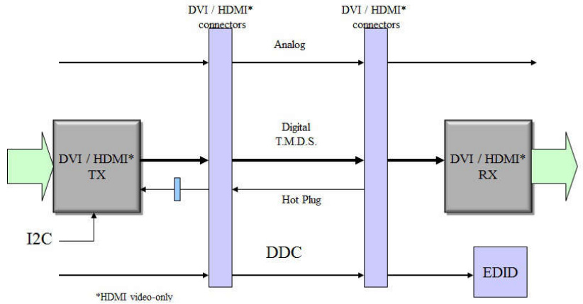  
Typical HDMI Interface

The digital visual interface (DVI) specification is an industry standard developed by the digital display working group (DDWG) for highspeed digital connection to digital displays and has been adopted by industry-leading PC and consumer electronics manufacturers. The TFP410 is compliant to the DVI Revision 1.0 specification.

# Table of Contents

1 Features.   
2 Applications.   
3 Description. .... 1   
4 Pin Configuration and Functions. 2   
5 Specifications.. ......................... 6   
5.1 Absolute Maximum Ratings. 6   
5.2 ESD Ratings. … 6   
5.3 Recommended Operating Conditions. ........................ 6   
5.4 Thermal Information. 6   
5.5 Electrical Characteristics. 7   
5.6 Timing Requirements. 7   
5.7 Typical Characteristics.......................... … 9   
6 Detailed Description. 10   
6.1 Overview...... ■ . : 10   
6.2 Functional Block Diagram......................................... 11   
6.3 Feature Description. 11   
6.4 Device Functional Modes. [ 12   
6.5 Programming. 17   
6.6 Register Maps. ......... 18

# 7 Application and Implementation 25

7.1 Application Information. 25   
7.2 Typical Application. 25   
7.3 Power Supply Recommendations. 28   
7.4 Layout.. . 28

# 8 Device and Documentation Support. 33

8.1 Receiving Notification of Documentation Updates....33   
8.2 Support Resources. 33   
8.3 Trademarks. .33   
8.4 Electrostatic Discharge Caution. .. .33   
8.5 Glossary. 33

# 9 Revision History. 33

# 10 Mechanical, Packaging, and Orderable

Information. 34

# 4 Pin Configuration and Functions

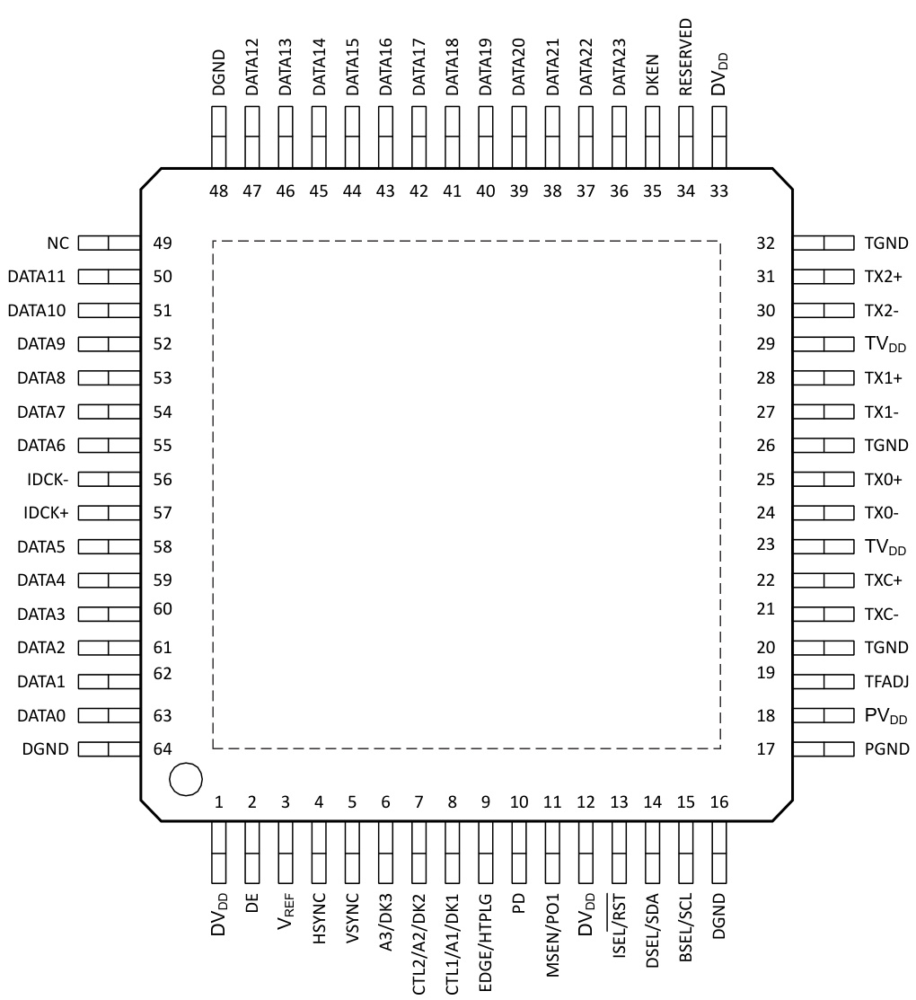  
Figure 4-1. PAP Package, 64 Pin HTQFP (Top View)

<html><body><table><tr><td colspan="2"></td><td colspan="2">Table 4-1. Pin Functions</td></tr><tr><td>PIN</td><td></td><td>TYPE(1)</td><td>DESCRIPTION</td></tr><tr><td colspan="4">NAME NO.</td></tr><tr><td>INPUT DATA[23:12]</td><td>36-47</td><td>Ihe In 24-bit, single-edge 12-bit, dual-edge the</td><td>upper 12 bits of the 24-bit pixel bus input mode (BSEL high), this bus inputs the top half the 24-bit pixel bus. In input mode (BSEL = low), these bits are not used input pixel data. In this mode, state of DATA[23: 16] is the I2C register CFG.</td></tr><tr><td></td><td>50-55,</td><td></td><td>input to This allows 8 bits of user configuration data to be read by the graphics controller through |2C interface (see Section 6.6). Note: All unused data inputs should be tied to GND or VDD. The lower 12 bits of the 24-bit pixel bus/12-bit pixel bus input the Ox</td></tr><tr><td>DATA[11:0]</td><td>58-63</td><td></td><td>In 24-bit, single-edge input mode (BSEL high), this bus inputs the bottom half the 24-bit pixel bus. In 12-bit, dual-edge input mode (BSEL low), this bus inputs 1/2 a pixel (12 bits) at every latch edge (both rising and falling) of the clock. Differential clock input. The TFP410 supports both single-ended and fully differential clock input modes. clock input mode, the IDCK+ input (pin 57) should be conl nected to the</td></tr><tr><td>IDCK- IDCK+</td><td>56 57</td><td></td><td>In the single-ended single-ended clock source and the IDCK- input (pin 56) should be tied to GND. In the differential clock input mode, the TFP410 uses the crossover point between the IDCK+ and DCK-signals as the timing reference for latching incoming data DATA[23:0], DE, HSYNC, and VSYNC. The differential clock input mode is only available in the low signal swing mode. Data enable. As defined in DVI 1.0 specification, the DE signal allows the transmitter to encode pixel</td></tr><tr><td>DE</td><td></td><td></td><td>data or control data on any given input clock cycle. During active video (DE high), the transmitter encodes pixel data, DATA[23:0]. During the blanking interval (DE = low), the transmitter encodes HSYNC, VSYNC and CTL[3:1].</td></tr><tr><td>HSYNC VSYNC</td><td>4 5</td><td></td><td>Horizontal sync input Vertical sync input</td></tr><tr><td></td><td></td><td></td><td>The operation ot these three multifunction inputs depends on the settings of the ISEL (pin 13) and DKEN (pin 35) inputs. All three inputs support 3.3V CMOS signal levels and contain weak pulldown</td></tr><tr><td rowspan="2">A3/DK3 CTL2/A2/DK2 CTL1/A1/DK1</td><td rowspan="2">６７８</td><td rowspan="2"></td><td>resistors SO that if left unconnected they default to all low. When the I²C bus disabled (ISEL = low) and the de- mode iS disabled (DKEN low), pins 7 and8 become the control inputs, CTL[2:1], which can be used to send additional information across -skew</td></tr><tr><td>the DVI link during the blanking interval (DE low). Pin 6 is not used. When the I²C bus is disabled (ISEL = and the de-skew mode iS enabled (DKEN = high), these three inputs become the de-skew inputs DK[3:1], used to adjust the setup and hold times of the pixel inputs DATA[23:0], relative to the IDCK±. low)</td></tr><tr><td colspan="6">When the I2C bus is enabled (ISEL high), these three inputs become the 3 LSBs address, A[3:1].</td></tr><tr><td>CONFIGURATION/PROGRAMMING MSEN/PO1</td><td></td><td></td><td>Monitor sense/programmable output 1. The operation this pin depends on whether the I2C interface is enabled or disabled. This pin has an -drain output and is only 3.3V tolerant. An external 5kΩ pullup resistor connected to VDD is required on this pin. open-</td></tr><tr><td></td><td></td><td></td><td>valid in dc-coupled systems. When |2C is enabled (ISEL = high), this output is programmable through the |2C interface (see the |2C register descriptions section). 12C interface select/I²C RESET (active low, asynchronous) Q</td></tr><tr><td>ISEL/ RST</td><td></td><td>the (BSEL, changed to f 1f</td><td>ISEL is high, then the |2C interface is active. Default values for the I2C registers can be found in see Section 6.6. If ISEL is low, then I2C is disabled and the chip configuration iS specified by the configuration pins DSEL, EDGE, VREF) and state pins (PD, DKEN). ISEL is brought low and then back high, the state machine is reset. The register values are their default values and are not preserved from before the reset. 12C</td></tr></table></body></html>

Table 4-1. Pin Functions (continued)   

<html><body><table><tr><td colspan="2">PIN</td><td>TYPE(1)</td><td>DESCRIPTION</td></tr><tr><td>NAME</td><td>NO.</td><td></td><td>bus select/I²C input. The operation of this pin depends on whether the 12C interface is Input clock</td></tr><tr><td>BSEL/SCL</td><td>15</td><td></td><td>enabled or disabled. This pin iS only 3.3V tolerant. When |2C is disabled (ISEL low), a high level selects 24-bit input, single-edge input mode. A low level selects 12-bit input, dual-edge input mode. When |2C is enabled (ISEL = high), this pin functions as the I2C clock input (see Section 6.6). In this configuration, this pin has an open-drain output that requires an external 5kΩ pullup resistor</td></tr><tr><td>DSEL/SDA</td><td>14</td><td>I/O</td><td>connected to VDD. DSEL/I2C data. The operation of this pin depends on whether the 12C interface is enabled or disabled. This pin is only 3.3V tolerant. When 12C is disabled (ISEL = low), this pin is used with BSEL and VReF to select the single-ended or differential input clock mode (see Table 6-1). When |2C is enabled (ISEL = high), this pin functions as the I2C bidirectional data line. In this configuration, this pin has an open-drain output that requires an external 5kQ pullup resistor connected to VDD.</td></tr><tr><td>EDGE/HTPLG</td><td></td><td></td><td>Edge select/hot plug input. operation this pin depends on whether the I2C interface is enabled or disabled. input is 3.3V tolerant only. When 12C is disabled (ISEL low), a high level selects the primary latch to occur on the rising edge of the input clock IDCK+. A low level selects the primary latch to occur on the falling edge of the input clock IDCK+ This is the case for both single-ended and differential input clock modes. When I²C is enabled (ISEL = high), pin is used to monitor the hot plug detect signal. When used for hot-plug detection pin requires a series The Of This this this</td></tr><tr><td>DKEN</td><td>35</td><td></td><td>1kΩ resistor. Data de-skew enable. The de-skew function can be enabled either through I²C or by this pin when I2C is disabled. When de-skew is enabled, the input clock to data setup/hold time can be adjusted in discrete trim increments. The amount of trim per increment is defined by t(sTEP). When I2C is disabled (ISEL = |ow), a high level enables de-skew with the trim increment determined by DK[3:1] (see Section 6.4.2). low level disables de-skew and the default trim setting is used. When |2C is enabled (ISEL = high), the value of DKEN and the trim increment are selected through pins 4</td></tr><tr><td>VREF</td><td></td><td></td><td>I2C. In this configuration, the DKEN pin should be tied to either GND or VDD to avoid a floating input. Input reference voltage. Selects the swing range of the digital data inputs (DATA[23:0], DE, HSYNC, VSYNC, and IDCK±). For high-swing 3.3V input signal levels, VReF should be tied to VDD. For low-swing input signal levels, VREF should be set to half of the maximum input voltage level. See Section 5.3 for the allowable range for VREF. The desired VREF voltage level is typically derived using simple voltage-divider circuit. Power down (active low). In the powerdown state, only the digital I/O buffers and |2C interface</td></tr><tr><td>PD</td><td>10</td><td>When When configuration, the Note: enabled or</td><td>remain active. 12C is disabled (ISEL low), high level selects the normal operating mode. A low level selects the powerdown mode. |2C is enabled (ISEL = high), the power-down state is selected through |2C. In this PD pin should be to GND. The default register value for PD is low, so the device is in powerdown mode when I2C is first after an I2C RESET. a tied</td></tr><tr><td colspan="4">RESERVED</td></tr><tr><td colspan="4">DVI DIFFERENTIAL SIGNAL OUTPUT PINS</td></tr><tr><td>TXO+ TXO-</td><td>25 24</td><td>Channel 0 DVI</td><td>differential output pair. TX0± transmits the 8-bit blue pixel data during active video andHSYNC and VSYNC during the blanking interval.</td></tr><tr><td>TX1+</td><td>28 27</td><td>Channel O</td><td>DVI differential output pair. TX1± transmits the 8-bit green pixel data during active video</td></tr><tr><td>TX1-</td><td>31</td><td>Channel 2</td><td>and CTL[1] during the blanking interval. DVI pair.</td></tr><tr><td>TX2+ TX2-</td><td>30</td><td>O CTL[3:</td><td>differential output TX2± transmits the 8-bit red pixel data during active video and during the blanking interval.</td></tr></table></body></html>

Table 4-1. Pin Functions (continued)   

<html><body><table><tr><td colspan="2">PIN</td><td rowspan="2">TYPE(1)</td><td rowspan="2">DESCRIPTION</td></tr><tr><td>NAME</td><td>NO.</td></tr><tr><td>TXC+ TXC-</td><td>22 21</td><td>DVI</td><td>differential output clock.</td></tr><tr><td>TFADJ</td><td>19</td><td></td><td>Full-scale adjust. This pin controls the amplitude of the DVI output voltage swing, determined by the value of the pullup resistor connected to RTFADJ TVDD·</td></tr><tr><td colspan="4">POWER AND GROUND PINS</td></tr><tr><td>DVDD</td><td>1, 12, 33</td><td>Power</td><td>Digital power supply. Must be set to 3.3V nominal.</td></tr><tr><td>PVDD</td><td>18</td><td>Power</td><td>PLL power supply. Must be set to 3.3V nominal.</td></tr><tr><td>TVDD</td><td>23, 29</td><td>Power</td><td>Transmitter differential output driver power supply. Must be set to 3.3V nominal.</td></tr><tr><td>DGND</td><td>16, 48, 64</td><td>Ground</td><td>Digital ground</td></tr><tr><td>PGND</td><td>17</td><td>Ground</td><td>PLL ground</td></tr><tr><td>TGND</td><td>20, 26,32</td><td>Ground</td><td>Transmitter differential output driver ground</td></tr><tr><td>NC</td><td>49</td><td>NC No</td><td>connection required. If connected, tie high.</td></tr></table></body></html>

(1) $\mid \mid =$ input, $0 =$ output, NC $\mathbf { \tau } = \mathbf { \tau }$ no conection, ${ \sf P } =$ power, $\mathsf { G } =$ ground

# 5 Specifications 5.1 Absolute Maximum Ratings

over operating free-air temperature range (unless otherwise noted)(1)

<html><body><table><tr><td colspan="2"></td><td>MIN</td><td>MAX</td><td>UNIT</td></tr><tr><td>DVDD, PVDD, TVDD</td><td>Supply voltage range</td><td>-0.5</td><td></td><td></td></tr><tr><td></td><td>Input voltage, logic/analog signals</td><td>-0.5</td><td></td><td>V</td></tr><tr><td>Rτ</td><td>External DVI single-ended termination resistance</td><td>0 to open</td><td>circuit</td><td>Ω</td></tr><tr><td></td><td>External TFADJ resistance, RTFADJ</td><td>300 to</td><td>open circuit</td><td>Ω</td></tr><tr><td></td><td>Case temperature for 10 seconds</td><td></td><td>260</td><td>°C</td></tr><tr><td></td><td>JEDEC latch-up (EIA/JESD78)</td><td></td><td>100</td><td>mA</td></tr><tr><td>Tstg</td><td>Storage temperature</td><td></td><td>260</td><td>°C</td></tr></table></body></html>

(1) Stresses beyond those listed under Absolute Maximum Ratings may cause permanent damage to the device. These are stress ratings only, which do not imply functional operation of the device at these or any other conditions beyond those indicated under Recommended Operating Conditions. Exposure to absolute-maximum-rated conditions for extended periods may affect device reliability.

# 5.2 ESD Ratings

<html><body><table><tr><td colspan="3"></td><td>VALUE</td><td>UNIT</td></tr><tr><td rowspan="2">Electrostatic V(ESD) discharge</td><td rowspan="2">Human body model (HBM), per ANSI/ ESDA/JEDEC JS-001(1)</td><td>DVI pins</td><td>±4000</td><td rowspan="2">V</td></tr><tr><td>All other pins</td><td>±2000</td></tr></table></body></html>

(1) JEDEC document JEP155 states that 500-V HBM allows safe manufacturing with a standard ESD control process.

# 5.3 Recommended Operating Conditions

over operating free-air temperature range (unless otherwise noted)

<html><body><table><tr><td colspan="3"></td><td>MIN</td><td>NOM</td><td>MAX</td><td>UNIT</td></tr><tr><td colspan="3">Supply voltage (DVDD, TVDD) VDD PVDD,</td><td>3.0</td><td>3.3</td><td>3.6</td><td></td></tr><tr><td>VREF</td><td rowspan="2">Input reference voltage</td><td>Low-swing mode</td><td>0.55</td><td>VDDQ/2(1)</td><td>0.9</td><td>V</td></tr><tr><td></td><td>High-swing mode</td><td></td><td></td><td>DVDD</td><td>V</td></tr><tr><td>AVDD</td><td>DVI termination supply voltage(2)</td><td>DVI receiver</td><td>3.14</td><td>3.3</td><td>3.46</td><td>V</td></tr><tr><td>Rτ</td><td>DVI Single-ended termination resistance(3)</td><td>DVI receiver</td><td>45</td><td>50</td><td>55</td><td>Ω</td></tr><tr><td>R(TFADJ)</td><td>TFADJ resistor for DVI-compliant V(SWING) range</td><td>400mV = 600mV V(SWING)</td><td>505</td><td>510</td><td>515</td><td>Ω</td></tr><tr><td>TA</td><td colspan="2">Operating free-air temperature range</td><td>0</td><td>25</td><td>70</td><td>°C</td></tr></table></body></html>

(1) $V _ { \mathsf { D D Q } }$ defines the maximum low-level input voltage, it is not an actual input voltage. (2) $\mathsf { A V } _ { \mathsf { D D } }$ is the termination supply voltage of the DVI link. (3) $\mathsf { R } _ { \mathsf { T } }$ is the single-ended termination resistance at the receiver end of the DVI link.

# 5.4 Thermal Information

<html><body><table><tr><td rowspan="2">THERMAL</td><td rowspan="2">METRIC(1)</td><td>TFP410 PAP</td><td rowspan="2">UNIT</td></tr><tr><td>64 PINS</td></tr><tr><td>ReJA</td><td>Junction-to-ambient thermal resistance</td><td>26.6</td><td rowspan="6">°C/W</td></tr><tr><td>ReJC(top)</td><td>Junction-to-case (top) thermal resistance</td><td>14.1</td></tr><tr><td>RθJB</td><td>Junction-to-board thermal resistance</td><td>11.3</td></tr><tr><td>4JT Junction-to-top</td><td>characterization parameter</td><td>0.4</td></tr><tr><td>4JB</td><td>Junction-to-board characterization parameter</td><td>11.2</td></tr><tr><td>ReJC(bot)</td><td>Junction-to-case (bottom) thermal resistance</td><td>0.9</td></tr></table></body></html>

(1) For more information about traditional and new thermal metrics, IC Package Thermal Metrics application report (SPRA953).

# 5.5 Electrical Characteristics

<html><body><table><tr><td colspan="2">PARAMETER</td><td>TEST CONDITIONS</td><td>MIN</td><td>TYP</td><td>MAX</td><td>UNIT</td></tr><tr><td colspan="2"></td><td></td><td></td><td></td><td></td><td></td></tr><tr><td rowspan="2">DC SPECIFICATIONS HSYNC,</td><td rowspan="2">High-level input voltage (Data, DE, VSYNC, and IDCK+/- CMOS inputs)</td><td>VREF = DVDD</td><td>0.7VDD</td><td></td><td></td><td rowspan="2"></td></tr><tr><td>0.5V≤ V≤ 0.95V</td><td>+ 0.2 VREF</td><td></td><td></td></tr><tr><td rowspan="2">VH</td><td rowspan="2">High-level input voltage (all other CMOS inputs)</td><td></td><td>0.7VDD</td><td></td><td></td><td rowspan="2"></td></tr><tr><td>= DVDD VREF</td><td></td><td></td><td>0.3VDD</td></tr><tr><td rowspan="2"></td><td>Low-level input voltage (Data, DE, VSYNC, HSYNC, and IDCK+/- CMOS inputs)</td><td>0.5V≤V≤0.95V</td><td></td><td></td><td>0.2 VREF</td><td rowspan="2"></td></tr><tr><td>Low-level input voltage (all other CMOS inputs)</td><td></td><td></td><td></td><td>0.3VDD</td></tr><tr><td>VoH</td><td>High-level digital output voltage (open-drain output)</td><td>3V, IoH = 20μA VDD</td><td>2.4</td><td></td><td></td><td></td></tr><tr><td>VoL</td><td>Low-level digital output voltage (open-drain output)</td><td>= 3.6V, IoL 4mA VDD</td><td></td><td></td><td>0.4</td><td>V</td></tr><tr><td>IH</td><td>High-level input current</td><td>V1= 3.6V</td><td></td><td></td><td>±25</td><td>μA</td></tr><tr><td>IL</td><td>Low-level input current</td><td rowspan="5">V= 0 AVDD = 3.3V ± 5%, Rτ (1) =d 50Ω ± 10%, = 510Ω ± 1% RTFADJ</td><td></td><td></td><td>±25</td><td>MA</td></tr><tr><td>VH</td><td>DVI single-ended high-level output voltage</td><td></td><td>-0.01 AVDD</td><td>AVDD 0.01 ×</td><td>V</td></tr><tr><td>VL</td><td>DVI single-ended low-level output voltage</td><td>AVDD</td><td>-0.6</td><td>AVDD 0.4</td><td>V</td></tr><tr><td>VSWING</td><td>DVI single-ended output swing voltage</td><td>400</td><td></td><td>600</td><td>mVp-p</td></tr><tr><td>VoFF</td><td>DVI single-ended standby/off output voltage current(3)</td><td>AVDD -0.01</td><td></td><td>AVDD + 0.01</td><td>V</td></tr><tr><td>IPD IDD</td><td>Power-down supply current</td><td>Worst-case pattern(2)</td><td></td><td>200</td><td>500</td><td>μA</td></tr><tr><td>Normal power AC SPECIFICATIONS</td><td colspan="2"></td><td></td><td>200</td><td>250</td><td>mA</td></tr><tr><td colspan="6">IDCK frequency</td><td></td></tr><tr><td>tr f(IDCK)</td><td>DVI output rise time (20-80%)(4)</td><td></td><td>25</td><td></td><td>165</td><td>MHz</td></tr><tr><td>tf</td><td>DVI output fall time (20-80%)(4)</td><td rowspan="4">f(DCK) = 165MHz</td><td rowspan="4"></td><td>75</td><td>240</td><td>ps</td></tr><tr><td>DVI</td><td></td><td>75</td><td>240</td><td>ps</td></tr><tr><td>(ct(D)d:)</td><td>output intra-pair + to differential see Figure 5-4 skew(5),</td><td>50</td><td></td><td>ps</td></tr><tr><td>tojit</td><td>DVI output clock jitter, max.(6)</td><td></td><td>150</td><td>ps</td></tr><tr><td>(STEP)</td><td>De-skew trim increment</td><td>DKEN = 1</td><td></td><td>350</td><td></td><td>ps</td></tr></table></body></html>

(1) ${ \sf R } _ { \sf T }$ is the single-ended termination resistance at the receiver end of the DVI link (234) Black and white checkerboard pattern, each checker is one pixel wide. Assumes all inputs to the transmitter are not toggling. Rise and fall times are measured as the time between $20 \%$ and $80 \%$ of signal amplitude. (56) Measured differentially at the $50 \%$ crossing point using the $1 0 0 \mathsf { K } +$ input clock as a trigger. Relative to input clock (IDCK).

# 5.6 Timing Requirements

<html><body><table><tr><td colspan="3"></td><td>MIN</td><td>NOM</td><td>MAX</td><td>UNIT</td></tr><tr><td colspan="3">t(pixel)) Pixel time period(1)</td><td>6.06</td><td></td><td>40</td><td>ns</td></tr><tr><td colspan="3">t(IDCK) IDCK duty cycle</td><td>30%</td><td></td><td>70%</td><td></td></tr><tr><td colspan="2">t(ji) IDCK clock jitter tolerance</td><td></td><td></td><td></td><td></td><td>ns</td></tr><tr><td>tsk(cc) DVI output inter-pair or</td><td>channel-to-channel skew (2) see Figure 5-2 f(IDCK) = 165MHz</td><td></td><td></td><td></td><td></td><td>ns</td></tr><tr><td>tsu(DF)</td><td>Ptu，DEVSYNC, HSYNC Setup time to IDCK+ falling edge, see</td><td>DSEL=0,</td><td>1.2</td><td></td><td></td><td>ns</td></tr><tr><td>th(1DF))</td><td>HSYNC hold time to IDCK+ falling edge, see</td><td>Single edge (BSEL=1, DSEL=0,</td><td>1.3</td><td></td><td></td><td>ns</td></tr><tr><td>Data, tsu(IDR)</td><td>DE, VSYNC, HSYNC setup time to IDCK+ rising edge, see Figure 5-2</td><td>DKEN=0, EDGE=1)</td><td>1.2</td><td></td><td></td><td>ns</td></tr><tr><td>Data, th(1DR)</td><td>DE, VSYNC, HSYNC hold time to IDCK+ rising edge, see Figure 5-2</td><td></td><td>1.3</td><td></td><td></td><td>ns</td></tr></table></body></html>

# 5.6 Timing Requirements (continued)

<html><body><table><tr><td colspan="3"></td><td rowspan="2">MIN</td><td rowspan="2">NOM</td><td rowspan="2">MAX</td><td rowspan="2">UNIT</td></tr><tr><td>tsu(D))</td><td>Data, DE, VSYNC, HSYNC setup time to IDCK+ falling/rising edge, see Figure 5-3</td><td>Dual edge(BSEL=0, DSEL=1, DKEN=0)</td></tr><tr><td rowspan="2">th(ID)</td><td>HSYNC hold time to IDCK+ falling/rising edge,</td><td></td><td>0.9</td><td></td><td></td><td>ns</td></tr><tr><td></td><td></td><td></td><td></td><td></td><td>ns</td></tr></table></body></html>

(21) $\mathfrak { t } _ { ( \mathsf { p i x e l } ) }$ is the pixel time defined as the period of the TXC output clock. The period of IDCK is equal to t(pixel). Measured differentially at the $50 \%$ crossing point using the $1 0 0 \mathsf { K } +$ input clock as a trigger.

DVI 80% VOD tf Outputs

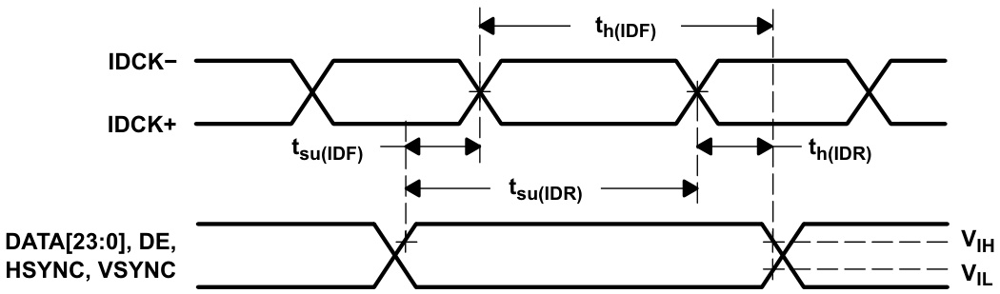  
Figure 5-1. Rise and Fall Time for DVI Outputs

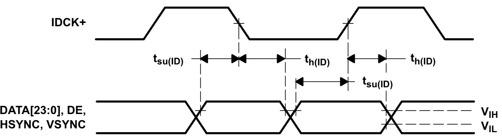  
Figure 5-2. Control and Single-Edge-Data Setup/Hold Time to IDCK±

  
Figure 5-3. Dual Edge Data Setup/Hold Times to IDCK+   
Figure 5-4. Analog Output Intra-Pair ± Differential Skew   
Figure 5-5. Analog Output Channel-to-Channel Skew

TXN 50%××-×-X tsk(CC) TXM 50%

# 5.7 Typical Characteristics

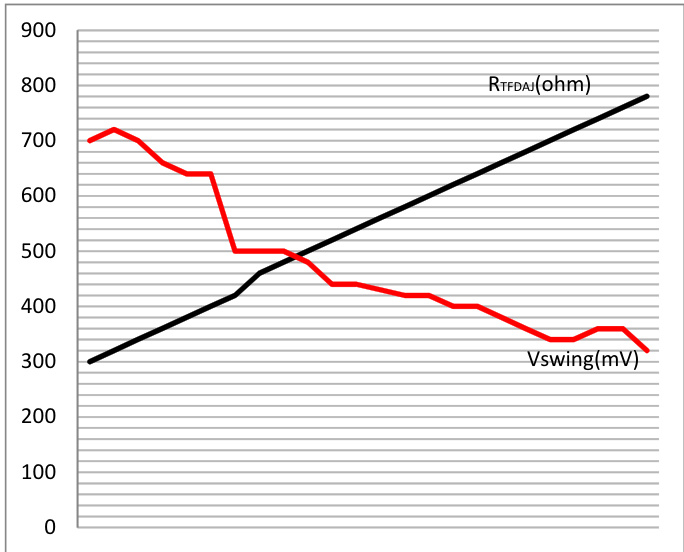  
Figure 5-6. RTFDAJ vs Vswing

# 6 Detailed Description 6.1 Overview

The TFP410 is a DVI-compliant digital transmitter that is used in digital host monitor systems to T.M.D.S. encode and serialize RGB pixel data streams. TFP410 supports resolutions from VGA to WUXGA (and 1080p) and can be controlled in two ways:

1. Configuration and state pins   
2. The programmable $\mathsf { I } ^ { 2 } \mathsf { C }$ serial interface (see Table 6-1)

The host in a digital display system, usually a PC or consumer electronics device, contains a DVI-compatible transmitter such as the TI TFP410 that receives 24-bit pixel data along with appropriate control signals. The TFP410 encodes the signals into a high speed, low voltage, differential serial bit stream optimized for transmission over a twisted-pair cable to a display device. The display device, usually a flat-panel monitor, requires a DVI compatible receiver like the TI TFP401 to decode the serial bit stream back to the same 24-bit pixel data and control signals that originated at the host. This decoded data can then be applied directly to the flat panel drive circuitry to produce an image on the display. Because the host and display can be separated by distances up to 5 meters or more, serial transmission of the pixel data is preferred (see Section 6.3.1, Section 6.3.2, and Section 6.3.3).

The TFP410 integrates a high-speed digital interface, a T.M.D.S. encoder, and three differential T.M.D.S. drivers. Data is driven to the TFP410 encoder across 12 or 24 data lines, along with differential clock pair and sync signals. The flexibility of the TFP410 allows for multiple clock and data formats that enhance system performance.

The TFP410 also has enhanced PLL noise immunity, an enhancement accomplished with on-chip regulators and bypass capacitors.

The TFP410 is versatile and highly programmable to provide maximum flexibility for the user. An $\mathsf { I } ^ { 2 } \mathsf { C }$ host interface is provided to allow enhanced configurations in addition to power-on default settings programmed by pin-strapping resistors.

The TFP410 offers monitor detection through receiver detection, or hot-plug detection when $1 ^ { 2 } \mathsf { C }$ is enabled. The monitor detection feature allows the user enhanced flexibility when attaching to digital displays or receivers (see Section 6.4.3 and the see Section 6.6).

The TFP410 has a data de-skew feature allowing the users to de-skew the input data with respect to the IDCK± (see Section 6.4.2).

# 6.2 Functional Block Diagram

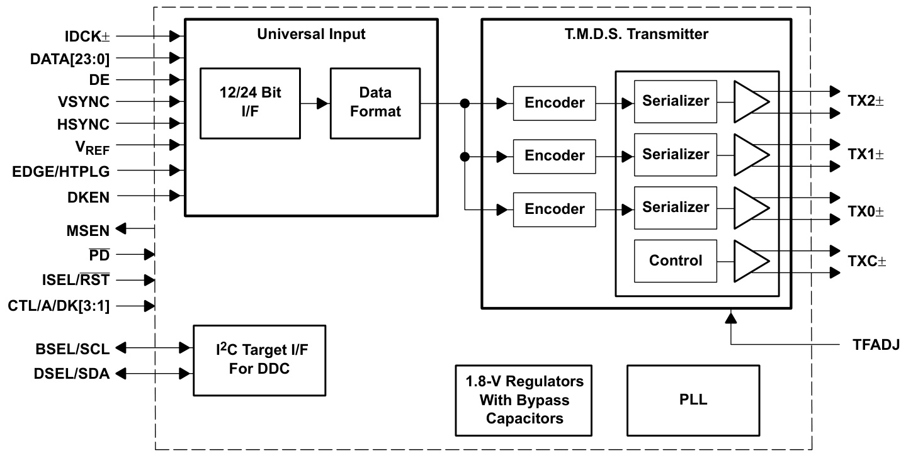

# 6.3 Feature Description

# 6.3.1 T.M.D.S. Pixel Data and Control Signal Encoding

For transition minimized differential signaling (T.M.D.S.), only one of two possible T.M.D.S. characters for a given pixel is transmitted at a given time. The transmitter keeps a running count of the number of ones and zeros previously sent and transmits the character that minimizes the number of transitions and approximates a dc balance of the transmission line. Three T.M.D.S. channels are used to transmit RGB pixel data during the active video interval $( \mathsf { D } \mathsf { E } = \mathsf { H i g h } )$ . These same three channels are also used to transmit HSYNC, VSYNC, and three control signals, CTL[3:1], during the inactive display or blanking interval $\begin{array} { r } { ( \mathsf { D } \mathsf { E } = \mathsf { L o w } , } \end{array}$ . The following table maps the transmitted output data to the appropriate T.M.D.S. output channel in a DVI-compliant system.

<html><body><table><tr><td>INPUT PINS (VALID FOR DE = High)</td><td>T.M.D.S. OUTPUT CHANNEL</td><td>TRANSMITTED PIXEL DATA ACTIVE DISPLAY (DE = High)</td></tr><tr><td>DATA[23:16]</td><td>Channel 2 (TX2 ±)</td><td>Red[7:0]</td></tr><tr><td>DATA[15:8]</td><td>Channel 1(TX1 ±)</td><td>Green[7:0]</td></tr><tr><td>DATA[7:0]</td><td>Channel 0 (TX0 ±)</td><td>Blue[7:0]</td></tr><tr><td>INPUT PINS (VALID FOR DE = Low)</td><td>T.M.D.S. OUTPUT CHANNEL</td><td>TRANSMITTED CONTROL DATA BLANKING INTERVAL (DE = Low)</td></tr><tr><td>CTL2(1)</td><td>Channel 2 (TX2 ±)</td><td>CTL[2]</td></tr><tr><td>CTL1 (1)</td><td>Channel 1 (TX1 ±)</td><td>CTL[1]</td></tr><tr><td>HSYNC, VSYNC</td><td>Channel 0 (TX0 ±)</td><td>HSYNC, VSYNC</td></tr></table></body></html>

(1) The TFP410 encodes and transfers the CTL[2:1] inputs during the vertical blanking interval. CTL3 is reserved for HDCP and is always encoded as 0. The CTL[2:1] inputs are reserved for future use. When DE $\mathbf { \tau } = \mathbf { \tau }$ high, CTL and SYNC pins must be held constant.

# 6.3.2 Universal Graphics Controller Interface Voltage Signal Levels

The universal graphics controller interface can operate in the following two distinct voltage modes:

The high-swing mode where standard 3.3V CMOS signaling levels are used.   
The low-swing mode where adjustable 1.1V to 1.8V signaling levels are used.

To select the high-swing mode, the $V _ { \mathsf { R E F } }$ input pin must be tied to the 3.3V power supply.

To select the low-swing mode, the $V _ { \mathsf { R E F } }$ must be 0.55 to 0.95V.

In the low-swing mode, $V _ { \mathsf { R E F } }$ is used to set the midpoint of the adjustable signaling levels. The allowable range of values for VREF is from 0.55V to $0 . 9 \mathsf { V } .$ The typical approach is to provide this from off chip by using simple voltage-divider circuit. The minimum allowable input signal swing in the low-swing mode is $\mathsf { V } _ { \mathsf { R E F } } \pm 0 . 2 \mathsf { V } .$ In low-swing mode, the $V _ { \mathsf { R E F } }$ input is common to all differential input receivers.

# 6.3.3 Universal Graphics Controller Interface Clock Inputs

The universal graphics controller interface of the TFP410 supports both fully differential and single-ended clock input modes. In the differential clock input mode, the universal graphics controller interface uses the crossover point between the ${ \mathsf { I D C K } } +$ and IDCK− signals as the timing reference for latching incoming data (DATA[23:0], DE, HSYNC, and VSYNC). Differential clock inputs provide greater common-mode noise rejection. The differential clock input mode is only available in the low-swing mode. In the single-ended clock input mode, the ${ \mathsf { I D C K } } +$ input (Pin 57) should be connected to the single-ended clock source and the IDCK− input (Pin 56) should be tied to GND.

The universal graphics controller interface of the TFP410 provides selectable 12-bit dual-edge, and 24-bit single-edge, input clocking modes. In the 12-bit dual-edge, the 12-bit data is latched on each edge of the input clock. In the 24-bit single-edge mode, the 24-bit data is latched on the rising edge of the input clock when EDGE $= 1$ and the falling edge of the input clock when EDGE $= 0$ .

DKEN and DK[3:1] allow the user to compensate the skew between IDCK± and the pixel data and contro signals. See Table 6-10 for details.

# 6.4 Device Functional Modes

# 6.4.1 Universal Graphics Controller Interface Modes

Table 6-1 is a tabular representation of the different modes for the universal graphics controller interface. The 12-bit mode is selected when BSEL $_ { . = 0 }$ and the 24-bit mode when BSEL $_ { . = 1 }$ . The 12-bit mode uses dual-edge clocking and the 24-bit mode uses single-edge clocking. The EDGE input is used to control the latching edge in 24-bit mode, or the primary latching edge in 12-bit mode. When EDGE $\mathrel { \mathop : } = 1$ , the data input is latched on the rising edge of the input clock; and when $E D G E = 0$ , the data input is latched on the falling edge of the input clock. A fully differential input clock is available only in the low-swing mode. Single-ended clocking is not recommended in the low-swing mode as this decreases common-mode noise rejection.

Note that BSEL, DSEL, and EDGE are determined by register CTL_1_MODE when $1 ^ { 2 } { \mathsf { C } }$ is enabled $\angle B E L = 1$ ) and by input pins when $\mathsf { I } ^ { 2 } \mathsf { C }$ is disabled $( 1 5 E L = 0 )$ .

Table 6-1. Universal Graphics Controller Interface Options (Tabular Representation)   

<html><body><table><tr><td>VREF</td><td>BSEL</td><td>EDGE</td><td>DSEL</td><td>BUS WIDTH</td><td>LATCH MODE</td><td>CLOCK EDGE</td><td>CLOCK MODE</td></tr><tr><td>0.55V-0.9V</td><td>0</td><td></td><td>0</td><td>12-bit</td><td>Dual-edge</td><td>Falling</td><td>Differential(1) (2)</td></tr><tr><td>0.55V -0.9V</td><td>0</td><td>00</td><td>1</td><td>12-bit</td><td>Dual-edge</td><td>Falling</td><td>Single-ended</td></tr><tr><td>0.55V -0.9V</td><td>0</td><td>1</td><td>0</td><td>12-bit</td><td>Dual-edge</td><td>Rising</td><td>Differential(1) (2)</td></tr><tr><td>0.55V 一 0.9V</td><td>0</td><td>1</td><td>1</td><td>12-bit</td><td>Dual-edge</td><td>Rising</td><td>Single-ended</td></tr><tr><td>0.55V-0.9V</td><td>1</td><td>0</td><td>0</td><td>24-bit</td><td>Single-edge</td><td>Falling</td><td>Single-ended</td></tr><tr><td>0.55V-0.9V</td><td>1</td><td>0</td><td>1</td><td>24-bit</td><td>Single-edge</td><td>Falling</td><td>Differential(1) (3)</td></tr><tr><td>0.55V 0.9V</td><td>1</td><td>1</td><td>0</td><td>24-bit</td><td>Single-edge</td><td>Rising</td><td>Single-ended</td></tr><tr><td>0.55V-0.9V</td><td>1</td><td></td><td>1</td><td>24-bit</td><td>Single-edge</td><td>Rising</td><td>Differential(1) (3)</td></tr><tr><td>DVDD</td><td>0</td><td>0</td><td>X</td><td>12-bit</td><td>Dual-edge</td><td>Falling</td><td>Single- -ended(4)</td></tr></table></body></html>

Table 6-1. Universal Graphics Controller Interface Options (Tabular Representation) (continued)   

<html><body><table><tr><td>VREF</td><td>BSEL</td><td>EDGE</td><td>DSEL</td><td>BUS WIDTH</td><td>LATCH MODE</td><td>CLOCK EDGE</td><td>CLOCK MODE</td></tr><tr><td>DVDD</td><td>0</td><td></td><td>X</td><td>12-bit</td><td>Dual-edge</td><td>Rising</td><td>Single-ended(4)</td></tr><tr><td>DVDD</td><td>1</td><td>0</td><td>X</td><td>24-bit</td><td>Single-edge</td><td>Falling</td><td>Single-ended(4)</td></tr><tr><td>DVDD</td><td></td><td></td><td>X</td><td>24-bit</td><td>Single-edge</td><td>Rising</td><td>Single- -ended(4)</td></tr></table></body></html>

(1) The differential clock input mode is only available in the low signal swing mode (that is, $\mathsf { V } _ { \mathsf { R E F } } \leq 0 . 9 \mathsf { V } ;$ ).   
(23) The TFP410 does not support a 12-bit dual-clock, single-edge input clocking mode. The TFP410 does not support a 24-bit single-clock, dual-edge input clocking mode.   
(4) In the high-swing mode $( \mathsf { V } _ { \mathsf { R E F } } = \mathsf { D V } _ { \mathsf { D D } } ) ,$ ), DSEL is a don’t care; therefore, the device is always in the single-ended latch mode.

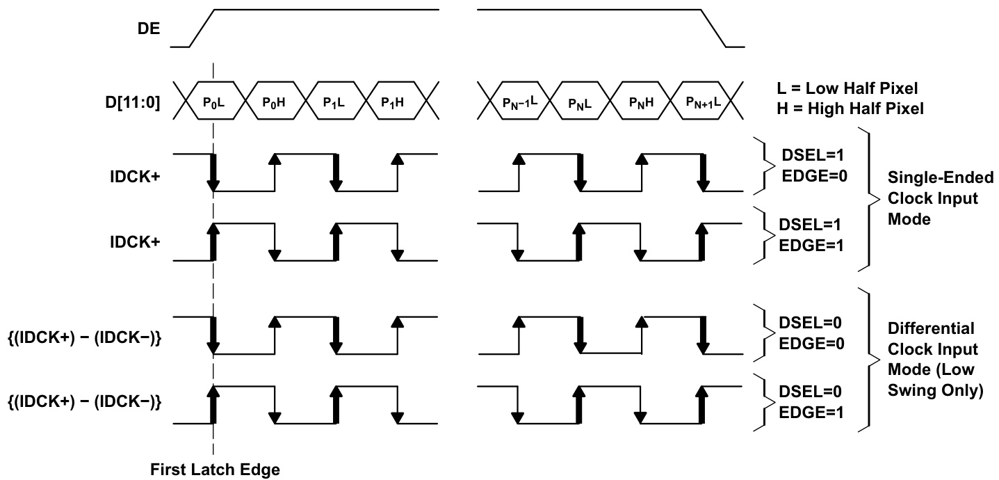  
12-Bit, Dual-Edge Input Mode (BSEL $\mathbf { \sigma } = \mathbf { 0 }$ )

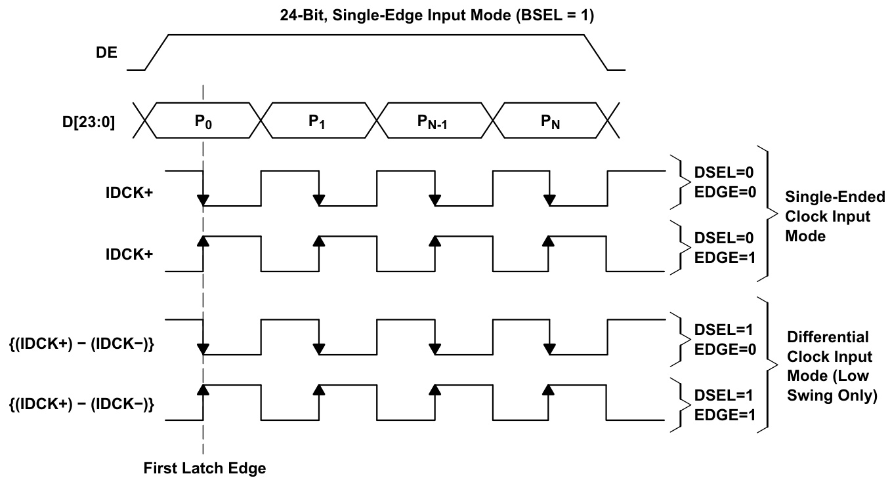  
Figure 6-1. Universal Graphics Controller Interface Options for 12-Bit Mode (Graphical Representation)

Figure 6-2. Universal Graphics Controller Interface Options for 24-Bit Mode (Graphical Representation)

Table 6-2. 12-Bit Mode Data Mapping   

<html><body><table><tr><td rowspan="3">PIN NAME</td><td colspan="2">P0</td><td colspan="2">P1</td><td colspan="2">P2</td></tr><tr><td>POL</td><td>POH</td><td>P1L</td><td>P1H</td><td>P2L</td><td>P2H</td></tr><tr><td>LOW</td><td>HIGH</td><td>LOW</td><td>HIGH</td><td>LOW</td><td>HIGH</td></tr><tr><td>D11</td><td>G0[3]</td><td>R0[7]</td><td>G1[3]</td><td>R1[7]</td><td>G2[3]</td><td>R2[7]</td></tr><tr><td>D10</td><td>G0[2]</td><td>R0[6]</td><td>G1[2]</td><td>R1[6]</td><td>G2[2]</td><td>R2[6]</td></tr><tr><td>D9</td><td>G0[1]</td><td>R0[5]</td><td>G1[1]</td><td>R1[5]</td><td>G2[1]</td><td>R2[5]</td></tr><tr><td>D8</td><td>G0[0]</td><td>R0[4]</td><td>G1[0]</td><td>R1[4]</td><td>G2[0]</td><td>R2[4]</td></tr><tr><td>D7</td><td>B0[7]</td><td>R0[3]</td><td>B1[7]</td><td>R1[3]</td><td>B2[7]</td><td>R2[3]</td></tr><tr><td>D6</td><td>B0[6]</td><td>R0[2]</td><td>B1[6]</td><td>R1[2]</td><td>B2[6]</td><td>R2[2]</td></tr><tr><td>D5</td><td>B0[5]</td><td>R0[1]</td><td>B1[5]</td><td>R1[1]</td><td>B2[5]</td><td>R2[1]</td></tr><tr><td>D4</td><td>B0[4]</td><td>R0[0]</td><td>B1[4]</td><td>R1[0]</td><td>B2[4]</td><td>R2[0]</td></tr><tr><td>D3</td><td>B0[3]</td><td>G0[7]</td><td>B1[3]</td><td>G1[7]</td><td>B2[3]</td><td>G2[7]</td></tr><tr><td>D2</td><td>B0[2]</td><td>G0[6]</td><td>B1[2]</td><td>G1[6]</td><td>B2[2]</td><td>G2[6]</td></tr><tr><td>D1</td><td>B0[1]</td><td>G0[5]</td><td>B1[1]</td><td>G1[5]</td><td>B2[1]</td><td>G2[5]</td></tr><tr><td>D0</td><td>B0[0]</td><td>G0[4]</td><td>B1[0]</td><td>G1[4]</td><td>B2[0]</td><td>G2[4]</td></tr></table></body></html>

Table 6-3. 24-Bit Mode Data Mapping   

<html><body><table><tr><td>PIN NAME</td><td>P0</td><td>P1</td><td>P2</td><td>PIN NAME</td><td>P0</td><td>P1</td><td>P2</td></tr><tr><td>D23</td><td>R0[7]</td><td>R1[7]</td><td>R2[7]</td><td>D11</td><td>G0[3]</td><td>G1[3]</td><td>G2[3]</td></tr><tr><td>D22</td><td>R0[6]</td><td>R1[6]</td><td>R2[6]</td><td>D10</td><td>G0[2]</td><td>G1[2]</td><td>G2[2]</td></tr><tr><td>D21</td><td>R0[5]</td><td>R1[5]</td><td>R2[5]</td><td>D9</td><td>G0[1]</td><td>G1[1]</td><td>G2[1]</td></tr><tr><td>D20</td><td>R0[4]</td><td>R1[4]</td><td>R2[4]</td><td>D8</td><td>G0[0]</td><td>G1[0]</td><td>G2[0]</td></tr><tr><td>D19</td><td>R0[3]</td><td>R1[3]</td><td>R2[3]</td><td>D7</td><td>B0[7]</td><td>B1[7]</td><td>B2[7]</td></tr><tr><td>D18</td><td>R0[2]</td><td>R1[2]</td><td>R2[2]</td><td>D6</td><td>B0[6]</td><td>B1[6]</td><td>B2[6]</td></tr><tr><td>D17</td><td>R0[1]</td><td>R1[1]</td><td>R2[1]</td><td>D5</td><td>B0[5]</td><td>B1[5]</td><td>B2[5]</td></tr><tr><td>D16</td><td>RO[0]</td><td>R1[0]</td><td>R2[0]</td><td>D4</td><td>B0[4]</td><td>B1[4]</td><td>B2[4]</td></tr><tr><td>D15</td><td>G0[7]</td><td>G1[7]</td><td>G2[7]</td><td>D3</td><td>B0[3]</td><td>B1[3]</td><td>B2[3]</td></tr><tr><td>D14</td><td>G0[6]</td><td>G1[6]</td><td>G2[6]</td><td>D2</td><td>B0[2]</td><td>B1[2]</td><td>B2[2]</td></tr><tr><td>D13</td><td>G0[5]</td><td>G1[5]</td><td>G2[5]</td><td>D1</td><td>B0[1]</td><td>B1[1]</td><td>B2[1]</td></tr><tr><td>D12</td><td>G0[4]</td><td>G1[4]</td><td>G2[4]</td><td>D0</td><td>B0[0]</td><td>B1[0]</td><td>B2[0]</td></tr></table></body></html>

# 6.4.2 Data De-skew Feature

The de-skew feature allows adjustment of the input setup/hold time. Specifically, the input data DATA[23:0] can be latched slightly before or after the latching edge of the clock $1 0 0 \mathsf { K } \pm$ depending on the amount of de-skew desired. When de-skew enable (DKEN) is enabled, the amount of de-skew is programmable by setting the three bits DK[3:1]. When disabled, a default de-skew setting is used. To allow maximum flexibility and ease of use, DKEN and DK[3:1] are accessed directly through configuration pins when $\mathsf { I } ^ { 2 } \mathsf { C }$ is disabled, or through registers of the same name when $1 ^ { 2 } { \mathsf { C } }$ is enabled. When using $\mathsf { I } ^ { 2 } \mathsf { C }$ mode, the DKEN pin should be tied to ground to avoid a floating input.

The input setup/hold time can be varied with respect to the input clock by an amount t(CD) given by the formula in Equation 1.

$$
\mathfrak { t } _ { ( \mathsf { C D } ) } = ( \mathsf { D K } [ 3 : 1 ] - 4 ) \times \mathfrak { t } ( \mathsf { \Omega } _ { \mathsf { S T E P } } )
$$

# where

t(STEP) is the adjustment increment amount   
DK[3:1] is a number from 0 to 7 represented as a 3-bit binary number   
$\mathfrak { t } _ { ( \mathsf { C D } ) }$ is the cumulative de-skew amount

(DK[3:1]-4) is simply a multiplier in the range $\{ - 4 , - 3 , - 2 , - 1 , 0 , 1 , 2 , 3 \}$ for t(STEP). Therefore, data can be latched in increments from 4 times the value o t(STEP) before the latching edge of the clock to 3 times the value of t(STEP) after the latching edge. Note that the input clock is not changed, only the time when data is latched with respect to the clock.

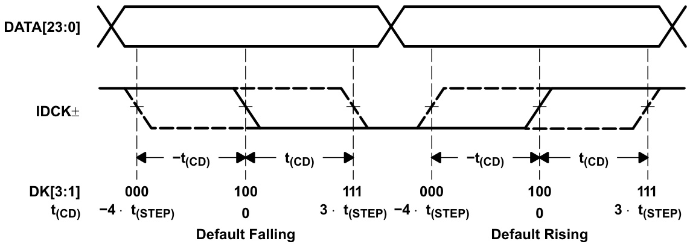  
Figure 6-3. A Graphical Representation of the De-Skew Function

# 6.4.3 Hot Plug/Unplug (Auto Connect/Disconnect Detection)

TFP410 supports hot plug/unplug (auto connect/disconnect detection) for the DVI link. The receiver sense input (RSEN) bit indicates if a DVI receiver is connected to ${ \mathsf { T X C } } +$ and $T \times \mathsf { C } -$ . The HTPLG bit reflects the current state of the HTPLG pin connected to the monitor via the DVI connector. When $1 ^ { 2 } { \mathsf { C } }$ is disabled (ISEL $\scriptstyle = 0 ^ { \cdot }$ ), the RSEN value is available on the MSEN pin. When I2C is enabled, the connection status of the DVI link and HTPLG sense pins are provided by the CTL_2_MODE register. The MSEL bits of the CTL_2_MODE register can be used to program the MSEN to output the HTPLG value, the RSEN value, an interrupt, or be disabled.

The source of the interrupt event is selected by TSEL in the CTL_2_MODE register. An interrupt is generated by a change in status of the selected signal. The interrupt status is indicated in the MDI bit of CTL_2_MODE and can be output via the MSEN pin. The interrupt continues to be asserted until a 1 is written to the MDI bit, resetting the bit back to 0. Writing 0 to the MDI bit has no effect.

# 6.4.4 Device Configuration and $\mathsf { I } ^ { 2 } \mathsf { C }$ RESET Description

The TFP410 device configuration can be programmed by several different methods to allow maximum flexibility for the user’s application. Device configuration is controlled depending on the state of the ISEL/ RST pin, configuration pins (BSEL, DSEL, EDGE, $V _ { \mathsf { R E F } } )$ and state pins PD, DKEN). $\mathsf { I } ^ { 2 } \mathsf { C }$ bus select and $\mathsf { I } ^ { 2 } \mathsf { C }$ RESET (active low) are shared functions on the ISEL/ RST pin, which operates asynchronously.

Holding ISEL/ RST low causes the device configuration to be set by the configuration pins (BSEL, DSEL, EDGE, and VREF) and state pins ( PD, DKEN). The $\mathsf { I } ^ { 2 } \mathsf { C }$ bus is disabled.

Holding ISEL/ RST high causes the chip configuration to be set based on the configuration bits (BSEL, DSEL, EDGE) and state bits PD, DKEN) in the $\mathsf { I } ^ { 2 } \mathsf { C }$ registers. The $\mathsf { I } ^ { 2 } \mathsf { C }$ bus is enabled.

Momentarily bringing ISEL/ RST low and then back high while the device is operating in normal or power -down mode will RESET the ${ \mathsf { I } } ^ { 2 } { \mathsf { C } }$ registers to their default values. The device configuration will be changed to the default power-up state with $\mathsf { I } ^ { 2 } \mathsf { C }$ enabled. After power up, the device must be reset. It is suggested that this pin be tied to the system reset signal, which is low during power up and is then asserted high after all the power supplies are fully functional.

# 6.4.5 DE Generator

The TFP410 contains a DE generator that can be used to generate an internal DE signal when the original data source does not provide one. There are several $\mathsf { I } ^ { 2 } \mathsf { C }$ programmable values that control the DE generator (see Figure 6-4). DE_GEN in the DE_CTL register enables this function. When enabled, the DE pin is ignored.

DE _TOP and DE_LIN are line counts used to control the number of lines after VSYNC goes active that DE is enabled, and the total number of lines that DE remains active, respectively. The polarity of VSYNC must be set by VS_POL in the DE_CTL register.

DE DLY and DE CNT are pixel counts used to control the number of pixels after HSYNC goes active that DE is enabled, and the total number of pixels that DE remains active, respectively. The polarity of HSYNC must be set by HS_POL in the DE_CTL register.

The TFP410 also counts the total number of HSYNC pulses between VSYNC pulses, and the total number of pixels between HSYNC pulses. These values, the total vertical and horizontal resolutions, are available in V_RES and H_RES, respectively. These values are available at all times, whether or not the DE generator is enabled.

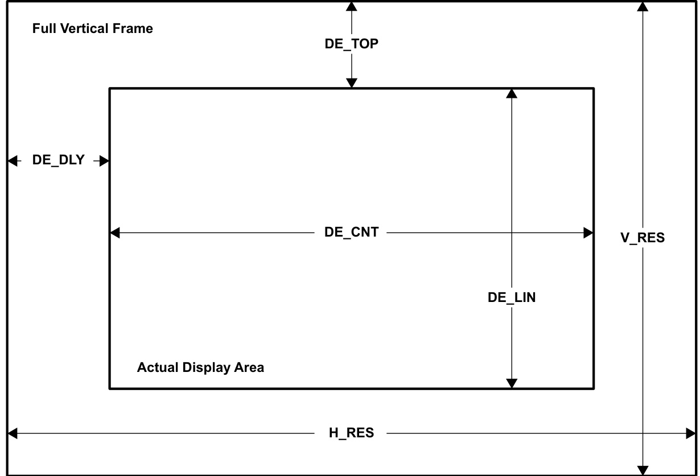  
Figure 6-4. DE Generator Register Functions

# 6.5 Programming

# 6.5.1 $1 2 C$ Interface

The $1 ^ { 2 } { \mathsf { C } }$ interface is used to access the internal TFP410 registers. This two-pin interface consists of the SCL clock line and the SDA serial data line. The basic $\mathsf { I } ^ { 2 } \mathsf { C }$ access cycles are shown in Figure 6-5 and Figure 6-6.

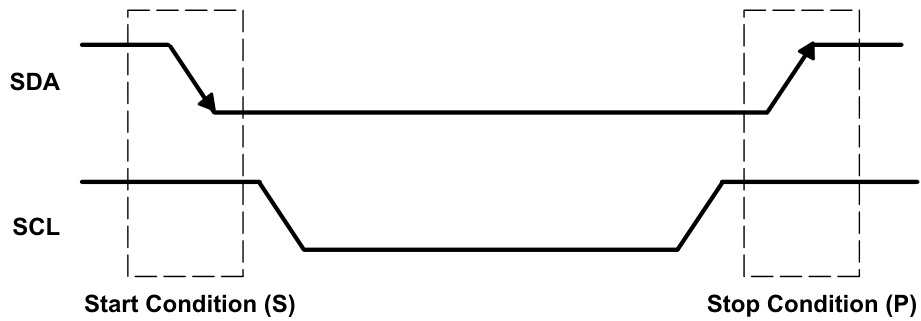  
Figure 6-5. I2C Start and Stop Conditions   
Figure 6-6. I2C Access Cycles

The basic access write cycle consists of the following:

1. A start condition   
2. A target address cycle   
3. A sub-address cycle   
4. Any number of data cycles   
5. A stop condition

The basic access read cycle consists of the following:

1. A start condition   
2.3.4. A target write address cycle A sub-address cycle A restart condition   
5. A target read address cycle   
6. Any number of data cycles   
7. A stop condition

The start and stop conditions are shown in Figure 6-5. The high to low transition of SDA while SCL is high defines the start condition. The low to high transition of SDA while SCL is high defines the stop condition. Each cycle, data or address, consists of 8 bits of serial data followed by one acknowledge bit generated by the receiving device. Thus, each data/address cycle contains 9 bits as shown in Figure 6-6.

SCL u SDA Target Address Sub-Address Data Stop

Following a start condition, each $1 ^ { 2 } \mathsf { C }$ device decodes the target address. The TFP410 responds with an acknowledge by pulling the SDA line low during the ninth clock cycle if it decodes the address as its address. During subsequent sub-address and data cycles, the TFP410 responds with acknowledge as shown in Figure 6-7. The sub-address is auto-incremented after each data cycle.

The transmitting device must not drive the SDA signal during the acknowledge cycle so that the receiving device may drive the SDA signal low. The controller indicates a not acknowledge condition $( \ { \overline { { \mathsf { A } } } } )$ by keeping the SDA signal high just before it asserts the stop condition (P). This sequence terminates a read cycle as shown in Figure 6-8.

The target address consists of 7 bits of address along with 1 bit of read/write information $( { \mathsf { r e a d } } = 1$ , write $= 0$ ) as shown below in Figure 6-6 and Figure 6-7. For the TFP410, the selectable target addresses (including the R/W bit) using A[3:1] are 0x70, 0x72, 0x74, 0x76, $0 { \times } 7 8$ , 0x7A, 0x7C, and $0 { \times } 7 \mathsf E$ for write cycles and $0 { \times } 7 1$ , $0 { \times } 7 3$ , 0x75, 0x77, 0x79, 0x7B, 0x7D, and $0 { \times } 7 { \mathsf { F } }$ for read cycles.

<html><body><table><tr><td></td><td>Target Address</td><td>W</td><td></td><td>Sub-Address</td><td></td><td>Data</td><td></td><td>Data</td><td></td><td></td></tr></table></body></html>

Where:

From Controller A Acknowledge From Target S Start condition P Stop Condition

<html><body><table><tr><td>S</td><td>Target Address</td><td></td><td></td><td>Sub-Address</td><td></td><td></td><td>Target Address</td><td></td><td></td><td>Data</td><td></td><td>Data</td><td></td><td></td></tr></table></body></html>

Where:

From Controller A Acknowledge From Target S Start condition /A Not acknowledge (SDA high) P Stop Condition R Read Condition ${ \bf \delta } = 1$ Sr Restart Condition W Write Condition $\mathbf { \sigma } = \mathbf { 0 }$

# 6.6 Register Maps

The TFP410 is a standard $\mathsf { I } ^ { 2 } \mathsf { C }$ target device. All the registers can be written and read through the $1 ^ { 2 } { \mathsf { C } }$ interface (unless otherwise specified). The TFP410 target machine supports only byte read and write cycles. Page mode is not supported. The 8-bit binary address of the $1 ^ { 2 } { \mathsf { C } }$ machine is 0111 A3A2A1X, where A[3:1] are pin programmable or set to 000 by default. The $\mathsf { I } ^ { 2 } \mathsf { C }$ base address of the TFP410 is dependent on A[3:1] (pins 6, 7 and 8 respectively) as shown below.

<html><body><table><tr><td>A[3:1]</td><td>WRITE ADDRESS (Hex)</td><td>READ ADDRESS (Hex)</td></tr><tr><td>000</td><td>70</td><td>71</td></tr><tr><td>001</td><td>72</td><td>73</td></tr><tr><td>010</td><td>74</td><td></td></tr><tr><td>011</td><td></td><td>577</td></tr><tr><td>100</td><td>78</td><td>29</td></tr><tr><td>101</td><td>7A</td><td>7B</td></tr><tr><td>110</td><td>7C</td><td>7D</td></tr><tr><td>111</td><td>7E</td><td>7F</td></tr></table></body></html>

<html><body><table><tr><td>REGISTER</td><td>RW</td><td>SUB- ADDRESS</td><td>BIT7</td><td>BIT6</td><td>BIT5</td><td>BIT4</td><td>BIT3</td><td>BIT2</td><td>BIT1</td><td>BITO</td></tr><tr><td>VEN_ID</td><td>R</td><td>00</td><td></td><td></td><td></td><td>VEN ID[7:0]</td><td></td><td></td><td></td><td></td></tr><tr><td rowspan="3">DEV_ID</td><td>R</td><td>01</td><td></td><td></td><td></td><td>VEN_ID[15:8]</td><td></td><td></td><td></td><td></td></tr><tr><td>R</td><td>02</td><td></td><td></td><td></td><td>DEV ID[7:0]</td><td></td><td></td><td></td><td></td></tr><tr><td>R</td><td>03</td><td></td><td></td><td></td><td>DEV_ID[15:8]</td><td></td><td></td><td></td><td></td></tr><tr><td>REV_ID RESERVED</td><td>R R</td><td>04</td><td></td><td></td><td></td><td>REV_ID[7:0]</td><td></td><td></td><td></td><td></td></tr><tr><td></td><td></td><td>05-07</td><td></td><td></td><td></td><td>Reserved</td><td></td><td></td><td></td><td></td></tr></table></body></html>

<html><body><table><tr><td>REGISTER</td><td>RW</td><td>SUB- ADDRESS</td><td>BIT7</td><td>BIT6</td><td>BIT5</td><td>BIT4</td><td>BIT3</td><td>BIT2</td><td>BIT1</td><td>BITO</td></tr><tr><td>CTL_1_MODE</td><td>RW</td><td>08</td><td>RSVD</td><td>TDIS</td><td>VEN</td><td>HEN</td><td>DSEL</td><td>BSEL</td><td>EDGE</td><td>PD</td></tr><tr><td>CTL_2_MODE</td><td>RW</td><td>09</td><td>VLOW</td><td colspan="2">MSEL</td><td></td><td>TSEL</td><td>RSEN</td><td>HTPLG</td><td>MDI</td></tr><tr><td>CTL_3_MODE</td><td>RW</td><td>OA</td><td colspan="3">DK</td><td>DKEN</td><td colspan="4">CTL RSVD</td></tr><tr><td>CFG</td><td>R</td><td>0B</td><td colspan="5">CFG</td><td></td><td></td><td></td></tr><tr><td>RESERVED</td><td>RW</td><td>0C-31</td><td colspan="6">Reserved</td><td></td><td></td></tr><tr><td>DE_DLY</td><td>RW</td><td>32</td><td colspan="2"></td><td></td><td colspan="5">DE_DLY[7:0]</td></tr><tr><td>DE_CTL</td><td>RW</td><td>33</td><td>RSVD DE_GEN</td><td colspan="6">VS_POL HS_POL</td><td>DE_DLY[8]</td></tr><tr><td>DE_TOP</td><td>RW</td><td>34</td><td>RSVD</td><td colspan="6">DE_DLY[6:0]</td><td></td></tr><tr><td>RESERVED</td><td>RW</td><td>35</td><td colspan="6">Reserved</td><td></td><td></td></tr><tr><td>DE_CNT</td><td>RW</td><td>36</td><td colspan="6">DE CNT[7:0]</td><td></td><td></td></tr><tr><td></td><td>RW</td><td>37</td><td colspan="6">Reserved DE</td><td>CNT[10:8]</td><td></td></tr><tr><td>DE_LIN</td><td>RW</td><td>38</td><td colspan="6">DE_LIN[7:0]</td><td></td><td></td></tr><tr><td></td><td>RW</td><td>39</td><td colspan="6">Reserved</td><td>LIN[10:8]</td><td></td></tr><tr><td>H_RES</td><td>R</td><td>3A</td><td colspan="6">H_RES[7:0]</td><td></td><td></td></tr><tr><td></td><td>R</td><td>3B</td><td colspan="6">Reserved</td><td>H_RES[10:8]</td><td></td></tr><tr><td>V_RES</td><td>R</td><td>3C</td><td colspan="6">V_RES[7:0]</td><td>V_RES[10:8]</td><td></td></tr><tr><td></td><td>R</td><td>3D</td><td colspan="6">Reserved</td><td></td><td></td></tr><tr><td>RESERVED</td><td>R</td><td>3E-FF</td><td colspan="6"></td><td></td><td></td></tr></table></body></html>

# 6.6.1 VEN_ID Register (Sub-Address $\mathbf { \sigma } = 0 1 - 0 0$ [reset $\mathbf { \sigma } = \mathbf { \sigma }$ 0x014C]

<html><body><table><tr><td>15</td><td>14</td><td>13</td><td>12</td><td>11</td><td>10</td><td>9</td><td>8</td><td></td><td>6</td><td>5</td><td>VEN_ID[7:0]</td><td>3</td><td>2</td><td></td><td>0</td></tr><tr><td colspan="16">VEN_ID[15:8]</td></tr></table></body></html>

Table 6-4. VEN_ID Field Descriptions   

<html><body><table><tr><td>Bit</td><td>Field</td><td>Type</td><td>Description</td></tr><tr><td>15:8</td><td>VEN_ID</td><td>R</td><td rowspan="2">These read-only registers contain the 16-bit Texas Instruments vendor ID. VEN_ID is hardwired to 0x014C.</td></tr><tr><td>7:0</td><td>VEN_ID</td><td>R</td></tr></table></body></html>

# 6.6.2 DEV_ID Register (Sub-Address $\mathbf { \lambda } = 0 3 \mathbf { - } 0 2$ ) [reset $\mathbf { \lambda } =$ 0x0410]

Figure 6-10. DEV_ID Register   

<html><body><table><tr><td>15</td><td>14</td><td>13 12</td><td></td><td>11</td><td>10</td><td>9</td><td>8</td><td></td><td>6</td><td>5</td><td>4</td><td>3</td><td>2</td><td></td><td>0</td></tr><tr><td colspan="16">DEV_ID[15:8]</td></tr></table></body></html>

Figure 6-9. VEN_ID Register   
Table 6-5. DEV_ID Register Field Descriptions   

<html><body><table><tr><td>Bit</td><td>Field</td><td>Type</td><td>Description</td></tr><tr><td>15:8</td><td>DEV_ID</td><td>R</td><td rowspan="2">These read-only registers contain the 16-bit device ID for the TFP410. DEV_ID is hardwired to 0x0410.</td></tr><tr><td>7:0</td><td>DEV_ID</td><td>R</td></tr></table></body></html>

# 6.6.3 REV_ID Register (Sub-Address ${ \bf \delta } = { \bf 0 4 }$ ) [reset = 0x00]

Figure 6-11. REV_ID Register   

<html><body><table><tr><td></td><td>6</td><td>5</td><td></td><td>3</td><td>2</td><td></td><td></td></tr><tr><td colspan="8">REV_ID[7:0]</td></tr></table></body></html>

# Table 6-6. REV_ID Register Field Descriptions

<html><body><table><tr><td>Bit</td><td>Field</td><td>Type</td><td>Description</td></tr><tr><td>7:0</td><td>REV_ID</td><td>(d:)</td><td>This read-only register contains the revision ID.</td></tr></table></body></html>

# 6.6.4 Reserved Register (Sub-Address $\mathbf { \lambda } = \mathbf { 0 7 - 0 5 }$ ) [reset $\mathbf { \sigma } = \mathbf { \sigma }$ 0x641400]

Figure 6-12. Reserved   

<html><body><table><tr><td>15</td><td>14</td><td>13</td><td></td><td>1211</td><td>10</td><td>9</td><td>8</td><td></td><td>6</td><td>5</td><td></td><td>43</td><td>2</td><td></td><td>0</td></tr><tr><td></td><td></td><td></td><td>RESERVED[15:8]</td><td></td><td></td><td></td><td></td><td></td><td></td><td></td><td></td><td>RESERVED[7:0]</td><td></td><td></td><td></td></tr></table></body></html>

Table 6-7. Reserved Field Descriptions   

<html><body><table><tr><td>Bit</td><td>Field</td><td>Type</td><td>Description</td></tr><tr><td>15:8</td><td>RESERVED</td><td>Read Only</td><td></td></tr><tr><td>7:0</td><td>RESERVED</td><td>Read Only</td><td></td></tr></table></body></html>

# 6.6.5 CTL_ 1 _MODE (Sub-Address ${ \bf \Omega } = { \bf 0 8 }$ ) [reset $\mathbf { \sigma } = \mathbf { \sigma }$ 0xBE]

Figure 6-13. CTL_1_MODE Register   

<html><body><table><tr><td>7</td><td>6</td><td>5</td><td></td><td>3</td><td>2</td><td></td><td>0</td></tr><tr><td>RSVD</td><td>TDIS</td><td>VEN</td><td>HEN</td><td>DSEL</td><td>BSEL</td><td>EDGE</td><td>PD</td></tr></table></body></html>

Table 6-8. CTL_1_MODE Field Descriptions   

<html><body><table><tr><td>Bit</td><td>Field</td><td>Type</td><td>Description</td></tr><tr><td>7</td><td>RSVD</td><td>R/W</td><td>Reserved</td></tr><tr><td></td><td>TDIS</td><td>R/W</td><td>This read/write register contains the T.M.D.S disable mode 0: T.M.D.S. circuitry enable state is determined by PD. 1: T.M.D.S. circuitry is disabled.</td></tr><tr><td></td><td>VEN</td><td>R/W</td><td>This read/write register contains the vertical sync enable mode. 0: VSYNC input is transmitted as a fixed low 1: VSYNC input is transmitted its original state in</td></tr><tr><td></td><td>HEN</td><td>R/W</td><td>This read/write register contains the horizontal sync enable mode. 0: HSYNC input is transmitted as a fixed low 1: HSYNC input is transmitted in its original state</td></tr><tr><td></td><td>DSEL</td><td>R/W</td><td>This read/write register is used in combination with BSEL and VREF to select the single-ended or differential input clock mode. In the high-swing mode, DSEL is a don't care because IDCK is always single-ended.</td></tr><tr><td></td><td>BSEL</td><td>R/W</td><td>This read/write register contains the input bus select mode. 0: 12-bit operation with dual-edge clock 1: 24-bit operation with single-edge clock</td></tr><tr><td></td><td>EDGE</td><td>R/W</td><td>This read/write register contains the edge select mode. 0: Input data latches to the edge of IDCK+ 1: Input data latches to the rising edge of IDCK+ falling</td></tr><tr><td></td><td>PD</td><td>R/W</td><td>This read/write register contains the power-down mode. 0: Power down (default after RESET) 1: Normal operation</td></tr></table></body></html>

# 6.6.6 CTL_2_MODE Register (Sub-Address ${ \bf \delta } = { \bf 0 9 }$ ) [reset = 0x00]

Figure 6-14. CTL_2 MODE Register   

<html><body><table><tr><td>7</td><td>6</td><td>5</td><td></td><td>3 2</td><td></td><td></td><td>0</td></tr><tr><td>VLOW</td><td></td><td>MSEL[3:1]</td><td>TSEL</td><td>RSEN</td><td></td><td>HTPLG</td><td>MDI</td></tr></table></body></html>

# Table 6-9. CTL_2_ MODE Field Descriptions

<html><body><table><tr><td>Bit</td><td>Field</td><td>Type</td><td>Description</td></tr><tr><td></td><td>VLOW</td><td>R/W</td><td>This read only register indicates the VREF input level 0: This bit is a logic level (0) if the VREF analog input selects high-swing inputs 1: This bit is a logic level (1) the VREF analog input selects low-swing inputs if</td></tr><tr><td>6:4</td><td>MSEL[3:1]</td><td>R/W</td><td>This read/write register contains the source select of the monitor sense output pin. 000: Disabled. MSEN output high 001: Outputs the MDI bit (interrupt) 010: Outputs the RSEN bit (receiver detect) 011: Outputs the HTPLG bit (hot plug detect)</td></tr><tr><td></td><td>TSEL</td><td>R/W</td><td>This read/write register contains the interrupt generation source select. 0: Interrupt bit (MDI) generated by monitoring RSEN 1: Interrupt bit (MDI) is generated by monitoring HTPLG is</td></tr><tr><td></td><td>RSEN</td><td>R/W</td><td>This read only register contains the receiver sense input logic state, which is valid only for dc-coupled systems. 0: A powered-on receiver is not detected 1: A powered-on receiver is detected (that is, connected to the DVI transmitter outputs)</td></tr><tr><td></td><td>HTPLG</td><td>R/W</td><td>This read only register contains the hot plug detection input logic state. 0: Logic level detected on the EDGE/HTPLG pin (pin 9) 1: High level detected on the EDGE/HTPLG pin (pin 9)</td></tr><tr><td></td><td>MDI</td><td>R/W</td><td>This read/write register contains the monitor detect interrupt mode. 0: Detected logic level change in detection signal (to clear, write one to this bit) 1: Logic level remains the same</td></tr></table></body></html>

# 6.6.7 CTL_3 MODE Register (Sub-Address ${ \bf \varepsilon } = { \bf 0 } { \bf A }$ ) [reset = 0x80]

Figure 6-15. CTL_3 MODE Register   

<html><body><table><tr><td></td><td>6 5</td><td></td><td>3</td><td>2</td><td></td><td>0</td></tr><tr><td></td><td>DK[3:1]</td><td>DKEN</td><td>RSVD</td><td>CTL[2:1]</td><td></td><td>RSVD</td></tr></table></body></html>

Table 6-10. CTL_3 MODE Register Field Descriptions   

<html><body><table><tr><td>Bit</td><td>Field</td><td>Type</td><td>Description</td></tr><tr><td>7:5</td><td>DK[3:1]</td><td>RW</td><td>This read/write register contains the de-skew setting, each increment adjusts the skew by t(STEP). 000: Step (minimum setup/maximum hold) 001: 2 010: Step 3 011: Step 4 100: Step 5 (default) 101: Step 6 110: Step 7 Step</td></tr><tr><td></td><td>DKEN</td><td>RW</td><td>111: Step 8 (maximum setup/minimum hold) This read/write register controls the data de-skew enable. 0: Data de-skew is disabled, the values in DK[3:1] are not used</td></tr><tr><td>3</td><td>RSVD</td><td>RW</td><td>1: Data de-skew is enabled, the de-skew setting is controlled through DK[3:1]</td></tr><tr><td>2:1</td><td>CTL[2:1]</td><td>RW</td><td>This read/write register contains the values of the two CTL[2:1] bits that are output on the DVI port during the blanking interval.</td></tr><tr><td>U</td><td>RSVD</td><td>RW</td><td></td></tr></table></body></html>

# 6.6.8 CFG Register (Sub-Address $= O B$ )

<html><body><table><tr><td></td><td>6</td><td>5</td><td></td><td>3</td><td>2</td><td></td><td>0</td></tr><tr><td colspan="8">CFG[7:0]</td></tr></table></body></html>

Table 6-11. CFG Register Field Descriptions   

<html><body><table><tr><td>Bit</td><td>Field</td><td>Type</td><td>Description</td></tr><tr><td>7:0 (D[23:16])</td><td>CFG</td><td>Read Only</td><td></td></tr></table></body></html>

Figure 6-16. CFG Register   

<html><body><table><tr><td>Bit</td><td>Field</td><td>Type</td><td>Description</td></tr><tr><td>7:0</td><td>RESERVED</td><td>R/W</td><td></td></tr></table></body></html>

# 6.6.9 RESERVED Register (Sub-Address $\mathbf { \sigma } = \mathbf { 0 E } \mathbf { - } \mathbf { 0 C }$ ) [reset $\mathbf { \lambda } = \mathbf { \lambda }$ 0x97D0A9]

<html><body><table><tr><td></td><td>6</td><td>5</td><td></td><td>3</td><td></td><td></td><td>0</td></tr><tr><td colspan="8">RESERVED</td></tr></table></body></html>

Figure 6-17. RESERVED Register   

<html><body><table><tr><td>Bit</td><td>Field</td><td>Type</td><td>Description</td></tr><tr><td>7:0</td><td>DE DLY</td><td>R/W</td><td>This read/write register defines the number of pixels after HSYNC goes active that DE is generated, when the DE generator enabled. The value must be less than or equal to (2047 DE _CNT) 心 一</td></tr></table></body></html>

# 6.6.10 DE_DLY Register (Sub-Address $= 3 2$ ) [reset $\mathbf { \mu = 0 \times 0 0 }$

Table 6-12. RESERVED Register Field Descriptions   
Figure 6-18. DE_DLY Register   

<html><body><table><tr><td></td><td>6</td><td>5</td><td></td><td>3</td><td>2</td><td></td><td></td></tr><tr><td colspan="8">DE_DLY[7:0]</td></tr></table></body></html>

# 6.6.11 DE_CTL Register (Sub-Address $= 3 3$ ) [reset = 0x00]

Table 6-13. DE_DLY Field Descriptions   

<html><body><table><tr><td>Bit</td><td>Field</td><td>Type</td><td>Description</td></tr><tr><td>7</td><td>Reserved</td><td>R/W</td><td></td></tr><tr><td></td><td>DE_GEN</td><td>R/W</td><td>This read/write register enables the internal DE generator. 0: DE generator is disabled. Signal required on DE pin 1: DE generator is enabled. DE pin is ignored.</td></tr><tr><td></td><td>VS_POL</td><td>R/W</td><td>This read/write register sets the VSYNC polarity. 0: VSYNC is considered active low. 1: VSYNC is considered active high. Line counts are reset on the VSYNC active edge.</td></tr><tr><td></td><td>HS_POL</td><td>R/W</td><td>This read/write register sets the HSYNC polarity. 0: HSYNC is considered active low. 1: HSYNC is considered active high. Pixel counts are reset on the HSYNC active edge.</td></tr><tr><td>1:3</td><td>Reserved</td><td>R/W</td><td></td></tr><tr><td>0</td><td>DE_DLY[8]</td><td>R/W</td><td>This read/write register contains the top bit of DE_ _DLY.</td></tr></table></body></html>

Figure 6-19. DE_CTL Register   

<html><body><table><tr><td></td><td>6</td><td>5</td><td>4</td><td>3</td><td>2</td><td></td><td>0</td></tr><tr><td>Reserved</td><td>DE_GEN</td><td>VS_POL</td><td>HS_POL</td><td></td><td>Reserved</td><td></td><td>DE_DLY[8]</td></tr></table></body></html>

# Table 6-14. DE_CTL Register Field Descriptions

# 6.6.12 DE_TOP Register (Sub-Address $= 3 4$ ) [reset $\mathbf { \lambda } = \mathbf { 0 } \times \mathbf { 0 } \mathbf { 0 } ]$ ]

<html><body><table><tr><td></td><td>6</td><td>5</td><td></td><td>3</td><td>2</td><td></td><td>0</td></tr><tr><td colspan="8">DE_TOP[7:0]</td></tr></table></body></html>

Table 6-15. DE_TOP Register Field Descriptions   

<html><body><table><tr><td>Bit</td><td>Field</td><td>Type</td><td>Description</td></tr><tr><td>7:0</td><td>DE TOP</td><td>R/W</td><td>This read/write register defines the number of pixels after VSYNC goes active that DE is generated, when the DE generator is enabled.</td></tr></table></body></html>

# 6.6.13 DE_CNT Register (Sub-Address $= 3 7 - 3 6$ ) [reset = 0x0000]

Figure 6-20. DE_TOP Register   

<html><body><table><tr><td>Bit</td><td>Field</td><td>Type</td><td>Description</td></tr><tr><td>10:8</td><td>DE CNT</td><td>R/W</td><td>These read/write registers define the width of the active display, in pixels, when the</td></tr><tr><td>7:0</td><td>DE CNT</td><td>RW DE</td><td>generator is enabled. The value must be less than or equal to (2047 DE DLY).</td></tr></table></body></html>

Figure 6-21. DE_ CNT Register   

<html><body><table><tr><td></td><td></td><td></td><td></td><td></td><td></td><td></td><td></td></tr><tr><td colspan="6">DE CNT[7:0]</td><td colspan="2"></td></tr><tr><td colspan="6">Reserved</td><td colspan="2">DE CNT[10:8]</td></tr></table></body></html>

# Table 6-16. DE_CNT Register Field Descriptions

# 6.6.14 DE_LIN Register (Sub-Address $\mathbf { \lambda } =$ 39–38) [reset $\mathbf { \lambda } = \mathbf { \lambda }$ 0x0000]

Figure 6-22. DE_LIN Register   

<html><body><table><tr><td colspan="6">5 3</td></tr><tr><td colspan="6">2 DE_LIN[7:0]</td></tr><tr><td colspan="4"></td></tr><tr><td colspan="2">Reserved</td><td colspan="3">DE_LIN[10:8]</td></tr></table></body></html>

# Table 6-17. DE_LIN Register Field Descriptions

<html><body><table><tr><td>Bit</td><td>Field</td><td>Type</td><td>Description</td></tr><tr><td>10:8</td><td>DE_LIN</td><td>R/W</td><td rowspan="2">These read/write registers define the height of the active display, in lines, when the DE generator is enabled.</td></tr><tr><td>7:0</td><td>DE_LIN</td><td>R/W</td></tr></table></body></html>

# 6.6.15 H_RES Register (Sub-Address $\mathbf { \lambda } =$ 3B−3A)

Figure 6-23. H_RES Register   

<html><body><table><tr><td></td><td>6</td><td>5</td><td></td><td>3</td><td>2</td><td></td><td>0</td></tr><tr><td colspan="8">H_RES[7:0]</td></tr><tr><td colspan="5">Reserved</td><td colspan="3">H_RES[10:8]</td></tr><tr><td colspan="5"></td><td colspan="3"></td></tr></table></body></html>

Table 6-18. H_RES Register Field Descriptions   

<html><body><table><tr><td>Bit</td><td>Field</td><td>Type</td><td>Description</td></tr><tr><td>10:8</td><td>H_RES</td><td>Read Only</td><td>These read-only registers return the number of pixels between consecutive</td></tr><tr><td>7:0</td><td>H_RES</td><td>Read Only</td><td>HSYNC pulses.</td></tr></table></body></html>

# 6.6.16 V_RES Register (Sub-Address $\mathbf { \lambda } = \mathbf { \lambda }$ 3D−3C)

Figure 6-24. V_RES Register   

<html><body><table><tr><td></td><td>6</td><td>5</td><td></td><td>3</td><td>2</td><td></td><td>0</td></tr><tr><td colspan="6">V_RES[7:0]</td><td></td><td></td></tr><tr><td colspan="6">Reserved</td><td colspan="3">V_RES[10:8]</td></tr></table></body></html>

Table 6-19. V_RES Register Field Descriptions   

<html><body><table><tr><td>Bit</td><td>Field</td><td>Type</td><td>Description</td></tr><tr><td>10:8</td><td>V_RES</td><td>Read Only</td><td rowspan="2">These read-only registers return the number of lines between consecutive</td></tr><tr><td>7:0</td><td>V_RES</td><td>Read Only VSYNC pulses.</td></tr></table></body></html>

# 7 Application and Implementation

# Note

Information in the following applications sections is not part of the TI component specification, and TI does not warrant its accuracy or completeness. TI’s customers are responsible for determining suitability of components for their purposes, as well as validating and testing their design implementation to confirm system functionality.

# 7.1 Application Information

The TFP410 is a DVI-compliant digital transmitter that is used in digital host monitor systems to T.M.D.S. encode and serialize RGB pixel data streams. TFP410 supports resolutions from VGA to WUXGA (and 1080p). The host in a digital display system, usually a PC or consumer electronics device, contains a DVI-compatible transmitter such as the TI TFP410 that receives 24-bit pixel data along with appropriate control signals. The TFP410 encodes the signals into a high speed, low voltage, differential serial bit stream optimized for transmission over a twisted-pair cable to a display device such as the TFP401.

# 7.2 Typical Application

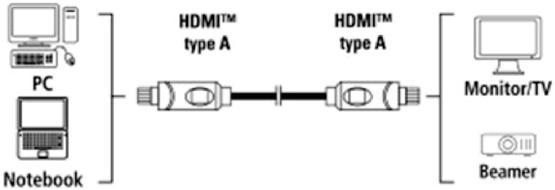  
Figure 7-1. Typical Application for the TFP410 Device

# 7.2.1 Design Requirements

<html><body><table><tr><td>PARAMETER</td><td>VALUE</td></tr><tr><td>Power supply</td><td>3.3V dc at 1 A</td></tr><tr><td>Input clock</td><td>Single-ended</td></tr><tr><td>Input clock frequency range</td><td>25MHz 165MHz</td></tr><tr><td>Output format</td><td>24 bits/pixel</td></tr><tr><td>Input clock latching</td><td>Rising edge</td></tr><tr><td>I2C EEPROM support</td><td>No</td></tr><tr><td>De-skew</td><td>No</td></tr></table></body></html>

# 7.2.2 Detailed Design Procedure

# 7.2.2.1 Data and Control Signals

The trace length of data and control signals out of the receiver should be kept as close to equal as possible. Trace separation should be approximately 5 times the height. As a general rule, traces also should be less than 2.8” if possible (longer traces can be acceptable).

$$
\mathsf { D e l a y } = 8 5 \times \mathsf { S Q R T } \times \mathsf { e r }
$$

where

$\mathsf { e r } = 4 . 3 5$ ; relative permativity of $50 \%$ resin FR-4 at 1 GHz Delay $\mathbf { \tau } = \mathbf { \tau }$ 177 pS/in

Length of rising edge $\mathbf { \tau } = \mathbf { \tau }$ Tr(ps) Delay; ${ \mathsf { T r } } = 3$ ns

# where

$= 3 0 0 0$ ps 177 ps per inch $= 1 6 . 9$ inches

Length of rising edge $1 6 =$ Max length of trace for lumped circuit.

$1 6 . 9 / 6 = 2 . 8$ inches

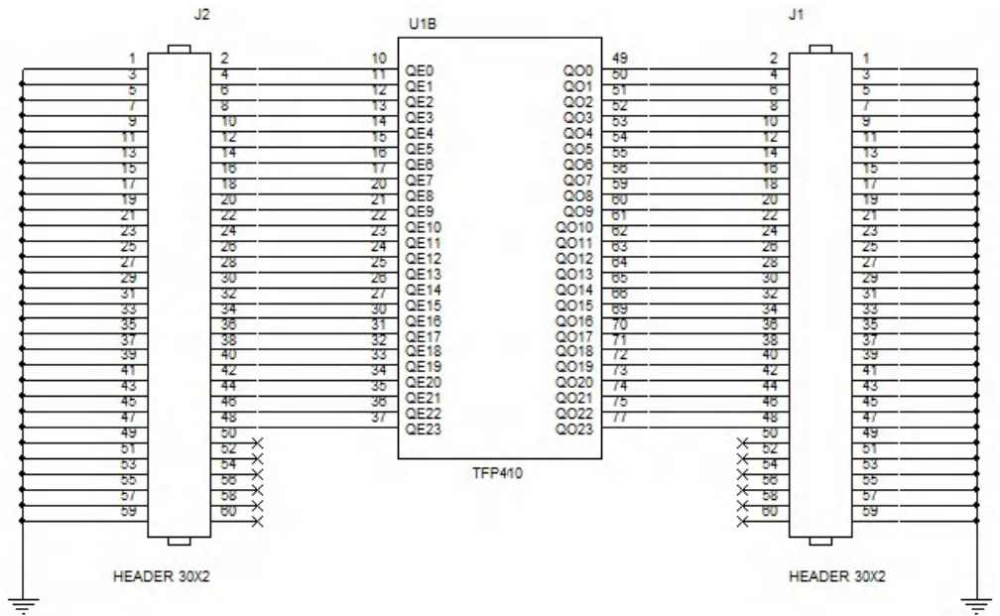  
Figure 7-2. Data Signals

# 7.2.2.2 Configuration Options

The TFP410 can be configured in several modes depending on the required input format, for example 1 byte/ clock, 2 bytes/clock, falling/rinsing clock edge.

Refer to Table 6-1 for more information about configuration options.

# 7.2.2.3 Power Supplies Decoupling

Digital, analog, and PLL supplies must be decoupled from each other to avoid electrical noise on the PLL and the core.

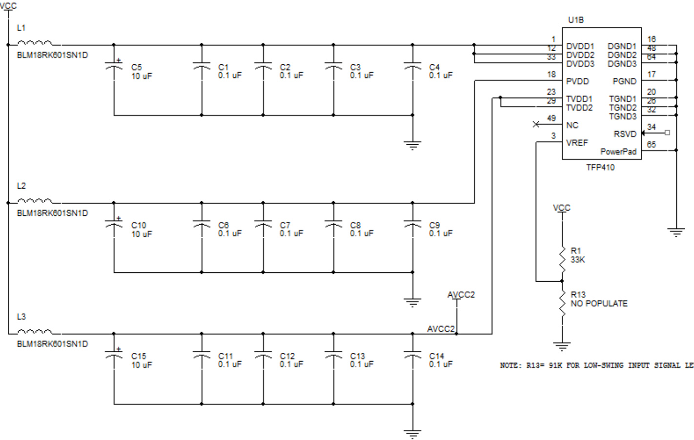  
Figure 7-3. Power Decoupling

# 7.2.3 Application Curves

Sometimes the Panel does not support the same format as the GPU (graphics processor unit). In these cases the user must decide how to connect the unused bits.

Figure 7-4 and Figure 7-5 show the mismatches between the 18-bit GPU and a 24-bit LCD where $" \bigtimes "$ and “y” represent the 2 LSB of the Panel.

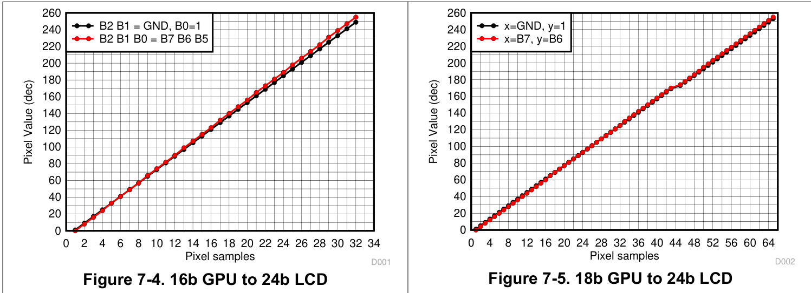

# 7.3 Power Supply Recommendations

Use solid ground planes. Tie ground planes together with as many vias as is practical. This will provide a desirable return path for current. Each supply should be on separate split power planes, where each power plane should be as large an area as possible. Connect PanelBus receiver power and ground pins and all bypass caps to appropriate power or ground plane with via. Vias should be as fat and short as practical, the goal is to minimize the inductance.

# 7.3.1 DVDD

Place one $0 . 0 1 \mu \mathsf { F }$ capacitor as close as possible between each DVDD device pins and ground. A $2 2 \mu \ F$ tantalum capacitor should be placed between the supply and $0 . 0 1 \mu \mathsf { F }$ capacitors. A ferrite bead should be used between the source and the $2 2 \mu \ F$ capacitor.

# 7.3.2 TVDD

Place one $0 . 0 1 \mu \mathsf { F }$ capacitor as close as possible between each TVDD device pins and ground. A $2 2 \mu \ F$ tantalum capacitor should be placed between the supply and $0 . 0 1 \mu \mathsf { F }$ capacitors. A ferrite bead should be used between the source and the $2 2 \mu \ F$ capacitor.

# 7.3.3 PVDD

Place three $0 . 0 1 \mu \mathsf { F }$ capacitors in parallel as close as possible between the PVDD device pin and ground. A $2 2 \mu \ F$ tantalum capacitor should be placed between the supply and $0 . 0 1 \mu \mathsf { F }$ capacitors. A ferrite bead should be used between the source and the $2 2 \mu \ F$ capacitor.

# 7.4 Layout

# 7.4.1 Layout Guidelines

# 7.4.1.1 Layer Stack

The pinout of Texas Instruments' High Speed Interface (HSI) devices features differential signal pairs and the remaining signals comprise the supply rails, VCC and ground, and lower-speed signals, such as control pins. As an example, consider a device X which is a repeater/re-driver, so both inputs and outputs are high-speed differential signals. These guidelines can be applied to other high-speed devices such as drivers, receivers, multiplexers, and so on.

A minimum of four layers is required to accomplish a low-EMI PCB design. Layer stacking should be in the following order (top-to-bottom): high-speed differential signal layer, ground plane, power plane and control signal layer.

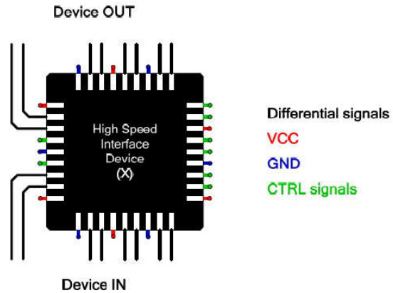  
Figure 7-6. PCB Stack Up

# 7.4.1.2 Routing High-Speed Differential Signal Traces (RxC-, RxC+, Rx0-, Rx0+, Rx1-, Rx1+, Rx2-, Rx2+)

Trace impedance should be controlled for optimal performance. Each differential pair should be equal in length and symmetrical and should have equal impedance to ground with a trace separation of 2 times to 4 times the height. A differential trace separation of 4 times the height yields about $6 \%$ cross-talk $6 \%$ effect on impedance).

We recommend that differential trace routing should be side-by-side, though it is not important that the differential traces be tightly coupled together, because tight coupling is not achievable on PCB traces. Typical ratios on PCBs are only $20 \%$ to $50 \%$ ; $9 9 . 9 \%$ is the value of a well balanced twisted pair cable. Each differential trace should be as short as possible $\cdot < 2$ inches is preferable) with no $9 0 ^ { \circ }$ angles. These high-speed transmission traces should be on layer 1, which is the top layer.

RxC-, $\mathsf { R x C + }$ , ${ \mathsf { R } } { \mathsf { x 0 - } }$ , ${ \mathsf { R } } { \times } { 0 } +$ , Rx1-, $\mathsf { R } \times 1 +$ , ${ \mathsf { R } } { \mathsf { x } } 2 .$ -, ${ \mathsf { R } } { \mathsf { x } } 2 +$ signals all route directly from the DVI connector pins to the device, no external components are needed.

# 7.4.1.3 DVI Connector

Clear-out holes for connector pins should leave space between pins to allow continuous ground through the pin field. Allow enough spacing in ground plane around signal pins vias however, keep enough copper between vias to allow for ground current to flow between the vias. Avoid creating a large ground plane slot around the entire connector, because minimizing the via capacitance is the goal.

# 7.4.2 Layout Example

DVI connector trace matching is shown in Figure 7-7.

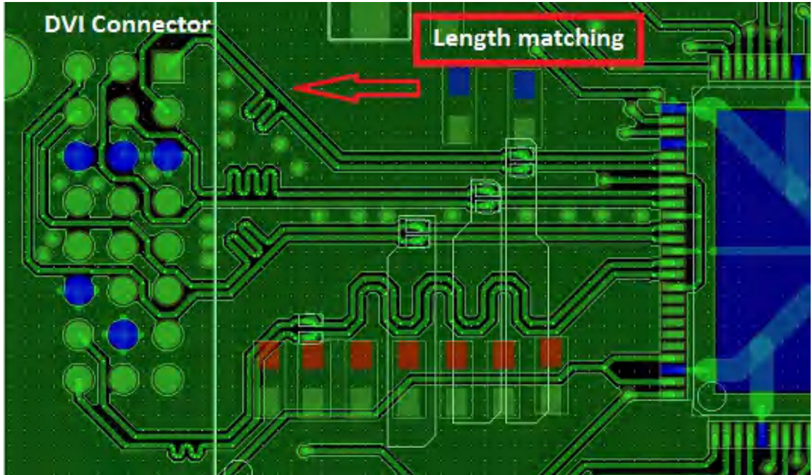  
Figure 7-7. DVI Signal Routing

Keep the data lines as far as possible from each other as shown in Figure 7-8.

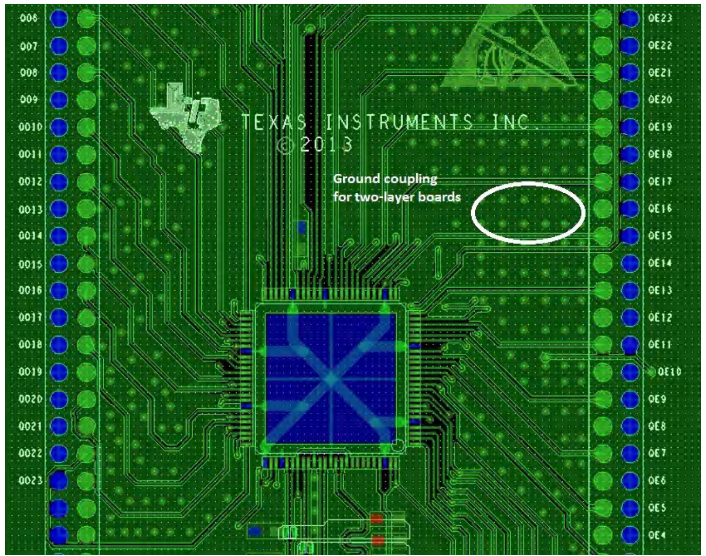  
Figure 7-8. Data Signal Routing

Connect the thermal pad to ground as shown in Figure 7-9.

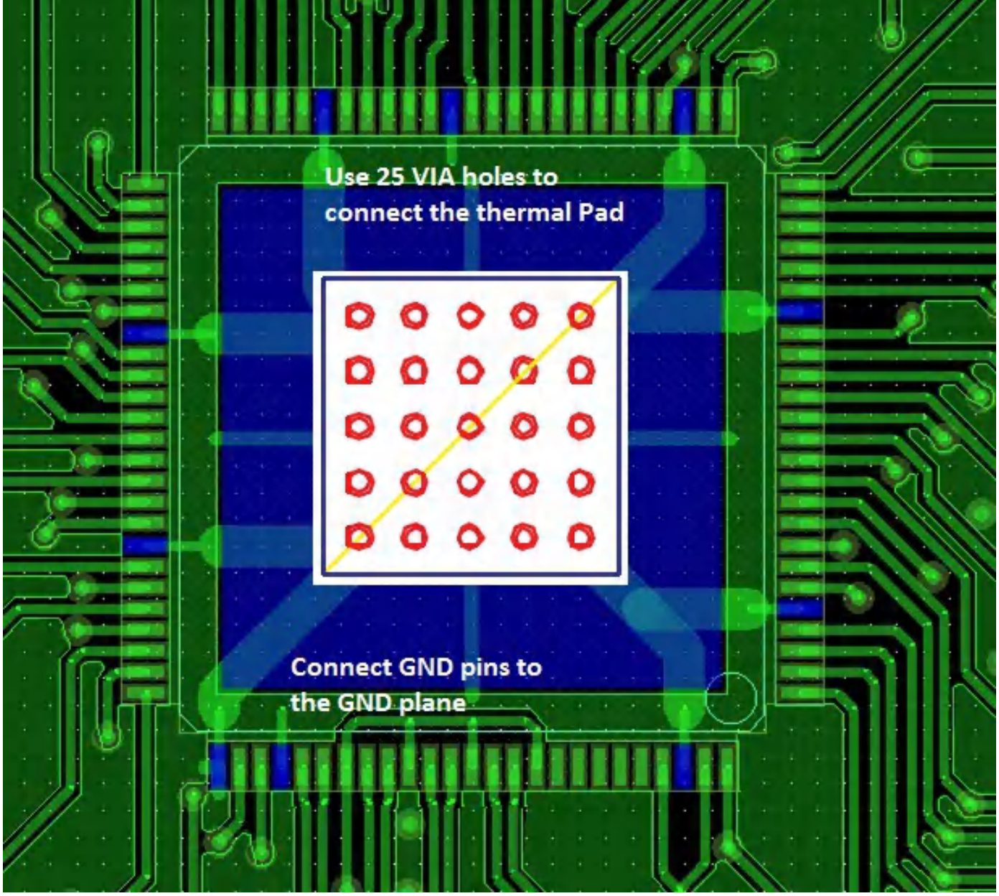  
Figure 7-9. Ground Routing

# 7.4.3 TI PowerPAD 64-Pin HTQFP Package

The TFP410 is available in TI’s thermally enhanced 64-pin TQFP PowerPAD package. The PowerPAD package is a $1 0 \mathrm { { m m } \times 1 0 \mathrm { { m m } \times 1 . 0 \mathrm { { m m } } } }$ TQFP outline with 0.5mm lead-pitch. The PowerPAD package has a specially designed die mount pad that offers improved thermal capability over typical TQFP packages of the same outline. The TI 64-pin TQFP PowerPAD package offers a backside solder plane that connects directly to the die mount pad for enhanced thermal conduction. For thermal considerations, soldering the backside of the TFP410 to the application board is not required because the device power dissipation is well within the package capability when not soldered.

Soldering the backside of the device to the PCB ground plane is recommended for electrical considerations. Because the die pad is electrically connected to the chip substrate and hence chip ground, connecting the back side of the PowerPAD package to a PCG ground plane provides a low-inductance, low-impedance connection to help improve EMI, ground bounce, and power supply noise performance.

Table 7-1 contains the thermal properties of the TI 64-pin TQFP PowerPAD package. The 64-pin TQFP nonPowerPAD package is included only for reference.

Table 7-1. TI 64-Pin TQFP (10mm × 10mm × 1.0mm) 0.5mm Lead-Pitch  

<html><body><table><tr><td rowspan="2">PARAMETER</td><td rowspan="2">WITHOUT PowerPADTM</td><td rowspan="2">PowerPADTM NOT CONNECTED TO PCB THERMAL</td><td rowspan="2">PowerPAD Tm</td></tr><tr><td>CONNECTED TO PCB PLANE THERMAL PLANE(1)</td></tr><tr><td>ROJA</td><td>Thermal resistance, junction-to-ambient(1) (2)</td><td>75.83°C/W</td><td>42.20°C/W</td><td>21.47°C/W</td></tr><tr><td>ReJC</td><td>Thermal resistance, junction-to-case (1) (2) (1) (2)</td><td>7.80°/W</td><td>0.38°C/W</td><td>0.38°C/W</td></tr><tr><td>PD</td><td>Power handing capabilities of package</td><td>0.92 W</td><td>1.66 W</td><td>3.26W</td></tr></table></body></html>

(1) Specified with the PowerPAD bond pad on the backside of the package soldered to a 2-oz. Cu plate PCB thermal plane. (2) Airflow is at 0 LFM (no airflow) (3) Specified at $1 5 0 ^ { \circ } \mathsf { C }$ junction temperature and $8 0 ^ { \circ } \mathsf { C }$ ambient temperature.

# 8 Device and Documentation Support 8.1 Receiving Notification of Documentation Updates

To receive notification of documentation updates, navigate to the device product folder on ti.com. Click on Notifications to register and receive a weekly digest of any product information that has changed. For change details, review the revision history included in any revised document.

# 8.2 Support Resources

TI E2E™ support forums are an engineer's go-to source for fast, verified answers and design help — straight from the experts. Search existing answers or ask your own question to get the quick design help you need.

Linked content is provided "AS IS" by the respective contributors. They do not constitute TI specifications and d not necessarily reflect TI's views; see TI's Terms of Use.

# 8.3 Trademarks

Intel ™ is a trademark of Intel Corporation.   
PowerPAD EPIC- $. 5 ^ { \mathtt { T M } }$ and PanelBus™ are trademarks of TI.   
Blu-ray™ is a trademark of Blu-ray Disc Association.   
TI E2E™ is a trademark of Texas Instruments.   
All trademarks are the property of their respective owners.

# 8.4 Electrostatic Discharge Caution

This integrated circuit can be damaged by ESD. Texas Instruments recommends that all integrated circuits be handled with appropriate precautions. Failure to observe proper handling and installation procedures can cause damage.

ESD damage can range from subtle performance degradation to complete device failure. Precision integrated circuits may be more susceptible to damage because very small parametric changes could cause the device not to meet its published specifications.

# 8.5 Glossary

# TI Glossary

This glossary lists and explains terms, acronyms, and definitions.

# 9 Revision History

NOTE: Page numbers for previous revisions may differ from page numbers in the current version.

# Changes from Revision C (November 2014) to Revision D (February 2024)

Page

Added inclusive terminology throughout the data sheet..   
Changed pin 22 from: $T V C +$ to: $T X C +$   
Updated MSEN pin description from: when $I ^ { 2 } C$ is disabled $\langle I S E L = I o w \rangle$ , a low level indicates a powered on receiver is detected at the differential outputs. A high level indicates a powered on receiver is not detected to: when $I ^ { 2 } C$ i disabled $\prime I S E L = I o w )$ , a high level indicates a powered on receiver is detected at the differential outputs. A low level indicates a powered on receiver is not detected. 2 Changed pin 6 name from CTL3/A3/DK3 to A3/DK3. ..... … 2 Changed from: When the I2C bus is disabled $\prime I S E L = I o w )$ and the de-skew mode is disabled $( D K E N = I o w )$ , these three inputs become the control inputs, $C T L [ 3 ; 1 ] ,$ which can be used to send additional information across the DVI link during the blanking interval $\left( D E = I o w \right)$ . The CTL3 input is reserved for HDCP compliant DVI TXs (TFP510) and the CTL[2:1] inputs are reserved for future use. to: When the $I ^ { 2 } C$ bus is disabled $\prime | S E L = I o w )$ and the de-skew mode is disabled $( D K E N = I o w )$ , pins 7 and 8 become the control inputs, CTL[2:1], which can be used to send additional information across the DVI link during the blanking interval $\left( D E = I o w \right)$ . Pin 6 is not used. .........   
Updated $\mathsf { V } _ { \mathsf { I H } }$ and $\mathsf { V } _ { \mathsf { l } }$ for Data, DE, VSYNC, HSYNC, and $1 0 0 \mathsf { K } + I -$ - CMOS inputs and the remaining CMOS inputs. … 7 Changed three user definable control signals, CTL[3:1], during the inactive display or blanking interval to: three control signals, CTL[3:1], during the inactive display or blanking interval 11

Changed the TFP410 encodes and transfers the CTL[3:1] inputs during the vertical blanking interval to: the TFP410 encodes and transfers the CTL[2:1] inputs during the vertical blanking interval ................................11 Changed the CTL3 input is reserved for HDCP compliant DVI TXs and the CTL[2:1] inputs are reserved for future use to: CTL3 is reserved for HDCP and is always encoded as 0. The CTL[2:1] inputs are reserved for future use ........... 11 Changed RW field for sub-address 0B from RW to R. ......... ...................................................... 18 Changed CTL_1_MODE register reset value from: 0xFE to: 0xBE 20 Changed in the CTL_3_MODE register, bit 3 from CTL3 to RSVD ....... … 21 Added in DE DLY register the value must be less than or equal to (2047 DE_ CNT) ........................... 22 Added in the DE_CNT register the value must be less than or equal to (2047 - DE_DLY) .... 23 Changed Application Information summary to be focused on TFP410 instead of the TDP401. … … … 25

# Changes from Revision B (May 2011) to Revision C (November 2014)

Page

Added ESD Ratings table, Thermal Information table, Typical Characteristics section, Feature Description section, Device Functional Modes, Application and Implementation section, Power Supply Recommendations section, Layout section, Device and Documentation Support section, and Mechanical, Packaging, and Orderable Information section. .......................................

# 10 Mechanical, Packaging, and Orderable Information

The following pages include mechanical, packaging, and orderable information. This information is the most current data available for the designated devices. This data is subject to change without notice and revision of this document. For browser-based versions of this data sheet, refer to the left-hand navigation.

# PACKAGING INFORMATION

<html><body><table><tr><td>Orderable part number</td><td>Status (1)</td><td>Material type (2)</td><td>Package | Pins</td><td>Package qty Carrier</td><td>RoHS (3)</td><td>Lead finish/ Ball material (4)</td><td>rating/ Peak reflow MSL</td><td>Op temp (℃)</td><td>Part marking (6)</td></tr><tr><td>TFP410PAP</td><td>Active</td><td>Production</td><td>HTQFP (PAP)|64</td><td>160|JEDEC TRAY (10+1)</td><td>Yes</td><td>NIPDAU</td><td>Level-3-260C-168 HR</td><td>0 to 70</td><td>TFP410PAP</td></tr><tr><td>TFP410PAP.A</td><td>Active</td><td>Production</td><td>HTQFP (PAP)|64</td><td>160|JEDEC TRAY (10+1)</td><td>Yes</td><td>NIPDAU</td><td>Level-3-260C-168 HR</td><td>0 to 70</td><td>TFP410PAP</td></tr><tr><td>TFP410PAPG4</td><td>Active</td><td>Production</td><td>HTQFP (PAP)| 64</td><td>160 | JEDEC TRAY (10+1)</td><td>Yes</td><td>NIPDAU</td><td>Level-3-260C-168 HR</td><td>0 to 70</td><td>TFP410PAP</td></tr><tr><td>TFP410PAPR</td><td>Active</td><td>Production</td><td>HTQFP (PAP) 64</td><td>1000 LARGE T&R</td><td>Yes</td><td>NIPDAU</td><td>Level-3-260C-168 HR</td><td>0 to 70</td><td>TFP410PAP</td></tr><tr><td>TFP410PAPR.A</td><td>Active</td><td>Production</td><td>HTQFP (PAP) 64</td><td>1000 |LARGE T&R</td><td>Yes</td><td>NIPDAU</td><td>Level-3-260C-168 HR</td><td>0 to 70</td><td>TFP410PAP</td></tr></table></body></html>

(1) Status: For more details on status, see our product life cycle.

(2) Material type: When designated, preproduction parts are prototypes/experimental devices, and are not yet approved or released for full production. Testing and fina process, including without limitation quality assurance, reliability performance testing, and/or process qualification may not yet be complete, and this item s ubjec to further changes or possible discontinuation. If available for ordering, purchases will be subject to an additional waiver at checkout, and are intended for early nternal evaluation purposes only. These items are sold without warranties of any kind.

(3) RoHS values: Yes, No, RoHS Exempt. See the TI RoHS Statement for additional information and value definition.

(4) Lead finish/Ball material: Parts may have multiple material finish options. Finish options are separated by vertical ruled line. Lead finish/Ball material values may wrap to two lines if the finish value exceeds the maximum column width.

(5) MSL rating/Peak reflow:  The moisture sensitivity level ratings and peak solder (reflow) temperatures. In the event that a part has multiple moisture sensitivity ratings, only the lowest level per JEDEC standards is shown.   
Refer to the shipping label for the actual reflow temperature that will be used to mount the part to the printed circuit board.

(6) Part marking: There may be an additional marking, which relates to the logo, the lot trace code information, or the environmental category of the part.

Multiple part markings will be inside parentheses. Only one part marking contained in parentheses and separated by will appear on part. If a line s indented then it is a continuation of the previous line and the two combined represent the entire part marking for that device.

Important Information and Disclaimer:The information provided on this page represents TI's knowledge and belief as of the date that it is provided. TI bases its knowledge and belief on information provided by third parties, and makes no representation or warranty as to the accuracy of such information. Efforts are underway to better integrate information from third parties. TI has taken and continues to take reasonable steps to provide representative and accurate information but may not have conducted destructive testing or chemical analysis on incoming materials and chemicals. TI and TI suppliers consider certain information to be proprietary, and thus CAS numbers and other limited information may not be available for release.

no event shall TI's liability arising out of such information exceed the total purchase price of the TI part(s) at issue in this document sold by TI to Customer on an annual basis.

# OTHER QUALIFIED VERSIONS OF TFP410 :

• Enhanced Product TFP410-EP

NOTE: Qualified Version Definitions: • Enhanced Product Supports Defense, Aerospace and Medical Applications

# TAPE AND REEL INFORMATION

<html><body><table><tr><td>A0</td><td>Dimension designed to accommodate the component width</td></tr><tr><td>B0</td><td>Dimension designed to accommodate the component length</td></tr><tr><td>K0</td><td>Dimension designed to accommodate the component thickness</td></tr><tr><td>W</td><td>Overall width of the carrier tape</td></tr><tr><td>P1</td><td>Pitch successive cavity centers between</td></tr></table></body></html>

# QUADRANT ASSIGNMENTS FOR PIN ORIENTATION IN TAPE

\*All dimensions are nominal

<html><body><table><tr><td>Device</td><td>Type</td><td>Package Package Drawing</td><td>Pins</td><td>SPQ</td><td>Reel Diameter (mm)</td><td>Reel Width W1 (mm)</td><td>AO (mm)</td><td>B0 (mm)</td><td>KO (mm)</td><td>P1 (mm)</td><td>W (mm)</td><td>Pin1 Quadrant</td></tr><tr><td>TFP410PAPR</td><td>HTQFP</td><td>PAP</td><td>64</td><td>1000</td><td>330.0</td><td>24.4</td><td>13.0</td><td>13.0</td><td>1.5</td><td>16.0</td><td>24.0</td><td>Q2</td></tr></table></body></html>

\*All dimensions are nominal

<html><body><table><tr><td>Device</td><td>Package Type</td><td>Package Drawing</td><td>Pins</td><td>SPQ</td><td>Length (mm)</td><td>Width (mm)</td><td>Height (mm)</td></tr><tr><td>TFP410PAPR</td><td>HTQFP</td><td>PAP</td><td>64</td><td>1000</td><td>350.0</td><td>350.0</td><td>43.0</td></tr></table></body></html>

# TRAY

L - Outer tray length without tabs KO - Outer tray   
十十十十十十十十十十十十十十+ height   
十十十十十十十十十十十十十十十 W -   
十十十十十十十十十十十十十十+ Outer   
++十十+++++十+++++ tray width   
十十十十十十十十十十十十十十+   
+++++++\$++++++++ P1 - Tray unit pocket pitch   
CW - Measurement for tray edge (Y direction) to corner pocket center CL - Measurement for tray edge (X direction) to corner pocket center

Chamfer on Tray corner indicates Pin orientation of packed units.

\*All dimensions are nominal   

<html><body><table><tr><td>Device</td><td>Package Name</td><td>Type Package</td><td>Pins</td><td>SPQ</td><td>Unit array matrix</td><td>Max temperature (°C)</td><td>L (mm)</td><td>W (mm)</td><td>K0 (μm)</td><td>mm)</td><td>CL (mm)</td><td>CW (mm)</td></tr><tr><td>TFP410PAP</td><td>PAP</td><td>HTQFP</td><td>64</td><td>160</td><td>8×20</td><td>150</td><td>315</td><td>135.9</td><td>7620</td><td>15.2</td><td>13.1</td><td>13</td></tr><tr><td>TFP410PAP.A</td><td>PAP</td><td>HTQFP</td><td>64</td><td>160</td><td>8 x 20</td><td>150</td><td>315</td><td>135.9</td><td>7620</td><td>15.2</td><td>13.1</td><td>13</td></tr><tr><td>TFP410PAPG4</td><td>PAP</td><td>HTQFP</td><td>64</td><td>160</td><td>8×20</td><td>150</td><td>315</td><td>135.9</td><td>7620</td><td>15.2</td><td>13.1</td><td>13</td></tr></table></body></html>

# 10 x 10, 0.5 mm pitch

This image is a representation of the package family, actual package may vary. Refer to the product data sheet for package details.

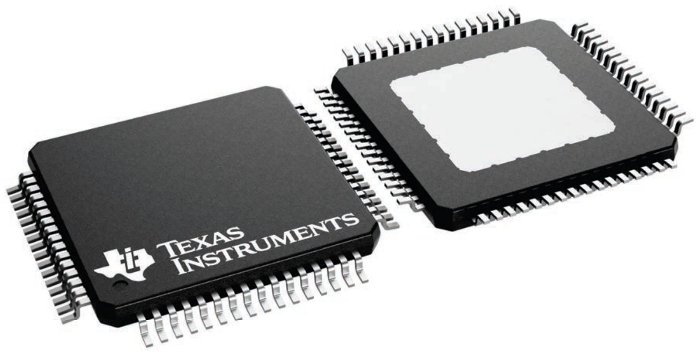

# PowerPAD TM PLASTIC QUAD FLATPACK

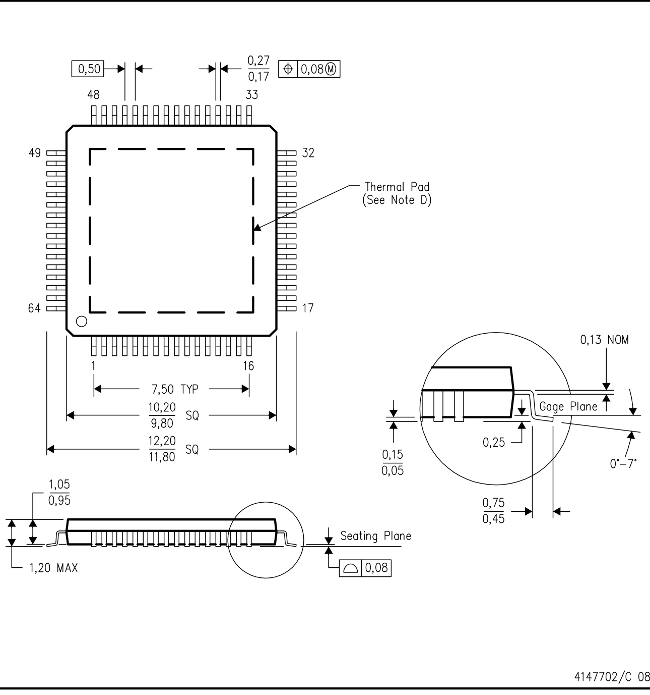  
PAP (S-PQFP-G64)

08/03

NOTES:

A. All linear dimensions are in millimeters.   
B. This drawing is subject to change without notice.   
C. Body dimensions do not include mold flash or protrusion   
D. This package is designed to be soldered to a thermal pad on the board. Refer to Technical Brief, PowerPad Thermally Enhanced Package, Texas Instruments Literature No. SLMA002 for information regarding recommended board layout. This document is available at www.ti.com <http://www.ti.com>.   
E. Falls within JEDEC MS-026

# THERMAL INFORMATION

This PowerPAD " package incorporates an exposed thermal pad that is designed to be attached to a printed circuit board (PCB). The thermal pad must be soldered directly to the PCB. After soldering, the PCB can be used as a 'heatsink. ln addition, through the use of thermal vias, the thermal pad can be attached directly to the appropriate copper plane shown in the electrical schematic for the device, or alternatively, can be attached to a special heatsink structure designed into the PCB. This design optimizes the heat transfer from the integrated circuit (IC).

For additional information on the PowerPAD package and how to take advantage of its heat dissipating abilities, refer to Technical Brief, PowerPAD Thermally Enhanced Package, Texas Instruments Literature No. SLMA002 and Application Brief, PowerPAD Made Easy, Texas Instruments Literature No. SLMA004. Both documents are available at www.ti.com.

The exposed thermal pad dimensions for this package are shown in the following illustration.

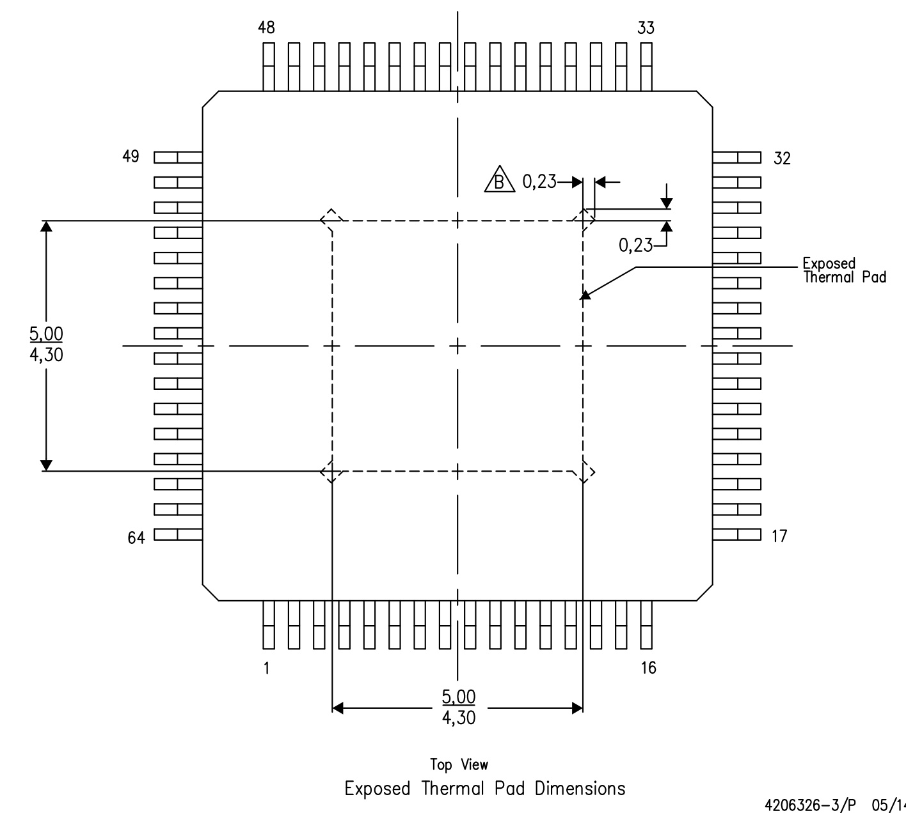

NOTES: A Te linear dimensions are in millimeters strap features may not be present. PowerPAD is a trademark of Texas Instruments

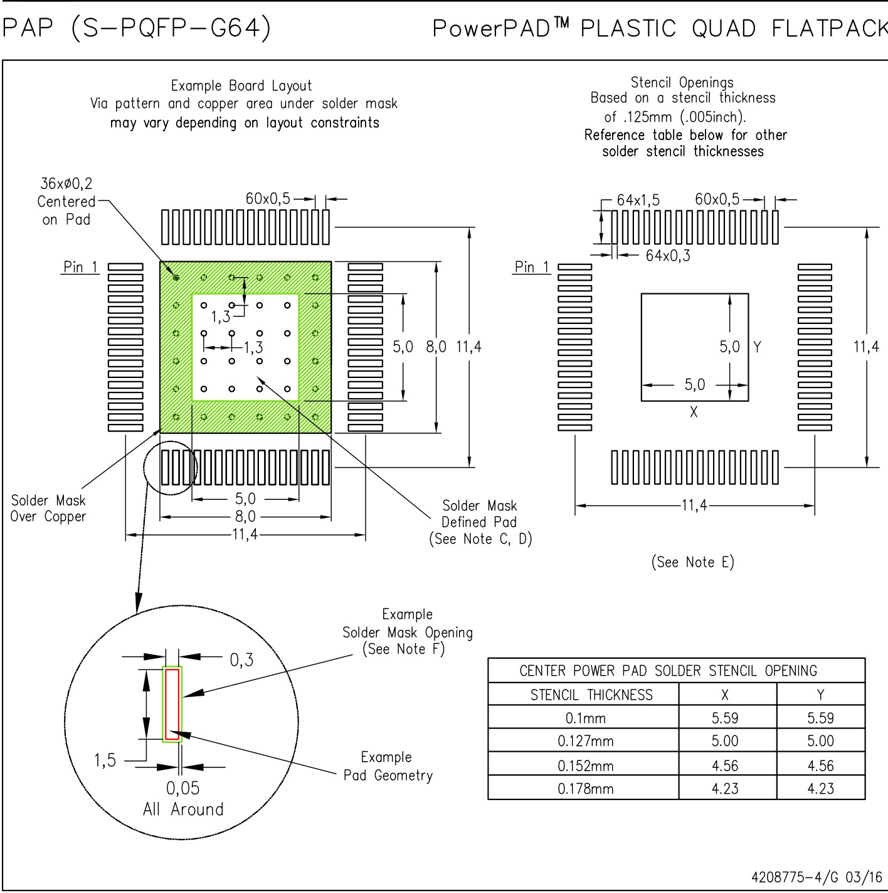

A. AII linear dimensions are in millimeters. PowerPAD is a trademark of Texas Instruments   
B. This drawing is subject to change without notice. Customers should place a note on the circuit board fabrication drawing not to alter the center solder mask defined pad.   
D. This package is designed to be soldered to a thermal pad on the board. Refer to Technical Brief, PowerPad Thermally Enhanced Package, Texas Instruments Literature No. SLMA002, SLMA004, and also the Product Data Sheets for specific thermal information, via requirements, and recommended board layout. These documents are available at www.ti.com <http://www.ti.com>. Publication IPC-7351 is recommended for alternate designs.   
E. Laser cutting apertures with trapezoidal walls and also rounding corners will offer better paste release. Customers should contact their board assembly site for stencil design recommendations. Example stencil design based on a $50 \%$ volumetric metal load solder paste. Refer to IPC-7525 for other stencil recommendations.   
F Customers should contact their board fabrication site for solder mask tolerances between and around signal pads.

# IMPORTANT NOTICE AND DISCLAIMER

TI PROVIDES TECHNICAL AND RELIABILITY DATA (INCLUDING DATASHEETS), DESIGN RESOURCES (INCLUDING REFERENCE DESIGNS), APPLICATION OR OTHER DESIGN ADVICE, WEB TOOLS, SAFETY INFORMATION, AND OTHER RESOURCES “AS IS” AND WITH ALL FAULTS, AND DISCLAIMS ALL WARRANTIES, EXPRESS AND IMPLIED, INCLUDING WITHOUT LIMITATION ANY IMPLIED WARRANTIES OF MERCHANTABILITY, FITNESS FOR A PARTICULAR PURPOSE OR NON-INFRINGEMENT OF THIRD PARTY INTELLECTUAL PROPERTY RIGHTS.

These resources are intended for skilled developers designing with TI products. You are solely responsible for (1) selecting the appropriate TI products for your application, (2) designing, validating and testing your application, and (3) ensuring your application meets applicable standards, and any other safety, security, regulatory or other requirements.

These resources are subject to change without notice. TI grants you permission to use these resources only for development of an application that uses the TI products described in the resource. Other reproduction and display of these resources is prohibited. No license is granted to any other TI intellectual property right or to any third party intellectual property right. TI disclaims responsibility for, and you fully indemnify TI and its representatives against any claims, damages, costs, losses, and liabilities arising out of your use of these resources.

TI’s products are provided subject to TI’s Terms of Sale, TI’s General Quality Guidelines, or other applicable terms available either on ti.com or provided in conjunction with such TI products. TI’s provision of these resources does not expand or otherwise alter TI’s applicable warranties or warranty disclaimers for TI products. Unless TI explicitly designates a product as custom or customer-specified, TI products are standard, catalog, general purpose devices.

TI objects to and rejects any additional or different terms you may propose.