# UMW TP4056 — 1A Linear Li-Ion Battery Charger

## 1. Description

TP4056 is a high-performance single cell lithium-ion battery constant current/constant voltage linear charger. The TP4056 adopts the ESOP8 package with fewer peripheral components, making it very suitable for portable products and suitable for powering USB power supplies and adapter power supplies.

Based on the special internal MOSFET architecture and anti-reverse charging circuit, TP4056 does not require external detection resistors and isolation diodes. When the external ambient temperature is too high or in high-power applications, thermal feedback can adjust the charging current to reduce the chip temperature. The charging voltage is fixed at 4.2V, and the charging current can be set externally through a resistor. When the charging current drops to 1/10 of the set value after reaching the final floating charge voltage, the chip will terminate the charging cycle.

When the input voltage is disconnected, the TP4056 enters a sleep state and the battery leakage current drops below 1µA. The TP4056 can be set in shutdown mode, in which case the chip quiescent current drops to 35µA.

TP4056 also includes other features: battery temperature monitoring, undervoltage lockout, automatic recharge and two status pins to display charging and charge termination.

## 2. Characteristics

- Programmable charge current 1000mA
- No need for external MOSFETs, detection resistors, and isolation diodes
- Full linear charging for single lithium batteries packaged in ESOP8
- Constant-Current/Constant-Voltage Operation with Thermal Regulation to Maximize Charge Rate Without Risk of Overheating Device
- Charge Current Monitor Output for Battery Level Sensing
- 4.2V PRE-CHARGE VOLTAGE WITH ±1% ACCURACY
- Automatic Recharge
- Dual Outputs for Charge Status, No Battery, and Fault Status
- C/10 charging termination
- The quiescent current in shutdown mode is 35µA
- 2.9V TRICKLE CHARGE
- Battery Temperature Monitoring
- Soft-Start Limits Inrush Current
- BAT INPUT ANTI-REVERSE CONNECTION PROTECTION
- 0V ACTIVATION

## 3. Application

Mobile phones, PDA, MP3 and MP4 players, Chargers, Digital Cameras, Electronic Dictionaries, Bluetooth, GPS navigation system, Portable device. TP4056 uses ESOP-8 package.

## 4. Pinning Information

```
         ┌──────────┐
  TEMP ─┤1        8├─── CE
  PROG ─┤2        7├─── CHRG
   GND ─┤3        6├─── STDBY
   VCC ─┤4        5├─── BAT
         └──────────┘
```

| Pin Number | Pin Name | Description |
|:----------:|:---------|:------------|
| 1 | TEMP | Battery temperature detection input |
| 2 | PROG | Programmable constant current charging current setting terminal |
| 3 | GND | Ground end |
| 4 | VCC | Power supply terminal |
| 5 | BAT | Battery end |
| 6 | STDBY | Battery charging completion indicator terminal |
| 7 | CHRG | Battery charging indicator terminal |
| 8 | CE | Chip enable input terminal |

## 5. Typical Applications

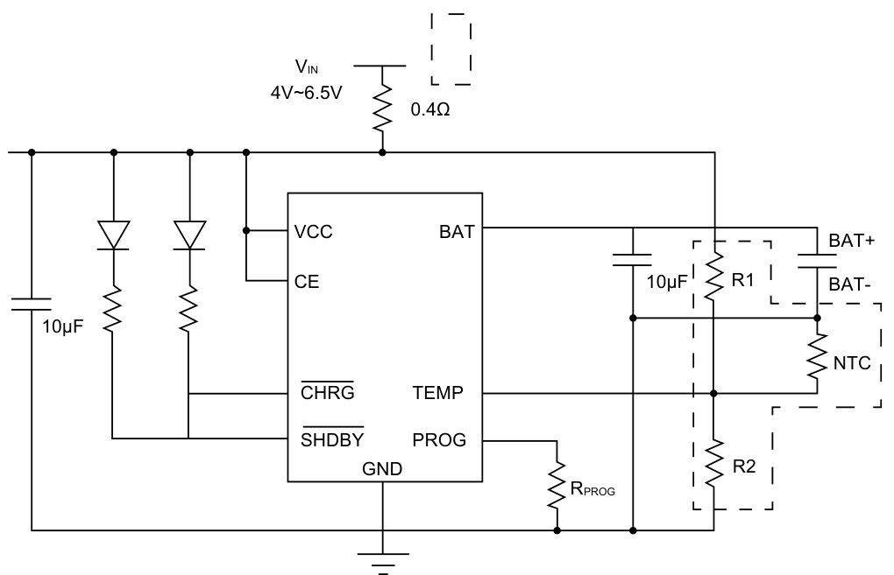

Among them, the dashed box indicates the R1/R2/NTC resistor part for battery temperature monitoring, which is optional. Alternatively, the TEMP pin can be directly grounded without monitoring the battery temperature.

## 6. Maximum Ratings (Note)

| Parameter | Rating | Units |
|:----------|:------:|:------|
| VCC Terminal Voltage | -0.3 to 6.5 | V |
| PROG, BAT, CE, TEMP Terminal Voltage | -0.3 to 6.5 | V |
| CHRG Terminal Voltage | -0.3 to 8 | V |
| STDBY Terminal Voltage | -0.3 to 8 | V |
| BAT End Current | 1.2 | A |
| PROG Terminal Current | 1.2 | mA |
| Maximum Power Dissipation | 1500 | mW |
| Operating Ambient Temperature | -40 to 85 | °C |
| Storage Temperature TSTG | -65 to 125 | °C |

## 7. ESD And Latch-up Level

| Parameter | Value |
|:----------|:-----:|
| Human body model ESD level | 4000V |
| Machine model ESD level | 400V |
| Latch-up Level | 400mA |

## 8. Structural Block Diagram

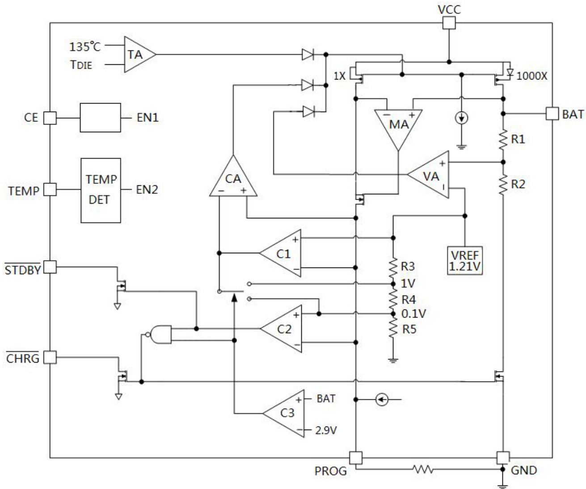

## 9. Electrical Characteristics

(Unless otherwise specified, ambient temperature = 25°C, input voltage = 5V)

| Parameter | Symbol | Conditions | Min | Typ | Max | Units |
|:----------|:------:|:-----------|:---:|:---:|:---:|:------|
| Input supply voltage | VCC | | 4 | | 6.5 | V |
| Input supply current | ICC | Charging mode (RPROG=1.2k) (1) | | 240 | 500 | µA |
| | | Standby mode (charge termination) | | 50 | 100 | µA |
| | | Stop mode (RPROG not connected, VCC<VBAT, VCC<VUVLO) | | 35 | 70 | µA |
| Output float voltage | VFLOAT | 0°C<T<85°C | 4.17 | 4.2 | 4.263 | V |
| BAT terminal charging current | IBAT | Constant current mode, RPROG=2.4k | 465 | 500 | 535 | mA |
| | | Constant current mode, RPROG=1.2k | 930 | 1000 | 1070 | mA |
| | | Standby mode, VBAT=4.2V | 0 | -2.5 | -6 | µA |
| | | Stop mode | | | 2 | µA |
| | | Battery reverse connection mode, VBAT=-4V | | | 0.7 | mA |
| | | Sleep mode, VCC=0V | | 0 | 1 | µA |
| Trickle charge current | ITRIKL | VBAT<VTRIKL, RPROG=2.4k | 40 | 50 | 60 | mA |
| | | VBAT<VTRIKL, RPROG=1.2k | 80 | 100 | 120 | mA |
| Trickle charge threshold voltage | VTRIKL | VBAT RISES | 2.8 | 2.9 | 3 | V |
| Trickle charge hysteresis voltage | VTRHYS | VBAT FALLS | 60 | 80 | 100 | mV |
| VCC Undervoltage Lockout Voltage | VUVLO | VCC RISES | 3.7 | 3.8 | 3.93 | V |
| VCC UVLO Hysteresis Voltage | VUVHYS | VCC FALLS | 150 | 200 | 300 | mV |
| Manual shutdown threshold voltage | VMSD | VPROG RISES | 1.15 | 1.21 | 1.3 | V |
| | | VPROG FALLS | 0.9 | 1.0 | 1.1 | V |
| VCC - VBAT Lockout Voltage | VASD | VCC RISES | 70 | 100 | 140 | mV |
| | | VCC FALLS | 5 | 30 | 50 | mV |
| C/10 Termination Current Limit (2) | ITERM | RPROG=1.2k | 0.085 | 0.1 | 0.115 | A |
| | | RPROG=2.4k | 0.035 | 0.05 | 0.065 | A |
| PROG Pin Voltage | VPROG | Constant current mode, RPROG=1.2k | 0.93 | 1.0 | 1.07 | V |
| CHRG Output Low Level | VCHRG | ICHRG=5mA | | 0.35 | 0.6 | V |
| STDBY Output Low Level | VSTDBY | ISTDBY=5mA | | 0.35 | 0.6 | V |
| TEMP Pin High-end Flip Voltage | VTEMP_H | | | 80 | 83 | %VCC |
| TEMP Pin Low-end Flip Voltage | VTEMP_L | | 42 | 45 | | %VCC |
| Recharge Battery Threshold Voltage | ΔVRECHG | VFLOAT - VRECHG | | 50 | 100 | mV |
| Recharge Delay Time | tRECHG | VBAT from high to low | 0.8 | 1.8 | 4 | ms |
| Charge Termination Delay Time | tTERM | IBAT falls below ICHG/10 | 0.63 | 1.4 | 3 | ms |
| PROG Pull-up Current | IPROG | | | 2 | | µA |
| CE END "HIGH" Level | VCEH | | 1.3 | | | V |
| CE END "LOW" Level | VCEL | | | | 0.7 | V |

**Note:**
(1) At this time, it is in the charging state, ICC = IVCC - IBAT.
(2) Here C/10 termination current threshold refers to the ratio of termination current to constant current charging current.

## 10. Typical Characteristics

### 10.1

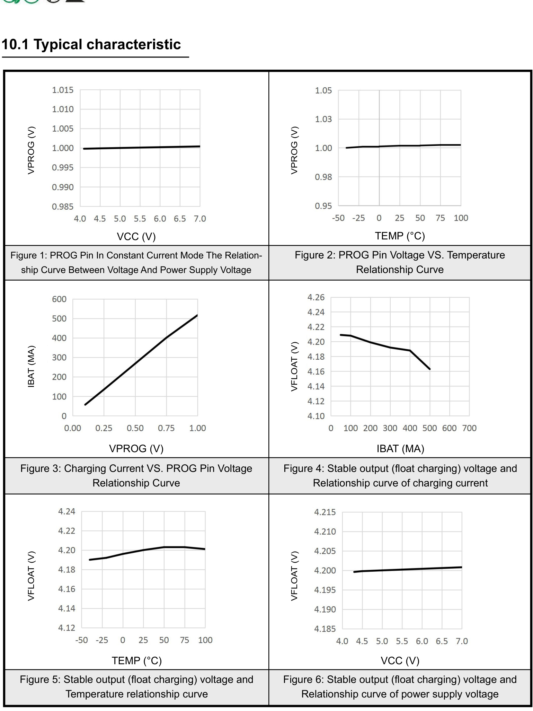

### 10.2

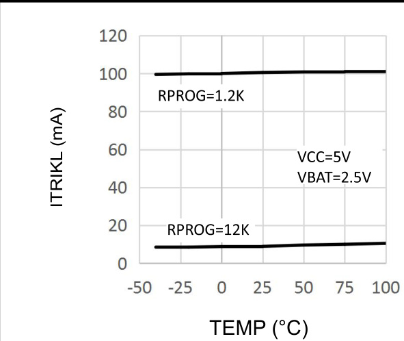
Figure 7: The relationship between trickle charging current and temperature

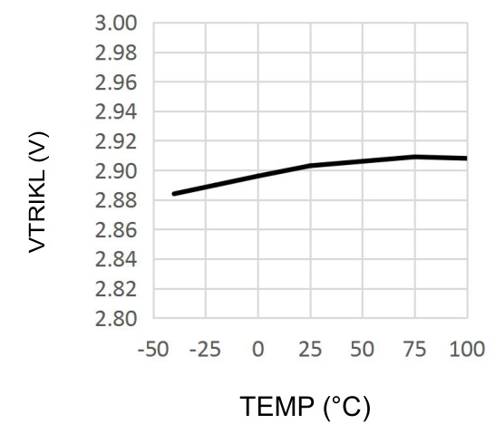
Figure 9: The threshold voltage of trickle charging and temperature relationship

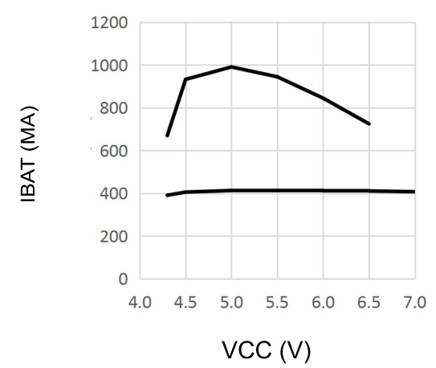
Figure 11: Charging current and power supply voltage

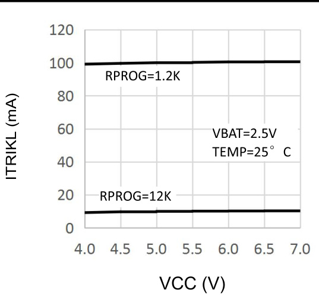
Figure 8: The relationship between trickle charging current and power supply voltage

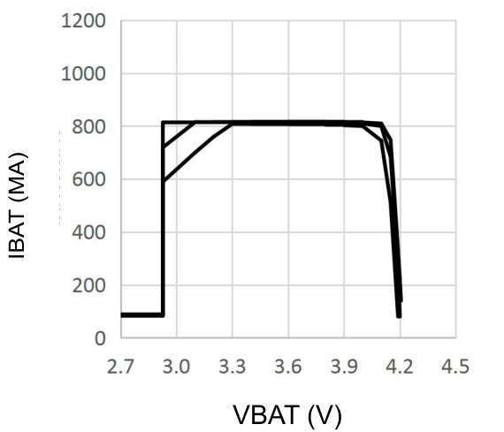
Figure 10: Charging current and battery voltage relationship

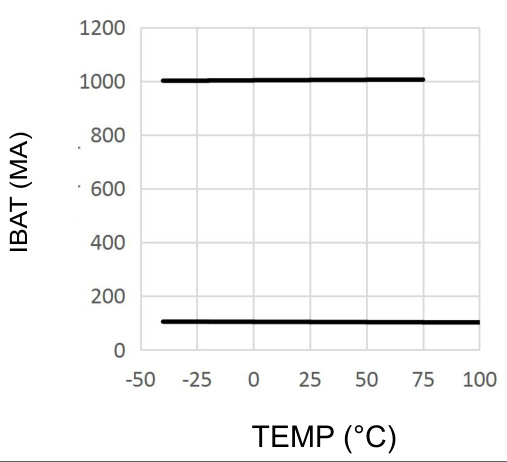
Figure 12: The relationship between charging current and ambient temperature

### 10.3

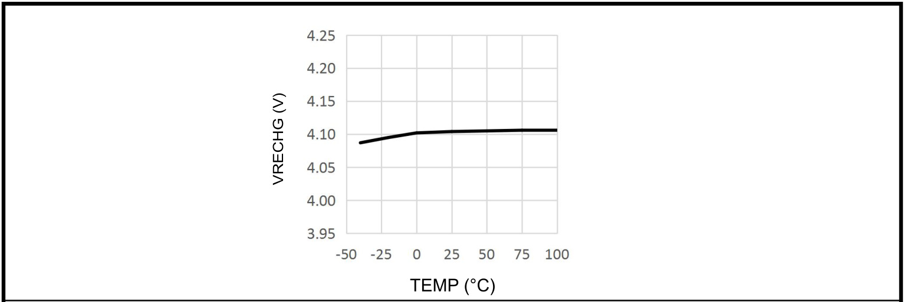
Figure 13: Rechargeable battery threshold voltage and temperature relationship

## 11. Usage User Manual

TP4056 is a linear charger designed specifically for lithium-ion batteries. It uses the power MOSFET inside the chip to charge the battery with constant current/constant voltage. The charging current can be determined by external resistor programming, and the maximum charging current can reach 1000mA. TP4056 has two open-drain output status indication output terminals, the charging status indication terminal CHRG and the battery charging completion indication output terminal STDBY. The power tube circuit inside the chip automatically reduces the charging current when the junction temperature of the chip exceeds 135°C. This function allows users to maximize the use of chip charging without worrying about chip overheating and damage to the chip or external components.

### Working Principle

When the input voltage exceeds the UVLO detection threshold and the chip enable input terminal CE is connected to a high level, TP4056 starts charging the battery. If the battery voltage is below 2.9V, the charger will pre-charge the battery with a small current. When the battery voltage exceeds 2.9V, the charger adopts a constant current mode to charge the battery, and the charging current is determined by the resistance between the PROG terminal and the GND terminal. When the battery voltage approaches 4.2V, the charging current gradually decreases and TP4056 enters constant voltage charging mode. When the charging current decreases to the charging end threshold, the charging cycle ends.

The charge end threshold is 1/10 of the constant current charge current. When the battery voltage drops below the recharge threshold, a new charge cycle automatically starts. The high-precision voltage reference source, error amplifier and resistor divider network inside the chip ensure that the accuracy of the BAT modulation voltage is within 1%, meeting the requirements of lithium-ion and lithium polymer batteries. When the input voltage is powered off or the input voltage is lower than the battery voltage, the charger enters shutdown mode, and the current consumed by the battery terminal is less than 2µA, thereby increasing the standby time. If the enable input terminal CE is connected to a low level, the charger stops charging.

### Charging Current Setting

The charging current is set by a resistor connected between the PROG pin and ground. Determine the resistor value according to the required charging current, and use the following formula to calculate the setting resistor and charging current:

```
RPROG(kΩ) = 1200 / IBAT(mA)    (Error ±10%)
```

| RPROG (kΩ) | IBAT (mA) |
|:----------:|:---------:|
| 1.2 | 1000 |
| 2.4 | 500 |
| 3 | 400 |
| 4 | 300 |
| 6 | 200 |
| 12 | 100 |

### Charging Termination

When the charging current drops to 1/10 of the set value after reaching the final float voltage, the charging cycle is terminated. This condition is detected by monitoring the PROG terminal with an internal filter comparator. When the voltage at the PROG terminal drops below 100mV for more than 1.8ms, charging is terminated and the TP4056 enters standby mode, at which time the input power supply current drops to about 50µA.

During charging, transient loads on the BAT terminal can cause the PROG terminal voltage to drop below 100mV briefly before the DC charging current drops to 1/10 of the set value. The 1.8ms delay time of the comparator ensures that transient loads of this nature do not cause the charging cycle to terminate prematurely. Once the average charging current drops below 1/10 of the set value, the TP4056 terminates the charging cycle and stops providing any current through the BAT terminal. In this state, all loads on the BAT terminal must be powered by the battery.

### Charging Status Indication

TP4056 has two open-drain status indication outputs CHRG and STDBY. When the charger is in the charging state, CHRG is pulled to a low level, and in other states CHRG is in a high impedance state; when the battery is charged, STDBY is pulled to a low level, and in other states STDBY is in a high impedance state. When the battery is not connected to the charger, CHRG flashes to indicate that the battery is not installed.

| Charging Status | CHRG | STDBY |
|:----------------|:----:|:-----:|
| Charging | Bright | Extinguish |
| Charge Complete | Extinguish | Bright |
| Undervoltage, battery temperature too high/low, fault conditions | Extinguish | Extinguish |
| 1µF capacitor connected to BAT terminal, no battery | Flashing (~20Hz) | Bright |

### Thermal Limitation

If the chip temperature rises above 135°C, an internal thermal feedback loop will reduce the set charging current. This function prevents TP4056 from overheating and allows the user to increase the upper limit of the power handling capability of a given circuit board while reducing the risk of damaging TP4056.

### Battery Temperature Detection

In order to prevent damage to the battery caused by excessively high or low temperatures, the TP4056 has an internal battery temperature monitoring circuit. Battery temperature monitoring is achieved by measuring the voltage of the TEMP pin, which is realized by the NTC thermistor in the battery and a resistor divider network, as shown in the typical application diagram. If the voltage of the TEMP pin is less than 45% of the input voltage or greater than 80% of the input voltage, it means that the battery temperature is too low or too high, and charging is suspended. If the TEMP pin is directly connected to GND, the battery temperature detection function is canceled and other charging functions are normal.

### Determine the Relationship Between R1 and R2

The values of R1 and R2 should be determined based on the temperature monitoring range of the battery and the resistance value of the thermistor. Here is an example to illustrate:

Assuming the set battery temperature range is TL ~ TH (where TL < TH). The negative temperature coefficient thermistor (NTC) is used in the battery. RTL is its resistance at temperature TL, and RTH is its resistance at temperature TH.

At temperature TL, the voltage at the TEMP pin is:

```
VTEMPL = (R2 || RTL) / (R1 + R2 || RTL) × VIN
```

At temperature TH, the voltage at the TEMP pin is:

```
VTEMPH = (R2 || RTH) / (R1 + R2 || RTH) × VIN
```

Where:
- VTEMPH = VHIGH = K2 × VCC (K2 = 0.8)
- VTEMPL = VLOW = K1 × VCC (K1 = 0.45)

Then it can be solved that:

```
R1 = (RTL × RTH × (K2 - K1)) / (K1 × K2 × (RTH - RTL))
R2 = (RTL × RTH × (K2 - K1)) / (RTL × (K1 - K1×K2) - RTH × (K2 - K1×K2))
```

Similarly, if the battery has a positive temperature coefficient (PTC) thermistor, then RTH > RTL, and the formulas are adjusted accordingly.

From the above derivation, it can be seen that the temperature range to be set is independent of the power supply voltage VCC, only related to R1, R2, RTH, and RTL. RTH and RTL can be obtained by consulting relevant battery manuals or through experimental testing.

In practical applications, if we only focus on the temperature characteristics of one end, such as overheating protection, then R2 can be omitted and only R1 can be used.

### Undervoltage Locking

TP4056 has an internal undervoltage lockout circuit to monitor the input voltage and keep the chip in shutdown mode before VCC rises to the undervoltage lockout threshold voltage. When the VCC voltage rises to 3.8V, the chip exits UVLO and starts normal operation. The UVLO hysteresis voltage when VCC drops is 200mV.

### Automatic Charging Cycle

After the battery voltage reaches the floating charge voltage and the charging cycle is terminated, the TP4056 immediately monitors the BAT terminal voltage. When the BAT terminal voltage is lower than 4.1V, the charging cycle restarts. This ensures that the battery is maintained in a state close to full charge, while eliminating the need to start the periodic charging cycle.

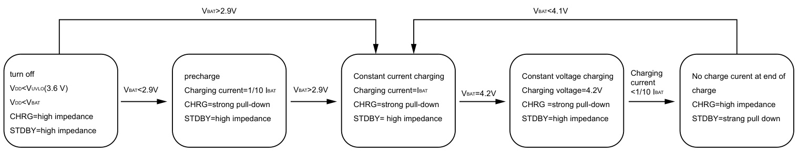
State diagram of a typical charging cycle

### Battery Reverse Polarity Protection

TP4056 has a lithium battery reverse connection protection function. When the positive and negative poles of the battery are reversely connected to the TP4056 voltage output BAT pin, TP4056 will stop and display a fault state, and there is no charging current. The charging indicator pin is in a high impedance state, and RLED is off. At this time, the reverse battery leakage current is less than 1mA. Connect the reverse battery correctly, and TP4056 automatically starts the charging cycle.

## 12. ESOP-8 Package Outline Dimensions

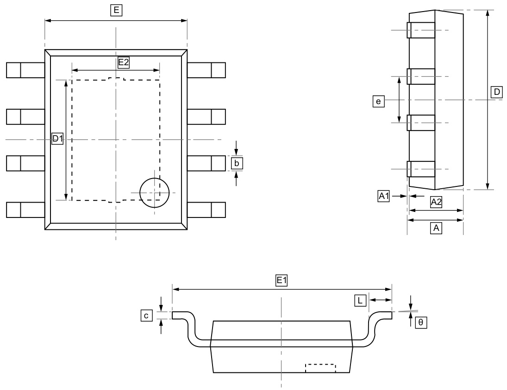

| Symbol | Min (mm) | Max (mm) |
|:------:|:--------:|:---------:|
| A | 1.300 | 1.700 |
| A1 | 0.000 | 0.100 |
| A2 | 1.350 | 1.550 |
| b | 0.330 | 0.510 |
| c | 0.170 | 0.250 |
| D | 4.700 | 5.100 |
| D1 | 3.202 | 3.402 |
| E | 3.800 | 4.000 |
| E1 | 5.800 | 6.200 |
| E2 | 2.313 | 2.513 |
| e | 1.270 BSC | |
| L | 0.400 | 1.270 |
| θ | 0° | 8° |

## 13. Ordering Information

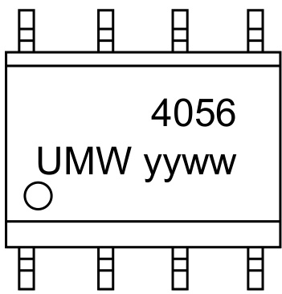

Top Mark: 4056 / UMW yyww (yy: Year Code, ww: Week Code)

| Order Code | Package | Base QTY | Delivery Mode |
|:-----------|:-------:|:--------:|:--------------|
| UMW TP4056 | ESOP-8 | 4000 | Tape and reel |

## 14. Disclaimer

UMW reserves the right to make changes to all products, specifications. Customers should obtain the latest version of product documentation and verify the completeness and currency of the information before placing an order.

When applying our products, please do not exceed the maximum rated values, as this may affect the reliability of the entire system. Under certain conditions, any semiconductor product may experience faults or failures. Buyers are responsible for adhering to safety standards and implementing safety measures during system design, prototyping, and manufacturing when using our products to prevent potential failure risks that could lead to personal injury or property damage.

Unless explicitly stated in writing, UMW products are not intended for use in medical, life-saving, or life-sustaining applications, nor for any other applications where product failure could result in personal injury or death. If customers use or sell the product for such applications without explicit authorization, they assume all associated risks.

When reselling, applying, or exporting, please comply with export control laws and regulations of China, the United States, the United Kingdom, the European Union, and other relevant countries, regions, and international organizations.

This document and any actions by UMW do not grant any intellectual property rights, whether express or implied, by estoppel or otherwise. The product names and marks mentioned herein may be trademarks of their respective owners.
