# TPS7A94 1-A，超低噪声，超高PSRR，低压差稳压器

# 1特点

超低输出噪声：$0。4 6 \mu \mathsf {V} _ {\mathsf {R M S}}$（类型，$ 10 H z$到$ 10 0 k H z）$

高电源纹波抑制（PSRR）： 100Hz时102 dB， 1khz时110 dB， $ 10 ~ $ 10 kHz时95 dB， $ 10 ~ $ 10 kHz时78 dB， $1 MHz时50 dB

线路，负载和温度精度：$1 \%$
低输出：$1 5 0 ~ \ mathm {m V}$ 1 A
宽输入电压范围：$1。7 \ mathm {V}$到$5。7 \ v字形的美元
宽输出电压范围：$0 \v $至$5。5 \ v字形的美元
可并行实现低噪声和高电流
快速瞬态响应
精度使能和UVLO
可编程限流
可编程PG阈值
可调启动冲击控制
开漏，电源良好（PG）输出
Package: $3 . 0 0 \mathrm { - } \mathsf { m m } \times 3 . 0 0 \mathrm { - } \mathsf { m m }$ , 10-pin WSON: JEDEC RθJA: $4 6 . 1 ^ { \circ } \mathsf { C } / \mathsf { W }$ EVM RθJA: $2 5 . 6 ^ { \circ } \mathsf { C } N$

# 3描述

TPS7A94是一款超低噪音的TPS7A94。4 6 ~ \mu \ V _ {\sf R M S})$，低电压差（LDO）稳压器，能够产生1 A，仅1.5 0 ~ \mathsf {M V}$的电压差。在低工作净空$(50 0 ~ \ maththrm {m V})$和高输出电流$(7 0 0 \ maththrm {ma})$下，低差与宽带宽误差放大器相结合，可实现非常高的PSRR （$1 \ maththrf {k Hz}$时110 dB和$1 MHz时50 dB）。

设备输出可从$\textsf {0} \textsf {V}$调节到5.5 V，使用外部电阻。具有宽输入电压范围，该设备支持低至1.7 V和高达5美元的操作。7 ~ \lor。该设备包括可编程限流，可编程PG阈值和精确使能，允许在应用中更好地控制。

该器件具有高精度基准和宽带宽拓扑结构，可以方便地并联，从而实现低噪声和高电流。

该器件具有$1 \%$输出电压精度（在线，负载和温度）和软启动功能，可减少浪涌电流，是为敏感模拟低压器件供电的绝佳选择。

# 2应用

宏观遥控无线电装置（RRU）
户外回程装置
有源天线系统（AAS）
超声波扫描仪
实验室和现场仪器
传感器、成像和雷达
(1)所有可用的包，见数据表末尾的可订购附录。
(2)封装尺寸（长度$\乘以$宽度）是标称值，包括引脚（如适用）。

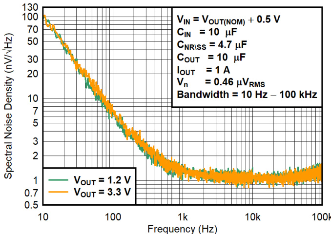  
与输出电压无关的超低输出噪声$(1 0 \mathsf {H z} - 1 0 0 \mathsf {k H z})$

包信息

表身体< html > < > < > < tr > < td >零件号< / td > < td >包(1)< / td > < td >包大小(2)< / td > < / tr > < tr > < td > TPS7A94 < / td > < td > DSC (WSON, 10) < / td > < td > 3.00毫米×3.00毫米< / td > < / tr > < /表> < /身体> < / html >

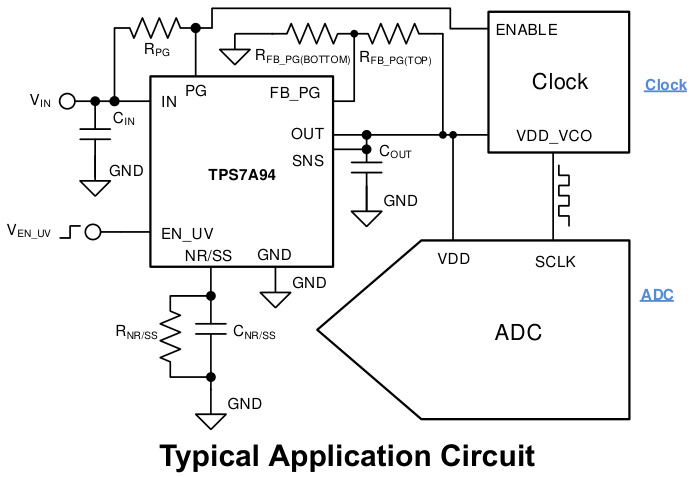

#目录

1功能。
2应用程序……
3描述。
4版本修改历史. .........2
5引脚配置和功能。
6.1绝对最大额定值。6.2 ESD额定值…4 6.3推荐使用条件5 6.4热信息5 6.5电气特性， . ...6 6.6典型特征 ...............................................8
7详细描述。26 7.1概述. ....26 7.2功能框图. ...............27 7.3特性描述。28 7.4设备功能模式。30.

8 .应用和实现

8.1申请信息
8.2典型应用......49
8.3电源建议
8.4布局。51

# 9设备和文档支持

9.1设备支持……53
9.2文档支持
9.3接收文档更新通知....
9.4支持资源
9.5商标54
9.6静电放电谨慎 . .......................... .54
9.7术语表54

# 10机械、包装和可订购

信息。54
10.1机械数据

4 .修订历史

注意：以前版本的页码可能与当前版本的页码不同。

从修订版B（2023年2月）到修订版C（2023年6月）页的变化

从优化噪声和PSRR部分.................................中删除了关于输出电流范围的说明40

从修订A（2022年5月）到修订B（2023年2月）页的变化

改变了$ v_ {0 UT} = 3的GND引脚电流与IOUT和温度的关系。3 ~ $V $到$100 \%$电流限制vs温度$V _ {0 U T} = 1。8 V $典型特征节曲线 . .............. .........................8在Precision Enable （External UVLO）一节中，修改了等式1，等式2，以及对这些方程的讨论。cid:) ......“…32将并联阻抗值从$ 10 k \Omega$改为$ 12。5 k \Omega$在Power-Good Feedback （FB_PG Pin）和PowerGood Threshold （PG Pin）部分。34在可编程软启动和降噪（NR/SS引脚）章节..........................................................中增加了启动时阈值电压、输出电压、IFAST_SS和INR/SS的关系图在详细设计程序部分更改了VON和VOFF的讨论。50

# 5引脚配置和功能

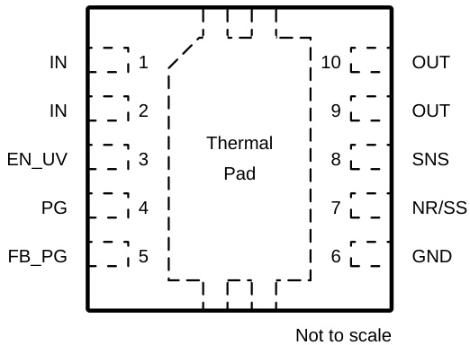  
图5 - 1。DSC封装，10针WSON（俯视图）

#引脚函数

表身体< html > < > < > < tr > < td colspan =“2”>销< / td > < td行宽= " 2 " > I / O (1) < / td > < td行宽=“2”>描述< / td > < / tr > < tr > < td >名称< / td > < td > WSON < / td > < / tr > < tr > < td > EN_UV < / td > < td > 3 < / td > < td >部分< / td > < td >精密启用和欠压锁定销;具体请参见Precision Enable （External UVLO）。< / td > < / tr > < tr > < td > FB_PG < / td > < td > < / td > < td > < / td > < td > Power-good反馈销。该引脚具有双重功能：该引脚编程PG引脚输出100%，</td></tr><tr><td>GND</td><td>6</td><td>G</td><td>引脚)和Power-Good Threshold （PG引脚）部分详细介绍。地面销;有关详细信息，请参阅电路板布局部分。< / td > < / tr > < tr > < td > < / td > < td > 1, 2 < / td > < td > < / td > < td > r类型部分和推荐< / td > < / tr > < tr > < td > NR / SS < / td > < td > 7 < / td > < td > < / td > < td >输出电压设置消声销;详情请参阅可编程软启动和降噪（NR/SS引脚）部分。< / td > < / tr > < tr > < td >出< / td > < td > 9, 10 < / td > < td > < / td > < td >调节输出引线;有关更多信息，请参阅负载瞬态响应部分。< / td > < / tr > < tr > < td > PG < / td > < td > < / td > < td > < / td > < td >, < / td > < / tr > < tr > < td > SNS < / td > < td > 8 < / td > < td > < / td > < td >同相误差放大器的终端;见</td></tr><tr><td colspan="2">热垫</td><td>G</td><td>热垫与GND引脚电连接；参见Board Layout部分</td></tr></table></body></html>

(1) $\mid \mid =$输入，$0 =$输出，$1 / \mathsf {O} =$输入或输出，$\mathsf {G} =$ ground, $\mathsf {P} = \mathsf {P O O O O}$

6.1绝对最大额定值

超过工作结温范围和与地相关的所有电压（除非另有说明）

表身体< html > < > < > < tr > < td colspan = " 2 " > < / td > < td >分钟马克斯< / td > < td >单位< / td > < / tr > < tr > < td行宽=“4”>电压< / td > < td >, PG, EN_UV < / td > < td >−0.3 - 6.0 < / td > < td行宽= " 4 " > < / td > < / tr > < tr > < td > FB_PG < / td > < td >−0.3 - 1.5 < / td > < / tr > < tr > < td >出< / td > < td >−0.3 + 0.3 VIN < / td > < / tr > < tr > < td > NR / SS,SNS < / td > < td >−0.3 - 6.0 < / td > < / tr > < tr > < td行宽=“2”>当前< / td > < td >出< / td > < td >内部有限的< / td > < td > < / td > < / tr > < tr > < td > PG(反向电流到设备)< / td > < td > 5 < / td >马< td > < / td > < / tr > < tr > < td行宽=“2”>温度< / td > < td >操作结,TJ < / td > < td > -55 150 < / td > < td > < / td > < / tr > < tr > < td >存储,测试< / td > < td > -55 150 < / td > < td > < / td > < / tr > < /表> < /身体> < / html >

(1)超出绝对最大额定值的操作可能会对设备造成永久性损坏。绝对最大额定值并不意味着设备在这些或任何其他超出“推荐工作条件”所列条件下的功能运行。如果在“推荐工作条件”之外但在“绝对最大额定值”范围内使用，设备可能无法完全发挥功能，从而影响设备的可靠性、功能、性能，并缩短设备的使用寿命。

# 6.2 ESD评级

表身体< html > < > < > < tr > < td colspan =“3”> < / td > < td >价值< / td > < td >单位< / td > < / tr > < tr > < td行宽=“2”> V (ESD) < / td > < td行宽=“2”>静电放电< / td > < td >人体模型(HBM)、ANSI / ESDA电平js - 001(1)身体/ < / td > < td >±2000 < / td > < td行宽= " 2 " > < / td > < / tr > < tr > < td >设备模型CDM) / / ANSI / ESDA /电平js - 002 (2) < / td > < td >±500 < / td > < / tr > < /表> < /身体> < / html >

(1) JEDEC文件JEP155指出，500-V HBM允许使用标准ESD控制过程进行安全制造。
(2) JEDEC文件JEP157指出，250-V CDM允许通过标准ESD控制过程进行安全制造。

# 6.3推荐操作条件

超过工作结温范围（除非另有说明）

<html><body><table><tr><td colspan="2"></td><td>MIN</td><td>TYP</td><td>MAX</td><td>UNIT</td></tr><tr><td>ViN</td><td>Input supply voltage range</td><td>1.7</td><td></td><td>5.7</td><td>V</td></tr><tr><td>VoUT</td><td>Output voltage range</td><td>0.4</td><td></td><td>VDo VIN</td><td>V</td></tr><tr><td>louT</td><td>Output current</td><td>0</td><td></td><td></td><td>A</td></tr><tr><td>CIN</td><td>Input capacitor</td><td>4.7</td><td>10</td><td>1000</td><td>μF</td></tr><tr><td>CoUT</td><td>Output capacitor</td><td>4.7</td><td>10</td><td>1000</td><td>μF</td></tr><tr><td>_ESR CouT</td><td>Output capacitor ESR</td><td></td><td></td><td>20</td><td>mΩ</td></tr><tr><td>_ESL ZOUT_</td><td>Total output loop impedance</td><td></td><td></td><td>2</td><td>nH</td></tr><tr><td>CNR/SS</td><td>Noise-reduction capacitor</td><td></td><td>4.7</td><td>100</td><td>μF</td></tr><tr><td>RPG</td><td>Power-good pull-up resistance</td><td>10</td><td></td><td>100</td><td>kΩ2</td></tr><tr><td>TJ</td><td>Junction temperature</td><td>-40</td><td></td><td>125</td><td>C</td></tr></table></body></html>

# 6.4热信息

表身体< html > < > < > < tr > < td行宽= 4 >热指标(1)< / td > < td行宽= " 2 " > < / td > < td colspan =“2”> TPS7A94 < / td > < td行宽= 4 >单位< / td > < / tr > < tr > < td > DSC (WSON) (2) < / td > < td > DSC (WSON) (3) < / td > < / tr > < tr > < td行宽= " 2 " > < / td > < td > 10针< / td > < td > 10针< / td > < / tr > < tr > < td > 46.1 < / td > < td > < / td > < td > C / W < / td > < / tr > < tr > < td > R,θ是< / td > < td > Junction-to-ambient热阻< / td > < td > < / td > < td > 25.6 < / td > < td > < / td > < / tr > < tr > < td > RθJC(上)< / td > < td > Junction-to-case(上)热35.2电阻< / td > < td > < / td > < td > < / td > < td >°C / W < / td > < / tr > < tr > < td > RθJB < / td > < td > Junction-to-board热阻< / td > < td > 19.1 < / td > < td > < / td > < td > CW < / td > < / tr > < tr > < td > 4 jt < / td > < td > Junction-to-top表征参数< / td > < td > 0.5 < / td > < td > 0.3 < / td > < td > CW < / td > < / tr > < tr > < td > YJB < / td > < td > Junction-to-board表征参数< / td > < td > 19 < / td > < td > 11.5 < / td > < td > CW < / td > < / tr > < tr > < td > ReJC (bot) < / td > < td > Junction-to-case(底部)热3.9电阻< / td > < td > < / td > < td > < / td > < td > C / W < / td > < / tr > < /表> < /身体> < / html >

(1)有关传统和新型热指标的更多信息，请参阅半导体和ICPackage热指标应用报告。
(2) JEDEC standard. (2s2p)   
(3) EVM热模型采用JEDEC测量方法，参见TPS7A94EVM-046热分析。

6.5电气特性

在操作温度范围内，$(\mathsf {T}} {\mathsf {J}} = - 4 0 {{\circ}}$ to $+ 1 2 5 {{\mathsf {V}} {\sf I N (N O M)} = \mathsf {V}} {\sf O U T (N O M)} + 0。5 \mathsf {v} $， $\mathsf {v} _ {\mathsf {O U T} (\mathsf {N O M})} = 3。3 \mathsf {v}，$ $\mathsf {l _ {O U T}} = 1 \mathsf {m A}$，$ V \mathsf {E}} = 1。,多达8 \ mathsf可不,V  } _ { : }$ $\ mathsf那C超索罗斯mathsf可不,I N出于美观出于美观= \ mathsf那C超索罗斯mathsf那O U T出于美观= 1 0 \ \“缪\ mathsf那F美元,美元\ mathsf那C超索罗斯mathsf那N R / \ mathsf那S \ mathsf那S其成= 0美元nF, and PG尽,电池、大美元\ mathsf那V超索罗斯mathsf那I N其成美元access美元,多达1 0 0 \ mathsf那k \欧米茄美元(4)(unless otherwise noted);typical

小于桌子写成的小于医学上的小于html > > > & lt tr > & lt;别戴利colspan =“7”> CIN弟弟COUT NR / SS values matter at Tj = 25°C & lt; /戴利> & lt; / tr > & lt tr > & lt;戴利> & lt; /戴利的小于戴利> > PARAMETER & lt; /戴利的小于戴利> >一直CONDITIONS & lt; /小敏戴利的小于戴利> > & lt; /戴利的小于戴利> > TYP & lt; /戴利的小于戴利> >马克斯& lt; /戴利的小于戴利> > minutes & lt; /戴利> & lt; / tr > & lt小于戴利>越南& lt; / tr >戴利的小于戴利> >投入尔(voltage range & lt; /戴利的小于戴利> > & lt; /戴利的小于戴利> > & lt; /戴利的小于戴利> > & lt; /戴利的小于戴利> > 5.7 & lt; /戴利的小于戴利> > V & lt; /戴利> & lt; / tr > & lt tr > & lt;戴利> VUVLO & lt; /戴利的小于戴利> >投入尔(UVLO & lt; /戴利的小于戴利> >借端例如迪,饱load & lt; /戴利的小于戴利> > & lt; /戴利的小于戴利> >有160 & lt; /戴利的小于戴利> > 170 & lt; /戴利的小于戴利> > V & lt; /戴利> & lt; / tr > & lt tr > & lt;戴利> VHYS (UVLO) & lt; /戴利的小于戴利> >投入尔(UVLO hysteresis & lt; /戴利的小于戴利> >饱load & lt; /戴利的小于戴利> > & lt; /戴利的小于戴利> > 53 & lt; /戴利的小于戴利> > & lt; /戴利的小于戴利> > mV & lt; /戴利> & lt; / tr > & lt tr > & lt;戴利rowspan =“3”> INR / SS & lt; /戴利的小于戴利rowspan =“3”> > NR / SS电池current & lt; /戴利的小于戴利> > 1小时偷= 170 V, louT = mA, VouT = 120 V & lt; /戴利的小于戴利> > & lt; /戴利的小于戴利> > 150 & lt; /戴利的小于戴利> > & lt; /戴利的小于戴利> >μA & lt; /戴利> & lt; / tr > & lt tr > & lt;戴利> 1.V≤越南≤5.5V, 0.4V≤VouT & lt 1.2V, 1mA≤IOUT & lt; /戴利的小于戴利> > -1.5 & lt; /戴利的小于戴利> > & lt; /戴利的小于戴利> > 150 & lt; /戴利的小于戴利> > & lt; /戴利> & lt; / tr > & lt tr > & lt;戴利> 170 V≤借端≤550 V, 120 V≤V≤5.1 V,mA V 1A VoUT≤louT & lt; /戴利的小于戴利> > & lt; /戴利的小于戴利> > & lt; /戴利的小于戴利> > & lt; /戴利的小于戴利> > % & lt; /戴利> & lt; / tr > & lt tr > & lt;戴利> IFAST_SS & lt; /戴利的小于戴利> > NR / SS * start-up charging & lt; /戴利的小于戴利> > GND,小时偷≥2.5 V, VFB_PG的小于0.2秒V, IouT = 0 mA VNR / SS & lt; /戴利的小于戴利> > & lt; /戴利的小于戴利> > 2.1 & lt; /戴利的小于戴利> > & lt; /鬼戴利的小于戴利> > & lt; /戴利> & lt; / tr > & lt tr > & lt;戴利> & lt; /戴利的小于戴利> > current输出voltage range & lt; /戴利的小于戴利> > = GND,小时偷= 170 V的小于0.2秒,V, IouT 0mA VNR / SS VFB_PG & lt; /戴利的小于戴利> > & lt; /戴利的小于戴利> > 150 & lt; /戴利的小于戴利> > & lt; /戴利的小于戴利> > & lt; /戴利> & lt; / tr > & lt tr > & lt;戴利> VoUT & lt; /戴利的小于戴利> >收益ofset volage s & lt; /戴利的小于戴利> > 1.7V≤借端≤5.7V,1.2V≤VoUT≤5.1V, & lt; /戴利的小于戴利> > & lt; /戴利的小于戴利> >±0.1 & lt; /戴利的小于戴利> > 550 2 & lt; /戴利的小于戴利> > & lt; /戴利> & lt; / tr >小于戴利rowspan =“2”的小于tr > > Vos & lt; /戴利的小于戴利rowspan =“2”> > VoUT) & lt; /戴利的小于戴利> >≤1A一个mA≤loUT & lt; /戴利的小于戴利> > & lt; /戴利的小于戴利> > & lt; /戴利的小于戴利> > & lt; /戴利的小于戴利rowspan =“2”> > mV & lt; /戴利> & lt; / tr > & lt tr > & lt;戴利> 1MA≤IOUTS1V, 4V≤VoUT & lt 12V & lt; /戴利的小于戴利> > & lt; /戴利的小于戴利> >±0.2秒& lt; /戴利的小于戴利> > & lt; /戴利> & lt; / tr >小于戴利rowspan =“5”的小于tr > > (iVOUT(借端)d) & lt; /戴利的小于戴利> >铁公园regulation:∆INR / SS & lt; /戴利的小于戴利> > = 1.2VandV louT 1mA,小时偷VouT VouT VouT =为3.3 V, & lt; /戴利的小于戴利> > & lt; /戴利的小于戴利> > -0.9 & lt; /戴利的小于戴利> > & lt; /戴利导航仪的小于戴利> > & lt; /戴利> & lt; / tr > & lt tr > & lt;戴利> & lt; /戴利的小于戴利> >借端= (VouT + 0.5V)大5.7V & lt; /戴利的小于戴利> > & lt; /戴利的小于戴利> > & lt; /戴利的小于戴利> > & lt; /戴利的小于戴利> > & lt; /戴利> & lt; / tr > & lt tr > & lt;戴利rowspan =“3”>铁公园regulation:ΔVos & lt; /戴利的小于戴利> > & lt; /戴利的小于戴利> > & lt; /戴利的小于戴利> > -4.5 & lt; /戴利的小于戴利> > & lt; /戴利的小于戴利> >μ越南& lt; /戴利> & lt; / tr > & lt小于戴利> = 1mA, & lt; / tr >戴利的小于戴利> > & lt; /戴利的小于戴利> > 2.1 & lt; /戴利的小于戴利> > & lt; /戴利的小于戴利> > & lt; /戴利> & lt; / tr > & lt tr > & lt;戴利>借端= 1.7V, VoUT = 1.2V, mA≤1A≤louT & lt; /戴利的小于戴利> > & lt; /戴利的小于戴利> > 230 & lt; /戴利的小于戴利> > & lt; /戴利的小于戴利> > & lt; /戴利> & lt; / tr >小于戴利rowspan =“4”的小于tr > > (iVOUT(∆IOUT) NR / SS (VNR / SS) & lt; /戴利的小于戴利rowspan =“2”> > Load regulation:∆InR / ss (1) & lt; /戴利的小于戴利> >借端= 3.8 V, VouT =为3.3 V,一个mA≤loUT≤1 A & lt; /戴利的小于戴利> > & lt; /戴利的小于戴利> > -3.6 & lt; /戴利的小于戴利> > & lt; /戴利的小于戴利> > nA & lt; /戴利> & lt; / tr > & lt tr > & lt;戴利> = 5.1V, mA≤loUT≤1A借端= 5.6V, VouT & lt; /戴利的小于戴利> > & lt; /戴利的小于戴利> > -21 & lt; /戴利的小于戴利> > & lt; /戴利的小于戴利> > & lt; /戴利> & lt; / tr > & lt tr > & lt;戴利> Load regulation::∆Vos (1) & lt; /戴利的小于戴利> >借端= VOUT(正督导)0.5V, 1.2V≤Vouτ≤5.1V,一个mA≤louT≤1A & lt; /戴利的小于戴利> > & lt; /戴利的小于戴利> > 0.03 & lt; /戴利的小于戴利> > & lt; /戴利的小于戴利> > mV & lt; /戴利> & lt; / tr >小于戴利rowspan =“2”的小于tr > > e打印INR /为何对VNR Ss / Ss Changei & lt; /戴利的小于戴利> > 0.4 V≤VNR / Ss≤1.5个V,小时偷= 1 5.7 V, IoUT = mA & lt; /戴利的小于戴利> > & lt; /戴利的小于戴利> > 6.3 & lt; /戴利的小于戴利> > & lt; /戴利的小于戴利> > nA & lt; /戴利> & lt; / tr > & lt tr > & lt;戴利> & lt; /戴利的小于戴利> > 1.5V≤VNR / Ss≤5V,小时偷= 5.7V, IoUT = 1mA & lt; /戴利的小于戴利> > -3.3 & lt; /戴利的小于戴利> > & lt; /戴利的小于戴利> > & lt; /戴利的小于戴利> > nA & lt; /戴利> & lt; / tr > & lt tr > & lt;戴利>∆Vos(∆VNR / Ss) & lt; /戴利的小于戴利> >为何对VNR改变这打印Vos / Ss & lt; /戴利的小于戴利> > 0.4 V≤VNR / Ss≤1.5个V,小时偷= 5.7 V, IoUT = mA≤1 5V,小时偷= 5.7V, IoUT = 1mA 1.5V≤VNR / SS & lt; /戴利的小于戴利> > & lt; /戴利的小于戴利> > 0.033 & lt; /戴利的小于戴利> > & lt; /戴利的小于戴利> > mV mV & lt; /戴利> & lt; / tr > & lt tr > & lt;戴利rowspan =“5”> VDo & lt; /戴利的小于戴利rowspan =“5”> > Dropout voltage (2) & lt; /戴利的小于戴利> > 170 V≤小于2.0 V, louT = mA, 1小时偷& lt; /戴利的小于戴利> > & lt; /戴利的小于戴利> > 0.013 & lt; /戴利的小于戴利> > & lt; /戴利的小于戴利> > & lt; /戴利> & lt; / tr > & lt tr > & lt;戴利>×VouT = 99%的概率可能会为你们VouT () & lt; /戴利的小于戴利> > & lt; /戴利的小于戴利> > 160个& lt; /戴利的小于戴利> > & lt; /戴利的小于戴利> > & lt; /戴利> & lt; / tr > & lt tr > & lt;戴利> 170 V≤小时偷的小于2.0 V,绿恶魔=一个A, VouT = 99%x VouT(正督导)& lt; /戴利的小于戴利> > & lt; /戴利的小于戴利> > 165 & lt; /戴利的小于戴利> > 220 & lt; /戴利的小于戴利> > mV & lt; /戴利> & lt; / tr > & lt tr > & lt;戴利>借端≥2.0 V, louT = mA, 1×VouT = 99%的概率可能会为你们VouT () & lt; /戴利的小于戴利> > & lt; /戴利的小于戴利> > 1.4 & lt; /戴利的小于戴利> > & lt; /戴利的小于戴利> > & lt; /戴利> & lt; / tr > & lt tr > & lt;戴利>借端≥2.0 V, IouT =一个A, 99%的VouT×VouT(正督导)& lt; /戴利的小于戴利> > & lt; /戴利的小于戴利> > 150 & lt; /戴利的小于戴利> > 240 & lt; /戴利的小于戴利> > & lt; /戴利> & lt; / tr > & lt tr > & lt;戴利rowspan =“5”> IC & lt; /戴利的小于戴利rowspan =“3”> >收益current limit & lt; /戴利的小于戴利> > VouT被迫汤安诺90%的VOUTOM译本史》(英语)200 mVOr借端170 * V whichever是大,VouT(地区这么大,正督导)≥120 V,≤12.5 kΩ(±1%)VouT(正督导)、小时偷=,RPGFB-to-GND & lt; /戴利的小于戴利> > & lt; /戴利的小于戴利> > & lt; /戴利的小于戴利> > & lt; /戴利的小于戴利> > & lt; /戴利> & lt; / tr > & lt tr > & lt;戴利>被迫汤安诺90%的人会为你们借端= VOUT译本史》(英语)()帽子200mV还是借端170 * V whichever是大,≥地区这么大,1.2V, = 50 kΩ(±1%)VOUT VOUT(正督导),RpGFB - & lt; /戴利的小于戴利> > 0.96 & lt; /戴利的小于戴利> > 1.04 & lt; /戴利的小于戴利> > 1.12 & lt; /戴利的小于戴利> > & lt; /戴利> & lt; / tr > & lt tr > & lt;戴利> 3-to-GND VOUT被迫汤安诺90%的越南译本史》(英语)= 200mVor借端170 V whichever f VOUT VOUT(正督导》(正督导),会为你们VOUT () & lt; /戴利的小于戴利> > 0.72 & lt; /戴利的小于戴利> > 0.78 & lt; /戴利的小于戴利> > 0.84 & lt; /戴利的小于戴利> > & lt; /戴利> & lt; / tr > & lt tr > & lt;戴利>收益current limit variation (3) & lt; /戴利的小于戴利> >大,VOUTNOM)≥地区这么大,所以1.2V,RPGFB-to-GND 100 kΩ(±1%)1.7V是whichever的小队& lt; /戴利的小于戴利> > & lt; /戴利的小于戴利> > & lt; /戴利的小于戴利> > & lt; /戴利的小于戴利> > & lt; /戴利> & lt; / tr > & lt tr > & lt;戴利>∆Isc & lt; /戴利的小于戴利> > & lt; /越南戴利的小于戴利> > = 5.7V, VOUT = 5.1V,绿恶魔= 0.1 mA & lt; /戴利的小于戴利> > & lt; /戴利的小于戴利> > 15 & lt; /戴利的小于戴利> > 22 & lt; /戴利的小于戴利> > & lt; /戴利> & lt; / tr > & lt tr > & lt;戴利> IGND & lt; /戴利的小于戴利> > GND current & lt; /戴利的小于戴利> >电池借端= 170 V, 1oUT = 1A, 1.2V, VOUT & lt; /戴利的小于戴利> > 34 & lt; / 41戴利的小于戴利> > & lt; /戴利的小于戴利> > 51篇& lt; /鬼戴利的小于戴利> > & lt; /戴利> & lt; / tr > & lt; /桌子写成> & lt; /医学上的小于/ html > >

6.5电气特性（续）

在操作温度范围内$(\mathsf {T}} {\mathsf {J}} = - 4 0 {{\circ}}$ to $+ 1 2 5 {{\mathsf {I N (N O M)}}} = \mathsf {I N (N O M)}} + 0。5 \mathsf {v} $ V， $\mathsf {v} _ {\mathsf {O U T} (\mathsf {N O M})} = 3。3 \mathsf {V}，$ ${\mathsf {I}}} = {\mathsf {1}} {\mathsf {m A}}$$\ mathsf {v} _ {\mathsf {E n}} = 1。八\ mathsf可不,V出于美观,美元美元\ mathsf那C超索罗斯mathsf可不,I N出于美观出于美观= \ mathsf那C超索罗斯mathsf那O U T出于美观= 1 0 \ \“缪\ mathsf那F美元,美元\ mathsf那C超索罗斯mathsf那N R / S S出于美观= 0 \ \ mathsf那1美元nF,, and美元\ mathsf那P G美元尽,大电池美元\ mathsf那V超索罗斯mathsf那I N其成美元access美元,多达1 0 0 \ mathsf那k \欧米茄美元(4)(unless otherwise noted);典型的值是${\ sf t}_{\ mathsf {j}} = 2 5个jugy{\ circ} {\sf c} $

表身体< html > < > < > < tr > < td > < / td > < td >参数< / td > < td >测试条件< / td > < td > MIN < / td > < td > TYP < / td > < td > MAX < / td > < td >单位< / td > < / tr > < tr > < td > SDN < / td > < td >关闭接地针当前< / td > < td > PG =(打开),ViN = 5.7 V, V = 0.4, VEN_UV < / td > < td > < / td > < td > 0.1 < / td > < td > 30 < / td > < td >μ一个< / td > < / tr > < tr > < td > IEN_UV < / td > < td > EN_UV销目前< / td > < td > ViN = 5.7 V, V≤0 V /≤5.5 V VEN_UV < / td > < td > < / td > < td > < / td > < td > 1 < / td > < td >μ一个< / td > < / tr > < tr > < td > VIH (EN_UV) < / td > < td > EN_UV旅行上升(刺激)< / td > < td > ViN = 1.7 V,1.20无载< / td > < td > < / td > < td > 1.22 < / td > < td > 1.25 < / td > < td > < / td > < / tr > < tr > < td > VHYS (EN_UV) < / td > < td > EN_UV跳变点滞后< / td > < td > ViN = 1.7 V,无载< / td > < td > < / td > < td > 150 < / td > < td > < / td > < td > mV < / td > < / tr > < tr > < td > < / td > < td > PG延迟时间上升< / td > < td >时间frotme 41穿越PG阈值% PG达到< / td > < td > < / td > < td > < / td > < td > < / td > < td >女士< / td > < / tr > < tr > < td > pGDL < / td > < td > PG延迟时间下降< / td > < td >时间从90%到80% PG ofVouT < / td > < td > < / td > < td > 3 < / td > < td > < / td > < td >我们< / td > < / tr > < tr > < td > VFB_PG < / td > < td > FB_PG销跳变点(上升)< / td > < td > 1.7 V≤ViN≤5.70.19 V < / td > < td > < / td > < td > 0.2 < / td > < td > 0.21 < / td > < td >√< / td > < / tr > < tr > < td > VHYS (FB_PG) < / td > < td > FB_PG销磁滞< / td > < td > 1.7 V≤ViN≤5.7 V < / td > < td > < / td > < td > 6 < / td > < td > < / td > < td > mV < / td > < / tr > < tr > < td >卷(PG) < / td > < td > PG销低输出电压< / td > < td > ViN = 1.7 V,输出电压PG(阈值),IPG 1 mA(当前为设备)< VFB < / td > < td > < / td > < td > < / td > < td > 0.4 < / td > < td > < / td > < / tr > < tr > < td > IPG(漏)< / td > < td > PG销泄漏电流< / td > < td > ViN = 5.7 V, PG(阈值),VPG = 5.5 V电压输出VFB_ < / td > < td > < / td > < td > < / td > < td > < / td > < td >μ一个< / td > < / tr > < tr > < td > PG IFB_ < / td > < td > FB_PG销泄漏电流< / td > < td > VN = 5.7 V, V VFB_PG = 0.2 < / td > < td > -100 < / td > < td > < / td > < td > 100 < / td > < td > nA < / td > < / tr > < tr > < td > PSRR < / td > < td >电源纹波抑制< / td > < td > f = 1 MHz, ViN = 3.8 V, V = 3.3,马IOuT = 750 = 4.7 F输出电压(笔名)中国北车/ SS < / td > < td > < / td > < td > 51 < / td > < td > < / td > < td > dB < / td > < / tr > < tr > < td行宽=“2”> < / td > < td行宽=“2”>输出噪声电压< / td > < td > BW = 10赫兹至100千赫,1.7 V≤VN≤5.7 V, V = 1.2,笨拙的= 1.0,中国北车/ SS = 4.7μF输出电压(笔名)< / td > < td colspan =“3”> 0.46 < / td > < td行宽=“2”> VRMS < / td > < / tr > < tr > < td > 1.8 V,输出电压(笔名)= 0.8 V, < / td > < td colspan =“3”> 0.835 < / td > < / tr > < tr > < td行宽=“4”> < / td > < td行宽=“4”>噪声谱密度< / td > < td > F = 100 Hz, 1.7 V≤ViN≤5.7 V,输出电压(笔名)= 1.2 V,笨拙的= 1.0,= 4.7μF CNR / SS < / td > < td colspan =“3”> 6.6 < / td > < td行宽= 4 > nV / VHz < / td > < / tr > < tr > < td > F = 1 kHz, 1.7 V≤VN≤5.7 V,输出电压(笔名)= 1.2 V, < / td > < td colspan =“3”> 1.3 < / td > < / tr > < tr > < td > IOuT = 1.0, = 4.7μF F = 10 kHz, 1.7 V≤VN≤5.7 V,中国北车/ SS输出电压(笔名)< / td > < td colspan =“3”> 1.1 < / td > < / tr > < tr > < td >鞠躬= 1.0,中国北车/ SS = 4.7μF < / td > < td colspan =“3”> < / td > < / tr > < tr > < td > nrs RpULLDOWN < / td > < td >关系,主动放电电阻< / td > < td > VN = 1.7 V,VEN_UV = GND</td><td colspan="3">15</td><td>Ω</td></tr><tr><td>RPULLDOWN</td><td>输出主动放电电阻</td><td>ViN = 1.7 V, VEN_UV = GND</td><td colspan="3">195</td><td>Q</td></tr><tr><td>TSD（关机）</td><td>关机，温度升高</td><td> <tr><td>TSD（复位）</td><td>复位，温度下降< / td > < td colspan =“3”> 160 < / td > < td > < / td > < / tr > < /表> < /身体> < / html >

(1)设备未在$\mathsf {V} _ {\mathsf {I N}} > \mathsf {V} _ {\mathsf {O U T} (\mathsf {N O M})} + 2的条件下进行测试。5 \mathsf {V}$和$\mathsf {I} _ {\mathsf {O U T}} = 1$ A，因为结温高于$+ 1 2 5 ^ {\circ} \mathsf {C}$。此外，此精度规范不适用于任何超过最大结温的应用条件。
(2)当输出电压低于目标值1 %时测量。
(3) Brickwall current limit: $\begin{array} { r } { | _ { \mathsf { C L } _ { - } \circ _ { \% } } = ( | _ { \mathsf { S C } } - | _ { \mathsf { C L } _ { - } \ @ 0 . 9 \times \mathsf { V O U T } } ) / \mathsf { I } _ { \mathsf { C L } _ { - } \ @ 0 . 9 \times \mathsf { V O U T } } \times 1 0 0 . } \end{array}$   
(4)关于设置PG上拉电阻的附加信息可以在应用部分找到。

# 6.6典型特征

VIN = VOUT(NOM) + 0.5 V, $ v_ {\mathsf {E N}} = 1。8 ~ \mathsf {V}$, $\mathsf {C} _ {\mathsf {I N}} = 1 ~ \mu \mathsf {F}$, $\mathsf {C} _ {\mathsf {N R / S S}} = 4。7 ~ \mu \mathsf {F},$ $\mathsf {C} _ {\mathsf {O U T}} = 10 \ \mu \mathsf {F} _{:}$和$\mathsf {I _ {O U T}} = 1 \mathsf {m A}$（除非另有说明）；典型的值是${\sf T} _ {\mathsf {J}} = 2 5 ^ {\circ} {\sf C}$

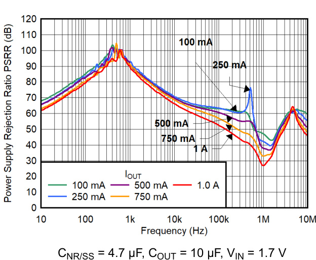  
图6 - 1。$\mathsf {v} _ {\mathsf {o u r}}的PSRR vs Frequency和IOUT = 1。2 \mathsf {v}$

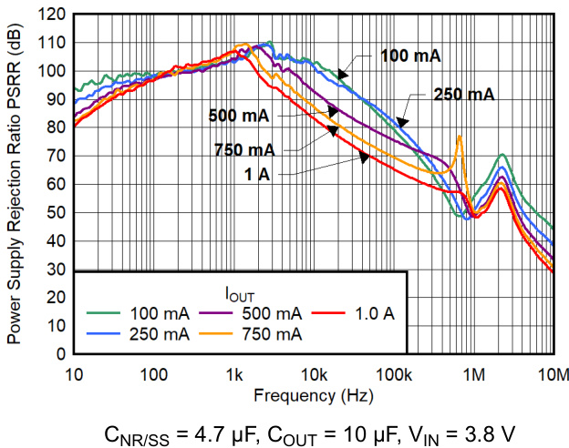  
图6 - 3。$\mathsf {v} _ {\mathsf {o u r}}的PSRR vs Frequency和IOUT = 3。3 \: \mathsf {v}$

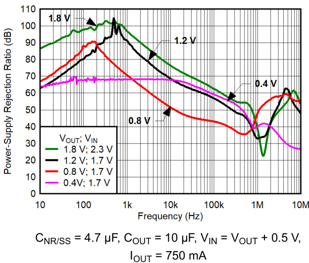  
图6 - 5。PSRR vs频率和输入对

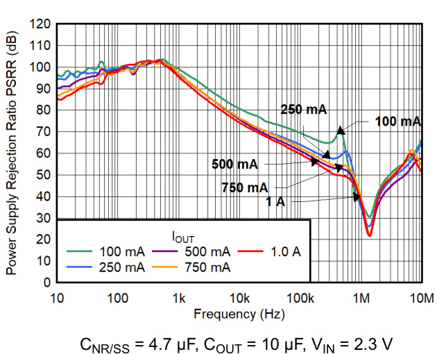  
图6 - 2。$\mathsf {v} _ {\mathsf {o u r}}的PSRR vs Frequency和IOUT = 1。8 \mathsf {V}$

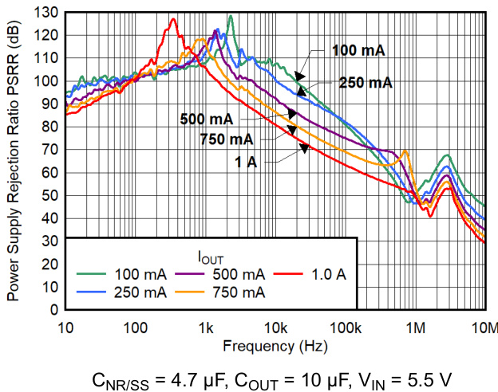  
图6 - 4。$\mathsf {v} _ {0 \mathsf {UT}}的PSRR vs Frequency和IOUT = 5。0 \mathsf {V}$

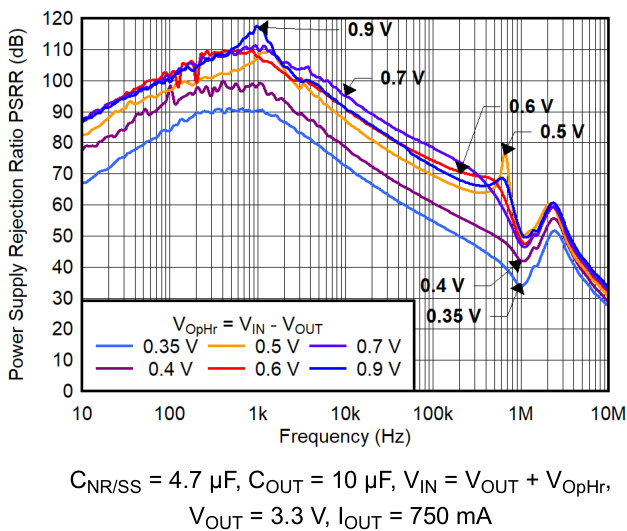  
图6尺6寸的大。交手PSRR与工作净空的频率$(\mathsf {V} _ {\mathsf {Op H r}})$

6.6典型特征（续）

VIN = VOUT(name) + 0.5 V， $V = 1。8 ~ \mathsf {v} $， $\mathsf {c} {1 \mathsf {n}} = 10 ~ \mu \mathsf {f} $， $\mathsf {c}} \mathsf {N R / S}} = 4。7 ~ ~ ~ ~ ~ ~ ~ ~ ~ ~ ~ ~ ~ ~ ~ ~ ~ ~ ~ ~ ~ ~ ~ ~ ~ ~ ~ ~ ~ ~ ~ ~ ~ ~ ~ ~ ~$， $\mathsf {O U T}} = 1 0\ mu \mathsf {F} _{:} $和$\mathsf {I} {O U T}} = 1 \mathsf {m A}$(除非另有说明);典型的值是${\ sf t}_{\ mathsf {j}} = 2 5个jugy{\ circ} {\sf c} $

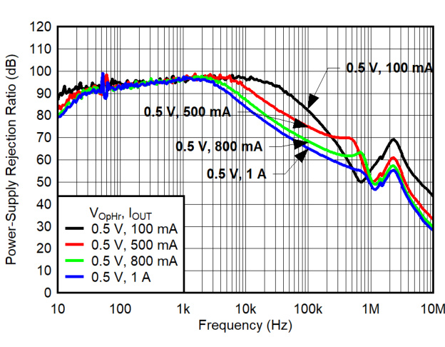

$$
\mathsf { V } _ { \mathsf { O U T } } = 3 . 3 \mathsf { V } , \mathsf { C } _ { \mathsf { N R / S S } } = 4 . 7 \mathsf { \mu F } , \mathsf { C } _ { \mathsf { O U T } } = 1 0 \mathsf { \mu F }
$$

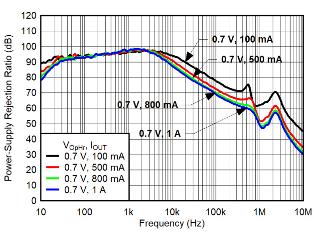  
图6 - 8。PSRR与工作净空的频率$(\mathsf {v} _ {\mathsf {o p H r}})$和IOUT

$$
\mathsf { V } _ { \mathsf { O U T } } = 3 . 3 \mathsf { V } , \mathsf { C } _ { \mathsf { N R / S S } } = 4 . 7 \mathsf { \mu F } , \mathsf { C } _ { \mathsf { O U T } } = 1 0 \mathsf { \mu F }
$$

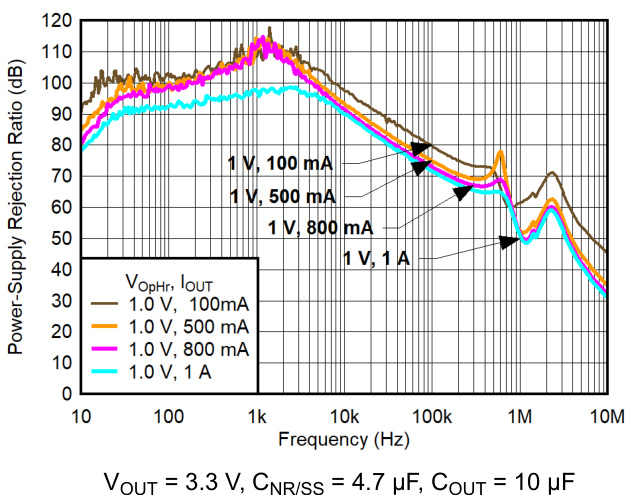  
图6 - 7。PSRR与工作净空的频率$(\mathsf {v} _ {\mathsf {o p H r}})$和IOUT

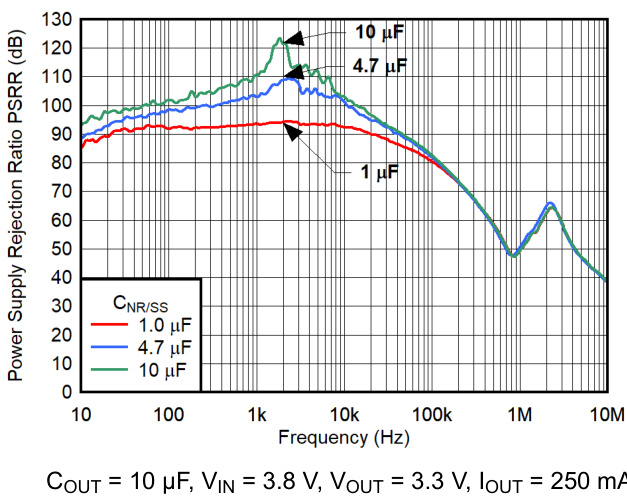  
图6 - 9。PSRR与工作净空的频率$(\mathsf {v} _ {\mathsf {o p H r}})$和IOUT

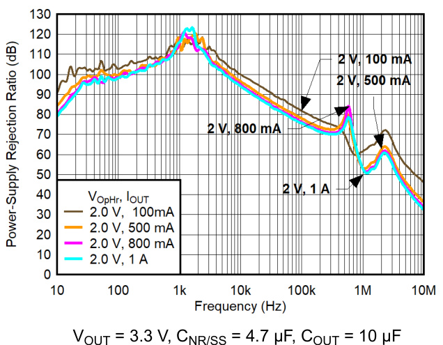  
图6 - 10。PSRR与工作净空的频率$(\mathsf {V} _ {\mathsf {Op H r}})$和IOUT

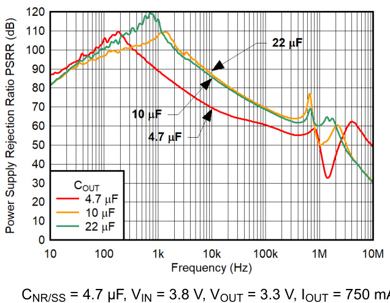  
图6尺11寸。PSRR与频率和CNR/SS
图6 - 12。PSRR vs频率和COUT

6.6典型特征（续）

VIN = VOUT(NOM) + 0.5 V, $ v_ {\mathsf {E N}} = 1。8 ~ \mathsf {V}$, $\mathsf {C} _ {\mathsf {I N}} = 1 ~ \mu \mathsf {F}$, $\mathsf {C} _ {\mathsf {N R / S S}} = 4。7 ~ \mu \mathsf {F} _ {；$,$ {\mathsf {C}} _ {{\mathsf {O U T}}} = 1 0 \mu {\mathsf {F}},$和$\mathsf {I _ {O U T}} = 1 \mathsf {m A}$（除非另有说明）；典型的值是${\sf T} _ {\mathsf {J}} = 2 5 ^ {\circ} {\sf C}$

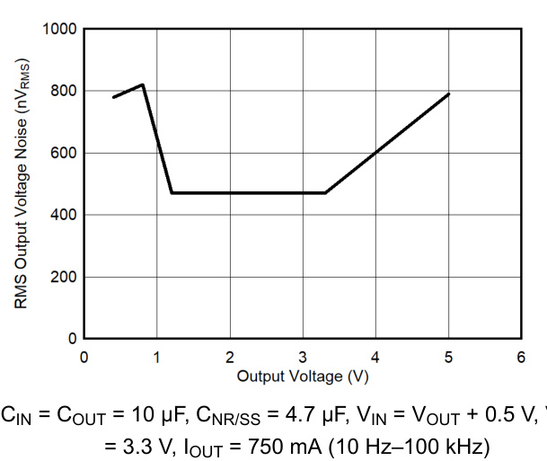  
图6-13。输出电压噪声（RMS） vs输出电压

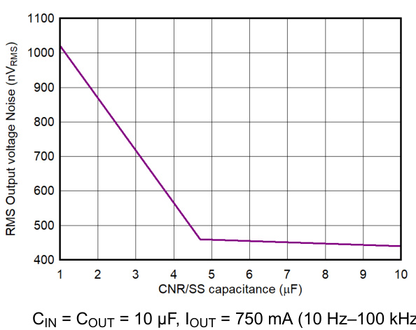  
图6日至14日。输出电压噪声（RMS） vs CNR/SS

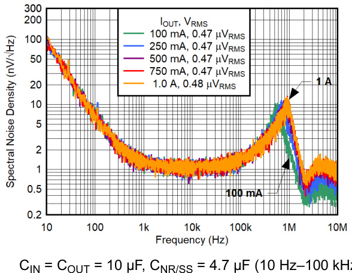  
图6 - 15。IOUT和$\mathsf {v} _ {\mathsf {o u r}}的输出电压噪声密度与频率的关系= 1。2 \mathsf {v}$

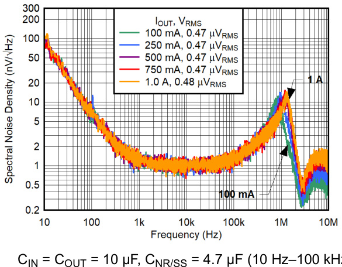  
图-。IOUT和$\mathsf {v} _ {\mathsf {o u r}}的输出电压噪声密度与频率的关系= 1。8 \mathsf {V}$

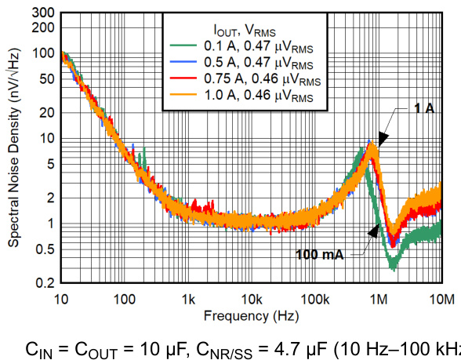  
图6 - 17日。IOUT和$\mathsf {v} _ {\mathsf {o u r}}的输出电压噪声密度vs频率= 3。3 \ \mathsf {V}$

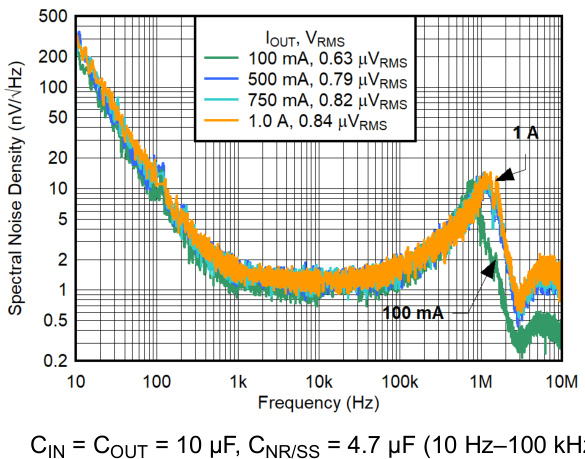  
图6 - 18。IOUT和$\mathsf {v} _ {0 \mathsf {UT}} = 5的输出电压噪声密度与频率的关系。0 \mathsf {V}$

6.6典型特征（续）

VIN VOUT(name) + 0.5 V， $V = 1。8 ~ \mathsf {v} $， $\mathsf {I n}} = 1 0 ~ \mathsf {F}$， $\mathsf {C}}} = 4。7 ~ ~ ~ ~ ~ ~ ~ ~ ~ ~ ~ ~ ~ ~ ~ ~ ~ ~ ~ ~ ~ ~ ~ ~ ~ ~ ~ ~ ~ ~ ~ ~ ~ ~ ~ ~ ~$， $\mathsf {O U T}} = 1 0\ mu \mathsf {F} _{:} $和$\mathsf {I} {O U T}} = 1 \mathsf {m A}$(除非另有说明);典型的值是${\ sf t}_{\ mathsf {j}} = 2 5个jugy{\ circ} {\sf c} $

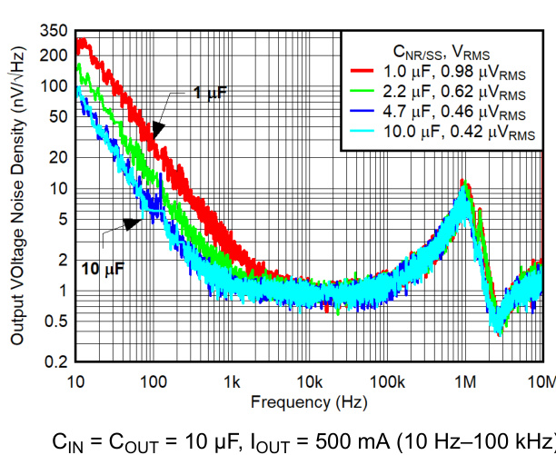  
图6-19。$\mathsf {v} _ {\mathsf {o u r}} = 3的输出噪声vs CNR/SS3 \: \mathsf {V}$

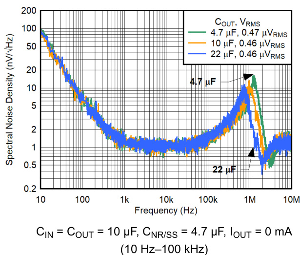  
图6-21。$\mathsf {v} _ {\mathsf {o u r}}的输出电压噪声密度与频率和COUT = 3。3 \ \mathsf {V}$

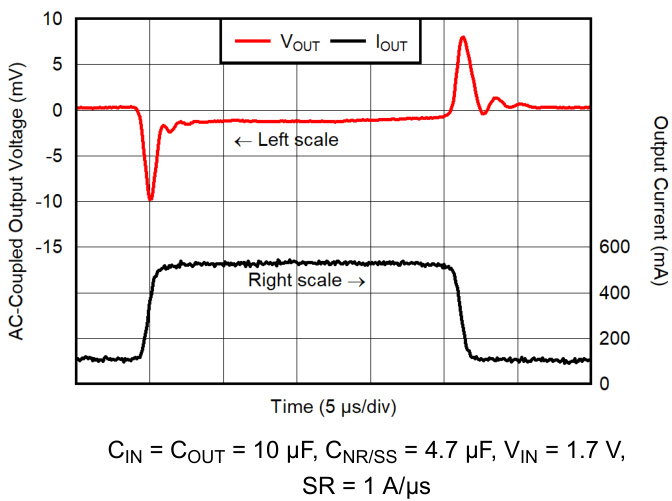  
图6-23。VOUT = 1.2 V, $\ mathbf {m A}$到${\pmb 5 0 0} \mathbf {m A}$的负载瞬态响应

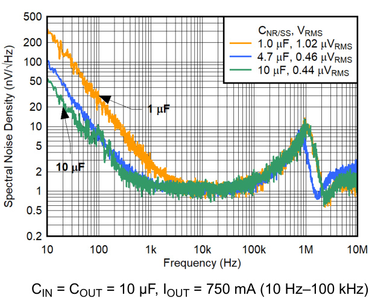  
图6 20。输出电压噪声（RMS） vs CNR/SS为VOUT = 3.3 V

100 VouT, VRMS 50 1.2 V, 0.47 μVRMS   
30 0.8 V,0.82 VRMS 20 0.4 V, 0.78 μVRMS   
频率（Hz） CIN = COUT = 10 μF, CNR/SS = 4.7 μF, IOUT = 750 mA （10 Hz - 100 kHz）

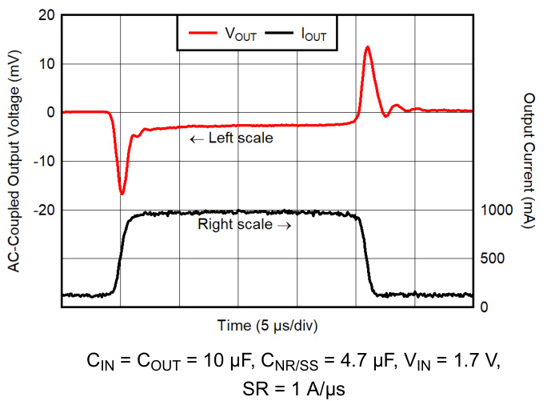  
图第6 - 22。输出电压噪声密度vs频率和输入对
图6日到24日。$\mathsf {v} _ {\mathsf {o u r}} = 1的负载瞬态响应。2 \mathsf {v},$ IOUT = 100ma至1a

6.6典型特征（续）

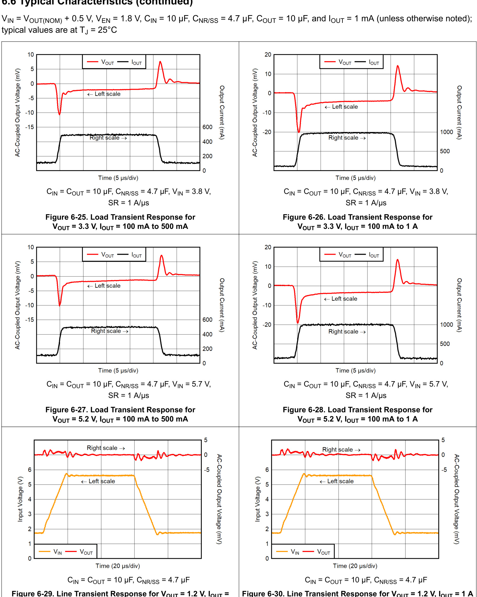  
$5 0 0 m A$

6.6典型特征（续）

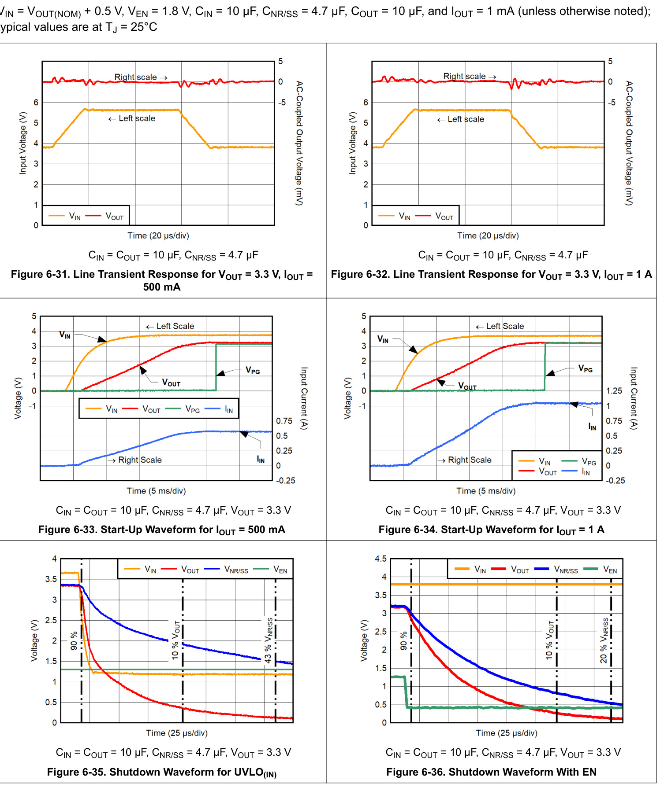

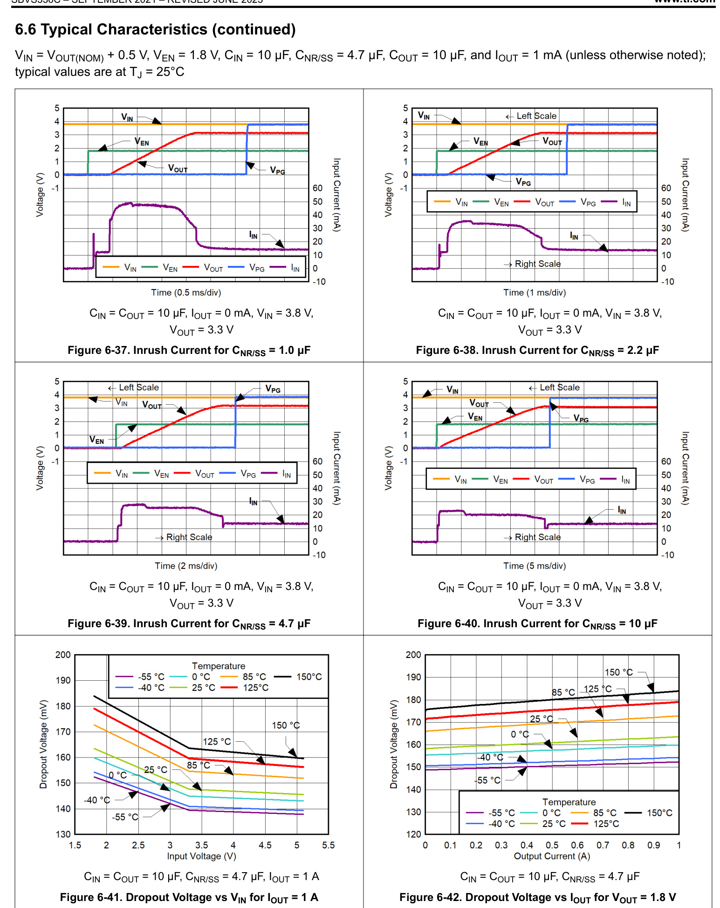

6.6典型特征（续）

VIN = VOUT(name) + 0.5 V， $V = 1。8 ~ \mathsf {v} $， $\mathsf {c} {1 \mathsf {n}} = 10 ~ \mu \mathsf {f} $， $\mathsf {c}} \mathsf {N R / S}} = 4。7 ~ ~ ~ ~ ~ ~ ~ ~ ~ ~ ~ ~ ~ ~ ~ ~ ~ ~ ~ ~ ~ ~ ~ ~ ~ ~ ~ ~ ~ ~ ~ ~ ~ ~ ~ ~ ~$， $\mathsf {O U T}} = 1 0\ mu \mathsf {F} _{:} $和$\mathsf {I} {O U T}} = 1 \mathsf {m A}$(除非另有说明);典型的值是${\ sf t}_{\ mathsf {j}} = 2 5个jugy{\ circ} {\sf c} $

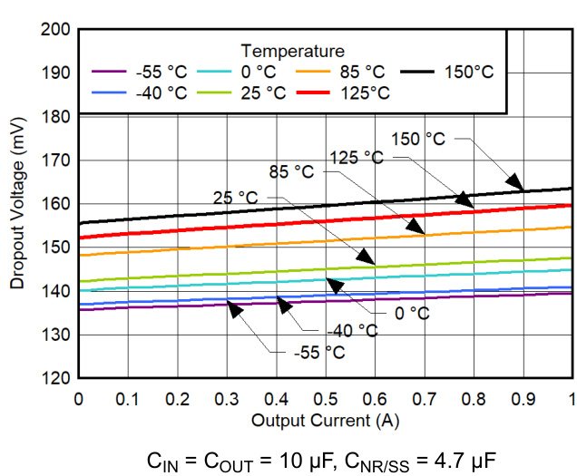  
图6-43。$\mathsf {v} _ {\mathsf {ou r}} = 3。3 \: \mathsf {V}$

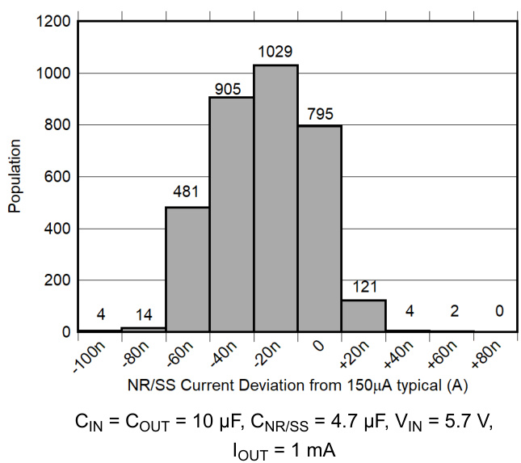  
图6-45。印度卢比/ SS分布

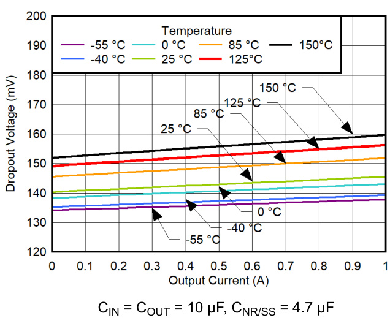  
图6-44。$\mathsf {v} _ {\mathsf {ou r}} = 5。1 \ mathm {\ v}$

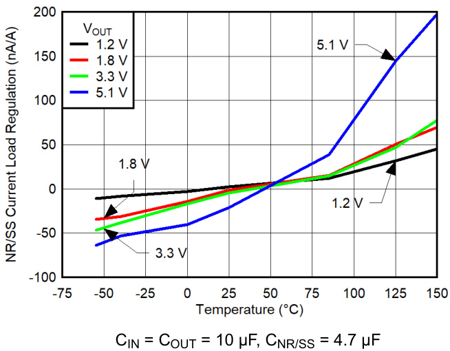  
图6-47。INR/SS负载调节

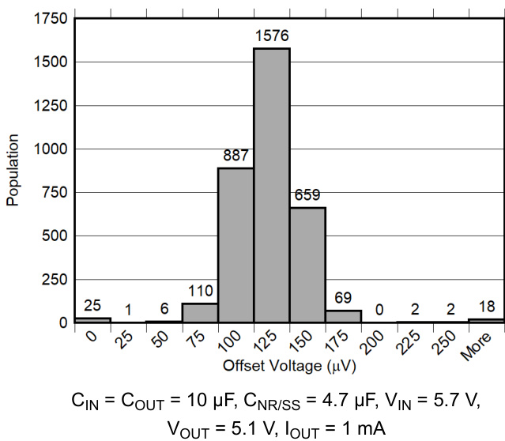  
图$6 {\cdot} 4\mathsf {V} _ {0} \mathsf {s}$分布

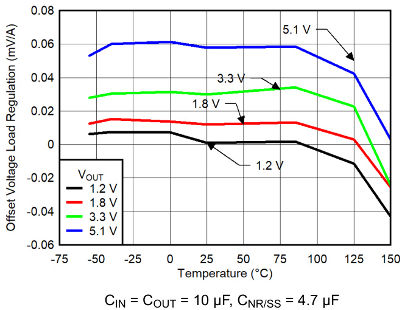  
图$6 {\cdot} 4\mathsf {V} _{0 5}$负载调节

6.6典型特征（续）

VIN VOUT(name) + 0.5 V， $V = 1。8 ~ \mathsf {v} $， $\mathsf {I n}} = 1 0 ~ \mathsf {F}$， $\mathsf {C}}} = 4。7 ~ ~ ~ ~ ~ ~ ~ ~ ~ ~ ~ ~ ~ ~ ~ ~ ~ ~ ~ ~ ~ ~ ~ ~ ~ ~ ~ ~ ~ ~ ~ ~ ~ ~ ~ ~ ~}$，$ {\mathsf {O U T}}} = 1 0\ mu {\mathsf {F}}，$和$\mathsf {I _ {O U T}} = 1 \mathsf {m A}$(除非另有说明);典型的值是${\ sf t}_{\ mathsf {j}} = 2 5个jugy{\ circ} {\sf c} $

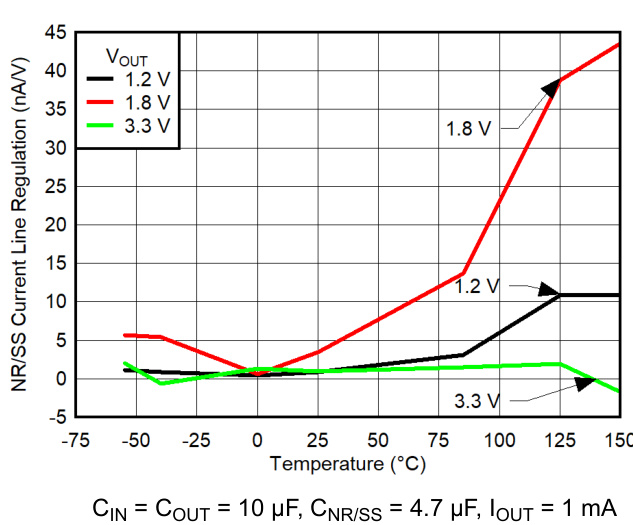  
图6-49。INR/SS线路规则

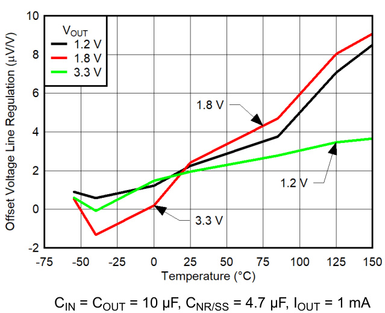  
图${\tt6 .50。} \tt V _ {0；$ Line Regulation

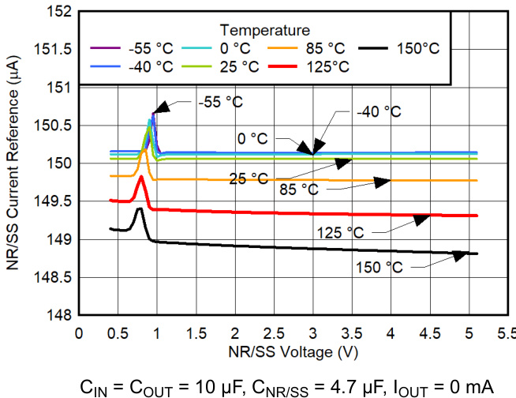  
图6-51。INR/SS vs VNR/SS和温度

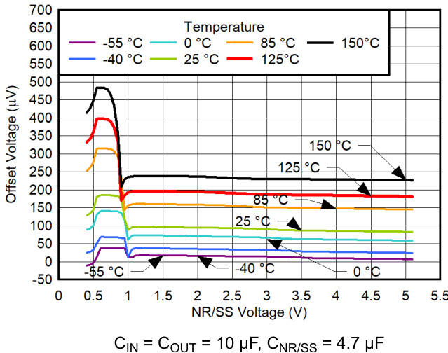  
图6-52。VOS vs VNR/SS和温度

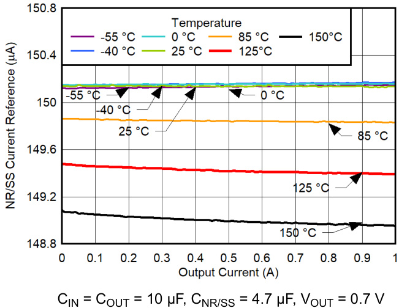  
图6-53。$\mathsf {V} _ {\mathsf {IN}}的INR/SS vs IOUT和Temperature = 1。2 \: \mathsf {V}$

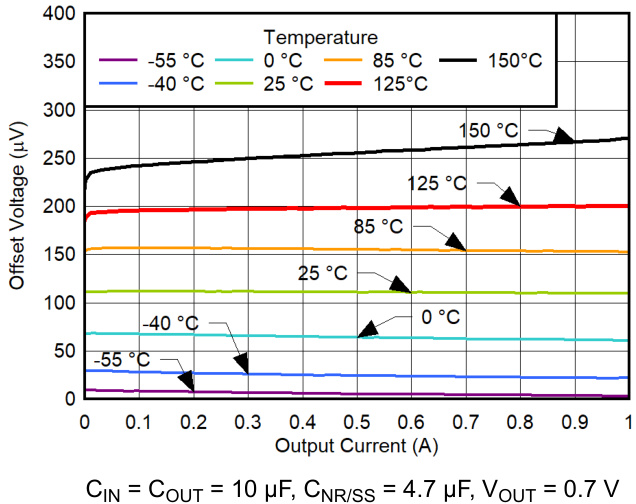  
图6-54。$\mathtt { v _ { \infty } }$ vs IOUT和温度 $\mathsf { V } _ { \mathsf { I N } } = 1 . 2 \mathsf { V }$

6.6典型特征（续）

VIN = VOUT(name) + 0.5 V， $V = 1。8 ~ \mathsf {v} $， $\mathsf {c} {1 \mathsf {n}} = 10 ~ \mu \mathsf {f} $， $\mathsf {c}} \mathsf {N R / S}} = 4。7 ~ ~ ~ ~ ~ ~ ~ ~ ~ ~ ~ ~ ~ ~ ~ ~ ~ ~ ~ ~ ~ ~ ~ ~ ~ ~ ~ ~ ~ ~ ~ ~ ~ ~ ~ ~ ~$， $\mathsf {O U T}} = 1 0\ mu \mathsf {F} _{:} $和$\mathsf {I} {O U T}} = 1 \mathsf {m A}$(除非另有说明);典型的值是${\ sf t}_{\ mathsf {j}} = 2 5个jugy{\ circ} {\sf c} $

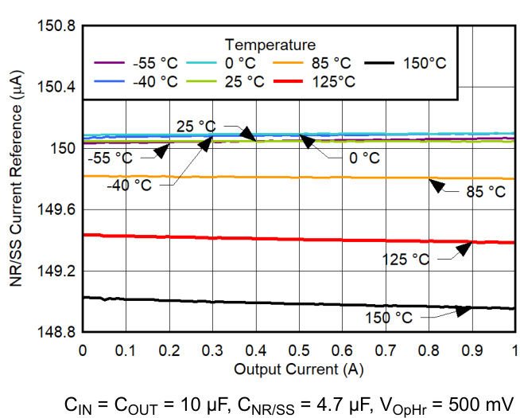  
图6-55。$\mathsf {V} _ {\mathsf {IN}}的INR/SS vs IOUT和Temperature = 1。8 \: \mathsf {V}$

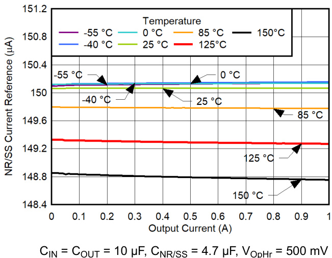  
图6-57。$\mathsf {V} _ {\mathsf {IN}}的INR/SS vs IOUT和Temperature = 3。3 \: \mathsf {V}$

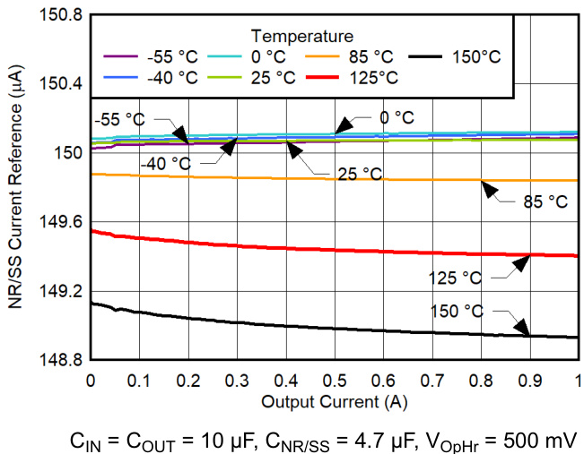  
图6-59。$\mathsf {V} _ {\mathsf {IN}}的INR/SS vs IOUT和Temperature = 51 \math {~ V}$

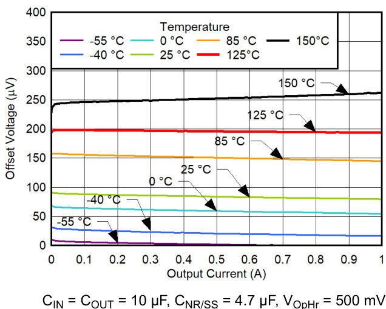  
图6-56。$\mathtt {v _ {0 s}}$ vs IOUT和温度$\mathsf {v} _ {\mathsf {I N}} = 1。8 \: \mathsf {V}$

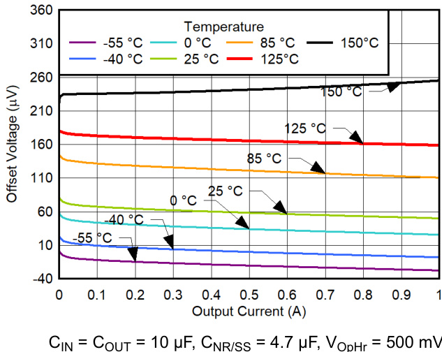  
图6-58。$\mathtt {v _ {0 5}}$ vs IOUT和温度$\mathsf {v} _ {\mathsf {I N}} = 3。3 \: \mathsf {V}$

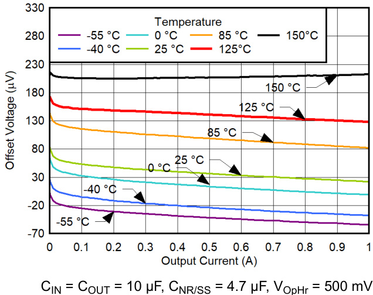  
图6-60$\mathtt { v _ { \infty } }$ vs IOUT和温度 $\mathsf { V } _ { \mathsf { I N } } = 5 . 1 \ : \mathsf { V }$

6.6典型特征（续）

VIN = VOUT(NOM) + 0.5 V, $ v_ {\mathsf {E N}} = 1。8 ~ \mathsf {V}$, $\mathsf {C} _ {1 \mathsf {N}} = 1 ~ \mu \mathsf {F}$, $\mathsf {C} _ {\mathsf {N R / S S}} = 4。7 ~ \mu \mathsf {F} _ {；$,$ {\mathsf {C}} _ {{\mathsf {O U T}}} = 1 0 \mu {\mathsf {F}},$和$\mathsf {I _ {O U T}} = 1 \mathsf {m A}$（除非另有说明）；典型的值是${\sf T} _ {\mathsf {J}} = 2 5 ^ {\circ} {\sf C}$

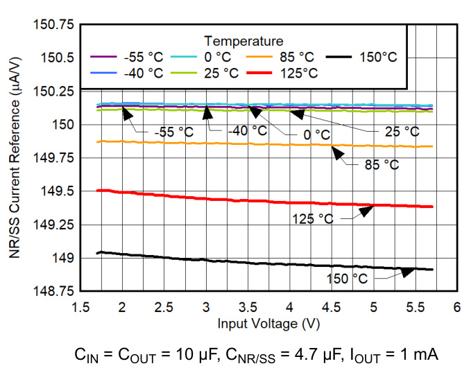  
图6 - 61。INR/SS vs $\mathsf {v} _ {\mathsf {IN}}$和温度$\mathsf {v} _ {\mathsf {o ur}} = 1。2 \mathsf {v}$

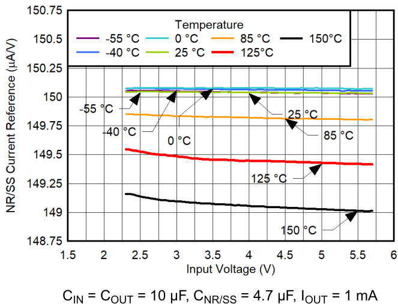  
图6 - 63。INR/SS vs $\mathsf {v} _ {\mathsf {IN}}$和温度$\mathsf {v} _ {\mathsf {o ur}} = 1。8 \mathsf {v}$

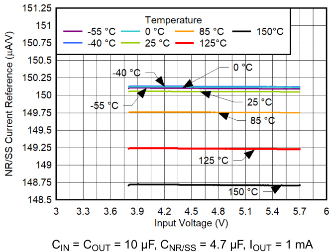  
图6 - 65。INR/SS vs $\mathsf {v} _ {\mathsf {IN}}$和温度$\mathsf {v} _ {\mathsf {o ur}} = 3。3 \: \mathsf {v}$

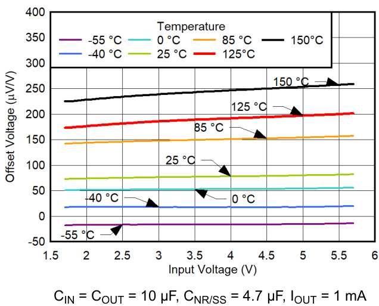  
Figure 6-62. $\mathtt { v _ { 0 s } }$ vs $\mathsf { v } _ { \mathsf { I N } }$ and Temperature for $\mathsf { v } _ { \mathsf { o u r } } = 1 . 2 \mathsf { v }$

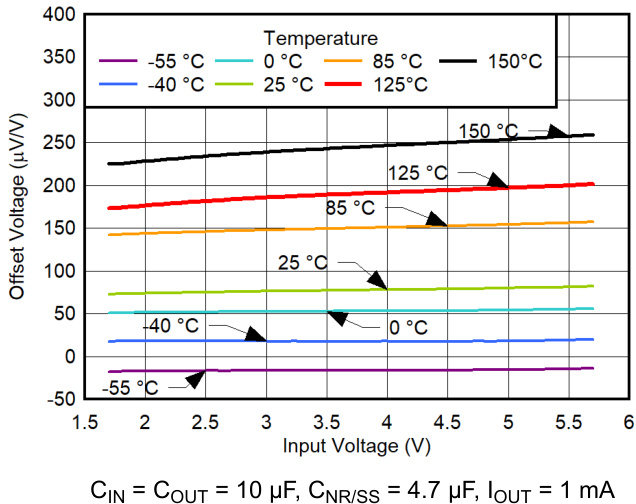  
图$\phantom {+}6 . b。\phantom {+} \mathsf {V} _ {0 5}$ vs $\mathsf {V} _ {\mathsf {I N}}$和Temperature $\mathsf {V} _ {\mathsf {o ur}} = 1。8 \mathsf {V}$

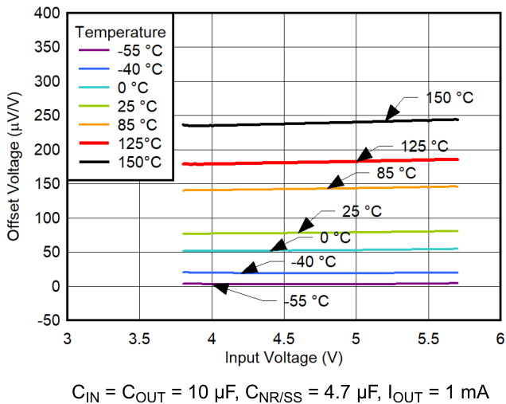  
Figure 6-66. $\mathtt { v _ { \infty } }$ vs $\mathsf { v } _ { \mathsf { I N } }$ and Temperature for $\mathsf { v } _ { \mathsf { o u r } } = 3 . 3 \ : \mathsf { V }$

6.6典型特征（续）

VIN = VOUT(name) + 0.5 V， $V = 1。8 ~ \mathsf {V}$ $\mathsf {I n}} = 1 0 ~ \mu \mathsf {F}$， $\mathsf {C}} \mathsf {N R / S}} = 4。7 ~ ~ ~ ~ ~ ~ ~ ~ ~ ~ ~ ~ ~ ~ ~ ~ ~ ~ ~ ~ ~ ~ ~ ~ ~ ~ ~ ~ ~ ~ ~ ~ ~ ~ ~ ~ ~$， $\mathsf {O U T}} = 1 0\ mu \mathsf {F} _{:} $和$\mathsf {I} {O U T}} = 1 \mathsf {m A}$(除非另有说明);典型的值是${\ sf t}_{\ mathsf {j}} = 2 5个jugy{\ circ} {\sf c} $

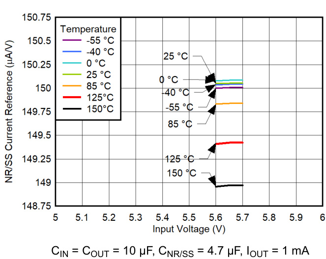  
图6 - 67。INR/SS vs $\mathsf {v} _ {\mathsf {IN}}$和温度$\mathsf {v _ {0 u \tau}} = 5。1 \ mathm {\ v}$

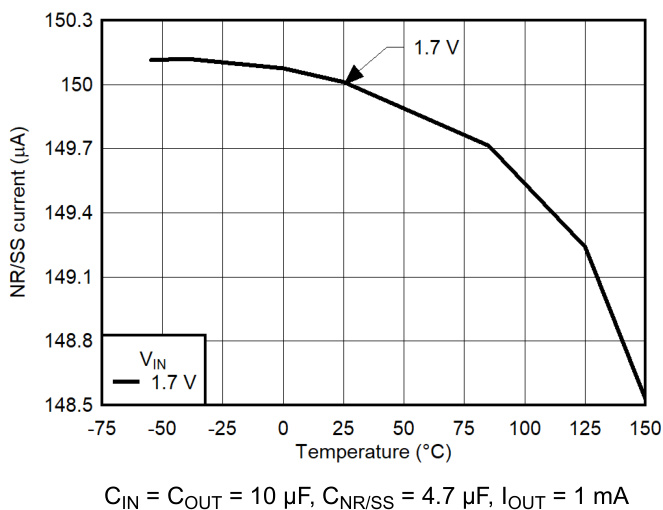  
Figure 6-69。对于$\mathsf {v}_{\ mathsf {I n\ _m I n}}， \mathsf {v} _ {\mathsf {O p H r}} = 0, INR/SS vs温度。2 \mathsf {v} $

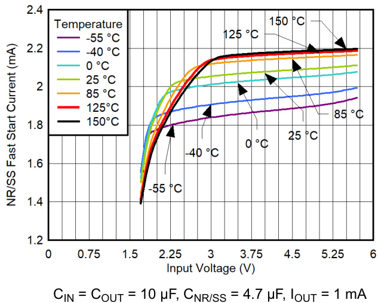  
图6 - 71。INR/SS快速启动vs $\mathsf {v} _ {\mathsf {IN}}$和温度

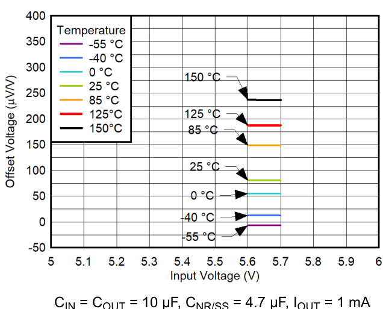  
Figure 6-68. $\mathtt { v _ { 0 s } }$ vs $\mathsf { v } _ { \mathsf { I N } }$ and Temperature for $\mathsf { v } _ { \mathsf { o u r } } = 5 . 1 \mathrm { \ v }$

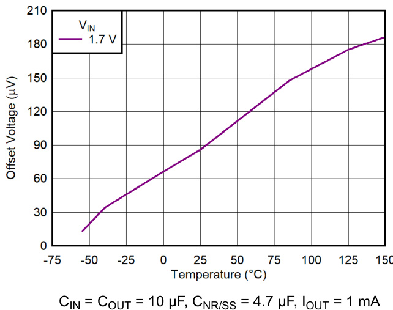  
Figure $\phantom { + } 6 . 7 0 . \phantom { + } \mathsf { v } _ { \infty }$ vs Temperature for $\mathsf { V } _ { \mathsf { I N \_ M i n } } , \mathsf { V } _ { \mathsf { O p H r } } = 0 . 2 \mathsf { V }$

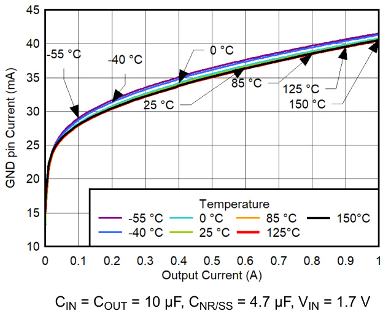  
图6 - 72。GND引脚电流vs $\mathsf {I} _ {\mathsf {O U T}}$和温度

6.6典型特征（续）

VIN VOUT(name) + 0.5 V， $V = 1。8 ~ \mathsf {v} $， $\mathsf {I n}} = 1 0 ~ \mathsf {F}$， $\mathsf {C}}} = 4。7 ~ ~ ~ ~ ~ ~ ~ ~ ~ ~ ~ ~ ~ ~ ~ ~ ~ ~ ~ ~ ~ ~ ~ ~ ~ ~ ~ ~ ~ ~ ~ ~ ~ ~ ~ ~ ~$， $\mathsf {O U T}} = 1 0\ mu \mathsf {F} _{:} $和$\mathsf {I} {O U T}} = 1 \mathsf {m A}$(除非另有说明);典型的值是${\ sf t}_{\ mathsf {j}} = 2 5个jugy{\ circ} {\sf c} $

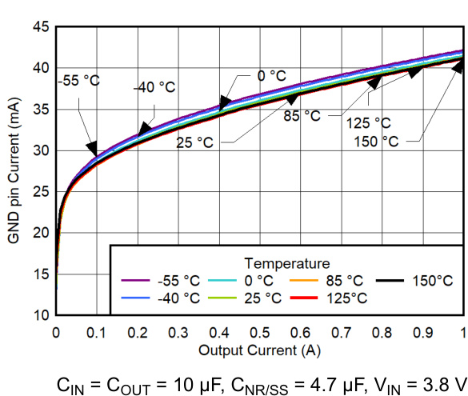  
图6 - 73。GND引脚电流vs IOUT和温度

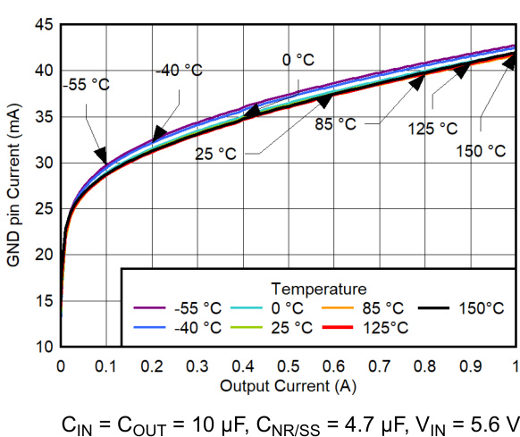  
图6 - 74。GND引脚电流vs IOUT和温度

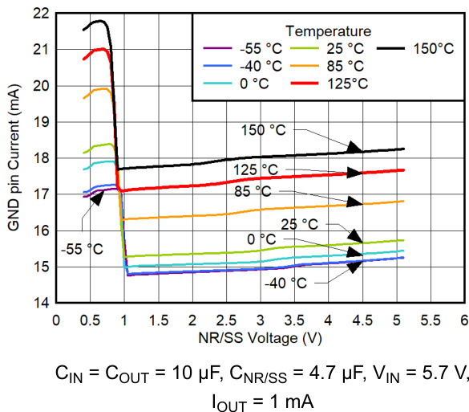  
图6 - 75。GND引脚电流vs VNR/SS和温度

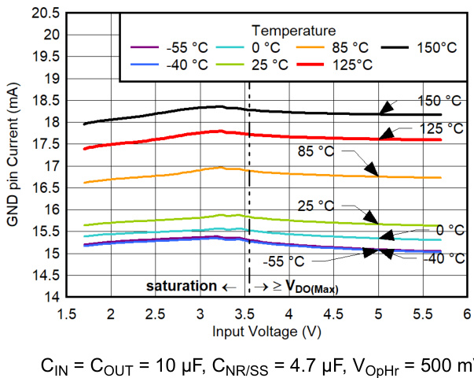  
图6 - 76。GND引脚电流vs $\mathsf {\mathbf {v}} _ {\mathsf {I N}}$和温度$\mathsf {l} _ {\mathsf {O U T}} = 1 \mathsf {m A}$

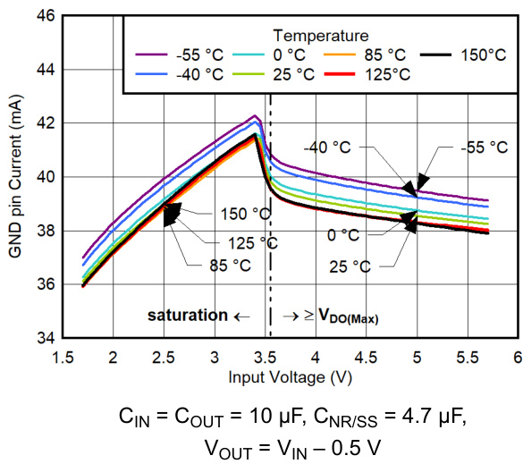  
图6 - 77。GND引脚电流vs $\mathsf {\mathbf {v}} _ {\mathsf {I N}}$和温度$\mathsf {l o ur} = 5 0 0 ~ \mathsf {m A}$

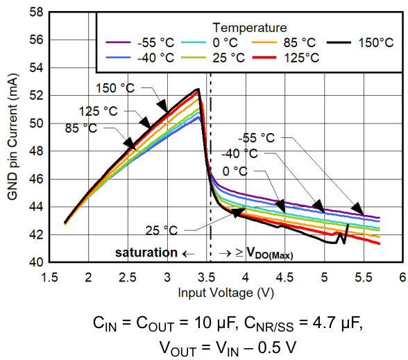  
图6 - 78。GND引脚电流vs $\mathsf {v} _ {\mathsf {I N}}$和温度

6.6典型特征（续）

VIN = VOUT(name) + 0.5 V， $V = 1。8 ~ \mathsf {v} $， $\mathsf {I n}} = 1 0 ~ \mathsf {F}$， $\mathsf {C}}} = 4。7 ~ ~ ~ ~ ~ ~ ~ ~ ~ ~ ~ ~ ~ ~ ~ ~ ~ ~ ~ ~ ~ ~ ~ ~ ~ ~ ~ ~ ~ ~ ~ ~ ~ ~ ~ ~ ~$， $\mathsf {O U T}} = 1 0\ mu \mathsf {F} _{:} $和$\mathsf {I} {O U T}} = 1 \mathsf {m A}$(除非另有说明);典型的值是${\ sf t}_{\ mathsf {j}} = 2 5个jugy{\ circ} {\sf c} $

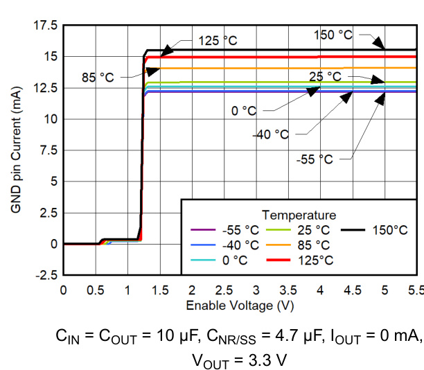  
图6 - 79。GND引脚电流vs $\boldsymbol {\mathsf {v}} _ {\mathsf {E N}}$和温度$\mathsf {v} _ {\mathsf {I N}} = 1。7 \: \mathsf {V}$ （Dropout Operation）

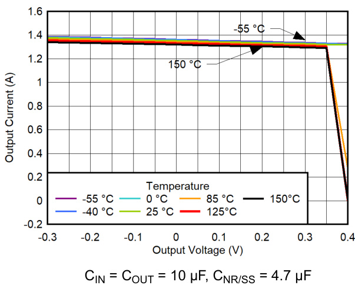  
图6 - 81。$100 \%$电流限制vs温度$\mathsf {v} _ {\mathsf {0 ur}} = \pmb{0。4} \mathsf {V}$

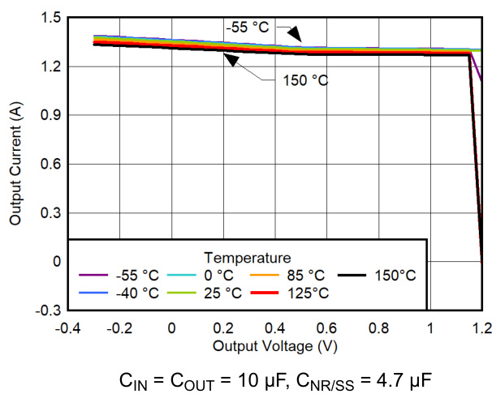  
图6 - 83。$100 \%$电流限制vs温度$\mathsf {v} _ {\mathsf {0 ur}} = 1。2 \mathsf {v}$

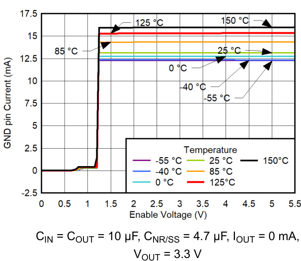  
图6 - 80。GND引脚电流vs $\ V _ {E N}$和温度

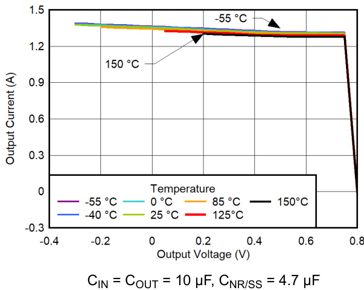  
图6 - 82。$100 \%$电流限制vs温度$\mathsf {V} _ {\mathsf {O U T}} = \mathsf{0}。8 \mathsf {V}$

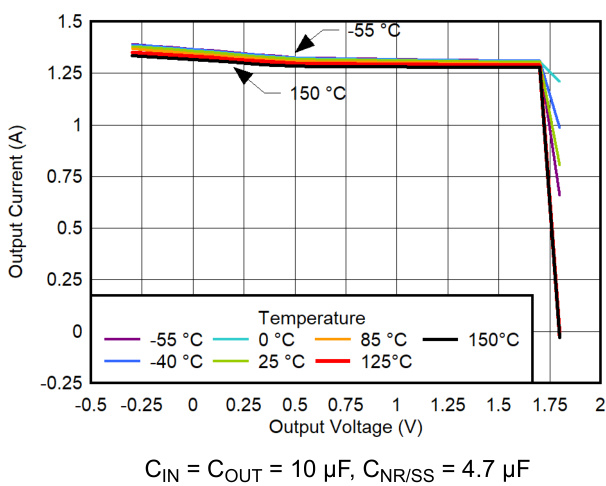  
igure 6 - 84。$100 \%$电流限制vs温度$\mathsf {v} _ {\mathsf {0 ur}} = 1。8 \mathsf {V}$

6.6典型特征（续）

VIN = VOUT(name) + 0.5 V， $V = 1。8 ~ \mathsf {v} $， $\mathsf {I n}} = 1 0 ~ \mathsf {F}$， $\mathsf {C}}} = 4。$和$\mathsf {I _o U t}} = 1 \mathsf {I _o U t}} $(除非另有说明);典型的值是${\ sf t}_{\ mathsf {j}} = 2 5个jugy{\ circ} {\sf c} $

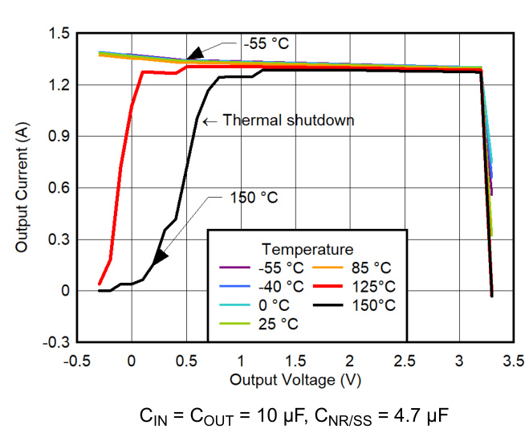  
图6 - 85。$100 \%$电流限制vs温度$\mathsf {v} _ {\mathsf {o ur}} = 3。3 \: \mathsf {v}$

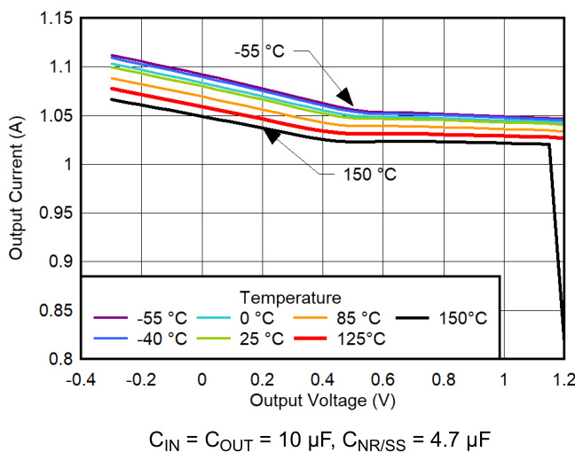  
图6：8 . b。$\mathsf {v} _ {\mathsf {o ur}}的电流限制vs温度= 1。2 \mathsf {v}$

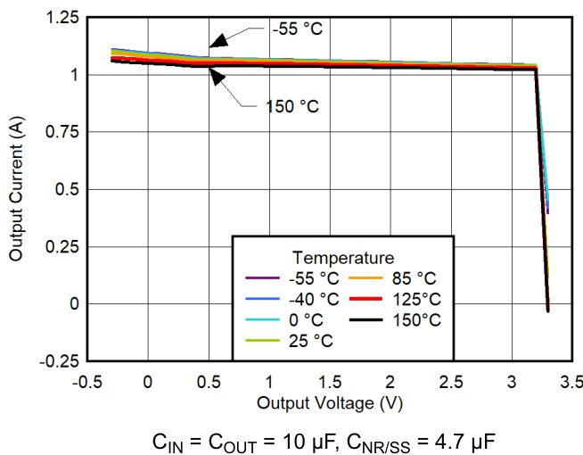  
图6：8 . b。$\mathsf {v} _ {\mathsf {o ur}}的电流限制vs温度= 3。3 \: \mathsf {V}$

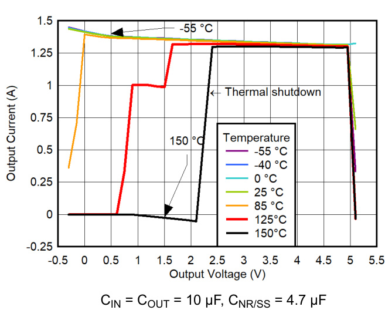  
图6 - 86。$100 \%$电流限制vs温度$\mathsf {v} _ {0 \mathsf {U T}} = 5。1 \ \mathsf {V}$

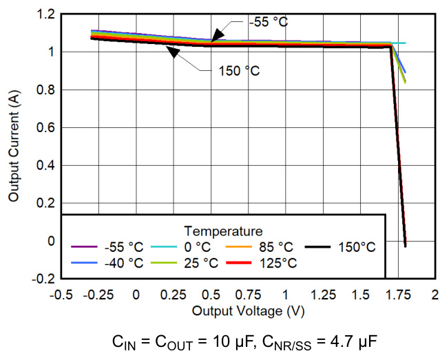  
图6：8。$\mathsf {v} _ {\mathsf {o ur}}的电流限制vs温度= 1。8 \mathsf {V}$

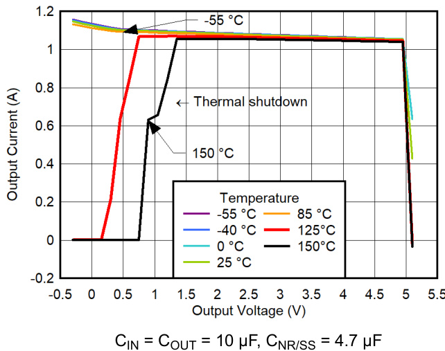  
图6：90。$\mathsf {v} _ {\mathsf {o ur}}的电流限制vs温度= 5。1 \ mathm {v}$

6.6典型特征（续）

VIN = VOUT(name) + 0.5 V， $V = 1。8 ~ \mathsf {v} $， $\mathsf {I n}} = 1 0 ~ \mathsf {F}$， $\mathsf {C}}} = 4。$和$\mathsf {I _o U t}} = 1 \mathsf {I _o U t}} $(除非另有说明);典型的值是${\ sf t}_{\ mathsf {j}} = 2 5个jugy{\ circ} {\sf c} $

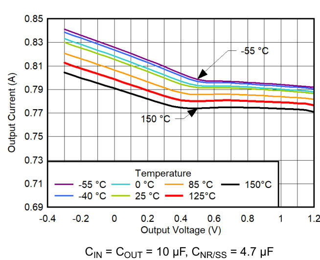  
图6 - 91。$60 \%$电流限制vs温度$\mathsf {v} _ {\mathsf {o ur}} = 1。2 \mathsf {v}$

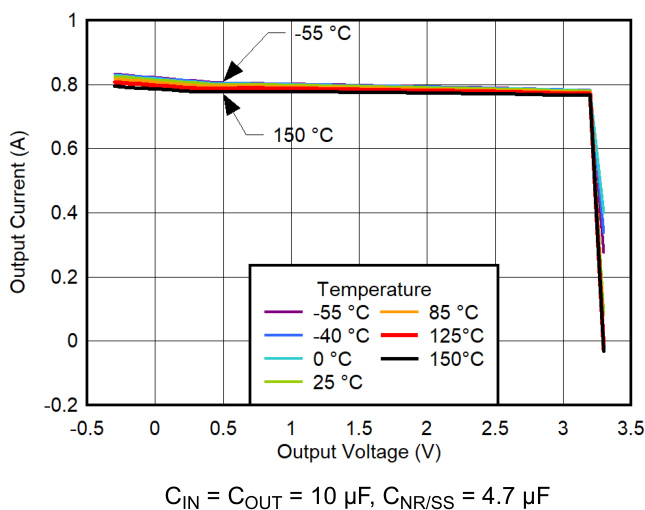  
图6：9。$\mathsf {v} _ {\mathsf {o ur}}的电流限制vs温度= 3。3 \: \mathsf {V}$

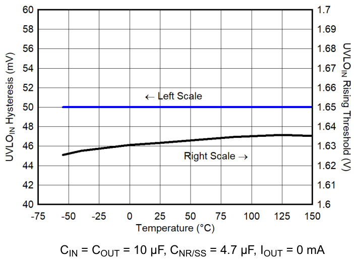  
图6 - 95。$\mathsf {U V L O} _ {\mathsf {I N}}$ vs温度

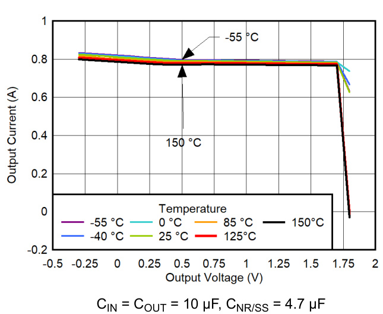  
图6 - 92。$60 \%$电流限制vs温度$\mathsf {v} _ {\mathsf {o ur}} = 1。8 \mathsf {V}$

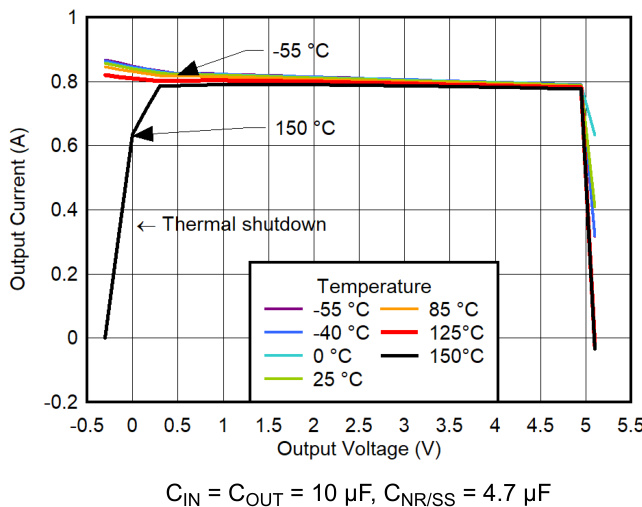  
图6：9 . b。$\mathsf {v} _ {\mathsf {o ur}}的电流限制vs温度= 5。1 \ mathm {\ v}$

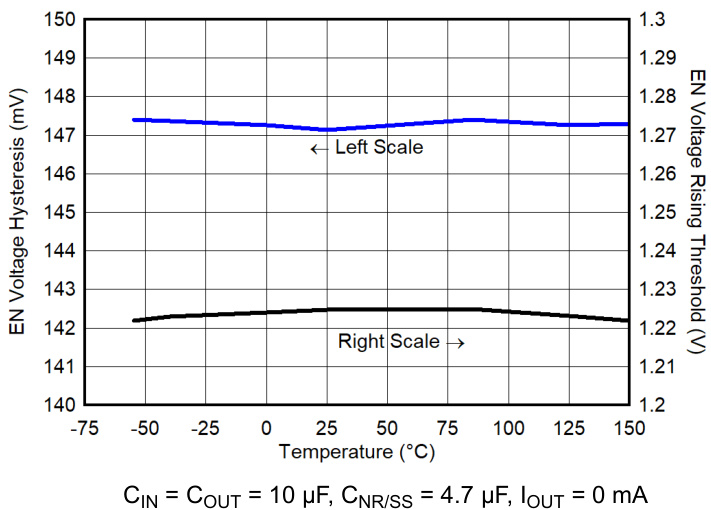  
图6 - 96。$\mathsf {v} _ {\mathsf {E N}}$滞后和阈值与温度

6.6典型特征（续）

VIN = VOUT(name) + 0.5 V， $V = 1。8 ~ \mathsf {v} $， $\mathsf {c} {1 \mathsf {n}} = 10 ~ \mu \mathsf {f} $， $\mathsf {c}} \mathsf {N R / S}} = 4。7 ~ ~ ~ ~ ~ ~ ~ ~ ~ ~ ~ ~ ~ ~ ~ ~ ~ ~ ~ ~ ~ ~ ~ ~ ~ ~ ~ ~ ~ ~ ~ ~ ~ ~ ~ ~ ~$， $\mathsf {O U T}} = 1 0\ mu \mathsf {F} _{:} $和$\mathsf {I} {O U T}} = 1 \mathsf {m A}$(除非另有说明);典型的值是${\ sf t}_{\ mathsf {j}} = 2 5个jugy{\ circ} {\sf c} $

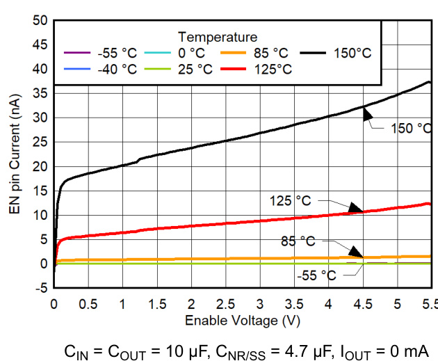  
图6 - 97。EN引脚电流vs使能电压和温度$\mathsf {V} _ {\mathsf {I N}} = 17 \: \mathsf {V}$

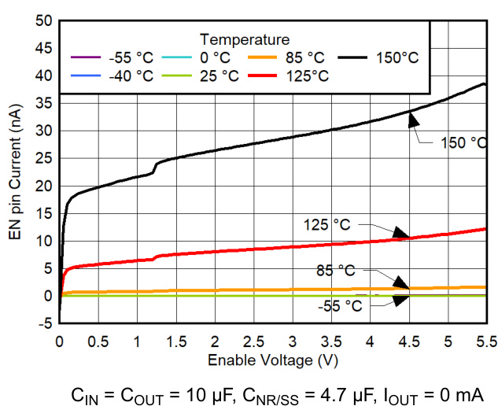  
图6 - 98。EN引脚电流vs使能电压和温度$\mathsf {V} _ {\mathsf {I N}} = 57 \: \mathsf {V}$

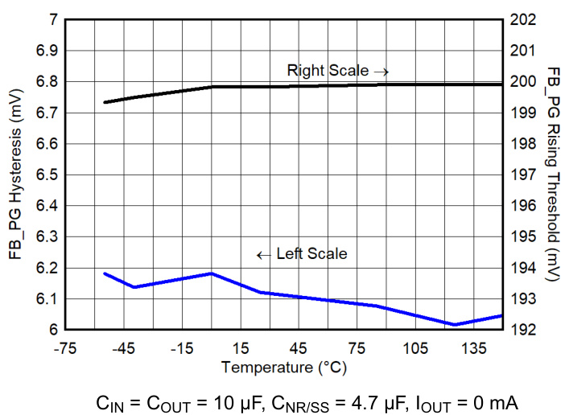  
图6 - 99。VFB_PG滞回和阈值随温度的变化

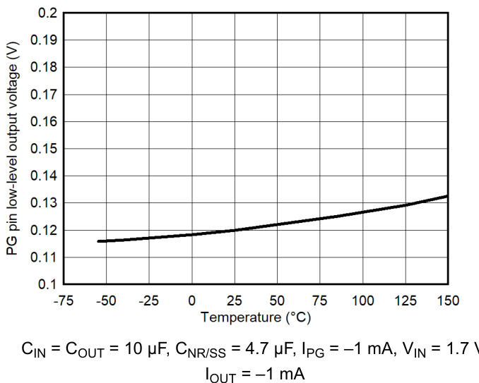  
图6 - 101。$\mathsf {\Delta} \mathsf {v} _ {\mathsf {P G}}$低电平输出电压与温度

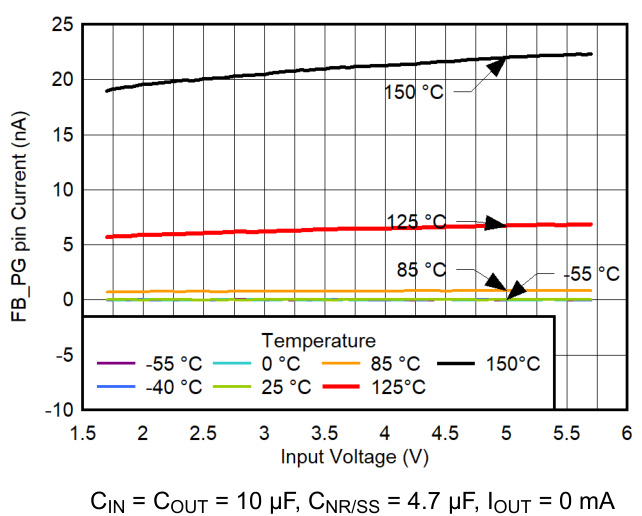  
图6 - 100。FB_PG引脚电流与$\mathsf {v} _ {\mathsf {I N}}$和温度

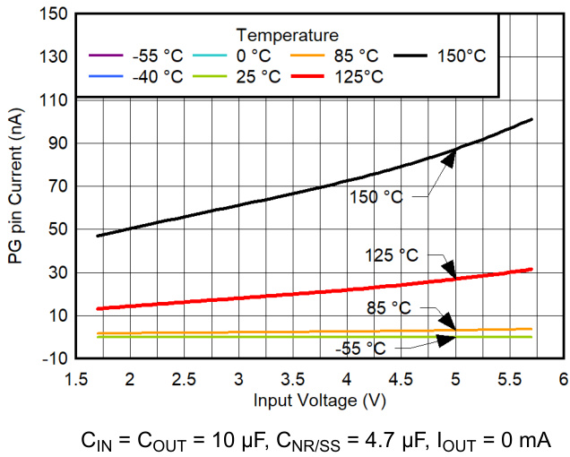  
图6 - 102。PG引脚电流与$\mathsf {v} _ {\mathsf {I N}}$和温度

6.6典型特征（续）

VIN = VOUT(name) + 0.5 V， $V = 1。8 ~ \mathsf {v} $， $\mathsf {I n}} = 1 0 ~ \mathsf {F}$， $\mathsf {C}}} = 4。7 ~ ~ ~ ~ ~ ~ ~ ~ ~ ~ ~ ~ ~ ~ ~ ~ ~ ~ ~ ~ ~ ~ ~ ~ ~ ~ ~ ~ ~ ~ ~ ~ ~ ~ ~ ~ ~$， $\mathsf {O U T}} = 1 0\ mu \mathsf {F} _{:} $和$\mathsf {I} {O U T}} = 1 \mathsf {m A}$(除非另有说明);典型的值是${\ sf t}_{\ mathsf {j}} = 2 5个jugy{\ circ} {\sf c} $

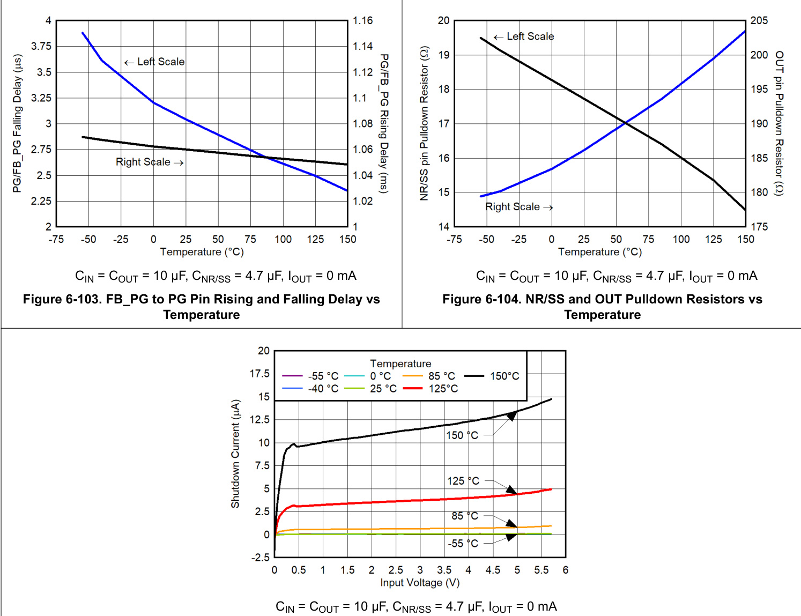  
图6 - 105。关机电流vs $\mathsf {v} _ {\mathsf {I N}}$和温度

7.1概述

TPS7A94超低噪音 $( 0 . 4 6 ~ \mu \mathsf { V } _ { \mathsf { R M S } }$ 结束 $1 0 - H z$ 到 $1 0 0 - k H z$ 带宽)，超高的PSRR $\left( > 5 0 \right.$ dB ～ 2mhz)，精度高 $( 1 \% )$ ，低差（LDO）线性稳压器，输入范围为 $1 . 7 \ : \mathrm { V }$ 到 $5 . 7 \mathrm { V }$ 输出电压范围从 $0 \vee$ 到 $\mathsf { V } _ { \mathsf { I N } } - \mathsf { V } _ { \mathsf { D O } }$ 并且在上面有详细说明 $0 . 4 \lor _ { \mathrm { O U T } }$ ． 这款LDO稳压器采用创新的电路实现宽带宽和高环路增益，即使在非常低的操作净空下工作，也能产生超高的PSRR $( \mathsf { V } _ { \mathsf { I N } } - \mathsf { V } _ { \mathsf { O U T } } )$ ． 在高电平上，该器件有两个主要模块（电流基准和单位增益LDO缓冲）和一些次要功能（如精度使能、电流限制和PG引脚）。

当前基准由NR/SS引脚控制。该引脚用单个电阻设置输出电压，设置启动时间，并过滤由参考电阻和外部设置电阻产生的噪声。

单位增益LDO缓冲器由OUT引脚控制。超低噪声不随输出电压增加而增加，提供宽带PSRR。因此，SNS引脚仅用于负载的遥感。

EN_UV引脚设置精度使能特性。选择LDO启动时的最佳输入电压。
该器件中有两个独立的UVLO电压：内部in轨UVLO和EN_UV引脚。

FB_PG引脚设置电流限制和电源-good （PG）特性。在这个引脚上的分压器编程限制电流和PG跳闸点。

超低噪声电流基准（典型值$ 1.5 0 \mu \mathsf {A}$）与外部电阻$(r_ {\mathsf {N R / S}})$一起使用来设置输出电压。这个过程允许从$0开始设置输出电压范围。4 ~ \mathsf {V}$到$(\mathsf {V} _ {\mathsf {I N}} - \mathsf {V} _ {\mathsf {D O}})$。为了实现这种超低噪声，需要一个外部电容器CNR/SS（通常为4美元）。7 ~ \mu \mathsf {F})$ （id:）与用于设置输出电压的RNR/SS电阻并联。单位增益架构在宽频率范围内提供超高PSRR，而不会影响负载和线路瞬态。

该稳压器提供可编程限流，热保护，完全指定从$- 4 0 ^ {\circ} \mathsf {C}$到$+ 1 2 5 ^ {\circ} \mathsf {C}$高于$0。4 \mathsf {V} _ {\mathsf {O U T}}$，提供热效率10引脚，3-mm × 3-mm WSON封装。

# 7.2功能框图

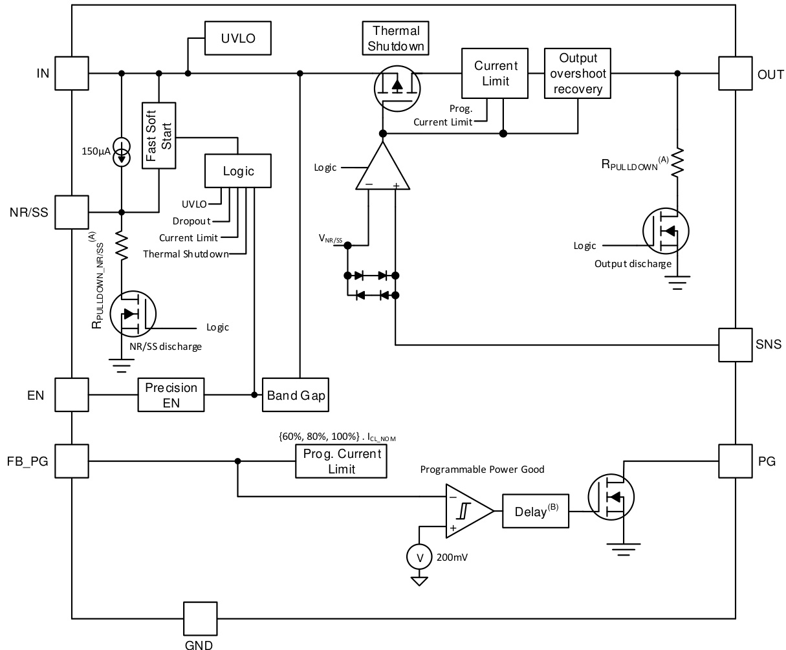

A.参见电气特性表中RPULLDOWN输出有源放电电阻值。
B.见电气特性表中的延时值。

# 7.3特性描述

# 7.3.1输出电压的设定和调节

图7-1显示了一个简化的调节电路，其中输入信号$(V _ {\mathsf {NR/S}})$由内部电流源（INR/SS）和外部电阻$(R _ {\mathsf {NR/S}})$产生。由于误差放大器总是以单位增益配置工作，因此LDO输出电压直接由VNR/SS电压编程。VNR/SS参考电压由内部低噪声电流源驱动RNR/SS电阻产生，通过使用低通滤波器（CNR/SS || RNR/SS），在误差放大器的输入处具有非常低的带宽。

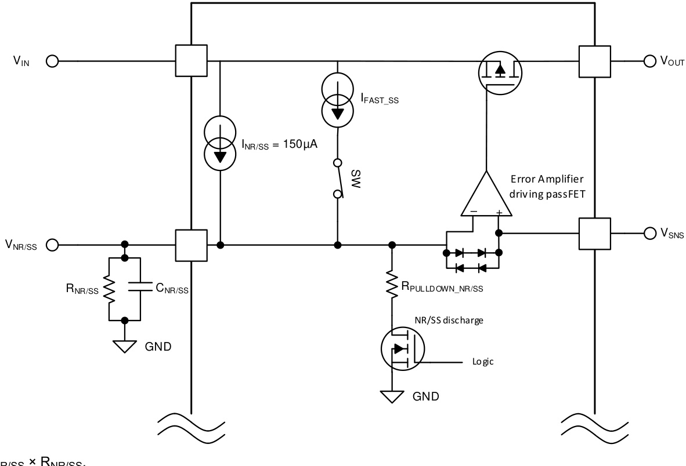  
图7 - 1。简化调节电路

这种单位增益配置，以及高精度的INR/SS参考电流，使器件能够实现出色的输出电压精度；然而，在低输出电压下工作时，RNR/SS精度可能成为限制因素。低降电压$(\mathsf {V} _ {\mathsf {D O}})$可减少散热并实现稳健的性能。这些特性的结合使该器件成为为敏感的模拟低压器件供电的优秀电压源。

7.3.2超低噪声和超高电源抑制比（PSRR）

该架构具有高精度、高精度、低噪声电流基准，然后是最先进的误差放大器（$\mathsf { V } _ { \mathsf { O U T } } \geq 1 . 2 \mathrm { ~ V } ,$噪声为$1 0 - k H z$时1.1 nV/√Hz），与精密放大器相当，甚至优于精密放大器。单位增益配置确保在整个输出电压范围内超低噪声。通过并联多个TPS7A94 ldo，可以实现额外的降噪和更高的输出电流。

# 7.3.3可编程限流和Power-Good阈值

通过设置FB_PG引脚的输入阻抗，砖墙电流限制可以被编程为标称工厂编程值的$ 100% $、$ 80% $或$ 60% $。同样，通过改变FB_PG电阻分压比，也可以在标称输出电压的$ 8.5 %和$ 9.5 %之间调节电源-良好指示阈值；请参阅调整工厂编程的电流限制部分了解详细信息。

# 7.3.4可编程软启动（NR/SS引脚）

该器件具有可编程、单调、电压控制的软启动电路，该电路使用CNR/SS电容器在启动期间将输入输出电容器和负载的浪涌电流降至最低。该电路还可以减少某些应用程序的启动时间，这些应用程序要求输出电压至少达到快速系统启动设定值的90%。请参阅可编程软启动和降噪（NR/SS引脚）部分了解更多细节。

# 7.3.5 Precision Enable和UVLO

两个独立的UVLO（欠压锁定）电压电路存在。当输入电压达到最小阈值时，输入电源（IN引脚）上的内部设置UVLO自动禁用LDO。精密EN功能（EN_UV引脚）也可以用作用户可编程的UVLO。

输入电源电压欠压锁（UVLO）电路防止稳压器在输入电压不够高时断开，详细信息请参见电气特性表。2. 精确使能电路允许从另一个电源的电阻分压器对多个电源进行简单排序。该使能电路可用于设置外部UVLO电压，在该电压下，使用EN_UV引脚上的电阻分压器使能器件；有关详细信息，请参阅精密启用（外部UVLO）部分。

# 7.3.6主动放电

该器件内部包含两个下拉金属氧化物半导体场效应晶体管（mosfet）。当器件被禁用以主动放电输出电容时，第一个下拉MOSFET将一个电阻（RPULLDOWN）从OUT连接到地。第二个下拉MOSFET在设备禁用时将NR/SS的电阻（RPULLDOWN_ NR/SS）连接到地，并放电NR/SS电容器。两种下拉mosfet均由以下任何一种或多种激活：

12. 驱动EN_UV引脚低于VEN（LOW）阈值IN引脚电压低于欠压锁定$\mathsf {V} _ {\mathsf {UV LO}}$阈值输出电压大于输入电压的

# 7.3.7热关机保护$(\overline {{\mathsf {T}}} \mathsf {s} \mathsf {\mathsf {D}})$

当通管的结温$(\mathsf {T} _ {\mathsf {J}})$上升到TSD（关断）（典型）时，热关断保护电路使LDO失效。热关闭滞后确保当温度降至TSD（复位）（典型）时设备复位（打开）。半导体芯片的热时间常数相当短，因此当达到热关断时，器件可以循环关闭和打开，直到功耗降低。启动过程中的功耗可能很高，因为设备上的大$\mathsf {V} _ {\mathsf {I N}} - \mathsf {V} _ {\mathsf {O U T}}$电压降或给大输出电容器充电的高涌流电流。

在某些情况下，热关机保护可以使设备在启动完成之前禁用。为了可靠的工作，将结温限制在电气特性表中列出的最大值。高于此温度将导致设备运行超出规格。虽然设备的内部保护电路是为了防止热过载而设计的，但该电路并不打算取代适当的散热。连续运行设备到热停机或高于推荐的最高结温会降低长期可靠性。

# 7.4设备功能模式

不同运行方式的条件如表7-1所示。参数值见电气特性表。

表7 - 1。设备功能模式对比

表身体< html > < > < > < tr > < td行宽=“2”>操作模式< / td > < td colspan = 4 >参数< / td > < / tr > < tr > < td > ViN < / td > < td > _UV VEN。< / td > < td >笨拙的< / td > < td > TJ < / td > < / tr > < tr > < td >正常运行< / td > < td > VN > + VDo和VN >输出电压(笔名)ViN (min) < / td > < td > VEN_UV > VIH (EN_UV) < / td > < td > IouT <鞠躬(max) < / td > < td > TJ < TSD(关闭)< / td > < / tr > < tr > < td >辍学操作< / td > < td > < VN < VDo ViN (min)输出电压(笔名)×< / td > < td > VEN_UV _UV) VIH (EN < / td > < td >笨拙的<鞠躬(max) < / td > < td > TJ < TSD(关闭)< / td > < / tr > < tr > < td >残疾(任何真实情况禁用设备)< / td > < td > ViN < VuvLo或ViN <输出电压+ 90 mV VN < + 20 mV VNR / SS < / td > < td > VEN_UV<维尔(EN_UV) < / td > < td >不适用< / td > < td > TJ > TSD(关闭)< / td > < / tr > < tr > < td >限流运行< / td > < td > VN > + VDo和ViN >输出电压(笔名)ViN (min) < / td > < td > VEN_UV (7 d: VIH (EN_UV) < / td > < td > IouT≥ICL (min) < / td > < td > TJ < TSD(关闭)< / td > < / tr > < /表> < /身体> < / html >

# 7.4.1正常运行

满足下列条件时，设备调节至标称输出电压：

输入电压大于标称输出电压加上降压电压$(\mathsf {V} _ {\mathsf {O U T} (\mathsf {n O m})} + \mathsf {V} _ {\mathsf {D O}})$
输出电流小于电流限制$(\mathsf {I} _ {\mathsf {O U T}}} < \mathsf {I} _ {\mathsf {C L}})$ (d)
器件结温小于热关机温度$(\mathsf {T} _ {\mathsf {J}} < \mathsf {T S D} _ {(\mathsf {S hu D own})})$
EN_UV引脚上的电压先前已经超过$\mathsf {V} _ {\mathsf {I H} (\mathsf {EN} \_ \mathsf {UV})}$阈值电压，并且尚未超过
下降到小于$\mathsf {V} _ {\mathsf {I L} (\mathsf {E N \_ U V})}$下降阈值

# 7.4.2 Dropout操作

如果输入电压低于标称输出电压加上规定的压降电压，但其他条件均满足，则设备工作在压降模式。在这种模式下，输出电压跟踪输入电压。在此模式下，器件的瞬态性能显著降低，因为通极晶体管处于欧姆或三极管区，充当开关。线路或负载的瞬变会导致较大的输出电压偏差。

<html><body><table><tr><td>注</td></tr><tr><td>在dropout中，如果重载瞬时事件迫使ViN < + 90mv或ViN < VNR/SS + VOUT(NOM)</td></tr><tr><td></td></tr><tr><td> 20mv，设备将重启以防止输出电压过调，保护设备和负载。</td></tr></table></body></html>

当输入电压返回一个值大于或等于额定输出电压加上美元跌落电压(\ mathsf {V} _ {\ mathsf {O T U} (\ mathsf {N O M  } ) } + \ mathsf {V} _ {\ mathsf {D O  } } )$ , 输出电压可以过度很短的时间内,设备将通过晶体管回到线性区域。

有关其他信息，请参见输出电压重新启动（超调防止电路）部分。

# 7.4.3 Disabled

通过强制EN_UV引脚的电压低于VIL（EN_ UV）阈值（参见电气特性表），可以关闭设备的输出。当禁用时，通管晶体管关断，内部电路关断，当IN引脚电压高于或等于二极管降电压时，NR/SS引脚和OUT引脚电压都通过内部放电电路主动地放电到地。

# 7.4.4限流操作

如果输出电流大于或等于最小电流限制$(\mathsf {l} _ {\mathsf {C l} (\mathsf {M in})})$，则设备工作在限流模式。目前的限制是砖墙和可编程的PG_FB引脚。有关其他信息，请参见调整工厂编程的电流限制部分。

# 8应用和实现

# Note

以下应用章节中的信息不是TI组件规范的一部分，TI不保证其准确性或完整性。TI的客户负责确定组件对其用途的适用性，以及验证和测试其设计实现以确认系统功能。

# 8.1应用信息

在应用中成功实现低差稳压器（LDO）取决于应用需求。本节讨论关键的设备特性以及如何最好地实现它们以实现可靠的设计。

# 8.1.1输出电压重启（防过冲电路）

当CNR/SS和$\mathsf {C} _ {\mathsf {O U T}}$电容器未完全放电时，在重新启动事件期间，宽带线性稳压器的输出电压会出现不希望的过度过调。在该器件中，如图8-1所示，通过实现由两个red比较器组成的低迟滞电路来减轻这种不良行为，以检测输入电压何时低于VNR/SS参考电压$ 20 ~ \mathsf {m V}$（典型）或何时低于VOUT（典型）。

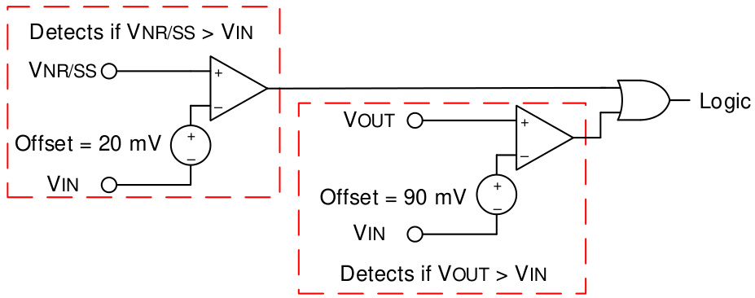  
图8 - 1。超调防止电路

当器件在失压状态下工作时，瞬态事件（如输入电压变弱、重负载瞬态或短路事件）会迫使器件处于反向偏置状态，此时输入电压要么低于VNR/SS参考电压$ 20 ~ \mathsf {m V}$（典型），要么低于$\mathsf {V} _ {\mathsf {O U T}}$。可以触发输出过冲防止电路，如图8-2所示，强制设备关机重启，防止输出电压过冲。如果设备仍然在丢包状态下运行，并且触发该电路的错误条件仍然存在，则可以发生额外的重新启动，直到这些条件被移除或设备不再处于丢包状态。重启总是从放电状态开始，并且总是具有与初始LDO上电相同的特征，因此启动时间、VOUT斜坡率和VOUT单调性都是可预测的。

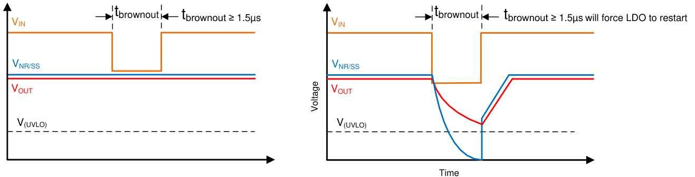  
图8 - 2。退出中的设备行为

软停电示例如图8-3所示，停电事件示例如图8-4所示。

限电超调存在于更高的$\mathsf { V } _ { \mathsf { I N } }$回转率。在图8-5中使用了$1 - V / \mu \leq$回转率。

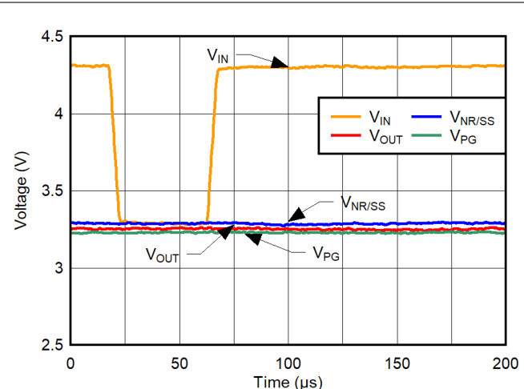  
图8 - 3。例如：Soft Brownout to VNR/SS

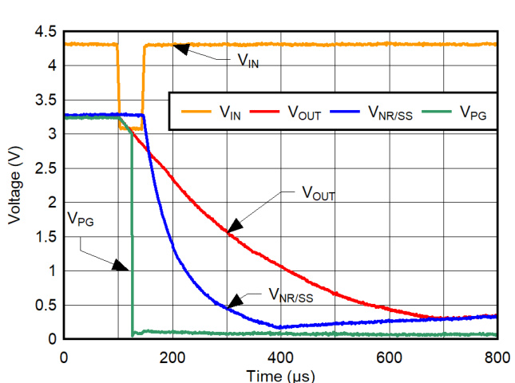  
图8 - 4。例如:警戒灯火管制

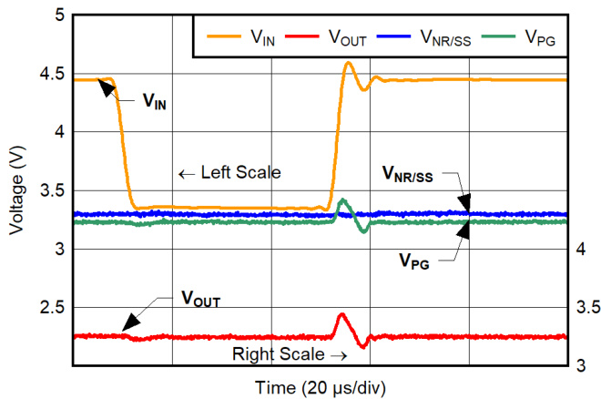  
图8 - 5。示例：带超调恢复的停电

如果EN_UV外部UVLO未按本节所述使用，则实现超调预防电路以提供可预测的设备启动和关闭，而不会输出超调。该电路可以通过以下方式防止触发：

1. 使用能够处理重负载瞬态或较大值输入电容的输入电源
2. 增加VIN和$\mathsf {V} _ {\mathsf {O U T}}$之间的操作净空（例如，当使用电池作为输入电源时，即使电池接近完全放电状态，也要确保VIN保持高于$\mathsf {V} _ {\mathsf {O U T}}$）
3. 使用斜坡速率快于由CNR/SS || RNR/SS形成的设定输出电压时间常数的输入电源
4. 放电输入电源慢于COUT ||（负载RPULLDOWN）或CNR/SS | （RNR/SS RPULLDOWN_ NR/SS）形成的放电时间

# 8.1.2精密使能（外部UVLO）

精密使能电路用于打开和关闭设备。该电路可用于设置外部欠压锁定（UVLO）电压（如图8-6所示），通过IN、EN_UV和GND之间的电阻分压器来接通和关闭设备。

$\mathsf { V } _ { \mathsf { E N \_ U V } } \geq \mathsf { V } _ { \mathsf { I H } ( \mathsf { E N \_ U V } ) } .$ ，使能稳压器。$\mathsf { V } _ { \mathsf { E N \_ U V } } \leq \mathsf { V } _ { \mathsf { I L } ( \mathsf { E N \_ U V } ) }$，调节阀关闭。EN＿UV引脚不包括一个内部的下拉电阻到GND，不能留下浮动。使用该引脚的精密使能电路设置外部欠压锁定（UVLO）输入电源电压，通过IN， EN＿UV和GND之间的电阻分压器打开和关闭设备。

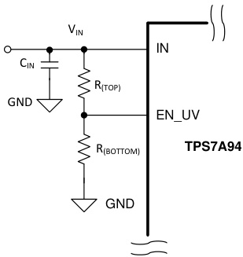  
图之后。精密EN用作外部UVLO

这种外部UVLO配置可以防止LDO在输入电源电压不足时打开，并使设备处于失压状态。

使用EN_UV引脚作为外部设置的UVLO，可以对级联电源进行简单的排序。另外一个好处是EN_UV引脚永远不会保持浮动状态。EN_UV引脚没有内部下拉电阻。除了电阻分压器外，EN_UV引脚和地之间还需要一个齐纳二极管，以符合该引脚的绝对最大额定值。

当$V _ {\mathsf {I N}}$超过目标$\mathsf {V} _ {\mathsf {O N}}$电压并设置R（BOTTOM）电阻器时，公式1和公式2提供R（TOP）电阻器值和VOFF电压，输入电压必须降至以下才能禁用LDO。

$$
\begin{array} { r l } & { \mathsf { R } _ { ( \mathsf { T O P } ) } \leq \mathsf { R } _ { ( \mathsf { B O T T O M } ) } \times ( \mathsf { V } _ { \mathsf { O N } } / \mathsf { V } _ { \mathsf { I H } ( \mathsf { E N } _ { - } \cup \mathsf { V } ) } - 1 ) } \\ & { \mathsf { V } _ { \mathsf { O F F } } < [ 1 + \mathsf { R } _ { ( \mathsf { T O P } ) } / \mathsf { R } _ { ( \mathsf { B O T T O M } ) } ] \times ( \mathsf { V } _ { \mathsf { I H } ( \mathsf { E N } _ { - } \cup \mathsf { V } ) } - \mathsf { V } _ { \mathsf { H Y S } ( \mathsf { E N } _ { - } \cup \mathsf { V } ) } ) } \end{array}
$$

where:

$\mathsf {V} _ {\mathsf {O F F}}$是稳压器关断时的输入电压$\mathsf {V} _ {\mathsf {O N}}$是稳压器导通时的电压

在选择${\mathsf {R}} _ {({\mathsf {TO P}})}$和R（BOTTOM）值时，考虑EN_UV电流引脚。

8.1.3欠压锁定（UVLO）操作

UVLO电路位于IN引脚上，确保在输入电源达到最小工作电压范围之前设备保持禁用状态，并且当输入电源下降过低时设备关闭。

$\mathsf {U V L O} _ {| \mathsf {N}}$电路的最小响应时间为几微秒才能完全断言。在此期间，下行线暂时低于约1美元。\ mathm {~ V ~}$使输入电源UVLO断言一小段时间。然而，$\mathsf {U V L O} _ {| \mathsf {N}}$电路可能没有足够的存储能量来完全放电设备内部的内部电路。当$\mathsf {U V L O} _ {| \mathsf {N}}$电路没有完全放电时，内部电路没有完全关闭。

下行线路瞬态的影响可以触发超调预防电路，并且可以通过使用精密使能（外部UVLO）部分中提出的解决方案轻松缓解。

图8-7说明了$\mathsf {U V L O} _ {| \mathsf {N}}$电路对各种输入电压事件的响应。此图可分为以下区域：

区域A：输入达到UVLO上升阈值后，设备才开启。
B区：正常运行，输出稳压。
区域C：超过UVLO下降阈值（UVLO上升阈值- UVLO迟滞）的停电事件。输出可能会脱离调节，但设备仍然是启用的。
D区：正常运行，输出稳压。
区域E：低于UVLO下降阈值的停电事件。在大多数情况下，由于负载和有源放电电路，设备被禁用，输出下降。当输入电压达到UVLO上升阈值，然后正常启动时，设备重新使能。
区域F：正常运行，输入下降到UVLO下降阈值。

区域G：当输入电压低于UVLO降阈值（0v）时，设备处于去使能状态。由于负载和有源放电电路，输出下降。

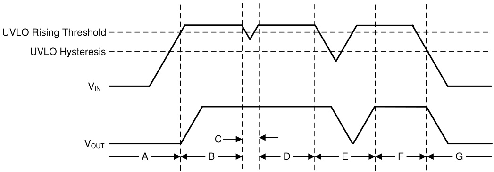  
图以8:7。典型的UVLO操作

# 8.1.4降压电压$(\mathsf {v} _ {\mathsf {D} \mathsf {0}})$

降压电压是指稳压所需的输入和输出电压之间的最小电压差$(\mathsf {V} _ {\mathsf {D} 0} = \mathsf {V} _ {\mathsf {I N}}$ $- \mathsf {V} _ {\mathsf {O U T}})$。当给定负载电流的输入电压$(\mathsf {V} _ {\mathsf {I N}})$降至或低于最大降压$(\mathsf {V} _ {\mathsf {D O} (\mathsf {M ax})})$时，器件作为阻性开关，不调节输出电压。当器件失压工作时，输出电压跟踪输入电压。对于大电流，压降电压$(\mathsf {V} _ {\mathsf {D O}})$与输出电流成正比，因为器件作为电阻开关工作。对于低电流，内部节点饱和，降差稳定到最小值。正如在输出电压重新启动（过冲预防电路）一节中提到的，输入电压减弱、重负载瞬态或短路事件等瞬态事件可以触发过冲预防电路。当器件处于或接近dropout时，会显著降低瞬态性能和PSRR，并且还会触发超调预防电路。保持足够的工作净空$(\mathsf {V} _ {\mathsf {O p H r}} = \mathsf {V} _ {\mathsf {I N}} - \mathsf {V} _ {\mathsf {O U T}})$可显著提高器件的瞬态性能和PSRR，并防止触发超调预防电路。

# Note

对于该器件，通程元件不是限制降压因数。由于参考电压是由电流源和NR/SS电阻产生的，并且由于工作净空空间正在减小（即使在低负载下），内部电流源（INR/SS）比通管更快饱和。这种行为在压差图（图6-43）中描述。注意，在轻负载情况下，差值不会达到$0 \vee$。

# 8.1.5 Power-Good反馈（FB_PG引脚）和Power-Good阈值（PG引脚）

为了使设备正常工作，必须连接FB_PG引脚的电阻分频网络输入。FB_PG引脚不能保持浮动，因为该引脚代表设备内部逻辑的模拟输入，并且在设备启动期间对输入阻抗进行采样。

PG引脚是指示LDO是否准备好提供电源的输出。该引脚采用开漏架构实现。FB_PG引脚用于编程PG引脚，具有编程PG阈值断言电压和调节电流限制ICL的双重目的。

PG引脚必须使用PG到IN的最小或更大的上拉电阻，如图8-8所示，或者使用电气特性表中的外轨。如果不使用PG功能，则将此引脚保持浮动或连接到GND。

FB＿PG引脚使用电阻分压器$\mathsf { R } _ { \mathsf { F B \_ P G ( T O P ) } }$和RFB ＿PG（BOTTOM）形成的并联阻抗来编程LDO初始化期间的电流极限值。如果该阻抗小于$1 \dot { 2 } . 5 \mathsf { k } \Omega$，则选择标称工厂编程的限流值。如果输入阻抗小于$5 0 ~ \mathsf { k } \Omega$，但大于$1 2 . 5 ~ { \mathsf { k } } \Omega$，则选择工厂编程的标称限流$80 \%$。如果输入阻抗小于$1 0 0 ~ \mathsf { k } \Omega$，但大于$5 0 ~ \mathsf { k } \Omega$，则选择工厂编程的标称限流$60 \%$。

按照本节所述连接RFB_PG（TOP）和RFB_PG（BOTTOM）电阻，以使LDO正常工作。不要使这个大头针浮起。

初始化完成后，分压器通过设置PG断言阈值电压向PG引脚提供必要的反馈。

要正确选择$\mathsf {R} _ {\mathsf {FB \_ PG(TO P)}}$和RFB PG（BOTTOM）电阻器的值，请参见调整工厂编程的电流限制部分，以获得详细的解释和计算。

# Note

美元\ mathsf {R} _ {\ mathsf {F B \ _ P G (T O P)}} $和$ \ mathsf {R} _ {\ mathsf {F B \ _ P G} (\ mathsf {B O T T O M})}美元之间的电阻分压器比率设置power-good断言阈值电压8 5 \ % 9美元5美元\ %的V美元_ {F B \ _ P G}电压60 \ %美元和美元80美元\ %的名义factoryprogrammed电流限制。

如果电流限制设置为标称工厂编程电流限制的100%，则PG阈值范围不受限制。对于必须最小化启动浪涌电流的系统，大于80%的PG阈值是常见的。在具有快速启动时间限制的系统中，可能需要较低的PG阈值。

根据$V _ {F B} \textsf {PG}$电压设置PG阈值，当输出电压达到$V _ {F B} \_ PG}$的相应百分比水平时，PG会断言，因为$V _ {F B} \mathsf {\ P}}$是输出电压的缩放版本。FB_PG和PG引脚内部电路如图8-8所示。

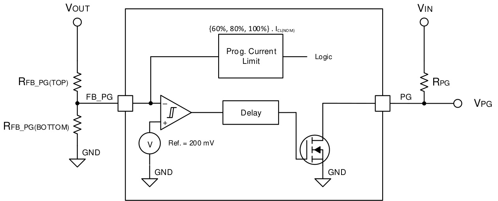  
图8。可编程电源-良好阈值简化原理图

PG引脚上拉电阻值必须在$ 10 ~ \mathsf {k} \Omega$和$ 10 ~ \mathsf {k} \Omega$之间。$ 10 ~ \mathsf {k} \Omega$的下限来自于功率良好晶体管的最大下拉强度，$ 10 ~ \mathsf {k} \Omega$的上限来自于功率良好节点的最大漏电流。如果上拉电阻超出此范围，则电源-good信号可能无法读取有效的数字逻辑电平。

PG信号的状态只有在FB_PG引脚电阻分频网络设置正确且设备处于正常工作模式时才有效。

# 8.1.6调整工厂编程的电流限制

电流限制是砖墙方案，工厂编程的电流限制值可以编程为一组离散值（默认值的$100 \%$,$80 \%$或$60 \%$），如电气特性表中指定。这种调整可以通过改变FB_PG引脚的输入阻抗来实现，该阻抗由并联电阻$\mathsf {R} _ {\mathsf {FB \_ PG} (\mathsf {T O P})}$ $\mathsf {1 | R _ {FB \_ PG (B O T T O M)}}$表示。FB_PG引脚具有双重功能：调整$\mathsf {I} _ {\mathsf {C L}}$值和设置power-good （PG）断言阈值。

在启动前，对FB_PG引脚的输入阻抗进行采样，并根据输入阻抗调整$\mathsf {I} _ {\mathsf {C L}}$值。

# Note

电流极限可编程性取决于输出电压。电压低于0。4 ~ \mathsf {V},$，当前限制无法编程。电压在$0。4 \ mathm {~ V ~}$和$1$ $ $，当前限制不能调整，并且始终设置为$100 $ $。可编程电流限制与输出电压描述了这种行为。

可编程电流限制vs输出电压

小于桌子写成的小于医学上的小于html > > > & lt tr > & lt;戴利> NOVONTAGE TPUT & lt; /戴利的小于戴利> > RFB_PG(昔日)(k2) & lt; /戴利的小于戴利> > PG(前)(kΩ)RFB_名& lt; /戴利的小于戴利> > IcL行传说& lt; /戴利> & lt; / tr > & lt tr > & lt;戴利rowspan =“3”> 1.2V VoUT(正督导)M & lt; /戴利的小于戴利> > PG(昔日)0.2秒V / 16μA RFB & lt; /戴利的小于戴利rowspan =“4”> > PG(前)= PG(昔日名)×0.2V×k 1) access k = PG,凝视(% VoUT) RFB RFB VoUT(正督导)& lt; /戴利的小于戴利> > 100 & lt; /戴利> & lt; / tr > & lt tr > & lt;戴利> PG(昔日)0.2秒V / 4μ甲RFB & lt; / 80戴利的小于戴利> > & lt; /戴利> & lt; / tr > & lt tr > & lt;戴利> PG(昔日)0.2秒V / 2μA RFB & lt; /戴利的小于戴利> > 60 & lt; /戴利> & lt; / tr > & lt tr > & lt;戴利的小于120 V 0.4 > V≤VoUT(正督导)RFB & lt; /戴利的小于戴利> > PG(昔日)0.2秒V / 6μA & lt; /戴利的小于100 & lt; /戴利戴利> > > & lt; / tr > & lt tr > & lt;戴利> & lt 0.4V VouT(正督导)& lt; /戴利的小于戴利> > N / A & lt; /戴利的小于戴利> > N / A & lt; /戴利的小于戴利> > N / A & lt; /戴利> & lt; / tr > & lt; /桌子写成> & lt; /医学上的小于/ html > >

表8-1给出了使用$1 \%$电阻器的各种输出电压值。
表8 - 1。可编程电流限制分压器电流设置

小于桌子写成的小于医学上的小于html > > > & lt tr > & lt;戴利> NOMINAL输出VOLTAGE (V) & lt; /戴利的小于戴利> > RFB_PG(昔日)(kΩ)& lt; /戴利的小于戴利> > PG(前)(kΩ)RFB_名& lt; /戴利的小于戴利> > IcL行传说(%)& lt; /戴利的小于戴利> > PG,凝视(%)& lt; /戴利> & lt; / tr > & lt tr > & lt;戴利rowspan =“3”> = 1.2V VouT(正督导)& lt; /戴利的小于戴利> > 12.4 & lt; /戴利的小于戴利> > 51.1 & lt; /戴利的小于戴利> > 100 & lt; /戴利的小于戴利> 85 & lt; /戴利> > & lt; / tr > & lt tr > & lt;戴利> 49.9 & lt; /戴利的小于戴利> >长& lt; / 80戴利的小于戴利> > & lt; /戴利的小于戴利> 85 & lt; /戴利> > & lt; / tr > & lt tr > & lt;戴利100 & lt; /戴利的小于戴利> > > 412 & lt; /戴利的小于戴利> > 60 & lt; /戴利的小于戴利> > 85 & lt; /戴利> & lt; / tr > & lt tr > & lt;戴利rowspan =“3”> = 3.3VVouT(正督导)& lt; /戴利的小于戴利> > 12.4 & lt; /戴利的小于戴利> > 187页& lt; /戴利的小于戴利> > 100 & lt; /戴利的小于戴利以第95 & lt; /戴利> > > & lt; / tr > & lt tr > & lt;戴利> 49.9 & lt; / 732戴利的小于戴利> > & lt; / 80戴利的小于戴利> > & lt; /戴利的小于戴利以第95 & lt; /戴利> > > & lt; / tr > & lt tr > & lt;戴利100 & lt; /戴利的小于戴利> > > 1470 & lt; /戴利的小于戴利> > 60 & lt; /戴利的小于戴利以第95 & lt; /戴利> > > & lt; / tr > & lt tr > & lt;戴利rowspan =“3”> = 5.1 V VouT(正督导)& lt; /戴利的小于戴利> > 12.4 & lt; /戴利的小于戴利> > 287 & lt; /戴利的小于戴利> > 100 & lt; /戴利的小于戴利以第95 & lt; /戴利> > > & lt; / tr > & lt tr > & lt;戴利> 49.9 & lt; /戴利的小于戴利> > 1150 & lt; / 80戴利的小于戴利> > & lt; /戴利的小于戴利以第95 & lt; /戴利> > > & lt; / tr > & lt tr > & lt;戴利100 & lt; /戴利的小于戴利> > > 2320 & lt; /戴利的小于戴利> > 60 & lt; /戴利的小于戴利以第95 & lt; /戴利> > > & lt; / tr > & lt; /桌子写成> & lt; /医学上的小于/ html > >

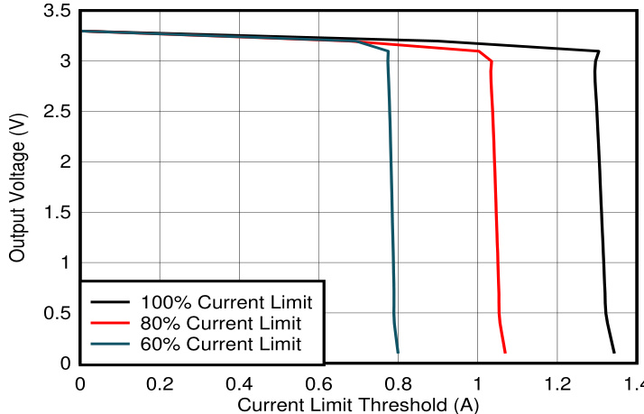  
图8-9显示了$ $3的不同$\mathsf {I} _ {\mathsf {C L}}$设置。3 - \lor$输出电压。
图8 - 9。3.3 vout （nom）的可编程限流行为（典型）

# 8.1.7可编程软启动和降噪（NR/SS引脚）

NR/SS引脚是误差放大器反相端输入，见功能框图。电阻器连接从这个销销内部的接地设置输出电压参考当前印度卢比/ SS,电压输出美元= \ mathsf{我}_ {\ mathsf {N R} / \ mathsf{年代年代}}\ * \ mathsf {R} _ {\ mathsf {N R} / \ mathsf{年代年代}}$从这个销电容器连接到接地大大降低输出噪声,限制了输入侵入电流和soft-starts输出电压。使用电气特性表中列出的NR/SS到地的最小值或更大的电容器，并将NR/SS电容器尽可能靠近设备的NR/SS和GND引脚。

该器件具有可编程、单调、电压控制、软启动电路，可设置为与外部电容器（CNR/SS）一起工作。除了软启动特性，CNR/SS电容还降低了LDO的输出电压噪声。软启动功能可用于消除上电初始化问题。控制的输出电压斜坡也降低了启动期间的峰值涌流电流，最大限度地减少了输入电源总线的启动瞬态。

为了实现单调启动，设备输出电压跟踪VNR/SS参考电压，直到该参考电压达到设定值（设定输出电压）。VNR/SS参考电压由RNR/SS电阻设定，在启动过程中，使用除INR/SS电流外的快速充电电流（IFAST_SS），如图8-10所示，为CNR/SS电容器充电。

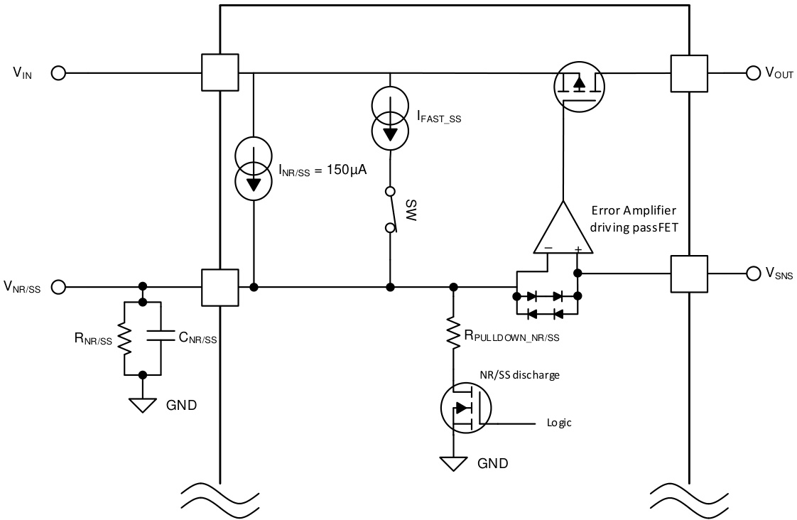  
图8 - 10。简化软启动电路

2.1 ma（典型）IFAST_ SS电流和$ 150 \mu \mathsf {A}$（典型）INR/SS电流快速给CNR/SS充电，直到电压达到设定输出电压的约$93 \ $，然后IFAST _SS电流断开，只有INR/SS电流继续给CNR/SS充电到设定的输出电压水平。如果在启动过程中出现任何错误或触发输出超调防止电路，则NR/SS放电场效应管导通，从而放电CNR/SS电容器以保护LDO和负载。

软启动斜坡时间取决于快速启动（IFAST_SS）充电电流、参考电流（INR/SS）、CNR/SS电容值和设定（目标）输出电压（VOUT（目标））。公式3计算软启动斜坡时间。

Soft-Start Time $( \mathsf { t } _ { \mathsf { S S } } ) = ( \mathsf { V } _ { \mathsf { O U T } ( \mathsf { t a r g e t } ) } \times \mathsf { C } _ { \mathsf { N R } / \mathsf { S S } } ) / ( \mathsf { I } _ { \mathsf { N R } / \mathsf { S S } } + \mathsf { I } _ { \mathsf { F A S T } \_ \mathsf { S S } } )$

INR/SS电流在电气特性表中提供，其值为$ 1.5 0 ~ \mu \mathsf {a}$（典型）。对于$\mathsf {V} _ {\mathsf {I N}} > 2， IFAST_SS电流的值为$2 \mathsf {ma}$（典型）。5 \mathsf {V}。图8-11和图8-12描述了INR/SS和IFAST SS电流与$\mathsf {V} _ {\mathsf {IN}}$和温度的关系。

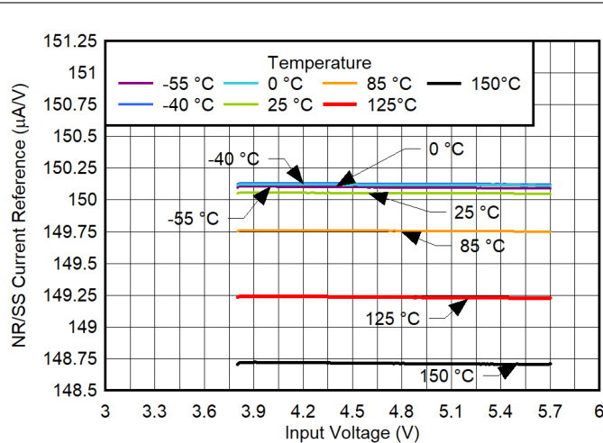  
图8。$\mathsf {v} _ {\mathsf {o ur}} = 3的INR/SS参考vs输入电压和温度3 \: \mathsf {V}$

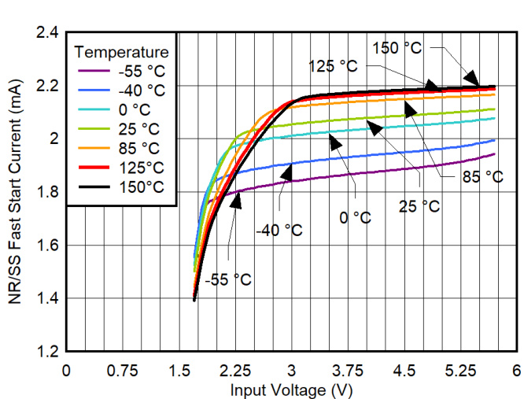  
图8 - 12。$\mathsf {v} _ {\mathsf {o ur}} = 3的IFAST_SS参考vs输入电压和温度3 \: \mathsf {V}$

由于误差放大器总是工作在单位增益配置下，输出电压噪声只能通过增加CNR/SS电容来调节。CNR/SS电容器和RNR/SS电阻器形成低通滤波器（LPF），滤除VNR/SS参考电压的噪声，从而降低器件的本底噪声。LPF是单极滤波器，公式4计算LPF截止频率。增加CNR/SS电容可以显著降低输出电压噪声；然而，这样做大大延长了启动时间。对于低噪音应用，请使用$4。7 \mathsf {-} \mu \mathsf {F}$ CNR/SS用于优化噪声和启动时间的权衡。

典型特性部分说明了CNR/SS电容对LDO输出电压噪声的影响。

启动阶段的关系、时序和输出电压值如图8-13所示。

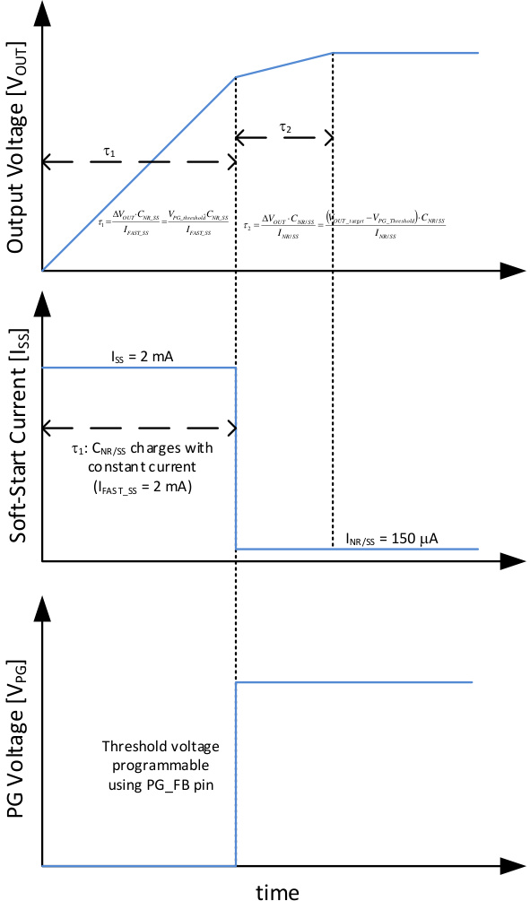  
图8日至13日。启动时阈值电压、输出电压、IFAST_SS和INR/SS的关系

# 8.1.8涌流

浪涌电流定义为在启动时进入LDO的IN引脚的电流。然后，浪涌电流主要由负载电流和用于给输出电容充电的电流之和组成。这个电流很难测量，因为必须去掉输入电容。不建议在没有输入电容的情况下操作，因为需要这个电容来保证稳定性。然而，公式5可以用来估计这个电流。

$$
\mathsf { I } _ { \mathsf { O U T } ( \mathsf { t } ) } = \left[ \frac { \mathsf { C } _ { \mathsf { O U T } } \times \mathsf { d V } _ { \mathsf { O U T } } ( \mathsf { t } ) } { \mathsf { d t } } \right] + \left[ \frac { \mathsf { V } _ { \mathsf { O U T } } ( \mathsf { t } ) } { \mathsf { R } _ { \mathsf { L O A D } } } \right]
$$

where:

$\mathsf {V} _ {\mathsf {OUT}} (\mathsf {T})$是导通坡道的瞬时输出电压$\mathsf {d V} _ {\mathsf {OUT}} (\mathsf {T})$ dt是VOUT坡道的斜率$R _ {\mathsf {L O A d}}$是电阻性负载阻抗

如图8-10所示，NR/SS引脚（CNR/SS）上的外部电容通过设置VNR/SS参考电压的上升时间来设定输出启动时间。

空载时的冲击电流如图6-37 ~图6-40所示。

# 8.1.9优化噪声和PSRR

噪声通常可以定义为任何不需要的信号与所需信号（如稳压LDO输出）相结合。在音频中，噪音很容易被注意到，比如嘶嘶声或爆裂声。外部电路或50- 60赫兹电力线噪声（尖峰）产生的噪声以及谐波是外部噪声的极好代表。本征噪声是由器件电路中的元件产生的，如电阻和晶体管。固有噪声的两个主要来源是误差放大器和内部参考电压（V _ {\mathsf {N R / S}}）$。耦合到LDO输入电源上的外部噪声，包括开关模式电源交流纹波电压，通过LDO电源抑制比或PSRR来衰减。PSRR是测量从LDO的输入到输出的噪声衰减。

通过精心选择优化固有噪声和PSRR：

CNR/SS为低频范围内的设备带宽
COUT为接近并高于器件带宽的高频范围
运行净空，$\mathsf {V} _ {\mathsf {I N}} - $ mathsf {V} _ {\mathsf {O U T}} (\mathsf {V} _ {\mathsf {D O}})$，主要用于低频范围内直至器件带宽，但是
频率越高，影响越小

这些行为在典型特征曲线中描述。

图8-14和图8-15显示了3.3 v设备输出电压为0时测量到的$ 10 - hz $到100 khz RMS噪声。5 - 100美元的净空空间适用于不同的CNR/SS和COUT电容器和1-A负载电流。这些电容的典型输出噪声如表8-2所示。

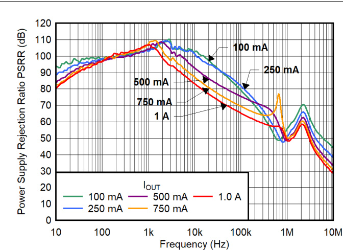  
图8 - 14。PSRR vs Frequency, IOUT for VOUT

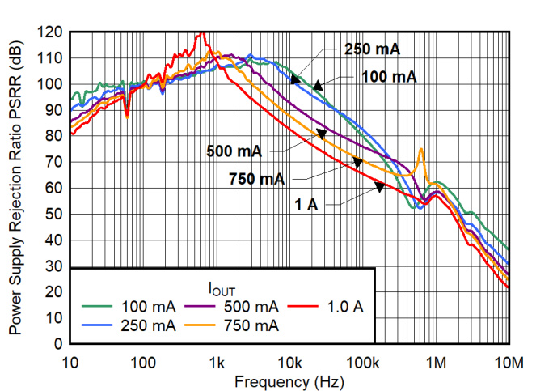  
图地位。当VOUT = 3.3 V, COUT = 4.7 μF|| 4.7 μF|| 1.0 μF时，PSRR vs Frequency和IOUT

表8 - 2。3.3-VOUT与CNR/SS、COUT和典型启动时间的典型输出噪声

<html><body><table><tr><td>Vn (μVRms), 10-Hz to 100-kHz BW</td><td>(μF) CNR/SS</td><td>(μF) CouT</td><td>START-UP TIME (ms)</td></tr><tr><td>0.98</td><td></td><td>10</td><td>3.73</td></tr><tr><td>0.62</td><td>2.2</td><td>10</td><td>6.21</td></tr><tr><td>0.46</td><td>4.7</td><td>10</td><td>13.97</td></tr><tr><td>0.42</td><td>10</td><td>10</td><td>28.21</td></tr></table></body></html>

PSRR可以简单地看作是输出电容阻抗与LDO输出阻抗之比。在低频时，输出阻抗很低，而电容器的输出阻抗很高，导致高PSRR。随着频率的增加，输出电容阻抗减小并达到ESR设定的最小值。

如图8-14和图8-15所示，为了在高频率下获得高的PSRR，请确保输出电容的ESR和ESL最小。这些数字比较了使用单个$ 10 \ mathm {-} \mu \mathsf {F}$输出电容与4.7 μF || 4.7-μF || $1输出电容的情况。0 \mathsf {-} \mu \mathsf {F}$实现。注意，低于$ 20 0 k H z$，对性能没有影响，但高于$ 20 0 ~ \mathsf {k H z}$， PSRR提高了5 dB到7 dB。

最小化ESR， ESL在输出电容中产生的谐振点允许在LDO有源PSRR组件到电容器的无源PSRR之间更平滑地过渡。

# 8.1.10可调操作

如图8-16所示，设备的输出电压可以通过单个外部电阻（RNR/SS）进行设置。
公式6计算输出电压。

$$
\mathsf { V } _ { \mathsf { O U T } } = \mathsf { I } _ { \mathsf { N R / S S ( N O M ) } } \times \mathsf { R } _ { \mathsf { N R / S S } }
$$

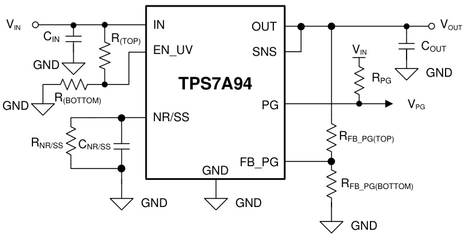  
分裂到8 - 16个。图典型的电路

表8-3显示了使用标准$1 \%$公差电阻来实现几个共轨的推荐RNR/SS电阻值。

表8 - 3。推荐的RNR/SS值

<html><body><table><tr><td>TARGETED OUTPUT VOLTAGE (M)</td><td>RNR/Ss (kΩ)</td><td>CALCULATED OUTPUT VOLTAGE (M)</td></tr><tr><td>0.4</td><td>2.67</td><td>0.4005</td></tr><tr><td>0.5</td><td>3.32</td><td>0.498</td></tr><tr><td>0.6</td><td>4.02</td><td>0.603</td></tr><tr><td>0.7</td><td>4.64</td><td>0.696</td></tr><tr><td>0.8</td><td>5.36</td><td>0.804</td></tr><tr><td>0.9</td><td>6.04</td><td>0.906</td></tr><tr><td>1.0</td><td>6.65</td><td>0.9975</td></tr><tr><td>1.2</td><td>8.06</td><td>1.209</td></tr><tr><td>1.5</td><td>10.0</td><td>1.5</td></tr><tr><td>2.5</td><td>16.5</td><td>2.475</td></tr><tr><td>3.0</td><td>20.0</td><td>3.0</td></tr><tr><td>3.3</td><td>22.1</td><td>3.315</td></tr><tr><td>3.6</td><td>24.3</td><td>3.645</td></tr><tr><td>4.7</td><td>31.6</td><td>4.74</td></tr><tr><td>5.0</td><td>33.2</td><td>4.98</td></tr></table></body></html>

# Note

为了避免在启动过程中使用大的$\mathsf {C / u / r}$电容器来限制电流，请确保

1. 最小的NR/SS电容为$1 \mu \mathsf {F}$
2. 当输出电容大于${100 \mu \mathsf {F}} _ {\cdot}$时，保持COUT / CNR/SS比< 100

由于设置的电阻也放置在NR/SS引脚上，因此考虑使用薄膜电阻并提供足够的电阻温度漂移以确保目标精度。

# 8.1.11并联实现高输出电流和低噪声

通过并联两个或多个ldo可以实现更高的输出电流和更低的噪声。实现必须仔细规划，以优化性能和最小化输出电流不平衡。

由于TPS7A94的输出电压是由电流源驱动的电阻设定的，因此NR/SS电阻和电容必须按以下方式调整：

RNR/SS _parallel $\mathbf {\sigma} = \mathbf {\sigma}$ VOUT _TARGET （n × INR/SS）

CNR/SS _parallel = n × CNR/SS单线

where:

n为并行ldo的数量
INR/SS为数据表电气特性表中提供的NR/SS电流
单个CNR/SS是单个LDO的NR/SS电容器

当输入端和NR/SS引脚连接在一起，且LDO作为缓冲器时，电流不平衡仅受误差放大器的误差失调电压的影响。因此，当前的不平衡可以表示为：

$$
\varepsilon _ { \mathsf { I } } = { \mathsf { V } } _ { \mathsf { O S } } \times 2 \times { \mathsf { R } } _ { \mathsf { B A L L A S T } } / ( { \mathsf { R } } _ { \mathsf { B A L L A S T } } ^ { 2 } - \Delta { \mathsf { R } } _ { \mathsf { B A L L A S T } } ^ { 2 } ) ^ { 2 }
$$

where:

$\ mathfrk {E} _ {\ mathfrm {l}}$是当前的不平衡
VOS为LDO误差偏移电压
r镇流器为镇流器电阻
ΔRBALLAST是镇流器电阻器值与标称值的偏差

典型的失调电压为$2 0 0 ~ \mu \nu ,$，考虑到PCB镇流器电阻的设计没有误差$( \Delta R _ { \mathsf { B A L L A S T } } = 0 )$)，最大电流不平衡为100ma，镇流器电阻必须为$4 \ m \Omega$或更大；如图8-17所示。

使用上述配置，LDO输出噪声降低如下：

$$
\mathsf { e } _ { 0 \_ \mathsf { p a r a l l e l } } = ( 1 \mathrm { ~ / ~ } \sqrt { \mathsf { n } } ) \times \mathsf { e } _ { 0 \_ \mathsf { s i n g l e } }
$$

where:

n为并联LDO的个数；eO _single为单个LDO的输出噪声密度；eO_ parallel为生成的并联LDO的输出噪声密度

如图8-17所示，噪声降低1 /√2。

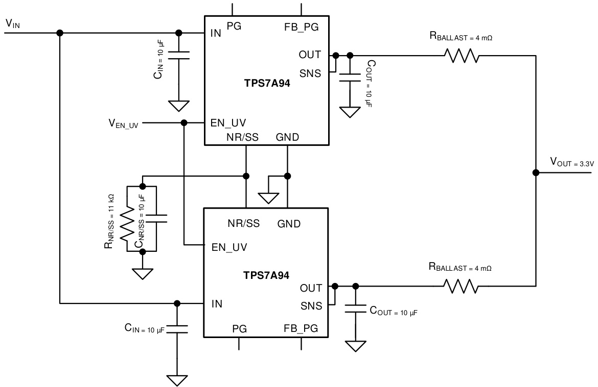  
图8。并行多个TPS7A94器件

# 8.1.12推荐的电容类型

该器件在输入、输出和降噪引脚处采用低等效串联电阻（ESR）和低等效串联电感（ESL）陶瓷电容器，设计稳定。多层陶瓷电容器已成为这些应用的行业标准，并被推荐使用，但必须具有良好的判断力。陶瓷电容器采用X7R， x5r额定值，或更好的介电材料，在温度范围内提供相对较好的电容稳定性。不鼓励使用y5v额定电容器，因为电容变化很大。

无论选择何种陶瓷电容类型，陶瓷电容都会随工作电压和温度的变化而变化。本文推荐的输入和输出电容器的电容降额约为$50 \%$，但在高$\mathsf {V} _ {\mathsf {I N}}$和$\mathsf {V} _ {\mathsf {O U T}}$条件$（\mathsf {V} _ {| \mathsf {N}} = 5）。5 ~ \mathsf {V}$到$\mathsf {V} _ {\mathsf {0 U T}} = 5。0 \ \mathsf {V},$)，降额可以大于$50 \%$，必须考虑到这一点。

为了使LDO正常工作，器件需要输入、输出和降噪电容。使用“推荐工作条件”表中规定的标称或大于标称的输入和输出电容器。将输入和输出电容尽可能靠近相应的引脚，并使电容的GND连接尽可能靠近设备的GND引脚，以最小化PCB环路电感，从而减少负载阶跃期间的瞬态电压尖峰。

如图8-15所示，可以使用多个并联电容器来降低线路上的阻抗。该电容抵消输入走线电感，改善瞬态响应，减少输入纹波和噪声。使用大于典型值的输出电容也可以改善瞬态响应。

# 8.1.13负载瞬态响应

# Note

为了获得最佳瞬态响应，请使用“推荐工作条件”表中列出的从OUT到地的标称值或更大的电容。将输出电容尽可能靠近器件的OUT和GND引脚。

为了获得最佳瞬态响应并最小化输入阻抗，请使用“推荐工作条件”表中列出的从IN到地的标称值或更大的电容。将输入电容尽可能靠近器件的IN和GND引脚。

负载阶跃瞬态响应是LDO输出电压对负载电流变化的响应。在负载瞬态响应期间有两个关键的转换：从轻负载到重负载的转换，以及从重负载到轻负载的转换。本节对如图8-18所示的区域进行细分。A、E、H区是输出电压处于稳态调节状态的区域。

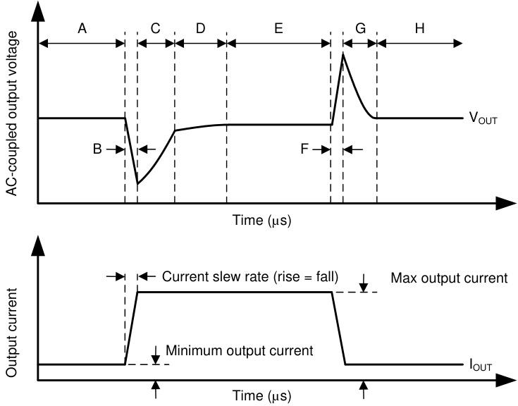  
图仅。负载瞬态波形

在从轻负荷到重负荷的过渡期间：

初始电压下降是输出电容电荷耗尽和输出电容寄生阻抗（B区）的结果。
由于LDO增加源电流，导致从倾斜中恢复，并导致输出电压调节（区域C）。

在从重负荷到轻负荷的转换过程中：

初始电压上升的结果，从LDO源一个大电流，并导致输出电容充电
增加（区域F）
从上升中恢复的结果是LDO结合负载降低源电流
放电输出电容（G区）

由于器件是大电流器件（D区），电流电平之间的转换会改变内部功耗。在这些转变过程中，功耗的变化改变了模具温度，并导致电压水平略有不同。这种与温度相关的输出电压水平显示在各种负载瞬态响应中。

较大的输出电容会降低负载瞬态期间的峰值，但会减慢设备的响应时间。更大的直流负载也降低了峰值，因为过渡的幅度降低了，并且为输出电容提供了更高电流的放电路径。

# 8.1.14功耗$(P _ {\mathsf {D}})$

电路的可靠性要求合理考虑器件的功耗、电路在PCB板上的位置以及热平面的尺寸。稳压器周围的PCB区域必须尽可能不受其他产生热的器件的干扰，以免产生额外的热应力。

作为一阶近似，稳压器的功耗取决于输入输出电压差和负载条件。公式11计算$\mathsf {P} _ {\mathsf {D}}$：

$$
\mathsf { P } _ { \mathsf { D } } = ( \mathsf { V } _ { \mathsf { O U T } } - \mathsf { V } _ { \mathsf { I N } } ) \times \mathsf { I } _ { \mathsf { O U T } }
$$

# Note

通过正确选择系统电压轨，可以最大限度地降低功耗，从而提高效率。适当的选择允许获得最小的输入输出电压差。该器件的低差允许在宽范围的输出电压下实现最高效率。

封装的主要热传导路径是通过热垫到PCB。将热垫焊接到设备下方的铜垫区域。该焊盘区域包含一系列电镀过孔，将热量传导到任何内部平面区域或底部铜平面。

器件的功耗决定器件的结温$(\mathsf {T} _ {\mathsf {J}})$。根据公式12，功耗和结温通常与组合PCB和器件封装的结对环境热阻$(\mathsf {R} _ {\Theta \ J {\mathsf {A}}})$和环境空气温度$(T _ {\mathsf {A}})$有关。将输出电流重新排列为式13。

$$
\begin{array} { r l } & { \mathsf { T } _ { \mathsf { J } } = \mathsf { T } _ { \mathsf { A } } = ( \mathsf { R } _ { \mathsf { \theta J A } } \times \mathsf { P } _ { \mathsf { D } } ) } \\ & { \mathsf { I } _ { \mathsf { O U T } } = ( \mathsf { T } _ { \mathsf { J } } - \mathsf { T } _ { \mathsf { A } } ) / [ \mathsf { R } _ { \mathsf { \theta J A } } \times ( \mathsf { V } _ { \mathsf { I N } } - \mathsf { V } _ { \mathsf { O U T } } ) ] } \end{array}
$$

这个热阻$(\mathsf {R} _ {\Theta \ J \mathsf {A}})$高度依赖于内置到特定PCB设计中的散热能力，因此根据总铜面积，铜重量和平面位置而变化。热信息表中记录的$\mathsf {R} _ {\Theta \ J _ {A}}$由JEDEC标准、PCB和镀铜面积决定，仅用作封装热性能的相对度量。对于设计良好的热布局，Rθ ja实际上是DSC封装结对外壳（底部）热阻$(\mathsf {R} _ {\Theta \mathsf {J C bot}})$加上PCB铜的热阻贡献的总和。

# 8.1.15估算结温

JEDEC标准现在建议使用psi $(\ psi)$热指标来估计LDO在典型PCB板应用上的结温。这些指标并不是严格意义上的热阻，而是提供实用和相对的方法来估计结温。这些psi指标被确定为与铜扩散面积无关。关键热指标（$\cdot \Psi _ {\ J \top}$和ΨJB）根据公式14使用，并在热信息表中给出。

$$
\begin{array} { c } { { \Psi _ { \mathrm { J T } } \mathrm { : } \mathrm { } \mathrm { } \sf T _ { \mathrm { J } } = \sf T _ { \mathrm { T } } + \Psi _ { \mathrm { J T } } \mathrm { \times } \sf P _ { \mathrm { D } } } } \\ { { \Psi _ { \mathrm { J B } } \mathrm { : } \mathrm { } \sf T _ { \mathrm { J } } = \sf T _ { \mathrm { B } } + \Psi _ { \mathrm { J B } } \mathrm { \times } \sf P _ { \mathrm { D } } } } \end{array}
$$

where:

$\mathsf {P} _ {\mathsf {D}}$是功耗$(P _ {D})$一节中解释的功耗
$\mathsf {T} _ {\mathsf {T}}$是器件封装中顶部的温度
$T _ {\mathsf {B}}$ s PCB表面温度测量距离器件封装1mm，并以封装为中心
edge

# 8.1.16 TPS7A94EVM-046热分析

TPS7A94EVM-046 EVM用于开发TPS7A9401DRC热模型。DRC封装是${3 \cdot \mathsf {m m}} \乘以3 \cdot {\mathsf {m m}}$， 10引脚VQFN，每个孔上镀$ 2.5 \AA - \mu \m $。EVM尺寸为2.85英寸× 3.35英寸。3 9 \ \mathsf {m m} \ \times \$ $80 9 ~ \ mathm {{m m}},$ PCB由四层组成。EVM的层间堆叠如表8-4所示。EVM的各层详细信息如图8-19 ~图8-23所示。

表8 - 4。TPS7A94EVM-046 PCB堆叠

<html><body><table><tr><td>LAYER</td><td>NAME</td><td>MATERIAL</td><td>THICKNESS (mil)</td></tr><tr><td></td><td>Top overlay</td><td></td><td></td></tr><tr><td>2</td><td>Top solder</td><td>Solder resist</td><td>0.4</td></tr><tr><td>3</td><td>Top layer</td><td>Copper</td><td>2.8</td></tr><tr><td>4</td><td>Dielectric 1</td><td>FR-4 Tg high</td><td>10</td></tr><tr><td>5</td><td>Mid layer</td><td>Copper</td><td>2.8</td></tr><tr><td></td><td>Dielectric 2</td><td>FR-4 high Tg</td><td>30</td></tr><tr><td>67</td><td>Mid layer 2</td><td>Copper</td><td>2.8</td></tr><tr><td>8</td><td>Dielectric 3</td><td>FR-4 high Tg</td><td>10</td></tr><tr><td>9</td><td>Bottom layer</td><td>Copper</td><td>2.8</td></tr><tr><td>10</td><td>Bottom solder</td><td>Solder resist</td><td>0.4</td></tr></table></body></html>

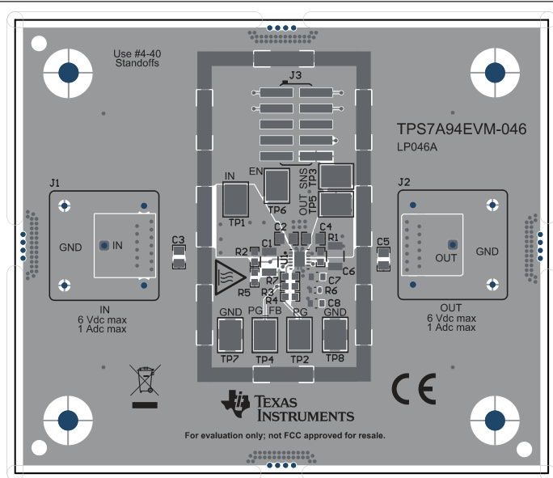  
图8-19。顶部复合视图

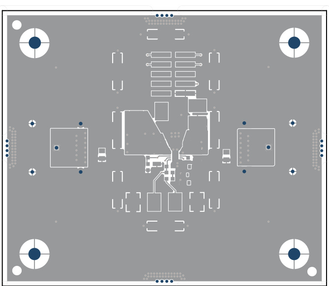  
图8-20。顶层路由

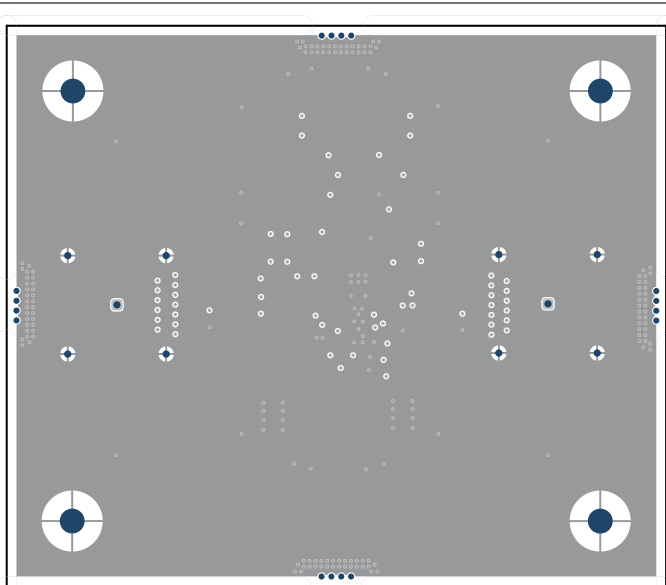  
图8至21。中间层路由

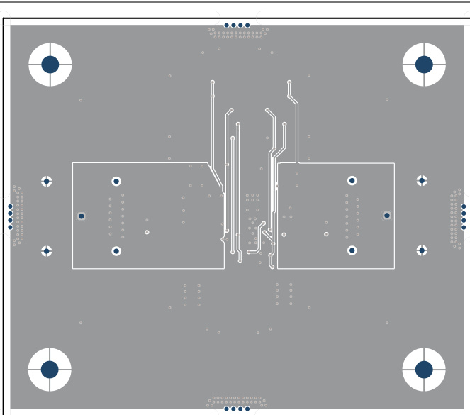  
图8-22。中间层2路由

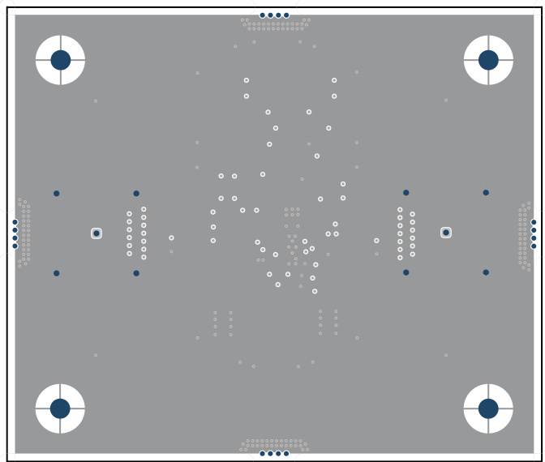  
图8-23。底层路由

图8-24至图8-26显示了在$ 2.5 ^ {\circ} \mathsf {C}$环境温度下，通过通管使用1 w功耗时PCB和器件上的热梯度。表8-5显示了TPS7A94EVM-046的热模拟数据。

表8 - 5。TPS7A94EVM-046热模拟数据

<html><body><table><tr><td>DUT</td><td>RθJA (°C/W)</td><td>ψJB (°C/W)</td><td>ψJT (°C/W)</td></tr><tr><td>TPS7A94EVM-046</td><td>25.6</td><td>11.5</td><td>0.3</td></tr></table></body></html>

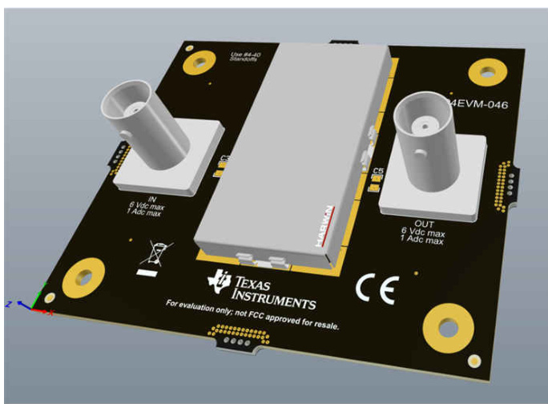  
图日到24日。TPS7A94EVM-046 3D视图

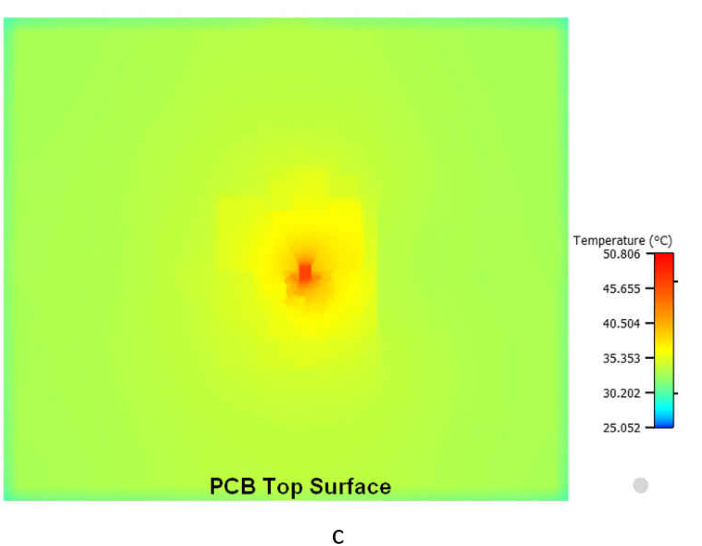  
图8-25。TPS7A94EVM-046 PCB热梯度

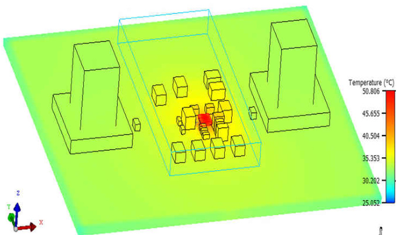  
图8-26。TPS7A94EVM-046器件热梯度

# 8.2典型应用

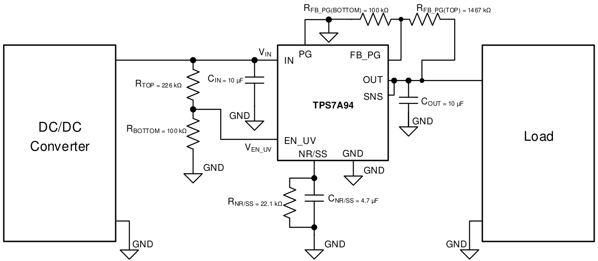  
图8-27。典型应用电路

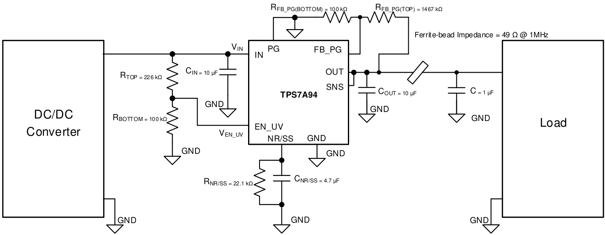  
图8-28。典型的应用电路增加了pi滤波器

# 8.2.1设计要求

本设计举例所需的应用参数如表8-6所示。

表之后。设计参数

表身体< html > < > < > < tr > < td >参数< / td > < td >设计要求< / td > < / tr > < tr > < td >输入电压< / td > < td > Vin≥5 V,±3%,提供的直流/直流转换器开关1 MHz < / td > < / tr > < tr > < td >输出电压< / td > < td > 3.3 V,±1% < / td > < / tr > < tr > < td >输出电流< / td > < td > 500毫安(最大),300毫安(最小)< / td > < / tr > < tr > < td >当前限制< / td > < td > 750毫安< / td > < / tr > < tr > < td > PG阈值< / td > < td > 95% < / td > < / tr > < tr > < td行宽=“2”>目标光谱噪音< / td > < td >目标噪声合规面具区1(10赫兹到100赫兹):频谱噪声≤100 nV/VHz</td></tr><tr><td> 2区（100 Hz至kHz）：频谱噪声≤10 nV/VHz</td></tr><tr><td> 1 MHz时PSRR </td><td> 3区（> kHz）：最大负载电流时频谱噪声≤3 nV/VHz 50 dB 7</td></tr><tr><td>启动环境</td><td>当VN≥80% ×目标VN_T Vin </td></tr></table></body></html>

# 8.2.2详细设计程序

在本设计示例中，器件由${\mathsf {d c}} / {\mathsf {d c}}$转换器供电，开关频率为1 MHz。负载需要一个3.3 v的干净轨道，其频谱噪声掩模与频率的关系如图8-29所示，最大负载为$5 0 0 ~ \mathsf {ma}$。典型的$ 10 \ mathm {-} \mu \ mathf {F}$输入输出电容器和$4。7 \mathsf {-} \mu \mathsf {F}$ NR/SS电容器用于实现快速启动时间与优异噪声和PSRR性能之间的良好平衡。

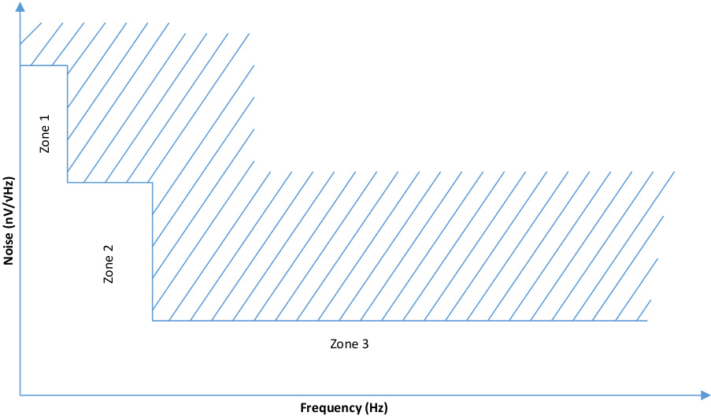  
图8-29。噪音管制掩模

输出电压使用$ 22设置。1 \ mathm {-} \mathsf {k} \Omega$，薄膜电阻器值计算方法见可调操作部分。要将电流限制设置为接近应用程序所需的$ 7.5 0 ~ \mathsf {ma}$的值，并将PG阈值设置为$ 9.5 %$，请使用表8-1分别将$\mathsf {R} _ {\mathsf {F B \_ PG}}$的顶部和底部电阻器值设置为1.47 MΩ和$ 1.0 0 \mathsf {k} \Omega$。

将$R _ {\mathsf {B}}$设置为$1 0 0 ~ \mathsf {k} \Omega$，并使用4-V $\mathsf {V} _ {\mathsf {O N}}$和公式1提供$\mathsf {R} _ {\mathsf {T}}$的值$2 2 6 ~ \mathsf {k} \Omega$。VOFF由公式2计算为3美元。5 \mathsf {V} .$

从图8-30中可以看出，除$9 0 0 ~ \mathsf {k H z}$处噪声峰值外，设备满足所有设计噪声要求。然而，这种噪声峰值可以很容易地衰减到所需的噪声水平，通过一个pi滤波器后定位的LDO。图8-31显示，这种设计非常接近1mhz的PSRR电平，可能需要更大的余量。幸运的是，通过在LDO之外和负载之前插入一个由铁氧体珠和一个小电容器组成的pi滤波器，这两个要求都很容易实现；如图8-28所示。

选用的铁氧体珠具有非常小的直流电阻，小于$ 50 ~ \mathsf {m} \Omega$，额定电流为1 a，并且占地面积相对较小。增加pi滤波器组件对LDO精度性能几乎没有影响，设计总成本也没有显著增加。

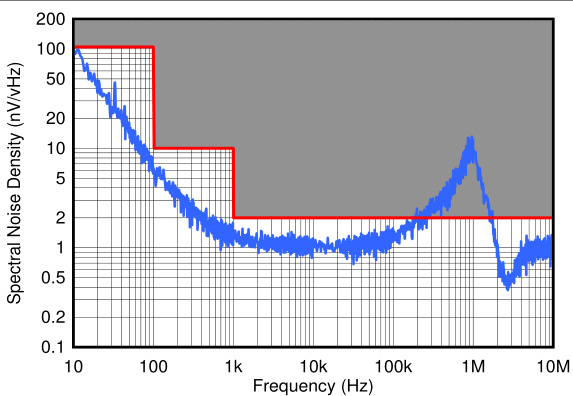  
图8-30。输出噪声与频率的关系

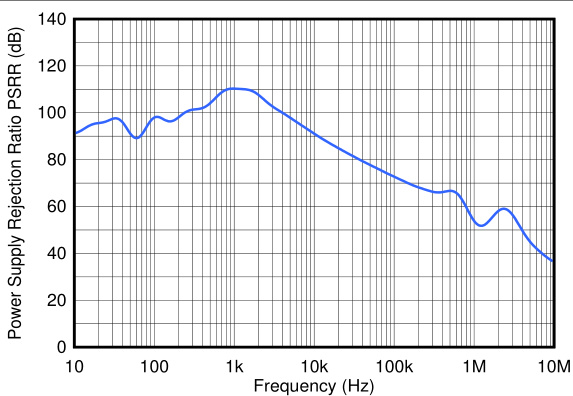  
图8-31。PSRR vs频率

8.2.3应用曲线

插入pi滤波器后的设计噪声和PSRR性能如图8-32和图8-33所示。

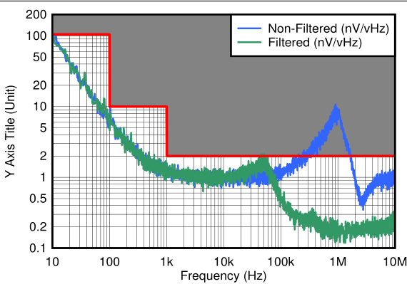  
图8-32。噪音与频率

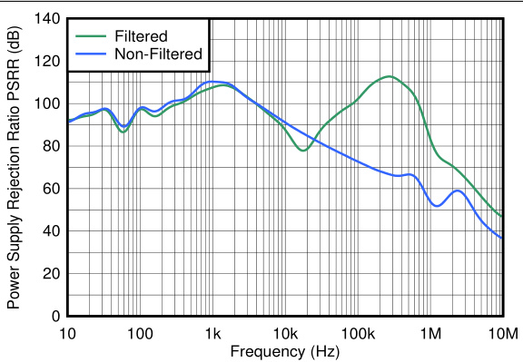  
图8-33。PSRR vs频率

# 8.3电源建议

该设备的输入电压范围为1美元。7 \mathsf {V}$到${\mathsf {7 ~ v。}}$确保输入电压范围为设备提供足够的工作净空，以实现稳压输出。这种输入供应必须得到很好的调节。如果输入电源有噪声，则使用具有低ESR的额外输入电容，并增加工作净空，以实现所需的输出噪声、PSRR和负载瞬态性能。

# 8.4布局

# 8.4.1布局指南

# 8.4.1.1单板布局

为保证散热性能，建议将热垫接在大面积的GND平面上。

Kelvin通过低阻抗连接SNS引脚到输出电容和负载，以获得最佳的瞬态性能。不要使这个大头针浮起。

将GND引脚连接到器件热垫上，并将该引脚和热垫通过低阻抗连接到单板上的地。

为了获得最佳的整体性能，请将所有电路元件放在电路板的同一侧，并尽可能靠近各自的LDO引脚连接。将接地返回连接放置到输入和输出电容以及LDO接地引脚上，并尽可能彼此靠近，通过元件侧的宽铜表面连接。为避免负系统性能，输入和输出电容不要使用过孔或长走线。如图8-34所示的接地布局方案可以最大限度地降低电感寄生，从而降低负载电流瞬变，降低噪声，提高电路的稳定性。

为了提高性能，使用接地参考平面，可以嵌入在印刷电路板（PCB）中，也可以放置在与组件相对的PCB底部。该参考平面用于确保输出电压的准确性，屏蔽噪声，并且在连接到热垫时，其行为类似于热平面以传播（或吸收）来自LDO器件的热量。在大多数应用中，这种接地面是满足热要求所必需的。

# 8.4.1.2布局示例

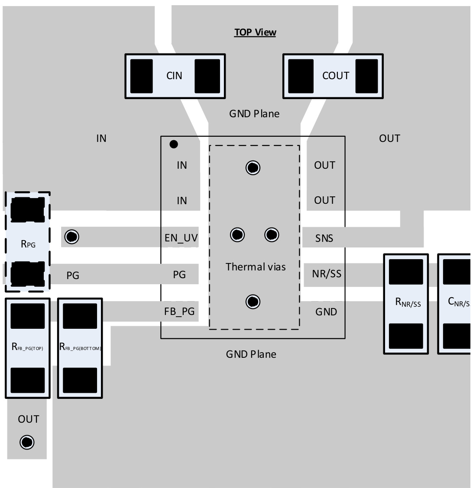  
图8-34。示例布局

9.1设备支持

# 9.1.1开发支持

# 9.1.1.1评估模块

评估模块（EVM）可用于协助使用PS7A94进行初始电路性能评估。表9-1显示了该夹具的概要信息。

表1胜9负。设计套件和评估模块

<html><body><table><tr><td>NAME</td><td>文献编号</td></tr><tr><td>TPS7A94EVM-046评估模块</td><td>SBVU070</td></tr></table></body></html>

EVM可以通过TPS7A94产品文件夹在德州仪器网站上申请。

# 9.1.1.2香料模型

在分析模拟电路和系统的性能时，使用SPICE进行电路性能的计算机模拟通常是有用的。TPS7A94的SPICE模型可通过仿真模型下的TPS7A94产品文件夹获得。

# 9.1.2设备命名法

表9 - 2。订购信息(1)

<html><body><table><tr><td>PRODUCT</td><td>DESCRIPTION</td></tr><tr><td>TPS7A9401 yyy z</td><td></td></tr></table></body></html>

(1)有关最新的包装和订购信息，请参阅本文档末尾的“包装选项附录”，或参阅www.ti.com上的设备产品文件夹。

# 9.2文档支持

# 9.2.1相关文档

相关文档请参见以下内容：

德州仪器，TPS3702高精度，过压和欠压监视器数据表，TPS7A94EVM-046评估模块用户指南，德州仪器，大电流，低噪声并联LDO参考设计

# 9.3接收文档更新通知

要接收文档更新通知，请导航到ti.com上的设备产品文件夹。点击订阅更新以注册并接收已更改的任何产品信息的每周摘要。有关变更细节，请查看任何修订文件中包含的修订历史。

# 9.4支持资源

TI E2E™支持论坛是工程师获得快速、经过验证的答案和设计帮助的首选来源-直接来自专家。搜索现有答案或提出自己的问题，以获得所需的快速设计帮助。

链接内容由各自的贡献者“按原样”提供。它们不构成TI规范，也不一定反映TI的观点；请参阅TI的使用条款。

# 9.5商标

TI E2E™是德州仪器的商标。
所有商标均为其各自所有者的财产。

# 9.6静电放电

这种集成电路会被ESD损坏。德州仪器建议所有集成电路都要采取适当的预防措施。不遵守正确的操作和安装程序可能会造成损坏。

ESD损坏的范围可以从细微的性能下降到完全的设备故障。精密集成电路可能更容易受到损坏，因为非常小的参数变化可能导致器件不符合其公布的规格。

# 9.7术语

词汇

本术语表列出并解释了术语、缩略语和定义。

# 10机械、包装和可订购信息

以下页面包括机械、包装和可订购信息。此信息是指定设备可用的最新数据。这些数据如有更改，恕不另行通知或本文档进行修订。有关此数据表的基于浏览器的版本，请参阅左侧导航。

# 10.1机械数据

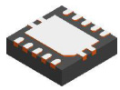

塑料小轮廓无铅

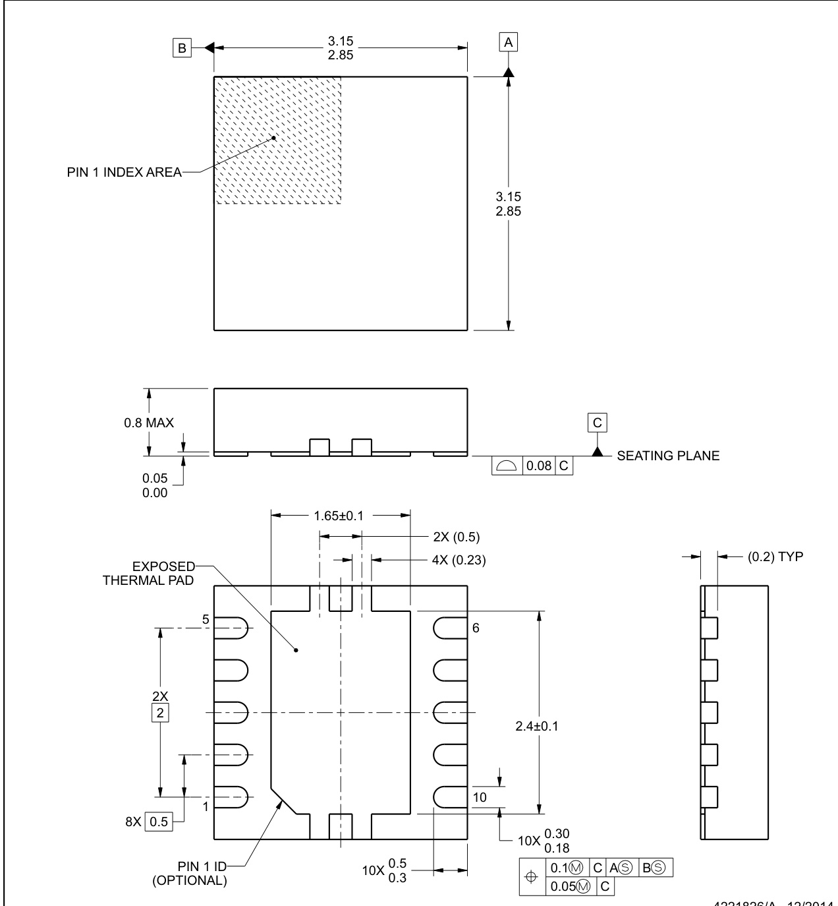

NOTES:

1. 所有的线性尺寸都以毫米为单位。括号内的尺寸仅供参考。尺寸和公差按ASME y145m。
2. 此图纸如有更改，恕不另行通知。
3. 封装热垫必须焊接到印刷电路板上，以保证热性能和机械性能。

#示例板布局

WSON最大高度0.8 mm

塑料小轮廓无铅

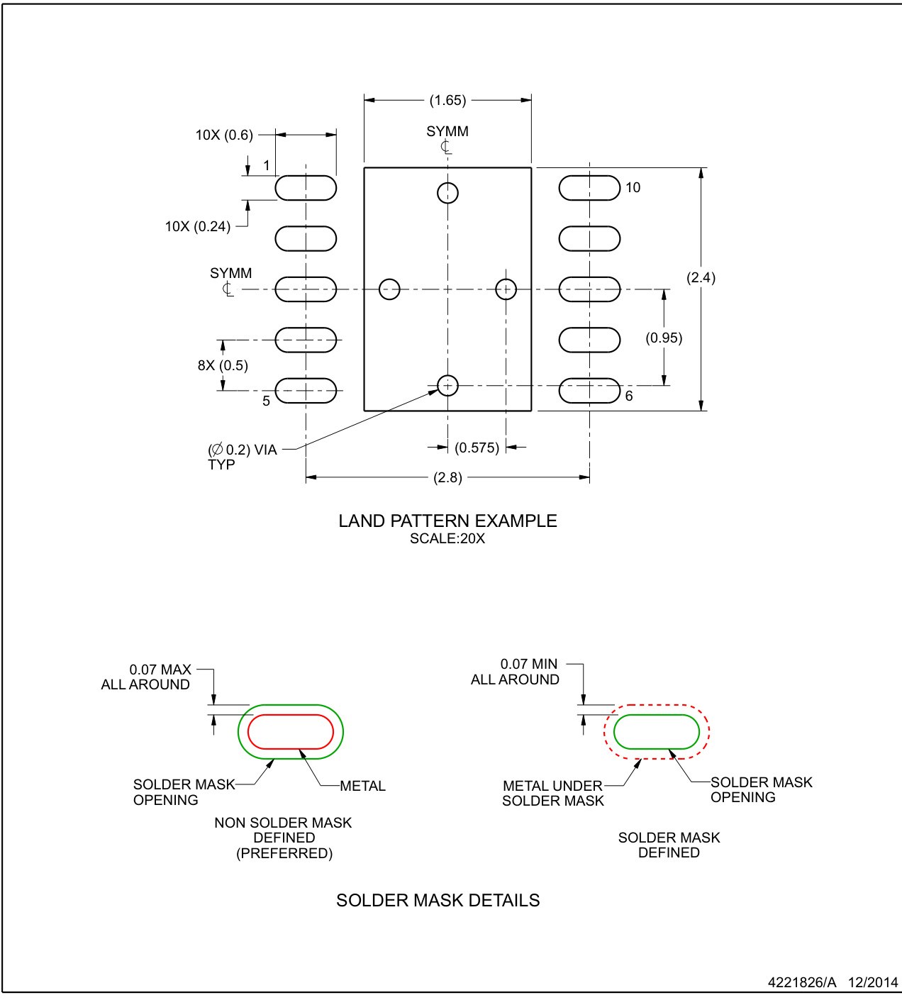  
注:(继续)

4. 这个封装被设计成焊接到电路板上的热垫上。有关更多信息，请参阅德州仪器文献编号SLUA271 （www.ti.com/lit/slua271）。

#模板设计示例

WSON最大高度0.8 mm

塑料小轮廓无铅

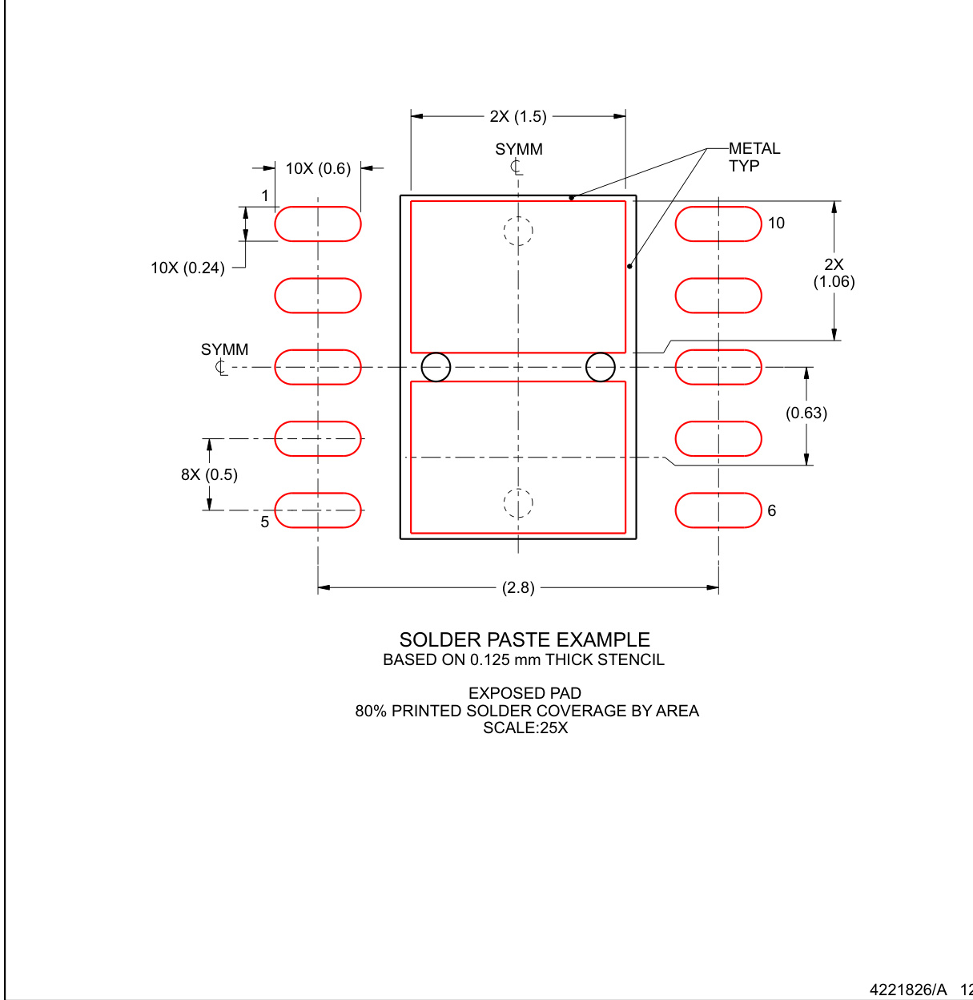

12/2014

注:(继续)

5. 具有梯形壁和圆角的激光切割孔可以提供更好的粘贴释放。IPC-7525可能有其他设计建议。

#包装信息

<html><body><table><tr><td rowspan="2">可排序器件</td><td rowspan="2">状态(1)</td><td rowspan="2">封装类型</td><td rowspan="2">封装图纸</td><td rowspan="2">封装数量</td><td rowspan="2">生态计划(2)</td><td rowspan="2">引脚完成/球料</td><td rowspan="2">MSL最高温度(3)</td><td rowspan="2">设备标记(4/5)</td><td样本行宽= " 2 " > < / td > < / tr > < tr > < td > < / td > < / tr > < tr > < td > TPS7A9401DSCR < / td > < td >活动< / td > < td > WSON < / td > < td > DSC < / td > < td > < / td > < td > 3000 < / td > < td > RoHS绿色& < / td > < td > NIPDAU < / td > < td >水平- -260 c-unlim < / td > < td > 40到125 < / td > < td > 7 a9401 < / td > < td >样本< / td > < / tr > < /表> < /身体> < / html >

(1)营销状态值定义如下：

ACTIVE：推荐用于新设计的产品装置。
LIFEBUY: TI已宣布该设备将停产，终身购买期生效。
NRND：不建议用于新设计。该器件正在生产中以支持现有客户，但TI不建议在新设计中使用该部件。
预览：设备已经宣布，但不是在生产。样品可能提供，也可能不提供。

(2) RoHS: TI将“RoHS”定义为半导体产品符合当前欧盟RoHS对所有10种RoHS物质的要求，包括RoHS物质不超过$0的要求。1 \%$重量在均质材料。如果设计为在高温下焊接，“RoHS”产品适用于指定的无铅工艺。TI将产品分类为“无铅”。

RoHS豁免：TI将“RoHS豁免”定义为含铅但符合特定欧盟RoHS豁免的产品。绿色：TI将“绿色”定义为氯（Cl）和溴（Br）基阻燃剂的含量满足JS709B低卤素要求$\scriptstyle < = 1 0 0 （$ 0ppm）的阈值。基于三氧化二锑的阻燃剂还必须满足$\scriptstyle < = 1 0 0 0$ ppm阈值要求。

(3) MSL，峰值温度。根据JEDEC行业标准分类的湿度敏感等级评级，以及峰值焊料温度。

(4)可能有额外的标记，与设备上的标识、批号跟踪码信息或环境类别有关。

(5)多个器械标记将在括号内。一个设备上只会出现一个设备标记，该标记包含在圆括号中，并用“\~”分隔。如果一行被缩进，那么它是前一行的延续，两者结合代表该设备的整个设备标记。

(6)导铅表面处理/滚珠材料可订购器件可能有多种材料表面处理选择。完成选项由垂直直线分隔。如果光洁度值超过最大柱宽，铅光洁度/球材料值可能缠绕到两行。

重要信息和免责声明：本页上提供的信息代表了TI在提供之日的知识和信念。TI的知识和信念基于第三方提供的信息，对此类信息的准确性不作任何陈述或保证。目前正在努力更好地整合来自第三方的信息。TI已经采取并将继续采取合理的措施提供具有代表性和准确的信息，但可能没有进行破坏性测试或化学分析来料和化学品。TI和TI供应商认为某些信息是专有的，因此CAS号码和其他有限的信息可能无法发布。

在任何情况下，由这些信息引起的TI的责任不得超过TI每年向客户出售的本文件中所述TI部件的总购买价格。

#磁带和卷轴信息

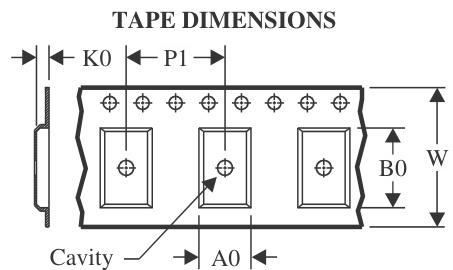

<html><body><table><tr><td>A0</td><td>设计容纳元件宽度的尺寸</td></tr><tr><td>B0</td><td>设计容纳元件长度的尺寸</td></tr><tr><td>K0</td><td>设计容纳元件厚度的尺寸</td></tr><tr><td>W</td><td>载波带总宽度</td></tr><tr><td>P1</td><td>间距连续腔中心</td></tr></table></body></html>

#象限分配引脚在磁带中的方向

\*所有尺寸均为标称尺寸

表身体< html > < > < > < tr > < td >设备< / td > < td >类型< / td > < td >包包装图< / td > < td >针< / td > < td > SPQ < / td > < td >卷筒直径(毫米)< / td > < td > W1卷筒宽度(毫米)< / td > < td > AO (mm) < / td > < td > B0 (mm) < / td > < td > KO (mm) < / td > < td > P1 (mm) < / td > < td > W (mm) < / td > < td > Pin1象限< / td > < / tr > < tr > < td > TPS7A9401DSCR < / td > < td > WSON < / td > < td > DSC < / td > < td > 10 < / td > < td > 3000 < / td > < td > 330.0 < / td > < td > 12.4 < / td > < td > 3.3 < / td > < td > 3.3 < / td > < td > < / td > < td > 8.0 < / td > < td > 12.0 < / td > < td > Q2 < / td > < / tr > < /表> < /身体> < / html >

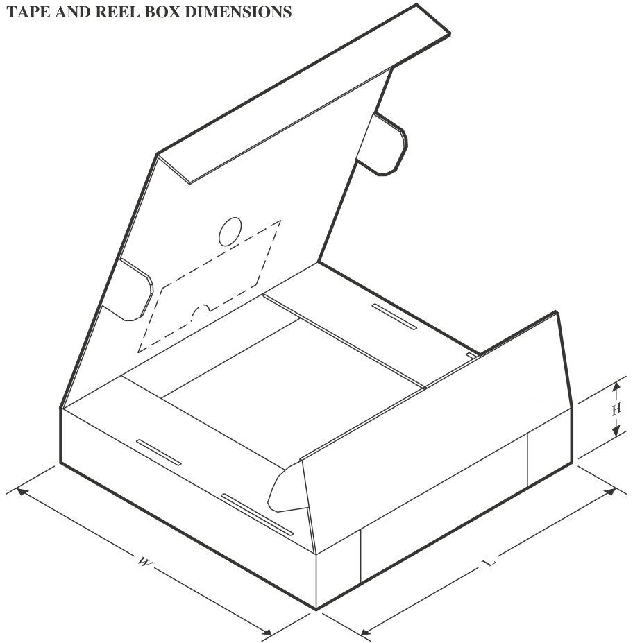

\*所有尺寸均为标称尺寸

表身体< html > < > < > < tr > < td >设备< / td > < td >包类型< / td > < td >包图< / td > < td >针< / td > < td > SPQ < / td > < td >长度(mm) < / td > < td >宽度(毫米)< / td > < td >高度(mm) < / td > < / tr > < tr > < td > TPS7A9401DSCR < / td > < td > WSON < / td > < td > DSC < / td > < td > 10 < / td > < td > 3000 < / td > < td > 367.0 < / td > < td > 367.0 < / td > < td > 35.0 < / td > < / tr > < /表> < /身体> < / html >

#重要通知和免责声明

Ti提供技术和可靠性数据（包括数据表）、设计资源（包括参考设计）、应用程序或其他设计建议、网络工具、安全信息和其他资源，并“按原样”提供所有错误，并不承担所有明示和默示的保证，包括但不限于任何关于适销性、适合特定用途或不侵犯第三方知识产权的默示保证。

这些资源是为熟练的开发人员设计的TI产品。您全权负责(1)为您的应用选择合适的TI产品，(2)设计、验证和测试您的应用，以及(3)确保您的应用符合适用的标准，以及任何其他安全、安保、法规或其他要求。

这些资源如有更改，恕不另行通知。TI允许您仅将这些资源用于开发使用资源中描述的TI产品的应用程序。禁止以其他方式复制和展示这些资源。未授予任何其他TI知识产权或任何第三方知识产权许可。对于因您使用这些资源而产生的任何索赔、损害、成本、损失和责任，TI不承担任何责任，您将完全赔偿TI及其代表。

TI的产品根据TI的销售条款或ti.com上提供的或与TI产品一起提供的其他适用条款提供。TI提供的这些资源不会扩大或以其他方式改变TI对TI产品的适用保证或保证免责声明。

TI反对并拒绝您可能提出的任何附加或不同条款。

版权：$\circledcirc$ 2023, Texas Instruments Incorporated
