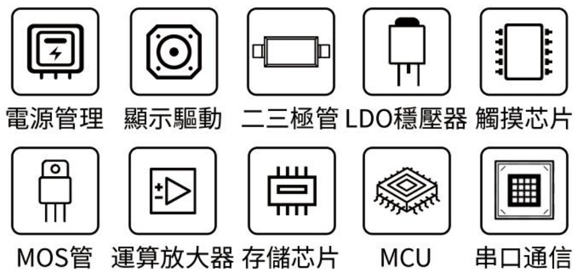
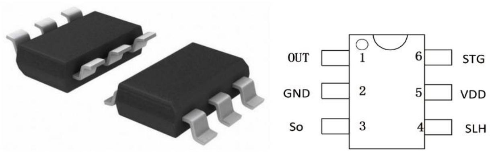
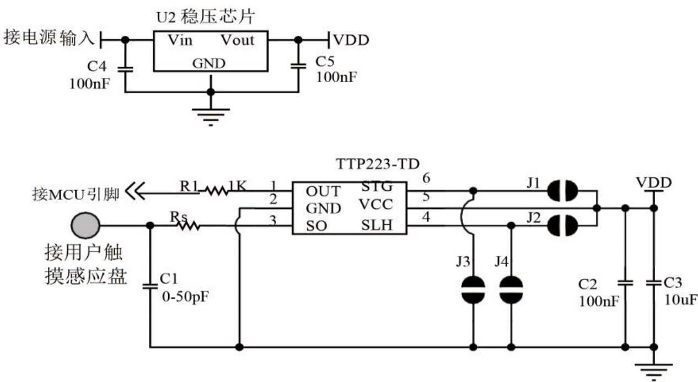
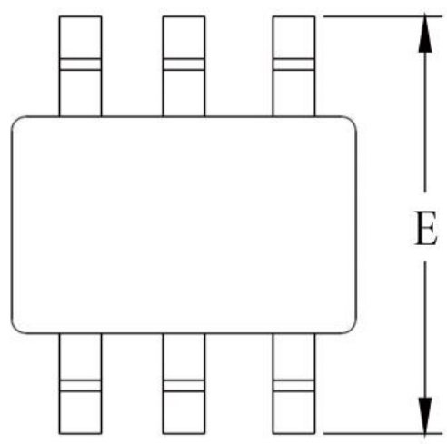
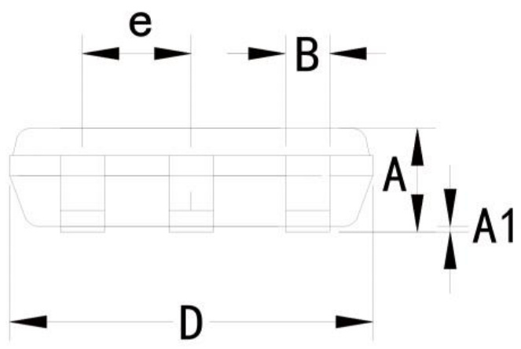
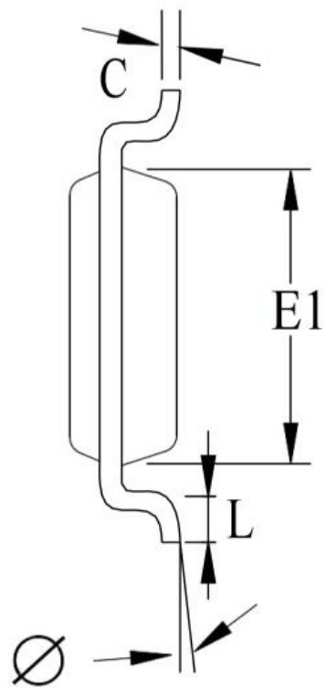

# TDSEMG拓電半導體

# 自主封測 品質把控 售後保障

WEB WWW.TDSEMIC.COM Q

# TTP223-TD

# 单键电容式触摸按键 IC---- TTP223-TD

# 概述

TTP223-TD是单键电容式触摸按键专检测传感器IC。采最新代电荷检测技术利用操作者的手指与触摸按键焊盘之间产生电荷电平来确定手指接近或者触摸到感应表。没有任何机械部件，不会磨损，感测部分可以放置到任何绝缘层（通常为玻璃或者塑料材料）的后，很容易制成与周围环境相密封的键盘。板图案随意设计，按键形状由选择，字符、商标、透视窗等可任意搭配，外形美观、时尚，且不褪、不变形、经久耐。从根本上改变了各种属板以及机械板法达到的效果。其可靠性和美观设计随心所欲， 可以直接取代现有普通面板（金属键盘、薄膜键盘、导电胶键盘）不需要对现有的程序做任何改动。 具有外围元件少、 成本低、功耗少等优势。

# 2 特点

输入电压范围较宽： $2 . 0 \mathrm { V } { \sim } 5 . 5 \mathrm { V }$ .  
工作电流极低： $3 . 5 \mathrm { u A }$   
灵敏度可通过外部电容值来调整；  
可实现同步输出模式及电平切换模式输出；带有自校准的独立触摸按键控制；  
内置稳压电路 LDO, 更稳定可靠；  
SOT23-6封装

# 3 应用场合

触摸DVD、 触摸遥控器、 触摸 MP3、 触摸MP4、 触摸密码锁、 触摸电饭煲、触摸微波 炉、触摸电热水器、 触摸电风扇、 触摸冰箱、 触摸吸尘器、 触摸空气清新器、 触摸抽油烟机、 触摸 箱、触摸调光灯、触摸电开关、 触摸打印机、 触摸传真机、 触摸 LCDTV、 触摸LCD Monitor、 触摸电话机等。

# TTP223-TD

# 4 封装及引脚定义

<html><body><table><tr><td>No</td><td>引脚名称</td><td>1/0</td><td>功能描述</td></tr><tr><td>1</td><td>OUT</td><td>推挽输出</td><td>触摸检测输出脚</td></tr><tr><td>2</td><td>GND</td><td>电源</td><td>电源地</td></tr><tr><td>3</td><td>SO</td><td>输入</td><td>触摸输入检测脚</td></tr><tr><td>4</td><td>SLH</td><td>输入</td><td>输出低电平选择 （不可悬空）</td></tr><tr><td>5</td><td>VDD</td><td>电源</td><td>正电源</td></tr><tr><td>6</td><td>STG</td><td>输入</td><td>模式选择脚 （不可悬空）</td></tr></table></body></html>

<html><body><table><tr><td>STG</td><td>SLH</td><td>功能描述</td></tr><tr><td>0</td><td>0</td><td>同步输出模式（类似轻触按键），上电初时和无触摸时输出为低电平，触摸后输出为高电平（默认）</td></tr><tr><td>0</td><td>1</td><td>同步输出模式（类似轻触按键），上电初时和无触摸时输出为高电平，触摸后输出为低电平</td></tr><tr><td>1</td><td>0</td><td>电平切换模式（类似自锁开关），上电初时为低电平，触摸后电平翻转</td></tr><tr><td>1</td><td>1</td><td>电平切换模式（类似自锁开关），上电初时为高电平，触摸后电平翻转</td></tr></table></body></html>

备注：

STG: 配置芯的作模式。

接地时： 同步输出模式。即输出有效电平时间跟随触摸时间，但最触摸时间不能于6s。  
接正电源： 电平切换模式。即输出有效电平处于保持状态。每次重新触摸时，输出电平翻转。但最触摸时间不能于6s。

SLH: 配置有效电平。

接地时： 触摸时输出为电平。上电初始状态和没有触摸时均为低电平输出。输出电压和VDD电压致。  
接正电源： 触摸时输出为低电平。上电初始状态和没有触摸时均为电平输出。输出电压和 VDD 电压一致。

# 所有配置脚均不可悬空

# TTP223-TD

# 5 应电路

注1：C1电容值越， 灵敏度越低，感应面板的厚度就越薄。反之电容值越小， 灵敏度就越高， 感应面板厚度就越厚。

注2： 如果需要提产品的抗干扰性能， 可以在触摸感应 PAD与芯So输脚之间串接个Rs电阻，阻值在100-1000 $\Omega$ 之间。TTP223-TD如果产品的应环境良好， 可以省略这个电阻，直接连通

注3： J1,J2,J3,J4 为模式选择开关

# TTP223-TD

# 6 电参数

<html><body><table><tr><td>特性</td><td>符号</td><td>测试条件</td><td>最小</td><td>单位</td></tr><tr><td>作温度</td><td>ToP</td><td></td><td>-20~+70</td><td>C</td></tr><tr><td>存放温度</td><td>TsTG</td><td></td><td>-50~+125</td><td></td></tr><tr><td>电源电压</td><td>VDD</td><td>Ta=25℃</td><td>VSS-0.3~VSS+5.5</td><td>V</td></tr><tr><td>输入电压</td><td>Vin</td><td>TA=25℃</td><td>VSS-0.3~VDD+0.3</td><td></td></tr><tr><td>抗静电强度</td><td>ESD</td><td></td><td>>4</td><td>KV</td></tr></table></body></html>

<html><body><table><tr><td>特性</td><td>符号</td><td>测试条件</td><td>最小值</td><td>典型值</td><td>最大值</td><td>单位</td></tr><tr><td>工作电压</td><td>VDD</td><td></td><td>2.0</td><td>3.0</td><td>5.5</td><td>V</td></tr><tr><td>工作电流</td><td>LoP</td><td>VDD=3.0V</td><td></td><td>2.5</td><td>7.0</td><td>uA</td></tr><tr><td>输入端</td><td>VoL</td><td>输低电压</td><td>0</td><td></td><td>0.2</td><td>VDD</td></tr><tr><td>输入端</td><td>VOH</td><td>输电压</td><td>0.8</td><td></td><td>1.0</td><td>VDD</td></tr><tr><td>输出引脚灌电流</td><td>IoL</td><td>VDD=3V, VoL=0. 6V</td><td></td><td>10</td><td></td><td>mA</td></tr><tr><td>输出引脚驱动电流</td><td>IoH</td><td>VDD=3V, VoL=2. 4V</td><td></td><td>-6.0</td><td></td><td>mA</td></tr><tr><td>输出响应时间</td><td>TR</td><td>VDD=3. OV</td><td></td><td></td><td>60</td><td>ms</td></tr><tr><td>传感器</td><td>F SEN</td><td>VDD=3. OV 无负载</td><td></td><td></td><td>500</td><td>KHz</td></tr></table></body></html>

# TTP223-TD

# 7 封装说明

<html><body><table><tr><td></td><td>最小值</td><td>典型值</td><td>最大值</td></tr><tr><td>A</td><td></td><td></td><td>1.26</td></tr><tr><td>A1</td><td>0.04</td><td>0.10</td><td>0.16</td></tr><tr><td>B</td><td></td><td>0.40</td><td></td></tr><tr><td>CD</td><td>0.17</td><td></td><td>0.25</td></tr><tr><td></td><td>2.70</td><td>2.90</td><td>3.10</td></tr><tr><td>E1</td><td>1.50</td><td>1.70</td><td>1.80</td></tr><tr><td>E</td><td>2.70</td><td>2.85</td><td>3.00</td></tr><tr><td>eL</td><td></td><td>0.95</td><td></td></tr><tr><td></td><td>0.35</td><td></td><td>0.55</td></tr><tr><td>Φ</td><td>1'</td><td>4'</td><td>7'</td></tr></table></body></html>