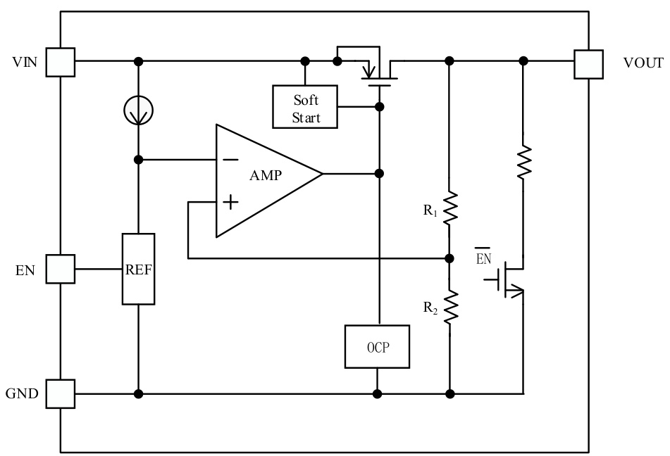
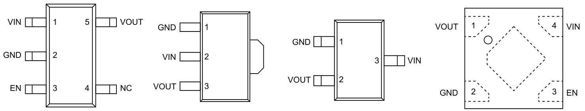
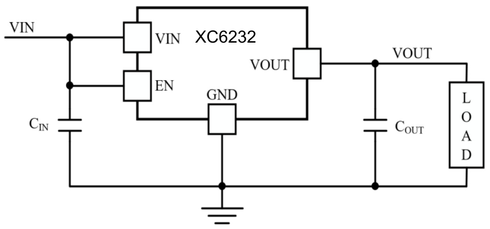
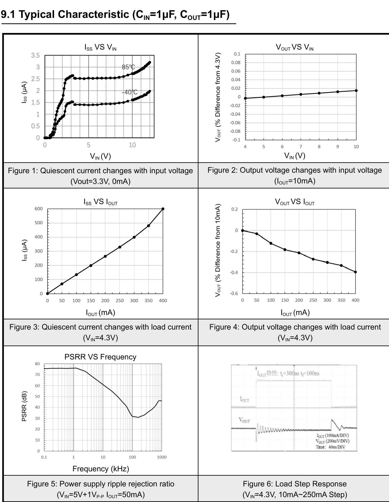
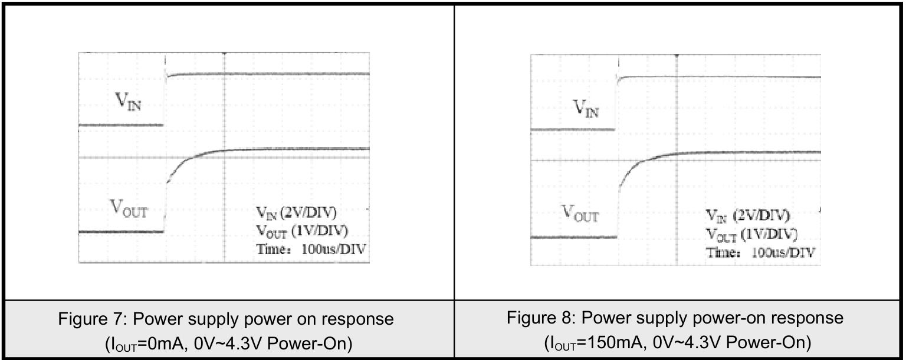
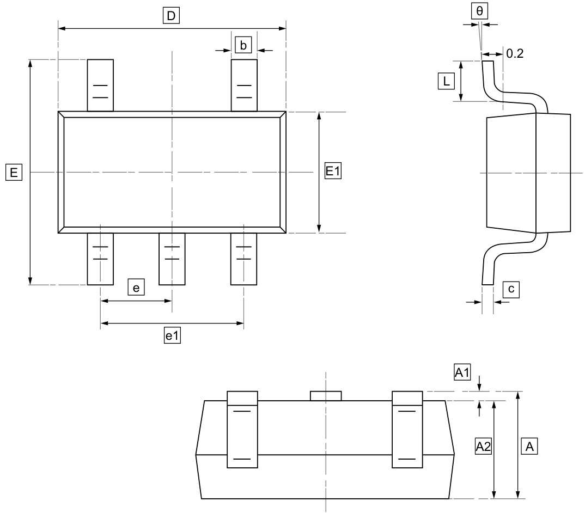
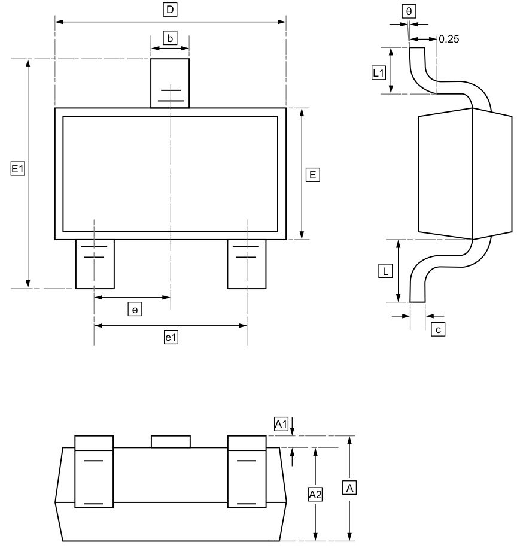
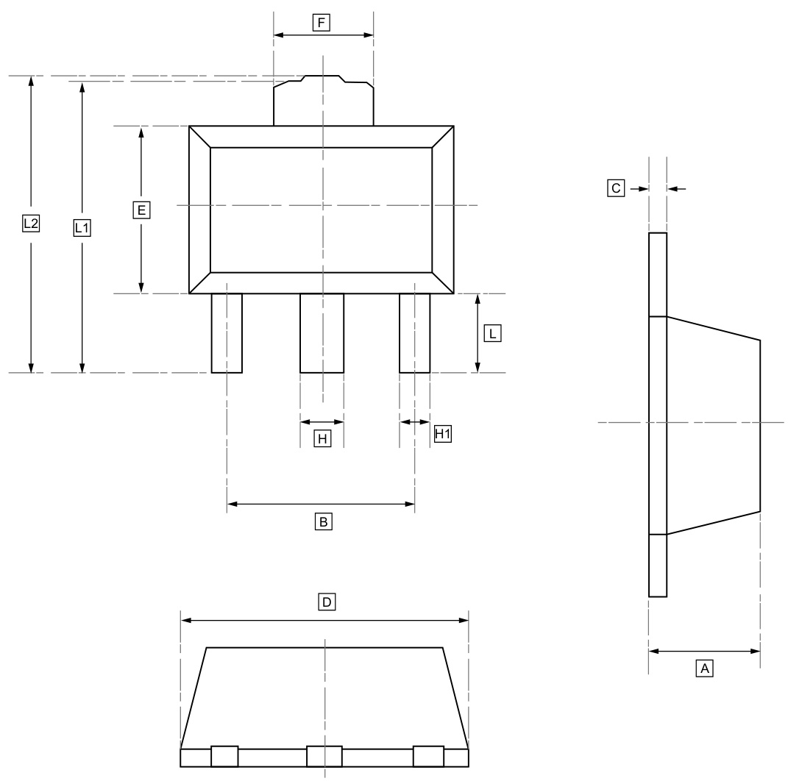
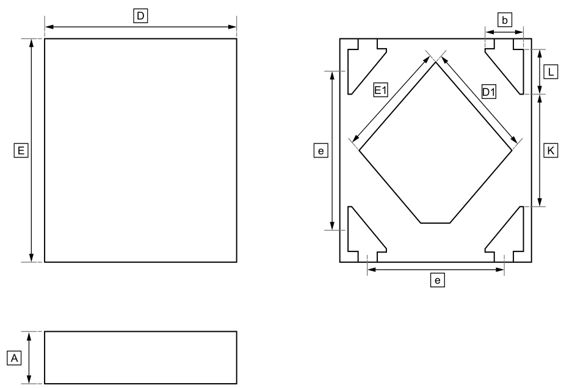
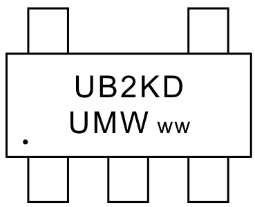

# 1.Description

The XC6232 series is a high-precision, low-dropout, low-current, three-terminal step-down regulator. It supports input voltages up to 10V. It delivers high output current with excellent regulation even under minimal voltage differences. It integrates a high-precision reference voltage source and overcurrent protection for the output power transistors.   
The enable pin, EN, controls the chip's standby mode, significantly reducing quiescent current consumption. This makes it particularly suitable for applications with stringent battery life requirements. Packages include SOT23, SOT23-5, SOT89, or DFN1X1-4.

# 2.Features

Maximum operating voltage: 10V   
Low quiescent current consumption   
(typically 2uA@6V)   
Low dropout voltage (75mV@50mA, $\mathsf { V } _ { \mathsf { O U T } } = 3 . 3 \mathsf { V } .$ )   
Built-in overcurrent protection and   
short-circuit protection   
EN pin standby function   
High-precision output voltage: $12 \%$   
Selectable output voltage: $1 . 5 \mathsf { V } \sim 3 . 6 \mathsf { V }$   
PSRR： 76dB@ 1KHz   
Maximum output current: 450mA   
Low output noise: $7 0 \mu \mathsf { V R M S } @ 1 0 { \sim } 1 0 0 \kappa \mu z$

# 3.Applications

1-2 Cell Li-ion Portable Devices − 2-6 Cell Dry Cell Battery Powered System

Bluetooth or RF system Consumer Products

# 4.Internal Block Diagram

# 5.Pinning Information

Pin Description   

<html><body><table><tr><td>Pin Name</td><td>Functions DeDriveription</td></tr><tr><td>VIN</td><td>Power Input</td></tr><tr><td>VOUT</td><td>Voltage Output</td></tr><tr><td>GND</td><td>Power Ground</td></tr><tr><td>EN</td><td>Standby Control Input, high level for normal operation, low level for standby mode</td></tr><tr><td>NC</td><td>Not Connected</td></tr></table></body></html>

# 6.Absolute Maximum Ratings

<html><body><table><tr><td colspan="2">Parameter</td><td>Value</td><td>Value</td><td>Units</td></tr><tr><td rowspan="2">Input Voltage Range</td><td>VOUT>3V</td><td rowspan="2">ViN</td><td>-0.3 ~11</td><td>V</td></tr><tr><td>VOUT<3V</td><td>-0.3 ~10</td><td>V</td></tr><tr><td colspan="2">Output Current</td><td>IouT</td><td>450</td><td>mA</td></tr><tr><td colspan="2">Output Voltage Range</td><td>VouT</td><td>-0.3~ViN+0.3</td><td>V</td></tr><tr><td colspan="2">Maximum Junction Temperature</td><td>TJ</td><td>150</td><td>°C</td></tr><tr><td rowspan="4">Maximum Power Dissipation</td><td>SOT23-3</td><td rowspan="4"></td><td>300</td><td rowspan="4">mW</td></tr><tr><td>SOT23-5</td><td>400</td></tr><tr><td>SOT89-3</td><td>600</td></tr><tr><td>DFN1X1-4</td><td>450</td></tr><tr><td colspan="2">Operating Temperature Range</td><td></td><td>-40 to 85</td><td>°C</td></tr><tr><td colspan="2">Storage Temperature Range</td><td>TsTG</td><td>-55 to 165</td><td>°C</td></tr></table></body></html>

The parameters in the table above represent the circuit's maximum tolerance range. If these parameters are reached or exceeded, the circuit will not function properly and may be damaged. Prolonged operation at critical limit parameters also significantly increases the risk of damage.

# 7.Electrical Characteristics

Unless otherwise specified, ${ \sf T } _ { \sf s } = + 2 5 ^ { \circ } { \sf C }$ , $\mathsf { V } _ { \mathsf { I N } } = \mathsf { V } _ { \mathsf { O U T } } + 1 \mathsf { V } _ { \mathrm { I } }$ $\mathsf { C } _ { \mathsf { I N } } = \mathsf { C } _ { \mathsf { O U T } } = 1 \mu \mathsf { F }$

<html><body><table><tr><td>Parameter</td><td>Symbol</td><td colspan="2">Conditions</td><td>Min</td><td>Typ</td><td>Max</td><td>Units</td></tr><tr><td>Input Voltage</td><td>ViN</td><td colspan="2"></td><td>2.2</td><td></td><td>10</td><td>V</td></tr><tr><td>Supply Current</td><td>Iss</td><td colspan="2">ViN=6V, louτ=0mA</td><td></td><td>2</td><td></td><td>μA</td></tr><tr><td>Standby Current</td><td>ISTB</td><td colspan="2">VEN=0V</td><td></td><td></td><td>0.1</td><td>μA</td></tr><tr><td>Output Voltage Accuracy</td><td>VouT</td><td colspan="2">ViN=VouT+1V, louτ=1mA</td><td>*0.98 VouT</td><td></td><td>*1.02 VouT</td><td>V</td></tr><tr><td>Line Regulation</td><td>∆VouT/(∆ViN*VouT)</td><td colspan="2">VouT+1V≤ViN≤6V, louτ=10mA</td><td></td><td>0.02</td><td>0.1</td><td>%N</td></tr><tr><td>Load Regulation</td><td>ΔVouT</td><td colspan="2">ViN=Vouτ+1V, 1mA≤Iouτ≤200mA</td><td></td><td>0.2</td><td></td><td>%</td></tr><tr><td>Output Temperature Coefficient</td><td>∆VouT/(∆T*VouT)</td><td colspan="2">louτ=10mA, -25°C≤Ta≤85°C</td><td></td><td>±100</td><td></td><td>ppm/°C</td></tr><tr><td>Output Current</td><td>louT</td><td colspan="2">ViN=Vour+1V</td><td></td><td>400</td><td></td><td>mA</td></tr><tr><td rowspan="3">Low Dropout Voltage</td><td rowspan="3">Vdrop</td><td rowspan="3">lo=50mA</td><td>VouT≤2.0V</td><td></td><td>160</td><td></td><td>mV</td></tr><tr><td>2.0<VouT≤3.0V</td><td></td><td>120</td><td></td><td>mV</td></tr><tr><td>3.0<VouT≤5.0V</td><td></td><td>75</td><td></td><td>mV</td></tr><tr><td>PSRR</td><td>PSRR</td><td colspan="2">Vin=5V+1Vp-p(AC), f=1KHz Vouτ=3.3V, lour=50mA</td><td></td><td>76</td><td></td><td>dB</td></tr><tr><td>Output Noise Voltage</td><td>VoN</td><td colspan="2">BW=10Hz to 100KHz</td><td></td><td>70</td><td></td><td>uVrms</td></tr><tr><td>EN input high level</td><td>VIH</td><td colspan="2">ViN=5V</td><td>1.2</td><td></td><td></td><td>V</td></tr><tr><td>EN input low level</td><td>VIL</td><td colspan="2">ViN=5V</td><td></td><td></td><td>0.4</td><td>√</td></tr><tr><td>Discharge Resistor Output</td><td>RD</td><td colspan="2">EN=0V, VouT=0.5V</td><td></td><td>500</td><td></td><td>Ω</td></tr></table></body></html>

# 8.Typical Application

  
Figure 1 Typical Application Circuit

Note: The input capacitor $\mathsf { C } _ { \mathsf { I N } }$ is recommended to be at least $1 \mu \mathsf { F }$ ; to ensure output voltage stability, the output capacitor $\mathsf { C } _ { \mathsf { O U T } }$ should be a ceramic capacitor of at least $1 \mu \mathsf { F } _ { : }$ or an electrolytic capacitor of at least $2 . 2 \mu \ F$ .

# 9.2 Typical Characteristic (CIN=1μF, COUT=1μF)

# 10.1 SOT-23-5 Package Outline Dimensions

# DIMENSIONS (mm are the original dimensions)

<html><body><table><tr><td>Symbol</td><td>A</td><td>A1</td><td>A2</td><td></td><td>C</td><td>D</td><td>E1</td><td>E</td><td>e</td><td>e1</td><td>L</td><td>0</td></tr><tr><td>Min</td><td>1.050</td><td>0.000</td><td>1.050</td><td>0.300</td><td>0.100</td><td>2.820</td><td>1.500</td><td>2.650</td><td>0.950</td><td>1.800</td><td>0.300</td><td>0°</td></tr><tr><td>Max</td><td>1.250</td><td>0.100</td><td>1.150</td><td>0.500</td><td>0.200</td><td>3.020</td><td>1.700</td><td>2.950</td><td>BSC</td><td>2.000</td><td>0.600</td><td>8°</td></tr></table></body></html>

# 10.2 SOT-23 Package Outline Dimensions

# DIMENSIONS (mm are the original dimensions)

<html><body><table><tr><td>Symbol</td><td>A</td><td>A1</td><td>A2</td><td>●</td><td>C</td><td>D</td><td>E</td><td>E1</td><td>e</td><td>e1</td><td></td><td>L1</td></tr><tr><td>Min</td><td>0.9</td><td>0.000</td><td>0.900</td><td>0.300</td><td>0.080</td><td>2.800</td><td>1.200</td><td>2.250</td><td>0.95</td><td>1.80</td><td>0.550</td><td>0.300</td></tr><tr><td>Max</td><td>1.15</td><td>0.15</td><td>1.050</td><td>0.500</td><td>0.150</td><td>3.000</td><td>1.400</td><td>2.550</td><td>TYP.</td><td>2.00</td><td></td><td>0.500</td></tr></table></body></html>

<html><body><table><tr><td>Symbol</td><td>日</td></tr><tr><td>Min</td><td>0°</td></tr><tr><td>Max</td><td>8°</td></tr></table></body></html>

# 10.3 SOT-89-3 Package Outline Dimensions

# DIMENSIONS (mm are the original dimensions)

<html><body><table><tr><td>Symbol</td><td>A</td><td>B</td><td>C</td><td>D</td><td>E</td><td>F</td><td>H</td><td>H1</td><td></td><td>L1</td><td>L2</td></tr><tr><td>Min</td><td>1.450</td><td>2.950</td><td>0.330</td><td>4.450</td><td>2.450</td><td>1.650</td><td>0.450</td><td>0.370</td><td>0.900</td><td>4.100</td><td>4.100</td></tr><tr><td>Max</td><td>1.550</td><td>3.050</td><td>0.430</td><td>4.550</td><td>2.550</td><td>1.750</td><td>0.580</td><td>0.480</td><td>1.000</td><td>4.300</td><td>4.350</td></tr></table></body></html>

# 10.4 DFN1X1-4 Package Outline Dimensions

# DIMENSIONS (mm are the original dimensions)

<html><body><table><tr><td>Symbol</td><td>A</td><td>b</td><td>D</td><td>e</td><td>E</td><td>Ｅ1</td><td>D1</td><td>L</td><td>K</td></tr><tr><td>Min</td><td>0.48</td><td>0.18</td><td>0.95</td><td rowspan="2">0.65</td><td>0.95</td><td>0.45</td><td>0.45</td><td>0.18</td><td>0.42</td></tr><tr><td>Max</td><td>0.52</td><td>0.22</td><td>1.05</td><td>1.05</td><td>0.52</td><td>0.52</td><td>0.24</td><td>0.48</td></tr></table></body></html>

# 12.Ordering Information

ww: Batch Code

<html><body><table><tr><td>Order Code</td><td>Marking</td><td>Package</td><td>Base QTY</td><td>Delivery Mode</td></tr><tr><td>UMW XC6232B152MR</td><td>UXEK</td><td>SOT23-5</td><td>3000</td><td>Tape and reel</td></tr><tr><td>UMW XC6232B182MR</td><td>UXKK</td><td>SOT23-5</td><td>3000</td><td>Tape and reel</td></tr><tr><td>UMW XC6232B252MR</td><td>UXTK</td><td>SOT23-5</td><td>3000</td><td>Tape and reel</td></tr><tr><td>UMW XC6232B282MR</td><td>UXXK</td><td>SOT23-5</td><td>3000</td><td>Tape and reel</td></tr><tr><td>UMW XC6232B302MR</td><td>UXZK</td><td>SOT23-5</td><td>3000</td><td>Tape and reel</td></tr><tr><td>UMW XC6232B332MR</td><td>UB2K</td><td>SOT23-5</td><td>3000</td><td>Tape and reel</td></tr><tr><td>UMW XC6232B362MR</td><td>UB5K</td><td>SOT23-5</td><td>3000</td><td>Tape and reel</td></tr><tr><td>UMW XC6232B152PR</td><td>UXEK</td><td>SOT89-3</td><td>3000</td><td>Tape and reel</td></tr><tr><td>UMW XC6232B182PR</td><td>UXKK</td><td>SOT89-3</td><td>1000</td><td>Tape and reel</td></tr><tr><td>UMW XC6232B252PR</td><td>UXTK</td><td>SOT89-3</td><td>1000</td><td>Tape and reel</td></tr><tr><td>UMW XC6232B282PR</td><td>UXXK</td><td>SOT89-3</td><td>1000</td><td>Tape and reel</td></tr><tr><td>UMW XC6232B302PR</td><td>UXZK</td><td>SOT89-3</td><td>1000</td><td>Tape and reel</td></tr><tr><td>UMW XC6232B332PR</td><td>UB2K</td><td>SOT89-3</td><td>1000</td><td>Tape and reel</td></tr><tr><td>UMW XC6232B362PR</td><td>UB5K</td><td>SOT89-3</td><td>1000</td><td>Tape and reel</td></tr></table></body></html>

<html><body><table><tr><td>Order Code</td><td>Marking</td><td>Package</td><td>Base QTY</td><td>Delivery Mode</td></tr><tr><td>UMW XC6232B152DR</td><td>UXEKD</td><td>DFN1X1-4</td><td>10000</td><td>Tape and reel</td></tr><tr><td>UMWXC6232B182DR</td><td>UXKKD</td><td>DFN1X1-4</td><td>10000</td><td>Tape and reel</td></tr><tr><td>UMW XC6232B252DR</td><td>UXTKD</td><td>DFN1X1-4</td><td>10000</td><td>Tape and reel</td></tr><tr><td>UMWXC6232B282DR</td><td>UXXKD</td><td>DFN1X1-4</td><td>10000</td><td>Tape and reel</td></tr><tr><td>UMW XC6232B302DR</td><td>UXZKD</td><td>DFN1X1-4</td><td>10000</td><td>Tape and reel</td></tr><tr><td>UMW XC6232B332DR</td><td>UB2KD</td><td>DFN1X1-4</td><td>10000</td><td>Tape and reel</td></tr><tr><td>UMW XC6232B362DR</td><td>UB5KD</td><td>DFN1X1-4</td><td>10000</td><td>Tape and reel</td></tr><tr><td>UMW XC6232B152MR</td><td>UXEK3</td><td>SOT23-3</td><td>3000</td><td>Tape and reel</td></tr><tr><td>UMW XC6232B182MR</td><td>UXKK3</td><td>SOT23-3</td><td>3000</td><td>Tape and reel</td></tr><tr><td>UMW XC6232B252MR</td><td>UXTK3</td><td>SOT23-3</td><td>3000</td><td>Tape and reel</td></tr><tr><td>UMW XC6232B282MR</td><td>UXXK3</td><td>SOT23-3</td><td>3000</td><td>Tape and reel</td></tr><tr><td>UMW XC6232B302MR</td><td>UXZK3</td><td>SOT23-3</td><td>3000</td><td>Tape and reel</td></tr><tr><td>UMW XC6232B332MR</td><td>UB2K3</td><td>SOT23-3</td><td>3000</td><td>Tape and reel</td></tr><tr><td>UMW XC6232B362MR</td><td>UB5K3</td><td>SOT23-3</td><td>3000</td><td>Tape and reel</td></tr></table></body></html>

# 13.Disclaimer

UMW reserves the right to make changes to all products, specifications. Customers should obtain the latest version of product documentation and verify the completeness and currency of the information before placing an order.

When applying our products, please do not exceed the maximum rated values, as this may affect the reliability of the entire system. Under certain conditions, any semiconductor product may experience faults or failures. Buyers are responsible for adhering to safety standards and implementing safety measures during system design, prototyping, and manufacturing when using our products to prevent potential failure risks that could lead to personal injury or property damage.

Unless explicitly stated in writing, UMW products are not intended for use in medical, life-saving, or life-sustaining applications, nor for any other applications where product failure could result in personal injury or death. If customers use or sell the product for such applications without explicit authorization, they assume all associated risks.

When reselling, applying, or exporting, please comply with export control laws and regulations of China, the United States, the United Kingdom, the European Union, and other relevant countries, regions, and international organizations.

This document and any actions by UMW do not grant any intellectual property rights, whether express or implied, by estoppel or otherwise. The product names and marks mentioned herein may be trademarks of their respective owners.