# ADS1299-x 适用于 EEG 和生物电势测量的低噪声 4 通道、 6 通道、8 通道、24 位模数转换器

# 1 特性

多达 8 个低噪声可编程增益放大器 (PGA) 和 8 个  
高分辨率同步采样模数转换器 (ADC)  
输入参考噪声： $1 \mu \mathsf { V } _ { \mathsf { P P } }$ （带宽为 $7 0 H z )$ ）  
输入偏置电流： $3 0 0 { \mathsf { p A } }$   
数据速率：250 每秒采样率 (SPS) 至 16 每秒千次  
采样 (kSPS)  
共模抑制比 (CMRR)： -110dB  
可编程增益：1，2，4，6，8，12 或者 24  
单极或者双极电源：模拟：4.75V 至 5.25V数字：1.8V 至 3.6V  
内置偏置驱动放大器，  
持续断线检测， 测试信号  
内置振荡器  
内部或者外部基准  
灵活的省电、待机模式  
与ADS129x 引脚兼容  
兼容串行外设接口 (SPI) 的串行接口  
工作温度范围： $\scriptscriptstyle - 4 0 ^ { \circ } \mathsf { C }$ 至 $+ 8 5 ^ { \circ } \mathsf { C }$

# 2 应用

医疗器械， 包括：

脑电图 (EEG) 研究胎儿心电图 (ECG)睡眠研究监视器双谱指数 (BIS)诱发音频电位 (EAP)

# 3 说明

ADS1299-4、 ADS1299-6 和 ADS1299 器件是一系列四通道、六通道和八通道低噪声、24 位同步采样 $\Delta { - } \Sigma$ 模数转换器(ADC)系列产品。该系列内置可编程增益放大器 (PGA)、内部基准以及板载振荡器。ADS1299-x具备 颅外脑电图 (EEG) 和心电图 (ECG) 应用 所需的全部常用功能。凭借高集成度和出色性能， ADS1299-$\mathsf { x }$ 能够以大幅缩小的尺寸、显著降低的功耗和整体成本构建可扩展的医疗仪器系统。

ADS1299- $\cdot \mathsf { x }$ 在每条通道中配有一个灵活的输入多路复用器，该复用器可与内部生成的信号独立相连，完成测试、温度和导联断开检测。此外，可选择输入通道的任一配置生成患者偏置输出信号。提供可选 SRB 引脚，旨在将公共信号路由至参考蒙太奇配置的多路输入。ADS1299- $\cdot \mathsf { x }$ 以 250SPS 至 16kSPS 的数据传输速率运行。可通过激励电流阱/电流源在器件内部实现导联断开检测。

可在通道较多的系统中采用菊花链配置串联多个ADS1299-4、 ADS1299-6 或 ADS1299 器件。ADS1299-x 采用 TQFP-64 封装，工作温度介于$- 4 0 ^ { \circ } \mathsf { C }$ 至 $+ 8 5 ^ { \circ } \mathsf { C }$ 之间。

器件信息(1)  

<html><body><table><tr><td>器件型号</td><td>封装</td><td>封装尺寸 （标称值）</td></tr><tr><td>ADS1299-x</td><td>TQFP (64)</td><td>10.00mm X 10.00mm</td></tr></table></body></html>

(1) 要了解所有可用封装， 请参见数据表末尾的可订购产品附录。

# 方框图

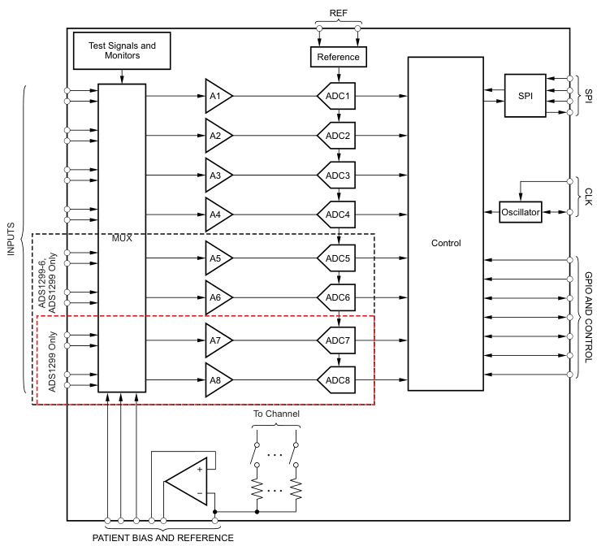

# 目录

1 特性.   
2 应用. 1   
3 说明. 1   
4 修订历史记录 ........................................................... 2   
5 Device Comparison 5   
6 Pin Configuration and Functions 5   
7 Specifications. 7   
7.1 Absolute Maximum Ratings 7   
7.2 ESD Ratings. 7   
7.3 Recommended Operating Conditions. 8   
7.4 Thermal Information 8   
7.5 Electrical Characteristics .... 9   
7.6 Timing Requirements: Serial Interface. ................... 12   
7.7 Switching Characteristics: Serial Interface. 12   
7.8 Typical Characteristics 13   
8 Parametric Measurement Information … 16   
8.1 Noise Measurements ......................................... 16   
9 Detailed Description 18   
9.1 Overview ................................................................ 18   
9.2 Functional Block Diagram . 19   
9.3 Feature Description. ...... . 20   
9.4 Device Functional Modes 34

9.5 Programming. .... 38 9.6 Register Maps. ...................... 44   
10 Applications and Implementation. 61 10.1 Application Information : 61 10.2 Typical Application 66   
11 Power Supply Recommendations … 70 11.1 Power-Up Sequencing 70 11.2 Connecting the Device to Unipolar (5 V and 3.3 V) Supplies 70 11.3 Connecting the Device to Bipolar $( \pm 2 . 5 \lor$ .a..n..d. .3...3. V7)1 Supplies ...........   
12 Layout. 72 12.1 Layout Guidelines 72 12.2 Layout Example 72   
13 器件和文档支持 74 13.1 文档支持 . 74 13.2 相关链接 13.3 接收文档更新通知 .................. 13.4 社区资源 13.5 商标 ......... 13.6 静电放电警告. 13.7 Glossary ............   
14 机械、 封装和可订购信息 75

# 4 修订历史记录

注：之前版本的页码可能与当前版本有所不同。

# Changes from Revision B (October 2016) to Revision C

Changed Maximum Junction parameter name to Junction in Absolute Maximum Ratings table .......................................... Changed Recommended Operating Conditions table: changed free-air to ambient in conditions statement, changed specifications of Input voltage parameter, and added $\mathsf { V } _ { \mathsf { C M } }$ and $\mathsf { f } _ { \mathsf { C L K } }$ symbols ...... .......... 8 Changed conditions statement of Electrical Characteristics table: added $\mathsf { T } _ { \mathsf { A } }$ to temperature conditions, moved DVDD condition to after AVDD – AVSS condition ........... .................. 9 Changed Input bias current parameter test conditions from input to InxP and INxN.. 9 Changed Drift parameter unit from ppm to $p p m / { } ^ { \circ } C$ and changed Internal clock accuracy parameter test conditions from $- 4 0 ^ { \circ } C \le T _ { A } \le + 8 5 ^ { \circ } C$ to $T _ { A } = - 4 0 ^ { \circ } C$ to $+ 8 5 ^ { \circ } C$ in Electrical Characteristics table ........ 10 Changed $\mathsf { I } _ { \mathsf { A V D D } }$ and IDVDD parameters [deleted (normal mode) from parameter names and added Normal mode to test conditions], and deleted Quiescent from Power dissipation parameter name in Electrical Characteristics table ......... 11 Changed free-air to ambient in conditions statement of Timing Requirements: Serial Interface table 12 Changed Analog Input section ............. 22 Changed Table 9 cross-reference to Table 7 in Settling Time section 34 Changed Ideal Output Code versus Input Signal table: changed all $V _ { R E F }$ in first column to $F S$ in and deleted footnote 1 38 Changed reset settings of bits 4 and 3 in bit register of CONFIG1 register. 46 Changed reset value settings of bits 7 to 5 in CONFIG2 register: split cells apart ........... 47 Changed reset value settings of bits 6 to 5 in CONFIG3 register: split cells apart … … 48 Changed AVDD AVSS to $A V D D + A V S S$ in description of bit 3 in Configuration Register 3 Field Descriptions ............. 48 Changed Lead-Off Control Register Field Descriptions table: changed 01 bit setting of bits 3:2 to $2 4 \ : n A$ from 12 nA changed description of bits 1:0. 49 Changed Unused Inputs and Outputs section: added DRDY description, deleted statement of not floating unused digital inputs 61 修订历史记录 (接下页) Deleted second Layout Guidelines sub-section from Layout section 72

# Changes from Revision A (August 2012) to Revision B Page

已添加 ESD 额定值表， 特性 描述部分， 器件功能模式， 应用和实施部分， 电源相关建议部分， 布局部分， 器件和文 档支持部分以及机械、封装和可订购信息部分.   
已添加 ADS1299-4 和 ADS1299-6 至文档   
已添加   
已删除 低功耗 特性要点.   
已更改 颅外脑电图 (EEG) （位于应用和 说明部分. 已删除 最后一个应用要点 ................ 已更改 说明部分： 已添加有关 SRB 引脚的句子， 已更改第 二段的最后一句   
已更改 通篇文档中的ADS1299 系列器件至 ADS1299-x 已更改 框图： 已添加虚线框   
Changed specifications for Lead-Off Detect, Frequency parameter of Electrical Characteristics table. … 10 Added specifications for ADS1299-4 and ADS1299-6 in Supply Current (Bias Turned Off) and Power Dissipation (Analog Supply $= 5 V ,$ Bias Amplifiers Turned Off) sections of Electrical Characteristics table … … 11 Changed Noise Measurements section. 16 Changed Functional Block Diagram to show channels 5-8 not covered in ADS1299-4 and channels 7-8 not covered in ADS1299-6 … … 19 Changed INxP and INxN pins in Figure 18 … 20 Changed Figure 23: changed PgaP, PgaN to PGAp, PGAn 23 Changed Input Common-Mode Range section: changed input common-mode range description …… 23 Changed differential input voltage range in the Input Differential Dynamic Range section 24 Changed Figure 34: MUX8[2:0] $= 0 1 0$ on IN8N, and BIAS_MEAS $= 1$ on BIASIN … 29 Changed first sentence of second paragraph in Lead-Off Detection section. 30 Changed AC Lead-Off (One Time or Periodic) section. ......... 31 Changed Bias Lead-Off section. …… . 32 Changed title of Figure 38 and power-down description in Bias Drive (DC Bias Circuit) section . 33 Changed START Opcode to START in Figure 39. 34 Changed Reset $\overline { { ( R E S E 7 ) } }$ section for clarity 35 Changed title, first paragraph, START Opcode and STOP Opcode to START and STOP (Figure 42), and STOP Opcode to STOP Command (Figure 43) in Continuous Conversion Mode section. .... 36 Added last sentence to Data Input (DIN) section 39 Added cross-reference to the Sending Multi-Byte Commands section in RDATAC: Read Data Continuous section ........ 41 Changed RDATAC Opcode to RDATAC in Figure 46. 41 Changed RDATA Opcode to RDATA in Figure 46......... 42 Changed description of SCLK rate restrictions, OPCODE 1 and OPCODE 2 to BYTE and BYTE 2 in Figure 48 of RREG: Read From Register section ........ … 43 Changed footnotes 1 and 2 and added more cross-references to footnotes in rows 0Dh to 11h in Table 11 44 Changed register description and description of bit 5 in MISC1: Miscellaneous Register section 59 Changed output names in Figure 68 from RA, LA, and RL to Electrode 1, Electrode 2, and BIAS Electrode,   
respectively 63 Changed Power-Up Sequencing section. … 70

# Changes from Original (July 2012) to Revision A

已更改 器件系列和订购信息表的产品栏

# 5 Device Comparison

<html><body><table><tr><td>PRODUCT</td><td>PACKAGE OPTIONS</td><td>OPERATING TEMPERATURE RANGE</td><td>CHANNELS</td><td>ADC RESOLUTION</td><td>MAXIMUM SAMPLING RATE</td></tr><tr><td>ADS1299-4</td><td>TQFP-64</td><td>-40C to +85°℃</td><td>4</td><td>24</td><td>16 kSPS</td></tr><tr><td>ADS1299-6</td><td>TQFP-64</td><td>-40°C to +85°℃</td><td>6</td><td>24</td><td>16 kSPS</td></tr><tr><td>ADS1299</td><td>TQFP-64</td><td>-40C to +85°℃</td><td>8</td><td>24</td><td>16 kSPS</td></tr></table></body></html>

# 6 Pin Configuration and Functions

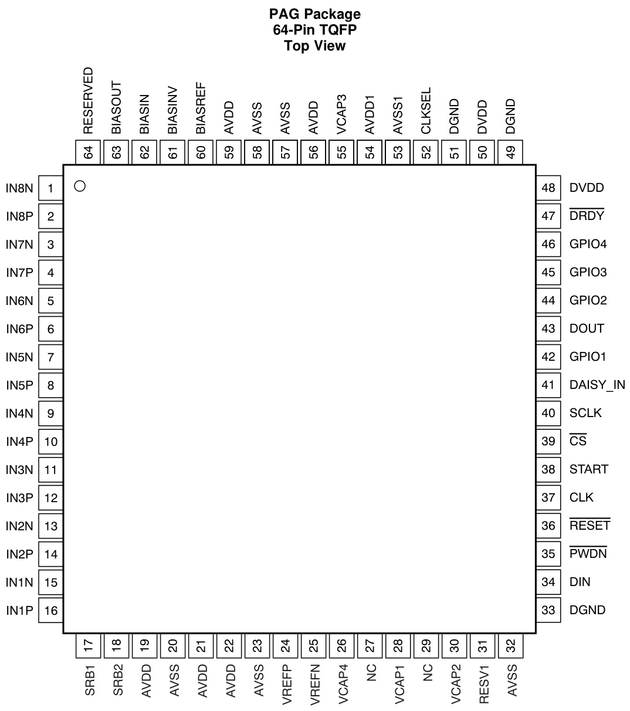

# Pin Functions

<html><body><table><tr><td colspan="2">PIN</td><td rowspan="2">TYPE</td><td rowspan="2">DESCRIPTION</td></tr><tr><td>NAME</td><td>NO.</td></tr><tr><td>(AVDD:</td><td>19,21, 22, 56,59</td><td>Supply</td><td>Analog supply. Connect 1-F capacitor to AVSS.</td></tr><tr><td></td><td>59</td><td>Supply</td><td>pump analog supply. Connect 1-uF capacitor to AVSS, pin 58. Charge</td></tr><tr><td rowspan="2">AVDD1</td><td>54</td><td>Supply</td><td>Analog supply. Connect 1-Fcapacitor to AVSS1.</td></tr><tr><td>20, 23, 32, 57</td><td>Supply</td><td>Analog ground</td></tr><tr><td>AVSS</td><td>58</td><td>Supply</td><td>Analog ground for charge pump</td></tr><tr><td>AVSS1</td><td>53</td><td>Supply</td><td>ground Analog</td></tr><tr><td>BIASIN</td><td>62</td><td>Analog input</td><td>Bias drive input to MUX</td></tr><tr><td>BIASINV</td><td>61</td><td>Analog input/output</td><td>Bias drive inverting input</td></tr><tr><td>BIASOUT</td><td>63</td><td>output Analog</td><td>Bias drive output</td></tr><tr><td>BIASREF</td><td>60</td><td>Analog input</td><td>Bias drive noninverting input</td></tr><tr><td>CS</td><td>39</td><td>Digital input</td><td>Chip select, active low</td></tr><tr><td>CLK</td><td>37</td><td>Digital input</td><td>Master clock nput</td></tr><tr><td>CLKSEL</td><td>52</td><td>Digital input</td><td>Master clock select (1)</td></tr><tr><td>DAISY_IN</td><td>41</td><td>Digital input</td><td>Daisy-chain input</td></tr><tr><td>DGND</td><td>33,49, 51</td><td>Supply</td><td>Digital ground</td></tr><tr><td>DIN</td><td>34</td><td>Digital input</td><td>Serial data input</td></tr><tr><td>DOUT</td><td>43</td><td>Digital output</td><td>Serial data output</td></tr><tr><td>DRDY</td><td>47</td><td>Digital output</td><td>Data ready, active low</td></tr><tr><td>DVDD</td><td>48,50</td><td>Supply</td><td>Digital power supply. Connect a 1-μF capacitor to DGND. General-purpose input/output pin</td></tr><tr><td>GPIO1</td><td>42</td><td>Digital input/output</td><td>Connect to DGND with a ≥10-kΩ resistor unused.</td></tr><tr><td>GPIO2</td><td>44</td><td>Digital input/output</td><td>G if unused.</td></tr><tr><td>GPIO3</td><td>45</td><td>Digital input/output</td><td>if unused. Connect</td></tr><tr><td>GPIO4</td><td>46</td><td>Digital input/output</td><td>General-purpose input/output pin 4. Connect to DGND with a ≥10-kΩ resistor if unused.</td></tr><tr><td>IN1N IN1P</td><td>15</td><td>Analog input</td><td>Differential analog negative input 1 (2)</td></tr><tr><td>IN2N</td><td>16</td><td>Analog input</td><td>Differential analog positive input 1 (2)</td></tr><tr><td>IN2P</td><td>13</td><td>Analog input</td><td>Differential analog negative input 2 (2)</td></tr><tr><td>IN3N</td><td>14</td><td>Analog input</td><td>Differential analog positive input 2 (2)</td></tr><tr><td></td><td>11</td><td>Analog input</td><td>Differential analog negative input 3(2)</td></tr><tr><td>IN3P</td><td>12</td><td>Analog input</td><td>Differential positive analog input 3(2)</td></tr><tr><td>IN4N</td><td>9</td><td>Analog input</td><td>Differential analog negative input 4(2)</td></tr><tr><td>IN4P</td><td>10</td><td>Analog input</td><td>Differential analog positive input 4(2)</td></tr><tr><td>IN5N</td><td></td><td>Analog input</td><td>Differential analog negative input 5 (2) (ADS1299-6 and ADS1299 only)</td></tr><tr><td>IN5P</td><td></td><td>Analog input</td><td>Differential analog positive input 5(2) (ADS1299-6 and ADS1299 only)</td></tr><tr><td>IN6N</td><td></td><td>Analog input</td><td>Differential analog negative input 6(2) (ADS1299-6 and ADS1299 only)</td></tr><tr><td>IN6P</td><td></td><td>Analog input</td><td>Differential analog positive input 6(2) (ADS1299-6 and ADS1299 only)</td></tr><tr><td>IN7N</td><td></td><td>Analog input</td><td>Differential analog negative input 7(2) (ADS1299 only)</td></tr><tr><td>IN7P</td><td></td><td>Analog input</td><td>Differential analog positive input 7(2) (ADS1299 only)</td></tr><tr><td>IN8N</td><td>7∞5641</td><td>Analog input</td><td>Differential analog negative input8 (ADS1299 only) 8(2)</td></tr><tr><td>IN8P</td><td>2</td><td>Analog input</td><td>Differential analog positive input 8(2) (ADS1299 only)</td></tr><tr><td>NC</td><td>27,29</td><td></td><td>No connection, leave as open circuit</td></tr><tr><td>Reserved</td><td>64</td><td>Analog output</td><td>Reserved fo future use leave as open circuit</td></tr><tr><td>RESET</td><td>36</td><td>Digital input</td><td>System reset, active low</td></tr><tr><td>RESV1</td><td>31</td><td>Digital input</td><td>Reserved for future use, connect directly to DGND</td></tr><tr><td>SCLK</td><td>40</td><td>Digital input</td><td>Serial clock input</td></tr><tr><td>SRB1</td><td>17</td><td>Analog input/output</td><td>Patient stimulus, reference, and bias signal</td></tr><tr><td>SRB2</td><td>18</td><td>Analog input/output</td><td>Patient stimulus, reference, and bias signal 2</td></tr></table></body></html>

(12) Set the two-state mode setting pins high to DVDD or low to DGND through ≥10-kΩ resistors. Connect unused analog inputs directly to AVDD.

# Pin Functions (continued)

<html><body><table><tr><td colspan="2">PIN</td><td rowspan="2">TYPE</td><td rowspan="2">DESCRIPTION</td></tr><tr><td>NAME</td><td>NO.</td></tr><tr><td>START</td><td>38</td><td>Digital input</td><td>Synchronization signal to start restart a conversion</td></tr><tr><td>PWDN</td><td>35</td><td>Digital input</td><td>Power-down, active low</td></tr><tr><td>VCAP1</td><td>28</td><td>Analog output</td><td>bypass capacitor pin. Connect a 100-uF capacitor to AVSS. Analog</td></tr><tr><td>VCAP2</td><td>30</td><td>Analog output</td><td>Analog bypass capacitor pin. Connect a 1-uF capacitor to AVSS.</td></tr><tr><td>VCAP3</td><td>55</td><td>Analog output</td><td>A Connect a parallel combination of 1-uF and 0.1-μF</td></tr><tr><td>VCAP4</td><td>26</td><td>Analog output</td><td>Analog bypass capacitor pin. Connect a 1-uF capacitor to AVSS.</td></tr><tr><td>VREFN</td><td>25</td><td>Analog input</td><td>Negative analog reference voltage.</td></tr><tr><td>VREFP</td><td>24</td><td>Analog input/output</td><td>Positive analog reference voltage. Connect minimum 10-uF capacitor to VREFN.</td></tr></table></body></html>

# 7 Specifications

# 7.1 Absolute Maximum Ratings(1)

<html><body><table><tr><td colspan="2"></td><td>MIN</td><td>MAX</td><td>UNIT</td></tr><tr><td rowspan="7">Voltage</td><td>AVDD to AVSS</td><td>-0.3</td><td>5.5</td><td rowspan="7"></td></tr><tr><td>DVDD DGND to</td><td>-0.3</td><td>3.9</td></tr><tr><td>AVSS to DGND</td><td>-3</td><td>0.2</td></tr><tr><td>VREFP to AVSS</td><td>-0.3</td><td>AVDD 0.3 ×</td></tr><tr><td>VREFN to AVSS</td><td>-0.3</td><td>AVDD + 0.3</td></tr><tr><td>Analog input</td><td>AVSS -0.3</td><td>AVDD + 0.3</td></tr><tr><td>Digital input</td><td>DGND - 0.3</td><td>DVDD + 0.3</td></tr><tr><td>Current</td><td>Input, continuous, any pin except power supply pins (2)</td><td>-10</td><td>10</td><td rowspan="2">mA</td></tr><tr><td rowspan="2">Temperature</td><td>Junction, TJ</td><td></td><td>150</td></tr><tr><td>Storage, Tstg</td><td>-60</td><td>150</td><td>C</td></tr></table></body></html>

(1) Stresses beyond those listed under Absolute Maximum Ratings may cause permanent damage to the device. These are stress ratings only, which do not imply functional operation of the device at these or any other conditions beyond those indicated under Recommended Operating Conditions. Exposure to absolute-maximum-rated conditions for extended periods may affect device reliability.   
(2) Input pins are diode-clamped to the power-supply rails. Limit the input current to $1 0 ~ \mathsf { m A }$ or less if the analog input voltage exceeds AVDD $+ 0 . 3 { \ : } \vee$ or less than $\mathsf { A V S S } - 0 . 3 \vee$ , or if the digital input voltage exceeds DVDD $+ 0 . 3 { \ : } \mathsf { V }$ or is less than DGND $\bar { - } 0 . 3 \vee$ .

# 7.2 ESD Ratings

<html><body><table><tr><td colspan="2"></td><td>VALUE</td><td>UNIT</td></tr><tr><td rowspan="2">V(ESD)</td><td rowspan="2">Electrostatic discharge</td><td>Human-body model (HBM), ANSI/ESDA/JEDEC JS-001(1) per</td><td>±1000</td><td rowspan="2"></td></tr><tr><td>Charged-device model (CDM), per JEDEC specification JESD22- C101 (2)</td><td>±500</td></tr></table></body></html>

(12) JEDEC document JEP155 states that 500-V HBM allows safe manufacturing with a standard ESD control process. JEDEC document JEP157 states that 250-V CDM allows safe manufacturing with a standard ESD control process.

# 7.3 Recommended Operating Conditions

over operating ambient temperature range (unless otherwise noted)

<html><body><table><tr><td></td><td></td><td>MIN</td><td>NOM</td><td>MAX</td><td>UNIT</td></tr><tr><td colspan="6">POWER SUPPLY</td></tr><tr><td>Analog power supply</td><td>AVDD to AVSS</td><td>4.75</td><td>5</td><td>5.25</td><td>V</td></tr><tr><td>Digital power supply</td><td>DVDD to DGND</td><td>1.8</td><td>1.8</td><td>3.6</td><td>V</td></tr><tr><td>Analog to Digital supply</td><td>AVDD — DVDD</td><td>-2.1</td><td></td><td>3.6</td><td></td></tr><tr><td colspan="6">ANALOG INPUTS</td></tr><tr><td>Full-scale differential input voltage</td><td>VINxP − VINxN</td><td>+VREF</td><td>gain</td><td></td><td></td></tr><tr><td>Input common-mode range VCM</td><td>(VIN×P + VINxN) /2</td><td>subsection of the</td><td>See the Input Common-Mode Range PGA Settings and Input Range section</td><td></td><td></td></tr><tr><td colspan="6">VOLTAGE REFERENCE INPUTS</td></tr><tr><td>VREF Reference input voltage</td><td>= (VVREFP VVREFN) VREF</td><td></td><td>4.5</td><td></td><td>V</td></tr><tr><td colspan="2">VREFN Negative input</td><td></td><td>AVSS</td><td></td><td>V</td></tr><tr><td colspan="2">VREFP Positive input</td><td></td><td>AVSS + 4.5</td><td></td><td>V</td></tr><tr><td colspan="6">CLOCK INPUT</td></tr><tr><td>External clock input frequency fcLK</td><td>CLKSEL pin = 0</td><td>1.5</td><td>2.048</td><td>2.25</td><td>MHz</td></tr><tr><td colspan="6">DIGITAL INPUTS</td></tr><tr><td colspan="2">Input voltage</td><td>DGND – 0.1</td><td></td><td>DVDD + 0.1</td><td></td></tr><tr><td colspan="6">TEMPERATURE RANGE</td></tr><tr><td colspan="2">TA Operating temperature range</td><td></td><td>-40</td><td>85</td><td></td></tr></table></body></html>

# 7.4 Thermal Information

<html><body><table><tr><td rowspan="3">THERMAL METRIC(1)</td><td>ADS1299-4, ADS1299-6,</td><td rowspan="3">ADS1299 UNIT</td></tr><tr><td>PAG (TQFP)</td></tr><tr><td>64 PINS</td></tr><tr><td>Junction-to-ambient thermal RθJA</td><td>resistance</td><td>46.2 C/W</td></tr><tr><td>Junction-to-case (top) thermal RθJC(top)</td><td>resistance 5.8</td><td>°C/W</td></tr><tr><td>Junction-to-board thermal ROJB</td><td>19.6</td><td>C/W</td></tr><tr><td>resistance YJT Junction-to-top characterization parameter</td><td>0.2</td><td>C/W</td></tr><tr><td>YJB Junction-to-board characterization parameter</td><td>19.2</td><td>°C/W</td></tr><tr><td>RθJC(bot) Junction-to-case (bottom) thermal</td><td>n/a</td><td>°C/W</td></tr></table></body></html>

(1) For more information about traditional and new thermal metrics, see the Semiconductor and IC Package Thermal Metrics application report.

# 7.5 Electrical Characteristics

Minimum and maximum specifications apply from $\mathsf { T } _ { \mathsf { A } } = - 4 0 ^ { \circ } \mathsf { C }$ to $8 5 ^ { \circ } \mathsf { C }$ . Typical specifications are at $\mathsf { T } _ { \mathsf { A } } = + 2 5 ^ { \circ } \mathsf { C }$ . All specifications are at $\mathsf { A V D D } - \mathsf { A V S S } = 5 \vee$ , DVDD $) = 3 . 3 ~ \lor$ , $\mathsf { V } _ { \mathsf { R E F } } = 4 . 5 \ : \mathsf { V }$ , external $\mathsf { f } _ { \mathsf { C L K } } = 2 . 0 4 8 ~ \mathsf { M H z }$ , data rate $= 2 5 0$ SPS, and gain $= 1 2$ (unless otherwise noted)

<html><body><table><tr><td>PARAMETER</td><td>TEST CONDITIONS</td><td>MIN</td><td>TYP</td><td>MAX</td><td>UNIT</td></tr><tr><td>ANALOG INPUTS</td><td colspan="3"></td><td></td><td></td></tr><tr><td rowspan="2">Input capacitance</td><td></td><td></td><td>20</td><td></td><td>pF</td></tr><tr><td>TA = +25°℃, InxP and INxN = 2.5 V</td><td></td><td></td><td>±300</td><td>pA</td></tr><tr><td rowspan="2">Input bias current</td><td>AV -40°C to +85°C, InxP and INxN = 2.5</td><td></td><td>±300</td><td></td><td rowspan="2"></td></tr><tr><td>No lead-off</td><td>1000</td><td></td><td></td></tr><tr><td rowspan="2">DC input impedance PGA PERFORMANCE</td><td>Current source lead-off detection = 6 nA) (LEADOFF</td><td></td><td>500</td><td></td><td>MΩ</td></tr><tr><td></td><td></td><td></td><td></td><td></td></tr><tr><td>Gain settings</td><td></td><td></td><td>1,2, 4, 6, 8, 12, 24</td><td></td><td></td></tr><tr><td>BW Bandwidth</td><td></td><td></td><td>See Table 5</td><td></td><td></td></tr><tr><td>ADC PERFORMANCE</td><td></td><td></td><td></td><td></td><td></td></tr><tr><td>Resolution</td><td></td><td></td><td></td><td></td><td></td></tr><tr><td>DR Data rate</td><td></td><td></td><td>24 250</td><td>16000</td><td>Bits SPS</td></tr><tr><td colspan="6">fcLK = 2.048 MHz DC CHANNEL PERFORMANCE</td></tr><tr><td rowspan="4">Input-referred noise INL Integral nonlinearity</td><td>250 points, = +25°℃</td><td>10 seconds of data, gain = 24(1)</td><td></td><td></td><td></td></tr><tr><td>(0.01 Hz to 70 Hz)</td><td>second of data, gain = 24,</td><td></td><td>1.35</td><td>VPP</td></tr><tr><td>250 points, TA = —40°C to +85°℃</td><td>1 second of data, gain =24,</td><td></td><td>1.6</td><td></td></tr><tr><td>All other</td><td>sample rates and gain settings</td><td>See Noise Measurements</td><td></td><td></td></tr><tr><td>Offset error</td><td></td><td>Full-scale with gain 12, best fit</td><td>8</td><td></td><td>ppm</td></tr><tr><td>Offset error drift</td><td></td><td></td><td>60</td><td></td><td>μV</td></tr><tr><td>Gain error</td><td></td><td></td><td>80</td><td></td><td>nV/C</td></tr><tr><td></td><td></td><td>Excluding voltage reference error</td><td>0.1</td><td>±0.5</td><td>%of FS</td></tr><tr><td>Gain drift</td><td></td><td>Excluding voltage reference drift</td><td>3</td><td></td><td>ppm/°℃</td></tr><tr><td>Gain match between</td><td>channels</td><td></td><td>0.2</td><td></td><td>%of FS</td></tr><tr><td colspan="6">AC CHANNEL PERFORMANCE</td></tr><tr><td>CMRR Common-mode</td><td>rejection ratio fcm</td><td>50 Hz and 60 Hz(2)</td><td>-110 -120</td><td></td><td>dB</td></tr><tr><td>PSRR Power-supply</td><td>rejection ratio</td><td>fps = 50 Hz and 60 Hz</td><td>96</td><td></td><td>dB</td></tr><tr><td>Crosstalk</td><td></td><td>and 60 Hz fiN =50Hz</td><td>-110</td><td></td><td>dB</td></tr><tr><td>SNR</td><td>Signal-to-noise ratio</td><td>ViN = −2 dBFs, fiN = 10-Hz input, gain = 12</td><td>121</td><td></td><td>dB</td></tr><tr><td>THD Total harmonic distortion</td><td></td><td>ViN = −0.5 dBFs, fN = 10 Hz</td><td>-99</td><td></td><td>dB</td></tr><tr><td colspan="6">PATIENT BIAS AMPLIFIER</td></tr><tr><td>Integrated noise</td><td>BW</td><td>= 150 Hz</td><td>2</td><td></td><td>VRMS</td></tr><tr><td>Gain bandwidth product</td><td></td><td>50-kΩ |l 10-pF load, gain = 1</td><td>100</td><td></td><td>kHz</td></tr><tr><td>Slew rate</td><td></td><td>50-kΩ I 10-pF load, gain =</td><td>0.07</td><td></td><td>V/s</td></tr><tr><td>THD Total harmonic distortion</td><td>fiN = 10 Hz,</td><td>gain = 1</td><td>-80</td><td></td><td>dB</td></tr><tr><td>Common-mode</td><td>input range</td><td></td><td>AVSS + 0.3</td><td>AVDD 0.3</td><td>V</td></tr><tr><td>Short-circuit current</td><td></td><td></td><td>1.1</td><td></td><td>mA</td></tr><tr><td>Quiescent power</td><td>consumption</td><td></td><td>20</td><td></td><td>A</td></tr><tr><td></td><td></td><td></td><td></td><td></td><td></td></tr></table></body></html>

(1) Noise data measured in a 10-second interval. Test not performed in production. Input-referred noise is calculated with the input shorted (without electrode resistance) over a 10-second interval. (2) CMRR is measured with a common-mode signal of $\mathsf { A V S S } + 0 . 3 \ : \mathsf { V }$ to AVDD 0.3 V. The values indicated are the minimum of the eight channels.

# Electrical Characteristics (continued)

Minimum and maximum specifications apply from $\mathsf { T } _ { \mathsf { A } } = - 4 0 ^ { \circ } \mathsf { C }$ to $8 5 ^ { \circ } \mathsf { C }$ . Typical specifications are at $\mathsf { T } _ { \mathsf { A } } = + 2 5 ^ { \circ } \mathsf { C }$ . All specifications are at $\mathsf { A V D D - A V S S } = 5 \vee$ , DVDD $\mathsf { \Omega } ^ { \prime } = 3 . 3 \mathrm { \Omega } \vee$ , $\mathsf { V } _ { \mathsf { R E F } } = 4 . 5 \ : \mathsf { V }$ , external $f _ { \scriptscriptstyle { \mathrm { C L K } } } = 2 . 0 4 8 ~ \mathsf { M H } z$ , data rate $= 2 5 0$ SPS, and gain $= 1 2$ (unless otherwise noted)

<html><body><table><tr><td colspan="2">oteu</td><td></td><td></td><td></td><td></td><td></td></tr><tr><td colspan="2">PARAMETER</td><td>TEST CONDITIONS</td><td>MIN</td><td>TYP</td><td>MAX</td><td>UNIT</td></tr><tr><td colspan="2">LEAD-OFF DETECT</td><td colspan="4"></td></tr><tr><td rowspan="3">Frequency</td><td colspan="2">Continuous</td><td>see</td><td>At dc, fDR/ 4, Register Maps for settings</td><td></td><td rowspan="3">Hz</td></tr><tr><td colspan="2">One time or periodic</td><td></td><td>7.8, 31.2</td></tr><tr><td colspan="2">ILEAD_ OFF[1:0] = 00</td><td></td><td>6</td><td>nA</td></tr><tr><td rowspan="4" colspan="2">Current</td><td>ILEAD OFF[1:0] = 01</td><td></td><td>24</td><td></td><td rowspan="3"></td></tr><tr><td>ILEAD OFF[1:0] = 10</td><td></td><td>6</td><td>A</td></tr><tr><td>ILEAD_OFF[1:0] =</td><td>11</td><td>24</td><td></td></tr><tr><td></td><td></td><td></td><td></td></tr><tr><td colspan="2">Current accuracy</td><td></td><td>±30</td><td>±20%</td><td></td><td></td></tr><tr><td colspan="2">Comparator threshold accuracy</td><td colspan="3"></td><td></td><td>mV</td></tr><tr><td colspan="2">EXTERNAL REFERENCE</td><td colspan="3"></td><td></td><td>kΩ</td></tr><tr><td colspan="2">Input impedance</td><td colspan="5">5.6</td></tr><tr><td colspan="2">INTERNAL REFERENCE</td><td></td><td></td><td></td><td></td><td></td></tr><tr><td colspan="2">VREF Internal reference voltage</td><td></td><td></td><td>4.5</td><td></td><td></td></tr><tr><td colspan="2">accuracy Drift VREF</td><td>TA = −40°C to</td><td>+85°℃</td><td>±0.2% 35</td><td></td><td>ppm/°C</td></tr><tr><td colspan="2">Start-up time</td><td colspan="2"></td><td>150</td><td></td><td>ms</td></tr><tr><td colspan="2">SYSTEM MONITORS Analog supply</td><td colspan="4"></td><td></td></tr><tr><td rowspan="2">Reading error</td><td>Digital supply</td><td></td><td></td><td>2%</td><td></td><td rowspan="2"></td></tr><tr><td colspan="2"></td><td></td><td>2%</td><td></td></tr><tr><td>Device wake up</td><td></td><td>From STANDBY</td><td>power-up to DRDY low</td><td>150</td><td></td><td>ms</td></tr><tr><td>Temperature</td><td>Voltage</td><td>TA = +25°℃</td><td>mode</td><td>31.25 145</td><td></td><td>mV</td></tr><tr><td>sensor reading</td><td>Coefficient</td><td></td><td></td><td>490</td><td></td><td></td></tr><tr><td rowspan="3">Test signal</td><td colspan="2" rowspan="3">Signal frequency</td><td></td><td></td><td></td><td>V/C</td></tr><tr><td>See Register</td><td>Maps section for settings fcLK / 221,</td><td>fcLK /220</td><td>Hz</td></tr><tr><td>Signal voltage</td><td>See Register Maps section for settings</td><td>±1, ±2 ±2%</td><td>mV</td></tr><tr><td colspan="8">CLOCK Accuracy</td></tr><tr><td colspan="3" rowspan="2">Internal oscillator clock frequency</td><td>Nominal frequency</td><td colspan="2">2.048</td><td></td><td rowspan="2">MHz</td></tr><tr><td>TA = +25°℃</td><td></td><td>±0.5%</td></tr><tr><td colspan="3">Internal clock accuracy</td><td>= —40C to +85°℃ TA</td><td></td><td>±2.5%</td><td></td></tr><tr><td colspan="3">Internal oscillator start-up time</td><td></td><td>20</td><td></td><td>μS</td></tr><tr><td colspan="3">Internal oscillator power consumption</td><td></td><td>120</td><td></td><td>μW</td></tr><tr><td colspan="3">DIGITAL INPUT/OUTPUT (DVDD = 1.8 V to 3.6 V)</td><td></td><td></td><td></td><td></td></tr><tr><td colspan="2">VH High-level input voltage</td><td></td><td></td><td>0.8 DVDD</td><td>DVDD + 0.1</td><td>V</td></tr><tr><td colspan="3"></td><td></td><td>-0.1</td><td>0.2 DVDD</td><td></td></tr><tr><td colspan="3">VL Low-level input voltage</td><td>TOH = -500 A</td><td></td><td></td><td>V</td></tr><tr><td colspan="3">High-level output voltage VOH</td><td></td><td>0.9 DVDD</td><td></td><td>v</td></tr><tr><td colspan="3">Low-level output voltage VOL</td><td>IOL = +500 μA</td><td></td><td>0.1 DVDD</td><td>V</td></tr><tr><td colspan="3">Input current</td><td>DVDD 0V<VDigitalinput</td><td>-10</td><td>10</td><td>μA</td></tr></table></body></html>

# Electrical Characteristics (continued)

Minimum and maximum specifications apply from $\mathsf { T } _ { \mathsf { A } } = - 4 0 ^ { \circ } \mathsf { C }$ to $8 5 ^ { \circ } \mathsf { C }$ . Typical specifications are at $\mathsf { T } _ { \mathsf { A } } = + 2 5 ^ { \circ } \mathsf { C }$ . All specifications are at $\mathsf { A V D D - A V S S } = 5 \vee$ V, DVDD $\mathbf { \zeta } = 3 . 3 ~ \mathsf { V }$ V, $\mathsf { V } _ { \mathsf { R E F } } = 4 . 5 \ : \mathsf { V }$ external $f _ { \scriptscriptstyle { \mathrm { C L K } } } = 2 . 0 4 8 ~ \mathsf { M H } z$ , data rate $= 2 5 0$ SPS, and gain $= 1 2$ (unless otherwise noted)

<html><body><table><tr><td colspan="2">PARAMETER</td><td>TEST CONDITIONS</td><td>MIN</td><td>TYP</td><td>MAX</td><td>UNIT</td></tr><tr><td colspan="6">SUPPLY CURRENT (Bias Turned Off)</td><td></td></tr><tr><td rowspan="2">AVDD AVDD current</td><td>ADS1299-4</td><td rowspan="2">Normal mode, AVDD AVSS = 5 V</td><td></td><td>4.06</td><td></td><td rowspan="4">mA</td></tr><tr><td>ADS1299-6</td><td></td><td>5.57</td><td></td></tr><tr><td rowspan="6"></td><td>ADS1299</td><td rowspan="2"></td><td></td><td>7.14</td><td></td></tr><tr><td>ADS1299-4</td><td>0.54</td><td></td><td></td></tr><tr><td rowspan="5">ADS1299-6 DVDD current</td><td>Normal mode, DVDD</td><td></td><td>0.66</td><td></td><td rowspan="5">mA</td></tr><tr><td>ADS1299</td><td></td><td></td><td></td></tr><tr><td>ADS1299-4</td><td></td><td>0.27</td><td></td></tr><tr><td>ADS1299-6</td><td></td><td>0.34</td><td></td></tr><tr><td>Normal mode, DVDD ADS1299</td><td></td><td>0.5</td><td></td></tr><tr><td colspan="7">POWER DISSIPATION (Analog Supply = 5 V, Bias Amplifiers Turned Off)</td></tr><tr><td rowspan="9">Power dissipation</td><td rowspan="2">Normal ADS1299-4</td><td colspan="4">mode</td><td></td></tr><tr><td>Power-down</td><td></td><td>22</td><td>24</td><td>mW μW</td></tr><tr><td rowspan="2"></td><td>Standby mode, internal reference</td><td></td><td>10 5.1</td><td></td><td>mW</td></tr><tr><td></td><td>Normal mode</td><td>30</td><td>33</td><td>mW</td></tr><tr><td rowspan="2">ADS1299-6</td><td>Power-down</td><td></td><td>10</td><td></td><td>μW</td></tr><tr><td></td><td>Standby mode, internal reference</td><td>5.1</td><td></td><td>mW</td></tr><tr><td rowspan="3"></td><td>Normal mode</td><td></td><td>39</td><td>42</td><td>mW</td></tr><tr><td>ADS1299</td><td>Power-down</td><td>10</td><td></td><td>μW</td></tr><tr><td></td><td>Standby mode, internal reference</td><td>5.1</td><td></td><td>mW</td></tr></table></body></html>

# 7.6 Timing Requirements: Serial Interface

over operating ambient temperature range (unless otherwise noted)

<html><body><table><tr><td rowspan="2"></td><td colspan="2">2.7 V≤ DVDD ≤ 3.6 V</td><td colspan="2">1.8 V ≤ DVDD ≤ 2.0 V</td><td rowspan="2">UNIT</td></tr><tr><td>MIN</td><td>MAX</td><td>MIN</td><td>MAX</td></tr><tr><td>tcLK Master</td><td>clock period</td><td>414</td><td>666</td><td>414</td><td>666</td><td>ns</td></tr><tr><td>tcssc</td><td>Delay time, CS low to first SCLK</td><td>6</td><td></td><td>17</td><td></td><td>ns</td></tr><tr><td>tsCLK</td><td>SCLK period</td><td>50</td><td></td><td>66.6</td><td></td><td>ns</td></tr><tr><td>tsPWH,</td><td>Pulse duration, SCLK pulse duration, high or low</td><td>15</td><td></td><td>25</td><td></td><td>ns</td></tr><tr><td>tDIST</td><td>Setup time, DIN valid to SCLK falling edge</td><td>10</td><td></td><td>10</td><td></td><td>ns</td></tr><tr><td>tDIHD</td><td>Hold time, valid DIN after SCLK falling edge</td><td>10244</td><td></td><td></td><td></td><td>ns</td></tr><tr><td>tcSH</td><td>Pulse duration, CS high</td><td></td><td></td><td></td><td></td><td>tcLK</td></tr><tr><td>tsccs</td><td>Delay time, final SCLK falling edge to CS high</td><td></td><td></td><td>1124</td><td></td><td>tCLK</td></tr><tr><td>tSDECODE</td><td>Command decode time</td><td></td><td></td><td>4</td><td></td><td>tCLK</td></tr><tr><td>tDISCK2ST</td><td>Setup time, DAISY_ IN valid to SCLK rising edge</td><td>10</td><td></td><td>10</td><td></td><td>ns</td></tr><tr><td>tDISCK2HT</td><td>Hold time, DAISY IN valid after SCLK rising edge</td><td>10</td><td></td><td>10</td><td></td><td>ns</td></tr></table></body></html>

# 7.7 Switching Characteristics: Serial Interface

over operating ambient temperature range (unless otherwise noted)

<html><body><table><tr><td rowspan="2">PARAMETER</td><td rowspan="2"></td><td colspan="2">2.7 V ≤ DVDD ≤ 3.6 V</td><td colspan="2">1.8 V≤ DVDD ≤ 2.0 V</td><td rowspan="2">UNIT</td></tr><tr><td>MIN</td><td>MAX</td><td>MIN</td><td>MAX</td></tr><tr><td>tDOHD</td><td>Hold time, SCLK falling edge to invalid DOUT</td><td>10</td><td></td><td>10</td><td></td><td>ns</td></tr><tr><td>tDOPD</td><td>Propagation delay time, SCLK rising edge to DOUT valid</td><td></td><td></td><td></td><td>32</td><td>ns</td></tr><tr><td>tcSDOD</td><td>Propagation delay time, CS low to DOUT driven</td><td>10</td><td></td><td>20</td><td></td><td>ns</td></tr><tr><td>tcSDOz</td><td>Propagation delay time, CS high to DOUT Hi-Z</td><td></td><td>10</td><td></td><td>20</td><td>ns</td></tr></table></body></html>

tCLK CLK uhrumuuuruuuuuuur tCSSC CSH SCLK CS SCLK 3 8 tSPWH 1 2tSPWL 3 8 tS tSDECODE DIHD T tDIST tDOPD DIN tCSDOD tCSDOZ Hi-Z Hi-Z DOUT

NOTE: SPI settings are ${ \mathsf { C P O L } } = 0$ and ${ \mathsf { C P H A } } = 1$ .

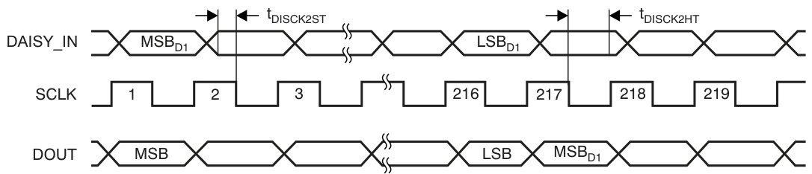  
Figure 1. Serial Interface Timing   
Figure 2. Daisy-Chain Interface Timing

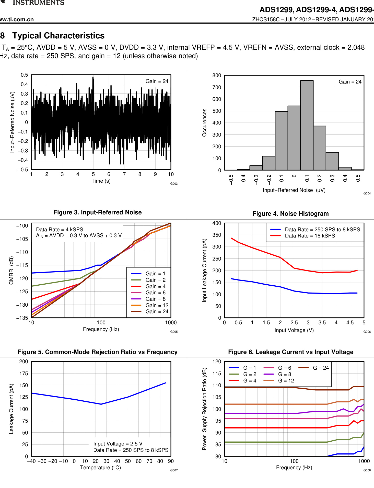  
Figure 7. Leakage Current vs Temperature   
Figure 8. PSRR vs Frequency

# Typical Characteristics (continued)

At ${ \sf T } _ { \sf A } = 2 5 ^ { \circ } { \sf C }$ , $\mathsf { A V D D } = 5 \mathsf { V }$ , $\mathsf { A V S S } = 0 \vee$ , $\mathsf { D V D D } = 3 . 3 \mathrm { ~ V ~ }$ , internal VREFP $= 4 . 5 \vee$ , VREFN $\mathbf { \sigma } = \mathbf { \sigma }$ AVSS, external clock $= 2 . 0 4 8$ MHz, data rate $= 2 5 0$ SPS, and gain $= 1 2$ (unless otherwise noted)

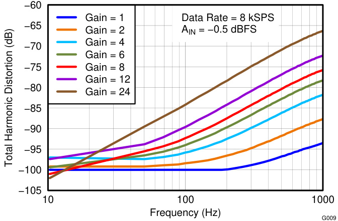

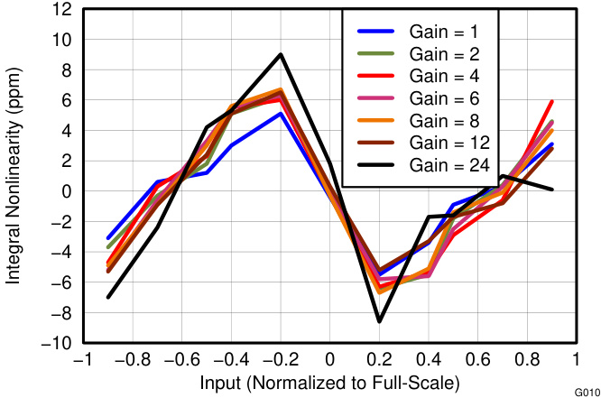

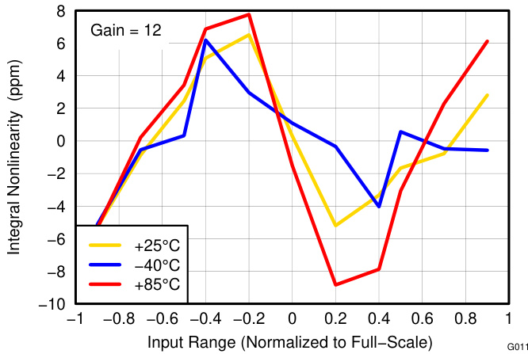  
Figure 9. THD vs Frequency

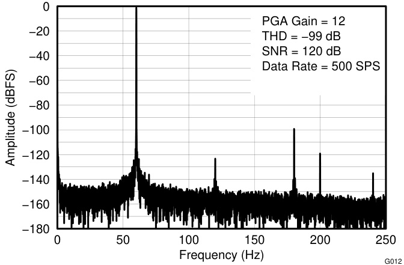  
Figure 10. INL vs PGA Gain

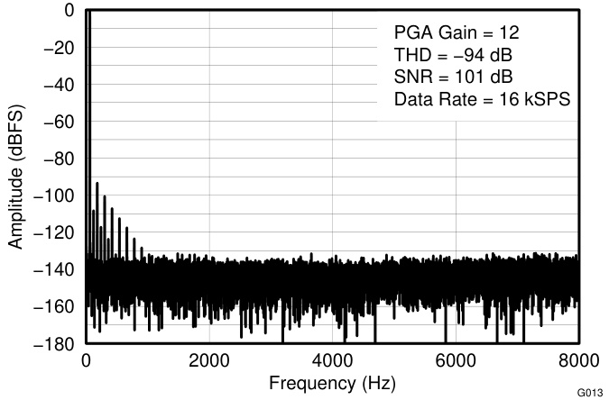  
Figure 11. INL vs Temperature

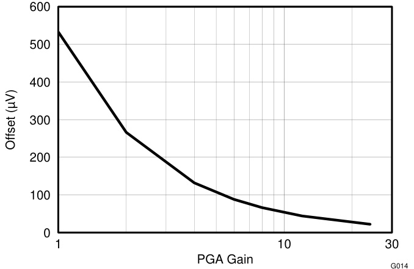  
Figure 12. THD FFT Plot (60-Hz Signal)   
Figure 13. FFT Plot (60-Hz Signal)   
Figure 14. Offset vs PGA Gain (Absolute Value)

# Typical Characteristics (continued)

At ${ \sf T } _ { \sf A } = 2 5 ^ { \circ } { \sf C }$ , $\mathsf { A V D D } = 5 \mathsf { V }$ , $\mathsf { A V S S } = 0 \vee$ , $\mathsf { D V D D } = 3 . 3 \mathrm { ~ V ~ }$ , internal VREFP $\mathtt { \Omega } = 4 . 5 ~ \mathtt { V }$ , VREFN $\mathbf { \sigma } = \mathbf { \sigma }$ AVSS, external clock $= 2 . 0 4 8$ MHz, data rate $= 2 5 0$ SPS, and gain $= 1 2$ (unless otherwise noted)

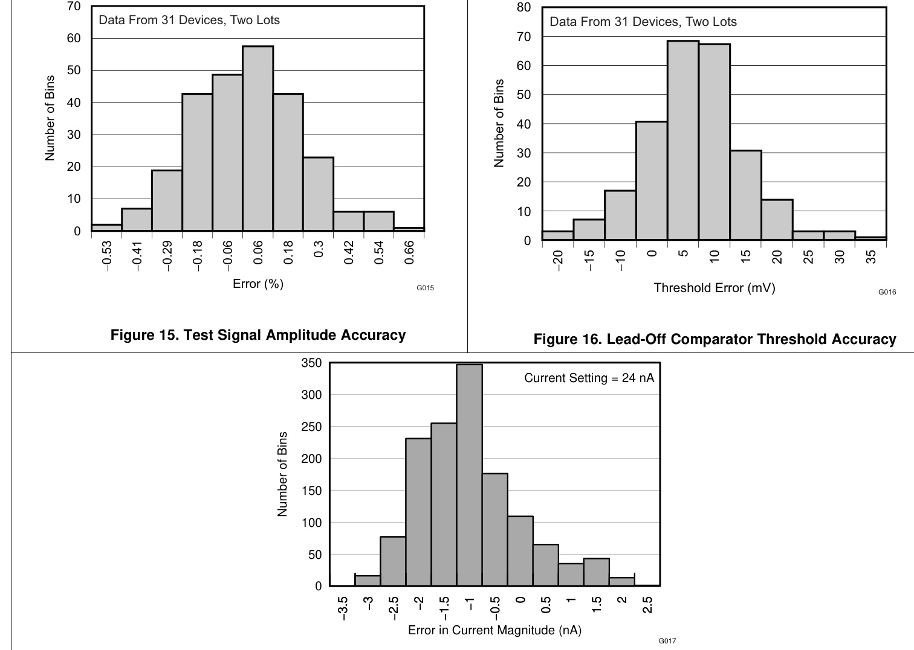  
Figure 17. Lead-Off Current Source Accuracy Distribution

# 8 Parametric Measurement Information

# 8.1 Noise Measurements

# NOTE

Unless otherwise noted, ADS1299- $x$ refers to all specifications and functional descriptions of the ADS1299-4, ADS1299-6, and ADS1299.

Optimize the ADS1299- $\cdot \mathsf { x }$ noise performance by adjusting the data rate and PGA setting. Reduce the data rate to increase the averaging, and the noise drops correspondingly. Increase the PGA value to reduce the inputreferred noise. This lowered noise level is particularly useful when measuring low-level biopotential signals. Table to Table 4 summarize the ADS1299-x noise performance with a 5-V analog power supply. The data are representative of typical noise performance at $T _ { \mathsf { A } } = + 2 5 ^ { \circ } \mathsf { C }$ . The data shown are the result of averaging the readings from multiple devices and are measured with the inputs shorted together. A minimum of 1000 consecutive readings are used to calculate the RMS and peak-to-peak noise for each reading. For the lower data rates, the ratio is approximately 6.6.

Table 1 shows measurements taken with an internal reference. The data are also representative of the ADS1299- $\cdot \mathsf { x }$ noise performance when using a low-noise external reference such as the REF5045.

Table 1, Table 2, Table 3, and Table 4 list the input-referred noise in units of $\mu \mathsf { V } _ { \mathsf { R M S } }$ and $\mu \mathsf { V } _ { \mathsf { P P } }$ for the conditions shown. The corresponding data in units of effective number of bits (ENOB) where ENOB for the RMS noise is defined as in Equation 1:

$$
E N O B = \log _ { 2 } ( \frac { V R E F } { \sqrt { 2 } \times \tan \times V _ { \mathrm { R M S } } } )
$$

Noise-free bits for the peak-to-peak noise are calculated with the same method.

The dynamic range data in Table 1, Table 2, Table 3, and Table 4 are calculated using Equation 2:

$$
{ \mathsf { D y n a m i c \ R a n g e } } = 2 0 \times \mathsf { l o g } \left( { \frac { \mathsf { V R E F } } { { \sqrt { 2 } } \times { \mathsf { G a i n } } \times { \mathsf { V } } _ { \mathsf { R M S } } } } \right)
$$

Table 1. Input-Referred Noise $( \mu \nu _ { \mathsf { R M S } } , \mu \nu _ { \mathsf { P P } } )$ (cid:) in Normal Mode 5-V Analog Supply and 4.5-V Reference(1)   

<html><body><table><tr><td rowspan="2">DR BITS OF CONFIG1</td><td rowspan="2">OUTPUT DATA RATE (SPS)</td><td rowspan="2">-3-dB BANDWIDTH (Hz)</td><td colspan="4">PGA GAIN =</td><td colspan="6">PGA GAIN = 2</td></tr><tr><td>VRMS</td><td>μVpP</td><td>DYNAMIC RANGE (dB)</td><td>NOISE- FREE BITS</td><td>ENOB</td><td>VRMS</td><td>μVpP</td><td>DYNAMIC RANGE (dB)</td><td>NOISE- FREE BITS</td><td>ENOB</td></tr><tr><td>000</td><td>16000</td><td>4193</td><td>21.70</td><td>151.89</td><td>103.3</td><td>15.85</td><td>17.16</td><td>10.85</td><td>75.94</td><td>103.3</td><td>15.85</td><td>17.16</td></tr><tr><td>001</td><td>8000</td><td>2096</td><td>6.93</td><td>48.53</td><td>113.2</td><td>17.50</td><td>18.81</td><td>3.65</td><td>25.52</td><td>112.8</td><td>17.43</td><td>18.74</td></tr><tr><td>010</td><td>4000</td><td>1048</td><td>4.33</td><td>30.34</td><td>117.3</td><td>18.18</td><td>19.49</td><td>2.28</td><td>15.95</td><td>116.9</td><td>18.11</td><td>19.41</td></tr><tr><td>011</td><td>2000</td><td>524</td><td>3.06</td><td>21.45</td><td>120.3</td><td>18.68</td><td>19.99</td><td>1.61</td><td>11.29</td><td>119.9</td><td>18.60</td><td>19.91</td></tr><tr><td>100</td><td>1000</td><td>262</td><td>2.17</td><td>15.17</td><td>123.3</td><td>19.18</td><td>20.49</td><td>1.14</td><td>7.98</td><td>122.9</td><td>19.10</td><td>20.41</td></tr><tr><td>101</td><td>500</td><td>131</td><td>1.53</td><td>10.73</td><td>126.3</td><td>19.68</td><td>20.99</td><td>0.81</td><td>5.65</td><td>125.9</td><td>19.60</td><td>20.91</td></tr><tr><td>110</td><td>250</td><td>65</td><td>1.08</td><td>7.59</td><td>129.3</td><td>20.18</td><td>21.48</td><td>0.57</td><td>3.99</td><td>128.9</td><td>20.10</td><td>21.41</td></tr><tr><td>111</td><td>n/a</td><td>n/a</td><td></td><td></td><td></td><td></td><td></td><td></td><td></td><td></td><td></td><td></td></tr></table></body></html>

(1) At least 1000 consecutive readings were used to calculate the RMS and peak-to-peak noise values in this table.

Table 2. Input-Referred pNpoliysea $( \mu \nu _ { \mathsf { R M S } } , \mu \nu _ { \mathsf { P P } } )$ rien cNeo(r1)mal Mode 5-V Analog Su nd 4.5-V   

<html><body><table><tr><td rowspan="2">DR BITS OF CONFIG1</td><td rowspan="2">OUTPUT DATA RATE (SPS)</td><td rowspan="2">-3-dB BANDWIDTH (Hz)</td><td colspan="5">PGA GAIN = 4</td><td colspan="5">PGA GAIN = 6</td></tr><tr><td>μVRMS</td><td>VpP</td><td>DYNAMIC RANGE (dB)</td><td>NOISE- FREE BITS</td><td>ENOB</td><td>VRMS</td><td>VpP</td><td>DYNAMIC RANGE (dB)</td><td>NOISE- FREE BITS</td><td>ENOB</td></tr><tr><td>000</td><td>16000</td><td>4193</td><td>5.60</td><td>39.23</td><td>103.0</td><td>15.81</td><td>17.12</td><td>3.87</td><td>27.10</td><td>102.7</td><td>15.76</td><td>17.06</td></tr><tr><td>001</td><td>8000</td><td>2096</td><td>1.98</td><td>13.87</td><td>112.1</td><td>17.31</td><td>18.62</td><td>1.31</td><td>9.19</td><td>112.1</td><td>17.32</td><td>18.62</td></tr><tr><td>010</td><td>4000</td><td>1048</td><td>1.24</td><td>8.66</td><td>116.1</td><td>17.99</td><td>19.29</td><td>0.93</td><td>6.50</td><td>115.1</td><td>17.82</td><td>19.12</td></tr><tr><td>011</td><td>2000</td><td>524</td><td>0.88</td><td>6.13</td><td>119.2</td><td>18.49</td><td>19.79</td><td>0.66</td><td>4.60</td><td>118.1</td><td>18.32</td><td>19.62</td></tr><tr><td>100</td><td>1000</td><td>262</td><td>0.62</td><td>4.34</td><td>122.2</td><td>18.99</td><td>20.29</td><td>0.46</td><td>3.25</td><td>121.1</td><td>18.81</td><td>20.12</td></tr><tr><td>101</td><td>500</td><td>131</td><td>0.44</td><td>3.07</td><td>125.2</td><td>19.49</td><td>20.79</td><td>0.33</td><td>2.30</td><td>124.1</td><td>19.31</td><td>20.62</td></tr><tr><td>110</td><td>250</td><td>65</td><td>0.31</td><td>2.16</td><td>128.2</td><td>19.99</td><td>21.30</td><td>0.23</td><td>1.62</td><td>127.2</td><td>19.82</td><td>21.13</td></tr><tr><td>111</td><td>n/a</td><td>n/a</td><td></td><td></td><td></td><td></td><td></td><td></td><td></td><td></td><td></td><td></td></tr></table></body></html>

(1) At least 1000 consecutive readings were used to calculate the RMS and peak-to-peak noise values in this table.

Table 3. Input-Referred Noise $( \mu \nu _ { \mathsf { P M S } } , \mu \nu _ { \mathsf { P P } } )$ (cid:) in Normal Mode 5-V Analog Supply and 4.5-V Reference(1)   

<html><body><table><tr><td rowspan="2">DR BITS OF CONFIG1</td><td rowspan="2">OUTPUT DATA RATE (SPS)</td><td rowspan="2">-3-dB BANDWIDTH (Hz)</td><td colspan="5">PGA GAIN = 8</td><td colspan="5">PGA GAIN = 12</td></tr><tr><td>μVRMS</td><td>μVpp</td><td>DYNAMIC RANGE (dB)</td><td>NOISE- FREE BITS</td><td>ENOB</td><td>μVRMS</td><td>μVpp</td><td>DYNAMIC RANGE (dB)</td><td>NOISE- FREE BITS</td><td>ENOB</td></tr><tr><td>000</td><td>16000</td><td>4193</td><td>3.05</td><td>21.32</td><td>102.3</td><td>15.69</td><td>16.99</td><td>2.27</td><td>15.89</td><td>101.3</td><td>15.53</td><td>16.83</td></tr><tr><td>001</td><td>8000</td><td>2096</td><td>1.11</td><td>7.80</td><td>111.0</td><td>17.14</td><td>18.45</td><td>0.92</td><td>6.41</td><td>109.2</td><td>16.84</td><td>18.14</td></tr><tr><td>010</td><td>4000</td><td>1048</td><td>0.79</td><td>5.52</td><td>114.0</td><td>17.64</td><td>18.95</td><td>0.65</td><td>4.53</td><td>112.2</td><td>17.34</td><td>18.64</td></tr><tr><td>011</td><td>2000</td><td>524</td><td>0.56</td><td>3.90</td><td>117.1</td><td>18.14</td><td>19.44</td><td>0.46</td><td>3.20</td><td>115.2</td><td>17.84</td><td>19.14</td></tr><tr><td>100</td><td>1000</td><td>262</td><td>0.39</td><td>2.76</td><td>120.1</td><td>18.64</td><td>19.94</td><td>0.32</td><td>2.26</td><td>118.3</td><td>18.34</td><td>19.65</td></tr><tr><td>101</td><td>500</td><td>131</td><td>0.28</td><td>1.95</td><td>123.1</td><td>19.14</td><td>20.44</td><td>0.23</td><td>1.61</td><td>121.2</td><td>18.83</td><td>20.14</td></tr><tr><td>110</td><td>250</td><td>65</td><td>0.20</td><td>1.38</td><td>126.1</td><td>19.64</td><td>20.95</td><td>0.16</td><td>1.13</td><td>124.3</td><td>19.34</td><td>20.65</td></tr><tr><td>111</td><td>n/a</td><td>n/a</td><td></td><td></td><td></td><td></td><td></td><td></td><td></td><td></td><td></td><td></td></tr></table></body></html>

(1) At least 1000 consecutive readings were used to calculate the RMS and peak-to-peak noise values in this table.

Table 4. Input-Referred Noise $( \mu \nu _ { \mathsf { P M S } } , \mu \nu _ { \mathsf { P P } } )$ (id:) in Normal Mode 5-V Analog Supply and $4 . 5 \cdot V$ Reference(1)   

<html><body><table><tr><td rowspan="2">DR BITS OF CONFIG1 REGISTER</td><td rowspan="2">OUTPUT DATA RATE (SPS)</td><td rowspan="2">-3-dB BANDWIDTH (Hz)</td><td colspan="5">PGA GAIN = 24</td></tr><tr><td>μVRMS</td><td>μVpP</td><td>DYNAMIC RANGE (dB)</td><td>NOISE-FREE BITS</td><td>ENOB</td></tr><tr><td>000</td><td>16000</td><td>4193</td><td>1.66</td><td>11.64</td><td>98.0</td><td>14.98</td><td>16.28</td></tr><tr><td>001</td><td>8000</td><td>2096</td><td>0.80</td><td>5.57</td><td>104.4</td><td>16.04</td><td>17.35</td></tr><tr><td>010</td><td>4000</td><td>1048</td><td>0.56</td><td>3.94</td><td>107.4</td><td>16.54</td><td>17.84</td></tr><tr><td>011</td><td>2000</td><td>524</td><td>0.40</td><td>2.79</td><td>110.4</td><td>17.04</td><td>18.35</td></tr><tr><td>100</td><td>1000</td><td>262</td><td>0.28</td><td>1.97</td><td>113.5</td><td>17.54</td><td>18.85</td></tr><tr><td>101</td><td>500</td><td>131</td><td>0.20</td><td>1.39</td><td>116.5</td><td>18.04</td><td>19.35</td></tr><tr><td>110</td><td>250</td><td>65</td><td>0.14</td><td>0.98</td><td>119.5</td><td>18.54</td><td>19.85</td></tr><tr><td>111</td><td>n/a</td><td>n/a</td><td></td><td></td><td></td><td></td><td></td></tr></table></body></html>

(1) At least 1000 consecutive readings were used to calculate the RMS and peak-to-peak noise values in this table.

# 9 Detailed Description

# 9.1 Overview

The ADS1299-x is a low-noise, low-power, multichannel, simultaneously-sampling, 24-bit, delta-sigma $( \Delta \Sigma )$ analog-to-digital converter (ADC) with an integrated programmable gain amplifier (PGA). These devices integrate various EEG-specific functions that makes the family well-suited for scalable electrocardiogram (ECG), electroencephalography (EEG) applications. These devices can also be used in high-performance, multichannel, data acquisition systems by powering down the ECG or EEG-specific circuitry.

The devices have a highly-programmable multiplexer that allows for temperature, supply, input short, and bias measurements. Additionally, the multiplexer allows any input electrodes to be programmed as the patient reference drive. The PGA gain can be chosen from one of seven settings (1, 2, 4, 6, 8, 12, and 24). The ADCs in the device offer data rates from 250 SPS to 16 kSPS. Communication to the device is accomplished using an SPI-compatible interface. The device provides four general-purpose input/output (GPIO) pins for general use. Multiple devices can be synchronized using the START pin.

The internal reference generates a low noise $4 . 5 ~ \mathsfit { V }$ internal voltage when enabled and the internal oscillator generates a 2.048-MHz clock when enabled. The versatile patient bias drive block allows the average of any electrode combination to be chosen in order to generate the patient drive signal. Lead-off detection can be accomplished by using a current source or sink. A one-time, in-band, lead-off option and a continuous, out-ofband, internal lead-off option are available.

# 9.2 Functional Block Diagram

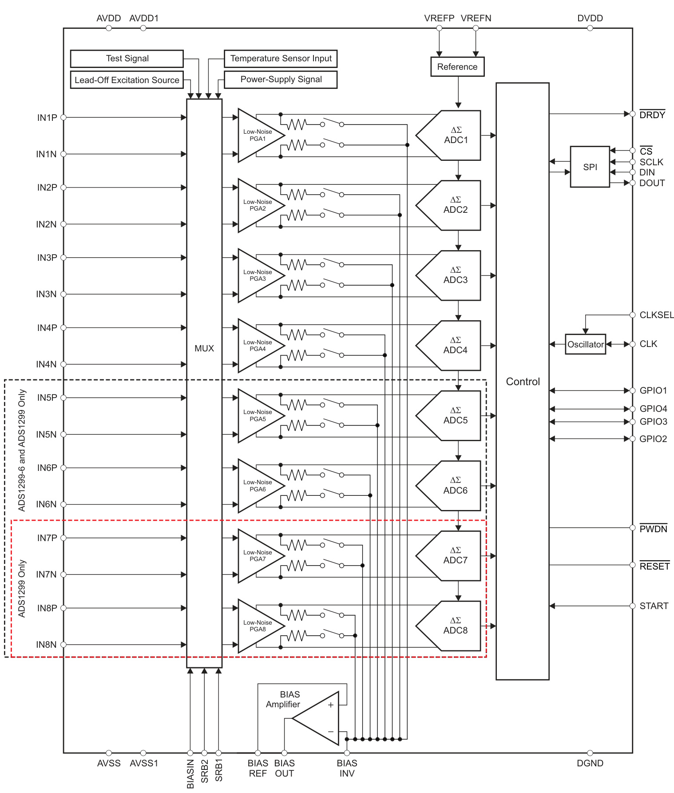

# 9.3 Feature Description

This section contains details of the ADS1299-x internal functional elements. The analog blocks are discussed first, followed by the digital interface. Blocks implementing EEG-specific functions are covered at the end of this section.

Throughout this document, $\pmb { f } _ { C L K }$ denotes the CLK pin signal frequency, $t _ { C L K }$ denotes the CLK pin signal period, $f _ { D R }$ denotes the output data rate, $t _ { D R }$ denotes the output data time period, and $f _ { M O D }$ denotes the frequency at which the modulator samples the input.

# 9.3.1 Analog Functionality

# 9.3.1.1 Input Multiplexer

The ADS1299- $\cdot \mathsf { x }$ input multiplexers are very flexible and provide many configurable signal-switching options. Figure 18 shows the multiplexer on a single channel of the device. Note that the device has either four (ADS1299-4), six (ADS1299-6) or eight (ADS1299) such blocks, one for each channel. SRB1, SRB2, and BIASIN are common to all blocks. INxP and INxN are separate for each of the four, six, or eight blocks. This flexibility allows for significant device and sub-system diagnostics, calibration, and configuration. Switch setting selections for each channel by writing the appropriate values to the CHnSET[3:0] register (see the CHnSET: Individual Channel Settings section for details) using the BIAS_MEAS bit in the CONFIG3 register and the SRB1 bit in the MISC1 register (see the CONFIG3: Configuration Register 3 subsection of the Register Maps section for details). See the Input Multiplexer section for further information regarding the EEG-specific features of the multiplexer.

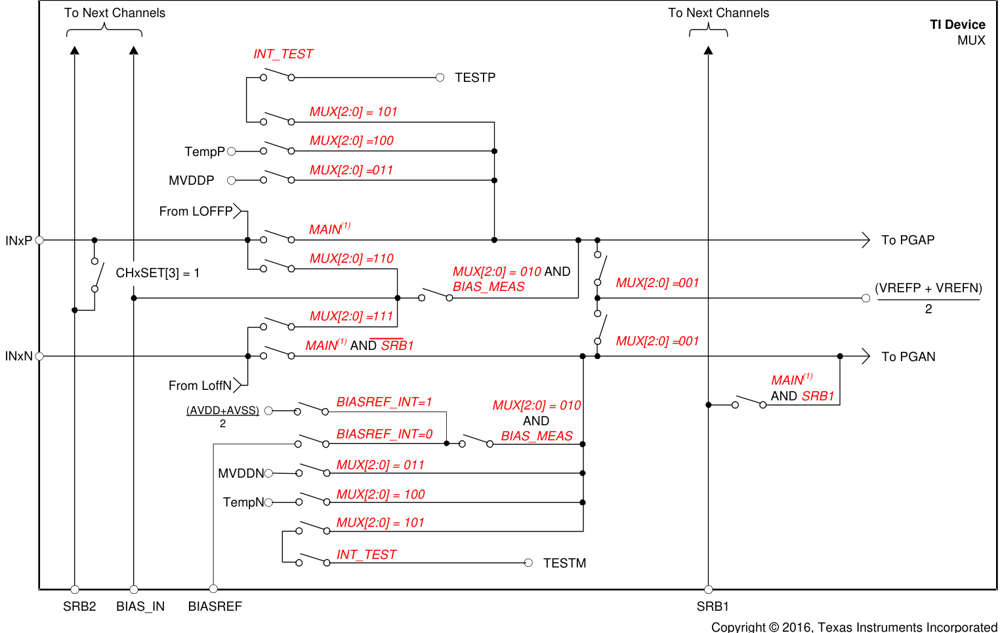  
Figure 18. Input Multiplexer Block for One Channel

(1) MAIN is equal to either $\mathsf { M } \mathsf { U } \times [ 2 : 0 ] = 0 0 0$ , $\mathsf { M U } \times [ 2 : 0 ] = 1 1 0$ , or $\mathsf { M U } \times [ 2 { : } 0 ] = 1 1 1$ .

# Feature Description (continued)

# 9.3.1.1.1 Device Noise Measurements

Setting CHnSET[2:0] $= 0 0 1$ sets the common-mode voltage of $[ ( \mathsf { V } _ { \mathsf { V R E F P } } + \mathsf { V } _ { \mathsf { V R E F N } } ) \ /$ 2] to both channel inputs.   
This setting can be used to test inherent device noise in the user system.

# 9.3.1.1.2 Test Signals (TestP and TestN)

Setting CHnSET $[ 2 ; 0 ] = 1 0 1$ provides internally-generated test signals for use in sub-system verification at powerup. This functionality allows the device internal signal chain to be tested out.

Test signals are controlled through register settings (see the CONFIG2: Configuration Register $^ { 2 }$ subsection in the Register Maps section for details). TEST_AMP controls the signal amplitude and TEST _FREQ controls switching at the required frequency.

# 9.3.1.1.3 Temperature Sensor (TempP, TempN)

The ADS1299- $\cdot \mathsf { x }$ contains an on-chip temperature sensor. This sensor uses two internal diodes with one diode having a current density 16x that of the other, as shown in Figure 19. The difference in diode current densities yields a voltage difference proportional to absolute temperature.

As a result of the low thermal resistance of the package to the printed circuit board (PCB), the internal device temperature tracks PCB temperature closely. Note that self-heating of the ADS1299- $\cdot \mathsf { x }$ causes a higher reading than the temperature of the surrounding PCB.

The scale factor of Equation 3 converts the temperature reading to degrees Celsius. Before using this equation, the temperature reading code must first be scaled to microvolts.

Temperature $( ^ { \circ } \mathsf { C } ) = \left( \frac { \mathsf { T e m p e r a t u r e \ R e a d i n g \ ( \mu V ) } - 1 4 5 , 3 0 0 \ \mu V } { 4 9 0 \ \mu \mathsf { V / } ^ { \circ } \mathsf { C } } \right) + 2 5 ^ { \circ } \mathsf { C }$

Temperature Sensor Monitor

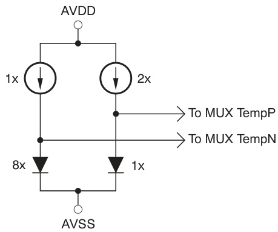  
Figure 19. Temperature Sensor Measurement in the Input

# 9.3.1.1.4 Supply Measurements (MVDDP, MVDDN)

Setting CHnSET[2:0] $\begin{array} { r l } { \mathbf { \Phi } = } & { { } 0 1 \mathbf { \ P } } \end{array}$ sets the channel inputs to different supply voltages of the device.   
For channels 1, 2, 5, 6, 7, and 8, (MVDDP – MVDDN) is $[ 0 . 5 \times ( \mathsf { A V D D } + \mathsf { A V S S } ) ]$ .

For channels 3 and 4, (MVDDP – MVDDN) is DVDD 4.

To avoid saturating the PGA when measuring power supplies, set the gain to 1.

# 9.3.1.1.5 Lead-Off Excitation Signals (LoffP, LoffN)

The lead-off excitation signals are fed into the multiplexer before the switches. The comparators that detect the lead-off condition are also connected to the multiplexer block before the switches. For a detailed description of the lead-off block, see the Lead-Off Detection section.

# Feature Description (continued)

# 9.3.1.1.6 Auxiliary Single-Ended Input

The BIASIN pin is primarily used for routing the bias signal to any electrodes in case the bias electrode falls off. However, the BIASIN pin can be used as a multiple single-ended input channel. The signal at the BIASIN pin can be measured with respect to the voltage at the BIASREF pin using any of the eight channels. This measurement is done by setting the channel multiplexer setting to '010' and the BIAS _MEAS bit of the CONFIG3 register to '1'.

# 9.3.1.2 Analog Input

The analog inputs to the device connect directly to an integrated low-noise, low-drift, high input impedance, programmable gain amplifier. The amplifier is located following the individual channel multiplexer.

The ADS1299- $\cdot \mathsf { x }$ analog inputs are fully differential. The differential input voltage $( V _ { | | \mathsf { N X P } } - \mathsf { V } _ { | | \mathsf { N X N } } )$ can span from –VREF gain to $V _ { \sf R E F } /$ gain. See the Data Format section for an explanation of the correlation between the analog input and digital codes. There are two general methods of driving the ADS1299-x analog inputs: pseudodifferential or fully-differential, as shown in Figure 20, Figure 21, and Figure 22.

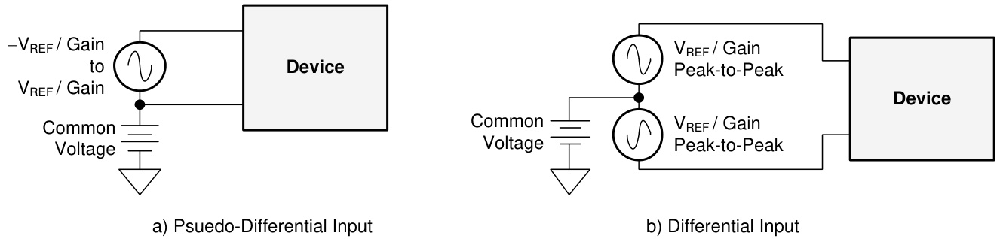  
Figure 20. Methods of Driving the ADS1299-x: Pseudo-Differential or Fully Differential

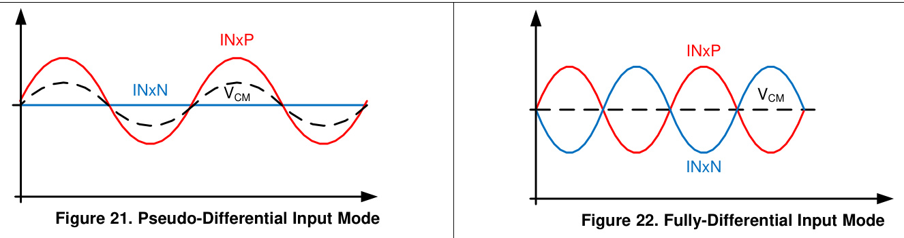

Hold the INxN pin at a common voltage, preferably at mid supply, to configure the fully differential input for a pseudo-differential signal. Swing the INxP pin around the common voltage –VREF gain to $\mathsf { V } _ { \mathsf { R E F } } /$ gain and remain within the absolute maximum specifications. The common-mode voltage $( \mathsf { V } _ { \mathsf { C M } } )$ changes with varying signal level when the inputs are configured in pseudo-differential mode. Verify that the differential signal at the minimum and maximum points meets the common-mode input specification discussed in the Input Common-Mode Range section.

Configure the signals at INxP and INxN to be $1 8 0 ^ { \circ }$ out-of-phase centered around a common voltage to use a fully differential input method. Both the INxP and INxN inputs swing from the common voltage $+ \ V _ { 2 } \ V _ { \sf R E F } /$ gain to the common voltage – ½ $V _ { \mathsf { R E F } } \ /$ gain. The differential voltage at the maximum and minimum points is equal to $- V _ { \mathsf { R E F } } /$ gain to $V _ { \sf R E F } /$ gain and centered around a fixed common-mode voltage $( \mathsf { V } _ { \mathsf { C M } } )$ . Use the ADS1299-x in a differential configuration to maximize the dynamic range of the data converter. For optimal performance, the common voltage is recommended to be set at the midpoint of the analog supplies $\left( ( \mathsf { A V D D } + \mathsf { A V S S } ) / 2 \right]$ .

# 9.3.1.3 PGA Settings and Input Range

The low-noise PGA is a differential input and output amplifier, as shown in Figure 23. The PGA has seven gain settings (1, 2, 4, 6, 8, 12, and 24) that can be set by writing to the CHnSET register (see the CHnSET: Individual Channel Settings subsection of the Register Maps section for details). The ADS1299-x has CMOS inputs and therefore has negligible current noise. Table 5 shows the typical bandwidth values for various gain settings. Note that Table 5 shows small-signal bandwidth. For large signals, performance is limited by PGA slew rate.

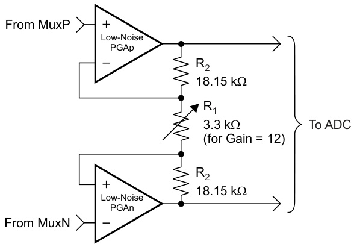  
Figure 23. PGA Implementation

Table 5. PGA Gain versus Bandwidth   

<html><body><table><tr><td>GAIN</td><td>NOMINAL BANDWIDTH AT ROOM TEMPERATURE (kHz)</td></tr><tr><td></td><td>662</td></tr><tr><td>2</td><td>332</td></tr><tr><td>4</td><td>165</td></tr><tr><td>6</td><td>110</td></tr><tr><td>8</td><td>83</td></tr><tr><td>12</td><td>55</td></tr><tr><td>24</td><td>27</td></tr></table></body></html>

The PGA resistor string that implements the gain has $3 9 . 6 ~ \mathsf { k } \Omega$ of resistance for a gain of 12. This resistance provides a current path across the PGA outputs in the presence of a differential input signal. This current is in addition to the quiescent current specified for the device in the presence of a differential signal at the input.

# 9.3.1.3.1 Input Common-Mode Range

To stay within the linear operating range of the PGA, the input signals must meet certain requirements that are discussed in this section.

The outputs of the amplifiers in Figure 23 cannot swing closer to the supplies (AVSS and AVDD) than $2 0 0 ~ \mathsf { m V } .$ . If the outputs of the amplifiers are driven to within $2 0 0 ~ \mathsf { m V }$ of the supply rails, then the amplifiers saturate and consequently become nonlinear. To prevent this nonlinear operating condition, the output voltages must not exceed the common-mode range of the front-end.

The usable input common-mode range of the front-end depends on various parameters, including the maximum differential input signal, supply voltage, PGA gain, and the $2 0 0 ~ \mathsf { m V }$ for the amplifier headroom. This range is described in Equation 4:

$$
\mathsf { A V D D - 0 . 2 ~ V \mathrm { \Omega - \left( \frac { \mathsf { G a i n } \times \mathsf { V _ { M A X \_ D I F F } } } { 2 } \right) \mathrm { \Omega > \mathsf { C M } > \mathsf { A V S S } + 0 . 2 ~ V \mathrm { \Omega + \left( \frac { \mathsf { G a i n } \times \mathsf { V _ { M A X \_ D I F F } } } { 2 } \right) \Omega } } } }
$$

where:

VMAX_DIFF $\mathbf { \tau } = \mathbf { \tau }$ maximum differential signal at the PGA input $\mathsf { C M } =$ common-mode range

For example:

If $\mathsf { A V D D } = 5 \ : \mathsf { V }$ , gain $= 1 2$ , and $\mathsf { V } _ { \mathsf { M A X \_ D I F F } } = 3 5 0 ~ \mathsf { m V }$ Then $2 . 3 V < C M < 2 . 7 V$

# 9.3.1.3.2 Input Differential Dynamic Range

The differential input voltage range $( V \vert \varsigma _ { \sf I N X P } - \sf V _ { \sf I N X N } )$ depends on the analog supply and reference used in the system. This range is shown in Equation 5.

$$
\mathsf { F u l l - S c a l e \ R a n g e } = \frac { \pm V _ { \mathsf { R E F } } } { \mathsf { G a i n } } = \frac { 2 V _ { \mathsf { R E F } } } { \mathsf { G a i n } }
$$

# 9.3.1.3.3 ADC ΔΣ Modulator

Each ADS1299-x channel has a 24-bit, $\Delta \Sigma$ ADC. This converter uses a second-order modulator optimized for low-noise applications. The modulator samples the input signal at the rate of $( \mathsf { f } _ { \mathsf { M O D } } = \mathsf { f } _ { \mathsf { C L K } } / 2 )$ . As in the case of any $\Delta \Sigma$ modulator, the device noise is shaped until fMOD $1 2$ , as shown in Figure 24. The on-chip digital decimation filters explained in the next section can be used to filter out the noise at higher frequencies. These on-chip decimation filters also provide antialias filtering. This $\Delta \Sigma$ converter feature drastically reduces the complexity of the analog antialiasing filters typically required with nyquist ADCs.

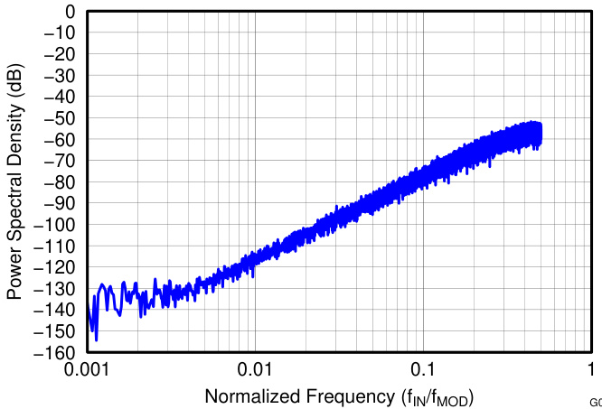  
Figure 24. Modulator Noise Spectrum Up To $\pmb { 0 . 5 \times }$ fMOD

# 9.3.1.3.4 Reference

Figure 25 shows a simplified block diagram of the ADS1299- $\cdot \mathsf { x }$ internal reference. The 4.5-V reference voltage is generated with respect to AVSS. When using the internal voltage reference, connect $V _ { P E F N }$ to AVSS.

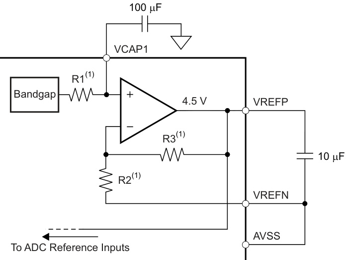  
Figure 25. Internal Reference

(1) For $V _ { \mathsf { R E F } } = 4 . 5 \$ V: ${ \sf R 1 } = 9 . 8 ~ { \sf k \Omega }$ , ${ \sf R } 2 = 1 3 . 4 { \sf k } \Omega$ , and ${ \sf R } 3 = 3 6 . 8 5 { \sf kOmega }$ .

The external band-limiting capacitors determine the amount of reference noise contribution. For high-end EEG systems, the capacitor values should be chosen such that the bandwidth is limited to less than $1 0 H 2$ so that the reference noise does not dominate system noise.

Alternatively, the internal reference buffer can be powered down and an external reference can be applied to VREFP. Figure 26 shows a typical external reference drive circuitry. Power-down is controlled by the PD _REFBUF bit in the CONFIG3 register. This power-down is also used to share internal references when two devices are cascaded. By default, the device wakes up in external reference mode.

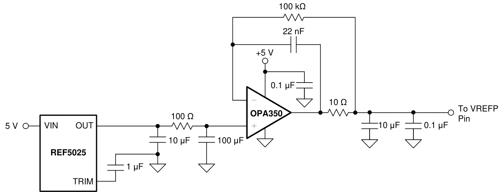  
Figure 26. External Reference Driver

# 9.3.2 Digital Functionality

# 9.3.2.1 Digital Decimation Filter

The digital filter receives the modulator output and decimates the data stream. By adjusting the amount of filtering, tradeoffs can be made between resolution and data rate: filter more for higher resolution, filter less for higher data rates. Higher data rates are typically used in EEG applications for ac lead-off detection.

The digital filter on each channel consists of a third-order sinc filter. The sinc filter decimation ratio can be adjusted by the DR bits in the CONFIG1 register (see the Register Maps section for details). This setting is a global setting that affects all channels and, therefore, all channels operate at the same data rate in a device.

# 9.3.2.1.1 Sinc Filter Stage (sinx x)

The sinc filter is a variable decimation rate, third-order, low-pass filter. Data are supplied to this section of the filter from the modulator at the rate of fMOD. The sinc filter attenuates the modulator high-frequency noise, then decimates the data stream into parallel data. The decimation rate affects the overall converter data rate.

Equation 6 shows the scaled Z-domain transfer function of the sinc filter.

$$
| { \sf H } ( z ) | = \left| \frac { 1 - Z ^ { - \sf N } } { 1 - Z ^ { - 1 } } \right| ^ { 3 }
$$

The frequency domain transfer function of the sinc filter is shown in Equation 7.

$$
\sf H ( f ) \mid \ = \left| \frac { \sin \left( \displaystyle \frac { N \pi f } { f _ { \mathrm { M O D } } } \right) } { N \times \sin \left[ \displaystyle \frac { \pi f } { f _ { \mathrm { M O D } } } \right] } \right| ^ { 1 }
$$

where: ${ \sf N } =$ decimation ratio

The sinc filter has notches (or zeroes) that occur at the output data rate and multiples thereof. At these frequencies, the filter has infinite attenuation. Figure 27 shows the sinc filter frequency response and Figure 28 shows the sinc filter roll-off. With a step change at input, the filter takes $3 \times 1 _ { \mathsf { D } \mathsf { R } }$ to settle. After a rising edge of the START signal, the filter takes $\mathsf { t } _ { \mathsf { S E T T L E } }$ time to give the first data output. The settling time of the filters at various data rates are discussed in the Start subsection of the SPI Interface section. Figure 29 and Figure 30 show the filter transfer function until ${ \mathfrak { f } } _ { \mathsf { M O D } } \ / \ 2$ and fMOD / 16, respectively, at different data rates. Figure 31 shows the transfer function extended until $4 \times \mathsf { f } _ { \mathsf { M O D } }$ . The ADS1299- $\cdot \mathsf { x }$ pass band repeats itself at every fMOD. The input R-C antialiasing filters in the system should be chosen such that any interference in frequencies around multiples of $\mathsf { f } _ { \mathsf { M O D } }$ are attenuated sufficiently.

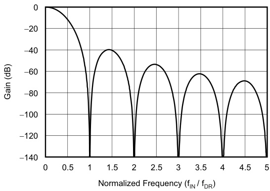  
Figure 27. Sinc Filter Frequency Response

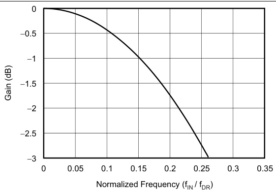  
Figure 28. Sinc Filter Roll-Off

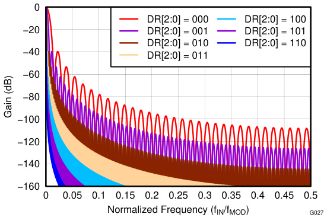  
Figure 29. Transfer Function of On-Chip Decimation Filters Until fMOD / 2

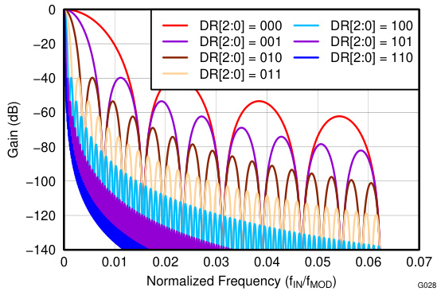  
Figure 30. Transfer Function of On-Chip Decimation Filters Until fMOD 16

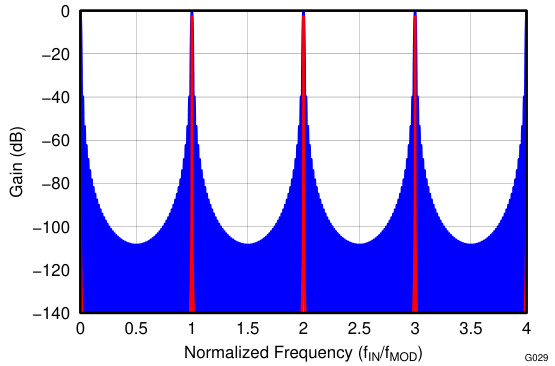  
Figure 31. Transfer Function of On-Chip Decimation Filters Until $4 + \cos$ for DR[2:0] $\mathbf { \tau } = \mathbf { 0 0 0 }$ and DR[2:0] $\mathbf { \lambda } = \mathbf { \lambda }$ 110

# 9.3.2.2 Clock

The ADS1299-x provides two methods for device clocking: internal and external. Internal clocking is ideally suited for low-power, battery- powered systems. The internal oscillator is trimmed for accuracy at room temperature. Accuracy varies over the specified temperature range; see the Electrical Characteristics. Clock selection is controlled by the CLKSEL pin and the CLK_EN register bit.

The CLKSEL pin selects either the internal or external clock. The CLK_ EN bit in the CONFIG1 register enables and disables the oscillator clock to be output in the CLK pin. A truth table for these two pins is shown in Table 6. The CLK_ EN bit is useful when multiple devices are used in a daisy-chain configuration. During power-down, the external clock is recommended be shut down to save power.

Table 6. CLKSEL Pin and CLK_EN Bit   

<html><body><table><tr><td>CLKSEL PIN</td><td>CONFIG1.CLK_EN BIT</td><td>CLOCK SOURCE</td><td>CLK PIN STATUS</td></tr><tr><td>0</td><td>X</td><td>External clock</td><td>Input: external clock</td></tr><tr><td></td><td>0</td><td>Internal clock oscillator</td><td>3-state</td></tr><tr><td></td><td></td><td>Internal clock oscillator</td><td>Output: internal clock oscillator</td></tr></table></body></html>

# 9.3.2.3 GPIO

The ADS1299- $\cdot \mathsf { x }$ has a total of four general-purpose digital I/O (GPIO) pins available in normal mode of operation. The digital $1 / \mathsf { O }$ pins are individually configurable as either inputs or outputs through the GPIOC bits register. The GPIOD bits in the GPIO register control the pin level. When reading the GPIOD bits, the data returned are the logic level of the pins, whether they are programmed as inputs or outputs. When the GPIO pin is configured as an input, a write to the corresponding GPIOD bit has no effect. When configured as an output, a write to the GPIOD bit sets the output value.

If configured as inputs, these pins must be driven (do not float). The GPIO pins are set as inputs after power-on or after a reset. Figure 32 shows the GPIO port structure. The pins should be shorted to DGND if not used.

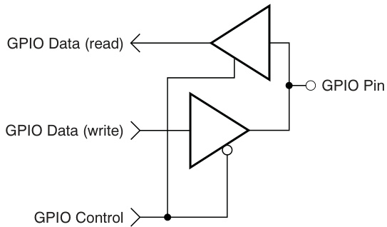  
Figure 32. GPIO Port Pin

# 9.3.2.4 ECG and EEG Specific Features

# 9.3.2.4.1 Input Multiplexer (Rerouting the BIAS Drive Signal)

The input multiplexer has EEG-specific functions for the bias drive signal. The BIAS signal is available at the BIASOUT pin when the appropriate channels are selected for BIAS derivation, feedback elements are installed external to the chip, and the loop is closed. This signal can either be fed after filtering or fed directly into the BIASIN pin, as shown in Figure 33. This BIASIN signal can be multiplexed into any input electrode by setting the MUX bits of the appropriate channel set registers to '110' for $\mathsf { P }$ -side or '111' for N-side. Figure 33 shows the BIAS signal generated from channels 1, 2, and 3 and routed to the N-side of channel 8. This feature can be used to dynamically change the electrode that is used as the reference signal to drive the patient body.

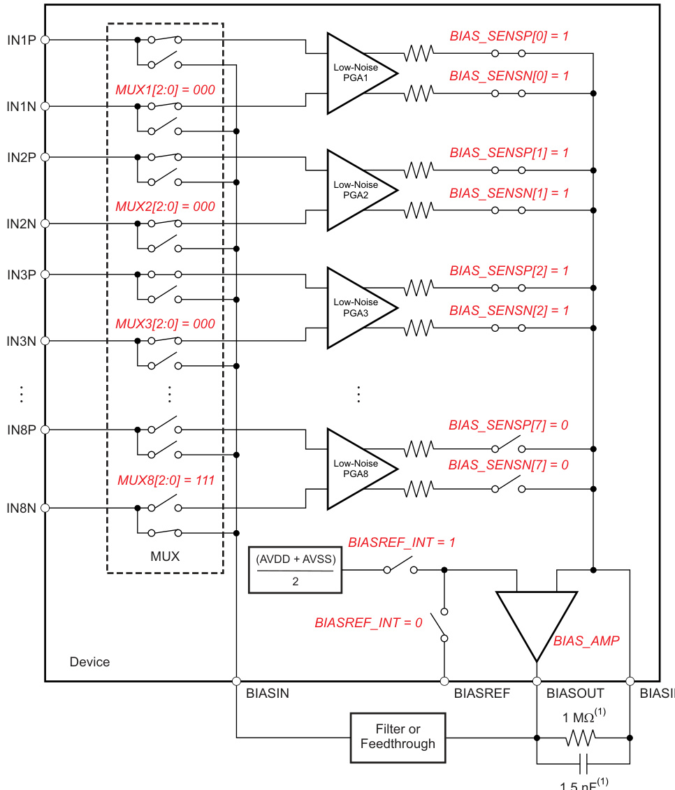  
  
Figure 33. Example of BIASOUT Signal Configured to be Routed to IN8N

(1) Typical values for example only.

# 9.3.2.4.2 Input Multiplexer (Measuring the BIAS Drive Signal)

Also, the BIASOUT signal can be routed to a channel (that is not used for the calculation of BIAS) for measurement. Figure 34 shows the register settings to route the BIASIN signal to channel 8. The measurement is done with respect to the voltage on the BIASREF pin. If BIASREF is chosen to be internal, then BIASREF is at $[ ( \mathsf { A V D D } + \mathsf { A V S S } ) /$ 2]. This feature is useful for debugging purposes during product development.

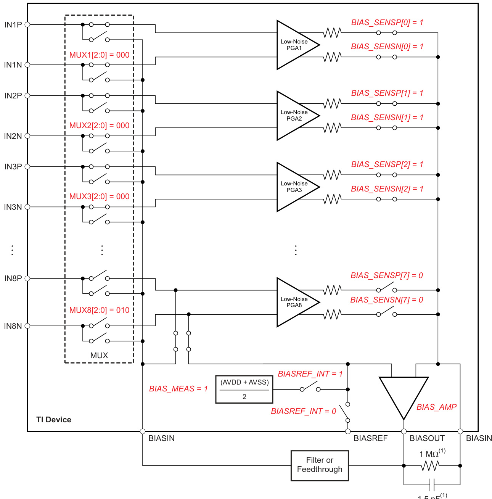  
1.5 nF(1)   
Copyright $\circledcirc$ 2016, Texas Instruments Incorporated   
Figure 34. BIASOUT Signal Configured to be Read Back by Channel 8

(1) Typical values for example only.

# 9.3.2.4.3 Lead-Off Detection

Patient electrode impedances are known to decay over time. These electrode connections must be continuously monitored to verify that a suitable connection is present. The ADS1299-x lead-off detection functional block provides significant flexibility to the user to choose from various lead-off detection strategies. Though called leadoff detection, this is in fact an electrode-off detection.

The basic principle is to inject an excitation current and measure the voltage to determine if the electrode is off. As shown in the lead-off detection functional block diagram in Figure 35, this circuit provides two different methods of determining the state of the patient electrode. The methods differ in the frequency content of the excitation signal. Lead-off can be selectively done on a per channel basis using the LOFF_SENSP and LOFF_SENSN registers. Also, the internal excitation circuitry can be disabled and just the sensing circuitry can be enabled.

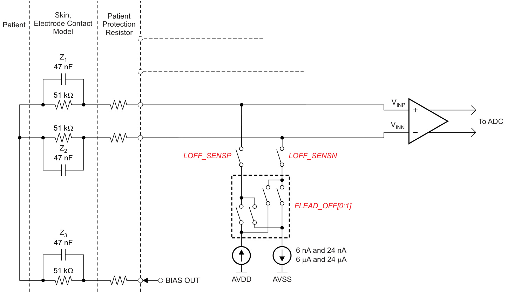  
Figure 35. Lead-Off Detection

# 9.3.2.4.3.1 DC Lead-Off

In this method, the lead-off excitation is with a dc signal. The dc excitation signal can be chosen from either an external pull-up or pull -down resistor or an internal current source or sink, as shown in Figure 36. One side of the channel is pulled to supply and the other side is pulled to ground. The pull-up and pull-down current can be swapped (as shown in Figure 36b and Figure 36c) by setting the bits in the LOFF_FLIP register. In case of a current source or sink, the magnitude of the current can be set by using the ILEAD_OFF[1:0] bits in the LOFF register. The current source or sink gives larger input impedance compared to the 10-MΩ pull-up or pull-down resistor.

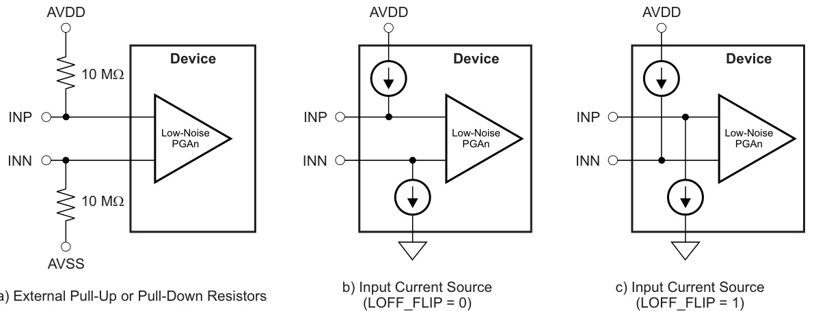  
Figure 36. DC Lead-Off Excitation Options

Sensing of the response can be done either by searching the digital output code from the device or by monitoring the input voltages with an on-chip comparator. If either electrode is off, the pull-up and pull-down resistors saturate the channel. Searching the output code determines if either the P-side or the N-side is off. To pinpoint which one off, the comparators must be used. The input voltage is also monitored using a comparator and a 3- bit DAC whose levels are set by the COMP TH[2:0] bits in the LOFF register. The output of the comparators are stored in the LOFF_STATP and LOFF_STATN registers. These registers are available as a part of the output data stream. (See the Data Output (DOUT) subsection of the SPI Interface section.) If dc lead-off is not used, the lead-off comparators can be powered down by setting the PD_LOFF_COMP bit in the CONFIG4 register.

An example procedure to turn on dc lead-off is given in the Lead-Off section.

# 9.3.2.4.3.2 AC Lead-Off (One Time or Periodic)

In this method, an in-band ac signal is used for excitation. The ac signal is generated by alternatively providing a current source and sink at the input with a fixed frequency. The frequency can be chosen by the FLEAD OFF[1:0] bits in the LOFF register. The excitation frequency is chosen to be one of the two in-band frequency selections $( 7 . 8 ~ \mathsf { H z }$ or $3 1 . 2 \ \mathsf { H z } )$ ). This in-band excitation signal is passed through the channel and measured at the output.

Sensing of the ac signal is done by passing the signal through the channel to be digitized and then measured at the output. The ac excitation signals are introduced at a frequency that is in the band of interest. The signal can be filtered out separately and processed. By measuring the magnitude of the output at the excitation signal frequency, the electrode impedance can be calculated.

For continuous lead-off, an out-of-band ac current source or sink must be externally applied to the inputs. This signal can then be digitally processed to determine the electrode impedance.

# 9.3.2.4.4 Bias Lead-Off

# BIAS Lead-Off Detection During Normal Operation

During normal operation, the ADS1299- $\cdot \mathsf { x }$ BIAS lead-off at power-up function cannot be used because the BIAS amplifier must be powered off.

# BIAS Lead Off Detection At Power-Up

This feature is included in the ADS1299-x for use in determining whether the bias electrode is suitably connected. At power-up, the ADS1299- $\cdot \mathsf { x }$ uses a current source and comparator to determine the BIAS electrode connection status, as shown in Figure 37. The reference level of the comparator is set to determine the acceptable BIAS impedance threshold.

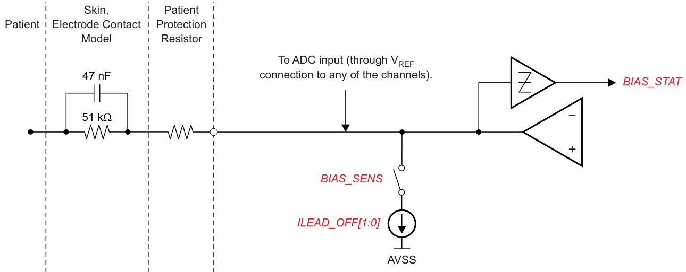  
Figure 37. BIAS Lead-Off Detection at Power-Up

When the BIAS amplifier is powered on, the current source has no function. Only the comparator can be used to sense the voltage at the output of the BIAS amplifier. The comparator thresholds are set by the same LOFF[7:5] bits used to set the thresholds for other negative inputs.

# 9.3.2.4.5 Bias Drive (DC Bias Circuit)

Use the bias circuitry to counter the common-mode interference in a EEG system as a result of power lines and other sources, including fluorescent lights. The bias circuit senses the common-mode voltage of a selected set of electrodes and creates a negative feedback loop by driving the body with an inverted common-mode signal. The negative feedback loop restricts the common-mode movement to a narrow range, depending on the loop gain. Stabilizing the entire loop is specific to the individual user system based on the various poles in the loop. The ADS1299-x integrates the muxes to select the channel and an operational amplifier. All the amplifier terminals are available at the pins, allowing the user to choose the components for the feedback loop. The circuit in Figure 38 shows the overall functional connectivity for the bias circuit.

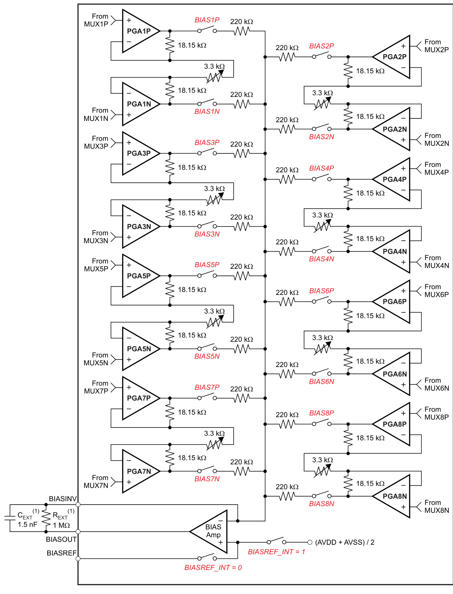  
Figure 38. Bias Drive Amplifier Channel Selection

(1) Typical values.

The reference voltage for the bias drive can be chosen to be internally generated $[ ( \mathsf { A V D D } + \mathsf { A V S S } )$ ) / 2] or provided externally with a resistive divider. The selection of an internal versus external reference voltage for the bias loop is defined by writing the appropriate value to the BIASREF INT bit in the CONFIG2 register.

If the bias function is not used, the amplifier can be powered down using the PD BIAS bit (see the CONFIG3: Configuration Register 3 subsection of the Register Maps section for details). Use the PD BIAS bit to powerdown all but one of the bias amplifiers when daisy-chaining multiple ADS1299-x devices.

The BIASIN pin functionality is explained in the Input Multiplexer section. An example procedure to use the bias amplifier is shown in the Bias Drive section.

# 9.3.2.4.5.1 Bias Configuration with Multiple Devices

Figure 39 shows multiple devices connected to the bias drive.

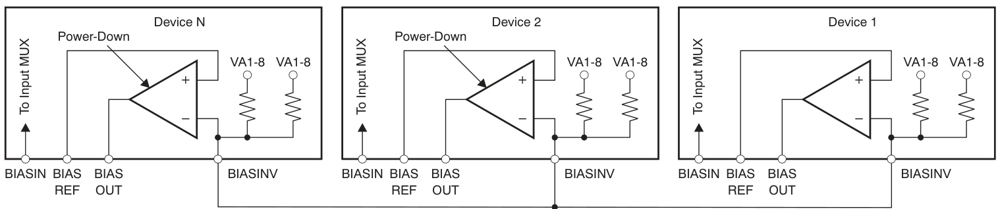  
Figure 39. BIAS Drive Connection for Multiple Devices

# 9.4 Device Functional Modes

# 9.4.1 Start

Pull the START pin high for at least $2 \mathrm { \ t { _ { C L K } } }$ periods, or send the START command to begin conversions. When START is low and the START command has not been sent, the device does not issue a DRDY signal (conversions are halted).

When using the START command to control conversions, hold the START pin low. The ADS1299-x features two modes to control conversions: continuous mode and single-shot mode. The mode is selected by SINGLE_SHOT (bit 3 of the CONFIG4 register). In multiple device configurations, the START pin is used to synchronize devices (see the Multiple Device Configuration subsection of the SPI Interface section for more details).

# 9.4.1.1 Settling Time

The settling time (tSETTLE) is the time required for the converter to output fully-settled data when the START signal is pulled high. When START is pulled high, DRDY is also pulled high. The next DRDY falling edge indicates that data are ready. Figure 40 shows the timing diagram and Table 7 lists the settling time for different data rates. The settling time depends on $\mathsf { f } _ { \mathsf { C L K } }$ and the decimation ratio (controlled by the DR[2:0] bits in the CONFIG1 register). When the initial settling time has passed, the DRDY falling edge occurs at the set data rate, tDR. If data is not read back on DOUT and the output shift register needs to update, DRDY goes high for $4 \mathrm { { \ t _ { C L K } } }$ before returning back low indicating new data is ready. Table 7 lists the settling time as a function of tCLK. Note that when START is held high and there is a step change in the input signal, $3 \times t _ { \mathrm { D R } }$ is required for the filter to settle to the new value. Settled data are available on the fourth DRDY pulse.

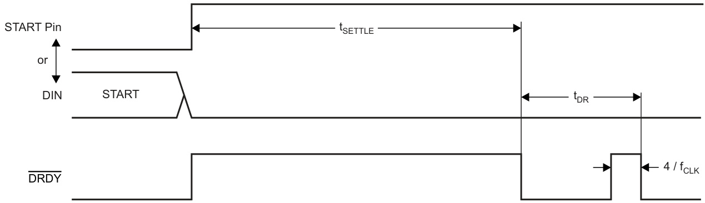  
Figure 40. Settling Time

# Device Functional Modes (continued)

Table 7. Settling Time for Different Data Rates   

<html><body><table><tr><td>DR[2:0]</td><td>NORMAL MODE</td><td>UNIT</td></tr><tr><td>000</td><td>521</td><td>tCLK</td></tr><tr><td>001</td><td>1033</td><td>tCLK</td></tr><tr><td>010</td><td>2057</td><td>tCLK</td></tr><tr><td>011</td><td>4105</td><td>tCLK</td></tr><tr><td>100</td><td>8201</td><td>tCLK</td></tr><tr><td>101</td><td>16393</td><td>tCLK</td></tr><tr><td>110</td><td>32777</td><td>tCLK</td></tr></table></body></html>

# 9.4.2 Reset (RESET)

There are two methods to reset the ADS1299-x: pull the RESET pin low, or send the RESET command. When using the RESET pin, make sure to follow the minimum pulse duration timing specifications before taking the pin back high. The RESET command takes effect on the eighth SCLK falling edge of the command. After a reset, 18 tCLK cycles are required to complete initialization of the configuration registers to default states and start the conversion cycle. Note that an internal reset is automatically issued to the digital filter whenever the CONFIG1 register is set to a new value with a WREG command.

# 9.4.3 Power-Down (PWDN)

When PWDN is pulled low, all on-chip circuitry is powered down. To exit power-down mode, take the PWDN pin high. Upon exiting from power-down mode, the internal oscillator and the reference require time to wake up. During power-down, the external clock is recommended to be shut down to save power.

# 9.4.4 Data Retrieval

# 9.4.4.1 Data Ready (DRDY)

DRDY is an output signal which transitions from high to low indicating new conversion data are ready. The CS signal has no effect on the data ready signal. DRDY behavior is determined by whether the device is in RDATAC mode or the RDATA command is used to read data on demand. (See the RDATAC: Read Data Continuous and RDATA: Read Data subsections of the SPI Command Definitions section for further details).

When reading data with the RDATA command, the read operation can overlap the next DRDY occurrence without data corruption.

The START pin or the START command places the device either in normal data capture mode or pulse data capture mode.

Figure 41 shows the relationship between DRDY, DOUT, and SCLK during data retrieval (in case of an ADS1299). DOUT is latched out at the SCLK rising edge. DRDY is pulled high at the SCLK falling edge. Note that DRDY goes high on the first SCLK falling edge, regardless of whether data are being retrieved from the device or a command is being sent through the DIN pin.

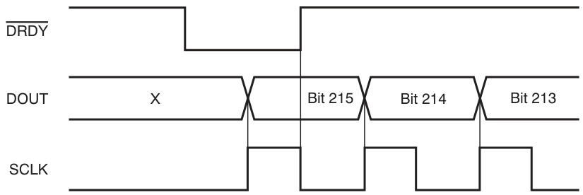  
Figure 41. DRDY with Data Retrieval $\textcircled { C S } = 0 )$

# Device Functional Modes (continued)

# 9.4.4.2 Reading Back Data

Data retrieval can be accomplished in one of two methods:

1. RDATAC: the read data continuous command sets the device in a mode that reads data continuously without sending commands. See the RDATAC: Read Data Continuous section for more details. 2. RDATA: the read data command requires that a command is sent to the device to load the output shift register with the latest data. See the RDATA: Read Data section for more details.

Conversion data are read by shifting data out on DOUT. The MSB of the data on DOUT is clocked out on the first SCLK rising edge. DRDY returns high on the first SCLK falling edge. DIN should remain low for the entire read operation.

The number of bits in the data output depends on the number of channels and the number of bits per channel. For the 8-channel ADS1299, the number of data outputs is [(24 status bits $+ 2 4$ bits $\times 8$ channels) $= 2 1 6$ bits]. The format of the 24 status bits is: (1100 + LOFF STATP $^ +$ LOFF _STATN $^ +$ bits[4:7] of the GPIO register). The data format for each channel data are twos complement and MSB first. When channels are powered down using the user register setting, the corresponding channel output is set to $" 0 "$ . However, the channel output sequence remains the same.

The ADS1299-x also provides a multiple readback feature. Data can be read out multiple times by simply giving more SCLKs in RDATAC mode, in which case the MSB data byte repeats after reading the last byte. The DAISY_EN bit in the CONFIG1 register must be set to '1' for multiple readbacks.

# 9.4.5 Continuous Conversion Mode

Conversions begin when the START pin is taken high or when the START command is sent. As shown in Figure 42, the DRDY output goes high when conversions are started and goes low when data are ready. Conversions continue indefinitely until the START pin is taken low or the STOP command is transmitted. When the START pin is pulled low or the STOP command is issued, the conversion in progress is allowed to complete. Figure 43 and Table 8 illustrate the required DRDY timing to the START pin or the START and STOP commands when controlling conversions in this mode. The tSDSU timing indicates when to take the START pin low or when to send the STOP command before the DRDY falling edge to halt further conversions. The tDSHD timing indicates when to take the START pin low or send the STOP command after a DRDY falling edge to complete the current conversion and halt further conversions. To keep the converter running continuously, the START pin can be permanently tied high.

When switching from Single-Shot mode to Continuous Conversion mode, bring the START signal low and back high or send a STOP command followed by a START command. This conversion mode is ideal for applications that require a fixed continuous stream of conversions results.

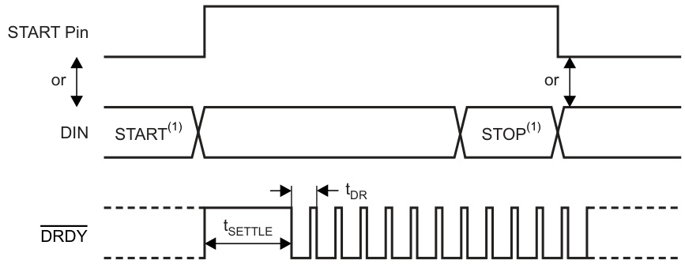  
Figure 42. Continuous Conversion Mode

(1) START and STOP commands take effect on the seventh SCLK falling edge.

# Device Functional Modes (continued)

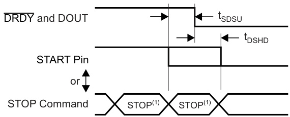  
Figure 43. START to DRDY Timing

(1) START and STOP commands take effect on the seventh SCLK falling edge at the end of the command.

Table 8. Timing Characteristics for Figure 43 (1)   

<html><body><table><tr><td></td><td>MIN</td><td>UNIT</td></tr><tr><td>START pin low or STOP command to DRDY setup time to halt further conversions tsDSU</td><td>16</td><td>tCLK</td></tr><tr><td>tDSHD START pin low or STOP command to complete current conversion</td><td>16</td><td>tCLK</td></tr></table></body></html>

(1) START and STOP commands take effect on the seventh SCLK falling edge at the end of the command.

# 9.4.6 Single-Shot Mode

Single-shot mode is enabled by setting the SINGLE _SHOT bit in the CONFIG4 register to '1'. In single-shot mode, the ADS1299-x performs a single conversion when the START pin is taken high or when the START command is sent. As shown in Figure 44, when a conversion is complete, DRDY goes low and further conversions are stopped. Regardless of whether the conversion data are read or not, DRDY remains low. To begin a new conversion, take the START pin low and then back high, or send the START command again. When switching from Continuous Conversion mode to Single-Shot mode, bring the START signal low and back high or send a STOP command followed by a START command.

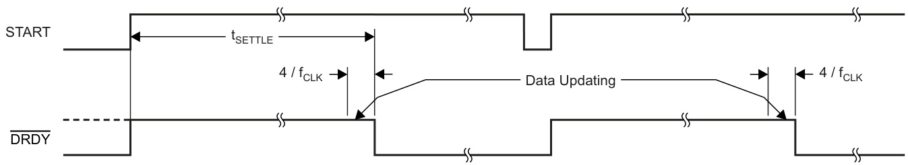  
Figure 44. DRDY with No Data Retrieval in Single-Shot Mode

This conversion mode is ideal for applications that require non-standard or non-continuous data rates. Issuing a START command or toggling the START pin high resets the digital filter, effectively dropping the data rate by a factor of four. This mode leaves the system more susceptible to aliasing effects, requiring more complex analog or digital filtering. Loading on the host processor increases because the processor must toggle the START pin or send a START command to initiate a new conversion cycle.

# 9.5 Programming

# 9.5.1 Data Format

The device provides 24 bits of data in binary twos complement format. The size of one code (LSB) is calculated using Equation 8.

$$
1 \mathsf { L S B } = ( 2 \times \mathsf { V _ { R E F } } / \mathsf { G a i n } ) / 2 ^ { 2 4 } = + \mathsf { F S } / 2 ^ { 2 3 }
$$

A positive full-scale input produces an output code of 7FFFFFh and the negative full-scale input produces an output code of 800000h. The output clips at these codes for signals exceeding full-scale. Table 9 summarizes the ideal output codes for different input signals. All 24 bits toggle when the analog input is at positive or negative full-scale.

Table 9. Ideal Output Code versus Input Signal   

<html><body><table><tr><td>INPUT SIGNAL, VIN (INxP INxN)</td><td>IDEAL OUTPUT CODE(1)</td></tr><tr><td>≥ FS</td><td>7FFFFFh</td></tr><tr><td>+FS 1 (223</td><td>000001h</td></tr><tr><td>0</td><td>000000h</td></tr><tr><td>-FS 1) (223</td><td>FFFFFFh</td></tr><tr><td>≤ −FS 223-1) (223</td><td>800000h</td></tr></table></body></html>

(1) Excludes effects of noise, linearity, offset, and gain error.

# 9.5.2 SPI Interface

The SPI-compatible serial interface consists of four signals: $\overline { { \mathsf { C S } } }$ , SCLK, DIN, and DOUT. The interface reads conversion data, reads and writes registers, and controls ADS1299- $\cdot \mathsf { x }$ operation. The data-ready output, DRDY (see the Data Ready $\overline { { ( D R D Y ) } }$ section), is used as a status signal to indicate when data are ready. DRDY goes low when new data are available.

# 9.5.2.1 Chip Select $( { \overline { { C S } } } )$

The $\overline { { \mathsf { C S } } }$ pin activates SPI communication. CS must be low before data transactions and must stay low for the entire SPI communication period. When CS is high, the DOUT pin enters a high-impedance state. Therefore, reading and writing to the serial interface are ignored and the serial interface is reset. DRDY pin operation is independent of CS. DRDY still indicates that a new conversion has completed and is forced high as a response to SCLK, even if CS is high.

Taking $\overline { { \mathsf { C S } } }$ high deactivates only the SPI communication with the device and the serial interface is reset. Data conversion continues and the DRDY signal can be monitored to check if a new conversion result is ready. A master device monitoring the DRDY signal can select the appropriate slave device by pulling the CS pin low. After the serial communication is finished, always wait four or more $\mathsf { t } _ { \mathsf { C L K } }$ cycles before taking CS high.

# 9.5.2.2 Serial Clock (SCLK)

SCLK provides the clock for serial communication. SCLK is a Schmitt-trigger input, but TI recommends keeping SCLK as free from noise as possible to prevent glitches from inadvertently shifting the data. Data are shifted into DIN on the falling edge of SCLK and shifted out of DOUT on the rising edge of SCLK.

The absolute maximum SCLK limit is specified in Figure 1. When shifting in commands with SCLK, make sure that the entire set of SCLKs is issued to the device. Failure to do so can result in the device serial interface being placed into an unknown state requiring CS to be taken high to recover.

For a single device, the minimum speed required for SCLK depends on the number of channels, number of bits of resolution, and output data rate. (For multiple cascaded devices, see the Cascaded Mode subsection of the Multiple Device Configuration section.)

For example, if the ADS1299 is used in a 500-SPS mode (8 channels, 24-bit resolution), the minimum SCLK speed is $1 1 0 \mathsf { k H z }$ .

Data retrieval can be accomplished either by placing the device in RDATAC mode or by issuing an RDATA command for data on demand. The SCLK rate limitation in Equation 9 applies to RDATAC. For the RDATA command, the limitation applies if data must be read in between two consecutive DRDY signals. Equation 9 assumes that there are no other commands issued in between data captures.

$$
\tan \tt t _ { S C L K } < \frac { \Delta t _ { D R } - 4 \Delta t _ { C L K } } { \Delta _ { B I T S } \times N _ { C H A N N E L S } + 2 4 }
$$

# 9.5.2.3 Data Input (DIN)

DIN is used along with SCLK to send data to the device. Data on DIN are shifted into the device on the falling edge of SCLK.

The communication of this device is full-duplex in nature. The device monitors commands shifted in even when data are being shifted out. Data that are present in the output shift register are shifted out when sending in a command. Therefore, make sure that whatever is being sent on the DIN pin is valid when shifting out data. When no command is to be sent to the device when reading out data, send the NOP command on DIN. Make sure that the tSDECODE timing is met in the Sending Multi-Byte Commands section when sending multiple byte commands on DIN.

# 9.5.2.4 Data Output (DOUT)

DOUT is used with SCLK to read conversion and register data from the device. Data are clocked out on the rising edge of SCLK, MSB first. DOUT goes to a high-impedance state when CS is high. Figure 45 shows the ADS1299 data output protocol.

DRDY   
SCLK 5151515/5/5L5/515 216 SCLKs   
DOUT STAT CH1 CH2 CH3 CH4 CH5 CH6 CH7 CH8 T 24-Bit 24-Bit 24-Bit 24-Bit 24-Bit 24-Bit 24-Bit 24-Bit 24-Bit DIN

# 9.5.3 SPI Command Definitions

The ADS1299-x provides flexible configuration control. The commands, summarized in Table 10, control and configure device operation. The commands are stand-alone, except for the register read and write operations that require a second command byte plus data. CS can be taken high or held low between commands but must stay low for the entire command operation (especially for multi-byte commands). System commands and the RDATA command are decoded by the device on the seventh SCLK falling edge. The register read and write commands are decoded on the eighth SCLK falling edge. Be sure to follow SPI timing requirements when pulling CS high after issuing a command.

Table 10. Command Definitions   

<html><body><table><tr><td>COMMAND</td><td>DESCRIPTION</td><td>FIRST BYTE</td><td>SECOND BYTE</td></tr><tr><td colspan="2">System Commands</td><td colspan="2"></td></tr><tr><td>WAKEUP</td><td>Wake-up from standby mode</td><td>0000 0010 (02h)</td><td></td></tr><tr><td>STANDBY</td><td>Enter standby mode</td><td>0000 0100 (04h)</td><td></td></tr><tr><td>RESET</td><td>Reset the device</td><td>0000 0110 (06h)</td><td></td></tr><tr><td>START</td><td>Start and restart (synchronize) conversions</td><td>0000 1000 (08h)</td><td></td></tr><tr><td>STOP</td><td>Stop conversion</td><td>0000 1010 (0Ah)</td><td></td></tr><tr><td colspan="2">Data Read Commands</td><td colspan="2"></td></tr><tr><td colspan="2">RDATAC</td><td></td><td></td></tr><tr><td>SDATAC</td><td>(1)</td><td>00010000 (10h)</td><td></td></tr><tr><td>RDATA</td><td>Stop Read Data Continuously mode Read data by read back.</td><td>0001 0001 (11h)</td><td></td></tr><tr><td>Register Read Commands</td><td>command; supports multiple</td><td>0001 0010 (12h)</td><td></td></tr><tr><td colspan="2"></td><td></td><td></td></tr><tr><td>RREG</td><td>Read n nnnn registers starting at address r rrrr</td><td>001r rrr (2xh) (2)</td><td>000n nnnn(2)</td></tr><tr><td>WREG</td><td>Write n nnnn registers starting at address rrrr</td><td>010r rrrr (4×h) (2)</td><td>000n nnnn(2)</td></tr></table></body></html>

(1) When in RDATAC mode, the RREG command is ignored. (2) n nnnn $\mathbf { \sigma } = \mathbf { \sigma }$ number of registers to be read or written – 1. For example, to read or write three registers, set $n n n n = 0$ (0010). $r r r r =$ starting register address for read or write commands.

# 9.5.3.1 Sending Multi-Byte Commands

The ADS1299- $\cdot \mathsf { x }$ serial interface decodes commands in bytes and requires $4 \tan \angle B$ cycles to decode and execute. Therefore, when sending multi-byte commands (such as RREG or WREG), a $4 ~ \mathrm { t _ { C L K } }$ period must separate the end of one byte (or command) and the next.

Assuming CLK is $2 . 0 4 8 ~ \mathsf { M H z }$ , then tSDECODE $( 4 ~ \mathrm { t _ { C L K } } )$ is $1 . 9 6 ~ \mu \mathsf { s }$ . When SCLK is 16 MHz, one byte can be transferred in 500 ns. This byte transfer time does not meet the tSDECODE specification; therefore, a delay must be inserted so the end of the second byte arrives $1 . 4 6 ~ \mu \mathsf { s }$ later. If SCLK is 4 MHz, one byte is transferred in $2 ~ { \mu \ s }$ . Because this transfer time exceeds the tSDECODE specification, the processor can send subsequent bytes without delay. In this later scenario, the serial port can be programmed to move from single-byte transfers per cycle to multiple bytes.

# 9.5.3.2 WAKEUP: Exit STANDBY Mode

The WAKEUP command exits low-power standby mode; see the STANDBY: Enter STANDBY Mode subsection of the SPI Command Definitions section. Time is required when exiting standby mode (see the Electrical Characteristics for details). There are no SCLK rate restrictions for this command and can be issued at any time. Any following commands must be sent after a delay of $4 \tan \angle B E C$ cycles.

# 9.5.3.3 STANDBY: Enter STANDBY Mode

The STANDBY command enters low-power standby mode. All parts of the circuit are shut down except for the reference section. The standby mode power consumption is specified in the Electrical Characteristics. There are no SCLK rate restrictions for this command and can be issued at any time. Do not send any other commands other than the wakeup command after the device enters standby mode.

# 9.5.3.4 RESET: Reset Registers to Default Values

The RESET command resets the digital filter cycle and returns all register settings to default values. See the Reset $\overline { { ( R E S E 7 ) } }$ subsection of the SPI Interface section for more details. There are no SCLK rate restrictions for this command and can be issued at any time. $1 8 ~ \mathrm { t _ { C L K } }$ cycles are required to execute the RESET command. Avoid sending any commands during this time.

# 9.5.3.5 START: Start Conversions

The START command starts data conversions. Tie the START pin low to control conversions by command. If conversions are in progress, this command has no effect. The STOP command stops conversions. If the START command is immediately followed by a STOP command, then there must be a 4-tCLK cycle delay between them. When the START command is sent to the device, keep the START pin low until the STOP command is issued. (See the Start subsection of the SPI Interface section for more details.) There are no SCLK rate restrictions for this command and can be issued at any time.

# 9.5.3.6 STOP: Stop Conversions

The STOP command stops conversions. Tie the START pin low to control conversions by command. When the STOP command is sent, the conversion in progress completes and further conversions are stopped. If conversions are already stopped, this command has no effect. There are no SCLK rate restrictions for this command and can be issued at any time.

# 9.5.3.7 RDATAC: Read Data Continuous

The RDATAC command enables conversion data output on each DRDY without the need to issue subsequent read data commands. This mode places the conversion data in the output register and may be shifted out directly. The read data continuous mode is the device default mode; the device defaults to this mode on powerup.

RDATAC mode is cancelled by the Stop Read Data Continuous command. If the device is in RDATAC mode, a SDATAC command must be issued before any other commands can be sent to the device. There are no SCLK rate restrictions for this command. However, subsequent data retrieval SCLKs or the SDATAC command should wait at least 4 tCLK cycles before completion (see the Sending Multi-Byte Commands section). RDATAC timing is illustrated in Figure 46. As depicted in Figure 46, there is a keep out zone of 4 tCLK cycles around the DRDY pulse where this command cannot be issued in. If no data are retrieved from the device, DOUT and DRDY behave similarly in this mode. To retrieve data from the device after the RDATAC command is issued, make sure either the START pin is high or the START command is issued. Figure 46 shows the recommended way to use the RDATAC command. RDATAC is ideally-suited for applications such as data loggers or recorders, where registers are set one time and do not need to be reconfigured.

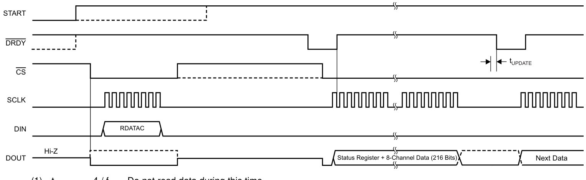  
Figure 46. RDATAC Usage

(1) tUPDATE $= 4$ / fCLK. Do not read data during this time.

# 9.5.3.8 SDATAC: Stop Read Data Continuous

The SDATAC command cancels the Read Data Continuous mode. There are no SCLK rate restrictions for this command, but the next command must wait for $4 \tan \angle E$ cycles before completion.

# 9.5.3.9 RDATA: Read Data

The RDATA command loads the output shift register with the latest data when not in Read Data Continuous mode. Issue this command after DRDY goes low to read the conversion result. There are no SCLK rate restrictions for this command, and there is no wait time needed for the subsequent commands or data retrieval SCLKs. To retrieve data from the device after the RDATA command is issued, make sure either the START pin is high or the START command is issued. When reading data with the RDATA command, the read operation can overlap the next DRDY occurrence without data corruption. Figure 47 shows the recommended way to use the RDATA command. RDATA is best suited for ECG- and EEG-type systems, where register settings must be read or changed often between conversion cycles.

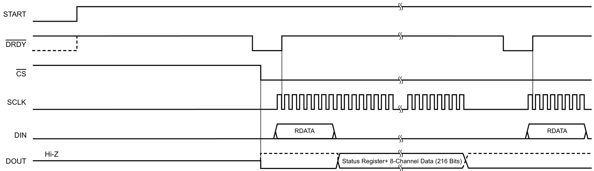  
Figure 47. RDATA Usage

# 9.5.3.10 RREG: Read From Register

This command reads register data. The Register Read command is a two-byte command followed by the register data output. The first byte contains the command and register address. The second command byte specifies the number of registers to read – 1.

First command byte: 001r rrrr, where r rrrr is the starting register address.

Second command byte: 000n nnnn, where n nnnn is the number of registers to read – 1.

The 17th SCLK rising edge of the operation clocks out the MSB of the first register, as shown in Figure 48. When the device is in read data continuous mode, an SDATAC command must be issued before the RREG command can be issued. The RREG command can be issued any time. However, because this command is a multi-byte command, there are SCLK rate restrictions depending on how the SCLKs are issued to meet the tSDECODE timing. See the Serial Clock (SCLK) subsection of the SPI Interface section for more details. Note that CS must be low for the entire command.

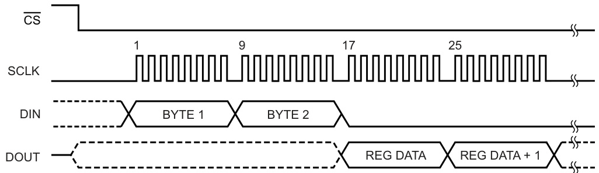  
Figure 48. RREG Command Example: Read Two Registers Starting from Register 00h (ID Register) (BYTE $\mathbf { 1 } = \mathbf { 0 0 1 0 0 0 0 0 }$ , BYTE $\mathsf { \pmb { 2 } } = \mathsf { \pmb { 0 0 0 0 } } \mathsf { \bar { 0 0 0 } } \mathsf { \pmb { 0 1 } } )$

# 9.5.3.11 WREG: Write to Register

This command writes register data. The Register Write command is a two-byte command followed by the register data input. The first byte contains the command and register address. The second command byte specifies the number of registers to write – 1.

First command byte: 010r rrrr, where r rrrr is the starting register address.

Second command byte: 000n nnnn, where n nnnn is the number of registers to write – 1.

After the command bytes, the register data follows (in MSB-first format), as shown in Figure 49. The WREG command can be issued any time. However, because this command is a multi-byte command, there are SCLK rate restrictions depending on how the SCLKs are issued to meet the tSDECODE timing. See the Serial Clock (SCLK) subsection of the SPI Interface section for more details. Note that CS must be low for the entire command.

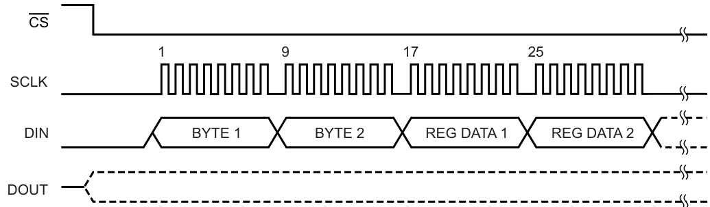  
Figure 49. WREG Command Example: Write Two Registers Starting from 00h (ID Register) (BYTE $1 = 0 1 0 0$ 0000, BYTE $\bar { 2 } = 0 0 0 0$ 0001)

# 9.6 Register Maps

Table 11 describes the various ADS1299-x registers.

Table 11. Register Assignments   

<html><body><table><tr><td rowspan="2">ADDRESS</td><td rowspan="2">REGISTER</td><td rowspan="2">DEFAULT SETTING</td><td colspan="7">REGISTER BITS</td></tr><tr><td></td><td></td><td></td><td></td><td></td><td></td><td></td><td></td></tr><tr><td>Read Only ID Registers</td><td></td><td></td><td></td><td></td><td></td><td></td><td></td><td></td><td></td><td></td></tr><tr><td colspan="9">ID</td></tr><tr><td>00h Global Settings Across</td><td>Channels</td><td>xxh</td><td></td><td>REV ID[2:0]</td><td></td><td></td><td>DEV ID[1:0]</td><td></td><td>NU_CH[1:0]</td></tr><tr><td>01h</td><td>CONFIG1</td><td>96h</td><td></td><td>DAISY_EN</td><td>CLK_EN</td><td></td><td>0</td><td>DR[2:0]</td><td></td></tr><tr><td>02h</td><td>CONFIG2</td><td>COh</td><td></td><td></td><td>0</td><td>INT_CAL</td><td>0 CAL_</td><td>AMP0</td><td>CAL_FREQ[1:0]</td></tr><tr><td>03h</td><td>CONFIG3</td><td>60h</td><td>PD_REFBUF</td><td></td><td>BIAS_</td><td>MEAS</td><td>BIASREF_INT</td><td>PD_BIAS BIAS_LOFF_ SENS</td><td>BIAS_STAT</td></tr><tr><td>04h</td><td>LOFF</td><td>00h</td><td></td><td>COMP_TH[2:0]</td><td></td><td></td><td>ILEAD_OFF[1:0]</td><td></td><td>FLEAD_OFF[1:0]</td></tr><tr><td colspan="10">Channel-Specific Settings</td></tr><tr><td>05h</td><td>CH1SET</td><td>61h</td><td>PD1</td><td>GAIN1[2:0]</td><td></td><td>SRB2</td><td></td><td>MUX1[2:0]</td><td></td></tr><tr><td>06h</td><td>CH2SET</td><td>61h</td><td>PD2</td><td></td><td>GAIN2[2:0]</td><td></td><td>SRB2</td><td>MUX2[2:0]</td><td></td></tr><tr><td>07h</td><td>CH3SET</td><td>61h</td><td>PD3</td><td></td><td>GAIN3[2:0]</td><td></td><td>SRB2</td><td>MUX3[2:0]</td><td></td></tr><tr><td>08h</td><td>CH4SET</td><td>61h</td><td>PD4</td><td></td><td>GAIN4[2:0]</td><td></td><td>SRB2</td><td>MUX4[2:0]</td><td></td></tr><tr><td>09h</td><td>CH5SET (1)</td><td>61h</td><td>PD5</td><td></td><td>GAIN5[2:0]</td><td></td><td>SRB2</td><td>MUX5[2:0]</td><td></td></tr><tr><td>0Ah</td><td>CH6SET (1)</td><td>61h</td><td>PD6</td><td></td><td>GAIN6[2:0]</td><td></td><td>SRB2</td><td>MUX6[2:0]</td><td></td></tr><tr><td>0Bh</td><td>CH7SET (2)</td><td>61h</td><td>PD7</td><td></td><td>GAIN7[2:0]</td><td>SRB2</td><td></td><td>MUX7[2:0]</td><td></td></tr><tr><td>0Ch</td><td>CH8SET (2)</td><td>61h</td><td>PD8</td><td>GAIN8[2:0]</td><td></td><td>SRB2</td><td></td><td>MUX8[2:0]</td><td></td></tr><tr><td>0Dh</td><td>BIAS_SENSP</td><td>00h</td><td>BIASP8(2)</td><td>BIASP7(2)</td><td>BIASP6(1) BIASP5(1)</td><td></td><td>BIASP4</td><td>BIASP3 BIASP2</td><td>BIASP1</td></tr><tr><td>0Eh</td><td>BIAS_SENSN</td><td>00h</td><td>BIASN8(2)</td><td>BIASN7(2)</td><td>BIASN6(1) BIASN5(1)</td><td></td><td>BIASN4</td><td>BIASN3 BIASN2</td><td>BIASN1</td></tr><tr><td>0Fh</td><td>LOFF_SENSP</td><td>00h</td><td>LOFFP8(2)</td><td>LOFFP7(2)</td><td>LOFFP6(1) LOFFP5(1)</td><td>LOFFP4</td><td>LOFFP3</td><td>LOFFP2</td><td>LOFFP1</td></tr><tr><td>10h</td><td>LOFF_SENSN</td><td>00h</td><td>LOFFM8(2)</td><td>LOFFM7(2)</td><td>LOFFM6(1) LOFFM5(1)</td><td>LOFFM4</td><td>LOFFM3</td><td>LOFFM2</td><td>LOFFM1</td></tr><tr><td>11h</td><td>LOFF_FLIP</td><td>00h</td><td>LOFF_FLIP8(2)</td><td>LOFF_FLIP7(2)</td><td>LOFF_FLIP6(1) LOFF_FLIP5(1)</td><td>LOFF_FLIP4</td><td>LOFF_FLIP3</td><td>LOFF_FLIP2</td><td>LOFF_ FLIP1</td></tr><tr><td colspan="10">Lead-Off Status Registers (Read-Only Registers)</td></tr><tr><td>12h</td><td>LOFF_STATP</td><td>00h</td><td>IN8P OFF</td><td>IN7P OFF</td><td>IN6P_ OFF IN5P_</td><td>OFF IN4P_OFF</td><td>IN3P_OFF</td><td>IN2P_OFF</td><td>IN1P_OFF</td></tr><tr><td>13h</td><td>LOFF_STATN</td><td>00h</td><td>IN8M OFF</td><td>IN7M_OFF</td><td>IN6M _OFF IN5M</td><td>OFF IN4M</td><td>OFF IN3M</td><td>OFF IN2M_ OFF</td><td>IN1M_ OFF</td></tr><tr><td colspan="2">GPIO and OTHER Registers</td><td></td><td></td><td></td><td></td><td></td><td></td><td></td><td></td></tr><tr><td>14h</td><td>GPIO</td><td>0Fh</td><td></td><td>GPIOD[4:1]</td><td></td><td></td><td></td><td>GPIOC[4:1]</td><td></td></tr><tr><td>15h</td><td>MISC1</td><td>00h</td><td></td><td></td><td>SRB1</td><td>0</td><td>0 0</td><td>0</td><td>0</td></tr><tr><td>16h</td><td>MISC2</td><td>00h</td><td>0</td><td>0</td><td>0</td><td>SINGLE</td><td>0</td><td>0 PD_LOFF</td><td>0</td></tr><tr><td>17h</td><td>CONFIG4</td><td>00h</td><td></td><td></td><td></td><td></td><td>SHOT</td><td>COMP</td><td>0</td></tr></table></body></html>

(12) Register or bit only available in the ADS1299-6 and ADS1299. Register bits set to 0h or 00h in the ADS1299-4. Register or bit only available in the ADS1299. Register bits set to 0h or 00h in the ADS1299-4 and ADS1299-6.

# 9.6.1 User Register Description

The read-only ID control register is programmed during device manufacture to indicate device characteristics.

# 9.6.1.1 ID: ID Control Register (address $\mathbf { \sigma } = \mathbf { \sigma }$ 00h) (reset = xxh)

Figure 50. ID Control Register   

<html><body><table><tr><td></td><td>6</td><td>5</td><td>4</td><td>3</td><td>2</td><td>0</td></tr><tr><td></td><td>REV_ID[2:0]</td><td></td><td>1</td><td>DEV ID[1:0]</td><td>NU_CH[1:0]</td><td></td></tr><tr><td></td><td>R-xh</td><td></td><td>R-1h</td><td>R-3h</td><td></td><td>R-xh</td></tr></table></body></html>

LEGEND: R/W $\mathbf { \sigma } = \mathbf { \sigma }$ Read/Write; ${ \sf R } =$ Read only; - $\mathsf { n } =$ value after reset

Table 12. ID Control Register Field Descriptions   

<html><body><table><tr><td>Bit</td><td>Field</td><td>Type</td><td>Reset</td><td>Description</td></tr><tr><td>7:5</td><td>REV_ID[2:0]</td><td>R</td><td>xh</td><td>Reserved. These bits indicate the revision of the device and are subject to change without notice.</td></tr><tr><td></td><td>Reserved</td><td>R</td><td>1h</td><td>Reserved. Always read 1.</td></tr><tr><td>3:2</td><td>DEV_ID[1:0]</td><td>R</td><td>3h</td><td>Device Identification. bits indicates the device. 11 ADS1299-x These</td></tr><tr><td>1:0</td><td>NU_CH[1:0]</td><td>R</td><td>xh</td><td>Number of Channels. These bits indicates number of channels. 00 : 4-channel ADS1299-4 01 6-channel ADS1299-6 10 :8-channel ADS1299</td></tr></table></body></html>

# 9.6.1.2 CONFIG1: Configuration Register (address $\mathbf { \sigma } = \mathbf { \sigma }$ 01h) (reset = 96h)

This register configures the DAISY_EN bit, clock, and data rate.

Figure 51. CONFIG1: Configuration Register 1   

<html><body><table><tr><td>7</td><td>6</td><td>5</td><td>4</td><td>3</td><td>2</td><td></td><td>0</td></tr><tr><td>1</td><td>DAISY_EN</td><td>CLK_EN</td><td>1</td><td>0</td><td></td><td>DR[2:0]</td><td></td></tr><tr><td>R/W-1h</td><td>R/W-0h</td><td>R/W-0h</td><td>R/W-1h</td><td>R/W-0h</td><td></td><td>R/W-6h</td><td></td></tr></table></body></html>

LEGEND: R/W $\mathbf { \sigma } = \mathbf { \sigma }$ Read/Write; ${ \sf R } =$ Read only; $- \mathsf { n } =$ value after reset

Table 13. Configuration Register Field Descriptions   

<html><body><table><tr><td>Bit</td><td>Field</td><td>Type</td><td>Reset Description</td><td></td></tr><tr><td>7</td><td>Reserved</td><td>R/W</td><td>1h</td><td>Reserved write 1h Always</td></tr><tr><td>6</td><td>DAISY EN</td><td>R/W</td><td>Oh</td><td>Daisy-chain or multiple readback mode This bit determines which mode is enabled. 0: Daisy-chain mode Multiple readback mode</td></tr><tr><td></td><td>CLK_EN</td><td>R/W</td><td>1 Oh CLK</td><td>This bit determines if the internal oscillator signal is connected to the CLK pin when the CLKSEL pin = 1 0 : Oscillator clock output disabled connection(1)</td></tr><tr><td>4:3</td><td>Reserved</td><td>R/W</td><td>1 2h Reserved</td><td>: Oscillator clock output enabled Always write 2h</td></tr><tr><td>2:0</td><td>DR[2:0]</td><td>R/W</td><td>6h Output data These bits determine the fcLK / 2. 000 : fMOD 001 010 011 : tMOD :fMOD fMOD</td><td>rate output data rate of the device. fmoD = 64 (16 kSPS) 128 (8 kSPS) 256 (4 kSPS) 512 (2 kSPS) 100 fMOD 1024(1 kSPS) 101 2048 (500 SPS) 110 4096 (250 SPS) fMOD</td></tr></table></body></html>

(1) Additional power is consumed when driving external devices.

# 9.6.1.3 CONFIG2: Configuration Register 2 (address $\mathbf { \sigma } = \mathbf { \sigma }$ 02h) (reset = C0h)

This register configures the test signal generation. See the Input Multiplexer section for more details.

Figure 52. CONFIG2: Configuration Register 2   

<html><body><table><tr><td></td><td>6</td><td>5</td><td>4</td><td>3</td><td>2</td><td></td><td>0</td></tr><tr><td></td><td>1</td><td>0</td><td>INT_CAL</td><td>0</td><td>CAL AMP</td><td>CAL</td><td>FREQ[1:0]</td></tr><tr><td>R/W-1h</td><td>R/W-1h</td><td>R/W-0h</td><td>R/W-0h</td><td>R/W-0h</td><td>R/W-0h</td><td>R/W-0h</td><td></td></tr></table></body></html>

LEGEND: R/W $\mathbf { \sigma } = \mathbf { \sigma }$ Read/Write; ${ \sf R } =$ Read only; $- \mathsf { n } =$ value after reset

Table 14. Configuration Register 2 Field Descriptions   

<html><body><table><tr><td>Bit</td><td>Field</td><td>Type</td><td>Reset</td><td>Description</td></tr><tr><td>7:5</td><td>Reserved</td><td>R/W</td><td>6h</td><td>Reserved Always write 6h</td></tr><tr><td></td><td>INT_CAL</td><td>R/W</td><td>Oh</td><td>TEST source This bit determines the source for the test signal. 0 : Test signals are driven externally</td></tr><tr><td>3</td><td>Reserved</td><td>R/W</td><td>Oh</td><td>: Test signals are generated internally Reserved write 0h Always</td></tr><tr><td></td><td>CAL_AMP</td><td>R/W</td><td>Oh</td><td>Test signal amplitude These bits determine the calibration signal amplitude. 0:1 × −(VREFP − VREFN) 2400 1 : 2 × −(VREFP -VREFN) 2400</td></tr><tr><td>1:0</td><td>CAL_ FREQ[1:0]</td><td>R/W</td><td>Oh</td><td>Test signal frequency These bits determine the calibration signal frequency. 00 Pulsed at fcL 01 Pulsed at fcLk 10 Do not use 11 :Atdc 221 220</td></tr></table></body></html>

# 9.6.1.4 CONFIG3: Configuration Register 3 (address $\mathbf { \sigma } = \mathbf { \sigma }$ 03h) (reset = 60h)

Configuration register 3 configures either an internal or exteral reference and BIAS operation.

Figure 53. CONFIG3: Configuration Register 3   

<html><body><table><tr><td></td><td>6</td><td>5</td><td></td><td>3</td><td>2</td><td></td><td>0</td></tr><tr><td>PD_REFBUF</td><td></td><td></td><td>BIAS_MEAS</td><td>BIASREF INT</td><td>PD_BIAS</td><td>BIAS_LOFF SENS</td><td>BIAS STAT</td></tr><tr><td>R/W-0h</td><td>R/W-1h</td><td>R/W-1h</td><td>R/W-0h</td><td>R/W-0h</td><td>R/W-0h</td><td>R/W-0h</td><td>R-0h</td></tr></table></body></html>

LEGEND: R/W $\mathbf { \sigma } = \mathbf { \sigma }$ Read/Write; $\mathsf { R } =$ Read only; $- \mathsf { n } =$ value after reset

Table 15. Configuration Register 3 Field Descriptions   

<html><body><table><tr><td>Bit</td><td>Field</td><td>Type</td><td>Reset</td><td>Description</td></tr><tr><td>Z</td><td>PD_REFBUF</td><td>R/W</td><td>Oh 0 1</td><td>Power-down reference buffer This bit determines the power-down reference buffer state. : Power-down internal reference buffer : Enable internal reference buffer</td></tr><tr><td>6:5</td><td>Reserved</td><td>R/W</td><td>3h</td><td>Reserved write 3h. Always</td></tr><tr><td></td><td>BIAS_MEAS</td><td>R/W</td><td>Oh 0</td><td>BIAS measurement This bit enables BIAS measurement. The BIAS signal may be measured with any channel. Open 1 BIAS IN signal is routed to the channel that has the</td></tr><tr><td>3</td><td>BIASREF_INT</td><td>R/W</td><td>Oh 0</td><td>MUX Setting 010(VREF) BIASREF signal This bit determines the BIASREF signal source. BIASREF signal fed externally 1 BIASREF signal (AVDD + AVSS) 2 generated internally</td></tr><tr><td>2</td><td>PD_BIAS</td><td>R/W</td><td>Oh 0 1</td><td>BIAS buffer power This bit determines the BIAS buffer power state. BIAS buffer is powered down BIAS buffer is enabled</td></tr><tr><td></td><td>BIAS_LOFF SENS</td><td>R/W</td><td>Oh 0 1</td><td>BIAS sense function This bit enables the BIAS sense function. BIAS sense is disabled : BlAS sense is enabled</td></tr><tr><td></td><td>BIAS_STAT</td><td></td><td>Oh 0</td><td>BIAS lead-off status This bit determines the BlAS status. : BIAS is connected 1 : BIAS is not connected</td></tr></table></body></html>

# 9.6.1.5 LOFF: Lead-Off Control Register (address $\mathbf { \sigma } = \mathbf { \sigma }$ 04h) (reset = 00h)

The lead-off control register configures the lead-off detection operation.

Figure 54. LOFF: Lead-Off Control Register   

<html><body><table><tr><td></td><td>6</td><td></td><td>4</td><td>3</td><td>2</td><td></td><td>0</td></tr><tr><td></td><td>COMP TH2[2:0]</td><td></td><td>0</td><td>ILEAD</td><td>OFF[1:0]</td><td>FLEAD</td><td>OFF[1:0]</td></tr><tr><td colspan="3">R/W-0h</td><td>R/W-0h</td><td colspan="2">R/W-0h</td><td>R/W-0h</td><td></td></tr></table></body></html>

LEGEND: R/W $\mathbf { \sigma } = \mathbf { \sigma }$ Read/Write; ${ \sf R } =$ Read only; $- \mathsf { n } =$ value after reset

Table 16. Lead-Off Control Register Field Descriptions   

<html><body><table><tr><td>Bit 7:5</td><td>Field Type COMP_TH[2:0] R/W</td><td>Reset Oh</td><td>Description</td></tr><tr><td></td><td></td><td></td><td>Lead-off comparator threshold Comparator positive side 000 95% 001 92.5% 010 :90% 011 :87.5% 100 :85% 101:80% 110:75% 111:70% Comparator negative side 000 5% 001 :7.5% 010 :10% 011 : 12.5% 100 15% 101 20% 110 25%</td></tr><tr><td>3:2</td><td>Reserved R/W ILEAD_OFF[1:0] R/W</td><td>Oh 0h</td><td>111 :30% Reserved Always write 0h. Lead-off current magnitude These bits determine the magnitude of current for the current</td></tr><tr><td>1:0</td><td>FLEAD_OFF[1:0] R/W</td><td>0h</td><td>lead-off mode. 00 6nA 01 24 nA 10 : 6 A 11 24A Lead-off frequency</td></tr><tr><td></td><td></td><td></td><td>These bits determine the frequency of lead-off detect for each channel. 00 DC lead-off detection 01 AC lead-off detection at 7.8 Hz 10 AC lead-off detection at 31.2 Hz (fcLk / 216) 11 AC lead-off detection at f R / 4 (fCLK /218</td></tr></table></body></html>

# 9.6.1.6 CHnSET: Individual Channel Settings (cd:) $( n = 1$ to 8) (address $\mathbf { \sigma } = \mathbf { \sigma }$ 05h to 0Ch) (reset = 61h)

The CH[1:8]SET control register configures the power mode, PGA gain, and multiplexer settings channels. See the Input Multiplexer section for details. CH[2:8]SET are similar to CH1SET, corresponding to the respective channels.

Figure 55. CHnSET: Individual Channel Settings Register   

<html><body><table><tr><td></td><td></td><td>5</td><td></td><td>3</td><td>2</td><td></td><td></td></tr><tr><td>PDn</td><td></td><td>GAINn[2:0]</td><td></td><td>SRB2</td><td></td><td>MUXn[2:0]</td><td></td></tr><tr><td>R/W-0h</td><td></td><td>R/W-6h</td><td></td><td>R/W-0h</td><td></td><td>R/W-0h</td><td></td></tr></table></body></html>

LEGEND: R/W $\mathbf { \sigma } = \mathbf { \sigma }$ Read/Write; ${ \sf R } =$ Read only; $- \mathsf { n } =$ value after reset

Table 17. Individual Channel Settings (cd:) $\bf \Pi  \cdot \delta _ { n } = 1$ to 8) Field Descriptions   

<html><body><table><tr><td>Bit</td><td>Field</td><td>Type Reset</td><td>Description</td></tr><tr><td>7</td><td>PDn</td><td>Oh</td><td>Power-down This bit determines the channel power mode for the corresponding channel. 0 : Normal operation 1 Channel power-down. When powering down a channel, TI recommends that the channel be set to input short by setting the appropriate MUXn[2:0] = 001of theCHnSET register.</td></tr><tr><td>6:4</td><td>GAINn[2:0] R/W</td><td>6h</td><td>PGA gain These bits determine the PGA gain setting. 000 :1 001 :2 010 :4 011 :6 100 :8 101 :12 110:24</td></tr><tr><td></td><td>SRB2</td><td>R/W Oh</td><td>111 :Do not use SRB2 connection This bit determines the SRB2 connection for the corresponding channel. 0 Open 1 Closed</td></tr><tr><td>2:0</td><td>MUXn[2:0] R/W</td><td>1h</td><td>Channel input These bits determine the channel input selection. 000 : Normal electrode input 001 :Input shorted (for offset or noise measurements) 010 : Used in conjunction with BIAS_MEAS bit for BIAS measurements. 011 :MVDD for supply measurement 100 :Temperature sensor 101 Test signal 110 BIAS _DRP (positive electrode is the driver) 111 : BIAS DRN (negative electrode is the driver)</td></tr></table></body></html>

# 9.6.1.7 BIAS SENSP: Bias Drive Positive Derivation Register (address $\mathbf { \sigma } = \mathbf { \sigma }$ 0Dh) (reset = 00h)

This register controls the selection of the positive signals from each channel for bias voltage (BIAS) derivatio See the Bias Drive (DC Bias Circuit) section for details.

Registers bits[5:4] are not available for the ADS1299-4. Register bits[7:6] are not available for the ADS1299-4, or ADS1299-6. Set unavailable bits for the associated device to 0 when writing to the register.

Figure 56. BIAS SENSP: BIAS Positive Signal Derivation Register   

<html><body><table><tr><td></td><td>6</td><td>5</td><td></td><td>3</td><td>2</td><td></td><td>0</td></tr><tr><td>BIASP8</td><td>BIASP7</td><td>BIASP6</td><td>BIASP5</td><td>BIASP4</td><td>BIASP3</td><td>BIASP2</td><td>BIASP1</td></tr><tr><td>R/W-0h</td><td>R/W-0h</td><td>R/W-0h</td><td>R/W-0h</td><td>R/W-0h</td><td>R/W-0h</td><td>R/W-0h</td><td>R/W-0h</td></tr></table></body></html>

LEGEND: R/W $\mathbf { \sigma } = \mathbf { \sigma }$ Read/Write; ${ \sf R } =$ Read only; $- \mathsf { n } =$ value after reset

Table 18. BIAS Positive Signal Derivation Field Descriptions   

<html><body><table><tr><td>Bit</td><td>Field</td><td>Type</td><td>Reset</td><td>Description</td></tr><tr><td>7</td><td>BIASP8</td><td>R/W</td><td>0h</td><td>IN8P to BIAS Route channel 8 positive signal into BIAS derivation 0 Disabled 1 Enabled</td></tr><tr><td></td><td>BIASP7</td><td>R/W</td><td>Oh</td><td>IN7P to BIAS Route channel 7 positive signal into BIAS derivation 0 Disabled 1 Enabled</td></tr><tr><td></td><td>BIASP6</td><td>R/W</td><td>0h</td><td>IN6P to BIAS Route channel 6 positive signal into BIAS derivation 0 Disabled Enabled</td></tr><tr><td></td><td>BIASP5</td><td>R/W</td><td>Oh</td><td>IN5P to BIAS Route channel 5 positive signal into BIAS derivation 0 Disabled 1 Enabled</td></tr><tr><td>3</td><td>BIASP4</td><td>R/W</td><td>Oh</td><td>IN4P to BIAS Route channel 4 positive signal into BIAS derivation 0 Disabled 1 Enabled</td></tr><tr><td>2</td><td>BIASP3</td><td>R/W</td><td>Oh</td><td>IN3P to BIAS Route channel 3 positive signal into BIAS derivation 0 Disabled 1 Enabled</td></tr><tr><td></td><td>BIASP2</td><td>R/W</td><td>Oh</td><td>IN2P to BIAS Route channel 2 positive signal into BIAS channel 0 Disabled 1</td></tr><tr><td></td><td>BIASP1</td><td>R/W</td><td>Oh</td><td>Enabled IN1P to BIAS Route channel 1 positive signal into BIAS channel 0 Disabled 1 Enabled</td></tr></table></body></html>

# 9.6.1.8 BIAS_SENSN: Bias Drive Negative Derivation Register (address $\mathbf { \sigma } = \mathbf { \sigma }$ 0Eh) (reset = 00h)

This register controls the selection of the negative signals from each channel for bias voltage (BIAS) derivatio See the Bias Drive (DC Bias Circuit) section for details.

Registers bits[5:4] are not available for the ADS1299-4. Register bits[7:6] are not available for the ADS1299-4, or ADS1299-6. Set unavailable bits for the associated device to 0 when writing to the register.

Figure 57. BIAS SENSN: BIAS Negative Signal Derivation Register   

<html><body><table><tr><td></td><td>6</td><td>5</td><td></td><td>3</td><td>2</td><td></td><td>0</td></tr><tr><td>BIASN8</td><td>BIASN7</td><td>BIASN6</td><td>BIASN5</td><td>BIASN4</td><td>BIASN3</td><td>BIASN2</td><td>BIASN1</td></tr><tr><td>R/W-0h</td><td>R/W-0h</td><td>R/W-0h</td><td>R/W-0h</td><td>R/W-0h</td><td>R/W-0h</td><td>R/W-0h</td><td>R/W-0h</td></tr></table></body></html>

LEGEND: R/W $\mathbf { \sigma } = \mathbf { \sigma }$ Read/Write; ${ \sf R } =$ Read only; $- \mathsf { n } =$ value after reset

Table 19. BIAS Negative Signal Derivation Field Descriptions   

<html><body><table><tr><td>Bit</td><td>Field</td><td>Type</td><td>Reset</td><td>Description</td></tr><tr><td>7</td><td>BIASN8</td><td>R/W</td><td>Oh</td><td>IN8N to BIAS Route channel negative signal into BIAS derivation 0 Disabled 1 Enabled</td></tr><tr><td></td><td>BIASN7</td><td>R/W</td><td>0h</td><td>IN7N to BIAS Route channel 7 negative signal into BIAS derivation 0 Disabled 1 Enabled</td></tr><tr><td>5</td><td>BIASN6</td><td>R/W</td><td>0h</td><td>IN6N to BIAS Route channel negative signal into BIAS derivation 0 Disabled 1 Enabled 6</td></tr><tr><td>3</td><td>BIASN5 BIASN4</td><td>R/W</td><td>0h</td><td>IN5N to BIAS Route channel 5 negative signal into BIAS derivation 0 Disabled 1 Enabled</td></tr><tr><td>2</td><td>BIASN3</td><td>R/W</td><td>0h</td><td>IN4N to BIAS Route channel negative signal into BIAS derivation 0: Disabled 1 Enabled</td></tr><tr><td></td><td>BIASN2</td><td>R/W</td><td>0h</td><td>IN3N to BIAS Route channel 3 negative signal into BIAS derivation 0 Disabled 1 Enabled</td></tr><tr><td></td><td></td><td>R/W</td><td>0h</td><td>IN2N to BIAS Route channel 2 negative signal into BIAS derivation 0 Disabled 1 Enabled</td></tr><tr><td></td><td>BIASN1</td><td>R/W</td><td>0h</td><td>IN1N to BIAS Route channel negative signal into BIAS derivation 0 Disabled 1 Enabled</td></tr></table></body></html>

# 9.6.1.9 LOFF_SENSP: Positive Signal Lead-Off Detection Register (address $\mathbf { \sigma } = \mathbf { \sigma }$ 0Fh) (reset = 00h)

This register selects the positive side from each channel for lead-off detection. See the Lead-Off Detection section for details. The LOFF_STATP register bits are only valid if the corresponding LOFF SENSP bits are set to 1.

Registers bits[5:4] are not available for the ADS1299-4. Register bits[7:6] are not available for the ADS1299- 4, or ADS1299-6. Set unavailable bits for the associated device to 0 when writing to the register.

Figure 58. LOFF _SENSP: Positive Signal Lead-Off Detection Register   

<html><body><table><tr><td></td><td>6</td><td>5</td><td></td><td>3</td><td>2</td><td></td><td>0</td></tr><tr><td>LOFFP8</td><td>LOFFP7</td><td>LOFFP6</td><td>LOFFP5</td><td>LOFFP4</td><td>LOFFP3</td><td>LOFFP2</td><td>LOFFP1</td></tr><tr><td>R/W-0h</td><td>R/W-0h</td><td>R/W-0h</td><td>R/W-0h</td><td>R/W-0h</td><td>R/W-0h</td><td>R/W-0h</td><td>R/W-0h</td></tr></table></body></html>

LEGEND: R/W $\mathbf { \sigma } = \mathbf { \sigma }$ Read/Write; ${ \sf R } =$ Read only; $- \mathsf { n } =$ value after reset

Table 20. Positive Signal Lead-Off Detection Field Descriptions   

<html><body><table><tr><td>Bit</td><td>Field</td><td>Type</td><td>Reset</td><td>Description</td></tr><tr><td></td><td>LOFFP8</td><td>R/W</td><td>Oh</td><td>IN8P lead off Enable lead-off detection on IN8P 0 Disabled 1 : Enabled</td></tr><tr><td>6</td><td>LOFFP7</td><td>R/W</td><td>Oh</td><td>IN7P lead off Enable lead-off detection on IN7P 0 : Disabled 1 Enabled</td></tr><tr><td></td><td>LOFFP6</td><td>R/W</td><td>Oh</td><td>IN6P lead off Enable lead-off detection on IN6P 0 Disabled 1 : Enabled</td></tr><tr><td></td><td>LOFFP5</td><td>R/W</td><td>Oh</td><td>IN5P lead off Enable lead-off detection on IN5P 0 Disabled 1 Enabled</td></tr><tr><td>3</td><td>LOFFP4</td><td>R/W</td><td>Oh</td><td>IN4P lead off Enable lead-off detection on IN4P 0 :Disabled 1 Enabled</td></tr><tr><td>2</td><td>LOFFP3</td><td>R/W</td><td>Oh</td><td>IN3P lead off Enable lead-off detection on IN3P 0 : Disabled 1 Enabled</td></tr><tr><td></td><td>LOFFP2</td><td>R/W</td><td>Oh</td><td>IN2P lead off Enable lead-off detection on IN2P 0: Disabled 1 Enabled</td></tr><tr><td></td><td>LOFFP1</td><td>R/W</td><td>Oh</td><td>IN1P lead off Enable lead-off detection on IN1P 0 :Disabled 1 Enabled</td></tr></table></body></html>

# 9.6.1.10 LOFF_SENSN: Negative Signal Lead-Off Detection Register (address $\mathbf { \sigma } = \mathbf { \sigma }$ 10h) (reset = 00h)

This register selects the negative side from each channel for lead-off detection. See the Lead-Off Detection section for details. The LOFF_STATN register bits are only valid if the corresponding LOFF SENSN bits are set to 1.

Registers bits[5:4] are not available for the ADS1299-4. Register bits[7:6] are not available for the ADS1299- 4 or ADS1299-6. Set unavailable bits for the associated device to 0 when writing to the register.

Figure 59. LOFF _SENSN: Negative Signal Lead-Off Detection Register   

<html><body><table><tr><td></td><td>6</td><td>5</td><td></td><td>3</td><td>2</td><td></td><td>0</td></tr><tr><td>LOFFM8</td><td>LOFFM7</td><td>LOFFM6</td><td>LOFFM5</td><td>LOFFM4</td><td>LOFFM3</td><td>LOFFM2</td><td>LOFFM1</td></tr><tr><td>R/W-0h</td><td>R/W-0h</td><td>R/W-0h</td><td>R/W-0h</td><td>R/W-0h</td><td>R/W-0h</td><td>R/W-0h</td><td>R/W-0h</td></tr></table></body></html>

LEGEND: R/W $\mathbf { \sigma } = \mathbf { \sigma }$ Read/Write; ${ \sf R } =$ Read only; $- \mathsf { n } =$ value after reset

# Table 21. Negative Signal Lead-Off Detection Field Descriptions

<html><body><table><tr><td>Bit</td><td>Field</td><td>Type</td><td>Reset</td><td>Description</td></tr><tr><td>7</td><td>LOFFM8</td><td>R/W</td><td>Oh</td><td>IN8N lead off Enable lead-off detection on IN8N 0 : Disabled 1 Enabled</td></tr><tr><td>6</td><td>LOFFM7</td><td>R/W</td><td>Oh</td><td>IN7N lead off Enable lead-off detection on IN7N 0 Disabled 1 Enabled</td></tr><tr><td></td><td>LOFFM6</td><td>R/W</td><td>Oh</td><td>IN6N lead off Enable lead-off detection on IN6N 0 Disabled 1 Enabled</td></tr><tr><td></td><td>LOFFM5</td><td>R/W</td><td>Oh</td><td>IN5N lead off Enable lead-off detection on IN5N 0 Disabled 1 Enabled</td></tr><tr><td>3</td><td>LOFFM4</td><td>R/W</td><td>Oh</td><td>IN4N lead off Enable lead-off detectionn on IN4N :Disabled 1 :Enabled 0</td></tr><tr><td>2</td><td>LOFFM3</td><td>R/W</td><td>0h</td><td>IN3N Iead off Enable lead-off detectionion on IN3N 0 : Disabled 1 : Enabled</td></tr><tr><td></td><td>LOFFM2</td><td>R/W</td><td>0h</td><td>IN2N lead off Enable lead-off detectionction on IN2N 0: Disabled 1 : Enabled</td></tr><tr><td></td><td>LOFFM1</td><td>R/W</td><td>0h</td><td>IN1N lead off Enable lead-off detectionction on IN1N 0 :Disabled Enabled 1</td></tr></table></body></html>

# 9.6.1.11 LOFF_FLIP: Lead-Off Flip Register (address $\mathbf { \sigma } = \mathbf { \sigma }$ 11h) (reset = 00h)

This register controls the direction of the current used for lead-off derivation. See the Lead-Off Detection section for details.

Figure 60. LOFF _FLIP: Lead-Off Flip Register   

<html><body><table><tr><td>7</td><td>6</td><td>5</td><td>4</td><td>3</td><td>2</td><td></td><td>0</td></tr><tr><td>LOFF_FLIP8</td><td>LOFF_FLIP7</td><td>LOFF_FLIP6</td><td>LOFF_FLIP5</td><td>LOFF_FLIP4</td><td>LOFF_FLIP3</td><td>LOFF_FLIP2</td><td>LOFF_FLIP1</td></tr><tr><td>R/W-0h</td><td>R/W-0h</td><td>R/W-0h</td><td>R/W-0h</td><td>R/W-0h</td><td>R/W-0h</td><td>R/W-0h</td><td>R/W-0h</td></tr></table></body></html>

LEGEND: R/W $\mathbf { \sigma } = \mathbf { \sigma }$ Read/Write; ${ \sf R } =$ Read only; $- \mathsf { n } =$ value after reset

Table 22. Lead-Off Flip Register Field Descriptions   

<html><body><table><tr><td>Bit</td><td>Field</td><td>Type</td><td>Reset</td><td>Description</td></tr><tr><td>Z</td><td>LOFF_FLIP8</td><td>R/W</td><td>Oh</td><td>Channel 8 LOFF polarity flip Flip the pullup or pull-down polarity of the current source on channel 8 for lead-off detection. 0 : No flip =IN8P is pulled to AVDD and IN8N pulled to AVSS 1 : Flipped = IN8P is pulled to AVSS and IN8N' pulled to AVDD</td></tr><tr><td>6</td><td>LOFF_FLIP7</td><td>R/W</td><td>Oh</td><td>Channel 7 LOFF polarity flip Flip the pull-up or pull-down polarity of the current source on channel 7 for lead-off detection. 0 : No fip = IN7P is pulled to AVDD and IN7N pulled to AVSS 1 : Flipped = IN7P is pulled to AVSS and IN7N' pulled to AVDD</td></tr><tr><td>5</td><td>LOFF_FLIP6</td><td>R/W</td><td>Oh</td><td>Channel 6 LOFF polarity flip Flip the pull-up or pull-down polarity of the current source on channel 6 for lead-off detection. 0 : No flip = IN6P is pulled to AVDD and IN6N pulled to AVSS 1 : Flipped = IN6P is pulled to AVSS and IN6N' pulled to AVDD</td></tr><tr><td></td><td>LOFF_FLIP5</td><td>R/W</td><td>Oh</td><td>Channel 5 LOFF polarity flip Flip the pull-up or pull-down polarity of the current source on channel 5 for lead-off detection. 0 : No flip = IN5P is pulled to AVDD and IN5N pulled to AVSS 1 : Flipped = IN5P is pulled to AVSS and IN5N' pulled to AVDD</td></tr><tr><td>3</td><td>LOFF_FLIP4</td><td>R/W</td><td>Oh</td><td>Channel 4 LOFF polarity flip Flip the pull-up or pull-down polarity of the current source on channel 4 for lead-off detection. 0 :No fip = IN4P is pulled to AVDD and IN4N pulled to AVSS 1 : Flipped = IN4P is pulled to AVSS and IN4N' pulled to AVDD</td></tr><tr><td>2</td><td>LOFF_FLIP3</td><td>R/W</td><td>Oh</td><td>Channel 3 LOFF polarity flip Flip the pull-up or pull-down polarity of the current source on channel 3 for lead-off detection. 0 : No flip = IN3P is pulled to AVDD and IN3N pulled to AVSS 1 : Flipped = IN3P is pulled to AVSS and IN3N' pulled to AVDD</td></tr><tr><td></td><td>LOFF_FLIP2</td><td>R/W</td><td>Oh</td><td>Channel 2 LOFF Polarity Flip Flip the pull-up or pull-down polarity of the current source on channel 2 for lead-off detection. 0 : No flip = IN2P is to AVDD and IN2N pulled to AVSS 1 : Flipped = IN2P is pulled to AVSS and IN2N' pulled to AVDD pulled</td></tr><tr><td></td><td>LOFF_FLIP1</td><td>R/W</td><td>Oh</td><td>Channel 1 LOFF Polarity Flip Flip the pull-up or pull-down polarity of the current source on channel 1 for lead-off detection. 0 : No flip = IN1P is pulled to AVDD and IN1N pulled to AVSS 1 : Flipped = IN1P is pulled to AVSS and IN1N' pulled to AVDD</td></tr></table></body></html>

# 9.6.1.12 LOFF_STATP: Lead-Off Positive Signal Status Register (address $\mathbf { \sigma } = \mathbf { \sigma }$ 12h) (reset = 00h)

This register stores the status of whether the positive electrode on each channel is on or off. See the Lead-Off Detection section for details. Ignore the LOFF STATP values if the corresponding LOFF _SENSP bits are not set to 1.

When the LOFF SENSEP bits are 0, the LOFF _STATP bits should be ignored.

Figure 61. LOFF_STATP: Lead-Off Positive Signal Status Register (Read-Only)   

<html><body><table><tr><td></td><td>6</td><td>5</td><td></td><td>3</td><td>2</td><td></td><td>0</td></tr><tr><td>IN8P OFF</td><td>IN7P OFF</td><td>IN6P OFF</td><td>IN5P OFF</td><td>IN4P OFF</td><td>IN3P OFF</td><td>IN2P OFF</td><td>IN1P_OFF</td></tr><tr><td>R-0h</td><td>R-0h</td><td>R-0h</td><td>R-0h</td><td>R-0h</td><td>R-0h</td><td>R-0h</td><td>R-0h</td></tr></table></body></html>

LEGEND: R/W $\mathbf { \sigma } = \mathbf { \sigma }$ Read/Write; ${ \sf R } =$ Read only; - $\mathsf { n } =$ value after reset

Table 23. Lead-Off Positive Signal Status Field Descriptions   

<html><body><table><tr><td>Bit</td><td>Field</td><td>Type</td><td>Reset</td><td>Description</td></tr><tr><td>7</td><td>IN8P_OFF</td><td>R</td><td>Oh 0</td><td>Channel 8 positive channel lead-off status Status of whether IN8P electrode is on or off : Electrode is on 1 : Electrode is off</td></tr><tr><td>6</td><td>IN7P_OFF</td><td>R</td><td>Oh</td><td>Channel positive channel lead-off status Status of whether IN7P electrode is on or off 0 : Electrode is on 1 Electrode is off 7</td></tr><tr><td></td><td>IN6P_OFF</td><td>R</td><td>Oh</td><td>Channel 6 positive channel lead-off status Status of whether IN6P electrode is on or off 0 :Electrode on 1 : Electrode is off is</td></tr><tr><td></td><td>IN5P_OFF</td><td>R</td><td>Oh 1</td><td>Channel 5 positive channel lead-off status Status of whether IN5P electrode is on or off 0 : Electrode is on : Electrode is off</td></tr><tr><td>3</td><td>IN4P_OFF</td><td></td><td>Oh</td><td>Channel 4 positive channel lead-off status Status of whether IN4P electrode is on or off 0 : Electrode is on 1 :Electrode is off</td></tr><tr><td>2</td><td>IN3P_ _OFF</td><td>R</td><td>Oh</td><td>Channel 3 positive channel lead-off status Status of whether IN3P electrode is on or off 0 : Electrode is on 1 Electrode is off</td></tr><tr><td></td><td>IN2P_ OFF</td><td></td><td>Oh 0</td><td>Channel 2 positive channel lead-off status Status of whether IN2P electrode is on or off : Electrode on : Electrode off s</td></tr><tr><td></td><td>IN1P_OFF</td><td>R</td><td>Oh 0</td><td>1 is Channel 1 positive channel lead-off status Status of whether IN1P electrode is on or off : Electrode on 1 : Electrode is off</td></tr></table></body></html>

# 9.6.1.13 LOFF_STATN: Lead-Off Negative Signal Status Register (address $\mathbf { \sigma } = \mathbf { \sigma }$ 13h) (reset = 00h)

This register stores the status of whether the negative electrode on each channel is on or off. See the Lead-Off Detection section for details. Ignore the LOFF_STATN values if the corresponding LOFF_SENSN bits are not set to 1.

When the LOFF _SENSEN bits are 0, the LOFF _STATP bits should be ignored.

Figure 62. LOFF _STATN: Lead-Off Negative Signal Status Register (Read-Only)   

<html><body><table><tr><td></td><td>6</td><td>5</td><td></td><td>3</td><td>2</td><td></td><td>0</td></tr><tr><td>IN8N OFF</td><td>IN7N_OFF</td><td>IN6N_OFF</td><td>IN5N_OFF</td><td>IN4N_OFF</td><td>IN3N_OFF</td><td>IN2N_OFF</td><td>IN1N_OFF</td></tr><tr><td>R-0h</td><td>R-0h</td><td>R-0h</td><td>R-0h</td><td>R-0h</td><td>R-0h</td><td>R-0h</td><td>R-0h</td></tr></table></body></html>

LEGEND: R/W $\mathbf { \sigma } = \mathbf { \sigma }$ Read/Write; ${ \sf R } =$ Read only; - $\mathsf { n } =$ value after reset

Table 24. Lead-Off Negative Signal Status Field Descriptions   

<html><body><table><tr><td>Bit</td><td>Field</td><td>Type</td><td>Reset</td><td>Description</td></tr><tr><td>7</td><td>IN8N_OFF</td><td>R</td><td>Oh 0</td><td>Channel 8 negative channel lead-off status Status of whether IN8N electrode on or off : Electrode is on 1 : Electrode is off</td></tr><tr><td>6</td><td>IN7N_OFF</td><td>R</td><td>Oh</td><td>Channel 7 negative channel lead-off status Status of whether IN7N electrode is on or 0 : Electrode is on 1 Electrode is off off</td></tr><tr><td></td><td>IN6N_OFF</td><td>R</td><td>Oh</td><td>Channel 6 negative channel lead-off status Status of whether IN6N electrode on or off 0 :Electrode on 1 : Electrode is off is is</td></tr><tr><td></td><td>IN5N_OFF</td><td>R</td><td>Oh</td><td>Channel 5 negative channel lead-off status Status of whether IN5N electrode is on or off 0 : Electrode is on 1 : Electrode is off</td></tr><tr><td>3</td><td>IN4N_OFF</td><td></td><td>Oh</td><td>Channel 4 negative channel lead-off status Status of whether IN4N electrode is on or off 0 :Electrode is on 1 : Electrode is off</td></tr><tr><td>2</td><td>IN3N_OFF</td><td>R</td><td>Oh</td><td>Channel 3 negative channel lead-off status Status of whether IN3N electrode on or off 0 : Electrode is on Electrode is off is</td></tr><tr><td></td><td>IN2N_OFF</td><td></td><td>Oh</td><td>1 Channel 2 negative channel lead-off status Status of whether IN2N electrode is on or off 0 Electrode on : Electrode s</td></tr><tr><td></td><td>IN1N_OFF</td><td>R</td><td>Oh 0</td><td>1 is off Channel 1 negative channel lead-off status Status of whether IN1N electrode is on or off : Electrode is on 1 : Electrode is off</td></tr></table></body></html>

# 9.6.1.14 GPIO: General-Purpose I/O Register (address $\mathbf { \sigma } = \mathbf { \sigma }$ 14h) (reset = 0Fh)

The general-purpose I/O register controls the action of the three GPIO pins. When RESP CTRL[1:0] is in mode 01 and 11, the GPIO2, GPIO3, and GPIO4 pins are not available for use.

Figure 63. GPIO: General-Purpose I/O Register   

<html><body><table><tr><td></td><td></td><td></td><td></td><td></td><td></td><td></td></tr><tr><td colspan="5">GPIOD[4:1]</td><td>GPIOC[4:1]</td><td></td></tr><tr><td colspan="5">R/W-0h</td><td colspan="2">R/W-Fh</td></tr></table></body></html>

LEGEND: R/W $\mathbf { \sigma } = \mathbf { \sigma }$ Read/Write; ${ \sf R } =$ Read only; $- \mathsf { n } =$ value after reset

# Table 25. General-Purpose I/O Field Descriptions

<html><body><table><tr><td>Bit</td><td>Field</td><td>Type Reset</td><td>Description</td></tr><tr><td>7:4</td><td>GPIOD[4:1] R/W</td><td>Oh</td><td>GPIO data These bits are used to read and write data to the GPIO ports. When reading the register, the data returned correspond to the state of the GPIO external pins, whether they are programmed GPIOD sets</td></tr><tr><td>3:0</td><td>GPIOC[4:1]</td><td>R/W Fh</td><td>as inputs or as outputs. As outputs, a write to the the output value. As inputs, a write to the GPIOD has no effect. GPIO is not available in certain respiration modes. GPIO control (corresponding GPIOD) These bits determine if the corresponding GPIOD pin is an input or output. 0 : Output 1 : Input</td></tr></table></body></html>

# 9.6.1.15 MISC1: Miscellaneous 1 Register (address $\mathbf { \sigma } = \mathbf { \sigma }$ 15h) (reset = 00h)

This register provides the control to route the SRB1 pin to all inverting inputs of the four, six, or eight channels (ADS1299-4, ADS1299-6, or ADS1299).

<html><body><table><tr><td></td><td>6</td><td>5</td><td></td><td>3</td><td>2</td><td></td><td>0</td></tr><tr><td>0</td><td>0</td><td>SRB1</td><td>0</td><td>0</td><td>0</td><td>0</td><td>0</td></tr><tr><td>R/W-0h</td><td>R/W-0h</td><td>R/W-0h</td><td>R/W-0h</td><td>R/W-0h</td><td>R/W-0h</td><td>R/W-0h</td><td>R/W-0h</td></tr></table></body></html>

LEGEND: R/W $\mathbf { \sigma } = \mathbf { \sigma }$ Read/Write; ${ \sf R } =$ Read only; - $\mathsf { n } =$ value after reset

Table 26. Miscellaneous 1 Register Field Descriptions   

<html><body><table><tr><td>Bit</td><td>Field</td><td>Type</td><td>Reset</td><td>Description</td></tr><tr><td>7:6</td><td>Reserved</td><td>R/W</td><td>Oh</td><td>Reserved Always write 0h</td></tr><tr><td></td><td>SRB1</td><td>R/W</td><td>Oh 0:</td><td>Stimulus, reference, and bias 1 This bit connects the SRB1 to all 4, 6, or 8 channels inverting inputs Switches open</td></tr><tr><td>4:0</td><td>Reserved</td><td>R/W</td><td>Oh</td><td>1 Switches closed ved Always write 0h Reserv</td></tr></table></body></html>

# 9.6.1.16 MISC2: Miscellaneous 2 (address $\mathbf { \sigma } = \mathbf { \sigma }$ 16h) (reset $\mathbf { \sigma } = \mathbf { \sigma }$ 00h)

This register is reserved for future use.

Figure 64. MISC1: Miscellaneous 1 Register   
Figure 65. MISC1: Miscellaneous 1 Register   

<html><body><table><tr><td></td><td>6</td><td>5</td><td>4</td><td>3</td><td>2</td><td></td><td>0</td></tr><tr><td>0</td><td>0</td><td>0</td><td>0</td><td>0</td><td>0</td><td>0</td><td>0</td></tr><tr><td>R/W-0h</td><td>R/W-0h</td><td>R/W-0h</td><td>R/W-0h</td><td>R/W-0h</td><td>R/W-0h</td><td>R/W-0h</td><td>R/W-0h</td></tr></table></body></html>

LEGEND: R/W $\mathbf { \sigma } = \mathbf { \sigma }$ Read/Write; ${ \sf R } =$ Read only; $- \mathsf { n } =$ value after reset

Table 27. Miscellaneous 1 Register Field Descriptions   

<html><body><table><tr><td>Bit</td><td>Field</td><td>Type</td><td>Reset</td><td>Description</td></tr><tr><td>7:0</td><td>Reserved</td><td>R/W</td><td>Oh</td><td>Reserved Always write 0h</td></tr></table></body></html>

# 9.6.1.17 CONFIG4: Configuration Register 4 (address $\mathbf { \sigma } = \mathbf { \sigma }$ 17h) (reset = 00h)

This register configures the conversion mode and enables the lead-off comparators.

Figure 66. CONFIG4: Configuration Register 4   

<html><body><table><tr><td></td><td>6</td><td>5</td><td>4</td><td>3</td><td>2</td><td></td><td>0</td></tr><tr><td>0</td><td>0</td><td>0</td><td>0</td><td>SINGLE_SHOT</td><td>0</td><td>PD LOFF COMP</td><td>0</td></tr><tr><td>R/W-0h</td><td>R/W-0h</td><td>R/W-0h</td><td>R/W-0h</td><td>R/W-0h</td><td>R/W-0h</td><td>R/W-0h</td><td>R/W-0h</td></tr></table></body></html>

LEGEND: R/W $\mathbf { \sigma } = \mathbf { \sigma }$ Read/Write; $\mathsf { R } =$ Read only; $- \mathsf { n } =$ value after reset

Table 28. Configuration Register 4 Field Descriptions   

<html><body><table><tr><td>Bit</td><td>Field</td><td>Type</td><td>Reset</td><td>Description</td></tr><tr><td>7:4</td><td>Reserved</td><td>R/W</td><td>Oh</td><td>Reserved Always write 0h</td></tr><tr><td>3</td><td>SINGLE_SHOT</td><td>R/W</td><td>Oh 0</td><td>Single-shot conversion This bit sets the conversion mode. Continuous conversion mode 1</td></tr><tr><td>2</td><td>Reserved</td><td>R/W</td><td>Oh</td><td>Single-shot mode Reserved Always write 0h</td></tr><tr><td></td><td>PD_LOFF_COMP</td><td>R/W</td><td>Oh 0</td><td>Lead-off comparator power-down This bit powers down the lead-off comparators. Lead-off comparators disabled</td></tr><tr><td></td><td>Reserved</td><td>R/W</td><td>Oh</td><td>1 : Lead-off comparators enabled Reserved Always write 0h</td></tr></table></body></html>

# 10 Applications and Implementation

# NOTE

Information in the following applications sections is not part of the TI component specification, and TI does not warrant its accuracy or completeness. TI’s customers are responsible for determining suitability of components for their purposes. Customers should validate and test their design implementation to confirm system functionality.

# 10.1 Application Information

# 10.1.1 Unused Inputs and Outputs

Power down unused analog inputs and connect them directly to AVDD.

Power down the Bias amplifier if unused and float BIASOUT and BIASINV. BIASIN can also float or can be tied directly to AVSS if unused.

Tie BIASREF directly to AVSS or leave floating if unused.

Tie SRB1 and SRB2 directly to AVSS or leave them floating if unused.

Do not float unused digital inputs because excessive power-supply leakage current might result. Set the two state mode setting pins high to DVDD or low to DGND through ≥10-kΩ resistors.

Pull DRDY to supply using weak pullup resistor if unused.

If not daisy-chaining devices, tie DAISYIN directly to DGND.

# 10.1.2 Setting the Device for Basic Data Capture

Figure 67 outlines the procedure to configure the device in a basic state and capture data. This procedure puts the device into a configuration that matches the parameters listed in the specifications section, in order to check if the device is working properly in the user system. Follow this procedure initially until familiar with the device settings. After this procedure has been verified, the device can be configured as needed. For details on the timings for commands, see the appropriate sections in the data sheet. Sample programming codes are added for the ECG and EEG-specific functions.

# Application Information (continued)

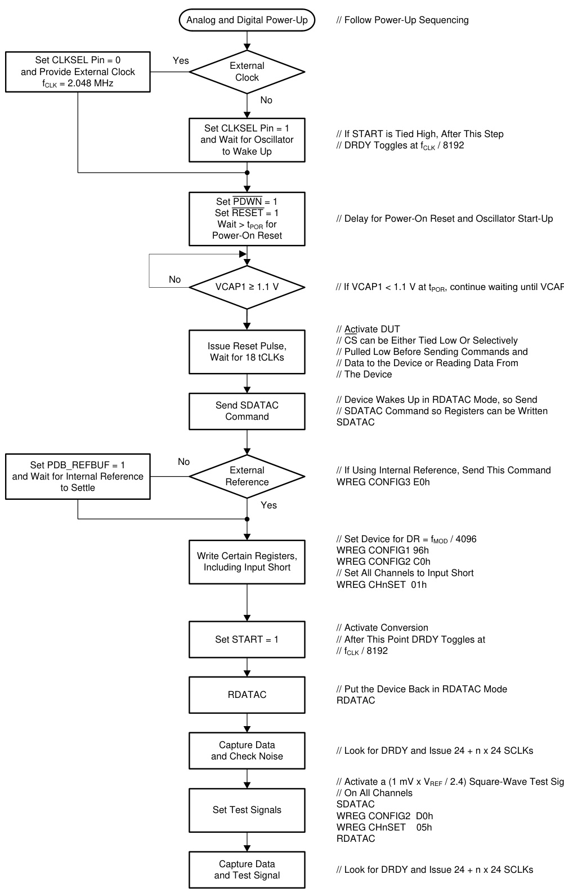  
Figure 67. Initial Flow at Power-Up

# Application Information (continued)

# 10.1.2.1 Lead-Off

# Sample code to set dc lead-off with pull-up and pull-down resistors on all channels.

// Comparator threshold at $9 5 \%$ and $5 \%$ , pullup or pulldown resistor   
// dc lead-off   
// Turn on dc lead-off comparators   
// Turn on the P-side of all channels for lead-off sensing   
// Turn on the N-side of all channels for lead-off sensing

WREG CONFIG4 $0 \mathbf { x } 0 2$ WREG LOFF_SENSP 0xFF WREG LOFF_SENSN 0xFF

Observe the status bits of the output data stream to monitor lead-off status.

# 10.1.2.2 Bias Drive

Sample code to choose bias as an average of the first three channels.

WREG RLD SENSP 0x07 // Select channel 1-3 P-side for RLD sensing WREG RLD SENSN 0x07 // Select channel 1-3 N-side for RLD sensing WREG CONFIG3 b’x1xx 1100 // Turn on BIAS amplifier, set internal BIASREF voltage

Sample code to route the BIASOUT signal through channel 4 N-side and measure bias with channel 5. Make sure the external side to the chip BIASOUT is connected to BIASIN.

WREG CONFIG3 b’xxx1 1100 // Turn on BIAS amp, set internal BIASREF voltage, set BIAS measurement bit WREG CH4SET b’xxxx 0111 // Route BIASIN to channel 4 N-side WREG CH5SET b’xxxx 0010 // Route BIASIN to be measured at channel 5 w.r.t BIASREF

# 10.1.3 Establishing the Input Common-Mode

The ADS1299-x measures fully-differential signals where the common-mode voltage point is the midpoint of the positive and negative analog input. The internal PGA restricts the common- mode input range because of the headroom required for operation. The human body is prone to common-mode drifts because noise easily couples onto the human body, similar to an antenna. These common-mode drifts may push the ADS1299-x input common-mode voltage out of the measurable range of the ADC.

If a patient-drive electrode is used by the system, the ADS1299-x includes an on-chip bias drive (BIAS) amplifier that connects to the patient drive electrode. The BIAS amplifier function is to bias the patient to maintain the other electrode common-mode voltages within the valid range. When powered on, the amplifier uses either the analog midsupply voltage, or the voltage present at the BIASREF pin, as a reference input to drive the patient to that voltage.

The ADS1299- $\cdot \mathsf { x }$ provides the option to use input electrode voltages as feedback to the amplifier to more effectively stabilize the output to the amplifier reference voltage by setting corresponding bits in the BIAS SENSP and BIAS SENSN registers. Figure 68 shows an example of a three-electrode system that leverages this technique.

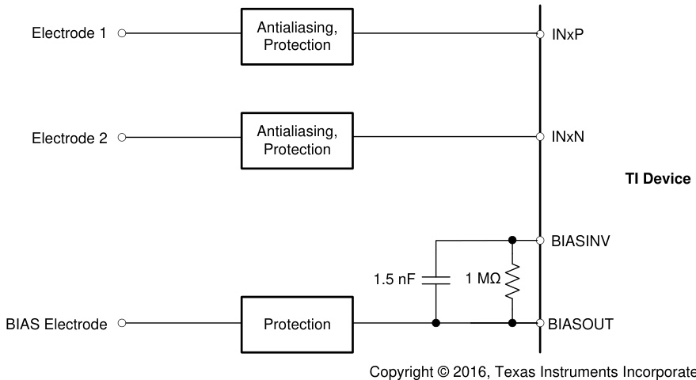  
Figure 68. Setting Common-Mode Using BIAS Electrode

# Application Information (continued)

# 10.1.4 Multiple Device Configuration

The ADS1299-x is designed to provide configuration flexibility when multiple devices are used in a system. The serial interface typically needs four signals: DIN, DOUT, SCLK, and CS. With one additional chip select signal per device, multiple devices can be connected together. The number of signals needed to interface n devices is $3 + n$ .

The BIAS drive amplifiers can be daisy-chained, as explained in the Bias Configuration with Multiple Devices section. To use the internal oscillator in a daisy-chain configuration, one device must be set as the master for the clock source with the internal oscillator enabled (CLKSEL pin $= 1$ ) and the internal oscillator clock brought out of the device by setting the $\overline { { \mathsf { C L K } \mathsf { E N } } }$ register bit to '1'. This master device clock is used as the external clock source for other devices.

When using multiple devices, the devices can be synchronized with the START signal. The delay from START to the DRDY signal is fixed for a given data rate (see the Start subsection of the SPI Interface section for more details on the settling times). Figure 69 shows the behavior of two devices when synchronized with the START signal.

There are two ways to connect multiple devices with a optimal number of interface pins: cascade mode and daisy-chain mode.

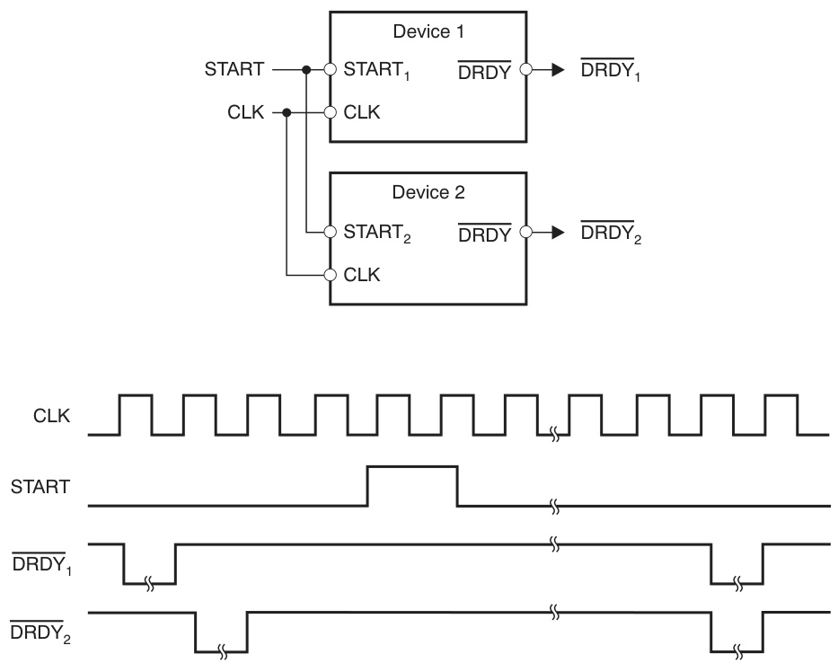  
Figure 69. Synchronizing Multiple Converters

# 10.1.4.1 Cascaded Mode

Figure 70a illustrates a configuration with two devices cascaded together. Together, the devices create a system with 16 channels. DOUT, SCLK, and DIN are shared. Each device has its own chip select. When a device is not selected by the corresponding CS being driven to logic 1, the DOUT of this device is high-impedance. This structure allows the other device to take control of the DOUT bus. This configuration method is suitable for the majority of applications.

# Application Information (continued)

# 10.1.4.2 Daisy-Chain Mode

Daisy-chain mode is enabled by setting the DAISY EN bit in the CONFIG1 register. Figure 70b shows the daisychain configuration. In this mode SCLK, DIN, and $\overline { { \mathsf { C S } } }$ are shared across multiple devices. The DOUT of the second device is connected to the DAISY_IN of the first device, thereby creating a chain. When using daisychain mode, the multiple readback feature is not available. Short the DAISY_IN pin to digital ground if not used. Figure 2 describes the required timing for the device shown in the configurations of Figure 70. Status and data from device 1 appear first on DOUT, followed by the status and data from device 2. The ADS1299 can be daisy chained with a second ADS1299, an ADS1299-6, or an ADS1299-4.

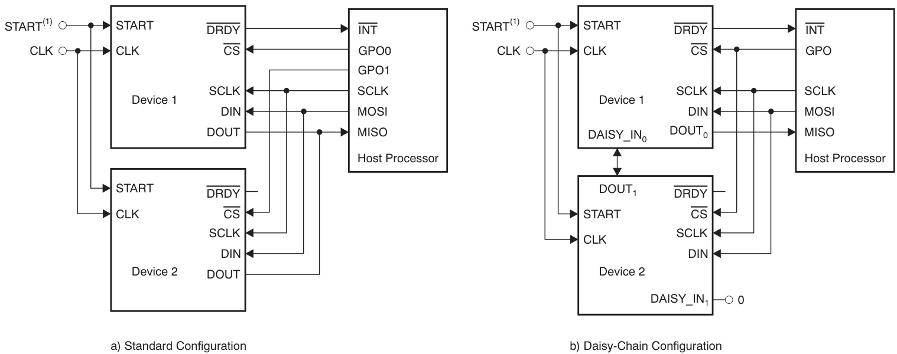  
Figure 70. Multiple Device Configurations

(1) To reduce pin count, set the START pin low and use the START serial command to synchronize and start conversions.

When all devices in the chain operate in the same register setting, DIN can be shared as well. This configuration reduces the SPI communication signals to four, regardless of the number of devices. The BIAS driver cannot be shared among the multiple devices and an external clock must be used because the individual devices cannot be programmed when sharing a common DIN.

Note that from Figure 2, the SCLK rising edge shifts data out of the device on DOUT. The SCLK negative edge is used to latch data into the device DAISY_IN pin down the chain. This architecture allows for a faster SCLK rate speed, but also makes the interface sensitive to board-level signal delays. The more devices in the chain, the more challenging adhering to setup and hold times becomes. A star-pattern connection of SCLK to all devices, minimizing DOUT length, and other printed circuit board (PCB) layout techniques helps. Placing delay circuits (such as buffers) between DOUT and DAISY_IN are ways to mitigate this challenge. One other option is to insert a $D$ flip-flop between DOUT and DAISY_IN clocked on an inverted SCLK. Note also that daisy-chain mode requires some software overhead to recombine data bits spread across byte boundaries. Figure 71 shows a timing diagram for this mode.

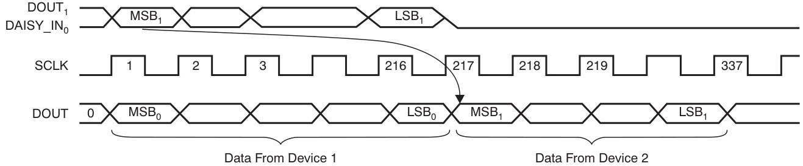  
Figure 71. Daisy-Chain Timing

# Application Information (continued)

The maximum number of devices that can be daisy-chained depends on the data rate at which the device is operated at. The maximum number of devices can be approximately calculated with Equation 10.

$$
N _ { \mathsf { D E V I C E S } } = \frac { \mathsf { f } _ { \mathsf { S C L K } } } { \mathsf { f } _ { \mathsf { D R } } \ ( \mathsf { N } _ { \mathsf { B I T S } } ) ( \mathsf { N } _ { \mathsf { C H A N N E L S } } ) + 2 4 }
$$

where:

NBITS = device resolution (depending on data rate), and NCHANNELS $\mathbf { \tau } = \mathbf { \tau }$ number of channels in the device.

For example, when the 8-channel ADS1299 is operated at a 2-kSPS data rate with a 4-MHz fSCLK, 10 devices can be daisy-chained.

# 10.2 Typical Application

The biopotential signals that are measured in electroencephalography (EEG) are small when compared to other types of biopotential signals. The ADS1299 is equipped to measure such small signals due to its extremely low input-referred noise from its high performance internal PGA. Figure 72 and Figure 73 are examples of how the ADS1299 may be configured in typical EEG measurement setups. Figure 72 shows how to measure electrode potentials in a sequential montage, whereas Figure 73 illustrates referential montage measurement connections.

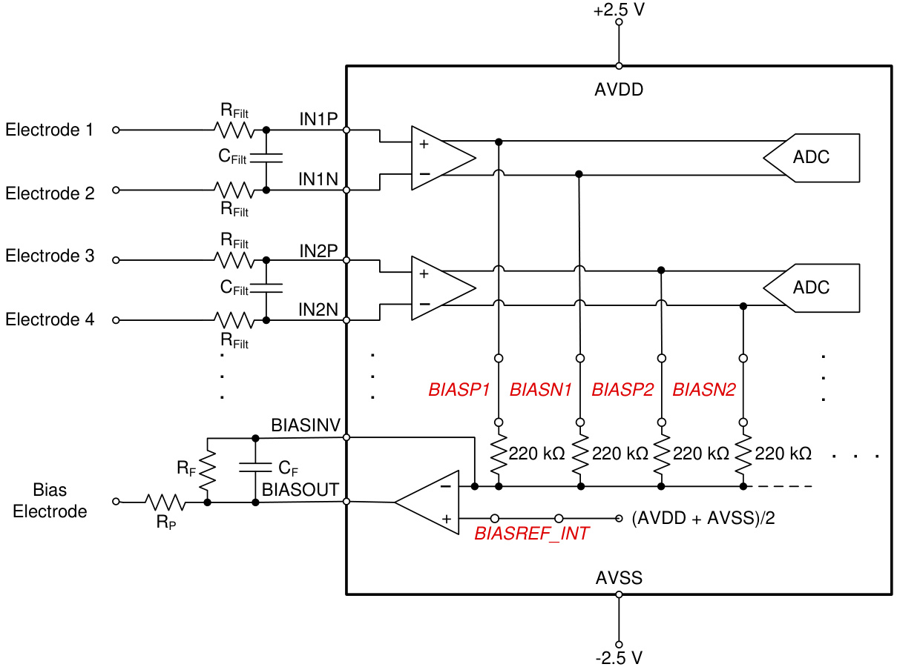  
Figure 72. Example Schematic Using the ADS1299 in an EEG Data Acquisition Application, Sequential Montage

# Typical Application (continued)

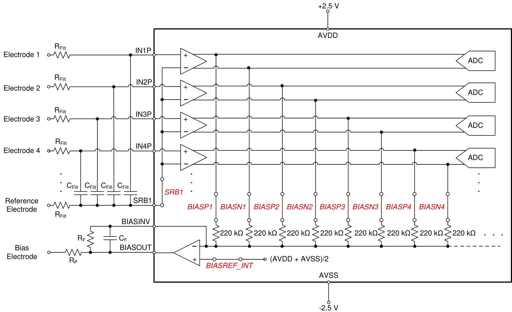

# Figure 73. Example Schematic Using the ADS1299 in an EEG Data Acquisition Application, Referential Montage

# 10.2.1 Design Requirements

Table 29 shows the design requirements for a typical EEG measurement system.

Table 29. EEG Data Acquisition Design Requirements   

<html><body><table><tr><td>DESIGN PARAMETER</td><td>VALUE</td></tr><tr><td>Bandwidth</td><td>1 Hz 50 Hz</td></tr><tr><td>Minimum signal bandwidth</td><td>10μVpk</td></tr><tr><td>Input Impedance</td><td>> 10 MΩ</td></tr><tr><td>Coupling</td><td>dc</td></tr></table></body></html>

# 10.2.2 Detailed Design Procedure

Each channel on the ADS1299 is optimized to measure a separate EEG waveform. The specific connections depend on the EEG montage. The sequential montage is a configuration where each channel represents the voltage between two adjacent electrodes. For example, to measure the potential between electrode Fp1 and F7 on channel 1 of the ADS1299, route the Fp1 electrode to IN1P and the F7 electrode to IN1N. The connections for a sequential montage are illustrated in Figure 72.

Alternatively, EEG electrodes can be measured in a referential montage in which each of the electrodes is measured with respect to a single reference electrode. This montage also allows calculation of the waveforms that would have been measured in a sequential montage by finding the difference between two electrode waveforms which were measured with respect to the same electrode. The ADS1299 allows for such a configuration through the use of the SRB1 pin. The SRB1 pin on the ADS1299 may be internally routed to each channel negative input by setting the SRB1 bit in the MISC1 register. When the reference electrode is connected to the SRB1 pin and all other electrodes are connected to the respective positive channel inputs, the electrode voltages can be measured with a referential montage. The referential montage is illustrated in Figure 73. See Figure 18 for a diagram of the channel input multiplexer options.

The ADS1299 is designed to be an EEG front end such that no additional amplification or buffer stage is needed between the electrodes and ADS1299. The ADS1299 has a low-noise PGA with excellent input-referred noise performance. For certain data rate and gain settings, the ADS1299 introduces significantly less than 1 $\mu \mathsf { V } _ { \mathsf { R M S } }$ of input-referred noise to the signal chain making the device more than capable of handling the $1 0 \mathrm { - } \mu \mathsf { V } _ { \mathsf { P k } }$ minimum signal amplitude. ADS1299 noise performance for different PGA gains and data rate settings is listed in Table 1, Table 2, Table 3, and Table 4.

Traditional EEG data acquisition systems high-pass filter the signals in the front-end to remove dc signal content. This topology allows the signal to be amplified by a large gain so the signal can be digitized by a 12- to 16-bit ADC. The ADS1299 24-bit resolution allows the signal to be dc-coupled to the ADC because small EEG signal information can be measured in addition to a significant dc offset.

The ADS1299 channel inputs have very low input bias current allowing electrodes to be connected to the inputs of the ADS1299 with very little leakage current flowing on the patient cables. The ADS1299 has a minimum dc input impedance of $1 \ G \Omega$ when the lead-off current sources are disabled and 500 MΩ typically when the lead-off current sources are enabled.

The passive components $\mathsf { R } _ { \mathsf { F i l t } }$ and $\mathsf { C } _ { \mathsf { F i l t } }$ form low-pass filters. In general, the filter is advised to be formed by using a differential capacitor CFIlt that shunts the inputs rather than individual RC filters whose capacitors shunt to ground. The differential capacitor configuration significantly improves common-mode rejection because this approach removes dependence on component mismatch.

The cutoff frequency for the filter can be placed well past the data rate of the ADC because of the delta-sigma ADC filter-then-decimate topology. Take care to prevent aliasing around the first repetition of the digital decimation filter response at fMOD. Assuming a 2.048-MHz fCLK, fMOD $\mathbf { \sigma } = \mathbf { \sigma }$ 1.024 MHz. The value of $\mathsf { R } _ { \mathsf { F i l t } }$ has a minimum set by technical standards for medical electronics. The capacitor value must be set to arrange the proper cutoff frequency.

If the system is likely to be exposed to high-frequency EMI, adding very small-value, common-mode capacitors to the inputs is advisable to filter high-frequency common-mode signals. If these capacitors are added, then the capacitors should be 10 or 20 times smaller than the differential capacitor to ensure their effect of CMRR is minimized.

The integrated bias amplifier serves two purposes in an EEG data acquisition system with the ADS1299. The bias amplifier provides a bias voltage that, when applied to the patient, keeps the measurement electrode common-mode voltage within the rails of the ADS1299. This scenario allows for dc coupling. In addition, the bias amplifier can be configured to provide negative common-mode feedback to the patient to cancel unwanted common-mode signals appearing on the electrodes. This feature is especially helpful because biopotential acquisition systems are notoriously prone to mains-frequency common-mode interference.

The bias amplifier is powered on by setting the PD_BIAS bit in the CONFIG3 register. Set the BIASREF INT bit in the CONFIG3 register to input the internally generated analog mid-supply voltage the noninverting input of the bias amplifier. To enable an electrode as an input to the bias amplifier, set the corresponding bit in the BIAS SENSP or BIAS_SENSN register.

The dc gain of the bias amplifier is determined by $\mathsf { R } _ { \mathsf { B i a s } }$ and the number of channel inputs enabled as inputs to the bias amplifier. The bias amplifier circuit only passes common-mode signals. Therefore, the $3 3 0 \mathrm { - } \mathsf { k } \Omega$ resistors at each PGA output are in parallel for common-mode signals. The bias amplifier is configured in an inverting gain scheme. The formula for determining dc gain for common-mode signals input to the bias amplifier is shown in Equation 11. The capacitor $\mathsf { C } _ { \mathsf { f } }$ sets the bandwidth for the bias amplifier. Ensure that the amplifier has enough bandwidth to output all the intended common-mode signals.

$$
\frac { \mathsf { V } _ { \mathsf { o u t } } } { \mathsf { V } _ { \mathsf { i n } } } = - \frac { \mathsf { R } _ { \mathsf { f } } \times \mathsf { N } } { 3 3 0 \mathsf { k } \Omega }
$$

Another advantage to a dc-coupled EEG data acquisition system is the ability to detect when an electrode no longer makes good contact with the patient. The ADS1299 features integrated lead-off detection electronics. The Lead-Off Detection section explains how to use the lead-off feature on the ADS1299. Note that when configured in a referential montage, only use one lead-off current source with the reference electrode.

# 10.2.3 Application Curves

Testing the capability of the ADS1299 to measure signals in the band and near the amplitude of typical EEG signals can be done with a precision signal generator. The ADS1299 was tested in a configuration like the one shown in Figure 74.

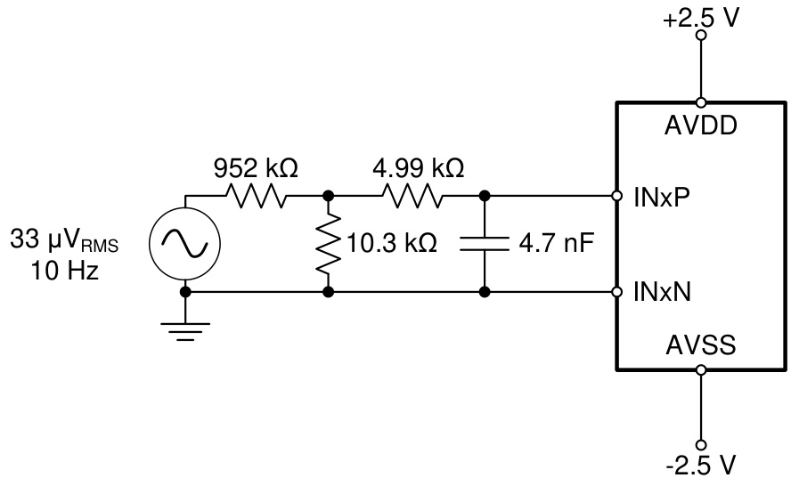

# Figure 74. Example Schematic Using the ADS1299 in an EEG Data Acquisition Application, Referential Montage

The $9 5 2 - 1 < \Omega$ and $1 0 . 3 \substack { - \mathsf { k } \Omega }$ resistors were used to attenuate the voltage from the signal source because the source could not reach the desired magnitude directly. With the voltage divider, the signal appearing at the inputs was a 3.5-μVRMS, 10-Hz sine wave. Figure 75 shows the input-referred conversion results from the ADS1299 following calibration for offset. The signal that is measured is similar to some of the smallest extracranial EEG signals that can be measured with typical EEG acquisition systems. The signal can be clearly identified. Given this measurement setup was a single-ended configuration without shielding, the measurement setup was subject to significant mains interference. A digital low-pass filter was applied to remove the interference.

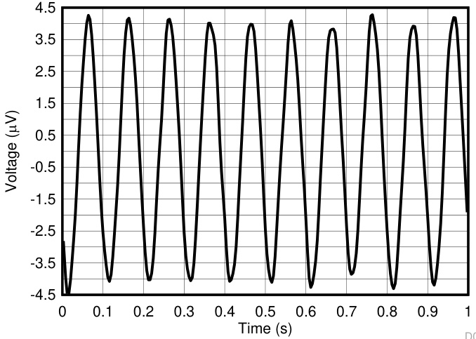  
Figure 75. ADS1299 10-Hz Input Signal Results

# 11 Power Supply Recommendations

The ADS1299- $\cdot \mathsf { x }$ has three power supplies: AVDD, AVDD1, and DVDD. For best performance, both AVDD and AVDD1 must be as quiet as possible. AVDD1 provides the supply to the charge pump block and has transients at $\mathsf { f } _ { \mathsf { C L K } }$ . Therefore, star connect AVDD1 to the AVDD pins and AVSS1 to the AVSS pins. AVDD and AVDD1 noise that is nonsynchronous with the ADS1299-x operation must be eliminated. Bypass each device supply with $1 0 \mathrm { - } \mu \ F$ and $0 . 1 \mathrm { - } \mathrm { \dot { \mu } F }$ solid ceramic capacitors. For best performance, place the digital circuits (DSP, microcontrollers, FPGAs, and so forth) in the system so that the return currents on those devices do not cross the analog return path of the device. Power the ADS1299-x from unipolar or bipolar supplies.

Use surface-mount, low-cost, low-profile, multilayer ceramic-type capacitors for decoupling. In most cases, the VCAP1 capacitor is also a multilayer ceramic; however, in systems where the board is subjected to high- or lowfrequency vibration, install a nonferroelectric capacitor, such as a tantalum or class 1 capacitor (C0G or NPO). EIA class 2 and class 3 dielectrics such as (X7R, X5R, X8R, and so forth) are ferroelectric. The piezoelectric property of these capacitors can appear as electrical noise coming from the capacitor. When using internal reference, noise on the VCAP1 node results in performance degradation.

# 11.1 Power-Up Sequencing

Before device power up, all digital and analog inputs must be low. At the time of power up, keep all of these signals low until the power supplies have stabilized, as shown in Figure 76.

Allow time for the supply voltages to reach their final value, and then begin supplying the master clock signal to the CLK pin. Wait for time tPOR, then transmit a reset pulse using either the RESET pin or RESET command to initialize the digital portion of the chip. Issue the reset after tPOR or after the VCAP1 voltage is greater than $1 . 1 \ V$ , whichever time is longer. Note that:

tPOR is described in Table 30.   
The VCAP1 pin charge time is set by the RC time constant set by the capacitor value on VCAP1; see Figure 25.

After releasing the RESET pin, program the configuration registers. The power-up sequence timing is shown in Table 30.

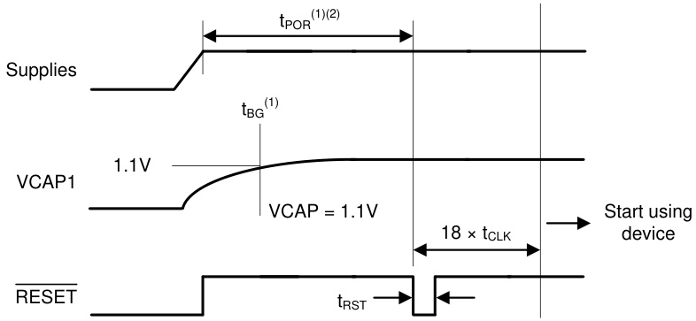  
Figure 76. Power-Up Timing Diagram

(1) Timing to reset pulse is tPOR or after tBG, whichever is longer.   
(2) When using an external clock, tPOR timing does not start until CLK is present and valid.

Table 30. Timing Requirements for Figure 76   

<html><body><table><tr><td colspan="2"></td><td>MIN</td><td>MAX UNIT</td></tr><tr><td>tPOR</td><td>Wait after power up until reset</td><td>218</td><td>tCLK</td></tr><tr><td>tRST</td><td>Reset low duration</td><td></td><td>tCLK</td></tr></table></body></html>

# 11.2 Connecting the Device to Unipolar (5 V and 3.3 V) Supplies

Figure 77 illustrates the ADS1299- $\cdot \mathsf { x }$ connected to a unipolar supply. In this example, analog supply (AVDD) T referenced to analog ground (AVSS) and digital supply (DVDD) is referenced to digital ground (DGND).

# Connecting the Device to Unipolar (5 V and 3.3 V) Supplies (continued)

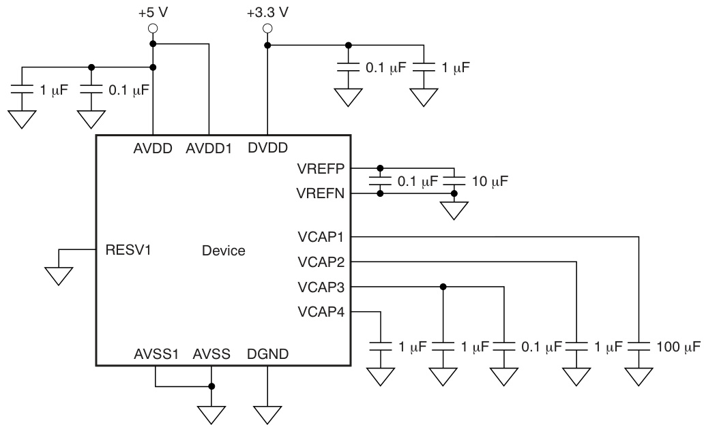  
Figure 77. Single-Supply Operation

NOTE: Place the capacitors for supply, reference, and VCAP1 to VCAP4 as close to the package as possible.

# 11.3 Connecting the Device to Bipolar $\pm 2 . 5 \nu$ and 3.3 V) Supplies

Figure 78 shows the ADS1299- $\cdot \mathsf { x }$ connected to a bipolar supply. In this example, the analog supplies connect to the device analog supply (AVDD). This supply is referenced to the device analog return (AVSS), and the digital supply (DVDD) is referenced to the device digital ground return (DGND).

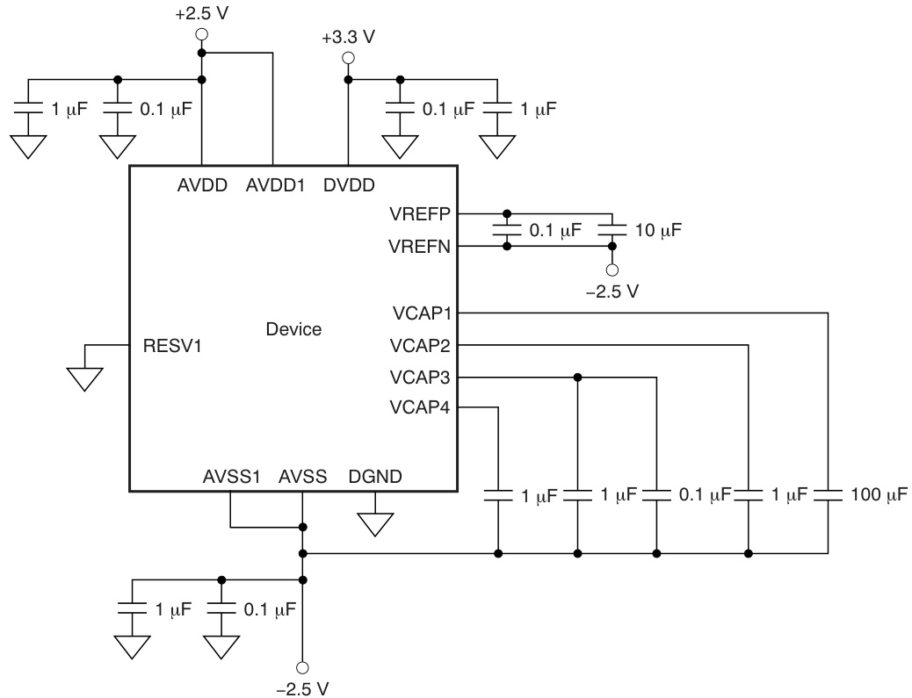  
Figure 78. Bipolar Supply Operation

NOTE: Place the capacitors for supply, reference, and VCAP1 to VCAP4 as close to the package as possible.

# 12 Layout

# 12.1 Layout Guidelines

TI recommends employing best design practices when laying out a printed-circuit board (PCB) for both analog and digital components. This recommendation generally means that the layout separates analog components [such as ADCs, amplifiers, references, digital-to-analog converters (DACs), and analog MUXs] from digital components [such as microcontrollers, complex programmable logic devices (CPLDs), field-programmable gate arrays (FPGAs), radio frequency (RF) transceivers, universal serial bus (USB) transceivers, and switching regulators]. An example of good component placement is shown in Figure 79. Although Figure 79 provides a good example of component placement, the best placement for each application is unique to the geometries, components, and PCB fabrication capabilities employed. That is, there is no single layout that is perfect for every design and careful consideration must always be used when designing with any analog component.

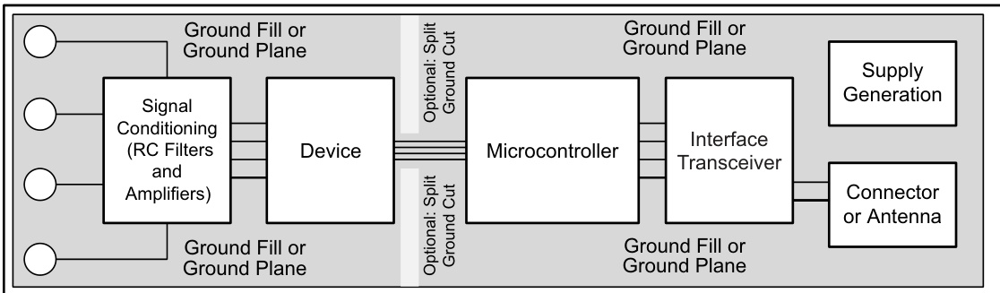  
Figure 79. System Component Placement

The following outlines some basic recommendations for the layout of the ADS1299-x to get the best possible performance of the ADC. A good design can be ruined with a bad circuit layout.

Separate analog and digital signals. To start, partition the board into analog and digital sections where the layout permits. Route digital lines away from analog lines. This configuration prevents digital noise from coupling back into analog signals.   
The ground plane can be split into an analog plane (AGND) and digital plane (DGND), but is not necessary. Place digital signals over the digital plane, and analog signals over the analog plane. As a final step in the layout, the split between the analog and digital grounds must be connected together at the ADC.   
Fill void areas on signal layers with ground fill.   
Provide good ground return paths. Signal return currents flow on the path of least impedance. If the ground plane is cut or has other traces that block the current from flowing right next to the signal trace, then the current must find another path to return to the source and complete the circuit. If current is forced into a longer path, the chances that the signal radiates increases. Sensitive signals are more susceptible to EMI interference.   
Use bypass capacitors on supplies to reduce high-frequency noise. Do not place vias between bypass capacitors and the active device. Placing the bypass capacitors on the same layer as close to the active device yields the best results.   
Analog inputs with differential connections must have a capacitor placed differentially across the inputs. The differential capacitors must be of high quality. The best ceramic chip capacitors are C0G (NPO), which have stable properties and low noise characteristics.

# 12.2 Layout Example

Figure 80 is an example layout of the ADS1299 requiring a minimum of two PCB layers. The example circuit is shown for either a single analog supply or a bipolar-supply connection. In this example, polygon pours are used as supply connections around the device. If a three- or four-layer PCB is used, the additional inner layers can be dedicated to route power traces. The PCB is partitioned with analog signals routed from the left, digital signals routed to the right, and power routed above and below the device.

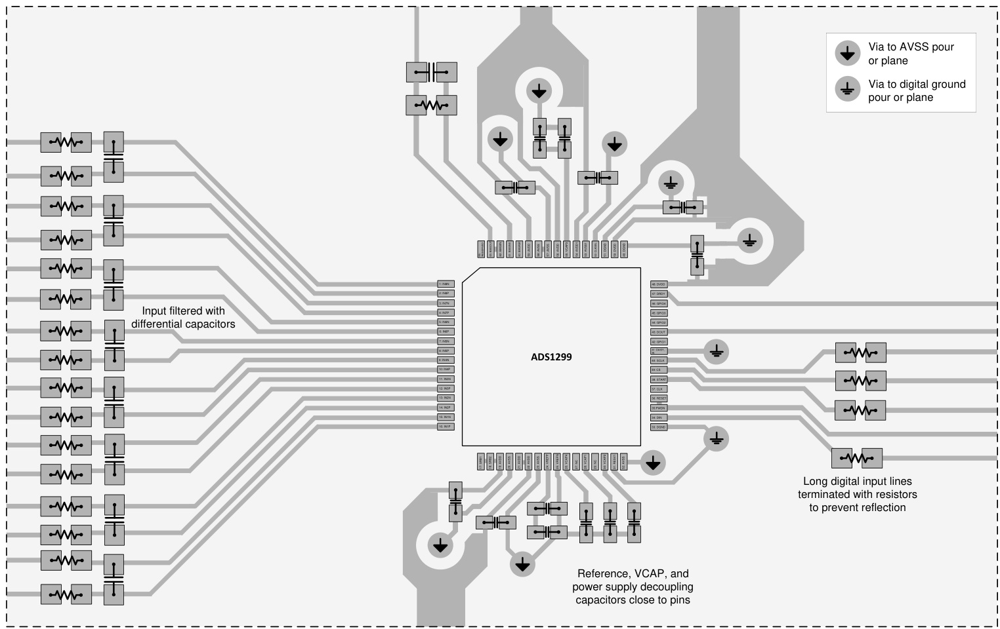  
Layout Example (continued)   
Figure 80. ADS1299 Example Layout

# 13 器件和文档支持

# 13.1 文档支持

# 13.1.1 相关文档

相关文档如下：

ADS129x 用于生理信号测量的低功耗、8 通道、 24 位模拟前端《REF50xx 低噪声、极低漂移、高精度电压基准》  
使用右腿驱动放大器改进共模抑制《ADS1299EEG-FE EEG 前端性能演示套件》

# 13.2 相关链接

以下表格列出了快速访问链接。 范围包括技术文档、 支持与社区资源、 工具和软件， 并且可通过快速访问立刻订购。

# 表 31. 相关链接

<html><body><table><tr><td>器件</td><td>产品文件夹</td><td>立即订购</td><td>技术文档</td><td>工具与软件</td><td>支持与社区</td></tr><tr><td>ADS1299</td><td>请单击此处</td><td>请单击此处</td><td>请单击此处</td><td>请单击此处</td><td>请单击此处</td></tr><tr><td>ADS1299-4</td><td>请单击此处</td><td>请单击此处</td><td>请单击此处</td><td>请单击此处</td><td>请单击此处</td></tr><tr><td>ADS1299-6</td><td>请单击此处</td><td>请单击此处</td><td>请单击此处</td><td>请单击此处</td><td>请单击此处</td></tr></table></body></html>

# 13.3 接收文档更新通知

如需接收文档更新通知， 请访问 www.ti.com.cn 网站上的器件产品文件夹。点击右上角的提醒我 (Alert me) 注册后， 即可每周定期收到已更改的产品信息。 有关更改的详细信息， 请查阅已修订文档中包含的修订历史记录。

# 13.4 社区资源

The following links connect to TI community resources. Linked contents are provided "AS IS" by the respective contributors. They do not constitute TI specifications and do not necessarily reflect TI's views; see TI's Terms of Use.

TI E2E™ Online Community TI's Engineer-to-Engineer (E2E) Community. Created to foster collaboration among engineers. At e2e.ti.com, you can ask questions, share knowledge, explore ideas and help solve problems with fellow engineers.

Design Support TI's Design Support Quickly find helpful E2E forums along with design support tools and contact information for technical support.

# 13.5 商标

E2E is a trademark of Texas Instruments.   
All other trademarks are the property of their respective owners.

# 13.6 静电放电警告

ESD 可能会损坏该集成电路。 德州仪器 (TI) 建议通过适当的预防措施处理所有集成电路。 如果不遵守正确的处理措施和安装程序 可能会损坏集成电路。  
ESD 的损坏小至导致微小的性能降级 大至整个器件故障。 精密的集成电路可能更容易受到损坏 这是因为非常细微的参数更改都可能会导致器件与其发布的规格不相符。

# 13.7 Glossary

SLYZ022 TI Glossary.

This glossary lists and explains terms, acronyms, and definitions.

# 14 机械、 封装和可订购信息

以下页中包括机械、封装和可订购信息。这些信息是针对指定器件可提供的最新数据。这些数据会在无通知且不对本文档进行修订的情况下发生改变。 欲获得该数据表的浏览器版本， 请查阅左侧的导航栏。

# PACKAGING INFORMATION

<html><body><table><tr><td>Orderable part number</td><td>Status (1)</td><td>Material type (2)</td><td>Package |Pins</td><td>Package qty Carrier</td><td>RoHS (3)</td><td>Lead finish/ Ball material</td><td>MSL rating/ Peak reflow</td><td>Op temp (°C)</td><td>Part marking (6)</td></tr><tr><td>ADS1299-4PAG</td><td>Active</td><td>Production</td><td>TQFP (PAG) | 64</td><td>160|JEDEC TRAY (10+1)</td><td>Yes</td><td>NIPDAU</td><td>Level-3-260C-168 HR</td><td>-40 to 85</td><td>ADS1299-4</td></tr><tr><td>ADS1299-4PAG.A</td><td>Active</td><td>Production</td><td>TQFP (PAG)|64</td><td>160 | JEDEC</td><td>Yes</td><td>NIPDAU</td><td>Level-3-260C-168 HR</td><td>-40 to 85</td><td>ADS1299-4</td></tr><tr><td>ADS1299-4PAGR</td><td>Active</td><td>Production</td><td>TQFP(PAG)T64</td><td>TRAY (10+1) 1500 LARGE T&R</td><td>Yes</td><td>NIPDAU</td><td>Level-3-260C-168 HR</td><td>-40 to 85</td><td>ADS1299-4</td></tr><tr><td>ADS1299-4PAGR.A</td><td>Active</td><td>Production</td><td>TQFP (PAG) |64</td><td>1500 LARGE T&R</td><td>Yes</td><td>NIPDAU</td><td>Level-3-260C-168 HR</td><td>-40 to 85</td><td>ADS1299-4</td></tr><tr><td>ADS1299-6PAG</td><td>Active</td><td>Production</td><td>TQFP (PAG) | 64</td><td>160|JEDEC TRAY (10+1)</td><td>Yes</td><td>NIPDAU</td><td>Level-3-260C-168 HR</td><td>-40 to 85</td><td>ADS1299-6</td></tr><tr><td>ADS1299-6PAG.A</td><td>Active</td><td>Productior</td><td>TQFP (PAG)|64</td><td>160|JEDEC TRAY (10+1)</td><td>Yes</td><td>NIPDAU</td><td>Level-3-260C-168 HR</td><td>-40 to 85</td><td>ADS1299-6</td></tr><tr><td>ADS1299-6PAGR</td><td>Active</td><td>Production</td><td>TQFP (PAG)|64</td><td>1500 LARGE T&R</td><td>Yes</td><td>NIPDAU</td><td>Level-3-260C-168 HR</td><td>-40 to 85</td><td>ADS1299-6</td></tr><tr><td>ADS1299-6PAGR.A</td><td>Active</td><td>Production</td><td>TQFP (PAG) |64</td><td>1500 LARGE T&R</td><td>Yes</td><td>NIPDAU</td><td>Level-3-260C-168 HR</td><td>-40 to 85</td><td>ADS1299-6</td></tr><tr><td>ADS1299IPAG</td><td>Active</td><td>Production</td><td>TQFP (PAG) |64</td><td>160|JEDEC TRAY (5+1)</td><td>Yes</td><td>NIPDAU</td><td>Level-3-260C-168 HR</td><td>-40 to 85</td><td>ADS1299</td></tr><tr><td>ADS1299IPAG.A</td><td>Active</td><td>Production</td><td>TQFP (PAG)|64</td><td>160|JEDEC TRAY (5+1)</td><td>Yes</td><td>NIPDAU</td><td>Level-3-260C-168 HR</td><td>-40 to 85</td><td>ADS1299</td></tr><tr><td>ADS1299IPAGR</td><td>Active</td><td>Production</td><td>TQFP (PAG) I 64</td><td>1500 LARGE T&R</td><td>Yes</td><td>NIPDAU</td><td>Level-3-260C-168HR</td><td>40 to 85</td><td>ADS1299</td></tr><tr><td>ADS1299IPAGR.A</td><td>Active</td><td>Production</td><td>TQFP (PAG)I64</td><td>1500 LARGE T&R</td><td>Yes</td><td>NIPDAU</td><td>Level-3-260C- 168 HR</td><td>-40 to 85</td><td>ADS1299</td></tr><tr><td>ADS1299IPAGRG4</td><td>Active</td><td>Production</td><td>TQFP PAG) 64</td><td>1500 LARGE T&R</td><td>Yes</td><td>NIPDAU</td><td>Level-3-260C- 168 HR</td><td>-40 to 85</td><td>ADS1299</td></tr><tr><td>ADS1299IPAGRG4.A</td><td>Active</td><td>Production</td><td>TQFP (PAG)|64</td><td>1500 LARGE T&R</td><td>Yes</td><td>NIPDAU</td><td>Level-3-260C-168 HR</td><td>-40 to 85</td><td>ADS1299</td></tr></table></body></html>

(1) Status: For more details on status, see our product life cycle.

(2) Material type: When designated, preproduction parts are prototypes/experimental devices, and are not yet approved or released for full production. Testing and fina process, including without limitation quality assurance, reliability performance testing, and/or process qualification, may not yet be complete, and this item is subject to further changes or possible discontinu ation. If available for ordering, purchases wil be subject to an additional waiver at checkout, and are intended for early internal evaluation purposes only. These items are sold without warranties of any kind.

(3) RoHS values: Yes, No, RoHS Exempt. See the TI RoHS Statement for additional information and value definition.

(4) Lead finish/Ball material: Parts may have multiple material finish options. Finish options are separated by vertical ruled line. Lead finish/Ball material values may wrap to two lines if the finish value exceeds the maximum column width.

(5) MSL rating/Peak reflow: The moisture sensitivity level ratings and peak solder (reflow) temperatures. In the event that a part has multiple moisture sensitivity ratings, only t he lowest level per JEDEC standards is shown.   
Refer to the shipping label for the actual reflow temperature that will be used to mount the part to the printed circuit board.

6) Part marking: There may be an additional marking, which relates to the logo, the lot trace code information, or the environmental category of the part.

Multiple part markings will be inside parentheses. Only one part marking contained in parentheses and separated by "\~" will appear on a part. If a line is indented then it is continuation of the previous line and the two combined represent the entire part marking for that device.

Important Information and Disclaimer:The information provided on this page represents TI's knowledge and belief as of the date that it is provided. TI bases its knowledge and belief on information provided by third parties, and makes no representation or warranty as to the accuracy of such information. Efforts are underway to better integrate information from third parties. TI has taken and continues to take reasonable steps to provide representative and accurate information but may not have conducted destructive testing or chemical analysis on incoming materials and chemicals. TI and TI suppliers consider certain information to be propri etary, and thus CAS numbers and other limited nformation may not be available for release.

n no event shall TI's liability arising out of such information exceed the total purchase price of the TI part(s) at issue in this document sold by TI to Customer on an annual basis.

# TAPE AND REEL INFORMATION

<html><body><table><tr><td>A0</td><td>Dimension designed to accommodate the component width</td></tr><tr><td>B0</td><td>Dimension designed to accommodate the component length</td></tr><tr><td>K0</td><td>Dimension designed to accommodate the component thickness</td></tr><tr><td>W</td><td>Overall width of the carrier tape</td></tr><tr><td>P1</td><td>Pitch successive cavity centers between</td></tr></table></body></html>

# QUADRANT ASSIGNMENTS FOR PIN ORIENTATION IN TAPE

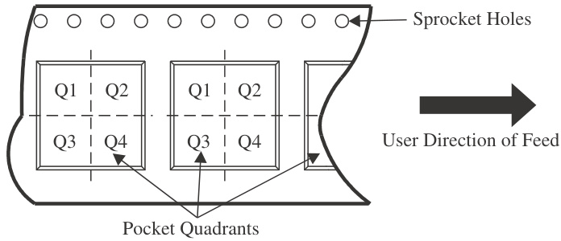

\*All dimensions are nominal   

<html><body><table><tr><td>Device</td><td>Package Type</td><td>Package Drawing</td><td>Pins</td><td>SPQ</td><td>Reel Diameter (mm)</td><td>Reel Width W1 (mm)</td><td>AO (mm)</td><td>B0 (mm)</td><td>KO (mm)</td><td>P1 (mm)</td><td>W (mm)</td><td>Pin1 Quadrant</td></tr><tr><td>ADS1299-4PAGR</td><td>TQFP</td><td>PAG</td><td>64</td><td>1500</td><td>330.0</td><td>24.4</td><td>13.0</td><td>13.0</td><td>.5</td><td>16.0</td><td>24.0</td><td>Q2</td></tr><tr><td>ADS1299-6PAGR</td><td>TQFP</td><td>PAG</td><td>64</td><td>1500</td><td>330.0</td><td>24.4</td><td>13.0</td><td>13.0</td><td>5</td><td>16.0</td><td>24.0</td><td>Q2</td></tr><tr><td>ADS1299IPAGR</td><td>TQFP</td><td>PAG</td><td>64</td><td>1500</td><td>330.0</td><td>24.4</td><td>13.0</td><td>13.0</td><td>.5</td><td>16.0</td><td>24.0</td><td>Q2</td></tr><tr><td>ADS1299IPAGRG4</td><td>TQFP</td><td>PAG</td><td>64</td><td>1500</td><td>330.0</td><td>24.4</td><td>13.0</td><td>13.0</td><td>1.5</td><td>16.0</td><td>24.0</td><td>Q2</td></tr></table></body></html>

\*All dimensions are nominal   

<html><body><table><tr><td>Device</td><td>Package Type</td><td>Package Drawing</td><td>Pins</td><td>SPQ</td><td>Length (mm)</td><td>Width (mm)</td><td>Height (mm)</td></tr><tr><td>ADS1299-4PAGR</td><td>TQFP</td><td>PAG</td><td>64</td><td>1500</td><td>350.0</td><td>350.0</td><td>43.0</td></tr><tr><td>ADS1299-6PAGR</td><td>TQFP</td><td>PAG</td><td>64</td><td>1500</td><td>350.0</td><td>350.0</td><td>43.0</td></tr><tr><td>ADS1299IPAGR</td><td>TQFP</td><td>PAG</td><td>64</td><td>1500</td><td>350.0</td><td>350.0</td><td>43.0</td></tr><tr><td>ADS1299IPAGRG4</td><td>TQFP</td><td>PAG</td><td>64</td><td>1500</td><td>350.0</td><td>350.0</td><td>43.0</td></tr></table></body></html>

# TRAY

L - Outer tray length without tabs KO - Outer tray 十十十十十十十十十十十十十十+ height +++++++++++++++ W - 十十十十十十十十十十十十十十+ Outer 十十十十十十十十十十十十十十+ tray width 十十十十十十十十十十十十十十+ +++++++\$++++++++ P1 - Tray unit pocket pitch CW - Measurement for tray edge (Y direction) to corner pocket center CL - Measurement for tray edge (X direction) to corner pocket center

Chamfer on Tray corner indicates Pin orientation of packed units.

\*All dimensions are nominal   

<html><body><table><tr><td>Device</td><td>Package Name</td><td>Package Type</td><td>Pins</td><td>SPQ</td><td>Unit array matrix</td><td>Max temperature (C)</td><td>L (mm)</td><td>W (mm)</td><td>KO (μm)</td><td></td><td>CL (mm)</td><td>CW (mm)</td></tr><tr><td>ADS1299-4PAG</td><td>PAG</td><td>TQFP</td><td>64</td><td>160</td><td>8×20</td><td>150</td><td>315</td><td>135.9</td><td>7620</td><td>15.2</td><td>13.</td><td>13</td></tr><tr><td>ADS1299-4PAG.A</td><td>PAG</td><td>TQFP</td><td>64</td><td>160</td><td>8 x 20</td><td>150</td><td>315</td><td>135.9</td><td>7620</td><td>5.2</td><td>13.1</td><td>13</td></tr><tr><td>ADS1299-6PAG</td><td>PAG</td><td>TQFP</td><td>64</td><td>160</td><td>8 x 20</td><td>150</td><td>315</td><td>135.9</td><td>7620</td><td>15.2</td><td>13.1</td><td>13</td></tr><tr><td>ADS1299-6PAG.A</td><td>PAG</td><td>TQFP</td><td>64</td><td>160</td><td>8 x 20</td><td>150</td><td>315</td><td>135.9</td><td>7620</td><td>15.2</td><td>13.1</td><td>13</td></tr><tr><td>ADS1299IPAG</td><td>PAG</td><td>TQFP</td><td>64</td><td>160</td><td>8 x 20</td><td>150</td><td>315</td><td>135.9</td><td>7620</td><td>15.2</td><td>13.1</td><td>13</td></tr><tr><td>ADS1299IPAG.A</td><td>PAG</td><td>TQFP</td><td>64</td><td>160</td><td>8 × 20</td><td>150</td><td>315</td><td>135.9</td><td>7620</td><td>15.2</td><td>13.1</td><td>13</td></tr></table></body></html>

# PLASTIC QUAD FLATPACK

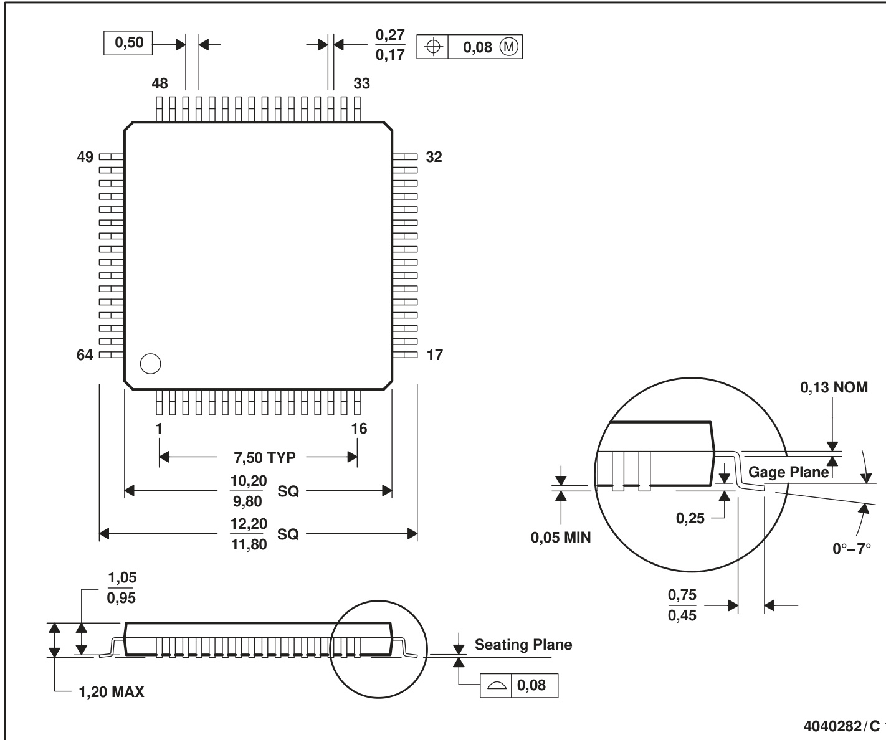

NOTES: A. All linear dimensions are in millimeters. B. This drawing is subject to change without notice. C. Falls within JEDEC MS-026

A. All linear dimensions are in millimeters.   
B. This drawing is subject to change without notice.   
C. Laser cutting apertures with trapezoidal walls and also rounding corners will offer better paste release. Customers should contact their board assembly site for stencil design recommendations. Example stencil design based on a $50 \%$ volumetric metal load solder paste. Refer to IPC-7525 for other stencil recommendations.   
D. Customers should contact their board fabrication site for solder mask tolerances between and around signal pads.   
A. All linear dimensions are in millimeters.   
B. This drawing is subject to change without notice.   
C. Laser cutting apertures with trapezoidal walls and also rounding corners will offer better paste release. Customers should contact their board assembly site for stencil design recommendations. Example stencil design based on a $50 \%$ volumetric metal load solder paste. Refer to IPC-7525 for other stencil recommendations.   
D. Customers should contact their board fabrication site for solder mask tolerances between and around signal pads.

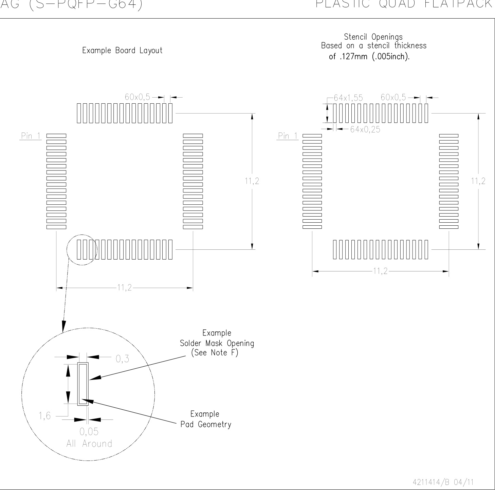

# 重要通知和免责声明

TI“按原样”提供技术和可靠性数据 （包括数据表） 、 设计资源（包括参考设计）、 应用或其他设计建议、 网络工具、 安全信息和其他资源， 不保证没有瑕疵且不做出任何明示或暗示的担保， 包括但不限于对适销性、 与某特定用途的适用性或不侵犯任何第三方知识产权的暗示担保。

这些资源可供使用 TI 产品进行设计的熟练开发人员使用。 您将自行承担以下全部责任： (1) 针对您的应用选择合适的 TI 产品， (2) 设计、 验证并测试您的应用， (3) 确保您的应用满足相应标准以及任何其他安全、 安保法规或其他要求。

这些资源如有变更，恕不另行通知。TI 授权您仅可将这些资源用于研发本资源所述的 TI 产品的相关应用。严禁以其他方式对这些资源进行复制或展示。您无权使用任何其他 TI 知识产权或任何第三方知识产权。对于因您对这些资源的使用而对 TI 及其代表造成的任何索赔、损害、成本、损失和债务， 您将全额赔偿，TI 对此概不负责。

TI 提供的产品受 TI 销售条款)、 TI 通用质量指南 或 ti.com 上其他适用条款或 TI 产品随附的其他适用条款的约束。TI 提供这些资源并不会扩展或以其他方式更改 TI 针对 TI 产品发布的适用的担保或担保免责声明。 除非德州仪器 (TI) 明确将某产品指定为定制产品或客户特定产品，否则其产品均为按确定价格收入目录的标准通用器件。

TI 反对并拒绝您可能提出的任何其他或不同的条款。