# CH32H417、 H416、 H415 数据手册

# 概述

CH32H417 是基于青稞 RISC-V5F 和 RISC-V3F 双内核设计的互联型通用微控制器。CH32H417 集成了USB 3.2 Gen1 控制器和收发器、 百兆以太网 MAC 及 PHY、 SerDes 高速隔离收发器、 Type-C/PD 控制器及 PHY，提供 SD/EMMC 控制器 SDMMC、 500MBytes 通用高速接口 UHSIF、 DVP 数字图像接口、 单线协议主接口 SWPMI、 可编程协议I/O 控制器PIOC、 灵活存储控制器FMC、 DFSDM、 LTDC、 GPHA、 DMA 控制器、多组定时器、8 组串口、I3C、4 组 I2C、2 组 QSPI、4 组 SPI，2 组 I2S、3 组 CAN 等外设资源， 内置了5M 采样率双 12 位 ADC 单元、 20M 采样率 10 位高速 HSADC 单元、 16 路 Touchkey、 双 DAC 单元、3 组运放 OPA、 电压比较器 CMP 等模拟资源， 支持 10M/100M 以太网通讯， 支持 USB .0 和 USB .0，支持 USBHost 主机和 USB Device 设备功能、 Type-C 和 PDUSB 快充功能， 支持SerDes 高速隔离及远距离传输，支持双内核分工提升网络协议处理效率和通讯响应速度。

# 产品特性

$\bullet$ 内核 Core：双内核结构： 青稞 RISC-V5F 和 RISC-V3F快速可编程中断控制器 $+$ 硬件中断堆栈V5F 最高频率 $4 0 0 M H z$ ， V3F 最高频率 $1 5 0 M H z$ $\bullet$ 存储器：896KB 易失数据存储区 SRAM（包含 128KB ITCM 和 256KB DTCM）960KB 程序存储区 CodeFlash56KB 系统引导程序存储区 BootLoader256B 用户自定义信息存储区

# $\bullet$ 电源管理和低功耗：

系统供电 $\mathsf { V } _ { \mathsf { D D 3 3 } }$ 额定： 3.3V  
常规 GPIO 供电 VDDIO， 额定 3.3V， 支持 1.8V  
高速 GPIO 供电 $\mathsf { V } _ { 1 0 1 8 }$ ， 可选 $1 . 2 / 1 . 8 / 2 . 5 / 3 . 3 \mathsf { V }$   
$\mathsf { V } _ { \mathsf { B A T } }$ 电源独立为 RTC、 LSE 供电  
低功耗模式： 睡眠、 停止

# $\bullet$ 系统时钟和复位：

内置出厂调校的 $2 5 M H z$ 的 RC 振荡器内置约 $4 0 k \mathsf { H } z$ 的 RC 振荡器高速振荡器支持外部 25MHz 晶体低速振荡器支持外部 $3 2 k H z$ 晶体上电/下电复位、 可编程电压监测器$\bullet$ 2 组共 16 路通用 DMA 控制器：共16 个通道， 支持环形缓冲区管理

$\bullet$ 2 组 12 位模数转换 ADC：模拟输入范围： $V _ { \mathbb { S } } { \sim } V _ { \mathbb { D } \mathbb { D } | 0 }$ 16 路外部信号通道 $+ 2$ 路内部信号通道采样速率高达 5Msps， 支持双ADC 转换模式  
$\bullet$ 16 路 TouchKey 通道检测

# $\bullet$ 1 组 10 位高速模数转换 HSADC：

模拟输入范围： $V _ { \mathbb { S } \mathbb { S } } \mathrm { \sim } V _ { \mathbb { D } \mathbb { D } | 0 }$ 7 路外部信号通道采样速率高达 20Msps

$\bullet$ 2 组12 位数模转换 DAC  
$\bullet$ 32 位宽度 125MHz 通用高速接口 UHSIF  
$\bullet$ 150MHz 数字图像接口DVP  
$\bullet$ 200MHz SD/EMMC 控制器： 支持单双沿  
$\bullet$ SDIO 主机/从机接口： 支持 SD/SDIO/MMC 口  
$\bullet$ 单线协议主接口 SWPMI

$\bullet$ 可编程协议 I/O 控制器 PIOC：可编程， 支持多种单线接口、 两线接口支持单线 RGB 芯片多级串联

$\bullet$ 以太网控制器 MAC 及 10M/100M PHY：MAC 和 100M PHY 全集成， 外围只需要电容支持Auto-MDIX 线路自动转换和极性自适应提供 RGMII 接口， 可连接外置 1000M PHY内置预分配的全球唯一MAC 地址

# $\bullet$ 5Gbps 超高速 USB 3.0 控制器及 PHY：

支持超高速的 Host 和 Device 模式支持驱动 USB 3.0 HUB高速一体化设计， 实测每秒 450Mbytes

# $\bullet$ 480Mbps 高速 USB 2. 0 控制器及 PHY：

支持高速/全速的 Host 和 Device 模式支持 1024 字节数据包支持 USART 串口或 I2C 引脚映射

# $\bullet$ 全速 USB 2. 0 控制器及 PHY：

支持全速/低速的 Host 和 Device 模式支持 OTG 功能

$\bullet$ 远距离 SerDes 控制器及PHY：支持千伏级高压信号隔离传输支持百米差分网线远距离传输

# $\bullet$ 随机数发生器 RNG

$\bullet$ USB PD 和 Type-C 控制器及 PHY：支持 DRP、 Sink 和 Source 应用， 支持 PDUSB支持 PD3. 2 和 EPR， 支持 100W 或 240W 快充

$\bullet$ 模拟电压比较器 CMP：2 路输入通道， 输出到外设或者I/O

$\bullet$ 3 组运放 OPA/PGA/电压比较器：各多路输入通道及输出通道低失调电压， 多档增益， 支持高速模式

# $\bullet$ 多组定时器：

- 2 个 16 位高级定时器  
- 4 个 16 位和 4 个 32 位通用定时器  
- 2 个 16 位基本定时器  
- 2 个16 位低功耗定时器  
- 2 个看门狗定时器： 独立和窗口型  
- 2 个32 位系统时基定时器

$\bullet$ 实时时钟 RTC： 32 位独立定时器$\bullet$ 8 组 USART 串口： 支持 LIN

4 组 I2C 接口$\bullet$ I3C 接口$\bullet$ 4 组 SPI 接口（SPI2、SPI3 用于 I2S2、I2S3）$\bullet$ 2 组 QuadSPI 接口$\bullet$ 3 组 CAN 接口 （2.0B 主动）$\bullet$ 数字滤波器， 用于ΣΔ调制器 DFSDM$\bullet$ 串行音频接口 SAI$\bullet$ LCD-TFT 显示控制器 LTDC$\bullet$ 图形处理硬件加速器GPHA$\bullet$ 灵活存储控制器FMC：支持 FSMC 接口和 SDRAM 接口支持外扩低成本的 PSRAM$\bullet$ 快速 GPIO 端口：6 组 GPIO 端口，95 个 I/O 口映射16 个外部中断$\bullet$ ECDC 加密模块：支持 AES128/192/256 算法支持 SM4 算法$\bullet$ 调试模式：支持单线 （默认） 和双线两种调试模式$\bullet$ 封装形式： QFN

<html><body><table><tr><td colspan="2"></td><td>USBFS/OTG_FS SWPMI</td><td>SAI</td><td>SDMMC SDI0</td><td></td><td>CAN 5)</td><td>UHSIF 13C</td><td>2</td><td>QSPI</td><td>SPI/I2S USART</td><td>DVP GPHA (5) LTDC</td><td>RNG</td><td>DFSDM CMP</td><td>OPA</td><td>DAC(单元)</td><td>HSADC</td><td>TKey 通道数 ADC/  单元数</td><td>RTC 系统时基32位</td><td></td><td></td><td></td><td></td><td>共代数据区</td><td>SRAM  内核 1 高速 DTCM</td><td></td><td>芯片引脚数</td></tr><tr><td>USBPD Type-C</td><td>PDUSB USBSS (USB 3.0)</td><td>USBHS (USB 2.0)</td><td></td><td></td><td></td><td>ω</td><td></td><td></td><td>4 乙</td><td>4/2 ∞</td><td rowspan="2"></td><td></td><td></td><td>ω 乙</td><td></td><td></td><td>16+2</td><td>看门狗</td><td>乙</td><td>乙</td><td></td><td>乙</td><td>512KB</td><td>256KB</td><td>128KB</td><td>960KB</td><td>产品型号</td></tr><tr><td></td><td></td><td></td><td></td><td></td><td></td><td></td><td></td><td></td><td>1(QSPI2)</td><td>4/2 8</td><td></td><td></td><td></td><td></td><td></td><td></td><td></td><td></td><td></td><td></td><td>乙</td><td></td><td>512KB</td><td>256KB 128KB</td><td></td><td>88 MEU6</td><td>CH32H417</td></tr><tr><td></td><td></td><td></td><td></td><td></td><td></td><td></td><td></td><td></td><td></td><td>1(QSPI2) 3/2</td><td></td><td></td><td></td><td>2（0PA1/3） 1(0PA1)</td><td>1（DAC2）</td><td></td><td>9+2</td><td></td><td>VWDG+IWDG</td><td></td><td></td><td>乙</td><td></td><td>512KB</td><td>256KB</td><td>960KB 960KB</td><td></td></tr><tr><td>内置Rd(4)</td><td></td><td></td><td></td><td></td><td></td><td></td><td>3</td><td></td><td></td><td>1(QSPI2) 3/2</td><td></td><td></td><td></td><td>ω</td><td></td><td></td><td>7+2 16+2</td><td>乙</td><td>WWDG+IWDG</td><td>乙 乙</td><td>4</td><td></td><td>8</td><td>512KB 256KB</td><td>128KB 128KB</td><td>480KB</td><td>68 WEU6 60 RDU6</td></tr><tr><td></td><td></td><td></td><td></td><td></td><td></td><td></td><td></td><td>4</td><td></td><td>4/2 8</td><td></td><td></td><td>2(0PA1/3)</td><td></td><td></td><td>15+2</td><td></td><td></td><td>WWDG+IWDG</td><td></td><td>Z</td><td></td><td>512KB</td><td>256KB 128KB</td><td>960KB</td><td>REU6</td><td>CH32H416 CH32H415</td></tr></table></body></html>

<html><body><table><tr><td colspan="2" rowspan="2">产品型号 资源差异</td><td colspan="3">CH32H417</td><td>CH32H416</td><td>CH32H415</td></tr><tr><td>QEU6</td><td>MEU6</td><td>WEU6</td><td>RDU6</td><td>REU6</td></tr><tr><td colspan="2">SerDes (5)</td><td></td><td>1</td><td></td><td></td><td></td></tr><tr><td colspan="2">Ethernet (5)</td><td>MAC+</td><td>MAC+</td><td>MAC+</td><td></td><td></td></tr><tr><td rowspan="2">FMC</td><td>FSMC</td><td>10/100M PHY</td><td>10/100M PHY (2)</td><td>10/100M PHY (2)</td><td></td><td></td></tr><tr><td>SDRAM</td><td></td><td></td><td>（3）</td><td></td><td></td></tr><tr><td colspan="2">PI0C</td><td></td><td>1</td><td></td><td></td><td></td></tr><tr><td colspan="2">封装形式</td><td>QFN128</td><td>QFN88</td><td>QFN68</td><td>QFN60X6</td><td>QFN60X6</td></tr></table></body></html>

注： 1.不完整， 仅支持大部分功能。2.不完整， 仅支持 $_ 8$ 位和16 位。3.不完整， 仅支持 $\boldsymbol { \vartheta }$ 位和16 位。4. CH32H416RDU6 内置Type- $\mathbf { \nabla } \cdot \mathcal { C }$ 规范定义的可控Rd 下拉电阻， 约5.1kΩ。5.对于批号第 $5$ 位为 $o$ 的产品， 未提供 GPHA、 Ethernet、 SerDes、 CAN 功能。

# 第 1 章 规格信息

# 1.1 系统架构

微控制器基于RISC-V 指令集设计，其架构中将两个青稞微处理器的内核、 仲裁单元、 DMA 模块、SRAM 存储等部件通过多组总线实现交互。集成通用DMA 控制器以减轻CPU 负担、提高访问效率，应用多级时钟管理机制降低了外设的运行功耗，同时兼有数据保护机制，时钟自动切换保护等措施增加了系统稳定性。 下图是系列芯片内部总体架构框图。

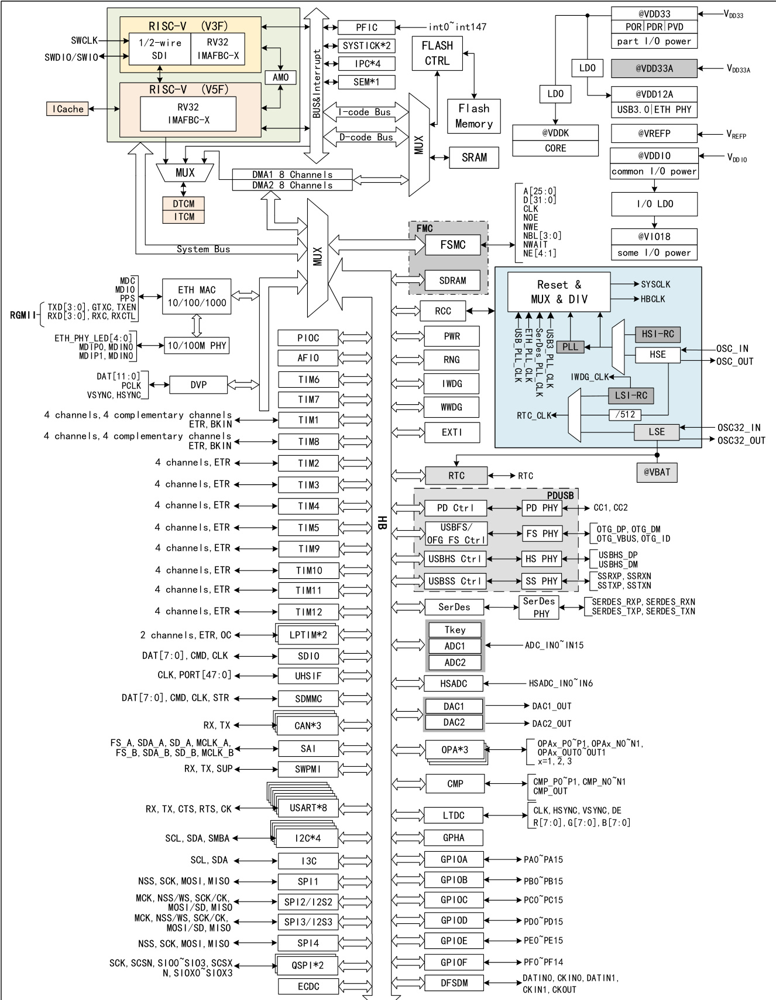  
图 1-1-1 CH32H417 系统框图

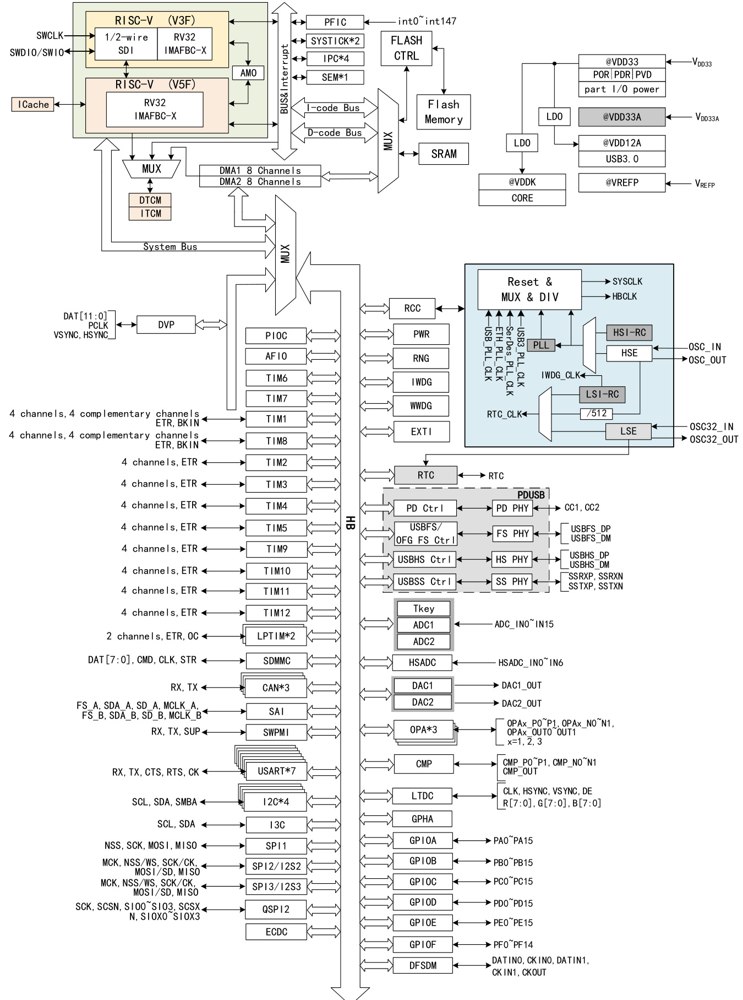  
图 1-1-2 CH32H416 系统框图

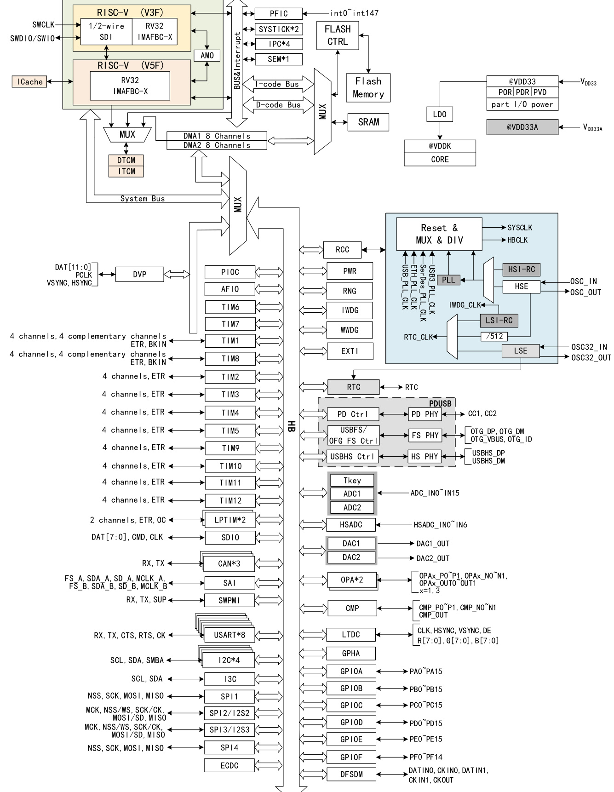  
图 1-1-3 CH32H415 系统框图

# 1.2 存储器映射表

图 1-2 存储器地址映射  

<html><body><table><tr><td rowspan="14">3000</td><td rowspan="14">bank2</td><td rowspan="14"></td><td rowspan="14"></td><td></td><td>0x4001 3800</td><td></td><td>0×50040000 0x4003</td><td></td><td>Reserved</td></tr><tr><td></td><td>0×4001 3400</td><td>TIM8</td><td></td><td>0×402 6000</td><td>UHSIF</td></tr><tr><td></td><td>0×4001</td><td>SPI1</td><td>0x4002</td><td>8000 0x4003 0x4003</td></tr><tr><td></td><td>0x4001</td><td>ADC2/TouckKey22</td><td>4000</td><td>USBSS</td></tr><tr><td>0x4001</td><td>2C00 2800</td><td></td><td>0000</td><td>USBHS</td></tr><tr><td>0x4001</td><td>2400</td><td>ADC1 'TouchKey1</td><td>A000</td><td>ETH PHY</td></tr><tr><td></td><td>1000</td><td>Reserved</td><td>8000</td><td>ETH</td></tr><tr><td>0×4001</td><td></td><td>Port Port</td><td>Reserved</td><td>SerDes</td></tr><tr><td></td><td>0x4001</td><td>1800 Port</td><td>0x4002</td><td>PI0C</td></tr><tr><td></td><td></td><td>0x4001</td><td>1400 Port</td><td>0x4002 5C00 0x4002</td><td></td></tr><tr><td></td><td>0x4001</td><td>1000</td><td></td><td>5800</td><td>DVP</td></tr><tr><td></td><td>0x4001</td><td>0C00</td><td>Port</td><td>0x4002 5400</td><td>FMC</td></tr><tr><td></td><td></td><td>0×4001 000</td><td>Port EXTI</td><td>0×40022 5000</td><td>QSPI2 QSPI1</td></tr><tr><td>0xFFFF</td><td></td><td>0x4001</td><td>0000 AFI0</td><td></td><td></td></tr><tr><td>0xE00</td><td>FFFF</td><td>0×4000</td><td></td><td>0×4002</td><td>4800 ReS</td></tr><tr><td></td><td>Reserved</td><td></td><td>800</td><td>0×4002</td><td>400000 SRNG</td></tr><tr><td></td><td></td><td>0x0</td><td></td><td></td><td></td></tr><tr><td></td><td>000</td><td></td><td>CAC</td><td></td><td>USReFS/rTG FS</td></tr><tr><td></td><td>SDRAM 0xD000 0000</td><td></td><td>PWR 7000</td><td>0×4002</td><td>CRC</td></tr><tr><td></td><td>0xC000</td><td>SDRAM bank1 NOR/PSRAM bank</td><td>0x4000 0×4000 680000</td><td>Reserved</td><td>3000 Reserved</td></tr><tr><td>0x1FFFFFFF</td><td></td><td>0000 Reserved</td><td></td><td>CAN2 CAN1</td><td>0×402 200000 Flash Interface Reserved</td></tr><tr><td></td><td></td><td></td><td>0x4000 0x4000</td><td>6400 share 512B SRAM</td><td>0×4002 1400 RCC</td></tr><tr><td>0x1FFFF900</td><td>Reserved</td><td>0000 MEM (QSPI1)</td><td>0x4000</td><td>6000 5C00 12C3</td><td>0x4002 1000 0×4002 OCOO Reserved</td></tr><tr><td></td><td>Option Bytes</td><td>0×0 00</td><td></td><td>12C2</td><td>DMAMUX</td></tr><tr><td>O×1F00</td><td>Vendor Bytes</td><td>NAND bank</td><td>0x00</td><td>USAR155</td><td>DMA12</td></tr><tr><td>0x1FFFE000</td><td>Reserved</td><td>MEM (QSPI2)</td><td></td><td></td><td></td></tr><tr><td></td><td></td><td>FSMC/PSRAM</td><td>0x4000 4C00</td><td>USART4</td><td>Reserved 0x4001 8400</td></tr><tr><td></td><td></td><td>bank SDRAM bank1</td><td>0x4000 4800</td><td>USART3 USART2</td><td>8000 SDI0 Reserved</td></tr><tr><td></td><td></td><td>Reserved</td><td>0×4000</td><td>40000</td><td>7800</td></tr><tr><td>0x1FFF 0000</td><td></td><td>0×500 10</td><td>0x4000</td><td>SP 3/123</td><td>0×4001 OPAOC</td></tr><tr><td></td><td>0x5004</td><td>PI0C_ RAM(4KB) 0000</td><td>0x4000 3800</td><td>3C00 SPI2/I2S2</td><td>0×4001 7400 DFSDM</td></tr><tr><td></td><td></td><td>Reserved</td><td>0x4000 3400</td><td>LPTIM2</td><td>0x4001 7000 ECDC 0×4001 6C00</td></tr><tr><td></td><td>Reserved</td><td></td><td>0x4000 3000</td><td>IWDG</td><td>GPHA 0x4001 6800</td></tr><tr><td></td><td></td><td>Peripherals</td><td>0x4000 2C00 2800</td><td>WWDG</td><td></td></tr><tr><td></td><td>0x4000</td><td></td><td>0x4000 2400</td><td>RTC LPTIM1</td><td>Reserved</td></tr><tr><td></td><td>0x2018</td><td>Reserved</td><td>0x4000 0x4000</td><td></td><td>0x4001 5C00</td></tr><tr><td>Code</td><td>FLASH 0x2010</td><td>Shared code and</td><td>0x4000</td><td>2000 USART7</td><td>0x4001 5800 TSA11 0x4001</td></tr><tr><td></td><td></td><td>0000 data area (512KB) DTCM(256KB)</td><td>0x4000</td><td>1C00 USART6</td><td>5400 TIM10</td></tr><tr><td>0×08000000</td><td>Aliased to</td><td>0×200C 0000 ITCM(128KB)</td><td>0x4000</td><td>1800 TIM7 1400</td><td>5000 TIM9</td></tr><tr><td>Flash</td><td>or system</td><td>0x200A0000 Reserved 0000</td><td></td><td>TIM6 1000</td><td>4C00 LTDC 4800</td></tr><tr><td></td><td>depending on</td><td></td><td></td><td>TIM5</td><td>I3C</td></tr><tr><td></td><td>B0OT pins</td><td>FLASH</td><td>0×4000</td><td>000 IM4</td><td>400000 I2C4</td></tr><tr><td>0x0000 0000</td><td></td><td>0000</td><td></td><td>TIM3</td><td>TIM12</td></tr><tr><td></td><td></td><td></td><td></td><td>0400</td><td>3C00</td></tr><tr><td></td><td></td><td></td><td></td><td></td><td>0x4001 0×4001</td></tr><tr><td></td><td></td><td></td><td></td><td></td><td></td></tr><tr><td></td><td></td><td>-0×0000</td><td>0x4000</td><td>TIM2</td><td></td></tr><tr><td></td><td></td><td></td><td></td><td></td><td></td></tr><tr><td></td><td></td><td></td><td></td><td></td><td></td></tr><tr><td></td><td></td><td></td><td></td><td></td><td></td></tr><tr><td></td><td></td><td></td><td></td><td></td><td>USART1</td></tr><tr><td></td><td></td><td></td><td></td><td></td><td></td></tr><tr><td></td><td></td><td></td><td></td><td></td><td></td></tr><tr><td></td><td></td><td></td><td></td><td></td><td></td></tr><tr><td></td><td></td><td></td><td></td><td></td><td></td></tr><tr><td></td><td></td><td></td><td></td><td></td><td></td></tr><tr><td></td><td></td><td></td><td></td><td></td><td></td></tr><tr><td></td><td></td><td></td><td></td><td></td><td></td></tr><tr><td></td><td></td><td></td><td></td><td></td><td></td></tr><tr><td></td><td></td><td></td><td></td><td></td><td></td></tr><tr><td></td><td></td><td></td><td>0×4000</td><td>0000</td><td>3800</td></tr><tr><td></td><td></td></table></body></html>

# 1.3 时钟树

系统中引入4 组时钟源： 内部高频RC 振荡器 （HSI）、 内部低频 RC 振荡器(LSI)、 外接高频振荡器(HSE)和外接低频振荡器(LSE)。

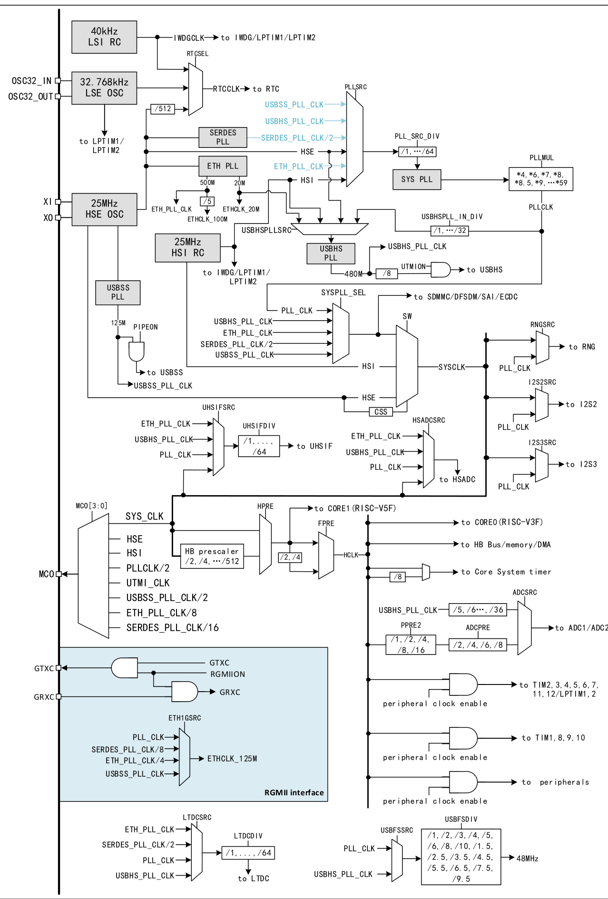  
图 1-3 时钟树框图

注： 上图中标蓝的部分仅适用于批号第五位大于0 的芯片。

# 1.4 功能概述

1.4.1 双内核： RISC-V5F 处理器和 RISC-V3F 处理器

芯片内部集成大小双内核结构： RISC-V5F （CORE1/内核 1）与 RISC-V3F （CORE0/内核 0）。 两个处理器均支持指令集RV32IMAFBC-X，内部以模块化管理，还包含快速可编程中断控制器PFIC、内存保护、分支预测模式、 扩展指令支持等单元。 对外多组总线与外部单元模块相连， 实现外部功能模块和内核的交互。

处理器以其极简指令集、多种工作模式、 模块化定制扩展等特点可以灵活应用不同场景微控制器设计，例如小面积低功耗嵌入式场景、 高性能应用操作系统场景等。

RISC-V5F 处理器：

$\bullet$ 乱序多发架构  
$\bullet$ 内置 32KB 的指令缓存  
$\bullet$ 高主频， 高性能， 侧重于运算  
$\bullet$ 提供一个不可屏蔽中断NMI  
$\bullet$ 4 通道物理内存保护 （PMP）  
$\bullet$ 4 通道硬件断点  
$\bullet$ 8 级中断嵌套  
$\bullet$ 快速可编程中断控制器 （PFIC）  
$\bullet$ 自定义扩展指令  
$\bullet$ 硬件压栈  
RISC-V3F 处理器：  
$\bullet$ 顺序单发架构  
$\bullet$ 3 级流水线  
$\bullet$ 低主频， 低功耗， 侧重于控制  
$\bullet$ 提供一个不可屏蔽中断 NMI  
$\bullet$ 4 通道物理内存保护 （PMP）  
$\bullet$ 4 通道硬件断点  
$\bullet$ 2 级中断嵌套  
$\bullet$ 快速可编程中断控制器 （PFIC）  
$\bullet$ 自定义扩展指令  
$\bullet$ 硬件压栈

1.4.2 片上存储器

内置总容量 896K 字节的 SRAM， 部分用于数据区， 部分用于零等待代码区， 掉电后数据丢失。 上述 SRAM 分为 3 块： 128KB 的 ITCM 内核1 紧耦合零等待代码区、 256KB 的 DTCM 内核 1 紧耦合零等待数据区、 剩余的512KB 共享代码和数据区。 另外， 内核1 还有32KB 的高速指令缓存区。

512KB 共享区可配置为RISC-V3F 的零等待代码区和数据区， 建议以128KB 为单位根据需要灵活分配。

作为选项，128KB 的 ITCM 和 256KB 的 DTCM 合计 384KB 均可以配置为 RISC-V5F 的代码区，其中 DTCM作为代码区在发生跳转时会增加 个时钟等待。

RISC-V3F 可以按 HCLK 时钟 2 个等待访问 ITCM 或 DTCM。

RISC-V5F 和 RISC-V3F 可以按 HCLK 时钟零等待访问 512KB 共享区。

内置256 字节系统非易失配置信息存储区， 用于厂商配置字存储， 出厂前固化， 用户不可修改。

内置 256 字节用户自定义信息存储区， 用于用户选择字存储。

用户区和 BOOT 区大小通过 R32_FLASH CFGR0 寄存器的 DBMODE 位读取：

当 DBMODE $= 1$ 时： 内置 960K 字节非零等待的程序闪存存储区 （Code LASH）， 即用户区， 用于用户的应用程序和常量数据存储， 等效频率约 25MHz。 内置最大56K 字节系统存储区 （System FLASH），即 BOOT 区， 用于系统引导程序存储， 内置自举加载程序。

当 ${ \mathsf { D B M O D E } } = 0$ 时： 内置480K 字节非零等待的程序闪存存储区 （Code LASH）， 即用户区， 用于用户的应用程序和常量数据存储， 等效频率约12.5MHz。内置最大28K 字节系统存储区 （System LASH），即 BOOT 区， 用于系统引导程序存储， 内置自举加载程序。

# 1.4.3 供电方案

（1） CH32H417

$\mathsf { V } _ { \mathsf { 0 0 3 3 } } = 2 . 4 { \sim } 3 . 6 \mathsf { V }$ ： 为部分I/O 引脚和系统电压调节器 LDO 供电， 包括内置的 USB 2.0、 以太网 $\mathsf { P H Y }$ ， 同时， $\mathsf { V } _ { \mathsf { D D 3 3 } }$ 通过向内置的系统电压调节器LDO 供电并在 $\mathsf { V } _ { \mathsf { D D } 1 2 \mathsf { A } }$ 和 $\mathsf { V } _ { \mathsf { D D K } }$ 引脚上输出稳压电源， 建议各外接0.1uF 的高频电容， 主 $\mathsf { V } _ { \mathsf { D D 3 3 } }$ （与以太网信号引脚相邻） 还需再并联至少10uF 电容。 当用于 USB2.0 或者以太网时， $\mathsf { V } _ { \mathsf { D D 3 3 } }$ 范围建议为 $3 . 1 5 { \sim } 3 . 4 5 \mathsf { V }$ 。 当使用调压器为低功耗模式的停止模式或 $V _ { 1 0 1 8 }$ 由低压切换到高压时， $\mathsf { V } _ { \mathsf { D D 3 3 } }$ 不能低于 $2 . 7 \mathsf { V }$ 。

$\mathsf { V } _ { \tt D D 3 3 A } = \mathrm { ~ 1 ~ . ~ } 8 { \sim } 3 . 6 \mathsf { V }$ ： 为 ADC、 温度传感器、 HSADC、 OPA、 CMP、 DAC 及 PLL 的模拟部分供电，建议外接 0.1uF 容量的高频电容。使用OPA 或DAC 时， $\mathsf { V } _ { \mathsf { D D 3 3 A } }$ 与 $V _ { \mathsf { D D } 1 0 }$ 建议为相同电压；不使用OPA 或DAC时， $\mathsf { V } _ { \mathsf { D D 3 3 A } }$ 可以高于 $V _ { \mathsf { D D } 1 0 }$ 电压。 使用 HSADC 时， $\mathsf { V } _ { \mathsf { D D 3 3 A } }$ 建议不低于 3.0V， 使用 ADC 和 DAC 时， $\mathsf { V } _ { \mathsf { D D 3 3 A } }$ 建议不低于 2.4V。

$\mathsf { V } _ { \mathsf { D D 1 2 A } } = 1 . 1 7 { \sim } 1 . 2 7 \mathsf { v }$ ： 为内置的 USB .0 模块和 ETH HY 模块供电， 建议外接 0.1uF 并联 2.2uF容量的高频电容。 正常工作时， $V _ {tt D D 1 2 A }$ 电压由 $\mathsf { V } _ { \mathsf { D D 3 3 } }$ 供电的系统电压调节器 LDO 产生。 为减少芯片 LDO 导致的自身发热， 可选外供此电源 （可由外部DC-DC 产生）， 外供电压建议略高于内部LDO 输出电压值。

$\mathsf { V } _ { \mathsf { 0 0 1 0 } } = \mathrm { ~ 1 ~ . ~ } 6 5 \substack { \sim 3 . 6 \mathsf { V } }$ ： 为部分常规 I/O 引脚供电， 决定了引脚输出高压幅值， 同时， $V _ { \mathsf { D D } 1 0 }$ 通过向内置的 $1 / 0$ 引脚LDO 调节器供电在 $\mathsf { V } _ { 1 0 1 8 }$ 引脚上输出稳压电源，建议各外接0.1uF 的高频电容，主 $V _ { \mathsf { D D } 1 0 }$ （与 $V _ { 1 0 1 8 }$ 相邻） 还需再并联至少 10uF 电容。 当 $V _ { 1 0 1 8 }$ 由低压切换到高压时， VDDIO引脚电容须远大于 $V _ { 1 0 1 8 }$ 引脚的累计电容量， 以减缓 $V _ { 1 0 1 8 }$ 升压瞬间， $V _ { \mathsf { D D } 1 0 }$ 的电压跌落。 $V _ { \mathsf { D D I 0 } }$ 电压不能高于 $\mathsf { V } _ { \mathsf { D D 3 3 } }$ 电压， $V _ { \mathsf { D D I 0 } }$ 电压也不能高于 $\mathsf { V } _ { \mathsf { D D 3 3 A } }$ 电压。

$\mathsf { V } _ { 1 0 1 8 } = 1 . 1 \sim 3 . 6 \mathsf { V }$ ： 为部分高速I/O 引脚供电，决定了引脚输出高压幅值， 建议各外接 0.1uF的高频电容，主 $\forall _ { 1 0 1 8 }$ （与 $V _ { \mathsf { D D } 1 0 }$ 相邻） 还需再并联2.2uF 电容。正常工作时， $V _ { 1 0 1 8 }$ 电压由 $V _ { \mathsf { D D } 1 0 }$ 供电的 $1 / 0$ 引脚LDO 调节器产生，并可以用软件动态配置为1.2V、1.8V、2.5V、3.3V 或关闭；上电后 $\mathsf { V } _ { 1 0 1 8 }$ 的默认电压可以由XO 引脚外部连接的下拉电阻选择，参考表3-2；无需支持低压时， $\textsf { V } _ { 1 0 1 8 }$ 可以固定短接到 $V _ { 0 0 1 0 \text{‰} }$

$\mathsf { V } _ { \mathsf { R E F P } } = 2 . 4 { \sim } 3 . 6 \mathsf { V }$ ： 用于 ADC、 HSADC、 DAC 的参考电压， 建议外接 0.1uF 容量的高频电容。$V _ { R E F P }$ 不得高于 $\mathsf { V } _ { \mathsf { D D 3 3 A } }$ 电压。

$\mathsf { V } _ { \mathtt { B A T } } = \mathrm { \Omega } 1 . 8 \sim 3 . 6 \mathsf { V }$ ： 可选的备用电源， 当关闭 $\mathsf { V } _ { \mathsf { D D 3 3 } }$ 和 $\mathsf { V } _ { \mathsf { D D 3 3 A } }$ 时， 内部电源切换器将 $\mathsf { V } _ { \mathsf { B A T } }$ 切换用于单独为RTC、 外部低频振荡器供电。

$\mathsf { V } _ { \mathsf { 0 0 K } } = 1 . 1 7 { \sim } 1 . 2 7 \mathsf { V }$ ： 为内核电路供电， 建议各外接 0.1uF 的高频电容， 主 $V _ { \tt D D K }$ （与 $\mathsf { V } _ { \mathsf { D D 3 3 } }$ 相邻）还需再并联 2.2uF 电容。 正常工作时， $v _ { \tt D D K }$ 电压由 $\mathsf { V } _ { \mathsf { D D 3 3 } }$ 供电的系统电压调节器 LDO 产生。 为减少芯片LDO 导致的自身发热， 可选外供此电源 （可由外部DC-DC 产生）， 外供电压建议略高于内部LDO 输出电压值。

以上同名电源引脚必须短接， 电压关系： $V _ { \tt D D 3 3 } \geq V _ { \tt D D 3 3 A } \geq V _ { \tt D D 1 0 } \geq V _ { \tt I 0 1 8 }$ ； 并且 $\mathsf { V } _ { \mathsf { D D 3 3 A } } \mathrm { ~ \geqslant ~ } \mathsf { V } _ { \mathsf { R E F P } }$

（2） CH32H416

$\mathsf { V } _ { \tt D B 3 3 } = 2 . 4 \sim 3 . 6 \mathsf { V }$ ：为I/O 引脚和系统电压调节器LDO 供电， 包括内置的 USB .0， 同时， $\mathsf { V } _ { \mathsf { D D 3 3 } }$ 通过向内置的系统电压调节器 LDO 供电并在 $V _ {tt D D 1 2 A }$ 和 $\mathsf { V } _ { \mathsf { D D K } }$ 引脚上输出稳压电源， 建议各外接 0.1uF 的高频电容，主 $\mathsf { V } _ { \mathsf { D D 3 3 } }$ （与 $\mathsf { V } _ { \mathsf { D D K } }$ 引脚相邻） 还需再并联至少 10uF 电容。 当用于 USB 2.0 时， $\mathsf { V } _ { \mathsf { D D 3 3 } }$ 范围建议为$3 . 1 5 { \sim } 3 . 4 5 \mathsf { V }$ 。 当使用调压器为低功耗模式的停止模式时， $\mathsf { V } _ { \mathsf { D } \mathsf { D } 3 3 }$ 不能低于2.7V。

$\mathsf { V } _ { \tt D D 3 3 A } = \mathrm { \Omega } 1 . 8 \sim 3 . 6 \mathsf { V }$ ： 为 ADC、 温度传感器、 HSADC、 OPA、 CMP、 DAC 及 PLL 的模拟部分供电，建议外接0.1uF 容量的高频电容。 使用 HSADC 时， $\mathsf { V } _ { \mathsf { D D 3 3 A } }$ 建议不低于3.0V， 使用 ADC 和 DAC 时， $\mathsf { V } _ { \mathsf { D D 3 3 A } }$ 建议不低于2.4V。

$\mathsf { V } _ { \mathsf { D D 1 2 A } } = \mathrm { \Omega } 1 . \mathrm { \Omega } 1 7 { \sim } 1 . \mathrm { \Omega } 2 7 \mathsf { v }$ ： 为内置的 USB 3.0 模块供电， 建议外接 0.1uF 并联 2.2uF 容量的高频电容。 正常工作时， $V _ {tt D D 1 2 A }$ 电压由 $\mathsf { V } _ { \mathsf { D D 3 3 } }$ 供电的系统电压调节器 LDO 产生。为减少芯片 LDO 导致的自身发热， 可选外供此电源 （可由外部DC-DC 产生）， 外供电压建议略高于内部LDO 输出电压值。

$\mathsf { V } _ { \mathsf { R E F P } } = 2 . 4 { \sim } 3 . 6 \mathsf { V }$ ： 用于 ADC、 HSADC、 DAC 的参考电压， 建议外接 0.1uF 容量的高频电容。$V _ { R E F P }$ 不得高于 $\mathsf { V } _ { \mathsf { D D 3 3 A } }$ 电压。

$\mathsf { V } _ { \mathsf { 0 0 K } } = 1 . 1 7 { \sim } 1 . 2 7 \mathsf { V }$ ： 为内核电路供电， 建议外接0.1uF 并联2.2uF 容量的高频电容。 正常工作时， $\mathsf { V } _ { \mathsf { D D K } }$ 电压由 $\mathsf { V } _ { \mathsf { D D 3 3 } }$ 供电的系统电压调节器LDO 产生。为减少芯片LDO 导致的自身发热， 可选外供此电源 （可由外部DC-DC 产生）， 外供电压建议略高于内部LDO 输出电压值。

以上同名电源引脚必须短接， 电压关系： $\mathsf { V } _ { \mathsf { D } \mathsf { D } 3 3 } = \mathsf { V } _ { \mathsf { D } \mathsf { D } 3 3 \mathsf { A } }$ 并且 $V _ { \tt D B 3 A } \geqslant V _ { \tt R E F P }$

（3） CH32H415

$\mathsf { V } _ { \tt D B 3 3 } = 2 . 4 \sim 3 . 6 \mathsf { V }$ ：为I/O 引脚和系统电压调节器LDO 供电， 包括内置的 USB .0， 同时， VDD33通过向内置的系统电压调节器LDO 供电并在 $\mathsf { V } _ { \mathsf { D D K } }$ 引脚上输出稳压电源，建议各外接0.1uF 的高频电容，主 $\mathsf { V } _ { \mathsf { D D 3 3 } }$ （与 $V _ { \tt D D K }$ 引脚相邻）还需再并联至少4.7uF 电容。当用于USB 2.0 时， $\mathsf { V } _ { \mathsf { D D 3 3 } }$ 范围建议为 $3 . 1 5 { \sim } 3 . 4 5 \mathsf { V }$ 。当使用调压器为低功耗模式的停止模式时， $\mathsf { V } _ { \mathsf { D D 3 3 } }$ 不能低于2.7V。

$\mathsf { V } _ { \tt D D 3 3 A } = \mathrm { ~ 1 ~ . ~ } 8 { \sim } 3 . 6 \mathsf { V }$ ： 为 ADC、 温度传感器、 HSADC、 OPA、 CMP、 DAC 及 PLL 的模拟部分供电，建议外接0.1uF 容量的高频电容。 使用 HSADC 时， $\mathsf { V } _ { \mathsf { D D 3 3 A } }$ 建议不低于3.0V， 使用 ADC 和 DAC 时， $\mathsf { V } _ { \mathsf { D D 3 3 A } }$ 建议不低于2.4V。

$\mathsf { V } _ { \mathsf { 0 0 K } } = 1 . 1 7 { \sim } 1 . 2 7 \mathsf { V }$ ： 为内核电路供电， 建议外接0.1uF 并联2.2uF 容量的高频电容。 正常工作时， $\mathsf { V } _ { \mathsf { D D K } }$ 电压由 $\mathsf { V } _ { \mathsf { D D 3 3 } }$ 供电的系统电压调节器LDO 产生。为减少芯片LDO 导致的自身发热， 可选外供此电源 （可由外部DC-DC 产生）， 外供电压建议略高于内部LDO 输出电压值。

以上同名电源引脚必须短接， 电压关系： $\mathsf { V } _ { \mathsf { D D 3 3 } } = \mathsf { V } _ { \mathsf { D D 3 3 A } }$ 。

# 1.4.4 供电监控器

芯片内部集成了上电复位(POR)/掉电复位(PDR)电路， 该电路始终处于工作状态； 当 $\mathsf { V } _ { \mathsf { D D 3 3 } }$ 低于设定的阈值(VPOR/PDR)时， 置器件于复位状态， 而不必使用外部复位电路。

另外系统设有一个可编程的电压监测器 （PVD）， 需要通过软件开启， 用于比较 $\mathsf { V } _ { \mathsf { D D 3 3 } }$ 供电与设定的阈值 $v _ { p v _ { \mathsf { D } } }$ 的电压大小。 关于 $V _ { P O R / P D R }$ 和 $V _ { \mathsf { P V D } }$ 的值参考第3 章。

# 1.4.5 系统电压调节器LDO

复位后， 系统电压调节器自动开启， 根据应用方式有两种操作模式。

$\bullet$ 正常模式： 正常的运行操作， 提供稳定的内核电源。$\bullet$ 低功耗模式： 配置位 $\mathsf { L P D S } = 1$ 且CPU 进入停止模式后， 调压器可进入低功耗模式， 此时内核电压适当降低。

# 1.4.6 低功耗模式

系统支持两种低功耗模式， 可以针对低功耗、 短启动时间和多种唤醒事件等条件下选择达到最佳的平衡。

$\bullet$ 睡眠模式 （SLEEP）

在睡眠模式下， 只有CPU 时钟停止， 但所有外设时钟供电正常， 外设处于工作状态。 此模式是最浅低功耗模式， 但可以达到最快唤醒。

退出条件： 任意中断或唤醒事件。

$\bullet$ 停止模式 （STOP）

停止模式是在内核 V3F 和 V5F 均进入深睡眠 （SLEEPDEEP） 的基础上结合了外设的时钟控制机制。

V3F 和 V5F 均进入此模式： 高频时钟 （HSE/HSI/PLL） 域被关闭， SRAM 和寄存器内容保持， I/O 引脚状态保持。 该模式唤醒后系统可以继续运行， HSI 为默认系统时钟。

可通过配置位 $\mathsf { L P D S } = \mathrm { \Omega } 1$ 使调压器 LDO 由正常模式进入低功耗模式， 从而达到更低功耗的状态。

退出条件： 任意唤醒事件 （EXTI 信号）、 RST 上的外部复位信号和 IWDG 复位。 其中， EXTI 信号包括95 个外部I/O 口之一、 RTC 闹钟、 SWPMI 唤醒信号、 LPTIM 唤醒信号、I3C 唤醒信号、 USART 唤醒信号、 USBPD 唤醒信号、 以太网唤醒信号、 USBFS 唤醒信号以及 USBHS 唤醒信号等。

# 1.4.7 CRC （循环冗余校验） 计算单元

CRC（循环冗余校验） 计算单元使用一个固定的多项式发生器，从一个32 位的数据字产生一个CRC码。在众多的应用中，基于CRC 的技术被用于验证数据传输或存储的一致性。在EN/IEC 60335-1 标准的范围内，提供了一种检测闪存存储器错误的手段， CRC 计算单元可以用于实时地计算软件的签名，并与在链接和生成该软件时产生的签名对比。

# 1.4.8 快速可编程中断控制器 （PFIC）

芯片内置快速可编程中断控制器 （PFIC），最多支持256 个中断向量，以最小的中断延迟提供了灵活的中断管理功能。芯片中两个内核各自管理32 个内核私有中断，并共享管理其他中断。可通过PFIC的配置寄存器，对117 个外设中断源进行分配。 共享中断源只能向分配的内核产生中断请求。

$\bullet$ 支持硬件中断堆栈(HPE)， 无需指令开销  
$\bullet$ 提供 4 路免表中断(VTF)  
$\bullet$ 向量表支持地址或指令模式  
$\bullet$ 内核RISC-V3F 最高支持可配置的2 级中断嵌套  
$\bullet$ 内核RISC-V5F 最高支持可配置的8 级中断嵌套  
$\bullet$ 支持低功耗睡眠和唤醒管理

# 1.4.9 外部中断/事件控制器 （EXTI）

外部中断/事件控制器总共包含27 个边沿检测器，用于产生中断/事件请求。每个中断线都可以独立地配置其触发事件（上升沿或下降沿或双边沿），并能够单独地被屏蔽；挂起寄存器维持所有中断请求状态。EXTI 可以检测到脉冲宽度小于内部HB 的时钟周期。多达95 个通用I/O 口都可选择连接到16个外部中断线。

# 1.4.10 通用 DMA 控制器

芯片内置2 组通用DMA 控制器， 总共管理16 个通道， 其中 DMA1 包含8 个通道， DMA2 包含 8 个通道。能灵活处理存储器到存储器、外设到存储器和存储器到外设间的高速数据传输，支持环形缓冲区方式。支持外设与 DMA 之间重新配置 DMA 请求线，并支持软件触发； 通过配置相关寄存器， DMA 的每个通道可选择支持相关外设的请求； 可配置访问优先权、 传输长度、传输的源地址和目标地址等。

DMA 用于主要的外设包括： 通用/高级/基本定时器TIMx、 ADC、 DAC、 I2S、 USART、 I2C、 SPI、 SDIO、SAI、 DFSDM、 SWPMI、 I3C、 QSPI、 FMC。

注： DMA1、 DMA2 和 CPU 经过仲裁器仲裁之后对系统 SRAM 进行访问。

# 1.4.11 时钟和启动

系统时钟源HSI 默认开启， 在没有配置时钟或者复位后，内部25MHz 的RC 振荡器作为默认的CPU时钟， 随后可以另外选择外部 $2 5 M H z$ 时钟或PLL 时钟。 当打开时钟安全模式后， 如果HSE 用作系统时钟（直接或间接），此时检测到外部时钟失效，系统时钟将自动切换到内部RC 振荡器，同时HSE 和PLL自动关闭；对于关闭时钟的低功耗模式，唤醒后系统也将自动地切换到内部的RC 振荡器。 如果使能了时钟中断， 软件可以接收到相应的中断。

# 1.4.12 RTC （实时时钟）

RTC 在系统内部处于后备供电区域， 在 $\mathsf { V } _ { \mathsf { D D 3 3 } }$ 有效时由 $\mathsf { V } _ { \mathsf { D D 3 3 } }$ 供电， 在 $\mathsf { V } _ { \mathsf { D D 3 3 } }$ 无效时内部自动切换到由

$V _ { \tt B A T }$ 引脚供电。

RTC 实时时钟是一组32 位可编程计数器， 时基支持20 位预分频， 用于较长时间段的测量。 时钟基准来源高速的外部时钟512 分频 （HSE/512）、外部晶体低频振荡器 （LSE）或内部低功耗RC 振荡器（LSI）。其中LSE 也存在后备供电区域， 所以， 当选择 LSE 做 RTC 时基时， 系统复位或从停止模式唤醒后， RTC 的设置和时间能够保持不变。

# 1.4.13 ADC （模拟/数字转换器） 和触摸按键电容检测 （TouchKey）

芯片内置2 个12 位的模拟/数字转换器 （ADC）， 共用多达16 个外部通道和2 个内部通道采样，其采样速率可达 5Msps，提供可编程的通道采样时间， 可以实现单次、连续、扫描或间断转换，且支持双ADC 转换模式。提供模拟看门狗功能允许非常精准地监控一路或多路选中的通道，用于监测通道信号电压。支持外部事件触发转换，触发源包括片上定时器的内部信号和外部引脚。支持使用DMA 操作。

ADC 内部通道分别是 ADC IN16～ADC IN17。 温度传感器被连接到 IN16 输入通道上；内部参考电压VREFINT 被连接到 IN17 输入通道上。

触摸按键电容检测单元， 提供了多达 16 个检测通道， 复用 ADC 模块的外部通道。 检测结果通过ADC 模块转换输出结果， 通过软件计算识别触摸按键状态。

# 1.4.14 HSADC （高速模拟/数字转换器）

芯片内置1 个10 位的高速模拟/数字转换器 （HSADC）， 提供多达7 个外部通道采样， 其采样速率高达 20Msps， 可以实现连续转换， 支持使用 DMA 操作。

# 1.4.15 DAC （数字/模拟转换器）

芯片内置2 个12 位电压输出数字/模拟转换器 （DAC）， 转换2 路数字信号为2 路模拟电压信号并输出，支持双DAC 通道独立或同步转换，支持12 位数据左对齐或右对齐，支持12 位或8 位数据，支持外部事件触发转换。 可实现三角波、 噪声生成。 支持DMA 功能。

# 1.4.16 定时器及看门狗

系统中的定时器包括高级定时器、 通用定时器、 基本定时器、看门狗定时器以及系统时基定时器，具体参考表1-1。

表 1-1 定时器比较  

<html><body><table><tr><td colspan="2">定时器</td><td>分辨率</td><td>计数类型</td><td>时基</td><td>DMA</td><td>功能作用</td></tr><tr><td rowspan="2">高级 定时器</td><td>TIM1</td><td rowspan="2">16位</td><td rowspan="2">向上 向下 向上/下</td><td rowspan="2">16位分频器</td><td rowspan="2">支持</td><td rowspan="2">PWM互补输出， 单脉冲输出 输入捕获 输出比较</td></tr><tr><td>TIM8</td></tr><tr><td rowspan="6">通用 定时器</td><td>TIM2</td><td rowspan="2">16位</td><td rowspan="2">向上 向下 向上/下</td><td rowspan="2">16位分频器</td><td rowspan="2">支持</td><td rowspan="2">定时计数 PWM生成， 单脉冲输出</td></tr><tr><td>TIM3</td></tr><tr><td>TIM4</td><td rowspan="3"></td><td rowspan="3"></td><td rowspan="3"></td><td rowspan="3">输入捕获 输出比较 定时计数 PWM生成， 单脉冲输出</td><td rowspan="3"></td></tr><tr><td></td></tr><tr><td>TIM5 TIM9</td></tr><tr><td>TIM10</td><td rowspan="3">32位</td><td rowspan="3">向上 向下 向上/下</td><td rowspan="3">32位分频器</td><td rowspan="3">支持</td><td rowspan="3">输入捕获 输出比较 定时计数</td></tr><tr><td>TIM11</td></tr><tr><td>TIM12</td></tr><tr><td>基本 定时器</td><td>TIM6 TIM7</td><td>16位</td><td>向上</td><td>16位分频器</td><td>支持</td><td>定时计数</td></tr><tr><td>低功耗</td><td>LPTIM1</td><td>16位</td><td>向上</td><td>3位分频器</td><td>不支持</td><td>定时计数</td></tr></table></body></html>

<html><body><table><tr><td>定时器</td><td>LPTIM2</td><td></td><td></td><td></td><td></td><td></td></tr><tr><td colspan="2">窗口看门狗</td><td>7位</td><td>向下</td><td>4种分频</td><td>不支持</td><td>定时 复位系统 （正常工作）</td></tr><tr><td colspan="2">独立看门狗</td><td>12位</td><td>向下</td><td>7种分频</td><td>不支持</td><td>定时 复位系统 （正常+低功耗工作）</td></tr><tr><td colspan="2">系统时基定时器</td><td>32位</td><td>向上或下</td><td>SYSCLK或 SYSCLK/8</td><td>不支持</td><td>定时</td></tr><tr><td colspan="2">系统时基定时器</td><td>32位</td><td>向上或下</td><td>SYSCLK或 SYSCLK/8</td><td>不支持</td><td>定时</td></tr></table></body></html>

$\bullet$ 高级定时器 （TIM1/8）

高级定时器模块包含是2 个16 位的自动装载递加/递减计数器 （TIM1 和 TIM8）， 具有16 位可编程的预分频器。除了完整的通用定时器功能外， 可以被看成是分配到6 个通道的三相PWM 发生器，具有带死区插入的互补PWM 输出功能，允许在指定数目的计数器周期之后更新定时器进行重复计数周期，刹车功能等。高级定时器的很多功能都与通用定时器相同，内部结构也相同， 因此高级定时器可以通过定时器链接功能与其他TIM 定时器协同操作， 提供同步或事件链接功能。

# $\bullet$ 通用定时器 （TIM2/3/4/5/9/10/11/12）

通用定时器模块包含4 个16 位可自动重装的定时器 （TIM2、TIM3、TIM4 和 TIM5）和 4 个 32 位可自动重装的定时器 （TIM9、TIM10、TIM11 和TIM12），用于测量脉冲宽度或者产生特定频率的脉冲、PWM波等。 可用于自动化控制、 电源等领域。

$\lceil 1 \rceil 1 2 / 3 / 4 / 5 / 9 / 1 0 / 1 1 / 1 2$ 均具有4 个独立的通道，每个通道都支持输入捕获、输出比较、PWM 生成和单脉冲模式输出。 还能通过定时器链接功能与高级定时器共同工作，提供同步或事件链接功能。在调试模式下，计数器可以被冻结，同时PWM 输出被禁止，从而切断由这些输出所控制的开关。 任意通用定时器都能用于产生 PWM 输出。 每个定时器都有独立的 DMA 请求机制。

$\bullet$ 基本定时器 （TIM6/7）

基本定时器模块包含2 个16 位可自动重装的定时器 （TIM6 和TIM7），用于计数和在更新事件产生中断或 DMA 请求。 TIM6 和 TIM7 支持 16 位可编程预分频器。 可以为数模转换 （DAC） 提供时钟，触发DAC 的同步电路。 基本定时器之间是互相独立的， 互不共享任何资源。

# $\bullet$ 低功耗定时器 （LPTIM1/LPTIM2）

LPTIM 为16 位上行计数的定时器，具有3 位可编程的预分频器，支持8 种分频系数（1、2、4、8、16、32、64、128）。支持连续/单触发模式， 可选择软件或者硬件输入触发，支持PWM 输出， 支持 I/O极性可配置。

LPTIM 具有多种可选的时钟源， 内部时钟源为 LSE、LSI、 HSI 或 PB1 时钟， 外部时钟源为 LPTIM输入上的外部时钟。 LPTIM 在没有内部时钟源的情况下也能运行， 依此可以将 LPTIM 当作 “脉冲计数器”使用。除此之外，LPTIM 还能将系统从低功耗模式唤醒， 所以LPTIM 很适合以极低的功耗实现 “超时功能”

$\bullet$ 独立看门狗 （IWDG）

独立看门狗是一个自由运行的12 位递减计数器， 支持7 种分频系数。由一个内部独立的约 $4 0 k \mathsf { H } z$ 的RC 振荡器 （LSI）提供时钟；因为LSI 独立于主时钟，所以可运行于停止模式。IWDG 在主程序之外，可以完全独立工作， 因此， 用于在发生问题时复位整个系统， 或作为一个自由定时器为应用程序提供超时管理。 通过选项字节可以配置成是软件或硬件启动看门狗。 在调试模式下，计数器可以被冻结。

$\bullet$ 窗口看门狗 （WWDG）

窗口看门狗是一个7 位的递减计数器， 并可以设置成自由运行。 可以被用于在发生问题时复位整个系统。 其由主时钟驱动， 具有早期预警中断功能； 在调试模式下， 计数器可以被冻结。

$\bullet$ 系统时基定时器 （SysTick）

系统提供2 个32 位递增/递减的计数器， 用于产生 SYSTICK 异常， 可专用于实时操作系统， 为系统提供 “心跳” 节律， 也可当成2 个标准的32 位计数器。 具有自动重加载功能及可编程的时钟源。

# 1.4.17 通用同步/异步收发器 （USART）

芯片内置8 组通用同步/异步收发器 （USART1/2/3/4/5/6/7/8）。 支持全双工异步串口通信以及半双工单线通信， 也支持 LIN(局部互连网)，兼容 IrDA SIR ENDEC 传输编解码规范， 以及调制解调器(CTS/RTS 硬件流控)操作， 还支持多处理器通信。 其采用分数波特率发生器系统， 支持 DMA 操作连续通讯。

# 1.4.18 串行外设接口 （SPI）

芯片内置4 组串行外设SPI 接口 （SPI1/2/3/4）， 支持主或从操作， 动态切换。 支持多主模式， 全双工或半双工同步传输， 支持基本的 SD 卡和 MMC 模式。 可编程的时钟极性和相位， 数据位宽提供 8或16 位选择， 可靠通信的硬件CRC 产生/校验， 支持DMA 操作连续通讯。

# 1.4.19 I2S （音频） 接口

最高 2 组标准的 I2S 接口 （与 SPI2 和 SPI3 复用） 工作于主或从模式。 软件可配置为 16/24/32位数据包传输帧， 支持音频采样频率从 8kHz 到 $5 6 2 . 2 \mathsf { k H z }$ ， 支持 4 种音频标准。在主模式下， 其主时钟可以以固定的256 倍音频采样频率输出到外部的DAC 或CODEC （解码器）， 支持 DMA。

# 1.4.20 QSPI 接口

芯片内置两组专用的QSPI 通信接口 （QuadSPI）， 连接单、 双或四 （条数据线） SPI 的 FLASH 存储介质。 主要特性为：

$\bullet$ 三种功能模式： 间接模式、 状态轮询模式和内存映射模式  
$\bullet$ 双闪存模式， 通过并行访问两个FLASH  
$\bullet$ 集成 FIFO， 用于发送和接收  
$\bullet$ 支持 SDR 模式  
$\bullet$ 针对间接模式和内存映射模式， 完全可编程帧格式  
$\bullet$ 针对间接模式和内存映射模式， 完全可编程操作码  
$\bullet$ 在达到FIFO 阈值和传输完成时生成DMA 触发信号  
$\bullet$ 在达到FIFO 阈值、 超时、操作完成以及发生访问错误时产生中断

1.4.21 I2C 总线

芯片内置多达4 个I2C 总线接口， 能够工作于多主机模式或从模式， 完成所有 I2C 总线特定的时序、协议、仲裁等。支持标准和快速两种通讯速度， 同时与 SMBus2.0 兼容。

I2C 接口提供7 位或10 位寻址， 并且在7 位从模式时支持双从地址寻址。 内置了硬件CRC 发生器/校验器。 可以使用 DMA 操作并支持 SMBus 总线 2.0 版/PMBus 总线。

# 1.4.22 I3C 总线

I3C 总线是一种双线制串行单端多分支总线， 旨在对传统的 I2C 总线进行改进。I3C 接口负责处理本设备与连接在I3C 总线上的其他设备之间的通信。 它本身支持作为主设备和从设备， 当作为控制器时， 能够增强 I2C 接口的功能， 同时保持一定程度的向后兼容性。 主要特性包括：

$\bullet$ 支持主设备和从设备  
$\bullet$ 支持 MIPI I3C 规范 v1.1  
$\bullet$ 支持多主机功能  
$\bullet$ 支持 DMA  
$\bullet$ 支持带内中断 （IBI） 功能  
$\bullet$ 内置错误检测和恢复  
$\bullet$ I3C SCL 总线时钟最高可达 $1 2 . 5 M H z$   
$\bullet$ 支持动态分配地址， 直接和广播通用命令代码 （CCC） 和私有读写传输

1.4.23 USB PD 及 Type-C 控制器 （USB PD）

内置 USB Power Delivery 控制器和PD 物理层收发器PHY， 支持 USB Type-C 主从检测， 自动 BMC编解码和CRC， CC 引脚支持硬件边沿控制。

支持 USB PD2.0 和 PD3. 0 以及 PD3.2 电力传送， 支持 SPR 和 EPR， 支持 100W 或 240W 快充， 支持PD 受电端 Sink 和 PD 供电端 Source 以及 DRP 应用。 支持 PDUSB， 支持 UFP 和 DFP 以及 DRD 应用。

其中， CH32H416RDU6 芯片的 CC 引脚 PB3/CC1R 和 PB4/CC2R 内置 Type-C 规范定义的可控 Rd 下拉电阻 5K1。

1.4.24 通用串行总线 USB 2.0 全速主机/设备控制器 （USBFS/OTG_FS）

USB 2.0 全速主机控制器和设备控制器 （USBFS）， 遵循 USB 2.0 Ful speed 标准。 提供16 个可配置的 USB 设备端点及一组主机端点。 支持控制/批量/同步/中断传输， 双缓冲区机制， USB 总线挂起/恢复操作， 并提供待机/唤醒功能。

OTG_FS 是双重角色 USB 控制器，支持主机端和设备端的功能，兼容 On-The-Go upplement o heUSB .0 规范。 同时，该控制器也可配置为仅支持主机端或仅支持设备端功能的控制器， 兼容 USB .0全速规范。 主要特性包括：

$\bullet$ 支持在 （OTG_FS 控制器的物理层） USB On-The-Go Supplement， Revision1.3 规范中定义为可选项目 OTG 协议$\bullet$ 通过软件可配置USB 全速主机、 USB 全速/低速设备、 USB 双重角色设备$\bullet$ 提供省电功能$\bullet$ 支持控制传输、 批量传输、 中断传输、 实时/同步传输$\bullet$ 提供总线复位、挂起、 唤醒和恢复功能$\bullet$ 支持最大64 字节的数据包， 内置 FIFO， 支持中断和DMA

1.4.25 通用串行总线 USB 2. 0 高速主机/设备控制器 （USBHS）

USB 2.0 高速控制器具有主机控制器和设备控制器双重角色， 内置 480Mbps 的 USB-PHY 物理层收发器。当作为主机控制器时， 它可支持低速、全速和高速的USB 设备。 当作为设备控制器时， 可以灵活设置为低速、 全速或高速模式以适应各种应用。 主要特性包括：

$\bullet$ 支持 USB 2.1、 USB 2.0、 USB 1.1、 USB 1.0 协议规范  
$\bullet$ 支持 USB Host 主机功能和USB Device 设备功能  
$\bullet$ 支持控制传输、 批量传输、 中断传输、 实时/同步传输  
$\bullet$ 提供总线复位、 挂起、 唤醒和恢复功能  
$\bullet$ 主机支持USB HUB  
$\bullet$ 非0 端点均支持最大1024 字节数据包， 内置 FIFO， 支持中断和DMA  
$\bullet$ 支持 USART 串口或 I2C 引脚映射， 兼用于两线调试

# 1.4.26 通用串行总线 USB 3.0 超高速主机/设备控制器 （USBSS）

USB 3.0 超高速控制器具有主机控制器和设备控制器双重角色， 内置超高速的 USB PHY 物理层收发器， 可实现 USB 3.0 接口产品功能， 支持 5Gbps 的 USBSS 超高速信号。

此控制器模块为应用代码提供了链接层寄存器访问接口，用于管理设备的连接和断开、总线状态、电源模式。提供了主机 （HOST） 功能访问接口， 设备 （DEVICE） 功能访问接口， 用于实现 USB 3.0 协议规范的各种数据传输及上层协议。 主要特性包括：

$\bullet$ 支持 USB 3.0 协议规范和USB 3.2 Gen1  
$\bullet$ 支持 USB Host 主机功能和 USB Device 设备功能  
$\bullet$ 电源管理模式支持 U1/U2/U3 低功耗状态  
$\bullet$ 支持驱动USB 3.0 HUB  
$\bullet$ 支持控制传输、批量传输、 中断传输、 实时/同步传输  
$\bullet$ 非0 端点均支持最大1024 字节的数据包， 支持突发模式  
$\bullet$ 支持DMA 方式直接访问各端点缓冲区的数据  
$\bullet$ 自研控制器和收发器，高速一体化设计， 实测每秒 450Mbytes

# 1.4.27 串并互转控制器及收发器 （SerDes）

芯片内置一组支持信号隔离和远距离传输的 SerDes 模块，该模块包含两个独立的SerDes 控制器，支持 1.5Gbps 高速差分信号 （SERDES_RXP、 SERDES_RXN、 SERDES_TXP、 SERDES_TXN 引脚）， 可以通过光纤模块或网线中的一个差分对等传输媒体， 进行远距离数据传输。

SerDes 模块集成全双工 PHY （物理层接口）及两路独立控制单元，其中两路控制单元可分别与PHY的接收 （Rx） 通道、发送 （Tx） 通道进行功能对接。 需明确： 单路控制单元不得同时对接接收与发送通道， 通过配置两个控制器到两个通道， 可实现SerDes 全双工通信功能。

主要特性包括：

$\bullet$ 可编程的传输数据速率，最高支持1.5Gbps  
$\bullet$ 支持网络变压器高压信号隔离， 也支持电容低压隔离  
$\bullet$ 内置8bit/10bit 编解码和CRC 校验，支持序列号匹配  
$\bullet$ 内置 FIFO， 支持收发双缓冲模式  
$\bullet$ 支持DMA 功能，访问地址支持字节对齐  
$\bullet$ 提供多种传输中断标志和状态， 及时向应用层反馈信息  
$\bullet$ 差分收发， 可直接驱动光纤模块

# 1.4.28 控制器区域网络 （CAN）

芯片内置3 组CAN 接口， 兼容规范 2.0A 和 2.0B(主动)， 波特率高达 1Mbits/s， 支持时间触发通信功能。 可以接收和发送11 位标识符的标准帧， 也可以接收和发送29 位标识符的扩展帧。 具有3 个发送邮箱和2 个3 级深度接收FIFO。

# 1.4.29 数字图像接口 （DVP）

数字图像接口DVP （Digital ideo ort） 用来连接摄像头模块获取图像数据流。 提供了 8/10/12位并行接口方式通讯，支持最高150MHz 像素时钟输入频率。支持按原始的行、帧格式组织的图像数据，如YUV、RGB 等，也支持如JPEG 格式的压缩图像数据，能够接收外部8 位、10 位、12 位的摄像头模块输出的高速并行数据流。 接收时， 主要依靠 VSYNC 和 HSYNC 信号同步。 支持图像裁剪功能。

# 1.4.30 随机数发生器 （RNG）

芯片内置一个硬件随机数发生器， 以连续模拟噪声为基础， 它通过内部的模拟电路提供一个 32位的随机数。

# 1.4.31 以太网控制器及收发器 （ $M A C + P H Y$ ）

芯片内置符合 IEEE 02.3-2002 标准的千兆以太网控制器 （MAC）， 充当数据链路层的角色，其Link速率最高支持 1Gbps， 支持千兆、 百兆及十兆速度自适应， 并提供 RGMII 接口连接外置的 PHY 芯片。应用时， 结合TCP/IP 协议栈实现网络产品的开发。

CH32H417 芯片还内置 10/100Mbps 以太网 PHY 物理层收发器。 单芯片即可实现以太网通讯。 主要特性包括：

$\bullet$ 符合 IEEE 802.3 协议规范及设计  
$\bullet$ 提供 RGMII 接口， 可连接外置的以太网 PHY 收发器  
$\bullet$ 支持全双工操作， 支持 $1 0 / 1 0 0 / 1 0 0 0 \mathsf { M b p s }$ 的数据传输速率  
$\bullet$ 硬件自动完成 $1 \mathsf { P v } 4$ 和 IPv6 包完整性校验， IP/ICMP/UDP/TCP 包校验和计算及自动填充  
$\bullet$ 多种MAC 地址过滤模式  
$\bullet$ 支持 LED  
$\bullet$ SMI 接口可对外置PHY 进行配置和管理  
$\bullet$ 支持以太网控制器 MAC $^ +$ 内置 10/100Mbps PHY  
$\bullet$ 可选以太网控制器 MAC $^ +$ 外置 1Gbps PHY  
$\bullet$ 支持 Auto-MDIX 交换 RX/TX， 自动识别正负信号线

# 1.4.32 SDIO 主机/从机控制器

SDIO 主机接口提供了多媒体卡 （MMC）、 SD 存储卡、 SDIO 卡以及 CE-ATA 设备的操作接口。 支持3种不同的数据总线模式：1 位（默认）、4 位和8 位。在8 位模式下， 该接口数据传输的时钟最大可达100MHz。目前该接口全兼容多媒体卡系统规范4.5（向前兼容）、SDIO 卡规范2.0、SD 存储卡规范2.0、CE-ATA 数字协议规范 1.1。 主要特性包括：

$\bullet$ 支持SD 卡、 SDIO 卡和 MMC 卡  
$\bullet$ 支持1 位、 4 位和 8 位总线模式  
$\bullet$ 最高通讯时钟可达 100MHz  
$\bullet$ 兼容 MMC 规范 4.5 （向前兼容）  
$\bullet$ 兼容 SD 卡规范 2.0， SDIO 卡规范 2.0  
$\bullet$ 不兼容 SPI 和 QSPI

1.4.33 SD/EMMC 主机/从机控制器 （SDMMC）

芯片内置1 组SDMMC 控制器主机/从机接口， 传输时钟最高可达200MHz，支持1/4/8 线通讯模式，支持单双沿采样， 可外接 SD/TF 卡、EMMC 卡等器件。 应用程序代码可灵活设置数据收发的各种命令、应答包、 有效数据包的模式和长度， 双缓冲长度切换界限等参数。

$\bullet$ 支持SD物理层1.0、2.0规范， 支持SD3. 0规范的UHS-I SDR50、 DDR50和SDR104模式  
$\bullet$ 符合EMMC卡4.4和4.5.1规范； 支持EMMC卡5. 0规范的HS200， HS400  
$\bullet$ 通讯模式支持单线、四线、八线模式  
$\bullet$ 最高通讯时钟单沿可达200MHz、 双沿可达180MHz  
$\bullet$ 支持双沿采样  
$\bullet$ 灵活可设置的数据包长度、命令格式、 应答状态  
$\bullet$ 提供硬件自动在数据块间隔时停止时钟功能  
$\bullet$ 支持SD卡、SDIO卡、EMMC卡等符合SD接口协议的设备  
$\bullet$ 支持SDIO从机接口， 可以完成支持SDIO主机接口的芯片的数据交换  
$\bullet$ DMA双缓冲功能

# 1.4.34 可编程协议 I/O 控制器 （PIOC）

可编程协议 I/O 控制器基于单时钟周期的专用精简指令集 RISC 内核， 运行于系统主频， 具有 2K指令的程序 ROM 和 49 个 SFR 寄存器及 PWM 定时/计数器， 支持2 个I/O 引脚的协议控制。

$\bullet$ RISC 内核， 优化的单周期位操作指令集，全静态指令集  
$\bullet$ 复用了4K 字节的系统SRAM 作为2K 字容量的程序ROM，支持程序暂停和动态加载  
$\bullet$ 提供33 字节的双向和单向各1 个寄存器，提供6 级独立堆栈  
$\bullet$ 支持2 个通用双向I/O 协议控制，支持输入电平变化检测  
$\bullet$ 通过动态加载不同的协议程序，可以支持多种协议规格的单线接口和两线接口  
$\bullet$ 支持单线 ARGB 芯片 1024 级串联

# 1.4.35 串行音频接口 （SAI）

芯片内置 1 组串行音频接口 （SAI）， 支持 I2S 标准、 LSB 或 MSB 对齐、 PCM/DSP、 TDM 和 AC 97等多种音频协议，适用于单声道和立体声应用， 支持 SPDIF 输出。 为了实现SAI 接口的灵活性和可配置性， SAI 包含 A/B 一共 2 组控制模块， 每组模块包含多达4 个I/O 引脚 （SD， SCK， FS 和 MCLK）。

SAI 可以配置成主/从、 发送/接收的任何组合， 根据音频子模块同步/异步配置， 可以设置其操作模式为全双工/单工。

$\bullet$ 支持 I2S 标准、LSB 或 MSB 对齐、PCM/DSP、 TDM 和 AC’97 等多种音频协议$\bullet$ 提供2 组独立的控制模块， 每个音频子模块可以配置成主/从、发送/接收的任何组合，并都  
具有一个 8 字的 FIFO$\bullet$ A 和B 这2 组控制模块间可以是同步或异步模式，主/从配置相互独立$\bullet$ 高达 16 个 Slot， 每个 Slot 能够支持一个大小为 8 位、10 位、16 位、20 位、24 位或 32 位  
的数据$\bullet$ 支持 SPDIF 输出$\bullet$ 帧同步配置 （有效电平、有效长度和偏移）$\bullet$ 支持 LSB 或 MSB 数据传输$\bullet$ 支持立体声/单声道音频功能， 支持静音模式$\bullet$ 串行时钟选通边沿选择 （SCK）$\bullet$ 每个音频子模块都有2 个独立的DMA 接口， 支持频率高达 4MHz 的从机模式$\bullet$ 错误标志位和中断源：FIFO 上溢和下溢从模式时， 帧同步提前检测从模式时， 帧同步滞后检测AC’97 编解码器未就绪时钟配置错误

1.4.36 单线协议主接口 （SWPMI）

单线协议主接口 （SWPMI） 是一种全双工单线通信的技术， 该技术基于ETSI S 02 13 标准规范实现单线协议 （SWP） 通信。

在SWPMI 中，数据可以通过两种物理方式传输：第一种是通过电压域（S1 信号）来实现从主设备到从设备的数据传输；第二种是通过电流域（S2 信号）来实现从从设备到主设备的数据传输。S1 信号使用脉冲宽度调制的数字调制方式传输， 而S2 信号则从电流变化中传输数据。其主要特性如下：

$\bullet$ 支持全双工通信模式  
$\bullet$ 支持自动处理填充位  
$\bullet$ 支持自动SWP 总线状态管理  
$\bullet$ 提供回送模式用于测试  
$\bullet$ 支持自动处理帧起始(SOF)和自动处理帧结束(EOF)  
$\bullet$ 支持比特率可配置， 高达 2Mbit/s， 支持中断可配置  
$\bullet$ 提供CRC 错误、 下溢、 上溢和从器件恢复监测标志

# 支持 CRC-16 的计算、 生成与检验

1.4.37 通用高速接口 （Universal High-Speed Interface, UHSIF）芯片内置一组通用高速接口 UHSIF， 传输时钟最高可达 $1 2 5 M H z$ ， 支持 8 位、 16 位或 32 位数据宽  
度， 理论最高速度 500Mbytes/s。

# 1.4.38 运放/比较器 （OPA）

芯片内置3 组可独立配置的低失调电压运放 （OPA1/2/3）， 也可用作电压比较器。 每组运放的输入和输出均可通过更改配置对多个通道进行选择。OPA1 额外还有一个内部输出通道直连到CMP 的输入端CMP_P2。3 组 OPA 均支持可编程增益运放 （PGA）， 支持高速模式， 可通过设置高速模式来提高压摆率。

# 1.4.39 电压比较器 （CMP）

一组轨到轨通用电压比较器， 支持可选迟滞特性和数字滤波。 电压比较器的输入 CMP_P0～CMP_P1和 $C M P \_ N O \sim C M P \_ N 1$ 分别连接至 GPIO，而其他输入 CMP_P2 和 CMP_N2 分别在芯片内部接入 OPA1 和 DAC2的输出通道；其电压比较结果可通过配置位CMP_MODE 选择GPIO 输出或复用为TIM 内部采样通道 （释放了I/O 的控制用作其他用途）。

# 1.4.40 LCD-TFT 显示控制器 （LTDC）

LCD-TFT （Liquid Crystal Display - Thin Film Transistor） 显示控制器 （LTDC） 主要提供并行数字RGB 以及水平同步、 垂直同步、 像素时钟和数据使能的信号， 可作为输出信号到不同LCD 和TFT面板接口。 其主要特性有：

$\bullet$ 提供24 位RGB 并行像素输出： 每像素8 位 （RGB888）$\bullet$ 提供2 个显示层， 包含了专有的 $8 * 2 5 6$ 位 FIFO$\bullet$ 支持查色表 （CLUT）， 每个图层高达256 种颜色$\bullet$ 支持可编程不同显示面板的时序$\bullet$ 支持可编程背景色$\bullet$ 支持可编程HSYNC， VSYNC 和数据使能信号的极性$\bullet$ 每个显示层可选择高达8 个输入颜色的格式：ARGB8888、RGB888、 RGB565、ARGB1555、ARGB4444、8(8 位 luminance 或 CLUT)、 AL44(4 位 alpha $^ { + 4 }$ 位 luminance)、 AL88(8 位 alpha $^ { + 8 }$ 位 luminance)

$\bullet$ 支持使用 alpha 值 （每像素或常数） 的两层之间进行灵活的混合  
$\bullet$ 支持色键（透明颜色）  
$\bullet$ 支持可编程窗口位置和大小  
$\bullet$ 支持薄膜晶体管 （TFT） 彩色显示器  
$\bullet$ 支持高达3 个可编程中断时间

1.4.41 图形处理硬件加速器 （Graphics Processing Hardware Acce erator, GPHA）

GPHA 是一种专门用于图片处理的DMA。 提供索引颜色模式和直接颜色模式， 支持所有经典颜色编码方案，支持每像素4 位到最高32 位。 此外， GPHA 模块还带有自身专有的颜色查找表 （CULT）。其主要特性有：

$\bullet$ 支持单HB 主设备总线架构  
$\bullet$ HB 从机编程接口支持 8/16/32 位访问 （除了 32 位的 CLUT 访问）  
$\bullet$ 支持可编程源区域和目标区域的大小和偏移  
$\bullet$ 支持用户可编程源地址和目标地址  
$\bullet$ 支持 Alpha 值可调 （源值、固定值、调制值）  
$\bullet$ 支持高达2 个源的混合操作  
$\bullet$ 支持可编程的源颜色格式和目标颜色格式， 支持多达11 种颜色格式且每像素最高可达32 位  
$\bullet$ 在间接颜色模式下， 支持2 个内部存储器用于存储 CLUT  
$\bullet$ 支持可编程 CLUT 的大小， 可通过 CPU 自动加载 CLUT 或编程 CLUT  
$\bullet$ 支持内部定时器控制 HB 的带宽  
$\bullet$ 支持3 种工作模式： 寄存器到存储器、

存储器到存储器且支持像素格式转换、 存储器到存储器且支持像素格式转换和混合

$\bullet$ 支持对目标图像的指定部分或全部区域填充特定颜色$\bullet$ 支持源图像的部分或全部内容复制到目标图像对应的部分或全部中$\bullet$ 支持源图像的部分或全部内容至目标图像的部分或全部内容的像素格式转换复制$\bullet$ 支持将像素格式不同的两个源图像部分和/或全部混合，再将结果复制到颜色格式不同的部分或整个目标图像中$\bullet$ 支持中止、挂起GPHA 运行$\bullet$ 支持在出现总线错误或者访问冲突时生成中断$\bullet$ 支持在流程完成时生成中断

# 1.4.42 可变存储控制器 （FMC）

FMC 模块包括可配置的静态存储器控制器(FSMC)、 同步动态随机存储器 （SDRAM） 以及 HB 接口，支持 SRAM、 SDRAM、 PSRAM、 NOR 及NAND 等器件，支持将内部HB 的传输信号转换成合适的外部通讯协议，并通过灵活配置采样延迟时间以满足不同器件时序。

此外， FSMC 控制器也可用于多数图形 LCD 控制器接口， 支持 Intel 8080 和 Motorola 6800 的模式， 方便构建简易的图形应用环境， 或用于专用加速控制器的高性能方案。

FMC 模块主要特性有：

$\bullet$ 支持连接 SRAM、 SDRAM、 PSRAM、 NOR 及 NAND 等器件  
$\bullet$ 支持突发模式， 可更加快速地访问 NOR、 PSRAM 和 SDRAM  
$\bullet$ 支持可编程连续时钟输出以实现异步和同步访问  
$\bullet$ 支持 $8 / 1 6 / 3 2$ 位数据的连续访问  
$\bullet$ 每个存储区域均支持独立的片选控制与独立配置  
$\bullet$ 支持写使能和字节通道选择输出  
$\bullet$ 支持外部异步等待控制  
$\bullet$ 支持 $1 6 * 3 2$ 位深度写 FIFO  
$\bullet$ SDRAM 支持可缓存的 $6 { * } 3 2$ 位深度读 FIFO （ $6 { * } 1 4$ 位地址标记）  
$\bullet$ 支持DMA 方式访问存储设备

# 1.4.43 数字滤波器， 用于 $\Sigma \Delta$ 调制器 （DFSDM）

DFSDM 是一种专用于将外部 $\Sigma \Delta$ 调制器连接到MCU 的高性能模块。 它包含2 个外部数字串行接口和 2 个数字滤波器，具有灵活的 $\Sigma \Delta$ 数字处理选项，能提供高达 24 位的 ADC 最终分辨率。 DFSDM 还特有可选择来自内部ADC 外设或者设备存储器的并行数据流输入。 其主要特性有：

$\bullet$ 提供2 个复用输入数字串行通道  
$\bullet$ 2 个内部数字并行通道支持可选的输入  
$\bullet$ 支持可调节的数字信号处理  
$\bullet$ 支持高达24 位的输出数据分辨率  
$\bullet$ 支持有符号的数据格式  
$\bullet$ 支持自动的数据偏移校正（偏移值由用户存储在寄存器里）  
$\bullet$ 包含两个转换模式：单个转换模式和连续转换模式  
$\bullet$ 可通过软件触发、内部定时器、外部事件、使用第一个DFSDM 滤波器同步开启转换  
$\bullet$ 支持模拟看门狗  
$\bullet$ 内置短路检测器来检测饱和的模拟输入值 （下限和上限）  
$\bullet$ 支持发生模拟看门狗事件和短路监测事件时产生断路  
$\bullet$ 内置极值检测器  
$\bullet$ 支持中断和DMA

# 1.4.44 加密模块 （ECDC）

芯片内置分组密码算法模块， 支持 AES 和 SM4 两种分组密码算法以及电子密码本(ECB)和计数器(CTR)模式。模块以128 位数据大小为基本单位完成一次加解密过程，提供了对内存中数据以DMA 方式加解密以及SFR 寄存器单次加解密模式。 其主要特性有：

$\bullet$ SM4 算法 128 位密钥的 ECB 模式和CTR 模式$\bullet$ AES 算法 128/192/256 位密钥的 ECB 模式和 CTR 模式$\bullet$ 支持软件写 SFR 的方式直接加解密单个 128 位数据$\bullet$ 支持 DMA 的方式 （存储器到存储器） 加解密软件指定长度的数据块

# 1.4.45 通用输入输出接口 （GPIO）

芯片内置 6 组 GPIO 端口（PA0～PA15、PB0 $\sim$ PB15、PC0 $\sim$ PC15、PD0 $\sim$ PD15、PE0 $\sim$ PE15、PF0～PF14），共 95 个 GPIO 引脚。 多数引脚都可以由软件配置成输出 （推挽或开漏）、输入(带或不带上拉或下拉)或复用的外设功能端口。

引脚 $\mathsf { P A } 9 \sim \mathsf { P A } 1 2$ 、 $\mathsf { P C } 1 3 { \sim } \mathsf { P C } 1 5$ 、 PE $: 3 \sim \mathsf { P E } 6$ 由 $\mathsf { V } _ { \mathsf { D D 3 3 } }$ 供电， 额定 3.3V 供电。 其中， 在 $\mathsf { V } _ { \mathsf { D D 3 3 } }$ 掉电时， 引脚 $\mathsf { P C } 1 3 { \sim } \mathsf { P C } 1 5$ 自动切换到由 $V _ { \tt B A T }$ 供电。

引脚 ${ \mathsf { P A O } } { \sim } { \mathsf { P A } } 8$ 、 PB2～PB7、 PB15、 $\mathsf { P C } 4 \sim \mathsf { P C } 5$ 、 PD8、 PE2、 PF $6 \sim$ PF10 由 $V _ { \mathsf { D D } 1 0 }$ 供电， 额定 3.3V 供电，支持 1.8V、 2.5V、 3.3V 电源。

高速引脚 $\mathsf { P A } 1 3 \sim \mathsf { P A } 1 5$ 、 $\mathsf { P B O \sim P B 1 }$ 、 PB10～PB14、 $\mathsf { P C 0 } { \sim } \mathsf { P C } 3$ 、 ${ \mathsf { P C } } 6 { \sim } { \mathsf { P C } } 1 2$ 、 PD0～PD7、 PD9～PD15、PE0～PE1、 PE7 $\sim$ PE15、 PF0～PF5、 PF11～PF14 由 $V _ { 1 0 1 8 }$ 供电，内置 I/O 引脚电压调节器， 支持 1.2V、1.8V、2.5V、3.3V 电压并支持动态电源电压切换， 支持 XO 引脚配置上电后的默认电压， 具体配置信息请参考 《CH32H417RM》 手册的 PWR_CTLR 寄存器的[12:9]字段。

# 1.4.46 调试接口 （Serial Debug Interface, SDI）

内核自带一个串行单线调试接口 （1-wire SDI Serial Debug Interface） 和一个串行2 线调试接口 （2-wire SDI Serial Debug Interface）。 系统支持单双线两种调试模式； 其中，单线调试为默认调试模式， 对应 SWIO 引脚 （Single Wire Input Output）， 而双线调试对应 SWDIO 和 SWCLK 引脚， 应用于下载时可以提高速度。 系统上电或复位后默认调试接口引脚功能开启， 主程序运行后可以根据需要关闭SDI。

# 第 2 章 引脚信息

# 2.1 引脚排列

# 2.1.1 CH32H417 引脚排列

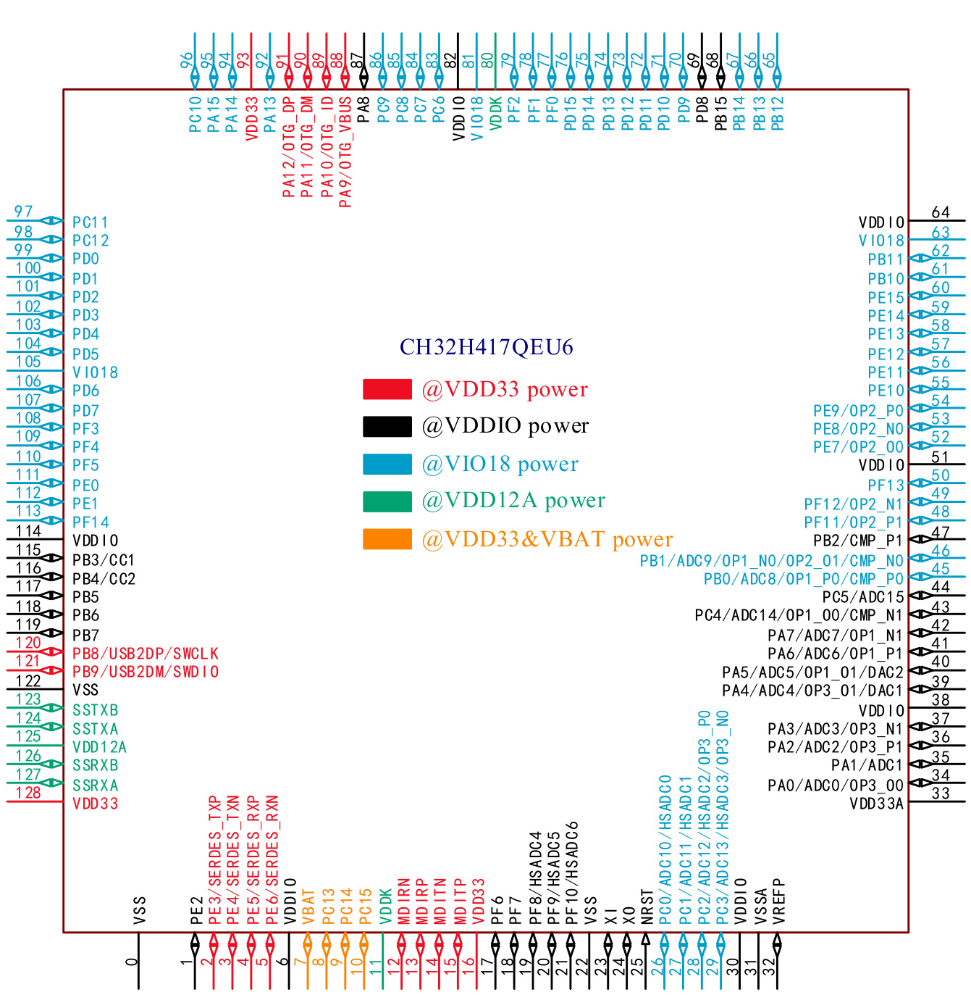

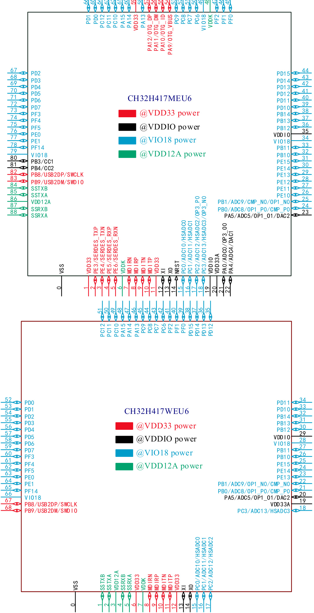

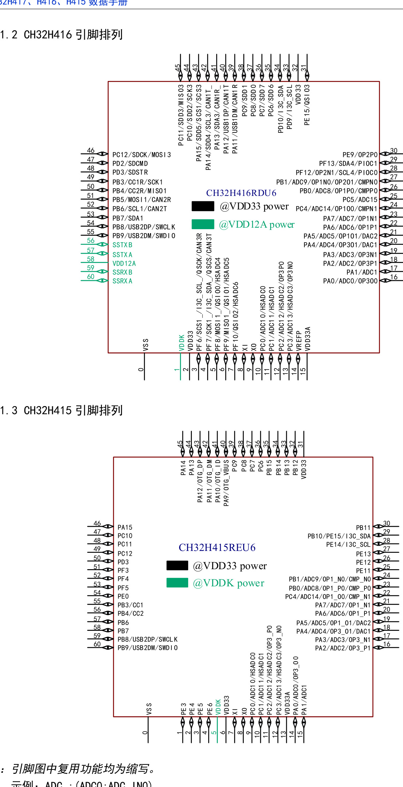

HSADC (HSADC4:HSADC IN4)   
DAC_: (DAC1 :DAC OUT1)   
USB2DP:USBHS DP   
USB2DN: USBHS DN   
SSRXA:USBSS RXA   
SSRXB:USBSS RXB   
SSTXA:USBSS TXA   
SSTXB:USBSS TXB   
OP:OPA_ (OP1_P1:OPA1_P1、 OP1_N1: OPA1_N1、 OP1_O1:OPA1 OUT1)

# 2.2 引脚定义

注意， 下表中的引脚功能描述针对的是所有功能， 不涉及具体型号产品。 不同型号之间外设资源有差异，查看前请先根据产品型号资源表确认是否有此功能。

表 2-1-1 CH32H417 引脚定义  

<html><body><table><tr><td colspan="3"></td><td></td><td></td><td></td><td></td><td></td><td></td></tr><tr><td></td><td>引脚编号</td><td></td><td>引脚 名称</td><td>引脚 类型“)</td><td>1/0 特性 (1)</td><td>主功能 （复位 后）</td><td>引脚功能(2)</td><td>重映射功能(3)</td></tr><tr><td>0</td><td></td><td></td><td>Vss</td><td>P</td><td></td><td>Vss</td><td></td><td></td></tr><tr><td></td><td></td><td></td><td>VDD33</td><td>P</td><td></td><td>VDD33</td><td>USART5_RX(AF4)/SPI4_SCK(AF5)</td><td></td></tr><tr><td></td><td></td><td></td><td>PE2</td><td>1/0</td><td></td><td>PE2</td><td>SAI MCLK_A(AF6)/USART6_CK(AF8)/ SDRAM_CLK(AF9)/FSMC_ A23(AF12)/ DVP D2(AF13)/LTDC_R6(AF14) SERDES_TXP/TIM8_CH1 (AFO)/</td><td></td></tr><tr><td></td><td></td><td></td><td>PE3</td><td>1/0/ SDP</td><td></td><td>PE3</td><td>SDRAM_DQM1(AF1)/TIM4_CH1 (AF2)/ TIM12_CH1(AF3)/PI0C 100(AF5)/ SAI _SD_B(AF6)/SDRAM CS_NO(AF9)/ USART5_TX(AF11)/FSMC_A19(AF12)/ DVP D3(AF13)</td><td></td></tr><tr><td></td><td></td><td></td><td>PE4 PE5</td><td>1/0/ SDP 1/0/</td><td></td><td>PE4 PE5</td><td>SERDES_TXN/TIM8_CH2(AFO) TIM4 _CH2(AF2)/TIM12_ CH2(AF3)/ PI0C_ I01(AF4)/SPI4_NSS(AF5)/ SAI_FS_A(AF6) /SDRAM CS_N1(AF9)/ FSMC_A20(AF12)/DVP_D4(AF13)/ LTDC BO(AF14) SERDES RXP/TIM8_CH3(AFO) TIM4_ CH3(AF2)/TIM12_ CH3(AF3)/ TIM9_CH3(AF4)/SPI4_MIS0(AF5)/ SAI _SCK_A(AF6)/SDRAM_CKEO(AF9)/ SDRAM_D27(AF10)/</td><td></td></tr><tr><td></td><td></td><td></td><td>PE6</td><td>1/0/ SDP</td><td></td><td>PE6</td><td>SDRAM_RAS_N(AF9)/FSMC_A21(AF12)/ DVP D6(AF13)/LTDC GO(AF14) SERDES RXN/TIM8_CH4(AFO)/ TIM1_BKIN2(AF1) /TIM4_CH4 (AF2)/ TIM12_CH4(AF3) /TIM9_CH4(AF4)/ SP14_MOSI(AF5)/SAI_SD_A(AF6)/ SDRAM_CKE1(AF7)/USART8_CK (AF8)/ SDRAM_D28 (AF10) /CMP_ _OUT(AF11)/</td><td></td></tr><tr><td></td><td></td><td></td><td>VDD10</td><td>P</td><td></td><td>VDD10</td><td>FSMC_A22(AF12)/DVP_D7(AF13)/ LTDC_G1 (AF14)</td><td></td></tr><tr><td></td><td></td><td></td><td>VBAT</td><td>P</td><td></td><td>VBAT</td><td></td><td></td></tr><tr><td></td><td></td><td>8</td><td>PC13(4−RTC</td><td>1/0</td><td></td><td>PC13(5)</td><td>RTC(AF1)/FSMC_A5(AF12)/</td><td></td></tr></table></body></html>

<html><body><table><tr><td colspan="2">引脚编号</td><td rowspan="2">引脚 名称</td><td rowspan="2"></td><td rowspan="2">引脚 类型“)</td><td rowspan="2">1/0 特性</td><td rowspan="2">主功能 （复位 引脚功能 （2） 后）</td><td rowspan="2">重映射功能(3)</td></tr><tr><td></td><td></td></tr><tr><td></td><td></td><td></td><td></td><td></td><td></td><td>SDRAM_A5 (AF12)</td><td></td></tr><tr><td></td><td></td><td>0SC32 IN PC15(4)− PC14(4)−</td><td>1/0/A 1/0/A</td><td></td><td>PC14(5) PC15(5)</td><td>0SC32 IN/SDRAM _CKE1(AF9)/ FSMC_D16(AF12) /SDRAM_D16(AF12) 0SC32_ _OUT/SDRAM_RAS_N(AF9)/</td><td></td></tr><tr><td></td><td></td><td>0SC32 VD0K</td><td>_OUT</td><td></td><td></td><td>FSMC_D17 (AF12) /SDRAM_D17 (AF12) VDDK 主VDoK</td><td></td></tr><tr><td>8</td><td>12</td><td>MDIRN(6)</td><td></td><td>ETH</td><td>MDIRN</td><td></td><td></td></tr><tr><td></td><td>13</td><td>MD IRP(</td><td></td><td>ETH</td><td></td><td>MDIRP</td><td></td></tr><tr><td>10</td><td></td><td>MDITN (6)</td><td></td><td>ETH</td><td></td><td>MDITN</td><td></td></tr><tr><td></td><td>0 5</td><td>MD ITP (6)</td><td>ETH</td><td></td><td>MDITP</td><td></td><td></td></tr><tr><td>12</td><td></td><td>VDD33</td><td></td><td></td><td></td><td>D33 主VDD33 CAN3_RX(AF2)/SPI1_NSS(AF3)/</td><td></td></tr><tr><td></td><td></td><td>PF6</td><td></td><td></td><td>PF6</td><td>QSPI2_SCK(AF4)/I3C_SCL(AF5)/ SAI_SD_B(AF6)/USART8_RX(AF7)/ TIM10_CH3(AF9)/QSPI1_SI03(AF10)/ FSMC_D18(AF12)/SDRAM_D18(AF12)/</td><td></td></tr><tr><td></td><td></td><td></td><td>PF7</td><td>C</td><td></td><td>TIM11 CH1 (AF13) CAN3_ TX(AF2)/SPI1_SCK(AF3)/ QSPI2_SCSN(AF4)) I3C_SDA(AF5)/ SAI_MCLK_B (AF6) /USART8_TX(AF7)/ TIM10_CH4(AF9)/QSPI1_SI02(AF10)/ FSMC_D19(AF12) /SDRAM_D19(AF12)/ TIM11 _CH2(AF13)</td><td></td></tr><tr><td></td><td></td><td>PF8</td><td></td><td>1/0</td><td>PF8</td><td>HSADC_IN4/SPI1_MOSI(AF3) QSPI2_SI00 (AF4) /SAI SCK_B(AF6)/ USART8 RTS(AF7)/QSPI2 SI00(AF8)/ TIM10_CH1(AF9)/TIM11 _CH3(AF13) QSPI1_SI00(AF10) /FSMC_D20(AF12)/ SDRAM D20(AF12)/ HSADC_ IN5/SPI1</td><td></td></tr><tr><td></td><td>20</td><td>PF9 PF10</td><td>1/0/A 1/0/A</td><td></td><td>PF9 PF10</td><td>MISO(AF3) QSPI2_SI01(AF4)/SAI_FS_B(AF6)/ USART8_CTS(AF7)/TIM10_CH2(AF9)/ USART8_RTS(AF11)/ QSPI1_SI01(AF10) /FSMC_D21(AF12)/ SDRAM D21 (AF12)/TIM11 CH4(AF13) HSADC_ IN6/QSPI2_SI02(AF4)/ USART8_CK(AF7)/TIM10_ETR(AF8)/ USART8 _CTS(AF11)/FSMC_ D22(AF12)/ SDRAM_D22(AF12)/DVP_D11(AF13)/</td><td></td></tr></table></body></html>

<html><body><table><tr><td colspan="4">引脚编号</td><td>引脚</td><td>1/0 引脚 特性</td><td>主功能 （复位</td><td></td><td>引脚功能(2)</td><td>重映射功能(3</td></tr><tr><td></td><td></td><td>-</td><td>名称</td><td>类型()</td><td>(1)</td><td>后）</td><td></td><td></td><td rowspan="6"></td></tr><tr><td></td><td></td><td>22</td><td>Vss XI</td><td>P</td><td></td><td></td><td>Vss</td><td></td></tr><tr><td>13 14</td><td>12 13</td><td>23 24</td><td>X0</td><td>I/A 0/A</td><td></td><td>XI X0</td><td></td><td></td></tr><tr><td></td><td>4</td><td>25</td><td>NRST</td><td></td><td></td><td>NRST</td><td>ADC_ IN10/HSADC_ INO/</td><td></td></tr><tr><td>15</td><td>5</td><td>26</td><td>PCO</td><td>1/0/A</td><td></td><td>PCO</td><td>TIM8_BKIN (AFO)/ETH_MDC(AF1)/ DFSDM_CKINO(AF3)/FSMC_D4(AF4)/ PI0C_ 101(AF5)/SAI MCLK_A(AF7)/ I2C2_SCL(AF9)/QSPI2_SI03(AF10)/ LTDC_G2(AF11)/SDRAM_WE_N(AF12)/ LTDC_R5 (AF14) /SDRAM_CAS_N (AF15) ADC_ IN11/HSADC_ IN1/</td><td>UHSIF_CLK_1</td></tr><tr><td></td><td>6</td><td>27</td><td>PC1</td><td></td><td>1/0/A</td><td>PC1</td><td>TIM8_CH1N(AFO) /ETH_MDI0(AF1)/ TIM5_CH1(AF2)/DFSDM_DATINO(AF3)/ FSMC_ D5(AF4)/SPI2_MOSI(AF5)/ I2S2_SD(AF5)/SAI_SD_A(AF7)/ PI0C_ 100(AF7)/I2C2_SDA(AF9)/ QSPI2_SCSXN(AF10)/SDI0_CK(AF11)/ LTDC_G5 (AF14) /SDRAM_WE_N (AF15) ADC_ IN12/HSADC_IN2/0PA3_P0/ TIM8_CH2N(AFO)/ETH_PPS(AF1)/</td><td>UHSIF_PORTO_2/ UHSIF_PORTO_3/ UHSIF_PORT3_1</td></tr><tr><td></td><td></td><td>28</td><td>PC2</td><td></td><td>1/0/A</td><td>PC2</td><td>TIM5_CH2(AF2)/DFSDM_CKIN1(AF3)/ FSMC_D6(AF4)/SPI2_MIS0(AF5)/ DFSDM _CKOUT (AF6)/SAI PI0C_ _101(AF8)/I2C2_SMBA(AF9)/ QSPI2_SI0X0(AF10) SDRAM_CS_NO(AF12)/ SDRAM_DQMO (AF15) ADC_ IN13/HSADC_</td><td>UHSIF_PORT1_2/ _SCK_A(AF7)/ UHSIF_PORT1_3/ UHS IF_PORT4_1</td></tr><tr><td></td><td>8</td><td>29</td><td>PC3</td><td></td><td>1/0/A</td><td>PC3</td><td>IN3/ 0PA3_NO/TIM8_CH3N(AFO)/ TIM5_CH3(AF2)/DFSDM DATIN1(AF3)/ FSMC_ D7(AF4) /SPI2_MOSI I2S2_SD(AF5)/SAI_FS_A(AF7)/ QSPI2_SI0X1(AF10)/ SDRAM_D16(AF11)/FSMC_D16(AF11)/ SDRAM_CKEO(AF12)/</td><td>(AF5)/ UHSIF_ PORT2_2/ UHSIF_PORT2_3/ UHS IF_PORT5_1</td></tr><tr><td></td><td>9</td><td>30 31 32</td><td>VDD10 VsSA</td><td></td><td>P</td><td>VDD10</td><td>SDRAM_DQM1(AF15) VsSA VREFP</td><td></td></tr></table></body></html>

<html><body><table><tr><td></td><td>引脚编号</td><td></td><td>引脚</td><td>引脚 类型（1)</td><td>1/0 主功能 特性 （复位</td><td>引脚功能 (2)</td><td>重映射功能(3)</td></tr><tr><td>19</td><td>20</td><td>名称 33 VDB33A</td><td></td><td></td><td>后） VDD33A</td><td>ADC_ INO/0PA3_0UT0/ TIM2_CH1_ETR(AF1)/TIM5_CH1(AF2)/ TIM8_ETR (AF3)/QSPI2_ SI0X2(AF4)/ PI0C_ 100(AF5) /TIM9 CH1 (AF6)/ USART2_CTS(AF7)/USART6_TX(AF8)/</td><td></td></tr><tr><td></td><td></td><td>35</td><td>PA1</td><td>1/0/A</td><td>PA1</td><td>SDI0_CMD(AF9)/FSMC_D23(AF12)/ SDRAM D23(AF12)/LTDC_RO(AF14)/ SDRAM DQM2 (AF15) ADC_ IN1/TIM2_CH2(AF1)/ TIM5_ CH2(AF2)/QSPI2_SI0X3(AF4)/ TIM9_CH2 (AF6) /USART2_RTS(AF7)/ USART6_RX (AF8) /QSPI1_SI03(AF9)/ /SDRAM_D24(AF12)/</td><td></td></tr><tr><td rowspan="5"></td><td>36</td><td>PA2</td><td>1/0/A</td><td>PA2</td><td>FSMC_D24 (AF12) LTDC_R2 (AF14) ADC_IN2/0PA3_P1/TIM2_CH3(AF1)/ TIM5 CH3 (AF2) TIM9_ _CH3(AF4)/USART2_TX(AF7)/ FSMC_D25 (AF12) /SDRAM_D25(AF12)/ LTDC_R1 (AF14) ADC_IN3/0PA3_N1/TIM2</td><td>/USART6_CK (AF3)/ _CH4(AF1)/ /TIM9_CH4(AF4)/</td><td></td></tr><tr><td>3/</td><td></td><td>PA3</td><td>1/0/A</td><td>PA3</td><td>TIM5_CH4 (AF2) USART2_RX(AF7)/TIM10_CH3(AF8)/ LTDC_ B2(AF9)/FSMC_D26(AF12)/</td><td></td></tr><tr><td>38 39</td><td>PA4</td><td>VDD10</td><td></td><td>VDD10</td><td>SDRAM_D26 (AF12)/LTDC_ B5(AF14) ADC_ IN4/DAC1 _OUT/0PA3_0UT1/ TIM5_ETR (AF2) /TIM9_ETR (AF4) / SPI1_NSS(AF5) /SPI3_NSS(AF6)/ 12S3_WS (AF6)/USART2 _CK(AF7)/</td><td></td></tr><tr><td></td><td></td><td></td><td>1/0/A</td><td>PA4</td><td>TIM10_CH4(AF9) /FSMC_D27 (AF12) SDRAM_D27(AF12)/DVP_HSYNC(AF13)/ LTDC ADC_IN5/DAC2_0UT/0PA1 TIM2_CH1</td><td>VSYNC (AF14) _0UT1/ ETR(AF1)/</td></tr><tr><td>20</td><td>23</td><td>PA5 PA6</td><td>1/0/A 1/0/A</td><td></td><td>TIM1 PA5 SPI1 DVP SDRAM PA6</td><td>BKIN2(AF2)/TIM8_ CH1N(AF3)/ SCK(AF5)/TIM10_ETR(AF9)/ VSYNC(AF11)/FSMC_D28(AF12)/ D28 (AF12) /LTDC_R4 (AF14) ADC_ IN6/0PA1_P1/TIM1 BKIN(AF1)/</td></tr></table></body></html>

<html><body><table><tr><td colspan="3">引脚编号</td><td>引脚</td><td></td><td>引脚</td><td>1/0 主功能 特性 （复位</td><td>引脚功能</td><td>(2)</td><td>重映射功能(3)</td></tr><tr><td></td><td></td><td></td><td>名称</td><td>类型“)</td><td>(1)</td><td>后）</td><td>TIM3_ CH1(AF2)/TIM8_BKIN(AF3)/ SPI1_MIS0 (AF5)</td><td>/SDRAM_DQM2(AF6)/</td><td></td></tr><tr><td></td><td></td><td></td><td></td><td></td><td></td><td></td><td>TIM10_CH1 (AF9) ADC_IN7/0PA1_N1/TIM1</td><td>/CMP_OUT(AF10)/ LTDC_HSYNC(AF11)/DVP_PCLK (AF13)/ LTDC_G2 (AF14) _CH1N(AF1)/ TIM3_CH2(AF2)/TIM8_CH1N(AF3)/</td><td></td></tr><tr><td></td><td></td><td>42</td><td>PA7</td><td></td><td>1/0/A</td><td></td><td>PA7 SPI1_MOSI LTDC_ ADC_IN14/0PA1</td><td>(AF5)/TIM10_CH2(AF9)/ SDRAM_WE_N(AF12)/ VSYNC (AF14)/ _0UTO/CMP_N1/</td><td></td></tr><tr><td></td><td></td><td>44</td><td>PC4 PC5</td><td></td><td>1/0/A</td><td></td><td>PC4 CAN3_RX (AF6) SDRAM PC5</td><td>/13C_SCL(AF7)/ CS_NO (AF12) /LTDC_R7 (AF14) ADC_IN15/CAN3_TX(AF6)/ I3C_SDA(AF7)/SDRAM_CKEO0(AF12)/</td><td></td></tr><tr><td></td><td></td><td></td><td></td><td></td><td>1/0/A</td><td></td><td>CMP ADC_ TIM1 TIM8 DFSDM_CKOUT (AF6)</td><td>_OUT(AF13)/LTDC_DE(AF14) IN8/0PA1_P0/CMP_P0/MC0(AFO)/ CH2N(AF1)/TIM3_CH3(AF2) CH2N(AF3)/TIM5_CH4(AF4)/ /SDRAM_DQM3 (AF7)</td><td>UHSIF_PORT3_2/ UHSIF_PORT3_3/ UHSIF_PORT6_1</td></tr><tr><td>22</td><td>24 25</td><td>45 46</td><td>PBO PB1</td><td>1/0/A</td><td>1/0/A</td><td>PB0 PB1</td><td>/USART6_CTS(AF8)/LTDC_R3(AF9)/ FSMC_D29(AF12)/SDRAM TIM12_ETR (AF13) /LTDC_G1 (AF14) ADC_ IN9/0PA1 NO/0PA2_ CMP_NO/TIM1 CH3N(AF1)/ TIM3_CH4(AF2)/TIM8_CH3N(AF3)/ TIM12_CH1(AF5) /SDRAM DFSDM DATIN1(AF6)/LTDC_R6(AF9)/</td><td>D29(AF12)/ _0UT1/ BAO(AF7)/</td><td>UHSIF_PORT4_2/ UHSIF_PORT4_3/ UHSIF_PORT7_1</td></tr><tr><td></td><td></td><td></td><td></td><td>PB2</td><td>1/0/A</td><td></td><td colspan="2">FSMC_D30(AF12) /SDRAM_D30(AF12)/ LTDC_GO (AF14) CMP_P1/DFSDM _CKIN1(AF4) TIM12_CH2 (AF5)/SAI PB2 SPI3_MOSI(AF7)/ QSPI1_SCK (AF9)/FSMC_D31(AF12)</td><td>SD_A(AF6)/ 2S3_SD(AF7)/</td></tr><tr><td></td><td></td><td>48</td><td>PF11 PF12</td><td>1/0/A 1/0/A</td><td></td><td>PF11 PF12</td><td>0PA2_P1/UHSIF_ I2C4 SMBA(AF2) 0PA2_N1/UHSIF_PORTO/ 12C4_SCL(AF2)/PI0C_ SDRAM CAS_N(AF12)/</td><td>CLK/ /SDRAM_RAS_N(AF12) 100(AF3)/</td><td>UHSIF_PORTO_1</td></tr></table></body></html>

<html><body><table><tr><td colspan="2">引脚编号</td><td rowspan="2">引脚</td><td rowspan="2">名称</td><td rowspan="2">引脚 类型(1)</td><td rowspan="2">特a$ (1)</td><td rowspan="2">主功能 后）</td><td rowspan="2">引脚功能 (2)</td><td rowspan="2">重映射功能(3)</td></tr><tr><td></td><td></td></tr><tr><td></td><td></td><td>50</td><td></td><td></td><td></td><td colspan="2">TIM12 _CH3(AF13) UHSIF_PORT1/I2C4_SDA(AF2) PF13 PI0C_</td><td></td></tr><tr><td></td><td>51</td><td></td><td>PF13 VDD10</td><td>1/0</td><td></td><td colspan="2">I01(AF5)/DVP_PCLK(AF11)/ TIM12_CH4 (AF13) ODI0 0PA2_0UT0/UHSIF PORT2/ RX(AF7)/</td><td>UHSIF_PORT1_1</td></tr><tr><td></td><td>52</td><td></td><td>PE7 PE8</td><td>1/0/A 1/0/A</td><td></td><td colspan="2">TIM1 ETR(AF1)/USART8 PE7 QSPI1 _SI0X0(AF10)/FSMC_D4(AF12)/ SDRAM_D4 (AF12) 0PA2_NO/UHSIF_PORT3/ TIM1_CH1N(AF1)/USART8_TX(AF7)/ PE8 SDI0_D0 (AF8) /QSPI1 _SI0X1(AF10)/ FSMC_ D5(AF12) /SDRAM_D5(AF12)</td><td>UHSIF_PORT2_1</td></tr><tr><td></td><td></td><td></td><td>PE9</td><td>1/0/A</td><td></td><td colspan="2">0PA2_PO/UHSIF_PORT4/ TIM1 _CH1(AF1)/DFSDM_CKOUT(AF3)/ PE9 SDI0_D1 (AF8) /QSPI1_SI0X2(AF10)/ FSMC_D6(AF12) /SDRAM_D6(AF12) UHSIF P0RT5/TIM1</td><td></td></tr><tr><td></td><td>26 55 56</td><td>PE11</td><td>PE10</td><td>1/0 1/0</td><td>PE10 PE11</td><td colspan="2">_CH2N(AF1)/ SDRAM_D17(AF3)/SDI0_D2(AF8)/ QSPI2_SCK(AF7)/ QSPI1_SI0X3(AF10)/FSMC_D7(AF12)) SDRAM_D7 (AF12)/SDRAM_BA1 (AF15) UHSIF_P0RT6/TIM1 CH2(AF1)/ SDRAM_D18(AF3) /SPI4_NSS(AF5)/ QSPI2_SCSN(AF7)/SDI0_D3(AF8)/ FSMC_D8(AF12) /SDRAM D8(AF12)/ /SDRAM AO(AF15)</td><td>UHSIF_PORT5_2/ UHS IF_PORT5_3 UHSIF_P0RT6_2/</td></tr><tr><td></td><td>28</td><td>PE12</td><td></td><td>1/0</td><td></td><td colspan="2">LTDC _G3(AF14) UHS IF_PORT7/TIM1 SDRAM_D19(AF3)/SPI4_SCK(AF5)/ QSPI2_SI00(AF7)/SDI0_D4(AF8)/ PE12 FSMC_D9(AF12) /SDRAM CMP _OUT(AF13)/LTDC_B4(AF14)/ SDRAM A1(AF15) UHSIF_P0RT8/TIM1 TIM12_CH2(AF2) /SPI4_MIS0(AF5)/ /SDRAM /SDRAM_A2(AF15)</td><td>UHSIF_PORT7_2/ UHSIF_PORT7_3 D10(AF12)/</td></tr><tr><td></td><td></td><td></td><td>PE13</td><td>0</td><td></td><td colspan="2">PE13 QSPI2_SI01(AF7)/SDI0_D5(AF8)/ FSMC_D10(AF12) LTDC DE (AF14)</td><td></td></tr><tr><td>24</td><td>30 59</td><td>PE14</td><td></td><td>1/0</td><td>PE14</td><td>UHSIF_PORT9/TIM1 _CH4(AF1)/ TIM12 _CH3(AF2)/I3C_ SCL(AF3)/</td><td></td></tr></table></body></html>

<html><body><table><tr><td colspan="3">引脚编号</td><td>引脚</td><td></td><td>1/0 主功能 特性 （复位 (1) 后）</td><td rowspan="2">引脚功能</td><td rowspan="2"></td><td rowspan="2">重映射功能3</td></tr><tr><td></td><td></td><td></td><td>引脚 名称</td><td>类型1</td><td>SPI4_MOSI (AF5)</td></tr><tr><td></td><td></td><td></td><td></td><td></td><td></td><td>PE15</td><td>/QSPI2_SI02(AF7)/ SDI0_D6(AF8)/FSMC_D11(AF12)/ SDRAM_D11(AF12)/LTDC_CLK(AF13)/ SDRAM_A3 (AF14) UHSIF_P0RT10/TIM1 BKIN(AF1)/ TIM12_CH4(AF2)/I3C_SDA(AF3)/ QSPI2_SI03(AF7)/SD10_D7(AF8)/</td><td rowspan="2"></td></tr><tr><td>25 26</td><td>31 60 32 61</td><td></td><td>PE15 PB10</td><td>1/0 1/0</td><td></td><td>USART5_CK (AF11)/FSMC_D12(AF12)/ SDRAM_D12(AF12) /CMP_0UT (AF13)/ LTDC_R7 (AF14) /SDRAM_A4 (AF15) UHS IF_PORT11/SDRAM_A5(AF0)/ TIM2_ CH3(AF1)/TIM9_ LPTIM2_CH1(AF3)/12C2_SCL(AF4)/ SPI2_SCK(AF5)/I2S2_CK(AF5)/ PB10 FSMC_ A19(AF6) /USART3 SDI0_CMD(AF8)/USART6_CK(AF9)/ QSPI2_SCSXN(AF11)/ FSMC_A10(AF12)/SDRAM_A10(AF12)/</td><td>CH2(AF2)/ TX(AF7)/ SDMMC_D2_</td></tr><tr><td>27</td><td>33 62</td><td></td><td>PB11</td><td>1/0</td><td></td><td>TIM2_ PB11</td><td>LTDC_G4 (AF14) UHSIF_PORT12/SDRAM_A6(AF0)/ CH4(AF1)/FSMC_A20(AF2)/ LPTIM2_ETR(AF3)/I2C2_SDA(AF4)/ USART3_RX(AF7)/SDI0_CK (AF8)/ TIM9_CH4(AF9)/QSPI2_SI0X0(AF11)/</td><td rowspan="2">SDMMC_D3_ 1 (8)</td></tr><tr><td>28 29</td><td>34 35</td><td>63 64 VD010</td><td>V1018</td><td></td><td></td><td>FSMC_A11(AF12)/SDRAM_A11(AF12) LTDC_G5 (AF14) V1018</td><td>主V1018 主VD010 UHSIF_P0RT13/SDRAM_A7(AF0)</td></tr><tr><td>30</td><td>36</td><td>65</td><td>PB12</td><td>1/0</td><td></td><td>VDD10 PB12</td><td>TIM1_BKIN(AF1)/TIM8_BKIN(AF2)/ FSMC_A21(AF3)/I2C2 SMBA(AF4)/ SPI2_NSS(AF5)/I2S2_WS(AF5)/ DFSDM_DATIN1(AF6)/ USART3_CK (AF7)/TIM9_CH3(AF8)/ CAN2 _RX(AF9)/LTDC_VSYNC(AF10)/ QSPI2_SI0X1 (AF11)/</td><td></td><td>1(8)</td></tr><tr><td>31</td><td>37</td><td>66</td><td>PB13</td><td>1/0</td><td></td><td>PB13</td><td>FSMC_A12 (AF12) /SDRAM_A12(AF12)/ CMP_0UT (AF13)/USART7_RX (AF14)/ DVP PCLK(AF15) UHSIF_ P0RT14/SDRAM A8(AFO)/</td><td>SDMMC_DO_</td></tr></table></body></html>

<html><body><table><tr><td colspan="3">引脚编号</td><td>引脚</td><td rowspan="2">引脚</td><td rowspan="2">1/0 特性 (1) 类型“”</td><td rowspan="2">主功能 （复位 后）</td><td rowspan="2">引脚功能 (2)</td><td rowspan="2">重映射功能</td></tr><tr><td></td><td></td><td></td><td>名称</td></tr><tr><td></td><td></td><td></td><td></td><td></td><td></td><td></td><td>TIM1 _CH1N(AF1)/TIM8_BKIN2(AF2)/ LPTIM2_0C(AF3)/TIM9_ETR (AF4)/ SPI2_SCK(AF5)/I2S2_CK(AF5)/ DFSDM_CKIN1 (AF6) USART3_CTS(AF7)/DVP_HSYNC (AF8)/ CAN2_ TX(AF9)/ETH PHY_LED3(AF10)/ QSPI2_SI0XO(AF11)/ FSMC_A13(AF12)/DVP_D2(AF13)/</td><td></td></tr><tr><td>32</td><td>38</td><td>67</td><td>PB14</td><td>1/0</td><td></td><td>TIM1 PB14</td><td>USART7 _TX(AF14)/FSMC_A22(AF15) UHSIF_P0RT15/FSMC_A23(AF0) _CH2N(AF1)/TIM9_CH1(AF2)/ TIM8_CH2N(AF3)/USART1_TX (AF4)/ SPI2_MIS0(AF5)/LTDC_GO(AF6)/ USART3_RTS(AF7)/USART6_RTS(AF8)/ SD10_DO(AF9)/ETH_PHY QSPI2_SI0X1(AF11)/ FSMC_A14(AF12) /SDRAM_A9(AF0)/ SDRAM_BAO(AF12)/USART7_CK(AF13)/ LTDC_CLK(AF14)/DVP VSYNC (AF15)</td><td>LED4(AF10)/</td></tr><tr><td></td><td></td><td>68</td><td>PB15</td><td>1/0</td><td></td><td>PB15</td><td>TIM1 _CH3N(AF1)/TIM9_CH2(AF2)/ TIM8_CH3N (AF3)/USART1 RX(AF4)/ SPI2_MOSI (AF5)/I2S2_SD(AF5)/ USART6_CTS(AF8)/SDI0_D1(AF9)/ FSMC_A15 (AF12) /SDRAM_BA1(AF12)/</td><td></td></tr><tr><td></td><td></td><td>69</td><td></td><td>PD8</td><td>1/0</td><td>PD8</td><td>LTDC_G7 (AF14) USART3 _TX(AF7)/FSMC_D13(AF12)/ SDRAM_D13 (AF12)/LTDC_ B7 (AF14) SDRAM_ A9（AF0)/I3C_ SCL(AF5)/</td><td></td></tr><tr><td></td><td></td><td></td><td>PD9</td><td></td><td>1/0</td><td>PD9</td><td>USART3_RX (AF7)/FSMC_D14(AF12)/ SDRAM D14(AF12) UHSIF_PORT16/SDRAM_A10(AF0)/</td><td>UHSIF_CLK_3</td></tr><tr><td>33 34</td><td>39</td><td></td><td>PD10 PD11</td><td></td><td>1/0 1/0</td><td>PD10</td><td>DFSDM_CKOUT(AF3)/ LPTIM2_ETR(AF4)/I3C_SDA(AF5)/ USART3_ CK (AF7)/RGMI _TXD3(AF10)/ FSMC_D15(AF12)/SDRAM_D15(AF12)/ LTDC_B3 (AF14) UHSIF_PORT17/SDRAM_A11(AFO) LPTIM1 ETR(AF1)/LPTIM2_CH2(AF3)/ PD11</td><td>SDMMC_STR_1 SDMMC_SDCK_1 /TIM5_ETR(AF6)/ SDMMC_SLVCK_1</td></tr></table></body></html>

<html><body><table><tr><td colspan="3">引脚编号</td><td>引脚</td><td>引脚</td><td>1/0 特性</td><td>主功能 （复位</td><td>引脚功能（2)</td><td>重映射功能(3)</td></tr><tr><td>.LH</td><td></td><td>LVH</td><td>名称</td><td>类型“)</td><td>(1)</td><td>后） RGMII</td><td>TXD2(AF10)/LTDC_R4(AF11)/</td><td></td></tr><tr><td></td><td></td><td></td><td></td><td></td><td></td><td></td><td>FSMC_A16(AF12) /USART1_CK (AF14) UHSIF_PORT18/SDRAM_A12(AF0)/ LPTIM1_CH1 (AF1)/TIM4_CH1(AF2)/ LPTIM2 _CH1 (AF3)/I2C4_SCL(AF4)/</td><td>SDMMC_STS_1</td></tr><tr><td>35</td><td>41</td><td>73</td><td>PD12</td><td>1/0</td><td></td><td>PD12 RGMII</td><td>CAN3_RX (AF5) /TIM5_CH1(AF6)/ USART3_RTS(AF7)/QSPI1_SI01(AF9)/ _TXD1 (AF10)/LTDC_R3(AF11)/ FSMC_A17(AF12) /DVP_D4(AF13)/ USART1_RX (AF14) UHSIF_P0RT19/SDRAM DO(AFO)/</td><td>SDMMC_CMD_1</td></tr><tr><td>36</td><td>42</td><td></td><td>PD13</td><td>1/0</td><td></td><td>PD13 DVP RGMII</td><td>LPTIM1_0C (AF1)/TIM4_CH2(AF2)/ LTDC_R2(AF3) /I2C4_SDA(AF4)/ CAN3_TX(AF5) /TIM5_CH2(AF6)/ QSPI1_SI03(AF9)/ TXDO(AF10) /FSMC_A18(AF12)/ D5(AF13)/USART1 TX(AF14)</td><td></td></tr><tr><td>37</td><td>13</td><td>75</td><td>PD14</td><td>1/0</td><td></td><td>PD14 DVP</td><td>UHSIF_PORT20/SDRAM_D1(AF0)/ LPTIM1_CH2(AF1)/TIM4_CH3(AF2)/ TIM5_CH3(AF6)/LTDC_B1(AF8)/ QSPI1_SI02(AF9)/ RGMII_TXEN(AF10) FSMC_DO(AF12) /SDRAM_DO(AF12)/</td><td></td></tr><tr><td>38</td><td></td><td>76</td><td>PD15</td><td>1/0</td><td></td><td>PD15</td><td>D6(AF13)/USART1 RTS(AF14) UHSIF_PORT21/ 'SDRAM_D2(AF0)/ TIM4_CH4(AF2)/TIM5_CH4(AF6)/ LTDC_G2(AF7) /RGMI _GTXC(AF10)/ FSMC_D1 (AF12) /SDRAM_D1(AF12)/</td><td></td></tr><tr><td>39</td><td></td><td></td><td>PFO</td><td>1/0</td><td></td><td>PFO</td><td>DVP_D7 (AF13)/USART1_CTS (AF14) UHSIF_PORT22/SDRAM_D3(AF2)/ SDRAM_CS_N1(AF4)/QSPI2_SCK(AF5) USART4_CTS(AF7)/ ETH_PHY_LED0 (AF10)/ LTDC_R1(AF11)/DVP_D11(AF12)/</td><td></td></tr><tr><td>40</td><td>46</td><td>78</td><td>PF1</td><td>1/0</td><td></td><td>PF1 LTDC_B0(AF8) FSMC_</td><td>LTDC_R7 (AF14) UHSIF_PORT23/SDRAM_D4(AF2)/ QSPI2_SCSN(AF5) SAI_MCLK_A(AF6)/USART4_CK(AF7)/ /ETH_PHY_ LED1(AF10)/ _INT2 (AF12) /LTDC_CLK (AF14)</td><td></td></tr></table></body></html>

<html><body><table><tr><td colspan="4">引脚编号</td><td></td><td rowspan="2">1/0 引脚 特性</td><td rowspan="2">主功能 （复位 后）</td><td rowspan="2">引脚功能(2)</td><td rowspan="2">重映射功能(3)</td></tr><tr><td></td><td></td><td></td><td>引脚 名称</td></tr><tr><td></td><td></td><td></td><td>PF2</td><td>1/0</td><td></td><td>UHSIF PF2</td><td>P0RT24/SDRAM D5(AF2)/ TIM8_ETR(AF3)/QSPI2_SI00(AF5)/ USART4_RTS(AF7)/ ETH_PHY_LED2(AF10)/ SDRAM_CLK (AF12) /LTDC_G7 (AF14)</td><td></td></tr><tr><td>42</td><td>48 49</td><td>80 81 82</td><td>VDDK V1018 VD10 PC6</td><td>P P</td><td></td><td>SDRAM RGMII VDK V1018 VDD10</td><td>SDMMC_D6(8)/UHS IF_PORT25/ D6(AFO) /TIM3_CH1 (AF2)/ TIM8_CH1(AF3)/FSMC_D8(AF4)/</td><td>SDMMC_D6 1 (8)</td></tr><tr><td></td><td>50 1</td><td>83 84</td><td>PC7</td><td>1/0</td><td></td><td>PC6 PC7</td><td>I2S2_MCK(AF5)/USART4_TX(AF7)/ SDI0_D6(AF9) /SWPMI I0(AF11)/ _RXD3(AF12)/DVP_D0(AF13)/ LTDC_HSYNC (AF14) SDMMC_D7(⁸³/UHSIF_PORT26/ SDRAM_D7(AF0)/TIM3_CH2(AF2)/ TIM8_CH2(AF3)/FSMC_D9(AF4)/ I2S3_MCK(AF6)/USART4_RX(AF7)/</td><td>SDMMC_D7_1 (8)</td></tr><tr><td>44</td><td>52</td><td>85</td><td>PC8</td><td></td><td>1/0</td><td>PC8</td><td>SDI0_D7(AF9) /SWPMI _TX(AF11)/ RGMII RXD2(AF12) /DVP_D1(AF13)/ LTDC_G6 (AF14) SDMMC_D0/UHSIF_PORT27/ SDRAM_D8(AF0) /TIM3_CH3(AF2)/ TIM8_CH3(AF3)/FSMC_D13(AF4)/ TIM9_ETR(AF6)/USART4_CK (AF7)/ USART7_RTS(AF8) /SWPMI RX(AF11)/</td><td></td></tr><tr><td>45</td><td>53</td><td>86</td><td>PC9</td><td>1/0</td><td></td><td></td><td>RGMII_RXD1(AF12)/DVP D2(AF13)/ LTDC_G4 (AF14) SDMMC_D1 /UHSIF PORT28/ SDRAM_D9(AF0)/TIM3_CH4(AF2)/ TIM8_CH4(AF3) I2C3_SDA(AF4)/ SP13_MIS0(AF5)/TIM9_CH1(AF6)/</td><td></td></tr><tr><td></td><td></td><td></td><td></td><td></td><td></td><td>PC9 PA8</td><td>FSMC_D14(AF7) /USART7 CTS(AF8)/ QSPI1_SI00(AF9)/LTDC_G3(AF10)/ SWPMI SUP(AF11)/ RGMII_RXD0(AF12)/DVP D3(AF13)/ /SAI_MCLK_B (AF15)</td><td>SDMMC_D1 1(8)</td></tr><tr><td></td><td></td><td>87</td><td>PA8</td><td>1/0</td><td></td><td>LTDC_B2 (AF14) TIM1 _CH1 (AF1)/TIM8_BKIN2(AF3)/ I2C3 SCL(AF4) /SDRAM</td><td>DQM3(AF6)/</td><td></td></tr></table></body></html>

<html><body><table><tr><td colspan="3">引脚编号</td><td></td><td rowspan="2">类型“</td><td rowspan="2">引脚 1/0 特性 (1)</td><td rowspan="2">主功能 （复位 后）</td><td rowspan="2">引脚功能 (2)</td><td rowspan="2"></td><td rowspan="2">重映射功能(3)</td></tr><tr><td></td><td></td><td></td><td>引脚 名称</td></tr><tr><td></td><td></td><td></td><td></td><td></td><td></td><td></td><td>USART1 CMP TIM1 _CH2(AF1)/</td><td>_CK(AF7)/USART8_RX(AF11)/ OUT (AF12)/LTDC_B3(AF13)/ LTDC_R6 (AF14) OTG_VBUS/SDRAM_D10(AF0)</td><td></td></tr><tr><td></td><td></td><td>54 88</td><td></td><td>PA9</td><td>1/0/A</td><td>T PA9</td><td>SPI2_SCK(AF5) USART1 _TX(AF7) DVP</td><td>I2C3_SMBA(AF4)/ I2S2_CK(AF5)/ /SDRAM_D20(AF8)/ DO (AF13)/LTDC_R5(AF14)</td><td></td></tr><tr><td></td><td></td><td>55 89</td><td></td><td>PA10</td><td>1/0/A</td><td>T PA10</td><td>TIM1_ FSMC_A6 (AF10)</td><td>OTG_ID/SDRAM_D11(AF0)/ CH3(AF1)/USART6_CK(AF6)/ USART1_RX(AF7)/SDRAM_D21(AF8)/ /SDRAM A6(AF10)/ LTDC_B4(AF12)/DVP_D1(AF13)/ LTDC_B1 (AF14)</td><td></td></tr><tr><td></td><td>56</td><td>90</td><td></td><td>PA11</td><td>1/0/A FT</td><td>PA11</td><td>TIM1 SPI2_NSS(AF5) USART6_RX (AF6) SDRAM</td><td>OTG_DM/SDRAM_D12(AF0)/ CH4(AF1)/USART3 _CK(AF4)/ I2S2_WS(AF5)/ /USART1_CTS(AF7)/ D22(AF8)/CAN1 RX(AF9)/ FSMC_A7(AF10)/SDRAM_A7(AF10) LTDC_R4 (AF14)</td><td></td></tr><tr><td></td><td></td><td>9</td><td></td><td>PA12</td><td>1/0/A</td><td>T PA12</td><td>TIM1 FSMC_A8 (AF10)</td><td>0TG_DP/SDRAM_D13(AF0) _ETR(AF1)/USART3_RTS(AF4)/ SPI2_SCK(AF5) I2S2_CK(AF5)/ USART6_TX(AF6)/USART1_RTS(AF7)/ SDRAM_D23 (AF8)/CAN1_TX(AF9)/ /SDRAM_A8(AF10)/</td><td></td></tr><tr><td></td><td></td><td>58</td><td>92</td><td>PA13</td><td>1/0</td><td>PA13</td><td>TIM1 CAN_RX(AF5)</td><td>BK IN2(AF12)/LTDC_R5(AF14)/ UHSIF_P0RT29/SDRAM_D14(AF0)/ SPI3_MOSI(AF1)/I2S3_SD(AF1)/ SDRAM_BA1(AF3)/USART3_TX(AF4)/ /12C3_SDA(AF7)/</td><td></td></tr><tr><td></td><td></td><td>59</td><td>93</td><td>VDD33</td><td></td><td>VDD33</td><td>LTDC_B2 (AF8)</td><td>/FSMC_A9(AF10)/ SDRAM_A9 (AF10) /SAI SD_B(AF13)/</td><td></td></tr><tr><td></td><td>60</td><td>94</td><td></td><td>PA14</td><td>1/0</td><td>PA14</td><td>SDMMC_D4</td><td>/UHS IF_PORT30/ SDRAM_D15 (AF0)/SPI3_SCK(AF1)/ I2S3_CK(AF1)/SDRAM_A0(AF3)/ USART3_RX(AF4)/CAN TX(AF5)/</td><td>SDMMC_D4_1 8)</td></tr></table></body></html>

<html><body><table><tr><td colspan="2">引脚编号</td><td>引脚 名称</td><td></td><td>引脚 类型“)</td><td>1/0 主功能 特性 （复位 (1) 后）</td><td>引脚功能(2)</td><td>重映射功能3</td></tr><tr><td></td><td></td><td></td><td></td><td></td><td></td><td>RGMI RXDV(AF12) SAI_SCK_B(AF13)/LTDC_B6(AF14)/ LTDC_RO (AF15)</td><td></td></tr><tr><td>48</td><td>95</td><td>PA15</td><td>1/0</td><td></td><td>PA15</td><td>SDMMC_D5 8/UHS IF PORT31/ FSMC_NBL3(AFO) /SDRAM_DQM3(AFO)/ TIM2_CH1 ETR(AF1)/ RGMII_RXC (AF3) /USART3_CTS(AF4)/ SPI1_NSS(AF5)/SPI3_NSS(AF6)/ I2S3_WS(AF6)/I2C3_SMBA(AF7)/ USART6_RTS(AF8)/LTDC_R3(AF9)/ LTDC_B4(AF10)/USART8_ TX(AF11)/ SDRAM_A1(AF12)/SAI_FS_B(AF13)/ LTDC_ B6(AF14)/LTDC_CLK(AF15)</td><td>SDMMC_D5 1 (8)</td></tr><tr><td>49</td><td>62 96</td><td>PC10</td><td></td><td>1/0</td><td>PC10</td><td>SDMMC_D2“⁸)/UHS IF PORT32/ FSMC_NBL2(AFO) /SDRAM_DQM2(AFO)/ SDRAM_RAS_N(AF1)/TIM9 _CH2(AF2)/ SDRAM_D24(AF3) /SPI3_SCK (AF6)/ I2S3_CK(AF6)/USART3_TX(AF7)/ USART6_TX (AF8) /QSPI1_SI01(AF9)/ LTDC_B1(AF10) /SWPMI RX(AF11)/ DVP_D8(AF13)/LTDC_R2(AF14)/</td><td>SDMMC_STS_2/ SDMMC_STS_3/ SDMMC_CMD_2/ SDMMC_CMD_3/ UHSIF_PORT32_2/ UHSIF_P0RT32_3</td></tr><tr><td>50</td><td>63 97</td><td>PC11</td><td></td><td>1/0</td><td>PC11</td><td>LTDC_HSYNC （AF15） SDMMC_D3 (8) /UHSIF PORT33/ FSMC_NBL1(AFO) /SDRAM_DQM1(AFO)/ TIM9_ _CH4(AF2) /SDRAM_D25(AF3)/ SPI3_MIS0(AF6)/USART3_RX(AF7)/ USART6_RX(AF8)/QSPI1_SCSXN(AF9) DVP_D4(AF13)/LTDC_B4(AF14)/ LTDC_VSYNC (AF15)</td><td>SDMMC_STR_2/ SDMMC_STR_3/ UHSIF_PORT33_2/ UHSIF_ PORT33_3</td></tr><tr><td></td><td>64 98</td><td>PC12</td><td></td><td>1/0</td><td>PC12</td><td>SDMMC_SDCK/SDMMC_SLVCK/ UHSIF PORT34/FSMC_NBL0(AF0)/ SDRAM DQMO(AFO)/TIM9_ _CH3(AF2)/ SDRAM_D26(AF3)/SPI3_MOSI(AF6)/ I2S3_SD(AF6)/USART3_CK(AF7)/ USART7_TX(AF8)/DVP_D9(AF13)/ LTDC_R6 (AF14) /LTDC_DE (AF15)</td><td>SDMMC_SDCK_2/ SDMMC_SDCK_3/ SDMMC_SLVCK_2/ SDMMC_SLVCK_3/ UHSIF_PORT34_2/ UHSIF_PORT34_3</td></tr><tr><td>52</td><td>65 99</td><td>PDO</td><td></td><td>1/0</td><td>PDO</td><td>UHSIF PORT35/SDRAM_D10(AF1)/ USART6_RX (AF8)/CAN1 RX(AF9)/ FSMC_D2(AF12) /SDRAM_D2(AF12)/ LTDC_B1(AF14) /LTDC_R3(AF15)</td><td>SDMMC_DO_2/ SDMMC_D0_3/ UHSIF_P0RT35_2/ UHSIF_PORT35_3</td></tr></table></body></html>

<html><body><table><tr><td colspan="3">引脚编号</td><td>引脚 名称</td><td>引脚 类型(1)</td><td>1/0 特性 (1）</td><td>主功能 （复位 后）</td><td>引脚功能 (2)</td><td>重映射功能(3)</td></tr><tr><td>53</td><td>66</td><td>100</td><td>PD1</td><td>1/0</td><td>PD1</td><td>UHSIF USART6_TX(AF8)/CAN1_TX(AF9)/ FSMC_D3(AF12)/SDRAM_D3(AF12)/ LTDC_R4 (AF15) SDMMC_STS/SDMMC_CMD/</td><td>PORT36/SDRAM_D11(AF1)/ SDMMC_D1_2(8/ SDMMC_D1_3 (8)/ UHSIF_PORT36_2/ UHSIF_PORT36_3</td></tr><tr><td>54 55</td><td>68</td><td>102</td><td>PD2 PD3</td><td>1/0</td><td>PD2</td><td>UHSIF_P0RT37/SDRAM_D12(AF1)/ TIM3_ETR(AF2)/USART7_RX(AF8)/ LTDC_B7(AF9)/FSMC_A25(AF11)/ DVP_D11(AF13)/LTDC_B2(AF14)/ LTDC_R5 (AF15) SDMMC_STR/UHSIF_PORT38/ SDRAM_D13(AF1)/TIM11 DFSDM CKOUT(AF3)/SPI2_SCK(AF5)/ 12S2 CK (AF5)</td><td>SDMMC_D2_2(8)/ SDMMC_D2_3(8)/ UHSIF_PORT37_2/ UHSIF_PORT37_3 _CH1(AF2)/ SDMMC_D3_2(8)/</td></tr><tr><td>56</td><td>69</td><td>103</td><td>PD4</td><td>1/0</td><td>PD3 PD4</td><td>/USART2_CTS(AF7)/ USART6_CK(AF8)/TIM3_CH1(AF9)/ FSMC_CLK(AF12)/DVP_D5 (AF13)/ LTDC_G7(AF14) /LTDC_R6 (AF15) UHSIF_P0RT39/SDRAM_D14(AF1)/ TIM11_CH2(AF2)/ USART2_RTS(AF7) /USART7_CK (AF8)/ TIM3 _CH2(AF9)/FSMC_NOE(AF12)/</td><td>SDMMC_D3_3(8)/ UHSIF_PORT38_2/ UHSIF_PORT38_3 SDMMC_D4_2(8)/ SDMMC_D4_3(8)/ UHSIF_PORT39_2/ UHSIF_PORT39_ 3</td></tr><tr><td></td><td>C</td><td>104</td><td>PD5</td><td>1/0</td><td></td><td>PD5</td><td>LTDC_B4 (AF14) /LTDC_R7 (AF15) UHSIF_P0RT40/SDRAM_D15(AF1)/ TIM11 _CH3(AF2)/USART2_TX(AF7)/ TIM3_CH3 (AF9)/FSMC_NWE(AF12)/ TIM11 ETR(AF13)/LTDC_B5(AF14)/ LTDC_ G2(AF15)</td><td>SDMMC_D5_2(8)/ SDMMC_D5_3(8)/ UHSIF_PORT40_2/ UHSIF_PORT40_3</td></tr><tr><td></td><td></td><td>105</td><td>V1018</td><td></td><td></td><td>V1018</td><td>UHSIF_ PORT41/TIM11 CH4(AF2)/ SDRAM_CS_NO(AF3)， DFSDM_DATIN1(AF4)/</td><td></td></tr><tr><td>58</td><td></td><td>106</td><td>PD6</td><td>1/0</td><td></td><td>PD6</td><td>SPI3_M0SI （AF5) I2S3_SD(AF5)/SAI_SD_A(AF6)/ USART2_RX(AF7)/TIM3_CH4(AF9)/ USART5_CK(AF11)/ FSMC_NWAIT(AF12)/ DVP_D10(AF13)/LTDC_B2(AF14)/</td><td>SDMMC_D6_2(8)/ SDMMC_D6_3(8)/ UHSIF_PORT41_2/ UHSIF_PORT41_3</td></tr><tr><td>59</td><td>72</td><td>107</td><td>PD7</td><td>1/0</td><td>PD7</td><td>LTDC_G3 (AF15) UHSIF_PORT42 /SDRAM CS_N1(AF3)/ USART5_RTS (AF4) /SPI MOSI</td><td>SDMMC_D7_2(8)/ (AF5)/ SDMMC_D7_3(8/</td></tr></table></body></html>

<html><body><table><tr><td colspan="4">引脚编号</td><td>引脚</td><td>引脚</td><td>1/0 主功能 特性 （复位</td><td>引脚功能(2)</td><td>重映射功能(³)</td></tr><tr><td></td><td></td><td></td><td>名称</td><td>类型（)</td><td>(1) 后）</td><td>DFSDM_CKIN1 (AF6) /USART2_CK (AF7)/ FSMC_NE1(AF12) /TIM11 LTDC_B3(AF14) /LTDC_G4(AF15)</td><td>UHSIF_PORT42_2/ _CH3(AF13)/ UHSIF_PORT42_3</td></tr><tr><td>60</td><td>73</td><td>108</td><td>PF3</td><td>1/0</td><td>PF3</td><td>UHSIF_ PORT43/CAN3_TX(AF2)/ SDRAM_CKEO(AF4)/ SDRAM RAS_N(AF3)/SPI1_MIS0(AF5)/ USART4_RX(AF7)/QSPI1_SI0X2(AF9)/ DVP_D9(AF11)/FSMC_NE2(AF12)/ FSMC_NCE2 (AF12) /DVP_VSYNC(AF13)/ LTDC_B0(AF14) /LTDC_G5(AF15)</td><td>UHSIF_PORT43_2/ UHSIF_PORT43_3</td></tr><tr><td></td><td>4</td><td>109</td><td>PF4</td><td>1/0</td><td>PF4</td><td>UHSIF_PORT44/LPTIM1_ETR(AF1)/ CAN3_RX(AF2)/SDRAM CKE1 (AF4)/ SPI1_NSS(AF5)/USART4_TX(AF7)/ LTDC_ G3(AF9)/DVP_D8(AF11)/ FSMC_NE3(AF12)/DVP_D2(AF13)/ LTDC_B2 (AF14) /LTDC_G6(AF15)</td><td>UHSIF_P0RT44_2/ UHSIF_PORT44_3</td></tr><tr><td>62</td><td>15</td><td>10</td><td>PF5</td><td>1/0</td><td>PF5</td><td>UHSIF_P0RT45/LPTIM1_ _CH2(AF1)/ SDRAM_D29(AF3)/USART5_RX (AF4)/ SPI1_SCK(AF5)/QSPI1_SI0X3(AF9)/ FSMC_AO (AF12) /SDRAM_AO(AF12)/ DVP_D3(AF13)/LTDC_B3(AF14)/ LTDC_G7 (AF15)</td><td>UHSIF_PORT45_2/ UHSIF_PORT45_3</td></tr><tr><td>63</td><td></td><td></td><td>PEO</td><td>1/0</td><td>PEO</td><td>UHSIF_P0RT46/LPTIM1 _CH1(AF1)/ SDRAM_A3 (AFO) /SDRAM_D30(AF3)/ USART5_TX(AF4) /USART4_RTS(AF7)/ LTDC_B4(AF9) /DVP_D0(AF11)/ FSMC_NE4 (AF12) /TIM11 _CH1 (AF13)/ LTDC_B1(AF14) /LTDC_B3(AF15) UHSIF_PORT47/LPTIM1_0C(AF1)/ SDRAM_A4 (AF0) /SDRAM_D31(AF3)/</td><td>UHSIF_PORT46_2/ UHSIF_PORT46_3</td></tr><tr><td>4</td><td></td><td></td><td>PE1</td><td>1/0</td><td>PE1</td><td>USART5_CTS(AF4)/USART4_CTS(AF7)/ DVP_ D1(AF11)/FSMC_A24(AF12)/ TIM11 _CH2(AF13)/LTDC_RO(AF14)/ LTDC_B4 (AF15)</td><td>UHSIF_PORT47_2/ UHSIF_P0RT47_3</td></tr><tr><td>65</td><td>78</td><td></td><td>PF14</td><td>1/0</td><td>PF14</td><td>SDRAM_CLK(AF1)/PI0C_I01(AF5)/ DVP_ D5(AF11)/FSMC NADV(AF12)/ LTDC_B5 (AF15)</td><td>UHSIF_CLK_2</td></tr><tr><td>66</td><td></td><td></td><td>V1018</td><td></td><td>V1018</td><td></td><td></td></tr><tr><td></td><td></td><td>14</td><td>VDD10</td><td>P</td><td>VD10</td><td></td><td></td></tr><tr><td></td><td>80</td><td>115</td><td>PB3</td><td>1/0</td><td>PB3</td><td>TIM2_CH2(AF1)/CC1(AF4)/</td><td></td></tr></table></body></html>

<html><body><table><tr><td colspan="3">引脚编号</td><td>引脚 名称</td><td rowspan="2">引脚 类型(1)</td><td rowspan="2">1/0 特性 (1)</td><td rowspan="2">主功能 （复位 后）</td><td rowspan="2">引脚功能 (2)</td><td rowspan="2"></td><td rowspan="2">重映射功能3</td></tr><tr><td></td><td></td><td></td><td></td></tr><tr><td></td><td>81</td><td>116 117</td><td>PB4 PB5</td><td>1/0 1/0</td><td></td><td></td><td>12S3 TIM3_CH1 (AF2) SPI2 PB4 TIM10_ETR(AFO)) LTDC_B5(AF3) SPI1 MOSI(AF5)/ SPI3_MOSI PB5</td><td>SPI1_SCK(AF5)/SPI3_SCK(AF6)/ CK(AF6) /SDI0_D2(AF9) USART8_RX(AF11) /FSMC_A1(AF12)/ SDRAM_A1 (AF12)/DVP_D5(AF13)/ TIM12_ETR (AF14) /CC2(AF4)) SPI1_MIS0(AF5)/SPI3_MIS0(AF6)/ NSS (AF7)/I2S2_WS(AF7)/ SDI0_D3(AF9)/TIM4_ETR(AF10)/ USART8_TX(AF11) /FSMC_A2(AF12)/ SDRAM_A2 (AF12)/USART7_CK (AF14) /TIM3_CH2(AF2)/ 12C1 SMBA(AF4)/ I2C4_SMBA(AF6)/ (AF7)/I2S3_SD(AF7)/ I2S2_MCK(AF8)/CAN2_RX(AF9)/ FSMC_D17(AF11)/SDRAM_D17(AF11)/</td><td></td></tr><tr><td></td><td></td><td>118</td><td>PB6</td><td>1/0</td><td></td><td>PB6</td><td>TIM10_CH1 TIM4_CH1 I2C1 I2C4_SCL (AF6) CAN2_</td><td>SDRAM_CKE1(AF12)/DVP_D10(AF13)/ USART7_RX (AF14) (AFO)/FSMC_A5(AF1)/ (AF2)/CAN1_RX(AF3)/ _SCL(AF4)/I2S3_MCK(AF5)/ /USART1 _TX(AF7)/ _TX(AF9)/QSPI1 SCSN(AF10)/ SDRAM_A5(AF11)/ SDRAM_CS_N1(AF12)/DVP_D5(AF13)/</td><td></td></tr><tr><td></td><td></td><td>19</td><td>PB7</td><td></td><td>1/0</td><td></td><td>PB7</td><td>USART7 TX (AF14) TIM10_CH2(AF0)/TIM4_CH2(AF2)/ CAN1_TX (AF3) /I2C1 SDA(AF4)/ I2C4_SDA(AF6)/USART1_RX(AF7)/ USART8_CK (AF10)/FSMC_NADV(AF12)/ DVP VSYNC (AF13)</td><td></td></tr><tr><td></td><td>82</td><td>20</td><td>PB8</td><td></td><td>1/0/A</td><td></td><td>PI0C_ PB8</td><td>SWCLK/USBHS_DP/TIM10_CH3(AF1)/ TIM4_CH3(AF2) I2C1 SCL(AF4)/ 100(AF5) I2C4_SCL(AF6)/ USART6_RX(AF8)/CAN1_RX(AF9)/ SDI0_D4(AF10)/FSMC_A3(AF12)/</td><td></td></tr><tr><td>68</td><td>83</td><td>121</td><td>PB9</td><td></td><td>1/0/A</td><td></td><td>PB9</td><td>SDRAM_A3(AF12)/DVP_D6(AF13)/ LTDC_B6 (AF14) SWI0/SWDIO/USBHS DM/</td><td></td></tr></table></body></html>

<html><body><table><tr><td colspan="2">引脚编号</td><td rowspan="2"></td><td rowspan="2">引脚 名称</td><td rowspan="2">引脚 类型1)</td><td rowspan="2">1/0 特性 (1)</td><td rowspan="2">主功能 （复位 后）</td><td rowspan="2">引脚功能 (2)</td><td rowspan="2">重映射功能(3)</td></tr><tr><td></td><td></td></tr><tr><td></td><td></td><td></td><td></td><td></td><td></td><td></td><td>TIM10_CH4(AF1)/ TIM4_CH4(AF2) /SDRAM DQM2(AF3)/ I2C1_SDA(AF4)/SPI2_NSS(AF5)/ I2S2_WS(AF5)/I2C4_SDA(AF6)/ PI0C_ 101(AF7)/USART6_TX(AF8)/ CAN1_TX(AF9)/SDI0_D5(AF10)/ 12C4_SMBA(AF11)/FSMC_A4(AF12)/ SDRAM_A4 (AF12) /DVP_D7(AF13)/ LTDC_B7 (AF14)</td><td></td></tr><tr><td></td><td></td><td>122</td><td>Vss</td><td></td><td></td><td>Vss</td><td></td><td></td></tr><tr><td></td><td></td><td></td><td>SSTXB(7)</td><td>USB3. 0</td><td></td><td>SSTXB</td><td></td><td></td></tr><tr><td></td><td>85</td><td></td><td>SSTXA</td><td>USB3. 0</td><td></td><td>SSTXA</td><td></td><td></td></tr><tr><td></td><td></td><td></td><td>VDD12A</td><td>P</td><td></td><td>VDD12A</td><td></td><td></td></tr><tr><td></td><td></td><td></td><td>SSRXB()</td><td>USB3. 0</td><td></td><td>SSRXB</td><td></td><td></td></tr><tr><td>5</td><td>88</td><td></td><td>SSRXA</td><td>USB3. 0</td><td></td><td>SSRXA</td><td></td><td></td></tr><tr><td></td><td></td><td>128</td><td>VD33</td><td></td><td></td><td>VDD33</td><td></td><td></td></tr></table></body></html>

注1：表格缩写解释：

$I = T T L / C M O S$ 电平斯密特输入； $O = C M O S$ 电平三态输出； $A =$ 模拟信号输入或输出； $\pmb { P } =$ 电源；  
$F T =$ 耐受5V； US $: B 3 . 0 = U S B 3 . 0$ 信号； $E T H =$ 以太网信号； SDP = SerDes PHY信号。

注2： $1 / 0 \vec { 5 }$ 脚通过一个复用器连接到板载外设/模块， 该复用器一次仅允许一个外设的复用功能(AF)连接到 $1 / 0$ 引脚。该复用器采用多达16路复用功能输入 $( A F O \doublebarwedge J | A F 1 5 )$ ），可通过GPIOx_AFLR和GPIOx_AFHR寄存器对这些输入进行配置：复位后，复用器选择为复用功能 $\wp$ ， 即(AF0)。更多详细信息请参考$\langle \langle C H 3 2 H 4 1 7 R M \rangle \rangle$ 手册的复用功能 $I / \bar { \theta } .$ 章节和调试设置章节。

注3： 重映射功能下划线后的数值表示AFIO_PCFR1寄存器中相对应位的配置值。 例如： UHSIF_CLK_1表示寄存器相应位配置为 $0 1 \boldsymbol { b }$ 。

注4： VDD33和 $\mathsf { V } _ { B A T }$ 均可连接内部模拟开关为备份区域以及PC13、 PC14和PC15引脚供电， 这个模拟开关只能够通过有限的电流 $( 3 m A )$ 。当由 $V _ { D D 3 3 }$ 供电时：PC14和PC15可用于GPIO或LSE引脚、PC13可作为通用I/O口、RTC校准时钟、RTC闹钟或秒输出；PC13、PC14和PC15作为GPIO输出脚时只能工作在2MHz模式下，最大驱动负载为30pF，并且不能作为电流源(如驱动LED)。而当由 $V _ { B A T }$ 供电时： PC14和PC15只能用于LSE引脚、 PC13可作为RTC闹钟或秒输出。

注5： 这些引脚在备份区域第一次上电时处于主功能状态下，之后即使复位， 这些引脚的状态由后备域控制寄存器控制（这些寄存器不会被主复位系统所复位）。关于如何控制这些IO口的具体信息，请参考 《CH32H417RM》 手册的复位和时钟控制 （RCC） 章节。

注6： 支持以太网引脚RX/TX收发识别和成对交换， 支持引脚MDIRP/MDIRN正负识别和交换， 支持引脚MDITP/MDITN正负识别和交换。

注7： USB3. 0引脚信号支持正负识别和交换， PCB走线应该参考USB规范进行阻抗匹配， 避免有过孔。SSRXA/SSRXB默认连接对方TXP/TXN， 支持交叉连接TXN/TXP， SSTXA/S TXB默认连接对方RXP/RXN，支持交叉连接RXN/RXP。

注8： SDMMC在使用单线或者四线模式时， 未使用的数据线对应的GPIO引脚不能做复用输出使用， 可用于复用输入， 也可用于通用GPIO输出。

表 2-1-2 CH32H416 引脚定义  

<html><body><table><tr><td>引脚 编号</td><td>引脚 名称</td><td>引脚 类型</td><td>1/0 特性 (1)</td><td>主功能 （复位 后）</td><td>引脚功能 2）</td><td>重映射功能</td></tr><tr><td>01</td><td>Vss</td><td></td><td></td><td>Vss</td><td></td><td></td></tr><tr><td>2</td><td>VDDK VDD33</td><td>PPP</td><td></td><td>VDDK V033</td><td>主VD33</td><td></td></tr><tr><td></td><td>PF6</td><td>/0</td><td></td><td>PF6</td><td>CAN3_RX(AF2) /SPI1 NSS(AF3)/ QSPI2_SCK(AF4)/I3C_SCL(AF5)/ SAI_SD_B(AF6)/USART8_RX(AF7)/ TIM10_CH3(AF9)/QSPI1_SI03(AF10)/</td><td></td></tr><tr><td></td><td>PF7</td><td></td><td></td><td>PF7</td><td>TIM11 CH1 (AF13) CAN3 TX(AF2)/SPI1_SCK(AF3) QSPI2_SCSN(AF4)/I3C_SDA(AF5) SAI MCLK_B(AF6)/USART8_TX(AF7)/</td><td></td></tr><tr><td></td><td>PF8</td><td>1/0</td><td></td><td>PF8</td><td>TIM10_CH4(AF9) /QSPI1_SI02(AF10)/ TIM11 CH2 (AF13) HSADC_IN4/SPI1_MOSI(AF3)/ QSPI2_SI00(AF4)， /SAI_SCK_B(AF6)) USART8_RTS(AF7)/QSPI2_SI00(AF8)/</td><td></td></tr><tr><td></td><td></td><td>1/0/A</td><td></td><td></td><td>TIM10_CH1 (AF9)/TIM11 _CH3(AF13) QSPI1_SI00 (AF10) HSADC_IN5/SPI1_MIS0(AF3)/ QSPI2_SI01(AF4) /SAI FS_B(AF6)/ USART8_CTS(AF7)/TIM10_CH2(AF9)</td><td></td></tr><tr><td></td><td>PF9</td><td></td><td></td><td>PF9</td><td>USART8_RTS(AF11)/ QSPI1_SI01(AF10)/TIM11 _CH4(AF13) HSADC_ IN6/QSPI2 SI02(AF4)/ USART8_CK(AF7)/TIM10_ETR (AF8)/</td><td></td></tr><tr><td></td><td>PF10</td><td>1/0/A I/A</td><td></td><td>PF10</td><td>USART8_CTS(AF11)/DVP_D11(AF13)/ LTDC_DE (AF14)</td><td></td></tr><tr><td></td><td>XO</td><td>0/A</td><td></td><td>XI XO</td><td></td><td></td></tr><tr><td></td><td>PCO</td><td>1/0/A</td><td></td><td>PCO</td><td>ADC_IN10/HSADC_ INO/ TIM8_ BKIN(AFO)/ DFSDM_CKINO(AF3)/PI0C_I01 (AF5)/ SAI MCLK_A(AF7)/I2C2 SCL(AF9)/</td><td></td></tr><tr><td></td><td></td><td></td><td></td><td></td><td>QSPI2_SI03(AF10)/LTDC_G2(AF11)/ LTDC_R5 (AF14)</td><td></td></tr><tr><td></td><td>PC1</td><td>I/0/A</td><td></td><td>PC1</td><td>ADC_ IN11 /HSADC_ IN1/ TIM8_ _CH1N(AFO)/TIM5_ CH1(AF2)/</td><td></td></tr></table></body></html>

<html><body><table><tr><td>引脚 编号</td><td>引脚 名称</td><td>引脚 类型“</td><td>1/0 特性 (1)</td><td>主功能 （复位 后）</td><td>引脚功能 (2)</td><td>重映射功能(³)</td></tr><tr><td></td><td></td><td></td><td></td><td></td><td>DFSDM_DATINO(AF3)/ SPI2_MOSI(AF5)/I2S2_SD(AF5) SAI SD_A(AF7)/PI0C_ 100(AF7)/ 12C2_SDA(AF9)/QSPI2_SCSXN(AF10)/ SDI0_CK (AF11)/LTDC_G5(AF14) ADC_IN12/HSADC_ IN2/0PA3_P0/</td><td></td></tr><tr><td></td><td>PC2</td><td>1/0/A</td><td></td><td>PC2</td><td>TIM8_CH2N(AFO) /TIM5_CH2(AF2)/ DFSDM CKIN1(AF3)/SPI2_MISO(AF5)/ DFSDM CKOUT (AF6)/SAI SCK_A(AF7)/ 101 (AF8)/12C2_SMBA(AF9)/ QSPI2_SI0X0(AF10) PI0C</td><td></td></tr><tr><td>13</td><td>PC3</td><td>I/0/A</td><td></td><td>PC3</td><td>ADC_ IN13/HSADC_ IN3/ 0PA3_NO/TIM8_CH3N(AFO)/ TIM5 CH3(AF2)/DFSDM DATIN1(AF3)/ SPI2_MOSI(AF5)/I2S2 SD(AF5)</td><td></td></tr><tr><td>14</td><td>VREFP</td><td>P P</td><td></td><td>VREFP VDD33A</td><td>SAI FS_A(AF7)/QSPI2_SI0X1(AF10)/</td><td></td></tr><tr><td>15</td><td>VDD33A PAO</td><td>I/0/A</td><td></td><td>PAO</td><td>ADC_ INO/0PA3_ _OUTO/ TIM2_CH1 ETR(AF1)/TIM5_CH1(AF2)/ TIM8_ETR(AF3) /QSPI2_SI0X2(AF4)/ PI0C_ I00(AF5) /TIM9_ CH1(AF6)/ USART2_CTS(AF7)/USART6_TX(AF8)/ SDI0_CMD (AF9)/LTDC_RO (AF14) ADC_ IN1/TIM2 CH2(AF1)/ TIM5_CH2(AF2)/QSPI2_SI0X3(AF4)/</td><td></td></tr><tr><td>18</td><td>PA1 PA2</td><td>1/0/A 1/0/A</td><td></td><td>PA1 PA2</td><td>TIM9_CH2 (AF6) /USART2 RTS(AF7)/ USART6_RX(AF8)/QSPI1_SI03(AF9) LTDC_R2 (AF14) ADC_ IN2/0PA3_P1/TIM2_ CH3(AF1)/ TIM5_ CH3(AF2)/USART6_ CK(AF3)/ TIM9 CH3 (AF4) /USART2_TX(AF7)/</td><td></td></tr><tr><td></td><td>PA3</td><td>I/0/A</td><td></td><td>PA3</td><td>LTDC_ R1(AF14) ADC_ IN3/0PA3_N1/TIM2_CH4(AF1)/ TIM5_CH4(AF2)/TIM9_CH4(AF4)/</td><td></td></tr><tr><td></td><td></td><td></td><td></td><td></td><td>USART2 RX(AF7)/TIM10 _CH3(AF8)/ LTDC_B2(AF9)/LTDC B5 (AF14)</td><td></td></tr><tr><td>20</td><td>PA4</td><td>I/0/A</td><td></td><td>PA4</td><td>ADC_ IN4/DAC1 _OUT/0PA3_ _0UT1/ TIM5_ETR(AF2) /TIM9_ETR(AF4)/</td><td></td></tr></table></body></html>

<html><body><table><tr><td>引脚 编号</td><td>引脚 名称</td><td>引脚 类型“1)</td><td>1/0 主功能 特性 （复位 后）</td><td>引脚功能 (2）</td><td>重映射功能(³)</td></tr><tr><td></td><td>PA5</td><td>1/0/A</td><td>PA5</td><td>SPI1 NSS(AF5)/SPI3_NSS(AF6)) |2S3_WS(AF6)/USART2_CK(AF7)/ TIM10_CH4(AF9)/DVP_ HSYNC(AF13)/ LTDC_VSYNC (AF14) ADC_IN5/DAC2 _0UT/0PA1 _0UT1/ TIM2_CH1 ETR(AF1)/ TIM1 BKIN2(AF2)/TIM8_ CH1N(AF3)/ SPI1_SCK (AF5) /TIM10_ETR(AF9)/</td><td></td></tr><tr><td></td><td>PA6</td><td>1/0/A</td><td>PA6</td><td>DVP_ VSYNC (AF11) /LTDC_R4(AF14) ADC IN6/0PA1 P1/TIM1 BKIN(AF1)/ TIM3_CH1 (AF2)/TIM8_BKIN(AF3)/ SPI _MIS0(AF5)/TIM10_CH1(AF9)/ CMP_ _OUT(AF10)/LTDC_HSYNC(AF11)/</td><td></td></tr><tr><td></td><td>PA7</td><td>I/0/A</td><td>PA7</td><td>DVP_PCLK (AF13) /LTDC_G2(AF14) ADC IN7/OPA1_N1/TIM1_CH1N(AF1)/ TIM3 _CH2(AF2) /TIM8_ CH1N(AF3)/ SPI1_MOSI(AF5)/TIM10 CH2(AF9)/ LTDC_VSYNC (AF14)/ ADC_IN14/0PA1 _OUTO/CMP_N1/</td><td></td></tr><tr><td>25</td><td>PC4 PC5</td><td>1/0/A 1/0/A</td><td>PC4 PC5</td><td>CAN3_RX(AF6) I3C_SCL(AF7)/ LTDC_R7 (AF14) ADC_ IN15/CAN3_TX(AF6)/ I3C_SDA(AF7)/CMP_0UT(AF13)/ LTDC_DE (AF14) ADC_ IN8/0PA1 PO/CMP_PO/MCO(AFO)/ TIM1_ _CH2N(AF1)/TIM3_CH3(AF2)/</td><td></td></tr><tr><td>26</td><td>PB0</td><td>1/0/A</td><td>PBO</td><td>TIM8_CH2N(AF3)/TIM5_CH4(AF4)/ DFSDM CKOUT (AF6) /USART6_CTS (AF8) /LTDC_R3(AF9)/TIM12_ETR(AF13) LTDC_ G1 (AF14) ADC_IN9/0PA1 NO/0PA2_ _0UT1/</td><td></td></tr><tr><td></td><td>PB1</td><td>1/0/A</td><td>PB1</td><td>CMP_N0/TIM1 _CH3N(AF1)/ TIM3_CH4(AF2)/TIM8_CH3N(AF3)/ TIM12_ CH1(AF5) DFSDM_DATIN1(AF6)/LTDC_R6(AF9)/ LTDC_</td><td></td></tr><tr><td>28</td><td>PF12</td><td>1/0/A</td><td>PF12</td><td>GO (AF14) 0PA2_N1/I2C4_SCL(AF2)/</td><td></td></tr><tr><td>29</td><td>PF13</td><td>1/0</td><td>PF13</td><td>PI0C I00(AF3)/TIM12_CH3(AF13) I2C4_SDA(AF2)/PI0C_ 101(AF5)/</td><td></td></tr></table></body></html>

<html><body><table><tr><td>引脚 编号</td><td>引脚 名称</td><td>引脚 类型“1</td><td>1/0 主功能 特性 （复位 (1) 后）</td><td></td><td>引脚功能 （2）</td><td>重映射功能(3)</td></tr><tr><td>30</td><td>PE9</td><td>I/0/A</td><td>PE9</td><td>DVP_PCLK(AF11)/TIM12_ TIM1 SDI0_D1 (AF8) /QSPI1</td><td>CH4(AF13) 0PA2_P0/ CH1(AF1)/DFSDM_CKOUT(AF3)/ SI0X2(AF10)/</td><td></td></tr><tr><td>31</td><td>PE15</td><td>1/0</td><td></td><td>PE15 USART5</td><td>TIM1 BKIN(AF1)/ TIM12_CH4(AF2)/I3C_SDA(AF3)/ QSPI2_SI03(AF7) /SDI0_D7(AF8)/ _CK(AF11)/CMP _OUT(AF13)/ LTDC_R7 (AF14)</td><td></td></tr><tr><td>32 33 34</td><td>PD9 PD10 VDD33</td><td>1/0 1/0</td><td></td><td>PD9 PD10 VDD33</td><td>13C_ SCL(AF5)/USART3_RX(AF7)/ DFSDM _CKOUT(AF3)/ LPTIM2_ ETR(AF4)/I3C_SDA(AF5)/</td><td>SDMMC_STR_1</td></tr><tr><td>35</td><td>PC6</td><td></td><td></td><td>PC6</td><td>USART3_CK (AF7)/LTDC_B3(AF14) SDMMC_D6( /TIM3_ (AF2)/ TIM8_ _CH1 (AF3)/ I2S2_MCK(AF5)/ USART4_TX(AF7)/SDI0_D6(AF9)） SWPMI_I0(AF11)/DVP_D0(AF13)/ LTDC HSYNC (AF14) CH1</td><td>SDMMC_D6_1 (5)</td></tr><tr><td>36</td><td>PC7</td><td>1/0</td><td></td><td>TIM8_ PC7</td><td>SDMMC_D7(5)/TIM3_CH2(AF2)/ CH2(AF3) 2S3 MCK(AF6)/ USART4_RX (AF7) /SDI0_D7(AF9) SWPMI_TX(AF11)/DVP_D1(AF13)/ LTDC_ G6(AF14) SDMMC_D0/TIM3 _CH3(AF2)/</td><td>SDMMC_D7_1 (5)</td></tr><tr><td>37</td><td>PC8</td><td>1/0</td><td></td><td>PC8</td><td>TIM8_CH3(AF3)/TIM9_ETR(AF6)/ USART4_CK (AF7)/USART7_RTS (AF8)/ SWPMI _RX(AF11)/DVP D2(AF13)/ LTDC_G4 (AF14) SDMMC_D1 /TIM3_ CH4(AF2)/ TIM8 _CH4（AF3)/I2C3 SDA(AF4)/</td><td></td></tr><tr><td>38 39</td><td>PC9 PA11</td><td>1/0 I/0/A</td><td></td><td>PC9 PA11</td><td>SPI3_MIS0(AF5)/TIM9_ CH1(AF6)/ USART7_CTS(AF8)/QSPI1_SI00(AF9)/ LTDC_G3 (AF10) /SWPMI SUP(AF11)/ DVP_D3(AF13)/LTDC_B2(AF14)/ SAI MCLK_B(AF15) OTG_DM/TIM1 _CH4(AF1)/ USART3_CK(AF4)/SPI2_NSS(AF5)/ I2S2_WS(AF5)/USART6_RX(AF6)/</td><td>SDMMC_ _D1_1 (5)</td></tr></table></body></html>

<html><body><table><tr><td>引脚 编号</td><td>引脚 名称</td><td>引脚 类型“)</td><td>1/0 特性 (1)</td><td>主功能 （复位 后）</td><td>引脚功能(2)</td><td>重映射功能(3)</td></tr><tr><td></td><td></td><td></td><td></td><td></td><td>USART1 _CTS(AF7)/CAN1_RX(AF9)/ LTDC R4(AF14)</td><td></td></tr><tr><td>40</td><td>PA12</td><td>I/0/A</td><td></td><td>PA12</td><td>0TG_DP/TIM1 ETR(AF1)/ USART3_RTS(AF4) /SPI2_SCK (AF5)/ I2S2_CK(AF5)/USART6 TX(AF6)/ USART1_RTS(AF7)/CAN1_TX(AF9)/ TIM1 BKIN2(AF12)/LTDC_R5(AF14)/</td><td></td></tr><tr><td></td><td>PA13</td><td>1/0</td><td></td><td>PA13</td><td>SPI3 MOSI (AF1)/I2S3_SD(AF1)/ USART3_TX(AF4)/CAN_RX(AF5)/ I2C3_SDA(AF7)/LTDC_B2(AF8)/ SAI SD B(AF13)/ SDMMC_D45 /SPI3_SCK(AF1)/ 12S3_CK(AF1)/USART3_RX(AF4)/</td><td>D4_1 (5)</td></tr><tr><td>42</td><td>PA14</td><td>1/0</td><td></td><td>PA14</td><td>CAN_TX(AF5)/I2C3_SCL(AF7)/ USART8_CK(AF11)/SAI_SCK_B(AF13)/ LTDC_ B6(AF14)/LTDC_RO(AF15) SDMMC_D5 (5/TIM2_CH1_ETR(AF1)/ USART3_CTS(AF4) /SPI1_NSS(AF5)/ SPI3_NSS(AF6)/12S3_WS(AF6)/</td><td>SDMMC_</td></tr><tr><td>43 14</td><td>PA15 PC10</td><td>1/0 1/0</td><td></td><td>PA15 PC10</td><td>12C3_SMBA(AF7)/USART6_RTS(AF8)/ LTDC_R3(AF9)/LTDC_B4 (AF10)/ USART8 _TX(AF11)/SAI_FS_B(AF13)/ LTDC_ B6(AF14)/LTDC_CLK(AF15) SDMMC_D2(5)/TIM9_CH2(AF2) SPI3_SCK(AF6)/I2S3_CK(AF6)/ USART3_TX(AF7)/USART6_TX (AF8)/ QSPI1_SI01(AF9)/LTDC_B1(AF10)/</td><td>SDMMC_D5_ SDMMC_STS_2/ SDMMC_STS_3/ SDMMC_CMD_2/ 1(5)</td></tr><tr><td>45</td><td>PC11</td><td>1/0</td><td></td><td>PC11</td><td>SWPMI_RX(AF11)/DVP_D8(AF13)/ LTDC_R2(AF14) /LTDC_HSYNC (AF15) SDMMC_D3 (5)/TIM9_CH4(AF2)， SPI3_MIS0(AF6)/USART3_RX (AF7)/ USART6_RX (AF8) /QSPI1 SCSXN(AF9)/ DVP D4(AF13)/LTDC_B4(AF14)/</td><td>SDMMC_CMD_3 SDMMC_STR_2/ SDMMC_STR_3</td></tr><tr><td>46</td><td>PC12</td><td>1/0</td><td></td><td>PC12</td><td>LTDC_VSYNC (AF15) SDMMC_ SDCK/SDMMC_SLVCK/ TIM9_CH3 (AF2) /SPI3_MOSI (AF6)/ 2S3 SD(AF6)/USART3_CK(AF7)/ USART7_TX (AF8) /DVP_D9(AF13)/ LTDC_R6(AF14) /LTDC_DE (AF15)</td><td>SDMMC_SDCK_2/ SDMMC_SDCK_3/ SDMMC_SLVCK_2/ SDMMC_SLVCK_3</td></tr></table></body></html>

<html><body><table><tr><td>引脚 编号</td><td>引脚 名称</td><td>引脚 类型“)</td><td>1/0 特性 (1)</td><td>主功能 （复位 后）</td><td>引脚功能(2)</td><td>重映射功能(3)</td></tr><tr><td></td><td>PD2</td><td></td><td></td><td>PD2</td><td>SDMMC_STS/SDMMC_CMD/ TIM3_ETR(AF2)/USART7_RX(AF8)/ LTDC_B7(AF9)/DVP_D11 (AF13)/ LTDC_B2 (AF14) /LTDC_R5 (AF15)</td><td>SDMMC_D2_2 (5)/ SDMMC_D2_3 (5)</td></tr><tr><td>48</td><td>PD3</td><td>1/0</td><td></td><td>PD3</td><td>SDMMC_STR/TIM11_CH1(AF2)/ DFSDM_CKOUT(AF3)/SPI2_SCK(AF5)/ I2S2_CK(AF5)/USART2_CTS(AF7)/ USART6_CK (AF8)/TIM3_CH1(AF9)/ DVP_D5(AF13)/LTDC_G7(AF14)/ LTDC_R6 (AF15)</td><td>SDMMC_D3_2 5/ SDMMC_ _D3_3(5)</td></tr><tr><td>19</td><td>PB3</td><td>1/0</td><td></td><td>PB3</td><td>TIM2 CH2(AF1)/CC1(AF4)/ SPI1_SCK(AF5)/SPI3_SCK(AF6)/ I2S3_CK(AF6)/SDI0_D2(AF9)/ USART8_RX (AF11) /DVP_D5 (AF13)/ TIM12_ETR (AF14)</td><td></td></tr><tr><td>50</td><td>PB4</td><td>√0</td><td></td><td>PB4</td><td>TIM3_CH1(AF2)/CC2(AF4)/ SPI1_MISO(AF5)/SPI3_MISO(AF6)/ SPI2_NSS(AF7)/I2S2_WS(AF7)/ SDI0_D3(AF9)/TIM4_ETR(AF10)/ USART8 TX(AF11)/USART7_CK (AF14)</td><td></td></tr><tr><td>51</td><td>PB5</td><td>1/0</td><td></td><td>PB5</td><td>TIM10_ETR(AF0)/TIM3_CH2(AF2)/ LTDC_B5(AF3)/I2C1 _SMBA(AF4)/ SPI1_MOSI(AF5)/I2C4_SMBA(AF6)/ SP13_MOSI(AF7)/I2S3_SD(AF7)/ I2S2_MCK(AF8)/CAN2_RX(AF9)/ DVP_ D10(AF13)/USART7_RX(AF14)</td><td></td></tr><tr><td>52</td><td>PB6</td><td></td><td></td><td>PB6</td><td>TIM10_CH1(AF0)/FSMC_A5(AF1)/ TIM4_ CH1(AF2)/CAN1 RX(AF3)/ I2C1_SCL(AF4)/I2S3_MCK(AF5)/ I2C4_SCL (AF6)/USART1_TX(AF7)/ CAN2 _TX(AF9)/QSPI1 _SCSN(AF10)/ DVP D5(AF13)/USART7 _TX(AF14)</td><td></td></tr><tr><td>53</td><td>PB7</td><td></td><td></td><td>PB7</td><td>TIM10_ _CH2(AFO)/TIM4_CH2(AF2)/ CAN1 _TX(AF3)/I2C1 SDA(AF4)/ I2C4_SDA(AF6)/USART1_RX(AF7)/ USART8_CK(AF10)/DVP_ VSYNC (AF13)</td><td></td></tr><tr><td>54</td><td>PB8</td><td>I/0/A</td><td>PB8</td><td>SWCLK/USBHS PI0C_</td><td>DP/TIM10_CH3(AF1)/ TIM4_CH3(AF2)/I2C1 SCL(AF4)/ 100(AF5)/I2C4_ SCL(AF6)/</td><td></td></tr></table></body></html>

<html><body><table><tr><td>引脚 编号</td><td>引脚 名称</td><td>引脚 类型“)</td><td>1/0 特性 (1)</td><td>主功能 （复位 后）</td><td>引脚功能 (2)</td><td>重映射功能(³)</td></tr><tr><td></td><td></td><td></td><td></td><td></td><td>USART6_RX(AF8)/CAN1_RX(AF9)/ SDI0_D4(AF10) /DVP_ D6(AF13)/ LTDC_ B6(AF14)</td><td></td></tr><tr><td>55</td><td>PB9</td><td>1/0/A</td><td></td><td>PB9</td><td>SWI0/SWDI0/USBHS DM/ TIM10_ CH4(AF1)/TIM4_CH4(AF2)/ I2C1_SDA(AF4)/SPI2_NSS(AF5)/ I2S2_WS(AF5)/I2C4_SDA(AF6)/ PI0C_I01 (AF7)/USART6_TX(AF8)/ CAN1_TX (AF9) /SDI0_D5(AF10) I2C4_SMBA(AF11)/DVP_D7(AF13)/</td><td></td></tr><tr><td>56</td><td>SSTXB(4)</td><td>USB3. 0</td><td></td><td>SSTXB</td><td>LTDC_ B7 (AF14)</td><td></td></tr><tr><td>57</td><td>SSTXA 4</td><td>USB3. 0</td><td></td><td>SSTXA</td><td></td><td></td></tr><tr><td>58</td><td>VDD12A</td><td>D</td><td></td><td>VDD12A</td><td></td><td></td></tr><tr><td>59</td><td>SSRXB(4</td><td>USB3. 0</td><td></td><td>SSRXB</td><td></td><td></td></tr><tr><td>60</td><td>SSRXA 4</td><td>USB3. 0</td><td></td><td>SSRXA</td><td></td><td></td></tr></table></body></html>

注1：表格缩写解释：$I = T T L / C M O S$ 电平斯密特输入； $O = C M O S$ 电平三态输出； $A =$ 模拟信号输入或输出；$\pmb { P } =$ 电源； $F T =$ 耐受 $: 5 V _ { o }$

注2： $1 / 0$ 引脚通过一个复用器连接到板载外设/模块，该复用器一次仅允许一个外设的复用功能(AF)连接到 $1 / 0$ 引脚。该复用器采用多达16路复用功能输入（AF0到AF15），可通过 $G P I O x \_ A F L R \mathcal { F } \ " \ / J G P I O x \_ A F H R$ 寄存器对这些输入进行配置：复位后，复用器选择为复用功能 $\wp$ ， 即 $( A F O )$ 。更多详细信息请参考$\langle \langle C H 3 2 H 4 1 7 R M \rangle \rangle$ 手册的复用功能 $I / \beta .$ 章节和调试设置章节。

注3： 重映射功能下划线后的数值表示AFIO_PCFR1寄存器中相对应位的配置值。 例如： SDM C_STR_1表示寄存器相应位配置为 $0 1 \boldsymbol { b }$ 。

注4： USB3. 0引脚信号支持正负识别和交换， PCB走线应该参考USB规范进行阻抗匹配， 避免有过孔。SSRXA/SSRXB默认连接对方TXP/TXN， 支持交叉连接TXN/TXP， SSTXA/S TXB默认连接对方RXP/RXN，支持交叉连接RXN/RXP。

注5： SDMMC在使用单线或者四线模式时， 未使用的数据线对应的GPIO引脚不能做复用输出使用， 可用于复用输入， 也可用于通用GPIO输出。

表 2-1-3 CH32H415 引脚定义  

<html><body><table><tr><td>引脚 编号</td><td colspan="6">引脚</td></tr><tr><td></td><td>名称</td><td>引脚 类型“)</td><td>特性 (1)</td><td>（复位 后）</td><td></td><td>引脚功能 (2)</td></tr><tr><td>0</td><td>Vss</td><td>P</td><td></td><td>Vss</td><td></td><td></td></tr></table></body></html>

<html><body><table><tr><td>引脚 编号</td><td>引脚 名称</td><td>引脚 类型“)</td><td>1/0 特性 (1)</td><td>主功能 （复位 后）</td><td>引脚功能 (2）</td></tr><tr><td></td><td>PE3</td><td>1/0</td><td></td><td>PE3</td><td>TIM8_CH1(AFO) /TIM4_ CH1(AF2) TIM12_CH1(AF3)/PI0C I00(AF5)/ SAI_SD_B(AF6) /USART5_TX(AF11)/</td></tr><tr><td></td><td>PE4</td><td>C</td><td></td><td>PE4</td><td>DVP_D3 (AF13) TIM8_CH2(AF0)/ TIM4_CH2(AF2)/TIM12_ CH2(AF3)/ PI0C_I01 (AF4)/SPI4_NSS(AF5) SAI_FS_A(AF6)/DVP_D4(AF13)/</td></tr><tr><td></td><td>PE5</td><td>cd:)</td><td></td><td>PE5</td><td>LTDC_ BO(AF14) TIM8_CH3(AFO)/TIM4_CH3(AF2) TIM12_CH3(AF3)/TIM9_CH3(AF4)/ SPI4_MIS0(AF5) /SAI SCK_A(AF6)/ DVP D6(AF13)/LTDC_GO(AF14)</td></tr><tr><td></td><td>PE6</td><td>1/0</td><td></td><td>PE6</td><td>TIM8_CH4(AFO)/ TIM1 BKIN2(AF1)/TIM4_CH4(AF2)/ TIM12_CH4(AF3)/TIM9_CH4(AF4)/ SPI4_MOSI (AF5) /SAI SD_A(AF6)/ USART8_CK(AF8)/CMP_0UT(AF11)/ DVP_D7(AF13) /LTDC_G1 (AF14)</td></tr><tr><td>5</td><td>VooK VDB3</td><td>P P</td><td></td><td>VDDK VDD33</td><td>主 VD033</td></tr><tr><td>678</td><td>XI</td><td>I/A 0/A</td><td></td><td>XI</td><td></td></tr><tr><td></td><td>X0</td><td></td><td></td><td>X0</td><td>ADC_ IN10/HSADC_ INO/</td></tr><tr><td></td><td>PCO</td><td>1/0/A</td><td></td><td>PCO</td><td>TIM8_BKIN(AFO) /DFSDM_CKINO(AF3)/ PI0C_ I01(AF5) /SAI MCLK_A(AF7)/ I2C2_SCL (AF9) /QSPI2_SI03(AF10)/ LTDC_G2(AF11)/LTDC_R5(AF14) ADC_ IN11/HSADC_ IN1/</td></tr><tr><td>10</td><td>PC1</td><td>1/0/A</td><td></td><td>PC1</td><td>TIM8_CH1N(AF0)/TIM5_CH1 (AF2)/ DFSDM_DATINO(AF3)/SPI2_MOSI(AF5)/ I2S2_SD(AF5) /SAI _SD_A(AF7)/ PI0C_I00(AF7)/I2C2_SDA(AF9) QSPI2_SCSXN(AF10)/ SDI0_CK(AF11)/LTDC_ G5(AF14)/</td></tr><tr><td></td><td>PC2</td><td>1/0/A</td><td></td><td>PC2</td><td>ADC_ IN12/HSADC_ IN2/0PA3_P0/ TIM8_CH2N(AFO)/TIM5_ CH2(AF2)/ DFSDM CKIN1(AF3)/SPI2_MISO(AF5)/ DFSDM_ CKOUT (AF6)/SAI SCK_A(AF7)/</td></tr></table></body></html>

<html><body><table><tr><td>引脚 编号</td><td>引脚 名称</td><td>引脚 类型“1)</td><td>1/0 特性 (1)</td><td>主功能 （复位 后）</td><td>引脚功能 （2）</td></tr><tr><td></td><td></td><td></td><td></td><td></td><td>PI0C_ 101 (AF8) 12C2_SMBA(AF9) QSPI2_SI0X0(AF10)</td></tr><tr><td>2</td><td>PC3</td><td>1/0/A</td><td></td><td>PC3</td><td>ADC_ IN13/HSADC_ IN3/ 0PA3_NO/TIM8 _CH3N(AFO)/ TIM5_CH3(AF2)/DFSDM DATIN1(AF3)/ SPI2_MOSI (AF5)/I2S2 SD(AF5) SAI FS_A(AF7) /QSPI2_SI0X1(AF10)</td></tr><tr><td>13</td><td>VDD33A PAO</td><td>I/0/A</td><td></td><td>PAO VDD33A</td><td>ADC_ INO/0PA3_0UT0/ TIM2_CH1 ETR(AF1)/TIM5_CH1(AF2)/ TIM8_ETR(AF3)/QSPI2_SI0X2(AF4)/ PI0C_ 100(AF5) /TIM9_CH1(AF6)/ USART2_CTS(AF7)/USART6_TX (AF8)/ SDI0 _CMD（AF9)/LTDC_RO（AF14)，</td></tr><tr><td>15</td><td>PA1</td><td>1/0/A</td><td></td><td>PA1</td><td>ADC_IN1/TIM2_CH2(AF1)/ TIM5_CH2(AF2)/QSPI2_SI0X3(AF4)/ TIM9_ CH2 (AF6) /USART2_RTS(AF7)/ USART6_RX(AF8)) /QSPI1_SI03(AF9)/ LTDC_R2 (AF14)</td></tr><tr><td>6</td><td>PA2</td><td>1/0/A</td><td></td><td>PA2</td><td>ADC_IN2/0PA3_P1/TIM2_CH3(AF1)/ TIM5_CH3(AF2)/USART6_CK(AF3)/ TIM9_CH3 (AF4) /USART2_TX(AF7)/ LTDC R1(AF14) ADC_IN3/0PA3_N1/TIM2_CH4(AF1)/</td></tr><tr><td></td><td>PA3</td><td>1/0/A</td><td></td><td>PA3</td><td>TIM5_CH4(AF2) /TIM9 CH4(AF4)/ USART2 RX(AF7)/TIM10_ _CH3(AF8)/ LTDC_B2 (AF9)/LTDC_B5 (AF14) ADC_ IN4/DAC1 _OUT/0PA3 _0UT1/ TIM5_ETR (AF2)/TIM9_ETR(AF4)</td></tr><tr><td>18</td><td>PA4</td><td>1/0/A</td><td></td><td>PA4</td><td>SPI1 NSS(AF5)/SPI3_NSS(AF6) I2S3_WS (AF6) /USART2_CK(AF7)/ TIM10_CH4(AF9)/DVP_ HSYNC(AF13)/ LTDC_VSYNC (AF14) ADC_ IN5/DAC2_ _0UT/0PA1 _0UT1/</td></tr><tr><td>9</td><td>PA5</td><td>1/0/A</td><td></td><td>PA5</td><td>TIM2 CH1_ETR (AF1)/TIM1_BKIN2(AF2)/ TIM8_CH1N(AF3)/SPI1 SCK(AF5) TIM10_ETR (AF9)/DVP_VSYNC(AF11)/</td></tr><tr><td>20</td><td>PA6</td><td>1/0/A</td><td></td><td>PA6</td><td>LTDC_ R4(AF14) ADC IN6/0PA1 P1/TIM1 BKIN(AF1)/</td></tr></table></body></html>

<html><body><table><tr><td>引脚 编号 引脚 名称</td><td>引脚 类型“)</td><td>1/0 特性 (1)</td><td></td><td>主功能 （复位 后）</td><td>引脚功能 2)</td></tr><tr><td></td><td></td><td></td><td></td><td></td><td>TIM3_CH1 (AF2) /TIM8_BKIN(AF3) SPI1_MIS0(AF5)/TIM10_CH1 (AF9)/ CMP OUT(AF10)/LTDC_HSYNC(AF11)/ DVP PCLK(AF13)/LTDC_G2(AF14)</td></tr><tr><td></td><td>PA7</td><td>1/0/A</td><td></td><td>PA7</td><td>ADC_ IN7/0PA1 N1/TIM1 _CH1N(AF1)/ TIM3_CH2(AF2)/TIM8_CH1N(AF3)/ SPI1_MOSI （AF5) /TIM10_CH2(AF9)/ LTDC_VSYNC (AF14)</td></tr><tr><td>22</td><td>PC4</td><td>1/0/A</td><td></td><td>PC4</td><td>ADC_ IN14/0PA1 _OUTO/CMP_N1/ CAN3_RX(AF6) I3C_SCL(AF7)/ LTDC_R7 (AF14) ADC IN8/0PA1 P0/CMP_ PO/MCO(AFO)/ TIM1 _CH2N(AF1)/TIM3_CH3(AF2)/</td></tr><tr><td>23</td><td>PBO</td><td>1/0/A</td><td></td><td>PBO</td><td>TIM8 _CH2N(AF3)/TIM5_CH4(AF4)/ DFSDM_CKOUT (AF6)/USART6_CTS(AF8)/ LTDC_R3(AF9)/TIM12_ETR(AF13)/ LTDC_ G1 (AF14) ADC IN9/0PA1 NO/CMP_ NO/</td></tr><tr><td>24</td><td>PB1</td><td>1/0/A</td><td></td><td>PB1</td><td>TIM1 _CH3N(AF1)/TIM3_CH4(AF2)/ TIM8_CH3N(AF3)/TIM12_CH1(AF5)/ DFSDM DATIN1(AF6)/LTDC_R6(AF9)/ LTDC_ GO (AF14)</td></tr><tr><td>25</td><td>PE11</td><td>1/0</td><td></td><td>PE11</td><td>TIM1 _CH2（AF1)/SPI4_NSS(AF5) QSPI2_SCSN(AF7)/SDI0_D3(AF8) LTDC G3(AF14) TIM1 CH3N(AF1）/SPI4_SCK(AF5)）</td></tr><tr><td>26</td><td>PE12</td><td>1/0</td><td></td><td>PE12</td><td>QSPI2_SI00(AF7)/SDI0_D4(AF8) CMP OUT(AF13)/LTDC_B4(AF14)/ TIM1 _CH3(AF1)/</td></tr><tr><td></td><td>PE13</td><td>/0</td><td></td><td>PE13</td><td>TIM12_CH2(AF2)/SPI4_MIS0(AF5)/ QSPI2_SI01(AF7)/SDI0_D5(AF8) LTDC_ DE(AF14)/ TIM1 _CH4（AF1）/TIM12_CH3（AF2)）</td></tr><tr><td>28</td><td>PE14</td><td></td><td></td><td>PE14</td><td>|3C_SCL(AF3)/SPI4_MOSI(AF5)/ QSPI2_S102(AF7)/SDI0_D6(AF8) LTDC _CLK(AF13)</td></tr><tr><td>29</td><td>PE15 (3)</td><td>1/0</td><td></td><td>PE15</td><td>TIM1 BKIN(AF1)/TIM12_CH4(AF2)/ I3C_SDA(AF3) /QSPI2_SI03(AF7)/ SDI0_D7(AF8)/USART5_CK(AF11)/</td></tr></table></body></html>

<html><body><table><tr><td>引脚 编号</td><td>引脚 名称</td><td>引脚 类型“”</td><td>1/0 特性 (1)</td><td>主功能 （复位</td><td>引脚功能 (2）</td></tr><tr><td></td><td colspan="3"></td><td>后）</td><td>CMP_ OUT(AF13)/LTDC_R7(AF14)/ TIM2_ _CH3(AF1)/TIM9_ _CH2(AF2)</td></tr><tr><td>30</td><td>PB10 (3) PB11</td><td>1/0 /0</td><td></td><td>PB10 PB11</td><td>LPTIM2_CH1(AF3)/12C2_ SCL(AF4)/ SPI2_SCK(AF5) I2S2 CK(AF5) USART3 TX(AF7)/SDI0_CMD(AF8) USART6_ CK (AF9) /QSPI2_SCSXN(AF11)/ LTDC_G4 (AF14) TIM2_ CH4(AF1)/LPTIM2 ETR(AF3)/ I2C2 SDA(AF4)/USART3_RX(AF7)/ SDI0_CK (AF8) /TIM9_CH4(AF9)/</td></tr><tr><td>31 32</td><td>PB12 VDD33</td><td>1/0</td><td></td><td>VDD33 PB12</td><td>QSPI2 SI0XO(AF11)/LTDC_G5(AF14) TIM1 BKIN(AF1)/TIM8_BKIN(AF2)/ I2C2_ _SMBA(AF4)/SPI2_NSS(AF5)/ I2S2_ WS(AF5)/DFSDM DATIN1 (AF6)/ USART3_CK(AF7)/TIM9 CH3(AF8) CAN2 RX（AF9)/LTDC_ VSYNC(AF10)/</td></tr><tr><td>33</td><td>PB13</td><td>1/0</td><td></td><td>PB13</td><td>QSPI2_SI0X1(AF11)/ CMP_ OUT (AF13) /USART7_RX(AF14)/ DVP PCLK (AF15) TIM1 _CH1N(AF1)/TIM8_BKIN2(AF2)/ LPTIM2_0C (AF3)/TIM9_ETR (AF4)/ SPI2_SCK(AF5) I2S2 CK(AF5) DFSDM_CKIN1 (AF6) USART3_CTS(AF7)/DVP_HSYNC (AF8)/ CAN2 TX(AF9)/QSPI2_SI0XO(AF11)/</td></tr><tr><td>34</td><td>PB14</td><td>1/0</td><td></td><td>PB14</td><td>DVP_D2(AF13)/USART7_ TX(AF14)/ TIM1 _CH2N(AF1)/TIM9_ CH1 (AF2)/ TIM8_ _CH2N(AF3) /USART1 TX(AF4)/ SPI2_MIS0(AF5)/LTDC_GO(AF6) USART3_RTS(AF7) /USART6_RTS(AF8)/ SDI0_D0 (AF9) /QSPI2_SI0X1 (AF11)/</td></tr><tr><td>35</td><td>PB15</td><td>1/0</td><td></td><td>PB15</td><td>USART7_CK (AF13)/LTDC_ CLK(AF14)/ DVP VSYNC (AF15) TIM1 _CH3N(AF1)/TIM9 _CH2(AF2)/ TIM8_ CH3N(AF3)/USART1 RX(AF4)/ SPI2_M0SI(AF5)/I2S2_ SD(AF5) USART6_CTS (AF8) /SDI0_D1(AF9)/ LTDC_G7 (AF14)</td></tr></table></body></html>

<html><body><table><tr><td>引脚 编号</td><td>引脚 名称</td><td>引脚 类型“”</td><td>1/0 特性 (1)</td><td>主功能 （复位 后）</td><td>引脚功能(2)</td></tr><tr><td>36</td><td>PC6</td><td>1/0</td><td></td><td>PC6</td><td>TIM3_ CH1(AF2)/TIM8_ CH1(AF3) 12S2_MCK(AF5)/USART4_TX(AF7)/ SDI0_D6 (AF9) /SWPMI I0(AF11)/ DVP_ D0(AF13)/LTDC_ HSYNC (AF14)</td></tr><tr><td>37</td><td>PC7</td><td>1/0</td><td></td><td>PC7</td><td>TIM3_CH2(AF2) /TIM8 _CH2(AF3)/ 12S3_MCK(AF6)/USART4_RX(AF7)/ SDI0_D7(AF9) /SWPMI _TX(AF11)/ DVP D1(AF13)/LTDC G6(AF14)</td></tr><tr><td>38</td><td>PC8</td><td></td><td></td><td>PC8</td><td>TIM3_ CH3(AF2)/TIM8_ CH3(AF3) TIM9_ETR(AF6) /USART4_CK(AF7)/ USART7 RTS(AF8) /SWPMI RX(AF11)/ DVP D2(AF13) /LTDC G4(AF14) TIM3_ CH4（AF2)/TIM8_ CH4(AF3)</td></tr><tr><td>39</td><td>PC9</td><td>1/0</td><td></td><td>PC9</td><td>12C3_SDA(AF4)/SPI3_MIS0(AF5) TIM9 CH1 (AF6) /USART7_CTS(AF8)/ QSPI1_SI00(AF9)/LTDC_G3(AF10)) SWPMI_SUP(AF11)/DVP_ D3(AF13)/ LTDC_ B2(AF14)/SAI MCLK_B(AF15)</td></tr><tr><td>40</td><td>PA9</td><td>1/0/A</td><td></td><td>PA9</td><td>OTG_VBUS/TIM1_CH2(AF1)/ 12C3_SMBA(AF4)/SPI2_SCK(AF5)/ I2S2_CK (AF5) /USART1_TX(AF7)/ DVP_DO (AF13) /LTDC_R5 (AF14) OTG _ID/TIM1 CH3(AF1)/</td></tr><tr><td>41</td><td>PA10</td><td>1/0/A</td><td></td><td>PA10</td><td>USART6_CK (AF6)/USART1_RX(AF7)/ LTDC_B4(AF12)/DVP_ D1(AF13)/ LTDC_B1 (AF14) OTG_DM/TIM1 CH4(AF1)/</td></tr><tr><td>42</td><td>PA11</td><td>1/0/A</td><td></td><td>PA11</td><td>USART3_CK(AF4)/SPI2_NSS(AF5) I2S2_WS (AF5)/USART6 RX(AF6) USART1_CTS(AF7)/CAN1 RX(AF9)/ LTDC_R4 (AF14) OTG DP/TIM1 ETR(AF1)/</td></tr><tr><td>43</td><td>PA12</td><td>1/0/A</td><td></td><td>PA12</td><td>USART3_RTS(AF4)/SPI2_SCK (AF5)/ I2S2_CK(AF5)/USART6 TX(AF6)/ USART1 RTS(AF7)/CAN1 _TX(AF9)/ TIM1 _BK IN2(AF12)/LTDC_R5 (AF14)</td></tr><tr><td>44</td><td>PA13</td><td>1/0</td><td></td><td>PA13</td><td>SPI3_MOSI (AF1)/I2S3 SD(AF1)/ USART3_TX(AF4)/CAN_RX(AF5)) I2C3_SDA(AF7)/LTDC_B2(AF8)/</td></tr></table></body></html>

<html><body><table><tr><td>引脚 编号</td><td>引脚 名称</td><td>引脚 类型“)</td><td>1/0 特性 (1)</td><td>主功能 （复位 后）</td><td>引脚功能 （2）</td></tr><tr><td></td><td></td><td></td><td></td><td></td><td>SAI SD_B(AF13)</td></tr><tr><td>45</td><td>PA14</td><td>1/0</td><td></td><td>PA14</td><td>SPI3_SCK(AF1)/I2S3_CK(AF1)/ USART3_RX(AF4) /CAN_TX (AF5) 12C3_ SCL (AF7)/USART8_CK(AF11)/ SAI SCK_B(AF13)/LTDC_B6(AF14)/</td></tr><tr><td>46</td><td>PA15</td><td>1/0</td><td></td><td>PA15</td><td>LTDC_ RO(AF15) TIM2_ CH1 ETR(AF1)/USART3_CTS(AF4)/ SPI1_NSS (AF5) /SPI3_NSS(AF6)) I2S3_WS(AF6) I2C3_SMBA(AF7)/ USART6_RTS(AF8)/LTDC_R3(AF9)/ LTDC_B4 (AF10)/USART8 _TX(AF11)/ SAI_FS_B(AF13)/LTDC_B6(AF14)/ LTDC_CLK (AF15)</td></tr><tr><td>47</td><td>PC10</td><td>1/0</td><td></td><td>PC10</td><td>TIM9 _CH2(AF2) /SPI3_SCK(AF6) I2S3_CK(AF6)/USART3_TX(AF7)/ USART6_TX (AF8) /QSPI1 SI01 (AF9)/ LTDC_B1(AF10) /SWPMI RX(AF11)/ DVP_D8(AF13)/LTDC_R2(AF14) LTDC_HSYNC （AF15)</td></tr><tr><td>48</td><td>PC11</td><td>/0</td><td></td><td>PC11</td><td>TIM9_CH4(AF2) /SPI3_MIS0(AF6)） USART3_RX (AF7)/USART6_RX (AF8)/ QSPI1 SCSXN(AF9) /DVP_D4(AF13)/ LTDC B4(AF14)/LTDC_ VSYNC (AF15) TIM9_ CH3(AF2)/SPI3_MOSI(AF6)/</td></tr><tr><td>49 50</td><td>PC12 PD3</td><td>1/0 1/0</td><td></td><td>PC12 PD3</td><td>12S3_SD(AF6) /USART3_CK(AF7)/ USART7_TX(AF8)/DVP_D9(AF13)/ LTDC_R6 (AF14) /LTDC_DE(AF15) TIM11_CH1(AF2)/ DFSDM _CKOUT (AF3) /SPI2_SCK(AF5)/ I2S2_ _CK(AF5) /USART2_ CTS(AF7)/ USART6_CK(AF8)/TIM3_CH1 (AF9)/ DVP_D5(AF13) /LTDC_G7(AF14))</td></tr><tr><td>51 52</td><td>PF3 PF4</td><td>1/0 1/0</td><td></td><td>PF3 PF4</td><td>LTDC_ R6(AF15) CAN3_TX(AF2)/SPI1_MIS0(AF5) USART4_RX (AF7) QSPI1 SI0X2(AF9)/ DVP D9(AF11)/DVP_ VSYNC(AF13)) LTDC_B0(AF14)/LTDC_ G5(AF15)/ LPTIM1_ ETR(AF1)/CAN3_RX(AF2)/ SPI1 NSS(AF5) /USART4 _TX(AF7)/</td></tr></table></body></html>

<html><body><table><tr><td>引脚 编号</td><td rowspan="2">引脚 名称</td><td rowspan="2">引脚 类型(1)</td><td rowspan="2">1/0 特性 (1)</td><td rowspan="2">主功能 （复位 后）</td><td rowspan="2">引脚功能 （2）</td></tr><tr><td></td></tr><tr><td></td><td></td><td></td><td></td><td></td><td>LTDC_G3(AF9) /DVP_ D8(AF11)/ DVP D2(AF13)/LTDC_B2(AF14)/ LTDC G6(AF15) LPTIM1 _CH2(AF1)/USART5_RX(AF4)/</td></tr><tr><td>53</td><td>PF5</td><td>1/0</td><td></td><td>PF5</td><td>SPI1_SCK(AF5) /QSPI1_SI0X3(AF9)/ DVP_D3 (AF13) /LTDC_B3(AF14) LTDC_ G7 (AF15) LPTIM1_CH1 (AF1)/USART5_TX(AF4)/</td></tr><tr><td>54</td><td>PEO</td><td>1/0</td><td></td><td>PEO</td><td>USART4_RTS(AF7) /LTDC_B4(AF9)/ DVP_ D0(AF11)/TIM11 _CH1(AF13)/ LTDC_B1 (AF14)/LTDC_B3 (AF15) TIM2_CH2(AF1)/CC1(AF4)/</td></tr><tr><td>55</td><td>PB3</td><td>1/0</td><td></td><td>PB3</td><td>SPI1_SCK(AF5)/SPI3_SCK(AF6)/ I2S3_CK(AF6)/SDI0_D2(AF9)/ USART8_RX (AF11) /DVP_D5 (AF13)/ TIM12_ETR (AF14) TIM3_CH1 (AF2)/CC2(AF4)/ SPI1_MISO(AF5) /SPI3_MIS0(AF6)/</td></tr><tr><td>56 57</td><td>PB4</td><td>1/0</td><td></td><td>PB4</td><td>SPI2_NSS(AF7)/I2S2_WS(AF7)/ SDI0_D3 (AF9) /TIM4_ETR(AF10) USART8_ _TX(AF11)/USART7 CK(AF14) TIM10_CH1 (AF0)/TIM4_CH1 (AF2)/ CAN1 RX(AF3)/I2C1 SCL(AF4)/ I2S3_MCK(AF5) I2C4_SCL(AF6)/</td></tr><tr><td>58</td><td>PB6 PB7</td><td>/0</td><td></td><td>PB6 PB7</td><td>USART1_TX(AF7)/CAN2_TX(AF9)/ QSPI1_SCSN(AF10)/DVP_D5(AF13)/ USART7_TX (AF14) TIM10_CH2(AF0)/TIM4_CH2(AF2) CAN1 _TX(AF3) /12C1 SDA(AF4) I2C4_SDA(AF6)/USART1_RX(AF7)/ USART8_CK (AF10)/DVP VSYNC (AF13) SWCLK/USBHS DP/TIM10_CH3(AF1)/ TIM4_CH3(AF2)/I2C1 SCL(AF4)/</td></tr><tr><td>59</td><td>PB8</td><td>1/0/A</td><td></td><td>PB8</td><td>PI0C_I00(AF5) 2C4_ SCL (AF6)/ USART6_RX (AF8) /CAN1 RX(AF9)/ SDI0_D4(AF10)/DVP_D6(AF13)/</td></tr><tr><td>60</td><td>PB9</td><td>1/0/A</td><td></td><td>PB9</td><td>LTDC_ B6(AF14) SWI0/SWDI0/USBHS_DM/ TIM10_CH4(AF1)/TIM4_CH4(AF2)/</td></tr></table></body></html>

<html><body><table><tr><td>引脚 编号</td><td>引脚 名称</td><td>引脚 类型(1)</td><td>1/0 特性 (1)</td><td>主功能 （复位 后）</td><td>引腳功能 (2)</td></tr><tr><td></td><td></td><td></td><td></td><td></td><td>I2C1 SDA(AF4)/SPI2_ NSS(AF5)/ I2S2_WS (AF5) /I2C4_ SDA(AF6)/ PI0C_ 101 (AF7)/USART6_TX(AF8)/ CAN1_TX (AF9) /SDI0_D5(AF10)/ I2C4 SMBA(AF11)/DVP D7(AF13)/ LTDC_B7 (AF14)</td></tr></table></body></html>

注1：表格缩写解释：$I \ = \ T T L / C M O S$ 电平斯密特输入； $O = c M O S$ 电平三态输出； $A =$ 模拟信号输入或输出；$\pmb { P } =$ 电源； $F T =$ 耐受 $5 V _ { o }$

注2： $1 / 0$ 引脚通过一个复用器连接到板载外设/模块，该复用器一次仅允许一个外设的复用功能 $( A F )$ 连接到 $1 / 0$ 引脚。该复用器采用多达16路复用功能输入 $( A F O \doublebarwedge I J A F 1 5 )$ ），可通过GPIOx_AFLR和GPIOx_AFHR寄存器对这些输入进行配置：复位后，复用器选择为复用功能0， 即(AF0)。更多详细信息请参考$\langle \langle C H 3 2 H 4 1 7 R M \rangle \rangle$ 手册的复用功能 $I / \bar { \theta } .$ 章节和调试设置章节。

注3： 对于CH32H415REU6芯片， PB10和PE15引脚在芯片内部短接合封， 禁止将两个IO均配置为输出功能。

# 2.3 引脚复用功能

注意， 下表中的引脚功能描述针对的是所有功能，不涉及具体型号产品。 不同型号之间外设资源有差异，查看前请先根据产品型号资源表确认是否有此功能。

注：1.引脚通过复用器配置为复用输入时，同一外设的可选引脚存在优先级 （下述各表格中同一行的可选引脚按优先级由高到低排列）。当选择低优先级引脚作为某外设的复用输入时，同一外设的高优先级引脚不得同时配置为该外设的复用功能。例：PE9(AF1)、PA8(AF1)同为TIM1_CH1 功能可选引脚，PE9引脚优先级较高。 如使用PA8 引脚作为TIM1_CH1， PE9 引脚应避免配置为 $A F 1$ 。

2.端口引脚复用功能默认配置为 $A F O _ { o }$ 表 2-2-1 ADC 引脚功能表 2-2-18 USBFS 引脚功能表 2-2-19 USBHS 引脚功能表 2-2-20 SerDes 引脚功能表 2-2-21 OPA 引脚功能表 2-2-30 MCO 引脚功能

<html><body><table><tr><td>ADC 功能</td><td>默认引脚</td></tr><tr><td>ADC_ INO</td><td>PAO</td></tr><tr><td>ADC_ IN1</td><td>PA1</td></tr><tr><td>ADC_ IN2</td><td>PA2</td></tr><tr><td>ADC_ IN3</td><td>PA3</td></tr><tr><td>ADC_ IN4</td><td>PA4</td></tr><tr><td>ADC_ IN5</td><td>PA5</td></tr><tr><td>ADC_ IN6</td><td>PA6</td></tr><tr><td>ADC_ IN7</td><td>PA7</td></tr><tr><td>ADC_ IN8</td><td>PB0</td></tr><tr><td>ADC_ IN9</td><td>PB1</td></tr><tr><td>ADC_ _IN10</td><td>PCO</td></tr><tr><td>ADC_ IN11</td><td>PC1</td></tr><tr><td>ADC_ IN12</td><td>PC2</td></tr><tr><td>ADC_ IN13</td><td>PC3</td></tr><tr><td>ADC_ IN14</td><td>PC4</td></tr><tr><td>ADC_ IN15</td><td>PC5</td></tr><tr><td>ADC_ IN16</td><td>温度传感器</td></tr><tr><td>ADC_ IN17</td><td>内部参考电压 VREFINT</td></tr></table></body></html>

表 2-2-2 HSADC 引脚功能  

<html><body><table><tr><td>HSADC 功能</td><td>默认引脚</td></tr><tr><td>HSADC_ INO</td><td>PCO</td></tr><tr><td>HSADC IN1</td><td>PC1</td></tr><tr><td>HSADC_ IN2</td><td>PC2</td></tr><tr><td>HSADC_ IN3</td><td>PC3</td></tr><tr><td>HSADC_ IN4</td><td>PF8</td></tr><tr><td>HSADC IN5</td><td>PF9</td></tr><tr><td>HSADC_ IN6</td><td>PF10</td></tr></table></body></html>

表 2-2-3 DAC 引脚功能  

<html><body><table><tr><td>DAC1 功能</td><td>默认引脚</td></tr><tr><td>DAC1 OUT</td><td>PA4</td></tr><tr><td>DAC2 功能</td><td>默认引脚</td></tr><tr><td>DAC2 OUT</td><td>PA5</td></tr></table></body></html>

表 2-2-4 TIM 引脚功能  

<html><body><table><tr><td>TIM1 功能</td><td>可选引脚</td></tr><tr><td>TIM1_ ETR</td><td>PE7(AF1) PA12 (AF1)</td></tr><tr><td>TIM1_ _CH1</td><td>PE9(AF1）、 PA8(AF1)</td></tr><tr><td>TIM1_CH2</td><td>PE11(AF1）、 PA9(AF1)</td></tr><tr><td>TIM1_CH3</td><td>PE13(AF1)、 PA10(AF1)</td></tr><tr><td>TIM1_CH4</td><td>PE14(AF1）、 PA11(AF1)</td></tr><tr><td>TIM1_CH1N</td><td>PE8(AF1)、 PA7(AF1)、 PB13(AF1)</td></tr><tr><td>TIM1 _CH2N</td><td>PE10(AF1)、 PBO(AF1)、 PB14(AF1)</td></tr><tr><td>TIM1 _CH3N</td><td>PE12(AF1)、 PB1(AF1)、 PB15(AF1)</td></tr><tr><td>TIM1_BKIN</td><td>PE15(AF1)、 PA6(AF1)、 PB12(AF1)</td></tr><tr><td>TIM1 _BKIN2</td><td>PE6(AF1)、 PA5(AF2)、 PA12(AF12)</td></tr><tr><td>TIM8 功能</td><td>可选引脚</td></tr><tr><td>TIM8_ETR</td><td>PAO(AF3) PF2 (AF3)</td></tr><tr><td>TIM8_CH1</td><td>PC6(AF3）、 PE3 (AFO)</td></tr><tr><td>TIM8_CH2</td><td>PC7（AF3) PE4(AFO)</td></tr><tr><td>TIM8_ CH3</td><td>PC8(AF3) PE5 (AFO)</td></tr><tr><td>TIM8_ CH4</td><td>PC9(AF3) PE6 (AFO)</td></tr><tr><td>TIM8_CH1N</td><td>PA7(AF3) PA5(AF3)、 PC1 (AFO)</td></tr><tr><td>TIM8_CH2N</td><td>PB0(AF3) PB14（AF3） PC2 (AF0)</td></tr><tr><td>TIM8_CH3N</td><td>PB1(AF3) PB15(AF3) PC3(AFO)</td></tr><tr><td>TIM8_BKIN</td><td>PA6（AF3）、 PB12(AF2)、 PCO (AFO)</td></tr><tr><td>TIM8_BKIN2</td><td>PA8（AF3） PB13 (AF2)</td></tr><tr><td>TIM2 功能</td><td>可选引脚</td></tr><tr><td>TIM2_ _CH1_ETR</td><td>PAO（AF1） PA5(AF1)、 PA15 (AF1)</td></tr><tr><td>TIM2_CH2</td><td>PA1(AF1)、 PB3 (AF1)</td></tr><tr><td>TIM2_CH3</td><td>PA2(AF1)、 PB10(AF1)</td></tr><tr><td>TIM2_ CH4</td><td>PA3(AF1)、 PB11(AF1)</td></tr><tr><td>TIM3 功能</td><td>可选引脚</td></tr><tr><td>TIM3_ETR</td><td>PD2 (AF2)</td></tr><tr><td>TIM3_CH1</td><td>PA6(AF2) PB4(AF2) PC6(AF2) PD3(AF9)</td></tr></table></body></html>

<html><body><table><tr><td>TIM3_ CH2</td><td>PA7 (AF2) PB5（AF2）、 PC7(AF2)、 PD4(AF9)</td></tr><tr><td>TIM3_ CH3</td><td>PBO(AF2) PC8(AF2) PD5(AF9)</td></tr><tr><td>TIM3_CH4</td><td>PB1（AF2）、 PC9(AF2)、 PD6(AF9)</td></tr><tr><td>TIM4 功能</td><td>可选引脚</td></tr><tr><td>TIM4_ETR</td><td>PB4 (AF10)</td></tr><tr><td>TIM4_CH1</td><td>PB6（AF2） PD12(AF2)、 PE3(AF2)</td></tr><tr><td>TIM4_CH2</td><td>PB7（AF2)、 PD13(AF2)、 PE4(AF2)</td></tr><tr><td>TIM4_CH3</td><td>PB8(AF2)、 PD14(AF2)、 PE5(AF2)</td></tr><tr><td>TIM4_CH4</td><td>PB9(AF2) PD15(AF2)、 PE6(AF2)</td></tr><tr><td>TIM5 功能</td><td>可选引脚</td></tr><tr><td>TIM5_ETR</td><td>PA4（AF2）、 PD11 (AF6)</td></tr><tr><td>TIM5_CH1</td><td>PAO(AF2) PD12(AF6)、 PC1 (AF2)</td></tr><tr><td>TIM5_CH2</td><td>PA1（AF2）、 PD13(AF6)、 PC2(AF2)</td></tr><tr><td>TIM5_CH3</td><td>PA2(AF2)、 PD14(AF6)、 PC3 (AF2)</td></tr><tr><td>TIM5_CH4</td><td>PA3（AF2）、 PD15(AF6)、 PB0 (AF4)</td></tr><tr><td>TIM9 功能</td><td>可选引脚</td></tr><tr><td>TIM9_ETR</td><td>PB13(AF4) PA4(AF4)、 PC8(AF6)</td></tr><tr><td>TIM9_ CH1</td><td>PB14 (AF2) PAO（AF6）、 PC9 (AF6)</td></tr><tr><td>TIM9_CH2</td><td>PB15(AF2) PA1（AF6） PC10(AF2) PB10(AF2)</td></tr><tr><td>TIM9_CH3</td><td>PE5(AF4)、 PA2(AF4)、 PC12(AF2)、 PB12(AF8)</td></tr><tr><td>TIM9 CH4</td><td>PE6(AF4) PA3(AF4)、 PC11(AF2) PB11 (AF9)</td></tr><tr><td>TIM10 功能</td><td>可选引脚</td></tr><tr><td>TIM10_ETR</td><td>PF10(AF8) PA5(AF9)、 PB5(AFO)</td></tr><tr><td>TIM10_CH1</td><td>PF8(AF9) PA6(AF9) PB6(AFO)</td></tr><tr><td>TIM1O_CH2</td><td>PF9(AF9) PA7(AF9)、 PB7(AF0)</td></tr><tr><td>TIM10_CH3</td><td>PF6(AF9) PA3(AF8) PB8(AF1)</td></tr><tr><td>TIM10_CH4</td><td>PF7(AF9) PA4(AF9) PB9 (AF1)</td></tr><tr><td>TIM11 功能</td><td>可选引脚</td></tr><tr><td>TIM11_ETR</td><td>PB2(AF13)、 PD5 (AF13)</td></tr><tr><td>TIM11_CH1</td><td>PD3(AF2) PF6(AF13) PEO(AF13)</td></tr><tr><td>TIM11_CH2</td><td>PD4(AF2) PF7(AF13)、 PE1 (AF13)</td></tr><tr><td>TIM11_CH3</td><td>PD5 (AF2) PF8(AF13) PD7(AF13)</td></tr><tr><td>TIM11_CH4</td><td>PD6(AF2) PF9 (AF13)</td></tr><tr><td>TIM12 功能</td><td>可选引脚</td></tr><tr><td>TIM12_ETR</td><td>PBO(AF13)、 PB3(AF14)</td></tr><tr><td>TIM12_CH1</td><td>PB1 （AF5）、 PE3 (AF3)</td></tr><tr><td>TIM12_CH2</td><td>PB2(AF5) PE4(AF3）、 PE13(AF2)</td></tr></table></body></html>

<html><body><table><tr><td>TIM12_ CH3</td><td>PF12 (AF13) PE5 (AF3) PE14 (AF2)</td></tr><tr><td>TIM12_ CH4</td><td>PF13 (AF13) PE6(AF3) PE15 (AF2)</td></tr></table></body></html>

表 2-2-5 LPTIM 引脚功能  

<html><body><table><tr><td>LPTIM1 功能</td><td>可选引脚</td></tr><tr><td>LPTIM1 ETR</td><td>PF4(AF1) PD11 (AF1)</td></tr><tr><td>LPTIM1 CH1</td><td>PEO(AF1) PD12 (AF1)</td></tr><tr><td>LPTIM1 CH2</td><td>PF5(AF1) PD14(AF1)</td></tr><tr><td>LPTIM1 _OC</td><td>PE1 (AF1) PD13 (AF1)</td></tr><tr><td>LPTIM2 功能</td><td>可选引脚</td></tr><tr><td>LPTIM2 ETR</td><td>PB11 (AF3) PD10 (AF4)</td></tr><tr><td>LPTIM2 CH1</td><td>PB10(AF3) PD12 (AF3)</td></tr><tr><td>LPTIM2 CH2</td><td>PD11 (AF3) PB12(AF13)</td></tr><tr><td>LPTIM2 _OC</td><td>PB13(AF3)</td></tr></table></body></html>

表 2-2-6 I2C 引脚功能  

<html><body><table><tr><td>I2C1 功能</td><td>可选引脚</td></tr><tr><td>I2C1 SCL</td><td>PB6(AF4) PB8 (AF4)</td></tr><tr><td>I2C1 SDA</td><td>PB7 (AF4) PB9 (AF4)</td></tr><tr><td>I2C1 SMBA</td><td>PB5 (AF4)</td></tr><tr><td>I2C2 功能</td><td>可选引脚</td></tr><tr><td>I2C2_SCL</td><td>PCO (AF9) PB10 (AF4)</td></tr><tr><td>I2C2_ SDA</td><td>PC1 (AF9) PB11 (AF4)</td></tr><tr><td>I2C2 SMBA</td><td>PC2 (AF9) PB12(AF4)</td></tr><tr><td>I2C3 功能</td><td>可选引脚</td></tr><tr><td>I2C3 _SCL</td><td>PA8 (AF4) PA14(AF7)</td></tr><tr><td>I2C3 SDA</td><td>PC9 (AF4) PA13(AF7)</td></tr><tr><td>I2C3 SMBA</td><td>PA9 (AF4) PA15 (AF7)</td></tr><tr><td>I2C4 功能</td><td>可选引脚</td></tr><tr><td>I2C4 SCL</td><td>PD12 (AF4) PF12 (AF2) PB6(AF6) PB8 (AF6)</td></tr><tr><td>I2C4_SDA</td><td>PD13 (AF4) PF13(AF2) PB7(AF6) PB9(AF6)</td></tr><tr><td>I2C4 SMBA</td><td>PD11 (AF4) PF11 (AF2) PB5 (AF6) PB9 (AF11)</td></tr></table></body></html>

表 2-2-7 I3C 引脚功能  

<html><body><table><tr><td>I3C 功能</td><td>可选引脚</td></tr><tr><td>I3C_SCL</td><td>PE14(AF3) PC4(AF7) PD9 (AF5) PF6(AF5)</td></tr><tr><td>I3C_SDA</td><td>PE15(AF3) PC5(AF7) PD10(AF5) PF7 (AF5)</td></tr></table></body></html>

表 2-2-8 SPI 和 I2S 引脚功能  

<html><body><table><tr><td>SPI1 功能</td><td>可选引脚</td></tr><tr><td>SPI1_NSS</td><td>PA4 (AF5) PA15(AF5) PF4(AF5) PF6 (AF3)</td></tr><tr><td>SPI1_SCK</td><td>PA5(AF5) PB3 (AF5) PF5(AF5)、 PF7 (AF3)</td></tr><tr><td>SPI1_MOSI</td><td>PA7 (AF5) PB5 (AF5) PD7(AF5) PF8(AF3)</td></tr><tr><td>SPI1_MIS0</td><td>PA6 (AF5) PB4 (AF5) PF3(AF5) PF9(AF3)</td></tr><tr><td>SPI2/I2S2 功能</td><td>可选引脚</td></tr><tr><td>I2S2 MCK</td><td>PC6(AF5) PB5 (AF8)</td></tr><tr><td>SPI2_ NSS/ I2S2 WS</td><td>PB12 (AF5) PB9(AF5) PA11 (AF5) PB4(AF7)</td></tr><tr><td>SPI2_ SCK/ I2S2 _CK</td><td>PB13(AF5)、PB10(AF5) 、PA9(AF5) PA12（AF5) 、PD3（AF5)</td></tr><tr><td>SPI2_M0SI/I2S2_SD</td><td>PB15 (AF5) PC1 (AF5) PC3(AF5)</td></tr><tr><td>SPI2_MIS0</td><td>PB14(AF5) PC2 (AF5)</td></tr><tr><td>SPI3/12S3 功能</td><td>可选引脚</td></tr><tr><td>I2S3_ MCK</td><td>PC7 (AF6) PB6(AF5)</td></tr><tr><td>SPI3_NSS/ I2S3_WS</td><td>PA4(AF6) PA15 (AF6)</td></tr><tr><td>SPI3_ SCK/I2S3 _CK</td><td>PB3 (AF6) PC10(AF6) PA14 (AF1)</td></tr><tr><td>SPI3_M0SI/I2S3_SD</td><td>PB2(AF7) PB5(AF7) PC12(AF6) PD6(AF5) 、PA13(AF1)</td></tr><tr><td>SPI3_MIS0</td><td>PB4(AF6) PC11(AF6) PC9 (AF5)</td></tr><tr><td>SPI4功能</td><td>可选引脚</td></tr><tr><td>SPI4_NSS</td><td>PE4(AF5) PE11(AF5)</td></tr><tr><td>SPI4_SCK</td><td>PE2(AF5) PE12 (AF5)</td></tr><tr><td>SPI4_MOSI</td><td>PE6 (AF5) PE14(AF5)</td></tr><tr><td>SPI4_MIS0</td><td>PE5(AF5) PE13 (AF5)</td></tr></table></body></html>

表 2-2-9 USART 引脚功能  

<html><body><table><tr><td>USART1 功能</td><td>可选引脚</td></tr><tr><td>USART1 CK</td><td>PA8(AF7) PD11 (AF14)</td></tr><tr><td>USART1 RX</td><td>PA10(AF7) PB7(AF7) PB15(AF4) PD12 (AF14)</td></tr><tr><td>USART1_TX</td><td>PA9(AF7) PB6(AF7) PB14 (AF4) PD13 (AF14)</td></tr><tr><td>USART1 _RTS</td><td>PA12(AF7) PD14 (AF14)</td></tr><tr><td>USART1 _CTS</td><td>PA11 (AF7) PD15 (AF14)</td></tr><tr><td>USART2 功能</td><td>可选引脚</td></tr><tr><td>USART2_ _CK</td><td>PA4(AF7)、 PD7 (AF7)</td></tr><tr><td>USART2 RX</td><td>PA3(AF7)、 PD6 (AF7)</td></tr><tr><td>USART2_TX</td><td>PA2(AF7)、 PD5 (AF7)</td></tr><tr><td>USART2 RTS</td><td>PA1 (AF7)、 PD4 (AF7)</td></tr><tr><td>USART2 CTS</td><td>PAO(AF7) PD3 (AF7)</td></tr><tr><td>USART3 功能</td><td>可选引脚</td></tr></table></body></html>

<html><body><table><tr><td>USART3_CK</td><td>PB12（AF7）、 PC12(AF7)、 PD10(AF7)、 PA11(AF4)</td></tr><tr><td>USART3_RX</td><td>PB11(AF7)、 PC11(AF7) PD9(AF7)、 PA14(AF4)</td></tr><tr><td>USART3_TX</td><td>PB10(AF7）、 PC10（AF7）、 PD8(AF7)、 PA13 (AF4)</td></tr><tr><td>USART3_RTS</td><td>PB14(AF7)、 PD12(AF7)、 PA12(AF4)</td></tr><tr><td>USART3_CTS</td><td>PB13(AF7)、 PD11(AF7)、 PA15(AF4)</td></tr><tr><td>USART4 功能</td><td>可选引脚</td></tr><tr><td>USART4_CK</td><td>PF1(AF7)、 PC8(AF7)</td></tr><tr><td>USART4_RX</td><td>PF3（AF7）、 PC7(AF7)</td></tr><tr><td>USART4_TX</td><td>PF4(AF7)、 PC6(AF7)</td></tr><tr><td>USART4_RTS</td><td>PF2(AF7)、 PEO(AF7)</td></tr><tr><td>USART4_CTS</td><td>PFO(AF7)、 PE1 (AF7)</td></tr><tr><td>USART5 功能</td><td>可选引脚</td></tr><tr><td>USART5_CK</td><td>PE15（AF11）、 PD6(AF11)</td></tr><tr><td>USART5_RX</td><td>PE2(AF4）、 PF5(AF4)</td></tr><tr><td>USART5_TX</td><td>PE3(AF11)、 PEO(AF4)</td></tr><tr><td>USART5_RTS</td><td>PD7(AF4)</td></tr><tr><td>USART5_CTS</td><td>PE1(AF4)</td></tr><tr><td>USART6 功能</td><td>可选引脚</td></tr><tr><td>USART6_CK</td><td>PA2（AF3） PA10(AF6)、 PB10（AF9) PE2(AF8) PD3(AF8)</td></tr><tr><td>USART6_RX</td><td>PA1(AF8)、PA11(AF6) PB8(AF8) PC11(AF8) PD0 (AF8)</td></tr><tr><td>USART6_TX</td><td>PA0（AF8)、PA12（AF6)、 PB9（AF8) PC10(AF8) PD1 (AF8)</td></tr><tr><td>USART6_RTS</td><td>PA15(AF8)、 PB14(AF8)</td></tr><tr><td>USART6_CTS</td><td>PB0（AF8) PB15(AF8)</td></tr><tr><td>USART7 功能</td><td>可选引脚</td></tr><tr><td>USART7_CK</td><td>PB4(AF14)、 PB14（AF13）、 PD4(AF8)</td></tr><tr><td>USART7_RX</td><td>PB5(AF14)、 PB12(AF14)、 PD2(AF8)</td></tr><tr><td>USART7_TX</td><td>PB6(AF14)、 PB13(AF14)、 PC12 (AF8)</td></tr><tr><td>USART7_RTS</td><td>PC8(AF8)</td></tr><tr><td>USART7_CTS</td><td>PC9 (AF8)</td></tr><tr><td>USART8 功能</td><td>可选引脚</td></tr><tr><td>USART8_CK</td><td>PA14(AF11)、 PB7(AF10)、 PE6(AF8)、 PF10(AF7)</td></tr><tr><td>USART8_RX</td><td>PA8(AF11)、PB3(AF11)、 PE7(AF7)、 PF6(AF7)</td></tr><tr><td></td><td></td></tr><tr><td>USART8_TX</td><td>PA15(AF11)、 PB4（AF11）、 PE8（AF7）、 PF7 (AF7)</td></tr><tr><td>USART8_RTS</td><td>PE9(AF11)、 PF8(AF7)</td></tr><tr><td>USART8_CTS</td><td>PE10（AF11）、 PF9 (AF7)</td></tr></table></body></html>

表 2-2-10 调试引脚功能  

<html><body><table><tr><td>调试引脚功能</td><td>默认引脚</td></tr><tr><td>SWCLK</td><td>PB8</td></tr><tr><td>SWDI0/SWI0</td><td>PB9</td></tr></table></body></html>

表 2-2-11 SDIO 引脚功能  

<html><body><table><tr><td>SDI0 功能</td><td>可选引脚</td></tr><tr><td>SDI0_CK</td><td>PB11 (AF8) PC1 (AF11)</td></tr><tr><td>SDI0_ CMD</td><td>PB10 (AF8) PAO(AF9)</td></tr><tr><td>SDI0_D0</td><td>PE8 (AF8) PB14 (AF9)</td></tr><tr><td>SDI0_D1</td><td>PE9 (AF8) PB15 (AF9)</td></tr><tr><td>SDI0_D2</td><td>PE10 (AF8) PB3 (AF9)</td></tr><tr><td>SDI0_D3</td><td>PE11 (AF8) PB4 (AF9)</td></tr><tr><td>SDI0_D4</td><td>PE12 (AF8) PB8 (AF10)</td></tr><tr><td>SDI0_D5</td><td>PE13(AF8) PB9 (AF10)</td></tr><tr><td>SDI0_D6</td><td>PE14 (AF8) PC6 (AF9)</td></tr><tr><td>SDI0_D7</td><td>PE15 (AF8) PC7 (AF9)</td></tr></table></body></html>

表 2-2-12 SDMMC 引脚功能  

<html><body><table><tr><td>SDMMC 功能</td><td>SDMMC_ RM=00 默认映射引脚</td><td>SDMMC_ RM=01 重映射引脚</td><td>SDMMC_ RM=1x 重映射引腳</td></tr><tr><td>SDMMC _STS/SDMMC_ _CMD</td><td>PD2</td><td>PD12</td><td>PC10</td></tr><tr><td>SDMMC_ SDCK/SDMMC_SLVCK</td><td>PC12</td><td>PD11</td><td>PC12</td></tr><tr><td>SDMMC_ STR</td><td>PD3</td><td>PD10</td><td>PC11</td></tr><tr><td>SDMMC_ DO</td><td>PC8</td><td>PB13</td><td>PDO</td></tr><tr><td>SDMMC_D1</td><td>PC9</td><td>PC9</td><td>PD1</td></tr><tr><td>SDMMC_D2</td><td>PC10</td><td>PB10</td><td>PD2</td></tr><tr><td>SDMMC D3</td><td>PC11</td><td>PB11</td><td>PD3</td></tr><tr><td>SDMMC_ D4</td><td>PA14</td><td>PA14</td><td>PD4</td></tr><tr><td>SDMMC D5</td><td>PA15</td><td>PA15</td><td>PD5</td></tr><tr><td>SDMMC D6</td><td>PC6</td><td>PC6</td><td>PD6</td></tr><tr><td>SDMMC D7</td><td>PC7</td><td>PC7</td><td>PD7</td></tr></table></body></html>

注： SDMMC 在使用单线或者四线模式时， 未使用的数据线对应的 GPIO 引脚不能做复用输出使用， 可用于复用输入， 也可用于通用GPIO 输出。

表 2-2-13 CAN 引脚功能  

<html><body><table><tr><td>CAN1 功能</td><td>可选引脚</td></tr><tr><td>CAN1_RX</td><td>PA11 (AF9) PB6(AF3) PB8(AF9) PD0(AF9) PA13(AF5)</td></tr><tr><td>CAN1_TX</td><td>PA12 (AF9) PB7(AF3) PB9(AF9) PD1(AF9) PA14(AF5)</td></tr></table></body></html>

<html><body><table><tr><td>CAN2 功能</td><td>可选引脚</td></tr><tr><td>CAN2 RX</td><td>PB12(AF9) PB5 (AF9)</td></tr><tr><td>CAN2 TX</td><td>PB13（AF9）、 PB6(AF9)</td></tr><tr><td>CAN3 功能</td><td>可选引脚</td></tr><tr><td>CAN3 RX</td><td>PD12 (AF5) PF6(AF2) PF4(AF2) PC4 (AF6)</td></tr><tr><td>CAN3 TX</td><td>PD13 (AF5) PF7（AF2）、 PF3(AF2) PC5 (AF6)</td></tr></table></body></html>

表 2-2-14 FSMC 引脚功能  

<html><body><table><tr><td>FSMC 功能</td><td>可选引脚</td></tr><tr><td>FSMC_NE1</td><td>PD7(AF12)</td></tr><tr><td>FSMC_NE2</td><td>PF3 (AF12)</td></tr><tr><td>FSMC_NE3</td><td>PF4(AF12)</td></tr><tr><td>FSMC_NE4</td><td>PEO (AF12)</td></tr><tr><td>FSMC_ NADV</td><td>PB7(AF12)、 PF14(AF12)</td></tr><tr><td>FSMC_ NBLO</td><td>PC12 (AFO)</td></tr><tr><td>FSMC_ NBL1</td><td>PC11 (AFO)</td></tr><tr><td>FSMC_ NBL2</td><td>PC10 (AF0)</td></tr><tr><td>FSMC_NBL3</td><td>PA15 (AFO)</td></tr><tr><td>FSMC_CLK</td><td>PD3(AF12)</td></tr><tr><td>FSMC_NOE</td><td>PD4(AF12)</td></tr><tr><td>FSMC_NWE</td><td>PD5 (AF12)</td></tr><tr><td>FSMC_NWAIT</td><td>PD6(AF12)</td></tr><tr><td>FSMC_NCE2</td><td>PF3(AF12)</td></tr><tr><td>FSMC_ INT2</td><td>PF1(AF12)</td></tr><tr><td>FSMC_AO</td><td>PF5(AF12)</td></tr><tr><td>FSMC_A1</td><td>PB3(AF12)</td></tr><tr><td>FSMC_A2</td><td>PB4(AF12)</td></tr><tr><td>FSMC_A3</td><td>PB8(AF12)</td></tr><tr><td>FSMC_A4</td><td>PB9 (AF12)</td></tr><tr><td>FSMC_A5</td><td>PC13(AF12) PB6 (AF1)</td></tr><tr><td>FSMC_A6</td><td>PA10(AF10)</td></tr><tr><td>FSMC_A7</td><td>PA11(AF10)</td></tr><tr><td>FSMC_A8</td><td>PA12(AF10)</td></tr><tr><td>FSMC_A9</td><td>PA13(AF10)</td></tr><tr><td>FSMC_A10</td><td>PB10(AF12)</td></tr><tr><td>FSMC_A11</td><td>PB11(AF12)</td></tr><tr><td>FSMC_A12</td><td>PB12(AF12)</td></tr><tr><td>FSMC_A13</td><td>PB13(AF12)</td></tr></table></body></html>

<html><body><table><tr><td></td><td>PB14 (AF12)</td></tr><tr><td>FSMC_A14</td><td></td></tr><tr><td>FSMC_A15</td><td>PB15 (AF12)</td></tr><tr><td>FSMC_A16 FSMC_A17</td><td>PD11 (AF12)</td></tr><tr><td>FSMC_A18</td><td>PD12 (AF12)</td></tr><tr><td></td><td>PD13(AF12)</td></tr><tr><td>FSMC_A19</td><td>PE3(AF12)、 PB10 (AF6)</td></tr><tr><td>FSMC_A20</td><td>PE4(AF12)、 PB11(AF2)</td></tr><tr><td>FSMC_A21 FSMC_A22</td><td>PE5(AF12)、 PB12(AF3)</td></tr><tr><td>FSMC_A23</td><td>PE6(AF12)、 PB13(AF15)</td></tr><tr><td>FSMC_A24</td><td>PE2(AF12)、 PB14 (AF0)</td></tr><tr><td>FSMC_A25</td><td>PE1(AF12)</td></tr><tr><td>FSMC_DO</td><td>PD2(AF11)</td></tr><tr><td>FSMC_D1</td><td>PD14(AF12)</td></tr><tr><td>FSMC_D2</td><td>PD15(AF12)</td></tr><tr><td>FSMC_D3</td><td>PDO (AF12)</td></tr><tr><td>FSMC_D4</td><td>PD1 (AF12)</td></tr><tr><td></td><td>PE7(AF12) PCO (AF4)</td></tr><tr><td>FSMC_D5</td><td>PE8（AF12)、 PC1(AF4)</td></tr><tr><td>FSMC_D6</td><td>PE9(AF12)、 PC2 (AF4)</td></tr><tr><td>FSMC_D7</td><td>PE10(AF12) PC3(AF4)</td></tr><tr><td>FSMC_D8</td><td>PE11(AF12) PC6 (AF4)</td></tr><tr><td>FSMC_D9</td><td>PE12(AF12) PC7 (AF4)</td></tr><tr><td>FSMC_D10</td><td>PE13(AF12)</td></tr><tr><td>FSMC_D11</td><td>PE14 (AF12)</td></tr><tr><td>FSMC_D12</td><td>PE15 (AF12)</td></tr><tr><td>FSMC_D13</td><td>PD8（AF12) PC8(AF4)</td></tr><tr><td>FSMC_D14</td><td>PD9（AF12）、 PC9 (AF7)</td></tr><tr><td>FSMC_D15</td><td>PD10 (AF12)</td></tr><tr><td>FSMC_D16</td><td>PC14(AF12) PC3(AF11)</td></tr><tr><td>FSMC_D17</td><td>PC15(AF12) PB5(AF11)</td></tr><tr><td>FSMC_D18</td><td>PF6(AF12)</td></tr><tr><td>FSMC_D19</td><td>PF7(AF12)</td></tr><tr><td>FSMC_D20</td><td>PF8(AF12)</td></tr><tr><td>FSMC_D21</td><td>PF9(AF12)</td></tr><tr><td>FSMC_D22</td><td>PF10(AF12)</td></tr><tr><td>FSMC_D23</td><td>PAO(AF12)</td></tr><tr><td>FSMC_D24</td><td>PA1 (AF12)</td></tr><tr><td></td><td>D25 PA2(AF12)</td></tr></table></body></html>

<html><body><table><tr><td>FSMC_D26</td><td>PA3 (AF12)</td></tr><tr><td>FSMC D27</td><td>PA4 (AF12)</td></tr><tr><td>FSMC _D28</td><td>PA5 (AF12)</td></tr><tr><td>FSMC D29</td><td>PBO (AF12)</td></tr><tr><td>FSMC D30</td><td>PB1 (AF12)</td></tr><tr><td>FSMC_D31</td><td>PB2 (AF12)</td></tr></table></body></html>

表 2-2-15 SDRAM 引脚功能  

<html><body><table><tr><td>SDRAM 功能</td><td>可选引脚</td></tr><tr><td>SDRAM_CLK</td><td>PF2(AF12) PE2(AF9)、 PF14(AF1)</td></tr><tr><td>SDRAM_CS_NO</td><td>PC2(AF12) PC4(AF12) PD6(AF3) PE3 (AF9)</td></tr><tr><td>SDRAM_CS_N1</td><td>PF0(AF4) PB6(AF12) PD7(AF3)、 PE4 (AF9)</td></tr><tr><td>SDRAM_CKEO</td><td>PC5(AF12) PC3(AF12) PB8(AF3) PF3(AF4)</td></tr><tr><td>SDRAM_CKE1</td><td>PB5(AF12) PC14(AF9) PF4(AF4) PB9 (AF3)</td></tr><tr><td>SDRAM_RAS_N</td><td>PF11(AF12) PC15(AF9) PF3(AF3) PC10(AF1） PE5(AF9)</td></tr><tr><td>SDRAM_CAS_N</td><td>PF12(AF12) PCO(AF15)</td></tr><tr><td>SDRAM_WE_N</td><td>PCO(AF12) PA7（AF12） PC1(AF15)</td></tr><tr><td>SDRAM_ DQMO</td><td>PC12(AF0) PC2(AF15)</td></tr><tr><td>SDRAM_DQM1</td><td>PC11(AFO) PE3(AF1）、 PC3 (AF15)</td></tr><tr><td>SDRAM_DQM2</td><td>PC10(AFO) PA6(AF6) PAO(AF15) PC11 （AF1） PE6(AF7)</td></tr><tr><td>SDRAM_DQM3</td><td>PA15(AF0) PA8(AF6) PBO (AF7)</td></tr><tr><td>SDRAM_BAO</td><td>PB14（AF12）、 PB1(AF7)</td></tr><tr><td>SDRAM_BA1</td><td>PB15(AF12) PE10(AF15)、 PA13(AF3)</td></tr><tr><td>SDRAM_AO</td><td>PF5(AF12） PE11(AF15) PA14(AF3)</td></tr><tr><td>SDRAM_A1</td><td>PB3(AF12)、 PE12(AF15)、 PA15(AF12)</td></tr><tr><td>SDRAM A2</td><td>PB4(AF12)、 PE13(AF15)</td></tr><tr><td>SDRAM_A3</td><td>PB8(AF12) PEO (AFO) PE14(AF15)</td></tr><tr><td>SDRAM_A4</td><td>PB9(AF12) PE1(AFO) PE15(AF15)</td></tr><tr><td>SDRAM_A5</td><td>PB6(AF11)、 PC13(AF12) PB10 (AF0)</td></tr><tr><td>SDRAM_A6</td><td>PA10(AF10) PB11(AFO)</td></tr><tr><td>SDRAM_A7</td><td>PA11(AF10) PB12(AF0)</td></tr><tr><td>SDRAM_A8</td><td>PA12(AF10) PB13(AFO)</td></tr><tr><td>SDRAM_A9</td><td>PA13（AF10) PD9(AFO) PB14 (AFO)</td></tr><tr><td>SDRAM_A10</td><td>PB10（AF12） PD10 (AF0)</td></tr><tr><td>SDRAM_A11</td><td>PB11(AF12) PD11(AFO)</td></tr><tr><td></td><td></td></tr><tr><td>SDRAM_A12</td><td>PB12(AF12) PD12(AF0)</td></tr><tr><td>SDRAM _D0</td><td>PD14(AF12) PD13 (AF0)</td></tr><tr><td>SDRAM_D1</td><td>PD15(AF12) PD14 (AFO)</td></tr></table></body></html>

<html><body><table><tr><td>SDRAM_D2</td><td>PDO(AF12) PD15 (AF0)</td></tr><tr><td>SDRAM_D3</td><td>PD1 （AF12) PFO(AF2)</td></tr><tr><td>SDRAM_D4</td><td>PE7(AF12) PF1 (AF2)</td></tr><tr><td>SDRAM_D5</td><td>PE8(AF12) PF2 (AF2)</td></tr><tr><td>SDRAM_D6</td><td>PE9(AF12) PC6(AFO)</td></tr><tr><td>SDRAM_D7</td><td>PE10(AF12)、 PC7(AFO)</td></tr><tr><td>SDRAM D8</td><td>PE11(AF12）、 PC8(AFO)</td></tr><tr><td>SDRAM_D9</td><td>PE12(AF12)、 PC9 (AFO)</td></tr><tr><td>SDRAM D10</td><td>PE13(AF12)、 PA9(AF0) PD0(AF1)</td></tr><tr><td>SDRAM_D11</td><td>PE14(AF12）、 PA10(AF0) PD1 (AF1)</td></tr><tr><td>SDRAM_D12</td><td>PE15(AF12)、 PA11（AFO)、 PD2(AF1)</td></tr><tr><td>SDRAM_D13</td><td>PD8(AF12)、 PA12(AFO) PD3(AF1)</td></tr><tr><td>SDRAM_D14</td><td>PD9(AF12)、 PA13(AF0) PD4(AF1)</td></tr><tr><td>SDRAM_D15</td><td>PD10(AF12)、 PA14(AFO)、 PD5 (AF1)</td></tr><tr><td>SDRAM_D16</td><td>PC14(AF12) PC3(AF11)</td></tr><tr><td>SDRAM_D17</td><td>PC15(AF12) PB5(AF11) PE10 (AF3)</td></tr><tr><td>SDRAM_D18</td><td>PF6(AF12) PE11(AF3)</td></tr><tr><td>SDRAM_D19</td><td>PF7(AF12) PE12(AF3)</td></tr><tr><td>SDRAM_ D20</td><td>PF8（AF12）、 PA9(AF8)</td></tr><tr><td>SDRAM D21</td><td></td></tr><tr><td>SDRAM_D22</td><td>PF9(AF12) PA10 (AF8)</td></tr><tr><td>SDRAM_D23</td><td>PF10(AF12）、 PA11 (AF8) PAO(AF12) PA12(AF8)</td></tr><tr><td>SDRAM_ D24</td><td>PA1(AF12) PC10(AF3)</td></tr><tr><td>SDRAM_ D25</td><td>PC11(AF3)</td></tr><tr><td>SDRAM_D26</td><td>PA2(AF12) PA3(AF12) PC12(AF3)</td></tr><tr><td>SDRAM_D27</td><td>PA4(AF12)、 PE5 (AF10)</td></tr><tr><td>SDRAM_D28</td><td>PA5(AF12) PE6 (AF10)</td></tr><tr><td>SDRAM_ D29</td><td>PBO(AF12)、 PF5 (AF3)</td></tr><tr><td></td><td></td></tr><tr><td>SDRAM D30</td><td>PB1 (AF12）、 PEO(AF3)</td></tr><tr><td>SDRAM_D31</td><td>PB2(AF12) PE1 (AF3)</td></tr></table></body></html>

表 2-2-16 UHSIF 引脚功能  

<html><body><table><tr><td>UHSIF 功能</td><td>UHSIF_PORT RM=00 默认映射引脚</td><td>UHSIF_PORT RM=01 重映射引脚</td><td>UHSIF_PORT RM=1x 重映射引脚</td></tr><tr><td>UHS IF_PORTO</td><td>PF12</td><td>PF12</td><td>PC1</td></tr><tr><td>UHS IF_PORT1</td><td>PF13</td><td>PF13</td><td>PC2</td></tr><tr><td>UHSIF_PORT2</td><td>PE7</td><td>PE7</td><td>PC3</td></tr><tr><td>UHSIF_P0RT3</td><td>PE8</td><td>PC1</td><td>PB0</td></tr></table></body></html>

<html><body><table><tr><td>UHSIF_PORT4 PE9</td><td>PC2</td><td>PB1</td></tr><tr><td>UHS IF_PORT5 PE10</td><td>PC3</td><td>PE10</td></tr><tr><td>UHSIF_PORT6 PE11</td><td>PB0</td><td>PE11</td></tr><tr><td>UHSIF_PORT7 PE12</td><td>PB1</td><td>PE12</td></tr><tr><td>UHSIF_PORT8</td><td>PE13</td><td></td></tr><tr><td>UHSIF_PORT9</td><td>PE14</td><td></td></tr><tr><td>UHSIF_ PORT10</td><td>PE15</td><td></td></tr><tr><td>UHSIF PORT11</td><td>PB10</td><td></td></tr><tr><td>UHSIF_P0RT12</td><td>PB11</td><td></td></tr><tr><td>UHSIF_PORT13</td><td>PB12</td><td></td></tr><tr><td>UHSIF_ P0RT14</td><td>PB13</td><td></td></tr><tr><td>UHSIF_P0RT15</td><td>PB14</td><td></td></tr><tr><td>UHSIF P0RT16</td><td>PD10</td><td></td></tr><tr><td>UHSIF P0RT17</td><td>PD11</td><td></td></tr><tr><td>UHSIF_P0RT18</td><td>PD12</td><td></td></tr><tr><td>UHSIF P0RT19</td><td>PD13</td><td></td></tr><tr><td>UHSIF PORT20</td><td>PD14</td><td></td></tr><tr><td>UHSIF_PORT21</td><td>PD15</td><td></td></tr><tr><td>UHSIF_ P0RT22</td><td>PFO</td><td></td></tr><tr><td>UHSIF_PORT23</td><td>PF1</td><td></td></tr><tr><td>UHSIF_PORT24</td><td>PF2</td><td></td></tr><tr><td>UHSIF_PORT25</td><td>PC6</td><td></td></tr><tr><td>UHSIF P0RT26</td><td>PC7</td><td></td></tr><tr><td>UHSIF_PORT27</td><td>PC8</td><td></td></tr><tr><td>UHSIF P0RT28</td><td>PC9</td><td></td></tr><tr><td>UHSIF_ P0RT29</td><td>PA13</td><td></td></tr><tr><td>UHSIF_ PORT30</td><td>PA14</td><td></td></tr><tr><td>UHSIF P0RT31</td><td>PA15</td><td></td></tr><tr><td>UHSIF P0RT32 UHSIF_ PORT33</td><td>PC10</td><td></td></tr><tr><td>UHSIF_PORT34</td><td>PC11</td><td></td></tr><tr><td>UHSIF_PORT35</td><td>PC12</td><td></td></tr><tr><td>UHSIF_P0RT36</td><td>PDO PD1</td><td></td></tr><tr><td>UHSIF_PORT37</td><td>PD2</td><td></td></tr><tr><td>UHSIF PORT38</td><td>PD3</td><td></td></tr><tr><td>UHSIF_PORT39</td><td>PD4</td><td></td></tr><tr><td>UHSIF PORT40</td><td>PD5</td><td></td></tr><tr><td></td><td></td><td></td></tr><tr><td>UHSIF_P0RT41</td><td>PD6</td><td></td></tr><tr><td>UHSIF_PORT42 UHSIF_PORT43</td><td>PD7 PF3</td><td></td></tr></table></body></html>

<html><body><table><tr><td colspan="5">UHSIF_PORT44 PF4</td></tr><tr><td colspan="5">UHSIF_P0RT45 PF5</td></tr><tr><td colspan="5">UHSIF_PORT46 PEO</td></tr><tr><td colspan="5">UHSIF_PORT47 PE1</td></tr><tr><td>UHSIF 功能</td><td>UHSIF_CLK_RM=00 默认映射</td><td>UHSIF_CLK_RM=01 重映射</td><td>UHSIF_ CLK_RM=10 重映射</td><td>UHSIF_CLK_RM=11 重映射</td></tr><tr><td>UHSIF_CLK</td><td>PF11</td><td>PCO</td><td>PF14</td><td>PD9</td></tr></table></body></html>

注： $U H S I F \_ P O R T \_ R M = \ 0 1$ 适用于封装为56/68引脚的芯片； UHSIF_PORT_RM = 1x适用于封装为88引脚的芯片。

表 2-2-17 USBPD 引脚功能  

<html><body><table><tr><td>USBPD 功能</td><td>可选引脚</td></tr><tr><td>CC1</td><td>PB3 (AF4)</td></tr><tr><td>CC2</td><td>PB4 (AF4)</td></tr></table></body></html>

<html><body><table><tr><td>USBFS 功能</td><td>默认引脚</td></tr><tr><td>OTG_DP</td><td>PA12</td></tr><tr><td>OTG_ DM</td><td>PA11</td></tr><tr><td>OTG VBUS</td><td>PA9</td></tr><tr><td>OTG_ID</td><td>PA10</td></tr></table></body></html>

<html><body><table><tr><td>USBHS 功能</td><td>默认引脚</td></tr><tr><td>USBHS DP</td><td>PB8</td></tr><tr><td>USBHS _DM</td><td>PB9</td></tr></table></body></html>

<html><body><table><tr><td>SerDes 功能</td><td>默认引脚</td></tr><tr><td>SERDES RXP</td><td>PE3</td></tr><tr><td>SERDES RXN</td><td>PE4</td></tr><tr><td>SERDES TXP</td><td>PE5</td></tr><tr><td>SERDES TXN</td><td>PE6</td></tr></table></body></html>

<html><body><table><tr><td>0PA1 功能</td><td>可选引脚</td></tr><tr><td>0PA1_P</td><td>PB0/0PA1 P0、 PA6/0PA1_P1</td></tr><tr><td>0PA1_N</td><td>PB1/0PA1 _NO、 PA7/0PA1_N1</td></tr><tr><td>0PA1 OUT</td><td>PC4/0PA1 OUTO、 PA5/0PA1 OUT1</td></tr><tr><td>0PA2 功能</td><td>可选引脚</td></tr></table></body></html>

<html><body><table><tr><td>0PA2_P</td><td>PE9/0PA2_P0、 PF11/0PA2_P1</td></tr><tr><td>0PA2_N</td><td>PE8/0PA2_ NO、 PF12/0PA2_N1</td></tr><tr><td>0PA2 OUT</td><td>PE7/0PA2 OUTO、 PB1/0PA2 0UT1</td></tr><tr><td>0PA3 功能</td><td>可选引脚</td></tr><tr><td>0PA3 マ</td><td>PC2/0PA3_PO、 PA2/0PA3_P1</td></tr><tr><td>0PA3_N</td><td>PC3/0PA3 NO、 PA3/0PA3 N1</td></tr><tr><td>0PA3 OUT</td><td>PA0/0PA3 OUTO、 PA4/0PA3 OUT1</td></tr></table></body></html>

表 2-2-22 CMP 引脚功能  

<html><body><table><tr><td>CMP 功能</td><td>可选引脚</td></tr><tr><td>CMP_P</td><td>PBO/CMP_PO、 PB2/CMP_P1、 0PA1 OUT/CMP_P2</td></tr><tr><td>CMP_N</td><td>PB1/CMP _NO、 PC4/CMP_N1、 DAC1 OUT/CMP_N2</td></tr><tr><td>CMP 功能</td><td>可选引脚 (MODE [3 : 0] = 0000b)</td></tr><tr><td>CMP_OUT</td><td>PC5(AF13) PE12 (AF13) PA6 (AF10) PA8(AF12) PB12(AF13)、 PE6（AF11）、 PE15 (AF13)</td></tr></table></body></html>

注： 位MODE[3:0]的详细信息请参考 $\langle \langle C H 3 2 H 4 1 7 R M \rangle \rangle$ 手册的运算放大器 （OPA） 和比较器 （CMP） 章节。

表 2-2-23 DVP 引脚功能  

<html><body><table><tr><td>DVP 功能</td><td>可选引脚</td></tr><tr><td>DVP_ _HSYNC</td><td>PA4 (AF13) PB13 (AF8)</td></tr><tr><td>DVP_ VSYNC</td><td>PB7 (AF13) PF3(AF13) PA5(AF11) PB14(AF15)</td></tr><tr><td>DVP_PCLK</td><td>PA6 (AF13) PF13（AF11）、 PB12 (AF15)</td></tr><tr><td>DVP_DO</td><td>PC6(AF13) PA9 (AF13) PEO (AF11)</td></tr><tr><td>DVP_D1</td><td>PC7 (AF13) PA10 (AF13) PE1 (AF11)</td></tr><tr><td>DVP_D2</td><td>PC8(AF13) PE2(AF13) PF4(AF13) PB13 (AF13)</td></tr><tr><td>DVP_D3</td><td>PC9 (AF13) PE3(AF13) PF5 (AF13)</td></tr><tr><td>DVP_D4</td><td>PC11 (AF13) PE4(AF13) PD12 (AF13)</td></tr><tr><td>DVP_ _D5</td><td>PB6(AF13) PD3 (AF13) PB3 (AF13) PF14(AF11) 、PD13(AF13)</td></tr><tr><td>DVP D6</td><td>PB8 (AF13) PE5(AF13) PD14 (AF13)</td></tr><tr><td>DVP_D7</td><td>PB9(AF13) PE6(AF13) PD15 (AF13)</td></tr><tr><td>DVP_ D8</td><td>PC10 (AF13) PF4(AF11)</td></tr><tr><td>DVP_D9</td><td>PC12(AF13) PF3 (AF11)</td></tr><tr><td>DVP_D10</td><td>PD6 (AF13) PB5 (AF13)</td></tr><tr><td>DVP_D11</td><td>PD2 (AF13) PF10 (AF13) PFO(AF12)</td></tr></table></body></html>

表 2-2-24 以太网引脚功能  

<html><body><table><tr><td>以太网功能</td><td>可选引脚</td></tr><tr><td>RGMII_RXC</td><td>PA15 (AF3)</td></tr></table></body></html>

<html><body><table><tr><td>RGMII RXDV</td><td>PA14 (AF12)</td></tr><tr><td>RGMI RDO</td><td>PC9 (AF12)</td></tr><tr><td>RGMI I_RD1</td><td>PC8 (AF12)</td></tr><tr><td>RGMI RD2</td><td>PC7 (AF12)</td></tr><tr><td>RGMI _RD3</td><td>PC6 (AF12)</td></tr><tr><td>RGMI _GTXC</td><td>PD15 (AF10)</td></tr><tr><td>RGMII_TXEN</td><td>PD14 (AF10)</td></tr><tr><td>RGMI TXDO</td><td>PD13 (AF10)</td></tr><tr><td>RGMII_TXD1</td><td>PD12 (AF10)</td></tr><tr><td>RGMI _TXD2</td><td>PD11 (AF10)</td></tr><tr><td>RGMII _TXD3</td><td>PD10 (AF10)</td></tr><tr><td>ETH_PHY_LEDO ETH PHY _LED1</td><td>PFO (AF10)</td></tr><tr><td>ETH PHY LED2</td><td>PF1 (AF10) PF2 (AF10)</td></tr><tr><td>ETH_ PHY_LED3</td><td>PB13 (AF10)</td></tr><tr><td>ETH PHY LED4</td><td>PB14 (AF10)</td></tr><tr><td>ETH MDC</td><td>PCO (AF1)</td></tr><tr><td>ETH MDI0</td><td>PC1 (AF1)</td></tr><tr><td>ETH_PPS</td><td>PC2 (AF1)</td></tr></table></body></html>

表 2-2-25 QSPI 引脚功能  

<html><body><table><tr><td>QSPI1 功能</td><td>可选引脚</td></tr><tr><td>QSPI1 SCK</td><td>PB2 (AF9)</td></tr><tr><td>QSPI1 SCSN</td><td>PB6 (AF10)</td></tr><tr><td>QSPI1 _SI00</td><td>PF8(AF10) PD11 (AF9) PC9 (AF9)</td></tr><tr><td>QSPI1_SI01</td><td>PF9 (AF10) PD12 (AF9) PC10 (AF9)</td></tr><tr><td>QSPI1 SI02</td><td>PF7 (AF10) PD14 (AF9)</td></tr><tr><td>QSPI1 _SI03</td><td>PF6(AF10) PD13(AF9) PA1 (AF9)</td></tr><tr><td>QSPI1 SCSXN</td><td>PC11 (AF9)</td></tr><tr><td>QSPI1_SI0X0</td><td>PE7 (AF10)</td></tr><tr><td>QSPI1_SI0X1</td><td>PE8 (AF10)</td></tr><tr><td>QSPI1_SI0X2</td><td>PE9(AF10) PF3 (AF9)</td></tr><tr><td>QSPI1_SI0X3</td><td>PE10(AF10) PF5AF9)</td></tr><tr><td>QSPI2功能</td><td>可选引脚</td></tr><tr><td>QSPI2 SCK</td><td>PF6(AF4) PE10（AF7） PF0(AF5)</td></tr><tr><td>QSPI2 SCSN</td><td>PF7(AF4) PE11(AF7) PF1 (AF5)</td></tr><tr><td>QSPI2_SI00</td><td>PF8 (AF4) PE12 (AF7) PF2(AF5)</td></tr><tr><td>QSPI2_SI01</td><td>PF9(AF4) PE13 (AF7)</td></tr></table></body></html>

<html><body><table><tr><td>QSPI2_SI02</td><td>PF10 (AF4) PE14(AF7)</td></tr><tr><td>QSPI2_SI03</td><td>PCO (AF10) PE15 (AF7)</td></tr><tr><td>QSPI2_SCSXN</td><td>PC1 (AF10)、 PB10 (AF11)</td></tr><tr><td>QSPI2SI0X0</td><td>PC2(AF10)、 PB11 (AF11)</td></tr><tr><td>QSPI2_SI0X1</td><td>PC3(AF10)、 PB12 (AF11)</td></tr><tr><td>QSPI2_SI0X2</td><td>PAO(AF4) PB13 (AF11)</td></tr><tr><td>QSPI2_SI0X3</td><td>PA1 (AF4) PB14(AF11)</td></tr></table></body></html>

表 2-2-26 SWPMI 引脚功能  

<html><body><table><tr><td>SWPMI 功能</td><td>可选引脚 （非单线模式）</td><td>可选引脚 （单线模式）</td></tr><tr><td>SWP RX</td><td>PC8(AF11)、 PC10(AF11)</td><td>PC6 (AF11)</td></tr><tr><td>SWP_TX</td><td>PC7(AF11)</td><td>PC6 (AF11)</td></tr><tr><td>SWP_SUP</td><td>PC9 (AF11)</td><td></td></tr></table></body></html>

表 2-2-27 SAI 引脚功能  

<html><body><table><tr><td>SAI 功能</td><td>可选引脚</td></tr><tr><td>SAI_FS_A</td><td>PE4 (AF6) PC3 (AF7)</td></tr><tr><td>SAI_SCK_A</td><td>PE5 (AF6) PC2 (AF7)</td></tr><tr><td>SAI_SD_A</td><td>PE6 (AF6) PC1 (AF6) PB2 (AF6) PD6 (AF6)</td></tr><tr><td>SAI _MCLK_A</td><td>PE2 (AF6) PF1 (AF6) PCO (AF7)</td></tr><tr><td>SAI_FS_B</td><td>PF9 (AF6) PA15 (AF13)</td></tr><tr><td>SAI SCK_B</td><td>PF8 (AF6) PA14(AF13)</td></tr><tr><td>SAI_SD_B</td><td>PF6 (AF6) PE3 (AF6) PA13 (AF13)</td></tr><tr><td>SAI MCLK_B</td><td>PF7(AF6) PC9 (AF15)</td></tr></table></body></html>

表 2-2-28 LTDC 引脚功能  

<html><body><table><tr><td>LTDC 功能</td><td>可选引脚</td></tr><tr><td>LTDC_ CLK</td><td>PF1 (AF14) PB14 (AF14) PE14 (AF14) PA15 (AF15)</td></tr><tr><td>LTDC_ HSYNC</td><td>PC6(AF14) PC10(AF15) PA6(AF11)</td></tr><tr><td>LTDC_ VSYNC</td><td>PA7 (AF14) PA4(AF14) PC11(AF15) PB12 (AF10)</td></tr><tr><td>LTDC_DE</td><td>PC5(AF14) PE13 (AF14) PF10 (AF14) PC12 (AF15)</td></tr><tr><td>LTDC R0</td><td>PE1 (AF14) PAO(AF14) PA14 (AF15)</td></tr><tr><td>LTDC_R1</td><td>PF0(AF11) PA2 (AF14)</td></tr><tr><td>LTDC_R2</td><td>PD13(AF3) PA1(AF14) PC10 (AF14)</td></tr><tr><td>LTDC_R3</td><td>PD12(AF11）、 PA15(AF9) PB0(AF9) PD0 (AF15)</td></tr><tr><td>LTDC_R4</td><td>PD11(AF11） PA5 (AF14) PA11(AF14) PD1 (AF15)</td></tr><tr><td>LTDC_R5</td><td>PA9(AF14) PCO (AF14) PA12(AF14) PD2 (AF15)</td></tr><tr><td>LTDC_R6</td><td>PA8(AF14) PC12(AF14) PB1 (AF9) PE2 (AF14) PD3(AF15)</td></tr></table></body></html>

<html><body><table><tr><td>LTDC_R7</td><td>PC4 (AF14) PFO (AF14) PE15 (AF14) PD4(AF15)</td></tr><tr><td>LTDC_ GO</td><td>PE5(AF14) PB1 (AF14) PB14 (AF6)</td></tr><tr><td>LTDC_G1</td><td>PE6(AF14) PBO (AF14)</td></tr><tr><td>LTDC_G2</td><td>PA6(AF14) PCO(AF11）、 PD5 (AF15) PD15 (AF7)</td></tr><tr><td>LTDC_G3</td><td>PC9 (AF10) PF4(AF9) PE11 (AF14) PD6(AF15)</td></tr><tr><td>LTDC_G4</td><td>PC8 (AF14) PB10 (AF14) PD7 (AF15)</td></tr><tr><td>LTDC_ G5</td><td>PC1 (AF14) PB11(AF14) PF3 (AF15)</td></tr><tr><td>LTDC_G6</td><td>PC7 (AF14) PF4 (AF15)</td></tr><tr><td>LTDC_G7</td><td>PD3（AF14）、 PB15(AF14) PF2(AF14) PF5 (AF15)</td></tr><tr><td>LTDC_B0</td><td>PE4(AF14) PF3(AF14) PF1 (AF8)</td></tr><tr><td>LTDC_B1</td><td>PEO (AF14) PA10 (AF14) PC10 (AF10) PDO (AF14) PD14 (AF8)</td></tr><tr><td>LTDC_B2</td><td>PD6(AF14) PA3(AF9) PC9 (AF14) PD2(AF14) PF4 (AF14) PA13 (AF8)</td></tr><tr><td>LTDC_B3</td><td>PD7 (AF14) PA8(AF13) PD10 (AF14) PF5(AF14) PEO (AF15)</td></tr><tr><td>LTDC_B4</td><td>PD4 (AF14) 、PA10(AF12) 、PC11 (AF14) 、PE12(AF14) 、PEO(AF9) 、PE1(AF15)</td></tr><tr><td>LTDC_B5</td><td>PD5 (AF14) PA3 (AF14) PB5 (AF3) PF14(AF15)</td></tr><tr><td>LTDC_B6</td><td>PA14(AF14) PA15 (AF14) PB8 (AF14)</td></tr><tr><td>LTDC_B7</td><td>PD2(AF9) PD8 (AF14) PB9 (AF14)</td></tr></table></body></html>

表 2-2-29 DFSDM 引脚功能  

<html><body><table><tr><td>DFSDM 功能</td><td>可选引脚</td></tr><tr><td>DFSDM DATINO</td><td>PC1 (AF3)</td></tr><tr><td>DFSDM CKINO</td><td>PCO (AF3)</td></tr><tr><td>DFSDM DATIN1</td><td>PC3(AF3) PB1 (AF6) PD6 (AF4) PB12 (AF6)</td></tr><tr><td>DFSDM CKIN1</td><td>PC2 (AF3) PB2 (AF4) PD7 (AF6) PB13(AF6)</td></tr><tr><td>DFSDM CKOUT</td><td>PE9(AF3) PB0(AF6) PC2 (AF6) PD10 (AF3) PD3 (AF3)</td></tr></table></body></html>

<html><body><table><tr><td>MCO 功能</td><td>可选引脚</td></tr><tr><td>MCO</td><td>PBO (AFO)</td></tr></table></body></html>

表 2-2-31 PIOC 引脚功能  

<html><body><table><tr><td>PI0C 功能</td><td>可选引脚</td></tr><tr><td>PI0C_ 100</td><td>PE3 (AF5) PB8 (AF5) PF12 (AF3) PC1 (AF7) PAO (AF5)</td></tr><tr><td>PI0C 101</td><td>PE4 (AF4) 、PB9(AF7) 、PF13 (AF5) 、PC2(AF8) 、PF14(AF5) 、PCO(AF5)</td></tr></table></body></html>

# 第 3 章 电气特性

# 3.1 测试条件

除非特殊说明和标注， 所有电压都以 $\mathsf { V } _ { \mathbb { S } }$ 为基准。所有最小值和最大值将在最坏的环境温度、供电电压和时钟频率条件下得到保证。

CH32H417 典型数值基于以下几种环境之一用于设计指导：

1、 常温 $2 5 ^ { \circ } \mathsf { C }$ ， 供电 $\mathsf { V } _ { \mathsf { D D 3 3 } } = 3 . 3 \mathsf { V }$ 、 $\mathsf { V } _ { \tt D B 3 A } = 3 . 3 \mathsf { V }$ 、 $V _ { \tt D D I O } = 3 . 3 V$ 、 $V _ { \tt R E F P } = 3 . 3 V$ ， 产生 $\mathsf { V } _ { 1 0 1 8 } \ = 1 . 8 \mathsf { V }$ 或3V、 $\mathsf { V } _ { \tt D D 1 2 A } = \mathrm { \Omega } _ { 1 } \mathrm { ~ . ~ } 2 \mathsf { V }$ 、 $\mathsf { V } _ { \mathsf { D D K } } = \mathsf { 1 } . 2 \mathsf { V } \mathsf { \Omega } _ { \mathsf { c } }$ 。

2、 常温 $2 5 ^ { \circ } \mathsf { C }$ ， 外部为 DCDC 芯片 （CH2003V） 提供额定 5V， 产生额定 3.3V 和 1.2V 供给 CH32H417。供电 $\lor _ { \mathtt { D D 3 3 } } = \lor _ { \mathtt { D D 3 3 A } } = \lor _ { \mathtt { D D 1 0 } } = \lor _ { \mathtt { R E F } } = 3 . 3 \lor ,$ 、 $V _ { \tt D D 1 2 A } = \tt V _ { \tt D D K } = 1 . 2 V$ ， 产生 $\mathsf { V } _ { 1 0 1 8 } \ = 1 . 8 \mathsf { V }$ 或 $3 . 3 \mathsf { V }$ 。

3、常温 $2 5 ^ { \circ } \mathsf { C }$ ，外部为DCDC 芯片 （CH2003K）提供额定 5V，产生额定 3.3V 和 0.875V 供给 CH32H417。$complement { \mathsf { H } } 3 2 { \mathsf { H } } 4 1 6$ 典型数值基于以下几种环境之一用于设计指导：

1、 常温 $2 5 ^ { \circ } \mathsf { C }$ ， 供电 $\mathsf { V } _ { \mathsf { D D 3 3 } } = 3 . 3 \mathsf { V }$ 、 $\mathsf { V } _ { \tt D B 3 A } = \mathsf { 3 } . \mathsf { 3 V }$ 、 $V _ { \tt R E F P } = 3 . 3 V$ ， 产生 $\mathsf { V } _ { \tt D D 1 2 A } = \mathrm { \Omega } _ { 1 } \mathrm { , ~ } 2 \mathsf { V }$ 、 $\mathsf { V } _ { \mathsf { D D K } } = \mathsf { 1 } . 2 \mathsf { V }$ 。

2、 常温 $2 5 ^ { \circ } \mathsf { C }$ ， 外部为 DCDC 芯片 （CH2003V） 提供额定5V， 产生额定 3.3V 和 1.2V 供给 CH32H416。供电 $V _ { \tt o o s 3 } = V _ { \tt o o s 3 A } = V _ { \tt R E F P } = 3 . 3 V .$ 、 $\mathsf { V } _ { \tt D D 1 2 A } = \mathsf { V } _ { \tt D D K } = 1 . 2 \mathsf { V } \mathrm { . }$ 。

CH32H415 典型数值基于以下几种环境之一用于设计指导：

1、 常温 $2 5 ^ { \circ } \mathsf { C }$ ， 供电 $\mathsf { V } _ { \mathsf { D D 3 3 } } = 3 . 3 \mathsf { V }$ 、 $\mathsf { V } _ { \tt D D 3 3 A } = \mathsf { 3 } . \mathsf { 3 V }$ ， 产生 $\mathsf { V } _ { \mathsf { D D K } } = \mathsf { 1 } . 2 \mathsf { V }$

2、 常温 $2 5 ^ { \circ } \mathsf { C }$ ， 外部为 DCDC 芯片 （CH2003V） 提供额定5V， 产生额定 3.3V 和 1.2V 供给 CH32H415。供电 $V _ { \tt D D 3 3 } = \tt V _ { \tt D D 3 3 A } = 3 . 3 V$ 、 $\mathsf { V } _ { \mathsf { D D K } } = 1 . 2 \mathsf { V } .$ 。

对于通过综合评估、设计模拟或工艺特性得到的数据，不会在生产线进行测试。 在综合评估的基础上，最小和最大值是通过样本测试后统计得到。除非特殊说明为实测值， 否则特性参数以综合评估或设计保证。 供电方案：

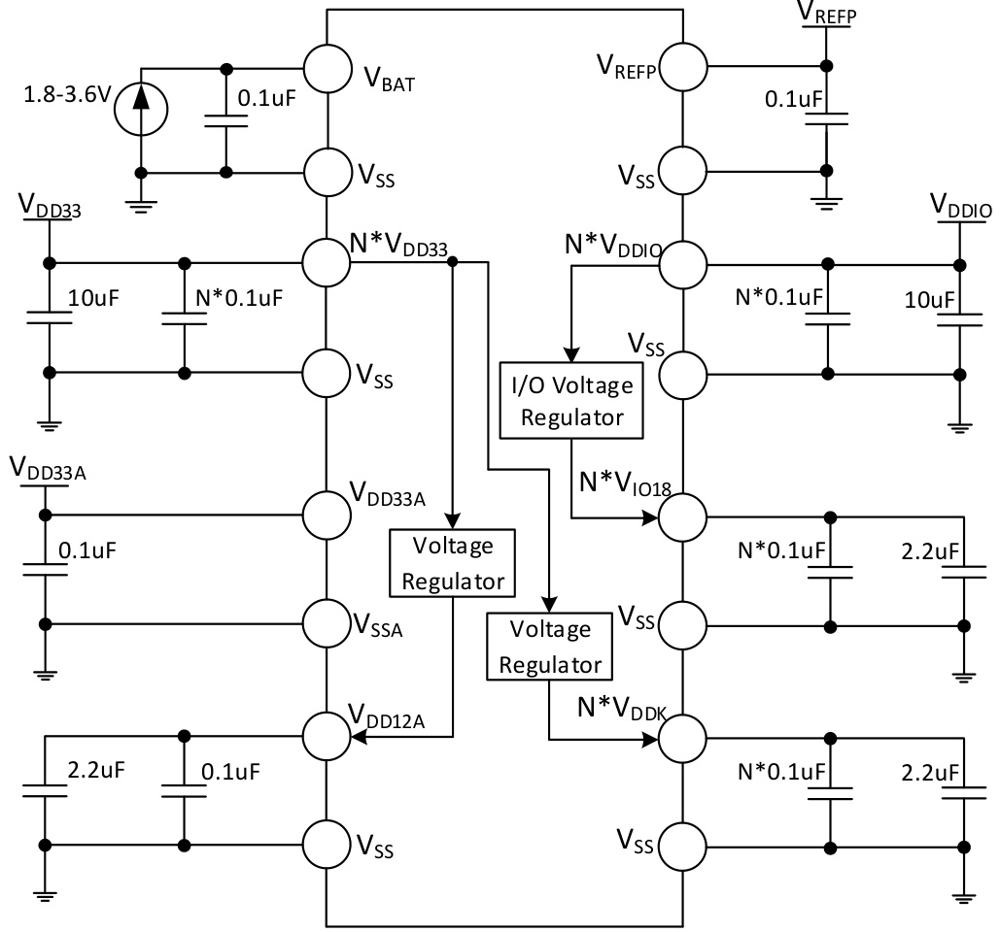  
图 3-1-1 CH32H417 常规供电典型电路

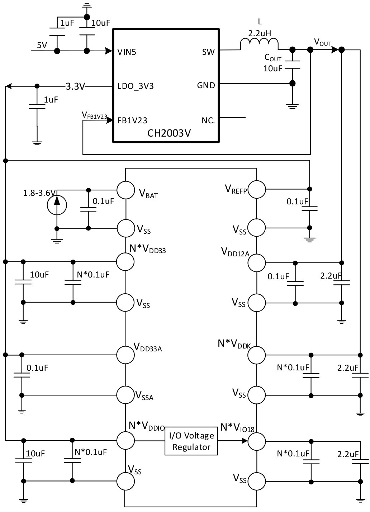  
图 3-1-2 CH32H417 DCDC 单一5V 供电电路

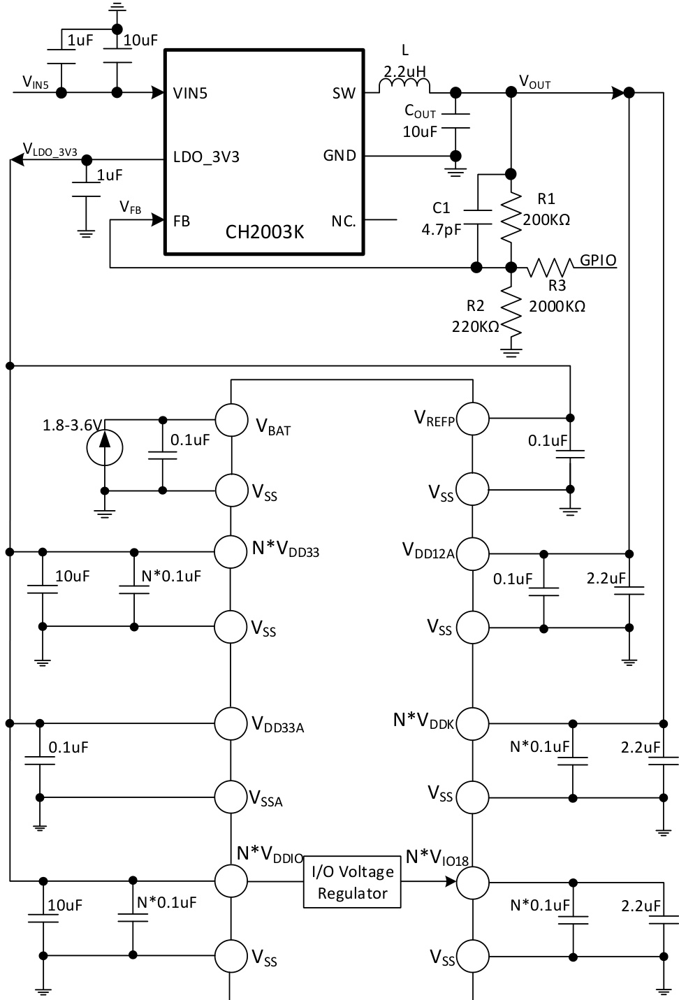  
图 3-1-3 CH32H417 调压器为低功耗模式的 DCDC 单一5V 供电电路

注：1.对于CH32H417 芯片， VDD33、 VDDIO、 $V _ { I 0 1 8 }$ 以及 $V _ { D D K }$ 在部分芯片封装中可能有多个引脚， 同名电源引脚必须短接。

主 VDD33引脚 （与以太网信号引脚相邻） 外接0. 1uF 并联至少 10uF 容量的退耦电容， 剩余 $V _ { D D 3 3 }$ 引脚只需外接0.1uF 容量的退耦电容即可。

主VDDIO引脚 （与 $V _ { I 0 1 8 }$ 相邻） 外接0.1uF 并联至少 10uF 容量的退耦电容， 剩余 $V _ { D D I O }$ 引脚只需外接0.1uF 容量的退耦电容即可。

主 $V _ { I 0 1 8 }$ 引脚 （与 $V _ { D D I O }$ 相邻） 外接0.1uF 并联2.2uF 容量的退耦电容， 剩余 $V _ { I O 1 8 }$ 引脚只需外接0.1uF容量的退耦电容即可。

主 $V _ { D D K }$ 引脚 （与 $V _ { D D 3 3 }$ 相邻） 外接0.1uF 并联2.2uF 容量的退耦电容， 剩余 $V _ { D D K }$ 引脚只需外接0.1uF容量的退耦电容即可。

2.对于图3-1-3， GPIO 低电平对应调压器为正常模式； GPIO 高电平对应调压器为低功耗模式。

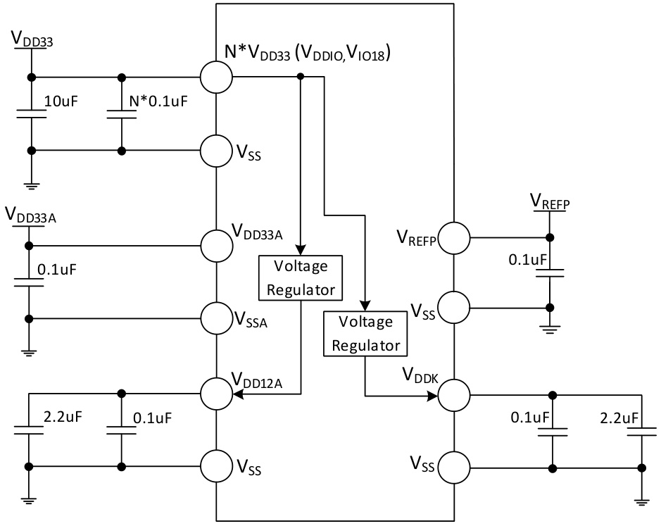  
图 $3 { - } 1 { - } 4 ~ complement { + } 3 2 { + } 4 1 6$ 常规供电典型电路

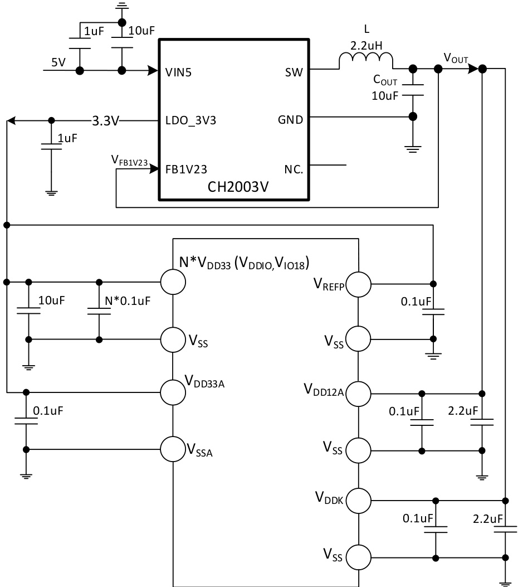  
图 3-1-5 CH32H416 DCDC 单一5V 供电电路

注：1.对于CH32H416RDU6 芯片， $V _ { D D 3 3 }$ 有2 个引脚， 同名电源引脚必须短接。主VDD33引脚 （与 $V _ { D D K }$ 引脚相邻） 外接0.1uF 并联至少10uF 容量的退耦电容， 剩余 $V _ { D D 3 3 }$ 引脚只需外  
接0.1uF 容量的退耦电容即可。  
注：1.对于CH32H415REU6 芯片， $V _ { D D 3 3 }$ 有多个引脚， 同名电源引脚必须短接。主 $V _ { D D 3 3 }$ 引脚 （与 $V _ { D D K }$ 引脚相邻） 外接0.1uF 并联至少4.7uF 容量的退耦电容， 剩余VDD33引脚只需  
外接 $\boldsymbol { 0 } .$ .1uF 容量的退耦电容即可。

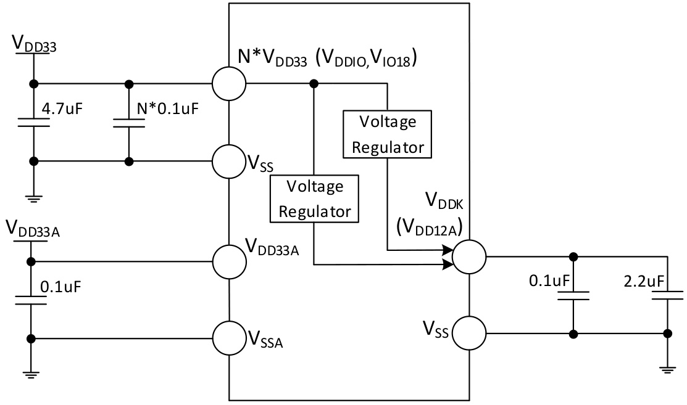  
图 3-1-6 CH32H415 常规供电典型电路

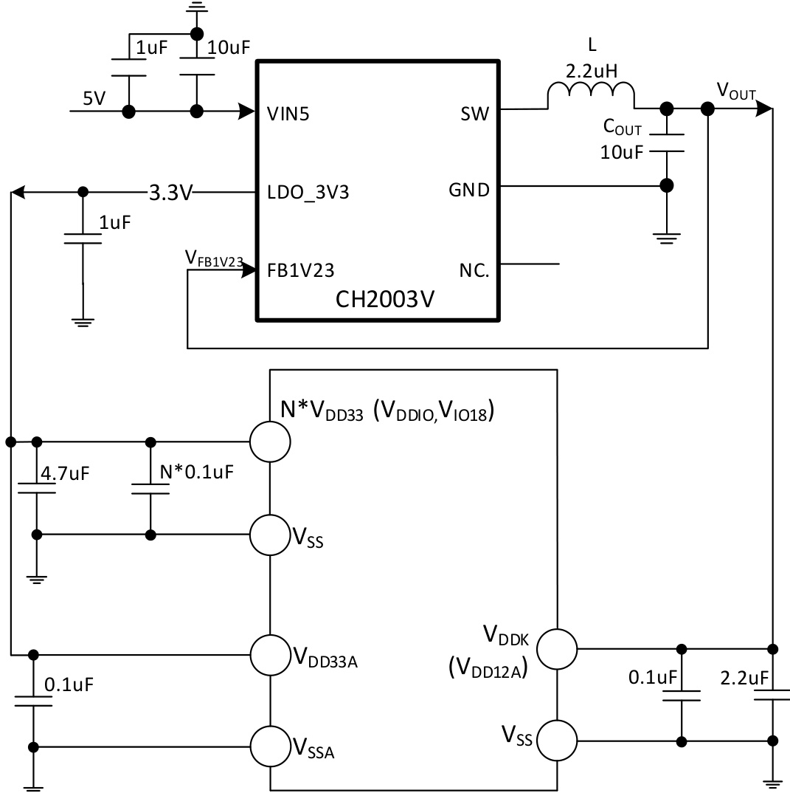  
图 3-1-7 CH32H415 DCDC 单一5V 供电电路

# 3.2 绝对最大值

临界或者超过绝对最大值将可能导致芯片工作不正常甚至损坏。

表 $3 { - } 1$ 绝对最大值参数表  

<html><body><table><tr><td>符号</td><td>描述</td><td>最小值</td><td>最大值</td><td>单位</td></tr><tr><td>TA</td><td>工作时的环境温度</td><td>-40</td><td>85</td><td>℃</td></tr><tr><td>Ts</td><td>存储时的环境温度</td><td>-40</td><td>125</td><td>℃</td></tr><tr><td>VDD33</td><td>外部主供电电压 （包含VDD33A和Vp33）</td><td>-0.3</td><td>4.0</td><td>></td></tr><tr><td>VD10</td><td>部分常规1/0引脚的供电电压</td><td>-0.3</td><td>4.0</td><td>></td></tr><tr><td>V1018</td><td>部分高速1/0引脚的供电电压</td><td>-0.3</td><td>4.0</td><td></td></tr><tr><td>VDD12A</td><td>USB3.0模块供电电压</td><td>-0.3</td><td>1.5</td><td>V</td></tr><tr><td>VDK</td><td>内核电路的电源退耦端</td><td>-0.3</td><td>1.5</td><td>v</td></tr><tr><td>VREFP</td><td>ADC、 HSADC、 DAC 模块的正参考电压</td><td>-0.3</td><td>VDD33A+0.3</td><td>V</td></tr><tr><td rowspan="5">VIN</td><td>FT （耐受5V) 引脚上的输入电压</td><td>-0.3</td><td>5.5</td><td>V</td></tr><tr><td>USB 2.0 和以太网PHY 引脚上的输入电压</td><td>-0.3</td><td>VD33+0.3</td><td>V</td></tr><tr><td>部分高速 1/0引脚上的输入电压 （V1018供电）</td><td>-0.3</td><td>V1018+0.3</td><td>V</td></tr><tr><td>USB 3.0引脚上的输入电压</td><td>-0.3</td><td>VDD12A+0.3</td><td>V</td></tr><tr><td>其他引脚上的输入电压 (VDD10供电）</td><td>-0.3</td><td>VDD10+0.3</td><td>V</td></tr><tr><td>| △VD33x|</td><td>主供电引脚各VDD33之间的电压差</td><td></td><td>20</td><td>mV</td></tr><tr><td>| ∆VDD10_x|</td><td>不同Vp1o供电引脚之间的电压差</td><td></td><td>20</td><td>mV</td></tr><tr><td>|△V1018_x|</td><td>不同V1018供电引脚之间的电压差</td><td></td><td>20</td><td>mV</td></tr><tr><td>| ∆Vss_x|</td><td>公共地引脚各Vss之间的电压差</td><td></td><td>20</td><td>mV</td></tr><tr><td>VESDI0 (HBM)</td><td>普通 1/0引脚的 ESD静电放电电压 (HBM)</td><td>4K</td><td></td><td>V</td></tr><tr><td>IVDD33</td><td>所有VD33VDD33A主供电引脚的合计总电流</td><td></td><td>400</td><td>mA</td></tr><tr><td>Iv10o</td><td>所有V1o/V1018供电引脚的合计总电流</td><td></td><td>200</td><td>mA</td></tr><tr><td>Ivss</td><td>所有Vss公共地引脚的合计总电流</td><td></td><td>600</td><td>mA</td></tr><tr><td rowspan="2">I10</td><td>任意 I/0 和控制引脚上的灌电流</td><td></td><td>25</td><td rowspan="2">mA</td></tr><tr><td>任意 1/0 和控制引脚上的源电流</td><td></td><td>-25</td></tr></table></body></html>

# 3.3 电气参数

3.3.1 工作条件

表 3-2 通用工作条件  

<html><body><table><tr><td>符号</td><td>参数</td><td>条件</td><td>最小值</td><td>典型值</td><td>最大值</td><td>单 位</td></tr><tr><td rowspan="2">FcORE1</td><td rowspan="2">内核RISC-V5F 频率</td><td>LDO_ VDDK = 011 （默认）</td><td></td><td></td><td>400 (4）</td><td>MHz</td></tr><tr><td>LDO_ VDDK 101</td><td></td><td></td><td>480 (5)</td><td>MHz</td></tr><tr><td>FHCLK</td><td>内部系统总线频率</td><td>LDO_ VDDK 011 （默认） 二</td><td></td><td></td><td>150</td><td>MHz</td></tr><tr><td rowspan="2">或 FCOREO</td><td rowspan="2">或内核RISC-V3F频率</td><td>LDO_ VDDK 101</td><td></td><td></td><td>180 （5）</td><td>MHz</td></tr><tr><td>未使用 USB 或 ETH</td><td>2.4()</td><td>3.3</td><td>3.6</td><td>V</td></tr><tr><td rowspan="2">VDD33</td><td rowspan="2">标准工作电压</td><td>使用 USB 或 ETH 或 SerDes</td><td>3.15</td><td>3.3</td><td>3.45</td><td></td></tr><tr><td>未使用 ADC、 HSADC 和DAC, VD33A不能低于 VDD10</td><td>1.8</td><td>3.3</td><td>3.6</td><td></td></tr><tr><td>VDD33A</td><td>模拟部分工作电压</td><td>使用 ADC,VDD33A不能低于 VREFP不能高于 VD10, VDD33A</td><td>2.4</td><td>3.3</td><td>3.6</td><td></td></tr></table></body></html>

<html><body><table><tr><td rowspan="3"></td><td rowspan="3"></td><td>使用 HSADC 时，VDo33a不能低于 VREFP不能高于 VDD10, VDD33A</td><td>3.0</td><td>3.3</td><td>3.6</td><td></td></tr><tr><td>使用 OPA 时， 运放输出不能 高于 VD010</td><td>1.8</td><td>3.3</td><td>3.6</td><td></td></tr><tr><td>使用DAC 时，DAC 输出不能高 于 VDD10</td><td>2.4</td><td>3.3</td><td>3.6</td><td></td></tr><tr><td>（1） (1) VD12A</td><td>USB 3.0模块工作电压</td><td></td><td>1.17</td><td>1.2</td><td>1.27</td><td>V</td></tr><tr><td>VDDK</td><td>内核工作电压 部分常规1/0 引脚工作电压</td><td></td><td>1.17</td><td>1.2</td><td>1.27</td><td></td></tr><tr><td>VDD10 V1018</td><td>部分高速1/0 引脚工作电压</td><td>VDD1o不能高于 V1018不能高于 VDD33 VDD10</td><td>1.65 1.1</td><td>3.3</td><td>3.6 3.6</td><td>V V</td></tr><tr><td rowspan="3">RHSEXO_ext</td><td>X0 引脚外部连接的下拉电阻</td><td>V1018默认输出2.5V</td><td>220</td><td>300</td><td>400</td><td>kΩ</td></tr><tr><td>（用于配置 V1018在初始上电</td><td>V1018默认输出1.8V</td><td>1200</td><td>浮空</td><td></td><td>kΩ</td></tr><tr><td>过程中的默认输出电压)</td><td>V1018默认输出1.2V</td><td>60</td><td>82</td><td>110</td><td>kΩ</td></tr><tr><td>VBAT</td><td>备份单元工作电压</td><td></td><td>1.8</td><td></td><td>3.6</td><td></td></tr><tr><td>(2) VREFP</td><td>ADC、 HSADC、 DAC 模块的正参</td><td>VREFP不能高于 VDD33A</td><td>2.4</td><td>3.3</td><td>3.6</td><td></td></tr><tr><td></td><td>考电压 工作时的环境温度</td><td></td><td>-40</td><td></td><td>85</td><td>C</td></tr><tr><td></td><td>结温度</td><td></td><td>-40</td><td></td><td>105</td><td>C</td></tr></table></body></html>

注： $1 . \ V _ { D D 1 2 A }$ 和 $V _ { D D K }$ 电流较大， 考虑PCB 走线压降损失， 如果外部供电建议1.2V 再加 $1 0 \sim 5 0 m V _ { o }$ 2. $V _ { R E F P }$ 外接电容要尽可能近， 否则影响ADC 性能。3.对于CH32V417 芯片， 电压关系： $V _ { D D 3 3 } ~ \geq ~ V _ { D D 3 3 A } ~ \geq ~ V _ { D D 1 0 } ~ \geq ~ V _ { 1 0 1 8 }$ ； 并且 $V _ { D D 3 3 A } \ \geqslant \ V _ { R E F P } ,$ 对于CH32V416 芯片， 电压关系： $V _ { D D 3 3 } \ = \ V _ { D D 3 3 A }$ ； 并且 $V _ { D D 3 3 A } \ \geqslant \ V _ { R E F P 4 }$ 。对于CH32V415 芯片， 电压关系： $V _ { D D 3 3 } \ = \ V _ { D D 3 3 A c }$ 4.常温 $\pi$ 实测不低于 $\ 4 8 0 M H z$ ， 未考虑温度和工艺波动， 禁止480MHz 应用于正式工程。5.仅适用于商业级应用： ${ \cal T } _ { \cal A } \ \leqslant \ 7 0 ^ { \circ } C .$ 且散热良好。6.当使用调压器为低功耗模式的停止模式或 $V _ { I 0 1 8 }$ 由低压切换到高压时， $V _ { D D 3 3 }$ 不能低于 $2 . 7 V _ { o }$ 。

表 3-3 上电和掉电条件  

<html><body><table><tr><td>符号</td><td>参数</td><td>条件</td><td>最小值</td><td>最大值</td><td>单位</td></tr><tr><td rowspan="2">tvDD33</td><td>VDD33 上升速率</td><td></td><td>0</td><td>8</td><td>us/V</td></tr><tr><td>VDD33 下降速率</td><td></td><td>20</td><td>8</td><td>us/V</td></tr><tr><td rowspan="2">tvDD33A</td><td>上升速率 VDD33A.</td><td rowspan="2">VD3有电</td><td>0</td><td>10000</td><td>us/V</td></tr><tr><td>VDD33A下降速率</td><td>20</td><td>8</td><td>us/V</td></tr></table></body></html>

# 3.3.2 内置复位和电源控制模块特性

表 3-4 复位及电压监测  

<html><body><table><tr><td>符号</td><td>参数</td><td>条件</td><td>最小值</td><td>典型值</td><td>最大值</td><td>单位</td></tr><tr><td rowspan="7">VpVD(1)</td><td rowspan="7">可编程电压检测器的 电平选择 (2)</td><td>PLS[2 :0] = 000 （上升沿）</td><td></td><td>2.54</td><td></td><td>></td></tr><tr><td>PLS[2 :0] = 000 （下降沿）</td><td></td><td>2.44</td><td></td><td></td></tr><tr><td>PLS[2 :0] = 001 （上升沿）</td><td></td><td>2.60</td><td></td><td></td></tr><tr><td>PLS[2 :0] 001 （下降沿）</td><td></td><td>2.49</td><td></td><td></td></tr><tr><td>PLS[2:0] = 010 （上升沿）</td><td></td><td>2.70</td><td></td><td></td></tr><tr><td>PLS[2 :0] 二 010 （下降沿）</td><td></td><td>2.59</td><td></td><td></td></tr><tr><td>PLS[2 :0] 二 011 （上升沿）</td><td></td><td>2.80</td><td></td><td>V</td></tr></table></body></html>

<html><body><table><tr><td rowspan="10"></td><td rowspan="10"></td><td>PLS[2:0] = 011 （下降沿）</td><td></td><td>2.69</td><td></td><td>></td></tr><tr><td>PLS[2 :0] = 100 （上升沿）</td><td></td><td>2.90</td><td></td><td>></td></tr><tr><td>PLS[2 :0] 100 （下降沿）</td><td></td><td>2.79</td><td></td><td></td></tr><tr><td>PLS[2 :0] = 101 （上升沿）</td><td></td><td>3.00</td><td></td><td></td></tr><tr><td>PLS[2 :0] = 101 （下降沿）</td><td></td><td>2.89</td><td></td><td></td></tr><tr><td>PLS[2 :0] = 110 （上升沿）</td><td></td><td>3.10</td><td></td><td>></td></tr><tr><td>PLS[2:0] 二 110 （下降沿）</td><td></td><td>2.99</td><td></td><td></td></tr><tr><td>PLS[2:0] 二 111 （上升沿）</td><td></td><td>3.20</td><td></td><td></td></tr><tr><td>PLS[2 :0] 二 111 （下降沿）</td><td></td><td>3.09</td><td></td><td></td></tr><tr><td></td><td></td><td>0.11</td><td></td><td></td></tr><tr><td>VpvDhyst VPOR/PDR</td><td>PVD 迟滞 上电/掉电复位阈值</td><td>上升沿</td><td></td><td>2.35</td><td></td><td></td></tr><tr><td rowspan="2">VpDRhyst</td><td rowspan="2">PDR 迟滞</td><td>下降沿</td><td></td><td>2.33</td><td></td><td>V</td></tr><tr><td></td><td></td><td>20</td><td></td><td>mV</td></tr><tr><td></td><td></td><td></td><td></td><td></td><td></td><td></td></tr></table></body></html>

注：1.常温测试值。

# 3.3.3 内置的参考电压

表 3-5 内置参考电压  

<html><body><table><tr><td>符号</td><td>参数</td><td>条件</td><td>最小值</td><td>典型值</td><td>最大值</td><td>单位</td></tr><tr><td>VREFINT</td><td>内置参考电压</td><td>TA = -40℃~85℃</td><td>1.17</td><td>1.21</td><td>1.24</td><td>V</td></tr></table></body></html>

# 3.3.4 供电电流特性

电流消耗是多种参数和因素的综合指标， 这些参数和因素包括工作电压、环境温度、I/O 引脚的负载、产品的软件配置、工作频率、I/O 脚的翻转速率、程序在存储器中的位置以及执行的代码等。电流消耗测量方法如下图：

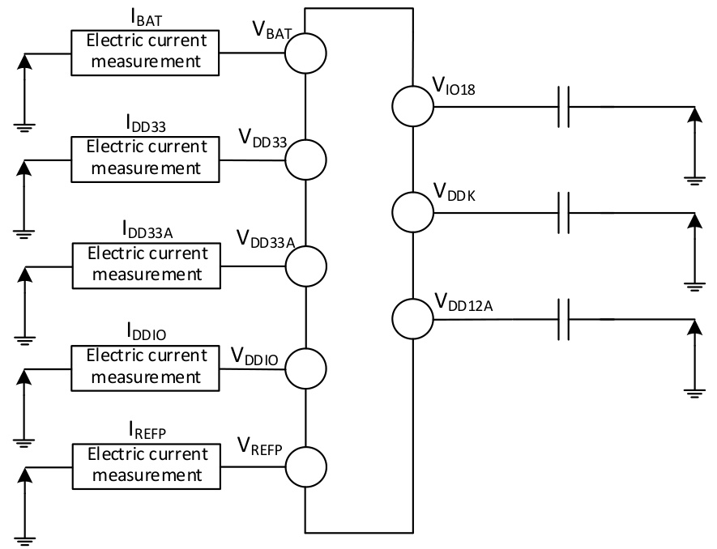  
图 3-2-1 CH32H417 电流消耗测量

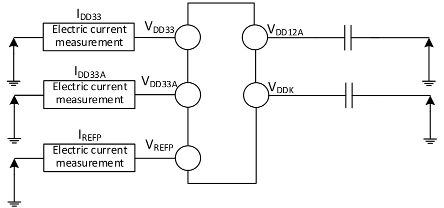  
图 3-2-2 CH32H416 电流消耗测量

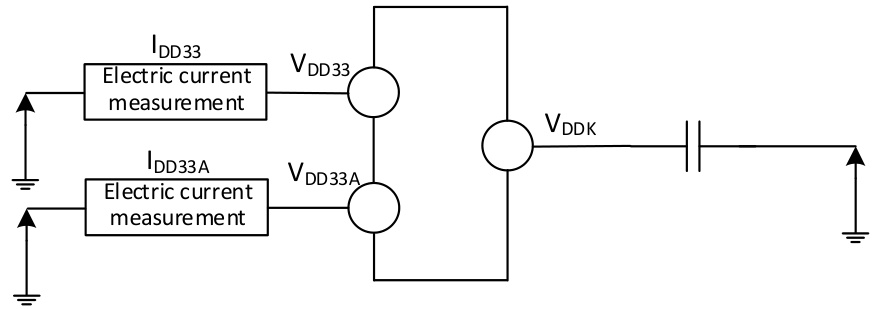  
图 3-2-3 CH32H415 电流消耗测量

CH32H417 处于下列条件之一：

1、常温供电 $\mathsf { V } _ { \mathsf { D D 3 3 } } = 3 . 3 \mathsf { V }$ 、 $\mathsf { V } _ { \mathsf { D D 3 3 A } } = 3 . \mathsf { 3 V }$ 、 $\mathsf { V } _ { \mathsf { D D } 1 0 } = 3 . 3 \mathsf { V }$ 、 $\mathsf { V } _ { \mathsf { R E F P } } = 3 . 3 \mathsf { V }$ ， 产生 $\mathsf { V } _ { 1 0 1 8 } = 1 . 8 \mathsf { V }$ 、 $\mathsf { V } _ { \mathsf { D D 1 2 A } } = 1 . 2 \mathsf { V }$ 、$\mathsf { V } _ { \sf 0 \mathrm { D K } } = 1 . 2 \mathsf { V } .$ 。2、常温，外部为 DCDC 芯片（CH2003V 或 CH2003K）提供额定 5V，产生额定 3.3V 和 1.2V 供给 CH32H417芯片。3、常温， 外部为 DCDC 芯片 （CH2003K） 提供额定 5V，产生额定 3.3V 和 0.875V 供给 CH32H417 芯片。同时测试时： 所有 $1 / 0$ 端口配置下拉输入， $H S l = 2 5 M H z$ （已校准）， $F _ { \mathsf { H C L K } } = F _ { \mathsf { V 3 F } }$ 。 使能或关闭所有外设时钟的功耗。

CH32H416 处于下列条件之一：

$\mathsf { V } _ { \tt D D 3 3 A } = 3 . 3 \mathsf { V }$ $\mathsf { V } _ { \tt D D 1 2 A } = \mathrm { \Omega } _ { 1 } \mathrm { ~ . ~ } 2 \mathsf { V }$

1、 常温供电 $\mathsf { V } _ { \mathsf { D D 3 3 } } = 3 . 3 \mathsf { V }$ 、 、 $V _ { \tt R E F P } = 3 . 3 V$ ， 产生 、 $\mathsf { V } _ { \mathsf { D D K } } = \mathsf { 1 } . 2 \mathsf { V }$ 。2、 常温， 外部为 DCDC 芯片 （CH2003V） 提供额定 5V，产生额定 3.3V 和 1.2V 供给 CH32H416 芯片。同时测试时： 所有 $1 / 0$ 端口配置下拉输入， $H S 1 = 2 5 M H z$ （已校准）， $F _ { \mathsf { H C L K } } = F _ { \mathsf { V 3 F } }$ 。 使能或关闭所有外设时钟的功耗。

CH32H415 处于下列条件之一：

1、 常温供电 $\mathsf { V } _ { \mathsf { D D 3 3 } } = 3 . 3 \mathsf { V }$ 、 $\mathsf { V } _ { \tt D B 3 A } = 3 . 3 \mathsf { V }$ ， 产生 $\mathsf { V } _ { \sf { D D K } } = \mathsf { 1 } . 2 \mathsf { V }$ 。2、常温， 外部为 DCDC 芯片 （CH2003V） 提供额定 5V，产生额定 3.3V 和 1.2V 供给 CH32H415 芯片。同时测试时： 所有 $1 / 0$ 端口配置下拉输入， $H S l = 2 5 M H z$ （已校准）， $F _ { \mathsf { H C L K } } = F _ { \mathsf { V 3 F } }$ 。 使能或关闭所有外设时钟的功耗。

注：小封装型号未封装出的引脚或者已封装出来但未使用的引脚， 建议配置为上拉输入或者下拉输入，否则可能影响电流指标， 具体操作请参考EVT 低功耗例程。

表 $3 - 6 - 1$ 运行模式下典型的电流消耗， 数据处理代码从 SRAM 中运行 （RISC-V5F）  

<html><body><table><tr><td rowspan="2">符号</td><td rowspan="2">参数</td><td colspan="3">条件</td><td colspan="2">典型值</td><td rowspan="2">单位</td></tr><tr><td>时钟</td><td>Fv5F</td><td>FHCLK</td><td>使能所有外设</td><td>关闭所有外设</td></tr><tr><td rowspan="10">|DD(1d)</td><td rowspan="9">运行模式 下，芯片总 供应电流</td><td rowspan="6">运行于高速内部 RC 振荡器 (HSI), 使用HB 预分频以 减低频率</td><td>480MHz</td><td>120MHz</td><td>135.5</td><td>101.1</td><td rowspan="9">mA</td></tr><tr><td>400MHz</td><td>100MHz</td><td>101.6</td><td>73.6</td></tr><tr><td>384MHz</td><td>96MHz</td><td>96.6</td><td>68.7</td></tr><tr><td>288MHz</td><td>144MHz</td><td>95.4</td><td>57.4</td></tr><tr><td>25MHz</td><td>25MHz</td><td>14.0</td><td>8.3</td></tr><tr><td>500kHz</td><td>500kHz</td><td>10.0</td><td>8.2</td></tr><tr><td rowspan="5">外部时钟</td><td>480MHz</td><td>120MHz</td><td>136.7</td><td>101.9</td></tr><tr><td>400MHz</td><td>100MHz</td><td>102.2</td><td>74.2</td></tr><tr><td>384MHz</td><td>96MHz</td><td>97.4</td><td>69.6</td></tr><tr><td>288MHz</td><td>144MHz</td><td>96.0</td><td>58.0</td></tr><tr><td>25MHz</td><td>25MHz</td><td>14.7</td><td>8.9</td></tr><tr><td></td><td></td><td>500kHz</td><td>500kHz 10.7</td><td>8.8</td><td></td></tr></table></body></html>

注： 1.以上为实测参数。

表 3-6-2 运行模式下典型的电流消耗， 数据处理代码从 SRAM 中运行 （RISC-V3F）  

<html><body><table><tr><td rowspan="2">符号</td><td rowspan="2">参数</td><td colspan="3">条件</td><td colspan="2">典型值</td><td rowspan="2">单位</td></tr><tr><td>时钟</td><td>Fv3F</td><td>FHCLK</td><td>使能所有外设</td><td>关闭所有外设</td></tr><tr><td rowspan="7">IDD (1d)</td><td rowspan="6">运行模式 减低频率 供应电流</td><td rowspan="3">运行于高速内部 RC 振荡器 (HSI), 使用HB 预分频以</td><td>144MHz</td><td>144MHz</td><td>77.1</td><td>33.2</td><td rowspan="7">mA</td></tr><tr><td>96MHz</td><td>96MHz</td><td>59.2</td><td>33.2</td></tr><tr><td>25MHz</td><td>25MHz</td><td>15.4</td><td>8.6</td></tr><tr><td></td><td>500kHz</td><td>500kHz</td><td>9.9</td><td>8.4</td></tr><tr><td rowspan="3">外部时钟</td><td>144MHz</td><td>144MHz</td><td>77.5</td><td>33.7</td></tr><tr><td>96MHz</td><td>96MHz</td><td>60.0</td><td>33.7</td></tr><tr><td>25MHz</td><td>25MHz</td><td>14.4</td><td>9.7</td></tr></table></body></html>

注： 1.以上为实测参数。

表 3-6-3 运行模式下典型的电流消耗， 数据处理代码从 SRAM 中运行 （RISC-V5F $^ +$ RISC-V3F）  

<html><body><table><tr><td rowspan="2">符号</td><td rowspan="2">参数</td><td colspan="3">条件</td><td colspan="2">典型值</td><td rowspan="2">单位</td></tr><tr><td>时钟</td><td>Fv5F</td><td>Fv3F</td><td>使能所有外设</td><td>关闭所有外设</td></tr><tr><td rowspan="9">IDD (1)</td><td rowspan="9">运行模式 下，芯片总 供应电流</td><td rowspan="6">运行于高速内部 RC 振荡器 (HSI), 使用HB预分频以 减低频率</td><td>480MHz</td><td>120MHz</td><td>143.4</td><td>110.8</td><td rowspan="9">mA</td></tr><tr><td>400MHz</td><td>100MHz</td><td>115.5</td><td>87.8</td></tr><tr><td>384MHz</td><td>96MHz</td><td>106.6</td><td>78.8</td></tr><tr><td>288MHz</td><td>144MHz</td><td>124.2</td><td>86.5</td></tr><tr><td>25MHz</td><td>25MHz</td><td>16.9</td><td>10.9</td></tr><tr><td>500kHz</td><td>500kHz</td><td>10.0</td><td>8.8</td></tr><tr><td rowspan="3">外部时钟</td><td>480MHz</td><td>120MHz</td><td>144.0</td><td>111.2</td></tr><tr><td>400MHz</td><td>100MHz</td><td>115.9</td><td>88.3</td></tr><tr><td>384MHz 288MHz</td><td>96MHz</td><td>107.5</td><td>79.6 87.9</td></tr></table></body></html>

<html><body><table><tr><td></td><td></td><td></td><td>25MHz</td><td>25MHz</td><td>17.6</td><td>11.7</td></tr><tr><td></td><td></td><td>500kHz</td><td>500kHz</td><td>10.8</td><td>9.2</td><td></td></tr></table></body></html>

注： 1.以上为实测参数。

表 $3 - 6 - 4$ 运行模式下 $v _ { \tt D D K }$ 典型的电流消耗， 数据处理代码从 SRAM 中运行 （RISC-V5F $^ +$ RISC-V3F）  

<html><body><table><tr><td rowspan="2">符号</td><td rowspan="2">参数</td><td colspan="3">条件</td><td colspan="2">典型值</td><td rowspan="2">单位</td></tr><tr><td>时钟</td><td>Fv5F</td><td>FV3F</td><td>使能所有外设</td><td>关闭所有外设</td></tr><tr><td rowspan="6">ID(1)(2)</td><td rowspan="6">荡器 运行模式 下，VooK供 预分频以减低频率 应电流</td><td rowspan="3">运行于高速内部 RC (HSI), 使用 HB</td><td>振 400MHz</td><td>100MHz</td><td>111.5</td><td>83.9</td><td rowspan="6">mA</td></tr><tr><td>240MHz</td><td>120MHz</td><td>92.6</td><td>63.8</td></tr><tr><td>25MHz</td><td>25MHz</td><td>13.8</td><td>7.9</td></tr><tr><td rowspan="3">外部时钟</td><td>400MHz</td><td>100MHz</td><td>112.2</td><td>84.4</td></tr><tr><td>240MHz</td><td>120MHz</td><td>93. .2</td><td>64.3</td></tr><tr><td>25MHz</td><td>25MHz</td><td>14.4</td><td>8.6</td></tr></table></body></html>

注：1.以上为实测参数。2.当 $V _ { D D K }$ 由外部直接供电时， 外部电源的供电能力需要充分大于上述表格中的数值。

表 3-6-5 运行模式下 $V _ {tt D D 1 2 A }$ 典型的电流消耗， 数据处理代码从 SRAM 中运行  

<html><body><table><tr><td>符号</td><td>参数</td><td>条件</td><td>典型值</td><td>单位</td></tr><tr><td>(1）(2) DD12A</td><td>运行模式下， VD12A供应电流</td><td>使用USB 3.0</td><td>85</td><td>mA</td></tr></table></body></html>

注：1.以上为实测参数。2.当 $V _ { D D 1 2 A }$ 由外部直接供电时， 外部电源的供电能力需要充分大于上述表格中的数值。

表 3-7 睡眠模式下典型的电流消耗， 数据处理代码从 SRAM 中运行 （RISC-V5F $^ +$ RISC-V3F）  

<html><body><table><tr><td rowspan="2">符号</td><td rowspan="2">参数</td><td colspan="3">条件</td><td colspan="2">典型值</td><td rowspan="2">单位</td></tr><tr><td>时钟</td><td>FV5F</td><td>Fv3F</td><td>使能所有外设</td><td>关闭所有外设</td></tr><tr><td rowspan="9">I DD (1)</td><td rowspan="9">睡眠模式 下，芯片 总供应电 流（此时</td><td rowspan="6">运行於高速内部 RC振荡器 (HSI), 使用HB 预分频以 减低频率</td><td>480MHz</td><td>120MHz</td><td>60.1</td><td>25.7</td><td rowspan="9">mA</td></tr><tr><td>400MHz</td><td>100MHz</td><td>45.7</td><td>18.2</td></tr><tr><td>384MHz</td><td>96MHz</td><td>48.0</td><td>22.2</td></tr><tr><td>288MHz</td><td>144MHz</td><td>58.8</td><td>22.</td></tr><tr><td>25MHz</td><td>25MHz</td><td>10.6</td><td>5.2</td></tr><tr><td>500kHz</td><td>500kHz</td><td>9.9</td><td>5.2</td></tr><tr><td>480MHz</td><td>120MHz</td><td>60.8</td><td>26.4</td></tr><tr><td>400MHz</td><td>100MHz</td><td>46.3</td><td>19.0 22.8</td></tr><tr><td>384MHz</td><td></td><td>96MHz</td><td>48.8</td></tr><tr><td>288MHz</td><td>144MHz</td><td></td><td>60.1</td></tr><tr><td>25MHz</td><td>25MHz</td><td></td><td>11.4 6.0</td></tr><tr><td>500kHz</td><td></td><td>500kHz</td><td>10.6 5.9</td></tr></table></body></html>

注： 1.以上均为实测参数。

表 3-8 停止模式下典型的电流消耗 （RISC-V5F $^ +$ RISC-V3F）  

<html><body><table><tr><td>符号</td><td>参数</td><td>条件</td><td>典型值</td><td>单位</td></tr><tr><td>(1) DD</td><td>停止模式下， 芯片总供 应电流</td><td>调压器处于正常模式，低速和高速内部 RC 振荡器及外部振荡器都处于关闭状</td><td>2.4</td><td>mA</td></tr></table></body></html>

<html><body><table><tr><td rowspan="2"></td><td rowspan="2"></td><td>态 （没有独立看门狗） 调压器处于低功耗模式，低速和高速内 部 RC 振荡器及外部振荡器都处于关闭</td><td>1.4</td><td>mA</td></tr><tr><td>状态 （没有独立看门狗，PVD 关闭) 使用 DCDC 芯片 （CH2003V）供电 调压器处于低功耗模式，低速和高速内 部 RC 振荡器及外部振荡器都处于关闭 状态 （没有独立看门狗，PVD 关闭） 使用 DCDC 芯片 (CH2003K) 供电 （3） 调压器处于低功耗模式，低速和高速内 (2)</td><td>1.3</td><td>mA</td></tr><tr><td>IDD_VBAT</td><td>备份区域的供应电流 （移除VD33VDD33A和VDDI0 只使用VBAτ供电）</td><td>部 RC 振荡器及外部振荡器都处于关闭 状态 (没有独立看门狗，PVD关闭) 低速外部振荡器和RTC处于开启状态</td><td>3.5</td><td>uA</td></tr></table></body></html>

注：1.以上均为实测参数。2.供电电路基于图3-1-2、 图3-1-5、 图 $3 - 1 - 7 =$ 3.供电电路基于图3-1-3。

# 3.3.5 外部时钟源特性

表 3-9 来自外部高速时钟  

<html><body><table><tr><td>符号</td><td>参数</td><td>条件</td><td>最小值</td><td>典型值</td><td>最大值</td><td>单位</td></tr><tr><td>ext FHSE_</td><td>外部时钟频率</td><td></td><td>5</td><td>25</td><td>32</td><td>MHz</td></tr><tr><td>（1） VHSEH</td><td>XI 输入引脚高电平电压</td><td></td><td>0.8*VDD10</td><td></td><td>VDD10</td><td>V</td></tr><tr><td>（1） VHSEL</td><td>XI 输入引脚低电平电压</td><td></td><td>0</td><td></td><td>0.2 2*VDD10</td><td>V</td></tr><tr><td>Cin(HSE)</td><td>XI 输入电容</td><td></td><td></td><td>5</td><td></td><td>pF</td></tr><tr><td>DuCy (HSE)</td><td>占空比(Duty cycle)</td><td></td><td></td><td>50</td><td></td><td>%</td></tr><tr><td>IL</td><td>XI输入漏电流</td><td></td><td></td><td></td><td>+1</td><td>uA</td></tr></table></body></html>

注：1.不满足此条件可能会引起电平识别错误。

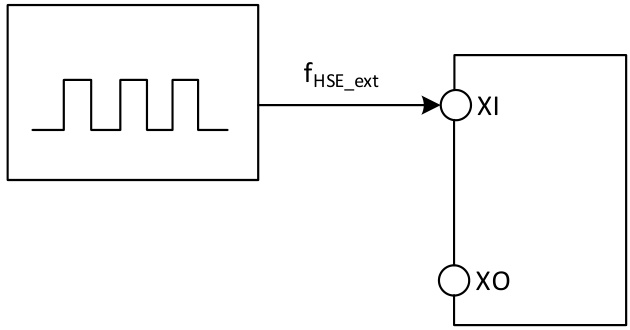  
图 3-3 外部提供高频时钟源电路

表 3-10 来自外部低速时钟  

<html><body><table><tr><td>符号</td><td>参数</td><td>条件</td><td>最小值</td><td>典型值</td><td>最大值</td><td>单位</td></tr><tr><td>FLSE_ext</td><td>用户外部时钟频率</td><td></td><td></td><td>32. 768</td><td></td><td>kHz</td></tr><tr><td>VLSEH</td><td>0SC32_ IN输入引脚高电平电压</td><td></td><td>0. 8*VDD33</td><td></td><td>VDD33</td><td>V</td></tr><tr><td>VLSEL</td><td>0SC32 IN输入引脚低电平电压</td><td></td><td>0</td><td></td><td>0.2*VDD33</td><td>V</td></tr></table></body></html>

<html><body><table><tr><td>Cin (LSE)</td><td>0SC32 IN输入电容</td><td></td><td></td><td>5</td><td></td><td>pF</td></tr><tr><td>DuCyLsE</td><td>占空比 (Duty cycle)</td><td></td><td></td><td>50</td><td></td><td>%</td></tr><tr><td>IL</td><td>0SC32 IN输入漏电流</td><td></td><td></td><td></td><td>±1</td><td>uA</td></tr></table></body></html>

注：1.不满足此条件可能会引起电平识别错误。

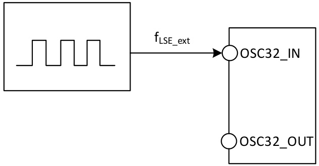  
图 3-4 外部提供低频时钟源电路

表 3-11 使用一个晶体/陶瓷谐振器产生的高速外部时钟  

<html><body><table><tr><td>符号</td><td>参数</td><td>条件</td><td>最小值</td><td>典型值</td><td>最大值</td><td>单位</td></tr><tr><td>Fx1</td><td>谐振器频率</td><td></td><td>5</td><td>25</td><td>32</td><td>MHz</td></tr><tr><td>RF</td><td>反馈电阻 （无需外置）</td><td></td><td></td><td>250</td><td></td><td>kΩ</td></tr><tr><td>CLOAD</td><td>建议的负载电容与对应晶体串 行阻抗 Rs</td><td>Rs = 60Ω(")</td><td></td><td>20</td><td></td><td>pF</td></tr><tr><td>IHSE</td><td>HSE 驱动电流</td><td></td><td></td><td>0.8</td><td></td><td>mA</td></tr><tr><td>gm</td><td>振荡器的跨导</td><td>启动</td><td></td><td>26</td><td></td><td>mA/V</td></tr><tr><td>tsU (HSE)</td><td>启动时间</td><td>VD33稳定， 25M晶体</td><td></td><td>1.5 (2)</td><td></td><td>ms</td></tr></table></body></html>

注：1.建议晶体ESR 不超过80 欧姆， 优先选择ESR 较小的晶体， 负载电容参考晶体手册要求。2.启动时间指从 HSEON 开启到HSERDY 被置位的时间差。3.以太网应用通常需要HSE， 晶振建议用25M 晶体， 建议不超过 30p m。

电路参考设计及要求：晶体的负载电容以晶体厂商建议为准， 通常情况 $G _ { 1 1 } = G _ { 2 }$

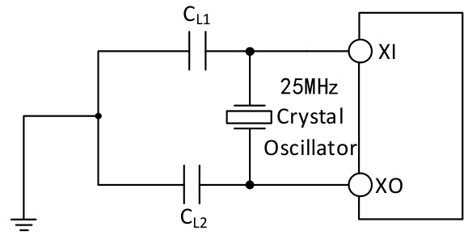  
图 3-5 外接 25M 晶体典型电路

表 3-12 使用一个晶体/陶瓷谐振器产生的低速外部时钟 （ $( f _ { \mathrm { L S E } } = 3 2 . 7 6 8 \mathsf { k H z } )$ ）  

<html><body><table><tr><td>符号</td><td>参数</td><td>条件</td><td>最小值</td><td>典型值</td><td>最大值</td><td>单位</td></tr><tr><td>FLSE</td><td>谐振器频率</td><td></td><td></td><td>32. 768</td><td></td><td>kHz</td></tr><tr><td>RF</td><td>反馈电阻</td><td></td><td></td><td>5</td><td></td><td>MQ</td></tr><tr><td></td><td>建议的负载电容与对应晶体串 行阻抗 Rs</td><td>Rs < 70kΩ</td><td></td><td></td><td>15</td><td>pF</td></tr></table></body></html>

<html><body><table><tr><td></td><td>LSE 驱动电流</td><td></td><td></td><td>0.35</td><td></td><td>uA</td></tr><tr><td>gm</td><td>振荡器的跨导</td><td>启动</td><td></td><td>30</td><td></td><td>uA/V</td></tr><tr><td>(LSE) tsu</td><td>启动时间</td><td>VD33是稳定的</td><td></td><td>800</td><td></td><td>mS</td></tr></table></body></html>

# 电路参考设计及要求：

晶体的负载电容以晶体厂商建议为准， 通常情况 $C _ { L 1 } = C _ { L 2 }$ ， 可选 12pF 左右。

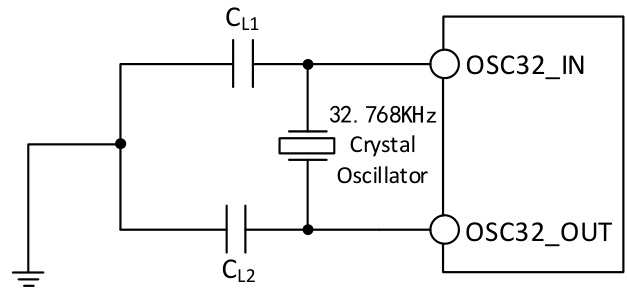  
图 3-6 外接 32. 768K 晶体典型电路

注：负载电容 $\mathcal { C } _ { \iota }$ 由 $\tau$ 式计算： $G _ { L } = G _ { L 1 } \times G _ { L 2 } \times ( G _ { L 1 } + G _ { L 2 } ) + G _ { s t r a y , }$ 其中 $\displaystyle {  { C _ { s t r a y } } }$ 是引脚的电容和PCB板或PCB 相关的电容， 它的典型值是介于 $2 p F$ 至 $7 p F$ 之间。

# 3.3.6 内部时钟源特性

表 $3 - 1 3$ 内部高速(HSI)RC 振荡器特性  

<html><body><table><tr><td>符号</td><td>参数</td><td>条件</td><td>最小值</td><td>典型值</td><td>最大值</td><td>单位</td></tr><tr><td>FHSI</td><td>频率(校准后)</td><td></td><td></td><td>25</td><td></td><td>MHz</td></tr><tr><td>DuCyHsI</td><td>占空比(Duty cycle)</td><td></td><td>45</td><td>50</td><td>55</td><td>%</td></tr><tr><td rowspan="2">ACCHSI</td><td rowspan="2">HSI 振荡器的精度 （校准后）</td><td>TA 二 0℃～70℃</td><td>-1.6</td><td></td><td>1.6</td><td>%</td></tr><tr><td>TA = -40℃~85℃</td><td>-2.2</td><td></td><td>2.2</td><td>%</td></tr><tr><td>tsU(HSI)</td><td>HSI 振荡器启动稳定时间</td><td></td><td></td><td>10</td><td></td><td>US</td></tr></table></body></html>

表 3-14 内部低速(LSI)RC 振荡器特性  

<html><body><table><tr><td>符号</td><td>参数</td><td>条件</td><td>最小值</td><td>典型值</td><td>最大值</td><td>单位</td></tr><tr><td>FLs1</td><td>频率</td><td></td><td>25</td><td>40</td><td>60</td><td>kHz</td></tr><tr><td>DuCyLsI</td><td>占空比(Duty cycle)</td><td></td><td>45</td><td>50</td><td>55</td><td>%</td></tr><tr><td>(1） tsu(LSI)</td><td>LSI 振荡器启动稳定时间</td><td></td><td></td><td>230</td><td></td><td>uS</td></tr><tr><td>IDD(LS1)</td><td>LSI 振荡器功耗</td><td></td><td></td><td>0.6</td><td></td><td>uA</td></tr></table></body></html>

注： 1.寄存器RCC CTLR LSION 置1， 等待LSIRDY 置1。

# 3.3.7 PLL 特性

表 3-15 PLL 特性  

<html><body><table><tr><td>符号</td><td>参数</td><td>条件</td><td>最小值</td><td>典型值</td><td>最大值</td><td>单位</td></tr><tr><td rowspan="2">FPLL_IN</td><td>PLL输入时钟</td><td></td><td>5</td><td>25</td><td>32</td><td>MHz</td></tr><tr><td>PLL 输入时钟占空比</td><td></td><td>40</td><td></td><td>60</td><td>%</td></tr><tr><td>FPLL_OUT</td><td>PLL 倍频输出时钟</td><td></td><td>100</td><td></td><td>600</td><td>MHz</td></tr><tr><td>tLOCK</td><td>PLL 锁定时间</td><td></td><td></td><td>40</td><td>90</td><td>US</td></tr></table></body></html>

# 3.3.8 从低功耗模式唤醒的时间

表 3-16 低功耗模式唤醒的时间  

<html><body><table><tr><td>符号</td><td>参数</td><td>条件</td><td>典型值</td><td>单位</td></tr><tr><td>twusleep</td><td>从睡眠模式喚醒</td><td>使用HSI RC时钟唤醒</td><td>0.3</td><td>US</td></tr><tr><td rowspan="2">twustop</td><td>从停止模式唤醒 （调压器为正常模式）</td><td>HSI RC时钟唤醒</td><td>4</td><td>US</td></tr><tr><td>从停止模式唤醒 （调压器为低功耗模式）</td><td>调压器从低功耗模式唤醒时间 HSI RC时钟唤醒</td><td>35</td><td>US</td></tr></table></body></html>

注： 以上为实测参数。

# 3.3.9 存储器特性

表 3-17 闪存存储器特性  

<html><body><table><tr><td>符号</td><td>参数</td><td>条件</td><td>最小值</td><td>典型值</td><td>最大值</td><td>单位</td></tr><tr><td>tprog_page</td><td>页 (256字节） 编程时间</td><td></td><td></td><td>1.5</td><td>3</td><td>ms</td></tr><tr><td rowspan="2">terase_sec</td><td rowspan="2">扇区擦除时间</td><td>DBMODE 二 0, 单次 4K 字节</td><td rowspan="2"></td><td rowspan="2">3</td><td rowspan="2">10</td><td rowspan="2">ms</td></tr><tr><td>DBMODE 单次8K字节</td></tr><tr><td rowspan="2">terase_32k</td><td rowspan="2">块擦除时间</td><td>DBMODE 二 0, 单次 32K字节</td><td rowspan="2"></td><td rowspan="2">3</td><td rowspan="2">10</td><td rowspan="2">ms</td></tr><tr><td>DBMODE 二 1, 单次64K字节</td></tr></table></body></html>

表 3-18 闪存存储器寿命和数据保存期限  

<html><body><table><tr><td>符号</td><td>参数</td><td>条件</td><td>最小值</td><td>典型值</td><td>最大值 单位</td></tr><tr><td>NEND</td><td>擦写次数</td><td>TA = 25°℃</td><td>50K</td><td></td><td>次</td></tr><tr><td>tRET</td><td>数据保存期限</td><td></td><td>20</td><td></td><td>年</td></tr></table></body></html>

# 3.3.10 I/O 端口特性

表 3-19 通用 I/O 静态特性  

<html><body><table><tr><td>符号</td><td>参数</td><td>条件</td><td>最小值</td><td>典型值</td><td>最大值</td><td>单位</td></tr><tr><td rowspan="4">VIH</td><td rowspan="3">标准1/0脚， 输入高电平电压</td><td>V*_I0_HSLV 二 0</td><td>0. 45*V*+ 0.41</td><td></td><td>Vx+0.3</td><td></td></tr><tr><td>V*_I0_HSLV = 且V*=3.3V 0,</td><td>1.9</td><td></td><td>3.6</td><td></td></tr><tr><td>V*_I0_HSLV =1, 不包括PC13～PC15</td><td>0.7*V*</td><td></td><td>V+0.3</td><td></td></tr><tr><td rowspan="3">1/0引脚， 输入高电平电压</td><td>V*_I0_HSLV = 0</td><td>45*V*+ 0.41 0.</td><td></td><td>5.0</td><td></td></tr><tr><td>V*_I0_HSLV = 0, 且V=3.3V</td><td>1.9</td><td></td><td>5.0</td><td></td></tr><tr><td>V*_10_HSLV = 1</td><td>0.7*V*</td><td></td><td>5.0</td><td></td></tr><tr><td rowspan="2">VIL 标准1/0脚，</td><td>输入低电平电压</td><td>V*_I0_HSLV = 0</td><td>-0.3</td><td></td><td>0.29*V- 0.07</td><td></td></tr><tr><td>V*_I0_HSLV = 0, 且V=3.3V</td><td>-0.3</td><td></td><td>0.9</td><td></td><td></td></tr><tr><td></td><td></td><td>V*_I0_HSLV = 1,</td><td>-0.3</td><td></td><td>0.3*V*</td><td>V</td></tr></table></body></html>

<html><body><table><tr><td rowspan="3">FT</td><td colspan="3">不包括PC13～PC15</td><td rowspan="2"></td><td rowspan="2"></td><td rowspan="2"></td></tr><tr><td rowspan="2"></td><td rowspan="2">V*_I0_HSLV = 0</td><td rowspan="2"></td><td rowspan="2">0.29*V- 0.07</td></tr><tr><td rowspan="4">输入低电平电压</td><td>-0.3</td><td></td></tr><tr><td>V*_10_HSLV = 0, 且V=3.3V</td><td>-0.3</td><td></td><td>0.9</td><td></td></tr><tr><td>V*_I0_HSLV 二</td><td>-0.3</td><td></td><td>0.3*V*</td><td></td></tr><tr><td>标准 I/0脚施密特触发器电压迟滞</td><td></td><td></td><td>240</td><td></td><td>mV</td></tr><tr><td>FT Vhys</td><td>1/0引脚施密特触发器电压迟滞</td><td></td><td></td><td>220</td><td></td><td>mV</td></tr><tr><td rowspan="2">IIkg</td><td rowspan="2">输入漏电流</td><td>标准1/0端口</td><td></td><td></td><td></td><td>uA</td></tr><tr><td>FT 1/0端口</td><td></td><td></td><td>3</td><td>uA</td></tr><tr><td>Rpu</td><td>上拉等效电阻</td><td></td><td>30</td><td>40</td><td>55</td><td>kΩ</td></tr><tr><td>RPD C10</td><td>下拉等效电阻 1/0引脚电容</td><td></td><td>30</td><td>40</td><td>55</td><td>kΩ pF</td></tr></table></body></html>

注： 对于CH32H417 芯片， I/O 引脚由 $V _ { D D I O }$ 、 VIO18、 VDD3 或 $V _ { B A T }$ 供电， $\perp$ 表中 $V _ { * }$ 根据具体的引脚可表示为VDDIO、 VIO18、 $V _ { D D 3 3 }$ 或 $V _ { B A T }$ ；上表中位V\*_IO_HSLV 根据具体的引脚可表示为 VDD33_IO_HSLV、 VD IO_IO_HSLV或 $V I O 1 \mathcal { B } _ { - } I O \_ H S L V _ { o }$ 。

# 输出驱动电流特性

GPIO(通用输入/输出端口)可以吸收或输出多达±8mA 电流，并且吸收或输出 $\pm 2 0 m \mathsf { A }$ 电流(不严格达到 $v _ { \mathfrak { a } } / \mathsf { V } _ { \mathfrak { d } \sharp } )$ 。 在用户应用中，所有I/O 引脚驱动总电流不能超过3.2 节给出的绝对最大额定值。

表 3-20-1 输出电压特性 （不包括FT I/O 引脚和 $\mathsf { P C } 1 3 { \sim } \mathsf { P C } 1 5$ 引脚）  

<html><body><table><tr><td>符号</td><td>参数</td><td>条件</td><td>最小值</td><td>最大值</td><td>单位</td></tr><tr><td>VoL</td><td>输出低电平， 8个引脚吸收电流</td><td rowspan="2">|10 = 8mA 2.7V≤V≤3. 6V, V*_10_HSLV=0 1.65V≤V≤2. 7V, V*_I0_HSLV=1</td><td></td><td>0.25</td><td rowspan="2"></td></tr><tr><td>VoH</td><td>输出高电平， 8个引脚输出电流</td><td>V-0.25</td><td></td></tr><tr><td>VoL</td><td>输出低电平， 8个引脚吸收电流</td><td rowspan="2">1 10 = 20mA 2.7V≤V*≤3. 6V, V*_I0_HSLV=0</td><td></td><td>0.6</td><td rowspan="2"></td></tr><tr><td>VoH</td><td>输出高电平， 8个引脚输出电流</td><td>V-0.6</td><td></td></tr><tr><td>VoL</td><td>输出低电平， 8个引脚吸收电流</td><td rowspan="2">10 = 8mA 1.65V≤V*≤2.7V,V*_I0_HSLV=0</td><td></td><td>0.4</td><td rowspan="2">V</td></tr><tr><td>VoH</td><td>输出高电平， 8个引脚输出电流</td><td>V-0.4</td><td></td></tr></table></body></html>

注：1.以上条件中如果多个I/O 引脚同时驱动， 电流总和不能超过表3.2 节给出的绝对最大额定值。另外多个I/O 引脚同时驱动时，电源/地线点上的电流很大，会导致压降使内部 $1 / 0$ 的电压达不到表中电源电压， 从而导致驱动电流小于标称值。

2.上表中 V\*根据具体的引脚可表示为 VDDIO、 $V _ { I 0 1 8 }$ 或 VD 33； 上表中位 V\*_IO_HSLV 根据具体的引脚可表示为 VDD33_ IO_HSLV、 VD IO_IO_HSLV 或 $V I O 1 \mathcal { B } _ { - } I O \_ H S L V _ { o }$ 。

表 3-20-2 输出电压特性 （针对FT I/O 引脚）  

<html><body><table><tr><td>符号</td><td>参数</td><td>条件</td><td>最小值</td><td>最大值</td><td>单位</td></tr><tr><td>VoL</td><td>输出低电平， 8个引脚吸收电流</td><td>| 10 = 8mA 2.7V≤V≤3. 6V, V*_I0_HSLV = 0</td><td></td><td>4 0.</td><td rowspan="2">V</td></tr><tr><td>VoH</td><td>输出高电平， 8个引脚输出电流</td><td>1.65V≤V≤2. 7V, V*_I0_HSLV</td><td>V-0.4</td><td></td></tr><tr><td>VoL</td><td>输出低电平， 8个引脚吸收电流</td><td>110 = 20mA,</td><td></td><td>0</td><td>V</td></tr><tr><td>VoH</td><td>输出高电平， 8个引脚输出电流</td><td>2.7V≤V*≤3. 6V, V*_I0_HSLV = 0</td><td>V-1.0</td><td></td><td></td></tr><tr><td>VoL</td><td>输出低电平， 8个引脚吸收电流</td><td>110 二 5mA,</td><td></td><td>0.4</td><td>V</td></tr></table></body></html>

<html><body><table><tr><td>VoH</td><td>输出高电平， 8 个引脚输出电流</td><td>1.65V≤V*≤2. 7V,V* 10_HSLV 二 0</td><td>V-0.4</td><td></td><td></td></tr></table></body></html>

注：1.上表中 $V _ { * }$ 根据具体的引脚可表示为 VDDIO、 $V _ { I 0 1 8 }$ 或 VDD33； 上表中位V\*_IO_HSLV 根据具体的引脚可表示为 VDD33_IO_HSLV、 VDDIO_IO_HSLV 或VIO18_IO_HSLV。

表 3-20-3 输出电压特性 （针对 $\mathsf { P C } 1 3 \sim \mathsf { P C } 1 5$ 引脚）  

<html><body><table><tr><td>符号</td><td>参数</td><td>条件</td><td>最小值</td><td>最大值</td><td>单位</td></tr><tr><td>VoL</td><td>输出低电平， 3个引脚吸收电流</td><td>1 10 = 8mA 2.7V≤ VDD33/VBAT ≤3.6V</td><td></td><td>0.25</td><td rowspan="3"></td></tr><tr><td>VoH</td><td>输出高电平， 3个引脚输出电流</td><td>1 10 = 3mA 2.7V≤ VDD33/VBAT ≤3.6V</td><td>VD33/BAT-0.4</td><td></td></tr><tr><td>VoL</td><td>输出低电平， 3个引脚吸收电流</td><td>10 = 4mA 1.8V≤ VDD33/VBAT ≤3. 6V</td><td></td><td>0.25</td></tr><tr><td>VoH</td><td>输出高电平， 3 个引脚输出电流</td><td>10 = 5mA 1.8V≤ VDB33/VBAT ≤3.6V 1.</td><td>VD33/BAT-0.4</td><td></td><td></td></tr></table></body></html>

注： 对于 CH32H417 芯片， $P C 1 3 { \sim } P C 1 5$ 引脚根据不同情况由 $V _ { D D 3 3 }$ 或 $V _ { B A T }$ 供电。

表 3-21-1 输出交流特性 （VDD33/VDDIO/VIO18_IO_HSLV  ， 不包括FT I/O 引脚和 $\mathsf { P C } 1 3 { \sim } \mathsf { P C } 1 5$ 引脚）  

<html><body><table><tr><td>SPEEDy [1 : 0] 配置</td><td>符号</td><td>参数</td><td>条件</td><td>最小值</td><td>最大值</td><td>单 位</td></tr><tr><td rowspan="9">00</td><td rowspan="5">(10) out Fmax</td><td rowspan="5">最大频率</td><td>CL=50pF, Vx= 2.7-3.6V</td><td></td><td>40</td><td>MHz</td></tr><tr><td>CL=50pF, V=1.65-2.7V</td><td></td><td>18</td><td>MHz</td></tr><tr><td>CL=30pF, V= 2.7-3.6V</td><td></td><td>50</td><td>MHz</td></tr><tr><td>CL=30pF, V= 1.65-2.7V</td><td></td><td>22</td><td>MHz</td></tr><tr><td>CL=10pF, V= 2.7-3.6V</td><td></td><td>70</td><td>MHz</td></tr><tr><td rowspan="5">输出低至高电平的上升 tr/tf (10) out 时间，输出高至低电平</td><td rowspan="5"></td><td>CL=10pF, V= 1.65-2.7V</td><td></td><td>28</td><td>MHz</td></tr><tr><td>CL=50pF, V* = 2.7-3.6V</td><td></td><td>8 15</td><td>ns</td></tr><tr><td>CL=50pF, V = 1.65-2.7V</td><td></td><td>6</td><td>ns</td></tr><tr><td>CL=30pF, V* = 2.7-3.6V</td><td></td><td>12</td><td>ns ns</td></tr><tr><td>CL=30pF, V*=1.65-2.7V CL=10pF, V = 2.7-3.6V</td><td></td><td>4</td><td>ns</td></tr><tr><td rowspan="8">01</td><td rowspan="5">Fmax (10) out 最大频率</td><td rowspan="5"></td><td>CL=10pF, V = 1.65-2.7V</td><td></td><td>8</td><td>ns</td></tr><tr><td>CL=50pF, V=2.7-3.6V</td><td></td><td>75</td><td>MHz</td></tr><tr><td>CL=50pF, V=1.65-2.7V</td><td></td><td>35</td><td>MHz</td></tr><tr><td>CL=30pF, V= 2.7-3.6V</td><td></td><td>100</td><td>MHz</td></tr><tr><td>CL=30pF, V= 1.65-2.7V</td><td></td><td>40</td><td>MHz</td></tr><tr><td>CL=10pF,</td><td>V= 2.7-3.6V</td><td>180</td><td>MHz</td></tr><tr><td rowspan="6">tr/tf out (10)</td><td rowspan="6">输出低至高电平的上升 时间，输出高至低电平 的下降时间</td><td>CL=10pF, V=1.65-2.7V</td><td></td><td>50</td><td>MHz</td></tr><tr><td>CL=50pF, V=2.7-3.6V</td><td></td><td>4.4</td><td>ns</td></tr><tr><td>CL=50pF, V= 1.65-2.7V</td><td></td><td>8.5</td><td>ns</td></tr><tr><td>CL=30pF, V=2.7-3.6V</td><td></td><td>3.2</td><td>ns</td></tr><tr><td>CL=30pF, V≠ = 1.65-2.7V</td><td></td><td>6</td><td>ns</td></tr><tr><td>CL=10pF, V* = 2.7-3.6V</td><td></td><td>1.7</td><td>ns</td></tr><tr><td>10</td><td>(10) out Fmax</td><td>最大频率</td><td>CL=10pF, V* = 1.65-2.7V CL=50pF, V= 2.7-3.6V</td><td></td><td>3.5 75</td><td>ns MHz</td></tr></table></body></html>

<html><body><table><tr><td rowspan="9"></td><td rowspan="9">tr/tf (10) out Fmax(10) out</td><td rowspan="9">输出低至高电平的上升 时间，输出高至低电平 的下降时间</td><td>CL=50pF, V=1.65-2.7V</td><td></td><td>40</td><td>MHz</td></tr><tr><td>CL=30pF, V= 2.7-3.6V</td><td></td><td>110</td><td>MHz</td></tr><tr><td>CL=30pF, V=1.65-2.7V</td><td></td><td>50</td><td>MHz</td></tr><tr><td>CL=10pF, V= 2.7-3.6V</td><td></td><td>200</td><td>MHz</td></tr><tr><td>CL=10pF, V=1.65-2.7V</td><td></td><td>65</td><td>MHz</td></tr><tr><td>CL=50pF, V* = 2.7-3.6V</td><td></td><td>4.3</td><td>ns</td></tr><tr><td>CL=50pF, V* 二 1.65-2.7V</td><td></td><td>8.2 3</td><td>ns</td></tr><tr><td>CL=30pF, V* 2.7-3.6V</td><td></td><td>5.</td><td>ns</td></tr><tr><td>CL=30pF, V* 二 65-2.7V CL=10pF, V* 2.7-3.6V</td><td></td><td></td><td>ns ns</td></tr><tr><td rowspan="6">11</td><td rowspan="6">最大频率</td><td>CL=10pF, V= 1.65-2.7V</td><td></td><td>3</td><td>ns</td></tr><tr><td>CL=50pF, V* = 2.7-3.6V</td><td></td><td>75</td><td>MHz</td></tr><tr><td>CL=50pF, V = 1.65-2.7V</td><td></td><td>40</td><td>MHz</td></tr><tr><td>CL=30pF, V≠ = 2.7-3.6V</td><td></td><td>120</td><td>MHz</td></tr><tr><td>CL=30pF, V* = 1.65-2.7V</td><td></td><td>55</td><td>MHz</td></tr><tr><td>CL=10pF, V = 2.7-3.6V</td><td></td><td>200</td><td>MHz</td></tr><tr><td rowspan="6">tr/tf (10) out</td><td rowspan="6">输出低至高电平的上升 时间，输出高至低电平 的下降时间</td><td>CL=10pF, V=1.65-2.7V CL=50pF, V= 2.7-3.6V</td><td></td><td>70 4.2</td><td>MHz</td></tr><tr><td>CL=50pF, V=1.65-2.7V</td><td></td><td></td><td>ns</td></tr><tr><td>CL=30pF, V= 2.7-3.6V</td><td></td><td>8 2.8</td><td>ns</td></tr><tr><td>CL=30pF, V= 1.65-2.7V</td><td></td><td>5. 4</td><td>ns ns</td></tr><tr><td>CL=10pF, V = 2.7-3.6V</td><td></td><td></td><td>ns</td></tr><tr><td>CL=10pF, V= 1.65-2.7V</td><td></td><td>2.8</td><td>ns</td></tr></table></body></html>

注： 1.以上均为设计参数保证。2.上表中， V\*根据具体的引脚可表示为 VDDIO、 $V _ { I 0 1 8 }$ 或 VDD33。

表 3-21-2 输出交流特性 （VDD33/VDDIO/VIO18_IO_HSLV  ， 不包括 FT /O 引脚和 $\mathsf { P C } 1 3 \sim \mathsf { P C } 1 5$ 引脚）  

<html><body><table><tr><td>SPEEDy [1 : 0] 配置</td><td>符号</td><td>参数</td><td>条件</td><td>最小值</td><td>最大值</td><td>单 位</td></tr><tr><td rowspan="9">00</td><td rowspan="5">Fmax (10) out</td><td rowspan="5">最大频率</td><td>CL=50pF, Vx= 2.7-3.6V</td><td></td><td>75</td><td>MHz</td></tr><tr><td>CL=50pF, V= 1.65-2.7V</td><td></td><td>35</td><td>MHz</td></tr><tr><td>CL=30pF, V=2.7-3.6V</td><td></td><td>95</td><td>MHz</td></tr><tr><td>CL=30pF, V= 1.65-2.7V</td><td></td><td>45</td><td>MHz</td></tr><tr><td>CL=10pF, V= 2.7-3.6V</td><td></td><td>130</td><td>MHz</td></tr><tr><td rowspan="5">tr/tf (10) out</td><td rowspan="5">输出低至高电平的上升 时间，输出高至低电平 的下降时间</td><td>CL=10pF, V* 二 1.65-2.7V</td><td></td><td>55 4.3</td><td>MHz</td></tr><tr><td>CL=50pF， V* 2.7-3.6V</td><td></td><td>8. 3</td><td>ns</td></tr><tr><td>CL=50pF， V* 二 1.65-2.7V CL=30pF, =2.7-3.6V V</td><td></td><td>3. 3</td><td>ns</td></tr><tr><td>CL=30pF, V*</td><td></td><td>6.</td><td>ns</td></tr><tr><td>= 1.65-2.7V CL=10pF, V* =2.7-3.6V</td><td></td><td></td><td>ns ns</td></tr><tr><td rowspan="2"></td><td rowspan="2"></td><td>CL=10pF, V* =1.65-2.7V</td><td></td><td>4.</td><td>ns</td></tr><tr><td>CL=50pF, V = 2.7-3.6V</td><td></td><td>110</td><td>MHz</td></tr><tr><td rowspan="2">01 Fmax</td><td rowspan="2">(10) out 最大频率</td><td>CL=50pF, V*= 1.65-2.7V</td><td></td><td>60</td><td>MHz</td></tr><tr><td>CL=30pF, V = 2.7-3.6V</td><td></td><td>175</td><td>MHz</td></tr></table></body></html>

<html><body><table><tr><td rowspan="6"></td><td rowspan="6"></td><td rowspan="2"></td><td>CL=30pF, V= 1.65-2.7V CL=10pF,</td><td></td><td>90 230</td><td>MHz MHz</td></tr><tr><td>V= 2.7-3.6V CL=10pF, V=1.65-2.7V</td><td></td><td>140</td><td>MHz</td></tr><tr><td rowspan="6">输出低至高电平的上升</td><td>CL=50pF, V = 2.7-3.6V</td><td></td><td>2.8</td><td>ns</td></tr><tr><td></td><td></td><td>5.3</td><td>ns</td></tr><tr><td>CL=50pF, V*= 1.65-2.7V CL=30pF, V* = 2.7-3.6V 时间，输出高至低电平</td><td></td><td>1.8</td><td>ns</td></tr><tr><td>CL=30pF, V= 1.65-2.7V</td><td></td><td>3.6</td><td>ns</td></tr><tr><td>CL=10pF, V= 2.7-3.6V</td><td></td><td>0.9</td><td>ns</td></tr><tr><td rowspan="9">10</td><td rowspan="6">最大频率 Fmax(10) out</td><td rowspan="6"></td><td>CL=10pF, V=1.65-2.7V</td><td></td><td>1.9</td><td>ns</td></tr><tr><td>CL=50pF, V* = 2.7-3.6V</td><td></td><td>120</td><td>MHz</td></tr><tr><td>CL=50pF, V = 1.65-2.7V</td><td></td><td>64</td><td>MHz</td></tr><tr><td>CL=30pF, V= 2.7-3.6V</td><td></td><td>170</td><td>MHz</td></tr><tr><td>CL=30pF, V= 1.65-2.7V</td><td></td><td>95</td><td>MHz</td></tr><tr><td>CL=10pF, V = 2.7-3.6V</td><td></td><td>240</td><td>MHz</td></tr><tr><td>CL=10pF,</td><td>V* = 1.65-2.7V</td><td>160</td><td>MHz</td></tr><tr><td rowspan="6">tr/tf out (10)</td><td rowspan="6">输出低至高电平的上升 时间， 输出高至低电平 的下降时间</td><td>CL=50pF, V= 2.7-3.6V</td><td></td><td>2.7</td><td></td><td>ns</td></tr><tr><td>CL=50pF, V= 1.65-2.7V</td><td></td><td>5.2</td><td></td><td>ns</td></tr><tr><td>CL=30pF, V = 2.7-3.6V</td><td></td><td>1.7</td><td>ns</td><td></td></tr><tr><td>CL=30pF, V* = 1.65-2.7V</td><td></td><td>3.4</td><td></td><td>ns</td></tr><tr><td>CL=10pF, V = 2.7-3.6V</td><td></td><td>0.8</td><td></td><td>ns</td></tr><tr><td>CL=10pF, V= 1.65-2.7V</td><td></td><td></td><td>1.7</td><td>ns</td></tr><tr><td rowspan="8"></td><td rowspan="6">out 最大频率 Fmax(10)</td><td rowspan="6"></td><td>CL=50pF, V = 2.7-3.6V</td><td></td><td>120</td><td>MHz</td></tr><tr><td>CL=50pF, V=1.65-2.7V</td><td></td><td>65</td><td>MHz</td></tr><tr><td>CL=30pF, V*= 2.7-3.6V</td><td></td><td>170</td><td>MHz</td></tr><tr><td>CL=30pF, V= 1.65-2.7V</td><td></td><td>100</td><td>MHz</td></tr><tr><td>CL=10pF, V= 2.7-3.6V</td><td></td><td>250</td><td>MHz</td></tr><tr><td>CL=10pF, V= 1.65-2.7V</td><td></td><td>180</td><td>MHz</td></tr><tr><td rowspan="6">tr/tf (10) out 的下降时间</td><td rowspan="6">输出低至高电平的上升 时间，输出高至低电平</td><td>CL=50pF, V= 2.7-3.6V</td><td></td><td>2.7</td><td>ns</td></tr><tr><td>CL=50pF, V=1.65-2.7V</td><td></td><td>5.1</td><td>ns</td></tr><tr><td>CL=30pF, V = 2.7-3.6V</td><td></td><td>1.7</td><td>ns</td></tr><tr><td>CL=30pF, V* = 1.65-2.7V</td><td></td><td>3.4</td><td>ns</td></tr><tr><td>CL=10pF, V= 2.7-3.6V</td><td></td><td>0.8</td><td>ns</td></tr><tr><td>CL=10pF, V= 1.65-2.7V</td><td></td><td>1.6</td><td>ns</td></tr></table></body></html>

注： 1.以上均为设计参数保证。2.上表中， $V _ { * }$ 根据具体的引脚可表示为 VDDIO、 $V _ { I 0 1 8 }$ 或 VDD33。

表 3-21-3 输出交流特性 （VDD33/VDDIO/VIO18_IO_HSLV = 0， 仅针对FT I/O 引脚）  

<html><body><table><tr><td>SPEEDy[1 : 0] 配置</td><td>符号</td><td>参数</td><td>条件</td><td>最小值</td><td>最大值</td><td>单 位</td></tr><tr><td rowspan="5">00</td><td rowspan="5">Fmax (10) out</td><td rowspan="5">最大频率</td><td>CL=50pF, V* 2.7-3.6V</td><td></td><td>30</td><td>MHz</td></tr><tr><td>CL=50pF, V* = 1.65-2.7V</td><td></td><td>14</td><td>MHz</td></tr><tr><td>CL=30pF, V* = 2.7-3.6V</td><td></td><td>35</td><td>MHz</td></tr><tr><td>CL=30pF, V≠= 1.65-2.7V</td><td></td><td>20</td><td>MHz</td></tr><tr><td>CL=10pF, V= 2.7-3.6V</td><td></td><td>43</td><td>MHz</td></tr></table></body></html>

<html><body><table><tr><td></td><td colspan="3"></td><td></td><td></td></tr><tr><td rowspan="5"></td><td rowspan="5"></td><td rowspan="5">CL=10pF,</td><td>V= 1.65-2.7V</td><td>23</td><td>MHz</td></tr><tr><td>CL=50pF, V = 2.7-3.6V</td><td>10</td><td>ns</td></tr><tr><td>CL=50pF, V= 1.65-2.7V 输出低至高电平的上</td><td>22</td><td>ns</td></tr><tr><td>CL=30pF, V=2.7-3.6V 升时间，输出高至低电</td><td>7.6</td><td>ns</td></tr><tr><td>CL=30F, v =1. -–V</td><td>1459</td><td>ns</td></tr><tr><td rowspan="11">01</td><td rowspan="8"></td><td rowspan="8">最大频率 Fmax (10) out</td><td>CL=10pF, V= 1.65-2.7V</td><td></td><td>ns hs</td></tr><tr><td>CL=50pF, Vx= 2.7-3.6V</td><td>32</td><td>MHz</td></tr><tr><td>CL=50pF， V= 1.65-2.7V</td><td>16</td><td>MHz</td></tr><tr><td>CL=30pF, V= 2.7-3.6V</td><td>45</td><td>MHz</td></tr><tr><td>CL=30pF,</td><td>25</td><td>MHz</td></tr><tr><td>V= 1.65-2.7V V= 2.7-3.6V</td><td>90</td><td>MHz</td></tr><tr><td>CL=10pF, CL=10pF, V= 1.65-2.7V</td><td>50</td><td>MHz</td></tr><tr><td>CL=50pF, V= 2.7-3.6V</td><td>8</td><td>ns</td></tr><tr><td rowspan="6">tr/tf (10) out</td><td rowspan="6">输出低至高电平的上 升时间，输出高至低电 平的下降时间</td><td>CL=50pF, V=1.65-2.7V</td><td>15</td><td>ns</td></tr><tr><td>CL=30pF, V= 2.7-3.6V</td><td>5.5</td><td></td></tr><tr><td>CL=30pF, V=1.65-2.7V</td><td>10.5</td><td>ns</td></tr><tr><td>CL=10pF, V= 2.7-3.6V</td><td>3</td><td>ns</td></tr><tr><td>CL=10pF, V=1.65-2.7V</td><td>5.5</td><td>ns</td></tr><tr><td>CL=50pF V= 2.7-3.6V</td><td>35</td><td>MHz</td></tr><tr><td rowspan="8">10</td><td rowspan="6">out Fmax(10)0</td><td rowspan="6">最大频率</td><td>CL=50pF, V=1.65-2.7V</td><td>18</td><td>MHz</td></tr><tr><td>CL=30pF, Vx= 2.7-3.6V</td><td>50</td><td>MHz</td></tr><tr><td>CL=30pF, V= 1.65-2.7V</td><td>28</td><td>MHz</td></tr><tr><td>CL=10pF, V=2.7-3.6V</td><td>100</td><td>MHz</td></tr><tr><td>CL=10pF, V= 1.65-2.7V</td><td>55</td><td>MHz</td></tr><tr><td>CL=50pF, V= 2.7-3.6V</td><td>8</td><td>ns</td></tr><tr><td rowspan="6">输出低至高电平的上 tr/tf (10) out 升时间，输出高至低电 平的下降时间</td><td rowspan="6"></td><td>CL=50pF, V= 1.65-2.7V</td><td>15</td><td>ns</td></tr><tr><td>CL=30pF, V= 2.7-3.6V</td><td>5.5</td><td>ns</td></tr><tr><td>CL=30pF, V = 1.65-2.7V</td><td>11</td><td>ns</td></tr><tr><td>CL=10pF, V= 2.7-3.6V</td><td>3</td><td>ns</td></tr><tr><td>CL=10pF, V= 1.65-2.7V</td><td>5.5</td><td></td></tr><tr><td>CL=50pF, V= 2.7-3.6V</td><td>37</td><td>ns MHz</td></tr><tr><td rowspan="8">tr/tf (10) out</td><td rowspan="8">Fmax (10) out</td><td rowspan="8">最大频率</td><td>CL=50pF, V= 1.65-2.7V</td><td>20</td><td>MHz</td></tr><tr><td>CL=30pF, V=2.7-3.6V</td><td>55</td><td>MHz</td></tr><tr><td>CL=30pF, V=1.65-2.7V</td><td>30</td><td>MHz</td></tr><tr><td>CL=10pF, V= 2.7-3.6V</td><td>110</td><td>MHz</td></tr><tr><td>CL=10pF, V= 1.65-2.7V</td><td>60</td><td>MHz</td></tr><tr><td>CL=50pF, V= 2.7-3.6V</td><td>8</td><td>ns</td></tr><tr><td>CL=50pF, V= 1.65-2.7V</td><td>15</td><td>ns</td></tr><tr><td>输出低至高电平的上 CL=30pF, V=2.7-3.6V 升时间，输出高至低电</td><td>5.5</td><td>ns</td></tr><tr><td rowspan="4"></td><td rowspan="4">平的下降时间</td><td>CL=30pF, V= 1.65-2.7V</td><td>10</td><td>ns</td></tr><tr><td></td><td></td><td></td></tr><tr><td>CL=10pF, Vx= 2.7-3.6V</td><td>2.5</td><td>ns</td></tr><tr><td>CL=10pF, V= 1.65-2.7V</td><td>5.5</td><td>ns</td></tr></table></body></html>

注： 1.以上均为设计参数保证。

2.上表中， V\*根据具体的引脚可表示为 VDDIO、 $V _ { I 0 1 8 }$ 或 VDD33。

表 3-21-4 输出交流特性 （VDD33/VDDIO/VIO18_IO_HSLV = 1， 仅针对FT I/O 引脚）  

<html><body><table><tr><td>SPEEDy[1 : 0] 配置</td><td>符号</td><td>参数</td><td>条件</td><td>最小值</td><td>最大值</td><td>单 位</td></tr><tr><td rowspan="9">00</td><td rowspan="5">Fmax (10) out</td><td rowspan="5">最大频率</td><td>CL=50pF, V=2.7-3.6V</td><td></td><td>45</td><td>MHz</td></tr><tr><td>CL=50pF, V=1.65-2.7V</td><td></td><td>25</td><td>MHz</td></tr><tr><td>CL=30pF, V= 2.7-3.6V</td><td></td><td>50</td><td>MHz</td></tr><tr><td>CL=30pF, V*= 1.65-2.7V</td><td></td><td>35</td><td>MHz</td></tr><tr><td>CL=10pF, V=2.7-3.6V</td><td></td><td>55</td><td>MHz</td></tr><tr><td rowspan="6">tr/tf (10) out</td><td rowspan="6">输出低至高电平的上升 时间，输出高至低电平 的下降时间</td><td>CL=10pF, Vx= 1.65-2.7V CL=50pF, V = 2.7-3.6V</td><td></td><td>42 6.5</td><td>MHz ns</td></tr><tr><td>CL=50pF, V*= 1.65-2.7V</td><td></td><td></td><td>ns</td></tr><tr><td></td><td></td><td>12</td><td></td></tr><tr><td>CL=30pF, V=2.7-3.6V</td><td></td><td>4.6</td><td>ns</td></tr><tr><td>CL=30pF, V*= 1.65-2.7V</td><td></td><td>8.6</td><td>ns</td></tr><tr><td>CL=10pF, V= 2.7-3.6V CL=10pF, V = 1.65-2.7V</td><td></td><td>3</td><td>ns</td></tr><tr><td rowspan="8">01 Fmax(10)</td><td rowspan="8">out 最大频率</td><td></td><td></td><td>5.3</td><td>ns MHz</td></tr><tr><td>CL=50pF, V*= 2.7-3.6V</td><td></td><td>50</td><td>MHz</td></tr><tr><td>CL=50pF, V= 1.65-2.7V CL=30pF, V=2.7-3.6V</td><td></td><td>25 75</td><td>MHz</td></tr><tr><td>CL=30pF,</td><td>V= 1.65-2.7V</td><td>36</td><td>MHz</td></tr><tr><td>CL=10pF, V*= 2.7-3.6V</td><td></td><td>130</td><td>MHz</td></tr><tr><td>CL=10pF, V=1.65-2.7V</td><td></td><td>70</td><td>MHz</td></tr><tr><td>CL=50pF, V= 2.7-3.6V</td><td></td><td>5.5</td><td>ns</td></tr><tr><td>CL=50pF, V=1.65-2.7V</td><td></td><td></td><td></td></tr><tr><td rowspan="11">tr/tf (10) out Fmax (10) out 最大频率</td><td rowspan="8">输出低至高电平的上升 时间，输出高至低电平 的下降时间</td><td>CL=30pF, V*= 2.7-3.6V</td><td></td><td>10.5</td><td>ns</td></tr><tr><td></td><td></td><td>3.7</td><td>ns</td></tr><tr><td>CL=30pF, V+= 1.65-2.7V</td><td></td><td>7.2</td><td>ns</td></tr><tr><td>CL=10pF, Vx = 2.7-3.6V</td><td></td><td>2</td><td>ns</td></tr><tr><td>CL=10pF, V= 1.65-2.7V</td><td></td><td>3.8</td><td>ns</td></tr><tr><td>CL=50pF, V= 2.7-3.6V</td><td></td><td>55</td><td>MHz</td></tr><tr><td>CL=50pF, V= 1.65-2.7V</td><td></td><td>28</td><td>MHz</td></tr><tr><td>CL=30pF, V= 2.7-3.6V</td><td>80</td><td>40</td><td>MHz</td></tr><tr><td>CL=10pF, V= 2.7-3.6V</td><td>CL=30pF, V+=1.65-2.7V</td><td>135</td><td>MHz MHz</td></tr><tr><td rowspan="5">输出低至高电平的上升</td><td rowspan="5">tr/tf (10) out 时间，输出高至低电平 的下降时间</td><td>CL=10pF, V= 1. 65-2. 7V</td><td>75</td><td></td><td>MHz</td></tr><tr><td>CL=50pF, V= 2.7-3.6V</td><td></td><td>5.5</td><td>ns</td></tr><tr><td>CL=50pF, V≠= 1.65-2.7V</td><td>10.5</td><td></td><td>ns</td></tr><tr><td>CL=30pF, V= 2.7-3.6V</td><td></td><td>3.7</td><td>ns</td></tr><tr><td>CL=30pF, V= 1.65-2.7V CL=10pF, V= 2.7-3.6V</td><td></td><td>7.1</td><td>ns</td></tr><tr><td rowspan="3">1</td><td rowspan="3">out 最大频率 Fmax(10)</td><td rowspan="3"></td><td>CL=10pF, V= 1.65-2.7V</td><td></td><td>2 3.8</td><td>ns</td></tr><tr><td>CL=50pF, V*= 2.7-3.6V</td><td></td><td>60</td><td>MHz</td></tr><tr><td>CL=50pF, V= 1.65-2.7V</td><td></td><td>30</td><td>MHz</td></tr><tr><td rowspan="2"></td><td rowspan="2"></td><td rowspan="2"></td><td></td><td></td><td></td><td>MHz</td></tr><tr><td>CL=30pF, V= 2.7-3.6V</td><td></td><td>85</td><td></td></tr></table></body></html>

<html><body><table><tr><td rowspan="15"></td><td></td><td rowspan="4"></td><td>CL=30pF, V=1.65-2.7V</td><td></td><td>45</td><td>MHz</td></tr><tr><td></td><td></td><td></td><td></td><td></td></tr><tr><td></td><td>CL=10pF, V= 2.7-3.6V CL=10pF, V*= 1.65-2.7V</td><td></td><td>140</td><td>MHz</td></tr><tr><td rowspan="7"></td><td>CL=50pF, V= 2.7-3.6V</td><td></td><td>80 5.5</td><td>MHz ns</td></tr><tr><td rowspan="5">输出低至高电平的上升 时间，输出高至低电平 的下降时间</td><td>CL=50pF, V = 1.65-2.7V</td><td></td><td>10.5</td><td>ns</td></tr><tr><td>CL=30pF, V= 2.7-3.6V</td><td></td><td>3.</td><td></td></tr><tr><td>CL=30pF, V= 1.65-2.7V</td><td></td><td></td><td>ns</td></tr><tr><td>CL=10pF, V= 2.7-3.6V</td><td></td><td>2</td><td>ns</td></tr><tr><td></td><td></td><td></td><td>ns</td></tr><tr><td>CL=10pF, V= 1.65-2.7V</td><td></td><td>3.8</td><td>ns</td></tr></table></body></html>

注： 1. 以上均为设计参数保证。2.上表中， $V _ { * }$ 根据具体的引脚可表示为 $V _ { D D I O }$ 、 $V _ { I 0 1 8 }$ 或 $V _ { D D 3 3 }$ 。

# 3.3.11 NRST 引脚特性

电路参考设计及要求：

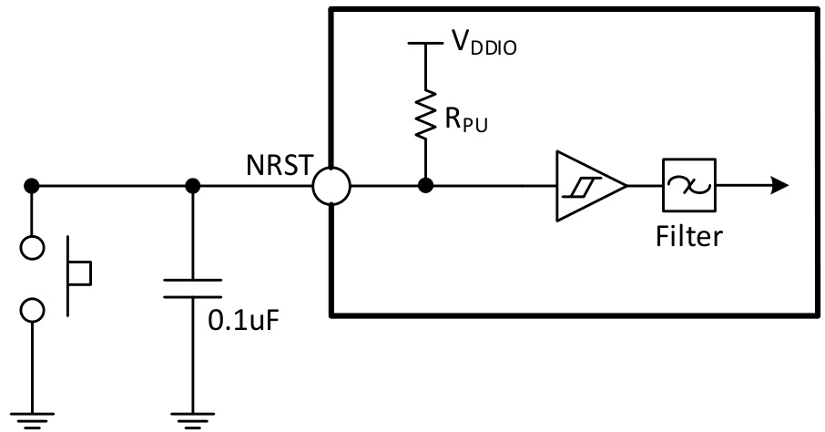  
图 3-7 外部复位引脚典型电路

注： 图中的电容是可选的， 可以用于滤除按键抖动。

表 3-22 外部复位引脚特性  

<html><body><table><tr><td>符号</td><td>参数</td><td>条件</td><td>最小值</td><td>典型值</td><td>最大值</td><td>单位</td></tr><tr><td>VIL (NRST)</td><td>NRST 输入低电平电压</td><td></td><td>-0.3</td><td></td><td>0. 29*VDD10-0.07</td><td>V</td></tr><tr><td>VIH (NRST)</td><td>NRST输入高电平电压</td><td></td><td>0.45*VDD10+0. 41</td><td></td><td>VDD10+0.3</td><td>V</td></tr><tr><td>Vhys (NRST)</td><td>NRST施密特触发器电压迟滞</td><td></td><td>150</td><td></td><td></td><td>mV</td></tr><tr><td>Rpu (1)</td><td>上拉等效电阻</td><td></td><td>30</td><td>40</td><td>55</td><td>kΩ</td></tr><tr><td>VF (NRST)</td><td>NRST输入可被滤波脉宽</td><td></td><td></td><td></td><td>100</td><td>ns</td></tr><tr><td>VNF (NRST)</td><td>NRST输入无法滤波脉宽</td><td></td><td>300</td><td></td><td></td><td>ns</td></tr></table></body></html>

注：上拉电阻是一个真正的电阻串联一个可开关的PMOS 实现。这个PMOS 开关的电阻很小 （约占 $10 \%$ ）。

# 3.3.12 TIM 定时器特性

表 3-23-1 TIM1/8/2/3/4/5/6/7 以及 LPTIM1/2 特性  

<html><body><table><tr><td>符号</td><td>参数</td><td>条件</td><td>最小值</td><td>最大值</td><td>单位</td></tr><tr><td rowspan="2">tres (TIM)</td><td rowspan="2">定时器基准时钟</td><td></td><td></td><td></td><td>tT1MxCLK</td></tr><tr><td>150MHz FT1MxCLK</td><td>6.</td><td></td><td>ns</td></tr><tr><td>FEXT</td><td>CH1 至 CH4 的定时器外部时钟频率</td><td></td><td>0</td><td>fT1mxCL/2</td><td>MHz</td></tr></table></body></html>

<html><body><table><tr><td></td><td></td><td>二 150MHz FT1MxCLK</td><td>0</td><td>75</td><td>MHz</td></tr><tr><td>ResTIM</td><td>定时器分辨率</td><td></td><td></td><td>16</td><td>位</td></tr><tr><td rowspan="2">tcoUNTER</td><td rowspan="2">当选择了内部时钟时， 16 位计数 器时钟周期</td><td></td><td></td><td>65536</td><td>tT1MxCLK</td></tr><tr><td>二 150MHz fT1MxCLK</td><td>0067 0.</td><td>437</td><td>us</td></tr><tr><td rowspan="2">tMAX_COUNT</td><td rowspan="2">最大可能的计数</td><td></td><td></td><td>65536</td><td>tT1MxCLK</td></tr><tr><td>150MHz FTIMxCLK</td><td></td><td>28.6</td><td>S</td></tr></table></body></html>

表 3-23-2 TIM9/10/11/12 特性  

<html><body><table><tr><td>符号</td><td>参数</td><td>条件</td><td>最小值</td><td>最大值</td><td>单位</td></tr><tr><td rowspan="2">tres(TIM)</td><td rowspan="2">定时器基准时钟</td><td></td><td></td><td></td><td>tT1M×CLK</td></tr><tr><td>fT1MxCLK 二 150MHz</td><td>6.7</td><td></td><td>ns</td></tr><tr><td rowspan="2">FEXT</td><td rowspan="2">CH1 至CH4 的定时器外部时钟频率</td><td></td><td>0</td><td>fT1mxCLk/2</td><td>MHz</td></tr><tr><td>二 150MHz fT1MxCLK</td><td>0</td><td>75</td><td>MHz</td></tr><tr><td>ResTIM</td><td>定时器分辨率</td><td></td><td></td><td>32</td><td>位</td></tr><tr><td rowspan="2">tcoUNTER</td><td rowspan="2">当选择了内部时钟时， 32 位计数 器时钟周期</td><td></td><td></td><td>232</td><td>tT1MxCLK</td></tr><tr><td>二 150MHz fT1MxCLK</td><td>0.0067</td><td>2{²/150</td><td>uS</td></tr><tr><td rowspan="2">tMAX_COUNT</td><td rowspan="2">最大可能的计数</td><td></td><td></td><td>232</td><td>tTIMxCLK</td></tr><tr><td>150MHz FT1MxCLK</td><td></td><td>23{2*2³²/150</td><td>uS</td></tr></table></body></html>

# 3.3.13 I2C 接口特性

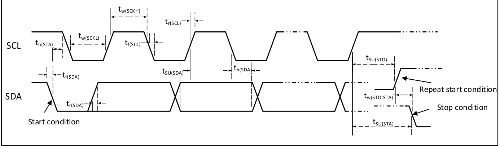  
图 3-8 I2C 总线时序图

表 3-24 I2C 接口特性  

<html><body><table><tr><td rowspan="2">符号</td><td rowspan="2">参数</td><td colspan="2">标准I2C</td><td colspan="2">快速 I2C</td><td rowspan="2">单位</td></tr><tr><td>最小值</td><td>最大值</td><td>最小值</td><td>最大值</td></tr><tr><td>tw (SCKL)</td><td>SCL 时钟低电平时间</td><td>4.7</td><td></td><td>1.2</td><td></td><td>us</td></tr><tr><td>t (SCKH)</td><td>SCL时钟高电平时间</td><td>4.0</td><td></td><td>0.6</td><td></td><td>us</td></tr><tr><td>tsU (SDA)</td><td>SDA数据建立时间</td><td>250</td><td></td><td>100</td><td></td><td>ns</td></tr><tr><td>th(SDA)</td><td>SDA 数据保持时间</td><td>0</td><td></td><td>0</td><td>900</td><td>ns</td></tr><tr><td>tr(SDA)/tr(ScL))</td><td>SDA 和 SCL上升时间</td><td></td><td>1000</td><td>20</td><td></td><td>ns</td></tr><tr><td>tf(SDA)/ /tf(SCL)</td><td>SDA和SCL 下降时间</td><td></td><td>300</td><td></td><td></td><td>ns</td></tr><tr><td>th(STA)</td><td>开始条件保持时间</td><td>4.0</td><td></td><td>0.6</td><td></td><td>uS</td></tr><tr><td>tsU(STA)</td><td>重复的开始条件建立时间</td><td>4.7</td><td></td><td>0.6</td><td></td><td>US</td></tr><tr><td>tsU (STO)</td><td>停止条件建立时间</td><td>4.0</td><td></td><td>0.6</td><td></td><td>uS</td></tr><tr><td>tw(STO:STA)</td><td>停止条件至开始条件的时间（总线空闲）</td><td>4.7</td><td></td><td>1.2</td><td></td><td>US</td></tr></table></body></html>

<html><body><table><tr><td>Cb</td><td>每条总线的容性负载</td><td></td><td>400</td><td></td><td>400</td><td>pF</td></tr></table></body></html>

# 3.3.14 I3C 接口特性

表 3-25 I3C 接口特性  

<html><body><table><tr><td>符号</td><td>参数</td><td>条件</td><td>最小值</td><td>最大值</td><td>单位</td></tr><tr><td>_OD （1） tr (SDA)</td><td>开漏模式下 SDA上升时间</td><td>1.71<V1018<3.6V</td><td>100</td><td></td><td>ns</td></tr><tr><td>PP (1) tr(SDA)</td><td>推挽模式下 SDA上升时间</td><td>1.71<V1018<3. 6V</td><td>5.1</td><td></td><td>ns</td></tr></table></body></html>

注： $1 . \ t _ { r ( S D A ) \_ O D }$ 和 tr(SDA)_PP为设计参数保证， 可通过寄存器 R32_I3C_TIMINGR0 进行配置。 其他时间参数可参考MIPI 协议。

# 3.3.15 SPI 接口特性

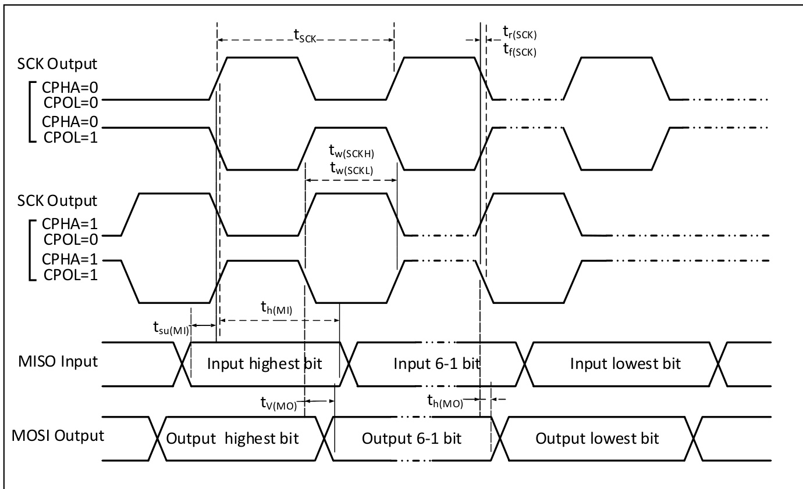  
图 3-9 SPI 主模式时序图

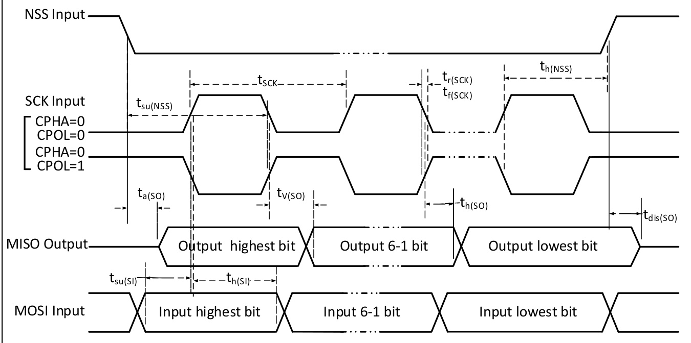  
图 3-10 SPI 从模式时序图 （ $\mathsf { C P H A = 0 } )$

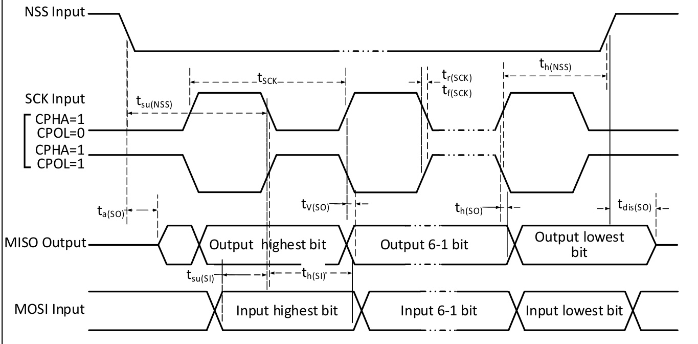  
图 3-11 SPI 从模式时序图 $( C P H A = 1 )$

表 3-26 SPI 接口特性  

<html><body><table><tr><td>符号</td><td>参数</td><td>条件</td><td>最小值</td><td>最大值</td><td>单位</td></tr><tr><td rowspan="2">fsck/tsck</td><td rowspan="2">SPI 时钟频率</td><td>主模式</td><td></td><td>75</td><td>MHz</td></tr><tr><td>从模式</td><td></td><td>75</td><td>MHz</td></tr><tr><td>tr (SCK) /f(sc)</td><td>SPI 时钟上升和下降时间</td><td>负载电容： C = 30pF</td><td></td><td>20</td><td>ns</td></tr><tr><td>tsu (NSS)</td><td>NSS 建立时间</td><td>从模式</td><td>2*tHCLK</td><td></td><td>ns</td></tr><tr><td>th (NSS)</td><td>NSS 保持时间</td><td>从模式</td><td>2*tHCLK</td><td></td><td>ns</td></tr><tr><td>tw(SCKH)/tw(SCKL)</td><td>SCK 高电平和低电平时间</td><td>主模式， FHCLK = 36MHz, 预分频 系数=4</td><td>40</td><td>60</td><td>ns</td></tr><tr><td>Tsu (M1)</td><td rowspan="2">数据输入建立时间</td><td>主模式</td><td>5</td><td></td><td>ns</td></tr><tr><td>tsu (s1)</td><td>从模式</td><td>5</td><td></td><td>ns</td></tr></table></body></html>

<html><body><table><tr><td></td><td rowspan="3">数据输入保持时间</td><td></td><td></td><td></td><td></td></tr><tr><td>th (M1)</td><td>主模式</td><td>5</td><td></td><td>ns</td></tr><tr><td>th (s1)</td><td>从模式</td><td>4</td><td></td><td>ns</td></tr><tr><td>ta (so)</td><td>数据输出访问时间</td><td>从模式， = 20MHz FHCLK</td><td>0</td><td>1*tHCLK</td><td>ns</td></tr><tr><td>(SO) tdis</td><td>数据输出禁止时间</td><td>从模式</td><td>0</td><td>10</td><td>ns</td></tr><tr><td>tv (s0)</td><td rowspan="2">数据输出有效时间</td><td rowspan="2">从模式 （使能边沿之后）</td><td rowspan="2"></td><td rowspan="2">25</td><td rowspan="2">ns</td></tr><tr><td></td></tr><tr><td>tv (MO)</td><td rowspan="2"></td><td>主模式 （使能边沿之后）</td><td></td><td>5</td><td>ns</td></tr><tr><td>th (SO)</td><td>从模式 （使能边沿之后）</td><td>15</td><td></td><td>ns</td></tr><tr><td>th (MO)</td><td>数据输出保持时间</td><td>主模式 (使能边沿之后)</td><td>0</td><td></td><td>ns</td></tr></table></body></html>

# 3.3.16 QSPI 接口特性

表 3-27 QSPI 接口特性  

<html><body><table><tr><td>符号</td><td>参数</td><td>条件</td><td>最小值</td><td>最大值</td><td>单位</td></tr><tr><td>fsck/tsck</td><td>QSPI 时钟频率</td><td></td><td></td><td>75</td><td>MHz</td></tr><tr><td>tr (SCK) /f(sc)</td><td>QSPI 时钟上升和下降时间</td><td>负载电容： C = 30pF fHCL = 36MHz, 预分频系数 = 4</td><td></td><td>20 60</td><td>ns</td></tr><tr><td>tw(SCKH)/tw(SCKL) (S10*) tsu</td><td>SCK高电平和低电平时间 数据输入建立时间</td><td></td><td>40 5</td><td></td><td>ns ns</td></tr><tr><td>th (S10*)</td><td>数据输入保持时间</td><td></td><td>5</td><td></td><td>ns</td></tr><tr><td>(S10*) tv</td><td>数据输出有效时间</td><td></td><td></td><td></td><td>ns</td></tr><tr><td></td><td>数据输出保持时间</td><td></td><td></td><td></td><td></td></tr><tr><td>th (S10*)</td><td></td><td></td><td></td><td></td><td>ns</td></tr></table></body></html>

# 3.3.17 I2S 接口特性

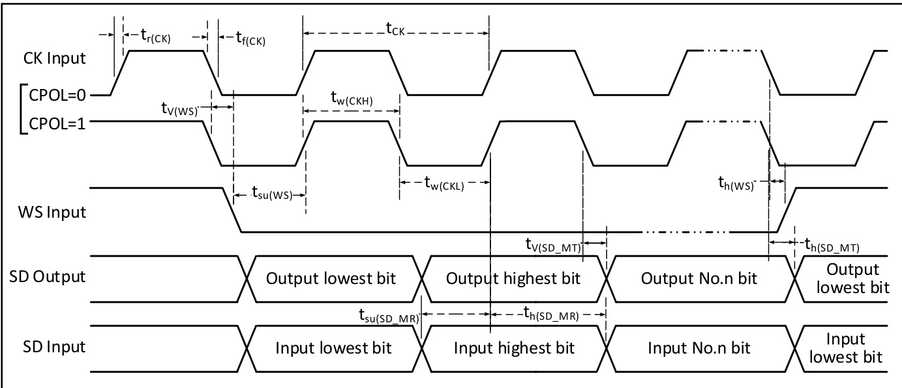  
图 3-12 I2S 总线主模式时序图

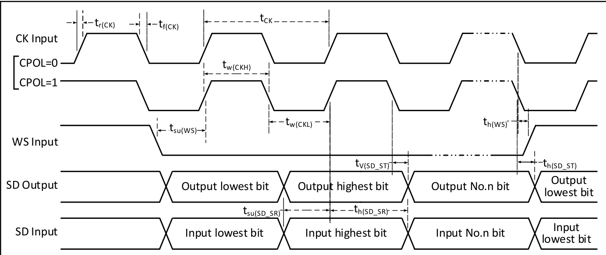  
图 3-13 I2S 总线从模式时序图

表 3-28 I2S 接口特性  

<html><body><table><tr><td>符号</td><td>参数</td><td>条件</td><td>最小值 最大值</td><td>单位</td></tr><tr><td rowspan="2">fok/tck</td><td rowspan="2">I2S时钟频率</td><td>主模式</td><td>8</td><td>MHz</td></tr><tr><td>从模式</td><td>8</td><td>MHz</td></tr><tr><td>tr (ck)/tf (ck)</td><td>I2S时钟上升和下降时间</td><td>负载电容：C= 30pF</td><td>20</td><td>ns</td></tr><tr><td>tv (ws)</td><td>WS 有效时间</td><td>主模式</td><td>5</td><td>ns</td></tr><tr><td>tsu (Ws)</td><td>WS建立时间</td><td>从模式</td><td>10</td><td>ns</td></tr><tr><td rowspan="2">th (WS)</td><td rowspan="2">WS保持时间</td><td>主模式</td><td>0</td><td>ns</td></tr><tr><td>从模式</td><td>0</td><td>ns</td></tr><tr><td>tw (CKH) /tw (CKL)</td><td>SCK高电平和低电平时间</td><td>主模式， fHCLK 二 36MHz 预分频系数 = 4</td><td>40 60</td><td>%</td></tr></table></body></html>

<html><body><table><tr><td>tsU (SD_MR)</td><td></td><td>主模式</td><td>8</td><td></td><td>ns</td></tr><tr><td>tsU (SD_SR)</td><td rowspan="2">数据输入建立时间</td><td>从模式</td><td>8</td><td></td><td>ns</td></tr><tr><td>th (SD_MR)</td><td>主模式</td><td>5</td><td></td><td>ns</td></tr><tr><td>th(SD_SR)</td><td rowspan="2">数据输入保持时间</td><td>从模式</td><td>4</td><td></td><td>ns</td></tr><tr><td>th (SD_MT)</td><td>主模式 （使能边沿之后）</td><td></td><td>5</td><td></td></tr><tr><td>th (SD_ST)</td><td rowspan="2">数据输出保持时间</td><td>从模式 （使能边沿之后）</td><td></td><td>5</td><td>ns</td></tr><tr><td>tv (SD_MT)</td><td>主模式 （使能边沿之后）</td><td></td><td>5</td><td>ns</td></tr><tr><td></td><td rowspan="2">数据输出有效时间</td><td>(使能边沿之后）</td><td></td><td></td><td>ns</td></tr><tr><td>tv (SD_ST)</td><td>从模式</td><td></td><td>4</td><td>ns</td></tr></table></body></html>

# 3.3.18 USB PD 接口特性

表 3-29-1 PD 接口 I/O 特性  

<html><body><table><tr><td>符号</td><td>参数</td><td>条件</td><td>最小值</td><td>典型值</td><td>最大值</td><td>单位</td></tr><tr><td>tRise</td><td>上升时间</td><td>幅度 10%到90%之间的时间， 最小值为无负载条件下的时间</td><td>300</td><td>430</td><td></td><td>ns</td></tr><tr><td>tFall</td><td>下降时间</td><td>幅度 10%到90%之间的时间， 最小值为无负载条件下的时间</td><td>300</td><td>430</td><td></td><td>ns</td></tr><tr><td>Vswing</td><td>输出电压摆幅 （峰-峰值)</td><td></td><td>1.04</td><td>1.12</td><td>1.20</td><td>V</td></tr></table></body></html>

表 3-29-2 Type-C I/O 端口特性  

<html><body><table><tr><td>符号</td><td>参数</td><td>条件</td><td>最小值</td><td>典型值</td><td>最大值</td><td>单位</td></tr><tr><td rowspan="2">(1) VccIL</td><td rowspan="2">CC引脚输入低电平电压</td><td>USBPD_ _CC HVT=0, FT 1/0输入</td><td>0</td><td></td><td>0.8</td><td rowspan="2">V</td></tr><tr><td>USBPD_CC_HVT=1, 高阈值检测输入</td><td>0</td><td></td><td>2.0</td></tr><tr><td rowspan="2">Vcc1()</td><td rowspan="2">CC 引脚输入高电平电压</td><td>USBPD_CC_ HVT=0, FT 1/0输入</td><td>2.0</td><td></td><td>V* (2)</td><td rowspan="2">V</td></tr><tr><td>USBPD_CC_HVT=1, 高阈值检测输入</td><td>2.45</td><td></td><td>V(2)</td></tr><tr><td rowspan="2">Vcchys</td><td rowspan="2">迟滞电压</td><td>USBPD_CC_ HVT=0, FT 1/0输入</td><td>90</td><td></td><td></td><td rowspan="2">mV</td></tr><tr><td>USBPD CC HVT=1, 高阈值检测输入</td><td></td><td>120</td><td></td></tr><tr><td rowspan="2"></td><td rowspan="2">上拉电流</td><td rowspan="2">引脚 < V≠ (2 −0.6V</td><td></td><td>80</td><td></td><td>uA</td></tr><tr><td></td><td>180</td><td></td><td>uA</td></tr><tr><td rowspan="2">Rd</td><td rowspan="2">CC引脚内置的Rd下拉电阻</td><td rowspan="2"></td><td rowspan="2"></td><td rowspan="2">330</td><td rowspan="2"></td><td rowspan="2">uA</td></tr><tr><td></td></tr><tr><td></td><td>(适用于CC1R/CC2R)</td><td>VDD10 W 1.6V或外部上拉 330uA</td><td></td><td>5.1</td><td></td><td>kΩ</td></tr></table></body></html>

注： 1. USBPD_ CC_HVT $^ { = 1 }$ 时对应的 $V _ { c c / L }$ 、 $V _ { c c I H }$ 为设计参数保证。2.对于CH32H417 芯片， $V _ { * }$ 为 $V _ { D D I O }$ ； 对于 CH32H416 和 CH32H415 芯片， V\*则为VDD33。

# 3.3.19 USB 2.0 接口特性

表 3-30 USB 2.0 接口 I/O 特性  

<html><body><table><tr><td>符号</td><td>参数</td><td>条件</td><td>最小值 典型值</td><td>最大值</td><td>单位</td></tr><tr><td>V33</td><td>USB2.0工作电压</td><td></td><td>3.15</td><td>3.45</td><td>V</td></tr><tr><td>VSE</td><td>单端接收器阈值 VDD33 = 3.3V</td><td></td><td>1.2</td><td>1.9</td><td>V</td></tr><tr><td>VoL</td><td>静态输出低电平</td><td></td><td></td><td>0.3</td><td>V</td></tr><tr><td>VoH</td><td>静态输出高电平</td><td></td><td>2.8</td><td>3.6</td><td></td></tr><tr><td>VHSO1</td><td>高速空闲电平</td><td></td><td>-10</td><td>10</td><td>mV</td></tr><tr><td>VHSOH</td><td>高速数据高电平</td><td></td><td>360</td><td>440</td><td>mV</td></tr></table></body></html>

<html><body><table><tr><td>VHSOL</td><td>高速数据低电平</td><td></td><td>-10</td><td>10</td><td></td><td>mV</td></tr><tr><td>RUSBPU</td><td>USB引脚上拉电阻</td><td></td><td>1.3</td><td>1.5</td><td>1.8</td><td>kΩ</td></tr><tr><td>RuSBPD</td><td>USB引脚下拉电阻</td><td></td><td>13</td><td>15</td><td>18</td><td>kΩ</td></tr><tr><td>VBC_REF</td><td>BC比较器参考电压</td><td></td><td></td><td>0.4</td><td></td><td>V</td></tr><tr><td>VBC_SRC</td><td>BC协议输出电压</td><td></td><td></td><td>0.6</td><td></td><td>V</td></tr></table></body></html>

# 3.3.20 USB 3.2 Gen1 接口特性

CH32H417 和 CH32H416 符合 USB 3.2 Gen1 规范的特性， 更多信息请查阅相关协议规范。

# 3.3.21 SerDes 接口特性

表 3-31 SerDes 接口特性  

<html><body><table><tr><td>符号</td><td>参数</td><td>条件</td><td>最小值</td><td>典型值</td><td>最大值</td><td>单位</td></tr><tr><td>VDD33</td><td>SerDes 工作电压</td><td></td><td>3.15</td><td></td><td>3.45</td><td>V</td></tr><tr><td rowspan="2">TSERDRAT</td><td rowspan="2">传输数据速率 (2) （1）</td><td>6类差分网线， 5米</td><td>0.5</td><td></td><td>1.5</td><td rowspan="2">Gb/s</td></tr><tr><td>6类差分网线， 100米</td><td></td><td>0.5</td><td></td></tr><tr><td rowspan="4">VTx-DIFF-PP</td><td rowspan="4">差分发送峰-峰值电压幅度</td><td>TX_ OUTPUT SWING[1 :0] = 00</td><td>1.35</td><td>1.5</td><td>1.65</td><td rowspan="4"></td></tr><tr><td>TX_ OUTPUT SWING[1 :0] = 01</td><td>1.62</td><td>1.8</td><td>1.98</td></tr><tr><td>TX_ OUTPUT SWING [1 :0] = 10</td><td>1.89</td><td>2.1</td><td>2.31</td></tr><tr><td>TX OUTPUT SWING [1 :0] = 11</td><td>2.16</td><td>2.4</td><td>2.64</td></tr><tr><td rowspan="4">VTx-DE</td><td rowspan="4">预加重幅度</td><td>TX_DE_ EMPHASIS[1 :0] = 00</td><td></td><td>0</td><td></td><td rowspan="4">dB</td></tr><tr><td>TX_DE_ EMPHASIS[1 : 0] 二 01</td><td></td><td>3</td><td></td></tr><tr><td>TX_DE_ EMPHASIS [1 : 0] 二 10</td><td></td><td></td><td></td></tr><tr><td>TX_DE_ EMPHASIS[1 :0] 二 11</td><td></td><td>69</td><td></td></tr><tr><td>Rτx</td><td colspan="2">差分输出阻抗</td><td></td><td>100</td><td></td><td>Ω</td></tr><tr><td>VRX-DIFF-PP</td><td colspan="2">差分接收峰-峰值电压幅度</td><td>0.15</td><td>0.3</td><td></td><td>− ></td></tr><tr><td>RRx</td><td colspan="2">差分输入阻抗</td><td></td><td>100</td><td></td><td>Ω</td></tr><tr><td rowspan="2">VRX-VCM</td><td colspan="2">接收共模电压</td><td></td><td>0.5*</td><td></td><td>V</td></tr><tr><td colspan="2">交流耦合电容</td><td>75</td><td>100 VDD33</td><td>200</td><td>nF</td></tr></table></body></html>

注：1.传输数据速率和线材、 模拟参数均有关。其中， 模拟参数可通过寄存器R32_SYS_CFGR 配置，详细信息请参考 $\langle \langle C H 3 2 H 4 1 7 R M \rangle \rangle$ 手册以及官网EVT 例程。2.针对最大传输数据速率， 建议在实测值的基础上预留适当余量。

# 3.3.22 SDIO 接口特性

表 3-32 SDIO 接口特性  

<html><body><table><tr><td>符号</td><td>参数</td><td>条件</td><td>最小值</td><td>最大值</td><td>单位</td></tr><tr><td>fck/tck</td><td>数据传输模式下的时钟频率</td><td>CL≤30pF</td><td></td><td>100</td><td>MHz</td></tr><tr><td>tw (CKL)</td><td>时钟低电平时间</td><td>CL≤30pF</td><td>3</td><td></td><td rowspan="4">ns</td></tr><tr><td>tw (CKH)</td><td>时钟高电平时间</td><td>CL≤30pF</td><td>3</td><td></td></tr><tr><td>tr (CK)</td><td>上升时间</td><td>CL≤30pF</td><td></td><td>2</td></tr><tr><td>tf(ck)</td><td>下降时间</td><td>CL≤30pF</td><td></td><td>2</td></tr><tr><td colspan="6">CMD/DAT 输入 （参考CK）</td></tr><tr><td>tisu</td><td>输入建立时间</td><td>CL≤30pF</td><td>5</td><td></td><td rowspan="2">ns</td></tr><tr><td>tIH</td><td>输入保持时间</td><td>CL≤30pF</td><td></td><td></td></tr></table></body></html>

<html><body><table><tr><td colspan="6">在高速模式下， CMD/DAT输出 （参考CK)</td></tr><tr><td>tov</td><td>输出有效时间</td><td rowspan="2">CL≤30pF</td><td>主模式</td><td></td><td rowspan="4">3 9 ns</td></tr><tr><td>toH</td><td>从模式 CL≤30pF</td><td></td><td></td></tr><tr><td>输出保持时间 在默认模式下， CMD/DAT</td><td colspan="2">输出 （参考CK)</td><td>10</td><td></td></tr><tr><td colspan="4"></td><td></td><td></td></tr><tr><td>tovD</td><td>输出有效默认时间</td><td>CL≤30pF</td><td>主模式 从模式</td><td></td><td>10 ns</td></tr><tr><td>toHD</td><td>输出保持默认时间</td><td colspan="2">CL≤30pF</td><td>10</td><td></td></tr></table></body></html>

# 3.3.23 SDMMC 接口特性

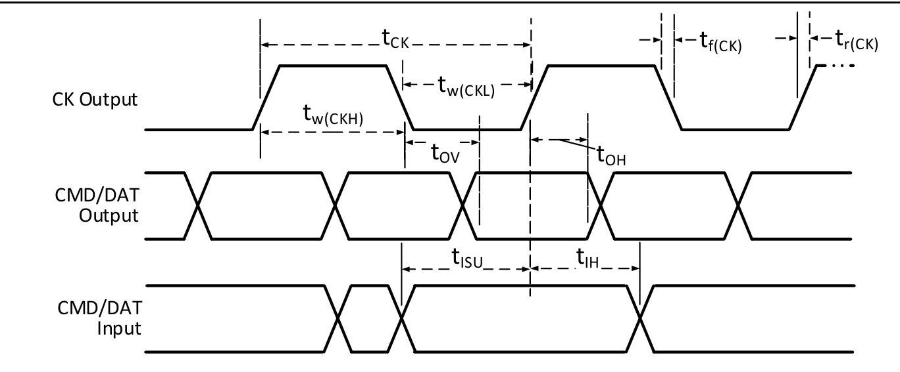  
图 3-14 SD 高速模式时序图

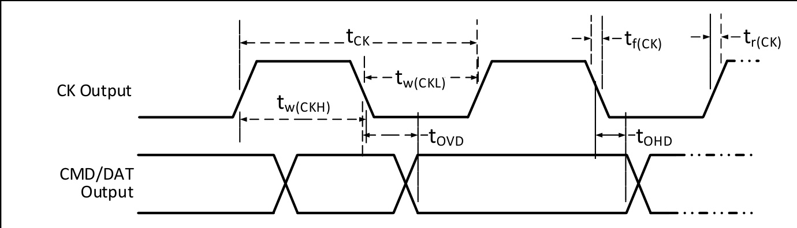  
图 3-15 SD 默认模式时序图

表 3-33 SDMMC 接口特性  

<html><body><table><tr><td>符号</td><td>参数</td><td>条件</td><td>最小值</td><td>最大值</td><td>单位</td></tr><tr><td rowspan="5">fck/tck</td><td rowspan="5">数据传输模式下的时钟频率</td><td>CL≤30pF</td><td></td><td>100</td><td>MHz</td></tr><tr><td>CL≤10pF, VDD18 = 1.8V （单边沿）</td><td></td><td>200</td><td>MHz</td></tr><tr><td>CL≤10pF, VD18 = 3. 3V （单边沿）</td><td></td><td>200</td><td>MHz</td></tr><tr><td>CL≤10pF, VDD18 = 1. 8V （双边沿）</td><td></td><td>150(1)</td><td>MHz</td></tr><tr><td>CL≤10pF, VDD18 = 3. 3V （双边沿）</td><td></td><td>180 (1)</td><td>MHz</td></tr><tr><td>tw (CKL)</td><td>时钟低电平时间</td><td>CL≤10pF</td><td>2.2</td><td></td><td>ns</td></tr></table></body></html>

<html><body><table><tr><td>tW(CKH)</td><td>时钟高电平时间</td><td colspan="2">CL≤10pF</td><td>2.2</td><td></td><td rowspan="4"></td></tr><tr><td>tr (CK)</td><td>上升时间</td><td colspan="2">CL≤10pF</td><td></td><td>1.2</td></tr><tr><td>tf (CK)</td><td>下降时间</td><td colspan="2">CL≤10pF</td><td></td><td>1.2</td></tr><tr><td colspan="6">CMD/DAT 输入 （参考CK）</td></tr><tr><td>tisu</td><td>输入建立时间</td><td colspan="2">CL≤10pF</td><td>0.5</td><td></td><td rowspan="2">ns</td></tr><tr><td>tIH</td><td>输入保持时间</td><td colspan="2">CL≤10pF</td><td>0.5</td><td></td></tr><tr><td colspan="6">在高速模式下， CMD/DAT输出 （参考CK)</td><td rowspan="3"></td></tr><tr><td>tov</td><td>输出有效时间</td><td rowspan="2">CL≤10pF</td><td>主模式</td><td></td><td>1.2</td></tr><tr><td>toH</td><td></td><td>从模式 4.5</td><td></td><td></td></tr><tr><td colspan="6">输出保持时间 CL≤10pF</td><td rowspan="2"></td></tr><tr><td>在默认模式下，</td><td colspan="4">CMD/DAT输出 （参考 CK)</td><td></td><td>1.2</td></tr><tr><td>tovD</td><td>输出有效默认时间</td><td rowspan="2">CL≤10pF CL≤10pF</td><td>主模式 从模式</td><td></td><td></td><td rowspan="2">ns</td></tr><tr><td>tOHD</td><td>输出保持默认时间</td><td colspan="2"></td><td>4.5</td></tr></table></body></html>

# 3.3.24 UHSIF 接口特性

表 3-34 UHSIF 接口特性  

<html><body><table><tr><td>符号</td><td>参数</td><td>条件</td><td>最小值</td><td>最大值</td><td>单位</td></tr><tr><td>fck/tck</td><td>数据传输模式下的时钟频率</td><td>CL≤10pF, VDD18 = 1.8V</td><td></td><td>125</td><td>MHz</td></tr><tr><td>tc</td><td>时钟周期</td><td></td><td>8</td><td></td><td>ns</td></tr><tr><td>tis</td><td>输入信号至CLK 的建立时间</td><td></td><td>0.5</td><td></td><td>ns</td></tr><tr><td>tIH</td><td>输入信号至 CLK 的保持时间</td><td></td><td>1.5</td><td></td><td>ns</td></tr><tr><td>toD</td><td>输出信号至CLK的延时</td><td></td><td>6.2</td><td>8</td><td>ns</td></tr></table></body></html>

注：1.这些最高时钟频率受对端性能和PCB 设计的影响较大； 在 $V _ { D D 1 8 } ~ = ~ 1 . 8 V$ 时与EMMC 卡双边沿通信实测可达175MHz。2.在较高时钟频率下， 若推荐的时序调节寄存器值不能稳定通信， 用户需发起总线采样 tuning序列寻找更佳的采样点。

# 3.3.25 FSMC 特性

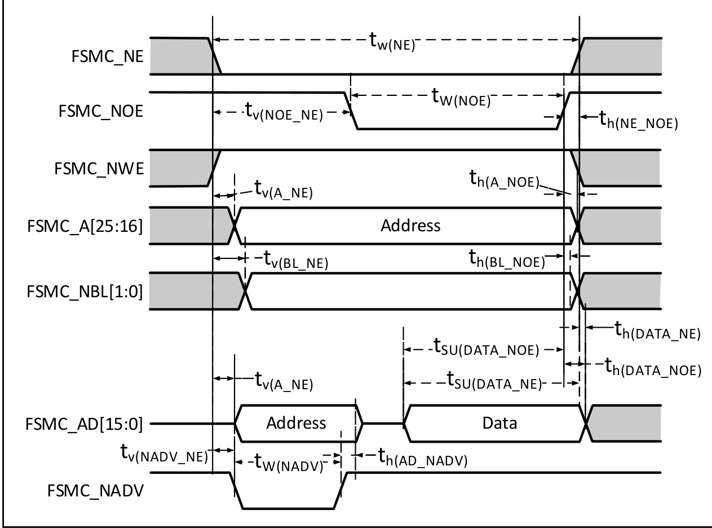  
图 3-16-1 异步总线复用 PSRAM/NOR 读操作波形

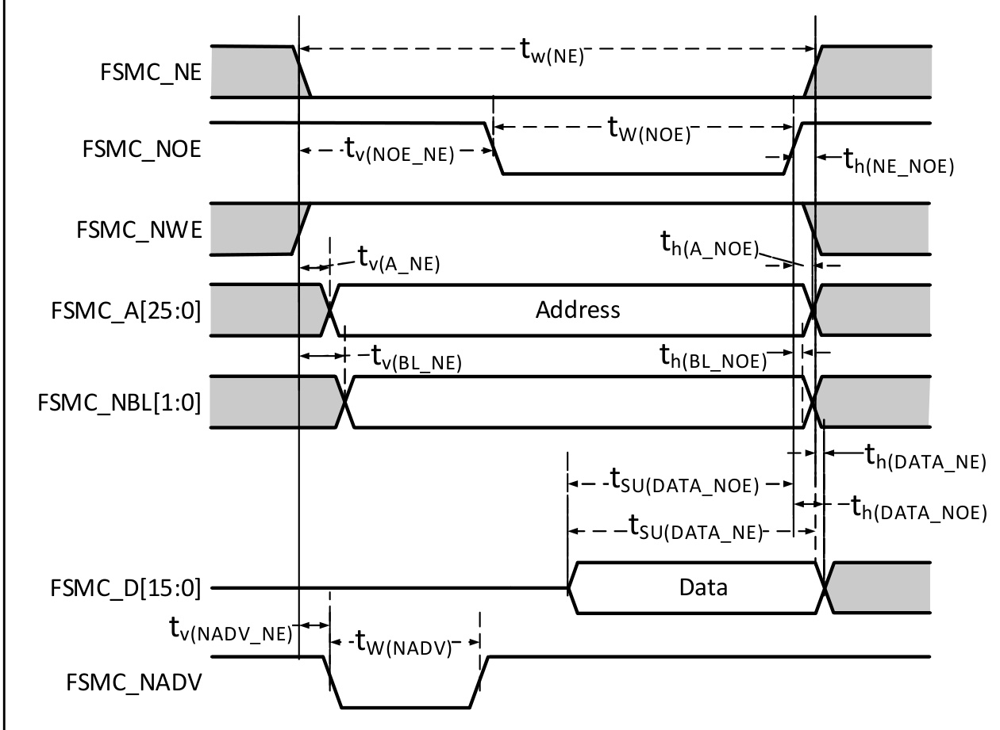  
图 3-16-2 异步总线非复用 PSRAM/NOR 读操作波形

表 3-35 异步总线复用的 PSRAM/NOR 读操作时序  

<html><body><table><tr><td>符号</td><td>参数</td><td>最小值</td><td>最大值</td><td>单位</td></tr><tr><td>tw (NE)</td><td>FSMC_NE 低电平时间</td><td>7*tHCLK</td><td></td><td rowspan="9">ns</td></tr><tr><td>tv (NOE_NE)</td><td>FSMC_NE 低至 FSMC_NOE 低</td><td>0</td><td></td></tr><tr><td>tw (NOE)</td><td>FSMC_NOE 低时间</td><td>4*tHCLK</td><td></td></tr><tr><td>th (NE_NOE)</td><td>FSMC_NOE 高至 FSMC_NE 高保持时间</td><td>0</td><td></td></tr><tr><td>tv (A NE)</td><td>FSMC_NE 低至 FSMC_A 有效</td><td>0</td><td>5</td></tr><tr><td>tv (NADV_NE)</td><td>FSMC_NE 低至 FSMC_NADV低</td><td>0</td><td>5</td></tr><tr><td>tw (NADV)</td><td>FSMC NADV低时间</td><td>tHCLK</td><td></td></tr><tr><td>th (AD_NADV)</td><td>FSMC NADV高之后FSMC AD （地址） 有效保持时间</td><td>2*tHCLK</td><td></td></tr><tr><td>th(A_NOE)</td><td>FSMC NOE高之后的地址保持时间</td><td>0</td><td></td></tr><tr><td>th (BL_NOE)</td><td>FSMC_ NOE高之后的FSMC BL 保持时间</td><td>0</td><td></td></tr><tr><td>tV(BL_NE)</td><td>FSMC_NE 低至 FSMC_BL 有效</td><td>0</td><td>5</td></tr><tr><td>tsU (DATA_NE)</td><td>数据至 FSMC_NE 高的建立时间</td><td>3*tHCLK</td><td></td></tr><tr><td>tsu (DATA_NOE)</td><td>数据至FSMC_NOE高的建立时间</td><td>3*tHCLK</td><td></td></tr><tr><td>th (DATA_NE)</td><td>FSMC_NE 高之后的数据保持时间</td><td>0</td><td></td></tr><tr><td>th (DATA_NOE)</td><td>FSMC_ NOE高之后的数据保持时间</td><td>0</td><td></td></tr></table></body></html>

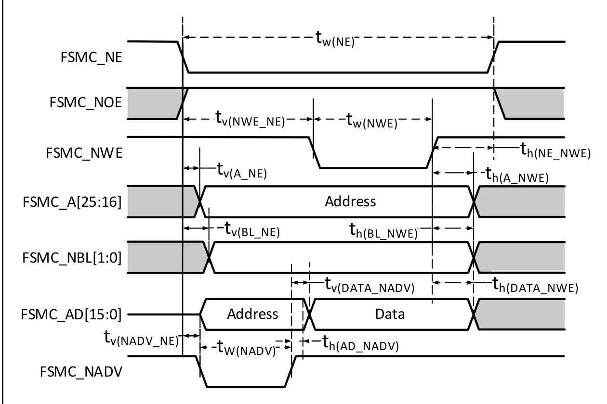  
图 3-17-1 异步总线复用 PSRAM/NOR 写操作波形

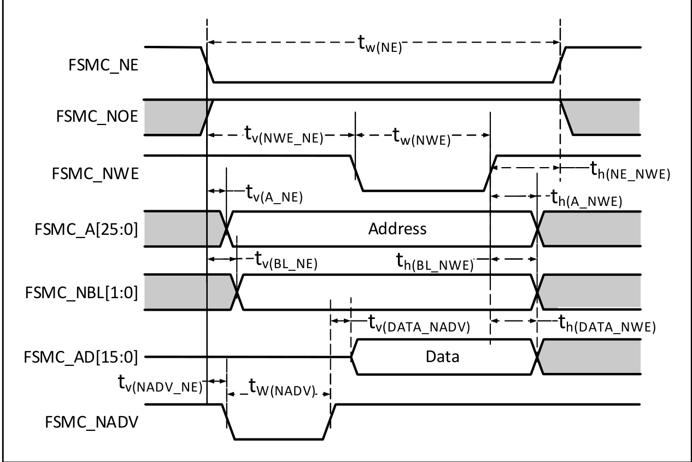  
图 3-17-2 异步总线非复用 PSRAM/NOR 写操作波形

表 3-36 异步总线复用 PSRAM/NOR 写操作时序  

<html><body><table><tr><td>符号</td><td>参数</td><td>最小值</td><td>最大值</td><td>单位</td></tr><tr><td>tW (NE)</td><td>FSMC_NE 低电平时间</td><td>5*tHCLK</td><td></td><td rowspan="9">ns</td></tr><tr><td>tv (NEW_NE)</td><td>FSMC_NE 低至 FSMC_NWE 低</td><td>3*tHCLK</td><td></td></tr><tr><td>tW (NWE)</td><td>FSMC_NWE 低时间</td><td>2*tHCLK</td><td></td></tr><tr><td>th (NE_NWE)</td><td>FSMC NWE高至 FSMC NE高保持时间</td><td>tHCLK</td><td></td></tr><tr><td>tv (A NE)</td><td>FSMC_NE 低至 FSMC_A 有效</td><td>0</td><td>5</td></tr><tr><td>tv (NADV_NE)</td><td>FSMC_NE 低至 FSMC_NADV低</td><td>0</td><td>5</td></tr><tr><td>tW (NADV)</td><td>FSMC_ NADV低时间</td><td>tHCLK</td><td></td></tr><tr><td>NADV) th(AD_</td><td>FSMC_NADV 高之后 FSMC_AD （地址） 有效保持时间</td><td>2*tHCLK</td><td></td></tr><tr><td>th (A_WE)</td><td>FSMC_NWE 高之后的地址保持时间</td><td>tHCLK</td><td></td></tr><tr><td>(BL_NE) tv</td><td>FSMC_NE 低至FSMC_ _BL 有效</td><td>0</td><td>5</td></tr><tr><td>th (BL_NWE)</td><td>FSMC_NWE 高之后的FSMC_ _BL 保持时间</td><td>tHCLK</td><td></td></tr><tr><td>tv (DATA_NADV)</td><td>FSMC_ NADV 高至数据保持时间</td><td>2*tHCLK</td><td></td></tr><tr><td>th (DATA_NWE)</td><td>FSMC_NWE 高之后的数据保持时间</td><td>tHCLK</td><td></td></tr></table></body></html>

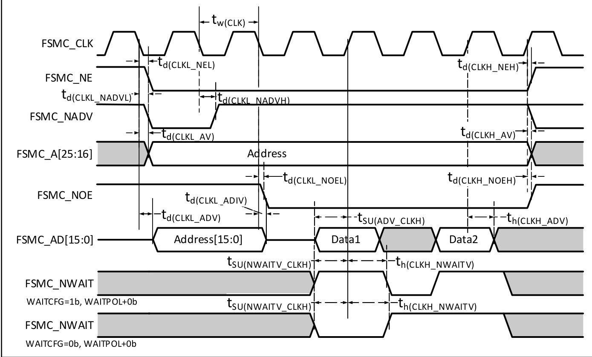  
图 3-18 同步总线复用 NOR/PSRAM 读波形

表 3-37 同步总线复用 NOR/PSRAM 读时序  

<html><body><table><tr><td>符号</td><td>参数</td><td>最小值</td><td>最大值</td><td>单位</td></tr><tr><td>tw (CLK)</td><td>FSMC_ _CLK周期</td><td>2*tHCLK</td><td></td><td rowspan="9">ns</td></tr><tr><td>td (CLKL_NEL)</td><td>FSMC_ CLK低至FSMC_NE低</td><td>0</td><td>5</td></tr><tr><td>td (CLKH_NEH)</td><td>FSMC_CLK高至FSMC_NE高</td><td>0.5*tHCLK</td><td>0. 5*tHCLK</td></tr><tr><td>td (CLKL_NADVL)</td><td>FSMC_CLK低至FSMC_NADV低</td><td>0</td><td>5</td></tr><tr><td>td (CLKL_NADVH)</td><td>FSMC_CLK低至FSMC_NADV高</td><td>0</td><td>5</td></tr><tr><td>td (CLKL_AV)</td><td>FSMC_CLK低至FSMC_A×有效 (x = 1625)</td><td>0</td><td>5</td></tr><tr><td>td (CLKH_AIV)</td><td>FSMC_ _CLK高至FSMC_Ax无效 (x = 16…25)</td><td>0</td><td>5</td></tr><tr><td>td (CLKL_NOEL)</td><td>FSMC_ CLK低至FSMC_ NOE低</td><td>2*tHCLK</td><td></td></tr><tr><td>td(CLKH_NOEH)</td><td>FSMC_ CLK高至FSMC_ NOE高</td><td>tHCLK</td><td></td></tr><tr><td>td (CLKL_ADV)</td><td>FSMC_ _CLK低至FSMC_AD[15:0]有效</td><td>0</td><td>5</td></tr><tr><td>td(CLKL_ADIV)</td><td>FSMC_CLK低至FSMC_AD[15:0]无效</td><td>0</td><td>5</td></tr><tr><td>tsu (ADV_CLKH)</td><td>FSMC_ _CLK高之前FSMC_AD[15:0]有效数据</td><td>8</td><td></td></tr><tr><td>th (CLKH_ADV)</td><td>FSMC_ _CLK高之后FSMC_AD[15:0]有效数据</td><td>8</td><td></td></tr><tr><td>tsu (NWAITV_CLKH)</td><td>FSMC_ CLK高之前FSMC_NWAIT有效</td><td>6</td><td></td></tr><tr><td>th (CLKH_NWAITV)</td><td>FSMC_CLK高之后FSMC_NWAIT有效</td><td>2</td><td></td></tr></table></body></html>

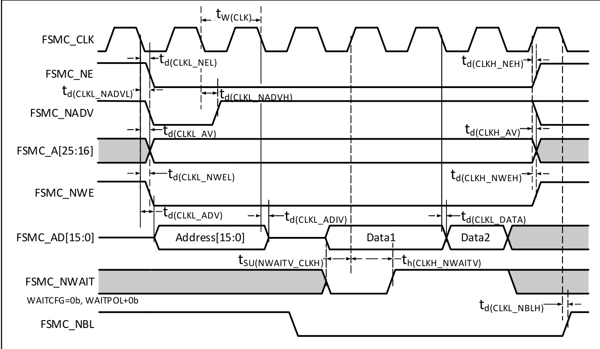  
图 3-19 同步总线复用 PSRAM 写波形

表 3-38 同步总线复用 PSRAM 写时序  

<html><body><table><tr><td>符号</td><td>参数</td><td>最小值</td><td>最大值</td><td>单位</td></tr><tr><td>tW (CLK)</td><td>FSMC_ CLK周期</td><td>2*tHCLK</td><td></td><td rowspan="9">ns</td></tr><tr><td>td (CLKL_NEL)</td><td>FSMC_ _CLK低至FSMC_NE低</td><td>0</td><td>5</td></tr><tr><td>td (CLKH_NEH)</td><td>FSMC_CLK高至FSMC_NE高</td><td>0.5 5*tHCLK</td><td>0. 5*tHCLK</td></tr><tr><td>td (CLKL_NADVL)</td><td>FSMC_CLK低至FSMC_NADV低</td><td>0</td><td>5</td></tr><tr><td>td(CLKL_NADVH)</td><td>FSMC_CLK低至FSMC_NADV高</td><td>0</td><td>5</td></tr><tr><td>td (CLKL_AV)</td><td>FSMC_ CLK低至FSMC_Ax有效 (x = 16…25)</td><td>0</td><td>5</td></tr><tr><td>td (CLKH_AIV)</td><td>FSMC_ CLK高至FSMC_Ax无效 (x 二 16…25)</td><td>0</td><td>5</td></tr><tr><td>td(CLKL_ NWEL )</td><td>FSMC_ CLK低至FSMC_NWE低</td><td>0</td><td></td></tr><tr><td>td(CLKH_NWEH)</td><td>FSMC CLK高至FSMC_NWE高</td><td>0</td><td></td></tr><tr><td>td (CLKL_ADV)</td><td>FSMC_CLK低至FSMC_AD[15:0]有效</td><td>0 −</td><td>5</td></tr><tr><td>td(CLKL_ADIV)</td><td>FSMC_ CLK低至FSMC_AD[15:0]无效</td><td>0</td><td>5</td></tr><tr><td>td(CLKL_DATA)</td><td>FSMC_CLK低之后FSMC_AD[15:0]有效</td><td>2</td><td></td></tr><tr><td>(NWAITV_CLKH) tsu</td><td>FSMC _CLK高之前FSMC_NWAIT有效</td><td>6</td><td></td></tr><tr><td>th (CLKH_NWAITV)</td><td>FSMC_ _CLK高之后FSMC_NWAIT有效</td><td>2</td><td></td></tr><tr><td>td (CLKL_ NBLH)</td><td>FSMC_ _CLK低至FSMC_NBL高</td><td>2</td><td></td></tr></table></body></html>

# NAND 控制器波形和时序

测试条件： NAND 操作区域， 选择16 位数据宽度， 使能ECC 计算电路， 512 字节页面大小， 其他时序配置为设置寄存器 $\mathsf { F S M C \_ P C R 2 } = 0 \times 0 0 0 2 0 0 5 \mathsf { E }$ ， FSMC_PMEM2 $\mathbf { \tau } = \mathbf { \tau }$ $= \ 0 { \times } 0 1 0 2 0 3 0 1$ ， FSM $\mathsf { S } \mathsf { P A T T } 2 = 0 \times 0 1 0 2 0 3 0 1$ 。

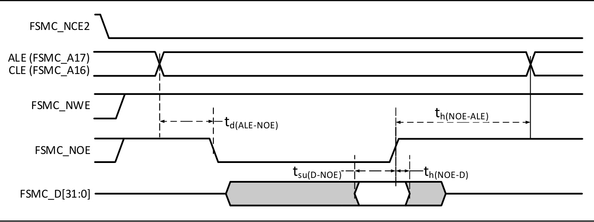  
图 3-20 NAND 控制器读操作波形

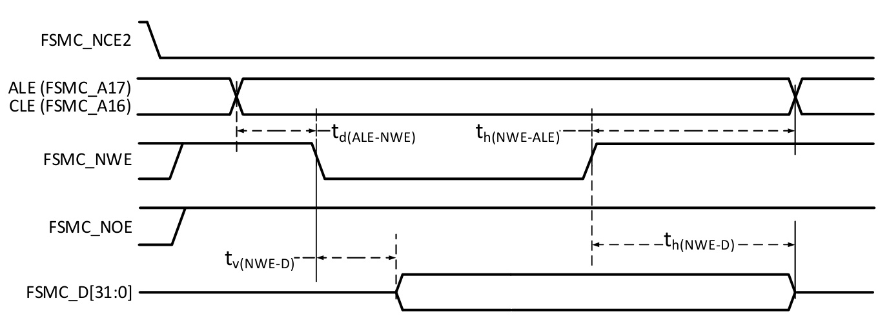  
图 3-21 NAND 控制器写操作波形

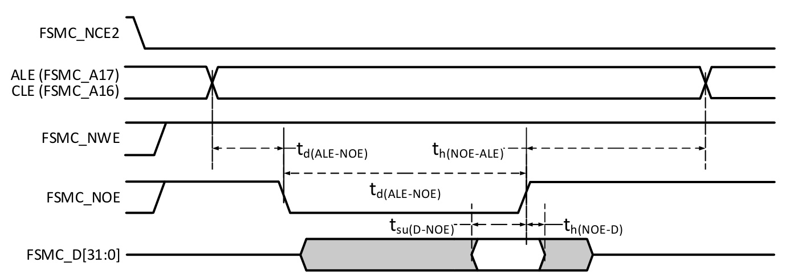  
图 3-22 NAND 控制器在通用存储空间的读操作波形

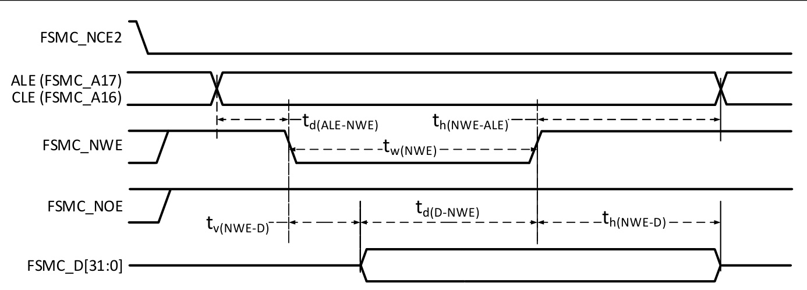  
图 3-23 NAND 控制器在通用存储空间的写操作波形

表 3-39 NAND 闪存读写周期的时序特性  

<html><body><table><tr><td>符号</td><td>参数</td><td>最小值</td><td>最大值</td><td>单位</td></tr><tr><td>td(D-NWE)</td><td>FSMC_ NWE 高之前至FSMC_D[31:0]数据有效</td><td>4*tHCLK</td><td></td><td rowspan="8">ns</td></tr><tr><td>tw (NOE)</td><td>FSMC_ NOE低时间</td><td>4*tHCLK</td><td></td></tr><tr><td>（D-NOE) tsu</td><td>FSMC_ NOE高之前至FSMC_D[31:0]数据有效</td><td>20</td><td></td></tr><tr><td>th (NOE-D)</td><td>FSMC NOE高之后至FSMC_D[31:0]数据有效</td><td>15</td><td></td></tr><tr><td>tw (WE)</td><td>FSMC_NWE低时间</td><td>4*tHCLK</td><td></td></tr><tr><td>tv (NWE-D)</td><td>FSMC_ NWE低至FSMC D[31:0]数据有效</td><td>0</td><td></td></tr><tr><td>th (NWE-D)</td><td>FSMC_NWE高至FSMC_D[31:0]数据无效</td><td>2*tHCLK</td><td></td></tr><tr><td>td (ALE-NWE)</td><td>FSMC_NWE低之前至FSMC_ALE有效</td><td>2*tHCLK</td><td></td></tr><tr><td>th (NWE-ALE)</td><td>FSMC_NWE高至FSMC_ALE无效</td><td>2*tHCLK</td><td></td></tr><tr><td>td (ALE-NOE)</td><td>FSMC_NOE低之前至FSMC_ALE有效</td><td>2*tHCLK</td><td></td></tr><tr><td>th (NOE-ALE)</td><td>FSMC_NOE高至FSMC_ALE无效</td><td>4*tHCLK</td><td></td></tr></table></body></html>

# 3.3.26 SDRAM 特性

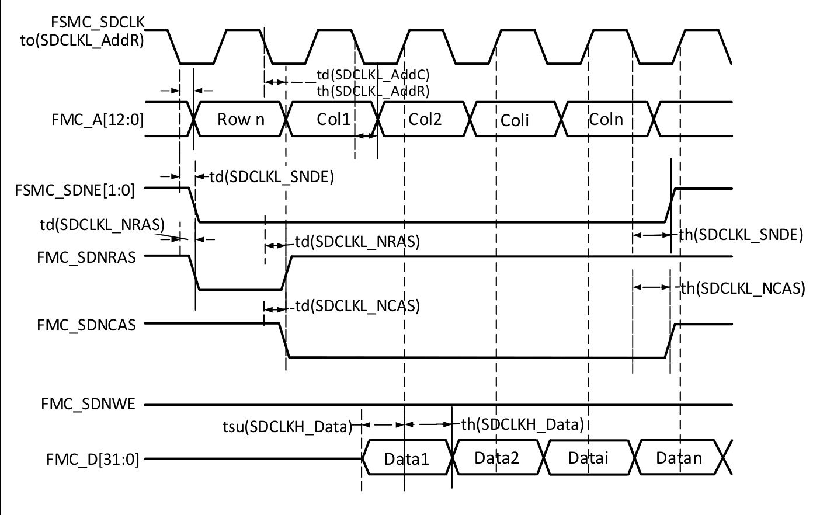  
图 3-24 SDRAM 读操作波形 （ $\mathtt { \tilde { C } L } = \mathtt { 1 } ;$ ）

表 3-40 SDRAM 读操作时序  

<html><body><table><tr><td>符号</td><td>参数</td><td>最小值</td><td>最大值</td><td>单位</td></tr><tr><td>tw (SDCLK)</td><td>FMC_SDCLK 周期</td><td>9.5</td><td>10.5</td><td rowspan="8">ns</td></tr><tr><td>tsu (SDCLKH_DATA)</td><td>数据输入建立时间</td><td>3.5</td><td></td></tr><tr><td>th (SDCLKH_DATA)</td><td>数据输入保持时间</td><td>1.5</td><td></td></tr><tr><td>td (SDCLKL ADD)</td><td>地址有效时间</td><td></td><td></td></tr><tr><td>td (SDCLKL_SDNE)</td><td>芯片选择有效时间</td><td></td><td></td></tr><tr><td>th (SDCLKL_SDNE)</td><td>芯片选择保持时间</td><td>0</td><td></td></tr><tr><td>td(SDCLKL SDNRAS)</td><td>SDNRAS 有效时间</td><td></td><td></td></tr><tr><td>th (SDCLKL SDNRAS)</td><td>SDNRAS 保持时间</td><td></td><td></td></tr><tr><td>(SDCLKL SDNCAS) 七d</td><td>SDNCAS 有效时间</td><td></td><td></td></tr><tr><td>th (SDCLKL SDNCAS)</td><td>SDNCAS 保持时间</td><td>0</td><td></td><td></td></tr></table></body></html>

注： 读SDRAM 时， FMC_ SDCLK 的最大值设置为 100MHz。

表 3-41 LPSDR SDRAM 读操作时序  

<html><body><table><tr><td>符号</td><td>参数</td><td>最小值</td><td>最大值</td><td>单位</td></tr><tr><td>(SDCLK) tw</td><td>FMC_ SDCLK周期</td><td>9.5</td><td>10.5</td><td rowspan="6">ns</td></tr><tr><td>tsu (SDCLKH_DATA)</td><td>数据输入建立时间</td><td>3.0</td><td></td></tr><tr><td>th (SDCLKH_DATA)</td><td>数据输入保持时间</td><td>1.5</td><td></td></tr><tr><td>(SDCLKL ADD) td</td><td>地址有效时间</td><td></td><td>3.5</td></tr><tr><td>td (SDCLKL _SDNE)</td><td>芯片选择有效时间</td><td></td><td></td></tr><tr><td>th (SDCLKL _SDNE)</td><td>芯片选择保持时间</td><td>门</td><td></td></tr></table></body></html>

<html><body><table><tr><td>td (SDCLKL_SDNRAS)</td><td>SDNRAS 有效时间</td><td></td><td></td></tr><tr><td>th (SDCLKL_</td><td>SDNRAS 保持时间</td><td>0</td><td></td></tr><tr><td>SDNRAS) td</td><td>SDNCAS 有效时间</td><td></td><td></td></tr><tr><td>(SDCLKL SDNCAS) th (SDCLKL SDNCAS)</td><td>SDNCAS 保持时间</td><td></td><td></td></tr></table></body></html>

注： 读SDRAM 时， FMC SDCLK 的最大值设置为 100MHz。

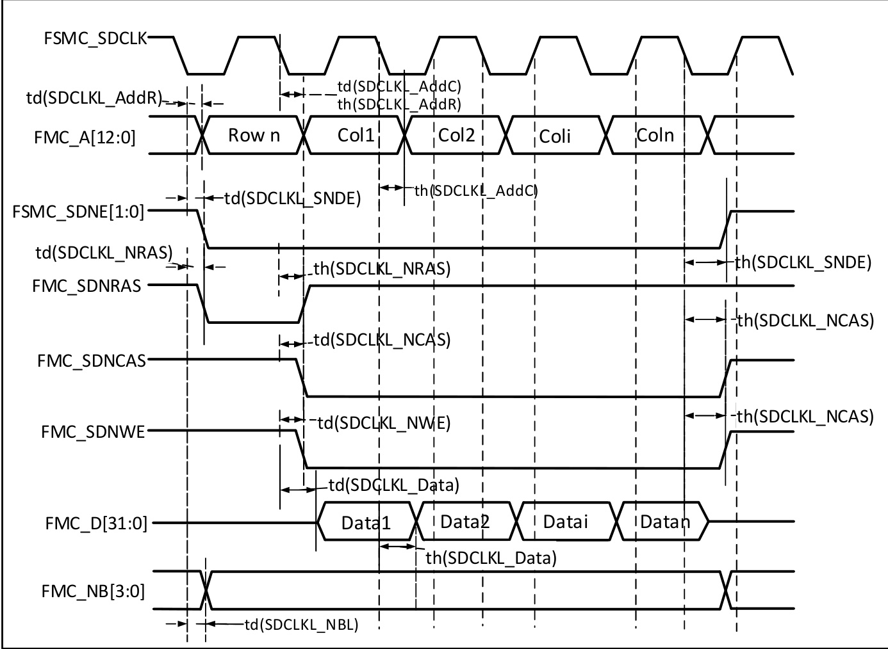  
图 3-25 SDRAM 写操作波形

表 3-42 SDRAM 写操作时序  

<html><body><table><tr><td>符号</td><td>参数</td><td>最小值</td><td>最大值</td><td>单位</td></tr><tr><td>tw (SDCLK)</td><td>FMC_SDCLK 周期</td><td>9.5</td><td>10.5</td><td rowspan="8">ns</td></tr><tr><td>(SDCLKL DATA) tsu</td><td>数据输出有效时间</td><td></td><td>2</td></tr><tr><td>th (SDCLKL_DATA)</td><td>数据输出保持时间</td><td>0.5</td><td></td></tr><tr><td>td (SDCLKL_ ADD)</td><td>地址有效时间</td><td></td><td></td></tr><tr><td>td (SDCLKL_SDNWE)</td><td>SDNWE 有效时间</td><td></td><td></td></tr><tr><td>th (SDCLKL_SDNWE)</td><td>SDNWE 保持时间</td><td>0</td><td></td></tr><tr><td>td (SDCLKL_SDNE)</td><td>芯片选择有效时间</td><td></td><td></td></tr><tr><td>tn (SDCLKL_SDNE)</td><td>芯片选择保持时间</td><td>0</td><td></td></tr><tr><td>td (SDCLKL SDNRAS)</td><td>SDNRAS 有效时间</td><td></td><td></td></tr><tr><td>th (SDCLKL SDNRAS)</td><td>SDNRAS 保持时间</td><td></td><td></td></tr><tr><td>td (SDCLKL _SDNCAS)</td><td>SDNCAS 有效时间</td><td></td><td></td></tr><tr><td>(SDCLKL SDNCAS) tn</td><td>SDNCAS 保持时间</td><td>0</td><td></td></tr></table></body></html>

注： 写 SDRAM 时， FMC_ SDCLK 的最大值设置为 100MHz。

表 3-43 LPSDR SDRAM 写操作时序  

<html><body><table><tr><td>符号</td><td>参数</td><td>最小值</td><td>最大值</td><td>单位</td></tr><tr><td>tw (SDCLK)</td><td>FMC SDCLK周期</td><td>9.5</td><td>10.5</td><td rowspan="9">ns</td></tr><tr><td>(SDCLKL_DATA) tsu</td><td>数据输出有效时间</td><td></td><td>4</td></tr><tr><td>th (SDCLKL_DATA)</td><td>数据输出保持时间</td><td></td><td></td></tr><tr><td>td (SDCLKL ADD）</td><td>地址有效时间</td><td></td><td>3.5</td></tr><tr><td>td (SDCLKL_SDNWE)</td><td>SDNWE 有效时间</td><td></td><td></td></tr><tr><td>th (SDCLKL _SDNWE)</td><td>SDNWE 保持时间</td><td></td><td></td></tr><tr><td>td(SDCLKL SDNE)</td><td>芯片选择有效时间</td><td></td><td></td></tr><tr><td>th (SDCLKL SDNE)</td><td>芯片选择保持时间</td><td>0</td><td></td></tr><tr><td>td (SDCLKL _SDNRAS)</td><td>SDNRAS 有效时间</td><td></td><td></td></tr><tr><td>th (SDCLKL SDNRAS)</td><td>SDNRAS 保持时间</td><td></td><td></td></tr><tr><td>td (SDCLKL SDNCAS)</td><td>SDNCAS 有效时间</td><td></td><td></td><td></td></tr><tr><td>(SDCLKL SDNCAS) tn</td><td>SDNCAS 保持时间</td><td></td><td></td><td></td></tr></table></body></html>

注： 写 SDRAM 时， FMC SDCLK 的最大值设置为 100MHz。

# 3.3.27 DVP 接口特性

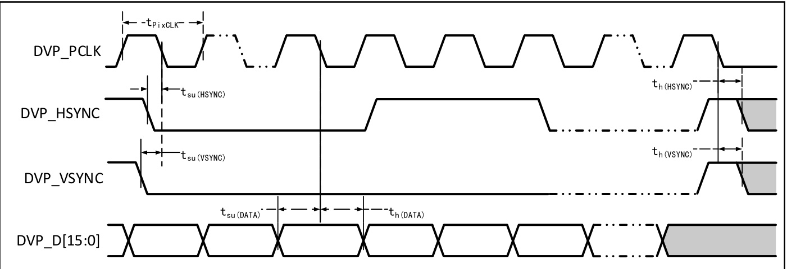  
图 3-26 DVP 时序波形

表 3-44 DVP 接口特性  

<html><body><table><tr><td>符号</td><td>参数及描述</td><td>最小值</td><td>最大值</td><td>单位</td></tr><tr><td>FPixCLk/tpixLK</td><td>像素时钟输入频率</td><td></td><td>150</td><td>MHz</td></tr><tr><td>Duty (PixCLK)</td><td>像素时钟的占空比</td><td>15</td><td></td><td>%</td></tr><tr><td>tsu （DATA)</td><td>数据建立时间</td><td>2.5</td><td></td><td>ns</td></tr><tr><td>th (DATA)</td><td>数据保持时间</td><td>1</td><td></td><td>ns</td></tr><tr><td>(HSYNC) /tsu (VSYNC) tsu</td><td>HSYNC/VSYNC信号输入建立时间</td><td>2.5</td><td></td><td>ns</td></tr><tr><td>th (HSYNC) /th (VSYNC)</td><td>HSYNC/VSYNC信号输入保持时间</td><td>1</td><td></td><td>ns</td></tr></table></body></html>

# 3.3.28 LTDC 接口特性

LCD_CLK tCLK   
LCD_VSYNC tv(HSYNC) tv(HSYNC)   
LCD_HSYNC tv(DE)   
LCD_DE tv(DATA)   
LCD R[0:7]   
LCD_G[0:7] Pi1xel Pi2xel xe   
LCD_B[0:7] HSYNC Hor izontal Horizontal / Active width Width back porch back porch   
LCD_CLK tCLK tv(VSYNC) tv(VSYNC) 1   
LCD_VSYNC tv(DATA)   
LCD_R[0:7] −   
LCD_G[0:7] M lines data   
LCD_B[0:7] VSYNC Vertical 1 Vertical Width back porch Active width back porch

表 3-45 LTDC 接口特性  

<html><body><table><tr><td>符号</td><td>参数</td><td>条件</td><td>最小值</td><td>典型值</td><td>最大值</td><td>单位</td></tr><tr><td rowspan="3">FcLK</td><td rowspan="3">时钟输出频率</td><td>CL=30pF, 二 2.7-3.6V V(1)</td><td></td><td></td><td>120</td><td>MHz</td></tr><tr><td>CL=10pF, V 2.7-3.6V</td><td></td><td></td><td>200</td><td>MHz</td></tr><tr><td>CL=30pF, 二 1.6-2.7V V(1)</td><td></td><td></td><td>55</td><td>MHz</td></tr><tr><td>Duty (cLk)</td><td>时钟占空比</td><td>CL=30pF</td><td>45</td><td></td><td>55</td><td>%</td></tr></table></body></html>

<html><body><table><tr><td>tw (CKH)</td><td>时钟高/低电平时间</td><td>CL=30pF</td><td>tcLk/2-0.7</td><td>tcLk/2+0. 7</td><td>ns</td></tr><tr><td></td><td>数据及控制信号输出 有效时间</td><td>CL=30pF</td><td></td><td>0.7</td><td>ns</td></tr><tr><td></td><td>数据及控制信号输出 保持时间</td><td>CL=30pF</td><td></td><td></td><td>ns</td></tr></table></body></html>

注： 1.上表中， V\*根据具体的引脚可表示为 VDDIO、 $V _ { I 0 1 8 }$ 或 VDD33。

# 3.3.29 千兆以太网接口特性

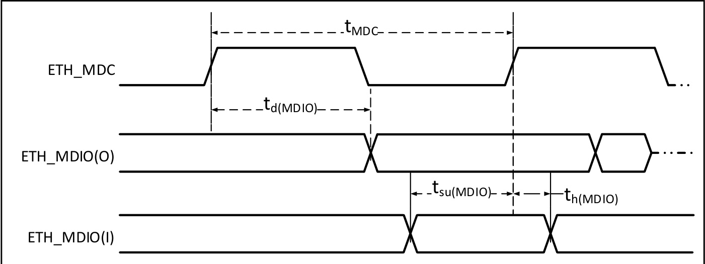  
图 3-29 ETH-SMI 时序波形

表 3-46 以太网 MAC 的 SMI 信号特性  

<html><body><table><tr><td>符号</td><td>参数及描述</td><td>最小值</td><td>典型值</td><td>最大值</td><td>单位</td></tr><tr><td>fmDc/tmDc</td><td>MDC时钟频率</td><td></td><td></td><td>2.5</td><td>MHz</td></tr><tr><td>td(MDI0)</td><td>MDI0写数据的有效时间</td><td>0</td><td></td><td>300</td><td rowspan="3">ns</td></tr><tr><td>(MD10) tsu</td><td>读数据建立时间</td><td>10</td><td></td><td></td></tr><tr><td>tn (MDI0)</td><td>读数据保持时间</td><td>10</td><td></td><td></td></tr></table></body></html>

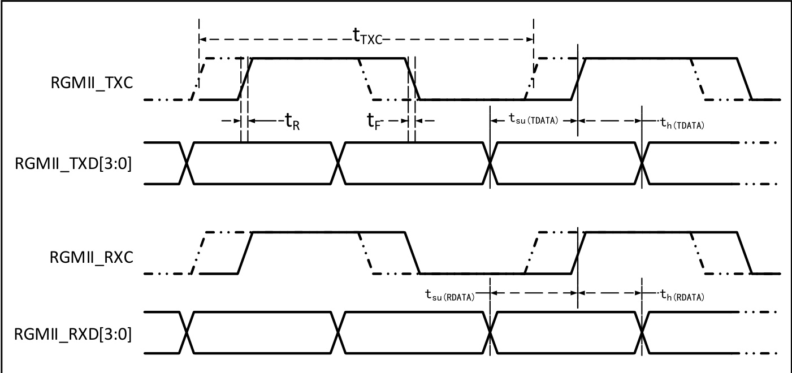  
图 3-30 ETH-RGMII 信号时序波形

表 3-47 以太网 MAC 信号 RGMI 信号特性  

<html><body><table><tr><td>符号</td><td>参数及描述</td><td>最小值</td><td>典型值</td><td>最大值</td><td>单位</td></tr><tr><td>fxc/tτxc</td><td>TXC/RXC时钟频率</td><td>7.2</td><td>8</td><td>8.8</td><td rowspan="7">ns</td></tr><tr><td>tR</td><td>TXC/RXC上升时间</td><td></td><td></td><td>2.0</td></tr><tr><td>tF</td><td>TXC/RXC下降时间</td><td></td><td></td><td>2.0</td></tr><tr><td>tsu (TDATA)</td><td>发送数据建立时间</td><td>1.2</td><td>2.0</td><td></td></tr><tr><td>th (TDATA)</td><td>发送数据保持时间</td><td>1.2</td><td>2.0</td><td></td></tr><tr><td>tsu (RDATA)</td><td>输入数据建立时间</td><td>1.2</td><td>2.0</td><td></td></tr><tr><td>tn (RDATA)</td><td>输入数据保持时间</td><td>1.2</td><td>2.0</td><td></td></tr></table></body></html>

# 3.3.30 12 位 ADC 特性

表 3-48 ADC 特性  

<html><body><table><tr><td>符号</td><td>参数</td><td>条件</td><td>最小值</td><td>典型值</td><td>最大值</td><td>单位</td></tr><tr><td rowspan="2">VDD33A</td><td rowspan="2">供电电压</td><td>fs 2MHz</td><td>2.7</td><td></td><td>3.6</td><td>V</td></tr><tr><td>f s W 2MHz</td><td>3</td><td></td><td>3.6</td><td>V</td></tr><tr><td>(2) VREFP</td><td>正参考电压</td><td>≤ VREFP VDD33A</td><td>2.4</td><td>3.3</td><td>3.6</td><td>V</td></tr><tr><td rowspan="2">IDD33A</td><td rowspan="2">ADC 供电电流 (不含 buffer)</td><td>ADC_LP = 0</td><td></td><td>1.42</td><td></td><td>mA</td></tr><tr><td>ADC_LP = 1</td><td></td><td>0.37</td><td></td><td>mA</td></tr><tr><td rowspan="2"> BUF</td><td rowspan="2">ADC buffer 自身电流</td><td>ADC_LP = 0</td><td></td><td>0.76</td><td></td><td>mA</td></tr><tr><td>ADC_LP =</td><td></td><td>0.19</td><td></td><td></td></tr><tr><td></td><td></td><td></td><td></td><td>14</td><td>80</td><td>mA</td></tr><tr><td>fFADC fs</td><td>ADC时钟频率 采样速率</td><td></td><td>0.06</td><td></td><td>5</td><td>MHz</td></tr><tr><td rowspan="4">FTRIG</td><td rowspan="4">外部触发频率</td><td>fADc 二 14MHz</td><td></td><td></td><td>875</td><td>MHz</td></tr><tr><td></td><td></td><td></td><td>16</td><td>kHz 1/fADc</td></tr><tr><td>二 80MHz FADC</td><td></td><td></td><td>4.4</td><td>MHz</td></tr><tr><td></td><td></td><td></td><td>18</td><td>1/fADc</td></tr><tr><td rowspan="2">VAIN</td><td rowspan="2">转换电压范围</td><td>W VD10 VREFP</td><td>0</td><td></td><td>VD10</td><td>V</td></tr><tr><td>VD10 VREFP</td><td>0</td><td></td><td>VREFP</td><td>V</td></tr><tr><td>RAIN</td><td>外部输入阻抗</td><td></td><td></td><td></td><td>50</td><td>kΩ</td></tr><tr><td>RADC</td><td>采样开关电阻</td><td></td><td></td><td>0.6</td><td>1.5</td><td>kΩ</td></tr><tr><td>CADC</td><td>内部采样和保持电容</td><td></td><td></td><td>4.5</td><td></td><td>pF</td></tr><tr><td>tcAL</td><td>校准时间</td><td>fADC 14MHz</td><td>2</td><td></td><td></td><td>US</td></tr><tr><td rowspan="4">t lat</td><td rowspan="4">注入触发转换时延</td><td>FADC 二 14MHz</td><td></td><td></td><td>0.143</td><td>US</td></tr><tr><td>fADc 80MHz</td><td></td><td></td><td>0.025</td><td>US</td></tr><tr><td></td><td></td><td></td><td>2</td><td>1/fADC</td></tr><tr><td>FADC 14MHz</td><td></td><td></td><td>0.143</td><td>US</td></tr><tr><td rowspan="3">tlatr</td><td rowspan="3">常规触发转换时延</td><td>80MHz FADC</td><td></td><td></td><td>0.025</td><td>us</td></tr><tr><td></td><td></td><td></td><td>2</td><td>1/fADc</td></tr><tr><td>FADc − 14MHz</td><td>0.107</td><td></td><td>17.11</td><td>US</td></tr><tr><td rowspan="3"></td><td rowspan="3">采样时间</td><td></td><td>1.5</td><td></td><td>239.5</td><td>1/fADcC</td></tr><tr><td>fADC 二 80MHz</td><td>0.037</td><td></td><td>2.49</td><td>US</td></tr><tr><td></td><td>3.5</td><td></td><td>239.5</td><td>1/fADc</td></tr><tr><td>tSTAB</td><td>上电时间</td><td></td><td></td><td></td><td></td><td>US</td></tr></table></body></html>

<html><body><table><tr><td rowspan="7">tcoNV</td><td rowspan="5">总的转换时间 (包括采样时间)</td><td>FADc = 14MHz</td><td>1</td><td></td><td>18</td><td>us</td></tr><tr><td></td><td></td><td></td><td>252</td><td>1/fADc</td></tr><tr><td></td><td>14</td><td></td><td></td><td></td></tr><tr><td>FADC 80MHz</td><td>0.2</td><td></td><td>3.15</td><td>us</td></tr><tr><td></td><td>16</td><td></td><td>252</td><td>1/fADc</td></tr></table></body></html>

注： 1. 以上均为设计参数保证。2. $V _ { R E F P }$ 外接电容要尽可能近， 否则影响 ADC 性能。

公式： 最大 $R _ { A I N }$

$$
R _ { _ { A I N } } < \frac { T _ { s } } { f _ { _ { A D C } } \times C _ { _ { A D C } } \times \mathsf { I n } 2 ^ { \mathsf { N } + 2 } } - R _ { _ { A D C } }
$$

上述公式用于决定最大的外部阻抗， 使得误差可以小于 $1 / 4 \mathsf { L S B }$ 。 其中 $N = 1 2$ (表示 12 位分辨率)。

表 3-49 $f _ { A D C } = 1 4 M H z$ 时的最大 $R _ { A \mid N }$   

<html><body><table><tr><td>Ts(周期)</td><td>ts (us)</td><td>最大RAIN(kQ)</td></tr><tr><td>1.5</td><td>0.11</td><td>1.0</td></tr><tr><td>3.5</td><td>0.25</td><td>4.0</td></tr><tr><td>7.5</td><td>0.54</td><td>10.9</td></tr><tr><td>13.5</td><td>0.96</td><td>20.5</td></tr><tr><td>28.5</td><td>2.04</td><td>44.9</td></tr><tr><td>41.5</td><td>2.96</td><td>66.3</td></tr></table></body></html>

表 3-50 ADC 误差 （ $\mathit { \Pi } ^ { ' } \mathsf { f } _ { \mathsf { A D C } } = 1 4 \mathsf { M H } z$ ， ADC_LP = 1）  

<html><body><table><tr><td>符号</td><td>参数</td><td>条件</td><td>最小值</td><td>典型值</td><td>最大值</td><td>单位</td></tr><tr><td>EO</td><td>偏移误差</td><td rowspan="3">< 10kΩ, = 3.3V RAIN VDD33A</td><td></td><td>±2</td><td>±5</td><td rowspan="3">LSB</td></tr><tr><td>ED</td><td>微分非线性误差</td><td></td><td>±1</td><td>±4</td></tr><tr><td>EL</td><td>积分非线性误差</td><td></td><td>±2</td><td>±4</td></tr></table></body></html>

注： 以上均为设计参数保证。

表 3-51 ADC 误差 （ $\mathit { \check { f } } _ { \mathsf { A D C } } = 8 0 \mathsf { M H } z$ ， ${ \mathsf { A D C \_ L P } } = 0 ;$ ）  

<html><body><table><tr><td>符号</td><td>参数</td><td>条件</td><td>最小值</td><td>典型值</td><td>最大值</td><td>单位</td></tr><tr><td>EO</td><td>偏移误差</td><td rowspan="4">< 2kΩ, VDD33A = 3.3V RAIN</td><td></td><td>±3</td><td>±7</td><td rowspan="4">LSB</td></tr><tr><td>ED</td><td>微分非线性误差</td><td></td><td>±2</td><td>±5</td></tr><tr><td>EL</td><td>积分非线性误差</td><td></td><td>±3</td><td>±5</td></tr></table></body></html>

注： 以上均为设计参数保证。

$\mathsf { C } _ { \mathsf { p } }$ 表示PCB 与焊盘上的寄生电容 （大约5pF）， 可能与焊盘和PCB 布局质量有关。较大的 $\mathsf { C } _ { \mathsf { p } }$ 数值将降低转换精度， 解决办法是降低 $\mathsf { f } _ { \mathsf { A D C } }$ 值。

  
图 3-31 ADC 典型连接图

  
图 3-32 模拟电源及退耦电路参考

3.3.31 10 位 HSADC 特性表 3-52 HSADC 特性  

<html><body><table><tr><td>符号</td><td>参数</td><td>条件</td><td>最小值</td><td>典型值</td><td>最大值</td><td>单位</td></tr><tr><td>VDD33A</td><td>供电电压</td><td></td><td>3.0</td><td>3.3</td><td>3.6</td><td>V</td></tr><tr><td>VREFP (2)</td><td>正参考电压</td><td>VREFP ≤ VDD33A</td><td>2.4</td><td>3.3</td><td>3.6</td><td>V</td></tr><tr><td>VDD10</td><td>使用 HSADC 时的 I/0引脚电压</td><td></td><td>VREFP</td><td></td><td></td><td>V</td></tr><tr><td>DDA</td><td>供电电流</td><td></td><td></td><td>1.1</td><td></td><td>mA</td></tr><tr><td>IDD10</td><td>ADC 1/0引脚电流</td><td></td><td></td><td>1.8</td><td></td><td>mA</td></tr><tr><td>FHSADC</td><td>ADC 时钟频率</td><td></td><td></td><td>100</td><td></td><td>MHz</td></tr><tr><td>fs</td><td>采样速率</td><td></td><td></td><td>20</td><td></td><td>MHz</td></tr><tr><td rowspan="2">VAIN</td><td rowspan="2">转换电压范围</td><td>W VREFP VDD10</td><td>0</td><td></td><td>VDD10</td><td>V</td></tr><tr><td>VDD10 VREFP</td><td>0</td><td></td><td>VREFP</td><td>V</td></tr><tr><td>RAIN</td><td>外部输入阻抗</td><td></td><td></td><td></td><td>0.4</td><td>kΩ</td></tr><tr><td>RHSADC</td><td>采样开关电阻</td><td></td><td></td><td>0.1</td><td>0.25</td><td>kΩ</td></tr><tr><td>CHSADC</td><td>内部采样和保持电容</td><td></td><td></td><td>1.1</td><td></td><td>pF</td></tr><tr><td>tcAL</td><td>校准时间</td><td></td><td></td><td>1</td><td></td><td>us</td></tr><tr><td rowspan="2"></td><td rowspan="2">采样时间</td><td rowspan="2">二 100MHz FHSADC</td><td rowspan="2"></td><td rowspan="2">10 −</td><td rowspan="2"></td><td rowspan="2">ns</td></tr><tr><td></td></tr><tr><td>tSTAB</td><td>上电时间</td><td></td><td></td><td></td><td></td><td>1/fHSADC</td></tr><tr><td></td><td>总的转换时间 (包括采样时间)</td><td>二 100MHz FHSADC</td><td></td><td></td><td></td><td>us</td></tr><tr><td rowspan="2">tcoNV</td><td rowspan="2"></td><td rowspan="2"></td><td rowspan="2"></td><td rowspan="2">50 5</td><td rowspan="2"></td><td rowspan="2">ns 1/fHSADC</td></tr><tr><td></td></tr></table></body></html>

注： 1. 以上均为设计参数保证。2. $V _ { R E F P }$ 外接电容要尽可能近， 否则影响 HSADC 性能。

公式： 最大 $R _ { A I N }$

$$
R _ { _ { A I N } } < { \frac { T _ { s } } { f _ { _ { H S A D C } } \times C _ { _ { H S A D C } } \times \mathsf { I n 2 ^ { N + 2 } } } } - R _ { _ { H S A D C } }
$$

上述公式用于决定最大的外部阻抗， 使得误差可以小于 $1 / 4 \mathsf { L S B }$ 。 其中 $N = 1 0$ (表示 10 位分辨率)。

表 3-53 HSADC 误差  

<html><body><table><tr><td>符号</td><td>参数</td><td>条件</td><td>最小值</td><td>典型值</td><td>最大值</td><td>单位</td></tr><tr><td>EO</td><td>偏移误差</td><td>RAIN < 0.4kΩ,</td><td></td><td>±4</td><td>±9</td><td></td></tr><tr><td>ED</td><td>微分非线性误差 积分非线性误差</td><td>VDD33A = 3.3V</td><td></td><td>±2 ±3</td><td>±4 ±4</td><td>LSB</td></tr></table></body></html>

注： 以上均为设计参数保证。

${ \sf C } _ { \sf p }$ 表示PCB 与焊盘上的寄生电容 （大约5pF）， 可能与焊盘和PCB 布局质量有关。 较大的 ${ \sf C } _ { \sf p }$ 数值将降低转换精度， 解决办法是降低 $\mathsf { f } _ { \mathsf { A D C } }$ 值。

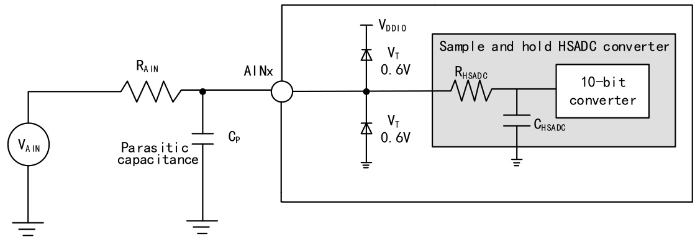  
图 3-33 HSADC 典型连接图

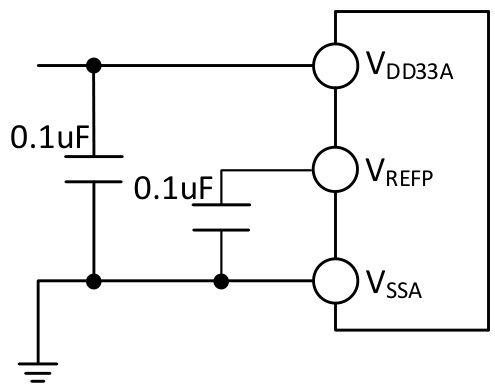  
图 3-34 模拟电源及退耦电路参考

# 3.3.32 DAC 特性

表 3-54 DAC 特性  

<html><body><table><tr><td>符号</td><td>参数</td><td>条件</td><td>最小值</td><td>典型值</td><td>最大值</td><td>单位</td></tr><tr><td>VDD33A</td><td>供电电压</td><td></td><td>2.4</td><td>3.3</td><td>3.6</td><td>V</td></tr><tr><td>VREFP</td><td>正参考电压</td><td>VREFP VDD33A</td><td>2.4</td><td>3.3</td><td>3.6</td><td>V</td></tr><tr><td>RL (1)</td><td>缓冲器打开时的负载电阻</td><td></td><td>5</td><td></td><td></td><td>kΩ</td></tr><tr><td>CL (1)</td><td>缓冲器打开时负载电容</td><td></td><td></td><td></td><td>50</td><td>pF</td></tr></table></body></html>

<html><body><table><tr><td>(1)</td><td rowspan="2"></td><td></td><td></td><td></td><td></td><td></td></tr><tr><td>VoUT_MIN</td><td></td><td>0</td><td></td><td>8</td><td>mV</td></tr><tr><td>(1) VOUT_MAX</td><td rowspan="2">缓冲器打开， 12位DAC 转换</td><td>VREFP = 3.3V</td><td>3.29</td><td></td><td>3.3</td><td>V</td></tr><tr><td>(1) VoUT MIN</td><td></td><td>0</td><td></td><td>3</td><td>mV</td></tr><tr><td>(1) VoUT_ MAX</td><td rowspan="2">缓冲器关闭， 12位DAC转换</td><td rowspan="2">二 3.3V VREFP</td><td>3.295</td><td></td><td>3.3</td><td>V</td></tr><tr><td colspan="2">无负载， 输入值 0x800</td><td>58</td><td></td><td>uA</td></tr><tr><td rowspan="4">IVREFP</td><td colspan="2">无负载， = 3.6V时， 输入值 0xF1C VREFP</td><td></td><td>194</td><td></td><td rowspan="4"></td></tr><tr><td colspan="2">无负载， VREFp = 3.6V时，输入值0×555 （最差）</td><td></td><td>331</td><td></td></tr><tr><td colspan="2">缓冲器打开无负载，输入值0×800</td><td></td><td>170</td><td></td></tr><tr><td colspan="2">缓冲器打开无负载， VREFP = 3.6V, 输入值0xF1C （最差）</td><td></td><td>150</td><td></td></tr><tr><td></td><td colspan="2">缓冲器打开无负载， VREFP = 3. 6V, 输入值0x555</td><td></td><td>170</td><td></td><td></td></tr><tr><td>DNL</td><td>微分非线性误差</td><td>经过失调误差和增益误</td><td></td><td>±2</td><td></td><td>LSB</td></tr><tr><td>INL</td><td>积分非线性误差</td><td>差校正后</td><td></td><td>±4 ±3</td><td>±12</td><td>LSB mV</td></tr><tr><td>失调</td><td>偏移误差</td><td>VREFP = 3. 6V</td><td></td><td></td><td>±10</td><td>LSB</td></tr><tr><td>增益误差</td><td></td><td>DAC配置为12位</td><td></td><td>±0.4</td><td></td><td>%</td></tr><tr><td>放大器增益 (1)</td><td>开环时放大器的增益 设置时间（全范围：输入代码</td><td>5kΩ的负载 （最大）</td><td>80</td><td>85</td><td></td><td>dB</td></tr><tr><td>tSETTLING</td><td>从最小值转变为最大值， DAC_OUT 达到其终值的土1 LSB)</td><td>CLOAD ≤ 50pF W 5kΩ RLOAD</td><td></td><td></td><td></td><td>us</td></tr><tr><td>更新速率</td><td>当输入代码为较小变化时（从 数值i变到i+1LSB)，得到正确 DAC_OUT的最大频率</td><td>CLOAD ≤ 50pF W 5kΩ RLOAD</td><td></td><td></td><td></td><td>MS/s</td></tr><tr><td>PSRR+ (1)</td><td>供电抑制比（相对于VDp33A）（静 态直流测量）</td><td>没有RLOAD， CLOAD ≤ 50pF</td><td></td><td>-100</td><td>-75</td><td>dB</td></tr></table></body></html>

注： 设计参数保证。

# 3.3.33 OPA 特性

表 3-55-1 OPA 运放特性  

<html><body><table><tr><td>符号</td><td>参数</td><td>条件</td><td>最小值</td><td>典型值</td><td>最大值</td><td>单位</td></tr><tr><td>VDD33A</td><td>供电电压</td><td>建议不低于2V</td><td>1.8</td><td>3.3</td><td>3.6</td><td>V</td></tr><tr><td>VCMIR</td><td>共模输入电压</td><td></td><td>0</td><td></td><td>VDD33A</td><td>V</td></tr><tr><td>V10FFSET</td><td>输入失调电压</td><td></td><td></td><td>±0.2</td><td>±0.8</td><td>mV</td></tr><tr><td>VIN_OUT</td><td>通道输入和输出的 电压范围</td><td>针对 PB0～PB1、 PE8~PE9、 PE11～PE12、 PC2~PC3引脚</td><td></td><td></td><td>V1018</td><td></td></tr><tr><td></td><td></td><td>其他 OPA 输入输出通道引脚</td><td></td><td></td><td>VDD10</td><td></td></tr><tr><td>ILOAD</td><td>驱动电流</td><td>RLOAD = 4kΩ</td><td></td><td></td><td>900</td><td>uA</td></tr><tr><td>PGA ILOAD</td><td>PGA模式驱动电流</td><td></td><td></td><td></td><td>500</td><td>uA</td></tr><tr><td>IDDOPAMP</td><td>消耗电流</td><td>无负载， 静态模式</td><td></td><td>200</td><td></td><td>uA</td></tr><tr><td>CMRR(1)</td><td>共模抑制比</td><td>@1kHz</td><td></td><td>96</td><td></td><td>dB</td></tr><tr><td>PSRR(1</td><td>电源抑制比</td><td>@1kHz</td><td></td><td>82</td><td></td><td>dB</td></tr><tr><td>Av(1)</td><td>开环增益</td><td>CLOAD = 5pF</td><td></td><td>110</td><td></td><td>dB</td></tr><tr><td>GB (c)</td><td>单位增益带宽</td><td>GLOAD 二 5pF</td><td></td><td>16</td><td></td><td>MHz</td></tr></table></body></html>

<html><body><table><tr><td>相位裕度 Pn (1))</td><td>CLOAD</td><td>= 5pF</td><td></td><td>75</td><td></td></tr><tr><td>SR(cd:)</td><td>压摆率</td><td>CLOAD = 5pF</td><td></td><td>7</td><td>V/us</td></tr><tr><td>(1) tWAKUP</td><td>关闭到唤醒时间 0.1%</td><td>输入VDD33A/2, 二 50pF, RLOAD 二 4kΩ CLOAD</td><td></td><td></td><td>Us</td></tr><tr><td>RLOAD</td><td>阻性负载</td><td></td><td></td><td></td><td>kΩ</td></tr><tr><td>CLOAD</td><td>容性负载</td><td></td><td></td><td>50</td><td>pF</td></tr><tr><td rowspan="2">(2) VOHSAT</td><td rowspan="2">高饱和输出电压</td><td>RLOAD 二 4kΩ</td><td>VDD33A-160</td><td></td><td>mV</td></tr><tr><td>RLOAD 二 20kΩ</td><td>VDD33A-35</td><td></td><td>mV</td></tr><tr><td rowspan="4">(2) VOLSAT</td><td rowspan="4">低饱和输出电压</td><td>二 4kΩ RLOAD</td><td></td><td>3</td><td>mV</td></tr><tr><td>4KQ，上拉 RLOAD</td><td></td><td>160</td><td>mV</td></tr><tr><td>20kΩ RLOAD</td><td></td><td>3</td><td>mV</td></tr><tr><td>二 20kΩ，上拉 RLOAD</td><td></td><td>35</td><td>mV</td></tr><tr><td rowspan="8">PGA Gain(1)</td><td rowspan="4">PGADIFx = 0, 同相 PGA增益误差</td><td>Gain 8, < (VDD33A/7) VCMIR</td><td>-1</td><td>1</td><td>%</td></tr><tr><td>Gain 16, VcMiR < (VD33/15)</td><td>1</td><td>−</td><td></td></tr><tr><td>Gain 32, VCMIR < (VDD33A/31)</td><td>1</td><td></td><td>%</td></tr><tr><td>Gain 二 64, VcMIR < (VD33A/63)</td><td>-1.5</td><td>1.5</td><td>%</td></tr><tr><td rowspan="4">PGADIFx = 1, 同相 PGA 增益误差</td><td>Gain</td><td></td><td>2</td><td>%</td></tr><tr><td>Gain 16</td><td>2</td><td>2</td><td>%</td></tr><tr><td>Gain = 32</td><td>2</td><td>2</td><td>%</td></tr><tr><td>Gain 64</td><td>-2.</td><td>2.5</td><td>− %</td></tr><tr><td>Delta R</td><td>电阻绝对值变化</td><td></td><td>-15</td><td>15</td><td>%</td></tr><tr><td rowspan="2">eN (1)</td><td rowspan="2">等效输入噪声</td><td>RLOAD 二 4kΩ @1kHz</td><td></td><td>100</td><td rowspan="2">nV/</td></tr><tr><td>二 20k Ω @1kHz RLOAD</td><td></td><td>60</td></tr></table></body></html>

注：1.设计参数保证。2.负载电流会限制饱和输出电压。

表 3-55-2 OPA 运放特性 （高速模式）  

<html><body><table><tr><td>符号</td><td>参数</td><td>条件</td><td>最小值</td><td>典型值</td><td>最大值</td><td>单位</td></tr><tr><td>VDD33A</td><td>供电电压</td><td>建议不低于2.4V</td><td>1.8</td><td>3.3</td><td>3.6</td><td>V</td></tr><tr><td>VCMIR</td><td>共模输入电压</td><td></td><td>0</td><td></td><td>VDD33A</td><td>V</td></tr><tr><td>VIOFFSET</td><td>输入失调电压 通道输入和输出的</td><td>针对 PB0~PB1、 PE8~PE9、</td><td></td><td>±3</td><td>±12 V1018</td><td>mV</td></tr><tr><td>ViN_OUT</td><td>电压范围</td><td>PE11~PE12、 PC2～PC3引脚 其他 OPA 输入输出通道引脚</td><td></td><td></td><td>VDD10</td><td></td></tr><tr><td>ILOAD</td><td>驱动电流</td><td>RLOAD 二 4kΩ</td><td></td><td></td><td>900</td><td>uA</td></tr><tr><td>ILOAD_PGA</td><td>PGA 模式驱动电流</td><td></td><td></td><td></td><td>500</td><td>uA</td></tr><tr><td>IDDOPAMP</td><td>消耗电流</td><td>无负载， 静态模式</td><td></td><td>450</td><td></td><td>uA</td></tr><tr><td>CMRR(1</td><td>共模抑制比</td><td>@1kHz</td><td></td><td>96</td><td></td><td>dB</td></tr><tr><td>PSRR(1)</td><td>电源抑制比</td><td>@1kHz</td><td></td><td>82</td><td></td><td>dB</td></tr><tr><td>Av(1)</td><td>开环增益</td><td>CLOAD = 5pF</td><td></td><td>110</td><td></td><td>dB</td></tr><tr><td>（1） GBW</td><td>单位增益带宽</td><td>二 5pF CLOAD</td><td></td><td>28</td><td></td><td>MHz</td></tr><tr><td>PM(c:)</td><td>相位裕度</td><td>CLOAD 二 5pF</td><td></td><td>80</td><td></td><td></td></tr><tr><td>SR (cd:)</td><td>压摆率</td><td>CLOAD 二 5pF</td><td></td><td>25</td><td></td><td>V/us</td></tr></table></body></html>

<html><body><table><tr><td>(1 tWAKUP</td><td>关闭到唤醒时间 0.1%</td><td>输入VDp33A/2， = 50pF, RLOAD 二 4kΩ CLOAD</td><td></td><td></td><td></td><td>US</td></tr><tr><td>RLOAD</td><td>阻性负载</td><td></td><td></td><td></td><td></td><td>kΩ</td></tr><tr><td>CLOAD</td><td>容性负载</td><td></td><td></td><td></td><td>50</td><td>pF</td></tr><tr><td rowspan="2">(2) VOHSAT</td><td rowspan="2">高饱和输出电压</td><td>RLOAD 二 4kΩ</td><td>VDD33A-160</td><td></td><td></td><td>mV</td></tr><tr><td>RLOAD 二 20kΩ</td><td>-35 VDD33A</td><td></td><td></td><td>mV</td></tr><tr><td rowspan="4">(2) VOLSAT</td><td rowspan="4">低饱和输出电压</td><td>RLOAD 二 4kΩ</td><td></td><td></td><td>3</td><td>mV</td></tr><tr><td>RLOAD 二 4KQ，上拉</td><td></td><td></td><td>160</td><td>mV</td></tr><tr><td>RLOAD 二 20kΩ</td><td></td><td></td><td>3</td><td>mV</td></tr><tr><td>二 20kΩ，上拉 RLOAD</td><td></td><td></td><td>35</td><td>mV</td></tr><tr><td rowspan="7">误差 PGA Gain (1)</td><td rowspan="4">内部同相 PGA 增益</td><td>Gain 二 8, VcMIR < (VDD33A/7)</td><td>-1</td><td></td><td>1</td><td>%</td></tr><tr><td>Gain 16, VcMIR < (VDD33A/15)</td><td>-1</td><td></td><td>1</td><td>%</td></tr><tr><td>Gain 32, VcMIR < (VDD33A/31)</td><td>-1</td><td></td><td></td><td>%</td></tr><tr><td>Gain 64, VCMIR < (VDD33A/63)</td><td>-1.5</td><td></td><td>1.5</td><td>%</td></tr><tr><td rowspan="4">差分 PGA 增益误差</td><td>Gain 8 /</td><td>-2</td><td></td><td>2</td><td>%</td></tr><tr><td>Gain = 16</td><td>2</td><td></td><td>2</td><td>%</td></tr><tr><td>Gain = 32</td><td>2</td><td></td><td>2</td><td>%</td></tr><tr><td>二 64 Gain</td><td>-2.5</td><td></td><td>2.5</td><td>%</td></tr><tr><td>Delta R</td><td>电阻绝对值变化</td><td></td><td>-15</td><td></td><td>15</td><td>%</td></tr><tr><td rowspan="2">eN (1))</td><td rowspan="2">等效输入噪声</td><td>二 4k Ω @1kHz RLOAD</td><td></td><td>100</td><td></td><td>nV/</td></tr><tr><td>RLOAD 二 20k Ω @1kHz</td><td></td><td>60</td><td></td><td>sqrt (Hz)</td></tr></table></body></html>

注：1.设计参数保证。2.负载电流会限制饱和输出电压。

# 3.3.34 CMP 特性

表 3-56 CMP 电压比较器特性  

<html><body><table><tr><td>符号</td><td>参数</td><td>条件</td><td>最小值</td><td>典型值</td><td>最大值</td><td>单位</td></tr><tr><td>VDD33A</td><td>供电电压</td><td>建议不低于2V</td><td>1.8</td><td>3.3</td><td>3.6</td><td>V</td></tr><tr><td>VOMIR</td><td>共模输入电压</td><td></td><td>0</td><td></td><td>VDD33A</td><td>V</td></tr><tr><td>V1OFFSET</td><td>输入失调电压</td><td></td><td></td><td>±3</td><td>±12</td><td>mV</td></tr><tr><td rowspan="2">VIN_OUT</td><td rowspan="2">通道输入和输出的电 压范围</td><td>针对PB0～PB1 引脚</td><td></td><td></td><td>V1018</td><td>V</td></tr><tr><td>其他 CMP 输入输出通道引脚</td><td></td><td></td><td>VDD10</td><td>V</td></tr><tr><td>IDDOPAMP</td><td>消耗电流</td><td></td><td></td><td>40</td><td></td><td>uA</td></tr><tr><td rowspan="4">Vhys(1d)</td><td rowspan="4">迟滞电压</td><td>HYPSEL = 00</td><td></td><td>0</td><td></td><td rowspan="4"></td></tr><tr><td>HYPSEL = 01</td><td></td><td>10</td><td></td></tr><tr><td>HYPSEL = 10</td><td></td><td></td><td>mV</td></tr><tr><td>HYPSEL = 11</td><td></td><td>20 30</td><td></td></tr><tr><td>t(1</td><td>比较器延时， ViNP从 (ViNN-100mV) 到 (ViNN+100mV) 变化</td><td>0≤ VINN ≤VB3A</td><td></td><td>20</td><td></td><td>ns</td></tr></table></body></html>

注：1.设计参数保证。

# 3.3.35 温度传感器特性

表 3-57 温度传感器特性  

<html><body><table><tr><td>符号</td><td>参数</td><td>条件</td><td>最小值</td><td>典型值</td><td>最大值</td><td>单位</td></tr><tr><td>RTs</td><td>温度传感器测量范围</td><td></td><td>-40</td><td></td><td>85</td><td>℃</td></tr><tr><td>ATsc</td><td>温度传感器的测量误差</td><td></td><td></td><td>±12</td><td></td><td>℃</td></tr><tr><td>Avg_Slope</td><td>平均斜率 （负温度系数）</td><td></td><td>3.8</td><td>4.3</td><td>4.8</td><td>mV/℃</td></tr><tr><td>V25</td><td>在25°℃时的电压</td><td></td><td>1.34</td><td>1.40</td><td>1.46</td><td>V</td></tr><tr><td>Ts_temp</td><td>当读取温度时， ADC采样时间</td><td>FADC = 14MHz</td><td></td><td></td><td>17.1</td><td>us</td></tr></table></body></html>

# 第 4 章 封装及订货信息

芯片封装  

<html><body><table><tr><td>封装形式</td><td>塑体尺寸</td><td colspan="2">引脚节距</td><td>封装说明</td><td>订货型号</td></tr><tr><td>QFN128</td><td>12. 3*12. 3mm</td><td>0. 35mm</td><td>13.8mil</td><td>四边无引线 128脚</td><td>CH32H417QEU6</td></tr><tr><td>QFN88</td><td>10*10mm</td><td>0.4mm</td><td>15.7mi1</td><td>四边无引线88脚</td><td>CH32H417MEU6</td></tr><tr><td>QFN68</td><td>8*8mm</td><td>0.4mm</td><td>15.7mi1</td><td>四边无引线68脚</td><td>CH32H417WEU6</td></tr><tr><td>QFN60X6</td><td>6*6mm</td><td>0. 35mm</td><td>13.8mil</td><td>四边无引线 60脚</td><td>CH32H416RDU6</td></tr><tr><td>QFN60X6</td><td>6*6mm</td><td>0. 35mm</td><td>13.8mil</td><td>四边无引线60 脚</td><td>CH32H415REU6</td></tr></table></body></html>

说明： 尺寸标注的单位是 mm （毫米）， 引脚中心间距总是标称值， 没有误差， 除此之外的尺寸误差不大于 $\pm 0 . 2 \mathsf { m m }$ 或者± $1 0 \%$ 两者中的较大值。

# 4.1 QFN128 封装

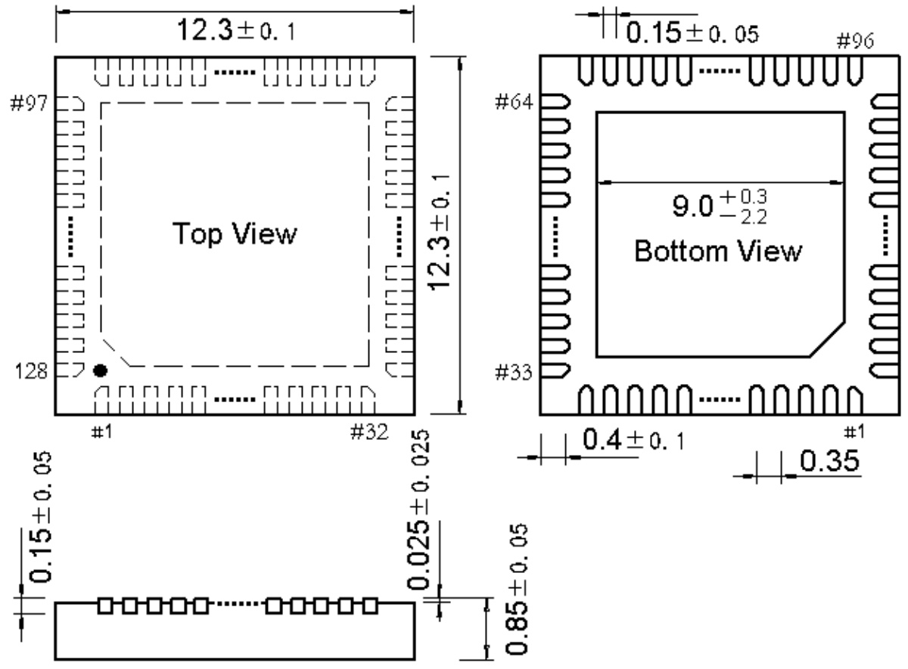

# 4.2 QFN88 封装

10.0±0.1 110.2±0. 05 #66 … 0U0U0……0U0U0   
#67 #44 Top View 5.7 ±1.5 Bottom View   
#88 #23 「 00000.0000 # ybbishm 0.4± 0. 0.4 CHOC-DrO

# 4.3 QFN68 封装

8.0±0.1 0.2± 0. 05 00000…00000 #34 #34 5.6+0.\$ : Top View Bottom View #68 000 00000.0000 0.4± 0. 0.4

# 4.4 QFN60X6 封装

6.0±0.1 #31 0.15±0. 05 #45 TUUU0…0000V   
#46 #30 4.6±0.2 Top View Bottom View   
#60 #16 a000n… nnnn   
0. ± 0. 5 0.35 C-O-0-0O.……O-O-0-0-0

# 系列产品命名规则

举例： CH32 V产品系列

$\mathsf { F } = \mathsf { A } \mathsf { r } \mathsf { m }$ 内核， 通用 MCU$\textsf { V } =$ 青稞 RISC-V 内核， 通用 MCU${ \mathsf { L } } { \mathsf { \Omega } } = { \mathsf { \Omega } }$ 青稞 RISC-V 内核， 低功耗 MCU$\tt { X } =$ 青稞 RISC-V 内核， 专用或特殊外设 MCU$\pmb { \ M } =$ 青稞 RISC-V 内核， 内置预驱的电机 MCU${ \sf H } =$ 青稞 RISC-V 内核， 高性能 MCU

产品类型 （\*） $^ + .$ 产品子系列 $( { \ast } { * } )$   

<html><body><table><tr><td>产品类型</td><td>产品子系列</td></tr><tr><td>0 = 超值版， 主频<=48M</td><td>基础电机应用型， OPA+CMP</td></tr><tr><td>基本版， 主频<=100M 2=增强版， 主频<=200M</td><td>连接型， 互联型， USB HS、 CAN、 以太网、 SDI0、 FSMC 无线型， BLE5.x、 CAN、 USB、 以太网 互联型， USB HS、 CAN、 以太网 （内置 PHY)、</td></tr><tr><td>硬件浮点， 大容量>=480KB</td><td>连接型， USB SS、 HSADC、 SDMMC 互联型， USB SS、 SerDes、 HSADC、 DVP、 SDMMC、 以太网 (内置 PHY)</td></tr></table></body></html>

# 引脚数目

$\mathsf { J } = \mathsf { 8 }$ 脚 ${ \mathsf { D } } = 1 2$ 脚 $A = 1 6$ 脚 $\mathsf { F } = 2 0$ 脚 $\mathsf { E } = 2 4$ 脚$6 = 2 8$ 脚 $k = 3 2$ 脚 ${ \textsf { T } } = 3 6$ 脚 ${ \tt C } = 4 8$ 脚 ${ \sf R } = 6 0 \& 6 4$ 脚$w = 6 8$ 脚 $M = 8 8$ 脚 $\nu = 1 0 0$ 脚 $\mathsf { Q } = \mathsf { 1 2 8 }$ 脚 $Z = \ 1 4 4$ 脚

# 闪存存储容量

$4 = 1 6 k$ 闪存存储器 $6 = 3 2 1$ 闪存存储器 $7 = 4 8 1$ 闪存存储器 $8 \ : = \ : 6 4 \mathsf { K }$ 闪存存储器$B = 1 2 8 \mathsf { K }$ 闪存存储器 $C = 2 5 6 1$ 闪存存储器 $D = 4 8 0 \mathsf { K }$ 闪存存储器 $\mathsf { E } = 5 1 2 \mathsf { K }$ 闪存存储器

# 封装

<html><body><table><tr><td>二 LQFP U 二 QFN R 二 QSOP P 二 TSSOP M 二 SOP</td></tr></table></body></html>

# 温度范围

<html><body><table><tr><td>6= -40℃~85C 7=-40℃～105℃</td></tr><tr><td>3=-40℃～125℃ D=-40C～150℃</td></tr></table></body></html>