# 概述

CH32V003 系列是基于青稞RISC-V2A 内核设计的工业级通用微控制器， 支持 48MHz 系统主频， 具有宽压、单线调试、 低功耗、超小封装等特点。提供常用的外设功能，内置1 组DMA 控制器、1 组10 位模数转换 ADC、1 组运放比较器、多组定时器、标准通讯接口如 USART、 I2C、 SPI 等。产品额定工作电压为 3.3V 或 5V， 工作温度范围为 $- 4 0 ^ { \circ } \mathsf { C } \sim 8 5 ^ { \circ } \mathsf { C }$ 工业级。

# 产品特性

$\bullet$ 内核 Core青稞 32 位 RISC-V 内核， RV32EC 指令集快速可编程中断控制器 $+$ 硬件中断堆栈支持2 级中断嵌套支持系统主频 48MHz

# $\bullet$ 存储器

2KB 易失数据存储区 SRAM  
16KB 程序存储区 CodeFlash  
1920B 系统引导程序存储区 BootLoader  
64B 系统非易失配置信息存储区  
64B 用户自定义信息存储区

$\bullet$ 电源管理和低功耗系统供电 $\mathsf { V } _ { \mathsf { D } \mathsf { D } }$ 额定：3.3V 或 5V低功耗模式： 睡眠、 待机

# $\bullet$ 系统时钟、 复位

内置出厂调校的 24MHz 的RC 振荡器内置 $1 2 8 \mathsf { K H z }$ 的RC 振荡器外部支持 $4 ^ { \sim } 2 5 M H z$ 高速振荡器上/下电复位、 可编程电压监测器$\bullet$ 7 路通用 DMA 控制器7 个通道， 支持环形缓冲区管理支持 TIMx/ADC/USART/I2C/SPI

# $\bullet$ 1 组运放、 比较器： 连接 ADC 和 TIM2

# $\bullet$ 1 组 10 位模数转换 ADC

模拟输入范围： $0 \sim \mathsf { V } _ { \mathsf { D D } }$   
8 路外部信号 $^ { + 2 }$ 路内部信号通道  
支持外部延迟触发

# $\bullet$ 多组定时器

- 1 个16 位高级定时器， 提供死区控制和紧急刹车，提供用于电机控制的PWM 互补输出- 1 个16 位通用定时器，提供输入捕获/输出比较/PWM/脉冲计数及增量编码器输入- 2 个看门狗定时器 （独立和窗口型）系统时基定时器： 32 位计数器

# $\bullet$ 标准通讯接口

- 1 个 USART 接口 - 1 个 I2C 接口 - 1 个 SPI 接口

$\bullet$ GPIO 端口3 组 GPIO 端口， 18 个 I/O 口映射一个外部中断

$\bullet$ 安全特性： 96 位芯片唯一 ID$\bullet$ 调试模式： 串行单线调试接口$\bullet$ 封装形式： SOP、 TSSOP、 QFN

<html><body><table><tr><td>型号</td><td>闪存</td><td>SRAM</td><td>引脚数</td><td>通用 1/0</td><td>高级 定时器</td><td>通用 定时擺</td><td>看门狗</td><td>系统 时钟源</td><td>ADC 通道数</td><td>SPI</td><td>I2C</td><td>USART</td><td>封装 形式</td></tr><tr><td>CH32V003F4P6</td><td>16K</td><td>2K</td><td>20</td><td>18</td><td></td><td>1</td><td>2</td><td>3</td><td>8</td><td></td><td></td><td></td><td>TSS0P20</td></tr><tr><td>CH32V003F4U6</td><td></td><td>2K</td><td>16</td><td>14</td><td></td><td></td><td>2</td><td>3</td><td></td><td></td><td></td><td></td><td>QFN20 S0P16</td></tr><tr><td>CH32V003A4M6</td><td>16K</td><td>2K</td><td></td><td></td><td>8 6 1 1 2 3 6</td><td></td><td></td><td></td><td></td><td></td><td></td><td></td><td>S0P8</td></tr><tr><td>CH32V003J4M6</td><td>16K</td><td></td><td></td><td></td><td></td><td></td><td></td><td></td><td></td><td></td><td></td><td></td><td></td></tr></table></body></html>

# 第 1 章 规格信息

# 1.1 系统架构

微控制器基于RISC-V 指令集的青稞V2A 设计， 其架构中将内核、 仲裁单元、 DMA 模块、 SRAM 存储等部分通过多组总线实现交互。设计中集成通用DMA 控制器以减轻CPU 负担、提高访问效率， 同时兼有数据保护机制， 时钟自动切换保护等措施增加了系统稳定性。 下图是系列产品内部总体架构框图。

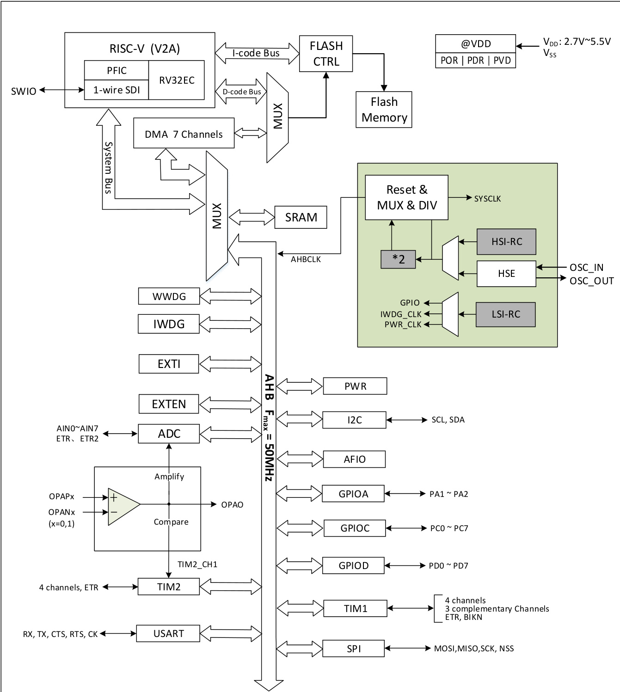  
图 1-1 系统框图

# 1.2 存储器映射表

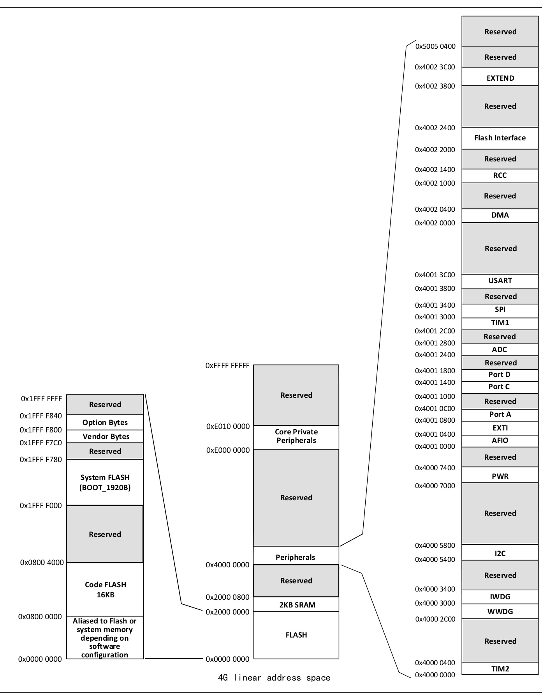  
图 1-2 存储器地址映射

# 1.3 时钟树

系统中引入3 组时钟源： 内部高频RC 振荡器 （HSI）、内部低频RC 振荡器(LSI)、外接高频振荡器(HSE)。其中，低频时钟源为独立看门狗提供了时钟基准。高频时钟源直接或者间接通过2 倍频后输出为系统总线时钟（SYSCLK），系统时钟再由各预分频器提供了AHB 域外设控制时钟及采样或接口输出时钟，部分模块工作需要由PLL 时钟直接提供。

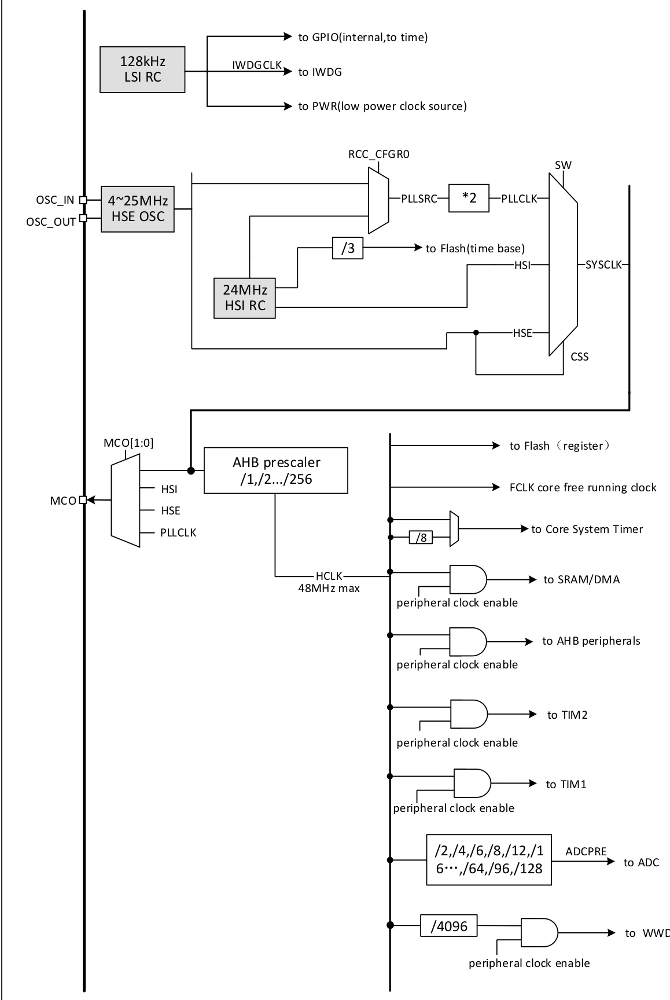  
图 1-3 时钟树框图

# 1.4 功能概述

1.4.1 RISC-V2A 处理器

RISC-V2A 支持 RISC-V 指令集 EC 子集。 处理器内部以模块化管理， 包含快速可编程中断控制器（PFIC）、扩展指令支持等单元。总线与外部单元模块相连，实现外部功能模块和内核的交互。 RV32EC指令集， 小端数据模式。

处理器以其极简指令集、 多种工作模式、 模块化定制扩展等特点可以灵活应用不同场景微控制器设计， 例如小面积低功耗嵌入式场景。

$\bullet$ 支持机器模式  
$\bullet$ 快速可编程中断控制器 （PFIC）  
$\bullet$ 2 级硬件中断堆栈  
$\bullet$ 串行单线调试接口  
$\bullet$ 自定义扩展指令

1.4.2 片上存储器

内置 2K 字节 SRAM 区， 用于存放数据， 掉电后数据丢失。  
内置16K 字节程序闪存存储区 （Code FLASH）， 用于用户的应用程序和常量数据存储。  
内置1920 字节系统存储区 （System FLASH）， 用于系统引导程序存储（厂家固化自举加载程序）。  
64 字节用于系统非易失配置信息存储区， 64 字节用于用户选择字存储区。  
支持Boot 和用户代码互相跳转。

# 1.4.3 供电方案

$V _ { \tt D 0 } = 2 . 7 \sim 5 . 5 \lor$ ：为I/O 引脚和内部调压器供电(使用 ADC 时， $V _ { \mathsf { D D } }$ 如小于2.9V 则性能逐渐变差)。

# 1.4.4 供电监控器

本产品内部集成了上电复位(POR)/掉电复位(PDR)电路， 该电路始终处于工作状态， 保证系统在供电超过2.7V 时工作；当 $\mathsf { V } _ { \mathsf { D } \mathsf { D } }$ 低于设定的阈值 $( \mathsf { V } _ { \mathsf { P 0 R / P D R } } )$ 时， 置器件于复位状态， 而不必使用外部复位电路。

另外系统设有一个可编程的电压监测器 （PVD）， 需要通过软件开启， 用于比较 $\mathsf { V } _ { \mathsf { D } \mathsf { D } }$ 供电与设定的阈值 $v _ { p v _ { \mathsf { D } } }$ 的电压大小。打开PVD 相应边沿中断， 可在 $\mathsf { V } _ { \mathsf { D } \mathsf { D } }$ 下降到PVD 阈值或上升到PVD 阈值时， 收到中断通知。 关于 $V _ { P O R / P D R }$ 和 $v _ { p v _ { D } }$ 的值参考第3 章。

# 1.4.5 电压调节器

复位后， 调节器自动开启， 根据应用方式有两个操作模式

$\bullet$ 开启模式： 正常的运行操作， 提供稳定的内核电源$\bullet$ 低功耗模式： CPU 停止， 系统自动进入待机模式

# 1.4.6 低功耗模式

系统支持两种低功耗模式， 可以针对低功耗、 短启动时间和多种唤醒事件等条件下选择达到最佳的平衡。

$\bullet$ 睡眠模式

在睡眠模式下， 只有CPU 时钟停止， 但所有外设时钟供电正常， 外设处于工作状态。 此模式是最浅低功耗模式， 但可以达到最快唤醒。

退出条件： 任意中断或唤醒事件。

$\bullet$ 待机模式

置位 PDDS、 SLEEPDEEP 位， 执行 WFI/WFE 指令进入。 内核部分的供电被关闭， HSI 的RC 振荡器和HSE 晶体振荡器也被关闭， 此模式下可以达到最低的电能消耗。

退出条件： 任意外部中断/事件 （EXTI 信号）、 NRST 上的外部复位信号、 IWDG 复位， 其中 EXTI 信

号包括 18 个外部 I/O 口之一、 PVD 的输出、 AWU 自动唤醒。

# 1.4.7 快速可编程中断控制器 （PFIC）

产品内置快速可编程中断控制器（PFIC），最多支持255 个中断向量，以最小的中断延迟提供了灵活的中断管理功能。当前产品管理了4 个内核私有中断和23 个外设中断管理，其他中断源保留。PFIC的寄存器均可以在机器特权模式下访问。

$\bullet$ 2 个可单独屏蔽中断  
$\bullet$ 提供一个不可屏蔽中断NMI  
$\bullet$ 支持硬件中断堆栈(HPE)， 无需指令开销  
$\bullet$ 提供 2 路免表中断(VTF)  
$\bullet$ 向量表支持地址或指令模式  
$\bullet$ 支持2 级中断嵌套  
$\bullet$ 支持中断尾部链接功能

# 1.4.8 外部中断/事件控制器 （EXTI）

外部中断/事件控制器总共包含8 个边沿检测器， 用于产生中断/事件请求。每个中断线都可以独立地配置其触发事件（上升沿或下降沿或双边沿），并能够单独地被屏蔽；挂起寄存器维持所有中断请求状态。EXTI 可以检测到脉冲宽度小于内部AHB 的时钟周期。18 个通用I/O 口都可选择连接到同一个个外部中断源。

# 1.4.9 通用 DMA 控制器

系统内置了1 组通用DMA 控制器， 管理7 个通道， 灵活处理存储器到存储器、外设到存储器和存储器到外设间的高速数据传输， 支持环形缓冲区方式。每个通道都有专门的硬件DMA 请求逻辑，支持一个或多个外设对存储器的访问请求， 可配置访问优先权、 传输长度、 传输的源地址和目标地址等。

DMA 用于主要的外设包括： 通用/高级定时器 TIMx、 ADC、 USART、 I2C、 SPI。注： DMA 和CPU 经过仲裁器仲裁之后对系统SRAM 进行访问。

# 1.4.10 时钟和启动

系统时钟源HSI 默认开启， 在没有配置时钟或者复位后， 内部 24MHz 的 RC 振荡器作为默认的 CPU时钟， 随后可以另外选择外部 $4 ^ { \sim } 2 5 M H z$ 时钟或PLL 时钟。 当打开时钟安全模式后， 如果HSE 用作系统时钟 （直接或间接），此时检测到外部时钟失效，系统时钟将自动切换到内部RC 振荡器，同时HSE 和PLL 自动关闭； 对于关闭时钟的低功耗模式， 唤醒后系统也将自动地切换到内部的RC 振荡器。如果使能了时钟中断， 软件可以接收到相应的中断。

# 1.4.11 ADC （模拟/数字转换器）

产品内置1 个10 位的模拟/数字转换器(ADC)，共用多达8 个外部通道和2 个内部通道采样，可编程的通道采样时间， 可以实现单次、连续、扫描或间断转换。提供模拟看门狗功能允许非常精准地监控一路或多路选中的通道，用于监测通道信号电压。支持外部事件触发转换，触发源包括片上定时器的内部信号和外部引脚。支持使用DMA 操作。支持外部触发延迟功能，使能该功能后，当外部触发沿产生时， 控制器根据配置的延迟时间将触发信号进行延迟， 延迟时间到即刻触发ADC 转换。

# 1.4.12 定时器及看门狗

系统中的定时器包括 个高级定时器、 1 个通用定时器、2 个看门狗定时器以及系统时基定时器。

$\bullet$ 高级定时器高级定时器是一个16 位的自动装载递加/递减计数器， 具有16 位可编程的预分频器。除了完整的通用定时器功能外， 可以被看成是分配到6 个通道的三相PWM 发生器，具有带死区插入的互补PWM 输出功能，允许在指定数目的计数器周期之后更新定时器进行重复计数周期，刹车功能等。高级定时器的很多功能都与通用定时器相同， 内部结构也相同， 因此高级定时器可以通过定时器链接功能与其他TIM 定时器协同操作， 提供同步或事件链接功能。

# $\bullet$ 通用定时器

通用定时器是一个 16 位的自动装载递加/递减计数器，具有一个可编程的 16 位预分频器以及 4个独立的通道，每个通道都支持输入捕获、输出比较、PWM 生成和单脉冲模式输出。还能通过定时器链接功能与高级定时器共同工作，提供同步或事件链接功能。在调试模式下，计数器可以被冻结，同时PWM 输出被禁止， 从而切断由这些输出所控制的开关。任意通用定时器都能用于产生PWM 输出。每个定时器都有独立的DMA 请求机制。 这些定时器还能够处理增量编码器的信号， 也能处理1 至3 个霍尔传感器的数字输出。

$\bullet$ 独立看门狗

独立看门狗是一个自由运行的 12 位递减计数器， 支持 7 种分频系数。 由一个内部独立的 128KHz的RC 振荡器 （LSI） 提供时钟；LSI 独立于主时钟，可运行于待机模式。IWDG 在主程序之外， 可以完全独立工作， 因此， 用于在发生问题时复位整个系统，或作为一个自由定时器为应用程序提供超时管理。 通过选项字节可以配置成是软件或硬件启动看门狗。 在调试模式下， 计数器可以被冻结。

窗口看门狗

窗口看门狗是一个7 位的递减计数器， 并可以设置成自由运行。 可以被用于在发生问题时复位整个系统。其由主时钟驱动， 具有早期预警中断功能； 在调试模式下， 计数器可以被冻结。

# $\bullet$ 系统时基定时器 （SysTick）

青稞微处理器内核自带一个32 位递增的计数器， 用于产生 SYSTICK 异常 （异常号：15）， 可专用于实时操作系统，为系统提供“心跳”节律，也可当成一个标准的32 位计数器。 具有自动重加载功能及可编程的时钟源。

# 1.4.13 通用同步/异步收发器 （USART）

产品提供了1 组通用同步/异步收发器 （USART）。 支持全双工异步通信、同步单向通信以及半双工单线通信， 也支持 LIN(局部互连网)，兼容 ISO7816 的智能卡协议和 IrDA IR NDEC 传输编解码规范，以及调制解调器(CTS/RTS 硬件流控)操作， 还允许多处理器通信。其采用分数波特率发生器系统，并支持DMA 操作连续通讯。

# 1.4.14 串行外设接口 （SPI）

1 个串行外设SPI 接口， 提供主或从操作， 动态切换。支持多主模式， 全双工或半双工同步传输，支持基本的SD 卡和MMC 模式。 可编程的时钟极性和相位， 数据位宽提供8 或16 位选择， 可靠通信的硬件CRC 产生/校验， 支持DMA 操作连续通讯。

# 1.4.15 I2C 总线

1 个 I2C 总线接口， 能够工作于多主机模式或从模式， 完成所有 I2C 总线特定的时序、 协议、仲裁等，支持标准和快速两种通讯速度。

I2C 接口提供7 位或10 位寻址， 并且在7 位从模式时支持双从地址寻址。 内置了硬件CRC 发生器/校验器。

# 1.4.16 通用输入输出接口 （GPIO）

系统提供了3 组GPIO 端口，共18 个GPIO 引脚。每个引脚都可以由软件配置成输出(推挽或开漏)、输入(带或不带上拉或下拉)或复用的外设功能端口。多数GPIO 引脚都与数字或模拟的复用外设共用。除了具有模拟输入功能的端口， 所有的GPIO 引脚都有大电流通过能力。 提供锁定机制冻结IO 配置，以避免意外的写入I/O 寄存器。

系统中 IO 引脚电源由 $\mathsf { V } _ { \mathsf { D } \mathsf { D } }$ 提供， 通过改变 $\mathsf { V } _ { \mathsf { D } \mathsf { D } }$ 供电将改变 IO 引脚输出电平高值来适配外部通讯接口电平。 具体引脚请参考引脚描述。

# 1.4.17 运放/比较器 （OPA）

产品内置1 组运放/比较器， 内部选择关联到 ADC 和 TIM2 （CH1） 外设， 其输入和输出均可通过更改配置对多个通道进行选择。支持将外部模拟小信号被放大送入ADC 以实现小信号ADC 转换， 也可以完成信号比较器功能， 比较结果由GPIO 输出或者直接接入TIMx 的输入通道。

1.4.18 串行单线调试接口 （1-wire SDI Serial Debug Interface）

内核自带一个串行单线调试的接口， SWIO 引脚 （Single Wire Input Output） 。 系统上电或复位后默认调试接口引脚功能开启。 使用单线仿真调试接口时必须开启HSI 时钟。

# 第 2 章 引脚信息

# 2.1 引脚排列

# CH32V003F4P6

12345678 PD45/A75/UTCXK/T2CH41_E/TUR/XO_PO/T1CH4ETR PDP3/DA24//AT32/CT1HC2/HA1E/T2RC/UHC3_T/ST/1TC1HC2HN4_ 1987   
PD6/A6/URX/T2CH3_/UTX_ PD1/SWIO/AETR2/T1CH3N/SCL_/URX   
PD7/NRST/T2CH4/OPP1/UCK PC7/MISO/T1CH2 /T2CH2_/URTS_ 16   
98 PA12/OSCIO//A1/0/T11CH2/2ON/PONP0P0/AETR2 VSS PC5/SCK/T1PECT6R//MT2OCSIH/1TE1CTRH_1/CSHC3LN_/_U/UCCKT_/ST_1/SCDHA3_ PC4/A2/T1CH4/MCO/T1CH1CH2N_ 14235   
PD0/T1CH1N/OPN1/SDA_/UTX_ PC3/T1CH3/T1CH1N_ /UCTS_   
VDD PC2/SCL/URTS/T1BKIN/AETR_ /T2CH2_/T1ETR_   
PC0/T2CH3/UTX_/NSS _/T1CH3_ PC1/SDA/NSS/T2CH4_ /T2CH1ETR_/T1BKIN_ /URX_ CH32V003F4U6 2 = √ = VSS PD3/A4/T2CH2/AETRPD3/UCTS/T1CH4_ PD2/A3/T1CH1/T2CH3_PD2/T1CH2N_ PD7/NRST/T2CH4 PD1/SWIO/AETR2 15 PD7/OPP1/UCK_ PD1/T1CH3N/SCL_/URX 2 PA1/OSCI/A1 PC7/MISO/T1CH2 14 PA1/T1CH2/OPN0 PC7/T2CH2 /URTS 3 PA2/OSCO/A0/T1CH2N PC6/MOSI/T1CH1CH3N 13 4 PA2/OPP0/AETR2 PC1/SDA/NSS/T2CH4_PC1/T2CH1ETR_/T1BKIN_/URX_ PC6/UCTS_/SDA 2 VSS PC2/SCL/URTS/T1BKINPC2/AETR_/T2CH2_/T1ETR_ PC5/SCL /UCK /T1CH3 5 PD0/ST1DCAH_/1UNT/OXP_N1 PCP4C/A4/2T/1TC1CHH14C/HM2CNO_ ∞=

# CH32V003A4M6

87412356 PC12/SCDLA//UNRSTS/ST/T21CBHK4I_/NT/2ACEHT1RE_/TR2_C/TH12B_/KTI1NE_T/UR_RX_ PC0/T2CH3/UTX_/NSS_ /T1CVHD3_D 1213141516 PC3/T1CH3/T1CH1N_/UCTS VSS PC4/A2/T1CH4/MCO/T1CH1CH2N PA2/OSCO/A0/T1CH2N/OPP0/AETR2 PC6/MOSI/T1CH1CH3N_/UCTS_/SDA_ PA1/OSCI/A1/T1CH2/OPN0 PCD71/SMIWSIO//TA1ECTHR2_//T12CH32N_/SUCRLT_S/_URX_ PDP7/DN6/RAS6T//UTR2CX/HT42/COPHP31_/UCTKX 110 PD4/A7/UCK/T2CH1ETR/OPO/T1CH4ETR_ PD5/A5/UTX/T2CH4_/URX_

# CH32V003J4M6

PD4/A7/UCK/T2CH1ETR/OPO/T1CH4ETR PD6/A6/URX/T2CH3_/UTX PD5/A5/UTX/T2CH4 /URX PA1/OSCI/A1/T1CH2/OPN0 PD1/SWIO/AETR2/T1CH3N/SCL_/URX 7 VSS PC4/A2/T1CH4/MCO/T1CH1CH2N 3 PC2/SCL/URTS/T1BKIN 6 PA2/OSCO/A0/T1CH2N/OPP0/AETR2 PC2/AETR_/T2CH2_/T1ETR_ VDD PC1/SDA/NSS/T2CH4 /T2CH1ETR_/T1BKIN_/URX_

注： 引脚图中复用功能均为缩写。

示例： A:ADC_,A7(ADC IN7) T:TIME_, T2CH4(TIM2 CH4) U:USART, URX(USART_RX) OP: OPA_, OPO(OPA_OUT) OPP1 (OPA_P1) OSCI (OSCIN) OSCO(OSCOUT) SDA(I2C SDA) SCL(I2C SCL) SCK(SPI _SCK) NSS(SPI_NSS) MOS (SPI MOSI) MISO(SPI _MISO) AETR(ADC_ETR)

# 2.2 引脚描述

表 2-1 引脚定义

注意， 下表中的引脚功能描述针对的是所有功能， 不涉及具体型号产品。 不同型号之间外设资源有差异，查看前请先根据产品型号资源表确认是否有此功能。

<html><body><table><tr><td colspan="4">引脚编号</td><td rowspan="2"></td><td rowspan="2">引脚</td><td rowspan="2">主功能 （复位 后）</td><td rowspan="2">默认复用功能</td><td rowspan="2">重映射功能</td></tr><tr><td>9ldos</td><td></td><td></td><td>8d0S 引脚</td></tr><tr><td></td><td></td><td>0</td><td></td><td>VSS</td><td>P</td><td>VSS</td><td></td><td></td></tr><tr><td>8</td><td>1</td><td>18</td><td>8</td><td>PD4</td><td>I/0/A</td><td>PD4</td><td>UCK/ T2CH1ETR /A7/0P0</td><td>TIETR_2/T1CH4_3</td></tr><tr><td>9</td><td>2</td><td>19</td><td>8</td><td>PD5</td><td>I/0/A</td><td>PD5</td><td>UTX/A5</td><td>T2CH4_3/URX_2</td></tr><tr><td>10</td><td>3 −</td><td>20</td><td></td><td>PD6</td><td>1/0/A</td><td>PD6</td><td>URX/A6</td><td>T2CH3_3/UTX_2</td></tr><tr><td>1</td><td>4</td><td></td><td></td><td>PD7</td><td>I/0/A</td><td>PD7</td><td>NRST/T2CH4/0PP1</td><td>UCK_1/UCK_2/T2CH4_2</td></tr><tr><td>12</td><td>5</td><td>2</td><td></td><td>PA1</td><td>I/0/A I/0/A</td><td>PA1 PA2</td><td>T1CH2/A1/0PNO</td><td>0SCI/T1CH2 2</td></tr><tr><td>13</td><td></td><td>3</td><td></td><td>PA2</td><td>p</td><td></td><td>T1CH2N/A0/0PP0</td><td>OSC0/AETR2_1/T1CH2N_2</td></tr><tr><td>4</td><td></td><td></td><td></td><td>VSS PDO</td><td>1/0/A</td><td>VSS PDO</td><td></td><td></td></tr><tr><td>15</td><td></td><td>5</td><td></td><td>VDD</td><td>P</td><td>VDD</td><td>T1CH1N/0PN1</td><td>SDA 1/UTX_1/T1CH1N_2</td></tr><tr><td>6</td><td></td><td></td><td></td><td>PCO</td><td>1/0</td><td>PCO</td><td>T2CH3</td><td>NSS_1/UTX_3/T2CH3_2</td></tr><tr><td></td><td></td><td></td><td></td><td>PC1</td><td>I/0/FT</td><td>PC1</td><td>SDA/NSS</td><td>/T1CH3 1 T1BKIN_1/T2CH4_ T2CH1ETR(1) _2/URX_3</td></tr><tr><td></td><td></td><td></td><td></td><td>PC2</td><td>I/0/FT</td><td>PC2</td><td>SCL/URTS/T1BKIN</td><td>/T2CH1ETR(1) 3/T1BKIN_3 AETR_1/T2CH2 1 /T1ETR_3/URTS_1</td></tr><tr><td></td><td></td><td></td><td></td><td></td><td>1/0</td><td></td><td></td><td>/T1BKIN_2 T1CH1N_1/UCTS_1</td></tr><tr><td></td><td></td><td>0</td><td></td><td>PC3</td><td>1/0/A</td><td>PC3</td><td>T1CH3</td><td>/T1CH3 2/T1CH1N_3 T1CH2N_1/T1CH4_2</td></tr><tr><td></td><td></td><td></td><td></td><td>PC4</td><td></td><td>PC4</td><td>T1CH4/MC0/A2</td><td>/T1CH1_3 T2CH1ETR(")_1/SCL_2</td></tr><tr><td></td><td></td><td></td><td></td><td>PC5</td><td>I/0/FT</td><td>PC5</td><td>SCK/T1ETR</td><td>/SCL_3/UCK_3/T1ETR_1 /T1CH3_3/SCK_ T1CH1_1/UCTS_2/SDA_2</td></tr><tr><td></td><td></td><td></td><td></td><td>PC6</td><td>I/0/FT</td><td>PC6</td><td>MOSI</td><td>/SDA_3/UCTS_3/T1CH3N_ /MOSI_1 T1CH2_1/URTS_2 3</td></tr><tr><td></td><td></td><td></td><td></td><td>PC7</td><td>1/0</td><td>PC7</td><td>MISO</td><td>/T2CH2_3/URTS_3 /T1CH2 _3/MIS0_ SCL_1/URX_1/T1CH3N_</td></tr><tr><td></td><td></td><td></td><td></td><td></td><td>I/0/A</td><td>PD1</td><td>SWI0/T1CH3N/AETR2</td><td>/T1CH3N_2</td></tr><tr><td></td><td></td><td></td><td></td><td>PD2</td><td>I/0/A</td><td>PD2</td><td>T1CH1/A3</td><td>T2CH3_1/T1CH2N_3 /T1CH1 2</td></tr></table></body></html>

<html><body><table><tr><td></td><td>20</td><td>17</td><td></td><td>PD3</td><td>1/0/A</td><td>PD3</td><td>A4/T2CH2/AETR/UCTS</td><td>T2CH2 2/T1CH4_1</td></tr></table></body></html>

注：1.TIM2_CH1、 TIM2_ETR；2.重映射功能下划线后的数值表示 $A F I O$ 寄存器中相对应位的配置值。 例如： T1CH4_3 表示AFIO寄存器相应位配置为11b；

3.表格缩写解释：$I \ = \ T T L / C M O S$ 电平斯密特输入；  
$0 = c M O S$ 电平三态输出；  
$\boldsymbol { P } =$ 电源；  
$F T =$ 耐受5V；  
$A =$ 模拟信号输入或输出。

# 2.3 引脚复用功能

注意，下表中的引脚功能描述针对的是所有功能， 不涉及具体型号产品。 不同型号之间外设资源有差异， 查看前请先根据产品型号资源表确认是否有此功能。表 2-2 引脚复用和重映射功能

<html><body><table><tr><td>复用 引脚</td><td>ADC</td><td>TIM1</td><td>TIM2</td><td>USART</td><td>SYS</td><td>I2C</td><td>SPI</td><td>SWI0</td><td>OPA</td></tr><tr><td>PA1</td><td>A1</td><td>T1CH2/T1CH2_ 2</td><td></td><td></td><td>OSCI</td><td></td><td></td><td></td><td>OPNO</td></tr><tr><td>PA2</td><td>AO/AETR2_</td><td>T1CH2N/T1CH2N_2</td><td></td><td></td><td>OSCO</td><td></td><td></td><td></td><td>OPPO</td></tr><tr><td>PCO</td><td></td><td>T1CH3</td><td>T2CH3/T2CH3 T2CH4_1/T2CH1ETR</td><td>UTX_3</td><td></td><td></td><td>NSS 1</td><td></td><td></td></tr><tr><td>PC1</td><td></td><td>T1BKIN_1/T1BKIN_3</td><td>/T2CH1ETR(1) 3</td><td>URX_3</td><td></td><td>SDA</td><td>NSS</td><td></td><td></td></tr><tr><td>PC2</td><td>AETR_1</td><td>T1BKIN/T1ETR_3 /T1BKIN_2</td><td>T2CH2_1</td><td>URTS/URTS_1</td><td></td><td>SCL</td><td></td><td></td><td></td></tr><tr><td>PC3</td><td></td><td>T1CH3/T1CH1N_1 T1CH3_2/T1CH1N_3</td><td></td><td>UCTS_1</td><td></td><td></td><td></td><td></td><td></td></tr><tr><td>PC4</td><td>A2</td><td>T1CH4/T1CH2N_1 /T1CH4 2/T1CH1 3</td><td></td><td></td><td>MCO</td><td></td><td></td><td></td><td></td></tr><tr><td>PC5</td><td></td><td>T1ETR/T1CH3_3 /T1ETR</td><td>T2CH1ETR(1) 1</td><td>UCK_3</td><td></td><td>SCL_2/SCL_3</td><td>SCK/SCK_1</td><td></td><td></td></tr><tr><td>PC6</td><td></td><td>T1CH1 _1/T1CH3N_3</td><td></td><td>UCTS 2/UCTS_3</td><td></td><td>SDA_2/SDA_3 MOSI</td><td>/MOSI</td><td></td><td></td></tr><tr><td>PC7 PDO</td><td></td><td>T1CH2 _1/T1CH2_3 T1CH1N/T1CH1N 2</td><td>T2CH2_3</td><td>URTS_2/URTS_3 UTX_1</td><td></td><td>SDA_1</td><td>MISO/MIS0</td><td></td><td>0PN1</td></tr><tr><td>PD1</td><td>AETR2</td><td>T1CH3N/T1CH3N_1 /T1CH3N 2</td><td></td><td>URX_1</td><td></td><td>SCL_1</td><td></td><td>SWI0</td><td></td></tr><tr><td>PD2</td><td>A3</td><td>T1CH1/T1CH2N_3 /T1CH1 2</td><td>T2CH3_1</td><td></td><td></td><td></td><td></td><td></td><td></td></tr><tr><td>PD3</td><td>A4/AETR</td><td>T1CH4_</td><td>T2CH2/T2CH2_ 2</td><td>UCTS</td><td></td><td></td><td></td><td></td><td></td></tr><tr><td>PD4</td><td>A7</td><td>T1ETR_2/T1CH4_3</td><td>T2CH1ETR(1</td><td>UCK</td><td></td><td></td><td></td><td></td><td>OPO</td></tr><tr><td>PD5</td><td>A5</td><td></td><td>T2CH4_3</td><td>UTX/URX_2</td><td></td><td></td><td></td><td></td><td></td></tr><tr><td>PD6</td><td>A6</td><td></td><td>T2CH3_3</td><td>URX/UTX 2</td><td></td><td></td><td></td><td></td><td></td></tr><tr><td>PD7</td><td></td><td></td><td>T2CH4/T2CH4 2</td><td>UCK 1/UCK_2</td><td>NRST</td><td></td><td></td><td></td><td>0PP1</td></tr></table></body></html>

注： TIM2 CH1、 TIM2 ETR。

# 第 3 章 电气特性

# 3.1 测试条件

除非特殊说明和标注， 所有电压都以 $\mathsf { V } _ { \mathbb { S } }$ 为基准。

所有最小值和最大值将在最坏的环境温度、 供电电压和时钟频率条件下得到保证。 典型数值是基于常温 $2 5 ^ { \circ } \mathsf { C }$ 和 $\mathsf { V } _ { \mathsf { D } \mathsf { D } } = 3 . 3 \mathsf { V }$ 或5V 环境下用于设计指导。

对于通过综合评估、设计模拟或工艺特性得到的数据，不会在生产线进行测试。 在综合评估的基础上，最小和最大值是通过样本测试后统计得到。除非特殊说明为实测值， 否则特性参数以综合评估或设计保证。

供电方案：

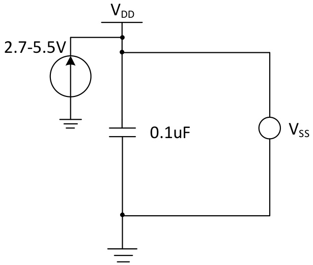  
图 3-1 常规供电典型电路

# 3.2 绝对最大值

临界或者超过绝对最大值将可能导致芯片工作不正常甚至损坏。

表 $3 { - } 1$ 绝对最大值参数表  

<html><body><table><tr><td>符号</td><td>描述</td><td>最小值</td><td>最大值</td><td>单位</td></tr><tr><td>TA</td><td>工作时的环境温度</td><td>-40</td><td>85</td><td>℃</td></tr><tr><td>Ts</td><td>存储时的环境温度</td><td>-40</td><td>125</td><td>℃</td></tr><tr><td>VD−Vss</td><td>外部主供电电压 (VDD)</td><td>-0.3</td><td>5.5</td><td></td></tr><tr><td rowspan="2">ViN</td><td>FT (耐受5V) 引脚上的输入电压</td><td>Vss-0.3</td><td>5.5</td><td>V</td></tr><tr><td>其他引脚上的输入电压</td><td>Vss-0.3</td><td>VDp+0.3</td><td></td></tr><tr><td>|∆VDD_x|</td><td>不同主供电引脚之间的电压差</td><td></td><td>50</td><td>mV</td></tr><tr><td>∆Vssx|</td><td>不同接地引脚之间的电压差</td><td></td><td>50</td><td>mV</td></tr><tr><td>VESD (HBM)</td><td>ESD 静电放电电压 （人体模型， 非接触式)</td><td>4K</td><td></td><td>V</td></tr><tr><td>IVDD</td><td>经过V电源线的总电流 （供应电流）</td><td></td><td>100</td><td rowspan="9">mA</td></tr><tr><td></td><td>经过 Vss地线的总电流 （流出电流）</td><td></td><td>80</td></tr><tr><td rowspan="2"></td><td>任意1/0 和控制引脚上的灌电流</td><td></td><td>20</td></tr><tr><td>任意 I/0 和控制引脚上的输出电流</td><td></td><td>-20</td></tr><tr><td rowspan="2">IINJ(PIN)</td><td>HSE的 OSC_IN引脚</td><td></td><td></td></tr><tr><td>其他引脚的注入电流</td><td></td><td>+/-4 +/-4</td></tr><tr><td>∑ IINJ (PIN)</td><td>所有I0 和控制引脚的总注入电流</td><td></td><td>+/-20</td></tr></table></body></html>

# 3.3 电气参数

# 3.3.1 工作条件

表 3-2 通用工作条件  

<html><body><table><tr><td>符号</td><td>参数</td><td>条件</td><td>最小值</td><td>最大值</td><td>单位</td></tr><tr><td>FHCLK</td><td>内部AHB 时钟频率</td><td></td><td></td><td>50</td><td>MHz</td></tr><tr><td rowspan="2">VDD</td><td rowspan="2">标准工作电压</td><td>未使用ADC</td><td>2.7</td><td>5.5</td><td rowspan="2">V</td></tr><tr><td>使用 ADC （建议）</td><td>2.8</td><td>5.5</td></tr><tr><td></td><td>环境温度</td><td></td><td>-40</td><td>85</td><td>℃</td></tr><tr><td>TJ</td><td>结温度范围</td><td></td><td>-40</td><td>105</td><td>℃</td></tr></table></body></html>

表 $_ { 3 - 3 }$ 上电和掉电条件  

<html><body><table><tr><td>符号</td><td>参数</td><td>条件</td><td>最小值</td><td>最大值</td><td>单位</td></tr><tr><td rowspan="2">tvDD</td><td>VDp上升速率</td><td></td><td>0</td><td>8</td><td rowspan="2">us/V</td></tr><tr><td>VDD下降速率</td><td></td><td>20</td><td>8</td></tr></table></body></html>

# 3.3.2 内置复位和电源控制模块特性

表 3-4 复位及电压监测 （PDR 选择高阈值档位）  

<html><body><table><tr><td>符号</td><td>参数</td><td>条件</td><td>最小值</td><td>典型值</td><td>最大值</td><td>单位</td></tr><tr><td rowspan="11">(1) VPVD</td><td rowspan="17"></td><td>PLS[2:0] = 000(上升沿）</td><td></td><td>2.85</td><td></td><td>></td></tr><tr><td>PLS[2:0] 二 000(下降沿)</td><td></td><td>2.7</td><td></td><td></td></tr><tr><td>PLS[2 :0] = 001(上升沿)</td><td></td><td>3.05</td><td></td><td></td></tr><tr><td>PLS[2:0] = 001(下降沿)</td><td></td><td>2.9</td><td></td><td></td></tr><tr><td>PLS[2:0] 二 010（上升沿）</td><td></td><td>3.3</td><td></td><td></td></tr><tr><td>PLS[2:0] 二 010(下降沿）</td><td></td><td>3.15</td><td></td><td>></td></tr><tr><td>PLS[2:0] 二 011（上升沿） 可编程电压检测器的电</td><td></td><td>3.5</td><td></td><td>></td></tr><tr><td>PLS[2:0] 二 011（下降沿）</td><td></td><td>3.3</td><td></td><td>></td></tr><tr><td>PLS[2:0] 100(上升沿）</td><td></td><td>3.7</td><td></td><td>></td></tr><tr><td>PLS[2:0] 100(下降沿）</td><td></td><td>3.5</td><td></td><td>V</td></tr><tr><td>PLS[2:0] = 101(上升沿)</td><td></td><td>3.9</td><td></td><td>V</td></tr><tr><td>PLS[2:0] = 101(下降沿)</td><td></td><td>3.7</td><td></td><td>V</td></tr><tr><td>PLS[2:0] = 110（上升沿）</td><td></td><td>4.1</td><td></td><td>V</td></tr><tr><td>PLS[2:0] 二 110（下降沿）</td><td></td><td>3.9</td><td></td><td>V</td></tr><tr><td>PLS[2 :0] 二 111(上升沿）</td><td></td><td>4.4</td><td></td><td>V</td></tr><tr><td>PLS[2:0] 二 111（下降沿）</td><td></td><td>4.2</td><td></td><td>V</td></tr><tr><td>PVD 迟滞</td><td></td><td>0.</td><td>18</td><td></td><td></td></tr><tr><td rowspan="2">VpvDhyst VPOR/PDR</td><td rowspan="2">上电/掉电复位阈值</td><td>上升沿</td><td>2.32</td><td>2.5</td><td>2.68</td><td>></td></tr><tr><td>下降沿</td><td>2.3</td><td>2.48</td><td>2.66</td><td>> V</td></tr><tr><td>VpDRhyst</td><td>PDR 迟滞</td><td></td><td></td><td>20</td><td></td><td>mV</td></tr><tr><td rowspan="2">上电复位 其他复位 tRSTTEMPO</td><td></td><td></td><td></td><td>1.5(2)</td><td>21</td><td>mS</td></tr><tr><td></td><td></td><td></td><td>300</td><td></td><td>uS</td></tr></table></body></html>

注： 1.常温测试值。2.用户配置位RST_MODE 可以增加上电复位延时。

# 3.3.3 内置的参考电压

表 3-5 内置参考电压  

<html><body><table><tr><td>符号</td><td>参数</td><td>条件</td><td>最小值</td><td>典型值</td><td>最大值</td><td>单位</td></tr><tr><td>VREFINT</td><td>内置参考电压</td><td>TA=-40C～85℃</td><td>1.17</td><td>1.2</td><td>1.23</td><td>V</td></tr><tr><td>Ts_vrefint</td><td>当读出内部参考电压 时， ADC的采样时间</td><td></td><td>3</td><td></td><td>500</td><td>1/FADc</td></tr></table></body></html>

# 3.3.4 供电电流特性

电流消耗是多种参数和因素的综合指标， 这些参数和因素包括工作电压、 环境温度、I/O 引脚的负载、产品的软件配置、工作频率、I/O 脚的翻转速率、程序在存储器中的位置以及执行的代码等。电流消耗测量方法如下图：

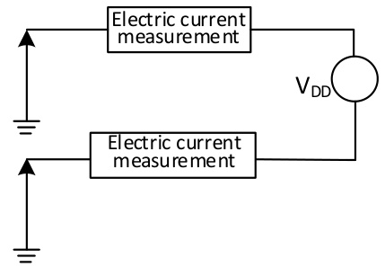  
图 3-2 电流消耗测量

微控制器处于下列条件：

常温 $\mathsf { V } _ { \mathsf { D } \mathsf { D } } = 3 . 3 \mathsf { V }$ 或 5V 情况下， 测试时： 所有 IO 端口配置下拉输入； 测试 HSE 时打开 HSI， 测试HSI 时 HSE 关闭， $H S E = 2 4 M$ ， $H S 1 = 2 4 M$ （已校准）； 当 $F _ { \mathsf { H C L K } } = \mathsf { 4 8 M H z }$ 、 16MHz 时， 系统时钟来源 $\mathsf { C L K } { * } 2$ ；打开所有外设时仅打开所有外设的时钟。 使能或关闭所有外设时钟的功耗。

表 $3 - 6 - 1$ 运行模式下典型的电流消耗， 数据处理代码从内部闪存中运行 $( \mathsf { V } _ { \mathsf { D } \mathsf { D } } = 3 . 3 \mathsf { V } )$ ）  

<html><body><table><tr><td rowspan="2">符号</td><td rowspan="2">参数</td><td rowspan="2">条件</td><td rowspan="2"></td><td colspan="2">典型值</td><td rowspan="2">单位</td></tr><tr><td>使能所有外设</td><td>关闭所有外设</td></tr><tr><td rowspan="8">1DD(1)</td><td rowspan="9">运行模式下的 供应电流 使用</td><td rowspan="6">外部时钟 运行于高速内部 RC振荡器 (HSI),</td><td>FHCLK = 48MHz</td><td>7.4</td><td>5.2</td><td rowspan="9">mA</td></tr><tr><td>FHCLK 二 24MHz</td><td>5.6</td><td>4.5</td></tr><tr><td>16MHz FHCLK /</td><td>4.7</td><td>3.9</td></tr><tr><td>二 8MHz FHCLK</td><td>3.0</td><td>2.6</td></tr><tr><td>FHCLK 二 750KHz</td><td>1.7</td><td>1.7</td></tr><tr><td>48MHz FHCLK</td><td>6.4</td><td>4.0</td></tr><tr><td>24MHz FHCLK</td><td>4.6</td><td>3.5</td></tr><tr><td>16MHz FHCLK</td><td>4.0</td><td>3.3</td></tr><tr><td>预分频 FHCLK</td><td>8MHz</td><td>2.4</td><td>2.0</td></tr><tr><td>以减低频率 FHCLK</td><td>二 750KHz</td><td>1.1</td><td>1.1</td></tr></table></body></html>

注： 1.以上为实测参数。2.当 $V _ { D D } \ < \ 3 V$ 时， 电流功耗会增大。

表 $3 - 6 - 2$ 运行模式下典型的电流消耗， 数据处理代码从内部闪存中运行 $( \mathsf { V } _ { \mathsf { D } \mathsf { D } } = 5 \mathsf { V } )$ ）  

<html><body><table><tr><td rowspan="2">符号</td><td rowspan="2">参数</td><td colspan="2" rowspan="2">条件</td><td colspan="2">典型值</td><td rowspan="2">单位</td></tr><tr><td>使能所有外设</td><td>关闭所有外设</td></tr><tr><td rowspan="8">| D(d)</td><td rowspan="8">运行模式下的 供应电流</td><td rowspan="6">外部时钟 RC振荡器</td><td>= 48MHz FHCLK</td><td>9.0</td><td>6.8</td><td rowspan="9">mA</td></tr><tr><td>FHCLK = 24MHz</td><td>7.1</td><td>6.0</td></tr><tr><td>FHCLK 二 16MHz</td><td>5.9</td><td>5.1</td></tr><tr><td>FHCLK 二 8MHz</td><td>3.7</td><td>3.3</td></tr><tr><td>750KHz FHCLK</td><td>2.1</td><td>2.0</td></tr><tr><td>48MHz 运行于高速内部 24MHz FHCLK FHCLK</td><td>7.4</td><td>5.1</td></tr><tr><td>(HSI), 预分频</td><td>5.7</td><td>4.6</td></tr><tr><td rowspan="4">使用 AHB 以减低频率</td><td>16MHz FHCLK</td><td>5.2</td><td>4.4</td></tr><tr><td>8MHz FHCLK</td><td>3.2</td><td>2.8</td></tr><tr><td>二 750KHz FHCLK</td><td>1.5</td><td>1.4</td></tr><tr><td></td><td></td><td></td></tr></table></body></html>

注： 1.以上为实测参数。

表3-7-1 睡眠模式下典型的电流消耗， 数据处理代码从内部闪存或 SRAM 中运行 （ $( \mathsf { V } _ { \mathsf { D } 0 } = 3 . 3 \mathsf { V } )$ ）  

<html><body><table><tr><td rowspan="2">符号</td><td rowspan="2">参数</td><td rowspan="2" colspan="2">条件</td><td colspan="2">典型值</td><td rowspan="2">单位</td></tr><tr><td>使能所有外设</td><td>关闭所有外设</td></tr><tr><td rowspan="8">100(1)</td><td rowspan="6">睡眠模式下 的供应电流 （此时外设供 电和时钟保</td><td rowspan="6">外部时钟 运行于高速内部</td><td>二 48MHz FHCLK</td><td>4.7</td><td>2.4</td><td rowspan="6">mA</td></tr><tr><td>FHCLK 二 24MHz</td><td>2.8</td><td>177</td></tr><tr><td>16MHz FHCLK</td><td>2.5</td><td></td></tr><tr><td>8MHz FHCLK</td><td>1.7</td><td>1.3</td></tr><tr><td>750KHz FHCLK</td><td>1.2</td><td>1.1</td></tr><tr><td>48MHz FHCLK</td><td>4.1</td><td>1.7</td></tr><tr><td rowspan="5">RC振荡器 使用 以减低频率</td><td rowspan="5">(HSI), AHB 预分频</td><td>24MHz FHCLK</td><td>2.1</td><td>1.0</td></tr><tr><td>16MHz FHCLK</td><td>1.8</td><td>1.0</td></tr><tr><td>8MHz FHCLK</td><td>1.0</td><td>0.6</td></tr><tr><td>二 750KHz FHCLK</td><td>0.5</td><td>0.4</td></tr><tr><td></td><td></td><td></td></tr></table></body></html>

注： 1.以上为实测参数。

表3-7-2 睡眠模式下典型的电流消耗， 数据处理代码从内部闪存或 SRAM 中运行 $( \mathsf { V } _ { \mathsf { D } \mathsf { D } } = 5 \mathsf { V } )$ ）  

<html><body><table><tr><td rowspan="2">符号</td><td rowspan="2">参数</td><td colspan="2" rowspan="2">条件</td><td colspan="2">典型值</td><td rowspan="2">单位</td></tr><tr><td>使能所有外设</td><td>关闭所有外设</td></tr><tr><td rowspan="8">I D(d)</td><td rowspan="6">睡眠模式下 的供应电流 （此时外设供</td><td rowspan="6">外部时钟 运行于高速内部 RC振荡器</td><td>FHCLK = 48MHz</td><td>4.7</td><td>2.4</td><td rowspan="9">mA</td></tr><tr><td>FHCLK = 24MHz</td><td>2.8</td><td>1.7</td></tr><tr><td>FHCLK 二 16MHz</td><td>2.5</td><td>1.7</td></tr><tr><td>二 8MHz FHCLK</td><td>1.7</td><td>1.3</td></tr><tr><td>750KHz FHCLK</td><td>1.2</td><td></td></tr><tr><td rowspan="5">(HSI),</td><td>48MHz FHCLK</td><td>4.1</td><td>117</td></tr><tr><td>24MHz FHCLK</td><td>2.1</td><td>1.0</td></tr><tr><td>16MHz 预分频 FHCLK</td><td>1.8</td><td>1.0</td></tr><tr><td>8MHz FHCLK</td><td>1.0</td><td>0.6</td></tr><tr><td>二 750KHz FHCLK</td><td>0.5</td><td>0.4</td></tr></table></body></html>

注： 1.以上为实测参数。

表3-8 待机模式下典型的电流消耗  

<html><body><table><tr><td>符号</td><td>参数</td><td colspan="2">条件</td><td>典型值</td><td>单位</td></tr><tr><td rowspan="4">DD</td><td rowspan="4">待机模式下的供应电流</td><td rowspan="2">LSI打开</td><td>VDD = 3.3V</td><td>9.1</td><td rowspan="4">uA</td></tr><tr><td>VDD =5V</td><td>9.4</td></tr><tr><td rowspan="2">LSI关闭</td><td>VDD = 3.3V</td><td>7.6</td></tr><tr><td>VDD = 5V</td><td>8.0</td></tr></table></body></html>

注：1.以上为实测参数。2.此测试条件为： 在常温 $\mathsf { V } _ { \mathsf { D } \mathsf { D } } = 3 . 3 \mathsf { V }$ 或 5V 情况下， 测试初始主频 $H S \mathsf { I } = 2 4 \mathsf { M }$ ， 所有 IO 端口配置下拉输入。

# 3.3.5 外部时钟源特性

表 $3 { - } 9$ 来自外部高速时钟  

<html><body><table><tr><td>符号</td><td>参数</td><td>条件</td><td>最小值</td><td>典型值</td><td>最大值</td><td>单位</td></tr><tr><td>_ext FHSE</td><td>外部时钟频率</td><td></td><td>4</td><td>24</td><td>25</td><td>MHz</td></tr><tr><td>VHSEH(d)</td><td>OSC IN输入引脚高电平电压</td><td></td><td>0.8VDD</td><td></td><td>VDD</td><td>V</td></tr><tr><td>VHSEL(d:)</td><td>OSC IN输入引脚低电平电压</td><td></td><td>0</td><td></td><td>0.2VDD</td><td>V</td></tr><tr><td>Cin(HSE)</td><td>OSC IN输入电容</td><td></td><td></td><td>5</td><td></td><td>pF</td></tr><tr><td>DuTy (HSE)</td><td>占空比</td><td></td><td>40</td><td>50</td><td>60</td><td>%</td></tr><tr><td>IL</td><td>OSC_IN输入漏电流</td><td></td><td></td><td></td><td>±1</td><td>uA</td></tr></table></body></html>

注：1.不满足此条件可能会引起电平识别错误。

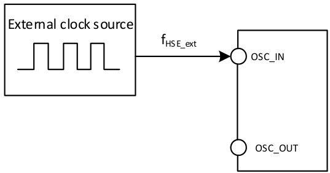  
图 3-3 外部提供高频时钟源电路

表 3-10 使用一个晶体/陶瓷谐振器产生的高速外部时钟  

<html><body><table><tr><td>符号</td><td>参数</td><td>条件</td><td>最小值</td><td>典型值</td><td>最大值</td><td>单位</td></tr><tr><td>RF FOSC_IN</td><td>谐振器频率 反馈电阻 （无需外置）</td><td></td><td>4</td><td>24 250</td><td>25</td><td>MHz kΩ</td></tr><tr><td></td><td>建议的负载电容与对应晶体 串行阻抗Rs</td><td>Rs = 60Ω(1)</td><td></td><td>20</td><td></td><td>pF</td></tr><tr><td></td><td>HSE 驱动电流</td><td>VDD 二 3.3V, 20p负载</td><td></td><td>0.32</td><td></td><td>mA</td></tr><tr><td>gn</td><td>振荡器的跨导</td><td>启动</td><td></td><td>6.8</td><td></td><td>mA/V</td></tr><tr><td>tsU (HSE)</td><td>启动时间</td><td>VDD稳定， 24M晶体</td><td></td><td>2</td><td></td><td>ms</td></tr></table></body></html>

注： 1.25M 晶体ESR 建议不超过 60 欧， 低于25M 可适当放宽。

# 电路参考设计及要求：

晶体的负载电容以晶体厂商建议为准， 通常情况 $C _ { L 1 } = C _ { L 2 }$ 。

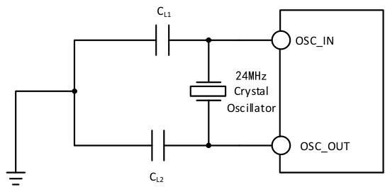  
图 3-4 外接 24M 晶体典型电路

# 3.3.6 内部时钟源特性

表 $3 - 1 1$ 内部高速(HSI)RC 振荡器特性  

<html><body><table><tr><td>符号</td><td>参数</td><td>条件</td><td>最小值</td><td>典型值</td><td>最大值</td><td>单位</td></tr><tr><td>FHSI</td><td>频率(校准后)</td><td></td><td></td><td>24</td><td></td><td>MHz</td></tr><tr><td>DuCyHsI</td><td>占空比</td><td></td><td>45</td><td>50</td><td>55</td><td>%</td></tr><tr><td rowspan="2">ACCHSI</td><td rowspan="2">HSI 振荡器的精度 （校准后）</td><td>= 0℃〜70℃ TA</td><td>-1.2</td><td></td><td>1.6</td><td>%</td></tr><tr><td>TA = -40℃~85℃</td><td>-2.2</td><td></td><td>2.2</td><td>%</td></tr><tr><td>tsU (HS1)</td><td>HSI 振荡器启动稳定时间</td><td></td><td></td><td>10</td><td></td><td>US</td></tr><tr><td>IDD(HS1)</td><td>HSI 振荡器功耗</td><td></td><td>120</td><td>180</td><td>270</td><td>uA</td></tr></table></body></html>

表 3-12 内部低速(LSI)RC 振荡器特性  

<html><body><table><tr><td>符号</td><td>参数</td><td>条件</td><td>最小值</td><td>典型值</td><td>最大值</td><td>单位</td></tr><tr><td>FLs1</td><td>频率</td><td></td><td>100</td><td>128</td><td>150</td><td>KHz</td></tr><tr><td>DuTyLsI</td><td>占空比</td><td></td><td>45</td><td>50</td><td>55</td><td>%</td></tr><tr><td>tsU (LS1)</td><td>LSI 振荡器启动稳定时间</td><td></td><td></td><td>80</td><td></td><td>US</td></tr><tr><td>IDD(LS1)</td><td>LSI 振荡器功耗</td><td></td><td></td><td>1.5</td><td></td><td>uA</td></tr></table></body></html>

# 3.3.7 从低功耗模式唤醒的时间

表 3-13 低功耗模式唤醒的时间 (1)  

<html><body><table><tr><td>符号</td><td>参数</td><td>条件</td><td>典型值</td><td>单位</td></tr><tr><td>twusleep</td><td>从睡眠模式喚醒</td><td>使用HSI RC时钟唤醒</td><td>30</td><td>US</td></tr><tr><td>twUSTDBY</td><td>从待机模式喚醒</td><td>LDO稳定时间 + HSI RC时钟唤醒</td><td>200</td><td>US</td></tr></table></body></html>

注： 以上为实测参数。

# 3.3.8 存储器特性

表 3-14 闪存存储器特性  

<html><body><table><tr><td>符号</td><td>参数</td><td>条件</td><td>最小值</td><td>典型值</td><td>最大值</td><td>单位</td></tr><tr><td>64 tERASE_</td><td>页 (64字节） 编程时间</td><td>TA = -20℃~85℃</td><td>2.4</td><td></td><td>3.1</td><td>ms</td></tr><tr><td>tERASE</td><td>页 (64字节） 擦除时间</td><td>TA 二 -20℃～85℃</td><td>2.4</td><td></td><td>3.</td><td>ms</td></tr><tr><td>tprog</td><td>16位的编程时间</td><td>TA 二 -20℃~85℃</td><td>2.4</td><td></td><td>3.</td><td>ms</td></tr><tr><td>tME</td><td>整片擦除时间</td><td>TA = -20℃~85℃</td><td>2.4</td><td></td><td>3.</td><td>mS</td></tr><tr><td>Vpro</td><td>编程电压</td><td></td><td>2.8</td><td></td><td>5.5</td><td></td></tr></table></body></html>

表 3-15 闪存存储器寿命和数据保存期限  

<html><body><table><tr><td>符号</td><td>参数</td><td>条件</td><td>最小值</td><td>典型值</td><td>最大值</td><td>单位</td></tr></table></body></html>

<html><body><table><tr><td>NEND</td><td>擦写次数</td><td>TA = 25°℃</td><td>10K</td><td>80K (1)</td><td>次</td></tr><tr><td>tRET</td><td>数据保存期限</td><td></td><td>10</td><td></td><td>年</td></tr></table></body></html>

注： 实测操作擦写次数， 非担保。

# 3.3.9 I/O 端口特性

表 3-16 通用 I/O 静态特性  

<html><body><table><tr><td>符号</td><td>参数</td><td>条件</td><td>最小值</td><td>典型值</td><td>最大值</td><td>单位</td></tr><tr><td rowspan="2">VIH</td><td>标准1/0脚， 输入高电平电压</td><td></td><td>0.22*(VD− 2.7)+1.55</td><td></td><td>VD+0.3</td><td></td></tr><tr><td>FT 10引脚， 输入高电平电压</td><td></td><td>0.22*(VDD- 2.7)+1.55</td><td></td><td>5.5</td><td>V</td></tr><tr><td rowspan="2">VL</td><td>标准1/0脚， 输入低电平电压</td><td rowspan="2"></td><td>-0.3</td><td></td><td>0.19*(VDD- 2.7)+0.65</td><td></td></tr><tr><td>FT 10引脚， 输入低电平电压</td><td>-0.3</td><td></td><td>0.19*(VDD- 2.7)+0. 65</td><td>V</td></tr><tr><td>Vhys</td><td>施密特触发器电压迟滞</td><td></td><td>150</td><td></td><td></td><td>mV</td></tr><tr><td rowspan="2">I1kg</td><td rowspan="2">输入漏电流</td><td>标准10端口</td><td></td><td></td><td></td><td rowspan="2">uA</td></tr><tr><td>FT 10端口</td><td></td><td></td><td>3</td></tr><tr><td>Rpu</td><td>弱上拉等效电阻</td><td></td><td>35</td><td>45</td><td>55</td><td>kΩ</td></tr><tr><td>RpD</td><td>弱下拉等效电阻</td><td></td><td>35</td><td>45</td><td>55</td><td>kΩ</td></tr><tr><td>C10</td><td>1/0引脚电容</td><td></td><td></td><td>5</td><td></td><td>pF</td></tr></table></body></html>

# 输出驱动电流特性

GPIO(通用输入/输出端口)可以吸收或输出多达±8mA 电流， 并且吸收或输出 $\pm 2 0 m \mathsf { A }$ 电流(不严格达到 $v _ { \mathfrak { a } } / \mathsf { V } _ { \mathfrak { d } \sharp } )$ 。 在用户应用中， 所有IO 引脚驱动总电流不能超过3.2 节给出的绝对最大额定值。

表 3-17 输出电压特性  

<html><body><table><tr><td>符号</td><td>参数</td><td>条件</td><td>最小值</td><td>最大值</td><td>单位</td></tr><tr><td>VoL</td><td>输出低电平， 8个引脚吸收电流</td><td rowspan="5">TTL 端口， |10 二 +8mA 2.7V< VDD <5.5V CMOS 端口， 110 2.7V< VDD <5.5V</td><td></td><td>0.4</td><td rowspan="2"></td></tr><tr><td>VoH</td><td>输出高电平， 8个引脚输出电流</td><td>VDD-0.4</td><td></td></tr><tr><td>VoL</td><td>输出低电平，8个引脚吸收电流</td><td>= +8mA</td><td>0.4</td><td rowspan="2"></td></tr><tr><td>VoH</td><td>输出高电平，8个引脚输出电流</td><td>2.3</td><td></td></tr><tr><td>VoL</td><td>输出低电平， 8个引脚吸收电流</td><td>110 二 +20mA</td><td></td><td>1.3</td><td rowspan="2"></td></tr><tr><td>VoH</td><td>输出高电平， 8个引脚输出电流</td><td>2.7V< VDD <5.5V</td><td>VDD-1.3</td><td></td></tr></table></body></html>

注： 以上条件中如果多个IO 引脚同时驱动， 电流总和不能超过表3.2 节给出的绝对最大额定值。另外多个 $1 0 \ \vec { 5 } _ { i }$ 脚同时驱动时， 电源/地线点上的电流很大，会导致压降使内部IO 的电压达不到表中电源电压， 从而导致驱动电流小于标称值。

表 3-18 输入输出交流特性  

<html><body><table><tr><td>MODE×[1 :0] 配置</td><td>符号</td><td>参数</td><td>条件</td><td>最小 值</td><td>最大 值</td><td>单位</td></tr><tr><td rowspan="3">10 (2MHz)</td><td>Fmax(10) out</td><td>最大频率</td><td>CL = 50pF, VDD = 2.7-5.5V</td><td></td><td>2</td><td>MHz</td></tr><tr><td>tf(10) out</td><td>输出高至低电平的下降时间</td><td>CL = 50pF, VDD = 2.7-5.5V</td><td></td><td>125</td><td>ns</td></tr><tr><td>tr (10)out</td><td>输出低至高电平的上升时间</td><td></td><td></td><td>125</td><td>ns</td></tr></table></body></html>

<html><body><table><tr><td rowspan="3">01 (10MHz)</td><td>Fmax(10) out</td><td>最大频率</td><td>CL = 50pF, VDD = 2.7-5.5V</td><td></td><td>10</td><td>MHz</td></tr><tr><td>tf(10) out</td><td>输出高至低电平的下降时间</td><td></td><td></td><td>25</td><td>ns</td></tr><tr><td>tr(10)out</td><td>输出低至高电平的上升时间</td><td>CL = 50pF, VDD = 2.7-5.5V</td><td></td><td>25</td><td>ns</td></tr><tr><td rowspan="4">11 (30MHz)</td><td>Fmax (10) out</td><td>最大频率</td><td>CL = 50pF, VDD = 2.7-5.5V</td><td></td><td>30</td><td>MHz</td></tr><tr><td>tf(10) out</td><td>输出高至低电平的下降时间</td><td>CL = 50pF, VDD = 2.7-5.5V</td><td></td><td>10</td><td>ns</td></tr><tr><td>tr (10) out</td><td>输出低至高电平的上升时间</td><td>CL = 50pF, VDD 二 2.7-5.5V</td><td></td><td>10</td><td>ns</td></tr><tr><td>EXT1p</td><td>EXTI 控制器检测到外部信号 的脉冲宽度</td><td></td><td>10</td><td></td><td>ns</td></tr></table></body></html>

# 3.3.10 NRST 引脚特性

表 3-19 外部复位引脚特性  

<html><body><table><tr><td>符号</td><td>参数</td><td>条件</td><td>最小值</td><td>典型值</td><td>最大值</td><td>单位</td></tr><tr><td>VIL (NRST)</td><td>NRST 输入低电平电压</td><td></td><td>-0.3</td><td></td><td>0. 28*(VDD-1.8)+0.6</td><td>V</td></tr><tr><td>VIH(NRST)</td><td>NRST 输入高电平电压</td><td></td><td>0.41*(VDD-1. 8)+1.3</td><td></td><td>VDD+0.3</td><td>V</td></tr><tr><td>Vhys WRST))</td><td>NRST 施密特触发器电压 迟滞</td><td></td><td>150</td><td></td><td></td><td>mV</td></tr><tr><td>Rpu(1d)</td><td>弱上拉等效电阻</td><td></td><td>35</td><td>45</td><td>55</td><td>kΩ</td></tr></table></body></html>

注：1.上拉电阻是一个真正的电阻串联一个可开关的PMOS 实现。 这个PMOS/NMOS 开关的电阻很小(约占 $10 \%$ 。

电路参考设计及要求：

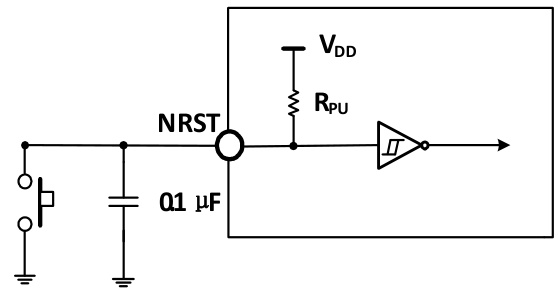  
图 3-5 外部复位引脚典型电路

# 3.3.11 TIM 定时器特性

表 3-20 TIMx 特性  

<html><body><table><tr><td>符号</td><td>参数</td><td>条件</td><td>最小值</td><td>最大值</td><td>单位</td></tr><tr><td rowspan="2">tres(TI M)</td><td rowspan="2">定时器基准时钟</td><td></td><td></td><td></td><td>tT1MxCLK</td></tr><tr><td>二 48MHz FT1MxCLK</td><td>20.8</td><td></td><td>ns</td></tr><tr><td rowspan="2">FExT</td><td rowspan="2">CH1 至CH4 的定时器外部时钟频率</td><td></td><td>0</td><td>fT1MxCLk/2</td><td>MHz</td></tr><tr><td>二 48MHz FT1MxCLK</td><td>0</td><td>24</td><td>MHz</td></tr><tr><td>ResTIM</td><td>定时器分辨率</td><td></td><td></td><td>16</td><td>位</td></tr><tr><td rowspan="2">tcOUNTER</td><td rowspan="2">当选择了内部时钟时， 16 位计数 器时钟周期</td><td></td><td></td><td>65536</td><td>tTIM×CLK</td></tr><tr><td>48MHz FTIM×CLK /</td><td>0.0208</td><td>1363</td><td>US</td></tr><tr><td rowspan="2">tMAX_COUNT</td><td rowspan="2">最大可能的计数</td><td></td><td></td><td>65535</td><td>tT1MxCLK</td></tr><tr><td>48MHz FT1MxCLK</td><td></td><td>1363</td><td>US</td></tr></table></body></html>

# 3.3.12 I2C 接口特性

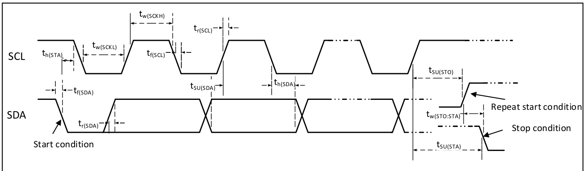  
图 3-6 I2C 总线时序图

表 3-21 I2C 接口特性  

<html><body><table><tr><td rowspan="2">符号</td><td rowspan="2">参数</td><td colspan="2">标准I2C</td><td colspan="2">快速I2C</td><td rowspan="2">单位</td></tr><tr><td>最小值</td><td>最大值</td><td>最小值</td><td>最大值</td></tr><tr><td>tw(SCKL)</td><td>SCL时钟低电平时间</td><td>4.7</td><td></td><td>1.2</td><td></td><td>us</td></tr><tr><td>tw(SCKH)</td><td>SCL时钟高电平时间</td><td>4.0</td><td></td><td>0.6</td><td></td><td>us</td></tr><tr><td>tsU(SDA)</td><td>SDA数据建立时间</td><td>250</td><td></td><td>100</td><td></td><td>ns</td></tr><tr><td>tn(SDA)</td><td>SDA数据保持时间</td><td>0</td><td></td><td>0</td><td>900</td><td>ns</td></tr><tr><td>tr (SDA)/ /tr(scL)</td><td>SDA 和 SCL 上升时间</td><td></td><td>1000</td><td>20</td><td></td><td>ns</td></tr><tr><td>tf (SDA)/tf (SCL)</td><td>SDA 和 SCL 下降时间</td><td></td><td>300</td><td></td><td></td><td>ns</td></tr><tr><td>th(STA)</td><td>开始条件保持时间</td><td>4.0</td><td></td><td>0.6</td><td></td><td>uS</td></tr><tr><td>tsU(STA)</td><td>重复的开始条件建立时间</td><td>4.7</td><td></td><td>0.6</td><td></td><td>uS</td></tr><tr><td>tsU (ST0)</td><td>停止条件建立时间</td><td>4.0</td><td></td><td>0.6</td><td></td><td>us</td></tr><tr><td>tw(STO:STA)</td><td>停止条件至开始条件的时间(总线空闲）</td><td>4.7</td><td></td><td>1.2</td><td></td><td>us</td></tr><tr><td>Cb</td><td>每条总线的容性负载</td><td></td><td>400</td><td></td><td>400</td><td>pF</td></tr></table></body></html>

# 3.3.13 SPI 接口特性

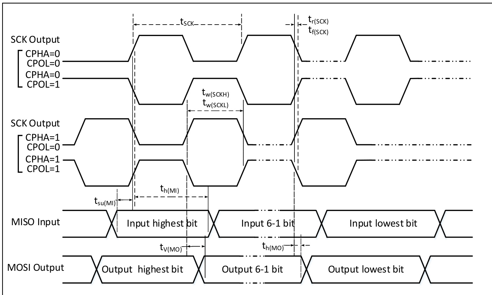  
图 3-7 SPI 主模式时序图

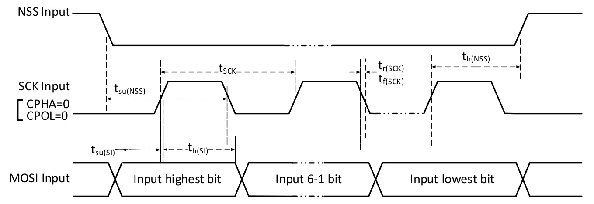  
图 3-8-1 SPI 从模式时序图 （CPHA=0， $\mathsf { C P O L } = \mathsf { O } )$

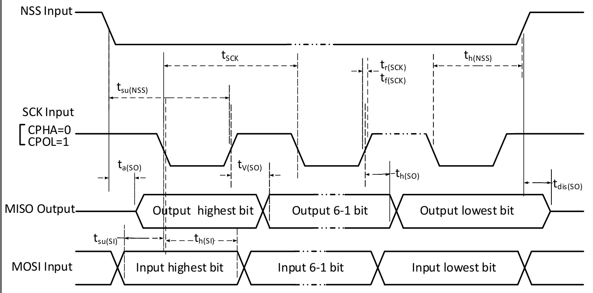  
图 3-8-2 SPI 从模式时序图 （CPHA=0， $\mathsf { c P O L } = 1 )$ ）

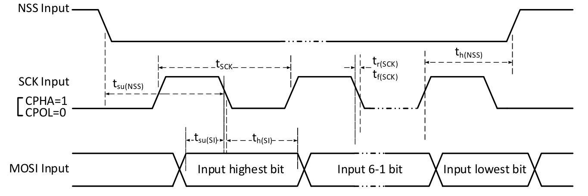  
图 3-9-1 SPI 从模式时序图 （CPHA=1， $\mathsf { C P O L } = \mathsf { O } )$

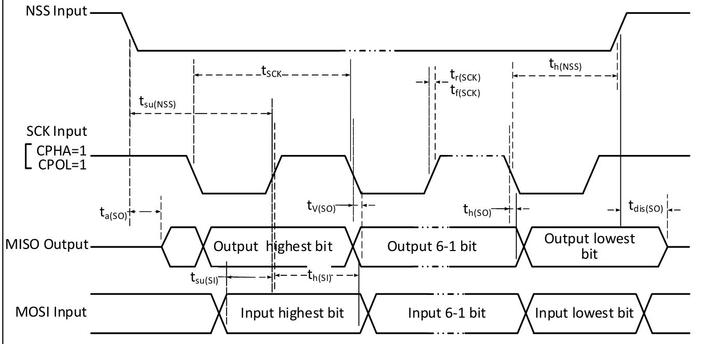  
图 3-9-2 SPI 从模式时序图 （CPHA=1， $\mathsf { c P O L } = 1 )$ ）

表 3-22 SPI 接口特性  

<html><body><table><tr><td>符号</td><td>参数</td><td>条件</td><td>最小值</td><td>最大值</td><td>单位</td></tr><tr><td>fsck/tsck</td><td>SPI 时钟频率</td><td>主模式</td><td></td><td>24</td><td>MHz</td></tr><tr><td></td><td></td><td>从模式 负载电容： C= 30pF</td><td></td><td>24</td><td>MHz</td></tr><tr><td>tr(sck)/tf (Sck)) tsU(NSS)</td><td>SPI 时钟上升和下降时间 NSS 建立时间</td><td>从模式</td><td>2tpcLK</td><td>20</td><td>ns ns</td></tr><tr><td>th(Nss)</td><td>NSS 保持时间</td><td>从模式</td><td>2tpcLK</td><td></td><td>ns</td></tr><tr><td>tw (SCKH)</td><td>SCK高电平和低电平时间</td><td>主模式fpcLk = 48MHz, 预分频系数=2</td><td>30</td><td>70</td><td>ns</td></tr><tr><td>tsU(M1)</td><td rowspan="2">数据输入建立时间</td><td>主模式</td><td>5</td><td></td><td>ns</td></tr><tr><td>tsu(S1)</td><td>从模式</td><td>5</td><td></td><td>ns</td></tr><tr><td>th (M1)</td><td rowspan="2">数据输入保持时间</td><td>主模式</td><td>5</td><td></td><td>ns</td></tr><tr><td>th(s1)</td><td>从模式</td><td>4</td><td></td><td>ns</td></tr><tr><td>ta(s0)</td><td>数据输出访问时间</td><td>从模式， 二 24MHz FPCLK</td><td>0</td><td>1tpcLK</td><td>ns</td></tr><tr><td>tdis (S0)</td><td>数据输出禁止时间</td><td>从模式</td><td>0</td><td>10</td><td>ns</td></tr><tr><td>tv(so)</td><td rowspan="2">数据输出有效时间</td><td>从模式 （使能边沿之后）</td><td></td><td>5</td><td>ns</td></tr><tr><td>tv (Mo)</td><td>主模式 （使能边沿之后）</td><td></td><td></td><td>ns</td></tr><tr><td>th(s0)</td><td rowspan="2">数据输出保持时间</td><td>从模式 （使能边沿之后）</td><td>2</td><td></td><td>ns</td></tr><tr><td>th(MO)</td><td>主模式 (使能边沿之后）</td><td>0</td><td></td><td>ns</td></tr></table></body></html>

# 3.3.14 10 位 ADC 特性

表 3-23 10 位 ADC 特性  

<html><body><table><tr><td>符号</td><td>参数</td><td>条件</td><td>最小值</td><td>典型值</td><td>最大值</td><td>单位</td></tr><tr><td>VDD</td><td>供电电压</td><td></td><td>2.8</td><td></td><td>5.5</td><td>V</td></tr><tr><td>IDD</td><td>供电电流</td><td></td><td></td><td>370</td><td></td><td>uA</td></tr><tr><td rowspan="3">FADC</td><td rowspan="3">ADC 时钟频率</td><td>VDD = 2.8 to 5.5V</td><td></td><td></td><td>6</td><td rowspan="3">MHz</td></tr><tr><td>VoD = 3.2 to 5.5V VDD = 4.5 to 5.5V</td><td></td><td></td><td>12</td></tr><tr><td></td><td>Vss</td><td></td><td>24</td></tr><tr><td>VAIN</td><td>转换电压范围 内部采样和保持电容</td><td></td><td></td><td>3</td><td>VDD</td><td>V pF</td></tr><tr><td>CADC RADC</td><td>采样开关电阻</td><td></td><td></td><td>0.6</td><td>1.5</td><td>kΩ</td></tr><tr><td rowspan="4"></td><td rowspan="4">采样速率</td><td>fADC 4MHz</td><td></td><td></td><td>285</td><td rowspan="4">KHz</td></tr><tr><td>TADC 6MHz</td><td></td><td></td><td>430</td></tr><tr><td>D 12MHz</td><td></td><td></td><td>857</td></tr><tr><td>24MHz</td><td></td><td></td><td>1710</td></tr><tr><td rowspan="3"></td><td rowspan="3">采样时间</td><td>4MHz</td><td></td><td>0.75</td><td></td><td rowspan="3">us</td></tr><tr><td>ADC 6MHz</td><td></td><td>0.5</td><td></td></tr><tr><td>ADC 12MHz</td><td></td><td>0.25</td><td></td></tr><tr><td>tSTAB</td><td>上电时间</td><td></td><td></td><td></td><td></td><td>us</td></tr><tr><td rowspan="4">tcoNV</td><td rowspan="4">总的转换时间 （包括采样时 间）</td><td>4MHz</td><td>3.5</td><td></td><td></td><td>us</td></tr><tr><td>ADC 6MHz</td><td>2.33</td><td></td><td></td><td>us</td></tr><tr><td>ADC 12MHz</td><td>1.17</td><td></td><td></td><td>us</td></tr><tr><td></td><td colspan="3">14</td><td>1/fADC</td></tr></table></body></html>

注： 以上均为设计参数保证。

公式： 最大 $R _ { A I N }$

$$
R _ { _ { A I N } } < \frac { T _ { s } } { f _ { _ { A D C } } \times C _ { _ { A D C } } \times \mathsf { I n } 2 ^ { \mathsf { N } + 2 } } - R _ { _ { A D C } }
$$

上述公式用于决定最大的外部阻抗， 使得误差可以小于 $1 / 4 \mathsf { L S B }$ 。 其中 $N = 1 0$ (表示 10 位分辨率)。

表 $3 - 2 4 + \tt f _ { A D C } = 1 2 M H z$ 时的最大 $R _ { A 1 N }$   

<html><body><table><tr><td>Ts(周期)</td><td>ts (us)</td><td>最大RAIN(kΩ)</td></tr><tr><td>3.0</td><td>0.25</td><td>8.5</td></tr><tr><td>9.0</td><td>0.75</td><td>28.5</td></tr><tr><td>15.0</td><td>1.25</td><td>48.5</td></tr><tr><td>30.0</td><td>2.50</td><td>98.5</td></tr><tr><td>43.0</td><td>3.58</td><td>142.0</td></tr><tr><td>57.0</td><td>4.75</td><td></td></tr><tr><td>73.0</td><td>6.08</td><td></td></tr><tr><td>241.0</td><td>20. 08</td><td></td></tr></table></body></html>

表 3-25 ADC 误差 （ $( f _ { \tt A D C } = 1 2 M H z : R _ { \tt A I N } < 1 0 k \Omega , v _ { \tt D D } > 2 . 9 V )$ （ $( f _ { \tt A D C } = 2 4 \tt M H z : R _ { \tt A I N } < 3 k \Omega , V _ { \tt D D } = 5 V )$ ）  

<html><body><table><tr><td>符号</td><td>参数</td><td>条件</td><td>最小值</td><td>典型值</td><td>最大值</td><td>单位</td></tr><tr><td>ET</td><td>数据总偏差</td><td>FADC = 12MHz</td><td></td><td>2</td><td>6</td><td rowspan="6">LSB</td></tr><tr><td>ETF24</td><td>FADC = 24MHz 数据总偏差</td><td>FADc 二 24MHz</td><td></td><td>3</td><td>8</td></tr><tr><td>EO</td><td>失调误差</td><td>fADC 12MHz</td><td></td><td></td><td>5</td></tr><tr><td>EG</td><td>增益误差</td><td>12MHz</td><td></td><td></td><td>2</td></tr><tr><td>ED</td><td>微分非线性误差</td><td>ADC 12MHz</td><td></td><td>0.5</td><td>2</td></tr><tr><td>EL</td><td>积分非线性误差</td><td>F ADc 12MHz</td><td></td><td>0.6</td><td>2.5</td></tr></table></body></html>

注： 来源仿真。

$\mathsf { C } _ { \mathsf { p } }$ 表示PCB 与焊盘上的寄生电容 （大约5pF）， 可能与焊盘和PCB 布局质量有关。 较大的 $\mathsf { C } _ { \mathsf { p } }$ 数值将降低转换精度， 解决办法是降低 $\mathsf { f } _ { \mathsf { A D C } }$ 值。

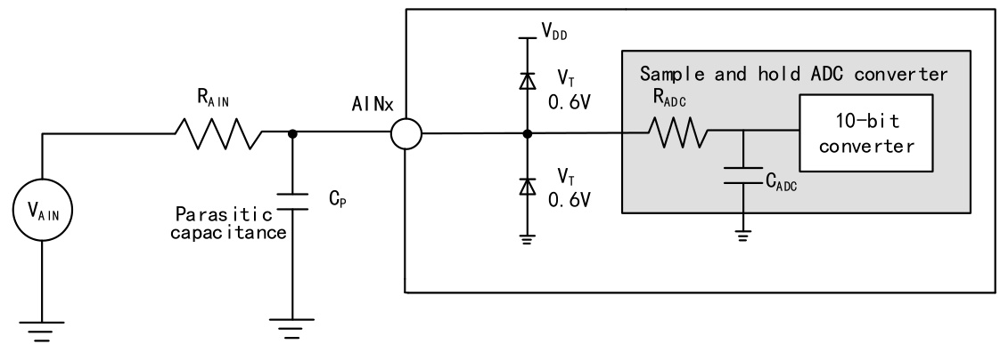  
图 3-10 ADC 典型连接图

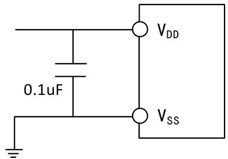  
图 3-11 模拟电源及退耦电路参考

# 3.3.15 OPA 特性

表 3-26 OPA 特性  

<html><body><table><tr><td>符号</td><td>参数</td><td>条件</td><td>最小值</td><td>典型值</td><td>最大值</td><td>单位</td></tr><tr><td>VDD</td><td>供电电压</td><td></td><td>2.8</td><td></td><td>5.5</td><td>V</td></tr><tr><td>CMIR</td><td>共模输入电压</td><td></td><td></td><td></td><td>VDD</td><td>V</td></tr><tr><td>VIOFFSET</td><td>输入失调电压</td><td></td><td></td><td>±3</td><td>±13</td><td>mV</td></tr><tr><td>ILOAD</td><td>驱动电流</td><td></td><td></td><td></td><td>1.5</td><td>mA</td></tr><tr><td>IDDOPAMP</td><td>消耗电流</td><td>无负载， 静态模式</td><td></td><td>273</td><td></td><td>uA</td></tr><tr><td>(1) CMR</td><td>共模抑制比</td><td>@1KHz</td><td></td><td>81</td><td></td><td>dB</td></tr><tr><td>(1) PSRR</td><td>电源抑制比</td><td>@1KHz</td><td></td><td>88</td><td></td><td>dB</td></tr><tr><td>Av(1)</td><td>开环增益</td><td>CLOAD = 50pF</td><td></td><td>105</td><td></td><td>dB</td></tr><tr><td>GBW (1)</td><td>单位增益带宽</td><td>CLOAD = 50pF</td><td></td><td>12</td><td></td><td>MHz</td></tr><tr><td>PM(d:)</td><td>相位裕度</td><td>CLOAD = 50pF</td><td></td><td>75</td><td></td><td>deg</td></tr><tr><td>SR()d:)</td><td>压摆率</td><td>CLOAD = 50pF</td><td></td><td>7.7</td><td></td><td>V/us</td></tr><tr><td>(1) tWAKU</td><td>关闭到唤醒建立时间， 0.1%</td><td>输入Vo/2, CLa=50pF， RioA=4kΩ</td><td></td><td>520</td><td></td><td>ns</td></tr><tr><td>RLOAD</td><td>电阻性负载</td><td></td><td></td><td></td><td></td><td>kΩ</td></tr><tr><td>CLOAD</td><td>电容性负载</td><td></td><td></td><td></td><td>50</td><td>pF</td></tr><tr><td>(2) VOHSAT</td><td>高饱和输出电压</td><td>RLOAD = 4kΩ，输入VD</td><td>VDD-180</td><td></td><td></td><td>mV</td></tr><tr><td>(2)</td><td>低饱和输出电压</td><td>RLOAD = 20kΩ，输入 VDD = 4kΩ, 输入0 RLOAD</td><td>VDD-36</td><td></td><td></td><td></td></tr><tr><td>VOLSAT</td><td></td><td>RLOAD 二 20kΩ 输入0</td><td></td><td></td><td>5</td><td>mV</td></tr><tr><td>EN (1)</td><td></td><td>RLOAD 二 4kΩ, @1KHz</td><td></td><td>83</td><td></td><td>nv</td></tr><tr><td></td><td>等效输入电压噪声</td><td>RLOAD 二 4kΩ, @10KHz</td><td></td><td>28</td><td></td><td>√HZ</td></tr></table></body></html>

注：1.来源设计仿真非实测；2.负载电阻会限制饱和输出电压。

# 第 4 章 封装及订货信息

# 芯片封装

<html><body><table><tr><td>封装形式</td><td>塑体尺寸</td><td colspan="2">引脚节距</td><td>封装说明</td><td>订货型号</td></tr><tr><td>TSS0P20</td><td>4.4*6. 5mm</td><td>0. 65mm</td><td>25.6mil</td><td>薄小型的 20 脚贴片</td><td>CH32V003F4P6</td></tr><tr><td>QFN20</td><td>3.0*3. 0mm</td><td>0.4mm</td><td>15.7mi1</td><td>四边无引线20脚</td><td>CH32V003F4U6</td></tr><tr><td>S0P16</td><td>3.9*10. 0mm</td><td>1.27mm</td><td>50miI</td><td>标准的 16脚贴片</td><td>CH32V003A4M6</td></tr><tr><td>S0P8</td><td>3.9*5. 0mm</td><td>1.27mm</td><td>50mil</td><td>标准的 8 脚贴片</td><td>CH32V003J4M6</td></tr></table></body></html>

说明： 尺寸标注的单位是 mm （毫米）， 引脚中心间距总是标称值， 没有误差， 除此之外的尺寸误差不大于 $\pm 0 . 2 \mathsf { m m }$ 或者± $1 0 \%$ 两者中的较大值。

# 4.1 TSSOP20 封装

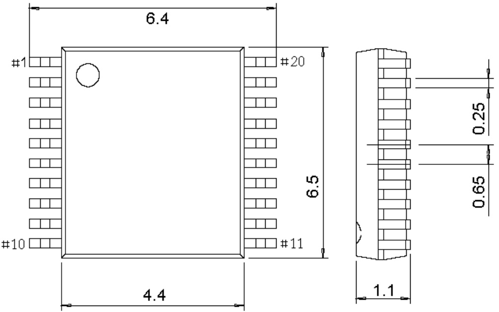

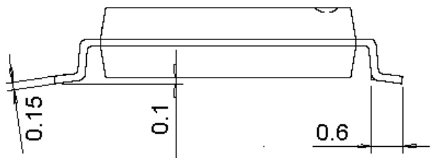

4.2 QFN20 封装

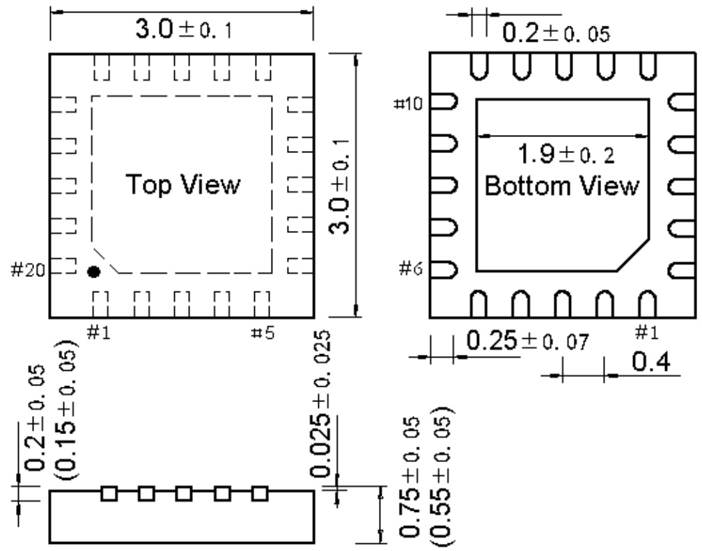

# 4.3 SOP16 封装

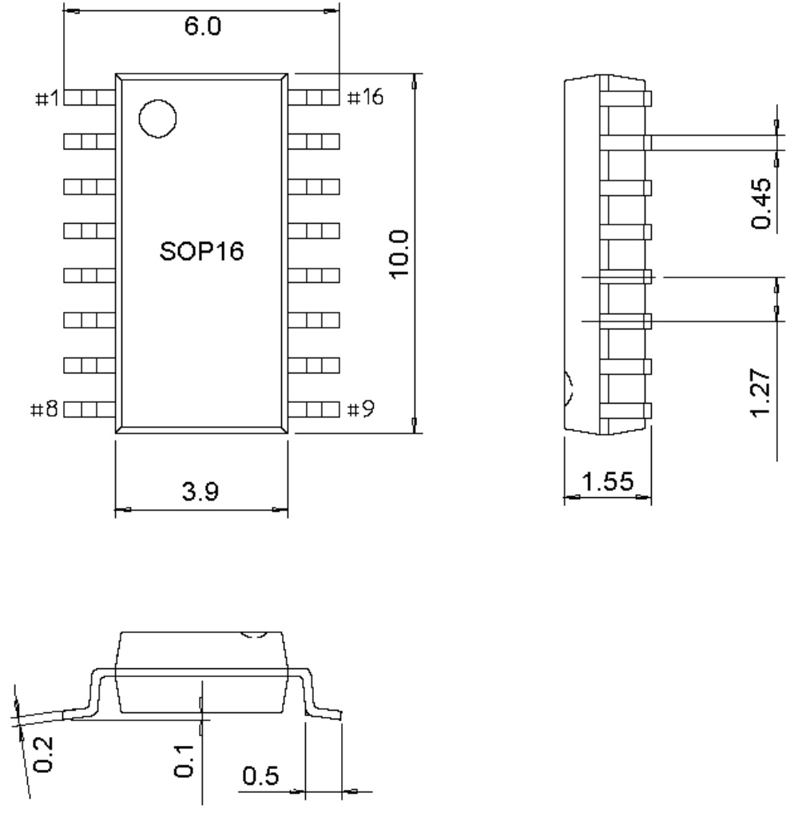

4.4 SOP8 封装

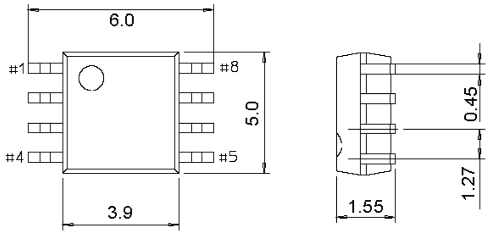

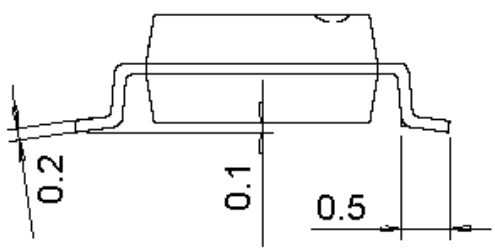

# 系列产品命名规则

# 产品系列

$\mathsf { F } = \mathsf { A r m }$ 内核， 通用 MCU$\textsf { V } =$ 青稞 RISC-V 内核， 通用 MCU${ \mathsf { L } } { \mathsf { \Omega } } = { \mathsf { \Omega } }$ 青稞 RISC-V 内核， 低功耗 MCU$\tt { X } =$ 青稞 RISC-V 内核， 专用或特殊外设 MCU$\pmb { \ M } =$ 青稞 RISC-V 内核， 内置预驱的电机 MCU

产品类型 $( * )$ ） $^ + .$ 产品子系列 $( { * * } )$   

<html><body><table><tr><td>产品类型</td><td>产品子系列</td></tr><tr><td>0=青稞V2/V4内核， 超值版， 主频<=48M</td><td>02 = 16K闪存超值通用型 03 = 16K闪存基础通用型， OPA 05 = 32K闪存增强通用型， OPA、 双串口 06 = 64K闪存多能通用型， OPA、 双串口、 07 = 基础电机应用型， OPA+CMP 35 = 连接型， USB、 USB PD/Type-C = TKey</td></tr><tr><td>1 = M3/青稞V3/V4 内核， 基本版， 主频<=96M 2= M3/青稞V4非浮点内核， 增强版，主频<=144M 3 = 青稞V4F浮点内核， 增强版， 主频<=144M</td><td>33 连接型， USB 03 = 连接型， USB 05 = 连接型， USB HS、 SDI0、 CAN 07 = 互联型， USB HS、 CAN、 以太网、 SDIO、 FSMC 08 = 无线型， BLE5.x、 CAN、 USB、 以太网 17 = 互联型， USB HS、 CAN、 以太网 (内置PHY)、 SDI0、 FSMC</td></tr></table></body></html>

# 引脚数目

$\mathsf { J } = \mathsf { 8 }$ 脚 ${ \mathsf { D } } = 1 2$ 脚 $A = 1 6$ 脚 $\mathsf { F } = 2 0$ 脚 $\mathsf { E } = 2 4$ 脚$6 = 2 8$ 脚 $k = 3 2$ 脚 ${ \textsf { T } } = 3 6$ 脚 ${ \tt C } = 4 8$ 脚 ${ \sf R } = 6 4$ 脚$w = 6 8$ 脚 $\nu = 1 0 0$ 脚 $Z = 1 4 4$ 脚

# 闪存存储容量

<html><body><table><tr><td>4=16K闪存存储器</td><td>6 = 32K 闪存存储器</td></tr><tr><td>8 = 64K闪存存储器 B =</td><td>7 = 48K闪存存储器 128K 闪存存储器 C = 256K闪存存储器</td></tr></table></body></html>

# 封装

<html><body><table><tr><td>T 二 LQFP U = QFN R = QSOP P</td></tr></table></body></html>

# 温度范围

6 = -40℃～85℃ 7 = -40℃～105℃   
3 = -40℃～125℃ D = -40℃～150℃