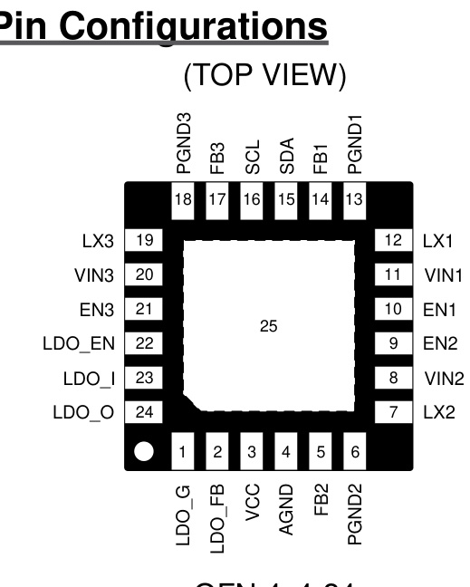
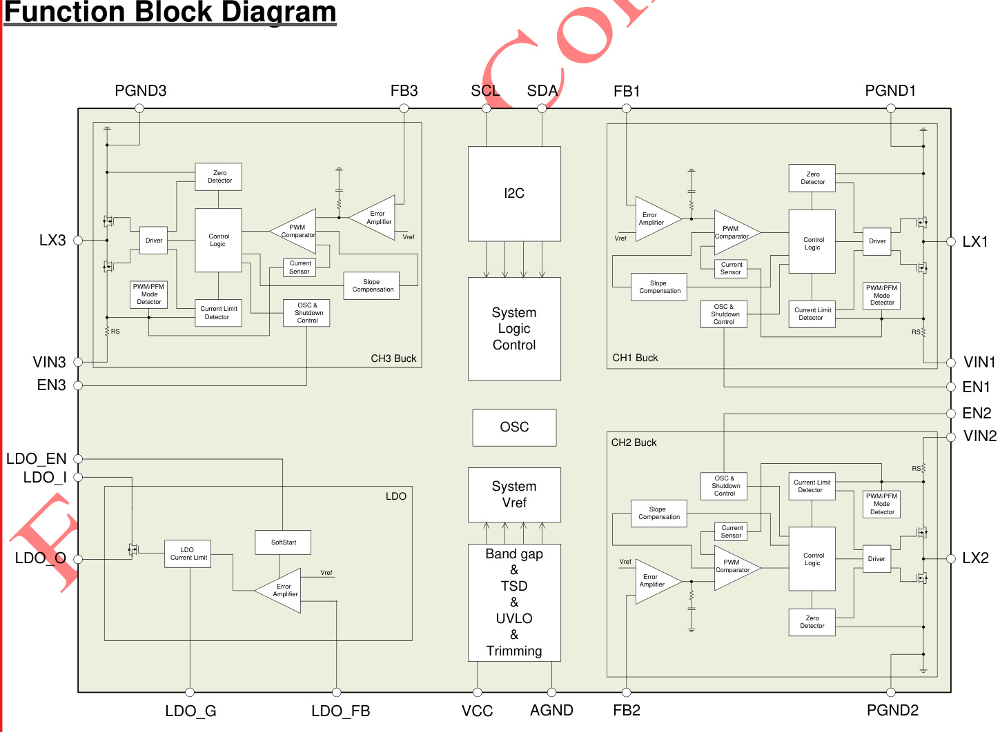
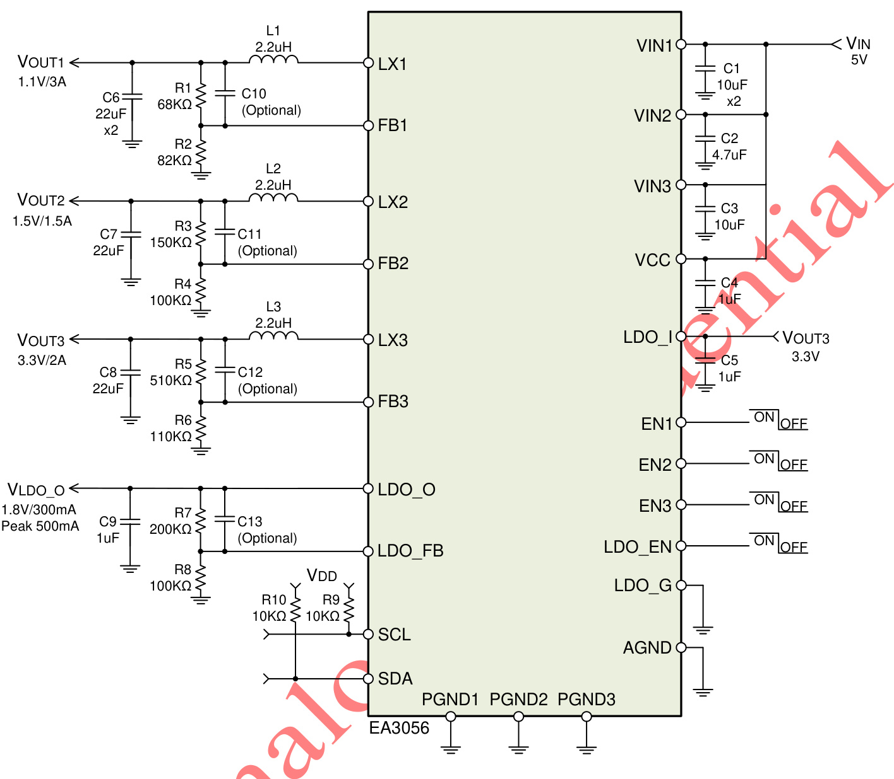
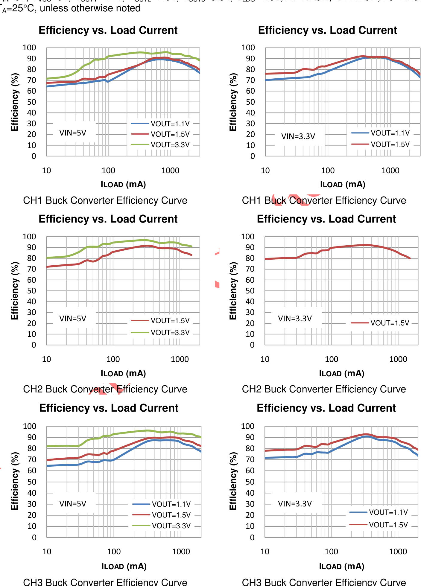
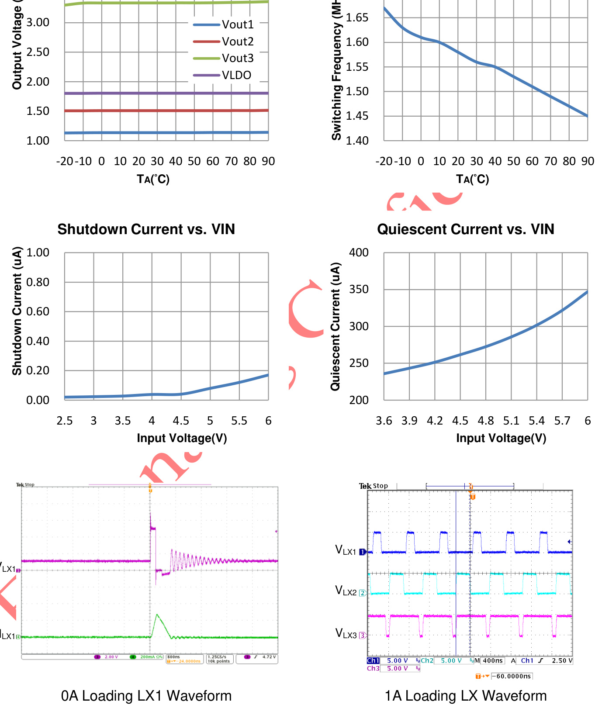
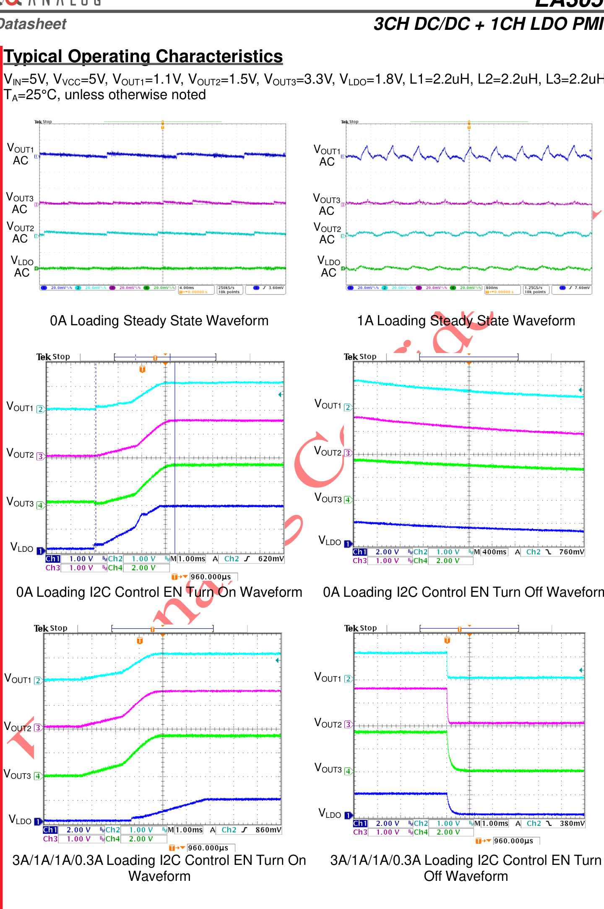
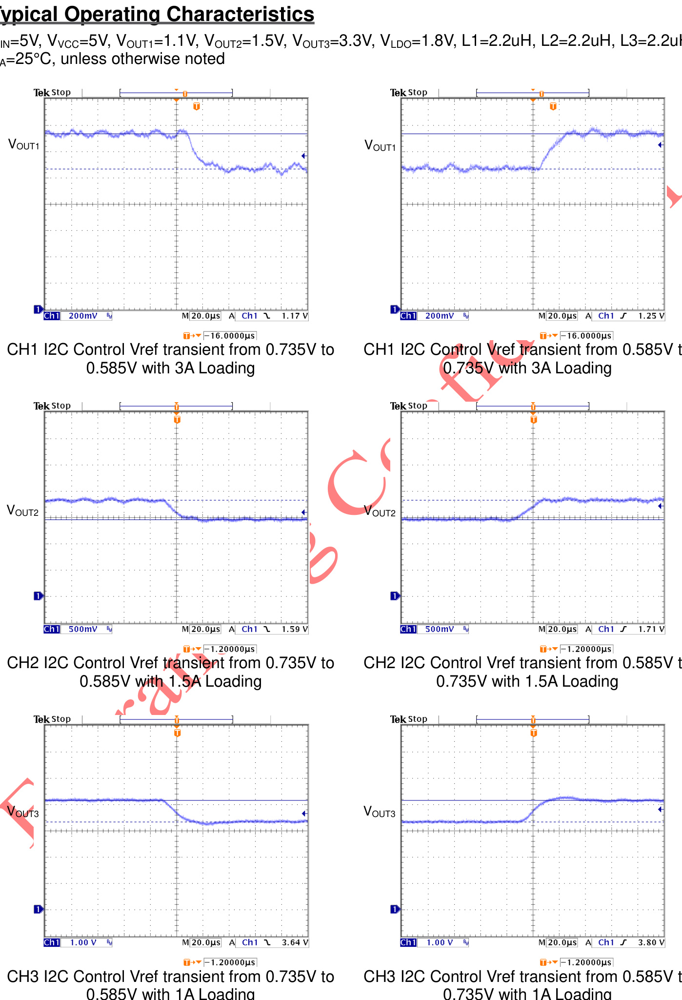
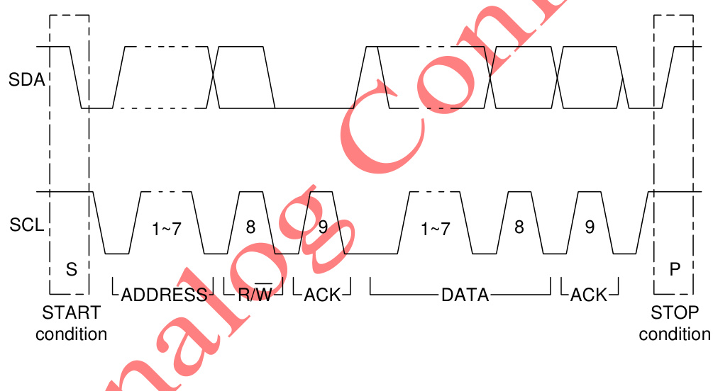
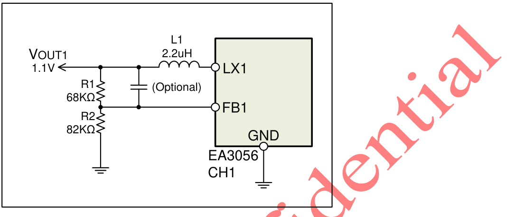
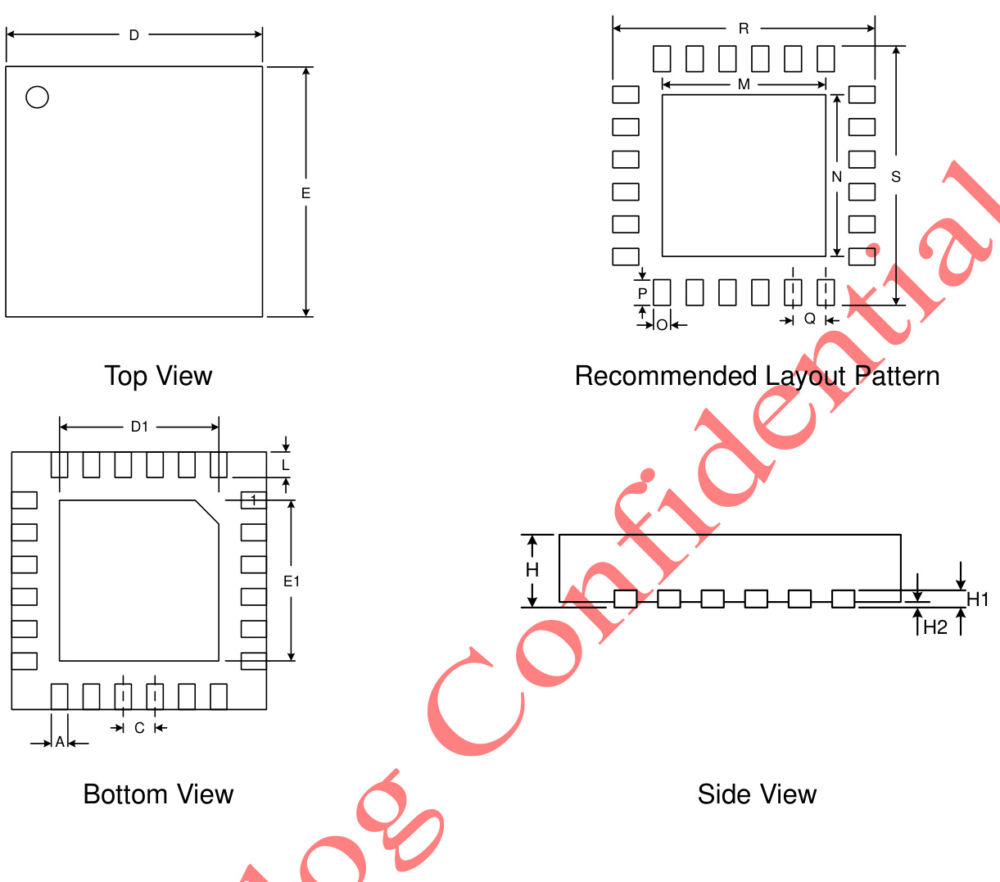

# General Description

The EA3056 is a 4-CH power management IC for applications powered by one Li-Ion battery or a DC 5V adapter. It integrates three synchronous buck regulators and one N-MOS LDO in a single chip. The internal compensation architecture simplifies the application circuit design. Besides, the independent enable control makes the designer have the greatest flexibility to optimize timing for power sequencing purposes. The EA3056 is available in a 24 pin QFN 4x4 package.

# Features

2.7V to 5.5V Input Voltage Range   
Three Buck Converters   
I2C Controlled VID Programmable Reference Voltage from 0.58V to 0.8V   
-- 6 Bits VID in 5mV Steps   
Output Voltage Can Also be Set by Resistor Divider   
-- The Initial Reference Voltage is 0.6V   
Continuous Load Current: 3A (CH 1A),(C1.H52A),(C2.H52A),(C2AH3()CH3)   
Peak Load Current: 3.5A (CH1), 2   
Fixed 1.5MHz Switching Frequency   
$1 8 0 ^ { \circ }$ Out of Phase Operation   
$100 \%$ Duty Cycle Low Dropout Operation   
Independent Enable Control   
Internal Compensation   
Cycle-by-Cycle Current Limit   
<1uA Shutdown Current   
Hiccup Short Circuit Protection   
One LDO Regulator   
I2C Controlled VID Programmable Reference Voltage from 0.58V to 0.8V   
-- 6 Bits VID in 5mV Steps   
Output Voltage Can Also be Set by Resistor Divider   
-- The Initial Reference Voltage is 0.6V   
300mA Output Current (Peak 500mA Output Current)   
Maximum 500mV Dropout Voltage   
Independent Enable Control   
4 channels total output power consumption must be less than 10W   
I2C Compatible Interface with Standard Mode(100KHz) and Fast Mode(400KHz)   
Auto Recovery OTP Protection   
Available in 24-pin 4mm x 4mm QFN Package

Smart Phone IP Camera OTT Digital Camera

# 3CH DC/DC + 1CH LDO PMIC

Datasheet

Pin Description   

<html><body><table><tr><td colspan="2"></td><td></td><td></td></tr><tr><td>Pin Name</td><td colspan="2">Function Description</td><td>Pin No.</td></tr><tr><td>LDO_G</td><td>Ground pin of LDO.</td><td></td><td>1</td></tr><tr><td>LDO_FB</td><td>Feedback input of LDO. Connect to LDO_O with a resistor</td><td>divider.</td><td>2 −</td></tr><tr><td>VCC</td><td>Input supply pin for internal control circuit.</td><td></td><td>3</td></tr><tr><td>AGND</td><td>Analog ground pin.</td><td></td><td>4</td></tr><tr><td>FB2</td><td>Feedback input of CH2. Connect divider.</td><td>to output voltage with a resistor</td><td>5</td></tr><tr><td>PGND2</td><td>Power ground pin of CA2.</td><td></td><td>6</td></tr><tr><td>LX2</td><td>Internal MOSFET switching output of pass filter circuit to obtain a stable</td><td>CH2. Connect LX2 pin with a low DC output voltage.</td><td>7</td></tr><tr><td>VIN2</td><td>PeowerinutPinin CHP ReC mended</td><td>to use a 4.7uF MLCC capacitor</td><td>8</td></tr><tr><td>EN2</td><td></td><td>Don't leave this pin floating.</td><td></td></tr><tr><td>EN1</td><td>CH2 turns on/turns off control input.</td><td>Don't leave this pin floating.</td><td>9 10</td></tr><tr><td>VIN1</td><td>CH1 turns on/turns off control input. Power input pin of CH1.</td><td>Recommended to use two 10uF MLCC</td><td></td></tr><tr><td></td><td>capacitors between VIN1 pin and PGND1</td><td>pin. with a low</td><td>11</td></tr><tr><td>X</td><td></td><td>pin</td><td>12</td></tr><tr><td>PGND1</td><td>Power ground pin of CH1.</td><td></td><td>13</td></tr><tr><td>FB1</td><td>Feedback input of CH1. Connect divider.</td><td>to output voltage with a resistor</td><td>14</td></tr><tr><td>SDA</td><td>1²C interface data pin.</td><td></td><td>15</td></tr><tr><td>SCL</td><td>I2C interface clock pin.</td><td></td><td>16</td></tr></table></body></html>

Datasheet

# 3CH DC/DC + 1CH LDO PMIC

<html><body><table><tr><td>Pin Name</td><td>Function Description</td><td>Pin No.</td></tr><tr><td>FB3</td><td>Feedback input of CH3. Connect to output voltage with a resistor divider.</td><td>17</td></tr><tr><td>PGND3</td><td>Power ground pin of CH3.</td><td>18</td></tr><tr><td>LX3</td><td>Internal MOSFET switching output of CH3. Connect LX3 pin with a low pass filter circuit to obtain a stable DC output voltage.</td><td>19</td></tr><tr><td>VIN3</td><td>to use a 10uF MLCC capacitor tar</td><td></td></tr><tr><td>EN3</td><td>CH4 turns on/turns off control input. Don't leave this pin floating.</td><td></td></tr><tr><td>LDO_ EN</td><td>LDO turns on/turns off control input. Don't leave this pin floating.</td><td>22</td></tr><tr><td>LDO_I</td><td>to use a 1uF MLCC capacitor</td><td>23</td></tr><tr><td>LDO_O</td><td>The output pin of the LDO.</td><td>24</td></tr><tr><td>Exposed Pad</td><td>The Exposed Pad must be soldered to a large PCB copper plane and connected to GND for appropriate dissipation.</td><td>25</td></tr></table></body></html>

  
Figure 1. EA3056 internal function block diagram

# 3CH DC/DC + 1CH LDO PMIC

# Datasheet

# Absolute Maximum Ratings

<html><body><table><tr><td>Parameter</td><td>Value</td></tr><tr><td>Input Voltage (Vvin1, Vvinz, Vvin3, VLDo_, Vvcc)</td><td>-0.3V to +6.5V</td></tr><tr><td>LX Pin Voltage (VLx1, VLx2, VLx3)</td><td>-0.3V to VviNx+0.3V</td></tr><tr><td>All Other Pins Voltage</td><td>-0.3V to +6.5V</td></tr><tr><td>Ambient Temperature operating Range (TA)</td><td>-40°C to +85°℃</td></tr><tr><td>Maximum Junction Temperature (TJmax)</td><td>+150℃</td></tr><tr><td>Lead Temperature (Soldering, 10 sec)</td><td>+260°℃</td></tr><tr><td>Storage Temperature Range (Ts)</td><td>-65°C to +150℃</td></tr></table></body></html>

Note (1):Stresses beyond those listed under ”Absolute Maximum Ratings” may cause permanent damage to the device. Exposure to “Absolute Maximum Ratings” conditions for extended periods may affect device reliability and lifetime.

# Package Thermal Characteristics

<html><body><table><tr><td colspan="2">Parameter</td><td colspan="2">Value</td></tr><tr><td>QFN 4x4-24 Thermal Resistance (θJc)</td><td></td><td></td><td>7.5°C/W</td></tr><tr><td>QFN 4x4-24 Thermal Resistance (0JA)</td><td></td><td></td><td>50°C/W</td></tr><tr><td colspan="4">QFN 4x4-24 Power Dissipation at TA=25°C (PDmax)</td></tr><tr><td colspan="4">2.5W Note (1): D calcmated accordina to the tormula -T)/日</td></tr></table></body></html>

Note (1): PDmax is calculated according to the formula: PDMAX=(TJMAX-TA)/ θJA.

# Recommended Operating Conditions

<html><body><table><tr><td>Parameter</td><td>Value</td></tr><tr><td>Input Voltage (VviN1, VVIN3, VLDO_, VVcC) NVIN2;</td><td>+2.7V to +5.5V</td></tr><tr><td>Junction Temperature (TJ) Range</td><td>-40°C to +125°C</td></tr></table></body></html>

Datasheet

# 3CH DC/DC + 1CH LDO PMIC

# Electrical Characteristics

$V _ { \vee I N X } = 5 V$ , $\mathsf { V } _ { \mathsf { V C C } } = 5 \mathsf { V } _ { \mathrm { : } }$ , $T _ { \mathsf { A } } { = } 2 5 ^ { \circ } \mathsf { C }$ , unless otherwise noted

Parameter Symbol Test Conditions Min Typ Max Unit Input Supply Voltage Input Voltage VINX 2.7 5.5 Voltage Control Circuit Input VVCC 2.7 5.5 Buck Converter 1 1 uA Shutdown Supply Current ISD1 VEN1 = 0V 0.1 Quiescent Current IQ1 Non-switching, No 100 150 uA Load UVLO Threshold VUVLO1 VVIN1 Rising .7 2.0 2.2 V UVLO Hysteresis VUV-HYST1 0.2 V Input OVP Threshold VOVP1 VVIN 1 Rising  06..145 V Input OVP Hysteresis VOVP-HYST1 V Output Load Current ILOAD1 3 A Reference Voltage VREF1 0.588 0.6 0.612 Reference Voltage Range VID control, 5mV 0.58 0.8 steps Switching Frequency FSW1 LOAD1 300mA 1.2 1.5 .8 MHz PMOS Current Limit ILIM1- P 4.5 5.5 A PMOS On-Resistance RDS(ON)1-P ILOAD1 = 300mA 100 mΩ NMOS On-Resistance RDS(ON)1-N ILOAD1 = 300mA 70 mΩ Enable Pin Input Low Voltage VEN1-L ut High EVonlatablge Pin Inp VEN1-H 2 / Maximum Duty Cycle DMAX1 100 % Minimum On Time TON1(MIN) 50 ns - Buck Converter 2 Shutdown Supply Current ISD2 VEN2 = 0V 0.1 uA Quiescent Current IQ2 Non-switching, No 100 150 uA Load UVLO Threshold VUVLO2 VVIN2 Rising 2.0 2.2 UVLO Hysteresis VUV-HYST2 0.2 V Input OVP Threshold VOVP2 VVIN2 Rising 6.4

# 3CH DC/DC $\star$ 1CH LDO PMIC

# Electrical Characteristics

$V _ { \vee } \vee \vee = 5 V$ , $\mathsf { V } _ { \mathsf { V C C } } = 5 \mathsf { V } _ { \mathrm { : } }$ , $T _ { \mathsf { A } } { = } 2 5 ^ { \circ } \mathsf { C }$ , unless otherwise noted

Parameter Symbol Test Conditions Min Typ Max Unit Input OVP Hysteresis VOVP-HYST2 0.15 V Output Load Current ILOAD2 1.5 A Reference Voltage VREF2 0.588 0.6 0.612 Reference Voltage Range VID control, steps 5mV 0.58 0.8 2 Switching Frequency FSW2 ILOAD1 = 300mA 1.2 1.5 MHz PMOS Current Limit ILIM1-P 2.5 A PMOS On-Resistance RDS(ON)2-P ILOAD = 300mA mΩ EVonlatablge Pin Input Low NMOS On-Resistance RDS(ON)2-N VEN2-L 0.4 V ILOAD 300mA mΩ Enable Pin Input High Voltage VEN2-H Maximum Duty Cycle DMAX2 100 % Minimum On Time TON2(MIN) 50 ns Buck Converter 3 Shutdown Supply Current ISD3 EN3 = 0V 0. uA Quiescent Current Non-switching, No 100 150 uA UVLO Threshold VUVU-VHLYOS3T3 VVIN1 Rising 2.0 2.2 V UVLO Hysteresis 0.2 V Input OVP Threshold 6.4 Input OVP Hysteresis VOVP-HYST3 0.15 Output Load Current ILOAD3 2 Reference Voltage VREF3 0.588 0.6 0.612 Reference Voltage Range VID control, 5mV 0.58 0.8 steps Switching Frequency FSW3 ILOAD1 = 300mA 1.2 .5 1.8 MHz PMOS Current Limit ILIM3-P 3 A PMOS On-Resistance RDS(ON)3-P ILOAD1 = 300mA 100 mΩ NMOS On-Resistance RDS(ON)3-N ILOAD1 = 300mA 90 mΩ Enable Pin Input Low Voltage VEN3-L 0.4

Datasheet

# Electrical Characteristics

$V _ { \vee } \wedge \vee = 5 V$ , $\mathsf { V } _ { \mathsf { V C C } } = 5 \mathsf { V } ,$ , ${ \mathsf { T } } _ { \mathsf { A } } { = } 2 5 ^ { \circ } \mathsf { C }$ , unless otherwise noted

Parameter Symbol Test Conditions Min Typ Max Unit   
Enable Pin Input High VEN3-H 2 V   
Voltage   
Maximum Duty Cycle DMAX3 100 %   
Minimum On Time TON3(MIN) 50 ns   
LDO Regulator LDO EN short to 0.1 1 uA   
Standby Current IST GND   
Quiescent Current IQ_LDO IOUT = 0A 100 150 uA   
Current Limit ILIM_LDO A   
Feedback Voltage VFB_LDO 0.588 0.6 0.612 V   
Reference Voltage Range VID control, 5mV 0.58 0.8 V steps   
Dropout Voltage VDROP IOUT = 300mA 50 65 mV   
PRoatwe r Supply Rejection PSRR f10=m10AKHz, IOUT 65 dB   
EVonlatablge Pin Input Low VEN_LDO-L 0.4   
EVonlatablge Pin Input High VEN LDO-H 1.5 V   
Thermal Shutdown 0   
Thermal Shutdown   
Threshold Thermal Shutdown T TOTP 160 °C 30 °C   
Hysteresis   
I2C Interface   
Device Address 35H   
Input High Voltage VIH 1.5   
Input Low Voltage VIL 0.4 Open drain, Sink   
SDA Output Low Voltage VOL_SDA 0.4 current = 3mA

# 3CH DC/DC + 1CH LDO PMIC

# Application Circuit Diagram

  
Figure 2. Typical application circuit diagram

# Ordering Information

<html><body><table><tr><td>Part Number</td><td>Package Type</td><td>Packing Information</td></tr><tr><td>ÉA3056QDR</td><td>QFN 4mm × 4mm-24</td><td>Tape & Reel 3000</td></tr></table></body></html>

Note (1):“QD”: Package type code. (2):“R”: Tape & Reel.

Datasheet

# Typical Operating Characteristics

$V _ { 1 N } = 5 V$ , $\mathsf { V } _ { \mathsf { V C C } } = 5 \mathsf { V }$ , $\mathsf { V } _ { \mathsf { O U T 1 } } = 1 . 1 \mathsf { V }$ , $\mathsf { V } _ { \mathsf { O U T } 2 } \mathsf { = } 1 . 5 \mathsf { V }$ , $\mathsf { V } _ { \mathsf { O U T 3 } } = 3 . 3 \mathsf { V }$ , $\mathsf { V } _ { \mathsf { L D O } } = 1 . 8 \mathsf { V }$ ${ \mathsf { L } } 1 { \mathsf { = } } 2 . 2 { \mathsf { u } } { \mathsf { H } }$ , $\mathsf { L } 2 = 2 . 2 \mathsf { u } \mathsf { H }$ , ${ \mathsf { L } } 3 { = } 2 . 2 { \mathsf { u } } { \mathsf { H } }$ ,

  
Copyright $\circledcirc$ 2016 Everanalog Integrated Circuit Limited. All Rights Reserved.

# 3CH DC/DC $\star$ 1CH LDO PMIC

Typical Operating Characteristics

$V _ { 1 N } = 5 V$ , $\mathsf { V } _ { \mathsf { V C C } } = 5 \mathsf { V }$ , $\mathsf { V } _ { \mathsf { O U T 1 } } { = } 1 . 1 \mathsf { V }$ , $\mathsf { V } _ { \mathsf { O U T } 2 } \mathsf { = } 1 . 5 \mathsf { V }$ , $\mathsf { V } _ { \mathsf { O U T 3 } } = 3 . 3 \mathsf { V }$ , $\mathsf { V } _ { \mathsf { L D O } } = 1 . 8 \mathsf { V }$ ${ \mathsf { L } } 1 { \mathsf { = } } 2 . 2 { \mathsf { u } } { \mathsf { H } }$ , ${ \mathsf { L } } 2 { \mathsf { = } } 2 . 2 { \mathsf { u } } { \mathsf { H } }$ , ${ \mathsf { L } } 3 { = } 2 . 2 { \mathsf { u } } { \mathsf { H } }$ , $\mathsf { T } _ { \mathsf { A } } { = } 2 5 ^ { \circ } \mathsf { C }$ , unless otherwise noted

Output Voltage vs. TA

Switching Frequency vs. TA

# 3CH DC/DC $\star$ 1CH LDO PMIC

Datasheet

# Functional Description

Output Voltage Setting

The EA3056 buck regulator each channel output voltage and LDO output voltage can be set by using external resistor dividers. The initial reference voltage is $0 . 6 { \mathsf { V } } .$ . Once the voltage identification VID data is set via the $1 ^ { 2 } { \mathsf { C } }$ interface, the reference voltage can be programmed from 0.58V to 0.8V in 5mV steps.

# Short Circuit Protection

The EA3056 buck regulator enters short circuit operation mode once the FB voltage is below 60% of the reference voltage. The short operation architecture is hiccup mode.

Out of Phase Operation

The EA3056 buck regulators operate at $1 8 0 ^ { \circ }$ out of phase architecture and can reduce input ripple current.

# $\mathsf { I } ^ { 2 } \mathsf { C }$ Control Mode Description

\`

The EA3056 works as a slave device and supports standard and fast modes I2C protocol. The I2C pspecification is shown as below:

The EA3056 has a 7-bit address 35H (0110101) and the command format is shown as below: •   
I2C Write Data Format:

<html><body><table><tr><td></td><td></td><td></td><td></td><td></td><td></td><td></td><td></td><td></td><td></td><td></td><td></td><td></td><td></td><td></td><td></td><td></td><td></td><td></td><td></td><td></td><td></td><td></td><td></td></tr><tr><td>S</td><td></td><td>Device</td><td></td><td></td><td>Address</td><td></td><td>0</td><td>A</td><td></td><td>Register</td><td></td><td></td><td>Address</td><td></td><td>A</td><td></td><td></td><td></td><td>Data</td><td></td><td></td><td></td><td>AP</td><td></td></tr></table></body></html>

I2C Read Data Format:

<html><body><table><tr><td>SDA</td><td></td><td>SDevice</td><td></td><td></td><td>Address0</td><td></td><td></td><td></td><td>A</td><td>Register</td><td></td><td></td><td></td><td>Address</td><td></td><td></td><td>ASrDevice</td><td></td><td></td><td>Addressid</td><td></td><td></td><td>A</td><td></td><td></td><td>Data</td><td></td><td></td></tr><tr><td></td><td></td><td></td><td></td><td></td><td></td><td></td><td></td><td></td><td></td><td></td><td></td><td></td><td></td><td></td><td></td><td></td><td></td><td></td><td></td><td></td><td></td><td></td><td></td><td></td><td></td><td></td><td></td><td>NP</td></tr></table></body></html>

S: START P: STOP A: ACK N: NACK Sr: Rep. START ●: Master Chip Slave Device

# 3CH DC/DC $\star$ 1CH LDO PMIC

Each channel of the buck regulator and the LDO can be $1 ^ { 2 } { \mathsf { C } }$ controlled for enabling/disabling output voltage and setting the output voltage.

When the EA3056 is shutdown by hardware controlling (EN1, EN2, EN3, EN_LDO pin short to ground), the software enabling/disabling control is not functional.

Register Map:   

<html><body><table><tr><td>Address</td><td>Name</td><td>R/W</td><td>Default</td><td>Description</td></tr><tr><td>00H</td><td>EN_Ctrl</td><td>R/W</td><td>XFH</td><td>CH1~CH3 and LDO disable control</td></tr><tr><td>01H</td><td>Vref1 _Set</td><td>R/W</td><td>00H</td><td>Setting CH1 reference voltage</td></tr><tr><td>02H</td><td>Vref2_ Set</td><td>R/W</td><td>00H</td><td>Setting CH2 reference voltage</td></tr><tr><td>03H</td><td>Vref3_ Set</td><td>R/W</td><td>00H</td><td>Setting CH3 reference voltage</td></tr><tr><td>04H</td><td>VIdo_ref_ Set</td><td>R/W</td><td>00H</td><td>Setting LDO reference voltage</td></tr></table></body></html>

CO

EN Pins Disable Control Register:   

<html><body><table><tr><td>Address</td><td>Name</td><td>Bit</td><td>R/W</td><td>Default</td><td>Description</td></tr><tr><td rowspan="7">00H</td><td>EN1_Ctrl</td><td>0</td><td>R/W</td><td>0</td><td>CH1 disable control (O: enable, 1: disable)</td></tr><tr><td>EN2_ Ctrl</td><td></td><td>R/W</td><td></td><td>CH2 disable control (0: enable, 1: disable)</td></tr><tr><td>EN3_ _Ctrl</td><td>2</td><td>R/W</td><td></td><td>CH3 disable control (0: enable, 1: disable)</td></tr><tr><td>LDOEN Ctrl</td><td>3</td><td>R/W</td><td></td><td>LDO disable control (0: enable, 1: disable)</td></tr><tr><td></td><td>4</td><td></td><td></td><td>Reserved</td></tr><tr><td></td><td></td><td></td><td></td><td>Reserved</td></tr><tr><td></td><td></td><td></td><td></td><td>Reserved</td></tr><tr><td></td><td></td><td></td><td></td><td>Reserved</td></tr></table></body></html>

Vref1 Reference Voltage Setting Register:   

<html><body><table><tr><td>Address</td><td>Name</td><td>Bit</td><td>R/W</td><td>Default</td><td>Description</td></tr><tr><td rowspan="7">- 01H</td><td>ref1</td><td>0</td><td>R/W</td><td>0</td><td>Vref1 voltage setting bit 0</td></tr><tr><td>ref1_1</td><td></td><td>R/W</td><td>0</td><td>voltage setting bit 1 Vref1</td></tr><tr><td>2 Vref1_</td><td>2</td><td>R/W</td><td>0</td><td>Vretf1 voltage setting bit 2</td></tr><tr><td>Vref1_3</td><td>3</td><td>R/W</td><td>0</td><td>voltage setting bit 3 Vref1</td></tr><tr><td>Vref1_4</td><td>4</td><td>R/W</td><td>0</td><td>Vref1 voltage setting bit 4</td></tr><tr><td>Vref1_5</td><td>5</td><td>R/W</td><td>0</td><td>Vref1 voltage setting bit 5</td></tr><tr><td>Vref1_6</td><td>6</td><td>R/W</td><td>0</td><td>Set “1”to enable I²C voltage control</td></tr><tr><td></td><td>Vref1_7</td><td>7</td><td></td><td></td><td>Reserved</td></tr></table></body></html>

# Datasheet

# 3CH DC/DC + 1CH LDO PMIC

Vref2 Reference Voltage Setting Register:   

<html><body><table><tr><td>Address</td><td>Name</td><td>Bit</td><td>R/W</td><td>Default</td><td>Description</td></tr><tr><td rowspan="7">02H</td><td>0 Vref2</td><td>0</td><td>R/W</td><td>0</td><td>voltage setting bit 0 Vref2</td></tr><tr><td>1 Vret2</td><td></td><td>R/W</td><td>0</td><td>voltage setting bit 1 Vref2</td></tr><tr><td>Vret2 2</td><td>2</td><td>R/W</td><td>0</td><td>voltage setting bit 2 Vref2</td></tr><tr><td>3 Vret2</td><td>3</td><td>R/W</td><td>0</td><td>voltage setting bit 3 Vref2</td></tr><tr><td>4 Vret2</td><td>4</td><td>R/W</td><td>0</td><td>Vret2 voltage setting bit 4</td></tr><tr><td>5 Vref2</td><td>5</td><td>R/W</td><td>0</td><td>Vrer2 Voltage seting bit 5</td></tr><tr><td>6 Vref2</td><td>6</td><td>R/W</td><td>0</td><td>Set "1" to enable I2C voltage control</td></tr><tr><td>Vref2</td><td>7 7</td><td></td><td></td><td>Reserved</td></tr></table></body></html>

Address Name Bit R/W Default Description Vref3_ 0 0 R/W 0 ef3 voltage setting bit 0 Vref3_1 R/W 0 ref3 voltage setting bit 1 Vref3 _2 2 R/W Vref3 voltage setting bit 2 Vref3_3 3 R/W Vref3 voltage setting bit 3 03H Vref3_4 4 R/W Vref3 voltage setting bit 4 Vref 3_5 5 R/W Vref3 voltage setting bit 5 Vref3_6 6 R/W Set “1” to enable I2C voltage control Vref3 _7 Reserved

$\mathsf { V } _ { \mathsf { r e f 3 } }$ Reference Voltage Setting Register:   
Vldo_ref LDO Reference Voltage Setting Register:   

<html><body><table><tr><td>Address</td><td>Name</td><td>Bit</td><td>R/W</td><td>Default</td><td>Description</td></tr><tr><td rowspan="7">04H</td><td>ef Vido</td><td>0</td><td>R/W</td><td>0</td><td>_ref voltage setting bit 0 Vildo_</td></tr><tr><td>Vido ref_1</td><td></td><td>R/W</td><td>0</td><td>Vldo_ref voltage setting bit</td></tr><tr><td>_ref_2 Vldo</td><td>2</td><td>R/W</td><td>0</td><td>ref voltage setting bit 2 Vido_</td></tr><tr><td>Vido_ _ref_3</td><td>3</td><td>R/W</td><td>0</td><td>_ref voltage setting bit 3 Vido_</td></tr><tr><td>Vido_ ref_4</td><td>4</td><td>R/W</td><td></td><td>ref voltage setting bit 4 Vido_</td></tr><tr><td>Vido_ _ref_5</td><td>5</td><td>R/W</td><td></td><td>_ref voltage setting bit 5 Vildo_</td></tr><tr><td>Vido_ ref_6</td><td>6</td><td>R/W</td><td>0</td><td>Set "1" to enable |²C voltage control</td></tr><tr><td>Vido_ ref_7</td><td>7</td><td></td><td></td><td>Reserved</td><td></td></tr></table></body></html>

# 3CH DC/DC $\star$ 1CH LDO PMIC

Vref1/Vref2/Vref3/ Vldo_ ref Reference Voltage Setting Table

<html><body><table><tr><td>[6:0] VREFX</td><td>Voltage (V) VREFX</td><td>[6:0] VREFX</td><td>Voltage (V) VREFX</td></tr><tr><td>40H</td><td>0.580</td><td>60H</td><td>0.740</td></tr><tr><td>41H</td><td>0.585</td><td>61H</td><td>0.745</td></tr><tr><td>42H</td><td>0.590</td><td>62H</td><td>0.750</td></tr><tr><td>43H</td><td>0.595</td><td>63H</td><td>0.755</td></tr><tr><td>44H</td><td>0.600</td><td>64H</td><td>0.760</td></tr><tr><td>45H</td><td>0.605</td><td>65H</td><td>0.765</td></tr><tr><td>46H</td><td>0.610</td><td>66H</td><td>0.770</td></tr><tr><td>47H</td><td>0.615</td><td>67H</td><td>0.775 iden</td></tr><tr><td>48H</td><td>0.620</td><td>68H</td><td>0.780</td></tr><tr><td>49H</td><td>0.625</td><td>69H</td><td>0.785</td></tr><tr><td>4AH</td><td>0.630</td><td>6AH</td><td>0.790</td></tr><tr><td>4BH</td><td>0.635</td><td>6BH</td><td>0.795</td></tr><tr><td>4CH</td><td>0.640</td><td>6CH</td><td>0.800</td></tr><tr><td>4DH</td><td>0.645</td><td></td><td></td></tr><tr><td>4EH</td><td>0.65</td><td></td><td></td></tr><tr><td>4FH</td><td>0.655</td><td></td><td></td></tr><tr><td>50H</td><td>0.66</td><td></td><td></td></tr><tr><td>51H</td><td>0.665</td><td></td><td></td></tr><tr><td>52H</td><td>0.670</td><td></td><td></td></tr><tr><td>53H</td><td>0.675</td><td></td><td></td></tr><tr><td>54H 55H</td><td>0.680</td><td></td><td></td></tr><tr><td>56H</td><td>0.685</td><td></td><td></td></tr><tr><td>57H</td><td>690 0.695</td><td></td><td></td></tr><tr><td>58H</td><td>0.700</td><td></td><td></td></tr><tr><td>59H</td><td>0.705</td><td></td><td></td></tr><tr><td>5AH</td><td>0.710 arana</td><td></td><td></td></tr><tr><td>5BH</td><td>0.715</td><td></td><td></td></tr><tr><td>5CH</td><td></td><td></td><td></td></tr><tr><td></td><td>0.720</td><td></td><td></td></tr><tr><td>5DH</td><td>0.725</td><td></td><td></td></tr><tr><td>5EH</td><td>0.730</td><td></td><td></td></tr><tr><td>5FH</td><td>0.735</td><td></td><td></td></tr></table></body></html>

Datasheet

# Application Information

Output Voltage Setting

Each of the regulators default output voltage can be set via a resistor divider (ex. R1, R2). The output voltage is calculated by following equation:

$$
\mathsf { V o u r 1 } = 0 . 6 \times \frac { \mathsf { R 1 } } { \mathsf { R 2 } } + 0 . 6 \ \mathsf { V }
$$

The following table lists common output voltage and the corresponding R1, R2 resistance value for reference.

<html><body><table><tr><td>Output Voltage</td><td>R1 Resistance</td><td>R2 Resistance</td><td>Tolerance</td></tr><tr><td>3.3V</td><td>510KΩ</td><td>110KΩ</td><td>1%</td></tr><tr><td>1.8V</td><td>200KΩ</td><td>100KΩ</td><td>1%</td></tr><tr><td>1.5V</td><td>150KΩ</td><td>100KΩ</td><td>1%</td></tr><tr><td>1.1V</td><td>68KΩ</td><td>82KΩ</td><td>1%</td></tr></table></body></html>

# Input Output Capacitors Selectio

The input capacitors are used to suppress the noise amplitude of the input voltage and provide a stable and clean DC input to the device. Because the ceramic capacitor has low ESR characteristic, so it is suitable for input capacitor use. It is recommended to use X5R or X7R MLCC capacitors in order to have better temperature performance and smaller capacitance tolerance. In order to suppress the output voltage ripple, the MLCC capacitor is also the best choice. The suggested part numbers of input output capacitors are as follows:

<html><body><table><tr><td>Vendor</td><td>Part Number</td><td>Capacitance</td><td>Edc</td><td>Parameter</td><td>Size</td></tr><tr><td>TDK</td><td>C2012X5R1A106M</td><td>10uF</td><td>10V</td><td>X5R</td><td>0805</td></tr><tr><td>TDK</td><td>C3216X5R1A106M</td><td>10uF</td><td>10V</td><td>X5R</td><td>1206</td></tr><tr><td>TDK</td><td>C2012X5R1A226M</td><td>22uF</td><td>10V</td><td>X5R</td><td>0805</td></tr><tr><td>TDK</td><td>C3216X5R1A226M</td><td>22uF</td><td>10V</td><td>X5R</td><td>1206</td></tr></table></body></html>

# Output Inductor Selection

The output inductor selection mainly depends on the amount of ripple current through the inductor $\left| \Delta \right| _ { \mathrm { L } }$ . Large $\Delta \mathsf { I } _ { \mathsf { L } }$ will cause larger output voltage ripple and loss, but the user can use a smaller inductor to save cost and space. On the contrary, the larger inductance can get smaller $\Delta \mathsf { I } _ { \mathsf { L } }$ and

# 3CH DC/DC $\star$ 1CH LDO PMIC

thus the smaller output voltage ripple and loss. But it will increase the space and the cost. The inductor value can be calculated as:

$$
L = \frac { \mathsf { V } _ { \mathsf { P W R } } - \mathsf { V } _ { \mathsf { O U T } } } { \Delta \mathsf { I } _ { \mathsf { L } } \times \mathsf { F } _ { \mathsf { S W } } } \times \frac { \mathsf { V } _ { \mathsf { O U T } } } { \mathsf { V } _ { \mathsf { P W R } } }
$$

For most applications, 1.0uH to 2.2uH inductors are suitable for EA3056.

# Power Dissipation

The total output power dissipation of EA3056 should not to exceed the maximum 10W range. The total output power dissipation can be calculated as: $\mathsf { P } _ { \mathsf { D } } ( \mathsf { \Pi } _ { \mathsf { t o t a l } } ) = \mathsf { V } _ { \mathsf { O U T } 1 } \times \mathsf { I } _ { \mathsf { O U T } 1 } + \mathsf { V } _ { \mathsf { O U T } 2 } \times \mathsf { I } _ { \mathsf { O U T } 2 } + \mathsf { V } _ { \mathsf { O U T } 3 } \times \mathsf { I } _ { \mathsf { O U T } 3 } + \mathsf { V } _ { \mathsf { O U T } 4 } \times \mathsf { I } _ { \mathsf { O U T } 4 }$

# PCB Layout Recommendations

Layout is very critical for PMIC designs. For EA3056 PCB layout considerations, please refer to the following suggestions to get best performance.

It is suggested to use 4-layer PCB layout and place LX plane and output plane on the top layer, place VIN plane in the inner layer.   
The top layer SMD input and output capacitors ground plane should be connected to the internal ground layer and bottom ground plane individually by using vias.   
The AGND should be connected to inner ground layer directly by using via.   
High current path traces need to be widened.   
Place the input capacitors as close as possible to the VINx pin and VCC pin to reduce noise interference.   
Keep the feedback path (from VOUTX to FBx) away from the noise node (ex. LXx). LXx is a high current noise node. Complete the layout by using short and wide traces.   
The top layer exposed pad ground plane should be connected to the internal ground layer and bottom ground plane by using a number of vias to improve thermal performance.

# 3CH DC/DC + 1CH LDO PMIC

# Package Information

# QFN 4mm x 4mm-24 Package

Unit: mm   

<html><body><table><tr><td rowspan="2">Symbol</td><td colspan="2">Dimension</td><td rowspan="2">Symbol</td><td rowspan="2">Dimension Typ</td></tr><tr><td>Min</td><td>Max</td></tr><tr><td>A</td><td colspan="2">0.18 0.30</td><td>M</td><td>2.60</td></tr><tr><td>C</td><td colspan="2">0.45 0.55</td><td>N</td><td>2.60</td></tr><tr><td>D</td><td colspan="2">3.95 4.05</td><td>O</td><td>0.30</td></tr><tr><td>E</td><td colspan="2">3.95 4.05</td><td>P</td><td>0.80</td></tr><tr><td>D1</td><td colspan="2">2.30 2.70</td><td>Q</td><td>0.50</td></tr><tr><td>E1</td><td colspan="2">2.30 2.70</td><td>R</td><td>4.70</td></tr><tr><td></td><td colspan="2">0.35 0.45</td><td>S</td><td>4.70</td></tr><tr><td></td><td colspan="2">0.80 1.00</td><td></td><td></td></tr><tr><td>H</td><td colspan="2">0.17 0.25</td><td></td><td></td></tr><tr><td>H2</td><td colspan="2">0.00 0.05</td><td></td><td></td></tr></table></body></html>