# LM27761 低噪声稳压开关电容电压逆变器

# 1 特性

逆变并调节输入电源电压  
低输出纹波  
关断会将静态电流降低至 $7 \mu \mathsf { A }$ （典型值）  
输出电流高达 250mA  
2.5Ω 逆变器输出阻抗， $\mathsf { V } _ { \mathsf { I N } } = 5 \mathsf { V }$   
峰值负载时，调节范围为 $\pm 4 \%$   
$3 7 0 \mu \mathrm { A }$ 静态电流  
2MHz（典型值）低噪声固定工作频率  
在 2MHz 处，  
$8 0 \mathsf { m } \mathsf { A }$ 负载电流为 35dB（典型值）LDO PSRR  
100mA 处的 LDO 压降电压为 $3 0 \mathsf { m V }$   
$\mathsf { V } _ { \mathsf { O U T } } = \mathsf { \Omega } - 5 \mathsf { V }$   
电流限制和热保护

# 2 应用

运算放大器电源  
无线通信系统  
手机功率放大器偏置  
接口电源  
手持仪表  
Hi-Fi 耳机放大器  
为数据转换器供电

# 3 说明

LM27761 低噪声稳压开关电容器电压逆变器可针对2.7V 至 5.5V 范围内的输入电压提供极低噪声的可调节输出。应用设计中使用了四个低成本电容器来提供高达$2 5 0 \mathsf { m A }$ 的输出电流。器件的稳压输出可在 −1.5V 至−5V 之间调节。LM27761 在 2MHz（典型值）开关频率下工作，可减少输出电阻和电压纹波。LM27761 仅具有 $3 7 0 \mu \mathrm { A }$ 的工作电流（在大多数负载下电荷泵功效大于 $80 \%$ ）和 $7 \mu \mathsf { A }$ 典型关断电流，可在驱动功率放大器、DAC 偏置轨以及其他高电流、低噪声电压应用时提供出色的性能。

封装信息  

<html><body><table><tr><td>器件型号</td><td>封装(1)</td><td>封装尺寸(2)</td></tr><tr><td>LM27761</td><td>DSG WSON 8）</td><td>2.00mm ×2.00mm</td></tr></table></body></html>

(1) 有关更多信息，请参阅 节 10。  
(2) 封装尺寸（长 $\times$ 宽）为标称值，并包括引脚（如适用）。

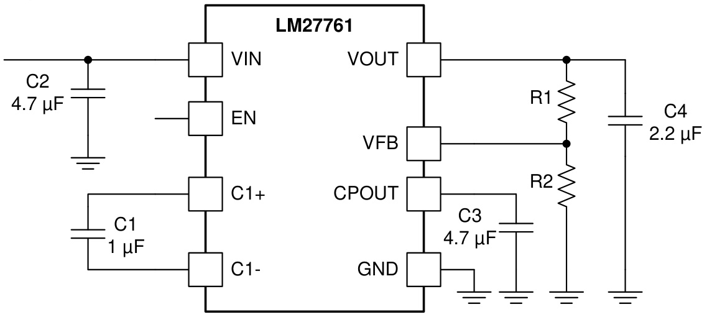  
典型应用

# 内容

1 特性..  
2 应用...  
3 说明..  
4 引脚配置和功能  
5 规格...5.1 绝对最大额定值.5.2 ESD 等级.....5.3 建议运行条件..5.4 热性能信息...5.5 电气特性... 55.6 典型特性... 6  
6 详细说明.... 106.1 概述.... 106.2 功能方框图. 106.3 特性说明. .... 11

6.4 器件功能模式. 11  
7 应用和实施. 12  
7.1 应用信息.. 12  
7.2 典型应用 - 稳压电压逆变器 12  
7.3 电源相关建议.... 17  
7.4 布局... 17  
8 器件和文档支持 19  
8.1 接收文档更新通知. 19  
8.2 支持资源... 19  
8.3 商标... 19  
8.4 静电放电警告.... 19  
8.5 术语表..... 19  
9 修订历史记录... 19  
10 机械、封装和可订购信息 19

# 4 引脚配置和功能

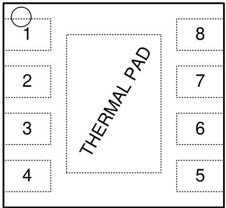  
图 4-1. DSG 封装 8 引脚 WSON ( （带散热焊盘） 顶视图

表 4-1. 引脚功能  

<html><body><table><tr><td colspan="2">引脚</td><td rowspan="2">类型(1)</td><td rowspan="2">说明</td></tr><tr><td>编号</td><td>名称</td></tr><tr><td>1</td><td>VIN</td><td>P</td><td>正电源输入。</td></tr><tr><td>2</td><td>GND</td><td>G</td><td>接地</td></tr><tr><td>3</td><td>CPOUT</td><td>P</td><td>负未稳压输出电压。</td></tr><tr><td>4</td><td>VOUT</td><td>P</td><td>稳压负输出电压。</td></tr><tr><td>5</td><td>VFB</td><td>P</td><td>反馈输入。 将VFB连接到VOUT 和GND 之间的外部电阻分压器。 请勿断开连接。</td></tr><tr><td>6</td><td>EN</td><td></td><td>高电平有效使能输入</td></tr><tr><td>7</td><td>C1</td><td>P</td><td>C1 的负极端子。</td></tr><tr><td>8</td><td>C1+</td><td></td><td>C1 的正极端子。</td></tr><tr><td></td><td>散热焊盘</td><td>G</td><td>接地。 请勿断开连接。</td></tr></table></body></html>

(1) P：电源；G：接地；I：输入。

# 5 规格

# 5.1 绝对最大额定值

在自然通风条件下的工作温度范围内测得（除非另有说明）(1) (2)

<html><body><table><tr><td></td><td>最小值</td><td>最大值</td><td>单位</td></tr><tr><td>接地电压、 VIN 至GND 或GND 至VOUT</td><td></td><td>5.8</td><td></td></tr><tr><td>EN</td><td>(GND 0.3V)</td><td>(VIN + 0.3V)</td><td></td></tr><tr><td>持续输出电流 CPOUT 和VOUT</td><td></td><td>300</td><td>mA</td></tr><tr><td>TJMAX (3)</td><td></td><td>150</td><td>°C</td></tr><tr><td>贮存温度 Tstg</td><td>-65</td><td>150</td><td>。C</td></tr></table></body></html>

(1) 应力超出绝对最大额定值中列出的值时可能会对器件造成永久损坏。 这些列出的值只是应力额定值，并不意味着器件能够在该等条件下以及在建议运行条件以外的任何其他条件下正常运行。 长时间处于绝对最大额定条件下可能会影响器件的可靠性。

(3) 最大功率耗散必须在高温下降额， 并由 TJMAX （最高结温） TA（环境温度） 和 TθJA ( （结温至环境热阻） 限制。 任何温度下的最大功耗为：P $\mathsf { \Gamma } _ { \mathsf { J i s s M A X } } = ( \mathsf { T } _ { \mathsf { J M A X } } \cdot \mathsf { T } _ { \mathsf { A } } ) / \mathsf { R } _ { \textrm { \textrm { \textrm { \textrm { \textrm { \textrm { \textrm { J } } } } } } } }$ A 最高为绝对最大额定值 中列出的值。

# 5.2 ESD 等级

<html><body><table><tr><td colspan="2"></td><td>值</td><td>单位</td></tr><tr><td rowspan="2">V(ESD)) 静电放电</td><td>人体放电模型(HBM) 符合ANSIESDA/JEDECJS-001标准(1)</td><td>±1000</td><td rowspan="2"></td></tr><tr><td>充电器件模型(CDM) 符合JEDEC规范JESD22-C101(2)</td><td>±250</td></tr></table></body></html>

(1) JEDEC 文档 JEP155 指出： 500V HBM 可通过标准 ESD 控制流程实现安全生产。  
(2) JEDEC 文档 JEP157 指出： 250V CDM 能够在标准 ESD 控制流程下安全生产。

# 5.3 建议运行条件

在自然通风条件下的工作温度范围内测得（除非另有说明）

<html><body><table><tr><td></td><td>最小值</td><td>最大值</td><td>单位</td></tr><tr><td>工作环境温度 IA</td><td>-40</td><td>85</td><td>°C</td></tr><tr><td>工作结温 TJ</td><td>-40</td><td>125</td><td>°C</td></tr><tr><td>工作输入电压 VIN</td><td>2.7</td><td>5.5</td><td>V</td></tr><tr><td>工作输出电流 louT</td><td></td><td>250</td><td>mA</td></tr></table></body></html>

# 5.4 热性能信息

<html><body><table><tr><td rowspan="3"></td><td rowspan="3">热指标(1)</td><td>LM27761</td><td rowspan="3">单位</td></tr><tr><td>WSON DSG )</td></tr><tr><td>8引脚</td></tr><tr><td>Rθ JA</td><td>结至环境热阻</td><td>67.7</td><td>°C/W</td></tr><tr><td>Rθ JC(top)</td><td>结至外壳（顶部）热阻</td><td>89.9</td><td>C/W</td></tr><tr><td>R0JB</td><td>结至电路板热阻</td><td>37.6</td><td>°C/W</td></tr><tr><td>ψJT</td><td>结至顶部特征参数</td><td>2.4</td><td>°C/W</td></tr><tr><td>JB</td><td>结至电路板特征参数</td><td>38</td><td>°C/W</td></tr><tr><td>Rθ 0 JC(bot)</td><td>结至外壳（底部） 热阻</td><td>9.4</td><td>°C/W</td></tr></table></body></html>

(1) 有关新旧热指标的更多信息，请参阅半导体和 IC 封装热指标应用手册。

# 5.5 电气特性

典型限值适用于 ${ \bar { \mathsf { T } } } _ { \mathsf { A } } = 2 5 ^ { \circ } { \mathsf { C } }$ ， 最小和最大限值适用于整个温度范围。 除非另有规定， 否则 $V _ { \vert \mathsf { N } } = 5 \mathsf { V }$ 且 C1 至 C4 的值如典型应用 中所示。

<html><body><table><tr><td>参数</td><td></td><td>测试条件</td><td>最小值</td><td>典型值</td><td>最大值</td><td>单位</td></tr><tr><td>9</td><td>电源电流</td><td>开路、 空载</td><td></td><td>370</td><td>600</td><td>μA</td></tr><tr><td>IsD</td><td>关断电源电流</td><td></td><td></td><td>7</td><td>12</td><td>μA</td></tr><tr><td>fsw</td><td>开关频率</td><td>ViN = 3.6V</td><td></td><td>2</td><td>2.3</td><td>MHz</td></tr><tr><td>RNEG</td><td>到CpoUT 的输出电阻</td><td>ViN= 5.5V</td><td></td><td>2</td><td></td><td>Ω</td></tr><tr><td>VDo</td><td>LDO 压降电压</td><td>= 100mA = -5V ILOAD VouT</td><td></td><td>30</td><td></td><td>mV</td></tr><tr><td>PSRR</td><td>电源抑制比</td><td>LOAD = 80mA = -5V VCPOUT</td><td></td><td>35</td><td></td><td>dB</td></tr><tr><td>VN</td><td>输出噪声电压</td><td>LOAD =80mA、 10Hz至 100 kHz</td><td></td><td>20</td><td></td><td>μVRMS</td></tr><tr><td>VFB</td><td>反馈引脚基准电压</td><td></td><td>1.202</td><td>1.22</td><td>1.238</td><td>V</td></tr><tr><td>VouT</td><td>可调输出电压</td><td>5.5V ≥VIN ≥ 2.7V</td><td>5</td><td></td><td>-1.5</td><td>V</td></tr><tr><td></td><td>负载调整</td><td>0至250mA VouT = -1.8V</td><td></td><td>4.6</td><td></td><td>μV/mA</td></tr><tr><td></td><td>线路调整</td><td>5.5V≥ ViN ≥ 2.7V ILOAD =50mA</td><td></td><td>1.5</td><td></td><td>mVN</td></tr><tr><td>VIH</td><td>使能引脚输入电压高电平</td><td>5.5V ≥ VIN≥ 2.7V</td><td>1.2</td><td></td><td></td><td>√</td></tr><tr><td>VIL</td><td>使能引脚输入电压低电平</td><td>5.5V ≥ VIN≥ 2.7V</td><td></td><td></td><td>0.4</td><td></td></tr><tr><td rowspan="2">UVLO</td><td rowspan="2">欠压锁定</td><td>VN 下降 VN</td><td></td><td>2.6</td><td rowspan="2"></td></tr><tr><td>上升</td><td></td><td>2.4</td><td></td></tr></table></body></html>

# 5.6 典型特性

除非另有规定，否则 ${ \bar { \mathsf { T } } } _ { \mathsf { A } } = 2 5 ^ { \circ } { \mathsf { C } }$ 、 $V _ { \vert \mathsf { N } } = 5 \mathsf { V }$ ，且 C1 至 C4 的值如典型应用 中所示。

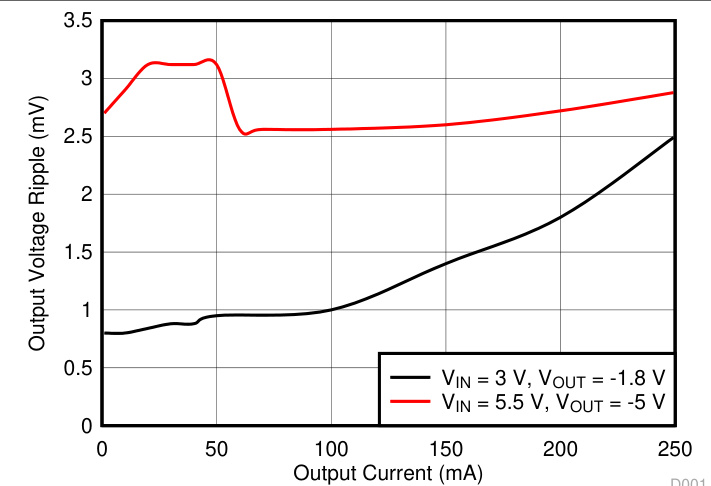  
图 5-1. 输出电压纹波与输出电流间的关系

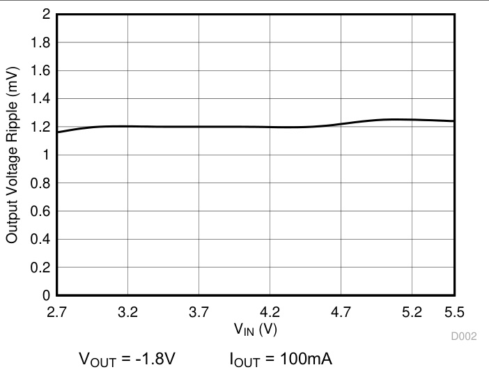  
图 5-2. 输出电压纹波与输入电压间的关系

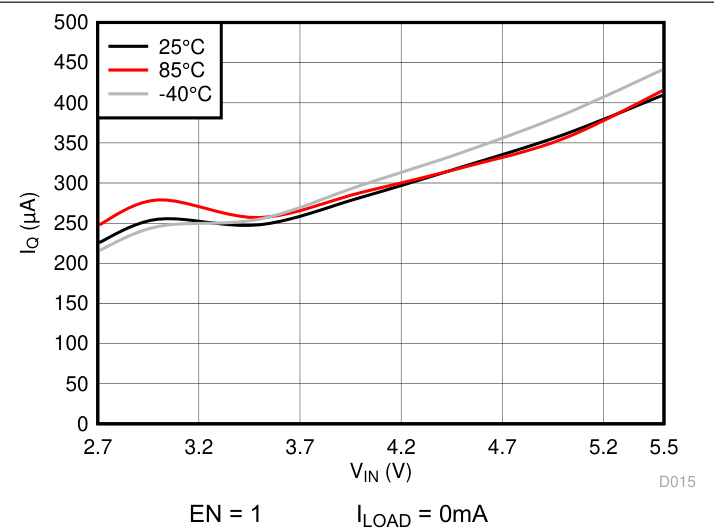  
图 5-3. 静态电流

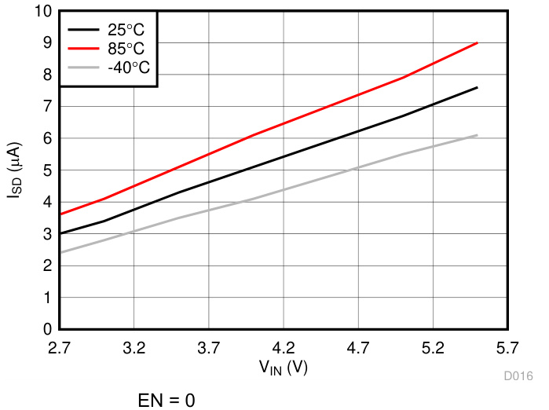  
图 5-4. 关断电流

# 5.6 典型特性 （续）

除非另有规定，否则 ${ \bar { \mathsf { T } } } _ { \mathsf { A } } = 2 5 ^ { \circ } { \mathsf { C } }$ 、 $V _ { \vert \mathsf { N } } = 5 \mathsf { V }$ ，且 C1 至 C4 的值如典型应用 中所示。

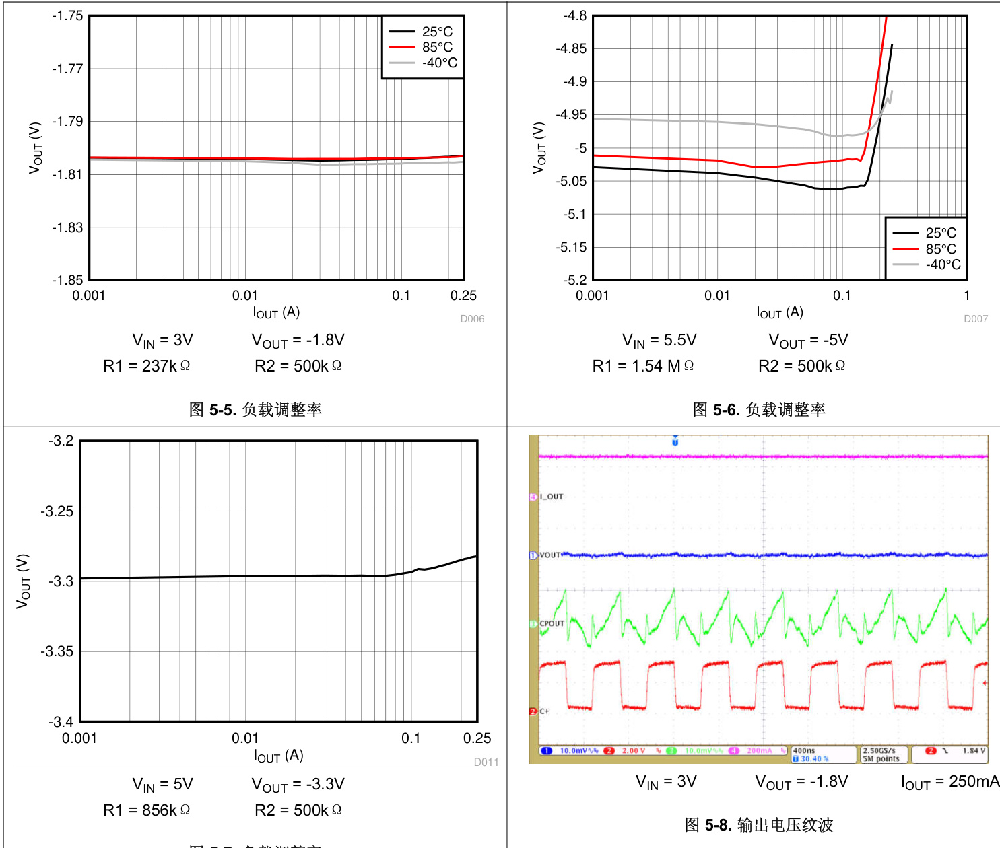  
图 5-7. 负载调整率

# 5.6 典型特性 （续）

除非另有规定，否则 ${ \bar { \mathsf { T } } } _ { \mathsf { A } } = 2 5 ^ { \circ } { \mathsf { C } }$ 、 $V _ { \vert \mathsf { N } } = 5 \mathsf { V }$ ，且 C1 至 C4 的值如典型应用 中所示。

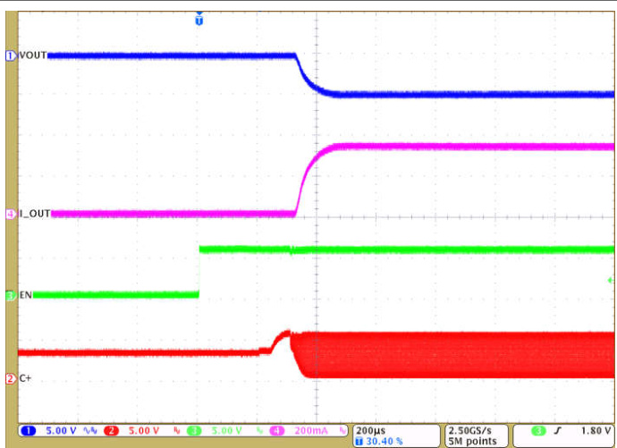  
图 5-10. 高电平有效

41_OUT   
DVOUT' 1 10.0mVv4 2 5.00V 200mA 400ns 2.50GS/s 3.80V 30.40% 5M points VIN = 5.5V VOUT = -5V IOUT = 250mA

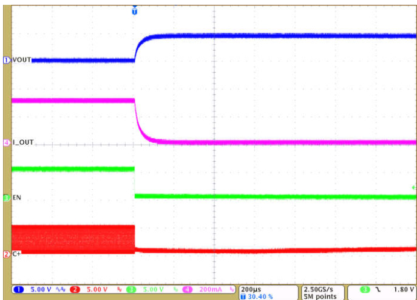  
图 5-9. 输出电压纹波

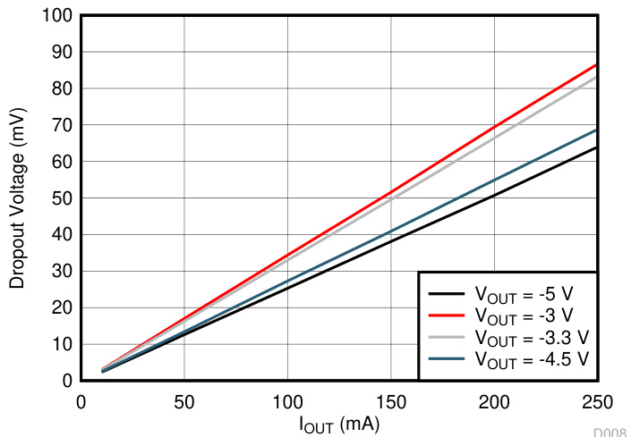  
图 5-12. LDO 压降电压与 $\mathsf { I } _ { \mathsf { O U T } }$ 间的关系

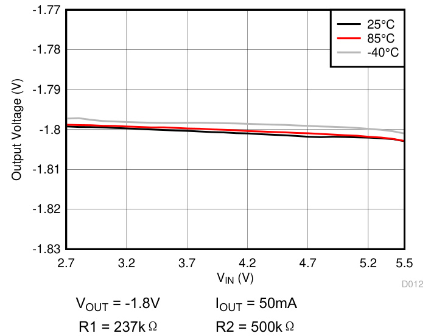  
图 5-11. 低电平有效  
图 5-13. 线性调整率

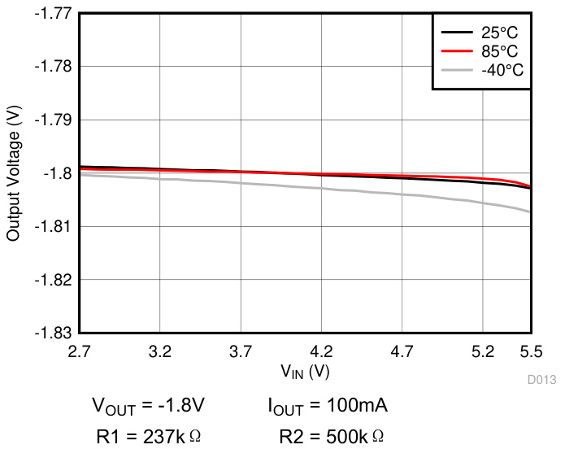  
图 5-14. 线性调整率

# 5.6 典型特性 （续）

除非另有规定，否则 ${ \sf T } _ { \sf A } = 2 5 ^ { \circ } { \sf C }$ 、 $V _ { \vert \mathsf { N } } = 5 \mathsf { V }$ ，且 C1 至 C4 的值如典型应用 中所示。

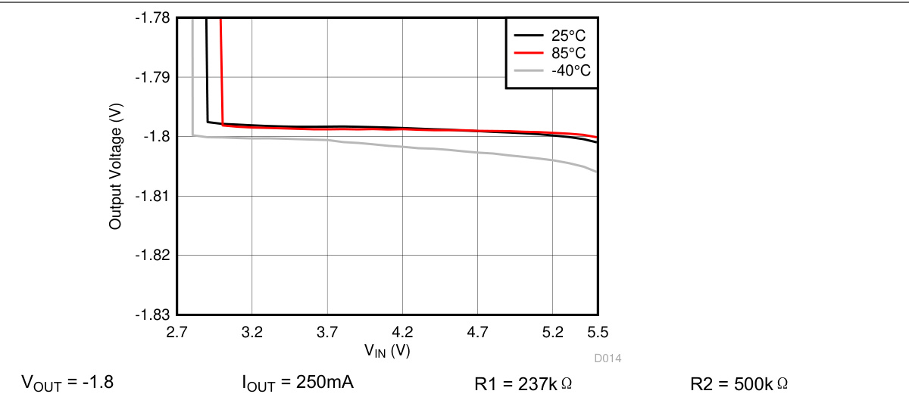  
图 5-15. 线性调整率

# 6 详细说明

# 6.1 概述

LM27761 稳压电荷泵电压转换器将 2.7V 至 5.5V 范围内的正电压转换为 –1.5V 至 –5V 范围内的负电压。 电荷泵电压转换器输出端的负 LDO（低压降稳压器）使器件能够提供极低噪声输出、低输出电压纹波、高 PSRR 以及低线路和负载响应。输出可通过增益设置电阻器从外部进行配置。LM27761 使用四个低成本电容器来提供高达250mA 的输出电流。

# 6.2 功能方框图

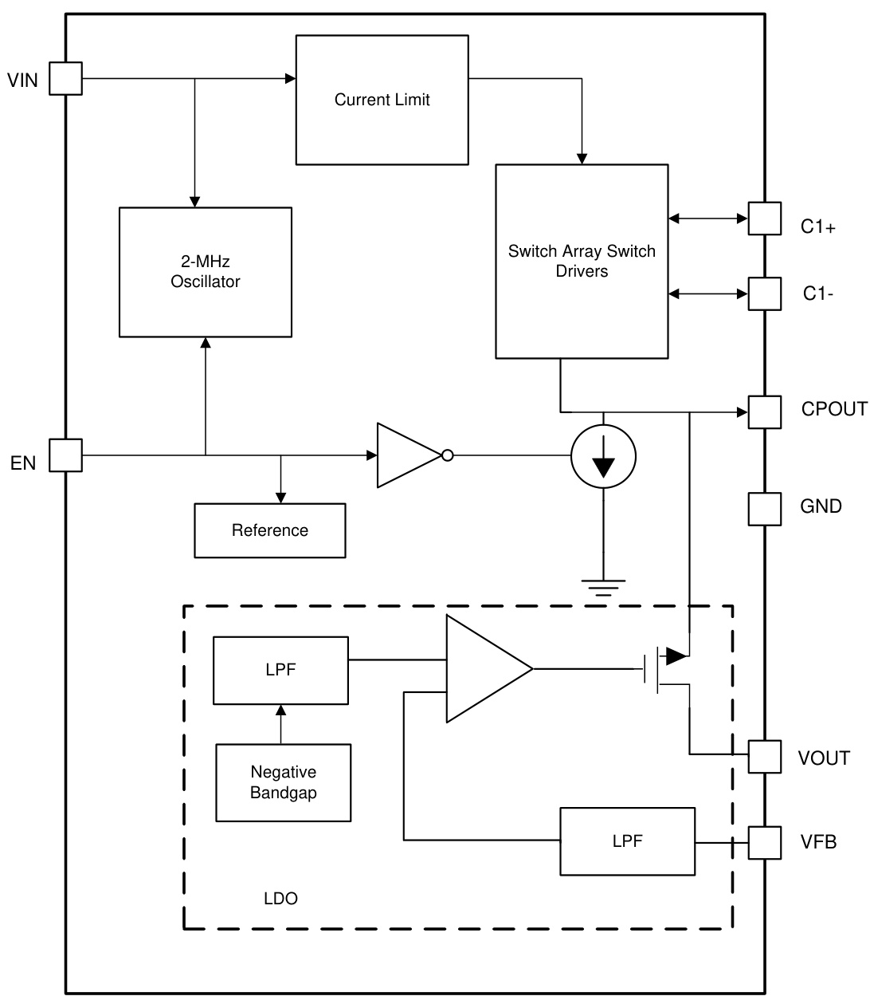

# 6.3 特性说明

# 6.3.1 欠压锁定

LM27761 具有一个内部比较器， 可监测 $\mathsf { V } _ { \mathsf { I N } }$ 上的电压，并在输入电压降至 2.4V 时强制器件关断。 如果输入电压升至 2.6V 以上，则 LM27761 将恢复正常运行。

# 6.3.2 输入电流限值

LM27761 包含电流限制电路， 可在输入电流过大和输出对地短路时保护器件。当输出直接接地短路时，输入电流限制为 500mA（典型值）。 当 LM27761 具有电流限制时，器件中的功率耗散可能非常高。在这种情况下，预计会进行热循环。

# 6.3.3 PFM 操作

为了更大限度地减小轻负载运行期间的静态电流，LM27761 允许 PFM 或脉冲跳跃运行。通过允许电荷泵在输出电流较低时进行较少的切换，可以将从电源汲取的静态电流降至最低。脉冲操作的频率不受限制，空载时会降至低于 2kHz 的范围。随着负载增加，脉冲频率会增加，直到转换为恒定频率。LM27761 中的基础开关频率为2MHz。

# 6.3.4 输出放电

在关断模式下， LM27761 会主动下拉器件的输出， 直到输出电压达到 GND。 在此模式下， 从输出汲取的电流约为 1.85mA。

# 6.3.5 热关断

LM27761 实现了热关断机制， 以防止器件因过热而损坏。 当结温上升至 $\boldsymbol { 1 5 0 ^ { \circ } C }$ （典型值）时，该器件会切换至关断模式。 结温降至 $1 3 0 ^ { \circ } \mathsf { C }$ （典型值）时， LM27761 会退出热关断模式。

热关断最常由自发热触发，当器件功耗过大且热耗散不足时，就会发生这种情况。LM27761 器件功率耗散随着输出电流和输入电压的增加而增加。当自热导致热关断时，热循环是典型结果。热循环是指器件自热进入热关断状态（内部功率耗散几乎为零）、冷却、导通，然后再次升温至热关断阈值的重复过程。热循环可由脉冲输出电压识别，并可通过降低内部功耗（降低输入电压和输出电流）或环境温度来停止。如果在所需的运行条件下发生热循环，则必须提高热耗散性能以适应器件的功率耗散。

# 6.4 器件功能模式

# 6.4.1 关断模式

使能 (EN) 引脚可用于禁用器件并将 LM27761 置于关断模式，从而将静态电流降低至 $7 \mu \mathsf { A }$ 。 在关断模式下，LM27761 的输出由内部上拉电流源 （约为 1.85mA）拉至接地。

# 6.4.2 使能模式

向 EN 引脚施加大于 1.2V 的电压，可将器件置于使能模式。空载时，运行期间的输入电流为 $3 7 0 \mu \mathrm { A }$ 。 随着负载电流的增加，静态电流也会增加。 使能后，输出电压等于输入电压减去电荷泵上的压降的倒数。

# 7 应用和实施

备注

以下应用部分中的信息不属于 TI 器件规格的范围，TI 不担保其准确性和完整性。 TI 的客 户应负责确定器件是否适用于其应用。客户应验证并测试其设计，以确保系统功能。

# 7.1 应用信息

LM27761 低噪声电荷泵电压转换器将 2.7V 至 5.5V 范围内的正电压转换为可通过外部增益设置电阻进行配置的负输出电压。该器件使用四个低成本电容器来提供高达 250mA 的输出电流。LM27761 在 2MHz 振荡器频率下工作，可减少重负载条件下的电荷泵输出电阻和电压纹波。由于工作电流仅为 $3 7 0 \mu \mathrm { A }$ ，且典型关断电流为 $7 \mu \mathsf { A }$ ，LM27761 能够为电池供电系统提供出色的性能。

# 7.2 典型应用 - 稳压电压逆变器

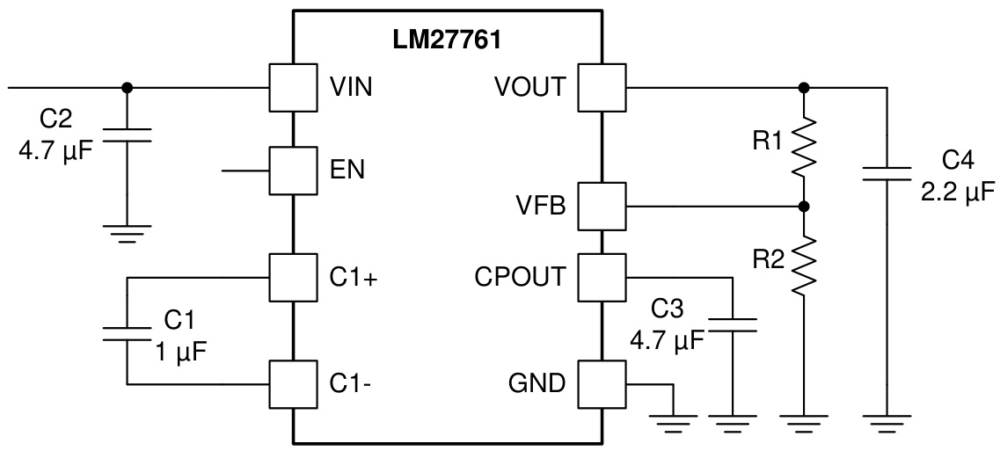  
图 7-1. LM27761 典型应用

# 7.2.1 设计要求

表 7-1 中列出了 LM27761 器件典型应用的要求示例：

表 7-1. 设计参数  

<html><body><table><tr><td>设计参数</td><td>示例值</td></tr><tr><td>输入电压</td><td>2.7V至5.5V</td></tr><tr><td>输出电压</td><td>-1.5V至 -5V</td></tr><tr><td>输出电流</td><td>0mA 至 250mA</td></tr><tr><td>升压开关频率</td><td>2MHz</td></tr></table></body></html>

# 7.2.2 详细设计过程

# 7.2.2.1 电荷泵电压逆变器

LM27761 的主要应用是生成稳压负电源电压。 电压逆变器电路仅使用三个外部电容器， 而 LDO 稳压器电路则使用一个额外的输出电容器。

LM27761 的电压逆变器部分包含四个大型 CMOS 开关，这些开关按顺序切换，从而实现输入电源电压的逆变。能量的传输与储存则由外部电容器完成。图 7-2 展示了电压开关 S2 和 S4 断开。在第二个时间间隔内，S1 和 S3断开；同时，S2 和 S4 闭合，C1 为 C3 充电。经过多个周期后，C3 上的电压会被转换并叠加到 $\mathsf { V } _ { \mathsf { I N } }$ 上。由于 C3的阳极接地，因此当没有负载电流时，C3 阴极的输出等于 – $( \mathsf { V } _ { \mathsf { I N } } )$ 。添加负载后，输出压降由寄生电阻（MOSFET 开关的 RDSON 和电容器的等效串联电阻 (ESR)） 和电容器之间的电荷传输损耗决定。

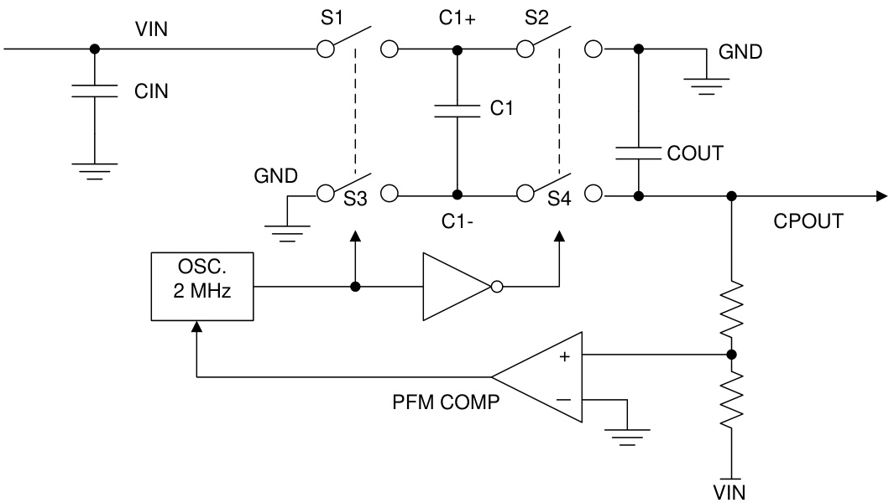  
图 7-2. 电压逆变原理

此电路的输出特性可通过与电阻串联的理想电压源来近似计算。电压源等于 $- \left( \mathsf { V } _ { | \mathsf { N } } \right)$ 。输出电阻 ROUT 是内部MOSFET 开关的导通电阻、振荡器频率、电容以及 C1 和 C3 的 ESR 的函数。由于对 C1 进行充电和放电的开关电流大约是输出电流的两倍，泵电容器 C1 的 ESR 在输出电阻中的影响被放大了四倍。电荷泵输出电容器 C3 以大约等于输出电流的电流进行充电和放电；因此，ESR 在输出电阻中只计算一次。 电荷泵 ROUT 的一个良好近似如 方程式 1 所示：

$$
\mathsf { R } _ { \mathsf { O U T } } = ( 2 \times \mathsf { R } _ { \mathsf { S W } } ) + [ 1 / ( f _ { \mathsf { S W } } \times \mathsf { C } ) ] + ( 4 \times \mathsf { E S R } _ { \mathsf { C } 1 } ) + \mathsf { E S R } _ { \mathsf { C O U T } }
$$

其中

$\mathsf { R } _ { \mathsf { S W } }$ 是内部 MOSFET 开关导通电阻的总和，如图 7-2 所示。使用高电容、 低 ESR 的陶瓷电容器能够降低输出电阻。

# 7.2.2.2 负低压降线性稳压器

在反相电荷泵的输出端， LM27761 采用低压降线性负电压稳压器 (LDO)。 LDO 输出的额定电流为 250mA。 该负LDO 使器件能够提供非常低的噪声输出、 低输出电压纹波、 高 PSRR 和低线路或负载瞬态响应。

# 7.2.2.3 功率耗散

任何封装的允许功耗是衡量器件将热量从器件的接合点传递到散热器和周围环境的能力。 因此，功率耗散取决于环境温度以及芯片结与环境空气之间各种接口上的热阻。

允许的最大功率耗散可通过方程式 2 计算得出：

$$
P _ { D - M A X } = ( T _ { J - M A X } - T _ { A } ) / R _ { \theta J A }
$$

器件中耗散的实际功率可通过方程式 3 表示：

$$
\mathsf { P } _ { \mathsf { D } } = \mathsf { P } _ { \mathsf { I N } } \mathrm { ~  ~ \cdot ~ } \mathsf { P } _ { \mathsf { O U T } } = [ \mathsf { V } _ { \mathsf { I N } } \times ( \mathrm { ~ - ~ } \mathsf { I } _ { \mathsf { O U T } } + \mathsf { I } _ { \mathsf { Q } } ) \mathrm { ~ - ~ } ( \mathsf { V } _ { \mathsf { O U T } } \times \mathsf { I } _ { \mathsf { O U T } } ) ]
$$

方程式 2 和方程式 3 建立了出于散热考虑所导致的最大允许功率耗散、 器件上的压降和器件的持续电流能力之间的关系。 必须使用这些公式来确定器件在指定应用中的理想工作条件。

在功率耗散较低的应用中，可以提高最高环境温度 (TA-MAX)。 在功率耗散较高的应用中， 最高环境温度 (TA-MAX)可能必须降低。 可以使用方程式 4 计算出 TA-MAX：

$$
T _ { A - M A X } = T _ { 1 - M A X - O P } - ( R _ { \textrm { \theta J A } } \times P _ { D - M A X } )
$$

其中

TJ-MAX-OP $\mathbf { \tau } = \mathbf { \tau }$ 最大工作结温 $( 1 2 5 ^ { \circ } \mathsf { C } )$ PD-MAX $\mathbf { \sigma } = \mathbf { \sigma }$ 允许的最大功率耗散${ \mathsf { R } } _ { \oplus } \mathsf { \lrcorner A } =$ 封装的结温至环境温度热阻

或者，如果 TA-MAX 无法降低，则必须减小功率耗散值。这可通过以下方式来实现：降低输入电压（只要满足最小$\mathsf { V } _ { \mathsf { I N } }$ 条件）、减小输出电流，或通过这两者的某种组合来实现。

# 7.2.2.4 输出电压设置

可从外部配置 LM27761 的输出电压。 R1 和 R2 的值确定了输出电压设置。 输出电压可根据方程式 5 进行计算：

$$
\mathsf { V } _ { \mathsf { O U T } } = \mathrm { ~ - ~ } 1 . 2 2 \mathsf { V } \times ( \mathsf { R } 1 + \mathsf { R } 2 ) / \mathsf { R } 2
$$

R2 的值不得小于 $5 0 \mathsf { k } \Omega$ 。

# 7.2.2.5 外部电容器选型

LM27761 需要 4 个外部电容器才能正常运行。 TI 建议使用表面贴装多层陶瓷电容器。 这些电容器体积小、 价格低廉，并且 ESR 非常低（典型值 $\leqslant 1 5 \mathsf { m } \Omega$ ）。 由于与陶瓷电容器相比具有高 ESR，TI 通常不建议将钽电容器、OS-CON 电容器和铝电解质电容器与 LM27761 配合使用。

对于大多数应用，最好将具有 X7R 或 X5R 温度特性的陶瓷电容器与 LM27761 配合使用。 这些电容器具有严格的电容容差（高达 $\pm 1 0 \%$ ），并在温度范围内保持该值（ $x 7 R : - 5 5 ^ { \circ } C$ 至 $+ 1 2 5 ^ { \circ } \mathsf { C }$ 范围内为 $\pm 1 5 \%$ ；X5R 在 – $\angle 5 5 ^ { \circ } \mathsf { C }$ 至 $+ 8 5 ^ { \circ } \mathsf { C }$ 范围内为 $\pm 1 5 \%$ ）

TI 不建议为 LM27761 使用具有 Y5V 或 Z5U 温度特性的电容器。这些电容器通常具有宽电容容差（ $80 \%$ 、 ……$20 \%$ ）并随温度变化而显著变化（Y5V：22%、 $- 8 2 \%$ （在 – $3 0 ^ { \circ } \mathsf { C }$ 至 $+ 8 5 ^ { \circ } \mathsf { C }$ 范围内）；Z5U：22%、–56%（在 $1 0 ^ { \circ } \mathsf { C }$ 到 $8 5 ^ { \circ } \mathrm { C }$ 范围内）。在某些情况下，额定值为 1µF 的 Y5V 或 Z5U 电容器的电容可以低至 $0 . 1 \mu \mathsf { F }$ 。这种不利偏差可能会导致 Y5V 和 Z5U 电容器不符合 LM27761 的最小电容要求。

陶瓷电容器的净电容随着直流偏置的增加而降低。这种性能下降会导致输入和输出端的电容低于预期，从而导致纹波电压和电流更高。在明显低于电容器额定电压的直流偏置电压下使用电容器通常可将直流偏置影响降至最低。有关电容器直流偏置特性的信息，请咨询电容器制造商。

电容特性会随不同的应用条件、 电容器类型和电容器制造商而明显不同。TI 强烈建议在设计过程的早期使用大规模生产电容器，对 LM27761 电路进行全面评估。 此操作有助于确保电容的任何此类变化都不会对电路性能产生负面影响。

# 7.2.2.5.1 电荷泵输出电容器

在典型应用中，TI 建议使用 $4 . 7 \mu \ F$ 低 ESR 陶瓷电荷泵输出电容器 (C3)。 可以使用不同的输出电容值来降低电荷泵纹波、缩小设计尺寸并降低解决方案的成本。但是，更改输出电容器也需要更改飞跨电容器或输入电容器，以保持良好的整体电路性能。

在高电流应用中， TI 建议使用 $1 0 \mu \mathsf { F }$ 、 10V 低 ESR 陶瓷输出电容器。 如果使用小型输出电容器， 则在 PFM 模式和恒定开关之间转换期间，输出纹波可能会变大。 为了防止切换， TI 建议使用 2µF 电容。 例如， 外壳尺寸为0402 的 10µF、 10V 输出电容器在偏置到 5V 时通常只有 $2 \mu \mathsf { F }$ 电容。

# 7.2.2.5.2 输入电容器

输入电容器 (C2) 是一个电荷库，有助于在充电阶段将电荷从电源快速转移到飞跨电容器。当飞跨电容器连接到输入端时，输入电容器有助于防止充电阶段开始时输入电压下降。输入电容器还滤除输入引脚上的噪声，从而使该噪声不受从输入线路偏置的敏感内部模拟电路的影响。

输入电容对输入纹波幅度有主要的一阶效应。增加（降低）输入电容会使输入电压纹波成比例降低（升高）。输入电压、输出电流和飞跨电容也会在一定程度上影响输入纹波水平。

在典型应用中，TI 建议在输入端使用 $4 . 7 \mu \ F$ 低 ESR 陶瓷电容器。在 250mA 最大负载附近运行时，考虑到直流偏置降额后，建议的最小输入电容为 $2 \mu \mathsf { F }$ 或更大。 可以使用不同的输入电容值来降低纹波、缩小设计尺寸并降低解决方案成本。

# 7.2.2.5.3 飞跨电容器

飞跨电容器 (C1) 将电荷从输入端转移到输出端。飞跨电容器可影响输出电流能力和纹波幅度。如果飞跨电容太小，则 LM27761 无法在负载电流较高时调节输出电压。 如果飞跨电容太大，则飞跨电容器会超出输入和电荷泵输出电容器的电压，从而导致输入和输出纹波增加。

在典型的高电流应用中，TI 建议将 $0 . 4 7 \mu \mathsf { F }$ 或 1µF 10V 低 ESR 陶瓷电容器用作飞跨电容器。 极化电容器（钽、铝、电解质电容器等）不得用于飞跨电容器， 因为极化电容器可能会在 LM27761 操作期间反向偏置。

# 7.2.2.5.4 LDO 输出电容器

LDO 输出电容器 (C4) 值和 ESR 会影响稳定性、 输出纹波、 输出噪声、 PSRR 和瞬态响应。 LM27761 只需使用$2 . 2 \mu \ F$ 陶瓷输出电容器即可实现稳定运行。 对于典型应用， 靠近输出端的 $2 . 2 \mu \ F$ 陶瓷输出电容器便足够。

# 7.2.3 应用曲线

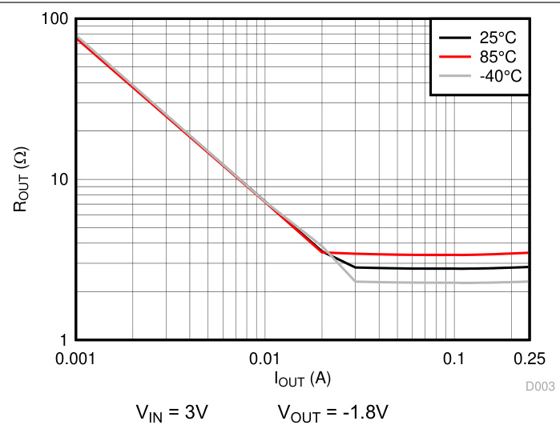  
图 7-3. 电荷泵输出阻抗与输出电流间的关系

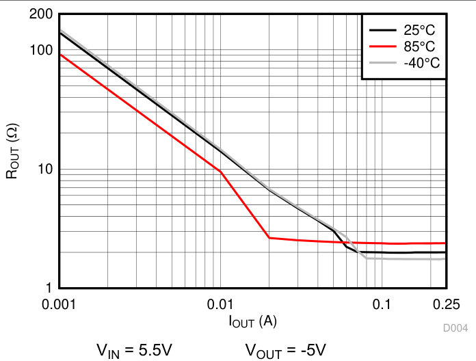  
图 7-4. 电荷泵输出阻抗与输出电流间的关系

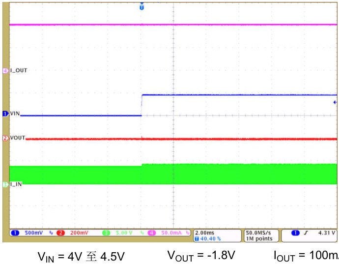  
图 7-5. 线路阶跃

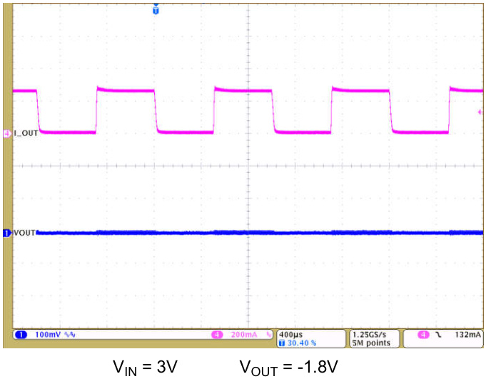  
图 7-6. 负载阶跃

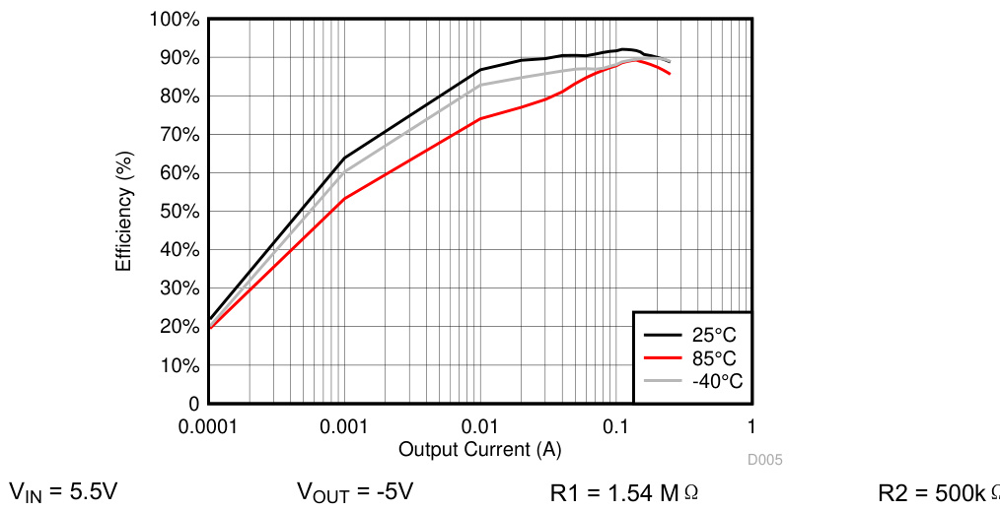  
图 7-7. 效率与输出电流之间的关系

# 7.3 电源相关建议

LM27761 可在 2.7V 至 5.5V 的输入电源电压范围内运行。此输入电源必须经过良好调节，且能提供所需的输入电流。如果输入电源距离 LM27761 较远， 则除了陶瓷旁路电容器之外可能还需要额外的大容量电容。

# 7.4 布局

# 7.4.1 布局指南

LM27761 的高开关频率和大开关电流使布局选择变得至关重要。将以下步骤作为参考遵循， 以确保器件保持稳定，并在其目标工作电压和电流范围内保持适当的 LED 电流调节：

将 CIN 放置在顶层（与 LM27761 同层）并尽可能靠近器件。通过短而宽的布线将输入电容器连接到 VIN 和GND 引脚，可减少开关期间出现的可能会使 VIN 线路损坏的电感电压尖峰。  
将 CCPOUT 放置在顶层（与 LM27761 同层）并尽可能靠近 VOUT 和 GND 引脚。 CIN 和 CCPOUT 的回路必须在一个点上连接，并尽可能靠近 GND 引脚。通过短而宽的布线连接 CCPOUT，可减小 VCPOUT 和 GND引脚上的串联电感， 否则可能会破坏 VCPOUT 和 GND 线路，并导致器件和周围电路中出现过多噪声。将 C1 放置在顶层（与 LM27761 同层）并尽可能靠近器件。 通过短而宽的布线将飞跨电容器连接到 $\cot +$ 和C1– 引脚。  
将 COUT 放置在顶层（与 LM27761 同层）并尽可能靠近 VOUT 引脚。 为了获得最佳性能， COUT 的接地连接必须重新连接到器件散热焊盘上的 GND 连接。  
将 R1 和 R2 放置在顶层（与 LM27761 同层）并尽可能靠近 VFB 引脚。 为了获得出色性能， R2 的接地连接必须重新连接到器件散热焊盘处的 GND 连接。

必须避免使用较长的布线长度、较窄的布线宽度或通过过孔进行连接。 这些连接会增加寄生电感和电阻， 导致性能下降，尤其是在瞬态条件下。

# 7.4.2 布局示例

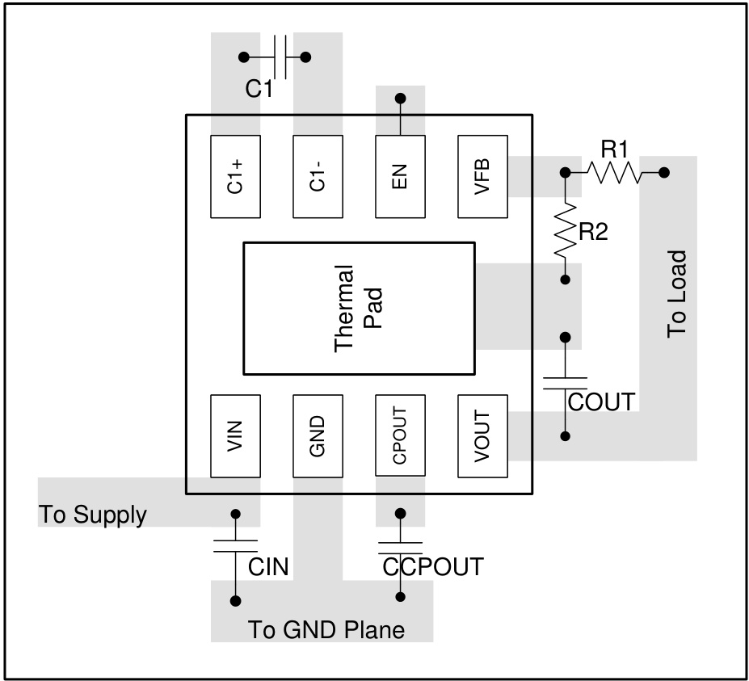  
图 7-8. LM27761 布局示例

# 8 器件和文档支持

# 8.1 接收文档更新通知

要接收文档更新通知， 请导航至 ti.com 上的器件产品文件夹。点击通知 进行注册， 即可每周接收产品信息更改摘要。有关更改的详细信息， 请查看任何已修订文档中包含的修订历史记录。

# 8.2 支持资源

TI E2E™ 中文支持论坛是工程师的重要参考资料， 可直接从专家处获得快速、 经过验证的解答和设计帮助。 搜索现有解答或提出自己的问题， 获得所需的快速设计帮助。

链接的内容由各个贡献者“按原样” 提供。 这些内容并不构成 TI 技术规范，并且不一定反映 TI 的观点；请参阅TI 的使用条款。

# 8.3 商标

TI E2E™ is a trademark of Texas Instruments.  
所有商标均为其各自所有者的财产。

# 8.4 静电放电警告

静电放电 (ESD) 会损坏这个集成电路。 德州仪器 (TI) 建议通过适当的预防措施处理所有集成电路。 如果不遵守正确的处理和安装程序，可能会损坏集成电路。  
ESD 的损坏小至导致微小的性能降级，大至整个器件故障。 精密的集成电路可能更容易受到损坏，这是因为非常细微的参数更改都可能会导致器件与其发布的规格不相符。

# 8.5 术语表

# TI 术语表

本术语表列出并解释了术语、 首字母缩略词和定义。

# 9 修订历史记录

# Changes from Revision C (January 2017) to Revision D (October 2025)

Page

从数据表中删除了所有与 WEBENCH 相关的信息.  
更新了整个文档中的表格、 图和交叉参考的编号格式.

# Changes from Revision B (February 2016) to Revision C (January 2017) Page

添加了 WEBENCH 链接.

# 10 机械、 封装和可订购信息

以下页面包含机械、封装和可订购信息。这些信息是指定器件可用的最新数据。 数据如有变更，恕不另行通知，且不会对此文档进行修订。有关此数据表的浏览器版本，请查阅左侧的导航栏。

<html><body><table><tr><td>Orderable part number</td><td>Status (1)</td><td>Material type (2)</td><td>Package Pins</td><td>Package qty | Carrier</td><td>RoHS (3)</td><td>Lead finish/ Ball material</td><td>MSL rating/ Peak reflow</td><td>Op temp (°℃)</td><td>Part marking (6)</td></tr><tr><td>LM27761DSGR</td><td>Active</td><td>Production</td><td>WSON (DSG) I</td><td>3000 |LARGE T&R</td><td>Yes</td><td>NIPDAU</td><td>Level- -260C-UNLIM</td><td>-40 to 85</td><td>ZGLI</td></tr><tr><td>LM27761DSGR.A</td><td>Active</td><td>Production</td><td>NSON (DSG)</td><td>3000 ARGE T&R</td><td>Yes</td><td>NIPDAU</td><td>evel- 260C-UNLIM</td><td>40 to 125</td><td>ZGLI</td></tr><tr><td>LM27761DSGRG4</td><td>Active</td><td>Production</td><td>NSON DSG)</td><td>3000 ARGET&R</td><td>Yes</td><td>NIPDAU</td><td>Level-1-260C-UNLIM</td><td>40 to 125</td><td>ZGLI</td></tr><tr><td>LM27761DSGRG4.A</td><td>Active</td><td>Production</td><td>WSON (DSG) I</td><td>3000 |LARGE T&R</td><td>Yes</td><td>NIPDAU</td><td>Level -260C-UNLIM</td><td>40 to 125</td><td>ZGLI</td></tr><tr><td>LM27761DSGT</td><td>Active</td><td>Production</td><td>WSON (DSG)|</td><td>250 SMALL T&R</td><td>Yes</td><td>NIPDAU</td><td>Level- 1-260C-UNLIM</td><td>40 to 85</td><td>ZGLI</td></tr><tr><td>LM27761DSGT.A</td><td>Active</td><td>Production</td><td>WSON (DSG)|8</td><td>250|SMALL T&R</td><td>Yes</td><td>NIPDAU</td><td>Level-1-260C-UNLIM</td><td>-40 to125</td><td>ZGLI</td></tr></table></body></html>

(1) Status: For more details on status, see our product life cycle.

(2) Material type: When designated, preproduction parts are prototypes/experimenta devices, and are not yet approved or released for full production. Testing and final process, including without limitation quality assurance, reliability performance testing, and/or process qualif ication may not yet be complete, and this item subject to further changes or possible discontinuation. available for ordering, purchases wil be subject to an additional waiver at checkout, and are intended for early internal evaluation purposes only. These items are sold without warranties of any kind.

(3) RoHS values: Yes, No, RoHS Exempt. See the TI RoHS Statement for additional information and value definition.

(4) Lead finish/Ball material:  Parts may have multiple material finish options. Finish options are separated by a vertical ruled line. Lead finish/Ball material values may wrap to two lines if the finish value exceeds the maximum column width.

: The moisture sensitivity level ratings and peak solder (reflow) temperatures. In the event that part has multiple moisture sensitivity ratings, only the lowest level per JEDEC standards is shown.   
for the actual reflow temperature that will be used to mount the part to the printed circuit board.

6) Part marking: There may be an additional marking, which relates to the logo, the lot trace code information, or the environmental category of the part.

Multiple part markings will be inside parentheses. Only one part marking contained in parentheses and separated by "\~" will appear on a part. If a line is indented then it is continuation of the previous line and the two combined represent the entire part marking for that device.

Important Information and Disclaimer:The information provided on this page represents TI's knowledge and belief as of the date that it is provided. TI bases its knowledge and belief on information provided by third parties, and makes no representation or warranty as to the accuracy of such information. Efforts are underway to better integrate information from third parties. TI has taken and continues to take reasonable steps to provide representative and accurate information but may not have conducted destructive testing or chemical analysis on incoming materials and chemicals. TI and TI suppliers consider certain information to be proprietary, and thus CAS numbers and other limited information may not be available for release.

no event shall TI's liability arising out of such information exceed the total purchase price of the TI part(s) at issue in this document sold by TI to Customer on an annual basis.

# TAPE AND REEL INFORMATION

<html><body><table><tr><td>A0</td><td>Dimension designed to accommodate the component width</td></tr><tr><td>B0</td><td>Dimension designed to accommodate the component length</td></tr><tr><td>K0</td><td>Dimension designed to accommodate the component thickness</td></tr><tr><td>W</td><td>Overall width of the carrier tape</td></tr><tr><td>P1</td><td>Pitch successive cavity centers between</td></tr></table></body></html>

# QUADRANT ASSIGNMENTS FOR PIN ORIENTATION IN TAPE

\*All dimensions are nominal   

<html><body><table><tr><td rowspan="2">Device</td><td rowspan="2">Package Type</td><td rowspan="2">Package Drawing</td><td rowspan="2">Pins</td><td rowspan="2">SPQ</td><td rowspan="2">Reel Diameter (mm)</td><td rowspan="2">Reel Width W1 (mm)</td><td rowspan="2">AO (mm)</td><td rowspan="2">B0 (mm)</td><td rowspan="2">KO (mm)</td><td rowspan="2">P1 (mm)</td><td rowspan="2">W (mm)</td><td rowspan="2">Pin1 Quadrant</td></tr><tr><td></td></tr><tr><td>LM27761DSGR</td><td>WSON</td><td>DSG</td><td>8</td><td>3000</td><td>180.0</td><td>8.4</td><td>2.3</td><td>2.3</td><td>1.15</td><td>4.0</td><td>8.0</td><td>Q2</td></tr><tr><td>LM27761DSGRG4</td><td>WSON</td><td>DSG</td><td>8</td><td>3000</td><td>180.0</td><td>8.4</td><td>2.3</td><td>2.3</td><td>1.15</td><td>4.0</td><td>8.0</td><td>Q2</td></tr><tr><td>LM27761DSGT</td><td>WSON</td><td>DSG</td><td>8</td><td>250</td><td>180.0</td><td>8.4</td><td>2.3</td><td>2.3</td><td>1.15</td><td>4.0</td><td>8.0</td><td>Q2</td></tr></table></body></html>

\*All dimensions are nominal   

<html><body><table><tr><td>Device</td><td>Package Type</td><td>Package Drawing</td><td>Pins</td><td>SPQ</td><td>Length (mm)</td><td>Width (mm)</td><td>Height (mm)</td></tr><tr><td>LM27761DSGR</td><td>WSON</td><td>DSG</td><td>8</td><td>3000</td><td>210.0</td><td>185.0</td><td>35.0</td></tr><tr><td>LM27761DSGRG4</td><td>WSON</td><td>DSG</td><td>8</td><td>3000</td><td>210.0</td><td>185.0</td><td>35.0</td></tr><tr><td>LM27761DSGT</td><td>WSON</td><td>DSG</td><td>8</td><td>250</td><td>210.0</td><td>185.0</td><td>35.0</td></tr></table></body></html>

# 2 x 2, 0.5 mm pitch

PLASTIC SMALL OUTLINE NO LEAD

This image is a representation of the package family, actual package may vary. Refer to the product data sheet for package details.

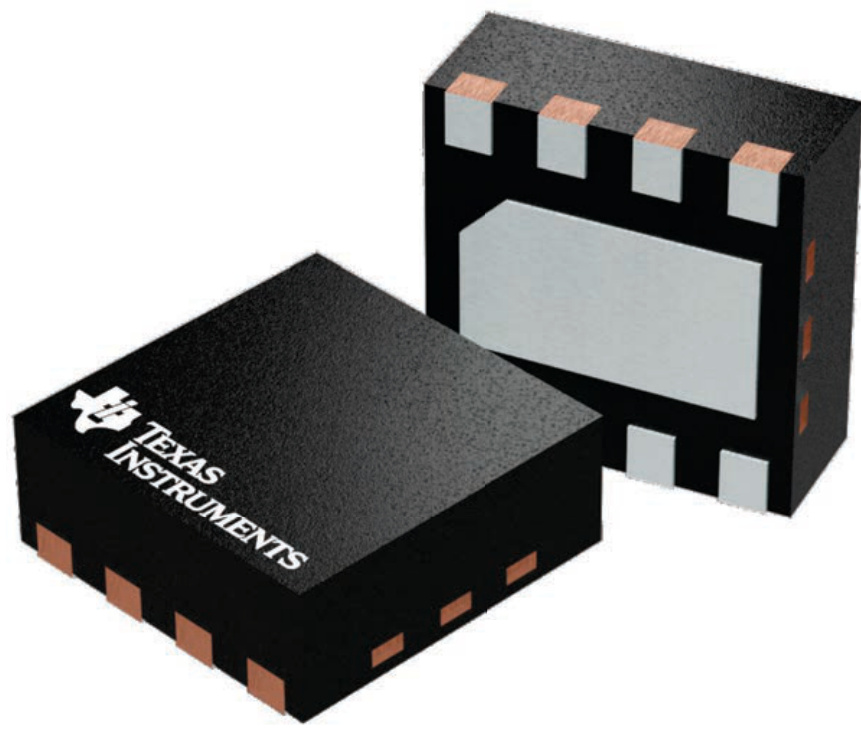

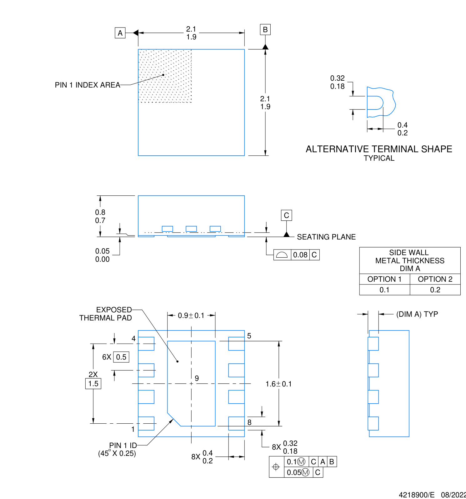

NOTES:

1. All linear dimensions are in millimeters. Any dimensions in parenthesis are for reference only. Dimensioning and tolerancing per ASME $\mathsf { Y 1 4 . 5 M }$ .   
2. This drawing is subject to change without notice.   
3. The package thermal pad must be soldered to the printed circuit board for thermal and mechanical performance.   
4. This package is designed to be soldered to a thermal pad on the board. For more information, see Texas Instruments literature number SLUA271 (www.ti .com/lit/slua271).   
5. Vias are optional depending on application, refer to device data sheet. If any vias are implemented, refer to their locations shown on this view. It is recommended that vias under paste be filled, plugged or tented.

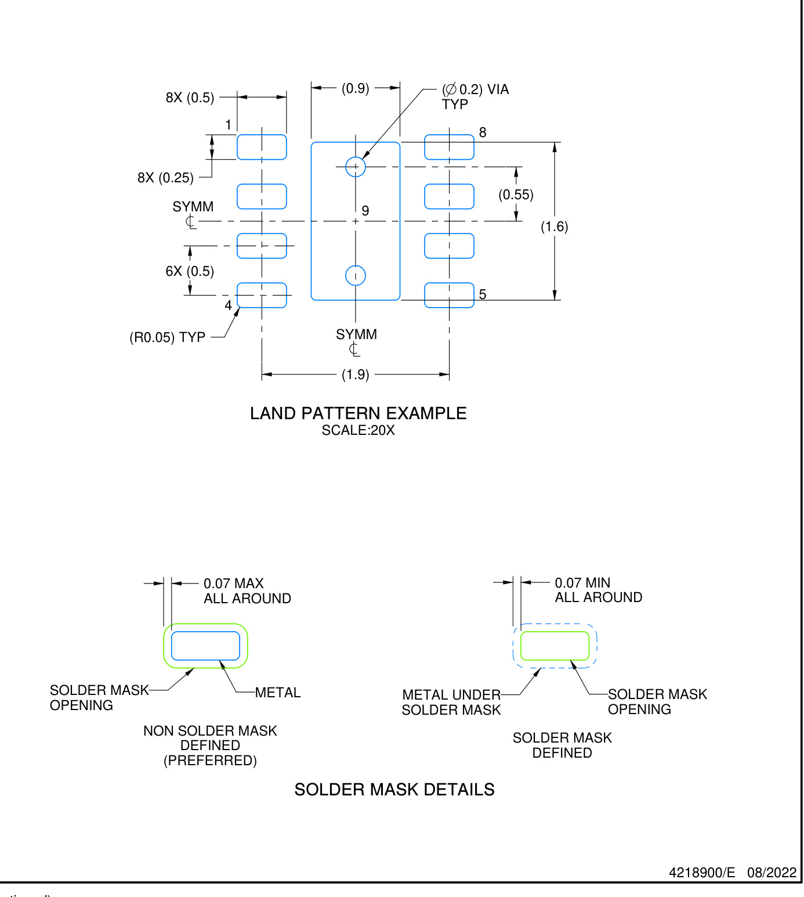  
NOTES: (continued)

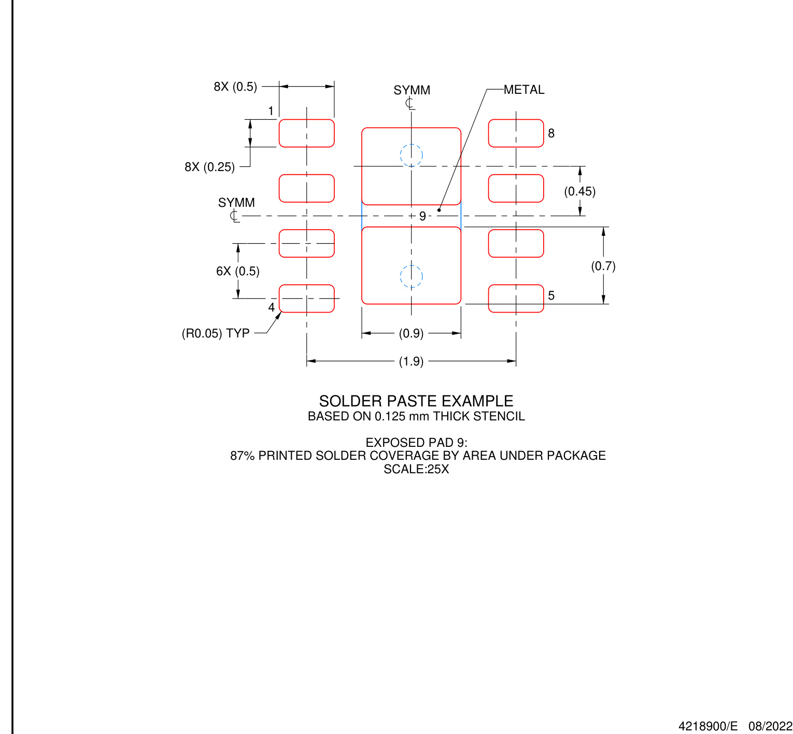  
NOTES: (continued)

6. Laser cutting apertures with trapezoidal walls and rounded corners may offer better paste release. IPC-7525 may have alternate design recommendations.

# 重要通知和免责声明

TI“按原样”提供技术和可靠性数据 （包括数据表） 、 设计资源（包括参考设计）、 应用或其他设计建议、 网络工具、 安全信息和其他资源， 不保证没有瑕疵且不做出任何明示或暗示的担保， 包括但不限于对适销性、 与某特定用途的适用性或不侵犯任何第三方知识产权的暗示担保。

这些资源可供使用 TI 产品进行设计的熟练开发人员使用。 您将自行承担以下全部责任： (1) 针对您的应用选择合适的 TI 产品， (2) 设计、 验证并测试您的应用， (3) 确保您的应用满足相应标准以及任何其他安全、 安保法规或其他要求。

这些资源如有变更，恕不另行通知。TI 授权您仅可将这些资源用于研发本资源所述的 TI 产品的相关应用。严禁以其他方式对这些资源进行复制或展示。您无权使用任何其他 TI 知识产权或任何第三方知识产权。对于因您对这些资源的使用而对 TI 及其代表造成的任何索赔、损害、成本、损失和债务， 您将全额赔偿，TI 对此概不负责。

TI 提供的产品受 TI 销售条款)、 TI 通用质量指南 或 ti.com 上其他适用条款或 TI 产品随附的其他适用条款的约束。TI 提供这些资源并不会扩展或以其他方式更改 TI 针对 TI 产品发布的适用的担保或担保免责声明。 除非德州仪器 (TI) 明确将某产品指定为定制产品或客户特定产品，否则其产品均为按确定价格收入目录的标准通用器件。

TI 反对并拒绝您可能提出的任何其他或不同的条款。