# 具有 4A 开关的 TPS6302x 高效率单电感器降压/升压转换器

# 1 特性

输入电压范围： 1.8V 至 5.5V  
可调节输出电压： 1.2V 至 5.5V  
$\mathsf { V } _ { \mathsf { I N } } > 2 . 5 \mathsf { V }$ 、 $\mathsf { V } _ { \mathsf { O U T } } = 3 . 3 \mathsf { V }$ 时， 输出电流为 2A

在整个负载范围内具有高效率静态工作电流： $2 5 \mu \ A$ 支持模式选择的省电模式

平均电流模式降压/升压架构

模式间自动转换  
2.4MHz 固定频率工作  
可同步

电源正常状态输出

安全、 可靠运行 特性过热和过压保护关断期间负载断开

借助以下工具创建定制设计方案：TPS63020， 使用 WEBENCH 电源设计器TPS63021， 使用 WEBENCH 电源设计器

# 2 应用

电池供电设备前置稳压器： EPOS （便携式数据终端、条形码扫描仪）、 电子烟、单板计算机、IP 网络摄像头、可视门铃、陆地移动无线电稳压器：有线通信、无线通信、PLC、光学模块超级电容器备用电源： 电表、企业级固态硬盘(SSD)

# 简化电路原理图

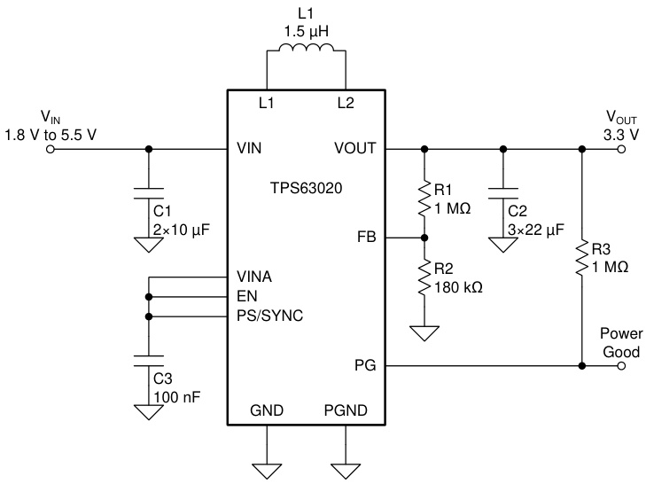

# 3 说明

TPS6302x 器件可以为由两节或三节碱性电池、镍镉电池或镍氢电池或单节锂离子电池或锂聚合物电池、超级电容器或其他电源轨供电的产品提供电源解决方案。支持高达 3A 的输出电流。使用电池时，可以放电到 2V以下。该降压/升压转换器基于一个使用同步整流的固定频率、脉宽调制 (PWM) 控制器来获得最高效率。在负载电流较低的情况下，该转换器会进入节能模式，以在宽负载电流范围内保持高效率。禁用省电模式则会强制转换器以固定开关频率运行。开关的最大平均电流为4A（典型值）。输出电压可通过外部电阻分频器进行编程，或者在内部芯片上固定。转换器可被禁用以最大限度地减少电池消耗。在关断期间，负载从电池上断开。

TPS6302x 器件在自然通风环境下运行的温度范围为$- 4 0 ^ { \circ } \mathsf { C }$ 至 $8 5 ^ { \circ } \mathsf { C }$ 。 该器件采用 $3 \mathsf { m m } \times 4 \mathsf { m m }$ (DSJ) 14引脚 VSON 封装。

器件信息(1)  

<html><body><table><tr><td>器件型号</td><td>输出电压</td><td>封装</td></tr><tr><td>TPS63020</td><td>可调节</td><td rowspan="2">VSON (14)</td></tr><tr><td>TPS63021</td><td>3.3V</td></tr></table></body></html>

(1) 要了解所有可用封装， 请参见数据表末尾的可订购数据表。

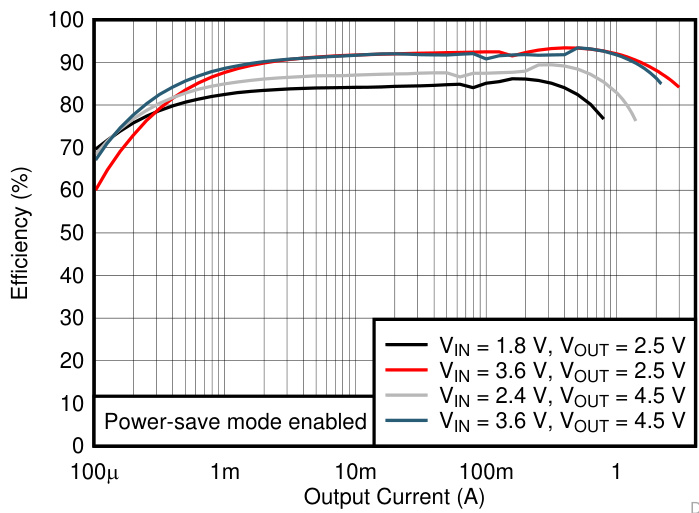  
效率与输出电流间的关系

# 目录

1 特性.   
2 应用. 1   
3 说明. 1   
4 修订历史记录 2   
5 Pin Configuration and Functions ........................ 4   
6 Specifications.. 5   
6.1 Absolute Maximum Ratings . 5   
6.2 ESD Ratings. 5   
6.3 Recommended Operating Conditions. … 5   
6.4 Thermal Information . 5   
6.5 Electrical Characteristics   
6.6 Typical Characteristics ........................................   
7 Detailed Description 8   
7.1 Overview : 8   
7.2 Functional Block Diagram 8   
7.3 Feature Description. . - 9   
7.4 Device Functional Modes. 10   
8 Application and Implementation 13   
8.1 Application Information. 13   
8.2 Typical Application 13   
8.3 System Examples 21

# 9 Power Supply Recommendations. 23

# 10 Layout. 23

10.1 Layout Guidelines 23   
10.2 Layout Example 23   
10.3 Thermal Considerations 24

# 11 器件和文档支持 25

11.1 接收文档更新通知 25  
11.2 器件支持. . 25  
11.3 文档支持. 25  
11.4 相关链接. 25  
11.5 支持资源 25  
11.6 商标 ..... 25  
11.7 静电放电警告 26  
11.8 Glossary ... 26

# 12 机械、 封装和可订购信息 26

# 4 修订历史记录

# Changes from Revision H (August 2019) to Revision I Page

Changed ESD numbers to reflect latest test insights .......................................... 5 Changed Footnotes in order to reflect wording of latest JEP155 and JEP157 specifications … Changed $v _ { F B }$ naming and description for better readability

# Changes from Revision G (March 2019) to Revision H Page

Changed R3 68 kΩ To: R4 68 kΩ in Figure 28 . 2

# Changes from Revision F (March 2019) to Revision G Page

更改了“简化原理图”， 删除了从 VINA 到 VIN 的连接.............................. … Changed Figure 7, removed the connection from VINA to VIN 13 Changed Figure 28, removed the connection from VINA to VIN 21

# Changes from Revision E (May 2017) to Revision F Page

更新了 特性 和 应用 （第 1 页）   
将器件信息表中的“封装尺寸”列改为“输出电压”.   
Changed the Pin Configuration image   
Changed Chapter order in Application Information 13 Updated output capacitor selection section ........ 15 Added Table of Typical Characteristics Curves. 17 Changed Figure 24 and Figure 25 19 Added Figure 26 and Figure 27 20 Changed Figure 28 ..................... 21 Added system examples Supercapacitor Backup Power Supply With Active Cell Balancing and Low-Power TEC Driver 22

# Changes from Revision D (October 2015) to Revision E

# Page

Added Voltage AC-spec to Absolute Maximum Ratings table for L1, L2. 5

Changes from Revision C (February 2013) to Revision D Page

已添加 添加了处理额定值表、 特性说明部分、 器件功能模式、 应用和实施部分、 电源相关建议部分、 布局部分、器件和文档支持部分以及机械、 封装和可订购信息 部分 .......................................................................................................

# Changes from Revision B (August 2012) to Revision C Page

Changed Figure 7 schematic to show correct component values. … 13   
Changed Figure 28 schematic to show correct component values. 21

Changes from Revision A (December 2011) to Revision B Page

Changed the Duty cycle in step down conversion values, added $M | N = 2 0 \%$ , deleted $\mathsf { T Y P } = 3 0 \%$ and MAX = 40% .......... 6

Changes from Original (April 2010) to Revision A Page

Updated Figure 31 PCB Layout Suggestion . 23

# 5 Pin Configuration and Functions

DSJ Package 14-Pin VSON with Exposed Thermal Pad Top View

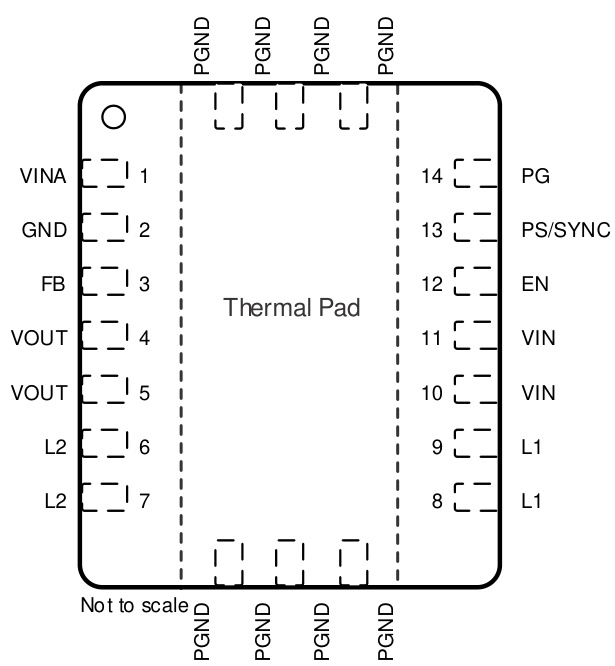

# Pin Functions

<html><body><table><tr><td colspan="2">PIN</td><td rowspan="2">I/O</td><td rowspan="2">DESCRIPTION</td></tr><tr><td>NAME</td><td>NO.</td></tr><tr><td>EN</td><td>12</td><td></td><td>Enable input (1 enabled, 0 disabled) must not be left open</td></tr><tr><td>FB</td><td>3</td><td></td><td>Voltage feedback of adjustable versions, must be connected to VOUT on fixed output voltage</td></tr><tr><td>GND</td><td>2</td><td></td><td>versions Control logic ground</td></tr><tr><td>L1</td><td>8,9</td><td></td><td>Connection for inductor</td></tr><tr><td>L2</td><td>6,7</td><td></td><td>Connection for inductor</td></tr><tr><td>PG</td><td>14</td><td>0</td><td>Output power good (1 good, 0 failure; open-drain), can be left open</td></tr><tr><td>PGND</td><td></td><td></td><td>ground Power</td></tr><tr><td>PS/SYNC</td><td>13</td><td></td><td>Enable / disable power save mode (1 disabled, 0 enabled, clock signal for synchronization), must</td></tr><tr><td>VIN</td><td>10, 11</td><td></td><td>not be left open Supply voltage for power stage</td></tr><tr><td>VINA</td><td></td><td></td><td>Supply voltage for control stage</td></tr><tr><td>VOUT</td><td>4,5</td><td></td><td>Buck-boost converter output</td></tr><tr><td>Exposed Thermal Pad</td><td></td><td></td><td>The exposed thermal pad is connected to PGND.</td></tr></table></body></html>

# 6 Specifications

# 6.1 Absolute Maximum Ratings

ver operating free-air temperature range (unless otherwise noted)(1)

<html><body><table><tr><td colspan="2"></td><td>MIN</td><td>MAX</td><td>UNIT</td></tr><tr><td rowspan="3">Voltage(2)</td><td>VIN, VINA, VOUT, PS/SYNC, EN, FB, PG</td><td>-0.3</td><td>7</td><td></td></tr><tr><td>L1, L2 (DC)</td><td>-0.3</td><td>7</td><td></td></tr><tr><td>L1, L2 (AC, less than 10 ns) (3)</td><td>-3</td><td>10</td><td>V</td></tr><tr><td colspan="2">Operating junction temperature, TJ</td><td>-40</td><td>150</td><td>C</td></tr><tr><td colspan="2">Storage temperature, Tstg</td><td>-65</td><td>150</td><td>°C</td></tr></table></body></html>

(1) Stresses beyond those listed under Absolute Maximum Ratings may cause permanent damage to the device. These are stress ratings only, and functional operation of the device at these or any other conditions beyond those indicated under Recommended Operating Conditions i s not implied. Exposure to absolute-maximum-rated conditions fo extended periods my affect device reliability.   
(23) All voltages are with respect to network ground terminal. Normal switching operation

# 6.2 ESD Ratings

<html><body><table><tr><td colspan="3"></td><td>VALUE</td><td>UNIT</td></tr><tr><td rowspan="3">V(ESD)</td><td rowspan="3">Electrostatic discharge</td><td>Human body model (HBM), per ANSI/ESDA/JEDEC JS-001, pins VIN, VINA, L1 (1)</td><td>±500</td><td rowspan="3"></td></tr><tr><td>ANSI/ESDA/JEDEC JS-001</td><td>±2000</td></tr><tr><td>Charged device model (CDM), per JEDEC specification JESD22-C101, all pins (2)</td><td>±1500</td></tr></table></body></html>

(1) JEDEC document JEP155 states that, with basic ESD control methods applied, $5 0 0 ~ \mathsf { V }$ HBM allows a safe manufacturing with proven margin. (2) JEDEC document JEP157 states that, with basic ESD control methods applied, 250 V CDM allows a safe manufacturing.

# 6.3 Recommended Operating Conditions

<html><body><table><tr><td></td><td>MIN NOM</td><td>MAX</td><td>UNIT</td></tr><tr><td>Supply voltage at VIN, VINA</td><td>1.8</td><td>5.5</td><td>V</td></tr><tr><td>Operating free air temperature, A</td><td>-40</td><td>85</td><td>°C</td></tr><tr><td>Operating junction temperature, TJ</td><td>-40</td><td>125</td><td>℃</td></tr></table></body></html>

# 6.4 Thermal Information

<html><body><table><tr><td rowspan="2">THERMAL METRIC(1)</td><td rowspan="2"></td><td>TPS6302x</td><td rowspan="2">UNIT</td></tr><tr><td>DSJ (VSON) 14 PINS</td></tr><tr><td>ROJA</td><td>Junction-to-ambient thermal resistance</td><td>41.8</td><td>C/W</td></tr><tr><td>RθJC(top)</td><td>Junction-to-case (top) thermal resistance</td><td>47</td><td>C/W</td></tr><tr><td>RθJB</td><td>Junction-to-board thermal resistance</td><td>17</td><td>C/W</td></tr><tr><td>YJT</td><td>Junction-to-top characterization parameter</td><td>0.9</td><td>C/W</td></tr><tr><td>YJB</td><td>Junction-to-board characterization parameter</td><td>16.8</td><td>C/W</td></tr><tr><td>RθJC(bot)</td><td>Junction-to-case (bottom) thermal resistance</td><td>3.6</td><td>C/W</td></tr></table></body></html>

(1) For more information about traditional and new thermal metrics, see the Semiconductor and IC Package Thermal Metrics application report.

# 6.5 Electrical Characteristics

over recommended free-air temperature range and over recommended input voltage range (typical at an ambient temperature range of $2 5 ^ { \circ } \mathrm { C } )$ (unless otherwise noted)

<html><body><table><tr><td colspan="4">(uriliess otriefwise fotea TEST</td><td></td><td></td><td></td><td></td></tr><tr><td colspan="4">PARAMETER</td><td>MIN</td><td>TYP</td><td>MAX</td><td>UNIT</td></tr><tr><td colspan="4">DC/DC STAGE</td><td></td><td></td><td></td><td></td></tr><tr><td rowspan="3">VN</td><td colspan="3">Input voltage</td><td>1.8</td><td></td><td>5.5</td><td>V</td></tr><tr><td colspan="3">Minimum input voltage for start-up 0°℃≤TA≤85°℃</td><td>1.5</td><td></td><td>1.9</td><td></td></tr><tr><td colspan="2">Minimum input voltage for start-up</td><td>1.5</td><td></td><td>8</td><td>2.0</td><td>V</td></tr><tr><td rowspan="2">VoUT</td><td colspan="3">TPS63020 output voltage</td><td>1.2</td><td></td><td>5.5</td><td>V</td></tr><tr><td colspan="3">Duty in step down conversion Cycle</td><td>20%</td><td></td><td></td><td></td></tr><tr><td rowspan="2">PWM VFB</td><td colspan="2">TPS63020 feedback voltage PS/SYNC = VN</td><td></td><td>495</td><td>500</td><td>505</td><td>mV</td></tr><tr><td colspan="2">TPS63021 output voltage</td><td>3.267</td><td colspan="2">3.3</td><td>3.333</td><td>V</td></tr><tr><td>VFB_PS</td><td colspan="2">TPS63020 feedback voltage TPS63021 output voltage regulation in PS mode</td><td>PS/SYNC = GND; referenced to PWM VFB</td><td>0.6%</td><td></td><td>5%</td><td></td></tr><tr><td></td><td colspan="3">Maximum line regulation</td><td></td><td>0.5%</td><td></td><td></td></tr><tr><td></td><td colspan="3">Maximum load regulation</td><td></td><td>0.5%</td><td></td><td></td></tr><tr><td>f</td><td colspan="3">Oscillator frequency</td><td>2200</td><td>2400</td><td>2600</td><td>kHz</td></tr><tr><td></td><td colspan="2">Frequency range for synchronization</td><td></td><td>2200 2400</td><td></td><td>2600</td><td>kHz</td></tr><tr><td>Isw</td><td colspan="2">Average switch current limit</td><td>VIN = 3.6 V, TA = 25°℃ VINA</td><td>3500</td><td>4000</td><td>4500</td><td>mA</td></tr><tr><td></td><td colspan="2">High side switch on resistance</td><td>VIN = = 3.6 V VINA</td><td></td><td>50</td><td></td><td>mΩ</td></tr><tr><td></td><td rowspan="2">Low side switch on VIN</td><td>resistance</td><td>VIN = 3.6 V VINA</td><td></td><td>50</td><td></td><td>mΩ</td></tr><tr><td rowspan="2">Quiescent and VINA current</td><td>lOUT V,</td><td rowspan="2">= 0 mA, VEN = VIN = =3.6 = 3.3 V VINA</td><td></td><td>25</td><td>50</td><td>μA</td></tr><tr><td>VOUT VoUT</td><td></td><td>5</td><td>10</td><td>μA</td><td></td></tr><tr><td></td><td colspan="2">TPS63021 FB input impedance</td><td>VEN = HIGH</td><td></td><td></td><td></td><td>MΩ</td></tr><tr><td>ls</td><td colspan="2">Shutdown current</td><td>= OV, VIN = =3.6V VEN VINA</td><td></td><td>0.1</td><td></td><td>μA</td></tr><tr><td>CONTROL STAGE</td><td colspan="7"></td></tr><tr><td rowspan="2">UVLO</td><td colspan="4">Under voltage lockout threshold ViNA voltage decreasing</td><td>4 .5</td><td>1.6</td><td>V</td></tr><tr><td colspan="2">Under voltage lockout hysteresis</td><td></td><td>200</td><td></td><td></td><td>mV</td></tr><tr><td>VL</td><td colspan="2">EN, PS/SYNC input low voltage</td><td></td><td></td><td></td><td>0.4</td><td>V</td></tr><tr><td>VIH</td><td colspan="2">EN, PS/SYNC input high voltage</td><td>Clamped to GND or VINA</td><td>1.2</td><td></td><td></td><td>V</td></tr><tr><td></td><td colspan="4">EN, PS/SYNC input current</td><td>0.01</td><td>0.1</td><td>μA</td></tr><tr><td></td><td colspan="4">PG output low =3.3V, IPGL = 10 A PG output leakage voltage VoUT</td><td>0.04 0.01</td><td>0.4</td><td>V</td></tr><tr><td></td><td colspan="4">current Output overvoltage protection</td><td>5.5</td><td>0.1</td><td>μA V</td></tr><tr><td></td><td colspan="4"></td><td>140</td><td></td><td>C</td></tr><tr><td></td><td colspan="4">Overtemperature protection</td><td></td><td></td><td></td></tr><tr><td></td><td colspan="4">Overtemperature hysteresis</td><td>20</td><td></td><td>°C</td></tr></table></body></html>

# 6.6 Typical Characteristics

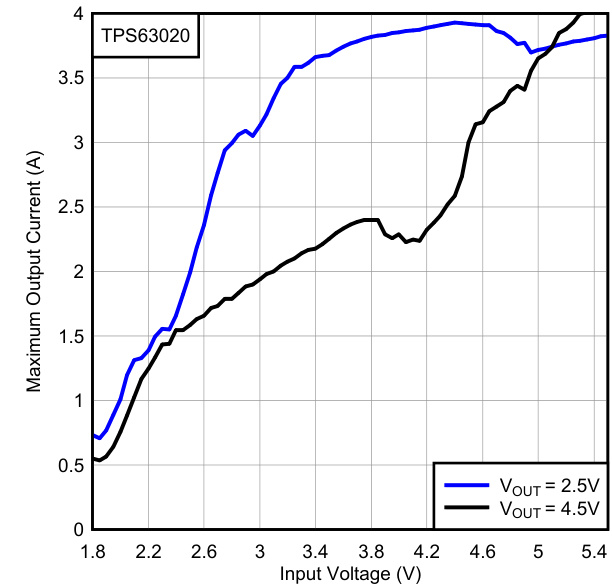  
Figure 1. Maximum Output Current Versus Input Voltage, TPS63020, $\mathsf { V } _ { 0 \mathsf { U T } } = 2 . 5 \ \mathsf { V } / 4 . 5 \ \mathsf { V }$

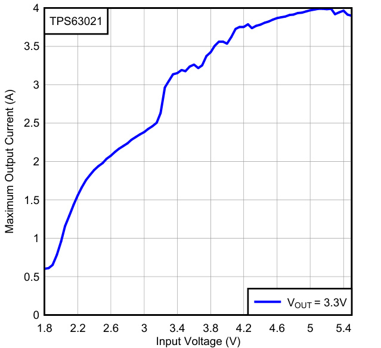  
Figure 2. Maximum Output Current Versus Input Voltage, TPS63021, $\mathsf { V } _ { \mathsf { O U T } } = 3 . 3 \mathsf { V }$

# 7 Detailed Description

# 7.1 Overview

The control circuit of the device is based on an average current mode topology. The controller also uses input and output voltage feed forward. Changes of input and output voltage are monitored and can immediately change the duty cycle in the modulator to achieve a fast response to those errors. The voltage error amplifier gets its feedback input from the FB pin. At adjustable output voltages, a resistive voltage divider must be connected to that pin. At fixed output voltages, FB must be connected to the output voltage to directly sense the voltage. Fixed output voltage versions use a trimmed internal resistive divider. The feedback voltage will be compared with the internal reference voltage to generate a stable and accurate output voltage.

The device uses four internal N-channel MOSFETs to maintain synchronous power conversion at all possible operating conditions. This enables the device to keep high efficiency over a wide input voltage and output power range.

To avoid ground shift problems due to the high currents in the switches, two separate ground pins GND and PGND are used. The reference for all control functions is the GND pin. The power switches are connected to PGND. Both grounds must be connected on the PCB at only one point, ideally close to the GND pin. Due to the 4-switch topology, the load is always disconnected from the input during shutdown of the converter. To protect the device from overheating an internal temperature sensor is implemented.

# 7.2 Functional Block Diagram

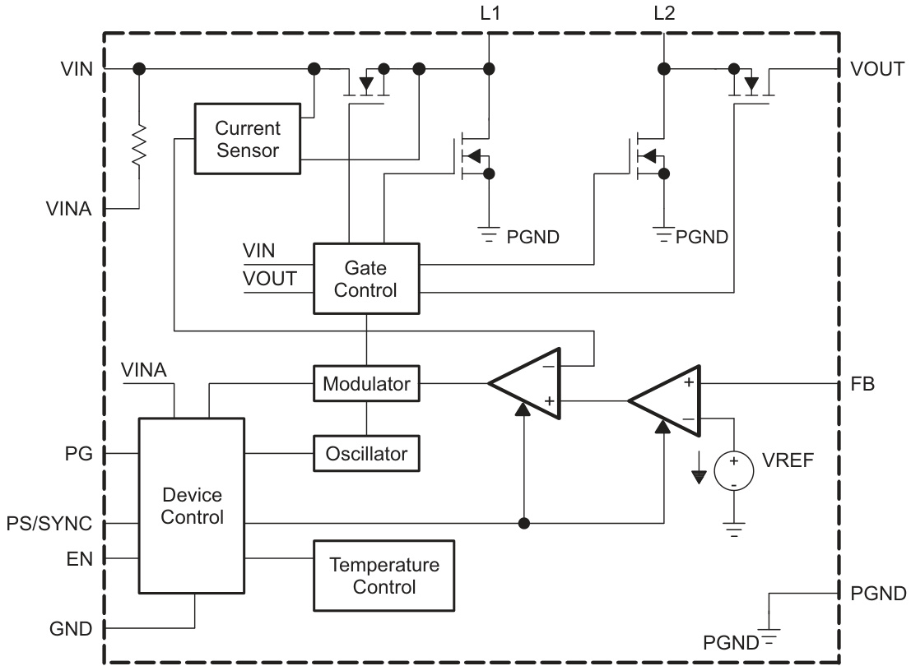  
Figure 3. Functional Block Diagram (TPS63020)

# Functional Block Diagram (continued)

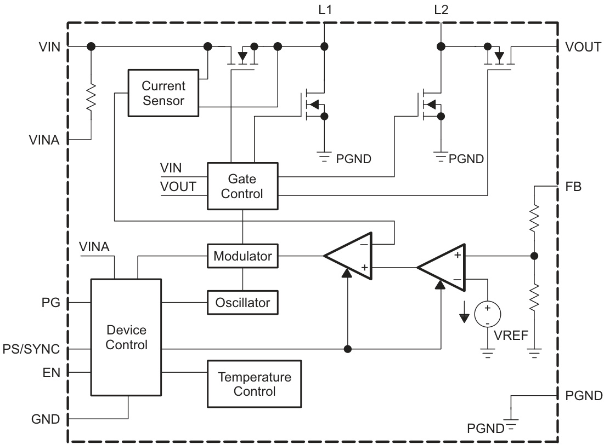  
Figure 4. Functional Block Diagram (TPS63021)

# 7.3 Feature Description

# 7.3.1 Dynamic Voltage Positioning

As detailed in Figure 6, the output voltage is typically $3 \%$ above the nominal output voltage at light load currents, as the device is in power save mode. This gives additional headroom for the voltage drop during a load transient from light load to full load. This allows the converter to operate with a small output capacitor and still have a low absolute voltage drop during heavy load transient changes.

# 7.3.2 Dynamic Current Limit

To protect the device and the application, the average inductor current is limited internally on the IC. At nominal operating conditions, this current limit is constant. The current limit value can be found in the electrical characteristics table. If the supply voltage at VIN drops below $2 . 3 \ : \vee$ , the current limit is reduced. This can happen when the input power source becomes weak. Increasing output impedance, when the batteries are almost discharged, or an additional heavy pulse load is connected to the battery, can cause the VIN voltage to drop. The dynamic current limit has its lowest value when reaching the minimum recommended supply voltage at VIN. At this voltage, the device is forced into burst mode operation, trying to stay active as long as possible even with a weak input power source.

If the die temperature increases above the recommended maximum temperature, the dynamic current limit becomes active. Similar to the behavior when the input voltage at VIN drops, the current limit is reduced with temperature increasing.

# 7.3.3 Device Enable

The device is put into operation when EN is set high. It is put into a shutdown mode when EN is set to GND. In shutdown mode, the regulator stops switching, all internal control circuitry is switched off, and the load is disconnected from the input. This means that the output voltage can drop below the input voltage during shutdown. During start-up of the converter, the duty cycle and the peak current are limited in order to avoid high peak currents flowing from the input.

# Feature Description (continued)

# 7.3.4 Power Good

The device has a built-in power-good function to indicate whether the output voltage is regulated properly. As soon as the average inductor current limit is reached, the power-good output gets low impedance. The output is open-drain and can be left open if not needed. By connecting a pullup resistor to the supply voltage of the externally connected logic, it is possible to adjust the voltage level within the absolute maximum ratings.

Because it is monitoring the status of the current control loop, the power-good output provides the earliest indication possible for an output voltage break down and leaves the connected application a maximum time to safely react.

# 7.3.5 Overvoltage Protection

If, for any reason, the output voltage is not fed back properly to the input of the voltage amplifier, control of the output voltage will not work anymore. Therefore, overvoltage protection is implemented to avoid the output voltage exceeding critical values for the device and possibly for the system it is supplying. The implemented overvoltage protection circuit monitors the output voltage internally as well. In case it reaches the overvoltage threshold, the voltage amplifier regulates the output voltage to this value.

# 7.3.6 Undervoltage Lockout

An undervoltage lockout function prevents device start-up if the supply voltage on VINA is lower than approximately its threshold (see Electrical Characteristics). When in operation, the device automatically enters the shutdown mode if the voltage at VINA drops below the undervoltage lockout threshold. The device automatically restarts if the input voltage recovers to the minimum operating input voltage.

# 7.3.7 Overtemperature Protection

The device has a built-in temperature sensor which monitors the internal IC temperature. If the temperature exceeds the programmed threshold (see Electrical Characteristics), the device stops operating. As soon as the IC temperature has decreased below the programmed threshold, it starts operating again. There is a built-in hysteresis to avoid unstable operation at IC temperatures at the overtemperature threshold.

# 7.4 Device Functional Modes

# 7.4.1 Soft-start and Short Circuit Protection

After being enabled, the device starts operating. The average current limit ramps up from an initial $4 0 0 ~ \mathsf { m A }$ following the output voltage increasing. At an output voltage of about $1 . 2 ~ \mathsf { V }$ , the current limit is at its nominal value. If the output voltage does not increase, the current limit does not increase. There is no timer implemented. Thus, the output voltage overshoot at start-up, as well as the inrush current, is kept at a minimum. The device ramps up the output voltage in a controlled manner even if a large capacitor is connected at the output. When the output voltage does not increase above $1 . 2 \lor$ , the device assumes a short circuit at the output, and keeps the current limit low to protect itself and the application. At a short on the output during operation, the current limit also is decreased accordingly.

# 7.4.2 Buck-Boost Operation

To regulate the output voltage at all possible input voltage conditions, the device automatically switches from step-down operation to boost operation and back as required by the configuration. It always uses one active switch, one rectifying switch, one switch permanently on, and one switch permanently off. Therefore, it operates as a step-down converter (buck) when the input voltage is higher than the output voltage, and as a boost converter when the input voltage is lower than the output voltage. There is no mode of operation in which all four switches are permanently switching. Controlling the switches this way allows the converter to maintain high efficiency at the most important point of operation when input voltage is close to the output voltage. The RMS current through the switches and the inductor is kept at a minimum to minimize switching and conduction losses. For the remaining two switches, one is kept permanently on and the other is kept permanently off, thus causing no switching losses.

# Device Functional Modes (continued)

# 7.4.3 Control Loop

The controller circuit of the device is based on an average current mode topology. The average inductor current is regulated by a fast current regulator loop which is controlled by a voltage control loop. Figure 5 shows the control loop.

The non-inverting input of the transconductance amplifier, gmv, is assumed to be constant. The output of gmv defines the average inductor current. The inductor current S reconstructed by measuring the current through the high-side buck MOSFET. This current corresponds exactly to the inductor current in boost mode. In buck mode, the current is measured during the on-time of the same MOSFET. During the off-time, the current is reconstructed internally starting from the peak value at the end of the on-time cycle. The average current and the feedback from the error amplifier gmv forms the correction signal gmc. This correction signal is compared to the buck and the boost sawtooth ramp giving the PWM signal. Depending on which of the two ramps, the gmc output crosses either the buck or the boost stage is initiated. When the input voltage is close to the output voltage, one buck cycle is always followed by a boost cycle. In this condition, no more than three cycles in a row of the same mode are allowed. This control method in the buck-boost region ensures a robust control and the highest efficiency.

The buck-boost overlap control makes sure that the classical buck-boost function, which would cause two switches to be on every half a cycle, is avoided. Thanks to this block, whenever all switches becomes active during one clock cycle, the two ramps are shifted away from each other. On the other hand, when there is no switching activities because there i a gap between the ramps, the ramps are moved closer together. As a result, the number of classical buck-boost cycles or no switching is reduced to a minimum and high efficiency values has been achieved.

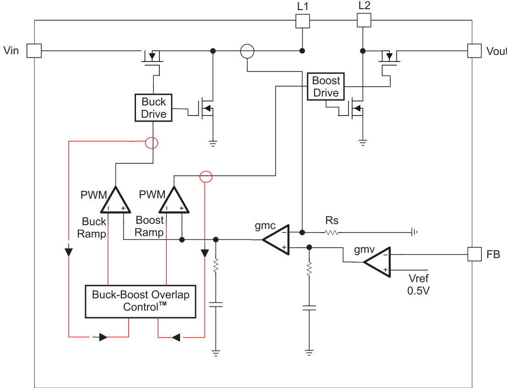  
Figure 5. Average Current Mode Control

# Device Functional Modes (continued)

# 7.4.4 Power Save Mode and Synchronization

The PS/SYNC pin can be used to select different operation modes. Power save mode is used to improve efficiency at light load. To enable power save mode, PS/SYNC must be set low. If PS/SYNC is set low, then power save mode is entered when the average inductor current gets lower than about $1 0 0 ~ \mathsf { m A }$ . At this point, the converter operates with reduced switching frequency and with a minimum quiescent current to maintain high efficiency. See Figure 6 for detailed operation of the power save mode.

During the power save mode, the output voltage is monitored with a comparator by the threshold comp low and comp high. When the device enters power save mode, the converter stops operating and the output voltage drops. The slope of the output voltage depends on the load and the value of output capacitance. As the output voltage falls below the comp low threshold set to $2 . 5 \%$ typical above $\mathsf { V } _ { \mathsf { O U T } }$ , the device ramps up the output voltage again, by starting operation using a programmed average inductor current higher than required by the current load condition. Operation can last one or several pulses. The converter continues these pulses until the comp high threshold, set to typically $3 . 5 \%$ above VOUT nominal, is reached and the average inductance current gets lower than about $1 0 0 ~ \mathsf { m A }$ . When the load increases above the minimum forced inductor current of about 100 mA, the device automatically switches to pulse width modulation (PWM) mode.

The power save mode can be disabled by programming high at the PS/SYNC. Connecting a clock signal at PS/SYNC forces the device to synchronize to the connected clock frequency.

Synchronization is done by a phase-locked loop (PLL), so synchronizing to lower and higher frequencies compared to the internal clock works without any issues. The PLL can also tolerate missing clock pulses without the converter malfunctioning. The PS/SYNC input supports standard logic thresholds.

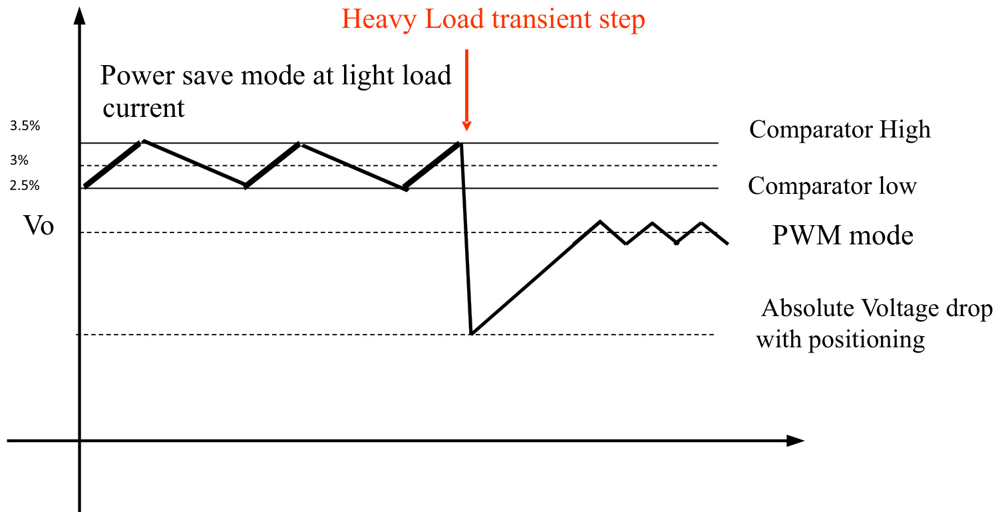  
Figure 6. Power Save Mode Thresholds and Dynamic Voltage Positioning

# 8 Application and Implementation

# NOTE

Information in the following applications sections is not part of the TI component specification, and TI does not warrant its accuracy or completeness. TI’s customers are responsible for determining suitability of components for their purposes. Customers should validate and test their design implementation to confirm system functionality.

# 8.1 Application Information

The TPS6302x are high efficiency, low quiescent current, non-inverting buck-boost converters suitable for applications that need a regulated output voltage from an input supply that can be higher, lower, or equal to the output voltage. Output currents can go as high as 2 A in boost mode and as high as 4 A in buck mode. The average current in the switches is limited to a typical value of $4 \mathsf { A }$ .

# 8.2 Typical Application

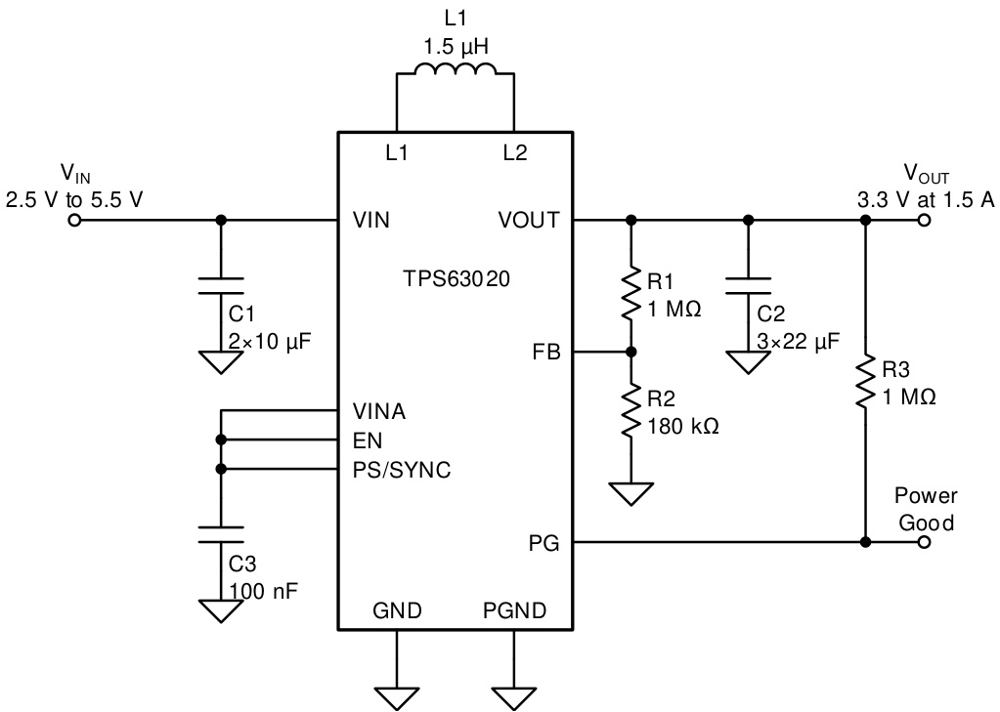  
Figure 7. Application Circuit

# 8.2.1 Design Requirements

The design guideline provides a component selection to operate the device within the recommended operating conditions. See Table 1 for possible inductor and capacitor combinations.

For the fixed output voltage option, the feedback pin needs to be connected to the VOUT pin.

Table 1. Matrix of Output Capacitor and Inductor Combinations   

<html><body><table><tr><td rowspan="2">NOMINAL INDUCTOR VALUE [μH](1)</td><td colspan="4">NOMINAL OUTPUT CAPACITOR VALUE [μF](2)</td></tr><tr><td>2×22</td><td>3×22</td><td>4×22</td><td>≥100</td></tr><tr><td>1.0</td><td></td><td></td><td></td><td></td></tr><tr><td>1.5</td><td></td><td>(3)</td><td></td><td></td></tr><tr><td>2.2</td><td></td><td></td><td></td><td></td></tr></table></body></html>

(1) Inductor tolerance and current derating is anticipated. The effective inductance can vary by $20 \%$ and $- 3 0 \%$ .   
(2) Capacitance tolerance and DC bias voltage derating is anticipated. The effective capacitance can vary by $20 \%$ and $- 5 0 \%$ .   
(3) Typical application. Other check marks indicate possible filter combinations.

# 8.2.2 Detailed Design Procedure

The TPS6302x series of buck-boost converter has internal loop compensation. Therefore, the external inductor and output capacitors have to be selected to work with the internal compensation. When selecting the external components, a low limit for the inductor value exists to avoid subharmonic oscillation which can be caused by a far too fast ramp up of the inductor current. For the TPS6302x series, the inductor value must be kept at or above $1 \mu \mathsf { H }$ .

In particular, either $1 \mu \mathsf { H }$ or $1 . 5 ~ \mu \mathsf { H }$ is recommended working at an output current between 1.5 A and 2 A. If operating with a lower load current, it is also possible to use $2 . 2 \mu \mathsf { H }$ .

Selecting a larger output capacitor value is less critical because the corner frequency moves to lowe frequencies.

# 8.2.2.1 Custom Design with WEBENCH Tools

Click here to create a custom design using the TPS63020 device with the WEBEN $C H ^ { \circledast }$ Power Designer.

1. Start by entering your $\mathsf { V } _ { \mathsf { I N } }$ , VOUT and IOUT requirements.   
2. Optimize your design for key parameters like efficiency, footprint or cost using the optimizer dial and compare this design with other possible solutions from Texas Instruments.

3. WEBENCH Power Designer provides you with a customized schematic along with a list of materials with real time pricing and component availability.

4. In most cases, you will also be able to:

Run electrical simulations to see important waveforms and circuit performance, Run thermal simulations to understand the thermal performance of your board, Export your customized schematic and layout into popular CAD formats, Print PDF reports for the design, and share your design with colleagues.

5. Get more information about WEBENCH tools at www.ti.com/webench.

# 8.2.2.2 Inductor Selection

The inductor selection is affected by several parameters such as the following:

Inductor ripple current   
Output voltage ripple   
Transition point into Power Save Mode   
Efficiency

See Table 2 for a list of typical inductors.

For high efficiencies, the inductor must have a low DC resistance to minimize conduction losses. Especially at high-switching frequencies, the core material has a high impact on efficiency. When using small chip inductors, the efficiency is reduced mainly due to higher inductor core losses. This needs to be considered when selecting the appropriate inductor. The inductor value determines the inductor ripple current. The larger the inductor value, the smaller the inductor ripple current and the lower the conduction losses of the converter. Conversely, larger inductor values cause a slower load transient response. Use Equation 2 to avoid saturation of the inductor when calculating the peak current for the inductor in steady state operation. Only the equation which defines the switch current in boost mode is shown because this provides the highest value of current and represents the critical current value for selecting the right inductor.

Duty Cycle Boost $\mathsf { D } = \frac { \mathsf { V } _ { \mathsf { O U T } } - \mathsf { V } _ { \mathsf { I N } } } { \mathsf { V } _ { \mathsf { O U T } } }$   
$| \mathsf { \Pi } _ { \mathsf { P E A K } } = \frac { | \mathsf { o u t } } { \eta \times ( 1 - \mathsf { D } ) } + \frac { \mathsf { V i n } \times \mathsf { D } } { 2 \times f \times \mathsf { L } }$   
where ${ \sf D } =$ duty cycle in boost mode ${ \mathfrak { f } } =$ converter switching frequency (typical $2 . 5 \mathsf { M H z } )$ $L =$ inductor value $\eta =$ estimated converter efficiency (use the number from the efficiency curves or 0.9 as an assumption)

# NOTE

The calculation must be done for the minimum input voltage in boost mode.

Calculating the maximum inductor current using the actual operating conditions gives the minimum saturation current of the inductor needed. It is recommended to choose an inductor with a saturation current $20 \%$ higher than the value calculated using Equation 2. Table 2 lists the possible inductors.

Table 2. List of Recommended Inductors (1)   

<html><body><table><tr><td>INDUCTOR VALUE [μH]</td><td>SATURATION CURRENT [A]</td><td>DCR [mΩ]</td><td>PART NUMBER</td><td>MANUFACTURER</td><td>SIZE (LxWxH mm)</td></tr><tr><td>1.5</td><td>5.1</td><td>15</td><td>XFL4020-152ME</td><td>Coilcraft</td><td>4×4×2.1</td></tr><tr><td>1.5</td><td>5.4</td><td>24</td><td>FDV0530S-H-1R5M</td><td>muRata</td><td>5x5x3</td></tr></table></body></html>

(1) See Third-party Products Disclaimer.

# 8.2.2.3 Output Capacitor Selection

For the output capacitor, it is recommended to use of small ceramic capacitors placed as close as possible to the VOUT and PGND pins of the IC. The recommended nominal output capacitors are three times $2 2 \mu \ F$ . If, for any reason, the application requires the use of large capacitors that cannot be placed close to the IC, use a smaller ceramic capacitor in parallel to the large capacitor. Place the small capacitor as close as possible to the VOUT and PGND pins of the IC.

There are no additional requirements regarding minimum ESR. There is also no upper limit for the output capacitance value. Larger capacitors cause lower output voltage ripple as well as lower output voltage drop during load transients.

# 8.2.2.4 Input Capacitor Selection

A $1 0 \mu \mathsf { F }$ input capacitor is recommended to improve line transient behavior of the regulator and EMI behavior of the total power supply circuit. An X5R or X7R ceramic capacitor placed as close as possible to the VIN and PGND pins of the IC is recommended. This capacitance can be increased without limit. If the input supply is located more than a few inches from the TPS6302x converter, additional bulk capacitance can be required in addition to the ceramic bypass capacitors. An electrolytic or tantalum capacitor with a value of $4 7 \mu \mathsf { F }$ is a typical choice.

# 8.2.2.5 Bypass Capacitor

To make sure that the internal control circuits are supplied with a stable low noise supply voltage, a capacitor can be connected between VINA and GND. Using a ceramic capacitor with a value of $0 . 1 ~ \mu \mathsf { F }$ is recommended. The value of this capacitor must not be higher than $0 . 2 2 \mu \mathsf { F }$ .

# 8.2.3 Setting The Output Voltage

When the adjustable output voltage version TPS63020 is used, the output voltage is set by an external resistor divider. The resistor divider must be connected between VOUT, FB, and GND. The feedback voltage is $5 0 0 ~ \mathrm { m V }$ nominal. The low-side resistor R2 (between FB and GND) must be kept in the range of $2 0 0 ~ \mathsf { k } \Omega$ . Use Equation 3 to calculate the high-side resistor R1 (between VOUT and FB).

$$
{ \sf R } 1 = { \sf R } 2 \times \left( \frac { \sf V _ { O U T } } { \sf V _ { F B } } - 1 \right)
$$

where $V _ { \mathsf { F B } } = 5 0 0 ~ \mathsf { m V }$

Table 3. Resistor Selection For Typical Output Voltages   

<html><body><table><tr><td>VoUT</td><td>R1</td><td>R2</td></tr><tr><td>2.5V</td><td>750 kΩ</td><td>180 kΩ</td></tr><tr><td>3.3 V</td><td>1 MΩ</td><td>180 kΩ</td></tr><tr><td>3.6V</td><td>1.1 MΩ</td><td>180 kΩ</td></tr></table></body></html>

Table 3. Resistor Selection For Typical Output Voltages (continued)   

<html><body><table><tr><td>VoUT</td><td>R1</td><td>R2</td></tr><tr><td>4.5V</td><td>1.43 MΩ</td><td>180 kΩ</td></tr><tr><td>5V</td><td>1.6 MΩ2</td><td>180 kΩ</td></tr></table></body></html>

# 8.2.4 Application Curves

Table 4. Components for Application Characteristic Curves for $\mathsf { V } _ { \mathsf { O U T } } = 3 . 3 \ \mathsf { V } ^ { ( 1 ) ( 2 ) }$   

<html><body><table><tr><td>REFERENCE</td><td>DESCRIPTION</td><td>PART NUMBER</td><td>MANUFACTURER</td></tr><tr><td>U1</td><td>High Efficiency Single Inductor Buck-Boost Converter With 4-A Switches</td><td>TPS63020or TPS63021</td><td>Texas Instruments</td></tr><tr><td>L1</td><td>1.5 μH, 4 mm × 4 mm × 2 mm</td><td>XFL4020-152ML</td><td>Coilcraft</td></tr><tr><td>C1</td><td>2 × 10 F 6.3 V, 0603， X5R ceramic</td><td>GRM188R60J106ME84D</td><td>muRata</td></tr><tr><td>C2</td><td>3×22 μF 6.3V, 0603, X5R ceramic</td><td>GRM188R60J226MEAOL</td><td>muRata</td></tr><tr><td>C3</td><td>0.1 μF, X5R or X7R ceramic</td><td>Standard</td><td>Standard</td></tr><tr><td>R1</td><td>MΩ at TPS63020, 0Ω at TPS63021</td><td>Standard</td><td>Standard</td></tr><tr><td>R2</td><td>180 kΩ2 atTPS63020, not used at TPS63021</td><td>Standard</td><td>Standard</td></tr><tr><td>R3</td><td>1 MΩ</td><td>Standard</td><td>Standard</td></tr></table></body></html>

(1) See Third-Party Products Discalimer. (2) For other output voltages, refer to Table 3 for resistor values.

Table 5. Typical Characteristics Curves   

<html><body><table><tr><td>PARAMETER</td><td>CONDITIONS</td><td>FIGURE</td></tr><tr><td>EFFICIENCY</td><td></td><td></td></tr><tr><td>Eficiency vs Output Current, TPS63020 (Power save mode</td><td>SYNCV LV, 3.6V VouT = 2.5 V, 4.5 V,</td><td>Figure 8</td></tr><tr><td>Efficiency vs Output Current, TPS63020 (PWM only)</td><td>= 2.5 V, 4.5 V,</td><td>Figure 9</td></tr><tr><td>Efficiency vs Output Current, TPS63021 (Power save mode</td><td>ViN=2.4V, 3.6V, VoUT = 3.3 PS/SYNC √,</td><td>Figure 10</td></tr><tr><td>enabled) Efficiency vs Output Current, TPS63021 (PWM only)</td><td>Low 3.6 V, VouT 3.3V, PS/SYNC VIN</td><td></td></tr><tr><td>Efficiency VS Input Voltage, TPS63020 (Power save mode</td><td>Hig = 2.4 V, = 2.5 V, Load = 10 mA, 500 mA, 1 A, 2 A, VouT</td><td>Figure 11</td></tr><tr><td>enabled) Efibleneyy VS Input TPS63020 (Power save mode Voltage,</td><td>PS/SYNC Low 10 mA, 500 mA, 1 A, 2 A,</td><td>Figure 12</td></tr><tr><td>Efficiency vs Input Voltage, TPS63020 (PWM only)</td><td>10 mA, 500 mA, 1 A, 2A, VouT</td><td>Figure 13</td></tr><tr><td>Efficiency VS Input Voltage, TPS63020 (PWM only)</td><td>10 mA, 500 mA, 1A, 2A, VoUT</td><td>Figure 14</td></tr><tr><td>Efiailncyy VS Input Voltage, TPS63021 (Power save mode</td><td>10 mA, 500 mA, 1 A, 2 A, VouT</td><td>Figure 15</td></tr><tr><td>TPS63021</td><td>10 mA, 500 mA, 1 A, 2 A,</td><td>Figure 16</td></tr><tr><td>Efficiency vs Input Voltage, (PWM only) REGULATION ACCURACY</td><td></td><td>Figure 17</td></tr><tr><td colspan="3"></td></tr><tr><td>Load Regulation, PWM Boost Operation, TPS63020</td><td>ViN = 3.6 V VOUT= 4.5V, PS/SYNC High</td><td>Figure 18</td></tr><tr><td>Load Regulation, PWM Buck Operation, TPS63020</td><td>VIN= 3.6 V, VoUT = 2.5 V, PS/SYNC = High</td><td>Figure 19</td></tr><tr><td>Load Regulation, PWM Operation, TPS63021</td><td>= 3.6 VoUT = 3.3 V, PS/SYNC High VIN √,</td><td>Figure 20</td></tr><tr><td>Load Transient, TPS63021</td><td>VIN = 2.4V, = 3.3 V, Load = 500mA to 1.5 A VoUT</td><td>Figure 21</td></tr><tr><td>Load Transient, TPS63021</td><td>VIN = 4.2 V, = 3.3 Load = 500 mA to 1.5 A VoUT V</td><td>Figure 22</td></tr><tr><td>Line Transient, TPS63021</td><td>= 3.0 V to 3.7 V, =3.3V, Load = 1.5 A VIN VoUT</td><td>Figure 23</td></tr><tr><td>START-UP</td><td></td><td></td></tr><tr><td>Start-up Behavior from Rising Enable, TPS63021</td><td>VIN = 2.4 V, VouT = 3.3 V, Load =2.2Ω</td><td>Figure 24</td></tr><tr><td>Start-up Behavior from Rising Enable, TPS63021</td><td>VIN = 4.2 V, VoUT = 3.3 V, Load = 2.2 Ω</td><td>Figure 25</td></tr><tr><td>Start-up Behavior from Rising Enable, TPS63021</td><td>ViN = 2.4 V, VoUT = 3.3V, Load = 2.2 Ω</td><td>Figure 26</td></tr><tr><td>Start-up Behavior from Rising Enable, TPS63021</td><td>VIN = 4.2 V, VoUT = 3.3V, Load = 2.2 Ω</td><td>Figure 27</td></tr></table></body></html>

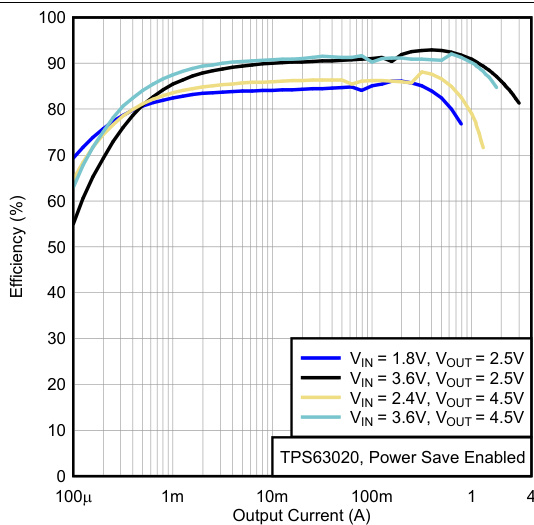  
Figure 8. Efficiency Versus Output Current, TPS63020, Power Save Enabled

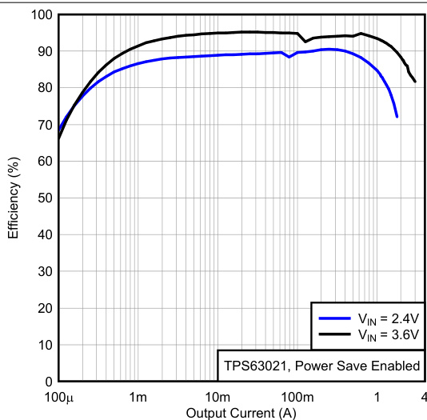  
Figure 10. Efficiency Versus Output Current, TPS63021, Power Save Enabled

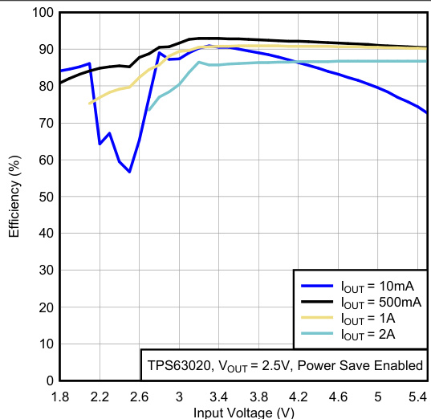  
Figure 12. Efficiency Versus Input Voltage, TPS63020, $\mathsf { V o u r } = 2 . 5 \ : \mathsf { V }$ , Power Save Enabled

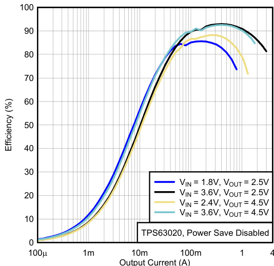  
Figure 9. Efficiency Versus Output Current, TPS63020, Power Save Disabled

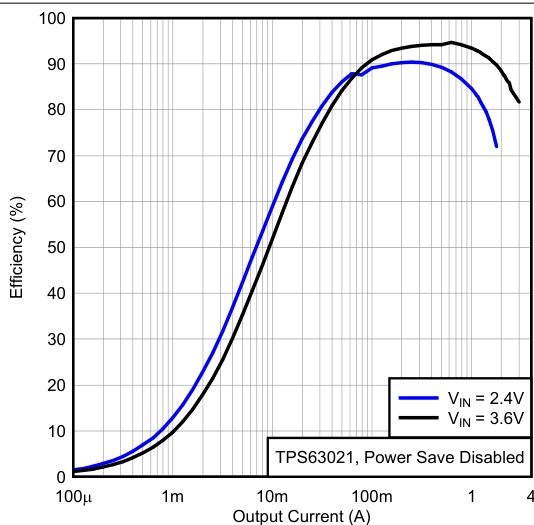  
Figure 11. Efficiency Versus Output Current, TPS63021, Power Save Disabled

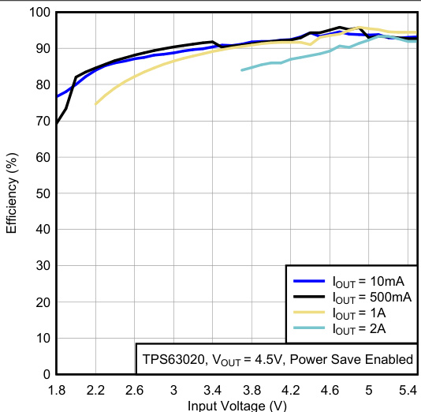  
Figure 13. Efficiency Versus Input Voltage, TPS63020, $\mathsf { V o u r } = 4 . 5 \ : \mathsf { V }$ , Power Save Enabled

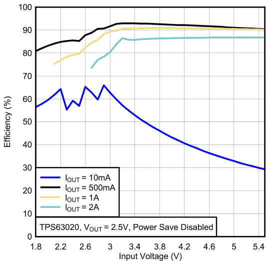  
Figure 14. Efficiency Versus Input Voltage, TPS63020, $\mathsf { v } _ { \mathsf { o u r } } = 2 . 5 \ \mathsf { V }$ , Power Save Disabled

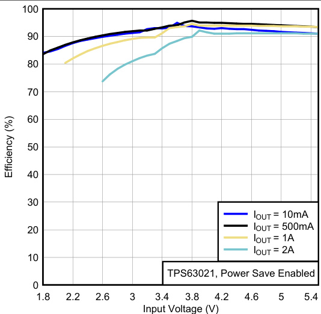  
Figure 16. Efficiency Versus Input Voltage, TPS63021, Power Save Enabled

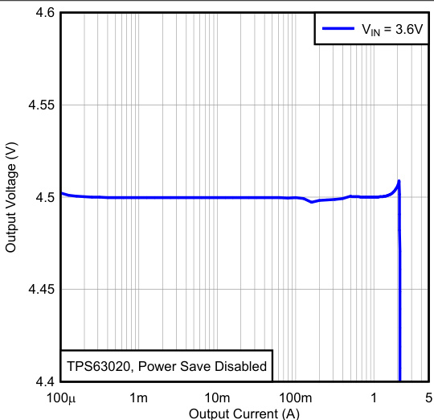  
Figure 18. Output Voltage Versus Output Current, TPS63020, Power Save Disabled

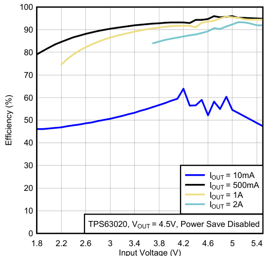  
Figure 15. Efficiency Versus Input Voltage, TPS63020, $\mathsf { V o u r } = 4 . 5 \ : \mathsf { V }$ , Power Save Disabled

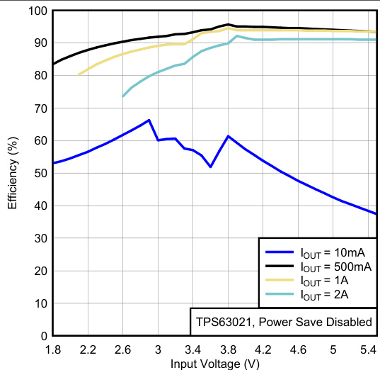  
Figure 17. Efficiency Versus Input Voltage, TPS63021, Power Save Disabled

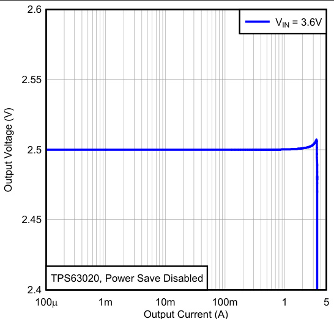  
Figure 19. Output Voltage Versus Output Current, TPS63020, Power Save Enabled

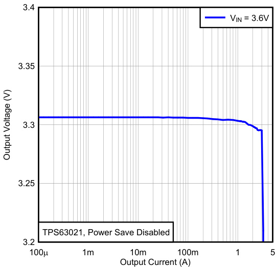  
Figure 20. Output Voltage Versus Output Current, TPS63021, Power Save Disabled

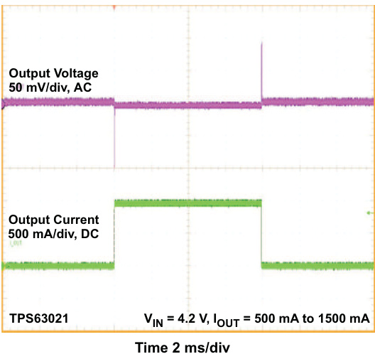  
Figure 22. Load Transient Response, TPS63021

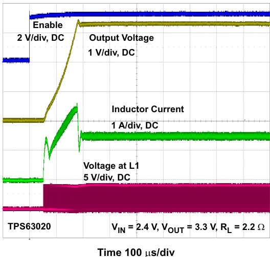  
Figure 24. Start-up Behavior from Rising Enable, TPS63020

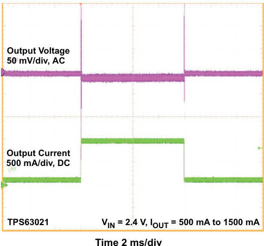  
Figure 21. Load Transient Response, TPS63021

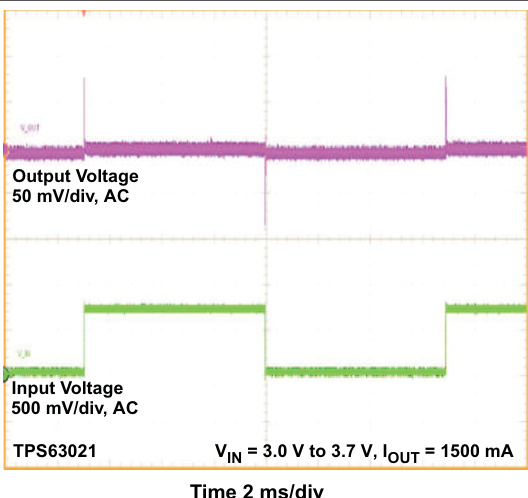  
Figure 23. Line Transient Response, TPS63021

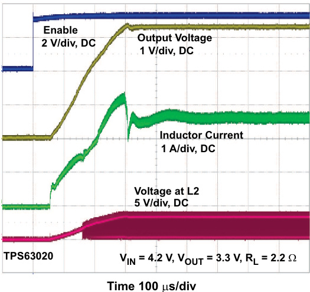  
Figure 25. Start-up Behavior from Rising Enable, TPS63020

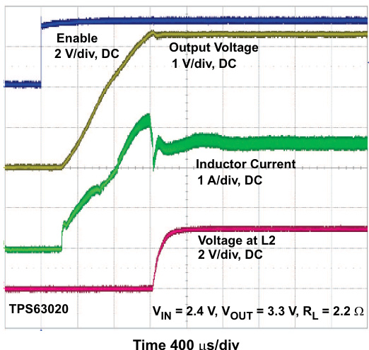  
Figure 26. Start-up Behavior from Rising Enable, TPS63020

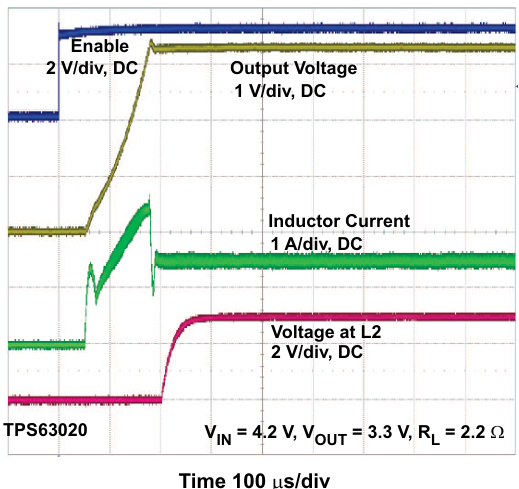  
Figure 27. Start-up Behavior from Rising Enable, TPS63020

# 8.3 System Examples

# 8.3.1 Improved Transient Response for 2 A Load Current

Capacitor C4 and resistor R4 are added for improved load transient performance.

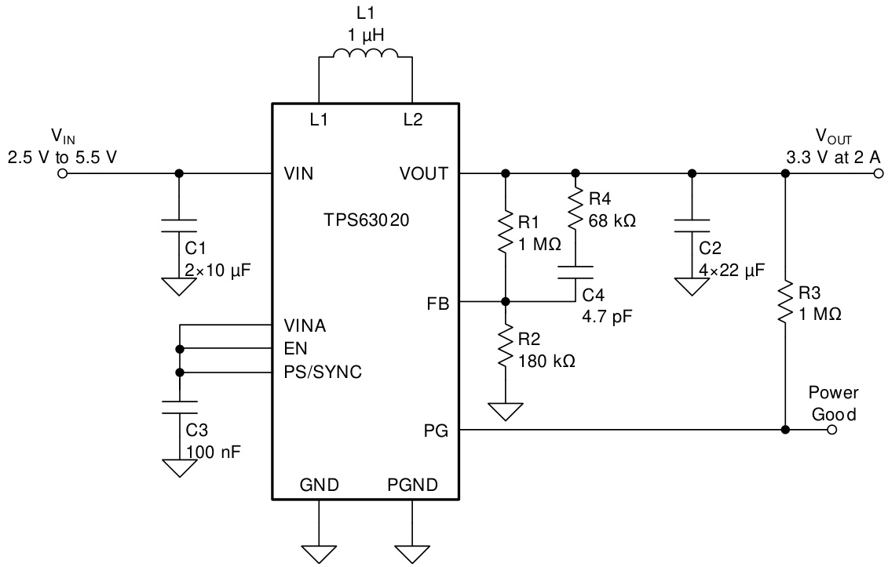  
Figure 28. Application Circuit for 2 A Load Current

# System Examples (continued)

# 8.3.2 Supercapacitor Backup Power Supply With Active Cell Balancing

The TPS63020 can be used to charge backup capacitors to a user-defined voltage level while the main power supply is supplying a system, and discharges these capacitors into the system when the main power supply is interrupted. With this design, the system voltage during backup operation keeps constant independent of the voltage reduction on the backup capacitors. Refer to the PMP9766 Test Results Application Report for more details.

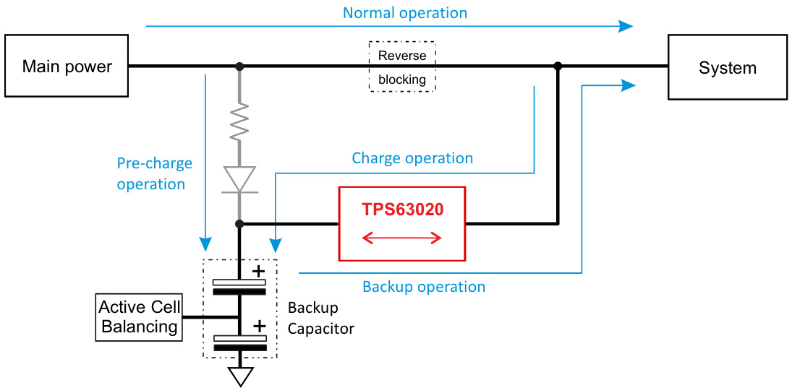  
Figure 29. Simplified Block Diagram of a Backup Power System

# 8.3.3 Low-Power TEC Driver

Controlling the operating temperature of electronic circuits helps attain the best system performance. For passive control, that is, when heat sinks is not giving the right performance, active cooling using a thermoelectric cooler (TEC) might be able to solve the thermal issue. Figure 30 shows an example driving such a TEC element with the TPS63020. Refer to the Low-power TEC Driver Application Report.

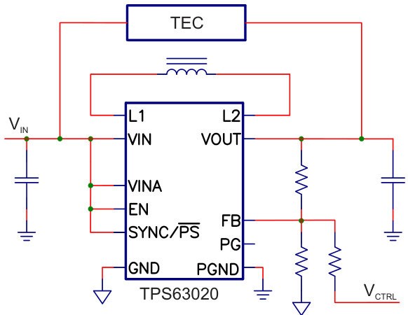  
Figure 30. Low-Power TEC Driver Schematic

# 9 Power Supply Recommendations

The TPS6302x devices have no special requirements for its input power supply. The output current of the input power supply needs to be rated according to the supply voltage, output voltage, and output current of the TPS6302x.

# 10 Layout

# 10.1 Layout Guidelines

For all switching power supplies, the layout is an important step in the design, especially at high peak currents and high switching frequencies. If the layout is not carefully done, the regulator can show stability problems as well as EMI problems. Therefore, use wide and short traces for the main current path and for the power ground tracks. Place the input capacitor, output capacitor, and the inductor as close as possible to the IC. Use a common ground node for power ground and a different one for control ground to minimize the effects of ground noise. Connect these ground nodes at any place close to one of the ground pins of the IC.

The feedback divider must be placed as close as possible to the control ground pin of the IC. To lay out the control ground, short traces are recommended as well, separation from the power ground traces. This avoids ground shift problems, which can occur due to superimposition of power ground current and control ground current.

# 10.2 Layout Example

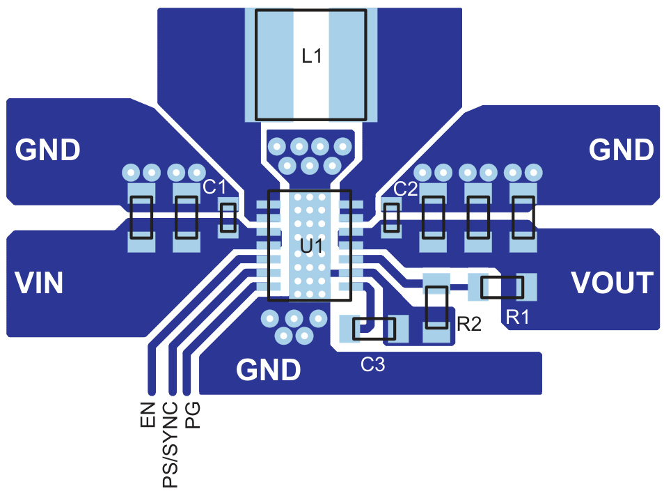  
Figure 31. PCB Layout Suggestion

# 10.3 Thermal Considerations

Implementation of integrated circuits in low-profile and fine-pitch surface-mount packages typically requires special attention to power dissipation. Many system-dependent issues such as thermal coupling, airflow, added heat sinks and convection surfaces, and the presence of other heat-generating components affect the powerdissipation limits of a given component.

Three basic approaches for enhancing thermal performance are listed below:

Improving the power dissipation capability of the PCB design   
Improving the thermal coupling of the component to the PCB by soldering the exposed thermal pad   
Introducing airflow in the system

Refer to the Thermal Characteristics Application Note and the Semiconductor and IC Package Thermal Metrics Application Note for more details on how to use the thermal parameters.

# 11 器件和文档支持

# 11.1 接收文档更新通知

要接收文档更新通知， 请导航至 ti.com. 上的器件产品文件夹。单击右上角的通知我进行注册， 即可每周接收产品信息更改摘要。 有关更改的详细信息， 请查看任何已修订文档中包含的修订历史记录。

# 11.2 器件支持

# 11.2.1 使用 WEBENCH 工具创建定制设计方案

单击此处， 使用 TPS63021 器件并借助 WEBENCH®电源设计器创建定制设计。

1. 首先，输入您的输入电压、输出电压和输出电流要求。  
2. 使用优化器拨盘优化效率、封装和成本等关键设计参数并将您的设计与德州仪器 (TI) 的其它可行解决方案进行比较。  
3. WEBENCH 电源设计器提供一份定制原理图以及罗列实时价格和组件供货情况的物料清单。

4. 在大多数情况下， 您还可以：

运行电气仿真，观察重要波形以及电路性能；运行热性能仿真，了解电路板热性能；将定制原理图和布局方案导出至常用 CAD 格式,打印设计方案的 PDF 报告并与同事共享。

5. 请访问 www.ti.com.cn/webench， 获取有关 WEBENCH 工具的详细信息。

# 11.2.2 第三方产品免责声明

TI 发布的与第三方产品或服务有关的信息，不能构成与此类产品或服务或保修的适用性有关的认可， 不能构成此类产品或服务单独或与任何 TI 产品或服务一起的表示或认可。

# 11.3 文档支持

# 11.3.1 相关文档

请参阅如下相关文档：

德州仪器 (TI)， 《热工特性》 应用手册德州仪器 (TI)， 《IC 封装热指标》 应用手册

# 11.4 相关链接

下表列出了快速访问链接。 类别包括技术文档、 支持与社区资源、 工具和软件， 以及申请样片或购买产品的快速链接。

表 6. 相关链接  

<html><body><table><tr><td>器件</td><td>产品文件夹</td><td>样片与购买</td><td>技术文档</td><td>工具与软件</td><td>支持和社区</td></tr><tr><td>TPS63020</td><td>单击此处</td><td>单击此处</td><td>单击此处</td><td>单击此处</td><td>单击此处</td></tr><tr><td>TPS63021</td><td>单击此处</td><td>单击此处</td><td>单击此处</td><td>单击此处</td><td>单击此处</td></tr></table></body></html>

# 11.5 支持资源

TI E2E™ support forums are an engineer's go-to source for fast, verified answers and design help — straight from the experts. Search existing answers or ask your own question to get the quick design help you need.

Linked content is provided "AS IS" by the respective contributors. They do not constitute TI specifications and do not necessarily reflect TI's views; see TI's Terms of Use.

# 11.6 商标

E2E is a trademark of Texas Instruments.   
WEBENCH is a registered trademark of Texas Instruments.   
All other trademarks are the property of their respective owners.

# 11.7 静电放电警告

这些装置包含有限的内置 ESD 保护。 存储或装卸时， 应将导线 一起截短或将装置放置于导电泡棉中， 以防止 MOS 门极遭受静电损伤。

# 11.8 Glossary

SLYZ022 TI Glossary.

This glossary lists and explains terms, acronyms, and definitions.

# 12 机械、 封装和可订购信息

以下页面包含机械、封装和可订购信息。这些信息是指定器件的最新可用数据。 数据如有变更， 恕不另行通知， 且不会对此文档进行修订。 如需获取此数据表的浏览器版本， 请查阅左侧的导航栏。

# PACKAGING INFORMATION

<html><body><table><tr><td>Orderable part number</td><td>Status (1)</td><td>Material type (2)</td><td>Package Pins</td><td>Package qty Carrier</td><td>RoHS (3)</td><td>Lead finish/ material Ball</td><td>MSL rating/ Peak reflow</td><td>Op temp (°C)</td><td>Part marking (6)</td></tr><tr><td>TPS63020DSJR</td><td>Active</td><td>Production</td><td>VSON (DSJ)1</td><td>3000 LARGE T&R</td><td>Yes</td><td>NIPDAU</td><td>Level-1 -260C-UNLIM</td><td>-40 to 125</td><td>PS63020</td></tr><tr><td>TPS63020DSJR.A</td><td>Active</td><td>Production</td><td>VSON (DSJ)I</td><td>3000 LARGE T&R</td><td>Yes</td><td>NIPDAU</td><td>Level- 260C-UNLIM</td><td>-40 to 125</td><td>PS63020</td></tr><tr><td>TPS63020DSJR.B</td><td>Active</td><td>Production</td><td>VSON (DSJ)</td><td>3000 LARGE T&R</td><td>Yes</td><td>NIPDAU</td><td>Level- -260C-UNLIM</td><td>-40 to 125</td><td>PS63020</td></tr><tr><td>TPS63020DSJRG4</td><td>Active</td><td>Production</td><td>VSON (DSJ)</td><td>3000 LARGE T&R</td><td>Yes</td><td>NIPDAU</td><td>evel- -260C-UNLIM</td><td>125 -40 to</td><td>PS63020</td></tr><tr><td>TPS63020DSJRG4.A</td><td>Active</td><td>Production</td><td>VSON (DSJ)I</td><td>3000 LARGE T&R</td><td>Yes</td><td>NIPDAU</td><td>Level- -260C-UNLIM</td><td>-40 to 125</td><td>PS63020</td></tr><tr><td>TPS63020DSJRG4.B</td><td>Active</td><td>Production</td><td>VSON (DSJ)|14</td><td>3000 LARGE T&R</td><td>Yes</td><td>NIPDAU</td><td>Level-1-260C-UNLIM</td><td>-40 to 125</td><td>PS63020</td></tr><tr><td>TPS63020DSJT</td><td>Active</td><td>Production</td><td>VSON (DSJ)</td><td>250 |SMALL T&R</td><td>Yes</td><td>NIPDAU</td><td>Level-1-260C-UNLIM</td><td>-40 to 125</td><td>PS63020</td></tr><tr><td>TPS63020DSJT.A</td><td>Active</td><td>Production</td><td>VSON (DSJ)</td><td>250 |SMALL T&R</td><td>Yes</td><td>NIPDAU</td><td>Level-1-260C-UNLIM</td><td>125 -40 to</td><td>PS63020</td></tr><tr><td>TPS63020DSJT.B</td><td>Active</td><td>Production</td><td>VSON (DSJ)</td><td>250 SMALL T&R</td><td>Yes</td><td>NIPDAU</td><td>Level-1-260C-UNLIM</td><td>-40 to 125</td><td>PS63020</td></tr><tr><td>TPS63021DSJR</td><td>Active</td><td>Production</td><td>VSON (DSJ)</td><td>3000 LARGE T&R</td><td>Yes</td><td>NIPDAU</td><td>Level-1-260C-UNLIM</td><td>-40 to 125</td><td>PS63021</td></tr><tr><td>TPS63021DSJR.A</td><td>Active</td><td>Production</td><td>VSON DSJ</td><td>3000 LARGE T&R</td><td>Yes</td><td>NIPDAU</td><td>Level- -260C-UNLIM</td><td>-40 to 125</td><td>PS63021</td></tr><tr><td>TPS63021DSJR.B</td><td>Active</td><td>Production</td><td>/SON</td><td>3000 LARGE</td><td></td><td>NIPDAU</td><td>evel- 260C-UNLIM</td><td>40 to 125</td><td>PS63021</td></tr><tr><td>TPS63021DSJRG4</td><td>Active</td><td>Productior</td><td></td><td>3000 LARGE T&R</td><td></td><td>NIPDAU</td><td>Level- -260C-UNLIM</td><td>40 to 125</td><td>PS63021</td></tr><tr><td>TPS63021DSJRG4.A</td><td>Active</td><td>Production</td><td></td><td>3000 LARGE T&R</td><td></td><td>NIPDAU</td><td>Level- -260C-UNLIM</td><td>-40 to 125</td><td>PS63021</td></tr><tr><td>TPS63021DSJRG4.B</td><td>Active</td><td>Production</td><td></td><td>3000 LARGE T&R</td><td>Yes</td><td>NIPDAU</td><td>Level- -260C-UNLIM</td><td>-40 to 125</td><td>PS63021</td></tr><tr><td>TPS63021DSJT</td><td>Active</td><td>Production</td><td></td><td>250 T&R SMALL</td><td></td><td>NIPDAU</td><td>-260C-UNLIM Level-1</td><td>40 to 125</td><td>PS63021</td></tr><tr><td>TPS63021 DSJT.A</td><td>Active</td><td>Production</td><td>/SON (DSJ)</td><td>250 SMALL T&R</td><td>Yes</td><td>NIPDAU</td><td>Level- -260C-UNLIM</td><td>40 to 125</td><td>PS63021</td></tr><tr><td>TPS63021DSJT.B</td><td>Active</td><td>Production</td><td>VSON (DSJ) I</td><td>250| SMALL T&R</td><td>Yes</td><td>NIPDAU</td><td>Level- -260C-UNLIM</td><td>-40 to 125</td><td>PS63021</td></tr></table></body></html>

(1) Status: For more details on status, see our product life cycle.

(2) Material type: When designated, preproduction parts are prototypes/experimental devices, and are not yet approved or released for full production. Testing and final process, including without limitation quality assurance, reliability performance testing, and/or process qualification may not yet be complete, and this item subject further changes possible discontinuation. available for ordering, purchases will be subject to an additional waiver at checkout, and are intended for early internal evaluation purposes only. These items are sold without warranties of any kind.

(3) RoHS values: Yes, No, RoHS Exempt. See the TI RoHS Statement for additional information and value definition.

(4) Lead finish/Ball material: Parts may have multiple material finish options. Finish options are separated by vertical ruled ine. Lead finish/Bal material values may wrap to two lines if the finish value exceeds the maximum column width.

(5) MSL rating/Peak reflow: The moisture sensitivity level ratings and peak solder (reflow) temperatures. In the event that a part has multiple moisture sensitivity ratings, only the lowest level per JEDEC standards is shown.   
Refer to the shipping label for the actual reflow temperature that will be used to mount the part to the printed circuit board.

6) Part marking: There may be an additional marking, which relates to the logo, the lot trace code information, or the environmental category of the part.

Multiple part markings will be inside parentheses. Only one part marking contained in parentheses and separated by "\~" will appear on a part. If a line is indented then it is continuation of the previous line and the two combined represent the entire part marking for that device.

Important Information and Disclaimer:The information provided on this page represents TI's knowledge and belief as of the date that it is provided. TI bases its knowledge and belief on information provided by third parties, and makes no representation or warranty as to the accuracy of such information. Efforts are underway to better integrate information from third parties. TI has taken and continues to take reasonable steps to provide representative and accurate information but may not have conducted destructive testing or chemical analysis on incoming materials and chemicals. TI and TI suppliers consider certain information to be proprietary, and thus CAS numbers and other limited information may not be available for release.

no event shall TI's liability arising out of such information exceed the total purchase price of the TI part(s) at issue in this document sold by TI to Customer on an annual basis.

# OTHER QUALIFIED VERSIONS OF TPS63020

• Automotive TPS63020-Q1

NOTE: Qualified Version Definitions:

• Automotive Q100 devices qualified for high-reliability automotive applications targeting zero defects

# TAPE AND REEL INFORMATION

<html><body><table><tr><td>A0</td><td>Dimension designed to accommodate the component width</td></tr><tr><td>B0</td><td>Dimension designed to accommodate the component length</td></tr><tr><td>K0</td><td>Dimension designed to accommodate the component thickness</td></tr><tr><td>W</td><td>Overall width of the carrier tape</td></tr><tr><td>P1</td><td>Pitch successive cavity centers between</td></tr></table></body></html>

# QUADRANT ASSIGNMENTS FOR PIN ORIENTATION IN TAPE

\*All dimensions are nominal   

<html><body><table><tr><td>Device</td><td>Package Type</td><td>Package Drawing</td><td>Pins</td><td>SPQ</td><td>Reel Diameter (mm)</td><td>Reel Width W1 (mm)</td><td>AO (mm)</td><td>B0 (mm)</td><td>KO (mm)</td><td>P1 (mm)</td><td>W (mm)</td><td>Pin1 Quadrant</td></tr><tr><td>TPS63020DSJR</td><td>VSON</td><td>DSJ</td><td>14</td><td>3000</td><td>330.0</td><td>12.4</td><td>3.3</td><td>4.3</td><td></td><td>8.0</td><td>12.0</td><td>Q1</td></tr><tr><td>TPS63020DSJR</td><td>VSON</td><td>DSJ</td><td>14</td><td>3000</td><td>330.0</td><td>12.4</td><td>3.3</td><td>4.3</td><td></td><td>8.0</td><td>0 2</td><td>Q1</td></tr><tr><td>TPS63020DSJRG4</td><td>VSON</td><td>DSJ</td><td>14</td><td>3000</td><td>330.0</td><td>12.4</td><td>3.3</td><td>4.3</td><td></td><td>8.0</td><td>2</td><td>Q1</td></tr><tr><td>TPS63020DSJT</td><td>VSON</td><td>DSJ</td><td>14</td><td>250</td><td>180.0</td><td>12.4</td><td>3.3</td><td>4.3</td><td></td><td>3.0</td><td></td><td>Q1</td></tr><tr><td>TPS63020DSJT</td><td>VSON</td><td>DSJ</td><td>14</td><td>250</td><td>180.0</td><td>12.5</td><td>3.3</td><td>4.3</td><td></td><td>8.0</td><td></td><td>Q1</td></tr><tr><td>TPS63021DSJR</td><td>VSON</td><td>DSJ</td><td>14</td><td>3000</td><td>330.0</td><td>12.4</td><td></td><td>4.3</td><td></td><td>8.0</td><td></td><td>Q1</td></tr><tr><td>TPS63021DSJR</td><td>VSON</td><td>DSJ</td><td>14</td><td>3000</td><td>330.0</td><td>12.4</td><td>3.3</td><td>4.3</td><td></td><td>8.0</td><td>12.0</td><td>Q1</td></tr><tr><td>TPS63021DSJRG4</td><td>VSON</td><td>DSJ</td><td>14</td><td>3000</td><td>330.0</td><td>12.4</td><td>3.3</td><td>4.3</td><td></td><td>8.0</td><td>12.0</td><td>Q1</td></tr><tr><td>TPS63021DSJT</td><td>VSON</td><td>DSJ</td><td>14</td><td>250</td><td>180.0</td><td>12.4</td><td>3.3</td><td>4.3</td><td></td><td>8.0</td><td>12.0</td><td>Q1</td></tr></table></body></html>

\*All dimensions are nominal   

<html><body><table><tr><td>Device</td><td>Package Type</td><td>Package Drawing</td><td>Pins</td><td>SPQ</td><td>Length (mm)</td><td>Width (mm)</td><td>Height (mm)</td></tr><tr><td>TPS63020DSJR</td><td>VSON</td><td>DSJ</td><td>14</td><td>3000</td><td>338.0</td><td>355.0</td><td>35.0</td></tr><tr><td>TPS63020DSJR</td><td>VSON</td><td>DSJ</td><td>14</td><td>3000</td><td>353.0</td><td>353.0</td><td>32.0</td></tr><tr><td>TPS63020DSJRG4</td><td>VSON</td><td>DSJ</td><td>14</td><td>3000</td><td>353.0</td><td>353.0</td><td>32.0</td></tr><tr><td>TPS63020DSJT</td><td>VSON</td><td>DSJ</td><td>14</td><td>250</td><td>213.0</td><td>191.0</td><td>35.0</td></tr><tr><td>TPS63020DSJT</td><td>VSON</td><td>DSJ</td><td>14</td><td>250</td><td>205.0</td><td>200.0</td><td>33.0</td></tr><tr><td>TPS63021DSJR</td><td>VSON</td><td>DSJ</td><td>14</td><td>3000</td><td>353.0</td><td>353.0</td><td>32.0</td></tr><tr><td>TPS63021DSJR</td><td>VSON</td><td>DSJ</td><td>14</td><td>3000</td><td>338.0</td><td>355.0</td><td>35.0</td></tr><tr><td>TPS63021DSJRG4</td><td>VSON</td><td>DSJ</td><td>14</td><td>3000</td><td>353.0</td><td>353.0</td><td>32.0</td></tr><tr><td>TPS63021DSJT</td><td>VSON</td><td>DSJ</td><td>14</td><td>250</td><td>213.0</td><td>191.0</td><td>35.0</td></tr></table></body></html>

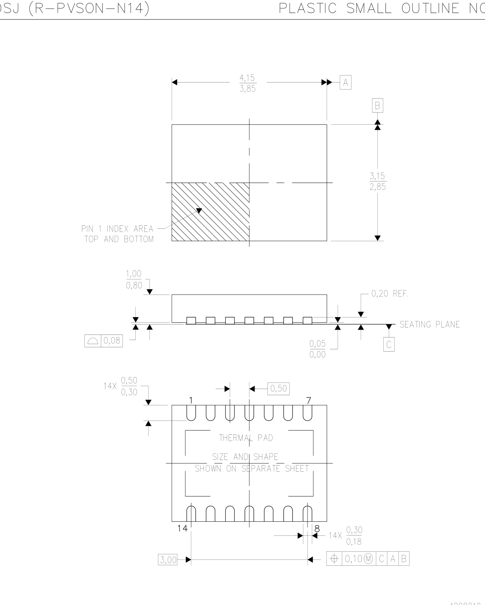

A. AIl linear dimensions are in millimeters. Dimensioning and tolerancing per ASME Y14.5M–1994.   
B. This drawing is subject to change without notice.   
C. Quad Flatpack, No-Leads (QFN) package configuration.   
D. The package thermal pad must be soldered to the board for thermal and mechanical performance.   
E. See the additional figure in the Product Data Sheet for details regarding the exposed thermal pad features and dimensions.

# THERMAL INFORMATION

This package incorporates an exposed thermal pad that is designed to be attached directly to an external heatsink. The thermal pad must be soldered directly to the printed circuit board (PCB). After soldering, the PCB can be used as a heatsink. In addition, through the use of thermal vias, the thermal pad can be attached directly to the appropriate copper plane shown in the electrical schematic for the device, or alternatively, can be attached to a special heatsink structure designed into the PCB. This design optimizes the heat transfer from the integrated circuit (IC).

For information on the Quad Flatpack No-Lead (QFN) package and its advantages, refer to Application Report, QFN/SON PCB Attachment, Texas Instruments Literature No. SLUA271. This document is available at www.ti.com.

The exposed thermal pad dimensions for this package are shown in the following illustration.

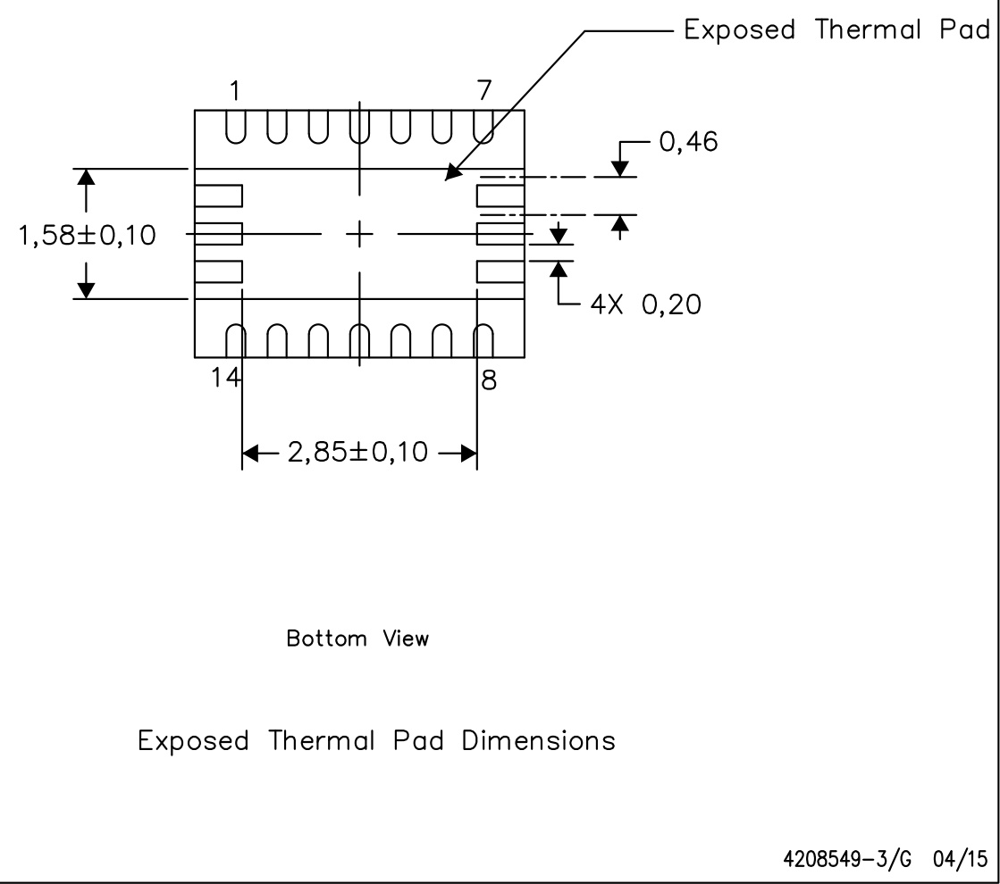

NOTE: AIl linear dimensions are in millimeters

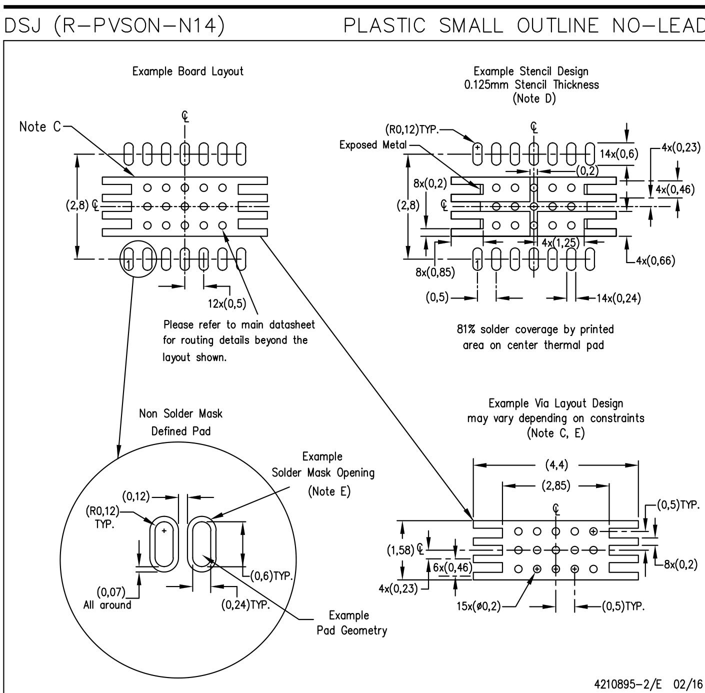

ES: A. All linear dimensions are in millimeters. B. This drawing is subject to change without notice. C. This package is designed to be soldered to a thermal pad on the board. Refer to Application Note, Quad Flat-Pack Packages, Texas Instruments Literature No. SCBA017, SLUA271, and also the Product Data Sheets for specific thermal information, via requirements, and recommended board layout. These documents are available at www.ti.com <http://www.ti.com>. D. Laser cutting apertures with trapezoidal walls and also rounding corners will offer better paste release. Customers should contact their board assembly site for stencil design recommendations. Refer to IPC 7525 for stencil design considerations E. Customers should contact their board fabrication site for minimum solder mask web tolerances between signal pads.

# 重要通知和免责声明

TI“按原样”提供技术和可靠性数据（ 包括数据表） 、 设计资源（包括参考设计） 应用或其他设计建议、 网络工具、 安全信息和其他资源， 不保证没有瑕疵且不做出任何明示或暗示的担保， 包括但不限于对适销性、 与某特定用途的适用性或不侵犯任何第三方知识产权的暗示担保。

这些资源可供使用 TI 产品进行设计的熟练开发人员使用。 您将自行承担以下全部责任：(1) 针对您的应用选择合适的 TI 产品， (2) 设计、 验证并测试您的应用， (3) 确保您的应用满足相应标准以及任何其他安全、 安保法规或其他要求。

这些资源如有变更，恕不另行通知。TI 授权您仅可将这些资源用于研发本资源所述的 TI 产品的相关应用。严禁以其他方式对这些资源进行复制或展示。您无权使用任何其他 TI 知识产权或任何第三方知识产权。对于因您对这些资源的使用而对 TI 及其代表造成的任何索赔、损害、成本、损失和债务，您将全额赔偿，TI 对此概不负责。

TI 提供的产品受 TI 销售条款)、TI 通用质量指南 或 ti.com 上其他适用条款或 TI 产品随附的其他适用条款的约束。TI 提供这些资源并不会扩展或以其他方式更改 TI 针对 TI 产品发布的适用的担保或担保免责声明。 除非德州仪器 (TI) 明确将某产品指定为定制产品或客户特定产品，否则其产品均为按确定价格收入目录的标准通用器件。

TI 反对并拒绝您可能提出的任何其他或不同的条款。