# TPS7A20 300mA、 超低噪声、 低 IQ、 高 PSRR LDO

# 1 特性

# 3 说明

低输出电压噪声：7μVRMS 无需噪声旁路电容

高 PSRR： 1kHz 时为 95dB超低 $1 _ { \mathsf { Q } } : 6 . 5 \mu { \mathsf { A } }$ 输入电压范围：1.6V 至 6.0V输出电压范围： 0.8V 至 5.5V输出电压容差： $\pm 1 . 5 \%$ （最大值）

超低压降：

在 300mA 下为 140mV （最大值） (VOUT =3.3V)  
在 300mA 下为 145mV （最大值） （VOUT =3.3V， DBV）

低浪涌电流智能使能端下拉

与最低 1µF 的陶瓷输出电容搭配使用可保持稳定

封装：

1mm × 1mm X2SON (DQN)  
0. 16mm× 0.1 6mm DSBGA (YCK)  
0.612mm× 0.612mm DSBGA (YCJ)  
2.9mm × 2.8mm SOT23-5 (DBV)

# 2 应用

智能手机和平板电脑  
IP 网络摄像头  
便携式医疗设备  
智能仪表和现场变送器  
电机驱动器  
可穿戴设备

TPS7A20 是一款超小型低压降 (LDO) 线性稳压器，可提供 300mA 的输出电流。TPS7A20 旨在提供符合射频和其他敏感模拟电路要求的低噪声、高 PSRR 和出色的负载和线路瞬态性能。TPS7A20 采用创新的设计技术，无需噪声旁路电容便可提供超低的噪声性能。TPS7A20 的优点还在于具有低静态电流，适用于任何电池供电的应用 TPS7A20 具有 1.6V 至 6.0V 的输入电压范围和 0.8V 至 5.5V 的输出电压范围，可用于各种应用。该器件使用精密基准电路，可在不同负载、线路和温度变化之间提供 $1 . 5 \%$ 的最大精度。

TPS7A20 具备内部软启动功能，旨在降低浪涌电流，因此可在启动过程中最大限度地降低输入电压降。该器件在与小型陶瓷电容搭配使用时可保持稳定，因此可实现小尺寸总体解决方案。

TPS7A20 具有带内部控制下拉电阻的智能使能输入电路，该电阻即使在 EN 引脚悬空时也能让 LDO 保持禁用状态，因而无需使用外部组件来下拉 EN 引脚。

封装信息  

<html><body><table><tr><td>器件型号</td><td>封装(1)</td><td>封装尺寸(2)</td></tr><tr><td rowspan="4">TPS7A20</td><td>DQN X2SON 4)</td><td>1mm× 1mm</td></tr><tr><td>YCJ DSBGA 4)</td><td>0.612mm ×0.612mm</td></tr><tr><td>YCK (DSBGA 4)</td><td>0.616mm × 0.616mm</td></tr><tr><td>DBV ( SOT-23 5)</td><td>2.9mm × 2.8mm</td></tr></table></body></html>

(1) 如需更多信息，请参阅 机械、封装和可订购信息(2) 封装尺寸（长 $\times$ 宽）为标称值，并包括引脚（如适用）。

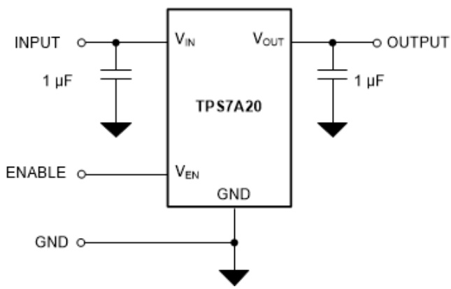  
应用原理图

# Table of Contents

1 特性.   
2 应用.   
3 说明.   
4 Pin Configuration and Functions.   
5 Specifications.. ......................... 5 5.1 Absolute Maximum Ratings. 5 5.2 ESD Ratings. - 5 5.3 Recommended Operating Conditions. ........................ 5 5.4 Thermal Information. 6 5.5 Electrica Characteristics. 6 5.6 Switching Characteristics. 7 5.7 Typical Characteristics. 8   
6 Detailed Description .23 6.1 Overview................................................................... 23 6.2 Functional Block Diagram.. 23 6.3 Feature Description. .24 6.4 Device Functional Modes. ........ .26

#

7 Application and Implementation................................. 27 7.1 Application Information. 27 7.2 Typical Application. 30 7.3 Power Supply Recommendations. 31 7.4 Layout...... 31 8 Device and Documentation Support. . . 8.1 Device Support. 8.2 接收文档更新通知.................................................... 8.3 支持资源. ................................................................. 8.4 Trademarks. 8.5 静电放电警告 33 8.6 术语表. 33 9 Revision History. 34 10 Mechanical, Packaging, and Orderable Information. 34 10.1 Mechanical Data. 35

# 4 Pin Configuration and Functions

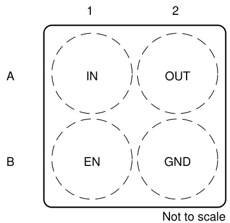  
图 4-1. YCJ and YCK Packages,4-Pin DSBGA (Top View)

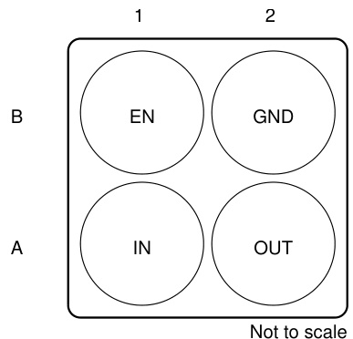  
图 4-2. YCJ and YCK Packages,4-Pin DSBGA (Bottom View)

Pin Functions: DSBGA   

<html><body><table><tr><td colspan="2">PIN</td><td rowspan="2">IO</td><td rowspan="2">DESCRIPTION</td></tr><tr><td>NO.</td><td>NAME</td></tr><tr><td>A1</td><td>N</td><td></td><td>Input voltage supply. For best transient response and to minimize input impedance, use the nominal value or larger capacitor from IN to ground as listed in the Recommended Operating Conditions table. Place the input capacitor as close to the IN and GND pins of the device as possible.</td></tr><tr><td>A2</td><td>OUT</td><td></td><td>Regulated output voltage. A low equivalent series resistance (ESR) capacitor is required from OUT to ground for stability. For best transient response, use the nominal recommended value larger capacitor listed in the Recommended Operating Conditions table. Place the output capacitor as close to the OUT and GND pins thedevice as possible. Or of</td></tr><tr><td>B1</td><td>EN</td><td></td><td>Enable input. A low voltage (< VEn(Low) on this input turns the regulator off and discharges the output pin to GND. A high voltage (> VEN(H) O this pin enables the regulator output. This pin has an internal 500k Ω pulldown resistor to hold the regulator off by default. When</td></tr><tr><td>B2</td><td>GND</td><td></td><td>> the 500kΩ pulldown is disconnected to reduce input current. Common ground. VEN VEN(HI),</td></tr></table></body></html>

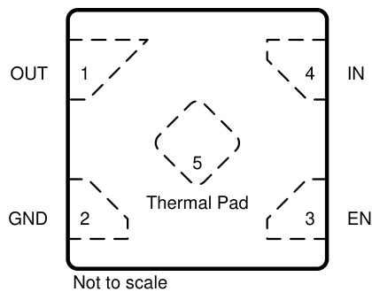  
图 4-3. DQN Package, 4-Pin X2SON (Top View)

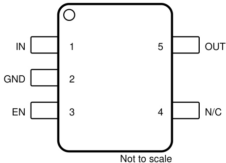  
图 4-4. DBV Package, 5-Pin SOT-23 (Top View)

Pin Functions: X2SON, SOT-23   

<html><body><table><tr><td colspan="3">PIN</td><td rowspan="2">O</td><td rowspan="2">DESCRIPTION</td></tr><tr><td>NAME</td><td>X2SON</td><td>SOT-23</td></tr><tr><td>IN</td><td></td><td></td><td>in</td><td>Input voltage supply. For best transient response and to minimize input impedance, use the nominal value or larger capacitor from IN to ground as listed the Recommended Operating Conditions table. Place the input capacitor as close to the IN and GND pins of the device as possible.</td></tr><tr><td>OUT</td><td></td><td></td><td>O</td><td>Regulated output voltage. A low equivalent series resistance (ESR) capacitor is required from OUT to ground for stability. For best transient response, use the nominal recommended value or Ilarger capacitor listed in the Recommended Operating Conditions table. Place the output capacitor as close to the OUT and GND pins of the device as possible. An internal 150Ω (typical) pulldown resistor prevents a charge from remaining on Vout when the regulator is in shutdown mode (VEn< VEN(LOW).</td></tr><tr><td>EN</td><td>3</td><td></td><td></td><td>Enable input. A low voltage (< VEN(LOw) On this pin turns the regulator off and discharges the output pin to GND. A high voltage (> VEN(H1) on this pin enables the regulator output. This pin has an internal 500kΩ pulldown resistor to hold the regulator off by default. When VEN > the 500k Ω pulldown is disconnected to reduce input current. VEN(HI),</td></tr><tr><td>GND</td><td>2</td><td>2</td><td></td><td>Common ground.</td></tr><tr><td>N/C</td><td></td><td>4</td><td></td><td>No internal electrical connection.</td></tr><tr><td>Thermal Pad</td><td></td><td></td><td></td><td>Thermal pad for the X2SON package. Connect this pad to GND or leave fl oating. Do not connect to any potential other than GND. Connect the thermal pad to a large-area ground plane for best thermal performance.</td></tr></table></body></html>

# 5 Specifications

# 5.1 Absolute Maximum Ratings

over operating free-air temperature range (unless otherwise noted)(1) (3)

<html><body><table><tr><td colspan="2"></td><td>MIN</td><td>MAX| UNIT</td></tr><tr><td rowspan="3">Voltage</td><td>VIN</td><td>0.3 6.5</td><td rowspan="3"></td></tr><tr><td>VouT</td><td>0.3 6.5 or ViN + 0.3 (2)</td></tr><tr><td>VEN</td><td>6.5</td></tr><tr><td>Current Maximum output(4)</td><td></td><td>0.3 Internally limited</td><td></td></tr><tr><td rowspan="2">Temperature</td><td>Operating junction,</td><td>40</td><td></td></tr><tr><td>Storage, Tstg</td><td>150 65 150</td><td>C</td></tr></table></body></html>

(1) Stresses beyond those listed under Absolute Maximum Ratings may cause permanent damage to the device. These are stress ratings only, and functiona operation of the device at these or any other conditions beyond those indicated under Recommended Operating Conditions is not implied. Exposure to absolute- maximum-rated conditions for extended periods may affect device reliability.   
(234) The maximu m value of VOUT is the lesser of $6 . 5 \vee$ or $( \mathsf { V } _ { \mathsf { I N } } + 0 . 3 \mathsf { V } )$ . All voltages are with respect to the GND pin. Internal thermal shutdown circuitry protects the device from permanent damage.

# 5.2 ESD Ratings

<html><body><table><tr><td colspan="2"></td><td>VALUE</td><td>UNIT</td></tr><tr><td rowspan="2">V(ESD)</td><td rowspan="2">Electrostatic discharge</td><td>(HBM), per ANSI/ESDA/JEDEC JS-001(1)</td><td>±2000</td><td rowspan="2"></td></tr><tr><td>Charged-device model (CDM), per JEDEC specification JESD22-C101(2)</td><td>±750</td></tr></table></body></html>

(1) JEDEC document JEP155 states that 500-V HBM allows safemanufacturing with a standard ESD control process.   
(2) JEDEC document JEP157 states that 250-V CDM allows safemanufacturing with a standard ESD control process.

# 5.3 Recommended Operating Conditions

over operating free-air temperature range (unless otherwise noted)(1)

<html><body><table><tr><td colspan="2"></td><td>MIN NOM</td><td>MAX</td><td>UNIT</td></tr><tr><td>ViN</td><td>Input supply voltage</td><td>1.6</td><td>6.0</td><td>V</td></tr><tr><td>VEN</td><td>Enable input voltage</td><td>0</td><td>6.0</td><td>V</td></tr><tr><td>VoUT</td><td>Nominal output voltage range</td><td>0.8</td><td>5.5</td><td>V</td></tr><tr><td>louT</td><td>Output current</td><td>0</td><td>300</td><td>mA</td></tr><tr><td>CIN</td><td>Input capacitor(2)</td><td></td><td></td><td>μF</td></tr><tr><td>CoUT</td><td>Output capacitor(3)</td><td></td><td>200</td><td>μF</td></tr><tr><td>ESR</td><td>Output capacitor effective series resistance</td><td></td><td>100</td><td>mΩ</td></tr><tr><td>TJ</td><td>Operating junction temperature</td><td>40</td><td>125</td><td>C</td></tr></table></body></html>

(1) All voltages are with respect to GND.

(2) An input capacitor is not required for LDO stability. However, an input capacitor with an effective value of $0 . 4 7 \textrm { \textmu F }$ minimum is recommended to counteract the effect of source resistance and inductance, which may in some cases cause symptoms of systemlevel instability such as ringing or oscillation, especially in the presence of load transients.   
(3) Effective output capacitance of 0.47 $\mu \mathsf { F }$ minimum and $2 0 0 ~ \mu \mathsf { F }$ maximum is required for stability.

# 5.4 Thermal Information

<html><body><table><tr><td rowspan="4">THERMAL METRIC(1) Rθ JA</td><td colspan="4">TPS7A20</td><td rowspan="4">UNIT</td></tr><tr><td>DBV (SOT-23)</td><td>DQN (X2SON)</td><td>YCJ (DSBGA)</td><td>YCK (DSBGA)</td></tr><tr><td>5 PINS</td><td>4 PINS</td><td>4 PINS</td><td>4 PINS</td></tr><tr><td>187.1</td><td>166.1</td><td>199.6</td><td>201.4</td></tr><tr><td>Rθ JC(top)</td><td>Junction-to-ambient thermal resistance Junction-to-case (top) thermal resistance</td><td>85.5</td><td>103.6</td><td>2.8</td><td>2.8</td><td>C/W C/W</td></tr><tr><td>Rθ JB</td><td>Junction-to-board thermal resistance</td><td>54.4</td><td>110.6</td><td>67.5</td><td>69.3</td><td>C/W</td></tr><tr><td>JT</td><td>Junction-to-top characterization parameter</td><td>27.1</td><td>3.0</td><td>1.4</td><td>1.4</td><td>C/W</td></tr><tr><td>JB$</td><td>Junction-to-board characterization parameter</td><td>54.1</td><td>103.3</td><td>67.4</td><td>69.2</td><td>C/W</td></tr><tr><td>Rθ JC(bot)</td><td>Junction-to-case (bottom) thermal resistance</td><td>N/A</td><td>98.8</td><td>N/A</td><td>N/A</td><td>C/W</td></tr></table></body></html>

(1) For more information about traditional and new thermal metrics, see the Semiconductor and IC Package Thermal Metrics application report.

# 5.5 Electrical Characteristics

at operating temperature range $( \mathsf { T } _ { \mathsf { J } } = \mathsf { \Omega } - 4 0 ^ { \circ } \mathrm { C }$ to $+ 1 2 5 \mathrm { ^ \circ C }$ ), $\mathsf { V } _ { \mathsf { I N } } = \mathsf { V } _ { \mathsf { O U T } ( \mathsf { N O M } ) } + 0 . 3 \mathsf { V }$ or $1 . 6 { \lor } ,$ whichever is greater, $\mathsf { V } _ { \mathsf { E N } } = 1 . 0 \mathsf { V } _ { : }$ $\mathsf { l _ { O U T } } = 1 \mathsf { m A }$ , $\mathsf { C } _ { \mathsf { I N } } = 1$ µF, $\mathsf { C } _ { \mathsf { O U T } } = 1 \ \mu \mathsf { F }$ (unless otherwise noted); all typical values are at $\mathsf { T } _ { \mathsf { J } } = 2 5 ^ { \circ } \mathrm { C }$

<html><body><table><tr><td colspan="2">PARAMETER</td><td colspan="2">TEST CONDITIONS VN = 0.3 V) to 6.0 V, (VOUT(NOM)</td><td>MIN</td><td>TYP</td><td>MAX</td><td>UNIT</td></tr><tr><td rowspan="7">∆VoUT</td><td rowspan="4">Output voltage tolerance</td><td colspan="2">loUT 1 mA to 300 mA, W 1.85 V (DQN, YCJ, YCK packages) VoUT</td><td>1.5</td><td></td><td>1.5</td><td rowspan="3"></td></tr><tr><td colspan="2">ViN = (VOUT(NOM) + 0.3V) to 6.0V, louT = 1 mA to 300 mA, ≥ 2.8 V (DBV package) VouT</td><td>-1.5</td><td></td><td>1.5</td></tr><tr><td colspan="2">VN = (VOUT(NOM) + 0.5V) to 6.0V, IoUT = mA 300 mA < 1.85 V (DQN, YCJ, YCK packages) to VoUT</td><td>30</td><td></td><td>30</td></tr><tr><td colspan="2">VN = 0.3 V) to 6.0 V, loUT = mA to 300 mA, < 2.8 V (DBV package) (VOUT(NOM) VoUT</td><td>-40</td><td></td><td>40</td><td rowspan="3">mV</td></tr><tr><td colspan="3">ViN = + 0.3 V) to 6.0V, louT = mA (DQN, YCJ, YCK packages) (VoUT(NOM)</td><td>0.03</td><td>%N</td></tr><tr><td colspan="3">loUT " mA to 300 mA Load regulation</td><td>13</td><td></td></tr><tr><td>∆VoUT</td><td></td><td colspan="2">= mA to 300 mA (DBV package) louT</td><td>19</td><td></td><td>mV</td></tr><tr><td rowspan="4">IGND</td><td rowspan="4">Quiescent ground current</td><td rowspan="3">VEN = ViN = 6 V, louT =0mA</td><td>Tj= 25°C</td><td>6.5</td><td>8.5</td><td rowspan="3">μA</td></tr><tr><td>TJ= -40°C to 85°℃</td><td></td><td>10</td></tr><tr><td>Tj= 40°C to 125°℃</td><td></td><td>15</td></tr><tr><td></td><td>VEN = ViN = 6 V, louT = 300 mA</td><td></td><td>2000</td><td></td></tr><tr><td>ISHDN</td><td>Shutdown ground current</td><td colspan="2">VEN = 0 V (disabled), ViN 6.0V, TJ= 25°C</td><td>0.07</td><td>0.2</td><td>μA</td></tr><tr><td>IGND(DO)</td><td>IGND in dropout</td><td colspan="2">ViN ≤ louT = 0 mA, VEN = VIN VOUT(NOM)</td><td></td><td>6.5 15</td><td>μA</td></tr><tr><td rowspan="6">VDo</td><td rowspan="6">Dropout voltage</td><td rowspan="6">loUT (DQN, YCJ, YCK packages unless otherwise noted) VouT xVoUT(NOM),</td><td>0.8V≤VouT<1.0 V(1)</td><td></td><td>690</td><td></td></tr><tr><td>1.0V <1.2V(1) 1.2 V < 1.5 V(1) VoUT</td><td></td><td>490 355</td></tr><tr><td>VouT</td><td></td><td></td></tr><tr><td>1.5V ≤ VouT <2.5 V 1.5 V≤VoUT<2.5 V</td><td></td><td>200</td></tr><tr><td>(DBV)</td><td></td><td>205</td></tr><tr><td>2.5 V≤VouT<5.5 V 2.5V≤ <5.5V (DBV) VouT</td><td></td><td>140 145</td></tr></table></body></html>

# 5.5 Electrical Characteristics （续）

at operating temperature range $\langle { \sf T } _ { \sf J } = - 4 0 ^ { \circ } { \mathrm { C } }$ to $+ 1 2 5 \mathrm { ^ \circ C }$ ), $\mathsf { V } _ { \mathsf { I N } } = \mathsf { V } _ { \mathsf { O U T } ( \mathsf { N O M } ) } + 0 . 3 \mathsf { V }$ or $1 . 6 \mathsf { V } ,$ whichever is greater, $\mathsf { V } _ { \mathsf { E N } } = 1 . 0 \mathsf { V } _ { : }$ $\mathsf { I _ { O U T } } = 1 \mathsf { m A }$ , $\mathsf { C } _ { \mathsf { I N } } = 1$ µF, $\mathsf { C } _ { \mathsf { O U T } } = 1 \mu \mathsf { F }$ (unless otherwise noted); all typical values are at $\mathsf { T } _ { \mathsf { J } } = 2 5 ^ { \circ } \mathrm { C }$   

<html><body><table><tr><td colspan="2">PARAMETER</td><td colspan="2">TEST CONDITIONS</td><td>MIN</td><td>TYP</td><td>MAX</td><td>UNIT</td></tr><tr><td colspan="2"></td><td>= 0.9 × VoUT(NOM), VoUT</td><td>VouT <1.5 V (YCJ, YCK</td><td></td><td>520</td><td>770</td><td rowspan="8">mA</td></tr><tr><td rowspan="7">ICL</td><td rowspan="7">Output current limit</td><td>VN = +0.5V =0.9x VOUT(NOM)</td><td>packages) VouT < 1.5 V (DQN</td><td>360</td><td></td><td></td></tr><tr><td>ViN = + 0.5 V VouT ( VOUT(NOM), VOUT(NOM)</td><td>package)</td><td>360</td><td>520</td><td>730</td></tr><tr><td>= 150mV, = 0.5V VouT VOUT(NOM) ViN VoUT(NOM)</td><td>VouT <1.5V(DBV package)</td><td>360</td><td>520</td><td>730</td></tr><tr><td>= 0.9x VIN = 十 VouT ( VOUT(NOM), VoUT(NOM) 0.3V</td><td>VoUT≥1.5 V(YCJ, YCK packages)</td><td>360</td><td>520</td><td>770</td></tr><tr><td>= 0.9× VN = + 0.3 V VouT VOUTNOM), VOUT(NOM)</td><td>VouT ≥ 1.5V(DQN package)</td><td>360 520</td><td></td><td>730</td></tr><tr><td colspan="2">Short-circuit current limit =0V VouT</td><td></td><td>160</td><td>mA</td><td rowspan="8"></td></tr><tr><td rowspan="6">Power-supply rejection ratio ViN VouT VN</td><td rowspan="6"></td><td>f = 100Hz</td><td></td><td>95</td><td></td></tr><tr><td>f = 1 kHz</td><td>95</td><td></td><td></td></tr><tr><td>f = 10 kHz</td><td></td><td></td><td></td></tr><tr><td>f = 100 kHz</td><td></td><td colspan="2"></td></tr><tr><td>f = 1 MHz</td><td>45</td><td colspan="2">dB</td></tr><tr><td>f = 100 Hz</td><td colspan="3">65</td></tr><tr><td rowspan="5">loUT=300 VouT+</td><td colspan="2">f = 1 kHz f = 10 kHz</td><td colspan="3">92</td></tr><tr><td></td><td></td><td colspan="3">75</td></tr><tr><td>f = 100kHz</td><td></td><td colspan="3">60</td></tr><tr><td>f = MHz</td><td></td><td colspan="3">40</td></tr><tr><td>noise voltage BW = 10 Hz to 100 kHz, = 2.8V VouT</td><td>lOuT = 300mA</td><td colspan="3">7 μVRMS</td></tr><tr><td>VN</td><td>Output</td><td colspan="2">louT = 1 mA</td><td></td><td colspan="2">10</td></tr><tr><td rowspan="2">RPULLDOWN TSD</td><td rowspan="2">Thermal shutdown</td><td colspan="2">VEN (output disabled), Vin = 3.1 V L VEN(LOW)</td><td colspan="2">150</td><td rowspan="2">Ω2</td></tr><tr><td colspan="2">TJ rising Tj falling</td><td>165</td><td>C</td></tr><tr><td rowspan="2">VEN(LOW)</td><td rowspan="2">Low input threshold</td><td colspan="2">ViN</td><td colspan="2">140</td><td rowspan="2"></td></tr><tr><td colspan="2">ViN = 1.6 V to 6.0 V VEN</td><td>0.3</td><td></td></tr><tr><td rowspan="3">High input threshold VEN(HI)</td><td rowspan="3">UVLO threshold</td><td colspan="2">rising until the output is enabled VEN</td><td>0.9</td><td></td><td rowspan="4"></td></tr><tr><td colspan="2">Vin rising (YCJ and YCK packages)</td><td>1.11 1.35 1.17 1.35</td><td>1.59</td><td rowspan="3"></td></tr><tr><td colspan="2">ViN rising (DBV and DQN packages)</td><td>1.05</td><td>1.59</td></tr><tr><td colspan="2">Vin falling (YCJ and YCK packages)</td><td></td><td>1.3 1.55</td></tr><tr><td>VUVLO(HYST)</td><td>UVLO hysteresis</td><td colspan="2">Vin falling (DBV and DQN packages)</td><td>1.11</td><td>1.3 1.55</td><td></td></tr><tr><td>IEN</td><td>EN input leakage current</td><td colspan="2">VEN = 6.0 V and Vin = 6.0 V</td><td>50 90</td><td></td><td>mV nA</td></tr><tr><td>REN(PULL-</td><td></td><td colspan="2"></td><td></td><td>250</td><td></td></tr><tr><td>DOWN)</td><td>enable pulldown resistor Smart</td><td colspan="2">VEN = 0.25 V</td><td>500</td><td></td><td>KΩ</td></tr></table></body></html>

(1) Design simulation data only

# 5.6 Switching Characteristics

at operating temperature range $( \mathsf { T } _ { \mathsf { J } } = \mathsf { \Omega } - 4 0 ^ { \circ } \mathrm { C }$ to $+ 1 2 5 \mathrm { ^ \circ C }$ ), $\mathsf { V } _ { \mathsf { I N } } = \mathsf { V } _ { \mathsf { O U T } ( \mathsf { N O M } ) } + 0 . 3 \mathsf { V }$ or $1 . 6 \mathsf { V } ,$ whichever is greater, $\mathsf { V } _ { \mathsf { E N } } = 1 . 0 \mathsf { V } _ { : }$ $\mathsf { I _ { O U T } } = 1 \mathsf { m A }$ , $C _ { 1 \ N } = 1$ µF, $\mathsf { C } _ { \mathsf { O U T } } = 1 \ |$ µF (unless otherwise noted); all typical values are at $\mathsf { T } _ { \mathsf { J } } = 2 5 ^ { \circ } \mathrm { C }$

<html><body><table><tr><td colspan="2">PARAMETER</td><td>TEST CONDITIONS</td><td>MIN</td><td>TYP</td><td>MAX</td><td>UNIT</td></tr><tr><td>tsTR</td><td>Start-up time</td><td>From V to VouT 95%of VEN VEN(HI) VOUT(NOM),</td><td></td><td>750</td><td>1150</td><td></td></tr></table></body></html>

# 5.7 Typical Characteristics

$\mathsf { V } _ { \mathsf { I N } } = \mathsf { V } _ { \mathsf { O U T } ( \mathsf { N O M } ) } + 0 . 3 \mathsf { V }$ or $1 . 6 \lor$ (whichever is greater), ${ \mathsf { V } } _ { \mathsf { O U T } } = 2 . 8 { \mathsf { V } } _ { : }$ , $\mathsf { l _ { O U T } } = 1 \mathsf { m A }$ , $\mathsf { C } _ { \mathsf { I N } } = 1$ µF, $\mathtt { C _ { \mathrm { { O U T } } } } = 1$ µF, and ${ \sf T } _ { \sf A } = 2 5 ^ { \circ } { \sf C }$ (unless otherwise noted)

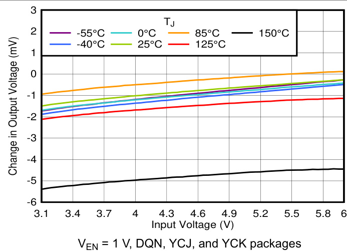  
图 5-1. Line Regulation vs $\mathsf { v } _ { \mathsf { I N } }$

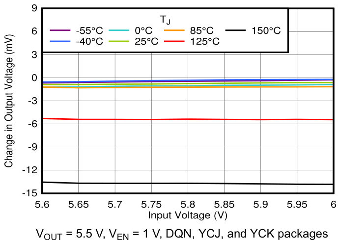  
图 5-2. Line Regulation vs $\mathsf { v } _ { \mathsf { I N } }$

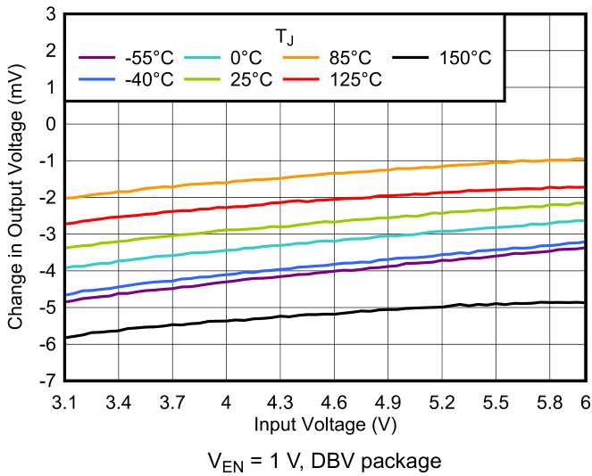  
图 5-3. Line Regulation vs VIN

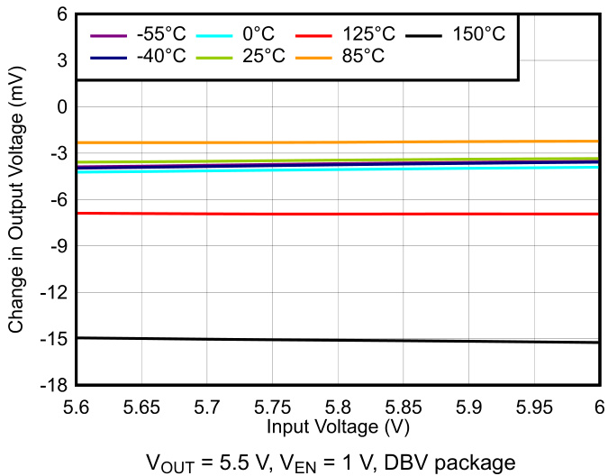  
图 5-4. Line Regulation vs VIN

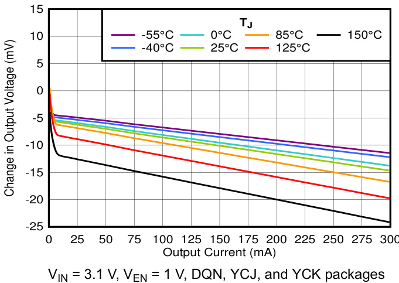  
图 5-5. Load Regulation vs IOUT

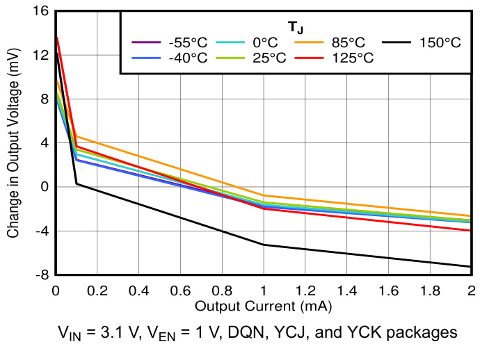  
图 5-6. Load Regulation vs IOUT

# 5.7 Typical Characteristics (continued)

$\mathsf { V } _ { \mathsf { I N } } = \mathsf { V } _ { \mathsf { O U T } ( \mathsf { N O M } ) } + 0 . 3 \mathsf { V }$ or $1 . 6 \lor$ (whichever is greater), ${ \mathsf { V } } _ { \mathsf { O U T } } = 2 . 8 { \mathsf { V } } _ { : }$ , $\mathsf { l _ { O U T } } = 1 \mathsf { m A }$ , $\mathsf { C } _ { \mathsf { I N } } = 1$ µF, $\mathtt { C _ { \mathrm { { O U T } } } } = 1$ µF, and ${ \sf T } _ { \sf A } = 2 5 ^ { \circ } { \sf C }$ (unless otherwise noted)

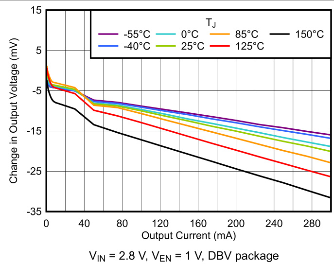  
图 5-7. Load Regulation vs IOUT

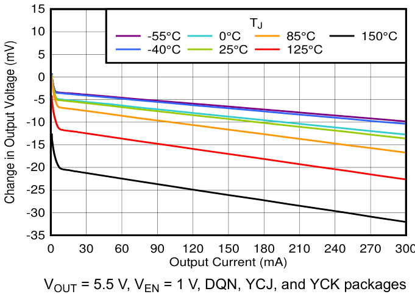  
图 5-9. Load Regulation vs IOUT

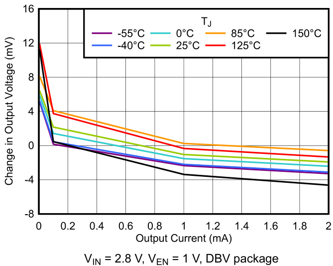  
图 5-8. Load Regulation vs IOUT

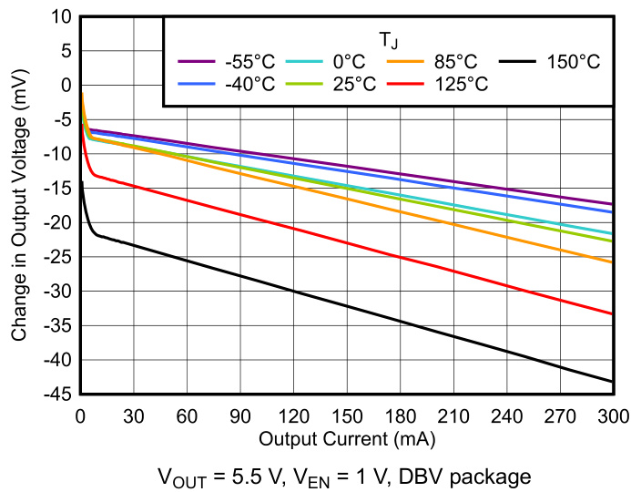  
图 5-11. Load Regulation vs IOUT

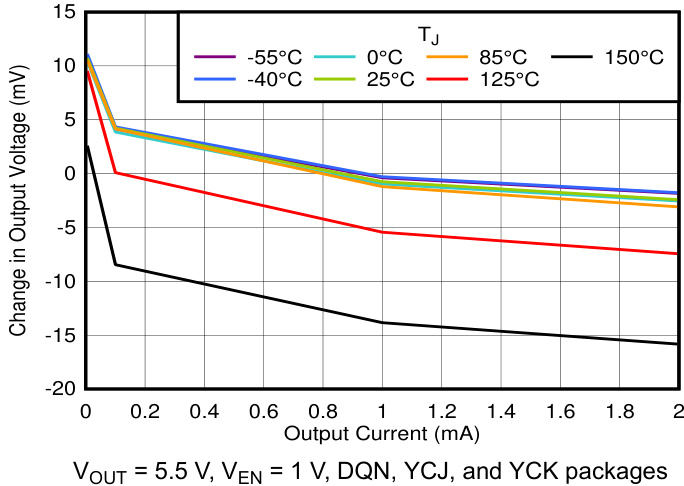  
图 5-10. Load Regulation vs IOUT

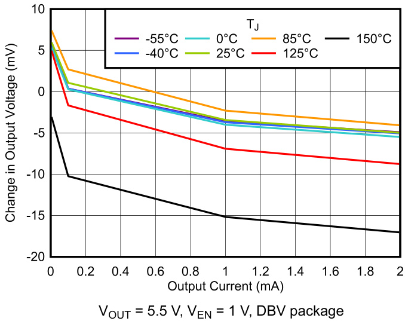  
图 5-12. Load Regulation vs IOUT

# 5.7 Typical Characteristics (continued)

$\mathsf { V } _ { \mathsf { I N } } = \mathsf { V } _ { \mathsf { O U T } ( \mathsf { N O M } ) } + 0 . 3 \mathsf { V }$ or $1 . 6 \lor$ (whichever is greater), ${ \mathsf { V } } _ { \mathsf { O U T } } = 2 . 8 { \mathsf { V } } _ { : }$ , $\mathsf { l _ { O U T } } = 1 \mathsf { m A }$ , $\mathsf { C } _ { \mathsf { I N } } = 1$ µF, $\mathtt { C _ { \mathrm { { O U T } } } } = 1$ µF, and ${ \sf T } _ { \sf A } = 2 5 ^ { \circ } { \sf C }$ (unless otherwise noted)

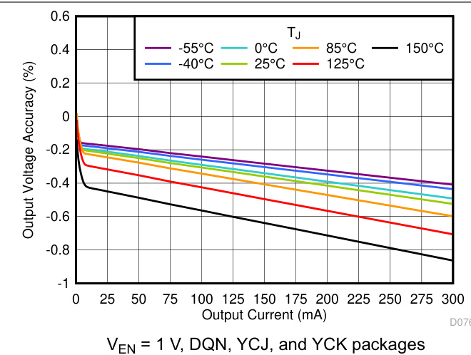  
图 5-13. Output Voltage Accuracy vs IOUT

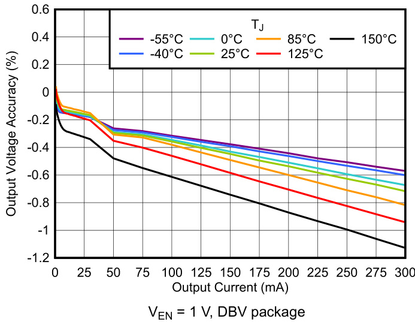  
图 5-15. Output Voltage Accuracy vs IOUT

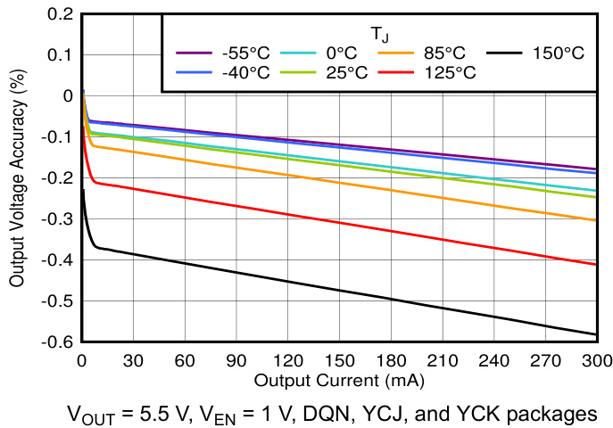  
图 5-17. Output Voltage Accuracy vs IOUT

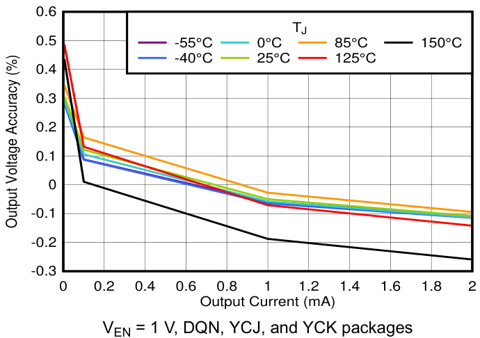  
图 5-14. Output Voltage Accuracy vs IOUT

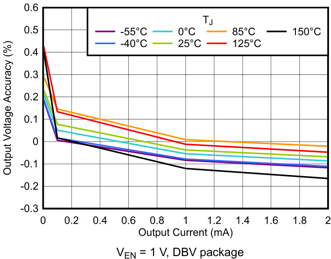  
图 5-16. Output Voltage Accuracy vs IOUT

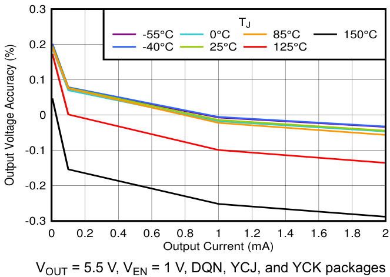  
图 5-18. Output Voltage Accuracy vs IOUT

# 5.7 Typical Characteristics (continued)

$\mathsf { V } _ { \mathsf { I N } } = \mathsf { V } _ { \mathsf { O U T } ( \mathsf { N O M } ) } + 0 . 3 \mathsf { V }$ or $1 . 6 \lor$ (whichever is greater), ${ \mathsf { V } } _ { \mathsf { O U T } } = 2 . 8 { \mathsf { V } } _ { : }$ , $\mathsf { l _ { O U T } } = 1 \mathsf { m A }$ , $\mathsf { C } _ { \mathsf { I N } } = 1$ µF, $\mathtt { C _ { \mathrm { { O U T } } } } = 1$ µF, and ${ \sf T } _ { \sf A } = 2 5 ^ { \circ } { \sf C }$ (unless otherwise noted)

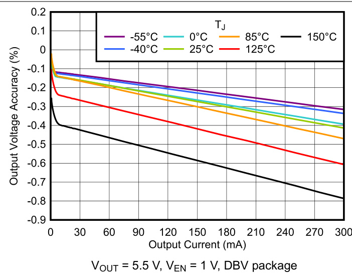  
图 5-19. Output Voltage Accuracy vs IOUT

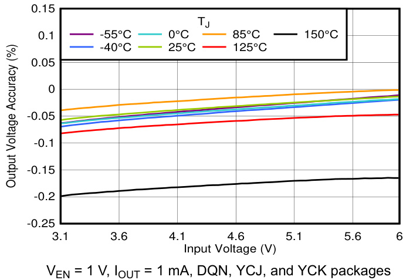  
图 5-21. Output Voltage Accuracy vs $\mathsf { v } _ { \mathsf { I N } }$

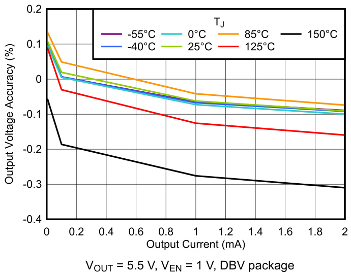  
图 5-20. Output Voltage Accuracy vs IOUT

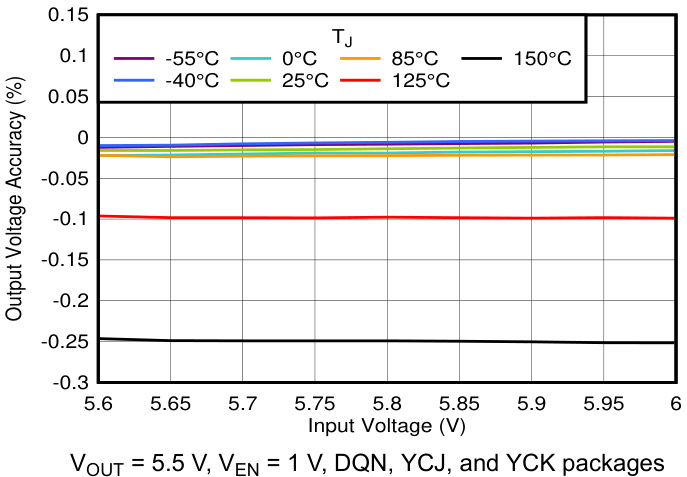  
图 5-22. Output Voltage Accuracy vs VIN

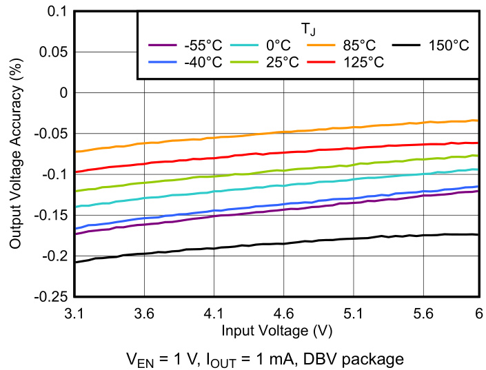  
图 5-23. Output Voltage Accuracy vs VIN

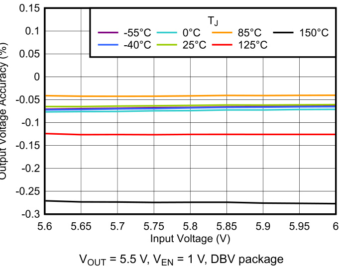  
图 5-24. Output Voltage Accuracy vs VIN

# 5.7 Typical Characteristics (continued)

$\mathsf { V } _ { \mathsf { I N } } = \mathsf { V } _ { \mathsf { O U T } ( \mathsf { N O M } ) } + 0 . 3 \mathsf { V }$ or $1 . 6 \lor$ (whichever is greater), ${ \mathsf { V } } _ { \mathsf { O U T } } = 2 . 8 { \mathsf { V } } _ { : }$ , $\mathsf { l _ { O U T } } = 1 \mathsf { m A }$ , $\mathsf { C } _ { \mathsf { I N } } = 1$ µF, $\mathtt { C _ { \mathrm { { O U T } } } } = 1$ µF, and ${ \sf T } _ { \sf A } = 2 5 ^ { \circ } { \sf C }$ (unless otherwise noted)

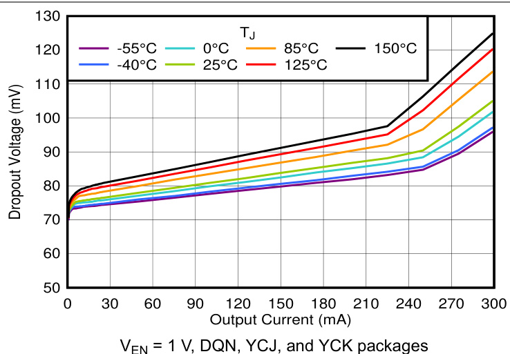  
图 5-25. Dropout Voltage vs IOUT

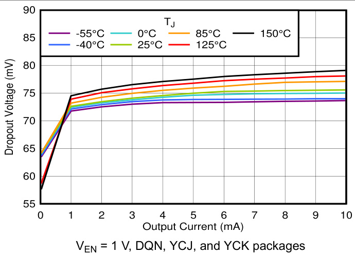  
图 5-26. Dropout Voltage vs IOUT

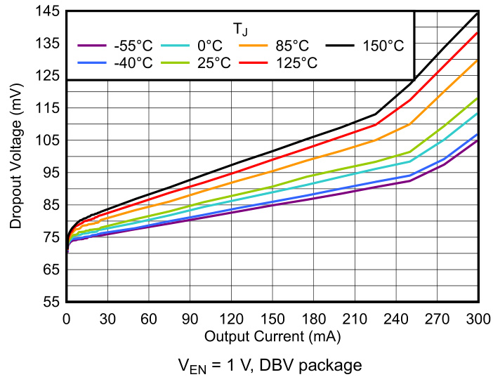  
图 5-27. Dropout Voltage vs IOUT

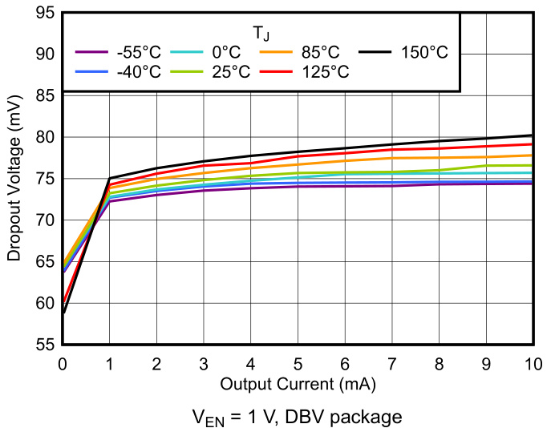  
图 5-28. Dropout Voltage vs IOUT

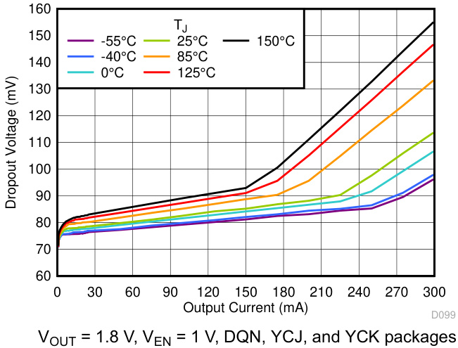  
图 5-29. Dropout Voltage vs IOUT

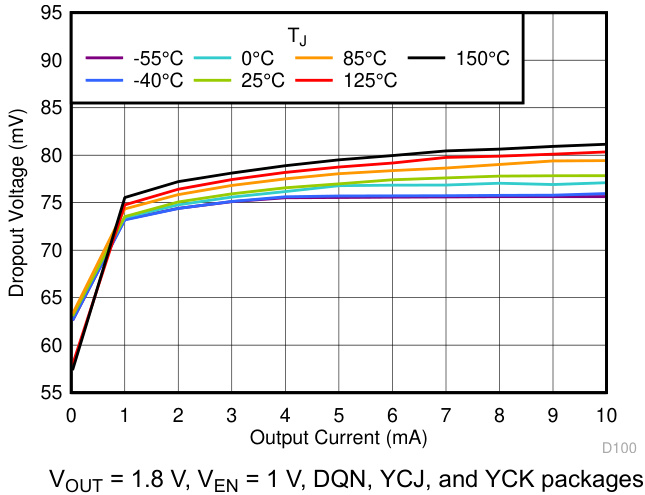  
图 5-30. Dropout Voltage vs IOUT

# 5.7 Typical Characteristics (continued)

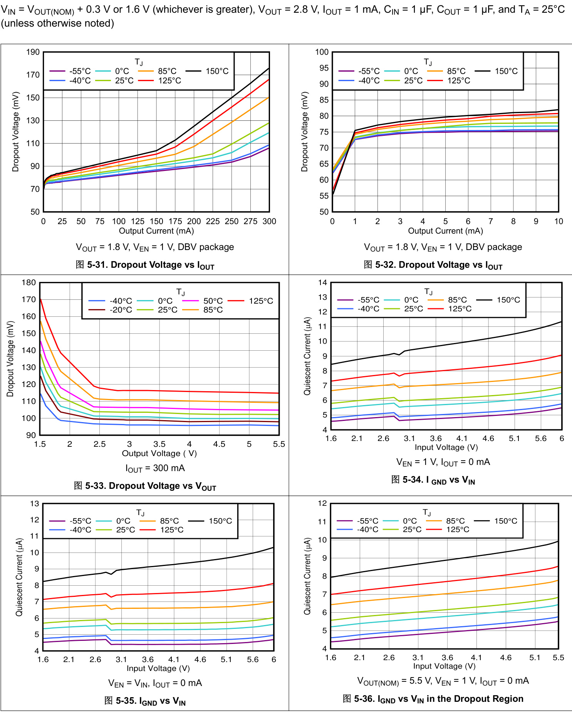

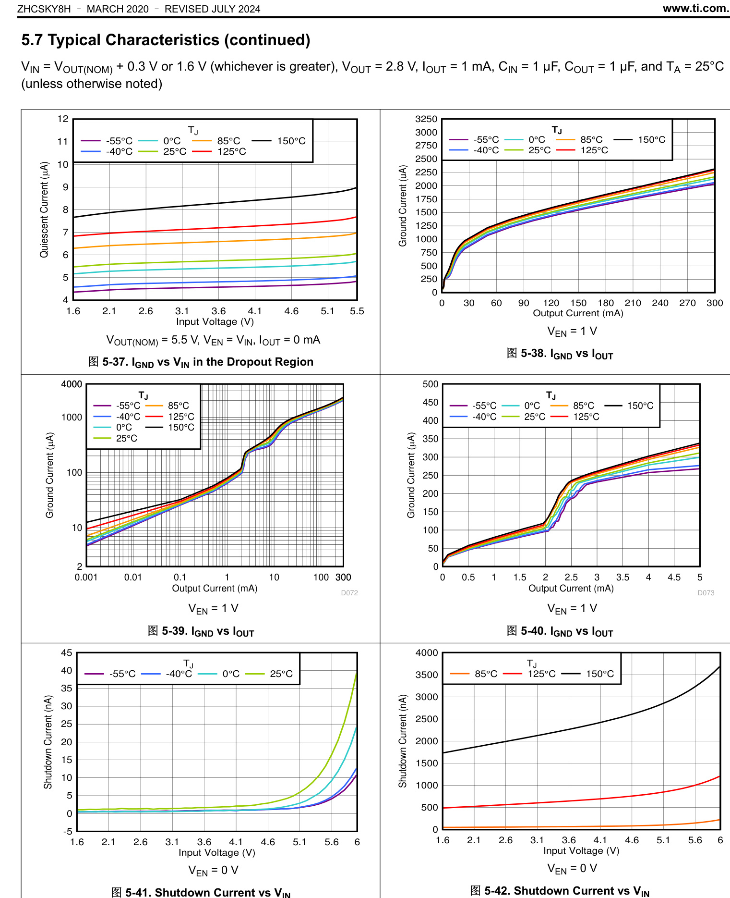

# 5.7 Typical Characteristics (continued)

$\mathsf { V } _ { \mathsf { I N } } = \mathsf { V } _ { \mathsf { O U T } ( \mathsf { N O M } ) } + 0 . 3 \mathsf { V }$ or $1 . 6 \lor$ (whichever is greater), ${ \mathsf { V } } _ { \mathsf { O U T } } = 2 . 8 { \mathsf { V } } _ { : }$ , $\mathsf { l _ { O U T } } = 1 \mathsf { m A }$ , $\mathsf { C } _ { \mathsf { I N } } = 1$ µF, $\mathtt { C _ { \mathrm { { O U T } } } } = 1$ µF, and ${ \sf T } _ { \sf A } = 2 5 ^ { \circ } { \sf C }$ (unless otherwise noted)

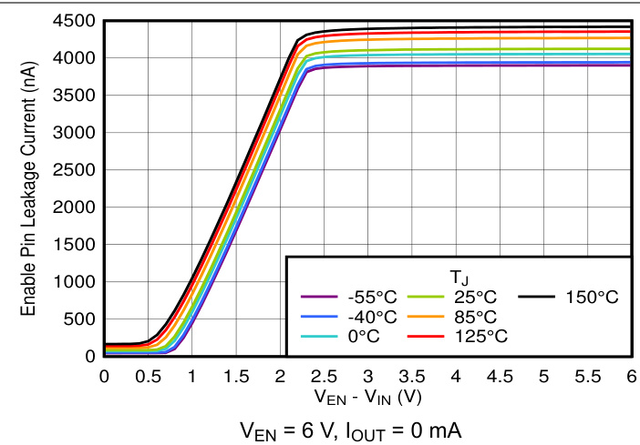  
图 5-43. Enable Pin Leakage Current vs

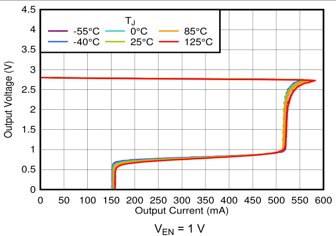  
图 5-44. Current Limit

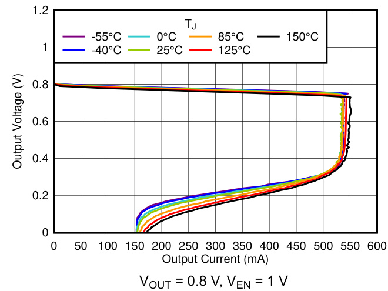  
图 5-45. Current Limit

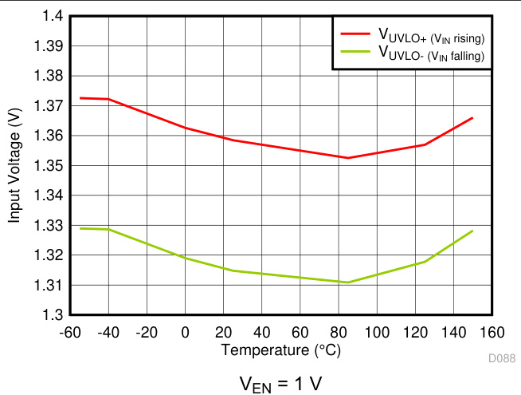  
图 5-46. UVLO Threshold vs Temperature

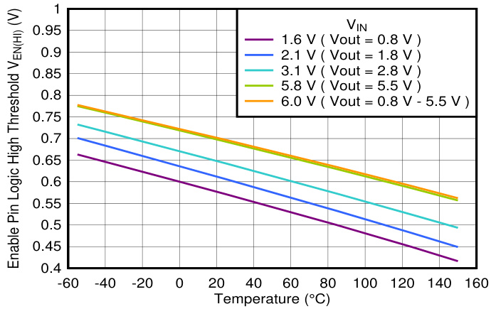  
图 5-47. Enable Logic High Threshold vs Temperature

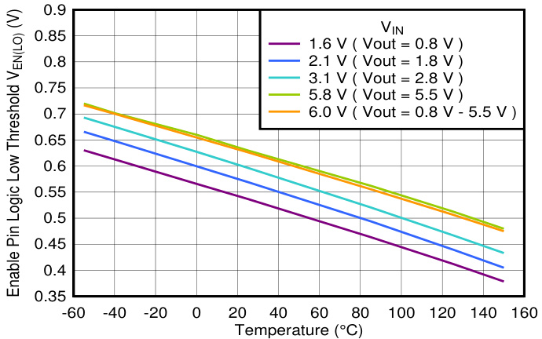  
图 5-48. Enable Logic Low Threshold Low vs Temperature

# 5.7 Typical Characteristics (continued)

$\mathsf { V } _ { \mathsf { I N } } = \mathsf { V } _ { \mathsf { O U T } ( \mathsf { N O M } ) } + 0 . 3 \mathsf { V }$ or $1 . 6 \lor$ (whichever is greater), ${ \mathsf { V } } _ { \mathsf { O U T } } = 2 . 8 { \mathsf { V } } _ { : }$ , $\mathsf { l _ { O U T } } = 1 \mathsf { m A }$ , $\mathsf { C } _ { \mathsf { I N } } = 1$ µF, $\mathtt { C _ { \mathrm { { O U T } } } } = 1$ µF, and ${ \sf T } _ { \sf A } = 2 5 ^ { \circ } { \sf C }$ (unless otherwise noted)

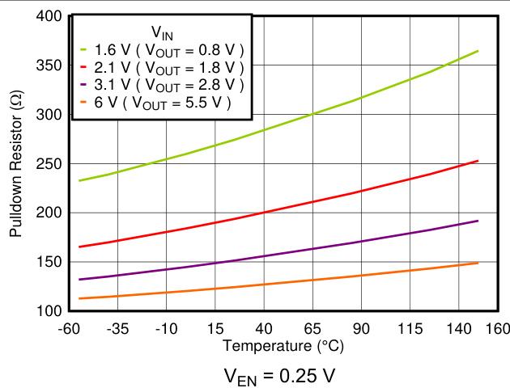  
图 5-49. Output Pulldown Resistor vs Temperature

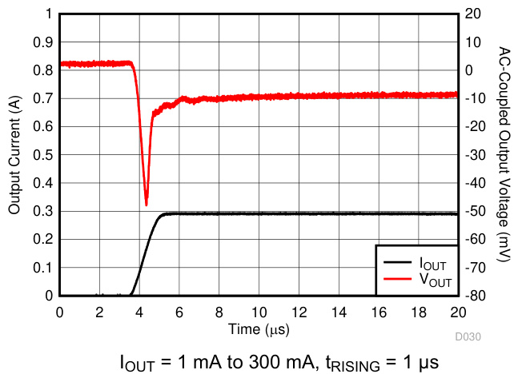  
图 5-51. Load Transient

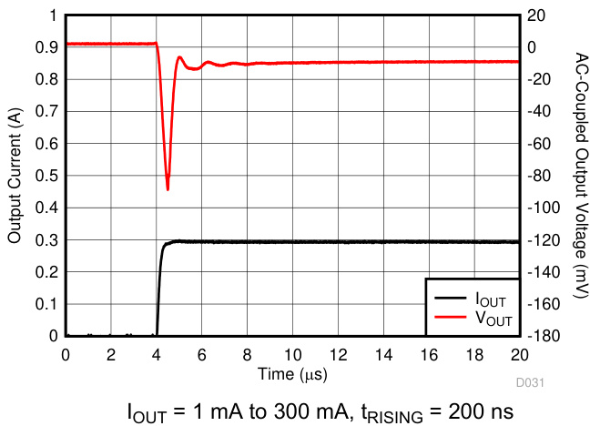  
图 5-53. Load Transient

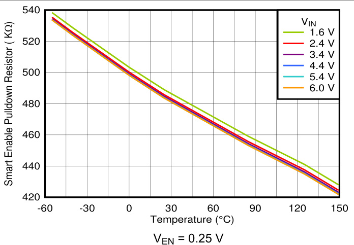  
图 5-50. Smart Enable Pulldown Resistor vs Temperature and$\mathsf { \mathbf { v } } _ { \mathsf { I N } }$

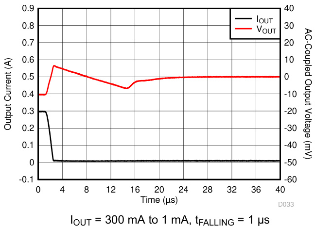  
图 5-52. Load Transient

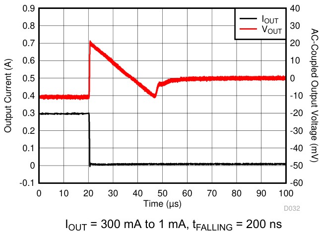  
图 5-54. Load Transient

# 5.7 Typical Characteristics (continued)

$\mathsf { V } _ { \mathsf { I N } } = \mathsf { V } _ { \mathsf { O U T } ( \mathsf { N O M } ) } + 0 . 3 \mathsf { V }$ or $1 . 6 \lor$ (whichever is greater), ${ \mathsf { V } } _ { \mathsf { O U T } } = 2 . 8 { \mathsf { V } } _ { : }$ , $\mathsf { l _ { O U T } } = 1 \mathsf { m A }$ , $\mathsf { C } _ { \mathsf { I N } } = 1$ µF, $\mathtt { C _ { \mathrm { { O U T } } } } = 1$ µF, and ${ \sf T } _ { \sf A } = 2 5 ^ { \circ } { \sf C }$

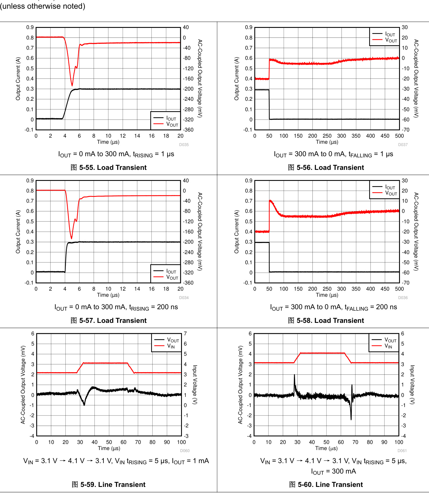

# 5.7 Typical Characteristics (continued)

$\mathsf { V } _ { \mathsf { I N } } = \mathsf { V } _ { \mathsf { O U T } ( \mathsf { N O M } ) } + 0 . 3 \mathsf { V }$ or $1 . 6 \lor$ (whichever is greater), ${ \mathsf { V } } _ { \mathsf { O U T } } = 2 . 8 { \mathsf { V } } _ { : }$ , $\mathsf { l _ { O U T } } = 1 \mathsf { m A }$ , $\mathsf { C } _ { \mathsf { I N } } = 1$ µF, $\mathtt { C _ { \mathrm { { O U T } } } } = 1$ µF, and ${ \sf T } _ { \sf A } = 2 5 ^ { \circ } { \sf C }$ (unless otherwise noted)

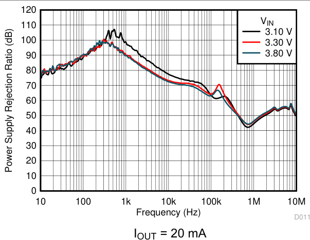  
图 5-61. PSRR vs $\mathsf { v } _ { \mathsf { I N } }$ vs Frequency and VIN

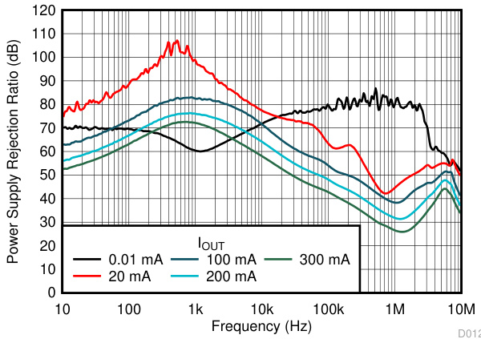

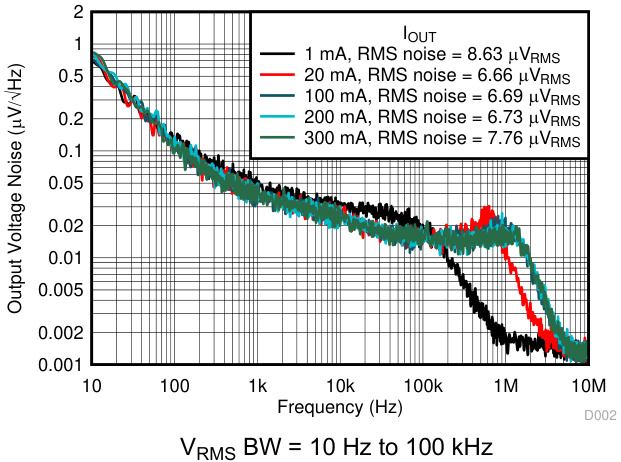  
图 5-63. PSRR vs Frequency and IOUT

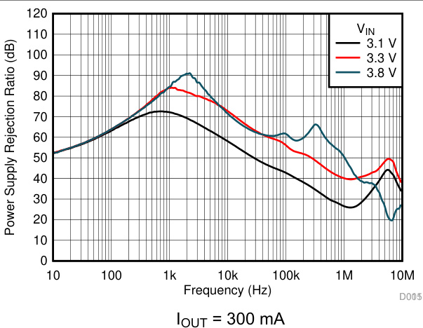  
图 5-62. PSRR vs Frequency and VIN

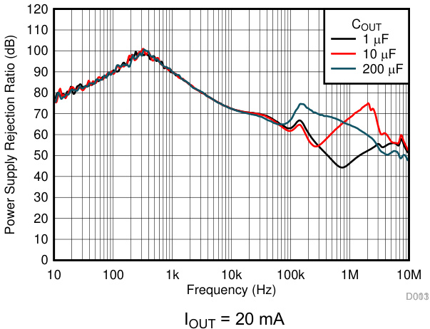  
图 5-64. PSRR vs Frequency and COUT

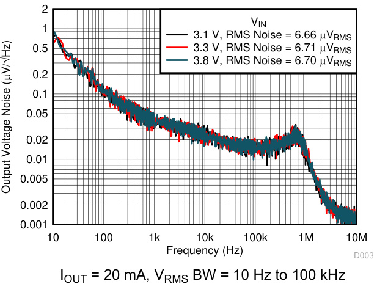  
图 5-65. Noise vs Frequency and IOUT   
图 5-66. Noise vs Frequency and VIN

# 5.7 Typical Characteristics (continued)

$\mathsf { V } _ { \mathsf { I N } } = \mathsf { V } _ { \mathsf { O U T } ( \mathsf { N O M } ) } + 0 . 3 \mathsf { V }$ or $1 . 6 \lor$ (whichever is greater), ${ \mathsf { V } } _ { \mathsf { O U T } } = 2 . 8 { \mathsf { V } } _ { : }$ , $\mathsf { l _ { O U T } } = 1 \mathsf { m A }$ , $\mathsf { C } _ { \mathsf { I N } } = 1$ µF, $\mathtt { C _ { \mathsf { O U T } } } = 1$ µF, and ${ \sf T } _ { \sf A } = 2 5 ^ { \circ } { \sf C }$ (unless otherwise noted)

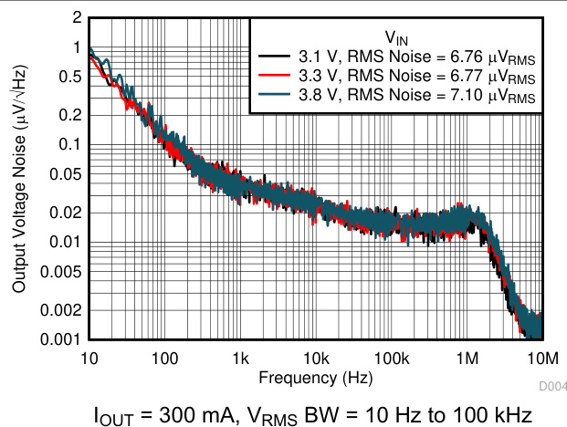  
图 5-67. Noise vs Frequency and $\mathsf { v } _ { \mathsf { I N } }$

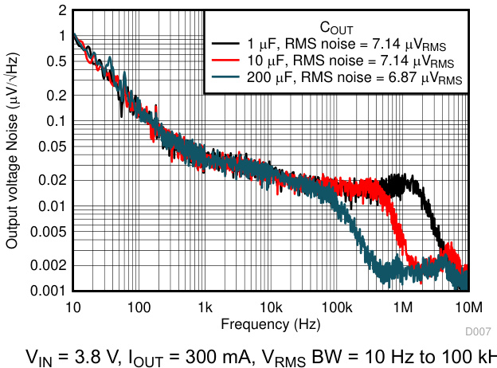  
图 5-69. Noise vs Frequency and COUT

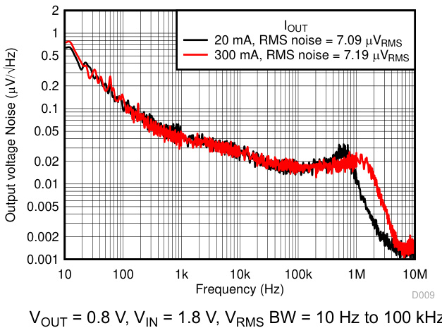  
图 5-71. Noise vs Frequency and IOUT

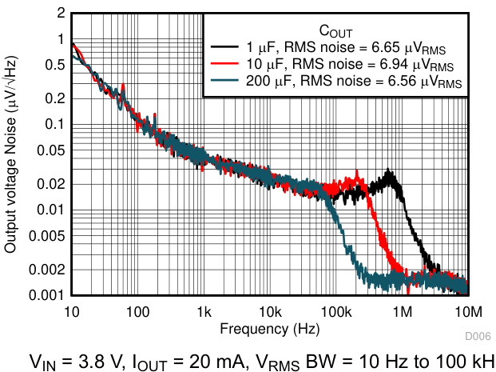  
图 5-68. Noise vs Frequency and COUT

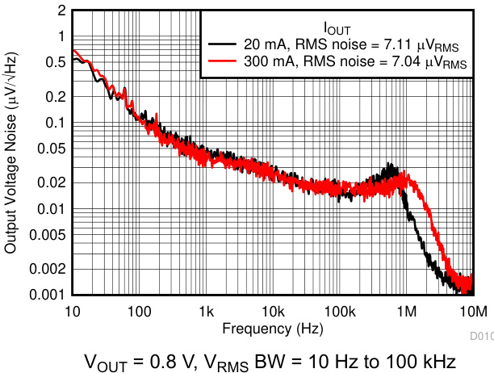  
图 5-70. Noise vs Frequency and IOUT

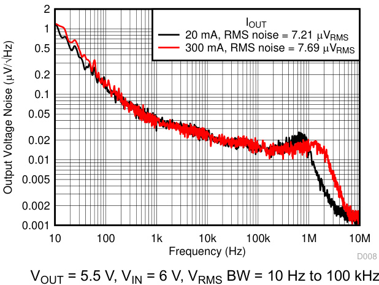  
图 5-72. Noise vs Frequency and IOUT

# 5.7 Typical Characteristics (continued)

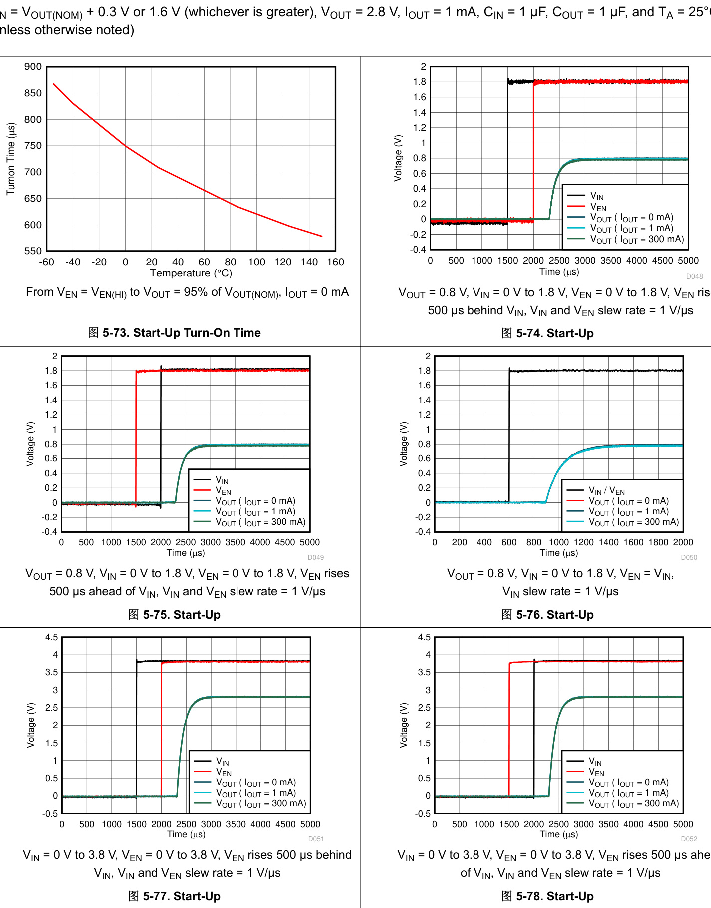

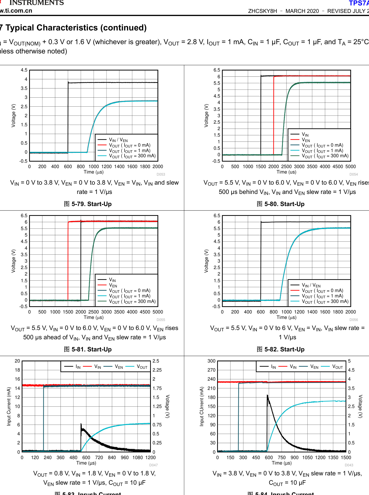  
图 5-83. Inrush Current  
图 5-84. Inrush Current

# 5.7 Typical Characteristics (continued)

$\mathsf { V } _ { \mathsf { I N } } = \mathsf { V } _ { \mathsf { O U T } ( \mathsf { N O M } ) } + 0 . 3 \mathsf { V }$ or $1 . 6 \lor$ (whichever is greater), ${ \mathsf { V } } _ { \mathsf { O U T } } = 2 . 8 { \mathsf { V } }$ , $\mathsf { l _ { O U T } } = 1 \mathsf { m A }$ , $\mathsf { C } _ { \mathsf { I N } } = 1$ µF, $\mathtt { C _ { \mathrm { { O U T } } } } = 1$ µF, and ${ \sf T } _ { \sf A } = 2 5 ^ { \circ } { \sf C }$ (unless otherwise noted)

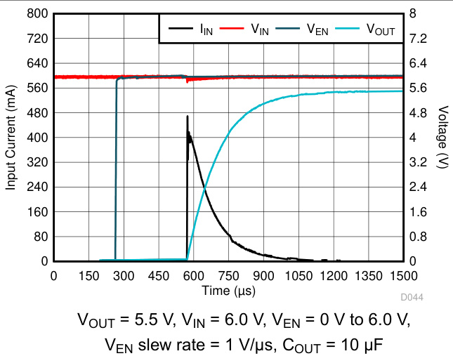  
图 5-85. Inrush Current

# 6 Detailed Description

# 6.1 Overview

Designed to meet the needs of sensitive RF and analog circuits, the TPS7A20 provides low noise, high PSRR, low quiescent current, as well as low line and load transient response figures. Using innovative design techniques, the TPS7A20 offers class-leading noise performance without the need for a separate noise filter capacitor.

The TPS7A20 is designed to operate with a single 1-µF input capacitor and a single 1-µF ceramic output capacitor.

# 6.2 Functional Block Diagram

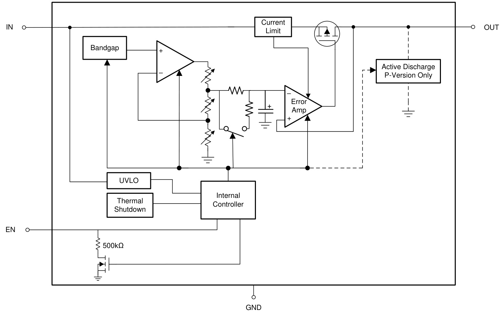

# 6.3 Feature Description

# 6.3.1 Low Output Noise

Any internal noise at the TPS7A20 reference voltage is reduced by a first-order, low-pass RC filter before being passed to the output buffer stage. The low-pass RC filter has a – 3dB cut-off frequency of approximately $0 . 1 \mathsf { H z }$ .

During start-up, the filter resistor is bypassed to reduce output rise time; the filter begins normal operation afte the output voltage reaches the correct value.

# 6.3.2 Smart Enable

The enable (EN) input polarity is active high. The output voltage is enabled when the voltage of the enable input is greater than VEN(HI) and disabled when the enable input voltage is less than VEN(LOW). If independent control of the output voltage is not needed, connect EN to IN.

This device has a smart enable circuit to reduce quiescent current. When the voltage on the enable pin is driven above VEN(HI), as listed in the Electrical Characteristics table, the device is enabled and the smart enable internal pulldown resistor $( R _ { E N ( { \mathsf { P } } \cup { \mathsf { L } } { \mathsf { L } } { \mathsf { D } } { \mathsf { O } } { \mathsf { W N } } ) } )$ is disconnected. When the enable pin is floating, the REN(PUL LDOWN) is connected and pulls the enable pin low to disable the device. The REN(PULLDOWN) value is listed in the Electrical Characteristics table.

# 6.3.3 Dropout Voltage

Dropout voltage $( \mathsf { V } _ { \mathsf { D O } } )$ is defined as the input voltage minus the output voltage $( \mathsf { V } _ { \mathsf { I N } } \cdot \mathsf { V } _ { \mathsf { O U T } } )$ at the rated output current (IRATED), where the pass transistor is fully on. IRATED is the maximum IOUT listed in the Recommended Operating Conditions table. The pass transistor is in the ohmic or triode region of operation, and acts as a switch. The dropout voltage indirectly specifies a minimum input voltage greater than the nominal programmed output voltage at which the output voltage is expected to stay in regulation. If the input voltage falls to less than the value required to maintain output regulation, then the output voltage falls as well.

For a CMOS regulator, the dropout voltage is determined by the drain-source on-state resistance $( \mathsf { R } _ { \mathsf { D S } ( \mathsf { O N } ) } )$ of the pass transistor. Therefore, if the linear regulator operates at less than the rated current, the dropout voltage for that current scales accordingly. The following equation calculates the RDS(ON) of the device.

$$
{ \sf R } _ { \sf { D S ( O N ) } } = \frac { \sf V _ { D O } } { \sf I _ { R A T E D } }
$$

# 6.3.4 Foldback Current Limit

The device has an internal current limit circuit that protects the regulator during transient high-load current faults or shorting events. The current limit is a hybrid brick-wall-foldback scheme. The current limit transitions from a brick-wall scheme to a foldback scheme at the foldback voltage (VFOLDBACK). In a high-load current fault with the output voltage above VFOLDBACK, the brick-wall scheme limits the output current to the current limit $( \mathsf { I } _ { \mathsf { C L } } )$ . When the voltage drops below VFOLDBACK, a foldback current limit activates that scales back the current as the output voltage approaches GND. When the output is shorted, the device supplies a typical current called the shortcircuit current limit $( 1 _ { \mathsf { S C } } ) . 1 _ { \mathsf { C L } }$ and $\mathsf { I } _ { \mathsf { S C } }$ are listed in the Electrical Characteristics table.

The output voltage is not regulated when the device is in current limit. When a current limit event occurs, the device begins to heat up because of the increase in power dissipation. When the device is in brick-wall current limit, the pass transistor dissipates power $[ ( \mathsf { V } _ { \mathsf { I N } } \mathrm { ~ - ~ } \mathsf { V } _ { \mathsf { O U T } } ) \times \mathsf { I } _ { \mathsf { C L } } ]$ . When the device output is shorted and the output is below VFOLDBACK, the pass transistor dissipates power $[ ( \mathsf { V } _ { | \mathsf { N } } \mathrm { ~ - ~ } \mathsf { V } _ { \mathsf { O U T } } ) \times \mathsf { I } _ { \mathsf { S C } } ]$ . If thermal shutdown is triggered, the device turns off. After the device cools down, the internal thermal shutdown circuit turns the device back on. If the output current fault condition continues, the device cycles between current limit and thermal shutdown. For more information on current limits, see the Know Your Limits application note.

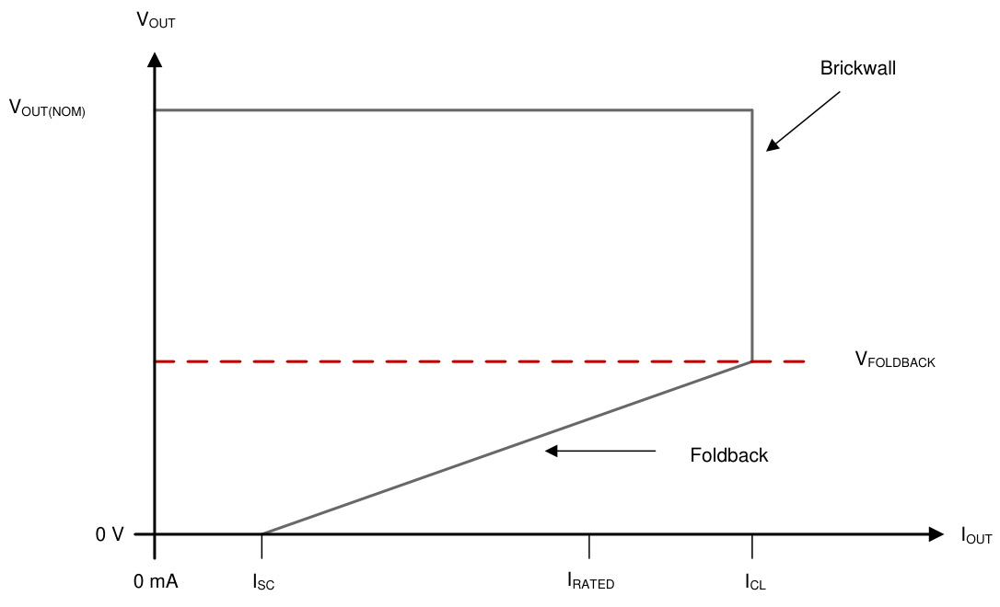  
图 6-1 shows a diagram of the foldback current limit.  
图 6-1. Foldback Current Limit

# 6.3.5 Undervoltage Lockout (UVLO)

The device has an independent undervoltage lockout (UVLO) circuit that monitors the input voltage, allowing a controlled and consistent turn on and off of the output voltage. To prevent the device from turning off if the input drops during turn on, the UVLO has hysteresis as specified in the Electrical Characteristics table.

# 6.3.6 Thermal Shutdown

A thermal shutdown protection circuit disables the LDO when the junction temperature $( \mathsf { T } _ { \mathsf { J } } )$ of the pass transistor rises to TSD(shutdown) (typical). Thermal shutdown hysteresis assures that the device resets (turns on) when the temperature falls to TSD(reset) (typical).

The thermal time-constant of the semiconductor die is fairly short, thus the device may cycle on and off when thermal shutdown is reached until power dissipation is reduced. Power dissipation during startup can be high from large $\mathsf { V } _ { \mathsf { I N } } \ - \ \mathsf { V } _ { \mathsf { O U T } }$ voltage drops across the device or from high inrush currents charging large output capacitors. Under some conditions, the thermal shutdown protection disables the device before startup completes.

For reliable operation, limit the junction temperature to the maximum listed in the Recommended Operating Conditions table. Operation above this maximum temperature causes the device to exceed its operational specifications. Although the internal protection circuitry of the device is designed to protect against thermal overload conditions, this circuitry is not intended to replace proper heat sinking. Continuously running the device into thermal shutdown or above the maximum recommended junction temperature reduces long-term reliability.

# 6.3.7 Active Discharge (P Version Only)

An internal pulldown MOSFET connects a resistor from OUT to ground when the device is disabled to actively discharge the output capacitance. The active discharge circuit is activated by driving EN low or by the voltage on IN falling below the undervoltage lockout (UVLO) threshold.

Do not rely on the active discharge circuit for discharging a large amount of output capacitance after the input supply has collapsed because reverse current can possibly flow from the output to the input. This reverse current flow can cause damage to the device. Limit reverse current to no more than $5 \%$ of the device rated current for a short period of time.

# 6.4 Device Functional Modes

# 6.4.1 Device Functional Mode Comparison

表 6-1 shows the conditions that lead to the different modes of operation. See the Electrical Characteristics table for parameter values.

表 6-1. Device Functional Mode Comparison  

<html><body><table><tr><td rowspan="2">OPERATING MODE</td><td colspan="4">PARAMETER</td></tr><tr><td>VIN</td><td>VEN</td><td>louT</td><td></td></tr><tr><td>Normal operation</td><td>VN> + VDo and VN> VouT(nom) ViN(min)</td><td>VEN> VEN(HI)</td><td>louT く louT(max)</td><td>TJ< TsD(shutdown)</td></tr><tr><td>Dropout operation</td><td><VN< + VDo ViN(min) VoUT(nom)</td><td>VEN > VEN(HI)</td><td>louT < louT(max)</td><td>TJ< TsD(shutdown)</td></tr><tr><td>Disabled (any true condition disables the device)</td><td>ViN < VuVLO</td><td>VEN < VEN(LOW)</td><td>Not applicable</td><td>TJ> TsD(shutdown)</td></tr></table></body></html>

# 6.4.2 Normal Operation

The device regulates to the nominal output voltage when the following conditions are met:

The input voltage is greater than the nominal output voltage plus the dropout voltage $( \mathsf { V } _ { \mathsf { O U T } ( \mathsf { n o m } ) } + \mathsf { V } _ { \mathsf { D O } } )$   
The output current is less than the current limit $( \mathsf { I } _ { \mathsf { O U T } } < \mathsf { I } _ { \mathsf { C L } } )$ (d)   
The device junction temperature is less than the thermal shutdown temperature $( T _ { \mathsf { J } } < \mathsf { T } _ { \mathsf { S D } } )$   
The enable voltage has previously exceeded the enable rising threshold voltage and has not yet decreased   
to less than the enable falling threshold

# 6.4.3 Dropout Operation

If the input voltage is lower than the nominal output voltage plus the specified dropout voltage, but all other conditions are met for normal operation, the device operates in dropout mode. In this mode, the output voltage tracks the input voltage. During this mode, the transient performance of the device becomes significantly degraded because the pass transistor is in the ohmic or triode region, and acts as a switch. Line or load transients in dropout can result in large output-voltage deviations.

When the device is in a steady dropout state (defined as when the device is in dropout, $\mathsf { V } _ { \mathsf { I N } } < \mathsf { V } _ { \mathsf { O U T } ( \mathsf { N O M } ) } + \mathsf { V } _ { \mathsf { D O } } ,$ directly after being in a normal regulation state, but not during startup), the pass transistor is driven into the ohmic or triode region. When the input voltage returns to a value greater than or equal to the nominal output voltage plus the dropout voltage $( \mathsf { V } _ { \mathsf { O U T } ( \mathsf { N O M } ) } + \mathsf { V } _ { \mathsf { D O } } )$ , the output voltage can overshoot for a short period of time while the device pulls the pass transistor back into the linear region.

# 6.4.4 Disabled

The output of the LDO can be shut down by driving EN to less than $V _ { E N ( \mathsf { L O W } ) }$ (see the Electrical Characteristics table). When disabled, the pass transistor is turned off, internal circuits are shut down, and the output voltage is actively discharged to ground by an internal discharge circuit between OUT and ground.

# 7 Application and Implementation

备注

以下应用部分中的信息不属于 TI 器件规格的范围，TI 不担保其准确性和完整性。 TI 的客 户应负责确定器件是否适用于其应用。客户应验证并测试其设计，以确保系统功能。

# 7.1 Application Information

# 7.1.1 Recommended Capacitor Types

The device is designed to be stable using low equivalent series resistance (ESR) ceramic capacitors at the input and output. Multilayer ceramic capacitors have become the industry standard for these types of applications and are recommended, but must be used with good judgment. Ceramic capacitors that employ X7R-, X5R-, and C0G-rated dielectric materials provide relatively good capacitive stability across temperature, whereas the use of Y5V-rated capacitors is discouraged because of large variations in capacitance.

Regardless of the ceramic capacitor type selected, the effective capacitance varies with operating voltage and temperature. As a rule of thumb, expect the effective capacitance to decrease by as much as $50 \%$ . The input and output capacitors recommended in the Recommended Operating Conditions table account for an effective capacitance of approximately $50 \%$ of the nominal value.

# 7.1.2 Input and Output Capacitor Requirements

Although the LDO itself is stable without an input capacitor, good analog design practice is to connect a capacitor from IN to GND, with a value at least equal to the nominal value specified in the Recommended Operating Conditions table. The input capacitor counteracts reactive input sources and improves transient response, input ripple, and PSRR, and is recommended if the source impedance is greater than 0.5 Ω. When the source resistance and inductance are sufficiently high, especially in the presence of load transients, the overall system may be susceptible to instability (including ringing and sustained oscillation) and other performance degradation if there is insufficient capacitance between IN and GND. A capacitor with a value greater than the minimum may be necessary if large, fast-rise-time load or line transients are anticipated or if the device is located more than a few centimeters from the input power source.

An output capacitor of an appropriate value helps ensure stability and improve dynamic performance. Use an output capacitor within the range specified in the Recommended Operating Conditions table.

# 7.1.3 Load Transient Response

The load-step transient response is the output voltage response by the LDO to a step in load current, whereby output voltage regulation is maintained. There are two key transitions during a load transient response: the transition from a light to a heavy load and the transition from a heavy to a light load. The regions shown in 图 7-1 are broken down as follows. Regions A, E, and H are where the output voltage is in steady-state.

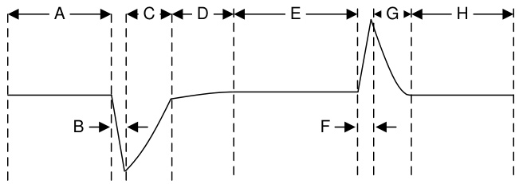  
图 7-1. Load Transient Waveform

During transitions from a light load to a heavy load, the:

Initial voltage dip is a result of the depletion of the output capacitor charge and parasitic impedance to the output capacitor (region B)

Recovery from the dip results from the LDO increasing its sourcing current, and leads to output voltage regulation (region C)

During transitions from a heavy load to a light load, the:

Initial voltage rise results from the LDO sourcing a large current, and leads to the output capacitor charge to   
increase (region F)   
Recovery from the rise results from the LDO decreasing its sourcing current in combination with the load   
discharging the output capacitor (region G)

A larger output capacitance reduces the peaks during a load transient but slows down the response time of the device. A larger DC load also reduces the peaks because the amplitude of the transition is lowered and a higher current discharge path is provided for the output capacitor.

# 7.1.4 Undervoltage Lockout (UVLO) Operation

The UVLO circuit ensures that the device stays disabled before its input supply reaches the minimum operational voltage range, and ensures that the device shuts down when the input supply collapses. 图 7-2 shows the UVLO circuit response to various input voltage events. The diagram can be separated into the following parts:

Region A: The device does not start until the input reaches the UVLO rising threshold.   
Region B: Normal operation, regulating device.   
Region C: Brownout event above the UVLO falling threshold (UVLO rising threshold – UVLO hysteresis). The output may fall out of regulation but the device remains enabled.   
Region D: Normal operation, regulating device.   
Region E: Brownout event below the UVLO falling threshold. The device is disabled in most cases and the output falls because of the load and active discharge circuit. The device is re-enabled when the UVLO rising threshold is reached by the input voltage and a normal start-up follows.   
Region F: Normal operation followed by the input falling to the UVLO falling threshold.   
Region G: The device is disabled when the input voltage falls below the UVLO falling threshold to $0 \vee .$ The output falls because of the load and active discharge circuit.

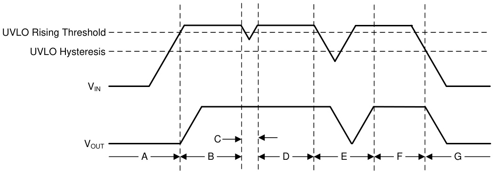  
图 7-2. Typical UVLO Operation

# 7.1.5 Power Dissipation $( P _ { D } )$

Circuit reliability demands that proper consideration be given to device power dissipation, location of the circuit on the printed circuit board (PCB), and correct sizing of the thermal plane. The PCB area around the regulator must be as free as possible of other heat-generating devices that cause added thermal stresses.

As a first-order approximation, power dissipation in the regulator depends on the input-to-output voltage difference and load conditions. Use 方程式 2 to approximate $\mathsf { P } _ { \mathsf { D } }$ :

$$
\mathsf { P } _ { \mathsf { D } } = ( \mathsf { V } _ { \mathsf { I N } } \mathrm { ~ - ~ } \mathsf { V } _ { \mathsf { O U T } } ) \times \mathsf { I } _ { \mathsf { O U T } }
$$

Power dissipation can be minimized, and thus greater efficiency achieved, by proper selection of the system voltage rails. Proper selection allows the minimum input-to-output voltage differential to be obtained. The low dropout of the TPS7A20 allows for maximum efficiency across a wide range of output voltages.

The main heat conduction path for the device is through the thermal pad on the package. As such, the thermal pad must be soldered to a copper pad area under the device. This pad area contains an array of plated vias that conduct heat to any inner plane areas or to a bottom-side copper plane.

The maximum power dissipation determines the maximum allowable junction temperature $( \mathsf { T } _ { \mathsf { J } } )$ for the device. According to 方程式 3, power dissipation and junction temperature are most often related by the junction-toambient thermal resistance $( { \mathsf { R } } _ { \oplus \mathsf { J A } } )$ of the combined PCB and device package and the temperature of the ambient air $( T _ { \mathsf { A } } )$ . 方程式 4 rearranges 方程式 3 for output current.

$$
\begin{array} { r l } & { \mathsf { T } _ { \mathsf { J } } = \mathsf { T } _ { \mathsf { A } } + ( \mathsf { R } _ { \mathsf { \theta } , \mathsf { J } \mathsf { A } } \times \mathsf { P } _ { \mathsf { D } } ) } \\ & { } \\ & { \mathsf { I } _ { \mathsf { O U T } } = ( \mathsf { T } _ { \mathsf { J } } - \mathsf { T } _ { \mathsf { A } } ) / [ \mathsf { R } _ { \mathsf { \theta } , \mathsf { J A } } \times ( \mathsf { V } _ { \mathsf { I N } } - \mathsf { V } _ { \mathsf { O U T } } ) ] } \end{array}
$$

Unfortunately, this thermal resistance $( { \mathsf { R } } _ { \oplus \mathsf { J A } } )$ is highly dependent on the heat-spreading capability built into the particular PCB design, and therefore varies according to the total copper area, copper weight, and location of the planes. The $\mathsf { R } _ { \oplus \mathsf { J A } }$ recorded in the Thermal Information table is determined by the JEDEC standard, PCB, and copper-spreading area, and is only used as a relative measure of package thermal performance. For a welldesigned thermal layout, $\mathsf { R } _ { \oplus \mathsf { J A } }$ is actually the sum of the X2SON package junction-to-case (bottom) thermal resistance $\scriptstyle ( { \mathsf { R } } _ { \mathrm { ~ \tiny ~ \mathfrak { \circ } ~ } \mathsf { J C } ( \mathsf { b o t } ) } )$ plus the thermal resistance contribution by the PCB copper.

# 7.1.5.1 Estimating Junction Temperature

The JEDEC standard now recommends the use of psi $( \Psi )$ thermal metrics to estimate the junction temperatures of the LDO when in-circuit on a typical PCB board application. These metrics are not strictly speaking thermal resistances, but rather offer practical and relative means of estimating junction temperatures. These psi metrics are determined to be significantly independent of the copper-spreading area. The key thermal metrics ( $\Psi _ { \mathsf { J T } }$ and $\Psi _ { \mathsf { J B } } )$ are used in accordance with 方程式 5 and are given in the Thermal Information table.

where:

$\mathsf { P } _ { \mathsf { D } }$ is the power dissipated as explained in 方程式 2   
$\mathsf { T } _ { \mathsf { T } }$ is the temperature at the center-top of the device package   
$T _ { \mathsf { B } }$ is the PCB surface temperature measured $1 \ : \mathsf { m m }$ from the device package and centered on the package   
edge

# 7.1.5.2 Recommended Area for Continuous Operation

The operational area of an LDO is limited by the dropout voltage, output current, junction temperature, and input voltage. The recommended area for continuous operation for a linear regulator is given in 图 7-3 and can be separated into the following parts:

Dropout voltage limits the minimum differential voltage between the input and the output $( \mathsf { V } _ { \mathsf { I N } } \cdot \mathsf { V } _ { \mathsf { O U T } } )$ at a   
given output current level. See the Dropout Operation section for more details.   
The rated output currents limits the maximum recommended output current level. Exceeding this rating   
causes the device to fall out of specification.   
The rated junction temperature limits the maximum junction temperature of the device. Exceeding this rating   
causes the device to fall out of specification and reduces long-term reliability.   
– The shape of the slope is given by 方程式 4. The slope is nonlinear because the maximum-rated junction temperature of the LDO is controlled by the power dissipation across the LDO; thus when $\mathsf { V } _ { \mathsf { I N } } \mathrm { ~ - ~ } \mathsf { V } _ { \mathsf { O U T } }$ increases the output current must decrease.   
The rated input voltage range governs both the minimum and maximum of $\mathsf { V } _ { \mathsf { I N } } \mathrm { ~ - ~ } \mathsf { V } _ { \mathsf { O U T } }$

图 7-3 shows the recommended area of operation for this device on a JEDEC-standard high-K board with RθJA as given in the Thermal Information table.

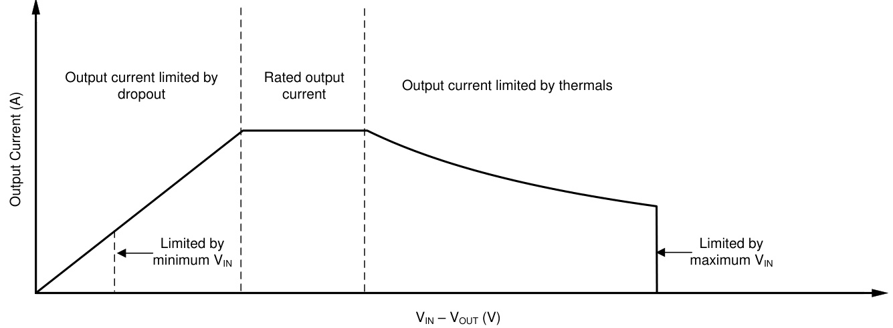  
图 7-3. Region Description of Continuous Operation Regime

# 7.2 Typical Application

图 7-4 shows the typical application circuit for the TPS7A20. Input and output capacitances may need to b increased above the $1 \mu \mathsf { F }$ minimum for some applications.

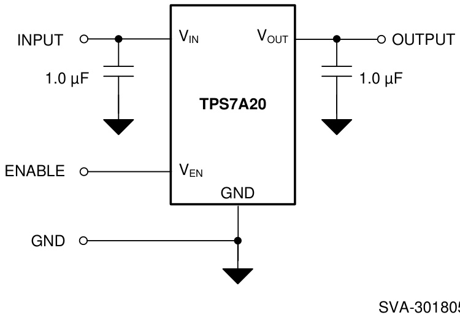  
图 7-4. TPS7A20 Typical Application

# 7.2.1 Design Requirements

表 7-1 summarizes the design requirements for 图 7-4.

表 7-1. Design Parameters  

<html><body><table><tr><td>DESIGN PARAMETER</td><td>EXAMPLE VALUE</td></tr><tr><td>Input voltage range</td><td>3.1 V to 3.6 V</td></tr><tr><td>Output voltage</td><td>2.8V</td></tr><tr><td>Output current</td><td>200 mA</td></tr><tr><td>Maximum ambient temperature</td><td>85°℃</td></tr></table></body></html>

# 7.2.2 Detailed Design Procedure

For this design example, the $2 . 8 \mathsf { V }$ output version (TPS7A2028) is selected. A nominal 3.3V input supply is assumed. A minimum $1 . 0 \mu \mathsf { F }$ input capacitor is recommended to minimize the effect of resistance and inductance between the $3 . 3 \mathsf { V }$ source and the LDO input. A minimum $1 . 0 \mu \mathsf { F }$ output capacitor is also recommended for stability and good load transient response. The dropout voltage $( \mathsf { V } _ { \mathsf { D O } } )$ is less than $1 4 0 \mathsf { m V }$ maximum at a $2 . 8 \mathsf { V }$ output voltage and $3 0 0 \mathsf { m A }$ output current, so there are no dropout issues with a minimum input voltage of $3 . 0 \mathsf { V }$ and a maximum output current of $2 0 0 \mathsf { m A }$ .

# 7.2.3 Application Curves

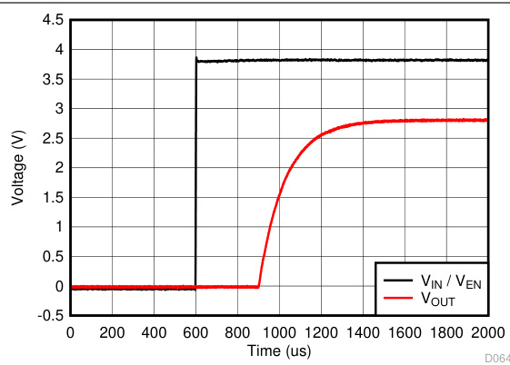  
图 7-5. Start-Up

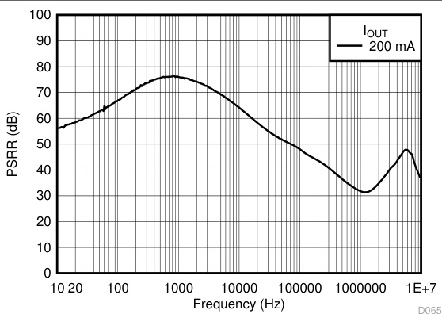  
图 7-6. PSRR

# 7.3 Power Supply Recommendations

This device is designed to operate from an input supply voltage range of $1 . 6 \mathsf { V }$ to $6 . 0 \mathsf { V } .$ . The input supply must be well regulated and free of spurious noise. To ensure that the output voltage is well regulated and dynamic performance is optimum, the input supply must be at least $\mathsf { V } _ { \mathsf { O U T } ( \mathsf { n o m } ) } + \mathsf { 0 } . 3 \mathsf { V }$ or $1 . 6 { \lor } ,$ whichever is greater. TI highly recommends using a 1µF or greater input capacitor to reduce the impedance of the input supply, especially during transients.

# 7.4 Layout

# 7.4.1 Layout Guidelines

Place input and output capacitors as close to the device as possible.   
Use copper planes for device connections to optimize thermal performance.   
Place thermal vias around the device to distribute the heat.   
Do not place a thermal via directly beneath the thermal pad of the DQN package. A via can wick solder or solder paste away from the thermal pad joint during the soldering process, leading to a compromised solder joint on the thermal pad.

# 7.4.2 Layout Examples

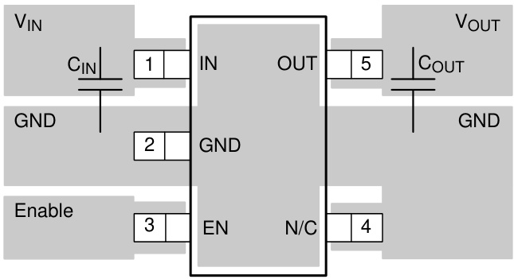  
图 7-7. DBV Package (SOT-23) Typical Layout

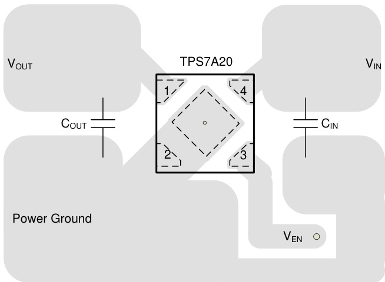  
图 7-8. DQN Package (X2SON) Typical Layout

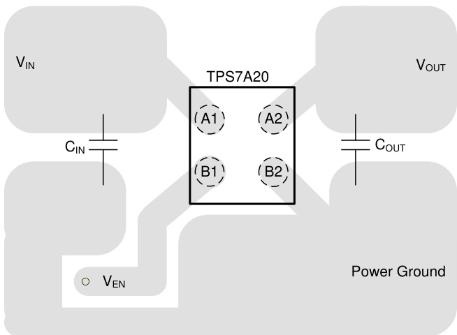  
图 7-9. YCJ and YCK Package (DSBGA) Typical Layout

# 8 Device and Documentation Support 8.1 Device Support 8.1.1 Device Nomenclature

表 8-1. Device Nomenclature  

<html><body><table><tr><td>PRODUCT (1) (2)</td><td>VoUT</td></tr><tr><td>TPS7A20xx(x)Pyyyz</td><td>xx(x) is the nominal output voltage. For output voltages with a resolution of 100 mV, two digits are used in the ordering number; otherwise, three digits are used (for example, 28 = 2.8V; 125 = 1.25V). P indicates active output discharge feature. yyy is the package designator. z is the package quantity. R is for reel (3000 pieces for DQN and DBV; 12000 pieces for YCJ and YCK). an</td></tr></table></body></html>

(1) For the most current package and ordering information see the Package Option Addendum at the end d this document, or visit the device product folder on www.ti.com. (2) Output voltages from 0.8V to $5 . 5 \mathsf { V }$ in $2 5 \mathsf { m V }$ increments are available. Contact the factory for details and availability.

# 8.2 接收文档更新通知

要接收文档更新通知， 请导航至 ti.com 上的器件产品文件夹。 点击通知 进行注册， 即可每周接收产品信息更改摘要。有关更改的详细信息， 请查看任何已修订文档中包含的修订历史记录。

# 8.3 支持资源

TI E2E™ 中文支持论坛是工程师的重要参考资料，可直接从专家处获得快速、 经过验证的解答和设计帮助。 搜索现有解答或提出自己的问题， 获得所需的快速设计帮助。

链接的内容由各个贡献者“按原样” 提供。 这些内容并不构成 TI 技术规范，并且不一定反映 TI 的观点；请参阅TI 的使用条款。

# 8.4 Trademarks

TI E2E™ is a trademark of Texas Instruments.  
所有商标均为其各自所有者的财产。

# 8.5 静电放电警告

静电放电 (ESD) 会损坏这个集成电路。 德州仪器 (TI) 建议通过适当的预防措施处理所有集成电路。 如果不遵守正确的处理和安装程序， 可能会损坏集成电路。

ESD 的损坏小至导致微小的性能降级，大至整个器件故障。 精密的集成电路可能更容易受到损坏， 这是因为非常细微的参数更改都可能会导致器件与其发布的规格不相符。

# 8.6 术语表

# TI 术语表

本术语表列出并解释了术语、 首字母缩略词和定义。

# 9 Revision History

注：以前版本的页码可能与当前版本的页码不同

# Changes from Revision G (May 2022) to Revision H (July 2024) Page

更改了特性 中的封装 要点， 以进行澄清.   
更改了应用原理图 的标题.   
Deleted discussion of pulldown resistor from OUT pin description in YCJ and YCK package Pin Functions table............................................................ ................................................... 3 Added clarification to Active Discharge (P Version Only) section that this feature only applies to the P device version. .26 Changed active output discharge feature discussion in Device Nomenclature table. 33

Changes from Revision F (April 2022) to Revision G (May 2022) Page

Changed UVLO condition from rising to falling for YCJ and YCK packages.. 6

# 10 Mechanical, Packaging, and Orderable Information

The following pages include mechanical, packaging, and orderable information. This information is the most current data available for the designated devices. This data is subject to change without notice and revision of this document. For browser-based versions of this data sheet, refer to the left-hand navigation.

# 10.1 Mechanical Data

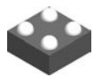

PACKAGE OUTLINE DSBGA 0.35 mm max height

DIE SIZE BALL GRID ARRAY

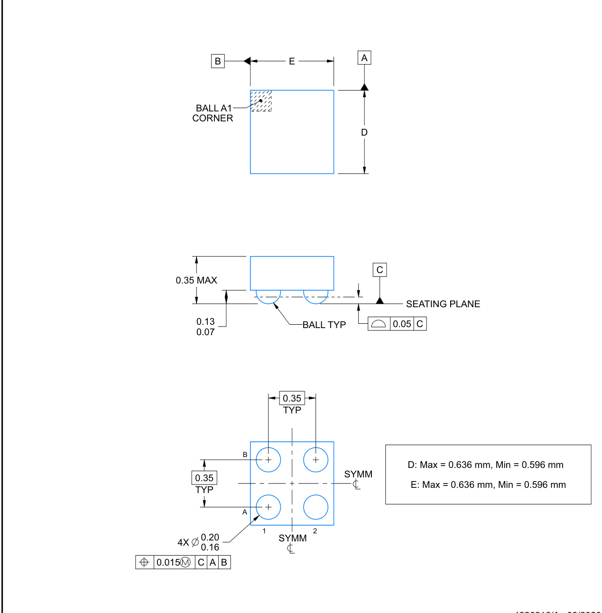

4226216/A 09/2020

NOTES:

1. All linear dimensions are in millimeters. Any dimensions in parenthesis are for reference only. Dimensioning and tolerancing per ASME $\mathsf { Y } 1 4 . 5 \mathsf { M }$ .   
2. This drawing is subject to change without notice.

# EXAMPLE BOARD LAYOUT

DSBGA - 0.35 mm max height

DIE SIZE BALL GRID ARRAY

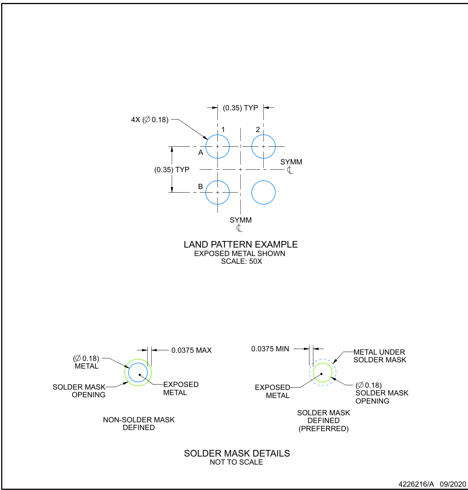  
NOTES: (continued)

3. Final dimensions may vary due to manufacturing tolerance considerations and also routing constraints. See Texas Instruments Literature No. SNVA009 (www.ti.com/lit/snva009).

# EXAMPLE STENCIL DESIGN

# DSBGA - 0.35 mm max height

DIE SIZE BALL GRID ARRAY

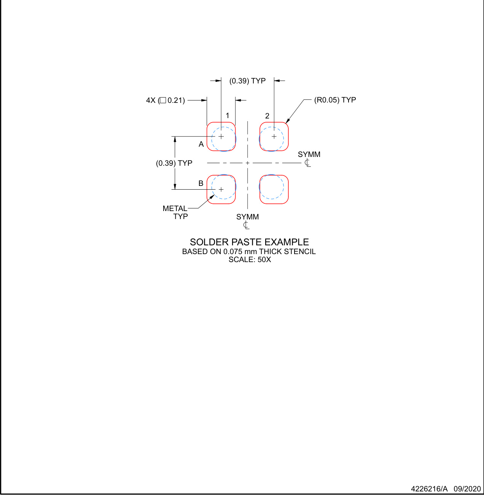  
NOTES: (continued)

4. Laser cutting apertures with trapezoidal walls and rounded corners may offer better paste release.

DIE SIZE BALL GRID ARRAY

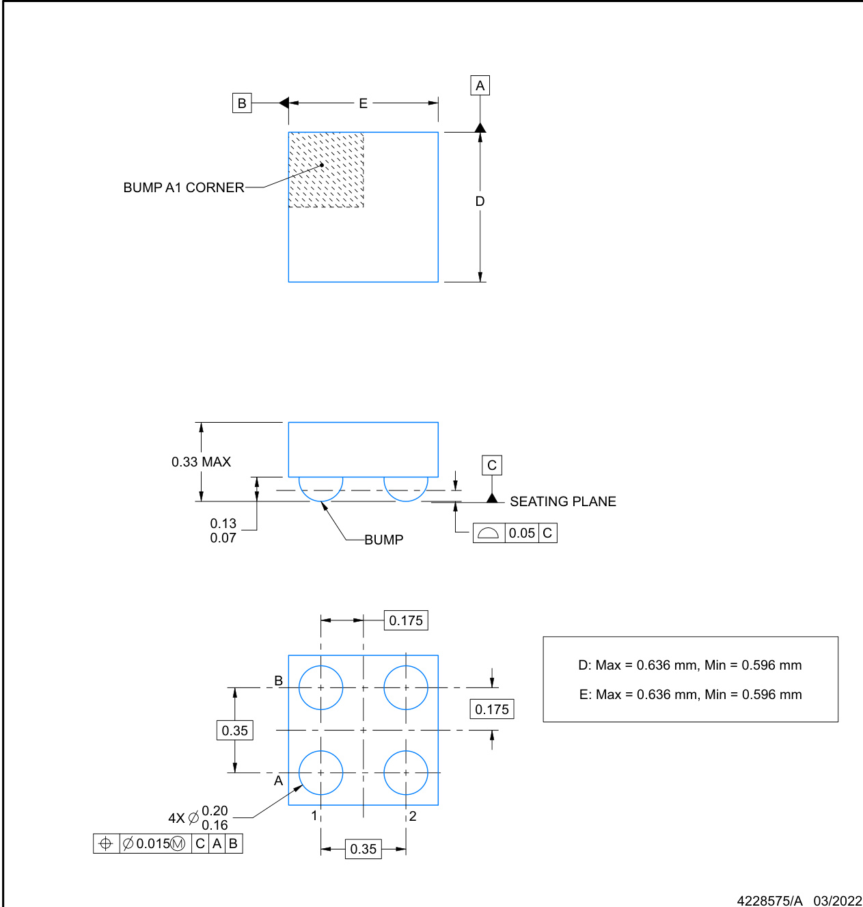

NOTES:

1. All linear dimensions are in millimeters. Dimensions in parenthesis are for reference only. Dimensioning and tolerancing per ASME $\mathsf { Y } 1 4 . 5 \mathsf { M }$ .   
2. This drawing is subject to change without notice.

# EXAMPLE BOARD LAYOUT

# DSBGA 0.33mm MAX HEIGHT

DIE SIZE BALL GRID ARRAY

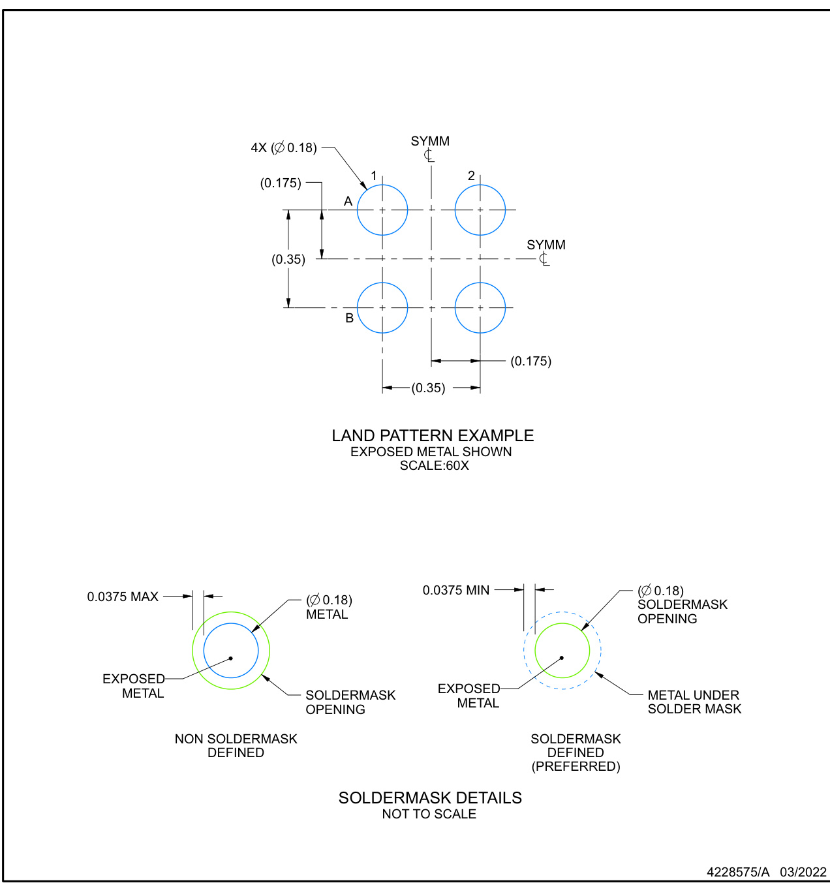  
NOTES: (continued)

3. Final dimensions may vary due to manufacturing tolerance considerations and also routing constraints. Refer to Texas Instruments Literature No. SNVA009 (www.ti.com/lit/snva009).

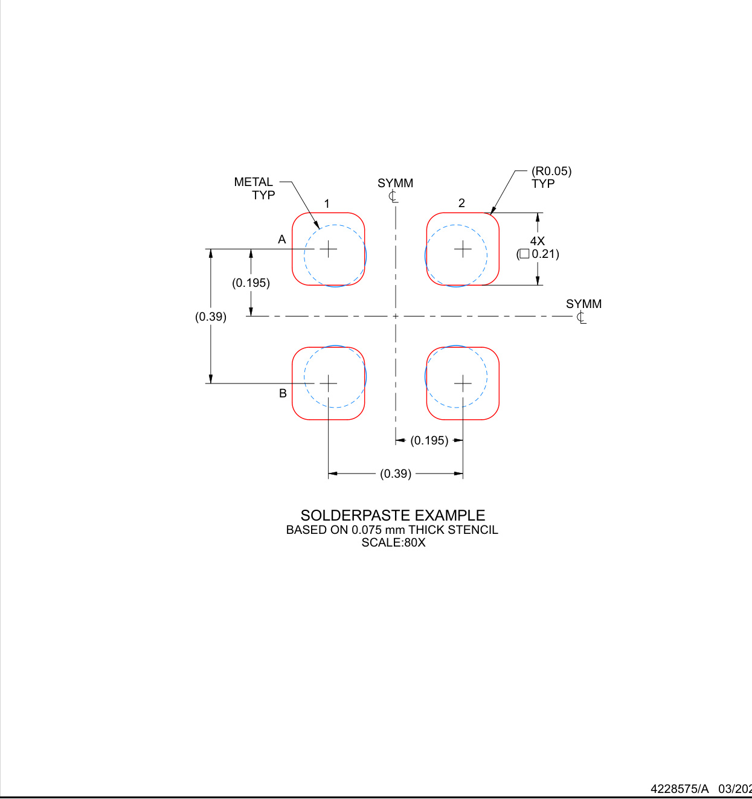

NOTES: (continued)

4. Laser cutting apertures with trapezoidal walls and rounded corners may offer better paste release.

PACKAGING INFORMATION   

<html><body><table><tr><td>Orderable part number</td><td>Status (1)</td><td>Material type (2)</td><td>Package Pins</td><td>Package qty Carrier</td><td>RoHS (3)</td><td>Lead finish/ Ball material</td><td>MSL rating/ Peak reflow</td><td>Op temp (°℃)</td><td>Part marking (6)</td></tr><tr><td>PTPS7A2025PDQNR</td><td>Active</td><td>Preproduction</td><td>X2SON (DQN)</td><td>3000 LARGE T&R</td><td></td><td>Call TI</td><td>(5) Call TI</td><td>-40 to 125</td><td></td></tr><tr><td>25PDQNR</td><td>Active</td><td>Preproduction</td><td>K2SOI DQN</td><td>3000 ARGE T&R</td><td></td><td>Call TI</td><td>Call TI</td><td>-40 to 125</td><td></td></tr><tr><td>DQN</td><td>Active</td><td>Preproduction</td><td></td><td>3000 ARGE T&R</td><td></td><td>Call TI</td><td>Call TI</td><td>-40 to 125</td><td></td></tr><tr><td></td><td>Active</td><td>Preproduction</td><td></td><td></td><td></td><td></td><td>Call T</td><td>-40to 125</td><td></td></tr><tr><td></td><td>ctive</td><td>uctior</td><td></td><td></td><td></td><td>IPDAU</td><td>eve</td><td>-40 to 125</td><td>QH</td></tr><tr><td></td><td></td><td></td><td></td><td></td><td></td><td></td><td></td><td>40 to 125</td><td>QH</td></tr><tr><td></td><td></td><td></td><td></td><td></td><td></td><td></td><td></td><td>40 to 125</td><td>2GBF</td></tr><tr><td></td><td></td><td></td><td></td><td></td><td></td><td></td><td></td><td>10to 25</td><td>2GBF</td></tr><tr><td></td><td></td><td></td><td></td><td></td><td></td><td></td><td></td><td>25</td><td>KT</td></tr><tr><td></td><td></td><td></td><td></td><td></td><td></td><td></td><td></td><td></td><td>KT</td></tr><tr><td></td><td></td><td></td><td></td><td></td><td></td><td></td><td></td><td></td><td>KS</td></tr><tr><td></td><td></td><td></td><td></td><td></td><td></td><td></td><td></td><td></td><td>KS</td></tr><tr><td></td><td></td><td></td><td></td><td></td><td></td><td></td><td></td><td></td><td>QE</td></tr><tr><td></td><td></td><td></td><td></td><td></td><td></td><td></td><td></td><td></td><td>QE</td></tr><tr><td></td><td></td><td></td><td></td><td></td><td></td><td>NAGC</td><td></td><td></td><td>Q</td></tr><tr><td></td><td></td><td></td><td></td><td></td><td></td><td>SNAGCU</td><td></td><td></td><td>Q</td></tr><tr><td></td><td></td><td></td><td></td><td></td><td></td><td>JIPDAU</td><td></td><td></td><td>Ql</td></tr><tr><td></td><td></td><td></td><td></td><td></td><td></td><td>NIPDAU</td><td></td><td></td><td>QI</td></tr><tr><td></td><td></td><td></td><td></td><td></td><td></td><td>JIPDAU SN SN</td><td></td><td></td><td>2ATF</td></tr><tr><td></td><td></td><td></td><td></td><td></td><td></td><td></td><td></td><td></td><td>2ATF</td></tr><tr><td></td><td></td><td></td><td></td><td></td><td></td><td>NIPDAU</td><td></td><td></td><td>2ATF</td></tr><tr><td></td><td></td><td></td><td></td><td></td><td></td><td>NIPDAU</td><td></td><td></td><td>2ATF</td></tr><tr><td></td><td></td><td></td><td></td><td></td><td></td><td>NIPDAU NIPDAU</td><td></td><td></td><td>IC</td></tr><tr><td></td><td></td><td></td><td></td><td></td><td></td><td>SNAGCU</td><td></td><td></td><td>JC</td></tr><tr><td></td><td></td><td></td><td></td><td></td><td></td><td>SNAGCU</td><td></td><td></td><td>M</td></tr><tr><td></td><td>Active</td><td></td><td></td><td></td><td></td><td>NIPDAU</td><td></td><td></td><td>M</td></tr><tr><td>S7A201 PDQN</td><td>Active</td><td>roduction</td><td></td><td></td><td></td><td>NIPDAU</td><td></td><td>40to 125</td><td>MM MM</td></tr><tr><td>TPS7A201 35 PDQNR TPS7A2013DQNR</td><td>Active</td><td>Production</td><td>X2SON (DQN)</td><td>3000 LARGE &F</td><td></td><td>NIPDAU</td><td>eve 260C UN</td><td>-40 to 125</td><td>QJ</td></tr></table></body></html>

<html><body><table><tr><td>Orderable part number</td><td>Status (1)</td><td>Material type (2)</td><td>Package Pins</td><td>Package qty Carrier</td><td>RoHS (3)</td><td>Lead finish/ Ball material</td><td>MSL rating/ Peak reflow</td><td>Op temp (C)</td><td>Part marking (6)</td></tr><tr><td></td><td>Active</td><td>Production</td><td>X2SON (DQN)</td><td>3000 ARGE T&R</td><td>Yes</td><td>NIPDAU</td><td>Level-1 -260C-UNLIM</td><td>-40 to 125</td><td>QJ</td></tr><tr><td>TPS7A2013DQNR.A PS7A201 5PDBVR</td><td>Active</td><td>Production</td><td></td><td>ARGE T&R</td><td></td><td>NIPDAU SN</td><td>260C-UNLIM</td><td>-40 to 125</td><td>2DTF</td></tr><tr><td></td><td>Active</td><td></td><td></td><td>ARGE</td><td></td><td>NIPDAU</td><td></td><td>40 to 125</td><td>2DTF</td></tr><tr><td></td><td></td><td></td><td></td><td></td><td></td><td></td><td></td><td>to 25</td><td>JD</td></tr><tr><td></td><td></td><td></td><td></td><td></td><td></td><td></td><td></td><td></td><td>JD</td></tr><tr><td></td><td></td><td></td><td></td><td></td><td></td><td></td><td></td><td></td><td></td></tr><tr><td></td><td></td><td></td><td></td><td></td><td></td><td></td><td></td><td></td><td>ZZ</td></tr><tr><td></td><td></td><td></td><td></td><td></td><td></td><td></td><td></td><td></td><td>IQ</td></tr><tr><td></td><td></td><td></td><td></td><td></td><td></td><td></td><td></td><td></td><td>IQ</td></tr><tr><td></td><td></td><td></td><td></td><td></td><td></td><td></td><td></td><td></td><td>IQ</td></tr><tr><td></td><td></td><td></td><td></td><td></td><td></td><td></td><td></td><td></td><td></td></tr><tr><td></td><td></td><td></td><td></td><td></td><td></td><td></td><td></td><td></td><td>2CBF</td></tr><tr><td></td><td></td><td></td><td></td><td></td><td></td><td></td><td></td><td></td><td>2CBF</td></tr><tr><td></td><td></td><td></td><td></td><td></td><td></td><td></td><td></td><td></td><td>2CBF</td></tr><tr><td></td><td></td><td></td><td></td><td></td><td></td><td></td><td></td><td></td><td>2CBF</td></tr><tr><td></td><td></td><td></td><td></td><td></td><td></td><td></td><td></td><td></td><td>JE</td></tr><tr><td></td><td></td><td></td><td></td><td></td><td></td><td></td><td></td><td></td><td>J</td></tr><tr><td></td><td></td><td></td><td></td><td></td><td></td><td></td><td></td><td></td><td>JE</td></tr><tr><td></td><td></td><td></td><td></td><td></td><td></td><td></td><td></td><td></td><td>ET</td></tr><tr><td></td><td></td><td></td><td></td><td></td><td></td><td></td><td></td><td></td><td></td></tr><tr><td></td><td></td><td></td><td></td><td></td><td></td><td></td><td></td><td></td><td></td></tr><tr><td></td><td></td><td></td><td></td><td></td><td></td><td></td><td></td><td></td><td>QK</td></tr><tr><td></td><td></td><td></td><td></td><td></td><td></td><td></td><td></td><td></td><td>QK</td></tr><tr><td></td><td></td><td></td><td></td><td></td><td></td><td></td><td></td><td></td><td>2AUF</td></tr><tr><td></td><td></td><td></td><td></td><td></td><td></td><td></td><td></td><td></td><td>2AUF</td></tr><tr><td></td><td></td><td></td><td></td><td></td><td></td><td></td><td></td><td></td><td>2AUF</td></tr><tr><td></td><td></td><td></td><td></td><td></td><td></td><td></td><td></td><td></td><td>2AUF</td></tr><tr><td></td><td></td><td></td><td></td><td></td><td></td><td>PDAU</td><td></td><td></td><td></td></tr><tr><td></td><td></td><td></td><td></td><td></td><td></td><td>IPDAU</td><td></td><td></td><td>JF</td></tr><tr><td>PS7A2</td><td>Active Active</td><td>Production</td><td></td><td></td><td></td><td>NIPDAU NIPDAU</td><td>eve Level -260C-UNLIM</td><td>40 to 125</td><td>JF</td></tr><tr><td>TPS7A2018PDQNRM3.</td><td></td><td>Production</td><td>X2SON</td><td></td><td></td><td></td><td></td><td>40 to 125</td><td></td></tr></table></body></html>

<html><body><table><tr><td>Orderable part number</td><td>Status (1)</td><td>Material type (2)</td><td>Package Pins</td><td>Package qty Carrier</td><td>RoHS (3)</td><td>Lead finish/ Ball material</td><td>MSL rating/ Peak reflow</td><td>Op temp (°C)</td><td>Part marking (6)</td></tr><tr><td></td><td></td><td>Production</td><td>DSBGA (YCK)|</td><td>12000 LARGE I&R</td><td></td><td>SNAGCU</td><td>-260C-UNLIM Level-1-</td><td>-40 to 125</td><td></td></tr><tr><td>TPS7A2018PYCKR TPS7A2018PYCKR.</td><td>Active Active</td><td>Production</td><td>OSBG</td><td>2000 ARGE</td><td>Yes</td><td>SNAGCU</td><td>-UNLIM</td><td>-40 to 125</td><td>D</td></tr><tr><td>PS7A2018PYCKRM3</td><td>Active</td><td></td><td></td><td>2000 LARGE</td><td></td><td>SNAGCU</td><td></td><td>40 to 125</td><td>D</td></tr><tr><td></td><td></td><td></td><td></td><td></td><td></td><td></td><td></td><td>0 to</td><td></td></tr><tr><td></td><td></td><td></td><td></td><td></td><td></td><td></td><td></td><td></td><td></td></tr><tr><td></td><td></td><td></td><td></td><td></td><td></td><td></td><td></td><td></td><td></td></tr><tr><td></td><td></td><td></td><td></td><td></td><td></td><td></td><td></td><td></td><td></td></tr><tr><td></td><td></td><td></td><td></td><td></td><td></td><td></td><td></td><td></td><td>PX</td></tr><tr><td></td><td></td><td></td><td></td><td></td><td></td><td></td><td></td><td></td><td>PX</td></tr><tr><td></td><td></td><td></td><td></td><td></td><td></td><td></td><td></td><td></td><td></td></tr><tr><td></td><td></td><td></td><td></td><td></td><td></td><td></td><td></td><td></td><td>B</td></tr><tr><td></td><td></td><td></td><td></td><td></td><td></td><td></td><td></td><td></td><td></td></tr><tr><td></td><td></td><td></td><td></td><td></td><td></td><td></td><td></td><td></td><td></td></tr><tr><td></td><td></td><td></td><td></td><td></td><td></td><td></td><td></td><td></td><td>2CCF</td></tr><tr><td></td><td></td><td></td><td></td><td></td><td></td><td></td><td></td><td></td><td>2CCF</td></tr><tr><td></td><td></td><td></td><td></td><td></td><td></td><td></td><td></td><td></td><td>QL</td></tr><tr><td></td><td></td><td></td><td></td><td></td><td></td><td></td><td></td><td></td><td>QL</td></tr><tr><td></td><td></td><td></td><td></td><td></td><td></td><td></td><td></td><td></td><td>2AVF</td></tr><tr><td></td><td></td><td></td><td></td><td></td><td></td><td></td><td></td><td></td><td>2AVF</td></tr><tr><td></td><td></td><td></td><td></td><td></td><td></td><td></td><td></td><td></td><td>2AVF</td></tr><tr><td></td><td></td><td></td><td></td><td></td><td></td><td></td><td></td><td></td><td>2AVF</td></tr><tr><td></td><td></td><td></td><td></td><td></td><td></td><td></td><td></td><td></td><td>JG</td></tr><tr><td></td><td></td><td></td><td></td><td></td><td></td><td></td><td></td><td></td><td>JG</td></tr><tr><td></td><td></td><td></td><td></td><td></td><td></td><td></td><td></td><td></td><td></td></tr><tr><td></td><td></td><td></td><td></td><td></td><td></td><td></td><td></td><td></td><td></td></tr><tr><td></td><td></td><td></td><td></td><td></td><td></td><td></td><td></td><td></td><td>KO</td></tr><tr><td></td><td></td><td></td><td></td><td></td><td></td><td></td><td></td><td></td><td>KO</td></tr><tr><td></td><td></td><td></td><td></td><td></td><td></td><td></td><td></td><td></td><td>N</td></tr><tr><td></td><td></td><td></td><td></td><td></td><td></td><td>SNAGCI</td><td></td><td></td><td></td></tr><tr><td>PS7A20285 PDBVF</td><td>Active</td><td>Productior</td><td></td><td></td><td></td><td>NIPDAU SN</td><td>-260C- UNLIM</td><td>40 to 125</td><td>2GCF</td></tr><tr><td>TPS7A20285PDBVR.A</td><td>Active</td><td>Production</td><td>SO1-23</td><td></td><td></td><td></td><td>Level</td><td>-40 to 125</td><td>2GCF</td></tr></table></body></html>

<html><body><table><tr><td>Orderable part number</td><td>Status (1)</td><td>Material type (2)</td><td>Package Pins</td><td>Package qty Carrier</td><td>RoHS (3)</td><td>Lead finish/ Ball material</td><td>MSL rating/ Peak reflow</td><td>Op temp (°C)</td><td>Part marking (6)</td></tr><tr><td></td><td></td><td>Production</td><td>X2SON (DQN)I</td><td>3000 LARGE T&R</td><td></td><td></td><td>-260C-UNLIM</td><td>-40 to 125</td><td>KN</td></tr><tr><td>TPS7A20285PDQNR TPS7A20285PD0 NR.A</td><td>Active Active</td><td>Production</td><td></td><td>3000 ARGE T&R</td><td>Yes</td><td>NIPDAU NIPDAU</td><td>UNLIM Level-1-</td><td>-40 to 125</td><td>KN</td></tr><tr><td>YCKR</td><td></td><td></td><td></td><td>2000 LARGE</td><td></td><td>SNAGCU</td><td></td><td>40 to125</td><td></td></tr><tr><td></td><td></td><td></td><td></td><td></td><td></td><td></td><td></td><td></td><td></td></tr><tr><td></td><td></td><td></td><td></td><td></td><td></td><td></td><td></td><td></td><td>QM</td></tr><tr><td></td><td></td><td></td><td></td><td></td><td></td><td></td><td></td><td></td><td>QM</td></tr><tr><td></td><td></td><td></td><td></td><td></td><td></td><td></td><td></td><td></td><td>2AWF</td></tr><tr><td></td><td></td><td></td><td></td><td></td><td></td><td></td><td></td><td></td><td>2AWF</td></tr><tr><td></td><td></td><td></td><td></td><td></td><td></td><td></td><td></td><td></td><td></td></tr><tr><td></td><td></td><td></td><td></td><td></td><td></td><td></td><td></td><td></td><td></td></tr><tr><td></td><td></td><td></td><td></td><td></td><td></td><td></td><td></td><td></td><td>JH</td></tr><tr><td></td><td></td><td></td><td></td><td></td><td></td><td></td><td></td><td></td><td>JH</td></tr><tr><td></td><td></td><td></td><td></td><td></td><td></td><td></td><td></td><td></td><td></td></tr><tr><td></td><td></td><td></td><td></td><td></td><td></td><td></td><td></td><td></td><td></td></tr><tr><td></td><td></td><td></td><td></td><td></td><td></td><td></td><td></td><td></td><td></td></tr><tr><td></td><td></td><td></td><td></td><td></td><td></td><td></td><td></td><td></td><td></td></tr><tr><td></td><td></td><td></td><td></td><td></td><td></td><td></td><td></td><td></td><td></td></tr><tr><td></td><td></td><td></td><td></td><td></td><td></td><td></td><td></td><td></td><td></td></tr><tr><td></td><td></td><td></td><td></td><td></td><td></td><td></td><td></td><td></td><td></td></tr><tr><td></td><td></td><td></td><td></td><td></td><td></td><td></td><td></td><td></td><td></td></tr><tr><td></td><td></td><td></td><td></td><td></td><td></td><td></td><td></td><td></td><td></td></tr><tr><td></td><td></td><td></td><td></td><td></td><td></td><td></td><td></td><td></td><td></td></tr><tr><td></td><td></td><td></td><td></td><td></td><td></td><td></td><td></td><td></td><td></td></tr><tr><td></td><td></td><td></td><td></td><td></td><td></td><td></td><td></td><td></td><td></td></tr><tr><td></td><td></td><td></td><td></td><td></td><td></td><td></td><td></td><td></td><td></td></tr><tr><td></td><td></td><td></td><td></td><td></td><td></td><td></td><td></td><td></td><td></td></tr><tr><td></td><td></td><td></td><td></td><td></td><td></td><td></td><td></td><td></td><td></td></tr><tr><td></td><td></td><td></td><td></td><td></td><td></td><td></td><td></td><td></td><td>JJ</td></tr><tr><td></td><td></td><td></td><td></td><td></td><td></td><td>NAGC</td><td></td><td></td><td></td></tr><tr><td>TPS7A2030Y CKR.A</td><td>Active</td><td>Production Production</td><td></td><td></td><td></td><td>SNAGCU</td><td>260C UNLIM</td><td>40 to 125</td><td></td></tr><tr><td>TPS7A2031PDBVF</td><td>Active</td><td></td><td>SOT-23 DBV</td><td>ARGE &</td><td></td><td>NIPDAU SN</td><td>Level</td><td>-40 to 125</td><td>2GDF</td></tr></table></body></html>

<html><body><table><tr><td>Orderable part number</td><td>Status (1)</td><td>Material type (2)</td><td>Package Pins</td><td>Package qty Carrier</td><td>RoHS (3)</td><td>Lead finish/ Ball material</td><td>MSL rating/ Peak reflow</td><td>Op temp (°C)</td><td>Part marking (6)</td></tr><tr><td></td><td></td><td>Production</td><td>SOT-23 DBV)</td><td>3000 LARGE T&R</td><td></td><td></td><td>-260C-UNLIM</td><td>-40 to 125</td><td></td></tr><tr><td>TPS7A2031PDBVR.A PDBVRG4</td><td>Active Active</td><td>Production</td><td>SOT-</td><td>ARGE T&R</td><td>Yes</td><td>NIPDAU</td><td>UNLIM Level-1-</td><td>40 to125</td><td>2GDF 2GDF</td></tr><tr><td></td><td></td><td></td><td></td><td>ARGE</td><td></td><td>NIPDAU</td><td></td><td>40 to125</td><td>2GDF</td></tr><tr><td></td><td></td><td></td><td></td><td></td><td></td><td></td><td></td><td></td><td>2GEF</td></tr><tr><td></td><td></td><td></td><td></td><td></td><td></td><td></td><td></td><td></td><td>2GEF</td></tr><tr><td></td><td></td><td></td><td></td><td></td><td></td><td></td><td></td><td></td><td></td></tr><tr><td></td><td></td><td></td><td></td><td></td><td></td><td></td><td></td><td></td><td></td></tr><tr><td></td><td></td><td></td><td></td><td></td><td></td><td></td><td></td><td></td><td>2AZF</td></tr><tr><td></td><td></td><td></td><td></td><td></td><td></td><td></td><td></td><td></td><td>2AZF</td></tr><tr><td></td><td></td><td></td><td></td><td></td><td></td><td></td><td></td><td></td><td></td></tr><tr><td></td><td></td><td></td><td></td><td></td><td></td><td></td><td></td><td></td><td>JA</td></tr><tr><td></td><td></td><td></td><td></td><td></td><td></td><td></td><td></td><td></td><td>JA</td></tr><tr><td></td><td></td><td></td><td></td><td></td><td></td><td></td><td></td><td></td><td>JA</td></tr><tr><td></td><td></td><td></td><td></td><td></td><td></td><td></td><td></td><td></td><td></td></tr><tr><td></td><td></td><td></td><td></td><td></td><td></td><td></td><td></td><td></td><td>o</td></tr><tr><td></td><td></td><td></td><td></td><td></td><td></td><td></td><td></td><td></td><td></td></tr><tr><td></td><td></td><td></td><td></td><td></td><td></td><td></td><td></td><td></td><td></td></tr><tr><td></td><td></td><td></td><td></td><td></td><td></td><td></td><td></td><td></td><td>2GIF</td></tr><tr><td></td><td></td><td></td><td></td><td></td><td></td><td></td><td></td><td></td><td>2GIF</td></tr><tr><td></td><td></td><td></td><td></td><td></td><td></td><td></td><td></td><td></td><td></td></tr><tr><td></td><td></td><td></td><td></td><td></td><td></td><td></td><td></td><td></td><td></td></tr><tr><td></td><td></td><td></td><td></td><td></td><td></td><td></td><td></td><td></td><td></td></tr><tr><td></td><td></td><td></td><td></td><td></td><td></td><td></td><td></td><td></td><td></td></tr><tr><td></td><td></td><td></td><td></td><td></td><td></td><td></td><td></td><td></td><td></td></tr><tr><td></td><td></td><td></td><td></td><td></td><td></td><td></td><td></td><td></td><td></td></tr><tr><td></td><td></td><td></td><td></td><td></td><td></td><td>PDA</td><td></td><td></td><td></td></tr><tr><td></td><td></td><td></td><td></td><td></td><td></td><td></td><td></td><td></td><td></td></tr><tr><td></td><td></td><td></td><td></td><td></td><td></td><td>NIPDAU</td><td></td><td></td><td>2Gl</td></tr><tr><td></td><td></td><td></td><td></td><td></td><td></td><td>NIPDAU</td><td></td><td></td><td>2GFI</td></tr><tr><td>PS7A20 42PDQN</td><td>Active</td><td>Production</td><td></td><td></td><td></td><td>NIPDAU</td><td></td><td>40 to 125</td><td>KV</td></tr><tr><td>TPS7A2042PDQNR.A</td><td>Active</td><td>Production</td><td>X2SON DQN</td><td></td><td></td><td>NIPDAU</td><td>Level -260C- UNLIM</td><td>-40 to 125</td><td>KV</td></tr></table></body></html>

<html><body><table><tr><td>Orderable part number</td><td>Status (1)</td><td>Material type (2)</td><td>Pins Package</td><td>Package qty Carrier</td><td>RoHS (3)</td><td>Lead finish/ Ball material</td><td>MSL Peak reflow .rating/</td><td>Op temp (°C)</td><td>Part marking (6)</td></tr><tr><td>TPS7A2045PDBVR</td><td>Active</td><td>Production</td><td>SOT-23 (DBV) | 5</td><td>3000 T&R LARGE</td><td>Yes</td><td>NIPDAU SN</td><td>Level-1 -260C-UNLIM</td><td>-40 to 125</td><td>2GGF</td></tr><tr><td>TPS7A2045PDBVR.A</td><td>Active</td><td>Production</td><td>SOT-23 (DBV) 5</td><td>3000 LARGE T&R</td><td>Yes</td><td>NIPDAU</td><td>Level- -260C-UNLIM</td><td>-40 to 125</td><td>2GGF</td></tr><tr><td>TPS7A2045PDQNR</td><td>Active</td><td>Production</td><td>X2SON (DQN)</td><td>3000 LARGE T&R</td><td>Yes</td><td>NIPDAU</td><td>Level-1 -260C-UNLIM</td><td>-40 to 125</td><td>JB</td></tr><tr><td>TPS7A2045PDQNR.A</td><td>Active</td><td>Production</td><td>X2SON (DQN)</td><td>3000 LARGE T&R</td><td>Yes</td><td>NIPDAU</td><td>evel- -260C-UNLIM</td><td>-40 to 125</td><td>JB</td></tr><tr><td>TPS7A2050PDBVR</td><td>Active</td><td>Production</td><td>-23 DBV)</td><td>3000 LARGE T&R</td><td>Yes</td><td>NIPDAU SN</td><td>Level-1-260C-UNLIM</td><td>-40 to 125</td><td>2B1F</td></tr><tr><td>"PS7A2050PDBVR.A</td><td>Active</td><td>Production</td><td>23 (DBV)</td><td>3000 LARGE T&R</td><td>Yes</td><td>NIPDAU</td><td>Level- -260C-UNLIM</td><td>-40 to 125</td><td>2B1F</td></tr><tr><td>TPS7A2050PDBVRG4</td><td>Active</td><td>Production</td><td>SOT-23 (DBV)</td><td>3000 LARGE T&R</td><td>Yes</td><td>NIPDAU</td><td>Level-1-260C-UNLIM</td><td>125 -40 to 1</td><td>2B1F</td></tr><tr><td>TPS7A2050PDBVRG4.</td><td>Active</td><td>Production</td><td>SOT-23 (DBV)</td><td>3000 LARGE T&R</td><td>Yes</td><td>NIPDAU</td><td>Level-1-260C-UNLIM</td><td>-40 to 125</td><td>2B1F</td></tr><tr><td>TPS7A2050PDQNR</td><td>Active</td><td>Production</td><td>X2SON (DQN)</td><td>3000 LARGE T&R</td><td>Yes</td><td>NIPDAU</td><td>evel-1-260C-UNLIM</td><td>-40 to125</td><td>KR</td></tr><tr><td>TPS7 A2050PDQNR.A</td><td>Active</td><td>Production</td><td>2SON</td><td>3000 ARGE T&H</td><td>Yes</td><td>NIPDAU</td><td>Level- -260C-UNLIM</td><td>40to 125</td><td>KR</td></tr><tr><td>PS7 A2050PDQNRG4</td><td>Active</td><td>Production</td><td>2SON DQN</td><td>3000 LARGE T&R</td><td>Yes</td><td>NIPDAU</td><td>Level -260C-UNLIM</td><td>-40 to125</td><td>KR</td></tr><tr><td>TPS7A2050PDQNRG4.A</td><td>Active</td><td>oduction</td><td>2SON DQN</td><td>3000 LARGE T&R</td><td>Yes</td><td>NIPDAU</td><td>Level-1-260C-UNLIM</td><td>-40 to 125</td><td>KR</td></tr><tr><td>TPS7A2050PDQNRM3</td><td>Active</td><td>Production</td><td>X2SON</td><td>3000 LARGE T&R</td><td></td><td>NIPDAU</td><td>evel- -260C-UNLIM</td><td>-40 to 125</td><td>KR</td></tr><tr><td>TPS7A2050PDQNRM3.A</td><td>Active</td><td></td><td></td><td>3000 ARGE</td><td></td><td>NIPDAU</td><td>evel -UNLIM</td><td>40to 125</td><td>KR</td></tr><tr><td>TPS7A2050P YCKR</td><td>Active</td><td>Productior</td><td></td><td>2000 LARGE I&F</td><td></td><td>SNAGCU</td><td>Level UNLIM</td><td>-40 to 125</td><td>H</td></tr><tr><td>TPS7A2050PYCKR.A</td><td>Active</td><td>oduction</td><td></td><td>2000 LARGE T&R</td><td>Yes</td><td>SNAGCU</td><td>Level-1 -260C-UNLIM</td><td>-40 to 125</td><td>H</td></tr><tr><td>TPS7A2055PDBVR</td><td>Active</td><td>Production</td><td>23 DBV</td><td>3000| LARGE T&R</td><td>Yes</td><td>NIPDAU|SN</td><td>Level-1-260C-UNLIM</td><td>-40 to 125</td><td>2GHF</td></tr><tr><td>TPS7A2055PDBVR.A</td><td>Active</td><td>Production</td><td>23 DBV)</td><td>3000 ARGE T&R</td><td>Yes</td><td>SN</td><td>evel 260C-UNLIM</td><td>-40 to125</td><td>2GHF</td></tr><tr><td>TPS7 2055F DBVRG4</td><td>Active</td><td>Production</td><td>OT -23 DBV)</td><td>3000 T&R ARGE</td><td>Yes</td><td>NIPDAU</td><td>Level- 260C -UNLIM</td><td>40 to 125</td><td>2GHF</td></tr><tr><td>TPS7A2055PDBVRG4.A</td><td>Active</td><td>Production</td><td>SOT-23 (DBV)| 5</td><td>3000 LARGE T&R</td><td>Yes</td><td>NIPDAU</td><td>Level- -260C-UNLIM</td><td>40 to125</td><td>2GHF</td></tr></table></body></html>

(1) Status: For more details on status, see our product life cycle.

(2) Material type: When designated, preproduction parts are prototypes/experimental devices, and are not yet approved or released for full production. Testing and final process, including without limitation quality assurance, reliability performance testing, and/or process qualification, may not yet be complete, and this item subject to further changes or possible disco ntinuation. available for ordering, purchases will be subject to an additional waiver at checkout, and are intended for early internal evaluation purposes only. These items are sold without warranties of any kind.

(3) RoHS values: Yes, No, RoHS Exempt. See the TI RoHS Statement for additional information and value definition.

(4) Lead finish/Ball material:  Parts may have multiple material finish options. Finish options are separated by vertical ruled line. Lead finish/Ball material values may wrap to two lines if the finish value exceeds the maximum column width.

(5) MSL rating/Peak reflow: The moisture sensitivity level ratings and peak solder (reflow) temperatures. In the event that a part has multiple moisture sensitivity ratings, only t he lowest level per JEDEC standards is shown.   
Refer to the shipping label for the actual reflow temperature that will be used to mount the part to the printed circuit board.

6) Part marking: There may be an additional marking, which relates to the logo, the lot trace code information, or the environmental category of the part.

Multiple part markings will be inside parentheses. Only one part marking contained in parentheses and separated by "\~" will appear on a part. If a line is indented then it is continuation of the previous line and the two combined represent the entire part marking for that device.

Important Information and Disclaimer:The information provided on this page represents TI's knowledge and belief as of the date that it is provided. TI bases its knowledge and belief on information provided by third parties, and makes no representation or warranty as to the accuracy of such information. Efforts are underway to better integrate information from third parties. TI has taken and continues to take reasonable steps to provide representative and accurate information but may not have conducted destructive testing or chemical analysis on incoming materials and chemicals. TI and TI suppliers consider certain information to be propri etary, and thus CAS numbers and other limited nformation may not be available for release.

n no event shall TI's liability arising out of such information exceed the total purchase price of the TI part(s) at issue in this document sold by TI to Customer on an annual basis.

# TAPE AND REEL INFORMATION

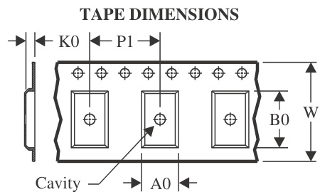

<html><body><table><tr><td>A0</td><td>Dimension designed to accommodate the component width</td></tr><tr><td>B0</td><td>Dimension designed to accommodate the component length</td></tr><tr><td>K0</td><td>Dimension designed to accommodate the component thickness</td></tr><tr><td>W</td><td>Overall width of the carrier tape</td></tr><tr><td>P1</td><td>Pitch successive cavity centers between</td></tr></table></body></html>

# QUADRANT ASSIGNMENTS FOR PIN ORIENTATION IN TAPE

\*All dimensions are nominal   

<html><body><table><tr><td>Device</td><td>Package Type</td><td>Package Drawing</td><td>Pins</td><td>SPQ</td><td>Reel Diameter (mm)</td><td>Reel Width W1 (mm)</td><td>AO (mm)</td><td>B0 (mm)</td><td>KO (mm)</td><td>P1 (mm)</td><td>W (mm)</td><td>Pin1 Quadrant</td></tr><tr><td>TPS7A2008DQNR</td><td>X2SON</td><td>DQN</td><td>4</td><td>3000</td><td>180.0</td><td>8.4</td><td>6</td><td></td><td></td><td>4</td><td></td><td>Q2</td></tr><tr><td>TPS7A2009PDBVR</td><td>SOT-23</td><td>DBV</td><td>5</td><td>3000</td><td>178.0</td><td>8.4</td><td>3.2</td><td>3.2</td><td>4</td><td>4.0</td><td>.0</td><td>Q3</td></tr><tr><td>TPS7A2009PDQNR</td><td>X2SON</td><td>DQN</td><td>4</td><td>3000</td><td>180.0</td><td>8.4</td><td>.16</td><td>1.16</td><td>0.5</td><td>4.0</td><td>8</td><td>Q2</td></tr><tr><td>TPS7A20105PDQNR</td><td>X2SON</td><td>DQN</td><td>4</td><td>3000</td><td>180.0</td><td>8.4</td><td>.16</td><td>1</td><td>0.5</td><td>4.0</td><td></td><td>Q2</td></tr><tr><td>TPS7A20115PDQNR</td><td>X2SON</td><td>DQN</td><td>4</td><td>3000</td><td>180.0</td><td>8.4</td><td>16</td><td>.16</td><td>0.5</td><td>4.0</td><td>8.0</td><td>Q2</td></tr><tr><td>TPS7A2011PYCKR</td><td>DSBGA</td><td>YCK</td><td>4</td><td>12000</td><td>180.0</td><td>8.4</td><td>0.71</td><td>0.71</td><td>0.42</td><td>2.0</td><td>8.0</td><td>Q1</td></tr><tr><td>TPS7A2011PYCKR</td><td>DSBGA</td><td>YCK</td><td>4</td><td>12000</td><td>180.0</td><td>8.4</td><td>0.71</td><td>0.71</td><td>0.42</td><td>2.0</td><td>8.0</td><td>Q1</td></tr><tr><td>TPS7A2012DQNR</td><td>X2SON</td><td>DQN</td><td>4</td><td>3000</td><td>180.0</td><td>8.4</td><td>1.16</td><td>1.16</td><td>0.5</td><td>4.0</td><td>8</td><td>Q2</td></tr><tr><td>TPS7A2012PDBVR</td><td>SOT-23</td><td>DBV</td><td>5</td><td>3000</td><td>178.0</td><td>8.4</td><td>3.2</td><td>3.2</td><td></td><td>4.0</td><td></td><td>Q3</td></tr><tr><td>TPS7A2012PDBVRG4</td><td>SOT-23</td><td>DBV</td><td>55</td><td>3000</td><td>180.0</td><td>8.4</td><td>3.2</td><td>3.2</td><td></td><td>4.0</td><td></td><td>Q3</td></tr><tr><td>TPS7A2012PDBVRG4</td><td>SOT-23</td><td>DBV</td><td></td><td>3000</td><td>180.0</td><td>8.4</td><td>3.2</td><td>3.2</td><td></td><td>4</td><td>8.0</td><td>Q3</td></tr><tr><td>TPS7A2012PDQNR</td><td>X2SON</td><td>DQN</td><td>4</td><td>3000</td><td>180.0</td><td>8.4</td><td>16</td><td>.16</td><td></td><td></td><td></td><td>Q2</td></tr><tr><td>TPS7A2012PYCJR</td><td>DSBGA</td><td>YCJ</td><td>4</td><td>12000</td><td>180.0</td><td>8.4</td><td></td><td></td><td></td><td>2</td><td></td><td>Q1</td></tr><tr><td>TPS7A2012PYCJR</td><td>DSBGA</td><td>YCJ</td><td>4</td><td>12000</td><td>180.0</td><td>8.4</td><td></td><td></td><td></td><td>2</td><td></td><td>Q1</td></tr><tr><td>TPS7A20135PDQNR</td><td>X2SON</td><td>DQN</td><td>4</td><td>3000</td><td>180.0</td><td>8.4</td><td>.16</td><td>1</td><td>5 0</td><td>4.0</td><td>3.0</td><td>Q2</td></tr><tr><td>TPS7A2013DQNR</td><td>X2SON</td><td>DQN</td><td>4</td><td>3000</td><td>180.0</td><td>8.4</td><td>1.16</td><td>1.16</td><td>0.5</td><td>4.0</td><td>8.0</td><td>Q2</td></tr></table></body></html>

www.ti.com www.ti.com www.ti.com www.ti.com www.ti.com www.ti.com

<html><body><table><tr><td>Device</td><td>Package Package Type</td><td>Drawing</td><td>Pins</td><td>SPQ</td><td>Reel Diameter</td><td>Reel Width</td><td>A0 (mm)</td><td>B0 (mm)</td><td>K0 (mm)</td><td>P1 (mm)</td><td>(mm)</td><td>Pin1 Quadrant</td></tr><tr><td>TPS7A2015PDBVR</td><td>SOT-23</td><td>DBV</td><td>5</td><td>3000</td><td>(mm) 178.0</td><td>W1 (mm) 8.4</td><td>3.2</td><td>3.2</td><td>.4</td><td>4.0</td><td>8.0</td><td>Q3</td></tr><tr><td>TPS7A2015PDQNR</td><td>X2SON</td><td>DQN</td><td>4</td><td>3000</td><td>180.0</td><td>8.4</td><td>1.16</td><td>16</td><td>0.5</td><td></td><td>8.0</td><td>Q2</td></tr><tr><td>TPS7A2016YCKR</td><td>DSBGA</td><td>YCK</td><td>4</td><td>12000</td><td>180.0</td><td>8.4</td><td>0.71</td><td></td><td>0.42</td><td>2.0</td><td>8.0</td><td>Q1</td></tr><tr><td>PS7A201 PDQNR 825</td><td>X2SON</td><td>DQN</td><td>4</td><td>3000</td><td>78.0</td><td>8.4</td><td>1.13</td><td>13</td><td>0.53</td><td>4.0</td><td>8.0</td><td>Q2</td></tr><tr><td>TPS7A20 825PDQNRM3</td><td>X2SON</td><td>DQN</td><td>4</td><td>3000</td><td>180.0</td><td>8.4</td><td>16</td><td>6</td><td>0.5</td><td>4.0</td><td>8.0</td><td>Q2</td></tr><tr><td>20 5 OBVR</td><td>SOT-23</td><td>DBV</td><td>5</td><td>3000</td><td>180.0</td><td>8.4</td><td>3.2</td><td></td><td></td><td></td><td>8.0</td><td>Q3</td></tr><tr><td>PS7A20185PDBVR</td><td>SOT-23</td><td>DBV</td><td>5</td><td>3000</td><td>180.0</td><td>8.4</td><td>3.2</td><td>3.2</td><td></td><td>4.0</td><td>8.0</td><td>Q3</td></tr><tr><td>A20 85 BV 7RG4</td><td>SOT-23</td><td>DBV</td><td>5</td><td>3000</td><td>180.0</td><td>8.4</td><td>3.2</td><td>3.2</td><td></td><td>4</td><td>8.0</td><td>Q3</td></tr><tr><td>TPS7A20185PDQNR</td><td>X2SON</td><td>DQN</td><td>4</td><td>3000</td><td>178.0</td><td>8.4</td><td>.13</td><td>13</td><td>0.53</td><td>4.0</td><td>8.0</td><td>Q2</td></tr><tr><td>PS7 85PD NRM3</td><td>X2SON</td><td>DQN</td><td>4</td><td>3000</td><td>180.0</td><td>8.4</td><td></td><td></td><td>0.5</td><td></td><td></td><td>Q2</td></tr><tr><td>PS7A201 85PYCKR</td><td>DSBGA</td><td>YCK</td><td>4</td><td>12000</td><td>180.0</td><td>8.4</td><td>0.71</td><td></td><td>0.42</td><td>2.0</td><td>8.0</td><td>Q1</td></tr><tr><td>S7A2018DQNR</td><td>X2SON</td><td>DQN</td><td>4</td><td>3000</td><td>180.0</td><td>8.4</td><td>1.16</td><td>16</td><td>0.5</td><td>4.0</td><td></td><td>Q2</td></tr><tr><td>PS7A2018PDBVR</td><td>SOT-23</td><td>DBV</td><td>5</td><td>3000</td><td>178.0</td><td>9.0</td><td>3.3</td><td></td><td></td><td></td><td>8.</td><td>Q3</td></tr><tr><td>A2018PDBVR</td><td>SOT-23</td><td>DBV</td><td>5</td><td>3000</td><td>180.0</td><td>8.4</td><td>3.2</td><td>.2</td><td></td><td></td><td></td><td>Q3</td></tr><tr><td>PS7A2018PDBVR</td><td>SOT-23</td><td>DBV</td><td>5</td><td>3000</td><td>180.0</td><td>8.4</td><td>3.2</td><td>3.2</td><td></td><td>4.0</td><td></td><td>Q3</td></tr><tr><td>A2C 8PDBVR</td><td>SOT-23</td><td>DBV</td><td></td><td>3000</td><td>178.0</td><td>8.4</td><td>3.2</td><td>3.2</td><td></td><td>4.0</td><td></td><td>Q3</td></tr><tr><td>A2018PDBVRG4</td><td>SOT-23</td><td>DBV</td><td>55</td><td>3000</td><td>180.0</td><td>8.4</td><td>3.2</td><td>3.2</td><td></td><td>4.0</td><td>8.0</td><td>Q3</td></tr><tr><td>A2018PDBVRG4</td><td>SOT-23</td><td>DBV</td><td>5</td><td>3000</td><td>180.0</td><td>8.4</td><td>3.2</td><td>.2</td><td></td><td></td><td></td><td>Q3</td></tr><tr><td>TPS7A2018PDQNR</td><td>X2SON</td><td>DQN</td><td>4</td><td>3000</td><td>178.0</td><td>8.4</td><td>1.13</td><td>13</td><td>0.53</td><td>+.0</td><td>8.0</td><td>Q2</td></tr><tr><td>A2018PDQNRM3</td><td>X2SON</td><td>DQN</td><td>4</td><td>3000</td><td>180.0</td><td>8.4</td><td>1.16</td><td>16</td><td>0.5</td><td></td><td></td><td>Q2</td></tr><tr><td>S7A2018PYCKR</td><td>DSBGA</td><td>YCK</td><td>4</td><td>12000</td><td>180.0</td><td>8.4</td><td>0.71</td><td></td><td>42</td><td></td><td>3.</td><td>Q1</td></tr><tr><td>PS7A2018PYCKR</td><td>DSBGA</td><td>YCK</td><td>4</td><td>12000</td><td>180.0</td><td>8.4</td><td>0.71</td><td></td><td>42</td><td></td><td></td><td>Q1</td></tr><tr><td>PS7A2018PYCKRM3</td><td>DSBGA</td><td>YCK</td><td>4</td><td>12000</td><td>180.0</td><td>8.4</td><td>0.7</td><td></td><td>42</td><td></td><td></td><td>Q1</td></tr><tr><td>PS7A2018P YCKRM3</td><td>DSBGA</td><td>YCK</td><td>4</td><td>12000</td><td>180.0</td><td>8.4</td><td></td><td></td><td></td><td></td><td></td><td>Q1</td></tr><tr><td>PS7A2018YCKR</td><td>DSBGA</td><td>YCK</td><td>4</td><td>12000</td><td>180.0</td><td>8.4</td><td>0.71</td><td></td><td></td><td>2</td><td>8.0</td><td>Q1</td></tr><tr><td>PS7A2020PYCKR</td><td>DSBGA</td><td>YCK</td><td>4</td><td>12000</td><td>180.0</td><td>8.4</td><td></td><td></td><td></td><td></td><td></td><td>Q1</td></tr><tr><td>PS7A2020P YCKR</td><td>DSBGA</td><td>YCK</td><td>4</td><td>12000</td><td>180.0</td><td>8.4</td><td>0.71</td><td></td><td>42</td><td>2</td><td>8.0</td><td>Q1</td></tr><tr><td></td><td>X2SON</td><td>DQN</td><td>4</td><td>3000</td><td>180.0</td><td>8.4</td><td>.16</td><td></td><td>0.5</td><td></td><td>8.</td><td>Q2</td></tr><tr><td>202275 CKR</td><td>DSBGA</td><td>YCK</td><td>4</td><td>12000</td><td>180.0</td><td>8.4</td><td>0.7</td><td></td><td>42</td><td>2</td><td>8.0</td><td>Q1</td></tr><tr><td>A202275P YCKR</td><td>DSBGA</td><td>YCK</td><td>4</td><td>12000</td><td>180.0</td><td>8.4</td><td>0.71</td><td></td><td>42</td><td>2</td><td>8.</td><td>Q1</td></tr><tr><td>PS7A2022P CKR</td><td>DSBGA</td><td>YCK</td><td>4</td><td>12000</td><td>180.0</td><td>8.4</td><td>0.71</td><td></td><td>42</td><td>2.0</td><td>8.0</td><td>Q1</td></tr><tr><td>7A2022P CKR</td><td>DSBGA</td><td>YCK</td><td>4</td><td>12000</td><td>180.0</td><td>8.4</td><td>0.71</td><td></td><td>42</td><td>2.</td><td>8.0</td><td>Q1</td></tr><tr><td>PS7A2024PDBVR</td><td>SOT-23</td><td>DBV</td><td>5</td></table></body></html>

<html><body><table><tr><td>Device</td><td>Package Type</td><td>Package Drawing</td><td>Pins</td><td>SPQ</td><td>Reel Diameter</td><td>Reel Width</td><td>A0 (mm)</td><td>B0 (mm)</td><td>K0 (mm)</td><td>PT (mm)</td><td>(mm)</td><td>Pin1 Quadrant</td></tr><tr><td>PS7A2025PYCJR</td><td>DSBGA</td><td>YCJ</td><td>4</td><td>12000</td><td>(mm) 180.0</td><td>W1 (mm) 8.4</td><td>0.71</td><td></td><td>0.42</td><td>2.0</td><td>8.0</td><td>Q1</td></tr><tr><td>A2025PYCJR</td><td>DSBGA</td><td>YCJ</td><td>4</td><td>12000</td><td>180.0</td><td></td><td></td><td></td><td>42</td><td>2.</td><td></td><td>Q1</td></tr><tr><td>PS7A2027PDQNR</td><td>X2SON</td><td>DQN</td><td>4</td><td>3000</td><td>180.0</td><td>8.4</td><td>/6</td><td></td><td>0.5</td><td></td><td></td><td>Q2</td></tr><tr><td>CJR</td><td>DSBGA</td><td>YCJ</td><td>4</td><td>12000</td><td>180.0</td><td></td><td></td><td></td><td>42</td><td></td><td></td><td>Q1</td></tr><tr><td>A2027PYCJR</td><td>DSBGA</td><td>YCJ</td><td>4</td><td>12000</td><td>180.0</td><td></td><td></td><td></td><td>42</td><td></td><td></td><td>Q1</td></tr><tr><td>DBVR</td><td>SOT-23</td><td>DBV</td><td>5</td><td>3000</td><td>78.0</td><td></td><td></td><td></td><td></td><td></td><td></td><td>Q3</td></tr><tr><td>A20285PDQNR</td><td>X2SON</td><td>DQN</td><td>4</td><td>3000</td><td>180.0</td><td>8.4</td><td></td><td></td><td>0.5</td><td></td><td></td><td>Q2</td></tr><tr><td>CKR</td><td>DSBGA</td><td>YCK</td><td>4</td><td>12000</td><td>180.0</td><td>8.4</td><td></td><td></td><td>2</td><td></td><td></td><td>Q1</td></tr><tr><td>A2028DQNR</td><td>X2SON</td><td>DQN</td><td>4</td><td>3000</td><td>180.0</td><td>8.4</td><td>16</td><td></td><td>0</td><td></td><td></td><td>Q2</td></tr><tr><td>A2028PDBVR</td><td>SOT-23</td><td>DBV</td><td>5</td><td>3000</td><td>180.0</td><td></td><td></td><td></td><td></td><td></td><td></td><td>Q3</td></tr><tr><td>PS7A2028PDBVR</td><td>SOT-23</td><td>DBV</td><td>5</td><td>3000</td><td>178.0</td><td>9.0</td><td>3.3</td><td></td><td></td><td></td><td></td><td>Q3</td></tr><tr><td>DBVR 28P</td><td>SOT-23</td><td>DBV</td><td>5</td><td>3000</td><td>180.0</td><td>8.4</td><td>2</td><td></td><td></td><td></td><td></td><td>Q3</td></tr><tr><td>028F DQNR</td><td>X2SON</td><td>DQN</td><td>4</td><td>3000</td><td>180.0</td><td>8.4</td><td>16</td><td></td><td></td><td></td><td></td><td>Q2</td></tr><tr><td>NRM3</td><td>X2SON</td><td>DQN</td><td>4</td><td>3000</td><td>180.0</td><td>8.4</td><td>16</td><td></td><td>5</td><td></td><td></td><td>Q2</td></tr><tr><td>A2028 YCJR</td><td>DSBGA</td><td>YCJ</td><td>4</td><td>12000</td><td>180.0</td><td>8.4</td><td>0.71</td><td></td><td></td><td></td><td></td><td>Q1</td></tr><tr><td>028PYCJR</td><td>DSBGA</td><td>YCJ</td><td>4</td><td>12000</td><td>180.0</td><td>8.4</td><td>0.71</td><td></td><td>42</td><td></td><td></td><td>Q1</td></tr><tr><td>A2028P CKR</td><td>DSBGA</td><td>YCK</td><td>4</td><td>12000</td><td>180.0</td><td>8.4</td><td>0.71</td><td></td><td>42</td><td></td><td></td><td>Q1</td></tr><tr><td>7A2028PYCKR</td><td>DSBGA</td><td>YCK</td><td>4</td><td>12000</td><td>180.0</td><td>8.4</td><td></td><td></td><td>42</td><td></td><td></td><td>Q1</td></tr><tr><td>PS7A2029PDQNR</td><td>X2SON</td><td>DQN</td><td>4</td><td>3000</td><td>180.0</td><td>8.4</td><td>1.16</td><td></td><td>0.5</td><td></td><td></td><td>Q2</td></tr><tr><td>QNR</td><td>X2SON</td><td>DQN</td><td>4</td><td>3000</td><td>180.0</td><td>8.4</td><td>1.16</td><td>6</td><td>0.5</td><td></td><td></td><td>Q2</td></tr><tr><td>030PDBVR</td><td>SOT-23</td><td>DBV</td><td>5</td><td>3000</td><td>78.0</td><td>8.4</td><td>3.2</td><td>3.2</td><td></td><td></td><td></td><td>Q3</td></tr><tr><td>BVRG4</td><td>SOT-23</td><td>DBV</td><td>5</td><td>3000</td><td>180.0</td><td>8.4</td><td>3.2</td><td>3.2</td><td>4</td><td></td><td></td><td>Q3</td></tr><tr><td>A2030PDBVRG4</td><td>SOT-23</td><td>DBV</td><td>5</td><td>3000</td><td>180.0</td><td>8.4</td><td>3.2</td><td>3.2</td><td>.4</td><td></td><td>3.</td><td>Q3</td></tr><tr><td>2030PDQNR</td><td>X2SON</td><td>DQN</td><td>4</td><td>3000</td><td>180.0</td><td>8.4</td><td>1.16</td><td>.16</td><td>0.5</td><td>4</td><td></td><td>Q2</td></tr><tr><td>030PDQNRG4</td><td>X2SON</td><td>DQN</td><td>4</td><td>3000</td><td>180.0</td><td>8.4</td><td>1.16</td><td>1.16</td><td>0.5</td><td></td><td>8.0</td><td>Q2</td></tr><tr><td>PS7A2030YCKR</td><td>DSBGA</td><td>YCK</td><td>4</td><td>12000</td><td>180.0</td><td>8.4</td><td>0.71</td><td>0.71</td><td>.42</td><td></td><td></td><td>Q1</td></tr><tr><td>PS7A2031PDBVR</td><td>SOT-23</td><td>DBV</td><td>5</td><td>3000</td><td>180.0</td><td>8.4</td><td>3.2</td><td>3.2</td><td>1.4</td><td>4.0</td><td>8.0</td><td>Q3</td></tr><tr><td>PDBVRG4</td><td>SOT-23</td><td>DBV</td><td>5</td><td>3000</td><td>180.0</td><td>8.4</td><td>3.2</td><td>3.2</td><td>1.4</td><td>4.0</td><td></td><td>Q3</td></tr><tr><td>S7A2032PDBVR</td><td>SOT-23</td><td>DBV</td><td>5</td><td>3000</td><td>180.0</td><td>8.4</td><td>3.2</td><td>3.2</td><td>.4</td><td>4.</td><td>8.0</td><td>Q3</td></tr><tr><td>PS7A2033DQNR</td><td>X2SON</td><td>DQN</td><td>4</td><td>3000</td><td>180.0</td><td>8.4</td><td>1.16</td><td>16</td><td>0.5</td><td></td><td></td><td>Q2</td></tr><tr><td>S7A2033PDBVR</td><td>SOT-23</td><td>DBV</td><td>5</td><td>3000</td><td>178.0</td><td>8.4</td><td>3.2</td><td>3.2</td><td>.4</td><td>+</td><td>8.0</td><td>Q3</td></tr><tr><td>2033PDQNR</td><td>X2SON</td><td>DQN</td><td>4</td><td>3000</td><td>178.0</td><td>8.4</td><td>1.13</td><td>3</td><td>.53</td><td></td><td></td><td>Q2</td></tr><tr><td>33PD NRM3</td><td>X2SON</td><td>DQN</td><td>4</td></table></body></html>

<html><body><table><tr><td>Device</td><td>Package Type</td><td>Package Drawing</td><td>Pins</td><td>SPQ</td><td>Reel Diameter (mm)</td><td>Reel Width W1 (mm)</td><td>AO (mm)</td><td>B0 (mm)</td><td>KO (mm)</td><td>P1 (mm)</td><td>W (mm)</td><td>Pin1 Quadrant</td></tr><tr><td>TPS7A2042PDBVR</td><td>SOT-23</td><td>DBV</td><td></td><td>3000</td><td>178.0</td><td>9.0</td><td>3.3</td><td>3.2</td><td>4</td><td>4.0</td><td>8.0</td><td>Q3</td></tr><tr><td>TPS7A2042PDBVRG4</td><td>SOT-23</td><td>DBV</td><td>55</td><td>3000</td><td>180.0</td><td>8.4</td><td>3.2</td><td>3.2</td><td>4</td><td>4.0</td><td>8.0</td><td>Q3</td></tr><tr><td>TPS7A2042PDQNR</td><td>X2SON</td><td>DQN</td><td>4</td><td>3000</td><td>180.0</td><td>8.4</td><td>.16</td><td>1.16</td><td>0.5</td><td>4.0</td><td>8.0</td><td>Q2</td></tr><tr><td>TPS7A2045PDBVR</td><td>SOT-23</td><td>DBV</td><td>5</td><td>3000</td><td>178.0</td><td>9.0</td><td>3.3</td><td>3.2</td><td>4</td><td>4.0</td><td>8.0</td><td>Q3</td></tr><tr><td>TPS7A2045PDBVR</td><td>SOT-23</td><td>DBV</td><td>5</td><td>3000</td><td>180.0</td><td>8.4</td><td>3.2</td><td>3.2</td><td>.4</td><td>4.0</td><td>8.0</td><td>Q3</td></tr><tr><td>TPS7A2045PDBVR</td><td>SOT-23</td><td>DBV</td><td>5</td><td>3000</td><td>180.0</td><td>8.4</td><td>3.2</td><td>3.2</td><td>4</td><td>4.0</td><td>8.0</td><td>Q3</td></tr><tr><td>TPS7A2045PDQNR</td><td>X2SON</td><td>DQN</td><td>4</td><td>3000</td><td>180.0</td><td>8.4</td><td>.16</td><td>1.16</td><td>0.5</td><td>4.0</td><td>8.0</td><td>Q2</td></tr><tr><td>TPS7A2050PDBVR</td><td>SOT-23</td><td>DBV</td><td>5</td><td>3000</td><td>178.0</td><td>8.4</td><td>3.2</td><td>3.2</td><td>.4</td><td>4.0</td><td>8.0</td><td>Q3</td></tr><tr><td>TPS7A2050PDBVRG4</td><td>SOT-23</td><td>DBV</td><td>5</td><td>3000</td><td>180.0</td><td>8.4</td><td>3.2</td><td>3.2</td><td>.4</td><td>4.0</td><td>8.0</td><td>Q3</td></tr><tr><td>TPS7A2050PDQNR</td><td>X2SON</td><td>DQN</td><td>4</td><td>3000</td><td>180.0</td><td>8.4</td><td>1.16</td><td>1.16</td><td>0.5</td><td>4.0</td><td>8.0</td><td>Q2</td></tr><tr><td>TPS7A2050PDQNRG4</td><td>X2SON</td><td>DQN</td><td>4</td><td>3000</td><td>180.0</td><td>8.4</td><td>16</td><td>1.16</td><td>0.5</td><td>4.0</td><td>8.0</td><td>Q2</td></tr><tr><td>TPS7A2050PDQNRM3</td><td>X2SON</td><td>DQN</td><td></td><td>3000</td><td>180.0</td><td>8.4</td><td>.16</td><td>1.16</td><td>0.5</td><td>4.0</td><td>8.0</td><td>Q2</td></tr><tr><td>TPS7A2050PYCKR</td><td>DSBGA</td><td>YCK</td><td>44</td><td>12000</td><td>180.0</td><td>8.4</td><td>0</td><td>0.71</td><td>.42</td><td>2.0</td><td>8.0</td><td>Q1</td></tr><tr><td>TPS7A2050PYCKR</td><td>DSBGA</td><td>YCK</td><td>4</td><td>12000</td><td>180.0</td><td>8.4</td><td></td><td>0.71</td><td>0.42</td><td>2.0</td><td>8.0</td><td>Q1</td></tr><tr><td>TPS7A2055PDBVR</td><td>SOT-23</td><td>DBV</td><td>5</td><td>3000</td><td>178.0</td><td>9.0</td><td>3.3</td><td>3.2</td><td></td><td>4.0</td><td>8.0</td><td>Q3</td></tr><tr><td>TPS7A2055PDBVR</td><td>SOT-23</td><td>DBV</td><td>5</td><td>3000</td><td>180.0</td><td>8.4</td><td>3.2</td><td>3.2</td><td></td><td>4.0</td><td>8.0</td><td>Q3</td></tr><tr><td>TPS7A2055PDBVRG4</td><td>SOT-23</td><td>DBV</td><td>5</td><td>3000</td><td>180.0</td><td>8.4</td><td>3.2</td><td>3.2</td><td></td><td>4.0</td><td>8.0</td><td>Q3</td></tr></table></body></html>

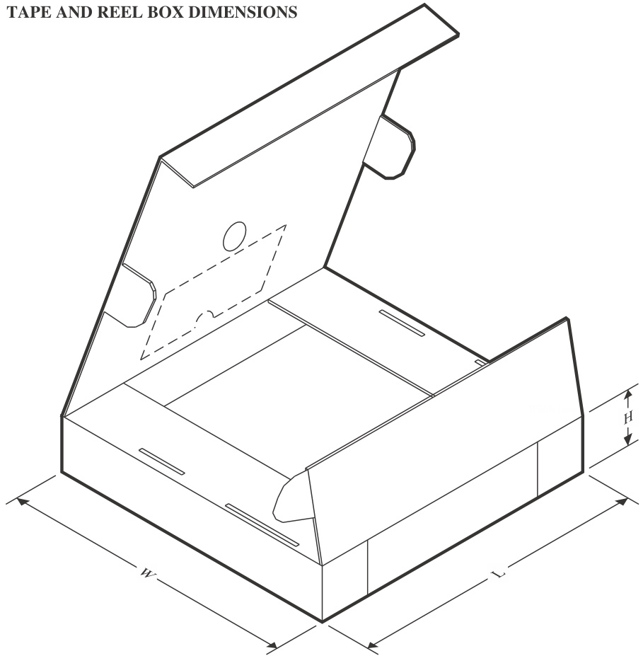

\*All dimensions are nominal   

<html><body><table><tr><td>Device</td><td>Package Type</td><td>Package Drawing</td><td>Pins</td><td>SPQ</td><td>Length (mm)</td><td>Width (mm)</td><td>Height (mm)</td></tr><tr><td>TPS7A2008DQNR</td><td>X2SON</td><td>DQN</td><td>4</td><td>3000</td><td>210.0</td><td>185.0</td><td>35.0</td></tr><tr><td>TPS7A2009PDBVR</td><td>SOT-23</td><td>DBV</td><td>5</td><td>3000</td><td>208.0</td><td>191.0</td><td>35.0</td></tr><tr><td>TPS7A2009PDQNR</td><td>X2SON</td><td>DQN</td><td>4</td><td>3000</td><td>210.0</td><td>185.0</td><td>35.0</td></tr><tr><td>TPS7A20105PDQNR</td><td>X2SON</td><td>DQN</td><td>4</td><td>3000</td><td>210.0</td><td>185.0</td><td>35.0</td></tr><tr><td>TPS7A20115PDQNR</td><td>X2SON</td><td>DQN</td><td>4</td><td>3000</td><td>210.0</td><td>185.0</td><td>35.0</td></tr><tr><td>TPS7A2011PYCKR</td><td>DSBGA</td><td>YCK</td><td>4</td><td>12000</td><td>182.0</td><td>182.0</td><td>20.0</td></tr><tr><td>TPS7A2011PYCKR</td><td>DSBGA</td><td>YCK</td><td>4</td><td>12000</td><td>182.0</td><td>182.0</td><td>20.0</td></tr><tr><td>TPS7A2012DQNR</td><td>X2SON</td><td>DQN</td><td>4</td><td>3000</td><td>210.0</td><td>185.0</td><td>35.0</td></tr><tr><td>TPS7A2012PDBVR</td><td>SOT-23</td><td>DBV</td><td>5</td><td>3000</td><td>208.0</td><td>191.0</td><td>35.0</td></tr><tr><td>TPS7A2012PDBVRG4</td><td>SOT-23</td><td>DBV</td><td>5</td><td>3000</td><td>210.0</td><td>185.0</td><td>35.0</td></tr><tr><td>TPS7A2012PDBVRG4</td><td>SOT-23</td><td>DBV</td><td>5</td><td>3000</td><td>210.0</td><td>185.0</td><td>35.0</td></tr><tr><td>TPS7A2012PDQNR</td><td>X2SON</td><td>DQN</td><td>4</td><td>3000</td><td>210.0</td><td>185.0</td><td>35.0</td></tr><tr><td>TPS7A2012PYCJR</td><td>DSBGA</td><td>YCJ</td><td>4</td><td>12000</td><td>182.0</td><td>182.0</td><td>20.0</td></tr><tr><td>TPS7A2012PYCJR</td><td>DSBGA</td><td>YCJ</td><td>4</td><td>12000</td><td>210.0</td><td>185.0</td><td>35.0</td></tr><tr><td>TPS7A20135PDQNR</td><td>X2SON</td><td>DQN</td><td>4</td><td>3000</td><td>210.0</td><td>185.0</td><td>35.0</td></tr><tr><td>TPS7A2013DQNR</td><td>X2SON</td><td>DQN</td><td>4</td><td>3000</td><td>210.0</td><td>185.0</td><td>35.0</td></tr><tr><td>TPS7A2015PDBVR</td><td>SOT-23</td><td>DBV</td><td>5</td><td>3000</td><td>208.0</td><td>191.0</td><td>35.0</td></tr><tr><td>TPS7A2015PDQNR</td><td>X2SON</td><td>DQN</td><td>4</td><td>3000</td><td>210.0</td><td>185.0</td><td>35.0</td></tr></table></body></html>

<html><body><table><tr><td>Device</td><td>Package Type</td><td>Package Drawing</td><td>Pins</td><td>SPQ</td><td>Length (mm)</td><td>Width (mm)</td><td>Height (mm)</td></tr><tr><td>TPS7A2016YCKR</td><td>DSBGA</td><td>YCK</td><td></td><td>12000</td><td>182.0</td><td>182.0</td><td>20.0</td></tr><tr><td>TPS7A201825PDQNR</td><td>X2SON</td><td>DQN</td><td></td><td>3000</td><td>205.0</td><td>200.0</td><td>33.0</td></tr><tr><td>TPS7A201825PDQNRM3</td><td>X2SON</td><td>DQN</td><td></td><td>3000</td><td>210.0</td><td>185.0</td><td>35.0</td></tr><tr><td>TPS7A20185PDBVR</td><td>SOT-23</td><td>DBV</td><td>4445554444555555444444444444445554555544444</td><td>3000</td><td>210.0</td><td>185.0</td><td>35.0</td></tr><tr><td>TPS7A20185PDBVR</td><td>SOT-23</td><td>DBV</td><td></td><td>3000</td><td>210.0</td><td>185.0</td><td>35.0</td></tr><tr><td>TPS7A20185PDBVRG4</td><td>SOT-23</td><td>DBV</td><td></td><td>3000</td><td>210.0</td><td>185.0</td><td>35.0</td></tr><tr><td>TPS7A20185PDQNR</td><td>X2SON</td><td>DQN</td><td></td><td>3000</td><td>205.0</td><td>200.0</td><td>33.0</td></tr><tr><td>TPS7A20185PDQNRM3</td><td>X2SON</td><td>DQN</td><td></td><td>3000</td><td>210.0</td><td>185.0</td><td>35.0</td></tr><tr><td>TPS7A20185PYCKR</td><td>DSBGA</td><td>YCK</td><td></td><td>12000</td><td>182.0</td><td>182.0</td><td>20.0</td></tr><tr><td>TPS7A2018DQNR</td><td>X2SON</td><td>DQN</td><td></td><td>3000</td><td>210.0</td><td>185.0</td><td>35.0</td></tr><tr><td>TPS7A2018PDBVR</td><td>SOT-23</td><td>DBV</td><td></td><td>3000</td><td>180.0</td><td>180.0</td><td>18.0</td></tr><tr><td>TPS7A2018PDBVR</td><td>SOT-23</td><td>DBV</td><td></td><td>3000</td><td>210.0</td><td>185.0</td><td>35.0</td></tr><tr><td>TPS7A2018PDBVR</td><td>SOT-23</td><td>DBV</td><td></td><td>3000</td><td>210.0</td><td>185.0</td><td>35.0</td></tr><tr><td>TPS7A2018PDBVR</td><td>SOT-23</td><td>DBV</td><td></td><td>3000</td><td>208.0</td><td>191.0</td><td>35.0</td></tr><tr><td>TPS7A2018PDBVRG4</td><td>SOT-23</td><td>DBV</td><td></td><td>3000</td><td>210.0</td><td>185.0</td><td>35.0</td></tr><tr><td>TPS7A2018PDBVRG4</td><td>SOT-23</td><td>DBV</td><td></td><td>3000</td><td>210.0</td><td>185.0</td><td>35.0</td></tr><tr><td>TPS7A2018PDQNR</td><td>X2SON</td><td>DQN</td><td></td><td>3000</td><td>205.0</td><td>200.0</td><td>33.0</td></tr><tr><td>TPS7A2018PDQNRM3</td><td>X2SON</td><td>DQN</td><td></td><td>3000</td><td>210.0</td><td>185.0</td><td>35.0</td></tr><tr><td>TPS7A2018PYCKR</td><td>DSBGA</td><td>YCK</td><td></td><td>12000</td><td>182.0</td><td>182.0</td><td>20.0</td></tr><tr><td>TPS7A2018PYCKR</td><td>DSBGA</td><td>YCK</td><td></td><td>12000</td><td>182.0</td><td>182.0</td><td>20.0</td></tr><tr><td>TPS7A2018PYCKRM3</td><td>DSBGA</td><td>YCK</td><td></td><td>12000</td><td>182.0</td><td>182.0</td><td>20.0</td></tr><tr><td>TPS7A2018PYCKRM3</td><td>DSBGA</td><td>YCK</td><td></td><td>12000</td><td>182.0</td><td>182.0</td><td>20.0</td></tr><tr><td>TPS7A2018YCKR</td><td>DSBGA</td><td>YCK</td><td></td><td>12000</td><td>182.0</td><td>182.0</td><td>20.0</td></tr><tr><td>TPS7A2020PYCKR</td><td>DSBGA</td><td>YCK</td><td></td><td>12000</td><td>182.0</td><td>182.0</td><td>20.0</td></tr><tr><td>TPS7A2020PYCKR</td><td>DSBGA</td><td>YCK</td><td></td><td>12000</td><td>182.0</td><td>182.0</td><td>20.0</td></tr><tr><td>TPS7A20225PDQNR</td><td>X2SON</td><td>DQN</td><td></td><td>3000</td><td>210.0</td><td>185.0</td><td>35.0</td></tr><tr><td>TPS7A202275PYCKR</td><td>DSBGA</td><td>YCK</td><td></td><td>12000</td><td>182.0</td><td>182.0</td><td>20.0</td></tr><tr><td>TPS7A202275PYCKR</td><td>DSBGA</td><td>YCK</td><td></td><td>12000</td><td>182.0</td><td>182.0</td><td>20.0</td></tr><tr><td>TPS7A2022PYCKR</td><td>DSBGA</td><td>YCK</td><td></td><td>12000</td><td>182.0</td><td>182.0</td><td>20.0</td></tr><tr><td>TPS7A2022PYCKR</td><td>DSBGA</td><td>YCK</td><td></td><td>12000</td><td>182.0</td><td>182.0</td><td>20.0</td></tr><tr><td>TPS7A2024PDBVR</td><td>SOT-23</td><td>DBV</td><td></td><td>3000</td><td>210.0</td><td>185.0</td><td>35.0</td></tr><tr><td>TPS7A2024PDBVR</td><td>SOT-23</td><td>DBV</td><td></td><td>3000</td><td>210.0</td><td>185.0</td><td>35.0</td></tr><tr><td>TPS7A2024PDBVR</td><td>SOT-23</td><td>DBV</td><td></td><td>3000</td><td>210.0</td><td>185.0</td><td>35.0</td></tr><tr><td>TPS7A2025DQNR</td><td>X2SON</td><td>DQN</td><td></td><td>3000</td><td>210.0</td><td>185.0</td><td>35.0</td></tr><tr><td>TPS7A2025PDBVR</td><td>SOT-23</td><td>DBV</td><td></td><td>3000</td><td>210.0</td><td>185.0</td><td>35.0</td></tr><tr><td>PS7A2025PDBVR</td><td>SOT-23</td><td>DBV</td><td></td><td>3000</td><td>210.0</td><td>185.0</td><td>35.0</td></tr><tr><td>TPS7A2025PDBVRG4</td><td>SOT-23</td><td>DBV</td><td></td><td>3000</td><td>210.0</td><td>185.0</td><td>35.0</td></tr><tr><td>TPS7A2025PDBVRG4</td><td>SOT-23</td><td>DBV</td><td></td><td>3000</td><td>210.0</td><td>185.0</td><td>35.0</td></tr><tr><td>TPS7A2025PDQNR</td><td>X2SON</td><td>DQN</td><td></td><td>3000</td><td>210.0</td><td>185.0</td><td>35.0</td></tr><tr><td>TPS7A2025PYCJR</td><td>DSBGA</td><td>YCJ</td><td></td><td>12000</td><td>210.0</td><td>185.0</td><td>35.0</td></tr><tr><td>TPS7A2025PYCJR</td><td>DSBGA</td><td>YCJ</td><td></td><td>12000</td><td>182.0</td><td>182.0</td><td>20.0</td></tr><tr><td>TPS7A2027PDQNR</td><td>X2SON</td><td>DQN</td><td></td><td>3000</td><td>210.0</td><td>185.0</td><td>35.0</td></tr><tr><td></td><td></td><td></td><td></td><td></td><td></td><td></td><td></td></tr><tr><td>TPS7A2027PYCJR</td><td>DSBGA</td><td>YCJ</td><td></td><td>12000</td><td>182.0</td><td>182.0</td><td>20.0</td></tr></table></body></html>

<html><body><table><tr><td>Device</td><td>Package Type</td><td>Package Drawing</td><td>Pins</td><td>SPQ</td><td>Length (mm)</td><td>Width (mm)</td><td>Height (mm)</td></tr><tr><td>TPS7A2027PYCJR</td><td>DSBGA</td><td>YCJ</td><td></td><td>12000</td><td>182.0</td><td>182.0</td><td>20.0</td></tr><tr><td>TPS7A20285PDBVR</td><td>SOT-23</td><td>DBV</td><td></td><td>3000</td><td>208.0</td><td>191.0</td><td>35.0</td></tr><tr><td>TPS7A20285PDQNR</td><td>X2SON</td><td>DQN</td><td></td><td>3000</td><td>210.0</td><td>185.0</td><td>35.0</td></tr><tr><td>TPS7A20285PYCKR</td><td>DSBGA</td><td>YCK</td><td>4544455544444444555444555454444454445554555</td><td>12000</td><td>182.0</td><td>182.0</td><td>20.0</td></tr><tr><td>TPS7A2028DQNR</td><td>X2SON</td><td>DQN</td><td></td><td>3000</td><td>210.0</td><td>185.0</td><td>35.0</td></tr><tr><td>TPS7A2028PDBVR</td><td>SOT-23</td><td>DBV</td><td></td><td>3000</td><td>210.0</td><td>185.0</td><td>35.0</td></tr><tr><td>TPS7A2028PDBVR</td><td>SOT-23</td><td>DBV</td><td></td><td>3000</td><td>180.0</td><td>180.0</td><td>18.0</td></tr><tr><td>TPS7A2028PDBVR</td><td>SOT-23</td><td>DBV</td><td></td><td>3000</td><td>210.0</td><td>185.0</td><td>35.0</td></tr><tr><td>TPS7A2028PDQNR</td><td>X2SON</td><td>DQN</td><td></td><td>3000</td><td>210.0</td><td>185.0</td><td>35.0</td></tr><tr><td>TPS7A2028PDQNRM3</td><td>X2SON</td><td>DQN</td><td></td><td>3000</td><td>210.0</td><td>185.0</td><td>35.0</td></tr><tr><td>TPS7A2028PYCJR</td><td>DSBGA</td><td>YCJ</td><td></td><td>12000</td><td>182.0</td><td>182.0</td><td>20.0</td></tr><tr><td>TPS7A2028PYCJR</td><td>DSBGA</td><td>YCJ</td><td></td><td>12000</td><td>182.0</td><td>182.0</td><td>20.0</td></tr><tr><td>TPS7A2028PYCKR</td><td>DSBGA</td><td>YCK</td><td></td><td>12000</td><td>182.0</td><td>182.0</td><td>20.0</td></tr><tr><td>TPS7A2028PYCKR</td><td>DSBGA</td><td>YCK</td><td></td><td>12000</td><td>182.0</td><td>182.0</td><td>20.0</td></tr><tr><td>TPS7A2029PDQNR</td><td>X2SON</td><td>DQN</td><td></td><td>3000</td><td>210.0</td><td>185.0</td><td>35.0</td></tr><tr><td>TPS7A2030DQNR</td><td>X2SON</td><td>DQN</td><td></td><td>3000</td><td>210.0</td><td>185.0</td><td>35.0</td></tr><tr><td>TPS7A2030PDBVR</td><td>SOT-23</td><td>DBV</td><td></td><td>3000</td><td>208.0</td><td>191.0</td><td>35.0</td></tr><tr><td>TPS7A2030PDBVRG4</td><td>SOT-23</td><td>DBV</td><td></td><td>3000</td><td>210.0</td><td>185.0</td><td>35.0</td></tr><tr><td>TPS7A2030PDBVRG4</td><td>SOT-23</td><td>DBV</td><td></td><td>3000</td><td>210.0</td><td>185.0</td><td>35.0</td></tr><tr><td>TPS7A2030PDQNR</td><td>X2SON</td><td>DQN</td><td></td><td>3000</td><td>210.0</td><td>185.0</td><td>35.0</td></tr><tr><td>TPS7A2030PDQNRG4</td><td>X2SON</td><td>DQN</td><td></td><td>3000</td><td>210.0</td><td>185.0</td><td>35.0</td></tr><tr><td>TPS7A2030YCKR</td><td>DSBGA</td><td>YCK</td><td></td><td>12000</td><td>182.0</td><td>182.0</td><td>20.0</td></tr><tr><td>TPS7A2031PDBVR</td><td>SOT-23</td><td>DBV</td><td></td><td>3000</td><td>210.0</td><td>185.0</td><td>35.0</td></tr><tr><td>TPS7A2031PDBVRG4</td><td>SOT-23</td><td>DBV</td><td></td><td>3000</td><td>210.0</td><td>185.0</td><td>35.0</td></tr><tr><td>TPS7A2032PDBVR</td><td>SOT-23</td><td>DBV</td><td></td><td>3000</td><td>210.0</td><td>185.0</td><td>35.0</td></tr><tr><td>TPS7A2033DQNR</td><td>X2SON</td><td>DQN</td><td></td><td>3000</td><td>210.0</td><td>185.0</td><td>35.0</td></tr><tr><td>TPS7A2033PDBVR</td><td>SOT-23</td><td>DBV</td><td></td><td>3000</td><td>208.0</td><td>191.0</td><td>35.0</td></tr><tr><td>TPS7A2033PDQNR</td><td>X2SON</td><td>DQN</td><td></td><td>3000</td><td>205.0</td><td>200.0</td><td>33.0</td></tr><tr><td>TPS7A2033PDQNRM3</td><td>X2SON</td><td>DQN</td><td></td><td>3000</td><td>210.0</td><td>185.0</td><td>35.0</td></tr><tr><td>TPS7A2033PYCJR</td><td>DSBGA</td><td>YCJ</td><td></td><td>12000</td><td>182.0</td><td>182.0</td><td>20.0</td></tr><tr><td>TPS7A2033PYCJR</td><td>DSBGA</td><td>YCJ</td><td></td><td>12000</td><td>182.0</td><td>182.0</td><td>20.0</td></tr><tr><td>TPS7A2033YCKR</td><td>DSBGA</td><td>YCK</td><td></td><td>12000</td><td>182.0</td><td>182.0</td><td>20.0</td></tr><tr><td>TPS7A2036PDBVR</td><td>SOT-23</td><td>DBV</td><td></td><td>3000</td><td>208.0</td><td>191.0</td><td>35.0</td></tr><tr><td>TPS7A2036PDQNR</td><td>X2SON</td><td>DQN</td><td></td><td>3000</td><td>210.0</td><td>185.0</td><td>35.0</td></tr><tr><td>TPS7A2040PDQNR</td><td>X2SON</td><td>DQN</td><td></td><td>3000</td><td>184.0</td><td>184.0</td><td>19.0</td></tr><tr><td>TPS7A2040PDQNRG4</td><td>X2SON</td><td>DQN</td><td></td><td>3000</td><td>184.0</td><td>184.0</td><td>19.0</td></tr><tr><td>TPS7A2042PDBVR</td><td>SOT-23</td><td>DBV</td><td></td><td>3000</td><td>210.0</td><td>185.0</td><td>35.0</td></tr><tr><td>TPS7A2042PDBVR</td><td>SOT-23</td><td>DBV</td><td></td><td>3000</td><td>180.0</td><td>180.0</td><td>18.0</td></tr><tr><td>PS7A2042PDBVRG4</td><td>SOT-23</td><td>DBV</td><td></td><td>3000</td><td>210.0</td><td>185.0</td><td>35.0</td></tr><tr><td>TPS7A2042PDQNR</td><td>X2SON</td><td>DQN</td><td></td><td>3000</td><td>210.0</td><td>185.0</td><td>35.0</td></tr><tr><td>TPS7A2045PDBVR</td><td>SOT-23</td><td>DBV</td><td></td><td>3000</td><td>180.0</td><td>180.0</td><td>18.0</td></tr><tr><td>TPS7A2045PDBVR</td><td>SOT-23</td><td>DBV</td><td></td><td>3000</td><td>210.0</td><td>185.0</td><td>35.0</td></tr><tr><td>TPS7A2045PDBVR</td><td>SOT-23</td><td>DBV</td><td></td><td>3000</td><td>210.0</td><td>185.0</td><td>35.0</td></tr></table></body></html>

<html><body><table><tr><td>Device</td><td>Package Type</td><td>Package Drawing</td><td>Pins</td><td>SPQ</td><td>Length (mm)</td><td>Width (mm)</td><td>Height (mm)</td></tr><tr><td>TPS7A2045PDQNR</td><td>X2SON</td><td>DQN</td><td>4</td><td>3000</td><td>210.0</td><td>185.0</td><td>35.0</td></tr><tr><td>TPS7A2050PDBVR</td><td>SOT-23</td><td>DBV</td><td>5</td><td>3000</td><td>208.0</td><td>191.0</td><td>35.0</td></tr><tr><td>TPS7A2050PDBVRG4</td><td>SOT-23</td><td>DBV</td><td>5</td><td>3000</td><td>210.0</td><td>185.0</td><td>35.0</td></tr><tr><td>TPS7A2050PDQNR</td><td>X2SON</td><td>DQN</td><td>4</td><td>3000</td><td>210.0</td><td>185.0</td><td>35.0</td></tr><tr><td>TPS7A2050PDQNRG4</td><td>X2SON</td><td>DQN</td><td>4</td><td>3000</td><td>210.0</td><td>185.0</td><td>35.0</td></tr><tr><td>TPS7A2050PDQNRM3</td><td>X2SON</td><td>DQN</td><td>4</td><td>3000</td><td>210.0</td><td>185.0</td><td>35.0</td></tr><tr><td>TPS7A2050PYCKR</td><td>DSBGA</td><td>YCK</td><td>4</td><td>12000</td><td>182.0</td><td>182.0</td><td>20.0</td></tr><tr><td>TPS7A2050PYCKR</td><td>DSBGA</td><td>YCK</td><td>4</td><td>12000</td><td>182.0</td><td>182.0</td><td>20.0</td></tr><tr><td>TPS7A2055PDBVR</td><td>SOT-23</td><td>DBV</td><td>5</td><td>3000</td><td>180.0</td><td>180.0</td><td>18.0</td></tr><tr><td>TPS7A2055PDBVR</td><td>SOT-23</td><td>DBV</td><td>5</td><td>3000</td><td>210.0</td><td>185.0</td><td>35.0</td></tr><tr><td>TPS7A2055PDBVRG4</td><td>SOT-23</td><td>DBV</td><td>5</td><td>3000</td><td>210.0</td><td>185.0</td><td>35.0</td></tr></table></body></html>

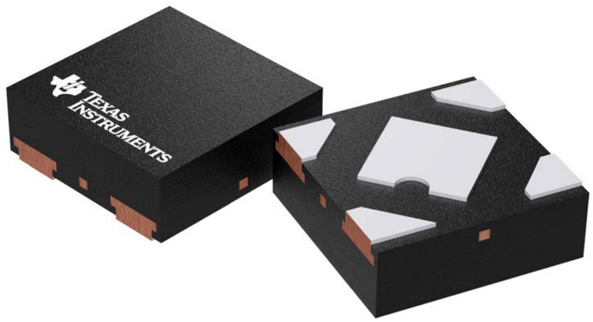

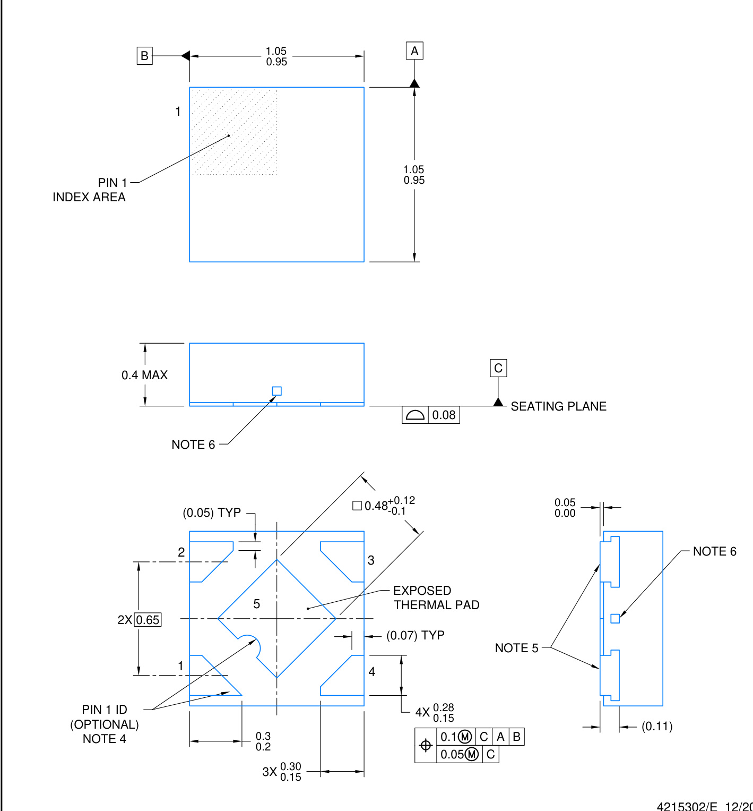

12/2016

NOTES:

All linear dimensions are in millimeters. Any dimensions in parenthesis are for reference only. Dimensioning and tolerancing per ASME Y14.5M.   
32. This drawing is subject to change without notice. The package thermal pad must be soldered to the printed circuit board for optimal thermal and mechanical performance.   
4. Features may not exist. Recommend use of pin 1 marking on top of package for orientation purposes.   
56. Shape of exposed side leads may differ. Number and location of exposed tie bars may vary.

PLASTIC SMALL OUTLINE NO LEAD

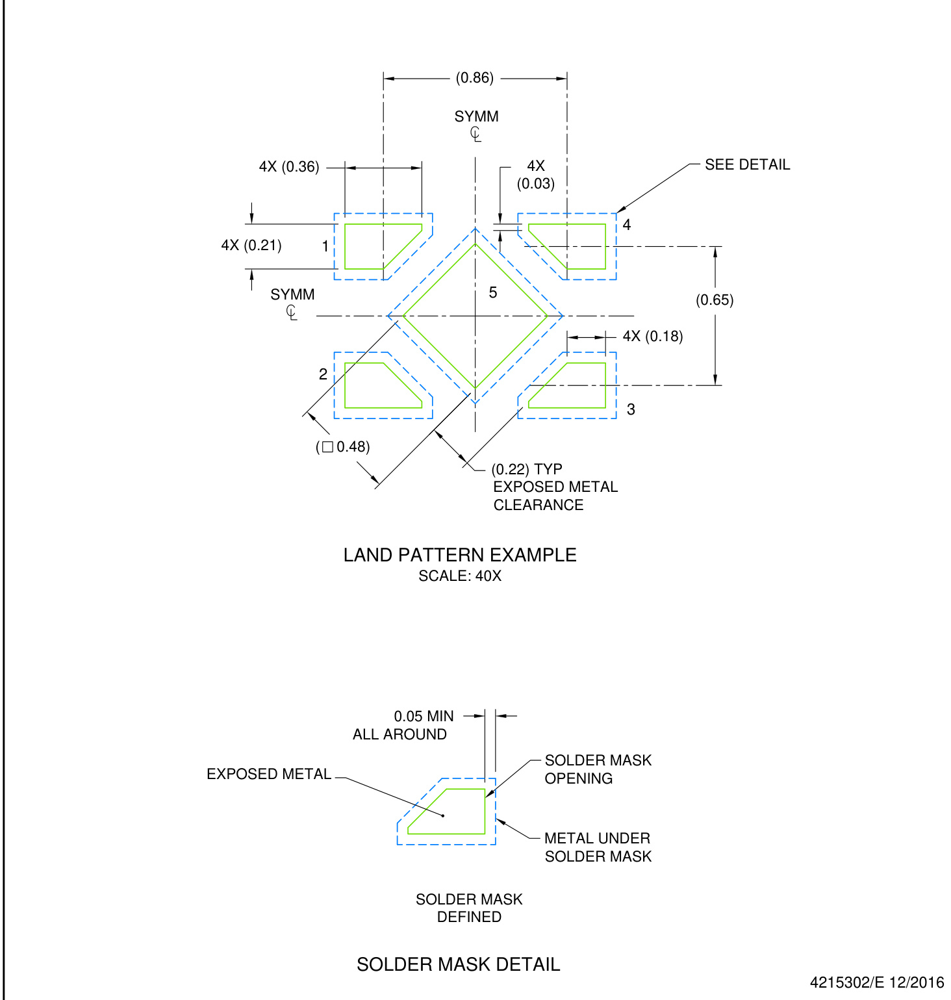  
NOTES: (continued)

7. This package is designed to be soldered to a thermal pad on the board. For more information, see Texas Instruments literature number SLUA271 (www.ti.com/lit/slua271) . 8. If any vias are implemented, it is recommended that vias under paste be filled, plugged or tented.

PLASTIC SMALL OUTLINE NO LEAD

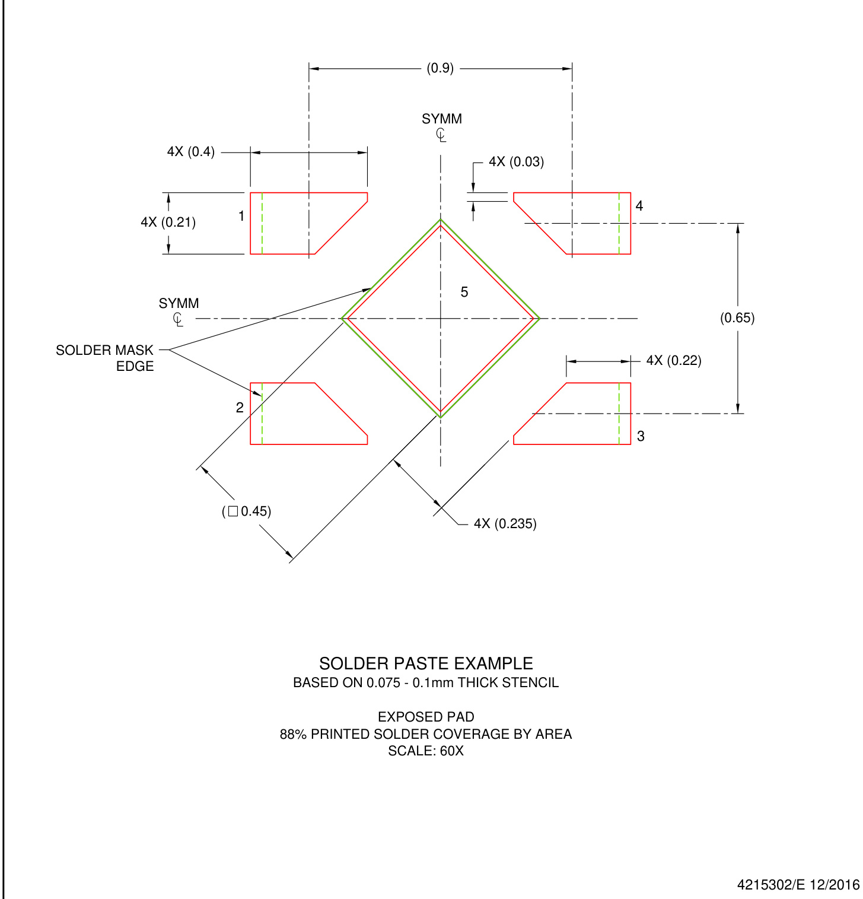  
NOTES: (continued)

9. Laser cutting apertures with trapezoidal walls and rounded corners may offer better paste release. IPC-7525 may have alternate design recommendations.

SMALL OUTLINE TRANSISTOR

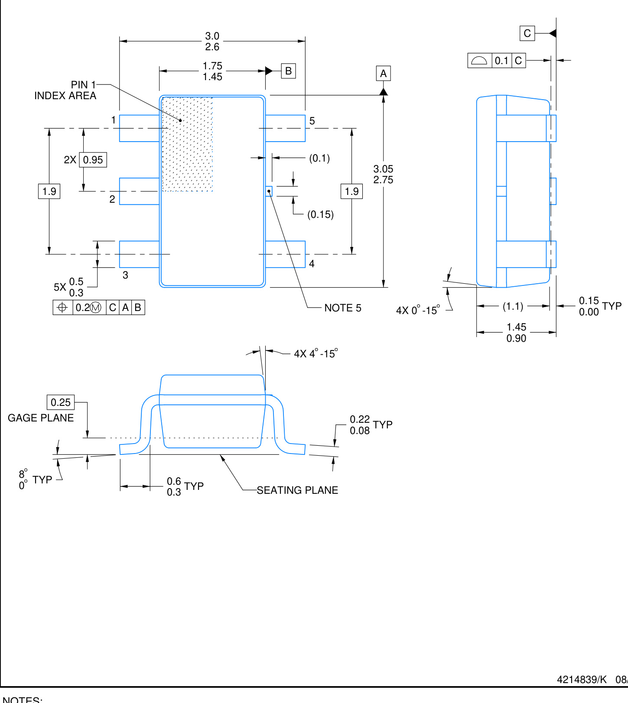

1. All linear dimensions are in millimeters. Any dimensions in parenthesis are for reference only. Dimensioning and tolerancing per ASME $\mathsf { Y 1 4 . 5 M }$ .   
2. This drawing is subject to change without notice.   
3. Refernce JEDEC MO-178.   
4. Body dimensions do not include mold flash, protrusions, or gate burrs. Mold flash, protrusions, or gate burrs shall not exceed $0 . 2 5 \mathsf { m m }$ per side.   
5. Support pin may differ or may not be present.

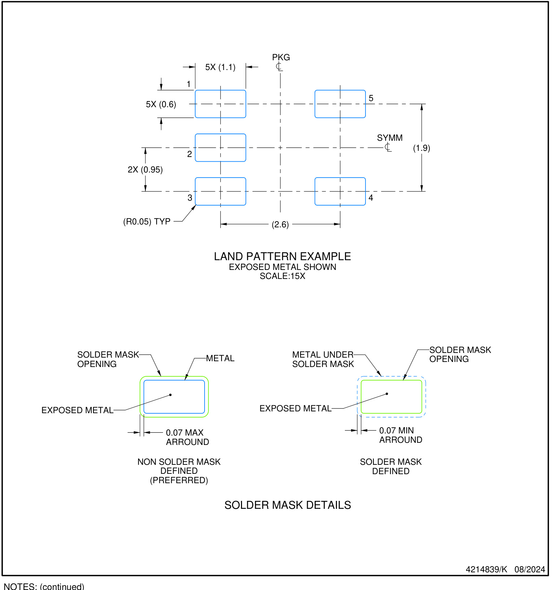

6. Publication IPC-7351 may have alternate designs.   
7. Solder mask tolerances between and around signal pads can vary based on board fabrication site.

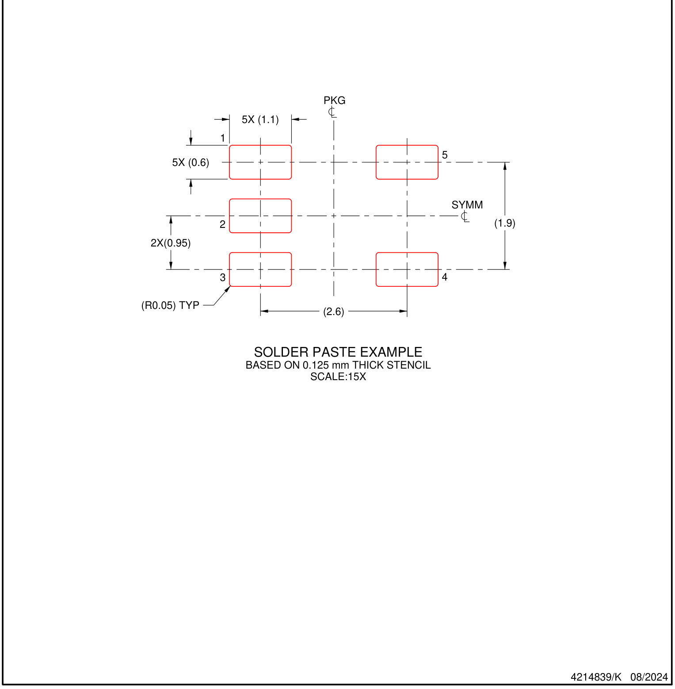  
NOTES: (continued)

8. Laser cutting apertures with trapezoidal walls and rounded corners may offer better paste release. IPC-7525 may have alternate design recommendations.   
9. Board assembly site may have different recommendations for stencil design.

# 重要通知和免责声明

TI“按原样”提供技术和可靠性数据（ 包括数据表） 、 设计资源（包括参考设计） 应用或其他设计建议、 网络工具、 安全信息和其他资源， 不保证没有瑕疵且不做出任何明示或暗示的担保， 包括但不限于对适销性、 与某特定用途的适用性或不侵犯任何第三方知识产权的暗示担保。

这些资源可供使用 TI 产品进行设计的熟练开发人员使用。 您将自行承担以下全部责任：(1) 针对您的应用选择合适的 TI 产品， (2) 设计、 验证并测试您的应用， (3) 确保您的应用满足相应标准以及任何其他安全、 安保法规或其他要求。

这些资源如有变更，恕不另行通知。TI 授权您仅可将这些资源用于研发本资源所述的 TI 产品的相关应用。严禁以其他方式对这些资源进行复制或展示。您无权使用任何其他 TI 知识产权或任何第三方知识产权。对于因您对这些资源的使用而对 TI 及其代表造成的任何索赔、损害、成本、损失和债务，您将全额赔偿，TI 对此概不负责。

TI 提供的产品受 TI 销售条款)、TI 通用质量指南 或 ti.com 上其他适用条款或 TI 产品随附的其他适用条款的约束。TI 提供这些资源并不会扩展或以其他方式更改 TI 针对 TI 产品发布的适用的担保或担保免责声明。 除非德州仪器 (TI) 明确将某产品指定为定制产品或客户特定产品，否则其产品均为按确定价格收入目录的标准通用器件。

TI 反对并拒绝您可能提出的任何其他或不同的条款。