# UCC12040 High-Density, Low-EMI, 3-kVRMS Basic Isolation DC/DC Module

# 1 Features

High-density DC/DC module with optimized   
integrated transformer technology   
Input voltage range: $4 . 5 \vee$ to $5 . 5 \vee$   
Output voltages (selectable): 5.4 V, 5.0 V, 3.7 V,   
3.3 V   
Output power: $5 0 0 ~ \mathsf { m } \mathsf { W }$   
Peak efficiency: $60 \%$   
Line regulation (typical): $1 \%$   
Load regulation (typical): $1 . 5 \%$   
Meets CISPR32 Class B EMI limits without ferrite   
beads on a 2-layer PCB

Spread spectrum modulation (SSM)

Robust isolation barrier:

Isolation rating: $3 \mathsf { k V } _ { \mathsf { I } }$ kVRMS Surge capability: $6 . 5 \mathsf { k V } _ { \mathsf { P K } }$ Working voltage: 850 VRMS CMTI (typical): $\pm 1 0 0 { \vee } / { \mathsf { n s } }$

Short circuit recovery Thermal shutdown

16-pin wide-body SOIC package with $> 8 \AA - m m$ creepage and clearance Extended temperature range: $- 4 0 ^ { \circ } \mathsf { C }$ to $1 2 5 ^ { \circ } \mathsf { C }$

# Safety-related certifications:

$5 6 5 7 - V _ { \mathsf { P K } }$ basic isolation per DIN V VDE V 0884-11:2017- 01 3000-VRMS isolation for 1 minute per UL 1577 UL certification per IEC 60950-1, IEC 62368- 1 and IEC 60601-1 end equipment standards CQC approval per GB4943. 1-2011

# 2 Applications

PLC analog input & output modules   
Grid protection relays & smart breakers   
Medical patient monitors   
Isolated bias for digital isolators   
Isolated bias for RS-485/RS-422/CAN transceivers   
Isolated bias for voltage and current sensors

# 3 Description

UCC12040 is a DC/DC power module with 3-kVRMS basic isolation rating designed to provide efficient, isolated power to isolated circuits that require a bias supply with a well-regulated output voltage. The device integrates a transformer and DC/DC controller with a proprietary architecture to provide $5 0 0 \ \mathrm { \ m W }$ (typical) of isolated power with low EMI.

The UCC12040 integrates protection features for increased system robustness. The device also has an enable pin, synchronization capability, and regulated 5-V or 3.3-V output options with headroom. The UCC12040 is a low-profile, miniaturized solution offered in a wide-body SOIC package with $2 . 6 5 \mathrm { - } \mathsf { m m }$ height.

Device Information(1)   

<html><body><table><tr><td>PART NUMBER</td><td>PACKAGE</td><td>BODY SIZE (NOM)</td></tr><tr><td>UCC12040</td><td>DVE SOIC (16)</td><td>10.30 mm × 7.50 mm</td></tr></table></body></html>

(1) For all available packages, see the orderable addendum at the end of the data sheet.

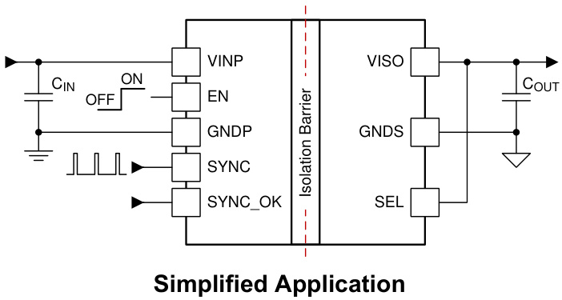

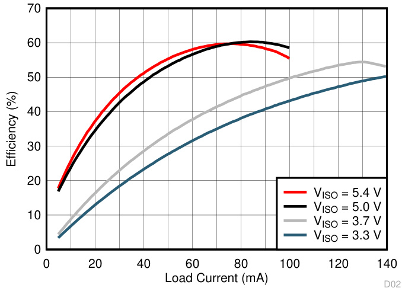  
Typical Efficiency vs. Load

$\mathsf { V } _ { | \mathsf { N P } } = 5 . 0 \mathsf { V }$ ${ \sf T } _ { \sf A } = 2 5 ^ { \circ } { \sf C }$

# Table of Contents

1 Features.   
2 Applications. .....   
3 Description.   
4 Revision History ..........................   
5 Pin Configuration and Functions. 3   
6 Specifications.. 6.1 Absolute Maximum Ratings. 6.2 ESD Ratings... 6.3 Recommended Operating Conditions. 6.4 Thermal Information. 6.5 Power Ratings. 5 6.6 Insulation Specifications. 5 6.7 Safety-Related Certifications. 6 6.8 Safety Limiting Values. : 6 6.9 Electrical Characteristics............................................. 6.10 Switching Characteristics. .8 6.11 Insulation Characteristics Curves. ..................... .9 6.12 Typical Characteristics. 10

# 7 Detailed Description. 15

# 7.1 Overview. 15

7.2 Functional Block Diagram. 15   
7.3 Feature Description. .158   
8 A7.p4plDiceaviticoenFauncdtiIomnpaleMmoednetsa..t.i.o..n.... ...... 19   
8.1 Application Information.   
8.2 Typical Application. ...   
9 Power Supply Recommendations. 25   
10 Layout.. 25   
10.1 Layout Guidelines. 25   
10.2 Layout Example............... 26   
11 Device and Documentation Support. 27   
11.1 Device Support. ....... .27   
11.2 Documentation Support. 27   
11.3 Receiving Notification of Documentation Updates.. 27   
11.4 Support Resources. 27   
11.5 Trademarks. ..... 27   
11.6 Electrostatic Discharge Caution. ............................ 27   
11.7 Glossary. 27

# 12 Mechanical and Packaging Information. 27

# 4 Revision History

NOTE: Page numbers for previous revisions may differ from page numbers in the current version.

hanges from Revision A (April 2020) to Revision B (May 2021) Pa

Added Safety Certification Information.   
Updated ESD values.   
Updated voltage isolation specs per DIN V VDE V 0884-11:2017-01. 5   
Updated Switching Characteristics (non-sync)..

# Changes from Revision (December 2019) to Revision A (April 2020) Page

Updated IVINO Typical Values in Electrical Characteristics Table .........

# 5 Pin Configuration and Functions

DVE Package 16-Pin SOIC Top View

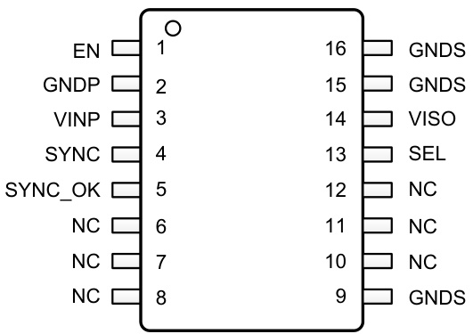

Table 5-1. Pin Functions   

<html><body><table><tr><td colspan="2">PIN</td><td rowspan="2">TYPE (1)</td><td rowspan="2">DESCRIPTION</td></tr><tr><td>NAME</td><td>NO.</td></tr><tr><td>EN</td><td></td><td></td><td>Enable pin. Forcing EN low disables the device. Pull high to enable normal device functionality.</td></tr><tr><td>GNDP</td><td>2</td><td></td><td>Power ground return connection for VINP.</td></tr><tr><td rowspan="2">GNDS</td><td>916</td><td rowspan="2"></td><td>e as only connection for ground</td></tr><tr><td></td><td>Secondary side ground return connection for VIsO. Connect bypass capacitor from VISO to</td></tr><tr><td>GNDS</td><td>15</td><td rowspan="2"></td><td>this pin.</td></tr><tr><td rowspan="6">NC</td><td>6</td><td rowspan="3">Pins internally connected together. No other electrical connection. side voltage domain.</td></tr><tr><td>7</td></tr><tr><td>8</td></tr><tr><td>10</td><td rowspan="3">No internal connection. Pin belongs to isolated voltage domain. circuit board.</td></tr><tr><td>11</td></tr><tr><td>12</td></tr><tr><td>SYNC</td><td></td><td>Synchronous clock input pin. Provide clock signal to synchronize multiple devices or connect to GNDP for standalone operation using the internal oscillator. If the SYNC pin is left open make sure to it separate it from any switching noise to avoid false clock coupling. a</td></tr><tr><td>SYNC_OK</td><td></td><td>The</td><td>Active-low, open-drain diagnostic output. Pin is asserted LOW if there is no external SYNC pin is in high-impedance if a clock is applied on SYNC.</td></tr><tr><td>SEL</td><td>13</td><td></td><td>selection pin. setpoint is 5.0 V when SEL is shorted to Viso, 5.4 V when SEL is connected to Visothrough a 100-kΩ resistor, 3.3 when SEL is shorted to GNDS, and 3.7 V when SEL is connected to GNDS through a 100-kΩ resistor. For more information see the Section 7.4 section. Viso Viso √</td></tr><tr><td>VINP</td><td>3</td><td></td><td>to GNDP on pin 2, placed</td></tr><tr><td>VISO</td><td>14</td><td></td><td>Isolated supply voltage pin. A 10-μF ceramic capacitor to GNDS on pin 15, placed close to the device pins, is required. See Section 8.2.2.1 section.</td></tr></table></body></html>

(1) $\mathsf { P } = \mathsf { P o w e r }$ , $\mathsf { G } =$ Ground, $\mid =$ Input, ${ \mathsf { O } } =$ Output

# 6 Specifications 6.1 Absolute Maximum Ratings

over operating free-air temperature range (unless otherwise noted)(1)

<html><body><table><tr><td></td><td>MIN</td><td>MAX UNIT</td></tr><tr><td>VINP to GNDP</td><td>-0.3</td><td>6.0</td></tr><tr><td>EN, SYNC, SYNC_OK, to GNDP</td><td>-0.3</td><td>VINP + 0.3, ≤ 6.0</td></tr><tr><td>VISO to GNDS</td><td>-0.3</td><td>6.0 V</td></tr><tr><td>SEL to GNDS</td><td>−0.3</td><td>VISO + 0.3, V ≤ 6.0</td></tr><tr><td>output power at Ta = 25°C, MAX (2) VisO PoUT</td><td></td><td>675 mW</td></tr><tr><td>Operating junction temperature range, TJ</td><td>-40</td><td>150 C</td></tr><tr><td>Storage temperature, Tstg</td><td>-65</td><td>150 C</td></tr></table></body></html>

(1) Stresses beyond those listed under Absolute Maximum Ratings may cause permanent damage to the device. These are stress ratings only, which do not imply functional operation of the device at these or any other conditions beyond those indicated under Recommended Operating Conditions. Exposure to absolute-maximum-rated conditions for extended periods may affect device reliability.   
(2) See the Section 7.3.3 section for maximum rated values across temperature and $\mathsf { V } _ { \mathsf { I N P } }$ conditions for each different $V _ { 1 \mathsf { s o } }$ output mo

# 6.2 ESD Ratings

<html><body><table><tr><td colspan="3"></td><td>VALUE</td><td>UNIT</td></tr><tr><td rowspan="2">V(ESD)</td><td rowspan="2">Electrostatic discharge</td><td>Human-body model (HBM), per ANSI/ESDA/JEDEC JS-001(1)</td><td>±3000</td><td rowspan="2"></td></tr><tr><td>Charged-device model (CDM), per JEDEC specification JESD22-C101(2)</td><td>±1000</td></tr></table></body></html>

(1) JEDEC document JEP155 states that 500-V HBM allows safe manufacturing with a standard ESD control process.   
(2) JEDEC document JEP157 states that 250-V CDM allows safe manufacturing with a standard ESD control process.

# 6.3 Recommended Operating Conditions

over operating free-air temperature range (unless otherwise noted)

(1) See the Section 7.3.3 section for maximum rated values across temperature and $\mathsf { V } _ { \mathsf { I N P } }$ conditions for each different $V _ { 1 \mathsf { s o } }$ output mode.   

<html><body><table><tr><td colspan="2"></td><td>MIN</td><td>NOM</td><td>MAX</td><td>UNIT</td></tr><tr><td>VINP</td><td>side supply Primary voltage</td><td>4.5</td><td>5.0</td><td>5.5</td><td>V</td></tr><tr><td>VEN</td><td>EN pin input voltage</td><td>0</td><td></td><td>5.5</td><td></td></tr><tr><td>VSYNC</td><td>SYNC pin input voltage</td><td>0</td><td></td><td>5.5</td><td></td></tr><tr><td>VSYNC-OK</td><td>SYNC_OK pen drain pin voltage</td><td>0</td><td></td><td>5.5</td><td>V</td></tr><tr><td>Viso</td><td>Isolated power supply voltage</td><td>0</td><td></td><td>5.7</td><td>v</td></tr><tr><td>VSEL</td><td>Input voltage</td><td>0</td><td></td><td>5.7</td><td>V</td></tr><tr><td>fsYNC</td><td>External DC/DC converter synchronization signal frequency</td><td>14.4</td><td>16.0</td><td>17.6</td><td>MHz</td></tr><tr><td>PvIsO</td><td>output power at VisO Ta = 25C (1)</td><td></td><td></td><td>500</td><td>mW</td></tr><tr><td>Ta</td><td>Ambient temperature</td><td>-40</td><td></td><td>125</td><td>C</td></tr><tr><td>TJ</td><td>Junction temperature</td><td>-40</td><td></td><td>150</td><td>C</td></tr></table></body></html>

# 6.4 Thermal Information

<html><body><table><tr><td colspan="2">THERMAL METRIC(1)</td><td>DVE (SOIC) 16 PINS</td><td>UNIT</td></tr><tr><td>RθJA</td><td>Junction-to-ambient thermal resistance</td><td>63.8</td><td>C/W</td></tr><tr><td>RθJC(top)</td><td>Junction-to-case (top) thermal resistance</td><td>21.4</td><td>CW</td></tr><tr><td>RθJB</td><td>Junction-to-board thermal resistance</td><td>38.5</td><td>CW</td></tr><tr><td>4JT</td><td>Junction-to-top characterization parameter</td><td>10.2</td><td>CW</td></tr><tr><td>4JB</td><td>Junction-to-board characterization parameter</td><td>37.2</td><td>C/W</td></tr></table></body></html>

<html><body><table><tr><td rowspan="2">THERMAL METRIC(1)</td><td>DVE (SOIC)</td><td rowspan="2">UNIT</td></tr><tr><td>16 PINS</td></tr><tr><td>ReJC(bot)</td><td>Junction-to-case (bottom) thermal resistance</td><td></td><td>C/W</td></tr></table></body></html>

(1) The value of RθJA given in this table is only valid for comparison with other packages and can not be used for design purposes. This value was calculated in accordance with JESD 51-7, and simulated on a 4-layer JEDEC board when $\mathsf { P } _ { \mathsf { D P } } = 1 2 9 \mathsf { m W }$ , $\mathsf { P } _ { \mathsf { D C } } = 1 4 2 \mathsf { m W }$ and $\mathsf { P } _ { \mathsf { D } \mathsf { T } } = 1 2 9 \mathsf { m } \mathsf { W } .$ . The board temperature is taken from Pin 12. For more information about traditional and new thermal metrics, see the Semiconductor and IC Package Thermal Metrics application report.

# 6.5 Power Ratings

$\mathsf { V } _ { | \mathsf { N P } } = 5 . 0 \mathsf { V } ,$ , $\mathsf { C } _ { \mathsf { I N P } } = \mathsf { C } _ { \mathsf { O U T } } = 1 0$ uF, $\mathsf { T } _ { \mathsf { J } } = 1 5 0 ^ { \circ } \mathsf { C }$ , Internal Clock mode

<html><body><table><tr><td colspan="2">PARAMETER</td><td>TEST CONDITIONS</td><td>VALUE</td><td>UNIT</td></tr><tr><td>PD</td><td>Power dissipation</td><td rowspan="4">connected to GNDS (3.3-V Viso output mode), Iiso = 135mA</td><td>460</td><td>mW</td></tr><tr><td>PDP</td><td>Power dissipation by driver side (primary) SEL</td><td>148</td><td>mW</td></tr><tr><td>PDs</td><td>Power dissipation by rectifier side (secondary)</td><td>164</td><td>mW</td></tr><tr><td>PDT</td><td>Power dissipation by transformer</td><td>148</td><td>mW</td></tr></table></body></html>

# 6.6 Insulation Specifications

<html><body><table><tr><td colspan="2">PARAMETER</td><td>TEST CONDITIONS</td><td>VALUE</td><td>UNIT</td></tr><tr><td colspan="2"></td><td colspan="3"></td></tr><tr><td colspan="5">GENERAL</td></tr><tr><td>CLR</td><td>External clearance(1)</td><td>Shortest terminal-to-terminal distance through air Shortest terminal-to-terminal distance across package the</td><td>8</td><td>mm</td></tr><tr><td>CPG</td><td>External creepage(1)</td><td>surface</td><td>8</td><td>mm</td></tr><tr><td>DTI</td><td>Distance through the insulation</td><td>Minimum internal gap (internal clearance)</td><td>>120</td><td>um</td></tr><tr><td>CTI</td><td>Comparative tracking index</td><td>DIN EN 60112 (VDE 0303-11); IEC60112</td><td>>600</td><td>V</td></tr><tr><td></td><td>Material group</td><td>According IEC 60664-1</td><td></td><td></td></tr><tr><td rowspan="3"></td><td rowspan="3">Overvoltage Category</td><td>Rated mains ≤300 voltage VRMS</td><td>I-IV</td><td rowspan="3"></td></tr><tr><td>Rated mains voltage ≤ 600 VRMS</td><td>I-IV</td></tr><tr><td>Rated mains ≤1000 voltage VRMS</td><td>I-I</td></tr><tr><td colspan="5">DIN V VDE V0884-11:2017-01(2)</td></tr><tr><td rowspan="2">VIORM Viowm</td><td>Maximum repetitive peak isolation voltage</td><td>AC voltage (bipolar)</td><td>1202</td><td>VPK</td></tr><tr><td>Maximum working isolation voltage</td><td>AC voltage (sine wave) Time dependent dielectric breakdown (TDDB) test</td><td>850</td><td>VRMS</td></tr><tr><td>ViOTM</td><td>Maximum transient isolation voltage</td><td>DC voltage = t = 60s (qualification); VTEST ViOTM,</td><td>1202</td><td>VDC</td></tr><tr><td>ViosM</td><td>Maximum surge isolation voltage(3)</td><td>= 1.2× 1s (100% production) Test method per IEC 62368-1, 1.2/50 us waveform, VTEST VIOTM, t=</td><td>4243 5000</td><td>VPK VPK</td></tr><tr><td rowspan="2">9pd</td><td rowspan="2">Apparent charge(4)</td><td>= 1.3 6500 (qualification) Method a: After I/O safety test subgroup 2/3, Vini = ViOTM, tni = 60s; VTEST ViOsM VPK</td><td>≤ 5</td><td rowspan="2"></td></tr><tr><td>Vpd(m) = 1.2 × = 1442 VpK, tm = 10s Method a: After environmental tests subgroup Vini = tini = 60s; = 1.2 × 1442 tm = 10 s VIORM VIOTM, Vpd(m) VIORM VPK,</td><td>≤5</td></tr><tr><td></td><td>Vini =</td><td>Method b1: At routine test (100% production) and preconditioning (type test) × tini = 1 s; = 1.5× = 1803 VPK, tm = 1 s ViOTM, 1.2 Vpd(m) VIORM</td><td>≤5</td><td></td></tr><tr><td>C1o</td><td>Barrier capacitance, input to output(5)</td><td>= 0.4 sin (2πft), f = 1 MHz Vio</td><td>~3.5</td><td>pF</td></tr><tr><td rowspan="3">R1o</td><td rowspan="3">Isolation resistance, input to output(5)</td><td>Vio = 500 V, TA = 25℃</td><td>V 1012</td><td rowspan="3"></td></tr><tr><td>Vio = 500 V, 100°C≤TA≤125°℃</td><td>1011</td></tr><tr><td>Vio = 500 V at Ts = 150°℃</td><td>> 109</td></tr><tr><td></td><td>Pollution degree</td><td></td><td>2</td></tr><tr><td>Climatic category</td><td></td><td></td><td>40/125/21</td></tr><tr><td colspan="2">UL 1577</td><td></td><td></td></tr></table></body></html>

<html><body><table><tr><td></td><td>PARAMETER</td><td>TEST CONDITIONS</td><td>VALUE</td><td>UNIT</td></tr><tr><td>Viso</td><td>Withstand isolation voltage</td><td>1.2× = = VTEST VisO t= VTEST Viso VRMS,</td><td>3000</td><td>VRMS</td></tr></table></body></html>

(1) Creepage and clearance requirements should be applied according to the specific equipment isolation standards of an application. Care should be taken to maintain the creepage and clearance distance of a board design to ensure that the mounting pads of the isolator on the printed-circuit board do not reduce this distance. Creepage and clearance on a printed-circuit board become equal in certain cases. Techniques such as inserting grooves and/or ribs on a printed circuit board are used to help increase these specifications.   
(2) This coupler is suitable for safe electrical insulation only within the maximum operating ratings. Compliance with the safety ratings shal be ensured by means of suitable protective circuits.   
(3) Testing is carried out in air or oil to determine the intrinsic surge immunity of the isolation barrier.   
(4) Apparent charge is electrical discharge caused by a partial discharge (pd).   
(5) All pins on each side of the barrier tied together creating a two-terminal device

# 6.7 Safety-Related Certifications

<html><body><table><tr><td>VDE</td><td colspan="3">UL</td><td>CQC</td></tr><tr><td>17.</td><td>Cetfi-d acoing to IEC</td><td>Cer50- andECg1to1C</td><td>Ro157</td><td>Certifed a-cording to</td></tr><tr><td>Basic insulation Maximum</td><td>Basic insulation per UL 60601- 1:14 and IEC 60601-1 Ed.3+A1,AAMI ES 60601-1:2005/(R)2012 and CEC 0-12012, 1 14 MOPP (Means of Patient Protection), 250 VRMS</td><td>BaiC0n1-07+A1 A2UEC 6L952-121- d+A1+A2 62368-1 2nd Ed., 850 material group I)</td><td>Single protection, 3000 VRMS</td><td>maximum working voltage</td></tr><tr><td>Cerifat uber</td><td>maximum working voltage Cs-677-A1-r</td><td></td><td>File number: E181974</td><td>Cetificate cumer</td></tr></table></body></html>

# 6.8 Safety Limiting Values

Safety limiting intends to minimize potential damage to the isolation barrier upon failure of input or output circuitry.

<html><body><table><tr><td colspan="2">PARAMETER</td><td>TEST CONDITIONS</td><td>MAX</td><td>UNIT</td></tr><tr><td rowspan="2">Is</td><td rowspan="2">Safety input current (1)</td><td>RθJA 63.8°C/W, V1 5.5V, Tj= 150°C, TA = 25°C</td><td>356</td><td rowspan="2">mA</td></tr><tr><td>ReJA = 63.8°C/W, V₁ = 4.5 V, Tj = 150°C, TA 25°℃</td><td>435</td></tr><tr><td>Ps</td><td>Safety input power</td><td>= 63.8°C/W, TJ = 150°C, TA=25°C RθJA</td><td>1960</td><td>mW</td></tr><tr><td>Ts</td><td>Safety temperature (1)</td><td></td><td>150</td><td>C</td></tr></table></body></html>

(1) The maximum safety temperature, TS, has the same value as the maximum junction temperature, ${ \sf T } _ { \sf J }$ , specified for the device. The $1 _ { \mathsf { S } }$ and $\mathsf { P } _ { \mathsf { S } }$ parameters represent the safety current and safety power respectively. The maximum limits of IS and $\mathsf { P } _ { \mathsf { S } }$ should not be exceeded. These limits vary with the ambient temperature, $\mathsf { T } _ { \mathsf { A } }$ . The junction-to-air thermal resistance, RθJA, in the Thermal Information table is that of a device installed on a high- $\cdot \mathsf { K }$ test board for leaded surface-mount packages. Use these equations to calculate the value for each parameter: $\mathsf { T } _ { \mathsf { J } } = \mathsf { T } _ { \mathsf { A } } + \mathsf { R } _ { \mathsf { \theta } \mathsf { J } \mathsf { A } } \times \mathsf { P } _ { \mathsf { i } }$ where $\mathsf { P }$ is the power dissipated in the device. $\mathsf { T } _ { \mathsf { J } ( \mathsf { m a x } ) } = \mathsf { T } _ { \mathsf { S } } = \mathsf { T } _ { \mathsf { A } } + \mathsf { R } _ { \mathsf { \theta } \mathsf { J } \mathsf { A } } \times \mathsf { P } _ { \mathsf { S } }$ , where $\mathsf { T } _ { \mathsf { J } ( \mathsf { m a x } ) }$ is the maximum allowed junction temperature. $\mathsf { P } _ { \mathsf { S } } = \mathsf { I } _ { \mathsf { S } } \times \mathsf { V } _ { \mathsf { I } }$ , where $V _ { \mathsf { I } }$ is the maximum input voltage.

# 6.9 Electrical Characteristics

<html><body><table><tr><td colspan="5">Over operating temperature range (TJ = −40°C to 150°C), ViNP 4.5V to 5.5V, CiNP = CouT 10 μF, SEL connected to VisO'</td></tr><tr><td>internal clock mode, unless otherwise noted. AIll typical</td><td>PARAMETER</td><td>values at Tj = 25°C and Vinp = 5.0V. TEST CONDITIONS</td><td>MIN P</td><td>MAX UNIT</td></tr><tr><td colspan="5">INPUT SUPPLY</td></tr><tr><td>VINQ VINP</td><td>quiescent current,disabled EN=LOW EN=HI; SEL</td><td></td><td></td><td>100 uA</td></tr><tr><td rowspan="4">VINP IVINO</td><td></td><td>shorted to VISO (5.0V output)</td><td>50</td><td></td></tr><tr><td>EN=HI; SEL operating current, no load</td><td>100kΩ to VISO (5.4V output)</td><td>45</td><td>mA</td></tr><tr><td>EN=HI; SEL shorted to GNDS (3.3V output)</td><td>90</td><td></td><td></td></tr><tr><td>EN=HI; SEL 100kΩ to GNDS (3.7V output)</td><td>80</td><td></td><td></td></tr><tr><td>IVIN_SC</td><td>DC current from VINP supplyunder short circuit on VISO</td><td>VISO short to GNDS</td><td>245</td><td>mA</td></tr><tr><td>VUVPR</td><td>VINP under-voltage lockout rising threshold</td><td></td><td>4.2</td><td></td></tr><tr><td>VUVPF</td><td>VINP under-voltage lockout falling</td><td></td><td>3.7</td><td></td></tr><tr><td>VUVPH</td><td>threshold VINP under-voltage lockout hysteresis</td><td></td><td>0.5</td><td></td></tr><tr><td colspan="5">EN, SYNC INPUT PINS</td></tr><tr><td>VIR</td><td>Input voltage threshold, Iogic HIGH</td><td>Rising edge</td><td></td><td>2.2</td></tr><tr><td>V\F$</td><td>Input voltage threshold, logic LOW</td><td>Falling edge</td><td>0.8</td><td>V</td></tr><tr><td>IEN</td><td>Enable Pin Input Current</td><td>VEN = 5.0V</td><td></td><td>10 uA</td></tr><tr><td>ISYNC</td><td>SYNC Pin Input Current</td><td>VsYNC = 5.0 V</td><td>0.02</td><td>uA</td></tr><tr><td colspan="5"></td></tr><tr><td>SYNC_OK PIN VOL</td><td>SYNC_OK output low voltage IsYNC_OK = - 2 mA VSYNC_OK</td><td>= 5.0 V</td><td>0.15</td><td></td></tr><tr><td colspan="3">_SYNC_OK SYNC_ OK pin leakage current DC/DC CONVERTER LKG</td><td></td><td></td></tr><tr><td rowspan="6">Viso</td><td rowspan="6">Isolated supply output voltage Voltage</td><td>SEL shorted to VISO (5.0V output); liso 55 mA(2)</td><td></td><td>5.3</td><td></td></tr><tr><td>SEL 100kΩ to VISO (5.4 V output); Iso = 45 (2) mA</td><td>5.1 6.4</td><td>5.7</td><td></td></tr><tr><td>S med oGDS (3.3Vuut); </td><td>3.1 3.3</td><td>3.5</td><td></td></tr><tr><td>SEL 100kΩ to GNDS (3.7 V output); lIso (2) mA</td><td>3.5</td><td>3.9</td><td></td></tr><tr><td>20-MHz bandwidth, CLOAD = 10 uF I 0.1 uF, SEL shorted to VISO (5.0V output); lso 100mA</td><td></td><td>50</td><td>mV</td></tr><tr><td>20-MHz bandwidth, CLOAD SEL 100kΩ to VISO (5.4V output); lso ripple on isolated supply mA 20-MHz bandwidth, CLOAD</td><td>10 uF Il 0.1 uF, 90</td><td>50</td><td>mV</td></tr><tr><td rowspan="4"></td><td>10 uF Il 0.1 uF, SEL shorted to GNDS (3.3V output); liso = 145mA</td><td>50</td><td></td><td>mV</td></tr><tr><td>20-MHz bandwidth, CLOAD 10uF SEL shorted to GNDS (3.7V output);</td><td>110.1uF,</td><td>50</td><td>mV</td></tr><tr><td>= 130 mA SEL shorted to VIsO(5.0) output); ISo lIso</td><td></td><td></td><td></td></tr><tr><td>mA, VINP 4.5V to 5.5V SEL shorted to GNDS (3.3 V output);</td><td>1%</td><td></td><td></td></tr><tr><td>VISO(LINE)</td><td>DC line regulation Viso</td><td>lS0 = 75 mA, VINP = 4.5 V to 5.5 V</td><td>1%</td><td></td></tr></table></body></html>

Over operating temperature range ${ \mathrm { \Delta T _ { J } = - } 4 0 ^ { \circ } C }$ to $1 5 0 ^ { \circ } \mathsf C$ ), $\mathsf { V } _ { | \mathsf { N P } } = 4 . 5 \mathsf { V }$ to 5.5V, $\mathsf { C } _ { \mathsf { I N P } } = \mathsf { C } _ { \mathsf { O U T } } = 1 0 \mu \mathsf { F } _ { \mathrm { : } }$ SEL connected to VISO, internal clock mode, unless otherwise noted. All typical values at ${ \sf T } _ { \mathsf { J } } = 2 5 ^ { \circ } { \sf C }$ and $\mathsf { V } _ { | \mathsf { N P } } = 5 . 0 \mathsf { V }$ .   

<html><body><table><tr><td></td><td>PARAMETER</td><td>TEST CONDITIONS</td><td>MIN TYP</td><td>MAX|</td><td>UNIT</td></tr><tr><td rowspan="2">VISO(LOAD)</td><td>Viso DC load regulation</td><td>SEL horte to VISO (5.0 V output); ISO = 0</td><td></td><td>1.5%</td><td></td></tr><tr><td>DC load regulation Viso</td><td>SEL shorted to GNDS (3.3 V output); lso = 0 to 145 mA</td><td>1.5%</td><td></td><td></td></tr><tr><td rowspan="4">EFF</td><td rowspan="4">Efficiency at maximum recommended load (1)</td><td>SEL shorted to VISO (5.0 V output); lso ı 100 mA</td><td></td><td>60%</td><td></td></tr><tr><td>SEL 100kΩ to VISO (5.4V output); lso = 90</td><td></td><td>60%</td><td></td></tr><tr><td>SEL shorted to GNDS (3.3V output); liso I 145 mA</td><td></td><td>50%</td><td></td></tr><tr><td>SEL 100kΩ to GNDS (3.7V output); Iiso = 130 mA</td><td>53%</td><td></td><td></td></tr><tr><td rowspan="2"></td><td rowspan="2">VISO rise time, 10% 90%</td><td>EN change from LO to HI, SEL shorted to VISO (5.0V output); Iso = 1 mA</td><td></td><td>750</td><td>uS</td></tr><tr><td>EN = change from LO to HI, SEL 100kΩ to GNDS (3.3V output); IsO = mA</td><td></td><td>300</td><td>US</td></tr><tr><td>THERMAL SHUTDOWN</td><td></td><td></td><td></td><td></td><td></td></tr><tr><td>TSDTHR</td><td>Thermal shutdown threshold</td><td>Junction Temperature, Rising</td><td></td><td>165</td><td>C</td></tr><tr><td>TSDHYST</td><td>Thermal shutdown hysteresis</td><td>Junction Temperature, Falling</td><td></td><td>27</td><td>℃</td></tr></table></body></html>

(1) Efficiency calculation: $E F F = ( \mathsf { V } _ { 1 \mathsf { S O } } \times \mathsf { I } _ { 1 \mathsf { S O } } ) / ( \mathsf { V } _ { \mathsf { I N P } } \times \mathsf { I } _ { \mathsf { I N P } } )$ (2) See the Section 7.3.3 section for discussion of $V _ { 1 \mathsf { S } \mathsf { O } }$ regulation across load and temperature conditions for all output voltage settings.

# 6.10 Switching Characteristics

Over operating temperature range ${ \mathrm { \Delta T _ { J } = - } 4 0 ^ { \circ } C }$ to $1 5 0 ^ { \circ } \mathrm { C } )$ ), $\mathsf { V } _ { | \mathsf { N P } } = 4 . 5 \mathsf { V }$ to 5.5V, $\mathsf { C } _ { \mathsf { I N P } } = \mathsf { C } _ { \mathsf { O U T } } = 1 0 \mu \mathsf { F } ,$ SEL connected to VISO, internal clock mode, unless otherwise noted. All typical values at ${ \sf T } _ { \sf J } = 2 5 ^ { \circ } { \sf C }$ and $\mathsf { V } _ { | \mathsf { N P } } = 5 . 0 \mathsf { V } .$ .

<html><body><table><tr><td></td><td>PARAMETER</td><td>TEST CONDITIONS</td><td>MIN</td><td>TYP MAX|i</td><td></td><td>UNIT</td></tr><tr><td>fsW_INT</td><td>DC/DC Converter Clock</td><td>Internal clock mode</td><td>7.2</td><td>8</td><td>8.8</td><td>MHz</td></tr><tr><td>CMTI</td><td>Static common-mode transient immunity</td><td>Slew Rate of GNDP versus GNDS, VcM = 1000V</td><td></td><td>100</td><td></td><td>V/ns</td></tr></table></body></html>

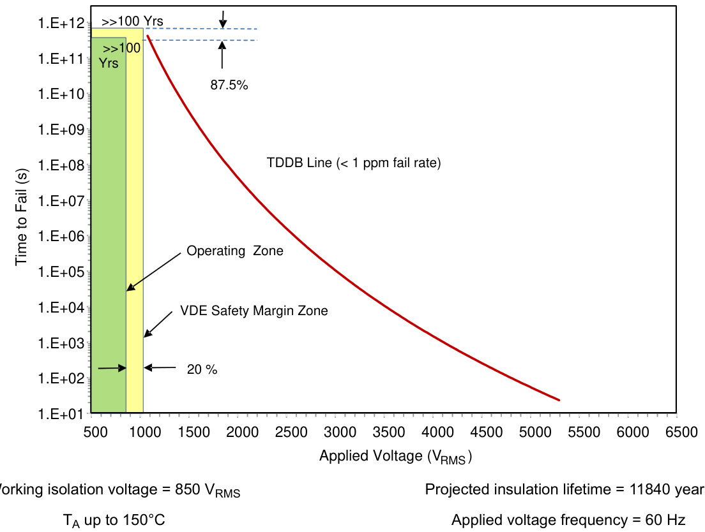  
6.11 Insulation Characteristics Curves

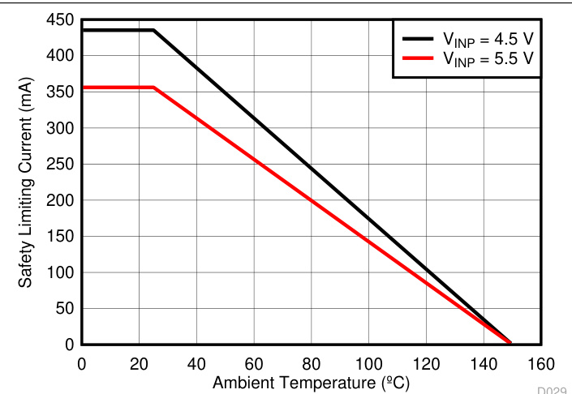  
Figure 6-1. Insulation Lifetime Projection Data

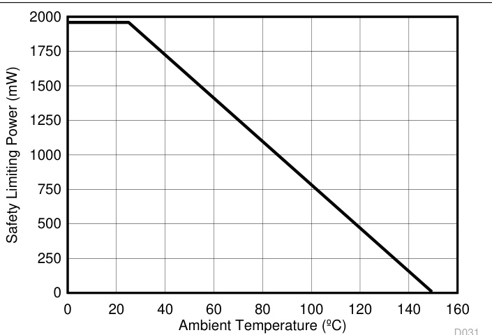  
Figure 6-2. Thermal Derating Curve for Safety Limiting Current per VDE   
Figure 6-3. Thermal Derating Curve for Safety Limiting Power per VDE

# 6.12 Typical Characteristics

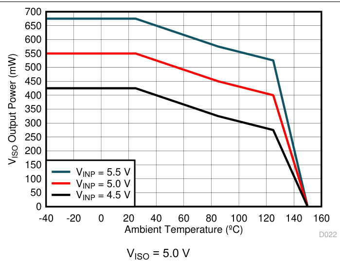

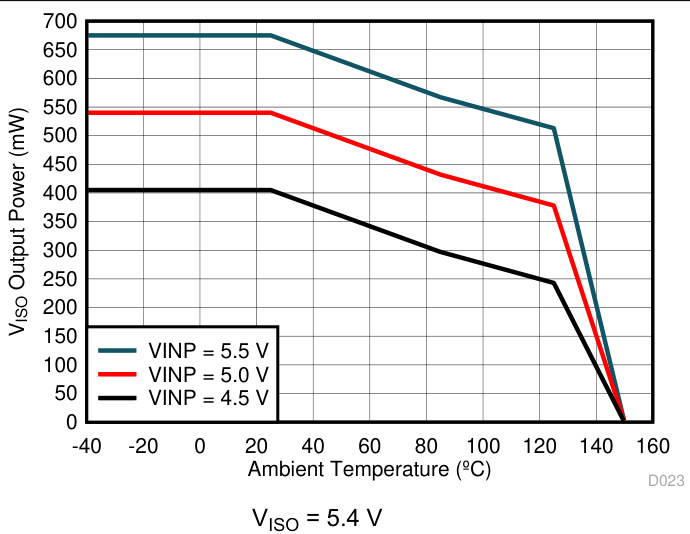  
Figure 6-5. Maximum $\scriptstyle \mathsf { v } _ { 1 \mathsf { s o } }$ Output Power vs. Temperature

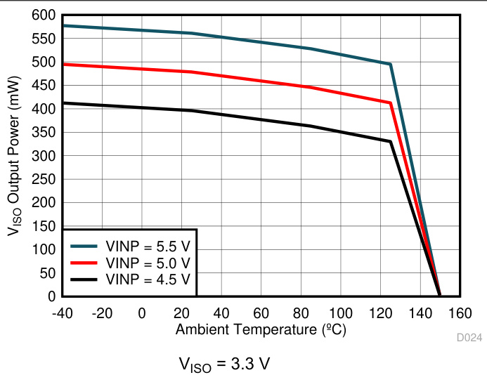  
Figure 6-4. Maximum $\scriptstyle \mathsf { v } _ { 1 \mathsf { s o } }$ Output Power vs. Temperature

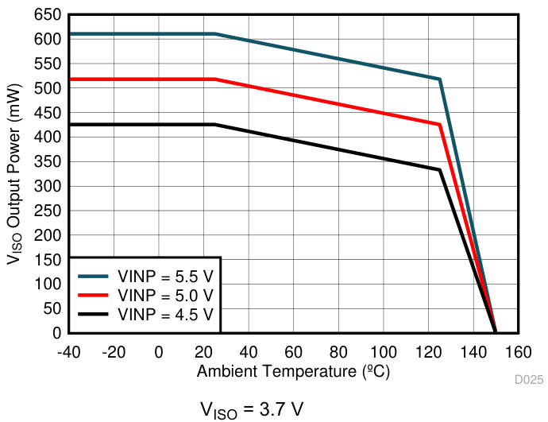  
Figure 6-6. Maximum $\mathtt { v } _ { 1 \mathtt { s o } }$ Output Power vs. Temperature   
Figure 6-7. Maximum $\mathtt { v } _ { 1 \mathtt { s o } }$ Output Power vs. Temperature

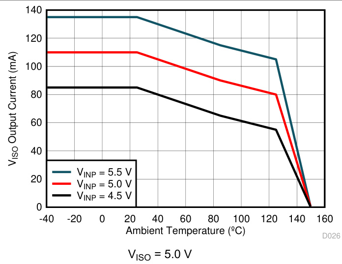  
Figure 6-8. Maximum $\scriptstyle \mathsf { v } _ { 1 \mathsf { s o } }$ Output Current vs. Temperature

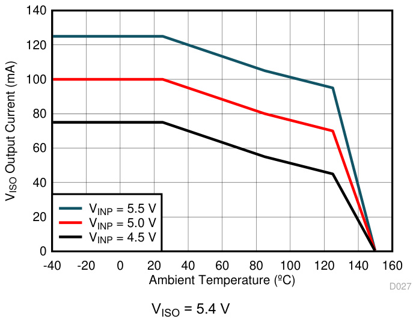

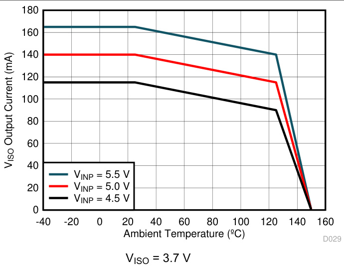  
Figure 6-9. Maximum $\scriptstyle \mathsf { v } _ { 1 \mathsf { s o } }$ Output Current vs. Temperature

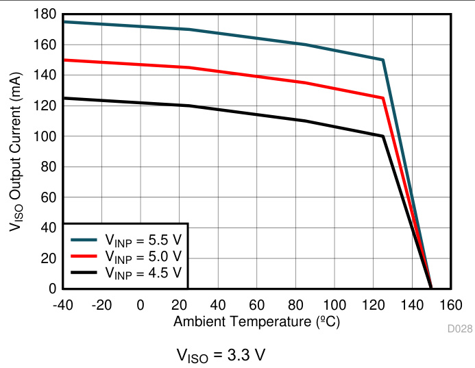  
Figure 6-10. Maximum VISO Output Current vs. Temperature

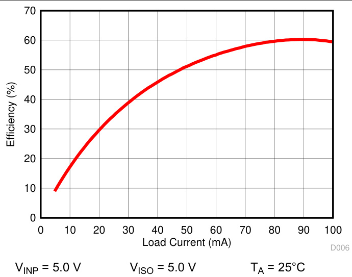  
Figure 6-12. Power Supply Efficiency vs Load Current (IISO)

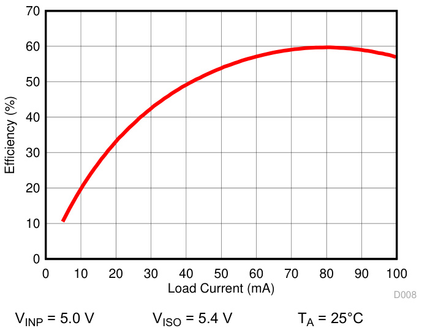  
Figure 6-11. Maximum $\scriptstyle \mathsf { v } _ { 1 \mathsf { s o } }$ Output Current vs. Temperature   
Figure 6-13. Power Supply Efficiency vs Load Current (IISO)

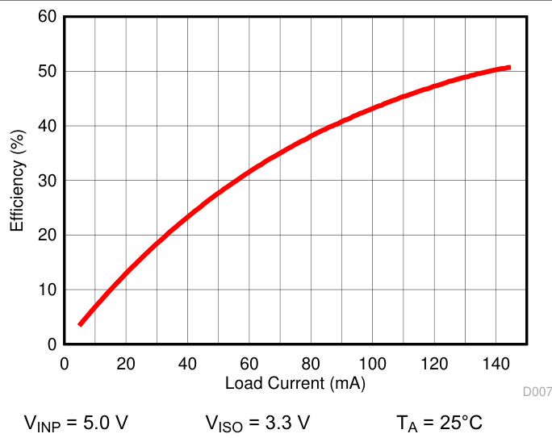  
Figure 6-14. Power Supply Efficiency vs Load Current (IISO)

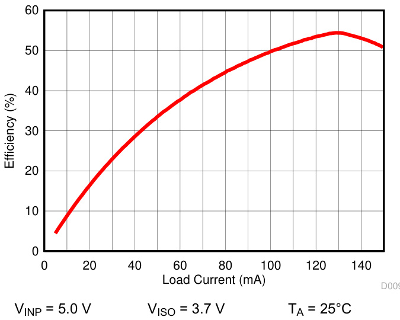  
Figure 6-15. Power Supply Efficiency vs Load Current (IISO)

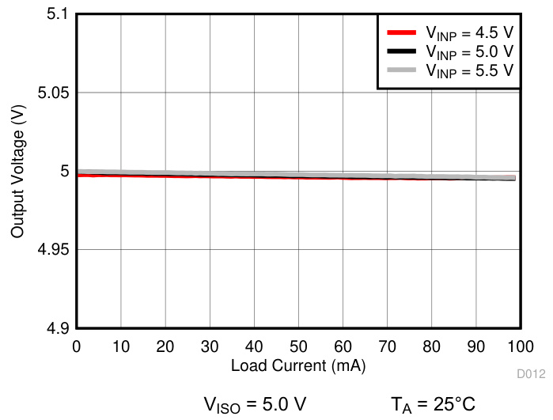  
Figure 6-16. Isolated Supply Voltage $( \mathsf { V } _ { 1 \mathsf { S } \mathsf { O } } )$ vs Load Current (IISO)

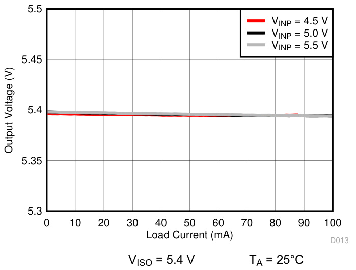  
Figure 6-17. Isolated Supply Voltage $( \mathsf { V } _ { 1 \mathsf { s o } } )$ vs Load Current (IISO)

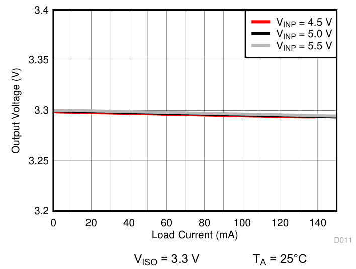  
Figure 6-18. Isolated Supply Voltage $( \mathsf { V } _ { 1 \mathsf { s o } } )$ vs Load Current (IISO)

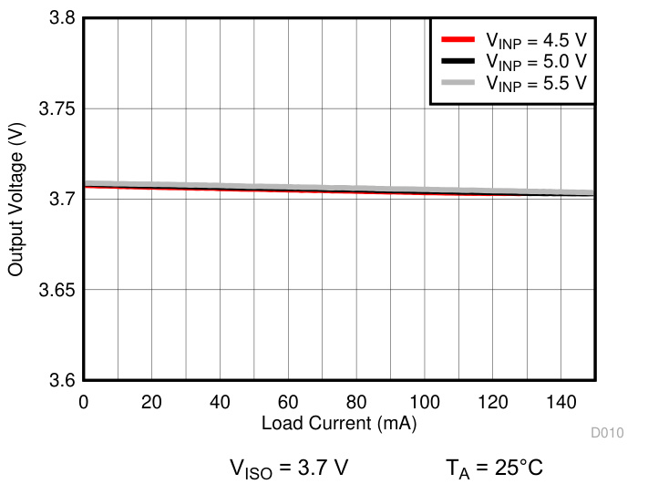  
Figure 6-19. Isolated Supply Voltage $( \mathsf { V } _ { 1 \mathsf { s o } } )$ vs Load Current (IISO)

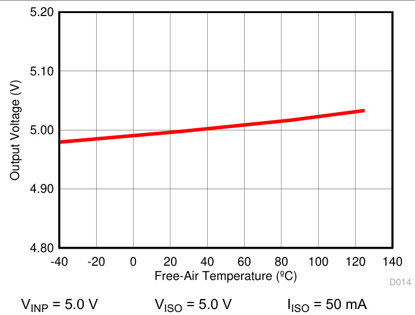  
Figure 6-20. Isolated Supply Voltage $( \mathsf { V } _ { 1 \mathsf { s o } } )$ vs FreeAir Temperature

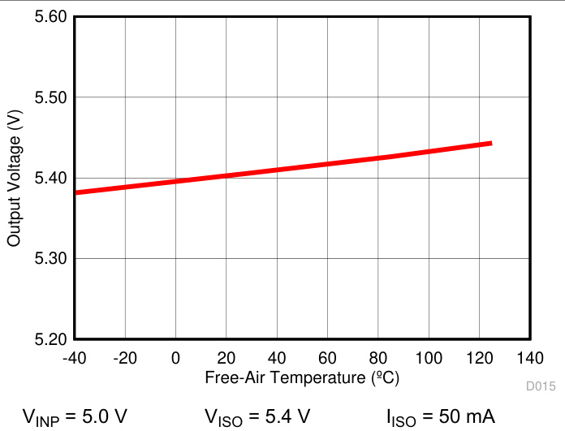  
Figure 6-21. Isolated Supply Voltage $( \mathsf { V } _ { 1 \mathsf { s o } } )$ vs FreeAir Temperature

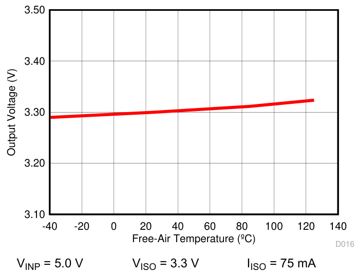  
Figure 6-22. Isolated Supply Voltage $( \mathsf { V } _ { 1 \mathsf { s o } } )$ vs FreeAir Temperature

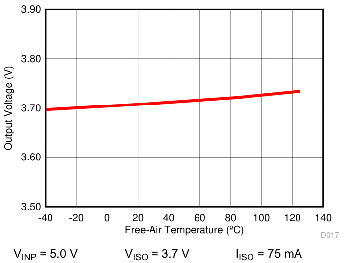  
Figure 6-23. Isolated Supply Voltage $( \mathsf { V } _ { 1 \mathsf { s o } } )$ vs FreeAir Temperature

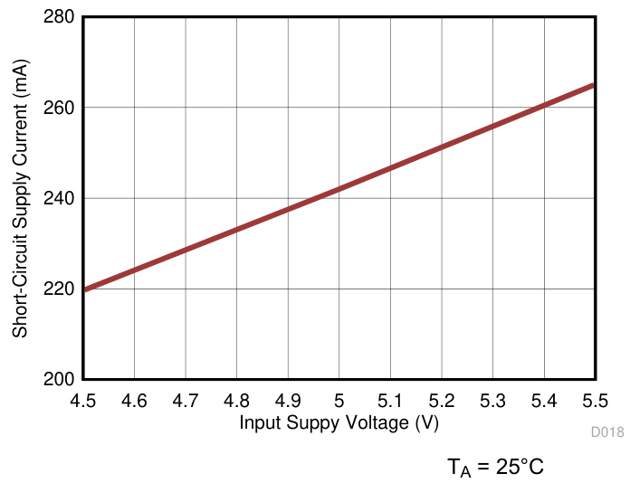  
Figure 6-24. Short-Circuit Supply Current (IVIN_SC) vs Supply Voltage $( \mathsf { V } _ { \mathsf { I N P } } )$

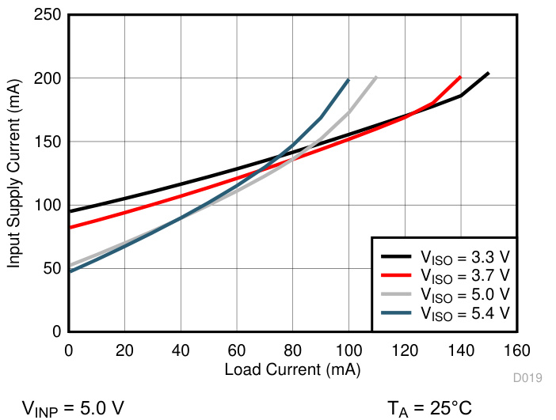  
Figure 6-25. Input Supply Current (IVINP) vs Load Current (IISO)

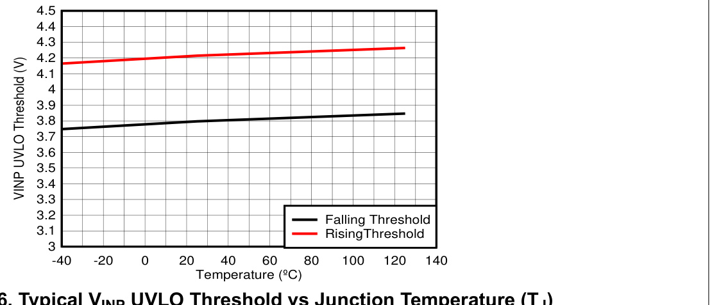  
Figure 6-26.

# 7 Detailed Description 7.1 Overview

The UCC12040 device integrates a high-efficiency, low-emissions isolated DC/DC converter. This approach provides typically $5 0 0 \mathsf { m } \mathsf { W }$ of clean, steady power across a 3000VRMS basic isolation barrier.

The integrated DC/DC converter uses switched mode operation and proprietary circuit techniques to reduce power losses and boost efficiency. Specialized control mechanisms, clocking schemes, and the use of an on-chip transformer provide high efficiency and low radiated emissions.

The VINP supply is provided to the primary power controller that switches the power stage connected to the integrated transformer. Power is transferred to the secondary side, rectified, and regulated to a level set by the SEL pin condition.

A fast feedback control loop monitors VISO and the output load, and ensures low overshoots and undershoots during load transients. Undervoltage lockout (UVLO) with hysteresis is integrated on the VINP supply, which ensures robust system performance under noisy conditions.

UCC12040 is suitable for applications that have limited board space and require more integration. These devices are also suitable for very-high voltage applications, where power transformers meeting the required isolation specifications are bulky and expensive.

# 7.2 Functional Block Diagram

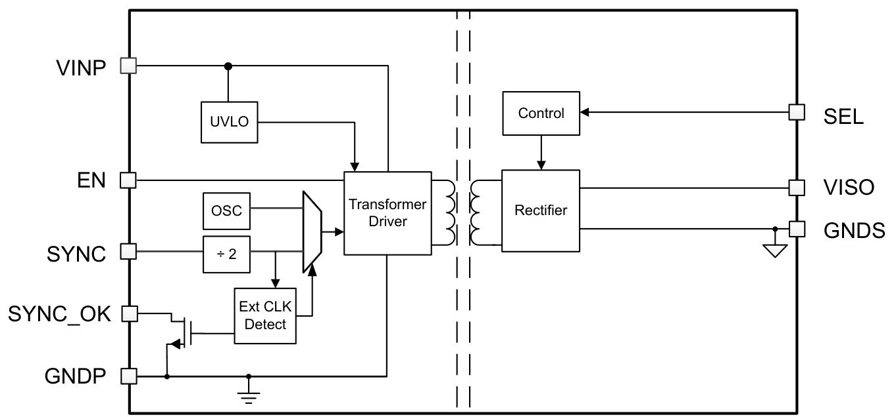

# 7.3 Feature Description

# 7.3.1 Enable and Disable

Forcing EN low disables the device, which greatly reduces the VINP power consumption. Pull the EN pin high to enable normal device functionality. The EN pin has a weak internal pull-down resistor, so the device floats to the disable state if the pin is left open.

# 7.3.2 UVLO, Power-Up, and Power-Down Behavior

The UCC12040 has an undervoltage lockout (UVLO) on the VINP power supply. Upon power-up, while the VINP voltage is below the threshold voltage VUVPR, the primary side transformer driver is disabled, and VISO output is off. The output powers up once the threshold is met. Likewise, if VINP falls below VUVPF, the converter is disabled and there is no output at VISO. Both UVLO threshold voltages have hysteresis to avoid chattering.

# $7 . 3 . 3 \mathrm { V } _ { 1 5 0 }$ Load Recommended Operating Area

Figure 7-1 depicts the device $\mathsf { V } _ { 1 \mathsf { S } 0 }$ regulation behavior across the output load range, including when the output is overloaded. For proper device operation, ensure that the device VISO output load does not exceed the maximum output current (IOUT_MAX). The value for IOUT_MAX over different temperature and VINP conditions are shown from Figure 6-8 to Figure 6-11. The following protection mechanisms will be engaged if the UCC12040 is loaded beyond the recommended operating area:

1. The device limits the maximum output power. If a load exceeding IOUT_MAX is applied, $\mathsf { V } _ { 1 \mathsf { S } 0 }$ drops accordingly to meet the maximum power limit.   
2. If $V _ { 1 \mathsf { S } \mathsf { O } }$ drops below nominal $3 . 8 \mathrm { V }$ while operating in the constant power limit region, the over-power fold-back feature will switch the power converter from active rectification to passive rectification, and the built-in recovery hysteresis will ensure the UCC12040 recovers at a lower output power. The device returns to active rectification when load drops and $V _ { 1 \mathsf { S } \mathsf { O } }$ increases above nominal 4.3V.   
3. The device triggers a soft-start reset if $V _ { 1 \mathsf { S } \mathsf { O } }$ drops below the nominal 1.8-V threshold. This reset is designed to protect the device during $V _ { 1 \mathsf { S } \mathsf { O } }$ short-circuit conditions.   
4 Thermal shutdown protection disables the converter if the device is operated in any of the above regions long enough to raise the silicon junction temperature above the thermal shutdown threshold. See the Section 7.3.4 section for more details on this device feature.

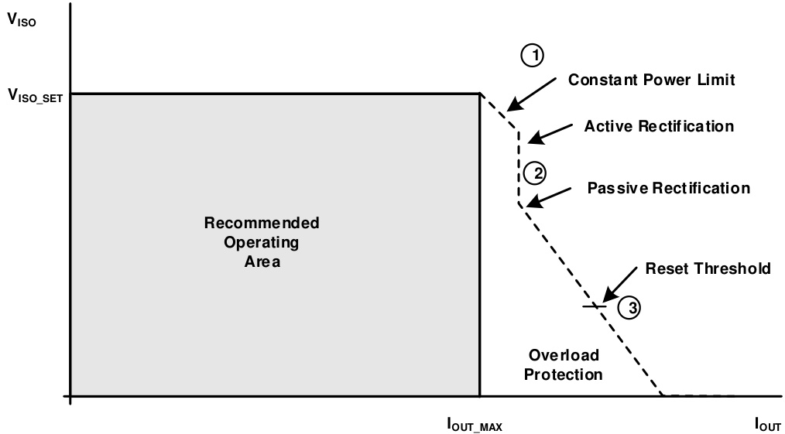  
Figure 7-1. VISO Load Recommended Operating Area Description

# 7.3.4 Thermal Shutdown

Thermal protection is also integrated to help prevent the device from getting damaged during overload and shortcircuit conditions on the isolated output. Under these conditions, the device temperature starts to increase. When the silicon junction temperature ${ \sf T } _ { \mathrm { j } }$ sensed at the primary side die goes above the threshold ${ \mathsf { T S D } } _ { { \mathsf { T H R } } }$ (typical $1 6 5 ^ { \circ } \mathrm { C } )$ , thermal shutdown activates and the primary controller turns off which removes the energy supplied to the $\mathsf { V } _ { 1 \mathsf { S } \mathsf { O } }$ load, which causes the device to cool off. When the junction temperature drops approximately $2 7 ^ { \circ } \mathsf { C }$ (TSDHYST) from the shutdown point, the device starts to function normally. If an overload or output shortcircuit condition prevails, this protection cycle is repeated. Make sure the design prevents the device junction temperatures from reaching such high values.

# 7.3.5 External Clocking and Synchronization

The UCC12040 has an internal oscillator trimmed to drive the transformer at $8 . 0 ~ \mathsf { M H z }$ . An external clock may be applied at the SYNC pin to override the internal oscillator. This external clock will be divided by 2, so the target range for the external clock signal at SYNC is $1 6 ~ \mathsf { M H z } \pm 1 0 \%$ . When a valid external clock signal is detected, the internal spread spectrum modulation (SSM) algorithm is disabled. This allows an external clock signal with a unique SSM to be applied. The depth and frequency of SSM is a tradeoff verses low frequency modulated VISO voltage ripple. The SYNC_OK pin is asserted LOW if there is no external SYNC clock or one that is outside of the operating range of the device is detected. In this state, the external clock is ignored and the DC/DC converter s clocked by the internal oscillator. The pin is in high impedance if a valid clock is applied on SYNC.

# $7 . 3 . 6 \ : \mathsf { V } _ { 1 \mathsf { S } 0 }$ Output Voltage Selection

The SEL pin is monitored during power-up — within the first 1 ms after applying VINP above the UVLO rising threshold or enabling via the EN pin — to detect the desired regulation voltage for the VISO output. Note that after this initial monitoring, the SEL pin no longer affects the VISO output level. In order to change the output mode selection, either the EN pin must be toggled or the VINP power supply must be cycled off and back on. Section6.4 provides more details on the SEL pin functionality.

# 7.3.7 Electromagnetic Compatibility (EMC) Considerations

UCC12040 devices use spread spectrum modulation algorithm for the internal oscillator and advanced internal layout scheme to minimize radiated emissions at the system level.

Many applications in harsh industrial environment are sensitive to disturbances such as electrostatic discharge (ESD), electrical fast transient (EFT), surge and electromagnetic emissions. These electromagnetic disturbances are regulated by international standards such as IEC 61000-4-x and CISPR 32. Although system-level performance and reliability depends, to a large extent, on the application board design and layout, the device incorporates many chip-level design improvements for overall system robustness.

# 7.4 Device Functional Modes

Table 7-1 lists the supply functional modes for this device.

Table 7-1. Device Functional Modes   

<html><body><table><tr><td colspan="2">INPUTS</td><td rowspan="2">Isolated Supply Output Voltage (Viso) Setpoint</td></tr><tr><td>EN</td><td>SEL</td></tr><tr><td>HIGH</td><td>Shorted to VISO</td><td>5.0V</td></tr><tr><td>HIGH</td><td>100kΩ toVISO</td><td>5.4V</td></tr><tr><td>HIGH</td><td>Shorted to GNDS</td><td>3.3V</td></tr><tr><td>HIGH</td><td>100 kΩ to GNDS</td><td>3.7V</td></tr><tr><td>HIGH</td><td>OPEN(1)</td><td>UNSUPPORTED</td></tr><tr><td>LOW</td><td></td><td>0V</td></tr></table></body></html>

(1) The SEL pin has an internal weak pull-down resistance to ground, but leaving this pin open is not recommended.

# 8 Application and Implementation

# Note

Information in the following applications sections is not part of the TI component specification, and TI does not warrant its accuracy or completeness. TI’s customers are responsible for determining suitability of components for their purposes, as well as validating and testing their design implementation to confirm system functionality.

# 8.1 Application Information

The UCC12040 device is suitable for applications that have limited board space and desire more integration. This device is also suitable for very high voltage applications, where power transformers meeting the required isolation specifications are bulky and expensive.

# 8.2 Typical Application

Figure 8-1 shows the typical application schematic for the UCC12040 device supplying an isolated load.

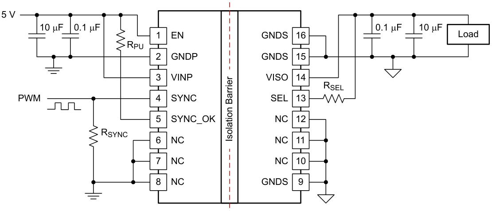  
Figure 8-1. Typical Application

# 8.2.1 Design Requirements

To design using UCC12040, a few simple design considerations must be evaluated. Table 8-1 shows some recommended values for a typical application. See Section 9 and Section 10 sections to review other key design considerations for the UCC12040.

Table 8-1. Design Parameters   

<html><body><table><tr><td>PARAMETER</td><td>RECOMMENDED VALUE</td></tr><tr><td>Input supply voltage, VINP</td><td>4.5 V to 5.5 V</td></tr><tr><td>Decoupling capacitance between and GNDP VINP</td><td>10 μF, 16 V, ± 10%, X7R</td></tr><tr><td>Decoupling capacitance between Viso and GNDS (1)</td><td>10 μF, 16 V, ± 10%, X7R</td></tr><tr><td>Optional additional capacitance on VISO or VINP to reduce high-frequency ripple</td><td>0.1 μF, 50 V,± 10%, X7R</td></tr><tr><td>Pull-up resistor from SYNC OK to Rpu VINP,</td><td>100 kΩ</td></tr><tr><td>resistor from SEL to Viso for 5.0V output voltage mode, Pull-up RSEL</td><td>0Ω</td></tr><tr><td>Pull-up resistor from SEL to Viso for 5.4V output voltage mode, RSEL</td><td>100 kΩ</td></tr><tr><td>Optional SYNC signal impedance-matching resistor, RsYNC</td><td>Match source — typical values are 50 Ω, 75 Ω, 100Ω, or 1 kΩ</td></tr><tr><td>External clock signal applied on SYNC</td><td>16 MHz</td></tr></table></body></html>

# (1) See Section 8.2.2.1 section.

# 8.2.2 Detailed Design Procedure

Place ceramic decoupling capacitors as close as possible to the device pins. For the input supply, place the capacitor(s) between pin 3 (VINP) and pin 2 (GNDP). For the isolated output supply, place the capacitor(s) between pin 14 (VISO) and pin 15 (GNDS). This location is of particular importance to the input decoupling capacitor, because this capacitor supplies the transient current associated with the fast switching waveforms of the power drive circuits. The recommended capacitor value is $1 0 ~ \mu \mathsf { F }$ . Ensure the capacitor dielectric material is compatible with the target application temperature.

# 8.2.2.1 VISO Output Capacitor Selection

The UCC12040 is optimized to run with an effective output capacitance of $5 \mu \mathsf { F }$ to $2 0 ~ \mu \ F .$ . A ceramic capacitor is recommended. Ceramic capacitors have DC-Bias and temperature derating effects, which both have influence the final effective capacitance. Choose the right capacitor carefully in combination with considering its package size, dielectric and voltage rating. It is good design practice to include one $0 . 1 \Join$ capacitor close to the device for high-frequency noise reduction.

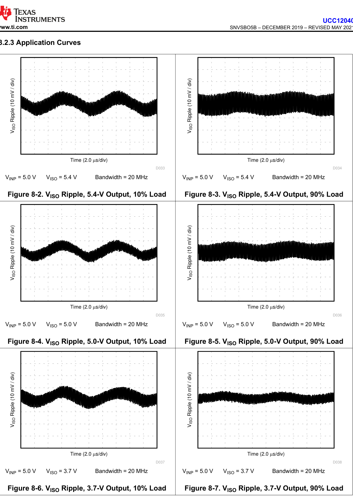

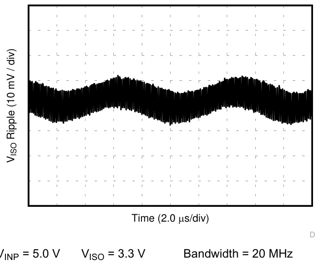  
Figure 8-8. $\mathtt { v } _ { 1 \mathtt { s o } }$ Ripple, 3.3-V Output, $10 \%$ Load

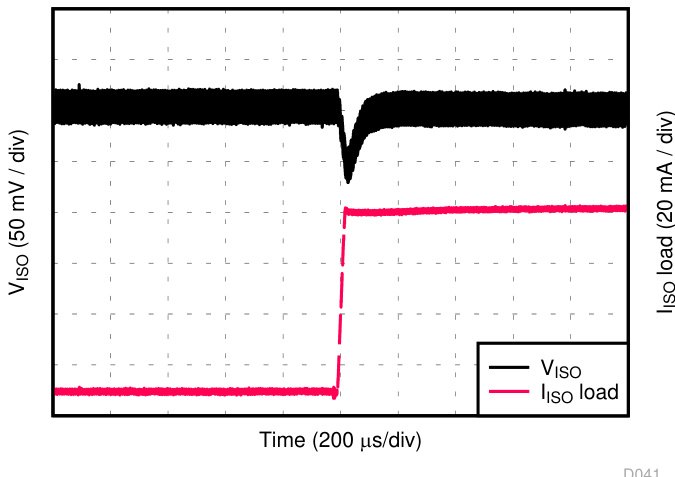  
Figure 8-10. $\scriptstyle \mathsf { v } _ { 1 \mathsf { s o } }$ Load Transient Response, $10 \%$ to $90 \%$ Load Step, 5.0-V Input, 5.4-V Output

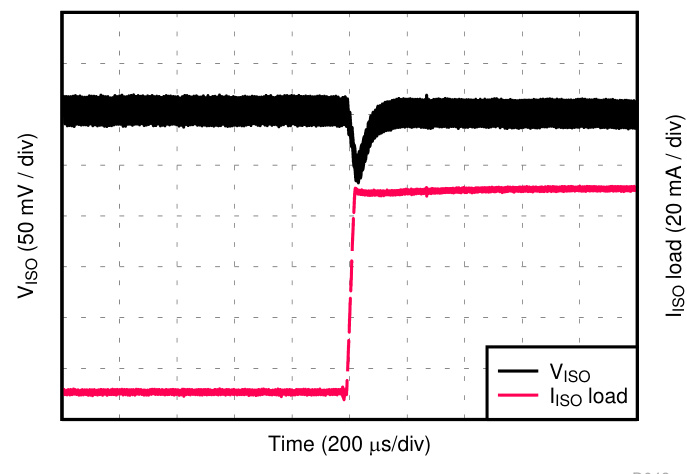  
Figure 8-12. $\scriptstyle \mathsf { v } _ { 1 \mathsf { s o } }$ Load Transient Response, $10 \%$ to $90 \%$ Load Step, 5.0-V Input, 5.0-V Output

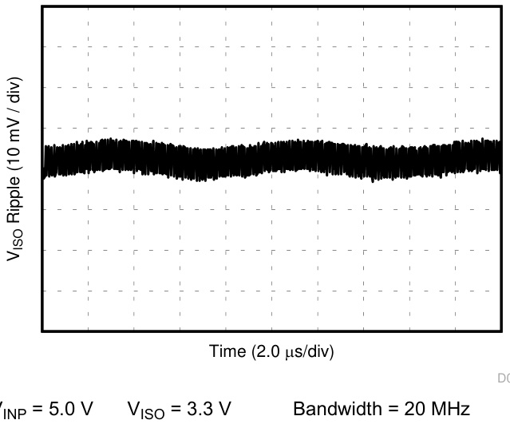  
Figure 8-9. VISO Ripple, 3.3-V Output, $90 \%$ Load

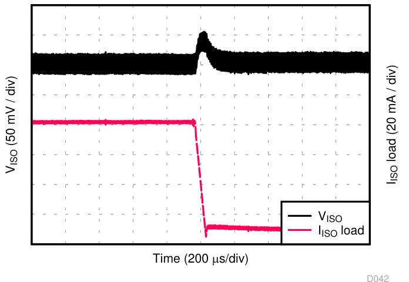  
Figure 8-11. VISO Load Transient Response, $90 \%$ to $10 \%$ Load Step, 5.0-V Input, 5.4-V Output

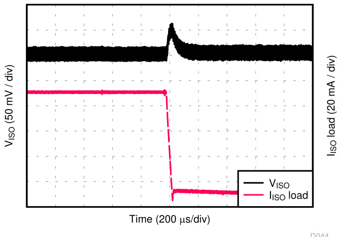  
Figure 8-13. $\scriptstyle \mathsf { v } _ { 1 \mathsf { s o } }$ Load Transient Response, $90 \%$ to $10 \%$ Load Step, 5.0-V Input, 5.0-V Output

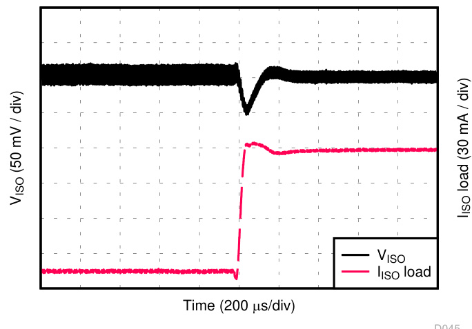  
Figure 8-14. $\scriptstyle \mathsf { v } _ { 1 \mathsf { s o } }$ Load Transient Response, $10 \%$ to $90 \%$ Load Step, 5.0-V Input, 3.7-V Output

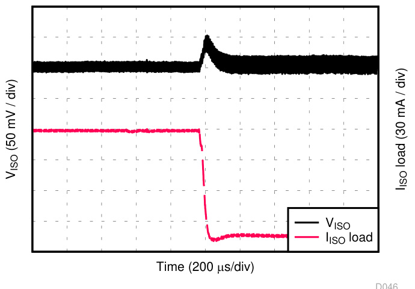  
Figure 8-15. $\scriptstyle \mathsf { v } _ { 1 \mathsf { s o } }$ Load Transient Response, $90 \%$ to$10 \%$ Load Step, 5.0-V Input, 3.7-V Output

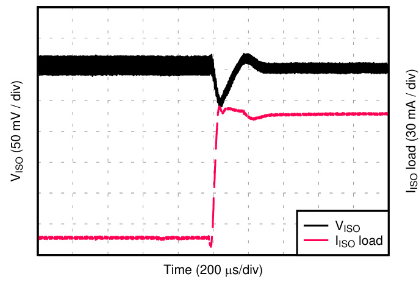  
Figure 8-16. $\scriptstyle \mathsf { v } _ { 1 \mathsf { s o } }$ Load Transient Response, $10 \%$ to $90 \%$ Load Step, 5.0-V Input, 3.3-V Output

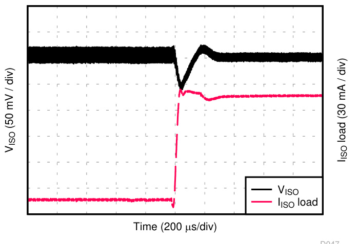  
Figure 8-17. VISO Load Transient Response, $90 \%$ to $10 \%$ Load Step, 5.0-V Input, 3.3-V Output

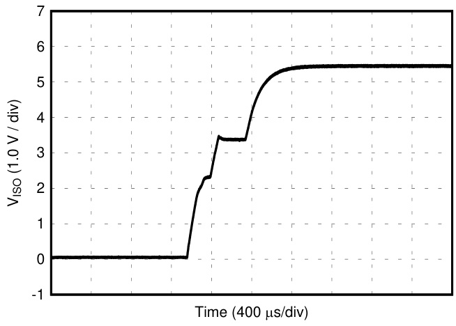  
Figure 8-18. $\mathtt { v } _ { 1 \mathtt { s o } }$ Soft Start at $10 \%$ Rated Load, 5.0-V Input, 5.4-V Output

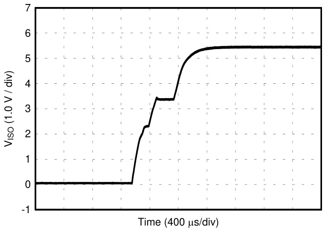  
Figure 8-19. VISO Soft Start at $90 \%$ Rated Load, 5.0-V Input, 5.4-V Output

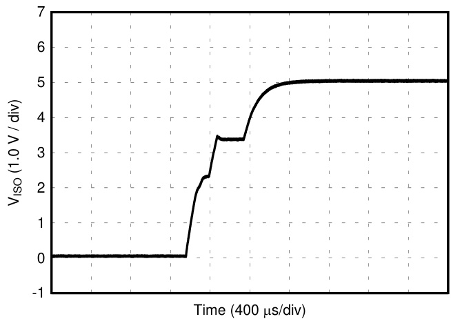  
Figure 8-20. $\scriptstyle \mathsf { v } _ { 1 \mathsf { s o } }$ Soft Start at $10 \%$ Rated Load, 5.0-V Input, 5.0-V Output

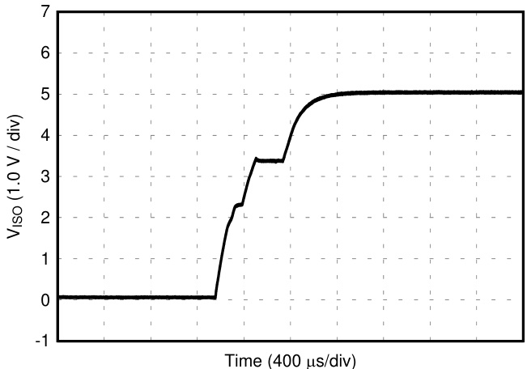  
Figure 8-21. VISO Soft Start at $90 \%$ Rated Load, 5.0-V Input, 5.0-V Output

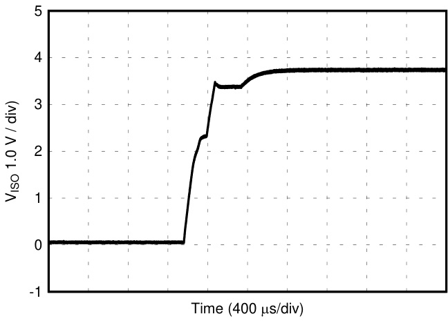  
Figure 8-22. $\scriptstyle \mathsf { v } _ { 1 \mathsf { s o } }$ Soft Start at $10 \%$ Rated Load,5.0-V Input, 3.7-V Output

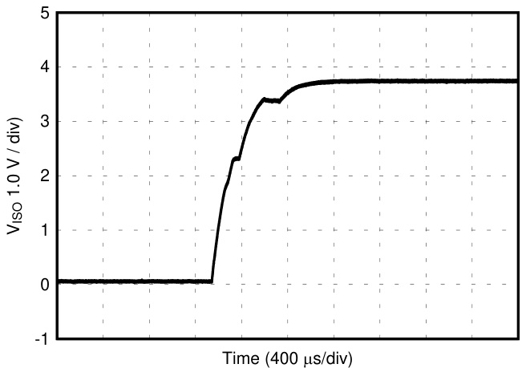  
Figure 8-23. VISO Soft Start at $90 \%$ Rated Load,5.0-V Input, 3.7-V Output

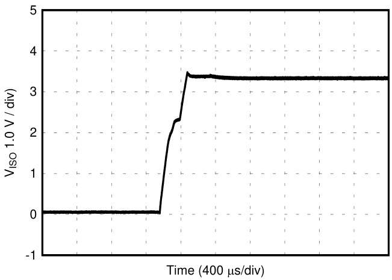  
Figure 8-24. $\mathtt { v } _ { 1 \mathtt { s o } }$ Soft Start at $10 \%$ Rated Load, 5.0-V Input, 3.3-V Output

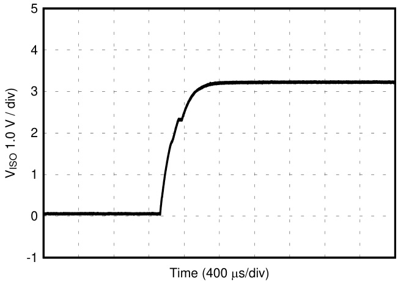  
Figure 8-25. $\scriptstyle \mathsf { v } _ { 1 \mathsf { s o } }$ Soft Start at $90 \%$ Rated Load, 5.0-V Input, 3.3-V Output

# 9 Power Supply Recommendations

The recommended input supply voltage (VINP) for the UCC12040 is between $4 . 5 \ : \vee$ and $5 . 5 \lor .$ To help ensure reliable operation, adequate decoupling capacitors must be located as close to supply pins as possible. Place local bypass capacitors between the VINP and GNDP pins at the input, and between VISO and GNDS at the isolated output supply. Low ESR, ceramic surface mount capacitors are recommended. It is further suggested that one place two such capacitors: one with a value of $1 0 ~ \mu \mathsf { F }$ for supply bypassing, and an additional 100-nF capacitor in parallel for high frequency filtering. The input supply must have an appropriate current rating to support output load required by the end application.

# 10 Layout

# 10.1 Layout Guidelines

The UCC12040 integrated isolated power solution simplifies system design and reduces board area usage. Proper PCB layout is important in order to achieve optimum performance. Here is a list of recommendations:

1. Place decoupling capacitors as close as possible to the device pins. For the input supply, place the capacitor(s) between pin 3 (VINP) and pin 2 (GNDP). For the isolated output supply, place the capacitor(s) between pin 14 (VISO) and pin 15 (GNDS). This location is of particular importance to the input decoupling capacitor, because this capacitor supplies the transient current associated with the fast switching waveforms of the power drive circuits.   
2. Because the device does not have a thermal pad for heat-sinking, the device dissipates heat through the respective GND pins. Ensure that enough copper (preferably a connection to the ground plane) is present on all GNDP and GNDS pins for best heat -sinking.   
3. If space and layer count allow, it is also recommended to connect the VINP, GNDP, VISO and GNDS pins to internal ground or power planes through multiple vias of adequate size. Alternatively, make traces for these nets as wide as possible to minimize losses.   
4. TI also recommends grounding the no-connect pins (NC) to their respective ground planes. For pins 6, 7, and 8, connect to GNDP. For pins 10, 11, and 12, connect to GNDS. This will allow more continuous ground planes and larger thermal mass for heat-sinking.   
5. A minimum of four layers is recommended to accomplish a low-EMI PCB design. Inner layers can be spaced closer than outer layers and used to create a high-frequency bypass capacitor between GNDP and GNDS to reduce radiated emissions. Ensure proper spacing, both inter-layer and layer-to-layer, is implemented to avoid reducing isolation capabilities. These spacings will vary based on the printed circuit board construction parameters, such as dielectric material and thickness.   
6. Pay close attention to the spacing between primary ground plane (GNDP) and secondary ground plane (GNDS) on the PCB outer layers. The effective creepage and or clearance of the system will be reduced if the two ground planes have a lower spacing than that of the device package.   
7. To ensure isolation performance between the primary and secondary side, avoid placing any PCB traces or copper below the UCC12040 device on the outer copper layers.

# 10.2 Layout Example

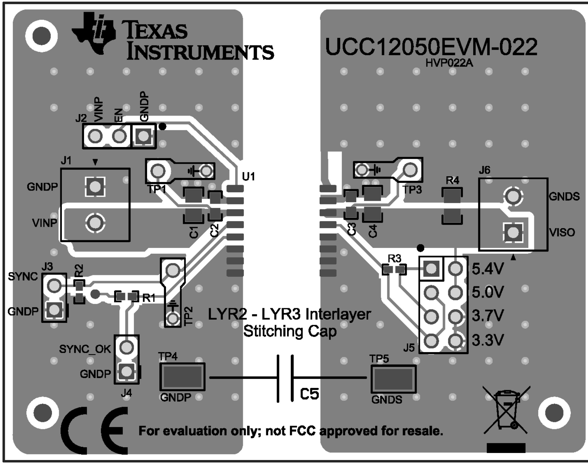  
Figure 10-1. Layout Example

# 11 Device and Documentation Support 11.1 Device Support

# 11.1.1 Development Support

For development support, refer to:

High-efficiency, low-emission, isolated DC/DC converter-based analog input module reference design Isolated delta-sigma modulator based AC/DC voltage and current measurement module reference design Isolated power architecture reference design for communication and analog input/output modules

# 11.2 Documentation Support

# 11.2.1 Related Documentation

For related documentation see the following:

UCC12050 Evaluation Module User Guide   
Isolation Glossary   
A Reinforced-isolated Analog Input Chain for Space-constrained Applications

# 11.3 Receiving Notification of Documentation Updates

To receive notification of documentation updates, navigate to the device product folder on ti.com. Click on Subscribe to updates to register and receive a weekly digest of any product information that has changed. For change details, review the revision history included in any revised document.

# 11.4 Support Resources

TI E2E™ support forums are an engineer's go-to source for fast, verified answers and design help — straigh from the experts. Search existing answers or ask your own question to get the quick design help you need.

Linked content is provided "AS IS" by the respective contributors. They do not constitute TI specifications and do not necessarily reflect TI's views; see TI's Terms of Use.

# 11.5 Trademarks

TI E2E ™ is a trademark of Texas Instruments.   
All trademarks are the property of their respective owners.

# 11.6 Electrostatic Discharge Caution

This integrated circuit can be damaged by ESD. Texas Instruments recommends that all integrated circuits be handled with appropriate precautions. Failure to observe proper handling and installation procedures can cause damage.

ESD damage can range from subtle performance degradation to complete device failure. Precision integrated circuits may be more susceptible to damage because very small parametric changes could cause the device not to meet its published specifications.

# 11.7 Glossary

TI Glossary This glossary lists and explains terms, acronyms, and definitions.

# 12 Mechanical and Packaging Information

The following pages include mechanical, packaging, and orderable information. This information is the most current data available for the designated devices. This data is subject to change without notice and revision of this document. For browser-based versions of this data sheet, refer to the left-hand navigation.

PACKAGING INFORMATION   

<html><body><table><tr><td>Orderable part number</td><td>Status (1)</td><td>Material type (2)</td><td>Package Pins</td><td>Package qty Carrier</td><td>RoHS (3)</td><td>Lead finish/ Ball material</td><td>MSL rating/ Peak reflow</td><td>Op temp (°℃)</td><td>Part marking (6)</td></tr><tr><td>UCC12040DVE</td><td>Active</td><td>Production</td><td>SO-MOD 16 (DVE)</td><td>40 |TUBE</td><td>Yes</td><td>NIPDAU</td><td>Level-3-260C 168 HR</td><td>-40 to 125</td><td>UCC12040</td></tr><tr><td>UCC12040DVE.A</td><td>Active</td><td>Production</td><td>SO-MOD (DVE) 16</td><td>40 TUBE</td><td>Yes</td><td>NIPDAU</td><td>Level-3-260C 168 HR</td><td>40 to 125</td><td>UCC12040</td></tr><tr><td>UCC12040DVEG4</td><td>Active</td><td>Production</td><td>SO-MOD (DVE) 16</td><td>40 |TUBE</td><td>Yes</td><td>NIPDAU</td><td>Level-3-260C-168HR</td><td>-40 to 125</td><td>UCC12040</td></tr><tr><td>UCC12040DVEG4.A</td><td>Active</td><td>Production</td><td>SO-MOD 16 (DVE)</td><td>40|TUBE</td><td>Yes</td><td>NIPDAU</td><td>-260C 168 HR Level-3-</td><td>-40 to 125</td><td>UCC12040</td></tr><tr><td>UCC12040DVER</td><td>Active</td><td>Production</td><td>SO-MOD (DVE) 16</td><td>2000 LARGE T&R</td><td>Yes</td><td>NIPDAU</td><td>Level-3-260C 168 HR</td><td>40 to 125</td><td>UCC12040</td></tr><tr><td>UCC12040DVER.A</td><td>Active</td><td>Production</td><td>SO-MOD (DVE) 16</td><td>2000 LARGE T&R</td><td>Yes</td><td>NIPDAU</td><td>Level-3-260C-168 HR</td><td>-40 to 125</td><td>UCC12040</td></tr></table></body></html>

(1) Status: For more details on status, see our product life cycle.

(2) Material type: When designated, preproduction parts are prototypes/experimental devices, and are not yet approved or released for full production. Testing and final process, including without limitation quality assurance, reliability performance testing, and/or process qualification, may not yet be com plete, and this item subjec to further changes or possible discontinuation. f available for ordering, purchases will be subject to an additional waiver at checkout, and are intended for early internal evaluation purposes only. These items are sold without warranties of any kind.

(3) RoHS values: Yes, No, RoHS Exempt. See the TI RoHS Statement for additional information and value definition.

(4) Lead finish/Ball material:  Parts may have multiple material finish options. Finish options are separated by a vertical ruled line. Lead finish/Ball material values may wrap to two lines if the finish value exceeds the maximum column width.

: The moisture sensitivity level ratings and peak solder (reflow) temperatures. In the event that part has multiple moisture sensitivity ratings, only the lowest level per JEDEC standards is shown.   
for the actual reflow temperature that will be used to mount the part to the printed circuit board.

6) Part marking: There may be an additional marking, which relates to the logo, the lot trace code information, or the environmental category of the part.

Multiple part markings will be inside parentheses. Only one part marking contained in parentheses and separated by "\~" will appear on a part. If a line is indented then it is continuation of the previous line and the two combined represent the entire part marking for that device.

Important Information and Disclaimer:The information provided on this page represents TI's knowledge and belief as of the date that it is provided. TI bases its knowledge and belief on information provided by third parties, and makes no representation or warranty as to the accuracy of such information. Efforts are underway to better integrate information from third parties. TI has taken and continues to take reasonable steps to provide representative and accurate information but may not have conducted destructive testing or chemical analysis on incoming materials and chemicals. TI and TI suppliers consider certain information to be proprietary, and thus CAS numbers and other limited information may not be available for release.

no event shall TI's liability arising out of such information exceed the total purchase price of the TI part(s) at issue in this document sold by TI to Customer on an annual basis.

# TAPE AND REEL INFORMATION

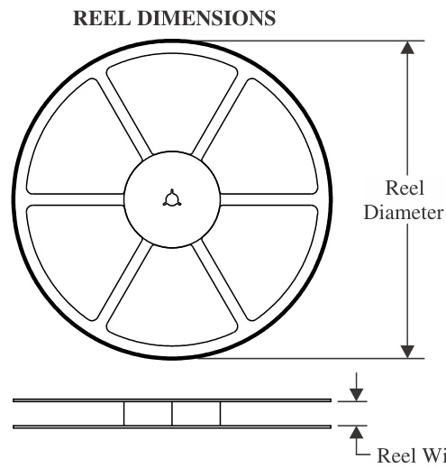

<html><body><table><tr><td>A0</td><td>Dimension designed to accommodate the component width</td></tr><tr><td>B0</td><td>Dimension designed to accommodate the component length</td></tr><tr><td>K0</td><td>Dimension designed to accommodate the component thickness</td></tr><tr><td>W</td><td>Overall width of the carrier tape</td></tr><tr><td>P1</td><td>Pitch successive cavity centers between</td></tr></table></body></html>

# QUADRANT ASSIGNMENTS FOR PIN ORIENTATION IN TAPE

\*All dimensions are nominal

<html><body><table><tr><td>Device</td><td>Type</td><td>PackagePackage Drawing</td><td>Pins</td><td>SPQ</td><td>Reel Diameter (mm)</td><td>Reel Width W1 (mm)</td><td>AO (mm)</td><td>B0 (mm)</td><td>KO (mm)</td><td>P1 (mm)</td><td>W (mm)</td><td>Pin1 Quadrant</td></tr><tr><td>UCC12040DVER</td><td>SO-MOD</td><td>DVE</td><td>16</td><td>2000</td><td>330.0</td><td>16.4</td><td>10.75</td><td>10.7</td><td>2.7</td><td>12.0</td><td>16.0</td><td>Q1</td></tr></table></body></html>

\*All dimensions are nominal

<html><body><table><tr><td>Device</td><td>Package Type</td><td>Package Drawing</td><td>Pins</td><td>SPQ</td><td>Length (mm)</td><td>Width (mm)</td><td>Height (mm)</td></tr><tr><td>UCC12040DVER</td><td>SO-MOD</td><td>DVE</td><td>16</td><td>2000</td><td>350.0</td><td>350.0</td><td>43.0</td></tr></table></body></html>

# TUBE

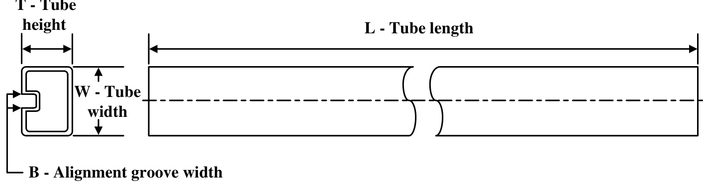

\*All dimensions are nominal   

<html><body><table><tr><td>Device</td><td>Package Name</td><td>Package Type</td><td>Pins</td><td>SPQ</td><td>L (mm)</td><td>W (mm)</td><td>T (μm)</td><td>B (mm)</td></tr><tr><td>UCC12040DVE</td><td>DVE</td><td>SO-MOD</td><td>16</td><td>40</td><td>506.98</td><td>12.7</td><td>4826</td><td>6.6</td></tr><tr><td>UCC12040DVE.A</td><td>DVE</td><td>SO-MOD</td><td>16</td><td>40</td><td>506.98</td><td>12.7</td><td>4826</td><td>6.6</td></tr><tr><td>UCC12040DVEG4</td><td>DVE</td><td>SO-MOD</td><td>16</td><td>40</td><td>506.98</td><td>12.7</td><td>4826</td><td>6.6</td></tr><tr><td>UCC12040DVEG4.A</td><td>DVE</td><td>SO-MOD</td><td>16</td><td>40</td><td>506. .98</td><td>12.7</td><td>4826</td><td>6.6</td></tr></table></body></html>

SMALL OUTLINE INTEGRATED CIRCUIT

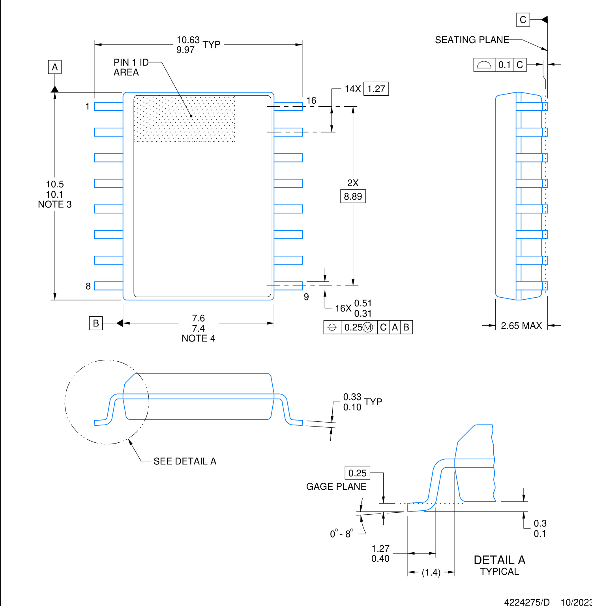

NOTES:

1. All linear dimensions are in millimeters. Any dimensions in parenthesis are for reference only. Dimensioning and tolerancing per ASME $\mathsf { Y 1 4 . 5 M }$ .   
2. This drawing is subject to change without notice.   
3. This dimension does not include mold flash, protrusions, or gate burrs. Mold flash, protrusions, or gate burrs shall not exceed $0 . 1 5 \mathrm { m m }$ , per side.   
4. This dimension does not include interlead flash. Interlead flash shall not exceed $0 . 2 5 \mathrm { m m }$ , per side.   
5. Reference JEDEC registration MS-013.

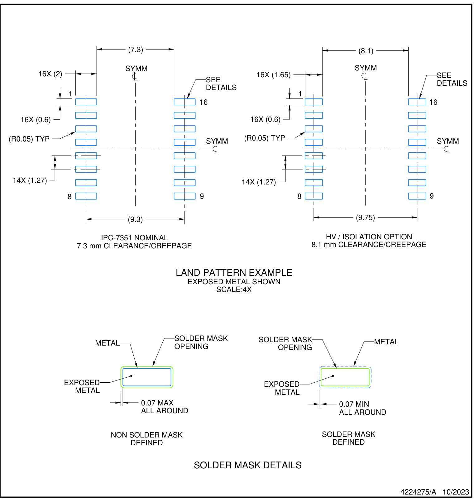  
NOTES: (continued)

6. Publication IPC-7351 may have alternate designs.   
7. Solder mask tolerances between and around signal pads can vary based on board fabrication site.

SMALL OUTLINE INTEGRATED CIRCUIT

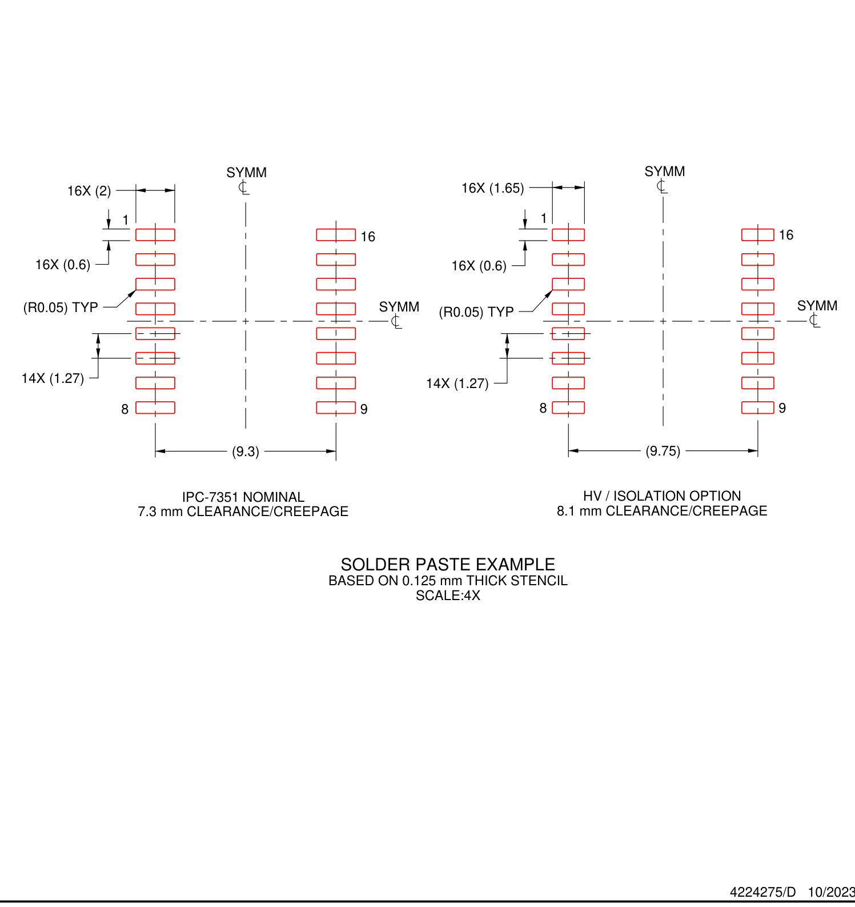  
NOTES: (continued)

8. Laser cutting apertures with trapezoidal walls and rounded corners may offer better paste release. IPC-7525 may have alternate design recommendations.   
9. Board assembly site may have different recommendations for stencil design.

# IMPORTANT NOTICE AND DISCLAIMER

TI PROVIDES TECHNICAL AND RELIABILITY DATA (INCLUDING DATASHEETS), DESIGN RESOURCES (INCLUDING REFERENCE DESIGNS), APPLICATION OR OTHER DESIGN ADVICE, WEB TOOLS, SAFETY INFORMATION, AND OTHER RESOURCES “AS IS” AND WITH ALL FAULTS, AND DISCLAIMS ALL WARRANTIES, EXPRESS AND IMPLIED, INCLUDING WITHOUT LIMITATION ANY IMPLIED WARRANTIES OF MERCHANTABILITY, FITNESS FOR A PARTICULAR PURPOSE OR NON-INFRINGEMENT OF THIRD PARTY INTELLECTUAL PROPERTY RIGHTS.

These resources are intended for skilled developers designing with TI products. You are solely responsible for (1) selecting the appropriate TI products for your application, (2) designing, validating and testing your application, and (3) ensuring your application meets applicable standards, and any other safety, security, regulatory or other requirements.

These resources are subject to change without notice. TI grants you permission to use these resources only for development of an application that uses the TI products described in the resource. Other reproduction and display of these resources is prohibited. No license is granted to any other TI intellectual property right or to any third party intellectual property right. TI disclaims responsibility for, and you fully indemnify TI and its representatives against any claims, damages, costs, losses, and liabilities arising out of your use of these resources.

TI’s products are provided subject to TI’s Terms of Sale, TI’s General Quality Guidelines, or other applicable terms available either on ti.com or provided in conjunction with such TI products. TI’s provision of these resources does not expand or otherwise alter TI’s applicable warranties or warranty disclaimers for TI products. Unless TI explicitly designates a product as custom or customer-specified, TI products are standard, catalog, general purpose devices.

TI objects to and rejects any additional or different terms you may propose.